# Spring Framework Documentation

## Navigation

- [Overview](#web-websocket-stomp-overview)
  
- [Overview](#overview)
  
- [Core Technologies](#core)
    
- [The IoC Container](#core-beans)
      
- [Introduction to the Spring IoC Container and Beans](#core-beans-introduction)
      
- [Container Overview](#core-beans-basics)
      
- [Bean Overview](#core-beans-definition)
      
- [Dependencies](#core-beans-dependencies)
        
- [Dependency Injection](#core-beans-dependencies-factory-collaborators)
        
- [Dependencies and Configuration in Detail](#core-beans-dependencies-factory-properties-detailed)
        
- [Using depends-on](#core-beans-dependencies-factory-dependson)
        
- [Lazy-initialized Beans](#core-beans-dependencies-factory-lazy-init)
        
- [Autowiring Collaborators](#core-beans-dependencies-factory-autowire)
        
- [Method Injection](#core-beans-dependencies-factory-method-injection)
      
- [Bean Scopes](#core-beans-factory-scopes)
      
- [Customizing the Nature of a Bean](#core-beans-factory-nature)
      
- [Bean Definition Inheritance](#core-beans-child-bean-definitions)
      
- [Container Extension Points](#core-beans-factory-extension)
      
- [Annotation-based Container Configuration](#core-beans-annotation-config)
        
- [Using @Autowired](#core-beans-annotation-config-autowired)
        
- [Fine-tuning Annotation-based Autowiring with @Primary or @Fallback](#core-beans-annotation-config-autowired-primary)
        
- [Fine-tuning Annotation-based Autowiring with Qualifiers](#core-beans-annotation-config-autowired-qualifiers)
        
- [Using Generics as Autowiring Qualifiers](#core-beans-annotation-config-generics-as-qualifiers)
        
- [Using CustomAutowireConfigurer](#core-beans-annotation-config-custom-autowire-configurer)
        
- [Injection with @Resource](#core-beans-annotation-config-resource)
        
- [Using @Value](#core-beans-annotation-config-value-annotations)
        
- [Using @PostConstruct and @PreDestroy](#core-beans-annotation-config-postconstruct-and-predestroy-annotations)
      
- [Classpath Scanning and Managed Components](#core-beans-classpath-scanning)
      
- [Using JSR-330 Standard Annotations](#core-beans-standard-annotations)
      
- [Java-based Container Configuration](#core-beans-java)
        
- [Basic Concepts: @Bean and @Configuration](#core-beans-java-basic-concepts)
        
- [Instantiating the Spring Container by Using AnnotationConfigApplicationContext](#core-beans-java-instantiating-container)
        
- [Using the @Bean Annotation](#core-beans-java-bean-annotation)
        
- [Using the @Configuration annotation](#core-beans-java-configuration-annotation)
        
- [Composing Java-based Configurations](#core-beans-java-composing-configuration-classes)
        
- [Programmatic Bean Registration](#core-beans-java-programmatic-bean-registration)
      
- [Environment Abstraction](#core-beans-environment)
      
- [Registering a LoadTimeWeaver](#core-beans-context-load-time-weaver)
      
- [Additional Capabilities of the ApplicationContext](#core-beans-context-introduction)
      
- [The BeanFactory API](#core-beans-beanfactory)
    
- [Resources](#core-resources)
    
- [Validation, Data Binding, and Type Conversion](#core-validation)
      
- [Validation Using Spring’s Validator Interface](#core-validation-validator)
      
- [Data Binding](#core-validation-data-binding)
      
- [Resolving Error Codes to Error Messages](#core-validation-error-code-resolution)
      
- [Spring Type Conversion](#core-validation-convert)
      
- [Spring Field Formatting](#core-validation-format)
      
- [Configuring a Global Date and Time Format](#core-validation-format-configuring-formatting-globaldatetimeformat)
      
- [Java Bean Validation](#core-validation-beanvalidation)
    
- [Spring Expression Language (SpEL)](#core-expressions)
      
- [Evaluation](#core-expressions-evaluation)
      
- [Expressions in Bean Definitions](#core-expressions-beandef)
      
- [Language Reference](#core-expressions-language-ref)
        
- [Literal Expressions](#core-expressions-language-ref-literal)
        
- [Properties, Arrays, Lists, Maps, and Indexers](#core-expressions-language-ref-properties-arrays)
        
- [Inline Lists](#core-expressions-language-ref-inline-lists)
        
- [Inline Maps](#core-expressions-language-ref-inline-maps)
        
- [Array Construction](#core-expressions-language-ref-array-construction)
        
- [Methods](#core-expressions-language-ref-methods)
        
- [Operators](#core-expressions-language-ref-operators)
        
- [Types](#core-expressions-language-ref-types)
        
- [Constructors](#core-expressions-language-ref-constructors)
        
- [Variables](#core-expressions-language-ref-variables)
        
- [Functions](#core-expressions-language-ref-functions)
        
- [Varargs Invocations](#core-expressions-language-ref-varargs)
        
- [Bean References](#core-expressions-language-ref-bean-references)
        
- [Ternary Operator (If-Then-Else)](#core-expressions-language-ref-operator-ternary)
        
- [The Elvis Operator](#core-expressions-language-ref-operator-elvis)
        
- [Safe Navigation Operator](#core-expressions-language-ref-operator-safe-navigation)
        
- [Collection Selection](#core-expressions-language-ref-collection-selection)
        
- [Collection Projection](#core-expressions-language-ref-collection-projection)
        
- [Expression Templating](#core-expressions-language-ref-templating)
      
- [Classes Used in the Examples](#core-expressions-example-classes)
    
- [Aspect Oriented Programming with Spring](#core-aop)
      
- [AOP Concepts](#core-aop-introduction-defn)
      
- [Spring AOP Capabilities and Goals](#core-aop-introduction-spring-defn)
      
- [AOP Proxies](#core-aop-introduction-proxies)
      
- [@AspectJ support](#core-aop-ataspectj)
        
- [Enabling @AspectJ Support](#core-aop-ataspectj-aspectj-support)
        
- [Declaring an Aspect](#core-aop-ataspectj-at-aspectj)
        
- [Declaring a Pointcut](#core-aop-ataspectj-pointcuts)
        
- [Declaring Advice](#core-aop-ataspectj-advice)
        
- [Introductions](#core-aop-ataspectj-introductions)
        
- [Aspect Instantiation Models](#core-aop-ataspectj-instantiation-models)
        
- [An AOP Example](#core-aop-ataspectj-example)
      
- [Schema-based AOP Support](#core-aop-schema)
      
- [Choosing which AOP Declaration Style to Use](#core-aop-choosing)
      
- [Mixing Aspect Types](#core-aop-mixing-styles)
      
- [Proxying Mechanisms](#core-aop-proxying)
      
- [Programmatic Creation of @AspectJ Proxies](#core-aop-aspectj-programmatic)
      
- [Using AspectJ with Spring Applications](#core-aop-using-aspectj)
      
- [Further Resources](#core-aop-resources)
    
- [Spring AOP APIs](#core-aop-api)
      
- [Pointcut API in Spring](#core-aop-api-pointcuts)
      
- [Advice API in Spring](#core-aop-api-advice)
      
- [The Advisor API in Spring](#core-aop-api-advisor)
      
- [Using the ProxyFactoryBean to Create AOP Proxies](#core-aop-api-pfb)
      
- [Concise Proxy Definitions](#core-aop-api-concise-proxy)
      
- [Creating AOP Proxies Programmatically with the ProxyFactory](#core-aop-api-prog)
      
- [Manipulating Advised Objects](#core-aop-api-advised)
      
- [Using the "auto-proxy" facility](#core-aop-api-autoproxy)
      
- [Using TargetSource Implementations](#core-aop-api-targetsource)
      
- [Defining New Advice Types](#core-aop-api-extensibility)
    
- [Resilience Features](#core-resilience)
    
- [Null-safety](#core-null-safety)
    
- [Data Buffers and Codecs](#core-databuffer-codec)
    
- [Ahead of Time Optimizations](#core-aot)
    
- [Appendix](#core-appendix)
      
- [XML Schemas](#core-appendix-xsd-schemas)
      
- [XML Schema Authoring](#core-appendix-xml-custom)
      
- [Application Startup Steps](#core-appendix-application-startup-steps)
  
- [Data Access](#data-access)
    
- [Transaction Management](#data-access-transaction)
      
- [Advantages of the Spring Framework’s Transaction Support Model](#data-access-transaction-motivation)
      
- [Understanding the Spring Framework Transaction Abstraction](#data-access-transaction-strategies)
      
- [Synchronizing Resources with Transactions](#data-access-transaction-tx-resource-synchronization)
      
- [Declarative Transaction Management](#data-access-transaction-declarative)
        
- [Understanding the Spring Framework’s Declarative Transaction Implementation](#data-access-transaction-declarative-tx-decl-explained)
        
- [Example of Declarative Transaction Implementation](#data-access-transaction-declarative-first-example)
        
- [Rolling Back a Declarative Transaction](#data-access-transaction-declarative-rolling-back)
        
- [Configuring Different Transactional Semantics for Different Beans](#data-access-transaction-declarative-diff-tx)
        
- [<tx:advice/> Settings](#data-access-transaction-declarative-txadvice-settings)
        
- [Using @Transactional](#data-access-transaction-declarative-annotations)
        
- [Transaction Propagation](#data-access-transaction-declarative-tx-propagation)
        
- [Advising Transactional Operations](#data-access-transaction-declarative-applying-more-than-just-tx-advice)
        
- [Using @Transactional with AspectJ](#data-access-transaction-declarative-aspectj)
      
- [Programmatic Transaction Management](#data-access-transaction-programmatic)
      
- [Choosing Between Programmatic and Declarative Transaction Management](#data-access-transaction-tx-decl-vs-prog)
      
- [Transaction-bound Events](#data-access-transaction-event)
      
- [Application server-specific integration](#data-access-transaction-application-server-integration)
      
- [Solutions to Common Problems](#data-access-transaction-solutions-to-common-problems)
      
- [Further Resources](#data-access-transaction-resources)
    
- [DAO Support](#data-access-dao)
    
- [Data Access with JDBC](#data-access-jdbc)
      
- [Choosing an Approach for JDBC Database Access](#data-access-jdbc-choose-style)
      
- [Package Hierarchy](#data-access-jdbc-packages)
      
- [Using the JDBC Core Classes to Control Basic JDBC Processing and Error Handling](#data-access-jdbc-core)
      
- [Controlling Database Connections](#data-access-jdbc-connections)
      
- [JDBC Batch Operations](#data-access-jdbc-advanced)
      
- [Simplifying JDBC Operations with the SimpleJdbc Classes](#data-access-jdbc-simple)
      
- [Modeling JDBC Operations as Java Objects](#data-access-jdbc-object)
      
- [Common Problems with Parameter and Data Value Handling](#data-access-jdbc-parameter-handling)
      
- [Embedded Database Support](#data-access-jdbc-embedded-database-support)
      
- [Initializing a DataSource](#data-access-jdbc-initializing-datasource)
    
- [Data Access with R2DBC](#data-access-r2dbc)
    
- [Object Relational Mapping (ORM) Data Access](#data-access-orm)
      
- [Introduction to ORM with Spring](#data-access-orm-introduction)
      
- [General ORM Integration Considerations](#data-access-orm-general)
      
- [Hibernate](#data-access-orm-hibernate)
      
- [JPA](#data-access-orm-jpa)
    
- [Marshalling XML by Using Object-XML Mappers](#data-access-oxm)
    
- [Appendix](#data-access-appendix)
  
- [Web on Servlet Stack](#web)
    
- [Spring Web MVC](#web-webmvc)
      
- [DispatcherServlet](#web-webmvc-mvc-servlet)
        
- [Context Hierarchy](#web-webmvc-mvc-servlet-context-hierarchy)
        
- [Special Bean Types](#web-webmvc-mvc-servlet-special-bean-types)
        
- [Web MVC Config](#web-webmvc-mvc-servlet-config)
        
- [Servlet Config](#web-webmvc-mvc-servlet-container-config)
        
- [Processing](#web-webmvc-mvc-servlet-sequence)
        
- [Path Matching](#web-webmvc-mvc-servlet-handlermapping-path)
        
- [Interception](#web-webmvc-mvc-servlet-handlermapping-interceptor)
        
- [Exceptions](#web-webmvc-mvc-servlet-exceptionhandlers)
        
- [View Resolution](#web-webmvc-mvc-servlet-viewresolver)
        
- [Locale](#web-webmvc-mvc-servlet-localeresolver)
        
- [Multipart Resolver](#web-webmvc-mvc-servlet-multipart)
        
- [Logging](#web-webmvc-mvc-servlet-logging)
      
- [Filters](#web-webmvc-filters)
      
- [HTTP Message Conversion](#web-webmvc-message-converters)
      
- [Annotated Controllers](#web-webmvc-mvc-controller)
        
- [Declaration](#web-webmvc-mvc-controller-ann)
        
- [Mapping Requests](#web-webmvc-mvc-controller-ann-requestmapping)
        
- [Handler Methods](#web-webmvc-mvc-controller-ann-methods)
          
- [Method Arguments](#web-webmvc-mvc-controller-ann-methods-arguments)
          
- [Return Values](#web-webmvc-mvc-controller-ann-methods-return-types)
          
- [Type Conversion](#web-webmvc-mvc-controller-ann-methods-typeconversion)
          
- [Matrix Variables](#web-webmvc-mvc-controller-ann-methods-matrix-variables)
          
- [@RequestParam](#web-webmvc-mvc-controller-ann-methods-requestparam)
          
- [@RequestHeader](#web-webmvc-mvc-controller-ann-methods-requestheader)
          
- [@CookieValue](#web-webmvc-mvc-controller-ann-methods-cookievalue)
          
- [@ModelAttribute](#web-webmvc-mvc-controller-ann-methods-modelattrib-method-args)
          
- [@SessionAttributes](#web-webmvc-mvc-controller-ann-methods-sessionattributes)
          
- [@SessionAttribute](#web-webmvc-mvc-controller-ann-methods-sessionattribute)
          
- [@RequestAttribute](#web-webmvc-mvc-controller-ann-methods-requestattrib)
          
- [Redirect Attributes](#web-webmvc-mvc-controller-ann-methods-redirecting-passing-data)
          
- [Flash Attributes](#web-webmvc-mvc-controller-ann-methods-flash-attributes)
          
- [Multipart](#web-webmvc-mvc-controller-ann-methods-multipart-forms)
          
- [@RequestBody](#web-webmvc-mvc-controller-ann-methods-requestbody)
          
- [HttpEntity](#web-webmvc-mvc-controller-ann-methods-httpentity)
          
- [@ResponseBody](#web-webmvc-mvc-controller-ann-methods-responsebody)
          
- [ResponseEntity](#web-webmvc-mvc-controller-ann-methods-responseentity)
          
- [Jackson JSON](#web-webmvc-mvc-controller-ann-methods-jackson)
        
- [Model](#web-webmvc-mvc-controller-ann-modelattrib-methods)
        
- [@InitBinder](#web-webmvc-mvc-controller-ann-initbinder)
        
- [Validation](#web-webmvc-mvc-controller-ann-validation)
        
- [Exceptions](#web-webmvc-mvc-controller-ann-exceptionhandler)
        
- [Controller Advice](#web-webmvc-mvc-controller-ann-advice)
      
- [Functional Endpoints](#web-webmvc-functional)
      
- [URI Links](#web-webmvc-mvc-uri-building)
      
- [Asynchronous Requests](#web-webmvc-mvc-ann-async)
      
- [Range Requests](#web-webmvc-mvc-range)
      
- [Data Binding](#web-webmvc-mvc-data-binding)
      
- [CORS](#web-webmvc-cors)
      
- [API Versioning](#web-webmvc-versioning)
      
- [Error Responses](#web-webmvc-mvc-ann-rest-exceptions)
      
- [Web Security](#web-webmvc-mvc-security)
      
- [HTTP Caching](#web-webmvc-mvc-caching)
      
- [View Technologies](#web-webmvc-view)
        
- [Thymeleaf](#web-webmvc-view-mvc-thymeleaf)
        
- [FreeMarker](#web-webmvc-view-mvc-freemarker)
        
- [Groovy Markup](#web-webmvc-view-mvc-groovymarkup)
        
- [Script Views](#web-webmvc-view-mvc-script)
        
- [HTML Fragments](#web-webmvc-view-mvc-fragments)
        
- [JSP and JSTL](#web-webmvc-view-mvc-jsp)
        
- [RSS and Atom](#web-webmvc-view-mvc-feeds)
        
- [PDF and Excel](#web-webmvc-view-mvc-document)
        
- [Jackson](#web-webmvc-view-mvc-jackson)
        
- [XML Marshalling](#web-webmvc-view-mvc-xml-marshalling)
        
- [XSLT Views](#web-webmvc-view-mvc-xslt)
      
- [MVC Config](#web-webmvc-mvc-config)
        
- [Enable MVC Configuration](#web-webmvc-mvc-config-enable)
        
- [MVC Config API](#web-webmvc-mvc-config-customize)
        
- [Type Conversion](#web-webmvc-mvc-config-conversion)
        
- [Validation](#web-webmvc-mvc-config-validation)
        
- [Interceptors](#web-webmvc-mvc-config-interceptors)
        
- [Content Types](#web-webmvc-mvc-config-content-negotiation)
        
- [Message Converters](#web-webmvc-mvc-config-message-converters)
        
- [View Controllers](#web-webmvc-mvc-config-view-controller)
        
- [View Resolvers](#web-webmvc-mvc-config-view-resolvers)
        
- [Static Resources](#web-webmvc-mvc-config-static-resources)
        
- [Default Servlet](#web-webmvc-mvc-config-default-servlet-handler)
        
- [Path Matching](#web-webmvc-mvc-config-path-matching)
        
- [API Version](#web-webmvc-mvc-config-api-version)
        
- [Advanced Java Config](#web-webmvc-mvc-config-advanced-java)
        
- [Advanced XML Config](#web-webmvc-mvc-config-advanced-xml)
      
- [HTTP/2](#web-webmvc-mvc-http2)
    
- [REST Clients](#web-webmvc-client)
    
- [Testing](#web-webmvc-test)
    
- [WebSockets](#web-websocket)
      
- [WebSocket API](#web-websocket-server)
      
- [SockJS Fallback](#web-websocket-fallback)
      
- [STOMP](#web-websocket-stomp)
        
- [Overview](#web-websocket-stomp-overview)
        
- [Benefits](#web-websocket-stomp-benefits)
        
- [Enable STOMP](#web-websocket-stomp-enable)
        
- [WebSocket Transport](#web-websocket-stomp-server-config)
        
- [Flow of Messages](#web-websocket-stomp-message-flow)
        
- [Annotated Controllers](#web-websocket-stomp-handle-annotations)
        
- [Sending Messages](#web-websocket-stomp-handle-send)
        
- [Simple Broker](#web-websocket-stomp-handle-simple-broker)
        
- [External Broker](#web-websocket-stomp-handle-broker-relay)
        
- [Connecting to a Broker](#web-websocket-stomp-handle-broker-relay-configure)
        
- [Dots as Separators](#web-websocket-stomp-destination-separator)
        
- [Authentication](#web-websocket-stomp-authentication)
        
- [Token Authentication](#web-websocket-stomp-authentication-token-based)
        
- [Authorization](#web-websocket-stomp-authorization)
        
- [User Destinations](#web-websocket-stomp-user-destination)
        
- [Order of Messages](#web-websocket-stomp-ordered-messages)
        
- [Events](#web-websocket-stomp-application-context-events)
        
- [Interception](#web-websocket-stomp-interceptors)
        
- [STOMP Client](#web-websocket-stomp-client)
        
- [WebSocket Scope](#web-websocket-stomp-scope)
        
- [Performance](#web-websocket-stomp-configuration-performance)
        
- [Monitoring](#web-websocket-stomp-stats)
        
- [Testing](#web-websocket-stomp-testing)
  
- [Web on Reactive Stack](#web-reactive)
    
- [Spring WebFlux](#web-webflux)
      
- [Overview](#web-webflux-new-framework)
      
- [Reactive Core](#web-webflux-reactive-spring)
      
- [DispatcherHandler](#web-webflux-dispatcher-handler)
      
- [Annotated Controllers](#web-webflux-controller)
        
- [@Controller](#web-webflux-controller-ann)
        
- [Mapping Requests](#web-webflux-controller-ann-requestmapping)
        
- [Handler Methods](#web-webflux-controller-ann-methods)
          
- [Method Arguments](#web-webflux-controller-ann-methods-arguments)
          
- [Return Values](#web-webflux-controller-ann-methods-return-types)
          
- [Type Conversion](#web-webflux-controller-ann-methods-typeconversion)
          
- [Matrix Variables](#web-webflux-controller-ann-methods-matrix-variables)
          
- [@RequestParam](#web-webflux-controller-ann-methods-requestparam)
          
- [@RequestHeader](#web-webflux-controller-ann-methods-requestheader)
          
- [@CookieValue](#web-webflux-controller-ann-methods-cookievalue)
          
- [@ModelAttribute](#web-webflux-controller-ann-methods-modelattrib-method-args)
          
- [@SessionAttributes](#web-webflux-controller-ann-methods-sessionattributes)
          
- [@SessionAttribute](#web-webflux-controller-ann-methods-sessionattribute)
          
- [@RequestAttribute](#web-webflux-controller-ann-methods-requestattrib)
          
- [Multipart Content](#web-webflux-controller-ann-methods-multipart-forms)
          
- [@RequestBody](#web-webflux-controller-ann-methods-requestbody)
          
- [HttpEntity](#web-webflux-controller-ann-methods-httpentity)
          
- [@ResponseBody](#web-webflux-controller-ann-methods-responsebody)
          
- [ResponseEntity](#web-webflux-controller-ann-methods-responseentity)
          
- [Jackson JSON](#web-webflux-controller-ann-methods-jackson)
        
- [Model](#web-webflux-controller-ann-modelattrib-methods)
        
- [DataBinder](#web-webflux-controller-ann-initbinder)
        
- [Validation](#web-webflux-controller-ann-validation)
        
- [Exceptions](#web-webflux-controller-ann-exceptions)
        
- [Controller Advice](#web-webflux-controller-ann-advice)
      
- [Functional Endpoints](#web-webflux-functional)
      
- [URI Links](#web-webflux-uri-building)
      
- [Range Requests](#web-webflux-range)
      
- [Data Binding](#web-webflux-data-binding)
      
- [CORS](#web-webflux-cors)
      
- [API Versioning](#web-webflux-versioning)
      
- [Error Responses](#web-webflux-ann-rest-exceptions)
      
- [Web Security](#web-webflux-security)
      
- [HTTP Caching](#web-webflux-caching)
      
- [View Technologies](#web-webflux-view)
      
- [WebFlux Config](#web-webflux-config)
      
- [HTTP/2](#web-webflux-http2)
    
- [WebClient](#web-webflux-webclient)
      
- [Configuration](#web-webflux-webclient-client-builder)
      
- [retrieve()](#web-webflux-webclient-client-retrieve)
      
- [Exchange](#web-webflux-webclient-client-exchange)
      
- [Request Body](#web-webflux-webclient-client-body)
      
- [Filters](#web-webflux-webclient-client-filter)
      
- [Attributes](#web-webflux-webclient-client-attributes)
      
- [Context](#web-webflux-webclient-client-context)
      
- [Synchronous Use](#web-webflux-webclient-client-synchronous)
      
- [Testing](#web-webflux-webclient-client-testing)
    
- [HTTP Service Client](#web-webflux-http-service-client)
    
- [WebSockets](#web-webflux-websocket)
    
- [Testing](#web-webflux-test)
    
- [RSocket](#rsocket)
    
- [Reactive Libraries](#web-webflux-reactive-libraries)
  
- [Testing](#testing)
    
- [Introduction to Spring Testing](#testing-introduction)
    
- [Unit Testing](#testing-unit)
    
- [Integration Testing](#testing-integration)
    
- [JDBC Testing Support](#testing-support-jdbc)
    
- [Spring TestContext Framework](#testing-testcontext-framework)
      
- [Key Abstractions](#testing-testcontext-framework-key-abstractions)
      
- [Bootstrapping the TestContext Framework](#testing-testcontext-framework-bootstrapping)
      
- [TestExecutionListener Configuration](#testing-testcontext-framework-tel-config)
      
- [Application Events](#testing-testcontext-framework-application-events)
      
- [Test Execution Events](#testing-testcontext-framework-test-execution-events)
      
- [Context Management](#testing-testcontext-framework-ctx-management)
        
- [Context Configuration with Component Classes](#testing-testcontext-framework-ctx-management-javaconfig)
        
- [Context Configuration with XML Resources](#testing-testcontext-framework-ctx-management-xml)
        
- [Context Configuration with Groovy Scripts](#testing-testcontext-framework-ctx-management-groovy)
        
- [Default Context Configuration](#testing-testcontext-framework-ctx-management-default-config)
        
- [Mixing Component Classes, XML, and Groovy Scripts](#testing-testcontext-framework-ctx-management-mixed-config)
        
- [Context Configuration with Context Customizers](#testing-testcontext-framework-ctx-management-context-customizers)
        
- [Context Configuration with Context Initializers](#testing-testcontext-framework-ctx-management-initializers)
        
- [Context Configuration Inheritance](#testing-testcontext-framework-ctx-management-inheritance)
        
- [Context Configuration with Environment Profiles](#testing-testcontext-framework-ctx-management-env-profiles)
        
- [Context Configuration with Test Property Sources](#testing-testcontext-framework-ctx-management-property-sources)
        
- [Context Configuration with Dynamic Property Sources](#testing-testcontext-framework-ctx-management-dynamic-property-sources)
        
- [Loading a WebApplicationContext](#testing-testcontext-framework-ctx-management-web)
        
- [Working with Web Mocks](#testing-testcontext-framework-ctx-management-web-mocks)
        
- [Context Caching](#testing-testcontext-framework-ctx-management-caching)
        
- [Context Pausing](#testing-testcontext-framework-ctx-management-context-pausing)
        
- [Context Failure Threshold](#testing-testcontext-framework-ctx-management-failure-threshold)
        
- [Context Hierarchies](#testing-testcontext-framework-ctx-management-hierarchies)
      
- [Dependency Injection of Test Fixtures](#testing-testcontext-framework-fixture-di)
      
- [Bean Overriding in Tests](#testing-testcontext-framework-bean-overriding)
      
- [Testing Request- and Session-scoped Beans](#testing-testcontext-framework-web-scoped-beans)
      
- [Transaction Management](#testing-testcontext-framework-tx)
      
- [Executing SQL Scripts](#testing-testcontext-framework-executing-sql)
      
- [Parallel Test Execution](#testing-testcontext-framework-parallel-test-execution)
      
- [TestContext Framework Support Classes](#testing-testcontext-framework-support-classes)
      
- [Ahead of Time Support for Tests](#testing-testcontext-framework-aot)
    
- [WebTestClient](#testing-webtestclient)
    
- [RestTestClient](#testing-resttestclient)
    
- [MockMvc](#testing-mockmvc)
      
- [Overview](#testing-mockmvc-overview)
      
- [Setup Options](#testing-mockmvc-setup-options)
      
- [Hamcrest Integration](#testing-mockmvc-hamcrest)
        
- [Static Imports](#testing-mockmvc-hamcrest-static-imports)
        
- [Configuring MockMvc](#testing-mockmvc-hamcrest-setup)
        
- [Setup Features](#testing-mockmvc-hamcrest-setup-steps)
        
- [Performing Requests](#testing-mockmvc-hamcrest-requests)
        
- [Defining Expectations](#testing-mockmvc-hamcrest-expectations)
        
- [Async Requests](#testing-mockmvc-hamcrest-async-requests)
        
- [Streaming Responses](#testing-mockmvc-hamcrest-vs-streaming-response)
        
- [Filter Registrations](#testing-mockmvc-hamcrest-filters)
      
- [AssertJ Integration](#testing-mockmvc-assertj)
        
- [Configuring MockMvcTester](#testing-mockmvc-assertj-setup)
        
- [Performing Requests](#testing-mockmvc-assertj-requests)
        
- [Defining Expectations](#testing-mockmvc-assertj-assertions)
        
- [MockMvc integration](#testing-mockmvc-assertj-integration)
      
- [HtmlUnit Integration](#testing-mockmvc-htmlunit)
        
- [Why HtmlUnit Integration?](#testing-mockmvc-htmlunit-why)
        
- [MockMvc and HtmlUnit](#testing-mockmvc-htmlunit-mah)
        
- [MockMvc and WebDriver](#testing-mockmvc-htmlunit-webdriver)
        
- [MockMvc and Geb](#testing-mockmvc-htmlunit-geb)
      
- [MockMvc vs End-to-End Tests](#testing-mockmvc-vs-end-to-end-integration-tests)
      
- [Further Examples](#testing-mockmvc-resources)
    
- [Testing Client Applications](#testing-spring-mvc-test-client)
    
- [Appendix](#testing-appendix)
      
- [Annotations](#testing-annotations)
        
- [Standard Annotation Support](#testing-annotations-integration-standard)
        
- [Spring Testing Annotations](#testing-annotations-integration-spring)
          
- [@BootstrapWith](#testing-annotations-integration-spring-annotation-bootstrapwith)
          
- [@ContextConfiguration](#testing-annotations-integration-spring-annotation-contextconfiguration)
          
- [@WebAppConfiguration](#testing-annotations-integration-spring-annotation-webappconfiguration)
          
- [@ContextHierarchy](#testing-annotations-integration-spring-annotation-contexthierarchy)
          
- [@ContextCustomizerFactories](#testing-annotations-integration-spring-annotation-contextcustomizerfactories)
          
- [@ActiveProfiles](#testing-annotations-integration-spring-annotation-activeprofiles)
          
- [@TestPropertySource](#testing-annotations-integration-spring-annotation-testpropertysource)
          
- [@DynamicPropertySource](#testing-annotations-integration-spring-annotation-dynamicpropertysource)
          
- [@TestBean](#testing-annotations-integration-spring-annotation-testbean)
          
- [@MockitoBean and @MockitoSpyBean](#testing-annotations-integration-spring-annotation-mockitobean)
          
- [@DirtiesContext](#testing-annotations-integration-spring-annotation-dirtiescontext)
          
- [@TestExecutionListeners](#testing-annotations-integration-spring-annotation-testexecutionlisteners)
          
- [@RecordApplicationEvents](#testing-annotations-integration-spring-annotation-recordapplicationevents)
          
- [@Commit](#testing-annotations-integration-spring-annotation-commit)
          
- [@Rollback](#testing-annotations-integration-spring-annotation-rollback)
          
- [@BeforeTransaction](#testing-annotations-integration-spring-annotation-beforetransaction)
          
- [@AfterTransaction](#testing-annotations-integration-spring-annotation-aftertransaction)
          
- [@Sql](#testing-annotations-integration-spring-annotation-sql)
          
- [@SqlConfig](#testing-annotations-integration-spring-annotation-sqlconfig)
          
- [@SqlMergeMode](#testing-annotations-integration-spring-annotation-sqlmergemode)
          
- [@SqlGroup](#testing-annotations-integration-spring-annotation-sqlgroup)
          
- [@DisabledInAotMode](#testing-annotations-integration-spring-annotation-disabledinaotmode)
        
- [Spring JUnit 4 Testing Annotations](#testing-annotations-integration-junit4)
        
- [Spring JUnit Jupiter Testing Annotations](#testing-annotations-integration-junit-jupiter)
        
- [Meta-Annotation Support for Testing](#testing-annotations-integration-meta)
      
- [Further Resources](#testing-resources)
  
- [Integration](#integration)
    
- [REST Clients](#integration-rest-clients)
    
- [JMS (Java Message Service)](#integration-jms)
      
- [Using Spring JMS](#integration-jms-using)
      
- [Sending a Message](#integration-jms-sending)
      
- [Receiving a Message](#integration-jms-receiving)
      
- [Support for JCA Message Endpoints](#integration-jms-jca-message-endpoint-manager)
      
- [Annotation-driven Listener Endpoints](#integration-jms-annotated)
      
- [JMS Namespace Support](#integration-jms-namespace)
    
- [JMX](#integration-jmx)
      
- [Exporting Your Beans to JMX](#integration-jmx-exporting)
      
- [Controlling the Management Interface of Your Beans](#integration-jmx-interface)
      
- [Controlling ObjectName Instances for Your Beans](#integration-jmx-naming)
      
- [Using JSR-160 Connectors](#integration-jmx-jsr160)
      
- [Accessing MBeans through Proxies](#integration-jmx-proxy)
      
- [Notifications](#integration-jmx-notifications)
      
- [Further Resources](#integration-jmx-resources)
    
- [Email](#integration-email)
    
- [Task Execution and Scheduling](#integration-scheduling)
    
- [Cache Abstraction](#integration-cache)
      
- [Understanding the Cache Abstraction](#integration-cache-strategies)
      
- [Declarative Annotation-based Caching](#integration-cache-annotations)
      
- [JCache (JSR-107) Annotations](#integration-cache-jsr-107)
      
- [Declarative XML-based Caching](#integration-cache-declarative-xml)
      
- [Configuring the Cache Storage](#integration-cache-store-configuration)
      
- [Plugging-in Different Back-end Caches](#integration-cache-plug)
      
- [How can I Set the TTL/TTI/Eviction policy/XXX feature?](#integration-cache-specific-config)
    
- [Observability Support](#integration-observability)
    
- [JVM AOT Cache](#integration-aot-cache)
    
- [JVM Checkpoint Restore](#integration-checkpoint-restore)
    
- [Appendix](#integration-appendix)
  
- [Language Support](#languages)
    
- [Kotlin](#languages-kotlin)
      
- [Requirements](#languages-kotlin-requirements)
      
- [Extensions](#languages-kotlin-extensions)
      
- [Null-safety](#languages-kotlin-null-safety)
      
- [Classes and Interfaces](#languages-kotlin-classes-interfaces)
      
- [Annotations](#languages-kotlin-annotations)
      
- [Bean Registration DSL](#languages-kotlin-bean-registration-dsl)
      
- [Web](#languages-kotlin-web)
      
- [Coroutines](#languages-kotlin-coroutines)
      
- [Spring Projects in Kotlin](#languages-kotlin-spring-projects-in)
      
- [Getting Started](#languages-kotlin-getting-started)
      
- [Resources](#languages-kotlin-resources)
    
- [Apache Groovy](#languages-groovy)
  
- [Appendix](#appendix)
- Other pages
  
- [Spring Framework Documentation](#index)

## Content

<a id="web-websocket-stomp-overview"></a>

<!-- source_url: https://docs.spring.io/spring-framework/reference/web/websocket/stomp/overview.html -->

<!-- page_index: 1 -->

# Overview

<svg enable-background="new 0 0 32 32" id="Glyph" version="1.1" viewbox="0 0 32 32" xml:space="preserve" xmlns="http://www.w3.org/2000/svg" xmlns:xlink="http://www.w3.org/1999/xlink">
<path id="XMLID_223_"></path>
</svg>

Search

<a id="web-websocket-stomp-overview--page-title"></a>
<a id="web-websocket-stomp-overview--overview"></a>

# Overview

[STOMP](https://stomp.github.io/stomp-specification-1.2.html#Abstract) (Simple
Text Oriented Messaging Protocol) was originally created for scripting languages
(such as Ruby, Python, and Perl) to connect to enterprise message brokers. It is
designed to address a minimal subset of commonly used messaging patterns. STOMP can be
used over any reliable two-way streaming network protocol, such as TCP and WebSocket.
Although STOMP is a text-oriented protocol, message payloads can be
either text or binary.

STOMP is a frame-based protocol whose frames are modeled on HTTP. The following listing shows the structure
of a STOMP frame:

```
COMMAND
header1:value1
header2:value2

Body^@
```

Clients can use the `SEND` or `SUBSCRIBE` commands to send or subscribe for
messages, along with a `destination` header that describes what the
message is about and who should receive it. This enables a simple
publish-subscribe mechanism that you can use to send messages through the broker
to other connected clients or to send messages to the server to request that
some work be performed.

When you use Spring’s STOMP support, the Spring WebSocket application acts
as the STOMP broker to clients. Messages are routed to `@Controller` message-handling
methods or to a simple in-memory broker that keeps track of subscriptions and
broadcasts messages to subscribed users. You can also configure Spring to work
with a dedicated STOMP broker (such as RabbitMQ, ActiveMQ, and others) for the actual
broadcasting of messages. In that case, Spring maintains
TCP connections to the broker, relays messages to it, and passes messages
from it down to connected WebSocket clients. Thus, Spring web applications can
rely on unified HTTP-based security, common validation, and a familiar programming
model for message handling.

The following example shows a client subscribing to receive stock quotes, which
the server may emit periodically (for example, via a scheduled task that sends messages
through a `SimpMessagingTemplate` to the broker):

```
SUBSCRIBE
id:sub-1
destination:/topic/price.stock.*

^@
```

The following example shows a client that sends a trade request, which the server
can handle through an `@MessageMapping` method:

```
SEND
destination:/queue/trade
content-type:application/json
content-length:44

{"action":"BUY","ticker":"MMM","shares":44}^@
```

After the execution, the server can
broadcast a trade confirmation message and details down to the client.

The meaning of a destination is intentionally left opaque in the STOMP spec. It can
be any string, and it is entirely up to STOMP servers to define the semantics and
the syntax of the destinations that they support. It is very common, however, for
destinations to be path-like strings where `/topic/..` implies publish-subscribe
(one-to-many) and `/queue/` implies point-to-point (one-to-one) message
exchanges.

STOMP servers can use the `MESSAGE` command to broadcast messages to all subscribers.
The following example shows a server sending a stock quote to a subscribed client:

```
MESSAGE
message-id:nxahklf6-1
subscription:sub-1
destination:/topic/price.stock.MMM

{"ticker":"MMM","price":129.45}^@
```

A server cannot send unsolicited messages. All messages
from a server must be in response to a specific client subscription, and the
`subscription` header of the server message must match the `id` header of the
client subscription.

The preceding overview is intended to provide the most basic understanding of the
STOMP protocol. We recommended reviewing the protocol
[specification](https://stomp.github.io/stomp-specification-1.2.html) in full.

[STOMP](#web-websocket-stomp)
[Benefits](#web-websocket-stomp-benefits)

---

<a id="overview"></a>

<!-- source_url: https://docs.spring.io/spring-framework/reference/overview.html -->

<!-- page_index: 2 -->

# Spring Framework Overview

<svg enable-background="new 0 0 32 32" id="Glyph" version="1.1" viewbox="0 0 32 32" xml:space="preserve" xmlns="http://www.w3.org/2000/svg" xmlns:xlink="http://www.w3.org/1999/xlink">
<path id="XMLID_223_"></path>
</svg>

Search

<a id="overview--page-title"></a>
<a id="overview--spring-framework-overview"></a>

# Spring Framework Overview

Spring makes it easy to create Java enterprise applications. It provides everything you
need to embrace the Java language in an enterprise environment, with support for Groovy
and Kotlin as alternative languages on the JVM, and with the flexibility to create many
kinds of architectures depending on an application’s needs. As of Spring Framework 6.0, Spring requires Java 17+.

Spring supports a wide range of application scenarios. In a large enterprise, applications
often exist for a long time and have to run on a JDK and application server whose upgrade
cycle is beyond the developer’s control. Others may run as a single jar with the server embedded, possibly in a cloud environment. Yet others may be standalone applications (such as batch
or integration workloads) that do not need a server.

Spring is open source. It has a large and active community that provides continuous feedback
based on a diverse range of real-world use cases. This has helped Spring to successfully
evolve over a very long time.

<a id="overview--overview-spring"></a>
<a id="overview--what-we-mean-by-spring"></a>

## What We Mean by "Spring"

The term "Spring" means different things in different contexts. It can be used to refer to
the Spring Framework project itself, which is where it all started. Over time, other Spring
projects have been built on top of the Spring Framework. Most often, when people say
"Spring", they mean the entire family of projects. This reference documentation focuses on
the foundation: the Spring Framework itself.

The Spring Framework is divided into modules. Applications can choose which modules they need.
At the heart are the modules of the core container, including a configuration model and a
dependency injection mechanism. Beyond that, the Spring Framework provides foundational
support for different application architectures, including messaging, transactional data and
persistence, and web. It also includes the Servlet-based Spring MVC web framework and, in
parallel, the Spring WebFlux reactive web framework.

A note about modules: Spring Framework’s jars allow for deployment to the module path (Java
Module System). For use in module-enabled applications, the Spring Framework jars come with
`Automatic-Module-Name` manifest entries which define stable language-level module names
(`spring.core`, `spring.context`, etc.) independent from jar artifact names. The jars follow
the same naming pattern with `-` instead of `.` – for example, `spring-core` and `spring-context`.
Of course, Spring Framework’s jars also work fine on the classpath.

<a id="overview--overview-history"></a>
<a id="overview--history-of-spring-and-the-spring-framework"></a>

## History of Spring and the Spring Framework

Spring came into being in 2003 as a response to the complexity of the early
[J2EE](https://en.wikipedia.org/wiki/Java_Platform,_Enterprise_Edition) specifications.
While some consider Java EE and its modern-day successor Jakarta EE to be in
competition with Spring, they are in fact complementary. The Spring programming
model does not embrace the Jakarta EE platform specification; rather, it integrates
with carefully selected individual specifications from the traditional EE umbrella:

- Servlet API ([JSR 340](https://www.jcp.org/en/jsr/detail?id=340))
- WebSocket API ([JSR 356](https://www.jcp.org/en/jsr/detail?id=356))
- Concurrency Utilities ([JSR 236](https://www.jcp.org/en/jsr/detail?id=236))
- JSON Binding API ([JSR 367](https://www.jcp.org/en/jsr/detail?id=367))
- Bean Validation ([JSR 303](https://www.jcp.org/en/jsr/detail?id=303))
- JPA ([JSR 338](https://www.jcp.org/en/jsr/detail?id=338))
- JMS ([JSR 914](https://www.jcp.org/en/jsr/detail?id=914))
- as well as JTA/JCA setups for transaction coordination, if necessary.

The Spring Framework also supports the Dependency Injection
([JSR 330](https://www.jcp.org/en/jsr/detail?id=330)) and Common Annotations
([JSR 250](https://www.jcp.org/en/jsr/detail?id=250)) specifications, which application
developers may choose to use instead of the Spring-specific mechanisms provided
by the Spring Framework. Originally, those were based on common `javax` packages.

As of Spring Framework 6.0, Spring has been upgraded to the Jakarta EE 9 level
(for example, Servlet 5.0+, JPA 3.0+), based on the `jakarta` namespace instead of the
traditional `javax` packages. With EE 9 as the minimum and EE 10 supported already, Spring is prepared to provide out-of-the-box support for the further evolution of
the Jakarta EE APIs. Spring Framework 6.0 is fully compatible with Tomcat 10.1, Jetty 11 as web servers, and also with Hibernate ORM 6.1.

Over time, the role of Java/Jakarta EE in application development has evolved. In the
early days of J2EE and Spring, applications were created to be deployed to an application
server. Today, with the help of Spring Boot, applications are created in a devops- and
cloud-friendly way, with the Servlet container embedded and trivial to change. As of
Spring Framework 5, a WebFlux application does not even use the Servlet API directly
and can run on servers (such as Netty) that are not Servlet containers.

Spring continues to innovate and to evolve. Beyond the Spring Framework, there are other
projects, such as Spring Boot, Spring Security, Spring Data, Spring Cloud, Spring Batch, among others. It’s important to remember that each project has its own source code repository, issue tracker, and release cadence. See [spring.io/projects](https://spring.io/projects) for
the complete list of Spring projects.

<a id="overview--overview-philosophy"></a>
<a id="overview--design-philosophy"></a>

## Design Philosophy

When you learn about a framework, it’s important to know not only what it does but what
principles it follows. Here are the guiding principles of the Spring Framework:

- Provide choice at every level. Spring lets you defer design decisions as late as possible.
  For example, you can switch persistence providers through configuration without changing
  your code. The same is true for many other infrastructure concerns and integration with
  third-party APIs.
- Accommodate diverse perspectives. Spring embraces flexibility and is not opinionated
  about how things should be done. It supports a wide range of application needs with
  different perspectives.
- Maintain strong backward compatibility. Spring’s evolution has been carefully managed
  to force few breaking changes between versions. Spring supports a carefully chosen range
  of JDK versions and third-party libraries to facilitate maintenance of applications and
  libraries that depend on Spring.
- Care about API design. The Spring team puts a lot of thought and time into making APIs
  that are intuitive and that hold up across many versions and many years.
- Set high standards for code quality. The Spring Framework puts a strong emphasis on
  meaningful, current, and accurate javadoc. It is one of very few projects that can claim
  clean code structure with no circular dependencies between packages.

<a id="overview--overview-feedback"></a>
<a id="overview--feedback-and-contributions"></a>

## Feedback and Contributions

For how-to questions or diagnosing or debugging issues, we suggest using Stack Overflow. Click
[here](https://stackoverflow.com/questions/tagged/spring+or+spring-mvc+or+spring-aop+or+spring-jdbc+or+spring-r2dbc+or+spring-transactions+or+spring-annotations+or+spring-jms+or+spring-el+or+spring-test+or+spring+or+spring-orm+or+spring-jmx+or+spring-cache+or+spring-webflux+or+spring-rsocket?tab=Newest)
for a list of the suggested tags to use on Stack Overflow. If you’re fairly certain that
there is a problem in the Spring Framework or would like to suggest a feature, please use
the [GitHub Issues](https://github.com/spring-projects/spring-framework/issues).

If you have a solution in mind or a suggested fix, you can submit a pull request on
[Github](https://github.com/spring-projects/spring-framework). However, please keep in mind
that, for all but the most trivial issues, we expect a ticket to be filed in the issue
tracker, where discussions take place and leave a record for future reference.

For more details see the guidelines at the [CONTRIBUTING](https://github.com/spring-projects/spring-framework/tree/7.0.x/CONTRIBUTING.md), top-level project page.

<a id="overview--overview-getting-started"></a>
<a id="overview--getting-started"></a>

## Getting Started

If you are just getting started with Spring, you may want to begin using the Spring
Framework by creating a [Spring Boot](https://spring.io/projects/spring-boot/)-based
application. Spring Boot provides a quick (and opinionated) way to create a
production-ready Spring-based application. It is based on the Spring Framework, favors
convention over configuration, and is designed to get you up and running as quickly
as possible.

You can use [start.spring.io](https://start.spring.io/) to generate a basic project or follow
one of the ["Getting Started" guides](https://spring.io/guides), such as
[Getting Started Building a RESTful Web Service](https://spring.io/guides/gs/rest-service/).
As well as being easier to digest, these guides are very task focused, and most of them
are based on Spring Boot. They also cover other projects from the Spring portfolio that
you might want to consider when solving a particular problem.

[Spring Framework](#index)
[Core Technologies](#core)

---

<a id="core"></a>

<!-- source_url: https://docs.spring.io/spring-framework/reference/core.html -->

<!-- page_index: 3 -->

# Core Technologies

<svg enable-background="new 0 0 32 32" id="Glyph" version="1.1" viewbox="0 0 32 32" xml:space="preserve" xmlns="http://www.w3.org/2000/svg" xmlns:xlink="http://www.w3.org/1999/xlink">
<path id="XMLID_223_"></path>
</svg>

Search

<a id="core--page-title"></a>
<a id="core--core-technologies"></a>

# Core Technologies

This part of the reference documentation covers all the technologies that are
absolutely integral to the Spring Framework.

Foremost amongst these is the Spring Framework’s Inversion of Control (IoC) container.
A thorough treatment of the Spring Framework’s IoC container is closely followed by
comprehensive coverage of Spring’s Aspect-Oriented Programming (AOP) technologies.
The Spring Framework has its own AOP framework, which is conceptually easy to
understand and which successfully addresses the 80% sweet spot of AOP requirements
in Java enterprise programming.

Coverage of Spring’s integration with AspectJ (currently the richest — in terms of
features — and certainly most mature AOP implementation in the Java enterprise space)
is also provided.

AOT processing can be used to optimize your application ahead-of-time. It is typically
used for native image deployment using GraalVM.

[Overview](#overview)
[The IoC Container](#core-beans)

---

<a id="core-beans"></a>

<!-- source_url: https://docs.spring.io/spring-framework/reference/core/beans.html -->

<!-- page_index: 4 -->

# The IoC Container

<svg enable-background="new 0 0 32 32" id="Glyph" version="1.1" viewbox="0 0 32 32" xml:space="preserve" xmlns="http://www.w3.org/2000/svg" xmlns:xlink="http://www.w3.org/1999/xlink">
<path id="XMLID_223_"></path>
</svg>

Search

<a id="core-beans--page-title"></a>
<a id="core-beans--the-ioc-container"></a>

# The IoC Container

This chapter covers Spring’s Inversion of Control (IoC) container.

<a id="core-beans--section-summary"></a>

## Section Summary

- [Introduction to the Spring IoC Container and Beans](#core-beans-introduction)
- [Container Overview](#core-beans-basics)
- [Bean Overview](#core-beans-definition)
- [Dependencies](#core-beans-dependencies)
- [Bean Scopes](#core-beans-factory-scopes)
- [Customizing the Nature of a Bean](#core-beans-factory-nature)
- [Bean Definition Inheritance](#core-beans-child-bean-definitions)
- [Container Extension Points](#core-beans-factory-extension)
- [Annotation-based Container Configuration](#core-beans-annotation-config)
- [Classpath Scanning and Managed Components](#core-beans-classpath-scanning)
- [Using JSR-330 Standard Annotations](#core-beans-standard-annotations)
- [Java-based Container Configuration](#core-beans-java)
- [Environment Abstraction](#core-beans-environment)
- [Registering a `LoadTimeWeaver`](#core-beans-context-load-time-weaver)
- [Additional Capabilities of the `ApplicationContext`](#core-beans-context-introduction)
- [The `BeanFactory` API](#core-beans-beanfactory)

[Core Technologies](#core)
[Introduction to the Spring IoC Container and Beans](#core-beans-introduction)

---

<a id="core-beans-introduction"></a>

<!-- source_url: https://docs.spring.io/spring-framework/reference/core/beans/introduction.html -->

<!-- page_index: 5 -->

# Introduction to the Spring IoC Container and Beans

<svg enable-background="new 0 0 32 32" id="Glyph" version="1.1" viewbox="0 0 32 32" xml:space="preserve" xmlns="http://www.w3.org/2000/svg" xmlns:xlink="http://www.w3.org/1999/xlink">
<path id="XMLID_223_"></path>
</svg>

Search

<a id="core-beans-introduction--page-title"></a>
<a id="core-beans-introduction--introduction-to-the-spring-ioc-container-and-beans"></a>

# Introduction to the Spring IoC Container and Beans

This chapter covers the Spring Framework implementation of the Inversion of Control (IoC)
principle. Dependency injection (DI) is a specialized form of IoC, whereby objects define
their dependencies (that is, the other objects they work with) only through constructor
arguments, arguments to a factory method, or properties that are set on the object
instance after it is constructed or returned from a factory method. The IoC container
then injects those dependencies when it creates the bean. This process is fundamentally
the inverse (hence the name, Inversion of Control) of the bean itself controlling the
instantiation or location of its dependencies by using direct construction of classes or
a mechanism such as the Service Locator pattern.

The `org.springframework.beans` and `org.springframework.context` packages are the basis
for Spring Framework’s IoC container. The
[`BeanFactory`](https://docs.spring.io/spring-framework/docs/7.0.8/javadoc-api/org/springframework/beans/factory/BeanFactory.html)
interface provides an advanced configuration mechanism capable of managing any type of
object.
[`ApplicationContext`](https://docs.spring.io/spring-framework/docs/7.0.8/javadoc-api/org/springframework/context/ApplicationContext.html)
is a sub-interface of `BeanFactory`. It adds:

- Easier integration with Spring’s AOP features
- Message resource handling (for use in internationalization)
- Event publication
- Application-layer specific contexts such as the `WebApplicationContext`
  for use in web applications.

In short, the `BeanFactory` provides the configuration framework and basic functionality, and the `ApplicationContext` adds more enterprise-specific functionality. The
`ApplicationContext` is a complete superset of the `BeanFactory` and is used exclusively
in this chapter in descriptions of Spring’s IoC container. For more information on using
the `BeanFactory` instead of the `ApplicationContext,` see the section covering the
[`BeanFactory` API](#core-beans-beanfactory).

In Spring, the objects that form the backbone of your application and that are managed
by the Spring IoC container are called beans. A bean is an object that is
instantiated, assembled, and managed by a Spring IoC container. Otherwise, a
bean is simply one of many objects in your application. Beans, and the dependencies
among them, are reflected in the configuration metadata used by a container.

[The IoC Container](#core-beans)
[Container Overview](#core-beans-basics)

---

<a id="core-beans-basics"></a>

<!-- source_url: https://docs.spring.io/spring-framework/reference/core/beans/basics.html -->

<!-- page_index: 6 -->

# Container Overview

<svg enable-background="new 0 0 32 32" id="Glyph" version="1.1" viewbox="0 0 32 32" xml:space="preserve" xmlns="http://www.w3.org/2000/svg" xmlns:xlink="http://www.w3.org/1999/xlink">
<path id="XMLID_223_"></path>
</svg>

Search

<a id="core-beans-basics--page-title"></a>
<a id="core-beans-basics--container-overview"></a>

# Container Overview

The `org.springframework.context.ApplicationContext` interface represents the Spring IoC
container and is responsible for instantiating, configuring, and assembling the beans.
The container gets its instructions on the components to instantiate, configure, and
assemble by reading configuration metadata. The configuration metadata can be represented
as annotated component classes, configuration classes with factory methods, or external
XML files or Groovy scripts. With either format, you may compose your application and the
rich interdependencies between those components.

Several implementations of the `ApplicationContext` interface are part of core Spring.
In stand-alone applications, it is common to create an instance of
[`AnnotationConfigApplicationContext`](https://docs.spring.io/spring-framework/docs/7.0.8/javadoc-api/org/springframework/context/annotation/AnnotationConfigApplicationContext.html)
or [`ClassPathXmlApplicationContext`](https://docs.spring.io/spring-framework/docs/7.0.8/javadoc-api/org/springframework/context/support/ClassPathXmlApplicationContext.html).

In most application scenarios, explicit user code is not required to instantiate one or
more instances of a Spring IoC container. For example, in a plain web application scenario, a simple boilerplate web descriptor XML in the `web.xml` file of the application suffices (see
[Convenient ApplicationContext Instantiation for Web Applications](#core-beans-context-introduction--context-create)).
In a Spring Boot scenario, the application context is implicitly bootstrapped for you
based on common setup conventions.

The following diagram shows a high-level view of how Spring works. Your application classes
are combined with configuration metadata so that, after the `ApplicationContext` is
created and initialized, you have a fully configured and executable system or application.


Figure 1. The Spring IoC container

<a id="core-beans-basics--beans-factory-metadata"></a>
<a id="core-beans-basics--configuration-metadata"></a>

## Configuration Metadata

As the preceding diagram shows, the Spring IoC container consumes a form of
configuration metadata. This configuration metadata represents how you, as an
application developer, tell the Spring container to instantiate, configure, and assemble the components in your application.

The Spring IoC container itself is totally decoupled from the format in which this
configuration metadata is actually written. These days, many developers choose
[Java-based configuration](#core-beans-java) for their Spring applications:

- [Annotation-based configuration](#core-beans-annotation-config): define beans using
  annotation-based configuration metadata on your application’s component classes.
- [Java-based configuration](#core-beans-java): define beans external to your application
  classes by using Java-based configuration classes. To use these features, see the
  [`@Configuration`](https://docs.spring.io/spring-framework/docs/7.0.8/javadoc-api/org/springframework/context/annotation/Configuration.html),
  [`@Bean`](https://docs.spring.io/spring-framework/docs/7.0.8/javadoc-api/org/springframework/context/annotation/Bean.html),
  [`@Import`](https://docs.spring.io/spring-framework/docs/7.0.8/javadoc-api/org/springframework/context/annotation/Import.html),
  and [`@DependsOn`](https://docs.spring.io/spring-framework/docs/7.0.8/javadoc-api/org/springframework/context/annotation/DependsOn.html) annotations.

Spring configuration consists of at least one and typically more than one bean definition
that the container must manage. Java configuration typically uses `@Bean`-annotated
methods within a `@Configuration` class, each corresponding to one bean definition.

These bean definitions correspond to the actual objects that make up your application.
Typically, you define service layer objects, persistence layer objects such as
repositories or data access objects (DAOs), presentation objects such as Web controllers, infrastructure objects such as a JPA `EntityManagerFactory`, JMS queues, and so forth.
Typically, one does not configure fine-grained domain objects in the container, because
it is usually the responsibility of repositories and business logic to create and load
domain objects.

<a id="core-beans-basics--beans-factory-xml"></a>
<a id="core-beans-basics--xml-as-an-external-configuration-dsl"></a>

### XML as an External Configuration DSL

XML-based configuration metadata configures these beans as `<bean/>` elements inside
a top-level `<beans/>` element. The following example shows the basic structure of
XML-based configuration metadata:

```xml
<?xml version="1.0" encoding="UTF-8"?>
<beans xmlns="http://www.springframework.org/schema/beans"
	xmlns:xsi="http://www.w3.org/2001/XMLSchema-instance"
	xsi:schemaLocation="http://www.springframework.org/schema/beans
		https://www.springframework.org/schema/beans/spring-beans.xsd">

	<bean id="..." class="..."> (1) (2)
		<!-- collaborators and configuration for this bean go here -->
	</bean>

	<bean id="..." class="...">
		<!-- collaborators and configuration for this bean go here -->
	</bean>

	<!-- more bean definitions go here -->

</beans>
```

**1**

The `id` attribute is a string that identifies the individual bean definition.

**2**

The `class` attribute defines the type of the bean and uses the fully qualified
class name.

The value of the `id` attribute can be used to refer to collaborating objects. The XML
for referring to collaborating objects is not shown in this example. See
[Dependencies](#core-beans-dependencies) for more information.

For instantiating a container, the location path or paths to the XML resource files
need to be supplied to a `ClassPathXmlApplicationContext` constructor that let the
container load configuration metadata from a variety of external resources, such
as the local file system, the Java `CLASSPATH`, and so on.

- Java
- Kotlin

```java
ApplicationContext context = new ClassPathXmlApplicationContext("services.xml", "daos.xml");
```

```kotlin
val context = ClassPathXmlApplicationContext("services.xml", "daos.xml")
```

> [!NOTE]
> After you learn about Spring’s IoC container, you may want to know more about Spring’s
> `Resource` abstraction (as described in
> [Resources](#core-resources))
> which provides a convenient mechanism for reading an InputStream from locations defined
> in a URI syntax. In particular, `Resource` paths are used to construct applications contexts, as described in [Application Contexts and Resource Paths](#core-resources--resources-app-ctx).

The following example shows the service layer objects `(services.xml)` configuration file:

```xml
<?xml version="1.0" encoding="UTF-8"?>
<beans xmlns="http://www.springframework.org/schema/beans"
	xmlns:xsi="http://www.w3.org/2001/XMLSchema-instance"
	xsi:schemaLocation="http://www.springframework.org/schema/beans
		https://www.springframework.org/schema/beans/spring-beans.xsd">

	<!-- services -->

	<bean id="petStore" class="org.springframework.samples.jpetstore.services.PetStoreServiceImpl">
		<property name="accountDao" ref="accountDao"/>
		<property name="itemDao" ref="itemDao"/>
		<!-- additional collaborators and configuration for this bean go here -->
	</bean>

	<!-- more bean definitions for services go here -->

</beans>
```

The following example shows the data access objects `daos.xml` file:

```xml
<?xml version="1.0" encoding="UTF-8"?>
<beans xmlns="http://www.springframework.org/schema/beans"
	xmlns:xsi="http://www.w3.org/2001/XMLSchema-instance"
	xsi:schemaLocation="http://www.springframework.org/schema/beans
		https://www.springframework.org/schema/beans/spring-beans.xsd">

	<bean id="accountDao"
		class="org.springframework.samples.jpetstore.dao.jpa.JpaAccountDao">
		<!-- additional collaborators and configuration for this bean go here -->
	</bean>

	<bean id="itemDao" class="org.springframework.samples.jpetstore.dao.jpa.JpaItemDao">
		<!-- additional collaborators and configuration for this bean go here -->
	</bean>

	<!-- more bean definitions for data access objects go here -->

</beans>
```

In the preceding example, the service layer consists of the `PetStoreServiceImpl` class
and two data access objects of the types `JpaAccountDao` and `JpaItemDao` (based
on the JPA Object-Relational Mapping standard). The `property name` element refers to the
name of the JavaBean property, and the `ref` element refers to the name of another bean
definition. This linkage between `id` and `ref` elements expresses the dependency between
collaborating objects. For details of configuring an object’s dependencies, see
[Dependencies](#core-beans-dependencies).

<a id="core-beans-basics--beans-factory-xml-import"></a>
<a id="core-beans-basics--composing-xml-based-configuration-metadata"></a>

### Composing XML-based Configuration Metadata

It can be useful to have bean definitions span multiple XML files. Often, each individual
XML configuration file represents a logical layer or module in your architecture.

You can use the `ClassPathXmlApplicationContext` constructor to load bean definitions from
XML fragments. This constructor takes multiple `Resource` locations, as was shown in the
[previous section](#core-beans-basics--beans-factory-xml). Alternatively, use one or more occurrences of the `<import/>` element to load bean definitions from
another file or files. The following example shows how to do so:

```xml
<beans>
	<import resource="services.xml"/>
	<import resource="resources/messageSource.xml"/>

	<bean id="bean1" class="..."/>
	<bean id="bean2" class="..."/>
</beans>
```

In the preceding example, external bean definitions are loaded from the files
`services.xml` and `messageSource.xml`. All location paths are
relative to the definition file doing the importing, so `services.xml` must be in the
same directory or classpath location as the file doing the importing, while
`messageSource.xml` must be in a `resources` location below the
location of the importing file. As you can see, a leading slash is ignored. However, given
that these paths are relative, it is better form not to use the slash at all. The
contents of the files being imported, including the top level `<beans/>` element, must
be valid XML bean definitions, according to the Spring Schema.

> [!NOTE]
> It is possible, but not recommended, to reference files in parent directories using a
> relative "../" path. Doing so creates a dependency on a file that is outside the current
> application. In particular, this reference is not recommended for `classpath:` URLs (for
> example, `classpath:../services.xml`), where the runtime resolution process chooses the
> “nearest” classpath root and then looks into its parent directory. Classpath
> configuration changes may lead to the choice of a different, incorrect directory.
>
> You can always use fully qualified resource locations instead of relative paths: for
> example, `file:C:/config/services.xml` or `classpath:/config/services.xml`. However, be
> aware that you are coupling your application’s configuration to specific absolute
> locations. It is generally preferable to keep an indirection for such absolute
> locations — for example, through "${…}" placeholders that are resolved against JVM
> system properties at runtime.

The namespace itself provides the import directive feature. Further
configuration features beyond plain bean definitions are available in a selection
of XML namespaces provided by Spring — for example, the `context` and `util` namespaces.

<a id="core-beans-basics--beans-factory-client"></a>
<a id="core-beans-basics--using-the-container"></a>

## Using the Container

The `ApplicationContext` is the interface for an advanced factory capable of maintaining
a registry of different beans and their dependencies. By using the method
`T getBean(String name, Class<T> requiredType)`, you can retrieve instances of your beans.

The `ApplicationContext` lets you read bean definitions and access them, as the following
example shows:

- Java
- Kotlin

```java
// create and configure beans
ApplicationContext context = new ClassPathXmlApplicationContext("services.xml", "daos.xml");

// retrieve configured instance
PetStoreService service = context.getBean("petStore", PetStoreService.class);

// use configured instance
List<String> userList = service.getUsernameList();
```

```kotlin
import org.springframework.beans.factory.getBean

// create and configure beans
val context = ClassPathXmlApplicationContext("services.xml", "daos.xml")

// retrieve configured instance
val service = context.getBean<PetStoreService>("petStore")

// use configured instance
var userList = service.getUsernameList()
```

With Groovy configuration, bootstrapping looks very similar. It has a different context
implementation class which is Groovy-aware (but also understands XML bean definitions).
The following example shows Groovy configuration:

- Java
- Kotlin

```java
ApplicationContext context = new GenericGroovyApplicationContext("services.groovy", "daos.groovy");
```

```kotlin
val context = GenericGroovyApplicationContext("services.groovy", "daos.groovy")
```

The most flexible variant is `GenericApplicationContext` in combination with reader
delegates — for example, with `XmlBeanDefinitionReader` for XML files, as the following
example shows:

- Java
- Kotlin

```java
GenericApplicationContext context = new GenericApplicationContext();
new XmlBeanDefinitionReader(context).loadBeanDefinitions("services.xml", "daos.xml");
context.refresh();
```

```kotlin
val context = GenericApplicationContext()
XmlBeanDefinitionReader(context).loadBeanDefinitions("services.xml", "daos.xml")
context.refresh()
```

You can also use the `GroovyBeanDefinitionReader` for Groovy files, as the following
example shows:

- Java
- Kotlin

```java
GenericApplicationContext context = new GenericApplicationContext();
new GroovyBeanDefinitionReader(context).loadBeanDefinitions("services.groovy", "daos.groovy");
context.refresh();
```

```kotlin
val context = GenericApplicationContext()
GroovyBeanDefinitionReader(context).loadBeanDefinitions("services.groovy", "daos.groovy")
context.refresh()
```

You can mix and match such reader delegates on the same `ApplicationContext`, reading bean definitions from diverse configuration sources.

You can then use `getBean` to retrieve instances of your beans. The `ApplicationContext`
interface has a few other methods for retrieving beans, but, ideally, your application
code should never use them. Indeed, your application code should have no calls to the
`getBean()` method at all and thus have no dependency on Spring APIs at all. For example, Spring’s integration with web frameworks provides dependency injection for various web
framework components such as controllers and JSF-managed beans, letting you declare
a dependency on a specific bean through metadata (such as an autowiring annotation).

[Introduction to the Spring IoC Container and Beans](#core-beans-introduction)
[Bean Overview](#core-beans-definition)

---

<a id="core-beans-definition"></a>

<!-- source_url: https://docs.spring.io/spring-framework/reference/core/beans/definition.html -->

<!-- page_index: 7 -->

# Bean Overview

<svg enable-background="new 0 0 32 32" id="Glyph" version="1.1" viewbox="0 0 32 32" xml:space="preserve" xmlns="http://www.w3.org/2000/svg" xmlns:xlink="http://www.w3.org/1999/xlink">
<path id="XMLID_223_"></path>
</svg>

Search

<a id="core-beans-definition--page-title"></a>
<a id="core-beans-definition--bean-overview"></a>

# Bean Overview

A Spring IoC container manages one or more beans. These beans are created with the
configuration metadata that you supply to the container (for example, in the form of XML
`<bean/>` definitions).

Within the container itself, these bean definitions are represented as `BeanDefinition`
objects, which contain (among other information) the following metadata:

- A package-qualified class name: typically, the actual implementation class of the
  bean being defined.
- Bean behavioral configuration elements, which state how the bean should behave in the
  container (scope, lifecycle callbacks, and so forth).
- References to other beans that are needed for the bean to do its work. These
  references are also called collaborators or dependencies.
- Other configuration settings to set in the newly created object — for example, the size
  limit of the pool or the number of connections to use in a bean that manages a
  connection pool.

This metadata translates to a set of properties that make up each bean definition.
The following table describes these properties:

| Property | Explained in… |
| --- | --- |
| Class | [Instantiating Beans](#core-beans-definition--beans-factory-class) |
| Name | [Naming Beans](#core-beans-definition--beans-beanname) |
| Scope | [Bean Scopes](#core-beans-factory-scopes) |
| Constructor arguments | [Dependency Injection](#core-beans-dependencies-factory-collaborators) |
| Properties | [Dependency Injection](#core-beans-dependencies-factory-collaborators) |
| Autowiring mode | [Autowiring Collaborators](#core-beans-dependencies-factory-autowire) |
| Lazy initialization mode | [Lazy-initialized Beans](#core-beans-dependencies-factory-lazy-init) |
| Initialization method | [Initialization Callbacks](#core-beans-factory-nature--beans-factory-lifecycle-initializingbean) |
| Destruction method | [Destruction Callbacks](#core-beans-factory-nature--beans-factory-lifecycle-disposablebean) |

In addition to bean definitions that contain information on how to create a specific
bean, the `ApplicationContext` implementations also permit the registration of existing
objects that are created outside the container (by users). This is done by accessing the
ApplicationContext’s `BeanFactory` through the `getAutowireCapableBeanFactory()` method, which returns the `DefaultListableBeanFactory` implementation. `DefaultListableBeanFactory`
supports this registration through the `registerSingleton(..)` and `registerBeanDefinition(..)`
methods. However, typical applications work solely with beans defined through regular
bean definition metadata.

> [!NOTE]
> Bean metadata and manually supplied singleton instances need to be registered as early
> as possible, in order for the container to properly reason about them during autowiring
> and other introspection steps. While overriding existing metadata and existing
> singleton instances is supported to some degree, the registration of new beans at
> runtime (concurrently with live access to the factory) is not officially supported and may
> lead to concurrent access exceptions, inconsistent state in the bean container, or both.

<a id="core-beans-definition--beans-definition-overriding"></a>
<a id="core-beans-definition--overriding-beans"></a>

## Overriding Beans

Bean overriding occurs when a bean is registered using an identifier that is already
allocated. While bean overriding is possible, it makes the configuration harder to read.

> [!WARNING]
> Bean overriding will be deprecated in a future release.

To disable bean overriding altogether, you can set the `allowBeanDefinitionOverriding`
flag to `false` on the `ApplicationContext` before it is refreshed. In such a setup, an
exception is thrown if bean overriding is used.

By default, the container logs every attempt to override a bean at `INFO` level so that
you can adapt your configuration accordingly. While not recommended, you can silence
those logs by setting the `allowBeanDefinitionOverriding` flag to `true`.

> [!NOTE]
> We acknowledge that overriding beans in test scenarios is convenient, and there is
> explicit support for this. Please refer to
> [this section](#testing-testcontext-framework-bean-overriding) for more details.

<a id="core-beans-definition--beans-beanname"></a>
<a id="core-beans-definition--naming-beans"></a>

## Naming Beans

Every bean has one or more identifiers. These identifiers must be unique within the
container that hosts the bean. A bean usually has only one identifier. However, if it
requires more than one, the extra ones can be considered aliases.

In XML-based configuration metadata, you use the `id` attribute, the `name` attribute, or
both to specify bean identifiers. The `id` attribute lets you specify exactly one `id`.
Conventionally, these names are alphanumeric ('myBean', 'someService', etc.), but they
can contain special characters as well. If you want to introduce other aliases for the
bean, you can also specify them in the `name` attribute, separated by a comma (`,`), semicolon (`;`), or white space. Although the `id` attribute is defined as an
`xsd:string` type, bean `id` uniqueness is enforced by the container, though not by XML
parsers.

You are not required to supply a `name` or an `id` for a bean. If you do not supply a
`name` or `id` explicitly, the container generates a unique name for that bean. However, if you want to refer to that bean by name, through the use of the `ref` element or a
Service Locator style lookup, you must provide a name.
Motivations for not supplying a name are related to using [inner beans](#core-beans-dependencies-factory-properties-detailed--beans-inner-beans)
and [autowiring collaborators](#core-beans-dependencies-factory-autowire).

> [!NOTE]
> With component scanning in the classpath, Spring generates bean names for unnamed
> components, following the rules described earlier: essentially, taking the simple class name
> and turning its initial character to lower-case. However, in the (unusual) special
> case when there is more than one character and both the first and second characters
> are upper case, the original casing gets preserved. These are the same rules as
> defined by `java.beans.Introspector.decapitalize` (which Spring uses here).

<a id="core-beans-definition--beans-beanname-alias"></a>
<a id="core-beans-definition--aliasing-a-bean-outside-the-bean-definition"></a>

### Aliasing a Bean outside the Bean Definition

In a bean definition itself, you can supply more than one name for the bean, by using a
combination of up to one name specified by the `id` attribute and any number of other
names in the `name` attribute. These names can be equivalent aliases to the same bean
and are useful for some situations, such as letting each component in an application
refer to a common dependency by using a bean name that is specific to that component
itself.

Specifying all aliases where the bean is actually defined is not always adequate, however. It is sometimes desirable to introduce an alias for a bean that is defined
elsewhere. This is commonly the case in large systems where configuration is split
amongst each subsystem, with each subsystem having its own set of object definitions.
In XML-based configuration metadata, you can use the `<alias/>` element to accomplish
this. The following example shows how to do so:

```xml
<alias name="fromName" alias="toName"/>
```

In this case, a bean (in the same container) named `fromName` may also, after the use of this alias definition, be referred to as `toName`.

For example, the configuration metadata for subsystem A may refer to a DataSource by the
name of `subsystemA-dataSource`. The configuration metadata for subsystem B may refer to
a DataSource by the name of `subsystemB-dataSource`. When composing the main application
that uses both these subsystems, the main application refers to the DataSource by the
name of `myApp-dataSource`. To have all three names refer to the same object, you can
add the following alias definitions to the configuration metadata:

```xml
<alias name="myApp-dataSource" alias="subsystemA-dataSource"/>
<alias name="myApp-dataSource" alias="subsystemB-dataSource"/>
```

Now each component and the main application can refer to the dataSource through a name
that is unique and guaranteed not to clash with any other definition (effectively
creating a namespace), yet they refer to the same bean.

<a id="core-beans-definition--beans-factory-class"></a>
<a id="core-beans-definition--instantiating-beans"></a>

## Instantiating Beans

A bean definition is essentially a recipe for creating one or more objects. The
container looks at the recipe for a named bean when asked and uses the configuration
metadata encapsulated by that bean definition to create (or acquire) an actual object.

If you use XML-based configuration metadata, you specify the type (or class) of object
that is to be instantiated in the `class` attribute of the `<bean/>` element. This
`class` attribute (which, internally, is a `Class` property on a `BeanDefinition`
instance) is usually mandatory. (For exceptions, see
[Instantiation by Using an Instance Factory Method](#core-beans-definition--beans-factory-class-instance-factory-method)
and [Bean Definition Inheritance](#core-beans-child-bean-definitions).)
You can use the `Class` property in one of two ways:

- Typically, to specify the bean class to be constructed in the case where the container
  itself directly creates the bean by calling its constructor reflectively, somewhat
  equivalent to Java code with the `new` operator.
- To specify the actual class containing the `static` factory method that is
  invoked to create the object, in the less common case where the container invokes a
  `static` factory method on a class to create the bean. The object type returned
  from the invocation of the `static` factory method may be the same class or another
  class entirely.

<a id="core-beans-definition--beans-factory-class-ctor"></a>
<a id="core-beans-definition--instantiation-with-a-constructor"></a>

### Instantiation with a Constructor

When you create a bean by the constructor approach, all normal classes are usable by and
compatible with Spring. That is, the class being developed does not need to implement
any specific interfaces or to be coded in a specific fashion. Simply specifying the bean
class should suffice. However, depending on what type of IoC you use for that specific
bean, you may need a default (empty) constructor.

The Spring IoC container can manage virtually any class you want it to manage. It is
not limited to managing true JavaBeans. Most Spring users prefer actual JavaBeans with
only a default (no-argument) constructor and appropriate setters and getters modeled
after the properties in the container. You can also have more exotic non-bean-style
classes in your container. If, for example, you need to use a legacy connection pool
that absolutely does not adhere to the JavaBean specification, Spring can manage it as
well.

With XML-based configuration metadata you can specify your bean class as follows:

```xml
<bean id="exampleBean" class="examples.ExampleBean"/>

<bean name="anotherExample" class="examples.ExampleBeanTwo"/>
```

For details about the mechanism for supplying arguments to the constructor (if required)
and setting object instance properties after the object is constructed, see
[Injecting Dependencies](#core-beans-dependencies-factory-collaborators).

> [!NOTE]
> In the case of constructor arguments, the container can select a corresponding
> constructor among several overloaded constructors. That said, to avoid ambiguities, it is recommended to keep your constructor signatures as straightforward as possible.

<a id="core-beans-definition--beans-factory-class-static-factory-method"></a>
<a id="core-beans-definition--instantiation-with-a-static-factory-method"></a>

### Instantiation with a Static Factory Method

When defining a bean that you create with a static factory method, use the `class`
attribute to specify the class that contains the `static` factory method and an attribute
named `factory-method` to specify the name of the factory method itself. You should be
able to call this method (with optional arguments, as described later) and return a live
object, which subsequently is treated as if it had been created through a constructor.
One use for such a bean definition is to call `static` factories in legacy code.

The following bean definition specifies that the bean will be created by calling a
factory method. The definition does not specify the type (class) of the returned object, but rather the class containing the factory method. In this example, the
`createInstance()` method must be a `static` method. The following example shows how to
specify a factory method:

```xml
<bean id="clientService"
	class="examples.ClientService"
	factory-method="createInstance"/>
```

The following example shows a class that would work with the preceding bean definition:

- Java
- Kotlin

```java
public class ClientService {private static ClientService clientService = new ClientService(); private ClientService() {}
public static ClientService createInstance() {return clientService;}}
```

```kotlin
class ClientService private constructor() {
	companion object {
		private val clientService = ClientService()
		@JvmStatic
		fun createInstance() = clientService
	}
}
```

For details about the mechanism for supplying (optional) arguments to the factory method
and setting object instance properties after the object is returned from the factory, see [Dependencies and Configuration in Detail](#core-beans-dependencies-factory-properties-detailed).

> [!NOTE]
> In the case of factory method arguments, the container can select a corresponding
> method among several overloaded methods of the same name. That said, to avoid ambiguities, it is recommended to keep your factory method signatures as straightforward as possible.

> [!TIP]
> A typical problematic case with factory method overloading is Mockito with its many
> overloads of the `mock` method. Choose the most specific variant of `mock` possible:
>
> ```xml
> <bean id="clientService" class="org.mockito.Mockito" factory-method="mock">
> 	<constructor-arg type="java.lang.Class" value="examples.ClientService"/>
> 	<constructor-arg type="java.lang.String" value="clientService"/>
> </bean>
> ```

<a id="core-beans-definition--beans-factory-class-instance-factory-method"></a>
<a id="core-beans-definition--instantiation-by-using-an-instance-factory-method"></a>

### Instantiation by Using an Instance Factory Method

Similar to instantiation through a [static factory method](#core-beans-definition--beans-factory-class-static-factory-method)
, instantiation with an instance factory method invokes a non-static
method of an existing bean from the container to create a new bean. To use this
mechanism, leave the `class` attribute empty and, in the `factory-bean` attribute, specify the name of a bean in the current (or parent or ancestor) container that contains
the instance method that is to be invoked to create the object. Set the name of the
factory method itself with the `factory-method` attribute. The following example shows
how to configure such a bean:

```xml
<!-- the factory bean, which contains a method called createClientServiceInstance() -->
<bean id="serviceLocator" class="examples.DefaultServiceLocator">
	<!-- inject any dependencies required by this locator bean -->
</bean>

<!-- the bean to be created via the factory bean -->
<bean id="clientService"
	factory-bean="serviceLocator"
	factory-method="createClientServiceInstance"/>
```

The following example shows the corresponding class:

- Java
- Kotlin

```java
public class DefaultServiceLocator {
private static ClientService clientService = new ClientServiceImpl();
public ClientService createClientServiceInstance() {return clientService;}}
```

```kotlin
class DefaultServiceLocator {companion object {private val clientService = ClientServiceImpl()} fun createClientServiceInstance(): ClientService {return clientService}}
```

One factory class can also hold more than one factory method, as the following example shows:

```xml
<bean id="serviceLocator" class="examples.DefaultServiceLocator">
	<!-- inject any dependencies required by this locator bean -->
</bean>

<bean id="clientService"
	factory-bean="serviceLocator"
	factory-method="createClientServiceInstance"/>

<bean id="accountService"
	factory-bean="serviceLocator"
	factory-method="createAccountServiceInstance"/>
```

The following example shows the corresponding class:

- Java
- Kotlin

```java
public class DefaultServiceLocator {
private static ClientService clientService = new ClientServiceImpl();
private static AccountService accountService = new AccountServiceImpl();
public ClientService createClientServiceInstance() {return clientService;}
public AccountService createAccountServiceInstance() {return accountService;}}
```

```kotlin
class DefaultServiceLocator {companion object {private val clientService = ClientServiceImpl() private val accountService = AccountServiceImpl()}
fun createClientServiceInstance(): ClientService {return clientService}
fun createAccountServiceInstance(): AccountService {return accountService}}
```

This approach shows that the factory bean itself can be managed and configured through
dependency injection (DI).
See [Dependencies and Configuration in Detail](#core-beans-dependencies-factory-properties-detailed).

> [!NOTE]
> In Spring documentation, "factory bean" refers to a bean that is configured in the
> Spring container and that creates objects through an
> [instance](#core-beans-definition--beans-factory-class-instance-factory-method) or
> [static](#core-beans-definition--beans-factory-class-static-factory-method) factory method. By contrast, `FactoryBean` (notice the capitalization) refers to a Spring-specific
> [`FactoryBean`](#core-beans-factory-extension--beans-factory-extension-factorybean) implementation class.

<a id="core-beans-definition--beans-factory-type-determination"></a>
<a id="core-beans-definition--determining-a-bean-s-runtime-type"></a>

### Determining a Bean’s Runtime Type

The runtime type of a specific bean is non-trivial to determine. A specified class in
the bean metadata definition is just an initial class reference, potentially combined
with a declared factory method or being a `FactoryBean` class which may lead to a
different runtime type of the bean, or not being set at all in case of an instance-level
factory method (which is resolved via the specified `factory-bean` name instead).
Additionally, AOP proxying may wrap a bean instance with an interface-based proxy with
limited exposure of the target bean’s actual type (just its implemented interfaces).

The recommended way to find out about the actual runtime type of a particular bean is
a `BeanFactory.getType` call for the specified bean name. This takes all of the above
cases into account and returns the type of object that a `BeanFactory.getBean` call is
going to return for the same bean name.

[Container Overview](#core-beans-basics)
[Dependencies](#core-beans-dependencies)

---

<a id="core-beans-dependencies"></a>

<!-- source_url: https://docs.spring.io/spring-framework/reference/core/beans/dependencies.html -->

<!-- page_index: 8 -->

# Dependencies

<svg enable-background="new 0 0 32 32" id="Glyph" version="1.1" viewbox="0 0 32 32" xml:space="preserve" xmlns="http://www.w3.org/2000/svg" xmlns:xlink="http://www.w3.org/1999/xlink">
<path id="XMLID_223_"></path>
</svg>

Search

<a id="core-beans-dependencies--page-title"></a>
<a id="core-beans-dependencies--dependencies"></a>

# Dependencies

A typical enterprise application does not consist of a single object (or bean in the
Spring parlance). Even the simplest application has a few objects that work together to
present what the end-user sees as a coherent application. This next section explains how
you go from defining a number of bean definitions that stand alone to a fully realized
application where objects collaborate to achieve a goal.

<a id="core-beans-dependencies--section-summary"></a>

## Section Summary

- [Dependency Injection](#core-beans-dependencies-factory-collaborators)
- [Dependencies and Configuration in Detail](#core-beans-dependencies-factory-properties-detailed)
- [Using `depends-on`](#core-beans-dependencies-factory-dependson)
- [Lazy-initialized Beans](#core-beans-dependencies-factory-lazy-init)
- [Autowiring Collaborators](#core-beans-dependencies-factory-autowire)
- [Method Injection](#core-beans-dependencies-factory-method-injection)

[Bean Overview](#core-beans-definition)
[Dependency Injection](#core-beans-dependencies-factory-collaborators)

---

<a id="core-beans-dependencies-factory-collaborators"></a>

<!-- source_url: https://docs.spring.io/spring-framework/reference/core/beans/dependencies/factory-collaborators.html -->

<!-- page_index: 9 -->

# Dependency Injection

<svg enable-background="new 0 0 32 32" id="Glyph" version="1.1" viewbox="0 0 32 32" xml:space="preserve" xmlns="http://www.w3.org/2000/svg" xmlns:xlink="http://www.w3.org/1999/xlink">
<path id="XMLID_223_"></path>
</svg>

Search

<a id="core-beans-dependencies-factory-collaborators--page-title"></a>
<a id="core-beans-dependencies-factory-collaborators--dependency-injection"></a>

# Dependency Injection

Dependency injection (DI) is a process whereby objects define their dependencies
(that is, the other objects with which they work) only through constructor arguments, arguments to a factory method, or properties that are set on the object instance after
it is constructed or returned from a factory method. The container then injects those
dependencies when it creates the bean. This process is fundamentally the inverse (hence
the name, Inversion of Control) of the bean itself controlling the instantiation
or location of its dependencies on its own by using direct construction of classes or
the Service Locator pattern.

Code is cleaner with the DI principle, and decoupling is more effective when objects are
provided with their dependencies. The object does not look up its dependencies and does
not know the location or class of the dependencies. As a result, your classes become easier
to test, particularly when the dependencies are on interfaces or abstract base classes, which allow for stub or mock implementations to be used in unit tests.

DI exists in two major variants:
[Constructor-based dependency injection](#core-beans-dependencies-factory-collaborators--beans-constructor-injection)
and [Setter-based dependency injection](#core-beans-dependencies-factory-collaborators--beans-setter-injection).

<a id="core-beans-dependencies-factory-collaborators--beans-constructor-injection"></a>
<a id="core-beans-dependencies-factory-collaborators--constructor-based-dependency-injection"></a>

## Constructor-based Dependency Injection

Constructor-based DI is accomplished by the container invoking a constructor with a
number of arguments, each representing a dependency. Calling a `static` factory method
with specific arguments to construct the bean is nearly equivalent, and this discussion
treats arguments to a constructor and to a `static` factory method similarly. The
following example shows a class that can only be dependency-injected with constructor
injection:

- Java
- Kotlin

```java
public class SimpleMovieLister {
// the SimpleMovieLister has a dependency on a MovieFinder private final MovieFinder movieFinder;
// a constructor so that the Spring container can inject a MovieFinder public SimpleMovieLister(MovieFinder movieFinder) {this.movieFinder = movieFinder;}
// business logic that actually uses the injected MovieFinder is omitted...}
```

```kotlin
// a constructor so that the Spring container can inject a MovieFinder
class SimpleMovieLister(private val movieFinder: MovieFinder) {
	// business logic that actually uses the injected MovieFinder is omitted...
}
```

Notice that there is nothing special about this class. It is a POJO that
has no dependencies on container specific interfaces, base classes, or annotations.

<a id="core-beans-dependencies-factory-collaborators--beans-factory-ctor-arguments-resolution"></a>
<a id="core-beans-dependencies-factory-collaborators--constructor-argument-resolution"></a>

### Constructor Argument Resolution

Constructor argument resolution matching occurs by using the argument’s type. If no
potential ambiguity exists in the constructor arguments of a bean definition, the
order in which the constructor arguments are defined in a bean definition is the order
in which those arguments are supplied to the appropriate constructor when the bean is
being instantiated. Consider the following class:

- Java
- Kotlin

```java
package x.y;
public class ThingOne {
public ThingOne(ThingTwo thingTwo, ThingThree thingThree) {// ...}}
```

```kotlin
package x.y

class ThingOne(thingTwo: ThingTwo, thingThree: ThingThree)
```

Assuming that the `ThingTwo` and `ThingThree` classes are not related by inheritance, no
potential ambiguity exists. Thus, the following configuration works fine, and you do not
need to specify the constructor argument indexes or types explicitly in the
`<constructor-arg/>` element.

```xml
<beans>
	<bean id="beanOne" class="x.y.ThingOne">
		<constructor-arg ref="beanTwo"/>
		<constructor-arg ref="beanThree"/>
	</bean>

	<bean id="beanTwo" class="x.y.ThingTwo"/>

	<bean id="beanThree" class="x.y.ThingThree"/>
</beans>
```

When another bean is referenced, the type is known, and matching can occur (as was the
case with the preceding example). When a simple type is used, such as
`<value>true</value>`, Spring cannot determine the type of the value, and so cannot match
by type without help. Consider the following class:

- Java
- Kotlin

```java
package examples;

public class ExampleBean {

	// Number of years to calculate the Ultimate Answer
	private final int years;

	// The Answer to Life, the Universe, and Everything
	private final String ultimateAnswer;

	public ExampleBean(int years, String ultimateAnswer) {
		this.years = years;
		this.ultimateAnswer = ultimateAnswer;
	}
}
```

```kotlin
package examples

class ExampleBean(
	private val years: Int, // Number of years to calculate the Ultimate Answer
	private val ultimateAnswer: String // The Answer to Life, the Universe, and Everything
)
```

<a id="core-beans-dependencies-factory-collaborators--beans-factory-ctor-arguments-type"></a>
<a id="core-beans-dependencies-factory-collaborators--constructor-argument-type-matching"></a>

#### Constructor argument type matching

In the preceding scenario, the container can use type matching with simple types if
you explicitly specify the type of the constructor argument via the `type` attribute, as the following example shows:

```xml
<bean id="exampleBean" class="examples.ExampleBean">
	<constructor-arg type="int" value="7500000"/>
	<constructor-arg type="java.lang.String" value="42"/>
</bean>
```

<a id="core-beans-dependencies-factory-collaborators--beans-factory-ctor-arguments-index"></a>
<a id="core-beans-dependencies-factory-collaborators--constructor-argument-index"></a>

#### Constructor argument index

You can use the `index` attribute to specify explicitly the index of constructor arguments, as the following example shows:

```xml
<bean id="exampleBean" class="examples.ExampleBean">
	<constructor-arg index="0" value="7500000"/>
	<constructor-arg index="1" value="42"/>
</bean>
```

In addition to resolving the ambiguity of multiple simple values, specifying an index
resolves ambiguity where a constructor has two arguments of the same type.

> [!NOTE]
> The index is 0-based.

<a id="core-beans-dependencies-factory-collaborators--beans-factory-ctor-arguments-name"></a>
<a id="core-beans-dependencies-factory-collaborators--constructor-argument-name"></a>

#### Constructor argument name

You can also use the constructor parameter name for value disambiguation, as the following
example shows:

```xml
<bean id="exampleBean" class="examples.ExampleBean">
	<constructor-arg name="years" value="7500000"/>
	<constructor-arg name="ultimateAnswer" value="42"/>
</bean>
```

Keep in mind that, to make this work out of the box, your code must be compiled with the
`-parameters` flag enabled so that Spring can look up the parameter name from the constructor.
If you cannot or do not want to compile your code with the `-parameters` flag, you can use the
[@ConstructorProperties](https://download.oracle.com/javase/8/docs/api/java/beans/ConstructorProperties.html)
JDK annotation to explicitly name your constructor arguments. The sample class would
then have to look as follows:

- Java
- Kotlin

```java
package examples;
public class ExampleBean {
// Fields omitted
@ConstructorProperties({"years", "ultimateAnswer"}) public ExampleBean(int years, String ultimateAnswer) {this.years = years; this.ultimateAnswer = ultimateAnswer;}}
```

```kotlin
package examples

class ExampleBean
@ConstructorProperties("years", "ultimateAnswer")
constructor(val years: Int, val ultimateAnswer: String)
```

<a id="core-beans-dependencies-factory-collaborators--beans-setter-injection"></a>
<a id="core-beans-dependencies-factory-collaborators--setter-based-dependency-injection"></a>

## Setter-based Dependency Injection

Setter-based DI is accomplished by the container calling setter methods on your
beans after invoking a no-argument constructor or a no-argument `static` factory method to
instantiate your bean.

The following example shows a class that can only be dependency-injected by using pure
setter injection. This class is conventional Java. It is a POJO that has no dependencies
on container specific interfaces, base classes, or annotations.

- Java
- Kotlin

```java
public class SimpleMovieLister {
// the SimpleMovieLister has a dependency on the MovieFinder private MovieFinder movieFinder;
// a setter method so that the Spring container can inject a MovieFinder public void setMovieFinder(MovieFinder movieFinder) {this.movieFinder = movieFinder;}
// business logic that actually uses the injected MovieFinder is omitted...}
```

```kotlin
class SimpleMovieLister {

	// a late-initialized property so that the Spring container can inject a MovieFinder
	lateinit var movieFinder: MovieFinder

	// business logic that actually uses the injected MovieFinder is omitted...
}
```

The `ApplicationContext` supports constructor-based and setter-based DI for the beans it
manages. It also supports setter-based DI after some dependencies have already been
injected through the constructor approach. You configure the dependencies in the form of
a `BeanDefinition`, which you use in conjunction with `PropertyEditor` instances to
convert properties from one format to another. However, most Spring users do not work
with these classes directly (that is, programmatically) but rather with XML `bean`
definitions, annotated components (that is, classes annotated with `@Component`, `@Controller`, and so forth), or `@Bean` methods in Java-based `@Configuration` classes.
These sources are then converted internally into instances of `BeanDefinition` and used to
load an entire Spring IoC container instance.

<a id="core-beans-dependencies-factory-collaborators--beans-dependency-resolution"></a>
<a id="core-beans-dependencies-factory-collaborators--dependency-resolution-process"></a>

## Dependency Resolution Process

The container performs bean dependency resolution as follows:

- The `ApplicationContext` is created and initialized with configuration metadata that
  describes all the beans. Configuration metadata can be specified by XML, Java code, or
  annotations.
- For each bean, its dependencies are expressed in the form of properties, constructor
  arguments, or arguments to the static-factory method (if you use that instead of a
  normal constructor). These dependencies are provided to the bean, when the bean is
  actually created.
- Each property or constructor argument is an actual definition of the value to set, or
  a reference to another bean in the container.
- Each property or constructor argument that is a value is converted from its specified
  format to the actual type of that property or constructor argument. By default, Spring
  can convert a value supplied in string format to all built-in types, such as `int`,
  `long`, `String`, `boolean`, and so forth.

The Spring container validates the configuration of each bean as the container is created.
However, the bean properties themselves are not set until the bean is actually created.
Beans that are singleton-scoped and set to be pre-instantiated (the default) are created
when the container is created. Scopes are defined in [Bean Scopes](#core-beans-factory-scopes). Otherwise, the bean is created only when it is requested. Creation of a bean potentially causes a
graph of beans to be created, as the bean’s dependencies and its dependencies'
dependencies (and so on) are created and assigned. Note that resolution mismatches among
those dependencies may show up late — that is, on first creation of the affected bean.

You can generally trust Spring to do the right thing. It detects configuration problems, such as references to non-existent beans and circular dependencies, at container
load-time. Spring sets properties and resolves dependencies as late as possible, when
the bean is actually created. This means that a Spring container that has loaded
correctly can later generate an exception when you request an object if there is a
problem creating that object or one of its dependencies — for example, the bean throws an
exception as a result of a missing or invalid property. This potentially delayed
visibility of some configuration issues is why `ApplicationContext` implementations by
default pre-instantiate singleton beans. At the cost of some upfront time and memory to
create these beans before they are actually needed, you discover configuration issues
when the `ApplicationContext` is created, not later. You can still override this default
behavior so that singleton beans initialize lazily, rather than being eagerly
pre-instantiated.

If no circular dependencies exist, when one or more collaborating beans are being
injected into a dependent bean, each collaborating bean is totally configured prior
to being injected into the dependent bean. This means that, if bean A has a dependency on
bean B, the Spring IoC container completely configures bean B prior to invoking the
setter method on bean A. In other words, the bean is instantiated (if it is not a
pre-instantiated singleton), its dependencies are set, and the relevant lifecycle
methods (such as a [configured init method](#core-beans-factory-nature--beans-factory-lifecycle-initializingbean)
or the [InitializingBean callback method](#core-beans-factory-nature--beans-factory-lifecycle-initializingbean))
are invoked.

<a id="core-beans-dependencies-factory-collaborators--beans-some-examples"></a>
<a id="core-beans-dependencies-factory-collaborators--examples-of-dependency-injection"></a>

## Examples of Dependency Injection

The following example uses XML-based configuration metadata for setter-based DI. A small
part of a Spring XML configuration file specifies some bean definitions as follows:

```xml
<bean id="exampleBean" class="examples.ExampleBean">
	<!-- setter injection using the nested ref element -->
	<property name="beanOne">
		<ref bean="anotherExampleBean"/>
	</property>

	<!-- setter injection using the neater ref attribute -->
	<property name="beanTwo" ref="yetAnotherBean"/>
	<property name="integerProperty" value="1"/>
</bean>

<bean id="anotherExampleBean" class="examples.AnotherBean"/>
<bean id="yetAnotherBean" class="examples.YetAnotherBean"/>
```

The following example shows the corresponding `ExampleBean` class:

- Java
- Kotlin

```java
public class ExampleBean {
private AnotherBean beanOne;
private YetAnotherBean beanTwo;
private int i;
public void setBeanOne(AnotherBean beanOne) {this.beanOne = beanOne;}
public void setBeanTwo(YetAnotherBean beanTwo) {this.beanTwo = beanTwo;}
public void setIntegerProperty(int i) {this.i = i;}}
```

```kotlin
class ExampleBean {
	lateinit var beanOne: AnotherBean
	lateinit var beanTwo: YetAnotherBean
	var i: Int = 0
}
```

In the preceding example, setters are declared to match against the properties specified
in the XML file. The following example uses constructor-based DI:

```xml
<bean id="exampleBean" class="examples.ExampleBean">
	<!-- constructor injection using the nested ref element -->
	<constructor-arg>
		<ref bean="anotherExampleBean"/>
	</constructor-arg>

	<!-- constructor injection using the neater ref attribute -->
	<constructor-arg ref="yetAnotherBean"/>

	<constructor-arg type="int" value="1"/>
</bean>

<bean id="anotherExampleBean" class="examples.AnotherBean"/>
<bean id="yetAnotherBean" class="examples.YetAnotherBean"/>
```

The following example shows the corresponding `ExampleBean` class:

- Java
- Kotlin

```java
public class ExampleBean {

	private AnotherBean beanOne;

	private YetAnotherBean beanTwo;

	private int i;

	public ExampleBean(
		AnotherBean anotherBean, YetAnotherBean yetAnotherBean, int i) {
		this.beanOne = anotherBean;
		this.beanTwo = yetAnotherBean;
		this.i = i;
	}
}
```

```kotlin
class ExampleBean(
		private val beanOne: AnotherBean,
		private val beanTwo: YetAnotherBean,
		private val i: Int)
```

The constructor arguments specified in the bean definition are used as arguments to
the constructor of the `ExampleBean`.

Now consider a variant of this example, where, instead of using a constructor, Spring is
told to call a `static` factory method to return an instance of the object:

```xml
<bean id="exampleBean" class="examples.ExampleBean" factory-method="createInstance">
	<constructor-arg ref="anotherExampleBean"/>
	<constructor-arg ref="yetAnotherBean"/>
	<constructor-arg value="1"/>
</bean>

<bean id="anotherExampleBean" class="examples.AnotherBean"/>
<bean id="yetAnotherBean" class="examples.YetAnotherBean"/>
```

The following example shows the corresponding `ExampleBean` class:

- Java
- Kotlin

```java
public class ExampleBean {
// a private constructor private ExampleBean(...) {...}
// a static factory method; the arguments to this method can be // considered the dependencies of the bean that is returned,// regardless of how those arguments are actually used.public static ExampleBean createInstance (AnotherBean anotherBean, YetAnotherBean yetAnotherBean, int i) {
ExampleBean eb = new ExampleBean (...); // some other operations...return eb;}}
```

```kotlin
class ExampleBean private constructor() {companion object {// a static factory method; the arguments to this method can be // considered the dependencies of the bean that is returned,// regardless of how those arguments are actually used.@JvmStatic fun createInstance(anotherBean: AnotherBean, yetAnotherBean: YetAnotherBean, i: Int): ExampleBean {val eb = ExampleBean (...) // some other operations...return eb}}}
```

Arguments to the `static` factory method are supplied by `<constructor-arg/>` elements, exactly the same as if a constructor had actually been used. The type of the class being
returned by the factory method does not have to be of the same type as the class that
contains the `static` factory method (although, in this example, it is). An instance
(non-static) factory method can be used in an essentially identical fashion (aside
from the use of the `factory-bean` attribute instead of the `class` attribute), so we
do not discuss those details here.

[Dependencies](#core-beans-dependencies)
[Dependencies and Configuration in Detail](#core-beans-dependencies-factory-properties-detailed)

---

<a id="core-beans-dependencies-factory-properties-detailed"></a>

<!-- source_url: https://docs.spring.io/spring-framework/reference/core/beans/dependencies/factory-properties-detailed.html -->

<!-- page_index: 10 -->

# Dependencies and Configuration in Detail

<svg enable-background="new 0 0 32 32" id="Glyph" version="1.1" viewbox="0 0 32 32" xml:space="preserve" xmlns="http://www.w3.org/2000/svg" xmlns:xlink="http://www.w3.org/1999/xlink">
<path id="XMLID_223_"></path>
</svg>

Search

<a id="core-beans-dependencies-factory-properties-detailed--page-title"></a>
<a id="core-beans-dependencies-factory-properties-detailed--dependencies-and-configuration-in-detail"></a>

# Dependencies and Configuration in Detail

As mentioned in the [previous section](#core-beans-dependencies-factory-collaborators), you can define bean properties and constructor arguments as references to other managed beans
(collaborators) or as values defined inline. Spring’s XML-based configuration metadata supports
sub-element types within its `<property/>` and `<constructor-arg/>` elements for this purpose.

<a id="core-beans-dependencies-factory-properties-detailed--beans-value-element"></a>
<a id="core-beans-dependencies-factory-properties-detailed--straight-values-primitives-strings-and-so-on"></a>

## Straight Values (Primitives, Strings, and so on)

The `value` attribute of the `<property/>` element specifies a property or constructor
argument as a human-readable string representation. Spring’s
[conversion service](#core-validation-convert--core-convert-conversionservice-api) is used to convert these
values from a `String` to the actual type of the property or argument.
The following example shows various values being set:

```xml
<bean id="myDataSource" class="org.apache.commons.dbcp.BasicDataSource" destroy-method="close">
	<!-- results in a setDriverClassName(String) call -->
	<property name="driverClassName" value="com.mysql.jdbc.Driver"/>
	<property name="url" value="jdbc:mysql://localhost:3306/mydb"/>
	<property name="username" value="root"/>
	<property name="password" value="misterkaoli"/>
</bean>
```

The following example uses the [p-namespace](#core-beans-dependencies-factory-properties-detailed--beans-p-namespace) for even more succinct
XML configuration:

```xml
<beans xmlns="http://www.springframework.org/schema/beans"
	xmlns:xsi="http://www.w3.org/2001/XMLSchema-instance"
	xmlns:p="http://www.springframework.org/schema/p"
	xsi:schemaLocation="http://www.springframework.org/schema/beans
	https://www.springframework.org/schema/beans/spring-beans.xsd">

	<bean id="myDataSource" class="org.apache.commons.dbcp.BasicDataSource"
		destroy-method="close"
		p:driverClassName="com.mysql.jdbc.Driver"
		p:url="jdbc:mysql://localhost:3306/mydb"
		p:username="root"
		p:password="misterkaoli"/>

</beans>
```

The preceding XML is more succinct. However, typos are discovered at runtime rather than
design time, unless you use an IDE (such as [IntelliJ
IDEA](https://www.jetbrains.com/idea/) or the [Spring Tools](https://spring.io/tools)) that supports automatic property
completion when you create bean definitions. Such IDE assistance is highly recommended.

You can also configure a `java.util.Properties` instance, as follows:

```xml
<bean id="mappings"
	class="org.springframework.context.support.PropertySourcesPlaceholderConfigurer">

	<!-- typed as a java.util.Properties -->
	<property name="properties">
		<value>
			jdbc.driver.className=com.mysql.jdbc.Driver
			jdbc.url=jdbc:mysql://localhost:3306/mydb
		</value>
	</property>
</bean>
```

The Spring container converts the text inside the `<value/>` element into a
`java.util.Properties` instance by using the JavaBeans `PropertyEditor` mechanism. This
is a nice shortcut, and is one of a few places where the Spring team do favor the use of
the nested `<value/>` element over the `value` attribute style.

<a id="core-beans-dependencies-factory-properties-detailed--beans-idref-element"></a>
<a id="core-beans-dependencies-factory-properties-detailed--the-idref-element"></a>

### The `idref` element

The `idref` element is simply an error-proof way to pass the `id` (a string value - not
a reference) of another bean in the container to a `<constructor-arg/>` or `<property/>`
element. The following example shows how to use it:

```xml
<bean id="collaborator" class="..." />

<bean id="client" class="...">
	<property name="targetName">
		<idref bean="collaborator" />
	</property>
</bean>
```

The preceding bean definition snippet is exactly equivalent (at runtime) to the
following snippet:

```xml
<bean id="collaborator" class="..." />

<bean id="client" class="...">
	<property name="targetName" value="collaborator" />
</bean>
```

The first form is preferable to the second, because using the `idref` tag lets the
container validate at deployment time that the referenced, named bean actually exists. In
the second variation, no validation is performed on the value that is passed to the
`targetName` property of the `client` bean. Typos are therefore only discovered (with most
likely fatal results) when the `client` bean is actually instantiated. If the `client`
bean is a [prototype](#core-beans-factory-scopes) bean, this typo and the resulting
exception may only be discovered long after the container is deployed.

> [!NOTE]
> A common place (at least in versions earlier than Spring 2.0) where the `<idref/>`
> element brings value is in the configuration of [AOP interceptors](#core-aop-api-pfb--aop-pfb-1)
> in a `ProxyFactoryBean` bean definition. Using `<idref/>` elements when you specify the
> interceptor names prevents you from misspelling an interceptor ID.

<a id="core-beans-dependencies-factory-properties-detailed--beans-ref-element"></a>
<a id="core-beans-dependencies-factory-properties-detailed--references-to-other-beans-collaborators"></a>

## References to Other Beans (Collaborators)

The `ref` element is the final element inside a `<constructor-arg/>` or `<property/>`
definition element. Here, you set the value of the specified property of a bean to be a
reference to another bean (a collaborator) managed by the container. The referenced bean
is a dependency of the bean whose property is to be set, and it is initialized on demand
as needed before the property is set. (If the collaborator is a singleton bean, it may
already be initialized by the container.) All references are ultimately a reference to
another object. Scoping and validation depend on whether you specify the ID or name of the
other object through the `bean` or `parent` attribute.

Specifying the target bean through the `bean` attribute of the `<ref/>` tag is the most
general form and allows creation of a reference to any bean in the same container or
parent container, regardless of whether it is in the same XML file. The value of the
`bean` attribute may be the same as the `id` attribute of the target bean or be the same
as one of the values in the `name` attribute of the target bean. The following example
shows how to use a `ref` element:

```xml
<ref bean="someBean"/>
```

Specifying the target bean through the `parent` attribute creates a reference to a bean
that is in a parent container of the current container. The value of the `parent`
attribute may be the same as either the `id` attribute of the target bean or one of the
values in the `name` attribute of the target bean. The target bean must be in a
parent container of the current one. You should use this bean reference variant mainly
when you have a hierarchy of containers and you want to wrap an existing bean in a parent
container with a proxy that has the same name as the parent bean. The following pair of
listings shows how to use the `parent` attribute:

```xml
<!-- in the parent context -->
<bean id="accountService" class="com.something.SimpleAccountService">
	<!-- insert dependencies as required here -->
</bean>
```

```xml
<!-- in the child (descendant) context, bean name is the same as the parent bean -->
<bean id="accountService"
	class="org.springframework.aop.framework.ProxyFactoryBean">
	<property name="target">
		<ref parent="accountService"/> <!-- notice how we refer to the parent bean -->
	</property>
	<!-- insert other configuration and dependencies as required here -->
</bean>
```

> [!NOTE]
> The `local` attribute on the `ref` element is no longer supported in the 4.0 beans
> XSD, since it does not provide value over a regular `bean` reference any more. Change
> your existing `ref local` references to `ref bean` when upgrading to the 4.0 schema.

<a id="core-beans-dependencies-factory-properties-detailed--beans-inner-beans"></a>
<a id="core-beans-dependencies-factory-properties-detailed--inner-beans"></a>

## Inner Beans

A `<bean/>` element inside the `<property/>` or `<constructor-arg/>` elements defines an
inner bean, as the following example shows:

```xml
<bean id="outer" class="...">
	<!-- instead of using a reference to a target bean, simply define the target bean inline -->
	<property name="target">
		<bean class="com.example.Person"> <!-- this is the inner bean -->
			<property name="name" value="Fiona Apple"/>
			<property name="age" value="25"/>
		</bean>
	</property>
</bean>
```

An inner bean definition does not require a defined ID or name. If specified, the container
does not use such a value as an identifier. The container also ignores the `scope` flag on
creation, because inner beans are always anonymous and are always created with the outer
bean. It is not possible to access inner beans independently or to inject them into
collaborating beans other than into the enclosing bean.

As a corner case, it is possible to receive destruction callbacks from a custom scope — for example, for a request-scoped inner bean contained within a singleton bean. The creation
of the inner bean instance is tied to its containing bean, but destruction callbacks let it
participate in the request scope’s lifecycle. This is not a common scenario. Inner beans
typically simply share their containing bean’s scope.

<a id="core-beans-dependencies-factory-properties-detailed--beans-collection-elements"></a>
<a id="core-beans-dependencies-factory-properties-detailed--collections"></a>

## Collections

The `<list/>`, `<set/>`, `<map/>`, and `<props/>` elements set the properties
and arguments of the Java `Collection` types `List`, `Set`, `Map`, and `Properties`, respectively. The following example shows how to use them:

```xml
<bean id="moreComplexObject" class="example.ComplexObject">
	<!-- results in a setAdminEmails(java.util.Properties) call -->
	<property name="adminEmails">
		<props>
			<prop key="administrator">[email protected]</prop>
			<prop key="support">[email protected]</prop>
			<prop key="development">[email protected]</prop>
		</props>
	</property>
	<!-- results in a setSomeList(java.util.List) call -->
	<property name="someList">
		<list>
			<value>a list element followed by a reference</value>
			<ref bean="myDataSource" />
		</list>
	</property>
	<!-- results in a setSomeMap(java.util.Map) call -->
	<property name="someMap">
		<map>
			<entry key="an entry" value="just some string"/>
			<entry key="a ref" value-ref="myDataSource"/>
		</map>
	</property>
	<!-- results in a setSomeSet(java.util.Set) call -->
	<property name="someSet">
		<set>
			<value>just some string</value>
			<ref bean="myDataSource" />
		</set>
	</property>
</bean>
```

The value of a map key or value, or a set value, can also be any of the
following elements:

```xml
bean | ref | idref | list | set | map | props | value | null
```

<a id="core-beans-dependencies-factory-properties-detailed--beans-collection-elements-merging"></a>
<a id="core-beans-dependencies-factory-properties-detailed--collection-merging"></a>

### Collection Merging

The Spring container also supports merging collections. An application
developer can define a parent `<list/>`, `<map/>`, `<set/>` or `<props/>` element
and have child `<list/>`, `<map/>`, `<set/>` or `<props/>` elements inherit and
override values from the parent collection. That is, the child collection’s values are
the result of merging the elements of the parent and child collections, with the child’s
collection elements overriding values specified in the parent collection.

This section on merging discusses the parent-child bean mechanism. Readers unfamiliar
with parent and child bean definitions may wish to read the
[relevant section](#core-beans-child-bean-definitions) before continuing.

The following example demonstrates collection merging:

```xml
<beans>
	<bean id="parent" abstract="true" class="example.ComplexObject">
		<property name="adminEmails">
			<props>
				<prop key="administrator">[email protected]</prop>
				<prop key="support">[email protected]</prop>
			</props>
		</property>
	</bean>
	<bean id="child" parent="parent">
		<property name="adminEmails">
			<!-- the merge is specified on the child collection definition -->
			<props merge="true">
				<prop key="sales">[email protected]</prop>
				<prop key="support">[email protected]</prop>
			</props>
		</property>
	</bean>
<beans>
```

Notice the use of the `merge=true` attribute on the `<props/>` element of the
`adminEmails` property of the `child` bean definition. When the `child` bean is resolved
and instantiated by the container, the resulting instance has an `adminEmails`
`Properties` collection that contains the result of merging the child’s
`adminEmails` collection with the parent’s `adminEmails` collection. The following listing
shows the result:

```
[email protected]
[email protected]
[email protected]
```

The child `Properties` collection’s value set inherits all property elements from the
parent `<props/>`, and the child’s value for the `support` value overrides the value in
the parent collection.

This merging behavior applies similarly to the `<list/>`, `<map/>`, and `<set/>`
collection types. In the specific case of the `<list/>` element, the semantics
associated with the `List` collection type (that is, the notion of an `ordered`
collection of values) is maintained. The parent’s values precede all of the child list’s
values. In the case of the `Map`, `Set`, and `Properties` collection types, no ordering
exists. Hence, no ordering semantics are in effect for the collection types that underlie
the associated `Map`, `Set`, and `Properties` implementation types that the container
uses internally.

<a id="core-beans-dependencies-factory-properties-detailed--beans-collection-merge-limitations"></a>
<a id="core-beans-dependencies-factory-properties-detailed--limitations-of-collection-merging"></a>

### Limitations of Collection Merging

You cannot merge different collection types (such as a `Map` and a `List`). If you
do attempt to do so, an appropriate `Exception` is thrown. The `merge` attribute must be
specified on the lower, inherited, child definition. Specifying the `merge` attribute on
a parent collection definition is redundant and does not result in the desired merging.

<a id="core-beans-dependencies-factory-properties-detailed--beans-collection-elements-strongly-typed"></a>
<a id="core-beans-dependencies-factory-properties-detailed--strongly-typed-collection"></a>

### Strongly-typed collection

Thanks to Java’s support for generic types, you can use strongly typed collections.
That is, it is possible to declare a `Collection` type such that it can only contain
(for example) `String` elements. If you use Spring to dependency-inject a
strongly-typed `Collection` into a bean, you can take advantage of Spring’s
type-conversion support such that the elements of your strongly-typed `Collection`
instances are converted to the appropriate type prior to being added to the `Collection`.
The following Java class and bean definition show how to do so:

- Java
- Kotlin

```java
public class SomeClass {
private Map<String, Float> accounts;
public void setAccounts(Map<String, Float> accounts) {this.accounts = accounts;}}
```

```kotlin
class SomeClass {
	lateinit var accounts: Map<String, Float>
}
```

```xml
<beans>
	<bean id="something" class="x.y.SomeClass">
		<property name="accounts">
			<map>
				<entry key="one" value="9.99"/>
				<entry key="two" value="2.75"/>
				<entry key="six" value="3.99"/>
			</map>
		</property>
	</bean>
</beans>
```

When the `accounts` property of the `something` bean is prepared for injection, the generics
information about the element type of the strongly-typed `Map<String, Float>` is
available by reflection. Thus, Spring’s type conversion infrastructure recognizes the
various value elements as being of type `Float`, and the string values (`9.99`, `2.75`, and
`3.99`) are converted into an actual `Float` type.

<a id="core-beans-dependencies-factory-properties-detailed--beans-null-element"></a>
<a id="core-beans-dependencies-factory-properties-detailed--null-and-empty-string-values"></a>

## Null and Empty String Values

Spring treats empty arguments for properties and the like as empty `Strings`. The
following XML-based configuration metadata snippet sets the `email` property to the empty
`String` value ("").

```xml
<bean class="ExampleBean">
	<property name="email" value=""/>
</bean>
```

The preceding example is equivalent to the following Java code:

- Java
- Kotlin

```java
exampleBean.setEmail("");
```

```kotlin
exampleBean.email = ""
```

The `<null/>` element handles `null` values. The following listing shows an example:

```xml
<bean class="ExampleBean">
	<property name="email">
		<null/>
	</property>
</bean>
```

The preceding configuration is equivalent to the following Java code:

- Java
- Kotlin

```java
exampleBean.setEmail(null);
```

```kotlin
exampleBean.email = null
```

<a id="core-beans-dependencies-factory-properties-detailed--beans-p-namespace"></a>
<a id="core-beans-dependencies-factory-properties-detailed--xml-shortcut-with-the-p-namespace"></a>

## XML Shortcut with the p-namespace

The p-namespace lets you use the `bean` element’s attributes (instead of nested
`<property/>` elements) to describe your property values collaborating beans, or both.

Spring supports extensible configuration formats [with namespaces](#core-appendix-xsd-schemas), which are based on an XML Schema definition. The `beans` configuration format discussed in
this chapter is defined in an XML Schema document. However, the p-namespace is not defined
in an XSD file and exists only in the core of Spring.

The following example shows two XML snippets (the first uses
standard XML format and the second uses the p-namespace) that resolve to the same result:

```xml
<beans xmlns="http://www.springframework.org/schema/beans"
	xmlns:xsi="http://www.w3.org/2001/XMLSchema-instance"
	xmlns:p="http://www.springframework.org/schema/p"
	xsi:schemaLocation="http://www.springframework.org/schema/beans
		https://www.springframework.org/schema/beans/spring-beans.xsd">

	<bean name="classic" class="com.example.ExampleBean">
		<property name="email" value="[email protected]"/>
	</bean>

	<bean name="p-namespace" class="com.example.ExampleBean"
		p:email="[email protected]"/>
</beans>
```

The example shows an attribute in the p-namespace called `email` in the bean definition.
This tells Spring to include a property declaration. As previously mentioned, the
p-namespace does not have a schema definition, so you can set the name of the attribute
to the property name.

This next example includes two more bean definitions that both have a reference to
another bean:

```xml
<beans xmlns="http://www.springframework.org/schema/beans"
	xmlns:xsi="http://www.w3.org/2001/XMLSchema-instance"
	xmlns:p="http://www.springframework.org/schema/p"
	xsi:schemaLocation="http://www.springframework.org/schema/beans
		https://www.springframework.org/schema/beans/spring-beans.xsd">

	<bean name="john-classic" class="com.example.Person">
		<property name="name" value="John Doe"/>
		<property name="spouse" ref="jane"/>
	</bean>

	<bean name="john-modern"
		class="com.example.Person"
		p:name="John Doe"
		p:spouse-ref="jane"/>

	<bean name="jane" class="com.example.Person">
		<property name="name" value="Jane Doe"/>
	</bean>
</beans>
```

This example includes not only a property value using the p-namespace
but also uses a special format to declare property references. Whereas the first bean
definition uses `<property name="spouse" ref="jane"/>` to create a reference from bean
`john` to bean `jane`, the second bean definition uses `p:spouse-ref="jane"` as an
attribute to do the exact same thing. In this case, `spouse` is the property name, whereas the `-ref` part indicates that this is not a straight value but rather a
reference to another bean.

> [!NOTE]
> The p-namespace is not as flexible as the standard XML format. For example, the format
> for declaring property references clashes with properties that end in `Ref`, whereas the
> standard XML format does not. We recommend that you choose your approach carefully and
> communicate this to your team members to avoid producing XML documents that use all
> three approaches at the same time.

<a id="core-beans-dependencies-factory-properties-detailed--beans-c-namespace"></a>
<a id="core-beans-dependencies-factory-properties-detailed--xml-shortcut-with-the-c-namespace"></a>

## XML Shortcut with the c-namespace

Similar to the
[XML Shortcut with the p-namespace](#core-beans-dependencies-factory-properties-detailed--beans-p-namespace), the c-namespace, introduced in Spring 3.1, allows inlined attributes for configuring
the constructor arguments rather then nested `constructor-arg` elements.

The following example uses the `c:` namespace to do the same thing as the from
[Constructor-based Dependency Injection](#core-beans-dependencies-factory-collaborators--beans-constructor-injection):

```xml
<beans xmlns="http://www.springframework.org/schema/beans"
	xmlns:xsi="http://www.w3.org/2001/XMLSchema-instance"
	xmlns:c="http://www.springframework.org/schema/c"
	xsi:schemaLocation="http://www.springframework.org/schema/beans
		https://www.springframework.org/schema/beans/spring-beans.xsd">

	<bean id="beanTwo" class="x.y.ThingTwo"/>
	<bean id="beanThree" class="x.y.ThingThree"/>

	<!-- traditional declaration with optional argument names -->
	<bean id="beanOne" class="x.y.ThingOne">
		<constructor-arg name="thingTwo" ref="beanTwo"/>
		<constructor-arg name="thingThree" ref="beanThree"/>
		<constructor-arg name="email" value="[email protected]"/>
	</bean>

	<!-- c-namespace declaration with argument names -->
	<bean id="beanOne" class="x.y.ThingOne" c:thingTwo-ref="beanTwo"
		c:thingThree-ref="beanThree" c:email="[email protected]"/>

</beans>
```

The `c:` namespace uses the same conventions as the `p:` one (a trailing `-ref` for
bean references) for setting the constructor arguments by their names. Similarly, it needs to be declared in the XML file even though it is not defined in an XSD schema
(it exists inside the Spring core).

For the rare cases where the constructor argument names are not available (usually if
the bytecode was compiled without the `-parameters` flag), you can fall back to the
argument indexes, as follows:

```xml
<!-- c-namespace index declaration -->
<bean id="beanOne" class="x.y.ThingOne" c:_0-ref="beanTwo" c:_1-ref="beanThree"
	c:_2="[email protected]"/>
```

> [!NOTE]
> Due to the XML grammar, the index notation requires the presence of the leading `_`, as XML attribute names cannot start with a number (even though some IDEs allow it).
> A corresponding index notation is also available for `<constructor-arg>` elements but
> not commonly used since the plain order of declaration is usually sufficient there.

In practice, the constructor resolution
[mechanism](#core-beans-dependencies-factory-collaborators--beans-factory-ctor-arguments-resolution)
is quite efficient in matching arguments, so unless you really need to, we recommend
using the name notation throughout your configuration.

<a id="core-beans-dependencies-factory-properties-detailed--beans-compound-property-names"></a>
<a id="core-beans-dependencies-factory-properties-detailed--compound-property-names"></a>

## Compound Property Names

You can use compound or nested property names when you set bean properties, as long as
all components of the path except the final property name are not `null`. Consider the
following bean definition:

```xml
<bean id="something" class="things.ThingOne">
	<property name="fred.bob.sammy" value="123" />
</bean>
```

The `something` bean has a `fred` property, which has a `bob` property, which has a `sammy`
property, and that final `sammy` property is being set to a value of `123`. In order for
this to work, the `fred` property of `something` and the `bob` property of `fred` must not
be `null` after the bean is constructed. Otherwise, a `NullPointerException` is thrown.

[Dependency Injection](#core-beans-dependencies-factory-collaborators)
[Using `depends-on`](#core-beans-dependencies-factory-dependson)

---

<a id="core-beans-dependencies-factory-dependson"></a>

<!-- source_url: https://docs.spring.io/spring-framework/reference/core/beans/dependencies/factory-dependson.html -->

<!-- page_index: 11 -->

# Using depends-on

<svg enable-background="new 0 0 32 32" id="Glyph" version="1.1" viewbox="0 0 32 32" xml:space="preserve" xmlns="http://www.w3.org/2000/svg" xmlns:xlink="http://www.w3.org/1999/xlink">
<path id="XMLID_223_"></path>
</svg>

Search

<a id="core-beans-dependencies-factory-dependson--page-title"></a>
<a id="core-beans-dependencies-factory-dependson--using-depends-on"></a>

# Using `depends-on`

If a bean is a dependency of another bean, that usually means that one bean is set as a
property of another. Typically you accomplish this with the
[`<ref/>` element](#core-beans-dependencies-factory-properties-detailed--beans-ref-element)
in XML-based metadata or through [autowiring](#core-beans-dependencies-factory-autowire).

However, sometimes dependencies between beans are less direct. An example is when a static
initializer in a class needs to be triggered, such as for database driver registration.
The `depends-on` attribute or `@DependsOn` annotation can explicitly force one or more beans
to be initialized before the bean using this element is initialized. The following example
uses the `depends-on` attribute to express a dependency on a single bean:

```xml
<bean id="beanOne" class="ExampleBean" depends-on="manager"/>
<bean id="manager" class="ManagerBean" />
```

To express a dependency on multiple beans, supply a list of bean names as the value of
the `depends-on` attribute (commas, whitespace, and semicolons are valid
delimiters):

```xml
<bean id="beanOne" class="ExampleBean" depends-on="manager,accountDao">
	<property name="manager" ref="manager" />
</bean>

<bean id="manager" class="ManagerBean" />
<bean id="accountDao" class="x.y.jdbc.JdbcAccountDao" />
```

> [!NOTE]
> The `depends-on` attribute can specify both an initialization-time dependency and, in the case of [singleton](#core-beans-factory-scopes--beans-factory-scopes-singleton)
> beans only, a corresponding destruction-time dependency. Dependent beans that define a
> `depends-on` relationship with a given bean are destroyed first, prior to the given bean
> itself being destroyed. Thus, `depends-on` can also control shutdown order.

[Dependencies and Configuration in Detail](#core-beans-dependencies-factory-properties-detailed)
[Lazy-initialized Beans](#core-beans-dependencies-factory-lazy-init)

---

<a id="core-beans-dependencies-factory-lazy-init"></a>

<!-- source_url: https://docs.spring.io/spring-framework/reference/core/beans/dependencies/factory-lazy-init.html -->

<!-- page_index: 12 -->

# Lazy-initialized Beans

<svg enable-background="new 0 0 32 32" id="Glyph" version="1.1" viewbox="0 0 32 32" xml:space="preserve" xmlns="http://www.w3.org/2000/svg" xmlns:xlink="http://www.w3.org/1999/xlink">
<path id="XMLID_223_"></path>
</svg>

Search

<a id="core-beans-dependencies-factory-lazy-init--page-title"></a>
<a id="core-beans-dependencies-factory-lazy-init--lazy-initialized-beans"></a>

# Lazy-initialized Beans

By default, `ApplicationContext` implementations eagerly create and configure all
[singleton](#core-beans-factory-scopes--beans-factory-scopes-singleton) beans as part of the initialization
process. Generally, this pre-instantiation is desirable, because errors in the
configuration or surrounding environment are discovered immediately, as opposed to hours
or even days later. When this behavior is not desirable, you can prevent
pre-instantiation of a singleton bean by marking the bean definition as being
lazy-initialized. A lazy-initialized bean tells the IoC container to create a bean
instance when it is first requested, rather than at startup.

This behavior is controlled by the `@Lazy` annotation or in XML the `lazy-init` attribute on the `<bean/>` element, as
the following example shows:

- Java
- Kotlin
- Xml

```java
@Bean @Lazy ExpensiveToCreateBean lazy() {return new ExpensiveToCreateBean();}
@Bean AnotherBean notLazy() {return new AnotherBean();}
```

```kotlin
@Bean @Lazy fun lazy(): ExpensiveToCreateBean {return ExpensiveToCreateBean()}
@Bean fun notLazy(): AnotherBean {return AnotherBean()}
```

```xml
<bean id="lazy" class="com.something.ExpensiveToCreateBean" lazy-init="true"/>

<bean name="notLazy" class="com.something.AnotherBean"/>
```

When the preceding configuration is consumed by an `ApplicationContext`, the `lazy` bean
is not eagerly pre-instantiated when the `ApplicationContext` starts, whereas the `notLazy` one is eagerly pre-instantiated.

However, when a lazy-initialized bean is a dependency of a singleton bean that is
not lazy-initialized, the `ApplicationContext` creates the lazy-initialized bean at
startup, because it must satisfy the singleton’s dependencies. The lazy-initialized bean
is injected into a singleton bean elsewhere that is not lazy-initialized.

You can also control lazy-initialization for a set of beans by using the `@Lazy` annotation on your `@Configuration`
annotated class or in XML using the `default-lazy-init` attribute on the `<beans/>` element, as the following example
shows:

- Java
- Kotlin
- Xml

```java
@Configuration
@Lazy
public class LazyConfiguration {
	// No bean will be pre-instantiated...
}
```

```kotlin
@Configuration
@Lazy
class LazyConfiguration {
	// No bean will be pre-instantiated...
}
```

```xml
<beans default-lazy-init="true">

	<!-- No bean will be pre-instantiated... -->
</beans>
```

[Using `depends-on`](#core-beans-dependencies-factory-dependson)
[Autowiring Collaborators](#core-beans-dependencies-factory-autowire)

---

<a id="core-beans-dependencies-factory-autowire"></a>

<!-- source_url: https://docs.spring.io/spring-framework/reference/core/beans/dependencies/factory-autowire.html -->

<!-- page_index: 13 -->

# Autowiring Collaborators

<svg enable-background="new 0 0 32 32" id="Glyph" version="1.1" viewbox="0 0 32 32" xml:space="preserve" xmlns="http://www.w3.org/2000/svg" xmlns:xlink="http://www.w3.org/1999/xlink">
<path id="XMLID_223_"></path>
</svg>

Search

<a id="core-beans-dependencies-factory-autowire--page-title"></a>
<a id="core-beans-dependencies-factory-autowire--autowiring-collaborators"></a>

# Autowiring Collaborators

The Spring container can autowire relationships between collaborating beans. You can
let Spring resolve collaborators (other beans) automatically for your bean by
inspecting the contents of the `ApplicationContext`. Autowiring has the following
advantages:

- Autowiring can significantly reduce the need to specify properties or constructor
  arguments. (Other mechanisms such as a bean template
  [discussed elsewhere in this chapter](#core-beans-child-bean-definitions) are also valuable
  in this regard.)
- Autowiring can update a configuration as your objects evolve. For example, if you need
  to add a dependency to a class, that dependency can be satisfied automatically without
  you needing to modify the configuration. Thus autowiring can be especially useful
  during development, without negating the option of switching to explicit wiring when
  the code base becomes more stable.

When using XML-based configuration metadata (see
[Dependency Injection](#core-beans-dependencies-factory-collaborators)), you
can specify the autowire mode for a bean definition with the `autowire` attribute of the
`<bean/>` element. The autowiring functionality has four modes. You specify autowiring
per bean and can thus choose which ones to autowire. The following table describes the
four autowiring modes:

| Mode | Explanation |
| --- | --- |
| `no` | (Default) No autowiring. Bean references must be defined by `ref` elements. Changing the default setting is not recommended for larger deployments, because specifying collaborators explicitly gives greater control and clarity. To some extent, it documents the structure of a system. |
| `byName` | Autowiring by property name. Spring looks for a bean with the same name as the property that needs to be autowired. For example, if a bean definition is set to autowire by name and it contains a `master` property (that is, it has a `setMaster(..)` method), Spring looks for a bean definition named `master` and uses it to set the property. |
| `byType` | Lets a property be autowired if exactly one bean of the property type exists in the container. If more than one exists, a fatal exception is thrown, which indicates that you may not use `byType` autowiring for that bean. If there are no matching beans, nothing happens (the property is not set). |
| `constructor` | Analogous to `byType` but applies to constructor arguments. If there is not exactly one bean of the constructor argument type in the container, a fatal error is raised. |

With `byType` or `constructor` autowiring mode, you can wire arrays and
typed collections. In such cases, all autowire candidates within the container that
match the expected type are provided to satisfy the dependency. You can autowire
strongly-typed `Map` instances if the expected key type is `String`. An autowired `Map`
instance’s values consist of all bean instances that match the expected type, and the
`Map` instance’s keys contain the corresponding bean names.

<a id="core-beans-dependencies-factory-autowire--beans-autowired-exceptions"></a>
<a id="core-beans-dependencies-factory-autowire--limitations-and-disadvantages-of-autowiring"></a>

## Limitations and Disadvantages of Autowiring

Autowiring works best when it is used consistently across a project. If autowiring is
not used in general, it might be confusing to developers to use it to wire only one or
two bean definitions.

Consider the limitations and disadvantages of autowiring:

- Explicit dependencies in `property` and `constructor-arg` settings always override
  autowiring. You cannot autowire simple properties such as primitives,
  `Strings`, and `Classes` (and arrays of such simple properties). This limitation is
  by-design.
- Autowiring is less exact than explicit wiring. Although, as noted in the earlier table,
  Spring is careful to avoid guessing in case of ambiguity that might have unexpected
  results. The relationships between your Spring-managed objects are no longer
  documented explicitly.
- Wiring information may not be available to tools that may generate documentation from
  a Spring container.
- Multiple bean definitions within the container may match the type specified by the
  setter method or constructor argument to be autowired. For arrays, collections, or
  `Map` instances, this is not necessarily a problem. However, for dependencies that
  expect a single value, this ambiguity is not arbitrarily resolved. If no unique bean
  definition is available, an exception is thrown.

In the latter scenario, you have several options:

- Abandon autowiring in favor of explicit wiring.
- Avoid autowiring for a bean definition by setting its `autowire-candidate` attributes
  to `false`, as described in the
  [next section](#core-beans-dependencies-factory-autowire--beans-factory-autowire-candidate).
- Designate a single bean definition as the primary candidate by setting the
  `primary` attribute of its `<bean/>` element to `true`.
- Implement the more fine-grained control available with annotation-based configuration,
  as described in [Annotation-based Container Configuration](#core-beans-annotation-config).

<a id="core-beans-dependencies-factory-autowire--beans-factory-autowire-candidate"></a>
<a id="core-beans-dependencies-factory-autowire--excluding-a-bean-from-autowiring"></a>

## Excluding a Bean from Autowiring

On a per-bean basis, you can exclude a bean from autowiring. In Spring’s XML format, set
the `autowire-candidate` attribute of the `<bean/>` element to `false`; with the `@Bean`
annotation, the attribute is named `autowireCandidate`. The container makes that specific
bean definition unavailable to the autowiring infrastructure, including annotation-based
injection points such as [`@Autowired`](#core-beans-annotation-config-autowired).

> [!NOTE]
> The `autowire-candidate` attribute is designed to only affect type-based autowiring.
> It does not affect explicit references by name, which get resolved even if the
> specified bean is not marked as an autowire candidate. As a consequence, autowiring
> by name nevertheless injects a bean if the name matches.

You can also limit autowire candidates based on pattern-matching against bean names. The
top-level `<beans/>` element accepts one or more patterns within its
`default-autowire-candidates` attribute. For example, to limit autowire candidate status
to any bean whose name ends with `Repository`, provide a value of `*Repository`. To
provide multiple patterns, define them in a comma-separated list. An explicit value of
`true` or `false` for a bean definition’s `autowire-candidate` attribute always takes
precedence. For such beans, the pattern matching rules do not apply.

These techniques are useful for beans that you never want to be injected into other beans
by autowiring. It does not mean that an excluded bean cannot itself be configured by
using autowiring. Rather, the bean itself is not a candidate for autowiring other beans.

> [!NOTE]
> As of 6.2, `@Bean` methods support two variants of the autowire candidate flag:
> `autowireCandidate` and `defaultCandidate`.
>
> When using [qualifiers](#core-beans-annotation-config-autowired-qualifiers), a bean marked with `defaultCandidate=false` is only available for injection points
> where an additional qualifier indication is present. This is useful for restricted
> delegates that are supposed to be injectable in certain areas but are not meant to
> get in the way of beans of the same type in other places. Such a bean will never
> get injected by plain declared type only, rather by type plus specific qualifier.
>
> In contrast, `autowireCandidate=false` behaves exactly like the `autowire-candidate`
> attribute as explained above: Such a bean will never get injected by type at all.

[Lazy-initialized Beans](#core-beans-dependencies-factory-lazy-init)
[Method Injection](#core-beans-dependencies-factory-method-injection)

---

<a id="core-beans-dependencies-factory-method-injection"></a>

<!-- source_url: https://docs.spring.io/spring-framework/reference/core/beans/dependencies/factory-method-injection.html -->

<!-- page_index: 14 -->

# Method Injection

<svg enable-background="new 0 0 32 32" id="Glyph" version="1.1" viewbox="0 0 32 32" xml:space="preserve" xmlns="http://www.w3.org/2000/svg" xmlns:xlink="http://www.w3.org/1999/xlink">
<path id="XMLID_223_"></path>
</svg>

Search

<a id="core-beans-dependencies-factory-method-injection--page-title"></a>
<a id="core-beans-dependencies-factory-method-injection--method-injection"></a>

# Method Injection

In most application scenarios, most beans in the container are
[singletons](#core-beans-factory-scopes--beans-factory-scopes-singleton). When a
singleton bean needs to collaborate with another singleton bean or a non-singleton bean
needs to collaborate with another non-singleton bean, you typically handle the dependency
by defining one bean as a property of the other. A problem arises when the bean lifecycles
are different. Suppose singleton bean A needs to use non-singleton (prototype) bean B, perhaps on each method invocation on A. The container creates the singleton bean A only
once, and thus only gets one opportunity to set the properties. The container cannot
provide bean A with a new instance of bean B every time one is needed.

A solution is to forego some inversion of control. You can
[make bean A aware of the container](#core-beans-factory-nature--beans-factory-aware)
by implementing the `ApplicationContextAware` interface, and by [making a `getBean("B")` call to the container](#core-beans-basics--beans-factory-client) ask for (a
typically new) bean B instance every time bean A needs it. The following example
shows this approach:

- Java
- Kotlin

```java
package fiona.apple;
// Spring-API imports import org.springframework.beans.BeansException; import org.springframework.context.ApplicationContext; import org.springframework.context.ApplicationContextAware;
/** * A class that uses a stateful Command-style class to perform * some processing.*/ public class CommandManager implements ApplicationContextAware {
private ApplicationContext applicationContext;
public Object process(Map commandState) {// grab a new instance of the appropriate Command Command command = createCommand(); // set the state on the (hopefully brand new) Command instance command.setState(commandState); return command.execute();}
protected Command createCommand() {// notice the Spring API dependency! return this.applicationContext.getBean("command", Command.class);}
public void setApplicationContext(ApplicationContext applicationContext) throws BeansException {this.applicationContext = applicationContext;}}
```

```kotlin
package fiona.apple

// Spring-API imports
import org.springframework.context.ApplicationContext
import org.springframework.context.ApplicationContextAware

// A class that uses a stateful Command-style class to perform
// some processing.
class CommandManager : ApplicationContextAware {

	private lateinit var applicationContext: ApplicationContext

	fun process(commandState: Map<*, *>): Any {
		// grab a new instance of the appropriate Command
		val command = createCommand()
		// set the state on the (hopefully brand new) Command instance
		command.state = commandState
		return command.execute()
	}

	// notice the Spring API dependency!
	protected fun createCommand() =
			applicationContext.getBean("command", Command::class.java)

	override fun setApplicationContext(applicationContext: ApplicationContext) {
		this.applicationContext = applicationContext
	}
}
```

The preceding is not desirable, because the business code is aware of and coupled to the
Spring Framework. Method Injection, a somewhat advanced feature of the Spring IoC
container, lets you handle this use case cleanly.

<a id="core-beans-dependencies-factory-method-injection--beans-factory-lookup-method-injection"></a>
<a id="core-beans-dependencies-factory-method-injection--lookup-method-injection"></a>

## Lookup Method Injection

Lookup method injection is the ability of the container to override methods on
container-managed beans and return the lookup result for another named bean in the
container. The lookup typically involves a prototype bean, as in the scenario described
in [the preceding section](#core-beans-dependencies-factory-method-injection). The Spring Framework
implements this method injection by using bytecode generation from the CGLIB library to
dynamically generate a subclass that overrides the method.

> [!NOTE]
> - For this dynamic subclassing to work, the class that the Spring bean container
>   subclasses cannot be `final`, and the method to be overridden cannot be `final`, either.
> - Unit-testing a class that has an `abstract` method requires you to subclass the class
>   yourself and to supply a stub implementation of the `abstract` method.
> - A further key limitation is that lookup methods do not work with factory methods and
>   in particular not with `@Bean` methods in configuration classes, since, in that case,
>   the container is not in charge of creating the instance and therefore cannot create
>   a runtime-generated subclass on the fly.

In the case of the `CommandManager` class in the previous code snippet, the
Spring container dynamically overrides the implementation of the `createCommand()`
method. The `CommandManager` class does not have any Spring dependencies, as
the reworked example shows:

- Java
- Kotlin

```java
package fiona.apple;

// no more Spring imports!

public abstract class CommandManager {

	public Object process(Object commandState) {
		// grab a new instance of the appropriate Command interface
		Command command = createCommand();
		// set the state on the (hopefully brand new) Command instance
		command.setState(commandState);
		return command.execute();
	}

	// okay... but where is the implementation of this method?
	protected abstract Command createCommand();
}
```

```kotlin
package fiona.apple

// no more Spring imports!

abstract class CommandManager {

	fun process(commandState: Any): Any {
		// grab a new instance of the appropriate Command interface
		val command = createCommand()
		// set the state on the (hopefully brand new) Command instance
		command.state = commandState
		return command.execute()
	}

	// okay... but where is the implementation of this method?
	protected abstract fun createCommand(): Command
}
```

In the client class that contains the method to be injected (the `CommandManager` in this
case), the method to be injected requires a signature of the following form:

```xml
<public|protected> [abstract] <return-type> theMethodName(no-arguments);
```

If the method is `abstract`, the dynamically-generated subclass implements the method.
Otherwise, the dynamically-generated subclass overrides the concrete method defined in
the original class. Consider the following example:

```xml
<!-- a stateful bean deployed as a prototype (non-singleton) -->
<bean id="myCommand" class="fiona.apple.AsyncCommand" scope="prototype">
	<!-- inject dependencies here as required -->
</bean>

<!-- commandManager uses myCommand prototype bean -->
<bean id="commandManager" class="fiona.apple.CommandManager">
	<lookup-method name="createCommand" bean="myCommand"/>
</bean>
```

The bean identified as `commandManager` calls its own `createCommand()` method
whenever it needs a new instance of the `myCommand` bean. You must be careful to deploy
the `myCommand` bean as a prototype if that is actually what is needed. If it is
a [singleton](#core-beans-factory-scopes--beans-factory-scopes-singleton), the same instance of the `myCommand`
bean is returned each time.

Alternatively, within the annotation-based component model, you can declare a lookup
method through the `@Lookup` annotation, as the following example shows:

- Java
- Kotlin

```java
public abstract class CommandManager {
public Object process(Object commandState) {Command command = createCommand(); command.setState(commandState); return command.execute();}
@Lookup("myCommand") protected abstract Command createCommand();}
```

```kotlin
abstract class CommandManager {
fun process(commandState: Any): Any {val command = createCommand() command.state = commandState return command.execute()}
@Lookup("myCommand") protected abstract fun createCommand(): Command}
```

Or, more idiomatically, you can rely on the target bean getting resolved against the
declared return type of the lookup method:

- Java
- Kotlin

```java
public abstract class CommandManager {
public Object process(Object commandState) {Command command = createCommand(); command.setState(commandState); return command.execute();}
@Lookup protected abstract Command createCommand();}
```

```kotlin
abstract class CommandManager {
fun process(commandState: Any): Any {val command = createCommand() command.state = commandState return command.execute()}
@Lookup protected abstract fun createCommand(): Command}
```

> [!TIP]
> Another way of accessing differently scoped target beans is an `ObjectFactory`/
> `Provider` injection point. See
> [Scoped Beans as Dependencies](#core-beans-factory-scopes--beans-factory-scopes-other-injection).
>
> You may also find the `ServiceLocatorFactoryBean` (in the
> `org.springframework.beans.factory.config` package) to be useful.

<a id="core-beans-dependencies-factory-method-injection--beans-factory-arbitrary-method-replacement"></a>
<a id="core-beans-dependencies-factory-method-injection--arbitrary-method-replacement"></a>

## Arbitrary Method Replacement

A less useful form of method injection than lookup method injection is the ability to
replace arbitrary methods in a managed bean with another method implementation. You
can safely skip the rest of this section until you actually need this functionality.

With XML-based configuration metadata, you can use the `replaced-method` element to
replace an existing method implementation with another, for a deployed bean. Consider
the following class, which has a method called `computeValue` that we want to override:

- Java
- Kotlin

```java
public class MyValueCalculator {
public String computeValue(String input) {// some real code...}
// some other methods...}
```

```kotlin
class MyValueCalculator {
fun computeValue(input: String): String {// some real code...}
// some other methods...}
```

A class that implements the `org.springframework.beans.factory.support.MethodReplacer`
interface provides the new method definition, as the following example shows:

- Java
- Kotlin

```java
/** * meant to be used to override the existing computeValue(String) * implementation in MyValueCalculator */ public class ReplacementComputeValue implements MethodReplacer {
public Object reimplement(Object o, Method m, Object[] args) throws Throwable {// get the input value, work with it, and return a computed result String input = (String) args[0]; ...return ...;}}
```

```kotlin
/** * meant to be used to override the existing computeValue(String) * implementation in MyValueCalculator */ class ReplacementComputeValue : MethodReplacer {
override fun reimplement(obj: Any, method: Method, args: Array<out Any>): Any {// get the input value, work with it, and return a computed result val input = args[0] as String; ...return ...;}}
```

The bean definition to deploy the original class and specify the method override would
resemble the following example:

```xml
<bean id="myValueCalculator" class="x.y.z.MyValueCalculator">
	<!-- arbitrary method replacement -->
	<replaced-method name="computeValue" replacer="replacementComputeValue">
		<arg-type>String</arg-type>
	</replaced-method>
</bean>

<bean id="replacementComputeValue" class="a.b.c.ReplacementComputeValue"/>
```

You can use one or more `<arg-type/>` elements within the `<replaced-method/>`
element to indicate the method signature of the method being overridden. The signature
for the arguments is necessary only if the method is overloaded and multiple variants
exist within the class. For convenience, the type string for an argument may be a
substring of the fully qualified type name. For example, the following all match
`java.lang.String`:

```java
java.lang.String
String
Str
```

Because the number of arguments is often enough to distinguish between each possible
choice, this shortcut can save a lot of typing, by letting you type only the
shortest string that matches an argument type.

[Autowiring Collaborators](#core-beans-dependencies-factory-autowire)
[Bean Scopes](#core-beans-factory-scopes)

---

<a id="core-beans-factory-scopes"></a>

<!-- source_url: https://docs.spring.io/spring-framework/reference/core/beans/factory-scopes.html -->

<!-- page_index: 15 -->

# Bean Scopes

<svg enable-background="new 0 0 32 32" id="Glyph" version="1.1" viewbox="0 0 32 32" xml:space="preserve" xmlns="http://www.w3.org/2000/svg" xmlns:xlink="http://www.w3.org/1999/xlink">
<path id="XMLID_223_"></path>
</svg>

Search

<a id="core-beans-factory-scopes--page-title"></a>
<a id="core-beans-factory-scopes--bean-scopes"></a>

# Bean Scopes

When you create a bean definition, you create a recipe for creating actual instances
of the class defined by that bean definition. The idea that a bean definition is a
recipe is important, because it means that, as with a class, you can create many object
instances from a single recipe.

You can control not only the various dependencies and configuration values that are to
be plugged into an object that is created from a particular bean definition but also control
the scope of the objects created from a particular bean definition. This approach is
powerful and flexible, because you can choose the scope of the objects you create
through configuration instead of having to bake in the scope of an object at the Java
class level. Beans can be defined to be deployed in one of a number of scopes.
The Spring Framework supports six scopes, four of which are available only if
you use a web-aware `ApplicationContext`. You can also create
[a custom scope.](#core-beans-factory-scopes--beans-factory-scopes-custom)

The following table describes the supported scopes:

| Scope | Description |
| --- | --- |
| [singleton](#core-beans-factory-scopes--beans-factory-scopes-singleton) | (Default) Scopes a single bean definition to a single object instance for each Spring IoC container. |
| [prototype](#core-beans-factory-scopes--beans-factory-scopes-prototype) | Scopes a single bean definition to any number of object instances. |
| [request](#core-beans-factory-scopes--beans-factory-scopes-request) | Scopes a single bean definition to the lifecycle of a single HTTP request. That is, each HTTP request has its own instance of a bean created off the back of a single bean definition. Only valid in the context of a web-aware Spring `ApplicationContext`. |
| [session](#core-beans-factory-scopes--beans-factory-scopes-session) | Scopes a single bean definition to the lifecycle of an HTTP `Session`. Only valid in the context of a web-aware Spring `ApplicationContext`. |
| [application](#core-beans-factory-scopes--beans-factory-scopes-application) | Scopes a single bean definition to the lifecycle of a `ServletContext`. Only valid in the context of a web-aware Spring `ApplicationContext`. |
| [websocket](#web-websocket-stomp-scope) | Scopes a single bean definition to the lifecycle of a `WebSocket`. Only valid in the context of a web-aware Spring `ApplicationContext`. |

> [!NOTE]
> A thread scope is available but is not registered by default. For more information, see the documentation for
> [`SimpleThreadScope`](https://docs.spring.io/spring-framework/docs/7.0.8/javadoc-api/org/springframework/context/support/SimpleThreadScope.html).
> For instructions on how to register this or any other custom scope, see
> [Using a Custom Scope](#core-beans-factory-scopes--beans-factory-scopes-custom-using).

<a id="core-beans-factory-scopes--beans-factory-scopes-singleton"></a>
<a id="core-beans-factory-scopes--the-singleton-scope"></a>

## The Singleton Scope

Only one shared instance of a singleton bean is managed, and all requests for beans
with an ID or IDs that match that bean definition result in that one specific bean
instance being returned by the Spring container.

To put it another way, when you define a bean definition and it is scoped as a
singleton, the Spring IoC container creates exactly one instance of the object
defined by that bean definition. This single instance is stored in a cache of such
singleton beans, and all subsequent requests and references for that named bean
return the cached object. The following image shows how the singleton scope works:

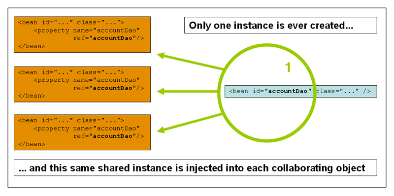

Spring’s concept of a singleton bean differs from the singleton pattern as defined in
the Gang of Four (GoF) patterns book. The GoF singleton hard-codes the scope of an
object such that one and only one instance of a particular class is created per
ClassLoader. The scope of the Spring singleton is best described as being per-container
and per-bean. This means that, if you define one bean for a particular class in a
single Spring container, the Spring container creates one and only one instance
of the class defined by that bean definition. The singleton scope is the default scope
in Spring. To define a bean as a singleton in XML, you can define a bean as shown in the
following example:

```xml
<bean id="accountService" class="com.something.DefaultAccountService"/>

<!-- the following is equivalent, though redundant (singleton scope is the default) -->
<bean id="accountService" class="com.something.DefaultAccountService" scope="singleton"/>
```

<a id="core-beans-factory-scopes--beans-factory-scopes-prototype"></a>
<a id="core-beans-factory-scopes--the-prototype-scope"></a>

## The Prototype Scope

The non-singleton prototype scope of bean deployment results in the creation of a new
bean instance every time a request for that specific bean is made. That is, the bean
is injected into another bean or you request it through a `getBean()` method call on the
container. As a rule, you should use the prototype scope for all stateful beans and the
singleton scope for stateless beans.

The following diagram illustrates the Spring prototype scope:

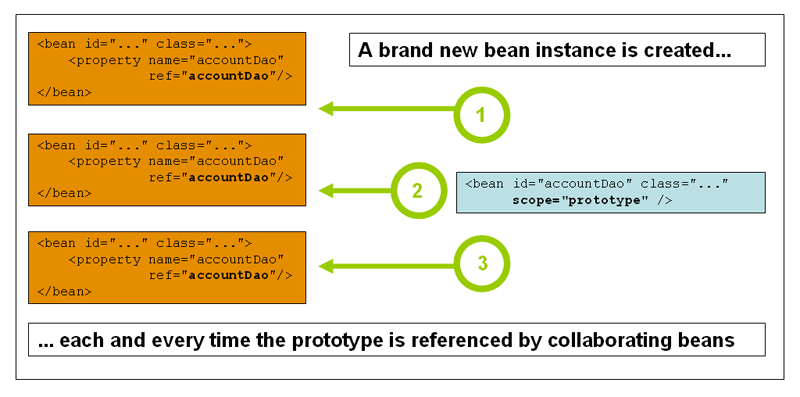

(A data access object
(DAO) is not typically configured as a prototype, because a typical DAO does not hold
any conversational state. It was easier for us to reuse the core of the
singleton diagram.)

The following example defines a bean as a prototype in XML:

```xml
<bean id="accountService" class="com.something.DefaultAccountService" scope="prototype"/>
```

In contrast to the other scopes, Spring does not manage the complete lifecycle of a
prototype bean. The container instantiates, configures, and otherwise assembles a
prototype object and hands it to the client, with no further record of that prototype
instance. Thus, although initialization lifecycle callback methods are called on all
objects regardless of scope, in the case of prototypes, configured destruction
lifecycle callbacks are not called. The client code must clean up prototype-scoped
objects and release expensive resources that the prototype beans hold. To get
the Spring container to release resources held by prototype-scoped beans, try using a
custom [bean post-processor](#core-beans-factory-extension--beans-factory-extension-bpp)
which holds a reference to beans that need to be cleaned up.

In some respects, the Spring container’s role in regard to a prototype-scoped bean is a
replacement for the Java `new` operator. All lifecycle management past that point must
be handled by the client. (For details on the lifecycle of a bean in the Spring
container, see [Lifecycle Callbacks](#core-beans-factory-nature--beans-factory-lifecycle).)

<a id="core-beans-factory-scopes--beans-factory-scopes-sing-prot-interaction"></a>
<a id="core-beans-factory-scopes--singleton-beans-with-prototype-bean-dependencies"></a>

## Singleton Beans with Prototype-bean Dependencies

When you use singleton-scoped beans with dependencies on prototype beans, be aware that
dependencies are resolved at instantiation time. Thus, if you dependency-inject a
prototype-scoped bean into a singleton-scoped bean, a new prototype bean is instantiated
and then dependency-injected into the singleton bean. The prototype instance is the sole
instance that is ever supplied to the singleton-scoped bean.

However, suppose you want the singleton-scoped bean to acquire a new instance of the
prototype-scoped bean repeatedly at runtime. You cannot dependency-inject a
prototype-scoped bean into your singleton bean, because that injection occurs only
once, when the Spring container instantiates the singleton bean and resolves
and injects its dependencies. If you need a new instance of a prototype bean at
runtime more than once, see [Method Injection](#core-beans-dependencies-factory-method-injection).

<a id="core-beans-factory-scopes--beans-factory-scopes-other"></a>
<a id="core-beans-factory-scopes--request-session-application-and-websocket-scopes"></a>

## Request, Session, Application, and WebSocket Scopes

The `request`, `session`, `application`, and `websocket` scopes are available only
if you use a web-aware Spring `ApplicationContext` implementation (such as
`XmlWebApplicationContext`). If you use these scopes with regular Spring IoC containers, such as the `ClassPathXmlApplicationContext`, an `IllegalStateException` that complains
about an unknown bean scope is thrown.

<a id="core-beans-factory-scopes--beans-factory-scopes-other-web-configuration"></a>
<a id="core-beans-factory-scopes--initial-web-configuration"></a>

### Initial Web Configuration

To support the scoping of beans at the `request`, `session`, `application`, and
`websocket` levels (web-scoped beans), some minor initial configuration is
required before you define your beans. (This initial setup is not required
for the standard scopes: `singleton` and `prototype`.)

How you accomplish this initial setup depends on your particular Servlet environment.

If you access scoped beans within Spring Web MVC, in effect, within a request that is
processed by the Spring `DispatcherServlet`, no special setup is necessary.
`DispatcherServlet` already exposes all relevant state.

If you use a Servlet web container, with requests processed outside of Spring’s
`DispatcherServlet` (for example, when using JSF), you need to register the
`org.springframework.web.context.request.RequestContextListener` `ServletRequestListener`.
This can be done programmatically by using the `WebApplicationInitializer` interface.
Alternatively, add the following declaration to your web application’s `web.xml` file:

```xml
<web-app> ...<listener> <listener-class> org.springframework.web.context.request.RequestContextListener </listener-class> </listener> ...</web-app>
```

Alternatively, if there are issues with your listener setup, consider using Spring’s
`RequestContextFilter`. The filter mapping depends on the surrounding web
application configuration, so you have to change it as appropriate. The following listing
shows the filter part of a web application:

```xml
<web-app>
	...
	<filter>
		<filter-name>requestContextFilter</filter-name>
		<filter-class>org.springframework.web.filter.RequestContextFilter</filter-class>
	</filter>
	<filter-mapping>
		<filter-name>requestContextFilter</filter-name>
		<url-pattern>/*</url-pattern>
	</filter-mapping>
	...
</web-app>
```

`DispatcherServlet`, `RequestContextListener`, and `RequestContextFilter` all do exactly
the same thing, namely bind the HTTP request object to the `Thread` that is servicing
that request. This makes beans that are request- and session-scoped available further
down the call chain.

<a id="core-beans-factory-scopes--beans-factory-scopes-request"></a>
<a id="core-beans-factory-scopes--request-scope"></a>

### Request scope

Consider the following XML configuration for a bean definition:

```xml
<bean id="loginAction" class="com.something.LoginAction" scope="request"/>
```

The Spring container creates a new instance of the `LoginAction` bean by using the
`loginAction` bean definition for each and every HTTP request. That is, the
`loginAction` bean is scoped at the HTTP request level. You can change the internal
state of the instance that is created as much as you want, because other instances
created from the same `loginAction` bean definition do not see these changes in state.
They are particular to an individual request. When the request completes processing, the
bean that is scoped to the request is discarded.

When using annotation-driven components or Java configuration, the `@RequestScope` annotation
can be used to assign a component to the `request` scope. The following example shows how
to do so:

- Java
- Kotlin

```java
@RequestScope
@Component
public class LoginAction {
	// ...
}
```

```kotlin
@RequestScope
@Component
class LoginAction {
	// ...
}
```

<a id="core-beans-factory-scopes--beans-factory-scopes-session"></a>
<a id="core-beans-factory-scopes--session-scope"></a>

### Session Scope

Consider the following XML configuration for a bean definition:

```xml
<bean id="userPreferences" class="com.something.UserPreferences" scope="session"/>
```

The Spring container creates a new instance of the `UserPreferences` bean by using the
`userPreferences` bean definition for the lifetime of a single HTTP `Session`. In other
words, the `userPreferences` bean is effectively scoped at the HTTP `Session` level. As
with request-scoped beans, you can change the internal state of the instance that is
created as much as you want, knowing that other HTTP `Session` instances that are also
using instances created from the same `userPreferences` bean definition do not see these
changes in state, because they are particular to an individual HTTP `Session`. When the
HTTP `Session` is eventually discarded, the bean that is scoped to that particular HTTP
`Session` is also discarded.

When using annotation-driven components or Java configuration, you can use the
`@SessionScope` annotation to assign a component to the `session` scope.

- Java
- Kotlin

```java
@SessionScope
@Component
public class UserPreferences {
	// ...
}
```

```kotlin
@SessionScope
@Component
class UserPreferences {
	// ...
}
```

<a id="core-beans-factory-scopes--beans-factory-scopes-application"></a>
<a id="core-beans-factory-scopes--application-scope"></a>

### Application Scope

Consider the following XML configuration for a bean definition:

```xml
<bean id="appPreferences" class="com.something.AppPreferences" scope="application"/>
```

The Spring container creates a new instance of the `AppPreferences` bean by using the
`appPreferences` bean definition once for the entire web application. That is, the
`appPreferences` bean is scoped at the `ServletContext` level and stored as a regular
`ServletContext` attribute. This is somewhat similar to a Spring singleton bean but
differs in two important ways: It is a singleton per `ServletContext`, not per Spring
`ApplicationContext` (for which there may be several in any given web application), and it is actually exposed and therefore visible as a `ServletContext` attribute.

When using annotation-driven components or Java configuration, you can use the
`@ApplicationScope` annotation to assign a component to the `application` scope. The
following example shows how to do so:

- Java
- Kotlin

```java
@ApplicationScope
@Component
public class AppPreferences {
	// ...
}
```

```kotlin
@ApplicationScope
@Component
class AppPreferences {
	// ...
}
```

<a id="core-beans-factory-scopes--beans-factory-scopes-websocket"></a>
<a id="core-beans-factory-scopes--websocket-scope"></a>

### WebSocket Scope

WebSocket scope is associated with the lifecycle of a WebSocket session and applies to
STOMP over WebSocket applications, see
[WebSocket scope](#web-websocket-stomp-scope) for more details.

<a id="core-beans-factory-scopes--beans-factory-scopes-other-injection"></a>
<a id="core-beans-factory-scopes--scoped-beans-as-dependencies"></a>

### Scoped Beans as Dependencies

The Spring IoC container manages not only the instantiation of your objects (beans), but also the wiring up of collaborators (or dependencies). If you want to inject (for
example) an HTTP request-scoped bean into another bean of a longer-lived scope, you may
choose to inject an AOP proxy in place of the scoped bean. That is, you need to inject
a proxy object that exposes the same public interface as the scoped object but that can
also retrieve the real target object from the relevant scope (such as an HTTP request)
and delegate method calls onto the real object.

> [!NOTE]
> You may also use `<aop:scoped-proxy/>` between beans that are scoped as `singleton`, with the reference then going through an intermediate proxy that is serializable
> and therefore able to re-obtain the target singleton bean on deserialization.
>
> When declaring `<aop:scoped-proxy/>` against a bean of scope `prototype`, every method
> call on the shared proxy leads to the creation of a new target instance to which the
> call is then being forwarded.
>
> Also, scoped proxies are not the only way to access beans from shorter scopes in a
> lifecycle-safe fashion. You may also declare your injection point (that is, the
> constructor or setter argument or autowired field) as `ObjectFactory<MyTargetBean>`, allowing for a `getObject()` call to retrieve the current instance on demand every
> time it is needed — without holding on to the instance or storing it separately.
>
> As an extended variant, you may declare `ObjectProvider<MyTargetBean>` which delivers
> several additional access variants, including `getIfAvailable` and `getIfUnique`.
>
> The JSR-330 variant of this is called `Provider` and is used with a `Provider<MyTargetBean>`
> declaration and a corresponding `get()` call for every retrieval attempt.
> See [here](#core-beans-standard-annotations) for more details on JSR-330 overall.

The configuration in the following example is only one line, but it is important to
understand the “why” as well as the “how” behind it:

```xml
<?xml version="1.0" encoding="UTF-8"?>
<beans xmlns="http://www.springframework.org/schema/beans"
	xmlns:xsi="http://www.w3.org/2001/XMLSchema-instance"
	xmlns:aop="http://www.springframework.org/schema/aop"
	xsi:schemaLocation="http://www.springframework.org/schema/beans
		https://www.springframework.org/schema/beans/spring-beans.xsd
		http://www.springframework.org/schema/aop
		https://www.springframework.org/schema/aop/spring-aop.xsd">

	<!-- an HTTP Session-scoped bean exposed as a proxy -->
	<bean id="userPreferences" class="com.something.UserPreferences" scope="session">
		<!-- instructs the container to proxy the surrounding bean -->
		<aop:scoped-proxy/> (1)
	</bean>

	<!-- a singleton-scoped bean injected with a proxy to the above bean -->
	<bean id="userService" class="com.something.SimpleUserService">
		<!-- a reference to the proxied userPreferences bean -->
		<property name="userPreferences" ref="userPreferences"/>
	</bean>
</beans>
```

**1**

The line that defines the proxy.

To create such a proxy, you insert a child `<aop:scoped-proxy/>` element into a
scoped bean definition (see
[Choosing the Type of Proxy to Create](#core-beans-factory-scopes--beans-factory-scopes-other-injection-proxies)
and [XML Schema-based configuration](#core-appendix-xsd-schemas)).

Why do definitions of beans scoped at the `request`, `session` and custom-scope
levels require the `<aop:scoped-proxy/>` element in common scenarios?
Consider the following singleton bean definition and contrast it with
what you need to define for the aforementioned scopes (note that the following
`userPreferences` bean definition as it stands is incomplete):

```xml
<bean id="userPreferences" class="com.something.UserPreferences" scope="session"/>

<bean id="userManager" class="com.something.UserManager">
	<property name="userPreferences" ref="userPreferences"/>
</bean>
```

In the preceding example, the singleton bean (`userManager`) is injected with a reference
to the HTTP `Session`-scoped bean (`userPreferences`). The salient point here is that the
`userManager` bean is a singleton: it is instantiated exactly once per
container, and its dependencies (in this case only one, the `userPreferences` bean) are
also injected only once. This means that the `userManager` bean operates only on the
exact same `userPreferences` object (that is, the one with which it was originally injected).

This is not the behavior you want when injecting a shorter-lived scoped bean into a
longer-lived scoped bean (for example, injecting an HTTP `Session`-scoped collaborating
bean as a dependency into singleton bean). Rather, you need a single `userManager`
object, and, for the lifetime of an HTTP `Session`, you need a `userPreferences` object
that is specific to the HTTP `Session`. Thus, the container creates an object that
exposes the exact same public interface as the `UserPreferences` class (ideally an
object that is a `UserPreferences` instance), which can fetch the real
`UserPreferences` object from the scoping mechanism (HTTP request, `Session`, and so
forth). The container injects this proxy object into the `userManager` bean, which is
unaware that this `UserPreferences` reference is a proxy. In this example, when a
`UserManager` instance invokes a method on the dependency-injected `UserPreferences`
object, it is actually invoking a method on the proxy. The proxy then fetches the real
`UserPreferences` object from (in this case) the HTTP `Session` and delegates the
method invocation onto the retrieved real `UserPreferences` object.

Thus, you need the following (correct and complete) configuration when injecting
`request-` and `session-scoped` beans into collaborating objects, as the following example
shows:

```xml
<bean id="userPreferences" class="com.something.UserPreferences" scope="session">
	<aop:scoped-proxy/>
</bean>

<bean id="userManager" class="com.something.UserManager">
	<property name="userPreferences" ref="userPreferences"/>
</bean>
```

<a id="core-beans-factory-scopes--beans-factory-scopes-other-injection-proxies"></a>
<a id="core-beans-factory-scopes--choosing-the-type-of-proxy-to-create"></a>

#### Choosing the Type of Proxy to Create

By default, when the Spring container creates a proxy for a bean that is marked up with
the `<aop:scoped-proxy/>` element, a CGLIB-based class proxy is created.

> [!NOTE]
> CGLIB proxies do not intercept private methods. Attempting to call a private method
> on such a proxy will not delegate to the actual scoped target object.

Alternatively, you can configure the Spring container to create standard JDK
interface-based proxies for such scoped beans, by specifying `false` for the value of
the `proxy-target-class` attribute of the `<aop:scoped-proxy/>` element. Using JDK
interface-based proxies means that you do not need additional libraries in your
application classpath to affect such proxying. However, it also means that the class of
the scoped bean must implement at least one interface and that all collaborators
into which the scoped bean is injected must reference the bean through one of its
interfaces. The following example shows a proxy based on an interface:

```xml
<!-- DefaultUserPreferences implements the UserPreferences interface -->
<bean id="userPreferences" class="com.stuff.DefaultUserPreferences" scope="session">
	<aop:scoped-proxy proxy-target-class="false"/>
</bean>

<bean id="userManager" class="com.stuff.UserManager">
	<property name="userPreferences" ref="userPreferences"/>
</bean>
```

For more detailed information about choosing class-based or interface-based proxying, see [Proxying Mechanisms](#core-aop-proxying).

<a id="core-beans-factory-scopes--beans-factory-scopes-injection"></a>
<a id="core-beans-factory-scopes--injecting-request-session-references-directly"></a>

### Injecting Request/Session References Directly

As an alternative to factory scopes, a Spring `WebApplicationContext` also supports
the injection of `HttpServletRequest`, `HttpServletResponse`, `HttpSession`, `WebRequest` and (if JSF is present) `FacesContext` and `ExternalContext` into
Spring-managed beans, simply through type-based autowiring next to regular injection
points for other beans. Spring generally injects proxies for such request and session
objects which has the advantage of working in singleton beans and serializable beans
as well, similar to scoped proxies for factory-scoped beans.

<a id="core-beans-factory-scopes--beans-factory-scopes-custom"></a>
<a id="core-beans-factory-scopes--custom-scopes"></a>

## Custom Scopes

The bean scoping mechanism is extensible. You can define your own
scopes or even redefine existing scopes, although the latter is considered bad practice
and you cannot override the built-in `singleton` and `prototype` scopes.

<a id="core-beans-factory-scopes--beans-factory-scopes-custom-creating"></a>
<a id="core-beans-factory-scopes--creating-a-custom-scope"></a>

### Creating a Custom Scope

To integrate your custom scopes into the Spring container, you need to implement the
`org.springframework.beans.factory.config.Scope` interface, which is described in this
section. For an idea of how to implement your own scopes, see the `Scope`
implementations that are supplied with the Spring Framework itself and the
[`Scope`](https://docs.spring.io/spring-framework/docs/7.0.8/javadoc-api/org/springframework/beans/factory/config/Scope.html) javadoc, which explains the methods you need to implement in more detail.

The `Scope` interface has four methods to get objects from the scope, remove them from
the scope, and let them be destroyed.

The session scope implementation, for example, returns the session-scoped bean (if it
does not exist, the method returns a new instance of the bean, after having bound it to
the session for future reference). The following method returns the object from the
underlying scope:

- Java
- Kotlin

```java
Object get(String name, ObjectFactory<?> objectFactory)
```

```kotlin
fun get(name: String, objectFactory: ObjectFactory<*>): Any
```

The session scope implementation, for example, removes the session-scoped bean from the
underlying session. The object should be returned, but you can return `null` if the
object with the specified name is not found. The following method removes the object from
the underlying scope:

- Java
- Kotlin

```java
Object remove(String name)
```

```kotlin
fun remove(name: String): Any
```

The following method registers a callback that the scope should invoke when it is
destroyed or when the specified object in the scope is destroyed:

- Java
- Kotlin

```java
void registerDestructionCallback(String name, Runnable destructionCallback)
```

```kotlin
fun registerDestructionCallback(name: String, destructionCallback: Runnable)
```

See the [javadoc](https://docs.spring.io/spring-framework/docs/7.0.8/javadoc-api/org/springframework/beans/factory/config/Scope.html#registerDestructionCallback)
or a Spring scope implementation for more information on destruction callbacks.

The following method obtains the conversation identifier for the underlying scope:

- Java
- Kotlin

```java
String getConversationId()
```

```kotlin
fun getConversationId(): String
```

This identifier is different for each scope. For a session scoped implementation, this
identifier can be the session identifier.

<a id="core-beans-factory-scopes--beans-factory-scopes-custom-using"></a>
<a id="core-beans-factory-scopes--using-a-custom-scope"></a>

### Using a Custom Scope

After you write and test one or more custom `Scope` implementations, you need to make
the Spring container aware of your new scopes. The following method is the central
method to register a new `Scope` with the Spring container:

- Java
- Kotlin

```java
void registerScope(String scopeName, Scope scope);
```

```kotlin
fun registerScope(scopeName: String, scope: Scope)
```

This method is declared on the `ConfigurableBeanFactory` interface, which is available
through the `BeanFactory` property on most of the concrete `ApplicationContext`
implementations that ship with Spring.

The first argument to the `registerScope(..)` method is the unique name associated with
a scope. Examples of such names in the Spring container itself are `singleton` and
`prototype`. The second argument to the `registerScope(..)` method is an actual instance
of the custom `Scope` implementation that you wish to register and use.

Suppose that you write your custom `Scope` implementation, and then register it as shown
in the next example.

> [!NOTE]
> The next example uses `SimpleThreadScope`, which is included with Spring but is not
> registered by default. The instructions would be the same for your own custom `Scope`
> implementations.

- Java
- Kotlin

```java
Scope threadScope = new SimpleThreadScope();
beanFactory.registerScope("thread", threadScope);
```

```kotlin
val threadScope = SimpleThreadScope()
beanFactory.registerScope("thread", threadScope)
```

You can then create bean definitions that adhere to the scoping rules of your custom
`Scope`, as follows:

```xml
<bean id="..." class="..." scope="thread">
```

With a custom `Scope` implementation, you are not limited to programmatic registration
of the scope. You can also do the `Scope` registration declaratively, by using the
`CustomScopeConfigurer` class, as the following example shows:

```xml
<?xml version="1.0" encoding="UTF-8"?>
<beans xmlns="http://www.springframework.org/schema/beans"
	xmlns:xsi="http://www.w3.org/2001/XMLSchema-instance"
	xmlns:aop="http://www.springframework.org/schema/aop"
	xsi:schemaLocation="http://www.springframework.org/schema/beans
		https://www.springframework.org/schema/beans/spring-beans.xsd
		http://www.springframework.org/schema/aop
		https://www.springframework.org/schema/aop/spring-aop.xsd">

	<bean class="org.springframework.beans.factory.config.CustomScopeConfigurer">
		<property name="scopes">
			<map>
				<entry key="thread">
					<bean class="org.springframework.context.support.SimpleThreadScope"/>
				</entry>
			</map>
		</property>
	</bean>

	<bean id="thing2" class="x.y.Thing2" scope="thread">
		<property name="name" value="Rick"/>
		<aop:scoped-proxy/>
	</bean>

	<bean id="thing1" class="x.y.Thing1">
		<property name="thing2" ref="thing2"/>
	</bean>

</beans>
```

> [!NOTE]
> When you place `<aop:scoped-proxy/>` within a `<bean>` declaration for a
> `FactoryBean` implementation, it is the factory bean itself that is scoped, not the object
> returned from `getObject()`.

[Method Injection](#core-beans-dependencies-factory-method-injection)
[Customizing the Nature of a Bean](#core-beans-factory-nature)

---

<a id="core-beans-factory-nature"></a>

<!-- source_url: https://docs.spring.io/spring-framework/reference/core/beans/factory-nature.html -->

<!-- page_index: 16 -->

# Customizing the Nature of a Bean

<svg enable-background="new 0 0 32 32" id="Glyph" version="1.1" viewbox="0 0 32 32" xml:space="preserve" xmlns="http://www.w3.org/2000/svg" xmlns:xlink="http://www.w3.org/1999/xlink">
<path id="XMLID_223_"></path>
</svg>

Search

<a id="core-beans-factory-nature--page-title"></a>
<a id="core-beans-factory-nature--customizing-the-nature-of-a-bean"></a>

# Customizing the Nature of a Bean

The Spring Framework provides a number of interfaces you can use to customize the nature
of a bean. This section groups them as follows:

- [Lifecycle Callbacks](#core-beans-factory-nature--beans-factory-lifecycle)
- [`ApplicationContextAware` and `BeanNameAware`](#core-beans-factory-nature--beans-factory-aware)
- [Other `Aware` Interfaces](#core-beans-factory-nature--aware-list)

<a id="core-beans-factory-nature--beans-factory-lifecycle"></a>
<a id="core-beans-factory-nature--lifecycle-callbacks"></a>

## Lifecycle Callbacks

To interact with the container’s management of the bean lifecycle, you can implement
the Spring `InitializingBean` and `DisposableBean` interfaces. The container calls
`afterPropertiesSet()` for the former and `destroy()` for the latter to let the bean
perform certain actions upon initialization and destruction of your beans.

> [!TIP]
> The JSR-250 `@PostConstruct` and `@PreDestroy` annotations are generally considered best
> practice for receiving lifecycle callbacks in a modern Spring application. Using these
> annotations means that your beans are not coupled to Spring-specific interfaces.
> For details, see [Using `@PostConstruct` and `@PreDestroy`](#core-beans-annotation-config-postconstruct-and-predestroy-annotations).
>
> If you do not want to use the JSR-250 annotations but you still want to remove
> coupling, consider `init-method` and `destroy-method` bean definition metadata.

Internally, the Spring Framework uses `BeanPostProcessor` implementations to process any
callback interfaces it can find and call the appropriate methods. If you need custom
features or other lifecycle behavior Spring does not by default offer, you can
implement a `BeanPostProcessor` yourself. For more information, see
[Container Extension Points](#core-beans-factory-extension).

In addition to the initialization and destruction callbacks, Spring-managed objects may
also implement the `Lifecycle` interface so that those objects can participate in the
startup and shutdown process, as driven by the container’s own lifecycle.

The lifecycle callback interfaces are described in this section.

<a id="core-beans-factory-nature--beans-factory-lifecycle-initializingbean"></a>
<a id="core-beans-factory-nature--initialization-callbacks"></a>

### Initialization Callbacks

The `org.springframework.beans.factory.InitializingBean` interface lets a bean
perform initialization work after the container has set all necessary properties on the
bean. The `InitializingBean` interface specifies a single method:

```java
void afterPropertiesSet() throws Exception;
```

We recommend that you do not use the `InitializingBean` interface, because it
unnecessarily couples the code to Spring. Alternatively, we suggest using
the [`@PostConstruct`](#core-beans-annotation-config-postconstruct-and-predestroy-annotations) annotation or
specifying a POJO initialization method. In the case of XML-based configuration metadata, you can use the `init-method` attribute to specify the name of the method that has a void
no-argument signature. With Java configuration, you can use the `initMethod` attribute of
`@Bean`. See [Receiving Lifecycle Callbacks](#core-beans-java-bean-annotation--beans-java-lifecycle-callbacks). Consider the following example:

```xml
<bean id="exampleInitBean" class="examples.ExampleBean" init-method="init"/>
```

- Java
- Kotlin

```java
public class ExampleBean {

	public void init() {
		// do some initialization work
	}
}
```

```kotlin
class ExampleBean {

	fun init() {
		// do some initialization work
	}
}
```

The preceding example has almost exactly the same effect as the following example
(which consists of two listings):

```xml
<bean id="exampleInitBean" class="examples.AnotherExampleBean"/>
```

- Java
- Kotlin

```java
public class AnotherExampleBean implements InitializingBean {

	@Override
	public void afterPropertiesSet() {
		// do some initialization work
	}
}
```

```kotlin
class AnotherExampleBean : InitializingBean {

	override fun afterPropertiesSet() {
		// do some initialization work
	}
}
```

However, the first of the two preceding examples does not couple the code to Spring.

> [!NOTE]
> Be aware that `@PostConstruct` and initialization methods in general are executed
> within the container’s singleton creation lock. The bean instance is only considered
> as fully initialized and ready to be published to others after returning from the
> `@PostConstruct` method. Such individual initialization methods are only meant
> for validating the configuration state and possibly preparing some data structures
> based on the given configuration but no further activity with external bean access.
> Otherwise there is a risk for an initialization deadlock.
>
> For a scenario where expensive post-initialization activity is to be triggered, for example, asynchronous database preparation steps, your bean should either implement
> `SmartInitializingSingleton.afterSingletonsInstantiated()` or rely on the context
> refresh event: implementing `ApplicationListener<ContextRefreshedEvent>` or
> declaring its annotation equivalent `@EventListener(ContextRefreshedEvent.class)`.
> Those variants come after all regular singleton initialization and therefore
> outside of any singleton creation lock.
>
> Alternatively, you may implement the `(Smart)Lifecycle` interface and integrate with
> the container’s overall lifecycle management, including an auto-startup mechanism, a pre-destroy stop step, and potential stop/restart callbacks (see below).

<a id="core-beans-factory-nature--beans-factory-lifecycle-disposablebean"></a>
<a id="core-beans-factory-nature--destruction-callbacks"></a>

### Destruction Callbacks

Implementing the `org.springframework.beans.factory.DisposableBean` interface lets a
bean get a callback when the container that contains it is destroyed. The
`DisposableBean` interface specifies a single method:

```java
void destroy() throws Exception;
```

We recommend that you do not use the `DisposableBean` callback interface, because it
unnecessarily couples the code to Spring. Alternatively, we suggest using
the [`@PreDestroy`](#core-beans-annotation-config-postconstruct-and-predestroy-annotations) annotation or
specifying a generic method that is supported by bean definitions. With XML-based
configuration metadata, you can use the `destroy-method` attribute on the `<bean/>`.
With Java configuration, you can use the `destroyMethod` attribute of `@Bean`. See
[Receiving Lifecycle Callbacks](#core-beans-java-bean-annotation--beans-java-lifecycle-callbacks). Consider the following definition:

```xml
<bean id="exampleDestructionBean" class="examples.ExampleBean" destroy-method="cleanup"/>
```

- Java
- Kotlin

```java
public class ExampleBean {

	public void cleanup() {
		// do some destruction work (like releasing pooled connections)
	}
}
```

```kotlin
class ExampleBean {

	fun cleanup() {
		// do some destruction work (like releasing pooled connections)
	}
}
```

The preceding definition has almost exactly the same effect as the following definition:

```xml
<bean id="exampleDestructionBean" class="examples.AnotherExampleBean"/>
```

- Java
- Kotlin

```java
public class AnotherExampleBean implements DisposableBean {

	@Override
	public void destroy() {
		// do some destruction work (like releasing pooled connections)
	}
}
```

```kotlin
class AnotherExampleBean : DisposableBean {

	override fun destroy() {
		// do some destruction work (like releasing pooled connections)
	}
}
```

However, the first of the two preceding definitions does not couple the code to Spring.

Note that Spring also supports inference of destroy methods, detecting a public `close` or
`shutdown` method. This is the default behavior for `@Bean` methods in Java configuration
classes and automatically matches `java.lang.AutoCloseable` or `java.io.Closeable`
implementations, not coupling the destruction logic to Spring either.

> [!TIP]
> For destroy method inference with XML, you may assign the `destroy-method` attribute
> of a `<bean>` element a special `(inferred)` value, which instructs Spring to automatically
> detect a public `close` or `shutdown` method on the bean class for a specific bean definition.
> You can also set this special `(inferred)` value on the `default-destroy-method` attribute
> of a `<beans>` element to apply this behavior to an entire set of bean definitions (see
> [Default Initialization and Destroy Methods](#core-beans-factory-nature--beans-factory-lifecycle-default-init-destroy-methods)).

> [!NOTE]
> For extended shutdown phases, you may implement the `Lifecycle` interface and receive
> an early stop signal before the destroy methods of any singleton beans are called.
> You may also implement `SmartLifecycle` for a time-bound stop step where the container
> will wait for all such stop processing to complete before moving on to destroy methods.

<a id="core-beans-factory-nature--beans-factory-lifecycle-default-init-destroy-methods"></a>
<a id="core-beans-factory-nature--default-initialization-and-destroy-methods"></a>

### Default Initialization and Destroy Methods

When you write initialization and destroy method callbacks that do not use the
Spring-specific `InitializingBean` and `DisposableBean` callback interfaces, you
typically write methods with names such as `init()`, `initialize()`, `dispose()`, and so on. Ideally, the names of such lifecycle callback methods are standardized across
a project so that all developers use the same method names and ensure consistency.

You can configure the Spring container to “look” for named initialization and destroy
callback method names on every bean. This means that you, as an application developer, can write your application classes and use an initialization callback called `init()`, without having to configure an `init-method="init"` attribute with each bean definition.
The Spring IoC container calls that method when the bean is created (and in accordance
with the standard lifecycle callback contract [described previously](#core-beans-factory-nature--beans-factory-lifecycle)).
This feature also enforces a consistent naming convention for initialization and
destroy method callbacks.

Suppose that your initialization callback methods are named `init()` and your destroy
callback methods are named `destroy()`. Your class then resembles the class in the
following example:

- Java
- Kotlin

```java
public class DefaultBlogService implements BlogService {
private BlogDao blogDao;
public void setBlogDao(BlogDao blogDao) {this.blogDao = blogDao;}
// this is (unsurprisingly) the initialization callback method public void init() {if (this.blogDao == null) {throw new IllegalStateException("The [blogDao] property must be set.");}}}
```

```kotlin
class DefaultBlogService : BlogService {
private var blogDao: BlogDao? = null
// this is (unsurprisingly) the initialization callback method fun init() {if (blogDao == null) {throw IllegalStateException("The [blogDao] property must be set.")}}}
```

You could then use that class in a bean resembling the following:

```xml
<beans default-init-method="init">

	<bean id="blogService" class="com.something.DefaultBlogService">
		<property name="blogDao" ref="blogDao" />
	</bean>

</beans>
```

The presence of the `default-init-method` attribute on the top-level `<beans/>` element
attribute causes the Spring IoC container to recognize a method called `init` on the bean
class as the initialization method callback. When a bean is created and assembled, if the
bean class has such a method, it is invoked at the appropriate time.

You can configure destroy method callbacks similarly (in XML, that is) by using the
`default-destroy-method` attribute on the top-level `<beans/>` element.

Where existing bean classes already have callback methods that are named at variance
with the convention, you can override the default by specifying (in XML, that is) the
method name by using the `init-method` and `destroy-method` attributes of the `<bean/>`
itself.

The Spring container guarantees that a configured initialization callback is called
immediately after a bean is supplied with all dependencies. Thus, the initialization
callback is called on the raw bean reference, which means that AOP interceptors and so
forth are not yet applied to the bean. A target bean is fully created first and
then an AOP proxy (for example) with its interceptor chain is applied. If the target
bean and the proxy are defined separately, your code can even interact with the raw
target bean, bypassing the proxy. Hence, it would be inconsistent to apply the
interceptors to the `init` method, because doing so would couple the lifecycle of the
target bean to its proxy or interceptors and leave strange semantics when your code
interacts directly with the raw target bean.

<a id="core-beans-factory-nature--beans-factory-lifecycle-combined-effects"></a>
<a id="core-beans-factory-nature--combining-lifecycle-mechanisms"></a>

### Combining Lifecycle Mechanisms

As of Spring 2.5, you have three options for controlling bean lifecycle behavior:

- The [`InitializingBean`](#core-beans-factory-nature--beans-factory-lifecycle-initializingbean) and
  [`DisposableBean`](#core-beans-factory-nature--beans-factory-lifecycle-disposablebean) callback interfaces
- Custom `init()` and `destroy()` methods
- The [`@PostConstruct` and `@PreDestroy` annotations](#core-beans-annotation-config-postconstruct-and-predestroy-annotations)

  1. You can combine these mechanisms to control a given bean.

> [!NOTE]
> If multiple lifecycle mechanisms are configured for a bean and each mechanism is
> configured with a different method name, then each configured method is run in the
> order listed after this note. However, if the same method name is configured — for example, `init()` for an initialization method — for more than one of these lifecycle mechanisms, that method is run once, as explained in the
> [preceding section](#core-beans-factory-nature--beans-factory-lifecycle-default-init-destroy-methods).

Multiple lifecycle mechanisms configured for the same bean, with different
initialization methods, are called as follows:

1. Methods annotated with `@PostConstruct`
2. `afterPropertiesSet()` as defined by the `InitializingBean` callback interface
3. A custom configured `init()` method

Destroy methods are called in the same order:

1. Methods annotated with `@PreDestroy`
2. `destroy()` as defined by the `DisposableBean` callback interface
3. A custom configured `destroy()` method

<a id="core-beans-factory-nature--beans-factory-lifecycle-processor"></a>
<a id="core-beans-factory-nature--startup-and-shutdown-callbacks"></a>

### Startup and Shutdown Callbacks

The `Lifecycle` interface defines the essential methods for any object that has its own
lifecycle requirements (such as starting and stopping some background process):

```java
public interface Lifecycle {

	void start();

	void stop();

	boolean isRunning();
}
```

Any Spring-managed object may implement the `Lifecycle` interface. Then, when the
`ApplicationContext` itself receives start and stop signals (for example, for a stop/restart
scenario at runtime), it cascades those calls to all `Lifecycle` implementations
defined within that context. It does this by delegating to a `LifecycleProcessor`, shown
in the following listing:

```java
public interface LifecycleProcessor extends Lifecycle {

	void onRefresh();

	void onClose();
}
```

Notice that the `LifecycleProcessor` is itself an extension of the `Lifecycle`
interface. It also adds two other methods for reacting to the context being refreshed
and closed.

> [!TIP]
> Note that the regular `org.springframework.context.Lifecycle` interface is a plain
> contract for explicit start and stop notifications and does not imply auto-startup
> at context refresh time. For fine-grained control over auto-startup and for graceful
> stopping of a specific bean (including startup and stop phases), consider implementing
> the extended `org.springframework.context.SmartLifecycle` interface instead.
>
> Also, please note that stop notifications are not guaranteed to come before destruction.
> On regular shutdown, all `Lifecycle` beans first receive a stop notification before
> the general destruction callbacks are being propagated. However, on hot refresh during
> a context’s lifetime or on stopped refresh attempts, only destroy methods are called.

The order of startup and shutdown invocations can be important. If a “depends-on”
relationship exists between any two objects, the dependent side starts after its
dependency, and it stops before its dependency. However, at times, the direct
dependencies are unknown. You may only know that objects of a certain type should start
prior to objects of another type. In those cases, the `SmartLifecycle` interface defines
another option, namely the `getPhase()` method as defined on its super-interface, `Phased`. The following listing shows the definition of the `Phased` interface:

```java
public interface Phased {

	int getPhase();
}
```

The following listing shows the definition of the `SmartLifecycle` interface:

```java
public interface SmartLifecycle extends Lifecycle, Phased {

	boolean isAutoStartup();

	void stop(Runnable callback);
}
```

When starting, the objects with the lowest phase start first. When stopping, the
reverse order is followed. Therefore, an object that implements `SmartLifecycle` and
whose `getPhase()` method returns `Integer.MIN_VALUE` would be among the first to start
and the last to stop. At the other end of the spectrum, a phase value of
`Integer.MAX_VALUE` would indicate that the object should be started last and stopped
first (likely because it depends on other processes to be running). When considering the
phase value, it is also important to know that the default phase for any “normal”
`Lifecycle` object that does not implement `SmartLifecycle` is `0`. Therefore, any
negative phase value indicates that an object should start before those standard
components (and stop after them). The reverse is true for any positive phase value.

The stop method defined by `SmartLifecycle` accepts a callback. Any
implementation must invoke that callback’s `run()` method after that implementation’s
shutdown process is complete. That enables asynchronous shutdown where necessary, since
the default implementation of the `LifecycleProcessor` interface, `DefaultLifecycleProcessor`, waits up to its timeout value for the group of objects
within each phase to invoke that callback. The default per-phase timeout is 30 seconds.
You can override the default lifecycle processor instance by defining a bean named
`lifecycleProcessor` within the context. If you want only to modify the timeout, defining the following would suffice:

```xml
<bean id="lifecycleProcessor" class="org.springframework.context.support.DefaultLifecycleProcessor">
	<!-- timeout value in milliseconds -->
	<property name="timeoutPerShutdownPhase" value="10000"/>
</bean>
```

As mentioned earlier, the `LifecycleProcessor` interface defines callback methods for the
refreshing and closing of the context as well. The latter drives the shutdown
process as if `stop()` had been called explicitly, but it happens when the context is
closing. The 'refresh' callback, on the other hand, enables another feature of
`SmartLifecycle` beans. When the context is refreshed (after all objects have been
instantiated and initialized), that callback is invoked. At that point, the
default lifecycle processor checks the boolean value returned by each
`SmartLifecycle` object’s `isAutoStartup()` method. If `true`, that object is
started at that point rather than waiting for an explicit invocation of the context’s or
its own `start()` method (unlike the context refresh, the context start does not happen
automatically for a standard context implementation). The `phase` value and any
“depends-on” relationships determine the startup order as described earlier.

<a id="core-beans-factory-nature--beans-factory-shutdown"></a>
<a id="core-beans-factory-nature--shutting-down-the-spring-ioc-container-gracefully-in-non-web-applications"></a>

### Shutting Down the Spring IoC Container Gracefully in Non-Web Applications

> [!NOTE]
> This section applies only to non-web applications. Spring’s web-based
> `ApplicationContext` implementations already have code in place to gracefully shut down
> the Spring IoC container when the relevant web application is shut down.

If you use Spring’s IoC container in a non-web application environment (for
example, in a rich client desktop environment), register a shutdown hook with the
JVM. Doing so ensures a graceful shutdown and calls the relevant destroy methods on your
singleton beans so that all resources are released. You must still configure
and implement these destroy callbacks correctly.

To register a shutdown hook, call the `registerShutdownHook()` method that is
declared on the `ConfigurableApplicationContext` interface, as the following example shows:

- Java
- Kotlin

```java
import org.springframework.context.ConfigurableApplicationContext;
import org.springframework.context.support.ClassPathXmlApplicationContext;

public final class Boot {

	public static void main(final String[] args) throws Exception {
		ConfigurableApplicationContext ctx = new ClassPathXmlApplicationContext("beans.xml");

		// add a shutdown hook for the above context...
		ctx.registerShutdownHook();

		// app runs here...

		// main method exits, hook is called prior to the app shutting down...
	}
}
```

```kotlin
import org.springframework.context.support.ClassPathXmlApplicationContext

fun main() {
	val ctx = ClassPathXmlApplicationContext("beans.xml")

	// add a shutdown hook for the above context...
	ctx.registerShutdownHook()

	// app runs here...

	// main method exits, hook is called prior to the app shutting down...
}
```

<a id="core-beans-factory-nature--beans-factory-thread-safety"></a>
<a id="core-beans-factory-nature--thread-safety-and-visibility"></a>

### Thread Safety and Visibility

The Spring core container publishes created singleton instances in a thread-safe manner, guarding access through a singleton lock and guaranteeing visibility in other threads.

As a consequence, application-provided bean classes do not have to be concerned about the
visibility of their initialization state. Regular configuration fields do not have to be
marked as `volatile` as long as they are only mutated during the initialization phase, providing visibility guarantees similar to `final` even for setter-based configuration
state that is mutable during that initial phase. If such fields get changed after the
bean creation phase and its subsequent initial publication, they need to be declared as
`volatile` or guarded by a common lock whenever accessed.

Note that concurrent access to such configuration state in singleton bean instances, for example, for controller instances or repository instances, is perfectly thread-safe after
such safe initial publication from the container side. This includes common singleton
`FactoryBean` instances which are processed within the general singleton lock as well.

For destruction callbacks, the configuration state remains thread-safe but any runtime
state accumulated between initialization and destruction should be kept in thread-safe
structures (or in `volatile` fields for simple cases) as per common Java guidelines.

Deeper `Lifecycle` integration as shown above involves runtime-mutable state such as
a `runnable` field which will have to be declared as `volatile`. While the common
lifecycle callbacks follow a certain order, for example, a start callback is guaranteed to
only happen after full initialization and a stop callback only after an initial start, there is a special case with the common stop before destroy arrangement: It is strongly
recommended that the internal state in any such bean also allows for an immediate
destroy callback without a preceding stop since this may happen during an extraordinary
shutdown after a cancelled bootstrap or in case of a stop timeout caused by another bean.

<a id="core-beans-factory-nature--beans-factory-aware"></a>
<a id="core-beans-factory-nature--applicationcontextaware-and-beannameaware"></a>

## `ApplicationContextAware` and `BeanNameAware`

When an `ApplicationContext` creates an object instance that implements the
`org.springframework.context.ApplicationContextAware` interface, the instance is provided
with a reference to that `ApplicationContext`. The following listing shows the definition
of the `ApplicationContextAware` interface:

```java
public interface ApplicationContextAware {

	void setApplicationContext(ApplicationContext applicationContext) throws BeansException;
}
```

Thus, beans can programmatically manipulate the `ApplicationContext` that created them, through the `ApplicationContext` interface or by casting the reference to a known
subclass of this interface (such as `ConfigurableApplicationContext`, which exposes
additional functionality). One use would be the programmatic retrieval of other beans.
Sometimes this capability is useful. However, in general, you should avoid it, because
it couples the code to Spring and does not follow the Inversion of Control style, where collaborators are provided to beans as properties. Other methods of the
`ApplicationContext` provide access to file resources, publishing application events, and accessing a `MessageSource`. These additional features are described in
[Additional Capabilities of the `ApplicationContext`](#core-beans-context-introduction).

Autowiring is another alternative to obtain a reference to the
`ApplicationContext`. The *traditional* `constructor` and `byType` autowiring modes
(as described in [Autowiring Collaborators](#core-beans-dependencies-factory-autowire)) can provide a dependency of type
`ApplicationContext` for a constructor argument or a setter method parameter, respectively. For more flexibility, including the ability to autowire fields and
multiple parameter methods, use the annotation-based autowiring features. If you do, the `ApplicationContext` is autowired into a field, constructor argument, or method
parameter that expects the `ApplicationContext` type if the field, constructor, or
method in question carries the `@Autowired` annotation. For more information, see
[Using `@Autowired`](#core-beans-annotation-config-autowired).

When an `ApplicationContext` creates a class that implements the
`org.springframework.beans.factory.BeanNameAware` interface, the class is provided with
a reference to the name defined in its associated object definition. The following listing
shows the definition of the BeanNameAware interface:

```java
public interface BeanNameAware {

	void setBeanName(String name) throws BeansException;
}
```

The callback is invoked after population of normal bean properties but before an
initialization callback such as `InitializingBean.afterPropertiesSet()` or a custom
init-method.

<a id="core-beans-factory-nature--aware-list"></a>
<a id="core-beans-factory-nature--other-aware-interfaces"></a>

## Other `Aware` Interfaces

Besides `ApplicationContextAware` and `BeanNameAware` (discussed [earlier](#core-beans-factory-nature--beans-factory-aware)), Spring offers a wide range of `Aware` callback interfaces that let beans indicate to the container
that they require a certain infrastructure dependency. As a general rule, the name indicates the
dependency type. The following table summarizes the most important `Aware` interfaces:

| Name | Injected Dependency | Explained in… |
| --- | --- | --- |
| `ApplicationContextAware` | Declaring `ApplicationContext`. | [`ApplicationContextAware` and `BeanNameAware`](#core-beans-factory-nature--beans-factory-aware) |
| `ApplicationEventPublisherAware` | Event publisher of the enclosing `ApplicationContext`. | [Additional Capabilities of the `ApplicationContext`](#core-beans-context-introduction) |
| `BeanClassLoaderAware` | Class loader used to load the bean classes. | [Instantiating Beans](#core-beans-definition--beans-factory-class) |
| `BeanFactoryAware` | Declaring `BeanFactory`. | [The `BeanFactory` API](#core-beans-beanfactory) |
| `BeanNameAware` | Name of the declaring bean. | [`ApplicationContextAware` and `BeanNameAware`](#core-beans-factory-nature--beans-factory-aware) |
| `LoadTimeWeaverAware` | Defined weaver for processing class definition at load time. | [Load-time Weaving with AspectJ in the Spring Framework](#core-aop-using-aspectj--aop-aj-ltw) |
| `MessageSourceAware` | Configured strategy for resolving messages (with support for parameterization and internationalization). | [Additional Capabilities of the `ApplicationContext`](#core-beans-context-introduction) |
| `NotificationPublisherAware` | Spring JMX notification publisher. | [Notifications](#integration-jmx-notifications) |
| `ResourceLoaderAware` | Configured loader for low-level access to resources. | [Resources](#web-webflux-webclient-client-builder--webflux-client-builder-reactor-resources) |
| `ServletConfigAware` | Current `ServletConfig` the container runs in. Valid only in a web-aware Spring `ApplicationContext`. | [Spring MVC](#web-webmvc--mvc) |
| `ServletContextAware` | Current `ServletContext` the container runs in. Valid only in a web-aware Spring `ApplicationContext`. | [Spring MVC](#web-webmvc--mvc) |

Note again that using these interfaces ties your code to the Spring API and does not
follow the Inversion of Control style. As a result, we recommend them for infrastructure
beans that require programmatic access to the container.

[Bean Scopes](#core-beans-factory-scopes)
[Bean Definition Inheritance](#core-beans-child-bean-definitions)

---

<a id="core-beans-child-bean-definitions"></a>

<!-- source_url: https://docs.spring.io/spring-framework/reference/core/beans/child-bean-definitions.html -->

<!-- page_index: 17 -->

# Bean Definition Inheritance

<svg enable-background="new 0 0 32 32" id="Glyph" version="1.1" viewbox="0 0 32 32" xml:space="preserve" xmlns="http://www.w3.org/2000/svg" xmlns:xlink="http://www.w3.org/1999/xlink">
<path id="XMLID_223_"></path>
</svg>

Search

<a id="core-beans-child-bean-definitions--page-title"></a>
<a id="core-beans-child-bean-definitions--bean-definition-inheritance"></a>

# Bean Definition Inheritance

A bean definition can contain a lot of configuration information, including constructor
arguments, property values, and container-specific information, such as the initialization
method, a static factory method name, and so on. A child bean definition inherits
configuration data from a parent definition. The child definition can override some
values or add others as needed. Using parent and child bean definitions can save a lot
of typing. Effectively, this is a form of templating.

If you work with an `ApplicationContext` interface programmatically, child bean
definitions are represented by the `ChildBeanDefinition` class. Most users do not work
with them on this level. Instead, they configure bean definitions declaratively in a class
such as the `ClassPathXmlApplicationContext`. When you use XML-based configuration
metadata, you can indicate a child bean definition by using the `parent` attribute, specifying the parent bean as the value of this attribute. The following example shows how
to do so:

```xml
<bean id="inheritedTestBean" abstract="true"
		class="org.springframework.beans.TestBean">
	<property name="name" value="parent"/>
	<property name="age" value="1"/>
</bean>

<bean id="inheritsWithDifferentClass"
		class="org.springframework.beans.DerivedTestBean"
		parent="inheritedTestBean" init-method="initialize">  (1)
	<property name="name" value="override"/>
	<!-- the age property value of 1 will be inherited from parent -->
</bean>
```

**1**

Note the `parent` attribute.

A child bean definition uses the bean class from the parent definition if none is
specified but can also override it. In the latter case, the child bean class must be
compatible with the parent (that is, it must accept the parent’s property values).

A child bean definition inherits scope, constructor argument values, property values, and
method overrides from the parent, with the option to add new values. Any scope, initialization
method, destroy method, or `static` factory method settings that you specify
override the corresponding parent settings.

The remaining settings are always taken from the child definition: depends on, autowire mode, dependency check, singleton, and lazy init.

The preceding example explicitly marks the parent bean definition as abstract by using
the `abstract` attribute. If the parent definition does not specify a class, explicitly
marking the parent bean definition as `abstract` is required, as the following example
shows:

```xml
<bean id="inheritedTestBeanWithoutClass" abstract="true">
	<property name="name" value="parent"/>
	<property name="age" value="1"/>
</bean>

<bean id="inheritsWithClass" class="org.springframework.beans.DerivedTestBean"
		parent="inheritedTestBeanWithoutClass" init-method="initialize">
	<property name="name" value="override"/>
	<!-- age will inherit the value of 1 from the parent bean definition-->
</bean>
```

The parent bean cannot be instantiated on its own because it is incomplete, and it is
also explicitly marked as `abstract`. When a definition is `abstract`, it is
usable only as a pure template bean definition that serves as a parent definition for
child definitions. Trying to use such an `abstract` parent bean on its own, by referring
to it as a ref property of another bean or doing an explicit `getBean()` call with the
parent bean ID returns an error. Similarly, the container’s internal
`preInstantiateSingletons()` method ignores bean definitions that are defined as
abstract.

> [!NOTE]
> `ApplicationContext` pre-instantiates all singletons by default. Therefore, it is
> important (at least for singleton beans) that if you have a (parent) bean definition
> which you intend to use only as a template, and this definition specifies a class, you
> must make sure to set the *abstract* attribute to *true*, otherwise the application
> context will actually (attempt to) pre-instantiate the `abstract` bean.

[Customizing the Nature of a Bean](#core-beans-factory-nature)
[Container Extension Points](#core-beans-factory-extension)

---

<a id="core-beans-factory-extension"></a>

<!-- source_url: https://docs.spring.io/spring-framework/reference/core/beans/factory-extension.html -->

<!-- page_index: 18 -->

# Container Extension Points

<svg enable-background="new 0 0 32 32" id="Glyph" version="1.1" viewbox="0 0 32 32" xml:space="preserve" xmlns="http://www.w3.org/2000/svg" xmlns:xlink="http://www.w3.org/1999/xlink">
<path id="XMLID_223_"></path>
</svg>

Search

<a id="core-beans-factory-extension--page-title"></a>
<a id="core-beans-factory-extension--container-extension-points"></a>

# Container Extension Points

Typically, an application developer does not need to subclass `ApplicationContext`
implementation classes. Instead, the Spring IoC container can be extended by plugging in
implementations of special integration interfaces. The next few sections describe these
integration interfaces.

<a id="core-beans-factory-extension--beans-factory-extension-bpp"></a>
<a id="core-beans-factory-extension--customizing-beans-by-using-a-beanpostprocessor"></a>

## Customizing Beans by Using a `BeanPostProcessor`

The `BeanPostProcessor` interface defines callback methods that you can implement to
provide your own (or override the container’s default) instantiation logic, dependency
resolution logic, and so forth. If you want to implement some custom logic after the
Spring container finishes instantiating, configuring, and initializing a bean, you can
plug in one or more custom `BeanPostProcessor` implementations.

You can configure multiple `BeanPostProcessor` instances, and you can control the order
in which these `BeanPostProcessor` instances run by setting the `order` property.
You can set this property only if the `BeanPostProcessor` implements the `Ordered`
interface. If you write your own `BeanPostProcessor`, you should consider implementing
the `Ordered` interface, too. For further details, see the javadoc of the
[`BeanPostProcessor`](https://docs.spring.io/spring-framework/docs/7.0.8/javadoc-api/org/springframework/beans/factory/config/BeanPostProcessor.html)
and [`Ordered`](https://docs.spring.io/spring-framework/docs/7.0.8/javadoc-api/org/springframework/core/Ordered.html) interfaces. See also the note on
[programmatic registration of `BeanPostProcessor` instances](#core-beans-factory-extension--beans-factory-programmatically-registering-beanpostprocessors).

> [!NOTE]
> `BeanPostProcessor` instances operate on bean (or object) instances. That is, the Spring IoC container instantiates a bean instance and then `BeanPostProcessor`
> instances do their work.
>
> `BeanPostProcessor` instances are scoped per-container. This is relevant only if you
> use container hierarchies. If you define a `BeanPostProcessor` in one container, it post-processes only the beans in that container. In other words, beans that are
> defined in one container are not post-processed by a `BeanPostProcessor` defined in
> another container, even if both containers are part of the same hierarchy.
>
> To change the actual bean definition (that is, the blueprint that defines the bean), you instead need to use a `BeanFactoryPostProcessor`, as described in
> [Customizing Configuration Metadata with a `BeanFactoryPostProcessor`](#core-beans-factory-extension--beans-factory-extension-factory-postprocessors).

The `org.springframework.beans.factory.config.BeanPostProcessor` interface consists of
exactly two callback methods. When such a class is registered as a post-processor with
the container, for each bean instance that is created by the container, the
post-processor gets a callback from the container both before container
initialization methods (such as `InitializingBean.afterPropertiesSet()` or any
declared `init` method) are called, and after any bean initialization callbacks.
The post-processor can take any action with the bean instance, including ignoring the
callback completely. A bean post-processor typically checks for callback interfaces, or it may wrap a bean with a proxy. Some Spring AOP infrastructure classes are
implemented as bean post-processors in order to provide proxy-wrapping logic.

An `ApplicationContext` automatically detects any beans that are defined in the
configuration metadata that implement the `BeanPostProcessor` interface. The
`ApplicationContext` registers these beans as post-processors so that they can be called
later, upon bean creation. Bean post-processors can be deployed in the container in the
same fashion as any other beans.

Note that, when declaring a `BeanPostProcessor` by using an `@Bean` factory method on a
configuration class, the return type of the factory method should be the implementation
class itself or at least the `org.springframework.beans.factory.config.BeanPostProcessor`
interface, clearly indicating the post-processor nature of that bean. Otherwise, the
`ApplicationContext` cannot autodetect it by type before fully creating it.
Since a `BeanPostProcessor` needs to be instantiated early in order to apply to the
initialization of other beans in the context, this early type detection is critical.

Furthermore, when registering a `BeanPostProcessor` via an `@Bean` factory method, declare the method as `static` and ideally with no dependencies. Doing so avoids eager
initialization of the configuration class and other beans, which would make them
ineligible for full post-processing (such as auto-proxying). See the
"BeanPostProcessor-returning `@Bean` methods" section in the
[`@Bean`](https://docs.spring.io/spring-framework/docs/7.0.8/javadoc-api/org/springframework/context/annotation/Bean.html) javadoc for details.

> [!NOTE]
> Programmatically registering `BeanPostProcessor` instances
>
> While the recommended approach for `BeanPostProcessor` registration is through
> `ApplicationContext` auto-detection (as described earlier), you can register them
> programmatically against a `ConfigurableBeanFactory` by using the `addBeanPostProcessor`
> method. This can be useful when you need to evaluate conditional logic before
> registration or even for copying bean post processors across contexts in a hierarchy.
> Note, however, that `BeanPostProcessor` instances added programmatically do not respect
> the `Ordered` interface. Here, it is the order of registration that dictates the order
> of execution. Note also that `BeanPostProcessor` instances registered programmatically
> are always processed before those registered through auto-detection, regardless of any
> explicit ordering.

> [!NOTE]
> `BeanPostProcessor` instances and early initialization
>
> Classes that implement the `BeanPostProcessor` interface are special and are treated
> differently by the container. All `BeanPostProcessor` instances and beans that they
> directly reference are instantiated on startup, as part of the special startup phase
> of the `ApplicationContext`. Next, all `BeanPostProcessor` instances are registered
> in a sorted fashion and applied to all further beans in the container. Because AOP
> auto-proxying is implemented as a `BeanPostProcessor` itself, neither `BeanPostProcessor`
> instances nor the beans they directly reference are eligible for auto-proxying and, thus, do not have aspects woven into them. More generally, any bean that is instantiated
> during this early phase is not eligible for full post-processing by all
> `BeanPostProcessor` instances.
>
> For any such bean, you should see a WARN-level log message similar to the following.
>
> > Bean 'someBean' of type [org.example.SomeType] is not eligible for getting processed by
> > all BeanPostProcessors (for example: not eligible for auto-proxying).
>
> To minimize the number of beans affected, register a `BeanPostProcessor` with a
> `static` `@Bean` method that has no dependencies (see the note above). If you have
> beans wired into your `BeanPostProcessor` by using autowiring or `@Resource` (which
> may fall back to autowiring), Spring might access unexpected beans when searching
> for type-matching dependency candidates and, therefore, make them ineligible for
> auto-proxying or other kinds of bean post-processing. For example, if you have a
> dependency annotated with `@Resource` where the field or setter name does not
> directly correspond to the declared name of a bean and no name attribute is used, Spring accesses other beans for matching them by type.

The following examples show how to write, register, and use `BeanPostProcessor` instances
in an `ApplicationContext`.

<a id="core-beans-factory-extension--beans-factory-extension-bpp-examples-hw"></a>
<a id="core-beans-factory-extension--example:-hello-world-beanpostprocessor-style"></a>

### Example: Hello World, `BeanPostProcessor`-style

This first example illustrates basic usage. The example shows a custom
`BeanPostProcessor` implementation that invokes the `toString()` method of each bean as
it is created by the container and prints the resulting string to the system console.

The following listing shows the custom `BeanPostProcessor` implementation class definition:

- Java
- Kotlin

```java
package scripting;
import org.springframework.beans.factory.config.BeanPostProcessor;
public class InstantiationTracingBeanPostProcessor implements BeanPostProcessor {
// simply return the instantiated bean as-is public Object postProcessBeforeInitialization(Object bean, String beanName) {return bean; // we could potentially return any object reference here...}
public Object postProcessAfterInitialization(Object bean, String beanName) {System.out.println("Bean '" + beanName + "' created : " + bean); return bean;}}
```

```kotlin
package scripting
import org.springframework.beans.factory.config.BeanPostProcessor
class InstantiationTracingBeanPostProcessor : BeanPostProcessor {
// simply return the instantiated bean as-is override fun postProcessBeforeInitialization(bean: Any, beanName: String): Any? {return bean // we could potentially return any object reference here...}
override fun postProcessAfterInitialization(bean: Any, beanName: String): Any? {println("Bean '$beanName' created : $bean") return bean}}
```

You can register the `InstantiationTracingBeanPostProcessor` with Java configuration
by using a `static` `@Bean` method (recommended to avoid eager initialization of the
configuration class and other beans):

- Java
- Kotlin

```java
@Configuration public class AppConfig {
@Bean public static InstantiationTracingBeanPostProcessor instantiationTracingBeanPostProcessor() {return new InstantiationTracingBeanPostProcessor();}
// ... other bean definitions}
```

```kotlin
@Configuration class AppConfig {
@Bean companion object {@JvmStatic fun instantiationTracingBeanPostProcessor() = InstantiationTracingBeanPostProcessor()}
// ... other bean definitions}
```

Alternatively, the `InstantiationTracingBeanPostProcessor` can be registered via the
`bean` element with XML configuration:

```xml
<?xml version="1.0" encoding="UTF-8"?>
<beans xmlns="http://www.springframework.org/schema/beans"
	xmlns:xsi="http://www.w3.org/2001/XMLSchema-instance"
	xmlns:lang="http://www.springframework.org/schema/lang"
	xsi:schemaLocation="http://www.springframework.org/schema/beans
		https://www.springframework.org/schema/beans/spring-beans.xsd
		http://www.springframework.org/schema/lang
		https://www.springframework.org/schema/lang/spring-lang.xsd">

	<lang:groovy id="messenger"
			script-source="classpath:org/springframework/scripting/groovy/Messenger.groovy">
		<lang:property name="message" value="Fiona Apple Is Just So Dreamy."/>
	</lang:groovy>

	<!--
	when the above bean (messenger) is instantiated, this custom
	BeanPostProcessor implementation will output the fact to the system console
	-->
	<bean class="scripting.InstantiationTracingBeanPostProcessor"/>

</beans>
```

Notice how the `InstantiationTracingBeanPostProcessor` is merely defined. It does not
even have a name, and, because it is a bean, it can be dependency-injected as with any
other bean. (The preceding configuration also defines a bean that is backed by a Groovy
script.)

The following Java application runs the preceding code and configuration:

- Java
- Kotlin

```java
import org.springframework.context.ApplicationContext;
import org.springframework.context.support.ClassPathXmlApplicationContext;
import org.springframework.scripting.Messenger;

public final class Boot {

	public static void main(final String[] args) throws Exception {
		ApplicationContext ctx = new ClassPathXmlApplicationContext("scripting/beans.xml");
		Messenger messenger = ctx.getBean("messenger", Messenger.class);
		System.out.println(messenger);
	}

}
```

```kotlin
import org.springframework.beans.factory.getBean

fun main() {
	val ctx = ClassPathXmlApplicationContext("scripting/beans.xml")
	val messenger = ctx.getBean<Messenger>("messenger")
	println(messenger)
}
```

The output of the preceding application resembles the following:

```
Bean 'messenger' created : org.springframework.scripting.groovy.GroovyMessenger@272961
org.springframework.scripting.groovy.GroovyMessenger@272961
```

<a id="core-beans-factory-extension--beans-factory-extension-bpp-examples-aabpp"></a>
<a id="core-beans-factory-extension--example:-the-autowiredannotationbeanpostprocessor"></a>

### Example: The `AutowiredAnnotationBeanPostProcessor`

Using callback interfaces or annotations in conjunction with a custom `BeanPostProcessor`
implementation is a common means of extending the Spring IoC container. An example is
Spring’s `AutowiredAnnotationBeanPostProcessor` — a `BeanPostProcessor` implementation
that ships with the Spring distribution and autowires annotated fields, setter methods, and arbitrary config methods.

<a id="core-beans-factory-extension--beans-factory-extension-factory-postprocessors"></a>
<a id="core-beans-factory-extension--customizing-configuration-metadata-with-a-beanfactorypostprocessor"></a>

## Customizing Configuration Metadata with a `BeanFactoryPostProcessor`

The next extension point that we look at is the
`org.springframework.beans.factory.config.BeanFactoryPostProcessor`. The semantics of
this interface are similar to those of the `BeanPostProcessor`, with one major
difference: `BeanFactoryPostProcessor` operates on the bean configuration metadata.
That is, the Spring IoC container lets a `BeanFactoryPostProcessor` read the
configuration metadata and potentially change it *before* the container instantiates
any beans other than `BeanFactoryPostProcessor` instances.

You can configure multiple `BeanFactoryPostProcessor` instances, and you can control the order in
which these `BeanFactoryPostProcessor` instances run by setting the `order` property.
However, you can only set this property if the `BeanFactoryPostProcessor` implements the
`Ordered` interface. If you write your own `BeanFactoryPostProcessor`, you should
consider implementing the `Ordered` interface, too. See the javadoc of the
[`BeanFactoryPostProcessor`](https://docs.spring.io/spring-framework/docs/7.0.8/javadoc-api/org/springframework/beans/factory/config/BeanFactoryPostProcessor.html)
and [`Ordered`](https://docs.spring.io/spring-framework/docs/7.0.8/javadoc-api/org/springframework/core/Ordered.html) interfaces for more details.

> [!NOTE]
> If you want to change the actual bean instances (that is, the objects that are created
> from the configuration metadata), then you instead need to use a `BeanPostProcessor`
> (described earlier in
> [Customizing Beans by Using a `BeanPostProcessor`](#core-beans-factory-extension--beans-factory-extension-bpp)).
> While it is technically possible to work with bean instances within a `BeanFactoryPostProcessor`
> (for example, by using `BeanFactory.getBean()`), doing so causes premature bean instantiation, violating the standard container lifecycle. This may cause negative side effects, such as
> bypassing bean post processing.
>
> Also, `BeanFactoryPostProcessor` instances are scoped per-container. This is only relevant
> if you use container hierarchies. If you define a `BeanFactoryPostProcessor` in one
> container, it is applied only to the bean definitions in that container. Bean definitions
> in one container are not post-processed by `BeanFactoryPostProcessor` instances in another
> container, even if both containers are part of the same hierarchy.

A bean factory post-processor is automatically run when it is declared inside an
`ApplicationContext`, in order to apply changes to the configuration metadata that
define the container. Spring includes a number of predefined bean factory
post-processors, such as `PropertyOverrideConfigurer` and
`PropertySourcesPlaceholderConfigurer`. You can also use a custom `BeanFactoryPostProcessor` — for example, to register custom property editors.

An `ApplicationContext` automatically detects any beans that are deployed into it that
implement the `BeanFactoryPostProcessor` interface. It uses these beans as bean factory
post-processors, at the appropriate time. You can deploy these post-processor beans as
you would any other bean.

When registering a `BeanFactoryPostProcessor` via an `@Bean` factory method in a
`@Configuration` class, declare the method as `static` to avoid lifecycle conflicts
with annotation processing (such as `@Autowired`, `@Value`, and `@PostConstruct`) in the
configuration class. See the "BeanFactoryPostProcessor-returning `@Bean` methods"
section in the [`@Bean`](https://docs.spring.io/spring-framework/docs/7.0.8/javadoc-api/org/springframework/context/annotation/Bean.html) javadoc
for details and an example.

For any non-static `@Bean` factory method with a `BeanFactoryPostProcessor` return type, you should see an INFO-level log message similar to the following.

> @Bean method MyConfig.myBfpp is non-static and returns an object assignable to Spring’s
> BeanFactoryPostProcessor interface. This will result in a failure to process annotations
> such as @Autowired, @Resource, and @PostConstruct within the method’s declaring
> @Configuration class. Add the 'static' modifier to this method to avoid these container
> lifecycle issues; see @Bean javadoc for complete details.

> [!NOTE]
> As with `BeanPostProcessor`s , you typically do not want to configure
> `BeanFactoryPostProcessor`s for lazy initialization. If no other bean references a
> `Bean(Factory)PostProcessor`, that post-processor will not get instantiated at all.
> Thus, marking it for lazy initialization will be ignored, and the
> `Bean(Factory)PostProcessor` will be instantiated eagerly even if you set the
> `default-lazy-init` attribute to `true` on the declaration of your `<beans />` element.

<a id="core-beans-factory-extension--beans-factory-placeholderconfigurer"></a>
<a id="core-beans-factory-extension--example:-property-placeholder-substitution-with-propertysourcesplaceholderconfigurer"></a>

### Example: Property Placeholder Substitution with `PropertySourcesPlaceholderConfigurer`

You can use the `PropertySourcesPlaceholderConfigurer` to externalize property values
from a bean definition in a separate file by using the standard Java `Properties` format.
Doing so enables the person deploying an application to customize environment-specific
properties, such as database URLs and passwords, without the complexity or risk of
modifying the main XML definition file or files for the container.

Consider the following XML-based configuration metadata fragment, where a `DataSource`
with placeholder values is defined:

```xml
<bean class="org.springframework.context.support.PropertySourcesPlaceholderConfigurer">
	<property name="locations" value="classpath:com/something/jdbc.properties"/>
</bean>

<bean id="dataSource" class="org.apache.commons.dbcp.BasicDataSource" destroy-method="close">
	<property name="driverClassName" value="${jdbc.driverClassName}"/>
	<property name="url" value="${jdbc.url}"/>
	<property name="username" value="${jdbc.username}"/>
	<property name="password" value="${jdbc.password}"/>
</bean>
```

The example shows properties configured from an external `Properties` file. At runtime, a `PropertySourcesPlaceholderConfigurer` is applied to the metadata that replaces some
properties of the `DataSource`. The values to replace are specified as placeholders of the
form `${property-name}`, which follows the Ant, log4j, and JSP EL style.

The actual values come from another file in the standard Java `Properties` format:

```
jdbc.driverClassName=org.hsqldb.jdbcDriver
jdbc.url=jdbc:hsqldb:hsql://production:9002
jdbc.username=sa
jdbc.password=root
```

Therefore, the `${jdbc.username}` string is replaced at runtime with the value, 'sa', and
the same applies for other placeholder values that match keys in the properties file. The
`PropertySourcesPlaceholderConfigurer` checks for placeholders in most properties and
attributes of a bean definition. Furthermore, you can customize the placeholder prefix, suffix, default value separator, and escape character. In addition, the default escape
character can be changed or disabled globally by setting the
`spring.placeholder.escapeCharacter.default` property via a JVM system property (or via
the [`SpringProperties`](#appendix--appendix-spring-properties) mechanism).

With the `context` namespace, you can configure property placeholders
with a dedicated configuration element. You can provide one or more locations as a
comma-separated list in the `location` attribute, as the following example shows:

```xml
<context:property-placeholder location="classpath:com/something/jdbc.properties"/>
```

The `PropertySourcesPlaceholderConfigurer` not only looks for properties in the `Properties`
file you specify. By default, if it cannot find a property in the specified properties files, it checks against Spring `Environment` properties and regular Java `System` properties.

> [!WARNING]
> Only one such element should be defined for a given application with the properties
> that it needs. Several property placeholders can be configured as long as they have distinct
> placeholder syntax (`${…}`).
>
> If you need to modularize the source of properties used for the replacement, you should
> not create multiple properties placeholders. Rather, you should create your own
> `PropertySourcesPlaceholderConfigurer` bean that gathers the properties to use.

> [!TIP]
> You can use the `PropertySourcesPlaceholderConfigurer` to substitute class names, which
> is sometimes useful when you have to pick a particular implementation class at runtime.
> The following example shows how to do so:
>
> ```xml
> <bean class="org.springframework.beans.factory.config.PropertySourcesPlaceholderConfigurer">
> 	<property name="locations">
> 		<value>classpath:com/something/strategy.properties</value>
> 	</property>
> 	<property name="properties">
> 		<value>custom.strategy.class=com.something.DefaultStrategy</value>
> 	</property>
> </bean>
>
> <bean id="serviceStrategy" class="${custom.strategy.class}"/>
> ```
>
> If the class cannot be resolved at runtime to a valid class, resolution of the bean
> fails when it is about to be created, which is during the `preInstantiateSingletons()`
> phase of an `ApplicationContext` for a non-lazy-init bean.

<a id="core-beans-factory-extension--beans-factory-overrideconfigurer"></a>
<a id="core-beans-factory-extension--example:-the-propertyoverrideconfigurer"></a>

### Example: The `PropertyOverrideConfigurer`

The `PropertyOverrideConfigurer`, another bean factory post-processor, resembles the
`PropertySourcesPlaceholderConfigurer`, but unlike the latter, the original definitions
can have default values or no values at all for bean properties. If an overriding
`Properties` file does not have an entry for a certain bean property, the default
context definition is used.

Note that the bean definition is not aware of being overridden, so it is not
immediately obvious from the XML definition file that the override configurer is being
used. In case of multiple `PropertyOverrideConfigurer` instances that define different
values for the same bean property, the last one wins, due to the overriding mechanism.

Properties file configuration lines take the following format:

```
beanName.property=value
```

The following listing shows an example of the format:

```
dataSource.driverClassName=com.mysql.jdbc.Driver
dataSource.url=jdbc:mysql:mydb
```

This example file can be used with a container definition that contains a bean called
`dataSource` that has `driverClassName` and `url` properties.

Compound property names are also supported, as long as every component of the path
except the final property being overridden is already non-null (presumably initialized
by the constructors). In the following example, the `sammy` property of the `bob`
property of the `fred` property of the `tom` bean is set to the scalar value `123`:

```
tom.fred.bob.sammy=123
```

> [!NOTE]
> Specified override values are always literal values. They are not translated into
> bean references. This convention also applies when the original value in the XML bean
> definition specifies a bean reference.

With the `context` namespace introduced in Spring 2.5, it is possible to configure
property overriding with a dedicated configuration element, as the following example shows:

```xml
<context:property-override location="classpath:override.properties"/>
```

<a id="core-beans-factory-extension--beans-factory-extension-factorybean"></a>
<a id="core-beans-factory-extension--customizing-instantiation-logic-with-a-factorybean"></a>

## Customizing Instantiation Logic with a `FactoryBean`

You can implement the `org.springframework.beans.factory.FactoryBean` interface for objects that
are themselves factories.

The `FactoryBean` interface is a point of pluggability into the Spring IoC container’s
instantiation logic. If you have complex initialization code that is better expressed in
Java as opposed to a (potentially) verbose amount of XML, you can create your own
`FactoryBean`, write the complex initialization inside that class, and then plug your
custom `FactoryBean` into the container.

The `FactoryBean<T>` interface provides three methods:

- `T getObject()`: Returns an instance of the object this factory creates. The
  instance can possibly be shared, depending on whether this factory returns singletons
  or prototypes.
- `boolean isSingleton()`: Returns `true` if this `FactoryBean` returns singletons or
  `false` otherwise. The default implementation of this method returns `true`.
- `Class<?> getObjectType()`: Returns the object type returned by the `getObject()` method
  or `null` if the type is not known in advance.

The `FactoryBean` concept and interface are used in a number of places within the Spring
Framework. More than 50 implementations of the `FactoryBean` interface ship with Spring
itself.

When you need to ask a container for an actual `FactoryBean` instance itself instead of
the bean it produces, prefix the bean’s `id` with the ampersand symbol (`&`) when
calling the `getBean()` method of the `ApplicationContext`. So, for a given `FactoryBean`
with an `id` of `myBean`, invoking `getBean("myBean")` on the container returns the
product of the `FactoryBean`, whereas invoking `getBean("&myBean")` returns the
`FactoryBean` instance itself.

[Bean Definition Inheritance](#core-beans-child-bean-definitions)
[Annotation-based Container Configuration](#core-beans-annotation-config)

---

<a id="core-beans-annotation-config"></a>

<!-- source_url: https://docs.spring.io/spring-framework/reference/core/beans/annotation-config.html -->

<!-- page_index: 19 -->

# Annotation-based Container Configuration

<svg enable-background="new 0 0 32 32" id="Glyph" version="1.1" viewbox="0 0 32 32" xml:space="preserve" xmlns="http://www.w3.org/2000/svg" xmlns:xlink="http://www.w3.org/1999/xlink">
<path id="XMLID_223_"></path>
</svg>

Search

<a id="core-beans-annotation-config--page-title"></a>
<a id="core-beans-annotation-config--annotation-based-container-configuration"></a>

# Annotation-based Container Configuration

Spring provides comprehensive support for annotation-based configuration, operating on
metadata in the component class itself by using annotations on the relevant class, method, or field declaration. As mentioned in
[Example: The `AutowiredAnnotationBeanPostProcessor`](#core-beans-factory-extension--beans-factory-extension-bpp-examples-aabpp), Spring uses `BeanPostProcessors` in conjunction with annotations to make the core IOC
container aware of specific annotations.

For example, the [`@Autowired`](#core-beans-annotation-config-autowired)
annotation provides the same capabilities as described in
[Autowiring Collaborators](#core-beans-dependencies-factory-autowire) but
with more fine-grained control and wider applicability. In addition, Spring provides
support for JSR-250 annotations, such as `@PostConstruct` and `@PreDestroy`, as well as
support for JSR-330 (Dependency Injection for Java) annotations contained in the
`jakarta.inject` package such as `@Inject` and `@Named`. Details about those annotations
can be found in the [relevant section](#core-beans-standard-annotations).

> [!NOTE]
> Annotation injection is performed before external property injection. Thus, external
> configuration (for example, XML-specified bean properties) effectively overrides the annotations
> for properties when wired through mixed approaches.

Technically, you can register the post-processors as individual bean definitions, but they
are implicitly registered in an `AnnotationConfigApplicationContext` already.

In an XML-based Spring setup, you may include the following configuration tag to enable
mixing and matching with annotation-based configuration:

```xml
<?xml version="1.0" encoding="UTF-8"?>
<beans xmlns="http://www.springframework.org/schema/beans"
	xmlns:xsi="http://www.w3.org/2001/XMLSchema-instance"
	xmlns:context="http://www.springframework.org/schema/context"
	xsi:schemaLocation="http://www.springframework.org/schema/beans
		https://www.springframework.org/schema/beans/spring-beans.xsd
		http://www.springframework.org/schema/context
		https://www.springframework.org/schema/context/spring-context.xsd">

	<context:annotation-config/>

</beans>
```

The `<context:annotation-config/>` element implicitly registers the following post-processors:

- [`ConfigurationClassPostProcessor`](https://docs.spring.io/spring-framework/docs/7.0.8/javadoc-api/org/springframework/context/annotation/ConfigurationClassPostProcessor.html)
- [`AutowiredAnnotationBeanPostProcessor`](https://docs.spring.io/spring-framework/docs/7.0.8/javadoc-api/org/springframework/beans/factory/annotation/AutowiredAnnotationBeanPostProcessor.html)
- [`CommonAnnotationBeanPostProcessor`](https://docs.spring.io/spring-framework/docs/7.0.8/javadoc-api/org/springframework/context/annotation/CommonAnnotationBeanPostProcessor.html)
- [`PersistenceAnnotationBeanPostProcessor`](https://docs.spring.io/spring-framework/docs/7.0.8/javadoc-api/org/springframework/orm/jpa/support/PersistenceAnnotationBeanPostProcessor.html)
- [`EventListenerMethodProcessor`](https://docs.spring.io/spring-framework/docs/7.0.8/javadoc-api/org/springframework/context/event/EventListenerMethodProcessor.html)

> [!NOTE]
> `<context:annotation-config/>` only looks for annotations on beans in the same
> application context in which it is defined. This means that, if you put
> `<context:annotation-config/>` in a `WebApplicationContext` for a `DispatcherServlet`, it only checks for `@Autowired` beans in your controllers, and not your services. See
> [The DispatcherServlet](#web-webmvc-mvc-servlet) for more information.

[Container Extension Points](#core-beans-factory-extension)
[Using `@Autowired`](#core-beans-annotation-config-autowired)

---

<a id="core-beans-annotation-config-autowired"></a>

<!-- source_url: https://docs.spring.io/spring-framework/reference/core/beans/annotation-config/autowired.html -->

<!-- page_index: 20 -->

# Using @Autowired

<svg enable-background="new 0 0 32 32" id="Glyph" version="1.1" viewbox="0 0 32 32" xml:space="preserve" xmlns="http://www.w3.org/2000/svg" xmlns:xlink="http://www.w3.org/1999/xlink">
<path id="XMLID_223_"></path>
</svg>

Search

<a id="core-beans-annotation-config-autowired--page-title"></a>
<a id="core-beans-annotation-config-autowired--using-autowired"></a>

# Using `@Autowired`

> [!NOTE]
> JSR 330’s `@Inject` annotation can be used in place of Spring’s `@Autowired` annotation in the
> examples included in this section. See [here](#core-beans-standard-annotations) for more details.

You can apply the `@Autowired` annotation to constructors, as the following example shows:

- Java
- Kotlin

```java
public class MovieRecommender {
private final CustomerPreferenceDao customerPreferenceDao;
@Autowired public MovieRecommender(CustomerPreferenceDao customerPreferenceDao) {this.customerPreferenceDao = customerPreferenceDao;}
// ...}
```

```kotlin
class MovieRecommender @Autowired constructor(
	private val customerPreferenceDao: CustomerPreferenceDao)
```

> [!TIP]
> An `@Autowired` annotation on such a constructor is not necessary if the target bean
> defines only one constructor. However, if several constructors are available and there is
> no primary or default constructor, at least one of the constructors must be annotated
> with `@Autowired` in order to instruct the container which one to use. See the discussion
> on [constructor resolution](#core-beans-annotation-config-autowired--beans-autowired-annotation-constructor-resolution)
> for details.

You can apply the `@Autowired` annotation to *traditional* setter methods, as the
following example shows:

- Java
- Kotlin

```java
public class SimpleMovieLister {
private MovieFinder movieFinder;
@Autowired public void setMovieFinder(MovieFinder movieFinder) {this.movieFinder = movieFinder;}
// ...}
```

```kotlin
class SimpleMovieLister {

	@set:Autowired
	lateinit var movieFinder: MovieFinder

	// ...

}
```

You can apply `@Autowired` to methods with arbitrary names and multiple arguments, as the
following example shows:

- Java
- Kotlin

```java
public class MovieRecommender {

	private MovieCatalog movieCatalog;

	private CustomerPreferenceDao customerPreferenceDao;

	@Autowired
	public void prepare(MovieCatalog movieCatalog,
			CustomerPreferenceDao customerPreferenceDao) {
		this.movieCatalog = movieCatalog;
		this.customerPreferenceDao = customerPreferenceDao;
	}

	// ...
}
```

```kotlin
class MovieRecommender {

	private lateinit var movieCatalog: MovieCatalog

	private lateinit var customerPreferenceDao: CustomerPreferenceDao

	@Autowired
	fun prepare(movieCatalog: MovieCatalog,
				customerPreferenceDao: CustomerPreferenceDao) {
		this.movieCatalog = movieCatalog
		this.customerPreferenceDao = customerPreferenceDao
	}

	// ...
}
```

You can apply `@Autowired` to fields as well and even mix it with constructors, as the
following example shows:

- Java
- Kotlin

```java
public class MovieRecommender {

	private final CustomerPreferenceDao customerPreferenceDao;

	@Autowired
	private MovieCatalog movieCatalog;

	@Autowired
	public MovieRecommender(CustomerPreferenceDao customerPreferenceDao) {
		this.customerPreferenceDao = customerPreferenceDao;
	}

	// ...
}
```

```kotlin
class MovieRecommender @Autowired constructor(
	private val customerPreferenceDao: CustomerPreferenceDao) {

	@Autowired
	private lateinit var movieCatalog: MovieCatalog

	// ...
}
```

> [!TIP]
> Make sure that your target components (for example, `MovieCatalog` or `CustomerPreferenceDao`)
> are consistently declared by the type that you use for your `@Autowired`-annotated
> injection points. Otherwise, injection may fail due to a "no type match found" error at
> runtime.
>
> For XML-defined beans or component classes found via classpath scanning, the container
> usually knows the concrete type up front. However, for `@Bean` factory methods, you need
> to make sure that the declared return type is sufficiently expressive. For components
> that implement several interfaces or for components potentially referred to by their
> implementation type, declare the most specific return type on your factory method (at
> least as specific as required by the injection points referring to your bean).

You can also instruct Spring to provide all beans of a particular type from the
`ApplicationContext` by adding the `@Autowired` annotation to a field or method that
expects an array of that type, as the following example shows:

- Java
- Kotlin

```java
public class MovieRecommender {

	@Autowired
	private MovieCatalog[] movieCatalogs;

	// ...
}
```

```kotlin
class MovieRecommender {

	@Autowired
	private lateinit var movieCatalogs: Array<MovieCatalog>

	// ...
}
```

The same applies for typed collections, as the following example shows:

- Java
- Kotlin

```java
public class MovieRecommender {
private Set<MovieCatalog> movieCatalogs;
@Autowired public void setMovieCatalogs(Set<MovieCatalog> movieCatalogs) {this.movieCatalogs = movieCatalogs;}
// ...}
```

```kotlin
class MovieRecommender {

	@Autowired
	lateinit var movieCatalogs: Set<MovieCatalog>

	// ...
}
```

> [!TIP]
> Your target beans can implement the `org.springframework.core.Ordered` interface or use
> the `@Order` or standard `@Priority` annotation if you want items in the array or list
> to be sorted in a specific order. Otherwise, their order follows the registration
> order of the corresponding target bean definitions in the container.
>
> You can declare the `@Order` annotation at the target class level and on `@Bean` methods, potentially for individual bean definitions (in case of multiple definitions that
> use the same bean class). `@Order` values may influence priorities at injection points, but be aware that they do not influence singleton startup order, which is an
> orthogonal concern determined by dependency relationships and `@DependsOn` declarations.
>
> Note that `@Order` annotations on configuration classes just influence the evaluation
> order within the overall set of configuration classes on startup. Such configuration-level
> order values do not affect the contained `@Bean` methods at all. For bean-level ordering, each `@Bean` method needs to have its own `@Order` annotation which applies within a
> set of multiple matches for the specific bean type (as returned by the factory method).
>
> Note that the standard `jakarta.annotation.Priority` annotation is not available at the
> `@Bean` level, since it cannot be declared on methods. Its semantics can be modeled
> through `@Order` values in combination with `@Primary` or `@Fallback` on a single bean
> for each type.

Even typed `Map` instances can be autowired as long as the expected key type is `String`.
The map values are all beans of the expected type, and the keys are the corresponding
bean names, as the following example shows:

- Java
- Kotlin

```java
public class MovieRecommender {
private Map<String, MovieCatalog> movieCatalogs;
@Autowired public void setMovieCatalogs(Map<String, MovieCatalog> movieCatalogs) {this.movieCatalogs = movieCatalogs;}
// ...}
```

```kotlin
class MovieRecommender {

	@Autowired
	lateinit var movieCatalogs: Map<String, MovieCatalog>

	// ...
}
```

By default, autowiring fails when no matching candidate beans are available for a given
injection point. In the case of a declared array, collection, or map, at least one
matching element is expected.

The default behavior is to treat annotated methods and fields as indicating required
dependencies. You can change this behavior as demonstrated in the following example, enabling the framework to skip a non-satisfiable injection point through marking it as
non-required (i.e., by setting the `required` attribute in `@Autowired` to `false`):

- Java
- Kotlin

```java
public class SimpleMovieLister {
private MovieFinder movieFinder;
@Autowired(required = false) public void setMovieFinder(MovieFinder movieFinder) {this.movieFinder = movieFinder;}
// ...}
```

```kotlin
class SimpleMovieLister {

	@Autowired(required = false)
	var movieFinder: MovieFinder? = null

	// ...
}
```

> [!NOTE]
> A non-required method will not be called at all if its dependency (or one of its
> dependencies, in case of multiple arguments) is not available. A non-required field will
> not get populated at all in such cases, leaving its default value in place.
>
> In other words, setting the `required` attribute to `false` indicates that the
> corresponding property is *optional* for autowiring purposes, and the property will be
> ignored if it cannot be autowired. This allows properties to be assigned default values
> that can be optionally overridden via dependency injection.

Injected constructor and factory method arguments are a special case since the `required`
attribute in `@Autowired` has a somewhat different meaning due to Spring’s constructor
resolution algorithm that may potentially deal with multiple constructors. Constructor
and factory method arguments are effectively required by default but with a few special
rules in a single-constructor scenario, such as multi-element injection points (arrays, collections, maps) resolving to empty instances if no matching beans are available. This
allows for a common implementation pattern where all dependencies can be declared in a
unique multi-argument constructor — for example, declared as a single public constructor
without an `@Autowired` annotation.

> [!NOTE]
> Only one constructor of any given bean class may declare `@Autowired` with the `required`
> attribute set to `true`, indicating *the* constructor to autowire when used as a Spring
> bean. As a consequence, if the `required` attribute is left at its default value `true`, only a single constructor may be annotated with `@Autowired`. If multiple constructors
> declare the annotation, they will all have to declare `required=false` in order to be
> considered as candidates for autowiring (analogous to `autowire=constructor` in XML).
> The constructor with the greatest number of dependencies that can be satisfied by matching
> beans in the Spring container will be chosen. If none of the candidates can be satisfied, then a primary/default constructor (if present) will be used. Similarly, if a class
> declares multiple constructors but none of them is annotated with `@Autowired`, then a
> primary/default constructor (if present) will be used. If a class only declares a single
> constructor to begin with, it will always be used, even if not annotated. Note that an
> annotated constructor does not have to be public.

Alternatively, you can express the non-required nature of a particular dependency
through Java’s `java.util.Optional`, as the following example shows:

```java
public class SimpleMovieLister {

	@Autowired
	public void setMovieFinder(Optional<MovieFinder> movieFinder) {
		...
	}
}
```

You can also use a parameter-level `@Nullable` annotation (of any kind in any package — for example, `org.jspecify.annotations.Nullable` from JSpecify) or just leverage Kotlin’s
built-in null-safety support:

- Java
- Kotlin

```java
public class SimpleMovieLister {

	@Autowired
	public void setMovieFinder(@Nullable MovieFinder movieFinder) {
		...
	}
}
```

```kotlin
class SimpleMovieLister {

	@Autowired
	var movieFinder: MovieFinder? = null

	// ...
}
```

You can also use `@Autowired` for interfaces that are well-known resolvable
dependencies: `BeanFactory`, `ApplicationContext`, `Environment`, `ResourceLoader`, `ApplicationEventPublisher`, and `MessageSource`. These interfaces and their extended
interfaces, such as `ConfigurableApplicationContext` or `ResourcePatternResolver`, are
automatically resolved, with no special setup necessary. The following example autowires
an `ApplicationContext` object:

- Java
- Kotlin

```java
public class MovieRecommender {
@Autowired private ApplicationContext context;
public MovieRecommender() {}
// ...}
```

```kotlin
class MovieRecommender {

	@Autowired
	lateinit var context: ApplicationContext

	// ...
}
```

> [!NOTE]
> The `@Autowired`, `@Inject`, `@Value`, and `@Resource` annotations are handled by Spring
> `BeanPostProcessor` implementations. This means that you cannot apply these annotations
> within your own `BeanPostProcessor` or `BeanFactoryPostProcessor` types (if any).
>
> These types must be 'wired up' explicitly by using XML or a Spring `@Bean` method.

[Annotation-based Container Configuration](#core-beans-annotation-config)
[Fine-tuning Annotation-based Autowiring with `@Primary` or `@Fallback`](#core-beans-annotation-config-autowired-primary)

---

<a id="core-beans-annotation-config-autowired-primary"></a>

<!-- source_url: https://docs.spring.io/spring-framework/reference/core/beans/annotation-config/autowired-primary.html -->

<!-- page_index: 21 -->

# Fine-tuning Annotation-based Autowiring with @Primary or @Fallback

<svg enable-background="new 0 0 32 32" id="Glyph" version="1.1" viewbox="0 0 32 32" xml:space="preserve" xmlns="http://www.w3.org/2000/svg" xmlns:xlink="http://www.w3.org/1999/xlink">
<path id="XMLID_223_"></path>
</svg>

Search

<a id="core-beans-annotation-config-autowired-primary--page-title"></a>
<a id="core-beans-annotation-config-autowired-primary--fine-tuning-annotation-based-autowiring-with-primary-or-fallback"></a>

# Fine-tuning Annotation-based Autowiring with `@Primary` or `@Fallback`

Because autowiring by type may lead to multiple candidates, it is often necessary to have
more control over the selection process. One way to accomplish this is with Spring’s
`@Primary` annotation. `@Primary` indicates that a particular bean should be given
preference when multiple beans are candidates to be autowired to a single-valued
dependency. If exactly one primary bean exists among the candidates, it becomes the
autowired value.

Consider the following configuration that defines `firstMovieCatalog` as the
primary `MovieCatalog`:

- Java
- Kotlin

```java
@Configuration
public class MovieConfiguration {

	@Bean
	@Primary
	public MovieCatalog firstMovieCatalog() { ... }

	@Bean
	public MovieCatalog secondMovieCatalog() { ... }

	// ...
}
```

```kotlin
@Configuration
class MovieConfiguration {

	@Bean
	@Primary
	fun firstMovieCatalog(): MovieCatalog { ... }

	@Bean
	fun secondMovieCatalog(): MovieCatalog { ... }

	// ...
}
```

Alternatively, as of 6.2, there is a `@Fallback` annotation for demarcating
any beans other than the regular ones to be injected. If only one regular
bean is left, it is effectively primary as well:

- Java
- Kotlin

```java
@Configuration
public class MovieConfiguration {

	@Bean
	public MovieCatalog firstMovieCatalog() { ... }

	@Bean
	@Fallback
	public MovieCatalog secondMovieCatalog() { ... }

	// ...
}
```

```kotlin
@Configuration
class MovieConfiguration {

	@Bean
	fun firstMovieCatalog(): MovieCatalog { ... }

	@Bean
	@Fallback
	fun secondMovieCatalog(): MovieCatalog { ... }

	// ...
}
```

With both variants of the preceding configuration, the following
`MovieRecommender` is autowired with the `firstMovieCatalog`:

- Java
- Kotlin

```java
public class MovieRecommender {

	@Autowired
	private MovieCatalog movieCatalog;

	// ...
}
```

```kotlin
class MovieRecommender {

	@Autowired
	private lateinit var movieCatalog: MovieCatalog

	// ...
}
```

The corresponding bean definitions follow:

```xml
<?xml version="1.0" encoding="UTF-8"?>
<beans xmlns="http://www.springframework.org/schema/beans"
	xmlns:xsi="http://www.w3.org/2001/XMLSchema-instance"
	xmlns:context="http://www.springframework.org/schema/context"
	xsi:schemaLocation="http://www.springframework.org/schema/beans
		https://www.springframework.org/schema/beans/spring-beans.xsd
		http://www.springframework.org/schema/context
		https://www.springframework.org/schema/context/spring-context.xsd">

	<context:annotation-config/>

	<bean class="example.SimpleMovieCatalog" primary="true">
		<!-- inject any dependencies required by this bean -->
	</bean>

	<bean class="example.SimpleMovieCatalog">
		<!-- inject any dependencies required by this bean -->
	</bean>

	<bean id="movieRecommender" class="example.MovieRecommender"/>

</beans>
```

[Using `@Autowired`](#core-beans-annotation-config-autowired)
[Fine-tuning Annotation-based Autowiring with Qualifiers](#core-beans-annotation-config-autowired-qualifiers)

---

<a id="core-beans-annotation-config-autowired-qualifiers"></a>

<!-- source_url: https://docs.spring.io/spring-framework/reference/core/beans/annotation-config/autowired-qualifiers.html -->

<!-- page_index: 22 -->

# Fine-tuning Annotation-based Autowiring with Qualifiers

<svg enable-background="new 0 0 32 32" id="Glyph" version="1.1" viewbox="0 0 32 32" xml:space="preserve" xmlns="http://www.w3.org/2000/svg" xmlns:xlink="http://www.w3.org/1999/xlink">
<path id="XMLID_223_"></path>
</svg>

Search

<a id="core-beans-annotation-config-autowired-qualifiers--page-title"></a>
<a id="core-beans-annotation-config-autowired-qualifiers--fine-tuning-annotation-based-autowiring-with-qualifiers"></a>

# Fine-tuning Annotation-based Autowiring with Qualifiers

`@Primary` and `@Fallback` are effective ways to use autowiring by type with several
instances when one primary (or non-fallback) candidate can be determined.

When you need more control over the selection process, you can use Spring’s `@Qualifier`
annotation. You can associate qualifier values with specific arguments, narrowing the set
of type matches so that a specific bean is chosen for each argument. In the simplest case, this can be a plain descriptive value, as shown in the following example:

- Java
- Kotlin

```java
public class MovieRecommender {

	@Autowired
	@Qualifier("main")
	private MovieCatalog movieCatalog;

	// ...
}
```

```kotlin
class MovieRecommender {

	@Autowired
	@Qualifier("main")
	private lateinit var movieCatalog: MovieCatalog

	// ...
}
```

You can also specify the `@Qualifier` annotation on individual constructor arguments or
method parameters, as shown in the following example:

- Java
- Kotlin

```java
public class MovieRecommender {

	private final MovieCatalog movieCatalog;

	private final CustomerPreferenceDao customerPreferenceDao;

	@Autowired
	public void prepare(@Qualifier("main") MovieCatalog movieCatalog,
			CustomerPreferenceDao customerPreferenceDao) {
		this.movieCatalog = movieCatalog;
		this.customerPreferenceDao = customerPreferenceDao;
	}

	// ...
}
```

```kotlin
class MovieRecommender {

	private lateinit var movieCatalog: MovieCatalog

	private lateinit var customerPreferenceDao: CustomerPreferenceDao

	@Autowired
	fun prepare(@Qualifier("main") movieCatalog: MovieCatalog,
				customerPreferenceDao: CustomerPreferenceDao) {
		this.movieCatalog = movieCatalog
		this.customerPreferenceDao = customerPreferenceDao
	}

	// ...
}
```

The following example shows corresponding bean definitions.

```xml
<?xml version="1.0" encoding="UTF-8"?>
<beans xmlns="http://www.springframework.org/schema/beans"
	xmlns:xsi="http://www.w3.org/2001/XMLSchema-instance"
	xmlns:context="http://www.springframework.org/schema/context"
	xsi:schemaLocation="http://www.springframework.org/schema/beans
		https://www.springframework.org/schema/beans/spring-beans.xsd
		http://www.springframework.org/schema/context
		https://www.springframework.org/schema/context/spring-context.xsd">

	<context:annotation-config/>

	<bean class="example.SimpleMovieCatalog">
		<qualifier value="main"/> (1)

		<!-- inject any dependencies required by this bean -->
	</bean>

	<bean class="example.SimpleMovieCatalog">
		<qualifier value="action"/> (2)

		<!-- inject any dependencies required by this bean -->
	</bean>

	<bean id="movieRecommender" class="example.MovieRecommender"/>

</beans>
```

**1**

The bean with the `main` qualifier value is wired with the constructor argument that
is qualified with the same value.

**2**

The bean with the `action` qualifier value is wired with the constructor argument that
is qualified with the same value.

For a fallback match, the bean name is considered a default qualifier value. Thus, you
can define the bean with an `id` of `main` instead of the nested qualifier element, leading
to the same matching result. However, although you can use this convention to refer to
specific beans by name, `@Autowired` is fundamentally about type-driven injection with
optional semantic qualifiers. This means that qualifier values, even with the bean name
fallback, always have narrowing semantics within the set of type matches. They do not
semantically express a reference to a unique bean `id`. Good qualifier values are `main`
or `EMEA` or `persistent`, expressing characteristics of a specific component that are
independent from the bean `id`, which may be auto-generated in case of an anonymous bean
definition such as the one in the preceding example.

Qualifiers also apply to typed collections, as discussed earlier — for example, to
`Set<MovieCatalog>`. In this case, all matching beans, according to the declared
qualifiers, are injected as a collection. This implies that qualifiers do not have to be
unique. Rather, they constitute filtering criteria. For example, you can define
multiple `MovieCatalog` beans with the same qualifier value “action”, all of which are
injected into a `Set<MovieCatalog>` annotated with `@Qualifier("action")`.

> [!TIP]
> Letting qualifier values select against target bean names, within the type-matching
> candidates, does not require a `@Qualifier` annotation at the injection point. If there
> is no other resolution indicator (such as a qualifier, a primary marker, or a fallback
> marker), for a non-unique dependency situation, Spring matches the injection point name
> (that is, the field name or parameter name) against the target bean names and chooses the
> same-named candidate, if any (either by bean name or by associated alias).
>
> Since version 6.1, this requires the `-parameters` Java compiler flag to be present. As
> of 6.2, the container applies fast shortcut resolution for bean name matches, bypassing
> the full type matching algorithm when the parameter name matches the bean name and no
> type, qualifier, primary, or fallback conditions override the match. It is therefore
> recommendable for your parameter names to match the target bean names.

As an alternative for injection by name, consider the JSR-250 `@Resource` annotation
which is semantically defined to identify a specific target component by its unique name, with the declared type being irrelevant for the matching process. `@Autowired` has rather
different semantics: after selecting candidate beans by type, the specified `String`
qualifier value is considered within those type-selected candidates only (for example, matching an `account` qualifier against beans marked with the same qualifier label).

For beans that are themselves defined as a collection, `Map`, or array type, `@Resource`
is a fine solution, referring to the specific collection or array bean by unique name.
That said, you can match collection, `Map`, and array types through Spring’s
`@Autowired` type matching algorithm as well, as long as the element type information
is preserved in `@Bean` return type signatures or collection inheritance hierarchies.
In this case, you can use qualifier values to select among same-typed collections, as outlined in the previous paragraph.

`@Autowired` also considers self references for injection (that is, references back to
the bean that is currently injected). See
[Self Injection](#core-beans-annotation-config-autowired--beans-autowired-annotation-self-injection)
for details.

`@Autowired` applies to fields, constructors, and multi-argument methods, allowing for
narrowing through qualifier annotations at the parameter level. In contrast, `@Resource`
is supported only for fields and bean property setter methods with a single argument.
As a consequence, you should stick with qualifiers if your injection target is a
constructor or a multi-argument method.

You can create your own custom qualifier annotations. To do so, define an annotation and
provide the `@Qualifier` annotation within your definition, as the following example shows:

- Java
- Kotlin

```java
@Target({ElementType.FIELD, ElementType.PARAMETER})
@Retention(RetentionPolicy.RUNTIME)
@Qualifier
public @interface Genre {

	String value();
}
```

```kotlin
@Target(AnnotationTarget.FIELD, AnnotationTarget.VALUE_PARAMETER)
@Retention(AnnotationRetention.RUNTIME)
@Qualifier
annotation class Genre(val value: String)
```

Then you can provide the custom qualifier on autowired fields and parameters, as the
following example shows:

- Java
- Kotlin

```java
public class MovieRecommender {

	@Autowired
	@Genre("Action")
	private MovieCatalog actionCatalog;

	private MovieCatalog comedyCatalog;

	@Autowired
	public void setComedyCatalog(@Genre("Comedy") MovieCatalog comedyCatalog) {
		this.comedyCatalog = comedyCatalog;
	}

	// ...
}
```

```kotlin
class MovieRecommender {

	@Autowired
	@Genre("Action")
	private lateinit var actionCatalog: MovieCatalog

	private lateinit var comedyCatalog: MovieCatalog

	@Autowired
	fun setComedyCatalog(@Genre("Comedy") comedyCatalog: MovieCatalog) {
		this.comedyCatalog = comedyCatalog
	}

	// ...
}
```

Next, you can provide the information for the candidate bean definitions. You can add
`<qualifier/>` tags as sub-elements of the `<bean/>` tag and then specify the `type` and
`value` to match your custom qualifier annotations. The type is matched against the
fully-qualified class name of the annotation. Alternatively, as a convenience if no risk of
conflicting names exists, you can use the short class name. The following example
demonstrates both approaches:

```xml
<?xml version="1.0" encoding="UTF-8"?>
<beans xmlns="http://www.springframework.org/schema/beans"
	xmlns:xsi="http://www.w3.org/2001/XMLSchema-instance"
	xmlns:context="http://www.springframework.org/schema/context"
	xsi:schemaLocation="http://www.springframework.org/schema/beans
		https://www.springframework.org/schema/beans/spring-beans.xsd
		http://www.springframework.org/schema/context
		https://www.springframework.org/schema/context/spring-context.xsd">

	<context:annotation-config/>

	<bean class="example.SimpleMovieCatalog">
		<qualifier type="Genre" value="Action"/>
		<!-- inject any dependencies required by this bean -->
	</bean>

	<bean class="example.SimpleMovieCatalog">
		<qualifier type="example.Genre" value="Comedy"/>
		<!-- inject any dependencies required by this bean -->
	</bean>

	<bean id="movieRecommender" class="example.MovieRecommender"/>

</beans>
```

In [Classpath Scanning and Managed Components](#core-beans-classpath-scanning), you can see an annotation-based alternative to
providing the qualifier metadata in XML. Specifically, see [Providing Qualifier Metadata with Annotations](#core-beans-classpath-scanning--beans-scanning-qualifiers).

In some cases, using an annotation without a value may suffice. This can be
useful when the annotation serves a more generic purpose and can be applied across
several different types of dependencies. For example, you may provide an offline
catalog that can be searched when no Internet connection is available. First, define
the simple annotation, as the following example shows:

- Java
- Kotlin

```java
@Target({ElementType.FIELD, ElementType.PARAMETER})
@Retention(RetentionPolicy.RUNTIME)
@Qualifier
public @interface Offline {
}
```

```kotlin
@Target(AnnotationTarget.FIELD, AnnotationTarget.VALUE_PARAMETER)
@Retention(AnnotationRetention.RUNTIME)
@Qualifier
annotation class Offline
```

Then add the annotation to the field or property to be autowired, as shown in the
following example:

- Java
- Kotlin

```java
public class MovieRecommender {

	@Autowired
	@Offline (1)
	private MovieCatalog offlineCatalog;

	// ...
}
```

**1**

This line adds the `@Offline` annotation.

```kotlin
class MovieRecommender {

	@Autowired
	@Offline (1)
	private lateinit var offlineCatalog: MovieCatalog

	// ...
}
```

**1**

This line adds the `@Offline` annotation.

Now the bean definition only needs a qualifier `type`, as shown in the following example:

```xml
<bean class="example.SimpleMovieCatalog">
	<qualifier type="Offline"/> (1)
	<!-- inject any dependencies required by this bean -->
</bean>
```

**1**

This element specifies the qualifier.

You can also define custom qualifier annotations that accept named attributes in
addition to or instead of the simple `value` attribute. If multiple attribute values are
then specified on a field or parameter to be autowired, a bean definition must match
all such attribute values to be considered an autowire candidate. As an example, consider the following annotation definition:

- Java
- Kotlin

```java
@Target({ElementType.FIELD, ElementType.PARAMETER})
@Retention(RetentionPolicy.RUNTIME)
@Qualifier
public @interface MovieQualifier {

	String genre();

	Format format();
}
```

```kotlin
@Target(AnnotationTarget.FIELD, AnnotationTarget.VALUE_PARAMETER)
@Retention(AnnotationRetention.RUNTIME)
@Qualifier
annotation class MovieQualifier(val genre: String, val format: Format)
```

In this case `Format` is an enum, defined as follows:

- Java
- Kotlin

```java
public enum Format {
	VHS, DVD, BLURAY
}
```

```kotlin
enum class Format {
	VHS, DVD, BLURAY
}
```

The fields to be autowired are annotated with the custom qualifier and include values
for both attributes: `genre` and `format`, as the following example shows:

- Java
- Kotlin

```java
public class MovieRecommender {

	@Autowired
	@MovieQualifier(format=Format.VHS, genre="Action")
	private MovieCatalog actionVhsCatalog;

	@Autowired
	@MovieQualifier(format=Format.VHS, genre="Comedy")
	private MovieCatalog comedyVhsCatalog;

	@Autowired
	@MovieQualifier(format=Format.DVD, genre="Action")
	private MovieCatalog actionDvdCatalog;

	@Autowired
	@MovieQualifier(format=Format.BLURAY, genre="Comedy")
	private MovieCatalog comedyBluRayCatalog;

	// ...
}
```

```kotlin
class MovieRecommender {

	@Autowired
	@MovieQualifier(format = Format.VHS, genre = "Action")
	private lateinit var actionVhsCatalog: MovieCatalog

	@Autowired
	@MovieQualifier(format = Format.VHS, genre = "Comedy")
	private lateinit var comedyVhsCatalog: MovieCatalog

	@Autowired
	@MovieQualifier(format = Format.DVD, genre = "Action")
	private lateinit var actionDvdCatalog: MovieCatalog

	@Autowired
	@MovieQualifier(format = Format.BLURAY, genre = "Comedy")
	private lateinit var comedyBluRayCatalog: MovieCatalog

	// ...
}
```

Finally, the bean definitions should contain matching qualifier values. This example
also demonstrates that you can use bean meta attributes instead of the
`<qualifier/>` elements. If available, the `<qualifier/>` element and its attributes take
precedence, but the autowiring mechanism falls back on the values provided within the
`<meta/>` tags if no such qualifier is present, as in the last two bean definitions in
the following example:

```xml
<?xml version="1.0" encoding="UTF-8"?>
<beans xmlns="http://www.springframework.org/schema/beans"
	xmlns:xsi="http://www.w3.org/2001/XMLSchema-instance"
	xmlns:context="http://www.springframework.org/schema/context"
	xsi:schemaLocation="http://www.springframework.org/schema/beans
		https://www.springframework.org/schema/beans/spring-beans.xsd
		http://www.springframework.org/schema/context
		https://www.springframework.org/schema/context/spring-context.xsd">

	<context:annotation-config/>

	<bean class="example.SimpleMovieCatalog">
		<qualifier type="MovieQualifier">
			<attribute key="format" value="VHS"/>
			<attribute key="genre" value="Action"/>
		</qualifier>
		<!-- inject any dependencies required by this bean -->
	</bean>

	<bean class="example.SimpleMovieCatalog">
		<qualifier type="MovieQualifier">
			<attribute key="format" value="VHS"/>
			<attribute key="genre" value="Comedy"/>
		</qualifier>
		<!-- inject any dependencies required by this bean -->
	</bean>

	<bean class="example.SimpleMovieCatalog">
		<meta key="format" value="DVD"/>
		<meta key="genre" value="Action"/>
		<!-- inject any dependencies required by this bean -->
	</bean>

	<bean class="example.SimpleMovieCatalog">
		<meta key="format" value="BLURAY"/>
		<meta key="genre" value="Comedy"/>
		<!-- inject any dependencies required by this bean -->
	</bean>

</beans>
```

[Fine-tuning Annotation-based Autowiring with `@Primary` or `@Fallback`](#core-beans-annotation-config-autowired-primary)
[Using Generics as Autowiring Qualifiers](#core-beans-annotation-config-generics-as-qualifiers)

---

<a id="core-beans-annotation-config-generics-as-qualifiers"></a>

<!-- source_url: https://docs.spring.io/spring-framework/reference/core/beans/annotation-config/generics-as-qualifiers.html -->

<!-- page_index: 23 -->

# Using Generics as Autowiring Qualifiers

<svg enable-background="new 0 0 32 32" id="Glyph" version="1.1" viewbox="0 0 32 32" xml:space="preserve" xmlns="http://www.w3.org/2000/svg" xmlns:xlink="http://www.w3.org/1999/xlink">
<path id="XMLID_223_"></path>
</svg>

Search

<a id="core-beans-annotation-config-generics-as-qualifiers--page-title"></a>
<a id="core-beans-annotation-config-generics-as-qualifiers--using-generics-as-autowiring-qualifiers"></a>

# Using Generics as Autowiring Qualifiers

In addition to the `@Qualifier` annotation, you can use Java generic types
as an implicit form of qualification. For example, suppose you have the following
configuration:

- Java
- Kotlin

```java
@Configuration public class MyConfiguration {
@Bean public StringStore stringStore() {return new StringStore();}
@Bean public IntegerStore integerStore() {return new IntegerStore();}}
```

```kotlin
@Configuration
class MyConfiguration {

	@Bean
	fun stringStore() = StringStore()

	@Bean
	fun integerStore() = IntegerStore()
}
```

Assuming that the preceding beans implement a generic interface, (that is, `Store<String>` and
`Store<Integer>`), you can `@Autowire` the `Store` interface and the generic is
used as a qualifier, as the following example shows:

- Java
- Kotlin

```java
@Autowired
private Store<String> s1; // <String> qualifier, injects the stringStore bean

@Autowired
private Store<Integer> s2; // <Integer> qualifier, injects the integerStore bean
```

```kotlin
@Autowired
private lateinit var s1: Store<String> // <String> qualifier, injects the stringStore bean

@Autowired
private lateinit var s2: Store<Integer> // <Integer> qualifier, injects the integerStore bean
```

Generic qualifiers also apply when autowiring lists, `Map` instances and arrays. The
following example autowires a generic `List`:

- Java
- Kotlin

```java
// Inject all Store beans as long as they have an <Integer> generic
// Store<String> beans will not appear in this list
@Autowired
private List<Store<Integer>> s;
```

```kotlin
// Inject all Store beans as long as they have an <Integer> generic
// Store<String> beans will not appear in this list
@Autowired
private lateinit var s: List<Store<Integer>>
```

[Fine-tuning Annotation-based Autowiring with Qualifiers](#core-beans-annotation-config-autowired-qualifiers)
[Using `CustomAutowireConfigurer`](#core-beans-annotation-config-custom-autowire-configurer)

---

<a id="core-beans-annotation-config-custom-autowire-configurer"></a>

<!-- source_url: https://docs.spring.io/spring-framework/reference/core/beans/annotation-config/custom-autowire-configurer.html -->

<!-- page_index: 24 -->

# Using CustomAutowireConfigurer

<svg enable-background="new 0 0 32 32" id="Glyph" version="1.1" viewbox="0 0 32 32" xml:space="preserve" xmlns="http://www.w3.org/2000/svg" xmlns:xlink="http://www.w3.org/1999/xlink">
<path id="XMLID_223_"></path>
</svg>

Search

<a id="core-beans-annotation-config-custom-autowire-configurer--page-title"></a>
<a id="core-beans-annotation-config-custom-autowire-configurer--using-customautowireconfigurer"></a>

# Using `CustomAutowireConfigurer`

[`CustomAutowireConfigurer`](https://docs.spring.io/spring-framework/docs/7.0.8/javadoc-api/org/springframework/beans/factory/annotation/CustomAutowireConfigurer.html)
is a `BeanFactoryPostProcessor` that lets you register your own custom qualifier
annotation types, even if they are not annotated with Spring’s `@Qualifier` annotation.
The following example shows how to use `CustomAutowireConfigurer`:

```xml
<bean id="customAutowireConfigurer"
		class="org.springframework.beans.factory.annotation.CustomAutowireConfigurer">
	<property name="customQualifierTypes">
		<set>
			<value>example.CustomQualifier</value>
		</set>
	</property>
</bean>
```

The `AutowireCandidateResolver` determines autowire candidates by:

- The `autowire-candidate` value of each bean definition
- Any `default-autowire-candidates` patterns available on the `<beans/>` element
- The presence of `@Qualifier` annotations and any custom annotations registered
  with the `CustomAutowireConfigurer`

When multiple beans qualify as autowire candidates, the determination of a “primary” is
as follows: If exactly one bean definition among the candidates has a `primary`
attribute set to `true`, it is selected. For annotation-based configuration, see
[Fine-tuning with `@Primary` or `@Fallback`](#core-beans-annotation-config-autowired-primary).

[Using Generics as Autowiring Qualifiers](#core-beans-annotation-config-generics-as-qualifiers)
[Injection with `@Resource`](#core-beans-annotation-config-resource)

---

<a id="core-beans-annotation-config-resource"></a>

<!-- source_url: https://docs.spring.io/spring-framework/reference/core/beans/annotation-config/resource.html -->

<!-- page_index: 25 -->

# Injection with @Resource

<svg enable-background="new 0 0 32 32" id="Glyph" version="1.1" viewbox="0 0 32 32" xml:space="preserve" xmlns="http://www.w3.org/2000/svg" xmlns:xlink="http://www.w3.org/1999/xlink">
<path id="XMLID_223_"></path>
</svg>

Search

<a id="core-beans-annotation-config-resource--page-title"></a>
<a id="core-beans-annotation-config-resource--injection-with-resource"></a>

# Injection with `@Resource`

Spring also supports injection by using the JSR-250 `@Resource` annotation
(`jakarta.annotation.Resource`) on fields or bean property setter methods.
This is a common pattern in Jakarta EE: for example, in JSF-managed beans and JAX-WS
endpoints. Spring supports this pattern for Spring-managed objects as well.

`@Resource` takes a name attribute. By default, Spring interprets that value as
the bean name to be injected. In other words, it follows by-name semantics, as demonstrated in the following example:

- Java
- Kotlin

```java
public class SimpleMovieLister {
private MovieFinder movieFinder;
@Resource(name="myMovieFinder") (1) public void setMovieFinder(MovieFinder movieFinder) {this.movieFinder = movieFinder;}}
```

**1**

This line injects a `@Resource`.

```kotlin
class SimpleMovieLister {

	@Resource(name="myMovieFinder") (1)
	private lateinit var movieFinder:MovieFinder
}
```

**1**

This line injects a `@Resource`.

If no name is explicitly specified, the default name is derived from the field name or
setter method. In case of a field, it takes the field name. In case of a setter method, it takes the bean property name. The following example is going to have the bean
named `movieFinder` injected into its setter method:

- Java
- Kotlin

```java
public class SimpleMovieLister {
private MovieFinder movieFinder;
@Resource public void setMovieFinder(MovieFinder movieFinder) {this.movieFinder = movieFinder;}}
```

```kotlin
class SimpleMovieLister {

	@set:Resource
	private lateinit var movieFinder: MovieFinder

}
```

> [!NOTE]
> The name provided with the annotation is resolved as a bean name by the
> `ApplicationContext` of which the `CommonAnnotationBeanPostProcessor` is aware.
> The names can be resolved through JNDI if you configure Spring’s
> [`SimpleJndiBeanFactory`](https://docs.spring.io/spring-framework/docs/7.0.8/javadoc-api/org/springframework/jndi/support/SimpleJndiBeanFactory.html)
> explicitly. However, we recommend that you rely on the default behavior and
> use Spring’s JNDI lookup capabilities to preserve the level of indirection.

In the exclusive case of `@Resource` usage with no explicit name specified, and similar
to `@Autowired`, `@Resource` finds a primary type match instead of a specific named bean
and resolves well known resolvable dependencies: the `BeanFactory`, `ApplicationContext`, `ResourceLoader`, `ApplicationEventPublisher`, and `MessageSource`
interfaces.

Thus, in the following example, the `customerPreferenceDao` field first looks for a bean
named "customerPreferenceDao" and then falls back to a primary type match for the type
`CustomerPreferenceDao`:

- Java
- Kotlin

```java
public class MovieRecommender {
@Resource private CustomerPreferenceDao customerPreferenceDao;
@Resource private ApplicationContext context; (1)
public MovieRecommender() {}
// ...}
```

**1**

The `context` field is injected based on the known resolvable dependency type:
`ApplicationContext`.

```kotlin
class MovieRecommender {

	@Resource
	private lateinit var customerPreferenceDao: CustomerPreferenceDao


	@Resource
	private lateinit var context: ApplicationContext (1)

	// ...
}
```

**1**

The `context` field is injected based on the known resolvable dependency type:
`ApplicationContext`.

[Using `CustomAutowireConfigurer`](#core-beans-annotation-config-custom-autowire-configurer)
[Using `@Value`](#core-beans-annotation-config-value-annotations)

---

<a id="core-beans-annotation-config-value-annotations"></a>

<!-- source_url: https://docs.spring.io/spring-framework/reference/core/beans/annotation-config/value-annotations.html -->

<!-- page_index: 26 -->

# Using @Value

<svg enable-background="new 0 0 32 32" id="Glyph" version="1.1" viewbox="0 0 32 32" xml:space="preserve" xmlns="http://www.w3.org/2000/svg" xmlns:xlink="http://www.w3.org/1999/xlink">
<path id="XMLID_223_"></path>
</svg>

Search

<a id="core-beans-annotation-config-value-annotations--page-title"></a>
<a id="core-beans-annotation-config-value-annotations--using-value"></a>

# Using `@Value`

`@Value` is typically used to inject externalized properties:

- Java
- Kotlin

```java
@Component public class MovieRecommender {
private final String catalog;
public MovieRecommender(@Value("${catalog.name}") String catalog) {this.catalog = catalog;}}
```

```kotlin
@Component
class MovieRecommender(@Value("\${catalog.name}") private val catalog: String)
```

With the following configuration:

- Java
- Kotlin

```java
@Configuration
@PropertySource("classpath:application.properties")
public class AppConfig { }
```

```kotlin
@Configuration
@PropertySource("classpath:application.properties")
class AppConfig
```

And the following `application.properties` file:

```java
catalog.name=MovieCatalog
```

In that case, the `catalog` parameter and field will be equal to the `MovieCatalog` value.

A default lenient embedded value resolver is provided by Spring. It will try to resolve the
property value and if it cannot be resolved, the property name (for example `${catalog.name}`)
will be injected as the value. If you want to maintain strict control over nonexistent
values, you should declare a `PropertySourcesPlaceholderConfigurer` bean, as the following
example shows:

- Java
- Kotlin

```java
@Configuration public class AppConfig {
@Bean public static PropertySourcesPlaceholderConfigurer propertyPlaceholderConfigurer() {return new PropertySourcesPlaceholderConfigurer();}}
```

```kotlin
@Configuration
class AppConfig {

	@Bean
	fun propertyPlaceholderConfigurer() = PropertySourcesPlaceholderConfigurer()
}
```

> [!NOTE]
> When configuring a `PropertySourcesPlaceholderConfigurer` using JavaConfig, the
> `@Bean` method must be `static`.

Using the above configuration ensures Spring initialization failure if any `${}`
placeholder could not be resolved. It is also possible to use methods like
`setPlaceholderPrefix()`, `setPlaceholderSuffix()`, `setValueSeparator()`, or
`setEscapeCharacter()` to customize the placeholder syntax. In addition, the default
escape character can be changed or disabled globally by setting the
`spring.placeholder.escapeCharacter.default` property via a JVM system property (or via
the [`SpringProperties`](#appendix--appendix-spring-properties) mechanism).

> [!NOTE]
> Spring Boot configures by default a `PropertySourcesPlaceholderConfigurer` bean that
> will get properties from `application.properties` and `application.yml` files.

Built-in converter support provided by Spring allows simple type conversion (to `Integer`
or `int` for example) to be automatically handled. Multiple comma-separated values can be
automatically converted to `String` array without extra effort.

It is possible to provide a default value as following:

- Java
- Kotlin

```java
@Component public class MovieRecommender {
private final String catalog;
public MovieRecommender(@Value("${catalog.name:defaultCatalog}") String catalog) {this.catalog = catalog;}}
```

```kotlin
@Component
class MovieRecommender(@Value("\${catalog.name:defaultCatalog}") private val catalog: String)
```

A Spring `BeanPostProcessor` uses a `ConversionService` behind the scenes to handle the
process for converting the `String` value in `@Value` to the target type. If you want to
provide conversion support for your own custom type, you can provide your own
`ConversionService` bean instance as the following example shows:

- Java
- Kotlin

```java
@Configuration public class AppConfig {
@Bean public ConversionService conversionService() {DefaultFormattingConversionService conversionService = new DefaultFormattingConversionService(); conversionService.addConverter(new MyCustomConverter()); return conversionService;}}
```

```kotlin
@Configuration class AppConfig {
@Bean fun conversionService(): ConversionService {return DefaultFormattingConversionService().apply {addConverter(MyCustomConverter())}}}
```

When `@Value` contains a [`SpEL` expression](#core-expressions) the value will be dynamically
computed at runtime as the following example shows:

- Java
- Kotlin

```java
@Component public class MovieRecommender {
private final String catalog;
public MovieRecommender(@Value("#{systemProperties['user.catalog'] + 'Catalog' }") String catalog) {this.catalog = catalog;}}
```

```kotlin
@Component
class MovieRecommender(
	@Value("#{systemProperties['user.catalog'] + 'Catalog' }") private val catalog: String)
```

SpEL also enables the use of more complex data structures:

- Java
- Kotlin

```java
@Component public class MovieRecommender {
private final Map<String, Integer> countOfMoviesPerCatalog;
public MovieRecommender(@Value("#{{'Thriller': 100, 'Comedy': 300}}") Map<String, Integer> countOfMoviesPerCatalog) {this.countOfMoviesPerCatalog = countOfMoviesPerCatalog;}}
```

```kotlin
@Component
class MovieRecommender(
	@Value("#{{'Thriller': 100, 'Comedy': 300}}") private val countOfMoviesPerCatalog: Map<String, Int>)
```

[Injection with `@Resource`](#core-beans-annotation-config-resource)
[Using `@PostConstruct` and `@PreDestroy`](#core-beans-annotation-config-postconstruct-and-predestroy-annotations)

---

<a id="core-beans-annotation-config-postconstruct-and-predestroy-annotations"></a>

<!-- source_url: https://docs.spring.io/spring-framework/reference/core/beans/annotation-config/postconstruct-and-predestroy-annotations.html -->

<!-- page_index: 27 -->

# Using @PostConstruct and @PreDestroy

<svg enable-background="new 0 0 32 32" id="Glyph" version="1.1" viewbox="0 0 32 32" xml:space="preserve" xmlns="http://www.w3.org/2000/svg" xmlns:xlink="http://www.w3.org/1999/xlink">
<path id="XMLID_223_"></path>
</svg>

Search

<a id="core-beans-annotation-config-postconstruct-and-predestroy-annotations--page-title"></a>
<a id="core-beans-annotation-config-postconstruct-and-predestroy-annotations--using-postconstruct-and-predestroy"></a>

# Using `@PostConstruct` and `@PreDestroy`

The `CommonAnnotationBeanPostProcessor` not only recognizes the `@Resource` annotation
but also the JSR-250 lifecycle annotations: `jakarta.annotation.PostConstruct` and
`jakarta.annotation.PreDestroy`. Introduced in Spring 2.5, the support for these
annotations offers an alternative to the lifecycle callback mechanism described in
[initialization callbacks](#core-beans-factory-nature--beans-factory-lifecycle-initializingbean) and
[destruction callbacks](#core-beans-factory-nature--beans-factory-lifecycle-disposablebean). Provided that the
`CommonAnnotationBeanPostProcessor` is registered within the Spring `ApplicationContext`, a method carrying one of these annotations is invoked at the same point in the lifecycle
as the corresponding Spring lifecycle interface method or explicitly declared callback
method. In the following example, the cache is pre-populated upon initialization and
cleared upon destruction:

- Java
- Kotlin

```java
public class CachingMovieLister {
@PostConstruct public void populateMovieCache() {// populates the movie cache upon initialization...}
@PreDestroy public void clearMovieCache() {// clears the movie cache upon destruction...}}
```

```kotlin
class CachingMovieLister {
@PostConstruct fun populateMovieCache() {// populates the movie cache upon initialization...}
@PreDestroy fun clearMovieCache() {// clears the movie cache upon destruction...}}
```

For details about the effects of combining various lifecycle mechanisms, see
[Combining Lifecycle Mechanisms](#core-beans-factory-nature--beans-factory-lifecycle-combined-effects).

> [!NOTE]
> Like `@Resource`, the `@PostConstruct` and `@PreDestroy` annotation types were a part
> of the standard Java libraries from JDK 6 to 8. However, the entire `javax.annotation`
> package got separated from the core Java modules in JDK 9 and eventually removed in
> JDK 11. As of Jakarta EE 9, the package lives in `jakarta.annotation` now. If needed, the `jakarta.annotation-api` artifact needs to be obtained via Maven Central now, simply to be added to the application’s classpath like any other library.

[Using `@Value`](#core-beans-annotation-config-value-annotations)
[Classpath Scanning and Managed Components](#core-beans-classpath-scanning)

---

<a id="core-beans-classpath-scanning"></a>

<!-- source_url: https://docs.spring.io/spring-framework/reference/core/beans/classpath-scanning.html -->

<!-- page_index: 28 -->

# Classpath Scanning and Managed Components

<svg enable-background="new 0 0 32 32" id="Glyph" version="1.1" viewbox="0 0 32 32" xml:space="preserve" xmlns="http://www.w3.org/2000/svg" xmlns:xlink="http://www.w3.org/1999/xlink">
<path id="XMLID_223_"></path>
</svg>

Search

<a id="core-beans-classpath-scanning--page-title"></a>
<a id="core-beans-classpath-scanning--classpath-scanning-and-managed-components"></a>

# Classpath Scanning and Managed Components

Most examples in this chapter use XML to specify the configuration metadata that
produces each `BeanDefinition` within the Spring container. The previous section
([Annotation-based Container Configuration](#core-beans-annotation-config))
demonstrates how to provide a lot of the configuration metadata through source-level
annotations. Even in those examples, however, the "base" bean definitions are explicitly
defined in the XML file, while the annotations drive only the dependency injection.

This section describes an option for implicitly detecting the candidate components by
scanning the classpath. Candidate components are classes that match against filter
criteria and have a corresponding bean definition registered with the container.
This removes the need to use XML to perform bean registration. Instead, you can use
annotations (for example, `@Component`), AspectJ type expressions, or your own
custom filter criteria to select which classes have bean definitions registered with
the container.

> [!NOTE]
> You can define beans using Java rather than using XML files. Take a look at the
> `@Configuration`, `@Bean`, `@Import`, and `@DependsOn` annotations for examples
> of how to use these features.

<a id="core-beans-classpath-scanning--beans-stereotype-annotations"></a>
<a id="core-beans-classpath-scanning--component-and-further-stereotype-annotations"></a>

## `@Component` and Further Stereotype Annotations

The `@Repository` annotation is a marker for any class that fulfills the role or
*stereotype* of a repository (also known as Data Access Object or DAO). Among the uses
of this marker is the automatic translation of exceptions, as described in
[Exception Translation](#data-access-orm-general--orm-exception-translation).

Spring provides further stereotype annotations: `@Component`, `@Service`, and
`@Controller`. `@Component` is a generic stereotype for any Spring-managed component.
`@Repository`, `@Service`, and `@Controller` are specializations of `@Component` for
more specific use cases (in the persistence, service, and presentation
layers, respectively). Therefore, you can annotate your component classes with
`@Component`, but, by annotating them with `@Repository`, `@Service`, or `@Controller`
instead, your classes are more properly suited for processing by tools or associating
with aspects. For example, these stereotype annotations make ideal targets for
pointcuts. `@Repository`, `@Service`, and `@Controller` may also
carry additional semantics in future releases of the Spring Framework. Thus, if you are
choosing between using `@Component` or `@Service` for your service layer, `@Service` is
clearly the better choice. Similarly, as stated earlier, `@Repository` is already
supported as a marker for automatic exception translation in your persistence layer.

<a id="core-beans-classpath-scanning--beans-meta-annotations"></a>
<a id="core-beans-classpath-scanning--using-meta-annotations-and-composed-annotations"></a>

## Using Meta-annotations and Composed Annotations

Many of the annotations provided by Spring can be used as meta-annotations in your
own code. A meta-annotation is an annotation that can be applied to another annotation.
For example, the `@Service` annotation mentioned [earlier](#core-beans-classpath-scanning--beans-stereotype-annotations)
is meta-annotated with `@Component`, as the following example shows:

- Java
- Kotlin

```java
@Target(ElementType.TYPE)
@Retention(RetentionPolicy.RUNTIME)
@Documented
@Component (1)
public @interface Service {

	// ...
}
```

**1**

The `@Component` meta-annotation causes `@Service` to be treated in the same way as `@Component`.

```kotlin
@Target(AnnotationTarget.TYPE)
@Retention(AnnotationRetention.RUNTIME)
@MustBeDocumented
@Component (1)
annotation class Service {

	// ...
}
```

**1**

The `@Component` meta-annotation causes `@Service` to be treated in the same way as `@Component`.

You can also combine meta-annotations to create “composed annotations”. For example, the `@RestController` annotation from Spring MVC is composed of `@Controller` and
`@ResponseBody`.

In addition, composed annotations can optionally redeclare attributes from
meta-annotations to allow customization. This can be particularly useful when you
want to only expose a subset of the meta-annotation’s attributes. For example, Spring’s
`@SessionScope` annotation hard codes the scope name to `session` but still allows
customization of the `proxyMode`. The following listing shows the definition of the
`@SessionScope` annotation:

- Java
- Kotlin

```java
@Target({ElementType.TYPE, ElementType.METHOD}) @Retention(RetentionPolicy.RUNTIME) @Documented @Scope(WebApplicationContext.SCOPE_SESSION) public @interface SessionScope {
/** * Alias for {@link Scope#proxyMode}.* <p>Defaults to {@link ScopedProxyMode#TARGET_CLASS}.*/ @AliasFor(annotation = Scope.class) ScopedProxyMode proxyMode() default ScopedProxyMode.TARGET_CLASS;
}
```

```kotlin
@Target(AnnotationTarget.TYPE, AnnotationTarget.FUNCTION)
@Retention(AnnotationRetention.RUNTIME)
@MustBeDocumented
@Scope(WebApplicationContext.SCOPE_SESSION)
annotation class SessionScope(
		@get:AliasFor(annotation = Scope::class)
		val proxyMode: ScopedProxyMode = ScopedProxyMode.TARGET_CLASS
)
```

You can then use `@SessionScope` without declaring the `proxyMode` as follows:

- Java
- Kotlin

```java
@Service
@SessionScope
public class SessionScopedService {
	// ...
}
```

```kotlin
@Service
@SessionScope
class SessionScopedService {
	// ...
}
```

You can also override the value for the `proxyMode`, as the following example shows:

- Java
- Kotlin

```java
@Service
@SessionScope(proxyMode = ScopedProxyMode.INTERFACES)
public class SessionScopedUserService implements UserService {
	// ...
}
```

```kotlin
@Service
@SessionScope(proxyMode = ScopedProxyMode.INTERFACES)
class SessionScopedUserService : UserService {
	// ...
}
```

For further details, see the
[Spring Annotation Programming Model](https://github.com/spring-projects/spring-framework/wiki/Spring-Annotation-Programming-Model)
wiki page.

<a id="core-beans-classpath-scanning--beans-scanning-autodetection"></a>
<a id="core-beans-classpath-scanning--automatically-detecting-classes-and-registering-bean-definitions"></a>

## Automatically Detecting Classes and Registering Bean Definitions

Spring can automatically detect stereotyped classes and register corresponding
`BeanDefinition` instances with the `ApplicationContext`. For example, the following two classes
are eligible for such autodetection:

- Java
- Kotlin

```java
@Service public class SimpleMovieLister {
private final MovieFinder movieFinder;
public SimpleMovieLister(MovieFinder movieFinder) {this.movieFinder = movieFinder;}}
```

```kotlin
@Service
class SimpleMovieLister(private val movieFinder: MovieFinder)
```

- Java
- Kotlin

```java
@Repository
public class JpaMovieFinder implements MovieFinder {
	// implementation elided for clarity
}
```

```kotlin
@Repository
class JpaMovieFinder : MovieFinder {
	// implementation elided for clarity
}
```

To autodetect these classes and register the corresponding beans, you need to add
`@ComponentScan` to your `@Configuration` class, where the `basePackages` attribute is
configured with a common parent package for the two classes. Alternatively, you can
specify a comma-, semicolon-, or space-separated list that includes the parent package
of each class.

- Java
- Kotlin

```java
@Configuration
@ComponentScan(basePackages = "org.example")
public class AppConfig  {
	// ...
}
```

```kotlin
@Configuration
@ComponentScan(basePackages = ["org.example"])
class AppConfig  {
	// ...
}
```

> [!TIP]
> For brevity, the preceding example could have used the implicit `value` attribute of
> the annotation instead: `@ComponentScan("org.example")`

The following example uses XML configuration:

```xml
<?xml version="1.0" encoding="UTF-8"?>
<beans xmlns="http://www.springframework.org/schema/beans"
	xmlns:xsi="http://www.w3.org/2001/XMLSchema-instance"
	xmlns:context="http://www.springframework.org/schema/context"
	xsi:schemaLocation="http://www.springframework.org/schema/beans
		https://www.springframework.org/schema/beans/spring-beans.xsd
		http://www.springframework.org/schema/context
		https://www.springframework.org/schema/context/spring-context.xsd">

	<context:component-scan base-package="org.example"/>

</beans>
```

> [!TIP]
> The use of `<context:component-scan>` implicitly enables the functionality of
> `<context:annotation-config>`. There is usually no need to include the
> `<context:annotation-config>` element when using `<context:component-scan>`.

> [!NOTE]
> The scanning of classpath packages requires the presence of corresponding directory
> entries in the classpath. When you build JARs with Ant, make sure that you do not
> activate the files-only switch of the JAR task. Also, classpath directories may not be
> exposed based on security policies in some environments — for example, standalone apps on
> JDK 1.7.0\_45 and higher (which requires 'Trusted-Library' setup in your manifests — see
> [stackoverflow.com/questions/19394570/java-jre-7u45-breaks-classloader-getresources](https://stackoverflow.com/questions/19394570/java-jre-7u45-breaks-classloader-getresources)).
>
> On the module path (Java Module System), Spring’s classpath scanning generally works as
> expected. However, make sure that your component classes are exported in your `module-info`
> descriptors. If you expect Spring to invoke non-public members of your classes, make
> sure that they are 'opened' (that is, that they use an `opens` declaration instead of an
> `exports` declaration in your `module-info` descriptor).

Furthermore, the `AutowiredAnnotationBeanPostProcessor` and
`CommonAnnotationBeanPostProcessor` are both implicitly included when you use the
`<context:component-scan>` element. That means that the two components are autodetected
and wired together — all without any bean configuration metadata provided in XML.

> [!NOTE]
> You can disable the registration of `AutowiredAnnotationBeanPostProcessor` and
> `CommonAnnotationBeanPostProcessor` by including the `annotation-config` attribute
> with a value of `false`.

<a id="core-beans-classpath-scanning--beans-scanning-placeholders-and-patterns"></a>
<a id="core-beans-classpath-scanning--property-placeholders-and-ant-style-patterns"></a>

### Property Placeholders and Ant-style Patterns

The `basePackages` and `value` attributes in `@ComponentScan` support `${…}` property
placeholders which are resolved against the `Environment` as well as Ant-style package
patterns such as `"org.example.**"`.

In addition, multiple packages or patterns may be specified, either separately or within
a single String — for example, `{"org.example.config", "org.example.service.**"}`
or `"org.example.config, org.example.service.**"`.

The following example specifies the `app.scan.packages` property placeholder for the
implicit `value` attribute in `@ComponentScan`.

- Java
- Kotlin

```java
@Configuration
@ComponentScan("${app.scan.packages}") (1)
public class AppConfig {
	// ...
}
```

**1**

`app.scan.packages` property placeholder to be resolved against the `Environment`

```kotlin
@Configuration
@ComponentScan(["\${app.scan.packages}"]) (1)
class AppConfig {
	// ...
}
```

**1**

`app.scan.packages` property placeholder to be resolved against the `Environment`

The following listing represents a properties file which defines the `app.scan.packages`
property. In the preceding example, it is assumed that this properties file has been
registered with the `Environment` – for example, via `@PropertySource` or a similar
mechanism.

```properties
app.scan.packages=org.example.config, org.example.service.**
```

<a id="core-beans-classpath-scanning--beans-scanning-filters"></a>
<a id="core-beans-classpath-scanning--using-filters-to-customize-scanning"></a>

### Using Filters to Customize Scanning

By default, classes annotated with `@Component`, `@Repository`, `@Service`, `@Controller`, `@Configuration`, or a custom annotation that itself is annotated with `@Component` are
the only detected candidate components. However, you can modify and extend this behavior
by applying custom filters. Add them as `includeFilters` or `excludeFilters` attributes of
the `@ComponentScan` annotation (or as `<context:include-filter />` or
`<context:exclude-filter />` child elements of the `<context:component-scan>` element in
XML configuration). Each filter element requires the `type` and `expression` attributes.
The following table describes the filtering options:

| Filter Type | Example Expression | Description |
| --- | --- | --- |
| annotation (default) | `org.example.SomeAnnotation` | An annotation to be *present* or *meta-present* at the type level in target components. |
| assignable | `org.example.SomeClass` | A class (or interface) that the target components are assignable to (extend or implement). |
| aspectj | `org.example..*Service+` | An AspectJ type expression to be matched by the target components. |
| regex | `org\.example\.Default.*` | A regex expression to be matched by the target components' class names. |
| custom | `org.example.MyTypeFilter` | A custom implementation of the `org.springframework.core.type.TypeFilter` interface. |

The following example shows `@ComponentScan` configuration that excludes all
`@Repository` annotations and includes “Stub” repositories instead:

- Java
- Kotlin

```java
@Configuration
@ComponentScan(basePackages = "org.example",
		includeFilters = @Filter(type = FilterType.REGEX, pattern = ".*Stub.*Repository"),
		excludeFilters = @Filter(Repository.class))
public class AppConfig {
	// ...
}
```

```kotlin
@Configuration
@ComponentScan(basePackages = ["org.example"],
		includeFilters = [Filter(type = FilterType.REGEX, pattern = [".*Stub.*Repository"])],
		excludeFilters = [Filter(Repository::class)])
class AppConfig {
	// ...
}
```

The following listing shows the equivalent XML:

```xml
<beans>
	<context:component-scan base-package="org.example">
		<context:include-filter type="regex"
				expression=".*Stub.*Repository"/>
		<context:exclude-filter type="annotation"
				expression="org.springframework.stereotype.Repository"/>
	</context:component-scan>
</beans>
```

> [!NOTE]
> You can also disable the default filters by setting `useDefaultFilters=false` on the
> annotation or by providing `use-default-filters="false"` as an attribute of the
> `<component-scan/>` element. This effectively disables automatic detection of classes
> annotated or meta-annotated with `@Component`, `@Repository`, `@Service`, `@Controller`, `@RestController`, or `@Configuration`.

<a id="core-beans-classpath-scanning--beans-scanning-name-generator"></a>
<a id="core-beans-classpath-scanning--naming-autodetected-components"></a>

### Naming Autodetected Components

When a component is autodetected as part of the scanning process, its bean name is
generated by the `BeanNameGenerator` strategy known to that scanner.

By default, the `AnnotationBeanNameGenerator` is used. For Spring
[stereotype annotations](#core-beans-classpath-scanning--beans-stereotype-annotations), if you supply a name via the annotation’s `value` attribute that name will be used as
the name in the corresponding bean definition. This convention also applies when the
`@jakarta.inject.Named` annotation is used instead of Spring stereotype annotations.

As of Spring Framework 6.1, the name of the annotation attribute that is used to specify
the bean name is no longer required to be `value`. Custom stereotype annotations can
declare an attribute with a different name (such as `name`) and annotate that attribute
with `@AliasFor(annotation = Component.class, attribute = "value")`. See the source code
declaration of `ControllerAdvice#name()` for a concrete example.

> [!WARNING]
> As of Spring Framework 6.1, support for convention-based stereotype names is deprecated
> and will be removed in a future version of the framework. Consequently, custom stereotype
> annotations must use `@AliasFor` to declare an explicit alias for the `value` attribute
> in `@Component`. See the source code declaration of `Repository#value()` and
> `ControllerAdvice#name()` for concrete examples.

If an explicit bean name cannot be derived from such an annotation or for any other
detected component (such as those discovered by custom filters), the default bean name
generator returns the uncapitalized non-qualified class name. For example, if the
following component classes were detected, the names would be `myMovieLister` and
`movieFinderImpl`.

- Java
- Kotlin

```java
@Service("myMovieLister")
public class SimpleMovieLister {
	// ...
}
```

```kotlin
@Service("myMovieLister")
class SimpleMovieLister {
	// ...
}
```

- Java
- Kotlin

```java
@Repository
public class MovieFinderImpl implements MovieFinder {
	// ...
}
```

```kotlin
@Repository
class MovieFinderImpl : MovieFinder {
	// ...
}
```

If you do not want to rely on the default bean-naming strategy, you can provide a custom
bean-naming strategy. First, implement either the
[`BeanNameGenerator`](https://docs.spring.io/spring-framework/docs/7.0.8/javadoc-api/org/springframework/beans/factory/support/BeanNameGenerator.html) or
[`ConfigurationBeanNameGenerator`](https://docs.spring.io/spring-framework/docs/7.0.8/javadoc-api/org/springframework/context/annotation/ConfigurationBeanNameGenerator.html)
interface, and be sure to include a default no-arg constructor. Then, provide the fully
qualified class name when configuring the scanner, as the following examples show.

- Java
- Kotlin

```java
@Configuration
@ComponentScan(basePackages = "org.example", nameGenerator = MyNameGenerator.class)
public class AppConfig {
	// ...
}
```

```kotlin
@Configuration
@ComponentScan(basePackages = ["org.example"], nameGenerator = MyNameGenerator::class)
class AppConfig {
	// ...
}
```

```xml
<beans>
	<context:component-scan base-package="org.example"
		name-generator="org.example.MyNameGenerator" />
</beans>
```

> [!TIP]
> If you run into naming conflicts due to multiple autodetected components having the same
> non-qualified class name (for example, classes with identical names but residing in
> different packages), you can configure a `BeanNameGenerator` that defaults to the
> fully-qualified class name for the generated bean name. The
> `FullyQualifiedAnnotationBeanNameGenerator` can be used for such purposes.
>
> As of Spring Framework 7.0, if you encounter naming conflicts among `@Bean` methods in
> `@Configuration` classes, you can alternatively configure a
> `ConfigurationBeanNameGenerator` that generates unique bean names for `@Bean` methods.
> The `FullyQualifiedConfigurationBeanNameGenerator` can be used to generate
> fully-qualified default bean names for `@Bean` methods without an explicit `name`
> attribute — for example, `com.example.MyConfig.myBean` for an `@Bean` method named
> `myBean()` declared in `@Configuration` class `com.example.MyConfig`.
>
> The `FullyQualifiedAnnotationBeanNameGenerator` and
> `FullyQualifiedConfigurationBeanNameGenerator` both reside in the
> `org.springframework.context.annotation` package.

As a general rule, consider specifying the name with the annotation whenever other
components may be making explicit references to it. On the other hand, the
auto-generated names are adequate whenever the container is responsible for wiring.

<a id="core-beans-classpath-scanning--beans-scanning-scope-resolver"></a>
<a id="core-beans-classpath-scanning--providing-a-scope-for-autodetected-components"></a>

### Providing a Scope for Autodetected Components

As with Spring-managed components in general, the default and most common scope for
autodetected components is `singleton`. However, sometimes you need a different scope
that can be specified by the `@Scope` annotation. You can provide the name of the
scope within the annotation, as the following example shows:

- Java
- Kotlin

```java
@Scope("prototype")
@Repository
public class MovieFinderImpl implements MovieFinder {
	// ...
}
```

```kotlin
@Scope("prototype")
@Repository
class MovieFinderImpl : MovieFinder {
	// ...
}
```

> [!NOTE]
> `@Scope` annotations are only introspected on the concrete bean class (for annotated
> components) or the factory method (for `@Bean` methods). In contrast to XML bean
> definitions, there is no notion of bean definition inheritance, and inheritance
> hierarchies at the class level are irrelevant for metadata purposes.

For details on web-specific scopes such as “request” or “session” in a Spring context, see [Request, Session, Application, and WebSocket Scopes](#core-beans-factory-scopes--beans-factory-scopes-other).
As with the pre-built annotations for those scopes, you may also compose your own scoping
annotations by using Spring’s meta-annotation approach: for example, a custom annotation
meta-annotated with `@Scope("prototype")`, possibly also declaring a custom scoped-proxy mode.

> [!NOTE]
> To provide a custom strategy for scope resolution rather than relying on the
> annotation-based approach, you can implement the
> [`ScopeMetadataResolver`](https://docs.spring.io/spring-framework/docs/7.0.8/javadoc-api/org/springframework/context/annotation/ScopeMetadataResolver.html)
> interface. Be sure to include a default no-arg constructor. Then you can provide the
> fully qualified class name when configuring the scanner, as the following example of both
> an annotation and a bean definition shows:

- Java
- Kotlin

```java
@Configuration
@ComponentScan(basePackages = "org.example", scopeResolver = MyScopeResolver.class)
public class AppConfig {
	// ...
}
```

```kotlin
@Configuration
@ComponentScan(basePackages = ["org.example"], scopeResolver = MyScopeResolver::class)
class AppConfig {
	// ...
}
```

```xml
<beans>
	<context:component-scan base-package="org.example" scope-resolver="org.example.MyScopeResolver"/>
</beans>
```

When using certain non-singleton scopes, it may be necessary to generate proxies for the
scoped objects. The reasoning is described in
[Scoped Beans as Dependencies](#core-beans-factory-scopes--beans-factory-scopes-other-injection).
For this purpose, a scoped-proxy attribute is available on the component-scan
element. The three possible values are: `no`, `interfaces`, and `targetClass`. For example, the following configuration results in standard JDK dynamic proxies:

- Java
- Kotlin

```java
@Configuration
@ComponentScan(basePackages = "org.example", scopedProxy = ScopedProxyMode.INTERFACES)
public class AppConfig {
	// ...
}
```

```kotlin
@Configuration
@ComponentScan(basePackages = ["org.example"], scopedProxy = ScopedProxyMode.INTERFACES)
class AppConfig {
	// ...
}
```

```xml
<beans>
	<context:component-scan base-package="org.example" scoped-proxy="interfaces"/>
</beans>
```

<a id="core-beans-classpath-scanning--beans-scanning-qualifiers"></a>
<a id="core-beans-classpath-scanning--providing-qualifier-metadata-with-annotations"></a>

### Providing Qualifier Metadata with Annotations

The `@Qualifier` annotation is discussed in
[Fine-tuning Annotation-based Autowiring with Qualifiers](#core-beans-annotation-config-autowired-qualifiers).
The examples in that section demonstrate the use of the `@Qualifier` annotation and
custom qualifier annotations to provide fine-grained control when you resolve autowire
candidates. Because those examples were based on XML bean definitions, the qualifier
metadata was provided on the candidate bean definitions by using the `qualifier` or `meta`
child elements of the `bean` element in the XML. When relying upon classpath scanning for
auto-detection of components, you can provide the qualifier metadata with type-level
annotations on the candidate class. The following three examples demonstrate this
technique:

- Java
- Kotlin

```java
@Component
@Qualifier("Action")
public class ActionMovieCatalog implements MovieCatalog {
	// ...
}
```

```kotlin
@Component
@Qualifier("Action")
class ActionMovieCatalog : MovieCatalog
```

- Java
- Kotlin

```java
@Component
@Genre("Action")
public class ActionMovieCatalog implements MovieCatalog {
	// ...
}
```

```kotlin
@Component
@Genre("Action")
class ActionMovieCatalog : MovieCatalog {
	// ...
}
```

- Java
- Kotlin

```java
@Component
@Offline
public class CachingMovieCatalog implements MovieCatalog {
	// ...
}
```

```kotlin
@Component
@Offline
class CachingMovieCatalog : MovieCatalog {
	// ...
}
```

> [!NOTE]
> As with most annotation-based alternatives, keep in mind that the annotation metadata is
> bound to the class definition itself, while the use of XML allows for multiple beans
> of the same type to provide variations in their qualifier metadata, because that
> metadata is provided per-instance rather than per-class.

<a id="core-beans-classpath-scanning--beans-factorybeans-annotations"></a>
<a id="core-beans-classpath-scanning--defining-bean-metadata-within-components"></a>

## Defining Bean Metadata within Components

Spring components can also contribute bean definition metadata to the container. You can do
this with the same `@Bean` annotation used to define bean metadata within `@Configuration`
annotated classes. The following example shows how to do so:

- Java
- Kotlin

```java
@Component public class FactoryMethodComponent {
@Bean @Qualifier("public") public TestBean publicInstance() {return new TestBean("publicInstance");}
public void doWork() {// Component method implementation omitted}}
```

```kotlin
@Component class FactoryMethodComponent {
@Bean @Qualifier("public") fun publicInstance() = TestBean("publicInstance")
fun doWork() {// Component method implementation omitted}}
```

The preceding class is a Spring component that has application-specific code in its
`doWork()` method. However, it also contributes a bean definition that has a factory
method referring to the method `publicInstance()`. The `@Bean` annotation identifies the
factory method and other bean definition properties, such as a qualifier value through
the `@Qualifier` annotation. Other method-level annotations that can be specified are
`@Scope`, `@Lazy`, and custom qualifier annotations.

> [!TIP]
> In addition to its role for component initialization, you can also place the `@Lazy`
> annotation on injection points marked with `@Autowired` or `@Inject`. In this context, it leads to the injection of a lazy-resolution proxy. However, such a proxy approach
> is rather limited. For sophisticated lazy interactions, in particular in combination
> with optional dependencies, we recommend `ObjectProvider<MyTargetBean>` instead.

Autowired fields and methods are supported, as previously discussed, with additional
support for autowiring of `@Bean` methods. The following example shows how to do so:

- Java
- Kotlin

```java
@Component
public class FactoryMethodComponent {

	private static int i;

	@Bean
	@Qualifier("public")
	public TestBean publicInstance() {
		return new TestBean("publicInstance");
	}

	// use of a custom qualifier and autowiring of method parameters
	@Bean
	protected TestBean protectedInstance(
			@Qualifier("public") TestBean spouse,
			@Value("#{privateInstance.age}") String country) {
		TestBean tb = new TestBean("protectedInstance", 1);
		tb.setSpouse(spouse);
		tb.setCountry(country);
		return tb;
	}

	@Bean
	private TestBean privateInstance() {
		return new TestBean("privateInstance", i++);
	}

	@Bean
	@RequestScope
	public TestBean requestScopedInstance() {
		return new TestBean("requestScopedInstance", 3);
	}
}
```

```kotlin
@Component
class FactoryMethodComponent {

	companion object {
		private var i: Int = 0
	}

	@Bean
	@Qualifier("public")
	fun publicInstance() = TestBean("publicInstance")

	// use of a custom qualifier and autowiring of method parameters
	@Bean
	protected fun protectedInstance(
			@Qualifier("public") spouse: TestBean,
			@Value("#{privateInstance.age}") country: String) = TestBean("protectedInstance", 1).apply {
		this.spouse = spouse
		this.country = country
	}

	@Bean
	private fun privateInstance() = TestBean("privateInstance", i++)

	@Bean
	@RequestScope
	fun requestScopedInstance() = TestBean("requestScopedInstance", 3)
}
```

The example autowires the `String` method parameter `country` to the value of the `age`
property on another bean named `privateInstance`. A Spring Expression Language element
defines the value of the property through the notation `#{ <expression> }`. For `@Value`
annotations, an expression resolver is preconfigured to look for bean names when
resolving expression text.

As of Spring Framework 4.3, you may also declare a factory method parameter of type
`InjectionPoint` (or its more specific subclass: `DependencyDescriptor`) to
access the requesting injection point that triggers the creation of the current bean.
Note that this applies only to the actual creation of bean instances, not to the
injection of existing instances. As a consequence, this feature makes most sense for
beans of prototype scope. For other scopes, the factory method only ever sees the
injection point that triggered the creation of a new bean instance in the given scope
(for example, the dependency that triggered the creation of a lazy singleton bean).
You can use the provided injection point metadata with semantic care in such scenarios.
The following example shows how to use `InjectionPoint`:

- Java
- Kotlin

```java
@Component public class FactoryMethodComponent {
@Bean @Scope("prototype") public TestBean prototypeInstance(InjectionPoint injectionPoint) {return new TestBean("prototypeInstance for " + injectionPoint.getMember());}}
```

```kotlin
@Component
class FactoryMethodComponent {

	@Bean
	@Scope("prototype")
	fun prototypeInstance(injectionPoint: InjectionPoint) =
			TestBean("prototypeInstance for ${injectionPoint.member}")
}
```

The `@Bean` methods in a regular Spring component are processed differently than their
counterparts inside a Spring `@Configuration` class. The difference is that `@Component`
classes are not enhanced with CGLIB to intercept the invocation of methods and fields.
CGLIB proxying is the means by which invoking methods or fields within `@Bean` methods
in `@Configuration` classes creates bean metadata references to collaborating objects.
Such methods are not invoked with normal Java semantics but rather go through the
container in order to provide the usual lifecycle management and proxying of Spring
beans, even when referring to other beans through programmatic calls to `@Bean` methods.
In contrast, invoking a method or field in a `@Bean` method within a plain `@Component`
class has standard Java semantics, with no special CGLIB processing or other
constraints applying.

> [!NOTE]
> You may declare `@Bean` methods as `static`, allowing for them to be called without
> creating their containing configuration class as an instance. This makes particular
> sense when defining post-processor beans (for example, of type `BeanFactoryPostProcessor`
> or `BeanPostProcessor`), since such beans get initialized early in the container
> lifecycle and should avoid triggering other parts of the configuration at that point.
>
> Calls to static `@Bean` methods never get intercepted by the container, not even within
> `@Configuration` classes (as described earlier in this section), due to technical
> limitations: CGLIB subclassing can override only non-static methods. As a consequence, a direct call to another `@Bean` method has standard Java semantics, resulting
> in an independent instance being returned straight from the factory method itself.
>
> The Java language visibility of `@Bean` methods does not have an immediate impact on
> the resulting bean definition in Spring’s container. You can freely declare your
> factory methods as you see fit in non-`@Configuration` classes and also for static
> methods anywhere. However, regular `@Bean` methods in `@Configuration` classes need
> to be overridable — that is, they must not be declared as `private` or `final`.
>
> `@Bean` methods are also discovered on base classes of a given component or
> configuration class, as well as on Java default methods declared in interfaces
> implemented by the component or configuration class. This allows for a lot of
> flexibility in composing complex configuration arrangements, with even multiple
> inheritance being possible through Java default methods.
>
> Finally, a single class may hold multiple `@Bean` methods for the same
> bean, as an arrangement of multiple factory methods to use depending on available
> dependencies at runtime. This is the same algorithm as for choosing the “greediest”
> constructor or factory method in other configuration scenarios: The variant with
> the largest number of satisfiable dependencies is picked at construction time, analogous to how the container selects between multiple `@Autowired` constructors.

[Using `@PostConstruct` and `@PreDestroy`](#core-beans-annotation-config-postconstruct-and-predestroy-annotations)
[Using JSR-330 Standard Annotations](#core-beans-standard-annotations)

---

<a id="core-beans-standard-annotations"></a>

<!-- source_url: https://docs.spring.io/spring-framework/reference/core/beans/standard-annotations.html -->

<!-- page_index: 29 -->

# Using JSR-330 Standard Annotations

<svg enable-background="new 0 0 32 32" id="Glyph" version="1.1" viewbox="0 0 32 32" xml:space="preserve" xmlns="http://www.w3.org/2000/svg" xmlns:xlink="http://www.w3.org/1999/xlink">
<path id="XMLID_223_"></path>
</svg>

Search

<a id="core-beans-standard-annotations--page-title"></a>
<a id="core-beans-standard-annotations--using-jsr-330-standard-annotations"></a>

# Using JSR-330 Standard Annotations

Spring offers support for JSR-330 standard *Dependency Injection* annotations which are
available in the `jakarta.inject` package. These annotations may optionally be used as
alternatives to Spring annotations.

To use them, you need to have the relevant jar in your classpath. For example, the
`jakarta.inject` artifact is available in the standard Maven repository
(`repo.maven.apache.org/maven2/jakarta/inject/jakarta.inject-api/2.0.0/`),

> [!NOTE]
> If you use Maven, you can add the following dependency to your `pom.xml` file.
>
> ```xml
> <dependency>
> 	<groupId>jakarta.inject</groupId>
> 	<artifactId>jakarta.inject-api</artifactId>
> 	<version>2.0.0</version>
> </dependency>
> ```

<a id="core-beans-standard-annotations--beans-inject-named"></a>
<a id="core-beans-standard-annotations--dependency-injection-with-inject-and-named"></a>

## Dependency Injection with `@Inject` and `@Named`

Instead of using `@Autowired` for dependency injection, you may optionally choose to use
`@jakarta.inject.Inject` as follows.

- Java
- Kotlin

```java
import jakarta.inject.Inject;
public class SimpleMovieLister {
private MovieFinder movieFinder;
@Inject public void setMovieFinder(MovieFinder movieFinder) {this.movieFinder = movieFinder;}
public void listMovies() {this.movieFinder.findMovies(...); // ...}}
```

```kotlin
import jakarta.inject.Inject
class SimpleMovieLister {
@Inject lateinit var movieFinder: MovieFinder
fun listMovies() {movieFinder.findMovies(...) // ...}}
```

As with `@Autowired`, you can use `@Inject` at the field level, method level, and
constructor-argument level.

Furthermore, as an alternative to Spring’s `ObjectProvider` mechanism, you may choose to
declare your injection point as a `jakarta.inject.Provider`, allowing for on-demand
access to beans of shorter scopes or lazy access to other beans through a
`Provider.get()` call. The following example offers a variant of the preceding example.

- Java
- Kotlin

```java
import jakarta.inject.Inject; import jakarta.inject.Provider;
public class SimpleMovieLister {
private Provider<MovieFinder> movieFinder;
@Inject public void setMovieFinder(Provider<MovieFinder> movieFinder) {this.movieFinder = movieFinder;}
public void listMovies() {this.movieFinder.get().findMovies(...); // ...}}
```

```kotlin
import jakarta.inject.Inject
import jakarta.inject.Provider

class SimpleMovieLister {

	@Inject
	lateinit var movieFinder: Provider<MovieFinder>


	fun listMovies() {
		movieFinder.get().findMovies(...)
		// ...
	}
}
```

If you would like to use a qualified name for the dependency that should be injected, you
may choose to use the `@Named` annotation as an alternative to Spring’s `@Qualifier`
support, as the following example shows.

- Java
- Kotlin

```java
import jakarta.inject.Inject;
import jakarta.inject.Named;

public class SimpleMovieLister {

	private MovieFinder movieFinder;

	@Inject
	public void setMovieFinder(@Named("main") MovieFinder movieFinder) {
		this.movieFinder = movieFinder;
	}

	// ...
}
```

```kotlin
import jakarta.inject.Inject
import jakarta.inject.Named

class SimpleMovieLister {

	private lateinit var movieFinder: MovieFinder

	@Inject
	fun setMovieFinder(@Named("main") movieFinder: MovieFinder) {
		this.movieFinder = movieFinder
	}

	// ...
}
```

As with `@Autowired`, `@Inject` can also be used with `java.util.Optional` or
`@Nullable`. This is even more applicable here, since `@Inject` does not have a
`required` attribute. The following examples show how to use `@Inject` with `Optional`, `@Nullable`, and Kotlin’s built-in support for nullable types.

```java
import jakarta.inject.Inject; import java.util.Optional;
public class SimpleMovieLister {
@Inject public void setMovieFinder(Optional<MovieFinder> movieFinder) {// ...}}
```

- Java
- Kotlin

```java
import jakarta.inject.Inject; import org.jspecify.annotations.Nullable;
public class SimpleMovieLister {
@Inject public void setMovieFinder(@Nullable MovieFinder movieFinder) {// ...}}
```

```kotlin
import jakarta.inject.Inject

class SimpleMovieLister {

	@Inject
	var movieFinder: MovieFinder? = null
}
```

<a id="core-beans-standard-annotations--beans-named"></a>
<a id="core-beans-standard-annotations--named-:-standard-equivalent-to-the-component-annotation"></a>

## `@Named`: Standard Equivalent to the `@Component` Annotation

Instead of `@Component` or other Spring stereotype annotations, you may optionally choose
to use `@jakarta.inject.Named`, as the following example shows.

- Java
- Kotlin

```java
import jakarta.inject.Inject;
import jakarta.inject.Named;

@Named("movieListener")
public class SimpleMovieLister {

	private MovieFinder movieFinder;

	@Inject
	public void setMovieFinder(MovieFinder movieFinder) {
		this.movieFinder = movieFinder;
	}

	// ...
}
```

```kotlin
import jakarta.inject.Inject
import jakarta.inject.Named

@Named("movieListener")
class SimpleMovieLister {

	@Inject
	lateinit var movieFinder: MovieFinder

	// ...
}
```

It is very common to use `@Component` or other Spring stereotype annotations without
specifying an explicit name for the component, and `@Named` can be used in a similar
fashion, as the following example shows.

- Java
- Kotlin

```java
import jakarta.inject.Inject;
import jakarta.inject.Named;

@Named
public class SimpleMovieLister {

	private MovieFinder movieFinder;

	@Inject
	public void setMovieFinder(MovieFinder movieFinder) {
		this.movieFinder = movieFinder;
	}

	// ...
}
```

```kotlin
import jakarta.inject.Inject
import jakarta.inject.Named

@Named
class SimpleMovieLister {

	@Inject
	lateinit var movieFinder: MovieFinder

	// ...
}
```

When you use `@Named`, you can use component scanning in the exact same way as when you
use Spring annotations, as the following example shows.

- Java
- Kotlin

```java
@Configuration
@ComponentScan(basePackages = "org.example")
public class AppConfig  {
	// ...
}
```

```kotlin
@Configuration
@ComponentScan(basePackages = ["org.example"])
class AppConfig  {
	// ...
}
```

> [!NOTE]
> In contrast to `@Component`, the JSR-330 `@Named` annotation is not composable. You
> should use Spring’s stereotype model for building custom component annotations.

> [!TIP]
> If you work with legacy systems that still use `@javax.inject.Named` or
> `@javax.annotation.ManagedBean` for components (note the `javax` package namespace), you
> can explicitly configure component scanning to include those annotation types, as shown
> in the following example.
>
> - Java
> - Kotlin
>
> ```java
> @Configuration @ComponentScan(basePackages = "org.example",includeFilters = @Filter({javax.inject.Named.class,javax.annotation.ManagedBean.class })) public class AppConfig  {// ...}
> ```
>
> ```kotlin
> @Configuration @ComponentScan(basePackages = ["org.example"],includeFilters = [Filter([javax.inject.Named::class,javax.annotation.ManagedBean::class ])]) class AppConfig  {// ...}
> ```
>
> In addition, if you would like for the `value` attributes in `@javax.inject.Named` and
> `@javax.annotation.ManagedBean` to be used as component names, you need to override the
> `isStereotypeWithNameValue(…)` method in `AnnotationBeanNameGenerator` to add explicit
> support for `javax.annotation.ManagedBean` and `javax.inject.Named` and register your
> custom `AnnotationBeanNameGenerator` via the `nameGenerator` attribute in
> `@ComponentScan`.

<a id="core-beans-standard-annotations--beans-standard-annotations-limitations"></a>
<a id="core-beans-standard-annotations--limitations-of-jsr-330-standard-annotations"></a>

## Limitations of JSR-330 Standard Annotations

When you work with JSR-330 standard annotations, you should know that some significant
features are not available, as the following table shows.

| Spring | JSR-330 | JSR-330 restrictions / comments |
| --- | --- | --- |
| `@Autowired` | `@Inject` | `@Inject` has no `required` attribute. Can be used with Java’s `Optional` instead. |
| `@Component` | `@Named` | JSR-330 does not provide a composable model, only a way to identify named components. |
| `@Scope("singleton")` | `@Singleton` | The JSR-330 default scope is like Spring’s `prototype`. However, in order to keep it consistent with Spring’s general defaults, a JSR-330 bean declared in the Spring container is a `singleton` by default. In order to use a scope other than `singleton`, you should use Spring’s `@Scope` annotation. `jakarta.inject` also provides a `jakarta.inject.Scope` annotation; however, this one is only intended to be used for creating custom annotations. |
| `@Qualifier` | `@Qualifier` / `@Named` | `jakarta.inject.Qualifier` is just a meta-annotation for building custom qualifiers. Concrete `String` qualifiers (like Spring’s `@Qualifier` with a value) can be associated through `jakarta.inject.Named`. |
| `@Value` | - | no equivalent |
| `@Lazy` | - | no equivalent |
| `ObjectFactory` | `Provider` | `jakarta.inject.Provider` is a direct alternative to Spring’s `ObjectFactory`, only with a shorter `get()` method name. It can also be used in combination with Spring’s `@Autowired` or with non-annotated constructors and setter methods. |

[Classpath Scanning and Managed Components](#core-beans-classpath-scanning)
[Java-based Container Configuration](#core-beans-java)

---

<a id="core-beans-java"></a>

<!-- source_url: https://docs.spring.io/spring-framework/reference/core/beans/java.html -->

<!-- page_index: 30 -->

# Java-based Container Configuration

<svg enable-background="new 0 0 32 32" id="Glyph" version="1.1" viewbox="0 0 32 32" xml:space="preserve" xmlns="http://www.w3.org/2000/svg" xmlns:xlink="http://www.w3.org/1999/xlink">
<path id="XMLID_223_"></path>
</svg>

Search

<a id="core-beans-java--page-title"></a>
<a id="core-beans-java--java-based-container-configuration"></a>

# Java-based Container Configuration

This section covers how to use annotations in your Java code to configure the Spring
container.

<a id="core-beans-java--section-summary"></a>

## Section Summary

- [Basic Concepts: `@Bean` and `@Configuration`](#core-beans-java-basic-concepts)
- [Instantiating the Spring Container by Using `AnnotationConfigApplicationContext`](#core-beans-java-instantiating-container)
- [Using the `@Bean` Annotation](#core-beans-java-bean-annotation)
- [Using the `@Configuration` annotation](#core-beans-java-configuration-annotation)
- [Composing Java-based Configurations](#core-beans-java-composing-configuration-classes)
- [Programmatic Bean Registration](#core-beans-java-programmatic-bean-registration)

[Using JSR-330 Standard Annotations](#core-beans-standard-annotations)
[Basic Concepts: `@Bean` and `@Configuration`](#core-beans-java-basic-concepts)

---

<a id="core-beans-java-basic-concepts"></a>

<!-- source_url: https://docs.spring.io/spring-framework/reference/core/beans/java/basic-concepts.html -->

<!-- page_index: 31 -->

# Basic Concepts: @Bean and @Configuration

<svg enable-background="new 0 0 32 32" id="Glyph" version="1.1" viewbox="0 0 32 32" xml:space="preserve" xmlns="http://www.w3.org/2000/svg" xmlns:xlink="http://www.w3.org/1999/xlink">
<path id="XMLID_223_"></path>
</svg>

Search

<a id="core-beans-java-basic-concepts--page-title"></a>
<a id="core-beans-java-basic-concepts--basic-concepts:-bean-and-configuration"></a>

# Basic Concepts: `@Bean` and `@Configuration`

The central artifacts in Spring’s Java configuration support are
`@Configuration`-annotated classes and `@Bean`-annotated methods.

The `@Bean` annotation is used to indicate that a method instantiates, configures, and
initializes a new object to be managed by the Spring IoC container. For those familiar
with Spring’s `<beans/>` XML configuration, the `@Bean` annotation plays the same role as
the `<bean/>` element. You can use `@Bean`-annotated methods with any Spring
`@Component`. However, they are most often used with `@Configuration` beans.

Annotating a class with `@Configuration` indicates that its primary purpose is as a
source of bean definitions. Furthermore, `@Configuration` classes let inter-bean
dependencies be defined by calling other `@Bean` methods in the same class.
The simplest possible `@Configuration` class reads as follows:

- Java
- Kotlin

```java
@Configuration public class AppConfig {
@Bean public MyServiceImpl myService() {return new MyServiceImpl();}}
```

```kotlin
@Configuration class AppConfig {
@Bean fun myService(): MyServiceImpl {return MyServiceImpl()}}
```

The preceding `AppConfig` class is equivalent to the following Spring `<beans/>` XML:

```xml
<beans>
	<bean id="myService" class="com.acme.services.MyServiceImpl"/>
</beans>
```

The `@Bean` and `@Configuration` annotations are discussed in depth in the following sections.
First, however, we cover the various ways of creating a Spring container by using
Java-based configuration.

[Java-based Container Configuration](#core-beans-java)
[Instantiating the Spring Container by Using `AnnotationConfigApplicationContext`](#core-beans-java-instantiating-container)

---

<a id="core-beans-java-instantiating-container"></a>

<!-- source_url: https://docs.spring.io/spring-framework/reference/core/beans/java/instantiating-container.html -->

<!-- page_index: 32 -->

# Instantiating the Spring Container by Using AnnotationConfigApplicationContext

<svg enable-background="new 0 0 32 32" id="Glyph" version="1.1" viewbox="0 0 32 32" xml:space="preserve" xmlns="http://www.w3.org/2000/svg" xmlns:xlink="http://www.w3.org/1999/xlink">
<path id="XMLID_223_"></path>
</svg>

Search

<a id="core-beans-java-instantiating-container--page-title"></a>
<a id="core-beans-java-instantiating-container--instantiating-the-spring-container-by-using-annotationconfigapplicationcontext"></a>

# Instantiating the Spring Container by Using `AnnotationConfigApplicationContext`

The following sections document Spring’s `AnnotationConfigApplicationContext`, introduced in Spring
3.0. This versatile `ApplicationContext` implementation is capable of accepting not only
`@Configuration` classes as input but also plain `@Component` classes and classes
annotated with JSR-330 metadata.

When `@Configuration` classes are provided as input, the `@Configuration` class itself
is registered as a bean definition and all declared `@Bean` methods within the class
are also registered as bean definitions.

When `@Component` and JSR-330 classes are provided, they are registered as bean
definitions, and it is assumed that DI metadata such as `@Autowired` or `@Inject` are
used within those classes where necessary.

<a id="core-beans-java-instantiating-container--beans-java-instantiating-container-constructor"></a>
<a id="core-beans-java-instantiating-container--simple-construction"></a>

## Simple Construction

In much the same way that Spring XML files are used as input when instantiating a
`ClassPathXmlApplicationContext`, you can use `@Configuration` classes as input when
instantiating an `AnnotationConfigApplicationContext`. This allows for completely
XML-free usage of the Spring container, as the following example shows:

- Java
- Kotlin

```java
public static void main(String[] args) {
	ApplicationContext ctx = new AnnotationConfigApplicationContext(AppConfig.class);
	MyService myService = ctx.getBean(MyService.class);
	myService.doStuff();
}
```

```kotlin
import org.springframework.beans.factory.getBean

fun main() {
	val ctx = AnnotationConfigApplicationContext(AppConfig::class.java)
	val myService = ctx.getBean<MyService>()
	myService.doStuff()
}
```

As mentioned earlier, `AnnotationConfigApplicationContext` is not limited to working only
with `@Configuration` classes. Any `@Component` or JSR-330 annotated class may be supplied
as input to the constructor, as the following example shows:

- Java
- Kotlin

```java
public static void main(String[] args) {
	ApplicationContext ctx = new AnnotationConfigApplicationContext(MyServiceImpl.class, Dependency1.class, Dependency2.class);
	MyService myService = ctx.getBean(MyService.class);
	myService.doStuff();
}
```

```kotlin
import org.springframework.beans.factory.getBean

fun main() {
	val ctx = AnnotationConfigApplicationContext(MyServiceImpl::class.java, Dependency1::class.java, Dependency2::class.java)
	val myService = ctx.getBean<MyService>()
	myService.doStuff()
}
```

The preceding example assumes that `MyServiceImpl`, `Dependency1`, and `Dependency2` use Spring
dependency injection annotations such as `@Autowired`.

<a id="core-beans-java-instantiating-container--beans-java-instantiating-container-register"></a>
<a id="core-beans-java-instantiating-container--building-the-container-programmatically-by-using-register-class"></a>

## Building the Container Programmatically by Using `register(Class<?>…)`

You can instantiate an `AnnotationConfigApplicationContext` by using a no-arg constructor
and then configure it by using the `register()` method. This approach is particularly useful
when programmatically building an `AnnotationConfigApplicationContext`. The following
example shows how to do so:

- Java
- Kotlin

```java
public static void main(String[] args) {
	AnnotationConfigApplicationContext ctx = new AnnotationConfigApplicationContext();
	ctx.register(AppConfig.class, OtherConfig.class);
	ctx.register(AdditionalConfig.class);
	ctx.refresh();
	MyService myService = ctx.getBean(MyService.class);
	myService.doStuff();
}
```

```kotlin
import org.springframework.beans.factory.getBean

fun main() {
	val ctx = AnnotationConfigApplicationContext()
	ctx.register(AppConfig::class.java, OtherConfig::class.java)
	ctx.register(AdditionalConfig::class.java)
	ctx.refresh()
	val myService = ctx.getBean<MyService>()
	myService.doStuff()
}
```

<a id="core-beans-java-instantiating-container--beans-java-instantiating-container-scan"></a>
<a id="core-beans-java-instantiating-container--enabling-component-scanning-with-scan-string"></a>

## Enabling Component Scanning with `scan(String…)`

To enable component scanning, you can annotate your `@Configuration` class as follows:

- Java
- Kotlin

```java
@Configuration
@ComponentScan(basePackages = "com.acme") (1)
public class AppConfig  {
	// ...
}
```

**1**

This annotation enables component scanning.

```kotlin
@Configuration
@ComponentScan(basePackages = ["com.acme"]) (1)
class AppConfig  {
	// ...
}
```

**1**

This annotation enables component scanning.

> [!TIP]
> Experienced Spring users may be familiar with the XML declaration equivalent from
> Spring’s `context:` namespace, shown in the following example:
>
> ```xml
> <beans>
> 	<context:component-scan base-package="com.acme"/>
> </beans>
> ```

In the preceding example, the `com.acme` package is scanned to look for any
`@Component`-annotated classes, and those classes are registered as Spring bean
definitions within the container. `AnnotationConfigApplicationContext` exposes the
`scan(String…)` method to allow for the same component-scanning functionality, as the
following example shows:

- Java
- Kotlin

```java
public static void main(String[] args) {
	AnnotationConfigApplicationContext ctx = new AnnotationConfigApplicationContext();
	ctx.scan("com.acme");
	ctx.refresh();
	MyService myService = ctx.getBean(MyService.class);
}
```

```kotlin
fun main() {
	val ctx = AnnotationConfigApplicationContext()
	ctx.scan("com.acme")
	ctx.refresh()
	val myService = ctx.getBean<MyService>()
}
```

> [!NOTE]
> Remember that `@Configuration` classes are
> [meta-annotated](#core-beans-classpath-scanning--beans-meta-annotations)
> with `@Component`, so they are candidates for component-scanning. In the preceding example, assuming that `AppConfig` is declared within the `com.acme` package (or any package
> underneath), it is picked up during the call to `scan()`. Upon `refresh()`, all its `@Bean`
> methods are processed and registered as bean definitions within the container.

<a id="core-beans-java-instantiating-container--beans-java-instantiating-container-web"></a>
<a id="core-beans-java-instantiating-container--support-for-web-applications-with-annotationconfigwebapplicationcontext"></a>

## Support for Web Applications with `AnnotationConfigWebApplicationContext`

A `WebApplicationContext` variant of `AnnotationConfigApplicationContext` is available
with `AnnotationConfigWebApplicationContext`. You can use this implementation when
configuring the Spring `ContextLoaderListener` servlet listener, Spring MVC
`DispatcherServlet`, and so forth. The following `web.xml` snippet configures a typical
Spring MVC web application (note the use of the `contextClass` context-param and
init-param):

```xml
<web-app>
	<!-- Configure ContextLoaderListener to use AnnotationConfigWebApplicationContext
		instead of the default XmlWebApplicationContext -->
	<context-param>
		<param-name>contextClass</param-name>
		<param-value>
			org.springframework.web.context.support.AnnotationConfigWebApplicationContext
		</param-value>
	</context-param>

	<!-- Configuration locations must consist of one or more comma- or space-delimited
		fully-qualified @Configuration classes. Fully-qualified packages may also be
		specified for component-scanning -->
	<context-param>
		<param-name>contextConfigLocation</param-name>
		<param-value>com.acme.AppConfig</param-value>
	</context-param>

	<!-- Bootstrap the root application context as usual using ContextLoaderListener -->
	<listener>
		<listener-class>org.springframework.web.context.ContextLoaderListener</listener-class>
	</listener>

	<!-- Declare a Spring MVC DispatcherServlet as usual -->
	<servlet>
		<servlet-name>dispatcher</servlet-name>
		<servlet-class>org.springframework.web.servlet.DispatcherServlet</servlet-class>
		<!-- Configure DispatcherServlet to use AnnotationConfigWebApplicationContext
			instead of the default XmlWebApplicationContext -->
		<init-param>
			<param-name>contextClass</param-name>
			<param-value>
				org.springframework.web.context.support.AnnotationConfigWebApplicationContext
			</param-value>
		</init-param>
		<!-- Again, config locations must consist of one or more comma- or space-delimited
			and fully-qualified @Configuration classes -->
		<init-param>
			<param-name>contextConfigLocation</param-name>
			<param-value>com.acme.web.MvcConfig</param-value>
		</init-param>
	</servlet>

	<!-- map all requests for /app/* to the dispatcher servlet -->
	<servlet-mapping>
		<servlet-name>dispatcher</servlet-name>
		<url-pattern>/app/*</url-pattern>
	</servlet-mapping>
</web-app>
```

> [!NOTE]
> For programmatic use cases, a `GenericWebApplicationContext` can be used as an
> alternative to `AnnotationConfigWebApplicationContext`. See the
> [`GenericWebApplicationContext`](https://docs.spring.io/spring-framework/docs/7.0.8/javadoc-api/org/springframework/web/context/support/GenericWebApplicationContext.html)
> javadoc for details.

[Basic Concepts: `@Bean` and `@Configuration`](#core-beans-java-basic-concepts)
[Using the `@Bean` Annotation](#core-beans-java-bean-annotation)

---

<a id="core-beans-java-bean-annotation"></a>

<!-- source_url: https://docs.spring.io/spring-framework/reference/core/beans/java/bean-annotation.html -->

<!-- page_index: 33 -->

# Using the @Bean Annotation

<svg enable-background="new 0 0 32 32" id="Glyph" version="1.1" viewbox="0 0 32 32" xml:space="preserve" xmlns="http://www.w3.org/2000/svg" xmlns:xlink="http://www.w3.org/1999/xlink">
<path id="XMLID_223_"></path>
</svg>

Search

<a id="core-beans-java-bean-annotation--page-title"></a>
<a id="core-beans-java-bean-annotation--using-the-bean-annotation"></a>

# Using the `@Bean` Annotation

`@Bean` is a method-level annotation and a direct analog of the XML `<bean/>` element.
The annotation supports some of the attributes offered by `<bean/>`, such as:

- [name](#core-beans-definition--beans-beanname)
- [init-method](#core-beans-factory-nature--beans-factory-lifecycle-initializingbean)
- [destroy-method](#core-beans-factory-nature--beans-factory-lifecycle-disposablebean)
- [autowiring](#core-beans-dependencies-factory-autowire)

You can use the `@Bean` annotation in a `@Configuration`-annotated or in a
`@Component`-annotated class.

<a id="core-beans-java-bean-annotation--beans-java-declaring-a-bean"></a>
<a id="core-beans-java-bean-annotation--declaring-a-bean"></a>

## Declaring a Bean

To declare a bean, you can annotate a method with the `@Bean` annotation. You use this
method to register a bean definition within an `ApplicationContext` of the type specified
by the method’s return type. By default, the bean name is the same as the method name
(unless a different [bean name generator](#core-beans-java-bean-annotation--beans-java-customizing-bean-naming) is
configured). The following example shows a `@Bean` method declaration:

- Java
- Kotlin

```java
@Configuration public class AppConfig {
@Bean public TransferServiceImpl transferService() {return new TransferServiceImpl();}}
```

```kotlin
@Configuration
class AppConfig {

	@Bean
	fun transferService() = TransferServiceImpl()
}
```

The preceding configuration is exactly equivalent to the following Spring XML:

```xml
<beans>
	<bean id="transferService" class="com.acme.TransferServiceImpl"/>
</beans>
```

Both declarations make a bean named `transferService` available in the
`ApplicationContext`, bound to an object instance of type `TransferServiceImpl`, as the
following text image shows:

```
transferService -> com.acme.TransferServiceImpl
```

You can also use default methods to define beans. This allows composition of bean
configurations by implementing interfaces with bean definitions on default methods.

- Java

```java
public interface BaseConfig {
@Bean default TransferServiceImpl transferService() {return new TransferServiceImpl();}}
@Configuration public class AppConfig implements BaseConfig {
}
```

You can also declare your `@Bean` method with an interface (or base class)
return type, as the following example shows:

- Java
- Kotlin

```java
@Configuration public class AppConfig {
@Bean public TransferService transferService() {return new TransferServiceImpl();}}
```

```kotlin
@Configuration class AppConfig {
@Bean fun transferService(): TransferService {return TransferServiceImpl()}}
```

However, this limits the visibility for advanced type prediction to the specified
interface type (`TransferService`). Then, with the full type (`TransferServiceImpl`)
known to the container only once the affected singleton bean has been instantiated.
Non-lazy singleton beans get instantiated according to their declaration order, so you may see different type matching results depending on when another component
tries to match by a non-declared type (such as `@Autowired TransferServiceImpl`, which resolves only once the `transferService` bean has been instantiated).

> [!TIP]
> If you consistently refer to your types by a declared service interface, your
> `@Bean` return types may safely join that design decision. However, for components
> that implement several interfaces or for components potentially referred to by their
> implementation type, it is safer to declare the most specific return type possible
> (at least as specific as required by the injection points that refer to your bean).

<a id="core-beans-java-bean-annotation--beans-java-dependencies"></a>
<a id="core-beans-java-bean-annotation--bean-dependencies"></a>

## Bean Dependencies

A `@Bean`-annotated method can have an arbitrary number of parameters that describe the
dependencies required to build that bean. For instance, if our `TransferService`
requires an `AccountRepository`, we can materialize that dependency with a method
parameter, as the following example shows:

- Java
- Kotlin

```java
@Configuration public class AppConfig {
@Bean public TransferService transferService(AccountRepository accountRepository) {return new TransferServiceImpl(accountRepository);}}
```

```kotlin
@Configuration class AppConfig {
@Bean fun transferService(accountRepository: AccountRepository): TransferService {return TransferServiceImpl(accountRepository)}}
```

The resolution mechanism is pretty much identical to constructor-based dependency
injection. See
[the relevant section](#core-beans-dependencies-factory-collaborators--beans-constructor-injection)
for more details.

<a id="core-beans-java-bean-annotation--beans-java-lifecycle-callbacks"></a>
<a id="core-beans-java-bean-annotation--receiving-lifecycle-callbacks"></a>

## Receiving Lifecycle Callbacks

Any classes defined with the `@Bean` annotation support the regular lifecycle callbacks
and can use the `@PostConstruct` and `@PreDestroy` annotations from JSR-250. See
[JSR-250 annotations](#core-beans-annotation-config-postconstruct-and-predestroy-annotations) for further
details.

The regular Spring [lifecycle](#core-beans-factory-nature) callbacks are fully supported as
well. If a bean implements `InitializingBean`, `DisposableBean`, or `Lifecycle`, their
respective methods are called by the container.

The standard set of `*Aware` interfaces (such as [BeanFactoryAware](#core-beans-beanfactory), [BeanNameAware](#core-beans-factory-nature--beans-factory-aware), [MessageSourceAware](#core-beans-context-introduction--context-functionality-messagesource), [ApplicationContextAware](#core-beans-factory-nature--beans-factory-aware), and so on) are also fully supported.

The `@Bean` annotation supports specifying arbitrary initialization and destruction
callback methods, much like Spring XML’s `init-method` and `destroy-method` attributes
on the `bean` element, as the following example shows:

- Java
- Kotlin

```java
public class BeanOne {
public void init() {// initialization logic}}
public class BeanTwo {
public void cleanup() {// destruction logic}}
@Configuration public class AppConfig {
@Bean(initMethod = "init") public BeanOne beanOne() {return new BeanOne();}
@Bean(destroyMethod = "cleanup") public BeanTwo beanTwo() {return new BeanTwo();}}
```

```kotlin
class BeanOne {
fun init() {// initialization logic}}
class BeanTwo {
fun cleanup() {// destruction logic}}
@Configuration class AppConfig {
@Bean(initMethod = "init") fun beanOne() = BeanOne()
@Bean(destroyMethod = "cleanup") fun beanTwo() = BeanTwo()}
```

> [!NOTE]
> By default, beans defined with Java configuration that have a public `close` or `shutdown`
> method are automatically enlisted with a destruction callback. If you have a public
> `close` or `shutdown` method and you do not wish for it to be called when the container
> shuts down, you can add `@Bean(destroyMethod = "")` to your bean definition to disable the
> default `(inferred)` mode.
>
> You may want to do that by default for a resource that you acquire with JNDI, as its
> lifecycle is managed outside the application. In particular, make sure to always do it
> for a `DataSource`, as it is known to be problematic on Jakarta EE application servers.
>
> The following example shows how to prevent an automatic destruction callback for a
> `DataSource`:
>
> - Java
> - Kotlin
>
> ```java
> @Bean(destroyMethod = "")
> public DataSource dataSource() throws NamingException {
> 	return (DataSource) jndiTemplate.lookup("MyDS");
> }
> ```
>
> ```kotlin
> @Bean(destroyMethod = "")
> fun dataSource(): DataSource {
> 	return jndiTemplate.lookup("MyDS") as DataSource
> }
> ```
>
> Also, with `@Bean` methods, you typically use programmatic JNDI lookups, either by
> using Spring’s `JndiTemplate` or `JndiLocatorDelegate` helpers or straight JNDI
> `InitialContext` usage but not the `JndiObjectFactoryBean` variant (which would force
> you to declare the return type as the `FactoryBean` type instead of the actual target
> type, making it harder to use for cross-reference calls in other `@Bean` methods that
> intend to refer to the provided resource here).

In the case of `BeanOne` from the example above the preceding note, it would be
equally valid to call the `init()` method directly during construction, as the
following example shows:

- Java
- Kotlin

```java
@Configuration
public class AppConfig {

	@Bean
	public BeanOne beanOne() {
		BeanOne beanOne = new BeanOne();
		beanOne.init();
		return beanOne;
	}

	// ...
}
```

```kotlin
@Configuration class AppConfig {
@Bean fun beanOne() = BeanOne().apply {init()}
// ...}
```

> [!TIP]
> When you work directly in Java, you can do anything you like with your objects and do
> not always need to rely on the container lifecycle.

<a id="core-beans-java-bean-annotation--beans-java-specifying-bean-scope"></a>
<a id="core-beans-java-bean-annotation--specifying-bean-scope"></a>

## Specifying Bean Scope

Spring includes the `@Scope` annotation so that you can specify the scope of a bean.

<a id="core-beans-java-bean-annotation--beans-java-available-scopes"></a>
<a id="core-beans-java-bean-annotation--using-the-scope-annotation"></a>

### Using the `@Scope` Annotation

You can specify that your beans defined with the `@Bean` annotation should have a
specific scope. You can use any of the standard scopes specified in the
[Bean Scopes](#core-beans-factory-scopes) section.

The default scope is `singleton`, but you can override this with the `@Scope` annotation, as the following example shows:

- Java
- Kotlin

```java
@Configuration public class MyConfiguration {
@Bean @Scope("prototype") public Encryptor encryptor() {// ...}}
```

```kotlin
@Configuration class MyConfiguration {
@Bean @Scope("prototype") fun encryptor(): Encryptor {// ...}}
```

<a id="core-beans-java-bean-annotation--beans-java-scoped-proxy"></a>
<a id="core-beans-java-bean-annotation--scope-and-scoped-proxy"></a>

### `@Scope` and `scoped-proxy`

Spring offers a convenient way of working with scoped dependencies through
[scoped proxies](#core-beans-factory-scopes--beans-factory-scopes-other-injection). The easiest way to create
such a proxy when using the XML configuration is the `<aop:scoped-proxy/>` element.
Configuring your beans in Java with a `@Scope` annotation offers equivalent support
with the `proxyMode` attribute. The default is `ScopedProxyMode.DEFAULT`, which
typically indicates that no scoped proxy should be created unless a different default
has been configured at the component-scan instruction level. You can specify
`ScopedProxyMode.TARGET_CLASS`, `ScopedProxyMode.INTERFACES` or `ScopedProxyMode.NO`.

If you port the scoped proxy example from the XML reference documentation (see
[scoped proxies](#core-beans-factory-scopes--beans-factory-scopes-other-injection)) to our `@Bean` using Java, it resembles the following:

- Java
- Kotlin

```java
// an HTTP Session-scoped bean exposed as a proxy
@Bean
@SessionScope
public UserPreferences userPreferences() {
	return new UserPreferences();
}

@Bean
public Service userService() {
	UserService service = new SimpleUserService();
	// a reference to the proxied userPreferences bean
	service.setUserPreferences(userPreferences());
	return service;
}
```

```kotlin
// an HTTP Session-scoped bean exposed as a proxy
@Bean
@SessionScope
fun userPreferences() = UserPreferences()

@Bean
fun userService(): Service {
	return SimpleUserService().apply {
		// a reference to the proxied userPreferences bean
		setUserPreferences(userPreferences())
	}
}
```

<a id="core-beans-java-bean-annotation--beans-java-customizing-bean-naming"></a>
<a id="core-beans-java-bean-annotation--customizing-bean-naming"></a>

## Customizing Bean Naming

By default, configuration classes use a `@Bean` method’s name as the name of the
resulting bean. However, as of Spring Framework 7.0, you can change this default strategy
by configuring a custom
[`ConfigurationBeanNameGenerator`](https://docs.spring.io/spring-framework/docs/7.0.8/javadoc-api/org/springframework/context/annotation/ConfigurationBeanNameGenerator.html)
when bootstrapping the context or configuring component scanning. For example, [`FullyQualifiedConfigurationBeanNameGenerator`](https://docs.spring.io/spring-framework/docs/7.0.8/javadoc-api/org/springframework/context/annotation/FullyQualifiedConfigurationBeanNameGenerator.html)
can be used to generate fully-qualified default bean names for `@Bean` methods without an
explicit `name` attribute. For individual `@Bean` methods, the default or
generator-derived name can be overridden with the `name` attribute, as the following
example shows:

- Java
- Kotlin

```java
@Configuration public class AppConfig {
@Bean("myThing") public Thing thing() {return new Thing();}}
```

```kotlin
@Configuration
class AppConfig {

	@Bean("myThing")
	fun thing() = Thing()
}
```

> [!NOTE]
> `@Bean("myThing")` is equivalent to `@Bean(name = "myThing")`.

<a id="core-beans-java-bean-annotation--beans-java-bean-aliasing"></a>
<a id="core-beans-java-bean-annotation--bean-aliasing"></a>

## Bean Aliasing

As discussed in [Naming Beans](#core-beans-definition--beans-beanname), it is
sometimes desirable to give a single bean multiple names, otherwise known as bean aliasing.
The `name` attribute of the `@Bean` annotation accepts a String array for this purpose.
The following example shows how to set a number of aliases for a bean:

- Java
- Kotlin

```java
@Configuration public class AppConfig {
@Bean({"dataSource", "subsystemA-dataSource", "subsystemB-dataSource"}) public DataSource dataSource() {// instantiate, configure and return DataSource bean...}}
```

```kotlin
@Configuration class AppConfig {
@Bean("dataSource", "subsystemA-dataSource", "subsystemB-dataSource") fun dataSource(): DataSource {// instantiate, configure and return DataSource bean...}}
```

<a id="core-beans-java-bean-annotation--beans-java-bean-description"></a>
<a id="core-beans-java-bean-annotation--bean-description"></a>

## Bean Description

Sometimes, it is helpful to provide a more detailed textual description of a bean. This can
be particularly useful when beans are exposed (perhaps through JMX) for monitoring purposes.

To add a description to a `@Bean`, you can use the
[`@Description`](https://docs.spring.io/spring-framework/docs/7.0.8/javadoc-api/org/springframework/context/annotation/Description.html)
annotation, as the following example shows:

- Java
- Kotlin

```java
@Configuration public class AppConfig {
@Bean @Description("Provides a basic example of a bean") public Thing thing() {return new Thing();}}
```

```kotlin
@Configuration
class AppConfig {

	@Bean
	@Description("Provides a basic example of a bean")
	fun thing() = Thing()
}
```

[Instantiating the Spring Container by Using `AnnotationConfigApplicationContext`](#core-beans-java-instantiating-container)
[Using the `@Configuration` annotation](#core-beans-java-configuration-annotation)

---

<a id="core-beans-java-configuration-annotation"></a>

<!-- source_url: https://docs.spring.io/spring-framework/reference/core/beans/java/configuration-annotation.html -->

<!-- page_index: 34 -->

# Using the @Configuration annotation

<svg enable-background="new 0 0 32 32" id="Glyph" version="1.1" viewbox="0 0 32 32" xml:space="preserve" xmlns="http://www.w3.org/2000/svg" xmlns:xlink="http://www.w3.org/1999/xlink">
<path id="XMLID_223_"></path>
</svg>

Search

<a id="core-beans-java-configuration-annotation--page-title"></a>
<a id="core-beans-java-configuration-annotation--using-the-configuration-annotation"></a>

# Using the `@Configuration` annotation

`@Configuration` is a class-level annotation indicating that an object is a source of
bean definitions. `@Configuration` classes declare beans through `@Bean`-annotated
methods. Calls to `@Bean` methods on `@Configuration` classes can also be used to define
inter-bean dependencies. See
[Basic Concepts: `@Bean` and `@Configuration`](#core-beans-java-basic-concepts)
for a general introduction.

<a id="core-beans-java-configuration-annotation--beans-java-injecting-dependencies"></a>
<a id="core-beans-java-configuration-annotation--injecting-inter-bean-dependencies"></a>

## Injecting Inter-bean Dependencies

When beans have dependencies on one another, expressing that dependency is as simple
as having one bean method call another, as the following example shows:

- Java
- Kotlin

```java
@Configuration public class AppConfig {
@Bean public BeanOne beanOne() {return new BeanOne(beanTwo());}
@Bean public BeanTwo beanTwo() {return new BeanTwo();}}
```

```kotlin
@Configuration
class AppConfig {

	@Bean
	fun beanOne() = BeanOne(beanTwo())

	@Bean
	fun beanTwo() = BeanTwo()
}
```

In the preceding example, `beanOne` receives a reference to `beanTwo` through constructor
injection.

> [!NOTE]
> This method of declaring inter-bean dependencies works only when the `@Bean` method
> is declared within a `@Configuration` class. You cannot declare inter-bean dependencies
> by using plain `@Component` classes.

<a id="core-beans-java-configuration-annotation--beans-java-method-injection"></a>
<a id="core-beans-java-configuration-annotation--lookup-method-injection"></a>

## Lookup Method Injection

As noted earlier, [lookup method injection](#core-beans-dependencies-factory-method-injection) is an
advanced feature that you should use rarely. It is useful in cases where a
singleton-scoped bean has a dependency on a prototype-scoped bean. Using Java for this
type of configuration provides a natural means for implementing this pattern. The
following example shows how to use lookup method injection:

- Java
- Kotlin

```java
public abstract class CommandManager {
	public Object process(Object commandState) {
		// grab a new instance of the appropriate Command interface
		Command command = createCommand();
		// set the state on the (hopefully brand new) Command instance
		command.setState(commandState);
		return command.execute();
	}

	// okay... but where is the implementation of this method?
	protected abstract Command createCommand();
}
```

```kotlin
abstract class CommandManager {
	fun process(commandState: Any): Any {
		// grab a new instance of the appropriate Command interface
		val command = createCommand()
		// set the state on the (hopefully brand new) Command instance
		command.setState(commandState)
		return command.execute()
	}

	// okay... but where is the implementation of this method?
	protected abstract fun createCommand(): Command
}
```

By using Java configuration, you can create a subclass of `CommandManager` where
the abstract `createCommand()` method is overridden in such a way that it looks up a new
(prototype) command object. The following example shows how to do so:

- Java
- Kotlin

```java
@Bean @Scope("prototype") public AsyncCommand asyncCommand() {AsyncCommand command = new AsyncCommand(); // inject dependencies here as required return command;}
@Bean public CommandManager commandManager() {// return new anonymous implementation of CommandManager with createCommand() // overridden to return a new prototype Command object return new CommandManager() {protected Command createCommand() {return asyncCommand();}}}
```

```kotlin
@Bean @Scope("prototype") fun asyncCommand(): AsyncCommand {val command = AsyncCommand() // inject dependencies here as required return command}
@Bean fun commandManager(): CommandManager {// return new anonymous implementation of CommandManager with createCommand() // overridden to return a new prototype Command object return object : CommandManager() {override fun createCommand(): Command {return asyncCommand()}}}
```

<a id="core-beans-java-configuration-annotation--beans-java-further-information-java-config"></a>
<a id="core-beans-java-configuration-annotation--further-information-about-how-java-based-configuration-works-internally"></a>

## Further Information About How Java-based Configuration Works Internally

Consider the following example, which shows a `@Bean` annotated method being called twice:

- Java
- Kotlin

```java
@Configuration public class AppConfig {
@Bean public ClientService clientService1() {ClientServiceImpl clientService = new ClientServiceImpl(); clientService.setClientDao(clientDao()); return clientService;}
@Bean public ClientService clientService2() {ClientServiceImpl clientService = new ClientServiceImpl(); clientService.setClientDao(clientDao()); return clientService;}
@Bean public ClientDao clientDao() {return new ClientDaoImpl();}}
```

```kotlin
@Configuration class AppConfig {
@Bean fun clientService1(): ClientService {return ClientServiceImpl().apply {clientDao = clientDao()}}
@Bean fun clientService2(): ClientService {return ClientServiceImpl().apply {clientDao = clientDao()}}
@Bean fun clientDao(): ClientDao {return ClientDaoImpl()}}
```

`clientDao()` has been called once in `clientService1()` and once in `clientService2()`.
Since this method creates a new instance of `ClientDaoImpl` and returns it, you would
normally expect to have two instances (one for each service). That definitely would be
problematic: In Spring, instantiated beans have a `singleton` scope by default. This is
where the magic comes in: All `@Configuration` classes are subclassed at startup-time
with `CGLIB`. In the subclass, the child method checks the container first for any
cached (scoped) beans before it calls the parent method and creates a new instance.

> [!NOTE]
> The behavior could be different according to the scope of your bean. We are talking
> about singletons here.

> [!NOTE]
> It is not necessary to add CGLIB to your classpath because CGLIB classes are repackaged
> under the `org.springframework.cglib` package and included directly within the
> `spring-core` JAR.

> [!TIP]
> There are a few restrictions due to the fact that CGLIB dynamically adds features at
> startup-time. In particular, configuration classes must not be final. However, any
> constructors are allowed on configuration classes, including the use of `@Autowired` or a
> single non-default constructor declaration for default injection.
>
> If you prefer to avoid any CGLIB-imposed limitations, consider declaring your `@Bean`
> methods on non-`@Configuration` classes (for example, on plain `@Component` classes
> instead) or by annotating your configuration class with
> `@Configuration(proxyBeanMethods = false)`. Cross-method calls between `@Bean` methods
> are then not intercepted, so you have to exclusively rely on dependency injection at the
> constructor or method level there.

[Using the `@Bean` Annotation](#core-beans-java-bean-annotation)
[Composing Java-based Configurations](#core-beans-java-composing-configuration-classes)

---

<a id="core-beans-java-composing-configuration-classes"></a>

<!-- source_url: https://docs.spring.io/spring-framework/reference/core/beans/java/composing-configuration-classes.html -->

<!-- page_index: 35 -->

# Composing Java-based Configurations

<svg enable-background="new 0 0 32 32" id="Glyph" version="1.1" viewbox="0 0 32 32" xml:space="preserve" xmlns="http://www.w3.org/2000/svg" xmlns:xlink="http://www.w3.org/1999/xlink">
<path id="XMLID_223_"></path>
</svg>

Search

<a id="core-beans-java-composing-configuration-classes--page-title"></a>
<a id="core-beans-java-composing-configuration-classes--composing-java-based-configurations"></a>

# Composing Java-based Configurations

Spring’s Java-based configuration feature lets you compose annotations, which can reduce
the complexity of your configuration.

<a id="core-beans-java-composing-configuration-classes--beans-java-using-import"></a>
<a id="core-beans-java-composing-configuration-classes--using-the-import-annotation"></a>

## Using the `@Import` Annotation

Much as the `<import/>` element is used within Spring XML files to aid in modularizing
configurations, the `@Import` annotation allows for loading `@Bean` definitions from
another configuration class, as the following example shows:

- Java
- Kotlin

```java
@Configuration public class ConfigA {
@Bean public A a() {return new A();}}
@Configuration @Import(ConfigA.class) public class ConfigB {
@Bean public B b() {return new B();}}
```

```kotlin
@Configuration
class ConfigA {

	@Bean
	fun a() = A()
}

@Configuration
@Import(ConfigA::class)
class ConfigB {

	@Bean
	fun b() = B()
}
```

Now, rather than needing to specify both `ConfigA.class` and `ConfigB.class` when
instantiating the context, only `ConfigB` needs to be supplied explicitly, as the
following example shows:

- Java
- Kotlin

```java
public static void main(String[] args) {
	ApplicationContext ctx = new AnnotationConfigApplicationContext(ConfigB.class);

	// now both beans A and B will be available...
	A a = ctx.getBean(A.class);
	B b = ctx.getBean(B.class);
}
```

```kotlin
import org.springframework.beans.factory.getBean

fun main() {
	val ctx = AnnotationConfigApplicationContext(ConfigB::class.java)

	// now both beans A and B will be available...
	val a = ctx.getBean<A>()
	val b = ctx.getBean<B>()
}
```

This approach simplifies container instantiation, as only one class needs to be dealt
with, rather than requiring you to remember a potentially large number of
`@Configuration` classes during construction.

> [!TIP]
> As of Spring Framework 4.2, `@Import` also supports references to regular component
> classes, analogous to the `AnnotationConfigApplicationContext.register` method.
> This is particularly useful if you want to avoid component scanning, by using a few
> configuration classes as entry points to explicitly define all your components.

<a id="core-beans-java-composing-configuration-classes--beans-java-injecting-imported-beans"></a>
<a id="core-beans-java-composing-configuration-classes--injecting-dependencies-on-imported-bean-definitions"></a>

### Injecting Dependencies on Imported `@Bean` Definitions

The preceding example works but is simplistic. In most practical scenarios, beans have
dependencies on one another across configuration classes. When using XML, this is not an
issue, because no compiler is involved, and you can declare
`ref="someBean"` and trust Spring to work it out during container initialization.
When using `@Configuration` classes, the Java compiler places constraints on
the configuration model, in that references to other beans must be valid Java syntax.

Fortunately, solving this problem is simple. As
[we already discussed](#core-beans-java-bean-annotation--beans-java-dependencies), a `@Bean` method can have an arbitrary number of parameters that describe the bean
dependencies. Consider the following more realistic scenario with several `@Configuration`
classes, each depending on beans declared in the others:

- Java
- Kotlin

```java
@Configuration public class ServiceConfig {
@Bean public TransferService transferService(AccountRepository accountRepository) {return new TransferServiceImpl(accountRepository);}}
@Configuration public class RepositoryConfig {
@Bean public AccountRepository accountRepository(DataSource dataSource) {return new JdbcAccountRepository(dataSource);}}
@Configuration @Import({ServiceConfig.class, RepositoryConfig.class}) public class SystemTestConfig {
@Bean public DataSource dataSource() {// return new DataSource}}
public static void main(String[] args) {ApplicationContext ctx = new AnnotationConfigApplicationContext(SystemTestConfig.class); // everything wires up across configuration classes...TransferService transferService = ctx.getBean(TransferService.class); transferService.transfer(100.00, "A123", "C456");}
```

```kotlin
import org.springframework.beans.factory.getBean
@Configuration class ServiceConfig {
@Bean fun transferService(accountRepository: AccountRepository): TransferService {return TransferServiceImpl(accountRepository)}}
@Configuration class RepositoryConfig {
@Bean fun accountRepository(dataSource: DataSource): AccountRepository {return JdbcAccountRepository(dataSource)}}
@Configuration @Import(ServiceConfig::class, RepositoryConfig::class) class SystemTestConfig {
@Bean fun dataSource(): DataSource {// return new DataSource}}
fun main() {val ctx = AnnotationConfigApplicationContext(SystemTestConfig::class.java) // everything wires up across configuration classes...val transferService = ctx.getBean<TransferService>() transferService.transfer(100.00, "A123", "C456")}
```

There is another way to achieve the same result. Remember that `@Configuration` classes are
ultimately only another bean in the container: This means that they can take advantage of
`@Autowired` and `@Value` injection and other features the same as any other bean.

> [!WARNING]
> Make sure that the dependencies you inject that way are of the simplest kind only. `@Configuration`
> classes are processed quite early during the initialization of the context, and forcing a dependency
> to be injected this way may lead to unexpected early initialization. Whenever possible, resort to
> parameter-based injection, as in the preceding example.
>
> Avoid access to locally defined beans within a `@PostConstruct` method on the same configuration
> class. This effectively leads to a circular reference since non-static `@Bean` methods semantically
> require a fully initialized configuration class instance to be called on. With circular references
> disallowed (for example, in Spring Boot 2.6+), this may trigger a `BeanCurrentlyInCreationException`.
>
> Also, be particularly careful with `BeanPostProcessor` and `BeanFactoryPostProcessor` definitions
> through `@Bean`. Those should usually be declared as `static @Bean` methods, not triggering the
> instantiation of their containing configuration class. Otherwise, `@Autowired` and `@Value` may not
> work on the configuration class itself, since it is possible to create it as a bean instance earlier than
> [`AutowiredAnnotationBeanPostProcessor`](https://docs.spring.io/spring-framework/docs/7.0.8/javadoc-api/org/springframework/beans/factory/annotation/AutowiredAnnotationBeanPostProcessor.html).

The following example shows how one bean can be autowired to another bean:

- Java
- Kotlin

```java
@Configuration public class ServiceConfig {
@Autowired private AccountRepository accountRepository;
@Bean public TransferService transferService() {return new TransferServiceImpl(accountRepository);}}
@Configuration public class RepositoryConfig {
private final DataSource dataSource;
public RepositoryConfig(DataSource dataSource) {this.dataSource = dataSource;}
@Bean public AccountRepository accountRepository() {return new JdbcAccountRepository(dataSource);}}
@Configuration @Import({ServiceConfig.class, RepositoryConfig.class}) public class SystemTestConfig {
@Bean public DataSource dataSource() {// return new DataSource}}
public static void main(String[] args) {ApplicationContext ctx = new AnnotationConfigApplicationContext(SystemTestConfig.class); // everything wires up across configuration classes...TransferService transferService = ctx.getBean(TransferService.class); transferService.transfer(100.00, "A123", "C456");}
```

```kotlin
import org.springframework.beans.factory.getBean
@Configuration class ServiceConfig {
@Autowired lateinit var accountRepository: AccountRepository
@Bean fun transferService(): TransferService {return TransferServiceImpl(accountRepository)}}
@Configuration class RepositoryConfig(private val dataSource: DataSource) {
@Bean fun accountRepository(): AccountRepository {return JdbcAccountRepository(dataSource)}}
@Configuration @Import(ServiceConfig::class, RepositoryConfig::class) class SystemTestConfig {
@Bean fun dataSource(): DataSource {// return new DataSource}}
fun main() {val ctx = AnnotationConfigApplicationContext(SystemTestConfig::class.java) // everything wires up across configuration classes...val transferService = ctx.getBean<TransferService>() transferService.transfer(100.00, "A123", "C456")}
```

> [!TIP]
> Note that there is no need to specify `@Autowired` if the target bean defines
> only one constructor.

<a id="core-beans-java-composing-configuration-classes--beans-java-injecting-imported-beans-fq"></a>
<a id="core-beans-java-composing-configuration-classes--fully-qualifying-imported-beans-for-ease-of-navigation"></a>

#### Fully-qualifying imported beans for ease of navigation

In the preceding scenario, using `@Autowired` works well and provides the desired
modularity, but determining exactly where the autowired bean definitions are declared is
still somewhat ambiguous. For example, as a developer looking at `ServiceConfig`, how do
you know exactly where the `@Autowired AccountRepository` bean is declared? It is not
explicit in the code, and this may be just fine. Note that the
[Spring Tools](https://spring.io/tools) IDE support provides tooling that can render graphs
showing how everything is wired, which may be all you need. Also, your Java IDE can
easily find all declarations and uses of the `AccountRepository` type and quickly show
you the location of `@Bean` methods that return that type.

In cases where this ambiguity is not acceptable and you wish to have direct navigation
from within your IDE from one `@Configuration` class to another, consider autowiring the
configuration classes themselves. The following example shows how to do so:

- Java
- Kotlin

```java
@Configuration
public class ServiceConfig {

	@Autowired
	private RepositoryConfig repositoryConfig;

	@Bean
	public TransferService transferService() {
		// navigate 'through' the config class to the @Bean method!
		return new TransferServiceImpl(repositoryConfig.accountRepository());
	}
}
```

```kotlin
@Configuration
class ServiceConfig {

	@Autowired
	private lateinit var repositoryConfig: RepositoryConfig

	@Bean
	fun transferService(): TransferService {
		// navigate 'through' the config class to the @Bean method!
		return TransferServiceImpl(repositoryConfig.accountRepository())
	}
}
```

In the preceding situation, where `AccountRepository` is defined is completely explicit.
However, `ServiceConfig` is now tightly coupled to `RepositoryConfig`. That is the
tradeoff. This tight coupling can be somewhat mitigated by using interface-based or
abstract class-based `@Configuration` classes. Consider the following example:

- Java
- Kotlin

```java
@Configuration public class ServiceConfig {
@Autowired private RepositoryConfig repositoryConfig;
@Bean public TransferService transferService() {return new TransferServiceImpl(repositoryConfig.accountRepository());}}
@Configuration public interface RepositoryConfig {
@Bean AccountRepository accountRepository();}
@Configuration public class DefaultRepositoryConfig implements RepositoryConfig {
@Bean public AccountRepository accountRepository() {return new JdbcAccountRepository(...);}}
@Configuration @Import({ServiceConfig.class, DefaultRepositoryConfig.class})  // import the concrete config! public class SystemTestConfig {
@Bean public DataSource dataSource() {// return DataSource}
}
public static void main(String[] args) {ApplicationContext ctx = new AnnotationConfigApplicationContext(SystemTestConfig.class); TransferService transferService = ctx.getBean(TransferService.class); transferService.transfer(100.00, "A123", "C456");}
```

```kotlin
import org.springframework.beans.factory.getBean
@Configuration class ServiceConfig {
@Autowired private lateinit var repositoryConfig: RepositoryConfig
@Bean fun transferService(): TransferService {return TransferServiceImpl(repositoryConfig.accountRepository())}}
@Configuration interface RepositoryConfig {
@Bean fun accountRepository(): AccountRepository}
@Configuration class DefaultRepositoryConfig : RepositoryConfig {
@Bean fun accountRepository(): AccountRepository {return JdbcAccountRepository(...)}}
@Configuration @Import(ServiceConfig::class, DefaultRepositoryConfig::class)  // import the concrete config! class SystemTestConfig {
@Bean fun dataSource(): DataSource {// return DataSource}
}
fun main() {val ctx = AnnotationConfigApplicationContext(SystemTestConfig::class.java) val transferService = ctx.getBean<TransferService>() transferService.transfer(100.00, "A123", "C456")}
```

Now `ServiceConfig` is loosely coupled with respect to the concrete
`DefaultRepositoryConfig`, and built-in IDE tooling is still useful: You can easily
get a type hierarchy of `RepositoryConfig` implementations. In this
way, navigating `@Configuration` classes and their dependencies becomes no different
than the usual process of navigating interface-based code.

<a id="core-beans-java-composing-configuration-classes--beans-java-startup"></a>
<a id="core-beans-java-composing-configuration-classes--influencing-the-startup-of-bean-defined-singletons"></a>

## Influencing the Startup of `@Bean`-defined Singletons

If you want to influence the startup creation order of certain singleton beans, consider
declaring some of them as `@Lazy` for creation on first access instead of on startup.

`@DependsOn` forces certain other beans to be initialized first, making sure that
the specified beans are created before the current bean, beyond what the latter’s
direct dependencies imply.

<a id="core-beans-java-composing-configuration-classes--beans-java-startup-background"></a>
<a id="core-beans-java-composing-configuration-classes--background-initialization"></a>

### Background Initialization

As of 6.2, there is a background initialization option: `@Bean(bootstrap=BACKGROUND)`
allows for singling out specific beans for background initialization, covering the
entire bean creation step for each such bean on context startup.

Dependent beans with non-lazy injection points automatically wait for the bean instance
to be completed. All regular background initializations are forced to complete at the end
of context startup. Only beans additionally marked as `@Lazy` are allowed to be completed
later (up until the first actual access).

Background initialization typically goes together with `@Lazy` (or `ObjectProvider`)
injection points in dependent beans. Otherwise, the main bootstrap thread is going to
block when an actual background-initialized bean instance needs to be injected early.

This form of concurrent startup applies to individual beans: if such a bean depends on
other beans, they need to have been initialized already, either simply through being
declared earlier or through `@DependsOn` which enforces initialization in the main
bootstrap thread before background initialization for the affected bean is triggered.

> [!NOTE]
> A `bootstrapExecutor` bean of type `Executor` must be declared for background
> bootstrapping to be actually active. Otherwise, the background markers will be ignored at
> runtime.
>
> The bootstrap executor may be a bounded executor just for startup purposes or a shared
> thread pool which serves for other purposes as well.

<a id="core-beans-java-composing-configuration-classes--beans-java-conditional"></a>
<a id="core-beans-java-composing-configuration-classes--conditionally-include-configuration-classes-or-bean-methods"></a>

## Conditionally Include `@Configuration` Classes or `@Bean` Methods

It is often useful to conditionally enable or disable a complete `@Configuration` class
or even individual `@Bean` methods, based on some arbitrary system state. One common
example of this is to use the `@Profile` annotation to activate beans only when a specific
profile has been enabled in the Spring `Environment` (see [Bean Definition Profiles](#core-beans-environment--beans-definition-profiles)
for details).

The `@Profile` annotation is actually implemented by using a much more flexible annotation
called [`@Conditional`](https://docs.spring.io/spring-framework/docs/7.0.8/javadoc-api/org/springframework/context/annotation/Conditional.html).
The `@Conditional` annotation indicates specific
`org.springframework.context.annotation.Condition` implementations that should be
consulted before a `@Bean` is registered.

Implementations of the `Condition` interface provide a `matches(…)`
method that returns `true` or `false`. For example, the following listing shows the actual
`Condition` implementation used for `@Profile`:

- Java
- Kotlin

```java
@Override public boolean matches(ConditionContext context, AnnotatedTypeMetadata metadata) {// Read the @Profile annotation attributes MultiValueMap<String, Object> attrs = metadata.getAllAnnotationAttributes(Profile.class.getName()); if (attrs != null) {for (Object value : attrs.get("value")) {if (context.getEnvironment().matchesProfiles((String[]) value)) {return true;}} return false;} return true;}
```

```kotlin
override fun matches(context: ConditionContext, metadata: AnnotatedTypeMetadata): Boolean {// Read the @Profile annotation attributes val attrs = metadata.getAllAnnotationAttributes(Profile::class.java.name) if (attrs != null) {for (value in attrs["value"]!!) {if (context.environment.matchesProfiles(*value as Array<String>)) {return true}} return false} return true}
```

See the [`@Conditional`](https://docs.spring.io/spring-framework/docs/7.0.8/javadoc-api/org/springframework/context/annotation/Conditional.html)
javadoc for more detail.

> [!NOTE]
> A `@Conditional` annotation declared on an enclosing `@Configuration` class is only
> applied to the registration of a nested `@Configuration` class if the nested class is
> reached through the parser’s recursion from its enclosing class, or via `@Import`. If a
> nested class is discovered independently of its enclosing class — for example, via
> `@ComponentScan` or by directly registering it against the application context — it is
> processed using only its own `@Conditional` annotations. Thus, if you wish to ensure that
> the same `@Conditional` annotations apply in such scenarios, you must redeclare the
> relevant annotations on the nested class, or extract them into a composed annotation
> which you apply to both the enclosing class and the nested class.

<a id="core-beans-java-composing-configuration-classes--beans-java-combining"></a>
<a id="core-beans-java-composing-configuration-classes--combining-java-and-xml-configuration"></a>

## Combining Java and XML Configuration

Spring’s `@Configuration` class support does not aim to be a 100% complete replacement
for Spring XML. Some facilities, such as Spring XML namespaces, remain an ideal way to
configure the container. In cases where XML is convenient or necessary, you have a
choice: either instantiate the container in an “XML-centric” way by using, for example, `ClassPathXmlApplicationContext`, or instantiate it in a “Java-centric” way by using
`AnnotationConfigApplicationContext` and the `@ImportResource` annotation to import XML
as needed.

<a id="core-beans-java-composing-configuration-classes--beans-java-combining-xml-centric"></a>
<a id="core-beans-java-composing-configuration-classes--xml-centric-use-of-configuration-classes"></a>

### XML-centric Use of `@Configuration` Classes

It may be preferable to bootstrap the Spring container from XML and include
`@Configuration` classes in an ad-hoc fashion. For example, in a large existing codebase
that uses Spring XML, it is easier to create `@Configuration` classes on an
as-needed basis and include them from the existing XML files. Later in this section, we cover the
options for using `@Configuration` classes in this kind of “XML-centric” situation.

<a id="core-beans-java-composing-configuration-classes--beans-java-combining-xml-centric-declare-as-bean"></a>
<a id="core-beans-java-composing-configuration-classes--declaring-configuration-classes-as-plain-spring-bean-elements"></a>

#### Declaring `@Configuration` classes as plain Spring `<bean/>` elements

Remember that `@Configuration` classes are ultimately bean definitions in the container.
In this series of examples, we create a `@Configuration` class named `AppConfig` and
include it within `system-test-config.xml` as a `<bean/>` definition. Because
`<context:annotation-config/>` is switched on, the container recognizes the
`@Configuration` annotation and processes the `@Bean` methods declared in `AppConfig`
properly.

The following example shows the `AppConfig` configuration class in Java and Kotlin:

- Java
- Kotlin

```java
@Configuration public class AppConfig {
@Autowired private DataSource dataSource;
@Bean public AccountRepository accountRepository() {return new JdbcAccountRepository(dataSource);}
@Bean public TransferService transferService() {return new TransferServiceImpl(accountRepository());}}
```

```kotlin
@Configuration
class AppConfig {

	@Autowired
	private lateinit var dataSource: DataSource

	@Bean
	fun accountRepository(): AccountRepository {
		return JdbcAccountRepository(dataSource)
	}

	@Bean
	fun transferService() = TransferService(accountRepository())
}
```

The following example shows part of a sample `system-test-config.xml` file:

```xml
<beans>
	<!-- enable processing of annotations such as @Autowired and @Configuration -->
	<context:annotation-config/>

	<context:property-placeholder location="classpath:/com/acme/jdbc.properties"/>

	<bean class="com.acme.AppConfig"/>

	<bean class="org.springframework.jdbc.datasource.DriverManagerDataSource">
		<property name="url" value="${jdbc.url}"/>
		<property name="username" value="${jdbc.username}"/>
		<property name="password" value="${jdbc.password}"/>
	</bean>
</beans>
```

The following example shows a possible `jdbc.properties` file:

```
jdbc.url=jdbc:hsqldb:hsql://localhost/xdb
jdbc.username=sa
jdbc.password=
```

- Java
- Kotlin

```java
public static void main(String[] args) {
	ApplicationContext ctx = new ClassPathXmlApplicationContext("classpath:/com/acme/system-test-config.xml");
	TransferService transferService = ctx.getBean(TransferService.class);
	// ...
}
```

```kotlin
fun main() {
	val ctx = ClassPathXmlApplicationContext("classpath:/com/acme/system-test-config.xml")
	val transferService = ctx.getBean<TransferService>()
	// ...
}
```

> [!NOTE]
> In the `system-test-config.xml` file, the `AppConfig` `<bean/>` does not declare an `id`
> attribute. While it would be acceptable to do so, it is unnecessary, given that no other bean
> ever refers to it, and it is unlikely to be explicitly fetched from the container by name.
> Similarly, the `DataSource` bean is only ever autowired by type, so an explicit bean `id`
> is not strictly required.

<a id="core-beans-java-composing-configuration-classes--beans-java-combining-xml-centric-component-scan"></a>
<a id="core-beans-java-composing-configuration-classes--using-context:component-scan-to-pick-up-configuration-classes"></a>

#### Using <context:component-scan/> to pick up `@Configuration` classes

Because `@Configuration` is meta-annotated with `@Component`, `@Configuration`-annotated
classes are automatically candidates for component scanning. Using the same scenario as
described in the previous example, we can redefine `system-test-config.xml` to take
advantage of component-scanning. Note that, in this case, we need not explicitly declare
`<context:annotation-config/>`, because `<context:component-scan/>` enables the same
functionality.

The following example shows the modified `system-test-config.xml` file:

```xml
<beans>
	<!-- picks up and registers AppConfig as a bean definition -->
	<context:component-scan base-package="com.acme"/>

	<context:property-placeholder location="classpath:/com/acme/jdbc.properties"/>

	<bean class="org.springframework.jdbc.datasource.DriverManagerDataSource">
		<property name="url" value="${jdbc.url}"/>
		<property name="username" value="${jdbc.username}"/>
		<property name="password" value="${jdbc.password}"/>
	</bean>
</beans>
```

<a id="core-beans-java-composing-configuration-classes--beans-java-combining-java-centric"></a>
<a id="core-beans-java-composing-configuration-classes--configuration-class-centric-use-of-xml-with-importresource"></a>

### `@Configuration` Class-centric Use of XML with `@ImportResource`

In applications where `@Configuration` classes are the primary mechanism for configuring
the container, it may still be necessary to use at least some XML. In such scenarios, you
can use `@ImportResource` and define only as much XML as you need. Doing so achieves a
“Java-centric” approach to configuring the container and keeps XML to a bare minimum.
The following example (which includes a configuration class, an XML file that defines a
bean, a properties file, and the `main()` method) shows how to use the `@ImportResource`
annotation to achieve “Java-centric” configuration that uses XML as needed:

- Java
- Kotlin

```java
@Configuration
@ImportResource("classpath:/com/acme/properties-config.xml")
public class AppConfig {

	@Value("${jdbc.url}")
	private String url;

	@Value("${jdbc.username}")
	private String username;

	@Value("${jdbc.password}")
	private String password;

	@Bean
	public DataSource dataSource() {
		return new DriverManagerDataSource(url, username, password);
	}

	@Bean
	public AccountRepository accountRepository(DataSource dataSource) {
		return new JdbcAccountRepository(dataSource);
	}

	@Bean
	public TransferService transferService(AccountRepository accountRepository) {
		return new TransferServiceImpl(accountRepository);
	}

}
```

```kotlin
@Configuration
@ImportResource("classpath:/com/acme/properties-config.xml")
class AppConfig {

	@Value("\${jdbc.url}")
	private lateinit var url: String

	@Value("\${jdbc.username}")
	private lateinit var username: String

	@Value("\${jdbc.password}")
	private lateinit var password: String

	@Bean
	fun dataSource(): DataSource {
		return DriverManagerDataSource(url, username, password)
	}

	@Bean
	fun accountRepository(dataSource: DataSource): AccountRepository {
		return JdbcAccountRepository(dataSource)
	}

	@Bean
	fun transferService(accountRepository: AccountRepository): TransferService {
		return TransferServiceImpl(accountRepository)
	}

}
```

properties-config.xml

```xml
<beans>
	<context:property-placeholder location="classpath:/com/acme/jdbc.properties"/>
</beans>
```

jdbc.properties

```
jdbc.url=jdbc:hsqldb:hsql://localhost/xdb
jdbc.username=sa
jdbc.password=
```

- Java
- Kotlin

```java
public static void main(String[] args) {
	ApplicationContext ctx = new AnnotationConfigApplicationContext(AppConfig.class);
	TransferService transferService = ctx.getBean(TransferService.class);
	// ...
}
```

```kotlin
import org.springframework.beans.factory.getBean

fun main() {
	val ctx = AnnotationConfigApplicationContext(AppConfig::class.java)
	val transferService = ctx.getBean<TransferService>()
	// ...
}
```

[Using the `@Configuration` annotation](#core-beans-java-configuration-annotation)
[Programmatic Bean Registration](#core-beans-java-programmatic-bean-registration)

---

<a id="core-beans-java-programmatic-bean-registration"></a>

<!-- source_url: https://docs.spring.io/spring-framework/reference/core/beans/java/programmatic-bean-registration.html -->

<!-- page_index: 36 -->

# Programmatic Bean Registration

<svg enable-background="new 0 0 32 32" id="Glyph" version="1.1" viewbox="0 0 32 32" xml:space="preserve" xmlns="http://www.w3.org/2000/svg" xmlns:xlink="http://www.w3.org/1999/xlink">
<path id="XMLID_223_"></path>
</svg>

Search

<a id="core-beans-java-programmatic-bean-registration--page-title"></a>
<a id="core-beans-java-programmatic-bean-registration--programmatic-bean-registration"></a>

# Programmatic Bean Registration

As of Spring Framework 7, a first-class support for programmatic bean registration is
provided via the [`BeanRegistrar`](https://docs.spring.io/spring-framework/docs/7.0.8/javadoc-api/org/springframework/beans/factory/BeanRegistrar.html)
interface that can be implemented to register beans programmatically in a flexible and
efficient way.

Those bean registrar implementations are typically imported with an `@Import` annotation
on `@Configuration` classes.

- Java
- Kotlin

```java
@Configuration
@Import(MyBeanRegistrar.class)
class MyConfiguration {
}
```

```kotlin
@Configuration
@Import(MyBeanRegistrar::class)
class MyConfiguration {
}
```

> [!NOTE]
> You can leverage type-level conditional annotations ([`@Conditional`](https://docs.spring.io/spring-framework/docs/7.0.8/javadoc-api/org/springframework/context/annotation/Conditional.html), but also other variants) to conditionally import the related bean registrars.

The bean registrar implementation uses [`BeanRegistry`](https://docs.spring.io/spring-framework/docs/7.0.8/javadoc-api/org/springframework/beans/factory/BeanRegistry.html) and
[`Environment`](https://docs.spring.io/spring-framework/docs/7.0.8/javadoc-api/org/springframework/core/env/Environment.html) APIs to register beans programmatically in a concise
and flexible way. For example, it allows custom registration through an `if` expression, a
`for` loop, etc.

- Java
- Kotlin

```java
class MyBeanRegistrar implements BeanRegistrar {

	@Override
	public void register(BeanRegistry registry, Environment env) {
		registry.registerBean("foo", Foo.class);
		registry.registerBean("bar", Bar.class, spec -> spec
				.prototype()
				.lazyInit()
				.description("Custom description")
				.supplier(context -> new Bar(context.bean(Foo.class))));
		if (env.matchesProfiles("baz")) {
			registry.registerBean(Baz.class, spec -> spec
					.supplier(context -> new Baz("Hello World!")));
		}
		registry.registerBean(MyRepository.class);
		registry.registerBean(RouterFunction.class, spec ->
				spec.supplier(context -> router(context.bean(MyRepository.class))));
	}

	RouterFunction<ServerResponse> router(MyRepository myRepository) {
		return RouterFunctions.route()
				// ...
				.build();
	}

}
```

```kotlin
class MyBeanRegistrar : BeanRegistrarDsl({registerBean<Foo>() registerBean(name = "bar",prototype = true,lazyInit = true,description = "Custom description") {Bar(bean<Foo>()) // Also possible with Bar(bean())} profile("baz") {registerBean { Baz("Hello World!") }} registerBean<MyRepository>() registerBean {myRouter(bean<MyRepository>()) // Also possible with myRouter(bean())} })
fun myRouter(myRepository: MyRepository) = router {// ...}
```

> [!NOTE]
> Bean registrars are supported with [Ahead of Time Optimizations](#core-aot), either on the JVM or with GraalVM native images, including when instance suppliers are used.

[Composing Java-based Configurations](#core-beans-java-composing-configuration-classes)
[Environment Abstraction](#core-beans-environment)

---

<a id="core-beans-environment"></a>

<!-- source_url: https://docs.spring.io/spring-framework/reference/core/beans/environment.html -->

<!-- page_index: 37 -->

# Environment Abstraction

<svg enable-background="new 0 0 32 32" id="Glyph" version="1.1" viewbox="0 0 32 32" xml:space="preserve" xmlns="http://www.w3.org/2000/svg" xmlns:xlink="http://www.w3.org/1999/xlink">
<path id="XMLID_223_"></path>
</svg>

Search

<a id="core-beans-environment--page-title"></a>
<a id="core-beans-environment--environment-abstraction"></a>

# Environment Abstraction

The [`Environment`](https://docs.spring.io/spring-framework/docs/7.0.8/javadoc-api/org/springframework/core/env/Environment.html) interface
is an abstraction integrated in the container that models two key
aspects of the application environment: [profiles](#core-beans-environment--beans-definition-profiles)
and [properties](#core-beans-environment--beans-property-source-abstraction).

A profile is a named, logical group of bean definitions to be registered with the
container only if the given profile is active. Beans may be assigned to a profile
whether defined in XML or with annotations. The role of the `Environment` object with
relation to profiles is in determining which profiles (if any) are currently active, and which profiles (if any) should be active by default.

Properties play an important role in almost all applications and may originate from
a variety of sources: properties files, JVM system properties, system environment
variables, JNDI, servlet context parameters, ad-hoc `Properties` objects, `Map` objects, and so
on. The role of the `Environment` object with relation to properties is to provide the
user with a convenient service interface for configuring property sources and resolving
properties from them.

<a id="core-beans-environment--beans-definition-profiles"></a>
<a id="core-beans-environment--bean-definition-profiles"></a>

## Bean Definition Profiles

Bean definition profiles provide a mechanism in the core container that allows for
registration of different beans in different environments. The word, “environment,”
can mean different things to different users, and this feature can help with many
use cases, including:

- Working against an in-memory datasource in development versus looking up that same
  datasource from JNDI when in QA or production.
- Registering monitoring infrastructure only when deploying an application into a
  performance environment.
- Registering customized implementations of beans for customer A versus customer
  B deployments.

Consider the first use case in a practical application that requires a
`DataSource`. In a test environment, the configuration might resemble the following:

- Java
- Kotlin

```java
@Bean
public DataSource dataSource() {
	return new EmbeddedDatabaseBuilder()
		.setType(EmbeddedDatabaseType.HSQL)
		.addScript("my-schema.sql")
		.addScript("my-test-data.sql")
		.build();
}
```

```kotlin
@Bean
fun dataSource(): DataSource {
	return EmbeddedDatabaseBuilder()
			.setType(EmbeddedDatabaseType.HSQL)
			.addScript("my-schema.sql")
			.addScript("my-test-data.sql")
			.build()
}
```

Now consider how this application can be deployed into a QA or production
environment, assuming that the datasource for the application is registered
with the production application server’s JNDI directory. Our `dataSource` bean
now looks like the following listing:

- Java
- Kotlin

```java
@Bean(destroyMethod = "")
public DataSource dataSource() throws Exception {
	Context ctx = new InitialContext();
	return (DataSource) ctx.lookup("java:comp/env/jdbc/datasource");
}
```

```kotlin
@Bean(destroyMethod = "")
fun dataSource(): DataSource {
	val ctx = InitialContext()
	return ctx.lookup("java:comp/env/jdbc/datasource") as DataSource
}
```

The problem is how to switch between using these two variations based on the
current environment. Over time, Spring users have devised a number of ways to
get this done, usually relying on a combination of system environment variables
and XML `<import/>` statements containing `${placeholder}` tokens that resolve
to the correct configuration file path depending on the value of an environment
variable. Bean definition profiles is a core container feature that provides a
solution to this problem.

If we generalize the use case shown in the preceding example of environment-specific bean
definitions, we end up with the need to register certain bean definitions in
certain contexts but not in others. You could say that you want to register a
certain profile of bean definitions in situation A and a different profile in
situation B. We start by updating our configuration to reflect this need.

<a id="core-beans-environment--beans-definition-profiles-java"></a>
<a id="core-beans-environment--using-profile"></a>

### Using `@Profile`

The [`@Profile`](https://docs.spring.io/spring-framework/docs/7.0.8/javadoc-api/org/springframework/context/annotation/Profile.html)
annotation lets you indicate that a component is eligible for registration
when one or more specified profiles are active. Using our preceding example, we
can rewrite the `dataSource` configuration as follows:

- Java
- Kotlin

```java
@Configuration
@Profile("development")
public class StandaloneDataConfig {

	@Bean
	public DataSource dataSource() {
		return new EmbeddedDatabaseBuilder()
			.setType(EmbeddedDatabaseType.HSQL)
			.addScript("classpath:com/bank/config/sql/schema.sql")
			.addScript("classpath:com/bank/config/sql/test-data.sql")
			.build();
	}
}
```

```kotlin
@Configuration
@Profile("development")
class StandaloneDataConfig {

	@Bean
	fun dataSource(): DataSource {
		return EmbeddedDatabaseBuilder()
				.setType(EmbeddedDatabaseType.HSQL)
				.addScript("classpath:com/bank/config/sql/schema.sql")
				.addScript("classpath:com/bank/config/sql/test-data.sql")
				.build()
	}
}
```

- Java
- Kotlin

```java
@Configuration @Profile("production") public class JndiDataConfig {
@Bean(destroyMethod = "") (1) public DataSource dataSource() throws Exception {Context ctx = new InitialContext(); return (DataSource) ctx.lookup("java:comp/env/jdbc/datasource");}}
```

**1**

`@Bean(destroyMethod = "")` disables default destroy method inference.

```kotlin
@Configuration @Profile("production") class JndiDataConfig {
@Bean(destroyMethod = "") (1) fun dataSource(): DataSource {val ctx = InitialContext() return ctx.lookup("java:comp/env/jdbc/datasource") as DataSource}}
```

**1**

`@Bean(destroyMethod = "")` disables default destroy method inference.

> [!NOTE]
> As mentioned earlier, with `@Bean` methods, you typically choose to use programmatic
> JNDI lookups, by using either Spring’s `JndiTemplate`/`JndiLocatorDelegate` helpers or the
> straight JNDI `InitialContext` usage shown earlier but not the `JndiObjectFactoryBean`
> variant, which would force you to declare the return type as the `FactoryBean` type.

The profile string may contain a simple profile name (for example, `production`) or a
profile expression. A profile expression allows for more complicated profile logic to be
expressed (for example, `production & us-east`). The following operators are supported in
profile expressions:

- `!`: A logical `NOT` of the profile
- `&`: A logical `AND` of the profiles
- `|`: A logical `OR` of the profiles

> [!NOTE]
> You cannot mix the `&` and `|` operators without using parentheses. For example, `production & us-east | eu-central` is not a valid expression. It must be expressed as
> `production & (us-east | eu-central)`.

You can use `@Profile` as a [meta-annotation](#core-beans-classpath-scanning--beans-meta-annotations) for the purpose
of creating a custom composed annotation. The following example defines a custom
`@Production` annotation that you can use as a drop-in replacement for
`@Profile("production")`:

- Java
- Kotlin

```java
@Target(ElementType.TYPE)
@Retention(RetentionPolicy.RUNTIME)
@Profile("production")
public @interface Production {
}
```

```kotlin
@Target(AnnotationTarget.CLASS)
@Retention(AnnotationRetention.RUNTIME)
@Profile("production")
annotation class Production
```

> [!TIP]
> If a `@Configuration` class is marked with `@Profile`, all of the `@Bean` methods and
> `@Import` annotations associated with that class are bypassed unless one or more of
> the specified profiles are active. If a `@Component` or `@Configuration` class is marked
> with `@Profile({"p1", "p2"})`, that class is not registered or processed unless
> profiles 'p1' or 'p2' have been activated. If a given profile is prefixed with the
> NOT operator (`!`), the annotated element is registered only if the profile is not
> active. For example, given `@Profile({"p1", "!p2"})`, registration will occur if profile
> 'p1' is active or if profile 'p2' is not active.

`@Profile` can also be declared at the method level to include only one particular bean
of a configuration class (for example, for alternative variants of a particular bean), as
the following example shows:

- Java
- Kotlin

```java
@Configuration
public class AppConfig {

	@Bean("dataSource")
	@Profile("development") (1)
	public DataSource standaloneDataSource() {
		return new EmbeddedDatabaseBuilder()
			.setType(EmbeddedDatabaseType.HSQL)
			.addScript("classpath:com/bank/config/sql/schema.sql")
			.addScript("classpath:com/bank/config/sql/test-data.sql")
			.build();
	}

	@Bean("dataSource")
	@Profile("production") (2)
	public DataSource jndiDataSource() throws Exception {
		Context ctx = new InitialContext();
		return (DataSource) ctx.lookup("java:comp/env/jdbc/datasource");
	}
}
```

**1**

The `standaloneDataSource` method is available only in the `development` profile.

**2**

The `jndiDataSource` method is available only in the `production` profile.

```kotlin
@Configuration
class AppConfig {

	@Bean("dataSource")
	@Profile("development") (1)
	fun standaloneDataSource(): DataSource {
		return EmbeddedDatabaseBuilder()
				.setType(EmbeddedDatabaseType.HSQL)
				.addScript("classpath:com/bank/config/sql/schema.sql")
				.addScript("classpath:com/bank/config/sql/test-data.sql")
				.build()
	}

	@Bean("dataSource")
	@Profile("production") (2)
	fun jndiDataSource() =
		InitialContext().lookup("java:comp/env/jdbc/datasource") as DataSource
}
```

**1**

The `standaloneDataSource` method is available only in the `development` profile.

**2**

The `jndiDataSource` method is available only in the `production` profile.

> [!NOTE]
> With `@Profile` on `@Bean` methods, a special scenario may apply: In the case of
> overloaded `@Bean` methods of the same Java method name (analogous to constructor
> overloading), a `@Profile` condition needs to be consistently declared on all
> overloaded methods. If the conditions are inconsistent, only the condition on the
> first declaration among the overloaded methods matters. Therefore, `@Profile` can
> not be used to select an overloaded method with a particular argument signature over
> another. Resolution between all factory methods for the same bean follows Spring’s
> constructor resolution algorithm at creation time.
>
> If you want to define alternative beans with different profile conditions, use distinct Java method names that point to the same bean name by using the `@Bean` name
> attribute, as shown in the preceding example. If the argument signatures are all
> the same (for example, all of the variants have no-arg factory methods), this is the only
> way to represent such an arrangement in a valid Java class in the first place
> (since there can only be one method of a particular name and argument signature).

<a id="core-beans-environment--beans-definition-profiles-xml"></a>
<a id="core-beans-environment--xml-bean-definition-profiles"></a>

### XML Bean Definition Profiles

The XML counterpart is the `profile` attribute of the `<beans>` element. Our preceding sample
configuration can be rewritten in two XML files, as follows:

```xml
<beans profile="development"
	xmlns="http://www.springframework.org/schema/beans"
	xmlns:xsi="http://www.w3.org/2001/XMLSchema-instance"
	xmlns:jdbc="http://www.springframework.org/schema/jdbc"
	xsi:schemaLocation="...">

	<jdbc:embedded-database id="dataSource">
		<jdbc:script location="classpath:com/bank/config/sql/schema.sql"/>
		<jdbc:script location="classpath:com/bank/config/sql/test-data.sql"/>
	</jdbc:embedded-database>
</beans>
```

```xml
<beans profile="production"
	xmlns="http://www.springframework.org/schema/beans"
	xmlns:xsi="http://www.w3.org/2001/XMLSchema-instance"
	xmlns:jee="http://www.springframework.org/schema/jee"
	xsi:schemaLocation="...">

	<jee:jndi-lookup id="dataSource" jndi-name="java:comp/env/jdbc/datasource"/>
</beans>
```

It is also possible to avoid that split and nest `<beans/>` elements within the same file, as the following example shows:

```xml
<beans xmlns="http://www.springframework.org/schema/beans"
	xmlns:xsi="http://www.w3.org/2001/XMLSchema-instance"
	xmlns:jdbc="http://www.springframework.org/schema/jdbc"
	xmlns:jee="http://www.springframework.org/schema/jee"
	xsi:schemaLocation="...">

	<!-- other bean definitions -->

	<beans profile="development">
		<jdbc:embedded-database id="dataSource">
			<jdbc:script location="classpath:com/bank/config/sql/schema.sql"/>
			<jdbc:script location="classpath:com/bank/config/sql/test-data.sql"/>
		</jdbc:embedded-database>
	</beans>

	<beans profile="production">
		<jee:jndi-lookup id="dataSource" jndi-name="java:comp/env/jdbc/datasource"/>
	</beans>
</beans>
```

The `spring-bean.xsd` has been constrained to allow such elements only as the
last ones in the file. This should help provide flexibility without incurring
clutter in the XML files.

> [!NOTE]
> The XML counterpart does not support the profile expressions described earlier. It is possible, however, to negate a profile by using the `!` operator. It is also possible to apply a logical
> “and” by nesting the profiles, as the following example shows:
>
> ```xml
> <beans xmlns="http://www.springframework.org/schema/beans"
> 	xmlns:xsi="http://www.w3.org/2001/XMLSchema-instance"
> 	xmlns:jdbc="http://www.springframework.org/schema/jdbc"
> 	xmlns:jee="http://www.springframework.org/schema/jee"
> 	xsi:schemaLocation="...">
>
> 	<!-- other bean definitions -->
>
> 	<beans profile="production">
> 		<beans profile="us-east">
> 			<jee:jndi-lookup id="dataSource" jndi-name="java:comp/env/jdbc/datasource"/>
> 		</beans>
> 	</beans>
> </beans>
> ```
>
> In the preceding example, the `dataSource` bean is exposed if both the `production` and
> `us-east` profiles are active.

<a id="core-beans-environment--beans-definition-profiles-enable"></a>
<a id="core-beans-environment--activating-a-profile"></a>

### Activating a Profile

Now that we have updated our configuration, we still need to instruct Spring which
profile is active. If we started our sample application right now, we would see
a `NoSuchBeanDefinitionException` thrown, because the container could not find
the Spring bean named `dataSource`.

Activating a profile can be done in several ways, but the most straightforward is to do
it programmatically against the `Environment` API which is available through an
`ApplicationContext`. The following example shows how to do so:

- Java
- Kotlin

```java
AnnotationConfigApplicationContext ctx = new AnnotationConfigApplicationContext();
ctx.getEnvironment().setActiveProfiles("development");
ctx.register(SomeConfig.class, StandaloneDataConfig.class, JndiDataConfig.class);
ctx.refresh();
```

```kotlin
val ctx = AnnotationConfigApplicationContext().apply {
	environment.setActiveProfiles("development")
	register(SomeConfig::class.java, StandaloneDataConfig::class.java, JndiDataConfig::class.java)
	refresh()
}
```

In addition, you can also declaratively activate profiles through the
`spring.profiles.active` property, which may be specified through system environment
variables, JVM system properties, servlet context parameters in `web.xml`, or even as an
entry in JNDI (see [`PropertySource` Abstraction](#core-beans-environment--beans-property-source-abstraction)). In integration tests, active
profiles can be declared by using the `@ActiveProfiles` annotation in the `spring-test`
module (see [context configuration with environment profiles](#testing-testcontext-framework-ctx-management-env-profiles)
).

Note that profiles are not an “either-or” proposition. You can activate multiple
profiles at once. Programmatically, you can provide multiple profile names to the
`setActiveProfiles()` method, which accepts `String…` varargs. The following example
activates multiple profiles:

- Java
- Kotlin

```java
ctx.getEnvironment().setActiveProfiles("profile1", "profile2");
```

```kotlin
ctx.getEnvironment().setActiveProfiles("profile1", "profile2")
```

Declaratively, `spring.profiles.active` may accept a comma-separated list of profile names, as the following example shows:

```
-Dspring.profiles.active="profile1,profile2"
```

<a id="core-beans-environment--beans-definition-profiles-default"></a>
<a id="core-beans-environment--default-profile"></a>

### Default Profile

The default profile represents the profile that is enabled if no profile is active. Consider
the following example:

- Java
- Kotlin

```java
@Configuration
@Profile("default")
public class DefaultDataConfig {

	@Bean
	public DataSource dataSource() {
		return new EmbeddedDatabaseBuilder()
			.setType(EmbeddedDatabaseType.HSQL)
			.addScript("classpath:com/bank/config/sql/schema.sql")
			.build();
	}
}
```

```kotlin
@Configuration
@Profile("default")
class DefaultDataConfig {

	@Bean
	fun dataSource(): DataSource {
		return EmbeddedDatabaseBuilder()
				.setType(EmbeddedDatabaseType.HSQL)
				.addScript("classpath:com/bank/config/sql/schema.sql")
				.build()
	}
}
```

If [no profile is active](#core-beans-environment--beans-definition-profiles-enable), the `dataSource` is
created. You can see this as a way to provide a default definition for one or more
beans. If any profile is enabled, the default profile does not apply.

The name of the default profile is `default`. You can change the name of
the default profile by using `setDefaultProfiles()` on the `Environment` or, declaratively, by using the `spring.profiles.default` property.

<a id="core-beans-environment--beans-property-source-abstraction"></a>
<a id="core-beans-environment--propertysource-abstraction"></a>

## `PropertySource` Abstraction

Spring’s `Environment` abstraction provides search operations over a configurable
hierarchy of property sources. Consider the following listing:

- Java
- Kotlin

```java
ApplicationContext ctx = new GenericApplicationContext();
Environment env = ctx.getEnvironment();
boolean containsMyProperty = env.containsProperty("my-property");
System.out.println("Does my environment contain the 'my-property' property? " + containsMyProperty);
```

```kotlin
val ctx = GenericApplicationContext()
val env = ctx.environment
val containsMyProperty = env.containsProperty("my-property")
println("Does my environment contain the 'my-property' property? $containsMyProperty")
```

In the preceding snippet, we see a high-level way of asking Spring whether the `my-property` property is
defined for the current environment. To answer this question, the `Environment` object performs
a search over a set of [`PropertySource`](https://docs.spring.io/spring-framework/docs/7.0.8/javadoc-api/org/springframework/core/env/PropertySource.html)
objects. A `PropertySource` is a simple abstraction over any source of key-value pairs, and
Spring’s [`StandardEnvironment`](https://docs.spring.io/spring-framework/docs/7.0.8/javadoc-api/org/springframework/core/env/StandardEnvironment.html)
is configured with two PropertySource objects — one representing the set of JVM system properties
(`System.getProperties()`) and one representing the set of system environment variables
(`System.getenv()`).

> [!NOTE]
> These default property sources are present for `StandardEnvironment`, for use in standalone
> applications. [`StandardServletEnvironment`](https://docs.spring.io/spring-framework/docs/7.0.8/javadoc-api/org/springframework/web/context/support/StandardServletEnvironment.html)
> is populated with additional default property sources including servlet config, servlet
> context parameters, and a [`JndiPropertySource`](https://docs.spring.io/spring-framework/docs/7.0.8/javadoc-api/org/springframework/jndi/JndiPropertySource.html)
> if JNDI is available.

Concretely, when you use the `StandardEnvironment`, the call to `env.containsProperty("my-property")`
returns true if a `my-property` system property or `my-property` environment variable is present at
runtime.

> [!TIP]
> The search performed is hierarchical. By default, system properties have precedence over
> environment variables. So, if the `my-property` property happens to be set in both places during
> a call to `env.getProperty("my-property")`, the system property value “wins” and is returned.
> Note that property values are not merged
> but rather completely overridden by a preceding entry.
>
> For a common `StandardServletEnvironment`, the full hierarchy is as follows, with the
> highest-precedence entries at the top:
>
> 1. ServletConfig parameters (if applicable — for example, in case of a `DispatcherServlet` context)
> 2. ServletContext parameters (web.xml context-param entries)
> 3. JNDI environment variables (`java:comp/env/` entries)
> 4. JVM system properties (`-D` command-line arguments)
> 5. JVM system environment (operating system environment variables)

Most importantly, the entire mechanism is configurable. Perhaps you have a custom source
of properties that you want to integrate into this search. To do so, implement
and instantiate your own `PropertySource` and add it to the set of `PropertySources` for the
current `Environment`. The following example shows how to do so:

- Java
- Kotlin

```java
ConfigurableApplicationContext ctx = new GenericApplicationContext();
MutablePropertySources sources = ctx.getEnvironment().getPropertySources();
sources.addFirst(new MyPropertySource());
```

```kotlin
val ctx = GenericApplicationContext()
val sources = ctx.environment.propertySources
sources.addFirst(MyPropertySource())
```

In the preceding code, `MyPropertySource` has been added with highest precedence in the
search. If it contains a `my-property` property, the property is detected and returned, in favor of
any `my-property` property in any other `PropertySource`. The
[`MutablePropertySources`](https://docs.spring.io/spring-framework/docs/7.0.8/javadoc-api/org/springframework/core/env/MutablePropertySources.html)
API exposes a number of methods that allow for precise manipulation of the set of
property sources.

<a id="core-beans-environment--beans-using-propertysource"></a>
<a id="core-beans-environment--using-propertysource"></a>

## Using `@PropertySource`

The [`@PropertySource`](https://docs.spring.io/spring-framework/docs/7.0.8/javadoc-api/org/springframework/context/annotation/PropertySource.html)
annotation provides a convenient and declarative mechanism for adding a `PropertySource`
to Spring’s `Environment`.

Given a file called `app.properties` that contains the key-value pair `testbean.name=myTestBean`, the following `@Configuration` class uses `@PropertySource` in such a way that
a call to `testBean.getName()` returns `myTestBean`:

- Java
- Kotlin

```java
@Configuration
@PropertySource("classpath:/com/myco/app.properties")
public class AppConfig {

 @Autowired
 Environment env;

 @Bean
 public TestBean testBean() {
  TestBean testBean = new TestBean();
  testBean.setName(env.getProperty("testbean.name"));
  return testBean;
 }
}
```

```kotlin
@Configuration
@PropertySource("classpath:/com/myco/app.properties")
class AppConfig {

	@Autowired
	private lateinit var env: Environment

	@Bean
	fun testBean() = TestBean().apply {
		name = env.getProperty("testbean.name")!!
	}
}
```

Any `${…}` placeholders present in a `@PropertySource` resource location are
resolved against the set of property sources already registered against the
environment, as the following example shows:

- Java
- Kotlin

```java
@Configuration
@PropertySource("classpath:/com/${my.placeholder:default/path}/app.properties")
public class AppConfig {

 @Autowired
 Environment env;

 @Bean
 public TestBean testBean() {
  TestBean testBean = new TestBean();
  testBean.setName(env.getProperty("testbean.name"));
  return testBean;
 }
}
```

```kotlin
@Configuration
@PropertySource("classpath:/com/\${my.placeholder:default/path}/app.properties")
class AppConfig {

	@Autowired
	private lateinit var env: Environment

	@Bean
	fun testBean() = TestBean().apply {
		name = env.getProperty("testbean.name")!!
	}
}
```

Assuming that `my.placeholder` is present in one of the property sources already
registered (for example, system properties or environment variables), the placeholder is
resolved to the corresponding value. If not, then `default/path` is used
as a default. If no default is specified and a property cannot be resolved, an
`IllegalArgumentException` is thrown.

> [!NOTE]
> `@PropertySource` can be used as a repeatable annotation. `@PropertySource`
> may also be used as a meta-annotation to create custom composed annotations with
> attribute overrides.

<a id="core-beans-environment--beans-placeholder-resolution-in-statements"></a>
<a id="core-beans-environment--placeholder-resolution-in-statements"></a>

## Placeholder Resolution in Statements

Historically, the value of placeholders in elements could be resolved only against
JVM system properties or environment variables. This is no longer the case. Because
the `Environment` abstraction is integrated throughout the container, it is easy to
route resolution of placeholders through it. This means that you may configure the
resolution process in any way you like. You can change the precedence of searching through
system properties and environment variables or remove them entirely. You can also add your
own property sources to the mix, as appropriate.

Concretely, the following statement works regardless of where the `customer`
property is defined, as long as it is available in the `Environment`:

```xml
<beans>
	<import resource="com/bank/service/${customer}-config.xml"/>
</beans>
```

[Programmatic Bean Registration](#core-beans-java-programmatic-bean-registration)
[Registering a `LoadTimeWeaver`](#core-beans-context-load-time-weaver)

---

<a id="core-beans-context-load-time-weaver"></a>

<!-- source_url: https://docs.spring.io/spring-framework/reference/core/beans/context-load-time-weaver.html -->

<!-- page_index: 38 -->

# Registering a LoadTimeWeaver

<svg enable-background="new 0 0 32 32" id="Glyph" version="1.1" viewbox="0 0 32 32" xml:space="preserve" xmlns="http://www.w3.org/2000/svg" xmlns:xlink="http://www.w3.org/1999/xlink">
<path id="XMLID_223_"></path>
</svg>

Search

<a id="core-beans-context-load-time-weaver--page-title"></a>
<a id="core-beans-context-load-time-weaver--registering-a-loadtimeweaver"></a>

# Registering a `LoadTimeWeaver`

The `LoadTimeWeaver` is used by Spring to dynamically transform classes as they are
loaded into the Java virtual machine (JVM).

To enable load-time weaving, you can add the `@EnableLoadTimeWeaving` to one of your
`@Configuration` classes, as the following example shows:

- Java
- Kotlin

```java
@Configuration
@EnableLoadTimeWeaving
public class AppConfig {
}
```

```kotlin
@Configuration
@EnableLoadTimeWeaving
class AppConfig
```

Alternatively, for XML configuration, you can use the `context:load-time-weaver` element:

```xml
<beans>
	<context:load-time-weaver/>
</beans>
```

Once configured for the `ApplicationContext`, any bean within that `ApplicationContext`
may implement `LoadTimeWeaverAware`, thereby receiving a reference to the load-time
weaver instance. This is particularly useful in combination with
[Spring’s JPA support](#data-access-orm-jpa) where load-time weaving may be
necessary for JPA class transformation.
Consult the
[`LocalContainerEntityManagerFactoryBean`](https://docs.spring.io/spring-framework/docs/7.0.8/javadoc-api/org/springframework/orm/jpa/LocalContainerEntityManagerFactoryBean.html)
javadoc for more detail. For more on AspectJ load-time weaving, see
[Load-time Weaving with AspectJ in the Spring Framework](#core-aop-using-aspectj--aop-aj-ltw).

[Environment Abstraction](#core-beans-environment)
[Additional Capabilities of the `ApplicationContext`](#core-beans-context-introduction)

---

<a id="core-beans-context-introduction"></a>

<!-- source_url: https://docs.spring.io/spring-framework/reference/core/beans/context-introduction.html -->

<!-- page_index: 39 -->

# Additional Capabilities of the ApplicationContext

<svg enable-background="new 0 0 32 32" id="Glyph" version="1.1" viewbox="0 0 32 32" xml:space="preserve" xmlns="http://www.w3.org/2000/svg" xmlns:xlink="http://www.w3.org/1999/xlink">
<path id="XMLID_223_"></path>
</svg>

Search

<a id="core-beans-context-introduction--page-title"></a>
<a id="core-beans-context-introduction--additional-capabilities-of-the-applicationcontext"></a>

# Additional Capabilities of the `ApplicationContext`

As discussed in the [chapter introduction](#core-beans-introduction), the `org.springframework.beans.factory`
package provides basic functionality for managing and manipulating beans, including in a
programmatic way. The `org.springframework.context` package adds the
[`ApplicationContext`](https://docs.spring.io/spring-framework/docs/7.0.8/javadoc-api/org/springframework/context/ApplicationContext.html)
interface, which extends the `BeanFactory` interface, in addition to extending other
interfaces to provide additional functionality in a more application
framework-oriented style. Many people use the `ApplicationContext` in a completely
declarative fashion, not even creating it programmatically, but instead relying on
support classes such as `ContextLoader` to automatically instantiate an
`ApplicationContext` as part of the normal startup process of a Jakarta EE web application.

To enhance `BeanFactory` functionality in a more framework-oriented style, the context
package also provides the following functionality:

- Access to messages in i18n-style, through the `MessageSource` interface.
- Access to resources, such as URLs and files, through the `ResourceLoader` interface.
- Event publication, namely to beans that implement the `ApplicationListener` interface,
  through the use of the `ApplicationEventPublisher` interface.
- Loading of multiple (hierarchical) contexts, letting each be focused on one
  particular layer, such as the web layer of an application, through the
  `HierarchicalBeanFactory` interface.

<a id="core-beans-context-introduction--context-functionality-messagesource"></a>
<a id="core-beans-context-introduction--internationalization-using-messagesource"></a>

## Internationalization using `MessageSource`

The `ApplicationContext` interface extends an interface called `MessageSource` and, therefore, provides internationalization (“i18n”) functionality. Spring also provides the
`HierarchicalMessageSource` interface, which can resolve messages hierarchically.
Together, these interfaces provide the foundation upon which Spring effects message
resolution. The methods defined on these interfaces include:

- `String getMessage(String code, Object[] args, String default, Locale loc)`: The basic
  method used to retrieve a message from the `MessageSource`. When no message is found
  for the specified locale, the default message is used. Any arguments passed in become
  replacement values, using the `MessageFormat` functionality provided by the standard
  library.
- `String getMessage(String code, Object[] args, Locale loc)`: Essentially the same as
  the previous method but with one difference: No default message can be specified. If
  the message cannot be found, a `NoSuchMessageException` is thrown.
- `String getMessage(MessageSourceResolvable resolvable, Locale locale)`: All properties
  used in the preceding methods are also wrapped in a class named
  `MessageSourceResolvable`, which you can use with this method.

When an `ApplicationContext` is loaded, it automatically searches for a `MessageSource`
bean defined in the context. The bean must have the name `messageSource`. If such a bean
is found, all calls to the preceding methods are delegated to the message source. If no
message source is found, the `ApplicationContext` attempts to find a parent containing a
bean with the same name. If it does, it uses that bean as the `MessageSource`. If the
`ApplicationContext` cannot find any source for messages, an empty
`DelegatingMessageSource` is instantiated in order to be able to accept calls to the
methods defined above.

Spring provides three `MessageSource` implementations, `ResourceBundleMessageSource`, `ReloadableResourceBundleMessageSource`
and `StaticMessageSource`. All of them implement `HierarchicalMessageSource` in order to do nested
messaging. The `StaticMessageSource` is rarely used but provides programmatic ways to
add messages to the source. The following example shows `ResourceBundleMessageSource`:

```xml
<beans>
	<bean id="messageSource"
			class="org.springframework.context.support.ResourceBundleMessageSource">
		<property name="basenames">
			<list>
				<value>format</value>
				<value>exceptions</value>
				<value>windows</value>
			</list>
		</property>
	</bean>
</beans>
```

The example assumes that you have three resource bundles called `format`, `exceptions` and `windows`
defined in your classpath. Any request to resolve a message is
handled in the JDK-standard way of resolving messages through `ResourceBundle` objects. For the
purposes of the example, assume the contents of two of the above resource bundle files
are as follows:

```properties
# in format.properties
message=Alligators rock!
```

```properties
# in exceptions.properties
argument.required=The {0} argument is required.
```

The next example shows a program to run the `MessageSource` functionality.
Remember that all `ApplicationContext` implementations are also `MessageSource`
implementations and so can be cast to the `MessageSource` interface.

- Java
- Kotlin

```java
public static void main(String[] args) {
	MessageSource resources = new ClassPathXmlApplicationContext("beans.xml");
	String message = resources.getMessage("message", null, "Default", Locale.ENGLISH);
	System.out.println(message);
}
```

```kotlin
fun main() {
	val resources = ClassPathXmlApplicationContext("beans.xml")
	val message = resources.getMessage("message", null, "Default", Locale.ENGLISH)
	println(message)
}
```

The resulting output from the above program is as follows:

```
Alligators rock!
```

To summarize, the `MessageSource` is defined in a file called `beans.xml`, which
exists at the root of your classpath. The `messageSource` bean definition refers to a
number of resource bundles through its `basenames` property. The three files that are
passed in the list to the `basenames` property exist as files at the root of your
classpath and are called `format.properties`, `exceptions.properties`, and
`windows.properties`, respectively.

The next example shows arguments passed to the message lookup. These arguments are
converted into `String` objects and inserted into placeholders in the lookup message.

```xml
<beans>

	<!-- this MessageSource is being used in a web application -->
	<bean id="messageSource" class="org.springframework.context.support.ResourceBundleMessageSource">
		<property name="basename" value="exceptions"/>
	</bean>

	<!-- lets inject the above MessageSource into this POJO -->
	<bean id="example" class="com.something.Example">
		<property name="messages" ref="messageSource"/>
	</bean>

</beans>
```

- Java
- Kotlin

```java
public class Example {
private MessageSource messages;
public void setMessages(MessageSource messages) {this.messages = messages;}
public void execute() {String message = this.messages.getMessage("argument.required",new Object [] {"userDao"}, "Required", Locale.ENGLISH); System.out.println(message);}}
```

```kotlin
class Example {
lateinit var messages: MessageSource
fun execute() {val message = messages.getMessage("argument.required",arrayOf("userDao"), "Required", Locale.ENGLISH) println(message)}}
```

The resulting output from the invocation of the `execute()` method is as follows:

```
The userDao argument is required.
```

With regard to internationalization (“i18n”), Spring’s various `MessageSource`
implementations follow the same locale resolution and fallback rules as the standard JDK
`ResourceBundle`. In short, and continuing with the example `messageSource` defined
previously, if you want to resolve messages against the British (`en-GB`) locale, you
would create files called `format_en_GB.properties`, `exceptions_en_GB.properties`, and
`windows_en_GB.properties`, respectively.

Typically, locale resolution is managed by the surrounding environment of the
application. In the following example, the locale against which (British) messages are
resolved is specified manually:

```
# in exceptions_en_GB.properties
argument.required=Ebagum lad, the ''{0}'' argument is required, I say, required.
```

- Java
- Kotlin

```java
public static void main(final String[] args) {
	MessageSource resources = new ClassPathXmlApplicationContext("beans.xml");
	String message = resources.getMessage("argument.required",
		new Object [] {"userDao"}, "Required", Locale.UK);
	System.out.println(message);
}
```

```kotlin
fun main() {
	val resources = ClassPathXmlApplicationContext("beans.xml")
	val message = resources.getMessage("argument.required",
			arrayOf("userDao"), "Required", Locale.UK)
	println(message)
}
```

The resulting output from the running of the above program is as follows:

```
Ebagum lad, the 'userDao' argument is required, I say, required.
```

You can also use the `MessageSourceAware` interface to acquire a reference to any
`MessageSource` that has been defined. Any bean that is defined in an
`ApplicationContext` that implements the `MessageSourceAware` interface is injected with
the application context’s `MessageSource` when the bean is created and configured.

> [!NOTE]
> Because Spring’s `MessageSource` is based on Java’s `ResourceBundle`, it does not merge
> bundles with the same base name, but will only use the first bundle found.
> Subsequent message bundles with the same base name are ignored.

> [!NOTE]
> As an alternative to `ResourceBundleMessageSource`, Spring provides a
> `ReloadableResourceBundleMessageSource` class. This variant supports the same bundle
> file format but is more flexible than the standard JDK based
> `ResourceBundleMessageSource` implementation. In particular, it allows for reading
> files from any Spring resource location (not only from the classpath) and supports hot
> reloading of bundle property files (while efficiently caching them in between).
> See the [`ReloadableResourceBundleMessageSource`](https://docs.spring.io/spring-framework/docs/7.0.8/javadoc-api/org/springframework/context/support/ReloadableResourceBundleMessageSource.html)
> javadoc for details.

<a id="core-beans-context-introduction--context-functionality-events"></a>
<a id="core-beans-context-introduction--standard-and-custom-events"></a>

## Standard and Custom Events

Event handling in the `ApplicationContext` is provided through the `ApplicationEvent`
class and the `ApplicationListener` interface. If a bean that implements the
`ApplicationListener` interface is deployed into the context, every time an
`ApplicationEvent` gets published to the `ApplicationContext`, that bean is notified.
Essentially, this is the standard Observer design pattern.

> [!TIP]
> As of Spring 4.2, the event infrastructure has been significantly improved and offers
> an [annotation-based model](#core-beans-context-introduction--context-functionality-events-annotation) as well as the
> ability to publish any arbitrary event (that is, an object that does not necessarily
> extend from `ApplicationEvent`). When such an object is published, we wrap it in an
> event for you.

The following table describes the standard events that Spring provides:

| Event | Explanation |
| --- | --- |
| `ContextRefreshedEvent` | Published when the `ApplicationContext` is initialized or refreshed (for example, by using the `refresh()` method on the `ConfigurableApplicationContext` interface). Here, “initialized” means that all beans are loaded, post-processor beans are detected and activated, singletons are pre-instantiated, and the `ApplicationContext` object is ready for use. As long as the context has not been closed, a refresh can be triggered multiple times, provided that the chosen `ApplicationContext` actually supports such “hot” refreshes. For example, `XmlWebApplicationContext` supports hot refreshes, but `GenericApplicationContext` does not. |
| `ContextStartedEvent` | Published when the `ApplicationContext` is started by using the `start()` method on the `ConfigurableApplicationContext` interface. Here, “started” means that all `Lifecycle` beans receive an explicit start signal. Typically, this signal is used to restart beans after an explicit stop, but it may also be used to start components that have not been configured for autostart (for example, components that have not already started on initialization). |
| `ContextStoppedEvent` | Published when the `ApplicationContext` is stopped by using the `stop()` method on the `ConfigurableApplicationContext` interface. Here, “stopped” means that all `Lifecycle` beans receive an explicit stop signal. A stopped context may be restarted through a `start()` call. |
| `ContextClosedEvent` | Published when the `ApplicationContext` is being closed by using the `close()` method on the `ConfigurableApplicationContext` interface or via a JVM shutdown hook. Here, "closed" means that all singleton beans will be destroyed. Once the context is closed, it reaches its end of life and cannot be refreshed or restarted. |
| `RequestHandledEvent` | A web-specific event telling all beans that an HTTP request has been serviced. This event is published after the request is complete. This event is only applicable to web applications that use Spring’s `DispatcherServlet`. |
| `ServletRequestHandledEvent` | A subclass of `RequestHandledEvent` that adds Servlet-specific context information. |

You can also create and publish your own custom events. The following example shows a
simple class that extends Spring’s `ApplicationEvent` base class:

- Java
- Kotlin

```java
public class BlockedListEvent extends ApplicationEvent {

	private final String address;
	private final String content;

	public BlockedListEvent(Object source, String address, String content) {
		super(source);
		this.address = address;
		this.content = content;
	}

	// accessor and other methods...
}
```

```kotlin
class BlockedListEvent(source: Any,
					val address: String,
					val content: String) : ApplicationEvent(source)
```

To publish a custom `ApplicationEvent`, call the `publishEvent()` method on an
`ApplicationEventPublisher`. Typically, this is done by creating a class that implements
`ApplicationEventPublisherAware` and registering it as a Spring bean. The following
example shows such a class:

- Java
- Kotlin

```java
public class EmailService implements ApplicationEventPublisherAware {
private List<String> blockedList; private ApplicationEventPublisher publisher;
public void setBlockedList(List<String> blockedList) {this.blockedList = blockedList;}
public void setApplicationEventPublisher(ApplicationEventPublisher publisher) {this.publisher = publisher;}
public void sendEmail(String address, String content) {if (blockedList.contains(address)) {publisher.publishEvent(new BlockedListEvent(this, address, content)); return;} // send email...}}
```

```kotlin
class EmailService : ApplicationEventPublisherAware {
private lateinit var blockedList: List<String> private lateinit var publisher: ApplicationEventPublisher
fun setBlockedList(blockedList: List<String>) {this.blockedList = blockedList}
override fun setApplicationEventPublisher(publisher: ApplicationEventPublisher) {this.publisher = publisher}
fun sendEmail(address: String, content: String) {if (blockedList!!.contains(address)) {publisher!!.publishEvent(BlockedListEvent(this, address, content)) return} // send email...}}
```

At configuration time, the Spring container detects that `EmailService` implements
`ApplicationEventPublisherAware` and automatically calls
`setApplicationEventPublisher()`. In reality, the parameter passed in is the Spring
container itself. You are interacting with the application context through its
`ApplicationEventPublisher` interface.

To receive the custom `ApplicationEvent`, you can create a class that implements
`ApplicationListener` and register it as a Spring bean. The following example
shows such a class:

- Java
- Kotlin

```java
public class BlockedListNotifier implements ApplicationListener<BlockedListEvent> {
private String notificationAddress;
public void setNotificationAddress(String notificationAddress) {this.notificationAddress = notificationAddress;}
public void onApplicationEvent(BlockedListEvent event) {// notify appropriate parties via notificationAddress...}}
```

```kotlin
class BlockedListNotifier : ApplicationListener<BlockedListEvent> {
lateinit var notificationAddress: String
override fun onApplicationEvent(event: BlockedListEvent) {// notify appropriate parties via notificationAddress...}}
```

Notice that `ApplicationListener` is generically parameterized with the type of your custom event (`BlockedListEvent` in the preceding example).
This means that the `onApplicationEvent()` method can remain type-safe, avoiding any need for downcasting.
You can register as many event listeners as you wish, but note that, by default, event listeners receive events synchronously.
This means that the `publishEvent()` method blocks until all listeners have finished processing the event.
One advantage of this synchronous and single-threaded approach is that, when a listener receives an event, it operates inside the transaction context of the publisher if a transaction context is available.
If another strategy for event publication becomes necessary, for example, asynchronous event processing by default, see the javadoc for Spring’s [`ApplicationEventMulticaster`](https://docs.spring.io/spring-framework/docs/7.0.8/javadoc-api/org/springframework/context/event/ApplicationEventMulticaster.html) interface
and [`SimpleApplicationEventMulticaster`](https://docs.spring.io/spring-framework/docs/7.0.8/javadoc-api/org/springframework/context/event/SimpleApplicationEventMulticaster.html) implementation
for configuration options which can be applied to a custom "applicationEventMulticaster" bean definition.
In these cases, ThreadLocals and logging context are not propagated for the event processing.
See [the `@EventListener` Observability section](#integration-observability--observability.application-events)
for more information on Observability concerns.

The following example shows the bean definitions used to register and configure each of
the classes above:

```xml
<bean id="emailService" class="example.EmailService">
	<property name="blockedList">
		<list>
			<value>[email protected]</value>
			<value>[email protected]</value>
			<value>[email protected]</value>
		</list>
	</property>
</bean>

<bean id="blockedListNotifier" class="example.BlockedListNotifier">
	<property name="notificationAddress" value="[email protected]"/>
</bean>

<!-- optional: a custom ApplicationEventMulticaster definition -->
<bean id="applicationEventMulticaster" class="org.springframework.context.event.SimpleApplicationEventMulticaster">
	<property name="taskExecutor" ref="..."/>
	<property name="errorHandler" ref="..."/>
</bean>
```

Putting it all together, when the `sendEmail()` method of the `emailService` bean is
called, if there are any email messages that should be blocked, a custom event of type
`BlockedListEvent` is published. The `blockedListNotifier` bean is registered as an
`ApplicationListener` and receives the `BlockedListEvent`, at which point it can
notify appropriate parties.

> [!NOTE]
> Spring’s eventing mechanism is designed for simple communication between Spring beans
> within the same application context. However, for more sophisticated enterprise
> integration needs, the separately maintained
> [Spring Integration](https://spring.io/projects/spring-integration/) project provides
> complete support for building lightweight, [pattern-oriented](https://www.enterpriseintegrationpatterns.com), event-driven
> architectures that build upon the well-known Spring programming model.

<a id="core-beans-context-introduction--context-functionality-events-annotation"></a>
<a id="core-beans-context-introduction--annotation-based-event-listeners"></a>

### Annotation-based Event Listeners

You can register an event listener on any method of a managed bean by using the
`@EventListener` annotation. The `BlockedListNotifier` can be rewritten as follows:

- Java
- Kotlin

```java
public class BlockedListNotifier {
private String notificationAddress;
public void setNotificationAddress(String notificationAddress) {this.notificationAddress = notificationAddress;}
@EventListener public void processBlockedListEvent(BlockedListEvent event) {// notify appropriate parties via notificationAddress...}}
```

```kotlin
class BlockedListNotifier {
lateinit var notificationAddress: String
@EventListener fun processBlockedListEvent(event: BlockedListEvent) {// notify appropriate parties via notificationAddress...}}
```

> [!NOTE]
> Do not define such beans to be lazy as the `ApplicationContext` will honor that and will not register the method to listen to events.

The method signature once again declares the event type to which it listens, but, this time, with a flexible name and without implementing a specific listener interface.
The event type can also be narrowed through generics as long as the actual event type
resolves your generic parameter in its implementation hierarchy.

If your method should listen to several events or if you want to define it with no
parameter at all, the event types can also be specified on the annotation itself. The
following example shows how to do so:

- Java
- Kotlin

```java
@EventListener({ContextStartedEvent.class, ContextRefreshedEvent.class})
public void handleContextStart() {
	// ...
}
```

```kotlin
@EventListener(ContextStartedEvent::class, ContextRefreshedEvent::class)
fun handleContextStart() {
	// ...
}
```

It is also possible to add additional runtime filtering by using the `condition` attribute
of the annotation that defines a [`SpEL` expression](#core-expressions), which should match
to actually invoke the method for a particular event.

The following example shows how our notifier can be rewritten to be invoked only if the
`content` attribute of the event is equal to `my-event`:

- Java
- Kotlin

```java
@EventListener(condition = "#blEvent.content == 'my-event'")
public void processBlockedListEvent(BlockedListEvent blEvent) {
	// notify appropriate parties via notificationAddress...
}
```

```kotlin
@EventListener(condition = "#blEvent.content == 'my-event'")
fun processBlockedListEvent(blEvent: BlockedListEvent) {
	// notify appropriate parties via notificationAddress...
}
```

Each `SpEL` expression evaluates against a dedicated context. The following table lists the
items made available to the context so that you can use them for conditional event processing:

| Name | Location | Description | Example |
| --- | --- | --- | --- |
| Event | root object | The actual `ApplicationEvent`. | `#root.event` or `event` |
| Arguments array | root object | The arguments (as an object array) used to invoke the method. | `#root.args` or `args`; `args[0]` to access the first argument, etc. |
| *Argument name* | evaluation context | The name of a particular method argument. If the names are not available (for example, because the code was compiled without the `-parameters` flag), individual arguments are also available using the `#a<#arg>` syntax where `<#arg>` stands for the argument index (starting from 0). | `#blEvent` or `#a0` (you can also use `#p0` or `#p<#arg>` parameter notation as an alias) |

Note that `#root.event` gives you access to the underlying event, even if your method
signature actually refers to an arbitrary object that was published.

If you need to publish an event as the result of processing another event, you can change the
method signature to return the event that should be published, as the following example shows:

- Java
- Kotlin

```java
@EventListener
public ListUpdateEvent handleBlockedListEvent(BlockedListEvent event) {
	// notify appropriate parties via notificationAddress and
	// then publish a ListUpdateEvent...
}
```

```kotlin
@EventListener
fun handleBlockedListEvent(event: BlockedListEvent): ListUpdateEvent {
	// notify appropriate parties via notificationAddress and
	// then publish a ListUpdateEvent...
}
```

> [!NOTE]
> This feature is not supported for
> [asynchronous listeners](#core-beans-context-introduction--context-functionality-events-async).

The `handleBlockedListEvent()` method publishes a new `ListUpdateEvent` for every
`BlockedListEvent` that it handles. If you need to publish several events, you can return
a `Collection` or an array of events instead.

<a id="core-beans-context-introduction--context-functionality-events-async"></a>
<a id="core-beans-context-introduction--asynchronous-listeners"></a>

### Asynchronous Listeners

If you want a particular listener to process events asynchronously, you can reuse the
[regular `@Async` support](#integration-scheduling--scheduling-annotation-support-async).
The following example shows how to do so:

- Java
- Kotlin

```java
@EventListener
@Async
public void processBlockedListEvent(BlockedListEvent event) {
	// BlockedListEvent is processed in a separate thread
}
```

```kotlin
@EventListener
@Async
fun processBlockedListEvent(event: BlockedListEvent) {
	// BlockedListEvent is processed in a separate thread
}
```

Be aware of the following limitations when using asynchronous events:

- If an asynchronous event listener throws an `Exception`, it is not propagated to the
  caller. See
  [`AsyncUncaughtExceptionHandler`](https://docs.spring.io/spring-framework/docs/7.0.8/javadoc-api/org/springframework/aop/interceptor/AsyncUncaughtExceptionHandler.html)
  for more details.
- Asynchronous event listener methods cannot publish a subsequent event by returning a
  value. If you need to publish another event as the result of the processing, inject an
  [`ApplicationEventPublisher`](https://docs.spring.io/spring-framework/docs/7.0.8/javadoc-api/org/springframework/context/ApplicationEventPublisher.html)
  to publish the event manually.
- ThreadLocals and logging context are not propagated by default for the event processing.
  See [the `@EventListener` Observability section](#integration-observability--observability.application-events)
  for more information on Observability concerns.

<a id="core-beans-context-introduction--context-functionality-events-order"></a>
<a id="core-beans-context-introduction--ordering-listeners"></a>

### Ordering Listeners

If you need one listener to be invoked before another one, you can add the `@Order`
annotation to the method declaration, as the following example shows:

- Java
- Kotlin

```java
@EventListener
@Order(42)
public void processBlockedListEvent(BlockedListEvent event) {
	// notify appropriate parties via notificationAddress...
}
```

```kotlin
@EventListener
@Order(42)
fun processBlockedListEvent(event: BlockedListEvent) {
	// notify appropriate parties via notificationAddress...
}
```

<a id="core-beans-context-introduction--context-functionality-events-generics"></a>
<a id="core-beans-context-introduction--generic-events"></a>

### Generic Events

You can also use generics to further define the structure of your event. Consider using an
`EntityCreatedEvent<T>` where `T` is the type of the actual entity that got created. For example, you
can create the following listener definition to receive only `EntityCreatedEvent` for a
`Person`:

- Java
- Kotlin

```java
@EventListener
public void onPersonCreated(EntityCreatedEvent<Person> event) {
	// ...
}
```

```kotlin
@EventListener
fun onPersonCreated(event: EntityCreatedEvent<Person>) {
	// ...
}
```

Due to type erasure, this works only if the event that is fired resolves the generic
parameters on which the event listener filters (that is, something like
`class PersonCreatedEvent extends EntityCreatedEvent<Person> { … }`).

In certain circumstances, this may become quite tedious if all events follow the same
structure (as should be the case for the event in the preceding example). In such a case, you can implement `ResolvableTypeProvider` to guide the framework beyond what the runtime
environment provides. The following event shows how to do so:

- Java
- Kotlin

```java
public class EntityCreatedEvent<T> extends ApplicationEvent implements ResolvableTypeProvider {
public EntityCreatedEvent(T entity) {super(entity);}
@Override public ResolvableType getResolvableType() {return ResolvableType.forClassWithGenerics(getClass(), ResolvableType.forInstance(getSource()));}}
```

```kotlin
class EntityCreatedEvent<T>(entity: T) : ApplicationEvent(entity), ResolvableTypeProvider {

	override fun getResolvableType(): ResolvableType? {
		return ResolvableType.forClassWithGenerics(javaClass, ResolvableType.forInstance(getSource()))
	}
}
```

> [!TIP]
> This works not only for `ApplicationEvent` but any arbitrary object that you send as
> an event.

Finally, as with classic `ApplicationListener` implementations, the actual multicasting
happens via a context-wide `ApplicationEventMulticaster` at runtime. By default, this is a
`SimpleApplicationEventMulticaster` with synchronous event publication in the caller thread.
This can be replaced/customized through an "applicationEventMulticaster" bean definition, for example, for processing all events asynchronously and/or for handling listener exceptions:

```java
@Bean
ApplicationEventMulticaster applicationEventMulticaster() {
	SimpleApplicationEventMulticaster multicaster = new SimpleApplicationEventMulticaster();
	multicaster.setTaskExecutor(...);
	multicaster.setErrorHandler(...);
	return multicaster;
}
```

<a id="core-beans-context-introduction--context-functionality-resources"></a>
<a id="core-beans-context-introduction--convenient-access-to-low-level-resources"></a>

## Convenient Access to Low-level Resources

For optimal usage and understanding of application contexts, you should familiarize
yourself with Spring’s `Resource` abstraction, as described in
[Resources](#core-resources).

An application context is a `ResourceLoader`, which can be used to load `Resource` objects.
A `Resource` is essentially a more feature rich version of the JDK `java.net.URL` class.
In fact, implementations of `Resource` wrap an instance of `java.net.URL`, where
appropriate. A `Resource` can obtain low-level resources from almost any location in a
transparent fashion, including from the classpath, a filesystem location, anywhere
describable with a standard URL, and some other variations. If the resource location
string is a simple path without any special prefixes, where those resources come from is
specific and appropriate to the actual application context type.

You can configure a bean deployed into the application context to implement the special
callback interface, `ResourceLoaderAware`, to be automatically called back at
initialization time with the application context itself passed in as the `ResourceLoader`.
You can also expose properties of type `Resource`, to be used to access static resources.
They are injected into it like any other properties. You can specify those `Resource`
properties as simple `String` paths and rely on automatic conversion from those text
strings to actual `Resource` objects when the bean is deployed.

The location path or paths supplied to an `ApplicationContext` constructor are actually
resource strings and, in simple form, are treated appropriately according to the specific
context implementation. For example `ClassPathXmlApplicationContext` treats a simple
location path as a classpath location. You can also use location paths (resource strings)
with special prefixes to force loading of definitions from the classpath or a URL, regardless of the actual context type.

<a id="core-beans-context-introduction--context-functionality-startup"></a>
<a id="core-beans-context-introduction--application-startup-tracking"></a>

## Application Startup Tracking

The `ApplicationContext` manages the lifecycle of Spring applications and provides a rich
programming model around components. As a result, complex applications can have equally
complex component graphs and startup phases.

Tracking the application startup steps with specific metrics can help understand where
time is being spent during the startup phase, but it can also be used as a way to better
understand the context lifecycle as a whole.

The `AbstractApplicationContext` (and its subclasses) is instrumented with an
`ApplicationStartup`, which collects `StartupStep` data about various startup phases:

- application context lifecycle (base packages scanning, config classes management)
- beans lifecycle (instantiation, smart initialization, post processing)
- application events processing

Here is an example of instrumentation in the `AnnotationConfigApplicationContext`:

- Java
- Kotlin

```java
// create a startup step and start recording
try (StartupStep scanPackages = getApplicationStartup().start("spring.context.base-packages.scan")) {
       // add tagging information to the current step
       scanPackages.tag("packages", () -> Arrays.toString(basePackages));
       // perform the actual phase we're instrumenting
       this.scanner.scan(basePackages);
}
```

```kotlin
// create a startup step and start recording
try (val scanPackages = getApplicationStartup().start("spring.context.base-packages.scan")) {
       // add tagging information to the current step
       scanPackages.tag("packages", () -> Arrays.toString(basePackages));
       // perform the actual phase we're instrumenting
       this.scanner.scan(basePackages);
}
```

The application context is already instrumented with multiple steps.
Once recorded, these startup steps can be collected, displayed and analyzed with specific tools.
For a complete list of existing startup steps, you can check out the
[dedicated appendix section](#core-appendix-application-startup-steps).

The default `ApplicationStartup` implementation is a no-op variant, for minimal overhead.
This means no metrics will be collected during application startup by default.
Spring Framework ships with an implementation for tracking startup steps with Java Flight Recorder:
`FlightRecorderApplicationStartup`. To use this variant, you must configure an instance of it
to the `ApplicationContext` as soon as it’s been created.

Developers can also use the `ApplicationStartup` infrastructure if they’re providing their own
`AbstractApplicationContext` subclass, or if they wish to collect more precise data.

> [!WARNING]
> `ApplicationStartup` is meant to be only used during application startup and for
> the core container; this is by no means a replacement for Java profilers or
> metrics libraries like [Micrometer](https://micrometer.io).

To start collecting custom `StartupStep`, components can either get the `ApplicationStartup`
instance from the application context directly, make their component implement `ApplicationStartupAware`, or ask for the `ApplicationStartup` type on any injection point.

> [!NOTE]
> Developers should not use the `"spring.*"` namespace when creating custom startup steps.
> This namespace is reserved for internal Spring usage and is subject to change.

<a id="core-beans-context-introduction--context-create"></a>
<a id="core-beans-context-introduction--convenient-applicationcontext-instantiation-for-web-applications"></a>

## Convenient ApplicationContext Instantiation for Web Applications

You can create `ApplicationContext` instances declaratively by using, for example, a
`ContextLoader`. Of course, you can also create `ApplicationContext` instances
programmatically by using one of the `ApplicationContext` implementations.

You can register an `ApplicationContext` by using the `ContextLoaderListener`, as the
following example shows:

```xml
<context-param>
	<param-name>contextConfigLocation</param-name>
	<param-value>/WEB-INF/daoContext.xml /WEB-INF/applicationContext.xml</param-value>
</context-param>

<listener>
	<listener-class>org.springframework.web.context.ContextLoaderListener</listener-class>
</listener>
```

The listener inspects the `contextConfigLocation` parameter. If the parameter does not
exist, the listener uses `/WEB-INF/applicationContext.xml` as a default. When the
parameter does exist, the listener separates the `String` by using predefined
delimiters (comma, semicolon, and whitespace) and uses the values as locations where
application contexts are searched. Ant-style path patterns are supported as well.
Examples are `/WEB-INF/*Context.xml` (for all files with names that end with
`Context.xml` and that reside in the `WEB-INF` directory) and `/WEB-INF/**/*Context.xml`
(for all such files in any subdirectory of `WEB-INF`).

<a id="core-beans-context-introduction--context-deploy-rar"></a>
<a id="core-beans-context-introduction--deploying-a-spring-applicationcontext-as-a-jakarta-ee-rar-file"></a>

## Deploying a Spring `ApplicationContext` as a Jakarta EE RAR File

It is possible to deploy a Spring `ApplicationContext` as a RAR file, encapsulating the
context and all of its required bean classes and library JARs in a Jakarta EE RAR deployment
unit. This is the equivalent of bootstrapping a stand-alone `ApplicationContext` (only hosted
in Jakarta EE environment) being able to access the Jakarta EE servers facilities. RAR deployment
is a more natural alternative to a scenario of deploying a headless WAR file — in effect, a WAR file without any HTTP entry points that is used only for bootstrapping a Spring
`ApplicationContext` in a Jakarta EE environment.

RAR deployment is ideal for application contexts that do not need HTTP entry points but
rather consist only of message endpoints and scheduled jobs. Beans in such a context can
use application server resources such as the JTA transaction manager and JNDI-bound JDBC
`DataSource` instances and JMS `ConnectionFactory` instances and can also register with
the platform’s JMX server — all through Spring’s standard transaction management and JNDI
and JMX support facilities. Application components can also interact with the application
server’s JCA `WorkManager` through Spring’s `TaskExecutor` abstraction.

See the javadoc of the
[`SpringContextResourceAdapter`](https://docs.spring.io/spring-framework/docs/7.0.8/javadoc-api/org/springframework/jca/context/SpringContextResourceAdapter.html)
class for the configuration details involved in RAR deployment.

For a simple deployment of a Spring ApplicationContext as a Jakarta EE RAR file:

1. Package
   all application classes into a RAR file (which is a standard JAR file with a different
   file extension).
2. Add all required library JARs into the root of the RAR archive.
3. Add a
   `META-INF/ra.xml` deployment descriptor (as shown in the
   [javadoc for `SpringContextResourceAdapter`](https://docs.spring.io/spring-framework/docs/7.0.8/javadoc-api/org/springframework/jca/context/SpringContextResourceAdapter.html))
   and the corresponding Spring XML bean definition file(s) (typically
   `META-INF/applicationContext.xml`).
4. Drop the resulting RAR file into your
   application server’s deployment directory.

> [!NOTE]
> Such RAR deployment units are usually self-contained. They do not expose components
> to the outside world, not even to other modules of the same application. Interaction with a
> RAR-based `ApplicationContext` usually occurs through JMS destinations that it shares with
> other modules. A RAR-based `ApplicationContext` may also, for example, schedule some jobs
> or react to new files in the file system (or the like). If it needs to allow synchronous
> access from the outside, it could (for example) export RMI endpoints, which may be used
> by other application modules on the same machine.

[Registering a `LoadTimeWeaver`](#core-beans-context-load-time-weaver)
[The `BeanFactory` API](#core-beans-beanfactory)

---

<a id="core-beans-beanfactory"></a>

<!-- source_url: https://docs.spring.io/spring-framework/reference/core/beans/beanfactory.html -->

<!-- page_index: 40 -->

# The BeanFactory API

<svg enable-background="new 0 0 32 32" id="Glyph" version="1.1" viewbox="0 0 32 32" xml:space="preserve" xmlns="http://www.w3.org/2000/svg" xmlns:xlink="http://www.w3.org/1999/xlink">
<path id="XMLID_223_"></path>
</svg>

Search

<a id="core-beans-beanfactory--page-title"></a>
<a id="core-beans-beanfactory--the-beanfactory-api"></a>

# The `BeanFactory` API

The `BeanFactory` API provides the underlying basis for Spring’s IoC functionality.
Its specific contracts are mostly used in integration with other parts of Spring and
related third-party frameworks, and its `DefaultListableBeanFactory` implementation
is a key delegate within the higher-level `GenericApplicationContext` container.

`BeanFactory` and related interfaces (such as `BeanFactoryAware`, `InitializingBean`, `DisposableBean`) are important integration points for other framework components.
By not requiring any annotations or even reflection, they allow for very efficient
interaction between the container and its components. Application-level beans may
use the same callback interfaces but typically prefer declarative dependency
injection instead, either through annotations or through programmatic configuration.

Note that the core `BeanFactory` API level and its `DefaultListableBeanFactory`
implementation do not make assumptions about the configuration format or any
component annotations to be used. All of these flavors come in through extensions
(such as `XmlBeanDefinitionReader` and `AutowiredAnnotationBeanPostProcessor`) and
operate on shared `BeanDefinition` objects as a core metadata representation.
This is the essence of what makes Spring’s container so flexible and extensible.

<a id="core-beans-beanfactory--context-introduction-ctx-vs-beanfactory"></a>
<a id="core-beans-beanfactory--beanfactory-or-applicationcontext"></a>

## `BeanFactory` or `ApplicationContext`?

This section explains the differences between the `BeanFactory` and
`ApplicationContext` container levels and the implications on bootstrapping.

You should use an `ApplicationContext` unless you have a good reason for not doing so, with
`GenericApplicationContext` and its subclass `AnnotationConfigApplicationContext`
as the common implementations for custom bootstrapping. These are the primary entry
points to Spring’s core container for all common purposes: loading of configuration
files, triggering a classpath scan, programmatically registering bean definitions
and annotated classes, and (as of 5.0) registering functional bean definitions.

Because an `ApplicationContext` includes all the functionality of a `BeanFactory`, it is
generally recommended over a plain `BeanFactory`, except for scenarios where full
control over bean processing is needed. Within an `ApplicationContext` (such as the
`GenericApplicationContext` implementation), several kinds of beans are detected
by convention (that is, by bean name or by bean type — in particular, post-processors), while a plain `DefaultListableBeanFactory` is agnostic about any special beans.

For many extended container features, such as annotation processing and AOP proxying, the [`BeanPostProcessor` extension point](#core-beans-factory-extension--beans-factory-extension-bpp) is essential.
If you use only a plain `DefaultListableBeanFactory`, such post-processors do not
get detected and activated by default. This situation could be confusing, because
nothing is actually wrong with your bean configuration. Rather, in such a scenario, the container needs to be fully bootstrapped through additional setup.

The following table lists features provided by the `BeanFactory` and
`ApplicationContext` interfaces and implementations.

| Feature | `BeanFactory` | `ApplicationContext` |
| --- | --- | --- |
| Bean instantiation/wiring | Yes | Yes |
| Integrated lifecycle management | No | Yes |
| Automatic `BeanPostProcessor` registration | No | Yes |
| Automatic `BeanFactoryPostProcessor` registration | No | Yes |
| Convenient `MessageSource` access (for internationalization) | No | Yes |
| Built-in `ApplicationEvent` publication mechanism | No | Yes |

To explicitly register a bean post-processor with a `DefaultListableBeanFactory`, you need to programmatically call `addBeanPostProcessor`, as the following example shows:

- Java
- Kotlin

```java
DefaultListableBeanFactory factory = new DefaultListableBeanFactory();
// populate the factory with bean definitions

// now register any needed BeanPostProcessor instances
factory.addBeanPostProcessor(new AutowiredAnnotationBeanPostProcessor());
factory.addBeanPostProcessor(new MyBeanPostProcessor());

// now start using the factory
```

```kotlin
val factory = DefaultListableBeanFactory()
// populate the factory with bean definitions

// now register any needed BeanPostProcessor instances
factory.addBeanPostProcessor(AutowiredAnnotationBeanPostProcessor())
factory.addBeanPostProcessor(MyBeanPostProcessor())

// now start using the factory
```

To apply a `BeanFactoryPostProcessor` to a plain `DefaultListableBeanFactory`, you need to call its `postProcessBeanFactory` method, as the following example shows:

- Java
- Kotlin

```java
DefaultListableBeanFactory factory = new DefaultListableBeanFactory();
XmlBeanDefinitionReader reader = new XmlBeanDefinitionReader(factory);
reader.loadBeanDefinitions(new FileSystemResource("beans.xml"));

// bring in some property values from a Properties file
PropertySourcesPlaceholderConfigurer cfg = new PropertySourcesPlaceholderConfigurer();
cfg.setLocation(new FileSystemResource("jdbc.properties"));

// now actually do the replacement
cfg.postProcessBeanFactory(factory);
```

```kotlin
val factory = DefaultListableBeanFactory()
val reader = XmlBeanDefinitionReader(factory)
reader.loadBeanDefinitions(FileSystemResource("beans.xml"))

// bring in some property values from a Properties file
val cfg = PropertySourcesPlaceholderConfigurer()
cfg.setLocation(FileSystemResource("jdbc.properties"))

// now actually do the replacement
cfg.postProcessBeanFactory(factory)
```

In both cases, the explicit registration steps are inconvenient, which is
why the various `ApplicationContext` variants are preferred over a plain
`DefaultListableBeanFactory` in Spring-backed applications, especially when
relying on `BeanFactoryPostProcessor` and `BeanPostProcessor` instances for extended
container functionality in a typical enterprise setup.

> [!NOTE]
> An `AnnotationConfigApplicationContext` has all common annotation post-processors
> registered and may bring in additional processors underneath the
> covers through configuration annotations, such as `@EnableTransactionManagement`.
> At the abstraction level of Spring’s annotation-based configuration model, the notion of bean post-processors becomes a mere internal container detail.

[Additional Capabilities of the `ApplicationContext`](#core-beans-context-introduction)
[Resources](#core-resources)

---

<a id="core-resources"></a>

<!-- source_url: https://docs.spring.io/spring-framework/reference/core/resources.html -->

<!-- page_index: 41 -->

# Resources

<svg enable-background="new 0 0 32 32" id="Glyph" version="1.1" viewbox="0 0 32 32" xml:space="preserve" xmlns="http://www.w3.org/2000/svg" xmlns:xlink="http://www.w3.org/1999/xlink">
<path id="XMLID_223_"></path>
</svg>

Search

<a id="core-resources--page-title"></a>
<a id="core-resources--resources"></a>

# Resources

This chapter covers how Spring handles resources and how you can work with resources in
Spring. It includes the following topics:

- [Introduction](#core-resources--resources-introduction)
- [The `Resource` Interface](#core-resources--resources-resource)
- [Built-in `Resource` Implementations](#core-resources--resources-implementations)
- [The `ResourceLoader` Interface](#core-resources--resources-resourceloader)
- [The `ResourcePatternResolver` Interface](#core-resources--resources-resourcepatternresolver)
- [The `ResourceLoaderAware` Interface](#core-resources--resources-resourceloaderaware)
- [Resources as Dependencies](#core-resources--resources-as-dependencies)
- [Application Contexts and Resource Paths](#core-resources--resources-app-ctx)

<a id="core-resources--resources-introduction"></a>
<a id="core-resources--introduction"></a>

## Introduction

Java’s standard `java.net.URL` class and standard handlers for various URL prefixes, unfortunately, are not quite adequate enough for all access to low-level resources. For
example, there is no standardized `URL` implementation that may be used to access a
resource that needs to be obtained from the classpath or relative to a
`ServletContext`. While it is possible to register new handlers for specialized `URL`
prefixes (similar to existing handlers for prefixes such as `http:`), this is generally
quite complicated, and the `URL` interface still lacks some desirable functionality, such as a method to check for the existence of the resource being pointed to.

<a id="core-resources--resources-resource"></a>
<a id="core-resources--the-resource-interface"></a>

## The `Resource` Interface

Spring’s `Resource` interface located in the `org.springframework.core.io.` package is
meant to be a more capable interface for abstracting access to low-level resources. The
following listing provides an overview of the `Resource` interface. See the
[`Resource`](https://docs.spring.io/spring-framework/docs/7.0.8/javadoc-api/org/springframework/core/io/Resource.html) javadoc for further details.

```java
public interface Resource extends InputStreamSource {

	boolean exists();

	boolean isReadable();

	boolean isOpen();

	boolean isFile();

	URL getURL() throws IOException;

	URI getURI() throws IOException;

	File getFile() throws IOException;

	ReadableByteChannel readableChannel() throws IOException;

	long contentLength() throws IOException;

	long lastModified() throws IOException;

	Resource createRelative(String relativePath) throws IOException;

	String getFilename();

	String getDescription();
}
```

As the definition of the `Resource` interface shows, it extends the `InputStreamSource`
interface. The following listing shows the definition of the `InputStreamSource`
interface:

```java
public interface InputStreamSource {

	InputStream getInputStream() throws IOException;
}
```

Some of the most important methods from the `Resource` interface are:

- `getInputStream()`: Locates and opens the resource, returning an `InputStream` for
  reading from the resource. It is expected that each invocation returns a fresh
  `InputStream`. It is the responsibility of the caller to close the stream.
- `exists()`: Returns a `boolean` indicating whether this resource actually exists in
  physical form.
- `isOpen()`: Returns a `boolean` indicating whether this resource represents a handle
  with an open stream. If `true`, the `InputStream` cannot be read multiple times and
  must be read once only and then closed to avoid resource leaks. Returns `false` for
  all usual resource implementations, with the exception of `InputStreamResource`.
- `getDescription()`: Returns a description for this resource, to be used for error
  output when working with the resource. This is often the fully qualified file name or
  the actual URL of the resource.

Other methods let you obtain an actual `URL` or `File` object representing the
resource (if the underlying implementation is compatible and supports that
functionality).

Some implementations of the `Resource` interface also implement the extended
[`WritableResource`](https://docs.spring.io/spring-framework/docs/7.0.8/javadoc-api/org/springframework/core/io/WritableResource.html) interface
for a resource that supports writing to it.

Spring itself uses the `Resource` abstraction extensively, as an argument type in
many method signatures when a resource is needed. Other methods in some Spring APIs
(such as the constructors to various `ApplicationContext` implementations) take a
`String` which in unadorned or simple form is used to create a `Resource` appropriate to
that context implementation or, via special prefixes on the `String` path, let the
caller specify that a specific `Resource` implementation must be created and used.

While the `Resource` interface is used a lot with Spring and by Spring, it is actually
very convenient to use as a general utility class by itself in your own code, for access
to resources, even when your code does not know or care about any other parts of Spring.
While this couples your code to Spring, it really only couples it to this small set of
utility classes, which serves as a more capable replacement for `URL` and can be
considered equivalent to any other library you would use for this purpose.

> [!NOTE]
> The `Resource` abstraction does not replace functionality. It wraps it where possible.
> For example, a `UrlResource` wraps a URL and uses the wrapped `URL` to do its work.

<a id="core-resources--resources-implementations"></a>
<a id="core-resources--built-in-resource-implementations"></a>

## Built-in `Resource` Implementations

Spring includes several built-in `Resource` implementations:

- [`UrlResource`](#core-resources--resources-implementations-urlresource)
- [`ClassPathResource`](#core-resources--resources-implementations-classpathresource)
- [`FileSystemResource`](#core-resources--resources-implementations-filesystemresource)
- [`PathResource`](#core-resources--resources-implementations-pathresource)
- [`ServletContextResource`](#core-resources--resources-implementations-servletcontextresource)
- [`InputStreamResource`](#core-resources--resources-implementations-inputstreamresource)
- [`ByteArrayResource`](#core-resources--resources-implementations-bytearrayresource)

For a complete list of `Resource` implementations available in Spring, consult the
"All Known Implementing Classes" section of the
[`Resource`](https://docs.spring.io/spring-framework/docs/7.0.8/javadoc-api/org/springframework/core/io/Resource.html) javadoc.

<a id="core-resources--resources-implementations-urlresource"></a>
<a id="core-resources--urlresource"></a>

### `UrlResource`

`UrlResource` wraps a `java.net.URL` and can be used to access any object that is
normally accessible with a URL, such as files, an HTTPS target, an FTP target, and
others. All URLs have a standardized `String` representation, such that appropriate
standardized prefixes are used to indicate one URL type from another. This includes
`file:` for accessing filesystem paths, `https:` for accessing resources through the
HTTPS protocol, `ftp:` for accessing resources through FTP, and others.

A `UrlResource` is created by Java code by explicitly using the `UrlResource` constructor
but is often created implicitly when you call an API method that takes a `String`
argument meant to represent a path. For the latter case, a JavaBeans `PropertyEditor`
ultimately decides which type of `Resource` to create. If the path string contains a
well-known (to property editor, that is) prefix (such as `classpath:`), it creates an
appropriate specialized `Resource` for that prefix. However, if it does not recognize the
prefix, it assumes the string is a standard URL string and creates a `UrlResource`.

<a id="core-resources--resources-implementations-classpathresource"></a>
<a id="core-resources--classpathresource"></a>

### `ClassPathResource`

This class represents a resource that should be obtained from the classpath. It uses
either the thread context class loader, a given class loader, or a given class for
loading resources.

This `Resource` implementation supports resolution as a `java.io.File` if the class path
resource resides in the file system but not for classpath resources that reside in a
jar and have not been expanded (by the servlet engine or whatever the environment is)
to the filesystem. To address this, the various `Resource` implementations always support
resolution as a `java.net.URL`.

A `ClassPathResource` is created by Java code by explicitly using the `ClassPathResource`
constructor but is often created implicitly when you call an API method that takes a
`String` argument meant to represent a path. For the latter case, a JavaBeans
`PropertyEditor` recognizes the special prefix, `classpath:`, on the string path and
creates a `ClassPathResource` in that case.

<a id="core-resources--resources-implementations-filesystemresource"></a>
<a id="core-resources--filesystemresource"></a>

### `FileSystemResource`

This is a `Resource` implementation for `java.io.File` handles. It also supports
`java.nio.file.Path` handles, applying Spring’s standard String-based path
transformations but performing all operations via the `java.nio.file.Files` API. For pure
`java.nio.path.Path` based support use a `PathResource` instead. `FileSystemResource`
supports resolution as a `File` and as a `URL`.

<a id="core-resources--resources-implementations-pathresource"></a>
<a id="core-resources--pathresource"></a>

### `PathResource`

This is a `Resource` implementation for `java.nio.file.Path` handles, performing all
operations and transformations via the `Path` API. It supports resolution as a `File` and
as a `URL` and also implements the extended `WritableResource` interface. `PathResource`
is effectively a pure `java.nio.path.Path` based alternative to `FileSystemResource` with
different `createRelative` behavior.

<a id="core-resources--resources-implementations-servletcontextresource"></a>
<a id="core-resources--servletcontextresource"></a>

### `ServletContextResource`

This is a `Resource` implementation for `ServletContext` resources that interprets
relative paths within the relevant web application’s root directory.

It always supports stream access and URL access but allows `java.io.File` access only
when the web application archive is expanded and the resource is physically on the
filesystem. Whether or not it is expanded and on the filesystem or accessed
directly from the JAR or somewhere else like a database (which is conceivable) is actually
dependent on the Servlet container.

<a id="core-resources--resources-implementations-inputstreamresource"></a>
<a id="core-resources--inputstreamresource"></a>

### `InputStreamResource`

An `InputStreamResource` is a `Resource` implementation for a given `InputStream`. It
should be used only if no specific `Resource` implementation is applicable. In
particular, prefer `ByteArrayResource` or any of the file-based `Resource`
implementations where possible.

In contrast to other `Resource` implementations, this is a descriptor for an
already-opened resource. Therefore, it returns `true` from `isOpen()`. Do not use it if
you need to keep the resource descriptor somewhere or if you need to read a stream
multiple times.

<a id="core-resources--resources-implementations-bytearrayresource"></a>
<a id="core-resources--bytearrayresource"></a>

### `ByteArrayResource`

This is a `Resource` implementation for a given byte array. It creates a
`ByteArrayInputStream` for the given byte array.

It is useful for loading content from any given byte array without having to resort to a
single-use `InputStreamResource`.

<a id="core-resources--resources-resourceloader"></a>
<a id="core-resources--the-resourceloader-interface"></a>

## The `ResourceLoader` Interface

The `ResourceLoader` interface is meant to be implemented by objects that can return
(that is, load) `Resource` instances. The following listing shows the `ResourceLoader`
interface definition:

```java
public interface ResourceLoader {

	Resource getResource(String location);

	ClassLoader getClassLoader();
}
```

All application contexts implement the `ResourceLoader` interface. Therefore, all
application contexts may be used to obtain `Resource` instances.

When you call `getResource()` on a specific application context, and the location path
specified doesn’t have a specific prefix, you get back a `Resource` type that is
appropriate to that particular application context. For example, assume the following
snippet of code was run against a `ClassPathXmlApplicationContext` instance:

- Java
- Kotlin

```java
Resource template = ctx.getResource("some/resource/path/myTemplate.txt");
```

```kotlin
val template = ctx.getResource("some/resource/path/myTemplate.txt")
```

Against a `ClassPathXmlApplicationContext`, that code returns a `ClassPathResource`. If
the same method were run against a `FileSystemXmlApplicationContext` instance, it would
return a `FileSystemResource`. For a `WebApplicationContext`, it would return a
`ServletContextResource`. It would similarly return appropriate objects for each context.

As a result, you can load resources in a fashion appropriate to the particular application
context.

On the other hand, you may also force `ClassPathResource` to be used, regardless of the
application context type, by specifying the special `classpath:` prefix, as the following
example shows:

- Java
- Kotlin

```java
Resource template = ctx.getResource("classpath:some/resource/path/myTemplate.txt");
```

```kotlin
val template = ctx.getResource("classpath:some/resource/path/myTemplate.txt")
```

Similarly, you can force a `UrlResource` to be used by specifying any of the standard
`java.net.URL` prefixes. The following examples use the `file` and `https` prefixes:

- Java
- Kotlin

```java
Resource template = ctx.getResource("file:///some/resource/path/myTemplate.txt");
```

```kotlin
val template = ctx.getResource("file:///some/resource/path/myTemplate.txt")
```

- Java
- Kotlin

```java
Resource template = ctx.getResource("https://myhost.com/resource/path/myTemplate.txt");
```

```kotlin
val template = ctx.getResource("https://myhost.com/resource/path/myTemplate.txt")
```

The following table summarizes the strategy for converting `String` objects to `Resource`
objects:

| Prefix | Example | Explanation |
| --- | --- | --- |
| classpath: | `classpath:com/myapp/config.xml` | Loaded from the classpath. |
| file: | `file:///data/config.xml` | Loaded as a `URL` from the filesystem. See also [`FileSystemResource` Caveats](#core-resources--resources-filesystemresource-caveats). |
| https: | `https://myserver/logo.png` | Loaded as a `URL`. |
| (none) | `/data/config.xml` | Depends on the underlying `ApplicationContext`. |

<a id="core-resources--resources-resourcepatternresolver"></a>
<a id="core-resources--the-resourcepatternresolver-interface"></a>

## The `ResourcePatternResolver` Interface

The `ResourcePatternResolver` interface is an extension to the `ResourceLoader` interface
which defines a strategy for resolving a location pattern (for example, an Ant-style path
pattern) into `Resource` objects.

```java
public interface ResourcePatternResolver extends ResourceLoader {

	String CLASSPATH_ALL_URL_PREFIX = "classpath*:";

	Resource[] getResources(String locationPattern) throws IOException;
}
```

As can be seen above, this interface also defines a special `classpath*:` resource prefix
for all matching resources from the class path. Note that the resource location is
expected to be a path without placeholders in this case — for example, `classpath*:/config/beans.xml`. JAR files or different directories in the class path can
contain multiple files with the same path and the same name. See
[Wildcards in Application Context Constructor Resource Paths](#core-resources--resources-app-ctx-wildcards-in-resource-paths) and its subsections for further details
on wildcard support with the `classpath*:` resource prefix.

A passed-in `ResourceLoader` (for example, one supplied via
[`ResourceLoaderAware`](#core-resources--resources-resourceloaderaware) semantics) can be checked whether
it implements this extended interface too.

`PathMatchingResourcePatternResolver` is a standalone implementation that is usable
outside an `ApplicationContext` and is also used by `ResourceArrayPropertyEditor` for
populating `Resource[]` bean properties. `PathMatchingResourcePatternResolver` is able to
resolve a specified resource location path into one or more matching `Resource` objects.
The source path may be a simple path which has a one-to-one mapping to a target
`Resource`, or alternatively may contain the special `classpath*:` prefix and/or internal
Ant-style regular expressions (matched using Spring’s
`org.springframework.util.AntPathMatcher` utility). Both of the latter are effectively
wildcards.

> [!NOTE]
> The default `ResourceLoader` in any standard `ApplicationContext` is in fact an instance
> of `PathMatchingResourcePatternResolver` which implements the `ResourcePatternResolver`
> interface. The same is true for the `ApplicationContext` instance itself which also
> implements the `ResourcePatternResolver` interface and delegates to the default
> `PathMatchingResourcePatternResolver`.

<a id="core-resources--resources-resourceloaderaware"></a>
<a id="core-resources--the-resourceloaderaware-interface"></a>

## The `ResourceLoaderAware` Interface

The `ResourceLoaderAware` interface is a special callback interface which identifies
components that expect to be provided a `ResourceLoader` reference. The following listing
shows the definition of the `ResourceLoaderAware` interface:

```java
public interface ResourceLoaderAware {

	void setResourceLoader(ResourceLoader resourceLoader);
}
```

When a class implements `ResourceLoaderAware` and is deployed into an application context
(as a Spring-managed bean), it is recognized as `ResourceLoaderAware` by the application
context. The application context then invokes `setResourceLoader(ResourceLoader)`, supplying itself as the argument (remember, all application contexts in Spring implement
the `ResourceLoader` interface).

Since an `ApplicationContext` is a `ResourceLoader`, the bean could also implement the
`ApplicationContextAware` interface and use the supplied application context directly to
load resources. However, in general, it is better to use the specialized `ResourceLoader`
interface if that is all you need. The code would be coupled only to the resource loading
interface (which can be considered a utility interface) and not to the whole Spring
`ApplicationContext` interface.

In application components, you may also rely upon autowiring of the `ResourceLoader` as
an alternative to implementing the `ResourceLoaderAware` interface. The *traditional*
`constructor` and `byType` autowiring modes (as described in [Autowiring Collaborators](#core-beans-dependencies-factory-autowire))
are capable of providing a `ResourceLoader` for either a constructor argument or a
setter method parameter, respectively. For more flexibility (including the ability to
autowire fields and multiple parameter methods), consider using the annotation-based
autowiring features. In that case, the `ResourceLoader` is autowired into a field, constructor argument, or method parameter that expects the `ResourceLoader` type as long
as the field, constructor, or method in question carries the `@Autowired` annotation.
For more information, see [Using `@Autowired`](#core-beans-annotation-config-autowired).

> [!NOTE]
> To load one or more `Resource` objects for a resource path that contains wildcards
> or makes use of the special `classpath*:` resource prefix, consider having an instance of
> [`ResourcePatternResolver`](#core-resources--resources-resourcepatternresolver) autowired into your
> application components instead of `ResourceLoader`.

<a id="core-resources--resources-as-dependencies"></a>

## Resources as Dependencies

If the bean itself is going to determine and supply the resource path through some sort
of dynamic process, it probably makes sense for the bean to use the `ResourceLoader` or
`ResourcePatternResolver` interface to load resources. For example, consider the loading
of a template of some sort, where the specific resource that is needed depends on the
role of the user. If the resources are static, it makes sense to eliminate the use of the
`ResourceLoader` interface (or `ResourcePatternResolver` interface) completely, have the
bean expose the `Resource` properties it needs, and expect them to be injected into it.

What makes it trivial to then inject these properties is that all application contexts
register and use a special JavaBeans `PropertyEditor`, which can convert `String` paths
to `Resource` objects. For example, the following `MyBean` class has a `template`
property of type `Resource`.

- Java
- Kotlin

```java
public class MyBean {
private Resource template;
public setTemplate(Resource template) {this.template = template;}
// ...}
```

```kotlin
class MyBean(var template: Resource)
```

In an XML configuration file, the `template` property can be configured with a simple
string for that resource, as the following example shows:

```xml
<bean id="myBean" class="example.MyBean">
	<property name="template" value="some/resource/path/myTemplate.txt"/>
</bean>
```

Note that the resource path has no prefix. Consequently, because the application context
itself is going to be used as the `ResourceLoader`, the resource is loaded through a
`ClassPathResource`, a `FileSystemResource`, or a `ServletContextResource`, depending on
the exact type of the application context.

If you need to force a specific `Resource` type to be used, you can use a prefix. The
following two examples show how to force a `ClassPathResource` and a `UrlResource` (the
latter being used to access a file in the filesystem):

```xml
<property name="template" value="classpath:some/resource/path/myTemplate.txt">
```

```xml
<property name="template" value="file:///some/resource/path/myTemplate.txt"/>
```

If the `MyBean` class is refactored for use with annotation-driven configuration, the
path to `myTemplate.txt` can be stored under a key named `template.path` — for example, in a properties file made available to the Spring `Environment` (see
[Environment Abstraction](#core-beans-environment)). The template path can then be referenced via the `@Value`
annotation using a property placeholder (see [Using `@Value`](#core-beans-annotation-config-value-annotations)). Spring will
retrieve the value of the template path as a string, and a special `PropertyEditor` will
convert the string to a `Resource` object to be injected into the `MyBean` constructor.
The following example demonstrates how to achieve this.

- Java
- Kotlin

```java
@Component public class MyBean {
private final Resource template;
public MyBean(@Value("${template.path}") Resource template) {this.template = template;}
// ...}
```

```kotlin
@Component
class MyBean(@Value("\${template.path}") private val template: Resource)
```

If we want to support multiple templates discovered under the same path in multiple
locations in the classpath — for example, in multiple jars in the classpath — we can
use the special `classpath*:` prefix and wildcarding to define a `templates.path` key as
`classpath*:/config/templates/*.txt`. If we redefine the `MyBean` class as follows, Spring will convert the template path pattern into an array of `Resource` objects that
can be injected into the `MyBean` constructor.

- Java
- Kotlin

```java
@Component public class MyBean {
private final Resource[] templates;
public MyBean(@Value("${templates.path}") Resource[] templates) {this.templates = templates;}
// ...}
```

```kotlin
@Component
class MyBean(@Value("\${templates.path}") private val templates: Resource[])
```

<a id="core-resources--resources-app-ctx"></a>
<a id="core-resources--application-contexts-and-resource-paths"></a>

## Application Contexts and Resource Paths

This section covers how to create application contexts with resources, including shortcuts
that work with XML, how to use wildcards, and other details.

<a id="core-resources--resources-app-ctx-construction"></a>
<a id="core-resources--constructing-application-contexts"></a>

### Constructing Application Contexts

An application context constructor (for a specific application context type) generally
takes a string or array of strings as the location paths of the resources, such as
XML files that make up the definition of the context.

When such a location path does not have a prefix, the specific `Resource` type built from
that path and used to load the bean definitions depends on and is appropriate to the
specific application context. For example, consider the following example, which creates a
`ClassPathXmlApplicationContext`:

- Java
- Kotlin

```java
ApplicationContext ctx = new ClassPathXmlApplicationContext("conf/appContext.xml");
```

```kotlin
val ctx = ClassPathXmlApplicationContext("conf/appContext.xml")
```

The bean definitions are loaded from the classpath, because a `ClassPathResource` is
used. However, consider the following example, which creates a `FileSystemXmlApplicationContext`:

- Java
- Kotlin

```java
ApplicationContext ctx =
	new FileSystemXmlApplicationContext("conf/appContext.xml");
```

```kotlin
val ctx = FileSystemXmlApplicationContext("conf/appContext.xml")
```

Now the bean definitions are loaded from a filesystem location (in this case, relative to
the current working directory).

Note that the use of the special `classpath` prefix or a standard URL prefix on the
location path overrides the default type of `Resource` created to load the bean
definitions. Consider the following example:

- Java
- Kotlin

```java
ApplicationContext ctx =
	new FileSystemXmlApplicationContext("classpath:conf/appContext.xml");
```

```kotlin
val ctx = FileSystemXmlApplicationContext("classpath:conf/appContext.xml")
```

Using `FileSystemXmlApplicationContext` loads the bean definitions from the classpath.
However, it is still a `FileSystemXmlApplicationContext`. If it is subsequently used as a
`ResourceLoader`, any unprefixed paths are still treated as filesystem paths.

<a id="core-resources--resources-app-ctx-classpathxml"></a>
<a id="core-resources--constructing-classpathxmlapplicationcontext-instances-shortcuts"></a>

#### Constructing `ClassPathXmlApplicationContext` Instances — Shortcuts

The `ClassPathXmlApplicationContext` exposes a number of constructors to enable
convenient instantiation. The basic idea is that you can supply merely a string array
that contains only the filenames of the XML files themselves (without the leading path
information) and also supply a `Class`. The `ClassPathXmlApplicationContext` then derives
the path information from the supplied class.

Consider the following directory layout:

```
com/
  example/
    services.xml
    repositories.xml
    MessengerService.class
```

The following example shows how a `ClassPathXmlApplicationContext` instance composed of
the beans defined in files named `services.xml` and `repositories.xml` (which are on the
classpath) can be instantiated:

- Java
- Kotlin

```java
ApplicationContext ctx = new ClassPathXmlApplicationContext(
	new String[] {"services.xml", "repositories.xml"}, MessengerService.class);
```

```kotlin
val ctx = ClassPathXmlApplicationContext(arrayOf("services.xml", "repositories.xml"), MessengerService::class.java)
```

See the [`ClassPathXmlApplicationContext`](https://docs.spring.io/spring-framework/docs/7.0.8/javadoc-api/org/springframework/context/support/ClassPathXmlApplicationContext.html)
javadoc for details on the various constructors.

<a id="core-resources--resources-app-ctx-wildcards-in-resource-paths"></a>
<a id="core-resources--wildcards-in-application-context-constructor-resource-paths"></a>

### Wildcards in Application Context Constructor Resource Paths

The resource paths in application context constructor values may be simple paths (as
shown earlier), each of which has a one-to-one mapping to a target `Resource` or, alternately, may contain the special `classpath*:` prefix or internal Ant-style patterns
(matched by using Spring’s `PathMatcher` utility). Both of the latter are effectively
wildcards.

One use for this mechanism is when you need to do component-style application assembly. All
components can *publish* context definition fragments to a well-known location path, and, when the final application context is created using the same path prefixed with
`classpath*:`, all component fragments are automatically picked up.

Note that this wildcarding is specific to the use of resource paths in application context
constructors (or when you use the `PathMatcher` utility class hierarchy directly) and is
resolved at construction time. It has nothing to do with the `Resource` type itself.
You cannot use the `classpath*:` prefix to construct an actual `Resource`, as
a resource points to just one resource at a time.

<a id="core-resources--resources-app-ctx-ant-patterns-in-paths"></a>
<a id="core-resources--ant-style-patterns"></a>

#### Ant-style Patterns

Path locations can contain Ant-style patterns, as the following example shows:

```
/WEB-INF/*-context.xml
com/mycompany/**/applicationContext.xml
file:C:/some/path/*-context.xml
classpath:com/mycompany/**/applicationContext.xml
```

When the path location contains an Ant-style pattern, the resolver follows a more complex
procedure to try to resolve the wildcard. It produces a `Resource` for the path up to the
last non-wildcard segment and obtains a URL from it. If this URL is not a `jar:` URL or
container-specific variant (such as `zip:` in WebLogic, `wsjar` in WebSphere, and so on), a `java.io.File` is obtained from it and used to resolve the wildcard by traversing the
filesystem. In the case of a jar URL, the resolver either gets a
`java.net.JarURLConnection` from it or manually parses the jar URL and then traverses the
contents of the jar file to resolve the wildcards.

<a id="core-resources--resources-app-ctx-portability"></a>
<a id="core-resources--implications-on-portability"></a>

##### Implications on Portability

If the specified path is already a `file` URL (either implicitly because the base
`ResourceLoader` is a filesystem one or explicitly), wildcarding is guaranteed to
work in a completely portable fashion.

If the specified path is a `classpath` location, the resolver must obtain the last
non-wildcard path segment URL by making a `Classloader.getResource()` call. Since this
is just a node of the path (not the file at the end), it is actually undefined (in the
`ClassLoader` javadoc) exactly what sort of a URL is returned in this case. In practice, it is always a `java.io.File` representing the directory (where the classpath resource
resolves to a filesystem location) or a jar URL of some sort (where the classpath resource
resolves to a jar location). Still, there is a portability concern on this operation.

If a jar URL is obtained for the last non-wildcard segment, the resolver must be able to
get a `java.net.JarURLConnection` from it or manually parse the jar URL, to be able to
walk the contents of the jar and resolve the wildcard. This does work in most environments
but fails in others, and we strongly recommend that the wildcard resolution of resources
coming from jars be thoroughly tested in your specific environment before you rely on it.

<a id="core-resources--resources-classpath-wildcards"></a>
<a id="core-resources--the-classpath-:-prefix"></a>

#### The `classpath*:` Prefix

When constructing an XML-based application context, a location string may use the
special `classpath*:` prefix, as the following example shows:

- Java
- Kotlin

```java
ApplicationContext ctx =
	new ClassPathXmlApplicationContext("classpath*:conf/appContext.xml");
```

```kotlin
val ctx = ClassPathXmlApplicationContext("classpath*:conf/appContext.xml")
```

This special prefix specifies that all classpath resources that match the given name
must be obtained (internally, this essentially happens through a call to
`ClassLoader.getResources(…)`) and then merged to form the final application
context definition.

> [!NOTE]
> The wildcard classpath relies on the `getResources()` method of the underlying
> `ClassLoader`. As most application servers nowadays supply their own `ClassLoader`
> implementation, the behavior might differ, especially when dealing with jar files. A
> simple test to check if `classpath*` works is to use the `ClassLoader` to load a file from
> within a jar on the classpath:
> `getClass().getClassLoader().getResources("<someFileInsideTheJar>")`. Try this test with
> files that have the same name but reside in two different locations — for example, files
> with the same name and same path but in different jars on the classpath. In case an
> inappropriate result is returned, check the application server documentation for settings
> that might affect the `ClassLoader` behavior.

You can also combine the `classpath*:` prefix with a `PathMatcher` pattern in the
rest of the location path (for example, `classpath*:META-INF/*-beans.xml`). In this
case, the resolution strategy is fairly simple: A `ClassLoader.getResources()` call is
used on the last non-wildcard path segment to get all the matching resources in the
class loader hierarchy and then, off each resource, the same `PathMatcher` resolution
strategy described earlier is used for the wildcard subpath.

<a id="core-resources--resources-wildcards-in-path-other-stuff"></a>
<a id="core-resources--other-notes-relating-to-wildcards"></a>

#### Other Notes Relating to Wildcards

Note that `classpath*:`, when combined with Ant-style patterns, only works
reliably with at least one root directory before the pattern starts, unless the actual
target files reside in the file system. This means that a pattern such as
`classpath*:*.xml` might not retrieve files from the root of jar files but rather only
from the root of expanded directories.

Spring’s ability to retrieve classpath entries originates from the JDK’s
`ClassLoader.getResources()` method, which only returns file system locations for an
empty string (indicating potential roots to search). Spring evaluates
`URLClassLoader` runtime configuration and the `java.class.path` manifest in jar files
as well, but this is not guaranteed to lead to portable behavior.

> [!NOTE]
> The scanning of classpath packages requires the presence of corresponding directory
> entries in the classpath. When you build JARs with Ant, do not activate the `files-only`
> switch of the JAR task. Also, classpath directories may not get exposed based on security
> policies in some environments — for example, stand-alone applications on JDK 1.7.0\_45
> and higher (which requires 'Trusted-Library' to be set up in your manifests. See
> [stackoverflow.com/questions/19394570/java-jre-7u45-breaks-classloader-getresources](https://stackoverflow.com/questions/19394570/java-jre-7u45-breaks-classloader-getresources)).
>
> On the module path (Java Module System), Spring’s classpath scanning generally works as
> expected. Putting resources into a dedicated directory is highly recommendable here as well, avoiding the aforementioned portability problems with searching the jar file root level.

Ant-style patterns with `classpath:` resources are not guaranteed to find matching
resources if the root package to search is available in multiple classpath locations.
Consider the following example of a resource location:

```
com/mycompany/package1/service-context.xml
```

Now consider an Ant-style path that someone might use to try to find that file:

```
classpath:com/mycompany/**/service-context.xml
```

Such a resource may exist in only one location in the classpath, but when a path such as
the preceding example is used to try to resolve it, the resolver works off the (first)
URL returned by `getResource("com/mycompany");`. If this base package node exists in
multiple `ClassLoader` locations, the desired resource may not exist in the first
location found. Therefore, in such cases you should prefer using `classpath*:` with the
same Ant-style pattern, which searches all classpath locations that contain the
`com.mycompany` base package: `classpath*:com/mycompany/**/service-context.xml`.

<a id="core-resources--resources-filesystemresource-caveats"></a>
<a id="core-resources--filesystemresource-caveats"></a>

### `FileSystemResource` Caveats

A `FileSystemResource` that is not attached to a `FileSystemApplicationContext` (that
is, when a `FileSystemApplicationContext` is not the actual `ResourceLoader`) treats
absolute and relative paths as you would expect. Relative paths are relative to the
current working directory, while absolute paths are relative to the root of the
filesystem.

For backwards compatibility (historical) reasons however, this changes when the
`FileSystemApplicationContext` is the `ResourceLoader`. The
`FileSystemApplicationContext` forces all attached `FileSystemResource` instances
to treat all location paths as relative, whether they start with a leading slash or not.
In practice, this means the following examples are equivalent:

- Java
- Kotlin

```java
ApplicationContext ctx =
	new FileSystemXmlApplicationContext("conf/context.xml");
```

```kotlin
val ctx = FileSystemXmlApplicationContext("conf/context.xml")
```

- Java
- Kotlin

```java
ApplicationContext ctx =
	new FileSystemXmlApplicationContext("/conf/context.xml");
```

```kotlin
val ctx = FileSystemXmlApplicationContext("/conf/context.xml")
```

The following examples are also equivalent (even though it would make sense for them to be different, as one
case is relative and the other absolute):

- Java
- Kotlin

```java
FileSystemXmlApplicationContext ctx = ...;
ctx.getResource("some/resource/path/myTemplate.txt");
```

```kotlin
val ctx: FileSystemXmlApplicationContext = ...
ctx.getResource("some/resource/path/myTemplate.txt")
```

- Java
- Kotlin

```java
FileSystemXmlApplicationContext ctx = ...;
ctx.getResource("/some/resource/path/myTemplate.txt");
```

```kotlin
val ctx: FileSystemXmlApplicationContext = ...
ctx.getResource("/some/resource/path/myTemplate.txt")
```

In practice, if you need true absolute filesystem paths, you should avoid using
absolute paths with `FileSystemResource` or `FileSystemXmlApplicationContext` and
force the use of a `UrlResource` by using the `file:` URL prefix. The following examples
show how to do so:

- Java
- Kotlin

```java
// actual context type doesn't matter, the Resource will always be UrlResource
ctx.getResource("file:///some/resource/path/myTemplate.txt");
```

```kotlin
// actual context type doesn't matter, the Resource will always be UrlResource
ctx.getResource("file:///some/resource/path/myTemplate.txt")
```

- Java
- Kotlin

```java
// force this FileSystemXmlApplicationContext to load its definition via a UrlResource
ApplicationContext ctx =
	new FileSystemXmlApplicationContext("file:///conf/context.xml");
```

```kotlin
// force this FileSystemXmlApplicationContext to load its definition via a UrlResource
val ctx = FileSystemXmlApplicationContext("file:///conf/context.xml")
```

[The `BeanFactory` API](#core-beans-beanfactory)
[Validation, Data Binding, and Type Conversion](#core-validation)

---

<a id="core-validation"></a>

<!-- source_url: https://docs.spring.io/spring-framework/reference/core/validation.html -->

<!-- page_index: 42 -->

# Validation, Data Binding, and Type Conversion

<svg enable-background="new 0 0 32 32" id="Glyph" version="1.1" viewbox="0 0 32 32" xml:space="preserve" xmlns="http://www.w3.org/2000/svg" xmlns:xlink="http://www.w3.org/1999/xlink">
<path id="XMLID_223_"></path>
</svg>

Search

<a id="core-validation--page-title"></a>
<a id="core-validation--validation-data-binding-and-type-conversion"></a>

# Validation, Data Binding, and Type Conversion

There are pros and cons for considering validation as business logic, and Spring offers
a design for validation and data binding that does not exclude either one of them.
Specifically, validation should not be tied to the web tier and should be easy to localize, and it should be possible to plug in any available validator. Considering these concerns, Spring provides a `Validator` contract that is both basic and eminently usable
in every layer of an application.

Data binding is useful for letting user input be dynamically bound to the domain
model of an application (or whatever objects you use to process user input). Spring
provides the aptly named `DataBinder` to do exactly that. The `Validator` and the
`DataBinder` make up the `validation` package, which is primarily used in but not
limited to the web layer.

The `BeanWrapper` is a fundamental concept in the Spring Framework and is used in a lot
of places. However, you probably do not need to use the `BeanWrapper` directly. Because
this is reference documentation, however, we feel that some explanation might be in
order. We explain the `BeanWrapper` in this chapter, since, if you are going to use it at
all, you are most likely do so when trying to bind data to objects.

Spring’s `DataBinder` and the lower-level `BeanWrapper` both use `PropertyEditorSupport`
implementations to parse and format property values. The `PropertyEditor` and
`PropertyEditorSupport` types are part of the JavaBeans specification and are also
explained in this chapter. Spring’s `core.convert` package provides a general type
conversion facility, as well as a higher-level `format` package for formatting UI field
values. You can use these packages as simpler alternatives to `PropertyEditorSupport`
implementations. They are also discussed in this chapter.

Spring supports Java Bean Validation through setup infrastructure and an adaptor to
Spring’s own `Validator` contract. Applications can enable Bean Validation once globally, as described in [Java Bean Validation](#core-validation-beanvalidation), and use
it exclusively for all validation needs. In the web layer, applications can further
register controller-local Spring `Validator` instances per `DataBinder`, as described in
[Configuring a `DataBinder`](#core-validation-beanvalidation--validation-binder), which can be useful for plugging in custom validation logic.

[Resources](#core-resources)
[Validation Using Spring’s Validator Interface](#core-validation-validator)

---

<a id="core-validation-validator"></a>

<!-- source_url: https://docs.spring.io/spring-framework/reference/core/validation/validator.html -->

<!-- page_index: 43 -->

# Validation Using Spring’s Validator Interface

<svg enable-background="new 0 0 32 32" id="Glyph" version="1.1" viewbox="0 0 32 32" xml:space="preserve" xmlns="http://www.w3.org/2000/svg" xmlns:xlink="http://www.w3.org/1999/xlink">
<path id="XMLID_223_"></path>
</svg>

Search

<a id="core-validation-validator--page-title"></a>
<a id="core-validation-validator--validation-using-spring-s-validator-interface"></a>

# Validation Using Spring’s Validator Interface

Spring features a `Validator` interface that you can use to validate objects. The
`Validator` interface works by using an `Errors` object so that, while validating, validators can report validation failures to the `Errors` object.

Consider the following example of a small data object:

- Java
- Kotlin

```java
public class Person {

	private String name;
	private int age;

	// the usual getters and setters...
}
```

```kotlin
class Person(val name: String, val age: Int)
```

The next example provides validation behavior for the `Person` class by implementing the
following two methods of the `org.springframework.validation.Validator` interface:

- `supports(Class)`: Can this `Validator` validate instances of the supplied `Class`?
- `validate(Object, org.springframework.validation.Errors)`: Validates the given object
  and, in case of validation errors, registers those with the given `Errors` object.

Implementing a `Validator` is fairly straightforward, especially when you know of the
`ValidationUtils` helper class that the Spring Framework also provides. The following
example implements `Validator` for `Person` instances:

- Java
- Kotlin

```java
public class PersonValidator implements Validator {
/** * This Validator validates only Person instances */ public boolean supports(Class clazz) {return Person.class.equals(clazz);}
public void validate(Object obj, Errors e) {ValidationUtils.rejectIfEmpty(e, "name", "name.empty"); Person p = (Person) obj; if (p.getAge() < 0) {e.rejectValue("age", "negativevalue"); } else if (p.getAge() > 110) {e.rejectValue("age", "too.darn.old");}}}
```

```kotlin
class PersonValidator : Validator {
/** * This Validator validates only Person instances */ override fun supports(clazz: Class<*>): Boolean {return Person::class.java == clazz}
override fun validate(obj: Any, e: Errors) {ValidationUtils.rejectIfEmpty(e, "name", "name.empty") val p = obj as Person if (p.age < 0) {e.rejectValue("age", "negativevalue") } else if (p.age > 110) {e.rejectValue("age", "too.darn.old")}}}
```

The `static` `rejectIfEmpty(..)` method on the `ValidationUtils` class is used to
reject the `name` property if it is `null` or the empty string. Have a look at the
[`ValidationUtils`](https://docs.spring.io/spring-framework/docs/7.0.8/javadoc-api/org/springframework/validation/ValidationUtils.html) javadoc
to see what functionality it provides besides the example shown previously.

While it is certainly possible to implement a single `Validator` class to validate each
of the nested objects in a rich object, it may be better to encapsulate the validation
logic for each nested class of object in its own `Validator` implementation. A simple
example of a “rich” object would be a `Customer` that is composed of two `String`
properties (a first and a second name) and a complex `Address` object. `Address` objects
may be used independently of `Customer` objects, so a distinct `AddressValidator`
has been implemented. If you want your `CustomerValidator` to reuse the logic contained
within the `AddressValidator` class without resorting to copy-and-paste, you can
dependency-inject or instantiate an `AddressValidator` within your `CustomerValidator`, as the following example shows:

- Java
- Kotlin

```java
public class CustomerValidator implements Validator {
private final Validator addressValidator;
public CustomerValidator(Validator addressValidator) {if (addressValidator == null) {throw new IllegalArgumentException("The supplied [Validator] is " + "required and must not be null.");} if (!addressValidator.supports(Address.class)) {throw new IllegalArgumentException("The supplied [Validator] must " + "support the validation of [Address] instances.");} this.addressValidator = addressValidator;}
/** * This Validator validates Customer instances, and any subclasses of Customer too */ public boolean supports(Class clazz) {return Customer.class.isAssignableFrom(clazz);}
public void validate(Object target, Errors errors) {ValidationUtils.rejectIfEmptyOrWhitespace(errors, "firstName", "field.required"); ValidationUtils.rejectIfEmptyOrWhitespace(errors, "surname", "field.required"); Customer customer = (Customer) target; try {errors.pushNestedPath("address"); ValidationUtils.invokeValidator(this.addressValidator, customer.getAddress(), errors); } finally {errors.popNestedPath();}}}
```

```kotlin
class CustomerValidator(private val addressValidator: Validator) : Validator {
init {if (addressValidator == null) {throw IllegalArgumentException("The supplied [Validator] is required and must not be null.")} if (!addressValidator.supports(Address::class.java)) {throw IllegalArgumentException("The supplied [Validator] must support the validation of [Address] instances.")}}
/* * This Validator validates Customer instances, and any subclasses of Customer too */ override fun supports(clazz: Class<>): Boolean {return Customer::class.java.isAssignableFrom(clazz)}
override fun validate(target: Any, errors: Errors) {ValidationUtils.rejectIfEmptyOrWhitespace(errors, "firstName", "field.required") ValidationUtils.rejectIfEmptyOrWhitespace(errors, "surname", "field.required") val customer = target as Customer try {errors.pushNestedPath("address") ValidationUtils.invokeValidator(this.addressValidator, customer.address, errors) } finally {errors.popNestedPath()}}}
```

Validation errors are reported to the `Errors` object passed to the validator. In the case
of Spring Web MVC, you can use the `<spring:bind/>` tag to inspect the error messages, but
you can also inspect the `Errors` object yourself. More information about the
methods it offers can be found in the [javadoc](https://docs.spring.io/spring-framework/docs/7.0.8/javadoc-api/org/springframework/validation/Errors.html).

Validators may also get locally invoked for the immediate validation of a given object, not involving a binding process. As of 6.1, this has been simplified through a new
`Validator.validateObject(Object)` method which is available by default now, returning
a simple `Errors` representation which can be inspected: typically calling `hasErrors()`
or the new `failOnError` method for turning the error summary message into an exception
(for example, `validator.validateObject(myObject).failOnError(IllegalArgumentException::new)`).

[Validation, Data Binding, and Type Conversion](#core-validation)
[Data Binding](#core-validation-data-binding)

---

<a id="core-validation-data-binding"></a>

<!-- source_url: https://docs.spring.io/spring-framework/reference/core/validation/data-binding.html -->

<!-- page_index: 44 -->

# Data Binding

<svg enable-background="new 0 0 32 32" id="Glyph" version="1.1" viewbox="0 0 32 32" xml:space="preserve" xmlns="http://www.w3.org/2000/svg" xmlns:xlink="http://www.w3.org/1999/xlink">
<path id="XMLID_223_"></path>
</svg>

Search

<a id="core-validation-data-binding--page-title"></a>
<a id="core-validation-data-binding--data-binding"></a>

# Data Binding

Data binding is useful for binding user input to a target object where user input is a map
with property paths as keys, following [JavaBeans conventions](#core-validation-data-binding--data-binding-conventions).
`DataBinder` is the main class that supports this, and it provides two ways to bind user
input:

- [Constructor binding](#core-validation-data-binding--data-binding-constructor-binding) - bind user input to a
  public data constructor, looking up constructor argument values in the user input.
- [Property binding](#core-validation-data-binding--data-binding-property-binding) - bind user input to setters,
  matching keys from the user input to properties of the target object structure.

You can apply both constructor and property binding or only one.

<a id="core-validation-data-binding--data-binding-constructor-binding"></a>
<a id="core-validation-data-binding--constructor-binding"></a>

## Constructor Binding

To use constructor binding:

1. Create a `DataBinder` with `null` as the target object.
2. Set `targetType` to the target class.
3. Call `construct`.

The target class should have a single public constructor or a single non-public constructor
with arguments. If there are multiple constructors, then a default constructor if present
is used.

By default, argument values are looked up via constructor parameter names. Spring MVC and
WebFlux support a custom name mapping through the `@BindParam` annotation on constructor
parameters or fields if present. If necessary, you can also configure a `NameResolver` on
`DataBinder` to customize the argument name to use.

[Type conversion](#core-validation-data-binding--data-binding-conventions) is applied as needed to convert user input.
If the constructor parameter is an object, it is constructed recursively in the same
manner, but through a nested property path. That means constructor binding creates both
the target object and any objects it contains.

Constructor binding supports `List`, `Map`, and array arguments either converted from
a single string, for example, comma-separated list, or based on indexed keys such as
`accounts[2].name` or `account[KEY].name`.

Binding and conversion errors are reflected in the `BindingResult` of the `DataBinder`.
If the target is created successfully, then `target` is set to the created instance
after the call to `construct`.

<a id="core-validation-data-binding--data-binding-property-binding"></a>
<a id="core-validation-data-binding--property-binding-with-beanwrapper"></a>

## Property Binding with `BeanWrapper`

The `org.springframework.beans` package adheres to the JavaBeans standard.
A JavaBean is a class with a default no-argument constructor and that follows
a naming convention where (for example) a property named `bingoMadness` would
have a setter method `setBingoMadness(..)` and a getter method `getBingoMadness()`. For
more information about JavaBeans and the specification, see
[javabeans](https://docs.oracle.com/en/java/javase/17/docs/api/java.desktop/java/beans/package-summary.html).

One quite important class in the beans package is the `BeanWrapper` interface and its
corresponding implementation (`BeanWrapperImpl`). As quoted from the javadoc, the
`BeanWrapper` offers functionality to set and get property values (individually or in
bulk), get property descriptors, and query properties to determine if they are
readable or writable. Also, the `BeanWrapper` offers support for nested properties, enabling the setting of properties on sub-properties to an unlimited depth. The
`BeanWrapper` also supports the ability to add standard JavaBeans `PropertyChangeListeners`
and `VetoableChangeListeners`, without the need for supporting code in the target class.
Last but not least, the `BeanWrapper` provides support for setting indexed properties.
The `BeanWrapper` usually is not used by application code directly but is used by the
`DataBinder` and the `BeanFactory`.

The way the `BeanWrapper` works is partly indicated by its name: it wraps a bean to
perform actions on that bean, such as setting and retrieving properties.

<a id="core-validation-data-binding--data-binding-conventions"></a>
<a id="core-validation-data-binding--setting-and-getting-basic-and-nested-properties"></a>

### Setting and Getting Basic and Nested Properties

Setting and getting properties is done through the `setPropertyValue` and
`getPropertyValue` overloaded method variants of `BeanWrapper`. See their Javadoc for
details. The below table shows some examples of these conventions:

| Expression | Explanation |
| --- | --- |
| `name` | Indicates the property `name` that corresponds to the `getName()` or `isName()` and `setName(..)` methods. |
| `account.name` | Indicates the nested property `name` of the property `account` that corresponds to (for example) the `getAccount().setName()` or `getAccount().getName()` methods. |
| `accounts[2]` | Indicates the *third* element of the indexed property `account`. Indexed properties can be of type `array`, `list`, or other naturally ordered collection. |
| `accounts[KEY]` | Indicates the value of the map entry indexed by the `KEY` value. |

(This next section is not vitally important to you if you do not plan to work with
the `BeanWrapper` directly. If you use only the `DataBinder` and the `BeanFactory`
and their default implementations, you should skip ahead to the
[section on `PropertyEditors`](#core-validation-data-binding--data-binding-conversion).)

The following two example classes use the `BeanWrapper` to get and set
properties:

- Java
- Kotlin

```java
public class Company {
private String name; private Employee managingDirector;
public String getName() {return this.name;}
public void setName(String name) {this.name = name;}
public Employee getManagingDirector() {return this.managingDirector;}
public void setManagingDirector(Employee managingDirector) {this.managingDirector = managingDirector;}}
```

```kotlin
class Company {
	var name: String? = null
	var managingDirector: Employee? = null
}
```

- Java
- Kotlin

```java
public class Employee {
private String name;
private float salary;
public String getName() {return this.name;}
public void setName(String name) {this.name = name;}
public float getSalary() {return salary;}
public void setSalary(float salary) {this.salary = salary;}}
```

```kotlin
class Employee {
	var name: String? = null
	var salary: Float? = null
}
```

The following code snippets show some examples of how to retrieve and manipulate some of
the properties of instantiated `Company`s and `Employee`s:

- Java
- Kotlin

```java
BeanWrapper company = new BeanWrapperImpl(new Company());
// setting the company name..
company.setPropertyValue("name", "Some Company Inc.");
// ... can also be done like this:
PropertyValue value = new PropertyValue("name", "Some Company Inc.");
company.setPropertyValue(value);

// ok, let's create the director and tie it to the company:
BeanWrapper jim = new BeanWrapperImpl(new Employee());
jim.setPropertyValue("name", "Jim Stravinsky");
company.setPropertyValue("managingDirector", jim.getWrappedInstance());

// retrieving the salary of the managingDirector through the company
Float salary = (Float) company.getPropertyValue("managingDirector.salary");
```

```kotlin
val company = BeanWrapperImpl(Company())
// setting the company name..
company.setPropertyValue("name", "Some Company Inc.")
// ... can also be done like this:
val value = PropertyValue("name", "Some Company Inc.")
company.setPropertyValue(value)

// ok, let's create the director and tie it to the company:
val jim = BeanWrapperImpl(Employee())
jim.setPropertyValue("name", "Jim Stravinsky")
company.setPropertyValue("managingDirector", jim.wrappedInstance)

// retrieving the salary of the managingDirector through the company
val salary = company.getPropertyValue("managingDirector.salary") as Float?
```

<a id="core-validation-data-binding--data-binding-conversion"></a>
<a id="core-validation-data-binding--propertyeditor-s"></a>

## `PropertyEditor`s

Spring uses the concept of a `PropertyEditor` to effect the conversion between an
`Object` and a `String`. It can be handy
to represent properties in a different way than the object itself. For example, a `Date`
can be represented in a human readable way (as the `String`: `'2007-14-09'`), while
we can still convert the human readable form back to the original date (or, even
better, convert any date entered in a human readable form back to `Date` objects). This
behavior can be achieved by registering custom editors of type
`java.beans.PropertyEditor`. Registering custom editors on a `BeanWrapper` or, alternatively, in a specific IoC container (as mentioned in the previous chapter), gives it
the knowledge of how to convert properties to the desired type. For more about
`PropertyEditor`, see [the javadoc of the `java.beans` package from Oracle](https://docs.oracle.com/en/java/javase/17/docs/api/java.desktop/java/beans/package-summary.html).

A couple of examples where property editing is used in Spring:

- Setting properties on beans is done by using `PropertyEditor` implementations.
  When you use `String` as the value of a property of some bean that you declare
  in an XML file, Spring (if the setter of the corresponding property has a `Class`
  parameter) uses `ClassEditor` to try to resolve the parameter to a `Class` object.
- Parsing HTTP request parameters in Spring’s MVC framework is done by using all kinds
  of `PropertyEditor` implementations that you can manually bind in all subclasses of the
  `CommandController`.

Spring has a number of built-in `PropertyEditor` implementations to make life easy.
They are all located in the `org.springframework.beans.propertyeditors`
package. Most, (but not all, as indicated in the following table) are, by default, registered by
`BeanWrapperImpl`. Where the property editor is configurable in some fashion, you can
still register your own variant to override the default one. The following table describes
the various `PropertyEditor` implementations that Spring provides:

| Class | Explanation |
| --- | --- |
| `ByteArrayPropertyEditor` | Editor for byte arrays. Converts strings to their corresponding byte representations. Registered by default by `BeanWrapperImpl`. |
| `ClassEditor` | Parses Strings that represent classes to actual classes and vice-versa. When a class is not found, an `IllegalArgumentException` is thrown. By default, registered by `BeanWrapperImpl`. |
| `CustomBooleanEditor` | Customizable property editor for `Boolean` properties. By default, registered by `BeanWrapperImpl` but can be overridden by registering a custom instance of it as a custom editor. |
| `CustomCollectionEditor` | Property editor for collections, converting any source `Collection` to a given target `Collection` type. |
| `CustomDateEditor` | Customizable property editor for `java.util.Date`, supporting a custom `DateFormat`. NOT registered by default. Must be user-registered with the appropriate format as needed. |
| `CustomNumberEditor` | Customizable property editor for any `Number` subclass, such as `Integer`, `Long`, `Float`, or `Double`. By default, registered by `BeanWrapperImpl` but can be overridden by registering a custom instance of it as a custom editor. |
| `FileEditor` | Resolves strings to `java.io.File` objects. By default, registered by `BeanWrapperImpl`. |
| `InputStreamEditor` | One-way property editor that can take a string and produce (through an intermediate `ResourceEditor` and `Resource`) an `InputStream` so that `InputStream` properties may be directly set as strings. Note that the default usage does not close the `InputStream` for you. By default, registered by `BeanWrapperImpl`. |
| `LocaleEditor` | Can resolve strings to `Locale` objects and vice-versa (the string format is `[language]_[country]_[variant]`, same as the `toString()` method of `Locale`). Also accepts spaces as separators, as an alternative to underscores. By default, registered by `BeanWrapperImpl`. |
| `PatternEditor` | Can resolve strings to `java.util.regex.Pattern` objects and vice-versa. |
| `PropertiesEditor` | Can convert strings (formatted with the format defined in the javadoc of the `java.util.Properties` class) to `Properties` objects. By default, registered by `BeanWrapperImpl`. |
| `StringTrimmerEditor` | Property editor that trims strings. Optionally allows transforming an empty string into a `null` value. NOT registered by default — must be user-registered. |
| `URLEditor` | Can resolve a string representation of a URL to an actual `URL` object. By default, registered by `BeanWrapperImpl`. |

Spring uses the `java.beans.PropertyEditorManager` to set the search path for property
editors that might be needed. The search path also includes `sun.bean.editors`, which
includes `PropertyEditor` implementations for types such as `Font`, `Color`, and most of
the primitive types. Note also that the standard JavaBeans infrastructure
automatically discovers `PropertyEditor` classes (without you having to register them
explicitly) if they are in the same package as the class they handle and have the same
name as that class, with `Editor` appended. For example, one could have the following
class and package structure, which would be sufficient for the `SomethingEditor` class to be
recognized and used as the `PropertyEditor` for `Something`-typed properties.

```
com
└── example
    └── things
        ├── Something
        └── SomethingEditor // the PropertyEditor for the Something class
```

Note that you can also use the standard `BeanInfo` JavaBeans mechanism here as well
(described to some extent
[here](https://docs.oracle.com/javase/tutorial/javabeans/advanced/customization.html)). The
following example uses the `BeanInfo` mechanism to explicitly register one or more
`PropertyEditor` instances with the properties of an associated class:

```
com
└── example
    └── things
        ├── Something
        └── SomethingBeanInfo // the BeanInfo for the Something class
```

The following Java source code for the referenced `SomethingBeanInfo` class
associates a `CustomNumberEditor` with the `age` property of the `Something` class:

- Java
- Kotlin

```java
public class SomethingBeanInfo extends SimpleBeanInfo {
public PropertyDescriptor[] getPropertyDescriptors() {try {final PropertyEditor numberPE = new CustomNumberEditor(Integer.class, true); PropertyDescriptor ageDescriptor = new PropertyDescriptor("age", Something.class) {@Override public PropertyEditor createPropertyEditor(Object bean) {return numberPE;} }; return new PropertyDescriptor[] { ageDescriptor };} catch (IntrospectionException ex) {throw new Error(ex.toString());}}}
```

```kotlin
class SomethingBeanInfo : SimpleBeanInfo() {
override fun getPropertyDescriptors(): Array<PropertyDescriptor> {try {val numberPE = CustomNumberEditor(Int::class.java, true) val ageDescriptor = object : PropertyDescriptor("age", Something::class.java) {override fun createPropertyEditor(bean: Any): PropertyEditor {return numberPE}} return arrayOf(ageDescriptor) } catch (ex: IntrospectionException) {throw Error(ex.toString())}
}}
```

<a id="core-validation-data-binding--data-binding-conversion-customeditor-registration"></a>
<a id="core-validation-data-binding--custom-propertyeditor-s"></a>

### Custom `PropertyEditor`s

When setting bean properties as string values, a Spring IoC container ultimately uses
standard JavaBeans `PropertyEditor` implementations to convert these strings to the complex type of the
property. Spring pre-registers a number of custom `PropertyEditor` implementations (for example, to
convert a class name expressed as a string into a `Class` object). Additionally, Java’s standard JavaBeans `PropertyEditor` lookup mechanism lets a `PropertyEditor`
for a class be named appropriately and placed in the same package as the class
for which it provides support, so that it can be found automatically.

If there is a need to register other custom `PropertyEditors`, several mechanisms are
available. The most manual approach, which is not normally convenient or
recommended, is to use the `registerCustomEditor()` method of the
`ConfigurableBeanFactory` interface, assuming you have a `BeanFactory` reference.
Another (slightly more convenient) mechanism is to use a special bean factory
post-processor called `CustomEditorConfigurer`. Although you can use bean factory post-processors
with `BeanFactory` implementations, the `CustomEditorConfigurer` has a
nested property setup, so we strongly recommend that you use it with the
`ApplicationContext`, where you can deploy it in similar fashion to any other bean and
where it can be automatically detected and applied.

Note that all bean factories and application contexts automatically use a number of
built-in property editors, through their use of a `BeanWrapper` to
handle property conversions. The standard property editors that the `BeanWrapper`
registers are listed in the [previous section](#core-validation-data-binding--data-binding-conversion).
Additionally, `ApplicationContext`s also override or add additional editors to handle
resource lookups in a manner appropriate to the specific application context type.

Standard JavaBeans `PropertyEditor` instances are used to convert property values
expressed as strings to the actual complex type of the property. You can use
`CustomEditorConfigurer`, a bean factory post-processor, to conveniently add
support for additional `PropertyEditor` instances to an `ApplicationContext`.

Consider the following example, which defines a user class called `ExoticType` and
another class called `DependsOnExoticType`, which needs `ExoticType` set as a property:

- Java
- Kotlin

```java
package example;
public class ExoticType {
private String name;
public ExoticType(String name) {this.name = name;}}
public class DependsOnExoticType {
private ExoticType type;
public void setType(ExoticType type) {this.type = type;}}
```

```kotlin
package example

class ExoticType(val name: String)

class DependsOnExoticType {

	var type: ExoticType? = null
}
```

When things are properly set up, we want to be able to assign the type property as a
string, which a `PropertyEditor` converts into an actual
`ExoticType` instance. The following bean definition shows how to set up this relationship:

```xml
<bean id="sample" class="example.DependsOnExoticType">
	<property name="type" value="aNameForExoticType"/>
</bean>
```

The `PropertyEditor` implementation could look similar to the following:

- Java
- Kotlin

```java
package example;
import java.beans.PropertyEditorSupport;
// converts string representation to ExoticType object public class ExoticTypeEditor extends PropertyEditorSupport {
public void setAsText(String text) {setValue(new ExoticType(text.toUpperCase()));}}
```

```kotlin
package example
import java.beans.PropertyEditorSupport
// converts string representation to ExoticType object class ExoticTypeEditor : PropertyEditorSupport() {
override fun setAsText(text: String) {value = ExoticType(text.toUpperCase())}}
```

Finally, the following example shows how to use `CustomEditorConfigurer` to register the new `PropertyEditor` with the
`ApplicationContext`, which will then be able to use it as needed:

```xml
<bean class="org.springframework.beans.factory.config.CustomEditorConfigurer">
	<property name="customEditors">
		<map>
			<entry key="example.ExoticType" value="example.ExoticTypeEditor"/>
		</map>
	</property>
</bean>
```

<a id="core-validation-data-binding--data-binding-conversion-customeditor-registration-per"></a>
<a id="core-validation-data-binding--propertyeditorregistrar"></a>

### `PropertyEditorRegistrar`

Another mechanism for registering property editors with the Spring container is to
create and use a `PropertyEditorRegistrar`. This interface is particularly useful when
you need to use the same set of property editors in several different situations.
You can write a corresponding registrar and reuse it in each case.
`PropertyEditorRegistrar` instances work in conjunction with an interface called
`PropertyEditorRegistry`, an interface that is implemented by the Spring `BeanWrapper`
(and `DataBinder`). `PropertyEditorRegistrar` instances are particularly convenient
when used in conjunction with `CustomEditorConfigurer` (described
[here](#core-validation-data-binding--data-binding-conversion-customeditor-registration)), which exposes a property
called `setPropertyEditorRegistrars(..)`. `PropertyEditorRegistrar` instances added
to a `CustomEditorConfigurer` in this fashion can easily be shared with `DataBinder` and
Spring MVC controllers. Furthermore, it avoids the need for synchronization on custom
editors: A `PropertyEditorRegistrar` is expected to create fresh `PropertyEditor`
instances for each bean creation attempt.

The following example shows how to create your own `PropertyEditorRegistrar` implementation:

- Java
- Kotlin

```java
package com.foo.editors.spring;
public final class CustomPropertyEditorRegistrar implements PropertyEditorRegistrar {
public void registerCustomEditors(PropertyEditorRegistry registry) {
// it is expected that new PropertyEditor instances are created registry.registerCustomEditor(ExoticType.class, new ExoticTypeEditor());
// you could register as many custom property editors as are required here...}}
```

```kotlin
package com.foo.editors.spring

import org.springframework.beans.PropertyEditorRegistrar
import org.springframework.beans.PropertyEditorRegistry

class CustomPropertyEditorRegistrar : PropertyEditorRegistrar {

	override fun registerCustomEditors(registry: PropertyEditorRegistry) {

		// it is expected that new PropertyEditor instances are created
		registry.registerCustomEditor(ExoticType::class.java, ExoticTypeEditor())

		// you could register as many custom property editors as are required here...
	}
}
```

See also the `org.springframework.beans.support.ResourceEditorRegistrar` for an example
`PropertyEditorRegistrar` implementation. Notice how in its implementation of the
`registerCustomEditors(..)` method, it creates new instances of each property editor.

The next example shows how to configure a `CustomEditorConfigurer` and inject an instance
of our `CustomPropertyEditorRegistrar` into it:

```xml
<bean class="org.springframework.beans.factory.config.CustomEditorConfigurer">
	<property name="propertyEditorRegistrars">
		<list>
			<ref bean="customPropertyEditorRegistrar"/>
		</list>
	</property>
</bean>

<bean id="customPropertyEditorRegistrar"
	class="com.foo.editors.spring.CustomPropertyEditorRegistrar"/>
```

Finally (and in a bit of a departure from the focus of this chapter) for those of you
using [Spring’s MVC web framework](#web-webmvc--mvc), using a `PropertyEditorRegistrar` in
conjunction with data-binding web controllers can be very convenient. The following
example uses a `PropertyEditorRegistrar` in the implementation of an `@InitBinder` method:

- Java
- Kotlin

```java
@Controller public class RegisterUserController {
private final PropertyEditorRegistrar customPropertyEditorRegistrar;
RegisterUserController(PropertyEditorRegistrar propertyEditorRegistrar) {this.customPropertyEditorRegistrar = propertyEditorRegistrar;}
@InitBinder void initBinder(WebDataBinder binder) {this.customPropertyEditorRegistrar.registerCustomEditors(binder);}
// other methods related to registering a User}
```

```kotlin
@Controller class RegisterUserController(private val customPropertyEditorRegistrar: PropertyEditorRegistrar) {
@InitBinder fun initBinder(binder: WebDataBinder) {this.customPropertyEditorRegistrar.registerCustomEditors(binder)}
// other methods related to registering a User}
```

This style of `PropertyEditor` registration can lead to concise code (the implementation
of the `@InitBinder` method is only one line long) and lets common `PropertyEditor`
registration code be encapsulated in a class and then shared amongst as many controllers
as needed.

[Validation Using Spring’s Validator Interface](#core-validation-validator)
[Resolving Error Codes to Error Messages](#core-validation-error-code-resolution)

---

<a id="core-validation-error-code-resolution"></a>

<!-- source_url: https://docs.spring.io/spring-framework/reference/core/validation/error-code-resolution.html -->

<!-- page_index: 45 -->

# Resolving Error Codes to Error Messages

<svg enable-background="new 0 0 32 32" id="Glyph" version="1.1" viewbox="0 0 32 32" xml:space="preserve" xmlns="http://www.w3.org/2000/svg" xmlns:xlink="http://www.w3.org/1999/xlink">
<path id="XMLID_223_"></path>
</svg>

Search

<a id="core-validation-error-code-resolution--page-title"></a>
<a id="core-validation-error-code-resolution--resolving-error-codes-to-error-messages"></a>

# Resolving Error Codes to Error Messages

We covered data binding and validation. This section covers outputting messages that correspond
to validation errors. In the example shown in the [preceding section](#core-validation-validator), we rejected the `name` and `age` fields. If we want to output the error messages by using a
`MessageSource`, we can do so using the error code we provide when rejecting the field
('name' and 'age' in this case). When you call (either directly, or indirectly, by using, for example, the `ValidationUtils` class) `rejectValue` or one of the other `reject` methods
from the `Errors` interface, the underlying implementation not only registers the code you
passed in but also registers a number of additional error codes. The `MessageCodesResolver`
determines which error codes the `Errors` interface registers. By default, the
`DefaultMessageCodesResolver` is used, which (for example) not only registers a message
with the code you gave but also registers messages that include the field name you passed
to the reject method. So, if you reject a field by using `rejectValue("age", "too.darn.old")`, apart from the `too.darn.old` code, Spring also registers `too.darn.old.age` and
`too.darn.old.age.int` (the first includes the field name and the second includes the type
of the field). This is done as a convenience to aid developers when targeting error messages.

More information on the `MessageCodesResolver` and the default strategy can be found
in the javadoc of
[`MessageCodesResolver`](https://docs.spring.io/spring-framework/docs/7.0.8/javadoc-api/org/springframework/validation/MessageCodesResolver.html) and
[`DefaultMessageCodesResolver`](https://docs.spring.io/spring-framework/docs/7.0.8/javadoc-api/org/springframework/validation/DefaultMessageCodesResolver.html), respectively.

[Data Binding](#core-validation-data-binding)
[Spring Type Conversion](#core-validation-convert)

---

<a id="core-validation-convert"></a>

<!-- source_url: https://docs.spring.io/spring-framework/reference/core/validation/convert.html -->

<!-- page_index: 46 -->

# Spring Type Conversion

<svg enable-background="new 0 0 32 32" id="Glyph" version="1.1" viewbox="0 0 32 32" xml:space="preserve" xmlns="http://www.w3.org/2000/svg" xmlns:xlink="http://www.w3.org/1999/xlink">
<path id="XMLID_223_"></path>
</svg>

Search

<a id="core-validation-convert--page-title"></a>
<a id="core-validation-convert--spring-type-conversion"></a>

# Spring Type Conversion

The `core.convert` package provides a general type conversion system. The system defines
an SPI to implement type conversion logic and an API to perform type conversions at
runtime. Within a Spring container, you can use this system as an alternative to
`PropertyEditor` implementations to convert externalized bean property value strings to
the required property types. You can also use the public API anywhere in your application
where type conversion is needed.

<a id="core-validation-convert--core-convert-converter-api"></a>
<a id="core-validation-convert--converter-spi"></a>

## Converter SPI

The SPI to implement type conversion logic is simple and strongly typed, as the following
interface definition shows:

```java
package org.springframework.core.convert.converter;

public interface Converter<S, T> {

	T convert(S source);
}
```

To create your own converter, implement the `Converter` interface and parameterize `S`
as the type you are converting from and `T` as the type you are converting to. You can also transparently apply such a
converter if a collection or array of `S` needs to be
converted to an array or collection of `T`, provided that a delegating array or collection
converter has been registered as well (which `DefaultConversionService` does by default).

For each call to `convert(S)`, the source argument is guaranteed to not be null. Your
`Converter` may throw any unchecked exception if conversion fails. Specifically, it should throw an
`IllegalArgumentException` to report an invalid source value.
Take care to ensure that your `Converter` implementation is thread-safe.

Several converter implementations are provided in the `core.convert.support` package as
a convenience. These include converters from strings to numbers and other common types.
The following listing shows the `StringToInteger` class, which is a typical `Converter` implementation:

```java
package org.springframework.core.convert.support;
final class StringToInteger implements Converter<String, Integer> {
public Integer convert(String source) {return Integer.valueOf(source);}}
```

<a id="core-validation-convert--core-convert-converterfactory-spi"></a>
<a id="core-validation-convert--using-converterfactory"></a>

## Using `ConverterFactory`

When you need to centralize the conversion logic for an entire class hierarchy
(for example, when converting from `String` to `Enum` objects), you can implement
`ConverterFactory`, as the following example shows:

```java
package org.springframework.core.convert.converter;

public interface ConverterFactory<S, R> {

	<T extends R> Converter<S, T> getConverter(Class<T> targetType);
}
```

Parameterize `S` to be the type you are converting from and `R` to be the base type defining
the *range* of classes you can convert to. Then implement `getConverter(Class<T>)`, where `T` is a subclass of `R`.

Consider the `StringToEnumConverterFactory` as an example:

```java
package org.springframework.core.convert.support;
final class StringToEnumConverterFactory implements ConverterFactory<String, Enum> {
public <T extends Enum> Converter<String, T> getConverter(Class<T> targetType) {return new StringToEnumConverter(targetType);}
private final class StringToEnumConverter<T extends Enum> implements Converter<String, T> {
private Class<T> enumType;
public StringToEnumConverter(Class<T> enumType) {this.enumType = enumType;}
public T convert(String source) {return (T) Enum.valueOf(this.enumType, source.trim());}}}
```

<a id="core-validation-convert--core-convert-genericconverter-spi"></a>
<a id="core-validation-convert--using-genericconverter"></a>

## Using `GenericConverter`

When you require a more sophisticated `Converter` implementation, consider using the
`GenericConverter` interface. With a more flexible but less strongly typed signature than
`Converter`, a `GenericConverter` supports converting between multiple source and target
types. In addition, a `GenericConverter` is provided source and target type descriptors
that you can use when you implement your conversion logic. Such type descriptors enable
type conversion to be driven by an annotation on the source of the descriptor (such as a
field or method) or by generic information declared in a field signature, method
signature, etc. The following listing shows the definition of the `GenericConverter`
interface:

```java
package org.springframework.core.convert.converter;

public interface GenericConverter {

	public Set<ConvertiblePair> getConvertibleTypes();

	Object convert(Object source, TypeDescriptor sourceType, TypeDescriptor targetType);
}
```

To implement a `GenericConverter`, have `getConvertibleTypes()` return the supported
source → target type pairs. Then implement `convert(Object, TypeDescriptor, TypeDescriptor)` to contain your conversion logic. The source `TypeDescriptor` provides
access to the source field or method that holds the value being converted. The target
`TypeDescriptor` provides access to the target field or method where the converted value
is to be set.

A good example of a `GenericConverter` is a converter that converts between a Java array
and a collection. Such an `ArrayToCollectionConverter` introspects the field or method
that declares the target collection type to resolve the collection’s element type. This
lets each element in the source array be converted to the collection element type before
the collection is set on the target field or supplied to the target method or constructor.

> [!NOTE]
> Because `GenericConverter` is a more complex SPI interface, you should use
> it only when you need it. Favor `Converter` or `ConverterFactory` for basic type
> conversion needs.

<a id="core-validation-convert--core-convert-conditionalgenericconverter-spi"></a>
<a id="core-validation-convert--using-conditionalgenericconverter"></a>

### Using `ConditionalGenericConverter`

Sometimes, you want a `Converter` to run only if a specific condition holds true. For
example, you might want to run a `Converter` only if a specific annotation is present on
the target field or method, or you might want to run a `Converter` only if a specific
method (such as a `static valueOf` method) is defined on the target type.
`ConditionalGenericConverter` is the union of the `GenericConverter` and
`ConditionalConverter` interfaces that lets you define such custom matching criteria:

```java
public interface ConditionalConverter {

	boolean matches(TypeDescriptor sourceType, TypeDescriptor targetType);
}

public interface ConditionalGenericConverter extends GenericConverter, ConditionalConverter {
}
```

A good example of a `ConditionalGenericConverter` is an `IdToEntityConverter` that converts
between a persistent entity identifier and an entity reference. Such an `IdToEntityConverter`
might match only if the target entity type declares a static finder method (for example, `findAccount(Long)`). You might perform such a finder method check in the implementation of
`matches(TypeDescriptor, TypeDescriptor)`.

<a id="core-validation-convert--core-convert-conversionservice-api"></a>
<a id="core-validation-convert--the-conversionservice-api"></a>

## The `ConversionService` API

`ConversionService` defines a unified API for executing type conversion logic at
runtime. Converters are often run behind the following facade interface:

```java
package org.springframework.core.convert;

public interface ConversionService {

	boolean canConvert(Class<?> sourceType, Class<?> targetType);

	<T> T convert(Object source, Class<T> targetType);

	boolean canConvert(TypeDescriptor sourceType, TypeDescriptor targetType);

	Object convert(Object source, TypeDescriptor sourceType, TypeDescriptor targetType);
}
```

Most `ConversionService` implementations also implement `ConverterRegistry`, which
provides an SPI for registering converters. Internally, a `ConversionService`
implementation delegates to its registered converters to carry out type conversion logic.

A robust `ConversionService` implementation is provided in the `core.convert.support`
package. `GenericConversionService` is the general-purpose implementation suitable for
use in most environments. `ConversionServiceFactory` provides a convenient factory for
creating common `ConversionService` configurations.

<a id="core-validation-convert--core-convert-spring-config"></a>
<a id="core-validation-convert--configuring-a-conversionservice"></a>

## Configuring a `ConversionService`

A `ConversionService` is a stateless object designed to be instantiated at application
startup and then shared between multiple threads. In a Spring application, you typically
configure a `ConversionService` instance for each Spring container (or `ApplicationContext`).
Spring picks up that `ConversionService` and uses it whenever type
conversion needs to be performed by the framework. You can also inject this
`ConversionService` into any of your beans and invoke it directly.

> [!NOTE]
> If no `ConversionService` is registered with Spring, the original `PropertyEditor`-based
> system is used.

To register a default `ConversionService` with Spring, add the following bean definition
with an `id` of `conversionService`:

```xml
<bean id="conversionService"
	class="org.springframework.context.support.ConversionServiceFactoryBean"/>
```

A default `ConversionService` can convert between strings, numbers, enums, collections, maps, and other common types. To supplement or override the default converters with your
own custom converters, set the `converters` property. Property values can implement
any of the `Converter`, `ConverterFactory`, or `GenericConverter` interfaces.

```xml
<bean id="conversionService"
		class="org.springframework.context.support.ConversionServiceFactoryBean">
	<property name="converters">
		<set>
			<bean class="example.MyCustomConverter"/>
		</set>
	</property>
</bean>
```

It is also common to use a `ConversionService` within a Spring MVC application. See
[Conversion and Formatting](#web-webmvc-mvc-config-conversion) in the Spring MVC chapter.

In certain situations, you may wish to apply formatting during conversion. See
[The `FormatterRegistry` SPI](#core-validation-format--format-formatterregistry-spi)
for details on using `FormattingConversionServiceFactoryBean`.

<a id="core-validation-convert--core-convert-programmatic-usage"></a>
<a id="core-validation-convert--using-a-conversionservice-programmatically"></a>

## Using a `ConversionService` Programmatically

To work with a `ConversionService` instance programmatically, you can inject a reference to
it like you would for any other bean. The following example shows how to do so:

- Java
- Kotlin

```java
@Service public class MyService {
private final ConversionService conversionService;
public MyService(ConversionService conversionService) {this.conversionService = conversionService;}
public void doIt() {this.conversionService.convert(...)}}
```

```kotlin
@Service
class MyService(private val conversionService: ConversionService) {

	fun doIt() {
		conversionService.convert(...)
	}
}
```

For most use cases, you can use the `convert` method that specifies the `targetType`, but it
does not work with more complex types, such as a collection of a parameterized element.
For example, if you want to convert a `List` of `Integer` to a `List` of `String` programmatically, you need to provide a formal definition of the source and target types.

Fortunately, `TypeDescriptor` provides various options to make doing so straightforward, as the following example shows:

- Java
- Kotlin

```java
DefaultConversionService cs = new DefaultConversionService();

List<Integer> input = ...
cs.convert(input,
	TypeDescriptor.collection(List.class, TypeDescriptor.valueOf(Integer.class)), (1)
	TypeDescriptor.collection(List.class, TypeDescriptor.valueOf(String.class))); (2)
```

**1**

`List<Integer>` type descriptor

**2**

`List<String>` type descriptor

```kotlin
val cs = DefaultConversionService()

val input: List<Integer> = ...
cs.convert(input,
	TypeDescriptor.collection(List::class.java, TypeDescriptor.valueOf(Integer::class.java)), (1)
	TypeDescriptor.collection(List::class.java, TypeDescriptor.valueOf(String::class.java))) (2)
```

**1**

`List<Integer>` type descriptor

**2**

`List<String>` type descriptor

Note that `DefaultConversionService` automatically registers converters that are
appropriate for most environments. This includes collection converters, scalar
converters, and basic `Object`-to-`String` converters. You can register the same converters
with any `ConverterRegistry` by using the static `addDefaultConverters`
method on the `DefaultConversionService` class.

Converters for value types are reused for arrays and collections, so there is
no need to create a specific converter to convert from a `Collection` of `S` to a
`Collection` of `T`, assuming that standard collection handling is appropriate.

[Resolving Error Codes to Error Messages](#core-validation-error-code-resolution)
[Spring Field Formatting](#core-validation-format)

---

<a id="core-validation-format"></a>

<!-- source_url: https://docs.spring.io/spring-framework/reference/core/validation/format.html -->

<!-- page_index: 47 -->

# Spring Field Formatting

<svg enable-background="new 0 0 32 32" id="Glyph" version="1.1" viewbox="0 0 32 32" xml:space="preserve" xmlns="http://www.w3.org/2000/svg" xmlns:xlink="http://www.w3.org/1999/xlink">
<path id="XMLID_223_"></path>
</svg>

Search

<a id="core-validation-format--page-title"></a>
<a id="core-validation-format--spring-field-formatting"></a>

# Spring Field Formatting

As discussed in the previous section, [`core.convert`](#core-validation-convert) is a
general-purpose type conversion system. It provides a unified `ConversionService` API as
well as a strongly typed `Converter` SPI for implementing conversion logic from one type
to another. A Spring container uses this system to bind bean property values. In
addition, both the Spring Expression Language (SpEL) and `DataBinder` use this system to
bind field values. For example, when SpEL needs to coerce a `Short` to a `Long` to
complete an `expression.setValue(Object bean, Object value)` attempt, the `core.convert`
system performs the coercion.

Now consider the type conversion requirements of a typical client environment, such as a
web or desktop application. In such environments, you typically convert from `String`
to support the client postback process, as well as back to `String` to support the
view rendering process. In addition, you often need to localize `String` values. The more
general `core.convert` `Converter` SPI does not address such formatting requirements
directly. To directly address them, Spring provides a convenient `Formatter` SPI that
provides a simple and robust alternative to `PropertyEditor` implementations for client
environments.

In general, you can use the `Converter` SPI when you need to implement general-purpose type
conversion logic — for example, for converting between a `java.util.Date` and a `Long`.
You can use the `Formatter` SPI when you work in a client environment (such as a web
application) and need to parse and print localized field values. The `ConversionService`
provides a unified type conversion API for both SPIs.

<a id="core-validation-format--format-formatter-spi"></a>
<a id="core-validation-format--the-formatter-spi"></a>

## The `Formatter` SPI

The `Formatter` SPI to implement field formatting logic is simple and strongly typed. The
following listing shows the `Formatter` interface definition:

```java
package org.springframework.format;

public interface Formatter<T> extends Printer<T>, Parser<T> {
}
```

`Formatter` extends from the `Printer` and `Parser` building-block interfaces. The
following listing shows the definitions of those two interfaces:

```java
public interface Printer<T> {

	String print(T fieldValue, Locale locale);
}
```

```java
import java.text.ParseException;

public interface Parser<T> {

	T parse(String clientValue, Locale locale) throws ParseException;
}
```

To create your own `Formatter`, implement the `Formatter` interface shown earlier.
Parameterize `T` to be the type of object you wish to format — for example, `java.util.Date`. Implement the `print()` operation to print an instance of `T` for
display in the client locale. Implement the `parse()` operation to parse an instance of
`T` from the formatted representation returned from the client locale. Your `Formatter`
should throw a `ParseException` or an `IllegalArgumentException` if a parse attempt fails. Take
care to ensure that your `Formatter` implementation is thread-safe.

The `format` subpackages provide several `Formatter` implementations as a convenience.
The `number` package provides `NumberStyleFormatter`, `CurrencyStyleFormatter`, and
`PercentStyleFormatter` to format `Number` objects that use a `java.text.NumberFormat`.
The `datetime` package provides a `DateFormatter` to format `java.util.Date` objects with
a `java.text.DateFormat`, as well as a `DurationFormatter` to format `Duration` objects
in different styles defined in the `@DurationFormat.Style` enum (see [Format Annotation API](#core-validation-format--format-annotations-api)).

The following `DateFormatter` is an example `Formatter` implementation:

- Java
- Kotlin

```java
package org.springframework.format.datetime;
public final class DateFormatter implements Formatter<Date> {
private String pattern;
public DateFormatter(String pattern) {this.pattern = pattern;}
public String print(Date date, Locale locale) {if (date == null) {return "";} return getDateFormat(locale).format(date);}
public Date parse(String formatted, Locale locale) throws ParseException {if (formatted.length() == 0) {return null;} return getDateFormat(locale).parse(formatted);}
protected DateFormat getDateFormat(Locale locale) {DateFormat dateFormat = new SimpleDateFormat(this.pattern, locale); dateFormat.setLenient(false); return dateFormat;}}
```

```kotlin
class DateFormatter(private val pattern: String) : Formatter<Date> {

	override fun print(date: Date, locale: Locale)
			= getDateFormat(locale).format(date)

	@Throws(ParseException::class)
	override fun parse(formatted: String, locale: Locale)
			= getDateFormat(locale).parse(formatted)

	protected fun getDateFormat(locale: Locale): DateFormat {
		val dateFormat = SimpleDateFormat(this.pattern, locale)
		dateFormat.isLenient = false
		return dateFormat
	}
}
```

The Spring team welcomes community-driven `Formatter` contributions. See
[GitHub Issues](https://github.com/spring-projects/spring-framework/issues) to contribute.

<a id="core-validation-format--format-customformatannotations"></a>
<a id="core-validation-format--annotation-driven-formatting"></a>

## Annotation-driven Formatting

Field formatting can be configured by field type or annotation. To bind
an annotation to a `Formatter`, implement `AnnotationFormatterFactory`. The following
listing shows the definition of the `AnnotationFormatterFactory` interface:

```java
package org.springframework.format;

public interface AnnotationFormatterFactory<A extends Annotation> {

	Set<Class<?>> getFieldTypes();

	Printer<?> getPrinter(A annotation, Class<?> fieldType);

	Parser<?> getParser(A annotation, Class<?> fieldType);
}
```

To create an implementation:

1. Parameterize `A` to be the field `annotationType` with which you wish to associate
   formatting logic — for example `org.springframework.format.annotation.DateTimeFormat`.
2. Have `getFieldTypes()` return the types of fields on which the annotation can be used.
3. Have `getPrinter()` return a `Printer` to print the value of an annotated field.
4. Have `getParser()` return a `Parser` to parse a `clientValue` for an annotated field.

The following example `AnnotationFormatterFactory` implementation binds the `@NumberFormat`
annotation to a formatter to let a number style or pattern be specified:

- Java
- Kotlin

```java
public final class NumberFormatAnnotationFormatterFactory implements AnnotationFormatterFactory<NumberFormat> {
private static final Set<Class<?>> FIELD_TYPES = Set.of(Short.class,Integer.class, Long.class, Float.class, Double.class,BigDecimal.class, BigInteger.class);
public Set<Class<?>> getFieldTypes() {return FIELD_TYPES;}
public Printer<Number> getPrinter(NumberFormat annotation, Class<?> fieldType) {return configureFormatterFrom(annotation, fieldType);}
public Parser<Number> getParser(NumberFormat annotation, Class<?> fieldType) {return configureFormatterFrom(annotation, fieldType);}
private Formatter<Number> configureFormatterFrom(NumberFormat annotation, Class<?> fieldType) {if (!annotation.pattern().isEmpty()) {return new NumberStyleFormatter(annotation.pattern());} // else return switch(annotation.style()) {case Style.PERCENT -> new PercentStyleFormatter(); case Style.CURRENCY -> new CurrencyStyleFormatter(); default -> new NumberStyleFormatter(); };}}
```

```kotlin
class NumberFormatAnnotationFormatterFactory : AnnotationFormatterFactory<NumberFormat> {
override fun getFieldTypes(): Set<Class<*>> {return setOf(Short::class.java, Int::class.java, Long::class.java, Float::class.java, Double::class.java, BigDecimal::class.java, BigInteger::class.java)}
override fun getPrinter(annotation: NumberFormat, fieldType: Class<*>): Printer<Number> {return configureFormatterFrom(annotation, fieldType)}
override fun getParser(annotation: NumberFormat, fieldType: Class<*>): Parser<Number> {return configureFormatterFrom(annotation, fieldType)}
private fun configureFormatterFrom(annotation: NumberFormat, fieldType: Class<*>): Formatter<Number> {return if (annotation.pattern.isNotEmpty()) {NumberStyleFormatter(annotation.pattern) } else {val style = annotation.style when {style === NumberFormat.Style.PERCENT -> PercentStyleFormatter() style === NumberFormat.Style.CURRENCY -> CurrencyStyleFormatter() else -> NumberStyleFormatter()}}}}
```

To trigger formatting, you can annotate fields with `@NumberFormat`, as the following
example shows:

- Java
- Kotlin

```java
public class MyModel {

	@NumberFormat(style=Style.CURRENCY)
	private BigDecimal decimal;
}
```

```kotlin
class MyModel(
	@field:NumberFormat(style = Style.CURRENCY) private val decimal: BigDecimal
)
```

<a id="core-validation-format--format-annotations-api"></a>
<a id="core-validation-format--format-annotation-api"></a>

### Format Annotation API

A portable format annotation API exists in the `org.springframework.format.annotation`
package. You can use `@NumberFormat` to format `Number` fields such as `Double` and
`Long`, `@DurationFormat` to format `Duration` fields in ISO-8601 and simplified styles, and `@DateTimeFormat` to format fields such as `java.util.Date`, `java.util.Calendar`, and `Long` (for millisecond timestamps) as well as JSR-310 `java.time` types.

The following example uses `@DateTimeFormat` to format a `java.util.Date` as an ISO date
(yyyy-MM-dd):

- Java
- Kotlin

```java
public class MyModel {

	@DateTimeFormat(iso=ISO.DATE)
	private Date date;
}
```

```kotlin
class MyModel(
	@DateTimeFormat(iso=ISO.DATE) private val date: Date
)
```

For further details, see the javadoc for
[`@DateTimeFormat`](https://docs.spring.io/spring-framework/docs/7.0.8/javadoc-api/org/springframework/format/annotation/DateTimeFormat.html), [`@DurationFormat`](https://docs.spring.io/spring-framework/docs/7.0.8/javadoc-api/org/springframework/format/annotation/DurationFormat.html), and
[`@NumberFormat`](https://docs.spring.io/spring-framework/docs/7.0.8/javadoc-api/org/springframework/format/annotation/NumberFormat.html).

> [!WARNING]
> Style-based formatting and parsing rely on locale-sensitive patterns which may change
> depending on the Java runtime. Specifically, applications that rely on date, time, or
> number parsing and formatting may encounter incompatible changes in behavior when running
> on JDK 20 or higher.
>
> Using an ISO standardized format or a concrete pattern that you control allows for
> reliable system-independent and locale-independent parsing and formatting of date, time, and number values.
>
> For `@DateTimeFormat`, the use of fallback patterns can also help to address
> compatibility issues.
>
> For further details, see the
> [Date and Time Formatting with JDK 20 and higher](https://github.com/spring-projects/spring-framework/wiki/Date-and-Time-Formatting-with-JDK-20-and-higher)
> page in the Spring Framework wiki.

<a id="core-validation-format--format-formatterregistry-spi"></a>
<a id="core-validation-format--the-formatterregistry-spi"></a>

## The `FormatterRegistry` SPI

The `FormatterRegistry` is an SPI for registering formatters and converters.
`FormattingConversionService` is an implementation of `FormatterRegistry` suitable for
most environments. You can programmatically or declaratively configure this variant
as a Spring bean, for example, by using `FormattingConversionServiceFactoryBean`. Because this
implementation also implements `ConversionService`, you can directly configure it
for use with Spring’s `DataBinder` and the Spring Expression Language (SpEL).

The following listing shows the `FormatterRegistry` SPI:

```java
package org.springframework.format;

public interface FormatterRegistry extends ConverterRegistry {

	void addPrinter(Printer<?> printer);

	void addParser(Parser<?> parser);

	void addFormatter(Formatter<?> formatter);

	void addFormatterForFieldType(Class<?> fieldType, Formatter<?> formatter);

	void addFormatterForFieldType(Class<?> fieldType, Printer<?> printer, Parser<?> parser);

	void addFormatterForFieldAnnotation(AnnotationFormatterFactory<? extends Annotation> annotationFormatterFactory);
}
```

As shown in the preceding listing, you can register formatters by field type or by annotation.

The `FormatterRegistry` SPI lets you configure formatting rules centrally, instead of
duplicating such configuration across your controllers. For example, you might want to
enforce that all date fields are formatted a certain way or that fields with a specific
annotation are formatted in a certain way. With a shared `FormatterRegistry`, you define
these rules once, and they are applied whenever formatting is needed.

<a id="core-validation-format--format-formatterregistrar-spi"></a>
<a id="core-validation-format--the-formatterregistrar-spi"></a>

## The `FormatterRegistrar` SPI

`FormatterRegistrar` is an SPI for registering formatters and converters through the
FormatterRegistry. The following listing shows its interface definition:

```java
package org.springframework.format;

public interface FormatterRegistrar {

	void registerFormatters(FormatterRegistry registry);
}
```

A `FormatterRegistrar` is useful when registering multiple related converters and
formatters for a given formatting category, such as date formatting. It can also be
useful where declarative registration is insufficient — for example, when a formatter
needs to be indexed under a specific field type different from its own `<T>` or when
registering a `Printer`/`Parser` pair. The next section provides more information on
converter and formatter registration.

<a id="core-validation-format--format-configuring-formatting-mvc"></a>
<a id="core-validation-format--configuring-formatting-in-spring-mvc"></a>

## Configuring Formatting in Spring MVC

See [Conversion and Formatting](#web-webmvc-mvc-config-conversion) in the Spring MVC chapter.

[Spring Type Conversion](#core-validation-convert)
[Configuring a Global Date and Time Format](#core-validation-format-configuring-formatting-globaldatetimeformat)

---

<a id="core-validation-format-configuring-formatting-globaldatetimeformat"></a>

<!-- source_url: https://docs.spring.io/spring-framework/reference/core/validation/format-configuring-formatting-globaldatetimeformat.html -->

<!-- page_index: 48 -->

# Configuring a Global Date and Time Format

<svg enable-background="new 0 0 32 32" id="Glyph" version="1.1" viewbox="0 0 32 32" xml:space="preserve" xmlns="http://www.w3.org/2000/svg" xmlns:xlink="http://www.w3.org/1999/xlink">
<path id="XMLID_223_"></path>
</svg>

Search

<a id="core-validation-format-configuring-formatting-globaldatetimeformat--page-title"></a>
<a id="core-validation-format-configuring-formatting-globaldatetimeformat--configuring-a-global-date-and-time-format"></a>

# Configuring a Global Date and Time Format

By default, date and time fields not annotated with `@DateTimeFormat` are converted from
strings by using the `DateFormat.SHORT` style. If you prefer, you can change this by
defining your own global format.

To do that, ensure that Spring does not register default formatters. Instead, register
formatters manually with the help of:

- `org.springframework.format.datetime.standard.DateTimeFormatterRegistrar`
- `org.springframework.format.datetime.DateFormatterRegistrar`

For example, the following configuration registers a global `yyyyMMdd` format:

- Java
- Kotlin
- Xml

```java
@Configuration
public class ApplicationConfiguration {

	@Bean
	public FormattingConversionService conversionService() {

		// Use the DefaultFormattingConversionService but do not register defaults
		DefaultFormattingConversionService conversionService =
				new DefaultFormattingConversionService(false);

		// Ensure @NumberFormat is still supported
		conversionService.addFormatterForFieldAnnotation(
				new NumberFormatAnnotationFormatterFactory());

		// Register JSR-310 date conversion with a specific global format
		DateTimeFormatterRegistrar dateTimeRegistrar = new DateTimeFormatterRegistrar();
		dateTimeRegistrar.setDateFormatter(DateTimeFormatter.ofPattern("yyyyMMdd"));
		dateTimeRegistrar.registerFormatters(conversionService);

		// Register date conversion with a specific global format
		DateFormatterRegistrar dateRegistrar = new DateFormatterRegistrar();
		dateRegistrar.setFormatter(new DateFormatter("yyyyMMdd"));
		dateRegistrar.registerFormatters(conversionService);

		return conversionService;
	}
}
```

```kotlin
@Configuration
class ApplicationConfiguration {

	@Bean
	fun conversionService(): FormattingConversionService {
		// Use the DefaultFormattingConversionService but do not register defaults
		return DefaultFormattingConversionService(false).apply {

			// Ensure @NumberFormat is still supported
			addFormatterForFieldAnnotation(NumberFormatAnnotationFormatterFactory())

			// Register JSR-310 date conversion with a specific global format
			val dateTimeRegistrar = DateTimeFormatterRegistrar()
			dateTimeRegistrar.setDateFormatter(DateTimeFormatter.ofPattern("yyyyMMdd"))
			dateTimeRegistrar.registerFormatters(this)

			// Register date conversion with a specific global format
			val dateRegistrar = DateFormatterRegistrar()
			dateRegistrar.setFormatter(DateFormatter("yyyyMMdd"))
			dateRegistrar.registerFormatters(this)
		}
	}
}
```

```xml
<bean id="conversionService" class="org.springframework.format.support.FormattingConversionServiceFactoryBean">
	<property name="registerDefaultFormatters" value="false" />
	<property name="formatters">
		<set>
			<bean class="org.springframework.format.number.NumberFormatAnnotationFormatterFactory" />
		</set>
	</property>
	<property name="formatterRegistrars">
		<set>
			<bean class="org.springframework.format.datetime.standard.DateTimeFormatterRegistrar">
				<property name="dateFormatter">
					<bean class="org.springframework.format.datetime.standard.DateTimeFormatterFactoryBean">
						<property name="pattern" value="yyyyMMdd"/>
					</bean>
				</property>
			</bean>
		</set>
	</property>
</bean>
```

Note there are extra considerations when configuring date and time formats in web
applications. Please see
[WebMVC Conversion and Formatting](#web-webmvc-mvc-config-conversion) or
[WebFlux Conversion and Formatting](#web-webflux-config--webflux-config-conversion).

[Spring Field Formatting](#core-validation-format)
[Java Bean Validation](#core-validation-beanvalidation)

---

<a id="core-validation-beanvalidation"></a>

<!-- source_url: https://docs.spring.io/spring-framework/reference/core/validation/beanvalidation.html -->

<!-- page_index: 49 -->

# Java Bean Validation

<svg enable-background="new 0 0 32 32" id="Glyph" version="1.1" viewbox="0 0 32 32" xml:space="preserve" xmlns="http://www.w3.org/2000/svg" xmlns:xlink="http://www.w3.org/1999/xlink">
<path id="XMLID_223_"></path>
</svg>

Search

<a id="core-validation-beanvalidation--page-title"></a>
<a id="core-validation-beanvalidation--java-bean-validation"></a>

# Java Bean Validation

The Spring Framework provides support for the
[Java Bean Validation](https://beanvalidation.org) API.

<a id="core-validation-beanvalidation--validation-beanvalidation-overview"></a>
<a id="core-validation-beanvalidation--overview-of-bean-validation"></a>

## Overview of Bean Validation

Bean Validation provides a common way of validation through constraint declaration and
metadata for Java applications. To use it, you annotate domain model properties with
declarative validation constraints which are then enforced by the runtime. There are
built-in constraints, and you can also define your own custom constraints.

Consider the following example, which shows a simple `PersonForm` model with two properties:

- Java
- Kotlin

```java
public class PersonForm {
	private String name;
	private int age;
}
```

```kotlin
class PersonForm(
		private val name: String,
		private val age: Int
)
```

Bean Validation lets you declare constraints as the following example shows:

- Java
- Kotlin

```java
public class PersonForm {

	@NotNull
	@Size(max=64)
	private String name;

	@Min(0)
	private int age;
}
```

```kotlin
class PersonForm(
	@get:NotNull @get:Size(max=64)
	private val name: String,
	@get:Min(0)
	private val age: Int
)
```

A Bean Validation validator then validates instances of this class based on the declared
constraints. See [Bean Validation](https://beanvalidation.org) for general information about
the API. See the [Hibernate Validator](https://hibernate.org/validator/) documentation for
specific constraints. To learn how to set up a bean validation provider as a Spring
bean, keep reading.

<a id="core-validation-beanvalidation--validation-beanvalidation-spring"></a>
<a id="core-validation-beanvalidation--configuring-a-bean-validation-provider"></a>

## Configuring a Bean Validation Provider

Spring provides full support for the Bean Validation API including the bootstrapping of a
Bean Validation provider as a Spring bean. This lets you inject a
`jakarta.validation.ValidatorFactory` or `jakarta.validation.Validator` wherever validation
is needed in your application.

You can use the `LocalValidatorFactoryBean` to configure a default Validator as a Spring
bean, as the following example shows:

- Java
- XML

```java
import org.springframework.validation.beanvalidation.LocalValidatorFactoryBean;
@Configuration public class AppConfig {
@Bean public LocalValidatorFactoryBean validator() {return new LocalValidatorFactoryBean();}}
```

```xml
<bean id="validator"
	class="org.springframework.validation.beanvalidation.LocalValidatorFactoryBean"/>
```

The basic configuration in the preceding example triggers bean validation to initialize by
using its default bootstrap mechanism. A Bean Validation provider, such as the Hibernate
Validator, is expected to be present in the classpath and is automatically detected.

<a id="core-validation-beanvalidation--validation-beanvalidation-spring-inject"></a>
<a id="core-validation-beanvalidation--inject-jakarta-validator"></a>

### Inject Jakarta Validator

`LocalValidatorFactoryBean` implements both `jakarta.validation.ValidatorFactory` and
`jakarta.validation.Validator`, so you can inject a reference to the latter to
apply validation logic if you prefer to work with the Bean Validation API directly, as the following example shows:

- Java
- Kotlin

```java
import jakarta.validation.Validator;

@Service
public class MyService {

	@Autowired
	private Validator validator;
}
```

```kotlin
import jakarta.validation.Validator;

@Service
class MyService(@Autowired private val validator: Validator)
```

<a id="core-validation-beanvalidation--validation-beanvalidation-spring-inject-adapter"></a>
<a id="core-validation-beanvalidation--inject-spring-validator"></a>

### Inject Spring Validator

In addition to implementing `jakarta.validation.Validator`, `LocalValidatorFactoryBean`
also adapts to `org.springframework.validation.Validator`, so you can inject a reference
to the latter if your bean requires the Spring Validation API.

For example:

- Java
- Kotlin

```java
import org.springframework.validation.Validator;

@Service
public class MyService {

	@Autowired
	private Validator validator;
}
```

```kotlin
import org.springframework.validation.Validator

@Service
class MyService(@Autowired private val validator: Validator)
```

When used as `org.springframework.validation.Validator`, `LocalValidatorFactoryBean`
invokes the underlying `jakarta.validation.Validator`, and then adapts
`ConstraintViolation`s to `FieldError`s, and registers them with the `Errors` object
passed into the `validate` method.

<a id="core-validation-beanvalidation--validation-beanvalidation-spring-constraints"></a>
<a id="core-validation-beanvalidation--configure-custom-constraints"></a>

### Configure Custom Constraints

Each bean validation constraint consists of two parts:

- A `@Constraint` annotation that declares the constraint and its configurable properties.
- An implementation of the `jakarta.validation.ConstraintValidator` interface that implements
  the constraint’s behavior.

To associate a declaration with an implementation, each `@Constraint` annotation
references a corresponding `ConstraintValidator` implementation class. At runtime, a
`ConstraintValidatorFactory` instantiates the referenced implementation when the
constraint annotation is encountered in your domain model.

By default, the `LocalValidatorFactoryBean` configures a `SpringConstraintValidatorFactory`
that uses Spring to create `ConstraintValidator` instances. This lets your custom
`ConstraintValidators` benefit from dependency injection like any other Spring bean.

The following example shows a custom `@Constraint` declaration followed by an associated
`ConstraintValidator` implementation that uses Spring for dependency injection:

- Java
- Kotlin

```java
@Target({ElementType.METHOD, ElementType.FIELD})
@Retention(RetentionPolicy.RUNTIME)
@Constraint(validatedBy=MyConstraintValidator.class)
public @interface MyConstraint {
}
```

```kotlin
@Target(AnnotationTarget.FUNCTION, AnnotationTarget.FIELD)
@Retention(AnnotationRetention.RUNTIME)
@Constraint(validatedBy = MyConstraintValidator::class)
annotation class MyConstraint
```

- Java
- Kotlin

```java
import jakarta.validation.ConstraintValidator;

public class MyConstraintValidator implements ConstraintValidator {

	@Autowired;
	private Foo aDependency;

	// ...
}
```

```kotlin
import jakarta.validation.ConstraintValidator

class MyConstraintValidator(private val aDependency: Foo) : ConstraintValidator {

	// ...
}
```

As the preceding example shows, a `ConstraintValidator` implementation can have its dependencies
`@Autowired` as any other Spring bean.

<a id="core-validation-beanvalidation--validation-beanvalidation-spring-method"></a>
<a id="core-validation-beanvalidation--spring-driven-method-validation"></a>

## Spring-driven Method Validation

You can integrate the method validation feature of Bean Validation into a
Spring context through a `MethodValidationPostProcessor` bean definition:

- Java
- Kotlin
- Xml

```java
@Configuration public class ApplicationConfiguration {
@Bean public static MethodValidationPostProcessor validationPostProcessor() {return new MethodValidationPostProcessor();}}
```

```kotlin
@Configuration class ApplicationConfiguration {
companion object {
@Bean @JvmStatic fun validationPostProcessor() = MethodValidationPostProcessor()}}
```

```xml
<bean class="org.springframework.validation.beanvalidation.MethodValidationPostProcessor"/>
```

To be eligible for Spring-driven method validation, target classes need to be annotated
with Spring’s `@Validated` annotation, which can optionally also declare the validation
groups to use. See
[`MethodValidationPostProcessor`](https://docs.spring.io/spring-framework/docs/7.0.8/javadoc-api/org/springframework/validation/beanvalidation/MethodValidationPostProcessor.html)
for setup details with the Hibernate Validator and Bean Validation providers.

> [!TIP]
> Method validation relies on [AOP Proxies](#core-aop-introduction-proxies) around the
> target classes, either JDK dynamic proxies for methods on interfaces or CGLIB proxies.
> There are certain limitations with the use of proxies, some of which are described in
> [Understanding AOP Proxies](#core-aop-proxying--aop-understanding-aop-proxies). In addition remember
> to always use methods and accessors on proxied classes; direct field access will not work.

Spring MVC and WebFlux have built-in support for the same underlying method validation but without
the need for AOP. Therefore, do check the rest of this section, and also see the Spring MVC
[Validation](#web-webmvc-mvc-controller-ann-validation) and
[Error Responses](#web-webmvc-mvc-ann-rest-exceptions) sections, and the WebFlux
[Validation](#web-webflux-controller-ann-validation) and
[Error Responses](#web-webflux-ann-rest-exceptions) sections.

<a id="core-validation-beanvalidation--validation-beanvalidation-spring-method-exceptions"></a>
<a id="core-validation-beanvalidation--method-validation-exceptions"></a>

### Method Validation Exceptions

By default, `jakarta.validation.ConstraintViolationException` is raised with the set of
`ConstraintViolation`s returned by `jakarta.validation.Validator`. As an alternative, you can have `MethodValidationException` raised instead with `ConstraintViolation`s
adapted to `MessageSourceResolvable` errors. To enable set the following flag:

- Java
- Kotlin
- Xml

```java
@Configuration public class ApplicationConfiguration {
@Bean public static MethodValidationPostProcessor validationPostProcessor() {MethodValidationPostProcessor processor = new MethodValidationPostProcessor(); processor.setAdaptConstraintViolations(true); return processor;}}
```

```kotlin
@Configuration class ApplicationConfiguration {
companion object {
@Bean @JvmStatic fun validationPostProcessor() = MethodValidationPostProcessor().apply {setAdaptConstraintViolations(true)}}}
```

```xml
<bean class="org.springframework.validation.beanvalidation.MethodValidationPostProcessor">
	<property name="adaptConstraintViolations" value="true"/>
</bean>
```

`MethodValidationException` contains a list of `ParameterValidationResult`s which
group errors by method parameter, and each exposes a `MethodParameter`, the argument
value, and a list of `MessageSourceResolvable` errors adapted from
`ConstraintViolation`s. For `@Valid` method parameters with cascaded violations on
fields and properties, the `ParameterValidationResult` is `ParameterErrors` which
implements `org.springframework.validation.Errors` and exposes validation errors as
`FieldError`s.

<a id="core-validation-beanvalidation--validation-beanvalidation-spring-method-i18n"></a>
<a id="core-validation-beanvalidation--customizing-validation-errors"></a>

### Customizing Validation Errors

The adapted `MessageSourceResolvable` errors can be turned into error messages to
display to users through the configured `MessageSource` with locale and language specific
resource bundles. This section provides an example for illustration.

Given the following class declarations:

- Java
- Kotlin

```java
record Person(@Size(min = 1, max = 10) String name) {}
@Validated public class MyService {
void addStudent(@Valid Person person, @Max(2) int degrees) {// ...}}
```

```kotlin
@JvmRecord internal data class Person(@Size(min = 1, max = 10) val name: String)
@Validated class MyService {
fun addStudent(person: @Valid Person?, degrees: @Max(2) Int) {// ...}}
```

A `ConstraintViolation` on `Person.name()` is adapted to a `FieldError` with the following:

- Error codes `"Size.person.name"`, `"Size.name"`, `"Size.java.lang.String"`, and `"Size"`
- Message arguments `"name"`, `10`, and `1` (the field name and the constraint attributes)
- Default message "size must be between 1 and 10"

To customize the default message, you can add properties to
[MessageSource](#core-beans-context-introduction--context-functionality-messagesource)
resource bundles using any of the above errors codes and message arguments. Note also that the
message argument `"name"` is itself a `MessageSourceResolvable` with error codes
`"person.name"` and `"name"` and can be customized too. For example:

Properties
: ```properties
Size.person.name=Please, provide a {0} that is between {2} and {1} characters long
person.name=username
```

A `ConstraintViolation` on the `degrees` method parameter is adapted to a
`MessageSourceResolvable` with the following:

- Error codes `"Max.myService#addStudent.degrees"`, `"Max.degrees"`, `"Max.int"`, `"Max"`
- Message arguments "degrees" and 2 (the field name and the constraint attribute)
- Default message "must be less than or equal to 2"

To customize the above default message, you can add a property such as:

Properties
: ```properties
Max.degrees=You cannot provide more than {1} {0}
```

<a id="core-validation-beanvalidation--validation-beanvalidation-spring-other"></a>
<a id="core-validation-beanvalidation--additional-configuration-options"></a>

### Additional Configuration Options

The default `LocalValidatorFactoryBean` configuration suffices for most
cases. There are a number of configuration options for various Bean Validation
constructs, from message interpolation to traversal resolution. See the
[`LocalValidatorFactoryBean`](https://docs.spring.io/spring-framework/docs/7.0.8/javadoc-api/org/springframework/validation/beanvalidation/LocalValidatorFactoryBean.html)
javadoc for more information on these options.

<a id="core-validation-beanvalidation--validation-binder"></a>
<a id="core-validation-beanvalidation--configuring-a-databinder"></a>

## Configuring a `DataBinder`

You can configure a `DataBinder` instance with a `Validator`. Once configured, you can
invoke the `Validator` by calling `binder.validate()`. Any validation `Errors` are
automatically added to the binder’s `BindingResult`.

The following example shows how to use a `DataBinder` programmatically to invoke validation
logic after binding to a target object:

- Java
- Kotlin

```java
Foo target = new Foo();
DataBinder binder = new DataBinder(target);
binder.setValidator(new FooValidator());

// bind to the target object
binder.bind(propertyValues);

// validate the target object
binder.validate();

// get BindingResult that includes any validation errors
BindingResult results = binder.getBindingResult();
```

```kotlin
val target = Foo()
val binder = DataBinder(target)
binder.validator = FooValidator()

// bind to the target object
binder.bind(propertyValues)

// validate the target object
binder.validate()

// get BindingResult that includes any validation errors
val results = binder.bindingResult
```

You can also configure a `DataBinder` with multiple `Validator` instances through
`dataBinder.addValidators` and `dataBinder.replaceValidators`. This is useful when
combining globally configured bean validation with a Spring `Validator` configured
locally on a DataBinder instance. See
[Spring MVC Validation Configuration](#web-webmvc-mvc-config-validation).

<a id="core-validation-beanvalidation--validation-mvc"></a>
<a id="core-validation-beanvalidation--spring-mvc-validation"></a>

## Spring MVC Validation

See [Validation](#web-webmvc-mvc-config-validation) in the Spring MVC chapter.

[Configuring a Global Date and Time Format](#core-validation-format-configuring-formatting-globaldatetimeformat)
[Spring Expression Language (SpEL)](#core-expressions)

---

<a id="core-expressions"></a>

<!-- source_url: https://docs.spring.io/spring-framework/reference/core/expressions.html -->

<!-- page_index: 50 -->

# Spring Expression Language (SpEL)

<svg enable-background="new 0 0 32 32" id="Glyph" version="1.1" viewbox="0 0 32 32" xml:space="preserve" xmlns="http://www.w3.org/2000/svg" xmlns:xlink="http://www.w3.org/1999/xlink">
<path id="XMLID_223_"></path>
</svg>

Search

<a id="core-expressions--page-title"></a>
<a id="core-expressions--spring-expression-language-spel"></a>

# Spring Expression Language (SpEL)

The Spring Expression Language ("SpEL" for short) is a powerful expression language that
supports querying and manipulating an object graph at runtime. The language syntax is
similar to the [Jakarta Expression
Language](https://jakarta.ee/specifications/expression-language/) but offers additional features, most notably method invocation and basic string
templating functionality.

While there are several other Java expression languages available — OGNL, MVEL, and
JBoss EL, to name a few — the Spring Expression Language was created to provide the
Spring community with a single well supported expression language that can be used across
all the products in the Spring portfolio. Its language features are driven by the
requirements of the projects in the Spring portfolio, including tooling requirements for
code completion within the [Spring Tools](https://spring.io/tools) IDE support. That said, SpEL
is based on a technology-agnostic API that lets other expression language implementations
be integrated, should the need arise.

While SpEL serves as the foundation for expression evaluation within the Spring
portfolio, it is not directly tied to Spring and can be used independently. To
be self contained, many of the examples in this chapter use SpEL as if it were an
independent expression language. This requires creating a few bootstrapping
infrastructure classes, such as the parser. Most Spring users need not deal with
this infrastructure and can, instead, author only expression strings for evaluation.
An example of this typical use is the integration of SpEL into creating XML or
annotation-based bean definitions, as shown in
[Expression support for defining bean definitions](#core-expressions-beandef).

This chapter covers the features of the expression language, its API, and its language
syntax. In several places, `Inventor` and `Society` classes are used as the target
objects for expression evaluation. These class declarations and the data used to
populate them are listed at the end of the chapter.

The expression language supports the following functionality:

- Literal expressions
- Accessing properties, arrays, lists, and maps
- Inline lists
- Inline maps
- Array construction
- Relational operators
- Regular expressions
- Logical operators
- String operators
- Mathematical operators
- Assignment
- Type expressions
- Method invocation
- Constructor invocation
- Variables
- User-defined functions
- Bean references
- Ternary, Elvis, and safe-navigation operators
- Collection projection
- Collection selection
- Templated expressions

[Java Bean Validation](#core-validation-beanvalidation)
[Evaluation](#core-expressions-evaluation)

---

<a id="core-expressions-evaluation"></a>

<!-- source_url: https://docs.spring.io/spring-framework/reference/core/expressions/evaluation.html -->

<!-- page_index: 51 -->

# Evaluation

<svg enable-background="new 0 0 32 32" id="Glyph" version="1.1" viewbox="0 0 32 32" xml:space="preserve" xmlns="http://www.w3.org/2000/svg" xmlns:xlink="http://www.w3.org/1999/xlink">
<path id="XMLID_223_"></path>
</svg>

Search

<a id="core-expressions-evaluation--page-title"></a>
<a id="core-expressions-evaluation--evaluation"></a>

# Evaluation

This section introduces programmatic use of SpEL’s interfaces and its expression language.
The complete language reference can be found in the
[Language Reference](#core-expressions-language-ref).

The following code demonstrates how to use the SpEL API to evaluate the literal string
expression, `Hello World`.

- Java
- Kotlin

```java
ExpressionParser parser = new SpelExpressionParser();
Expression exp = parser.parseExpression("'Hello World'"); (1)
String message = (String) exp.getValue();
```

**1**

The value of the message variable is `"Hello World"`.

```kotlin
val parser = SpelExpressionParser()
val exp = parser.parseExpression("'Hello World'") (1)
val message = exp.value as String
```

**1**

The value of the message variable is `"Hello World"`.

The SpEL classes and interfaces you are most likely to use are located in the
`org.springframework.expression` package and its sub-packages, such as `spel.support`.

The `ExpressionParser` interface is responsible for parsing an expression string. In the
preceding example, the expression string is a string literal denoted by the surrounding
single quotation marks. The `Expression` interface is responsible for evaluating the
defined expression string. The two types of exceptions that can be thrown when calling
`parser.parseExpression(…)` and `exp.getValue(…)` are `ParseException` and
`EvaluationException`, respectively.

SpEL supports a wide range of features such as calling methods, accessing properties, and calling constructors.

In the following method invocation example, we call the `concat` method on the string
literal, `Hello World`.

- Java
- Kotlin

```java
ExpressionParser parser = new SpelExpressionParser();
Expression exp = parser.parseExpression("'Hello World'.concat('!')"); (1)
String message = (String) exp.getValue();
```

**1**

The value of `message` is now `"Hello World!"`.

```kotlin
val parser = SpelExpressionParser()
val exp = parser.parseExpression("'Hello World'.concat('!')") (1)
val message = exp.value as String
```

**1**

The value of `message` is now `"Hello World!"`.

The following example demonstrates how to access the `Bytes` JavaBean property of the
string literal, `Hello World`.

- Java
- Kotlin

```java
ExpressionParser parser = new SpelExpressionParser();

// invokes 'getBytes()'
Expression exp = parser.parseExpression("'Hello World'.bytes"); (1)
byte[] bytes = (byte[]) exp.getValue();
```

**1**

This line converts the literal to a byte array.

```kotlin
val parser = SpelExpressionParser()

// invokes 'getBytes()'
val exp = parser.parseExpression("'Hello World'.bytes") (1)
val bytes = exp.value as ByteArray
```

**1**

This line converts the literal to a byte array.

SpEL also supports nested properties by using the standard dot notation (such as
`prop1.prop2.prop3`) as well as the corresponding setting of property values.
Public fields may also be accessed.

The following example shows how to use dot notation to get the length of a string literal.

- Java
- Kotlin

```java
ExpressionParser parser = new SpelExpressionParser();

// invokes 'getBytes().length'
Expression exp = parser.parseExpression("'Hello World'.bytes.length"); (1)
int length = (Integer) exp.getValue();
```

**1**

`'Hello World'.bytes.length` gives the length of the literal.

```kotlin
val parser = SpelExpressionParser()

// invokes 'getBytes().length'
val exp = parser.parseExpression("'Hello World'.bytes.length") (1)
val length = exp.value as Int
```

**1**

`'Hello World'.bytes.length` gives the length of the literal.

The String’s constructor can be called instead of using a string literal, as the following
example shows.

- Java
- Kotlin

```java
ExpressionParser parser = new SpelExpressionParser();
Expression exp = parser.parseExpression("new String('hello world').toUpperCase()"); (1)
String message = exp.getValue(String.class);
```

**1**

Construct a new `String` from the literal and convert it to upper case.

```kotlin
val parser = SpelExpressionParser()
val exp = parser.parseExpression("new String('hello world').toUpperCase()")  (1)
val message = exp.getValue(String::class.java)
```

**1**

Construct a new `String` from the literal and convert it to upper case.

Note the use of the generic method: `public <T> T getValue(Class<T> desiredResultType)`.
Using this method removes the need to cast the value of the expression to the desired
result type. An `EvaluationException` is thrown if the value cannot be cast to the
type `T` or converted by using the registered type converter.

The more common usage of SpEL is to provide an expression string that is evaluated
against a specific object instance (called the root object). The following example shows
how to retrieve the `name` property from an instance of the `Inventor` class and how to
reference the `name` property in a boolean expression.

- Java
- Kotlin

```java
// Create and set a calendar
GregorianCalendar c = new GregorianCalendar();
c.set(1856, 7, 9);

// The constructor arguments are name, birthday, and nationality.
Inventor tesla = new Inventor("Nikola Tesla", c.getTime(), "Serbian");

ExpressionParser parser = new SpelExpressionParser();

Expression exp = parser.parseExpression("name"); // Parse name as an expression
String name = (String) exp.getValue(tesla);
// name == "Nikola Tesla"

exp = parser.parseExpression("name == 'Nikola Tesla'");
boolean result = exp.getValue(tesla, Boolean.class);
// result == true
```

```kotlin
// Create and set a calendar
val c = GregorianCalendar()
c.set(1856, 7, 9)

// The constructor arguments are name, birthday, and nationality.
val tesla = Inventor("Nikola Tesla", c.time, "Serbian")

val parser = SpelExpressionParser()

var exp = parser.parseExpression("name") // Parse name as an expression
val name = exp.getValue(tesla) as String
// name == "Nikola Tesla"

exp = parser.parseExpression("name == 'Nikola Tesla'")
val result = exp.getValue(tesla, Boolean::class.java)
// result == true
```

<a id="core-expressions-evaluation--expressions-evaluation-context"></a>
<a id="core-expressions-evaluation--understanding-evaluationcontext"></a>

## Understanding `EvaluationContext`

The `EvaluationContext` API is used when evaluating an expression to resolve properties, methods, or fields and to help perform type conversion. Spring provides two
implementations.

`SimpleEvaluationContext`
:   Exposes a subset of essential SpEL language features and configuration options, for
    categories of expressions that do not require the full extent of the SpEL language
    syntax and should be meaningfully restricted. Examples include but are not limited to
    data binding expressions and property-based filters.

`StandardEvaluationContext`
:   Exposes the full set of SpEL language features and configuration options. You can use
    it to specify a default root object and to configure every available evaluation-related
    strategy.

`SimpleEvaluationContext` is designed to support only a subset of the SpEL language
syntax. For example, it excludes Java type references, constructors, and bean references.
It also requires you to explicitly choose the level of support for properties and methods
in expressions. When creating a `SimpleEvaluationContext` you need to choose the level of
support that you need for data binding in SpEL expressions:

- Data binding for read-only access
- Data binding for read and write access
- A custom `PropertyAccessor` (typically not reflection-based), potentially combined with
  a `DataBindingPropertyAccessor`

Conveniently, `SimpleEvaluationContext.forReadOnlyDataBinding()` enables read-only access
to properties via `DataBindingPropertyAccessor`. Similarly, `SimpleEvaluationContext.forReadWriteDataBinding()` enables read and write access to
properties. Alternatively, configure custom accessors via
`SimpleEvaluationContext.forPropertyAccessors(…)`, potentially disable assignment, and
optionally activate method resolution and/or a type converter through the builder.

<a id="core-expressions-evaluation--expressions-type-conversion"></a>
<a id="core-expressions-evaluation--type-conversion"></a>

### Type Conversion

By default, SpEL uses the conversion service available in Spring core
(`org.springframework.core.convert.ConversionService`). This conversion service comes
with many built-in converters for common conversions, but is also fully extensible so
that you can add custom conversions between types. Additionally, it is generics-aware.
This means that, when you work with generic types in expressions, SpEL attempts
conversions to maintain type correctness for any objects it encounters.

What does this mean in practice? Suppose assignment, using `setValue()`, is being used
to set a `List` property. The type of the property is actually `List<Boolean>`. SpEL
recognizes that the elements of the list need to be converted to `Boolean` before
being placed in it. The following example shows how to do so.

- Java
- Kotlin

```java
class Simple {
	public List<Boolean> booleanList = new ArrayList<>();
}

Simple simple = new Simple();
simple.booleanList.add(true);

EvaluationContext context = SimpleEvaluationContext.forReadOnlyDataBinding().build();

// "false" is passed in here as a String. SpEL and the conversion service
// will recognize that it needs to be a Boolean and convert it accordingly.
parser.parseExpression("booleanList[0]").setValue(context, simple, "false");

// b is false
Boolean b = simple.booleanList.get(0);
```

```kotlin
class Simple {
	var booleanList: MutableList<Boolean> = ArrayList()
}

val simple = Simple()
simple.booleanList.add(true)

val context = SimpleEvaluationContext.forReadOnlyDataBinding().build()

// "false" is passed in here as a String. SpEL and the conversion service
// will recognize that it needs to be a Boolean and convert it accordingly.
parser.parseExpression("booleanList[0]").setValue(context, simple, "false")

// b is false
val b = simple.booleanList[0]
```

<a id="core-expressions-evaluation--expressions-parser-configuration"></a>
<a id="core-expressions-evaluation--parser-configuration"></a>

## Parser Configuration

It is possible to configure the SpEL expression parser by using a parser configuration
object (`org.springframework.expression.spel.SpelParserConfiguration`). The configuration
object controls the behavior of some of the expression components. For example, if you
index into a collection and the element at the specified index is `null`, SpEL can
automatically create the element. This is useful when using expressions made up of a
chain of property references. Similarly, if you index into a collection and specify an
index that is greater than the current size of the collection, SpEL can automatically
grow the collection to accommodate that index. In order to add an element at the
specified index, SpEL will try to create the element using the element type’s default
constructor before setting the specified value. If the element type does not have a
default constructor, `null` will be added to the collection. If there is no built-in
converter or custom converter that knows how to set the value, `null` will remain in the
collection at the specified index. The following example demonstrates how to
automatically grow a `List`.

- Java
- Kotlin

```java
class Demo {
	public List<String> list;
}

// Turn on:
// - auto null reference initialization
// - auto collection growing
SpelParserConfiguration config = new SpelParserConfiguration(true, true);

ExpressionParser parser = new SpelExpressionParser(config);

Expression expression = parser.parseExpression("list[3]");

Demo demo = new Demo();

Object o = expression.getValue(demo);

// demo.list will now be a real collection of 4 entries
// Each entry is a new empty String
```

```kotlin
class Demo {
	var list: List<String>? = null
}

// Turn on:
// - auto null reference initialization
// - auto collection growing
val config = SpelParserConfiguration(true, true)

val parser = SpelExpressionParser(config)

val expression = parser.parseExpression("list[3]")

val demo = Demo()

val o = expression.getValue(demo)

// demo.list will now be a real collection of 4 entries
// Each entry is a new empty String
```

By default, a SpEL expression cannot contain more than 10,000 characters; however, the
`maxExpressionLength` is configurable. If you create a `SpelExpressionParser`
programmatically, you can specify a custom `maxExpressionLength` when creating the
`SpelParserConfiguration` that you provide to the `SpelExpressionParser`. If you wish to
set the `maxExpressionLength` used for parsing SpEL expressions within an
`ApplicationContext` — for example, in XML bean definitions, `@Value`, etc. — you can
set a JVM system property or Spring property named `spring.context.expression.maxLength`
to the maximum expression length needed by your application (see
[Supported Spring Properties](#appendix--appendix-spring-properties)).

Similarly, the number of operations performed during the evaluation of a SpEL expression
cannot exceed 10,000 by default; however, the `maxOperations` value is configurable. If
you create a `SpelExpressionParser` programmatically (the recommend approach), you can
specify a custom `maxOperations` value when creating the `SpelParserConfiguration` that
you provide to the `SpelExpressionParser`. If you are not able to configure an explicit
value for `maxOperations` via `SpelParserConfiguration`, you can set a JVM system
property or Spring property named `spring.expression.maxOperations` to the maximum number
of operations required by your application (see
[Supported Spring Properties](#appendix--appendix-spring-properties)).

<a id="core-expressions-evaluation--expressions-spel-compilation"></a>
<a id="core-expressions-evaluation--spel-compilation"></a>

## SpEL Compilation

Spring provides a basic compiler for SpEL expressions. Expressions are usually
interpreted, which provides a lot of dynamic flexibility during evaluation but does not
provide optimum performance. For occasional expression usage, this is fine, but, when
used by other components such as Spring Integration, performance can be very important, and there is no real need for the dynamism.

The SpEL compiler is intended to address this need. During evaluation, the compiler
generates a Java class that embodies the expression behavior at runtime and uses that
class to achieve much faster expression evaluation. Due to the lack of typing around
expressions, the compiler uses information gathered during the interpreted evaluations
of an expression when performing compilation. For example, it does not know the type
of a property reference purely from the expression, but during the first interpreted
evaluation, it finds out what it is. Of course, basing compilation on such derived
information can cause trouble later if the types of the various expression elements
change over time. For this reason, compilation is best suited to expressions whose
type information is not going to change on repeated evaluations.

Consider the following basic expression.

```java
someArray[0].someProperty.someOtherProperty < 0.1
```

Because the preceding expression involves array access, some property de-referencing, and
numeric operations, the performance gain can be very noticeable. In an example micro
benchmark run of 50,000 iterations, it took 75ms to evaluate by using the interpreter and
only 3ms using the compiled version of the expression.

<a id="core-expressions-evaluation--expressions-compiler-configuration"></a>
<a id="core-expressions-evaluation--compiler-configuration"></a>

### Compiler Configuration

The compiler is not turned on by default, but you can turn it on in either of two
different ways. You can turn it on by using the parser configuration process
([discussed
earlier](#core-expressions-evaluation--expressions-parser-configuration)) or by using a Spring property when SpEL usage is embedded inside another
component. This section discusses both of these options.

The compiler can operate in one of three modes, which are captured in the
`org.springframework.expression.spel.SpelCompilerMode` enum. The modes are as follows.

`OFF`
:   The compiler is switched off, and all expressions will be evaluated in *interpreted*
    mode. This is the default mode.

`IMMEDIATE`
:   In immediate mode, expressions are compiled as soon as possible, typically after the
    first interpreted evaluation. If evaluation of the compiled expression fails (for
    example, due to a type changing, as described earlier), the caller of the expression
    evaluation receives an exception. If the types of various expression elements change
    over time, consider switching to `MIXED` mode or turning off the compiler.

`MIXED`
:   In mixed mode, expression evaluation silently switches between *interpreted* and
    *compiled* over time. After some number of successful interpreted runs, the expression
    gets compiled. If evaluation of the compiled expression fails (for example, due to a
    type changing), that failure will be caught internally, and the system will switch back
    to interpreted mode for the given expression. Basically, the exception that the caller
    receives in `IMMEDIATE` mode is instead handled internally. Sometime later, the
    compiler may generate another compiled form and switch to it. This cycle of switching
    between interpreted and compiled mode will continue until the system determines that it
    does not make sense to continue trying — for example, when a certain failure threshold
    has been reached — at which point the system will permanently switch to interpreted
    mode for the given expression.

`IMMEDIATE` mode exists because `MIXED` mode could cause issues for expressions that
have side effects. If a compiled expression blows up after partially succeeding, it
may have already done something that has affected the state of the system. If this
has happened, the caller may not want it to silently re-run in interpreted mode, since part of the expression may be run twice.

After selecting a mode, use the `SpelParserConfiguration` to configure the parser. The
following example shows how to do so.

- Java
- Kotlin

```java
SpelParserConfiguration config = new SpelParserConfiguration(SpelCompilerMode.IMMEDIATE,
		this.getClass().getClassLoader());

SpelExpressionParser parser = new SpelExpressionParser(config);

Expression expr = parser.parseExpression("payload");

MyMessage message = new MyMessage();

Object payload = expr.getValue(message);
```

```kotlin
val config = SpelParserConfiguration(SpelCompilerMode.IMMEDIATE,
		this.javaClass.classLoader)

val parser = SpelExpressionParser(config)

val expr = parser.parseExpression("payload")

val message = MyMessage()

val payload = expr.getValue(message)
```

When you specify the compiler mode, you can also specify a `ClassLoader` (passing `null`
is allowed). Compiled expressions are defined in a child `ClassLoader` created under any
that is supplied. It is important to ensure that, if a `ClassLoader` is specified, it can
see all the types involved in the expression evaluation process. If you do not specify a
`ClassLoader`, a default `ClassLoader` is used (typically the context `ClassLoader` for
the thread that is running during expression evaluation).

The second way to configure the compiler is for use when SpEL is embedded inside some
other component and it may not be possible to configure it through a configuration
object. In such cases, it is possible to set the `spring.expression.compiler.mode`
property via a JVM system property (or via the
[`SpringProperties`](#appendix--appendix-spring-properties) mechanism) to one of the
`SpelCompilerMode` enum values (`off`, `immediate`, or `mixed`).

<a id="core-expressions-evaluation--expressions-compiler-limitations"></a>
<a id="core-expressions-evaluation--compiler-limitations"></a>

### Compiler Limitations

Spring does not support compiling every kind of expression. The primary focus is on
common expressions that are likely to be used in performance-critical contexts. The
following kinds of expressions cannot be compiled.

- Expressions involving assignment
- Expressions relying on the conversion service
- Expressions using custom resolvers
- Expressions using overloaded operators
- Expressions using `Optional` with the null-safe or Elvis operator
- Expressions using array construction syntax
- Expressions using selection or projection
- Expressions using bean references

Compilation of additional kinds of expressions may be supported in the future.

[Spring Expression Language (SpEL)](#core-expressions)
[Expressions in Bean Definitions](#core-expressions-beandef)

---

<a id="core-expressions-beandef"></a>

<!-- source_url: https://docs.spring.io/spring-framework/reference/core/expressions/beandef.html -->

<!-- page_index: 52 -->

# Expressions in Bean Definitions

<svg enable-background="new 0 0 32 32" id="Glyph" version="1.1" viewbox="0 0 32 32" xml:space="preserve" xmlns="http://www.w3.org/2000/svg" xmlns:xlink="http://www.w3.org/1999/xlink">
<path id="XMLID_223_"></path>
</svg>

Search

<a id="core-expressions-beandef--page-title"></a>
<a id="core-expressions-beandef--expressions-in-bean-definitions"></a>

# Expressions in Bean Definitions

You can use SpEL expressions with configuration metadata for defining bean instances. In both
cases, the syntax to define the expression is of the form `#{ <expression string> }`.

All beans in the application context are available as predefined variables with their
common bean name. This includes standard context beans such as `environment` (of type
`org.springframework.core.env.Environment`) as well as `systemProperties` and
`systemEnvironment` (of type `Map<String, Object>`) for access to the runtime environment.

To specify a default value, you can place the `@Value` annotation on fields, methods, and method or constructor parameters (or XML equivalent).

The following example sets the default value of a field:

- Java
- Kotlin

```java
public class FieldValueTestBean {
@Value("#{ systemProperties['user.region'] }") private String defaultLocale;
public void setDefaultLocale(String defaultLocale) {this.defaultLocale = defaultLocale;}
public String getDefaultLocale() {return this.defaultLocale;}}
```

```kotlin
class FieldValueTestBean {

	@field:Value("#{ systemProperties['user.region'] }")
	lateinit var defaultLocale: String
}
```

Note that you do not have to prefix the predefined variable with the `#` symbol here.

The following example shows the equivalent but on a property setter method:

- Java
- Kotlin
- Xml

```java
public class PropertyValueTestBean {
private String defaultLocale;
@Value("#{ systemProperties['user.region'] }") public void setDefaultLocale(String defaultLocale) {this.defaultLocale = defaultLocale;}
public String getDefaultLocale() {return this.defaultLocale;}}
```

```kotlin
class PropertyValueTestBean {

	@set:Value("#{ systemProperties['user.region'] }")
	lateinit var defaultLocale: String
}
```

```xml
<bean id="testBean" class="org.springframework.docs.core.expressions.expressionsbeandef.PropertyValueTestBean">
	<property name="defaultLocale" value="#{ systemProperties['user.region'] }"/>
</bean>
```

Autowired methods and constructors can also use the `@Value` annotation, as the following
examples show:

- Java
- Kotlin

```java
public class SimpleMovieLister {

	private MovieFinder movieFinder;
	private String defaultLocale;

	@Autowired
	public void configure(MovieFinder movieFinder,
			@Value("#{ systemProperties['user.region'] }") String defaultLocale) {
		this.movieFinder = movieFinder;
		this.defaultLocale = defaultLocale;
	}

	// ...
}
```

```kotlin
class SimpleMovieLister {

	private lateinit var movieFinder: MovieFinder
	private lateinit var defaultLocale: String

	@Autowired
	fun configure(movieFinder: MovieFinder,
				  @Value("#{ systemProperties['user.region'] }") defaultLocale: String) {
		this.movieFinder = movieFinder
		this.defaultLocale = defaultLocale
	}

	// ...
}
```

- Java
- Kotlin
- Xml

```java
public class MovieRecommender {

	private String defaultLocale;

	private CustomerPreferenceDao customerPreferenceDao;

	public MovieRecommender(CustomerPreferenceDao customerPreferenceDao,
			@Value("#{systemProperties['user.country']}") String defaultLocale) {
		this.customerPreferenceDao = customerPreferenceDao;
		this.defaultLocale = defaultLocale;
	}

	// ...
}
```

```kotlin
class MovieRecommender(private val customerPreferenceDao: CustomerPreferenceDao,
					   @Value("#{systemProperties['user.country']}")
					   private val defaultLocale: String) {
	// ...
}
```

```xml
<bean id="testBean" class="org.springframework.docs.core.expressions.expressionsbeandef.MovieRecommender">
	<constructor-arg ref="customerPreferenceDao"/>
	<constructor-arg value="#{ systemProperties['user.country'] }"/>
</bean>
```

You can also refer to other bean properties by name, as the following example shows:

- Java
- Kotlin
- Xml

```java
public class ShapeGuess {
private double initialShapeSeed;
@Value("#{ numberGuess.randomNumber }") public void setInitialShapeSeed(double initialShapeSeed) {this.initialShapeSeed = initialShapeSeed;}
public double getInitialShapeSeed() {return initialShapeSeed;}}
```

```kotlin
class ShapeGuess {

	@set:Value("#{ numberGuess.randomNumber }")
	var initialShapeSeed: Double = 0.0
}
```

```xml
<bean id="shapeGuess" class="org.springframework.docs.core.expressions.expressionsbeandef.ShapeGuess">
	<property name="initialShapeSeed" value="#{ numberGuess.randomNumber }"/>
</bean>
```

[Evaluation](#core-expressions-evaluation)
[Language Reference](#core-expressions-language-ref)

---

<a id="core-expressions-language-ref"></a>

<!-- source_url: https://docs.spring.io/spring-framework/reference/core/expressions/language-ref.html -->

<!-- page_index: 53 -->

# Language Reference

<svg enable-background="new 0 0 32 32" id="Glyph" version="1.1" viewbox="0 0 32 32" xml:space="preserve" xmlns="http://www.w3.org/2000/svg" xmlns:xlink="http://www.w3.org/1999/xlink">
<path id="XMLID_223_"></path>
</svg>

Search

<a id="core-expressions-language-ref--page-title"></a>
<a id="core-expressions-language-ref--language-reference"></a>

# Language Reference

Spring Expression Language (SpEL) expressions are composed of a sequence of tokens such
as literals, operators, method invocations, and so forth.

Whitespace can be used freely between tokens to format and improve the readability of
expressions. Specifically, the `\s` (space), `\t` (tab), `\r` (carriage return), and `\n`
(newline) characters are all valid separators between tokens. However, whitespace is
ignored by the expression parser unless it is part of a string literal.

The following sections describe the features and syntax of SpEL.

<a id="core-expressions-language-ref--section-summary"></a>

## Section Summary

- [Literal Expressions](#core-expressions-language-ref-literal)
- [Properties, Arrays, Lists, Maps, and Indexers](#core-expressions-language-ref-properties-arrays)
- [Inline Lists](#core-expressions-language-ref-inline-lists)
- [Inline Maps](#core-expressions-language-ref-inline-maps)
- [Array Construction](#core-expressions-language-ref-array-construction)
- [Methods](#core-expressions-language-ref-methods)
- [Operators](#core-expressions-language-ref-operators)
- [Types](#core-expressions-language-ref-types)
- [Constructors](#core-expressions-language-ref-constructors)
- [Variables](#core-expressions-language-ref-variables)
- [Functions](#core-expressions-language-ref-functions)
- [Varargs Invocations](#core-expressions-language-ref-varargs)
- [Bean References](#core-expressions-language-ref-bean-references)
- [Ternary Operator (If-Then-Else)](#core-expressions-language-ref-operator-ternary)
- [The Elvis Operator](#core-expressions-language-ref-operator-elvis)
- [Safe Navigation Operator](#core-expressions-language-ref-operator-safe-navigation)
- [Collection Selection](#core-expressions-language-ref-collection-selection)
- [Collection Projection](#core-expressions-language-ref-collection-projection)
- [Expression Templating](#core-expressions-language-ref-templating)

[Expressions in Bean Definitions](#core-expressions-beandef)
[Literal Expressions](#core-expressions-language-ref-literal)

---

<a id="core-expressions-language-ref-literal"></a>

<!-- source_url: https://docs.spring.io/spring-framework/reference/core/expressions/language-ref/literal.html -->

<!-- page_index: 54 -->

# Literal Expressions

<svg enable-background="new 0 0 32 32" id="Glyph" version="1.1" viewbox="0 0 32 32" xml:space="preserve" xmlns="http://www.w3.org/2000/svg" xmlns:xlink="http://www.w3.org/1999/xlink">
<path id="XMLID_223_"></path>
</svg>

Search

<a id="core-expressions-language-ref-literal--page-title"></a>
<a id="core-expressions-language-ref-literal--literal-expressions"></a>

# Literal Expressions

SpEL supports the following types of literal expressions.

String
:   Strings can be delimited by single quotation marks (`'`) or double quotation marks
    (`"`). To include a single quotation mark within a string literal enclosed in single
    quotation marks, use two adjacent single quotation mark characters. Similarly, to
    include a double quotation mark within a string literal enclosed in double quotation
    marks, use two adjacent double quotation mark characters.

Number
:   Numbers support the use of the negative sign, exponential notation, and decimal points.

    - Integer: `int` or `long`
    - Hexadecimal: `int` or `long`
    - Real: `float` or `double`

      - By default, real numbers are parsed using `Double.parseDouble()`.

Boolean
:   `true` or `false`

Null
:   `null`

> [!NOTE]
> Due to the design and implementation of the Spring Expression Language, literal numbers
> are always stored internally as positive numbers.
>
> For example, `-2` is stored internally as a positive `2` which is then negated while
> evaluating the expression (by calculating the value of `0 - 2`).
>
> This means that it is not possible to represent a negative literal number equal to the
> minimum value of that type of number in Java. For example, the minimum supported value
> for an `int` in Java is `Integer.MIN_VALUE` which has a value of `-2147483648`. However, if you include `-2147483648` in a SpEL expression, an exception will be thrown informing
> you that the value `2147483648` cannot be parsed as an `int` (because it exceeds the
> value of `Integer.MAX_VALUE` which is `2147483647`).
>
> If you need to use the minimum value for a particular type of number within a SpEL
> expression, you can either reference the `MIN_VALUE` constant for the respective wrapper
> type (such as `Integer.MIN_VALUE`, `Long.MIN_VALUE`, etc.) or calculate the minimum
> value. For example, to use the minimum integer value:
>
> - `T(Integer).MIN_VALUE` — requires a `StandardEvaluationContext`
> - `-2^31` — can be used with any type of `EvaluationContext`

The following listing shows simple usage of literals. Typically, they are not used in
isolation like this but, rather, as part of a more complex expression — for example, using a literal on one side of a logical comparison operator or as an argument to a
method.

- Java
- Kotlin

```java
ExpressionParser parser = new SpelExpressionParser();

// evaluates to "Hello World"
String helloWorld = (String) parser.parseExpression("'Hello World'").getValue();

// evaluates to "Tony's Pizza"
String pizzaParlor = (String) parser.parseExpression("'Tony''s Pizza'").getValue();

double avogadrosNumber = (Double) parser.parseExpression("6.0221415E+23").getValue();

// evaluates to 2147483647
int maxValue = (Integer) parser.parseExpression("0x7FFFFFFF").getValue();

boolean trueValue = (Boolean) parser.parseExpression("true").getValue();

Object nullValue = parser.parseExpression("null").getValue();
```

```kotlin
val parser = SpelExpressionParser()

// evaluates to "Hello World"
val helloWorld = parser.parseExpression("'Hello World'").value as String

// evaluates to "Tony's Pizza"
val pizzaParlor = parser.parseExpression("'Tony''s Pizza'").value as String

val avogadrosNumber = parser.parseExpression("6.0221415E+23").value as Double

// evaluates to 2147483647
val maxValue = parser.parseExpression("0x7FFFFFFF").value as Int

val trueValue = parser.parseExpression("true").value as Boolean

val nullValue = parser.parseExpression("null").value
```

[Language Reference](#core-expressions-language-ref)
[Properties, Arrays, Lists, Maps, and Indexers](#core-expressions-language-ref-properties-arrays)

---

<a id="core-expressions-language-ref-properties-arrays"></a>

<!-- source_url: https://docs.spring.io/spring-framework/reference/core/expressions/language-ref/properties-arrays.html -->

<!-- page_index: 55 -->

# Properties, Arrays, Lists, Maps, and Indexers

<svg enable-background="new 0 0 32 32" id="Glyph" version="1.1" viewbox="0 0 32 32" xml:space="preserve" xmlns="http://www.w3.org/2000/svg" xmlns:xlink="http://www.w3.org/1999/xlink">
<path id="XMLID_223_"></path>
</svg>

Search

<a id="core-expressions-language-ref-properties-arrays--page-title"></a>
<a id="core-expressions-language-ref-properties-arrays--properties-arrays-lists-maps-and-indexers"></a>

# Properties, Arrays, Lists, Maps, and Indexers

The Spring Expression Language provides support for navigating object graphs and indexing
into various structures.

> [!NOTE]
> Numerical index values are zero-based, such as when accessing the nth element of
> an array in Java.

> [!TIP]
> See the [Safe Navigation Operator](#core-expressions-language-ref-operator-safe-navigation)
> section for details on how to navigate object graphs and index into various structures
> using the null-safe operator.

<a id="core-expressions-language-ref-properties-arrays--expressions-property-navigation"></a>
<a id="core-expressions-language-ref-properties-arrays--property-navigation"></a>

## Property Navigation

You can navigate property references within an object graph by using a period to indicate
a nested property value. The instances of the `Inventor` class, `pupin` and `tesla`, were
populated with data listed in the
[Classes used in the examples](#core-expressions-example-classes) section. To
navigate *down* the object graph and get Tesla’s year of birth and Pupin’s city of birth, we use the following expressions:

- Java
- Kotlin

```java
// evaluates to 1856
int year = (Integer) parser.parseExpression("birthdate.year + 1900").getValue(context);

// evaluates to "Smiljan"
String city = (String) parser.parseExpression("placeOfBirth.city").getValue(context);
```

```kotlin
// evaluates to 1856
val year = parser.parseExpression("birthdate.year + 1900").getValue(context) as Int

// evaluates to "Smiljan"
val city = parser.parseExpression("placeOfBirth.city").getValue(context) as String
```

> [!NOTE]
> Case insensitivity is allowed for the first letter of property names. Thus, the
> expressions in the above example may be written as `Birthdate.Year + 1900` and
> `PlaceOfBirth.City`, respectively. In addition, properties may optionally be accessed via
> method invocations — for example, `getPlaceOfBirth().getCity()` instead of
> `placeOfBirth.city`.

<a id="core-expressions-language-ref-properties-arrays--expressions-indexing-arrays-and-collections"></a>
<a id="core-expressions-language-ref-properties-arrays--indexing-into-arrays-and-collections"></a>

## Indexing into Arrays and Collections

The nth element of an array or collection (for example, a `Set` or `List`) can be
obtained by using square bracket notation, as the following example shows.

> [!NOTE]
> If the indexed collection is a `java.util.List`, the nth element will be accessed
> directly via `list.get(n)`.
>
> For any other type of `Collection`, the nth element will be accessed by iterating over
> the collection using its `Iterator` and returning the nth element encountered.

- Java
- Kotlin

```java
ExpressionParser parser = new SpelExpressionParser();
EvaluationContext context = SimpleEvaluationContext.forReadOnlyDataBinding().build();

// Inventions Array

// evaluates to "Induction motor"
String invention = parser.parseExpression("inventions[3]").getValue(
		context, tesla, String.class);

// Members List

// evaluates to "Nikola Tesla"
String name = parser.parseExpression("members[0].name").getValue(
		context, ieee, String.class);

// List and Array Indexing

// evaluates to "Wireless communication"
String invention = parser.parseExpression("members[0].inventions[6]").getValue(
		context, ieee, String.class);
```

```kotlin
val parser = SpelExpressionParser()
val context = SimpleEvaluationContext.forReadOnlyDataBinding().build()

// Inventions Array

// evaluates to "Induction motor"
val invention = parser.parseExpression("inventions[3]").getValue(
		context, tesla, String::class.java)

// Members List

// evaluates to "Nikola Tesla"
val name = parser.parseExpression("members[0].name").getValue(
		context, ieee, String::class.java)

// List and Array Indexing

// evaluates to "Wireless communication"
val invention = parser.parseExpression("members[0].inventions[6]").getValue(
		context, ieee, String::class.java)
```

<a id="core-expressions-language-ref-properties-arrays--expressions-indexing-strings"></a>
<a id="core-expressions-language-ref-properties-arrays--indexing-into-strings"></a>

## Indexing into Strings

The nth character of a string can be obtained by specifying the index within square
brackets, as demonstrated in the following example.

> [!NOTE]
> The nth character of a string will evaluate to a `java.lang.String`, not a
> `java.lang.Character`.

- Java
- Kotlin

```java
// evaluates to "T" (8th letter of "Nikola Tesla")
String character = parser.parseExpression("members[0].name[7]")
		.getValue(societyContext, String.class);
```

```kotlin
// evaluates to "T" (8th letter of "Nikola Tesla")
val character = parser.parseExpression("members[0].name[7]")
		.getValue(societyContext, String::class.java)
```

<a id="core-expressions-language-ref-properties-arrays--expressions-indexing-maps"></a>
<a id="core-expressions-language-ref-properties-arrays--indexing-into-maps"></a>

## Indexing into Maps

The contents of maps are obtained by specifying the key value within square brackets. In
the following example, because keys for the `officers` map are strings, we can specify
string literals such as `'president'`:

- Java
- Kotlin

```java
// Officer's Map

// evaluates to Inventor("Pupin")
Inventor pupin = parser.parseExpression("officers['president']")
		.getValue(societyContext, Inventor.class);

// evaluates to "Idvor"
String city = parser.parseExpression("officers['president'].placeOfBirth.city")
		.getValue(societyContext, String.class);

String countryExpression = "officers['advisors'][0].placeOfBirth.country";

// setting values
parser.parseExpression(countryExpression)
		.setValue(societyContext, "Croatia");

// evaluates to "Croatia"
String country = parser.parseExpression(countryExpression)
		.getValue(societyContext, String.class);
```

```kotlin
// Officer's Map

// evaluates to Inventor("Pupin")
val pupin = parser.parseExpression("officers['president']")
		.getValue(societyContext, Inventor::class.java)

// evaluates to "Idvor"
val city = parser.parseExpression("officers['president'].placeOfBirth.city")
		.getValue(societyContext, String::class.java)

val countryExpression = "officers['advisors'][0].placeOfBirth.country"

// setting values
parser.parseExpression(countryExpression)
		.setValue(societyContext, "Croatia")

// evaluates to "Croatia"
val country = parser.parseExpression(countryExpression)
		.getValue(societyContext, String::class.java)
```

<a id="core-expressions-language-ref-properties-arrays--expressions-indexing-objects"></a>
<a id="core-expressions-language-ref-properties-arrays--indexing-into-objects"></a>

## Indexing into Objects

A property of an object can be obtained by specifying the name of the property within
square brackets. This is analogous to accessing the value of a map based on its key. The
following example demonstrates how to *index* into an object to retrieve a specific
property.

- Java
- Kotlin

```java
// Create an inventor to use as the root context object.
Inventor tesla = new Inventor("Nikola Tesla");

// evaluates to "Nikola Tesla"
String name = parser.parseExpression("#root['name']")
		.getValue(context, tesla, String.class);
```

```kotlin
// Create an inventor to use as the root context object.
val tesla = Inventor("Nikola Tesla")

// evaluates to "Nikola Tesla"
val name = parser.parseExpression("#root['name']")
		.getValue(context, tesla, String::class.java)
```

<a id="core-expressions-language-ref-properties-arrays--expressions-indexing-custom"></a>
<a id="core-expressions-language-ref-properties-arrays--indexing-into-custom-structures"></a>

## Indexing into Custom Structures

Since Spring Framework 6.2, the Spring Expression Language supports indexing into custom
structures by allowing developers to implement and register an `IndexAccessor` with the
`EvaluationContext`. If you would like to support
[compilation](#core-expressions-evaluation--expressions-spel-compilation) of
expressions that rely on a custom index accessor, that index accessor must implement the
`CompilableIndexAccessor` SPI.

To support common use cases, Spring provides a built-in `ReflectiveIndexAccessor` which
is a flexible `IndexAccessor` that uses reflection to read from and optionally write to
an indexed structure of a target object. The indexed structure can be accessed through a
`public` read-method (when being read) or a `public` write-method (when being written).
The relationship between the read-method and write-method is based on a convention that
is applicable for typical implementations of indexed structures.

> [!NOTE]
> `ReflectiveIndexAccessor` also implements `CompilableIndexAccessor` in order to
> support [compilation](#core-expressions-evaluation--expressions-spel-compilation)
> to bytecode for read access. Note, however, that the configured read-method must be
> invocable via a `public` class or `public` interface for compilation to succeed.

The following code listings define a `Color` enum and `FruitMap` type that behaves like a
map but does not implement the `java.util.Map` interface. Thus, if you want to index into
a `FruitMap` within a SpEL expression, you will need to register an `IndexAccessor`.

```java
public enum Color {
	RED, ORANGE, YELLOW
}
```

```java
public class FruitMap {
private final Map<Color, String> map = new HashMap<>();
public FruitMap() {this.map.put(Color.RED, "cherry"); this.map.put(Color.ORANGE, "orange"); this.map.put(Color.YELLOW, "banana");}
public String getFruit(Color color) {return this.map.get(color);}
public void setFruit(Color color, String fruit) {this.map.put(color, fruit);}}
```

A read-only `IndexAccessor` for `FruitMap` can be created via `new
ReflectiveIndexAccessor(FruitMap.class, Color.class, "getFruit")`. With that accessor
registered and a `FruitMap` registered as a variable named `#fruitMap`, the SpEL
expression `#fruitMap[T(example.Color).RED]` will evaluate to `"cherry"`.

A read-write `IndexAccessor` for `FruitMap` can be created via `new
ReflectiveIndexAccessor(FruitMap.class, Color.class, "getFruit", "setFruit")`. With that
accessor registered and a `FruitMap` registered as a variable named `#fruitMap`, the SpEL
expression `#fruitMap[T(example.Color).RED] = 'strawberry'` can be used to change the
fruit mapping for the color red from `"cherry"` to `"strawberry"`.

The following example demonstrates how to register a `ReflectiveIndexAccessor` to index
into a `FruitMap` and then index into the `FruitMap` within a SpEL expression.

- Java
- Kotlin

```java
// Create a ReflectiveIndexAccessor for FruitMap
IndexAccessor fruitMapAccessor = new ReflectiveIndexAccessor(
		FruitMap.class, Color.class, "getFruit", "setFruit");

// Register the IndexAccessor for FruitMap
context.addIndexAccessor(fruitMapAccessor);

// Register the fruitMap variable
context.setVariable("fruitMap", new FruitMap());

// evaluates to "cherry"
String fruit = parser.parseExpression("#fruitMap[T(example.Color).RED]")
		.getValue(context, String.class);
```

```kotlin
// Create a ReflectiveIndexAccessor for FruitMap
val fruitMapAccessor = ReflectiveIndexAccessor(
		FruitMap::class.java, Color::class.java, "getFruit", "setFruit")

// Register the IndexAccessor for FruitMap
context.addIndexAccessor(fruitMapAccessor)

// Register the fruitMap variable
context.setVariable("fruitMap", FruitMap())

// evaluates to "cherry"
val fruit = parser.parseExpression("#fruitMap[T(example.Color).RED]")
	.getValue(context, String::class.java)
```

[Literal Expressions](#core-expressions-language-ref-literal)
[Inline Lists](#core-expressions-language-ref-inline-lists)

---

<a id="core-expressions-language-ref-inline-lists"></a>

<!-- source_url: https://docs.spring.io/spring-framework/reference/core/expressions/language-ref/inline-lists.html -->

<!-- page_index: 56 -->

# Inline Lists

<svg enable-background="new 0 0 32 32" id="Glyph" version="1.1" viewbox="0 0 32 32" xml:space="preserve" xmlns="http://www.w3.org/2000/svg" xmlns:xlink="http://www.w3.org/1999/xlink">
<path id="XMLID_223_"></path>
</svg>

Search

<a id="core-expressions-language-ref-inline-lists--page-title"></a>
<a id="core-expressions-language-ref-inline-lists--inline-lists"></a>

# Inline Lists

You can directly express lists in an expression by using `{}` notation.

- Java
- Kotlin

```java
// evaluates to a Java list containing the four numbers
List numbers = (List) parser.parseExpression("{1,2,3,4}").getValue(context);

List listOfLists = (List) parser.parseExpression("{{'a','b'},{'x','y'}}").getValue(context);
```

```kotlin
// evaluates to a Java list containing the four numbers
val numbers = parser.parseExpression("{1,2,3,4}").getValue(context) as List<*>

val listOfLists = parser.parseExpression("{{'a','b'},{'x','y'}}").getValue(context) as List<*>
```

`{}` by itself means an empty list. For performance reasons, if the list is itself
entirely composed of fixed literals, a constant list is created to represent the
expression (rather than building a new list on each evaluation).

[Properties, Arrays, Lists, Maps, and Indexers](#core-expressions-language-ref-properties-arrays)
[Inline Maps](#core-expressions-language-ref-inline-maps)

---

<a id="core-expressions-language-ref-inline-maps"></a>

<!-- source_url: https://docs.spring.io/spring-framework/reference/core/expressions/language-ref/inline-maps.html -->

<!-- page_index: 57 -->

# Inline Maps

<svg enable-background="new 0 0 32 32" id="Glyph" version="1.1" viewbox="0 0 32 32" xml:space="preserve" xmlns="http://www.w3.org/2000/svg" xmlns:xlink="http://www.w3.org/1999/xlink">
<path id="XMLID_223_"></path>
</svg>

Search

<a id="core-expressions-language-ref-inline-maps--page-title"></a>
<a id="core-expressions-language-ref-inline-maps--inline-maps"></a>

# Inline Maps

You can also directly express maps in an expression by using `{key:value}` notation. The
following example shows how to do so:

- Java
- Kotlin

```java
// evaluates to a Java map containing the two entries
Map inventorInfo = (Map) parser.parseExpression("{name:'Nikola',dob:'10-July-1856'}").getValue(context);

Map mapOfMaps = (Map) parser.parseExpression("{name:{first:'Nikola',last:'Tesla'},dob:{day:10,month:'July',year:1856}}").getValue(context);
```

```kotlin
// evaluates to a Java map containing the two entries
val inventorInfo = parser.parseExpression("{name:'Nikola',dob:'10-July-1856'}").getValue(context) as Map<*, *>

val mapOfMaps = parser.parseExpression("{name:{first:'Nikola',last:'Tesla'},dob:{day:10,month:'July',year:1856}}").getValue(context) as Map<*, *>
```

`{:}` by itself means an empty map. For performance reasons, if the map is itself
composed of fixed literals or other nested constant structures (lists or maps), a
constant map is created to represent the expression (rather than building a new map on
each evaluation). Quoting of the map keys is optional (unless the key contains a period
(`.`)). The examples above do not use quoted keys.

[Inline Lists](#core-expressions-language-ref-inline-lists)
[Array Construction](#core-expressions-language-ref-array-construction)

---

<a id="core-expressions-language-ref-array-construction"></a>

<!-- source_url: https://docs.spring.io/spring-framework/reference/core/expressions/language-ref/array-construction.html -->

<!-- page_index: 58 -->

# Array Construction

<svg enable-background="new 0 0 32 32" id="Glyph" version="1.1" viewbox="0 0 32 32" xml:space="preserve" xmlns="http://www.w3.org/2000/svg" xmlns:xlink="http://www.w3.org/1999/xlink">
<path id="XMLID_223_"></path>
</svg>

Search

<a id="core-expressions-language-ref-array-construction--page-title"></a>
<a id="core-expressions-language-ref-array-construction--array-construction"></a>

# Array Construction

You can build arrays by using the familiar Java syntax, optionally supplying an initializer
to have the array populated at construction time. The following example shows how to do so:

- Java
- Kotlin

```java
int[] numbers1 = (int[]) parser.parseExpression("new int[4]").getValue(context);

// Array with initializer
int[] numbers2 = (int[]) parser.parseExpression("new int[] {1, 2, 3}").getValue(context);

// Multi dimensional array
int[][] numbers3 = (int[][]) parser.parseExpression("new int[4][5]").getValue(context);
```

```kotlin
val numbers1 = parser.parseExpression("new int[4]").getValue(context) as IntArray

// Array with initializer
val numbers2 = parser.parseExpression("new int[] {1, 2, 3}").getValue(context) as IntArray

// Multi dimensional array
val numbers3 = parser.parseExpression("new int[4][5]").getValue(context) as Array<IntArray>
```

> [!NOTE]
> You cannot currently supply an initializer when you construct a multi-dimensional array.

> [!WARNING]
> Any expression that constructs an array – for example, via `new int[4]` or
> `new int[] {1, 2, 3}` – cannot be compiled. See
> [Compiler Limitations](#core-expressions-evaluation--expressions-compiler-limitations)
> for details.

[Inline Maps](#core-expressions-language-ref-inline-maps)
[Methods](#core-expressions-language-ref-methods)

---

<a id="core-expressions-language-ref-methods"></a>

<!-- source_url: https://docs.spring.io/spring-framework/reference/core/expressions/language-ref/methods.html -->

<!-- page_index: 59 -->

# Methods

<svg enable-background="new 0 0 32 32" id="Glyph" version="1.1" viewbox="0 0 32 32" xml:space="preserve" xmlns="http://www.w3.org/2000/svg" xmlns:xlink="http://www.w3.org/1999/xlink">
<path id="XMLID_223_"></path>
</svg>

Search

<a id="core-expressions-language-ref-methods--page-title"></a>
<a id="core-expressions-language-ref-methods--methods"></a>

# Methods

You can invoke methods by using the typical Java programming syntax. You can also invoke
methods directly on literals such as strings or numbers.
[Varargs](#core-expressions-language-ref-varargs) are supported as well.

The following examples show how to invoke methods.

- Java
- Kotlin

```java
// string literal, evaluates to "bc"
String bc = parser.parseExpression("'abc'.substring(1, 3)").getValue(String.class);

// evaluates to true
boolean isMember = parser.parseExpression("isMember('Mihajlo Pupin')").getValue(
		societyContext, Boolean.class);
```

```kotlin
// string literal, evaluates to "bc"
val bc = parser.parseExpression("'abc'.substring(1, 3)").getValue(String::class.java)

// evaluates to true
val isMember = parser.parseExpression("isMember('Mihajlo Pupin')").getValue(
		societyContext, Boolean::class.java)
```

[Array Construction](#core-expressions-language-ref-array-construction)
[Operators](#core-expressions-language-ref-operators)

---

<a id="core-expressions-language-ref-operators"></a>

<!-- source_url: https://docs.spring.io/spring-framework/reference/core/expressions/language-ref/operators.html -->

<!-- page_index: 60 -->

# Operators

<svg enable-background="new 0 0 32 32" id="Glyph" version="1.1" viewbox="0 0 32 32" xml:space="preserve" xmlns="http://www.w3.org/2000/svg" xmlns:xlink="http://www.w3.org/1999/xlink">
<path id="XMLID_223_"></path>
</svg>

Search

<a id="core-expressions-language-ref-operators--page-title"></a>
<a id="core-expressions-language-ref-operators--operators"></a>

# Operators

The Spring Expression Language supports the following kinds of operators:

- [Relational Operators](#core-expressions-language-ref-operators--expressions-operators-relational)
- [Logical Operators](#core-expressions-language-ref-operators--expressions-operators-logical)
- [String Operators](#core-expressions-language-ref-operators--expressions-operators-string)
- [Mathematical Operators](#core-expressions-language-ref-operators--expressions-operators-mathematical)
- [The Assignment Operator](#core-expressions-language-ref-operators--expressions-assignment)
- [Overloaded Operators](#core-expressions-language-ref-operators--expressions-operators-overloaded)

<a id="core-expressions-language-ref-operators--expressions-operators-relational"></a>
<a id="core-expressions-language-ref-operators--relational-operators"></a>

## Relational Operators

The relational operators (equal, not equal, less than, less than or equal, greater than, and greater than or equal) are supported by using standard operator notation.
These operators work on `Number` types as well as types implementing `Comparable`.
The following listing shows a few examples of relational operators:

- Java
- Kotlin

```java
// evaluates to true
boolean trueValue = parser.parseExpression("2 == 2").getValue(Boolean.class);

// evaluates to false
boolean falseValue = parser.parseExpression("2 < -5.0").getValue(Boolean.class);

// evaluates to true
boolean trueValue = parser.parseExpression("'black' < 'block'").getValue(Boolean.class);

// uses CustomValue:::compareTo
boolean trueValue = parser.parseExpression("new CustomValue(1) < new CustomValue(2)").getValue(Boolean.class);
```

```kotlin
// evaluates to true
val trueValue = parser.parseExpression("2 == 2").getValue(Boolean::class.java)

// evaluates to false
val falseValue = parser.parseExpression("2 < -5.0").getValue(Boolean::class.java)

// evaluates to true
val trueValue = parser.parseExpression("'black' < 'block'").getValue(Boolean::class.java)

// uses CustomValue:::compareTo
val trueValue = parser.parseExpression("new CustomValue(1) < new CustomValue(2)").getValue(Boolean::class.java)
```

> [!NOTE]
> Greater-than and less-than comparisons against `null` follow a simple rule: `null` is treated as
> nothing (that is NOT as zero). As a consequence, any other value is always greater
> than `null` (`X > null` is always `true`) and no other value is ever less than nothing
> (`X < null` is always `false`).
>
> If you prefer numeric comparisons instead, avoid number-based `null` comparisons
> in favor of comparisons against zero (for example, `X > 0` or `X < 0`).

Each symbolic operator can also be specified as a purely textual equivalent. This avoids
problems where the symbols used have special meaning for the document type in which the
expression is embedded (such as in an XML document). The textual equivalents are:

- `lt` (`<`)
- `gt` (`>`)
- `le` (`<=`)
- `ge` (`>=`)
- `eq` (`==`)
- `ne` (`!=`)

All of the textual operators are case-insensitive.

In addition to the standard relational operators, SpEL supports the `between`, `instanceof`, and regular expression-based `matches` operators. The following listing
shows examples of all three:

- Java
- Kotlin

```java
boolean result;

// evaluates to true
result = parser.parseExpression(
		"1 between {1, 5}").getValue(Boolean.class);

// evaluates to false
result = parser.parseExpression(
		"1 between {10, 15}").getValue(Boolean.class);

// evaluates to true
result = parser.parseExpression(
		"'elephant' between {'aardvark', 'zebra'}").getValue(Boolean.class);

// evaluates to false
result = parser.parseExpression(
		"'elephant' between {'aardvark', 'cobra'}").getValue(Boolean.class);

// evaluates to true
result = parser.parseExpression(
		"123 instanceof T(Integer)").getValue(Boolean.class);

// evaluates to false
result = parser.parseExpression(
		"'xyz' instanceof T(Integer)").getValue(Boolean.class);

// evaluates to true
result = parser.parseExpression(
		"'5.00' matches '^-?\\d+(\\.\\d{2})?$'").getValue(Boolean.class);

// evaluates to false
result = parser.parseExpression(
		"'5.0067' matches '^-?\\d+(\\.\\d{2})?$'").getValue(Boolean.class);
```

```kotlin
// evaluates to true
var result = parser.parseExpression(
		"1 between {1, 5}").getValue(Boolean::class.java)

// evaluates to false
result = parser.parseExpression(
		"1 between {10, 15}").getValue(Boolean::class.java)

// evaluates to true
result = parser.parseExpression(
		"'elephant' between {'aardvark', 'zebra'}").getValue(Boolean::class.java)

// evaluates to false
result = parser.parseExpression(
		"'elephant' between {'aardvark', 'cobra'}").getValue(Boolean::class.java)

// evaluates to true
result = parser.parseExpression(
		"123 instanceof T(Integer)").getValue(Boolean::class.java)

// evaluates to false
result = parser.parseExpression(
		"'xyz' instanceof T(Integer)").getValue(Boolean::class.java)

// evaluates to true
result = parser.parseExpression(
		"'5.00' matches '^-?\\d+(\\.\\d{2})?$'").getValue(Boolean::class.java)

// evaluates to false
result = parser.parseExpression(
		"'5.0067' matches '^-?\\d+(\\.\\d{2})?$'").getValue(Boolean::class.java)
```

> [!WARNING]
> The syntax for the `between` operator is `<input> between {<range_begin>, <range_end>}`, which is effectively a shortcut for `<input> >= <range_begin> && <input> <= <range_end>`.
>
> Consequently, `1 between {1, 5}` evaluates to `true`, while `1 between {5, 1}` evaluates
> to `false`.

> [!WARNING]
> Be careful with primitive types, as they are immediately boxed up to their
> wrapper types. For example, `1 instanceof T(int)` evaluates to `false`, while
> `1 instanceof T(Integer)` evaluates to `true`.

<a id="core-expressions-language-ref-operators--expressions-operators-logical"></a>
<a id="core-expressions-language-ref-operators--logical-operators"></a>

## Logical Operators

SpEL supports the following logical (`boolean`) operators:

- `and` (`&&`)
- `or` (`||`)
- `not` (`!`)

All of the textual operators are case-insensitive.

The following example shows how to use the logical operators:

- Java
- Kotlin

```java
// -- AND --

// evaluates to false
boolean falseValue = parser.parseExpression("true and false").getValue(Boolean.class);

// evaluates to true
String expression = "isMember('Nikola Tesla') and isMember('Mihajlo Pupin')";
boolean trueValue = parser.parseExpression(expression).getValue(societyContext, Boolean.class);

// -- OR --

// evaluates to true
boolean trueValue = parser.parseExpression("true or false").getValue(Boolean.class);

// evaluates to true
String expression = "isMember('Nikola Tesla') or isMember('Albert Einstein')";
boolean trueValue = parser.parseExpression(expression).getValue(societyContext, Boolean.class);

// -- NOT --

// evaluates to false
boolean falseValue = parser.parseExpression("!true").getValue(Boolean.class);

// -- AND and NOT --

String expression = "isMember('Nikola Tesla') and !isMember('Mihajlo Pupin')";
boolean falseValue = parser.parseExpression(expression).getValue(societyContext, Boolean.class);
```

```kotlin
// -- AND --

// evaluates to false
val falseValue = parser.parseExpression("true and false").getValue(Boolean::class.java)

// evaluates to true
val expression = "isMember('Nikola Tesla') and isMember('Mihajlo Pupin')"
val trueValue = parser.parseExpression(expression).getValue(societyContext, Boolean::class.java)

// -- OR --

// evaluates to true
val trueValue = parser.parseExpression("true or false").getValue(Boolean::class.java)

// evaluates to true
val expression = "isMember('Nikola Tesla') or isMember('Albert Einstein')"
val trueValue = parser.parseExpression(expression).getValue(societyContext, Boolean::class.java)

// -- NOT --

// evaluates to false
val falseValue = parser.parseExpression("!true").getValue(Boolean::class.java)

// -- AND and NOT --

val expression = "isMember('Nikola Tesla') and !isMember('Mihajlo Pupin')"
val falseValue = parser.parseExpression(expression).getValue(societyContext, Boolean::class.java)
```

<a id="core-expressions-language-ref-operators--expressions-operators-string"></a>
<a id="core-expressions-language-ref-operators--string-operators"></a>

## String Operators

You can use the following operators on strings.

- concatenation (`+`)
- subtraction (`-`)

  - for use with a string containing a single character
- repeat (`*`)

The following example shows the `String` operators in use:

- Java
- Kotlin

```java
// -- Concatenation --

// evaluates to "hello world"
String helloWorld = parser.parseExpression("'hello' + ' ' + 'world'")
		.getValue(String.class);

// -- Character Subtraction --

// evaluates to 'a'
char ch = parser.parseExpression("'d' - 3")
		.getValue(char.class);

// -- Repeat --

// evaluates to "abcabc"
String repeated = parser.parseExpression("'abc' * 2")
		.getValue(String.class);
```

```kotlin
// -- Concatenation --

// evaluates to "hello world"
val helloWorld = parser.parseExpression("'hello' + ' ' + 'world'")
		.getValue(String::class.java)

// -- Character Subtraction --

// evaluates to 'a'
val ch = parser.parseExpression("'d' - 3")
		.getValue(Char::class.java)

// -- Repeat --

// evaluates to "abcabc"
val repeated = parser.parseExpression("'abc' * 2")
		.getValue(String::class.java)
```

<a id="core-expressions-language-ref-operators--expressions-operators-mathematical"></a>
<a id="core-expressions-language-ref-operators--mathematical-operators"></a>

## Mathematical Operators

You can use the following operators on numbers, and standard operator precedence is enforced.

- addition (`+`)
- subtraction (`-`)
- increment (`++`)
- decrement (`--`)
- multiplication (`*`)
- division (`/`)
- modulus (`%`)
- exponential power (`^`)

The division and modulus operators can also be specified as a purely textual equivalent.
This avoids problems where the symbols used have special meaning for the document type in
which the expression is embedded (such as in an XML document). The textual equivalents
are:

- `div` (`/`)
- `mod` (`%`)

All of the textual operators are case-insensitive.

> [!NOTE]
> The increment and decrement operators can be used with either prefix (`++A`, `--A`) or
> postfix (`A++`, `A--`) notation with variables or properties that can be written to.

The following example shows the mathematical operators in use:

- Java
- Kotlin

```java
Inventor inventor = new Inventor();
EvaluationContext context = SimpleEvaluationContext.forReadWriteDataBinding().build();

// -- Addition --

int two = parser.parseExpression("1 + 1").getValue(int.class);  // 2

// -- Subtraction --

int four = parser.parseExpression("1 - -3").getValue(int.class);  // 4

double d = parser.parseExpression("1000.00 - 1e4").getValue(double.class);  // -9000

// -- Increment --

// The counter property in Inventor has an initial value of 0.

// evaluates to 2; counter is now 1
two = parser.parseExpression("counter++ + 2").getValue(context, inventor, int.class);

// evaluates to 5; counter is now 2
int five = parser.parseExpression("3 + ++counter").getValue(context, inventor, int.class);

// -- Decrement --

// The counter property in Inventor has a value of 2.

// evaluates to 6; counter is now 1
int six = parser.parseExpression("counter-- + 4").getValue(context, inventor, int.class);

// evaluates to 5; counter is now 0
five = parser.parseExpression("5 + --counter").getValue(context, inventor, int.class);

// -- Multiplication --

six = parser.parseExpression("-2 * -3").getValue(int.class);  // 6

double twentyFour = parser.parseExpression("2.0 * 3e0 * 4").getValue(double.class);  // 24.0

// -- Division --

int minusTwo = parser.parseExpression("6 / -3").getValue(int.class);  // -2

double one = parser.parseExpression("8.0 / 4e0 / 2").getValue(double.class);  // 1.0

// -- Modulus --

int three = parser.parseExpression("7 % 4").getValue(int.class);  // 3

int oneInt = parser.parseExpression("8 / 5 % 2").getValue(int.class);  // 1

// -- Exponential power --

int maxInt = parser.parseExpression("(2^31) - 1").getValue(int.class);  // Integer.MAX_VALUE

int minInt = parser.parseExpression("-2^31").getValue(int.class);  // Integer.MIN_VALUE

// -- Operator precedence --

int minusTwentyOne = parser.parseExpression("1+2-3*8").getValue(int.class);  // -21
```

```kotlin
val inventor = Inventor()
val context = SimpleEvaluationContext.forReadWriteDataBinding().build()

// -- Addition --

var two = parser.parseExpression("1 + 1").getValue(Int::class.java)  // 2

// -- Subtraction --

val four = parser.parseExpression("1 - -3").getValue(Int::class.java)  // 4

val d = parser.parseExpression("1000.00 - 1e4").getValue(Double::class.java)  // -9000

// -- Increment --

// The counter property in Inventor has an initial value of 0.

// evaluates to 2; counter is now 1
two = parser.parseExpression("counter++ + 2").getValue(context, inventor, Int::class.java)

// evaluates to 5; counter is now 2
var five = parser.parseExpression("3 + ++counter").getValue(context, inventor, Int::class.java)

// -- Decrement --

// The counter property in Inventor has a value of 2.

// evaluates to 6; counter is now 1
var six = parser.parseExpression("counter-- + 4").getValue(context, inventor, Int::class.java)

// evaluates to 5; counter is now 0
five = parser.parseExpression("5 + --counter").getValue(context, inventor, Int::class.java)

// -- Multiplication --

six = parser.parseExpression("-2 * -3").getValue(Int::class.java)  // 6

val twentyFour = parser.parseExpression("2.0 * 3e0 * 4").getValue(Double::class.java)  // 24.0

// -- Division --

val minusTwo = parser.parseExpression("6 / -3").getValue(Int::class.java)  // -2

val one = parser.parseExpression("8.0 / 4e0 / 2").getValue(Double::class.java)  // 1.0

// -- Modulus --

val three = parser.parseExpression("7 % 4").getValue(Int::class.java)  // 3

val oneInt = parser.parseExpression("8 / 5 % 2").getValue(Int::class.java)  // 1

// -- Exponential power --

val maxInt = parser.parseExpression("(2^31) - 1").getValue(Int::class.java)  // Integer.MAX_VALUE

val minInt = parser.parseExpression("-2^31").getValue(Int::class.java)  // Integer.MIN_VALUE

// -- Operator precedence --

val minusTwentyOne = parser.parseExpression("1+2-3*8").getValue(Int::class.java)  // -21
```

<a id="core-expressions-language-ref-operators--expressions-assignment"></a>
<a id="core-expressions-language-ref-operators--the-assignment-operator"></a>

## The Assignment Operator

To set a property, use the assignment operator (`=`). This is typically done within a
call to `setValue` but can also be done inside a call to `getValue`. The following
listing shows both ways to use the assignment operator:

- Java
- Kotlin

```java
Inventor inventor = new Inventor();
EvaluationContext context = SimpleEvaluationContext.forReadWriteDataBinding().build();

parser.parseExpression("name").setValue(context, inventor, "Aleksandar Seovic");

// alternatively
String aleks = parser.parseExpression(
		"name = 'Aleksandar Seovic'").getValue(context, inventor, String.class);
```

```kotlin
val inventor = Inventor()
val context = SimpleEvaluationContext.forReadWriteDataBinding().build()

parser.parseExpression("name").setValue(context, inventor, "Aleksandar Seovic")

// alternatively
val aleks = parser.parseExpression(
		"name = 'Aleksandar Seovic'").getValue(context, inventor, String::class.java)
```

<a id="core-expressions-language-ref-operators--expressions-operators-overloaded"></a>
<a id="core-expressions-language-ref-operators--overloaded-operators"></a>

## Overloaded Operators

By default, the mathematical operations defined in SpEL’s `Operation` enum (`ADD`, `SUBTRACT`, `DIVIDE`, `MULTIPLY`, `MODULUS`, and `POWER`) support simple types like
numbers. By providing an implementation of `OperatorOverloader`, the expression language
can support these operations on other types.

For example, if we want to overload the `ADD` operator to allow two lists to be
concatenated using the `+` sign, we can implement a custom `OperatorOverloader` as
follows.

- Java
- Kotlin

```java
import org.springframework.expression.Operation;
import org.springframework.expression.OperatorOverloader;

import java.util.ArrayList;
import java.util.List;

public class ListConcatenation implements OperatorOverloader {

	@Override
	public boolean overridesOperation(Operation operation, Object left, Object right) {
		return (operation == Operation.ADD && left instanceof List && right instanceof List);
	}

	@Override
	public Object operate(Operation operation, Object left, Object right) {
		if (operation == Operation.ADD &&
				left instanceof List list1 && right instanceof List list2) {

			List result = new ArrayList(list1);
			result.addAll(list2);
			return result;
		}
		throw new UnsupportedOperationException(
				"No overload for operation %s and operands [%s] and [%s]"
						.formatted(operation, left, right));
	}

}
```

```kotlin
import org.springframework.expression.Operation import org.springframework.expression.OperatorOverloader
class ListConcatenation: OperatorOverloader {
override fun overridesOperation(operation: Operation, left: Any?, right: Any?): Boolean {return operation == Operation.ADD && left is List<*> && right is List<*>}
override fun operate(operation: Operation, left: Any?, right: Any?): Any {if (operation == Operation.ADD && left is List<*> && right is List<*>) {return left + right}
throw UnsupportedOperationException("No overload for operation $operation and operands [$left] and [$right]")}
}
```

If we register `ListConcatenation` as the `OperatorOverloader` in a
`StandardEvaluationContext`, we can then evaluate expressions like `{1, 2, 3} + {4, 5}`
as demonstrated in the following example.

- Java
- Kotlin

```java
StandardEvaluationContext context = new StandardEvaluationContext();
context.setOperatorOverloader(new ListConcatenation());

// evaluates to a new list: [1, 2, 3, 4, 5]
parser.parseExpression("{1, 2, 3} + {2 + 2, 5}").getValue(context, List.class);
```

```kotlin
val context = StandardEvaluationContext()
context.operatorOverloader = ListConcatenation()

// evaluates to a new list: [1, 2, 3, 4, 5]
parser.parseExpression("{1, 2, 3} + {2 + 2, 5}").getValue(context, List::class.java)
```

> [!NOTE]
> An `OperatorOverloader` does not change the default semantics for an operator. For
> example, `2 + 2` in the above example still evaluates to `4`.

> [!WARNING]
> Any expression that uses an overloaded operator cannot be compiled. See
> [Compiler Limitations](#core-expressions-evaluation--expressions-compiler-limitations)
> for details.

[Methods](#core-expressions-language-ref-methods)
[Types](#core-expressions-language-ref-types)

---

<a id="core-expressions-language-ref-types"></a>

<!-- source_url: https://docs.spring.io/spring-framework/reference/core/expressions/language-ref/types.html -->

<!-- page_index: 61 -->

# Types

<svg enable-background="new 0 0 32 32" id="Glyph" version="1.1" viewbox="0 0 32 32" xml:space="preserve" xmlns="http://www.w3.org/2000/svg" xmlns:xlink="http://www.w3.org/1999/xlink">
<path id="XMLID_223_"></path>
</svg>

Search

<a id="core-expressions-language-ref-types--page-title"></a>
<a id="core-expressions-language-ref-types--types"></a>

# Types

You can use the special `T` operator to specify an instance of `java.lang.Class` (the
type). Static methods are invoked by using this operator as well. The
`StandardEvaluationContext` uses a `TypeLocator` to find types, and the
`StandardTypeLocator` (which can be replaced) is built with an understanding of the
`java.lang` package. This means that `T()` references to types within the `java.lang`
package do not need to be fully qualified, but all other type references must be. The
following example shows how to use the `T` operator:

- Java
- Kotlin

```java
Class dateClass = parser.parseExpression("T(java.util.Date)").getValue(Class.class);

Class stringClass = parser.parseExpression("T(String)").getValue(Class.class);

boolean trueValue = parser.parseExpression(
		"T(java.math.RoundingMode).CEILING < T(java.math.RoundingMode).FLOOR")
		.getValue(Boolean.class);
```

```kotlin
val dateClass = parser.parseExpression("T(java.util.Date)").getValue(Class::class.java)

val stringClass = parser.parseExpression("T(String)").getValue(Class::class.java)

val trueValue = parser.parseExpression(
		"T(java.math.RoundingMode).CEILING < T(java.math.RoundingMode).FLOOR")
		.getValue(Boolean::class.java)
```

> [!NOTE]
> If your application or framework manages its own `EvaluationContext`, you may need to
> manually configure a `StandardTypeLocator` with a specific `ClassLoader` to ensure that
> the SpEL expression parser is able to reliably locate user types.
>
> For example, the `StandardBeanExpressionResolver` in the `spring-context` module
> configures a `StandardTypeLocator` using the bean `ClassLoader` of the corresponding
> `BeanFactory`.

[Operators](#core-expressions-language-ref-operators)
[Constructors](#core-expressions-language-ref-constructors)

---

<a id="core-expressions-language-ref-constructors"></a>

<!-- source_url: https://docs.spring.io/spring-framework/reference/core/expressions/language-ref/constructors.html -->

<!-- page_index: 62 -->

# Constructors

<svg enable-background="new 0 0 32 32" id="Glyph" version="1.1" viewbox="0 0 32 32" xml:space="preserve" xmlns="http://www.w3.org/2000/svg" xmlns:xlink="http://www.w3.org/1999/xlink">
<path id="XMLID_223_"></path>
</svg>

Search

<a id="core-expressions-language-ref-constructors--page-title"></a>
<a id="core-expressions-language-ref-constructors--constructors"></a>

# Constructors

You can invoke constructors by using the `new` operator. You should use the fully
qualified class name for all types except those located in the `java.lang` package
(`Integer`, `Float`, `String`, and so on).
[Varargs](#core-expressions-language-ref-varargs) are also supported.

The following example shows how to use the `new` operator to invoke constructors.

- Java
- Kotlin

```java
Inventor einstein = parser.parseExpression(
	"new org.spring.samples.spel.inventor.Inventor('Albert Einstein', 'German')")
		.getValue(Inventor.class);

// create new Inventor instance within the add() method of List
parser.parseExpression(
	"Members.add(new org.spring.samples.spel.inventor.Inventor('Albert Einstein', 'German'))")
		.getValue(societyContext);
```

```kotlin
val einstein = parser.parseExpression(
	"new org.spring.samples.spel.inventor.Inventor('Albert Einstein', 'German')")
		.getValue(Inventor::class.java)

// create new Inventor instance within the add() method of List
parser.parseExpression(
	"Members.add(new org.spring.samples.spel.inventor.Inventor('Albert Einstein', 'German'))")
		.getValue(societyContext)
```

[Types](#core-expressions-language-ref-types)
[Variables](#core-expressions-language-ref-variables)

---

<a id="core-expressions-language-ref-variables"></a>

<!-- source_url: https://docs.spring.io/spring-framework/reference/core/expressions/language-ref/variables.html -->

<!-- page_index: 63 -->

# Variables

<svg enable-background="new 0 0 32 32" id="Glyph" version="1.1" viewbox="0 0 32 32" xml:space="preserve" xmlns="http://www.w3.org/2000/svg" xmlns:xlink="http://www.w3.org/1999/xlink">
<path id="XMLID_223_"></path>
</svg>

Search

<a id="core-expressions-language-ref-variables--page-title"></a>
<a id="core-expressions-language-ref-variables--variables"></a>

# Variables

You can reference variables in an expression by using the `#variableName` syntax. Variables
are set by using the `setVariable()` method in `EvaluationContext` implementations.

> [!NOTE]
> Variable names must begin with a letter (as defined below), an underscore, or a dollar
> sign.
>
> Variable names must be composed of one or more of the following supported types of
> characters.
>
> - letter: any character for which `java.lang.Character.isLetter(char)` returns `true`
>
>   - This includes letters such as `A` to `Z`, `a` to `z`, `ü`, `ñ`, and `é` as well as
>     letters from other character sets such as Chinese, Japanese, Cyrillic, etc.
> - digit: `0` to `9`
> - underscore: `_`
> - dollar sign: `$`

> [!TIP]
> When setting a variable or root context object in the `EvaluationContext`, it is advised
> that the type of the variable or root context object be `public`.
>
> Otherwise, certain types of SpEL expressions involving a variable or root context object
> with a non-public type may fail to evaluate or compile.

> [!WARNING]
> Since variables share a common namespace with
> [functions](#core-expressions-language-ref-functions) in the evaluation context, care must be taken to ensure that variable names and functions names do not overlap.

The following example shows how to use variables.

- Java
- Kotlin

```java
Inventor tesla = new Inventor("Nikola Tesla", "Serbian");

EvaluationContext context = SimpleEvaluationContext.forReadWriteDataBinding().build();
context.setVariable("newName", "Mike Tesla");

parser.parseExpression("name = #newName").getValue(context, tesla);
System.out.println(tesla.getName());  // "Mike Tesla"
```

```kotlin
val tesla = Inventor("Nikola Tesla", "Serbian")

val context = SimpleEvaluationContext.forReadWriteDataBinding().build()
context.setVariable("newName", "Mike Tesla")

parser.parseExpression("name = #newName").getValue(context, tesla)
println(tesla.name)  // "Mike Tesla"
```

<a id="core-expressions-language-ref-variables--expressions-this-root"></a>
<a id="core-expressions-language-ref-variables--the-this-and-root-variables"></a>

## The `#this` and `#root` Variables

The `#this` variable is always defined and refers to the current evaluation object
(against which unqualified references are resolved). The `#root` variable is always
defined and refers to the root context object. Although `#this` may vary as components of
an expression are evaluated, `#root` always refers to the root.

The following example shows how to use the `#this` variable in conjunction with
[collection selection](#core-expressions-language-ref-collection-selection).

- Java
- Kotlin

```java
// Create a list of prime integers.
List<Integer> primes = List.of(2, 3, 5, 7, 11, 13, 17);

// Create parser and set variable 'primes' as the list of integers.
ExpressionParser parser = new SpelExpressionParser();
EvaluationContext context = SimpleEvaluationContext.forReadWriteDataBinding().build();
context.setVariable("primes", primes);

// Select all prime numbers > 10 from the list (using selection ?{...}).
String expression = "#primes.?[#this > 10]";

// Evaluates to a list containing [11, 13, 17].
List<Integer> primesGreaterThanTen =
		parser.parseExpression(expression).getValue(context, List.class);
```

```kotlin
// Create a list of prime integers.
val primes = listOf(2, 3, 5, 7, 11, 13, 17)

// Create parser and set variable 'primes' as the list of integers.
val parser = SpelExpressionParser()
val context = SimpleEvaluationContext.forReadWriteDataBinding().build()
context.setVariable("primes", primes)

// Select all prime numbers > 10 from the list (using selection ?{...}).
val expression = "#primes.?[#this > 10]"

// Evaluates to a list containing [11, 13, 17].
val primesGreaterThanTen = parser.parseExpression(expression)
		.getValue(context) as List<Int>
```

The following example shows how to use the `#this` and `#root` variables together in
conjunction with
[collection projection](#core-expressions-language-ref-collection-projection).

- Java
- Kotlin

```java
// Create parser and evaluation context.
ExpressionParser parser = new SpelExpressionParser();
EvaluationContext context = SimpleEvaluationContext.forReadWriteDataBinding().build();

// Create an inventor to use as the root context object.
Inventor tesla = new Inventor("Nikola Tesla");
tesla.setInventions("Telephone repeater", "Tesla coil transformer");

// Iterate over all inventions of the Inventor referenced as the #root
// object, and generate a list of strings whose contents take the form
// "<inventor's name> invented the <invention>." (using projection !{...}).
String expression = "#root.inventions.![#root.name + ' invented the ' + #this + '.']";

// Evaluates to a list containing:
// "Nikola Tesla invented the Telephone repeater."
// "Nikola Tesla invented the Tesla coil transformer."
List<String> results = parser.parseExpression(expression)
		.getValue(context, tesla, List.class);
```

```kotlin
// Create parser and evaluation context.
val parser = SpelExpressionParser()
val context = SimpleEvaluationContext.forReadWriteDataBinding().build()

// Create an inventor to use as the root context object.
val tesla = Inventor("Nikola Tesla")
tesla.setInventions("Telephone repeater", "Tesla coil transformer")

// Iterate over all inventions of the Inventor referenced as the #root
// object, and generate a list of strings whose contents take the form
// "<inventor's name> invented the <invention>." (using projection !{...}).
val expression = "#root.inventions.![#root.name + ' invented the ' + #this + '.']"

// Evaluates to a list containing:
// "Nikola Tesla invented the Telephone repeater."
// "Nikola Tesla invented the Tesla coil transformer."
val results = parser.parseExpression(expression)
		.getValue(context, tesla, List::class.java)
```

[Constructors](#core-expressions-language-ref-constructors)
[Functions](#core-expressions-language-ref-functions)

---

<a id="core-expressions-language-ref-functions"></a>

<!-- source_url: https://docs.spring.io/spring-framework/reference/core/expressions/language-ref/functions.html -->

<!-- page_index: 64 -->

# Functions

<svg enable-background="new 0 0 32 32" id="Glyph" version="1.1" viewbox="0 0 32 32" xml:space="preserve" xmlns="http://www.w3.org/2000/svg" xmlns:xlink="http://www.w3.org/1999/xlink">
<path id="XMLID_223_"></path>
</svg>

Search

<a id="core-expressions-language-ref-functions--page-title"></a>
<a id="core-expressions-language-ref-functions--functions"></a>

# Functions

You can extend SpEL by registering user-defined functions that can be called within
expressions by using the `#functionName(…)` syntax, and like with standard method
invocations, [varargs](#core-expressions-language-ref-varargs) are also supported
for function invocations.

Functions can be registered as *variables* in `EvaluationContext` implementations via the
`setVariable()` method.

> [!TIP]
> `StandardEvaluationContext` also defines `registerFunction(…)` methods that provide a
> convenient way to register a function as a `java.lang.reflect.Method` or a
> `java.lang.invoke.MethodHandle`.

> [!WARNING]
> Since functions share a common namespace with
> [variables](#core-expressions-language-ref-variables) in the evaluation context, care must be taken to ensure that function names and variable names do not overlap.

The following example shows how to register a user-defined function to be invoked via
reflection using a `java.lang.reflect.Method`:

- Java
- Kotlin

```java
Method method = ...;

EvaluationContext context = SimpleEvaluationContext.forReadOnlyDataBinding().build();
context.setVariable("myFunction", method);
```

```kotlin
val method: Method = ...

val context = SimpleEvaluationContext.forReadOnlyDataBinding().build()
context.setVariable("myFunction", method)
```

For example, consider the following utility method that reverses a string:

- Java
- Kotlin

```java
public abstract class StringUtils {

	public static String reverseString(String input) {
		return new StringBuilder(input).reverse().toString();
	}
}
```

```kotlin
fun reverseString(input: String): String {
	return StringBuilder(input).reverse().toString()
}
```

You can register and use the preceding method, as the following example shows:

- Java
- Kotlin

```java
ExpressionParser parser = new SpelExpressionParser();

EvaluationContext context = SimpleEvaluationContext.forReadOnlyDataBinding().build();
context.setVariable("reverseString",
		StringUtils.class.getMethod("reverseString", String.class));

// evaluates to "olleh"
String helloWorldReversed = parser.parseExpression(
		"#reverseString('hello')").getValue(context, String.class);
```

```kotlin
val parser = SpelExpressionParser()

val context = SimpleEvaluationContext.forReadOnlyDataBinding().build()
context.setVariable("reverseString", ::reverseString.javaMethod)

// evaluates to "olleh"
val helloWorldReversed = parser.parseExpression(
		"#reverseString('hello')").getValue(context, String::class.java)
```

A function can also be registered as a `java.lang.invoke.MethodHandle`. This enables
potentially more efficient use cases if the `MethodHandle` target and parameters have
been fully bound prior to registration; however, partially bound handles are also
supported.

Consider the `String#formatted(Object…)` instance method, which produces a message
according to a template and a variable number of arguments
([varargs](#core-expressions-language-ref-varargs)).

You can register and use the `formatted` method as a `MethodHandle`, as the following
example shows:

- Java
- Kotlin

```java
ExpressionParser parser = new SpelExpressionParser();
EvaluationContext context = SimpleEvaluationContext.forReadOnlyDataBinding().build();

MethodHandle mh = MethodHandles.lookup().findVirtual(String.class, "formatted",
		MethodType.methodType(String.class, Object[].class));
context.setVariable("message", mh);

// evaluates to "Simple message: <Hello World>"
String message = parser.parseExpression("#message('Simple message: <%s>', 'Hello World', 'ignored')")
		.getValue(context, String.class);
```

```kotlin
val parser = SpelExpressionParser()
val context = SimpleEvaluationContext.forReadOnlyDataBinding().build()

val mh = MethodHandles.lookup().findVirtual(String::class.java, "formatted",
		MethodType.methodType(String::class.java, Array<Any>::class.java))
context.setVariable("message", mh)

// evaluates to "Simple message: <Hello World>"
val message = parser.parseExpression("#message('Simple message: <%s>', 'Hello World', 'ignored')")
		.getValue(context, String::class.java)
```

As mentioned above, binding a `MethodHandle` and registering the bound `MethodHandle` is
also supported. This is likely to be more performant if both the target and all the
arguments are bound. In that case no arguments are necessary in the SpEL expression, as
the following example shows:

- Java
- Kotlin

```java
ExpressionParser parser = new SpelExpressionParser();
EvaluationContext context = SimpleEvaluationContext.forReadOnlyDataBinding().build();

String template = "This is a %s message with %s words: <%s>";
Object varargs = new Object[] { "prerecorded", 3, "Oh Hello World!", "ignored" };
MethodHandle mh = MethodHandles.lookup().findVirtual(String.class, "formatted",
	MethodType.methodType(String.class, Object[].class))
		.bindTo(template)
		// Here we have to provide the arguments in a single array binding:
		.bindTo(varargs);
context.setVariable("message", mh);

// evaluates to "This is a prerecorded message with 3 words: <Oh Hello World!>"
String message = parser.parseExpression("#message()")
		.getValue(context, String.class);
```

```kotlin
val parser = SpelExpressionParser()
val context = SimpleEvaluationContext.forReadOnlyDataBinding().build()

val template = "This is a %s message with %s words: <%s>"
val varargs = arrayOf("prerecorded", 3, "Oh Hello World!", "ignored")

val mh = MethodHandles.lookup().findVirtual(String::class.java, "formatted",
	MethodType.methodType(String::class.java, Array<Any>::class.java))
		.bindTo(template)
		// Here we have to provide the arguments in a single array binding:
		.bindTo(varargs)
context.setVariable("message", mh)

// evaluates to "This is a prerecorded message with 3 words: <Oh Hello World!>"
val message = parser.parseExpression("#message()")
		.getValue(context, String::class.java)
```

[Variables](#core-expressions-language-ref-variables)
[Varargs Invocations](#core-expressions-language-ref-varargs)

---

<a id="core-expressions-language-ref-varargs"></a>

<!-- source_url: https://docs.spring.io/spring-framework/reference/core/expressions/language-ref/varargs.html -->

<!-- page_index: 65 -->

# Varargs Invocations

<svg enable-background="new 0 0 32 32" id="Glyph" version="1.1" viewbox="0 0 32 32" xml:space="preserve" xmlns="http://www.w3.org/2000/svg" xmlns:xlink="http://www.w3.org/1999/xlink">
<path id="XMLID_223_"></path>
</svg>

Search

<a id="core-expressions-language-ref-varargs--page-title"></a>
<a id="core-expressions-language-ref-varargs--varargs-invocations"></a>

# Varargs Invocations

The Spring Expression Language supports
[varargs](https://docs.oracle.com/javase/8/docs/technotes/guides/language/varargs.html)
invocations for [constructors](#core-expressions-language-ref-constructors), [methods](#core-expressions-language-ref-methods), and user-defined
[functions](#core-expressions-language-ref-functions).

The following example shows how to invoke the `java.lang.String#formatted(Object…)`
*varargs* method within an expression by supplying the variable argument list as separate
arguments (`'blue', 1`).

- Java
- Kotlin

```java
// evaluates to "blue is color #1"
String expression = "'%s is color #%d'.formatted('blue', 1)";
String message = parser.parseExpression(expression).getValue(String.class);
```

```kotlin
// evaluates to "blue is color #1"
val expression = "'%s is color #%d'.formatted('blue', 1)"
val message = parser.parseExpression(expression).getValue(String::class.java)
```

A variable argument list can also be supplied as an array, as demonstrated in the
following example (`new Object[] {'blue', 1}`).

- Java
- Kotlin

```java
// evaluates to "blue is color #1"
String expression = "'%s is color #%d'.formatted(new Object[] {'blue', 1})";
String message = parser.parseExpression(expression).getValue(String.class);
```

```kotlin
// evaluates to "blue is color #1"
val expression = "'%s is color #%d'.formatted(new Object[] {'blue', 1})"
val message = parser.parseExpression(expression).getValue(String::class.java)
```

As an alternative, a variable argument list can be supplied as a `java.util.List` – for
example, as an [inline list](#core-expressions-language-ref-inline-lists)
(`{'blue', 1}`). The following example shows how to do that.

- Java
- Kotlin

```java
// evaluates to "blue is color #1"
String expression = "'%s is color #%d'.formatted({'blue', 1})";
String message = parser.parseExpression(expression).getValue(String.class);
```

```kotlin
// evaluates to "blue is color #1"
val expression = "'%s is color #%d'.formatted({'blue', 1})"
val message = parser.parseExpression(expression).getValue(String::class.java)
```

<a id="core-expressions-language-ref-varargs--expressions-varargs-type-conversion"></a>
<a id="core-expressions-language-ref-varargs--varargs-type-conversion"></a>

## Varargs Type Conversion

In contrast to the standard support for varargs invocations in Java, [type conversion](#core-expressions-evaluation--expressions-type-conversion) may be
applied to the individual arguments when invoking varargs constructors, methods, or
functions in SpEL.

For example, if we have registered a custom
[function](#core-expressions-language-ref-functions) in the `EvaluationContext`
under the name `#reverseStrings` for a method with the signature
`String reverseStrings(String… strings)`, we can invoke that function within a SpEL
expression with any argument that can be converted to a `String`, as demonstrated in the
following example.

- Java
- Kotlin

```java
// evaluates to "3.0, 2.0, 1, SpEL"
String expression = "#reverseStrings('SpEL', 1, 10F / 5, 3.0000)";
String message = parser.parseExpression(expression)
		.getValue(evaluationContext, String.class);
```

```kotlin
// evaluates to "3.0, 2.0, 1, SpEL"
val expression = "#reverseStrings('SpEL', 1, 10F / 5, 3.0000)"
val message = parser.parseExpression(expression)
		.getValue(evaluationContext, String::class.java)
```

Similarly, any array whose component type is a subtype of the required varargs type can
be supplied as the variable argument list for a varargs invocation. For example, a
`String[]` array can be supplied to a varargs invocation that accepts an `Object…`
argument list.

The following listing demonstrates that we can supply a `String[]` array to the
`java.lang.String#formatted(Object…)` *varargs* method. It also highlights that `1`
will be automatically converted to `"1"`.

- Java
- Kotlin

```java
// evaluates to "blue is color #1"
String expression = "'%s is color #%s'.formatted(new String[] {'blue', 1})";
String message = parser.parseExpression(expression).getValue(String.class);
```

```kotlin
// evaluates to "blue is color #1"
val expression = "'%s is color #%s'.formatted(new String[] {'blue', 1})"
val message = parser.parseExpression(expression).getValue(String::class.java)
```

[Functions](#core-expressions-language-ref-functions)
[Bean References](#core-expressions-language-ref-bean-references)

---

<a id="core-expressions-language-ref-bean-references"></a>

<!-- source_url: https://docs.spring.io/spring-framework/reference/core/expressions/language-ref/bean-references.html -->

<!-- page_index: 66 -->

# Bean References

<svg enable-background="new 0 0 32 32" id="Glyph" version="1.1" viewbox="0 0 32 32" xml:space="preserve" xmlns="http://www.w3.org/2000/svg" xmlns:xlink="http://www.w3.org/1999/xlink">
<path id="XMLID_223_"></path>
</svg>

Search

<a id="core-expressions-language-ref-bean-references--page-title"></a>
<a id="core-expressions-language-ref-bean-references--bean-references"></a>

# Bean References

If the evaluation context has been configured with a bean resolver, you can look up beans
from an expression by using the `@` symbol as a prefix. The following example shows how
to do so:

- Java
- Kotlin

```java
ExpressionParser parser = new SpelExpressionParser();
StandardEvaluationContext context = new StandardEvaluationContext();
context.setBeanResolver(new MyBeanResolver());

// This will end up calling resolve(context, "someBean") on MyBeanResolver
// during evaluation.
Object bean = parser.parseExpression("@someBean").getValue(context);
```

```kotlin
val parser = SpelExpressionParser()
val context = StandardEvaluationContext()
context.setBeanResolver(MyBeanResolver())

// This will end up calling resolve(context, "someBean") on MyBeanResolver
// during evaluation.
val bean = parser.parseExpression("@someBean").getValue(context)
```

> [!NOTE]
> If a bean name contains a dot (`.`) or other special characters, you must provide the
> name of the bean as a *string literal* – for example, `@'order.service'`.

To access a factory bean itself, you should instead prefix the bean name with an `&`
symbol. The following example shows how to do so:

- Java
- Kotlin

```java
ExpressionParser parser = new SpelExpressionParser();
StandardEvaluationContext context = new StandardEvaluationContext();
context.setBeanResolver(new MyBeanResolver());

// This will end up calling resolve(context, "&someFactoryBean") on
// MyBeanResolver during evaluation.
Object factoryBean = parser.parseExpression("&someFactoryBean").getValue(context);
```

```kotlin
val parser = SpelExpressionParser()
val context = StandardEvaluationContext()
context.setBeanResolver(MyBeanResolver())

// This will end up calling resolve(context, "&someFactoryBean") on
// MyBeanResolver during evaluation.
val factoryBean = parser.parseExpression("&someFactoryBean").getValue(context)
```

[Varargs Invocations](#core-expressions-language-ref-varargs)
[Ternary Operator (If-Then-Else)](#core-expressions-language-ref-operator-ternary)

---

<a id="core-expressions-language-ref-operator-ternary"></a>

<!-- source_url: https://docs.spring.io/spring-framework/reference/core/expressions/language-ref/operator-ternary.html -->

<!-- page_index: 67 -->

# Ternary Operator (If-Then-Else)

<svg enable-background="new 0 0 32 32" id="Glyph" version="1.1" viewbox="0 0 32 32" xml:space="preserve" xmlns="http://www.w3.org/2000/svg" xmlns:xlink="http://www.w3.org/1999/xlink">
<path id="XMLID_223_"></path>
</svg>

Search

<a id="core-expressions-language-ref-operator-ternary--page-title"></a>
<a id="core-expressions-language-ref-operator-ternary--ternary-operator-if-then-else"></a>

# Ternary Operator (If-Then-Else)

You can use the ternary operator for performing if-then-else conditional logic inside
the expression. The following listing shows a minimal example:

- Java
- Kotlin

```java
String falseString = parser.parseExpression(
		"false ? 'trueExp' : 'falseExp'").getValue(String.class);
```

```kotlin
val falseString = parser.parseExpression(
		"false ? 'trueExp' : 'falseExp'").getValue(String::class.java)
```

In this case, the boolean `false` results in returning the string value `'falseExp'`. A more
realistic example follows:

- Java
- Kotlin

```java
parser.parseExpression("name").setValue(societyContext, "IEEE");
societyContext.setVariable("queryName", "Nikola Tesla");

expression = "isMember(#queryName)? #queryName + ' is a member of the ' " +
		"+ Name + ' Society' : #queryName + ' is not a member of the ' + Name + ' Society'";

String queryResultString = parser.parseExpression(expression)
		.getValue(societyContext, String.class);
// queryResultString = "Nikola Tesla is a member of the IEEE Society"
```

```kotlin
parser.parseExpression("name").setValue(societyContext, "IEEE")
societyContext.setVariable("queryName", "Nikola Tesla")

expression = "isMember(#queryName)? #queryName + ' is a member of the ' " + "+ Name + ' Society' : #queryName + ' is not a member of the ' + Name + ' Society'"

val queryResultString = parser.parseExpression(expression)
		.getValue(societyContext, String::class.java)
// queryResultString = "Nikola Tesla is a member of the IEEE Society"
```

See the next section on the Elvis operator for an even shorter syntax for the
ternary operator.

[Bean References](#core-expressions-language-ref-bean-references)
[The Elvis Operator](#core-expressions-language-ref-operator-elvis)

---

<a id="core-expressions-language-ref-operator-elvis"></a>

<!-- source_url: https://docs.spring.io/spring-framework/reference/core/expressions/language-ref/operator-elvis.html -->

<!-- page_index: 68 -->

# The Elvis Operator

<svg enable-background="new 0 0 32 32" id="Glyph" version="1.1" viewbox="0 0 32 32" xml:space="preserve" xmlns="http://www.w3.org/2000/svg" xmlns:xlink="http://www.w3.org/1999/xlink">
<path id="XMLID_223_"></path>
</svg>

Search

<a id="core-expressions-language-ref-operator-elvis--page-title"></a>
<a id="core-expressions-language-ref-operator-elvis--the-elvis-operator"></a>

# The Elvis Operator

The Elvis operator (`?:`) is a shortening of the ternary operator syntax and is used in
the [Groovy](https://www.groovy-lang.org/operators.html#_elvis_operator) language. With the
ternary operator syntax, you often have to repeat a variable twice, as the following Java
example shows:

```java
String name = "Elvis Presley";
String displayName = (name != null ? name : "Unknown");
```

Instead, you can use the Elvis operator (named for the resemblance to Elvis' hair style).
The following example shows how to use the Elvis operator in a SpEL expression:

- Java
- Kotlin

```java
ExpressionParser parser = new SpelExpressionParser();

String name = parser.parseExpression("name ?: 'Unknown'").getValue(new Inventor(), String.class);
System.out.println(name);  // 'Unknown'
```

```kotlin
val parser = SpelExpressionParser()

val name = parser.parseExpression("name ?: 'Unknown'").getValue(Inventor(), String::class.java)
println(name)  // 'Unknown'
```

> [!NOTE]
> The SpEL Elvis operator also treats an *empty* String like a `null` object. Thus, the
> original Java example is only close to emulating the semantics of the operator: it would
> need to use `name != null && !name.isEmpty()` as the predicate to be compatible with the
> semantics of the SpEL Elvis operator.

> [!TIP]
> As of Spring Framework 7.0, the SpEL Elvis operator supports `java.util.Optional` with
> transparent unwrapping semantics.
>
> For example, given the expression `A ?: B`, if `A` is `null` or an *empty* `Optional`, the expression evaluates to `B`. However, if `A` is a non-empty `Optional` the expression
> evaluates to the object contained in the `Optional`, thereby effectively unwrapping the
> `Optional` which correlates to `A.get()`.

The following listing shows a more complex example:

- Java
- Kotlin

```java
ExpressionParser parser = new SpelExpressionParser();
EvaluationContext context = SimpleEvaluationContext.forReadOnlyDataBinding().build();

Inventor tesla = new Inventor("Nikola Tesla", "Serbian");
String name = parser.parseExpression("name ?: 'Elvis Presley'").getValue(context, tesla, String.class);
System.out.println(name);  // Nikola Tesla

tesla.setName("");
name = parser.parseExpression("name ?: 'Elvis Presley'").getValue(context, tesla, String.class);
System.out.println(name);  // Elvis Presley
```

```kotlin
val parser = SpelExpressionParser()
val context = SimpleEvaluationContext.forReadOnlyDataBinding().build()

val tesla = Inventor("Nikola Tesla", "Serbian")
var name = parser.parseExpression("name ?: 'Elvis Presley'").getValue(context, tesla, String::class.java)
println(name)  // Nikola Tesla

tesla.setName("")
name = parser.parseExpression("name ?: 'Elvis Presley'").getValue(context, tesla, String::class.java)
println(name)  // Elvis Presley
```

> [!TIP]
> You can use the Elvis operator to apply default values in expressions. The following
> example shows how to use the Elvis operator in a `@Value` expression:
>
> ```java
> @Value("#{systemProperties['pop3.port'] ?: 25}")
> ```
>
> This will inject the value of the system property named `pop3.port` if it is defined or
> `25` if the property is not defined.

[Ternary Operator (If-Then-Else)](#core-expressions-language-ref-operator-ternary)
[Safe Navigation Operator](#core-expressions-language-ref-operator-safe-navigation)

---

<a id="core-expressions-language-ref-operator-safe-navigation"></a>

<!-- source_url: https://docs.spring.io/spring-framework/reference/core/expressions/language-ref/operator-safe-navigation.html -->

<!-- page_index: 69 -->

# Safe Navigation Operator

<svg enable-background="new 0 0 32 32" id="Glyph" version="1.1" viewbox="0 0 32 32" xml:space="preserve" xmlns="http://www.w3.org/2000/svg" xmlns:xlink="http://www.w3.org/1999/xlink">
<path id="XMLID_223_"></path>
</svg>

Search

<a id="core-expressions-language-ref-operator-safe-navigation--page-title"></a>
<a id="core-expressions-language-ref-operator-safe-navigation--safe-navigation-operator"></a>

# Safe Navigation Operator

The safe navigation operator (`?.`) is used to avoid a `NullPointerException` and comes
from the [Groovy](https://www.groovy-lang.org/operators.html#_safe_navigation_operator)
language. Typically, when you have a reference to an object, you might need to verify
that it is not `null` before accessing methods or properties of the object. To avoid
this, the safe navigation operator returns `null` for the particular null-safe operation
instead of throwing an exception.

> [!WARNING]
> When the safe navigation operator evaluates to `null` for a particular null-safe
> operation within a compound expression, the remainder of the compound expression will
> still be evaluated.
>
> See [Null-safe Operations in Compound Expressions](#core-expressions-language-ref-operator-safe-navigation--expressions-operator-safe-navigation-compound-expressions) for details.

<a id="core-expressions-language-ref-operator-safe-navigation--expressions-operator-safe-navigation-property-access"></a>
<a id="core-expressions-language-ref-operator-safe-navigation--safe-property-and-method-access"></a>

## Safe Property and Method Access

The following example shows how to use the safe navigation operator for property access
(`?.`).

- Java
- Kotlin

```java
ExpressionParser parser = new SpelExpressionParser();
EvaluationContext context = SimpleEvaluationContext.forReadOnlyDataBinding().build();

Inventor tesla = new Inventor("Nikola Tesla", "Serbian");
tesla.setPlaceOfBirth(new PlaceOfBirth("Smiljan"));

// evaluates to "Smiljan"
String city = parser.parseExpression("placeOfBirth?.city") (1)
		.getValue(context, tesla, String.class);

tesla.setPlaceOfBirth(null);

// evaluates to null - does not throw NullPointerException
city = parser.parseExpression("placeOfBirth?.city") (2)
		.getValue(context, tesla, String.class);
```

**1**

Use safe navigation operator on non-null `placeOfBirth` property

**2**

Use safe navigation operator on null `placeOfBirth` property

```kotlin
val parser = SpelExpressionParser()
val context = SimpleEvaluationContext.forReadOnlyDataBinding().build()

val tesla = Inventor("Nikola Tesla", "Serbian")
tesla.setPlaceOfBirth(PlaceOfBirth("Smiljan"))

// evaluates to "Smiljan"
var city = parser.parseExpression("placeOfBirth?.city") (1)
		.getValue(context, tesla, String::class.java)

tesla.setPlaceOfBirth(null)

// evaluates to null - does not throw NullPointerException
city = parser.parseExpression("placeOfBirth?.city") (2)
		.getValue(context, tesla, String::class.java)
```

**1**

Use safe navigation operator on non-null `placeOfBirth` property

**2**

Use safe navigation operator on null `placeOfBirth` property

> [!NOTE]
> The safe navigation operator also applies to method invocations on an object.
>
> For example, the expression `#calculator?.max(4, 2)` evaluates to `null` if the
> `#calculator` variable has not been configured in the context. Otherwise, the
> `max(int, int)` method will be invoked on the `#calculator`.

<a id="core-expressions-language-ref-operator-safe-navigation--expressions-operator-safe-navigation-indexing"></a>
<a id="core-expressions-language-ref-operator-safe-navigation--safe-index-access"></a>

## Safe Index Access

Since Spring Framework 6.2, the Spring Expression Language supports safe navigation for
indexing into the following types of structures.

- [arrays and collections](#core-expressions-language-ref-properties-arrays--expressions-indexing-arrays-and-collections)
- [strings](#core-expressions-language-ref-properties-arrays--expressions-indexing-strings)
- [maps](#core-expressions-language-ref-properties-arrays--expressions-indexing-maps)
- [objects](#core-expressions-language-ref-properties-arrays--expressions-indexing-objects)
- [custom](#core-expressions-language-ref-properties-arrays--expressions-indexing-custom)

The following example shows how to use the safe navigation operator for indexing into
a list (`?.[]`).

- Java
- Kotlin

```java
ExpressionParser parser = new SpelExpressionParser();
IEEE society = new IEEE();
EvaluationContext context = new StandardEvaluationContext(society);

// evaluates to Inventor("Nikola Tesla")
Inventor inventor = parser.parseExpression("members?.[0]") (1)
		.getValue(context, Inventor.class);

society.members = null;

// evaluates to null - does not throw an exception
inventor = parser.parseExpression("members?.[0]") (2)
		.getValue(context, Inventor.class);
```

**1**

Use null-safe index operator on a non-null `members` list

**2**

Use null-safe index operator on a null `members` list

```kotlin
val parser = SpelExpressionParser()
val society = IEEE()
val context = StandardEvaluationContext(society)

// evaluates to Inventor("Nikola Tesla")
var inventor = parser.parseExpression("members?.[0]") (1)
		.getValue(context, Inventor::class.java)

society.members = null

// evaluates to null - does not throw an exception
inventor = parser.parseExpression("members?.[0]") (2)
		.getValue(context, Inventor::class.java)
```

**1**

Use null-safe index operator on a non-null `members` list

**2**

Use null-safe index operator on a null `members` list

<a id="core-expressions-language-ref-operator-safe-navigation--expressions-operator-safe-navigation-selection-and-projection"></a>
<a id="core-expressions-language-ref-operator-safe-navigation--safe-collection-selection-and-projection"></a>

## Safe Collection Selection and Projection

The Spring Expression Language supports safe navigation for
[collection selection](#core-expressions-language-ref-collection-selection) and
[collection projection](#core-expressions-language-ref-collection-projection) via
the following operators.

- null-safe selection: `?.?`
- null-safe select first: `?.^`
- null-safe select last: `?.$`
- null-safe projection: `?.!`

The following example shows how to use the safe navigation operator for collection
selection (`?.?`).

- Java
- Kotlin

```java
ExpressionParser parser = new SpelExpressionParser();
IEEE society = new IEEE();
StandardEvaluationContext context = new StandardEvaluationContext(society);
String expression = "members?.?[nationality == 'Serbian']"; (1)

// evaluates to [Inventor("Nikola Tesla")]
List<Inventor> list = (List<Inventor>) parser.parseExpression(expression)
		.getValue(context);

society.members = null;

// evaluates to null - does not throw a NullPointerException
list = (List<Inventor>) parser.parseExpression(expression)
		.getValue(context);
```

**1**

Use null-safe selection operator on potentially null `members` list

```kotlin
val parser = SpelExpressionParser()
val society = IEEE()
val context = StandardEvaluationContext(society)
val expression = "members?.?[nationality == 'Serbian']" (1)

// evaluates to [Inventor("Nikola Tesla")]
var list = parser.parseExpression(expression)
		.getValue(context) as List<Inventor>

society.members = null

// evaluates to null - does not throw a NullPointerException
list = parser.parseExpression(expression)
		.getValue(context) as List<Inventor>
```

**1**

Use null-safe selection operator on potentially null `members` list

The following example shows how to use the "null-safe select first" operator for
collections (`?.^`).

- Java
- Kotlin

```java
ExpressionParser parser = new SpelExpressionParser();
IEEE society = new IEEE();
StandardEvaluationContext context = new StandardEvaluationContext(society);
String expression =
	"members?.^[nationality == 'Serbian' || nationality == 'Idvor']"; (1)

// evaluates to Inventor("Nikola Tesla")
Inventor inventor = parser.parseExpression(expression)
		.getValue(context, Inventor.class);

society.members = null;

// evaluates to null - does not throw a NullPointerException
inventor = parser.parseExpression(expression)
		.getValue(context, Inventor.class);
```

**1**

Use "null-safe select first" operator on potentially null `members` list

```kotlin
val parser = SpelExpressionParser()
val society = IEEE()
val context = StandardEvaluationContext(society)
val expression =
	"members?.^[nationality == 'Serbian' || nationality == 'Idvor']" (1)

// evaluates to Inventor("Nikola Tesla")
var inventor = parser.parseExpression(expression)
		.getValue(context, Inventor::class.java)

society.members = null

// evaluates to null - does not throw a NullPointerException
inventor = parser.parseExpression(expression)
		.getValue(context, Inventor::class.java)
```

**1**

Use "null-safe select first" operator on potentially null `members` list

The following example shows how to use the "null-safe select last" operator for
collections (`?.$`).

- Java
- Kotlin

```java
ExpressionParser parser = new SpelExpressionParser();
IEEE society = new IEEE();
StandardEvaluationContext context = new StandardEvaluationContext(society);
String expression =
	"members?.$[nationality == 'Serbian' || nationality == 'Idvor']"; (1)

// evaluates to Inventor("Pupin")
Inventor inventor = parser.parseExpression(expression)
		.getValue(context, Inventor.class);

society.members = null;

// evaluates to null - does not throw a NullPointerException
inventor = parser.parseExpression(expression)
		.getValue(context, Inventor.class);
```

**1**

Use "null-safe select last" operator on potentially null `members` list

```kotlin
val parser = SpelExpressionParser()
val society = IEEE()
val context = StandardEvaluationContext(society)
val expression =
	"members?.$[nationality == 'Serbian' || nationality == 'Idvor']" (1)

// evaluates to Inventor("Pupin")
var inventor = parser.parseExpression(expression)
		.getValue(context, Inventor::class.java)

society.members = null

// evaluates to null - does not throw a NullPointerException
inventor = parser.parseExpression(expression)
		.getValue(context, Inventor::class.java)
```

**1**

Use "null-safe select last" operator on potentially null `members` list

The following example shows how to use the safe navigation operator for collection
projection (`?.!`).

- Java
- Kotlin

```java
ExpressionParser parser = new SpelExpressionParser();
IEEE society = new IEEE();
StandardEvaluationContext context = new StandardEvaluationContext(society);

// evaluates to ["Smiljan", "Idvor"]
List placesOfBirth = parser.parseExpression("members?.![placeOfBirth.city]") (1)
		.getValue(context, List.class);

society.members = null;

// evaluates to null - does not throw a NullPointerException
placesOfBirth = parser.parseExpression("members?.![placeOfBirth.city]") (2)
		.getValue(context, List.class);
```

**1**

Use null-safe projection operator on non-null `members` list

**2**

Use null-safe projection operator on null `members` list

```kotlin
val parser = SpelExpressionParser()
val society = IEEE()
val context = StandardEvaluationContext(society)

// evaluates to ["Smiljan", "Idvor"]
var placesOfBirth = parser.parseExpression("members?.![placeOfBirth.city]") (1)
		.getValue(context, List::class.java)

society.members = null

// evaluates to null - does not throw a NullPointerException
placesOfBirth = parser.parseExpression("members?.![placeOfBirth.city]") (2)
		.getValue(context, List::class.java)
```

**1**

Use null-safe projection operator on non-null `members` list

**2**

Use null-safe projection operator on null `members` list

<a id="core-expressions-language-ref-operator-safe-navigation--expressions-operator-safe-navigation-optional"></a>
<a id="core-expressions-language-ref-operator-safe-navigation--null-safe-operations-on-optional"></a>

## Null-safe Operations on `Optional`

As of Spring Framework 7.0, null-safe operations are supported on instances of
`java.util.Optional` with transparent unwrapping semantics.

Specifically, when a null-safe operator is applied to an *empty* `Optional`, it will be
treated as if the `Optional` were `null`, and the subsequent operation will evaluate to
`null`. However, if a null-safe operator is applied to a non-empty `Optional`, the
subsequent operation will be applied to the object contained in the `Optional`, thereby
effectively unwrapping the `Optional`.

For example, if `user` is of type `Optional<User>`, the expression `user?.name` will
evaluate to `null` if `user` is either `null` or an *empty* `Optional` and will otherwise
evaluate to the `name` of the `user`, effectively `user.get().getName()` or
`user.get().name` for property or field access, respectively.

> [!NOTE]
> Invocations of methods defined in the `Optional` API are still supported on an *empty*
> `Optional`. For example, if `name` is of type `Optional<String>`, the expression
> `name?.orElse('Unknown')` will evaluate to `"Unknown"` if `name` is an empty `Optional`
> and will otherwise evaluate to the `String` contained in the `Optional` if `name` is a
> non-empty `Optional`, effectively `name.get()`.

Similarly, if `names` is of type `Optional<List<String>>`, the expression
`names?.?[#this.length > 5]` will evaluate to `null` if `names` is `null` or an *empty*
`Optional` and will otherwise evaluate to a sequence containing the names whose lengths
are greater than 5, effectively
`names.get().stream().filter(s → s.length() > 5).toList()`.

The same semantics apply to all of the null-safe operators mentioned previously in this
chapter.

For further details and examples, consult the javadoc for the following operators.

- [`PropertyOrFieldReference`](https://docs.spring.io/spring-framework/docs/7.0.8/javadoc-api/org/springframework/expression/spel/ast/PropertyOrFieldReference.html)
- [`MethodReference`](https://docs.spring.io/spring-framework/docs/7.0.8/javadoc-api/org/springframework/expression/spel/ast/MethodReference.html)
- [`Indexer`](https://docs.spring.io/spring-framework/docs/7.0.8/javadoc-api/org/springframework/expression/spel/ast/Indexer.html)
- [`Selection`](https://docs.spring.io/spring-framework/docs/7.0.8/javadoc-api/org/springframework/expression/spel/ast/Selection.html)
- [`Projection`](https://docs.spring.io/spring-framework/docs/7.0.8/javadoc-api/org/springframework/expression/spel/ast/Projection.html)

<a id="core-expressions-language-ref-operator-safe-navigation--expressions-operator-safe-navigation-compound-expressions"></a>
<a id="core-expressions-language-ref-operator-safe-navigation--null-safe-operations-in-compound-expressions"></a>

## Null-safe Operations in Compound Expressions

As mentioned at the beginning of this section, when the safe navigation operator
evaluates to `null` for a particular null-safe operation within a compound expression, the remainder of the compound expression will still be evaluated. This means that the
safe navigation operator must be applied throughout a compound expression in order to
avoid any unwanted `NullPointerException`.

Given the expression `#person?.address.city`, if `#person` is `null` the safe navigation
operator (`?.`) ensures that no exception will be thrown when attempting to access the
`address` property of `#person`. However, since `#person?.address` evaluates to `null`, a
`NullPointerException` will be thrown when attempting to access the `city` property of
`null`. To address that, you can apply null-safe navigation throughout the compound
expression as in `#person?.address?.city`. That expression will safely evaluate to `null`
if either `#person` or `#person?.address` evaluates to `null`.

The following example demonstrates how to use the "null-safe select first" operator
(`?.^`) on a collection combined with null-safe property access (`?.`) within a compound
expression. If `members` is `null`, the result of the "null-safe select first" operator
(`members?.^[nationality == 'Serbian']`) evaluates to `null`, and the additional use of
the safe navigation operator (`?.name`) ensures that the entire compound expression
evaluates to `null` instead of throwing an exception.

- Java
- Kotlin

```java
ExpressionParser parser = new SpelExpressionParser();
IEEE society = new IEEE();
StandardEvaluationContext context = new StandardEvaluationContext(society);
String expression = "members?.^[nationality == 'Serbian']?.name"; (1)

// evaluates to "Nikola Tesla"
String name = parser.parseExpression(expression)
		.getValue(context, String.class);

society.members = null;

// evaluates to null - does not throw a NullPointerException
name = parser.parseExpression(expression)
		.getValue(context, String.class);
```

**1**

Use "null-safe select first" and null-safe property access operators within compound expression.

```kotlin
val parser = SpelExpressionParser()
val society = IEEE()
val context = StandardEvaluationContext(society)
val expression = "members?.^[nationality == 'Serbian']?.name" (1)

// evaluates to "Nikola Tesla"
String name = parser.parseExpression(expression)
		.getValue(context, String::class.java)

society.members = null

// evaluates to null - does not throw a NullPointerException
name = parser.parseExpression(expression)
		.getValue(context, String::class.java)
```

**1**

Use "null-safe select first" and null-safe property access operators within compound expression.

[The Elvis Operator](#core-expressions-language-ref-operator-elvis)
[Collection Selection](#core-expressions-language-ref-collection-selection)

---

<a id="core-expressions-language-ref-collection-selection"></a>

<!-- source_url: https://docs.spring.io/spring-framework/reference/core/expressions/language-ref/collection-selection.html -->

<!-- page_index: 70 -->

# Collection Selection

<svg enable-background="new 0 0 32 32" id="Glyph" version="1.1" viewbox="0 0 32 32" xml:space="preserve" xmlns="http://www.w3.org/2000/svg" xmlns:xlink="http://www.w3.org/1999/xlink">
<path id="XMLID_223_"></path>
</svg>

Search

<a id="core-expressions-language-ref-collection-selection--page-title"></a>
<a id="core-expressions-language-ref-collection-selection--collection-selection"></a>

# Collection Selection

Selection is a powerful expression language feature that lets you transform a
source collection into another collection by selecting from its entries.

Selection uses a syntax of `.?[selectionExpression]`. It filters the collection and
returns a new collection that contains a subset of the original elements. For example, selection lets us easily get a list of Serbian inventors, as the following example shows:

- Java
- Kotlin

```java
List<Inventor> list = (List<Inventor>) parser.parseExpression(
		"members.?[nationality == 'Serbian']").getValue(societyContext);
```

```kotlin
val list = parser.parseExpression(
		"members.?[nationality == 'Serbian']").getValue(societyContext) as List<Inventor>
```

Selection is supported for arrays and anything that implements `java.lang.Iterable` or
`java.util.Map`. For an array or `Iterable`, the selection expression is evaluated
against each individual element. Against a map, the selection expression is evaluated
against each map entry (objects of the Java type `Map.Entry`). Each map entry has its
`key` and `value` accessible as properties for use in the selection.

Given a `Map` stored in a variable named `#map`, the following expression returns a new
map that consists of those elements of the original map where the entry’s value is less
than 27:

- Java
- Kotlin

```java
Map newMap = parser.parseExpression("#map.?[value < 27]").getValue(Map.class);
```

```kotlin
val newMap = parser.parseExpression("#map.?[value < 27]").getValue() as Map
```

In addition to returning all the selected elements, you can retrieve only the first or
the last element. To obtain the first element matching the selection expression, the
syntax is `.^[selectionExpression]`. To obtain the last element matching the selection
expression, the syntax is `.$[selectionExpression]`.

> [!NOTE]
> The Spring Expression Language also supports safe navigation for collection selection.
>
> See
> [Safe Collection Selection and Projection](#core-expressions-language-ref-operator-safe-navigation--expressions-operator-safe-navigation-selection-and-projection)
> for details.

[Safe Navigation Operator](#core-expressions-language-ref-operator-safe-navigation)
[Collection Projection](#core-expressions-language-ref-collection-projection)

---

<a id="core-expressions-language-ref-collection-projection"></a>

<!-- source_url: https://docs.spring.io/spring-framework/reference/core/expressions/language-ref/collection-projection.html -->

<!-- page_index: 71 -->

# Collection Projection

<svg enable-background="new 0 0 32 32" id="Glyph" version="1.1" viewbox="0 0 32 32" xml:space="preserve" xmlns="http://www.w3.org/2000/svg" xmlns:xlink="http://www.w3.org/1999/xlink">
<path id="XMLID_223_"></path>
</svg>

Search

<a id="core-expressions-language-ref-collection-projection--page-title"></a>
<a id="core-expressions-language-ref-collection-projection--collection-projection"></a>

# Collection Projection

Projection lets a collection drive the evaluation of a sub-expression, and the result is
a new collection. The syntax for projection is `.![projectionExpression]`. For example, suppose we have a list of inventors but want the list of cities where they were born.
Effectively, we want to evaluate `placeOfBirth.city` for every entry in the inventor
list. The following example uses projection to do so:

- Java
- Kotlin

```java
// evaluates to ["Smiljan", "Idvor"]
List placesOfBirth = parser.parseExpression("members.![placeOfBirth.city]")
		.getValue(societyContext, List.class);
```

```kotlin
// evaluates to ["Smiljan", "Idvor"]
val placesOfBirth = parser.parseExpression("members.![placeOfBirth.city]")
 		.getValue(societyContext) as List<*>
```

Projection is supported for arrays and anything that implements `java.lang.Iterable` or
`java.util.Map`. When using a map to drive projection, the projection expression is
evaluated against each entry in the map (represented as a Java `Map.Entry`). The result
of a projection across a map is a list that consists of the evaluation of the projection
expression against each map entry.

> [!NOTE]
> The Spring Expression Language also supports safe navigation for collection projection.
>
> See
> [Safe Collection Selection and Projection](#core-expressions-language-ref-operator-safe-navigation--expressions-operator-safe-navigation-selection-and-projection)
> for details.

[Collection Selection](#core-expressions-language-ref-collection-selection)
[Expression Templating](#core-expressions-language-ref-templating)

---

<a id="core-expressions-language-ref-templating"></a>

<!-- source_url: https://docs.spring.io/spring-framework/reference/core/expressions/language-ref/templating.html -->

<!-- page_index: 72 -->

# Expression Templating

<svg enable-background="new 0 0 32 32" id="Glyph" version="1.1" viewbox="0 0 32 32" xml:space="preserve" xmlns="http://www.w3.org/2000/svg" xmlns:xlink="http://www.w3.org/1999/xlink">
<path id="XMLID_223_"></path>
</svg>

Search

<a id="core-expressions-language-ref-templating--page-title"></a>
<a id="core-expressions-language-ref-templating--expression-templating"></a>

# Expression Templating

Expression templates allow mixing literal text with one or more evaluation blocks.
Each evaluation block is delimited with prefix and suffix characters that you can
define. A common choice is to use `#{ }` as the delimiters, as the following example
shows:

- Java
- Kotlin

```java
String randomPhrase = parser.parseExpression(
		"random number is #{T(java.lang.Math).random()}",
		new TemplateParserContext()).getValue(String.class);

// evaluates to "random number is 0.7038186818312008"
```

```kotlin
val randomPhrase = parser.parseExpression(
		"random number is #{T(java.lang.Math).random()}",
		TemplateParserContext()).getValue(String::class.java)

// evaluates to "random number is 0.7038186818312008"
```

The string is evaluated by concatenating the literal text `'random number is '` with the
result of evaluating the expression inside the `#{ }` delimiters (in this case, the
result of calling that `random()` method). The second argument to the `parseExpression()`
method is of the type `ParserContext`. The `ParserContext` interface is used to influence
how the expression is parsed in order to support the expression templating functionality.
The `TemplateParserContext` used in the previous example resides in the
`org.springframework.expression.common` package and is an implementation of the
`ParserContext` which by default configures the prefix and suffix to `#{` and `}`, respectively.

[Collection Projection](#core-expressions-language-ref-collection-projection)
[Classes Used in the Examples](#core-expressions-example-classes)

---

<a id="core-expressions-example-classes"></a>

<!-- source_url: https://docs.spring.io/spring-framework/reference/core/expressions/example-classes.html -->

<!-- page_index: 73 -->

# Classes Used in the Examples

<svg enable-background="new 0 0 32 32" id="Glyph" version="1.1" viewbox="0 0 32 32" xml:space="preserve" xmlns="http://www.w3.org/2000/svg" xmlns:xlink="http://www.w3.org/1999/xlink">
<path id="XMLID_223_"></path>
</svg>

Search

<a id="core-expressions-example-classes--page-title"></a>
<a id="core-expressions-example-classes--classes-used-in-the-examples"></a>

# Classes Used in the Examples

This section lists the classes used in the examples throughout this chapter.

<a id="core-expressions-example-classes--_inventor"></a>
<a id="core-expressions-example-classes--inventor"></a>

## `Inventor`

- Java
- Kotlin

```java
package org.spring.samples.spel.inventor;
import java.util.Date; import java.util.GregorianCalendar;
public class Inventor {
private String name; private String nationality; private String[] inventions; private Date birthdate; private PlaceOfBirth placeOfBirth;
public Inventor(String name, String nationality) {GregorianCalendar c= new GregorianCalendar(); this.name = name; this.nationality = nationality; this.birthdate = c.getTime();}
public Inventor(String name, Date birthdate, String nationality) {this.name = name; this.nationality = nationality; this.birthdate = birthdate;}
public Inventor() {}
public String getName() {return name;}
public void setName(String name) {this.name = name;}
public String getNationality() {return nationality;}
public void setNationality(String nationality) {this.nationality = nationality;}
public Date getBirthdate() {return birthdate;}
public void setBirthdate(Date birthdate) {this.birthdate = birthdate;}
public PlaceOfBirth getPlaceOfBirth() {return placeOfBirth;}
public void setPlaceOfBirth(PlaceOfBirth placeOfBirth) {this.placeOfBirth = placeOfBirth;}
public void setInventions(String[] inventions) {this.inventions = inventions;}
public String[] getInventions() {return inventions;}}
```

```kotlin
package org.spring.samples.spel.inventor

class Inventor(
	var name: String,
	var nationality: String,
	var inventions: Array<String>? = null,
	var birthdate: Date =  GregorianCalendar().time,
	var placeOfBirth: PlaceOfBirth? = null)
```

<a id="core-expressions-example-classes--_placeofbirth"></a>
<a id="core-expressions-example-classes--placeofbirth"></a>

## `PlaceOfBirth`

- Java
- Kotlin

```java
package org.spring.samples.spel.inventor;
public class PlaceOfBirth {
private String city; private String country;
public PlaceOfBirth(String city) {this.city=city;}
public PlaceOfBirth(String city, String country) {this(city); this.country = country;}
public String getCity() {return city;}
public void setCity(String s) {this.city = s;}
public String getCountry() {return country;}
public void setCountry(String country) {this.country = country;}}
```

```kotlin
package org.spring.samples.spel.inventor

class PlaceOfBirth(var city: String, var country: String? = null) {
```

<a id="core-expressions-example-classes--_society"></a>
<a id="core-expressions-example-classes--society"></a>

## `Society`

- Java
- Kotlin

```java
package org.spring.samples.spel.inventor;
import java.util.*;
public class Society {
private String name;
public static String Advisors = "advisors"; public static String President = "president";
private List<Inventor> members = new ArrayList<>(); private Map officers = new HashMap();
public List getMembers() {return members;}
public Map getOfficers() {return officers;}
public String getName() {return name;}
public void setName(String name) {this.name = name;}
public boolean isMember(String name) {for (Inventor inventor : members) {if (inventor.getName().equals(name)) {return true;}} return false;}}
```

```kotlin
package org.spring.samples.spel.inventor
import java.util.*
class Society {
val Advisors = "advisors" val President = "president"
var name: String? = null
val members = ArrayList<Inventor>() val officers = mapOf<Any, Any>()
fun isMember(name: String): Boolean {for (inventor in members) {if (inventor.name == name) {return true}} return false}}
```

[Expression Templating](#core-expressions-language-ref-templating)
[Aspect Oriented Programming with Spring](#core-aop)

---

<a id="core-aop"></a>

<!-- source_url: https://docs.spring.io/spring-framework/reference/core/aop.html -->

<!-- page_index: 74 -->

# Aspect Oriented Programming with Spring

<svg enable-background="new 0 0 32 32" id="Glyph" version="1.1" viewbox="0 0 32 32" xml:space="preserve" xmlns="http://www.w3.org/2000/svg" xmlns:xlink="http://www.w3.org/1999/xlink">
<path id="XMLID_223_"></path>
</svg>

Search

<a id="core-aop--page-title"></a>
<a id="core-aop--aspect-oriented-programming-with-spring"></a>

# Aspect Oriented Programming with Spring

Aspect-oriented Programming (AOP) complements Object-oriented Programming (OOP) by
providing another way of thinking about program structure. The key unit of modularity
in OOP is the class, whereas in AOP the unit of modularity is the aspect. Aspects
enable the modularization of concerns (such as transaction management) that cut across
multiple types and objects. (Such concerns are often termed "crosscutting" concerns
in AOP literature.)

One of the key components of Spring is the AOP framework. While the Spring IoC
container does not depend on AOP (meaning you do not need to use AOP if you don’t want
to), AOP complements Spring IoC to provide a very capable middleware solution.

AOP is used in the Spring Framework to:

- Provide declarative enterprise services. The most important such service is
  [declarative transaction management](#data-access-transaction-declarative).
- Let users implement custom aspects, complementing their use of OOP with AOP.

> [!NOTE]
> If you are interested only in generic declarative services or other pre-packaged
> declarative middleware services such as pooling, you do not need to work directly with
> Spring AOP, and can skip most of this chapter.

[Classes Used in the Examples](#core-expressions-example-classes)
[AOP Concepts](#core-aop-introduction-defn)

---

<a id="core-aop-introduction-defn"></a>

<!-- source_url: https://docs.spring.io/spring-framework/reference/core/aop/introduction-defn.html -->

<!-- page_index: 75 -->

# AOP Concepts

<svg enable-background="new 0 0 32 32" id="Glyph" version="1.1" viewbox="0 0 32 32" xml:space="preserve" xmlns="http://www.w3.org/2000/svg" xmlns:xlink="http://www.w3.org/1999/xlink">
<path id="XMLID_223_"></path>
</svg>

Search

<a id="core-aop-introduction-defn--page-title"></a>
<a id="core-aop-introduction-defn--aop-concepts"></a>

# AOP Concepts

Let us begin by defining some central AOP concepts and terminology. These terms are not
Spring-specific. Unfortunately, AOP terminology is not particularly intuitive.
However, it would be even more confusing if Spring used its own terminology.

- Aspect: A modularization of a concern that cuts across multiple classes.
  Transaction management is a good example of a crosscutting concern in enterprise Java
  applications. In Spring AOP, aspects are implemented by using regular classes
  (the [schema-based approach](#core-aop-schema)) or regular classes annotated with the
  `@Aspect` annotation (the [@AspectJ style](#core-aop-ataspectj)).
- Join point: A point during the execution of a program, such as the execution of a
  method or the handling of an exception. In Spring AOP, a join point always
  represents a method execution.
- Advice: Action taken by an aspect at a particular join point. Different types of
  advice include "around", "before", and "after" advice. (Advice types are discussed
  later.) Many AOP frameworks, including Spring, model an advice as an interceptor and
  maintain a chain of interceptors around the join point.
- Pointcut: A predicate that matches join points. Advice is associated with a
  pointcut expression and runs at any join point matched by the pointcut (for example,
  the execution of a method with a certain name). The concept of join points as matched
  by pointcut expressions is central to AOP, and Spring uses the AspectJ pointcut
  expression language by default.
- Introduction: Declaring additional methods or fields on behalf of a type. Spring
  AOP lets you introduce new interfaces (and a corresponding implementation) to any
  advised object. For example, you could use an introduction to make a bean implement an
  `IsModified` interface, to simplify caching. (An introduction is known as an
  inter-type declaration in the AspectJ community.)
- Target object: An object being advised by one or more aspects. Also referred to as
  the "advised object". Since Spring AOP is implemented by using runtime proxies, this
  object is always a proxied object.
- AOP proxy: An object created by the AOP framework in order to implement the aspect
  contracts (advice method executions and so on). In the Spring Framework, an AOP proxy
  is a JDK dynamic proxy or a CGLIB proxy.
- Weaving: linking aspects with other application types or objects to create an
  advised object. This can be done at compile time (using the AspectJ compiler, for
  example), load time, or at runtime. Spring AOP, like other pure Java AOP frameworks,
  performs weaving at runtime.

Spring AOP includes the following types of advice:

- Before advice: Advice that runs before a join point but that does not have
  the ability to prevent execution flow proceeding to the join point (unless it throws
  an exception).
- After returning advice: Advice to be run after a join point completes
  normally (for example, if a method returns without throwing an exception).
- After throwing advice: Advice to be run if a method exits by throwing an
  exception.
- After (finally) advice: Advice to be run regardless of the means by which a
  join point exits (normal or exceptional return).
- Around advice: Advice that surrounds a join point such as a method invocation.
  This is the most powerful kind of advice. Around advice can perform custom behavior
  before and after the method invocation. It is also responsible for choosing whether to
  proceed to the join point or to shortcut the advised method execution by returning its
  own return value or throwing an exception.

Around advice is the most general kind of advice. Since Spring AOP, like AspectJ, provides a full range of advice types, we recommend that you use the least powerful
advice type that can implement the required behavior. For example, if you need only to
update a cache with the return value of a method, you are better off implementing an
after returning advice than an around advice, although an around advice can accomplish
the same thing. Using the most specific advice type provides a simpler programming model
with less potential for errors. For example, you do not need to invoke the `proceed()`
method on the `JoinPoint` used for around advice, and, hence, you cannot fail to invoke it.

All advice parameters are statically typed so that you work with advice parameters of
the appropriate type (for example, the type of the return value from a method execution) rather
than `Object` arrays.

The concept of join points matched by pointcuts is the key to AOP, which distinguishes
it from older technologies offering only interception. Pointcuts enable advice to be
targeted independently of the object-oriented hierarchy. For example, you can apply an
around advice providing declarative transaction management to a set of methods that span
multiple objects (such as all business operations in the service layer).

[Aspect Oriented Programming with Spring](#core-aop)
[Spring AOP Capabilities and Goals](#core-aop-introduction-spring-defn)

---

<a id="core-aop-introduction-spring-defn"></a>

<!-- source_url: https://docs.spring.io/spring-framework/reference/core/aop/introduction-spring-defn.html -->

<!-- page_index: 76 -->

# Spring AOP Capabilities and Goals

<svg enable-background="new 0 0 32 32" id="Glyph" version="1.1" viewbox="0 0 32 32" xml:space="preserve" xmlns="http://www.w3.org/2000/svg" xmlns:xlink="http://www.w3.org/1999/xlink">
<path id="XMLID_223_"></path>
</svg>

Search

<a id="core-aop-introduction-spring-defn--page-title"></a>
<a id="core-aop-introduction-spring-defn--spring-aop-capabilities-and-goals"></a>

# Spring AOP Capabilities and Goals

Spring AOP is implemented in pure Java. There is no need for a special compilation
process. Spring AOP does not need to control the class loader hierarchy and is thus
suitable for use in a servlet container or application server.

Spring AOP currently supports only method execution join points (advising the execution
of methods on Spring beans). Field interception is not implemented, although support for
field interception could be added without breaking the core Spring AOP APIs. If you need
to advise field access and update join points, consider a language such as AspectJ.

Spring AOP’s approach to AOP differs from that of most other AOP frameworks. The aim is
not to provide the most complete AOP implementation (although Spring AOP is quite
capable). Rather, the aim is to provide a close integration between AOP implementation and
Spring IoC, to help solve common problems in enterprise applications.

Thus, for example, the Spring Framework’s AOP functionality is normally used in
conjunction with the Spring IoC container. Aspects are configured by using normal bean
definition syntax (although this allows powerful "auto-proxying" capabilities). This is a
crucial difference from other AOP implementations. You cannot do some things
easily or efficiently with Spring AOP, such as advise very fine-grained objects (typically, domain objects). AspectJ is the best choice in such cases. However, our
experience is that Spring AOP provides an excellent solution to most problems in
enterprise Java applications that are amenable to AOP.

Spring AOP never strives to compete with AspectJ to provide a comprehensive AOP
solution. We believe that both proxy-based frameworks such as Spring AOP and full-blown
frameworks such as AspectJ are valuable and that they are complementary, rather than in
competition. Spring seamlessly integrates Spring AOP and IoC with AspectJ, to enable
all uses of AOP within a consistent Spring-based application
architecture. This integration does not affect the Spring AOP API or the AOP Alliance
API. Spring AOP remains backward-compatible. See [the following chapter](#core-aop-api)
for a discussion of the Spring AOP APIs.

> [!NOTE]
> One of the central tenets of the Spring Framework is that of non-invasiveness. This
> is the idea that you should not be forced to introduce framework-specific classes and
> interfaces into your business or domain model. However, in some places, the Spring Framework
> does give you the option to introduce Spring Framework-specific dependencies into your
> codebase. The rationale in giving you such options is because, in certain scenarios, it
> might be just plain easier to read or code some specific piece of functionality in such
> a way. However, the Spring Framework (almost) always offers you the choice: You have the
> freedom to make an informed decision as to which option best suits your particular use
> case or scenario.
>
> One such choice that is relevant to this chapter is that of which AOP framework (and
> which AOP style) to choose. You have the choice of AspectJ, Spring AOP, or both. You
> also have the choice of either the @AspectJ annotation-style approach or the Spring XML
> configuration-style approach. The fact that this chapter chooses to introduce the
> @AspectJ-style approach first should not be taken as an indication that the Spring team
> favors the @AspectJ annotation-style approach over the Spring XML configuration-style.
>
> See [Choosing which AOP Declaration Style to Use](#core-aop-choosing) for a more
> complete discussion of the advantages and disadvantages of each style.

[AOP Concepts](#core-aop-introduction-defn)
[AOP Proxies](#core-aop-introduction-proxies)

---

<a id="core-aop-introduction-proxies"></a>

<!-- source_url: https://docs.spring.io/spring-framework/reference/core/aop/introduction-proxies.html -->

<!-- page_index: 77 -->

# AOP Proxies

<svg enable-background="new 0 0 32 32" id="Glyph" version="1.1" viewbox="0 0 32 32" xml:space="preserve" xmlns="http://www.w3.org/2000/svg" xmlns:xlink="http://www.w3.org/1999/xlink">
<path id="XMLID_223_"></path>
</svg>

Search

<a id="core-aop-introduction-proxies--page-title"></a>
<a id="core-aop-introduction-proxies--aop-proxies"></a>

# AOP Proxies

Spring AOP defaults to using standard JDK dynamic proxies for AOP proxies. This
enables any interface (or set of interfaces) to be proxied.

Spring AOP can also use CGLIB proxies. This is necessary to proxy classes rather than
interfaces. By default, CGLIB is used if a business object does not implement an
interface. As it is good practice to program to interfaces rather than classes, business
classes normally implement one or more business interfaces. It is possible to
[force the use of CGLIB](#core-aop-proxying), in those (hopefully rare) cases where you
need to advise a method that is not declared on an interface or where you need to
pass a proxied object to a method as a concrete type.

It is important to grasp the fact that Spring AOP is proxy-based. See
[Understanding AOP Proxies](#core-aop-proxying--aop-understanding-aop-proxies)
for a thorough examination of exactly what this implementation detail actually means.

[Spring AOP Capabilities and Goals](#core-aop-introduction-spring-defn)
[@AspectJ support](#core-aop-ataspectj)

---

<a id="core-aop-ataspectj"></a>

<!-- source_url: https://docs.spring.io/spring-framework/reference/core/aop/ataspectj.html -->

<!-- page_index: 78 -->

# @AspectJ support

<svg enable-background="new 0 0 32 32" id="Glyph" version="1.1" viewbox="0 0 32 32" xml:space="preserve" xmlns="http://www.w3.org/2000/svg" xmlns:xlink="http://www.w3.org/1999/xlink">
<path id="XMLID_223_"></path>
</svg>

Search

<a id="core-aop-ataspectj--page-title"></a>
<a id="core-aop-ataspectj--aspectj-support"></a>

# @AspectJ support

@AspectJ refers to a style of declaring aspects as regular Java classes annotated with
annotations. The @AspectJ style was introduced by the
[AspectJ project](https://www.eclipse.org/aspectj) as part of the AspectJ 5 release. Spring
interprets the same annotations as AspectJ 5, using a library supplied by AspectJ
for pointcut parsing and matching. The AOP runtime is still pure Spring AOP, though, and
there is no dependency on the AspectJ compiler or weaver.

> [!NOTE]
> Using the AspectJ compiler and weaver enables use of the full AspectJ language and
> is discussed in [Using AspectJ with Spring Applications](#core-aop-using-aspectj).

<a id="core-aop-ataspectj--section-summary"></a>

## Section Summary

- [Enabling @AspectJ Support](#core-aop-ataspectj-aspectj-support)
- [Declaring an Aspect](#core-aop-ataspectj-at-aspectj)
- [Declaring a Pointcut](#core-aop-ataspectj-pointcuts)
- [Declaring Advice](#core-aop-ataspectj-advice)
- [Introductions](#core-aop-ataspectj-introductions)
- [Aspect Instantiation Models](#core-aop-ataspectj-instantiation-models)
- [An AOP Example](#core-aop-ataspectj-example)

[AOP Proxies](#core-aop-introduction-proxies)
[Enabling @AspectJ Support](#core-aop-ataspectj-aspectj-support)

---

<a id="core-aop-ataspectj-aspectj-support"></a>

<!-- source_url: https://docs.spring.io/spring-framework/reference/core/aop/ataspectj/aspectj-support.html -->

<!-- page_index: 79 -->

# Enabling @AspectJ Support

<svg enable-background="new 0 0 32 32" id="Glyph" version="1.1" viewbox="0 0 32 32" xml:space="preserve" xmlns="http://www.w3.org/2000/svg" xmlns:xlink="http://www.w3.org/1999/xlink">
<path id="XMLID_223_"></path>
</svg>

Search

<a id="core-aop-ataspectj-aspectj-support--page-title"></a>
<a id="core-aop-ataspectj-aspectj-support--enabling-aspectj-support"></a>

# Enabling @AspectJ Support

To use @AspectJ aspects in a Spring configuration, you need to enable Spring support for
configuring Spring AOP based on @AspectJ aspects and auto-proxying beans based on
whether or not they are advised by those aspects. By auto-proxying, we mean that, if Spring
determines that a bean is advised by one or more aspects, it automatically generates
a proxy for that bean to intercept method invocations and ensures that advice is run
as needed.

The @AspectJ support can be enabled with programmatic or XML configuration. In either
case, you also need to ensure that AspectJ’s `org.aspectj:aspectjweaver` library is on the
classpath of your application (version 1.9 or later).

- Java
- Kotlin
- Xml

```java
@Configuration
@EnableAspectJAutoProxy
public class ApplicationConfiguration {
}
```

```kotlin
@Configuration
@EnableAspectJAutoProxy
class ApplicationConfiguration
```

```xml
<beans xmlns="http://www.springframework.org/schema/beans"
	   xmlns:xsi="http://www.w3.org/2001/XMLSchema-instance"
	   xmlns:aop="http://www.springframework.org/schema/aop"
	   xsi:schemaLocation="http://www.springframework.org/schema/beans
			https://www.springframework.org/schema/beans/spring-beans.xsd
			http://www.springframework.org/schema/aop
			https://www.springframework.org/schema/aop/spring-aop.xsd">

	<aop:aspectj-autoproxy />
</beans>
```

[@AspectJ support](#core-aop-ataspectj)
[Declaring an Aspect](#core-aop-ataspectj-at-aspectj)

---

<a id="core-aop-ataspectj-at-aspectj"></a>

<!-- source_url: https://docs.spring.io/spring-framework/reference/core/aop/ataspectj/at-aspectj.html -->

<!-- page_index: 80 -->

# Declaring an Aspect

<svg enable-background="new 0 0 32 32" id="Glyph" version="1.1" viewbox="0 0 32 32" xml:space="preserve" xmlns="http://www.w3.org/2000/svg" xmlns:xlink="http://www.w3.org/1999/xlink">
<path id="XMLID_223_"></path>
</svg>

Search

<a id="core-aop-ataspectj-at-aspectj--page-title"></a>
<a id="core-aop-ataspectj-at-aspectj--declaring-an-aspect"></a>

# Declaring an Aspect

With @AspectJ support enabled, any bean defined in your application context with a
class that is an @AspectJ aspect (has the `@Aspect` annotation) is automatically
detected by Spring and used to configure Spring AOP. The next two examples show the
minimal steps required for a not-very-useful aspect.

The first of the two examples shows a regular bean definition in the application context
that points to a bean class that is annotated with `@Aspect`:

- Java
- Kotlin
- Xml

```java
public class ApplicationConfiguration {
@Bean public NotVeryUsefulAspect myAspect() {NotVeryUsefulAspect myAspect = new NotVeryUsefulAspect(); // Configure properties of the aspect here return myAspect;}}
```

```kotlin
class ApplicationConfiguration {

	@Bean
	fun myAspect() = NotVeryUsefulAspect().apply {
		// Configure properties of the aspect here
	}
}
```

```xml
<bean id="myAspect" class="org.springframework.docs.core.aop.ataspectj.aopataspectj.NotVeryUsefulAspect">
	<!-- configure properties of the aspect here -->
</bean>
```

The second of the two examples shows the `NotVeryUsefulAspect` class definition, which is
annotated with `@Aspect`:

- Java
- Kotlin

```java
@Aspect
public class NotVeryUsefulAspect {
}
```

```kotlin
@Aspect
class NotVeryUsefulAspect
```

Aspects (classes annotated with `@Aspect`) can have methods and fields, the same as any
other class. They can also contain pointcut, advice, and introduction (inter-type)
declarations.

> [!NOTE]
> Autodetecting aspects through component scanning
>
> You can register aspect classes as regular beans in your Spring XML configuration, via `@Bean` methods in `@Configuration` classes, or have Spring autodetect them through
> classpath scanning — the same as any other Spring-managed bean. However, note that the
> `@Aspect` annotation is not sufficient for autodetection in the classpath. For that
> purpose, you need to add a separate `@Component` annotation (or, alternatively, a custom
> stereotype annotation that qualifies, as per the rules of Spring’s component scanner).

> [!NOTE]
> Advising aspects with other aspects?
>
> In Spring AOP, aspects themselves cannot be the targets of advice from other
> aspects. The `@Aspect` annotation on a class marks it as an aspect and, hence, excludes
> it from auto-proxying.

[Enabling @AspectJ Support](#core-aop-ataspectj-aspectj-support)
[Declaring a Pointcut](#core-aop-ataspectj-pointcuts)

---

<a id="core-aop-ataspectj-pointcuts"></a>

<!-- source_url: https://docs.spring.io/spring-framework/reference/core/aop/ataspectj/pointcuts.html -->

<!-- page_index: 81 -->

# Declaring a Pointcut

<svg enable-background="new 0 0 32 32" id="Glyph" version="1.1" viewbox="0 0 32 32" xml:space="preserve" xmlns="http://www.w3.org/2000/svg" xmlns:xlink="http://www.w3.org/1999/xlink">
<path id="XMLID_223_"></path>
</svg>

Search

<a id="core-aop-ataspectj-pointcuts--page-title"></a>
<a id="core-aop-ataspectj-pointcuts--declaring-a-pointcut"></a>

# Declaring a Pointcut

Pointcuts determine join points of interest and thus enable us to control
when advice runs. Spring AOP only supports method execution join points for Spring
beans, so you can think of a pointcut as matching the execution of methods on Spring
beans. A pointcut declaration has two parts: a signature comprising a name and any
parameters and a pointcut expression that determines exactly which method
executions we are interested in. In the @AspectJ annotation-style of AOP, a pointcut
signature is provided by a regular method definition, and the pointcut expression is
indicated by using the `@Pointcut` annotation (the method serving as the pointcut signature
must have a `void` return type).

An example may help make this distinction between a pointcut signature and a pointcut
expression clear. The following example defines a pointcut named `anyOldTransfer` that
matches the execution of any method named `transfer`:

- Java
- Kotlin

```java
@Pointcut("execution(* transfer(..))") // the pointcut expression
private void anyOldTransfer() {} // the pointcut signature
```

```kotlin
@Pointcut("execution(* transfer(..))") // the pointcut expression
private fun anyOldTransfer() {} // the pointcut signature
```

The pointcut expression that forms the value of the `@Pointcut` annotation is a regular
AspectJ pointcut expression. For a full discussion of AspectJ’s pointcut language, see
the [AspectJ
Programming Guide](https://www.eclipse.org/aspectj/doc/released/progguide/index.html) (and, for extensions, the
[AspectJ 5
Developer’s Notebook](https://www.eclipse.org/aspectj/doc/released/adk15notebook/index.html)) or one of the books on AspectJ (such as *Eclipse AspectJ*, by Colyer
et al., or *AspectJ in Action*, by Ramnivas Laddad).

<a id="core-aop-ataspectj-pointcuts--aop-pointcuts-designators"></a>
<a id="core-aop-ataspectj-pointcuts--supported-pointcut-designators"></a>

## Supported Pointcut Designators

Spring AOP supports the following AspectJ pointcut designators (PCD) for use in pointcut
expressions:

- `execution`: For matching method execution join points. This is the primary
  pointcut designator to use when working with Spring AOP.
- `within`: Limits matching to join points within certain types (the execution
  of a method declared within a matching type when using Spring AOP).
- `this`: Limits matching to join points (the execution of methods when using Spring
  AOP) where the bean reference (Spring AOP proxy) is an instance of the given type.
- `target`: Limits matching to join points (the execution of methods when using
  Spring AOP) where the target object (application object being proxied) is an instance
  of the given type.
- `args`: Limits matching to join points (the execution of methods when using Spring
  AOP) where the arguments are instances of the given types.
- `@target`: Limits matching to join points (the execution of methods when using
  Spring AOP) where the class of the executing object has an annotation of the given type.
- `@args`: Limits matching to join points (the execution of methods when using Spring
  AOP) where the runtime type of the actual arguments passed have annotations of the
  given types.
- `@within`: Limits matching to join points within types that have the given
  annotation (the execution of methods declared in types with the given annotation when
  using Spring AOP).
- `@annotation`: Limits matching to join points where the subject of the join point
  (the method being run in Spring AOP) has the given annotation.

Because Spring AOP limits matching to only method execution join points, the preceding discussion
of the pointcut designators gives a narrower definition than you can find in the
AspectJ programming guide. In addition, AspectJ itself has type-based semantics and, at
an execution join point, both `this` and `target` refer to the same object: the
object executing the method. Spring AOP is a proxy-based system and differentiates
between the proxy object itself (which is bound to `this`) and the target object behind the
proxy (which is bound to `target`).

> [!NOTE]
> Due to the proxy-based nature of Spring’s AOP framework, calls within the target object
> are, by definition, not intercepted. For JDK proxies, only public interface method
> calls on the proxy can be intercepted. With CGLIB, public and protected method calls on
> the proxy are intercepted (and even package-visible methods, if necessary). However, common interactions through proxies should always be designed through public signatures.
>
> Note that pointcut definitions are generally matched against any intercepted method.
> If a pointcut is strictly meant to be public-only, even in a CGLIB proxy scenario with
> potential non-public interactions through proxies, it needs to be defined accordingly.
>
> If your interception needs to include method calls or even constructors within the target
> class, consider the use of Spring-driven [native AspectJ weaving](#core-aop-using-aspectj--aop-aj-ltw) instead
> of Spring’s proxy-based AOP framework. This constitutes a different mode of AOP usage
> with different characteristics, so be sure to make yourself familiar with weaving
> before making a decision.

Spring AOP also supports an additional PCD named `bean`. This PCD lets you limit
the matching of join points to a particular named Spring bean or to a set of named
Spring beans (when using wildcards). The `bean` PCD has the following form:

```none
bean(idOrNameOfBean)
```

The `idOrNameOfBean` token can be the name of any Spring bean. Limited wildcard
support that uses the `*` character is provided, so, if you establish some naming
conventions for your Spring beans, you can write a `bean` PCD expression
to select them. As is the case with other pointcut designators, the `bean` PCD can
be used with the `&&` (and), `||` (or), and `!` (negation) operators, too.

> [!NOTE]
> The `bean` PCD is supported only in Spring AOP and not in
> native AspectJ weaving. It is a Spring-specific extension to the standard PCDs that
> AspectJ defines and is, therefore, not available for aspects declared in the `@Aspect` model.
>
> The `bean` PCD operates at the instance level (building on the Spring bean name
> concept) rather than at the type level only (to which weaving-based AOP is limited).
> Instance-based pointcut designators are a special capability of Spring’s
> proxy-based AOP framework and its close integration with the Spring bean factory, where
> it is natural and straightforward to identify specific beans by name.

<a id="core-aop-ataspectj-pointcuts--aop-pointcuts-combining"></a>
<a id="core-aop-ataspectj-pointcuts--combining-pointcut-expressions"></a>

## Combining Pointcut Expressions

You can combine pointcut expressions by using `&&,` `||` and `!`. You can also refer to
pointcut expressions by name. The following example shows three pointcut expressions:

- Java
- Kotlin

```java
package com.xyz;

public class Pointcuts {

	@Pointcut("execution(public * *(..))")
	public void publicMethod() {} (1)

	@Pointcut("within(com.xyz.trading..*)")
	public void inTrading() {} (2)

	@Pointcut("publicMethod() && inTrading()")
	public void tradingOperation() {} (3)
}
```

**1**

`publicMethod` matches if a method execution join point represents the execution
of any public method.

**2**

`inTrading` matches if a method execution is in the trading module.

**3**

`tradingOperation` matches if a method execution represents any public method in the
trading module.

```kotlin
package com.xyz

class Pointcuts {

	@Pointcut("execution(public * *(..))")
	fun publicMethod() {} (1)

	@Pointcut("within(com.xyz.trading..*)")
	fun inTrading() {} (2)

	@Pointcut("publicMethod() && inTrading()")
	fun tradingOperation() {} (3)
}
```

**1**

`publicMethod` matches if a method execution join point represents the execution
of any public method.

**2**

`inTrading` matches if a method execution is in the trading module.

**3**

`tradingOperation` matches if a method execution represents any public method in the
trading module.

It is a best practice to build more complex pointcut expressions out of smaller *named
pointcuts*, as shown above. When referring to pointcuts by name, normal Java visibility
rules apply (you can see `private` pointcuts in the same type, `protected` pointcuts in
the hierarchy, `public` pointcuts anywhere, and so on). Visibility does not affect
pointcut matching.

<a id="core-aop-ataspectj-pointcuts--aop-common-pointcuts"></a>
<a id="core-aop-ataspectj-pointcuts--sharing-named-pointcut-definitions"></a>

## Sharing Named Pointcut Definitions

When working with enterprise applications, developers often have the need to refer to
modules of the application and particular sets of operations from within several aspects.
We recommend defining a dedicated class that captures commonly used *named pointcut*
expressions for this purpose. Such a class typically resembles the following
`CommonPointcuts` example (though what you name the class is up to you):

- Java
- Kotlin

```java
package com.xyz;
import org.aspectj.lang.annotation.Pointcut;
public class CommonPointcuts {
/** * A join point is in the web layer if the method is defined * in a type in the com.xyz.web package or any sub-package * under that.*/ @Pointcut("within(com.xyz.web..*)") public void inWebLayer() {}
/** * A join point is in the service layer if the method is defined * in a type in the com.xyz.service package or any sub-package * under that.*/ @Pointcut("within(com.xyz.service..*)") public void inServiceLayer() {}
/** * A join point is in the data access layer if the method is defined * in a type in the com.xyz.dao package or any sub-package * under that.*/ @Pointcut("within(com.xyz.dao..*)") public void inDataAccessLayer() {}
/** * A business service is the execution of any method defined on a service * interface. This definition assumes that interfaces are placed in the * "service" package, and that implementation types are in sub-packages.* * If you group service interfaces by functional area (for example,* in packages com.xyz.abc.service and com.xyz.def.service) then * the pointcut expression "execution(* com.xyz..service.*.*(..))" * could be used instead.* * Alternatively, you can write the expression using the 'bean' * PCD, like so "bean(*Service)". (This assumes that you have * named your Spring service beans in a consistent fashion.) */ @Pointcut("execution(* com.xyz..service.*.*(..))") public void businessService() {}
/** * A data access operation is the execution of any method defined on a * DAO interface. This definition assumes that interfaces are placed in the * "dao" package, and that implementation types are in sub-packages.*/ @Pointcut("execution(* com.xyz.dao.*.*(..))") public void dataAccessOperation() {}
}
```

```kotlin
package com.xyz
import org.aspectj.lang.annotation.Pointcut
class CommonPointcuts {
/** * A join point is in the web layer if the method is defined * in a type in the com.xyz.web package or any sub-package * under that.*/ @Pointcut("within(com.xyz.web..*)") fun inWebLayer() {}
/** * A join point is in the service layer if the method is defined * in a type in the com.xyz.service package or any sub-package * under that.*/ @Pointcut("within(com.xyz.service..*)") fun inServiceLayer() {}
/** * A join point is in the data access layer if the method is defined * in a type in the com.xyz.dao package or any sub-package * under that.*/ @Pointcut("within(com.xyz.dao..*)") fun inDataAccessLayer() {}
/** * A business service is the execution of any method defined on a service * interface. This definition assumes that interfaces are placed in the * "service" package, and that implementation types are in sub-packages.* * If you group service interfaces by functional area (for example,* in packages com.xyz.abc.service and com.xyz.def.service) then * the pointcut expression "execution(* com.xyz..service.*.*(..))" * could be used instead.* * Alternatively, you can write the expression using the 'bean' * PCD, like so "bean(*Service)". (This assumes that you have * named your Spring service beans in a consistent fashion.) */ @Pointcut("execution(* com.xyz..service.*.*(..))") fun businessService() {}
/** * A data access operation is the execution of any method defined on a * DAO interface. This definition assumes that interfaces are placed in the * "dao" package, and that implementation types are in sub-packages.*/ @Pointcut("execution(* com.xyz.dao.*.*(..))") fun dataAccessOperation() {}
}
```

You can refer to the pointcuts defined in such a class anywhere you need a pointcut
expression by referencing the fully-qualified name of the class combined with the
`@Pointcut` method’s name. For example, to make the service layer transactional, you
could write the following which references the
`com.xyz.CommonPointcuts.businessService()` *named pointcut*:

```xml
<aop:config>
	<aop:advisor
		pointcut="com.xyz.CommonPointcuts.businessService()"
		advice-ref="tx-advice"/>
</aop:config>

<tx:advice id="tx-advice">
	<tx:attributes>
		<tx:method name="*" propagation="REQUIRED"/>
	</tx:attributes>
</tx:advice>
```

The `<aop:config>` and `<aop:advisor>` elements are discussed in [Schema-based AOP Support](#core-aop-schema). The
transaction elements are discussed in [Transaction Management](#data-access-transaction).

<a id="core-aop-ataspectj-pointcuts--aop-pointcuts-examples"></a>
<a id="core-aop-ataspectj-pointcuts--examples"></a>

## Examples

Spring AOP users are likely to use the `execution` pointcut designator the most often.
The format of an execution expression follows:

```
execution(modifiers-pattern?
			ret-type-pattern
			declaring-type-pattern?name-pattern(param-pattern)
			throws-pattern?)
```

All parts except the returning type pattern (`ret-type-pattern` in the preceding snippet), the name pattern, and the parameters pattern are optional. The returning type pattern determines
what the return type of the method must be in order for a join point to be matched.
`*` is most frequently used as the returning type pattern. It matches any return
type. A fully-qualified type name matches only when the method returns the given
type. The name pattern matches the method name. You can use the `*` wildcard as all or
part of a name pattern. If you specify a declaring type pattern, include a trailing `.` to join it to the name pattern component.
The parameters pattern is slightly more complex: `()` matches a
method that takes no parameters, whereas `(..)` matches any number (zero or more) of parameters.
The `(*)` pattern matches a method that takes one parameter of any type.
`(*,String)` matches a method that takes two parameters. The first can be of any type, while the
second must be a `String`. Consult the
[Language
Semantics](https://www.eclipse.org/aspectj/doc/released/progguide/semantics-pointcuts.html) section of the AspectJ Programming Guide for more information.

The following examples show some common pointcut expressions:

- The execution of any public method:


```
execution(public * *(..))
```

- The execution of any method with a name that begins with `set`:


```
execution(* set*(..))
```

- The execution of any method defined by the `AccountService` interface:


```
execution(* com.xyz.service.AccountService.*(..))
```

- The execution of any method defined in the `service` package:


```
execution(* com.xyz.service.*.*(..))
```

- The execution of any method defined in the service package or one of its sub-packages:


```
execution(* com.xyz.service..*.*(..))
```

- Any join point (method execution only in Spring AOP) within the service package:


```
within(com.xyz.service.*)
```

- Any join point (method execution only in Spring AOP) within the service package or one of its
  sub-packages:


```
within(com.xyz.service..*)
```

- Any join point (method execution only in Spring AOP) where the proxy implements the
  `AccountService` interface:


```
this(com.xyz.service.AccountService)
```


> [!NOTE]
> `this` is more commonly used in a binding form. See the section on [Declaring Advice](#core-aop-ataspectj-advice)
> for how to make the proxy object available in the advice body.

- Any join point (method execution only in Spring AOP) where the target object
  implements the `AccountService` interface:


```
target(com.xyz.service.AccountService)
```


> [!NOTE]
> `target` is more commonly used in a binding form. See the [Declaring Advice](#core-aop-ataspectj-advice) section
> for how to make the target object available in the advice body.

- Any join point (method execution only in Spring AOP) that takes a single parameter
  and where the argument passed at runtime is `Serializable`:


```
args(java.io.Serializable)
```


> [!NOTE]
> `args` is more commonly used in a binding form. See the [Declaring Advice](#core-aop-ataspectj-advice) section
> for how to make the method arguments available in the advice body.

  Note that the pointcut given in this example is different from `execution(*
  *(java.io.Serializable))`. The args version matches if the argument passed at runtime is
  `Serializable`, and the execution version matches if the method signature declares a single
  parameter of type `Serializable`.
- Any join point (method execution only in Spring AOP) where the target object has a
  `@Transactional` annotation:


```
@target(org.springframework.transaction.annotation.Transactional)
```


> [!NOTE]
> You can also use `@target` in a binding form. See the [Declaring Advice](#core-aop-ataspectj-advice) section for
> how to make the annotation object available in the advice body.

- Any join point (method execution only in Spring AOP) where the declared type of the
  target object has an `@Transactional` annotation:


```
@within(org.springframework.transaction.annotation.Transactional)
```


> [!NOTE]
> You can also use `@within` in a binding form. See the [Declaring Advice](#core-aop-ataspectj-advice) section for
> how to make the annotation object available in the advice body.

- Any join point (method execution only in Spring AOP) where the executing method has an
  `@Transactional` annotation:


```
@annotation(org.springframework.transaction.annotation.Transactional)
```


> [!NOTE]
> You can also use `@annotation` in a binding form. See the [Declaring Advice](#core-aop-ataspectj-advice) section
> for how to make the annotation object available in the advice body.

- Any join point (method execution only in Spring AOP) which takes a single parameter,
  and where the runtime type of the argument passed has the `@Classified` annotation:


```
@args(com.xyz.security.Classified)
```


> [!NOTE]
> You can also use `@args` in a binding form. See the [Declaring Advice](#core-aop-ataspectj-advice) section
> how to make the annotation object(s) available in the advice body.

- Any join point (method execution only in Spring AOP) on a Spring bean named
  `tradeService`:


```
bean(tradeService)
```

- Any join point (method execution only in Spring AOP) on Spring beans having names that
  match the wildcard expression `*Service`:


```
bean(*Service)
```

<a id="core-aop-ataspectj-pointcuts--writing-good-pointcuts"></a>

## Writing Good Pointcuts

During compilation, AspectJ processes pointcuts in order to optimize matching
performance. Examining code and determining if each join point matches (statically or
dynamically) a given pointcut is a costly process. (A dynamic match means the match
cannot be fully determined from static analysis and that a test is placed in the code to
determine if there is an actual match when the code is running). On first encountering a
pointcut declaration, AspectJ rewrites it into an optimal form for the matching
process. What does this mean? Basically, pointcuts are rewritten in DNF (Disjunctive
Normal Form) and the components of the pointcut are sorted such that those components
that are cheaper to evaluate are checked first. This means you do not have to worry
about understanding the performance of various pointcut designators and may supply them
in any order in a pointcut declaration.

However, AspectJ can work only with what it is told. For optimal performance of
matching, you should think about what you are trying to achieve and narrow the search
space for matches as much as possible in the definition. The existing designators
naturally fall into one of three groups: kinded, scoping, and contextual:

- Kinded designators select a particular kind of join point:
  `execution`, `get`, `set`, `call`, and `handler`.
- Scoping designators select a group of join points of interest
  (probably of many kinds): `within` and `withincode`
- Contextual designators match (and optionally bind) based on context:
  `this`, `target`, and `@annotation`

A well written pointcut should include at least the first two types (kinded and
scoping). You can include the contextual designators to match based on
join point context or bind that context for use in the advice. Supplying only a
kinded designator or only a contextual designator works but could affect weaving
performance (time and memory used), due to extra processing and analysis. Scoping
designators are very fast to match, and using them means AspectJ can very quickly
dismiss groups of join points that should not be further processed. A good
pointcut should always include one if possible.

[Declaring an Aspect](#core-aop-ataspectj-at-aspectj)
[Declaring Advice](#core-aop-ataspectj-advice)

---

<a id="core-aop-ataspectj-advice"></a>

<!-- source_url: https://docs.spring.io/spring-framework/reference/core/aop/ataspectj/advice.html -->

<!-- page_index: 82 -->

# Declaring Advice

<svg enable-background="new 0 0 32 32" id="Glyph" version="1.1" viewbox="0 0 32 32" xml:space="preserve" xmlns="http://www.w3.org/2000/svg" xmlns:xlink="http://www.w3.org/1999/xlink">
<path id="XMLID_223_"></path>
</svg>

Search

<a id="core-aop-ataspectj-advice--page-title"></a>
<a id="core-aop-ataspectj-advice--declaring-advice"></a>

# Declaring Advice

Advice is associated with a pointcut expression and runs before, after, or around method
executions matched by the pointcut. The pointcut expression may be either an *inline
pointcut* or a reference to a [*named pointcut*](#core-aop-ataspectj-pointcuts--aop-common-pointcuts).

<a id="core-aop-ataspectj-advice--aop-advice-before"></a>
<a id="core-aop-ataspectj-advice--before-advice"></a>

## Before Advice

You can declare before advice in an aspect by using the `@Before` annotation.

The following example uses an inline pointcut expression.

- Java
- Kotlin

```java
import org.aspectj.lang.annotation.Aspect; import org.aspectj.lang.annotation.Before;
@Aspect public class BeforeExample {
@Before("execution(* com.xyz.dao.*.*(..))") public void doAccessCheck() {// ...}}
```

```kotlin
import org.aspectj.lang.annotation.Aspect import org.aspectj.lang.annotation.Before
@Aspect class BeforeExample {
@Before("execution(* com.xyz.dao.*.*(..))") fun doAccessCheck() {// ...}}
```

If we use a [named pointcut](#core-aop-ataspectj-pointcuts--aop-common-pointcuts), we can rewrite the preceding example
as follows:

- Java
- Kotlin

```java
import org.aspectj.lang.annotation.Aspect; import org.aspectj.lang.annotation.Before;
@Aspect public class BeforeExample {
@Before("com.xyz.CommonPointcuts.dataAccessOperation()") public void doAccessCheck() {// ...}}
```

```kotlin
import org.aspectj.lang.annotation.Aspect import org.aspectj.lang.annotation.Before
@Aspect class BeforeExample {
@Before("com.xyz.CommonPointcuts.dataAccessOperation()") fun doAccessCheck() {// ...}}
```

<a id="core-aop-ataspectj-advice--aop-advice-after-returning"></a>
<a id="core-aop-ataspectj-advice--after-returning-advice"></a>

## After Returning Advice

After returning advice runs when a matched method execution returns normally.
You can declare it by using the `@AfterReturning` annotation.

- Java
- Kotlin

```java
import org.aspectj.lang.annotation.Aspect; import org.aspectj.lang.annotation.AfterReturning;
@Aspect public class AfterReturningExample {
@AfterReturning("execution(* com.xyz.dao.*.*(..))") public void doAccessCheck() {// ...}}
```

```kotlin
import org.aspectj.lang.annotation.Aspect import org.aspectj.lang.annotation.AfterReturning
@Aspect class AfterReturningExample {
@AfterReturning("execution(* com.xyz.dao.*.*(..))") fun doAccessCheck() {// ...}}
```

> [!NOTE]
> You can have multiple advice declarations (and other members as well), all inside the same aspect. We show only a single advice declaration in these
> examples to focus the effect of each one.

Sometimes, you need access in the advice body to the actual value that was returned.
You can use the form of `@AfterReturning` that binds the return value to get that
access, as the following example shows:

- Java
- Kotlin

```java
import org.aspectj.lang.annotation.Aspect;
import org.aspectj.lang.annotation.AfterReturning;

@Aspect
public class AfterReturningExample {

	@AfterReturning(
		pointcut="execution(* com.xyz.dao.*.*(..))",
		returning="retVal")
	public void doAccessCheck(Object retVal) {
		// ...
	}
}
```

```kotlin
import org.aspectj.lang.annotation.Aspect
import org.aspectj.lang.annotation.AfterReturning

@Aspect
class AfterReturningExample {

	@AfterReturning(
		pointcut = "execution(* com.xyz.dao.*.*(..))",
		returning = "retVal")
	fun doAccessCheck(retVal: Any?) {
		// ...
	}
}
```

The name used in the `returning` attribute must correspond to the name of a parameter
in the advice method. When a method execution returns, the return value is passed to
the advice method as the corresponding argument value. A `returning` clause also
restricts matching to only those method executions that return a value of the
specified type (in this case, `Object`, which matches any return value).

Please note that it is not possible to return a totally different reference when
using after returning advice.

<a id="core-aop-ataspectj-advice--aop-advice-after-throwing"></a>
<a id="core-aop-ataspectj-advice--after-throwing-advice"></a>

## After Throwing Advice

After throwing advice runs when a matched method execution exits by throwing an
exception. You can declare it by using the `@AfterThrowing` annotation, as the
following example shows:

- Java
- Kotlin

```java
import org.aspectj.lang.annotation.Aspect; import org.aspectj.lang.annotation.AfterThrowing;
@Aspect public class AfterThrowingExample {
@AfterThrowing("execution(* com.xyz.dao.*.*(..))") public void doRecoveryActions() {// ...}}
```

```kotlin
import org.aspectj.lang.annotation.Aspect import org.aspectj.lang.annotation.AfterThrowing
@Aspect class AfterThrowingExample {
@AfterThrowing("execution(* com.xyz.dao.*.*(..))") fun doRecoveryActions() {// ...}}
```

Often, you want the advice to run only when exceptions of a given type are thrown, and you also often need access to the thrown exception in the advice body. You can
use the `throwing` attribute to both restrict matching (if desired — use `Throwable`
as the exception type otherwise) and bind the thrown exception to an advice parameter.
The following example shows how to do so:

- Java
- Kotlin

```java
import org.aspectj.lang.annotation.Aspect;
import org.aspectj.lang.annotation.AfterThrowing;

@Aspect
public class AfterThrowingExample {

	@AfterThrowing(
		pointcut="execution(* com.xyz.dao.*.*(..))",
		throwing="ex")
	public void doRecoveryActions(DataAccessException ex) {
		// ...
	}
}
```

```kotlin
import org.aspectj.lang.annotation.Aspect
import org.aspectj.lang.annotation.AfterThrowing

@Aspect
class AfterThrowingExample {

	@AfterThrowing(
		pointcut = "execution(* com.xyz.dao.*.*(..))",
		throwing = "ex")
	fun doRecoveryActions(ex: DataAccessException) {
		// ...
	}
}
```

The name used in the `throwing` attribute must correspond to the name of a parameter in
the advice method. When a method execution exits by throwing an exception, the exception
is passed to the advice method as the corresponding argument value. A `throwing` clause
also restricts matching to only those method executions that throw an exception of the
specified type (`DataAccessException`, in this case).

> [!NOTE]
> Note that `@AfterThrowing` does not indicate a general exception handling callback.
> Specifically, an `@AfterThrowing` advice method is only supposed to receive exceptions
> from the join point (user-declared target method) itself but not from an accompanying
> `@After`/`@AfterReturning` method.

<a id="core-aop-ataspectj-advice--aop-advice-after-finally"></a>
<a id="core-aop-ataspectj-advice--after-finally-advice"></a>

## After (Finally) Advice

After (finally) advice runs when a matched method execution exits. It is declared by
using the `@After` annotation. After advice must be prepared to handle both normal and
exception return conditions. It is typically used for releasing resources and similar
purposes. The following example shows how to use after finally advice:

- Java
- Kotlin

```java
import org.aspectj.lang.annotation.Aspect; import org.aspectj.lang.annotation.After;
@Aspect public class AfterFinallyExample {
@After("execution(* com.xyz.dao.*.*(..))") public void doReleaseLock() {// ...}}
```

```kotlin
import org.aspectj.lang.annotation.Aspect import org.aspectj.lang.annotation.After
@Aspect class AfterFinallyExample {
@After("execution(* com.xyz.dao.*.*(..))") fun doReleaseLock() {// ...}}
```

> [!NOTE]
> Note that `@After` advice in AspectJ is defined as "after finally advice", analogous
> to a finally block in a try-catch statement. It will be invoked for any outcome, normal return or exception thrown from the join point (user-declared target method), in contrast to `@AfterReturning` which only applies to successful normal returns.

<a id="core-aop-ataspectj-advice--aop-ataspectj-around-advice"></a>
<a id="core-aop-ataspectj-advice--around-advice"></a>

## Around Advice

The last kind of advice is *around* advice. Around advice runs "around" a matched
method’s execution. It has the opportunity to do work both before and after the method
runs and to determine when, how, and even if the method actually gets to run at all.
Around advice is often used if you need to share state before and after a method
execution in a thread-safe manner – for example, starting and stopping a timer.

> [!TIP]
> Always use the least powerful form of advice that meets your requirements.
>
> For example, do not use *around* advice if *before* advice is sufficient for your needs.

Around advice is declared by annotating a method with the `@Around` annotation. The
method should declare `Object` as its return type, and the first parameter of the method
must be of type `ProceedingJoinPoint`. Within the body of the advice method, you must
invoke `proceed()` on the `ProceedingJoinPoint` in order for the underlying method to
run. Invoking `proceed()` without arguments will result in the caller’s original
arguments being supplied to the underlying method when it is invoked. For advanced use
cases, there is an overloaded variant of the `proceed()` method which accepts an array of
arguments (`Object[]`). The values in the array will be used as the arguments to the
underlying method when it is invoked.

> [!NOTE]
> The behavior of `proceed` when called with an `Object[]` is a little different than the
> behavior of `proceed` for around advice compiled by the AspectJ compiler. For around
> advice written using the traditional AspectJ language, the number of arguments passed to
> `proceed` must match the number of arguments passed to the around advice (not the number
> of arguments taken by the underlying join point), and the value passed to proceed in a
> given argument position supplants the original value at the join point for the entity the
> value was bound to (do not worry if this does not make sense right now).
>
> The approach taken by Spring is simpler and a better match to its proxy-based, execution-only semantics. You only need to be aware of this difference if you compile
> `@AspectJ` aspects written for Spring and use `proceed` with arguments with the AspectJ
> compiler and weaver. There is a way to write such aspects that is 100% compatible across
> both Spring AOP and AspectJ, and this is discussed in the
> [following section on advice parameters](#core-aop-ataspectj-advice--aop-ataspectj-advice-proceeding-with-the-call).

The value returned by the around advice is the return value seen by the caller of the
method. For example, a simple caching aspect could return a value from a cache if it has
one or invoke `proceed()` (and return that value) if it does not. Note that `proceed`
may be invoked once, many times, or not at all within the body of the around advice. All
of these are legal.

> [!WARNING]
> If you declare the return type of your around advice method as `void`, `null`
> will always be returned to the caller, effectively ignoring the result of any invocation
> of `proceed()`. It is therefore recommended that an around advice method declare a return
> type of `Object`. The advice method should typically return the value returned from an
> invocation of `proceed()`, even if the underlying method has a `void` return type.
> However, the advice may optionally return a cached value, a wrapped value, or some other
> value depending on the use case.

The following example shows how to use around advice:

- Java
- Kotlin

```java
import org.aspectj.lang.annotation.Aspect;
import org.aspectj.lang.annotation.Around;
import org.aspectj.lang.ProceedingJoinPoint;

@Aspect
public class AroundExample {

	@Around("execution(* com.xyz..service.*.*(..))")
	public Object doBasicProfiling(ProceedingJoinPoint pjp) throws Throwable {
		// start stopwatch
		Object retVal = pjp.proceed();
		// stop stopwatch
		return retVal;
	}
}
```

```kotlin
import org.aspectj.lang.annotation.Aspect
import org.aspectj.lang.annotation.Around
import org.aspectj.lang.ProceedingJoinPoint

@Aspect
class AroundExample {

	@Around("execution(* com.xyz..service.*.*(..))")
	fun doBasicProfiling(pjp: ProceedingJoinPoint): Any? {
		// start stopwatch
		val retVal = pjp.proceed()
		// stop stopwatch
		return retVal
	}
}
```

<a id="core-aop-ataspectj-advice--aop-ataspectj-advice-params"></a>
<a id="core-aop-ataspectj-advice--advice-parameters"></a>

## Advice Parameters

Spring offers fully typed advice, meaning that you declare the parameters you need in the
advice signature (as we saw earlier for the returning and throwing examples) rather than
work with `Object[]` arrays all the time. We see how to make argument and other contextual
values available to the advice body later in this section. First, we take a look at how to
write generic advice that can find out about the method the advice is currently advising.

<a id="core-aop-ataspectj-advice--aop-ataspectj-advice-params-the-joinpoint"></a>
<a id="core-aop-ataspectj-advice--access-to-the-current-joinpoint"></a>

### Access to the Current `JoinPoint`

Any advice method may declare, as its first parameter, a parameter of type
`org.aspectj.lang.JoinPoint`. Note that around advice is required to declare a first
parameter of type `ProceedingJoinPoint`, which is a subclass of `JoinPoint`.

The `JoinPoint` interface provides a number of useful methods:

- `getArgs()`: Returns the method arguments.
- `getThis()`: Returns the proxy object.
- `getTarget()`: Returns the target object.
- `getSignature()`: Returns a description of the method that is being advised.
- `toString()`: Prints a useful description of the method being advised.

See the [javadoc](https://www.eclipse.org/aspectj/doc/released/runtime-api/org/aspectj/lang/JoinPoint.html) for more detail.

<a id="core-aop-ataspectj-advice--aop-ataspectj-advice-params-passing"></a>
<a id="core-aop-ataspectj-advice--passing-parameters-to-advice"></a>

### Passing Parameters to Advice

We have already seen how to bind the returned value or exception value (using after
returning and after throwing advice). To make argument values available to the advice
body, you can use the binding form of `args`. If you use a parameter name in place of a
type name in an `args` expression, the value of the corresponding argument is passed as
the parameter value when the advice is invoked. An example should make this clearer.
Suppose you want to advise the execution of DAO operations that take an `Account`
object as the first parameter, and you need access to the account in the advice body.
You could write the following:

- Java
- Kotlin

```java
@Before("execution(* com.xyz.dao.*.*(..)) && args(account,..)")
public void validateAccount(Account account) {
	// ...
}
```

```kotlin
@Before("execution(* com.xyz.dao.*.*(..)) && args(account,..)")
fun validateAccount(account: Account) {
	// ...
}
```

The `args(account,..)` part of the pointcut expression serves two purposes. First, it
restricts matching to only those method executions where the method takes at least one
parameter, and the argument passed to that parameter is an instance of `Account`.
Second, it makes the actual `Account` object available to the advice through the `account`
parameter.

Another way of writing this is to declare a pointcut that "provides" the `Account`
object value when it matches a join point, and then refer to the named pointcut
from the advice. This would look as follows:

- Java
- Kotlin

```java
@Pointcut("execution(* com.xyz.dao.*.*(..)) && args(account,..)")
private void accountDataAccessOperation(Account account) {}

@Before("accountDataAccessOperation(account)")
public void validateAccount(Account account) {
	// ...
}
```

```kotlin
@Pointcut("execution(* com.xyz.dao.*.*(..)) && args(account,..)") private fun accountDataAccessOperation(account: Account) {}
@Before("accountDataAccessOperation(account)") fun validateAccount(account: Account) {// ...}
```

See the AspectJ programming guide for more details.

The proxy object (`this`), target object (`target`), and annotations (`@within`, `@target`, `@annotation`, and `@args`) can all be bound in a similar fashion. The next
set of examples shows how to match the execution of methods annotated with an
`@Auditable` annotation and extract the audit code:

The following shows the definition of the `@Auditable` annotation:

- Java
- Kotlin

```java
@Retention(RetentionPolicy.RUNTIME)
@Target(ElementType.METHOD)
public @interface Auditable {
	AuditCode value();
}
```

```kotlin
@Retention(AnnotationRetention.RUNTIME)
@Target(AnnotationTarget.FUNCTION)
annotation class Auditable(val value: AuditCode)
```

The following shows the advice that matches the execution of `@Auditable` methods:

- Java
- Kotlin

```java
@Before("com.xyz.Pointcuts.publicMethod() && @annotation(auditable)") (1)
public void audit(Auditable auditable) {
	AuditCode code = auditable.value();
	// ...
}
```

**1**

References the `publicMethod` named pointcut defined in [Combining Pointcut Expressions](#core-aop-ataspectj-pointcuts--aop-pointcuts-combining).

```kotlin
@Before("com.xyz.Pointcuts.publicMethod() && @annotation(auditable)") (1)
fun audit(auditable: Auditable) {
	val code = auditable.value()
	// ...
}
```

**1**

References the `publicMethod` named pointcut defined in [Combining Pointcut Expressions](#core-aop-ataspectj-pointcuts--aop-pointcuts-combining).

<a id="core-aop-ataspectj-advice--aop-ataspectj-advice-params-generics"></a>
<a id="core-aop-ataspectj-advice--advice-parameters-and-generics"></a>

### Advice Parameters and Generics

Spring AOP can handle generics used in class declarations and method parameters. Suppose
you have a generic type like the following:

- Java
- Kotlin

```java
public interface Sample<T> {
	void sampleGenericMethod(T param);
	void sampleGenericCollectionMethod(Collection<T> param);
}
```

```kotlin
interface Sample<T> {
	fun sampleGenericMethod(param: T)
	fun sampleGenericCollectionMethod(param: Collection<T>)
}
```

You can restrict interception of method types to certain parameter types by
tying the advice parameter to the parameter type for which you want to intercept the method:

- Java
- Kotlin

```java
@Before("execution(* ..Sample+.sampleGenericMethod(*)) && args(param)")
public void beforeSampleMethod(MyType param) {
	// Advice implementation
}
```

```kotlin
@Before("execution(* ..Sample+.sampleGenericMethod(*)) && args(param)")
fun beforeSampleMethod(param: MyType) {
	// Advice implementation
}
```

This approach does not work for generic collections. So you cannot define a
pointcut as follows:

- Java
- Kotlin

```java
@Before("execution(* ..Sample+.sampleGenericCollectionMethod(*)) && args(param)")
public void beforeSampleMethod(Collection<MyType> param) {
	// Advice implementation
}
```

```kotlin
@Before("execution(* ..Sample+.sampleGenericCollectionMethod(*)) && args(param)")
fun beforeSampleMethod(param: Collection<MyType>) {
	// Advice implementation
}
```

To make this work, we would have to inspect every element of the collection, which is not
reasonable, as we also cannot decide how to treat `null` values in general. To achieve
something similar to this, you have to type the parameter to `Collection<?>` and manually
check the type of the elements.

<a id="core-aop-ataspectj-advice--aop-ataspectj-advice-params-names"></a>
<a id="core-aop-ataspectj-advice--determining-argument-names"></a>

### Determining Argument Names

Parameter binding in advice invocations relies on matching the names used in pointcut
expressions to the parameter names declared in advice and pointcut method signatures.

> [!NOTE]
> This section uses the terms *argument* and *parameter* interchangeably, since
> AspectJ APIs refer to parameter names as argument names.

Spring AOP uses the following `ParameterNameDiscoverer` implementations to determine
parameter names. Each discoverer will be given a chance to discover parameter names, and
the first successful discoverer wins. If none of the registered discoverers is capable
of determining parameter names, an exception will be thrown.

`AspectJAnnotationParameterNameDiscoverer`
:   Uses parameter names that have been explicitly
    specified by the user via the `argNames` attribute in the corresponding advice or
    pointcut annotation. See [Explicit Argument Names](#core-aop-ataspectj-advice--aop-ataspectj-advice-params-names-explicit) for details.

`KotlinReflectionParameterNameDiscoverer`
:   Uses Kotlin reflection APIs to determine
    parameter names. This discoverer is only used if such APIs are present on the classpath.

`StandardReflectionParameterNameDiscoverer`
:   Uses the standard `java.lang.reflect.Parameter`
    API to determine parameter names. Requires that code be compiled with the `-parameters`
    flag for `javac`. Recommended approach.

`AspectJAdviceParameterNameDiscoverer`
:   Deduces parameter names from the pointcut
    expression, `returning`, and `throwing` clauses. See the
    [javadoc](https://docs.spring.io/spring-framework/docs/7.0.8/javadoc-api/org/springframework/aop/aspectj/AspectJAdviceParameterNameDiscoverer.html)
    for details on the algorithm used.

<a id="core-aop-ataspectj-advice--aop-ataspectj-advice-params-names-explicit"></a>
<a id="core-aop-ataspectj-advice--explicit-argument-names"></a>

### Explicit Argument Names

@AspectJ advice and pointcut annotations have an optional `argNames` attribute that you
can use to specify the argument names of the annotated method.

> [!TIP]
> If an @AspectJ aspect has been compiled by the AspectJ compiler (`ajc`) even without
> debug information, you do not need to add the `argNames` attribute, since the compiler
> retains the needed information.
>
> Similarly, if an @AspectJ aspect has been compiled with `javac` using the `-parameters`
> flag, you do not need to add the `argNames` attribute, since the compiler retains the
> needed information.

The following example shows how to use the `argNames` attribute:

- Java
- Kotlin

```java
@Before(
	value = "com.xyz.Pointcuts.publicMethod() && target(bean) && @annotation(auditable)", (1)
	argNames = "bean,auditable") (2)
public void audit(Object bean, Auditable auditable) {
	AuditCode code = auditable.value();
	// ... use code and bean
}
```

**1**

References the `publicMethod` named pointcut defined in [Combining Pointcut Expressions](#core-aop-ataspectj-pointcuts--aop-pointcuts-combining).

**2**

Declares `bean` and `auditable` as the argument names.

```kotlin
@Before(
	value = "com.xyz.Pointcuts.publicMethod() && target(bean) && @annotation(auditable)", (1)
	argNames = "bean,auditable") (2)
fun audit(bean: Any, auditable: Auditable) {
	val code = auditable.value()
	// ... use code and bean
}
```

**1**

References the `publicMethod` named pointcut defined in [Combining Pointcut Expressions](#core-aop-ataspectj-pointcuts--aop-pointcuts-combining).

**2**

Declares `bean` and `auditable` as the argument names.

If the first parameter is of type `JoinPoint`, `ProceedingJoinPoint`, or
`JoinPoint.StaticPart`, you can omit the name of the parameter from the value of the
`argNames` attribute. For example, if you modify the preceding advice to receive the join
point object, the `argNames` attribute does not need to include it:

- Java
- Kotlin

```java
@Before(
	value = "com.xyz.Pointcuts.publicMethod() && target(bean) && @annotation(auditable)", (1)
	argNames = "bean,auditable") (2)
public void audit(JoinPoint jp, Object bean, Auditable auditable) {
	AuditCode code = auditable.value();
	// ... use code, bean, and jp
}
```

**1**

References the `publicMethod` named pointcut defined in [Combining Pointcut Expressions](#core-aop-ataspectj-pointcuts--aop-pointcuts-combining).

**2**

Declares `bean` and `auditable` as the argument names.

```kotlin
@Before(
	value = "com.xyz.Pointcuts.publicMethod() && target(bean) && @annotation(auditable)", (1)
	argNames = "bean,auditable") (2)
fun audit(jp: JoinPoint, bean: Any, auditable: Auditable) {
	val code = auditable.value()
	// ... use code, bean, and jp
}
```

**1**

References the `publicMethod` named pointcut defined in [Combining Pointcut Expressions](#core-aop-ataspectj-pointcuts--aop-pointcuts-combining).

**2**

Declares `bean` and `auditable` as the argument names.

The special treatment given to the first parameter of type `JoinPoint`, `ProceedingJoinPoint`, or `JoinPoint.StaticPart` is particularly convenient for advice
methods that do not collect any other join point context. In such situations, you may
omit the `argNames` attribute. For example, the following advice does not need to declare
the `argNames` attribute:

- Java
- Kotlin

```java
@Before("com.xyz.Pointcuts.publicMethod()") (1)
public void audit(JoinPoint jp) {
	// ... use jp
}
```

**1**

References the `publicMethod` named pointcut defined in [Combining Pointcut Expressions](#core-aop-ataspectj-pointcuts--aop-pointcuts-combining).

```kotlin
@Before("com.xyz.Pointcuts.publicMethod()") (1)
fun audit(jp: JoinPoint) {
	// ... use jp
}
```

**1**

References the `publicMethod` named pointcut defined in [Combining Pointcut Expressions](#core-aop-ataspectj-pointcuts--aop-pointcuts-combining).

<a id="core-aop-ataspectj-advice--aop-ataspectj-advice-proceeding-with-the-call"></a>
<a id="core-aop-ataspectj-advice--proceeding-with-arguments"></a>

### Proceeding with Arguments

We remarked earlier that we would describe how to write a `proceed` call with
arguments that works consistently across Spring AOP and AspectJ. The solution is
to ensure that the advice signature binds each of the method parameters in order.
The following example shows how to do so:

- Java
- Kotlin

```java
@Around("execution(List<Account> find*(..)) && " +
		"com.xyz.CommonPointcuts.inDataAccessLayer() && " +
		"args(accountHolderNamePattern)") (1)
public Object preProcessQueryPattern(ProceedingJoinPoint pjp,
		String accountHolderNamePattern) throws Throwable {
	String newPattern = preProcess(accountHolderNamePattern);
	return pjp.proceed(new Object[] {newPattern});
}
```

**1**

References the `inDataAccessLayer` named pointcut defined in [Sharing Named Pointcut Definitions](#core-aop-ataspectj-pointcuts--aop-common-pointcuts).

```kotlin
@Around("execution(List<Account> find*(..)) && " +
		"com.xyz.CommonPointcuts.inDataAccessLayer() && " +
		"args(accountHolderNamePattern)") (1)
fun preProcessQueryPattern(pjp: ProceedingJoinPoint,
						accountHolderNamePattern: String): Any? {
	val newPattern = preProcess(accountHolderNamePattern)
	return pjp.proceed(arrayOf<Any>(newPattern))
}
```

**1**

References the `inDataAccessLayer` named pointcut defined in [Sharing Named Pointcut Definitions](#core-aop-ataspectj-pointcuts--aop-common-pointcuts).

In many cases, you do this binding anyway (as in the preceding example).

<a id="core-aop-ataspectj-advice--aop-ataspectj-advice-ordering"></a>
<a id="core-aop-ataspectj-advice--advice-ordering"></a>

## Advice Ordering

What happens when multiple pieces of advice all want to run at the same join point?
Spring AOP follows the same precedence rules as AspectJ to determine the order of advice
execution. The highest precedence advice runs first "on the way in" (so, given two pieces
of before advice, the one with highest precedence runs first). "On the way out" from a
join point, the highest precedence advice runs last (so, given two pieces of after
advice, the one with the highest precedence will run second).

When two pieces of advice defined in different aspects both need to run at the same
join point, unless you specify otherwise, the order of execution is undefined. You can
control the order of execution by specifying precedence. This is done in the normal
Spring way by either implementing the `org.springframework.core.Ordered` interface in
the aspect class or annotating it with the `@Order` annotation. Given two aspects, the
aspect returning the lower value from `Ordered.getOrder()` (or the annotation value) has
the higher precedence.

> [!NOTE]
> Each of the distinct advice types of a particular aspect is conceptually meant to apply
> to the join point directly. As a consequence, an `@AfterThrowing` advice method is not
> supposed to receive an exception from an accompanying `@After`/`@AfterReturning` method.
>
> Advice methods defined in the same `@Aspect` class that
> need to run at the same join point are assigned precedence based on their advice type in
> the following order, from highest to lowest precedence: `@Around`, `@Before`, `@After`, `@AfterReturning`, `@AfterThrowing`. Note, however, that an `@After` advice method will
> effectively be invoked after any `@AfterReturning` or `@AfterThrowing` advice methods
> in the same aspect, following AspectJ’s "after finally advice" semantics for `@After`.
>
> When two pieces of the same type of advice (for example, two `@After` advice methods)
> defined in the same `@Aspect` class both need to run at the same join point, the ordering
> is undefined (since there is no way to retrieve the source code declaration order through
> reflection for javac-compiled classes). Consider collapsing such advice methods into one
> advice method per join point in each `@Aspect` class or refactor the pieces of advice into
> separate `@Aspect` classes that you can order at the aspect level via `Ordered` or `@Order`.

[Declaring a Pointcut](#core-aop-ataspectj-pointcuts)
[Introductions](#core-aop-ataspectj-introductions)

---

<a id="core-aop-ataspectj-introductions"></a>

<!-- source_url: https://docs.spring.io/spring-framework/reference/core/aop/ataspectj/introductions.html -->

<!-- page_index: 83 -->

# Introductions

<svg enable-background="new 0 0 32 32" id="Glyph" version="1.1" viewbox="0 0 32 32" xml:space="preserve" xmlns="http://www.w3.org/2000/svg" xmlns:xlink="http://www.w3.org/1999/xlink">
<path id="XMLID_223_"></path>
</svg>

Search

<a id="core-aop-ataspectj-introductions--page-title"></a>
<a id="core-aop-ataspectj-introductions--introductions"></a>

# Introductions

Introductions (known as inter-type declarations in AspectJ) enable an aspect to declare
that advised objects implement a given interface, and to provide an implementation of
that interface on behalf of those objects.

You can make an introduction by using the `@DeclareParents` annotation. This annotation
is used to declare that matching types have a new parent (hence the name). For example, given an interface named `UsageTracked` and an implementation of that interface named
`DefaultUsageTracked`, the following aspect declares that all implementors of service
interfaces also implement the `UsageTracked` interface (for example, for statistics via JMX):

- Java
- Kotlin

```java
@Aspect public class UsageTracking {
@DeclareParents(value="com.xyz.service.*+", defaultImpl=DefaultUsageTracked.class) public static UsageTracked mixin;
@Before("execution(* com.xyz..service.*.*(..)) && this(usageTracked)") public void recordUsage(UsageTracked usageTracked) {usageTracked.incrementUseCount();}
}
```

```kotlin
@Aspect class UsageTracking {
companion object {@DeclareParents(value = "com.xyz.service.*+",defaultImpl = DefaultUsageTracked::class) lateinit var mixin: UsageTracked}
@Before("execution(* com.xyz..service.*.*(..)) && this(usageTracked)") fun recordUsage(usageTracked: UsageTracked) {usageTracked.incrementUseCount()}}
```

The interface to be implemented is determined by the type of the annotated field. The
`value` attribute of the `@DeclareParents` annotation is an AspectJ type pattern. Any
bean of a matching type implements the `UsageTracked` interface. Note that, in the
before advice of the preceding example, service beans can be directly used as
implementations of the `UsageTracked` interface. If accessing a bean programmatically, you would write the following:

- Java
- Kotlin

```java
UsageTracked usageTracked = context.getBean("myService", UsageTracked.class);
```

```kotlin
val usageTracked = context.getBean<UsageTracked>("myService")
```

[Declaring Advice](#core-aop-ataspectj-advice)
[Aspect Instantiation Models](#core-aop-ataspectj-instantiation-models)

---

<a id="core-aop-ataspectj-instantiation-models"></a>

<!-- source_url: https://docs.spring.io/spring-framework/reference/core/aop/ataspectj/instantiation-models.html -->

<!-- page_index: 84 -->

# Aspect Instantiation Models

<svg enable-background="new 0 0 32 32" id="Glyph" version="1.1" viewbox="0 0 32 32" xml:space="preserve" xmlns="http://www.w3.org/2000/svg" xmlns:xlink="http://www.w3.org/1999/xlink">
<path id="XMLID_223_"></path>
</svg>

Search

<a id="core-aop-ataspectj-instantiation-models--page-title"></a>
<a id="core-aop-ataspectj-instantiation-models--aspect-instantiation-models"></a>

# Aspect Instantiation Models

> [!NOTE]
> This is an advanced topic. If you are just starting out with AOP, you can safely skip
> it until later.

By default, there is a single instance of each aspect within the application
context. AspectJ calls this the singleton instantiation model. It is possible to define
aspects with alternate lifecycles. Spring supports AspectJ’s `perthis`, `pertarget`, and
`pertypewithin` instantiation models; `percflow` and `percflowbelow` are not currently
supported.

You can declare a `perthis` aspect by specifying a `perthis` clause in the `@Aspect`
annotation. Consider the following example:

- Java
- Kotlin

```java
@Aspect("perthis(execution(* com.xyz..service.*.*(..)))") public class MyAspect {
private int someState;
@Before("execution(* com.xyz..service.*.*(..))") public void recordServiceUsage() {// ...}}
```

```kotlin
@Aspect("perthis(execution(* com.xyz..service.*.*(..)))") class MyAspect {
private val someState: Int = 0
@Before("execution(* com.xyz..service.*.*(..))") fun recordServiceUsage() {// ...}}
```

In the preceding example, the effect of the `perthis` clause is that one aspect instance
is created for each unique service object that performs a business service (each unique
object bound to `this` at join points matched by the pointcut expression). The aspect
instance is created the first time that a method is invoked on the service object. The
aspect goes out of scope when the service object goes out of scope. Before the aspect
instance is created, none of the advice within it runs. As soon as the aspect instance
has been created, the advice declared within it runs at matched join points, but only
when the service object is the one with which this aspect is associated. See the AspectJ
Programming Guide for more information on `per` clauses.

The `pertarget` instantiation model works in exactly the same way as `perthis`, but it
creates one aspect instance for each unique target object at matched join points.

[Introductions](#core-aop-ataspectj-introductions)
[An AOP Example](#core-aop-ataspectj-example)

---

<a id="core-aop-ataspectj-example"></a>

<!-- source_url: https://docs.spring.io/spring-framework/reference/core/aop/ataspectj/example.html -->

<!-- page_index: 85 -->

# An AOP Example

<svg enable-background="new 0 0 32 32" id="Glyph" version="1.1" viewbox="0 0 32 32" xml:space="preserve" xmlns="http://www.w3.org/2000/svg" xmlns:xlink="http://www.w3.org/1999/xlink">
<path id="XMLID_223_"></path>
</svg>

Search

<a id="core-aop-ataspectj-example--page-title"></a>
<a id="core-aop-ataspectj-example--an-aop-example"></a>

# An AOP Example

Now that you have seen how all the constituent parts work, we can put them together to do
something useful.

The execution of business services can sometimes fail due to concurrency issues (for
example, a deadlock loser). If the operation is retried, it is likely to succeed
on the next try. For business services where it is appropriate to retry in such
conditions (idempotent operations that do not need to go back to the user for conflict
resolution), we want to transparently retry the operation to avoid the client seeing a
`PessimisticLockingFailureException`. This is a requirement that clearly cuts across
multiple services in the service layer and, hence, is ideal for implementing through an
aspect.

Because we want to retry the operation, we need to use around advice so that we can
call `proceed` multiple times. The following listing shows the basic aspect implementation:

- Java
- Kotlin

```java
@Aspect public class ConcurrentOperationExecutor implements Ordered {
private static final int DEFAULT_MAX_RETRIES = 2;
private int maxRetries = DEFAULT_MAX_RETRIES; private int order = 1;
public void setMaxRetries(int maxRetries) {this.maxRetries = maxRetries;}
public int getOrder() {return this.order;}
public void setOrder(int order) {this.order = order;}
@Around("com.xyz.CommonPointcuts.businessService()") public Object doConcurrentOperation(ProceedingJoinPoint pjp) throws Throwable {int numAttempts = 0; PessimisticLockingFailureException lockFailureException; do {numAttempts++; try {return pjp.proceed();} catch(PessimisticLockingFailureException ex) {lockFailureException = ex;} } while(numAttempts <= this.maxRetries); throw lockFailureException;}}
```

```kotlin
@Aspect
class ConcurrentOperationExecutor : Ordered {

	companion object {
		private const val DEFAULT_MAX_RETRIES = 2
	}

	var maxRetries = DEFAULT_MAX_RETRIES

	private var order = 1

	override fun getOrder(): Int {
		return this.order
	}

	fun setOrder(order: Int) {
		this.order = order
	}

	@Around("com.xyz.CommonPointcuts.businessService()")
	fun doConcurrentOperation(pjp: ProceedingJoinPoint): Any {
		var numAttempts = 0
		var lockFailureException: PessimisticLockingFailureException?
		do {
			numAttempts++
			try {
				return pjp.proceed()
			} catch (ex: PessimisticLockingFailureException) {
				lockFailureException = ex
			}
		} while (numAttempts <= this.maxRetries)
		throw lockFailureException
	}
```

`@Around("com.xyz.CommonPointcuts.businessService()")` references the `businessService` named pointcut defined in
[Sharing Named Pointcut Definitions](#core-aop-ataspectj-pointcuts--aop-common-pointcuts).

Note that the aspect implements the `Ordered` interface so that we can set the precedence of
the aspect higher than the transaction advice (we want a fresh transaction each time we
retry). The `maxRetries` and `order` properties are both configured by Spring. The
main action happens in the `doConcurrentOperation` around advice. Notice that, for the
moment, we apply the retry logic to each `businessService`. We try to proceed, and if we fail with a `PessimisticLockingFailureException`, we try again, unless
we have exhausted all of our retry attempts.

The corresponding Spring configuration follows:

- Java
- Kotlin
- Xml

```java
@Configuration
@EnableAspectJAutoProxy
public class ApplicationConfiguration {

	@Bean
	public ConcurrentOperationExecutor concurrentOperationExecutor() {
		ConcurrentOperationExecutor executor = new ConcurrentOperationExecutor();
		executor.setMaxRetries(3);
		executor.setOrder(100);
		return executor;

	}
}
```

```kotlin
@Configuration @EnableAspectJAutoProxy class ApplicationConfiguration {
@Bean fun concurrentOperationExecutor() = ConcurrentOperationExecutor().apply {maxRetries = 3 order = 100}}
```

```xml
<beans xmlns="http://www.springframework.org/schema/beans"
	   xmlns:xsi="http://www.w3.org/2001/XMLSchema-instance"
	   xmlns:aop="http://www.springframework.org/schema/aop"
	   xsi:schemaLocation="http://www.springframework.org/schema/beans
			https://www.springframework.org/schema/beans/spring-beans.xsd
			http://www.springframework.org/schema/aop
			https://www.springframework.org/schema/aop/spring-aop.xsd">

	<aop:aspectj-autoproxy />

	<bean id="concurrentOperationExecutor"
		  class="com.xyz.service.impl.ConcurrentOperationExecutor">
		<property name="maxRetries" value="3"/>
		<property name="order" value="100"/>
	</bean>

</beans>
```

To refine the aspect so that it retries only idempotent operations, we might define the following
`Idempotent` annotation:

- Java
- Kotlin

```java
@Retention(RetentionPolicy.RUNTIME)
// marker annotation
public @interface Idempotent {
}
```

```kotlin
@Retention(AnnotationRetention.RUNTIME)
// marker annotation
annotation class Idempotent
```

We can then use the annotation to annotate the implementation of service operations. The change
to the aspect to retry only idempotent operations involves refining the pointcut
expression so that only `@Idempotent` operations match, as follows:

- Java
- Kotlin

```java
@Around("execution(* com.xyz..service.*.*(..)) && " +
		"@annotation(com.xyz.service.Idempotent)")
public Object doConcurrentOperation(ProceedingJoinPoint pjp) throws Throwable {
	// ...
	return pjp.proceed(pjp.getArgs());
}
```

```kotlin
@Around("execution(* com.xyz..service.*.*(..)) && " +
		"@annotation(com.xyz.service.Idempotent)")
fun doConcurrentOperation(pjp: ProceedingJoinPoint): Any? {
	// ...
	return pjp.proceed(pjp.args)
}
```

[Aspect Instantiation Models](#core-aop-ataspectj-instantiation-models)
[Schema-based AOP Support](#core-aop-schema)

---

<a id="core-aop-schema"></a>

<!-- source_url: https://docs.spring.io/spring-framework/reference/core/aop/schema.html -->

<!-- page_index: 86 -->

# Schema-based AOP Support

<svg enable-background="new 0 0 32 32" id="Glyph" version="1.1" viewbox="0 0 32 32" xml:space="preserve" xmlns="http://www.w3.org/2000/svg" xmlns:xlink="http://www.w3.org/1999/xlink">
<path id="XMLID_223_"></path>
</svg>

Search

<a id="core-aop-schema--page-title"></a>
<a id="core-aop-schema--schema-based-aop-support"></a>

# Schema-based AOP Support

If you prefer an XML-based format, Spring also offers support for defining aspects
using the `aop` namespace tags. The exact same pointcut expressions and advice kinds
as when using the @AspectJ style are supported. Hence, in this section we focus on
that syntax and refer the reader to the discussion in the previous section
([@AspectJ support](#core-aop-ataspectj)) for an understanding of writing pointcut expressions and the binding
of advice parameters.

To use the aop namespace tags described in this section, you need to import the
`spring-aop` schema, as described in [XML Schema-based configuration](#core-appendix-xsd-schemas)
. See [the AOP schema](#core-appendix-xsd-schemas--aop)
for how to import the tags in the `aop` namespace.

Within your Spring configurations, all aspect and advisor elements must be placed within
an `<aop:config>` element (you can have more than one `<aop:config>` element in an
application context configuration). An `<aop:config>` element can contain pointcut, advisor, and aspect elements (note that these must be declared in that order).

> [!WARNING]
> The `<aop:config>` style of configuration makes heavy use of Spring’s
> [auto-proxying](#core-aop-api-autoproxy) mechanism. This can cause issues (such as advice
> not being woven) if you already use explicit auto-proxying through the use of
> `BeanNameAutoProxyCreator` or something similar. The recommended usage pattern is to
> use either only the `<aop:config>` style or only the `AutoProxyCreator` style and
> never mix them.

<a id="core-aop-schema--aop-schema-declaring-an-aspect"></a>
<a id="core-aop-schema--declaring-an-aspect"></a>

## Declaring an Aspect

When you use the schema support, an aspect is a regular Java object defined as a bean in
your Spring application context. The state and behavior are captured in the fields and
methods of the object, and the pointcut and advice information are captured in the XML.

You can declare an aspect by using the `<aop:aspect>` element, and reference the backing bean
by using the `ref` attribute, as the following example shows:

```xml
<aop:config> <aop:aspect id="myAspect" ref="aBean"> ...</aop:aspect> </aop:config>
<bean id="aBean" class="..."> ...</bean>
```

The bean that backs the aspect (`aBean` in this case) can of course be configured and
dependency injected just like any other Spring bean.

<a id="core-aop-schema--aop-schema-pointcuts"></a>
<a id="core-aop-schema--declaring-a-pointcut"></a>

## Declaring a Pointcut

You can declare a *named pointcut* inside an `<aop:config>` element, letting the pointcut
definition be shared across several aspects and advisors.

A pointcut that represents the execution of any business service in the service layer can
be defined as follows:

```xml
<aop:config>

	<aop:pointcut id="businessService"
		expression="execution(* com.xyz.service.*.*(..))" />

</aop:config>
```

Note that the pointcut expression itself uses the same AspectJ pointcut expression
language as described in [@AspectJ support](#core-aop-ataspectj). If you use the schema based declaration
style, you can also refer to *named pointcuts* defined in `@Aspect` types within the
pointcut expression. Thus, another way of defining the above pointcut would be as follows:

```xml
<aop:config>

	<aop:pointcut id="businessService"
		expression="com.xyz.CommonPointcuts.businessService()" /> (1)

</aop:config>
```

**1**

References the `businessService` named pointcut defined in [Sharing Named Pointcut Definitions](#core-aop-ataspectj-pointcuts--aop-common-pointcuts).

Declaring a pointcut *inside* an aspect is very similar to declaring a top-level pointcut, as the following example shows:

```xml
<aop:config>

	<aop:aspect id="myAspect" ref="aBean">

		<aop:pointcut id="businessService"
			expression="execution(* com.xyz.service.*.*(..))"/>

		...
	</aop:aspect>

</aop:config>
```

In much the same way as an @AspectJ aspect, pointcuts declared by using the schema based
definition style can collect join point context. For example, the following pointcut
collects the `this` object as the join point context and passes it to the advice:

```xml
<aop:config>

	<aop:aspect id="myAspect" ref="aBean">

		<aop:pointcut id="businessService"
			expression="execution(* com.xyz.service.*.*(..)) &amp;&amp; this(service)"/>

		<aop:before pointcut-ref="businessService" method="monitor"/>

		...
	</aop:aspect>

</aop:config>
```

The advice must be declared to receive the collected join point context by including
parameters of the matching names, as follows:

- Java
- Kotlin

```java
public void monitor(Object service) {
	// ...
}
```

```kotlin
fun monitor(service: Any) {
	// ...
}
```

When combining pointcut sub-expressions, `&amp;&amp;` is awkward within an XML
document, so you can use the `and`, `or`, and `not` keywords in place of `&amp;&amp;`, `||`, and `!`, respectively. For example, the previous pointcut can be better written as
follows:

```xml
<aop:config>

	<aop:aspect id="myAspect" ref="aBean">

		<aop:pointcut id="businessService"
			expression="execution(* com.xyz.service.*.*(..)) and this(service)"/>

		<aop:before pointcut-ref="businessService" method="monitor"/>

		...
	</aop:aspect>

</aop:config>
```

Note that pointcuts defined in this way are referred to by their XML `id` and cannot be
used as named pointcuts to form composite pointcuts. The named pointcut support in the
schema-based definition style is thus more limited than that offered by the @AspectJ style.

<a id="core-aop-schema--aop-schema-advice"></a>
<a id="core-aop-schema--declaring-advice"></a>

## Declaring Advice

The schema-based AOP support uses the same five kinds of advice as the @AspectJ style, and they have
exactly the same semantics.

<a id="core-aop-schema--aop-schema-advice-before"></a>
<a id="core-aop-schema--before-advice"></a>

### Before Advice

Before advice runs before a matched method execution. It is declared inside an
`<aop:aspect>` by using the `<aop:before>` element, as the following example shows:

```xml
<aop:aspect id="beforeExample" ref="aBean">

	<aop:before
		pointcut-ref="dataAccessOperation"
		method="doAccessCheck"/>

	...

</aop:aspect>
```

In the example above, `dataAccessOperation` is the `id` of a *named pointcut* defined at
the top (`<aop:config>`) level (see [Declaring a Pointcut](#core-aop-schema--aop-schema-pointcuts)).

> [!NOTE]
> As we noted in the discussion of the @AspectJ style, using *named pointcuts* can
> significantly improve the readability of your code. See [Sharing Named Pointcut Definitions](#core-aop-ataspectj-pointcuts--aop-common-pointcuts) for
> details.

To define the pointcut inline instead, replace the `pointcut-ref` attribute with a
`pointcut` attribute, as follows:

```xml
<aop:aspect id="beforeExample" ref="aBean">

	<aop:before
		pointcut="execution(* com.xyz.dao.*.*(..))"
		method="doAccessCheck"/>

	...

</aop:aspect>
```

The `method` attribute identifies a method (`doAccessCheck`) that provides the body of
the advice. This method must be defined for the bean referenced by the aspect element
that contains the advice. Before a data access operation is performed (a method execution
join point matched by the pointcut expression), the `doAccessCheck` method on the aspect
bean is invoked.

<a id="core-aop-schema--aop-schema-advice-after-returning"></a>
<a id="core-aop-schema--after-returning-advice"></a>

### After Returning Advice

After returning advice runs when a matched method execution completes normally. It is
declared inside an `<aop:aspect>` in the same way as before advice. The following example
shows how to declare it:

```xml
<aop:aspect id="afterReturningExample" ref="aBean">

	<aop:after-returning
		pointcut="execution(* com.xyz.dao.*.*(..))"
		method="doAccessCheck"/>

	...
</aop:aspect>
```

As in the @AspectJ style, you can get the return value within the advice body.
To do so, use the `returning` attribute to specify the name of the parameter to which
the return value should be passed, as the following example shows:

```xml
<aop:aspect id="afterReturningExample" ref="aBean">

	<aop:after-returning
		pointcut="execution(* com.xyz.dao.*.*(..))"
		returning="retVal"
		method="doAccessCheck"/>

	...
</aop:aspect>
```

The `doAccessCheck` method must declare a parameter named `retVal`. The type of this
parameter constrains matching in the same way as described for `@AfterReturning`. For
example, you can declare the method signature as follows:

- Java
- Kotlin

```java
public void doAccessCheck(Object retVal) {...
```

```kotlin
fun doAccessCheck(retVal: Any) {...
```

<a id="core-aop-schema--aop-schema-advice-after-throwing"></a>
<a id="core-aop-schema--after-throwing-advice"></a>

### After Throwing Advice

After throwing advice runs when a matched method execution exits by throwing an
exception. It is declared inside an `<aop:aspect>` by using the `after-throwing` element, as the following example shows:

```xml
<aop:aspect id="afterThrowingExample" ref="aBean">

	<aop:after-throwing
		pointcut="execution(* com.xyz.dao.*.*(..))"
		method="doRecoveryActions"/>

	...
</aop:aspect>
```

As in the @AspectJ style, you can get the thrown exception within the advice body.
To do so, use the `throwing` attribute to specify the name of the parameter to
which the exception should be passed as the following example shows:

```xml
<aop:aspect id="afterThrowingExample" ref="aBean">

	<aop:after-throwing
		pointcut="execution(* com.xyz.dao.*.*(..))"
		throwing="dataAccessEx"
		method="doRecoveryActions"/>

	...
</aop:aspect>
```

The `doRecoveryActions` method must declare a parameter named `dataAccessEx`.
The type of this parameter constrains matching in the same way as described for
`@AfterThrowing`. For example, the method signature may be declared as follows:

- Java
- Kotlin

```java
public void doRecoveryActions(DataAccessException dataAccessEx) {...
```

```kotlin
fun doRecoveryActions(dataAccessEx: DataAccessException) {...
```

<a id="core-aop-schema--aop-schema-advice-after-finally"></a>
<a id="core-aop-schema--after-finally-advice"></a>

### After (Finally) Advice

After (finally) advice runs no matter how a matched method execution exits.
You can declare it by using the `after` element, as the following example shows:

```xml
<aop:aspect id="afterFinallyExample" ref="aBean">

	<aop:after
		pointcut="execution(* com.xyz.dao.*.*(..))"
		method="doReleaseLock"/>

	...
</aop:aspect>
```

<a id="core-aop-schema--aop-schema-advice-around"></a>
<a id="core-aop-schema--around-advice"></a>

### Around Advice

The last kind of advice is *around* advice. Around advice runs "around" a matched
method’s execution. It has the opportunity to do work both before and after the method
runs and to determine when, how, and even if the method actually gets to run at all.
Around advice is often used if you need to share state before and after a method
execution in a thread-safe manner – for example, starting and stopping a timer.

> [!TIP]
> Always use the least powerful form of advice that meets your requirements.
>
> For example, do not use *around* advice if *before* advice is sufficient for your needs.

You can declare around advice by using the `aop:around` element. The advice method should
declare `Object` as its return type, and the first parameter of the method must be of
type `ProceedingJoinPoint`. Within the body of the advice method, you must invoke
`proceed()` on the `ProceedingJoinPoint` in order for the underlying method to run.
Invoking `proceed()` without arguments will result in the caller’s original arguments
being supplied to the underlying method when it is invoked. For advanced use cases, there
is an overloaded variant of the `proceed()` method which accepts an array of arguments
(`Object[]`). The values in the array will be used as the arguments to the underlying
method when it is invoked. See [Around Advice](#core-aop-ataspectj-advice--aop-ataspectj-around-advice) for notes on calling
`proceed` with an `Object[]`.

The following example shows how to declare around advice in XML:

```xml
<aop:aspect id="aroundExample" ref="aBean">

	<aop:around
		pointcut="execution(* com.xyz.service.*.*(..))"
		method="doBasicProfiling"/>

	...
</aop:aspect>
```

The implementation of the `doBasicProfiling` advice can be exactly the same as in the
@AspectJ example (minus the annotation, of course), as the following example shows:

- Java
- Kotlin

```java
public Object doBasicProfiling(ProceedingJoinPoint pjp) throws Throwable {
	// start stopwatch
	Object retVal = pjp.proceed();
	// stop stopwatch
	return retVal;
}
```

```kotlin
fun doBasicProfiling(pjp: ProceedingJoinPoint): Any? {
	// start stopwatch
	val retVal = pjp.proceed()
	// stop stopwatch
	return pjp.proceed()
}
```

<a id="core-aop-schema--aop-schema-params"></a>
<a id="core-aop-schema--advice-parameters"></a>

### Advice Parameters

The schema-based declaration style supports fully typed advice in the same way as
described for the @AspectJ support — by matching pointcut parameters by name against
advice method parameters. See
[Advice Parameters](#core-aop-ataspectj-advice--aop-ataspectj-advice-params) for details.
If you wish to explicitly specify argument names for the advice methods (not relying on the
detection strategies previously described), you can do so by using the `arg-names`
attribute of the advice element, which is treated in the same manner as the `argNames`
attribute in an advice annotation (as described in
[Determining Argument Names](#core-aop-ataspectj-advice--aop-ataspectj-advice-params-names)).
The following example shows how to specify an argument name in XML:

```xml
<aop:before
	pointcut="com.xyz.Pointcuts.publicMethod() and @annotation(auditable)" (1)
	method="audit"
	arg-names="auditable" />
```

**1**

References the `publicMethod` named pointcut defined in
[Combining Pointcut Expressions](#core-aop-ataspectj-pointcuts--aop-pointcuts-combining).

The `arg-names` attribute accepts a comma-delimited list of parameter names.

The following slightly more involved example of the XSD-based approach shows
some around advice used in conjunction with a number of strongly typed parameters:

- Java
- Kotlin

```java
package com.xyz.service;
public interface PersonService {
Person getPerson(String personName, int age);}
public class DefaultPersonService implements PersonService {
public Person getPerson(String name, int age) {return new Person(name, age);}}
```

```kotlin
package com.xyz.service
interface PersonService {
fun getPerson(personName: String, age: Int): Person}
class DefaultPersonService : PersonService {
fun getPerson(name: String, age: Int): Person {return Person(name, age)}}
```

Next up is the aspect. Notice the fact that the `profile(..)` method accepts a number of
strongly-typed parameters, the first of which happens to be the join point used to
proceed with the method call. The presence of this parameter is an indication that the
`profile(..)` is to be used as `around` advice, as the following example shows:

- Java
- Kotlin

```java
package com.xyz;

import org.aspectj.lang.ProceedingJoinPoint;
import org.springframework.util.StopWatch;

public class SimpleProfiler {

	public Object profile(ProceedingJoinPoint call, String name, int age) throws Throwable {
		StopWatch clock = new StopWatch("Profiling for '" + name + "' and '" + age + "'");
		try {
			clock.start(call.toShortString());
			return call.proceed();
		} finally {
			clock.stop();
			System.out.println(clock.prettyPrint());
		}
	}
}
```

```kotlin
package com.xyz

import org.aspectj.lang.ProceedingJoinPoint
import org.springframework.util.StopWatch

class SimpleProfiler {

	fun profile(call: ProceedingJoinPoint, name: String, age: Int): Any? {
		val clock = StopWatch("Profiling for '$name' and '$age'")
		try {
			clock.start(call.toShortString())
			return call.proceed()
		} finally {
			clock.stop()
			println(clock.prettyPrint())
		}
	}
}
```

Finally, the following example XML configuration effects the execution of the
preceding advice for a particular join point:

```xml
<beans xmlns="http://www.springframework.org/schema/beans"
	xmlns:xsi="http://www.w3.org/2001/XMLSchema-instance"
	xmlns:aop="http://www.springframework.org/schema/aop"
	xsi:schemaLocation="
		http://www.springframework.org/schema/beans
		https://www.springframework.org/schema/beans/spring-beans.xsd
		http://www.springframework.org/schema/aop
		https://www.springframework.org/schema/aop/spring-aop.xsd">

	<!-- this is the object that will be proxied by Spring's AOP infrastructure -->
	<bean id="personService" class="com.xyz.service.DefaultPersonService"/>

	<!-- this is the actual advice itself -->
	<bean id="profiler" class="com.xyz.SimpleProfiler"/>

	<aop:config>
		<aop:aspect ref="profiler">

			<aop:pointcut id="theExecutionOfSomePersonServiceMethod"
				expression="execution(* com.xyz.service.PersonService.getPerson(String,int))
				and args(name, age)"/>

			<aop:around pointcut-ref="theExecutionOfSomePersonServiceMethod"
				method="profile"/>

		</aop:aspect>
	</aop:config>

</beans>
```

Consider the following driver script:

- Java
- Kotlin

```java
public class Boot {
public static void main(String[] args) {ApplicationContext ctx = new ClassPathXmlApplicationContext("beans.xml"); PersonService person = ctx.getBean(PersonService.class); person.getPerson("Pengo", 12);}}
```

```kotlin
fun main() {
	val ctx = ClassPathXmlApplicationContext("beans.xml")
	val person = ctx.getBean(PersonService.class)
	person.getPerson("Pengo", 12)
}
```

With such a `Boot` class, we would get output similar to the following on standard output:

```
StopWatch 'Profiling for 'Pengo' and '12': running time (millis) = 0
-----------------------------------------
ms     %     Task name
-----------------------------------------
00000  ?  execution(getFoo)
```

<a id="core-aop-schema--aop-ordering"></a>
<a id="core-aop-schema--advice-ordering"></a>

### Advice Ordering

When multiple pieces of advice need to run at the same join point (executing method)
the ordering rules are as described in
[Advice Ordering](#core-aop-ataspectj-advice--aop-ataspectj-advice-ordering). The
precedence between aspects is determined via the `order` attribute in the `<aop:aspect>`
element or by either adding the `@Order` annotation to the bean that backs the aspect
or by having the bean implement the `Ordered` interface.

> [!NOTE]
> In contrast to the precedence rules for advice methods defined in the same `@Aspect`
> class, when two pieces of advice defined in the same `<aop:aspect>` element both need to
> run at the same join point, the precedence is determined by the order in which the advice
> elements are declared within the enclosing `<aop:aspect>` element, from highest to lowest
> precedence.
>
> For example, given an `around` advice and a `before` advice defined in the same
> `<aop:aspect>` element that apply to the same join point, to ensure that the `around`
> advice has higher precedence than the `before` advice, the `<aop:around>` element must be
> declared before the `<aop:before>` element.
>
> As a general rule of thumb, if you find that you have multiple pieces of advice defined
> in the same `<aop:aspect>` element that apply to the same join point, consider collapsing
> such advice methods into one advice method per join point in each `<aop:aspect>` element
> or refactor the pieces of advice into separate `<aop:aspect>` elements that you can order
> at the aspect level.

<a id="core-aop-schema--aop-schema-introductions"></a>
<a id="core-aop-schema--introductions"></a>

## Introductions

Introductions (known as inter-type declarations in AspectJ) let an aspect declare
that advised objects implement a given interface and provide an implementation of
that interface on behalf of those objects.

You can make an introduction by using the `aop:declare-parents` element inside an `aop:aspect`.
You can use the `aop:declare-parents` element to declare that matching types have a new parent (hence the name).
For example, given an interface named `UsageTracked` and an implementation of that interface named
`DefaultUsageTracked`, the following aspect declares that all implementors of service
interfaces also implement the `UsageTracked` interface. (In order to expose statistics
through JMX for example.)

```xml
<aop:aspect id="usageTrackerAspect" ref="usageTracking">

	<aop:declare-parents
		types-matching="com.xyz.service.*+"
		implement-interface="com.xyz.service.tracking.UsageTracked"
		default-impl="com.xyz.service.tracking.DefaultUsageTracked"/>

	<aop:before
		pointcut="execution(* com.xyz..service.*.*(..))
			and this(usageTracked)"
			method="recordUsage"/>

</aop:aspect>
```

The class that backs the `usageTracking` bean would then contain the following method:

- Java
- Kotlin

```java
public void recordUsage(UsageTracked usageTracked) {
	usageTracked.incrementUseCount();
}
```

```kotlin
fun recordUsage(usageTracked: UsageTracked) {
	usageTracked.incrementUseCount()
}
```

The interface to be implemented is determined by the `implement-interface` attribute. The
value of the `types-matching` attribute is an AspectJ type pattern. Any bean of a
matching type implements the `UsageTracked` interface. Note that, in the before
advice of the preceding example, service beans can be directly used as implementations of
the `UsageTracked` interface. To access a bean programmatically, you could write the
following:

- Java
- Kotlin

```java
UsageTracked usageTracked = context.getBean("myService", UsageTracked.class);
```

```kotlin
val usageTracked = context.getBean("myService", UsageTracked.class)
```

<a id="core-aop-schema--aop-schema-instantiation-models"></a>
<a id="core-aop-schema--aspect-instantiation-models"></a>

## Aspect Instantiation Models

The only supported instantiation model for schema-defined aspects is the singleton
model. Other instantiation models may be supported in future releases.

<a id="core-aop-schema--aop-schema-advisors"></a>
<a id="core-aop-schema--advisors"></a>

## Advisors

The concept of "advisors" comes from the AOP support defined in Spring
and does not have a direct equivalent in AspectJ. An advisor is like a small
self-contained aspect that has a single piece of advice. The advice itself is
represented by a bean and must implement one of the advice interfaces described in
[Advice Types in Spring](#core-aop-api-advice--aop-api-advice-types).
Advisors can take advantage of AspectJ pointcut expressions.

Spring supports the advisor concept with the `<aop:advisor>` element. You most
commonly see it used in conjunction with transactional advice, which also has its own
namespace support in Spring. The following example shows an advisor:

```xml
<aop:config>

	<aop:pointcut id="businessService"
		expression="execution(* com.xyz.service.*.*(..))"/>

	<aop:advisor
		pointcut-ref="businessService"
		advice-ref="tx-advice" />

</aop:config>

<tx:advice id="tx-advice">
	<tx:attributes>
		<tx:method name="*" propagation="REQUIRED"/>
	</tx:attributes>
</tx:advice>
```

As well as the `pointcut-ref` attribute used in the preceding example, you can also use the
`pointcut` attribute to define a pointcut expression inline.

To define the precedence of an advisor so that the advice can participate in ordering, use the `order` attribute to define the `Ordered` value of the advisor.

<a id="core-aop-schema--aop-schema-example"></a>
<a id="core-aop-schema--an-aop-schema-example"></a>

## An AOP Schema Example

This section shows how the concurrent locking failure retry example from
[An AOP Example](#core-aop-ataspectj-example) looks when rewritten with the schema support.

The execution of business services can sometimes fail due to concurrency issues (for
example, a deadlock loser). If the operation is retried, it is likely to succeed
on the next try. For business services where it is appropriate to retry in such
conditions (idempotent operations that do not need to go back to the user for conflict
resolution), we want to transparently retry the operation to avoid the client seeing a
`PessimisticLockingFailureException`. This is a requirement that clearly cuts across
multiple services in the service layer and, hence, is ideal for implementing through an
aspect.

Because we want to retry the operation, we need to use around advice so that we can
call `proceed` multiple times. The following listing shows the basic aspect implementation
(which is a regular Java class that uses the schema support):

- Java
- Kotlin

```java
public class ConcurrentOperationExecutor implements Ordered {
private static final int DEFAULT_MAX_RETRIES = 2;
private int maxRetries = DEFAULT_MAX_RETRIES; private int order = 1;
public void setMaxRetries(int maxRetries) {this.maxRetries = maxRetries;}
public int getOrder() {return this.order;}
public void setOrder(int order) {this.order = order;}
public Object doConcurrentOperation(ProceedingJoinPoint pjp) throws Throwable {int numAttempts = 0; PessimisticLockingFailureException lockFailureException; do {numAttempts++; try {return pjp.proceed();} catch(PessimisticLockingFailureException ex) {lockFailureException = ex;} } while(numAttempts <= this.maxRetries); throw lockFailureException;}}
```

```kotlin
class ConcurrentOperationExecutor : Ordered {
private val DEFAULT_MAX_RETRIES = 2
private var maxRetries = DEFAULT_MAX_RETRIES private var order = 1
fun setMaxRetries(maxRetries: Int) {this.maxRetries = maxRetries}
override fun getOrder(): Int {return this.order}
fun setOrder(order: Int) {this.order = order}
fun doConcurrentOperation(pjp: ProceedingJoinPoint): Any? {var numAttempts = 0 var lockFailureException: PessimisticLockingFailureException do {numAttempts++ try {return pjp.proceed() } catch (ex: PessimisticLockingFailureException) {lockFailureException = ex}
} while (numAttempts <= this.maxRetries) throw lockFailureException}}
```

Note that the aspect implements the `Ordered` interface so that we can set the precedence of
the aspect higher than the transaction advice (we want a fresh transaction each time we
retry). The `maxRetries` and `order` properties are both configured by Spring. The
main action happens in the `doConcurrentOperation` around advice method. We try to
proceed. If we fail with a `PessimisticLockingFailureException`, we try again, unless we have exhausted all of our retry attempts.

> [!NOTE]
> This class is identical to the one used in the @AspectJ example, but with the
> annotations removed.

The corresponding Spring configuration is as follows:

```xml
<aop:config>

	<aop:aspect id="concurrentOperationRetry" ref="concurrentOperationExecutor">

		<aop:pointcut id="idempotentOperation"
			expression="execution(* com.xyz.service.*.*(..))"/>

		<aop:around
			pointcut-ref="idempotentOperation"
			method="doConcurrentOperation"/>

	</aop:aspect>

</aop:config>

<bean id="concurrentOperationExecutor"
	class="com.xyz.service.impl.ConcurrentOperationExecutor">
		<property name="maxRetries" value="3"/>
		<property name="order" value="100"/>
</bean>
```

Notice that, for the time being, we assume that all business services are idempotent. If
this is not the case, we can refine the aspect so that it retries only genuinely
idempotent operations, by introducing an `Idempotent` annotation and using the annotation
to annotate the implementation of service operations, as the following example shows:

- Java
- Kotlin

```java
@Retention(RetentionPolicy.RUNTIME)
// marker annotation
public @interface Idempotent {
}
```

```kotlin
@Retention(AnnotationRetention.RUNTIME)
// marker annotation
annotation class Idempotent
```

The
change to the aspect to retry only idempotent operations involves refining the
pointcut expression so that only `@Idempotent` operations match, as follows:

```xml
<aop:pointcut id="idempotentOperation"
		expression="execution(* com.xyz.service.*.*(..)) and
		@annotation(com.xyz.service.Idempotent)"/>
```

[An AOP Example](#core-aop-ataspectj-example)
[Choosing which AOP Declaration Style to Use](#core-aop-choosing)

---

<a id="core-aop-choosing"></a>

<!-- source_url: https://docs.spring.io/spring-framework/reference/core/aop/choosing.html -->

<!-- page_index: 87 -->

# Choosing which AOP Declaration Style to Use

<svg enable-background="new 0 0 32 32" id="Glyph" version="1.1" viewbox="0 0 32 32" xml:space="preserve" xmlns="http://www.w3.org/2000/svg" xmlns:xlink="http://www.w3.org/1999/xlink">
<path id="XMLID_223_"></path>
</svg>

Search

<a id="core-aop-choosing--page-title"></a>
<a id="core-aop-choosing--choosing-which-aop-declaration-style-to-use"></a>

# Choosing which AOP Declaration Style to Use

Once you have decided that an aspect is the best approach for implementing a given
requirement, how do you decide between using Spring AOP or AspectJ and between the
Aspect language (code) style, the @AspectJ annotation style, or the Spring XML style? These
decisions are influenced by a number of factors including application requirements, development tools, and team familiarity with AOP.

<a id="core-aop-choosing--aop-spring-or-aspectj"></a>
<a id="core-aop-choosing--spring-aop-or-full-aspectj"></a>

## Spring AOP or Full AspectJ?

Use the simplest thing that can work. Spring AOP is simpler than using full AspectJ, as
there is no requirement to introduce the AspectJ compiler / weaver into your development
and build processes. If you only need to advise the execution of operations on Spring
beans, Spring AOP is the right choice. If you need to advise objects not managed by
the Spring container (such as domain objects, typically), you need to use
AspectJ. You also need to use AspectJ if you wish to advise join points other than
simple method executions (for example, field get or set join points and so on).

When you use AspectJ, you have the choice of the AspectJ language syntax (also known as
the "code style") or the @AspectJ annotation style. If aspects play a large
role in your design, and you are able to use the [AspectJ
Development Tools (AJDT)](https://www.eclipse.org/ajdt/) plugin for Eclipse, the AspectJ language syntax is the
preferred option. It is cleaner and simpler because the language was purposefully
designed for writing aspects. If you do not use Eclipse or have only a few aspects
that do not play a major role in your application, you may want to consider using
the @AspectJ style, sticking with regular Java compilation in your IDE, and adding
an aspect weaving phase to your build script.

<a id="core-aop-choosing--aop-ataspectj-or-xml"></a>
<a id="core-aop-choosing--aspectj-or-xml-for-spring-aop"></a>

## @AspectJ or XML for Spring AOP?

If you have chosen to use Spring AOP, you have a choice of @AspectJ or XML style.
There are various tradeoffs to consider.

The XML style may be most familiar to existing Spring users, and it is backed by genuine
POJOs. When using AOP as a tool to configure enterprise services, XML can be a good
choice (a good test is whether you consider the pointcut expression to be a part of your
configuration that you might want to change independently). With the XML style, it is
arguably clearer from your configuration which aspects are present in the system.

The XML style has two disadvantages. First, it does not fully encapsulate the
implementation of the requirement it addresses in a single place. The DRY principle says
that there should be a single, unambiguous, authoritative representation of any piece of
knowledge within a system. When using the XML style, the knowledge of how a requirement
is implemented is split across the declaration of the backing bean class and the XML in
the configuration file. When you use the @AspectJ style, this information is encapsulated
in a single module: the aspect. Secondly, the XML style is slightly more limited in what
it can express than the @AspectJ style: Only the "singleton" aspect instantiation model
is supported, and it is not possible to combine named pointcuts declared in XML.
For example, in the @AspectJ style you can write something like the following:

- Java
- Kotlin

```java
@Pointcut("execution(* get*())")
public void propertyAccess() {}

@Pointcut("execution(com.xyz.Account+ *(..))")
public void operationReturningAnAccount() {}

@Pointcut("propertyAccess() && operationReturningAnAccount()")
public void accountPropertyAccess() {}
```

```kotlin
@Pointcut("execution(* get*())")
fun propertyAccess() {}

@Pointcut("execution(com.xyz.Account+ *(..))")
fun operationReturningAnAccount() {}

@Pointcut("propertyAccess() && operationReturningAnAccount()")
fun accountPropertyAccess() {}
```

In the XML style you can declare the first two pointcuts:

```xml
<aop:pointcut id="propertyAccess"
		expression="execution(* get*())"/>

<aop:pointcut id="operationReturningAnAccount"
		expression="execution(com.xyz.Account+ *(..))"/>
```

The downside of the XML approach is that you cannot define the
`accountPropertyAccess` pointcut by combining these definitions.

The @AspectJ style supports additional instantiation models and richer pointcut
composition. It has the advantage of keeping the aspect as a modular unit. It also has
the advantage that the @AspectJ aspects can be understood (and thus consumed) both by
Spring AOP and by AspectJ. So, if you later decide you need the capabilities of AspectJ
to implement additional requirements, you can easily migrate to a classic AspectJ setup.
In general, the Spring team prefers the @AspectJ style for custom aspects beyond simple
configuration of enterprise services.

[Schema-based AOP Support](#core-aop-schema)
[Mixing Aspect Types](#core-aop-mixing-styles)

---

<a id="core-aop-mixing-styles"></a>

<!-- source_url: https://docs.spring.io/spring-framework/reference/core/aop/mixing-styles.html -->

<!-- page_index: 88 -->

# Mixing Aspect Types

<svg enable-background="new 0 0 32 32" id="Glyph" version="1.1" viewbox="0 0 32 32" xml:space="preserve" xmlns="http://www.w3.org/2000/svg" xmlns:xlink="http://www.w3.org/1999/xlink">
<path id="XMLID_223_"></path>
</svg>

Search

<a id="core-aop-mixing-styles--page-title"></a>
<a id="core-aop-mixing-styles--mixing-aspect-types"></a>

# Mixing Aspect Types

It is perfectly possible to mix @AspectJ style aspects by using the auto-proxying support, schema-defined `<aop:aspect>` aspects, `<aop:advisor>` declared advisors, and even proxies
and interceptors in other styles in the same configuration. All of these are implemented
by using the same underlying support mechanism and can co-exist without any difficulty.

[Choosing which AOP Declaration Style to Use](#core-aop-choosing)
[Proxying Mechanisms](#core-aop-proxying)

---

<a id="core-aop-proxying"></a>

<!-- source_url: https://docs.spring.io/spring-framework/reference/core/aop/proxying.html -->

<!-- page_index: 89 -->

# Proxying Mechanisms

<svg enable-background="new 0 0 32 32" id="Glyph" version="1.1" viewbox="0 0 32 32" xml:space="preserve" xmlns="http://www.w3.org/2000/svg" xmlns:xlink="http://www.w3.org/1999/xlink">
<path id="XMLID_223_"></path>
</svg>

Search

<a id="core-aop-proxying--page-title"></a>
<a id="core-aop-proxying--proxying-mechanisms"></a>

# Proxying Mechanisms

Spring AOP uses either JDK dynamic proxies or CGLIB to create the proxy for a given
target object. JDK dynamic proxies are built into the JDK, whereas CGLIB is a common
open-source class definition library (repackaged into `spring-core`).

If the target object to be proxied implements at least one interface, a JDK dynamic
proxy is used, and all of the interfaces implemented by the target type are proxied.
If the target object does not implement any interfaces, a CGLIB proxy is created which
is a runtime-generated subclass of the target type.

If you want to force the use of CGLIB proxying (for example, to proxy every method
defined for the target object, not only those implemented by its interfaces), you can do so. However, you should consider the following issues:

- `final` classes cannot be proxied, because they cannot be extended.
- `final` methods cannot be advised, because they cannot be overridden.
- `private` methods cannot be advised, because they cannot be overridden.
- Methods that are not visible – for example, package-private methods in a parent class
  from a different package – cannot be advised because they are effectively private.
- The constructor of your proxied object will not be called twice, since the CGLIB proxy
  instance is created through Objenesis. However, if your JVM does not allow for
  constructor bypassing, you might see double invocations and corresponding debug log
  entries from Spring’s AOP support.
- Your CGLIB proxy usage may face limitations with the Java Module System. As a typical
  case, you cannot create a CGLIB proxy for a class from the `java.lang` package when
  deploying on the module path. Such cases require a JVM bootstrap flag
  `--add-opens=java.base/java.lang=ALL-UNNAMED` which is not available for modules.

<a id="core-aop-proxying--aop-forcing-proxy-types"></a>
<a id="core-aop-proxying--forcing-specific-aop-proxy-types"></a>

## Forcing Specific AOP Proxy Types

To force the use of CGLIB proxies, set the value of the `proxy-target-class` attribute
of the `<aop:config>` element to true, as follows:

```xml
<aop:config proxy-target-class="true">
	<!-- other beans defined here... -->
</aop:config>
```

To force CGLIB proxying when you use the @AspectJ auto-proxy support, set the
`proxy-target-class` attribute of the `<aop:aspectj-autoproxy>` element to `true`, as follows:

```xml
<aop:aspectj-autoproxy proxy-target-class="true"/>
```

> [!NOTE]
> Multiple `<aop:config/>` sections are collapsed into a single unified auto-proxy creator
> at runtime, which applies the *strongest* proxy settings that any of the
> `<aop:config/>` sections (typically from different XML bean definition files) specified.
> This also applies to the `<tx:annotation-driven/>` and `<aop:aspectj-autoproxy/>`
> elements.
>
> To be clear, using `proxy-target-class="true"` on `<tx:annotation-driven/>`, `<aop:aspectj-autoproxy/>`, or `<aop:config/>` elements forces the use of CGLIB
> proxies *for all three of them*.

`@EnableAspectJAutoProxy`, `@EnableTransactionManagement` and related configuration
annotations offer a corresponding `proxyTargetClass` attribute. These are collapsed
into a single unified auto-proxy creator too, effectively applying the *strongest*
proxy settings at runtime. As of 7.0, this applies to individual proxy processors
as well, for example `@EnableAsync`, consistently participating in unified global
default settings for all auto-proxying attempts in a given application.

The global default proxy type may differ between setups. While the core framework
suggests interface-based proxies by default, Spring Boot may - depending on
configuration properties - enable class-based proxies by default.

As of 7.0, forcing a specific proxy type for individual beans is possible through
the `@Proxyable` annotation on a given `@Bean` method or `@Component` class, with
`@Proxyable(INTERFACES)` or `@Proxyable(TARGET_CLASS)` overriding any globally
configured default. For very specific purposes, you may even specify the proxy
interface(s) to use through `@Proxyable(interfaces=…)`, limiting the exposure
to selected interfaces rather than all interfaces that the target bean implements.

<a id="core-aop-proxying--aop-understanding-aop-proxies"></a>
<a id="core-aop-proxying--understanding-aop-proxies"></a>

## Understanding AOP Proxies

Spring AOP is proxy-based. It is vitally important that you grasp the semantics of
what that last statement actually means before you write your own aspects or use any of
the Spring AOP-based aspects supplied with the Spring Framework.

Consider first the scenario where you have a plain-vanilla, un-proxied object reference, as the following code snippet shows:

- Java
- Kotlin

```java
public class SimplePojo implements Pojo {
public void foo() {// this next method invocation is a direct call on the 'this' reference this.bar();}
public void bar() {// some logic...}}
```

```kotlin
class SimplePojo : Pojo {
fun foo() {// this next method invocation is a direct call on the 'this' reference this.bar()}
fun bar() {// some logic...}}
```

If you invoke a method on an object reference, the method is invoked directly on
that object reference, as the following image and listing show:

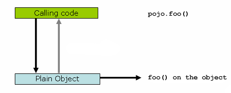

- Java
- Kotlin

```java
public class Main {
public static void main(String[] args) {Pojo pojo = new SimplePojo(); // this is a direct method call on the 'pojo' reference pojo.foo();}}
```

```kotlin
fun main() {
	val pojo = SimplePojo()
	// this is a direct method call on the 'pojo' reference
	pojo.foo()
}
```

Things change slightly when the reference that client code has is a proxy. Consider the
following diagram and code snippet:

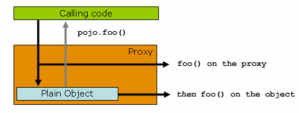

- Java
- Kotlin

```java
public class Main {

	public static void main(String[] args) {
		ProxyFactory factory = new ProxyFactory(new SimplePojo());
		factory.addInterface(Pojo.class);
		factory.addAdvice(new RetryAdvice());

		Pojo pojo = (Pojo) factory.getProxy();
		// this is a method call on the proxy!
		pojo.foo();
	}
}
```

```kotlin
fun main() {
	val factory = ProxyFactory(SimplePojo())
	factory.addInterface(Pojo::class.java)
	factory.addAdvice(RetryAdvice())

	val pojo = factory.proxy as Pojo
	// this is a method call on the proxy!
	pojo.foo()
}
```

The key thing to understand here is that the client code inside the `main(..)` method
of the `Main` class has a reference to the proxy. This means that method calls on that
object reference are calls on the proxy. As a result, the proxy can delegate to all of
the interceptors (advice) that are relevant to that particular method call. However, once the call has finally reached the target object (the `SimplePojo` reference in
this case), any method calls that it may make on itself, such as `this.bar()` or
`this.foo()`, are going to be invoked against the `this` reference, and not the proxy.
This has important implications. It means that self invocation is not going to result
in the advice associated with a method invocation getting a chance to run. In other words, self invocation via an explicit or implicit `this` reference will bypass the advice.

To address that, you have the following options.

Avoid self invocation
:   The best approach (the term "best" is used loosely here) is to refactor your code such
    that the self invocation does not happen. This does entail some work on your part, but
    it is the best, least-invasive approach.

Inject a self reference
:   An alternative approach is to make use of
    [self injection](#core-beans-annotation-config-autowired--beans-autowired-annotation-self-injection),
    and invoke methods on the proxy via the self reference instead of via `this`.

Use `AopContext.currentProxy()`
:   This last approach is highly discouraged, and we hesitate to point it out, in favor of
    the previous options. However, as a last resort you can choose to tie the logic within
    your class to Spring AOP, as the following example shows.

- Java
- Kotlin

```java
public class SimplePojo implements Pojo {
public void foo() {// This works, but it should be avoided if possible.((Pojo) AopContext.currentProxy()).bar();}
public void bar() {// some logic...}}
```

```kotlin
class SimplePojo : Pojo {
fun foo() {// This works, but it should be avoided if possible.(AopContext.currentProxy() as Pojo).bar()}
fun bar() {// some logic...}}
```

The use of `AopContext.currentProxy()` totally couples your code to Spring AOP, and it
makes the class itself aware of the fact that it is being used in an AOP context, which
reduces some of the benefits of AOP. It also requires that the `ProxyFactory` is
configured to expose the proxy, as the following example shows:

- Java
- Kotlin

```java
public class Main {

	public static void main(String[] args) {
		ProxyFactory factory = new ProxyFactory(new SimplePojo());
		factory.addInterface(Pojo.class);
		factory.addAdvice(new RetryAdvice());
		factory.setExposeProxy(true);

		Pojo pojo = (Pojo) factory.getProxy();
		// this is a method call on the proxy!
		pojo.foo();
	}
}
```

```kotlin
fun main() {
	val factory = ProxyFactory(SimplePojo())
	factory.addInterface(Pojo::class.java)
	factory.addAdvice(RetryAdvice())
	factory.isExposeProxy = true

	val pojo = factory.proxy as Pojo
	// this is a method call on the proxy!
	pojo.foo()
}
```

> [!NOTE]
> AspectJ compile-time weaving and load-time weaving do not have this self-invocation
> issue because they apply advice within the bytecode instead of via a proxy.

[Mixing Aspect Types](#core-aop-mixing-styles)
[Programmatic Creation of @AspectJ Proxies](#core-aop-aspectj-programmatic)

---

<a id="core-aop-aspectj-programmatic"></a>

<!-- source_url: https://docs.spring.io/spring-framework/reference/core/aop/aspectj-programmatic.html -->

<!-- page_index: 90 -->

# Programmatic Creation of @AspectJ Proxies

<svg enable-background="new 0 0 32 32" id="Glyph" version="1.1" viewbox="0 0 32 32" xml:space="preserve" xmlns="http://www.w3.org/2000/svg" xmlns:xlink="http://www.w3.org/1999/xlink">
<path id="XMLID_223_"></path>
</svg>

Search

<a id="core-aop-aspectj-programmatic--page-title"></a>
<a id="core-aop-aspectj-programmatic--programmatic-creation-of-aspectj-proxies"></a>

# Programmatic Creation of @AspectJ Proxies

In addition to declaring aspects in your configuration by using either `<aop:config>`
or `<aop:aspectj-autoproxy>`, it is also possible to programmatically create proxies
that advise target objects. For the full details of Spring’s AOP API, see the
[next chapter](#core-aop-api). Here, we want to focus on the ability to automatically
create proxies by using @AspectJ aspects.

You can use the `org.springframework.aop.aspectj.annotation.AspectJProxyFactory` class
to create a proxy for a target object that is advised by one or more @AspectJ aspects.
The basic usage for this class is very simple, as the following example shows:

- Java
- Kotlin

```java
// create a factory that can generate a proxy for the given target object
AspectJProxyFactory factory = new AspectJProxyFactory(targetObject);

// add an aspect, the class must be an @AspectJ aspect
// you can call this as many times as you need with different aspects
factory.addAspect(SecurityManager.class);

// you can also add existing aspect instances, the type of the object supplied
// must be an @AspectJ aspect
factory.addAspect(usageTracker);

// now get the proxy object...
MyInterfaceType proxy = factory.getProxy();
```

```kotlin
// create a factory that can generate a proxy for the given target object
val factory = AspectJProxyFactory(targetObject)

// add an aspect, the class must be an @AspectJ aspect
// you can call this as many times as you need with different aspects
factory.addAspect(SecurityManager::class.java)

// you can also add existing aspect instances, the type of the object supplied
// must be an @AspectJ aspect
factory.addAspect(usageTracker)

// now get the proxy object...
val proxy = factory.getProxy<Any>()
```

See the [javadoc](https://docs.spring.io/spring-framework/docs/7.0.8/javadoc-api/org/springframework/aop/aspectj/annotation/AspectJProxyFactory.html) for more information.

[Proxying Mechanisms](#core-aop-proxying)
[Using AspectJ with Spring Applications](#core-aop-using-aspectj)

---

<a id="core-aop-using-aspectj"></a>

<!-- source_url: https://docs.spring.io/spring-framework/reference/core/aop/using-aspectj.html -->

<!-- page_index: 91 -->

# Using AspectJ with Spring Applications

<svg enable-background="new 0 0 32 32" id="Glyph" version="1.1" viewbox="0 0 32 32" xml:space="preserve" xmlns="http://www.w3.org/2000/svg" xmlns:xlink="http://www.w3.org/1999/xlink">
<path id="XMLID_223_"></path>
</svg>

Search

<a id="core-aop-using-aspectj--page-title"></a>
<a id="core-aop-using-aspectj--using-aspectj-with-spring-applications"></a>

# Using AspectJ with Spring Applications

Everything we have covered so far in this chapter is pure Spring AOP. In this section, we look at how you can use the AspectJ compiler or weaver instead of or in
addition to Spring AOP if your needs go beyond the facilities offered by Spring AOP
alone.

Spring ships with a small AspectJ aspect library, which is available stand-alone in your
distribution as `spring-aspects.jar`. You need to add this to your classpath in order
to use the aspects in it.
[Using AspectJ to Dependency Inject Domain Objects with Spring](#core-aop-using-aspectj--aop-atconfigurable)
and [Other Spring aspects for AspectJ](#core-aop-using-aspectj--aop-ajlib-other)
discuss the content of this library and how you can use it.
[Configuring AspectJ Aspects by Using Spring IoC](#core-aop-using-aspectj--aop-aj-configure)
discusses how to dependency inject AspectJ aspects that are woven using the AspectJ compiler. Finally, [Load-time Weaving with AspectJ in the Spring Framework](#core-aop-using-aspectj--aop-aj-ltw)
provides an introduction to load-time weaving for Spring applications that use AspectJ.

<a id="core-aop-using-aspectj--aop-atconfigurable"></a>
<a id="core-aop-using-aspectj--using-aspectj-to-dependency-inject-domain-objects-with-spring"></a>

## Using AspectJ to Dependency Inject Domain Objects with Spring

The Spring container instantiates and configures beans defined in your application
context. It is also possible to ask a bean factory to configure a pre-existing
object, given the name of a bean definition that contains the configuration to be applied.
`spring-aspects.jar` contains an annotation-driven aspect that exploits this
capability to allow dependency injection of any object. The support is intended to
be used for objects created outside of the control of any container. Domain objects
often fall into this category because they are often created programmatically with the
`new` operator or by an ORM tool as a result of a database query.

The `@Configurable` annotation marks a class as being eligible for Spring-driven
configuration. In the simplest case, you can use purely it as a marker annotation, as the
following example shows:

- Java
- Kotlin

```java
package com.xyz.domain;

import org.springframework.beans.factory.annotation.Configurable;

@Configurable
public class Account {
	// ...
}
```

```kotlin
package com.xyz.domain

import org.springframework.beans.factory.annotation.Configurable

@Configurable
class Account {
	// ...
}
```

When used as a marker interface in this way, Spring configures new instances of the
annotated type (`Account`, in this case) by using a bean definition (typically
prototype-scoped) with the same name as the fully-qualified type name
(`com.xyz.domain.Account`). Since the default name for a bean defined via XML is the
fully-qualified name of its type, a convenient way to declare the prototype definition
is to omit the `id` attribute, as the following example shows:

```xml
<bean class="com.xyz.domain.Account" scope="prototype">
	<property name="fundsTransferService" ref="fundsTransferService"/>
</bean>
```

If you want to explicitly specify the name of the prototype bean definition to use, you
can do so directly in the annotation, as the following example shows:

- Java
- Kotlin

```java
package com.xyz.domain;

import org.springframework.beans.factory.annotation.Configurable;

@Configurable("account")
public class Account {
	// ...
}
```

```kotlin
package com.xyz.domain

import org.springframework.beans.factory.annotation.Configurable

@Configurable("account")
class Account {
	// ...
}
```

Spring now looks for a bean definition named `account` and uses that as the
definition to configure new `Account` instances.

You can also use autowiring to avoid having to specify a dedicated bean definition at
all. To have Spring apply autowiring, use the `autowire` property of the `@Configurable`
annotation. You can specify either `@Configurable(autowire=Autowire.BY_TYPE)` or
`@Configurable(autowire=Autowire.BY_NAME)` for autowiring by type or by name, respectively. As an alternative, it is preferable to specify explicit, annotation-driven
dependency injection for your `@Configurable` beans through `@Autowired` or `@Inject`
at the field or method level (see [Annotation-based Container Configuration](#core-beans-annotation-config) for further details).

Finally, you can enable Spring dependency checking for the object references in the newly
created and configured object by using the `dependencyCheck` attribute (for example, `@Configurable(autowire=Autowire.BY_NAME,dependencyCheck=true)`). If this attribute is
set to `true`, Spring validates after configuration that all properties (which
are not primitives or collections) have been set.

Note that using the annotation on its own does nothing. It is the
`AnnotationBeanConfigurerAspect` in `spring-aspects.jar` that acts on the presence of
the annotation. In essence, the aspect says, "after returning from the initialization of
a new object of a type annotated with `@Configurable`, configure the newly created object
using Spring in accordance with the properties of the annotation". In this context,
"initialization" refers to newly instantiated objects (for example, objects instantiated
with the `new` operator) as well as to `Serializable` objects that are undergoing
deserialization (for example, through
[readResolve()](https://docs.oracle.com/en/java/javase/17/docs/api/java.base/java/io/Serializable.html)).

> [!NOTE]
> One of the key phrases in the above paragraph is "in essence". For most cases, the
> exact semantics of "after returning from the initialization of a new object" are
> fine. In this context, "after initialization" means that the dependencies are
> injected after the object has been constructed. This means that the dependencies
> are not available for use in the constructor bodies of the class. If you want the
> dependencies to be injected before the constructor bodies run and thus be
> available for use in the body of the constructors, you need to define this on the
> `@Configurable` declaration, as follows:
>
> - Java
> - Kotlin
>
> ```java
> @Configurable(preConstruction = true)
> ```
>
> ```kotlin
> @Configurable(preConstruction = true)
> ```
>
> You can find more information about the language semantics of the various pointcut
> types in AspectJ
> [in this appendix](https://www.eclipse.org/aspectj/doc/released/progguide/semantics-joinPoints.html) of the
> [AspectJ Programming Guide](https://www.eclipse.org/aspectj/doc/released/progguide/index.html).

For this to work, the annotated types must be woven with the AspectJ weaver. You can
either use a build-time Ant or Maven task to do this (see, for example, the
[AspectJ Development
Environment Guide](https://www.eclipse.org/aspectj/doc/released/devguide/antTasks.html)) or load-time weaving (see [Load-time Weaving with AspectJ in the Spring Framework](#core-aop-using-aspectj--aop-aj-ltw)). The
`AnnotationBeanConfigurerAspect` itself needs to be configured by Spring (in order to obtain
a reference to the bean factory that is to be used to configure new objects). You can define
the related configuration as follows:

- Java
- Kotlin
- Xml

```java
@Configuration
@EnableSpringConfigured
public class ApplicationConfiguration {
}
```

```kotlin
@Configuration
@EnableSpringConfigured
class ApplicationConfiguration
```

```xml
<beans xmlns="http://www.springframework.org/schema/beans"
	   xmlns:xsi="http://www.w3.org/2001/XMLSchema-instance"
	   xmlns:context="http://www.springframework.org/schema/context"
	   xsi:schemaLocation="http://www.springframework.org/schema/beans
			https://www.springframework.org/schema/beans/spring-beans.xsd
			http://www.springframework.org/schema/context
			https://www.springframework.org/schema/context/spring-context.xsd">

	<context:spring-configured />

</beans>
```

Instances of `@Configurable` objects created before the aspect has been configured
result in a message being issued to the debug log and no configuration of the
object taking place. An example might be a bean in the Spring configuration that creates
domain objects when it is initialized by Spring. In this case, you can use the
`depends-on` bean attribute to manually specify that the bean depends on the
configuration aspect. The following example shows how to use the `depends-on` attribute:

```xml
<bean id="myService"
		class="com.xyz.service.MyService"
		depends-on="org.springframework.beans.factory.aspectj.AnnotationBeanConfigurerAspect">

	<!-- ... -->

</bean>
```

> [!NOTE]
> Do not activate `@Configurable` processing through the bean configurer aspect unless you
> really mean to rely on its semantics at runtime. In particular, make sure that you do
> not use `@Configurable` on bean classes that are registered as regular Spring beans
> with the container. Doing so results in double initialization, once through the
> container and once through the aspect.

<a id="core-aop-using-aspectj--aop-configurable-testing"></a>
<a id="core-aop-using-aspectj--unit-testing-configurable-objects"></a>

### Unit Testing `@Configurable` Objects

One of the goals of the `@Configurable` support is to enable independent unit testing
of domain objects without the difficulties associated with hard-coded lookups.
If `@Configurable` types have not been woven by AspectJ, the annotation has no affect
during unit testing. You can set mock or stub property references in the object under
test and proceed as normal. If `@Configurable` types have been woven by AspectJ, you can still unit test outside of the container as normal, but you see a warning
message each time that you construct a `@Configurable` object indicating that it has
not been configured by Spring.

<a id="core-aop-using-aspectj--aop-configurable-container"></a>
<a id="core-aop-using-aspectj--working-with-multiple-application-contexts"></a>

### Working with Multiple Application Contexts

The `AnnotationBeanConfigurerAspect` that is used to implement the `@Configurable` support
is an AspectJ singleton aspect. The scope of a singleton aspect is the same as the scope
of `static` members: There is one aspect instance per `ClassLoader` that defines the type.
This means that, if you define multiple application contexts within the same `ClassLoader`
hierarchy, you need to consider where to define the `@EnableSpringConfigured` bean and
where to place `spring-aspects.jar` on the classpath.

Consider a typical Spring web application configuration that has a shared parent application
context that defines common business services, everything needed to support those services, and one child application context for each servlet (which contains definitions particular
to that servlet). All of these contexts co-exist within the same `ClassLoader` hierarchy, and so the `AnnotationBeanConfigurerAspect` can hold a reference to only one of them.
In this case, we recommend defining the `@EnableSpringConfigured` bean in the shared
(parent) application context. This defines the services that you are likely to want to
inject into domain objects. A consequence is that you cannot configure domain objects
with references to beans defined in the child (servlet-specific) contexts by using the
@Configurable mechanism (which is probably not something you want to do anyway).

When deploying multiple web applications within the same container, ensure that each
web application loads the types in `spring-aspects.jar` by using its own `ClassLoader`
(for example, by placing `spring-aspects.jar` in `WEB-INF/lib`). If `spring-aspects.jar`
is added only to the container-wide classpath (and hence loaded by the shared parent
`ClassLoader`), all web applications share the same aspect instance (which is probably
not what you want).

<a id="core-aop-using-aspectj--aop-ajlib-other"></a>
<a id="core-aop-using-aspectj--other-spring-aspects-for-aspectj"></a>

## Other Spring aspects for AspectJ

In addition to the `@Configurable` aspect, `spring-aspects.jar` contains an AspectJ
aspect that you can use to drive Spring’s transaction management for types and methods
annotated with the `@Transactional` annotation. This is primarily intended for users who
want to use the Spring Framework’s transaction support outside of the Spring container.

The aspect that interprets `@Transactional` annotations is the
`AnnotationTransactionAspect`. When you use this aspect, you must annotate the
implementation class (or methods within that class or both), not the interface (if
any) that the class implements. AspectJ follows Java’s rule that annotations on
interfaces are not inherited.

A `@Transactional` annotation on a class specifies the default transaction semantics for
the execution of any public operation in the class.

A `@Transactional` annotation on a method within the class overrides the default
transaction semantics given by the class annotation (if present). Methods of any
visibility may be annotated, including private methods. Annotating non-public methods
directly is the only way to get transaction demarcation for the execution of such methods.

> [!TIP]
> Since Spring Framework 4.2, `spring-aspects` provides a similar aspect that offers the
> exact same features for the standard `jakarta.transaction.Transactional` annotation. Check
> `JtaAnnotationTransactionAspect` for more details.

For AspectJ programmers who want to use the Spring configuration and transaction
management support but do not want to (or cannot) use annotations, `spring-aspects.jar`
also contains `abstract` aspects you can extend to provide your own pointcut
definitions. See the sources for the `AbstractBeanConfigurerAspect` and
`AbstractTransactionAspect` aspects for more information. As an example, the following
excerpt shows how you could write an aspect to configure all instances of objects
defined in the domain model by using prototype bean definitions that match the
fully qualified class names:

```java
public aspect DomainObjectConfiguration extends AbstractBeanConfigurerAspect {

	public DomainObjectConfiguration() {
		setBeanWiringInfoResolver(new ClassNameBeanWiringInfoResolver());
	}

	// the creation of a new bean (any object in the domain model)
	protected pointcut beanCreation(Object beanInstance) :
		initialization(new(..)) &&
		CommonPointcuts.inDomainModel() &&
		this(beanInstance);
}
```

<a id="core-aop-using-aspectj--aop-aj-configure"></a>
<a id="core-aop-using-aspectj--configuring-aspectj-aspects-by-using-spring-ioc"></a>

## Configuring AspectJ Aspects by Using Spring IoC

When you use AspectJ aspects with Spring applications, it is natural to both want and
expect to be able to configure such aspects with Spring. The AspectJ runtime itself is
responsible for aspect creation, and the means of configuring the AspectJ-created
aspects through Spring depends on the AspectJ instantiation model (the `per-xxx` clause)
used by the aspect.

The majority of AspectJ aspects are singleton aspects. Configuration of these
aspects is easy. You can create a bean definition that references the aspect type as
normal and include the `factory-method="aspectOf"` bean attribute. This ensures that
Spring obtains the aspect instance by asking AspectJ for it rather than trying to create
an instance itself. The following example shows how to use the `factory-method="aspectOf"` attribute:

```xml
<bean id="profiler" class="com.xyz.profiler.Profiler"
		factory-method="aspectOf"> (1)

	<property name="profilingStrategy" ref="jamonProfilingStrategy"/>
</bean>
```

**1**

Note the `factory-method="aspectOf"` attribute

Non-singleton aspects are harder to configure. However, it is possible to do so by
creating prototype bean definitions and using the `@Configurable` support from
`spring-aspects.jar` to configure the aspect instances once they have bean created by
the AspectJ runtime.

If you have some @AspectJ aspects that you want to weave with AspectJ (for example, using load-time weaving for domain model types) and other @AspectJ aspects that you want
to use with Spring AOP, and these aspects are all configured in Spring, you
need to tell the Spring AOP @AspectJ auto-proxying support which exact subset of the
@AspectJ aspects defined in the configuration should be used for auto-proxying. You can
do this by using one or more `<include/>` elements inside the `<aop:aspectj-autoproxy/>`
declaration. Each `<include/>` element specifies a name pattern, and only beans with
names matched by at least one of the patterns are used for Spring AOP auto-proxy
configuration. The following example shows how to use `<include/>` elements:

```xml
<aop:aspectj-autoproxy>
	<aop:include name="thisBean"/>
	<aop:include name="thatBean"/>
</aop:aspectj-autoproxy>
```

> [!NOTE]
> Do not be misled by the name of the `<aop:aspectj-autoproxy/>` element. Using it
> results in the creation of Spring AOP proxies. The @AspectJ style of aspect
> declaration is being used here, but the AspectJ runtime is not involved.

<a id="core-aop-using-aspectj--aop-aj-ltw"></a>
<a id="core-aop-using-aspectj--load-time-weaving-with-aspectj-in-the-spring-framework"></a>

## Load-time Weaving with AspectJ in the Spring Framework

Load-time weaving (LTW) refers to the process of weaving AspectJ aspects into an
application’s class files as they are being loaded into the Java virtual machine (JVM).
The focus of this section is on configuring and using LTW in the specific context of the
Spring Framework. This section is not a general introduction to LTW. For full details on
the specifics of LTW and configuring LTW with only AspectJ (with Spring not being
involved at all), see the
[LTW section of the AspectJ
Development Environment Guide](https://www.eclipse.org/aspectj/doc/released/devguide/ltw.html).

The value that the Spring Framework brings to AspectJ LTW is in enabling much
finer-grained control over the weaving process. 'Vanilla' AspectJ LTW is effected by using
a Java (5+) agent, which is switched on by specifying a VM argument when starting up a
JVM. It is, thus, a JVM-wide setting, which may be fine in some situations but is often a
little too coarse. Spring-enabled LTW lets you switch on LTW on a
per-`ClassLoader` basis, which is more fine-grained and which can make more
sense in a 'single-JVM-multiple-application' environment (such as is found in a typical
application server environment).

Further, [in certain environments](#core-aop-using-aspectj--aop-aj-ltw-environments), this support enables
load-time weaving without making any modifications to the application server’s launch
script that is needed to add `-javaagent:path/to/aspectjweaver.jar` or (as we describe
later in this section) `-javaagent:path/to/spring-instrument.jar`. Developers configure
the application context to enable load-time weaving instead of relying on administrators
who typically are in charge of the deployment configuration, such as the launch script.

Now that the sales pitch is over, let us first walk through a quick example of AspectJ
LTW that uses Spring, followed by detailed specifics about elements introduced in the
example. For a complete example, see the
[Petclinic sample application based on Spring Framework](https://github.com/spring-petclinic/spring-framework-petclinic).

<a id="core-aop-using-aspectj--aop-aj-ltw-first-example"></a>
<a id="core-aop-using-aspectj--a-first-example"></a>

### A First Example

Assume that you are an application developer who has been tasked with diagnosing
the cause of some performance problems in a system. Rather than break out a
profiling tool, we are going to switch on a simple profiling aspect that lets us
quickly get some performance metrics. We can then apply a finer-grained profiling
tool to that specific area immediately afterwards.

> [!NOTE]
> The example presented here uses XML configuration. You can also configure and
> use @AspectJ with [Java configuration](#core-beans-java). Specifically, you can use the
> `@EnableLoadTimeWeaving` annotation as an alternative to `<context:load-time-weaver/>`
> (see [below](#core-aop-using-aspectj--aop-aj-ltw-spring) for details).

The following example shows the profiling aspect, which is not fancy.
It is a time-based profiler that uses the @AspectJ-style of aspect declaration:

- Java
- Kotlin

```java
package com.xyz;

import org.aspectj.lang.ProceedingJoinPoint;
import org.aspectj.lang.annotation.Aspect;
import org.aspectj.lang.annotation.Around;
import org.aspectj.lang.annotation.Pointcut;
import org.springframework.util.StopWatch;
import org.springframework.core.annotation.Order;

@Aspect
public class ProfilingAspect {

	@Around("methodsToBeProfiled()")
	public Object profile(ProceedingJoinPoint pjp) throws Throwable {
		StopWatch sw = new StopWatch(getClass().getSimpleName());
		try {
			sw.start(pjp.getSignature().getName());
			return pjp.proceed();
		} finally {
			sw.stop();
			System.out.println(sw.prettyPrint());
		}
	}

	@Pointcut("execution(public * com.xyz..*.*(..))")
	public void methodsToBeProfiled(){}
}
```

```kotlin
package com.xyz

import org.aspectj.lang.ProceedingJoinPoint
import org.aspectj.lang.annotation.Aspect
import org.aspectj.lang.annotation.Around
import org.aspectj.lang.annotation.Pointcut
import org.springframework.util.StopWatch
import org.springframework.core.annotation.Order

@Aspect
class ProfilingAspect {

	@Around("methodsToBeProfiled()")
	fun profile(pjp: ProceedingJoinPoint): Any? {
		val sw = StopWatch(javaClass.simpleName)
		try {
			sw.start(pjp.getSignature().getName())
			return pjp.proceed()
		} finally {
			sw.stop()
			println(sw.prettyPrint())
		}
	}

	@Pointcut("execution(public * com.xyz..*.*(..))")
	fun methodsToBeProfiled() {
	}
}
```

We also need to create an `META-INF/aop.xml` file, to inform the AspectJ weaver that
we want to weave our `ProfilingAspect` into our classes. This file convention, namely
the presence of a file (or files) on the Java classpath called `META-INF/aop.xml` is
standard AspectJ. The following example shows the `aop.xml` file:

```xml
<!DOCTYPE aspectj PUBLIC "-//AspectJ//DTD//EN" "https://www.eclipse.org/aspectj/dtd/aspectj.dtd">
<aspectj>

	<weaver>
		<!-- only weave classes in our application-specific packages and sub-packages -->
		<include within="com.xyz..*"/>
	</weaver>

	<aspects>
		<!-- weave in just this aspect -->
		<aspect name="com.xyz.ProfilingAspect"/>
	</aspects>

</aspectj>
```

> [!NOTE]
> It is recommended to only weave specific classes (typically those in the
> application packages, as shown in the `aop.xml` example above) in order
> to avoid side effects such as AspectJ dump files and warnings.
> This is also a best practice from an efficiency perspective.

Now we can move on to the Spring-specific portion of the configuration. We need
to configure a `LoadTimeWeaver` (explained later). This load-time weaver is the
essential component responsible for weaving the aspect configuration in one or
more `META-INF/aop.xml` files into the classes in your application. The good
thing is that it does not require a lot of configuration (there are some more
options that you can specify, but these are detailed later), as can be seen in
the following example:

```xml
<?xml version="1.0" encoding="UTF-8"?>
<beans xmlns="http://www.springframework.org/schema/beans"
	xmlns:xsi="http://www.w3.org/2001/XMLSchema-instance"
	xmlns:context="http://www.springframework.org/schema/context"
	xsi:schemaLocation="
		http://www.springframework.org/schema/beans
		https://www.springframework.org/schema/beans/spring-beans.xsd
		http://www.springframework.org/schema/context
		https://www.springframework.org/schema/context/spring-context.xsd">

	<!-- a service object; we will be profiling its methods -->
	<bean id="entitlementCalculationService"
			class="com.xyz.StubEntitlementCalculationService"/>

	<!-- this switches on the load-time weaving -->
	<context:load-time-weaver/>
</beans>
```

Now that all the required artifacts (the aspect, the `META-INF/aop.xml`
file, and the Spring configuration) are in place, we can create the following
driver class with a `main(..)` method to demonstrate the LTW in action:

- Java
- Kotlin

```java
package com.xyz;

// imports

public class Main {

	public static void main(String[] args) {
		ApplicationContext ctx = new ClassPathXmlApplicationContext("beans.xml");

		EntitlementCalculationService service =
				ctx.getBean(EntitlementCalculationService.class);

		// the profiling aspect is 'woven' around this method execution
		service.calculateEntitlement();
	}
}
```

```kotlin
package com.xyz

// imports

fun main() {
	val ctx = ClassPathXmlApplicationContext("beans.xml")

	val service = ctx.getBean(EntitlementCalculationService.class)

	// the profiling aspect is 'woven' around this method execution
	service.calculateEntitlement()
}
```

We have one last thing to do. The introduction to this section did say that one could
switch on LTW selectively on a per-`ClassLoader` basis with Spring, and this is true.
However, for this example, we use a Java agent (supplied with Spring) to switch on LTW.
We use the following command to run the `Main` class shown earlier:

```
java -javaagent:C:/projects/xyz/lib/spring-instrument.jar com.xyz.Main
```

The `-javaagent` is a flag for specifying and enabling
[agents
to instrument programs that run on the JVM](https://docs.oracle.com/en/java/javase/17/docs/api/java.instrument/java/lang/instrument/package-summary.html). The Spring Framework ships with such an
agent, the `InstrumentationSavingAgent`, which is packaged in the
`spring-instrument.jar` that was supplied as the value of the `-javaagent` argument in
the preceding example.

The output from the execution of the `Main` program looks something like the next example.
(I have introduced a `Thread.sleep(..)` statement into the `calculateEntitlement()`
implementation so that the profiler actually captures something other than 0
milliseconds (the `01234` milliseconds is not an overhead introduced by the AOP).
The following listing shows the output we got when we ran our profiler:

```
Calculating entitlement

StopWatch 'ProfilingAspect': running time (millis) = 1234
------ ----- ----------------------------
ms     %     Task name
------ ----- ----------------------------
01234  100%  calculateEntitlement
```

Since this LTW is effected by using full-blown AspectJ, we are not limited only to advising
Spring beans. The following slight variation on the `Main` program yields the same
result:

- Java
- Kotlin

```java
package com.xyz;

// imports

public class Main {

	public static void main(String[] args) {
		new ClassPathXmlApplicationContext("beans.xml");

		EntitlementCalculationService service =
				new StubEntitlementCalculationService();

		// the profiling aspect will be 'woven' around this method execution
		service.calculateEntitlement();
	}
}
```

```kotlin
package com.xyz

// imports

fun main(args: Array<String>) {
	ClassPathXmlApplicationContext("beans.xml")

	val service = StubEntitlementCalculationService()

	// the profiling aspect will be 'woven' around this method execution
	service.calculateEntitlement()
}
```

Notice how, in the preceding program, we bootstrap the Spring container and
then create a new instance of the `StubEntitlementCalculationService` totally outside
the context of Spring. The profiling advice still gets woven in.

Admittedly, the example is simplistic. However, the basics of the LTW support in Spring
have all been introduced in the earlier example, and the rest of this section explains
the "why" behind each bit of configuration and usage in detail.

> [!NOTE]
> The `ProfilingAspect` used in this example may be basic, but it is quite useful. It is a
> nice example of a development-time aspect that developers can use during development
> and then easily exclude from builds of the application being deployed
> into UAT or production.

<a id="core-aop-using-aspectj--aop-aj-ltw-the-aspects"></a>
<a id="core-aop-using-aspectj--aspects"></a>

### Aspects

The aspects that you use in LTW have to be AspectJ aspects. You can write them in
either the AspectJ language itself, or you can write your aspects in the @AspectJ-style.
Your aspects are then both valid AspectJ and Spring AOP aspects.
Furthermore, the compiled aspect classes need to be available on the classpath.

<a id="core-aop-using-aspectj--aop-aj-ltw-aop_dot_xml"></a>
<a id="core-aop-using-aspectj--meta-inf-aop.xml"></a>

### `META-INF/aop.xml`

The AspectJ LTW infrastructure is configured by using one or more `META-INF/aop.xml`
files that are on the Java classpath (either directly or, more typically, in jar files).
For example:

```xml
<!DOCTYPE aspectj PUBLIC "-//AspectJ//DTD//EN" "https://www.eclipse.org/aspectj/dtd/aspectj.dtd">
<aspectj>

	<weaver>
		<!-- only weave classes in our application-specific packages and sub-packages -->
		<include within="com.xyz..*"/>
	</weaver>

</aspectj>
```

> [!NOTE]
> It is recommended to only weave specific classes (typically those in the
> application packages, as shown in the `aop.xml` example above) in order
> to avoid side effects such as AspectJ dump files and warnings.
> This is also a best practice from an efficiency perspective.

The structure and contents of this file is detailed in the LTW part of the
[AspectJ reference
documentation](https://www.eclipse.org/aspectj/doc/released/devguide/ltw-configuration.html). Because the `aop.xml` file is 100% AspectJ, we do not describe it further here.

<a id="core-aop-using-aspectj--aop-aj-ltw-libraries"></a>
<a id="core-aop-using-aspectj--required-libraries-jars"></a>

### Required libraries (JARS)

At minimum, you need the following libraries to use the Spring Framework’s support
for AspectJ LTW:

- `spring-aop.jar`
- `aspectjweaver.jar`

If you use the [Spring-provided agent to enable instrumentation](#core-aop-using-aspectj--aop-aj-ltw-environments-generic)
, you also need:

- `spring-instrument.jar`

<a id="core-aop-using-aspectj--aop-aj-ltw-spring"></a>
<a id="core-aop-using-aspectj--spring-configuration"></a>

### Spring Configuration

The key component in Spring’s LTW support is the `LoadTimeWeaver` interface (in the
`org.springframework.instrument.classloading` package), and the numerous implementations
of it that ship with the Spring distribution. A `LoadTimeWeaver` is responsible for
adding one or more `java.lang.instrument.ClassFileTransformers` to a `ClassLoader` at
runtime, which opens the door to all manner of interesting applications, one of which
happens to be the LTW of aspects.

> [!TIP]
> If you are unfamiliar with the idea of runtime class file transformation, see the
> javadoc API documentation for the `java.lang.instrument` package before continuing.
> While that documentation is not comprehensive, at least you can see the key interfaces
> and classes (for reference as you read through this section).

Configuring a `LoadTimeWeaver` for a particular `ApplicationContext` can be as easy as
adding one line. (Note that you almost certainly need to use an
`ApplicationContext` as your Spring container — typically, a `BeanFactory` is not
enough because the LTW support uses `BeanFactoryPostProcessors`.)

To enable the Spring Framework’s LTW support, you need to configure a `LoadTimeWeaver` as follows:

- Java
- Kotlin
- Xml

```java
@Configuration
@EnableLoadTimeWeaving
public class ApplicationConfiguration {
}
```

```kotlin
@Configuration
@EnableLoadTimeWeaving
class ApplicationConfiguration
```

```xml
<beans xmlns="http://www.springframework.org/schema/beans"
	   xmlns:xsi="http://www.w3.org/2001/XMLSchema-instance"
	   xmlns:context="http://www.springframework.org/schema/context"
	   xsi:schemaLocation="http://www.springframework.org/schema/beans
			https://www.springframework.org/schema/beans/spring-beans.xsd
			http://www.springframework.org/schema/context
			https://www.springframework.org/schema/context/spring-context.xsd">

	<context:load-time-weaver />

</beans>
```

The preceding configuration automatically defines and registers a number of LTW-specific
infrastructure beans, such as a `LoadTimeWeaver` and an `AspectJWeavingEnabler`, for you.
The default `LoadTimeWeaver` is the `DefaultContextLoadTimeWeaver` class, which attempts
to decorate an automatically detected `LoadTimeWeaver`. The exact type of `LoadTimeWeaver`
that is "automatically detected" is dependent upon your runtime environment.
The following table summarizes various `LoadTimeWeaver` implementations:

| Runtime Environment | `LoadTimeWeaver` implementation |
| --- | --- |
| Running in [Apache Tomcat](https://tomcat.apache.org/) | `TomcatLoadTimeWeaver` |
| Running in [GlassFish](https://eclipse-ee4j.github.io/glassfish/) (limited to EAR deployments) | `GlassFishLoadTimeWeaver` |
| Running in Red Hat’s [JBoss AS](https://www.jboss.org/jbossas/) or [WildFly](https://www.wildfly.org/) | `JBossLoadTimeWeaver` |
| JVM started with Spring `InstrumentationSavingAgent` (`java -javaagent:path/to/spring-instrument.jar`) | `InstrumentationLoadTimeWeaver` |
| Fallback, expecting the underlying ClassLoader to follow common conventions (namely `addTransformer` and optionally a `getThrowawayClassLoader` method) | `ReflectiveLoadTimeWeaver` |

Note that the table lists only the `LoadTimeWeavers` that are autodetected when you
use the `DefaultContextLoadTimeWeaver`. You can specify exactly which `LoadTimeWeaver`
implementation to use.

To configure a specific `LoadTimeWeaver`, implement the
`LoadTimeWeavingConfigurer` interface and override the `getLoadTimeWeaver()` method
(or use the XML equivalent).
The following example specifies a `ReflectiveLoadTimeWeaver`:

- Java
- Kotlin
- Xml

```java
@Configuration @EnableLoadTimeWeaving public class CustomWeaverConfiguration implements LoadTimeWeavingConfigurer {
@Override public LoadTimeWeaver getLoadTimeWeaver() {return new ReflectiveLoadTimeWeaver();}}
```

```kotlin
@Configuration @EnableLoadTimeWeaving class CustomWeaverConfiguration : LoadTimeWeavingConfigurer {
override fun getLoadTimeWeaver(): LoadTimeWeaver {return ReflectiveLoadTimeWeaver()}}
```

```xml
<beans xmlns="http://www.springframework.org/schema/beans"
	   xmlns:xsi="http://www.w3.org/2001/XMLSchema-instance"
	   xmlns:context="http://www.springframework.org/schema/context"
	   xsi:schemaLocation="
		http://www.springframework.org/schema/beans
		https://www.springframework.org/schema/beans/spring-beans.xsd
		http://www.springframework.org/schema/context
		https://www.springframework.org/schema/context/spring-context.xsd">

	<context:load-time-weaver
			weaver-class="org.springframework.instrument.classloading.ReflectiveLoadTimeWeaver"/>

</beans>
```

The `LoadTimeWeaver` that is defined and registered by the configuration can be later
retrieved from the Spring container by using the well known name, `loadTimeWeaver`.
Remember that the `LoadTimeWeaver` exists only as a mechanism for Spring’s LTW
infrastructure to add one or more `ClassFileTransformers`. The actual
`ClassFileTransformer` that does the LTW is the `ClassPreProcessorAgentAdapter` (from
the `org.aspectj.weaver.loadtime` package) class. See the class-level javadoc of the
`ClassPreProcessorAgentAdapter` class for further details, because the specifics of how
the weaving is actually effected is beyond the scope of this document.

There is one final attribute of the configuration left to discuss: the `aspectjWeaving`
attribute (or `aspectj-weaving` if you use XML). This attribute controls whether LTW
is enabled or not. It accepts one of three possible values, with the default value being
`autodetect` if the attribute is not present. The following table summarizes the three
possible values:

| Annotation Value | XML Value | Explanation |
| --- | --- | --- |
| `ENABLED` | `on` | AspectJ weaving is on, and aspects are woven at load-time as appropriate. |
| `DISABLED` | `off` | LTW is off. No aspect is woven at load-time. |
| `AUTODETECT` | `autodetect` | If the Spring LTW infrastructure can find at least one `META-INF/aop.xml` file, then AspectJ weaving is on. Otherwise, it is off. This is the default value. |

<a id="core-aop-using-aspectj--aop-aj-ltw-environments"></a>
<a id="core-aop-using-aspectj--environment-specific-configuration"></a>

### Environment-specific Configuration

This last section contains any additional settings and configuration that you need
when you use Spring’s LTW support in environments such as application servers and web
containers.

<a id="core-aop-using-aspectj--aop-aj-ltw-environments-tomcat-jboss-etc"></a>
<a id="core-aop-using-aspectj--tomcat-jboss-wildfly"></a>

#### Tomcat, JBoss, WildFly

Tomcat and JBoss/WildFly provide a general app `ClassLoader` that is capable of local
instrumentation. Spring’s native LTW may leverage those ClassLoader implementations
to provide AspectJ weaving.
You can simply enable load-time weaving, as [described earlier](#core-aop-using-aspectj).
Specifically, you do not need to modify the JVM launch script to add
`-javaagent:path/to/spring-instrument.jar`.

Note that on JBoss, you may need to disable the app server scanning to prevent it from
loading the classes before the application actually starts. A quick workaround is to add
to your artifact a file named `WEB-INF/jboss-scanning.xml` with the following content:

```xml
<scanning xmlns="urn:jboss:scanning:1.0"/>
```

<a id="core-aop-using-aspectj--aop-aj-ltw-environments-generic"></a>
<a id="core-aop-using-aspectj--generic-java-applications"></a>

#### Generic Java Applications

When class instrumentation is required in environments that are not supported by
specific `LoadTimeWeaver` implementations, a JVM agent is the general solution.
For such cases, Spring provides `InstrumentationLoadTimeWeaver` which requires a
Spring-specific (but very general) JVM agent, `spring-instrument.jar`, autodetected
by common `@EnableLoadTimeWeaving` and `<context:load-time-weaver/>` setups.

To use it, you must start the virtual machine with the Spring agent by supplying
the following JVM options:

```
-javaagent:/path/to/spring-instrument.jar
```

Note that this requires modification of the JVM launch script, which may prevent you
from using this in application server environments (depending on your server and your
operation policies). That said, for one-app-per-JVM deployments such as standalone
Spring Boot applications, you typically control the entire JVM setup in any case.

[Programmatic Creation of @AspectJ Proxies](#core-aop-aspectj-programmatic)
[Further Resources](#core-aop-resources)

---

<a id="core-aop-resources"></a>

<!-- source_url: https://docs.spring.io/spring-framework/reference/core/aop/resources.html -->

<!-- page_index: 92 -->

# Further Resources

<svg enable-background="new 0 0 32 32" id="Glyph" version="1.1" viewbox="0 0 32 32" xml:space="preserve" xmlns="http://www.w3.org/2000/svg" xmlns:xlink="http://www.w3.org/1999/xlink">
<path id="XMLID_223_"></path>
</svg>

Search

<a id="core-aop-resources--page-title"></a>
<a id="core-aop-resources--further-resources"></a>

# Further Resources

More information on AspectJ can be found on the [AspectJ website](https://www.eclipse.org/aspectj).

*Eclipse AspectJ* by Adrian Colyer et. al. (Addison-Wesley, 2005) provides a
comprehensive introduction and reference for the AspectJ language.

*AspectJ in Action*, Second Edition by Ramnivas Laddad (Manning, 2009) comes highly
recommended. The focus of the book is on AspectJ, but a lot of general AOP themes are
explored (in some depth).

[Using AspectJ with Spring Applications](#core-aop-using-aspectj)
[Spring AOP APIs](#core-aop-api)

---

<a id="core-aop-api"></a>

<!-- source_url: https://docs.spring.io/spring-framework/reference/core/aop-api.html -->

<!-- page_index: 93 -->

# Spring AOP APIs

<svg enable-background="new 0 0 32 32" id="Glyph" version="1.1" viewbox="0 0 32 32" xml:space="preserve" xmlns="http://www.w3.org/2000/svg" xmlns:xlink="http://www.w3.org/1999/xlink">
<path id="XMLID_223_"></path>
</svg>

Search

<a id="core-aop-api--page-title"></a>
<a id="core-aop-api--spring-aop-apis"></a>

# Spring AOP APIs

The previous chapter described the Spring’s support for AOP with @AspectJ and schema-based
aspect definitions. In this chapter, we discuss the lower-level Spring AOP APIs. For common
applications, we recommend the use of Spring AOP with AspectJ pointcuts as described in the
previous chapter.

<a id="core-aop-api--section-summary"></a>

## Section Summary

- [Pointcut API in Spring](#core-aop-api-pointcuts)
- [Advice API in Spring](#core-aop-api-advice)
- [The Advisor API in Spring](#core-aop-api-advisor)
- [Using the `ProxyFactoryBean` to Create AOP Proxies](#core-aop-api-pfb)
- [Concise Proxy Definitions](#core-aop-api-concise-proxy)
- [Creating AOP Proxies Programmatically with the `ProxyFactory`](#core-aop-api-prog)
- [Manipulating Advised Objects](#core-aop-api-advised)
- [Using the "auto-proxy" facility](#core-aop-api-autoproxy)
- [Using `TargetSource` Implementations](#core-aop-api-targetsource)
- [Defining New Advice Types](#core-aop-api-extensibility)

[Further Resources](#core-aop-resources)
[Pointcut API in Spring](#core-aop-api-pointcuts)

---

<a id="core-aop-api-pointcuts"></a>

<!-- source_url: https://docs.spring.io/spring-framework/reference/core/aop-api/pointcuts.html -->

<!-- page_index: 94 -->

# Pointcut API in Spring

<svg enable-background="new 0 0 32 32" id="Glyph" version="1.1" viewbox="0 0 32 32" xml:space="preserve" xmlns="http://www.w3.org/2000/svg" xmlns:xlink="http://www.w3.org/1999/xlink">
<path id="XMLID_223_"></path>
</svg>

Search

<a id="core-aop-api-pointcuts--page-title"></a>
<a id="core-aop-api-pointcuts--pointcut-api-in-spring"></a>

# Pointcut API in Spring

This section describes how Spring handles the crucial pointcut concept.

<a id="core-aop-api-pointcuts--aop-api-concepts"></a>
<a id="core-aop-api-pointcuts--concepts"></a>

## Concepts

Spring’s pointcut model enables pointcut reuse independent of advice types. You can
target different advice with the same pointcut.

The `org.springframework.aop.Pointcut` interface is the central interface, used to
target advice to particular classes and methods. The complete interface follows:

```java
public interface Pointcut {

	ClassFilter getClassFilter();

	MethodMatcher getMethodMatcher();
}
```

Splitting the `Pointcut` interface into two parts allows reuse of class and method
matching parts and fine-grained composition operations (such as performing a “union”
with another method matcher).

The `ClassFilter` interface is used to restrict the pointcut to a given set of target
classes. If the `matches()` method always returns true, all target classes are
matched. The following listing shows the `ClassFilter` interface definition:

```java
public interface ClassFilter {

	boolean matches(Class clazz);
}
```

The `MethodMatcher` interface is normally more important. The complete interface follows:

```java
public interface MethodMatcher {

	boolean matches(Method m, Class<?> targetClass);

	boolean isRuntime();

	boolean matches(Method m, Class<?> targetClass, Object... args);
}
```

The `matches(Method, Class)` method is used to test whether this pointcut ever
matches a given method on a target class. This evaluation can be performed when an AOP
proxy is created to avoid the need for a test on every method invocation. If the
two-argument `matches` method returns `true` for a given method, and the `isRuntime()`
method for the MethodMatcher returns `true`, the three-argument matches method is
invoked on every method invocation. This lets a pointcut look at the arguments passed
to the method invocation immediately before the target advice starts.

Most `MethodMatcher` implementations are static, meaning that their `isRuntime()` method
returns `false`. In this case, the three-argument `matches` method is never invoked.

> [!TIP]
> If possible, try to make pointcuts static, allowing the AOP framework to cache the
> results of pointcut evaluation when an AOP proxy is created.

<a id="core-aop-api-pointcuts--aop-api-pointcut-ops"></a>
<a id="core-aop-api-pointcuts--operations-on-pointcuts"></a>

## Operations on Pointcuts

Spring supports operations (notably, union and intersection) on pointcuts.

Union means the methods that either pointcut matches.
Intersection means the methods that both pointcuts match.
Union is usually more useful.
You can compose pointcuts by using the static methods in the
`org.springframework.aop.support.Pointcuts` class or by using the
`ComposablePointcut` class in the same package. However, using AspectJ pointcut
expressions is usually a simpler approach.

<a id="core-aop-api-pointcuts--aop-api-pointcuts-aspectj"></a>
<a id="core-aop-api-pointcuts--aspectj-expression-pointcuts"></a>

## AspectJ Expression Pointcuts

Since 2.0, the most important type of pointcut used by Spring is
`org.springframework.aop.aspectj.AspectJExpressionPointcut`. This is a pointcut that
uses an AspectJ-supplied library to parse an AspectJ pointcut expression string.

See the [previous chapter](#core-aop) for a discussion of supported AspectJ pointcut primitives.

<a id="core-aop-api-pointcuts--aop-api-pointcuts-impls"></a>
<a id="core-aop-api-pointcuts--convenience-pointcut-implementations"></a>

## Convenience Pointcut Implementations

Spring provides several convenient pointcut implementations. You can use some of them
directly; others are intended to be subclassed in application-specific pointcuts.

<a id="core-aop-api-pointcuts--aop-api-pointcuts-static"></a>
<a id="core-aop-api-pointcuts--static-pointcuts"></a>

### Static Pointcuts

Static pointcuts are based on the method and the target class and cannot take into account
the method’s arguments. Static pointcuts suffice — and are best — for most usages.
Spring can evaluate a static pointcut only once, when a method is first invoked.
After that, there is no need to evaluate the pointcut again with each method invocation.

The rest of this section describes some of the static pointcut implementations that are
included with Spring.

<a id="core-aop-api-pointcuts--aop-api-pointcuts-regex"></a>
<a id="core-aop-api-pointcuts--regular-expression-pointcuts"></a>

#### Regular Expression Pointcuts

One obvious way to specify static pointcuts is regular expressions. Several AOP
frameworks besides Spring make this possible.
`org.springframework.aop.support.JdkRegexpMethodPointcut` is a generic regular
expression pointcut that uses the regular expression support in the JDK.

With the `JdkRegexpMethodPointcut` class, you can provide a list of pattern strings.
If any of these is a match, the pointcut evaluates to `true`. (As a consequence, the resulting pointcut is effectively the union of the specified patterns.)

The following example shows how to use `JdkRegexpMethodPointcut`:

- Java
- Kotlin
- Xml

```java
@Configuration public class JdkRegexpConfiguration {
@Bean public JdkRegexpMethodPointcut settersAndAbsquatulatePointcut() {JdkRegexpMethodPointcut pointcut = new JdkRegexpMethodPointcut(); pointcut.setPatterns(".*set.*", ".*absquatulate"); return pointcut;}}
```

```kotlin
@Configuration class JdkRegexpConfiguration {
@Bean fun settersAndAbsquatulatePointcut() = JdkRegexpMethodPointcut().apply {setPatterns(".*set.*", ".*absquatulate")}}
```

```xml
<bean id="settersAndAbsquatulatePointcut"
	  class="org.springframework.aop.support.JdkRegexpMethodPointcut">
	<property name="patterns">
		<list>
			<value>.*set.*</value>
			<value>.*absquatulate</value>
		</list>
	</property>
</bean>
```

Spring provides a convenience class named `RegexpMethodPointcutAdvisor`, which lets us
also reference an `Advice` (remember that an `Advice` can be an interceptor, before advice, throws advice, and others). Behind the scenes, Spring uses a `JdkRegexpMethodPointcut`.
Using `RegexpMethodPointcutAdvisor` simplifies wiring, as the one bean encapsulates both
pointcut and advice, as the following example shows:

- Java
- Kotlin
- Xml

```java
@Configuration
public class RegexpConfiguration {

	@Bean
	public RegexpMethodPointcutAdvisor settersAndAbsquatulateAdvisor(Advice beanNameOfAopAllianceInterceptor) {
		RegexpMethodPointcutAdvisor advisor = new RegexpMethodPointcutAdvisor();
		advisor.setAdvice(beanNameOfAopAllianceInterceptor);
		advisor.setPatterns(".*set.*", ".*absquatulate");
		return advisor;
	}
}
```

```kotlin
@Configuration class RegexpConfiguration {
@Bean fun settersAndAbsquatulateAdvisor(beanNameOfAopAllianceInterceptor: Advice) = RegexpMethodPointcutAdvisor().apply {advice = beanNameOfAopAllianceInterceptor setPatterns(".*set.*", ".*absquatulate")}}
```

```xml
<bean id="settersAndAbsquatulateAdvisor"
	  class="org.springframework.aop.support.RegexpMethodPointcutAdvisor">
	<property name="advice">
		<ref bean="beanNameOfAopAllianceInterceptor"/>
	</property>
	<property name="patterns">
		<list>
			<value>.*set.*</value>
			<value>.*absquatulate</value>
		</list>
	</property>
</bean>
```

You can use `RegexpMethodPointcutAdvisor` with any `Advice` type.

<a id="core-aop-api-pointcuts--aop-api-pointcuts-attribute-driven"></a>
<a id="core-aop-api-pointcuts--attribute-driven-pointcuts"></a>

#### Attribute-driven Pointcuts

An important type of static pointcut is a metadata-driven pointcut. This uses the
values of metadata attributes (typically, source-level metadata).

<a id="core-aop-api-pointcuts--aop-api-pointcuts-dynamic"></a>
<a id="core-aop-api-pointcuts--dynamic-pointcuts"></a>

### Dynamic pointcuts

Dynamic pointcuts are costlier to evaluate than static pointcuts. They take into account
method arguments as well as static information. This means that they must be
evaluated with every method invocation and that the result cannot be cached, as arguments will
vary.

The main example is the `control flow` pointcut.

<a id="core-aop-api-pointcuts--aop-api-pointcuts-cflow"></a>
<a id="core-aop-api-pointcuts--control-flow-pointcuts"></a>

#### Control Flow Pointcuts

Spring control flow pointcuts are conceptually similar to AspectJ `cflow` pointcuts, although less powerful. (There is currently no way to specify that a pointcut runs
below a join point matched by another pointcut.) A control flow pointcut matches the
current call stack. For example, it might fire if the join point was invoked by a method
in the `com.mycompany.web` package or by the `SomeCaller` class. Control flow pointcuts
are specified by using the `org.springframework.aop.support.ControlFlowPointcut` class.

> [!NOTE]
> Control flow pointcuts are significantly more expensive to evaluate at runtime than even
> other dynamic pointcuts. In Java 1.4, the cost is about five times that of other dynamic
> pointcuts.

<a id="core-aop-api-pointcuts--aop-api-pointcuts-superclasses"></a>
<a id="core-aop-api-pointcuts--pointcut-superclasses"></a>

## Pointcut Superclasses

Spring provides useful pointcut superclasses to help you to implement your own pointcuts.

Because static pointcuts are most useful, you should probably subclass
`StaticMethodMatcherPointcut`. This requires implementing only one
abstract method (although you can override other methods to customize behavior). The
following example shows how to subclass `StaticMethodMatcherPointcut`:

- Java
- Kotlin

```java
class TestStaticPointcut extends StaticMethodMatcherPointcut {

	public boolean matches(Method m, Class targetClass) {
		// return true if custom criteria match
	}
}
```

```kotlin
class TestStaticPointcut : StaticMethodMatcherPointcut() {

	override fun matches(method: Method, targetClass: Class<*>): Boolean {
		// return true if custom criteria match
	}
}
```

There are also superclasses for dynamic pointcuts.
You can use custom pointcuts with any advice type.

<a id="core-aop-api-pointcuts--aop-api-pointcuts-custom"></a>
<a id="core-aop-api-pointcuts--custom-pointcuts"></a>

## Custom Pointcuts

Because pointcuts in Spring AOP are Java classes rather than language features (as in
AspectJ), you can declare custom pointcuts, whether static or dynamic. Custom
pointcuts in Spring can be arbitrarily complex. However, we recommend using the AspectJ pointcut
expression language, if you can.

> [!NOTE]
> Later versions of Spring may offer support for “semantic pointcuts” as offered by JAC — for example, “all methods that change instance variables in the target object.”

[Spring AOP APIs](#core-aop-api)
[Advice API in Spring](#core-aop-api-advice)

---

<a id="core-aop-api-advice"></a>

<!-- source_url: https://docs.spring.io/spring-framework/reference/core/aop-api/advice.html -->

<!-- page_index: 95 -->

# Advice API in Spring

<svg enable-background="new 0 0 32 32" id="Glyph" version="1.1" viewbox="0 0 32 32" xml:space="preserve" xmlns="http://www.w3.org/2000/svg" xmlns:xlink="http://www.w3.org/1999/xlink">
<path id="XMLID_223_"></path>
</svg>

Search

<a id="core-aop-api-advice--page-title"></a>
<a id="core-aop-api-advice--advice-api-in-spring"></a>

# Advice API in Spring

Now we can examine how Spring AOP handles advice.

<a id="core-aop-api-advice--aop-api-advice-lifecycle"></a>
<a id="core-aop-api-advice--advice-lifecycles"></a>

## Advice Lifecycles

Each advice is a Spring bean. An advice instance can be shared across all advised
objects or be unique to each advised object. This corresponds to per-class or
per-instance advice.

Per-class advice is used most often. It is appropriate for generic advice, such as
transaction advisors. These do not depend on the state of the proxied object or add new
state. They merely act on the method and arguments.

Per-instance advice is appropriate for introductions, to support mixins. In this case, the advice adds state to the proxied object.

You can use a mix of shared and per-instance advice in the same AOP proxy.

<a id="core-aop-api-advice--aop-api-advice-types"></a>
<a id="core-aop-api-advice--advice-types-in-spring"></a>

## Advice Types in Spring

Spring provides several advice types and is extensible to support
arbitrary advice types. This section describes the basic concepts and standard advice types.

<a id="core-aop-api-advice--aop-api-advice-around"></a>
<a id="core-aop-api-advice--interception-around-advice"></a>

### Interception Around Advice

The most fundamental advice type in Spring is *interception around advice*.

Spring is compliant with the AOP Alliance interface for around advice that uses method
interception. Classes that implement around advice should therefore implement the
following `MethodInterceptor` interface from the `org.aopalliance.intercept` package:

```java
public interface MethodInterceptor extends Interceptor {

	Object invoke(MethodInvocation invocation) throws Throwable;
}
```

The `MethodInvocation` argument to the `invoke()` method exposes the method being
invoked, the target join point, the AOP proxy, and the arguments to the method. The
`invoke()` method should return the invocation’s result: typically the return value of
the join point.

The following example shows a simple `MethodInterceptor` implementation:

- Java
- Kotlin

```java
public class DebugInterceptor implements MethodInterceptor {
public Object invoke(MethodInvocation invocation) throws Throwable {System.out.println("Before: invocation=[" + invocation + "]"); Object result = invocation.proceed(); System.out.println("Invocation returned"); return result;}}
```

```kotlin
class DebugInterceptor : MethodInterceptor {
override fun invoke(invocation: MethodInvocation): Any {println("Before: invocation=[$invocation]") val result = invocation.proceed() println("Invocation returned") return result}}
```

Note the call to the `proceed()` method of `MethodInvocation`. This proceeds down the
interceptor chain towards the join point. Most interceptors invoke this method and
return its return value. However, a `MethodInterceptor`, like any around advice, can
return a different value or throw an exception rather than invoke the proceed method.
However, you do not want to do this without good reason.

> [!NOTE]
> `MethodInterceptor` implementations offer interoperability with other AOP Alliance-compliant AOP
> implementations. The other advice types discussed in the remainder of this section
> implement common AOP concepts but in a Spring-specific way. While there is an advantage
> in using the most specific advice type, stick with `MethodInterceptor` around advice if
> you are likely to want to run the aspect in another AOP framework. Note that pointcuts
> are not currently interoperable between frameworks, and the AOP Alliance does not
> currently define pointcut interfaces.

<a id="core-aop-api-advice--aop-api-advice-before"></a>
<a id="core-aop-api-advice--before-advice"></a>

### Before Advice

A simpler advice type is a *before advice*. This does not need a `MethodInvocation`
object, since it is called only before entering the method.

The main advantage of a before advice is that there is no need to invoke the `proceed()`
method and, therefore, no possibility of inadvertently failing to proceed down the
interceptor chain.

The following listing shows the `MethodBeforeAdvice` interface:

```java
public interface MethodBeforeAdvice extends BeforeAdvice {

	void before(Method m, Object[] args, Object target) throws Throwable;
}
```

Note that the return type is `void`. Before advice can insert custom behavior before the join
point runs but cannot change the return value. If a before advice throws an
exception, it stops further execution of the interceptor chain. The exception
propagates back up the interceptor chain. If it is unchecked or on the signature of
the invoked method, it is passed directly to the client. Otherwise, it is
wrapped in an unchecked exception by the AOP proxy.

The following example shows a before advice in Spring, which counts all method invocations:

- Java
- Kotlin

```java
public class CountingBeforeAdvice implements MethodBeforeAdvice {
private int count;
public void before(Method m, Object[] args, Object target) throws Throwable {++count;}
public int getCount() {return count;}}
```

```kotlin
class CountingBeforeAdvice : MethodBeforeAdvice {
var count: Int = 0
override fun before(m: Method, args: Array<Any>, target: Any?) {++count}}
```

> [!TIP]
> Before advice can be used with any pointcut.

<a id="core-aop-api-advice--aop-api-advice-throws"></a>
<a id="core-aop-api-advice--throws-advice"></a>

### Throws Advice

*Throws advice* is invoked after the return of the join point if the join point threw
an exception. Spring offers typed throws advice. Note that this means that the
`org.springframework.aop.ThrowsAdvice` interface does not contain any methods. It is a
marker interface identifying that the given object implements one or more typed throws
advice methods. These should be in the following form:

```java
afterThrowing([Method, args, target], subclassOfThrowable)
```

Only the last argument is required. The method signatures may have either one or four
arguments, depending on whether the advice method is interested in the method and
arguments. The next two listings show classes that are examples of throws advice.

The following advice is invoked if a `RemoteException` is thrown (including subclasses of
`RemoteException`):

- Java
- Kotlin

```java
public class RemoteThrowsAdvice implements ThrowsAdvice {

	public void afterThrowing(RemoteException ex) throws Throwable {
		// Do something with remote exception
	}
}
```

```kotlin
class RemoteThrowsAdvice : ThrowsAdvice {

	fun afterThrowing(ex: RemoteException) {
		// Do something with remote exception
	}
}
```

Unlike the preceding advice, the next example declares four arguments, so that it has
access to the invoked method, method arguments, and target object. The following advice
is invoked if a `ServletException` is thrown:

- Java
- Kotlin

```java
public class ServletThrowsAdviceWithArguments implements ThrowsAdvice {

	public void afterThrowing(Method m, Object[] args, Object target, ServletException ex) {
		// Do something with all arguments
	}
}
```

```kotlin
class ServletThrowsAdviceWithArguments : ThrowsAdvice {

	fun afterThrowing(m: Method, args: Array<Any>, target: Any, ex: ServletException) {
		// Do something with all arguments
	}
}
```

The final example illustrates how these two methods could be used in a single class
that handles both `RemoteException` and `ServletException`. Any number of throws advice
methods can be combined in a single class. The following listing shows the final example:

- Java
- Kotlin

```java
public static class CombinedThrowsAdvice implements ThrowsAdvice {
public void afterThrowing(RemoteException ex) throws Throwable {// Do something with remote exception}
public void afterThrowing(Method m, Object[] args, Object target, ServletException ex) {// Do something with all arguments}}
```

```kotlin
class CombinedThrowsAdvice : ThrowsAdvice {
fun afterThrowing(ex: RemoteException) {// Do something with remote exception}
fun afterThrowing(m: Method, args: Array<Any>, target: Any, ex: ServletException) {// Do something with all arguments}}
```

> [!NOTE]
> If a throws-advice method throws an exception itself, it overrides the
> original exception (that is, it changes the exception thrown to the user). The overriding
> exception is typically a RuntimeException, which is compatible with any method
> signature. However, if a throws-advice method throws a checked exception, it must
> match the declared exceptions of the target method and is, hence, to some degree
> coupled to specific target method signatures. *Do not throw an undeclared checked
> exception that is incompatible with the target method’s signature!*

> [!TIP]
> Throws advice can be used with any pointcut.

<a id="core-aop-api-advice--aop-api-advice-after-returning"></a>
<a id="core-aop-api-advice--after-returning-advice"></a>

### After Returning Advice

An *after returning advice* in Spring must implement the
`org.springframework.aop.AfterReturningAdvice` interface, which the following listing shows:

```java
public interface AfterReturningAdvice extends Advice {

	void afterReturning(Object returnValue, Method m, Object[] args, Object target)
			throws Throwable;
}
```

An after returning advice has access to the return value (which it cannot modify), the invoked method, the method’s arguments, and the target.

The following after returning advice counts all successful method invocations that have
not thrown exceptions:

- Java
- Kotlin

```java
public class CountingAfterReturningAdvice implements AfterReturningAdvice {
private int count;
public void afterReturning(Object returnValue, Method m, Object[] args, Object target) throws Throwable {++count;}
public int getCount() {return count;}}
```

```kotlin
class CountingAfterReturningAdvice : AfterReturningAdvice {
var count: Int = 0 private set
override fun afterReturning(returnValue: Any?, m: Method, args: Array<Any>, target: Any?) {++count}}
```

This advice does not change the execution path. If it throws an exception, it is
thrown up the interceptor chain instead of the return value.

> [!TIP]
> After returning advice can be used with any pointcut.

<a id="core-aop-api-advice--aop-api-advice-introduction"></a>
<a id="core-aop-api-advice--introduction-advice"></a>

### Introduction Advice

Spring treats *introduction advice* as a special kind of interception advice.

Introduction requires an `IntroductionAdvisor` and an `IntroductionInterceptor` that
implement the following interface:

```java
public interface IntroductionInterceptor extends MethodInterceptor {

	boolean implementsInterface(Class intf);
}
```

The `invoke()` method inherited from the AOP Alliance `MethodInterceptor` interface must
implement the introduction. That is, if the invoked method is on an introduced
interface, the introduction interceptor is responsible for handling the method call — it
cannot invoke `proceed()`.

Introduction advice cannot be used with any pointcut, as it applies only at the class, rather than the method, level. You can only use introduction advice with the
`IntroductionAdvisor`, which has the following methods:

```java
public interface IntroductionAdvisor extends Advisor, IntroductionInfo {
ClassFilter getClassFilter();
void validateInterfaces() throws IllegalArgumentException;}
public interface IntroductionInfo {
Class<?>[] getInterfaces();}
```

There is no `MethodMatcher` and, hence, no `Pointcut` associated with introduction
advice. Only class filtering is logical.

The `getInterfaces()` method returns the interfaces introduced by this advisor.

The `validateInterfaces()` method is used internally to see whether or not the
introduced interfaces can be implemented by the configured `IntroductionInterceptor`.

Consider an example from the Spring test suite and suppose we want to
introduce the following interface to one or more objects:

- Java
- Kotlin

```java
public interface Lockable {
	void lock();
	void unlock();
	boolean locked();
}
```

```kotlin
interface Lockable {
	fun lock()
	fun unlock()
	fun locked(): Boolean
}
```

This illustrates a mixin. We want to be able to cast advised objects to `Lockable`, whatever their type and call lock and unlock methods. If we call the `lock()` method, we
want all setter methods to throw a `LockedException`. Thus, we can add an aspect that
provides the ability to make objects immutable without them having any knowledge of it:
a good example of AOP.

First, we need an `IntroductionInterceptor` that does the heavy lifting. In this
case, we extend the `org.springframework.aop.support.DelegatingIntroductionInterceptor`
convenience class. We could implement `IntroductionInterceptor` directly, but using
`DelegatingIntroductionInterceptor` is best for most cases.

The `DelegatingIntroductionInterceptor` is designed to delegate an introduction to an
actual implementation of the introduced interfaces, concealing the use of interception
to do so. You can set the delegate to any object using a constructor argument. The
default delegate (when the no-argument constructor is used) is `this`. Thus, in the next example, the delegate is the `LockMixin` subclass of `DelegatingIntroductionInterceptor`.
Given a delegate (by default, itself), a `DelegatingIntroductionInterceptor` instance
looks for all interfaces implemented by the delegate (other than
`IntroductionInterceptor`) and supports introductions against any of them.
Subclasses such as `LockMixin` can call the `suppressInterface(Class intf)`
method to suppress interfaces that should not be exposed. However, no matter how many
interfaces an `IntroductionInterceptor` is prepared to support, the
`IntroductionAdvisor` used controls which interfaces are actually exposed. An
introduced interface conceals any implementation of the same interface by the target.

Thus, `LockMixin` extends `DelegatingIntroductionInterceptor` and implements `Lockable`
itself. The superclass automatically picks up that `Lockable` can be supported for
introduction, so we do not need to specify that. We could introduce any number of
interfaces in this way.

Note the use of the `locked` instance variable. This effectively adds additional state
to that held in the target object.

The following example shows the example `LockMixin` class:

- Java
- Kotlin

```java
public class LockMixin extends DelegatingIntroductionInterceptor implements Lockable {
private boolean locked;
public void lock() {this.locked = true;}
public void unlock() {this.locked = false;}
public boolean locked() {return this.locked;}
public Object invoke(MethodInvocation invocation) throws Throwable {if (locked() && invocation.getMethod().getName().indexOf("set") == 0) {throw new LockedException();} return super.invoke(invocation);}}
```

```kotlin
class LockMixin : DelegatingIntroductionInterceptor(), Lockable {
private var locked: Boolean = false
fun lock() {this.locked = true}
fun unlock() {this.locked = false}
fun locked(): Boolean {return this.locked}
override fun invoke(invocation: MethodInvocation): Any? {if (locked() && invocation.method.name.indexOf("set") == 0) {throw LockedException()} return super.invoke(invocation)}}
```

Often, you need not override the `invoke()` method. The
`DelegatingIntroductionInterceptor` implementation (which calls the `delegate` method if
the method is introduced, otherwise proceeds towards the join point) usually
suffices. In the present case, we need to add a check: no setter method can be invoked
if in locked mode.

The required introduction only needs to hold a distinct
`LockMixin` instance and specify the introduced interfaces (in this case, only
`Lockable`). A more complex example might take a reference to the introduction
interceptor (which would be defined as a prototype). In this case, there is no
configuration relevant for a `LockMixin`, so we create it by using `new`.
The following example shows our `LockMixinAdvisor` class:

- Java
- Kotlin

```java
public class LockMixinAdvisor extends DefaultIntroductionAdvisor {

	public LockMixinAdvisor() {
		super(new LockMixin(), Lockable.class);
	}
}
```

```kotlin
class LockMixinAdvisor : DefaultIntroductionAdvisor(LockMixin(), Lockable::class.java)
```

We can apply this advisor very simply, because it requires no configuration. (However, it
is impossible to use an `IntroductionInterceptor` without an
`IntroductionAdvisor`.) As usual with introductions, the advisor must be per-instance, as it is stateful. We need a different instance of `LockMixinAdvisor`, and hence
`LockMixin`, for each advised object. The advisor comprises part of the advised object’s
state.

We can apply this advisor programmatically by using the `Advised.addAdvisor()` method or
(the recommended way) in XML configuration, as any other advisor. All proxy creation
choices discussed below, including “auto proxy creators,” correctly handle introductions
and stateful mixins.

[Pointcut API in Spring](#core-aop-api-pointcuts)
[The Advisor API in Spring](#core-aop-api-advisor)

---

<a id="core-aop-api-advisor"></a>

<!-- source_url: https://docs.spring.io/spring-framework/reference/core/aop-api/advisor.html -->

<!-- page_index: 96 -->

# The Advisor API in Spring

<svg enable-background="new 0 0 32 32" id="Glyph" version="1.1" viewbox="0 0 32 32" xml:space="preserve" xmlns="http://www.w3.org/2000/svg" xmlns:xlink="http://www.w3.org/1999/xlink">
<path id="XMLID_223_"></path>
</svg>

Search

<a id="core-aop-api-advisor--page-title"></a>
<a id="core-aop-api-advisor--the-advisor-api-in-spring"></a>

# The Advisor API in Spring

In Spring, an Advisor is an aspect that contains only a single advice object associated
with a pointcut expression.

Apart from the special case of introductions, any advisor can be used with any advice.
`org.springframework.aop.support.DefaultPointcutAdvisor` is the most commonly used
advisor class. It can be used with a `MethodInterceptor`, `BeforeAdvice`, or
`ThrowsAdvice`.

It is possible to mix advisor and advice types in Spring in the same AOP proxy. For
example, you could use an interception around advice, throws advice, and before advice in
one proxy configuration. Spring automatically creates the necessary interceptor
chain.

[Advice API in Spring](#core-aop-api-advice)
[Using the `ProxyFactoryBean` to Create AOP Proxies](#core-aop-api-pfb)

---

<a id="core-aop-api-pfb"></a>

<!-- source_url: https://docs.spring.io/spring-framework/reference/core/aop-api/pfb.html -->

<!-- page_index: 97 -->

# Using the ProxyFactoryBean to Create AOP Proxies

<svg enable-background="new 0 0 32 32" id="Glyph" version="1.1" viewbox="0 0 32 32" xml:space="preserve" xmlns="http://www.w3.org/2000/svg" xmlns:xlink="http://www.w3.org/1999/xlink">
<path id="XMLID_223_"></path>
</svg>

Search

<a id="core-aop-api-pfb--page-title"></a>
<a id="core-aop-api-pfb--using-the-proxyfactorybean-to-create-aop-proxies"></a>

# Using the `ProxyFactoryBean` to Create AOP Proxies

If you use the Spring IoC container (an `ApplicationContext` or `BeanFactory`) for your
business objects (and you should be!), you want to use one of Spring’s AOP
`FactoryBean` implementations. (Remember that a factory bean introduces a layer of indirection, letting
it create objects of a different type.)

> [!NOTE]
> The Spring AOP support also uses factory beans under the covers.

The basic way to create an AOP proxy in Spring is to use the
`org.springframework.aop.framework.ProxyFactoryBean`. This gives complete control over
the pointcuts, any advice that applies, and their ordering. However, there are simpler
options that are preferable if you do not need such control.

<a id="core-aop-api-pfb--aop-pfb-1"></a>
<a id="core-aop-api-pfb--basics"></a>

## Basics

The `ProxyFactoryBean`, like other Spring `FactoryBean` implementations, introduces a
level of indirection. If you define a `ProxyFactoryBean` named `foo`, objects that
reference `foo` do not see the `ProxyFactoryBean` instance itself but an object
created by the implementation of the `getObject()` method in the `ProxyFactoryBean` . This
method creates an AOP proxy that wraps a target object.

One of the most important benefits of using a `ProxyFactoryBean` or another IoC-aware
class to create AOP proxies is that advice and pointcuts can also be
managed by IoC. This is a powerful feature, enabling certain approaches that are hard to
achieve with other AOP frameworks. For example, an advice may itself reference
application objects (besides the target, which should be available in any AOP
framework), benefiting from all the pluggability provided by Dependency Injection.

<a id="core-aop-api-pfb--aop-pfb-2"></a>
<a id="core-aop-api-pfb--javabean-properties"></a>

## JavaBean Properties

In common with most `FactoryBean` implementations provided with Spring, the
`ProxyFactoryBean` class is itself a JavaBean. Its properties are used to:

- Specify the target you want to proxy.
- Specify whether to use CGLIB (described later and see also [JDK- and CGLIB-based proxies](#core-aop-api-pfb--aop-pfb-proxy-types)).

Some key properties are inherited from `org.springframework.aop.framework.ProxyConfig`
(the superclass for all AOP proxy factories in Spring). These key properties include
the following:

- `proxyTargetClass`: `true` if the target class is to be proxied, rather than the
  target class’s interfaces. If this property value is set to `true`, then CGLIB proxies
  are created (but see also [JDK- and CGLIB-based proxies](#core-aop-api-pfb--aop-pfb-proxy-types)).
- `optimize`: Controls whether or not aggressive optimizations are applied to proxies
  created through CGLIB. You should not blithely use this setting unless you fully
  understand how the relevant AOP proxy handles optimization. This is currently used
  only for CGLIB proxies. It has no effect with JDK dynamic proxies.
- `frozen`: If a proxy configuration is `frozen`, changes to the configuration are
  no longer allowed. This is useful both as a slight optimization and for those cases
  when you do not want callers to be able to manipulate the proxy (through the `Advised`
  interface) after the proxy has been created. The default value of this property is
  `false`, so changes (such as adding additional advice) are allowed.
- `exposeProxy`: Determines whether or not the current proxy should be exposed in a
  `ThreadLocal` so that it can be accessed by the target. If a target needs to obtain
  the proxy and the `exposeProxy` property is set to `true`, the target can use the
  `AopContext.currentProxy()` method.

Other properties specific to `ProxyFactoryBean` include the following:

- `proxyInterfaces`: An array of `String` interface names. If this is not supplied, a CGLIB
  proxy for the target class is used (but see also [JDK- and CGLIB-based proxies](#core-aop-api-pfb--aop-pfb-proxy-types)).
- `interceptorNames`: A `String` array of `Advisor`, interceptor, or other advice names to
  apply. Ordering is significant, on a first come-first served basis. That is to say
  that the first interceptor in the list is the first to be able to intercept the
  invocation.

  The names are bean names in the current factory, including bean names from ancestor
  factories. You cannot mention bean references here, since doing so results in the
  `ProxyFactoryBean` ignoring the singleton setting of the advice.

  You can append an interceptor name with an asterisk (`*`). Doing so results in the
  application of all advisor beans with names that start with the part before the asterisk
  to be applied. You can find an example of using this feature in [Using “Global” Advisors](#core-aop-api-pfb--aop-global-advisors).
- singleton: Whether or not the factory should return a single object, no matter how
  often the `getObject()` method is called. Several `FactoryBean` implementations offer
  such a method. The default value is `true`. If you want to use stateful advice - for
  example, for stateful mixins - use prototype advice along with a singleton value of
  `false`.

<a id="core-aop-api-pfb--aop-pfb-proxy-types"></a>
<a id="core-aop-api-pfb--jdk-and-cglib-based-proxies"></a>

## JDK- and CGLIB-based proxies

This section serves as the definitive documentation on how the `ProxyFactoryBean`
chooses to create either a JDK-based proxy or a CGLIB-based proxy for a particular target
object (which is to be proxied).

> [!NOTE]
> The behavior of the `ProxyFactoryBean` with regard to creating JDK- or CGLIB-based
> proxies changed between versions 1.2.x and 2.0 of Spring. The `ProxyFactoryBean` now
> exhibits similar semantics with regard to auto-detecting interfaces as those of the
> `TransactionProxyFactoryBean` class.

If the class of a target object that is to be proxied (hereafter simply referred to as
the target class) does not implement any interfaces, a CGLIB-based proxy is
created. This is the easiest scenario, because JDK proxies are interface-based, and no
interfaces means JDK proxying is not even possible. You can plug in the target bean
and specify the list of interceptors by setting the `interceptorNames` property. Note that a
CGLIB-based proxy is created even if the `proxyTargetClass` property of the
`ProxyFactoryBean` has been set to `false`. (Doing so makes no sense and is best
removed from the bean definition, because it is, at best, redundant, and, at worst
confusing.)

If the target class implements one (or more) interfaces, the type of proxy that is
created depends on the configuration of the `ProxyFactoryBean`.

If the `proxyTargetClass` property of the `ProxyFactoryBean` has been set to `true`, a CGLIB-based proxy is created. This makes sense and is in keeping with the
principle of least surprise. Even if the `proxyInterfaces` property of the
`ProxyFactoryBean` has been set to one or more fully qualified interface names, the fact
that the `proxyTargetClass` property is set to `true` causes CGLIB-based
proxying to be in effect.

If the `proxyInterfaces` property of the `ProxyFactoryBean` has been set to one or more
fully qualified interface names, a JDK-based proxy is created. The created
proxy implements all of the interfaces that were specified in the `proxyInterfaces`
property. If the target class happens to implement a whole lot more interfaces than
those specified in the `proxyInterfaces` property, that is all well and good, but those
additional interfaces are not implemented by the returned proxy.

If the `proxyInterfaces` property of the `ProxyFactoryBean` has not been set, but
the target class does implement one (or more) interfaces, the
`ProxyFactoryBean` auto-detects the fact that the target class does actually
implement at least one interface, and a JDK-based proxy is created. The interfaces
that are actually proxied are all of the interfaces that the target class
implements. In effect, this is the same as supplying a list of each and every
interface that the target class implements to the `proxyInterfaces` property. However, it is significantly less work and less prone to typographical errors.

<a id="core-aop-api-pfb--aop-api-proxying-intf"></a>
<a id="core-aop-api-pfb--proxying-interfaces"></a>

## Proxying Interfaces

Consider a simple example of `ProxyFactoryBean` in action. This example involves:

- A target bean that is proxied. This is the `personTarget` bean definition in
  the example.
- An `Advisor` and an `Interceptor` used to provide advice.
- An AOP proxy bean definition to specify the target object (the `personTarget` bean),
  the interfaces to proxy, and the advice to apply.

The following listing shows the example:

```xml
<bean id="personTarget" class="com.mycompany.PersonImpl">
	<property name="name" value="Tony"/>
	<property name="age" value="51"/>
</bean>

<bean id="myAdvisor" class="com.mycompany.MyAdvisor">
	<property name="someProperty" value="Custom string property value"/>
</bean>

<bean id="debugInterceptor" class="org.springframework.aop.interceptor.DebugInterceptor">
</bean>

<bean id="person"
	class="org.springframework.aop.framework.ProxyFactoryBean">
	<property name="proxyInterfaces" value="com.mycompany.Person"/>

	<property name="target" ref="personTarget"/>
	<property name="interceptorNames">
		<list>
			<value>myAdvisor</value>
			<value>debugInterceptor</value>
		</list>
	</property>
</bean>
```

Note that the `interceptorNames` property takes a list of `String`, which holds the bean names of the
interceptors or advisors in the current factory. You can use advisors, interceptors, before, after
returning, and throws advice objects. The ordering of advisors is significant.

> [!NOTE]
> You might be wondering why the list does not hold bean references. The reason for this is
> that, if the singleton property of the `ProxyFactoryBean` is set to `false`, it must be able to
> return independent proxy instances. If any of the advisors is itself a prototype, an
> independent instance would need to be returned, so it is necessary to be able to obtain
> an instance of the prototype from the factory. Holding a reference is not sufficient.

The `person` bean definition shown earlier can be used in place of a `Person` implementation, as
follows:

- Java
- Kotlin

```java
Person person = (Person) factory.getBean("person");
```

```kotlin
val person = factory.getBean("person") as Person
```

Other beans in the same IoC context can express a strongly typed dependency on it, as
with an ordinary Java object. The following example shows how to do so:

```xml
<bean id="personUser" class="com.mycompany.PersonUser">
	<property name="person"><ref bean="person"/></property>
</bean>
```

The `PersonUser` class in this example exposes a property of type `Person`. As far as
it is concerned, the AOP proxy can be used transparently in place of a “real” person
implementation. However, its class would be a dynamic proxy class. It would be possible
to cast it to the `Advised` interface (discussed later).

You can conceal the distinction between target and proxy by using an anonymous
inner bean. Only the `ProxyFactoryBean` definition is different. The
advice is included only for completeness. The following example shows how to use an
anonymous inner bean:

```xml
<bean id="myAdvisor" class="com.mycompany.MyAdvisor">
	<property name="someProperty" value="Custom string property value"/>
</bean>

<bean id="debugInterceptor" class="org.springframework.aop.interceptor.DebugInterceptor"/>

<bean id="person" class="org.springframework.aop.framework.ProxyFactoryBean">
	<property name="proxyInterfaces" value="com.mycompany.Person"/>
	<!-- Use inner bean, not local reference to target -->
	<property name="target">
		<bean class="com.mycompany.PersonImpl">
			<property name="name" value="Tony"/>
			<property name="age" value="51"/>
		</bean>
	</property>
	<property name="interceptorNames">
		<list>
			<value>myAdvisor</value>
			<value>debugInterceptor</value>
		</list>
	</property>
</bean>
```

Using an anonymous inner bean has the advantage that there is only one object of type `Person`. This is useful if we want
to prevent users of the application context from obtaining a reference to the un-advised
object or need to avoid any ambiguity with Spring IoC autowiring. There is also, arguably, an advantage in that the `ProxyFactoryBean` definition is self-contained.
However, there are times when being able to obtain the un-advised target from the
factory might actually be an advantage (for example, in certain test scenarios).

<a id="core-aop-api-pfb--aop-api-proxying-class"></a>
<a id="core-aop-api-pfb--proxying-classes"></a>

## Proxying Classes

What if you need to proxy a class, rather than one or more interfaces?

Imagine that in our earlier example, there was no `Person` interface. We needed to advise
a class called `Person` that did not implement any business interface. In this case, you
can configure Spring to use CGLIB proxying rather than dynamic proxies. To do so, set the
`proxyTargetClass` property on the `ProxyFactoryBean` shown earlier to `true`. While it is best to
program to interfaces rather than classes, the ability to advise classes that do not
implement interfaces can be useful when working with legacy code. (In general, Spring
is not prescriptive. While it makes it easy to apply good practices, it avoids forcing a
particular approach.)

If you want to, you can force the use of CGLIB in any case, even if you do have
interfaces.

CGLIB proxying works by generating a subclass of the target class at runtime. Spring
configures this generated subclass to delegate method calls to the original target. The
subclass is used to implement the Decorator pattern, weaving in the advice.

CGLIB proxying should generally be transparent to users. However, there are some issues
to consider:

- `final` classes cannot be proxied, because they cannot be extended.
- `final` methods cannot be advised, because they cannot be overridden.
- `private` methods cannot be advised, because they cannot be overridden.
- Methods that are not visible, typically package private methods in a parent class
  from a different package, cannot be advised because they are effectively private.

> [!NOTE]
> There is no need to add CGLIB to your classpath. CGLIB is repackaged and included
> in the `spring-core` JAR. In other words, CGLIB-based AOP works "out of the box", as do
> JDK dynamic proxies.

There is little performance difference between CGLIB proxies and dynamic proxies.
Performance should not be a decisive consideration in this case.

<a id="core-aop-api-pfb--aop-global-advisors"></a>
<a id="core-aop-api-pfb--using-global-advisors"></a>

## Using “Global” Advisors

By appending an asterisk to an interceptor name, all advisors with bean names that match
the part before the asterisk are added to the advisor chain. This can come in handy
if you need to add a standard set of “global” advisors. The following example defines
two global advisors:

```xml
<bean id="proxy" class="org.springframework.aop.framework.ProxyFactoryBean">
	<property name="target" ref="service"/>
	<property name="interceptorNames">
		<list>
			<value>global*</value>
		</list>
	</property>
</bean>

<bean id="global_debug" class="org.springframework.aop.interceptor.DebugInterceptor"/>
<bean id="global_performance" class="org.springframework.aop.interceptor.PerformanceMonitorInterceptor"/>
```

[The Advisor API in Spring](#core-aop-api-advisor)
[Concise Proxy Definitions](#core-aop-api-concise-proxy)

---

<a id="core-aop-api-concise-proxy"></a>

<!-- source_url: https://docs.spring.io/spring-framework/reference/core/aop-api/concise-proxy.html -->

<!-- page_index: 98 -->

# Concise Proxy Definitions

<svg enable-background="new 0 0 32 32" id="Glyph" version="1.1" viewbox="0 0 32 32" xml:space="preserve" xmlns="http://www.w3.org/2000/svg" xmlns:xlink="http://www.w3.org/1999/xlink">
<path id="XMLID_223_"></path>
</svg>

Search

<a id="core-aop-api-concise-proxy--page-title"></a>
<a id="core-aop-api-concise-proxy--concise-proxy-definitions"></a>

# Concise Proxy Definitions

Especially when defining transactional proxies, you may end up with many similar proxy
definitions. The use of parent and child bean definitions, along with inner bean
definitions, can result in much cleaner and more concise proxy definitions.

First, we create a parent, template, bean definition for the proxy, as follows:

```xml
<bean id="txProxyTemplate" abstract="true"
		class="org.springframework.transaction.interceptor.TransactionProxyFactoryBean">
	<property name="transactionManager" ref="transactionManager"/>
	<property name="transactionAttributes">
		<props>
			<prop key="*">PROPAGATION_REQUIRED</prop>
		</props>
	</property>
</bean>
```

This is never instantiated itself, so it can actually be incomplete. Then, each proxy
that needs to be created is a child bean definition, which wraps the target of the
proxy as an inner bean definition, since the target is never used on its own anyway.
The following example shows such a child bean:

```xml
<bean id="myService" parent="txProxyTemplate">
	<property name="target">
		<bean class="org.springframework.samples.MyServiceImpl">
		</bean>
	</property>
</bean>
```

You can override properties from the parent template. In the following example, we override the transaction propagation settings:

```xml
<bean id="mySpecialService" parent="txProxyTemplate">
	<property name="target">
		<bean class="org.springframework.samples.MySpecialServiceImpl">
		</bean>
	</property>
	<property name="transactionAttributes">
		<props>
			<prop key="get*">PROPAGATION_REQUIRED,readOnly</prop>
			<prop key="find*">PROPAGATION_REQUIRED,readOnly</prop>
			<prop key="load*">PROPAGATION_REQUIRED,readOnly</prop>
			<prop key="store*">PROPAGATION_REQUIRED</prop>
		</props>
	</property>
</bean>
```

Note that in the parent bean example, we explicitly marked the parent bean definition as
being abstract by setting the `abstract` attribute to `true`, as described
[previously](#core-beans-child-bean-definitions), so that it may not actually ever be
instantiated. Application contexts (but not simple bean factories), by default, pre-instantiate all singletons. Therefore, it is important (at least for singleton beans)
that, if you have a (parent) bean definition that you intend to use only as a template, and this definition specifies a class, you must make sure to set the `abstract`
attribute to `true`. Otherwise, the application context actually tries to
pre-instantiate it.

[Using the `ProxyFactoryBean` to Create AOP Proxies](#core-aop-api-pfb)
[Creating AOP Proxies Programmatically with the `ProxyFactory`](#core-aop-api-prog)

---

<a id="core-aop-api-prog"></a>

<!-- source_url: https://docs.spring.io/spring-framework/reference/core/aop-api/prog.html -->

<!-- page_index: 99 -->

# Creating AOP Proxies Programmatically with the ProxyFactory

<svg enable-background="new 0 0 32 32" id="Glyph" version="1.1" viewbox="0 0 32 32" xml:space="preserve" xmlns="http://www.w3.org/2000/svg" xmlns:xlink="http://www.w3.org/1999/xlink">
<path id="XMLID_223_"></path>
</svg>

Search

<a id="core-aop-api-prog--page-title"></a>
<a id="core-aop-api-prog--creating-aop-proxies-programmatically-with-the-proxyfactory"></a>

# Creating AOP Proxies Programmatically with the `ProxyFactory`

It is easy to create AOP proxies programmatically with Spring. This lets you use
Spring AOP without dependency on Spring IoC.

The interfaces implemented by the target object are
automatically proxied. The following listing shows creation of a proxy for a target object, with one
interceptor and one advisor:

- Java
- Kotlin

```java
ProxyFactory factory = new ProxyFactory(myBusinessInterfaceImpl);
factory.addAdvice(myMethodInterceptor);
factory.addAdvisor(myAdvisor);
MyBusinessInterface tb = (MyBusinessInterface) factory.getProxy();
```

```kotlin
val factory = ProxyFactory(myBusinessInterfaceImpl)
factory.addAdvice(myMethodInterceptor)
factory.addAdvisor(myAdvisor)
val tb = factory.proxy as MyBusinessInterface
```

The first step is to construct an object of type
`org.springframework.aop.framework.ProxyFactory`. You can create this with a target
object, as in the preceding example, or specify the interfaces to be proxied in an alternate
constructor.

You can add advice (with interceptors as a specialized kind of advice), advisors, or both
and manipulate them for the life of the `ProxyFactory`. If you add an
`IntroductionInterceptionAroundAdvisor`, you can cause the proxy to implement additional
interfaces.

There are also convenience methods on `ProxyFactory` (inherited from `AdvisedSupport`)
that let you add other advice types, such as before and throws advice.
`AdvisedSupport` is the superclass of both `ProxyFactory` and `ProxyFactoryBean`.

> [!TIP]
> Integrating AOP proxy creation with the IoC framework is best practice in most
> applications. We recommend that you externalize configuration from Java code with AOP, as you should in general.

[Concise Proxy Definitions](#core-aop-api-concise-proxy)
[Manipulating Advised Objects](#core-aop-api-advised)

---

<a id="core-aop-api-advised"></a>

<!-- source_url: https://docs.spring.io/spring-framework/reference/core/aop-api/advised.html -->

<!-- page_index: 100 -->

# Manipulating Advised Objects

<svg enable-background="new 0 0 32 32" id="Glyph" version="1.1" viewbox="0 0 32 32" xml:space="preserve" xmlns="http://www.w3.org/2000/svg" xmlns:xlink="http://www.w3.org/1999/xlink">
<path id="XMLID_223_"></path>
</svg>

Search

<a id="core-aop-api-advised--page-title"></a>
<a id="core-aop-api-advised--manipulating-advised-objects"></a>

# Manipulating Advised Objects

However you create AOP proxies, you can manipulate them BY using the
`org.springframework.aop.framework.Advised` interface. Any AOP proxy can be cast to this
interface, no matter which other interfaces it implements. This interface includes the
following methods:

- Java
- Kotlin

```java
Advisor[] getAdvisors();

void addAdvice(Advice advice) throws AopConfigException;

void addAdvice(int pos, Advice advice) throws AopConfigException;

void addAdvisor(Advisor advisor) throws AopConfigException;

void addAdvisor(int pos, Advisor advisor) throws AopConfigException;

int indexOf(Advisor advisor);

boolean removeAdvisor(Advisor advisor) throws AopConfigException;

void removeAdvisor(int index) throws AopConfigException;

boolean replaceAdvisor(Advisor a, Advisor b) throws AopConfigException;

boolean isFrozen();
```

```kotlin
fun getAdvisors(): Array<Advisor>

@Throws(AopConfigException::class)
fun addAdvice(advice: Advice)

@Throws(AopConfigException::class)
fun addAdvice(pos: Int, advice: Advice)

@Throws(AopConfigException::class)
fun addAdvisor(advisor: Advisor)

@Throws(AopConfigException::class)
fun addAdvisor(pos: Int, advisor: Advisor)

fun indexOf(advisor: Advisor): Int

@Throws(AopConfigException::class)
fun removeAdvisor(advisor: Advisor): Boolean

@Throws(AopConfigException::class)
fun removeAdvisor(index: Int)

@Throws(AopConfigException::class)
fun replaceAdvisor(a: Advisor, b: Advisor): Boolean

fun isFrozen(): Boolean
```

The `getAdvisors()` method returns an `Advisor` for every advisor, interceptor, or
other advice type that has been added to the factory. If you added an `Advisor`, the
returned advisor at this index is the object that you added. If you added an
interceptor or other advice type, Spring wrapped this in an advisor with a
pointcut that always returns `true`. Thus, if you added a `MethodInterceptor`, the advisor
returned for this index is a `DefaultPointcutAdvisor` that returns your
`MethodInterceptor` and a pointcut that matches all classes and methods.

The `addAdvisor()` methods can be used to add any `Advisor`. Usually, the advisor holding
pointcut and advice is the generic `DefaultPointcutAdvisor`, which you can use with
any advice or pointcut (but not for introductions).

By default, it is possible to add or remove advisors or interceptors even once a proxy
has been created. The only restriction is that it is impossible to add or remove an
introduction advisor, as existing proxies from the factory do not show the interface
change. (You can obtain a new proxy from the factory to avoid this problem.)

The following example shows casting an AOP proxy to the `Advised` interface and examining and
manipulating its advice:

- Java
- Kotlin

```java
Advised advised = (Advised) myObject;
Advisor[] advisors = advised.getAdvisors();
int oldAdvisorCount = advisors.length;
System.out.println(oldAdvisorCount + " advisors");

// Add an advice like an interceptor without a pointcut
// Will match all proxied methods
// Can use for interceptors, before, after returning or throws advice
advised.addAdvice(new DebugInterceptor());

// Add selective advice using a pointcut
advised.addAdvisor(new DefaultPointcutAdvisor(mySpecialPointcut, myAdvice));

assertEquals("Added two advisors", oldAdvisorCount + 2, advised.getAdvisors().length);
```

```kotlin
val advised = myObject as Advised
val advisors = advised.advisors
val oldAdvisorCount = advisors.size
println("$oldAdvisorCount advisors")

// Add an advice like an interceptor without a pointcut
// Will match all proxied methods
// Can use for interceptors, before, after returning or throws advice
advised.addAdvice(DebugInterceptor())

// Add selective advice using a pointcut
advised.addAdvisor(DefaultPointcutAdvisor(mySpecialPointcut, myAdvice))

assertEquals("Added two advisors", oldAdvisorCount + 2, advised.advisors.size)
```

> [!NOTE]
> It is questionable whether it is advisable (no pun intended) to modify advice on a
> business object in production, although there are, no doubt, legitimate usage cases.
> However, it can be very useful in development (for example, in tests). We have sometimes
> found it very useful to be able to add test code in the form of an interceptor or other
> advice, getting inside a method invocation that we want to test. (For example, the advice can
> get inside a transaction created for that method, perhaps to run SQL to check that
> a database was correctly updated, before marking the transaction for roll back.)

Depending on how you created the proxy, you can usually set a `frozen` flag. In that
case, the `Advised` `isFrozen()` method returns `true`, and any attempts to modify
advice through addition or removal results in an `AopConfigException`. The ability
to freeze the state of an advised object is useful in some cases (for example, to
prevent calling code removing a security interceptor).

[Creating AOP Proxies Programmatically with the `ProxyFactory`](#core-aop-api-prog)
[Using the "auto-proxy" facility](#core-aop-api-autoproxy)

---

<a id="core-aop-api-autoproxy"></a>

<!-- source_url: https://docs.spring.io/spring-framework/reference/core/aop-api/autoproxy.html -->

<!-- page_index: 101 -->

# Using the "auto-proxy" facility

<svg enable-background="new 0 0 32 32" id="Glyph" version="1.1" viewbox="0 0 32 32" xml:space="preserve" xmlns="http://www.w3.org/2000/svg" xmlns:xlink="http://www.w3.org/1999/xlink">
<path id="XMLID_223_"></path>
</svg>

Search

<a id="core-aop-api-autoproxy--page-title"></a>
<a id="core-aop-api-autoproxy--using-the-auto-proxy-facility"></a>

# Using the "auto-proxy" facility

So far, we have considered explicit creation of AOP proxies by using a `ProxyFactoryBean` or
similar factory bean.

Spring also lets us use “auto-proxy” bean definitions, which can automatically
proxy selected bean definitions. This is built on Spring’s “bean post processor”
infrastructure, which enables modification of any bean definition as the container loads.

In this model, you set up some special bean definitions in your XML bean definition file
to configure the auto-proxy infrastructure. This lets you declare the targets
eligible for auto-proxying. You need not use `ProxyFactoryBean`.

There are two ways to do this:

- By using an auto-proxy creator that refers to specific beans in the current context.
- A special case of auto-proxy creation that deserves to be considered separately:
  auto-proxy creation driven by source-level metadata attributes.

<a id="core-aop-api-autoproxy--aop-autoproxy-choices"></a>
<a id="core-aop-api-autoproxy--auto-proxy-bean-definitions"></a>

## Auto-proxy Bean Definitions

This section covers the auto-proxy creators provided by the
`org.springframework.aop.framework.autoproxy` package.

<a id="core-aop-api-autoproxy--aop-api-autoproxy"></a>
<a id="core-aop-api-autoproxy--beannameautoproxycreator"></a>

### `BeanNameAutoProxyCreator`

The `BeanNameAutoProxyCreator` class is a `BeanPostProcessor` that automatically creates
AOP proxies for beans with names that match literal values or wildcards. The following
example shows how to create a `BeanNameAutoProxyCreator` bean:

```xml
<bean class="org.springframework.aop.framework.autoproxy.BeanNameAutoProxyCreator">
	<property name="beanNames" value="jdk*,onlyJdk"/>
	<property name="interceptorNames">
		<list>
			<value>myInterceptor</value>
		</list>
	</property>
</bean>
```

As with `ProxyFactoryBean`, there is an `interceptorNames` property rather than a list
of interceptors, to allow correct behavior for prototype advisors. Named “interceptors”
can be advisors or any advice type.

As with auto-proxying in general, the main point of using `BeanNameAutoProxyCreator` is
to apply the same configuration consistently to multiple objects, with minimal volume of
configuration. It is a popular choice for applying declarative transactions to multiple
objects.

Bean definitions whose names match, such as `jdkMyBean` and `onlyJdk` in the preceding
example, are plain old bean definitions with the target class. An AOP proxy is
automatically created by the `BeanNameAutoProxyCreator`. The same advice is applied
to all matching beans. Note that, if advisors are used (rather than the interceptor in
the preceding example), the pointcuts may apply differently to different beans.

<a id="core-aop-api-autoproxy--aop-api-autoproxy-default"></a>
<a id="core-aop-api-autoproxy--defaultadvisorautoproxycreator"></a>

### `DefaultAdvisorAutoProxyCreator`

A more general and extremely powerful auto-proxy creator is
`DefaultAdvisorAutoProxyCreator`. This automagically applies eligible advisors in the
current context, without the need to include specific bean names in the auto-proxy
advisor’s bean definition. It offers the same merit of consistent configuration and
avoidance of duplication as `BeanNameAutoProxyCreator`.

Using this mechanism involves:

- Specifying a `DefaultAdvisorAutoProxyCreator` bean definition.
- Specifying any number of advisors in the same or related contexts. Note that these
  must be advisors, not interceptors or other advice. This is necessary,
  because there must be a pointcut to evaluate, to check the eligibility of each advice
  to candidate bean definitions.

The `DefaultAdvisorAutoProxyCreator` automatically evaluates the pointcut contained
in each advisor, to see what (if any) advice it should apply to each business object
(such as `businessObject1` and `businessObject2` in the example).

This means that any number of advisors can be applied automatically to each business
object. If no pointcut in any of the advisors matches any method in a business object, the object is not proxied. As bean definitions are added for new business objects, they are automatically proxied if necessary.

Auto-proxying in general has the advantage of making it impossible for callers or
dependencies to obtain an un-advised object. Calling `getBean("businessObject1")` on this
`ApplicationContext` returns an AOP proxy, not the target business object. (The “inner
bean” idiom shown earlier also offers this benefit.)

The following example creates a `DefaultAdvisorAutoProxyCreator` bean and the other
elements discussed in this section:

```xml
<bean class="org.springframework.aop.framework.autoproxy.DefaultAdvisorAutoProxyCreator"/>

<bean class="org.springframework.transaction.interceptor.TransactionAttributeSourceAdvisor">
	<property name="transactionInterceptor" ref="transactionInterceptor"/>
</bean>

<bean id="customAdvisor" class="com.mycompany.MyAdvisor"/>

<bean id="businessObject1" class="com.mycompany.BusinessObject1">
	<!-- Properties omitted -->
</bean>

<bean id="businessObject2" class="com.mycompany.BusinessObject2"/>
```

The `DefaultAdvisorAutoProxyCreator` is very useful if you want to apply the same advice
consistently to many business objects. Once the infrastructure definitions are in place, you can add new business objects without including specific proxy configuration.
You can also easily drop in additional aspects (for example, tracing or
performance monitoring aspects) with minimal change to configuration.

The `DefaultAdvisorAutoProxyCreator` offers support for filtering (by using a naming
convention so that only certain advisors are evaluated, which allows the use of multiple, differently configured, AdvisorAutoProxyCreators in the same factory) and ordering.
Advisors can implement the `org.springframework.core.Ordered` interface to ensure
correct ordering if this is an issue. The `TransactionAttributeSourceAdvisor` used in the
preceding example has a configurable order value. The default setting is unordered.

[Manipulating Advised Objects](#core-aop-api-advised)
[Using `TargetSource` Implementations](#core-aop-api-targetsource)

---

<a id="core-aop-api-targetsource"></a>

<!-- source_url: https://docs.spring.io/spring-framework/reference/core/aop-api/targetsource.html -->

<!-- page_index: 102 -->

# Using TargetSource Implementations

<svg enable-background="new 0 0 32 32" id="Glyph" version="1.1" viewbox="0 0 32 32" xml:space="preserve" xmlns="http://www.w3.org/2000/svg" xmlns:xlink="http://www.w3.org/1999/xlink">
<path id="XMLID_223_"></path>
</svg>

Search

<a id="core-aop-api-targetsource--page-title"></a>
<a id="core-aop-api-targetsource--using-targetsource-implementations"></a>

# Using `TargetSource` Implementations

Spring offers the concept of a `TargetSource`, expressed in the
`org.springframework.aop.TargetSource` interface. This interface is responsible for
returning the “target object” that implements the join point. The `TargetSource`
implementation is asked for a target instance each time the AOP proxy handles a method
invocation.

Developers who use Spring AOP do not normally need to work directly with `TargetSource` implementations, but
this provides a powerful means of supporting pooling, hot swappable, and other
sophisticated targets. For example, a pooling `TargetSource` can return a different target
instance for each invocation, by using a pool to manage instances.

If you do not specify a `TargetSource`, a default implementation is used to wrap a
local object. The same target is returned for each invocation (as you would expect).

The rest of this section describes the standard target sources provided with Spring and how you can use them.

> [!TIP]
> When using a custom target source, your target will usually need to be a prototype
> rather than a singleton bean definition. This allows Spring to create a new target
> instance when required.

<a id="core-aop-api-targetsource--aop-ts-swap"></a>
<a id="core-aop-api-targetsource--hot-swappable-target-sources"></a>

## Hot-swappable Target Sources

The `org.springframework.aop.target.HotSwappableTargetSource` exists to let the target
of an AOP proxy be switched while letting callers keep their references to it.

Changing the target source’s target takes effect immediately. The
`HotSwappableTargetSource` is thread-safe.

You can change the target by using the `swap()` method on HotSwappableTargetSource, as the follow example shows:

- Java
- Kotlin

```java
HotSwappableTargetSource swapper = (HotSwappableTargetSource) beanFactory.getBean("swapper");
Object oldTarget = swapper.swap(newTarget);
```

```kotlin
val swapper = beanFactory.getBean("swapper") as HotSwappableTargetSource
val oldTarget = swapper.swap(newTarget)
```

The following example shows the required XML definitions:

```xml
<bean id="initialTarget" class="mycompany.OldTarget"/>

<bean id="swapper" class="org.springframework.aop.target.HotSwappableTargetSource">
	<constructor-arg ref="initialTarget"/>
</bean>

<bean id="swappable" class="org.springframework.aop.framework.ProxyFactoryBean">
	<property name="targetSource" ref="swapper"/>
</bean>
```

The preceding `swap()` call changes the target of the swappable bean. Clients that hold a
reference to that bean are unaware of the change but immediately start hitting
the new target.

Although this example does not add any advice (it is not necessary to add advice to
use a `TargetSource`), any `TargetSource` can be used in conjunction with
arbitrary advice.

<a id="core-aop-api-targetsource--aop-ts-pool"></a>
<a id="core-aop-api-targetsource--pooling-target-sources"></a>

## Pooling Target Sources

Using a pooling target source provides a similar programming model to stateless session
EJBs, in which a pool of identical instances is maintained, with method invocations
going to free objects in the pool.

A crucial difference between Spring pooling and SLSB pooling is that Spring pooling can
be applied to any POJO. As with Spring in general, this service can be applied in a
non-invasive way.

Spring provides support for Commons Pool 2, which provides a
fairly efficient pooling implementation. You need the `commons-pool` Jar on your
application’s classpath to use this feature. You can also subclass
`org.springframework.aop.target.AbstractPoolingTargetSource` to support any other
pooling API.

The following listing shows an example configuration:

```xml
<bean id="businessObjectTarget" class="com.mycompany.MyBusinessObject"
		scope="prototype">
	... properties omitted
</bean>

<bean id="poolTargetSource" class="org.springframework.aop.target.CommonsPool2TargetSource">
	<property name="targetBeanName" value="businessObjectTarget"/>
	<property name="maxSize" value="25"/>
</bean>

<bean id="businessObject" class="org.springframework.aop.framework.ProxyFactoryBean">
	<property name="targetSource" ref="poolTargetSource"/>
	<property name="interceptorNames" value="myInterceptor"/>
</bean>
```

Note that the target object (`businessObjectTarget` in the preceding example) must be a
prototype. This lets the `PoolingTargetSource` implementation create new instances
of the target to grow the pool as necessary. See the [javadoc of
`AbstractPoolingTargetSource`](https://docs.spring.io/spring-framework/docs/7.0.8/javadoc-api/org/springframework/aop/target/AbstractPoolingTargetSource.html) and the concrete subclass you wish to use for information
about its properties. `maxSize` is the most basic and is always guaranteed to be present.

In this case, `myInterceptor` is the name of an interceptor that would need to be
defined in the same IoC context. However, you need not specify interceptors to
use pooling. If you want only pooling and no other advice, do not set the
`interceptorNames` property at all.

You can configure Spring to be able to cast any pooled object to the
`org.springframework.aop.target.PoolingConfig` interface, which exposes information
about the configuration and current size of the pool through an introduction. You
need to define an advisor similar to the following:

```xml
<bean id="poolConfigAdvisor" class="org.springframework.beans.factory.config.MethodInvokingFactoryBean">
	<property name="targetObject" ref="poolTargetSource"/>
	<property name="targetMethod" value="getPoolingConfigMixin"/>
</bean>
```

This advisor is obtained by calling a convenience method on the
`AbstractPoolingTargetSource` class, hence the use of `MethodInvokingFactoryBean`. This
advisor’s name (`poolConfigAdvisor`, here) must be in the list of interceptors names in
the `ProxyFactoryBean` that exposes the pooled object.

The cast is defined as follows:

- Java
- Kotlin

```java
PoolingConfig conf = (PoolingConfig) beanFactory.getBean("businessObject");
System.out.println("Max pool size is " + conf.getMaxSize());
```

```kotlin
val conf = beanFactory.getBean("businessObject") as PoolingConfig
println("Max pool size is " + conf.maxSize)
```

> [!NOTE]
> Pooling stateless service objects is not usually necessary. We do not believe it should
> be the default choice, as most stateless objects are naturally thread-safe, and instance
> pooling is problematic if resources are cached.

Simpler pooling is available by using auto-proxying. You can set the `TargetSource` implementations
used by any auto-proxy creator.

<a id="core-aop-api-targetsource--aop-ts-prototype"></a>
<a id="core-aop-api-targetsource--prototype-target-sources"></a>

## Prototype Target Sources

Setting up a “prototype” target source is similar to setting up a pooling `TargetSource`. In this
case, a new instance of the target is created on every method invocation. Although
the cost of creating a new object is not high in a modern JVM, the cost of wiring up the
new object (satisfying its IoC dependencies) may be more expensive. Thus, you should not
use this approach without very good reason.

To do this, you could modify the `poolTargetSource` definition shown earlier as follows
(we also changed the name, for clarity):

```xml
<bean id="prototypeTargetSource" class="org.springframework.aop.target.PrototypeTargetSource">
	<property name="targetBeanName" ref="businessObjectTarget"/>
</bean>
```

The only property is the name of the target bean. Inheritance is used in the
`TargetSource` implementations to ensure consistent naming. As with the pooling target
source, the target bean must be a prototype bean definition.

<a id="core-aop-api-targetsource--aop-ts-threadlocal"></a>
<a id="core-aop-api-targetsource--threadlocal-target-sources"></a>

## `ThreadLocal` Target Sources

`ThreadLocal` target sources are useful if you need an object to be created for each
incoming request (per thread that is). The concept of a `ThreadLocal` provides a JDK-wide
facility to transparently store a resource alongside a thread. Setting up a
`ThreadLocalTargetSource` is pretty much the same as was explained for the other types
of target source, as the following example shows:

```xml
<bean id="threadlocalTargetSource" class="org.springframework.aop.target.ThreadLocalTargetSource">
	<property name="targetBeanName" value="businessObjectTarget"/>
</bean>
```

> [!NOTE]
> `ThreadLocal` instances come with serious issues (potentially resulting in memory leaks) when
> incorrectly using them in multi-threaded and multi-classloader environments. You
> should always consider wrapping a `ThreadLocal` in some other class and never directly use
> the `ThreadLocal` itself (except in the wrapper class). Also, you should
> always remember to correctly set and unset (where the latter involves a call to
> `ThreadLocal.remove()`) the resource local to the thread. Unsetting should be done in
> any case, since not unsetting it might result in problematic behavior. Spring’s
> `ThreadLocal` support does this for you and should always be considered in favor of using
> `ThreadLocal` instances without other proper handling code.

[Using the "auto-proxy" facility](#core-aop-api-autoproxy)
[Defining New Advice Types](#core-aop-api-extensibility)

---

<a id="core-aop-api-extensibility"></a>

<!-- source_url: https://docs.spring.io/spring-framework/reference/core/aop-api/extensibility.html -->

<!-- page_index: 103 -->

# Defining New Advice Types

<svg enable-background="new 0 0 32 32" id="Glyph" version="1.1" viewbox="0 0 32 32" xml:space="preserve" xmlns="http://www.w3.org/2000/svg" xmlns:xlink="http://www.w3.org/1999/xlink">
<path id="XMLID_223_"></path>
</svg>

Search

<a id="core-aop-api-extensibility--page-title"></a>
<a id="core-aop-api-extensibility--defining-new-advice-types"></a>

# Defining New Advice Types

Spring AOP is designed to be extensible. While the interception implementation strategy
is presently used internally, it is possible to support arbitrary advice types in
addition to the interception around advice, before, throws advice, and
after returning advice.

The `org.springframework.aop.framework.adapter` package is an SPI package that lets
support for new custom advice types be added without changing the core framework.
The only constraint on a custom `Advice` type is that it must implement the
`org.aopalliance.aop.Advice` marker interface.

See the [`org.springframework.aop.framework.adapter`](https://docs.spring.io/spring-framework/docs/7.0.8/javadoc-api/org/springframework/aop/framework/adapter/package-summary.html)
javadoc for further information.

[Using `TargetSource` Implementations](#core-aop-api-targetsource)
[Resilience Features](#core-resilience)

---

<a id="core-resilience"></a>

<!-- source_url: https://docs.spring.io/spring-framework/reference/core/resilience.html -->

<!-- page_index: 104 -->

# Resilience Features

<svg enable-background="new 0 0 32 32" id="Glyph" version="1.1" viewbox="0 0 32 32" xml:space="preserve" xmlns="http://www.w3.org/2000/svg" xmlns:xlink="http://www.w3.org/1999/xlink">
<path id="XMLID_223_"></path>
</svg>

Search

<a id="core-resilience--page-title"></a>
<a id="core-resilience--resilience-features"></a>

# Resilience Features

As of 7.0, the core Spring Framework includes common resilience features, in particular
[`@Retryable`](#core-resilience--resilience-annotations-retryable) and [`@ConcurrencyLimit`](#core-resilience--resilience-annotations-concurrencylimit)
annotations for method invocations as well as [programmatic retry support](#core-resilience--resilience-programmatic-retry).

<a id="core-resilience--resilience-annotations-retryable"></a>
<a id="core-resilience--retryable"></a>

## `@Retryable`

[`@Retryable`](https://docs.spring.io/spring-framework/docs/7.0.8/javadoc-api/org/springframework/resilience/annotation/Retryable.html) is an annotation
that specifies retry characteristics for an individual method (with the annotation
declared at the method level), or for all proxy-invoked methods in a given class hierarchy
(with the annotation declared at the type level).

```java
@Retryable
public void sendNotification() {
    this.jmsClient.destination("notifications").send(...);
}
```

By default, the method invocation will be retried for any exception thrown: with at most
3 retry attempts (`maxRetries = 3`) after an initial failure, and a delay of 1 second
between attempts. If all attempts have failed and the retry policy has been exhausted, the last original exception from the target method will be propagated to the caller.

> [!NOTE]
> A `@Retryable` method will be invoked at least once and retried at most `maxRetries`
> times, where `maxRetries` is the maximum number of retry attempts. Specifically, `total attempts = 1 initial attempt + maxRetries attempts`.
>
> For example, if `maxRetries` is set to `4`, the `@Retryable` method will be invoked at
> least once and at most 5 times.

This can be specifically adapted for every method if necessary — for example, by narrowing
the exceptions to retry via the `includes` and `excludes` attributes. The supplied
exception types will be matched against an exception thrown by a failed invocation as well
as nested causes.

```java
@Retryable(MessageDeliveryException.class)
public void sendNotification() {
    this.jmsClient.destination("notifications").send(...);
}
```

> [!NOTE]
> `@Retryable(MessageDeliveryException.class)` is a shortcut for
> `@Retryable(includes = MessageDeliveryException.class)`.

> [!TIP]
> For advanced use cases, you can specify a custom `MethodRetryPredicate` via the
> `predicate` attribute in `@Retryable`, and the predicate will be used to determine whether
> to retry a failed method invocation based on a `Method` and a given `Throwable` – for
> example, by checking the message of the `Throwable`.
>
> Custom predicates can be combined with `includes` and `excludes`; however, custom
> predicates will always be applied after `includes` and `excludes` have been applied.

Or for 4 retry attempts and an exponential back-off strategy with a bit of jitter:

```java
@Retryable(
        includes = MessageDeliveryException.class,
        maxRetries = 4,
        delay = 100,
        jitter = 10,
        multiplier = 2,
        maxDelay = 1000)
public void sendNotification() {
    this.jmsClient.destination("notifications").send(...);
}
```

Last but not least, `@Retryable` also works for reactive methods with a reactive return
type, decorating the pipeline with Reactor’s retry capabilities:

```java
@Retryable(maxRetries = 4, delay = 100)
public Mono<Void> sendNotification() {
    return Mono.from(...); (1)
}
```

**1**

This raw `Mono` will get decorated with a retry spec.

For details on the various characteristics, see the available annotation attributes in
[`@Retryable`](https://docs.spring.io/spring-framework/docs/7.0.8/javadoc-api/org/springframework/resilience/annotation/Retryable.html).

> [!TIP]
> Several attributes in `@Retryable` have `String` variants that provide property
> placeholder and SpEL support, as an alternative to the specifically typed annotation
> attributes used in the above examples.

> [!TIP]
> During `@Retryable` processing, Spring publishes a `MethodRetryEvent` for every exception
> coming out of the target method. This can be used to track/log all original exceptions
> whereas the caller of the `@Retryable` method will only ever see the last exception.

<a id="core-resilience--resilience-annotations-concurrencylimit"></a>
<a id="core-resilience--concurrencylimit"></a>

## `@ConcurrencyLimit`

[`@ConcurrencyLimit`](https://docs.spring.io/spring-framework/docs/7.0.8/javadoc-api/org/springframework/resilience/annotation/ConcurrencyLimit.html) is
an annotation that specifies a concurrency limit for an individual method (with the
annotation declared at the method level), or for all proxy-invoked methods in a given
class hierarchy (with the annotation declared at the type level).

```java
@ConcurrencyLimit(10)
public void sendNotification() {
    this.jmsClient.destination("notifications").send(...);
}
```

This is meant to protect the target resource from being accessed from too many threads at
the same time, similar to the effect of a pool size limit for a thread pool or a
connection pool that blocks access if its limit is reached.

You may optionally set the limit to `1`, effectively locking access to the target bean
instance:

```java
@ConcurrencyLimit(1)
public void sendNotification() {
    this.jmsClient.destination("notifications").send(...);
}
```

Such limiting is particularly useful with Virtual Threads where there is generally no
thread pool limit in place. For asynchronous tasks, this can be constrained on
[`SimpleAsyncTaskExecutor`](https://docs.spring.io/spring-framework/docs/7.0.8/javadoc-api/org/springframework/core/task/SimpleAsyncTaskExecutor.html).
For synchronous invocations, this annotation provides equivalent behavior through
[`ConcurrencyThrottleInterceptor`](https://docs.spring.io/spring-framework/docs/7.0.8/javadoc-api/org/springframework/aop/interceptor/ConcurrencyThrottleInterceptor.html)
which has been available since Spring Framework 1.0 for programmatic use with the AOP
framework.

> [!TIP]
> `@ConcurrencyLimit` also has a `limitString` attribute that provides property
> placeholder and SpEL support, as an alternative to the `int` based examples above.

<a id="core-resilience--resilience-annotations-configuration"></a>
<a id="core-resilience--enabling-resilient-methods"></a>

## Enabling Resilient Methods

Like many of Spring’s core annotation-based features, `@Retryable` and `@ConcurrencyLimit`
are designed as metadata that you can choose to honor or ignore. The most convenient way
to enable processing of the resilience annotations is to declare
[`@EnableResilientMethods`](https://docs.spring.io/spring-framework/docs/7.0.8/javadoc-api/org/springframework/resilience/annotation/EnableResilientMethods.html)
on a corresponding `@Configuration` class.

Alternatively, these annotations can be individually enabled by defining a
`RetryAnnotationBeanPostProcessor` or a `ConcurrencyLimitBeanPostProcessor` bean in the
context.

<a id="core-resilience--resilience-programmatic-retry"></a>
<a id="core-resilience--programmatic-retry-support"></a>

## Programmatic Retry Support

In contrast to [`@Retryable`](#core-resilience--resilience-annotations-retryable) which provides a declarative approach
for specifying retry semantics for methods within beans registered in the
`ApplicationContext`, [`RetryTemplate`](https://docs.spring.io/spring-framework/docs/7.0.8/javadoc-api/org/springframework/core/retry/RetryTemplate.html) provides a
programmatic API for retrying arbitrary blocks of code.

Specifically, a `RetryTemplate` executes and potentially retries a
[`Retryable`](https://docs.spring.io/spring-framework/docs/7.0.8/javadoc-api/org/springframework/core/retry/Retryable.html) operation based on a
configured [`RetryPolicy`](https://docs.spring.io/spring-framework/docs/7.0.8/javadoc-api/org/springframework/core/retry/RetryPolicy.html).

```java
var retryTemplate = new RetryTemplate(); (1)

retryTemplate.invoke(
        () -> jmsClient.destination("notifications").send(...));
```

**1**

Implicitly uses `RetryPolicy.withDefaults()`.

By default, a retryable operation will be retried for any exception thrown: with at most
3 retry attempts (`maxRetries = 3`) after an initial failure, and a delay of 1 second
between attempts.

> [!NOTE]
> A retryable operation will be executed at least once and retried at most `maxRetries`
> times, where `maxRetries` is the maximum number of retry attempts. Specifically, `total attempts = 1 initial attempt + maxRetries attempts`.
>
> For example, if `maxRetries` is set to `4`, the retryable operation will be invoked at
> least once and at most 5 times.

If you only need to customize the number of retry attempts, you can use the
`RetryPolicy.withMaxRetries()` factory method as demonstrated below.

```java
var retryTemplate = new RetryTemplate(RetryPolicy.withMaxRetries(4)); (1)

retryTemplate.invoke(
        () -> jmsClient.destination("notifications").send(...));
```

**1**

Explicitly uses `RetryPolicy.withMaxRetries(4)`.

If you need to narrow the types of exceptions to retry, that can be achieved via the
`includes()` and `excludes()` builder methods. The supplied exception types will be
matched against an exception thrown by a failed operation as well as nested causes.

```java
var retryPolicy = RetryPolicy.builder()
        .includes(MessageDeliveryException.class) (1)
        .excludes(...) (2)
        .build();

var retryTemplate = new RetryTemplate(retryPolicy);

retryTemplate.invoke(
        () -> jmsClient.destination("notifications").send(...));
```

**1**

Specify one or more exception types to include.

**2**

Specify one or more exception types to exclude.

> [!TIP]
> For advanced use cases, you can specify a custom `Predicate<Throwable>` via the
> `predicate()` method in the `RetryPolicy.Builder`, and the predicate will be used to
> determine whether to retry a failed operation based on a given `Throwable` – for example, by checking the message of the `Throwable`.
>
> Custom predicates can be combined with `includes` and `excludes`; however, custom
> predicates will always be applied after `includes` and `excludes` have been applied.

The following example demonstrates how to configure a `RetryPolicy` with 4 retry attempts
and an exponential back-off strategy with a bit of jitter.

```java
var retryPolicy = RetryPolicy.builder()
        .includes(MessageDeliveryException.class)
        .maxRetries(4)
        .delay(Duration.ofMillis(100))
        .jitter(Duration.ofMillis(10))
        .multiplier(2)
        .maxDelay(Duration.ofSeconds(1))
        .build();

var retryTemplate = new RetryTemplate(retryPolicy);

retryTemplate.invoke(
        () -> jmsClient.destination("notifications").send(...));
```

> [!TIP]
> Although the factory methods and builder API for `RetryPolicy` cover most common
> configuration scenarios, you can implement a custom `RetryPolicy` for complete control
> over the types of exceptions that should trigger a retry as well as the
> [`BackOff`](https://docs.spring.io/spring-framework/docs/7.0.8/javadoc-api/org/springframework/util/backoff/BackOff.html) strategy to use. Note that
> you can also configure a customized `BackOff` strategy via the `backOff()` method in
> the `RetryPolicy.Builder`.

Note that the examples above apply a pattern similar to `@Retryable` method invocations
where the last original exception will be propagated to the caller, using the `invoke`
variants on `RetryTemplate` which are available with and without a return value.
The callback may throw unchecked exceptions, the last one of which is exposed for
direct handling on the caller side:

```java
try {
    retryTemplate.invoke(
            () -> jmsClient.destination("notifications").send(...));
}
catch (MessageDeliveryException ex) {
    // coming out of the original JmsClient send method
}
```

```java
try {var result = retryTemplate.invoke(() -> {jmsClient.destination("notifications").send(...); return "result"; });} catch (MessageDeliveryException ex) {// coming out of the original JmsClient send method}
```

`RetryTemplate` instances are very light and can be created on the fly, potentially with a specific retry policy to use for a given invocation:

```java
try {
    new RetryTemplate(RetryPolicy.withMaxRetries(4)).invoke(
            () -> jmsClient.destination("notifications").send(...));
}
catch (MessageDeliveryException ex) {
    // coming out of the original JmsClient send method
}
```

For deeper interaction, you may use RetryTemplate’s `execute` method. The caller will
have to handle the checked `RetryException` thrown by `RetryTemplate`, exposing the
outcome of all attempts:

```java
try {var result = retryTemplate.execute(() -> {jmsClient.destination("notifications").send(...); return "result"; });} catch (RetryException ex) {// ex.getExceptions() / ex.getLastException() ...}
```

A [`RetryListener`](https://docs.spring.io/spring-framework/docs/7.0.8/javadoc-api/org/springframework/core/retry/RetryListener.html) can be registered
with a `RetryTemplate` to react to key retry steps (before or after a retry attempt etc.)
or simply to every invocation attempt, being able to track all exceptions coming out of
the callback and all retry outcomes (exhaustion, interruption, timeout). This is
particularly useful when using `invoke` where no retry state other than the last
original exception is exposed otherwise:

```java
var retryTemplate = new RetryTemplate(); retryTemplate.setRetryListener(new RetryListener() {@Override public void onRetryableExecution(RetryPolicy retryPolicy, Retryable<?> retryable, RetryState retryState) {...} });
retryTemplate.invoke(() -> jmsClient.destination("notifications").send(...));
```

You can also compose multiple listeners via a
[`CompositeRetryListener`](https://docs.spring.io/spring-framework/docs/7.0.8/javadoc-api/org/springframework/core/retry/support/CompositeRetryListener.html).

[Defining New Advice Types](#core-aop-api-extensibility)
[Null-safety](#core-null-safety)

---

<a id="core-null-safety"></a>

<!-- source_url: https://docs.spring.io/spring-framework/reference/core/null-safety.html -->

<!-- page_index: 105 -->

# Null-safety

<svg enable-background="new 0 0 32 32" id="Glyph" version="1.1" viewbox="0 0 32 32" xml:space="preserve" xmlns="http://www.w3.org/2000/svg" xmlns:xlink="http://www.w3.org/1999/xlink">
<path id="XMLID_223_"></path>
</svg>

Search

<a id="core-null-safety--page-title"></a>
<a id="core-null-safety--null-safety"></a>

# Null-safety

Although Java does not let you express nullness markers with its type system yet, the Spring Framework codebase is
annotated with [JSpecify](https://jspecify.dev/docs/start-here/) annotations to declare the nullability of its APIs, fields, and related type usages. Reading the [JSpecify user guide](https://jspecify.dev/docs/user-guide/) is highly
recommended in order to get familiar with those annotations and semantics.

The primary goal of this null-safety arrangement is to prevent a `NullPointerException` from being thrown at
runtime via build time checks and to use explicit nullability as a way to express the possible absence of value.
It is useful in Java by leveraging nullability checkers such as [NullAway](https://github.com/uber/NullAway) or IDEs
supporting JSpecify annotations such as IntelliJ IDEA and Eclipse (the latter requiring manual configuration). In Kotlin, JSpecify annotations are automatically translated to [Kotlin’s null safety](https://kotlinlang.org/docs/null-safety.html).

The [`Nullness` Spring API](https://docs.spring.io/spring-framework/docs/7.0.8/javadoc-api/org/springframework/core/Nullness.html) can be used at runtime to detect the
nullness of a type usage, a field, a method return type, or a parameter. It provides full support for
JSpecify annotations, Kotlin null safety, and Java primitive types, as well as a pragmatic check on any
`@Nullable` annotation (regardless of the package).

<a id="core-null-safety--null-safety-libraries"></a>
<a id="core-null-safety--annotating-libraries-with-jspecify-annotations"></a>

## Annotating libraries with JSpecify annotations

As of Spring Framework 7, the Spring Framework codebase leverages JSpecify annotations to expose null-safe APIs
and to check the consistency of those nullability declarations with [NullAway](https://github.com/uber/NullAway)
as part of its build. It is recommended for each library depending on Spring Framework and Spring portfolio projects, as well as other libraries related to the Spring ecosystem (Reactor, Micrometer, and Spring community projects), to do the same.

<a id="core-null-safety--null-safety-applications"></a>
<a id="core-null-safety--leveraging-jspecify-annotations-in-spring-applications"></a>

## Leveraging JSpecify annotations in Spring applications

Developing applications with IDEs that support nullness annotations will provide warnings in Java and errors in
Kotlin when the nullability contracts are not honored, allowing Spring application developers to refine their
null handling to prevent a `NullPointerException` from being thrown at runtime.

Optionally, Spring application developers can annotate their codebase and use build plugins like
[NullAway](https://github.com/uber/NullAway) to enforce null-safety at the application level during build time.

<a id="core-null-safety--null-safety-guidelines"></a>
<a id="core-null-safety--guidelines"></a>

## Guidelines

The purpose of this section is to share some proposed guidelines for explicitly specifying the nullability of
Spring-related libraries or applications.

<a id="core-null-safety--null-safety-guidelines-jspecify"></a>
<a id="core-null-safety--jspecify"></a>

### JSpecify

<a id="core-null-safety--_defaults_to_non_null"></a>
<a id="core-null-safety--defaults-to-non-null"></a>

#### Defaults to non-null

A key point to understand is that the nullness of types is unknown by default in Java and that non-null type usage
is by far more frequent than nullable usage. In order to keep codebases readable, we typically want to define by
default that type usage is non-null unless marked as nullable for a specific scope. This is exactly the purpose
of [`@NullMarked`](https://jspecify.dev/docs/api/org/jspecify/annotations/NullMarked.html) which is typically set
in Spring projects at the package level via a `package-info.java` file, for example:

```java
@NullMarked
package org.springframework.core;

import org.jspecify.annotations.NullMarked;
```

<a id="core-null-safety--_explicit_nullability"></a>
<a id="core-null-safety--explicit-nullability"></a>

#### Explicit nullability

In `@NullMarked` code, nullable type usage is defined explicitly with
[`@Nullable`](https://jspecify.dev/docs/api/org/jspecify/annotations/Nullable.html).

A key difference between JSpecify `@Nullable` / `@NonNull` annotations and most other variants is that the JSpecify
annotations are meta-annotated with `@Target(ElementType.TYPE_USE)`, so they apply only to type usage. This impacts
where such annotations should be placed, either to comply with
[related Java specifications](https://docs.oracle.com/javase/specs/jls/se17/html/jls-9.html#jls-9.7.4) or to follow code
style best practices. From a style perspective, it is recommended to embrace the type-use nature of those annotations
by placing them on the same line as and immediately preceding the annotated type.

For example, for a field:

```java
private @Nullable String fileEncoding;
```

Or for method parameters and method return types:

```java
public @Nullable String buildMessage(@Nullable String message,
                                     @Nullable Throwable cause) {
    // ...
}
```

> [!NOTE]
> When overriding a method, JSpecify annotations are not inherited from the original
> method. That means the JSpecify annotations should be copied to the overriding method if
> you want to override the implementation and keep the same nullability semantics.

[`@NonNull`](https://jspecify.dev/docs/api/org/jspecify/annotations/NonNull.html) and
[`@NullUnmarked`](https://jspecify.dev/docs/api/org/jspecify/annotations/NullUnmarked.html) should rarely be needed for
typical use cases.

<a id="core-null-safety--_arrays_and_varargs"></a>
<a id="core-null-safety--arrays-and-varargs"></a>

#### Arrays and varargs

With arrays and varargs, you need to be able to differentiate the nullness of the elements from the nullness of
the array itself. Pay attention to the syntax
[defined by the Java specification](https://docs.oracle.com/javase/specs/jls/se17/html/jls-9.html#jls-9.7.4) which may be
initially surprising. For example, in `@NullMarked` code:

- `@Nullable Object[] array` means individual elements can be `null` but the array itself cannot.
- `Object @Nullable [] array` means individual elements cannot be `null` but the array itself can.
- `@Nullable Object @Nullable [] array` means both individual elements and the array can be `null`.

<a id="core-null-safety--_generics"></a>
<a id="core-null-safety--generics"></a>

#### Generics

JSpecify annotations apply to generics as well. For example, in `@NullMarked` code:

- `List<String>` means a list of non-null elements (equivalent of `List<@NonNull String>`)
- `List<@Nullable String>` means a list of nullable elements

Things are a bit more complicated when you are declaring generic types or generic methods. See the related
[JSpecify generics documentation](https://jspecify.dev/docs/user-guide/#generics) for more details.

> [!WARNING]
> The nullability of generic types and generic methods
> [is not yet fully supported by NullAway](https://github.com/uber/NullAway/issues?q=is%3Aissue+is%3Aopen+label%3Ajspecify).

<a id="core-null-safety--_nested_and_fully_qualified_types"></a>
<a id="core-null-safety--nested-and-fully-qualified-types"></a>

#### Nested and fully qualified types

The Java specification also enforces that annotations defined with `@Target(ElementType.TYPE_USE)` – like JSpecify’s
`@Nullable` annotation – must be declared after the last dot (`.`) within inner or fully qualified type names:

- `Cache.@Nullable ValueWrapper`
- `jakarta.validation.@Nullable Validator`

<a id="core-null-safety--null-safety-guidelines-nullaway"></a>
<a id="core-null-safety--nullaway"></a>

### NullAway

<a id="core-null-safety--_configuration"></a>
<a id="core-null-safety--configuration"></a>

#### Configuration

The recommended configuration is:

- `NullAway:OnlyNullMarked=true` in order to perform nullability checks only for packages annotated with `@NullMarked`.
- `NullAway:CustomContractAnnotations=org.springframework.lang.Contract` which makes NullAway aware of the
  [@Contract](https://docs.spring.io/spring-framework/docs/7.0.8/javadoc-api/org/springframework/lang/Contract.html) annotation in the `org.springframework.lang` package which
  can be used to express complementary semantics to avoid irrelevant warnings in your codebase.

A good example of the benefits of a `@Contract` declaration can be seen with
[`Assert.notNull()`](https://docs.spring.io/spring-framework/docs/7.0.8/javadoc-api/org/springframework/util/Assert.html#notNull(java.lang.Object,java.lang.String))
which is annotated with `@Contract("null, _ → fail")`. With that contract declaration, NullAway will understand
that the value passed as a parameter cannot be null after a successful invocation of `Assert.notNull()`.

Optionally, it is possible to set `NullAway:JSpecifyMode=true` to enable
[checks on the full JSpecify semantics](https://github.com/uber/NullAway/wiki/JSpecify-Support), including annotations on
arrays, varargs, and generics. Be aware that this mode is
[still under development](https://github.com/uber/NullAway/issues?q=is%3Aissue+is%3Aopen+label%3Ajspecify) and requires
JDK 22 or later (typically combined with the `--release` Java compiler flag to configure the
expected baseline). It is recommended to enable the JSpecify mode only as a second step, after making sure the codebase
generates no warning with the recommended configuration mentioned previously in this section.

<a id="core-null-safety--_warnings_suppression"></a>
<a id="core-null-safety--warnings-suppression"></a>

#### Warnings suppression

There are a few valid use cases where NullAway will incorrectly detect nullability problems. In such cases, it is recommended to suppress related warnings and to document the reason:

- `@SuppressWarnings("NullAway.Init")` at field, constructor, or class level can be used to avoid unnecessary warnings
  due to the lazy initialization of fields – for example, due to a class implementing
  [`InitializingBean`](https://docs.spring.io/spring-framework/docs/7.0.8/javadoc-api/org/springframework/beans/factory/InitializingBean.html).
- `@SuppressWarnings("NullAway") // Dataflow analysis limitation` can be used when NullAway dataflow analysis is not
  able to detect that the path involving a nullability problem will never happen.
- `@SuppressWarnings("NullAway") // Lambda` can be used when NullAway does not take into account assertions performed
  outside of a lambda for the code path within the lambda.
- `@SuppressWarnings("NullAway") // Reflection` can be used for some reflection operations that are known to return
  non-null values even if that cannot be expressed by the API.
- `@SuppressWarnings("NullAway") // Well-known map keys` can be used when `Map#get` invocations are performed with keys
  that are known to be present and when non-null related values have been inserted previously.
- `@SuppressWarnings("NullAway") // Overridden method does not define nullability` can be used when the superclass does
  not define nullability (typically when the superclass comes from an external dependency).
- `@SuppressWarnings("NullAway") // See github.com/uber/NullAway/issues/1075` can be used when NullAway is not able to detect type variable nullness in generic methods.

<a id="core-null-safety--null-safety-migrating"></a>
<a id="core-null-safety--migrating-from-spring-null-safety-annotations"></a>

## Migrating from Spring null-safety annotations

Spring null-safety annotations [`@Nullable`](https://docs.spring.io/spring-framework/docs/7.0.8/javadoc-api/org/springframework/lang/Nullable.html), [`@NonNull`](https://docs.spring.io/spring-framework/docs/7.0.8/javadoc-api/org/springframework/lang/NonNull.html), [`@NonNullApi`](https://docs.spring.io/spring-framework/docs/7.0.8/javadoc-api/org/springframework/lang/NonNullApi.html), and
[`@NonNullFields`](https://docs.spring.io/spring-framework/docs/7.0.8/javadoc-api/org/springframework/lang/NonNullFields.html) in the `org.springframework.lang` package were
introduced in Spring Framework 5 when JSpecify did not exist, and the best option at that time was to leverage
meta-annotations from JSR 305 (a dormant but widespread JSR). They are deprecated as of Spring Framework 7 in favor of
[JSpecify](https://jspecify.dev/docs/start-here/) annotations, which provide significant enhancements such as properly
defined specifications, a canonical dependency with no split-package issues, better tooling, better Kotlin integration, and the capability to specify nullability more precisely for more use cases.

A key difference is that Spring’s deprecated null-safety annotations, which follow JSR 305 semantics, apply to fields, parameters, and return values; while JSpecify annotations apply to type usage. This subtle difference
is pretty significant in practice, since it allows developers to differentiate between the nullness of elements and the
nullness of arrays/varargs as well as to define the nullness of generic types.

That means array and varargs null-safety declarations have to be updated to keep the same semantics. For example
`@Nullable Object[] array` with Spring annotations needs to be changed to `Object @Nullable [] array` with JSpecify
annotations. The same applies to varargs.

It is also recommended to move field and return value annotations closer to the type and on the same line, for example:

- For fields, instead of `@Nullable private String field` with Spring annotations, use `private @Nullable String field`
  with JSpecify annotations.
- For method return types, instead of `@Nullable public String method()` with Spring annotations, use
  `public @Nullable String method()` with JSpecify annotations.

Also, with JSpecify, you do not need to specify `@NonNull` when overriding a type usage annotated with `@Nullable`
in the super method to "undo" the nullable declaration in null-marked code. Just declare it unannotated, and the
null-marked defaults will apply (type usage is considered non-null unless explicitly annotated as nullable).

[Resilience Features](#core-resilience)
[Data Buffers and Codecs](#core-databuffer-codec)

---

<a id="core-databuffer-codec"></a>

<!-- source_url: https://docs.spring.io/spring-framework/reference/core/databuffer-codec.html -->

<!-- page_index: 106 -->

# Data Buffers and Codecs

<svg enable-background="new 0 0 32 32" id="Glyph" version="1.1" viewbox="0 0 32 32" xml:space="preserve" xmlns="http://www.w3.org/2000/svg" xmlns:xlink="http://www.w3.org/1999/xlink">
<path id="XMLID_223_"></path>
</svg>

Search

<a id="core-databuffer-codec--page-title"></a>
<a id="core-databuffer-codec--data-buffers-and-codecs"></a>

# Data Buffers and Codecs

Java NIO provides `ByteBuffer` but many libraries build their own byte buffer API on top, especially for network operations where reusing buffers and/or using direct buffers is
beneficial for performance. For example Netty has the `ByteBuf` hierarchy, Jetty uses pooled byte buffers with a callback to be released, and so on.
The `spring-core` module provides a set of abstractions to work with various byte buffer
APIs as follows:

- [`DataBufferFactory`](#core-databuffer-codec--databuffers-factory) abstracts the creation of a data buffer.
- [`DataBuffer`](#core-databuffer-codec--databuffers-buffer) represents a byte buffer, which may be
  [pooled](#core-databuffer-codec--databuffers-buffer-pooled).
- [`DataBufferUtils`](#core-databuffer-codec--databuffers-utils) offers utility methods for data buffers.
- [Codecs](#core-databuffer-codec--codecs) decode or encode data buffer streams into higher level objects.

<a id="core-databuffer-codec--databuffers-factory"></a>
<a id="core-databuffer-codec--databufferfactory"></a>

## `DataBufferFactory`

`DataBufferFactory` is used to create data buffers in one of two ways:

1. Allocate a new data buffer, optionally specifying capacity upfront, if known, which is
   more efficient even though implementations of `DataBuffer` can grow and shrink on demand.
2. Wrap an existing `byte[]` or `java.nio.ByteBuffer`, which decorates the given data with
   a `DataBuffer` implementation and that does not involve allocation.

Note that WebFlux applications do not create a `DataBufferFactory` directly but instead
access it through the `ServerHttpResponse` or the `ClientHttpRequest` on the client side.
The type of factory depends on the underlying client or server, for example, `NettyDataBufferFactory` for Reactor Netty, `DefaultDataBufferFactory` for others.

<a id="core-databuffer-codec--databuffers-buffer"></a>
<a id="core-databuffer-codec--databuffer"></a>

## `DataBuffer`

The `DataBuffer` interface offers similar operations as `java.nio.ByteBuffer` but also
brings a few additional benefits some of which are inspired by the Netty `ByteBuf`.
Below is a partial list of benefits:

- Read and write with independent positions, i.e. not requiring a call to `flip()` to
  alternate between read and write.
- Capacity expanded on demand as with `java.lang.StringBuilder`.
- Pooled buffers and reference counting via [`PooledDataBuffer`](#core-databuffer-codec--databuffers-buffer-pooled).
- View a buffer as `java.nio.ByteBuffer`, `InputStream`, or `OutputStream`.
- Determine the index, or the last index, for a given byte.

<a id="core-databuffer-codec--databuffers-buffer-pooled"></a>
<a id="core-databuffer-codec--pooleddatabuffer"></a>

## `PooledDataBuffer`

As explained in the Javadoc for
[ByteBuffer](https://docs.oracle.com/en/java/javase/17/docs/api/java.base/java/nio/ByteBuffer.html), byte buffers can be direct or non-direct. Direct buffers may reside outside the Java heap
which eliminates the need for copying for native I/O operations. That makes direct buffers
particularly useful for receiving and sending data over a socket, but they’re also more
expensive to create and release, which leads to the idea of pooling buffers.

`PooledDataBuffer` is an extension of `DataBuffer` that helps with reference counting which
is essential for byte buffer pooling. How does it work? When a `PooledDataBuffer` is
allocated the reference count is at 1. Calls to `retain()` increment the count, while
calls to `release()` decrement it. As long as the count is above 0, the buffer is
guaranteed not to be released. When the count is decreased to 0, the pooled buffer can be
released, which in practice could mean the reserved memory for the buffer is returned to
the memory pool.

Note that instead of operating on `PooledDataBuffer` directly, in most cases it’s better
to use the convenience methods in `DataBufferUtils` that apply release or retain to a
`DataBuffer` only if it is an instance of `PooledDataBuffer`.

<a id="core-databuffer-codec--databuffers-utils"></a>
<a id="core-databuffer-codec--databufferutils"></a>

## `DataBufferUtils`

`DataBufferUtils` offers a number of utility methods to operate on data buffers:

- Join a stream of data buffers into a single buffer possibly with zero copy, for example, via
  composite buffers, if that’s supported by the underlying byte buffer API.
- Turn `InputStream` or NIO `Channel` into `Flux<DataBuffer>`, and vice versa a
  `Publisher<DataBuffer>` into `OutputStream` or NIO `Channel`.
- Methods to release or retain a `DataBuffer` if the buffer is an instance of
  `PooledDataBuffer`.
- Skip or take from a stream of bytes until a specific byte count.

<a id="core-databuffer-codec--codecs"></a>

## Codecs

The `org.springframework.core.codec` package provides the following strategy interfaces:

- `Encoder` to encode `Publisher<T>` into a stream of data buffers.
- `Decoder` to decode `Publisher<DataBuffer>` into a stream of higher level objects.

The `spring-core` module provides `byte[]`, `ByteBuffer`, `DataBuffer`, `Resource`, and
`String` encoder and decoder implementations. The `spring-web` module adds Jackson JSON, Jackson Smile, JAXB2, Protocol Buffers and other encoders and decoders. See
[Codecs](#web-webflux-reactive-spring--webflux-codecs) in the WebFlux section.

<a id="core-databuffer-codec--databuffers-using"></a>
<a id="core-databuffer-codec--using-databuffer"></a>

## Using `DataBuffer`

When working with data buffers, special care must be taken to ensure buffers are released
since they may be [pooled](#core-databuffer-codec--databuffers-buffer-pooled). We’ll use codecs to illustrate
how that works but the concepts apply more generally. Let’s see what codecs must do
internally to manage data buffers.

A `Decoder` is the last to read input data buffers, before creating higher level
objects, and therefore it must release them as follows:

1. If a `Decoder` simply reads each input buffer and is ready to
   release it immediately, it can do so via `DataBufferUtils.release(dataBuffer)`.
2. If a `Decoder` is using `Flux` or `Mono` operators such as `flatMap`, `reduce`, and
   others that prefetch and cache data items internally, or is using operators such as
   `filter`, `skip`, and others that leave out items, then
   `doOnDiscard(DataBuffer.class, DataBufferUtils::release)` must be added to the
   composition chain to ensure such buffers are released prior to being discarded, possibly
   also as a result of an error or cancellation signal.
3. If a `Decoder` holds on to one or more data buffers in any other way, it must
   ensure they are released when fully read, or in case of an error or cancellation signals that
   take place before the cached data buffers have been read and released.

Note that `DataBufferUtils#join` offers a safe and efficient way to aggregate a data
buffer stream into a single data buffer. Likewise `skipUntilByteCount` and
`takeUntilByteCount` are additional safe methods for decoders to use.

An `Encoder` allocates data buffers that others must read (and release). So an `Encoder`
doesn’t have much to do. However an `Encoder` must take care to release a data buffer if
a serialization error occurs while populating the buffer with data. For example:

- Java
- Kotlin

```java
DataBuffer buffer = factory.allocateBuffer(); boolean release = true; try {// serialize and populate buffer..release = false;} finally {if (release) {DataBufferUtils.release(buffer);}} return buffer;
```

```kotlin
val buffer = factory.allocateBuffer()
var release = true
try {
	// serialize and populate buffer..
	release = false
} finally {
	if (release) {
		DataBufferUtils.release(buffer)
	}
}
return buffer
```

The consumer of an `Encoder` is responsible for releasing the data buffers it receives.
In a WebFlux application, the output of the `Encoder` is used to write to the HTTP server
response, or to the client HTTP request, in which case releasing the data buffers is the
responsibility of the code writing to the server response, or to the client request.

Note that when running on Netty, there are debugging options for
[troubleshooting buffer leaks](https://github.com/netty/netty/wiki/Reference-counted-objects#troubleshooting-buffer-leaks).

[Null-safety](#core-null-safety)
[Ahead of Time Optimizations](#core-aot)

---

<a id="core-aot"></a>

<!-- source_url: https://docs.spring.io/spring-framework/reference/core/aot.html -->

<!-- page_index: 107 -->

# Ahead of Time Optimizations

<svg enable-background="new 0 0 32 32" id="Glyph" version="1.1" viewbox="0 0 32 32" xml:space="preserve" xmlns="http://www.w3.org/2000/svg" xmlns:xlink="http://www.w3.org/1999/xlink">
<path id="XMLID_223_"></path>
</svg>

Search

<a id="core-aot--page-title"></a>
<a id="core-aot--ahead-of-time-optimizations"></a>

# Ahead of Time Optimizations

This chapter covers Spring’s Ahead of Time (AOT) optimizations.

For AOT support specific to integration tests, see [Ahead of Time Support for Tests](#testing-testcontext-framework-aot).

<a id="core-aot--aot.introduction"></a>
<a id="core-aot--introduction-to-ahead-of-time-optimizations"></a>

## Introduction to Ahead of Time Optimizations

Spring’s support for AOT optimizations is meant to inspect an `ApplicationContext` at build time and apply decisions and discovery logic that usually happens at runtime.
Doing so allows building an application startup arrangement that is more straightforward and focused on a fixed set of features based mainly on the classpath and the `Environment`.

Applying such optimizations early implies the following restrictions:

- The classpath is fixed and fully defined at build time.
- The beans defined in your application cannot change at runtime, meaning:

  - `@Profile`, in particular profile-specific configuration, needs to be chosen at build time and is automatically enabled at runtime when AOT is enabled.
  - `Environment` properties that impact the presence of a bean (`@Conditional`) are only considered at build time.
- Bean definitions with instance suppliers (lambdas or method references) cannot be transformed ahead of time.
- Beans registered as singletons (using `registerSingleton`, typically from
  `ConfigurableListableBeanFactory`) cannot be transformed ahead of time either.
- As we cannot rely on the instance, make sure that the bean type is as precise as
  possible.

> [!TIP]
> See also the [Best Practices](#core-aot--aot.bestpractices) section.

When these restrictions are in place, it becomes possible to perform ahead-of-time processing at build time and generate additional assets.
A Spring AOT processed application typically generates:

- Java source code
- Bytecode (usually for dynamic proxies)
- [`RuntimeHints`](https://docs.spring.io/spring-framework/docs/7.0.8/javadoc-api/org/springframework/aot/hint/RuntimeHints.html) for the use of reflection, resource loading, serialization, and JDK proxies

> [!NOTE]
> At the moment, AOT is focused on allowing Spring applications to be deployed as native images using GraalVM.
> We intend to support more JVM-based use cases in future generations.

<a id="core-aot--aot.basics"></a>
<a id="core-aot--aot-engine-overview"></a>

## AOT Engine Overview

The entry point of the AOT engine for processing an `ApplicationContext` is `ApplicationContextAotGenerator`. It takes care of the following steps, based on a `GenericApplicationContext` that represents the application to optimize and a [`GenerationContext`](https://docs.spring.io/spring-framework/docs/7.0.8/javadoc-api/org/springframework/aot/generate/GenerationContext.html):

- Refresh an `ApplicationContext` for AOT processing. Contrary to a traditional refresh, this version only creates bean definitions, not bean instances.
- Invoke the available `BeanFactoryInitializationAotProcessor` implementations and apply their contributions against the `GenerationContext`.
  For instance, a core implementation iterates over all candidate bean definitions and generates the necessary code to restore the state of the `BeanFactory`.

Once this process completes, the `GenerationContext` will have been updated with the generated code, resources, and classes that are necessary for the application to run.
The `RuntimeHints` instance can also be used to generate the relevant GraalVM native image configuration files.

`ApplicationContextAotGenerator#processAheadOfTime` returns the class name of the `ApplicationContextInitializer` entry point that allows the context to be started with AOT optimizations.

Those steps are covered in greater detail in the sections below.

<a id="core-aot--aot.refresh"></a>
<a id="core-aot--refresh-for-aot-processing"></a>

## Refresh for AOT Processing

Refresh for AOT processing is supported on all `GenericApplicationContext` implementations.
An application context is created with any number of entry points, usually in the form of `@Configuration`-annotated classes.

Let’s look at a basic example:

```java
	@Configuration(proxyBeanMethods=false)
	@ComponentScan
	@Import({DataSourceConfiguration.class, ContainerConfiguration.class})
	public class MyApplication {
	}
```

Starting this application with the regular runtime involves a number of steps including classpath scanning, configuration class parsing, bean instantiation, and lifecycle callback handling.
Refresh for AOT processing only applies a subset of what happens with a [regular `refresh`](#core-beans-introduction).
AOT processing can be triggered as follows:

```java
		RuntimeHints hints = new RuntimeHints();
		AnnotationConfigApplicationContext context = new AnnotationConfigApplicationContext();
		context.register(MyApplication.class);
		context.refreshForAotProcessing(hints);
		// ...
		context.close();
```

In this mode, [`BeanFactoryPostProcessor` implementations](#core-beans-factory-extension--beans-factory-extension-factory-postprocessors) are invoked as usual.
This includes configuration class parsing, import selectors, classpath scanning, etc.
Such steps make sure that the `BeanRegistry` contains the relevant bean definitions for the application.
If bean definitions are guarded by conditions (such as `@Profile`), these are evaluated, and bean definitions that don’t match their conditions are discarded at this stage.

If custom code needs to register extra beans programmatically, make sure that custom
registration code uses `BeanDefinitionRegistry` instead of `BeanFactory` as only bean
definitions are taken into account. A good pattern is to implement
`ImportBeanDefinitionRegistrar` and register it via an `@Import` on one of your
configuration classes.

Because this mode does not actually create bean instances, `BeanPostProcessor` implementations are not invoked, except for specific variants that are relevant for AOT processing.
These are:

- `MergedBeanDefinitionPostProcessor` implementations post-process bean definitions to extract additional settings, such as `init` and `destroy` methods.
- `SmartInstantiationAwareBeanPostProcessor` implementations determine a more precise bean type if necessary.
  This makes sure to create any proxy that will be required at runtime.

Once this part completes, the `BeanFactory` contains the bean definitions that are necessary for the application to run. It does not trigger bean instantiation but allows the AOT engine to inspect the beans that will be created at runtime.

<a id="core-aot--aot.bean-factory-initialization-contributions"></a>
<a id="core-aot--bean-factory-initialization-aot-contributions"></a>

## Bean Factory Initialization AOT Contributions

Components that want to participate in this step can implement the [`BeanFactoryInitializationAotProcessor`](https://docs.spring.io/spring-framework/docs/7.0.8/javadoc-api/org/springframework/beans/factory/aot/BeanFactoryInitializationAotProcessor.html) interface.
Each implementation can return an AOT contribution, based on the state of the bean factory.

An AOT contribution is a component that contributes generated code which reproduces a particular behavior.
It can also contribute `RuntimeHints` to indicate the need for reflection, resource loading, serialization, or JDK proxies.

A `BeanFactoryInitializationAotProcessor` implementation can be registered in `META-INF/spring/aot.factories` with a key equal to the fully-qualified name of the interface.

The `BeanFactoryInitializationAotProcessor` interface can also be implemented directly by a bean.
In this mode, the bean provides an AOT contribution equivalent to the feature it provides with a regular runtime.
Consequently, such a bean is automatically excluded from the AOT-optimized context.

> [!NOTE]
> If a bean implements the `BeanFactoryInitializationAotProcessor` interface, the bean and **all** of its dependencies will be initialized during AOT processing.
> We generally recommend that this interface is only implemented by infrastructure beans, such as a `BeanFactoryPostProcessor`, which have limited dependencies and are already initialized early in the bean factory lifecycle.
> If such a bean is registered using an `@Bean` factory method, ensure the method is `static` so that its enclosing `@Configuration` class does not have to be initialized.

<a id="core-aot--aot.bean-registration-contributions"></a>
<a id="core-aot--bean-registration-aot-contributions"></a>

### Bean Registration AOT Contributions

A core `BeanFactoryInitializationAotProcessor` implementation is responsible for collecting the necessary contributions for each candidate `BeanDefinition`.
It does so using a dedicated `BeanRegistrationAotProcessor`.

This interface is used as follows:

- Implemented by a `BeanPostProcessor` bean, to replace its runtime behavior.
  For instance [`AutowiredAnnotationBeanPostProcessor`](#core-beans-factory-extension--beans-factory-extension-bpp-examples-aabpp) implements this interface to generate code that injects members annotated with `@Autowired`.
- Implemented by a type registered in `META-INF/spring/aot.factories` with a key equal to the fully-qualified name of the interface.
  Typically used when the bean definition needs to be tuned for specific features of the core framework.

> [!NOTE]
> If a bean implements the `BeanRegistrationAotProcessor` interface, the bean and **all** of its dependencies will be initialized during AOT processing.
> We generally recommend that this interface is only implemented by infrastructure beans, such as a `BeanFactoryPostProcessor`, which have limited dependencies and are already initialized early in the bean factory lifecycle.
> If such a bean is registered using an `@Bean` factory method, ensure the method is `static` so that its enclosing `@Configuration` class does not have to be initialized.

If no `BeanRegistrationAotProcessor` handles a particular registered bean, a default implementation processes it.
This is the default behavior, since tuning the generated code for a bean definition should be restricted to corner cases.

Taking our previous example, let’s assume that `DataSourceConfiguration` is as follows:

- Java
- Kotlin

```java
@Configuration(proxyBeanMethods = false) public class DataSourceConfiguration {
@Bean public SimpleDataSource dataSource() {return new SimpleDataSource();}
}
```

```kotlin
@Configuration(proxyBeanMethods = false)
class DataSourceConfiguration {

	@Bean
	fun dataSource() = SimpleDataSource()

}
```

> [!WARNING]
> Kotlin class names with backticks that use invalid Java identifiers (not starting with a letter, containing spaces, etc.) are not supported.

Since there isn’t any particular condition on this class, `dataSourceConfiguration` and `dataSource` are identified as candidates.
The AOT engine will convert the configuration class above to code similar to the following:

- Java

```java
/** * Bean definitions for {@link DataSourceConfiguration} */ @Generated public class DataSourceConfiguration__BeanDefinitions {/** * Get the bean definition for 'dataSourceConfiguration' */ public static BeanDefinition getDataSourceConfigurationBeanDefinition() {Class<?> beanType = DataSourceConfiguration.class; RootBeanDefinition beanDefinition = new RootBeanDefinition(beanType); beanDefinition.setInstanceSupplier(DataSourceConfiguration::new); return beanDefinition;}
/** * Get the bean instance supplier for 'dataSource'.*/ private static BeanInstanceSupplier<SimpleDataSource> getDataSourceInstanceSupplier() {return BeanInstanceSupplier.<SimpleDataSource>forFactoryMethod(DataSourceConfiguration.class, "dataSource") .withGenerator((registeredBean) -> registeredBean.getBeanFactory().getBean(DataSourceConfiguration.class).dataSource());}
/** * Get the bean definition for 'dataSource' */ public static BeanDefinition getDataSourceBeanDefinition() {Class<?> beanType = SimpleDataSource.class; RootBeanDefinition beanDefinition = new RootBeanDefinition(beanType); beanDefinition.setInstanceSupplier(getDataSourceInstanceSupplier()); return beanDefinition;}}
```

> [!NOTE]
> The exact code generated may differ depending on the exact nature of your bean definitions.

> [!TIP]
> Each generated class is annotated with `org.springframework.aot.generate.Generated` to
> identify them if they need to be excluded, for instance by static analysis tools.

The generated code above creates bean definitions equivalent to the `@Configuration` class, but in a direct way and without the use of reflection at all if possible.
There is a bean definition for `dataSourceConfiguration` and one for `dataSourceBean`.
When a `datasource` instance is required, a `BeanInstanceSupplier` is called.
This supplier invokes the `dataSource()` method on the `dataSourceConfiguration` bean.

<a id="core-aot--aot.running"></a>
<a id="core-aot--running-with-aot-optimizations"></a>

## Running with AOT Optimizations

AOT is a mandatory step to transform a Spring application to a native executable, so it
is automatically enabled when running within a native image. However it is also possible to use AOT optimizations
on the JVM by setting the `spring.aot.enabled` System property to `true`.

> [!NOTE]
> When AOT optimizations are included, some decisions that have been made at build time
> are hard coded in the application setup. For instance, profiles that have been enabled at
> build time are automatically enabled at runtime as well.

<a id="core-aot--aot.bestpractices"></a>
<a id="core-aot--best-practices"></a>

## Best Practices

The AOT engine is designed to handle as many use cases as possible, with no code change in applications.
However, keep in mind that some optimizations are made at build time based on a static definition of the beans.

This section lists the best practices that make sure your application is ready for AOT.

<a id="core-aot--aot.bestpractices.bean-registration"></a>
<a id="core-aot--programmatic-bean-registration"></a>

### Programmatic Bean Registration

The AOT engine takes care of the `@Configuration` model and any callback that might be
invoked as part of processing your configuration. If you need to register additional
beans programmatically, make sure to use a `BeanDefinitionRegistry` to register
bean definitions.

This can typically be done via a `BeanDefinitionRegistryPostProcessor`. Note that, if it
is registered itself as a bean, it will be invoked again at runtime unless you make
sure to implement `BeanFactoryInitializationAotProcessor` as well. A more idiomatic
way is to implement `ImportBeanDefinitionRegistrar` and register it using `@Import` on
one of your configuration classes. This invokes your custom code as part of configuration
class parsing.

If you declare additional beans programmatically using a different callback, they are
likely not going to be handled by the AOT engine, and therefore no hints are going to be
generated for them. Depending on the environment, those beans may not be registered at
all. For instance, classpath scanning does not work in a native image as there is no
notion of a classpath. For cases like this, it is crucial that the scanning happens at
build time.

<a id="core-aot--aot.bestpractices.bean-type"></a>
<a id="core-aot--expose-the-most-precise-bean-type"></a>

### Expose the Most Precise Bean Type

While your application may interact with an interface that a bean implements, it is still very important to declare the most precise type.
The AOT engine performs additional checks on the bean type, such as detecting the presence of `@Autowired` members or lifecycle callback methods.

For `@Configuration` classes, make sure that the return type of an `@Bean` factory method is as precise as possible.
Consider the following example:

- Java
- Kotlin

```java
@Configuration(proxyBeanMethods = false) public class UserConfiguration {
@Bean public MyInterface myInterface() {return new MyImplementation();}
}
```

```kotlin
@Configuration(proxyBeanMethods = false)
class UserConfiguration {

	@Bean
	fun myInterface(): MyInterface = MyImplementation()

}
```

In the example above, the declared type for the `myInterface` bean is `MyInterface`.
During AOT processing, none of the usual post-processing will take `MyImplementation` into account.
For instance, if there is an annotated handler method on `MyImplementation` that the context should register, it will not be detected during AOT processing.

The example above should therefore be rewritten as follows:

- Java
- Kotlin

```java
@Configuration(proxyBeanMethods = false) public class UserConfiguration {
@Bean public MyImplementation myInterface() {return new MyImplementation();}
}
```

```kotlin
@Configuration(proxyBeanMethods = false)
class UserConfiguration {

	@Bean
	fun myInterface() = MyImplementation()

}
```

If you are registering bean definitions programmatically, consider using `RootBeanBefinition` as it allows to specify a `ResolvableType` that handles generics.

<a id="core-aot--aot.bestpractices.constructors"></a>
<a id="core-aot--avoid-multiple-constructors"></a>

### Avoid Multiple Constructors

The container is able to choose the most appropriate constructor to use based on several candidates.
However, relying on that is not a best practice, and flagging the preferred constructor with `@Autowired` if necessary is preferred.

In case you are working on a code base that you cannot modify, you can set the [`preferredConstructors` attribute](https://docs.spring.io/spring-framework/docs/7.0.8/javadoc-api/org/springframework/beans/factory/support/AbstractBeanDefinition.html#PREFERRED_CONSTRUCTORS_ATTRIBUTE) on the related bean definition to indicate which constructor should be used.

<a id="core-aot--aot.bestpractices.complex-data-structures"></a>
<a id="core-aot--avoid-complex-data-structures-for-constructor-parameters-and-properties"></a>

### Avoid Complex Data Structures for Constructor Parameters and Properties

When crafting a `RootBeanDefinition` programmatically, you are not constrained in terms of types that you can use.
For instance, you may have a custom `record` with several properties that your bean takes as a constructor argument.

While this works fine with the regular runtime, AOT does not know how to generate the code of your custom data structure.
A good rule of thumb is to keep in mind that bean definitions are an abstraction on top of several models.
Rather than using such structures, decomposing to simple types or referring to a bean that is built as such is recommended.

As a last resort, you can implement your own `org.springframework.aot.generate.ValueCodeGenerator$Delegate`.
To use it, register its fully-qualified name in `META-INF/spring/aot.factories` using `org.springframework.aot.generate.ValueCodeGenerator$Delegate` as the key.

<a id="core-aot--aot.bestpractices.custom-arguments"></a>
<a id="core-aot--avoid-creating-beans-with-custom-arguments"></a>

### Avoid Creating Beans with Custom Arguments

Spring AOT detects what needs to be done to create a bean and translates that into generated code that uses an instance supplier.
The container also supports creating a bean with [custom arguments](https://docs.spring.io/spring-framework/docs/7.0.8/javadoc-api/org/springframework/beans/factory/BeanFactory.html#getBean(java.lang.String,java.lang.Object...)) which can lead to several issues with AOT:

1. The custom arguments require dynamic introspection of a matching constructor or factory method.
   Those arguments cannot be detected by AOT, so the necessary reflection hints will have to be provided manually.
2. Bypassing the instance supplier means that all other optimizations after creation are skipped as well.
   For instance, autowiring on fields and methods will be skipped as they are handled in the instance supplier.

Rather than having prototype-scoped beans created with custom arguments, we recommend a manual factory pattern where a bean is responsible for the creation of the instance.

<a id="core-aot--aot.bestpractices.circular-dependencies"></a>
<a id="core-aot--avoid-circular-dependencies"></a>

### Avoid Circular Dependencies

Certain use cases can result in circular dependencies between one or more beans. With the
regular runtime, it may be possible to wire those circular dependencies via `@Autowired`
on setter methods or fields. However, an AOT-optimized context will fail to start with
explicit circular dependencies.

In an AOT-optimized application, you should therefore strive to avoid circular
dependencies. If that is not possible, you can use `@Lazy` injection points or
`ObjectProvider` to lazily access or retrieve the necessary collaborating beans. See
[this tip](#core-beans-classpath-scanning--beans-factorybeans-annotations-lazy-injection-points)
for further information.

<a id="core-aot--aot.bestpractices.factory-bean"></a>
<a id="core-aot--factorybean"></a>

### FactoryBean

`FactoryBean` should be used with care as it introduces an intermediate layer in terms of bean type resolution that may not be conceptually necessary.
As a rule of thumb, if a `FactoryBean` instance does not hold long-term state and is not needed at a later point at runtime, it should be replaced by a regular `@Bean` factory method, possibly with a `FactoryBean` adapter layer on top (for declarative configuration purposes).

If your `FactoryBean` implementation does not resolve the object type (i.e. `T`), extra care is necessary.
Consider the following example:

- Java
- Kotlin

```java
public class ClientFactoryBean<T extends AbstractClient> implements FactoryBean<T> {
	// ...
}
```

```kotlin
class ClientFactoryBean<T : AbstractClient> : FactoryBean<T> {
	// ...
}
```

A concrete client declaration should provide a resolved generic for the client, as shown in the following example:

- Java
- Kotlin

```java
@Configuration(proxyBeanMethods = false) public class UserConfiguration {
@Bean public ClientFactoryBean<MyClient> myClient() {return new ClientFactoryBean<>(...);}
}
```

```kotlin
@Configuration(proxyBeanMethods = false)
class UserConfiguration {

	@Bean
	fun myClient() = ClientFactoryBean<MyClient>(...)

}
```

If a `FactoryBean` bean definition is registered programmatically, make sure to follow these steps:

1. Use `RootBeanDefinition`.
2. Set the `beanClass` to the `FactoryBean` class so that AOT knows that it is an intermediate layer.
3. Set the `ResolvableType` to a resolved generic, which makes sure the most precise type is exposed.

The following example showcases a basic definition:

- Java
- Kotlin

```java
RootBeanDefinition beanDefinition = new RootBeanDefinition(ClientFactoryBean.class);
beanDefinition.setTargetType(ResolvableType.forClassWithGenerics(ClientFactoryBean.class, MyClient.class));
// ...
registry.registerBeanDefinition("myClient", beanDefinition);
```

```kotlin
val beanDefinition = RootBeanDefinition(ClientFactoryBean::class.java)
beanDefinition.setTargetType(ResolvableType.forClassWithGenerics(ClientFactoryBean::class.java, MyClient::class.java));
// ...
registry.registerBeanDefinition("myClient", beanDefinition)
```

<a id="core-aot--aot.bestpractices.jpa"></a>
<a id="core-aot--jpa"></a>

### JPA

The JPA persistence unit has to be known upfront for certain optimizations to apply. Consider the following basic example:

- Java
- Kotlin

```java
@Bean
LocalContainerEntityManagerFactoryBean customDBEntityManagerFactory(DataSource dataSource) {
	LocalContainerEntityManagerFactoryBean factoryBean = new LocalContainerEntityManagerFactoryBean();
	factoryBean.setDataSource(dataSource);
	factoryBean.setPackagesToScan("com.example.app");
	return factoryBean;
}
```

```kotlin
@Bean
fun customDBEntityManagerFactory(dataSource: DataSource): LocalContainerEntityManagerFactoryBean {
	val factoryBean = LocalContainerEntityManagerFactoryBean()
	factoryBean.dataSource = dataSource
	factoryBean.setPackagesToScan("com.example.app")
	return factoryBean
}
```

To ensure that entity scanning occurs ahead of time, a `PersistenceManagedTypes` bean must be declared and used by the
factory bean definition, as shown by the following example:

- Java
- Kotlin

```java
@Bean
PersistenceManagedTypes persistenceManagedTypes(ResourceLoader resourceLoader) {
	return new PersistenceManagedTypesScanner(resourceLoader)
			.scan("com.example.app");
}

@Bean
LocalContainerEntityManagerFactoryBean customDBEntityManagerFactory(DataSource dataSource, PersistenceManagedTypes managedTypes) {
	LocalContainerEntityManagerFactoryBean factoryBean = new LocalContainerEntityManagerFactoryBean();
	factoryBean.setDataSource(dataSource);
	factoryBean.setManagedTypes(managedTypes);
	return factoryBean;
}
```

```kotlin
@Bean
fun persistenceManagedTypes(resourceLoader: ResourceLoader): PersistenceManagedTypes {
	return PersistenceManagedTypesScanner(resourceLoader)
			.scan("com.example.app")
}

@Bean
fun customDBEntityManagerFactory(dataSource: DataSource, managedTypes: PersistenceManagedTypes): LocalContainerEntityManagerFactoryBean {
	val factoryBean = LocalContainerEntityManagerFactoryBean()
	factoryBean.dataSource = dataSource
	factoryBean.setManagedTypes(managedTypes)
	return factoryBean
}
```

<a id="core-aot--aot.hints"></a>
<a id="core-aot--runtime-hints"></a>

> [!NOTE]
> ## Runtime Hints

Running an application as a native image requires additional information compared to a regular JVM runtime.
For instance, GraalVM needs to know ahead of time if a component uses reflection.
Similarly, classpath resources are not included in a native image unless specified explicitly.
Consequently, if the application needs to load a resource, it must be referenced from the corresponding GraalVM native image configuration file.

The [`RuntimeHints`](https://docs.spring.io/spring-framework/docs/7.0.8/javadoc-api/org/springframework/aot/hint/RuntimeHints.html) API collects the need for reflection, resource loading, serialization, and JDK proxies at runtime.
The following example makes sure that `config/app.properties` can be loaded from the classpath at runtime within a native image:

- Java
- Kotlin

```java
runtimeHints.resources().registerPattern("config/app.properties");
```

```kotlin
runtimeHints.resources().registerPattern("config/app.properties")
```

A number of contracts are handled automatically during AOT processing.
For instance, the return type of a `@Controller` method is inspected, and relevant reflection hints are added if Spring detects that the type should be serialized (typically to JSON).

For cases that the core container cannot infer, you can register such hints programmatically.
A number of convenient annotations are also provided for common use cases.

<a id="core-aot--aot.hints.import-runtime-hints"></a>
<a id="core-aot--importruntimehints"></a>

> [!NOTE]
> ### `@ImportRuntimeHints`

[`RuntimeHintsRegistrar`](https://docs.spring.io/spring-framework/docs/7.0.8/javadoc-api/org/springframework/aot/hint/RuntimeHintsRegistrar.html)
implementations allow you to get a callback to the `RuntimeHints` instance managed by the
AOT engine. Implementations of this interface can be registered using
[`@ImportRuntimeHints`](https://docs.spring.io/spring-framework/docs/7.0.8/javadoc-api/org/springframework/context/annotation/ImportRuntimeHints.html)
on any Spring bean or `@Bean` factory method. `RuntimeHintsRegistrar` implementations are
detected and invoked at build time.

```java
import java.util.Locale;
import org.springframework.aot.hint.RuntimeHints; import org.springframework.aot.hint.RuntimeHintsRegistrar; import org.springframework.context.annotation.ImportRuntimeHints; import org.springframework.core.io.ClassPathResource; import org.springframework.stereotype.Component;
@Component @ImportRuntimeHints(SpellCheckService.SpellCheckServiceRuntimeHints.class) public class SpellCheckService {
public void loadDictionary(Locale locale) {ClassPathResource resource = new ClassPathResource("dicts/" + locale.getLanguage() + ".txt"); //...}
static class SpellCheckServiceRuntimeHints implements RuntimeHintsRegistrar {
@Override public void registerHints(RuntimeHints hints, ClassLoader classLoader) {hints.resources().registerPattern("dicts/*");}}
}
```

If at all possible, `@ImportRuntimeHints` should be used as close as possible to the component that requires the hints.
This way, if the component is not contributed to the `BeanFactory`, the hints will not be contributed either.

It is also possible to register an implementation statically by adding an entry in `META-INF/spring/aot.factories` with a key equal to the fully-qualified name of the `RuntimeHintsRegistrar` interface.

<a id="core-aot--aot.hints.reflective"></a>
<a id="core-aot--reflective"></a>

> [!NOTE]
> ### `@Reflective`

[`@Reflective`](https://docs.spring.io/spring-framework/docs/7.0.8/javadoc-api/org/springframework/aot/hint/annotation/Reflective.html) provides an idiomatic way to flag the need for reflection on an annotated element.
For instance, `@EventListener` is meta-annotated with `@Reflective` since the underlying implementation invokes the annotated method using reflection.

Out-of-the-box, only Spring beans are considered, but you can opt-in for scanning using
[`@ReflectiveScan`](https://docs.spring.io/spring-framework/docs/7.0.8/javadoc-api/org/springframework/context/annotation/ReflectiveScan.html). In the
example below, all types in the `com.example.app` package and its subpackages are
considered:

```java
import org.springframework.context.annotation.Configuration;
import org.springframework.context.annotation.ReflectiveScan;

@Configuration
@ReflectiveScan("com.example.app")
public class MyConfiguration {
}
```

Scanning happens during AOT processing, and the types in the target packages do not need to have a class-level annotation to be considered.
This performs a *deep scan*, and the presence of `@Reflective`, either directly or as a meta-annotation, is checked on types, fields, constructors, methods, and enclosed elements.

By default, `@Reflective` registers an invocation hint for the annotated element.
This can be tuned by specifying a custom `ReflectiveProcessor` implementation via the `@Reflective` annotation.

Library authors can reuse this annotation for their own purposes.
An example of such customization is covered in the next section.

<a id="core-aot--aot.hints.register-reflection"></a>
<a id="core-aot--registerreflection"></a>

> [!NOTE]
> ### `@RegisterReflection`

[`@RegisterReflection`](https://docs.spring.io/spring-framework/docs/7.0.8/javadoc-api/org/springframework/aot/hint/annotation/RegisterReflection.html) is a specialization of `@Reflective` that provides a declarative way to register reflection for arbitrary types.

> [!NOTE]
> As a specialization of `@Reflective`, `@RegisterReflection` is also detected if you are using `@ReflectiveScan`.

In the following example, public constructors and public methods can be invoked via reflection on `AccountService`:

```java
@Configuration
@RegisterReflection(classes = AccountService.class, memberCategories =
		{ MemberCategory.INVOKE_PUBLIC_CONSTRUCTORS, MemberCategory.INVOKE_PUBLIC_METHODS })
class MyConfiguration {
}
```

`@RegisterReflection` can be applied to any target type at the class level, but it can also be applied directly to a method to better indicate where the hints are actually required.

`@RegisterReflection` can be used as a meta-annotation to support more specific needs.
[`@RegisterReflectionForBinding`](https://docs.spring.io/spring-framework/docs/7.0.8/javadoc-api/org/springframework/aot/hint/annotation/RegisterReflectionForBinding.html) is a composed annotation that is meta-annotated with `@RegisterReflection` and registers the need for serializing arbitrary types.
A typical use case is the use of DTOs that the container cannot infer, such as using a web client within a method body.

The following example registers `Order` for serialization.

```java
@Component class OrderService {
@RegisterReflectionForBinding(Order.class) public void process(Order order) {// ...}
}
```

This registers hints for constructors, fields, properties, and record components of `Order`.
Hints are also registered for types transitively used on properties and record components.
In other words, if `Order` exposes others types, hints are registered for those as well.

<a id="core-aot--aot.hints.convention-based-conversion"></a>
<a id="core-aot--runtime-hints-for-convention-based-conversion"></a>

> [!NOTE]
> ### Runtime Hints for Convention-based Conversion

Although the core container provides built-in support for automatic conversion of many
common types (see [Spring Type Conversion](#core-validation-convert)), some
conversions are supported via a convention-based algorithm that relies on reflection.

Specifically, if there is no explicit `Converter` registered with the `ConversionService`
for a particular source → target type pair, the internal `ObjectToObjectConverter`
will attempt to use conventions to convert a source object to a target type by delegating
to a method on the source object or to a static factory method or constructor on the
target type. Since this convention-based algorithm can be applied to arbitrary types at
runtime, the core container is not able to infer the runtime hints necessary to support
such reflection.

If you encounter convention-based conversion issues within a native image resulting from
lacking runtime hints, you can register the necessary hints programmatically. For
example, if your application requires a conversion from `java.time.Instant` to
`java.sql.Timestamp` and relies on `ObjectToObjectConverter` to invoke
`java.sql.Timestamp.from(Instant)` using reflection, you could implement a custom
`RuntimeHintsRegitrar` to support this use case within a native image, as demonstrated in
the following example.

- Java

```java
public class TimestampConversionRuntimeHints implements RuntimeHintsRegistrar {
public void registerHints(RuntimeHints hints, ClassLoader classLoader) {ReflectionHints reflectionHints = hints.reflection();
reflectionHints.registerTypeIfPresent(classLoader, "java.sql.Timestamp", hint -> hint .withMethod("from", List.of(TypeReference.of(Instant.class)), ExecutableMode.INVOKE) .onReachableType(TypeReference.of("java.sql.Timestamp")));}}
```

`TimestampConversionRuntimeHints` can then be registered declaratively via
[`@ImportRuntimeHints`](#core-aot--aot.hints.import-runtime-hints) or statically via a `META-INF/spring/aot.factories`
configuration file.

> [!NOTE]
> The above `TimestampConversionRuntimeHints` class is a simplified version of the
> `ObjectToObjectConverterRuntimeHints` class that is included in the framework and
> registered by default.
>
> Thus, this specific `Instant`-to-`Timestamp` use case is already handled by the framework.

<a id="core-aot--aot.hints.testing"></a>
<a id="core-aot--testing-runtime-hints"></a>

> [!NOTE]
> ### Testing Runtime Hints

Spring Core also ships `RuntimeHintsPredicates`, a utility for checking that existing hints match a particular use case.
This can be used in your own tests to validate that a `RuntimeHintsRegistrar` produces the expected results.
We can write a test for our `SpellCheckService` and ensure that we will be able to load a dictionary at runtime:

```java
	@Test
	void shouldRegisterResourceHints() {
		RuntimeHints hints = new RuntimeHints();
		new SpellCheckServiceRuntimeHints().registerHints(hints, getClass().getClassLoader());
		assertThat(RuntimeHintsPredicates.resource().forResource("dicts/en.txt"))
				.accepts(hints);
	}
```

With `RuntimeHintsPredicates`, we can check for reflection, resource, serialization, or proxy generation hints.
This approach works well for unit tests but implies that the runtime behavior of a component is well known.

You can learn more about the global runtime behavior of an application by running its test suite (or the app itself) with the [GraalVM tracing agent](https://www.graalvm.org/22.3/reference-manual/native-image/metadata/AutomaticMetadataCollection/).
This agent will record all relevant calls requiring GraalVM hints at runtime and write them out as JSON configuration files.

For more targeted discovery and testing, Spring Framework ships a dedicated module with core AOT testing utilities, `"org.springframework:spring-core-test"`.
This module contains the RuntimeHints Agent, a Java agent that records all method invocations that are related to runtime hints and helps you to assert that a given `RuntimeHints` instance covers all recorded invocations.
Let’s consider a piece of infrastructure for which we’d like to test the hints we’re contributing during the AOT processing phase.

```java
import java.lang.reflect.Method;
import org.apache.commons.logging.Log; import org.apache.commons.logging.LogFactory;
import org.springframework.util.ClassUtils;
public class SampleReflection {
private final Log logger = LogFactory.getLog(SampleReflection.class);
public void performReflection() {try {Class<?> springVersion = ClassUtils.forName("org.springframework.core.SpringVersion", null); Method getVersion = ClassUtils.getMethod(springVersion, "getVersion"); String version = (String) getVersion.invoke(null); logger.info("Spring version: " + version);} catch (Exception exc) {logger.error("reflection failed", exc);}}
}
```

We can then write a unit test (no native compilation required) that checks our contributed hints:

```java
import java.util.List;

import org.junit.jupiter.api.Test;

import org.springframework.aot.hint.ExecutableMode;
import org.springframework.aot.hint.RuntimeHints;
import org.springframework.aot.test.agent.EnabledIfRuntimeHintsAgent;
import org.springframework.aot.test.agent.RuntimeHintsInvocations;
import org.springframework.core.SpringVersion;

import static org.assertj.core.api.Assertions.assertThat;

// @EnabledIfRuntimeHintsAgent signals that the annotated test class or test
// method is only enabled if the RuntimeHintsAgent is loaded on the current JVM.
// It also tags tests with the "RuntimeHints" JUnit tag.
@EnabledIfRuntimeHintsAgent
class SampleReflectionRuntimeHintsTests {

	@Test
	void shouldRegisterReflectionHints() {
		RuntimeHints runtimeHints = new RuntimeHints();
		// Call a RuntimeHintsRegistrar that contributes hints like:
		runtimeHints.reflection().registerType(SpringVersion.class, typeHint ->
				typeHint.withMethod("getVersion", List.of(), ExecutableMode.INVOKE));

		// Invoke the relevant piece of code we want to test within a recording lambda
		RuntimeHintsInvocations invocations = org.springframework.aot.test.agent.RuntimeHintsRecorder.record(() -> {
			SampleReflection sample = new SampleReflection();
			sample.performReflection();
		});
		// assert that the recorded invocations are covered by the contributed hints
		assertThat(invocations).match(runtimeHints);
	}

}
```

If you forgot to contribute a hint, the test will fail and provide some details about the invocation:

```txt
org.springframework.docs.core.aot.hints.testing.SampleReflection performReflection
INFO: Spring version: 6.2.0

Missing <"ReflectionHints"> for invocation <java.lang.Class#forName>
with arguments ["org.springframework.core.SpringVersion",
    false,
    jdk.internal.loader.ClassLoaders$AppClassLoader@251a69d7].
Stacktrace:
<"org.springframework.util.ClassUtils#forName, Line 284
io.spring.runtimehintstesting.SampleReflection#performReflection, Line 19
io.spring.runtimehintstesting.SampleReflectionRuntimeHintsTests#lambda$shouldRegisterReflectionHints$0, Line 25
```

There are various ways to configure this Java agent in your build, so please refer to the documentation of your build tool and test execution plugin.
The agent itself can be configured to instrument specific packages (by default, only `org.springframework` is instrumented).
You’ll find more details in the [Spring Framework `buildSrc` README](https://github.com/spring-projects/spring-framework/tree/7.0.x/buildSrc/README.md) file.

[Data Buffers and Codecs](#core-databuffer-codec)
[Appendix](#core-appendix)

---

<a id="core-appendix"></a>

<!-- source_url: https://docs.spring.io/spring-framework/reference/core/appendix.html -->

<!-- page_index: 108 -->

# Appendix

<svg enable-background="new 0 0 32 32" id="Glyph" version="1.1" viewbox="0 0 32 32" xml:space="preserve" xmlns="http://www.w3.org/2000/svg" xmlns:xlink="http://www.w3.org/1999/xlink">
<path id="XMLID_223_"></path>
</svg>

Search

<a id="core-appendix--page-title"></a>
<a id="core-appendix--appendix"></a>

# Appendix

<a id="core-appendix--section-summary"></a>

## Section Summary

- [XML Schemas](#core-appendix-xsd-schemas)
- [XML Schema Authoring](#core-appendix-xml-custom)
- [Application Startup Steps](#core-appendix-application-startup-steps)

[Ahead of Time Optimizations](#core-aot)
[XML Schemas](#core-appendix-xsd-schemas)

---

<a id="core-appendix-xsd-schemas"></a>

<!-- source_url: https://docs.spring.io/spring-framework/reference/core/appendix/xsd-schemas.html -->

<!-- page_index: 109 -->

# XML Schemas

<svg enable-background="new 0 0 32 32" id="Glyph" version="1.1" viewbox="0 0 32 32" xml:space="preserve" xmlns="http://www.w3.org/2000/svg" xmlns:xlink="http://www.w3.org/1999/xlink">
<path id="XMLID_223_"></path>
</svg>

Search

<a id="core-appendix-xsd-schemas--page-title"></a>
<a id="core-appendix-xsd-schemas--xml-schemas"></a>

# XML Schemas

This part of the appendix lists XML schemas related to the core container.

<a id="core-appendix-xsd-schemas--xsd-schemas-util"></a>
<a id="core-appendix-xsd-schemas--the-util-schema"></a>

## The `util` Schema

As the name implies, the `util` tags deal with common, utility configuration
issues, such as configuring collections, referencing constants, and so forth.
To use the tags in the `util` schema, you need to have the following preamble at the top
of your Spring XML configuration file (the text in the snippet references the
correct schema so that the tags in the `util` namespace are available to you):

```xml
<?xml version="1.0" encoding="UTF-8"?>
<beans xmlns="http://www.springframework.org/schema/beans"
	xmlns:xsi="http://www.w3.org/2001/XMLSchema-instance"
	xmlns:util="http://www.springframework.org/schema/util"
	xsi:schemaLocation="
		http://www.springframework.org/schema/beans https://www.springframework.org/schema/beans/spring-beans.xsd
		http://www.springframework.org/schema/util https://www.springframework.org/schema/util/spring-util.xsd">

		<!-- bean definitions here -->

</beans>
```

<a id="core-appendix-xsd-schemas--xsd-schemas-util-constant"></a>
<a id="core-appendix-xsd-schemas--using-util:constant"></a>

### Using `<util:constant/>`

Consider the following bean definition:

```xml
<bean id="..." class="...">
	<property name="isolation">
		<bean id="java.sql.Connection.TRANSACTION_SERIALIZABLE"
				class="org.springframework.beans.factory.config.FieldRetrievingFactoryBean" />
	</property>
</bean>
```

The preceding configuration uses a Spring `FactoryBean` implementation (the
`FieldRetrievingFactoryBean`) to set the value of the `isolation` property on a bean
to the value of the `java.sql.Connection.TRANSACTION_SERIALIZABLE` constant. This is
all well and good, but it is verbose and (unnecessarily) exposes Spring’s internal
plumbing to the end user.

The following XML Schema-based version is more concise, clearly expresses the
developer’s intent (“inject this constant value”), and it reads better:

```xml
<bean id="..." class="...">
	<property name="isolation">
		<util:constant static-field="java.sql.Connection.TRANSACTION_SERIALIZABLE"/>
	</property>
</bean>
```

<a id="core-appendix-xsd-schemas--xsd-schemas-util-frfb"></a>
<a id="core-appendix-xsd-schemas--setting-a-bean-property-or-constructor-argument-from-a-field-value"></a>

#### Setting a Bean Property or Constructor Argument from a Field Value

[`FieldRetrievingFactoryBean`](https://docs.spring.io/spring-framework/docs/7.0.8/javadoc-api/org/springframework/beans/factory/config/FieldRetrievingFactoryBean.html)
is a `FactoryBean` that retrieves a `static` or non-static field value. It is typically
used for retrieving `public` `static` `final` constants, which may then be used to set a
property value or constructor argument for another bean.

The following example shows how a `static` field is exposed, by using the
[`staticField`](https://docs.spring.io/spring-framework/docs/7.0.8/javadoc-api/org/springframework/beans/factory/config/FieldRetrievingFactoryBean.html#setStaticField(java.lang.String))
property:

```xml
<bean id="myField"
		class="org.springframework.beans.factory.config.FieldRetrievingFactoryBean">
	<property name="staticField" value="java.sql.Connection.TRANSACTION_SERIALIZABLE"/>
</bean>
```

There is also a convenience usage form where the `static` field is specified as the bean
name, as the following example shows:

```xml
<bean id="java.sql.Connection.TRANSACTION_SERIALIZABLE"
		class="org.springframework.beans.factory.config.FieldRetrievingFactoryBean"/>
```

This does mean that there is no longer any choice in what the bean `id` is (so any other
bean that refers to it also has to use this longer name), but this form is very
concise to define and very convenient to use as an inner bean since the `id` does not have
to be specified for the bean reference, as the following example shows:

```xml
<bean id="..." class="...">
	<property name="isolation">
		<bean id="java.sql.Connection.TRANSACTION_SERIALIZABLE"
				class="org.springframework.beans.factory.config.FieldRetrievingFactoryBean" />
	</property>
</bean>
```

You can also access a non-static (instance) field of another bean, as
described in the API documentation for the
[`FieldRetrievingFactoryBean`](https://docs.spring.io/spring-framework/docs/7.0.8/javadoc-api/org/springframework/beans/factory/config/FieldRetrievingFactoryBean.html)
class.

Injecting enumeration values into beans as either property or constructor arguments is
easy to do in Spring. You do not actually have to do anything or know anything about
the Spring internals (or even about classes such as the `FieldRetrievingFactoryBean`).
The following example enumeration shows how easy injecting an enum value is:

- Java
- Kotlin

```java
package jakarta.persistence;

public enum PersistenceContextType {

	TRANSACTION,
	EXTENDED
}
```

```kotlin
package jakarta.persistence

enum class PersistenceContextType {

	TRANSACTION,
	EXTENDED
}
```

Now consider the following setter of type `PersistenceContextType` and the corresponding bean definition:

- Java
- Kotlin

```java
package example;
public class Client {
private PersistenceContextType persistenceContextType;
public void setPersistenceContextType(PersistenceContextType type) {this.persistenceContextType = type;}}
```

```kotlin
package example

class Client {

	lateinit var persistenceContextType: PersistenceContextType
}
```

```xml
<bean class="example.Client">
	<property name="persistenceContextType" value="TRANSACTION"/>
</bean>
```

<a id="core-appendix-xsd-schemas--xsd-schemas-util-property-path"></a>
<a id="core-appendix-xsd-schemas--using-util:property-path"></a>

### Using `<util:property-path/>`

Consider the following example:

```xml
<!-- target bean to be referenced by name -->
<bean id="testBean" class="org.springframework.beans.TestBean" scope="prototype">
	<property name="age" value="10"/>
	<property name="spouse">
		<bean class="org.springframework.beans.TestBean">
			<property name="age" value="11"/>
		</bean>
	</property>
</bean>

<!-- results in 10, which is the value of property 'age' of bean 'testBean' -->
<bean id="testBean.age" class="org.springframework.beans.factory.config.PropertyPathFactoryBean"/>
```

The preceding configuration uses a Spring `FactoryBean` implementation (the
`PropertyPathFactoryBean`) to create a bean (of type `int`) called `testBean.age` that
has a value equal to the `age` property of the `testBean` bean.

Now consider the following example, which adds a `<util:property-path/>` element:

```xml
<!-- target bean to be referenced by name -->
<bean id="testBean" class="org.springframework.beans.TestBean" scope="prototype">
	<property name="age" value="10"/>
	<property name="spouse">
		<bean class="org.springframework.beans.TestBean">
			<property name="age" value="11"/>
		</bean>
	</property>
</bean>

<!-- results in 10, which is the value of property 'age' of bean 'testBean' -->
<util:property-path id="name" path="testBean.age"/>
```

The value of the `path` attribute of the `<property-path/>` element follows the form of
`beanName.beanProperty`. In this case, it picks up the `age` property of the bean named
`testBean`. The value of that `age` property is `10`.

<a id="core-appendix-xsd-schemas--xsd-schemas-util-property-path-dependency"></a>
<a id="core-appendix-xsd-schemas--using-util:property-path-to-set-a-bean-property-or-constructor-argument"></a>

#### Using `<util:property-path/>` to Set a Bean Property or Constructor Argument

`PropertyPathFactoryBean` is a `FactoryBean` that evaluates a property path on a given
target object. The target object can be specified directly or by a bean name. You can then use this
value in another bean definition as a property value or constructor
argument.

The following example shows a path being used against another bean, by name:

```xml
<!-- target bean to be referenced by name -->
<bean id="person" class="org.springframework.beans.TestBean" scope="prototype">
	<property name="age" value="10"/>
	<property name="spouse">
		<bean class="org.springframework.beans.TestBean">
			<property name="age" value="11"/>
		</bean>
	</property>
</bean>

<!-- results in 11, which is the value of property 'spouse.age' of bean 'person' -->
<bean id="theAge"
		class="org.springframework.beans.factory.config.PropertyPathFactoryBean">
	<property name="targetBeanName" value="person"/>
	<property name="propertyPath" value="spouse.age"/>
</bean>
```

In the following example, a path is evaluated against an inner bean:

```xml
<!-- results in 12, which is the value of property 'age' of the inner bean -->
<bean id="theAge"
		class="org.springframework.beans.factory.config.PropertyPathFactoryBean">
	<property name="targetObject">
		<bean class="org.springframework.beans.TestBean">
			<property name="age" value="12"/>
		</bean>
	</property>
	<property name="propertyPath" value="age"/>
</bean>
```

There is also a shortcut form, where the bean name is the property path.
The following example shows the shortcut form:

```xml
<!-- results in 10, which is the value of property 'age' of bean 'person' -->
<bean id="person.age"
		class="org.springframework.beans.factory.config.PropertyPathFactoryBean"/>
```

This form does mean that there is no choice in the name of the bean. Any reference to it
also has to use the same `id`, which is the path. If used as an inner
bean, there is no need to refer to it at all, as the following example shows:

```xml
<bean id="..." class="...">
	<property name="age">
		<bean id="person.age"
				class="org.springframework.beans.factory.config.PropertyPathFactoryBean"/>
	</property>
</bean>
```

You can specifically set the result type in the actual definition. This is not necessary
for most use cases, but it can sometimes be useful. See the javadoc for more info on
this feature.

<a id="core-appendix-xsd-schemas--xsd-schemas-util-properties"></a>
<a id="core-appendix-xsd-schemas--using-util:properties"></a>

### Using `<util:properties/>`

Consider the following example:

```xml
<!-- creates a java.util.Properties instance with values loaded from the supplied location -->
<bean id="jdbcConfiguration" class="org.springframework.beans.factory.config.PropertiesFactoryBean">
	<property name="location" value="classpath:com/foo/jdbc-production.properties"/>
</bean>
```

The preceding configuration uses a Spring `FactoryBean` implementation (the
`PropertiesFactoryBean`) to instantiate a `java.util.Properties` instance with values
loaded from the supplied [`Resource`](#web-webflux-webclient-client-builder--webflux-client-builder-reactor-resources) location).

The following example uses a `util:properties` element to make a more concise representation:

```xml
<!-- creates a java.util.Properties instance with values loaded from the supplied location -->
<util:properties id="jdbcConfiguration" location="classpath:com/foo/jdbc-production.properties"/>
```

<a id="core-appendix-xsd-schemas--xsd-schemas-util-list"></a>
<a id="core-appendix-xsd-schemas--using-util:list"></a>

### Using `<util:list/>`

Consider the following example:

```xml
<!-- creates a java.util.List instance with values loaded from the supplied 'sourceList' -->
<bean id="emails" class="org.springframework.beans.factory.config.ListFactoryBean">
	<property name="sourceList">
		<list>
			<value>[email protected]</value>
			<value>[email protected]</value>
			<value>[email protected]</value>
			<value>[email protected]</value>
		</list>
	</property>
</bean>
```

The preceding configuration uses a Spring `FactoryBean` implementation (the
`ListFactoryBean`) to create a `java.util.List` instance and initialize it with values taken
from the supplied `sourceList`.

The following example uses a `<util:list/>` element to make a more concise representation:

```xml
<!-- creates a java.util.List instance with the supplied values -->
<util:list id="emails">
	<value>[email protected]</value>
	<value>[email protected]</value>
	<value>[email protected]</value>
	<value>[email protected]</value>
</util:list>
```

You can also explicitly control the exact type of `List` that is instantiated and
populated by using the `list-class` attribute on the `<util:list/>` element. For
example, if we really need a `java.util.LinkedList` to be instantiated, we could use the
following configuration:

```xml
<util:list id="emails" list-class="java.util.LinkedList">
	<value>[email protected]</value>
	<value>[email protected]</value>
	<value>[email protected]</value>
	<value>d'[email protected]</value>
</util:list>
```

If no `list-class` attribute is supplied, the container chooses a `List` implementation.

<a id="core-appendix-xsd-schemas--xsd-schemas-util-map"></a>
<a id="core-appendix-xsd-schemas--using-util:map"></a>

### Using `<util:map/>`

Consider the following example:

```xml
<!-- creates a java.util.Map instance with values loaded from the supplied 'sourceMap' -->
<bean id="emails" class="org.springframework.beans.factory.config.MapFactoryBean">
	<property name="sourceMap">
		<map>
			<entry key="pechorin" value="[email protected]"/>
			<entry key="raskolnikov" value="[email protected]"/>
			<entry key="stavrogin" value="[email protected]"/>
			<entry key="porfiry" value="[email protected]"/>
		</map>
	</property>
</bean>
```

The preceding configuration uses a Spring `FactoryBean` implementation (the
`MapFactoryBean`) to create a `java.util.Map` instance initialized with key-value pairs
taken from the supplied `'sourceMap'`.

The following example uses a `<util:map/>` element to make a more concise representation:

```xml
<!-- creates a java.util.Map instance with the supplied key-value pairs -->
<util:map id="emails">
	<entry key="pechorin" value="[email protected]"/>
	<entry key="raskolnikov" value="[email protected]"/>
	<entry key="stavrogin" value="[email protected]"/>
	<entry key="porfiry" value="[email protected]"/>
</util:map>
```

You can also explicitly control the exact type of `Map` that is instantiated and
populated by using the `'map-class'` attribute on the `<util:map/>` element. For
example, if we really need a `java.util.TreeMap` to be instantiated, we could use the
following configuration:

```xml
<util:map id="emails" map-class="java.util.TreeMap">
	<entry key="pechorin" value="[email protected]"/>
	<entry key="raskolnikov" value="[email protected]"/>
	<entry key="stavrogin" value="[email protected]"/>
	<entry key="porfiry" value="[email protected]"/>
</util:map>
```

If no `'map-class'` attribute is supplied, the container chooses a `Map` implementation.

<a id="core-appendix-xsd-schemas--xsd-schemas-util-set"></a>
<a id="core-appendix-xsd-schemas--using-util:set"></a>

### Using `<util:set/>`

Consider the following example:

```xml
<!-- creates a java.util.Set instance with values loaded from the supplied 'sourceSet' -->
<bean id="emails" class="org.springframework.beans.factory.config.SetFactoryBean">
	<property name="sourceSet">
		<set>
			<value>[email protected]</value>
			<value>[email protected]</value>
			<value>[email protected]</value>
			<value>[email protected]</value>
		</set>
	</property>
</bean>
```

The preceding configuration uses a Spring `FactoryBean` implementation (the
`SetFactoryBean`) to create a `java.util.Set` instance initialized with values taken
from the supplied `sourceSet`.

The following example uses a `<util:set/>` element to make a more concise representation:

```xml
<!-- creates a java.util.Set instance with the supplied values -->
<util:set id="emails">
	<value>[email protected]</value>
	<value>[email protected]</value>
	<value>[email protected]</value>
	<value>[email protected]</value>
</util:set>
```

You can also explicitly control the exact type of `Set` that is instantiated and
populated by using the `set-class` attribute on the `<util:set/>` element. For
example, if we really need a `java.util.TreeSet` to be instantiated, we could use the
following configuration:

```xml
<util:set id="emails" set-class="java.util.TreeSet">
	<value>[email protected]</value>
	<value>[email protected]</value>
	<value>[email protected]</value>
	<value>[email protected]</value>
</util:set>
```

If no `set-class` attribute is supplied, the container chooses a `Set` implementation.

<a id="core-appendix-xsd-schemas--xsd-schemas-aop"></a>
<a id="core-appendix-xsd-schemas--the-aop-schema"></a>

## The `aop` Schema

The `aop` tags deal with configuring all things AOP in Spring, including Spring’s
own proxy-based AOP framework and Spring’s integration with the AspectJ AOP framework.
These tags are comprehensively covered in the chapter entitled [Aspect Oriented Programming with Spring](#core-aop)
.

In the interest of completeness, to use the tags in the `aop` schema, you need to have
the following preamble at the top of your Spring XML configuration file (the text in the
snippet references the correct schema so that the tags in the `aop` namespace
are available to you):

```xml
<?xml version="1.0" encoding="UTF-8"?>
<beans xmlns="http://www.springframework.org/schema/beans"
	xmlns:xsi="http://www.w3.org/2001/XMLSchema-instance"
	xmlns:aop="http://www.springframework.org/schema/aop"
	xsi:schemaLocation="
		http://www.springframework.org/schema/beans https://www.springframework.org/schema/beans/spring-beans.xsd
		http://www.springframework.org/schema/aop https://www.springframework.org/schema/aop/spring-aop.xsd">

	<!-- bean definitions here -->

</beans>
```

<a id="core-appendix-xsd-schemas--xsd-schemas-context"></a>
<a id="core-appendix-xsd-schemas--the-context-schema"></a>

## The `context` Schema

The `context` tags deal with `ApplicationContext` configuration that relates to plumbing — that is, not usually beans that are important to an end-user but rather beans that do
a lot of the “grunt” work in Spring, such as `BeanfactoryPostProcessors`. The following
snippet references the correct schema so that the elements in the `context` namespace are
available to you:

```xml
<?xml version="1.0" encoding="UTF-8"?>
<beans xmlns="http://www.springframework.org/schema/beans"
	xmlns:xsi="http://www.w3.org/2001/XMLSchema-instance"
	xmlns:context="http://www.springframework.org/schema/context"
	xsi:schemaLocation="
		http://www.springframework.org/schema/beans https://www.springframework.org/schema/beans/spring-beans.xsd
		http://www.springframework.org/schema/context https://www.springframework.org/schema/context/spring-context.xsd">

	<!-- bean definitions here -->

</beans>
```

<a id="core-appendix-xsd-schemas--xsd-schemas-context-pphc"></a>
<a id="core-appendix-xsd-schemas--using-property-placeholder"></a>

### Using `<property-placeholder/>`

This element activates the replacement of `${…}` placeholders, which are resolved against a
specified properties file (as a [Spring resource location](#web-webflux-webclient-client-builder--webflux-client-builder-reactor-resources)). This element
is a convenience mechanism that sets up a [`PropertySourcesPlaceholderConfigurer`](#core-beans-factory-extension--beans-factory-placeholderconfigurer)
for you. If you need more control over the specific
`PropertySourcesPlaceholderConfigurer` setup, you can explicitly define it as a bean yourself.

> [!WARNING]
> Only one such element should be defined for a given application with the properties
> that it needs. Several property placeholders can be configured as long as they have distinct
> placeholder syntax (`${…}`).
>
> If you need to modularize the source of properties used for the replacement, you should
> not create multiple properties placeholders. Rather, each module should contribute a
> `PropertySource` to the `Environment`. Alternatively, you can create your own
> `PropertySourcesPlaceholderConfigurer` bean that gathers the properties to use.

<a id="core-appendix-xsd-schemas--xsd-schemas-context-ac"></a>
<a id="core-appendix-xsd-schemas--using-annotation-config"></a>

### Using `<annotation-config/>`

This element activates the Spring infrastructure to detect annotations in bean classes:

- Spring’s [`@Configuration`](#core-beans-basics--beans-factory-metadata) model
- [`@Autowired`/`@Inject`](#core-beans-annotation-config), `@Value`, and `@Lookup`
- JSR-250’s `@Resource`, `@PostConstruct`, and `@PreDestroy` (if available)
- JAX-WS’s `@WebServiceRef` and EJB 3’s `@EJB` (if available)
- JPA’s `@PersistenceContext` and `@PersistenceUnit` (if available)
- Spring’s [`@EventListener`](#core-beans-context-introduction--context-functionality-events-annotation)

Alternatively, you can choose to explicitly activate the individual `BeanPostProcessors`
for those annotations.

> [!NOTE]
> This element does not activate processing of Spring’s
> [`@Transactional`](#data-access-transaction-declarative-annotations) annotation;
> you can use the [`<tx:annotation-driven/>`](#data-access--tx-decl-explained)
> element for that purpose. Similarly, Spring’s
> [caching annotations](#integration-cache-annotations) need to be explicitly
> [enabled](#integration-cache-annotations--cache-annotation-enable) as well.

<a id="core-appendix-xsd-schemas--xsd-schemas-context-component-scan"></a>
<a id="core-appendix-xsd-schemas--using-component-scan"></a>

### Using `<component-scan/>`

This element is detailed in the section on [annotation-based container configuration](#core-beans-annotation-config).

<a id="core-appendix-xsd-schemas--xsd-schemas-context-ltw"></a>
<a id="core-appendix-xsd-schemas--using-load-time-weaver"></a>

### Using `<load-time-weaver/>`

This element is detailed in the section on [load-time weaving with AspectJ in the Spring Framework](#core-aop-using-aspectj--aop-aj-ltw).

<a id="core-appendix-xsd-schemas--xsd-schemas-context-sc"></a>
<a id="core-appendix-xsd-schemas--using-spring-configured"></a>

### Using `<spring-configured/>`

This element is detailed in the section on [using AspectJ to dependency inject domain objects with Spring](#core-aop-using-aspectj--aop-atconfigurable).

<a id="core-appendix-xsd-schemas--xsd-schemas-context-mbe"></a>
<a id="core-appendix-xsd-schemas--using-mbean-export"></a>

### Using `<mbean-export/>`

This element is detailed in the section on [configuring annotation-based MBean export](#integration-jmx-naming--jmx-context-mbeanexport).

<a id="core-appendix-xsd-schemas--xsd-schemas-beans"></a>
<a id="core-appendix-xsd-schemas--the-beans-schema"></a>

## The Beans Schema

Last but not least, we have the elements in the `beans` schema. These elements
have been in Spring since the very dawn of the framework. Examples of the various elements
in the `beans` schema are not shown here because they are quite comprehensively covered
in [dependencies and configuration in detail](#core-beans-dependencies-factory-properties-detailed)
(and, indeed, in that entire [chapter](#web-webmvc-view-mvc-xslt--mvc-view-xslt-beandefs)).

Note that you can add zero or more key-value pairs to `<bean/>` XML definitions.
What, if anything, is done with this extra metadata is totally up to your own custom
logic (and so is typically only of use if you write your own custom elements as described
in the appendix entitled [XML Schema Authoring](#core-appendix-xml-custom)).

The following example shows the `<meta/>` element in the context of a surrounding `<bean/>`
(note that, without any logic to interpret it, the metadata is effectively useless
as it stands).

```xml
<?xml version="1.0" encoding="UTF-8"?>
<beans xmlns="http://www.springframework.org/schema/beans"
	xmlns:xsi="http://www.w3.org/2001/XMLSchema-instance"
	xsi:schemaLocation="
		http://www.springframework.org/schema/beans https://www.springframework.org/schema/beans/spring-beans.xsd">

	<bean id="foo" class="x.y.Foo">
		<meta key="cacheName" value="foo"/> (1)
		<property name="name" value="Rick"/>
	</bean>

</beans>
```

**1**

This is the example `meta` element

In the case of the preceding example, you could assume that there is some logic that consumes
the bean definition and sets up some caching infrastructure that uses the supplied metadata.

[Appendix](#core-appendix)
[XML Schema Authoring](#core-appendix-xml-custom)

---

<a id="core-appendix-xml-custom"></a>

<!-- source_url: https://docs.spring.io/spring-framework/reference/core/appendix/xml-custom.html -->

<!-- page_index: 110 -->

# XML Schema Authoring

<svg enable-background="new 0 0 32 32" id="Glyph" version="1.1" viewbox="0 0 32 32" xml:space="preserve" xmlns="http://www.w3.org/2000/svg" xmlns:xlink="http://www.w3.org/1999/xlink">
<path id="XMLID_223_"></path>
</svg>

Search

<a id="core-appendix-xml-custom--page-title"></a>
<a id="core-appendix-xml-custom--xml-schema-authoring"></a>

# XML Schema Authoring

Since version 2.0, Spring has featured a mechanism for adding schema-based extensions to the
basic Spring XML format for defining and configuring beans. This section covers
how to write your own custom XML bean definition parsers and
integrate such parsers into the Spring IoC container.

To facilitate authoring configuration files that use a schema-aware XML editor, Spring’s extensible XML configuration mechanism is based on XML Schema. If you are not
familiar with Spring’s current XML configuration extensions that come with the standard
Spring distribution, you should first read the previous section on [XML Schemas](#core-appendix-xsd-schemas).

To create new XML configuration extensions:

1. [Author](#core-appendix-xml-custom--core.appendix.xsd-custom-schema) an XML schema to describe your custom element(s).
2. [Code](#core-appendix-xml-custom--core.appendix.xsd-custom-namespacehandler) a custom `NamespaceHandler` implementation.
3. [Code](#core-appendix-xml-custom--core.appendix.xsd-custom-parser) one or more `BeanDefinitionParser` implementations
   (this is where the real work is done).
4. [Register](#core-appendix-xml-custom--core.appendix.xsd-custom-registration) your new artifacts with Spring.

For a unified example, we create an
XML extension (a custom XML element) that lets us configure objects of the type
`SimpleDateFormat` (from the `java.text` package). When we are done, we will be able to define bean definitions of type `SimpleDateFormat` as follows:

```xml
<myns:dateformat id="dateFormat"
	pattern="yyyy-MM-dd HH:mm"
	lenient="true"/>
```

(We include much more detailed
examples follow later in this appendix. The intent of this first simple example is to walk you
through the basic steps of making a custom extension.)

<a id="core-appendix-xml-custom--xsd-custom-schema"></a>
<a id="core-appendix-xml-custom--authoring-the-schema"></a>

## Authoring the Schema

Creating an XML configuration extension for use with Spring’s IoC container starts with
authoring an XML Schema to describe the extension. For our example, we use the following schema
to configure `SimpleDateFormat` objects:

```xml
<!-- myns.xsd (inside package org/springframework/samples/xml) -->

<?xml version="1.0" encoding="UTF-8"?>
<xsd:schema xmlns="http://www.mycompany.example/schema/myns"
		xmlns:xsd="http://www.w3.org/2001/XMLSchema"
		xmlns:beans="http://www.springframework.org/schema/beans"
		targetNamespace="http://www.mycompany.example/schema/myns"
		elementFormDefault="qualified"
		attributeFormDefault="unqualified">

	<xsd:import namespace="http://www.springframework.org/schema/beans"/>

	<xsd:element name="dateformat">
		<xsd:complexType>
			<xsd:complexContent>
				<xsd:extension base="beans:identifiedType"> (1)
					<xsd:attribute name="lenient" type="xsd:boolean"/>
					<xsd:attribute name="pattern" type="xsd:string" use="required"/>
				</xsd:extension>
			</xsd:complexContent>
		</xsd:complexType>
	</xsd:element>
</xsd:schema>
```

**1**

The indicated line contains an extension base for all identifiable tags
(meaning they have an `id` attribute that we can use as the bean identifier in the
container). We can use this attribute because we imported the Spring-provided
`beans` namespace.

The preceding schema lets us configure `SimpleDateFormat` objects directly in an
XML application context file by using the `<myns:dateformat/>` element, as the following
example shows:

```xml
<myns:dateformat id="dateFormat"
	pattern="yyyy-MM-dd HH:mm"
	lenient="true"/>
```

Note that, after we have created the infrastructure classes, the preceding snippet of XML is
essentially the same as the following XML snippet:

```xml
<bean id="dateFormat" class="java.text.SimpleDateFormat">
	<constructor-arg value="yyyy-MM-dd HH:mm"/>
	<property name="lenient" value="true"/>
</bean>
```

The second of the two preceding snippets
creates a bean in the container (identified by the name `dateFormat` of type
`SimpleDateFormat`) with a couple of properties set.

> [!NOTE]
> The schema-based approach to creating configuration format allows for tight integration
> with an IDE that has a schema-aware XML editor. By using a properly authored schema, you
> can use autocompletion to let a user choose between several configuration options
> defined in the enumeration.

<a id="core-appendix-xml-custom--xsd-custom-namespacehandler"></a>
<a id="core-appendix-xml-custom--coding-a-namespacehandler"></a>

## Coding a `NamespaceHandler`

In addition to the schema, we need a `NamespaceHandler` to parse all elements of
this specific namespace that Spring encounters while parsing configuration files. For this example, the
`NamespaceHandler` should take care of the parsing of the `myns:dateformat`
element.

The `NamespaceHandler` interface features three methods:

- `init()`: Allows for initialization of the `NamespaceHandler` and is called by
  Spring before the handler is used.
- `BeanDefinition parse(Element, ParserContext)`: Called when Spring encounters a
  top-level element (not nested inside a bean definition or a different namespace).
  This method can itself register bean definitions, return a bean definition, or both.
- `BeanDefinitionHolder decorate(Node, BeanDefinitionHolder, ParserContext)`: Called
  when Spring encounters an attribute or nested element of a different namespace.
  The decoration of one or more bean definitions is used (for example) with the
  [scopes that Spring supports](#core-beans-factory-scopes).
  We start by highlighting a simple example, without using decoration, after which
  we show decoration in a somewhat more advanced example.

Although you can code your own `NamespaceHandler` for the entire
namespace (and hence provide code that parses each and every element in the namespace), it is often the case that each top-level XML element in a Spring XML configuration file
results in a single bean definition (as in our case, where a single `<myns:dateformat/>`
element results in a single `SimpleDateFormat` bean definition). Spring features a
number of convenience classes that support this scenario. In the following example, we
use the `NamespaceHandlerSupport` class:

- Java
- Kotlin

```java
package org.springframework.samples.xml;
import org.springframework.beans.factory.xml.NamespaceHandlerSupport;
public class MyNamespaceHandler extends NamespaceHandlerSupport {
public void init() {registerBeanDefinitionParser("dateformat", new SimpleDateFormatBeanDefinitionParser());}}
```

```kotlin
package org.springframework.samples.xml
import org.springframework.beans.factory.xml.NamespaceHandlerSupport
class MyNamespaceHandler : NamespaceHandlerSupport {
override fun init() {registerBeanDefinitionParser("dateformat", SimpleDateFormatBeanDefinitionParser())}}
```

You may notice that there is not actually a whole lot of parsing logic
in this class. Indeed, the `NamespaceHandlerSupport` class has a built-in notion of
delegation. It supports the registration of any number of `BeanDefinitionParser`
instances, to which it delegates to when it needs to parse an element in its
namespace. This clean separation of concerns lets a `NamespaceHandler` handle the
orchestration of the parsing of all of the custom elements in its namespace while
delegating to `BeanDefinitionParsers` to do the grunt work of the XML parsing. This
means that each `BeanDefinitionParser` contains only the logic for parsing a single
custom element, as we can see in the next step.

<a id="core-appendix-xml-custom--xsd-custom-parser"></a>
<a id="core-appendix-xml-custom--using-beandefinitionparser"></a>

## Using `BeanDefinitionParser`

A `BeanDefinitionParser` is used if the `NamespaceHandler` encounters an XML
element of the type that has been mapped to the specific bean definition parser
(`dateformat` in this case). In other words, the `BeanDefinitionParser` is
responsible for parsing one distinct top-level XML element defined in the schema. In
the parser, we' have access to the XML element (and thus to its subelements, too) so that
we can parse our custom XML content, as you can see in the following example:

- Java
- Kotlin

```java
package org.springframework.samples.xml;

import org.springframework.beans.factory.support.BeanDefinitionBuilder;
import org.springframework.beans.factory.xml.AbstractSingleBeanDefinitionParser;
import org.springframework.util.StringUtils;
import org.w3c.dom.Element;

import java.text.SimpleDateFormat;

public class SimpleDateFormatBeanDefinitionParser extends AbstractSingleBeanDefinitionParser { (1)

	protected Class getBeanClass(Element element) {
		return SimpleDateFormat.class; (2)
	}

	protected void doParse(Element element, BeanDefinitionBuilder bean) {
		// this will never be null since the schema explicitly requires that a value be supplied
		String pattern = element.getAttribute("pattern");
		bean.addConstructorArgValue(pattern);

		// this however is an optional property
		String lenient = element.getAttribute("lenient");
		if (StringUtils.hasText(lenient)) {
			bean.addPropertyValue("lenient", Boolean.valueOf(lenient));
		}
	}

}
```

**1**

We use the Spring-provided `AbstractSingleBeanDefinitionParser` to handle a lot of
the basic grunt work of creating a single `BeanDefinition`.

**2**

We supply the `AbstractSingleBeanDefinitionParser` superclass with the type that our
single `BeanDefinition` represents.

```kotlin
package org.springframework.samples.xml

import org.springframework.beans.factory.support.BeanDefinitionBuilder
import org.springframework.beans.factory.xml.AbstractSingleBeanDefinitionParser
import org.springframework.util.StringUtils
import org.w3c.dom.Element

import java.text.SimpleDateFormat

class SimpleDateFormatBeanDefinitionParser : AbstractSingleBeanDefinitionParser() { (1)

	override fun getBeanClass(element: Element): Class<*>? { (2)
		return SimpleDateFormat::class.java
	}

	override fun doParse(element: Element, bean: BeanDefinitionBuilder) {
		// this will never be null since the schema explicitly requires that a value be supplied
		val pattern = element.getAttribute("pattern")
		bean.addConstructorArgValue(pattern)

		// this however is an optional property
		val lenient = element.getAttribute("lenient")
		if (StringUtils.hasText(lenient)) {
			bean.addPropertyValue("lenient", java.lang.Boolean.valueOf(lenient))
		}
	}
}
```

**1**

We use the Spring-provided `AbstractSingleBeanDefinitionParser` to handle a lot of
the basic grunt work of creating a single `BeanDefinition`.

**2**

We supply the `AbstractSingleBeanDefinitionParser` superclass with the type that our
single `BeanDefinition` represents.

In this simple case, this is all that we need to do. The creation of our single
`BeanDefinition` is handled by the `AbstractSingleBeanDefinitionParser` superclass, as
is the extraction and setting of the bean definition’s unique identifier.

<a id="core-appendix-xml-custom--xsd-custom-registration"></a>
<a id="core-appendix-xml-custom--registering-the-handler-and-the-schema"></a>

## Registering the Handler and the Schema

The coding is finished. All that remains to be done is to make the Spring XML
parsing infrastructure aware of our custom element. We do so by registering our custom
`namespaceHandler` and custom XSD file in two special-purpose properties files. These
properties files are both placed in a `META-INF` directory in your application and
can, for example, be distributed alongside your binary classes in a JAR file. The Spring
XML parsing infrastructure automatically picks up your new extension by consuming
these special properties files, the formats of which are detailed in the next two sections.

<a id="core-appendix-xml-custom--xsd-custom-registration-spring-handlers"></a>
<a id="core-appendix-xml-custom--writing-meta-inf-spring.handlers"></a>

### Writing `META-INF/spring.handlers`

The properties file called `spring.handlers` contains a mapping of XML Schema URIs to
namespace handler classes. For our example, we need to write the following:

```
http\://www.mycompany.example/schema/myns=org.springframework.samples.xml.MyNamespaceHandler
```

(The `:` character is a valid delimiter in the Java properties format, so
`:` character in the URI needs to be escaped with a backslash.)

The first part (the key) of the key-value pair is the URI associated with your custom
namespace extension and needs to exactly match exactly the value of the `targetNamespace`
attribute, as specified in your custom XSD schema.

<a id="core-appendix-xml-custom--xsd-custom-registration-spring-schemas"></a>
<a id="core-appendix-xml-custom--writing-meta-inf-spring.schemas"></a>

### Writing 'META-INF/spring.schemas'

The properties file called `spring.schemas` contains a mapping of XML Schema locations
(referred to, along with the schema declaration, in XML files that use the schema as part
of the `xsi:schemaLocation` attribute) to classpath resources. This file is needed
to prevent Spring from absolutely having to use a default `EntityResolver` that requires
Internet access to retrieve the schema file. If you specify the mapping in this
properties file, Spring searches for the schema (in this case, `myns.xsd` in the `org.springframework.samples.xml` package) on the classpath.
The following snippet shows the line we need to add for our custom schema:

```
http\://www.mycompany.example/schema/myns/myns.xsd=org/springframework/samples/xml/myns.xsd
```

(Remember that the `:` character must be escaped.)

You are encouraged to deploy your XSD file (or files) right alongside
the `NamespaceHandler` and `BeanDefinitionParser` classes on the classpath.

<a id="core-appendix-xml-custom--xsd-custom-using"></a>
<a id="core-appendix-xml-custom--using-a-custom-extension-in-your-spring-xml-configuration"></a>

## Using a Custom Extension in Your Spring XML Configuration

Using a custom extension that you yourself have implemented is no different from using
one of the “custom” extensions that Spring provides. The following
example uses the custom `<dateformat/>` element developed in the previous steps
in a Spring XML configuration file:

```xml
<?xml version="1.0" encoding="UTF-8"?>
<beans xmlns="http://www.springframework.org/schema/beans"
	xmlns:xsi="http://www.w3.org/2001/XMLSchema-instance"
	xmlns:myns="http://www.mycompany.example/schema/myns"
	xsi:schemaLocation="
		http://www.springframework.org/schema/beans https://www.springframework.org/schema/beans/spring-beans.xsd
		http://www.mycompany.example/schema/myns http://www.mycompany.com/schema/myns/myns.xsd">

	<!-- as a top-level bean -->
	<myns:dateformat id="defaultDateFormat" pattern="yyyy-MM-dd HH:mm" lenient="true"/> (1)

	<bean id="jobDetailTemplate" abstract="true">
		<property name="dateFormat">
			<!-- as an inner bean -->
			<myns:dateformat pattern="HH:mm MM-dd-yyyy"/>
		</property>
	</bean>

</beans>
```

**1**

Our custom bean.

<a id="core-appendix-xml-custom--xsd-custom-meat"></a>
<a id="core-appendix-xml-custom--more-detailed-examples"></a>

## More Detailed Examples

This section presents some more detailed examples of custom XML extensions.

<a id="core-appendix-xml-custom--xsd-custom-custom-nested"></a>
<a id="core-appendix-xml-custom--nesting-custom-elements-within-custom-elements"></a>

### Nesting Custom Elements within Custom Elements

The example presented in this section shows how you to write the various artifacts required
to satisfy a target of the following configuration:

```xml
<?xml version="1.0" encoding="UTF-8"?>
<beans xmlns="http://www.springframework.org/schema/beans"
	xmlns:xsi="http://www.w3.org/2001/XMLSchema-instance"
	xmlns:foo="http://www.foo.example/schema/component"
	xsi:schemaLocation="
		http://www.springframework.org/schema/beans https://www.springframework.org/schema/beans/spring-beans.xsd
		http://www.foo.example/schema/component http://www.foo.example/schema/component/component.xsd">

	<foo:component id="bionic-family" name="Bionic-1">
		<foo:component name="Mother-1">
			<foo:component name="Karate-1"/>
			<foo:component name="Sport-1"/>
		</foo:component>
		<foo:component name="Rock-1"/>
	</foo:component>

</beans>
```

The preceding configuration nests custom extensions within each other. The class
that is actually configured by the `<foo:component/>` element is the `Component`
class (shown in the next example). Notice how the `Component` class does not expose a
setter method for the `components` property. This makes it hard (or rather impossible)
to configure a bean definition for the `Component` class by using setter injection.
The following listing shows the `Component` class:

- Java
- Kotlin

```java
package com.foo;
import java.util.ArrayList; import java.util.List;
public class Component {
private String name; private List<Component> components = new ArrayList<Component> ();
// there is no setter method for the 'components' public void addComponent(Component component) {this.components.add(component);}
public List<Component> getComponents() {return components;}
public String getName() {return name;}
public void setName(String name) {this.name = name;}}
```

```kotlin
package com.foo
import java.util.ArrayList
class Component {
var name: String? = null private val components = ArrayList<Component>()
// there is no setter method for the 'components' fun addComponent(component: Component) {this.components.add(component)}
fun getComponents(): List<Component> {return components}}
```

The typical solution to this issue is to create a custom `FactoryBean` that exposes a
setter property for the `components` property. The following listing shows such a custom
`FactoryBean`:

- Java
- Kotlin

```java
package com.foo;
import org.springframework.beans.factory.FactoryBean;
import java.util.List;
public class ComponentFactoryBean implements FactoryBean<Component> {
private Component parent; private List<Component> children;
public void setParent(Component parent) {this.parent = parent;}
public void setChildren(List<Component> children) {this.children = children;}
public Component getObject() throws Exception {if (this.children != null && this.children.size() > 0) {for (Component child : children) {this.parent.addComponent(child);}} return this.parent;}
public Class<Component> getObjectType() {return Component.class;}
public boolean isSingleton() {return true;}}
```

```kotlin
package com.foo
import org.springframework.beans.factory.FactoryBean import org.springframework.stereotype.Component
class ComponentFactoryBean : FactoryBean<Component> {
private var parent: Component? = null private var children: List<Component>? = null
fun setParent(parent: Component) {this.parent = parent}
fun setChildren(children: List<Component>) {this.children = children}
override fun getObject(): Component? {if (this.children != null && this.children!!.isNotEmpty()) {for (child in children!!) {this.parent!!.addComponent(child)}} return this.parent}
override fun getObjectType(): Class<Component>? {return Component::class.java}
override fun isSingleton(): Boolean {return true}}
```

This works nicely, but it exposes a lot of Spring plumbing to the end user. What we are
going to do is write a custom extension that hides away all of this Spring plumbing.
If we stick to [the steps described previously](#core-appendix-xml-custom--core.appendix.xsd-custom-introduction), we start off
by creating the XSD schema to define the structure of our custom tag, as the following
listing shows:

```xml
<?xml version="1.0" encoding="UTF-8" standalone="no"?>

<xsd:schema xmlns="http://www.foo.example/schema/component"
		xmlns:xsd="http://www.w3.org/2001/XMLSchema"
		targetNamespace="http://www.foo.example/schema/component"
		elementFormDefault="qualified"
		attributeFormDefault="unqualified">

	<xsd:element name="component">
		<xsd:complexType>
			<xsd:choice minOccurs="0" maxOccurs="unbounded">
				<xsd:element ref="component"/>
			</xsd:choice>
			<xsd:attribute name="id" type="xsd:ID"/>
			<xsd:attribute name="name" use="required" type="xsd:string"/>
		</xsd:complexType>
	</xsd:element>

</xsd:schema>
```

Again following [the process described earlier](#core-appendix-xml-custom--core.appendix.xsd-custom-introduction), we then create a custom `NamespaceHandler`:

- Java
- Kotlin

```java
package com.foo;
import org.springframework.beans.factory.xml.NamespaceHandlerSupport;
public class ComponentNamespaceHandler extends NamespaceHandlerSupport {
public void init() {registerBeanDefinitionParser("component", new ComponentBeanDefinitionParser());}}
```

```kotlin
package com.foo
import org.springframework.beans.factory.xml.NamespaceHandlerSupport
class ComponentNamespaceHandler : NamespaceHandlerSupport() {
override fun init() {registerBeanDefinitionParser("component", ComponentBeanDefinitionParser())}}
```

Next up is the custom `BeanDefinitionParser`. Remember that we are creating
a `BeanDefinition` that describes a `ComponentFactoryBean`. The following
listing shows our custom `BeanDefinitionParser` implementation:

- Java
- Kotlin

```java
package com.foo;

import org.springframework.beans.factory.config.BeanDefinition;
import org.springframework.beans.factory.support.AbstractBeanDefinition;
import org.springframework.beans.factory.support.BeanDefinitionBuilder;
import org.springframework.beans.factory.support.ManagedList;
import org.springframework.beans.factory.xml.AbstractBeanDefinitionParser;
import org.springframework.beans.factory.xml.ParserContext;
import org.springframework.util.xml.DomUtils;
import org.w3c.dom.Element;

import java.util.List;

public class ComponentBeanDefinitionParser extends AbstractBeanDefinitionParser {

	protected AbstractBeanDefinition parseInternal(Element element, ParserContext parserContext) {
		return parseComponentElement(element);
	}

	private static AbstractBeanDefinition parseComponentElement(Element element) {
		BeanDefinitionBuilder factory = BeanDefinitionBuilder.rootBeanDefinition(ComponentFactoryBean.class);
		factory.addPropertyValue("parent", parseComponent(element));

		List<Element> childElements = DomUtils.getChildElementsByTagName(element, "component");
		if (childElements != null && childElements.size() > 0) {
			parseChildComponents(childElements, factory);
		}

		return factory.getBeanDefinition();
	}

	private static BeanDefinition parseComponent(Element element) {
		BeanDefinitionBuilder component = BeanDefinitionBuilder.rootBeanDefinition(Component.class);
		component.addPropertyValue("name", element.getAttribute("name"));
		return component.getBeanDefinition();
	}

	private static void parseChildComponents(List<Element> childElements, BeanDefinitionBuilder factory) {
		ManagedList<BeanDefinition> children = new ManagedList<>(childElements.size());
		for (Element element : childElements) {
			children.add(parseComponentElement(element));
		}
		factory.addPropertyValue("children", children);
	}
}
```

```kotlin
package com.foo

import org.springframework.beans.factory.config.BeanDefinition
import org.springframework.beans.factory.support.AbstractBeanDefinition
import org.springframework.beans.factory.support.BeanDefinitionBuilder
import org.springframework.beans.factory.support.ManagedList
import org.springframework.beans.factory.xml.AbstractBeanDefinitionParser
import org.springframework.beans.factory.xml.ParserContext
import org.springframework.util.xml.DomUtils
import org.w3c.dom.Element

import java.util.List

class ComponentBeanDefinitionParser : AbstractBeanDefinitionParser() {

	override fun parseInternal(element: Element, parserContext: ParserContext): AbstractBeanDefinition? {
		return parseComponentElement(element)
	}

	private fun parseComponentElement(element: Element): AbstractBeanDefinition {
		val factory = BeanDefinitionBuilder.rootBeanDefinition(ComponentFactoryBean::class.java)
		factory.addPropertyValue("parent", parseComponent(element))

		val childElements = DomUtils.getChildElementsByTagName(element, "component")
		if (childElements != null && childElements.size > 0) {
			parseChildComponents(childElements, factory)
		}

		return factory.getBeanDefinition()
	}

	private fun parseComponent(element: Element): BeanDefinition {
		val component = BeanDefinitionBuilder.rootBeanDefinition(Component::class.java)
		component.addPropertyValue("name", element.getAttribute("name"))
		return component.beanDefinition
	}

	private fun parseChildComponents(childElements: List<Element>, factory: BeanDefinitionBuilder) {
		val children = ManagedList<BeanDefinition>(childElements.size)
		for (element in childElements) {
			children.add(parseComponentElement(element))
		}
		factory.addPropertyValue("children", children)
	}
}
```

Finally, the various artifacts need to be registered with the Spring XML infrastructure, by modifying the `META-INF/spring.handlers` and `META-INF/spring.schemas` files, as follows:

```
# in 'META-INF/spring.handlers' http\://www.foo.example/schema/component=com.foo.ComponentNamespaceHandler
```

```
# in 'META-INF/spring.schemas' http\://www.foo.example/schema/component/component.xsd=com/foo/component.xsd
```

<a id="core-appendix-xml-custom--xsd-custom-custom-just-attributes"></a>
<a id="core-appendix-xml-custom--custom-attributes-on-normal-elements"></a>

### Custom Attributes on “Normal” Elements

Writing your own custom parser and the associated artifacts is not hard. However, it is sometimes not the right thing to do. Consider a scenario where you need to
add metadata to already existing bean definitions. In this case, you certainly
do not want to have to write your own entire custom extension. Rather, you merely
want to add an additional attribute to the existing bean definition element.

By way of another example, suppose that you define a bean definition for a
service object that (unknown to it) accesses a clustered
[JCache](https://www.jcp.org/en/jsr/detail?id=107), and you want to ensure that the
named JCache instance is eagerly started within the surrounding cluster.
The following listing shows such a definition:

```xml
<bean id="checkingAccountService" class="com.foo.DefaultCheckingAccountService"
		jcache:cache-name="checking.account">
	<!-- other dependencies here... -->
</bean>
```

We can then create another `BeanDefinition` when the
`'jcache:cache-name'` attribute is parsed. This `BeanDefinition` then initializes
the named JCache for us. We can also modify the existing `BeanDefinition` for the
`'checkingAccountService'` so that it has a dependency on this new
JCache-initializing `BeanDefinition`. The following listing shows our `JCacheInitializer`:

- Java
- Kotlin

```java
package com.foo;
public class JCacheInitializer {
private final String name;
public JCacheInitializer(String name) {this.name = name;}
public void initialize() {// lots of JCache API calls to initialize the named cache...}}
```

```kotlin
package com.foo
class JCacheInitializer(private val name: String) {
fun initialize() {// lots of JCache API calls to initialize the named cache...}}
```

Now we can move onto the custom extension. First, we need to author
the XSD schema that describes the custom attribute, as follows:

```xml
<?xml version="1.0" encoding="UTF-8" standalone="no"?>

<xsd:schema xmlns="http://www.foo.example/schema/jcache"
		xmlns:xsd="http://www.w3.org/2001/XMLSchema"
		targetNamespace="http://www.foo.example/schema/jcache"
		elementFormDefault="qualified">

	<xsd:attribute name="cache-name" type="xsd:string"/>

</xsd:schema>
```

Next, we need to create the associated `NamespaceHandler`, as follows:

- Java
- Kotlin

```java
package com.foo;
import org.springframework.beans.factory.xml.NamespaceHandlerSupport;
public class JCacheNamespaceHandler extends NamespaceHandlerSupport {
public void init() {super.registerBeanDefinitionDecoratorForAttribute("cache-name",new JCacheInitializingBeanDefinitionDecorator());}
}
```

```kotlin
package com.foo
import org.springframework.beans.factory.xml.NamespaceHandlerSupport
class JCacheNamespaceHandler : NamespaceHandlerSupport() {
override fun init() {super.registerBeanDefinitionDecoratorForAttribute("cache-name",JCacheInitializingBeanDefinitionDecorator())}
}
```

Next, we need to create the parser. Note that, in this case, because we are going to parse
an XML attribute, we write a `BeanDefinitionDecorator` rather than a `BeanDefinitionParser`.
The following listing shows our `BeanDefinitionDecorator` implementation:

- Java
- Kotlin

```java
package com.foo;

import org.springframework.beans.factory.config.BeanDefinitionHolder;
import org.springframework.beans.factory.support.AbstractBeanDefinition;
import org.springframework.beans.factory.support.BeanDefinitionBuilder;
import org.springframework.beans.factory.xml.BeanDefinitionDecorator;
import org.springframework.beans.factory.xml.ParserContext;
import org.w3c.dom.Attr;
import org.w3c.dom.Node;

import java.util.ArrayList;
import java.util.Arrays;
import java.util.List;

public class JCacheInitializingBeanDefinitionDecorator implements BeanDefinitionDecorator {

	private static final String[] EMPTY_STRING_ARRAY = new String[0];

	public BeanDefinitionHolder decorate(Node source, BeanDefinitionHolder holder,
			ParserContext ctx) {
		String initializerBeanName = registerJCacheInitializer(source, ctx);
		createDependencyOnJCacheInitializer(holder, initializerBeanName);
		return holder;
	}

	private void createDependencyOnJCacheInitializer(BeanDefinitionHolder holder,
			String initializerBeanName) {
		AbstractBeanDefinition definition = ((AbstractBeanDefinition) holder.getBeanDefinition());
		String[] dependsOn = definition.getDependsOn();
		if (dependsOn == null) {
			dependsOn = new String[]{initializerBeanName};
		} else {
			List dependencies = new ArrayList(Arrays.asList(dependsOn));
			dependencies.add(initializerBeanName);
			dependsOn = (String[]) dependencies.toArray(EMPTY_STRING_ARRAY);
		}
		definition.setDependsOn(dependsOn);
	}

	private String registerJCacheInitializer(Node source, ParserContext ctx) {
		String cacheName = ((Attr) source).getValue();
		String beanName = cacheName + "-initializer";
		if (!ctx.getRegistry().containsBeanDefinition(beanName)) {
			BeanDefinitionBuilder initializer = BeanDefinitionBuilder.rootBeanDefinition(JCacheInitializer.class);
			initializer.addConstructorArg(cacheName);
			ctx.getRegistry().registerBeanDefinition(beanName, initializer.getBeanDefinition());
		}
		return beanName;
	}
}
```

```kotlin
package com.foo

import org.springframework.beans.factory.config.BeanDefinitionHolder
import org.springframework.beans.factory.support.AbstractBeanDefinition
import org.springframework.beans.factory.support.BeanDefinitionBuilder
import org.springframework.beans.factory.xml.BeanDefinitionDecorator
import org.springframework.beans.factory.xml.ParserContext
import org.w3c.dom.Attr
import org.w3c.dom.Node

import java.util.ArrayList

class JCacheInitializingBeanDefinitionDecorator : BeanDefinitionDecorator {

	override fun decorate(source: Node, holder: BeanDefinitionHolder,
						ctx: ParserContext): BeanDefinitionHolder {
		val initializerBeanName = registerJCacheInitializer(source, ctx)
		createDependencyOnJCacheInitializer(holder, initializerBeanName)
		return holder
	}

	private fun createDependencyOnJCacheInitializer(holder: BeanDefinitionHolder,
													initializerBeanName: String) {
		val definition = holder.beanDefinition as AbstractBeanDefinition
		var dependsOn = definition.dependsOn
		dependsOn = if (dependsOn == null) {
			arrayOf(initializerBeanName)
		} else {
			val dependencies = ArrayList(listOf(*dependsOn))
			dependencies.add(initializerBeanName)
			dependencies.toTypedArray()
		}
		definition.setDependsOn(*dependsOn)
	}

	private fun registerJCacheInitializer(source: Node, ctx: ParserContext): String {
		val cacheName = (source as Attr).value
		val beanName = "$cacheName-initializer"
		if (!ctx.registry.containsBeanDefinition(beanName)) {
			val initializer = BeanDefinitionBuilder.rootBeanDefinition(JCacheInitializer::class.java)
			initializer.addConstructorArg(cacheName)
			ctx.registry.registerBeanDefinition(beanName, initializer.getBeanDefinition())
		}
		return beanName
	}
}
```

Finally, we need to register the various artifacts with the Spring XML infrastructure
by modifying the `META-INF/spring.handlers` and `META-INF/spring.schemas` files, as follows:

```
# in 'META-INF/spring.handlers' http\://www.foo.example/schema/jcache=com.foo.JCacheNamespaceHandler
```

```
# in 'META-INF/spring.schemas' http\://www.foo.example/schema/jcache/jcache.xsd=com/foo/jcache.xsd
```

[XML Schemas](#core-appendix-xsd-schemas)
[Application Startup Steps](#core-appendix-application-startup-steps)

---

<a id="core-appendix-application-startup-steps"></a>

<!-- source_url: https://docs.spring.io/spring-framework/reference/core/appendix/application-startup-steps.html -->

<!-- page_index: 111 -->

# Application Startup Steps

<svg enable-background="new 0 0 32 32" id="Glyph" version="1.1" viewbox="0 0 32 32" xml:space="preserve" xmlns="http://www.w3.org/2000/svg" xmlns:xlink="http://www.w3.org/1999/xlink">
<path id="XMLID_223_"></path>
</svg>

Search

<a id="core-appendix-application-startup-steps--page-title"></a>
<a id="core-appendix-application-startup-steps--application-startup-steps"></a>

# Application Startup Steps

This part of the appendix lists the existing `StartupSteps` that the core container is instrumented with.

> [!WARNING]
> The name and detailed information about each startup step is not part of the public contract and
> is subject to change; this is considered as an implementation detail of the core container and will follow
> its behavior changes.

| Name | Description | Tags |
| --- | --- | --- |
| `spring.beans.instantiate` | Instantiation of a bean and its dependencies. | `beanName` the name of the bean, `beanType` the type required at the injection point. |
| `spring.beans.smart-initialize` | Initialization of `SmartInitializingSingleton` beans. | `beanName` the name of the bean. |
| `spring.context.base-packages.scan` | Scanning of base packages. | `packages` array of base packages for scanning. |
| `spring.context.beans.post-process` | Beans post-processing phase. |  |
| `spring.context.bean-factory.post-process` | Invocation of the `BeanFactoryPostProcessor` beans. | `postProcessor` the current post-processor. |
| `spring.context.beandef-registry.post-process` | Invocation of the `BeanDefinitionRegistryPostProcessor` beans. | `postProcessor` the current post-processor. |
| `spring.context.component-classes.register` | Registration of component classes through `AnnotationConfigApplicationContext#register`. | `classes` array of given classes for registration. |
| `spring.context.config-classes.enhance` | Enhancement of configuration classes with CGLIB proxies. | `classCount` count of enhanced classes. |
| `spring.context.config-classes.parse` | Configuration classes parsing phase with the `ConfigurationClassPostProcessor`. | `classCount` count of processed classes. |
| `spring.context.refresh` | Application context refresh phase. |  |

[XML Schema Authoring](#core-appendix-xml-custom)
[Data Access](#data-access)

---

<a id="data-access"></a>

<!-- source_url: https://docs.spring.io/spring-framework/reference/data-access.html -->

<!-- page_index: 112 -->

# Data Access

<svg enable-background="new 0 0 32 32" id="Glyph" version="1.1" viewbox="0 0 32 32" xml:space="preserve" xmlns="http://www.w3.org/2000/svg" xmlns:xlink="http://www.w3.org/1999/xlink">
<path id="XMLID_223_"></path>
</svg>

Search

<a id="data-access--page-title"></a>
<a id="data-access--data-access"></a>

# Data Access

This part of the reference documentation is concerned with data access and the
interaction between the data access layer and the business or service layer.

Spring’s comprehensive transaction management support is covered in some detail, followed by thorough coverage of the various data access frameworks and technologies
with which the Spring Framework integrates.

<a id="data-access--section-summary"></a>

## Section Summary

- [Transaction Management](#data-access-transaction)
- [DAO Support](#data-access-dao)
- [Data Access with JDBC](#data-access-jdbc)
- [Data Access with R2DBC](#data-access-r2dbc)
- [Object Relational Mapping (ORM) Data Access](#data-access-orm)
- [Marshalling XML by Using Object-XML Mappers](#data-access-oxm)
- [Appendix](#data-access-appendix)

[Application Startup Steps](#core-appendix-application-startup-steps)
[Transaction Management](#data-access-transaction)

---

<a id="data-access-transaction"></a>

<!-- source_url: https://docs.spring.io/spring-framework/reference/data-access/transaction.html -->

<!-- page_index: 113 -->

# Transaction Management

<svg enable-background="new 0 0 32 32" id="Glyph" version="1.1" viewbox="0 0 32 32" xml:space="preserve" xmlns="http://www.w3.org/2000/svg" xmlns:xlink="http://www.w3.org/1999/xlink">
<path id="XMLID_223_"></path>
</svg>

Search

<a id="data-access-transaction--page-title"></a>
<a id="data-access-transaction--transaction-management"></a>

# Transaction Management

Comprehensive transaction support is among the most compelling reasons to use the Spring
Framework. The Spring Framework provides a consistent abstraction for transaction
management that delivers the following benefits:

- A consistent programming model across different transaction APIs, such as Java
  Transaction API (JTA), JDBC, Hibernate, and the Java Persistence API (JPA).
- Support for [declarative transaction management](#data-access-transaction-declarative).
- A simpler API for [programmatic](#data-access-transaction-programmatic) transaction management
  than complex transaction APIs, such as JTA.
- Excellent integration with Spring’s data access abstractions.

The following sections describe the Spring Framework’s transaction features and technologies:

- [Advantages of the Spring Framework’s transaction support model](#data-access-transaction-motivation)
  describes why you would use the Spring Framework’s transaction abstraction instead of EJB
  Container-Managed Transactions (CMT) or choosing to drive transactions through a proprietary API.
- [Understanding the Spring Framework transaction abstraction](#data-access-transaction-strategies)
  outlines the core classes and describes how to configure and obtain `DataSource` instances
  from a variety of sources.
- [Synchronizing resources with transactions](#data-access-transaction-tx-resource-synchronization)
  describes how the application code ensures that resources are created, reused, and cleaned up properly.
- [Declarative transaction management](#data-access-transaction-declarative) describes support for
  declarative transaction management.
- [Programmatic transaction management](#data-access-transaction-programmatic) covers support for
  programmatic (that is, explicitly coded) transaction management.
- [Transaction bound event](#data-access-transaction-event) describes how you could use application
  events within a transaction.

The chapter also includes discussions of best practices, [application server integration](#data-access-transaction-application-server-integration), and [solutions to common problems](#data-access-transaction-solutions-to-common-problems).

[Data Access](#data-access)
[Advantages of the Spring Framework’s Transaction Support Model](#data-access-transaction-motivation)

---

<a id="data-access-transaction-motivation"></a>

<!-- source_url: https://docs.spring.io/spring-framework/reference/data-access/transaction/motivation.html -->

<!-- page_index: 114 -->

# Advantages of the Spring Framework’s Transaction Support Model

<svg enable-background="new 0 0 32 32" id="Glyph" version="1.1" viewbox="0 0 32 32" xml:space="preserve" xmlns="http://www.w3.org/2000/svg" xmlns:xlink="http://www.w3.org/1999/xlink">
<path id="XMLID_223_"></path>
</svg>

Search

<a id="data-access-transaction-motivation--page-title"></a>
<a id="data-access-transaction-motivation--advantages-of-the-spring-framework-s-transaction-support-model"></a>

# Advantages of the Spring Framework’s Transaction Support Model

Traditionally, EE application developers have had two choices for transaction management:
global or local transactions, both of which have profound limitations. Global
and local transaction management is reviewed in the next two sections, followed by a
discussion of how the Spring Framework’s transaction management support addresses the
limitations of the global and local transaction models.

<a id="data-access-transaction-motivation--transaction-global"></a>
<a id="data-access-transaction-motivation--global-transactions"></a>

## Global Transactions

Global transactions let you work with multiple transactional resources, typically
relational databases and message queues. The application server manages global
transactions through the JTA, which is a cumbersome API (partly due to its
exception model). Furthermore, a JTA `UserTransaction` normally needs to be sourced from
JNDI, meaning that you also need to use JNDI in order to use JTA. The use
of global transactions limits any potential reuse of application code, as JTA is
normally only available in an application server environment.

Previously, the preferred way to use global transactions was through EJB CMT
(Container Managed Transaction). CMT is a form of declarative transaction
management (as distinguished from programmatic transaction management). EJB CMT
removes the need for transaction-related JNDI lookups, although the use of EJB
itself necessitates the use of JNDI. It removes most but not all of the need to write
Java code to control transactions. The significant downside is that CMT is tied to JTA
and an application server environment. Also, it is only available if one chooses to
implement business logic in EJBs (or at least behind a transactional EJB facade). The
negatives of EJB in general are so great that this is not an attractive proposition, especially in the face of compelling alternatives for declarative transaction management.

<a id="data-access-transaction-motivation--transaction-local"></a>
<a id="data-access-transaction-motivation--local-transactions"></a>

## Local Transactions

Local transactions are resource-specific, such as a transaction associated with a JDBC
connection. Local transactions may be easier to use but have a significant disadvantage:
They cannot work across multiple transactional resources. For example, code that manages
transactions by using a JDBC connection cannot run within a global JTA transaction. Because
the application server is not involved in transaction management, it cannot help ensure
correctness across multiple resources. (It is worth noting that most applications use a
single transaction resource.) Another downside is that local transactions are invasive
to the programming model.

<a id="data-access-transaction-motivation--transaction-programming-model"></a>
<a id="data-access-transaction-motivation--spring-framework-s-consistent-programming-model"></a>

## Spring Framework’s Consistent Programming Model

Spring resolves the disadvantages of global and local transactions. It lets
application developers use a consistent programming model in any environment.
You write your code once, and it can benefit from different transaction management
strategies in different environments. The Spring Framework provides both declarative and
programmatic transaction management. Most users prefer declarative transaction
management, which we recommend in most cases.

With programmatic transaction management, developers work with the Spring Framework
transaction abstraction, which can run over any underlying transaction infrastructure.
With the preferred declarative model, developers typically write little or no code
related to transaction management and, hence, do not depend on the Spring Framework
transaction API or any other transaction API.

[Transaction Management](#data-access-transaction)
[Understanding the Spring Framework Transaction Abstraction](#data-access-transaction-strategies)

---

<a id="data-access-transaction-strategies"></a>

<!-- source_url: https://docs.spring.io/spring-framework/reference/data-access/transaction/strategies.html -->

<!-- page_index: 115 -->

# Understanding the Spring Framework Transaction Abstraction

<svg enable-background="new 0 0 32 32" id="Glyph" version="1.1" viewbox="0 0 32 32" xml:space="preserve" xmlns="http://www.w3.org/2000/svg" xmlns:xlink="http://www.w3.org/1999/xlink">
<path id="XMLID_223_"></path>
</svg>

Search

<a id="data-access-transaction-strategies--page-title"></a>
<a id="data-access-transaction-strategies--understanding-the-spring-framework-transaction-abstraction"></a>

# Understanding the Spring Framework Transaction Abstraction

The key to the Spring transaction abstraction is the notion of a transaction strategy. A
transaction strategy is defined by a `TransactionManager`, specifically the
`org.springframework.transaction.PlatformTransactionManager` interface for imperative
transaction management and the
`org.springframework.transaction.ReactiveTransactionManager` interface for reactive
transaction management. The following listing shows the definition of the
`PlatformTransactionManager` API:

```java
public interface PlatformTransactionManager extends TransactionManager {

	TransactionStatus getTransaction(TransactionDefinition definition) throws TransactionException;

	void commit(TransactionStatus status) throws TransactionException;

	void rollback(TransactionStatus status) throws TransactionException;
}
```

This is primarily a service provider interface (SPI), although you can use it
[programmatically](#data-access-transaction-programmatic--transaction-programmatic-ptm) from your application code. Because
`PlatformTransactionManager` is an interface, it can be easily mocked or stubbed as
necessary. It is not tied to a lookup strategy, such as JNDI.
`PlatformTransactionManager` implementations are defined like any other object (or bean)
in the Spring Framework IoC container. This benefit alone makes Spring Framework
transactions a worthwhile abstraction, even when you work with JTA. You can test
transactional code much more easily than if it used JTA directly.

Again, in keeping with Spring’s philosophy, the `TransactionException` that can be thrown
by any of the `PlatformTransactionManager` interface’s methods is unchecked (that
is, it extends the `java.lang.RuntimeException` class). Transaction infrastructure
failures are almost invariably fatal. In rare cases where application code can actually
recover from a transaction failure, the application developer can still choose to catch
and handle `TransactionException`. The salient point is that developers are not
*forced* to do so.

The `getTransaction(..)` method returns a `TransactionStatus` object, depending on a
`TransactionDefinition` parameter. The returned `TransactionStatus` might represent a
new transaction or can represent an existing transaction, if a matching transaction
exists in the current call stack. The implication in this latter case is that, as with
Jakarta EE transaction contexts, a `TransactionStatus` is associated with a thread of
execution.

Spring also provides a transaction management abstraction for reactive applications that
make use of reactive types or Kotlin Coroutines. The following listing shows the
transaction strategy defined by
`org.springframework.transaction.ReactiveTransactionManager`:

```java
public interface ReactiveTransactionManager extends TransactionManager {

	Mono<ReactiveTransaction> getReactiveTransaction(TransactionDefinition definition) throws TransactionException;

	Mono<Void> commit(ReactiveTransaction status) throws TransactionException;

	Mono<Void> rollback(ReactiveTransaction status) throws TransactionException;
}
```

The reactive transaction manager is primarily a service provider interface (SPI), although you can use it [programmatically](#data-access-transaction-programmatic--transaction-programmatic-rtm) from your
application code. Because `ReactiveTransactionManager` is an interface, it can be easily
mocked or stubbed as necessary.

The `TransactionDefinition` interface specifies:

- Propagation: Typically, all code within a transaction scope runs in
  that transaction. However, you can specify the behavior if
  a transactional method is run when a transaction context already exists. For
  example, code can continue running in the existing transaction (the common case), or
  the existing transaction can be suspended and a new transaction created. Spring
  offers all of the transaction propagation options familiar from EJB CMT. To read
  about the semantics of transaction propagation in Spring, see [Transaction Propagation](#data-access-transaction-declarative-tx-propagation).
- Isolation: The degree to which this transaction is isolated from the work of other
  transactions. For example, can this transaction see uncommitted writes from other
  transactions?
- Timeout: How long this transaction runs before timing out and being automatically rolled back
  by the underlying transaction infrastructure.
- Read-only status: You can use a read-only transaction when your code reads but
  does not modify data. Read-only transactions can be a useful optimization in some
  cases, such as when you use Hibernate.

These settings reflect standard transactional concepts. If necessary, refer to resources
that discuss transaction isolation levels and other core transaction concepts.
Understanding these concepts is essential to using the Spring Framework or any
transaction management solution.

The `TransactionStatus` interface provides a simple way for transactional code to
control transaction execution and query transaction status. The concepts should be
familiar, as they are common to all transaction APIs. The following listing shows the
`TransactionStatus` interface:

```java
public interface TransactionStatus extends TransactionExecution, SavepointManager, Flushable {

	@Override
	boolean isNewTransaction();

	boolean hasSavepoint();

	@Override
	void setRollbackOnly();

	@Override
	boolean isRollbackOnly();

	void flush();

	@Override
	boolean isCompleted();
}
```

Regardless of whether you opt for declarative or programmatic transaction management in
Spring, defining the correct `TransactionManager` implementation is absolutely essential.
You typically define this implementation through dependency injection.

`TransactionManager` implementations normally require knowledge of the environment in
which they work: JDBC, JTA, Hibernate, and so on. The following examples show how you can
define a local `PlatformTransactionManager` implementation (in this case, with plain
JDBC.)

You can define a JDBC `DataSource` by creating a bean similar to the following:

```xml
<bean id="dataSource" class="org.apache.commons.dbcp.BasicDataSource" destroy-method="close">
	<property name="driverClassName" value="${jdbc.driverClassName}" />
	<property name="url" value="${jdbc.url}" />
	<property name="username" value="${jdbc.username}" />
	<property name="password" value="${jdbc.password}" />
</bean>
```

The related `PlatformTransactionManager` bean definition then has a reference to the
`DataSource` definition. It should resemble the following example:

```xml
<bean id="txManager" class="org.springframework.jdbc.datasource.DataSourceTransactionManager">
	<property name="dataSource" ref="dataSource"/>
</bean>
```

If you use JTA in a Jakarta EE container, then you use a container `DataSource`, obtained
through JNDI, in conjunction with Spring’s `JtaTransactionManager`. The following example
shows what the JTA and JNDI lookup version would look like:

```xml
<?xml version="1.0" encoding="UTF-8"?>
<beans xmlns="http://www.springframework.org/schema/beans"
	xmlns:xsi="http://www.w3.org/2001/XMLSchema-instance"
	xmlns:jee="http://www.springframework.org/schema/jee"
	xsi:schemaLocation="
		http://www.springframework.org/schema/beans
		https://www.springframework.org/schema/beans/spring-beans.xsd
		http://www.springframework.org/schema/jee
		https://www.springframework.org/schema/jee/spring-jee.xsd">

	<jee:jndi-lookup id="dataSource" jndi-name="jdbc/jpetstore"/>

	<bean id="txManager" class="org.springframework.transaction.jta.JtaTransactionManager" />

	<!-- other <bean/> definitions here -->

</beans>
```

The `JtaTransactionManager` does not need to know about the `DataSource` (or any other
specific resources) because it uses the container’s global transaction management
infrastructure.

> [!NOTE]
> The preceding definition of the `dataSource` bean uses the `<jndi-lookup/>` tag
> from the `jee` namespace. For more information see
> [The JEE Schema](#integration-appendix--xsd-schemas-jee).

> [!NOTE]
> If you use JTA, your transaction manager definition should look the same, regardless
> of what data access technology you use, be it JDBC, Hibernate JPA, or any other supported
> technology. This is due to the fact that JTA transactions are global transactions, which
> can enlist any transactional resource.

In all Spring transaction setups, application code does not need to change. You can change
how transactions are managed merely by changing configuration, even if that change means
moving from local to global transactions or vice versa.

<a id="data-access-transaction-strategies--transaction-strategies-hibernate"></a>
<a id="data-access-transaction-strategies--hibernate-transaction-setup"></a>

## Hibernate Transaction Setup

You can also easily use Hibernate local transactions, as shown in the following examples.
In this case, you need to define a Hibernate `LocalSessionFactoryBean`, which your
application code can use to obtain Hibernate `Session` instances.

The `DataSource` bean definition is similar to the local JDBC example shown previously
and, thus, is not shown in the following example.

> [!NOTE]
> If the `DataSource` (used by any non-JTA transaction manager) is looked up through
> JNDI and managed by a Jakarta EE container, it should be non-transactional, because the
> Spring Framework (rather than the Jakarta EE container) manages the transactions.

The `txManager` bean in this case is of the `HibernateTransactionManager` type. In the
same way as the `DataSourceTransactionManager` needs a reference to the `DataSource`, the
`HibernateTransactionManager` needs a reference to the `SessionFactory`. The following
example declares `sessionFactory` and `txManager` beans:

```xml
<bean id="sessionFactory" class="org.springframework.orm.jpa.hibernate.LocalSessionFactoryBean">
	<property name="dataSource" ref="dataSource"/>
	<property name="mappingResources">
		<list>
			<value>org/springframework/samples/petclinic/hibernate/petclinic.hbm.xml</value>
		</list>
	</property>
	<property name="hibernateProperties">
		<value>
			hibernate.dialect=${hibernate.dialect}
		</value>
	</property>
</bean>

<bean id="txManager" class="org.springframework.orm.jpa.hibernate.HibernateTransactionManager">
	<property name="sessionFactory" ref="sessionFactory"/>
</bean>
```

If you use Hibernate and Jakarta EE container-managed JTA transactions, you should use the
same `JtaTransactionManager` as in the previous JTA example for JDBC, as the following
example shows. Also, it is recommended to make Hibernate aware of JTA through its
transaction coordinator and possibly also its connection release mode configuration:

```xml
<bean id="sessionFactory" class="org.springframework.orm.jpa.hibernate.LocalSessionFactoryBean">
	<property name="dataSource" ref="dataSource"/>
	<property name="mappingResources">
		<list>
			<value>org/springframework/samples/petclinic/hibernate/petclinic.hbm.xml</value>
		</list>
	</property>
	<property name="hibernateProperties">
		<value>
			hibernate.dialect=${hibernate.dialect}
			hibernate.transaction.coordinator_class=jta
			hibernate.connection.handling_mode=DELAYED_ACQUISITION_AND_RELEASE_AFTER_STATEMENT
		</value>
	</property>
</bean>

<bean id="txManager" class="org.springframework.transaction.jta.JtaTransactionManager"/>
```

Or alternatively, you may pass the `JtaTransactionManager` into your `LocalSessionFactoryBean`
for enforcing the same defaults:

```xml
<bean id="sessionFactory" class="org.springframework.orm.jpa.hibernate.LocalSessionFactoryBean">
	<property name="dataSource" ref="dataSource"/>
	<property name="mappingResources">
		<list>
			<value>org/springframework/samples/petclinic/hibernate/petclinic.hbm.xml</value>
		</list>
	</property>
	<property name="hibernateProperties">
		<value>
			hibernate.dialect=${hibernate.dialect}
		</value>
	</property>
	<property name="jtaTransactionManager" ref="txManager"/>
</bean>

<bean id="txManager" class="org.springframework.transaction.jta.JtaTransactionManager"/>
```

[Advantages of the Spring Framework’s Transaction Support Model](#data-access-transaction-motivation)
[Synchronizing Resources with Transactions](#data-access-transaction-tx-resource-synchronization)

---

<a id="data-access-transaction-tx-resource-synchronization"></a>

<!-- source_url: https://docs.spring.io/spring-framework/reference/data-access/transaction/tx-resource-synchronization.html -->

<!-- page_index: 116 -->

# Synchronizing Resources with Transactions

<svg enable-background="new 0 0 32 32" id="Glyph" version="1.1" viewbox="0 0 32 32" xml:space="preserve" xmlns="http://www.w3.org/2000/svg" xmlns:xlink="http://www.w3.org/1999/xlink">
<path id="XMLID_223_"></path>
</svg>

Search

<a id="data-access-transaction-tx-resource-synchronization--page-title"></a>
<a id="data-access-transaction-tx-resource-synchronization--synchronizing-resources-with-transactions"></a>

# Synchronizing Resources with Transactions

How to create different transaction managers and how they are linked to related resources
that need to be synchronized to transactions (for example `DataSourceTransactionManager`
to a JDBC `DataSource`, `HibernateTransactionManager` to a Hibernate `SessionFactory`, and so forth) should now be clear. This section describes how the application code
(directly or indirectly, by using a persistence API such as JDBC, Hibernate, or JPA)
ensures that these resources are created, reused, and cleaned up properly. The section
also discusses how transaction synchronization is (optionally) triggered through the
relevant `TransactionManager`.

<a id="data-access-transaction-tx-resource-synchronization--tx-resource-synchronization-high"></a>
<a id="data-access-transaction-tx-resource-synchronization--high-level-synchronization-approach"></a>

## High-level Synchronization Approach

The preferred approach is to use Spring’s highest-level template-based persistence
integration APIs or to use native ORM APIs with transaction-aware factory beans or
proxies for managing the native resource factories. These transaction-aware solutions
internally handle resource creation and reuse, cleanup, optional transaction
synchronization of the resources, and exception mapping. Thus, user data access code does
not have to address these tasks but can focus purely on non-boilerplate
persistence logic. Generally, you use the native ORM API or take a template approach
for JDBC access by using the `JdbcTemplate`. These solutions are detailed in subsequent
sections of this reference documentation.

<a id="data-access-transaction-tx-resource-synchronization--tx-resource-synchronization-low"></a>
<a id="data-access-transaction-tx-resource-synchronization--low-level-synchronization-approach"></a>

## Low-level Synchronization Approach

Classes such as `DataSourceUtils` (for JDBC), `EntityManagerFactoryUtils` (for JPA), `SessionFactoryUtils` (for Hibernate), and so on exist at a lower level. When you want the
application code to deal directly with the resource types of the native persistence APIs, you use these classes to ensure that proper Spring Framework-managed instances are obtained, transactions are (optionally) synchronized, and exceptions that occur in the process are
properly mapped to a consistent API.

For example, in the case of JDBC, instead of the traditional JDBC approach of calling
the `getConnection()` method on the `DataSource`, you can instead use Spring’s
`org.springframework.jdbc.datasource.DataSourceUtils` class, as follows:

```java
Connection conn = DataSourceUtils.getConnection(dataSource);
```

If an existing transaction already has a connection synchronized (linked) to it, that
instance is returned. Otherwise, the method call triggers the creation of a new
connection, which is (optionally) synchronized to any existing transaction and made
available for subsequent reuse in that same transaction. As mentioned earlier, any
`SQLException` is wrapped in a Spring Framework `CannotGetJdbcConnectionException`, one
of the Spring Framework’s hierarchy of unchecked `DataAccessException` types. This approach
gives you more information than can be obtained easily from the `SQLException` and
ensures portability across databases and even across different persistence technologies.

This approach also works without Spring transaction management (transaction
synchronization is optional), so you can use it whether or not you use Spring for
transaction management.

Of course, once you have used Spring’s JDBC support, JPA support, or Hibernate support, you generally prefer not to use `DataSourceUtils` or the other helper classes, because you are much happier working through the Spring abstraction than directly
with the relevant APIs. For example, if you use the Spring `JdbcTemplate` or
`jdbc.object` package to simplify your use of JDBC, correct connection retrieval occurs
behind the scenes and you need not write any special code.

<a id="data-access-transaction-tx-resource-synchronization--tx-resource-synchronization-tadsp"></a>
<a id="data-access-transaction-tx-resource-synchronization--transactionawaredatasourceproxy"></a>

## `TransactionAwareDataSourceProxy`

At the very lowest level exists the `TransactionAwareDataSourceProxy` class. This is a
proxy for a target `DataSource`, which wraps the target `DataSource` to add awareness of
Spring-managed transactions. In this respect, it is similar to a transactional JNDI
`DataSource`, as provided by a Jakarta EE server.

You should almost never need or want to use this class, except when existing
code must be called and passed a standard JDBC `DataSource` interface implementation. In
that case, it is possible that this code is usable but is participating in Spring-managed
transactions. You can write your new code by using the higher-level
abstractions mentioned earlier.

[Understanding the Spring Framework Transaction Abstraction](#data-access-transaction-strategies)
[Declarative Transaction Management](#data-access-transaction-declarative)

---

<a id="data-access-transaction-declarative"></a>

<!-- source_url: https://docs.spring.io/spring-framework/reference/data-access/transaction/declarative.html -->

<!-- page_index: 117 -->

# Declarative Transaction Management

<svg enable-background="new 0 0 32 32" id="Glyph" version="1.1" viewbox="0 0 32 32" xml:space="preserve" xmlns="http://www.w3.org/2000/svg" xmlns:xlink="http://www.w3.org/1999/xlink">
<path id="XMLID_223_"></path>
</svg>

Search

<a id="data-access-transaction-declarative--page-title"></a>
<a id="data-access-transaction-declarative--declarative-transaction-management"></a>

# Declarative Transaction Management

> [!NOTE]
> Most Spring Framework users choose declarative transaction management. This option has
> the least impact on application code and, hence, is most consistent with the ideals of a
> non-invasive lightweight container.

The Spring Framework’s declarative transaction management is made possible with Spring
aspect-oriented programming (AOP). However, as the transactional aspects code comes
with the Spring Framework distribution and may be used in a boilerplate fashion, AOP
concepts do not generally have to be understood to make effective use of this code.

The Spring Framework’s declarative transaction management is similar to EJB CMT, in that
you can specify transaction behavior (or lack of it) down to the individual method level.
You can make a `setRollbackOnly()` call within a transaction context, if
necessary. The differences between the two types of transaction management are:

- Unlike EJB CMT, which is tied to JTA, the Spring Framework’s declarative transaction
  management works in any environment. It can work with JTA transactions or local
  transactions by using JDBC, JPA, or Hibernate by adjusting the configuration
  files.
- You can apply the Spring Framework declarative transaction management to any class,
  not merely special classes such as EJBs.
- The Spring Framework offers declarative
  [rollback rules](#data-access-transaction-declarative-rolling-back), a feature with no EJB
  equivalent. Both programmatic and declarative support for rollback rules is provided.
- The Spring Framework lets you customize transactional behavior by using AOP.
  For example, you can insert custom behavior in the case of transaction rollback. You
  can also add arbitrary advice, along with transactional advice. With EJB CMT, you
  cannot influence the container’s transaction management, except with
  `setRollbackOnly()`.
- The Spring Framework does not support propagation of transaction contexts across
  remote calls, as high-end application servers do. If you need this feature, we
  recommend that you use EJB. However, consider carefully before using such a feature,
  because, normally, one does not want transactions to span remote calls.

The concept of rollback rules is important. They let you specify which exceptions
(and throwables) should cause automatic rollback. You can specify this declaratively, in
configuration, not in Java code. So, although you can still call `setRollbackOnly()` on
the `TransactionStatus` object to roll back the current transaction back, most often you
can specify a rule that `MyApplicationException` must always result in rollback. The
significant advantage to this option is that business objects do not depend on the
transaction infrastructure. For example, they typically do not need to import Spring
transaction APIs or other Spring APIs.

Although EJB container default behavior automatically rolls back the transaction on a
system exception (usually a runtime exception), EJB CMT does not roll back the
transaction automatically on an application exception (that is, a checked exception
other than `java.rmi.RemoteException`). While the Spring default behavior for
declarative transaction management follows EJB convention (roll back is automatic only
on unchecked exceptions), it is often useful to customize this behavior.

[Synchronizing Resources with Transactions](#data-access-transaction-tx-resource-synchronization)
[Understanding the Spring Framework’s Declarative Transaction Implementation](#data-access-transaction-declarative-tx-decl-explained)

---

<a id="data-access-transaction-declarative-tx-decl-explained"></a>

<!-- source_url: https://docs.spring.io/spring-framework/reference/data-access/transaction/declarative/tx-decl-explained.html -->

<!-- page_index: 118 -->

# Understanding the Spring Framework’s Declarative Transaction Implementation

<svg enable-background="new 0 0 32 32" id="Glyph" version="1.1" viewbox="0 0 32 32" xml:space="preserve" xmlns="http://www.w3.org/2000/svg" xmlns:xlink="http://www.w3.org/1999/xlink">
<path id="XMLID_223_"></path>
</svg>

Search

<a id="data-access-transaction-declarative-tx-decl-explained--page-title"></a>
<a id="data-access-transaction-declarative-tx-decl-explained--understanding-the-spring-framework-s-declarative-transaction-implementation"></a>

# Understanding the Spring Framework’s Declarative Transaction Implementation

It is not sufficient merely to tell you to annotate your classes with the
`@Transactional` annotation, add `@EnableTransactionManagement` to your configuration, and expect you to understand how it all works. To provide a deeper understanding, this
section explains the inner workings of the Spring Framework’s declarative transaction
infrastructure in the context of transaction-related issues.

The most important concepts to grasp with regard to the Spring Framework’s declarative
transaction support are that this support is enabled
[via AOP proxies](#core-aop-proxying--aop-understanding-aop-proxies) and that the transactional
advice is driven by metadata (currently XML- or annotation-based). The combination of AOP
with transactional metadata yields an AOP proxy that uses a `TransactionInterceptor` in
conjunction with an appropriate `TransactionManager` implementation to drive transactions
around method invocations.

> [!NOTE]
> Spring AOP is covered in [the AOP section](#core-aop).

Spring Framework’s `TransactionInterceptor` provides transaction management for
imperative and reactive programming models. The interceptor detects the desired flavor of
transaction management by inspecting the method return type. Methods returning a reactive
type such as `Publisher` or Kotlin `Flow` (or a subtype of those) qualify for reactive
transaction management. All other return types including `void` use the code path for
imperative transaction management.

Transaction management flavors impact which transaction manager is required. Imperative
transactions require a `PlatformTransactionManager`, while reactive transactions use
`ReactiveTransactionManager` implementations.

> [!NOTE]
> `@Transactional` commonly works with thread-bound transactions managed by
> `PlatformTransactionManager`, exposing a transaction to all data access operations within
> the current execution thread. Note: This does *not* propagate to newly started threads
> within the method.
>
> A reactive transaction managed by `ReactiveTransactionManager` uses the Reactor context
> instead of thread-local attributes. As a consequence, all participating data access
> operations need to execute within the same Reactor context in the same reactive pipeline.
>
> When configured with a `ReactiveTransactionManager`, all transaction-demarcated methods
> are expected to return a reactive pipeline. Void methods or regular return types need
> to be associated with a regular `PlatformTransactionManager`, for example, through the
> `transactionManager` attribute of the corresponding `@Transactional` declarations.

The following image shows a conceptual view of calling a method on a transactional proxy:

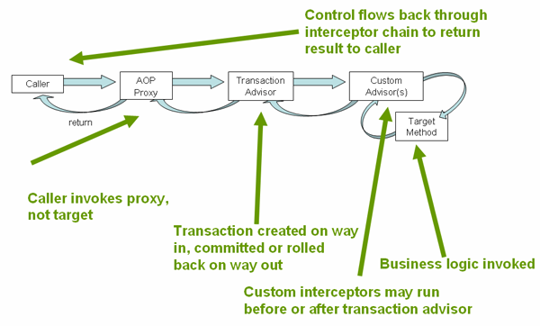

[Declarative Transaction Management](#data-access-transaction-declarative)
[Example of Declarative Transaction Implementation](#data-access-transaction-declarative-first-example)

---

<a id="data-access-transaction-declarative-first-example"></a>

<!-- source_url: https://docs.spring.io/spring-framework/reference/data-access/transaction/declarative/first-example.html -->

<!-- page_index: 119 -->

# Example of Declarative Transaction Implementation

<svg enable-background="new 0 0 32 32" id="Glyph" version="1.1" viewbox="0 0 32 32" xml:space="preserve" xmlns="http://www.w3.org/2000/svg" xmlns:xlink="http://www.w3.org/1999/xlink">
<path id="XMLID_223_"></path>
</svg>

Search

<a id="data-access-transaction-declarative-first-example--page-title"></a>
<a id="data-access-transaction-declarative-first-example--example-of-declarative-transaction-implementation"></a>

# Example of Declarative Transaction Implementation

Consider the following interface and its attendant implementation. This example uses
`Foo` and `Bar` classes as placeholders so that you can concentrate on the transaction
usage without focusing on a particular domain model. For the purposes of this example, the fact that the `DefaultFooService` class throws `UnsupportedOperationException`
instances in the body of each implemented method is good. That behavior lets you see
transactions being created and then rolled back in response to the
`UnsupportedOperationException` instance. The following listing shows the `FooService`
interface:

- Java
- Kotlin

```java
// the service interface that we want to make transactional

package x.y.service;

public interface FooService {

	Foo getFoo(String fooName);

	Foo getFoo(String fooName, String barName);

	void insertFoo(Foo foo);

	void updateFoo(Foo foo);

}
```

```kotlin
// the service interface that we want to make transactional

package x.y.service

interface FooService {

	fun getFoo(fooName: String): Foo

	fun getFoo(fooName: String, barName: String): Foo

	fun insertFoo(foo: Foo)

	fun updateFoo(foo: Foo)
}
```

The following example shows an implementation of the preceding interface:

- Java
- Kotlin

```java
package x.y.service;
public class DefaultFooService implements FooService {
@Override public Foo getFoo(String fooName) {// ...}
@Override public Foo getFoo(String fooName, String barName) {// ...}
@Override public void insertFoo(Foo foo) {// ...}
@Override public void updateFoo(Foo foo) {// ...}}
```

```kotlin
package x.y.service
class DefaultFooService : FooService {
override fun getFoo(fooName: String): Foo {// ...}
override fun getFoo(fooName: String, barName: String): Foo {// ...}
override fun insertFoo(foo: Foo) {// ...}
override fun updateFoo(foo: Foo) {// ...}}
```

Assume that the first two methods of the `FooService` interface, `getFoo(String)` and
`getFoo(String, String)`, must run in the context of a transaction with read-only
semantics and that the other methods, `insertFoo(Foo)` and `updateFoo(Foo)`, must
run in the context of a transaction with read-write semantics. The following
configuration is explained in detail in the next few paragraphs:

```xml
<!-- from the file 'context.xml' -->
<?xml version="1.0" encoding="UTF-8"?>
<beans xmlns="http://www.springframework.org/schema/beans"
	xmlns:xsi="http://www.w3.org/2001/XMLSchema-instance"
	xmlns:aop="http://www.springframework.org/schema/aop"
	xmlns:tx="http://www.springframework.org/schema/tx"
	xsi:schemaLocation="
		http://www.springframework.org/schema/beans
		https://www.springframework.org/schema/beans/spring-beans.xsd
		http://www.springframework.org/schema/tx
		https://www.springframework.org/schema/tx/spring-tx.xsd
		http://www.springframework.org/schema/aop
		https://www.springframework.org/schema/aop/spring-aop.xsd">

	<!-- this is the service object that we want to make transactional -->
	<bean id="fooService" class="x.y.service.DefaultFooService"/>

	<!-- the transactional advice (what 'happens'; see the <aop:advisor/> bean below) -->
	<tx:advice id="txAdvice" transaction-manager="txManager">
		<!-- the transactional semantics... -->
		<tx:attributes>
			<!-- all methods starting with 'get' are read-only -->
			<tx:method name="get*" read-only="true"/>
			<!-- other methods use the default transaction settings (see below) -->
			<tx:method name="*"/>
		</tx:attributes>
	</tx:advice>

	<!-- ensure that the above transactional advice runs for any execution
		of an operation defined by the FooService interface -->
	<aop:config>
		<aop:pointcut id="fooServiceOperation" expression="execution(* x.y.service.FooService.*(..))"/>
		<aop:advisor advice-ref="txAdvice" pointcut-ref="fooServiceOperation"/>
	</aop:config>

	<!-- don't forget the DataSource -->
	<bean id="dataSource" class="org.apache.commons.dbcp.BasicDataSource" destroy-method="close">
		<property name="driverClassName" value="oracle.jdbc.driver.OracleDriver"/>
		<property name="url" value="jdbc:oracle:thin:@rj-t42:1521:elvis"/>
		<property name="username" value="scott"/>
		<property name="password" value="tiger"/>
	</bean>

	<!-- similarly, don't forget the TransactionManager -->
	<bean id="txManager" class="org.springframework.jdbc.datasource.DataSourceTransactionManager">
		<property name="dataSource" ref="dataSource"/>
	</bean>

	<!-- other <bean/> definitions here -->

</beans>
```

Examine the preceding configuration. It assumes that you want to make a service object, the `fooService` bean, transactional. The transaction semantics to apply are encapsulated
in the `<tx:advice/>` definition. The `<tx:advice/>` definition reads as "all methods
starting with `get` are to run in the context of a read-only transaction, and all
other methods are to run with the default transaction semantics". The
`transaction-manager` attribute of the `<tx:advice/>` tag is set to the name of the
`TransactionManager` bean that is going to drive the transactions (in this case, the
`txManager` bean).

> [!TIP]
> You can omit the `transaction-manager` attribute in the transactional advice
> (`<tx:advice/>`) if the bean name of the `TransactionManager` that you want to
> wire in has the name `transactionManager`. If the `TransactionManager` bean that
> you want to wire in has any other name, you must use the `transaction-manager`
> attribute explicitly, as in the preceding example.

The `<aop:config/>` definition ensures that the transactional advice defined by the
`txAdvice` bean runs at the appropriate points in the program. First, you define a
pointcut that matches the execution of any operation defined in the `FooService` interface
(`fooServiceOperation`). Then you associate the pointcut with the `txAdvice` by using an
advisor. The result indicates that, at the execution of a `fooServiceOperation`, the advice defined by `txAdvice` is run.

The expression defined within the `<aop:pointcut/>` element is an AspectJ pointcut
expression. See [the AOP section](#core-aop) for more details on pointcut
expressions in Spring.

A common requirement is to make an entire service layer transactional. The best way to
do this is to change the pointcut expression to match any operation in your
service layer. The following example shows how to do so:

```xml
<aop:config>
	<aop:pointcut id="fooServiceMethods" expression="execution(* x.y.service.*.*(..))"/>
	<aop:advisor advice-ref="txAdvice" pointcut-ref="fooServiceMethods"/>
</aop:config>
```

> [!NOTE]
> In the preceding example, it is assumed that all your service interfaces are defined
> in the `x.y.service` package. See [the AOP section](#core-aop) for more details.

Now that we have analyzed the configuration, you may be asking yourself,
"What does all this configuration actually do?"

The configuration shown earlier is used to create a transactional proxy around the object
that is created from the `fooService` bean definition. The proxy is configured with
the transactional advice so that, when an appropriate method is invoked on the proxy, a transaction is started, suspended, marked as read-only, and so on, depending on the
transaction configuration associated with that method. Consider the following program
that test drives the configuration shown earlier:

- Java
- Kotlin

```java
public final class Boot {
public static void main(final String[] args) throws Exception {ApplicationContext ctx = new ClassPathXmlApplicationContext("context.xml"); FooService fooService = ctx.getBean(FooService.class); fooService.insertFoo(new Foo());}}
```

```kotlin
import org.springframework.beans.factory.getBean

fun main() {
	val ctx = ClassPathXmlApplicationContext("context.xml")
	val fooService = ctx.getBean<FooService>("fooService")
	fooService.insertFoo(Foo())
}
```

The output from running the preceding program should resemble the following (the Log4J
output and the stack trace from the `UnsupportedOperationException` thrown by the
`insertFoo(..)` method of the `DefaultFooService` class have been truncated for clarity):

```xml
<!-- the Spring container is starting up... -->
[AspectJInvocationContextExposingAdvisorAutoProxyCreator] - Creating implicit proxy for bean 'fooService' with 0 common interceptors and 1 specific interceptors

<!-- the DefaultFooService is actually proxied -->
[JdkDynamicAopProxy] - Creating JDK dynamic proxy for [x.y.service.DefaultFooService]

<!-- ... the insertFoo(..) method is now being invoked on the proxy -->
[TransactionInterceptor] - Getting transaction for x.y.service.FooService.insertFoo

<!-- the transactional advice kicks in here... -->
[DataSourceTransactionManager] - Creating new transaction with name [x.y.service.FooService.insertFoo]
[DataSourceTransactionManager] - Acquired Connection [org.apache.commons.dbcp.PoolableConnection@a53de4] for JDBC transaction

<!-- the insertFoo(..) method from DefaultFooService throws an exception... -->
[RuleBasedTransactionAttribute] - Applying rules to determine whether transaction should rollback on java.lang.UnsupportedOperationException
[TransactionInterceptor] - Invoking rollback for transaction on x.y.service.FooService.insertFoo due to throwable [java.lang.UnsupportedOperationException]

<!-- and the transaction is rolled back (by default, RuntimeException instances cause rollback) -->
[DataSourceTransactionManager] - Rolling back JDBC transaction on Connection [org.apache.commons.dbcp.PoolableConnection@a53de4]
[DataSourceTransactionManager] - Releasing JDBC Connection after transaction
[DataSourceUtils] - Returning JDBC Connection to DataSource

Exception in thread "main" java.lang.UnsupportedOperationException at x.y.service.DefaultFooService.insertFoo(DefaultFooService.java:14)
<!-- AOP infrastructure stack trace elements removed for clarity -->
at $Proxy0.insertFoo(Unknown Source)
at Boot.main(Boot.java:11)
```

To use reactive transaction management the code has to use reactive types.

> [!NOTE]
> Spring Framework uses the `ReactiveAdapterRegistry` to determine whether a method
> return type is reactive.

The following listing shows a modified version of the previously used `FooService`, but
this time the code uses reactive types:

- Java
- Kotlin

```java
// the reactive service interface that we want to make transactional

package x.y.service;

public interface FooService {

	Flux<Foo> getFoo(String fooName);

	Publisher<Foo> getFoo(String fooName, String barName);

	Mono<Void> insertFoo(Foo foo);

	Mono<Void> updateFoo(Foo foo);

}
```

```kotlin
// the reactive service interface that we want to make transactional

package x.y.service

interface FooService {

	fun getFoo(fooName: String): Flow<Foo>

	fun getFoo(fooName: String, barName: String): Publisher<Foo>

	fun insertFoo(foo: Foo) : Mono<Void>

	fun updateFoo(foo: Foo) : Mono<Void>
}
```

The following example shows an implementation of the preceding interface:

- Java
- Kotlin

```java
package x.y.service;
public class DefaultFooService implements FooService {
@Override public Flux<Foo> getFoo(String fooName) {// ...}
@Override public Publisher<Foo> getFoo(String fooName, String barName) {// ...}
@Override public Mono<Void> insertFoo(Foo foo) {// ...}
@Override public Mono<Void> updateFoo(Foo foo) {// ...}}
```

```kotlin
package x.y.service
class DefaultFooService : FooService {
override fun getFoo(fooName: String): Flow<Foo> {// ...}
override fun getFoo(fooName: String, barName: String): Publisher<Foo> {// ...}
override fun insertFoo(foo: Foo): Mono<Void> {// ...}
override fun updateFoo(foo: Foo): Mono<Void> {// ...}}
```

Imperative and reactive transaction management share the same semantics for transaction
boundary and transaction attribute definitions. The main difference between imperative
and reactive transactions is the deferred nature of the latter. `TransactionInterceptor`
decorates the returned reactive type with a transactional operator to begin and clean up
the transaction. Therefore, calling a transactional reactive method defers the actual
transaction management to a subscription type that activates processing of the reactive
type.

Another aspect of reactive transaction management relates to data escaping which is a
natural consequence of the programming model.

Method return values of imperative transactions are returned from transactional methods
upon successful termination of a method so that partially computed results do not escape
the method closure.

Reactive transaction methods return a reactive wrapper type which represents a
computation sequence along with a promise to begin and complete the computation.

A `Publisher` can emit data while a transaction is ongoing but not necessarily completed.
Therefore, methods that depend upon successful completion of an entire transaction need
to ensure completion and buffer results in the calling code.

[Understanding the Spring Framework’s Declarative Transaction Implementation](#data-access-transaction-declarative-tx-decl-explained)
[Rolling Back a Declarative Transaction](#data-access-transaction-declarative-rolling-back)

---

<a id="data-access-transaction-declarative-rolling-back"></a>

<!-- source_url: https://docs.spring.io/spring-framework/reference/data-access/transaction/declarative/rolling-back.html -->

<!-- page_index: 120 -->

# Rolling Back a Declarative Transaction

<svg enable-background="new 0 0 32 32" id="Glyph" version="1.1" viewbox="0 0 32 32" xml:space="preserve" xmlns="http://www.w3.org/2000/svg" xmlns:xlink="http://www.w3.org/1999/xlink">
<path id="XMLID_223_"></path>
</svg>

Search

<a id="data-access-transaction-declarative-rolling-back--page-title"></a>
<a id="data-access-transaction-declarative-rolling-back--rolling-back-a-declarative-transaction"></a>

# Rolling Back a Declarative Transaction

The previous section outlined the basics of how to specify transactional settings for
classes, typically service layer classes, declaratively in your application. This section
describes how you can control the rollback of transactions in a simple, declarative
fashion in XML configuration. For details on controlling rollback semantics declaratively
with the `@Transactional` annotation, see
[`@Transactional` Settings](#data-access-transaction-declarative-annotations--transaction-declarative-attransactional-settings).

The recommended way to indicate to the Spring Framework’s transaction infrastructure
that a transaction’s work is to be rolled back is to throw an `Exception` from code that
is currently executing in the context of a transaction. The Spring Framework’s
transaction infrastructure code catches any unhandled `Exception` as it bubbles up
the call stack and makes a determination whether to mark the transaction for rollback.

In its default configuration, the Spring Framework’s transaction infrastructure code
marks a transaction for rollback only in the case of runtime, unchecked exceptions.
That is, when the thrown exception is an instance or subclass of `RuntimeException`.
(`Error` instances also, by default, result in a rollback).

The default configuration also provides support for Vavr’s `Try` method to trigger
transaction rollbacks when it returns a 'Failure'.
This allows you to handle functional-style errors using Try and have the transaction
automatically rolled back in case of a failure. For more information on Vavr’s Try, refer to the [official Vavr documentation](https://vavr-io.github.io/vavr-docs/#_try).
Here’s an example of how to use Vavr’s Try with a transactional method:

- Java

```java
@Transactional
public Try<String> myTransactionalMethod() {
	// If myDataAccessOperation throws an exception, it will be caught by the
	// Try instance created with Try.of() and wrapped inside the Failure class
	// which can be checked using the isFailure() method on the Try instance.
	return Try.of(delegate::myDataAccessOperation);
}
```

As of Spring Framework 6.1, there is also special treatment of `CompletableFuture`
(and general `Future`) return values, triggering a rollback for such a handle if it
was exceptionally completed at the time of being returned from the original method.
This is intended for `@Async` methods where the actual method implementation may
need to comply with a `CompletableFuture` signature (auto-adapted to an actual
asynchronous handle for a call to the proxy by `@Async` processing at runtime), preferring exposure in the returned handle rather than rethrowing an exception:

- Java

```java
@Transactional @Async public CompletableFuture<String> myTransactionalMethod() {try {return CompletableFuture.completedFuture(delegate.myDataAccessOperation());} catch (DataAccessException ex) {return CompletableFuture.failedFuture(ex);}}
```

Checked exceptions that are thrown from a transactional method do not result in a rollback
in the default configuration. You can configure exactly which `Exception` types mark a
transaction for rollback, including checked exceptions by specifying *rollback rules*.

> [!NOTE]
> Rollback rules
>
> Rollback rules determine if a transaction should be rolled back when a given exception is
> thrown, and the rules are based on exception types or exception patterns.
>
> Rollback rules may be configured in XML via the `rollback-for` and `no-rollback-for`
> attributes, which allow rules to be defined as patterns. When using
> [`@Transactional`](#data-access-transaction-declarative-annotations--transaction-declarative-attransactional-settings), rollback rules may be configured via the `rollbackFor`/`noRollbackFor` and
> `rollbackForClassName`/`noRollbackForClassName` attributes, which allow rules to be
> defined based on exception types or patterns, respectively.
>
> When a rollback rule is defined with an exception type – for example, via `rollbackFor` –
> that type will be used to match against the type of a thrown exception. Specifically, given a configured exception type `C`, a thrown exception of type `T` will be considered
> a match against `C` if `T` is equal to `C` or a subclass of `C`. This provides type
> safety and avoids any unintentional matches that may occur when using a pattern. For
> example, a value of `jakarta.servlet.ServletException.class` will only match thrown
> exceptions of type `jakarta.servlet.ServletException` and its subclasses.
>
> When a rollback rule is defined with an exception pattern, the pattern can be a fully
> qualified class name or a substring of a fully qualified class name for an exception type
> (which must be a subclass of `Throwable`), with no wildcard support at present. For
> example, a value of `"jakarta.servlet.ServletException"` or `"ServletException"` will
> match `jakarta.servlet.ServletException` and its subclasses.
>
> > [!WARNING]
> > You must carefully consider how specific a pattern is and whether to include package
> > information (which isn’t mandatory). For example, `"Exception"` will match nearly
> > anything and will probably hide other rules. `"java.lang.Exception"` would be correct if
> > `"Exception"` were meant to define a rule for all checked exceptions. With more unique
> > exception names such as `"BaseBusinessException"` there is likely no need to use the
> > fully qualified class name for the exception pattern.
> >
> > Furthermore, pattern-based rollback rules may result in unintentional matches for
> > similarly named exceptions and nested classes. This is due to the fact that a thrown
> > exception is considered to be a match for a given pattern-based rollback rule if the name
> > of the thrown exception contains the exception pattern configured for the rollback rule.
> > For example, given a rule configured to match on `"com.example.CustomException"`, that
> > rule will match against an exception named `com.example.CustomExceptionV2` (an exception
> > in the same package as `CustomException` but with an additional suffix) or an exception
> > named `com.example.CustomException$AnotherException` (an exception declared as a nested
> > class in `CustomException`).

The following XML snippet demonstrates how to configure rollback for a checked, application-specific `Exception` type by supplying an *exception pattern* via the
`rollback-for` attribute:

```xml
<tx:advice id="txAdvice" transaction-manager="txManager">
	<tx:attributes>
		<tx:method name="get*" read-only="true" rollback-for="NoProductInStockException"/>
		<tx:method name="*"/>
	</tx:attributes>
</tx:advice>
```

If you do not want a transaction rolled back when an exception is thrown, you can also
specify 'no rollback' rules. The following example tells the Spring Framework’s
transaction infrastructure to commit the attendant transaction even in the face of an
unhandled `InstrumentNotFoundException`:

```xml
<tx:advice id="txAdvice">
	<tx:attributes>
		<tx:method name="updateStock" no-rollback-for="InstrumentNotFoundException"/>
		<tx:method name="*"/>
	</tx:attributes>
</tx:advice>
```

When the Spring Framework’s transaction infrastructure catches an exception and consults
the configured rollback rules to determine whether to mark the transaction for rollback, the strongest matching rule wins. So, in the case of the following configuration, any
exception other than an `InstrumentNotFoundException` results in a rollback of the
attendant transaction:

```xml
<tx:advice id="txAdvice">
	<tx:attributes>
		<tx:method name="*" rollback-for="Throwable" no-rollback-for="InstrumentNotFoundException"/>
	</tx:attributes>
</tx:advice>
```

You can also indicate a required rollback programmatically. Although simple, this process
is quite invasive and tightly couples your code to the Spring Framework’s transaction
infrastructure. The following example shows how to programmatically indicate a required
rollback:

- Java
- Kotlin

```java
public void resolvePosition() {try {// some business logic...} catch (NoProductInStockException ex) {// trigger rollback programmatically TransactionAspectSupport.currentTransactionStatus().setRollbackOnly();}}
```

```kotlin
fun resolvePosition() {try {// some business logic...} catch (ex: NoProductInStockException) {// trigger rollback programmatically TransactionAspectSupport.currentTransactionStatus().setRollbackOnly();}}
```

You are strongly encouraged to use the declarative approach to rollback, if at all
possible. Programmatic rollback is available should you absolutely need it, but its
usage flies in the face of achieving a clean POJO-based architecture.

[Example of Declarative Transaction Implementation](#data-access-transaction-declarative-first-example)
[Configuring Different Transactional Semantics for Different Beans](#data-access-transaction-declarative-diff-tx)

---

<a id="data-access-transaction-declarative-diff-tx"></a>

<!-- source_url: https://docs.spring.io/spring-framework/reference/data-access/transaction/declarative/diff-tx.html -->

<!-- page_index: 121 -->

# Configuring Different Transactional Semantics for Different Beans

<svg enable-background="new 0 0 32 32" id="Glyph" version="1.1" viewbox="0 0 32 32" xml:space="preserve" xmlns="http://www.w3.org/2000/svg" xmlns:xlink="http://www.w3.org/1999/xlink">
<path id="XMLID_223_"></path>
</svg>

Search

<a id="data-access-transaction-declarative-diff-tx--page-title"></a>
<a id="data-access-transaction-declarative-diff-tx--configuring-different-transactional-semantics-for-different-beans"></a>

# Configuring Different Transactional Semantics for Different Beans

Consider the scenario where you have a number of service layer objects, and you want to
apply a totally different transactional configuration to each of them. You can do so
by defining distinct `<aop:advisor/>` elements with differing `pointcut` and
`advice-ref` attribute values.

As a point of comparison, first assume that all of your service layer classes are
defined in a root `x.y.service` package. To make all beans that are instances of classes
defined in that package (or in subpackages) and that have names ending in `Service` have
the default transactional configuration, you could write the following:

```xml
<?xml version="1.0" encoding="UTF-8"?>
<beans xmlns="http://www.springframework.org/schema/beans"
	xmlns:xsi="http://www.w3.org/2001/XMLSchema-instance"
	xmlns:aop="http://www.springframework.org/schema/aop"
	xmlns:tx="http://www.springframework.org/schema/tx"
	xsi:schemaLocation="
		http://www.springframework.org/schema/beans
		https://www.springframework.org/schema/beans/spring-beans.xsd
		http://www.springframework.org/schema/tx
		https://www.springframework.org/schema/tx/spring-tx.xsd
		http://www.springframework.org/schema/aop
		https://www.springframework.org/schema/aop/spring-aop.xsd">

	<aop:config>

		<aop:pointcut id="serviceOperation"
				expression="execution(* x.y.service..*Service.*(..))"/>

		<aop:advisor pointcut-ref="serviceOperation" advice-ref="txAdvice"/>

	</aop:config>

	<!-- these two beans will be transactional... -->
	<bean id="fooService" class="x.y.service.DefaultFooService"/>
	<bean id="barService" class="x.y.service.extras.SimpleBarService"/>

	<!-- ... and these two beans won't -->
	<bean id="anotherService" class="org.xyz.SomeService"/> <!-- (not in the right package) -->
	<bean id="barManager" class="x.y.service.SimpleBarManager"/> <!-- (doesn't end in 'Service') -->

	<tx:advice id="txAdvice">
		<tx:attributes>
			<tx:method name="get*" read-only="true"/>
			<tx:method name="*"/>
		</tx:attributes>
	</tx:advice>

	<!-- other transaction infrastructure beans such as a TransactionManager omitted... -->

</beans>
```

The following example shows how to configure two distinct beans with totally different
transactional settings:

```xml
<?xml version="1.0" encoding="UTF-8"?>
<beans xmlns="http://www.springframework.org/schema/beans"
	xmlns:xsi="http://www.w3.org/2001/XMLSchema-instance"
	xmlns:aop="http://www.springframework.org/schema/aop"
	xmlns:tx="http://www.springframework.org/schema/tx"
	xsi:schemaLocation="
		http://www.springframework.org/schema/beans
		https://www.springframework.org/schema/beans/spring-beans.xsd
		http://www.springframework.org/schema/tx
		https://www.springframework.org/schema/tx/spring-tx.xsd
		http://www.springframework.org/schema/aop
		https://www.springframework.org/schema/aop/spring-aop.xsd">

	<aop:config>

		<aop:pointcut id="defaultServiceOperation"
				expression="execution(* x.y.service.*Service.*(..))"/>

		<aop:pointcut id="noTxServiceOperation"
				expression="execution(* x.y.service.ddl.DefaultDdlManager.*(..))"/>

		<aop:advisor pointcut-ref="defaultServiceOperation" advice-ref="defaultTxAdvice"/>

		<aop:advisor pointcut-ref="noTxServiceOperation" advice-ref="noTxAdvice"/>

	</aop:config>

	<!-- this bean will be transactional (see the 'defaultServiceOperation' pointcut) -->
	<bean id="fooService" class="x.y.service.DefaultFooService"/>

	<!-- this bean will also be transactional, but with totally different transactional settings -->
	<bean id="anotherFooService" class="x.y.service.ddl.DefaultDdlManager"/>

	<tx:advice id="defaultTxAdvice">
		<tx:attributes>
			<tx:method name="get*" read-only="true"/>
			<tx:method name="*"/>
		</tx:attributes>
	</tx:advice>

	<tx:advice id="noTxAdvice">
		<tx:attributes>
			<tx:method name="*" propagation="NEVER"/>
		</tx:attributes>
	</tx:advice>

	<!-- other transaction infrastructure beans such as a TransactionManager omitted... -->

</beans>
```

[Rolling Back a Declarative Transaction](#data-access-transaction-declarative-rolling-back)
[<tx:advice/> Settings](#data-access-transaction-declarative-txadvice-settings)

---

<a id="data-access-transaction-declarative-txadvice-settings"></a>

<!-- source_url: https://docs.spring.io/spring-framework/reference/data-access/transaction/declarative/txadvice-settings.html -->

<!-- page_index: 122 -->

# <tx:advice/> Settings

<svg enable-background="new 0 0 32 32" id="Glyph" version="1.1" viewbox="0 0 32 32" xml:space="preserve" xmlns="http://www.w3.org/2000/svg" xmlns:xlink="http://www.w3.org/1999/xlink">
<path id="XMLID_223_"></path>
</svg>

Search

<a id="data-access-transaction-declarative-txadvice-settings--page-title"></a>
<a id="data-access-transaction-declarative-txadvice-settings--tx:advice-settings"></a>

# <tx:advice/> Settings

This section summarizes the various transactional settings that you can specify by using
the `<tx:advice/>` tag. The default `<tx:advice/>` settings are:

- The [propagation setting](#data-access-transaction-declarative-tx-propagation) is `REQUIRED.`
- The isolation level is `DEFAULT.`
- The transaction is read-write.
- The transaction timeout defaults to the default timeout of the underlying transaction
  system or none if timeouts are not supported.
- Any `RuntimeException` triggers rollback, and any checked `Exception` does not.

You can change these default settings. The following table summarizes the various attributes of the `<tx:method/>` tags
that are nested within `<tx:advice/>` and `<tx:attributes/>` tags:

| Attribute | Required? | Default | Description |
| --- | --- | --- | --- |
| `name` | Yes |  | Method names with which the transaction attributes are to be associated. The wildcard (\*) character can be used to associate the same transaction attribute settings with a number of methods (for example, `get*`, `handle*`, `on*Event`, and so forth). |
| `propagation` | No | `REQUIRED` | Transaction propagation behavior. |
| `isolation` | No | `DEFAULT` | Transaction isolation level. Only applicable to propagation settings of `REQUIRED` or `REQUIRES_NEW`. |
| `timeout` | No | -1 | Transaction timeout (seconds). Only applicable to propagation `REQUIRED` or `REQUIRES_NEW`. |
| `read-only` | No | false | Read-write versus read-only transaction. Applies only to `REQUIRED` or `REQUIRES_NEW`. |
| `rollback-for` | No |  | Comma-delimited list of `Exception` instances that trigger rollback. For example, `com.foo.MyBusinessException,ServletException`. |
| `no-rollback-for` | No |  | Comma-delimited list of `Exception` instances that do not trigger rollback. For example, `com.foo.MyBusinessException,ServletException`. |

[Configuring Different Transactional Semantics for Different Beans](#data-access-transaction-declarative-diff-tx)
[Using `@Transactional`](#data-access-transaction-declarative-annotations)

---

<a id="data-access-transaction-declarative-annotations"></a>

<!-- source_url: https://docs.spring.io/spring-framework/reference/data-access/transaction/declarative/annotations.html -->

<!-- page_index: 123 -->

# Using @Transactional

<svg enable-background="new 0 0 32 32" id="Glyph" version="1.1" viewbox="0 0 32 32" xml:space="preserve" xmlns="http://www.w3.org/2000/svg" xmlns:xlink="http://www.w3.org/1999/xlink">
<path id="XMLID_223_"></path>
</svg>

Search

<a id="data-access-transaction-declarative-annotations--page-title"></a>
<a id="data-access-transaction-declarative-annotations--using-transactional"></a>

# Using `@Transactional`

In addition to the XML-based declarative approach to transaction configuration, you can
use an annotation-based approach. Declaring transaction semantics directly in the Java
source code puts the declarations much closer to the affected code. There is not much
danger of undue coupling, because code that is meant to be used transactionally is
almost always deployed that way anyway.

> [!NOTE]
> The standard `jakarta.transaction.Transactional` annotation is also supported as
> a drop-in replacement for Spring’s own annotation. Please refer to the JTA documentation
> for more details.

The ease-of-use afforded by the use of the `@Transactional` annotation is best
illustrated with an example, which is explained in the text that follows.
Consider the following class definition:

- Java
- Kotlin

```java
// the service class that we want to make transactional @Transactional public class DefaultFooService implements FooService {
@Override public Foo getFoo(String fooName) {// ...}
@Override public Foo getFoo(String fooName, String barName) {// ...}
@Override public void insertFoo(Foo foo) {// ...}
@Override public void updateFoo(Foo foo) {// ...}}
```

```kotlin
// the service class that we want to make transactional @Transactional class DefaultFooService : FooService {
override fun getFoo(fooName: String): Foo {// ...}
override fun getFoo(fooName: String, barName: String): Foo {// ...}
override fun insertFoo(foo: Foo) {// ...}
override fun updateFoo(foo: Foo) {// ...}}
```

Used at the class level as above, the annotation indicates a default for all methods
of the declaring class (as well as its subclasses). Alternatively, each method can be
annotated individually. See
[method visibility](#data-access-transaction-declarative-annotations--transaction-declarative-annotations-method-visibility)
for further details on which methods Spring considers transactional. Note that a class-level
annotation does not apply to ancestor classes up the class hierarchy; in such a scenario, inherited methods need to be locally redeclared in order to participate in a
subclass-level annotation.

When a POJO class such as the one above is defined as a bean in a Spring context, you can make the bean instance transactional through an `@EnableTransactionManagement`
annotation in a `@Configuration` class. See the
[javadoc](https://docs.spring.io/spring-framework/docs/7.0.8/javadoc-api/org/springframework/transaction/annotation/EnableTransactionManagement.html)
for full details.

The following example shows the configuration needed to enable annotation-driven transaction management:

- Java
- Kotlin
- Xml

```java
@Configuration @EnableTransactionManagement public class AppConfig {
@Bean public FooService fooService() {return new DefaultFooService();}
@Bean public PlatformTransactionManager txManager(DataSource dataSource) {return new DataSourceTransactionManager(dataSource);}}
```

```kotlin
@Configuration @EnableTransactionManagement class AppConfig {
@Bean fun fooService(): FooService {return DefaultFooService()}
@Bean fun txManager(dataSource: DataSource): PlatformTransactionManager {return DataSourceTransactionManager(dataSource)}}
```

```xml
<beans xmlns="http://www.springframework.org/schema/beans"
	xmlns:xsi="http://www.w3.org/2001/XMLSchema-instance"
	xmlns:aop="http://www.springframework.org/schema/aop"
	xmlns:tx="http://www.springframework.org/schema/tx"
	xsi:schemaLocation="
		http://www.springframework.org/schema/beans
		https://www.springframework.org/schema/beans/spring-beans.xsd
		http://www.springframework.org/schema/tx
		https://www.springframework.org/schema/tx/spring-tx.xsd
		http://www.springframework.org/schema/aop
		https://www.springframework.org/schema/aop/spring-aop.xsd">

	<!-- this is the service object that we want to make transactional -->
	<bean id="fooService" class="x.y.service.DefaultFooService"/>

	<!-- enable the configuration of transactional behavior based on annotations -->
	<!-- a TransactionManager is still required -->
	<tx:annotation-driven transaction-manager="txManager"/>

	<bean id="txManager" class="org.springframework.jdbc.datasource.DataSourceTransactionManager">
		<!-- (this dependency is defined somewhere else) -->
		<property name="dataSource" ref="dataSource"/>
	</bean>

	<!-- other <bean/> definitions here -->

</beans>
```

> [!TIP]
> In programmatic configuration, the `@EnableTransactionManagement` annotation uses any
> `TransactionManager` bean in the context. In XML configuration, you can omit
> the `transaction-manager` attribute in the `<tx:annotation-driven/>` tag if the bean
> name of the `TransactionManager` that you want to wire in has the name `transactionManager`.
> If the `TransactionManager` bean has any other name, you have to use the
> `transaction-manager` attribute explicitly, as in the preceding example.

Reactive transactional methods use reactive return types in contrast to imperative
programming arrangements as the following listing shows:

- Java
- Kotlin

```java
// the reactive service class that we want to make transactional @Transactional public class DefaultFooService implements FooService {
@Override public Publisher<Foo> getFoo(String fooName) {// ...}
@Override public Mono<Foo> getFoo(String fooName, String barName) {// ...}
@Override public Mono<Void> insertFoo(Foo foo) {// ...}
@Override public Mono<Void> updateFoo(Foo foo) {// ...}}
```

```kotlin
// the reactive service class that we want to make transactional @Transactional class DefaultFooService : FooService {
override fun getFoo(fooName: String): Flow<Foo> {// ...}
override fun getFoo(fooName: String, barName: String): Mono<Foo> {// ...}
override fun insertFoo(foo: Foo): Mono<Void> {// ...}
override fun updateFoo(foo: Foo): Mono<Void> {// ...}}
```

Note that there are special considerations for the returned `Publisher` with regards to
Reactive Streams cancellation signals. See the
[Cancel Signals](#data-access-transaction-programmatic--tx-prog-operator-cancel)
section under "Using the TransactionalOperator" for more details.

> [!NOTE]
> Method visibility and `@Transactional` in proxy mode
>
> The `@Transactional` annotation is typically used on methods with `public` visibility.
> As of 6.0, `protected` or package-visible methods can also be made transactional for
> class-based proxies by default. Note that transactional methods in interface-based
> proxies must always be `public` and defined in the proxied interface. For both kinds
> of proxies, only external method calls coming in through the proxy are intercepted.
>
> If you prefer consistent treatment of method visibility across the different kinds of
> proxies (which was the default up until 5.3), consider specifying `publicMethodsOnly`:
>
> ```java
> /** * Register a custom AnnotationTransactionAttributeSource with the * publicMethodsOnly flag set to true to consistently ignore non-public methods.* @see ProxyTransactionManagementConfiguration#transactionAttributeSource() */ @Bean TransactionAttributeSource transactionAttributeSource() {return new AnnotationTransactionAttributeSource(true);}
> ```
>
> The *Spring TestContext Framework* supports non-private `@Transactional` test methods
> by default as well. See [Transaction Management](#testing-testcontext-framework-tx)
> in the testing chapter for examples.

You can apply the `@Transactional` annotation to an interface definition, a method
on an interface, a class definition, or a method on a class. However, the mere presence
of the `@Transactional` annotation is not enough to activate the transactional behavior.
The `@Transactional` annotation is merely metadata that can be consumed by corresponding
runtime infrastructure which uses that metadata to configure the appropriate beans with
transactional behavior. In the preceding examples that use programmatic configuration, the `@EnableTransactionManagement` annotation switches on actual transaction management
at runtime. Whereas, in the preceding example that uses XML configuration, the
`<tx:annotation-driven/>` element switches on actual transaction management at runtime.

> [!TIP]
> The Spring team recommends that you annotate methods of concrete classes with the
> `@Transactional` annotation, rather than relying on annotated methods in interfaces, even if the latter does work for interface-based and target-class proxies as of 5.0.
> Since Java annotations are not inherited from interfaces, interface-declared annotations
> are still not recognized by the weaving infrastructure when using AspectJ mode, so the
> aspect does not get applied. As a consequence, your transaction annotations may be
> silently ignored: Your code might appear to "work" until you test a rollback scenario.

> [!NOTE]
> In proxy mode (which is the default), only external method calls coming in through
> the proxy are intercepted. This means that self-invocation (in effect, a method within
> the target object calling another method of the target object) does not lead to an actual
> transaction at runtime even if the invoked method is marked with `@Transactional`. Also, the proxy must be fully initialized to provide the expected behavior, so you should not
> rely on this feature in your initialization code — for example, in a `@PostConstruct` method.

Consider using AspectJ mode (see the `mode` attribute in the following table) if you
expect self-invocations to be wrapped with transactions as well. In this case, there is
no proxy in the first place. Instead, the target class is woven (that is, its byte code
is modified) to support `@Transactional` runtime behavior on any kind of method.

| XML Attribute | Annotation Attribute | Default | Description |
| --- | --- | --- | --- |
| `transaction-manager` | N/A (see [`TransactionManagementConfigurer`](https://docs.spring.io/spring-framework/docs/7.0.8/javadoc-api/org/springframework/transaction/annotation/TransactionManagementConfigurer.html) javadoc) | `transactionManager` | Name of the transaction manager to use. Required only if the name of the transaction manager is not `transactionManager`, as in the preceding example. |
| `mode` | `mode` | `proxy` | The default mode (`proxy`) processes annotated beans to be proxied by using Spring’s AOP framework (following proxy semantics, as discussed earlier, applying to method calls coming in through the proxy only). The alternative mode (`aspectj`) instead weaves the affected classes with Spring’s AspectJ transaction aspect, modifying the target class byte code to apply to any kind of method call. AspectJ weaving requires `spring-aspects.jar` in the classpath as well as having load-time weaving (or compile-time weaving) enabled. (See [Spring configuration](#core-aop-using-aspectj--aop-aj-ltw-spring) for details on how to set up load-time weaving.) |
| `proxy-target-class` | `proxyTargetClass` | `false` | Applies to `proxy` mode only. Controls what type of transactional proxies are created for classes annotated with the `@Transactional` annotation. If the `proxy-target-class` attribute is set to `true`, class-based proxies are created. If `proxy-target-class` is `false` or if the attribute is omitted, then standard JDK interface-based proxies are created. (See [Proxying Mechanisms](#core-aop-proxying) for a detailed examination of the different proxy types.) |
| `order` | `order` | `Ordered.LOWEST_PRECEDENCE` | Defines the order of the transaction advice that is applied to beans annotated with `@Transactional`. (For more information about the rules related to ordering of AOP advice, see [Advice Ordering](#core-aop-ataspectj-advice--aop-ataspectj-advice-ordering).) No specified ordering means that the AOP subsystem determines the order of the advice. |

> [!NOTE]
> The default advice mode for processing `@Transactional` annotations is `proxy`, which allows for interception of calls through the proxy only. Local calls within the
> same class cannot get intercepted that way. For a more advanced mode of interception, consider switching to `aspectj` mode in combination with compile-time or load-time weaving.

> [!NOTE]
> The `proxy-target-class` attribute controls what type of transactional proxies are
> created for classes annotated with the `@Transactional` annotation. If
> `proxy-target-class` is set to `true`, class-based proxies are created. If
> `proxy-target-class` is `false` or if the attribute is omitted, standard JDK
> interface-based proxies are created. (See [Proxying Mechanisms](#core-aop-proxying)
> for a discussion of the different proxy types.)

> [!NOTE]
> `@EnableTransactionManagement` and `<tx:annotation-driven/>` look for
> `@Transactional` only on beans in the same application context in which they are defined.
> This means that, if you put annotation-driven configuration in a `WebApplicationContext`
> for a `DispatcherServlet`, it checks for `@Transactional` beans only in your controllers
> and not in your services. See [MVC](#web-webmvc-mvc-servlet) for more information.

The most derived location takes precedence when evaluating the transactional settings
for a method. In the case of the following example, the `DefaultFooService` class is
annotated at the class level with the settings for a read-only transaction, but the
`@Transactional` annotation on the `updateFoo(Foo)` method in the same class takes
precedence over the transactional settings defined at the class level.

- Java
- Kotlin

```java
@Transactional(readOnly = true) public class DefaultFooService implements FooService {
public Foo getFoo(String fooName) {// ...}
// these settings have precedence for this method @Transactional(readOnly = false, propagation = Propagation.REQUIRES_NEW) public void updateFoo(Foo foo) {// ...}}
```

```kotlin
@Transactional(readOnly = true) class DefaultFooService : FooService {
override fun getFoo(fooName: String): Foo {// ...}
// these settings have precedence for this method @Transactional(readOnly = false, propagation = Propagation.REQUIRES_NEW) override fun updateFoo(foo: Foo) {// ...}}
```

<a id="data-access-transaction-declarative-annotations--transaction-declarative-attransactional-settings"></a>
<a id="data-access-transaction-declarative-annotations--transactional-settings"></a>

## `@Transactional` Settings

The `@Transactional` annotation is metadata that specifies that an interface, class, or method must have transactional semantics (for example, "start a brand new read-only
transaction when this method is invoked, suspending any existing transaction").
The default `@Transactional` settings are as follows:

- The propagation setting is `PROPAGATION_REQUIRED.`
- The isolation level is `ISOLATION_DEFAULT.`
- The transaction is read-write.
- The transaction timeout defaults to the default timeout of the underlying transaction
  system, or to none if timeouts are not supported.
- Any `RuntimeException` or `Error` triggers rollback, and any checked `Exception` does
  not.

You can change these default settings. The following table summarizes the various
properties of the `@Transactional` annotation:

| Property | Type | Description |
| --- | --- | --- |
| [value](#data-access-transaction-declarative-annotations--tx-multiple-tx-mgrs-with-attransactional) | `String` | Optional qualifier that specifies the transaction manager to be used. |
| `transactionManager` | `String` | Alias for `value`. |
| `label` | Array of `String` labels to add an expressive description to the transaction. | Labels may be evaluated by transaction managers to associate implementation-specific behavior with the actual transaction. |
| [propagation](#data-access-transaction-declarative-tx-propagation) | `enum`: `Propagation` | Optional propagation setting. |
| `isolation` | `enum`: `Isolation` | Optional isolation level. Applies only to propagation values of `REQUIRED` or `REQUIRES_NEW`. |
| `timeout` | `int` (in seconds of granularity) | Optional transaction timeout. Applies only to propagation values of `REQUIRED` or `REQUIRES_NEW`. |
| `timeoutString` | `String` (in seconds of granularity) | Alternative for specifying the `timeout` in seconds as a `String` value — for example, as a placeholder. |
| `readOnly` | `boolean` | Read-write versus read-only transaction. Only applicable to values of `REQUIRED` or `REQUIRES_NEW`. |
| `rollbackFor` | Array of `Class` objects, which must be derived from `Throwable.` | Optional array of exception types that must cause rollback. |
| `rollbackForClassName` | Array of exception name patterns. | Optional array of exception name patterns that must cause rollback. |
| `noRollbackFor` | Array of `Class` objects, which must be derived from `Throwable.` | Optional array of exception types that must not cause rollback. |
| `noRollbackForClassName` | Array of exception name patterns. | Optional array of exception name patterns that must not cause rollback. |

> [!TIP]
> See
> [Rollback rules](#data-access-transaction-declarative-rolling-back--transaction-declarative-rollback-rules)
> for further details on rollback rule semantics, patterns, and warnings
> regarding possible unintentional matches for pattern-based rollback rules.

> [!NOTE]
> As of 6.2, you can globally change the default rollback behavior – for example, through
> `@EnableTransactionManagement(rollbackOn=ALL_EXCEPTIONS)`, leading to a rollback
> for all exceptions raised within a transaction, including any checked exception.
> For further customizations, `AnnotationTransactionAttributeSource` provides an
> `addDefaultRollbackRule(RollbackRuleAttribute)` method for custom default rules.
>
> Note that transaction-specific rollback rules override the default behavior but
> retain the chosen default for unspecified exceptions. This is the case for
> Spring’s `@Transactional` as well as JTA’s `jakarta.transaction.Transactional`
> annotation.
>
> Unless you rely on EJB-style business exceptions with commit behavior, it is
> advisable to switch to `ALL_EXCEPTIONS` for consistent rollback semantics even
> in case of a (potentially accidental) checked exception. Also, it is advisable
> to make that switch for Kotlin-based applications where there is no enforcement
> of checked exceptions at all.

Currently, you cannot have explicit control over the name of a transaction, where 'name'
means the transaction name that appears in a transaction monitor and in logging output.
For declarative transactions, the transaction name is always the fully-qualified class
name of the transactionally advised class + `.` + the method name. For example, if the
`handlePayment(..)` method of the `BusinessService` class started a transaction, the
name of the transaction would be `com.example.BusinessService.handlePayment`.

<a id="data-access-transaction-declarative-annotations--tx-multiple-tx-mgrs-with-attransactional"></a>
<a id="data-access-transaction-declarative-annotations--multiple-transaction-managers-with-transactional"></a>

## Multiple Transaction Managers with `@Transactional`

Most Spring applications need only a single transaction manager, but there may be
situations where you want multiple independent transaction managers in a single
application. You can use the `value` or `transactionManager` attribute of the
`@Transactional` annotation to optionally specify the identity of the
`TransactionManager` to be used. This can either be the bean name or the qualifier value
of the transaction manager bean. For example, using the qualifier notation, you can
combine the following Java code with the following transaction manager bean declarations
in the application context:

- Java
- Kotlin

```java
public class TransactionalService {

	@Transactional("order")
	public void setSomething(String name) { ... }

	@Transactional("account")
	public void doSomething() { ... }

	@Transactional("reactive-account")
	public Mono<Void> doSomethingReactive() { ... }
}
```

```kotlin
class TransactionalService {
@Transactional("order") fun setSomething(name: String) {// ...}
@Transactional("account") fun doSomething() {// ...}
@Transactional("reactive-account") fun doSomethingReactive(): Mono<Void> {// ...}}
```

The following listing shows the bean declarations:

```xml
<tx:annotation-driven/>
<bean id="transactionManager1" class="org.springframework.jdbc.support.JdbcTransactionManager"> ...<qualifier value="order"/> </bean>
<bean id="transactionManager2" class="org.springframework.jdbc.support.JdbcTransactionManager"> ...<qualifier value="account"/> </bean>
<bean id="transactionManager3" class="org.springframework.data.r2dbc.connection.R2dbcTransactionManager"> ...<qualifier value="reactive-account"/> </bean>
```

In this case, the individual methods on `TransactionalService` run under separate
transaction managers, differentiated by the `order`, `account`, and `reactive-account`
qualifiers. The default `<tx:annotation-driven>` target bean name, `transactionManager`, is still used if no specifically qualified `TransactionManager` bean is found.

> [!TIP]
> If all transactional methods on the same class share the same qualifier, consider
> declaring a type-level `org.springframework.beans.factory.annotation.Qualifier`
> annotation instead. If its value matches the qualifier value (or bean name) of a
> specific transaction manager, that transaction manager is going to be used for
> transaction definitions without a specific qualifier on `@Transactional` itself.
>
> Such a type-level qualifier can be declared on the concrete class, applying to
> transaction definitions from a base class as well. This effectively overrides
> the default transaction manager choice for any unqualified base class methods.
>
> Last but not least, such a type-level bean qualifier can serve multiple purposes, for example, with a value of "order" it can be used for autowiring purposes (identifying
> the order repository) as well as transaction manager selection, as long as the
> target beans for autowiring as well as the associated transaction manager
> definitions declare the same qualifier value. Such a qualifier value only needs
> to be unique within a set of type-matching beans, not having to serve as an ID.

<a id="data-access-transaction-declarative-annotations--tx-custom-attributes"></a>
<a id="data-access-transaction-declarative-annotations--custom-composed-annotations"></a>

## Custom Composed Annotations

If you find you repeatedly use the same attributes with `@Transactional` on many different methods, [Spring’s meta-annotation support](#core-beans-classpath-scanning--beans-meta-annotations)
lets you define custom composed annotations for your specific use cases. For example, consider the
following annotation definitions:

- Java
- Kotlin

```java
@Target({ElementType.METHOD, ElementType.TYPE})
@Retention(RetentionPolicy.RUNTIME)
@Transactional(transactionManager = "order", label = "causal-consistency")
public @interface OrderTx {
}

@Target({ElementType.METHOD, ElementType.TYPE})
@Retention(RetentionPolicy.RUNTIME)
@Transactional(transactionManager = "account", label = "retryable")
public @interface AccountTx {
}
```

```kotlin
@Target(AnnotationTarget.FUNCTION, AnnotationTarget.TYPE)
@Retention(AnnotationRetention.RUNTIME)
@Transactional(transactionManager = "order", label = ["causal-consistency"])
annotation class OrderTx

@Target(AnnotationTarget.FUNCTION, AnnotationTarget.TYPE)
@Retention(AnnotationRetention.RUNTIME)
@Transactional(transactionManager = "account", label = ["retryable"])
annotation class AccountTx
```

The preceding annotations let us write the example from the previous section as follows:

- Java
- Kotlin

```java
public class TransactionalService {
@OrderTx public void setSomething(String name) {// ...}
@AccountTx public void doSomething() {// ...}}
```

```kotlin
class TransactionalService {
@OrderTx fun setSomething(name: String) {// ...}
@AccountTx fun doSomething() {// ...}}
```

In the preceding example, we used the syntax to define the transaction manager qualifier
and transactional labels, but we could also have included propagation behavior, rollback rules, timeouts, and other features.

[<tx:advice/> Settings](#data-access-transaction-declarative-txadvice-settings)
[Transaction Propagation](#data-access-transaction-declarative-tx-propagation)

---

<a id="data-access-transaction-declarative-tx-propagation"></a>

<!-- source_url: https://docs.spring.io/spring-framework/reference/data-access/transaction/declarative/tx-propagation.html -->

<!-- page_index: 124 -->

# Transaction Propagation

<svg enable-background="new 0 0 32 32" id="Glyph" version="1.1" viewbox="0 0 32 32" xml:space="preserve" xmlns="http://www.w3.org/2000/svg" xmlns:xlink="http://www.w3.org/1999/xlink">
<path id="XMLID_223_"></path>
</svg>

Search

<a id="data-access-transaction-declarative-tx-propagation--page-title"></a>
<a id="data-access-transaction-declarative-tx-propagation--transaction-propagation"></a>

# Transaction Propagation

This section describes some semantics of transaction propagation in Spring. Note
that this section is not a proper introduction to transaction propagation. Rather, it
details some of the semantics regarding transaction propagation in Spring.

In Spring-managed transactions, be aware of the difference between physical and
logical transactions, and how the propagation setting applies to this difference.

<a id="data-access-transaction-declarative-tx-propagation--tx-propagation-required"></a>
<a id="data-access-transaction-declarative-tx-propagation--understanding-propagation_required"></a>

## Understanding `PROPAGATION_REQUIRED`

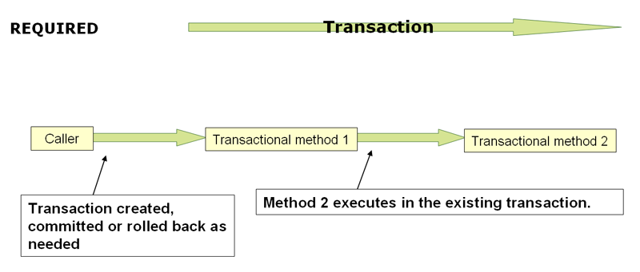

`PROPAGATION_REQUIRED` enforces a physical transaction, either locally for the current
scope if no transaction exists yet or participating in an existing 'outer' transaction
defined for a larger scope. This is a fine default in common call stack arrangements
within the same thread (for example, a service facade that delegates to several repository methods
where all the underlying resources have to participate in the service-level transaction).

> [!NOTE]
> By default, a participating transaction joins the characteristics of the outer scope, silently ignoring the local isolation level, timeout value, or read-only flag (if any).
> Consider switching the `validateExistingTransaction` flag to `true` on your transaction
> manager if you want isolation level declarations to be rejected when participating in
> an existing transaction with a different isolation level. This non-lenient mode also
> rejects read-only mismatches (that is, an inner read-write transaction that tries to participate
> in a read-only outer scope).

When the propagation setting is `PROPAGATION_REQUIRED`, a logical transaction scope
is created for each method upon which the setting is applied. Each such logical
transaction scope can determine rollback-only status individually, with an outer
transaction scope being logically independent from the inner transaction scope.
In the case of standard `PROPAGATION_REQUIRED` behavior, all these scopes are
mapped to the same physical transaction. So a rollback-only marker set in the inner
transaction scope does affect the outer transaction’s chance to actually commit.

However, in the case where an inner transaction scope sets the rollback-only marker, the
outer transaction has not decided on the rollback itself, so the rollback (silently
triggered by the inner transaction scope) is unexpected. A corresponding
`UnexpectedRollbackException` is thrown at that point. This is expected behavior so
that the caller of a transaction can never be misled to assume that a commit was
performed when it really was not. So, if an inner transaction (of which the outer caller
is not aware) silently marks a transaction as rollback-only, the outer caller still
calls commit. The outer caller needs to receive an `UnexpectedRollbackException` to
indicate clearly that a rollback was performed instead.

<a id="data-access-transaction-declarative-tx-propagation--tx-propagation-requires_new"></a>
<a id="data-access-transaction-declarative-tx-propagation--understanding-propagation_requires_new"></a>

## Understanding `PROPAGATION_REQUIRES_NEW`

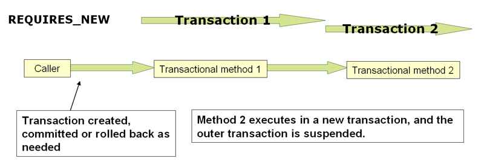

`PROPAGATION_REQUIRES_NEW`, in contrast to `PROPAGATION_REQUIRED`, always uses an
independent physical transaction for each affected transaction scope, never
participating in an existing transaction for an outer scope. In such an arrangement, the underlying resource transactions are different and, hence, can commit or roll back
independently, with an outer transaction not affected by an inner transaction’s rollback
status and with an inner transaction’s locks released immediately after its completion.
Such an independent inner transaction can also declare its own isolation level, timeout, and read-only settings and not inherit an outer transaction’s characteristics.

> [!NOTE]
> The resources attached to the outer transaction will remain bound there while
> the inner transaction acquires its own resources such as a new database connection.
> This may lead to exhaustion of the connection pool and potentially to a deadlock if
> several threads have an active outer transaction and wait to acquire a new connection
> for their inner transaction, with the pool not being able to hand out any such inner
> connection anymore. Do not use `PROPAGATION_REQUIRES_NEW` unless your connection pool
> is appropriately sized, exceeding the number of concurrent threads by at least 1.

<a id="data-access-transaction-declarative-tx-propagation--tx-propagation-nested"></a>
<a id="data-access-transaction-declarative-tx-propagation--understanding-propagation_nested"></a>

## Understanding `PROPAGATION_NESTED`

`PROPAGATION_NESTED` uses a single physical transaction with multiple savepoints
that it can roll back to. Such partial rollbacks let an inner transaction scope
trigger a rollback for its scope, with the outer transaction being able to continue
the physical transaction despite some operations having been rolled back. This setting
is typically mapped onto JDBC savepoints, so it works only with JDBC resource
transactions. See Spring’s
[`DataSourceTransactionManager`](https://docs.spring.io/spring-framework/docs/7.0.8/javadoc-api/org/springframework/jdbc/datasource/DataSourceTransactionManager.html).

[Using `@Transactional`](#data-access-transaction-declarative-annotations)
[Advising Transactional Operations](#data-access-transaction-declarative-applying-more-than-just-tx-advice)

---

<a id="data-access-transaction-declarative-applying-more-than-just-tx-advice"></a>

<!-- source_url: https://docs.spring.io/spring-framework/reference/data-access/transaction/declarative/applying-more-than-just-tx-advice.html -->

<!-- page_index: 125 -->

# Advising Transactional Operations

<svg enable-background="new 0 0 32 32" id="Glyph" version="1.1" viewbox="0 0 32 32" xml:space="preserve" xmlns="http://www.w3.org/2000/svg" xmlns:xlink="http://www.w3.org/1999/xlink">
<path id="XMLID_223_"></path>
</svg>

Search

<a id="data-access-transaction-declarative-applying-more-than-just-tx-advice--page-title"></a>
<a id="data-access-transaction-declarative-applying-more-than-just-tx-advice--advising-transactional-operations"></a>

# Advising Transactional Operations

Suppose you want to run both transactional operations and some basic profiling advice.
How do you effect this in the context of `<tx:annotation-driven/>`?

When you invoke the `updateFoo(Foo)` method, you want to see the following actions:

- The configured profiling aspect starts.
- The transactional advice runs.
- The method on the advised object runs.
- The transaction commits.
- The profiling aspect reports the exact duration of the whole transactional method invocation.

> [!NOTE]
> This chapter is not concerned with explaining AOP in any great detail (except as it
> applies to transactions). See [AOP](#core-aop) for detailed coverage of the AOP
> configuration and AOP in general.

The following code shows the simple profiling aspect discussed earlier:

- Java
- Kotlin

```java
package x.y;

import org.aspectj.lang.ProceedingJoinPoint;
import org.springframework.util.StopWatch;
import org.springframework.core.Ordered;

public class SimpleProfiler implements Ordered {

	private int order;

	// allows us to control the ordering of advice
	public int getOrder() {
		return this.order;
	}

	public void setOrder(int order) {
		this.order = order;
	}

	// this method is the around advice
	public Object profile(ProceedingJoinPoint call) throws Throwable {
		Object returnValue;
		StopWatch clock = new StopWatch(getClass().getName());
		try {
			clock.start(call.toShortString());
			returnValue = call.proceed();
		} finally {
			clock.stop();
			System.out.println(clock.prettyPrint());
		}
		return returnValue;
	}
}
```

```kotlin
package x.y

import org.aspectj.lang.ProceedingJoinPoint
import org.springframework.util.StopWatch
import org.springframework.core.Ordered

class SimpleProfiler : Ordered {

	private var order: Int = 0

	// allows us to control the ordering of advice
	override fun getOrder(): Int {
		return this.order
	}

	fun setOrder(order: Int) {
		this.order = order
	}

	// this method is the around advice
	fun profile(call: ProceedingJoinPoint): Any {
		var returnValue: Any
		val clock = StopWatch(javaClass.name)
		try {
			clock.start(call.toShortString())
			returnValue = call.proceed()
		} finally {
			clock.stop()
			println(clock.prettyPrint())
		}
		return returnValue
	}
}
```

The ordering of advice
is controlled through the `Ordered` interface. For full details on advice ordering, see
[Advice ordering](#core-aop-ataspectj-advice--aop-ataspectj-advice-ordering).

The following configuration creates a `fooService` bean that has profiling and
transactional aspects applied to it in the desired order:

```xml
<?xml version="1.0" encoding="UTF-8"?>
<beans xmlns="http://www.springframework.org/schema/beans"
	xmlns:xsi="http://www.w3.org/2001/XMLSchema-instance"
	xmlns:aop="http://www.springframework.org/schema/aop"
	xmlns:tx="http://www.springframework.org/schema/tx"
	xsi:schemaLocation="
		http://www.springframework.org/schema/beans
		https://www.springframework.org/schema/beans/spring-beans.xsd
		http://www.springframework.org/schema/tx
		https://www.springframework.org/schema/tx/spring-tx.xsd
		http://www.springframework.org/schema/aop
		https://www.springframework.org/schema/aop/spring-aop.xsd">

	<bean id="fooService" class="x.y.service.DefaultFooService"/>

	<!-- this is the aspect -->
	<bean id="profiler" class="x.y.SimpleProfiler">
		<!-- run before the transactional advice (hence the lower order number) -->
		<property name="order" value="1"/>
	</bean>

	<tx:annotation-driven transaction-manager="txManager" order="200"/>

	<aop:config>
			<!-- this advice runs around the transactional advice -->
			<aop:aspect id="profilingAspect" ref="profiler">
				<aop:pointcut id="serviceMethodWithReturnValue"
						expression="execution(!void x.y..*Service.*(..))"/>
				<aop:around method="profile" pointcut-ref="serviceMethodWithReturnValue"/>
			</aop:aspect>
	</aop:config>

	<bean id="dataSource" class="org.apache.commons.dbcp.BasicDataSource" destroy-method="close">
		<property name="driverClassName" value="oracle.jdbc.driver.OracleDriver"/>
		<property name="url" value="jdbc:oracle:thin:@rj-t42:1521:elvis"/>
		<property name="username" value="scott"/>
		<property name="password" value="tiger"/>
	</bean>

	<bean id="txManager" class="org.springframework.jdbc.datasource.DataSourceTransactionManager">
		<property name="dataSource" ref="dataSource"/>
	</bean>

</beans>
```

You can configure any number
of additional aspects in similar fashion.

The following example creates the same setup as the previous two examples but uses the purely XML
declarative approach:

```xml
<?xml version="1.0" encoding="UTF-8"?>
<beans xmlns="http://www.springframework.org/schema/beans"
	xmlns:xsi="http://www.w3.org/2001/XMLSchema-instance"
	xmlns:aop="http://www.springframework.org/schema/aop"
	xmlns:tx="http://www.springframework.org/schema/tx"
	xsi:schemaLocation="
		http://www.springframework.org/schema/beans
		https://www.springframework.org/schema/beans/spring-beans.xsd
		http://www.springframework.org/schema/tx
		https://www.springframework.org/schema/tx/spring-tx.xsd
		http://www.springframework.org/schema/aop
		https://www.springframework.org/schema/aop/spring-aop.xsd">

	<bean id="fooService" class="x.y.service.DefaultFooService"/>

	<!-- the profiling advice -->
	<bean id="profiler" class="x.y.SimpleProfiler">
		<!-- run before the transactional advice (hence the lower order number) -->
		<property name="order" value="1"/>
	</bean>

	<aop:config>
		<aop:pointcut id="entryPointMethod" expression="execution(* x.y..*Service.*(..))"/>
		<!-- runs after the profiling advice (cf. the order attribute) -->

		<aop:advisor advice-ref="txAdvice" pointcut-ref="entryPointMethod" order="2"/>
		<!-- order value is higher than the profiling aspect -->

		<aop:aspect id="profilingAspect" ref="profiler">
			<aop:pointcut id="serviceMethodWithReturnValue"
					expression="execution(!void x.y..*Service.*(..))"/>
			<aop:around method="profile" pointcut-ref="serviceMethodWithReturnValue"/>
		</aop:aspect>

	</aop:config>

	<tx:advice id="txAdvice" transaction-manager="txManager">
		<tx:attributes>
			<tx:method name="get*" read-only="true"/>
			<tx:method name="*"/>
		</tx:attributes>
	</tx:advice>

	<!-- other <bean/> definitions such as a DataSource and a TransactionManager here -->

</beans>
```

The result of the preceding configuration is a `fooService` bean that has profiling and
transactional aspects applied to it in that order. If you want the profiling advice
to run after the transactional advice on the way in and before the
transactional advice on the way out, you can swap the value of the profiling
aspect bean’s `order` property so that it is higher than the transactional advice’s
order value.

You can configure additional aspects in similar fashion.

[Transaction Propagation](#data-access-transaction-declarative-tx-propagation)
[Using `@Transactional` with AspectJ](#data-access-transaction-declarative-aspectj)

---

<a id="data-access-transaction-declarative-aspectj"></a>

<!-- source_url: https://docs.spring.io/spring-framework/reference/data-access/transaction/declarative/aspectj.html -->

<!-- page_index: 126 -->

# Using @Transactional with AspectJ

<svg enable-background="new 0 0 32 32" id="Glyph" version="1.1" viewbox="0 0 32 32" xml:space="preserve" xmlns="http://www.w3.org/2000/svg" xmlns:xlink="http://www.w3.org/1999/xlink">
<path id="XMLID_223_"></path>
</svg>

Search

<a id="data-access-transaction-declarative-aspectj--page-title"></a>
<a id="data-access-transaction-declarative-aspectj--using-transactional-with-aspectj"></a>

# Using `@Transactional` with AspectJ

You can also use the Spring Framework’s `@Transactional` support outside of a Spring
container by means of an AspectJ aspect. To do so, first annotate your classes
(and optionally your classes' methods) with the `@Transactional` annotation, and then link (weave) your application with the
`org.springframework.transaction.aspectj.AnnotationTransactionAspect` defined in the
`spring-aspects.jar` file. You must also configure the aspect with a transaction
manager. You can use the Spring Framework’s IoC container to take care of
dependency-injecting the aspect. The simplest way to configure the transaction
management aspect is to use the `<tx:annotation-driven/>` element and specify the
`mode` attribute to `aspectj` as described in
[Using `@Transactional`](#data-access-transaction-declarative-annotations).
Because we focus here on applications that run outside of a Spring container, we show you how to do it programmatically.

> [!NOTE]
> Prior to continuing, you may want to read
> [Using `@Transactional`](#data-access-transaction-declarative-annotations) and
> [AOP](#core-aop) respectively.

The following example shows how to create a transaction manager and configure the
`AnnotationTransactionAspect` to use it:

- Java
- Kotlin

```java
// construct an appropriate transaction manager
DataSourceTransactionManager txManager = new DataSourceTransactionManager(getDataSource());

// configure the AnnotationTransactionAspect to use it; this must be done before executing any transactional methods
AnnotationTransactionAspect.aspectOf().setTransactionManager(txManager);
```

```kotlin
// construct an appropriate transaction manager
val txManager = DataSourceTransactionManager(getDataSource())

// configure the AnnotationTransactionAspect to use it; this must be done before executing any transactional methods
AnnotationTransactionAspect.aspectOf().transactionManager = txManager
```

> [!NOTE]
> When you use this aspect, you must annotate the implementation class (or the methods
> within that class or both), not the interface (if any) that the class implements. AspectJ
> follows Java’s rule that annotations on interfaces are not inherited.

The `@Transactional` annotation on a class specifies the default transaction semantics
for the execution of any public method in the class.

The `@Transactional` annotation on a method within the class overrides the default
transaction semantics given by the class annotation (if present). You can annotate any method, regardless of visibility.

To weave your applications with the `AnnotationTransactionAspect`, you must either build
your application with AspectJ (see the [AspectJ Development
Guide](https://www.eclipse.org/aspectj/doc/released/devguide/index.html)) or use load-time weaving. See
[Load-time weaving with AspectJ in the Spring Framework](#core-aop-using-aspectj--aop-aj-ltw)
for a discussion of load-time weaving with AspectJ.

[Advising Transactional Operations](#data-access-transaction-declarative-applying-more-than-just-tx-advice)
[Programmatic Transaction Management](#data-access-transaction-programmatic)

---

<a id="data-access-transaction-programmatic"></a>

<!-- source_url: https://docs.spring.io/spring-framework/reference/data-access/transaction/programmatic.html -->

<!-- page_index: 127 -->

# Programmatic Transaction Management

<svg enable-background="new 0 0 32 32" id="Glyph" version="1.1" viewbox="0 0 32 32" xml:space="preserve" xmlns="http://www.w3.org/2000/svg" xmlns:xlink="http://www.w3.org/1999/xlink">
<path id="XMLID_223_"></path>
</svg>

Search

<a id="data-access-transaction-programmatic--page-title"></a>
<a id="data-access-transaction-programmatic--programmatic-transaction-management"></a>

# Programmatic Transaction Management

The Spring Framework provides two means of programmatic transaction management, by using:

- The `TransactionTemplate` or `TransactionalOperator`.
- A `TransactionManager` implementation directly.

The Spring team generally recommends the `TransactionTemplate` for programmatic
transaction management in imperative flows and `TransactionalOperator` for reactive code.
The second approach is similar to using the JTA `UserTransaction` API, although exception
handling is less cumbersome.

<a id="data-access-transaction-programmatic--tx-prog-template"></a>
<a id="data-access-transaction-programmatic--using-the-transactiontemplate"></a>

## Using the `TransactionTemplate`

The `TransactionTemplate` adopts the same approach as other Spring templates, such as
the `JdbcTemplate`. It uses a callback approach (to free application code from having to
do the boilerplate acquisition and release transactional resources) and results in
code that is intention driven, in that your code focuses solely on what
you want to do.

> [!NOTE]
> As the examples that follow show, using the `TransactionTemplate` absolutely
> couples you to Spring’s transaction infrastructure and APIs. Whether or not programmatic
> transaction management is suitable for your development needs is a decision that you
> have to make yourself.

Application code that must run in a transactional context and that explicitly uses the
`TransactionTemplate` resembles the next example. You, as an application
developer, can write a `TransactionCallback` implementation (typically expressed as an
anonymous inner class) that contains the code that you need to run in the context of
a transaction. You can then pass an instance of your custom `TransactionCallback` to the
`execute(..)` method exposed on the `TransactionTemplate`. The following example shows how to do so:

- Java
- Kotlin

```java
public class SimpleService implements Service {
// single TransactionTemplate shared amongst all methods in this instance private final TransactionTemplate transactionTemplate;
// use constructor-injection to supply the PlatformTransactionManager public SimpleService(PlatformTransactionManager transactionManager) {this.transactionTemplate = new TransactionTemplate(transactionManager);}
public Object someServiceMethod() {return transactionTemplate.execute(new TransactionCallback() {// the code in this method runs in a transactional context public Object doInTransaction(TransactionStatus status) {updateOperation1(); return resultOfUpdateOperation2();} });}}
```

```kotlin
// use constructor-injection to supply the PlatformTransactionManager class SimpleService(transactionManager: PlatformTransactionManager) : Service {
// single TransactionTemplate shared amongst all methods in this instance private val transactionTemplate = TransactionTemplate(transactionManager)
fun someServiceMethod() = transactionTemplate.execute<Any?> {updateOperation1() resultOfUpdateOperation2()}}
```

If there is no return value, you can use the convenient `TransactionCallbackWithoutResult` class
with an anonymous class, as follows:

- Java
- Kotlin

```java
transactionTemplate.execute(new TransactionCallbackWithoutResult() {
	protected void doInTransactionWithoutResult(TransactionStatus status) {
		updateOperation1();
		updateOperation2();
	}
});
```

```kotlin
transactionTemplate.execute(object : TransactionCallbackWithoutResult() {
	override fun doInTransactionWithoutResult(status: TransactionStatus) {
		updateOperation1()
		updateOperation2()
	}
})
```

Code within the callback can roll the transaction back by calling the
`setRollbackOnly()` method on the supplied `TransactionStatus` object, as follows:

- Java
- Kotlin

```java
transactionTemplate.execute(new TransactionCallbackWithoutResult() {
protected void doInTransactionWithoutResult(TransactionStatus status) {try {updateOperation1(); updateOperation2(); } catch (SomeBusinessException ex) {status.setRollbackOnly();}} });
```

```kotlin
transactionTemplate.execute(object : TransactionCallbackWithoutResult() {
override fun doInTransactionWithoutResult(status: TransactionStatus) {try {updateOperation1() updateOperation2() } catch (ex: SomeBusinessException) {status.setRollbackOnly()}} })
```

<a id="data-access-transaction-programmatic--tx-prog-template-settings"></a>
<a id="data-access-transaction-programmatic--specifying-transaction-settings"></a>

### Specifying Transaction Settings

You can specify transaction settings (such as the propagation mode, the isolation level, the timeout, and so forth) on the `TransactionTemplate` either programmatically or in
configuration. By default, `TransactionTemplate` instances have the
[default transactional settings](#data-access-transaction-declarative-txadvice-settings). The
following example shows the programmatic customization of the transactional settings for
a specific `TransactionTemplate:`

- Java
- Kotlin

```java
public class SimpleService implements Service {

	private final TransactionTemplate transactionTemplate;

	public SimpleService(PlatformTransactionManager transactionManager) {
		this.transactionTemplate = new TransactionTemplate(transactionManager);

		// the transaction settings can be set here explicitly if so desired
		this.transactionTemplate.setIsolationLevel(TransactionDefinition.ISOLATION_READ_UNCOMMITTED);
		this.transactionTemplate.setTimeout(30); // 30 seconds
		// and so forth...
	}
}
```

```kotlin
class SimpleService(transactionManager: PlatformTransactionManager) : Service {
private val transactionTemplate = TransactionTemplate(transactionManager).apply {// the transaction settings can be set here explicitly if so desired isolationLevel = TransactionDefinition.ISOLATION_READ_UNCOMMITTED timeout = 30 // 30 seconds // and so forth...}}
```

The following example defines a `TransactionTemplate` with some custom transactional
settings by using Spring XML configuration:

```xml
<bean id="sharedTransactionTemplate"
		class="org.springframework.transaction.support.TransactionTemplate">
	<property name="isolationLevelName" value="ISOLATION_READ_UNCOMMITTED"/>
	<property name="timeout" value="30"/>
</bean>
```

You can then inject the `sharedTransactionTemplate`
into as many services as are required.

Finally, instances of the `TransactionTemplate` class are thread-safe, in that instances
do not maintain any conversational state. `TransactionTemplate` instances do, however, maintain configuration state. So, while a number of classes may share a single instance
of a `TransactionTemplate`, if a class needs to use a `TransactionTemplate` with
different settings (for example, a different isolation level), you need to create
two distinct `TransactionTemplate` instances.

<a id="data-access-transaction-programmatic--tx-prog-operator"></a>
<a id="data-access-transaction-programmatic--using-the-transactionaloperator"></a>

## Using the `TransactionalOperator`

The `TransactionalOperator` follows an operator design that is similar to other reactive
operators. It uses a callback approach (to free application code from having to do the
boilerplate acquisition and release transactional resources) and results in code that is
intention driven, in that your code focuses solely on what you want to do.

> [!NOTE]
> As the examples that follow show, using the `TransactionalOperator` absolutely
> couples you to Spring’s transaction infrastructure and APIs. Whether or not programmatic
> transaction management is suitable for your development needs is a decision that you have
> to make yourself.

Application code that must run in a transactional context and that explicitly uses
the `TransactionalOperator` resembles the next example:

- Java
- Kotlin

```java
public class SimpleService implements Service {
// single TransactionalOperator shared amongst all methods in this instance private final TransactionalOperator transactionalOperator;
// use constructor-injection to supply the ReactiveTransactionManager public SimpleService(ReactiveTransactionManager transactionManager) {this.transactionalOperator = TransactionalOperator.create(transactionManager);}
public Mono<Object> someServiceMethod() {
// the code in this method runs in a transactional context
Mono<Object> update = updateOperation1();
return update.then(resultOfUpdateOperation2).as(transactionalOperator::transactional);}}
```

```kotlin
// use constructor-injection to supply the ReactiveTransactionManager class SimpleService(transactionManager: ReactiveTransactionManager) : Service {
// single TransactionalOperator shared amongst all methods in this instance private val transactionalOperator = TransactionalOperator.create(transactionManager)
suspend fun someServiceMethod() = transactionalOperator.executeAndAwait<Any?> {updateOperation1() resultOfUpdateOperation2()}}
```

`TransactionalOperator` can be used in two ways:

- Operator-style using Project Reactor types (`mono.as(transactionalOperator::transactional)`)
- Callback-style for every other case (`transactionalOperator.execute(TransactionCallback<T>)`)

Code within the callback can roll the transaction back by calling the `setRollbackOnly()`
method on the supplied `ReactiveTransaction` object, as follows:

- Java
- Kotlin

```java
transactionalOperator.execute(new TransactionCallback<>() {
public Mono<Object> doInTransaction(ReactiveTransaction status) {return updateOperation1().then(updateOperation2) .doOnError(SomeBusinessException.class, e -> status.setRollbackOnly());}} });
```

```kotlin
transactionalOperator.execute(object : TransactionCallback() {

	override fun doInTransactionWithoutResult(status: ReactiveTransaction) {
		updateOperation1().then(updateOperation2)
					.doOnError(SomeBusinessException.class, e -> status.setRollbackOnly())
	}
})
```

<a id="data-access-transaction-programmatic--tx-prog-operator-cancel"></a>
<a id="data-access-transaction-programmatic--cancel-signals"></a>

### Cancel Signals

In Reactive Streams, a `Subscriber` can cancel its `Subscription` and stop its
`Publisher`. Operators in Project Reactor, as well as in other libraries, such as `next()`, `take(long)`, `timeout(Duration)`, and others can issue cancellations. There is no way to
know the reason for the cancellation, whether it is due to an error or a simply lack of
interest to consume further. Since version 5.3 cancel signals lead to a roll back.
As a result it is important to consider the operators used downstream from a transaction
`Publisher`. In particular in the case of a `Flux` or other multi-value `Publisher`, the full output must be consumed to allow the transaction to complete.

<a id="data-access-transaction-programmatic--tx-prog-operator-settings"></a>
<a id="data-access-transaction-programmatic--specifying-transaction-settings-2"></a>

### Specifying Transaction Settings

You can specify transaction settings (such as the propagation mode, the isolation level, the timeout, and so forth) for the `TransactionalOperator`. By default, `TransactionalOperator` instances have
[default transactional settings](#data-access-transaction-declarative-txadvice-settings). The
following example shows customization of the transactional settings for a specific
`TransactionalOperator:`

- Java
- Kotlin

```java
public class SimpleService implements Service {

	private final TransactionalOperator transactionalOperator;

	public SimpleService(ReactiveTransactionManager transactionManager) {
		DefaultTransactionDefinition definition = new DefaultTransactionDefinition();

		// the transaction settings can be set here explicitly if so desired
		definition.setIsolationLevel(TransactionDefinition.ISOLATION_READ_UNCOMMITTED);
		definition.setTimeout(30); // 30 seconds
		// and so forth...

		this.transactionalOperator = TransactionalOperator.create(transactionManager, definition);
	}
}
```

```kotlin
class SimpleService(transactionManager: ReactiveTransactionManager) : Service {
private val definition = DefaultTransactionDefinition().apply {// the transaction settings can be set here explicitly if so desired isolationLevel = TransactionDefinition.ISOLATION_READ_UNCOMMITTED timeout = 30 // 30 seconds // and so forth...} private val transactionalOperator = TransactionalOperator(transactionManager, definition)}
```

<a id="data-access-transaction-programmatic--transaction-programmatic-tm"></a>
<a id="data-access-transaction-programmatic--using-the-transactionmanager"></a>

## Using the `TransactionManager`

The following sections explain programmatic usage of imperative and reactive transaction
managers.

<a id="data-access-transaction-programmatic--transaction-programmatic-ptm"></a>
<a id="data-access-transaction-programmatic--using-the-platformtransactionmanager"></a>

### Using the `PlatformTransactionManager`

For imperative transactions, you can use a
`org.springframework.transaction.PlatformTransactionManager` directly to manage your
transaction. To do so, pass the implementation of the `PlatformTransactionManager` you
use to your bean through a bean reference. Then, by using the `TransactionDefinition` and
`TransactionStatus` objects, you can initiate transactions, roll back, and commit. The
following example shows how to do so:

- Java
- Kotlin

```java
DefaultTransactionDefinition def = new DefaultTransactionDefinition();
// explicitly setting the transaction name is something that can be done only programmatically
def.setName("SomeTxName");
def.setPropagationBehavior(TransactionDefinition.PROPAGATION_REQUIRED);

TransactionStatus status = txManager.getTransaction(def);
try {
	// put your business logic here
} catch (MyException ex) {
	txManager.rollback(status);
	throw ex;
}
txManager.commit(status);
```

```kotlin
val def = DefaultTransactionDefinition()
// explicitly setting the transaction name is something that can be done only programmatically
def.setName("SomeTxName")
def.propagationBehavior = TransactionDefinition.PROPAGATION_REQUIRED

val status = txManager.getTransaction(def)
try {
	// put your business logic here
} catch (ex: MyException) {
	txManager.rollback(status)
	throw ex
}

txManager.commit(status)
```

<a id="data-access-transaction-programmatic--transaction-programmatic-rtm"></a>
<a id="data-access-transaction-programmatic--using-the-reactivetransactionmanager"></a>

### Using the `ReactiveTransactionManager`

When working with reactive transactions, you can use a
`org.springframework.transaction.ReactiveTransactionManager` directly to manage your
transaction. To do so, pass the implementation of the `ReactiveTransactionManager` you
use to your bean through a bean reference. Then, by using the `TransactionDefinition` and
`ReactiveTransaction` objects, you can initiate transactions, roll back, and commit. The
following example shows how to do so:

- Java
- Kotlin

```java
DefaultTransactionDefinition def = new DefaultTransactionDefinition();
// explicitly setting the transaction name is something that can be done only programmatically
def.setName("SomeTxName");
def.setPropagationBehavior(TransactionDefinition.PROPAGATION_REQUIRED);

Mono<ReactiveTransaction> reactiveTx = txManager.getReactiveTransaction(def);

reactiveTx.flatMap(status -> {

	Mono<Object> tx = ...; // put your business logic here

	return tx.then(txManager.commit(status))
			.onErrorResume(ex -> txManager.rollback(status).then(Mono.error(ex)));
});
```

```kotlin
val def = DefaultTransactionDefinition()
// explicitly setting the transaction name is something that can be done only programmatically
def.setName("SomeTxName")
def.propagationBehavior = TransactionDefinition.PROPAGATION_REQUIRED

val reactiveTx = txManager.getReactiveTransaction(def)
reactiveTx.flatMap { status ->

	val tx = ... // put your business logic here

	tx.then(txManager.commit(status))
			.onErrorResume { ex -> txManager.rollback(status).then(Mono.error(ex)) }
}
```

[Using `@Transactional` with AspectJ](#data-access-transaction-declarative-aspectj)
[Choosing Between Programmatic and Declarative Transaction Management](#data-access-transaction-tx-decl-vs-prog)

---

<a id="data-access-transaction-tx-decl-vs-prog"></a>

<!-- source_url: https://docs.spring.io/spring-framework/reference/data-access/transaction/tx-decl-vs-prog.html -->

<!-- page_index: 128 -->

# Choosing Between Programmatic and Declarative Transaction Management

<svg enable-background="new 0 0 32 32" id="Glyph" version="1.1" viewbox="0 0 32 32" xml:space="preserve" xmlns="http://www.w3.org/2000/svg" xmlns:xlink="http://www.w3.org/1999/xlink">
<path id="XMLID_223_"></path>
</svg>

Search

<a id="data-access-transaction-tx-decl-vs-prog--page-title"></a>
<a id="data-access-transaction-tx-decl-vs-prog--choosing-between-programmatic-and-declarative-transaction-management"></a>

# Choosing Between Programmatic and Declarative Transaction Management

Programmatic transaction management is usually a good idea only if you have a small
number of transactional operations. For example, if you have a web application that
requires transactions only for certain update operations, you may not want to set up
transactional proxies by using Spring or any other technology. In this case, using the
`TransactionTemplate` may be a good approach. Being able to set the transaction name
explicitly is also something that can be done only by using the programmatic approach
to transaction management.

On the other hand, if your application has numerous transactional operations, declarative transaction management is usually worthwhile. It keeps transaction
management out of business logic and is not difficult to configure. When using the
Spring Framework, rather than EJB CMT, the configuration cost of declarative transaction
management is greatly reduced.

[Programmatic Transaction Management](#data-access-transaction-programmatic)
[Transaction-bound Events](#data-access-transaction-event)

---

<a id="data-access-transaction-event"></a>

<!-- source_url: https://docs.spring.io/spring-framework/reference/data-access/transaction/event.html -->

<!-- page_index: 129 -->

# Transaction-bound Events

<svg enable-background="new 0 0 32 32" id="Glyph" version="1.1" viewbox="0 0 32 32" xml:space="preserve" xmlns="http://www.w3.org/2000/svg" xmlns:xlink="http://www.w3.org/1999/xlink">
<path id="XMLID_223_"></path>
</svg>

Search

<a id="data-access-transaction-event--page-title"></a>
<a id="data-access-transaction-event--transaction-bound-events"></a>

# Transaction-bound Events

As of Spring 4.2, the listener of an event can be bound to a phase of the transaction.
The typical example is to handle the event when the transaction has completed successfully.
Doing so lets events be used with more flexibility when the outcome of the current
transaction actually matters to the listener.

You can register a regular event listener by using the `@EventListener` annotation.
If you need to bind it to the transaction, use `@TransactionalEventListener`.
When you do so, the listener is bound to the commit phase of the transaction by default.

The next example shows this concept. Assume that a component publishes an order-created
event and that we want to define a listener that should only handle that event once the
transaction in which it has been published has committed successfully. The following
example sets up such an event listener:

- Java
- Kotlin

```java
@Component public class MyComponent {
@TransactionalEventListener public void handleOrderCreatedEvent(CreationEvent<Order> creationEvent) {// ...}}
```

```kotlin
@Component class MyComponent {
@TransactionalEventListener fun handleOrderCreatedEvent(creationEvent: CreationEvent<Order>) {// ...}}
```

The `@TransactionalEventListener` annotation exposes a `phase` attribute that lets you
customize the phase of the transaction to which the listener should be bound.
The valid phases are `BEFORE_COMMIT`, `AFTER_COMMIT` (default), `AFTER_ROLLBACK`, as well as
`AFTER_COMPLETION` which aggregates the transaction completion (be it a commit or a rollback).

If no transaction is running, the listener is not invoked at all, since we cannot honor the
required semantics. You can, however, override that behavior by setting the `fallbackExecution`
attribute of the annotation to `true`.

> [!NOTE]
> As of 6.1, `@TransactionalEventListener` can work with thread-bound transactions managed by
> `PlatformTransactionManager` as well as reactive transactions managed by `ReactiveTransactionManager`.
> For the former, listeners are guaranteed to see the current thread-bound transaction.
> Since the latter uses the Reactor context instead of thread-local variables, the transaction
> context needs to be included in the published event instance as the event source.
> See the
> [`TransactionalEventPublisher`](https://docs.spring.io/spring-framework/docs/7.0.8/javadoc-api/org/springframework/transaction/reactive/TransactionalEventPublisher.html)
> javadoc for details.

[Choosing Between Programmatic and Declarative Transaction Management](#data-access-transaction-tx-decl-vs-prog)
[Application server-specific integration](#data-access-transaction-application-server-integration)

---

<a id="data-access-transaction-application-server-integration"></a>

<!-- source_url: https://docs.spring.io/spring-framework/reference/data-access/transaction/application-server-integration.html -->

<!-- page_index: 130 -->

# Application server-specific integration

<svg enable-background="new 0 0 32 32" id="Glyph" version="1.1" viewbox="0 0 32 32" xml:space="preserve" xmlns="http://www.w3.org/2000/svg" xmlns:xlink="http://www.w3.org/1999/xlink">
<path id="XMLID_223_"></path>
</svg>

Search

<a id="data-access-transaction-application-server-integration--page-title"></a>
<a id="data-access-transaction-application-server-integration--application-server-specific-integration"></a>

# Application server-specific integration

Spring’s transaction abstraction is generally application server-agnostic. Additionally, Spring’s `JtaTransactionManager` class (which can optionally perform a JNDI lookup for
the JTA `UserTransaction` and `TransactionManager` objects) autodetects the location for
the latter object, which varies by application server. Having access to the JTA
`TransactionManager` allows for enhanced transaction semantics — in particular, supporting transaction suspension. See the
[`JtaTransactionManager`](https://docs.spring.io/spring-framework/docs/7.0.8/javadoc-api/org/springframework/transaction/jta/JtaTransactionManager.html)
javadoc for details.

Spring’s `JtaTransactionManager` is the standard choice to run on Jakarta EE application
servers and is known to work on all common servers. Advanced functionality, such as
transaction suspension, works on many servers as well (including GlassFish, JBoss and
Geronimo) without any special configuration required.

[Transaction-bound Events](#data-access-transaction-event)
[Solutions to Common Problems](#data-access-transaction-solutions-to-common-problems)

---

<a id="data-access-transaction-solutions-to-common-problems"></a>

<!-- source_url: https://docs.spring.io/spring-framework/reference/data-access/transaction/solutions-to-common-problems.html -->

<!-- page_index: 131 -->

# Solutions to Common Problems

<svg enable-background="new 0 0 32 32" id="Glyph" version="1.1" viewbox="0 0 32 32" xml:space="preserve" xmlns="http://www.w3.org/2000/svg" xmlns:xlink="http://www.w3.org/1999/xlink">
<path id="XMLID_223_"></path>
</svg>

Search

<a id="data-access-transaction-solutions-to-common-problems--page-title"></a>
<a id="data-access-transaction-solutions-to-common-problems--solutions-to-common-problems"></a>

# Solutions to Common Problems

This section describes solutions to some common problems.

<a id="data-access-transaction-solutions-to-common-problems--transaction-solutions-to-common-problems-wrong-ptm"></a>
<a id="data-access-transaction-solutions-to-common-problems--using-the-wrong-transaction-manager-for-a-specific-datasource"></a>

## Using the Wrong Transaction Manager for a Specific `DataSource`

Use the correct `PlatformTransactionManager` implementation based on your choice of
transactional technologies and requirements. Used properly, the Spring Framework merely
provides a straightforward and portable abstraction. If you use global
transactions, you must use the
`org.springframework.transaction.jta.JtaTransactionManager` class (or an
[application server-specific subclass](#data-access-transaction-application-server-integration) of
it) for all your transactional operations. Otherwise, the transaction infrastructure
tries to perform local transactions on such resources as container `DataSource`
instances. Such local transactions do not make sense, and a good application server
treats them as errors.

[Application server-specific integration](#data-access-transaction-application-server-integration)
[Further Resources](#data-access-transaction-resources)

---

<a id="data-access-transaction-resources"></a>

<!-- source_url: https://docs.spring.io/spring-framework/reference/data-access/transaction/resources.html -->

<!-- page_index: 132 -->

# Further Resources

<svg enable-background="new 0 0 32 32" id="Glyph" version="1.1" viewbox="0 0 32 32" xml:space="preserve" xmlns="http://www.w3.org/2000/svg" xmlns:xlink="http://www.w3.org/1999/xlink">
<path id="XMLID_223_"></path>
</svg>

Search

<a id="data-access-transaction-resources--page-title"></a>
<a id="data-access-transaction-resources--further-resources"></a>

# Further Resources

For more information about the Spring Framework’s transaction support, see:

- [Distributed transactions in Spring, with and without XA](https://www.infoworld.com/article/2077963/distributed-transactions-in-spring--with-and-without-xa.html) is a JavaWorld presentation in
  which Spring’s David Syer guides you through seven patterns for distributed transactions
  in Spring applications, three of them with XA and four without.
- [*Java Transaction Design Strategies*](https://www.infoq.com/minibooks/JTDS) is a book
  available from [InfoQ](https://www.infoq.com/) that provides a well-paced introduction
  to transactions in Java. It also includes side-by-side examples of how to configure
  and use transactions with both the Spring Framework and EJB3.

[Solutions to Common Problems](#data-access-transaction-solutions-to-common-problems)
[DAO Support](#data-access-dao)

---

<a id="data-access-dao"></a>

<!-- source_url: https://docs.spring.io/spring-framework/reference/data-access/dao.html -->

<!-- page_index: 133 -->

# DAO Support

<svg enable-background="new 0 0 32 32" id="Glyph" version="1.1" viewbox="0 0 32 32" xml:space="preserve" xmlns="http://www.w3.org/2000/svg" xmlns:xlink="http://www.w3.org/1999/xlink">
<path id="XMLID_223_"></path>
</svg>

Search

<a id="data-access-dao--page-title"></a>
<a id="data-access-dao--dao-support"></a>

# DAO Support

The Data Access Object (DAO) support in Spring is aimed at making it easy to work with
data access technologies (such as JDBC, Hibernate, or JPA) in a consistent way. This
lets you switch between the aforementioned persistence technologies fairly easily, and it also lets you code without worrying about catching exceptions that are
specific to each technology.

<a id="data-access-dao--dao-exceptions"></a>
<a id="data-access-dao--consistent-exception-hierarchy"></a>

## Consistent Exception Hierarchy

Spring provides a convenient translation from technology-specific exceptions, such as
`SQLException` to its own exception class hierarchy, which has `DataAccessException` as
the root exception. These exceptions wrap the original exception so that there is never
any risk that you might lose any information about what might have gone wrong.

In addition to JDBC exceptions, Spring can also wrap JPA- and Hibernate-specific exceptions, converting them to a set of focused runtime exceptions. This lets you handle most
non-recoverable persistence exceptions in only the appropriate layers, without having
annoying boilerplate catch-and-throw blocks and exception declarations in your DAOs.
(You can still trap and handle exceptions anywhere you need to though.) As mentioned above, JDBC exceptions (including database-specific dialects) are also converted to the same
hierarchy, meaning that you can perform some operations with JDBC within a consistent
programming model.

The preceding discussion holds true for the various template classes in Spring’s support
for various ORM frameworks. If you use the interceptor-based classes, the application must
care about handling `HibernateExceptions` and `PersistenceExceptions` itself, preferably by
delegating to the `convertHibernateAccessException(..)` or `convertJpaAccessException(..)`
methods, respectively, of `SessionFactoryUtils`. These methods convert the exceptions
to exceptions that are compatible with the exceptions in the `org.springframework.dao`
exception hierarchy. As `PersistenceExceptions` are unchecked, they can get thrown, too
(sacrificing generic DAO abstraction in terms of exceptions, though).

The following image shows the exception hierarchy that Spring provides.
(Note that the class hierarchy detailed in the image shows only a subset of the entire
`DataAccessException` hierarchy.)

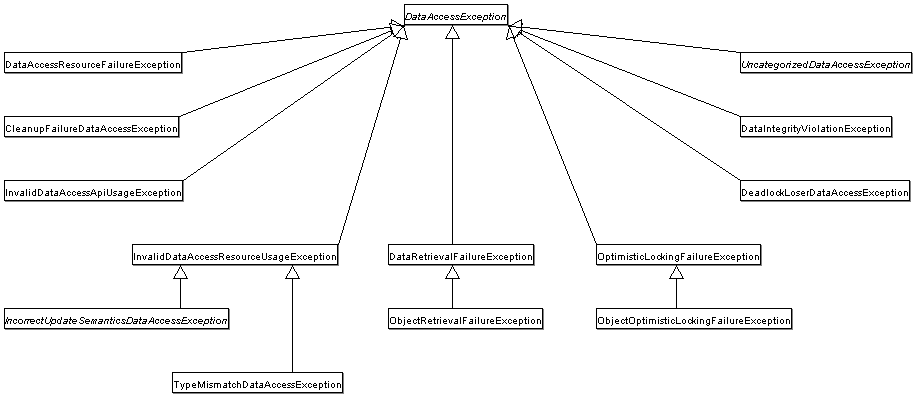

<a id="data-access-dao--dao-annotations"></a>
<a id="data-access-dao--annotations-used-to-configure-dao-or-repository-classes"></a>

## Annotations Used to Configure DAO or Repository Classes

The best way to guarantee that your Data Access Objects (DAOs) or repositories provide
exception translation is to use the `@Repository` annotation. This annotation also
lets the component scanning support find and configure your DAOs and repositories
without having to provide XML configuration entries for them. The following example shows
how to use the `@Repository` annotation:

- Java
- Kotlin

```java
@Repository (1)
public class SomeMovieFinder implements MovieFinder {
	// ...
}
```

**1**

The `@Repository` annotation.

```kotlin
@Repository (1)
class SomeMovieFinder : MovieFinder {
	// ...
}
```

**1**

The `@Repository` annotation.

Any DAO or repository implementation needs access to a persistence resource, depending on the persistence technology used. For example, a JDBC-based repository
needs access to a JDBC `DataSource`, and a JPA-based repository needs access to an
`EntityManager`. The easiest way to accomplish this is to have this resource dependency
injected by using one of the `@Autowired`, `@Inject`, `@Resource` or `@PersistenceContext`
annotations. The following example works for a JPA repository:

- Java
- Kotlin

```java
@Repository
public class JpaMovieFinder implements MovieFinder {

	@PersistenceContext
	private EntityManager entityManager;

	// ...
}
```

```kotlin
@Repository
class JpaMovieFinder : MovieFinder {

	@PersistenceContext
	private lateinit var entityManager: EntityManager

	// ...
}
```

If you use the classic Hibernate APIs, you can inject `SessionFactory`, as the following
example shows:

- Java
- Kotlin

```java
@Repository public class HibernateMovieFinder implements MovieFinder {
private SessionFactory sessionFactory;
@Autowired public void setSessionFactory(SessionFactory sessionFactory) {this.sessionFactory = sessionFactory;}
// ...}
```

```kotlin
@Repository
class HibernateMovieFinder(private val sessionFactory: SessionFactory) : MovieFinder {
	// ...
}
```

The last example we show here is for typical JDBC support. You could have the `DataSource`
injected into an initialization method or a constructor, where you would create a `JdbcTemplate`
and other data access support classes (such as `SimpleJdbcCall` and others) by using this
`DataSource`. The following example autowires a `DataSource`:

- Java
- Kotlin

```java
@Repository public class JdbcMovieFinder implements MovieFinder {
private JdbcTemplate jdbcTemplate;
@Autowired public void init(DataSource dataSource) {this.jdbcTemplate = new JdbcTemplate(dataSource);}
// ...}
```

```kotlin
@Repository
class JdbcMovieFinder(dataSource: DataSource) : MovieFinder {

	private val jdbcTemplate = JdbcTemplate(dataSource)

	// ...
}
```

> [!NOTE]
> See the specific coverage of each persistence technology for details on how to
> configure the application context to take advantage of these annotations.

[Further Resources](#data-access-transaction-resources)
[Data Access with JDBC](#data-access-jdbc)

---

<a id="data-access-jdbc"></a>

<!-- source_url: https://docs.spring.io/spring-framework/reference/data-access/jdbc.html -->

<!-- page_index: 134 -->

# Data Access with JDBC

<svg enable-background="new 0 0 32 32" id="Glyph" version="1.1" viewbox="0 0 32 32" xml:space="preserve" xmlns="http://www.w3.org/2000/svg" xmlns:xlink="http://www.w3.org/1999/xlink">
<path id="XMLID_223_"></path>
</svg>

Search

<a id="data-access-jdbc--page-title"></a>
<a id="data-access-jdbc--data-access-with-jdbc"></a>

# Data Access with JDBC

The value provided by the Spring Framework JDBC abstraction is perhaps best shown by
the sequence of actions outlined in the following table below. The table shows which actions Spring
takes care of and which actions are your responsibility.

| Action | Spring | You |
| --- | --- | --- |
| Define connection parameters. |  | X |
| Open the connection. | X |  |
| Specify the SQL statement. |  | X |
| Declare parameters and provide parameter values |  | X |
| Prepare and run the statement. | X |  |
| Set up the loop to iterate through the results (if any). | X |  |
| Do the work for each iteration. |  | X |
| Process any exception. | X |  |
| Handle transactions. | X |  |
| Close the connection, the statement, and the resultset. | X |  |

The Spring Framework takes care of all the low-level details that can make JDBC such a
tedious API.

[DAO Support](#data-access-dao)
[Choosing an Approach for JDBC Database Access](#data-access-jdbc-choose-style)

---

<a id="data-access-jdbc-choose-style"></a>

<!-- source_url: https://docs.spring.io/spring-framework/reference/data-access/jdbc/choose-style.html -->

<!-- page_index: 135 -->

# Choosing an Approach for JDBC Database Access

<svg enable-background="new 0 0 32 32" id="Glyph" version="1.1" viewbox="0 0 32 32" xml:space="preserve" xmlns="http://www.w3.org/2000/svg" xmlns:xlink="http://www.w3.org/1999/xlink">
<path id="XMLID_223_"></path>
</svg>

Search

<a id="data-access-jdbc-choose-style--page-title"></a>
<a id="data-access-jdbc-choose-style--choosing-an-approach-for-jdbc-database-access"></a>

# Choosing an Approach for JDBC Database Access

You can choose among several approaches to form the basis for your JDBC database access.
In addition to three flavors of `JdbcTemplate`, a `SimpleJdbcInsert` and `SimpleJdbcCall`
approach optimizes database metadata, and the RDBMS Object style results in a more
object-oriented approach. Once you start using one of these approaches, you can still mix
and match to include a feature from a different approach.

- `JdbcTemplate` is the classic and most popular Spring JDBC approach. This
  “lowest-level” approach and all others use a `JdbcTemplate` under the covers.
- `NamedParameterJdbcTemplate` wraps a `JdbcTemplate` to provide named parameters
  instead of the traditional JDBC `?` placeholders. This approach provides better
  documentation and ease of use when you have multiple parameters for an SQL statement.
- `SimpleJdbcInsert` and `SimpleJdbcCall` optimize database metadata to limit the amount
  of necessary configuration. This approach simplifies coding so that you only need to
  provide the name of the table or procedure and a map of parameters matching the column
  names. This works only if the database provides adequate metadata. If the database does
  not provide this metadata, you have to provide explicit configuration of the parameters.
- RDBMS objects — including `MappingSqlQuery`, `SqlUpdate`, and `StoredProcedure` —
  require you to create reusable and thread-safe objects during initialization of your
  data-access layer. This approach allows you to define your query string, declare
  parameters, and compile the query. Once you do that, `execute(…)`, `update(…)`, and
  `findObject(…)` methods can be called multiple times with various parameter values.

[Data Access with JDBC](#data-access-jdbc)
[Package Hierarchy](#data-access-jdbc-packages)

---

<a id="data-access-jdbc-packages"></a>

<!-- source_url: https://docs.spring.io/spring-framework/reference/data-access/jdbc/packages.html -->

<!-- page_index: 136 -->

# Package Hierarchy

<svg enable-background="new 0 0 32 32" id="Glyph" version="1.1" viewbox="0 0 32 32" xml:space="preserve" xmlns="http://www.w3.org/2000/svg" xmlns:xlink="http://www.w3.org/1999/xlink">
<path id="XMLID_223_"></path>
</svg>

Search

<a id="data-access-jdbc-packages--page-title"></a>
<a id="data-access-jdbc-packages--package-hierarchy"></a>

# Package Hierarchy

The Spring Framework’s JDBC abstraction framework consists of four different packages:

- `core`: The `org.springframework.jdbc.core` package contains the `JdbcTemplate` class
  and its various callback interfaces, plus a variety of related classes. A subpackage
  named `org.springframework.jdbc.core.simple` contains the `SimpleJdbcInsert` and
  `SimpleJdbcCall` classes. Another subpackage named
  `org.springframework.jdbc.core.namedparam` contains the `NamedParameterJdbcTemplate`
  class and the related support classes. See
  [Using the JDBC Core Classes to Control Basic JDBC Processing and Error Handling](#data-access-jdbc-core),
  [JDBC Batch Operations](#data-access-jdbc-advanced), and
  [Simplifying JDBC Operations with the `SimpleJdbc` Classes](#data-access-jdbc-simple).
- `datasource`: The `org.springframework.jdbc.datasource` package contains a utility class
  for easy `DataSource` access and various simple `DataSource` implementations that you can
  use for testing and running unmodified JDBC code outside of a Jakarta EE container. A subpackage
  named `org.springframework.jdbc.datasource.embedded` provides support for creating
  embedded databases by using Java database engines, such as HSQL, H2, and Derby. See
  [Controlling Database Connections](#data-access-jdbc-connections) and
  [Embedded Database Support](#data-access-jdbc-embedded-database-support).
- `object`: The `org.springframework.jdbc.object` package contains classes that represent
  RDBMS queries, updates, and stored procedures as thread-safe, reusable objects. See
  [Modeling JDBC Operations as Java Objects](#data-access-jdbc-object). This style
  results in a more object-oriented approach, although objects returned by queries are
  naturally disconnected from the database. This higher-level of JDBC abstraction depends
  on the lower-level abstraction in the `org.springframework.jdbc.core` package.
- `support`: The `org.springframework.jdbc.support` package provides `SQLException`
  translation functionality and some utility classes. Exceptions thrown during JDBC processing
  are translated to exceptions defined in the `org.springframework.dao` package. This means
  that code using the Spring JDBC abstraction layer does not need to implement JDBC or
  RDBMS-specific error handling. All translated exceptions are unchecked, which gives you
  the option of catching the exceptions from which you can recover while letting other
  exceptions be propagated to the caller. See
  [Using `SQLExceptionTranslator`](#data-access-jdbc-core--jdbc-sqlexceptiontranslator).

[Choosing an Approach for JDBC Database Access](#data-access-jdbc-choose-style)
[Using the JDBC Core Classes to Control Basic JDBC Processing and Error Handling](#data-access-jdbc-core)

---

<a id="data-access-jdbc-core"></a>

<!-- source_url: https://docs.spring.io/spring-framework/reference/data-access/jdbc/core.html -->

<!-- page_index: 137 -->

# Using the JDBC Core Classes to Control Basic JDBC Processing and Error Handling

<svg enable-background="new 0 0 32 32" id="Glyph" version="1.1" viewbox="0 0 32 32" xml:space="preserve" xmlns="http://www.w3.org/2000/svg" xmlns:xlink="http://www.w3.org/1999/xlink">
<path id="XMLID_223_"></path>
</svg>

Search

<a id="data-access-jdbc-core--page-title"></a>
<a id="data-access-jdbc-core--using-the-jdbc-core-classes-to-control-basic-jdbc-processing-and-error-handling"></a>

# Using the JDBC Core Classes to Control Basic JDBC Processing and Error Handling

This section covers how to use the JDBC core classes to control basic JDBC processing, including error handling. It includes the following topics:

- [Using `JdbcTemplate`](#data-access-jdbc-core--jdbc-jdbctemplate)
- [Using `NamedParameterJdbcTemplate`](#data-access-jdbc-core--jdbc-namedparameterjdbctemplate)
- [Unified JDBC Query/Update Operations: `JdbcClient`](#data-access-jdbc-core--jdbc-jdbcclient)
- [Using `SQLExceptionTranslator`](#data-access-jdbc-core--jdbc-sqlexceptiontranslator)
- [Running Statements](#data-access-jdbc-core--jdbc-statements-executing)
- [Running Queries](#data-access-jdbc-core--jdbc-statements-querying)
- [Updating the Database](#data-access-jdbc-core--jdbc-updates)
- [Retrieving Auto-generated Keys](#data-access-jdbc-core--jdbc-auto-generated-keys)

<a id="data-access-jdbc-core--jdbc-jdbctemplate"></a>
<a id="data-access-jdbc-core--using-jdbctemplate"></a>

## Using `JdbcTemplate`

`JdbcTemplate` is the central class in the JDBC core package. It handles the
creation and release of resources, which helps you avoid common errors, such as
forgetting to close the connection. It performs the basic tasks of the core JDBC
workflow (such as statement creation and execution), leaving application code to provide
SQL and extract results. The `JdbcTemplate` class:

- Runs SQL queries
- Updates statements and stored procedure calls
- Performs iteration over `ResultSet` instances and extraction of returned parameter values.
- Catches JDBC exceptions and translates them to the generic, more informative, exception
  hierarchy defined in the `org.springframework.dao` package. (See [Consistent Exception Hierarchy](#data-access-dao--dao-exceptions).)

When you use the `JdbcTemplate` for your code, you need only to implement callback
interfaces, giving them a clearly defined contract. Given a `Connection` provided by the
`JdbcTemplate` class, the `PreparedStatementCreator` callback interface creates a prepared
statement, providing SQL and any necessary parameters. The same is true for the
`CallableStatementCreator` interface, which creates callable statements. The
`RowCallbackHandler` interface extracts values from each row of a `ResultSet`.

You can use `JdbcTemplate` within a DAO implementation through direct instantiation
with a `DataSource` reference, or you can configure it in a Spring IoC container and give it to
DAOs as a bean reference.

> [!NOTE]
> The `DataSource` should always be configured as a bean in the Spring IoC container. In
> the first case the bean is given to the service directly; in the second case it is given
> to the prepared template.

All SQL issued by this class is logged at the `DEBUG` level under the category
corresponding to the fully qualified class name of the template instance (typically
`JdbcTemplate`, but it may be different if you use a custom subclass of the
`JdbcTemplate` class).

The following sections provide some examples of `JdbcTemplate` usage. These examples
are not an exhaustive list of all of the functionality exposed by the `JdbcTemplate`.
See the attendant [javadoc](https://docs.spring.io/spring-framework/docs/7.0.8/javadoc-api/org/springframework/jdbc/core/JdbcTemplate.html) for that.

<a id="data-access-jdbc-core--jdbc-jdbctemplate-examples-query"></a>
<a id="data-access-jdbc-core--querying-select"></a>

### Querying (`SELECT`)

The following query gets the number of rows in a relation:

- Java
- Kotlin

```java
int rowCount = this.jdbcTemplate.queryForObject("select count(*) from t_actor", Integer.class);
```

```kotlin
val rowCount = jdbcTemplate.queryForObject<Int>("select count(*) from t_actor")!!
```

The following query uses a bind variable:

- Java
- Kotlin

```java
int countOfActorsNamedJoe = this.jdbcTemplate.queryForObject(
		"select count(*) from t_actor where first_name = ?", Integer.class, "Joe");
```

```kotlin
val countOfActorsNamedJoe = jdbcTemplate.queryForObject<Int>(
		"select count(*) from t_actor where first_name = ?", arrayOf("Joe"))!!
```

The following query looks for a `String`:

- Java
- Kotlin

```java
String lastName = this.jdbcTemplate.queryForObject(
		"select last_name from t_actor where id = ?",
		String.class, 1212L);
```

```kotlin
val lastName = this.jdbcTemplate.queryForObject<String>(
		"select last_name from t_actor where id = ?",
		arrayOf(1212L))!!
```

The following query finds and populates a single domain object:

- Java
- Kotlin

```java
Actor actor = jdbcTemplate.queryForObject(
		"select first_name, last_name from t_actor where id = ?",
		(resultSet, rowNum) -> {
			Actor newActor = new Actor();
			newActor.setFirstName(resultSet.getString("first_name"));
			newActor.setLastName(resultSet.getString("last_name"));
			return newActor;
		},
		1212L);
```

```kotlin
val actor = jdbcTemplate.queryForObject(
			"select first_name, last_name from t_actor where id = ?",
			arrayOf(1212L)) { rs, _ ->
		Actor(rs.getString("first_name"), rs.getString("last_name"))
	}
```

The following query finds and populates a list of domain objects:

- Java
- Kotlin

```java
List<Actor> actors = this.jdbcTemplate.query(
		"select first_name, last_name from t_actor",
		(resultSet, rowNum) -> {
			Actor actor = new Actor();
			actor.setFirstName(resultSet.getString("first_name"));
			actor.setLastName(resultSet.getString("last_name"));
			return actor;
		});
```

```kotlin
val actors = jdbcTemplate.query("select first_name, last_name from t_actor") { rs, _ ->
		Actor(rs.getString("first_name"), rs.getString("last_name"))
```

If the last two snippets of code actually existed in the same application, it would make
sense to remove the duplication present in the two `RowMapper` lambda expressions and
extract them out into a single field that could then be referenced by DAO methods as needed.
For example, it may be better to write the preceding code snippet as follows:

- Java
- Kotlin

```java
private final RowMapper<Actor> actorRowMapper = (resultSet, rowNum) -> {Actor actor = new Actor(); actor.setFirstName(resultSet.getString("first_name")); actor.setLastName(resultSet.getString("last_name")); return actor; };
public List<Actor> findAllActors() {return this.jdbcTemplate.query("select first_name, last_name from t_actor", actorRowMapper);}
```

```kotlin
val actorMapper = RowMapper<Actor> { rs: ResultSet, rowNum: Int ->
	Actor(rs.getString("first_name"), rs.getString("last_name"))
}

fun findAllActors(): List<Actor> {
	return jdbcTemplate.query("select first_name, last_name from t_actor", actorMapper)
}
```

<a id="data-access-jdbc-core--jdbc-jdbctemplate-examples-update"></a>
<a id="data-access-jdbc-core--updating-insert-update-and-delete-with-jdbctemplate"></a>

### Updating (`INSERT`, `UPDATE`, and `DELETE`) with `JdbcTemplate`

You can use the `update(..)` method to perform insert, update, and delete operations.
Parameter values are usually provided as variable arguments or, alternatively, as an object array.

The following example inserts a new entry:

- Java
- Kotlin

```java
this.jdbcTemplate.update(
		"insert into t_actor (first_name, last_name) values (?, ?)",
		"Leonor", "Watling");
```

```kotlin
jdbcTemplate.update(
		"insert into t_actor (first_name, last_name) values (?, ?)",
		"Leonor", "Watling")
```

The following example updates an existing entry:

- Java
- Kotlin

```java
this.jdbcTemplate.update(
		"update t_actor set last_name = ? where id = ?",
		"Banjo", 5276L);
```

```kotlin
jdbcTemplate.update(
		"update t_actor set last_name = ? where id = ?",
		"Banjo", 5276L)
```

The following example deletes an entry:

- Java
- Kotlin

```java
this.jdbcTemplate.update(
		"delete from t_actor where id = ?",
		Long.valueOf(actorId));
```

```kotlin
jdbcTemplate.update("delete from t_actor where id = ?", actorId.toLong())
```

<a id="data-access-jdbc-core--jdbc-jdbctemplate-examples-other"></a>
<a id="data-access-jdbc-core--other-jdbctemplate-operations"></a>

### Other `JdbcTemplate` Operations

You can use the `execute(..)` method to run any arbitrary SQL. Consequently, the
method is often used for DDL statements. It is heavily overloaded with variants that take
callback interfaces, binding variable arrays, and so on. The following example creates a
table:

- Java
- Kotlin

```java
this.jdbcTemplate.execute("create table mytable (id integer, name varchar(100))");
```

```kotlin
jdbcTemplate.execute("create table mytable (id integer, name varchar(100))")
```

The following example invokes a stored procedure:

- Java
- Kotlin

```java
this.jdbcTemplate.update(
		"call SUPPORT.REFRESH_ACTORS_SUMMARY(?)",
		Long.valueOf(unionId));
```

```kotlin
jdbcTemplate.update(
		"call SUPPORT.REFRESH_ACTORS_SUMMARY(?)",
		unionId.toLong())
```

More sophisticated stored procedure support is [covered later](#data-access-jdbc-object--jdbc-storedprocedure).

<a id="data-access-jdbc-core--jdbc-jdbctemplate-idioms"></a>
<a id="data-access-jdbc-core--jdbctemplate-best-practices"></a>

### `JdbcTemplate` Best Practices

Instances of the `JdbcTemplate` class are thread-safe, once configured. This is
important because it means that you can configure a single instance of a `JdbcTemplate`
and then safely inject this shared reference into multiple DAOs (or repositories).
The `JdbcTemplate` is stateful, in that it maintains a reference to a `DataSource`, but
this state is not conversational state.

A common practice when using the `JdbcTemplate` class (and the associated
[`NamedParameterJdbcTemplate`](#data-access-jdbc-core--jdbc-namedparameterjdbctemplate) class) is to
configure a `DataSource` in your Spring configuration file and then dependency-inject
that shared `DataSource` bean into your DAO classes. The `JdbcTemplate` is created in
the setter for the `DataSource` or in the constructor. This leads to DAOs that resemble the following:

- Java
- Kotlin

```java
public class JdbcCorporateEventDao implements CorporateEventDao {
private final JdbcTemplate jdbcTemplate;
public JdbcCorporateEventDao(DataSource dataSource) {this.jdbcTemplate = new JdbcTemplate(dataSource);}
// JDBC-backed implementations of the methods on the CorporateEventDao follow...}
```

```kotlin
class JdbcCorporateEventDao(dataSource: DataSource): CorporateEventDao {

	private val jdbcTemplate = JdbcTemplate(dataSource)

	// JDBC-backed implementations of the methods on the CorporateEventDao follow...
}
```

The following example shows the corresponding configuration:

- Java
- Kotlin
- Xml

```java
@Bean
JdbcCorporateEventDao corporateEventDao(DataSource dataSource) {
	return new JdbcCorporateEventDao(dataSource);
}

@Bean(destroyMethod = "close")
BasicDataSource dataSource() {
	BasicDataSource dataSource = new BasicDataSource();
	dataSource.setDriverClassName("org.hsqldb.jdbcDriver");
	dataSource.setUrl("jdbc:hsqldb:hsql://localhost:");
	dataSource.setUsername("sa");
	dataSource.setPassword("");
	return dataSource;
}
```

```kotlin
@Bean
fun corporateEventDao(dataSource: DataSource) = JdbcCorporateEventDao(dataSource)

@Bean(destroyMethod = "close")
fun dataSource() = BasicDataSource().apply {
	driverClassName = "org.hsqldb.jdbcDriver"
	url = "jdbc:hsqldb:hsql://localhost:"
	username = "sa"
	password = ""
}
```

```xml
<bean id="corporateEventDao" class="org.example.jdbc.JdbcCorporateEventDao">
	<constructor-arg ref="dataSource"/>
</bean>

<bean id="dataSource" class="org.apache.commons.dbcp2.BasicDataSource" destroy-method="close">
	<property name="driverClassName" value="${jdbc.driverClassName}"/>
	<property name="url" value="${jdbc.url}"/>
	<property name="username" value="${jdbc.username}"/>
	<property name="password" value="${jdbc.password}"/>
</bean>

<context:property-placeholder location="jdbc.properties"/>
```

An alternative to explicit configuration is to use component-scanning and annotation
support for dependency injection. In this case, you can annotate the class with `@Repository`
(which makes it a candidate for component-scanning). The following example shows how to do so:

```java
@Repository public class JdbcCorporateEventRepository implements CorporateEventRepository {
private JdbcTemplate jdbcTemplate;
// Implicitly autowire the DataSource constructor parameter public JdbcCorporateEventRepository(DataSource dataSource) {this.jdbcTemplate = new JdbcTemplate(dataSource);}
// JDBC-backed implementations of the methods on the CorporateEventRepository follow...}
```

The following example shows the corresponding configuration:

- Java
- Kotlin
- Xml

```java
@Configuration
@ComponentScan("org.example.jdbc")
public class JdbcCorporateEventRepositoryConfiguration {

	@Bean(destroyMethod = "close")
	BasicDataSource dataSource() {
		BasicDataSource dataSource = new BasicDataSource();
		dataSource.setDriverClassName("org.hsqldb.jdbcDriver");
		dataSource.setUrl("jdbc:hsqldb:hsql://localhost:");
		dataSource.setUsername("sa");
		dataSource.setPassword("");
		return dataSource;
	}

}
```

```kotlin
@Configuration
@ComponentScan("org.example.jdbc")
class JdbcCorporateEventRepositoryConfiguration {

	@Bean(destroyMethod = "close")
	fun dataSource() = BasicDataSource().apply {
		driverClassName = "org.hsqldb.jdbcDriver"
		url = "jdbc:hsqldb:hsql://localhost:"
		username = "sa"
		password = ""
	}

}
```

```xml
<!-- Scans within the base package of the application for @Component classes to configure as beans -->
<context:component-scan base-package="org.example.jdbc" />

<bean id="dataSource" class="org.apache.commons.dbcp2.BasicDataSource" destroy-method="close">
	<property name="driverClassName" value="${jdbc.driverClassName}"/>
	<property name="url" value="${jdbc.url}"/>
	<property name="username" value="${jdbc.username}"/>
	<property name="password" value="${jdbc.password}"/>
</bean>

<context:property-placeholder location="jdbc.properties"/>
```

If you use Spring’s `JdbcDaoSupport` class and your various JDBC-backed DAO classes
extend from it, your sub-class inherits a `setDataSource(..)` method from the
`JdbcDaoSupport` class. You can choose whether to inherit from this class. The
`JdbcDaoSupport` class is provided as a convenience only.

Regardless of which of the above template initialization styles you choose to use (or
not), it is seldom necessary to create a new instance of a `JdbcTemplate` class each
time you want to run SQL. Once configured, a `JdbcTemplate` instance is thread-safe.
If your application accesses multiple databases, you may want multiple `JdbcTemplate`
instances, which requires multiple `DataSources` and, subsequently, multiple differently
configured `JdbcTemplate` instances.

<a id="data-access-jdbc-core--jdbc-namedparameterjdbctemplate"></a>
<a id="data-access-jdbc-core--using-namedparameterjdbctemplate"></a>

## Using `NamedParameterJdbcTemplate`

The `NamedParameterJdbcTemplate` class adds support for programming JDBC statements
by using named parameters, as opposed to programming JDBC statements using only classic
placeholder ( `'?'`) arguments. The `NamedParameterJdbcTemplate` class wraps a
`JdbcTemplate` and delegates to the wrapped `JdbcTemplate` to do much of its work. This
section describes only those areas of the `NamedParameterJdbcTemplate` class that differ
from the `JdbcTemplate` itself — namely, programming JDBC statements by using named
parameters. The following example shows how to use `NamedParameterJdbcTemplate`:

- Java
- Kotlin

```java
// some JDBC-backed DAO class...
private NamedParameterJdbcTemplate namedParameterJdbcTemplate;

public void setDataSource(DataSource dataSource) {
	this.namedParameterJdbcTemplate = new NamedParameterJdbcTemplate(dataSource);
}

public int countOfActorsByFirstName(String firstName) {
	String sql = "select count(*) from t_actor where first_name = :first_name";
	SqlParameterSource namedParameters = new MapSqlParameterSource("first_name", firstName);
	return this.namedParameterJdbcTemplate.queryForObject(sql, namedParameters, Integer.class);
}
```

```kotlin
private val namedParameterJdbcTemplate = NamedParameterJdbcTemplate(dataSource)

fun countOfActorsByFirstName(firstName: String): Int {
	val sql = "select count(*) from t_actor where first_name = :first_name"
	val namedParameters = MapSqlParameterSource("first_name", firstName)
	return namedParameterJdbcTemplate.queryForObject(sql, namedParameters, Int::class.java)!!
}
```

Notice the use of the named parameter notation in the value assigned to the `sql`
variable and the corresponding value that is plugged into the `namedParameters`
variable (of type `MapSqlParameterSource`).

Alternatively, you can pass along named parameters and their corresponding values to a
`NamedParameterJdbcTemplate` instance by using the `Map`-based style. The remaining
methods exposed by the `NamedParameterJdbcOperations` and implemented by the
`NamedParameterJdbcTemplate` class follow a similar pattern and are not covered here.

The following example shows the use of the `Map`-based style:

- Java
- Kotlin

```java
// some JDBC-backed DAO class...
private NamedParameterJdbcTemplate namedParameterJdbcTemplate;

public void setDataSource(DataSource dataSource) {
	this.namedParameterJdbcTemplate = new NamedParameterJdbcTemplate(dataSource);
}

public int countOfActorsByFirstName(String firstName) {
	String sql = "select count(*) from t_actor where first_name = :first_name";
	Map<String, String> namedParameters = Collections.singletonMap("first_name", firstName);
	return this.namedParameterJdbcTemplate.queryForObject(sql, namedParameters, Integer.class);
}
```

```kotlin
// some JDBC-backed DAO class...
private val namedParameterJdbcTemplate = NamedParameterJdbcTemplate(dataSource)

fun countOfActorsByFirstName(firstName: String): Int {
	val sql = "select count(*) from t_actor where first_name = :first_name"
	val namedParameters = mapOf("first_name" to firstName)
	return namedParameterJdbcTemplate.queryForObject(sql, namedParameters, Int::class.java)!!
}
```

One nice feature related to the `NamedParameterJdbcTemplate` (and existing in the same
Java package) is the `SqlParameterSource` interface. You have already seen an example of
an implementation of this interface in one of the previous code snippets (the
`MapSqlParameterSource` class). An `SqlParameterSource` is a source of named parameter
values to a `NamedParameterJdbcTemplate`. The `MapSqlParameterSource` class is a
simple implementation that is an adapter around a `java.util.Map`, where the keys
are the parameter names and the values are the parameter values.

Another `SqlParameterSource` implementation is the `BeanPropertySqlParameterSource`
class. This class wraps an arbitrary JavaBean (that is, an instance of a class that
adheres to [the
JavaBean conventions](https://www.oracle.com/technetwork/java/javase/documentation/spec-136004.html)) and uses the properties of the wrapped JavaBean as the source
of named parameter values.

The following example shows a typical JavaBean:

- Java
- Kotlin

```java
public class Actor {
private Long id; private String firstName; private String lastName;
public String getFirstName() {return this.firstName;}
public String getLastName() {return this.lastName;}
public Long getId() {return this.id;}
// setters omitted...}
```

```kotlin
data class Actor(val id: Long, val firstName: String, val lastName: String)
```

The following example uses a `NamedParameterJdbcTemplate` to return the count of the
members of the class shown in the preceding example:

- Java
- Kotlin

```java
// some JDBC-backed DAO class...
private NamedParameterJdbcTemplate namedParameterJdbcTemplate;

public void setDataSource(DataSource dataSource) {
	this.namedParameterJdbcTemplate = new NamedParameterJdbcTemplate(dataSource);
}

public int countOfActors(Actor exampleActor) {
	// notice how the named parameters match the properties of the above 'Actor' class
	String sql = "select count(*) from t_actor where first_name = :firstName and last_name = :lastName";
	SqlParameterSource namedParameters = new BeanPropertySqlParameterSource(exampleActor);
	return this.namedParameterJdbcTemplate.queryForObject(sql, namedParameters, Integer.class);
}
```

```kotlin
// some JDBC-backed DAO class...
private val namedParameterJdbcTemplate = NamedParameterJdbcTemplate(dataSource)

private val namedParameterJdbcTemplate = NamedParameterJdbcTemplate(dataSource)

fun countOfActors(exampleActor: Actor): Int {
	// notice how the named parameters match the properties of the above 'Actor' class
	val sql = "select count(*) from t_actor where first_name = :firstName and last_name = :lastName"
	val namedParameters = BeanPropertySqlParameterSource(exampleActor)
	return namedParameterJdbcTemplate.queryForObject(sql, namedParameters, Int::class.java)!!
}
```

Remember that the `NamedParameterJdbcTemplate` class wraps a classic `JdbcTemplate`
template. If you need access to the wrapped `JdbcTemplate` instance to access
functionality that is present only in the `JdbcTemplate` class, you can use the
`getJdbcOperations()` method to access the wrapped `JdbcTemplate` through the
`JdbcOperations` interface.

See also [`JdbcTemplate` Best Practices](#data-access-jdbc-core--jdbc-jdbctemplate-idioms)
for guidelines on using the `NamedParameterJdbcTemplate` class in the context of an application.

<a id="data-access-jdbc-core--jdbc-jdbcclient"></a>
<a id="data-access-jdbc-core--unified-jdbc-query-update-operations:-jdbcclient"></a>

## Unified JDBC Query/Update Operations: `JdbcClient`

As of 6.1, the named parameter statements of `NamedParameterJdbcTemplate` and the positional
parameter statements of a regular `JdbcTemplate` are available through a unified client API
with a fluent interaction model.

For example, with positional parameters:

```java
private JdbcClient jdbcClient = JdbcClient.create(dataSource);

public int countOfActorsByFirstName(String firstName) {
	return this.jdbcClient.sql("select count(*) from t_actor where first_name = ?")
			.param(firstName)
			.query(Integer.class).single();
}
```

For example, with named parameters:

```java
private JdbcClient jdbcClient = JdbcClient.create(dataSource);

public int countOfActorsByFirstName(String firstName) {
	return this.jdbcClient.sql("select count(*) from t_actor where first_name = :firstName")
			.param("firstName", firstName)
			.query(Integer.class).single();
}
```

`RowMapper` capabilities are available as well, with flexible result resolution:

```java
List<Actor> actors = this.jdbcClient.sql("select first_name, last_name from t_actor")
		.query((rs, rowNum) -> new Actor(rs.getString("first_name"), rs.getString("last_name")))
		.list();
```

Instead of a custom `RowMapper`, you may also specify a class to map to.
For example, assuming that `Actor` has `firstName` and `lastName` properties
as a record class, a custom constructor, bean properties, or plain fields:

```java
List<Actor> actors = this.jdbcClient.sql("select first_name, last_name from t_actor")
		.query(Actor.class)
		.list();
```

With a required single object result:

```java
Actor actor = this.jdbcClient.sql("select first_name, last_name from t_actor where id = ?")
		.param(1212L)
		.query(Actor.class)
		.single();
```

With a `java.util.Optional` result:

```java
Optional<Actor> actor = this.jdbcClient.sql("select first_name, last_name from t_actor where id = ?")
		.param(1212L)
		.query(Actor.class)
		.optional();
```

And for an update statement:

```java
this.jdbcClient.sql("insert into t_actor (first_name, last_name) values (?, ?)")
		.param("Leonor").param("Watling")
		.update();
```

Or an update statement with named parameters:

```java
this.jdbcClient.sql("insert into t_actor (first_name, last_name) values (:firstName, :lastName)")
		.param("firstName", "Leonor").param("lastName", "Watling")
		.update();
```

Instead of individual named parameters, you may also specify a parameter source object –
for example, a record class, a class with bean properties, or a plain field holder which
provides `firstName` and `lastName` properties, such as the `Actor` class from above:

```java
this.jdbcClient.sql("insert into t_actor (first_name, last_name) values (:firstName, :lastName)")
		.paramSource(new Actor("Leonor", "Watling"))
		.update();
```

The automatic `Actor` class mapping for parameters as well as the query results above is
provided through implicit `SimplePropertySqlParameterSource` and `SimplePropertyRowMapper`
strategies which are also available for direct use. They can serve as a common replacement
for `BeanPropertySqlParameterSource` and `BeanPropertyRowMapper`/`DataClassRowMapper`, also with `JdbcTemplate` and `NamedParameterJdbcTemplate` themselves.

> [!NOTE]
> `JdbcClient` is a flexible but simplified facade for JDBC query/update statements.
> Advanced capabilities such as batch inserts and stored procedure calls typically require
> extra customization: consider Spring’s `SimpleJdbcInsert` and `SimpleJdbcCall` classes or
> plain direct `JdbcTemplate` usage for any such capabilities not available in `JdbcClient`.

<a id="data-access-jdbc-core--jdbc-sqlexceptiontranslator"></a>
<a id="data-access-jdbc-core--using-sqlexceptiontranslator"></a>

## Using `SQLExceptionTranslator`

`SQLExceptionTranslator` is an interface to be implemented by classes that can translate
between `SQLException`s and Spring’s own `org.springframework.dao.DataAccessException`, which is agnostic in regard to data access strategy. Implementations can be generic (for
example, using SQLState codes for JDBC) or proprietary (for example, using Oracle error
codes) for greater precision. This exception translation mechanism is used behind the
common `JdbcTemplate` and `JdbcTransactionManager` entry points which do not
propagate `SQLException` but rather `DataAccessException`.

> [!NOTE]
> As of 6.0, the default exception translator is `SQLExceptionSubclassTranslator`, detecting JDBC 4 `SQLException` subclasses with a few extra checks, and with a fallback
> to `SQLState` introspection through `SQLStateSQLExceptionTranslator`. This is usually
> sufficient for common database access and does not require vendor-specific detection.
> For backwards compatibility, consider using `SQLErrorCodeSQLExceptionTranslator` as
> described below, potentially with custom error code mappings.

`SQLErrorCodeSQLExceptionTranslator` is the implementation of `SQLExceptionTranslator`
that is used by default when a file named `sql-error-codes.xml` is present in the root
of the classpath. This implementation uses specific vendor codes. It is more precise than
`SQLState` or `SQLException` subclass translation. The error code translations are based
on codes held in a JavaBean type class called `SQLErrorCodes`. This class is created and
populated by an `SQLErrorCodesFactory`, which (as the name suggests) is a factory for
creating `SQLErrorCodes` based on the contents of a configuration file named
`sql-error-codes.xml`. This file is populated with vendor codes and based on the
`DatabaseProductName` taken from `DatabaseMetaData`. The codes for the actual
database you are using are used.

The `SQLErrorCodeSQLExceptionTranslator` applies matching rules in the following sequence:

1. Any custom translation implemented by a subclass. Normally, the provided concrete
   `SQLErrorCodeSQLExceptionTranslator` is used, so this rule does not apply. It
   applies only if you have actually provided a subclass implementation.
2. Any custom implementation of the `SQLExceptionTranslator` interface that is provided
   as the `customSqlExceptionTranslator` property of the `SQLErrorCodes` class.
3. The list of instances of the `CustomSQLErrorCodesTranslation` class (provided for the
   `customTranslations` property of the `SQLErrorCodes` class) are searched for a match.
4. Error code matching is applied.
5. Use the fallback translator. `SQLExceptionSubclassTranslator` is the default fallback
   translator. If this translation is not available, the next fallback translator is
   the `SQLStateSQLExceptionTranslator`.

> [!NOTE]
> The `SQLErrorCodesFactory` is used by default to define error codes and custom
> exception translations. They are looked up in a file named `sql-error-codes.xml` from the
> classpath, and the matching `SQLErrorCodes` instance is located based on the database
> name from the database metadata of the database in use.

You can extend `SQLErrorCodeSQLExceptionTranslator`, as the following example shows:

- Java
- Kotlin

```java
public class CustomSQLErrorCodesTranslator extends SQLErrorCodeSQLExceptionTranslator {
protected DataAccessException customTranslate(String task, String sql, SQLException sqlEx) {if (sqlEx.getErrorCode() == -12345) {return new DeadlockLoserDataAccessException(task, sqlEx);} return null;}}
```

```kotlin
class CustomSQLErrorCodesTranslator : SQLErrorCodeSQLExceptionTranslator() {
override fun customTranslate(task: String, sql: String?, sqlEx: SQLException): DataAccessException? {if (sqlEx.errorCode == -12345) {return DeadlockLoserDataAccessException(task, sqlEx)} return null}}
```

In the preceding example, the specific error code (`-12345`) is translated while
other errors are left to be translated by the default translator implementation.
To use this custom translator, you must pass it to the `JdbcTemplate` through the
method `setExceptionTranslator`, and you must use this `JdbcTemplate` for all of the
data access processing where this translator is needed. The following example shows
how you can use this custom translator:

- Java
- Kotlin

```java
private JdbcTemplate jdbcTemplate;

public void setDataSource(DataSource dataSource) {
	// create a JdbcTemplate and set data source
	this.jdbcTemplate = new JdbcTemplate();
	this.jdbcTemplate.setDataSource(dataSource);

	// create a custom translator and set the DataSource for the default translation lookup
	CustomSQLErrorCodesTranslator tr = new CustomSQLErrorCodesTranslator();
	tr.setDataSource(dataSource);
	this.jdbcTemplate.setExceptionTranslator(tr);
}

public void updateShippingCharge(long orderId, long pct) {
	// use the prepared JdbcTemplate for this update
	this.jdbcTemplate.update("update orders" +
		" set shipping_charge = shipping_charge * ? / 100" +
		" where id = ?", pct, orderId);
}
```

```kotlin
// create a JdbcTemplate and set data source private val jdbcTemplate = JdbcTemplate(dataSource).apply {// create a custom translator and set the DataSource for the default translation lookup exceptionTranslator = CustomSQLErrorCodesTranslator().apply {this.dataSource = dataSource}}
fun updateShippingCharge(orderId: Long, pct: Long) {// use the prepared JdbcTemplate for this update this.jdbcTemplate!!.update("update orders" + " set shipping_charge = shipping_charge * ? / 100" + " where id = ?", pct, orderId)}
```

The custom translator is passed a data source in order to look up the error codes in
`sql-error-codes.xml`.

<a id="data-access-jdbc-core--jdbc-statements-executing"></a>
<a id="data-access-jdbc-core--running-statements"></a>

## Running Statements

Running an SQL statement requires very little code. You need a `DataSource` and a
`JdbcTemplate`, including the convenience methods that are provided with the
`JdbcTemplate`. The following example shows what you need to include for a minimal but
fully functional class that creates a new table:

- Java
- Kotlin

```java
import javax.sql.DataSource; import org.springframework.jdbc.core.JdbcTemplate;
public class ExecuteAStatement {
private JdbcTemplate jdbcTemplate;
public void setDataSource(DataSource dataSource) {this.jdbcTemplate = new JdbcTemplate(dataSource);}
public void doExecute() {this.jdbcTemplate.execute("create table mytable (id integer, name varchar(100))");}}
```

```kotlin
import javax.sql.DataSource import org.springframework.jdbc.core.JdbcTemplate
class ExecuteAStatement(dataSource: DataSource) {
private val jdbcTemplate = JdbcTemplate(dataSource)
fun doExecute() {jdbcTemplate.execute("create table mytable (id integer, name varchar(100))")}}
```

<a id="data-access-jdbc-core--jdbc-statements-querying"></a>
<a id="data-access-jdbc-core--running-queries"></a>

## Running Queries

Some query methods return a single value. To retrieve a count or a specific value from
one row, use `queryForObject(..)`. The latter converts the returned JDBC `Type` to the
Java class that is passed in as an argument. If the type conversion is invalid, an
`InvalidDataAccessApiUsageException` is thrown. The following example contains two
query methods, one for an `int` and one that queries for a `String`:

- Java
- Kotlin

```java
import javax.sql.DataSource; import org.springframework.jdbc.core.JdbcTemplate;
public class RunAQuery {
private JdbcTemplate jdbcTemplate;
public void setDataSource(DataSource dataSource) {this.jdbcTemplate = new JdbcTemplate(dataSource);}
public int getCount() {return this.jdbcTemplate.queryForObject("select count(*) from mytable", Integer.class);}
public String getName() {return this.jdbcTemplate.queryForObject("select name from mytable", String.class);}}
```

```kotlin
import javax.sql.DataSource
import org.springframework.jdbc.core.JdbcTemplate

class RunAQuery(dataSource: DataSource) {

	private val jdbcTemplate = JdbcTemplate(dataSource)

	val count: Int
		get() = jdbcTemplate.queryForObject("select count(*) from mytable")!!

	val name: String?
		get() = jdbcTemplate.queryForObject("select name from mytable")
}
```

In addition to the single result query methods, several methods return a list with an
entry for each row that the query returned. The most generic method is `queryForList(..)`, which returns a `List` where each element is a `Map` containing one entry for each column, using the column name as the key. If you add a method to the preceding example to retrieve a
list of all the rows, it might be as follows:

- Java
- Kotlin

```java
private JdbcTemplate jdbcTemplate;
public void setDataSource(DataSource dataSource) {this.jdbcTemplate = new JdbcTemplate(dataSource);}
public List<Map<String, Object>> getList() {return this.jdbcTemplate.queryForList("select * from mytable");}
```

```kotlin
private val jdbcTemplate = JdbcTemplate(dataSource)

fun getList(): List<Map<String, Any>> {
	return jdbcTemplate.queryForList("select * from mytable")
}
```

The returned list would resemble the following:

```
[{name=Bob, id=1}, {name=Mary, id=2}]
```

<a id="data-access-jdbc-core--jdbc-updates"></a>
<a id="data-access-jdbc-core--updating-the-database"></a>

## Updating the Database

The following example updates a column for a certain primary key:

- Java
- Kotlin

```java
import javax.sql.DataSource; import org.springframework.jdbc.core.JdbcTemplate;
public class ExecuteAnUpdate {
private JdbcTemplate jdbcTemplate;
public void setDataSource(DataSource dataSource) {this.jdbcTemplate = new JdbcTemplate(dataSource);}
public void setName(int id, String name) {this.jdbcTemplate.update("update mytable set name = ? where id = ?", name, id);}}
```

```kotlin
import javax.sql.DataSource import org.springframework.jdbc.core.JdbcTemplate
class ExecuteAnUpdate(dataSource: DataSource) {
private val jdbcTemplate = JdbcTemplate(dataSource)
fun setName(id: Int, name: String) {jdbcTemplate.update("update mytable set name = ? where id = ?", name, id)}}
```

In the preceding example, an SQL statement has placeholders for row parameters. You can pass the parameter values
in as varargs or, alternatively, as an array of objects. Thus, you should explicitly wrap primitives
in the primitive wrapper classes, or you should use auto-boxing.

<a id="data-access-jdbc-core--jdbc-auto-generated-keys"></a>
<a id="data-access-jdbc-core--retrieving-auto-generated-keys"></a>

## Retrieving Auto-generated Keys

An `update()` convenience method supports the retrieval of primary keys generated by the
database. This support is part of the JDBC 3.0 standard. See Chapter 13.6 of the
specification for details. The method takes a `PreparedStatementCreator` as its first
argument, and this is the way the required insert statement is specified. The other
argument is a `KeyHolder`, which contains the generated key on successful return from the
update. There is no standard single way to create an appropriate `PreparedStatement`
(which explains why the method signature is the way it is). The following example works
on Oracle but may not work on other platforms:

- Java
- Kotlin

```java
final String INSERT_SQL = "insert into my_test (name) values(?)";
final String name = "Rob";

KeyHolder keyHolder = new GeneratedKeyHolder();
jdbcTemplate.update(connection -> {
	PreparedStatement ps = connection.prepareStatement(INSERT_SQL, new String[] { "id" });
	ps.setString(1, name);
	return ps;
}, keyHolder);

// keyHolder.getKey() now contains the generated key
```

```kotlin
val INSERT_SQL = "insert into my_test (name) values(?)"
val name = "Rob"

val keyHolder = GeneratedKeyHolder()
jdbcTemplate.update({
	it.prepareStatement (INSERT_SQL, arrayOf("id")).apply { setString(1, name) }
}, keyHolder)

// keyHolder.getKey() now contains the generated key
```

[Package Hierarchy](#data-access-jdbc-packages)
[Controlling Database Connections](#data-access-jdbc-connections)

---

<a id="data-access-jdbc-connections"></a>

<!-- source_url: https://docs.spring.io/spring-framework/reference/data-access/jdbc/connections.html -->

<!-- page_index: 138 -->

# Controlling Database Connections

<svg enable-background="new 0 0 32 32" id="Glyph" version="1.1" viewbox="0 0 32 32" xml:space="preserve" xmlns="http://www.w3.org/2000/svg" xmlns:xlink="http://www.w3.org/1999/xlink">
<path id="XMLID_223_"></path>
</svg>

Search

<a id="data-access-jdbc-connections--page-title"></a>
<a id="data-access-jdbc-connections--controlling-database-connections"></a>

# Controlling Database Connections

This section covers:

- [Using `DataSource`](#data-access-jdbc-connections--jdbc-datasource)
- [Using `DataSourceUtils`](#data-access-jdbc-connections--jdbc-datasourceutils)
- [Implementing `SmartDataSource`](#data-access-jdbc-connections--jdbc-smartdatasource)
- [Extending `AbstractDataSource`](#data-access-jdbc-connections--jdbc-abstractdatasource)
- [Using `SingleConnectionDataSource`](#data-access-jdbc-connections--jdbc-singleconnectiondatasource)
- [Using `DriverManagerDataSource`](#data-access-jdbc-connections--jdbc-drivermanagerdatasource)
- [Using `TransactionAwareDataSourceProxy`](#data-access-jdbc-connections--jdbc-transactionawaredatasourceproxy)
- [Using `DataSourceTransactionManager` / `JdbcTransactionManager`](#data-access-jdbc-connections--jdbc-datasourcetransactionmanager)

<a id="data-access-jdbc-connections--jdbc-datasource"></a>
<a id="data-access-jdbc-connections--using-datasource"></a>

## Using `DataSource`

Spring obtains a connection to the database through a `DataSource`. A `DataSource` is
part of the JDBC specification and is a generalized connection factory. It lets a
container or a framework hide connection pooling and transaction management issues
from the application code. As a developer, you need not know details about how to
connect to the database. That is the responsibility of the administrator who sets up
the datasource. You most likely fill both roles as you develop and test code, but you
do not necessarily have to know how the production data source is configured.

When you use Spring’s JDBC layer, you can obtain a data source from JNDI, or you can
configure your own with a connection pool implementation provided by a third party.
Traditional choices are Apache Commons DBCP and C3P0 with bean-style `DataSource` classes;
for a modern JDBC connection pool, consider HikariCP with its builder-style API instead.

> [!NOTE]
> You should use the `DriverManagerDataSource` and `SimpleDriverDataSource` classes
> (as included in the Spring distribution) only for testing purposes! Those variants do not
> provide pooling and perform poorly when multiple requests for a connection are made.

The following section uses Spring’s `DriverManagerDataSource` implementation.
Several other `DataSource` variants are covered later.

To configure a `DriverManagerDataSource`:

1. Obtain a connection with `DriverManagerDataSource` as you typically obtain a JDBC
   connection.
2. Specify the fully qualified class name of the JDBC driver so that the `DriverManager`
   can load the driver class.
3. Provide a URL that varies between JDBC drivers. (See the documentation for your driver
   for the correct value.)
4. Provide a username and a password to connect to the database.

The following example shows how to configure a `DriverManagerDataSource`:

- Java
- Kotlin
- Xml

```java
@Bean
DriverManagerDataSource dataSource() {
	DriverManagerDataSource dataSource = new DriverManagerDataSource();
	dataSource.setDriverClassName("org.hsqldb.jdbcDriver");
	dataSource.setUrl("jdbc:hsqldb:hsql://localhost:");
	dataSource.setUsername("sa");
	dataSource.setPassword("");
	return dataSource;
}
```

```kotlin
@Bean
fun dataSource() = DriverManagerDataSource().apply {
	setDriverClassName("org.hsqldb.jdbcDriver")
	url = "jdbc:hsqldb:hsql://localhost:"
	username = "sa"
	password = ""
}
```

```xml
<bean id="dataSource" class="org.springframework.jdbc.datasource.DriverManagerDataSource">
	<property name="driverClassName" value="${jdbc.driverClassName}"/>
	<property name="url" value="${jdbc.url}"/>
	<property name="username" value="${jdbc.username}"/>
	<property name="password" value="${jdbc.password}"/>
</bean>

<context:property-placeholder location="jdbc.properties"/>
```

The next two examples show the basic connectivity and configuration for DBCP and C3P0.
To learn about more options that help control the pooling features, see the product
documentation for the respective connection pooling implementations.

The following example shows DBCP configuration:

- Java
- Kotlin
- Xml

```java
@Bean(destroyMethod = "close")
BasicDataSource dataSource() {
	BasicDataSource dataSource = new BasicDataSource();
	dataSource.setDriverClassName("org.hsqldb.jdbcDriver");
	dataSource.setUrl("jdbc:hsqldb:hsql://localhost:");
	dataSource.setUsername("sa");
	dataSource.setPassword("");
	return dataSource;
}
```

```kotlin
@Bean(destroyMethod = "close")
fun dataSource() = BasicDataSource().apply {
	driverClassName = "org.hsqldb.jdbcDriver"
	url = "jdbc:hsqldb:hsql://localhost:"
	username = "sa"
	password = ""
}
```

```xml
<bean id="dataSource" class="org.apache.commons.dbcp2.BasicDataSource" destroy-method="close">
	<property name="driverClassName" value="${jdbc.driverClassName}"/>
	<property name="url" value="${jdbc.url}"/>
	<property name="username" value="${jdbc.username}"/>
	<property name="password" value="${jdbc.password}"/>
</bean>

<context:property-placeholder location="jdbc.properties"/>
```

The following example shows C3P0 configuration:

- Java
- Kotlin
- Xml

```java
@Bean(destroyMethod = "close")
ComboPooledDataSource dataSource() throws PropertyVetoException {
	ComboPooledDataSource dataSource = new ComboPooledDataSource();
	dataSource.setDriverClass("org.hsqldb.jdbcDriver");
	dataSource.setJdbcUrl("jdbc:hsqldb:hsql://localhost:");
	dataSource.setUser("sa");
	dataSource.setPassword("");
	return dataSource;
}
```

```kotlin
@Bean(destroyMethod = "close")
fun dataSource() = ComboPooledDataSource().apply {
	driverClass = "org.hsqldb.jdbcDriver"
	jdbcUrl = "jdbc:hsqldb:hsql://localhost:"
	user = "sa"
	password = ""
}
```

```xml
<bean id="dataSource" class="com.mchange.v2.c3p0.ComboPooledDataSource" destroy-method="close">
	<property name="driverClass" value="${jdbc.driverClassName}"/>
	<property name="jdbcUrl" value="${jdbc.url}"/>
	<property name="user" value="${jdbc.username}"/>
	<property name="password" value="${jdbc.password}"/>
</bean>

<context:property-placeholder location="jdbc.properties"/>
```

<a id="data-access-jdbc-connections--jdbc-datasourceutils"></a>
<a id="data-access-jdbc-connections--using-datasourceutils"></a>

## Using `DataSourceUtils`

The `DataSourceUtils` class is a convenient and powerful helper class that provides
`static` methods to obtain connections from JNDI and close connections if necessary.
It supports a thread-bound JDBC `Connection` with `DataSourceTransactionManager` but
also with `JtaTransactionManager` and `JpaTransactionManager`.

Note that `JdbcTemplate` implies `DataSourceUtils` connection access, using it
behind every JDBC operation, implicitly participating in an ongoing transaction.

<a id="data-access-jdbc-connections--jdbc-smartdatasource"></a>
<a id="data-access-jdbc-connections--implementing-smartdatasource"></a>

## Implementing `SmartDataSource`

The `SmartDataSource` interface should be implemented by classes that can provide a
connection to a relational database. It extends the `DataSource` interface to let
classes that use it query whether the connection should be closed after a given
operation. This usage is efficient when you know that you need to reuse a connection.

<a id="data-access-jdbc-connections--jdbc-abstractdatasource"></a>
<a id="data-access-jdbc-connections--extending-abstractdatasource"></a>

## Extending `AbstractDataSource`

`AbstractDataSource` is an `abstract` base class for Spring’s `DataSource`
implementations. It implements code that is common to all `DataSource` implementations.
You should extend the `AbstractDataSource` class if you write your own `DataSource`
implementation.

<a id="data-access-jdbc-connections--jdbc-singleconnectiondatasource"></a>
<a id="data-access-jdbc-connections--using-singleconnectiondatasource"></a>

## Using `SingleConnectionDataSource`

The `SingleConnectionDataSource` class is an implementation of the `SmartDataSource`
interface that wraps a single `Connection` that is not closed after each use.
This is not multi-threading capable.

If any client code calls `close` on the assumption of a pooled connection (as when using
persistence tools), you should set the `suppressClose` property to `true`. This setting
returns a close-suppressing proxy that wraps the physical connection. Note that you can
no longer cast this to a native Oracle `Connection` or a similar object.

`SingleConnectionDataSource` is primarily a test class. It typically enables easy testing
of code outside an application server, in conjunction with a simple JNDI environment.
In contrast to `DriverManagerDataSource`, it reuses the same connection all the time, avoiding excessive creation of physical connections.

<a id="data-access-jdbc-connections--jdbc-drivermanagerdatasource"></a>
<a id="data-access-jdbc-connections--using-drivermanagerdatasource"></a>

## Using `DriverManagerDataSource`

The `DriverManagerDataSource` class is an implementation of the standard `DataSource`
interface that configures a plain JDBC driver through bean properties and returns a new
`Connection` every time.

This implementation is useful for test and stand-alone environments outside of a Jakarta EE
container, either as a `DataSource` bean in a Spring IoC container or in conjunction
with a simple JNDI environment. Pool-assuming `Connection.close()` calls
close the connection, so any `DataSource`-aware persistence code should work. However, using JavaBean-style connection pools (such as `commons-dbcp`) is so easy, even in a test
environment, that it is almost always preferable to use such a connection pool over
`DriverManagerDataSource`.

<a id="data-access-jdbc-connections--jdbc-transactionawaredatasourceproxy"></a>
<a id="data-access-jdbc-connections--using-transactionawaredatasourceproxy"></a>

## Using `TransactionAwareDataSourceProxy`

`TransactionAwareDataSourceProxy` is a proxy for a target `DataSource`. The proxy wraps that
target `DataSource` to add awareness of Spring-managed transactions. In this respect, it
is similar to a transactional JNDI `DataSource`, as provided by a Jakarta EE server.

> [!NOTE]
> It is rarely desirable to use this class, except when already existing code must be
> called and passed a standard JDBC `DataSource` interface implementation. In this case, you can still have this code be usable and, at the same time, have this code
> participating in Spring managed transactions. It is generally preferable to write your
> own new code by using the higher level abstractions for resource management, such as
> `JdbcTemplate` or `DataSourceUtils`.

See the [`TransactionAwareDataSourceProxy`](https://docs.spring.io/spring-framework/docs/7.0.8/javadoc-api/org/springframework/jdbc/datasource/TransactionAwareDataSourceProxy.html)
javadoc for more details.

<a id="data-access-jdbc-connections--jdbc-datasourcetransactionmanager"></a>
<a id="data-access-jdbc-connections--using-datasourcetransactionmanager-jdbctransactionmanager"></a>

## Using `DataSourceTransactionManager` / `JdbcTransactionManager`

The `DataSourceTransactionManager` class is a `PlatformTransactionManager`
implementation for a single JDBC `DataSource`. It binds a JDBC `Connection`
from the specified `DataSource` to the currently executing thread, potentially
allowing for one thread-bound `Connection` per `DataSource`.

Application code is required to retrieve the JDBC `Connection` through
`DataSourceUtils.getConnection(DataSource)` instead of Java EE’s standard
`DataSource.getConnection`. It throws unchecked `org.springframework.dao` exceptions
instead of checked `SQLExceptions`. All framework classes (such as `JdbcTemplate`) use
this strategy implicitly. If not used with a transaction manager, the lookup strategy
behaves exactly like `DataSource.getConnection` and can therefore be used in any case.

The `DataSourceTransactionManager` class supports savepoints (`PROPAGATION_NESTED`), custom isolation levels, and timeouts that get applied as appropriate JDBC statement
query timeouts. To support the latter, application code must either use `JdbcTemplate` or
call the `DataSourceUtils.applyTransactionTimeout(..)` method for each created statement.

You can use `DataSourceTransactionManager` instead of `JtaTransactionManager` in the
single-resource case, as it does not require the container to support a JTA transaction
coordinator. Switching between these transaction managers is just a matter of configuration, provided you stick to the required connection lookup pattern. Note that JTA does not support
savepoints or custom isolation levels and has a different timeout mechanism but otherwise
exposes similar behavior in terms of JDBC resources and JDBC commit/rollback management.

For JTA-style lazy retrieval of actual resource connections, Spring provides a
corresponding `DataSource` proxy class for the target connection pool: see
[`LazyConnectionDataSourceProxy`](https://docs.spring.io/spring-framework/docs/7.0.8/javadoc-api/org/springframework/jdbc/datasource/LazyConnectionDataSourceProxy.html).
This is particularly useful for potentially empty transactions without actual statement
execution (never fetching an actual resource in such a scenario), and also in front of
a routing `DataSource` which means to take the transaction-synchronized read-only flag
and/or isolation level into account (for example, `IsolationLevelDataSourceRouter`).

`LazyConnectionDataSourceProxy` also provides special support for a read-only connection
pool to use during a read-only transaction, avoiding the overhead of switching the JDBC
Connection’s read-only flag at the beginning and end of every transaction when fetching
it from the primary connection pool (which may be costly depending on the JDBC driver).

> [!NOTE]
> As of 5.3, Spring provides an extended `JdbcTransactionManager` variant which adds
> exception translation capabilities on commit/rollback (aligned with `JdbcTemplate`).
> Where `DataSourceTransactionManager` will only ever throw `TransactionSystemException`
> (analogous to JTA), `JdbcTransactionManager` translates database locking failures etc to
> corresponding `DataAccessException` subclasses. Note that application code needs to be
> prepared for such exceptions, not exclusively expecting `TransactionSystemException`.
> In scenarios where that is the case, `JdbcTransactionManager` is the recommended choice.

In terms of exception behavior, `JdbcTransactionManager` is roughly equivalent to
`JpaTransactionManager` and also to `R2dbcTransactionManager`, serving as an immediate
companion/replacement for each other. `DataSourceTransactionManager` on the other hand
is equivalent to `JtaTransactionManager` and can serve as a direct replacement there.

[Using the JDBC Core Classes to Control Basic JDBC Processing and Error Handling](#data-access-jdbc-core)
[JDBC Batch Operations](#data-access-jdbc-advanced)

---

<a id="data-access-jdbc-advanced"></a>

<!-- source_url: https://docs.spring.io/spring-framework/reference/data-access/jdbc/advanced.html -->

<!-- page_index: 139 -->

# JDBC Batch Operations

<svg enable-background="new 0 0 32 32" id="Glyph" version="1.1" viewbox="0 0 32 32" xml:space="preserve" xmlns="http://www.w3.org/2000/svg" xmlns:xlink="http://www.w3.org/1999/xlink">
<path id="XMLID_223_"></path>
</svg>

Search

<a id="data-access-jdbc-advanced--page-title"></a>
<a id="data-access-jdbc-advanced--jdbc-batch-operations"></a>

# JDBC Batch Operations

Most JDBC drivers provide improved performance if you batch multiple calls to the same
prepared statement. By grouping updates into batches, you limit the number of round trips
to the database.

<a id="data-access-jdbc-advanced--jdbc-batch-classic"></a>
<a id="data-access-jdbc-advanced--basic-batch-operations-with-jdbctemplate"></a>

## Basic Batch Operations with `JdbcTemplate`

You accomplish `JdbcTemplate` batch processing by implementing two methods of a special interface, `BatchPreparedStatementSetter`, and passing that implementation in as the second parameter
in your `batchUpdate` method call. You can use the `getBatchSize` method to provide the size of
the current batch. You can use the `setValues` method to set the values for the parameters of
the prepared statement. This method is called the number of times that you specified in the
`getBatchSize` call. The following example updates the `t_actor` table based on entries in a list, and the entire list is used as the batch:

- Java
- Kotlin

```java
public class JdbcActorDao implements ActorDao {
private JdbcTemplate jdbcTemplate;
public void setDataSource(DataSource dataSource) {this.jdbcTemplate = new JdbcTemplate(dataSource);}
public int[] batchUpdate(final List<Actor> actors) {return this.jdbcTemplate.batchUpdate("update t_actor set first_name = ?, last_name = ? where id = ?",new BatchPreparedStatementSetter() {public void setValues(PreparedStatement ps, int i) throws SQLException {Actor actor = actors.get(i); ps.setString(1, actor.getFirstName()); ps.setString(2, actor.getLastName()); ps.setLong(3, actor.getId().longValue());} public int getBatchSize() {return actors.size();} });}
// ... additional methods}
```

```kotlin
class JdbcActorDao(dataSource: DataSource) : ActorDao {
private val jdbcTemplate = JdbcTemplate(dataSource)
fun batchUpdate(actors: List<Actor>): IntArray {return jdbcTemplate.batchUpdate("update t_actor set first_name = ?, last_name = ? where id = ?",object: BatchPreparedStatementSetter {override fun setValues(ps: PreparedStatement, i: Int) {ps.setString(1, actors[i].firstName) ps.setString(2, actors[i].lastName) ps.setLong(3, actors[i].id)}
override fun getBatchSize() = actors.size })}
// ... additional methods}
```

If you process a stream of updates or reading from a file, you might have a
preferred batch size, but the last batch might not have that number of entries. In this
case, you can use the `InterruptibleBatchPreparedStatementSetter` interface, which lets
you interrupt a batch once the input source is exhausted. The `isBatchExhausted` method
lets you signal the end of the batch.

<a id="data-access-jdbc-advanced--jdbc-batch-list"></a>
<a id="data-access-jdbc-advanced--batch-operations-with-a-list-of-objects"></a>

## Batch Operations with a List of Objects

Both the `JdbcTemplate` and the `NamedParameterJdbcTemplate` provides an alternate way
of providing the batch update. Instead of implementing a special batch interface, you
provide all parameter values in the call as a list. The framework loops over these
values and uses an internal prepared statement setter. The API varies, depending on
whether you use named parameters. For the named parameters, you provide an array of
`SqlParameterSource`, one entry for each member of the batch. You can use the
`SqlParameterSourceUtils.createBatch` convenience methods to create this array, passing
in an array of bean-style objects (with getter methods corresponding to parameters), `String`-keyed `Map` instances (containing the corresponding parameters as values), or a mix of both.

The following example shows a batch update using named parameters:

- Java
- Kotlin

```java
public class JdbcActorDao implements ActorDao {
private NamedParameterTemplate namedParameterJdbcTemplate;
public void setDataSource(DataSource dataSource) {this.namedParameterJdbcTemplate = new NamedParameterJdbcTemplate(dataSource);}
public int[] batchUpdate(List<Actor> actors) {return this.namedParameterJdbcTemplate.batchUpdate("update t_actor set first_name = :firstName, last_name = :lastName where id = :id",SqlParameterSourceUtils.createBatch(actors));}
// ... additional methods}
```

```kotlin
class JdbcActorDao(dataSource: DataSource) : ActorDao {
private val namedParameterJdbcTemplate = NamedParameterJdbcTemplate(dataSource)
fun batchUpdate(actors: List<Actor>): IntArray {return this.namedParameterJdbcTemplate.batchUpdate("update t_actor set first_name = :firstName, last_name = :lastName where id = :id",SqlParameterSourceUtils.createBatch(actors));}
// ... additional methods}
```

For an SQL statement that uses the classic `?` placeholders, you pass in a list
containing an object array with the update values. This object array must have one entry
for each placeholder in the SQL statement, and they must be in the same order as they are
defined in the SQL statement.

The following example is the same as the preceding example, except that it uses classic
JDBC `?` placeholders:

- Java
- Kotlin

```java
public class JdbcActorDao implements ActorDao {
private JdbcTemplate jdbcTemplate;
public void setDataSource(DataSource dataSource) {this.jdbcTemplate = new JdbcTemplate(dataSource);}
public int[] batchUpdate(final List<Actor> actors) {List<Object[]> batch = new ArrayList<>(); for (Actor actor : actors) {Object[] values = new Object[] {actor.getFirstName(), actor.getLastName(), actor.getId()}; batch.add(values);} return this.jdbcTemplate.batchUpdate("update t_actor set first_name = ?, last_name = ? where id = ?",batch);}
// ... additional methods}
```

```kotlin
class JdbcActorDao(dataSource: DataSource) : ActorDao {
private val jdbcTemplate = JdbcTemplate(dataSource)
fun batchUpdate(actors: List<Actor>): IntArray {val batch = mutableListOf<Array<Any>>() for (actor in actors) {batch.add(arrayOf(actor.firstName, actor.lastName, actor.id))} return jdbcTemplate.batchUpdate("update t_actor set first_name = ?, last_name = ? where id = ?", batch)}
// ... additional methods}
```

All of the batch update methods that we described earlier return an `int` array
containing the number of affected rows for each batch entry. This count is reported by
the JDBC driver. If the count is not available, the JDBC driver returns a value of `-2`.

> [!NOTE]
> In such a scenario, with automatic setting of values on an underlying `PreparedStatement`, the corresponding JDBC type for each value needs to be derived from the given Java type.
> While this usually works well, there is a potential for issues (for example, with
> Map-contained `null` values). Spring, by default, calls `ParameterMetaData.getParameterType`
> in such a case, which can be expensive with your JDBC driver. You should use a recent driver
> version and consider setting the `spring.jdbc.getParameterType.ignore` property to `true`
> (as a JVM system property or via the
> [`SpringProperties`](#appendix--appendix-spring-properties) mechanism)
> if you encounter a specific performance issue for your application.
>
> As of 6.1.2, Spring bypasses the default `getParameterType` resolution on PostgreSQL and
> MS SQL Server. This is a common optimization to avoid further roundtrips to the DBMS just
> for parameter type resolution which is known to make a very significant difference on
> PostgreSQL and MS SQL Server specifically, in particular for batch operations. If you
> happen to see a side effect, for example, when setting a byte array to null without specific type
> indication, you may explicitly set the `spring.jdbc.getParameterType.ignore=false` flag
> as a system property (see above) to restore full `getParameterType` resolution.
>
> Alternatively, you could consider specifying the corresponding JDBC types explicitly, either through a `BatchPreparedStatementSetter` (as shown earlier), through an explicit
> type array given to a `List<Object[]>` based call, through `registerSqlType` calls on a
> custom `MapSqlParameterSource` instance, through a `BeanPropertySqlParameterSource`
> that derives the SQL type from the Java-declared property type even for a null value, or
> through providing individual `SqlParameterValue` instances instead of plain null values.

<a id="data-access-jdbc-advanced--jdbc-batch-multi"></a>
<a id="data-access-jdbc-advanced--batch-operations-with-multiple-batches"></a>

## Batch Operations with Multiple Batches

The preceding example of a batch update deals with batches that are so large that you want to
break them up into several smaller batches. You can do this with the methods
mentioned earlier by making multiple calls to the `batchUpdate` method, but there is now a
more convenient method. This method takes, in addition to the SQL statement, a
`Collection` of objects that contain the parameters, the number of updates to make for each
batch, and a `ParameterizedPreparedStatementSetter` to set the values for the parameters
of the prepared statement. The framework loops over the provided values and breaks the
update calls into batches of the size specified.

The following example shows a batch update that uses a batch size of 100:

- Java
- Kotlin

```java
public class JdbcActorDao implements ActorDao {
private JdbcTemplate jdbcTemplate;
public void setDataSource(DataSource dataSource) {this.jdbcTemplate = new JdbcTemplate(dataSource);}
public int[][] batchUpdate(final Collection<Actor> actors) {int[][] updateCounts = jdbcTemplate.batchUpdate("update t_actor set first_name = ?, last_name = ? where id = ?",actors,100,(PreparedStatement ps, Actor actor) -> {ps.setString(1, actor.getFirstName()); ps.setString(2, actor.getLastName()); ps.setLong(3, actor.getId().longValue()); }); return updateCounts;}
// ... additional methods}
```

```kotlin
class JdbcActorDao(dataSource: DataSource) : ActorDao {
private val jdbcTemplate = JdbcTemplate(dataSource)
fun batchUpdate(actors: List<Actor>): Array<IntArray> {return jdbcTemplate.batchUpdate("update t_actor set first_name = ?, last_name = ? where id = ?",actors, 100) { ps, argument -> ps.setString(1, argument.firstName) ps.setString(2, argument.lastName) ps.setLong(3, argument.id)}}
// ... additional methods}
```

The batch update method for this call returns an array of `int` arrays that contains an
array entry for each batch with an array of the number of affected rows for each update.
The top-level array’s length indicates the number of batches run, and the second level
array’s length indicates the number of updates in that batch. The number of updates in
each batch should be the batch size provided for all batches (except that the last one
that might be less), depending on the total number of update objects provided. The update
count for each update statement is the one reported by the JDBC driver. If the count is
not available, the JDBC driver returns a value of `-2`.

[Controlling Database Connections](#data-access-jdbc-connections)
[Simplifying JDBC Operations with the `SimpleJdbc` Classes](#data-access-jdbc-simple)

---

<a id="data-access-jdbc-simple"></a>

<!-- source_url: https://docs.spring.io/spring-framework/reference/data-access/jdbc/simple.html -->

<!-- page_index: 140 -->

# Simplifying JDBC Operations with the SimpleJdbc Classes

<svg enable-background="new 0 0 32 32" id="Glyph" version="1.1" viewbox="0 0 32 32" xml:space="preserve" xmlns="http://www.w3.org/2000/svg" xmlns:xlink="http://www.w3.org/1999/xlink">
<path id="XMLID_223_"></path>
</svg>

Search

<a id="data-access-jdbc-simple--page-title"></a>
<a id="data-access-jdbc-simple--simplifying-jdbc-operations-with-the-simplejdbc-classes"></a>

# Simplifying JDBC Operations with the `SimpleJdbc` Classes

The `SimpleJdbcInsert` and `SimpleJdbcCall` classes provide a simplified configuration
by taking advantage of database metadata that can be retrieved through the JDBC driver.
This means that you have less to configure up front, although you can override or turn off
the metadata processing if you prefer to provide all the details in your code.

<a id="data-access-jdbc-simple--jdbc-simple-jdbc-insert-1"></a>
<a id="data-access-jdbc-simple--inserting-data-by-using-simplejdbcinsert"></a>

## Inserting Data by Using `SimpleJdbcInsert`

We start by looking at the `SimpleJdbcInsert` class with the minimal amount of
configuration options. You should instantiate the `SimpleJdbcInsert` in the data access
layer’s initialization method. For this example, the initializing method is the
`setDataSource` method. You do not need to subclass the `SimpleJdbcInsert` class. Instead, you can create a new instance and set the table name by using the `withTableName` method.
Configuration methods for this class follow the `fluent` style that returns the instance
of the `SimpleJdbcInsert`, which lets you chain all configuration methods. The following
example uses only one configuration method (we show examples of multiple methods later):

- Java
- Kotlin

```java
public class JdbcActorDao implements ActorDao {
private SimpleJdbcInsert insertActor;
public void setDataSource(DataSource dataSource) {this.insertActor = new SimpleJdbcInsert(dataSource).withTableName("t_actor");}
public void add(Actor actor) {Map<String, Object> parameters = new HashMap<>(3); parameters.put("id", actor.getId()); parameters.put("first_name", actor.getFirstName()); parameters.put("last_name", actor.getLastName()); insertActor.execute(parameters);}
// ... additional methods}
```

```kotlin
class JdbcActorDao(dataSource: DataSource) : ActorDao {

	private val insertActor = SimpleJdbcInsert(dataSource).withTableName("t_actor")

	fun add(actor: Actor) {
		val parameters = mutableMapOf<String, Any>()
		parameters["id"] = actor.id
		parameters["first_name"] = actor.firstName
		parameters["last_name"] = actor.lastName
		insertActor.execute(parameters)
	}

	// ... additional methods
}
```

The `execute` method used here takes a plain `java.util.Map` as its only parameter. The
important thing to note here is that the keys used for the `Map` must match the column
names of the table, as defined in the database. This is because we read the metadata
to construct the actual insert statement.

<a id="data-access-jdbc-simple--jdbc-simple-jdbc-insert-2"></a>
<a id="data-access-jdbc-simple--retrieving-auto-generated-keys-by-using-simplejdbcinsert"></a>

## Retrieving Auto-generated Keys by Using `SimpleJdbcInsert`

The next example uses the same insert as the preceding example, but, instead of passing in the `id`, it
retrieves the auto-generated key and sets it on the new `Actor` object. When it creates
the `SimpleJdbcInsert`, in addition to specifying the table name, it specifies the name
of the generated key column with the `usingGeneratedKeyColumns` method. The following
listing shows how it works:

- Java
- Kotlin

```java
public class JdbcActorDao implements ActorDao {

	private SimpleJdbcInsert insertActor;

	public void setDataSource(DataSource dataSource) {
		this.insertActor = new SimpleJdbcInsert(dataSource)
				.withTableName("t_actor")
				.usingGeneratedKeyColumns("id");
	}

	public void add(Actor actor) {
		Map<String, Object> parameters = new HashMap<>(2);
		parameters.put("first_name", actor.getFirstName());
		parameters.put("last_name", actor.getLastName());
		Number newId = insertActor.executeAndReturnKey(parameters);
		actor.setId(newId.longValue());
	}

	// ... additional methods
}
```

```kotlin
class JdbcActorDao(dataSource: DataSource) : ActorDao {

	private val insertActor = SimpleJdbcInsert(dataSource)
			.withTableName("t_actor").usingGeneratedKeyColumns("id")

	fun add(actor: Actor): Actor {
		val parameters = mapOf(
				"first_name" to actor.firstName,
				"last_name" to actor.lastName)
		val newId = insertActor.executeAndReturnKey(parameters);
		return actor.copy(id = newId.toLong())
	}

	// ... additional methods
}
```

The main difference when you run the insert by using this second approach is that you do not
add the `id` to the `Map`, and you call the `executeAndReturnKey` method. This returns a
`java.lang.Number` object with which you can create an instance of the numerical type that
is used in your domain class. You cannot rely on all databases to return a specific Java
class here. `java.lang.Number` is the base class that you can rely on. If you have
multiple auto-generated columns or the generated values are non-numeric, you can
use a `KeyHolder` that is returned from the `executeAndReturnKeyHolder` method.

<a id="data-access-jdbc-simple--jdbc-simple-jdbc-insert-3"></a>
<a id="data-access-jdbc-simple--specifying-columns-for-a-simplejdbcinsert"></a>

## Specifying Columns for a `SimpleJdbcInsert`

You can limit the columns for an insert by specifying a list of column names with the
`usingColumns` method, as the following example shows:

- Java
- Kotlin

```java
public class JdbcActorDao implements ActorDao {

	private SimpleJdbcInsert insertActor;

	public void setDataSource(DataSource dataSource) {
		this.insertActor = new SimpleJdbcInsert(dataSource)
				.withTableName("t_actor")
				.usingColumns("first_name", "last_name")
				.usingGeneratedKeyColumns("id");
	}

	public void add(Actor actor) {
		Map<String, Object> parameters = new HashMap<>(2);
		parameters.put("first_name", actor.getFirstName());
		parameters.put("last_name", actor.getLastName());
		Number newId = insertActor.executeAndReturnKey(parameters);
		actor.setId(newId.longValue());
	}

	// ... additional methods
}
```

```kotlin
class JdbcActorDao(dataSource: DataSource) : ActorDao {

	private val insertActor = SimpleJdbcInsert(dataSource)
			.withTableName("t_actor")
			.usingColumns("first_name", "last_name")
			.usingGeneratedKeyColumns("id")

	fun add(actor: Actor): Actor {
		val parameters = mapOf(
				"first_name" to actor.firstName,
				"last_name" to actor.lastName)
		val newId = insertActor.executeAndReturnKey(parameters);
		return actor.copy(id = newId.toLong())
	}

	// ... additional methods
}
```

The execution of the insert is the same as if you had relied on the metadata to determine
which columns to use.

<a id="data-access-jdbc-simple--jdbc-simple-jdbc-parameters"></a>
<a id="data-access-jdbc-simple--using-sqlparametersource-to-provide-parameter-values"></a>

## Using `SqlParameterSource` to Provide Parameter Values

Using a `Map` to provide parameter values works fine, but it is not the most convenient
class to use. Spring provides a couple of implementations of the `SqlParameterSource`
interface that you can use instead. The first one is `BeanPropertySqlParameterSource`, which is a very convenient class if you have a JavaBean-compliant class that contains
your values. It uses the corresponding getter method to extract the parameter
values. The following example shows how to use `BeanPropertySqlParameterSource`:

- Java
- Kotlin

```java
public class JdbcActorDao implements ActorDao {
private SimpleJdbcInsert insertActor;
public void setDataSource(DataSource dataSource) {this.insertActor = new SimpleJdbcInsert(dataSource) .withTableName("t_actor") .usingGeneratedKeyColumns("id");}
public void add(Actor actor) {SqlParameterSource parameters = new BeanPropertySqlParameterSource(actor); Number newId = insertActor.executeAndReturnKey(parameters); actor.setId(newId.longValue());}
// ... additional methods}
```

```kotlin
class JdbcActorDao(dataSource: DataSource) : ActorDao {

	private val insertActor = SimpleJdbcInsert(dataSource)
			.withTableName("t_actor")
			.usingGeneratedKeyColumns("id")

	fun add(actor: Actor): Actor {
		val parameters = BeanPropertySqlParameterSource(actor)
		val newId = insertActor.executeAndReturnKey(parameters)
		return actor.copy(id = newId.toLong())
	}

	// ... additional methods
}
```

Another option is the `MapSqlParameterSource` that resembles a `Map` but provides a more
convenient `addValue` method that can be chained. The following example shows how to use it:

- Java
- Kotlin

```java
public class JdbcActorDao implements ActorDao {

	private SimpleJdbcInsert insertActor;

	public void setDataSource(DataSource dataSource) {
		this.insertActor = new SimpleJdbcInsert(dataSource)
				.withTableName("t_actor")
				.usingGeneratedKeyColumns("id");
	}

	public void add(Actor actor) {
		SqlParameterSource parameters = new MapSqlParameterSource()
				.addValue("first_name", actor.getFirstName())
				.addValue("last_name", actor.getLastName());
		Number newId = insertActor.executeAndReturnKey(parameters);
		actor.setId(newId.longValue());
	}

	// ... additional methods
}
```

```kotlin
class JdbcActorDao(dataSource: DataSource) : ActorDao {

	private val insertActor = SimpleJdbcInsert(dataSource)
			.withTableName("t_actor")
			.usingGeneratedKeyColumns("id")

	fun add(actor: Actor): Actor {
		val parameters = MapSqlParameterSource()
					.addValue("first_name", actor.firstName)
					.addValue("last_name", actor.lastName)
		val newId = insertActor.executeAndReturnKey(parameters)
		return actor.copy(id = newId.toLong())
	}

	// ... additional methods
}
```

As you can see, the configuration is the same. Only the executing code has to change to
use these alternative input classes.

<a id="data-access-jdbc-simple--jdbc-simple-jdbc-call-1"></a>
<a id="data-access-jdbc-simple--calling-a-stored-procedure-with-simplejdbccall"></a>

## Calling a Stored Procedure with `SimpleJdbcCall`

The `SimpleJdbcCall` class uses metadata in the database to look up names of `in`
and `out` parameters so that you do not have to explicitly declare them. You can
declare parameters if you prefer to do that or if you have parameters that do not
have an automatic mapping to a Java class. The first example shows a simple procedure
that returns only scalar values in `VARCHAR` and `DATE` format from a MySQL database.
The example procedure reads a specified actor entry and returns `first_name`, `last_name`, and `birth_date` columns in the form of `out` parameters. The following
listing shows the first example:

```sql
CREATE PROCEDURE read_actor (
	IN in_id INTEGER,
	OUT out_first_name VARCHAR(100),
	OUT out_last_name VARCHAR(100),
	OUT out_birth_date DATE)
BEGIN
	SELECT first_name, last_name, birth_date
	INTO out_first_name, out_last_name, out_birth_date
	FROM t_actor where id = in_id;
END;
```

The `in_id` parameter contains the `id` of the actor that you are looking up. The `out`
parameters return the data read from the table.

You can declare `SimpleJdbcCall` in a manner similar to declaring `SimpleJdbcInsert`. You
should instantiate and configure the class in the initialization method of your data-access
layer. In contrast to the `StoredProcedure` class, you do not need to create a subclass, and you do not need to declare parameters that can be looked up in the database metadata.
The following `SimpleJdbcCall` configuration example uses the preceding stored procedure.
The only configuration option (other than the `DataSource`) is the name of the stored
procedure.

- Java
- Kotlin

```java
public class JdbcActorDao implements ActorDao {

	private SimpleJdbcCall procReadActor;

	public void setDataSource(DataSource dataSource) {
		this.procReadActor = new SimpleJdbcCall(dataSource)
				.withProcedureName("read_actor");
	}

	public Actor readActor(Long id) {
		SqlParameterSource in = new MapSqlParameterSource()
				.addValue("in_id", id);
		Map out = procReadActor.execute(in);
		Actor actor = new Actor();
		actor.setId(id);
		actor.setFirstName((String) out.get("out_first_name"));
		actor.setLastName((String) out.get("out_last_name"));
		actor.setBirthDate((Date) out.get("out_birth_date"));
		return actor;
	}

	// ... additional methods
}
```

```kotlin
class JdbcActorDao(dataSource: DataSource) : ActorDao {

	private val procReadActor = SimpleJdbcCall(dataSource)
			.withProcedureName("read_actor")


	fun readActor(id: Long): Actor {
		val source = MapSqlParameterSource().addValue("in_id", id)
		val output = procReadActor.execute(source)
		return Actor(
				id,
				output["out_first_name"] as String,
				output["out_last_name"] as String,
				output["out_birth_date"] as Date)
	}

		// ... additional methods
}
```

The code you write for the execution of the call involves creating an `SqlParameterSource`
containing the IN parameter. You must match the name provided for the input value
with that of the parameter name declared in the stored procedure. The case does not have
to match because you use metadata to determine how database objects should be referred to
in a stored procedure. What is specified in the source for the stored procedure is not
necessarily the way it is stored in the database. Some databases transform names to all
upper case, while others use lower case or use the case as specified.

The `execute` method takes the IN parameters and returns a `Map` that contains any `out`
parameters keyed by the name, as specified in the stored procedure. In this case, they are
`out_first_name`, `out_last_name`, and `out_birth_date`.

The last part of the `execute` method creates an `Actor` instance to use to return the
data retrieved. Again, it is important to use the names of the `out` parameters as they
are declared in the stored procedure. Also, the case in the names of the `out`
parameters stored in the results map matches that of the `out` parameter names in the
database, which could vary between databases. To make your code more portable, you should
do a case-insensitive lookup or instruct Spring to use a `LinkedCaseInsensitiveMap`.
To do the latter, you can create your own `JdbcTemplate` and set the `setResultsMapCaseInsensitive`
property to `true`. Then you can pass this customized `JdbcTemplate` instance into
the constructor of your `SimpleJdbcCall`. The following example shows this configuration:

- Java
- Kotlin

```java
public class JdbcActorDao implements ActorDao {

	private SimpleJdbcCall procReadActor;

	public void setDataSource(DataSource dataSource) {
		JdbcTemplate jdbcTemplate = new JdbcTemplate(dataSource);
		jdbcTemplate.setResultsMapCaseInsensitive(true);
		this.procReadActor = new SimpleJdbcCall(jdbcTemplate)
				.withProcedureName("read_actor");
	}

	// ... additional methods
}
```

```kotlin
class JdbcActorDao(dataSource: DataSource) : ActorDao {

	private var procReadActor = SimpleJdbcCall(JdbcTemplate(dataSource).apply {
		isResultsMapCaseInsensitive = true
	}).withProcedureName("read_actor")

	// ... additional methods
}
```

By taking this action, you avoid conflicts in the case used for the names of your
returned `out` parameters.

<a id="data-access-jdbc-simple--jdbc-simple-jdbc-call-2"></a>
<a id="data-access-jdbc-simple--explicitly-declaring-parameters-to-use-for-a-simplejdbccall"></a>

## Explicitly Declaring Parameters to Use for a `SimpleJdbcCall`

Earlier in this chapter, we described how parameters are deduced from metadata, but you can declare them
explicitly if you wish. You can do so by creating and configuring `SimpleJdbcCall` with
the `declareParameters` method, which takes a variable number of `SqlParameter` objects
as input. See the [next section](#data-access-jdbc-simple--jdbc-params) for details on how to define an `SqlParameter`.

> [!NOTE]
> Explicit declarations are necessary if the database you use is not a Spring-supported
> database. Currently, Spring supports metadata lookup of stored procedure calls for the
> following databases: Apache Derby, DB2, MySQL, Microsoft SQL Server, Oracle, and Sybase.
> We also support metadata lookup of stored functions for MySQL, Microsoft SQL Server, and Oracle.

You can opt to explicitly declare one, some, or all of the parameters. The parameter
metadata is still used where you do not explicitly declare parameters. To bypass all
processing of metadata lookups for potential parameters and use only the declared
parameters, you can call the method `withoutProcedureColumnMetaDataAccess` as part of the
declaration. Suppose that you have two or more different call signatures declared for a
database function. In this case, you call `useInParameterNames` to specify the list
of IN parameter names to include for a given signature.

The following example shows a fully declared procedure call and uses the information from
the preceding example:

- Java
- Kotlin

```java
public class JdbcActorDao implements ActorDao {

	private SimpleJdbcCall procReadActor;

	public void setDataSource(DataSource dataSource) {
		JdbcTemplate jdbcTemplate = new JdbcTemplate(dataSource);
		jdbcTemplate.setResultsMapCaseInsensitive(true);
		this.procReadActor = new SimpleJdbcCall(jdbcTemplate)
				.withProcedureName("read_actor")
				.withoutProcedureColumnMetaDataAccess()
				.useInParameterNames("in_id")
				.declareParameters(
						new SqlParameter("in_id", Types.NUMERIC),
						new SqlOutParameter("out_first_name", Types.VARCHAR),
						new SqlOutParameter("out_last_name", Types.VARCHAR),
						new SqlOutParameter("out_birth_date", Types.DATE)
				);
	}

	// ... additional methods
}
```

```kotlin
class JdbcActorDao(dataSource: DataSource) : ActorDao {

		private val procReadActor = SimpleJdbcCall(JdbcTemplate(dataSource).apply {
			isResultsMapCaseInsensitive = true
		}).withProcedureName("read_actor")
				.withoutProcedureColumnMetaDataAccess()
				.useInParameterNames("in_id")
				.declareParameters(
						SqlParameter("in_id", Types.NUMERIC),
						SqlOutParameter("out_first_name", Types.VARCHAR),
						SqlOutParameter("out_last_name", Types.VARCHAR),
						SqlOutParameter("out_birth_date", Types.DATE)
	)

		// ... additional methods
}
```

The execution and end results of the two examples are the same. The second example specifies all
details explicitly rather than relying on metadata.

<a id="data-access-jdbc-simple--jdbc-params"></a>
<a id="data-access-jdbc-simple--how-to-define-sqlparameters"></a>

## How to Define `SqlParameters`

To define a parameter for the `SimpleJdbc` classes and also for the RDBMS operations
classes (covered in [Modeling JDBC Operations as Java Objects](#data-access-jdbc-object)) you can use `SqlParameter` or one of its subclasses.
To do so, you typically specify the parameter name and SQL type in the constructor. The SQL type
is specified by using the `java.sql.Types` constants. Earlier in this chapter, we saw declarations
similar to the following:

- Java
- Kotlin

```java
new SqlParameter("in_id", Types.NUMERIC),
new SqlOutParameter("out_first_name", Types.VARCHAR),
```

```kotlin
SqlParameter("in_id", Types.NUMERIC),
SqlOutParameter("out_first_name", Types.VARCHAR),
```

The first line with the `SqlParameter` declares an IN parameter. You can use IN parameters
for both stored procedure calls and for queries by using the `SqlQuery` and its
subclasses (covered in [Understanding `SqlQuery`](#data-access-jdbc-object--jdbc-sqlquery)).

The second line (with the `SqlOutParameter`) declares an `out` parameter to be used in a
stored procedure call. There is also an `SqlInOutParameter` for `InOut` parameters
(parameters that provide an IN value to the procedure and that also return a value).

> [!NOTE]
> Only parameters declared as `SqlParameter` and `SqlInOutParameter` are used to
> provide input values. This is different from the `StoredProcedure` class, which (for
> backwards compatibility reasons) lets input values be provided for parameters
> declared as `SqlOutParameter`.

For IN parameters, in addition to the name and the SQL type, you can specify a scale for
numeric data or a type name for custom database types. For `out` parameters, you can
provide a `RowMapper` to handle mapping of rows returned from a `REF` cursor. Another
option is to specify an `SqlReturnType` that provides an opportunity to define
customized handling of the return values.

<a id="data-access-jdbc-simple--jdbc-simple-jdbc-call-3"></a>
<a id="data-access-jdbc-simple--calling-a-stored-function-by-using-simplejdbccall"></a>

## Calling a Stored Function by Using `SimpleJdbcCall`

You can call a stored function in almost the same way as you call a stored procedure, except
that you provide a function name rather than a procedure name. You use the
`withFunctionName` method as part of the configuration to indicate that you want to make
a call to a function, and the corresponding string for a function call is generated. A
specialized call (`executeFunction`) is used to run the function, and it
returns the function return value as an object of a specified type, which means you do
not have to retrieve the return value from the results map. A similar convenience method
(named `executeObject`) is also available for stored procedures that have only one `out`
parameter. The following example (for MySQL) is based on a stored function named `get_actor_name`
that returns an actor’s full name:

```sql
CREATE FUNCTION get_actor_name (in_id INTEGER)
RETURNS VARCHAR(200) READS SQL DATA
BEGIN
	DECLARE out_name VARCHAR(200);
	SELECT concat(first_name, ' ', last_name)
		INTO out_name
		FROM t_actor where id = in_id;
	RETURN out_name;
END;
```

To call this function, we again create a `SimpleJdbcCall` in the initialization method, as the following example shows:

- Java
- Kotlin

```java
public class JdbcActorDao implements ActorDao {

	private SimpleJdbcCall funcGetActorName;

	public void setDataSource(DataSource dataSource) {
		JdbcTemplate jdbcTemplate = new JdbcTemplate(dataSource);
		jdbcTemplate.setResultsMapCaseInsensitive(true);
		this.funcGetActorName = new SimpleJdbcCall(jdbcTemplate)
				.withFunctionName("get_actor_name");
	}

	public String getActorName(Long id) {
		SqlParameterSource in = new MapSqlParameterSource()
				.addValue("in_id", id);
		String name = funcGetActorName.executeFunction(String.class, in);
		return name;
	}

	// ... additional methods
}
```

```kotlin
class JdbcActorDao(dataSource: DataSource) : ActorDao {
private val jdbcTemplate = JdbcTemplate(dataSource).apply {isResultsMapCaseInsensitive = true} private val funcGetActorName = SimpleJdbcCall(jdbcTemplate) .withFunctionName("get_actor_name")
fun getActorName(id: Long): String {val source = MapSqlParameterSource().addValue("in_id", id) return funcGetActorName.executeFunction(String::class.java, source)}
// ... additional methods}
```

The `executeFunction` method used returns a `String` that contains the return value from the
function call.

<a id="data-access-jdbc-simple--jdbc-simple-jdbc-call-4"></a>
<a id="data-access-jdbc-simple--returning-a-resultset-or-ref-cursor-from-a-simplejdbccall"></a>

## Returning a `ResultSet` or REF Cursor from a `SimpleJdbcCall`

Calling a stored procedure or function that returns a result set is a bit tricky. Some
databases return result sets during the JDBC results processing, while others require an
explicitly registered `out` parameter of a specific type. Both approaches need
additional processing to loop over the result set and process the returned rows. With
the `SimpleJdbcCall`, you can use the `returningResultSet` method and declare a `RowMapper`
implementation to be used for a specific parameter. If the result set is
returned during the results processing, there are no names defined, so the returned
results must match the order in which you declare the `RowMapper`
implementations. The name specified is still used to store the processed list of results
in the results map that is returned from the `execute` statement.

The next example (for MySQL) uses a stored procedure that takes no IN parameters and returns
all rows from the `t_actor` table:

```sql
CREATE PROCEDURE read_all_actors()
BEGIN
 SELECT a.id, a.first_name, a.last_name, a.birth_date FROM t_actor a;
END;
```

To call this procedure, you can declare the `RowMapper`. Because the class to which you want
to map follows the JavaBean rules, you can use a `BeanPropertyRowMapper` that is created by
passing in the required class to map to in the `newInstance` method.
The following example shows how to do so:

- Java
- Kotlin

```java
public class JdbcActorDao implements ActorDao {

	private SimpleJdbcCall procReadAllActors;

	public void setDataSource(DataSource dataSource) {
		JdbcTemplate jdbcTemplate = new JdbcTemplate(dataSource);
		jdbcTemplate.setResultsMapCaseInsensitive(true);
		this.procReadAllActors = new SimpleJdbcCall(jdbcTemplate)
				.withProcedureName("read_all_actors")
				.returningResultSet("actors",
				BeanPropertyRowMapper.newInstance(Actor.class));
	}

	public List getActorsList() {
		Map m = procReadAllActors.execute(new HashMap<String, Object>(0));
		return (List) m.get("actors");
	}

	// ... additional methods
}
```

```kotlin
class JdbcActorDao(dataSource: DataSource) : ActorDao {

		private val procReadAllActors = SimpleJdbcCall(JdbcTemplate(dataSource).apply {
			isResultsMapCaseInsensitive = true
		}).withProcedureName("read_all_actors")
				.returningResultSet("actors",
						BeanPropertyRowMapper.newInstance(Actor::class.java))

	fun getActorsList(): List<Actor> {
		val m = procReadAllActors.execute(mapOf<String, Any>())
		return m["actors"] as List<Actor>
	}

	// ... additional methods
}
```

The `execute` call passes in an empty `Map`, because this call does not take any parameters.
The list of actors is then retrieved from the results map and returned to the caller.

[JDBC Batch Operations](#data-access-jdbc-advanced)
[Modeling JDBC Operations as Java Objects](#data-access-jdbc-object)

---

<a id="data-access-jdbc-object"></a>

<!-- source_url: https://docs.spring.io/spring-framework/reference/data-access/jdbc/object.html -->

<!-- page_index: 141 -->

# Modeling JDBC Operations as Java Objects

<svg enable-background="new 0 0 32 32" id="Glyph" version="1.1" viewbox="0 0 32 32" xml:space="preserve" xmlns="http://www.w3.org/2000/svg" xmlns:xlink="http://www.w3.org/1999/xlink">
<path id="XMLID_223_"></path>
</svg>

Search

<a id="data-access-jdbc-object--page-title"></a>
<a id="data-access-jdbc-object--modeling-jdbc-operations-as-java-objects"></a>

# Modeling JDBC Operations as Java Objects

The `org.springframework.jdbc.object` package contains classes that let you access
the database in a more object-oriented manner. As an example, you can run queries
and get the results back as a list that contains business objects with the relational
column data mapped to the properties of the business object. You can also run stored
procedures and run update, delete, and insert statements.

> [!NOTE]
> Many Spring developers believe that the various RDBMS operation classes described below
> (with the exception of the [`StoredProcedure`](#data-access-jdbc-object--jdbc-storedprocedure) class) can often
> be replaced with straight `JdbcTemplate` calls. Often, it is simpler to write a DAO
> method that calls a method on a `JdbcTemplate` directly (as opposed to
> encapsulating a query as a full-blown class).
>
> However, if you are getting measurable value from using the RDBMS operation classes, you should continue to use these classes.

<a id="data-access-jdbc-object--jdbc-sqlquery"></a>
<a id="data-access-jdbc-object--understanding-sqlquery"></a>

## Understanding `SqlQuery`

`SqlQuery` is a reusable, thread-safe class that encapsulates an SQL query. Subclasses
must implement the `newRowMapper(..)` method to provide a `RowMapper` instance that can
create one object per row obtained from iterating over the `ResultSet` that is created
during the execution of the query. The `SqlQuery` class is rarely used directly, because
the `MappingSqlQuery` subclass provides a much more convenient implementation for
mapping rows to Java classes. Other implementations that extend `SqlQuery` are
`MappingSqlQueryWithParameters` and `UpdatableSqlQuery`.

<a id="data-access-jdbc-object--jdbc-mappingsqlquery"></a>
<a id="data-access-jdbc-object--using-mappingsqlquery"></a>

## Using `MappingSqlQuery`

`MappingSqlQuery` is a reusable query in which concrete subclasses must implement the
abstract `mapRow(..)` method to convert each row of the supplied `ResultSet` into an
object of the type specified. The following example shows a custom query that maps the
data from the `t_actor` relation to an instance of the `Actor` class:

- Java
- Kotlin

```java
public class ActorMappingQuery extends MappingSqlQuery<Actor> {

	public ActorMappingQuery(DataSource ds) {
		super(ds, "select id, first_name, last_name from t_actor where id = ?");
		declareParameter(new SqlParameter("id", Types.INTEGER));
		compile();
	}

	@Override
	protected Actor mapRow(ResultSet rs, int rowNumber) throws SQLException {
		Actor actor = new Actor();
		actor.setId(rs.getLong("id"));
		actor.setFirstName(rs.getString("first_name"));
		actor.setLastName(rs.getString("last_name"));
		return actor;
	}
}
```

```kotlin
class ActorMappingQuery(ds: DataSource) : MappingSqlQuery<Actor>(ds, "select id, first_name, last_name from t_actor where id = ?") {
init {declareParameter(SqlParameter("id", Types.INTEGER)) compile()}
override fun mapRow(rs: ResultSet, rowNumber: Int) = Actor(rs.getLong("id"),rs.getString("first_name"),rs.getString("last_name"))}
```

The class extends `MappingSqlQuery` parameterized with the `Actor` type. The constructor
for this customer query takes a `DataSource` as the only parameter. In this
constructor, you can call the constructor on the superclass with the `DataSource` and the SQL
that should be run to retrieve the rows for this query. This SQL is used to
create a `PreparedStatement`, so it may contain placeholders for any parameters to be
passed in during execution. You must declare each parameter by using the `declareParameter`
method passing in an `SqlParameter`. The `SqlParameter` takes a name, and the JDBC type
as defined in `java.sql.Types`. After you define all parameters, you can call the
`compile()` method so that the statement can be prepared and later run. This class is
thread-safe after it is compiled, so, as long as these instances are created when the DAO
is initialized, they can be kept as instance variables and be reused. The following
example shows how to define such a class:

- Java
- Kotlin

```java
private ActorMappingQuery actorMappingQuery;
@Autowired public void setDataSource(DataSource dataSource) {this.actorMappingQuery = new ActorMappingQuery(dataSource);}
public Actor getActor(Long id) {return actorMappingQuery.findObject(id);}
```

```kotlin
private val actorMappingQuery = ActorMappingQuery(dataSource)

fun getActor(id: Long) = actorMappingQuery.findObject(id)
```

The method in the preceding example retrieves the actor with the `id` that is passed in as the
only parameter. Since we want only one object to be returned, we call the `findObject` convenience
method with the `id` as the parameter. If we had instead a query that returned a
list of objects and took additional parameters, we would use one of the `execute`
methods that takes an array of parameter values passed in as varargs. The following
example shows such a method:

- Java
- Kotlin

```java
public List<Actor> searchForActors(int age, String namePattern) {
	return actorSearchMappingQuery.execute(age, namePattern);
}
```

```kotlin
fun searchForActors(age: Int, namePattern: String) =
			actorSearchMappingQuery.execute(age, namePattern)
```

<a id="data-access-jdbc-object--jdbc-sqlupdate"></a>
<a id="data-access-jdbc-object--using-sqlupdate"></a>

## Using `SqlUpdate`

The `SqlUpdate` class encapsulates an SQL update. As with a query, an update object is
reusable, and, as with all `RdbmsOperation` classes, an update can have parameters and is
defined in SQL. This class provides a number of `update(..)` methods analogous to the
`execute(..)` methods of query objects. The `SqlUpdate` class is concrete. It can be
subclassed — for example, to add a custom update method.
However, you do not have to subclass the `SqlUpdate`
class, since it can easily be parameterized by setting SQL and declaring parameters.
The following example creates a custom update method named `execute`:

- Java
- Kotlin

```java
import java.sql.Types; import javax.sql.DataSource; import org.springframework.jdbc.core.SqlParameter; import org.springframework.jdbc.object.SqlUpdate;
public class UpdateCreditRating extends SqlUpdate {
public UpdateCreditRating(DataSource ds) {setDataSource(ds); setSql("update customer set credit_rating = ? where id = ?"); declareParameter(new SqlParameter("creditRating", Types.NUMERIC)); declareParameter(new SqlParameter("id", Types.NUMERIC)); compile();}
/** * @param id for the Customer to be updated * @param rating the new value for credit rating * @return number of rows updated */ public int execute(int id, int rating) {return update(rating, id);}}
```

```kotlin
import java.sql.Types import javax.sql.DataSource import org.springframework.jdbc.core.SqlParameter import org.springframework.jdbc.object.SqlUpdate
class UpdateCreditRating(ds: DataSource) : SqlUpdate() {
init {setDataSource(ds) sql = "update customer set credit_rating = ? where id = ?" declareParameter(SqlParameter("creditRating", Types.NUMERIC)) declareParameter(SqlParameter("id", Types.NUMERIC)) compile()}
/** * @param id for the Customer to be updated * @param rating the new value for credit rating * @return number of rows updated */ fun execute(id: Int, rating: Int): Int {return update(rating, id)}}
```

<a id="data-access-jdbc-object--jdbc-storedprocedure"></a>
<a id="data-access-jdbc-object--using-storedprocedure"></a>

## Using `StoredProcedure`

The `StoredProcedure` class is an `abstract` superclass for object abstractions of RDBMS
stored procedures.

The inherited `sql` property is the name of the stored procedure in the RDBMS.

To define a parameter for the `StoredProcedure` class, you can use an `SqlParameter` or one
of its subclasses. You must specify the parameter name and SQL type in the constructor, as the following code snippet shows:

- Java
- Kotlin

```java
new SqlParameter("in_id", Types.NUMERIC),
new SqlOutParameter("out_first_name", Types.VARCHAR),
```

```kotlin
SqlParameter("in_id", Types.NUMERIC),
SqlOutParameter("out_first_name", Types.VARCHAR),
```

The SQL type is specified using the `java.sql.Types` constants.

The first line (with the `SqlParameter`) declares an IN parameter. You can use IN parameters
both for stored procedure calls and for queries using the `SqlQuery` and its
subclasses (covered in [Understanding `SqlQuery`](#data-access-jdbc-object--jdbc-sqlquery)).

The second line (with the `SqlOutParameter`) declares an `out` parameter to be used in the
stored procedure call. There is also an `SqlInOutParameter` for `InOut` parameters
(parameters that provide an `in` value to the procedure and that also return a value).

For `in` parameters, in addition to the name and the SQL type, you can specify a
scale for numeric data or a type name for custom database types. For `out` parameters, you can provide a `RowMapper` to handle mapping of rows returned from a `REF` cursor.
Another option is to specify an `SqlReturnType` that lets you define customized
handling of the return values.

The next example of a simple DAO uses a `StoredProcedure` to call a function
(`sysdate()`), which comes with any Oracle database. To use the stored procedure
functionality, you have to create a class that extends `StoredProcedure`. In this
example, the `StoredProcedure` class is an inner class. However, if you need to reuse the
`StoredProcedure`, you can declare it as a top-level class. This example has no input
parameters, but an output parameter is declared as a date type by using the
`SqlOutParameter` class. The `execute()` method runs the procedure and extracts the
returned date from the results `Map`. The results `Map` has an entry for each declared
output parameter (in this case, only one) by using the parameter name as the key.
The following listing shows our custom StoredProcedure class:

- Java
- Kotlin

```java
import java.sql.Types;
import java.util.Date;
import java.util.HashMap;
import java.util.Map;
import javax.sql.DataSource;
import org.springframework.beans.factory.annotation.Autowired;
import org.springframework.jdbc.core.SqlOutParameter;
import org.springframework.jdbc.object.StoredProcedure;

public class StoredProcedureDao {

	private GetSysdateProcedure getSysdate;

	@Autowired
	public void init(DataSource dataSource) {
		this.getSysdate = new GetSysdateProcedure(dataSource);
	}

	public Date getSysdate() {
		return getSysdate.execute();
	}

	private class GetSysdateProcedure extends StoredProcedure {

		private static final String SQL = "sysdate";

		public GetSysdateProcedure(DataSource dataSource) {
			setDataSource(dataSource);
			setFunction(true);
			setSql(SQL);
			declareParameter(new SqlOutParameter("date", Types.DATE));
			compile();
		}

		public Date execute() {
			// the 'sysdate' sproc has no input parameters, so an empty Map is supplied...
			Map<String, Object> results = execute(new HashMap<String, Object>());
			Date sysdate = (Date) results.get("date");
			return sysdate;
		}
	}

}
```

```kotlin
import java.sql.Types
import java.util.Date
import java.util.Map
import javax.sql.DataSource
import org.springframework.jdbc.core.SqlOutParameter
import org.springframework.jdbc.object.StoredProcedure

class StoredProcedureDao(dataSource: DataSource) {

	private val SQL = "sysdate"

	private val getSysdate = GetSysdateProcedure(dataSource)

	val sysdate: Date
		get() = getSysdate.execute()

	private inner class GetSysdateProcedure(dataSource: DataSource) : StoredProcedure() {

		init {
			setDataSource(dataSource)
			isFunction = true
			sql = SQL
			declareParameter(SqlOutParameter("date", Types.DATE))
			compile()
		}

		fun execute(): Date {
			// the 'sysdate' sproc has no input parameters, so an empty Map is supplied...
			val results = execute(mutableMapOf<String, Any>())
			return results["date"] as Date
		}
	}
}
```

The following example of a `StoredProcedure` has two output parameters (in this case, Oracle REF cursors):

- Java
- Kotlin

```java
import java.util.HashMap;
import java.util.Map;
import javax.sql.DataSource;
import oracle.jdbc.OracleTypes;
import org.springframework.jdbc.core.SqlOutParameter;
import org.springframework.jdbc.object.StoredProcedure;

public class TitlesAndGenresStoredProcedure extends StoredProcedure {

	private static final String SPROC_NAME = "AllTitlesAndGenres";

	public TitlesAndGenresStoredProcedure(DataSource dataSource) {
		super(dataSource, SPROC_NAME);
		declareParameter(new SqlOutParameter("titles", OracleTypes.CURSOR, new TitleMapper()));
		declareParameter(new SqlOutParameter("genres", OracleTypes.CURSOR, new GenreMapper()));
		compile();
	}

	public Map<String, Object> execute() {
		// again, this sproc has no input parameters, so an empty Map is supplied
		return super.execute(new HashMap<String, Object>());
	}
}
```

```kotlin
import java.util.HashMap import javax.sql.DataSource import oracle.jdbc.OracleTypes import org.springframework.jdbc.core.SqlOutParameter import org.springframework.jdbc.object.StoredProcedure
class TitlesAndGenresStoredProcedure(dataSource: DataSource) : StoredProcedure(dataSource, SPROC_NAME) {
companion object {private const val SPROC_NAME = "AllTitlesAndGenres"}
init {declareParameter(SqlOutParameter("titles", OracleTypes.CURSOR, TitleMapper())) declareParameter(SqlOutParameter("genres", OracleTypes.CURSOR, GenreMapper())) compile()}
fun execute(): Map<String, Any> {// again, this sproc has no input parameters, so an empty Map is supplied return super.execute(HashMap<String, Any>())}}
```

Notice how the overloaded variants of the `declareParameter(..)` method that have been
used in the `TitlesAndGenresStoredProcedure` constructor are passed `RowMapper`
implementation instances. This is a very convenient and powerful way to reuse existing
functionality. The next two examples provide code for the two `RowMapper` implementations.

The `TitleMapper` class maps a `ResultSet` to a `Title` domain object for each row in
the supplied `ResultSet`, as follows:

- Java
- Kotlin

```java
import java.sql.ResultSet;
import java.sql.SQLException;
import com.foo.domain.Title;
import org.springframework.jdbc.core.RowMapper;

public final class TitleMapper implements RowMapper<Title> {

	public Title mapRow(ResultSet rs, int rowNum) throws SQLException {
		Title title = new Title();
		title.setId(rs.getLong("id"));
		title.setName(rs.getString("name"));
		return title;
	}
}
```

```kotlin
import java.sql.ResultSet
import com.foo.domain.Title
import org.springframework.jdbc.core.RowMapper

class TitleMapper : RowMapper<Title> {

	override fun mapRow(rs: ResultSet, rowNum: Int) =
			Title(rs.getLong("id"), rs.getString("name"))
}
```

The `GenreMapper` class maps a `ResultSet` to a `Genre` domain object for each row in
the supplied `ResultSet`, as follows:

- Java
- Kotlin

```java
import java.sql.ResultSet; import java.sql.SQLException; import com.foo.domain.Genre; import org.springframework.jdbc.core.RowMapper;
public final class GenreMapper implements RowMapper<Genre> {
public Genre mapRow(ResultSet rs, int rowNum) throws SQLException {return new Genre(rs.getString("name"));}}
```

```kotlin
import java.sql.ResultSet import com.foo.domain.Genre import org.springframework.jdbc.core.RowMapper
class GenreMapper : RowMapper<Genre> {
override fun mapRow(rs: ResultSet, rowNum: Int): Genre {return Genre(rs.getString("name"))}}
```

To pass parameters to a stored procedure that has one or more input parameters in its
definition in the RDBMS, you can code a strongly typed `execute(..)` method that would
delegate to the untyped `execute(Map)` method in the superclass, as the following example shows:

- Java
- Kotlin

```java
import java.sql.Types;
import java.util.Date;
import java.util.HashMap;
import java.util.Map;
import javax.sql.DataSource;
import oracle.jdbc.OracleTypes;
import org.springframework.jdbc.core.SqlOutParameter;
import org.springframework.jdbc.core.SqlParameter;
import org.springframework.jdbc.object.StoredProcedure;

public class TitlesAfterDateStoredProcedure extends StoredProcedure {

	private static final String SPROC_NAME = "TitlesAfterDate";
	private static final String CUTOFF_DATE_PARAM = "cutoffDate";

	public TitlesAfterDateStoredProcedure(DataSource dataSource) {
		super(dataSource, SPROC_NAME);
		declareParameter(new SqlParameter(CUTOFF_DATE_PARAM, Types.DATE);
		declareParameter(new SqlOutParameter("titles", OracleTypes.CURSOR, new TitleMapper()));
		compile();
	}

	public Map<String, Object> execute(Date cutoffDate) {
		Map<String, Object> inputs = new HashMap<String, Object>();
		inputs.put(CUTOFF_DATE_PARAM, cutoffDate);
		return super.execute(inputs);
	}
}
```

```kotlin
import java.sql.Types
import java.util.Date
import javax.sql.DataSource
import oracle.jdbc.OracleTypes
import org.springframework.jdbc.core.SqlOutParameter
import org.springframework.jdbc.core.SqlParameter
import org.springframework.jdbc.object.StoredProcedure

class TitlesAfterDateStoredProcedure(dataSource: DataSource) : StoredProcedure(dataSource, SPROC_NAME) {

	companion object {
		private const val SPROC_NAME = "TitlesAfterDate"
		private const val CUTOFF_DATE_PARAM = "cutoffDate"
	}

	init {
		declareParameter(SqlParameter(CUTOFF_DATE_PARAM, Types.DATE))
		declareParameter(SqlOutParameter("titles", OracleTypes.CURSOR, TitleMapper()))
		compile()
	}

	fun execute(cutoffDate: Date) = super.execute(
			mapOf<String, Any>(CUTOFF_DATE_PARAM to cutoffDate))
}
```

[Simplifying JDBC Operations with the `SimpleJdbc` Classes](#data-access-jdbc-simple)
[Common Problems with Parameter and Data Value Handling](#data-access-jdbc-parameter-handling)

---

<a id="data-access-jdbc-parameter-handling"></a>

<!-- source_url: https://docs.spring.io/spring-framework/reference/data-access/jdbc/parameter-handling.html -->

<!-- page_index: 142 -->

# Common Problems with Parameter and Data Value Handling

<svg enable-background="new 0 0 32 32" id="Glyph" version="1.1" viewbox="0 0 32 32" xml:space="preserve" xmlns="http://www.w3.org/2000/svg" xmlns:xlink="http://www.w3.org/1999/xlink">
<path id="XMLID_223_"></path>
</svg>

Search

<a id="data-access-jdbc-parameter-handling--page-title"></a>
<a id="data-access-jdbc-parameter-handling--common-problems-with-parameter-and-data-value-handling"></a>

# Common Problems with Parameter and Data Value Handling

Common problems with parameters and data values exist in the different approaches
provided by Spring Framework’s JDBC support. This section covers how to address them.

<a id="data-access-jdbc-parameter-handling--jdbc-type-information"></a>
<a id="data-access-jdbc-parameter-handling--providing-sql-type-information-for-parameters"></a>

## Providing SQL Type Information for Parameters

Usually, Spring determines the SQL type of the parameters based on the type of parameter
passed in. It is possible to explicitly provide the SQL type to be used when setting
parameter values. This is sometimes necessary to correctly set `NULL` values.

You can provide SQL type information in several ways:

- Many update and query methods of the `JdbcTemplate` take an additional parameter in
  the form of an `int` array. This array is used to indicate the SQL type of the
  corresponding parameter by using constant values from the `java.sql.Types` class. Provide
  one entry for each parameter.
- You can use the `SqlParameterValue` class to wrap the parameter value that needs this
  additional information. To do so, create a new instance for each value and pass in the SQL type
  and the parameter value in the constructor. You can also provide an optional scale
  parameter for numeric values.
- For methods that work with named parameters, you can use the `SqlParameterSource` classes,
  `BeanPropertySqlParameterSource` or `MapSqlParameterSource`. They both have methods
  for registering the SQL type for any of the named parameter values.

<a id="data-access-jdbc-parameter-handling--jdbc-lob"></a>
<a id="data-access-jdbc-parameter-handling--handling-blob-and-clob-objects"></a>

## Handling BLOB and CLOB objects

You can store images, other binary data, and large chunks of text in the database. These
large objects are called BLOBs (Binary Large OBject) for binary data and CLOBs (Character
Large OBject) for character data. In Spring, you can handle these large objects by using
the `JdbcTemplate` directly and also when using the higher abstractions provided by RDBMS
Objects and the `SimpleJdbc` classes. All of these approaches use an implementation of
the `LobHandler` interface for the actual management of the LOB (Large OBject) data.
`LobHandler` provides access to a `LobCreator` class, through the `getLobCreator` method, that is used for creating new LOB objects to be inserted.

`LobCreator` and `LobHandler` provide the following support for LOB input and output:

- BLOB

  - `byte[]`: `getBlobAsBytes` and `setBlobAsBytes`
  - `InputStream`: `getBlobAsBinaryStream` and `setBlobAsBinaryStream`
- CLOB

  - `String`: `getClobAsString` and `setClobAsString`
  - `InputStream`: `getClobAsAsciiStream` and `setClobAsAsciiStream`
  - `Reader`: `getClobAsCharacterStream` and `setClobAsCharacterStream`

The next example shows how to create and insert a BLOB. Later we show how to read
it back from the database.

This example uses a `JdbcTemplate` and an implementation of the
`AbstractLobCreatingPreparedStatementCallback`. It implements one method, `setValues`. This method provides a `LobCreator` that we use to set the values for the
LOB columns in your SQL insert statement.

For this example, we assume that there is a variable, `lobHandler`, that is already
set to an instance of a `DefaultLobHandler`. You typically set this value through
dependency injection.

The following example shows how to create and insert a BLOB:

- Java
- Kotlin

```java
final File blobIn = new File("spring2004.jpg");
final InputStream blobIs = new FileInputStream(blobIn);
final File clobIn = new File("large.txt");
final InputStream clobIs = new FileInputStream(clobIn);
final InputStreamReader clobReader = new InputStreamReader(clobIs);

jdbcTemplate.execute(
	"INSERT INTO lob_table (id, a_clob, a_blob) VALUES (?, ?, ?)",
	new AbstractLobCreatingPreparedStatementCallback(lobHandler) {  (1)
		protected void setValues(PreparedStatement ps, LobCreator lobCreator) throws SQLException {
			ps.setLong(1, 1L);
			lobCreator.setClobAsCharacterStream(ps, 2, clobReader, (int)clobIn.length());  (2)
			lobCreator.setBlobAsBinaryStream(ps, 3, blobIs, (int)blobIn.length());  (3)
		}
	}
);

blobIs.close();
clobReader.close();
```

| **1** | Pass in the `lobHandler` that (in this example) is a plain `DefaultLobHandler`. |
| --- | --- |
| **2** | Using the method `setClobAsCharacterStream` to pass in the contents of the CLOB. |
| **3** | Using the method `setBlobAsBinaryStream` to pass in the contents of the BLOB. |

```kotlin
val blobIn = File("spring2004.jpg")
val blobIs = FileInputStream(blobIn)
val clobIn = File("large.txt")
val clobIs = FileInputStream(clobIn)
val clobReader = InputStreamReader(clobIs)

jdbcTemplate.execute(
		"INSERT INTO lob_table (id, a_clob, a_blob) VALUES (?, ?, ?)",
		object: AbstractLobCreatingPreparedStatementCallback(lobHandler) {  (1)
			override fun setValues(ps: PreparedStatement, lobCreator: LobCreator) {
				ps.setLong(1, 1L)
				lobCreator.setClobAsCharacterStream(ps, 2, clobReader, clobIn.length().toInt())  (2)
				lobCreator.setBlobAsBinaryStream(ps, 3, blobIs, blobIn.length().toInt())  (3)
			}
		}
)
blobIs.close()
clobReader.close()
```

| **1** | Pass in the `lobHandler` that (in this example) is a plain `DefaultLobHandler`. |
| --- | --- |
| **2** | Using the method `setClobAsCharacterStream` to pass in the contents of the CLOB. |
| **3** | Using the method `setBlobAsBinaryStream` to pass in the contents of the BLOB. |

> [!NOTE]
> If you invoke the `setBlobAsBinaryStream`, `setClobAsAsciiStream`, or
> `setClobAsCharacterStream` method on the `LobCreator` returned from
> `DefaultLobHandler.getLobCreator()`, you can optionally specify a negative value
> for the `contentLength` argument. If the specified content length is negative, the
> `DefaultLobHandler` uses the JDBC 4.0 variants of the set-stream methods without a
> length parameter. Otherwise, it passes the specified length on to the driver.
>
> See the documentation for the JDBC driver you use to verify that it supports streaming
> a LOB without providing the content length.

Now it is time to read the LOB data from the database. Again, you use a `JdbcTemplate`
with the same instance variable `lobHandler` and a reference to a `DefaultLobHandler`.
The following example shows how to do so:

- Java
- Kotlin

```java
List<Map<String, Object>> l = jdbcTemplate.query("select id, a_clob, a_blob from lob_table",
	new RowMapper<Map<String, Object>>() {
		public Map<String, Object> mapRow(ResultSet rs, int i) throws SQLException {
			Map<String, Object> results = new HashMap<String, Object>();
			String clobText = lobHandler.getClobAsString(rs, "a_clob");  (1)
			results.put("CLOB", clobText);
			byte[] blobBytes = lobHandler.getBlobAsBytes(rs, "a_blob");  (2)
			results.put("BLOB", blobBytes);
			return results;
		}
	});
```

**1**

Using the method `getClobAsString` to retrieve the contents of the CLOB.

**2**

Using the method `getBlobAsBytes` to retrieve the contents of the BLOB.

```kotlin
val l = jdbcTemplate.query("select id, a_clob, a_blob from lob_table") { rs, _ ->
	val clobText = lobHandler.getClobAsString(rs, "a_clob")  (1)
	val blobBytes = lobHandler.getBlobAsBytes(rs, "a_blob")  (2)
	mapOf("CLOB" to clobText, "BLOB" to blobBytes)
}
```

**1**

Using the method `getClobAsString` to retrieve the contents of the CLOB.

**2**

Using the method `getBlobAsBytes` to retrieve the contents of the BLOB.

<a id="data-access-jdbc-parameter-handling--jdbc-in-clause"></a>
<a id="data-access-jdbc-parameter-handling--passing-in-lists-of-values-for-in-clause"></a>

## Passing in Lists of Values for IN Clause

The SQL standard allows for selecting rows based on an expression that includes a
variable list of values. A typical example would be `select * from T_ACTOR where id in
(1, 2, 3)`. This variable list is not directly supported for prepared statements by the
JDBC standard. You cannot declare a variable number of placeholders. You need a number
of variations with the desired number of placeholders prepared, or you need to generate
the SQL string dynamically once you know how many placeholders are required. The named
parameter support provided in the `NamedParameterJdbcTemplate` takes the latter approach.
You can pass in the values as a `java.util.List` (or any `Iterable`) of simple values.
This list is used to insert the required placeholders into the actual SQL statement
and pass in the values during statement execution.

> [!NOTE]
> Be careful when passing in many values. The JDBC standard does not guarantee that
> you can use more than 100 values for an `IN` expression list. Various databases exceed
> this number, but they usually have a hard limit for how many values are allowed.
> For example, Oracle’s limit is 1000.

In addition to the primitive values in the value list, you can create a `java.util.List`
of object arrays. This list can support multiple expressions being defined for the `in`
clause, such as `select * from T_ACTOR where (id, last_name) in ((1, 'Johnson'), (2,
'Harrop'))`. This, of course, requires that your database supports this syntax.

<a id="data-access-jdbc-parameter-handling--jdbc-complex-types"></a>
<a id="data-access-jdbc-parameter-handling--handling-complex-types-for-stored-procedure-calls"></a>

## Handling Complex Types for Stored Procedure Calls

When you call stored procedures, you can sometimes use complex types specific to the
database. To accommodate these types, Spring provides a `SqlReturnType` for handling
them when they are returned from the stored procedure call and `SqlTypeValue` when they
are passed in as a parameter to the stored procedure.

The `SqlReturnType` interface has a single method (named `getTypeValue`) that must be
implemented. This interface is used as part of the declaration of an `SqlOutParameter`.
The following example shows returning the value of a `java.sql.Struct` object of the user
declared type `ITEM_TYPE`:

- Java
- Kotlin

```java
import java.sql.CallableStatement;
import java.sql.Struct;
import java.sql.Types;

import javax.sql.DataSource;

import org.springframework.jdbc.core.SqlOutParameter;
import org.springframework.jdbc.object.StoredProcedure;

public class TestItemStoredProcedure extends StoredProcedure {

	public TestItemStoredProcedure(DataSource dataSource) {
		super(dataSource, "get_item");
		declareParameter(new SqlOutParameter("item", Types.STRUCT, "ITEM_TYPE",
				(CallableStatement cs, int colIndx, int sqlType, String typeName) -> {
					Struct struct = (Struct) cs.getObject(colIndx);
					Object[] attr = struct.getAttributes();
					TestItem item = new TestItem();
					item.setId(((Number) attr[0]).longValue());
					item.setDescription((String) attr[1]);
					item.setExpirationDate((java.util.Date) attr[2]);
					return item;
				}));
		// ...
	}

}
```

```kotlin
import org.springframework.jdbc.core.SqlOutParameter
import org.springframework.jdbc.`object`.StoredProcedure
import java.sql.CallableStatement
import java.sql.Struct
import java.sql.Types
import java.util.Date
import javax.sql.DataSource

class TestItemStoredProcedure(dataSource: DataSource) : StoredProcedure(dataSource, "get_item") {
	init {
		declareParameter(SqlOutParameter("item",Types.STRUCT,"ITEM_TYPE") {
				cs: CallableStatement, colIndx: Int, _: Int, _: String? ->
				val struct = cs.getObject(colIndx) as Struct
				val attr = struct.attributes
				TestItem(
					(attr[0] as Number).toLong(),
					attr[1] as String,
					attr[2] as Date
				)
			})
		// ...
	}
}
```

You can use `SqlTypeValue` to pass the value of a Java object (such as `TestItem`) to a
stored procedure. The `SqlTypeValue` interface has a single method (named
`createTypeValue`) that you must implement. The active connection is passed in, and you
can use it to create database-specific objects, such as `java.sql.Struct` instances
or `java.sql.Array` instances. The following example creates a `java.sql.Struct` instance:

- Java
- Kotlin

```java
TestItem testItem = new TestItem(123L, "A test item",new SimpleDateFormat("yyyy-M-d").parse("2010-12-31"));
SqlTypeValue value = new AbstractSqlTypeValue() {protected Object createTypeValue(Connection connection, int sqlType, String typeName) throws SQLException {Object[] item = new Object[] { testItem.getId(), testItem.getDescription(),new java.sql.Date(testItem.getExpirationDate().getTime()) }; return connection.createStruct(typeName, item);} };
```

```kotlin
val testItem = TestItem(123L, "A test item",SimpleDateFormat("yyyy-M-d").parse("2010-12-31"))
val value = object : AbstractSqlTypeValue() {override fun createTypeValue(connection: Connection, sqlType: Int, typeName: String?): Any {val item = arrayOf<Any>(testItem.id, testItem.description,Date(testItem.expirationDate.time)) return connection.createStruct(typeName, item)}}
```

You can now add this `SqlTypeValue` to the `Map` that contains the input parameters for the
`execute` call of the stored procedure.

Another use for the `SqlTypeValue` is passing in an array of values to an Oracle stored
procedure. Oracle has an `createOracleArray` method on `OracleConnection` that you can
access by unwrapping it. You can use the `SqlTypeValue` to create an array and populate
it with values from the Java `java.sql.Array`, as the following example shows:

- Java
- Kotlin

```java
Long[] ids = new Long[] {1L, 2L};

SqlTypeValue value = new AbstractSqlTypeValue() {
	protected Object createTypeValue(Connection conn, int sqlType, String typeName) throws SQLException {
		return conn.unwrap(OracleConnection.class).createOracleArray(typeName, ids);
	}
};
```

```kotlin
val ids = arrayOf(1L, 2L)
val value: SqlTypeValue = object : AbstractSqlTypeValue() {
	override fun createTypeValue(conn: Connection, sqlType: Int, typeName: String?): Any {
		return conn.unwrap(OracleConnection::class.java).createOracleArray(typeName, ids)
	}
}
```

[Modeling JDBC Operations as Java Objects](#data-access-jdbc-object)
[Embedded Database Support](#data-access-jdbc-embedded-database-support)

---

<a id="data-access-jdbc-embedded-database-support"></a>

<!-- source_url: https://docs.spring.io/spring-framework/reference/data-access/jdbc/embedded-database-support.html -->

<!-- page_index: 143 -->

# Embedded Database Support

<svg enable-background="new 0 0 32 32" id="Glyph" version="1.1" viewbox="0 0 32 32" xml:space="preserve" xmlns="http://www.w3.org/2000/svg" xmlns:xlink="http://www.w3.org/1999/xlink">
<path id="XMLID_223_"></path>
</svg>

Search

<a id="data-access-jdbc-embedded-database-support--page-title"></a>
<a id="data-access-jdbc-embedded-database-support--embedded-database-support"></a>

# Embedded Database Support

The `org.springframework.jdbc.datasource.embedded` package provides support for embedded
Java database engines. Support for [HSQL](https://www.hsqldb.org), [H2](https://www.h2database.com), and [Derby](https://db.apache.org/derby) is provided
natively. You can also use an extensible API to plug in new embedded database types and
`DataSource` implementations.

<a id="data-access-jdbc-embedded-database-support--jdbc-why-embedded-database"></a>
<a id="data-access-jdbc-embedded-database-support--why-use-an-embedded-database"></a>

## Why Use an Embedded Database?

An embedded database can be useful during the development phase of a project because of its
lightweight nature. Benefits include ease of configuration, quick startup time, testability, and the ability to rapidly evolve your SQL during development.

<a id="data-access-jdbc-embedded-database-support--jdbc-embedded-database"></a>
<a id="data-access-jdbc-embedded-database-support--creating-an-embedded-database"></a>

## Creating an Embedded Database

You can expose an embedded database instance as a bean as the following example shows:

- Java
- Kotlin
- Xml

```java
@Bean
DataSource dataSource() {
	return new EmbeddedDatabaseBuilder()
			.generateUniqueName(true)
			.setType(EmbeddedDatabaseType.H2)
			.addScripts("schema.sql", "test-data.sql")
			.build();
}
```

```kotlin
@Bean
fun dataSource() = EmbeddedDatabaseBuilder()
	.generateUniqueName(true)
	.setType(EmbeddedDatabaseType.H2)
	.addScripts("schema.sql", "test-data.sql")
	.build()
```

```xml
<jdbc:embedded-database id="dataSource" generate-name="true" type="H2">
	<jdbc:script location="classpath:schema.sql"/>
	<jdbc:script location="classpath:test-data.sql"/>
</jdbc:embedded-database>
```

The preceding configuration creates an embedded H2 database that is populated with SQL from
the `schema.sql` and `test-data.sql` resources in the root of the classpath. In addition, as
a best practice, the embedded database is assigned a uniquely generated name. The
embedded database is made available to the Spring container as a bean of type
`javax.sql.DataSource` that can then be injected into data access objects as needed.

See the [javadoc for `EmbeddedDatabaseBuilder`](https://docs.spring.io/spring-framework/docs/7.0.8/javadoc-api/org/springframework/jdbc/datasource/embedded/EmbeddedDatabaseBuilder.html)
for further details on all supported options.

<a id="data-access-jdbc-embedded-database-support--jdbc-embedded-database-types"></a>
<a id="data-access-jdbc-embedded-database-support--selecting-the-embedded-database-type"></a>

## Selecting the Embedded Database Type

This section covers how to select one of the three embedded databases that Spring
supports. It includes the following topics:

- [Using HSQL](#data-access-jdbc-embedded-database-support--jdbc-embedded-database-using-hsql)
- [Using H2](#data-access-jdbc-embedded-database-support--jdbc-embedded-database-using-h2)
- [Using Derby](#data-access-jdbc-embedded-database-support--jdbc-embedded-database-using-derby)

<a id="data-access-jdbc-embedded-database-support--jdbc-embedded-database-using-hsql"></a>
<a id="data-access-jdbc-embedded-database-support--using-hsql"></a>

### Using HSQL

Spring supports HSQL 1.8.0 and above. HSQL is the default embedded database if no type is
explicitly specified. To specify HSQL explicitly, set the `type` attribute of the
`embedded-database` tag to `HSQL`. If you use the builder API, call the
`setType(EmbeddedDatabaseType)` method with `EmbeddedDatabaseType.HSQL`.

<a id="data-access-jdbc-embedded-database-support--jdbc-embedded-database-using-h2"></a>
<a id="data-access-jdbc-embedded-database-support--using-h2"></a>

### Using H2

Spring supports the H2 database. To enable H2, set the `type` attribute of the
`embedded-database` tag to `H2`. If you use the builder API, call the
`setType(EmbeddedDatabaseType)` method with `EmbeddedDatabaseType.H2`.

<a id="data-access-jdbc-embedded-database-support--jdbc-embedded-database-using-derby"></a>
<a id="data-access-jdbc-embedded-database-support--using-derby"></a>

### Using Derby

Spring supports Apache Derby 10.5 and above. To enable Derby, set the `type`
attribute of the `embedded-database` tag to `DERBY`. If you use the builder API, call the `setType(EmbeddedDatabaseType)` method with `EmbeddedDatabaseType.DERBY`.

<a id="data-access-jdbc-embedded-database-support--jdbc-embedded-database-types-custom"></a>
<a id="data-access-jdbc-embedded-database-support--customizing-the-embedded-database-type"></a>

## Customizing the Embedded Database Type

While each supported type comes with default connection settings, it is possible
to customize them if necessary. The following example uses H2 with a custom driver:

- Java
- Kotlin

```java
@Configuration public class DataSourceConfig {
@Bean public DataSource dataSource() {return new EmbeddedDatabaseBuilder() .setDatabaseConfigurer(EmbeddedDatabaseConfigurers .customizeConfigurer(H2, this::customize)) .addScript("schema.sql") .build();}
private EmbeddedDatabaseConfigurer customize(EmbeddedDatabaseConfigurer defaultConfigurer) {return new EmbeddedDatabaseConfigurerDelegate(defaultConfigurer) {@Override public void configureConnectionProperties(ConnectionProperties properties, String databaseName) {super.configureConnectionProperties(properties, databaseName); properties.setDriverClass(CustomDriver.class);} };}}
```

```kotlin
@Configuration class DataSourceConfig {
@Bean fun dataSource(): DataSource {return EmbeddedDatabaseBuilder() .setDatabaseConfigurer(EmbeddedDatabaseConfigurers .customizeConfigurer(EmbeddedDatabaseType.H2) { this.customize(it) }) .addScript("schema.sql") .build()}
private fun customize(defaultConfigurer: EmbeddedDatabaseConfigurer): EmbeddedDatabaseConfigurer {return object : EmbeddedDatabaseConfigurerDelegate(defaultConfigurer) {override fun configureConnectionProperties(properties: ConnectionProperties,databaseName: String ) {super.configureConnectionProperties(properties, databaseName) properties.setDriverClass(CustomDriver::class.java)}}}}
```

<a id="data-access-jdbc-embedded-database-support--jdbc-embedded-database-dao-testing"></a>
<a id="data-access-jdbc-embedded-database-support--testing-data-access-logic-with-an-embedded-database"></a>

## Testing Data Access Logic with an Embedded Database

Embedded databases provide a lightweight way to test data access code. The next example is a
data access integration test template that uses an embedded database. Using such a template
can be useful for one-offs when the embedded database does not need to be reused across test
classes. However, if you wish to create an embedded database that is shared within a test suite, consider using the [Spring TestContext Framework](#testing-testcontext-framework) and
configuring the embedded database as a bean in the Spring `ApplicationContext` as described
in [Creating an Embedded Database](#data-access-jdbc-embedded-database-support--jdbc-embedded-database).
The following listing shows the test template:

- Java
- Kotlin

```java
public class DataAccessIntegrationTestTemplate {

	private EmbeddedDatabase db;

	@BeforeEach
	public void setUp() {
		// creates an HSQL in-memory database populated from default scripts
		// classpath:schema.sql and classpath:data.sql
		db = new EmbeddedDatabaseBuilder()
				.generateUniqueName(true)
				.addDefaultScripts()
				.build();
	}

	@Test
	public void testDataAccess() {
		JdbcTemplate template = new JdbcTemplate(db);
		template.query( /* ... */ );
	}

	@AfterEach
	public void tearDown() {
		db.shutdown();
	}

}
```

```kotlin
class DataAccessIntegrationTestTemplate {

	private lateinit var db: EmbeddedDatabase

	@BeforeEach
	fun setUp() {
		// creates an HSQL in-memory database populated from default scripts
		// classpath:schema.sql and classpath:data.sql
		db = EmbeddedDatabaseBuilder()
				.generateUniqueName(true)
				.addDefaultScripts()
				.build()
	}

	@Test
	fun testDataAccess() {
		val template = JdbcTemplate(db)
		template.query( /* ... */)
	}

	@AfterEach
	fun tearDown() {
		db.shutdown()
	}
}
```

<a id="data-access-jdbc-embedded-database-support--jdbc-embedded-database-unique-names"></a>
<a id="data-access-jdbc-embedded-database-support--generating-unique-names-for-embedded-databases"></a>

## Generating Unique Names for Embedded Databases

Development teams often encounter errors with embedded databases if their test suite
inadvertently attempts to recreate additional instances of the same database. This can
happen quite easily if an XML configuration file or `@Configuration` class is responsible
for creating an embedded database and the corresponding configuration is then reused
across multiple testing scenarios within the same test suite (that is, within the same JVM
process) — for example, integration tests against embedded databases whose
`ApplicationContext` configuration differs only with regard to which bean definition
profiles are active.

The root cause of such errors is the fact that Spring’s `EmbeddedDatabaseFactory` (used
internally by both the `<jdbc:embedded-database>` XML namespace element and the
`EmbeddedDatabaseBuilder` for Java configuration) sets the name of the embedded database to
`testdb` if not otherwise specified. For the case of `<jdbc:embedded-database>`, the
embedded database is typically assigned a name equal to the bean’s `id` (often, something like `dataSource`). Thus, subsequent attempts to create an embedded database
do not result in a new database. Instead, the same JDBC connection URL is reused, and attempts to create a new embedded database actually point to an existing
embedded database created from the same configuration.

To address this common issue, Spring Framework 4.2 provides support for generating
unique names for embedded databases. To enable the use of generated names, use one of
the following options.

- `EmbeddedDatabaseFactory.setGenerateUniqueDatabaseName()`
- `EmbeddedDatabaseBuilder.generateUniqueName()`
- `<jdbc:embedded-database generate-name="true" … >`

<a id="data-access-jdbc-embedded-database-support--jdbc-embedded-database-extension"></a>
<a id="data-access-jdbc-embedded-database-support--extending-the-embedded-database-support"></a>

## Extending the Embedded Database Support

You can extend Spring JDBC embedded database support in two ways:

- Implement `EmbeddedDatabaseConfigurer` to support a new embedded database type.
- Implement `DataSourceFactory` to support a new `DataSource` implementation, such as a
  connection pool to manage embedded database connections.

We encourage you to contribute extensions to the Spring community at
[GitHub Issues](https://github.com/spring-projects/spring-framework/issues).

[Common Problems with Parameter and Data Value Handling](#data-access-jdbc-parameter-handling)
[Initializing a `DataSource`](#data-access-jdbc-initializing-datasource)

---

<a id="data-access-jdbc-initializing-datasource"></a>

<!-- source_url: https://docs.spring.io/spring-framework/reference/data-access/jdbc/initializing-datasource.html -->

<!-- page_index: 144 -->

# Initializing a DataSource

<svg enable-background="new 0 0 32 32" id="Glyph" version="1.1" viewbox="0 0 32 32" xml:space="preserve" xmlns="http://www.w3.org/2000/svg" xmlns:xlink="http://www.w3.org/1999/xlink">
<path id="XMLID_223_"></path>
</svg>

Search

<a id="data-access-jdbc-initializing-datasource--page-title"></a>
<a id="data-access-jdbc-initializing-datasource--initializing-a-datasource"></a>

# Initializing a `DataSource`

The `org.springframework.jdbc.datasource.init` package provides support for initializing
an existing `DataSource`. The embedded database support provides one option for creating
and initializing a `DataSource` for an application. However, you may sometimes need to initialize
an instance that runs on a server somewhere.

<a id="data-access-jdbc-initializing-datasource--jdbc-initializing-datasource-xml"></a>
<a id="data-access-jdbc-initializing-datasource--initializing-a-database-by-using-spring-xml"></a>

## Initializing a Database by Using Spring XML

If you want to initialize a database and you can provide a reference to a `DataSource`
bean, you can use the `initialize-database` tag in the `spring-jdbc` namespace:

```xml
<jdbc:initialize-database data-source="dataSource">
	<jdbc:script location="classpath:com/foo/sql/db-schema.sql"/>
	<jdbc:script location="classpath:com/foo/sql/db-test-data.sql"/>
</jdbc:initialize-database>
```

The preceding example runs the two specified scripts against the database. The first
script creates a schema, and the second populates tables with a test data set. The script
locations can also be patterns with wildcards in the usual Ant style used for resources
in Spring (for example, `classpath*:/com/foo/**/sql/*-data.sql`). If you use a
pattern, the scripts are run in the lexical order of their URL or filename.

The default behavior of the database initializer is to unconditionally run the provided
scripts. This may not always be what you want — for instance, if you run
the scripts against a database that already has test data in it. The likelihood
of accidentally deleting data is reduced by following the common pattern (shown earlier)
of creating the tables first and then inserting the data. The first step fails if
the tables already exist.

However, to gain more control over the creation and deletion of existing data, the XML
namespace provides a few additional options. The first is a flag to switch the
initialization on and off. You can set this according to the environment (such as pulling a
boolean value from system properties or from an environment bean). The following example gets a value from a system property:

```xml
<jdbc:initialize-database data-source="dataSource"
	enabled="#{systemProperties.INITIALIZE_DATABASE}"> (1)
	<jdbc:script location="..."/>
</jdbc:initialize-database>
```

**1**

Get the value for `enabled` from a system property called `INITIALIZE_DATABASE`.

The second option to control what happens with existing data is to be more tolerant of
failures. To this end, you can control the ability of the initializer to ignore certain
errors in the SQL it runs from the scripts, as the following example shows:

```xml
<jdbc:initialize-database data-source="dataSource" ignore-failures="DROPS">
	<jdbc:script location="..."/>
</jdbc:initialize-database>
```

In the preceding example, we are saying that we expect that, sometimes, the scripts are run
against an empty database, and there are some `DROP` statements in the scripts that
would, therefore, fail. So failed SQL `DROP` statements will be ignored, but other failures
will cause an exception. This is useful if your SQL dialect doesn’t support `DROP … IF
EXISTS` (or similar) but you want to unconditionally remove all test data before
re-creating it. In that case the first script is usually a set of `DROP` statements, followed by a set of `CREATE` statements.

The `ignore-failures` option can be set to `NONE` (the default), `DROPS` (ignore failed
drops), or `ALL` (ignore all failures).

Each statement should be separated by `;` or a new line if the `;` character is not
present at all in the script. You can control that globally or script by script, as the
following example shows:

```xml
<jdbc:initialize-database data-source="dataSource" separator="@@"> (1)
	<jdbc:script location="classpath:com/myapp/sql/db-schema.sql" separator=";"/> (2)
	<jdbc:script location="classpath:com/myapp/sql/db-test-data-1.sql"/>
	<jdbc:script location="classpath:com/myapp/sql/db-test-data-2.sql"/>
</jdbc:initialize-database>
```

**1**

Set the separator scripts to `@@`.

**2**

Set the separator for `db-schema.sql` to `;`.

In this example, the two `test-data` scripts use `@@` as statement separator and only
the `db-schema.sql` uses `;`. This configuration specifies that the default separator
is `@@` and overrides that default for the `db-schema` script.

If you need more control than you get from the XML namespace, you can use the
`DataSourceInitializer` directly and define it as a component in your application.

<a id="data-access-jdbc-initializing-datasource--jdbc-client-component-initialization"></a>
<a id="data-access-jdbc-initializing-datasource--initialization-of-other-components-that-depend-on-the-database"></a>

### Initialization of Other Components that Depend on the Database

A large class of applications (those that do not use the database until after the Spring context has
started) can use the database initializer with no further
complications. If your application is not one of those, you might need to read the rest
of this section.

The database initializer depends on a `DataSource` instance and runs the scripts
provided in its initialization callback (analogous to an `init-method` in an XML bean
definition, a `@PostConstruct` method in a component, or the `afterPropertiesSet()`
method in a component that implements `InitializingBean`). If other beans depend on the
same data source and use the data source in an initialization callback, there
might be a problem because the data has not yet been initialized. A common example of
this is a cache that initializes eagerly and loads data from the database on application
startup.

To get around this issue, you have two options: change your cache initialization strategy
to a later phase or ensure that the database initializer is initialized first.

Changing your cache initialization strategy might be easy if the application is in your control and not otherwise.
Some suggestions for how to implement this include:

- Make the cache initialize lazily on first usage, which improves application startup
  time.
- Have your cache or a separate component that initializes the cache implement
  `Lifecycle` or `SmartLifecycle`. When the application context starts, you can
  automatically start a `SmartLifecycle` by setting its `autoStartup` flag, and you can
  manually start a `Lifecycle` by calling `ConfigurableApplicationContext.start()`
  on the enclosing context.
- Use a Spring `ApplicationEvent` or similar custom observer mechanism to trigger the
  cache initialization. `ContextRefreshedEvent` is always published by the context when
  it is ready for use (after all beans have been initialized), so that is often a useful
  hook (this is how the `SmartLifecycle` works by default).

Ensuring that the database initializer is initialized first can also be easy. Some suggestions on how to implement this include:

- Rely on the default behavior of the Spring `BeanFactory`, which is that beans are
  initialized in registration order. You can easily arrange that by adopting the common
  practice of a set of `<import/>` elements in XML configuration that order your
  application modules and ensuring that the database and database initialization are
  listed first.
- Separate the `DataSource` and the business components that use it and control their
  startup order by putting them in separate `ApplicationContext` instances (for example, the
  parent context contains the `DataSource`, and the child context contains the business
  components). This structure is common in Spring web applications but can be more
  generally applied.

[Embedded Database Support](#data-access-jdbc-embedded-database-support)
[Data Access with R2DBC](#data-access-r2dbc)

---

<a id="data-access-r2dbc"></a>

<!-- source_url: https://docs.spring.io/spring-framework/reference/data-access/r2dbc.html -->

<!-- page_index: 145 -->

# Data Access with R2DBC

<svg enable-background="new 0 0 32 32" id="Glyph" version="1.1" viewbox="0 0 32 32" xml:space="preserve" xmlns="http://www.w3.org/2000/svg" xmlns:xlink="http://www.w3.org/1999/xlink">
<path id="XMLID_223_"></path>
</svg>

Search

<a id="data-access-r2dbc--page-title"></a>
<a id="data-access-r2dbc--data-access-with-r2dbc"></a>

# Data Access with R2DBC

[R2DBC](https://r2dbc.io) ("Reactive Relational Database Connectivity") is a community-driven
specification effort to standardize access to SQL databases using reactive patterns.

<a id="data-access-r2dbc--r2dbc-packages"></a>
<a id="data-access-r2dbc--package-hierarchy"></a>

## Package Hierarchy

The Spring Framework’s R2DBC abstraction framework consists of two different packages:

- `core`: The `org.springframework.r2dbc.core` package contains the `DatabaseClient`
  class plus a variety of related classes. See
  [Using the R2DBC Core Classes to Control Basic R2DBC Processing and Error Handling](#data-access-r2dbc--r2dbc-core).
- `connection`: The `org.springframework.r2dbc.connection` package contains a utility class
  for easy `ConnectionFactory` access and various simple `ConnectionFactory` implementations
  that you can use for testing and running unmodified R2DBC. See
  [Controlling Database Connections](#data-access-r2dbc--r2dbc-connections).

<a id="data-access-r2dbc--r2dbc-core"></a>
<a id="data-access-r2dbc--using-the-r2dbc-core-classes-to-control-basic-r2dbc-processing-and-error-handling"></a>

## Using the R2DBC Core Classes to Control Basic R2DBC Processing and Error Handling

This section covers how to use the R2DBC core classes to control basic R2DBC processing, including error handling. It includes the following topics:

- [Using `DatabaseClient`](#data-access-r2dbc--r2dbc-databaseclient)
- [Executing Statements](#data-access-r2dbc--r2dbc-databaseclient-examples-statement)
- [Querying (`SELECT`)](#data-access-r2dbc--r2dbc-databaseclient-examples-query)
- [Updating (`INSERT`, `UPDATE`, and `DELETE`) with `DatabaseClient`](#data-access-r2dbc--r2dbc-databaseclient-examples-update)
- [Statement Filters](#data-access-r2dbc--r2dbc-databaseclient-filter)
- [Retrieving Auto-generated Keys](#data-access-r2dbc--r2dbc-auto-generated-keys)

<a id="data-access-r2dbc--r2dbc-databaseclient"></a>
<a id="data-access-r2dbc--using-databaseclient"></a>

### Using `DatabaseClient`

`DatabaseClient` is the central class in the R2DBC core package. It handles the
creation and release of resources, which helps to avoid common errors, such as
forgetting to close the connection. It performs the basic tasks of the core R2DBC
workflow (such as statement creation and execution), leaving application code to provide
SQL and extract results. The `DatabaseClient` class:

- Runs SQL queries
- Update statements and stored procedure calls
- Performs iteration over `Result` instances
- Catches R2DBC exceptions and translates them to the generic, more informative,
  exception hierarchy defined in the `org.springframework.dao` package.
  (See [Consistent Exception Hierarchy](#data-access-dao--dao-exceptions).)

The client has a functional, fluent API using reactive types for declarative composition.

When you use the `DatabaseClient` for your code, you need only to implement
`java.util.function` interfaces, giving them a clearly defined contract.
Given a `Connection` provided by the `DatabaseClient` class, a `Function`
callback creates a `Publisher`. The same is true for mapping functions that
extract a `Row` result.

You can use `DatabaseClient` within a DAO implementation through direct instantiation
with a `ConnectionFactory` reference, or you can configure it in a Spring IoC container
and give it to DAOs as a bean reference.

The simplest way to create a `DatabaseClient` object is through a static factory method, as follows:

- Java
- Kotlin

```java
DatabaseClient client = DatabaseClient.create(connectionFactory);
```

```kotlin
val client = DatabaseClient.create(connectionFactory)
```

> [!NOTE]
> The `ConnectionFactory` should always be configured as a bean in the Spring IoC
> container.

The preceding method creates a `DatabaseClient` with default settings.

You can also obtain a `Builder` instance from `DatabaseClient.builder()`.
You can customize the client by calling the following methods:

- `….bindMarkers(…)`: Supply a specific `BindMarkersFactory` to configure named
  parameter to database bind marker translation.
- `….executeFunction(…)`: Set the `ExecuteFunction` how `Statement` objects get
  run.
- `….namedParameters(false)`: Disable named parameter expansion. Enabled by default.

> [!TIP]
> Dialects are resolved by [`BindMarkersFactoryResolver`](https://docs.spring.io/spring-framework/docs/7.0.8/javadoc-api/org/springframework/r2dbc/core/binding/BindMarkersFactoryResolver.html)
> from a `ConnectionFactory`, typically by inspecting `ConnectionFactoryMetadata`.
> You can let Spring auto-discover your `BindMarkersFactory` by registering a
> class that implements `org.springframework.r2dbc.core.binding.BindMarkersFactoryResolver$BindMarkerFactoryProvider`
> through `META-INF/spring.factories`.
> `BindMarkersFactoryResolver` discovers bind marker provider implementations from
> the class path using Spring’s `SpringFactoriesLoader`.

Currently supported databases are:

- H2
- MariaDB
- Microsoft SQL Server
- MySQL
- Postgres

All SQL issued by this class is logged at the `DEBUG` level under the category
corresponding to the fully qualified class name of the client instance (typically
`DefaultDatabaseClient`). Additionally, each execution registers a checkpoint in
the reactive sequence to aid debugging.

The following sections provide some examples of `DatabaseClient` usage. These examples
are not an exhaustive list of all of the functionality exposed by the `DatabaseClient`.
See the attendant [javadoc](https://docs.spring.io/spring-framework/docs/7.0.8/javadoc-api/org/springframework/r2dbc/core/DatabaseClient.html) for that.

<a id="data-access-r2dbc--r2dbc-databaseclient-examples-statement"></a>
<a id="data-access-r2dbc--executing-statements"></a>

#### Executing Statements

`DatabaseClient` provides the basic functionality of running a statement.
The following example shows what you need to include for minimal but fully functional
code that creates a new table:

- Java
- Kotlin

```java
Mono<Void> completion = client.sql("CREATE TABLE person (id VARCHAR(255) PRIMARY KEY, name VARCHAR(255), age INTEGER);")
		.then();
```

```kotlin
client.sql("CREATE TABLE person (id VARCHAR(255) PRIMARY KEY, name VARCHAR(255), age INTEGER);")
		.await()
```

`DatabaseClient` is designed for convenient, fluent usage.
It exposes intermediate, continuation, and terminal methods at each stage of the
execution specification. The preceding example above uses `then()` to return a completion
`Publisher` that completes as soon as the query (or queries, if the SQL query contains
multiple statements) completes.

> [!NOTE]
> `execute(…)` accepts either the SQL query string or a query `Supplier<String>`
> to defer the actual query creation until execution.

<a id="data-access-r2dbc--r2dbc-databaseclient-examples-query"></a>
<a id="data-access-r2dbc--querying-select"></a>

#### Querying (`SELECT`)

SQL queries can return values through `Row` objects or the number of affected rows.
`DatabaseClient` can return the number of updated rows or the rows themselves, depending on the issued query.

The following query gets the `id` and `name` columns from a table:

- Java
- Kotlin

```java
Mono<Map<String, Object>> first = client.sql("SELECT id, name FROM person")
		.fetch().first();
```

```kotlin
val first = client.sql("SELECT id, name FROM person")
		.fetch().awaitSingle()
```

The following query uses a bind variable:

- Java
- Kotlin

```java
Mono<Map<String, Object>> first = client.sql("SELECT id, name FROM person WHERE first_name = :fn")
		.bind("fn", "Joe")
		.fetch().first();
```

```kotlin
val first = client.sql("SELECT id, name FROM person WHERE first_name = :fn")
		.bind("fn", "Joe")
		.fetch().awaitSingle()
```

You might have noticed the use of `fetch()` in the example above. `fetch()` is a
continuation operator that lets you specify how much data you want to consume.

Calling `first()` returns the first row from the result and discards remaining rows.
You can consume data with the following operators:

- `first()` return the first row of the entire result. Its Kotlin Coroutine variant
  is named `awaitSingle()` for non-nullable return values and `awaitSingleOrNull()`
  if the value is optional.
- `one()` returns exactly one result and fails if the result contains more rows.
  Using Kotlin Coroutines, `awaitOne()` for exactly one value or `awaitOneOrNull()`
  if the value may be `null`.
- `all()` returns all rows of the result. When using Kotlin Coroutines, use `flow()`.
- `rowsUpdated()` returns the number of affected rows (`INSERT`/`UPDATE`/`DELETE`
  count). Its Kotlin Coroutine variant is named `awaitRowsUpdated()`.

Without specifying further mapping details, queries return tabular results
as `Map` whose keys are case-insensitive column names that map to their column value.

You can take control over result mapping by supplying a `Function<Row, T>` that gets
called for each `Row` so it can return arbitrary values (singular values, collections and maps, and objects).

The following example extracts the `name` column and emits its value:

- Java
- Kotlin

```java
Flux<String> names = client.sql("SELECT name FROM person")
		.map(row -> row.get("name", String.class))
		.all();
```

```kotlin
val names = client.sql("SELECT name FROM person")
		.map{ row: Row -> row.get("name", String.class) }
		.flow()
```

Alternatively, there is a shortcut for mapping to a single value:

```java
	Flux<String> names = client.sql("SELECT name FROM person")
			.mapValue(String.class)
			.all();
```

Or you may map to a result object with bean properties or record components:

```java
	// assuming a name property on Person
	Flux<Person> persons = client.sql("SELECT name FROM person")
			.mapProperties(Person.class)
			.all();
```

<a id="data-access-r2dbc--r2dbc-databaseclient-examples-update"></a>
<a id="data-access-r2dbc--updating-insert-update-and-delete-with-databaseclient"></a>

#### Updating (`INSERT`, `UPDATE`, and `DELETE`) with `DatabaseClient`

The only difference of modifying statements is that these statements typically
do not return tabular data so you use `rowsUpdated()` to consume results.

The following example shows an `UPDATE` statement that returns the number
of updated rows:

- Java
- Kotlin

```java
Mono<Integer> affectedRows = client.sql("UPDATE person SET first_name = :fn")
		.bind("fn", "Joe")
		.fetch().rowsUpdated();
```

```kotlin
val affectedRows = client.sql("UPDATE person SET first_name = :fn")
		.bind("fn", "Joe")
		.fetch().awaitRowsUpdated()
```

<a id="data-access-r2dbc--r2dbc-databaseclient-named-parameters"></a>
<a id="data-access-r2dbc--binding-values-to-queries"></a>

#### Binding Values to Queries

A typical application requires parameterized SQL statements to select or
update rows according to some input. These are typically `SELECT` statements
constrained by a `WHERE` clause or `INSERT` and `UPDATE` statements that accept
input parameters. Parameterized statements bear the risk of SQL injection if
parameters are not escaped properly. `DatabaseClient` leverages R2DBC’s
`bind` API to eliminate the risk of SQL injection for query parameters.
You can provide a parameterized SQL statement with the `execute(…)` operator
and bind parameters to the actual `Statement`. Your R2DBC driver then runs
the statement by using prepared statements and parameter substitution.

Parameter binding supports two binding strategies:

- By Index, using zero-based parameter indexes.
- By Name, using the placeholder name.

The following example shows parameter binding for a query:

```java
	db.sql("INSERT INTO person (id, name, age) VALUES(:id, :name, :age)")
			.bind("id", "joe")
			.bind("name", "Joe")
			.bind("age", 34);
```

Alternatively, you may pass in a map of names and values:

```java
	Map<String, Object> params = new LinkedHashMap<>();
	params.put("id", "joe");
	params.put("name", "Joe");
	params.put("age", 34);
	db.sql("INSERT INTO person (id, name, age) VALUES(:id, :name, :age)")
			.bindValues(params);
```

Or you may pass in a parameter object with bean properties or record components:

```java
	// assuming id, name, age properties on Person
	db.sql("INSERT INTO person (id, name, age) VALUES(:id, :name, :age)")
			.bindProperties(new Person("joe", "Joe", 34);
```

Alternatively, you can use positional parameters for binding values to statements.
Indices are zero based.

```java
	db.sql("INSERT INTO person (id, name, age) VALUES(:id, :name, :age)")
			.bind(0, "joe")
			.bind(1, "Joe")
			.bind(2, 34);
```

In case your application is binding to many parameters, the same can be achieved with a single call:

```java
	List<?> values = List.of("joe", "Joe", 34);
	db.sql("INSERT INTO person (id, name, age) VALUES(:id, :name, :age)")
			.bindValues(values);
```

The query-preprocessor unrolls named `Collection` parameters into a series of bind
markers to remove the need of dynamic query creation based on the number of arguments.
Nested object arrays are expanded to allow usage of (for example) select lists.

Consider the following query:

```sql
SELECT id, name, state FROM table WHERE (name, age) IN (('John', 35), ('Ann', 50))
```

The preceding query can be parameterized and run as follows:

- Java
- Kotlin

```java
List<Object[]> tuples = new ArrayList<>();
tuples.add(new Object[] {"John", 35});
tuples.add(new Object[] {"Ann",  50});

client.sql("SELECT id, name, state FROM table WHERE (name, age) IN (:tuples)")
		.bind("tuples", tuples);
```

```kotlin
val tuples: MutableList<Array<Any>> = ArrayList()
tuples.add(arrayOf("John", 35))
tuples.add(arrayOf("Ann", 50))

client.sql("SELECT id, name, state FROM table WHERE (name, age) IN (:tuples)")
		.bind("tuples", tuples)
```

> [!NOTE]
> Usage of select lists is vendor-dependent.

The following example shows a simpler variant using `IN` predicates:

- Java
- Kotlin

```java
client.sql("SELECT id, name, state FROM table WHERE age IN (:ages)")
		.bind("ages", Arrays.asList(35, 50));
```

```kotlin
client.sql("SELECT id, name, state FROM table WHERE age IN (:ages)")
		.bind("ages", arrayOf(35, 50))
```

> [!NOTE]
> R2DBC itself does not support Collection-like values. Nevertheless, expanding a given `List` in the example above works for named parameters
> in Spring’s R2DBC support, for example, for use in `IN` clauses as shown above.
> However, inserting or updating array-typed columns (for example, in Postgres)
> requires an array type that is supported by the underlying R2DBC driver:
> typically a Java array, for example, `String[]` to update a `text[]` column.
> Do not pass `Collection<String>` or the like as an array parameter.

<a id="data-access-r2dbc--r2dbc-databaseclient-filter"></a>
<a id="data-access-r2dbc--statement-filters"></a>

#### Statement Filters

Sometimes you need to fine-tune options on the actual `Statement`
before it gets run. To do so, register a `Statement` filter
(`StatementFilterFunction`) with the `DatabaseClient` to intercept and
modify statements in their execution, as the following example shows:

- Java
- Kotlin

```java
client.sql("INSERT INTO table (name, state) VALUES(:name, :state)")
		.filter((s, next) -> next.execute(s.returnGeneratedValues("id")))
		.bind("name", …)
		.bind("state", …);
```

```kotlin
client.sql("INSERT INTO table (name, state) VALUES(:name, :state)")
		.filter { s: Statement, next: ExecuteFunction -> next.execute(s.returnGeneratedValues("id")) }
		.bind("name", …)
		.bind("state", …)
```

`DatabaseClient` also exposes a simplified `filter(…)` overload that accepts
a `Function<Statement, Statement>`:

- Java
- Kotlin

```java
client.sql("INSERT INTO table (name, state) VALUES(:name, :state)")
		.filter(statement -> s.returnGeneratedValues("id"));

client.sql("SELECT id, name, state FROM table")
		.filter(statement -> s.fetchSize(25));
```

```kotlin
client.sql("INSERT INTO table (name, state) VALUES(:name, :state)")
		.filter { statement -> s.returnGeneratedValues("id") }

client.sql("SELECT id, name, state FROM table")
		.filter { statement -> s.fetchSize(25) }
```

`StatementFilterFunction` implementations allow filtering of the
`Statement` and filtering of `Result` objects.

<a id="data-access-r2dbc--r2dbc-databaseclient-idioms"></a>
<a id="data-access-r2dbc--databaseclient-best-practices"></a>

#### `DatabaseClient` Best Practices

Instances of the `DatabaseClient` class are thread-safe, once configured. This is
important because it means that you can configure a single instance of a `DatabaseClient`
and then safely inject this shared reference into multiple DAOs (or repositories).
The `DatabaseClient` is stateful, in that it maintains a reference to a `ConnectionFactory`, but this state is not conversational state.

A common practice when using the `DatabaseClient` class is to configure a `ConnectionFactory`
in your Spring configuration file and then dependency-inject
that shared `ConnectionFactory` bean into your DAO classes. The `DatabaseClient` is created in
the setter for the `ConnectionFactory`. This leads to DAOs that resemble the following:

- Java
- Kotlin

```java
public class R2dbcCorporateEventDao implements CorporateEventDao {
private DatabaseClient databaseClient;
public void setConnectionFactory(ConnectionFactory connectionFactory) {this.databaseClient = DatabaseClient.create(connectionFactory);}
// R2DBC-backed implementations of the methods on the CorporateEventDao follow...}
```

```kotlin
class R2dbcCorporateEventDao(connectionFactory: ConnectionFactory) : CorporateEventDao {

	private val databaseClient = DatabaseClient.create(connectionFactory)

	// R2DBC-backed implementations of the methods on the CorporateEventDao follow...
}
```

An alternative to explicit configuration is to use component-scanning and annotation
support for dependency injection. In this case, you can annotate the class with `@Component`
(which makes it a candidate for component-scanning) and annotate the `ConnectionFactory` setter
method with `@Autowired`. The following example shows how to do so:

- Java
- Kotlin

```java
@Component (1) public class R2dbcCorporateEventDao implements CorporateEventDao {
private DatabaseClient databaseClient;
@Autowired (2) public void setConnectionFactory(ConnectionFactory connectionFactory) {this.databaseClient = DatabaseClient.create(connectionFactory); (3)}
// R2DBC-backed implementations of the methods on the CorporateEventDao follow...}
```

| **1** | Annotate the class with `@Component`. |
| --- | --- |
| **2** | Annotate the `ConnectionFactory` setter method with `@Autowired`. |
| **3** | Create a new `DatabaseClient` with the `ConnectionFactory`. |

```kotlin
@Component (1)
class R2dbcCorporateEventDao(connectionFactory: ConnectionFactory) : CorporateEventDao { (2)

	private val databaseClient = DatabaseClient(connectionFactory) (3)

	// R2DBC-backed implementations of the methods on the CorporateEventDao follow...
}
```

| **1** | Annotate the class with `@Component`. |
| --- | --- |
| **2** | Constructor injection of the `ConnectionFactory`. |
| **3** | Create a new `DatabaseClient` with the `ConnectionFactory`. |

Regardless of which of the above template initialization styles you choose to use (or
not), it is seldom necessary to create a new instance of a `DatabaseClient` class each
time you want to run SQL. Once configured, a `DatabaseClient` instance is thread-safe.
If your application accesses multiple
databases, you may want multiple `DatabaseClient` instances, which requires multiple
`ConnectionFactory` and, subsequently, multiple differently configured `DatabaseClient`
instances.

<a id="data-access-r2dbc--r2dbc-auto-generated-keys"></a>
<a id="data-access-r2dbc--retrieving-auto-generated-keys"></a>

## Retrieving Auto-generated Keys

`INSERT` statements may generate keys when inserting rows into a table
that defines an auto-increment or identity column. To get full control over
the column name to generate, simply register a `StatementFilterFunction` that
requests the generated key for the desired column.

- Java
- Kotlin

```java
Mono<Integer> generatedId = client.sql("INSERT INTO table (name, state) VALUES(:name, :state)")
		.filter(statement -> s.returnGeneratedValues("id"))
		.map(row -> row.get("id", Integer.class))
		.first();

// generatedId emits the generated key once the INSERT statement has finished
```

```kotlin
val generatedId = client.sql("INSERT INTO table (name, state) VALUES(:name, :state)")
		.filter { statement -> s.returnGeneratedValues("id") }
		.map { row -> row.get("id", Integer.class) }
		.awaitOne()

// generatedId emits the generated key once the INSERT statement has finished
```

<a id="data-access-r2dbc--r2dbc-connections"></a>
<a id="data-access-r2dbc--controlling-database-connections"></a>

## Controlling Database Connections

This section covers:

- [Using `ConnectionFactory`](#data-access-r2dbc--r2dbc-connectionfactory)
- [Using `ConnectionFactoryUtils`](#data-access-r2dbc--r2dbc-connectionfactoryutils)
- [Using `SingleConnectionFactory`](#data-access-r2dbc--r2dbc-singleconnectionfactory)
- [Using `TransactionAwareConnectionFactoryProxy`](#data-access-r2dbc--r2dbc-transactionawareconnectionfactoryproxy)
- [Using `R2dbcTransactionManager`](#data-access-r2dbc--r2dbc-r2dbctransactionmanager)

<a id="data-access-r2dbc--r2dbc-connectionfactory"></a>
<a id="data-access-r2dbc--using-connectionfactory"></a>

### Using `ConnectionFactory`

Spring obtains an R2DBC connection to the database through a `ConnectionFactory`.
A `ConnectionFactory` is part of the R2DBC specification and is a common entry-point
for drivers. It lets a container or a framework hide connection pooling
and transaction management issues from the application code. As a developer, you need not know details about how to connect to the database. That is the
responsibility of the administrator who sets up the `ConnectionFactory`. You
most likely fill both roles as you develop and test code, but you do not
necessarily have to know how the production data source is configured.

When you use Spring’s R2DBC layer, you can configure your own with a
connection pool implementation provided by a third party. A popular
implementation is R2DBC Pool (`r2dbc-pool`). Implementations in the Spring
distribution are meant only for testing purposes and do not provide pooling.

To configure a `ConnectionFactory`:

1. Obtain a connection with `ConnectionFactory` as you typically obtain an R2DBC `ConnectionFactory`.
2. Provide an R2DBC URL
   (See the documentation for your driver for the correct value).

The following example shows how to configure a `ConnectionFactory`:

- Java
- Kotlin

```java
ConnectionFactory factory = ConnectionFactories.get("r2dbc:h2:mem:///test?options=DB_CLOSE_DELAY=-1;DB_CLOSE_ON_EXIT=FALSE");
```

```kotlin
val factory = ConnectionFactories.get("r2dbc:h2:mem:///test?options=DB_CLOSE_DELAY=-1;DB_CLOSE_ON_EXIT=FALSE");
```

<a id="data-access-r2dbc--r2dbc-connectionfactoryutils"></a>
<a id="data-access-r2dbc--using-connectionfactoryutils"></a>

### Using `ConnectionFactoryUtils`

The `ConnectionFactoryUtils` class is a convenient and powerful helper class
that provides `static` methods to obtain connections from `ConnectionFactory`
and close connections (if necessary).

It supports subscriber `Context`-bound connections with, for example
`R2dbcTransactionManager`.

<a id="data-access-r2dbc--r2dbc-singleconnectionfactory"></a>
<a id="data-access-r2dbc--using-singleconnectionfactory"></a>

### Using `SingleConnectionFactory`

The `SingleConnectionFactory` class is an implementation of `DelegatingConnectionFactory`
interface that wraps a single `Connection` that is not closed after each use.

If any client code calls `close` on the assumption of a pooled connection (as when using
persistence tools), you should set the `suppressClose` property to `true`. This setting
returns a close-suppressing proxy that wraps the physical connection. Note that you can
no longer cast this to a native `Connection` or a similar object.

`SingleConnectionFactory` is primarily a test class and may be used for specific requirements
such as pipelining if your R2DBC driver permits for such use.
In contrast to a pooled `ConnectionFactory`, it reuses the same connection all the time, avoiding
excessive creation of physical connections.

<a id="data-access-r2dbc--r2dbc-transactionawareconnectionfactoryproxy"></a>
<a id="data-access-r2dbc--using-transactionawareconnectionfactoryproxy"></a>

### Using `TransactionAwareConnectionFactoryProxy`

`TransactionAwareConnectionFactoryProxy` is a proxy for a target `ConnectionFactory`.
The proxy wraps that target `ConnectionFactory` to add awareness of Spring-managed transactions.

> [!NOTE]
> Using this class is required if you use a R2DBC client that is not integrated otherwise
> with Spring’s R2DBC support. In this case, you can still use this client and, at
> the same time, have this client participating in Spring managed transactions. It is generally
> preferable to integrate a R2DBC client with proper access to `ConnectionFactoryUtils`
> for resource management.

See the [`TransactionAwareConnectionFactoryProxy`](https://docs.spring.io/spring-framework/docs/7.0.8/javadoc-api/org/springframework/r2dbc/connection/TransactionAwareConnectionFactoryProxy.html)
javadoc for more details.

<a id="data-access-r2dbc--r2dbc-r2dbctransactionmanager"></a>
<a id="data-access-r2dbc--using-r2dbctransactionmanager"></a>

### Using `R2dbcTransactionManager`

The `R2dbcTransactionManager` class is a `ReactiveTransactionManager` implementation for
a single R2DBC `ConnectionFactory`. It binds an R2DBC `Connection` from the specified
`ConnectionFactory` to the subscriber `Context`, potentially allowing for one subscriber
`Connection` for each `ConnectionFactory`.

Application code is required to retrieve the R2DBC `Connection` through
`ConnectionFactoryUtils.getConnection(ConnectionFactory)`, instead of R2DBC’s standard
`ConnectionFactory.create()`. All framework classes (such as `DatabaseClient`) use this
strategy implicitly. If not used with a transaction manager, the lookup strategy behaves
exactly like `ConnectionFactory.create()` and can therefore be used in any case.

[Initializing a `DataSource`](#data-access-jdbc-initializing-datasource)
[Object Relational Mapping (ORM) Data Access](#data-access-orm)

---

<a id="data-access-orm"></a>

<!-- source_url: https://docs.spring.io/spring-framework/reference/data-access/orm.html -->

<!-- page_index: 146 -->

# Object Relational Mapping (ORM) Data Access

<svg enable-background="new 0 0 32 32" id="Glyph" version="1.1" viewbox="0 0 32 32" xml:space="preserve" xmlns="http://www.w3.org/2000/svg" xmlns:xlink="http://www.w3.org/1999/xlink">
<path id="XMLID_223_"></path>
</svg>

Search

<a id="data-access-orm--page-title"></a>
<a id="data-access-orm--object-relational-mapping-orm-data-access"></a>

# Object Relational Mapping (ORM) Data Access

This section covers data access when you use Object Relational Mapping (ORM).

<a id="data-access-orm--section-summary"></a>

## Section Summary

- [Introduction to ORM with Spring](#data-access-orm-introduction)
- [General ORM Integration Considerations](#data-access-orm-general)
- [Hibernate](#data-access-orm-hibernate)
- [JPA](#data-access-orm-jpa)

[Data Access with R2DBC](#data-access-r2dbc)
[Introduction to ORM with Spring](#data-access-orm-introduction)

---

<a id="data-access-orm-introduction"></a>

<!-- source_url: https://docs.spring.io/spring-framework/reference/data-access/orm/introduction.html -->

<!-- page_index: 147 -->

# Introduction to ORM with Spring

<svg enable-background="new 0 0 32 32" id="Glyph" version="1.1" viewbox="0 0 32 32" xml:space="preserve" xmlns="http://www.w3.org/2000/svg" xmlns:xlink="http://www.w3.org/1999/xlink">
<path id="XMLID_223_"></path>
</svg>

Search

<a id="data-access-orm-introduction--page-title"></a>
<a id="data-access-orm-introduction--introduction-to-orm-with-spring"></a>

# Introduction to ORM with Spring

The Spring Framework supports integration with the Java Persistence API (JPA) and
supports native Hibernate for resource management, data access object (DAO) implementations, and transaction strategies. For example, for Hibernate, there is first-class support with
several convenient IoC features that address many typical Hibernate integration issues.
You can configure all of the supported features for OR (object relational) mapping
tools through Dependency Injection. They can participate in Spring’s resource and
transaction management, and they comply with Spring’s generic transaction and DAO
exception hierarchies. The recommended integration style is to code DAOs against plain
Hibernate or JPA APIs.

Spring adds significant enhancements to the ORM layer of your choice when you create
data access applications. You can leverage as much of the integration support as you
wish, and you should compare this integration effort with the cost and risk of building
a similar infrastructure in-house. You can use much of the ORM support as you would a
library, regardless of technology, because everything is designed as a set of reusable
JavaBeans. ORM in a Spring IoC container facilitates configuration and deployment. Thus, most examples in this section show configuration inside a Spring container.

The benefits of using the Spring Framework to create your ORM DAOs include:

- **Easier testing.** Spring’s IoC approach makes it easy to swap the implementations
  and configuration locations of Hibernate `SessionFactory` instances, JDBC `DataSource`
  instances, transaction managers, and mapped object implementations (if needed). This
  in turn makes it much easier to test each piece of persistence-related code in
  isolation.
- **Common data access exceptions.** Spring can wrap exceptions from your ORM tool,
  converting them from proprietary (potentially checked) exceptions to a common runtime
  `DataAccessException` hierarchy. This feature lets you handle most persistence
  exceptions, which are non-recoverable, only in the appropriate layers, without
  annoying boilerplate catches, throws, and exception declarations. You can still trap
  and handle exceptions as necessary. Remember that JDBC exceptions (including
  DB-specific dialects) are also converted to the same hierarchy, meaning that you can
  perform some operations with JDBC within a consistent programming model.
- **General resource management.** Spring application contexts can handle the location
  and configuration of Hibernate `SessionFactory` instances, JPA `EntityManagerFactory`
  instances, JDBC `DataSource` instances, and other related resources. This makes these
  values easy to manage and change. Spring offers efficient, easy, and safe handling of
  persistence resources. For example, related code that uses Hibernate generally needs to
  use the same Hibernate `Session` to ensure efficiency and proper transaction handling.
  Spring makes it easy to create and bind a `Session` to the current thread transparently,
  by exposing a current `Session` through the Hibernate `SessionFactory`. Thus, Spring
  solves many chronic problems of typical Hibernate usage, for any local or JTA
  transaction environment.
- **Integrated transaction management.** You can wrap your ORM code with a declarative,
  aspect-oriented programming (AOP) style method interceptor either through the
  `@Transactional` annotation or by explicitly configuring the transaction AOP advice in
  an XML configuration file. In both cases, transaction semantics and exception handling
  (rollback and so on) are handled for you. As discussed in
  [Resource and Transaction Management](#data-access-orm-general--orm-resource-mngmnt),
  you can also swap various transaction managers, without affecting your ORM-related code.
  For example, you can swap between local transactions and JTA, with the same full services
  (such as declarative transactions) available in both scenarios. Additionally,
  JDBC-related code can fully integrate transactionally with the code you use to do ORM.
  This is useful for data access that is not suitable for ORM (such as batch processing and
  BLOB streaming) but that still needs to share common transactions with ORM operations.

> [!TIP]
> For more comprehensive ORM support, including support for alternative database
> technologies such as MongoDB, you might want to check out the
> [Spring Data](https://spring.io/projects/spring-data/) suite of projects. If you are
> a JPA user, the [Getting Started Accessing
> Data with JPA](https://spring.io/guides/gs/accessing-data-jpa/) guide from [spring.io](https://spring.io) provides a great introduction.

[Object Relational Mapping (ORM) Data Access](#data-access-orm)
[General ORM Integration Considerations](#data-access-orm-general)

---

<a id="data-access-orm-general"></a>

<!-- source_url: https://docs.spring.io/spring-framework/reference/data-access/orm/general.html -->

<!-- page_index: 148 -->

# General ORM Integration Considerations

<svg enable-background="new 0 0 32 32" id="Glyph" version="1.1" viewbox="0 0 32 32" xml:space="preserve" xmlns="http://www.w3.org/2000/svg" xmlns:xlink="http://www.w3.org/1999/xlink">
<path id="XMLID_223_"></path>
</svg>

Search

<a id="data-access-orm-general--page-title"></a>
<a id="data-access-orm-general--general-orm-integration-considerations"></a>

# General ORM Integration Considerations

This section highlights considerations that apply to all ORM technologies.
The [Hibernate](#data-access-orm-hibernate) section provides more details and also show these features and
configurations in a concrete context.

The major goal of Spring’s ORM integration is clear application layering (with any data
access and transaction technology) and for loose coupling of application objects — no
more business service dependencies on the data access or transaction strategy, no more
hard-coded resource lookups, no more hard-to-replace singletons, no more custom service
registries. The goal is to have one simple and consistent approach to wiring up application objects, keeping
them as reusable and free from container dependencies as possible. All the individual
data access features are usable on their own but integrate nicely with Spring’s
application context concept, providing XML-based configuration and cross-referencing of
plain JavaBean instances that need not be Spring-aware. In a typical Spring application, many important objects are JavaBeans: data access templates, data access objects, transaction managers, business services that use the data access objects and transaction
managers, web view resolvers, web controllers that use the business services, and so on.

<a id="data-access-orm-general--orm-resource-mngmnt"></a>
<a id="data-access-orm-general--resource-and-transaction-management"></a>

## Resource and Transaction Management

Typical business applications are cluttered with repetitive resource management code.
Many projects try to invent their own solutions, sometimes sacrificing proper handling
of failures for programming convenience. Spring advocates simple solutions for proper
resource handling, namely IoC through templating in the case of JDBC and applying AOP
interceptors for the ORM technologies.

The infrastructure provides proper resource handling and appropriate conversion of
specific API exceptions to an unchecked infrastructure exception hierarchy. Spring
introduces a DAO exception hierarchy, applicable to any data access strategy. For direct
JDBC, the `JdbcTemplate` class mentioned in a [previous section](#data-access-jdbc-core--jdbc-jdbctemplate)
provides connection handling and proper conversion of `SQLException` to the
`DataAccessException` hierarchy, including translation of database-specific SQL error
codes to meaningful exception classes. For ORM technologies, see the
[next section](#data-access-orm-general--orm-exception-translation) for how to get the same exception
translation benefits.

When it comes to transaction management, the `JdbcTemplate` class hooks in to the Spring
transaction support and supports both JTA and JDBC transactions, through respective
Spring transaction managers. For the supported ORM technologies, Spring offers Hibernate
and JPA support through the Hibernate and JPA transaction managers as well as JTA support.
For details on transaction support, see the [Transaction Management](#data-access-transaction) chapter.

<a id="data-access-orm-general--orm-exception-translation"></a>
<a id="data-access-orm-general--exception-translation"></a>

## Exception Translation

When you use Hibernate or JPA in a DAO, you must decide how to handle the persistence
technology’s native exception classes. The DAO throws a subclass of a `HibernateException`
or `PersistenceException`, depending on the technology. These exceptions are all runtime
exceptions and do not have to be declared or caught. You may also have to deal with
`IllegalArgumentException` and `IllegalStateException`. This means that callers can only
treat exceptions as being generally fatal, unless they want to depend on the persistence
technology’s own exception structure. Catching specific causes (such as an optimistic
locking failure) is not possible without tying the caller to the implementation strategy.
This trade-off might be acceptable to applications that are strongly ORM-based or
do not need any special exception treatment (or both). However, Spring lets exception
translation be applied transparently through the `@Repository` annotation. The following
examples (one for Java configuration and one for XML configuration) show how to do so:

- Java
- Kotlin

```java
@Repository
public class ProductDaoImpl implements ProductDao {

	// class body here...

}
```

```kotlin
@Repository
class ProductDaoImpl : ProductDao {

	// class body here...

}
```

```xml
<beans>

	<!-- Exception translation bean post processor -->
	<bean class="org.springframework.dao.annotation.PersistenceExceptionTranslationPostProcessor"/>

	<bean id="myProductDao" class="product.ProductDaoImpl"/>

</beans>
```

The postprocessor automatically looks for all exception translators (implementations of
the `PersistenceExceptionTranslator` interface) and advises all beans marked with the
`@Repository` annotation so that the discovered translators can intercept and apply the
appropriate translation on the thrown exceptions.

In summary, you can implement DAOs based on the plain persistence technology’s API and
annotations while still benefiting from Spring-managed transactions, dependency
injection, and transparent exception conversion (if desired) to Spring’s custom
exception hierarchies.

[Introduction to ORM with Spring](#data-access-orm-introduction)
[Hibernate](#data-access-orm-hibernate)

---

<a id="data-access-orm-hibernate"></a>

<!-- source_url: https://docs.spring.io/spring-framework/reference/data-access/orm/hibernate.html -->

<!-- page_index: 149 -->

# Hibernate

<svg enable-background="new 0 0 32 32" id="Glyph" version="1.1" viewbox="0 0 32 32" xml:space="preserve" xmlns="http://www.w3.org/2000/svg" xmlns:xlink="http://www.w3.org/1999/xlink">
<path id="XMLID_223_"></path>
</svg>

Search

<a id="data-access-orm-hibernate--page-title"></a>
<a id="data-access-orm-hibernate--hibernate"></a>

# Hibernate

We start with a coverage of [Hibernate](https://hibernate.org/) in a Spring environment, using it to demonstrate the approach that Spring takes towards integrating OR mappers.
This section covers many issues in detail and shows different variations of DAO
implementations and transaction demarcation. Most of these patterns can be directly
translated to all other supported ORM tools. The later sections in this chapter then
cover the other ORM technologies and show brief examples.

> [!NOTE]
> As of Spring Framework 7.0, Spring requires Hibernate ORM 7.x for Spring’s
> `HibernateJpaVendorAdapter`.
>
> The `org.springframework.orm.jpa.hibernate` package supersedes the former `orm.hibernate5`:
> now for use with Hibernate ORM 7.x, tightly integrated with `HibernateJpaVendorAdapter`
> as well as supporting Hibernate’s native `SessionFactory.getCurrentSession()` style.

<a id="data-access-orm-hibernate--orm-session-factory-setup"></a>
<a id="data-access-orm-hibernate--sessionfactory-setup-in-a-spring-container"></a>

## `SessionFactory` Setup in a Spring Container

To avoid tying application objects to hard-coded resource lookups, you can define
resources (such as a JDBC `DataSource` or a Hibernate `SessionFactory`) as beans in the
Spring container. Application objects that need to access resources receive references
to such predefined instances through bean references, as illustrated in the DAO
definition in the [next section](#data-access-orm-hibernate--orm-hibernate-straight).

The following excerpt from an XML application context definition shows how to set up a
JDBC `DataSource` and a Hibernate `SessionFactory` on top of it:

```xml
<beans>

	<bean id="myDataSource" class="org.apache.commons.dbcp.BasicDataSource" destroy-method="close">
		<property name="driverClassName" value="org.hsqldb.jdbcDriver"/>
		<property name="url" value="jdbc:hsqldb:hsql://localhost:9001"/>
		<property name="username" value="sa"/>
		<property name="password" value=""/>
	</bean>

	<bean id="mySessionFactory" class="org.springframework.orm.jpa.hibernate.LocalSessionFactoryBean">
		<property name="dataSource" ref="myDataSource"/>
		<property name="mappingResources">
			<list>
				<value>product.hbm.xml</value>
			</list>
		</property>
		<property name="hibernateProperties">
			<value>
				hibernate.dialect=org.hibernate.dialect.HSQLDialect
			</value>
		</property>
	</bean>

</beans>
```

Switching from a local Jakarta Commons DBCP `BasicDataSource` to a JNDI-located
`DataSource` (usually managed by an application server) is only a matter of
configuration, as the following example shows:

```xml
<beans>
	<jee:jndi-lookup id="myDataSource" jndi-name="java:comp/env/jdbc/myds"/>
</beans>
```

You can also access a JNDI-located `SessionFactory`, using Spring’s
`JndiObjectFactoryBean` / `<jee:jndi-lookup>` to retrieve and expose it.
However, that is typically not common outside of an EJB context.

> [!NOTE]
> Spring also provides a `LocalSessionFactoryBuilder` variant, seamlessly integrating
> with `@Bean` style configuration and programmatic setup (no `FactoryBean` involved).
>
> Both `LocalSessionFactoryBean` and `LocalSessionFactoryBuilder` support background
> bootstrapping, with Hibernate initialization running in parallel to the application
> bootstrap thread on a given bootstrap executor (such as a `SimpleAsyncTaskExecutor`).
> On `LocalSessionFactoryBean`, this is available through the `bootstrapExecutor`
> property. On the programmatic `LocalSessionFactoryBuilder`, there is an overloaded
> `buildSessionFactory` method that takes a bootstrap executor argument.
>
> Such a native Hibernate setup can also expose a JPA `EntityManagerFactory` for standard
> JPA interaction next to native Hibernate access.
> See [Native Hibernate Setup for JPA](#data-access-orm-jpa--orm-jpa-hibernate) for details.

<a id="data-access-orm-hibernate--orm-hibernate-straight"></a>
<a id="data-access-orm-hibernate--implementing-daos-based-on-the-plain-hibernate-api"></a>

## Implementing DAOs Based on the Plain Hibernate API

Hibernate has a feature called contextual sessions, wherein Hibernate itself manages
one current `Session` per transaction. This is roughly equivalent to Spring’s
synchronization of one Hibernate `Session` per transaction. A corresponding DAO
implementation resembles the following example, based on the plain Hibernate API:

- Java
- Kotlin

```java
public class ProductDaoImpl implements ProductDao {
private SessionFactory sessionFactory;
public void setSessionFactory(SessionFactory sessionFactory) {this.sessionFactory = sessionFactory;}
public Collection loadProductsByCategory(String category) {return this.sessionFactory.getCurrentSession() .createQuery("from test.Product product where product.category=?") .setParameter(0, category) .list();}}
```

```kotlin
class ProductDaoImpl(private val sessionFactory: SessionFactory) : ProductDao {
fun loadProductsByCategory(category: String): Collection<*> {return sessionFactory.currentSession .createQuery("from test.Product product where product.category=?") .setParameter(0, category) .list()}}
```

This style is similar to that of the Hibernate reference documentation and examples, except for holding the `SessionFactory` in an instance variable. We strongly recommend
such an instance-based setup over the old-school `static` `HibernateUtil` class from
Hibernate’s CaveatEmptor sample application. (In general, do not keep any resources in
`static` variables unless absolutely necessary.)

The preceding DAO example follows the dependency injection pattern. It fits nicely into a Spring IoC
container, as it would if coded against Spring’s `HibernateTemplate`.
You can also set up such a DAO in plain Java (for example, in unit tests). To do so, instantiate it and call `setSessionFactory(..)` with the desired factory reference. As a
Spring bean definition, the DAO would resemble the following:

```xml
<beans>

	<bean id="myProductDao" class="product.ProductDaoImpl">
		<property name="sessionFactory" ref="mySessionFactory"/>
	</bean>

</beans>
```

The main advantage of this DAO style is that it depends on Hibernate API only. No import
of any Spring class is required. This is appealing from a non-invasiveness
perspective and may feel more natural to Hibernate developers.

However, the DAO throws plain `HibernateException` (which is unchecked, so it does not have
to be declared or caught), which means that callers can treat exceptions only as being
generally fatal — unless they want to depend on Hibernate’s own exception hierarchy.
Catching specific causes (such as an optimistic locking failure) is not possible without
tying the caller to the implementation strategy. This trade off might be acceptable to
applications that are strongly Hibernate-based, do not need any special exception
treatment, or both.

Fortunately, Spring’s `LocalSessionFactoryBean` supports Hibernate’s
`SessionFactory.getCurrentSession()` method for any Spring transaction strategy, returning the current Spring-managed transactional `Session`, even with
`HibernateTransactionManager`. The standard behavior of that method remains
to return the current `Session` associated with the ongoing JTA transaction, if any.
This behavior applies regardless of whether you use Spring’s
`JtaTransactionManager`, EJB container managed transactions (CMTs), or JTA.

In summary, you can implement DAOs based on the plain Hibernate API, while still being
able to participate in Spring-managed transactions.

<a id="data-access-orm-hibernate--orm-hibernate-tx-declarative"></a>
<a id="data-access-orm-hibernate--declarative-transaction-demarcation"></a>

## Declarative Transaction Demarcation

We recommend that you use Spring’s declarative transaction support, which lets you
replace explicit transaction demarcation API calls in your Java code with an AOP
transaction interceptor. You can configure this transaction interceptor in a Spring
container by using either Java annotations or XML. This declarative transaction capability
lets you keep business services free of repetitive transaction demarcation code and
focus on adding business logic, which is the real value of your application.

> [!NOTE]
> Before you continue, we are strongly encourage you to read [Declarative Transaction Management](#data-access-transaction-declarative)
> if you have not already done so.

You can annotate the service layer with `@Transactional` annotations and instruct the
Spring container to find these annotations and provide transactional semantics for
these annotated methods. The following example shows how to do so:

- Java
- Kotlin

```java
public class ProductServiceImpl implements ProductService {
private ProductDao productDao;
public void setProductDao(ProductDao productDao) {this.productDao = productDao;}
@Transactional public void increasePriceOfAllProductsInCategory(final String category) {List productsToChange = this.productDao.loadProductsByCategory(category); // ...}
@Transactional(readOnly = true) public List<Product> findAllProducts() {return this.productDao.findAllProducts();}}
```

```kotlin
class ProductServiceImpl(private val productDao: ProductDao) : ProductService {
@Transactional fun increasePriceOfAllProductsInCategory(category: String) {val productsToChange = productDao.loadProductsByCategory(category) // ...}
@Transactional(readOnly = true) fun findAllProducts() = productDao.findAllProducts()}
```

In the container, you need to set up the `PlatformTransactionManager` implementation
(as a bean) and a `<tx:annotation-driven/>` entry, opting into `@Transactional`
processing at runtime. The following example shows how to do so:

```xml
<?xml version="1.0" encoding="UTF-8"?>
<beans xmlns="http://www.springframework.org/schema/beans"
	xmlns:xsi="http://www.w3.org/2001/XMLSchema-instance"
	xmlns:aop="http://www.springframework.org/schema/aop"
	xmlns:tx="http://www.springframework.org/schema/tx"
	xsi:schemaLocation="
		http://www.springframework.org/schema/beans
		https://www.springframework.org/schema/beans/spring-beans.xsd
		http://www.springframework.org/schema/tx
		https://www.springframework.org/schema/tx/spring-tx.xsd
		http://www.springframework.org/schema/aop
		https://www.springframework.org/schema/aop/spring-aop.xsd">

	<!-- SessionFactory, DataSource, etc. omitted -->

	<bean id="transactionManager"
			class="org.springframework.orm.jpa.hibernate.HibernateTransactionManager">
		<property name="sessionFactory" ref="sessionFactory"/>
	</bean>

	<tx:annotation-driven/>

	<bean id="myProductService" class="product.SimpleProductService">
		<property name="productDao" ref="myProductDao"/>
	</bean>

</beans>
```

<a id="data-access-orm-hibernate--orm-hibernate-tx-programmatic"></a>
<a id="data-access-orm-hibernate--programmatic-transaction-demarcation"></a>

## Programmatic Transaction Demarcation

You can demarcate transactions in a higher level of the application, on top of
lower-level data access services that span any number of operations. Nor do restrictions
exist on the implementation of the surrounding business service. It needs only a Spring
`PlatformTransactionManager`. Again, the latter can come from anywhere, but preferably
as a bean reference through a `setTransactionManager(..)` method. Also, the
`productDAO` should be set by a `setProductDao(..)` method. The following pair of snippets show
a transaction manager and a business service definition in a Spring application context
and an example for a business method implementation:

```xml
<beans>

	<bean id="myTxManager" class="org.springframework.orm.jpa.hibernate.HibernateTransactionManager">
		<property name="sessionFactory" ref="mySessionFactory"/>
	</bean>

	<bean id="myProductService" class="product.ProductServiceImpl">
		<property name="transactionManager" ref="myTxManager"/>
		<property name="productDao" ref="myProductDao"/>
	</bean>

</beans>
```

- Java
- Kotlin

```java
public class ProductServiceImpl implements ProductService {
private TransactionTemplate transactionTemplate; private ProductDao productDao;
public void setTransactionManager(PlatformTransactionManager transactionManager) {this.transactionTemplate = new TransactionTemplate(transactionManager);}
public void setProductDao(ProductDao productDao) {this.productDao = productDao;}
public void increasePriceOfAllProductsInCategory(final String category) {this.transactionTemplate.execute(new TransactionCallbackWithoutResult() {public void doInTransactionWithoutResult(TransactionStatus status) {List productsToChange = this.productDao.loadProductsByCategory(category); // do the price increase...} });}}
```

```kotlin
class ProductServiceImpl(transactionManager: PlatformTransactionManager,private val productDao: ProductDao) : ProductService {
private val transactionTemplate = TransactionTemplate(transactionManager)
fun increasePriceOfAllProductsInCategory(category: String) {transactionTemplate.execute {val productsToChange = productDao.loadProductsByCategory(category) // do the price increase...}}}
```

Spring’s `TransactionInterceptor` lets any checked application exception be thrown
with the callback code, while `TransactionTemplate` is restricted to unchecked
exceptions within the callback. `TransactionTemplate` triggers a rollback in case of
an unchecked application exception or if the transaction is marked rollback-only by
the application (by setting `TransactionStatus`). By default, `TransactionInterceptor`
behaves the same way but allows configurable rollback policies per method.

<a id="data-access-orm-hibernate--orm-hibernate-tx-strategies"></a>
<a id="data-access-orm-hibernate--transaction-management-strategies"></a>

## Transaction Management Strategies

Both `TransactionTemplate` and `TransactionInterceptor` delegate the actual transaction
handling to a `PlatformTransactionManager` instance (which can be a
`HibernateTransactionManager` (for a single Hibernate `SessionFactory`) by using a
`ThreadLocal` `Session` under the hood) or a `JtaTransactionManager` (delegating to the
JTA subsystem of the container) for Hibernate applications. You can even use a custom
`PlatformTransactionManager` implementation. Switching from native Hibernate transaction
management to JTA (such as when facing distributed transaction requirements for certain
deployments of your application) is only a matter of configuration. You can replace
the Hibernate transaction manager with Spring’s JTA transaction implementation. Both
transaction demarcation and data access code work without changes, because they
use the generic transaction management APIs.

For distributed transactions across multiple Hibernate session factories, you can combine
`JtaTransactionManager` as a transaction strategy with multiple
`LocalSessionFactoryBean` definitions. Each DAO then gets one specific `SessionFactory`
reference passed into its corresponding bean property. If all underlying JDBC data
sources are transactional container ones, a business service can demarcate transactions
across any number of DAOs and any number of session factories without special regard, as
long as it uses `JtaTransactionManager` as the strategy.

Both `HibernateTransactionManager` and `JtaTransactionManager` allow for proper
JVM-level cache handling with Hibernate, without container-specific transaction manager
lookup or a JCA connector (if you do not use EJB to initiate transactions).

`HibernateTransactionManager` can export the Hibernate JDBC `Connection` to plain JDBC
access code for a specific `DataSource`. This ability allows for high-level
transaction demarcation with mixed Hibernate and JDBC data access completely without
JTA, provided you access only one database. `HibernateTransactionManager` automatically
exposes the Hibernate transaction as a JDBC transaction if you have set up the passed-in
`SessionFactory` with a `DataSource` through the `dataSource` property of the
`LocalSessionFactoryBean` class. Alternatively, you can specify explicitly the
`DataSource` for which the transactions are supposed to be exposed through the
`dataSource` property of the `HibernateTransactionManager` class.

For JTA-style lazy retrieval of actual resource connections, Spring provides a
corresponding `DataSource` proxy class for the target connection pool: see
[`LazyConnectionDataSourceProxy`](https://docs.spring.io/spring-framework/docs/7.0.8/javadoc-api/org/springframework/jdbc/datasource/LazyConnectionDataSourceProxy.html).
This is particularly useful for Hibernate read-only transactions which can often
be processed from a local cache rather than hitting the database.

<a id="data-access-orm-hibernate--orm-hibernate-resources"></a>
<a id="data-access-orm-hibernate--comparing-container-managed-and-locally-defined-resources"></a>

## Comparing Container-managed and Locally Defined Resources

You can switch between a container-managed JNDI `SessionFactory` and a locally defined
one without having to change a single line of application code. Whether to keep
resource definitions in the container or locally within the application is mainly a
matter of the transaction strategy that you use. Compared to a Spring-defined local
`SessionFactory`, a manually registered JNDI `SessionFactory` does not provide any
benefits. Deploying a `SessionFactory` through Hibernate’s JCA connector provides the
added value of participating in the Jakarta EE server’s management infrastructure, but does
not add actual value beyond that.

Spring’s transaction support is not bound to a container. When configured with any strategy
other than JTA, transaction support also works in a stand-alone or test environment.
Especially in the typical case of single-database transactions, Spring’s single-resource
local transaction support is a lightweight and powerful alternative to JTA. When you use
local EJB stateless session beans to drive transactions, you depend both on an EJB
container and on JTA, even if you access only a single database and use only stateless
session beans to provide declarative transactions through container-managed
transactions. Direct use of JTA programmatically also requires a Jakarta EE environment.

Spring-driven transactions can work as well with a locally defined Hibernate
`SessionFactory` as they do with a local JDBC `DataSource`, provided they access a
single database. Thus, you need only use Spring’s JTA transaction strategy when you
have distributed transaction requirements. A JCA connector requires container-specific
deployment steps, and (obviously) JCA support in the first place. This configuration
requires more work than deploying a simple web application with local resource
definitions and Spring-driven transactions.

All things considered, if you do not use EJBs, stick with local `SessionFactory` setup
and Spring’s `HibernateTransactionManager` or `JtaTransactionManager`. You get all of
the benefits, including proper transactional JVM-level caching and distributed
transactions, without the inconvenience of container deployment. JNDI registration of a
Hibernate `SessionFactory` through the JCA connector adds value only when used in
conjunction with EJBs.

<a id="data-access-orm-hibernate--orm-hibernate-invalid-jdbc-access-error"></a>
<a id="data-access-orm-hibernate--spurious-application-server-warnings-with-hibernate"></a>

## Spurious Application Server Warnings with Hibernate

In some JTA environments with very strict `XADataSource` implementations (currently
some WebLogic Server and WebSphere versions), when Hibernate is configured without
regard to the JTA transaction manager for that environment, spurious warnings or
exceptions can show up in the application server log. These warnings or exceptions
indicate that the connection being accessed is no longer valid or JDBC access is no
longer valid, possibly because the transaction is no longer active. As an example, here is an actual exception from WebLogic:

```
java.sql.SQLException: The transaction is no longer active - status: 'Committed'. No
further JDBC access is allowed within this transaction.
```

Another common problem is a connection leak after JTA transactions, with Hibernate
sessions (and potentially underlying JDBC connections) not getting closed properly.

You can resolve such issues by making Hibernate aware of the JTA transaction manager, to which it synchronizes (along with Spring). You have two options for doing this:

- Pass your Spring `JtaTransactionManager` bean to your Hibernate setup. The easiest
  way is a bean reference into the `jtaTransactionManager` property for your
  `LocalSessionFactoryBean` bean (see [Hibernate Transaction Setup](#data-access-transaction-strategies--transaction-strategies-hibernate)).
  Spring then makes the corresponding JTA strategies available to Hibernate.
- You may also configure Hibernate’s JTA-related properties explicitly, in particular
  "hibernate.transaction.coordinator\_class", "hibernate.connection.handling\_mode"
  and potentially "hibernate.transaction.jta.platform" in your "hibernateProperties"
  on `LocalSessionFactoryBean` (see Hibernate’s manual for details on those properties).

The remainder of this section describes the sequence of events that occur with and
without Hibernate’s awareness of the JTA `PlatformTransactionManager`.

When Hibernate is not configured with any awareness of the JTA transaction manager, the following events occur when a JTA transaction commits:

- The JTA transaction commits.
- Spring’s `JtaTransactionManager` is synchronized to the JTA transaction, so it is
  called back through an `afterCompletion` callback by the JTA transaction manager.
- Among other activities, this synchronization can trigger a callback by Spring to
  Hibernate, through Hibernate’s `afterTransactionCompletion` callback (used to clear
  the Hibernate cache), followed by an explicit `close()` call on the Hibernate session,
  which causes Hibernate to attempt to `close()` the JDBC Connection.
- In some environments, this `Connection.close()` call then triggers the warning or
  error, as the application server no longer considers the `Connection` to be usable,
  because the transaction has already been committed.

When Hibernate is configured with awareness of the JTA transaction manager, the following events occur when a JTA transaction commits:

- The JTA transaction is ready to commit.
- Spring’s `JtaTransactionManager` is synchronized to the JTA transaction, so the
  transaction is called back through a `beforeCompletion` callback by the JTA
  transaction manager.
- Spring is aware that Hibernate itself is synchronized to the JTA transaction and
  behaves differently than in the previous scenario. In particular, it aligns with
  Hibernate’s transactional resource management.
- The JTA transaction commits.
- Hibernate is synchronized to the JTA transaction, so the transaction is called back
  through an `afterCompletion` callback by the JTA transaction manager and can
  properly clear its cache.

[General ORM Integration Considerations](#data-access-orm-general)
[JPA](#data-access-orm-jpa)

---

<a id="data-access-orm-jpa"></a>

<!-- source_url: https://docs.spring.io/spring-framework/reference/data-access/orm/jpa.html -->

<!-- page_index: 150 -->

# JPA

<svg enable-background="new 0 0 32 32" id="Glyph" version="1.1" viewbox="0 0 32 32" xml:space="preserve" xmlns="http://www.w3.org/2000/svg" xmlns:xlink="http://www.w3.org/1999/xlink">
<path id="XMLID_223_"></path>
</svg>

Search

<a id="data-access-orm-jpa--page-title"></a>
<a id="data-access-orm-jpa--jpa"></a>

# JPA

The Spring JPA, available under the `org.springframework.orm.jpa` package, offers
comprehensive support for the
[Java Persistence
API](https://www.oracle.com/technetwork/articles/javaee/jpa-137156.html) in a manner similar to the integration with Hibernate while being aware of
the underlying implementation in order to provide additional features.

<a id="data-access-orm-jpa--orm-jpa-setup"></a>
<a id="data-access-orm-jpa--three-options-for-jpa-setup-in-a-spring-environment"></a>

## Three Options for JPA Setup in a Spring Environment

The Spring JPA support offers three ways of setting up the JPA `EntityManagerFactory`
that is used by the application to obtain an entity manager.

- [Using `LocalEntityManagerFactoryBean`](#data-access-orm-jpa--orm-jpa-setup-lemfb)
- [Obtaining an EntityManagerFactory from JNDI](#data-access-orm-jpa--orm-jpa-setup-jndi)
- [Using `LocalContainerEntityManagerFactoryBean`](#data-access-orm-jpa--orm-jpa-setup-lcemfb)

<a id="data-access-orm-jpa--orm-jpa-setup-lemfb"></a>
<a id="data-access-orm-jpa--using-localentitymanagerfactorybean"></a>

### Using `LocalEntityManagerFactoryBean`

You can use this option only in simple deployment environments such as stand-alone
applications and integration tests.

The `LocalEntityManagerFactoryBean` creates an `EntityManagerFactory` suitable for
simple deployment environments where the application uses only JPA for data access.
The factory bean uses the JPA `PersistenceProvider` auto-detection mechanism (according
to JPA’s Java SE bootstrapping) and, in most cases, requires you to specify only the
persistence unit name. The following XML example configures such a bean:

```xml
<beans>
	<bean id="myEmf" class="org.springframework.orm.jpa.LocalEntityManagerFactoryBean">
		<property name="persistenceUnitName" value="myPersistenceUnit"/>
	</bean>
</beans>
```

This form of JPA deployment is the simplest and the most limited. You cannot refer to an
existing JDBC `DataSource` bean definition, and no support for global transactions
exists. Furthermore, weaving (byte-code transformation) of persistent classes is
provider-specific, often requiring a specific JVM agent to be specified on startup. This
option is sufficient only for stand-alone applications and test environments, for which
the JPA specification is designed.

<a id="data-access-orm-jpa--orm-jpa-setup-jndi"></a>
<a id="data-access-orm-jpa--obtaining-an-entitymanagerfactory-from-jndi"></a>

### Obtaining an EntityManagerFactory from JNDI

You can use this option when deploying to a Jakarta EE server. Check your server’s documentation
on how to deploy a custom JPA provider into your server, allowing for a different
provider than the server’s default.

Obtaining an `EntityManagerFactory` from JNDI (for example in a Jakarta EE environment), is a matter of changing the XML configuration, as the following example shows:

```xml
<beans>
	<jee:jndi-lookup id="myEmf" jndi-name="persistence/myPersistenceUnit"/>
</beans>
```

This action assumes standard Jakarta EE bootstrapping. The Jakarta EE server auto-detects
persistence units (in effect, `META-INF/persistence.xml` files in application jars) and
`persistence-unit-ref` entries in the Jakarta EE deployment descriptor (for example, `web.xml`) and defines environment naming context locations for those persistence units.

In such a scenario, the entire persistence unit deployment, including the weaving
(byte-code transformation) of persistent classes, is up to the Jakarta EE server. The JDBC
`DataSource` is defined through a JNDI location in the `META-INF/persistence.xml` file.
`EntityManager` transactions are integrated with the server’s JTA subsystem. Spring merely
uses the obtained `EntityManagerFactory`, passing it on to application objects through
dependency injection and managing transactions for the persistence unit (typically
through `JtaTransactionManager`).

If you use multiple persistence units in the same application, the bean names of such
JNDI-retrieved persistence units should match the persistence unit names that the
application uses to refer to them (for example, in `@PersistenceUnit` and
`@PersistenceContext` annotations).

<a id="data-access-orm-jpa--orm-jpa-setup-lcemfb"></a>
<a id="data-access-orm-jpa--using-localcontainerentitymanagerfactorybean"></a>

### Using `LocalContainerEntityManagerFactoryBean`

You can use this option for full JPA capabilities in a Spring-based application environment.
This includes web containers such as Tomcat, stand-alone applications, and
integration tests with sophisticated persistence requirements.

The `LocalContainerEntityManagerFactoryBean` gives full control over
`EntityManagerFactory` configuration and is appropriate for environments where
fine-grained customization is required. The `LocalContainerEntityManagerFactoryBean`
creates a `PersistenceUnitInfo` instance based on the `persistence.xml` file, the
supplied `dataSourceLookup` strategy, and the specified `loadTimeWeaver`. It is, thus, possible to work with custom data sources outside of JNDI and to control the weaving
process. The following example shows a typical bean definition for a
`LocalContainerEntityManagerFactoryBean`:

```xml
<beans>
	<bean id="myEmf" class="org.springframework.orm.jpa.LocalContainerEntityManagerFactoryBean">
		<property name="dataSource" ref="someDataSource"/>
		<property name="loadTimeWeaver">
			<bean class="org.springframework.instrument.classloading.InstrumentationLoadTimeWeaver"/>
		</property>
	</bean>
</beans>
```

The following example shows a typical `persistence.xml` file:

```xml
<persistence xmlns="http://java.sun.com/xml/ns/persistence" version="1.0">
	<persistence-unit name="myUnit" transaction-type="RESOURCE_LOCAL">
		<mapping-file>META-INF/orm.xml</mapping-file>
		<exclude-unlisted-classes/>
	</persistence-unit>
</persistence>
```

> [!NOTE]
> The `<exclude-unlisted-classes/>` shortcut indicates that no scanning for
> annotated entity classes is supposed to occur. An explicit 'true' value
> (`<exclude-unlisted-classes>true</exclude-unlisted-classes/>`) also means no scan.
> `<exclude-unlisted-classes>false</exclude-unlisted-classes/>` does trigger a scan.
> However, we recommend omitting the `exclude-unlisted-classes` element
> if you want entity class scanning to occur.

Using the `LocalContainerEntityManagerFactoryBean` is the most powerful JPA setup
option, allowing for flexible local configuration within the application. It supports
links to an existing JDBC `DataSource`, supports both local and global transactions, and
so on. However, it also imposes requirements on the runtime environment, such as the
availability of a weaving-capable class loader if the persistence provider demands
byte-code transformation.

This option may conflict with the built-in JPA capabilities of a Jakarta EE server. In a
full Jakarta EE environment, consider obtaining your `EntityManagerFactory` from JNDI.
Alternatively, specify a custom `persistenceXmlLocation` on your
`LocalContainerEntityManagerFactoryBean` definition (for example, META-INF/my-persistence.xml) and include only a descriptor with that name in your
application jar files. Because the Jakarta EE server looks only for default
`META-INF/persistence.xml` files, it ignores such custom persistence units and, hence, avoids conflicts with a Spring-driven JPA setup upfront.

The `LoadTimeWeaver` interface is a Spring-provided class that lets JPA
`ClassTransformer` instances be plugged in a specific manner, depending on whether the
environment is a web container or application server. Hooking `ClassTransformers`
through an
[agent](https://docs.oracle.com/en/java/javase/17/docs/api/java.instrument/java/lang/instrument/package-summary.html)
is typically not efficient. The agents work against the entire virtual machine and
inspect every class that is loaded, which is usually undesirable in a production
server environment.

Spring provides a number of `LoadTimeWeaver` implementations for various environments, letting `ClassTransformer` instances be applied only for each class loader and not
for each VM.

See the [Spring configuration](#core-aop-using-aspectj--aop-aj-ltw-spring) in the AOP chapter for
more insight regarding the `LoadTimeWeaver` implementations and their setup, either
generic or customized to various platforms (such as Tomcat, JBoss and WebSphere).

As described in [Spring configuration](#core-aop-using-aspectj--aop-aj-ltw-spring), you can configure
a context-wide `LoadTimeWeaver` by using the `@EnableLoadTimeWeaving` annotation or the
`context:load-time-weaver` XML element. Such a global weaver is automatically picked up
by all JPA `LocalContainerEntityManagerFactoryBean` instances. The following example
shows the preferred way of setting up a load-time weaver, delivering auto-detection
of the platform (for example, Tomcat’s weaving-capable class loader or Spring’s JVM agent)
and automatic propagation of the weaver to all weaver-aware beans:

```xml
<context:load-time-weaver/>

<bean id="emf" class="org.springframework.orm.jpa.LocalContainerEntityManagerFactoryBean">
	...
</bean>
```

However, you can, if needed, manually specify a dedicated weaver through the
`loadTimeWeaver` property, as the following example shows:

```xml
<bean id="emf" class="org.springframework.orm.jpa.LocalContainerEntityManagerFactoryBean">
	<property name="loadTimeWeaver">
		<bean class="org.springframework.instrument.classloading.ReflectiveLoadTimeWeaver"/>
	</property>
</bean>
```

No matter how the LTW is configured, by using this technique, JPA applications relying on
instrumentation can run in the target platform (for example, Tomcat) without needing an agent.
This is especially important when the hosting applications rely on different JPA
implementations, because the JPA transformers are applied only at the class-loader level and
are, thus, isolated from each other.

<a id="data-access-orm-jpa--orm-jpa-setup-multiple"></a>
<a id="data-access-orm-jpa--dealing-with-multiple-persistence-units"></a>

### Dealing with Multiple Persistence Units

For applications that rely on multiple persistence units locations (stored in various
JARS in the classpath, for example), Spring offers the `PersistenceUnitManager` to act as
a central repository and to avoid the persistence units discovery process, which can be
expensive. The default implementation lets multiple locations be specified. These locations are
parsed and later retrieved through the persistence unit name. (By default, the classpath
is searched for `META-INF/persistence.xml` files.) The following example configures
multiple locations:

```xml
<bean id="pum" class="org.springframework.orm.jpa.persistenceunit.DefaultPersistenceUnitManager">
	<property name="persistenceXmlLocations">
		<list>
			<value>org/springframework/orm/jpa/domain/persistence-multi.xml</value>
			<value>classpath:/my/package/**/custom-persistence.xml</value>
			<value>classpath*:META-INF/persistence.xml</value>
		</list>
	</property>
	<property name="dataSources">
		<map>
			<entry key="localDataSource" value-ref="local-db"/>
			<entry key="remoteDataSource" value-ref="remote-db"/>
		</map>
	</property>
	<!-- if no datasource is specified, use this one -->
	<property name="defaultDataSource" ref="remoteDataSource"/>
</bean>

<bean id="emf" class="org.springframework.orm.jpa.LocalContainerEntityManagerFactoryBean">
	<property name="persistenceUnitManager" ref="pum"/>
	<property name="persistenceUnitName" value="myCustomUnit"/>
</bean>
```

The default implementation allows customization of the `PersistenceUnitInfo` instances
(before they are fed to the JPA provider) either declaratively (through its properties, which
affect all hosted units) or programmatically (through the
`PersistenceUnitPostProcessor`, which allows persistence unit selection). If no
`PersistenceUnitManager` is specified, one is created and used internally by
`LocalContainerEntityManagerFactoryBean`.

<a id="data-access-orm-jpa--orm-jpa-setup-background"></a>
<a id="data-access-orm-jpa--background-bootstrapping"></a>

### Background Bootstrapping

`LocalContainerEntityManagerFactoryBean` supports background bootstrapping through
the `bootstrapExecutor` property, as the following example shows:

```xml
<bean id="emf" class="org.springframework.orm.jpa.LocalContainerEntityManagerFactoryBean">
	<property name="bootstrapExecutor">
		<bean class="org.springframework.core.task.SimpleAsyncTaskExecutor"/>
	</property>
</bean>
```

The actual JPA provider bootstrapping is handed off to the specified executor and then, running in parallel, to the application bootstrap thread. The exposed `EntityManagerFactory`
proxy can be injected into other application components and is even able to respond to
`EntityManagerFactoryInfo` configuration inspection. However, once the actual JPA provider
is being accessed by other components (for example, calling `createEntityManager`), those
calls block until the background bootstrapping has completed. In particular, when you use
Spring Data JPA, make sure to set up deferred bootstrapping for its repositories as well.

As of 6.2, JPA initialization is enforced before context refresh completion, waiting for
asynchronous bootstrapping to complete by then. This makes the availability of the fully
initialized database infrastructure predictable and allows for custom post-initialization
logic in `ContextRefreshedEvent` listeners etc. Putting such application-level database
initialization into `@PostConstruct` methods or the like is not recommended; this is
better placed in `Lifecycle.start` (if applicable) or a `ContextRefreshedEvent` listener.

<a id="data-access-orm-jpa--orm-jpa-dao"></a>
<a id="data-access-orm-jpa--implementing-daos-based-on-jpa:-entitymanagerfactory-and-entitymanager"></a>

## Implementing DAOs Based on JPA: `EntityManagerFactory` and `EntityManager`

> [!NOTE]
> Although `EntityManagerFactory` instances are thread-safe, `EntityManager` instances
> are not. The injected JPA `EntityManager` behaves like an `EntityManager` fetched from an
> application server’s JNDI environment, as defined by the JPA specification. It delegates
> all calls to the current transactional `EntityManager`, if any. Otherwise, it falls back
> to a newly created `EntityManager` per operation, in effect making its usage thread-safe.

It is possible to write code against the plain JPA without any Spring dependencies, by
using an injected `EntityManagerFactory` or `EntityManager`. Spring can understand the
`@PersistenceUnit` and `@PersistenceContext` annotations both at the field and the method
level if a `PersistenceAnnotationBeanPostProcessor` is enabled. The following example
shows a plain JPA DAO implementation that uses the `@PersistenceUnit` annotation:

- Java
- Kotlin

```java
public class ProductDaoImpl implements ProductDao {
private EntityManagerFactory emf;
@PersistenceUnit public void setEntityManagerFactory(EntityManagerFactory emf) {this.emf = emf;}
public Collection loadProductsByCategory(String category) {EntityManager em = this.emf.createEntityManager(); try {Query query = em.createQuery("from Product as p where p.category = ?1"); query.setParameter(1, category); return query.getResultList();} finally {if (em != null) {em.close();}}}}
```

```kotlin
class ProductDaoImpl : ProductDao {
private lateinit var emf: EntityManagerFactory
@PersistenceUnit fun setEntityManagerFactory(emf: EntityManagerFactory) {this.emf = emf}
fun loadProductsByCategory(category: String): Collection<*> {val em = this.emf.createEntityManager() val query = em.createQuery("from Product as p where p.category = ?1"); query.setParameter(1, category); return query.resultList;}}
```

The preceding DAO has no dependency on Spring and still fits nicely into a Spring
application context. Moreover, the DAO takes advantage of annotations to require the
injection of the default `EntityManagerFactory`, as the following example bean definition shows:

```xml
<beans>

	<!-- bean post-processor for JPA annotations -->
	<bean class="org.springframework.orm.jpa.support.PersistenceAnnotationBeanPostProcessor"/>

	<bean id="myProductDao" class="product.ProductDaoImpl"/>

</beans>
```

As an alternative to explicitly defining a `PersistenceAnnotationBeanPostProcessor`, consider using the Spring `context:annotation-config` XML element in your application
context configuration. Doing so automatically registers all Spring standard
post-processors for annotation-based configuration, including
`CommonAnnotationBeanPostProcessor` and so on.

Consider the following example:

```xml
<beans>

	<!-- post-processors for all standard config annotations -->
	<context:annotation-config/>

	<bean id="myProductDao" class="product.ProductDaoImpl"/>

</beans>
```

The main problem with such a DAO is that it always creates a new `EntityManager` through
the factory. You can avoid this by requesting a transactional `EntityManager` (also called a
“shared EntityManager” because it is a shared, thread-safe proxy for the actual transactional
EntityManager) to be injected instead of the factory. The following example shows how to do so:

- Java
- Kotlin

```java
public class ProductDaoImpl implements ProductDao {
@PersistenceContext private EntityManager em;
public Collection loadProductsByCategory(String category) {Query query = em.createQuery("from Product as p where p.category = :category"); query.setParameter("category", category); return query.getResultList();}}
```

```kotlin
class ProductDaoImpl : ProductDao {
@PersistenceContext private lateinit var em: EntityManager
fun loadProductsByCategory(category: String): Collection<*> {val query = em.createQuery("from Product as p where p.category = :category") query.setParameter("category", category) return query.resultList}}
```

The `@PersistenceContext` annotation has an optional attribute called `type`, which defaults
to `PersistenceContextType.TRANSACTION`. You can use this default to receive a shared
`EntityManager` proxy. The alternative, `PersistenceContextType.EXTENDED`, is a completely
different affair. This results in a so-called extended `EntityManager`, which is not
thread-safe and, hence, must not be used in a concurrently accessed component, such as a
Spring-managed singleton bean. Extended `EntityManager` instances are only supposed to be used
in stateful components that, for example, reside in a session, with the lifecycle of the
`EntityManager` not tied to a current transaction but rather being completely up to the
application.

The injected `EntityManager` is Spring-managed (aware of the ongoing transaction).
Even though the new DAO implementation uses method-level injection of an `EntityManager`
instead of an `EntityManagerFactory`, no change is required in the bean definition
due to annotation usage.

The main advantage of this DAO style is that it depends only on the Java Persistence API.
No import of any Spring class is required. Moreover, as the JPA annotations are understood, the injections are applied automatically by the Spring container. This is appealing from
a non-invasiveness perspective and can feel more natural to JPA developers.

<a id="data-access-orm-jpa--orm-jpa-dao-autowired"></a>
<a id="data-access-orm-jpa--implementing-daos-based-on-autowired-typically-with-constructor-based-injection"></a>

### Implementing DAOs Based on `@Autowired` (typically with constructor-based injection)

`@PersistenceUnit` and `@PersistenceContext` can only be declared on methods and fields.
What about providing JPA resources via constructors and other `@Autowired` injection points?

`EntityManagerFactory` can easily be injected via constructors and `@Autowired` fields/methods
as long as the target is defined as a bean, for example, via `LocalContainerEntityManagerFactoryBean`.
The injection point matches the original `EntityManagerFactory` definition by type as-is.

However, an `@PersistenceContext`-style shared `EntityManager` reference is not available for
regular dependency injection out of the box. In order to make it available for type-based
matching as required by `@Autowired`, consider defining a `SharedEntityManagerBean` as a
companion for your `EntityManagerFactory` definition:

```xml
<bean id="emf" class="org.springframework.orm.jpa.LocalContainerEntityManagerFactoryBean">
	...
</bean>

<bean id="em" class="org.springframework.orm.jpa.support.SharedEntityManagerBean">
	<property name="entityManagerFactory" ref="emf"/>
</bean>
```

Alternatively, you may define an `@Bean` method based on `SharedEntityManagerCreator`:

```java
@Bean("em")
public static EntityManager sharedEntityManager(EntityManagerFactory emf) {
	return SharedEntityManagerCreator.createSharedEntityManager(emf);
}
```

In case of multiple persistence units, each `EntityManagerFactory` definition needs to be
accompanied by a corresponding `EntityManager` bean definition, ideally with qualifiers
that match with the distinct `EntityManagerFactory` definition in order to distinguish
the persistence units via `@Autowired @Qualifier("…")`.

<a id="data-access-orm-jpa--orm-jpa-tx"></a>
<a id="data-access-orm-jpa--spring-driven-jpa-transactions"></a>

## Spring-driven JPA Transactions

> [!NOTE]
> We strongly encourage you to read [Declarative Transaction Management](#data-access-transaction-declarative), if you have not already done so, to get more detailed coverage of Spring’s declarative transaction support.

The recommended strategy for JPA is local transactions through JPA’s native transaction
support. Spring’s `JpaTransactionManager` provides many capabilities known from local
JDBC transactions (such as transaction-specific isolation levels and resource-level
read-only optimizations) against any regular JDBC connection pool, without requiring
a JTA transaction coordinator and XA-capable resources.

Spring JPA also lets a configured `JpaTransactionManager` expose a JPA transaction
to JDBC access code that accesses the same `DataSource`, provided that the registered
`JpaDialect` supports retrieval of the underlying JDBC `Connection`. Spring provides
dialects for the EclipseLink and Hibernate JPA implementations. See the
[next section](#data-access-orm-jpa--orm-jpa-dialect) for details on `JpaDialect`.

For JTA-style lazy retrieval of actual resource connections, Spring provides a
corresponding `DataSource` proxy class for the target connection pool: see
[`LazyConnectionDataSourceProxy`](https://docs.spring.io/spring-framework/docs/7.0.8/javadoc-api/org/springframework/jdbc/datasource/LazyConnectionDataSourceProxy.html).
This is particularly useful for JPA read-only transactions which can often
be processed from a local cache rather than hitting the database.

<a id="data-access-orm-jpa--orm-jpa-dialect"></a>
<a id="data-access-orm-jpa--understanding-jpadialect-and-jpavendoradapter"></a>

## Understanding `JpaDialect` and `JpaVendorAdapter`

As an advanced feature, `JpaTransactionManager` and subclasses of
`AbstractEntityManagerFactoryBean` allow a custom `JpaDialect` to be passed into the
`jpaDialect` bean property. A `JpaDialect` implementation can enable the following advanced
features supported by Spring, usually in a vendor-specific manner:

- Applying specific transaction semantics (such as custom isolation level or transaction
  timeout)
- Retrieving the transactional JDBC `Connection` (for exposure to JDBC-based DAOs)
- Advanced translation of `PersistenceException` to Spring’s `DataAccessException`

This is particularly valuable for special transaction semantics and for advanced
translation of exception. The default implementation (`DefaultJpaDialect`) does
not provide any special abilities and, if the features listed earlier are required, you have
to specify the appropriate dialect.

> [!TIP]
> As an even broader provider adaptation facility primarily for Spring’s full-featured
> `LocalContainerEntityManagerFactoryBean` setup, `JpaVendorAdapter` combines the
> capabilities of `JpaDialect` with other provider-specific defaults. Specifying a
> `HibernateJpaVendorAdapter` or `EclipseLinkJpaVendorAdapter` is the most convenient
> way of auto-configuring an `EntityManagerFactory` setup for Hibernate or EclipseLink, respectively. Note that those provider adapters are primarily designed for use with
> Spring-driven transaction management (that is, for use with `JpaTransactionManager`).

See the [`JpaDialect`](https://docs.spring.io/spring-framework/docs/7.0.8/javadoc-api/org/springframework/orm/jpa/JpaDialect.html) and
[`JpaVendorAdapter`](https://docs.spring.io/spring-framework/docs/7.0.8/javadoc-api/org/springframework/orm/jpa/JpaVendorAdapter.html) javadoc for
more details of its operations and how they are used within Spring’s JPA support.

<a id="data-access-orm-jpa--orm-jpa-jta"></a>
<a id="data-access-orm-jpa--setting-up-jpa-with-jta-transaction-management"></a>

## Setting up JPA with JTA Transaction Management

As an alternative to `JpaTransactionManager`, Spring also allows for multi-resource
transaction coordination through JTA, either in a Jakarta EE environment or with a
stand-alone transaction coordinator, such as Atomikos. Aside from choosing Spring’s
`JtaTransactionManager` instead of `JpaTransactionManager`, you need to take few further
steps:

- The underlying JDBC connection pools need to be XA-capable and be integrated with
  your transaction coordinator. This is usually straightforward in a Jakarta EE environment,
  exposing a different kind of `DataSource` through JNDI. See your application server
  documentation for details. Analogously, a standalone transaction coordinator usually
  comes with special XA-integrated `DataSource` variants. Again, check its documentation.
- The JPA `EntityManagerFactory` setup needs to be configured for JTA. This is
  provider-specific, typically through special properties to be specified as `jpaProperties`
  on `LocalContainerEntityManagerFactoryBean`. In the case of Hibernate, these properties
  are even version-specific. See your Hibernate documentation for details.
- Spring’s `HibernateJpaVendorAdapter` enforces certain Spring-oriented defaults, such
  as the connection release mode, `on-close`, which matches Hibernate’s own default in
  Hibernate 5.0 but not any more in Hibernate 5.1+. For a JTA setup, make sure to declare
  your persistence unit transaction type as "JTA". Alternatively, set Hibernate 5.2’s
  `hibernate.connection.handling_mode` property to
  `DELAYED_ACQUISITION_AND_RELEASE_AFTER_STATEMENT` to restore Hibernate’s own default.
  See [Spurious Application Server Warnings with Hibernate](#data-access-orm-hibernate--orm-hibernate-invalid-jdbc-access-error) for related notes.
- Alternatively, consider obtaining the `EntityManagerFactory` from your application
  server itself (that is, through a JNDI lookup instead of a locally declared
  `LocalContainerEntityManagerFactoryBean`). A server-provided `EntityManagerFactory`
  might require special definitions in your server configuration (making the deployment
  less portable) but is set up for the server’s JTA environment.

<a id="data-access-orm-jpa--orm-jpa-hibernate"></a>
<a id="data-access-orm-jpa--native-hibernate-setup-and-native-hibernate-transactions-for-jpa-interaction"></a>

## Native Hibernate Setup and Native Hibernate Transactions for JPA Interaction

A native `LocalSessionFactoryBean` setup in combination with `HibernateTransactionManager`
allows for interaction with `@PersistenceContext` and other JPA access code. A Hibernate
`SessionFactory` natively implements JPA’s `EntityManagerFactory` interface now
and a Hibernate `Session` handle natively is a JPA `EntityManager`.
Spring’s JPA support facilities automatically detect native Hibernate sessions.

Such native Hibernate setup can, therefore, serve as a replacement for a standard JPA
`LocalContainerEntityManagerFactoryBean` and `JpaTransactionManager` combination
in many scenarios, allowing for interaction with `SessionFactory.getCurrentSession()`
(and also `HibernateTemplate`) next to `@PersistenceContext EntityManager` within
the same local transaction. Such a setup also provides stronger Hibernate integration
and more configuration flexibility, because it is not constrained by JPA bootstrap contracts.

You do not need `HibernateJpaVendorAdapter` configuration in such a scenario, since Spring’s native Hibernate setup provides even more features
(for example, custom Hibernate Integrator setup, Hibernate 5.3 bean container integration, and stronger optimizations for read-only transactions). Last but not least, you can also
express native Hibernate setup through `LocalSessionFactoryBuilder`, seamlessly integrating with `@Bean` style configuration (no `FactoryBean` involved).

> [!NOTE]
> `LocalSessionFactoryBean` and `LocalSessionFactoryBuilder` support background
> bootstrapping, just as the JPA `LocalContainerEntityManagerFactoryBean` does.
> See [Background Bootstrapping](#data-access-orm-jpa--orm-jpa-setup-background) for an introduction.
>
> On `LocalSessionFactoryBean`, this is available through the `bootstrapExecutor`
> property. On the programmatic `LocalSessionFactoryBuilder`, an overloaded
> `buildSessionFactory` method takes a bootstrap executor argument.

[Hibernate](#data-access-orm-hibernate)
[Marshalling XML by Using Object-XML Mappers](#data-access-oxm)

---

<a id="data-access-oxm"></a>

<!-- source_url: https://docs.spring.io/spring-framework/reference/data-access/oxm.html -->

<!-- page_index: 151 -->

# Marshalling XML by Using Object-XML Mappers

<svg enable-background="new 0 0 32 32" id="Glyph" version="1.1" viewbox="0 0 32 32" xml:space="preserve" xmlns="http://www.w3.org/2000/svg" xmlns:xlink="http://www.w3.org/1999/xlink">
<path id="XMLID_223_"></path>
</svg>

Search

<a id="data-access-oxm--page-title"></a>
<a id="data-access-oxm--marshalling-xml-by-using-object-xml-mappers"></a>

# Marshalling XML by Using Object-XML Mappers

<a id="data-access-oxm--oxm-introduction"></a>
<a id="data-access-oxm--introduction"></a>

## Introduction

This chapter, describes Spring’s Object-XML Mapping support. Object-XML
Mapping (O-X mapping for short) is the act of converting an XML document to and from
an object. This conversion process is also known as XML Marshalling, or XML
Serialization. This chapter uses these terms interchangeably.

Within the field of O-X mapping, a marshaller is responsible for serializing an
object (graph) to XML. In similar fashion, an unmarshaller deserializes the XML to
an object graph. This XML can take the form of a DOM document, an input or output
stream, or a SAX handler.

Some of the benefits of using Spring for your O/X mapping needs are:

- [Ease of configuration](#data-access-oxm--oxm-ease-of-configuration)
- [Consistent Interfaces](#data-access-oxm--oxm-consistent-interfaces)
- [Consistent Exception Hierarchy](#data-access-oxm--oxm-consistent-exception-hierarchy)

<a id="data-access-oxm--oxm-ease-of-configuration"></a>
<a id="data-access-oxm--ease-of-configuration"></a>

### Ease of configuration

Spring’s bean factory makes it easy to configure marshallers, without needing to
construct JAXB context, JiBX binding factories, and so on. You can configure the marshallers
as you would any other bean in your application context. Additionally, XML namespace-based
configuration is available for a number of marshallers, making the configuration even
simpler.

<a id="data-access-oxm--oxm-consistent-interfaces"></a>
<a id="data-access-oxm--consistent-interfaces"></a>

### Consistent Interfaces

Spring’s O-X mapping operates through two global interfaces: [`Marshaller`](https://docs.spring.io/spring-framework/docs/7.0.8/javadoc-api/org/springframework/oxm/Marshaller.html) and
[`Unmarshaller`](https://docs.spring.io/spring-framework/docs/7.0.8/javadoc-api/org/springframework/oxm/Unmarshaller.html). These abstractions let you switch O-X mapping frameworks
with relative ease, with little or no change required on the classes that do the
marshalling. This approach has the additional benefit of making it possible to do XML
marshalling with a mix-and-match approach (for example, some marshalling performed using JAXB
and some by XStream) in a non-intrusive fashion, letting you use the strength of each
technology.

<a id="data-access-oxm--oxm-consistent-exception-hierarchy"></a>
<a id="data-access-oxm--consistent-exception-hierarchy"></a>

### Consistent Exception Hierarchy

Spring provides a conversion from exceptions from the underlying O-X mapping tool to its
own exception hierarchy with the `XmlMappingException` as the root exception.
These runtime exceptions wrap the original exception so that no information is lost.

<a id="data-access-oxm--oxm-marshaller-unmarshaller"></a>
<a id="data-access-oxm--marshaller-and-unmarshaller"></a>

## `Marshaller` and `Unmarshaller`

As stated in the [introduction](#data-access-oxm--oxm-introduction), a marshaller serializes an object
to XML, and an unmarshaller deserializes XML stream to an object. This section describes
the two Spring interfaces used for this purpose.

<a id="data-access-oxm--oxm-marshaller"></a>
<a id="data-access-oxm--understanding-marshaller"></a>

### Understanding `Marshaller`

Spring abstracts all marshalling operations behind the
`org.springframework.oxm.Marshaller` interface, the main method of which follows:

```java
public interface Marshaller {

	/**
	 * Marshal the object graph with the given root into the provided Result.
	 */
	void marshal(Object graph, Result result) throws XmlMappingException, IOException;
}
```

The `Marshaller` interface has one main method, which marshals the given object to a
given `javax.xml.transform.Result`. The result is a tagging interface that basically
represents an XML output abstraction. Concrete implementations wrap various XML
representations, as the following table indicates:

| Result implementation | Wraps XML representation |
| --- | --- |
| `DOMResult` | `org.w3c.dom.Node` |
| `SAXResult` | `org.xml.sax.ContentHandler` |
| `StreamResult` | `java.io.File`, `java.io.OutputStream`, or `java.io.Writer` |

> [!NOTE]
> Although the `marshal()` method accepts a plain object as its first parameter, most
> `Marshaller` implementations cannot handle arbitrary objects. Instead, an object class
> must be mapped in a mapping file, be marked with an annotation, be registered with the
> marshaller, or have a common base class. Refer to the later sections in this chapter
> to determine how your O-X technology manages this.

<a id="data-access-oxm--oxm-unmarshaller"></a>
<a id="data-access-oxm--understanding-unmarshaller"></a>

### Understanding `Unmarshaller`

Similar to the `Marshaller`, we have the `org.springframework.oxm.Unmarshaller`
interface, which the following listing shows:

```java
public interface Unmarshaller {

	/**
	 * Unmarshal the given provided Source into an object graph.
	 */
	Object unmarshal(Source source) throws XmlMappingException, IOException;
}
```

This interface also has one method, which reads from the given
`javax.xml.transform.Source` (an XML input abstraction) and returns the object read. As
with `Result`, `Source` is a tagging interface that has three concrete implementations. Each
wraps a different XML representation, as the following table indicates:

| Source implementation | Wraps XML representation |
| --- | --- |
| `DOMSource` | `org.w3c.dom.Node` |
| `SAXSource` | `org.xml.sax.InputSource`, and `org.xml.sax.XMLReader` |
| `StreamSource` | `java.io.File`, `java.io.InputStream`, or `java.io.Reader` |

Even though there are two separate marshalling interfaces (`Marshaller` and
`Unmarshaller`), all implementations in Spring-WS implement both in one class.
This means that you can wire up one marshaller class and refer to it both as a
marshaller and as an unmarshaller in your `applicationContext.xml`.

<a id="data-access-oxm--oxm-xmlmappingexception"></a>
<a id="data-access-oxm--understanding-xmlmappingexception"></a>

### Understanding `XmlMappingException`

Spring converts exceptions from the underlying O-X mapping tool to its own exception
hierarchy with the `XmlMappingException` as the root exception.
These runtime exceptions wrap the original exception so that no information will be lost.

Additionally, the `MarshallingFailureException` and `UnmarshallingFailureException`
provide a distinction between marshalling and unmarshalling operations, even though the
underlying O-X mapping tool does not do so.

The O-X Mapping exception hierarchy is shown in the following figure:

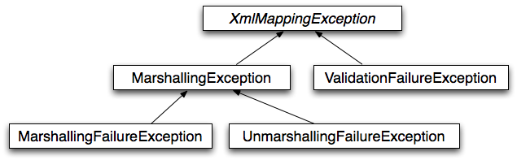

<a id="data-access-oxm--oxm-usage"></a>
<a id="data-access-oxm--using-marshaller-and-unmarshaller"></a>

## Using `Marshaller` and `Unmarshaller`

You can use Spring’s OXM for a wide variety of situations. In the following example, we
use it to marshal the settings of a Spring-managed application as an XML file. In the following example, we
use a simple JavaBean to represent the settings:

- Java
- Kotlin

```java
public class Settings {
private boolean fooEnabled;
public boolean isFooEnabled() {return fooEnabled;}
public void setFooEnabled(boolean fooEnabled) {this.fooEnabled = fooEnabled;}}
```

```kotlin
class Settings {
	var isFooEnabled: Boolean = false
}
```

The application class uses this bean to store its settings. Besides a main method, the
class has two methods: `saveSettings()` saves the settings bean to a file named
`settings.xml`, and `loadSettings()` loads these settings again. The following `main()` method
constructs a Spring application context and calls these two methods:

- Java
- Kotlin

```java
import java.io.FileInputStream; import java.io.FileOutputStream; import java.io.IOException; import javax.xml.transform.stream.StreamResult; import javax.xml.transform.stream.StreamSource; import org.springframework.context.ApplicationContext; import org.springframework.context.support.ClassPathXmlApplicationContext; import org.springframework.oxm.Marshaller; import org.springframework.oxm.Unmarshaller;
public class Application {
private static final String FILE_NAME = "settings.xml"; private Settings settings = new Settings(); private Marshaller marshaller; private Unmarshaller unmarshaller;
public void setMarshaller(Marshaller marshaller) {this.marshaller = marshaller;}
public void setUnmarshaller(Unmarshaller unmarshaller) {this.unmarshaller = unmarshaller;}
public void saveSettings() throws IOException {try (FileOutputStream os = new FileOutputStream(FILE_NAME)) {this.marshaller.marshal(settings, new StreamResult(os));}}
public void loadSettings() throws IOException {try (FileInputStream is = new FileInputStream(FILE_NAME)) {this.settings = (Settings) this.unmarshaller.unmarshal(new StreamSource(is));}}
public static void main(String[] args) throws IOException {ApplicationContext appContext =new ClassPathXmlApplicationContext("applicationContext.xml"); Application application = (Application) appContext.getBean("application"); application.saveSettings(); application.loadSettings();}}
```

```kotlin
class Application {
lateinit var marshaller: Marshaller
lateinit var unmarshaller: Unmarshaller
fun saveSettings() {FileOutputStream(FILE_NAME).use { outputStream -> marshaller.marshal(settings, StreamResult(outputStream)) }}
fun loadSettings() {FileInputStream(FILE_NAME).use { inputStream -> settings = unmarshaller.unmarshal(StreamSource(inputStream)) as Settings }}}
private const val FILE_NAME = "settings.xml"
fun main(args: Array<String>) {val appContext = ClassPathXmlApplicationContext("applicationContext.xml") val application = appContext.getBean("application") as Application application.saveSettings() application.loadSettings()}
```

The `Application` requires both a `marshaller` and an `unmarshaller` property to be set. We
can do so by using the following `applicationContext.xml`:

```xml
<beans>
	<bean id="application" class="Application">
		<property name="marshaller" ref="xstreamMarshaller" />
		<property name="unmarshaller" ref="xstreamMarshaller" />
	</bean>
	<bean id="xstreamMarshaller" class="org.springframework.oxm.xstream.XStreamMarshaller"/>
</beans>
```

This application context uses XStream, but we could have used any of the other marshaller
instances described later in this chapter. Note that, by default, XStream does not require
any further configuration, so the bean definition is rather simple. Also note that the
`XStreamMarshaller` implements both `Marshaller` and `Unmarshaller`, so we can refer to the
`xstreamMarshaller` bean in both the `marshaller` and `unmarshaller` property of the
application.

This sample application produces the following `settings.xml` file:

```xml
<?xml version="1.0" encoding="UTF-8"?>
<settings foo-enabled="false"/>
```

<a id="data-access-oxm--oxm-schema-based-config"></a>
<a id="data-access-oxm--xml-configuration-namespace"></a>

## XML Configuration Namespace

You can configure marshallers more concisely by using tags from the OXM namespace.
To make these tags available, you must first reference the appropriate schema in the
preamble of the XML configuration file. The following example shows how to do so:

```xml
<?xml version="1.0" encoding="UTF-8"?>
<beans xmlns="http://www.springframework.org/schema/beans"
	xmlns:xsi="http://www.w3.org/2001/XMLSchema-instance"
	xmlns:oxm="http://www.springframework.org/schema/oxm" (1)
	xsi:schemaLocation="http://www.springframework.org/schema/beans
		https://www.springframework.org/schema/beans/spring-beans.xsd
		http://www.springframework.org/schema/oxm
		https://www.springframework.org/schema/oxm/spring-oxm.xsd"> (2)
```

**1**

Reference the `oxm` schema.

**2**

Specify the `oxm` schema location.

The schema makes the following elements available:

- [`jaxb2-marshaller`](#data-access-oxm--oxm-jaxb2-xsd)
- [`jibx-marshaller`](#data-access-oxm--oxm-jibx-xsd)

Each tag is explained in its respective marshaller’s section. As an example, though, the configuration of a JAXB2 marshaller might resemble the following:

```xml
<oxm:jaxb2-marshaller id="marshaller" contextPath="org.springframework.ws.samples.airline.schema"/>
```

<a id="data-access-oxm--oxm-jaxb"></a>
<a id="data-access-oxm--jaxb"></a>

## JAXB

The JAXB binding compiler translates a W3C XML Schema into one or more Java classes, a
`jaxb.properties` file, and possibly some resource files. JAXB also offers a way to
generate a schema from annotated Java classes.

Spring supports the JAXB 2.0 API as XML marshalling strategies, following the
`Marshaller` and `Unmarshaller` interfaces described in [`Marshaller` and `Unmarshaller`](#data-access-oxm--oxm-marshaller-unmarshaller).
The corresponding integration classes reside in the `org.springframework.oxm.jaxb`
package.

<a id="data-access-oxm--oxm-jaxb2"></a>
<a id="data-access-oxm--using-jaxb2marshaller"></a>

### Using `Jaxb2Marshaller`

The `Jaxb2Marshaller` class implements both of Spring’s `Marshaller` and `Unmarshaller`
interfaces. It requires a context path to operate. You can set the context path by setting the
`contextPath` property. The context path is a list of colon-separated Java package
names that contain schema derived classes. It also offers a `classesToBeBound` property, which allows you to set an array of classes to be supported by the marshaller. Schema
validation is performed by specifying one or more schema resources to the bean, as the following example shows:

```xml
<beans>
	<bean id="jaxb2Marshaller" class="org.springframework.oxm.jaxb.Jaxb2Marshaller">
		<property name="classesToBeBound">
			<list>
				<value>org.springframework.oxm.jaxb.Flight</value>
				<value>org.springframework.oxm.jaxb.Flights</value>
			</list>
		</property>
		<property name="schema" value="classpath:org/springframework/oxm/schema.xsd"/>
	</bean>

	...

</beans>
```

<a id="data-access-oxm--oxm-jaxb2-xsd"></a>
<a id="data-access-oxm--xml-configuration-namespace-2"></a>

#### XML Configuration Namespace

The `jaxb2-marshaller` element configures a `org.springframework.oxm.jaxb.Jaxb2Marshaller`, as the following example shows:

```xml
<oxm:jaxb2-marshaller id="marshaller" contextPath="org.springframework.ws.samples.airline.schema"/>
```

Alternatively, you can provide the list of classes to bind to the marshaller by using the
`class-to-be-bound` child element:

```xml
<oxm:jaxb2-marshaller id="marshaller">
	<oxm:class-to-be-bound name="org.springframework.ws.samples.airline.schema.Airport"/>
	<oxm:class-to-be-bound name="org.springframework.ws.samples.airline.schema.Flight"/>
	...
</oxm:jaxb2-marshaller>
```

The following table describes the available attributes:

| Attribute | Description | Required |
| --- | --- | --- |
| `id` | The ID of the marshaller | No |
| `contextPath` | The JAXB Context path | No |

<a id="data-access-oxm--oxm-jibx"></a>
<a id="data-access-oxm--jibx"></a>

## JiBX

The JiBX framework offers a solution similar to that which Hibernate provides for ORM: A
binding definition defines the rules for how your Java objects are converted to or from
XML. After preparing the binding and compiling the classes, a JiBX binding compiler
enhances the class files and adds code to handle converting instances of the classes
from or to XML.

For more information on JiBX, see the [JiBX web
site](http://jibx.sourceforge.net/). The Spring integration classes reside in the `org.springframework.oxm.jibx`
package.

<a id="data-access-oxm--oxm-jibx-marshaller"></a>
<a id="data-access-oxm--using-jibxmarshaller"></a>

### Using `JibxMarshaller`

The `JibxMarshaller` class implements both the `Marshaller` and `Unmarshaller`
interface. To operate, it requires the name of the class to marshal in, which you can
set using the `targetClass` property. Optionally, you can set the binding name by setting the
`bindingName` property. In the following example, we bind the `Flights` class:

```xml
<beans>
	<bean id="jibxFlightsMarshaller" class="org.springframework.oxm.jibx.JibxMarshaller">
		<property name="targetClass">org.springframework.oxm.jibx.Flights</property>
	</bean>
	...
</beans>
```

A `JibxMarshaller` is configured for a single class. If you want to marshal multiple
classes, you have to configure multiple `JibxMarshaller` instances with different `targetClass`
property values.

<a id="data-access-oxm--oxm-jibx-xsd"></a>
<a id="data-access-oxm--xml-configuration-namespace-3"></a>

#### XML Configuration Namespace

The `jibx-marshaller` tag configures a `org.springframework.oxm.jibx.JibxMarshaller`, as the following example shows:

```xml
<oxm:jibx-marshaller id="marshaller" target-class="org.springframework.ws.samples.airline.schema.Flight"/>
```

The following table describes the available attributes:

| Attribute | Description | Required |
| --- | --- | --- |
| `id` | The ID of the marshaller | No |
| `target-class` | The target class for this marshaller | Yes |
| `bindingName` | The binding name used by this marshaller | No |

<a id="data-access-oxm--oxm-xstream"></a>
<a id="data-access-oxm--xstream"></a>

## XStream

XStream is a simple library to serialize objects to XML and back again. It does not
require any mapping and generates clean XML.

For more information on XStream, see the [XStream
web site](https://x-stream.github.io/). The Spring integration classes reside in the
`org.springframework.oxm.xstream` package.

<a id="data-access-oxm--oxm-xstream-marshaller"></a>
<a id="data-access-oxm--using-xstreammarshaller"></a>

### Using `XStreamMarshaller`

The `XStreamMarshaller` does not require any configuration and can be configured in an
application context directly. To further customize the XML, you can set an alias map, which consists of string aliases mapped to classes, as the following example shows:

```xml
<beans>
	<bean id="xstreamMarshaller" class="org.springframework.oxm.xstream.XStreamMarshaller">
		<property name="aliases">
			<props>
				<prop key="Flight">org.springframework.oxm.xstream.Flight</prop>
			</props>
		</property>
	</bean>
	...
</beans>
```

> [!WARNING]
> By default, XStream lets arbitrary classes be unmarshalled, which can lead to
> unsafe Java serialization effects. As such, we do not recommend using the
> `XStreamMarshaller` to unmarshal XML from external sources (that is, the Web), as this can
> result in security vulnerabilities.
>
> If you choose to use the `XStreamMarshaller` to unmarshal XML from an external source, set the `supportedClasses` property on the `XStreamMarshaller`, as the following example shows:
>
> ```xml
> <bean id="xstreamMarshaller" class="org.springframework.oxm.xstream.XStreamMarshaller">
> 	<property name="supportedClasses" value="org.springframework.oxm.xstream.Flight"/>
> 	...
> </bean>
> ```
>
> Doing so ensures that only the registered classes are eligible for unmarshalling.
>
> Additionally, you can register
> [custom converters](https://docs.spring.io/spring-framework/docs/7.0.8/javadoc-api/org/springframework/oxm/xstream/XStreamMarshaller.html#setConverters(com.thoughtworks.xstream.converters.ConverterMatcher…))
> to make sure that only your supported classes can be unmarshalled. You might want
> to add a `CatchAllConverter` as the last converter in the list, in addition to
> converters that explicitly support the domain classes that should be supported.
> As a result, default XStream converters with lower priorities and possible security
> vulnerabilities do not get invoked.

> [!NOTE]
> Note that XStream is an XML serialization library, not a data binding library.
> Therefore, it has limited namespace support. As a result, it is rather unsuitable for usage
> within Web Services.

[JPA](#data-access-orm-jpa)
[Appendix](#data-access-appendix)

---

<a id="data-access-appendix"></a>

<!-- source_url: https://docs.spring.io/spring-framework/reference/data-access/appendix.html -->

<!-- page_index: 152 -->

# Appendix

<svg enable-background="new 0 0 32 32" id="Glyph" version="1.1" viewbox="0 0 32 32" xml:space="preserve" xmlns="http://www.w3.org/2000/svg" xmlns:xlink="http://www.w3.org/1999/xlink">
<path id="XMLID_223_"></path>
</svg>

Search

<a id="data-access-appendix--page-title"></a>
<a id="data-access-appendix--appendix"></a>

# Appendix

<a id="data-access-appendix--xsd-schemas"></a>
<a id="data-access-appendix--xml-schemas"></a>

## XML Schemas

This part of the appendix lists XML schemas for data access, including the following:

- [The `tx` Schema](#data-access-appendix--xsd-schemas-tx)
- [The `jdbc` Schema](#data-access-appendix--xsd-schemas-jdbc)

<a id="data-access-appendix--xsd-schemas-tx"></a>
<a id="data-access-appendix--the-tx-schema"></a>

### The `tx` Schema

The `tx` tags deal with configuring all of those beans in Spring’s comprehensive support
for transactions. These tags are covered in the chapter entitled
[Transaction Management](#data-access-transaction).

> [!TIP]
> We strongly encourage you to look at the `'spring-tx.xsd'` file that ships with the
> Spring distribution. This file contains the XML Schema for Spring’s transaction
> configuration and covers all of the various elements in the `tx` namespace, including
> attribute defaults and similar information. This file is documented inline, and, thus, the information is not repeated here in the interests of adhering to the DRY (Don’t
> Repeat Yourself) principle.

In the interest of completeness, to use the elements in the `tx` schema, you need to have
the following preamble at the top of your Spring XML configuration file. The text in the
following snippet references the correct schema so that the tags in the `tx` namespace
are available to you:

```xml
<?xml version="1.0" encoding="UTF-8"?>
<beans xmlns="http://www.springframework.org/schema/beans"
	xmlns:xsi="http://www.w3.org/2001/XMLSchema-instance"
	xmlns:tx="http://www.springframework.org/schema/tx" (1)
	xmlns:aop="http://www.springframework.org/schema/aop"
	xsi:schemaLocation="
		http://www.springframework.org/schema/beans
		https://www.springframework.org/schema/beans/spring-beans.xsd
		http://www.springframework.org/schema/tx
		https://www.springframework.org/schema/tx/spring-tx.xsd (2)
		http://www.springframework.org/schema/aop
		https://www.springframework.org/schema/aop/spring-aop.xsd">

	<!-- bean definitions here -->

</beans>
```

**1**

Declare usage of the `tx` namespace.

**2**

Specify the location (with other schema locations).

> [!NOTE]
> Often, when you use the elements in the `tx` namespace, you are also using the
> elements from the `aop` namespace (since the declarative transaction support in Spring is
> implemented by using AOP). The preceding XML snippet contains the relevant lines needed
> to reference the `aop` schema so that the elements in the `aop` namespace are available
> to you.

<a id="data-access-appendix--xsd-schemas-jdbc"></a>
<a id="data-access-appendix--the-jdbc-schema"></a>

### The `jdbc` Schema

The `jdbc` elements let you quickly configure an embedded database or initialize an
existing data source. These elements are documented in
[Embedded Database Support](#data-access-jdbc-embedded-database-support) and
[Initializing a DataSource](#data-access-jdbc-initializing-datasource), respectively.

To use the elements in the `jdbc` schema, you need to have the following preamble at the
top of your Spring XML configuration file. The text in the following snippet references
the correct schema so that the elements in the `jdbc` namespace are available to you:

```xml
<?xml version="1.0" encoding="UTF-8"?>
<beans xmlns="http://www.springframework.org/schema/beans"
	xmlns:xsi="http://www.w3.org/2001/XMLSchema-instance"
	xmlns:jdbc="http://www.springframework.org/schema/jdbc" (1)
	xsi:schemaLocation="
		http://www.springframework.org/schema/beans
		https://www.springframework.org/schema/beans/spring-beans.xsd
		http://www.springframework.org/schema/jdbc
		https://www.springframework.org/schema/jdbc/spring-jdbc.xsd"> (2)

	<!-- bean definitions here -->

</beans>
```

**1**

Declare usage of the `jdbc` namespace.

**2**

Specify the location (with other schema locations).

[Marshalling XML by Using Object-XML Mappers](#data-access-oxm)
[Web on Servlet Stack](#web)

---

<a id="web"></a>

<!-- source_url: https://docs.spring.io/spring-framework/reference/web.html -->

<!-- page_index: 153 -->

# Web on Servlet Stack

<svg enable-background="new 0 0 32 32" id="Glyph" version="1.1" viewbox="0 0 32 32" xml:space="preserve" xmlns="http://www.w3.org/2000/svg" xmlns:xlink="http://www.w3.org/1999/xlink">
<path id="XMLID_223_"></path>
</svg>

Search

<a id="web--page-title"></a>
<a id="web--web-on-servlet-stack"></a>

# Web on Servlet Stack

This part of the documentation covers support for Servlet-stack web applications built
on the Servlet API and deployed to Servlet containers. Individual chapters include
[Spring MVC](#web-webmvc--mvc), [View Technologies](#web-webmvc-view), [CORS Support](#web-webmvc-cors), and
[WebSocket Support](#web-websocket).

For reactive-stack web applications, see [Web on Reactive Stack](#web-reactive).

<a id="web--section-summary"></a>

## Section Summary

- [Spring Web MVC](#web-webmvc)
- [REST Clients](#web-webmvc-client)
- [Testing](#web-webmvc-test)
- [WebSockets](#web-websocket)

[Appendix](#data-access-appendix)
[Spring Web MVC](#web-webmvc)

---

<a id="web-webmvc"></a>

<!-- source_url: https://docs.spring.io/spring-framework/reference/web/webmvc.html -->

<!-- page_index: 154 -->

# Spring Web MVC

<svg enable-background="new 0 0 32 32" id="Glyph" version="1.1" viewbox="0 0 32 32" xml:space="preserve" xmlns="http://www.w3.org/2000/svg" xmlns:xlink="http://www.w3.org/1999/xlink">
<path id="XMLID_223_"></path>
</svg>

Search

<a id="web-webmvc--page-title"></a>
<a id="web-webmvc--spring-web-mvc"></a>

# Spring Web MVC

Spring Web MVC is the original web framework built on the Servlet API and has been included
in the Spring Framework from the very beginning. The formal name, "Spring Web MVC,"
comes from the name of its source module
([`spring-webmvc`](https://github.com/spring-projects/spring-framework/tree/7.0.x/spring-webmvc)), but it is more commonly known as "Spring MVC".

Parallel to Spring Web MVC, Spring Framework 5.0 introduced a reactive-stack web framework
whose name, "Spring WebFlux," is also based on its source module
([`spring-webflux`](https://github.com/spring-projects/spring-framework/tree/7.0.x/spring-webflux)).
This chapter covers Spring Web MVC. For reactive-stack web applications, see
[Web on Reactive Stack](#web-reactive).

For baseline information and compatibility with Servlet container and Jakarta EE version
ranges, see the Spring Framework
[Wiki](https://github.com/spring-projects/spring-framework/wiki/Spring-Framework-Versions).

<a id="web-webmvc--section-summary"></a>

## Section Summary

- [DispatcherServlet](#web-webmvc-mvc-servlet)
- [Filters](#web-webmvc-filters)
- [HTTP Message Conversion](#web-webmvc-message-converters)
- [Annotated Controllers](#web-webmvc-mvc-controller)
- [Functional Endpoints](#web-webmvc-functional)
- [URI Links](#web-webmvc-mvc-uri-building)
- [Asynchronous Requests](#web-webmvc-mvc-ann-async)
- [Range Requests](#web-webmvc-mvc-range)
- [Data Binding](#web-webmvc-mvc-data-binding)
- [CORS](#web-webmvc-cors)
- [API Versioning](#web-webmvc-versioning)
- [Error Responses](#web-webmvc-mvc-ann-rest-exceptions)
- [Web Security](#web-webmvc-mvc-security)
- [HTTP Caching](#web-webmvc-mvc-caching)
- [View Technologies](#web-webmvc-view)
- [MVC Config](#web-webmvc-mvc-config)
- [HTTP/2](#web-webmvc-mvc-http2)

[Web on Servlet Stack](#web)
[DispatcherServlet](#web-webmvc-mvc-servlet)

---

<a id="web-webmvc-mvc-servlet"></a>

<!-- source_url: https://docs.spring.io/spring-framework/reference/web/webmvc/mvc-servlet.html -->

<!-- page_index: 155 -->

# DispatcherServlet

<svg enable-background="new 0 0 32 32" id="Glyph" version="1.1" viewbox="0 0 32 32" xml:space="preserve" xmlns="http://www.w3.org/2000/svg" xmlns:xlink="http://www.w3.org/1999/xlink">
<path id="XMLID_223_"></path>
</svg>

Search

<a id="web-webmvc-mvc-servlet--page-title"></a>
<a id="web-webmvc-mvc-servlet--dispatcherservlet"></a>

# DispatcherServlet

[See equivalent in the Reactive stack](#web-webflux-dispatcher-handler)

Spring MVC, as many other web frameworks, is designed around the front controller
pattern where a central `Servlet`, the `DispatcherServlet`, provides a shared algorithm
for request processing, while actual work is performed by configurable delegate components.
This model is flexible and supports diverse workflows.

The `DispatcherServlet`, as any `Servlet`, needs to be declared and mapped according
to the Servlet specification by using Java configuration or in `web.xml`.
In turn, the `DispatcherServlet` uses Spring configuration to discover
the delegate components it needs for request mapping, view resolution, exception
handling, [and more](#web-webmvc-mvc-servlet-special-bean-types).

The following example shows the programmatic registration and initialization of
the `DispatcherServlet`, which is auto-detected by the Servlet container
(see [Servlet Config](#web-webmvc-mvc-servlet-container-config)), and the
equivalent `web.xml`:

- Java
- Kotlin
- Xml

```java
public class MyWebApplicationInitializer implements WebApplicationInitializer {

	@Override
	public void onStartup(ServletContext servletContext) {

		// Load Spring web application configuration
		AnnotationConfigWebApplicationContext context = new AnnotationConfigWebApplicationContext();
		context.register(AppConfig.class);

		// Create and register the DispatcherServlet
		DispatcherServlet servlet = new DispatcherServlet(context);
		ServletRegistration.Dynamic registration = servletContext.addServlet("app", servlet);
		registration.setLoadOnStartup(1);
		registration.addMapping("/app/*");
	}
}
```

```kotlin
class MyWebApplicationInitializer : WebApplicationInitializer {

	override fun onStartup(servletContext: ServletContext) {

		// Load Spring web application configuration
		val context = AnnotationConfigWebApplicationContext()
		context.register(AppConfig::class.java)

		// Create and register the DispatcherServlet
		val servlet = DispatcherServlet(context)
		val registration = servletContext.addServlet("app", servlet)
		registration.setLoadOnStartup(1)
		registration.addMapping("/app/*")
	}
}
```

```xml
<web-app>

	<listener>
		<listener-class>org.springframework.web.context.ContextLoaderListener</listener-class>
	</listener>

	<context-param>
		<param-name>contextConfigLocation</param-name>
		<param-value>/WEB-INF/app-context.xml</param-value>
	</context-param>

	<servlet>
		<servlet-name>app</servlet-name>
		<servlet-class>org.springframework.web.servlet.DispatcherServlet</servlet-class>
		<init-param>
			<param-name>contextConfigLocation</param-name>
			<param-value></param-value>
		</init-param>
		<load-on-startup>1</load-on-startup>
	</servlet>

	<servlet-mapping>
		<servlet-name>app</servlet-name>
		<url-pattern>/app/*</url-pattern>
	</servlet-mapping>

</web-app>
```

> [!NOTE]
> In addition to using the ServletContext API directly, you can also extend
> `AbstractAnnotationConfigDispatcherServletInitializer` and override specific methods
> (see the example under [Context Hierarchy](#web-webmvc-mvc-servlet-context-hierarchy)).

> [!NOTE]
> For programmatic use cases, a `GenericWebApplicationContext` can be used as an
> alternative to `AnnotationConfigWebApplicationContext`. See the
> [`GenericWebApplicationContext`](https://docs.spring.io/spring-framework/docs/7.0.8/javadoc-api/org/springframework/web/context/support/GenericWebApplicationContext.html)
> javadoc for details.

> [!NOTE]
> Spring Boot follows a different initialization sequence. Rather than hooking into
> the lifecycle of the Servlet container, Spring Boot uses Spring configuration to
> bootstrap itself and the embedded Servlet container. `Filter` and `Servlet` declarations
> are detected in Spring configuration and registered with the Servlet container.
> For more details, see the
> [Spring Boot documentation](https://docs.spring.io/spring-boot/reference/web/servlet.html#web.servlet.embedded-container).

[Spring Web MVC](#web-webmvc)
[Context Hierarchy](#web-webmvc-mvc-servlet-context-hierarchy)

---

<a id="web-webmvc-mvc-servlet-context-hierarchy"></a>

<!-- source_url: https://docs.spring.io/spring-framework/reference/web/webmvc/mvc-servlet/context-hierarchy.html -->

<!-- page_index: 156 -->

# Context Hierarchy

<svg enable-background="new 0 0 32 32" id="Glyph" version="1.1" viewbox="0 0 32 32" xml:space="preserve" xmlns="http://www.w3.org/2000/svg" xmlns:xlink="http://www.w3.org/1999/xlink">
<path id="XMLID_223_"></path>
</svg>

Search

<a id="web-webmvc-mvc-servlet-context-hierarchy--page-title"></a>
<a id="web-webmvc-mvc-servlet-context-hierarchy--context-hierarchy"></a>

# Context Hierarchy

`DispatcherServlet` expects a `WebApplicationContext` (an extension of a plain
`ApplicationContext`) for its own configuration. `WebApplicationContext` has a link to the
`ServletContext` and the `Servlet` with which it is associated. It is also bound to the `ServletContext`
such that applications can use static methods on `RequestContextUtils` to look up the
`WebApplicationContext` if they need access to it.

For many applications, having a single `WebApplicationContext` is simple and suffices.
It is also possible to have a context hierarchy where one root `WebApplicationContext`
is shared across multiple `DispatcherServlet` (or other `Servlet`) instances, each with
its own child `WebApplicationContext` configuration.
See [Additional Capabilities of the `ApplicationContext`](#core-beans-context-introduction)
for more on the context hierarchy feature.

The root `WebApplicationContext` typically contains infrastructure beans, such as data repositories and
business services that need to be shared across multiple `Servlet` instances. Those beans
are effectively inherited and can be overridden (that is, re-declared) in the Servlet-specific
child `WebApplicationContext`, which typically contains beans local to the given `Servlet`.
The following image shows this relationship:

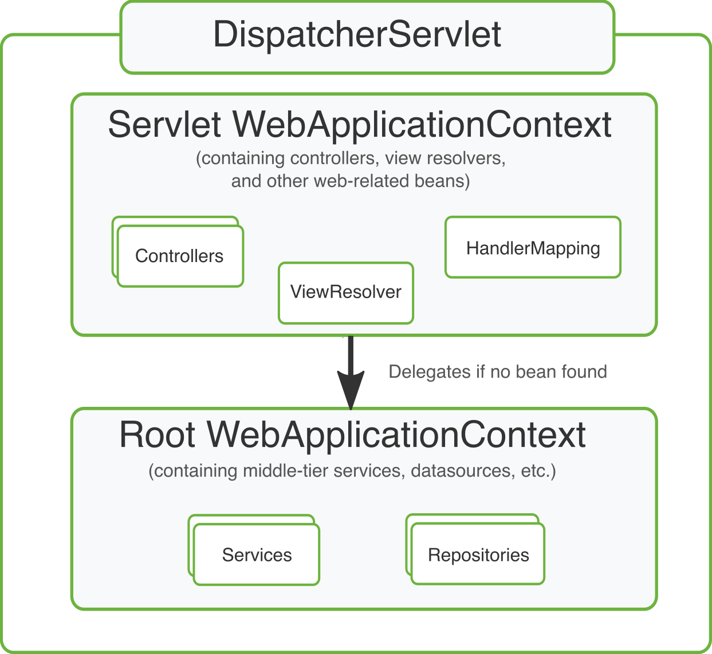

The following example configures a `WebApplicationContext` hierarchy, and the equivalent `web.xml`:

- Java
- Kotlin
- Xml

```java
public class MyWebAppInitializer extends AbstractAnnotationConfigDispatcherServletInitializer {
@Override protected Class<?>[] getRootConfigClasses() {return new Class<?>[] { RootConfig.class };}
@Override protected Class<?>[] getServletConfigClasses() {return new Class<?>[] { App1Config.class };}
@Override protected String[] getServletMappings() {return new String[] { "/app1/*" };}}
```

```kotlin
class MyWebAppInitializer : AbstractAnnotationConfigDispatcherServletInitializer() {
override fun getRootConfigClasses(): Array<Class<*>> {return arrayOf(RootConfig::class.java)}
override fun getServletConfigClasses(): Array<Class<*>> {return arrayOf(App1Config::class.java)}
override fun getServletMappings(): Array<String> {return arrayOf("/app1/*")}}
```

```xml
<web-app>

	<listener>
		<listener-class>org.springframework.web.context.ContextLoaderListener</listener-class>
	</listener>

	<context-param>
		<param-name>contextConfigLocation</param-name>
		<param-value>/WEB-INF/root-context.xml</param-value>
	</context-param>

	<servlet>
		<servlet-name>app1</servlet-name>
		<servlet-class>org.springframework.web.servlet.DispatcherServlet</servlet-class>
		<init-param>
			<param-name>contextConfigLocation</param-name>
			<param-value>/WEB-INF/app1-context.xml</param-value>
		</init-param>
		<load-on-startup>1</load-on-startup>
	</servlet>

	<servlet-mapping>
		<servlet-name>app1</servlet-name>
		<url-pattern>/app1/*</url-pattern>
	</servlet-mapping>

</web-app>
```

> [!TIP]
> If an application context hierarchy is not required, applications can return all
> configuration through `getRootConfigClasses()` and `null` from `getServletConfigClasses()`.

> [!TIP]
> If an application context hierarchy is not required, applications may configure a
> “root” context only and leave the `contextConfigLocation` Servlet parameter empty.

[DispatcherServlet](#web-webmvc-mvc-servlet)
[Special Bean Types](#web-webmvc-mvc-servlet-special-bean-types)

---

<a id="web-webmvc-mvc-servlet-special-bean-types"></a>

<!-- source_url: https://docs.spring.io/spring-framework/reference/web/webmvc/mvc-servlet/special-bean-types.html -->

<!-- page_index: 157 -->

# Special Bean Types

<svg enable-background="new 0 0 32 32" id="Glyph" version="1.1" viewbox="0 0 32 32" xml:space="preserve" xmlns="http://www.w3.org/2000/svg" xmlns:xlink="http://www.w3.org/1999/xlink">
<path id="XMLID_223_"></path>
</svg>

Search

<a id="web-webmvc-mvc-servlet-special-bean-types--page-title"></a>
<a id="web-webmvc-mvc-servlet-special-bean-types--special-bean-types"></a>

# Special Bean Types

[See equivalent in the Reactive stack](#web-webflux-dispatcher-handler--webflux-special-bean-types)

The `DispatcherServlet` delegates to special beans to process requests and render the
appropriate responses. By “special beans” we mean Spring-managed `Object` instances that
implement framework contracts. Those usually come with built-in contracts, but
you can customize their properties and extend or replace them.

The following table lists the special beans detected by the `DispatcherServlet`:

| Bean type | Explanation |
| --- | --- |
| `HandlerMapping` | Map a request to a handler along with a list of [interceptors](#web-webmvc-mvc-servlet-handlermapping-interceptor) for pre- and post-processing. The mapping is based on some criteria, the details of which vary by `HandlerMapping` implementation. The two main `HandlerMapping` implementations are `RequestMappingHandlerMapping` (which supports `@RequestMapping` annotated methods) and `SimpleUrlHandlerMapping` (which maintains explicit registrations of URI path patterns to handlers). |
| `HandlerAdapter` | Help the `DispatcherServlet` to invoke a handler mapped to a request, regardless of how the handler is actually invoked. For example, invoking an annotated controller requires resolving annotations. The main purpose of a `HandlerAdapter` is to shield the `DispatcherServlet` from such details. |
| [`HandlerExceptionResolver`](#web-webmvc-mvc-servlet-exceptionhandlers) | Strategy to resolve exceptions, possibly mapping them to handlers, to HTML error views, or other targets. See [Exceptions](#web-webmvc-mvc-servlet-exceptionhandlers). |
| [`ViewResolver`](#web-webmvc-mvc-servlet-viewresolver) | Resolve logical `String`-based view names returned from a handler to an actual `View` with which to render to the response. See [View Resolution](#web-webmvc-mvc-servlet-viewresolver) and [View Technologies](#web-webmvc-view). |
| [`LocaleResolver`](#web-webmvc-mvc-servlet-localeresolver), [LocaleContextResolver](#web-webmvc-mvc-servlet-localeresolver--mvc-timezone) | Resolve the `Locale` a client is using and possibly their time zone, in order to be able to offer internationalized views. See [Locale](#web-webmvc-mvc-servlet-localeresolver). |
| [`MultipartResolver`](#web-webmvc-mvc-servlet-multipart) | Abstraction for parsing a multi-part request (for example, browser form file upload) with the help of some multipart parsing library. See [Multipart Resolver](#web-webmvc-mvc-servlet-multipart). |
| [`FlashMapManager`](#web-webmvc-mvc-controller-ann-methods-flash-attributes) | Store and retrieve the “input” and the “output” `FlashMap` that can be used to pass attributes from one request to another, usually across a redirect. See [Flash Attributes](#web-webmvc-mvc-controller-ann-methods-flash-attributes). |

[Context Hierarchy](#web-webmvc-mvc-servlet-context-hierarchy)
[Web MVC Config](#web-webmvc-mvc-servlet-config)

---

<a id="web-webmvc-mvc-servlet-config"></a>

<!-- source_url: https://docs.spring.io/spring-framework/reference/web/webmvc/mvc-servlet/config.html -->

<!-- page_index: 158 -->

# Web MVC Config

<svg enable-background="new 0 0 32 32" id="Glyph" version="1.1" viewbox="0 0 32 32" xml:space="preserve" xmlns="http://www.w3.org/2000/svg" xmlns:xlink="http://www.w3.org/1999/xlink">
<path id="XMLID_223_"></path>
</svg>

Search

<a id="web-webmvc-mvc-servlet-config--page-title"></a>
<a id="web-webmvc-mvc-servlet-config--web-mvc-config"></a>

# Web MVC Config

[See equivalent in the Reactive stack](#web-webflux-dispatcher-handler--webflux-framework-config)

Applications can declare the infrastructure beans listed in [Special Bean Types](#web-webmvc-mvc-servlet-special-bean-types)
that are required to process requests. The `DispatcherServlet` checks the
`WebApplicationContext` for each special bean. If there are no matching bean types, it falls back on the default types listed in
[`DispatcherServlet.properties`](https://github.com/spring-projects/spring-framework/tree/7.0.x/spring-webmvc/src/main/resources/org/springframework/web/servlet/DispatcherServlet.properties).

In most cases, the [MVC Config](#web-webmvc-mvc-config) is the best starting point. It declares the required
beans in either Java or XML and provides a higher-level configuration callback API to
customize it.

> [!NOTE]
> Spring Boot relies on the MVC Java configuration to configure Spring MVC and
> provides many extra convenient options.

[Special Bean Types](#web-webmvc-mvc-servlet-special-bean-types)
[Servlet Config](#web-webmvc-mvc-servlet-container-config)

---

<a id="web-webmvc-mvc-servlet-container-config"></a>

<!-- source_url: https://docs.spring.io/spring-framework/reference/web/webmvc/mvc-servlet/container-config.html -->

<!-- page_index: 159 -->

# Servlet Config

<svg enable-background="new 0 0 32 32" id="Glyph" version="1.1" viewbox="0 0 32 32" xml:space="preserve" xmlns="http://www.w3.org/2000/svg" xmlns:xlink="http://www.w3.org/1999/xlink">
<path id="XMLID_223_"></path>
</svg>

Search

<a id="web-webmvc-mvc-servlet-container-config--page-title"></a>
<a id="web-webmvc-mvc-servlet-container-config--servlet-config"></a>

# Servlet Config

In a Servlet environment, you have the option of configuring the Servlet container
programmatically as an alternative or in combination with a `web.xml` file.
The following example registers a `DispatcherServlet`:

- Java
- Kotlin

```java
public class MyWebApplicationInitializer implements WebApplicationInitializer {

	@Override
	public void onStartup(ServletContext container) {
		XmlWebApplicationContext appContext = new XmlWebApplicationContext();
		appContext.setConfigLocation("/WEB-INF/spring/dispatcher-config.xml");

		ServletRegistration.Dynamic registration = container.addServlet("dispatcher", new DispatcherServlet(appContext));
		registration.setLoadOnStartup(1);
		registration.addMapping("/");
	}
}
```

```kotlin
class MyWebApplicationInitializer : WebApplicationInitializer {
override fun onStartup(container: ServletContext) {val appContext = XmlWebApplicationContext() appContext.setConfigLocation("/WEB-INF/spring/dispatcher-config.xml")
val registration = container.addServlet("dispatcher", DispatcherServlet(appContext)) registration.setLoadOnStartup(1) registration.addMapping("/")}}
```

`WebApplicationInitializer` is an interface provided by Spring MVC that ensures your
implementation is detected and automatically used to initialize any Servlet 3 container.
An abstract base class implementation of `WebApplicationInitializer` named
`AbstractDispatcherServletInitializer` makes it even easier to register the
`DispatcherServlet` by overriding methods to specify the servlet mapping and the
location of the `DispatcherServlet` configuration.

This is recommended for applications that use programmatic Spring configuration, as the
following example shows:

- Java
- Kotlin

```java
public class MyWebAppInitializer extends AbstractAnnotationConfigDispatcherServletInitializer {
@Override protected Class<?>[] getRootConfigClasses() {return null;}
@Override protected Class<?>[] getServletConfigClasses() {return new Class<?>[] { MyWebConfig.class };}
@Override protected String[] getServletMappings() {return new String[] { "/" };}}
```

```kotlin
class MyWebAppInitializer : AbstractAnnotationConfigDispatcherServletInitializer() {
override fun getRootConfigClasses(): Array<Class<*>>? {return null}
override fun getServletConfigClasses(): Array<Class<*>>? {return arrayOf(MyWebConfig::class.java)}
override fun getServletMappings(): Array<String> {return arrayOf("/")}}
```

If you use XML-based Spring configuration, you should extend directly from
`AbstractDispatcherServletInitializer`, as the following example shows:

- Java
- Kotlin

```java
public class MyXmlDispatcherServletInitializer extends AbstractDispatcherServletInitializer {
@Override protected WebApplicationContext createRootApplicationContext() {return null;}
@Override protected WebApplicationContext createServletApplicationContext() {XmlWebApplicationContext cxt = new XmlWebApplicationContext(); cxt.setConfigLocation("/WEB-INF/spring/dispatcher-config.xml"); return cxt;}
@Override protected String[] getServletMappings() {return new String[] { "/" };}}
```

```kotlin
class MyXmlDispatcherServletInitializer : AbstractDispatcherServletInitializer() {
override fun createRootApplicationContext(): WebApplicationContext? {return null}
override fun createServletApplicationContext(): WebApplicationContext {return XmlWebApplicationContext().apply {setConfigLocation("/WEB-INF/spring/dispatcher-config.xml")}}
override fun getServletMappings(): Array<String> {return arrayOf("/")}}
```

`AbstractDispatcherServletInitializer` also provides a convenient way to add `Filter`
instances and have them be automatically mapped to the `DispatcherServlet`, as the
following example shows:

- Java
- Kotlin

```java
public class MyFilterDispatcherServletInitializer extends AbstractDispatcherServletInitializer {
@Override protected Filter[] getServletFilters() {return new Filter[] {new HiddenHttpMethodFilter(), new CharacterEncodingFilter() };}
@Override protected WebApplicationContext createServletApplicationContext() {...}
@Override protected String[] getServletMappings() {...}
@Override protected WebApplicationContext createRootApplicationContext() {...}}
```

```kotlin
class MyFilterDispatcherServletInitializer : AbstractDispatcherServletInitializer() {
override fun getServletFilters(): Array<Filter> {return arrayOf(HiddenHttpMethodFilter(), CharacterEncodingFilter())}
override fun createServletApplicationContext(): WebApplicationContext {...}
override fun getServletMappings(): Array<String> {...}
override fun createRootApplicationContext(): WebApplicationContext? {...}}
```

Each filter is added with a default name based on its concrete type and automatically
mapped to the `DispatcherServlet`.

The `isAsyncSupported` protected method of `AbstractDispatcherServletInitializer`
provides a single place to enable async support on the `DispatcherServlet` and all
filters mapped to it. By default, this flag is set to `true`.

Finally, if you need to further customize the `DispatcherServlet` itself, you can
override the `createDispatcherServlet` method.

[Web MVC Config](#web-webmvc-mvc-servlet-config)
[Processing](#web-webmvc-mvc-servlet-sequence)

---

<a id="web-webmvc-mvc-servlet-sequence"></a>

<!-- source_url: https://docs.spring.io/spring-framework/reference/web/webmvc/mvc-servlet/sequence.html -->

<!-- page_index: 160 -->

# Processing

<svg enable-background="new 0 0 32 32" id="Glyph" version="1.1" viewbox="0 0 32 32" xml:space="preserve" xmlns="http://www.w3.org/2000/svg" xmlns:xlink="http://www.w3.org/1999/xlink">
<path id="XMLID_223_"></path>
</svg>

Search

<a id="web-webmvc-mvc-servlet-sequence--page-title"></a>
<a id="web-webmvc-mvc-servlet-sequence--processing"></a>

# Processing

[See equivalent in the Reactive stack](#web-webflux-dispatcher-handler--webflux-dispatcher-handler-sequence)

The `DispatcherServlet` processes requests as follows:

- The `WebApplicationContext` is searched for and bound in the request as an attribute
  that the controller and other elements in the process can use. It is bound by default
  under the `DispatcherServlet.WEB_APPLICATION_CONTEXT_ATTRIBUTE` key.
- The locale resolver is bound to the request to let elements in the process
  resolve the locale to use when processing the request (rendering the view, preparing
  data, and so on). If you do not need locale resolving, you do not need the locale resolver.
- If you specify a multipart file resolver, the request is inspected for multiparts. If
  multiparts are found, the request is wrapped in a `MultipartHttpServletRequest` for
  further processing by other elements in the process. See [Multipart Resolver](#web-webmvc-mvc-servlet-multipart) for further
  information about multipart handling.
- An appropriate handler is searched for. If a handler is found, the execution chain
  associated with the handler (preprocessors, postprocessors, and controllers) is
  run to prepare a model for rendering. Alternatively, for annotated
  controllers, the response can be rendered (within the `HandlerAdapter`) instead of
  returning a view.
- If a model is returned, the view is rendered. If no model is returned (maybe due to
  a preprocessor or postprocessor intercepting the request, perhaps for security
  reasons), no view is rendered, because the request could already have been fulfilled.

The `HandlerExceptionResolver` beans declared in the `WebApplicationContext` are used to
resolve exceptions thrown during request processing. Those exception resolvers allow
customizing the logic to address exceptions. See [Exceptions](#web-webmvc-mvc-servlet-exceptionhandlers) for more details.

For HTTP caching support, handlers can use the `checkNotModified` methods of `WebRequest`, along with further options for annotated controllers as described in
[HTTP Caching for Controllers](#web-webmvc-mvc-caching--mvc-caching-etag-lastmodified).

You can customize individual `DispatcherServlet` instances by adding Servlet
initialization parameters (`init-param` elements) to the Servlet declaration in the
`web.xml` file. The following table lists the supported parameters:

| Parameter | Explanation |
| --- | --- |
| `contextClass` | Class that implements `ConfigurableWebApplicationContext`, to be instantiated and locally configured by this Servlet. By default, `XmlWebApplicationContext` is used. |
| `contextConfigLocation` | String that is passed to the context instance (specified by `contextClass`) to indicate where contexts can be found. The string consists potentially of multiple strings (using a comma as a delimiter) to support multiple contexts. In the case of multiple context locations with beans that are defined twice, the latest location takes precedence. |
| `namespace` | Namespace of the `WebApplicationContext`. Defaults to `[servlet-name]-servlet`. |
| `throwExceptionIfNoHandlerFound` | Whether to throw a `NoHandlerFoundException` when no handler was found for a request. The exception can then be caught with a `HandlerExceptionResolver` (for example, by using an `@ExceptionHandler` controller method) and handled as any others. As of 6.1, this property is set to `true` and deprecated. Note that, if [default servlet handling](#web-webmvc-mvc-config-default-servlet-handler) is also configured, unresolved requests are always forwarded to the default servlet and a 404 is never raised. |

[Servlet Config](#web-webmvc-mvc-servlet-container-config)
[Path Matching](#web-webmvc-mvc-servlet-handlermapping-path)

---

<a id="web-webmvc-mvc-servlet-handlermapping-path"></a>

<!-- source_url: https://docs.spring.io/spring-framework/reference/web/webmvc/mvc-servlet/handlermapping-path.html -->

<!-- page_index: 161 -->

# Path Matching

<svg enable-background="new 0 0 32 32" id="Glyph" version="1.1" viewbox="0 0 32 32" xml:space="preserve" xmlns="http://www.w3.org/2000/svg" xmlns:xlink="http://www.w3.org/1999/xlink">
<path id="XMLID_223_"></path>
</svg>

Search

<a id="web-webmvc-mvc-servlet-handlermapping-path--page-title"></a>
<a id="web-webmvc-mvc-servlet-handlermapping-path--path-matching"></a>

# Path Matching

The Servlet API exposes the full request path as `requestURI` and further sub-divides it
into `contextPath`, `servletPath`, and `pathInfo` whose values vary depending on how a
Servlet is mapped. From these inputs, Spring MVC needs to determine the lookup path to
use for mapping handlers, which should exclude the `contextPath` and any `servletMapping`
prefix, if applicable.

The `servletPath` and `pathInfo` are decoded and that makes them impossible to compare
directly to the full `requestURI` in order to derive the lookupPath and that makes it
necessary to decode the `requestURI`. However this introduces its own issues because the
path may contain encoded reserved characters such as `"/"` or `";"` that can in turn
alter the structure of the path after they are decoded which can also lead to security
issues. In addition, Servlet containers may normalize the `servletPath` to varying
degrees which makes it further impossible to perform `startsWith` comparisons against
the `requestURI`.

This is why it is best to avoid reliance on the `servletPath` which comes with the
prefix-based `servletPath` mapping type. If the `DispatcherServlet` is mapped as the
default Servlet with `"/"` or otherwise without a prefix with `"/*"` and the Servlet
container is 4.0+ then Spring MVC is able to detect the Servlet mapping type and avoid
use of the `servletPath` and `pathInfo` altogether. On a 3.1 Servlet container, assuming the same Servlet mapping types, the equivalent can be achieved by providing
a `UrlPathHelper` with `alwaysUseFullPath=true` via [Path Matching](#web-webmvc-mvc-config-path-matching) in
the MVC config.

Fortunately the default Servlet mapping `"/"` is a good choice. However, there is still
an issue in that the `requestURI` needs to be decoded to make it possible to compare to
controller mappings. This is again undesirable because of the potential to decode
reserved characters that alter the path structure. If such characters are not expected, then you can reject them (like the Spring Security HTTP firewall), or you can configure
`UrlPathHelper` with `urlDecode=false` but controller mappings will need to match to the
encoded path which may not always work well. Furthermore, sometimes the
`DispatcherServlet` needs to share the URL space with another Servlet and may need to
be mapped by prefix.

The above issues are addressed when using `PathPatternParser` and parsed patterns, as
an alternative to String path matching with `AntPathMatcher`. The `PathPatternParser` has
been available for use in Spring MVC from version 5.3, and is enabled by default from
version 6.0. Unlike `AntPathMatcher` which needs either the lookup path decoded or the
controller mapping encoded, a parsed `PathPattern` matches to a parsed representation
of the path called `RequestPath`, one path segment at a time. This allows decoding and
sanitizing path segment values individually without the risk of altering the structure
of the path. Parsed `PathPattern` also supports the use of `servletPath` prefix mapping
as long as a Servlet path mapping is used and the prefix is kept simple, i.e. it has no
encoded characters. For pattern syntax details and comparison, see
[Pattern Comparison](#web-webmvc-mvc-controller-ann-requestmapping--mvc-ann-requestmapping-pattern-comparison).

[Processing](#web-webmvc-mvc-servlet-sequence)
[Interception](#web-webmvc-mvc-servlet-handlermapping-interceptor)

---

<a id="web-webmvc-mvc-servlet-handlermapping-interceptor"></a>

<!-- source_url: https://docs.spring.io/spring-framework/reference/web/webmvc/mvc-servlet/handlermapping-interceptor.html -->

<!-- page_index: 162 -->

# Interception

<svg enable-background="new 0 0 32 32" id="Glyph" version="1.1" viewbox="0 0 32 32" xml:space="preserve" xmlns="http://www.w3.org/2000/svg" xmlns:xlink="http://www.w3.org/1999/xlink">
<path id="XMLID_223_"></path>
</svg>

Search

<a id="web-webmvc-mvc-servlet-handlermapping-interceptor--page-title"></a>
<a id="web-webmvc-mvc-servlet-handlermapping-interceptor--interception"></a>

# Interception

All `HandlerMapping` implementations support handler interception which is useful when
you want to apply functionality across requests. A `HandlerInterceptor` can implement the
following:

- `preHandle(..)` — callback before the actual handler is run that returns a boolean.
  If the method returns `true`, execution continues; if it returns `false`, the rest of the
  execution chain is bypassed and the handler is not called.
- `postHandle(..)` — callback after the handler is run.
- `afterCompletion(..)` — callback after the complete request has finished.

> [!NOTE]
> For `@ResponseBody` and `ResponseEntity` controller methods, the response is written
> and committed within the `HandlerAdapter`, before `postHandle` is called. That means it is
> too late to change the response, such as to add an extra header. You can implement
> `ResponseBodyAdvice` and declare it as an
> [Controller Advice](#web-webmvc-mvc-controller-ann-advice) bean or configure it
> directly on `RequestMappingHandlerAdapter`.

See [Interceptors](#web-webmvc-mvc-config-interceptors) in the section on MVC configuration for examples of how to
configure interceptors. You can also register them directly by using setters on individual
`HandlerMapping` implementations.

> [!WARNING]
> Interceptors are not ideally suited as a security layer due to the potential for
> a mismatch with annotated controller path matching. Generally, we recommend using Spring
> Security, or alternatively a similar approach integrated with the Servlet filter chain, and applied as early as possible.

[Path Matching](#web-webmvc-mvc-servlet-handlermapping-path)
[Exceptions](#web-webmvc-mvc-servlet-exceptionhandlers)

---

<a id="web-webmvc-mvc-servlet-exceptionhandlers"></a>

<!-- source_url: https://docs.spring.io/spring-framework/reference/web/webmvc/mvc-servlet/exceptionhandlers.html -->

<!-- page_index: 163 -->

# Exceptions

<svg enable-background="new 0 0 32 32" id="Glyph" version="1.1" viewbox="0 0 32 32" xml:space="preserve" xmlns="http://www.w3.org/2000/svg" xmlns:xlink="http://www.w3.org/1999/xlink">
<path id="XMLID_223_"></path>
</svg>

Search

<a id="web-webmvc-mvc-servlet-exceptionhandlers--page-title"></a>
<a id="web-webmvc-mvc-servlet-exceptionhandlers--exceptions"></a>

# Exceptions

[See equivalent in the Reactive stack](#web-webflux-dispatcher-handler--webflux-dispatcher-exceptions)

If an exception occurs during request mapping or is thrown from a request handler (such as
a `@Controller`), the `DispatcherServlet` delegates to a chain of `HandlerExceptionResolver`
beans to resolve the exception and provide alternative handling, which is typically an
error response.

The following table lists the available `HandlerExceptionResolver` implementations:

| `HandlerExceptionResolver` | Description |
| --- | --- |
| `SimpleMappingExceptionResolver` | A mapping between exception class names and error view names. Useful for rendering error pages in a browser application. |
| [`DefaultHandlerExceptionResolver`](https://docs.spring.io/spring-framework/docs/7.0.8/javadoc-api/org/springframework/web/servlet/mvc/support/DefaultHandlerExceptionResolver.html) | Resolves exceptions raised by Spring MVC and maps them to HTTP status codes. See also alternative `ResponseEntityExceptionHandler` and [Error Responses](#web-webmvc-mvc-ann-rest-exceptions). |
| `ResponseStatusExceptionResolver` | Resolves exceptions with the `@ResponseStatus` annotation and maps them to HTTP status codes based on the value in the annotation. |
| `ExceptionHandlerExceptionResolver` | Resolves exceptions by invoking an `@ExceptionHandler` method in a `@Controller` or a `@ControllerAdvice` class. See [@ExceptionHandler methods](#web-webmvc-mvc-controller-ann-exceptionhandler). |

<a id="web-webmvc-mvc-servlet-exceptionhandlers--mvc-exceptionhandlers-handling"></a>
<a id="web-webmvc-mvc-servlet-exceptionhandlers--chain-of-resolvers"></a>

## Chain of Resolvers

You can form an exception resolver chain by declaring multiple `HandlerExceptionResolver`
beans in your Spring configuration and setting their `order` properties as needed.
The higher the order property, the later the exception resolver is positioned.

The contract of `HandlerExceptionResolver` specifies that it can return:

- a `ModelAndView` that points to an error view.
- An empty `ModelAndView` if the exception was handled within the resolver.
- `null` if the exception remains unresolved, for subsequent resolvers to try, and, if the
  exception remains at the end, it is allowed to bubble up to the Servlet container.

The [MVC Config](#web-webmvc-mvc-config) automatically declares built-in resolvers for default Spring MVC
exceptions, for `@ResponseStatus` annotated exceptions, and for support of
`@ExceptionHandler` methods. You can customize that list or replace it.

<a id="web-webmvc-mvc-servlet-exceptionhandlers--mvc-ann-customer-servlet-container-error-page"></a>
<a id="web-webmvc-mvc-servlet-exceptionhandlers--container-error-page"></a>

## Container Error Page

If an exception remains unresolved by any `HandlerExceptionResolver` and is, therefore, left to propagate or if the response status is set to an error status (that is, 4xx, 5xx), Servlet containers can render a default error page in HTML. To customize the default
error page of the container, you can declare an error page mapping in `web.xml`.
The following example shows how to do so:

```xml
<error-page>
	<location>/error</location>
</error-page>
```

Given the preceding example, when an exception bubbles up or the response has an error status, the
Servlet container makes an ERROR dispatch within the container to the configured URL
(for example, `/error`). This is then processed by the `DispatcherServlet`, possibly mapping it
to a `@Controller`, which could be implemented to return an error view name with a model
or to render a JSON response, as the following example shows:

- Java
- Kotlin

```java
@RestController
public class ErrorController {

	@RequestMapping(path = "/error")
	public Map<String, Object> handle(HttpServletRequest request) {
		Map<String, Object> map = new HashMap<>();
		map.put("status", request.getAttribute("jakarta.servlet.error.status_code"));
		map.put("reason", request.getAttribute("jakarta.servlet.error.message"));
		return map;
	}
}
```

```kotlin
@RestController
class ErrorController {

	@RequestMapping(path = ["/error"])
	fun handle(request: HttpServletRequest): Map<String, Any> {
		val map = HashMap<String, Any>()
		map["status"] = request.getAttribute("jakarta.servlet.error.status_code")!!
		map["reason"] = request.getAttribute("jakarta.servlet.error.message")!!
		return map
	}
}
```

> [!TIP]
> The Servlet API does not provide a way to create error page mappings in Java. You can, however, use both a `WebApplicationInitializer` and a minimal `web.xml`.

[Interception](#web-webmvc-mvc-servlet-handlermapping-interceptor)
[View Resolution](#web-webmvc-mvc-servlet-viewresolver)

---

<a id="web-webmvc-mvc-servlet-viewresolver"></a>

<!-- source_url: https://docs.spring.io/spring-framework/reference/web/webmvc/mvc-servlet/viewresolver.html -->

<!-- page_index: 164 -->

# View Resolution

<svg enable-background="new 0 0 32 32" id="Glyph" version="1.1" viewbox="0 0 32 32" xml:space="preserve" xmlns="http://www.w3.org/2000/svg" xmlns:xlink="http://www.w3.org/1999/xlink">
<path id="XMLID_223_"></path>
</svg>

Search

<a id="web-webmvc-mvc-servlet-viewresolver--page-title"></a>
<a id="web-webmvc-mvc-servlet-viewresolver--view-resolution"></a>

# View Resolution

[See equivalent in the Reactive stack](#web-webflux-dispatcher-handler--webflux-viewresolution)

Spring MVC defines the `ViewResolver` and `View` interfaces that let you render
models in a browser without tying you to a specific view technology. `ViewResolver`
provides a mapping between view names and actual views. `View` addresses the preparation
of data before handing over to a specific view technology.

The following table provides more details on the `ViewResolver` hierarchy:

| ViewResolver | Description |
| --- | --- |
| `AbstractCachingViewResolver` | Subclasses of `AbstractCachingViewResolver` cache view instances that they resolve. Caching improves performance of certain view technologies. You can turn off the cache by setting the `cache` property to `false`. Furthermore, if you must refresh a certain view at runtime (for example, when a FreeMarker template is modified), you can use the `removeFromCache(String viewName, Locale loc)` method. |
| `UrlBasedViewResolver` | Simple implementation of the `ViewResolver` interface that effects the direct resolution of logical view names to URLs without an explicit mapping definition. This is appropriate if your logical names match the names of your view resources in a straightforward manner, without the need for arbitrary mappings. |
| `InternalResourceViewResolver` | Convenient subclass of `UrlBasedViewResolver` that supports `InternalResourceView` (in effect, Servlets and JSPs) and subclasses such as `JstlView`. You can specify the view class for all views generated by this resolver by using `setViewClass(..)`. See the [`UrlBasedViewResolver`](https://docs.spring.io/spring-framework/docs/7.0.8/javadoc-api/org/springframework/web/reactive/result/view/UrlBasedViewResolver.html) javadoc for details. |
| `FreeMarkerViewResolver` | Convenient subclass of `UrlBasedViewResolver` that supports `FreeMarkerView` and custom subclasses of them. |
| `ContentNegotiatingViewResolver` | Implementation of the `ViewResolver` interface that resolves a view based on the request file name or `Accept` header. See [Content Negotiation](#web-webmvc-mvc-servlet-viewresolver--mvc-multiple-representations). |
| `BeanNameViewResolver` | Implementation of the `ViewResolver` interface that interprets a view name as a bean name in the current application context. This is a very flexible variant which allows for mixing and matching different view types based on distinct view names. Each such `View` can be defined as a bean, for example, in XML or in configuration classes. |

<a id="web-webmvc-mvc-servlet-viewresolver--mvc-viewresolver-handling"></a>
<a id="web-webmvc-mvc-servlet-viewresolver--handling"></a>

## Handling

[See equivalent in the Reactive stack](#web-webflux-dispatcher-handler--webflux-viewresolution-handling)

You can chain view resolvers by declaring more than one resolver bean and, if necessary, by
setting the `order` property to specify ordering. Remember, the higher the order property, the later the view resolver is positioned in the chain.

The contract of a `ViewResolver` specifies that it can return null to indicate that the
view could not be found. However, in the case of JSPs and `InternalResourceViewResolver`, the only way to figure out if a JSP exists is to perform a dispatch through
`RequestDispatcher`. Therefore, you must always configure an `InternalResourceViewResolver`
to be last in the overall order of view resolvers.

Configuring view resolution is as simple as adding `ViewResolver` beans to your Spring
configuration. The [MVC Config](#web-webmvc-mvc-config) provides a dedicated configuration API for
[View Resolvers](#web-webmvc-mvc-config-view-resolvers) and for adding logic-less
[View Controllers](#web-webmvc-mvc-config-view-controller) which are useful for HTML template
rendering without controller logic.

<a id="web-webmvc-mvc-servlet-viewresolver--mvc-redirecting-redirect-prefix"></a>
<a id="web-webmvc-mvc-servlet-viewresolver--redirecting"></a>

## Redirecting

[See equivalent in the Reactive stack](#web-webflux-dispatcher-handler--webflux-redirecting-redirect-prefix)

The special `redirect:` prefix in a view name lets you perform a redirect. The
`UrlBasedViewResolver` (and its subclasses) recognize this as an instruction that a
redirect is needed. The rest of the view name is the redirect URL.

The net effect is the same as if the controller had returned a `RedirectView`, but now
the controller itself can operate in terms of logical view names. A logical view
name (such as `redirect:/myapp/some/resource`) redirects relative to the current
Servlet context, while a name such as `redirect:https://myhost.com/some/arbitrary/path`
redirects to an absolute URL.

<a id="web-webmvc-mvc-servlet-viewresolver--mvc-redirecting-forward-prefix"></a>
<a id="web-webmvc-mvc-servlet-viewresolver--forwarding"></a>

## Forwarding

You can also use a special `forward:` prefix for view names that are
ultimately resolved by `UrlBasedViewResolver` and subclasses. This creates an
`InternalResourceView`, which does a `RequestDispatcher.forward()`.
Therefore, this prefix is not useful with `InternalResourceViewResolver` and
`InternalResourceView` (for JSPs), but it can be helpful if you use another view
technology but still want to force a forward of a resource to be handled by the
Servlet/JSP engine. Note that you may also chain multiple view resolvers, instead.

<a id="web-webmvc-mvc-servlet-viewresolver--mvc-multiple-representations"></a>
<a id="web-webmvc-mvc-servlet-viewresolver--content-negotiation"></a>

## Content Negotiation

[See equivalent in the Reactive stack](#web-webflux-dispatcher-handler--webflux-multiple-representations)

[`ContentNegotiatingViewResolver`](https://docs.spring.io/spring-framework/docs/7.0.8/javadoc-api/org/springframework/web/servlet/view/ContentNegotiatingViewResolver.html)
does not resolve views itself but rather delegates
to other view resolvers and selects the view that resembles the representation requested
by the client. The representation can be determined from the `Accept` header or from a
query parameter (for example, `"/path?format=pdf"`).

The `ContentNegotiatingViewResolver` selects an appropriate `View` to handle the request
by comparing the request media types with the media type (also known as
`Content-Type`) supported by the `View` associated with each of its `ViewResolvers`. The
first `View` in the list that has a compatible `Content-Type` returns the representation
to the client. If a compatible view cannot be supplied by the `ViewResolver` chain, the list of views specified through the `DefaultViews` property is consulted. This
latter option is appropriate for singleton `Views` that can render an appropriate
representation of the current resource regardless of the logical view name. The `Accept`
header can include wildcards (for example `text/*`), in which case a `View` whose
`Content-Type` is `text/xml` is a compatible match.

See [View Resolvers](#web-webmvc-mvc-config-view-resolvers) under [MVC Config](#web-webmvc-mvc-config) for configuration details.

[Exceptions](#web-webmvc-mvc-servlet-exceptionhandlers)
[Locale](#web-webmvc-mvc-servlet-localeresolver)

---

<a id="web-webmvc-mvc-servlet-localeresolver"></a>

<!-- source_url: https://docs.spring.io/spring-framework/reference/web/webmvc/mvc-servlet/localeresolver.html -->

<!-- page_index: 165 -->

# Locale

<svg enable-background="new 0 0 32 32" id="Glyph" version="1.1" viewbox="0 0 32 32" xml:space="preserve" xmlns="http://www.w3.org/2000/svg" xmlns:xlink="http://www.w3.org/1999/xlink">
<path id="XMLID_223_"></path>
</svg>

Search

<a id="web-webmvc-mvc-servlet-localeresolver--page-title"></a>
<a id="web-webmvc-mvc-servlet-localeresolver--locale"></a>

# Locale

Most parts of Spring’s architecture support internationalization, as the Spring web
MVC framework does. `DispatcherServlet` lets you automatically resolve messages
by using the client’s locale. This is done with `LocaleResolver` objects.

When a request comes in, the `DispatcherServlet` looks for a locale resolver and, if it
finds one, it tries to use it to set the locale. By using the `RequestContext.getLocale()`
method, you can always retrieve the locale that was resolved by the locale resolver.

In addition to automatic locale resolution, you can also attach an interceptor to the
handler mapping (see [Interception](#web-webmvc-mvc-servlet-handlermapping-interceptor) for more information on handler
mapping interceptors) to change the locale under specific circumstances (for example, based on a parameter in the request).

Locale resolvers and interceptors are defined in the
`org.springframework.web.servlet.i18n` package and are configured in your application
context in the normal way. The following selection of locale resolvers is included in
Spring.

- [Time Zone](#web-webmvc-mvc-servlet-localeresolver--mvc-timezone)
- [Header Resolver](#web-webmvc-mvc-servlet-localeresolver--mvc-localeresolver-acceptheader)
- [Cookie Resolver](#web-webmvc-mvc-servlet-localeresolver--mvc-localeresolver-cookie)
- [Session Resolver](#web-webmvc-mvc-servlet-localeresolver--mvc-localeresolver-session)
- [Locale Interceptor](#web-webmvc-mvc-servlet-localeresolver--mvc-localeresolver-interceptor)

<a id="web-webmvc-mvc-servlet-localeresolver--mvc-timezone"></a>
<a id="web-webmvc-mvc-servlet-localeresolver--time-zone"></a>

## Time Zone

In addition to obtaining the client’s locale, it is often useful to know its time zone.
The `LocaleContextResolver` interface offers an extension to `LocaleResolver` that lets
resolvers provide a richer `LocaleContext`, which may include time zone information.

When available, the user’s `TimeZone` can be obtained by using the
`RequestContext.getTimeZone()` method. Time zone information is automatically used
by any Date/Time `Converter` and `Formatter` objects that are registered with Spring’s
`ConversionService`.

<a id="web-webmvc-mvc-servlet-localeresolver--mvc-localeresolver-acceptheader"></a>
<a id="web-webmvc-mvc-servlet-localeresolver--header-resolver"></a>

## Header Resolver

This locale resolver inspects the `accept-language` header in the request that was sent
by the client (for example, a web browser). Usually, this header field contains the locale of
the client’s operating system. Note that this resolver does not support time zone
information.

<a id="web-webmvc-mvc-servlet-localeresolver--mvc-localeresolver-cookie"></a>
<a id="web-webmvc-mvc-servlet-localeresolver--cookie-resolver"></a>

## Cookie Resolver

This locale resolver inspects a `Cookie` that might exist on the client to see if a
`Locale` or `TimeZone` is specified. If so, it uses the specified details. By using the
properties of this locale resolver, you can specify the name of the cookie as well as the
maximum age. The following example defines a `CookieLocaleResolver` bean:

- Java
- Kotlin
- Xml

```java
@Configuration public class WebConfiguration {
@Bean public LocaleResolver localeResolver() {CookieLocaleResolver localeResolver = new CookieLocaleResolver("clientlanguage"); localeResolver.setCookieMaxAge(Duration.ofSeconds(100000)); return localeResolver;}}
```

```kotlin
@Configuration class WebConfiguration {
@Bean fun localeResolver(): LocaleResolver = CookieLocaleResolver("clientlanguage").apply {setCookieMaxAge(Duration.ofSeconds(100000))}}
```

```xml
<bean id="localeResolver" class="org.springframework.web.servlet.i18n.CookieLocaleResolver">

	<constructor-arg index="0" value="clientlanguage"/>

	<!-- in seconds. If set to -1, the cookie is not persisted (deleted when browser shuts down) -->
	<property name="cookieMaxAge" value="100000"/>

</bean>
```

<a id="web-webmvc-mvc-servlet-localeresolver--mvc-localeresolver-session"></a>
<a id="web-webmvc-mvc-servlet-localeresolver--session-resolver"></a>

## Session Resolver

The `SessionLocaleResolver` lets you retrieve `Locale` and `TimeZone` from the
session that might be associated with the user’s request. In contrast to
`CookieLocaleResolver`, this strategy stores locally chosen locale settings in the
Servlet container’s `HttpSession`. As a consequence, those settings are temporary
for each session and are, therefore, lost when each session ends.

Note that there is no direct relationship with external session management mechanisms, such as the Spring Session project. This `SessionLocaleResolver` evaluates and
modifies the corresponding `HttpSession` attributes against the current `HttpServletRequest`.

<a id="web-webmvc-mvc-servlet-localeresolver--mvc-localeresolver-interceptor"></a>
<a id="web-webmvc-mvc-servlet-localeresolver--locale-interceptor"></a>

## Locale Interceptor

You can enable changing of locales by adding the `LocaleChangeInterceptor` to one of the
`HandlerMapping` definitions. It detects a parameter in the request and changes the locale
accordingly, calling the `setLocale` method on the `LocaleResolver` in the dispatcher’s
application context. The next example shows that calls to all `*.view` resources
that contain a parameter named `siteLanguage` now changes the locale. So, for example, a request for the URL `domain.com/home.view?siteLanguage=nl` changes the site
language to Dutch. The following example shows how to intercept the locale:

- Java
- Kotlin
- Xml

```java
@Configuration
public class WebConfiguration {

	@Bean
	public LocaleResolver localeResolver() {
		return new CookieLocaleResolver();
	}

	@Bean
	public SimpleUrlHandlerMapping urlMapping() {
		SimpleUrlHandlerMapping urlHandlerMapping = new SimpleUrlHandlerMapping();
		LocaleChangeInterceptor interceptor = new LocaleChangeInterceptor();
		interceptor.setParamName("siteLanguage");
		urlHandlerMapping.setInterceptors(interceptor);
		urlHandlerMapping.setUrlMap(Map.of("/**/*.view", "someController"));
		return urlHandlerMapping;
	}
}
```

```kotlin
@Configuration class WebConfiguration {
@Bean fun localeResolver(): LocaleResolver {return CookieLocaleResolver()}
@Bean fun urlMapping() = SimpleUrlHandlerMapping().apply {setInterceptors(LocaleChangeInterceptor().apply {paramName = "siteLanguage" }) urlMap = mapOf("/**/*.view" to "someController")}}
```

```xml
<bean id="localeChangeInterceptor"
	  class="org.springframework.web.servlet.i18n.LocaleChangeInterceptor">
	<property name="paramName" value="siteLanguage"/>
</bean>

<bean id="localeResolver"
	  class="org.springframework.web.servlet.i18n.CookieLocaleResolver"/>

<bean id="urlMapping"
	  class="org.springframework.web.servlet.handler.SimpleUrlHandlerMapping">
	<property name="interceptors">
		<list>
			<ref bean="localeChangeInterceptor"/>
		</list>
	</property>
	<property name="mappings">
		<value>/**/*.view=someController</value>
	</property>
</bean>
```

[View Resolution](#web-webmvc-mvc-servlet-viewresolver)
[Multipart Resolver](#web-webmvc-mvc-servlet-multipart)

---

<a id="web-webmvc-mvc-servlet-multipart"></a>

<!-- source_url: https://docs.spring.io/spring-framework/reference/web/webmvc/mvc-servlet/multipart.html -->

<!-- page_index: 166 -->

# Multipart Resolver

<svg enable-background="new 0 0 32 32" id="Glyph" version="1.1" viewbox="0 0 32 32" xml:space="preserve" xmlns="http://www.w3.org/2000/svg" xmlns:xlink="http://www.w3.org/1999/xlink">
<path id="XMLID_223_"></path>
</svg>

Search

<a id="web-webmvc-mvc-servlet-multipart--page-title"></a>
<a id="web-webmvc-mvc-servlet-multipart--multipart-resolver"></a>

# Multipart Resolver

[See equivalent in the Reactive stack](#web-webflux-reactive-spring--webflux-multipart)

`MultipartResolver` from the `org.springframework.web.multipart` package is a strategy
for parsing multipart requests including file uploads. There is a container-based
`StandardServletMultipartResolver` implementation for Servlet multipart request parsing.

To enable multipart handling, you need to declare a `MultipartResolver` bean in your
`DispatcherServlet` Spring configuration with a name of `multipartResolver`.
The `DispatcherServlet` detects it and applies it to the incoming request. When a POST
with a content type of `multipart/form-data` is received, the resolver parses the
content wraps the current `HttpServletRequest` as a `MultipartHttpServletRequest` to
provide access to resolved files in addition to exposing parts as request parameters.

<a id="web-webmvc-mvc-servlet-multipart--mvc-multipart-resolver-standard"></a>
<a id="web-webmvc-mvc-servlet-multipart--servlet-multipart-parsing"></a>

## Servlet Multipart Parsing

Servlet multipart parsing needs to be enabled through Servlet container configuration.
To do so:

- In Java, set a `MultipartConfigElement` on the Servlet registration.
- In `web.xml`, add a `"<multipart-config>"` section to the servlet declaration.

The following example shows how to set a `MultipartConfigElement` on the Servlet registration:

- Java
- Kotlin

```java
public class AppInitializer extends AbstractAnnotationConfigDispatcherServletInitializer {
@Override protected String[] getServletMappings() {...}
@Override protected Class<?> @Nullable [] getRootConfigClasses() {...}
@Override protected Class<?> @Nullable [] getServletConfigClasses() {...}
@Override protected void customizeRegistration(ServletRegistration.Dynamic registration) {
// Optionally also set maxFileSize, maxRequestSize, fileSizeThreshold registration.setMultipartConfig(new MultipartConfigElement("/tmp"));}}
```

```kotlin
class AppInitializer : AbstractAnnotationConfigDispatcherServletInitializer() {
override fun getServletMappings(): Array<out String> {...}
override fun getRootConfigClasses(): Array<out Class<*>>? {...}
override fun getServletConfigClasses(): Array<out Class<*>>? {...}
override fun customizeRegistration(registration: ServletRegistration.Dynamic) {
// Optionally also set maxFileSize, maxRequestSize, fileSizeThreshold registration.setMultipartConfig(MultipartConfigElement("/tmp"))}
}
```

Once the Servlet multipart configuration is in place, you can add a bean of type
`StandardServletMultipartResolver` with a name of `multipartResolver`.

> [!NOTE]
> This resolver variant uses your Servlet container’s multipart parser as-is, potentially exposing the application to container implementation differences.
> By default, it will try to parse any `multipart/` content type with any HTTP
> method but this may not be supported across all Servlet containers. See the
> [`StandardServletMultipartResolver`](https://docs.spring.io/spring-framework/docs/7.0.8/javadoc-api/org/springframework/web/multipart/support/StandardServletMultipartResolver.html)
> javadoc for details and configuration options.

[Locale](#web-webmvc-mvc-servlet-localeresolver)
[Logging](#web-webmvc-mvc-servlet-logging)

---

<a id="web-webmvc-mvc-servlet-logging"></a>

<!-- source_url: https://docs.spring.io/spring-framework/reference/web/webmvc/mvc-servlet/logging.html -->

<!-- page_index: 167 -->

# Logging

<svg enable-background="new 0 0 32 32" id="Glyph" version="1.1" viewbox="0 0 32 32" xml:space="preserve" xmlns="http://www.w3.org/2000/svg" xmlns:xlink="http://www.w3.org/1999/xlink">
<path id="XMLID_223_"></path>
</svg>

Search

<a id="web-webmvc-mvc-servlet-logging--page-title"></a>
<a id="web-webmvc-mvc-servlet-logging--logging"></a>

# Logging

[See equivalent in the Reactive stack](#web-webflux-reactive-spring--webflux-logging)

DEBUG-level logging in Spring MVC is designed to be compact, minimal, and
human-friendly. It focuses on high-value bits of information that are useful over and
over again versus others that are useful only when debugging a specific issue.

TRACE-level logging generally follows the same principles as DEBUG (and, for example, also
should not be a fire hose) but can be used for debugging any issue. In addition, some log
messages may show a different level of detail at TRACE versus DEBUG.

Good logging comes from the experience of using the logs. If you spot anything that does
not meet the stated goals, please let us know.

<a id="web-webmvc-mvc-servlet-logging--mvc-logging-sensitive-data"></a>
<a id="web-webmvc-mvc-servlet-logging--sensitive-data"></a>

## Sensitive Data

[See equivalent in the Reactive stack](#web-webflux-reactive-spring--webflux-logging-sensitive-data)

DEBUG and TRACE logging may log sensitive information. This is why request parameters and
headers are masked by default and their logging in full must be enabled explicitly
through the `enableLoggingRequestDetails` property on `DispatcherServlet`.

The following example shows how to do so by using Java configuration:

- Java
- Kotlin

```java
public class MyInitializer extends AbstractAnnotationConfigDispatcherServletInitializer {
@Override protected Class<?>[] getRootConfigClasses() {...}
@Override protected Class<?>[] getServletConfigClasses() {...}
@Override protected String[] getServletMappings() {...}
@Override protected void customizeRegistration(ServletRegistration.Dynamic registration) {registration.setInitParameter("enableLoggingRequestDetails", "true");}
}
```

```kotlin
class MyInitializer : AbstractAnnotationConfigDispatcherServletInitializer() {
override fun getRootConfigClasses(): Array<Class<*>>? {...}
override fun getServletConfigClasses(): Array<Class<*>>? {...}
override fun getServletMappings(): Array<String> {...}
override fun customizeRegistration(registration: ServletRegistration.Dynamic) {registration.setInitParameter("enableLoggingRequestDetails", "true")}}
```

[Multipart Resolver](#web-webmvc-mvc-servlet-multipart)
[Filters](#web-webmvc-filters)

---

<a id="web-webmvc-filters"></a>

<!-- source_url: https://docs.spring.io/spring-framework/reference/web/webmvc/filters.html -->

<!-- page_index: 168 -->

# Filters

<svg enable-background="new 0 0 32 32" id="Glyph" version="1.1" viewbox="0 0 32 32" xml:space="preserve" xmlns="http://www.w3.org/2000/svg" xmlns:xlink="http://www.w3.org/1999/xlink">
<path id="XMLID_223_"></path>
</svg>

Search

<a id="web-webmvc-filters--page-title"></a>
<a id="web-webmvc-filters--filters"></a>

# Filters

[See equivalent in the Reactive stack](#web-webflux-reactive-spring--webflux-filters)

In the Servlet API, you can add a `jakarta.servlet.Filter` to apply interception-style logic
before and after the rest of the processing chain of filters and the target `Servlet`.

The `spring-web` module has a number of built-in `Filter` implementations:

- [Form Data](#web-webmvc-filters--filters-http-put)
- [Forwarded Headers](#web-webmvc-filters--filters-forwarded-headers)
- [Shallow ETag](#web-webmvc-filters--filters-shallow-etag)
- [CORS](#web-webmvc-filters--filters-cors)
- [URL Handler](#web-webmvc-filters--filters.url-handler)

There are also base class implementations for use in Spring applications:

- `GenericFilterBean` — base class for a `Filter` configured as a Spring bean;
  integrates with the Spring `ApplicationContext` lifecycle.
- `OncePerRequestFilter` — extension of `GenericFilterBean` that supports a single
  invocation at the start of a request, i.e. during the `REQUEST` dispatch phase, and
  ignoring further handling via `FORWARD` dispatches. The filter also provides control
  over whether the `Filter` gets involved in `ASYNC` and `ERROR` dispatches.

Servlet filters can be configured in `web.xml` or via Servlet annotations.
In a Spring Boot application , you can
[declare Filter’s as beans](https://docs.spring.io/spring-boot/how-to/webserver.html#howto.webserver.add-servlet-filter-listener.spring-bean)
and Boot will have them configured.

<a id="web-webmvc-filters--filters-http-put"></a>
<a id="web-webmvc-filters--form-data"></a>

## Form Data

Browsers can submit form data only through HTTP GET or HTTP POST but non-browser clients can also
use HTTP PUT, PATCH, and DELETE. The Servlet API requires `ServletRequest.getParameter*()`
methods to support form field access only for HTTP POST.

The `spring-web` module provides `FormContentFilter` to intercept HTTP PUT, PATCH, and DELETE
requests with a content type of `application/x-www-form-urlencoded`, read the form data from
the body of the request, and wrap the `ServletRequest` to make the form data
available through the `ServletRequest.getParameter*()` family of methods.

<a id="web-webmvc-filters--filters-forwarded-headers"></a>
<a id="web-webmvc-filters--forwarded-headers"></a>

## Forwarded Headers

[See equivalent in the Reactive stack](#web-webflux-reactive-spring--webflux-forwarded-headers)

As a request goes through proxies such as load balancers the host, port, and
scheme may change, and that makes it a challenge to create links that point to the correct
host, port, and scheme from a client perspective.

[RFC 7239](https://datatracker.ietf.org/doc/html/rfc7239) defines the `Forwarded` HTTP header
that proxies can use to provide information about the original request.

<a id="web-webmvc-filters--forwarded-headers-non-standard"></a>
<a id="web-webmvc-filters--non-standard-headers"></a>

### Non-standard Headers

There are other non-standard headers, too, including `X-Forwarded-Host`, `X-Forwarded-Port`, `X-Forwarded-Proto`, `X-Forwarded-Ssl`, `X-Forwarded-Prefix`, and `X-Forwarded-For`.

<a id="web-webmvc-filters--x-forwarded-host"></a>

#### X-Forwarded-Host

While not standard, [`X-Forwarded-Host: <host>`](https://developer.mozilla.org/en-US/docs/Web/HTTP/Headers/X-Forwarded-Host)
is a de-facto standard header that is used to communicate the original host to a
downstream server. For example, if a request of `example.com/resource` is sent to
a proxy which forwards the request to `localhost:8080/resource`, then a header of
`X-Forwarded-Host: example.com` can be sent to inform the server that the original host was `example.com`.

<a id="web-webmvc-filters--x-forwarded-port"></a>

#### X-Forwarded-Port

While not standard, `X-Forwarded-Port: <port>` is a de-facto standard header that is used to
communicate the original port to a downstream server. For example, if a request of
`example.com/resource` is sent to a proxy which forwards the request to
`localhost:8080/resource`, then a header of `X-Forwarded-Port: 443` can be sent
to inform the server that the original port was `443`.

<a id="web-webmvc-filters--x-forwarded-proto"></a>

#### X-Forwarded-Proto

While not standard, [`X-Forwarded-Proto: (https|http)`](https://developer.mozilla.org/en-US/docs/Web/HTTP/Headers/X-Forwarded-Proto)
is a de-facto standard header that is used to communicate the original protocol (for example, https / http)
to a downstream server. For example, if a request of `example.com/resource` is sent to
a proxy which forwards the request to `localhost:8080/resource`, then a header of
`X-Forwarded-Proto: https` can be sent to inform the server that the original protocol was `https`.

<a id="web-webmvc-filters--x-forwarded-ssl"></a>

#### X-Forwarded-Ssl

While not standard, `X-Forwarded-Ssl: (on|off)` is a de-facto standard header that is used to communicate the
original protocol (for example, https / https) to a downstream server. For example, if a request of
`example.com/resource` is sent to a proxy which forwards the request to
`localhost:8080/resource`, then a header of `X-Forwarded-Ssl: on` to inform the server that the
original protocol was `https`.

<a id="web-webmvc-filters--x-forwarded-prefix"></a>

#### X-Forwarded-Prefix

While not standard, [`X-Forwarded-Prefix: <prefix>`](https://microsoft.github.io/reverse-proxy/articles/transforms.html#defaults)
is a de-facto standard header that is used to communicate the original URL path prefix to a
downstream server.

Use of `X-Forwarded-Prefix` can vary by deployment scenario, and needs to be flexible to
allow replacing, removing, or prepending the path prefix of the target server.

*Scenario 1: Override path prefix*

```
https://example.com/api/{path} -> http://localhost:8080/app1/{path}
```

The prefix is the start of the path before the capture group `{path}`. For the proxy, the prefix is `/api` while for the server the prefix is `/app1`. In this case, the proxy
can send `X-Forwarded-Prefix: /api` to have the original prefix `/api` override the
server prefix `/app1`.

*Scenario 2: Remove path prefix*

At times, an application may want to have the prefix removed. For example, consider the
following proxy to server mapping:

```
https://app1.example.com/{path} -> http://localhost:8080/app1/{path}
https://app2.example.com/{path} -> http://localhost:8080/app2/{path}
```

The proxy has no prefix, while applications `app1` and `app2` have path prefixes
`/app1` and `/app2` respectively. The proxy can send `X-Forwarded-Prefix:`  to
have the empty prefix override server prefixes `/app1` and `/app2`.

> [!NOTE]
> A common case for this deployment scenario is where licenses are paid per
> production application server, and it is preferable to deploy multiple applications per
> server to reduce fees. Another reason is to run more applications on the same server in
> order to share the resources required by the server to run.
>
> In these scenarios, applications need a non-empty context root because there are multiple
> applications on the same server. However, this should not be visible in URL paths of
> the public API where applications may use different subdomains that provides benefits
> such as:
>
> - Added security, for example, same origin policy
> - Independent scaling of applications (different domain points to different IP address)

*Scenario 3: Insert path prefix*

In other cases, it may be necessary to prepend a prefix. For example, consider the
following proxy to server mapping:

```
https://example.com/api/app1/{path} -> http://localhost:8080/app1/{path}
```

In this case, the proxy has a prefix of `/api/app1` and the server has a prefix of
`/app1`. The proxy can send `X-Forwarded-Prefix: /api/app1` to have the original prefix
`/api/app1` override the server prefix `/app1`.

<a id="web-webmvc-filters--x-forwarded-for"></a>

#### X-Forwarded-For

[`X-Forwarded-For: <address>`](https://developer.mozilla.org/en-US/docs/Web/HTTP/Reference/Headers/X-Forwarded-For)
is a de-facto standard header that is used to communicate the original `InetSocketAddress` of the client to a
downstream server. For example, if a request is sent by a client at `[fd00:fefe:1::4]` to a proxy at
`192.168.0.1`, the "remote address" information contained in the HTTP request will reflect the actual address of the
client, not the proxy.

<a id="web-webmvc-filters--filters-forwarded-headers-non-forwardedheaderfilter"></a>
<a id="web-webmvc-filters--forwardedheaderfilter"></a>

### ForwardedHeaderFilter

`ForwardedHeaderFilter` is a Servlet filter that modifies the request in order to
a) change the host, port, and scheme based on `Forwarded` headers, and b) to remove those
headers to eliminate further impact. The filter relies on wrapping the request, and
therefore it must be ordered ahead of other filters, such as `RequestContextFilter`, that
should work with the modified and not the original request.

<a id="web-webmvc-filters--filters-forwarded-headers-security"></a>
<a id="web-webmvc-filters--security-considerations"></a>

### Security Considerations

There are security considerations for forwarded headers since an application cannot know
if the headers were added by a proxy, as intended, or by a malicious client. This is why
a proxy at the boundary of trust should be configured to remove untrusted `Forwarded`
headers that come from the outside. You can also configure the `ForwardedHeaderFilter`
with `removeOnly=true`, in which case it removes but does not use the headers.

<a id="web-webmvc-filters--filters-forwarded-headers-dispatcher"></a>
<a id="web-webmvc-filters--dispatcher-types"></a>

### Dispatcher Types

In order to support [asynchronous requests](#web-webmvc-mvc-ann-async) and error dispatches this
filter should be mapped with `DispatcherType.ASYNC` and also `DispatcherType.ERROR`.
If using Spring Framework’s `AbstractAnnotationConfigDispatcherServletInitializer`
(see [Servlet Config](#web-webmvc-mvc-servlet-container-config)) all filters are automatically registered for all dispatch
types. However if registering the filter via `web.xml` or in Spring Boot via a
`FilterRegistrationBean` be sure to include `DispatcherType.ASYNC` and
`DispatcherType.ERROR` in addition to `DispatcherType.REQUEST`.

<a id="web-webmvc-filters--filters-shallow-etag"></a>
<a id="web-webmvc-filters--shallow-etag"></a>

## Shallow ETag

The `ShallowEtagHeaderFilter` filter creates a “shallow” ETag by caching the content
written to the response and computing an MD5 hash from it. The next time a client sends, it does the same, but it also compares the computed value against the `If-None-Match`
request header and, if the two are equal, returns a 304 (NOT\_MODIFIED).

This strategy saves network bandwidth but not CPU, as the full response must be computed for each request.
State-changing HTTP methods and other HTTP conditional request headers such as `If-Match` and
`If-Unmodified-Since` are outside the scope of this filter. Other strategies at the controller level
can avoid the computation and have a broader support for HTTP conditional requests.
See [HTTP Caching](#web-webmvc-mvc-caching).

This filter has a `writeWeakETag` parameter that configures the filter to write weak ETags
similar to the following: `W/"02a2d595e6ed9a0b24f027f2b63b134d6"` (as defined in
[RFC 7232 Section 2.3](https://datatracker.ietf.org/doc/html/rfc7232#section-2.3)).

In order to support [asynchronous requests](#web-webmvc-mvc-ann-async) this filter must be mapped
with `DispatcherType.ASYNC` so that the filter can delay and successfully generate an
ETag to the end of the last async dispatch. If using Spring Framework’s
`AbstractAnnotationConfigDispatcherServletInitializer` (see [Servlet Config](#web-webmvc-mvc-servlet-container-config))
all filters are automatically registered for all dispatch types. However if registering
the filter via `web.xml` or in Spring Boot via a `FilterRegistrationBean` be sure to include
`DispatcherType.ASYNC`.

<a id="web-webmvc-filters--filters-cors"></a>
<a id="web-webmvc-filters--cors"></a>

## CORS

[See equivalent in the Reactive stack](#web-webflux-reactive-spring--webflux-filters-cors)

Spring MVC provides fine-grained support for CORS configuration through annotations on
controllers. However, when used with Spring Security, we advise relying on the built-in
`CorsFilter` that must be ordered ahead of Spring Security’s chain of filters.

See the sections on [CORS](#web-webmvc-cors) and the [CORS Filter](#web-webmvc-cors--mvc-cors-filter) for more details.

<a id="web-webmvc-filters--filters.url-handler"></a>
<a id="web-webmvc-filters--url-handler"></a>

## URL Handler

[See equivalent in the Reactive stack](#web-webflux-reactive-spring--filters.url-handler)

You may want your controller endpoints to match routes with or without a trailing slash in the URL path.
For example, both "GET /home" and "GET /home/" should be handled by a controller method annotated with `@GetMapping("/home")`.

Spring provides `UrlHandlerFilter` that removes the trailing slash from URL paths to ensure a consistent view of paths with or without a trailing slash.
This is important to avoid a mismatch between URL-based authorization decisions and web framework request mappings.
The filter can remove the trailing slash in one of a couple of ways:

- respond with an HTTP redirect status that sends clients to the same path without a trailing slash.
- wrap the request to remove the trailing slash.

> [!NOTE]
> Historically Spring MVC supported trailing slash matching of URL paths.
> This capability was deprecated in 6.0 for security reasons and removed in 7.0 with
> `UrlHandlerFilter` providing a safer alternative.

Here is how you can instantiate and configure a `UrlHandlerFilter` for a blog application:

- Java
- Kotlin

```java
UrlHandlerFilter urlHandlerFilter = UrlHandlerFilter
		// will HTTP 308 redirect "/blog/my-blog-post/" -> "/blog/my-blog-post"
		.trailingSlashHandler("/blog/**").redirect(HttpStatus.PERMANENT_REDIRECT)
		// will wrap the request to "/admin/user/account/" and make it as "/admin/user/account"
		.trailingSlashHandler("/admin/**").wrapRequest()
		.build();
```

```kotlin
val urlHandlerFilter = UrlHandlerFilter
		// will HTTP 308 redirect "/blog/my-blog-post/" -> "/blog/my-blog-post"
		.trailingSlashHandler("/blog/**").redirect(HttpStatus.PERMANENT_REDIRECT)
		// will wrap the request to "/admin/user/account/" and make it as "/admin/user/account"
		.trailingSlashHandler("/admin/**").wrapRequest()
		.build()
```

Keep in mind the following:

- the root path `"/"` is excluded from trailing slash handling.
- `@RequestMapping("/")` adds a trailing slash to a type-level mapping, and therefore will
  not map when trailing slash handling applies; use `@RequestMapping` (no path attribute) instead.

[Logging](#web-webmvc-mvc-servlet-logging)
[HTTP Message Conversion](#web-webmvc-message-converters)

---

<a id="web-webmvc-message-converters"></a>

<!-- source_url: https://docs.spring.io/spring-framework/reference/web/webmvc/message-converters.html -->

<!-- page_index: 169 -->

# HTTP Message Conversion

<svg enable-background="new 0 0 32 32" id="Glyph" version="1.1" viewbox="0 0 32 32" xml:space="preserve" xmlns="http://www.w3.org/2000/svg" xmlns:xlink="http://www.w3.org/1999/xlink">
<path id="XMLID_223_"></path>
</svg>

Search

<a id="web-webmvc-message-converters--page-title"></a>
<a id="web-webmvc-message-converters--http-message-conversion"></a>

# HTTP Message Conversion

[See equivalent in the Reactive stack](#web-webflux-reactive-spring--webflux-codecs)

The `spring-web` module contains the `HttpMessageConverter` interface for reading and writing the body of HTTP requests and responses through `InputStream` and `OutputStream`.
`HttpMessageConverter` instances are used on the client side (for example, in the `RestClient`) and on the server side (for example, in Spring MVC REST controllers).

Concrete implementations for the main media (MIME) types are provided in the framework and are, by default, registered with the `RestClient` and `RestTemplate` on the client side and with `RequestMappingHandlerAdapter` on the server side (see [Configuring Message Converters](#web-webmvc-mvc-config-message-converters)).

Several implementations of `HttpMessageConverter` are described below.
Refer to the [`HttpMessageConverter` Javadoc](https://docs.spring.io/spring-framework/docs/7.0.8/javadoc-api/org/springframework/http/converter/HttpMessageConverter.html) for the complete list.
For all converters, a default media type is used, but you can override it by setting the `supportedMediaTypes` property.

| MessageConverter | Description |
| --- | --- |
| `StringHttpMessageConverter` | An `HttpMessageConverter` implementation that can read and write `String` instances from the HTTP request and response. By default, this converter supports all text media types(`text/*`) and writes with a `Content-Type` of `text/plain`. |
| `FormHttpMessageConverter` | An `HttpMessageConverter` implementation that can read and write form data from the HTTP request and response. By default, this converter reads and writes the `application/x-www-form-urlencoded` media type. Form data is read from and written into a `MultiValueMap<String, String>`. The converter can also write (but not read) multipart data read from a `MultiValueMap<String, Object>`. By default, `multipart/form-data` is supported. Additional multipart subtypes can be supported for writing form data. Consult the javadoc for `FormHttpMessageConverter` for further details. |
| `ByteArrayHttpMessageConverter` | An `HttpMessageConverter` implementation that can read and write byte arrays from the HTTP request and response. By default, this converter supports all media types (`*/*`) and writes with a `Content-Type` of `application/octet-stream`. You can override this by setting the `supportedMediaTypes` property and overriding `getContentType(byte[])`. |
| `MarshallingHttpMessageConverter` | An `HttpMessageConverter` implementation that can read and write XML by using Spring’s `Marshaller` and `Unmarshaller` abstractions from the `org.springframework.oxm` package. This converter requires a `Marshaller` and `Unmarshaller` before it can be used. You can inject these through constructor or bean properties. By default, this converter supports `text/xml` and `application/xml`. |
| `JacksonJsonHttpMessageConverter` | An `HttpMessageConverter` implementation that can read and write JSON by using Jackson’s `JsonMapper`. You can customize JSON mapping as needed through the use of Jackson’s provided annotations. When you need further control (for cases where custom JSON serializers/deserializers need to be provided for specific types), you can inject a custom `JsonMapper` through the `JsonMapper` or `JsonMapper.Builder` constructor parameters. By default, this converter supports `application/json`. This requires the `tools.jackson.core:jackson-databind` dependency. |
| `JacksonXmlHttpMessageConverter` | An `HttpMessageConverter` implementation that can read and write XML by using [Jackson XML](https://github.com/FasterXML/jackson-dataformat-xml) extension’s `XmlMapper`. You can customize XML mapping as needed through the use of JAXB or Jackson’s provided annotations. When you need further control (for cases where custom XML serializers/deserializers need to be provided for specific types), you can inject a custom `XmlMapper` through the `JsonMapper` or `JsonMapper.Builder` constructor parameters. By default, this converter supports `application/xml`. This requires the `tools.jackson.dataformat:jackson-dataformat-xml` dependency. |
| `KotlinSerializationJsonHttpMessageConverter` | An `HttpMessageConverter` implementation that can read and write JSON using `kotlinx.serialization`. This converter is not configured by default, as this conflicts with Jackson. Developers must configure it as an additional converter ahead of the Jackson one. |
| `JacksonCborHttpMessageConverter` | `tools.jackson.dataformat:jackson-dataformat-cbor` |
| `SourceHttpMessageConverter` | An `HttpMessageConverter` implementation that can read and write `javax.xml.transform.Source` from the HTTP request and response. Only `DOMSource`, `SAXSource`, and `StreamSource` are supported. By default, this converter supports `text/xml` and `application/xml`. |
| `GsonHttpMessageConverter` | An `HttpMessageConverter` implementation that can read and write JSON by using "Google Gson". This requires the `com.google.code.gson:gson` dependency. |
| `JsonbHttpMessageConverter` | An `HttpMessageConverter` implementation that can read and write JSON by using the Jakarta Json Bind API. This requires the `jakarta.json.bind:jakarta.json.bind-api` dependency and an implementation available. |
| `ProtobufHttpMessageConverter` | An `HttpMessageConverter` implementation that can read and write Protobuf messages in binary format with the `"application/x-protobuf"` content type. This requires the `com.google.protobuf:protobuf-java` dependency. |
| `ProtobufJsonFormatHttpMessageConverter` | An `HttpMessageConverter` implementation that can read and write JSON documents to and from Protobuf messages. This requires the `com.google.protobuf:protobuf-java-util` dependency. |

[Filters](#web-webmvc-filters)
[Annotated Controllers](#web-webmvc-mvc-controller)

---

<a id="web-webmvc-mvc-controller"></a>

<!-- source_url: https://docs.spring.io/spring-framework/reference/web/webmvc/mvc-controller.html -->

<!-- page_index: 170 -->

# Annotated Controllers

<svg enable-background="new 0 0 32 32" id="Glyph" version="1.1" viewbox="0 0 32 32" xml:space="preserve" xmlns="http://www.w3.org/2000/svg" xmlns:xlink="http://www.w3.org/1999/xlink">
<path id="XMLID_223_"></path>
</svg>

Search

<a id="web-webmvc-mvc-controller--page-title"></a>
<a id="web-webmvc-mvc-controller--annotated-controllers"></a>

# Annotated Controllers

[See equivalent in the Reactive stack](#web-webflux-controller)

Spring MVC provides an annotation-based programming model where `@Controller` and
`@RestController` components use annotations to express request mappings, request input, exception handling, and more. Annotated controllers have flexible method signatures and
do not have to extend base classes nor implement specific interfaces.
The following example shows a controller defined by annotations:

- Java
- Kotlin

```java
@Controller public class HelloController {
@GetMapping("/hello") public String handle(Model model) {model.addAttribute("message", "Hello World!"); return "index";}}
```

```kotlin
import org.springframework.ui.set
@Controller class HelloController {
@GetMapping("/hello") fun handle(model: Model): String {model["message"] = "Hello World!" return "index"}}
```

In the preceding example, the method accepts a `Model` and returns a view name as a `String`, but many other options exist and are explained later in this chapter.

> [!TIP]
> Guides and tutorials on [spring.io](https://spring.io/guides) use the annotation-based
> programming model described in this section.

[HTTP Message Conversion](#web-webmvc-message-converters)
[Declaration](#web-webmvc-mvc-controller-ann)

---

<a id="web-webmvc-mvc-controller-ann"></a>

<!-- source_url: https://docs.spring.io/spring-framework/reference/web/webmvc/mvc-controller/ann.html -->

<!-- page_index: 171 -->

# Declaration

<svg enable-background="new 0 0 32 32" id="Glyph" version="1.1" viewbox="0 0 32 32" xml:space="preserve" xmlns="http://www.w3.org/2000/svg" xmlns:xlink="http://www.w3.org/1999/xlink">
<path id="XMLID_223_"></path>
</svg>

Search

<a id="web-webmvc-mvc-controller-ann--page-title"></a>
<a id="web-webmvc-mvc-controller-ann--declaration"></a>

# Declaration

[See equivalent in the Reactive stack](#web-webflux-controller-ann)

You can define controller beans by using a standard Spring bean definition in the
Servlet’s `WebApplicationContext`. The `@Controller` stereotype allows for auto-detection, aligned with Spring general support for detecting `@Component` classes in the classpath
and auto-registering bean definitions for them. It also acts as a stereotype for the
annotated class, indicating its role as a web component.

To enable auto-detection of such `@Controller` beans, you can add component scanning to
your Java configuration, as the following example shows:

- Java
- Kotlin
- Xml

```java
@Configuration
@ComponentScan("org.example.web")
public class WebConfiguration {

	// ...
}
```

```kotlin
@Configuration
@ComponentScan("org.example.web")
class WebConfiguration {

	// ...
}
```

```xml
<beans xmlns="http://www.springframework.org/schema/beans"
	   xmlns:xsi="http://www.w3.org/2001/XMLSchema-instance"
	   xmlns:context="http://www.springframework.org/schema/context"
	   xsi:schemaLocation="
			http://www.springframework.org/schema/beans
			https://www.springframework.org/schema/beans/spring-beans.xsd
			http://www.springframework.org/schema/context
			https://www.springframework.org/schema/context/spring-context.xsd">

	<context:component-scan base-package="org.example.web"/>

	<!-- ... -->

</beans>
```

`@RestController` is a [composed annotation](#core-beans-classpath-scanning--beans-meta-annotations) that is
itself meta-annotated with `@Controller` and `@ResponseBody` to indicate a controller whose
every method inherits the type-level `@ResponseBody` annotation and, therefore, writes
directly to the response body versus view resolution and rendering with an HTML template.

<a id="web-webmvc-mvc-controller-ann--mvc-ann-requestmapping-proxying"></a>
<a id="web-webmvc-mvc-controller-ann--aop-proxies"></a>

## AOP Proxies

[See equivalent in the Reactive stack](#web-webflux-controller-ann--webflux-ann-requestmapping-proxying)

In some cases, you may need to decorate a controller with an AOP proxy at runtime.
One example is if you choose to have `@Transactional` annotations directly on the
controller. When this is the case, for controllers specifically, we recommend
using class-based proxying. This is automatically the case with such annotations
directly on the controller.

If the controller implements an interface, and needs AOP proxying, you may need to
explicitly configure class-based proxying. For example, with `@EnableTransactionManagement`
you can change to `@EnableTransactionManagement(proxyTargetClass = true)`, and with
`<tx:annotation-driven/>` you can change to `<tx:annotation-driven proxy-target-class="true"/>`.

> [!NOTE]
> Keep in mind that as of 6.0, with interface proxying, Spring MVC no longer detects
> controllers based solely on a type-level `@RequestMapping` annotation on the interface.
> Please, enable class based proxying, or otherwise the interface must also have an
> `@Controller` annotation.

[Annotated Controllers](#web-webmvc-mvc-controller)
[Mapping Requests](#web-webmvc-mvc-controller-ann-requestmapping)

---

<a id="web-webmvc-mvc-controller-ann-requestmapping"></a>

<!-- source_url: https://docs.spring.io/spring-framework/reference/web/webmvc/mvc-controller/ann-requestmapping.html -->

<!-- page_index: 172 -->

# Mapping Requests

<svg enable-background="new 0 0 32 32" id="Glyph" version="1.1" viewbox="0 0 32 32" xml:space="preserve" xmlns="http://www.w3.org/2000/svg" xmlns:xlink="http://www.w3.org/1999/xlink">
<path id="XMLID_223_"></path>
</svg>

Search

<a id="web-webmvc-mvc-controller-ann-requestmapping--page-title"></a>
<a id="web-webmvc-mvc-controller-ann-requestmapping--mapping-requests"></a>

# Mapping Requests

[See equivalent in the Reactive stack](#web-webflux-controller-ann-requestmapping)

This section discusses request mapping for annotated controllers.

<a id="web-webmvc-mvc-controller-ann-requestmapping--mvc-ann-requestmapping-annotation"></a>
<a id="web-webmvc-mvc-controller-ann-requestmapping--requestmapping"></a>

## `@RequestMapping`

[See equivalent in the Reactive stack](#web-webflux-controller-ann-requestmapping--webflux-ann-requestmapping-annotation)

You can use the `@RequestMapping` annotation to map requests to controllers methods. It has
various attributes to match by URL, HTTP method, request parameters, headers, and media
types. You can use it at the class level to express shared mappings or at the method level
to narrow down to a specific endpoint mapping.

There are also HTTP method specific shortcut variants of `@RequestMapping`:

- `@GetMapping`
- `@PostMapping`
- `@PutMapping`
- `@DeleteMapping`
- `@PatchMapping`

The shortcuts are
[Custom Annotations](#web-webmvc-mvc-controller-ann-requestmapping--mvc-ann-requestmapping-composed)
that are provided because, arguably, most controller methods should be mapped to a specific
HTTP method versus using `@RequestMapping`, which, by default, matches to all HTTP methods.
A `@RequestMapping` is still needed at the class level to express shared mappings.

> [!NOTE]
> `@RequestMapping` cannot be used in conjunction with other `@RequestMapping`
> annotations that are declared on the same element (class, interface, or method). If
> multiple `@RequestMapping` annotations are detected on the same element, a warning will
> be logged, and only the first mapping will be used. This also applies to composed
> `@RequestMapping` annotations such as `@GetMapping`, `@PostMapping`, etc.

The following example has type and method level mappings:

- Java
- Kotlin

```java
@RestController @RequestMapping("/persons") class PersonController {
@GetMapping("/{id}") public Person getPerson(@PathVariable Long id) {// ...}
@PostMapping @ResponseStatus(HttpStatus.CREATED) public void add(@RequestBody Person person) {// ...}}
```

```kotlin
@RestController @RequestMapping("/persons") class PersonController {
@GetMapping("/{id}") fun getPerson(@PathVariable id: Long): Person {// ...}
@PostMapping @ResponseStatus(HttpStatus.CREATED) fun add(@RequestBody person: Person) {// ...}}
```

<a id="web-webmvc-mvc-controller-ann-requestmapping--mvc-ann-requestmapping-uri-templates"></a>
<a id="web-webmvc-mvc-controller-ann-requestmapping--uri-patterns"></a>

## URI patterns

[See equivalent in the Reactive stack](#web-webflux-controller-ann-requestmapping--webflux-ann-requestmapping-uri-templates)

`@RequestMapping` methods can be mapped using URL patterns.
Spring MVC is using `PathPattern` — a pre-parsed pattern matched against the URL path also pre-parsed as `PathContainer`.
Designed for web use, this solution deals effectively with encoding and path parameters, and matches efficiently.
See [MVC config](#web-webmvc-mvc-config-path-matching) for customizations of path matching options.

> [!NOTE]
> the `AntPathMatcher` variant is now deprecated because it is less efficient and the String path input is a
> challenge for dealing effectively with encoding and other issues with URLs.

You can map requests by using glob patterns and wildcards:

| Pattern | Description | Example |
| --- | --- | --- |
| `spring` | Literal pattern | `"/spring"` matches `"/spring"` |
| `?` | Matches one character | `"/pages/t?st.html"` matches `"/pages/test.html"` and `"/pages/t3st.html"` |
| `*` | Matches zero or more characters within a path segment | `"/resources/*.png"` matches `"/resources/file.png"` `"/projects/*/versions"` matches `"/projects/spring/versions"` but does not match `"/projects/spring/boot/versions"`. `"/projects/*"` matches `"/projects/spring"` but does not match `"/projects"` as the path segment is not present. |
| `**` | Matches zero or more path segments | `"/resources/**"` matches `"/resources"`, `"/resources/file.png"` and `"/resources/images/file.png"` `"/**/info"` matches `"/info"`, `"/spring/info"` and `"/spring/framework/info"` `"/resources/**/file.png"` is invalid as `**` is not allowed in the middle of the path. `"/**/spring/**"` is not allowed, as only a single `**`/`{*path}` instance is allowed per pattern. |
| `{name}` | Similar to `*`, but also captures the path segment as a variable named "name" | `"/projects/{project}/versions"` matches `"/projects/spring/versions"` and captures `project=spring` `"/projects/{project}/versions"` does not match `"/projects/spring/framework/versions"` as it captures a single path segment. |
| `{name:[a-z]+}` | Matches the regexp `"[a-z]+"` as a path variable named "name" | `"/projects/{project:[a-z]+}/versions"` matches `"/projects/spring/versions"` but not `"/projects/spring1/versions"` |
| `{*path}` | Similar to `**`, but also captures the path segments as a variable named "path" | `"/resources/{*file}"` matches `"/resources/images/file.png"` and captures `file=/images/file.png` `"{*path}/resources"` matches `"/spring/framework/resources"` and captures `path=/spring/framework` `"/resources/{*path}/file.png"` is invalid as `{*path}` is not allowed in the middle of the path. `"/{*path}/spring/**"` is not allowed, as only a single `**`/`{*path}` instance is allowed per pattern. |

Captured URI variables can be accessed with `@PathVariable`. For example:

- Java
- Kotlin

```java
@GetMapping("/owners/{ownerId}/pets/{petId}")
public Pet findPet(@PathVariable Long ownerId, @PathVariable Long petId) {
	// ...
}
```

```kotlin
@GetMapping("/owners/{ownerId}/pets/{petId}")
fun findPet(@PathVariable ownerId: Long, @PathVariable petId: Long): Pet {
	// ...
}
```

You can declare URI variables at the class and method levels, as the following example shows:

- Java
- Kotlin

```java
@Controller @RequestMapping("/owners/{ownerId}") public class OwnerController {
@GetMapping("/pets/{petId}") public Pet findPet(@PathVariable Long ownerId, @PathVariable Long petId) {// ...}}
```

```kotlin
@Controller @RequestMapping("/owners/{ownerId}") class OwnerController {
@GetMapping("/pets/{petId}") fun findPet(@PathVariable ownerId: Long, @PathVariable petId: Long): Pet {// ...}}
```

URI variables are automatically converted to the appropriate type, or `TypeMismatchException`
is raised. Simple types (`int`, `long`, `Date`, and so on) are supported by default and you can
register support for any other data type.
See [Type Conversion](#web-webmvc-mvc-controller-ann-methods-typeconversion) and [`DataBinder`](#web-webmvc-mvc-controller-ann-initbinder).

You can explicitly name URI variables (for example, `@PathVariable("customId")`), but you can
leave that detail out if the names are the same and your code is compiled with the `-parameters`
compiler flag.

The syntax `{varName:regex}` declares a URI variable with a regular expression that has
syntax of `{varName:regex}`. For example, given URL `"/spring-web-3.0.5.jar"`, the following method
extracts the name, version, and file extension:

- Java
- Kotlin

```java
@GetMapping("/{name:[a-z-]+}-{version:\\d\\.\\d\\.\\d}{ext:\\.[a-z]+}")
public void handle(@PathVariable String name, @PathVariable String version, @PathVariable String ext) {
	// ...
}
```

```kotlin
@GetMapping("/{name:[a-z-]+}-{version:\\d\\.\\d\\.\\d}{ext:\\.[a-z]+}")
fun handle(@PathVariable name: String, @PathVariable version: String, @PathVariable ext: String) {
	// ...
}
```

URI path patterns can also have:

- Embedded `${…}` placeholders that are resolved on startup via
  `PropertySourcesPlaceholderConfigurer` against local, system, environment, and
  other property sources. This is useful, for example, to parameterize a base URL based on
  external configuration.
- SpEL expression `#{…}`.

<a id="web-webmvc-mvc-controller-ann-requestmapping--mvc-ann-requestmapping-pattern-comparison"></a>
<a id="web-webmvc-mvc-controller-ann-requestmapping--pattern-comparison"></a>

## Pattern Comparison

[See equivalent in the Reactive stack](#web-webflux-controller-ann-requestmapping--webflux-ann-requestmapping-pattern-comparison)

When multiple patterns match a URL, the best match must be selected. This is done with
one of the following depending on whether use of parsed `PathPattern` is enabled for use or not:

- [`PathPattern.SPECIFICITY_COMPARATOR`](https://docs.spring.io/spring-framework/docs/7.0.8/javadoc-api/org/springframework/web/util/pattern/PathPattern.html#SPECIFICITY_COMPARATOR)
- [`AntPathMatcher.getPatternComparator(String path)`](https://docs.spring.io/spring-framework/docs/7.0.8/javadoc-api/org/springframework/util/AntPathMatcher.html#getPatternComparator(java.lang.String))

Both help to sort patterns with more specific ones on top. A pattern is more specific if
it has a lower count of URI variables (counted as 1), single wildcards (counted as 1), and double wildcards (counted as 2). Given an equal score, the longer pattern is chosen.
Given the same score and length, the pattern with more URI variables than wildcards is
chosen.

The default mapping pattern (`/**`) is excluded from scoring and always
sorted last. Also, prefix patterns (such as `/public/**`) are considered less
specific than other pattern that do not have double wildcards.

For the full details, follow the above links to the pattern Comparators.

<a id="web-webmvc-mvc-controller-ann-requestmapping--mvc-ann-requestmapping-rfd"></a>
<a id="web-webmvc-mvc-controller-ann-requestmapping--suffix-match-and-rfd"></a>

## Suffix Match and RFD

A reflected file download (RFD) attack is similar to XSS in that it relies on request input
(for example, a query parameter and a URI variable) being reflected in the response. However, instead of
inserting JavaScript into HTML, an RFD attack relies on the browser switching to perform a
download and treating the response as an executable script when double-clicked later.

In Spring MVC, `@ResponseBody` and `ResponseEntity` methods are at risk, because
they can render different content types, which clients can request through URL path extensions.
Disabling suffix pattern matching and using path extensions for content negotiation
lower the risk but are not sufficient to prevent RFD attacks.

To prevent RFD attacks, prior to rendering the response body, Spring MVC adds a
`Content-Disposition:inline;filename=f.txt` header to suggest a fixed and safe download
file. This is done only if the URL path contains a file extension that is neither
allowed as safe nor explicitly registered for content negotiation. However, it can
potentially have side effects when URLs are typed directly into a browser.

Many common path extensions are allowed as safe by default. Applications with custom
`HttpMessageConverter` implementations can explicitly register file extensions for content
negotiation to avoid having a `Content-Disposition` header added for those extensions.
See [Content Types](#web-webmvc-mvc-config-content-negotiation).

See [CVE-2015-5211](https://spring.io/security/cve-2015-5211) for additional
recommendations related to RFD.

<a id="web-webmvc-mvc-controller-ann-requestmapping--mvc-ann-requestmapping-consumes"></a>
<a id="web-webmvc-mvc-controller-ann-requestmapping--consumable-media-types"></a>

## Consumable Media Types

[See equivalent in the Reactive stack](#web-webflux-controller-ann-requestmapping--webflux-ann-requestmapping-consumes)

You can narrow the request mapping based on the `Content-Type` of the request, as the following example shows:

- Java
- Kotlin

```java
@PostMapping(path = "/pets", consumes = "application/json") (1)
public void addPet(@RequestBody Pet pet) {
	// ...
}
```

**1**

Using a `consumes` attribute to narrow the mapping by the content type.

```kotlin
@PostMapping("/pets", consumes = ["application/json"]) (1)
fun addPet(@RequestBody pet: Pet) {
	// ...
}
```

**1**

Using a `consumes` attribute to narrow the mapping by the content type.

The `consumes` attribute also supports negation expressions — for example, `!text/plain` means any
content type other than `text/plain`.

You can declare a shared `consumes` attribute at the class level. Unlike most other
request-mapping attributes, however, when used at the class level, a method-level `consumes` attribute
overrides rather than extends the class-level declaration.

> [!TIP]
> `MediaType` provides constants for commonly used media types, such as
> `APPLICATION_JSON_VALUE` and `APPLICATION_XML_VALUE`.

<a id="web-webmvc-mvc-controller-ann-requestmapping--mvc-ann-requestmapping-produces"></a>
<a id="web-webmvc-mvc-controller-ann-requestmapping--producible-media-types"></a>

## Producible Media Types

[See equivalent in the Reactive stack](#web-webflux-controller-ann-requestmapping--webflux-ann-requestmapping-produces)

You can narrow the request mapping based on the `Accept` request header and the list of
content types that a controller method produces, as the following example shows:

- Java
- Kotlin

```java
@GetMapping(path = "/pets/{petId}", produces = "application/json") (1)
@ResponseBody
public Pet getPet(@PathVariable String petId) {
	// ...
}
```

**1**

Using a `produces` attribute to narrow the mapping by the content type.

```kotlin
@GetMapping("/pets/{petId}", produces = ["application/json"]) (1)
@ResponseBody
fun getPet(@PathVariable petId: String): Pet {
	// ...
}
```

**1**

Using a `produces` attribute to narrow the mapping by the content type.

The media type can specify a character set. Negated expressions are supported — for example, `!text/plain` means any content type other than "text/plain".

You can declare a shared `produces` attribute at the class level. Unlike most other
request-mapping attributes, however, when used at the class level, a method-level `produces` attribute
overrides rather than extends the class-level declaration.

> [!TIP]
> `MediaType` provides constants for commonly used media types, such as
> `APPLICATION_JSON_VALUE` and `APPLICATION_XML_VALUE`.

<a id="web-webmvc-mvc-controller-ann-requestmapping--mvc-ann-requestmapping-params-and-headers"></a>
<a id="web-webmvc-mvc-controller-ann-requestmapping--parameters-headers"></a>

## Parameters, headers

[See equivalent in the Reactive stack](#web-webflux-controller-ann-requestmapping--webflux-ann-requestmapping-params-and-headers)

You can narrow request mappings based on request parameter conditions. You can test for the
presence of a request parameter (`myParam`), for the absence of one (`!myParam`), or for a
specific value (`myParam=myValue`). The following example shows how to test for a specific value:

- Java
- Kotlin

```java
@GetMapping(path = "/pets/{petId}", params = "myParam=myValue") (1)
public void findPet(@PathVariable String petId) {
	// ...
}
```

**1**

Testing whether `myParam` equals `myValue`.

```kotlin
@GetMapping("/pets/{petId}", params = ["myParam=myValue"]) (1)
fun findPet(@PathVariable petId: String) {
	// ...
}
```

**1**

Testing whether `myParam` equals `myValue`.

You can also use the same with request header conditions, as the following example shows:

- Java
- Kotlin

```java
@GetMapping(path = "/pets/{petId}", headers = "myHeader=myValue") (1)
public void findPet(@PathVariable String petId) {
	// ...
}
```

**1**

Testing whether `myHeader` equals `myValue`.

```kotlin
@GetMapping("/pets/{petId}", headers = ["myHeader=myValue"]) (1)
fun findPet(@PathVariable petId: String) {
	// ...
}
```

**1**

Testing whether `myHeader` equals `myValue`.

> [!TIP]
> You can match `Content-Type` and `Accept` with the headers condition, but it is better to use
> [consumes](#web-webmvc-mvc-controller-ann-requestmapping--mvc-ann-requestmapping-consumes)
> and [produces](#web-webmvc-mvc-controller-ann-requestmapping--mvc-ann-requestmapping-produces)
> instead.

<a id="web-webmvc-mvc-controller-ann-requestmapping--mvc-ann-requestmapping-version"></a>
<a id="web-webmvc-mvc-controller-ann-requestmapping--api-version"></a>

## API Version

[See equivalent in the Reactive stack](#web-webflux-controller-ann-requestmapping--webflux-ann-requestmapping-version)

There is no standard way to specify an API version, so when you enable API versioning
in the [MVC Config](#web-webmvc-mvc-config-api-version) you need
to specify how to resolve the version. The MVC Config creates an
[ApiVersionStrategy](#web-webmvc-versioning--mvc-versioning-strategy) that in turn
is used to map requests.

Once API versioning is enabled, you can begin to map requests with versions.
The `@RequestMapping` `version` attribute supports the following:

- Fixed version ("1.2") — matches the given version only
- Baseline version ("1.2+") — matches the given and [supported versions](#web-webmvc-mvc-config-api-version) above
- No value — matches any version, but is superseded by a more specific version match

If multiple controller methods have a version less than or equal to the request version, the highest of those, and closest to the request version, is the one considered, in effect superseding the rest.

To illustrate this, consider the following mappings:

- Java

```java
@RestController @RequestMapping("/account/{id}") public class AccountController {
@GetMapping (1) public Account getAccount() {}
@GetMapping(version = "1.1") (2) public Account getAccount1_1() {}
@GetMapping(version = "1.2+") (3) public Account getAccount1_2() {}
@GetMapping(version = "1.5") (4) public Account getAccount1_5() {}}
```

| **1** | match any version |
| --- | --- |
| **2** | match version 1.1 |
| **3** | match version 1.2 and supported versions above |
| **4** | match version 1.5 |

For request with version `"1.3"`:

- (1) matches as it matches any version
- (2) does not match
- (3) matches as it matches 1.2 and above, and is **chosen** as the highest match
- (4) is higher and does not match

> [!NOTE]
> Version 1.3 must be present in the mappings, or be
> [configured as supported](#web-webmvc-mvc-config-api-version).

For request with version `"1.5"`:

- (1) matches as it matches any version
- (2) does not match
- (3) matches as it matches 1.2 and above
- (4) matches and is **chosen** as the highest match

A request with version `"1.6"` does not have a match. (1) and (3) do match, but are
superseded by (4), which allows only a strict match, and therefore does not match.
In this scenario, a `NotAcceptableApiVersionException` results in a 400 response.

Controller methods without a version are intended to support clients created before a
versioned alternative was introduced. Therefore, even though an unversioned controller
method is considered a match for any version, it is in fact given the lowest priority, and is effectively superseded by any alternative controller method with a version.

See [API Versioning](#web-webmvc-versioning) for more details on underlying
infrastructure and support for API Versioning.

<a id="web-webmvc-mvc-controller-ann-requestmapping--mvc-ann-requestmapping-head-options"></a>
<a id="web-webmvc-mvc-controller-ann-requestmapping--http-head-options"></a>

## HTTP HEAD, OPTIONS

[See equivalent in the Reactive stack](#web-webflux-controller-ann-requestmapping--webflux-ann-requestmapping-head-options)

`@GetMapping` (and `@RequestMapping(method=HttpMethod.GET)`) support HTTP HEAD
transparently for request mapping. Controller methods do not need to change.
A response wrapper, applied in `jakarta.servlet.http.HttpServlet`, ensures a `Content-Length`
header is set to the number of bytes written (without actually writing to the response).

By default, HTTP OPTIONS is handled by setting the `Allow` response header to the list of HTTP
methods listed in all `@RequestMapping` methods that have matching URL patterns.

For a `@RequestMapping` without HTTP method declarations, the `Allow` header is set to
`GET,HEAD,POST,PUT,PATCH,DELETE,OPTIONS`. Controller methods should always declare the
supported HTTP methods (for example, by using the HTTP method specific variants:
`@GetMapping`, `@PostMapping`, and others).

You can explicitly map the `@RequestMapping` method to HTTP HEAD and HTTP OPTIONS, but that
is not necessary in the common case.

<a id="web-webmvc-mvc-controller-ann-requestmapping--mvc-ann-requestmapping-composed"></a>
<a id="web-webmvc-mvc-controller-ann-requestmapping--custom-annotations"></a>

## Custom Annotations

[See equivalent in the Reactive stack](#web-webmvc-mvc-controller-ann-requestmapping--mvc-ann-requestmapping-head-options)

Spring MVC supports the use of [composed annotations](#core-beans-classpath-scanning--beans-meta-annotations)
for request mapping. Those are annotations that are themselves meta-annotated with
`@RequestMapping` and composed to redeclare a subset (or all) of the `@RequestMapping`
attributes with a narrower, more specific purpose.

`@GetMapping`, `@PostMapping`, `@PutMapping`, `@DeleteMapping`, and `@PatchMapping` are
examples of composed annotations. They are provided because, arguably, most
controller methods should be mapped to a specific HTTP method versus using `@RequestMapping`, which, by default, matches to all HTTP methods. If you need an example of how to implement
a composed annotation, look at how those are declared.

> [!NOTE]
> `@RequestMapping` cannot be used in conjunction with other `@RequestMapping`
> annotations that are declared on the same element (class, interface, or method). If
> multiple `@RequestMapping` annotations are detected on the same element, a warning will
> be logged, and only the first mapping will be used. This also applies to composed
> `@RequestMapping` annotations such as `@GetMapping`, `@PostMapping`, etc.

Spring MVC also supports custom request-mapping attributes with custom request-matching
logic. This is a more advanced option that requires subclassing
`RequestMappingHandlerMapping` and overriding the `getCustomMethodCondition` method, where
you can check the custom attribute and return your own `RequestCondition`.

<a id="web-webmvc-mvc-controller-ann-requestmapping--mvc-ann-requestmapping-registration"></a>
<a id="web-webmvc-mvc-controller-ann-requestmapping--explicit-registrations"></a>

## Explicit Registrations

[See equivalent in the Reactive stack](#web-webflux-controller-ann-requestmapping--webflux-ann-requestmapping-registration)

You can programmatically register handler methods, which you can use for dynamic
registrations or for advanced cases, such as different instances of the same handler
under different URLs. The following example registers a handler method:

- Java
- Kotlin

```java
@Configuration
public class MyConfiguration {

	// Inject the target handler and the handler mapping for controllers
	@Autowired
	public void setHandlerMapping(RequestMappingHandlerMapping mapping, UserHandler handler)
			throws NoSuchMethodException {

		// Prepare the request mapping meta data
		RequestMappingInfo info = RequestMappingInfo
				.paths("/user/{id}").methods(RequestMethod.GET).build();

		// Get the handler method
		Method method = UserHandler.class.getMethod("getUser", Long.class);

		// Add the registration
		mapping.registerMapping(info, handler, method);
	}
}
```

```kotlin
@Configuration
class MyConfiguration {

	// Inject the target handler and the handler mapping for controllers
	@Autowired
	fun setHandlerMapping(mapping: RequestMappingHandlerMapping, handler: UserHandler) {

		// Get the handler method
		val info = RequestMappingInfo.paths("/user/{id}").methods(RequestMethod.GET).build()

		// Get the handler method
		val method = UserHandler::class.java.getMethod("getUser", Long::class.java)

		// Add the registration
		mapping.registerMapping(info, handler, method)
	}
}
```

<a id="web-webmvc-mvc-controller-ann-requestmapping--mvc-ann-httpexchange-annotation"></a>
<a id="web-webmvc-mvc-controller-ann-requestmapping--httpexchange"></a>

## `@HttpExchange`

[See equivalent in the Reactive stack](#web-webflux-controller-ann-requestmapping--webflux-ann-httpexchange-annotation)

While the main purpose of `@HttpExchange` is to abstract HTTP client code with a
generated proxy, the interface on which such annotations are placed is a contract neutral
to client vs server use. In addition to simplifying client code, there are also cases
where an [HTTP Service Client](#integration-rest-clients--rest-http-service-client)
may be a convenient way for servers to expose their API for client access. This leads
to increased coupling between client and server and is often not a good choice, especially for public API’s, but may be exactly the goal for an internal API.
It is an approach commonly used in Spring Cloud, and it is why `@HttpExchange` is
supported as an alternative to `@RequestMapping` for server side handling in
controller classes.

For example:

- Java
- Kotlin

```java
@HttpExchange("/persons") interface PersonService {
@GetExchange("/{id}") Person getPerson(@PathVariable Long id);
@PostExchange void add(@RequestBody Person person);}
@RestController class PersonController implements PersonService {
public Person getPerson(@PathVariable Long id) {// ...}
@ResponseStatus(HttpStatus.CREATED) public void add(@RequestBody Person person) {// ...}}
```

```kotlin
@HttpExchange("/persons") interface PersonService {
@GetExchange("/{id}") fun getPerson(@PathVariable id: Long): Person
@PostExchange fun add(@RequestBody person: Person)}
@RestController class PersonController : PersonService {
override fun getPerson(@PathVariable id: Long): Person {// ...}
@ResponseStatus(HttpStatus.CREATED) override fun add(@RequestBody person: Person) {// ...}}
```

`@HttpExchange` and `@RequestMapping` have differences.
`@RequestMapping` can map to any number of requests by path patterns, HTTP methods, and more, while `@HttpExchange` declares a single endpoint with a concrete HTTP method, path, and content types.

For method parameters and returns values, generally, `@HttpExchange` supports a
subset of the method parameters that `@RequestMapping` does. Notably, it excludes any
server-side specific parameter types. For details, see the list for
[@HttpExchange](#integration-rest-clients--rest-http-service-client-method-parameters) and
[@RequestMapping](#web-webmvc-mvc-controller-ann-methods-arguments).

`@HttpExchange` also supports a `headers()` parameter which accepts `"name=value"`-like
pairs like in `@RequestMapping(headers={})` on the client side. On the server side, this extends to the full syntax that
[`@RequestMapping`](#web-webmvc-mvc-controller-ann-requestmapping--mvc-ann-requestmapping-params-and-headers) supports.

[Declaration](#web-webmvc-mvc-controller-ann)
[Handler Methods](#web-webmvc-mvc-controller-ann-methods)

---

<a id="web-webmvc-mvc-controller-ann-methods"></a>

<!-- source_url: https://docs.spring.io/spring-framework/reference/web/webmvc/mvc-controller/ann-methods.html -->

<!-- page_index: 173 -->

# Handler Methods

<svg enable-background="new 0 0 32 32" id="Glyph" version="1.1" viewbox="0 0 32 32" xml:space="preserve" xmlns="http://www.w3.org/2000/svg" xmlns:xlink="http://www.w3.org/1999/xlink">
<path id="XMLID_223_"></path>
</svg>

Search

<a id="web-webmvc-mvc-controller-ann-methods--page-title"></a>
<a id="web-webmvc-mvc-controller-ann-methods--handler-methods"></a>

# Handler Methods

[See equivalent in the Reactive stack](#web-webflux-controller-ann-methods)

`@RequestMapping` handler methods have a flexible signature and can choose from a range of
supported controller method arguments and return values.

<a id="web-webmvc-mvc-controller-ann-methods--section-summary"></a>

## Section Summary

- [Method Arguments](#web-webmvc-mvc-controller-ann-methods-arguments)
- [Return Values](#web-webmvc-mvc-controller-ann-methods-return-types)
- [Type Conversion](#web-webmvc-mvc-controller-ann-methods-typeconversion)
- [Matrix Variables](#web-webmvc-mvc-controller-ann-methods-matrix-variables)
- [`@RequestParam`](#web-webmvc-mvc-controller-ann-methods-requestparam)
- [`@RequestHeader`](#web-webmvc-mvc-controller-ann-methods-requestheader)
- [`@CookieValue`](#web-webmvc-mvc-controller-ann-methods-cookievalue)
- [`@ModelAttribute`](#web-webmvc-mvc-controller-ann-methods-modelattrib-method-args)
- [`@SessionAttributes`](#web-webmvc-mvc-controller-ann-methods-sessionattributes)
- [`@SessionAttribute`](#web-webmvc-mvc-controller-ann-methods-sessionattribute)
- [`@RequestAttribute`](#web-webmvc-mvc-controller-ann-methods-requestattrib)
- [Redirect Attributes](#web-webmvc-mvc-controller-ann-methods-redirecting-passing-data)
- [Flash Attributes](#web-webmvc-mvc-controller-ann-methods-flash-attributes)
- [Multipart](#web-webmvc-mvc-controller-ann-methods-multipart-forms)
- [`@RequestBody`](#web-webmvc-mvc-controller-ann-methods-requestbody)
- [HttpEntity](#web-webmvc-mvc-controller-ann-methods-httpentity)
- [`@ResponseBody`](#web-webmvc-mvc-controller-ann-methods-responsebody)
- [ResponseEntity](#web-webmvc-mvc-controller-ann-methods-responseentity)
- [Jackson JSON](#web-webmvc-mvc-controller-ann-methods-jackson)

[Mapping Requests](#web-webmvc-mvc-controller-ann-requestmapping)
[Method Arguments](#web-webmvc-mvc-controller-ann-methods-arguments)

---

<a id="web-webmvc-mvc-controller-ann-methods-arguments"></a>

<!-- source_url: https://docs.spring.io/spring-framework/reference/web/webmvc/mvc-controller/ann-methods/arguments.html -->

<!-- page_index: 174 -->

# Method Arguments

<svg enable-background="new 0 0 32 32" id="Glyph" version="1.1" viewbox="0 0 32 32" xml:space="preserve" xmlns="http://www.w3.org/2000/svg" xmlns:xlink="http://www.w3.org/1999/xlink">
<path id="XMLID_223_"></path>
</svg>

Search

<a id="web-webmvc-mvc-controller-ann-methods-arguments--page-title"></a>
<a id="web-webmvc-mvc-controller-ann-methods-arguments--method-arguments"></a>

# Method Arguments

[See equivalent in the Reactive stack](#web-webflux-controller-ann-methods-arguments)

The next table describes the supported controller method arguments. Reactive types are not supported
for any arguments.

`java.util.Optional` is supported as a method argument in combination with
annotations that have a `required` attribute (for example, `@RequestParam`, `@RequestHeader`, and others) and is equivalent to `required=false`.

| Controller method argument | Description |
| --- | --- |
| `WebRequest`, `NativeWebRequest` | Generic access to request parameters and request and session attributes, without direct use of the Servlet API. |
| `jakarta.servlet.ServletRequest`, `jakarta.servlet.ServletResponse` | Choose any specific request or response type — for example, `ServletRequest`, `HttpServletRequest`, or Spring’s `MultipartRequest`, `MultipartHttpServletRequest`. |
| `jakarta.servlet.http.HttpSession` | Enforces the presence of a session. As a consequence, such an argument is never `null`. Note that session access is not thread-safe. Consider setting the `RequestMappingHandlerAdapter` instance’s `synchronizeOnSession` flag to `true` if multiple requests are allowed to concurrently access a session. |
| `jakarta.servlet.http.PushBuilder` | Servlet 4.0 push builder API for programmatic HTTP/2 resource pushes. Note that this API has been deprecated as of Servlet 6.1. |
| `java.security.Principal` | Currently authenticated user — possibly a specific `Principal` implementation class if known. Note that this argument is not resolved eagerly, if it is annotated in order to allow a custom resolver to resolve it before falling back on default resolution via `HttpServletRequest#getUserPrincipal`. For example, the Spring Security `Authentication` implements `Principal` and would be injected as such via `HttpServletRequest#getUserPrincipal`, unless it is also annotated with `@AuthenticationPrincipal` in which case it is resolved by a custom Spring Security resolver through `Authentication#getPrincipal`. |
| `HttpMethod` | The HTTP method of the request. |
| `java.util.Locale` | The current request locale, determined by the most specific `LocaleResolver` available (in effect, the configured `LocaleResolver` or `LocaleContextResolver`). |
| `java.util.TimeZone` + `java.time.ZoneId` | The time zone associated with the current request, as determined by a `LocaleContextResolver`. |
| `java.io.InputStream`, `java.io.Reader` | For access to the raw request body as exposed by the Servlet API. |
| `java.io.OutputStream`, `java.io.Writer` | For access to the raw response body as exposed by the Servlet API. |
| `@PathVariable` | For access to URI template variables. See [URI patterns](#web-webmvc-mvc-controller-ann-requestmapping--mvc-ann-requestmapping-uri-templates). |
| `@MatrixVariable` | For access to name-value pairs in URI path segments. See [Matrix Variables](#web-webmvc-mvc-controller-ann-methods-matrix-variables). |
| `@RequestParam` | For access to the Servlet request parameters, including multipart files. Parameter values are converted to the declared method argument type. See [`@RequestParam`](#web-webmvc-mvc-controller-ann-methods-requestparam) as well as [Multipart](#web-webmvc-mvc-controller-ann-methods-multipart-forms). Note that use of `@RequestParam` is optional for simple parameter values. See “Any other argument”, at the end of this table. |
| `@RequestHeader` | For access to request headers. Header values are converted to the declared method argument type. See [`@RequestHeader`](#web-webmvc-mvc-controller-ann-methods-requestheader). |
| `@CookieValue` | For access to cookies. Cookies values are converted to the declared method argument type. See [`@CookieValue`](#web-webmvc-mvc-controller-ann-methods-cookievalue). |
| `@RequestBody` | For access to the HTTP request body. Body content is converted to the declared method argument type by using `HttpMessageConverter` implementations. See [`@RequestBody`](#web-webmvc-mvc-controller-ann-methods-requestbody). |
| `HttpEntity<B>` | For access to request headers and body. The body is converted with an `HttpMessageConverter`. See [HttpEntity](#web-webmvc-mvc-controller-ann-methods-httpentity). |
| `@RequestPart` | For access to a part in a `multipart/form-data` request, converting the part’s body with an `HttpMessageConverter`. See [Multipart](#web-webmvc-mvc-controller-ann-methods-multipart-forms). |
| `java.util.Map`, `org.springframework.ui.Model`, `org.springframework.ui.ModelMap` | For access to the model that is used in HTML controllers and exposed to templates as part of view rendering. |
| `RedirectAttributes` | Specify attributes to use in case of a redirect (that is, to be appended to the query string) and flash attributes to be stored temporarily until the request after redirect. See [Redirect Attributes](#web-webmvc-mvc-controller-ann-methods-redirecting-passing-data) and [Flash Attributes](#web-webmvc-mvc-controller-ann-methods-flash-attributes). |
| `@ModelAttribute` | For access to an existing attribute in the model (instantiated if not present) with data binding and validation applied. See [`@ModelAttribute`](#web-webmvc-mvc-controller-ann-methods-modelattrib-method-args) as well as [Model](#web-webmvc-mvc-controller-ann-modelattrib-methods) and [`DataBinder`](#web-webmvc-mvc-controller-ann-initbinder). Note that use of `@ModelAttribute` is optional (for example, to set its attributes). See “Any other argument” at the end of this table. |
| `Errors`, `BindingResult` | For access to errors from validation and data binding for a command object (that is, a `@ModelAttribute` argument) or errors from the validation of a `@RequestBody` or `@RequestPart` arguments. You must declare an `Errors`, or `BindingResult` argument immediately after the validated method argument. |
| `SessionStatus` + class-level `@SessionAttributes` | For marking form processing complete, which triggers cleanup of session attributes declared through a class-level `@SessionAttributes` annotation. See [`@SessionAttributes`](#web-webmvc-mvc-controller-ann-methods-sessionattributes) for more details. |
| `UriComponentsBuilder` | For preparing a URL relative to the current request’s host, port, scheme, context path, and the literal part of the servlet mapping. See [URI Links](#web-webmvc-mvc-uri-building). |
| `@SessionAttribute` | For access to any session attribute, in contrast to model attributes stored in the session as a result of a class-level `@SessionAttributes` declaration. See [`@SessionAttribute`](#web-webmvc-mvc-controller-ann-methods-sessionattribute) for more details. |
| `@RequestAttribute` | For access to request attributes. See [`@RequestAttribute`](#web-webmvc-mvc-controller-ann-methods-requestattrib) for more details. |
| Any other argument | If a method argument is not matched to any of the earlier values in this table and it is a simple type (as determined by [BeanUtils#isSimpleProperty](https://docs.spring.io/spring-framework/docs/7.0.8/javadoc-api/org/springframework/beans/BeanUtils.html#isSimpleProperty(java.lang.Class))), it is resolved as a `@RequestParam`. Otherwise, it is resolved as a `@ModelAttribute`. |

[Handler Methods](#web-webmvc-mvc-controller-ann-methods)
[Return Values](#web-webmvc-mvc-controller-ann-methods-return-types)

---

<a id="web-webmvc-mvc-controller-ann-methods-return-types"></a>

<!-- source_url: https://docs.spring.io/spring-framework/reference/web/webmvc/mvc-controller/ann-methods/return-types.html -->

<!-- page_index: 175 -->

# Return Values

<svg enable-background="new 0 0 32 32" id="Glyph" version="1.1" viewbox="0 0 32 32" xml:space="preserve" xmlns="http://www.w3.org/2000/svg" xmlns:xlink="http://www.w3.org/1999/xlink">
<path id="XMLID_223_"></path>
</svg>

Search

<a id="web-webmvc-mvc-controller-ann-methods-return-types--page-title"></a>
<a id="web-webmvc-mvc-controller-ann-methods-return-types--return-values"></a>

# Return Values

[See equivalent in the Reactive stack](#web-webflux-controller-ann-methods-return-types)

The next table describes the supported controller method return values. Reactive types are
supported for all return values.

| Controller method return value | Description |
| --- | --- |
| `@ResponseBody` | The return value is converted through `HttpMessageConverter` implementations and written to the response. See [`@ResponseBody`](#web-webmvc-mvc-controller-ann-methods-responsebody). |
| `HttpEntity<B>`, `ResponseEntity<B>` | The return value that specifies the full response (including HTTP headers and body) is to be converted through `HttpMessageConverter` implementations and written to the response. See [ResponseEntity](#web-webmvc-mvc-controller-ann-methods-responseentity). |
| `HttpHeaders` | For returning a response with headers and no body. |
| `ErrorResponse`, `ProblemDetail` | To render an RFC 9457 error response with details in the body, see [Error Responses](#web-webmvc-mvc-ann-rest-exceptions) |
| `String` | A view name to be resolved with `ViewResolver` implementations and used together with the implicit model — determined through command objects and `@ModelAttribute` methods. The handler method can also programmatically enrich the model by declaring a `Model` argument (see [Explicit Registrations](#web-webmvc-mvc-controller-ann-requestmapping--mvc-ann-requestmapping-registration)). |
| `View` | A `View` instance to use for rendering together with the implicit model — determined through command objects and `@ModelAttribute` methods. The handler method can also programmatically enrich the model by declaring a `Model` argument (see [Explicit Registrations](#web-webmvc-mvc-controller-ann-requestmapping--mvc-ann-requestmapping-registration)). |
| `java.util.Map`, `org.springframework.ui.Model` | Attributes to be added to the implicit model, with the view name implicitly determined through a `RequestToViewNameTranslator`. |
| `@ModelAttribute` | An attribute to be added to the model, with the view name implicitly determined through a `RequestToViewNameTranslator`. Note that `@ModelAttribute` is optional. See "Any other return value" at the end of this table. |
| `ModelAndView` object | The view and model attributes to use and, optionally, a response status. |
| `FragmentsRendering`, `Collection<ModelAndView>` | For rendering one or more fragments each with its own view and model. See [HTML Fragments](#web-webmvc-view-mvc-fragments) for more details. |
| `void` | A method with a `void` return type (or `null` return value) is considered to have fully handled the response if it also has a `ServletResponse`, an `OutputStream` argument, or an `@ResponseStatus` annotation. The same is also true if the controller has made a positive `ETag` or `lastModified` timestamp check (see [Controllers](#web-webmvc-mvc-caching--mvc-caching-etag-lastmodified) for details). If none of the above is true, a `void` return type can also indicate “no response body” for REST controllers or a default view name selection for HTML controllers. |
| `DeferredResult<V>` | Produce any of the preceding return values asynchronously from any thread — for example, as a result of some event or callback. See [Asynchronous Requests](#web-webmvc-mvc-ann-async) and [`DeferredResult`](#web-webmvc-mvc-ann-async--mvc-ann-async-deferredresult). |
| `Callable<V>` | Produce any of the above return values asynchronously in a Spring MVC-managed thread. See [Asynchronous Requests](#web-webmvc-mvc-ann-async) and [`Callable`](#web-webmvc-mvc-ann-async--mvc-ann-async-callable). |
| `ListenableFuture<V>`, `java.util.concurrent.CompletionStage<V>`, `java.util.concurrent.CompletableFuture<V>` | Alternative to `DeferredResult`, as a convenience (for example, when an underlying service returns one of those). |
| `ResponseBodyEmitter`, `SseEmitter` | Emit a stream of objects asynchronously to be written to the response with `HttpMessageConverter` implementations. Also supported as the body of a `ResponseEntity`. See [Asynchronous Requests](#web-webmvc-mvc-ann-async) and [HTTP Streaming](#web-webmvc-mvc-ann-async--mvc-ann-async-http-streaming). |
| `StreamingResponseBody` | Write to the response `OutputStream` asynchronously. Also supported as the body of a `ResponseEntity`. See [Asynchronous Requests](#web-webmvc-mvc-ann-async) and [HTTP Streaming](#web-webmvc-mvc-ann-async--mvc-ann-async-http-streaming). |
| Reactor and other reactive types registered via `ReactiveAdapterRegistry` | A single value type, for example, `Mono`, is comparable to returning `DeferredResult`. A multi-value type, for example, `Flux`, may be treated as a stream depending on the requested media type, for example, "text/event-stream", "application/json+stream", or otherwise is collected to a List and rendered as a single value. See [Asynchronous Requests](#web-webmvc-mvc-ann-async) and [Reactive Types](#web-webmvc-mvc-ann-async--mvc-ann-async-reactive-types). |
| Other return values | If a return value remains unresolved in any other way, it is treated as a model attribute, unless it is a simple type as determined by [BeanUtils#isSimpleProperty](https://docs.spring.io/spring-framework/docs/7.0.8/javadoc-api/org/springframework/beans/BeanUtils.html#isSimpleProperty(java.lang.Class)), in which case it remains unresolved. |

[Method Arguments](#web-webmvc-mvc-controller-ann-methods-arguments)
[Type Conversion](#web-webmvc-mvc-controller-ann-methods-typeconversion)

---

<a id="web-webmvc-mvc-controller-ann-methods-typeconversion"></a>

<!-- source_url: https://docs.spring.io/spring-framework/reference/web/webmvc/mvc-controller/ann-methods/typeconversion.html -->

<!-- page_index: 176 -->

# Type Conversion

<svg enable-background="new 0 0 32 32" id="Glyph" version="1.1" viewbox="0 0 32 32" xml:space="preserve" xmlns="http://www.w3.org/2000/svg" xmlns:xlink="http://www.w3.org/1999/xlink">
<path id="XMLID_223_"></path>
</svg>

Search

<a id="web-webmvc-mvc-controller-ann-methods-typeconversion--page-title"></a>
<a id="web-webmvc-mvc-controller-ann-methods-typeconversion--type-conversion"></a>

# Type Conversion

[See equivalent in the Reactive stack](#web-webflux-controller-ann-methods-typeconversion)

Some annotated controller method arguments that represent `String`-based request input (such as
`@RequestParam`, `@RequestHeader`, `@PathVariable`, `@MatrixVariable`, and `@CookieValue`)
can require type conversion if the argument is declared as something other than `String`.

For such cases, type conversion is automatically applied based on the configured converters.
By default, simple types (`int`, `long`, `Date`, and others) are supported. You can customize
type conversion through a `WebDataBinder` (see [`DataBinder`](#web-webmvc-mvc-controller-ann-initbinder)) or by registering
`Formatters` with the `FormattingConversionService`.
See [Spring Field Formatting](#core-validation-format).

A practical issue in type conversion is the treatment of an empty String source value.
Such a value is treated as missing if it becomes `null` as a result of type conversion.
This can be the case for `Long`, `UUID`, and other target types. If you want to allow `null`
to be injected, either use the `required` flag on the argument annotation, or declare the
argument as `@Nullable`.

> [!NOTE]
> As of 5.3, non-null arguments will be enforced even after type conversion. If your handler
> method intends to accept a null value as well, either declare your argument as `@Nullable`
> or mark it as `required=false` in the corresponding `@RequestParam`, etc. annotation. This is
> a best practice and the recommended solution for regressions encountered in a 5.3 upgrade.
>
> Alternatively, you may specifically handle, for example, the resulting `MissingPathVariableException`
> in the case of a required `@PathVariable`. A null value after conversion will be treated like
> an empty original value, so the corresponding `Missing…Exception` variants will be thrown.

[Return Values](#web-webmvc-mvc-controller-ann-methods-return-types)
[Matrix Variables](#web-webmvc-mvc-controller-ann-methods-matrix-variables)

---

<a id="web-webmvc-mvc-controller-ann-methods-matrix-variables"></a>

<!-- source_url: https://docs.spring.io/spring-framework/reference/web/webmvc/mvc-controller/ann-methods/matrix-variables.html -->

<!-- page_index: 177 -->

# Matrix Variables

<svg enable-background="new 0 0 32 32" id="Glyph" version="1.1" viewbox="0 0 32 32" xml:space="preserve" xmlns="http://www.w3.org/2000/svg" xmlns:xlink="http://www.w3.org/1999/xlink">
<path id="XMLID_223_"></path>
</svg>

Search

<a id="web-webmvc-mvc-controller-ann-methods-matrix-variables--page-title"></a>
<a id="web-webmvc-mvc-controller-ann-methods-matrix-variables--matrix-variables"></a>

# Matrix Variables

[See equivalent in the Reactive stack](#web-webflux-controller-ann-methods-matrix-variables)

[RFC 3986](https://datatracker.ietf.org/doc/html/rfc3986#section-3.3) discusses name-value pairs in
path segments. In Spring MVC, we refer to those as “matrix variables” based on an
[“old post”](https://www.w3.org/DesignIssues/MatrixURIs.html) by Tim Berners-Lee, but they
can be also be referred to as URI path parameters.

Matrix variables can appear in any path segment, with each variable separated by a semicolon and
multiple values separated by comma (for example, `/cars;color=red,green;year=2012`). Multiple
values can also be specified through repeated variable names (for example, `color=red;color=green;color=blue`).

If a URL is expected to contain matrix variables, the request mapping for a controller
method must use a URI variable to mask that variable content and ensure the request can
be matched successfully independent of matrix variable order and presence.
The following example uses a matrix variable:

- Java
- Kotlin

```java
// GET /pets/42;q=11;r=22

@GetMapping("/pets/{petId}")
public void findPet(@PathVariable String petId, @MatrixVariable int q) {

	// petId == 42
	// q == 11
}
```

```kotlin
// GET /pets/42;q=11;r=22

@GetMapping("/pets/{petId}")
fun findPet(@PathVariable petId: String, @MatrixVariable q: Int) {

	// petId == 42
	// q == 11
}
```

Given that all path segments may contain matrix variables, you may sometimes need to
disambiguate which path variable the matrix variable is expected to be in.
The following example shows how to do so:

- Java
- Kotlin

```java
// GET /owners/42;q=11/pets/21;q=22

@GetMapping("/owners/{ownerId}/pets/{petId}")
public void findPet(
		@MatrixVariable(name="q", pathVar="ownerId") int q1,
		@MatrixVariable(name="q", pathVar="petId") int q2) {

	// q1 == 11
	// q2 == 22
}
```

```kotlin
// GET /owners/42;q=11/pets/21;q=22

@GetMapping("/owners/{ownerId}/pets/{petId}")
fun findPet(
		@MatrixVariable(name = "q", pathVar = "ownerId") q1: Int,
		@MatrixVariable(name = "q", pathVar = "petId") q2: Int) {

	// q1 == 11
	// q2 == 22
}
```

A matrix variable may be defined as optional and a default value specified, as the
following example shows:

- Java
- Kotlin

```java
// GET /pets/42

@GetMapping("/pets/{petId}")
public void findPet(@MatrixVariable(required=false, defaultValue="1") int q) {

	// q == 1
}
```

```kotlin
// GET /pets/42

@GetMapping("/pets/{petId}")
fun findPet(@MatrixVariable(required = false, defaultValue = "1") q: Int) {

	// q == 1
}
```

To get all matrix variables, you can use a `MultiValueMap`, as the following example shows:

- Java
- Kotlin

```java
// GET /owners/42;q=11;r=12/pets/21;q=22;s=23

@GetMapping("/owners/{ownerId}/pets/{petId}")
public void findPet(
		@MatrixVariable MultiValueMap<String, String> matrixVars,
		@MatrixVariable(pathVar="petId") MultiValueMap<String, String> petMatrixVars) {

	// matrixVars: ["q" : [11,22], "r" : 12, "s" : 23]
	// petMatrixVars: ["q" : 22, "s" : 23]
}
```

```kotlin
// GET /owners/42;q=11;r=12/pets/21;q=22;s=23

@GetMapping("/owners/{ownerId}/pets/{petId}")
fun findPet(
		@MatrixVariable matrixVars: MultiValueMap<String, String>,
		@MatrixVariable(pathVar="petId") petMatrixVars: MultiValueMap<String, String>) {

	// matrixVars: ["q" : [11,22], "r" : 12, "s" : 23]
	// petMatrixVars: ["q" : 22, "s" : 23]
}
```

Note that you need to enable the use of matrix variables. In the MVC XML namespace, you can set
`<mvc:annotation-driven enable-matrix-variables="true"/>`.

[Type Conversion](#web-webmvc-mvc-controller-ann-methods-typeconversion)
[`@RequestParam`](#web-webmvc-mvc-controller-ann-methods-requestparam)

---

<a id="web-webmvc-mvc-controller-ann-methods-requestparam"></a>

<!-- source_url: https://docs.spring.io/spring-framework/reference/web/webmvc/mvc-controller/ann-methods/requestparam.html -->

<!-- page_index: 178 -->

# @RequestParam

<svg enable-background="new 0 0 32 32" id="Glyph" version="1.1" viewbox="0 0 32 32" xml:space="preserve" xmlns="http://www.w3.org/2000/svg" xmlns:xlink="http://www.w3.org/1999/xlink">
<path id="XMLID_223_"></path>
</svg>

Search

<a id="web-webmvc-mvc-controller-ann-methods-requestparam--page-title"></a>
<a id="web-webmvc-mvc-controller-ann-methods-requestparam--requestparam"></a>

# `@RequestParam`

[See equivalent in the Reactive stack](#web-webflux-controller-ann-methods-requestparam)

You can use the `@RequestParam` annotation to bind Servlet request parameters (that is, query parameters or form data) to a method argument in a controller.

The following example shows how to do so:

- Java
- Kotlin

```java
@Controller
@RequestMapping("/pets")
public class EditPetForm {

	// ...

	@GetMapping
	public String setupForm(@RequestParam("petId") int petId, Model model) { (1)
		Pet pet = this.clinic.loadPet(petId);
		model.addAttribute("pet", pet);
		return "petForm";
	}

	// ...

}
```

**1**

Using `@RequestParam` to bind `petId`.

```kotlin
import org.springframework.ui.set

@Controller
@RequestMapping("/pets")
class EditPetForm {

	// ...

	@GetMapping
	fun setupForm(@RequestParam("petId") petId: Int, model: Model): String { (1)
		val pet = this.clinic.loadPet(petId);
		model["pet"] = pet
		return "petForm"
	}

	// ...

}
```

**1**

Using `@RequestParam` to bind `petId`.

By default, method parameters that use this annotation are required, but you can specify that
a method parameter is optional by setting the `@RequestParam` annotation’s `required` flag to
`false` or by declaring the argument with a `java.util.Optional` wrapper.

Type conversion is automatically applied if the target method parameter type is not
`String`. See [Type Conversion](#web-webmvc-mvc-controller-ann-methods-typeconversion).

Declaring the argument type as an array or list allows for resolving multiple parameter
values for the same parameter name.

When an `@RequestParam` annotation is declared as a `Map<String, String>` or
`MultiValueMap<String, String>`, without a parameter name specified in the annotation, then the map is populated with the request parameter values for each given parameter name.
The following example shows how to do so with form data processing:

- Java
- Kotlin

```java
@Controller
@RequestMapping("/pets")
class EditPetForm {

	// ...

	@PostMapping(path = "/process", consumes = MediaType.APPLICATION_FORM_URLENCODED_VALUE)
	public String processForm(@RequestParam MultiValueMap<String, String> params) {
		// ...
	}

	// ...
}
```

```kotlin
@Controller
@RequestMapping("/pets")
class EditPetForm {

	// ...

	@PostMapping("/process", consumes = [MediaType.APPLICATION_FORM_URLENCODED_VALUE])
	fun processForm(@RequestParam params: MultiValueMap<String, String>): String {
		// ...
	}

	// ...

}
```

Note that use of `@RequestParam` is optional (for example, to set its attributes).
By default, any argument that is a simple value type (as determined by
[BeanUtils#isSimpleProperty](https://docs.spring.io/spring-framework/docs/7.0.8/javadoc-api/org/springframework/beans/BeanUtils.html#isSimpleProperty(java.lang.Class)))
and is not resolved by any other argument resolver, is treated as if it were annotated
with `@RequestParam`.

[Matrix Variables](#web-webmvc-mvc-controller-ann-methods-matrix-variables)
[`@RequestHeader`](#web-webmvc-mvc-controller-ann-methods-requestheader)

---

<a id="web-webmvc-mvc-controller-ann-methods-requestheader"></a>

<!-- source_url: https://docs.spring.io/spring-framework/reference/web/webmvc/mvc-controller/ann-methods/requestheader.html -->

<!-- page_index: 179 -->

# @RequestHeader

<svg enable-background="new 0 0 32 32" id="Glyph" version="1.1" viewbox="0 0 32 32" xml:space="preserve" xmlns="http://www.w3.org/2000/svg" xmlns:xlink="http://www.w3.org/1999/xlink">
<path id="XMLID_223_"></path>
</svg>

Search

<a id="web-webmvc-mvc-controller-ann-methods-requestheader--page-title"></a>
<a id="web-webmvc-mvc-controller-ann-methods-requestheader--requestheader"></a>

# `@RequestHeader`

[See equivalent in the Reactive stack](#web-webflux-controller-ann-methods-requestheader)

You can use the `@RequestHeader` annotation to bind a request header to a method argument in a
controller.

Consider the following request, with headers:

```
Host                    localhost:8080
Accept                  text/html,application/xhtml+xml,application/xml;q=0.9
Accept-Language         fr,en-gb;q=0.7,en;q=0.3
Accept-Encoding         gzip,deflate
Accept-Charset          ISO-8859-1,utf-8;q=0.7,*;q=0.7
Keep-Alive              300
```

The following example gets the value of the `Accept-Encoding` and `Keep-Alive` headers:

- Java
- Kotlin

```java
@GetMapping("/demo")
public void handle(
		@RequestHeader("Accept-Encoding") String encoding, (1)
		@RequestHeader("Keep-Alive") long keepAlive) { (2)
	//...
}
```

**1**

Get the value of the `Accept-Encoding` header.

**2**

Get the value of the `Keep-Alive` header.

```kotlin
@GetMapping("/demo")
fun handle(
		@RequestHeader("Accept-Encoding") encoding: String, (1)
		@RequestHeader("Keep-Alive") keepAlive: Long) { (2)
	//...
}
```

**1**

Get the value of the `Accept-Encoding` header.

**2**

Get the value of the `Keep-Alive` header.

If the target method parameter type is not `String`, type conversion is automatically applied.
See [Type Conversion](#web-webmvc-mvc-controller-ann-methods-typeconversion).

When an `@RequestHeader` annotation is used on a `Map<String, String>`, `MultiValueMap<String, String>`, or `HttpHeaders` argument, the map is populated
with all header values.

> [!TIP]
> Built-in support is available for converting a comma-separated string into an
> array or collection of strings or other types known to the type conversion system. For
> example, a method parameter annotated with `@RequestHeader("Accept")` can be of type
> `String` but also `String[]` or `List<String>`.

[`@RequestParam`](#web-webmvc-mvc-controller-ann-methods-requestparam)
[`@CookieValue`](#web-webmvc-mvc-controller-ann-methods-cookievalue)

---

<a id="web-webmvc-mvc-controller-ann-methods-cookievalue"></a>

<!-- source_url: https://docs.spring.io/spring-framework/reference/web/webmvc/mvc-controller/ann-methods/cookievalue.html -->

<!-- page_index: 180 -->

# @CookieValue

<svg enable-background="new 0 0 32 32" id="Glyph" version="1.1" viewbox="0 0 32 32" xml:space="preserve" xmlns="http://www.w3.org/2000/svg" xmlns:xlink="http://www.w3.org/1999/xlink">
<path id="XMLID_223_"></path>
</svg>

Search

<a id="web-webmvc-mvc-controller-ann-methods-cookievalue--page-title"></a>
<a id="web-webmvc-mvc-controller-ann-methods-cookievalue--cookievalue"></a>

# `@CookieValue`

[See equivalent in the Reactive stack](#web-webflux-controller-ann-methods-cookievalue)

You can use the `@CookieValue` annotation to bind the value of an HTTP cookie to a method argument
in a controller.

Consider a request with the following cookie:

```
JSESSIONID=415A4AC178C59DACE0B2C9CA727CDD84
```

The following example shows how to get the cookie value:

- Java
- Kotlin

```java
@GetMapping("/demo")
public void handle(@CookieValue("JSESSIONID") String cookie) { (1)
	//...
}
```

**1**

Get the value of the `JSESSIONID` cookie.

```kotlin
@GetMapping("/demo")
fun handle(@CookieValue("JSESSIONID") cookie: String) { (1)
	//...
}
```

**1**

Get the value of the `JSESSIONID` cookie.

If the target method parameter type is not `String`, type conversion is applied automatically.
See [Type Conversion](#web-webmvc-mvc-controller-ann-methods-typeconversion).

[`@RequestHeader`](#web-webmvc-mvc-controller-ann-methods-requestheader)
[`@ModelAttribute`](#web-webmvc-mvc-controller-ann-methods-modelattrib-method-args)

---

<a id="web-webmvc-mvc-controller-ann-methods-modelattrib-method-args"></a>

<!-- source_url: https://docs.spring.io/spring-framework/reference/web/webmvc/mvc-controller/ann-methods/modelattrib-method-args.html -->

<!-- page_index: 181 -->

# @ModelAttribute

<svg enable-background="new 0 0 32 32" id="Glyph" version="1.1" viewbox="0 0 32 32" xml:space="preserve" xmlns="http://www.w3.org/2000/svg" xmlns:xlink="http://www.w3.org/1999/xlink">
<path id="XMLID_223_"></path>
</svg>

Search

<a id="web-webmvc-mvc-controller-ann-methods-modelattrib-method-args--page-title"></a>
<a id="web-webmvc-mvc-controller-ann-methods-modelattrib-method-args--modelattribute"></a>

# `@ModelAttribute`

[See equivalent in the Reactive stack](#web-webflux-controller-ann-methods-modelattrib-method-args)

The `@ModelAttribute` method parameter annotation binds request parameters, URI path variables, and request headers onto a model object. For example:

- Java
- Kotlin

```java
@PostMapping("/owners/{ownerId}/pets/{petId}/edit")
public String processSubmit(@ModelAttribute Pet pet) { (1)
	// method logic...
}
```

**1**

Bind to an instance of `Pet`.

```kotlin
@PostMapping("/owners/{ownerId}/pets/{petId}/edit")
fun processSubmit(@ModelAttribute pet: Pet): String { (1)
	// method logic...
}
```

**1**

Bind to an instance of `Pet`.

Request parameters are a Servlet API concept that includes form data from the request body, and query parameters. URI variables and headers are also included, but only if they don’t
override request parameters with the same name. Dashes are stripped from header names.

The `Pet` instance above may be:

- Accessed from the model where it could have been added by a
  [@ModelAttribute method](#web-webmvc-mvc-controller-ann-modelattrib-methods).
- Accessed from the HTTP session if the model attribute was listed in
  the class-level [`@SessionAttributes`](#web-webmvc-mvc-controller-ann-methods-sessionattributes) annotation.
- Obtained through a `Converter` if the model attribute name matches the name of a
  request value such as a path variable or a request parameter (example follows).
- Instantiated through a default constructor.
- Instantiated through a “primary constructor” with arguments that match to Servlet
  request parameters. Argument names are determined through runtime-retained parameter
  names in the bytecode.

As mentioned above, a `Converter<String, T>` may be used to obtain the model object if
the model attribute name matches to the name of a request value such as a path variable or a
request parameter, *and* there is a compatible `Converter<String, T>`. In the below example, the model attribute name `account` matches URI path variable `account`, and there is a
registered `Converter<String, Account>` that perhaps retrieves it from a persistence store:

- Java
- Kotlin

```java
@PutMapping("/accounts/{account}")
public String save(@ModelAttribute("account") Account account) { (1)
	// ...
}
```

```kotlin
@PutMapping("/accounts/{account}")
fun save(@ModelAttribute("account") account: Account): String { (1)
	// ...
}
```

By default, both constructor and property
[data binding](#core-validation-data-binding) are applied. However, model object design requires careful consideration, and for security reasons it is
recommended either to use an object tailored specifically for web binding, or to apply
constructor binding only. If property binding must still be used, then *allowedFields*
patterns should be set to limit which properties can be set. For further details on this
and example configuration, see
[model design](#web-webmvc-mvc-controller-ann-initbinder--mvc-ann-initbinder-model-design).

When using constructor binding, you can customize request parameter names through an
`@BindParam` annotation. For example:

- Java
- Kotlin

```java
class Account {
private final String firstName;
public Account(@BindParam("first-name") String firstName) {this.firstName = firstName;}}
```

```kotlin
class Account(@BindParam("first-name") val firstName: String)
```

> [!NOTE]
> The `@BindParam` may also be placed on the fields that correspond to constructor
> parameters. While `@BindParam` is supported out of the box, you can also use a
> different annotation by setting a `DataBinder.NameResolver` on `DataBinder`

Constructor binding supports `List`, `Map`, and array arguments either converted from
a single string, for example, comma-separated list, or based on indexed keys such as
`accounts[2].name` or `account[KEY].name`.

In some cases, you may want access to a model attribute without data binding. For such
cases, you can inject the `Model` into the controller and access it directly or, alternatively, set `@ModelAttribute(binding=false)`, as the following example shows:

- Java
- Kotlin

```java
@ModelAttribute public AccountForm setUpForm() {return new AccountForm();}
@ModelAttribute public Account findAccount(@PathVariable String accountId) {return accountRepository.findOne(accountId);}
@PostMapping("update") public String update(AccountForm form, BindingResult result,@ModelAttribute(binding=false) Account account) { (1) // ...}
```

**1**

Setting `@ModelAttribute(binding=false)`.

```kotlin
@ModelAttribute fun setUpForm(): AccountForm {return AccountForm()}
@ModelAttribute fun findAccount(@PathVariable accountId: String): Account {return accountRepository.findOne(accountId)}
@PostMapping("update") fun update(form: AccountForm, result: BindingResult,@ModelAttribute(binding = false) account: Account): String { (1) // ...}
```

**1**

Setting `@ModelAt\tribute(binding=false)`.

If data binding results in errors, by default a `MethodArgumentNotValidException` is raised, but you can also add a `BindingResult` argument immediately next to the `@ModelAttribute`
in order to handle such errors in the controller method. For example:

- Java
- Kotlin

```java
@PostMapping("/owners/{ownerId}/pets/{petId}/edit")
public String processSubmit(@ModelAttribute("pet") Pet pet, BindingResult result) { (1)
	if (result.hasErrors()) {
		return "petForm";
	}
	// ...
}
```

**1**

Adding a `BindingResult` next to the `@ModelAttribute`.

```kotlin
@PostMapping("/owners/{ownerId}/pets/{petId}/edit")
fun processSubmit(@ModelAttribute("pet") pet: Pet, result: BindingResult): String { (1)
	if (result.hasErrors()) {
		return "petForm"
	}
	// ...
}
```

**1**

Adding a `BindingResult` next to the `@ModelAttribute`.

You can automatically apply validation after data binding by adding the
`jakarta.validation.Valid` annotation or Spring’s `@Validated` annotation.
See [Bean Validation](#core-validation-beanvalidation) and
[Spring validation](#web-webmvc-mvc-config-validation). For example:

- Java
- Kotlin

```java
@PostMapping("/owners/{ownerId}/pets/{petId}/edit")
public String processSubmit(@Valid @ModelAttribute("pet") Pet pet, BindingResult result) { (1)
	if (result.hasErrors()) {
		return "petForm";
	}
	// ...
}
```

**1**

Validate the `Pet` instance.

```kotlin
@PostMapping("/owners/{ownerId}/pets/{petId}/edit")
fun processSubmit(@Valid @ModelAttribute("pet") pet: Pet, result: BindingResult): String { (1)
	if (result.hasErrors()) {
		return "petForm"
	}
	// ...
}
```

**1**

Validate the `Pet` instance.

If there is no `BindingResult` parameter after the `@ModelAttribute`, then
a `MethodArgumentNotValidException` is raised with the validation errors. However, if method
validation applies because other parameters have `@jakarta.validation.Constraint` annotations, then `HandlerMethodValidationException` is raised instead. For more details, see the section
[Validation](#web-webmvc-mvc-controller-ann-validation).

> [!TIP]
> Using `@ModelAttribute` is optional. By default, any parameter that is not a simple
> value type as determined by
> [BeanUtils#isSimpleProperty](https://docs.spring.io/spring-framework/docs/7.0.8/javadoc-api/org/springframework/beans/BeanUtils.html#isSimpleProperty(java.lang.Class))
> *AND* that is not resolved by any other argument resolver is treated as an implicit `@ModelAttribute`.

> [!WARNING]
> When compiling to a native image with GraalVM, the implicit `@ModelAttribute`
> support described above does not allow proper ahead-of-time inference of related data
> binding reflection hints. As a consequence, it is recommended to explicitly annotate
> method parameters with `@ModelAttribute` for use in a GraalVM native image.

[`@CookieValue`](#web-webmvc-mvc-controller-ann-methods-cookievalue)
[`@SessionAttributes`](#web-webmvc-mvc-controller-ann-methods-sessionattributes)

---

<a id="web-webmvc-mvc-controller-ann-methods-sessionattributes"></a>

<!-- source_url: https://docs.spring.io/spring-framework/reference/web/webmvc/mvc-controller/ann-methods/sessionattributes.html -->

<!-- page_index: 182 -->

# @SessionAttributes

<svg enable-background="new 0 0 32 32" id="Glyph" version="1.1" viewbox="0 0 32 32" xml:space="preserve" xmlns="http://www.w3.org/2000/svg" xmlns:xlink="http://www.w3.org/1999/xlink">
<path id="XMLID_223_"></path>
</svg>

Search

<a id="web-webmvc-mvc-controller-ann-methods-sessionattributes--page-title"></a>
<a id="web-webmvc-mvc-controller-ann-methods-sessionattributes--sessionattributes"></a>

# `@SessionAttributes`

[See equivalent in the Reactive stack](#web-webflux-controller-ann-methods-sessionattributes)

`@SessionAttributes` is used to store model attributes in the HTTP Servlet session between
requests. It is a type-level annotation that declares the session attributes used by a
specific controller. This typically lists the names of model attributes or types of
model attributes that should be transparently stored in the session for subsequent
requests to access.

The following example uses the `@SessionAttributes` annotation:

- Java
- Kotlin

```java
@Controller
@SessionAttributes("pet") (1)
public class EditPetForm {
	// ...
}
```

**1**

Using the `@SessionAttributes` annotation.

```kotlin
@Controller
@SessionAttributes("pet") (1)
class EditPetForm {
	// ...
}
```

**1**

Using the `@SessionAttributes` annotation.

On the first request, when a model attribute with the name, `pet`, is added to the model, it is automatically promoted to and saved in the HTTP Servlet session. It remains there
until another controller method uses a `SessionStatus` method argument to clear the
storage, as the following example shows:

- Java
- Kotlin

```java
@Controller @SessionAttributes("pet") (1) public class EditPetForm {
// ...
@PostMapping("/pets/{id}") public String handle(Pet pet, BindingResult errors, SessionStatus status) {if (errors.hasErrors) {// ...} status.setComplete(); (2) // ...}}
```

**1**

Storing the `Pet` value in the Servlet session.

**2**

Clearing the `Pet` value from the Servlet session.

```kotlin
@Controller @SessionAttributes("pet") (1) class EditPetForm {
// ...
@PostMapping("/pets/{id}") fun handle(pet: Pet, errors: BindingResult, status: SessionStatus): String {if (errors.hasErrors()) {// ...} status.setComplete() (2) // ...}}
```

**1**

Storing the `Pet` value in the Servlet session.

**2**

Clearing the `Pet` value from the Servlet session.

[`@ModelAttribute`](#web-webmvc-mvc-controller-ann-methods-modelattrib-method-args)
[`@SessionAttribute`](#web-webmvc-mvc-controller-ann-methods-sessionattribute)

---

<a id="web-webmvc-mvc-controller-ann-methods-sessionattribute"></a>

<!-- source_url: https://docs.spring.io/spring-framework/reference/web/webmvc/mvc-controller/ann-methods/sessionattribute.html -->

<!-- page_index: 183 -->

# @SessionAttribute

<svg enable-background="new 0 0 32 32" id="Glyph" version="1.1" viewbox="0 0 32 32" xml:space="preserve" xmlns="http://www.w3.org/2000/svg" xmlns:xlink="http://www.w3.org/1999/xlink">
<path id="XMLID_223_"></path>
</svg>

Search

<a id="web-webmvc-mvc-controller-ann-methods-sessionattribute--page-title"></a>
<a id="web-webmvc-mvc-controller-ann-methods-sessionattribute--sessionattribute"></a>

# `@SessionAttribute`

[See equivalent in the Reactive stack](#web-webflux-controller-ann-methods-sessionattribute)

If you need access to pre-existing session attributes that are managed globally
(that is, outside the controller — for example, by a filter) and may or may not be present, you can use the `@SessionAttribute` annotation on a method parameter, as the following example shows:

- Java
- Kotlin

```java
@RequestMapping("/")
public String handle(@SessionAttribute User user) { (1)
	// ...
}
```

**1**

Using a `@SessionAttribute` annotation.

```kotlin
@RequestMapping("/")
fun handle(@SessionAttribute user: User): String { (1)
	// ...
}
```

**1**

Using a `@SessionAttribute` annotation.======

For use cases that require adding or removing session attributes, consider injecting
`org.springframework.web.context.request.WebRequest` or
`jakarta.servlet.http.HttpSession` into the controller method.

For temporary storage of model attributes in the session as part of a controller
workflow, consider using `@SessionAttributes` as described in
[`@SessionAttributes`](#web-webmvc-mvc-controller-ann-methods-sessionattributes).

[`@SessionAttributes`](#web-webmvc-mvc-controller-ann-methods-sessionattributes)
[`@RequestAttribute`](#web-webmvc-mvc-controller-ann-methods-requestattrib)

---

<a id="web-webmvc-mvc-controller-ann-methods-requestattrib"></a>

<!-- source_url: https://docs.spring.io/spring-framework/reference/web/webmvc/mvc-controller/ann-methods/requestattrib.html -->

<!-- page_index: 184 -->

# @RequestAttribute

<svg enable-background="new 0 0 32 32" id="Glyph" version="1.1" viewbox="0 0 32 32" xml:space="preserve" xmlns="http://www.w3.org/2000/svg" xmlns:xlink="http://www.w3.org/1999/xlink">
<path id="XMLID_223_"></path>
</svg>

Search

<a id="web-webmvc-mvc-controller-ann-methods-requestattrib--page-title"></a>
<a id="web-webmvc-mvc-controller-ann-methods-requestattrib--requestattribute"></a>

# `@RequestAttribute`

[See equivalent in the Reactive stack](#web-webflux-controller-ann-methods-requestattrib)

Similar to `@SessionAttribute`, you can use the `@RequestAttribute` annotations to
access pre-existing request attributes created earlier (for example, by a Servlet `Filter`
or `HandlerInterceptor`):

- Java
- Kotlin

```java
@GetMapping("/")
public String handle(@RequestAttribute Client client) { (1)
	// ...
}
```

**1**

Using the `@RequestAttribute` annotation.

```kotlin
@GetMapping("/")
fun handle(@RequestAttribute client: Client): String { (1)
	// ...
}
```

**1**

Using the `@RequestAttribute` annotation.

[`@SessionAttribute`](#web-webmvc-mvc-controller-ann-methods-sessionattribute)
[Redirect Attributes](#web-webmvc-mvc-controller-ann-methods-redirecting-passing-data)

---

<a id="web-webmvc-mvc-controller-ann-methods-redirecting-passing-data"></a>

<!-- source_url: https://docs.spring.io/spring-framework/reference/web/webmvc/mvc-controller/ann-methods/redirecting-passing-data.html -->

<!-- page_index: 185 -->

# Redirect Attributes

<svg enable-background="new 0 0 32 32" id="Glyph" version="1.1" viewbox="0 0 32 32" xml:space="preserve" xmlns="http://www.w3.org/2000/svg" xmlns:xlink="http://www.w3.org/1999/xlink">
<path id="XMLID_223_"></path>
</svg>

Search

<a id="web-webmvc-mvc-controller-ann-methods-redirecting-passing-data--page-title"></a>
<a id="web-webmvc-mvc-controller-ann-methods-redirecting-passing-data--redirect-attributes"></a>

# Redirect Attributes

By default, all model attributes are considered to be exposed as URI template variables in
the redirect URL. Of the remaining attributes, those that are primitive types or
collections or arrays of primitive types are automatically appended as query parameters.

Appending primitive type attributes as query parameters can be the desired result if a
model instance was prepared specifically for the redirect. However, in annotated
controllers, the model can contain additional attributes added for rendering purposes (for example, drop-down field values). To avoid the possibility of having such attributes appear in the
URL, a `@RequestMapping` method can declare an argument of type `RedirectAttributes` and
use it to specify the exact attributes to make available to `RedirectView`. If the method
does redirect, the content of `RedirectAttributes` is used. Otherwise, the content of the
model is used.

The `RequestMappingHandlerAdapter` provides a flag called
`ignoreDefaultModelOnRedirect`, which you can use to indicate that the content of the default
`Model` should never be used if a controller method redirects. Instead, the controller
method should declare an attribute of type `RedirectAttributes` or, if it does not do so, no attributes should be passed on to `RedirectView`. Both the MVC namespace and the MVC
Java configuration keep this flag set to `false`, to maintain backwards compatibility.
However, for new applications, we recommend setting it to `true`.

Note that URI template variables from the present request are automatically made
available when expanding a redirect URL, and you don’t need to explicitly add them
through `Model` or `RedirectAttributes`. The following example shows how to define a redirect:

- Java
- Kotlin

```java
@PostMapping("/files/{path}")
public String upload(...) {
	// ...
	return "redirect:files/{path}";
}
```

```kotlin
@PostMapping("/files/{path}")
fun upload(...): String {
	// ...
	return "redirect:files/{path}"
}
```

Another way of passing data to the redirect target is by using flash attributes. Unlike other
redirect attributes, flash attributes are saved in the HTTP session (and, hence, do not appear
in the URL). See [Flash Attributes](#web-webmvc-mvc-controller-ann-methods-flash-attributes)
for more information.

[`@RequestAttribute`](#web-webmvc-mvc-controller-ann-methods-requestattrib)
[Flash Attributes](#web-webmvc-mvc-controller-ann-methods-flash-attributes)

---

<a id="web-webmvc-mvc-controller-ann-methods-flash-attributes"></a>

<!-- source_url: https://docs.spring.io/spring-framework/reference/web/webmvc/mvc-controller/ann-methods/flash-attributes.html -->

<!-- page_index: 186 -->

# Flash Attributes

<svg enable-background="new 0 0 32 32" id="Glyph" version="1.1" viewbox="0 0 32 32" xml:space="preserve" xmlns="http://www.w3.org/2000/svg" xmlns:xlink="http://www.w3.org/1999/xlink">
<path id="XMLID_223_"></path>
</svg>

Search

<a id="web-webmvc-mvc-controller-ann-methods-flash-attributes--page-title"></a>
<a id="web-webmvc-mvc-controller-ann-methods-flash-attributes--flash-attributes"></a>

# Flash Attributes

Flash attributes provide a way for one request to store attributes that are intended for use in
another. This is most commonly needed when redirecting — for example, the
Post-Redirect-Get pattern. Flash attributes are saved temporarily before the
redirect (typically in the session) to be made available to the request after the
redirect and are removed immediately.

Spring MVC has two main abstractions in support of flash attributes. `FlashMap` is used
to hold flash attributes, while `FlashMapManager` is used to store, retrieve, and manage
`FlashMap` instances.

Flash attribute support is always “on” and does not need to be enabled explicitly.
However, if not used, it never causes HTTP session creation. On each request, there is an
“input” `FlashMap` with attributes passed from a previous request (if any) and an
“output” `FlashMap` with attributes to save for a subsequent request. Both `FlashMap`
instances are accessible from anywhere in Spring MVC through static methods in
`RequestContextUtils`.

Annotated controllers typically do not need to work with `FlashMap` directly. Instead, a
`@RequestMapping` method can accept an argument of type `RedirectAttributes` and use it
to add flash attributes for a redirect scenario. Flash attributes added through
`RedirectAttributes` are automatically propagated to the “output” FlashMap. Similarly, after the redirect, attributes from the “input” `FlashMap` are automatically added to the
`Model` of the controller that serves the target URL.

[Redirect Attributes](#web-webmvc-mvc-controller-ann-methods-redirecting-passing-data)
[Multipart](#web-webmvc-mvc-controller-ann-methods-multipart-forms)

---

<a id="web-webmvc-mvc-controller-ann-methods-multipart-forms"></a>

<!-- source_url: https://docs.spring.io/spring-framework/reference/web/webmvc/mvc-controller/ann-methods/multipart-forms.html -->

<!-- page_index: 187 -->

# Multipart

<svg enable-background="new 0 0 32 32" id="Glyph" version="1.1" viewbox="0 0 32 32" xml:space="preserve" xmlns="http://www.w3.org/2000/svg" xmlns:xlink="http://www.w3.org/1999/xlink">
<path id="XMLID_223_"></path>
</svg>

Search

<a id="web-webmvc-mvc-controller-ann-methods-multipart-forms--page-title"></a>
<a id="web-webmvc-mvc-controller-ann-methods-multipart-forms--multipart"></a>

# Multipart

[See equivalent in the Reactive stack](#web-webflux-controller-ann-methods-multipart-forms)

After a `MultipartResolver` has been [enabled](#web-webmvc-mvc-servlet-multipart), the content of POST
requests with `multipart/form-data` is parsed and accessible as regular request
parameters. The following example accesses one regular form field and one uploaded
file:

- Java
- Kotlin

```java
@Controller public class FileUploadController {
@PostMapping("/form") public String handleFormUpload(@RequestParam("name") String name,@RequestParam("file") MultipartFile file) {
if (!file.isEmpty()) {byte[] bytes = file.getBytes(); // store the bytes somewhere return "redirect:uploadSuccess";} return "redirect:uploadFailure";}}
```

```kotlin
@Controller class FileUploadController {
@PostMapping("/form") fun handleFormUpload(@RequestParam("name") name: String,@RequestParam("file") file: MultipartFile): String {
if (!file.isEmpty) {val bytes = file.bytes // store the bytes somewhere return "redirect:uploadSuccess"} return "redirect:uploadFailure"}}
```

Declaring the argument type as a `List<MultipartFile>` allows for resolving multiple
files for the same parameter name.

When the `@RequestParam` annotation is declared as a `Map<String, MultipartFile>` or
`MultiValueMap<String, MultipartFile>`, without a parameter name specified in the annotation, then the map is populated with the multipart files for each given parameter name.

> [!NOTE]
> With Servlet multipart parsing, you may also declare `jakarta.servlet.http.Part`
> instead of Spring’s `MultipartFile`, as a method argument or collection value type.

You can also use multipart content as part of data binding to a
[command object](#web-webmvc-mvc-controller-ann-methods-modelattrib-method-args). For example, the form field
and file from the preceding example could be fields on a form object, as the following example shows:

- Java
- Kotlin

```java
class MyForm {
private String name;
private MultipartFile file;
// ...}
@Controller public class FileUploadController {
@PostMapping("/form") public String handleFormUpload(MyForm form, BindingResult errors) {if (!form.getFile().isEmpty()) {byte[] bytes = form.getFile().getBytes(); // store the bytes somewhere return "redirect:uploadSuccess";} return "redirect:uploadFailure";}}
```

```kotlin
class MyForm(val name: String, val file: MultipartFile, ...)
@Controller class FileUploadController {
@PostMapping("/form") fun handleFormUpload(form: MyForm, errors: BindingResult): String {if (!form.file.isEmpty) {val bytes = form.file.bytes // store the bytes somewhere return "redirect:uploadSuccess"} return "redirect:uploadFailure"}}
```

Multipart requests can also be submitted from non-browser clients in a RESTful service
scenario. The following example shows a file with JSON:

```
POST /someUrl
Content-Type: multipart/mixed

--edt7Tfrdusa7r3lNQc79vXuhIIMlatb7PQg7Vp
Content-Disposition: form-data; name="meta-data"
Content-Type: application/json; charset=UTF-8
Content-Transfer-Encoding: 8bit

{
	"name": "value"
}
--edt7Tfrdusa7r3lNQc79vXuhIIMlatb7PQg7Vp
Content-Disposition: form-data; name="file-data"; filename="file.properties"
Content-Type: text/xml
Content-Transfer-Encoding: 8bit
... File Data ...
```

You can access the "meta-data" part with `@RequestParam` as a `String` but you’ll
probably want it deserialized from JSON (similar to `@RequestBody`). Use the
`@RequestPart` annotation to access a multipart after converting it with an
[HttpMessageConverter](#integration-rest-clients--rest-message-conversion):

- Java
- Kotlin

```java
@PostMapping("/")
public String handle(@RequestPart("meta-data") MetaData metadata,
		@RequestPart("file-data") MultipartFile file) {
	// ...
}
```

```kotlin
@PostMapping("/")
fun handle(@RequestPart("meta-data") metadata: MetaData,
		@RequestPart("file-data") file: MultipartFile): String {
	// ...
}
```

You can use `@RequestPart` in combination with `jakarta.validation.Valid` or use Spring’s
`@Validated` annotation, both of which cause Standard Bean Validation to be applied.
By default, validation errors cause a `MethodArgumentNotValidException`, which is turned
into a 400 (BAD\_REQUEST) response. Alternatively, you can handle validation errors locally
within the controller through an `Errors` or `BindingResult` argument, as the following example shows:

- Java
- Kotlin

```java
@PostMapping("/")
public String handle(@Valid @RequestPart("meta-data") MetaData metadata, Errors errors) {
	// ...
}
```

```kotlin
@PostMapping("/")
fun handle(@Valid @RequestPart("meta-data") metadata: MetaData, errors: Errors): String {
	// ...
}
```

If method validation applies because other parameters have `@Constraint` annotations, then `HandlerMethodValidationException` is raised instead. For more details, see the
section on [Validation](#web-webmvc-mvc-controller-ann-validation).

[Flash Attributes](#web-webmvc-mvc-controller-ann-methods-flash-attributes)
[`@RequestBody`](#web-webmvc-mvc-controller-ann-methods-requestbody)

---

<a id="web-webmvc-mvc-controller-ann-methods-requestbody"></a>

<!-- source_url: https://docs.spring.io/spring-framework/reference/web/webmvc/mvc-controller/ann-methods/requestbody.html -->

<!-- page_index: 188 -->

# @RequestBody

<svg enable-background="new 0 0 32 32" id="Glyph" version="1.1" viewbox="0 0 32 32" xml:space="preserve" xmlns="http://www.w3.org/2000/svg" xmlns:xlink="http://www.w3.org/1999/xlink">
<path id="XMLID_223_"></path>
</svg>

Search

<a id="web-webmvc-mvc-controller-ann-methods-requestbody--page-title"></a>
<a id="web-webmvc-mvc-controller-ann-methods-requestbody--requestbody"></a>

# `@RequestBody`

[See equivalent in the Reactive stack](#web-webflux-controller-ann-methods-requestbody)

You can use the `@RequestBody` annotation to have the request body read and deserialized into an
`Object` through an [`HttpMessageConverter`](#integration-rest-clients--rest-message-conversion).
The following example uses a `@RequestBody` argument:

- Java
- Kotlin

```java
@PostMapping("/accounts")
public void handle(@RequestBody Account account) {
	// ...
}
```

```kotlin
@PostMapping("/accounts")
fun handle(@RequestBody account: Account) {
	// ...
}
```

You can use the
[Message Converters](#web-webmvc-mvc-config-message-converters) option of the [MVC Config](#web-webmvc-mvc-config)
to configure or customize message conversion.

> [!NOTE]
> Form data should be read using [`@RequestParam`](#web-webmvc-mvc-controller-ann-methods-requestparam), not with `@RequestBody` which can’t always be used reliably since in the Servlet API, request parameter
> access causes the request body to be parsed, and it can’t be read again.

You can use `@RequestBody` in combination with `jakarta.validation.Valid` or Spring’s
`@Validated` annotation, both of which cause Standard Bean Validation to be applied.
By default, validation errors cause a `MethodArgumentNotValidException`, which is turned
into a 400 (BAD\_REQUEST) response. Alternatively, you can handle validation errors locally
within the controller through an `Errors` or `BindingResult` argument, as the following example shows:

- Java
- Kotlin

```java
@PostMapping("/accounts")
public void handle(@Valid @RequestBody Account account, Errors errors) {
	// ...
}
```

```kotlin
@PostMapping("/accounts")
fun handle(@Valid @RequestBody account: Account, errors: Errors) {
	// ...
}
```

If method validation applies because other parameters have `@Constraint` annotations, then `HandlerMethodValidationException` is raised instead. For more details, see the
section on [Validation](#web-webmvc-mvc-controller-ann-validation).

[Multipart](#web-webmvc-mvc-controller-ann-methods-multipart-forms)
[HttpEntity](#web-webmvc-mvc-controller-ann-methods-httpentity)

---

<a id="web-webmvc-mvc-controller-ann-methods-httpentity"></a>

<!-- source_url: https://docs.spring.io/spring-framework/reference/web/webmvc/mvc-controller/ann-methods/httpentity.html -->

<!-- page_index: 189 -->

# HttpEntity

<svg enable-background="new 0 0 32 32" id="Glyph" version="1.1" viewbox="0 0 32 32" xml:space="preserve" xmlns="http://www.w3.org/2000/svg" xmlns:xlink="http://www.w3.org/1999/xlink">
<path id="XMLID_223_"></path>
</svg>

Search

<a id="web-webmvc-mvc-controller-ann-methods-httpentity--page-title"></a>
<a id="web-webmvc-mvc-controller-ann-methods-httpentity--httpentity"></a>

# HttpEntity

[See equivalent in the Reactive stack](#web-webflux-controller-ann-methods-httpentity)

`HttpEntity` is more or less identical to using [`@RequestBody`](#web-webmvc-mvc-controller-ann-methods-requestbody) but is based on a
container object that exposes request headers and body. The following listing shows an example:

- Java
- Kotlin

```java
@PostMapping("/accounts")
public void handle(HttpEntity<Account> entity) {
	// ...
}
```

```kotlin
@PostMapping("/accounts")
fun handle(entity: HttpEntity<Account>) {
	// ...
}
```

[`@RequestBody`](#web-webmvc-mvc-controller-ann-methods-requestbody)
[`@ResponseBody`](#web-webmvc-mvc-controller-ann-methods-responsebody)

---

<a id="web-webmvc-mvc-controller-ann-methods-responsebody"></a>

<!-- source_url: https://docs.spring.io/spring-framework/reference/web/webmvc/mvc-controller/ann-methods/responsebody.html -->

<!-- page_index: 190 -->

# @ResponseBody

<svg enable-background="new 0 0 32 32" id="Glyph" version="1.1" viewbox="0 0 32 32" xml:space="preserve" xmlns="http://www.w3.org/2000/svg" xmlns:xlink="http://www.w3.org/1999/xlink">
<path id="XMLID_223_"></path>
</svg>

Search

<a id="web-webmvc-mvc-controller-ann-methods-responsebody--page-title"></a>
<a id="web-webmvc-mvc-controller-ann-methods-responsebody--responsebody"></a>

# `@ResponseBody`

[See equivalent in the Reactive stack](#web-webflux-controller-ann-methods-responsebody)

You can use the `@ResponseBody` annotation on a method to have the return serialized
to the response body through an
[HttpMessageConverter](#integration-rest-clients--rest-message-conversion).
The following listing shows an example:

- Java
- Kotlin

```java
@GetMapping("/accounts/{id}")
@ResponseBody
public Account handle() {
	// ...
}
```

```kotlin
@GetMapping("/accounts/{id}")
@ResponseBody
fun handle(): Account {
	// ...
}
```

`@ResponseBody` is also supported at the class level, in which case it is inherited by
all controller methods. This is the effect of `@RestController`, which is nothing more
than a meta-annotation marked with `@Controller` and `@ResponseBody`.

A `Resource` object can be returned for file content, copying the `InputStream`
content of the provided resource to the response `OutputStream`. Note that the
`InputStream` should be lazily retrieved by the `Resource` handle in order to reliably
close it after it has been copied to the response. If you are using `InputStreamResource`
for such a purpose, make sure to construct it with an on-demand `InputStreamSource`
(for example, through a lambda expression that retrieves the actual `InputStream`).

You can use `@ResponseBody` with reactive types.
See [Asynchronous Requests](#web-webmvc-mvc-ann-async) and
[Reactive Types](#web-webmvc-mvc-ann-async--mvc-ann-async-reactive-types) for more details.

You can use the [Message Converters](#web-webmvc-mvc-config-message-converters) option
of the [MVC Config](#web-webmvc-mvc-config) to configure or customize message conversion.

You can combine `@ResponseBody` methods with JSON serialization views.
See [Jackson JSON](#web-webmvc-mvc-controller-ann-methods-jackson) for details.

[HttpEntity](#web-webmvc-mvc-controller-ann-methods-httpentity)
[ResponseEntity](#web-webmvc-mvc-controller-ann-methods-responseentity)

---

<a id="web-webmvc-mvc-controller-ann-methods-responseentity"></a>

<!-- source_url: https://docs.spring.io/spring-framework/reference/web/webmvc/mvc-controller/ann-methods/responseentity.html -->

<!-- page_index: 191 -->

# ResponseEntity

<svg enable-background="new 0 0 32 32" id="Glyph" version="1.1" viewbox="0 0 32 32" xml:space="preserve" xmlns="http://www.w3.org/2000/svg" xmlns:xlink="http://www.w3.org/1999/xlink">
<path id="XMLID_223_"></path>
</svg>

Search

<a id="web-webmvc-mvc-controller-ann-methods-responseentity--page-title"></a>
<a id="web-webmvc-mvc-controller-ann-methods-responseentity--responseentity"></a>

# ResponseEntity

[See equivalent in the Reactive stack](#web-webflux-controller-ann-methods-responseentity)

`ResponseEntity` is like [`@ResponseBody`](#web-webmvc-mvc-controller-ann-methods-responsebody)
but with status and headers. For example:

- Java
- Kotlin

```java
@GetMapping("/something")
public ResponseEntity<String> handle() {
	String body = ... ;
	String etag = ... ;
	return ResponseEntity.ok().eTag(etag).body(body);
}
```

```kotlin
@GetMapping("/something")
fun handle(): ResponseEntity<String> {
	val body = ...
	val etag = ...
	return ResponseEntity.ok().eTag(etag).build(body)
}
```

The body will usually be provided as a value object to be rendered to a corresponding
response representation (for example, JSON) by one of the registered `HttpMessageConverters`.

A `ResponseEntity<Resource>` can be returned for file content, copying the `InputStream`
content of the provided resource to the response `OutputStream`. Note that the
`InputStream` should be lazily retrieved by the `Resource` handle in order to reliably
close it after it has been copied to the response. If you are using `InputStreamResource`
for such a purpose, make sure to construct it with an on-demand `InputStreamSource`
(for example, through a lambda expression that retrieves the actual `InputStream`). Also, custom
subclasses of `InputStreamResource` are only supported in combination with a custom
`contentLength()` implementation which avoids consuming the stream for that purpose.

Spring MVC supports using a single value [reactive type](#web-webmvc-mvc-ann-async--mvc-ann-async-reactive-types)
to produce the `ResponseEntity` asynchronously, and/or single and multi-value reactive
types for the body. This allows the following types of async responses:

- `ResponseEntity<Mono<T>>` or `ResponseEntity<Flux<T>>` make the response status and
  headers known immediately while the body is provided asynchronously at a later point.
  Use `Mono` if the body consists of 0..1 values or `Flux` if it can produce multiple values.
- `Mono<ResponseEntity<T>>` provides all three — response status, headers, and body,
  asynchronously at a later point. This allows the response status and headers to vary
  depending on the outcome of asynchronous request handling.

[`@ResponseBody`](#web-webmvc-mvc-controller-ann-methods-responsebody)
[Jackson JSON](#web-webmvc-mvc-controller-ann-methods-jackson)

---

<a id="web-webmvc-mvc-controller-ann-methods-jackson"></a>

<!-- source_url: https://docs.spring.io/spring-framework/reference/web/webmvc/mvc-controller/ann-methods/jackson.html -->

<!-- page_index: 192 -->

# Jackson JSON

<svg enable-background="new 0 0 32 32" id="Glyph" version="1.1" viewbox="0 0 32 32" xml:space="preserve" xmlns="http://www.w3.org/2000/svg" xmlns:xlink="http://www.w3.org/1999/xlink">
<path id="XMLID_223_"></path>
</svg>

Search

<a id="web-webmvc-mvc-controller-ann-methods-jackson--page-title"></a>
<a id="web-webmvc-mvc-controller-ann-methods-jackson--jackson-json"></a>

# Jackson JSON

Spring offers support for the Jackson JSON library.

<a id="web-webmvc-mvc-controller-ann-methods-jackson--mvc-ann-jsonview"></a>
<a id="web-webmvc-mvc-controller-ann-methods-jackson--json-views"></a>

## JSON Views

[See equivalent in the Reactive stack](#web-webflux-controller-ann-methods-jackson--webflux-ann-jsonview)

Spring MVC provides built-in support for
[Jackson’s Serialization Views](https://www.baeldung.com/jackson-json-view-annotation), which allow rendering only a subset of all fields in an `Object`. To use it with
`@ResponseBody` or `ResponseEntity` controller methods, you can use Jackson’s
`@JsonView` annotation to activate a serialization view class, as the following example shows:

- Java
- Kotlin

```java
@RestController public class UserController {
@GetMapping("/user") @JsonView(User.WithoutPasswordView.class) public User getUser() {return new User("eric", "7!jd#h23");}}
public class User {
public interface WithoutPasswordView {}; public interface WithPasswordView extends WithoutPasswordView {};
private String username; private String password;
public User() {}
public User(String username, String password) {this.username = username; this.password = password;}
@JsonView(WithoutPasswordView.class) public String getUsername() {return this.username;}
@JsonView(WithPasswordView.class) public String getPassword() {return this.password;}}
```

```kotlin
@RestController
class UserController {

	@GetMapping("/user")
	@JsonView(User.WithoutPasswordView::class)
	fun getUser() = User("eric", "7!jd#h23")
}

class User(
		@JsonView(WithoutPasswordView::class) val username: String,
		@JsonView(WithPasswordView::class) val password: String) {

	interface WithoutPasswordView
	interface WithPasswordView : WithoutPasswordView
}
```

> [!NOTE]
> `@JsonView` allows an array of view classes, but you can specify only one per
> controller method. If you need to activate multiple views, you can use a composite interface.

If you want to do the above programmatically, instead of declaring an `@JsonView` annotation, wrap the return value with `MappingJacksonValue` and use it to supply the serialization view:

- Java
- Kotlin

```java
@RestController
public class UserController {

	@GetMapping("/user")
	public MappingJacksonValue getUser() {
		User user = new User("eric", "7!jd#h23");
		MappingJacksonValue value = new MappingJacksonValue(user);
		value.setSerializationView(User.WithoutPasswordView.class);
		return value;
	}
}
```

```kotlin
@RestController class UserController {
@GetMapping("/user") fun getUser(): MappingJacksonValue {val value = MappingJacksonValue(User("eric", "7!jd#h23")) value.serializationView = User.WithoutPasswordView::class.java return value}}
```

For controllers that rely on view resolution, you can add the serialization view class
to the model, as the following example shows:

- Java
- Kotlin

```java
@Controller public class UserController extends AbstractController {
@GetMapping("/user") public String getUser(Model model) {model.addAttribute("user", new User("eric", "7!jd#h23")); model.addAttribute(JsonView.class.getName(), User.WithoutPasswordView.class); return "userView";}}
```

```kotlin
@Controller class UserController : AbstractController() {
@GetMapping("/user") fun getUser(model: Model): String {model["user"] = User("eric", "7!jd#h23") model[JsonView::class.qualifiedName] = User.WithoutPasswordView::class.java return "userView"}}
```

[ResponseEntity](#web-webmvc-mvc-controller-ann-methods-responseentity)
[Model](#web-webmvc-mvc-controller-ann-modelattrib-methods)

---

<a id="web-webmvc-mvc-controller-ann-modelattrib-methods"></a>

<!-- source_url: https://docs.spring.io/spring-framework/reference/web/webmvc/mvc-controller/ann-modelattrib-methods.html -->

<!-- page_index: 193 -->

# Model

<svg enable-background="new 0 0 32 32" id="Glyph" version="1.1" viewbox="0 0 32 32" xml:space="preserve" xmlns="http://www.w3.org/2000/svg" xmlns:xlink="http://www.w3.org/1999/xlink">
<path id="XMLID_223_"></path>
</svg>

Search

<a id="web-webmvc-mvc-controller-ann-modelattrib-methods--page-title"></a>
<a id="web-webmvc-mvc-controller-ann-modelattrib-methods--model"></a>

# Model

[See equivalent in the Reactive stack](#web-webflux-controller-ann-modelattrib-methods)

You can use the `@ModelAttribute` annotation:

- On a [method argument](#web-webmvc-mvc-controller-ann-methods-modelattrib-method-args) in `@RequestMapping` methods
  to create or access an `Object` from the model and to bind it to the request through a
  `WebDataBinder`.
- As a method-level annotation in `@Controller` or `@ControllerAdvice` classes that help
  to initialize the model prior to any `@RequestMapping` method invocation.
- On a `@RequestMapping` method to mark its return value is a model attribute.

This section discusses `@ModelAttribute` methods — the second item in the preceding list.
A controller can have any number of `@ModelAttribute` methods. All such methods are
invoked before `@RequestMapping` methods in the same controller. A `@ModelAttribute`
method can also be shared across controllers through `@ControllerAdvice`. See the section on
[Controller Advice](#web-webmvc-mvc-controller-ann-advice) for more details.

`@ModelAttribute` methods have flexible method signatures. They support many of the same
arguments as `@RequestMapping` methods, except for `@ModelAttribute` itself or anything
related to the request body.

The following example shows a `@ModelAttribute` method:

- Java
- Kotlin

```java
@ModelAttribute
public void populateModel(@RequestParam String number, Model model) {
	model.addAttribute(accountRepository.findAccount(number));
	// add more ...
}
```

```kotlin
@ModelAttribute
fun populateModel(@RequestParam number: String, model: Model) {
	model.addAttribute(accountRepository.findAccount(number))
	// add more ...
}
```

The following example adds only one attribute:

- Java
- Kotlin

```java
@ModelAttribute
public Account addAccount(@RequestParam String number) {
	return accountRepository.findAccount(number);
}
```

```kotlin
@ModelAttribute
fun addAccount(@RequestParam number: String): Account {
	return accountRepository.findAccount(number)
}
```

> [!NOTE]
> When a name is not explicitly specified, a default name is chosen based on the `Object`
> type, as explained in the javadoc for [`Conventions`](https://docs.spring.io/spring-framework/docs/7.0.8/javadoc-api/org/springframework/core/Conventions.html).
> You can always assign an explicit name by using the overloaded `addAttribute` method or
> through the `name` attribute on `@ModelAttribute` (for a return value).

You can also use `@ModelAttribute` as a method-level annotation on `@RequestMapping` methods, in which case the return value of the `@RequestMapping` method is interpreted as a model
attribute. This is typically not required, as it is the default behavior in HTML controllers, unless the return value is a `String` that would otherwise be interpreted as a view name.
`@ModelAttribute` can also customize the model attribute name, as the following example shows:

- Java
- Kotlin

```java
@GetMapping("/accounts/{id}")
@ModelAttribute("myAccount")
public Account handle() {
	// ...
	return account;
}
```

```kotlin
@GetMapping("/accounts/{id}")
@ModelAttribute("myAccount")
fun handle(): Account {
	// ...
	return account
}
```

[Jackson JSON](#web-webmvc-mvc-controller-ann-methods-jackson)
[`@InitBinder`](#web-webmvc-mvc-controller-ann-initbinder)

---

<a id="web-webmvc-mvc-controller-ann-initbinder"></a>

<!-- source_url: https://docs.spring.io/spring-framework/reference/web/webmvc/mvc-controller/ann-initbinder.html -->

<!-- page_index: 194 -->

# @InitBinder

<svg enable-background="new 0 0 32 32" id="Glyph" version="1.1" viewbox="0 0 32 32" xml:space="preserve" xmlns="http://www.w3.org/2000/svg" xmlns:xlink="http://www.w3.org/1999/xlink">
<path id="XMLID_223_"></path>
</svg>

Search

<a id="web-webmvc-mvc-controller-ann-initbinder--page-title"></a>
<a id="web-webmvc-mvc-controller-ann-initbinder--initbinder"></a>

# `@InitBinder`

[See equivalent in the Reactive stack](#web-webflux-controller-ann-initbinder)

`@Controller` or `@ControllerAdvice` classes can have `@InitBinder` methods to
initialize `WebDataBinder` instances that in turn can:

- Bind request parameters to a model object.
- Convert request values from string to object property types.
- Format model object properties as strings when rendering HTML forms.

In an `@Controller`, `DataBinder` customizations apply locally within the controller, or even to a specific model attribute referenced by name through the annotation.
In an `@ControllerAdvice` customizations can apply to all or a subset of controllers.

You can register `PropertyEditor`, `Converter`, and `Formatter` components in the
`DataBinder` for type conversion. Alternatively, you can use the
[MVC config](#web-webmvc-mvc-config-conversion) to register `Converter` and
`Formatter` components in a globally shared `FormattingConversionService`.

`@InitBinder` methods can have many of the same arguments that `@RequestMapping` methods
have, with the notable exception of `@ModelAttribute`. Typically, such methods have a
`WebDataBinder` argument (for registrations) and a `void` return value, for example:

- Java
- Kotlin

```java
@Controller
public class FormController {

	@InitBinder (1)
	public void initBinder(WebDataBinder binder) {
		SimpleDateFormat dateFormat = new SimpleDateFormat("yyyy-MM-dd");
		dateFormat.setLenient(false);
		binder.registerCustomEditor(Date.class, new CustomDateEditor(dateFormat, false));
	}

	// ...
}
```

**1**

Defining an `@InitBinder` method.

```kotlin
@Controller
class FormController {

	@InitBinder (1)
	fun initBinder(binder: WebDataBinder) {
		val dateFormat = SimpleDateFormat("yyyy-MM-dd")
		dateFormat.isLenient = false
		binder.registerCustomEditor(Date::class.java, CustomDateEditor(dateFormat, false))
	}

	// ...
}
```

**1**

Defining an `@InitBinder` method.

Alternatively, when you use a `Formatter`-based setup through a shared
`FormattingConversionService`, you can re-use the same approach and register
controller-specific `Formatter` implementations, as the following example shows:

- Java
- Kotlin

```java
@Controller public class FormController {
@InitBinder (1) protected void initBinder(WebDataBinder binder) {binder.addCustomFormatter(new DateFormatter("yyyy-MM-dd"));}
// ...}
```

**1**

Defining an `@InitBinder` method on a custom formatter.

```kotlin
@Controller class FormController {
@InitBinder (1) protected fun initBinder(binder: WebDataBinder) {binder.addCustomFormatter(DateFormatter("yyyy-MM-dd"))}
// ...}
```

**1**

Defining an `@InitBinder` method on a custom formatter.

> [!NOTE]
> For more guidance on model design, please see [Data Binding](#web-webmvc-mvc-data-binding).

[Model](#web-webmvc-mvc-controller-ann-modelattrib-methods)
[Validation](#web-webmvc-mvc-controller-ann-validation)

---

<a id="web-webmvc-mvc-controller-ann-validation"></a>

<!-- source_url: https://docs.spring.io/spring-framework/reference/web/webmvc/mvc-controller/ann-validation.html -->

<!-- page_index: 195 -->

# Validation

<svg enable-background="new 0 0 32 32" id="Glyph" version="1.1" viewbox="0 0 32 32" xml:space="preserve" xmlns="http://www.w3.org/2000/svg" xmlns:xlink="http://www.w3.org/1999/xlink">
<path id="XMLID_223_"></path>
</svg>

Search

<a id="web-webmvc-mvc-controller-ann-validation--page-title"></a>
<a id="web-webmvc-mvc-controller-ann-validation--validation"></a>

# Validation

[See equivalent in the Reactive stack](#web-webflux-controller-ann-validation)

Spring MVC has built-in [validation](#core-validation-validator) for
`@RequestMapping` methods, including [Java Bean Validation](#core-validation-beanvalidation).
Validation may be applied at one of two levels:

1. Java Bean Validation is applied individually to an
   [@ModelAttribute](#web-webmvc-mvc-controller-ann-methods-modelattrib-method-args),
   [@RequestBody](#web-webmvc-mvc-controller-ann-methods-requestbody), and
   [@RequestPart](#web-webmvc-mvc-controller-ann-methods-multipart-forms) method parameter
   annotated with `@jakarta.validation.Valid` or Spring’s `@Validated` so long as
   it is a command object rather than a container such as `Map` or `Collection`, it does not
   have `Errors` or `BindingResult` immediately after in the method signature, and does not
   otherwise require method validation (see next). `MethodArgumentNotValidException` is the
   exception raised when validating a method parameter individually.
2. Java Bean Validation is applied to the method when `@Constraint` annotations such as
   `@Min`, `@NotBlank` and others are declared directly on method parameters, or on the
   method for the return value, and it supersedes any validation that would be applied
   otherwise to a method parameter individually because method validation covers both
   method parameter constraints and nested constraints via `@Valid`.
   `HandlerMethodValidationException` is the exception raised validation is applied
   to the method.

Applications should handle both `MethodArgumentNotValidException` and
`HandlerMethodValidationException` since either may be raised depending on the controller
method signature. The two exceptions, however are designed to be very similar, and can be
handled with almost identical code. The main difference is that the former is for a single
object while the latter is for a list of method parameters.

> [!NOTE]
> `@Valid` is not a constraint annotation, but rather for nested constraints within
> an Object. Therefore, by itself `@Valid` does not lead to method validation. `@NotNull`
> on the other hand is a constraint, and adding it to an `@Valid` parameter leads to method
> validation. For nullability specifically, you may also use the `required` flag of
> `@RequestBody` or `@ModelAttribute`.

Method validation may be used in combination with `Errors` or `BindingResult` method
parameters. However, the controller method is called only if all validation errors are on
method parameters with an `Errors` immediately after. If there are validation errors on
any other method parameter then `HandlerMethodValidationException` is raised.

You can configure a `Validator` globally through the
[WebMvc config](#web-webmvc-mvc-config-validation), or locally through an
[@InitBinder](#web-webmvc-mvc-controller-ann-initbinder) method in an
`@Controller` or `@ControllerAdvice`. You can also use multiple validators.

> [!NOTE]
> If a controller has a class level `@Validated`, then
> [method validation is applied](#core-validation-beanvalidation--validation-beanvalidation-spring-method)
> through an AOP proxy. In order to take advantage of the Spring MVC built-in support for
> method validation added in Spring Framework 6.1, you need to remove the class level
> `@Validated` annotation from the controller.

The [Error Responses](#web-webmvc-mvc-ann-rest-exceptions) section provides further
details on how `MethodArgumentNotValidException` and `HandlerMethodValidationException`
are handled, and also how their rendering can be customized through a `MessageSource` and
locale and language specific resource bundles.

For further custom handling of method validation errors, you can extend
`ResponseEntityExceptionHandler` or use an `@ExceptionHandler` method in a controller
or in a `@ControllerAdvice`, and handle `HandlerMethodValidationException` directly.
The exception contains a list of `ParameterValidationResult`s that group validation errors
by method parameter. You can either iterate over those, or provide a visitor with callback
methods by controller method parameter type:

- Java
- Kotlin

```java
HandlerMethodValidationException ex = ... ;
ex.visitResults(new HandlerMethodValidationException.Visitor() {
@Override public void requestHeader(RequestHeader requestHeader, ParameterValidationResult result) {// ...}
@Override public void requestParam(@Nullable RequestParam requestParam, ParameterValidationResult result) {// ...}
@Override public void modelAttribute(@Nullable ModelAttribute modelAttribute, ParameterErrors errors) {
// ...
@Override public void other(ParameterValidationResult result) {// ...} });
```

```kotlin
// HandlerMethodValidationException val ex
ex.visitResults(object : HandlerMethodValidationException.Visitor {
override fun requestHeader(requestHeader: RequestHeader, result: ParameterValidationResult) {// ...}
override fun requestParam(requestParam: RequestParam?, result: ParameterValidationResult) {// ...}
override fun modelAttribute(modelAttribute: ModelAttribute?, errors: ParameterErrors) {// ...}
// ...
override fun other(result: ParameterValidationResult) {// ...} })
```

[`@InitBinder`](#web-webmvc-mvc-controller-ann-initbinder)
[Exceptions](#web-webmvc-mvc-controller-ann-exceptionhandler)

---

<a id="web-webmvc-mvc-controller-ann-exceptionhandler"></a>

<!-- source_url: https://docs.spring.io/spring-framework/reference/web/webmvc/mvc-controller/ann-exceptionhandler.html -->

<!-- page_index: 196 -->

# Exceptions

<svg enable-background="new 0 0 32 32" id="Glyph" version="1.1" viewbox="0 0 32 32" xml:space="preserve" xmlns="http://www.w3.org/2000/svg" xmlns:xlink="http://www.w3.org/1999/xlink">
<path id="XMLID_223_"></path>
</svg>

Search

<a id="web-webmvc-mvc-controller-ann-exceptionhandler--page-title"></a>
<a id="web-webmvc-mvc-controller-ann-exceptionhandler--exceptions"></a>

# Exceptions

[See equivalent in the Reactive stack](#web-webflux-controller-ann-exceptions)

`@Controller` and [@ControllerAdvice](#web-webmvc-mvc-controller-ann-advice) classes can have
`@ExceptionHandler` methods to handle exceptions from controller methods, as the following example shows:

- Java
- Kotlin

```java
import java.io.IOException;

import org.springframework.http.ResponseEntity;
import org.springframework.stereotype.Controller;
import org.springframework.web.bind.annotation.ExceptionHandler;

@Controller
public class SimpleController {

	@ExceptionHandler(IOException.class)
	public ResponseEntity<String> handle() {
		return ResponseEntity.internalServerError().body("Could not read file storage");
	}

}
```

```kotlin
import org.springframework.http.ResponseEntity
import org.springframework.stereotype.Controller
import org.springframework.web.bind.annotation.ExceptionHandler
import java.io.IOException

@Controller
class SimpleController {

	@ExceptionHandler(IOException::class)
	fun handle() : ResponseEntity<String> {
		return ResponseEntity.internalServerError().body("Could not read file storage")
	}
	
}
```

<a id="web-webmvc-mvc-controller-ann-exceptionhandler--mvc-ann-exceptionhandler-exc"></a>
<a id="web-webmvc-mvc-controller-ann-exceptionhandler--exception-mapping"></a>

## Exception Mapping

The exception may match against a top-level exception being propagated (for example, a direct
`IOException` being thrown) or against a nested cause within a wrapper exception (for example, an `IOException` wrapped inside an `IllegalStateException`). As of 5.3, this can match
at arbitrary cause levels, whereas previously only an immediate cause was considered.

For matching exception types, preferably declare the target exception as a method argument, as the preceding example shows. When multiple exception methods match, a root exception match is
generally preferred to a cause exception match. More specifically, the `ExceptionDepthComparator`
is used to sort exceptions based on their depth from the thrown exception type.

Alternatively, the annotation declaration may narrow the exception types to match, as the following example shows:

- Java
- Kotlin

```java
@ExceptionHandler({FileSystemException.class, RemoteException.class})
public ResponseEntity<String> handleIOException(IOException ex) {
	return ResponseEntity.internalServerError().body(ex.getMessage());
}
```

```kotlin
@ExceptionHandler(FileSystemException::class, RemoteException::class)
fun handleIOException(ex: IOException): ResponseEntity<String> {
	return ResponseEntity.internalServerError().body(ex.message)
}
```

You can even use a list of specific exception types with a very generic argument signature, as the following example shows:

- Java
- Kotlin

```java
@ExceptionHandler({FileSystemException.class, RemoteException.class})
public ResponseEntity<String> handleExceptions(Exception ex) {
	return ResponseEntity.internalServerError().body(ex.getMessage());
}
```

```kotlin
@ExceptionHandler(FileSystemException::class, RemoteException::class)
fun handleExceptions(ex: Exception): ResponseEntity<String> {
	return ResponseEntity.internalServerError().body(ex.message)
}
```

> [!NOTE]
> The distinction between root and cause exception matching can be surprising.
>
> In the `IOException` variant shown earlier, the method is typically called with
> the actual `FileSystemException` or `RemoteException` instance as the argument, since both of them extend from `IOException`. However, if any such matching
> exception is propagated within a wrapper exception which is itself an `IOException`, the passed-in exception instance is that wrapper exception.
>
> The behavior is even simpler in the `handle(Exception)` variant. This is
> always invoked with the wrapper exception in a wrapping scenario, with the
> actually matching exception to be found through `ex.getCause()` in that case.
> The passed-in exception is the actual `FileSystemException` or
> `RemoteException` instance only when these are thrown as top-level exceptions.

We generally recommend that you be as specific as possible in the argument signature, reducing the potential for mismatches between root and cause exception types.
Consider breaking a multi-matching method into individual `@ExceptionHandler`
methods, each matching a single specific exception type through its signature.

In a multi-`@ControllerAdvice` arrangement, we recommend declaring your primary root exception
mappings on a `@ControllerAdvice` prioritized with a corresponding order. While a root
exception match is preferred to a cause, this is defined among the methods of a given
controller or `@ControllerAdvice` class. This means a cause match on a higher-priority
`@ControllerAdvice` bean is preferred to any match (for example, root) on a lower-priority
`@ControllerAdvice` bean.

Last but not least, an `@ExceptionHandler` method implementation can choose to back
out of dealing with a given exception instance by rethrowing it in its original form.
This is useful in scenarios where you are interested only in root-level matches or in
matches within a specific context that cannot be statically determined. A rethrown
exception is propagated through the remaining resolution chain, as though
the given `@ExceptionHandler` method would not have matched in the first place.

Support for `@ExceptionHandler` methods in Spring MVC is built on the `DispatcherServlet`
level, [HandlerExceptionResolver](#web-webmvc-mvc-servlet-exceptionhandlers) mechanism.

<a id="web-webmvc-mvc-controller-ann-exceptionhandler--mvc-ann-exceptionhandler-media"></a>
<a id="web-webmvc-mvc-controller-ann-exceptionhandler--media-type-mapping"></a>

## Media Type Mapping

[See equivalent in the Reactive stack](#web-webflux-controller-ann-exceptions--webflux-ann-exceptionhandler-media)

In addition to exception types, `@ExceptionHandler` methods can also declare producible media types.
This allows to refine error responses depending on the media types requested by HTTP clients, typically in the "Accept" HTTP request header.

Applications can declare producible media types directly on annotations, for the same exception type:

- Java
- Kotlin

```java
@ExceptionHandler(produces = "application/json") public ResponseEntity<ErrorMessage> handleJson(IllegalArgumentException exc) {return ResponseEntity.badRequest().body(new ErrorMessage(exc.getMessage(), 42));}
@ExceptionHandler(produces = "text/html") public String handle(IllegalArgumentException exc, Model model) {model.addAttribute("error", new ErrorMessage(exc.getMessage(), 42)); return "errorView";}
```

```kotlin
@ExceptionHandler(produces = ["application/json"]) fun handleJson(exc: IllegalArgumentException): ResponseEntity<ErrorMessage> {return ResponseEntity.badRequest().body(ErrorMessage(exc.message, 42))}
@ExceptionHandler(produces = ["text/html"]) fun handle(exc: IllegalArgumentException, model: Model): String {model.addAttribute("error", ErrorMessage(exc.message, 42)) return "errorView"}
```

Here, methods handle the same exception type but will not be rejected as duplicates.
Instead, API clients requesting "application/json" will receive a JSON error, and browsers will get an HTML error view.
Each `@ExceptionHandler` annotation can declare several producible media types, the content negotiation during the error handling phase will decide which content type will be used.

<a id="web-webmvc-mvc-controller-ann-exceptionhandler--mvc-ann-exceptionhandler-args"></a>
<a id="web-webmvc-mvc-controller-ann-exceptionhandler--method-arguments"></a>

## Method Arguments

[See equivalent in the Reactive stack](#web-webflux-controller-ann-exceptions--webflux-ann-exceptionhandler-args)

`@ExceptionHandler` methods support the following arguments:

| Method argument | Description |
| --- | --- |
| Exception type | For access to the raised exception. |
| `HandlerMethod` | For access to the controller method that raised the exception. |
| `WebRequest`, `NativeWebRequest` | Generic access to request parameters and request and session attributes without direct use of the Servlet API. |
| `jakarta.servlet.ServletRequest`, `jakarta.servlet.ServletResponse` | Choose any specific request or response type (for example, `ServletRequest` or `HttpServletRequest` or Spring’s `MultipartRequest` or `MultipartHttpServletRequest`). |
| `jakarta.servlet.http.HttpSession` | Enforces the presence of a session. As a consequence, such an argument is never `null`. Note that session access is not thread-safe. Consider setting the `RequestMappingHandlerAdapter` instance’s `synchronizeOnSession` flag to `true` if multiple requests are allowed to access a session concurrently. |
| `java.security.Principal` | Currently authenticated user — possibly a specific `Principal` implementation class if known. |
| `HttpMethod` | The HTTP method of the request. |
| `java.util.Locale` | The current request locale, determined by the most specific `LocaleResolver` available — in effect, the configured `LocaleResolver` or `LocaleContextResolver`. |
| `java.util.TimeZone`, `java.time.ZoneId` | The time zone associated with the current request, as determined by a `LocaleContextResolver`. |
| `java.io.OutputStream`, `java.io.Writer` | For access to the raw response body, as exposed by the Servlet API. |
| `java.util.Map`, `org.springframework.ui.Model`, `org.springframework.ui.ModelMap` | For access to the model for an error response. Always empty. |
| `RedirectAttributes` | Specify attributes to use in case of a redirect — (that is to be appended to the query string) and flash attributes to be stored temporarily until the request after the redirect. See [Redirect Attributes](#web-webmvc-mvc-controller-ann-methods-redirecting-passing-data) and [Flash Attributes](#web-webmvc-mvc-controller-ann-methods-flash-attributes). |
| `@SessionAttribute` | For access to any session attribute, in contrast to model attributes stored in the session as a result of a class-level `@SessionAttributes` declaration. See [`@SessionAttribute`](#web-webmvc-mvc-controller-ann-methods-sessionattribute) for more details. |
| `@RequestAttribute` | For access to request attributes. See [`@RequestAttribute`](#web-webmvc-mvc-controller-ann-methods-requestattrib) for more details. |

<a id="web-webmvc-mvc-controller-ann-exceptionhandler--mvc-ann-exceptionhandler-return-values"></a>
<a id="web-webmvc-mvc-controller-ann-exceptionhandler--return-values"></a>

## Return Values

[See equivalent in the Reactive stack](#web-webflux-controller-ann-exceptions--webflux-ann-exceptionhandler-return-values)

`@ExceptionHandler` methods support the following return values:

| Return value | Description |
| --- | --- |
| `@ResponseBody` | The return value is converted through `HttpMessageConverter` instances and written to the response. See [`@ResponseBody`](#web-webmvc-mvc-controller-ann-methods-responsebody). |
| `HttpEntity<B>`, `ResponseEntity<B>` | The return value specifies that the full response (including the HTTP headers and the body) be converted through `HttpMessageConverter` instances and written to the response. See [ResponseEntity](#web-webmvc-mvc-controller-ann-methods-responseentity). |
| `ErrorResponse`, `ProblemDetail` | To render an RFC 9457 error response with details in the body, see [Error Responses](#web-webmvc-mvc-ann-rest-exceptions) |
| `String` | A view name to be resolved with `ViewResolver` implementations and used together with the implicit model — determined through command objects and `@ModelAttribute` methods. The handler method can also programmatically enrich the model by declaring a `Model` argument (described earlier). |
| `View` | A `View` instance to use for rendering together with the implicit model — determined through command objects and `@ModelAttribute` methods. The handler method may also programmatically enrich the model by declaring a `Model` argument (described earlier). |
| `java.util.Map`, `org.springframework.ui.Model` | Attributes to be added to the implicit model with the view name implicitly determined through a `RequestToViewNameTranslator`. |
| `@ModelAttribute` | An attribute to be added to the model with the view name implicitly determined through a `RequestToViewNameTranslator`. Note that `@ModelAttribute` is optional. See “Any other return value” at the end of this table. |
| `ModelAndView` object | The view and model attributes to use and, optionally, a response status. |
| `void` | A method with a `void` return type (or `null` return value) is considered to have fully handled the response if it also has a `ServletResponse` an `OutputStream` argument, or a `@ResponseStatus` annotation. The same is also true if the controller has made a positive `ETag` or `lastModified` timestamp check (see [Controllers](#web-webmvc-mvc-caching--mvc-caching-etag-lastmodified) for details). If none of the above is true, a `void` return type can also indicate “no response body” for REST controllers or default view name selection for HTML controllers. |
| Any other return value | If a return value is not matched to any of the above and is not a simple type (as determined by [BeanUtils#isSimpleProperty](https://docs.spring.io/spring-framework/docs/7.0.8/javadoc-api/org/springframework/beans/BeanUtils.html#isSimpleProperty(java.lang.Class))), by default, it is treated as a model attribute to be added to the model. If it is a simple type, it remains unresolved. |

[Validation](#web-webmvc-mvc-controller-ann-validation)
[Controller Advice](#web-webmvc-mvc-controller-ann-advice)

---

<a id="web-webmvc-mvc-controller-ann-advice"></a>

<!-- source_url: https://docs.spring.io/spring-framework/reference/web/webmvc/mvc-controller/ann-advice.html -->

<!-- page_index: 197 -->

# Controller Advice

<svg enable-background="new 0 0 32 32" id="Glyph" version="1.1" viewbox="0 0 32 32" xml:space="preserve" xmlns="http://www.w3.org/2000/svg" xmlns:xlink="http://www.w3.org/1999/xlink">
<path id="XMLID_223_"></path>
</svg>

Search

<a id="web-webmvc-mvc-controller-ann-advice--page-title"></a>
<a id="web-webmvc-mvc-controller-ann-advice--controller-advice"></a>

# Controller Advice

[See equivalent in the Reactive stack](#web-webflux-controller-ann-advice)

`@ExceptionHandler`, `@InitBinder`, and `@ModelAttribute` methods apply only to the
`@Controller` class, or class hierarchy, in which they are declared. If, instead, they
are declared in an `@ControllerAdvice` or `@RestControllerAdvice` class, then they apply
to any controller. Moreover, as of 5.3, `@ExceptionHandler` methods in `@ControllerAdvice`
can be used to handle exceptions from any `@Controller` or any other handler.

`@ControllerAdvice` is meta-annotated with `@Component` and therefore can be registered as
a Spring bean through [component scanning](#core-beans-java-instantiating-container--beans-java-instantiating-container-scan).

`@RestControllerAdvice` is a shortcut annotation that combines `@ControllerAdvice`
with `@ResponseBody`, in effect simply an `@ControllerAdvice` whose exception handler
methods render to the response body.

On startup, `RequestMappingHandlerMapping` and `ExceptionHandlerExceptionResolver` detect
controller advice beans and apply them at runtime. Global `@ExceptionHandler` methods, from an `@ControllerAdvice`, are applied *after* local ones, from the `@Controller`.
By contrast, global `@ModelAttribute` and `@InitBinder` methods are applied *before* local ones.

By default, both `@ControllerAdvice` and `@RestControllerAdvice` apply to any controller, including `@Controller` and `@RestController`. Use attributes of the annotation to narrow
the set of controllers and handlers that they apply to. For example:

- Java
- Kotlin

```java
// Target all Controllers annotated with @RestController
@ControllerAdvice(annotations = RestController.class)
public class ExampleAdvice1 {}

// Target all Controllers within specific packages
@ControllerAdvice("org.example.controllers")
public class ExampleAdvice2 {}

// Target all Controllers assignable to specific classes
@ControllerAdvice(assignableTypes = {ControllerInterface.class, AbstractController.class})
public class ExampleAdvice3 {}
```

```kotlin
// Target all Controllers annotated with @RestController
@ControllerAdvice(annotations = [RestController::class])
class ExampleAdvice1

// Target all Controllers within specific packages
@ControllerAdvice("org.example.controllers")
class ExampleAdvice2

// Target all Controllers assignable to specific classes
@ControllerAdvice(assignableTypes = [ControllerInterface::class, AbstractController::class])
class ExampleAdvice3
```

The selectors in the preceding example are evaluated at runtime and may negatively impact
performance if used extensively. See the
[`@ControllerAdvice`](https://docs.spring.io/spring-framework/docs/7.0.8/javadoc-api/org/springframework/web/bind/annotation/ControllerAdvice.html)
javadoc for more details.

[Exceptions](#web-webmvc-mvc-controller-ann-exceptionhandler)
[Functional Endpoints](#web-webmvc-functional)

---

<a id="web-webmvc-functional"></a>

<!-- source_url: https://docs.spring.io/spring-framework/reference/web/webmvc-functional.html -->

<!-- page_index: 198 -->

# Functional Endpoints

<svg enable-background="new 0 0 32 32" id="Glyph" version="1.1" viewbox="0 0 32 32" xml:space="preserve" xmlns="http://www.w3.org/2000/svg" xmlns:xlink="http://www.w3.org/1999/xlink">
<path id="XMLID_223_"></path>
</svg>

Search

<a id="web-webmvc-functional--page-title"></a>
<a id="web-webmvc-functional--functional-endpoints"></a>

# Functional Endpoints

[See equivalent in the Reactive stack](#web-webflux-functional)

Spring Web MVC includes WebMvc.fn, a lightweight functional programming model in which functions
are used to route and handle requests and contracts are designed for immutability.
It is an alternative to the annotation-based programming model but otherwise runs on
the same [DispatcherServlet](#web-webmvc-mvc-servlet).

<a id="web-webmvc-functional--webmvc-fn-overview"></a>
<a id="web-webmvc-functional--overview"></a>

## Overview

[See equivalent in the Reactive stack](#web-webflux-functional--webflux-fn-overview)

In WebMvc.fn, an HTTP request is handled with a `HandlerFunction`: a function that takes
`ServerRequest` and returns a `ServerResponse`.
Both the request and the response object have immutable contracts that offer convenient
access to the HTTP request and response.
`HandlerFunction` is the equivalent of the body of a `@RequestMapping` method in the
annotation-based programming model.

Incoming requests are routed to a handler function with a `RouterFunction`: a function that
takes `ServerRequest` and returns an optional `HandlerFunction` (i.e. `Optional<HandlerFunction>`).
When the router function matches, a handler function is returned; otherwise an empty Optional.
`RouterFunction` is the equivalent of a `@RequestMapping` annotation, but with the major
difference that router functions provide not just data, but also behavior.

`RouterFunctions.route()` provides a router builder that facilitates the creation of routers, as the following example shows:

- Java
- Kotlin

```java
import static org.springframework.http.MediaType.APPLICATION_JSON;
import static org.springframework.web.servlet.function.RequestPredicates.*;
import static org.springframework.web.servlet.function.RouterFunctions.route;

PersonRepository repository = ...
PersonHandler handler = new PersonHandler(repository);

RouterFunction<ServerResponse> route = route() (1)
	.GET("/person/{id}", accept(APPLICATION_JSON), handler::getPerson)
	.GET("/person", accept(APPLICATION_JSON), handler::listPeople)
	.POST("/person", handler::createPerson)
	.build();


public class PersonHandler {

	// ...

	public ServerResponse listPeople(ServerRequest request) {
		// ...
	}

	public ServerResponse createPerson(ServerRequest request) {
		// ...
	}

	public ServerResponse getPerson(ServerRequest request) {
		// ...
	}
}
```

**1**

Create router using `route()`.

```kotlin
import org.springframework.web.servlet.function.router
val repository: PersonRepository = ...val handler = PersonHandler(repository)
val route = router { (1) accept(APPLICATION_JSON).nest {GET("/person/{id}", handler::getPerson) GET("/person", handler::listPeople)} POST("/person", handler::createPerson)}
class PersonHandler(private val repository: PersonRepository) {
// ...
fun listPeople(request: ServerRequest): ServerResponse {// ...}
fun createPerson(request: ServerRequest): ServerResponse {// ...}
fun getPerson(request: ServerRequest): ServerResponse {// ...}}
```

**1**

Create router using the router DSL.

If you register the `RouterFunction` as a bean, for instance by exposing it in a
`@Configuration` class, it will be auto-detected by the servlet, as explained in
[Running a Server](#web-webmvc-functional--webmvc-fn-running).

<a id="web-webmvc-functional--webmvc-fn-handler-functions"></a>
<a id="web-webmvc-functional--handlerfunction"></a>

## HandlerFunction

[See equivalent in the Reactive stack](#web-webflux-functional--webflux-fn-handler-functions)

`ServerRequest` and `ServerResponse` are immutable interfaces that offer convenient
access to the HTTP request and response, including headers, body, method, and status code.

<a id="web-webmvc-functional--webmvc-fn-request"></a>
<a id="web-webmvc-functional--serverrequest"></a>

### ServerRequest

`ServerRequest` provides access to the HTTP method, URI, headers, and query parameters, while access to the body is provided through the `body` methods.

The following example extracts the request body to a `String`:

- Java
- Kotlin

```java
String string = request.body(String.class);
```

```kotlin
val string = request.body<String>()
```

The following example extracts the body to a `List<Person>`, where `Person` objects are decoded from a serialized form, such as JSON or XML:

- Java
- Kotlin

```java
List<Person> people = request.body(new ParameterizedTypeReference<List<Person>>() {});
```

```kotlin
val people = request.body<Person>()
```

The following example shows how to access parameters:

- Java
- Kotlin

```java
MultiValueMap<String, String> params = request.params();
```

```kotlin
val map = request.params()
```

The following shows how to bind request parameters, URI variables, or headers via `DataBinder`, and also shows how to customize the `DataBinder`:

- Java
- Kotlin

```java
Pet pet = request.bind(Pet.class, dataBinder -> dataBinder.setAllowedFields("name"));
```

```kotlin
val pet = request.bind(Pet::class.java, {dataBinder -> dataBinder.setAllowedFields("name")})
```

<a id="web-webmvc-functional--webmvc-fn-response"></a>
<a id="web-webmvc-functional--serverresponse"></a>

### ServerResponse

`ServerResponse` provides access to the HTTP response and, since it is immutable, you can use
a `build` method to create it. You can use the builder to set the response status, to add response
headers, or to provide a body. The following example creates a 200 (OK) response with JSON
content:

- Java
- Kotlin

```java
Person person = ...
ServerResponse.ok().contentType(MediaType.APPLICATION_JSON).body(person);
```

```kotlin
val person: Person = ...
ServerResponse.ok().contentType(MediaType.APPLICATION_JSON).body(person)
```

The following example shows how to build a 201 (CREATED) response with a `Location` header and no body:

- Java
- Kotlin

```java
URI location = ...
ServerResponse.created(location).build();
```

```kotlin
val location: URI = ...
ServerResponse.created(location).build()
```

You can also use an asynchronous result as the body, in the form of a `CompletableFuture`, `Publisher`, or any other type supported by the `ReactiveAdapterRegistry`. For instance:

- Java
- Kotlin

```java
Mono<Person> person = webClient.get().retrieve().bodyToMono(Person.class);
ServerResponse.ok().contentType(MediaType.APPLICATION_JSON).body(person);
```

```kotlin
val person = webClient.get().retrieve().awaitBody<Person>()
ServerResponse.ok().contentType(MediaType.APPLICATION_JSON).body(person)
```

If not just the body, but also the status or headers are based on an asynchronous type, you can use the static `async` method on `ServerResponse`, which
accepts `CompletableFuture<ServerResponse>`, `Publisher<ServerResponse>`, or
any other asynchronous type supported by the `ReactiveAdapterRegistry`. For instance:

- Java

```java
Mono<ServerResponse> asyncResponse = webClient.get().retrieve().bodyToMono(Person.class)
  .map(p -> ServerResponse.ok().header("Name", p.name()).body(p));
ServerResponse.async(asyncResponse);
```

[Server-Sent Events](https://html.spec.whatwg.org/multipage/server-sent-events.html) can be provided via the
static `sse` method on `ServerResponse`. The builder provided by that method
allows you to send Strings, or other objects as JSON. For example:

- Java
- Kotlin

```java
public RouterFunction<ServerResponse> sse() {
	return route(GET("/sse"), request -> ServerResponse.sse(sseBuilder -> {
				// Save the sseBuilder object somewhere..
			}));
}

// In some other thread, sending a String
sseBuilder.send("Hello world");

// Or an object, which will be transformed into JSON
Person person = ...
sseBuilder.send(person);

// Customize the event by using the other methods
sseBuilder.id("42")
		.event("sse event")
		.data(person);

// and done at some point
sseBuilder.complete();
```

```kotlin
fun sse(): RouterFunction<ServerResponse> = router {
	GET("/sse") { request -> ServerResponse.sse { sseBuilder ->
		// Save the sseBuilder object somewhere..
	}
}

// In some other thread, sending a String
sseBuilder.send("Hello world")

// Or an object, which will be transformed into JSON
val person = ...
sseBuilder.send(person)

// Customize the event by using the other methods
sseBuilder.id("42")
		.event("sse event")
		.data(person)

// and done at some point
sseBuilder.complete()
```

<a id="web-webmvc-functional--webmvc-fn-handler-classes"></a>
<a id="web-webmvc-functional--handler-classes"></a>

### Handler Classes

We can write a handler function as a lambda, as the following example shows:

- Java
- Kotlin

```java
HandlerFunction<ServerResponse> helloWorld =
  request -> ServerResponse.ok().body("Hello World");
```

```kotlin
val helloWorld: (ServerRequest) -> ServerResponse =
  { ServerResponse.ok().body("Hello World") }
```

That is convenient, but in an application we need multiple functions, and multiple inline
lambda’s can get messy.
Therefore, it is useful to group related handler functions together into a handler class, which
has a similar role as `@Controller` in an annotation-based application.
For example, the following class exposes a reactive `Person` repository:

- Java
- Kotlin

```java
import static org.springframework.http.MediaType.APPLICATION_JSON; import static org.springframework.web.reactive.function.server.ServerResponse.ok;
public class PersonHandler {
private final PersonRepository repository;
public PersonHandler(PersonRepository repository) {this.repository = repository;}
public ServerResponse listPeople(ServerRequest request) { (1) List<Person> people = repository.allPeople(); return ok().contentType(APPLICATION_JSON).body(people);}
public ServerResponse createPerson(ServerRequest request) throws Exception { (2) Person person = request.body(Person.class); repository.savePerson(person); return ok().build();}
public ServerResponse getPerson(ServerRequest request) { (3) int personId = Integer.parseInt(request.pathVariable("id")); Person person = repository.getPerson(personId); if (person != null) {return ok().contentType(APPLICATION_JSON).body(person);} else {return ServerResponse.notFound().build();}}
}
```

**1**

`listPeople` is a handler function that returns all `Person` objects found in the repository as
JSON.

**2**

`createPerson` is a handler function that stores a new `Person` contained in the request body.

**3**

`getPerson` is a handler function that returns a single person, identified by the `id` path
variable. We retrieve that `Person` from the repository and create a JSON response, if it is
found. If it is not found, we return a 404 Not Found response.

```kotlin
class PersonHandler(private val repository: PersonRepository) {
fun listPeople(request: ServerRequest): ServerResponse { (1) val people: List<Person> = repository.allPeople() return ok().contentType(APPLICATION_JSON).body(people);}
fun createPerson(request: ServerRequest): ServerResponse { (2) val person = request.body<Person>() repository.savePerson(person) return ok().build()}
fun getPerson(request: ServerRequest): ServerResponse { (3) val personId = request.pathVariable("id").toInt() return repository.getPerson(personId)?.let { ok().contentType(APPLICATION_JSON).body(it) } ?: ServerResponse.notFound().build()
}}
```

**1**

`listPeople` is a handler function that returns all `Person` objects found in the repository as
JSON.

**2**

`createPerson` is a handler function that stores a new `Person` contained in the request body.

**3**

`getPerson` is a handler function that returns a single person, identified by the `id` path
variable. We retrieve that `Person` from the repository and create a JSON response, if it is
found. If it is not found, we return a 404 Not Found response.

<a id="web-webmvc-functional--webmvc-fn-handler-validation"></a>
<a id="web-webmvc-functional--validation"></a>

### Validation

A functional endpoint can use Spring’s [validation facilities](#web-webmvc-mvc-config-validation) to
apply validation to the request body. For example, given a custom Spring
[Validator](#web-webmvc-mvc-config-validation) implementation for a `Person`:

- Java
- Kotlin

```java
public class PersonHandler {
private final Validator validator = new PersonValidator(); (1)
// ...
public ServerResponse createPerson(ServerRequest request) {Person person = request.body(Person.class); validate(person); (2) repository.savePerson(person); return ok().build();}
private void validate(Person person) {Errors errors = new BeanPropertyBindingResult(person, "person"); validator.validate(person, errors); if (errors.hasErrors()) {throw new ServerWebInputException(errors.toString()); (3)}}}
```

| **1** | Create `Validator` instance. |
| --- | --- |
| **2** | Apply validation. |
| **3** | Raise exception for a 400 response. |

```kotlin
class PersonHandler(private val repository: PersonRepository) {
private val validator = PersonValidator() (1)
// ...
fun createPerson(request: ServerRequest): ServerResponse {val person = request.body<Person>() validate(person) (2) repository.savePerson(person) return ok().build()}
private fun validate(person: Person) {val errors: Errors = BeanPropertyBindingResult(person, "person") validator.validate(person, errors) if (errors.hasErrors()) {throw ServerWebInputException(errors.toString()) (3)}}}
```

| **1** | Create `Validator` instance. |
| --- | --- |
| **2** | Apply validation. |
| **3** | Raise exception for a 400 response. |

Handlers can also use the standard bean validation API (JSR-303) by creating and injecting
a global `Validator` instance based on `LocalValidatorFactoryBean`.
See [Spring Validation](#core-validation-beanvalidation).

<a id="web-webmvc-functional--webmvc-fn-router-functions"></a>
<a id="web-webmvc-functional--routerfunction"></a>

## `RouterFunction`

[See equivalent in the Reactive stack](#web-webflux-functional--webflux-fn-router-functions)

Router functions are used to route the requests to the corresponding `HandlerFunction`.
Typically, you do not write router functions yourself, but rather use a method on the
`RouterFunctions` utility class to create one.
`RouterFunctions.route()` (no parameters) provides you with a fluent builder for creating a router
function, whereas `RouterFunctions.route(RequestPredicate, HandlerFunction)` offers a direct way
to create a router.

Generally, it is recommended to use the `route()` builder, as it provides
convenient short-cuts for typical mapping scenarios without requiring hard-to-discover
static imports.
For instance, the router function builder offers the method `GET(String, HandlerFunction)`
to create a mapping for GET requests; and `POST(String, HandlerFunction)` for POSTs.

Besides HTTP method-based mapping, the route builder offers a way to introduce additional
predicates when mapping to requests.
For each HTTP method there is an overloaded variant that takes a `RequestPredicate` as a
parameter, through which additional constraints can be expressed.

<a id="web-webmvc-functional--webmvc-fn-predicates"></a>
<a id="web-webmvc-functional--predicates"></a>

### Predicates

You can write your own `RequestPredicate`, but the `RequestPredicates` utility class
offers built-in options for common needs for matching based on the HTTP method, request
path, headers, [API version](#web-webmvc-functional--api-version), and more.

The following example uses an `Accept` header, request predicate:

- Java
- Kotlin

```java
RouterFunction<ServerResponse> route = RouterFunctions.route()
	.GET("/hello-world", accept(MediaType.TEXT_PLAIN),
		request -> ServerResponse.ok().body("Hello World")).build();
```

```kotlin
import org.springframework.web.servlet.function.router

val route = router {
	GET("/hello-world", accept(TEXT_PLAIN)) {
		ServerResponse.ok().body("Hello World")
	}
}
```

You can compose multiple request predicates together by using:

- `RequestPredicate.and(RequestPredicate)` — both must match.
- `RequestPredicate.or(RequestPredicate)` — either can match.

Many of the predicates from `RequestPredicates` are composed.
For example, `RequestPredicates.GET(String)` is composed from `RequestPredicates.method(HttpMethod)`
and `RequestPredicates.path(String)`.
The example shown above also uses two request predicates, as the builder uses
`RequestPredicates.GET` internally, and composes that with the `accept` predicate.

<a id="web-webmvc-functional--webmvc-fn-routes"></a>
<a id="web-webmvc-functional--routes"></a>

### Routes

Router functions are evaluated in order: if the first route does not match, the
second is evaluated, and so on.
Therefore, it makes sense to declare more specific routes before general ones.
This is also important when registering router functions as Spring beans, as will
be described later.
Note that this behavior is different from the annotation-based programming model, where the
"most specific" controller method is picked automatically.

When using the router function builder, all defined routes are composed into one
`RouterFunction` that is returned from `build()`.
There are also other ways to compose multiple router functions together:

- `add(RouterFunction)` on the `RouterFunctions.route()` builder
- `RouterFunction.and(RouterFunction)`
- `RouterFunction.andRoute(RequestPredicate, HandlerFunction)` — shortcut for
  `RouterFunction.and()` with nested `RouterFunctions.route()`.

The following example shows the composition of four routes:

- Java
- Kotlin

```java
import static org.springframework.http.MediaType.APPLICATION_JSON;
import static org.springframework.web.servlet.function.RequestPredicates.*;

PersonRepository repository = ...
PersonHandler handler = new PersonHandler(repository);

RouterFunction<ServerResponse> otherRoute = ...

RouterFunction<ServerResponse> route = route()
	.GET("/person/{id}", accept(APPLICATION_JSON), handler::getPerson) (1)
	.GET("/person", accept(APPLICATION_JSON), handler::listPeople) (2)
	.POST("/person", handler::createPerson) (3)
	.add(otherRoute) (4)
	.build();
```

**1**

`GET /person/{id}` with an `Accept` header that matches JSON is routed to
`PersonHandler.getPerson`

**2**

`GET /person` with an `Accept` header that matches JSON is routed to
`PersonHandler.listPeople`

**3**

`POST /person` with no additional predicates is mapped to
`PersonHandler.createPerson`, and

**4**

`otherRoute` is a router function that is created elsewhere, and added to the route built.

```kotlin
import org.springframework.http.MediaType.APPLICATION_JSON
import org.springframework.web.servlet.function.router

val repository: PersonRepository = ...
val handler = PersonHandler(repository);

val otherRoute = router {  }

val route = router {
	GET("/person/{id}", accept(APPLICATION_JSON), handler::getPerson) (1)
	GET("/person", accept(APPLICATION_JSON), handler::listPeople) (2)
	POST("/person", handler::createPerson) (3)
}.and(otherRoute) (4)
```

**1**

`GET /person/{id}` with an `Accept` header that matches JSON is routed to
`PersonHandler.getPerson`

**2**

`GET /person` with an `Accept` header that matches JSON is routed to
`PersonHandler.listPeople`

**3**

`POST /person` with no additional predicates is mapped to
`PersonHandler.createPerson`, and

**4**

`otherRoute` is a router function that is created elsewhere, and added to the route built.

<a id="web-webmvc-functional--nested-routes"></a>

### Nested Routes

It is common for a group of router functions to have a shared predicate, for instance a shared
path.
In the example above, the shared predicate would be a path predicate that matches `/person`, used by three of the routes.
When using annotations, you would remove this duplication by using a type-level `@RequestMapping`
annotation that maps to `/person`.
In WebMvc.fn, path predicates can be shared through the `path` method on the router function builder.
For instance, the last few lines of the example above can be improved in the following way by using nested routes:

- Java
- Kotlin

```java
RouterFunction<ServerResponse> route = route()
	.path("/person", builder -> builder (1)
		.GET("/{id}", accept(APPLICATION_JSON), handler::getPerson)
		.GET(accept(APPLICATION_JSON), handler::listPeople)
		.POST(handler::createPerson))
	.build();
```

**1**

Note that second parameter of `path` is a consumer that takes the router builder.

```kotlin
import org.springframework.web.servlet.function.router
val route = router {"/person".nest { (1) GET("/{id}", accept(APPLICATION_JSON), handler::getPerson) GET(accept(APPLICATION_JSON), handler::listPeople) POST(handler::createPerson)}}
```

**1**

Using `nest` DSL.

Though path-based nesting is the most common, you can nest on any kind of predicate by using
the `nest` method on the builder.
The above still contains some duplication in the form of the shared `Accept`-header predicate.
We can further improve by using the `nest` method together with `accept`:

- Java
- Kotlin

```java
RouterFunction<ServerResponse> route = route()
	.path("/person", b1 -> b1
		.nest(accept(APPLICATION_JSON), b2 -> b2
			.GET("/{id}", handler::getPerson)
			.GET(handler::listPeople))
		.POST(handler::createPerson))
	.build();
```

```kotlin
import org.springframework.web.servlet.function.router
val route = router {"/person".nest {accept(APPLICATION_JSON).nest {GET("/{id}", handler::getPerson) GET("", handler::listPeople) POST(handler::createPerson)}}}
```

<a id="web-webmvc-functional--api-version"></a>

### API Version

Router functions support matching by API version.

First, enable API versioning in the
[MVC Config](#web-webmvc-mvc-config-api-version), and then you can use the
`version` [predicate](#web-webmvc-functional--webmvc-fn-predicates) as follows:

- Java
- Kotlin

```java
RouterFunction<ServerResponse> route = RouterFunctions.route()
	.GET("/hello-world", version("1.2"),
		request -> ServerResponse.ok().body("Hello World")).build();
```

```kotlin
val route = router {
	GET("/hello-world", version("1.2")) {
		ServerResponse.ok().body("Hello World")
	}
}
```

The `version` predicate can be:

- Fixed version ("1.2") — matches the given version only
- Baseline version ("1.2+") — matches the given version and above, up to the highest
  [supported version](#web-webmvc-mvc-config-api-version).

See [API Versioning](#web-webmvc-versioning) for more details on underlying
infrastructure and support for API Versioning.

<a id="web-webmvc-functional--webmvc-fn-serving-resources"></a>
<a id="web-webmvc-functional--serving-resources"></a>

## Serving Resources

WebMvc.fn provides built-in support for serving resources.

> [!NOTE]
> In addition to the capabilities described below, it is possible to implement even more flexible resource handling thanks to
> [`RouterFunctions#resource(java.util.function.Function)`](https://docs.spring.io/spring-framework/docs/7.0.8/javadoc-api/org/springframework/web/servlet/function/RouterFunctions.html#resources(java.util.function.Function)).

<a id="web-webmvc-functional--webmvc-fn-resource"></a>
<a id="web-webmvc-functional--redirecting-to-a-resource"></a>

### Redirecting to a resource

It is possible to redirect requests matching a specified predicate to a resource. This can be useful, for example, for handling redirects in Single Page Applications.

- Java
- Kotlin

```java
ClassPathResource index = new ClassPathResource("static/index.html");
RequestPredicate spaPredicate = path("/api/**").or(path("/error")).negate();
RouterFunction<ServerResponse> redirectToIndex = route()
	.resource(spaPredicate, index)
	.build();
```

```kotlin
val redirectToIndex = router {
	val index = ClassPathResource("static/index.html")
	val spaPredicate = !(path("/api/**") or path("/error"))
	resource(spaPredicate, index)
}
```

<a id="web-webmvc-functional--webmvc-fn-resources"></a>
<a id="web-webmvc-functional--serving-resources-from-a-root-location"></a>

### Serving resources from a root location

It is also possible to route requests that match a given pattern to resources relative to a given root location.

- Java
- Kotlin

```java
Resource location = new FileUrlResource("public-resources/");
RouterFunction<ServerResponse> resources = RouterFunctions.resources("/resources/**", location);
```

```kotlin
val location = FileUrlResource("public-resources/")
val resources = router { resources("/resources/**", location) }
```

<a id="web-webmvc-functional--webmvc-fn-running"></a>
<a id="web-webmvc-functional--running-a-server"></a>

## Running a Server

[See equivalent in the Reactive stack](#web-webflux-functional--webflux-fn-running)

You typically run router functions in a [`DispatcherHandler`](#web-webmvc-mvc-servlet)-based setup through the
[MVC Config](#web-webmvc-mvc-config), which uses Spring configuration to declare the
components required to process requests. The MVC Java configuration declares the following
infrastructure components to support functional endpoints:

- `RouterFunctionMapping`: Detects one or more `RouterFunction<?>` beans in the Spring
  configuration, [orders them](#core-beans-annotation-config-autowired--beans-factory-ordered), combines them through
  `RouterFunction.andOther`, and routes requests to the resulting composed `RouterFunction`.
- `HandlerFunctionAdapter`: Simple adapter that lets `DispatcherHandler` invoke
  a `HandlerFunction` that was mapped to a request.

The preceding components let functional endpoints fit within the `DispatcherServlet` request
processing lifecycle and also (potentially) run side by side with annotated controllers, if
any are declared. It is also how functional endpoints are enabled by the Spring Boot Web
starter.

The following example shows a related Spring MVC configuration:

- Java
- Kotlin

```java
@Configuration public class WebConfiguration implements WebMvcConfigurer {
@Bean public RouterFunction<?> routerFunctionA() {// ...return null;}
@Bean public RouterFunction<?> routerFunctionB() {// ...return null;}
@Override public void configureMessageConverters(HttpMessageConverters.ServerBuilder builder) {// configure message conversion...}
@Override public void addCorsMappings(CorsRegistry registry) {// configure CORS...}
@Override public void configureViewResolvers(ViewResolverRegistry registry) {// configure view resolution for HTML rendering...}}
```

```kotlin
@Configuration class WebConfiguration : WebMvcConfigurer {
@Bean fun routerFunctionA(): RouterFunction<*> {TODO()}
@Bean fun routerFunctionB(): RouterFunction<*> {TODO()}
override fun configureMessageConverters(builder: HttpMessageConverters.ServerBuilder) {TODO()}
override fun addCorsMappings(registry: CorsRegistry) {TODO()}
override fun configureViewResolvers(registry: ViewResolverRegistry) {TODO()}}
```

<a id="web-webmvc-functional--webmvc-fn-handler-filter-function"></a>
<a id="web-webmvc-functional--filtering-handler-functions"></a>

## Filtering Handler Functions

[See equivalent in the Reactive stack](#web-webflux-functional--webflux-fn-handler-filter-function)

You can filter handler functions by using the `before`, `after`, or `filter` methods on the routing
function builder.
With annotations, you can achieve similar functionality by using `@ControllerAdvice`, a `ServletFilter`, or both.
The filter will apply to all routes that are built by the builder.
This means that filters defined in nested routes do not apply to "top-level" routes.
For instance, consider the following example:

- Java
- Kotlin

```java
RouterFunction<ServerResponse> route = route()
	.path("/person", b1 -> b1
		.nest(accept(APPLICATION_JSON), b2 -> b2
			.GET("/{id}", handler::getPerson)
			.GET(handler::listPeople)
			.before(request -> ServerRequest.from(request) (1)
				.header("X-RequestHeader", "Value")
				.build()))
		.POST(handler::createPerson))
	.after((request, response) -> logResponse(response)) (2)
	.build();
```

**1**

The `before` filter that adds a custom request header is only applied to the two GET routes.

**2**

The `after` filter that logs the response is applied to all routes, including the nested ones.

```kotlin
import org.springframework.web.servlet.function.router
val route = router {"/person".nest {GET("/{id}", handler::getPerson) GET(handler::listPeople) before { (1) ServerRequest.from(it) .header("X-RequestHeader", "Value").build()}} POST(handler::createPerson) after { _, response -> (2) logResponse(response)}}
```

**1**

The `before` filter that adds a custom request header is only applied to the two GET routes.

**2**

The `after` filter that logs the response is applied to all routes, including the nested ones.

The `filter` method on the router builder takes a `HandlerFilterFunction`: a
function that takes a `ServerRequest` and `HandlerFunction` and returns a `ServerResponse`.
The handler function parameter represents the next element in the chain.
This is typically the handler that is routed to, but it can also be another
filter if multiple are applied.

Now we can add a simple security filter to our route, assuming that we have a `SecurityManager` that
can determine whether a particular path is allowed.
The following example shows how to do so:

- Java
- Kotlin

```java
SecurityManager securityManager = ...

RouterFunction<ServerResponse> route = route()
	.path("/person", b1 -> b1
		.nest(accept(APPLICATION_JSON), b2 -> b2
			.GET("/{id}", handler::getPerson)
			.GET(handler::listPeople))
		.POST(handler::createPerson))
	.filter((request, next) -> {
		if (securityManager.allowAccessTo(request.path())) {
			return next.handle(request);
		}
		else {
			return ServerResponse.status(UNAUTHORIZED).build();
		}
	})
	.build();
```

```kotlin
import org.springframework.web.servlet.function.router
val securityManager: SecurityManager = ...
val route = router {("/person" and accept(APPLICATION_JSON)).nest {GET("/{id}", handler::getPerson) GET("", handler::listPeople) POST(handler::createPerson) filter { request, next -> if (securityManager.allowAccessTo(request.path())) {next(request)} else {status(UNAUTHORIZED).build();}}}}
```

The preceding example demonstrates that invoking the `next.handle(ServerRequest)` is optional.
We only let the handler function be run when access is allowed.

Besides using the `filter` method on the router function builder, it is possible to apply a
filter to an existing router function via `RouterFunction.filter(HandlerFilterFunction)`.

> [!NOTE]
> CORS support for functional endpoints is provided through a dedicated
> [`CorsFilter`](#web-webmvc-cors--mvc-cors-filter).

[Controller Advice](#web-webmvc-mvc-controller-ann-advice)
[URI Links](#web-webmvc-mvc-uri-building)

---

<a id="web-webmvc-mvc-uri-building"></a>

<!-- source_url: https://docs.spring.io/spring-framework/reference/web/webmvc/mvc-uri-building.html -->

<!-- page_index: 199 -->

# URI Links

<svg enable-background="new 0 0 32 32" id="Glyph" version="1.1" viewbox="0 0 32 32" xml:space="preserve" xmlns="http://www.w3.org/2000/svg" xmlns:xlink="http://www.w3.org/1999/xlink">
<path id="XMLID_223_"></path>
</svg>

Search

<a id="web-webmvc-mvc-uri-building--page-title"></a>
<a id="web-webmvc-mvc-uri-building--uri-links"></a>

# URI Links

[See equivalent in the Reactive stack](#web-webflux-uri-building)

This section describes various options available in the Spring Framework to work with URIs.

<a id="web-webmvc-mvc-uri-building--uricomponents"></a>

## UriComponents

Spring MVC and Spring WebFlux

`UriComponentsBuilder` helps to build URIs from URI templates with variables, as the following example shows:

- Java
- Kotlin

```java
UriComponents uriComponents = UriComponentsBuilder
		.fromUriString("https://example.com/hotels/{hotel}") (1)
		.queryParam("q", "{q}") (2)
		.encode() (3)
		.build(); (4)

URI uri = uriComponents.expand("Westin", "123").toUri(); (5)
```

| **1** | Static factory method with a URI template. |
| --- | --- |
| **2** | Add or replace URI components. |
| **3** | Request to have the URI template and URI variables encoded. |
| **4** | Build a `UriComponents`. |
| **5** | Expand variables and obtain the `URI`. |

```kotlin
val uriComponents = UriComponentsBuilder
		.fromUriString("https://example.com/hotels/{hotel}") (1)
		.queryParam("q", "{q}") (2)
		.encode() (3)
		.build() (4)

val uri = uriComponents.expand("Westin", "123").toUri() (5)
```

| **1** | Static factory method with a URI template. |
| --- | --- |
| **2** | Add or replace URI components. |
| **3** | Request to have the URI template and URI variables encoded. |
| **4** | Build a `UriComponents`. |
| **5** | Expand variables and obtain the `URI`. |

The preceding example can be consolidated into one chain and shortened with `buildAndExpand`, as the following example shows:

- Java
- Kotlin

```java
URI uri = UriComponentsBuilder
		.fromUriString("https://example.com/hotels/{hotel}")
		.queryParam("q", "{q}")
		.encode()
		.buildAndExpand("Westin", "123")
		.toUri();
```

```kotlin
val uri = UriComponentsBuilder
		.fromUriString("https://example.com/hotels/{hotel}")
		.queryParam("q", "{q}")
		.encode()
		.buildAndExpand("Westin", "123")
		.toUri()
```

You can shorten it further by going directly to a URI (which implies encoding), as the following example shows:

- Java
- Kotlin

```java
URI uri = UriComponentsBuilder
		.fromUriString("https://example.com/hotels/{hotel}")
		.queryParam("q", "{q}")
		.build("Westin", "123");
```

```kotlin
val uri = UriComponentsBuilder
		.fromUriString("https://example.com/hotels/{hotel}")
		.queryParam("q", "{q}")
		.build("Westin", "123")
```

You can shorten it further still with a full URI template, as the following example shows:

- Java
- Kotlin

```java
URI uri = UriComponentsBuilder
		.fromUriString("https://example.com/hotels/{hotel}?q={q}")
		.build("Westin", "123");
```

```kotlin
val uri = UriComponentsBuilder
		.fromUriString("https://example.com/hotels/{hotel}?q={q}")
		.build("Westin", "123")
```

<a id="web-webmvc-mvc-uri-building--uribuilder"></a>

## UriBuilder

Spring MVC and Spring WebFlux

[`UriComponentsBuilder`](#web-webmvc-mvc-uri-building--uricomponents) implements `UriBuilder`. You can create a
`UriBuilder`, in turn, with a `UriBuilderFactory`. Together, `UriBuilderFactory` and
`UriBuilder` provide a pluggable mechanism to build URIs from URI templates, based on
shared configuration, such as a base URL, encoding preferences, and other details.

You can configure `RestTemplate` and `WebClient` with a `UriBuilderFactory`
to customize the preparation of URIs. `DefaultUriBuilderFactory` is a default
implementation of `UriBuilderFactory` that uses `UriComponentsBuilder` internally and
exposes shared configuration options.

The following example shows how to configure a `RestTemplate`:

- Java
- Kotlin

```java
// import org.springframework.web.util.DefaultUriBuilderFactory.EncodingMode;

String baseUrl = "https://example.org";
DefaultUriBuilderFactory factory = new DefaultUriBuilderFactory(baseUrl);
factory.setEncodingMode(EncodingMode.TEMPLATE_AND_VALUES);

RestTemplate restTemplate = new RestTemplate();
restTemplate.setUriTemplateHandler(factory);
```

```kotlin
// import org.springframework.web.util.DefaultUriBuilderFactory.EncodingMode

val baseUrl = "https://example.org"
val factory = DefaultUriBuilderFactory(baseUrl)
factory.encodingMode = EncodingMode.TEMPLATE_AND_VALUES

val restTemplate = RestTemplate()
restTemplate.uriTemplateHandler = factory
```

The following example configures a `WebClient`:

- Java
- Kotlin

```java
// import org.springframework.web.util.DefaultUriBuilderFactory.EncodingMode;

String baseUrl = "https://example.org";
DefaultUriBuilderFactory factory = new DefaultUriBuilderFactory(baseUrl);
factory.setEncodingMode(EncodingMode.TEMPLATE_AND_VALUES);

WebClient client = WebClient.builder().uriBuilderFactory(factory).build();
```

```kotlin
// import org.springframework.web.util.DefaultUriBuilderFactory.EncodingMode

val baseUrl = "https://example.org"
val factory = DefaultUriBuilderFactory(baseUrl)
factory.encodingMode = EncodingMode.TEMPLATE_AND_VALUES

val client = WebClient.builder().uriBuilderFactory(factory).build()
```

In addition, you can also use `DefaultUriBuilderFactory` directly. It is similar to using
`UriComponentsBuilder` but, instead of static factory methods, it is an actual instance
that holds configuration and preferences, as the following example shows:

- Java
- Kotlin

```java
String baseUrl = "https://example.com";
DefaultUriBuilderFactory uriBuilderFactory = new DefaultUriBuilderFactory(baseUrl);

URI uri = uriBuilderFactory.uriString("/hotels/{hotel}")
		.queryParam("q", "{q}")
		.build("Westin", "123");
```

```kotlin
val baseUrl = "https://example.com"
val uriBuilderFactory = DefaultUriBuilderFactory(baseUrl)

val uri = uriBuilderFactory.uriString("/hotels/{hotel}")
		.queryParam("q", "{q}")
		.build("Westin", "123")
```

<a id="web-webmvc-mvc-uri-building--uri-parsing"></a>

## URI Parsing

Spring MVC and Spring WebFlux

`UriComponentsBuilder` supports two URI parser types:

1. RFC parser — this parser type expects URI strings to conform to RFC 3986 syntax,
   and treats deviations from the syntax as illegal.
2. WhatWG parser — this parser is based on the
   [URL parsing algorithm](https://github.com/web-platform-tests/wpt/tree/master/url) in the
   [WhatWG URL Living standard](https://url.spec.whatwg.org). It provides lenient handling of
   a wide range of cases of unexpected input. Browsers implement this in order to handle
   leniently user typed URLs. For more details, see the URL Living Standard and URL parsing
   [test cases](https://github.com/web-platform-tests/wpt/tree/master/url).

By default, `RestClient`, `WebClient`, and `RestTemplate` use the RFC parser type, and
expect applications to provide with URL templates that conform to RFC syntax. To change
that you can customize the `UriBuilderFactory` on any of the clients.

Applications and frameworks may further rely on `UriComponentsBuilder` for their own needs
to parse user provided URLs in order to inspect and possibly validated URI components
such as the scheme, host, port, path, and query. Such components can decide to use the
WhatWG parser type in order to handle URLs more leniently, and to align with the way
browsers parse URIs, in case of a redirect to the input URL or if it is included in a
response to a browser.

<a id="web-webmvc-mvc-uri-building--uri-encoding"></a>

## URI Encoding

Spring MVC and Spring WebFlux

`UriComponentsBuilder` exposes encoding options at two levels:

- [UriComponentsBuilder#encode()](https://docs.spring.io/spring-framework/docs/7.0.8/javadoc-api/org/springframework/web/util/UriComponentsBuilder.html#encode()):
  Pre-encodes the URI template first and then strictly encodes URI variables when expanded.
- [UriComponents#encode()](https://docs.spring.io/spring-framework/docs/7.0.8/javadoc-api/org/springframework/web/util/UriComponents.html#encode()):
  Encodes URI components *after* URI variables are expanded.

Both options replace non-ASCII and illegal characters with escaped octets. However, the first option
also replaces characters with reserved meaning that appear in URI variables.

> [!TIP]
> Consider ";", which is legal in a path but has reserved meaning. The first option replaces
> ";" with "%3B" in URI variables but not in the URI template. By contrast, the second option never
> replaces ";", since it is a legal character in a path.

For most cases, the first option is likely to give the expected result, because it treats URI
variables as opaque data to be fully encoded, while the second option is useful if URI
variables do intentionally contain reserved characters. The second option is also useful
when not expanding URI variables at all since that will also encode anything that
incidentally looks like a URI variable.

The following example uses the first option:

- Java
- Kotlin

```java
URI uri = UriComponentsBuilder.fromPath("/hotel list/{city}")
		.queryParam("q", "{q}")
		.encode()
		.buildAndExpand("New York", "foo+bar")
		.toUri();

// Result is "/hotel%20list/New%20York?q=foo%2Bbar"
```

```kotlin
val uri = UriComponentsBuilder.fromPath("/hotel list/{city}")
		.queryParam("q", "{q}")
		.encode()
		.buildAndExpand("New York", "foo+bar")
		.toUri()

// Result is "/hotel%20list/New%20York?q=foo%2Bbar"
```

You can shorten the preceding example by going directly to the URI (which implies encoding), as the following example shows:

- Java
- Kotlin

```java
URI uri = UriComponentsBuilder.fromPath("/hotel list/{city}")
		.queryParam("q", "{q}")
		.build("New York", "foo+bar");
```

```kotlin
val uri = UriComponentsBuilder.fromPath("/hotel list/{city}")
		.queryParam("q", "{q}")
		.build("New York", "foo+bar")
```

You can shorten it further still with a full URI template, as the following example shows:

- Java
- Kotlin

```java
URI uri = UriComponentsBuilder.fromUriString("/hotel list/{city}?q={q}")
		.build("New York", "foo+bar");
```

```kotlin
val uri = UriComponentsBuilder.fromUriString("/hotel list/{city}?q={q}")
		.build("New York", "foo+bar")
```

The `WebClient` and the `RestTemplate` expand and encode URI templates internally through
the `UriBuilderFactory` strategy. Both can be configured with a custom strategy, as the following example shows:

- Java
- Kotlin

```java
String baseUrl = "https://example.com";
DefaultUriBuilderFactory factory = new DefaultUriBuilderFactory(baseUrl);
factory.setEncodingMode(EncodingMode.TEMPLATE_AND_VALUES);

// Customize the RestTemplate.
RestTemplate restTemplate = new RestTemplate();
restTemplate.setUriTemplateHandler(factory);

// Customize the WebClient.
WebClient client = WebClient.builder().uriBuilderFactory(factory).build();
```

```kotlin
val baseUrl = "https://example.com"
val factory = DefaultUriBuilderFactory(baseUrl).apply {
	encodingMode = EncodingMode.TEMPLATE_AND_VALUES
}

// Customize the RestTemplate.
val restTemplate = RestTemplate().apply {
	uriTemplateHandler = factory
}

// Customize the WebClient.
val client = WebClient.builder().uriBuilderFactory(factory).build()
```

The `DefaultUriBuilderFactory` implementation uses `UriComponentsBuilder` internally to
expand and encode URI templates. As a factory, it provides a single place to configure
the approach to encoding, based on one of the below encoding modes:

- `TEMPLATE_AND_VALUES`: Uses `UriComponentsBuilder#encode()`, corresponding to
  the first option in the earlier list, to pre-encode the URI template and strictly encode URI variables when
  expanded.
- `VALUES_ONLY`: Does not encode the URI template and, instead, applies strict encoding
  to URI variables through `UriUtils#encodeUriVariables` prior to expanding them into the
  template.
- `URI_COMPONENT`: Uses `UriComponents#encode()`, corresponding to the second option in the earlier list, to
  encode URI component value *after* URI variables are expanded.
- `NONE`: No encoding is applied.

The `RestTemplate` is set to `EncodingMode.URI_COMPONENT` for historical
reasons and for backwards compatibility. The `WebClient` relies on the default value
in `DefaultUriBuilderFactory`, which was changed from `EncodingMode.URI_COMPONENT` in
5.0.x to `EncodingMode.TEMPLATE_AND_VALUES` in 5.1.

<a id="web-webmvc-mvc-uri-building--mvc-servleturicomponentsbuilder"></a>
<a id="web-webmvc-mvc-uri-building--relative-servlet-requests"></a>

## Relative Servlet Requests

You can use `ServletUriComponentsBuilder` to create URIs relative to the current request, as the following example shows:

- Java
- Kotlin

```java
HttpServletRequest request = ...

// Re-uses scheme, host, port, path, and query string...

URI uri = ServletUriComponentsBuilder.fromRequest(request)
		.replaceQueryParam("accountId", "{id}")
		.build("123");
```

```kotlin
val request: HttpServletRequest = ...

// Re-uses scheme, host, port, path, and query string...

val uri = ServletUriComponentsBuilder.fromRequest(request)
		.replaceQueryParam("accountId", "{id}")
		.build("123")
```

You can create URIs relative to the context path, as the following example shows:

- Java
- Kotlin

```java
HttpServletRequest request = ...

// Re-uses scheme, host, port, and context path...

URI uri = ServletUriComponentsBuilder.fromContextPath(request)
		.path("/accounts")
		.build()
		.toUri();
```

```kotlin
val request: HttpServletRequest = ...

// Re-uses scheme, host, port, and context path...

val uri = ServletUriComponentsBuilder.fromContextPath(request)
		.path("/accounts")
		.build()
		.toUri()
```

You can create URIs relative to a Servlet (for example, `/main/*`), as the following example shows:

- Java
- Kotlin

```java
HttpServletRequest request = ...

// Re-uses scheme, host, port, context path, and Servlet mapping prefix...

URI uri = ServletUriComponentsBuilder.fromServletMapping(request)
		.path("/accounts")
		.build()
		.toUri();
```

```kotlin
val request: HttpServletRequest = ...

// Re-uses scheme, host, port, context path, and Servlet mapping prefix...

val uri = ServletUriComponentsBuilder.fromServletMapping(request)
		.path("/accounts")
		.build()
		.toUri()
```

> [!NOTE]
> As of 5.1, `ServletUriComponentsBuilder` ignores information from the `Forwarded` and
> `X-Forwarded-*` headers, which specify the client-originated address. Consider using the
> [`ForwardedHeaderFilter`](#web-webmvc-filters--filters-forwarded-headers) to extract and use or to discard
> such headers.

<a id="web-webmvc-mvc-uri-building--mvc-links-to-controllers"></a>
<a id="web-webmvc-mvc-uri-building--links-to-controllers"></a>

## Links to Controllers

Spring MVC provides a mechanism to prepare links to controller methods. For example, the following MVC controller allows for link creation:

- Java
- Kotlin

```java
@Controller @RequestMapping("/hotels/{hotel}") public class BookingController {
@GetMapping("/bookings/{booking}") public ModelAndView getBooking(@PathVariable Long booking) {// ...}}
```

```kotlin
@Controller @RequestMapping("/hotels/{hotel}") class BookingController {
@GetMapping("/bookings/{booking}") fun getBooking(@PathVariable booking: Long): ModelAndView {// ...}}
```

You can prepare a link by referring to the method by name, as the following example shows:

- Java
- Kotlin

```java
UriComponents uriComponents = MvcUriComponentsBuilder
	.fromMethodName(BookingController.class, "getBooking", 21).buildAndExpand(42);

URI uri = uriComponents.encode().toUri();
```

```kotlin
val uriComponents = MvcUriComponentsBuilder
	.fromMethodName(BookingController::class.java, "getBooking", 21).buildAndExpand(42)

val uri = uriComponents.encode().toUri()
```

In the preceding example, we provide actual method argument values (in this case, the long value: `21`)
to be used as a path variable and inserted into the URL. Furthermore, we provide the
value, `42`, to fill in any remaining URI variables, such as the `hotel` variable inherited
from the type-level request mapping. If the method had more arguments, we could supply null for
arguments not needed for the URL. In general, only `@PathVariable` and `@RequestParam` arguments
are relevant for constructing the URL.

There are additional ways to use `MvcUriComponentsBuilder`. For example, you can use a technique
akin to mock testing through proxies to avoid referring to the controller method by name, as the following example shows
(the example assumes static import of `MvcUriComponentsBuilder.on`):

- Java
- Kotlin

```java
UriComponents uriComponents = MvcUriComponentsBuilder
	.fromMethodCall(on(BookingController.class).getBooking(21)).buildAndExpand(42);

URI uri = uriComponents.encode().toUri();
```

```kotlin
val uriComponents = MvcUriComponentsBuilder
	.fromMethodCall(on(BookingController::class.java).getBooking(21)).buildAndExpand(42)

val uri = uriComponents.encode().toUri()
```

> [!NOTE]
> Controller method signatures are limited in their design when they are supposed to be usable for
> link creation with `fromMethodCall`. Aside from needing a proper parameter signature, there is a technical limitation on the return type (namely, generating a runtime proxy
> for link builder invocations), so the return type must not be `final`. In particular, the common `String` return type for view names does not work here. You should use `ModelAndView`
> or even plain `Object` (with a `String` return value) instead.

The earlier examples use static methods in `MvcUriComponentsBuilder`. Internally, they rely
on `ServletUriComponentsBuilder` to prepare a base URL from the scheme, host, port, context path, and servlet path of the current request. This works well in most cases.
However, sometimes, it can be insufficient. For example, you may be outside the context of
a request (such as a batch process that prepares links) or perhaps you need to insert a path
prefix (such as a locale prefix that was removed from the request path and needs to be
re-inserted into links).

For such cases, you can use the static `fromXxx` overloaded methods that accept a
`UriComponentsBuilder` to use a base URL. Alternatively, you can create an instance of `MvcUriComponentsBuilder`
with a base URL and then use the instance-based `withXxx` methods. For example, the
following listing uses `withMethodCall`:

- Java
- Kotlin

```java
UriComponentsBuilder base = ServletUriComponentsBuilder.fromCurrentContextPath().path("/en");
MvcUriComponentsBuilder builder = MvcUriComponentsBuilder.relativeTo(base);
builder.withMethodCall(on(BookingController.class).getBooking(21)).buildAndExpand(42);

URI uri = uriComponents.encode().toUri();
```

```kotlin
val base = ServletUriComponentsBuilder.fromCurrentContextPath().path("/en")
val builder = MvcUriComponentsBuilder.relativeTo(base)
builder.withMethodCall(on(BookingController::class.java).getBooking(21)).buildAndExpand(42)

val uri = uriComponents.encode().toUri()
```

> [!NOTE]
> As of 5.1, `MvcUriComponentsBuilder` ignores information from the `Forwarded` and
> `X-Forwarded-*` headers, which specify the client-originated address. Consider using the
> [ForwardedHeaderFilter](#web-webmvc-filters--filters-forwarded-headers) to extract and use or to discard
> such headers.

<a id="web-webmvc-mvc-uri-building--mvc-links-to-controllers-from-views"></a>
<a id="web-webmvc-mvc-uri-building--links-in-views"></a>

## Links in Views

In views such as Thymeleaf, FreeMarker, or JSP, you can build links to annotated controllers
by referring to the implicitly or explicitly assigned name for each request mapping.

Consider the following example:

- Java
- Kotlin

```java
@RequestMapping("/people/{id}/addresses")
public class PersonAddressController {

	@RequestMapping("/{country}")
	public HttpEntity<PersonAddress> getAddress(@PathVariable String country) { ... }
}
```

```kotlin
@RequestMapping("/people/{id}/addresses")
class PersonAddressController {

	@RequestMapping("/{country}")
	fun getAddress(@PathVariable country: String): HttpEntity<PersonAddress> { ... }
}
```

Given the preceding controller, you can prepare a link from a JSP, as follows:

```jsp
<%@ taglib uri="http://www.springframework.org/tags" prefix="s" %>
...
<a href="${s:mvcUrl('PAC#getAddress').arg(0,'US').buildAndExpand('123')}">Get Address</a>
```

The preceding example relies on the `mvcUrl` function declared in the Spring tag library
(that is, META-INF/spring.tld), but it is easy to define your own function or prepare a
similar one for other templating technologies.

Here is how this works. On startup, every `@RequestMapping` is assigned a default name
through `HandlerMethodMappingNamingStrategy`, whose default implementation uses the
capital letters of the class and the method name (for example, the `getThing` method in
`ThingController` becomes "TC#getThing"). If there is a name clash, you can use
`@RequestMapping(name="..")` to assign an explicit name or implement your own
`HandlerMethodMappingNamingStrategy`.

[Functional Endpoints](#web-webmvc-functional)
[Asynchronous Requests](#web-webmvc-mvc-ann-async)

---

<a id="web-webmvc-mvc-ann-async"></a>

<!-- source_url: https://docs.spring.io/spring-framework/reference/web/webmvc/mvc-ann-async.html -->

<!-- page_index: 200 -->

# Asynchronous Requests

<svg enable-background="new 0 0 32 32" id="Glyph" version="1.1" viewbox="0 0 32 32" xml:space="preserve" xmlns="http://www.w3.org/2000/svg" xmlns:xlink="http://www.w3.org/1999/xlink">
<path id="XMLID_223_"></path>
</svg>

Search

<a id="web-webmvc-mvc-ann-async--page-title"></a>
<a id="web-webmvc-mvc-ann-async--asynchronous-requests"></a>

# Asynchronous Requests

Spring MVC has an extensive integration with Servlet asynchronous request
[processing](#web-webmvc-mvc-ann-async--mvc-ann-async-processing):

- [`DeferredResult`](#web-webmvc-mvc-ann-async--mvc-ann-async-deferredresult),
  [`Callable`](#web-webmvc-mvc-ann-async--mvc-ann-async-callable), and
  [`WebAsyncTask`](#web-webmvc-mvc-ann-async--mvc-ann-async-webasynctask) return values
  in controller methods provide support for a single asynchronous return value.
- Controllers can [stream](#web-webmvc-mvc-ann-async--mvc-ann-async-http-streaming) multiple values, including
  [SSE](#web-webmvc-mvc-ann-async--mvc-ann-async-sse) and
  [raw data](#web-webmvc-mvc-ann-async--mvc-ann-async-output-stream).
- Controllers can use reactive clients and return
  [reactive types](#web-webmvc-mvc-ann-async--mvc-ann-async-reactive-types) for response handling.

For an overview of how this differs from Spring WebFlux, see the [Async Spring MVC compared to WebFlux](#web-webmvc-mvc-ann-async--mvc-ann-async-vs-webflux) section below.

<a id="web-webmvc-mvc-ann-async--mvc-ann-async-deferredresult"></a>
<a id="web-webmvc-mvc-ann-async--deferredresult"></a>

## `DeferredResult`

Once the asynchronous request processing feature is [enabled](#web-webmvc-mvc-ann-async--mvc-ann-async-configuration)
in the Servlet container, controller methods can wrap any supported controller method
return value with `DeferredResult`, as the following example shows:

- Java
- Kotlin

```java
@GetMapping("/quotes")
@ResponseBody
public DeferredResult<String> quotes() {
	DeferredResult<String> deferredResult = new DeferredResult<>();
	// Save the deferredResult somewhere..
	return deferredResult;
}

// From some other thread...
deferredResult.setResult(result);
```

```kotlin
@GetMapping("/quotes")
@ResponseBody
fun quotes(): DeferredResult<String> {
	val deferredResult = DeferredResult<String>()
	// Save the deferredResult somewhere..
	return deferredResult
}

// From some other thread...
deferredResult.setResult(result)
```

The controller can produce the return value asynchronously, from a different thread — for
example, in response to an external event (JMS message), a scheduled task, or other event.

<a id="web-webmvc-mvc-ann-async--mvc-ann-async-callable"></a>
<a id="web-webmvc-mvc-ann-async--callable"></a>

## `Callable`

A controller can wrap any supported return value with `java.util.concurrent.Callable`, as the following example shows:

- Java
- Kotlin

```java
@PostMapping
public Callable<String> processUpload(final MultipartFile file) {
	return () -> "someView";
}
```

```kotlin
@PostMapping
fun processUpload(file: MultipartFile) = Callable<String> {
	// ...
	"someView"
}
```

The return value can then be obtained by running the given task through the
[configured](#web-webmvc-mvc-ann-async--mvc-ann-async-configuration-spring-mvc) `AsyncTaskExecutor`.

<a id="web-webmvc-mvc-ann-async--mvc-ann-async-webasynctask"></a>
<a id="web-webmvc-mvc-ann-async--webasynctask"></a>

## `WebAsyncTask`

`WebAsyncTask` is comparable to using [Callable](#web-webmvc-mvc-ann-async--mvc-ann-async-callable)
but allows customizing additional settings such a request timeout value, and the
`AsyncTaskExecutor` to execute the `java.util.concurrent.Callable` with instead
of the defaults set up globally for Spring MVC. Below is an example of using `WebAsyncTask`:

- Java
- Kotlin

```java
@GetMapping("/callable")
WebAsyncTask<String> handle() {
	return new WebAsyncTask<String>(20000L,()->{
		Thread.sleep(10000); //simulate long-running task
		return "asynchronous request completed";
	});
}
```

```kotlin
@GetMapping("/callable")
fun handle(): WebAsyncTask<String> {
    return WebAsyncTask(20000L) {
        Thread.sleep(10000) // simulate long-running task
        "asynchronous request completed"
    }
}
```

<a id="web-webmvc-mvc-ann-async--mvc-ann-async-processing"></a>
<a id="web-webmvc-mvc-ann-async--processing"></a>

## Processing

Here is a very concise overview of Servlet asynchronous request processing:

- A `ServletRequest` can be put in asynchronous mode by calling `request.startAsync()`.
  The main effect of doing so is that the Servlet (as well as any filters) can exit, but
  the response remains open to let processing complete later.
- The call to `request.startAsync()` returns `AsyncContext`, which you can use for
  further control over asynchronous processing. For example, it provides the `dispatch` method,
  which is similar to a forward from the Servlet API, except that it lets an
  application resume request processing on a Servlet container thread.
- The `ServletRequest` provides access to the current `DispatcherType`, which you can
  use to distinguish between processing the initial request, an asynchronous
  dispatch, a forward, and other dispatcher types.

`DeferredResult` processing works as follows:

- The controller returns a `DeferredResult` and saves it in some in-memory
  queue or list where it can be accessed.
- Spring MVC calls `request.startAsync()`.
- Meanwhile, the `DispatcherServlet` and all configured filters exit the request
  processing thread, but the response remains open.
- The application sets the `DeferredResult` from some thread, and Spring MVC
  dispatches the request back to the Servlet container.
- The `DispatcherServlet` is invoked again, and processing resumes with the
  asynchronously produced return value.

`Callable` processing works as follows:

- The controller returns a `Callable`.
- Spring MVC calls `request.startAsync()` and submits the `Callable` to
  an `AsyncTaskExecutor` for processing in a separate thread.
- Meanwhile, the `DispatcherServlet` and all filters exit the Servlet container thread,
  but the response remains open.
- Eventually the `Callable` produces a result, and Spring MVC dispatches the request back
  to the Servlet container to complete processing.
- The `DispatcherServlet` is invoked again, and processing resumes with the
  asynchronously produced return value from the `Callable`.

For further background and context, you can also read
[the
blog posts](https://spring.io/blog/2012/05/07/spring-mvc-3-2-preview-introducing-servlet-3-async-support) that introduced asynchronous request processing support in Spring MVC 3.2.

<a id="web-webmvc-mvc-ann-async--mvc-ann-async-exceptions"></a>
<a id="web-webmvc-mvc-ann-async--exception-handling"></a>

### Exception Handling

When you use a `DeferredResult`, you can choose whether to call `setResult` or
`setErrorResult` with an exception. In both cases, Spring MVC dispatches the request back
to the Servlet container to complete processing. It is then treated either as if the
controller method returned the given value or as if it produced the given exception.
The exception then goes through the regular exception handling mechanism (for example, invoking
`@ExceptionHandler` methods).

When you use `Callable`, similar processing logic occurs, the main difference being that
the result is returned from the `Callable` or an exception is raised by it.

<a id="web-webmvc-mvc-ann-async--mvc-ann-async-interception"></a>
<a id="web-webmvc-mvc-ann-async--interception"></a>

### Interception

`HandlerInterceptor` instances can be of type `AsyncHandlerInterceptor`, to receive the
`afterConcurrentHandlingStarted` callback on the initial request that starts asynchronous
processing (instead of `postHandle` and `afterCompletion`).

`HandlerInterceptor` implementations can also register a `CallableProcessingInterceptor`
or a `DeferredResultProcessingInterceptor`, to integrate more deeply with the
lifecycle of an asynchronous request (for example, to handle a timeout event). See
[`AsyncHandlerInterceptor`](https://docs.spring.io/spring-framework/docs/7.0.8/javadoc-api/org/springframework/web/servlet/AsyncHandlerInterceptor.html)
for more details.

`DeferredResult` provides `onTimeout(Runnable)` and `onCompletion(Runnable)` callbacks.
See the [javadoc of `DeferredResult`](https://docs.spring.io/spring-framework/docs/7.0.8/javadoc-api/org/springframework/web/context/request/async/DeferredResult.html)
for more details. `Callable` can be substituted for `WebAsyncTask` that exposes additional
methods for timeout and completion callbacks.

<a id="web-webmvc-mvc-ann-async--mvc-ann-async-vs-webflux"></a>
<a id="web-webmvc-mvc-ann-async--async-spring-mvc-compared-to-webflux"></a>

### Async Spring MVC compared to WebFlux

The Servlet API was originally built for making a single pass through the Filter-Servlet
chain. Asynchronous request processing lets applications exit the Filter-Servlet chain
but leave the response open for further processing. The Spring MVC asynchronous support
is built around that mechanism. When a controller returns a `DeferredResult`, the
Filter-Servlet chain is exited, and the Servlet container thread is released. Later, when
the `DeferredResult` is set, an `ASYNC` dispatch (to the same URL) is made, during which the
controller is mapped again but, rather than invoking it, the `DeferredResult` value is used
(as if the controller returned it) to resume processing.

By contrast, Spring WebFlux is neither built on the Servlet API, nor does it need such an
asynchronous request processing feature, because it is asynchronous by design. Asynchronous
handling is built into all framework contracts and is intrinsically supported through all
stages of request processing.

From a programming model perspective, both Spring MVC and Spring WebFlux support
asynchronous and [Reactive Types](#web-webmvc-mvc-ann-async--mvc-ann-async-reactive-types) as return values in controller methods.
Spring MVC even supports streaming, including reactive back pressure. However, individual
writes to the response remain blocking (and are performed on a separate thread), unlike WebFlux, which relies on non-blocking I/O and does not need an extra thread for each write.

Another fundamental difference is that Spring MVC does not support asynchronous or reactive
types in controller method arguments (for example, `@RequestBody`, `@RequestPart`, and others), nor does it have any explicit support for asynchronous and reactive types as model attributes.
Spring WebFlux does support all that.

Finally, from a configuration perspective the asynchronous request processing feature must be
[enabled at the Servlet container level](#web-webmvc-mvc-ann-async--mvc-ann-async-configuration).

<a id="web-webmvc-mvc-ann-async--mvc-ann-async-http-streaming"></a>
<a id="web-webmvc-mvc-ann-async--http-streaming"></a>

## HTTP Streaming

[See equivalent in the Reactive stack](#web-webflux-reactive-spring--webflux-codecs-streaming)

You can use `DeferredResult` and `Callable` for a single asynchronous return value.
What if you want to produce multiple asynchronous values and have those written to the
response? This section describes how to do so.

<a id="web-webmvc-mvc-ann-async--mvc-ann-async-objects"></a>
<a id="web-webmvc-mvc-ann-async--objects"></a>

### Objects

You can use the `ResponseBodyEmitter` return value to produce a stream of objects, where
each object is serialized with an
[`HttpMessageConverter`](#integration-rest-clients--rest-message-conversion) and written to the
response, as the following example shows:

- Java
- Kotlin

```java
@GetMapping("/events")
public ResponseBodyEmitter handle() {
	ResponseBodyEmitter emitter = new ResponseBodyEmitter();
	// Save the emitter somewhere..
	return emitter;
}

// In some other thread
emitter.send("Hello once");

// and again later on
emitter.send("Hello again");

// and done at some point
emitter.complete();
```

```kotlin
@GetMapping("/events")
fun handle() = ResponseBodyEmitter().apply {
	// Save the emitter somewhere..
}

// In some other thread
emitter.send("Hello once")

// and again later on
emitter.send("Hello again")

// and done at some point
emitter.complete()
```

You can also use `ResponseBodyEmitter` as the body in a `ResponseEntity`, letting you
customize the status and headers of the response.

When an `emitter` throws an `IOException` (for example, if the remote client went away), applications
are not responsible for cleaning up the connection and should not invoke `emitter.complete`
or `emitter.completeWithError`. Instead, the servlet container automatically initiates an
`AsyncListener` error notification, in which Spring MVC makes a `completeWithError` call.
This call, in turn, performs one final `ASYNC` dispatch to the application, during which Spring MVC
invokes the configured exception resolvers and completes the request.

<a id="web-webmvc-mvc-ann-async--mvc-ann-async-sse"></a>
<a id="web-webmvc-mvc-ann-async--sse"></a>

### SSE

`SseEmitter` (a subclass of `ResponseBodyEmitter`) provides support for
[Server-Sent Events](https://html.spec.whatwg.org/multipage/server-sent-events.html), where events sent from the server
are formatted according to the W3C SSE specification. To produce an SSE
stream from a controller, return `SseEmitter`, as the following example shows:

- Java
- Kotlin

```java
@GetMapping(path="/events", produces=MediaType.TEXT_EVENT_STREAM_VALUE)
public SseEmitter handle() {
	SseEmitter emitter = new SseEmitter();
	// Save the emitter somewhere..
	return emitter;
}

// In some other thread
emitter.send("Hello once");

// and again later on
emitter.send("Hello again");

// and done at some point
emitter.complete();
```

```kotlin
@GetMapping("/events", produces = [MediaType.TEXT_EVENT_STREAM_VALUE])
fun handle() = SseEmitter().apply {
	// Save the emitter somewhere..
}

// In some other thread
emitter.send("Hello once")

// and again later on
emitter.send("Hello again")

// and done at some point
emitter.complete()
```

While SSE is the main option for streaming into browsers, note that Internet Explorer
does not support Server-Sent Events. Consider using Spring’s
[WebSocket messaging](#web-websocket) with
[SockJS fallback](#web-websocket-fallback) transports (including SSE) that target
a wide range of browsers.

See also [previous section](#web-webmvc-mvc-ann-async--mvc-ann-async-objects) for notes on exception handling.

<a id="web-webmvc-mvc-ann-async--mvc-ann-async-output-stream"></a>
<a id="web-webmvc-mvc-ann-async--raw-data"></a>

### Raw Data

Sometimes, it is useful to bypass message conversion and stream directly to the response
`OutputStream` (for example, for a file download). You can use the `StreamingResponseBody`
return value type to do so, as the following example shows:

- Java
- Kotlin

```java
@GetMapping("/download") public StreamingResponseBody handle() {return new StreamingResponseBody() {@Override public void writeTo(OutputStream outputStream) throws IOException {// write...} };}
```

```kotlin
@GetMapping("/download")
fun handle() = StreamingResponseBody {
	// write...
}
```

You can use `StreamingResponseBody` as the body in a `ResponseEntity` to
customize the status and headers of the response.

<a id="web-webmvc-mvc-ann-async--mvc-ann-async-reactive-types"></a>
<a id="web-webmvc-mvc-ann-async--reactive-types"></a>

## Reactive Types

[See equivalent in the Reactive stack](#web-webflux-reactive-spring--webflux-codecs-streaming)

Spring MVC supports use of reactive client libraries in a controller (also read
[Reactive Libraries](#web-webflux-reactive-libraries) in the WebFlux section).
This includes the `WebClient` from `spring-webflux` and others, such as Spring Data
reactive data repositories. In such scenarios, it is convenient to be able to return
reactive types from the controller method.

Reactive return values are handled as follows:

- A single-value promise is adapted to, similar to using `DeferredResult`. Examples
  include `CompletionStage` (JDK), `Mono` (Reactor), and `Single` (RxJava).
- A multi-value stream with a streaming media type (such as `application/x-ndjson`
  or `text/event-stream`) is adapted to, similar to using `ResponseBodyEmitter` or
  `SseEmitter`. Examples include `Flux` (Reactor) or `Observable` (RxJava).
  Applications can also return `Flux<ServerSentEvent>` or `Observable<ServerSentEvent>`.
- A multi-value stream with any other media type (such as `application/json`) is adapted
  to, similar to using `DeferredResult<List<?>>`.

> [!TIP]
> Spring MVC supports Reactor and RxJava through the
> [`ReactiveAdapterRegistry`](https://docs.spring.io/spring-framework/docs/7.0.8/javadoc-api/org/springframework/core/ReactiveAdapterRegistry.html) from
> `spring-core`, which lets it adapt from multiple reactive libraries.

For streaming to the response, reactive back pressure is supported, but writes to the
response are still blocking and are run on a separate thread through the
[configured](#web-webmvc-mvc-ann-async--mvc-ann-async-configuration-spring-mvc)
`AsyncTaskExecutor`, to avoid blocking the upstream source such as a `Flux` returned
from `WebClient`.

<a id="web-webmvc-mvc-ann-async--mvc-ann-async-context-propagation"></a>
<a id="web-webmvc-mvc-ann-async--context-propagation"></a>

## Context Propagation

It is common to propagate context via `java.lang.ThreadLocal`. This works transparently
for handling on the same thread, but requires additional work for asynchronous handling
across multiple threads. The Micrometer
[Context Propagation](https://github.com/micrometer-metrics/context-propagation#context-propagation-library)
library simplifies context propagation across threads, and across context mechanisms such
as `ThreadLocal` values, Reactor [context](https://projectreactor.io/docs/core/release/reference/#context), GraphQL Java [context](https://www.graphql-java.com/documentation/concerns/#context-objects), and others.

If Micrometer Context Propagation is present on the classpath, when a controller method
returns a [reactive type](#web-webmvc-mvc-ann-async--mvc-ann-async-reactive-types) such as `Flux` or `Mono`, all
`ThreadLocal` values, for which there is a registered `io.micrometer.ThreadLocalAccessor`, are written to the Reactor `Context` as key-value pairs, using the key assigned by the
`ThreadLocalAccessor`.

For other asynchronous handling scenarios, you can use the Context Propagation library
directly. For example:

Java

```java
// Capture ThreadLocal values from the main thread ...
ContextSnapshot snapshot = ContextSnapshot.captureAll();

// On a different thread: restore ThreadLocal values
try (ContextSnapshot.Scope scope = snapshot.setThreadLocals()) {
	// ...
}
```

The following `ThreadLocalAccessor` implementations are provided out of the box:

- `LocaleContextThreadLocalAccessor` — propagates `LocaleContext` via `LocaleContextHolder`
- `RequestAttributesThreadLocalAccessor` — propagates `RequestAttributes` via `RequestContextHolder`

The above are not registered automatically. You need to register them via `ContextRegistry.getInstance()` on startup.

For more details, see the [documentation](https://docs.micrometer.io/context-propagation/reference/) of the
Micrometer Context Propagation library.

<a id="web-webmvc-mvc-ann-async--mvc-ann-async-disconnects"></a>
<a id="web-webmvc-mvc-ann-async--disconnects"></a>

## Disconnects

[See equivalent in the Reactive stack](#web-webflux-reactive-spring--webflux-codecs-streaming)

The Servlet API does not provide any notification when a remote client goes away.
Therefore, while streaming to the response, whether through [SseEmitter](#web-webmvc-mvc-ann-async--mvc-ann-async-sse)
or [reactive types](#web-webmvc-mvc-ann-async--mvc-ann-async-reactive-types), it is important to send data periodically, since the write fails if the client has disconnected. The send could take the form of an
empty (comment-only) SSE event or any other data that the other side would have to interpret
as a heartbeat and ignore.

Alternatively, consider using web messaging solutions (such as
[STOMP over WebSocket](#web-websocket-stomp) or WebSocket with [SockJS](#web-websocket-fallback))
that have a built-in heartbeat mechanism.

<a id="web-webmvc-mvc-ann-async--mvc-ann-async-configuration"></a>
<a id="web-webmvc-mvc-ann-async--configuration"></a>

## Configuration

The asynchronous request processing feature must be enabled at the Servlet container level.
The MVC configuration also exposes several options for asynchronous requests.

<a id="web-webmvc-mvc-ann-async--mvc-ann-async-configuration-servlet3"></a>
<a id="web-webmvc-mvc-ann-async--servlet-container"></a>

### Servlet Container

Filter and Servlet declarations have an `asyncSupported` flag that needs to be set to `true`
to enable asynchronous request processing. In addition, Filter mappings should be
declared to handle the `ASYNC` `jakarta.servlet.DispatchType`.

In Java configuration, when you use `AbstractAnnotationConfigDispatcherServletInitializer`
to initialize the Servlet container, this is done automatically.

In `web.xml` configuration, you can add `<async-supported>true</async-supported>` to the
`DispatcherServlet` and to `Filter` declarations and add
`<dispatcher>ASYNC</dispatcher>` to filter mappings.

<a id="web-webmvc-mvc-ann-async--mvc-ann-async-configuration-spring-mvc"></a>
<a id="web-webmvc-mvc-ann-async--spring-mvc"></a>

### Spring MVC

The MVC configuration exposes the following options for asynchronous request processing:

- Java configuration: Use the `configureAsyncSupport` callback on `WebMvcConfigurer`.
- XML namespace: Use the `<async-support>` element under `<mvc:annotation-driven>`.

You can configure the following:

- The default timeout value for async requests depends
  on the underlying Servlet container, unless it is set explicitly.
- `AsyncTaskExecutor` to use for blocking writes when streaming with
  [Reactive Types](#web-webmvc-mvc-ann-async--mvc-ann-async-reactive-types) and for
  executing `Callable` instances returned from controller methods.
  The one used by default is not suitable for production under load.
- `DeferredResultProcessingInterceptor` implementations and `CallableProcessingInterceptor` implementations.

Note that you can also set the default timeout value on a `DeferredResult`, a `ResponseBodyEmitter`, and an `SseEmitter`. For a `Callable`, you can use
`WebAsyncTask` to provide a timeout value.

[URI Links](#web-webmvc-mvc-uri-building)
[Range Requests](#web-webmvc-mvc-range)

---

<a id="web-webmvc-mvc-range"></a>

<!-- source_url: https://docs.spring.io/spring-framework/reference/web/webmvc/mvc-range.html -->

<!-- page_index: 201 -->

# Range Requests

<svg enable-background="new 0 0 32 32" id="Glyph" version="1.1" viewbox="0 0 32 32" xml:space="preserve" xmlns="http://www.w3.org/2000/svg" xmlns:xlink="http://www.w3.org/1999/xlink">
<path id="XMLID_223_"></path>
</svg>

Search

<a id="web-webmvc-mvc-range--page-title"></a>
<a id="web-webmvc-mvc-range--range-requests"></a>

# Range Requests

[See equivalent in the Reactive stack](#web-webflux-range)

Spring MVC supports [RFC 9110](https://datatracker.ietf.org/doc/html/rfc9110#section-14)
range requests. For an overview, see the
[Ranger Requests](https://developer.mozilla.org/en-US/docs/Web/HTTP/Guides/Range_requests)
Mozilla guide.

The `Range` header is parsed and handled transparently in Spring MVC when an annotated
controller returns a `Resource` or `ResponseEntity<Resource>`, or a functional endpoint
[serves a `Resource`](#web-webmvc-functional--webmvc-fn-resources). `Range` header
support is also transparently handled when serving
[static resources](#web-webmvc-mvc-config-static-resources).

> [!TIP]
> The `Resource` must not be an `InputStreamResource` and with `ResponseEntity<Resource>`, the status of the response must be 200.

The underlying support is in the `HttpRange` class, which exposes methods to parse
`Range` headers and split a `Resource` into a `List<ResourceRegion>` that in turn can be
then written to the response via `ResourceRegionHttpMessageConverter`.

[Asynchronous Requests](#web-webmvc-mvc-ann-async)
[Data Binding](#web-webmvc-mvc-data-binding)

---

<a id="web-webmvc-mvc-data-binding"></a>

<!-- source_url: https://docs.spring.io/spring-framework/reference/web/webmvc/mvc-data-binding.html -->

<!-- page_index: 202 -->

# Data Binding

<svg enable-background="new 0 0 32 32" id="Glyph" version="1.1" viewbox="0 0 32 32" xml:space="preserve" xmlns="http://www.w3.org/2000/svg" xmlns:xlink="http://www.w3.org/1999/xlink">
<path id="XMLID_223_"></path>
</svg>

Search

<a id="web-webmvc-mvc-data-binding--page-title"></a>
<a id="web-webmvc-mvc-data-binding--data-binding"></a>

# Data Binding

[See equivalent in the Reactive stack](#web-webflux-data-binding)

Data binding is a mechanism that binds string parameters onto an object graph with type conversion.
It is a core mechanism of the Spring Framework that helps with application configuration.
In web applications it makes it easy to access query parameters and form data through richly typed objects rather than through maps of string values.

To learn more about the data binding mechanism, including constructor and setter binding, property name syntax, type conversion, and more, see [Data binding](#core-validation-data-binding) in the Core Technologies section.

For annotated controllers, data binding applies to a
[@ModelAttribute](#web-webmvc-mvc-controller-ann-methods-modelattrib-method-args) method argument.
For functional endpoints, use the `bind` method of [ServerRequest](#web-webmvc-functional--webmvc-fn-request).

> [!TIP]
> For browser applications with annotated controllers, you can use
> [@ModelAttribute methods](#web-webmvc-mvc-controller-ann-modelattrib-methods)
> to initialize additional model attributes for use in rendered views.

Each request uses a separate `WebDataBinder` instance.
For annotated controllers, this instance can be customized through
[@InitBinder methods](#web-webmvc-mvc-controller-ann-initbinder) within a controller, or
across controllers through [Controller Advice](#web-webmvc-mvc-controller-ann-advice).
For functional endpoints, use overloaded `ServerRequest.bind` methods.

<a id="web-webmvc-mvc-data-binding--mvc-data-binding-design"></a>
<a id="web-webmvc-mvc-data-binding--model-design"></a>

## Model Design

[See equivalent in the Reactive stack](#web-webflux-data-binding--webflux-data-binding-design)

Data binding involves binding untrusted input onto application objects.
For security reasons, it’s crucial to ensure that input is properly constrained to expected fields only.
This section provides guidance for safe binding.

First, prefer **immutable object design** for web binding purposes.
It is safe because a constructor naturally constrains binding to expected inputs.
You can use a Java record or a class with a primary constructor, and either can have further nested objects.
See [Constructor Binding](#core-validation-data-binding--data-binding-constructor-binding) for details.

Another option for safe binding is to use **dedicated objects** designed for the expected input.
Such objects, even if mutable, are safe because they constrain binding to the expected inputs.

Domain objects such as JPA or Hibernate entities are generally not safe for web binding
as they likely contain more properties than the expected inputs.
For such cases, it’s crucial to declare the properties to expose for binding.
For example:

```java
@Controller public class PersonController {
@InitBinder void initBinder(WebDataBinder binder) {// See Javadoc for supported pattern syntax binder.setAllowedFields("firstName", "lastName", "*Address");}}
```

> [!NOTE]
> It is also possible to configure `disallowedFields`, but that’s fragile, and
> due to be [deprecated](https://github.com/spring-projects/spring-framework/issues/36802) in Spring Framework 7.1.
> It is easy to overlook fields or introduce additional fields over time that should also be excluded.

By default, `DataBinder` applies both constructor and setter binding.
This is fine with immutable objects and dedicated objects, but for domain objects, you must
remember to set `allowedFields`. To ensure data binding is only used in declarative style where
expected inputs are explicitly declared, you can set `declarativeBinding` on `DataBinder`.
That applies constructor binding always, and setter binding conditionally if `allowedFields` is set.
The following shows how to set this flag globally, or
you can also narrow it through attributes on `ControllerAdvice`:

```java
@ControllerAdvice public class ControllerConfig {
@InitBinder void initBinder(WebDataBinder binder) {binder.setDeclarativeBinding(true);}}
```

[Range Requests](#web-webmvc-mvc-range)
[CORS](#web-webmvc-cors)

---

<a id="web-webmvc-cors"></a>

<!-- source_url: https://docs.spring.io/spring-framework/reference/web/webmvc-cors.html -->

<!-- page_index: 203 -->

# CORS

<svg enable-background="new 0 0 32 32" id="Glyph" version="1.1" viewbox="0 0 32 32" xml:space="preserve" xmlns="http://www.w3.org/2000/svg" xmlns:xlink="http://www.w3.org/1999/xlink">
<path id="XMLID_223_"></path>
</svg>

Search

<a id="web-webmvc-cors--page-title"></a>
<a id="web-webmvc-cors--cors"></a>

# CORS

[See equivalent in the Reactive stack](#web-webflux-cors)

Spring MVC lets you handle CORS (Cross-Origin Resource Sharing). This section
describes how to do so.

<a id="web-webmvc-cors--mvc-cors-intro"></a>
<a id="web-webmvc-cors--introduction"></a>

## Introduction

[See equivalent in the Reactive stack](#web-webflux-cors--webflux-cors-intro)

For security reasons, browsers prohibit AJAX calls to resources outside the current origin.
For example, you could have your bank account in one tab and evil.com in another. Scripts
from evil.com should not be able to make AJAX requests to your bank API with your
credentials — for example withdrawing money from your account!

Cross-Origin Resource Sharing (CORS) is a [W3C specification](https://www.w3.org/TR/cors/)
implemented by [most browsers](https://caniuse.com/#feat=cors) that lets you specify
what kind of cross-domain requests are authorized, rather than using less secure and less
powerful workarounds based on IFRAME or JSONP.

<a id="web-webmvc-cors--mvc-cors-credentialed-requests"></a>
<a id="web-webmvc-cors--credentialed-requests"></a>

## Credentialed Requests

[See equivalent in the Reactive stack](#web-webflux-cors--webflux-cors-credentialed-requests)

Using CORS with credentialed requests requires enabling `allowedCredentials`. Be aware that
this option establishes a high level of trust with the configured domains and also increases
the surface of attack of the web application by exposing sensitive user-specific information
such as cookies and CSRF tokens.

Enabling credentials also impacts how the configured `"*"` CORS wildcards are processed:

- Wildcards are not authorized in `allowOrigins`, but alternatively
  the `allowOriginPatterns` property may be used to match to a dynamic set of origins.
- When set on `allowedHeaders` or `allowedMethods`, the `Access-Control-Allow-Headers`
  and `Access-Control-Allow-Methods` response headers are handled by copying the related
  headers and method specified in the CORS preflight request.
- When set on `exposedHeaders`, `Access-Control-Expose-Headers` response header is set
  either to the configured list of headers or to the wildcard character. While the CORS spec
  does not allow the wildcard character when `Access-Control-Allow-Credentials` is set to
  `true`, most browsers support it and the response headers are not all available during the
  CORS processing, so as a consequence the wildcard character is the header value used when
  specified regardless of the value of the `allowCredentials` property.

> [!WARNING]
> While such wildcard configuration can be handy, it is recommended when possible to configure
> a finite set of values instead to provide a higher level of security.

<a id="web-webmvc-cors--mvc-cors-processing"></a>
<a id="web-webmvc-cors--processing"></a>

## Processing

[See equivalent in the Reactive stack](#web-webflux-cors--webflux-cors-processing)

The CORS specification distinguishes between preflight, simple, and actual requests.
To learn how CORS works, you can read
[this article](https://developer.mozilla.org/en-US/docs/Web/HTTP/CORS), among
many others, or see the specification for more details.

Spring MVC `HandlerMapping` implementations provide built-in support for CORS. After successfully
mapping a request to a handler, `HandlerMapping` implementations check the CORS configuration for the
given request and handler and take further actions. Preflight requests are handled
directly, while simple and actual CORS requests are intercepted, validated, and have
required CORS response headers set.

In order to enable cross-origin requests (that is, the `Origin` header is present and
differs from the host of the request), you need to have some explicitly declared CORS
configuration. If no matching CORS configuration is found, no CORS headers are added to
the responses to preflight, simple and actual CORS requests and, consequently, browsers
reject them.

Each `HandlerMapping` can be
[configured](https://docs.spring.io/spring-framework/docs/7.0.8/javadoc-api/org/springframework/web/servlet/handler/AbstractHandlerMapping.html#setCorsConfigurations(java.util.Map))
individually with URL pattern-based `CorsConfiguration` mappings. In most cases, applications
use the MVC Java configuration or the XML namespace to declare such mappings, which results
in a single global map being passed to all `HandlerMapping` instances.

You can combine global CORS configuration at the `HandlerMapping` level with more
fine-grained, handler-level CORS configuration. For example, annotated controllers can use
class- or method-level `@CrossOrigin` annotations (other handlers can implement
`CorsConfigurationSource`).

The rules for combining global and local configuration are generally additive — for example, all global and all local origins. For those attributes where only a single value can be
accepted, for example, `allowCredentials` and `maxAge`, the local overrides the global value. See
[`CorsConfiguration#combine(CorsConfiguration)`](https://docs.spring.io/spring-framework/docs/7.0.8/javadoc-api/org/springframework/web/cors/CorsConfiguration.html#combine(org.springframework.web.cors.CorsConfiguration))
for more details.

> [!TIP]
> To learn more from the source or make advanced customizations, check the code behind:
>
> - `CorsConfiguration`
> - `CorsProcessor`, `DefaultCorsProcessor`
> - `AbstractHandlerMapping`

<a id="web-webmvc-cors--mvc-cors-controller"></a>
<a id="web-webmvc-cors--crossorigin"></a>

## `@CrossOrigin`

[See equivalent in the Reactive stack](#web-webflux-cors--webflux-cors-controller)

The [`@CrossOrigin`](https://docs.spring.io/spring-framework/docs/7.0.8/javadoc-api/org/springframework/web/bind/annotation/CrossOrigin.html)
annotation enables cross-origin requests on annotated controller methods, as the following example shows:

- Java
- Kotlin

```java
@RestController @RequestMapping("/account") public class AccountController {
@CrossOrigin @GetMapping("/{id}") public Account retrieve(@PathVariable Long id) {// ...}
@DeleteMapping("/{id}") public void remove(@PathVariable Long id) {// ...}}
```

```kotlin
@RestController @RequestMapping("/account") class AccountController {
@CrossOrigin @GetMapping("/{id}") fun retrieve(@PathVariable id: Long): Account {// ...}
@DeleteMapping("/{id}") fun remove(@PathVariable id: Long) {// ...}}
```

By default, `@CrossOrigin` allows:

- All origins.
- All headers.
- All HTTP methods to which the controller method is mapped.

`allowCredentials` is not enabled by default, since that establishes a trust level
that exposes sensitive user-specific information (such as cookies and CSRF tokens) and
should only be used where appropriate. When it is enabled either `allowOrigins` must be
set to one or more specific domain (but not the special value `"*"`) or alternatively
the `allowOriginPatterns` property may be used to match to a dynamic set of origins.

`maxAge` is set to 30 minutes.

`@CrossOrigin` is supported at the class level, too, and is inherited by all methods, as the following example shows:

- Java
- Kotlin

```java
@CrossOrigin(origins = "https://domain2.com", maxAge = 3600) @RestController @RequestMapping("/account") public class AccountController {
@GetMapping("/{id}") public Account retrieve(@PathVariable Long id) {// ...}
@DeleteMapping("/{id}") public void remove(@PathVariable Long id) {// ...}}
```

```kotlin
@CrossOrigin(origins = ["https://domain2.com"], maxAge = 3600) @RestController @RequestMapping("/account") class AccountController {
@GetMapping("/{id}") fun retrieve(@PathVariable id: Long): Account {// ...}
@DeleteMapping("/{id}") fun remove(@PathVariable id: Long) {// ...}}
```

You can use `@CrossOrigin` at both the class level and the method level, as the following example shows:

- Java
- Kotlin

```java
@CrossOrigin(maxAge = 3600) @RestController @RequestMapping("/account") public class AccountController {
@CrossOrigin("https://domain2.com") @GetMapping("/{id}") public Account retrieve(@PathVariable Long id) {// ...}
@DeleteMapping("/{id}") public void remove(@PathVariable Long id) {// ...}}
```

```kotlin
@CrossOrigin(maxAge = 3600) @RestController @RequestMapping("/account") class AccountController {
@CrossOrigin("https://domain2.com") @GetMapping("/{id}") fun retrieve(@PathVariable id: Long): Account {// ...}
@DeleteMapping("/{id}") fun remove(@PathVariable id: Long) {// ...}}
```

<a id="web-webmvc-cors--mvc-cors-global"></a>
<a id="web-webmvc-cors--global-configuration"></a>

## Global Configuration

[See equivalent in the Reactive stack](#web-webflux-cors--webflux-cors-global)

In addition to fine-grained, controller method level configuration, you probably want to
define some global CORS configuration, too. You can set URL-based `CorsConfiguration`
mappings individually on any `HandlerMapping`. Most applications, however, use the
MVC Java configuration or the MVC XML namespace to do that.

By default, global configuration enables the following:

- All origins.
- All headers.
- `GET`, `HEAD`, and `POST` methods.

`allowCredentials` is not enabled by default, since that establishes a trust level
that exposes sensitive user-specific information (such as cookies and CSRF tokens) and
should only be used where appropriate. When it is enabled either `allowOrigins` must be
set to one or more specific domain (but not the special value `"*"`) or alternatively
the `allowOriginPatterns` property may be used to match to a dynamic set of origins.

`maxAge` is set to 30 minutes.

You can enable CORS in the Spring MVC configuration as the following example shows:

- Java
- Kotlin
- Xml

```java
@Configuration
public class WebConfiguration implements WebMvcConfigurer {

	@Override
	public void addCorsMappings(CorsRegistry registry) {
		registry.addMapping("/api/**")
			.allowedOrigins("https://domain1.com", "https://domain2.com")
			.allowedMethods("GET", "PUT")
			.allowedHeaders("header1", "header2", "header3")
			.exposedHeaders("header1", "header2")
			.allowCredentials(true)
			.maxAge(3600);

		// Add more mappings...
	}
}
```

```kotlin
@Configuration
class WebConfiguration : WebMvcConfigurer {

	override fun addCorsMappings(registry: CorsRegistry) {
		registry.addMapping("/api/**")
				.allowedOrigins("https://domain1.com", "https://domain2.com")
				.allowedMethods("GET", "PUT")
				.allowedHeaders("header1", "header2", "header3")
				.exposedHeaders("header1", "header2")
				.allowCredentials(true)
				.maxAge(3600)

		// Add more mappings...
	}
}
```

```xml
<beans xmlns="http://www.springframework.org/schema/beans"
	   xmlns:mvc="http://www.springframework.org/schema/mvc"
	   xmlns:xsi="http://www.w3.org/2001/XMLSchema-instance"
	   xsi:schemaLocation="
			http://www.springframework.org/schema/beans
			https://www.springframework.org/schema/beans/spring-beans.xsd
			http://www.springframework.org/schema/mvc
			https://www.springframework.org/schema/mvc/spring-mvc.xsd">

	<mvc:cors>

		<mvc:mapping path="/api/**"
			allowed-origins="https://domain1.com, https://domain2.com"
			allowed-methods="GET, PUT"
			allowed-headers="header1, header2, header3"
			exposed-headers="header1, header2"
			allow-credentials="true"
			max-age="123" />

		<mvc:mapping path="/resources/**"
			allowed-origins="https://domain1.com" />

	</mvc:cors>

</beans>
```

<a id="web-webmvc-cors--mvc-cors-filter"></a>
<a id="web-webmvc-cors--cors-filter"></a>

## CORS Filter

[See equivalent in the Reactive stack](#web-webflux-cors--webflux-cors-webfilter)

You can apply CORS support through the built-in
[`CorsFilter`](https://docs.spring.io/spring-framework/docs/7.0.8/javadoc-api/org/springframework/web/filter/CorsFilter.html).

> [!NOTE]
> If you try to use the `CorsFilter` with Spring Security, keep in mind that Spring
> Security has [built-in support](https://docs.spring.io/spring-security/reference/servlet/integrations/cors.html) for
> CORS.

To configure the filter, pass a `CorsConfigurationSource` to its constructor, as the
following example shows:

- Java
- Kotlin

```java
CorsConfiguration config = new CorsConfiguration();

// Possibly...
// config.applyPermitDefaultValues()

config.setAllowCredentials(true);
config.addAllowedOrigin("https://domain1.com");
config.addAllowedHeader("*");
config.addAllowedMethod("*");

UrlBasedCorsConfigurationSource source = new UrlBasedCorsConfigurationSource();
source.registerCorsConfiguration("/**", config);

CorsFilter filter = new CorsFilter(source);
```

```kotlin
val config = CorsConfiguration()

// Possibly...
// config.applyPermitDefaultValues()

config.allowCredentials = true
config.addAllowedOrigin("https://domain1.com")
config.addAllowedHeader("*")
config.addAllowedMethod("*")

val source = UrlBasedCorsConfigurationSource()
source.registerCorsConfiguration("/**", config)

val filter = CorsFilter(source)
```

[Data Binding](#web-webmvc-mvc-data-binding)
[API Versioning](#web-webmvc-versioning)

---

<a id="web-webmvc-versioning"></a>

<!-- source_url: https://docs.spring.io/spring-framework/reference/web/webmvc-versioning.html -->

<!-- page_index: 204 -->

# API Versioning

<svg enable-background="new 0 0 32 32" id="Glyph" version="1.1" viewbox="0 0 32 32" xml:space="preserve" xmlns="http://www.w3.org/2000/svg" xmlns:xlink="http://www.w3.org/1999/xlink">
<path id="XMLID_223_"></path>
</svg>

Search

<a id="web-webmvc-versioning--page-title"></a>
<a id="web-webmvc-versioning--api-versioning"></a>

# API Versioning

[See equivalent in the Reactive stack](#web-webflux-versioning)

Spring MVC supports API versioning. This section provides an overview of the support
and underlying strategies.

Please, see also related content in:

- Configure [API versioning](#web-webmvc-mvc-config-api-version) in the MVC Config
- [Map requests](#web-webmvc-mvc-controller-ann-requestmapping--mvc-ann-requestmapping-version)
  to annotated controller methods with an API version
- [Route requests](#web-webmvc-functional--api-version)
  to functional endpoints with an API version

Client support for API versioning is available also in `RestClient`, `WebClient`, and
[HTTP Service](#integration-rest-clients--rest-http-service-client) clients, as well as
for testing in MockMvc and `WebTestClient`.

<a id="web-webmvc-versioning--mvc-versioning-strategy"></a>
<a id="web-webmvc-versioning--apiversionstrategy"></a>

## ApiVersionStrategy

[See equivalent in the Reactive stack](#web-webflux-versioning--webflux-versioning-strategy)

This is the central strategy for API versioning that holds all configured preferences
related to versioning. It does the following:

- Resolves versions from the requests via [ApiVersionResolver](#web-webmvc-versioning--mvc-versioning-resolver)
- Parses raw version values into `Comparable<?>` with an [ApiVersionParser](#web-webmvc-versioning--mvc-versioning-parser)
- [Validates](#web-webmvc-versioning--mvc-versioning-validation) request versions
- Sends deprecation hints in the responses

`ApiVersionStrategy` helps to map requests to `@RequestMapping` controller methods, and is initialized by the MVC config. Typically, applications do not interact
directly with it.

<a id="web-webmvc-versioning--mvc-versioning-resolver"></a>
<a id="web-webmvc-versioning--apiversionresolver"></a>

## ApiVersionResolver

[See equivalent in the Reactive stack](#web-webflux-versioning--webflux-versioning-resolver)

This strategy resolves the API version from a request. The MVC config provides built-in
options to resolve from a header, query parameter, media type parameter, or from the URL path. You can also use a custom `ApiVersionResolver`.

The path resolver selects the version from a path segment specified by index, or
raises `InvalidApiVersionException`, and therefore never results in `null` (no version)
unless it is configured with a `Predicate<RequestPath>` to determine if a path is versioned.

<a id="web-webmvc-versioning--mvc-versioning-parser"></a>
<a id="web-webmvc-versioning--apiversionparser"></a>

## ApiVersionParser

[See equivalent in the Reactive stack](#web-webflux-versioning--webflux-versioning-parser)

This strategy helps to parse raw version values into `Comparable<?>`, which helps to
compare, sort, and select versions. By default, the built-in `SemanticApiVersionParser`
parses a version into `major`, `minor`, and `patch` integer values. Minor and patch
values are set to 0 if not present.

<a id="web-webmvc-versioning--mvc-versioning-validation"></a>
<a id="web-webmvc-versioning--validation"></a>

## Validation

[See equivalent in the Reactive stack](#web-webflux-versioning--webflux-versioning-validation)

If a request version is not supported, `InvalidApiVersionException` is raised resulting
in a 400 response. By default, the list of supported versions is initialized from declared
versions in annotated controller mappings, but you can turn that off through a flag in the
MVC config, and use only the versions configured explicitly in the config.

By default, a version is required when API versioning is enabled, and
`MissingApiVersionException` is raised resulting in a 400 response if not present.
You can make it optional in which case the most recent version is used.
You can also specify a default version to use.

<a id="web-webmvc-versioning--mvc-versioning-deprecation-handler"></a>
<a id="web-webmvc-versioning--apiversiondeprecationhandler"></a>

## ApiVersionDeprecationHandler

[See equivalent in the Reactive stack](#web-webflux-versioning--webflux-versioning-deprecation-handler)

This strategy can be configured to send hints and information about deprecated versions to
clients via response headers. The built-in `StandardApiVersionDeprecationHandler`
can set the "Deprecation" "Sunset" headers and "Link" headers as defined in
[RFC 9745](https://datatracker.ietf.org/doc/html/rfc9745) and
[RFC 8594](https://datatracker.ietf.org/doc/html/rfc8594). You can also configure a custom
handler for different headers.

<a id="web-webmvc-versioning--mvc-versioning-mapping"></a>
<a id="web-webmvc-versioning--request-mapping"></a>

## Request Mapping

[See equivalent in the Reactive stack](#web-webflux-versioning--webflux-versioning-mapping)

`ApiVersionStrategy` supports the mapping of requests to annotated controller methods.
See [API Version](#web-webmvc-mvc-controller-ann-requestmapping--mvc-ann-requestmapping-version)
for more details.

[CORS](#web-webmvc-cors)
[Error Responses](#web-webmvc-mvc-ann-rest-exceptions)

---

<a id="web-webmvc-mvc-ann-rest-exceptions"></a>

<!-- source_url: https://docs.spring.io/spring-framework/reference/web/webmvc/mvc-ann-rest-exceptions.html -->

<!-- page_index: 205 -->

# Error Responses

<svg enable-background="new 0 0 32 32" id="Glyph" version="1.1" viewbox="0 0 32 32" xml:space="preserve" xmlns="http://www.w3.org/2000/svg" xmlns:xlink="http://www.w3.org/1999/xlink">
<path id="XMLID_223_"></path>
</svg>

Search

<a id="web-webmvc-mvc-ann-rest-exceptions--page-title"></a>
<a id="web-webmvc-mvc-ann-rest-exceptions--error-responses"></a>

# Error Responses

[See equivalent in the Reactive stack](#web-webflux-ann-rest-exceptions)

A common requirement for REST services is to include details in the body of error
responses. The Spring Framework supports the "Problem Details for HTTP APIs"
specification, [RFC 9457](https://datatracker.ietf.org/doc/html/rfc9457).

The following are the main abstractions for this support:

- `ProblemDetail` — representation for an RFC 9457 problem detail; a simple container
  for both standard fields defined in the spec, and for non-standard ones.
- `ErrorResponse` — contract to expose HTTP error response details including HTTP
  status, response headers, and a body in the format of RFC 9457; this allows exceptions to
  encapsulate and expose the details of how they map to an HTTP response. All Spring MVC
  exceptions implement this.
- `ErrorResponseException` — basic `ErrorResponse` implementation that others
  can use as a convenient base class.
- `ResponseEntityExceptionHandler` — convenient base class for an
  [@ControllerAdvice](#web-webmvc-mvc-controller-ann-advice) that handles all Spring MVC exceptions,
  and any `ErrorResponseException`, and renders an error response with a body.

<a id="web-webmvc-mvc-ann-rest-exceptions--mvc-ann-rest-exceptions-render"></a>
<a id="web-webmvc-mvc-ann-rest-exceptions--render"></a>

## Render

[See equivalent in the Reactive stack](#web-webflux-ann-rest-exceptions--webflux-ann-rest-exceptions-render)

You can return `ProblemDetail` or `ErrorResponse` from any `@ExceptionHandler` or from
any `@RequestMapping` method to render an RFC 9457 response. This is processed as follows:

- The `status` property of `ProblemDetail` determines the HTTP status.
- The `instance` property of `ProblemDetail` is set from the current URL path, if not
  already set.
- The Jackson JSON and XML codecs use "application/problem+json" or
  "application/problem+xml" respectively as the producible media types for `ProblemDetail`
  to ensure they are favored for content negotiation.

To enable RFC 9457 responses for Spring MVC exceptions and for any
`ErrorResponseException`, extend `ResponseEntityExceptionHandler` and declare it as an
[@ControllerAdvice](#web-webmvc-mvc-controller-ann-advice) in Spring configuration. The handler
has an `@ExceptionHandler` method that handles any `ErrorResponse` exception, which
includes all built-in web exceptions. You can add more exception handling methods, and
use a protected method to map any exception to a `ProblemDetail`.

You can register `ErrorResponse` interceptors through the
[MVC Config](#web-webmvc-mvc-config) with a `WebMvcConfigurer`. Use that to intercept
any RFC 9457 response and take some action.

<a id="web-webmvc-mvc-ann-rest-exceptions--mvc-ann-rest-exceptions-non-standard"></a>
<a id="web-webmvc-mvc-ann-rest-exceptions--non-standard-fields"></a>

## Non-Standard Fields

[See equivalent in the Reactive stack](#web-webflux-ann-rest-exceptions--webflux-ann-rest-exceptions-non-standard)

You can extend an RFC 9457 response with non-standard fields in one of two ways.

One, insert into the "properties" `Map` of `ProblemDetail`. When using the Jackson
library, the Spring Framework registers `ProblemDetailJacksonMixin` that ensures this
"properties" `Map` is unwrapped and rendered as top level JSON properties in the
response, and likewise any unknown property during deserialization is inserted into
this `Map`.

You can also extend `ProblemDetail` to add dedicated non-standard properties.
The copy constructor in `ProblemDetail` allows a subclass to make it easy to be created
from an existing `ProblemDetail`. This could be done centrally, for example, from an
`@ControllerAdvice` such as `ResponseEntityExceptionHandler` that re-creates the
`ProblemDetail` of an exception into a subclass with the additional non-standard fields.

> [!TIP]
> In Spring Boot, the `spring.mvc.problemdetails.enabled` property autoconfigures
> a `ResponseEntityExceptionHandler` that handles built-in exceptions with problem details.
> In that case, you may prefer to create another `@ControllerAdvice` instead of extending
> `ResponseEntityExceptionHandler` if you want to take over the handling of a specific
> built-in exception. You’ll need to ensure your handler is ordered ahead of the one
> configured by Spring Boot whose order is 0.

<a id="web-webmvc-mvc-ann-rest-exceptions--mvc-ann-rest-exceptions-i18n"></a>
<a id="web-webmvc-mvc-ann-rest-exceptions--customization-and-i18n"></a>

## Customization and i18n

[See equivalent in the Reactive stack](#web-webflux-ann-rest-exceptions--webflux-ann-rest-exceptions-i18n)

It is a common requirement to customize and internationalize error response details.
It is also good practice to customize the problem details for Spring MVC exceptions
to avoid revealing implementation details. This section describes the support for that.

An `ErrorResponse` exposes message codes for "type", "title", and "detail", as well as
message code arguments for the "detail" field. `ResponseEntityExceptionHandler` resolves
these through a [MessageSource](#core-beans-context-introduction--context-functionality-messagesource)
and updates the corresponding `ProblemDetail` fields accordingly.

The default strategy for message codes is as follows:

- "type": `problemDetail.type.[fully qualified exception class name]`
- "title": `problemDetail.title.[fully qualified exception class name]`
- "detail": `problemDetail.[fully qualified exception class name][suffix]`

An `ErrorResponse` may expose more than one message code, typically adding a suffix
to the default message code. The table below lists message codes, and arguments for
Spring MVC exceptions:

| Exception | Message Code | Message Code Arguments |
| --- | --- | --- |
| `AsyncRequestTimeoutException` | (default) |  |
| `ConversionNotSupportedException` | (default) | `{0}` property name, `{1}` property value |
| `HandlerMethodValidationException` | (default) | `{0}` list all validation errors. Message codes and arguments for each error are also resolved via `MessageSource`. |
| `HttpMediaTypeNotAcceptableException` | (default) | `{0}` list of supported media types |
| `HttpMediaTypeNotAcceptableException` | (default) + ".parseError" |  |
| `HttpMediaTypeNotSupportedException` | (default) | `{0}` the media type that is not supported, `{1}` list of supported media types |
| `HttpMediaTypeNotSupportedException` | (default) + ".parseError" |  |
| `HttpMessageNotReadableException` | (default) |  |
| `HttpMessageNotWritableException` | (default) |  |
| `HttpRequestMethodNotSupportedException` | (default) | `{0}` the current HTTP method, `{1}` the list of supported HTTP methods |
| `MethodArgumentNotValidException` | (default) | `{0}` the list of global errors, `{1}` the list of field errors. Message codes and arguments for each error are also resolved via `MessageSource`. |
| `MissingRequestHeaderException` | (default) | `{0}` the header name |
| `MissingServletRequestParameterException` | (default) | `{0}` the request parameter name |
| `MissingMatrixVariableException` | (default) | `{0}` the matrix variable name |
| `MissingPathVariableException` | (default) | `{0}` the path variable name |
| `MissingRequestCookieException` | (default) | `{0}` the cookie name |
| `MissingServletRequestPartException` | (default) | `{0}` the part name |
| `NoHandlerFoundException` | (default) |  |
| `NoResourceFoundException` | (default) | `{0}` the request path (or portion of) used to find a resource |
| `TypeMismatchException` | (default) | `{0}` property name, `{1}` property value, `{2}` simple name of required type |
| `UnsatisfiedServletRequestParameterException` | (default) | `{0}` the list of parameter conditions |

> [!NOTE]
> Unlike other exceptions, the message arguments for
> `MethodArgumentNotValidException` and `HandlerMethodValidationException` are based on a list of
> `MessageSourceResolvable` errors that can also be customized through a
> [MessageSource](#core-beans-context-introduction--context-functionality-messagesource)
> resource bundle. See
> [Customizing Validation Errors](#core-validation-beanvalidation--validation-beanvalidation-spring-method-i18n)
> for more details.

<a id="web-webmvc-mvc-ann-rest-exceptions--mvc-ann-rest-exceptions-client"></a>
<a id="web-webmvc-mvc-ann-rest-exceptions--client-handling"></a>

## Client Handling

[See equivalent in the Reactive stack](#web-webflux-ann-rest-exceptions--webflux-ann-rest-exceptions-client)

A client application can catch `WebClientResponseException`, when using the `WebClient`, or `RestClientResponseException` when using the `RestTemplate`, and use their
`getResponseBodyAs` methods to decode the error response body to any target type such as
`ProblemDetail`, or a subclass of `ProblemDetail`.

[API Versioning](#web-webmvc-versioning)
[Web Security](#web-webmvc-mvc-security)

---

<a id="web-webmvc-mvc-security"></a>

<!-- source_url: https://docs.spring.io/spring-framework/reference/web/webmvc/mvc-security.html -->

<!-- page_index: 206 -->

# Web Security

<svg enable-background="new 0 0 32 32" id="Glyph" version="1.1" viewbox="0 0 32 32" xml:space="preserve" xmlns="http://www.w3.org/2000/svg" xmlns:xlink="http://www.w3.org/1999/xlink">
<path id="XMLID_223_"></path>
</svg>

Search

<a id="web-webmvc-mvc-security--page-title"></a>
<a id="web-webmvc-mvc-security--web-security"></a>

# Web Security

[See equivalent in the Reactive stack](#web-webflux-security)

The [Spring Security](https://spring.io/projects/spring-security) project provides support
for protecting web applications from malicious exploits. See the Spring Security
reference documentation, including:

- [Spring MVC Security](https://docs.spring.io/spring-security/reference/servlet/integrations/mvc.html)
- [Spring MVC Test Support](https://docs.spring.io/spring-security/reference/servlet/test/mockmvc/setup.html)
- [CSRF protection](https://docs.spring.io/spring-security/reference/features/exploits/csrf.html#csrf-protection)
- [Security Response Headers](https://docs.spring.io/spring-security/reference/features/exploits/headers.html)

[HDIV](https://github.com/hdiv/hdiv) is another web security framework that integrates with Spring MVC.

[Error Responses](#web-webmvc-mvc-ann-rest-exceptions)
[HTTP Caching](#web-webmvc-mvc-caching)

---

<a id="web-webmvc-mvc-caching"></a>

<!-- source_url: https://docs.spring.io/spring-framework/reference/web/webmvc/mvc-caching.html -->

<!-- page_index: 207 -->

# HTTP Caching

<svg enable-background="new 0 0 32 32" id="Glyph" version="1.1" viewbox="0 0 32 32" xml:space="preserve" xmlns="http://www.w3.org/2000/svg" xmlns:xlink="http://www.w3.org/1999/xlink">
<path id="XMLID_223_"></path>
</svg>

Search

<a id="web-webmvc-mvc-caching--page-title"></a>
<a id="web-webmvc-mvc-caching--http-caching"></a>

# HTTP Caching

[See equivalent in the Reactive stack](#web-webflux-caching)

HTTP caching can significantly improve the performance of a web application. HTTP caching
revolves around the `Cache-Control` response header and, subsequently, conditional request
headers (such as `Last-Modified` and `ETag`). `Cache-Control` advises private (for example, browser)
and public (for example, proxy) caches on how to cache and re-use responses. An `ETag` header is used
to make a conditional request that may result in a 304 (NOT\_MODIFIED) without a body, if the content has not changed. `ETag` can be seen as a more sophisticated successor to
the `Last-Modified` header.

This section describes the HTTP caching-related options that are available in Spring Web MVC.

<a id="web-webmvc-mvc-caching--mvc-caching-cachecontrol"></a>
<a id="web-webmvc-mvc-caching--cachecontrol"></a>

## `CacheControl`

[See equivalent in the Reactive stack](#web-webflux-caching--webflux-caching-cachecontrol)

[`CacheControl`](https://docs.spring.io/spring-framework/docs/7.0.8/javadoc-api/org/springframework/http/CacheControl.html) provides support for
configuring settings related to the `Cache-Control` header and is accepted as an argument
in a number of places:

- [`WebContentInterceptor`](https://docs.spring.io/spring-framework/docs/7.0.8/javadoc-api/org/springframework/web/servlet/mvc/WebContentInterceptor.html)
- [`WebContentGenerator`](https://docs.spring.io/spring-framework/docs/7.0.8/javadoc-api/org/springframework/web/servlet/support/WebContentGenerator.html)
- [Controllers](#web-webmvc-mvc-caching--mvc-caching-etag-lastmodified)
- [Static Resources](#web-webmvc-mvc-caching--mvc-caching-static-resources)

While [RFC 7234](https://datatracker.ietf.org/doc/html/rfc7234#section-5.2.2) describes all possible
directives for the `Cache-Control` response header, the `CacheControl` type takes a
use case-oriented approach that focuses on the common scenarios:

- Java
- Kotlin

```java
// Cache for an hour - "Cache-Control: max-age=3600"
CacheControl ccCacheOneHour = CacheControl.maxAge(1, TimeUnit.HOURS);

// Prevent caching - "Cache-Control: no-store"
CacheControl ccNoStore = CacheControl.noStore();

// Cache for ten days in public and private caches,
// public caches should not transform the response
// "Cache-Control: max-age=864000, public, no-transform"
CacheControl ccCustom = CacheControl.maxAge(10, TimeUnit.DAYS).noTransform().cachePublic();
```

```kotlin
// Cache for an hour - "Cache-Control: max-age=3600"
val ccCacheOneHour = CacheControl.maxAge(1, TimeUnit.HOURS)

// Prevent caching - "Cache-Control: no-store"
val ccNoStore = CacheControl.noStore()

// Cache for ten days in public and private caches,
// public caches should not transform the response
// "Cache-Control: max-age=864000, public, no-transform"
val ccCustom = CacheControl.maxAge(10, TimeUnit.DAYS).noTransform().cachePublic()
```

`WebContentGenerator` also accepts a simpler `cachePeriod` property (defined in seconds) that
works as follows:

- A `-1` value does not generate a `Cache-Control` response header.
- A `0` value prevents caching by using the `'Cache-Control: no-store'` directive.
- An `n > 0` value caches the given response for `n` seconds by using the
  `'Cache-Control: max-age=n'` directive.

<a id="web-webmvc-mvc-caching--mvc-caching-etag-lastmodified"></a>
<a id="web-webmvc-mvc-caching--controllers"></a>

## Controllers

[See equivalent in the Reactive stack](#web-webflux-caching--webflux-caching-etag-lastmodified)

Controllers can add explicit support for HTTP caching. We recommended doing so, since the
`lastModified` or `ETag` value for a resource needs to be calculated before it can be compared
against conditional request headers. A controller can add an `ETag` header and `Cache-Control`
settings to a `ResponseEntity`, as the following example shows:

- Java
- Kotlin

```java
@GetMapping("/book/{id}")
public ResponseEntity<Book> showBook(@PathVariable Long id) {

	Book book = findBook(id);
	String version = book.getVersion();

	return ResponseEntity
			.ok()
			.cacheControl(CacheControl.maxAge(30, TimeUnit.DAYS))
			.eTag(version) // lastModified is also available
			.body(book);
}
```

```kotlin
@GetMapping("/book/{id}")
fun showBook(@PathVariable id: Long): ResponseEntity<Book> {

	val book = findBook(id);
	val version = book.getVersion()

	return ResponseEntity
			.ok()
			.cacheControl(CacheControl.maxAge(30, TimeUnit.DAYS))
			.eTag(version) // lastModified is also available
			.body(book)
}
```

The preceding example sends a 304 (NOT\_MODIFIED) response with an empty body if the comparison
to the conditional request headers indicates that the content has not changed. Otherwise, the
`ETag` and `Cache-Control` headers are added to the response.

You can also make the check against conditional request headers in the controller, as the following example shows:

- Java
- Kotlin

```java
@RequestMapping public String myHandleMethod(WebRequest request, Model model) {
long eTag = ... (1)
if (request.checkNotModified(eTag)) {return null; (2)}
model.addAttribute(...); (3) return "myViewName";}
```

| **1** | Application-specific calculation. |
| --- | --- |
| **2** | The response has been set to 304 (NOT\_MODIFIED) — no further processing. |
| **3** | Continue with the request processing. |

```kotlin
@RequestMapping fun myHandleMethod(request: WebRequest, model: Model): String? {
val eTag: Long = ... (1)
if (request.checkNotModified(eTag)) {return null (2)}
model[...] = ... (3) return "myViewName"}
```

| **1** | Application-specific calculation. |
| --- | --- |
| **2** | The response has been set to 304 (NOT\_MODIFIED) — no further processing. |
| **3** | Continue with the request processing. |

There are three variants for checking conditional requests against `eTag` values, `lastModified`
values, or both. For conditional `GET` and `HEAD` requests, you can set the response to
304 (NOT\_MODIFIED). For conditional `POST`, `PUT`, and `DELETE`, you can instead set the response
to 412 (PRECONDITION\_FAILED), to prevent concurrent modification.

<a id="web-webmvc-mvc-caching--mvc-caching-static-resources"></a>
<a id="web-webmvc-mvc-caching--static-resources"></a>

## Static Resources

[See equivalent in the Reactive stack](#web-webflux-caching--webflux-caching-static-resources)

You should serve static resources with a `Cache-Control` and conditional response headers
for optimal performance. See the section on configuring [Static Resources](#web-webmvc-mvc-config-static-resources).

<a id="web-webmvc-mvc-caching--mvc-httpcaching-shallowetag"></a>
<a id="web-webmvc-mvc-caching--etag-filter"></a>

## `ETag` Filter

You can use the `ShallowEtagHeaderFilter` to add “shallow” `eTag` values that are computed from the
response content and, thus, save bandwidth but not CPU time. See [Shallow ETag](#web-webmvc-filters--filters-shallow-etag).

[Web Security](#web-webmvc-mvc-security)
[View Technologies](#web-webmvc-view)

---

<a id="web-webmvc-view"></a>

<!-- source_url: https://docs.spring.io/spring-framework/reference/web/webmvc-view.html -->

<!-- page_index: 208 -->

# View Technologies

<svg enable-background="new 0 0 32 32" id="Glyph" version="1.1" viewbox="0 0 32 32" xml:space="preserve" xmlns="http://www.w3.org/2000/svg" xmlns:xlink="http://www.w3.org/1999/xlink">
<path id="XMLID_223_"></path>
</svg>

Search

<a id="web-webmvc-view--page-title"></a>
<a id="web-webmvc-view--view-technologies"></a>

# View Technologies

[See equivalent in the Reactive stack](#web-webflux-view)

The rendering of views in Spring MVC is pluggable. Whether you decide to use
Thymeleaf, Groovy Markup Templates, JSPs, or other technologies is primarily a matter of
a configuration change. This chapter covers view technologies integrated with Spring MVC.

For more context on view rendering, please see [View Resolution](#web-webmvc-mvc-servlet-viewresolver).

> [!WARNING]
> The views of a Spring MVC application live within the internal trust boundaries
> of that application. Views have access to all the beans of your application context. As
> such, it is not recommended to use Spring MVC’s template support in applications where
> the templates are editable by external sources, since this can have security implications.

<a id="web-webmvc-view--section-summary"></a>

## Section Summary

- [Thymeleaf](#web-webmvc-view-mvc-thymeleaf)
- [FreeMarker](#web-webmvc-view-mvc-freemarker)
- [Groovy Markup](#web-webmvc-view-mvc-groovymarkup)
- [Script Views](#web-webmvc-view-mvc-script)
- [HTML Fragments](#web-webmvc-view-mvc-fragments)
- [JSP and JSTL](#web-webmvc-view-mvc-jsp)
- [RSS and Atom](#web-webmvc-view-mvc-feeds)
- [PDF and Excel](#web-webmvc-view-mvc-document)
- [Jackson](#web-webmvc-view-mvc-jackson)
- [XML Marshalling](#web-webmvc-view-mvc-xml-marshalling)
- [XSLT Views](#web-webmvc-view-mvc-xslt)

[HTTP Caching](#web-webmvc-mvc-caching)
[Thymeleaf](#web-webmvc-view-mvc-thymeleaf)

---

<a id="web-webmvc-view-mvc-thymeleaf"></a>

<!-- source_url: https://docs.spring.io/spring-framework/reference/web/webmvc-view/mvc-thymeleaf.html -->

<!-- page_index: 209 -->

# Thymeleaf

<svg enable-background="new 0 0 32 32" id="Glyph" version="1.1" viewbox="0 0 32 32" xml:space="preserve" xmlns="http://www.w3.org/2000/svg" xmlns:xlink="http://www.w3.org/1999/xlink">
<path id="XMLID_223_"></path>
</svg>

Search

<a id="web-webmvc-view-mvc-thymeleaf--page-title"></a>
<a id="web-webmvc-view-mvc-thymeleaf--thymeleaf"></a>

# Thymeleaf

[See equivalent in the Reactive stack](#web-webflux-view--webflux-view-thymeleaf)

Thymeleaf is a modern server-side Java template engine that emphasizes natural HTML
templates that can be previewed in a browser by double-clicking, which is very helpful
for independent work on UI templates (for example, by a designer) without the need for
a running server. If you want to replace JSPs, Thymeleaf offers one of the most
extensive sets of features to make such a transition easier. Thymeleaf is actively
developed and maintained. For a more complete introduction, see the
[Thymeleaf](https://www.thymeleaf.org/) project home page.

The Thymeleaf integration with Spring MVC is managed by the Thymeleaf project.
The configuration involves a few bean declarations, such as
`ServletContextTemplateResolver`, `SpringTemplateEngine`, and `ThymeleafViewResolver`.
See [Thymeleaf+Spring](https://www.thymeleaf.org/documentation.html) for more details.

[View Technologies](#web-webmvc-view)
[FreeMarker](#web-webmvc-view-mvc-freemarker)

---

<a id="web-webmvc-view-mvc-freemarker"></a>

<!-- source_url: https://docs.spring.io/spring-framework/reference/web/webmvc-view/mvc-freemarker.html -->

<!-- page_index: 210 -->

# FreeMarker

<svg enable-background="new 0 0 32 32" id="Glyph" version="1.1" viewbox="0 0 32 32" xml:space="preserve" xmlns="http://www.w3.org/2000/svg" xmlns:xlink="http://www.w3.org/1999/xlink">
<path id="XMLID_223_"></path>
</svg>

Search

<a id="web-webmvc-view-mvc-freemarker--page-title"></a>
<a id="web-webmvc-view-mvc-freemarker--freemarker"></a>

# FreeMarker

[See equivalent in the Reactive stack](#web-webflux-view--webflux-view-freemarker)

[Apache FreeMarker](https://freemarker.apache.org/) is a template engine for generating any
kind of text output from HTML to email and others. The Spring Framework has built-in
integration for using Spring MVC with FreeMarker templates.

<a id="web-webmvc-view-mvc-freemarker--mvc-view-freemarker-contextconfig"></a>
<a id="web-webmvc-view-mvc-freemarker--view-configuration"></a>

## View Configuration

[See equivalent in the Reactive stack](#web-webflux-view--webflux-view-freemarker-contextconfig)

The following example shows how to configure FreeMarker as a view technology:

- Java
- Kotlin
- Xml

```java
@Configuration
public class WebConfiguration implements WebMvcConfigurer {

	@Override
	public void configureViewResolvers(ViewResolverRegistry registry) {
		registry.freeMarker();
	}

	// Configure FreeMarker...

	@Bean
	public FreeMarkerConfigurer freeMarkerConfigurer() {
		FreeMarkerConfigurer configurer = new FreeMarkerConfigurer();
		configurer.setTemplateLoaderPath("/WEB-INF/freemarker");
		configurer.setDefaultCharset(StandardCharsets.UTF_8);
		return configurer;
	}
}
```

```kotlin
@Configuration class WebConfiguration : WebMvcConfigurer {
override fun configureViewResolvers(registry: ViewResolverRegistry) {registry.freeMarker()}
// Configure FreeMarker...
@Bean fun freeMarkerConfigurer() = FreeMarkerConfigurer().apply {setTemplateLoaderPath("/WEB-INF/freemarker") setDefaultCharset(StandardCharsets.UTF_8)}}
```

```xml
<beans xmlns="http://www.springframework.org/schema/beans"
	   xmlns:mvc="http://www.springframework.org/schema/mvc"
	   xmlns:xsi="http://www.w3.org/2001/XMLSchema-instance"
	   xsi:schemaLocation="
			http://www.springframework.org/schema/beans
			https://www.springframework.org/schema/beans/spring-beans.xsd
			http://www.springframework.org/schema/mvc
			https://www.springframework.org/schema/mvc/spring-mvc.xsd">

	<mvc:view-resolvers>
		<mvc:freemarker/>
	</mvc:view-resolvers>

	<!-- Configure FreeMarker... -->
	<mvc:freemarker-configurer>
		<mvc:template-loader-path location="/WEB-INF/freemarker"/>
	</mvc:freemarker-configurer>

	<!-- Alternatively, you can also declare the FreeMarkerConfigurer bean for full control over all properties -->
	<!--
	<bean id="freemarkerConfig" class="org.springframework.web.servlet.view.freemarker.FreeMarkerConfigurer">
		<property name="templateLoaderPath" value="/WEB-INF/freemarker/"/>
		<property name="defaultEncoding" value="UTF-8"/>
	</bean>
	-->

</beans>
```

Your templates need to be stored in the directory specified by the `FreeMarkerConfigurer`
shown in the preceding example. Given the preceding configuration, if your controller
returns a view name of `welcome`, the resolver looks for the
`/WEB-INF/freemarker/welcome.ftl` template.

<a id="web-webmvc-view-mvc-freemarker--mvc-views-freemarker"></a>
<a id="web-webmvc-view-mvc-freemarker--freemarker-configuration"></a>

## FreeMarker Configuration

[See equivalent in the Reactive stack](#web-webflux-view--webflux-views-freemarker)

You can pass FreeMarker 'Settings' and 'SharedVariables' directly to the FreeMarker
`Configuration` object (which is managed by Spring) by setting the appropriate bean
properties on the `FreeMarkerConfigurer` bean. The `freemarkerSettings` property requires
a `java.util.Properties` object, and the `freemarkerVariables` property requires a
`java.util.Map`. The following example shows how to use a `FreeMarkerConfigurer`:

- Java
- Kotlin
- Xml

```java
@Bean
public FreeMarkerConfigurer freeMarkerConfigurer() {
	FreeMarkerConfigurer configurer = new FreeMarkerConfigurer();
	configurer.setTemplateLoaderPath("/WEB-INF/freemarker");
	configurer.setFreemarkerVariables(Map.of("xml_escape", new XmlEscape()));
	return configurer;
}
```

```kotlin
@Bean
fun freeMarkerConfigurer() = FreeMarkerConfigurer().apply {
	setTemplateLoaderPath("/WEB-INF/freemarker")
	setFreemarkerVariables(mapOf("xml_escape" to XmlEscape()))
}
```

```xml
<bean id="freemarkerConfig" class="org.springframework.web.servlet.view.freemarker.FreeMarkerConfigurer">
	<property name="templateLoaderPath" value="/WEB-INF/freemarker/"/>
	<property name="freemarkerVariables">
		<map>
			<entry key="xml_escape" value-ref="fmXmlEscape"/>
		</map>
	</property>
</bean>

<bean id="fmXmlEscape" class="freemarker.template.utility.XmlEscape"/>
```

See the FreeMarker documentation for details of settings and variables as they apply to
the `Configuration` object.

<a id="web-webmvc-view-mvc-freemarker--mvc-view-freemarker-forms"></a>
<a id="web-webmvc-view-mvc-freemarker--form-handling"></a>

## Form Handling

[See equivalent in the Reactive stack](#web-webflux-view--webflux-view-freemarker-forms)

Spring provides a tag library for use in JSPs that contains, among others, a
`<spring:bind/>` element. This element primarily lets forms display values from
form-backing objects and show the results of failed validations from a `Validator` in the
web or business tier. Spring also has support for the same functionality in FreeMarker, with additional convenience macros for generating form input elements themselves.

<a id="web-webmvc-view-mvc-freemarker--mvc-view-bind-macros"></a>
<a id="web-webmvc-view-mvc-freemarker--the-bind-macros"></a>

### The Bind Macros

[See equivalent in the Reactive stack](#web-webflux-view--webflux-view-bind-macros)

A standard set of macros are maintained within the `spring-webmvc.jar` file for
FreeMarker, so they are always available to a suitably configured application.

Some of the macros defined in the Spring templating libraries are considered internal
(private), but no such scoping exists in the macro definitions, making all macros visible
to calling code and user templates. The following sections concentrate only on the macros
you need to directly call from within your templates. If you wish to view the macro code
directly, the file is called `spring.ftl` and is in the
`org.springframework.web.servlet.view.freemarker` package.

<a id="web-webmvc-view-mvc-freemarker--mvc-view-simple-binding"></a>
<a id="web-webmvc-view-mvc-freemarker--simple-binding"></a>

### Simple Binding

In your HTML forms based on FreeMarker templates that act as a form view for a Spring MVC
controller, you can use code similar to the next example to bind to field values and
display error messages for each input field in similar fashion to the JSP equivalent. The
following example shows a `personForm` view:

```xml
<!-- FreeMarker macros have to be imported into a namespace.
	We strongly recommend sticking to 'spring'. -->
<#import "/spring.ftl" as spring/>
<html>
	...
	<form action="" method="POST">
		Name:
		<@spring.bind "personForm.name"/>
		<input type="text"
			name="${spring.status.expression}"
			value="${spring.status.value?html}"/><br />
		<#list spring.status.errorMessages as error> <b>${error}</b> <br /> </#list>
		<br />
		...
		<input type="submit" value="submit"/>
	</form>
	...
</html>
```

`<@spring.bind>` requires a 'path' argument, which consists of the name of your command
object (it is 'command', unless you changed it in your controller configuration) followed
by a period and the name of the field on the command object to which you wish to bind. You
can also use nested fields, such as `command.address.street`. The `bind` macro assumes the
default HTML escaping behavior specified by the `ServletContext` parameter
`defaultHtmlEscape` in `web.xml`.

An alternative form of the macro called `<@spring.bindEscaped>` takes a second argument
that explicitly specifies whether HTML escaping should be used in the status error
messages or values. You can set it to `true` or `false` as required. Additional form
handling macros simplify the use of HTML escaping, and you should use these macros
wherever possible. They are explained in the next section.

<a id="web-webmvc-view-mvc-freemarker--mvc-views-form-macros"></a>
<a id="web-webmvc-view-mvc-freemarker--input-macros"></a>

### Input Macros

Additional convenience macros for FreeMarker simplify both binding and form generation
(including validation error display). It is never necessary to use these macros to
generate form input fields, and you can mix and match them with simple HTML or direct
calls to the Spring bind macros that we highlighted previously.

The following table of available macros shows the FreeMarker Template (FTL) definitions
and the parameter list that each takes:

| macro | FTL definition |
| --- | --- |
| `message` (output a string from a resource bundle based on the code parameter) | <@spring.message code/> |
| `messageText` (output a string from a resource bundle based on the code parameter, falling back to the value of the default parameter) | <@spring.messageText code, text/> |
| `url` (prefix a relative URL with the application’s context root) | <@spring.url relativeUrl/> |
| `formInput` (standard input field for gathering user input) | <@spring.formInput path, attributes, fieldType/> |
| `formHiddenInput` (hidden input field for submitting non-user input) | <@spring.formHiddenInput path, attributes/> |
| `formPasswordInput` (standard input field for gathering passwords. Note that no value is ever populated in fields of this type.) | <@spring.formPasswordInput path, attributes/> |
| `formTextarea` (large text field for gathering long, freeform text input) | <@spring.formTextarea path, attributes/> |
| `formSingleSelect` (drop down box of options that let a single required value be selected) | <@spring.formSingleSelect path, options, attributes/> |
| `formMultiSelect` (a list box of options that let the user select 0 or more values) | <@spring.formMultiSelect path, options, attributes/> |
| `formRadioButtons` (a set of radio buttons that let a single selection be made from the available choices) | <@spring.formRadioButtons path, options separator, attributes/> |
| `formCheckboxes` (a set of checkboxes that let 0 or more values be selected) | <@spring.formCheckboxes path, options, separator, attributes/> |
| `formCheckbox` (a single checkbox) | <@spring.formCheckbox path, attributes/> |
| `showErrors` (simplify display of validation errors for the bound field) | <@spring.showErrors separator, classOrStyle/> |

> [!NOTE]
> In FreeMarker templates, `formHiddenInput` and `formPasswordInput` are not actually
> required, as you can use the normal `formInput` macro, specifying `hidden` or `password`
> as the value for the `fieldType` parameter.

The parameters to any of the above macros have consistent meanings:

- `path`: The name of the field to bind to (for example, "command.name")
- `options`: A `Map` of all the available values that can be selected from in the input
  field. The keys to the map represent the values that are POSTed back from the form
  and bound to the command object. Map objects stored against the keys are the labels
  displayed on the form to the user and may be different from the corresponding values
  posted back by the form. Usually, such a map is supplied as reference data by the
  controller. You can use any `Map` implementation, depending on required behavior.
  For strictly sorted maps, you can use a `SortedMap` (such as a `TreeMap`) with a
  suitable `Comparator` and, for arbitrary Maps that should return values in insertion
  order, use a `LinkedHashMap` or a `LinkedMap` from `commons-collections`.
- `separator`: Where multiple options are available as discrete elements (radio buttons
  or checkboxes), the sequence of characters used to separate each one in the list
  (such as `<br>`).
- `attributes`: An additional string of arbitrary tags or text to be included within
  the HTML tag itself. This string is echoed literally by the macro. For example, in a
  `textarea` field, you may supply attributes (such as 'rows="5" cols="60"'), or you
  could pass style information such as 'style="border:1px solid silver"'.
- `classOrStyle`: For the `showErrors` macro, the name of the CSS class that the `span`
  element that wraps each error uses. If no information is supplied (or the value is
  empty), the errors are wrapped in `<b></b>` tags.

The following sections outline examples of the macros.

<a id="web-webmvc-view-mvc-freemarker--mvc-views-form-macros-input"></a>
<a id="web-webmvc-view-mvc-freemarker--input-fields"></a>

#### Input Fields

The `formInput` macro takes the `path` parameter (`command.name`) and an additional `attributes`
parameter (which is empty in the upcoming example). The macro, along with all other form
generation macros, performs an implicit Spring bind on the path parameter. The binding
remains valid until a new bind occurs, so the `showErrors` macro does not need to pass the
path parameter again — it operates on the field for which a binding was last created.

The `showErrors` macro takes a separator parameter (the characters that are used to
separate multiple errors on a given field) and also accepts a second parameter — this
time, a class name or style attribute. Note that FreeMarker can specify default
values for the attributes parameter. The following example shows how to use the `formInput`
and `showErrors` macros:

```xml
<@spring.formInput "command.name"/>
<@spring.showErrors "<br>"/>
```

The next example shows the output of the form fragment, generating the name field and displaying a
validation error after the form was submitted with no value in the field. Validation
occurs through Spring’s Validation framework.

The generated HTML resembles the following example:

```jsp
Name:
<input type="text" name="name" value="">
<br>
	<b>required</b>
<br>
<br>
```

The `formTextarea` macro works the same way as the `formInput` macro and accepts the same
parameter list. Commonly, the second parameter (`attributes`) is used to pass style
information or `rows` and `cols` attributes for the `textarea`.

<a id="web-webmvc-view-mvc-freemarker--mvc-views-form-macros-select"></a>
<a id="web-webmvc-view-mvc-freemarker--selection-fields"></a>

#### Selection Fields

You can use four selection field macros to generate common UI value selection inputs in
your HTML forms:

- `formSingleSelect`
- `formMultiSelect`
- `formRadioButtons`
- `formCheckboxes`

Each of the four macros accepts a `Map` of options that contains the value for the form
field and the label that corresponds to that value. The value and the label can be the
same.

The next example is for radio buttons in FTL. The form-backing object specifies a default
value of 'London' for this field, so no validation is necessary. When the form is
rendered, the entire list of cities to choose from is supplied as reference data in the
model under the name 'cityMap'. The following listing shows the example:

```jsp
...
Town:
<@spring.formRadioButtons "command.address.town", cityMap, ""/><br><br>
```

The preceding listing renders a line of radio buttons, one for each value in `cityMap`, and uses a
separator of `""`. No additional attributes are supplied (the last parameter to the macro is
missing). The `cityMap` uses the same `String` for each key-value pair in the map. The map’s
keys are what the form actually submits as `POST` request parameters. The map values are the
labels that the user sees. In the preceding example, given a list of three well known cities
and a default value in the form backing object, the HTML resembles the following:

```jsp
Town:
<input type="radio" name="address.town" value="London">London</input>
<input type="radio" name="address.town" value="Paris" checked="checked">Paris</input>
<input type="radio" name="address.town" value="New York">New York</input>
```

If your application expects to handle cities by internal codes (for example), you can create the map of
codes with suitable keys, as the following example shows:

- Java
- Kotlin

```java
protected Map<String, ?> referenceData(HttpServletRequest request) throws Exception {
	Map<String, String> cityMap = new LinkedHashMap<>();
	cityMap.put("LDN", "London");
	cityMap.put("PRS", "Paris");
	cityMap.put("NYC", "New York");

	Map<String, Object> model = new HashMap<>();
	model.put("cityMap", cityMap);
	return model;
}
```

```kotlin
protected fun referenceData(request: HttpServletRequest): Map<String, *> {val cityMap = linkedMapOf("LDN" to "London","PRS" to "Paris","NYC" to "New York") return hashMapOf("cityMap" to cityMap)}
```

The code now produces output where the radio values are the relevant codes, but the
user still sees the more user-friendly city names, as follows:

```jsp
Town:
<input type="radio" name="address.town" value="LDN">London</input>
<input type="radio" name="address.town" value="PRS" checked="checked">Paris</input>
<input type="radio" name="address.town" value="NYC">New York</input>
```

<a id="web-webmvc-view-mvc-freemarker--mvc-views-form-macros-html-escaping"></a>
<a id="web-webmvc-view-mvc-freemarker--html-escaping"></a>

### HTML Escaping

Default usage of the form macros described earlier results in HTML elements that are HTML 4.01
compliant and that use the default value for HTML escaping defined in your `web.xml` file, as
used by Spring’s bind support. To make the elements be XHTML compliant or to override
the default HTML escaping value, you can specify two variables in your template (or in
your model, where they are visible to your templates). The advantage of specifying
them in the templates is that they can be changed to different values later in the
template processing to provide different behavior for different fields in your form.

To switch to XHTML compliance for your tags, specify a value of `true` for a
model or context variable named `xhtmlCompliant`, as the following example shows:

```jsp
<#-- for FreeMarker -->
<#assign xhtmlCompliant = true>
```

After processing this directive, any elements generated by the Spring macros are now XHTML
compliant.

In similar fashion, you can specify HTML escaping per field, as the following example shows:

```jsp
<#-- until this point, default HTML escaping is used -->

<#assign htmlEscape = true>
<#-- next field will use HTML escaping -->
<@spring.formInput "command.name"/>

<#assign htmlEscape = false in spring>
<#-- all future fields will be bound with HTML escaping off -->
```

[Thymeleaf](#web-webmvc-view-mvc-thymeleaf)
[Groovy Markup](#web-webmvc-view-mvc-groovymarkup)

---

<a id="web-webmvc-view-mvc-groovymarkup"></a>

<!-- source_url: https://docs.spring.io/spring-framework/reference/web/webmvc-view/mvc-groovymarkup.html -->

<!-- page_index: 211 -->

# Groovy Markup

<svg enable-background="new 0 0 32 32" id="Glyph" version="1.1" viewbox="0 0 32 32" xml:space="preserve" xmlns="http://www.w3.org/2000/svg" xmlns:xlink="http://www.w3.org/1999/xlink">
<path id="XMLID_223_"></path>
</svg>

Search

<a id="web-webmvc-view-mvc-groovymarkup--page-title"></a>
<a id="web-webmvc-view-mvc-groovymarkup--groovy-markup"></a>

# Groovy Markup

The [Groovy Markup Template Engine](https://groovy-lang.org/templating.html#_the_markuptemplateengine)
is primarily aimed at generating XML-like markup (XML, XHTML, HTML5, and others), but you can
use it to generate any text-based content. The Spring Framework has a built-in
integration for using Spring MVC with Groovy Markup.

> [!NOTE]
> The Groovy Markup Template engine requires Groovy 2.3.1+.

<a id="web-webmvc-view-mvc-groovymarkup--mvc-view-groovymarkup-configuration"></a>
<a id="web-webmvc-view-mvc-groovymarkup--configuration"></a>

## Configuration

The following example shows how to configure the Groovy Markup Template Engine:

- Java
- Kotlin
- Xml

```java
@Configuration public class WebConfiguration implements WebMvcConfigurer {
@Override public void configureViewResolvers(ViewResolverRegistry registry) {registry.groovy();}
// Configure the Groovy Markup Template Engine...
@Bean public GroovyMarkupConfigurer groovyMarkupConfigurer() {GroovyMarkupConfigurer configurer = new GroovyMarkupConfigurer(); configurer.setResourceLoaderPath("/WEB-INF/"); return configurer;}}
```

```kotlin
@Configuration class WebConfiguration : WebMvcConfigurer {
override fun configureViewResolvers(registry: ViewResolverRegistry) {registry.groovy()}
// Configure the Groovy Markup Template Engine...
@Bean fun groovyMarkupConfigurer() = GroovyMarkupConfigurer().apply {resourceLoaderPath = "/WEB-INF/"}}
```

```xml
<beans xmlns="http://www.springframework.org/schema/beans"
	   xmlns:mvc="http://www.springframework.org/schema/mvc"
	   xmlns:xsi="http://www.w3.org/2001/XMLSchema-instance"
	   xsi:schemaLocation="
			http://www.springframework.org/schema/beans
			https://www.springframework.org/schema/beans/spring-beans.xsd
			http://www.springframework.org/schema/mvc
			https://www.springframework.org/schema/mvc/spring-mvc.xsd">

	<mvc:view-resolvers>
		<mvc:groovy/>
	</mvc:view-resolvers>

	<!-- Configure the Groovy Markup Template Engine... -->
	<mvc:groovy-configurer resource-loader-path="/WEB-INF/"/>

</beans>
```

<a id="web-webmvc-view-mvc-groovymarkup--mvc-view-groovymarkup-example"></a>
<a id="web-webmvc-view-mvc-groovymarkup--example"></a>

## Example

Unlike traditional template engines, Groovy Markup relies on a DSL that uses a builder
syntax. The following example shows a sample template for an HTML page:

```groovy
yieldUnescaped '<!DOCTYPE html>' html(lang:'en') {head {meta('http-equiv':'"Content-Type" content="text/html; charset=utf-8"') title('My page')} body {p('This is an example of HTML contents')}}
```

[FreeMarker](#web-webmvc-view-mvc-freemarker)
[Script Views](#web-webmvc-view-mvc-script)

---

<a id="web-webmvc-view-mvc-script"></a>

<!-- source_url: https://docs.spring.io/spring-framework/reference/web/webmvc-view/mvc-script.html -->

<!-- page_index: 212 -->

# Script Views

<svg enable-background="new 0 0 32 32" id="Glyph" version="1.1" viewbox="0 0 32 32" xml:space="preserve" xmlns="http://www.w3.org/2000/svg" xmlns:xlink="http://www.w3.org/1999/xlink">
<path id="XMLID_223_"></path>
</svg>

Search

<a id="web-webmvc-view-mvc-script--page-title"></a>
<a id="web-webmvc-view-mvc-script--script-views"></a>

# Script Views

[See equivalent in the Reactive stack](#web-webflux-view--webflux-view-script)

The Spring Framework has a built-in integration for using Spring MVC with any
templating library that can run on top of the
[JSR-223](https://www.jcp.org/en/jsr/detail?id=223) Java scripting engine. We have tested the following
templating libraries on different script engines:

| Scripting Library | Scripting Engine |
| --- | --- |
| [ERB](https://docs.ruby-lang.org/en/master/ERB.html) | [JRuby](https://www.jruby.org) |
| [String templates](https://docs.python.org/2/library/string.html#template-strings) | [Jython](https://www.jython.org/) |

> [!TIP]
> The basic rule for integrating any other script engine is that it must implement the
> `ScriptEngine` and `Invocable` interfaces.

<a id="web-webmvc-view-mvc-script--mvc-view-script-dependencies"></a>
<a id="web-webmvc-view-mvc-script--requirements"></a>

## Requirements

[See equivalent in the Reactive stack](#web-webflux-view--webflux-view-script-dependencies)

You need to have the script engine on your classpath, the details of which vary by script engine:

- [JRuby](https://www.jruby.org) should be added as a dependency for Ruby support.
- [Jython](https://www.jython.org) should be added as a dependency for Python support.

<a id="web-webmvc-view-mvc-script--mvc-view-script-integrate"></a>
<a id="web-webmvc-view-mvc-script--script-templates"></a>

## Script Templates

[See equivalent in the Reactive stack](#web-webflux-view--webflux-view-script-integrate)

You can declare a `ScriptTemplateConfigurer` bean to specify the script engine to use, the script files to load, what function to call to render templates, and so on.
The following example uses the Jython Python engine:

- Java
- Kotlin
- Xml

```java
@Configuration
public class WebConfiguration implements WebMvcConfigurer {

	@Override
	public void configureViewResolvers(ViewResolverRegistry registry) {
		registry.scriptTemplate();
	}

	@Bean
	public ScriptTemplateConfigurer configurer() {
		ScriptTemplateConfigurer configurer = new ScriptTemplateConfigurer();
		configurer.setEngineName("jython");
		configurer.setScripts("render.py");
		configurer.setRenderFunction("render");
		return configurer;
	}
}
```

```kotlin
@Configuration class WebConfiguration : WebMvcConfigurer {
override fun configureViewResolvers(registry: ViewResolverRegistry) {registry.scriptTemplate()}
@Bean fun configurer() = ScriptTemplateConfigurer().apply {engineName = "jython" setScripts("render.py") renderFunction = "render"}}
```

```xml
<beans xmlns="http://www.springframework.org/schema/beans"
	   xmlns:mvc="http://www.springframework.org/schema/mvc"
	   xmlns:xsi="http://www.w3.org/2001/XMLSchema-instance"
	   xsi:schemaLocation="
			http://www.springframework.org/schema/beans
			https://www.springframework.org/schema/beans/spring-beans.xsd
			http://www.springframework.org/schema/mvc
			https://www.springframework.org/schema/mvc/spring-mvc.xsd">

	<mvc:view-resolvers>
		<mvc:script-template/>
	</mvc:view-resolvers>

	<mvc:script-template-configurer engine-name="jython" render-function="render">
		<mvc:script location="render.py"/>
	</mvc:script-template-configurer>

</beans>
```

The render function is called with the following parameters:

- `String template`: The template content
- `Map model`: The view model
- `RenderingContext renderingContext`: The
  [`RenderingContext`](https://docs.spring.io/spring-framework/docs/7.0.8/javadoc-api/org/springframework/web/servlet/view/script/RenderingContext.html)
  that gives access to the application context, the locale, the template loader, and the
  URL

The controller is used to populate the model attributes and specify the view name, as the following example shows:

- Java
- Kotlin

```java
@Controller public class SampleController {
@GetMapping("/sample") public String test(Model model) {model.addAttribute("title", "Sample title"); model.addAttribute("body", "Sample body"); return "template";}}
```

```kotlin
@Controller class SampleController {
@GetMapping("/sample") fun test(model: Model): String {model["title"] = "Sample title" model["body"] = "Sample body" return "template"}}
```

Check out the Spring Framework unit tests, [Java](https://github.com/spring-projects/spring-framework/tree/7.0.x/spring-webmvc/src/test/java/org/springframework/web/servlet/view/script), and
[resources](https://github.com/spring-projects/spring-framework/tree/7.0.x/spring-webmvc/src/test/resources/org/springframework/web/servlet/view/script), for more configuration examples.

[Groovy Markup](#web-webmvc-view-mvc-groovymarkup)
[HTML Fragments](#web-webmvc-view-mvc-fragments)

---

<a id="web-webmvc-view-mvc-fragments"></a>

<!-- source_url: https://docs.spring.io/spring-framework/reference/web/webmvc-view/mvc-fragments.html -->

<!-- page_index: 213 -->

# HTML Fragments

<svg enable-background="new 0 0 32 32" id="Glyph" version="1.1" viewbox="0 0 32 32" xml:space="preserve" xmlns="http://www.w3.org/2000/svg" xmlns:xlink="http://www.w3.org/1999/xlink">
<path id="XMLID_223_"></path>
</svg>

Search

<a id="web-webmvc-view-mvc-fragments--page-title"></a>
<a id="web-webmvc-view-mvc-fragments--html-fragments"></a>

# HTML Fragments

[See equivalent in the Reactive stack](#web-webflux-view--webflux-view-fragments)

[HTMX](https://htmx.org/) and [Hotwire Turbo](https://turbo.hotwired.dev/) emphasize an
HTML-over-the-wire approach where clients receive server updates in HTML rather than in JSON.
This allows the benefits of an SPA (single page app) without having to write much or even
any JavaScript. For a good overview and to learn more, please visit their respective
websites.

In Spring MVC, view rendering typically involves specifying one view and one model.
However, in HTML-over-the-wire a common capability is to send multiple HTML fragments that
the browser can use to update different parts of the page. For this, controller methods
can return `Collection<ModelAndView>`. For example:

- Java
- Kotlin

```java
@GetMapping
List<ModelAndView> handle() {
	return List.of(new ModelAndView("posts"), new ModelAndView("comments"));
}
```

```kotlin
@GetMapping
fun handle(): List<ModelAndView> {
	return listOf(ModelAndView("posts"), ModelAndView("comments"))
}
```

The same can be done also by returning the dedicated type `FragmentsRendering`:

- Java
- Kotlin

```java
@GetMapping
FragmentsRendering handle() {
	return FragmentsRendering.fragment("posts").fragment("comments").build();
}
```

```kotlin
@GetMapping
fun handle(): FragmentsRendering {
	return FragmentsRendering.fragment("posts").fragment("comments").build()
}
```

Each fragment can have an independent model, and that model inherits attributes from the
shared model for the request.

HTMX and Hotwire Turbo support streaming updates over SSE (server-sent events).
A controller can use `SseEmitter` to send `ModelAndView` to render a fragment per event:

- Java
- Kotlin

```java
@GetMapping SseEmitter handle() {SseEmitter emitter = new SseEmitter(); startWorkerThread(() -> {try {emitter.send(SseEmitter.event().data(new ModelAndView("posts"))); emitter.send(SseEmitter.event().data(new ModelAndView("comments"))); // ...} catch (IOException ex) {// Cancel sending} }); return emitter;}
```

```kotlin
@GetMapping fun handle(): SseEmitter {val emitter = SseEmitter() startWorkerThread{try {emitter.send(SseEmitter.event().data(ModelAndView("posts"))) emitter.send(SseEmitter.event().data(ModelAndView("comments"))) // ...} catch (ex: IOException) {// Cancel sending}} return emitter}
```

The same can also be done by returning `Flux<ModelAndView>`, or any other type adaptable
to a Reactive Streams `Publisher` through the `ReactiveAdapterRegistry`.

[Script Views](#web-webmvc-view-mvc-script)
[JSP and JSTL](#web-webmvc-view-mvc-jsp)

---

<a id="web-webmvc-view-mvc-jsp"></a>

<!-- source_url: https://docs.spring.io/spring-framework/reference/web/webmvc-view/mvc-jsp.html -->

<!-- page_index: 214 -->

# JSP and JSTL

<svg enable-background="new 0 0 32 32" id="Glyph" version="1.1" viewbox="0 0 32 32" xml:space="preserve" xmlns="http://www.w3.org/2000/svg" xmlns:xlink="http://www.w3.org/1999/xlink">
<path id="XMLID_223_"></path>
</svg>

Search

<a id="web-webmvc-view-mvc-jsp--page-title"></a>
<a id="web-webmvc-view-mvc-jsp--jsp-and-jstl"></a>

# JSP and JSTL

The Spring Framework has a built-in integration for using Spring MVC with JSP and JSTL.

<a id="web-webmvc-view-mvc-jsp--mvc-view-jsp-resolver"></a>
<a id="web-webmvc-view-mvc-jsp--view-resolvers"></a>

## View Resolvers

When developing with JSPs, you typically declare an `InternalResourceViewResolver` bean.

`InternalResourceViewResolver` can be used for dispatching to any Servlet resource but in
particular for JSPs. As a best practice, we strongly encourage placing your JSP files in
a directory under the `WEB-INF` directory so there can be no direct access by clients.

This is what is done by the configuration below which registers a JSP view resolver using
a default view name prefix of `"/WEB-INF/"` and a default suffix of `".jsp"`.

- Java
- Kotlin
- Xml

```java
@Configuration public class WebConfiguration implements WebMvcConfigurer {
@Override public void configureViewResolvers(ViewResolverRegistry registry) {registry.jsp();}}
```

```kotlin
@Configuration
class WebConfiguration : WebMvcConfigurer {

	override fun configureViewResolvers(registry: ViewResolverRegistry) {
		registry.jsp()
	}
}
```

```xml
<beans xmlns="http://www.springframework.org/schema/beans"
	   xmlns:mvc="http://www.springframework.org/schema/mvc"
	   xmlns:xsi="http://www.w3.org/2001/XMLSchema-instance"
	   xsi:schemaLocation="
			http://www.springframework.org/schema/beans
			https://www.springframework.org/schema/beans/spring-beans.xsd
			http://www.springframework.org/schema/mvc
			https://www.springframework.org/schema/mvc/spring-mvc.xsd">

	<mvc:view-resolvers>
		<mvc:jsp/>
	</mvc:view-resolvers>

</beans>
```

> [!NOTE]
> You can specify custom prefix and suffix.

<a id="web-webmvc-view-mvc-jsp--mvc-view-jsp-jstl"></a>
<a id="web-webmvc-view-mvc-jsp--jsps-versus-jstl"></a>

## JSPs versus JSTL

When using the JSP Standard Tag Library (JSTL) you must use a special view class, the
`JstlView`, as JSTL needs some preparation before things such as the I18N features can work.

<a id="web-webmvc-view-mvc-jsp--mvc-view-jsp-tags"></a>
<a id="web-webmvc-view-mvc-jsp--spring-s-jsp-tag-library"></a>

## Spring’s JSP Tag Library

Spring provides data binding of request parameters to command objects, as described in
earlier chapters. To facilitate the development of JSP pages in combination with those
data binding features, Spring provides a few tags that make things even easier. All
Spring tags have HTML escaping features to enable or disable escaping of characters.

The `spring.tld` tag library descriptor (TLD) is included in the `spring-webmvc.jar`.
For a comprehensive reference on individual tags, browse the
[API reference](https://docs.spring.io/spring-framework/docs/7.0.8/javadoc-api/org/springframework/web/servlet/tags/package-summary.html#package.description)
or see the tag library description.

<a id="web-webmvc-view-mvc-jsp--mvc-view-jsp-formtaglib"></a>
<a id="web-webmvc-view-mvc-jsp--spring-s-form-tag-library"></a>

## Spring’s form tag library

As of version 2.0, Spring provides a comprehensive set of data binding-aware tags for
handling form elements when using JSP and Spring Web MVC. Each tag provides support for
the set of attributes of its corresponding HTML tag counterpart, making the tags
familiar and intuitive to use. The tag-generated HTML is HTML 4.01/XHTML 1.0 compliant.

Unlike other form/input tag libraries, Spring’s form tag library is integrated with
Spring Web MVC, giving the tags access to the command object and reference data your
controller deals with. As we show in the following examples, the form tags make
JSPs easier to develop, read, and maintain.

We go through the form tags and look at an example of how each tag is used. We have
included generated HTML snippets where certain tags require further commentary.

<a id="web-webmvc-view-mvc-jsp--mvc-view-jsp-formtaglib-configuration"></a>
<a id="web-webmvc-view-mvc-jsp--configuration"></a>

### Configuration

The form tag library comes bundled in `spring-webmvc.jar`. The library descriptor is
called `spring-form.tld`.

To use the tags from this library, add the following directive to the top of your JSP
page:

```xml
<%@ taglib prefix="form" uri="http://www.springframework.org/tags/form" %>
```

where `form` is the tag name prefix you want to use for the tags from this library.

<a id="web-webmvc-view-mvc-jsp--mvc-view-jsp-formtaglib-formtag"></a>
<a id="web-webmvc-view-mvc-jsp--the-form-tag"></a>

### The Form Tag

This tag renders an HTML 'form' element and exposes a binding path to inner tags for
binding. It puts the command object in the `PageContext` so that the command object can
be accessed by inner tags. All the other tags in this library are nested tags of the
`form` tag.

Assume that we have a domain object called `User`. It is a JavaBean with properties
such as `firstName` and `lastName`. We can use it as the form-backing object of our
form controller, which returns `form.jsp`. The following example shows what `form.jsp` could
look like:

```xml
<form:form>
	<table>
		<tr>
			<td>First Name:</td>
			<td><form:input path="firstName"/></td>
		</tr>
		<tr>
			<td>Last Name:</td>
			<td><form:input path="lastName"/></td>
		</tr>
		<tr>
			<td colspan="2">
				<input type="submit" value="Save Changes"/>
			</td>
		</tr>
	</table>
</form:form>
```

The `firstName` and `lastName` values are retrieved from the command object placed in
the `PageContext` by the page controller. Keep reading to see more complex examples of
how inner tags are used with the `form` tag.

The following listing shows the generated HTML, which looks like a standard form:

```xml
<form method="POST">
	<table>
		<tr>
			<td>First Name:</td>
			<td><input name="firstName" type="text" value="Harry"/></td>
		</tr>
		<tr>
			<td>Last Name:</td>
			<td><input name="lastName" type="text" value="Potter"/></td>
		</tr>
		<tr>
			<td colspan="2">
				<input type="submit" value="Save Changes"/>
			</td>
		</tr>
	</table>
</form>
```

The preceding JSP assumes that the variable name of the form-backing object is
`command`. If you have put the form-backing object into the model under another name
(definitely a best practice), you can bind the form to the named variable, as the
following example shows:

```xml
<form:form modelAttribute="user">
	<table>
		<tr>
			<td>First Name:</td>
			<td><form:input path="firstName"/></td>
		</tr>
		<tr>
			<td>Last Name:</td>
			<td><form:input path="lastName"/></td>
		</tr>
		<tr>
			<td colspan="2">
				<input type="submit" value="Save Changes"/>
			</td>
		</tr>
	</table>
</form:form>
```

<a id="web-webmvc-view-mvc-jsp--mvc-view-jsp-formtaglib-inputtag"></a>
<a id="web-webmvc-view-mvc-jsp--the-input-tag"></a>

### The `input` Tag

This tag renders an HTML `input` element with the bound value and `type='text'` by default.
For an example of this tag, see [The Form Tag](#web-webmvc-view-mvc-jsp--mvc-view-jsp-formtaglib-formtag). You can also use
HTML5-specific types, such as `email`, `tel`, `date`, and others.

<a id="web-webmvc-view-mvc-jsp--mvc-view-jsp-formtaglib-checkboxtag"></a>
<a id="web-webmvc-view-mvc-jsp--the-checkbox-tag"></a>

### The `checkbox` Tag

This tag renders an HTML `input` tag with the `type` set to `checkbox`.

Assume that our `User` has preferences such as newsletter subscription and a list of
hobbies. The following example shows the `Preferences` class:

- Java
- Kotlin

```java
public class Preferences {
private boolean receiveNewsletter; private String[] interests; private String favouriteWord;
public boolean isReceiveNewsletter() {return receiveNewsletter;}
public void setReceiveNewsletter(boolean receiveNewsletter) {this.receiveNewsletter = receiveNewsletter;}
public String[] getInterests() {return interests;}
public void setInterests(String[] interests) {this.interests = interests;}
public String getFavouriteWord() {return favouriteWord;}
public void setFavouriteWord(String favouriteWord) {this.favouriteWord = favouriteWord;}}
```

```kotlin
class Preferences(
		var receiveNewsletter: Boolean,
		var interests: StringArray,
		var favouriteWord: String
)
```

The corresponding `form.jsp` could then resemble the following:

```xml
<form:form>
	<table>
		<tr>
			<td>Subscribe to newsletter?:</td>
			<%-- Approach 1: Property is of type java.lang.Boolean --%>
			<td><form:checkbox path="preferences.receiveNewsletter"/></td>
		</tr>

		<tr>
			<td>Interests:</td>
			<%-- Approach 2: Property is of an array or of type java.util.Collection --%>
			<td>
				Quidditch: <form:checkbox path="preferences.interests" value="Quidditch"/>
				Herbology: <form:checkbox path="preferences.interests" value="Herbology"/>
				Defence Against the Dark Arts: <form:checkbox path="preferences.interests" value="Defence Against the Dark Arts"/>
			</td>
		</tr>

		<tr>
			<td>Favourite Word:</td>
			<%-- Approach 3: Property is of type java.lang.Object --%>
			<td>
				Magic: <form:checkbox path="preferences.favouriteWord" value="Magic"/>
			</td>
		</tr>
	</table>
</form:form>
```

There are three approaches to the `checkbox` tag, which should meet all your checkbox needs.

- Approach One: When the bound value is of type `java.lang.Boolean`, the
  `input(checkbox)` is marked as `checked` if the bound value is `true`. The `value`
  attribute corresponds to the resolved value of the `setValue(Object)` value property.
- Approach Two: When the bound value is of type `array` or `java.util.Collection`, the
  `input(checkbox)` is marked as `checked` if the configured `setValue(Object)` value is
  present in the bound `Collection`.
- Approach Three: For any other bound value type, the `input(checkbox)` is marked as
  `checked` if the configured `setValue(Object)` is equal to the bound value.

Note that, regardless of the approach, the same HTML structure is generated. The following
HTML snippet defines some checkboxes:

```xml
<tr>
	<td>Interests:</td>
	<td>
		Quidditch: <input name="preferences.interests" type="checkbox" value="Quidditch"/>
		<input type="hidden" value="1" name="_preferences.interests"/>
		Herbology: <input name="preferences.interests" type="checkbox" value="Herbology"/>
		<input type="hidden" value="1" name="_preferences.interests"/>
		Defence Against the Dark Arts: <input name="preferences.interests" type="checkbox" value="Defence Against the Dark Arts"/>
		<input type="hidden" value="1" name="_preferences.interests"/>
	</td>
</tr>
```

You might not expect to see the additional hidden field after each checkbox.
When a checkbox in an HTML page is not checked, its value is not sent to the
server as part of the HTTP request parameters once the form is submitted, so we need a
workaround for this quirk in HTML for Spring form data binding to work. The
`checkbox` tag follows the existing Spring convention of including a hidden parameter
prefixed by an underscore (`_`) for each checkbox. By doing this, you are effectively
telling Spring that “the checkbox was visible in the form, and I want my object to
which the form data binds to reflect the state of the checkbox, no matter what.”

<a id="web-webmvc-view-mvc-jsp--mvc-view-jsp-formtaglib-checkboxestag"></a>
<a id="web-webmvc-view-mvc-jsp--the-checkboxes-tag"></a>

### The `checkboxes` Tag

This tag renders multiple HTML `input` tags with the `type` set to `checkbox`.

This section build on the example from the previous `checkbox` tag section. Sometimes, you prefer
not to have to list all the possible hobbies in your JSP page. You would rather provide
a list at runtime of the available options and pass that in to the tag. That is the
purpose of the `checkboxes` tag. You can pass in an `Array`, a `List`, or a `Map` that contains
the available options in the `items` property. Typically, the bound property is a
collection so that it can hold multiple values selected by the user. The following example
shows a JSP that uses this tag:

```xml
<form:form>
	<table>
		<tr>
			<td>Interests:</td>
			<td>
				<%-- Property is of an array or of type java.util.Collection --%>
				<form:checkboxes path="preferences.interests" items="${interestList}"/>
			</td>
		</tr>
	</table>
</form:form>
```

This example assumes that the `interestList` is a `List` available as a model attribute
that contains strings of the values to be selected from. If you use a `Map`, the map entry key is used as the value, and the map entry’s value is used as
the label to be displayed. You can also use a custom object where you can provide the
property names for the value by using `itemValue` and the label by using `itemLabel`.

<a id="web-webmvc-view-mvc-jsp--mvc-view-jsp-formtaglib-radiobuttontag"></a>
<a id="web-webmvc-view-mvc-jsp--the-radiobutton-tag"></a>

### The `radiobutton` Tag

This tag renders an HTML `input` element with the `type` set to `radio`.

A typical usage pattern involves multiple tag instances bound to the same property
but with different values, as the following example shows:

```xml
<tr>
	<td>Sex:</td>
	<td>
		Male: <form:radiobutton path="sex" value="M"/> <br/>
		Female: <form:radiobutton path="sex" value="F"/>
	</td>
</tr>
```

<a id="web-webmvc-view-mvc-jsp--mvc-view-jsp-formtaglib-radiobuttonstag"></a>
<a id="web-webmvc-view-mvc-jsp--the-radiobuttons-tag"></a>

### The `radiobuttons` Tag

This tag renders multiple HTML `input` elements with the `type` set to `radio`.

As with the [`checkboxes` tag](#web-webmvc-view-mvc-jsp--mvc-view-jsp-formtaglib-checkboxestag), you might want to
pass in the available options as a runtime variable. For this usage, you can use the
`radiobuttons` tag. You pass in an `Array`, a `List`, or a `Map` that contains the
available options in the `items` property. If you use a `Map`, the map entry key is
used as the value and the map entry’s value are used as the label to be displayed.
You can also use a custom object where you can provide the property names for the value
by using `itemValue` and the label by using `itemLabel`, as the following example shows:

```xml
<tr>
	<td>Sex:</td>
	<td><form:radiobuttons path="sex" items="${sexOptions}"/></td>
</tr>
```

<a id="web-webmvc-view-mvc-jsp--mvc-view-jsp-formtaglib-passwordtag"></a>
<a id="web-webmvc-view-mvc-jsp--the-password-tag"></a>

### The `password` Tag

This tag renders an HTML `input` tag with the type set to `password` with the bound value.

```xml
<tr>
	<td>Password:</td>
	<td>
		<form:password path="password"/>
	</td>
</tr>
```

Note that, by default, the password value is not shown. If you do want the
password value to be shown, you can set the value of the `showPassword` attribute to
`true`, as the following example shows:

```xml
<tr>
	<td>Password:</td>
	<td>
		<form:password path="password" value="^76525bvHGq" showPassword="true"/>
	</td>
</tr>
```

<a id="web-webmvc-view-mvc-jsp--mvc-view-jsp-formtaglib-selecttag"></a>
<a id="web-webmvc-view-mvc-jsp--the-select-tag"></a>

### The `select` Tag

This tag renders an HTML 'select' element. It supports data binding to the selected
option as well as the use of nested `option` and `options` tags.

Assume that a `User` has a list of skills. The corresponding HTML could be as follows:

```xml
<tr>
	<td>Skills:</td>
	<td><form:select path="skills" items="${skills}"/></td>
</tr>
```

If the `User’s` skill are in Herbology, the HTML source of the 'Skills' row could be
as follows:

```xml
<tr>
	<td>Skills:</td>
	<td>
		<select name="skills" multiple="true">
			<option value="Potions">Potions</option>
			<option value="Herbology" selected="selected">Herbology</option>
			<option value="Quidditch">Quidditch</option>
		</select>
	</td>
</tr>
```

<a id="web-webmvc-view-mvc-jsp--mvc-view-jsp-formtaglib-optiontag"></a>
<a id="web-webmvc-view-mvc-jsp--the-option-tag"></a>

### The `option` Tag

This tag renders an HTML `option` element. It sets `selected`, based on the bound
value. The following HTML shows typical output for it:

```xml
<tr>
	<td>House:</td>
	<td>
		<form:select path="house">
			<form:option value="Gryffindor"/>
			<form:option value="Hufflepuff"/>
			<form:option value="Ravenclaw"/>
			<form:option value="Slytherin"/>
		</form:select>
	</td>
</tr>
```

If the `User’s` house was in Gryffindor, the HTML source of the 'House' row would be
as follows:

```xml
<tr>
	<td>House:</td>
	<td>
		<select name="house">
			<option value="Gryffindor" selected="selected">Gryffindor</option> (1)
			<option value="Hufflepuff">Hufflepuff</option>
			<option value="Ravenclaw">Ravenclaw</option>
			<option value="Slytherin">Slytherin</option>
		</select>
	</td>
</tr>
```

**1**

Note the addition of a `selected` attribute.

<a id="web-webmvc-view-mvc-jsp--mvc-view-jsp-formtaglib-optionstag"></a>
<a id="web-webmvc-view-mvc-jsp--the-options-tag"></a>

### The `options` Tag

This tag renders a list of HTML `option` elements. It sets the `selected` attribute, based on the bound value. The following HTML shows typical output for it:

```xml
<tr>
	<td>Country:</td>
	<td>
		<form:select path="country">
			<form:option value="-" label="--Please Select"/>
			<form:options items="${countryList}" itemValue="code" itemLabel="name"/>
		</form:select>
	</td>
</tr>
```

If the `User` lived in the UK, the HTML source of the 'Country' row would be as follows:

```xml
<tr>
	<td>Country:</td>
	<td>
		<select name="country">
			<option value="-">--Please Select</option>
			<option value="AT">Austria</option>
			<option value="UK" selected="selected">United Kingdom</option> (1)
			<option value="US">United States</option>
		</select>
	</td>
</tr>
```

**1**

Note the addition of a `selected` attribute.

As the preceding example shows, the combined usage of an `option` tag with the `options` tag
generates the same standard HTML but lets you explicitly specify a value in the
JSP that is for display only (where it belongs), such as the default string in the
example: "-- Please Select".

The `items` attribute is typically populated with a collection or array of item objects.
`itemValue` and `itemLabel` refer to bean properties of those item objects, if
specified. Otherwise, the item objects themselves are turned into strings. Alternatively, you can specify a `Map` of items, in which case the map keys are interpreted as option
values and the map values correspond to option labels. If `itemValue` or `itemLabel` (or both)
happen to be specified as well, the item value property applies to the map key, and
the item label property applies to the map value.

<a id="web-webmvc-view-mvc-jsp--mvc-view-jsp-formtaglib-textareatag"></a>
<a id="web-webmvc-view-mvc-jsp--the-textarea-tag"></a>

### The `textarea` Tag

This tag renders an HTML `textarea` element. The following HTML shows typical output for it:

```xml
<tr>
	<td>Notes:</td>
	<td><form:textarea path="notes" rows="3" cols="20"/></td>
	<td><form:errors path="notes"/></td>
</tr>
```

<a id="web-webmvc-view-mvc-jsp--mvc-view-jsp-formtaglib-hiddeninputtag"></a>
<a id="web-webmvc-view-mvc-jsp--the-hidden-tag"></a>

### The `hidden` Tag

This tag renders an HTML `input` tag with the `type` set to `hidden` with the bound value. To submit
an unbound hidden value, use the HTML `input` tag with the `type` set to `hidden`.
The following HTML shows typical output for it:

```xml
<form:hidden path="house"/>
```

If we choose to submit the `house` value as a hidden one, the HTML would be as follows:

```xml
<input name="house" type="hidden" value="Gryffindor"/>
```

<a id="web-webmvc-view-mvc-jsp--mvc-view-jsp-formtaglib-errorstag"></a>
<a id="web-webmvc-view-mvc-jsp--the-errors-tag"></a>

### The `errors` Tag

This tag renders field errors in an HTML `span` element. It provides access to the errors
created in your controller or those that were created by any validators associated with
your controller.

Assume that we want to display all error messages for the `firstName` and `lastName`
fields once we submit the form. We have a validator for instances of the `User` class
called `UserValidator`, as the following example shows:

- Java
- Kotlin

```java
public class UserValidator implements Validator {
public boolean supports(Class candidate) {return User.class.isAssignableFrom(candidate);}
public void validate(Object obj, Errors errors) {ValidationUtils.rejectIfEmptyOrWhitespace(errors, "firstName", "required", "Field is required."); ValidationUtils.rejectIfEmptyOrWhitespace(errors, "lastName", "required", "Field is required.");}}
```

```kotlin
class UserValidator : Validator {
override fun supports(candidate: Class<*>): Boolean {return User::class.java.isAssignableFrom(candidate)}
override fun validate(obj: Any, errors: Errors) {ValidationUtils.rejectIfEmptyOrWhitespace(errors, "firstName", "required", "Field is required.") ValidationUtils.rejectIfEmptyOrWhitespace(errors, "lastName", "required", "Field is required.")}}
```

The `form.jsp` could be as follows:

```xml
<form:form>
	<table>
		<tr>
			<td>First Name:</td>
			<td><form:input path="firstName"/></td>
			<%-- Show errors for firstName field --%>
			<td><form:errors path="firstName"/></td>
		</tr>

		<tr>
			<td>Last Name:</td>
			<td><form:input path="lastName"/></td>
			<%-- Show errors for lastName field --%>
			<td><form:errors path="lastName"/></td>
		</tr>
		<tr>
			<td colspan="3">
				<input type="submit" value="Save Changes"/>
			</td>
		</tr>
	</table>
</form:form>
```

If we submit a form with empty values in the `firstName` and `lastName` fields, the HTML would be as follows:

```xml
<form method="POST">
	<table>
		<tr>
			<td>First Name:</td>
			<td><input name="firstName" type="text" value=""/></td>
			<%-- Associated errors to firstName field displayed --%>
			<td><span name="firstName.errors">Field is required.</span></td>
		</tr>

		<tr>
			<td>Last Name:</td>
			<td><input name="lastName" type="text" value=""/></td>
			<%-- Associated errors to lastName field displayed --%>
			<td><span name="lastName.errors">Field is required.</span></td>
		</tr>
		<tr>
			<td colspan="3">
				<input type="submit" value="Save Changes"/>
			</td>
		</tr>
	</table>
</form>
```

What if we want to display the entire list of errors for a given page? The next example
shows that the `errors` tag also supports some basic wildcard functionality.

- `path="*"`: Displays all errors.
- `path="lastName"`: Displays all errors associated with the `lastName` field.
- If `path` is omitted, only object errors are displayed.

The following example displays a list of errors at the top of the page, followed by
field-specific errors next to the fields:

```xml
<form:form>
	<form:errors path="*" cssClass="errorBox"/>
	<table>
		<tr>
			<td>First Name:</td>
			<td><form:input path="firstName"/></td>
			<td><form:errors path="firstName"/></td>
		</tr>
		<tr>
			<td>Last Name:</td>
			<td><form:input path="lastName"/></td>
			<td><form:errors path="lastName"/></td>
		</tr>
		<tr>
			<td colspan="3">
				<input type="submit" value="Save Changes"/>
			</td>
		</tr>
	</table>
</form:form>
```

The HTML would be as follows:

```xml
<form method="POST">
	<span name="*.errors" class="errorBox">Field is required.<br/>Field is required.</span>
	<table>
		<tr>
			<td>First Name:</td>
			<td><input name="firstName" type="text" value=""/></td>
			<td><span name="firstName.errors">Field is required.</span></td>
		</tr>

		<tr>
			<td>Last Name:</td>
			<td><input name="lastName" type="text" value=""/></td>
			<td><span name="lastName.errors">Field is required.</span></td>
		</tr>
		<tr>
			<td colspan="3">
				<input type="submit" value="Save Changes"/>
			</td>
		</tr>
	</table>
</form>
```

The `spring-form.tld` tag library descriptor (TLD) is included in the `spring-webmvc.jar`.
For a comprehensive reference on individual tags, browse the
[API reference](https://docs.spring.io/spring-framework/docs/7.0.8/javadoc-api/org/springframework/web/servlet/tags/form/package-summary.html#package.description)
or see the tag library description.

<a id="web-webmvc-view-mvc-jsp--mvc-rest-method-conversion"></a>
<a id="web-webmvc-view-mvc-jsp--http-method-conversion"></a>

### HTTP Method Conversion

A key principle of REST is the use of the “Uniform Interface”. This means that all
resources (URLs) can be manipulated by using the same four HTTP methods: GET, PUT, POST, and DELETE. For each method, the HTTP specification defines the exact semantics. For
instance, a GET should always be a safe operation, meaning that it has no side effects, and a PUT or DELETE should be idempotent, meaning that you can repeat these operations
over and over again, but the end result should be the same. While HTTP defines these
four methods, HTML only supports two: GET and POST. Fortunately, there are two possible
workarounds: you can either use JavaScript to do your PUT or DELETE, or you can do a POST
with the “real” method as an additional parameter (modeled as a hidden input field in an
HTML form). Spring’s `HiddenHttpMethodFilter` uses this latter trick. This
filter is a plain Servlet filter and, therefore, it can be used in combination with any
web framework (not just Spring MVC). Add this filter to your web.xml, and a POST
with a hidden `method` parameter is converted into the corresponding HTTP method
request.

To support HTTP method conversion, the Spring MVC form tag was updated to support setting
the HTTP method. For example, the following snippet comes from the Pet Clinic sample:

```xml
<form:form method="delete">
	<p class="submit"><input type="submit" value="Delete Pet"/></p>
</form:form>
```

The preceding example performs an HTTP POST, with the “real” DELETE method hidden behind
a request parameter. It is picked up by the `HiddenHttpMethodFilter`, which is defined in
web.xml, as the following example shows:

```xml
<filter>
	<filter-name>httpMethodFilter</filter-name>
	<filter-class>org.springframework.web.filter.HiddenHttpMethodFilter</filter-class>
</filter>

<filter-mapping>
	<filter-name>httpMethodFilter</filter-name>
	<servlet-name>petclinic</servlet-name>
</filter-mapping>
```

The following example shows the corresponding `@Controller` method:

- Java
- Kotlin

```java
@RequestMapping(method = RequestMethod.DELETE)
public String deletePet(@PathVariable int ownerId, @PathVariable int petId) {
	this.clinic.deletePet(petId);
	return "redirect:/owners/" + ownerId;
}
```

```kotlin
@RequestMapping(method = [RequestMethod.DELETE])
fun deletePet(@PathVariable ownerId: Int, @PathVariable petId: Int): String {
	clinic.deletePet(petId)
	return "redirect:/owners/$ownerId"
}
```

<a id="web-webmvc-view-mvc-jsp--mvc-view-jsp-formtaglib-html5"></a>
<a id="web-webmvc-view-mvc-jsp--html5-tags"></a>

### HTML5 Tags

The Spring form tag library allows entering dynamic attributes, which means you can
enter any HTML5 specific attributes.

The form `input` tag supports entering a type attribute other than `text`. This is
intended to allow rendering new HTML5 specific input types, such as `email`, `date`, `range`, and others. Note that entering `type='text'` is not required, since `text`
is the default type.

[HTML Fragments](#web-webmvc-view-mvc-fragments)
[RSS and Atom](#web-webmvc-view-mvc-feeds)

---

<a id="web-webmvc-view-mvc-feeds"></a>

<!-- source_url: https://docs.spring.io/spring-framework/reference/web/webmvc-view/mvc-feeds.html -->

<!-- page_index: 215 -->

# RSS and Atom

<svg enable-background="new 0 0 32 32" id="Glyph" version="1.1" viewbox="0 0 32 32" xml:space="preserve" xmlns="http://www.w3.org/2000/svg" xmlns:xlink="http://www.w3.org/1999/xlink">
<path id="XMLID_223_"></path>
</svg>

Search

<a id="web-webmvc-view-mvc-feeds--page-title"></a>
<a id="web-webmvc-view-mvc-feeds--rss-and-atom"></a>

# RSS and Atom

> [!WARNING]
> As of Spring Framework 7.0, view classes in the `org.springframework.web.servlet.view.feed`
> package are deprecated. Instead, libraries can adapt this existing code to provide support with their own `*View` types.
> As an alternative, applications can perform direct rendering in web handlers.

Both `AbstractAtomFeedView` and `AbstractRssFeedView` inherit from the
`AbstractFeedView` base class and are used to provide Atom and RSS Feed views, respectively. They
are based on [ROME](https://rometools.github.io/rome/) project and are located in the
package `org.springframework.web.servlet.view.feed`.

`AbstractAtomFeedView` requires you to implement the `buildFeedEntries()` method and
optionally override the `buildFeedMetadata()` method (the default implementation is
empty). The following example shows how to do so:

- Java
- Kotlin

```java
public class SampleContentAtomView extends AbstractAtomFeedView {
@Override protected void buildFeedMetadata(Map<String, Object> model,Feed feed, HttpServletRequest request) {// implementation omitted}
@Override protected List<Entry> buildFeedEntries(Map<String, Object> model,HttpServletRequest request, HttpServletResponse response) throws Exception {// implementation omitted}}
```

```kotlin
class SampleContentAtomView : AbstractAtomFeedView() {
override fun buildFeedMetadata(model: Map<String, Any>,feed: Feed, request: HttpServletRequest) {// implementation omitted}
override fun buildFeedEntries(model: Map<String, Any>,request: HttpServletRequest, response: HttpServletResponse): List<Entry> {// implementation omitted}}
```

Similar requirements apply for implementing `AbstractRssFeedView`, as the following example shows:

- Java
- Kotlin

```java
public class SampleContentRssView extends AbstractRssFeedView {
@Override protected void buildFeedMetadata(Map<String, Object> model,Channel feed, HttpServletRequest request) {// implementation omitted}
@Override protected List<Item> buildFeedItems(Map<String, Object> model,HttpServletRequest request, HttpServletResponse response) throws Exception {// implementation omitted}}
```

```kotlin
class SampleContentRssView : AbstractRssFeedView() {
override fun buildFeedMetadata(model: Map<String, Any>,feed: Channel, request: HttpServletRequest) {// implementation omitted}
override fun buildFeedItems(model: Map<String, Any>,request: HttpServletRequest, response: HttpServletResponse): List<Item> {// implementation omitted}}
```

The `buildFeedItems()` and `buildFeedEntries()` methods pass in the HTTP request, in case
you need to access the Locale. The HTTP response is passed in only for the setting of
cookies or other HTTP headers. The feed is automatically written to the response
object after the method returns.

For an example of creating an Atom view, see Alef Arendsen’s Spring Team Blog
[entry](https://spring.io/blog/2009/03/16/adding-an-atom-view-to-an-application-using-spring-s-rest-support).

[JSP and JSTL](#web-webmvc-view-mvc-jsp)
[PDF and Excel](#web-webmvc-view-mvc-document)

---

<a id="web-webmvc-view-mvc-document"></a>

<!-- source_url: https://docs.spring.io/spring-framework/reference/web/webmvc-view/mvc-document.html -->

<!-- page_index: 216 -->

# PDF and Excel

<svg enable-background="new 0 0 32 32" id="Glyph" version="1.1" viewbox="0 0 32 32" xml:space="preserve" xmlns="http://www.w3.org/2000/svg" xmlns:xlink="http://www.w3.org/1999/xlink">
<path id="XMLID_223_"></path>
</svg>

Search

<a id="web-webmvc-view-mvc-document--page-title"></a>
<a id="web-webmvc-view-mvc-document--pdf-and-excel"></a>

# PDF and Excel

Spring offers ways to return output other than HTML, including PDF and Excel spreadsheets.
This section describes how to use those features.

> [!WARNING]
> As of Spring Framework 7.0, view classes in the `org.springframework.web.servlet.view.document`
> package are deprecated. Instead, libraries can adapt this existing code to provide support with their own `*View` types.
> As an alternative, applications can perform direct rendering in web handlers.

<a id="web-webmvc-view-mvc-document--mvc-view-document-intro"></a>
<a id="web-webmvc-view-mvc-document--introduction-to-document-views"></a>

## Introduction to Document Views

An HTML page is not always the best way for the user to view the model output, and Spring makes it simple to generate a PDF document or an Excel spreadsheet
dynamically from the model data. The document is the view and is streamed from the
server with the correct content type, to (hopefully) enable the client PC to run their
spreadsheet or PDF viewer application in response.

In order to use Excel views, you need to add the Apache POI library to your classpath.
For PDF generation, you need to add (preferably) the OpenPDF library.

> [!NOTE]
> You should use the latest versions of the underlying document-generation libraries, if possible. In particular, we strongly recommend OpenPDF (for example, OpenPDF 1.2.12)
> instead of the outdated original iText 2.1.7, since OpenPDF is actively maintained and
> fixes an important vulnerability for untrusted PDF content.

<a id="web-webmvc-view-mvc-document--mvc-view-document-pdf"></a>
<a id="web-webmvc-view-mvc-document--pdf-views"></a>

## PDF Views

A simple PDF view for a word list could extend
`org.springframework.web.servlet.view.document.AbstractPdfView` and implement the
`buildPdfDocument()` method, as the following example shows:

- Java
- Kotlin

```java
public class PdfWordList extends AbstractPdfView {
protected void buildPdfDocument(Map<String, Object> model, Document doc, PdfWriter writer,HttpServletRequest request, HttpServletResponse response) throws Exception {
List<String> words = (List<String>) model.get("wordList"); for (String word : words) {doc.add(new Paragraph(word));}}}
```

```kotlin
class PdfWordList : AbstractPdfView() {
override fun buildPdfDocument(model: Map<String, Any>, doc: Document, writer: PdfWriter,request: HttpServletRequest, response: HttpServletResponse) {
val words = model["wordList"] as List<String> for (word in words) {doc.add(Paragraph(word))}}}
```

A controller can return such a view either from an external view definition
(referencing it by name) or as a `View` instance from the handler method.

<a id="web-webmvc-view-mvc-document--mvc-view-document-excel"></a>
<a id="web-webmvc-view-mvc-document--excel-views"></a>

## Excel Views

Since Spring Framework 4.2, `org.springframework.web.servlet.view.document.AbstractXlsView` is provided as a base
class for Excel views. It is based on Apache POI, with specialized subclasses (`AbstractXlsxView`
and `AbstractXlsxStreamingView`) that supersede the outdated `AbstractExcelView` class.

The programming model is similar to `AbstractPdfView`, with `buildExcelDocument()`
as the central template method and controllers being able to return such a view from
an external definition (by name) or as a `View` instance from the handler method.

[RSS and Atom](#web-webmvc-view-mvc-feeds)
[Jackson](#web-webmvc-view-mvc-jackson)

---

<a id="web-webmvc-view-mvc-jackson"></a>

<!-- source_url: https://docs.spring.io/spring-framework/reference/web/webmvc-view/mvc-jackson.html -->

<!-- page_index: 217 -->

# Jackson

<svg enable-background="new 0 0 32 32" id="Glyph" version="1.1" viewbox="0 0 32 32" xml:space="preserve" xmlns="http://www.w3.org/2000/svg" xmlns:xlink="http://www.w3.org/1999/xlink">
<path id="XMLID_223_"></path>
</svg>

Search

<a id="web-webmvc-view-mvc-jackson--page-title"></a>
<a id="web-webmvc-view-mvc-jackson--jackson"></a>

# Jackson

[See equivalent in the Reactive stack](#web-webflux-view--webflux-view-httpmessagewriter)

Spring offers support for the Jackson JSON library.

<a id="web-webmvc-view-mvc-jackson--mvc-view-json-mapping"></a>
<a id="web-webmvc-view-mvc-jackson--jackson-based-json-mvc-views"></a>

## Jackson-based JSON MVC Views

[See equivalent in the Reactive stack](#web-webflux-view--webflux-view-httpmessagewriter)

The `JacksonJsonView` uses the Jackson library’s `JsonMapper` to render the response
content as JSON. By default, the entire contents of the model map (with the exception of
framework-specific classes) are encoded as JSON. For cases where the contents of the
map need to be filtered, you can specify a specific set of model attributes to encode
by using the `modelKeys` property. You can also use the `extractValueFromSingleKeyModel`
property to have the value in single-key models extracted and serialized directly rather
than as a map of model attributes.

You can customize JSON mapping as needed by using Jackson’s provided annotations. When
you need further control, you can inject a custom `JsonMapper` through the `JsonMapper`
or `JsonMapper.Builder` constructor parameters, for cases where you need to provide
custom JSON serializers and deserializers for specific types.

<a id="web-webmvc-view-mvc-jackson--mvc-view-xml-mapping"></a>
<a id="web-webmvc-view-mvc-jackson--jackson-based-xml-views"></a>

## Jackson-based XML Views

[See equivalent in the Reactive stack](#web-webflux-view--webflux-view-httpmessagewriter)

`JacksonXmlView` uses the
[Jackson XML extension’s](https://github.com/FasterXML/jackson-dataformat-xml) `XmlMapper`
to render the response content as XML. If the model contains multiple entries, you should
explicitly set the object to be serialized by using the `modelKey` bean property. If the
model contains a single entry, it is serialized automatically.

You can customize XML mapping as needed by using JAXB or Jackson’s provided
annotations. When you need further control, you can inject a custom `XmlMapper`
created via `XmlMapper.Builder` for cases where custom XML you need to provide
serializers and deserializers for specific types.

[PDF and Excel](#web-webmvc-view-mvc-document)
[XML Marshalling](#web-webmvc-view-mvc-xml-marshalling)

---

<a id="web-webmvc-view-mvc-xml-marshalling"></a>

<!-- source_url: https://docs.spring.io/spring-framework/reference/web/webmvc-view/mvc-xml-marshalling.html -->

<!-- page_index: 218 -->

# XML Marshalling

<svg enable-background="new 0 0 32 32" id="Glyph" version="1.1" viewbox="0 0 32 32" xml:space="preserve" xmlns="http://www.w3.org/2000/svg" xmlns:xlink="http://www.w3.org/1999/xlink">
<path id="XMLID_223_"></path>
</svg>

Search

<a id="web-webmvc-view-mvc-xml-marshalling--page-title"></a>
<a id="web-webmvc-view-mvc-xml-marshalling--xml-marshalling"></a>

# XML Marshalling

The `MarshallingView` uses an XML `Marshaller` (defined in the `org.springframework.oxm`
package) to render the response content as XML. You can explicitly set the object to be
marshalled by using a `MarshallingView` instance’s `modelKey` bean property. Alternatively, the view iterates over all model properties and marshals the first type that is supported
by the `Marshaller`. For more information on the functionality in the
`org.springframework.oxm` package, see [Marshalling XML using O/X Mappers](#data-access-oxm).

[Jackson](#web-webmvc-view-mvc-jackson)
[XSLT Views](#web-webmvc-view-mvc-xslt)

---

<a id="web-webmvc-view-mvc-xslt"></a>

<!-- source_url: https://docs.spring.io/spring-framework/reference/web/webmvc-view/mvc-xslt.html -->

<!-- page_index: 219 -->

# XSLT Views

<svg enable-background="new 0 0 32 32" id="Glyph" version="1.1" viewbox="0 0 32 32" xml:space="preserve" xmlns="http://www.w3.org/2000/svg" xmlns:xlink="http://www.w3.org/1999/xlink">
<path id="XMLID_223_"></path>
</svg>

Search

<a id="web-webmvc-view-mvc-xslt--page-title"></a>
<a id="web-webmvc-view-mvc-xslt--xslt-views"></a>

# XSLT Views

XSLT is a transformation language for XML and is popular as a view technology within web
applications. XSLT can be a good choice as a view technology if your application
naturally deals with XML or if your model can easily be converted to XML. The following
section shows how to produce an XML document as model data and have it transformed with
XSLT in a Spring Web MVC application.

This example is a trivial Spring application that creates a list of words in the
`Controller` and adds them to the model map. The map is returned, along with the view
name of our XSLT view. See [Annotated Controllers](#web-webmvc-mvc-controller)
for details of Spring Web MVC’s `Controller` interface. The XSLT controller turns the
list of words into a simple XML document ready for transformation.

<a id="web-webmvc-view-mvc-xslt--mvc-view-xslt-beandefs"></a>
<a id="web-webmvc-view-mvc-xslt--beans"></a>

## Beans

Configuration is standard for a simple Spring web application: The MVC configuration
has to define an `XsltViewResolver` bean and regular MVC annotation configuration.
The following example shows how to do so:

- Java
- Kotlin

```java
@Configuration
public class WebConfiguration implements WebMvcConfigurer {

	@Bean
	public XsltViewResolver xsltViewResolver() {
		XsltViewResolver viewResolver = new XsltViewResolver();
		viewResolver.setPrefix("/WEB-INF/xsl/");
		viewResolver.setSuffix(".xslt");
		return viewResolver;
	}
}
```

```kotlin
@Configuration class WebConfiguration : WebMvcConfigurer {
@Bean fun xsltViewResolver() = XsltViewResolver().apply {setPrefix("/WEB-INF/xsl/") setSuffix(".xslt")}}
```

<a id="web-webmvc-view-mvc-xslt--mvc-view-xslt-controllercode"></a>
<a id="web-webmvc-view-mvc-xslt--controller"></a>

## Controller

We also need a Controller that encapsulates our word-generation logic.

The controller logic is encapsulated in a `@Controller` class, with the
handler method being defined as follows:

- Java
- Kotlin

```java
@Controller
public class XsltController {

	@RequestMapping("/")
	public String home(Model model) throws Exception {
		Document document = DocumentBuilderFactory.newInstance().newDocumentBuilder().newDocument();
		Element root = document.createElement("wordList");

		List<String> words = Arrays.asList("Hello", "Spring", "Framework");
		for (String word : words) {
			Element wordNode = document.createElement("word");
			Text textNode = document.createTextNode(word);
			wordNode.appendChild(textNode);
			root.appendChild(wordNode);
		}

		model.addAttribute("wordList", root);
		return "home";
	}
}
```

```kotlin
import org.springframework.ui.set

@Controller
class XsltController {

	@RequestMapping("/")
	fun home(model: Model): String {
		val document = DocumentBuilderFactory.newInstance().newDocumentBuilder().newDocument()
		val root = document.createElement("wordList")

		val words = listOf("Hello", "Spring", "Framework")
		for (word in words) {
			val wordNode = document.createElement("word")
			val textNode = document.createTextNode(word)
			wordNode.appendChild(textNode)
			root.appendChild(wordNode)
		}

		model["wordList"] = root
		return "home"
	}
}
```

So far, we have only created a DOM document and added it to the Model map. Note that you
can also load an XML file as a `Resource` and use it instead of a custom DOM document.

There are software packages available that automatically 'domify'
an object graph, but, within Spring, you have complete flexibility to create the DOM
from your model in any way you choose. This prevents the transformation of XML playing
too great a part in the structure of your model data, which is a danger when using tools
to manage the DOMification process.

<a id="web-webmvc-view-mvc-xslt--mvc-view-xslt-transforming"></a>
<a id="web-webmvc-view-mvc-xslt--transformation"></a>

## Transformation

Finally, the `XsltViewResolver` resolves the “home” XSLT template file and merges the
DOM document into it to generate our view. As shown in the `XsltViewResolver`
configuration, XSLT templates live in the `war` file in the `WEB-INF/xsl` directory
and end with an `xslt` file extension.

The following example shows an XSLT transform:

```xml
<?xml version="1.0" encoding="utf-8"?>
<xsl:stylesheet version="1.0" xmlns:xsl="http://www.w3.org/1999/XSL/Transform">

	<xsl:output method="html" omit-xml-declaration="yes"/>

	<xsl:template match="/">
		<html>
			<head><title>Hello!</title></head>
			<body>
				<h1>My First Words</h1>
				<ul>
					<xsl:apply-templates/>
				</ul>
			</body>
		</html>
	</xsl:template>

	<xsl:template match="word">
		<li><xsl:value-of select="."/></li>
	</xsl:template>

</xsl:stylesheet>
```

The preceding transform is rendered as the following HTML:

```html
<html>
	<head>
		<META http-equiv="Content-Type" content="text/html; charset=UTF-8">
		<title>Hello!</title>
	</head>
	<body>
		<h1>My First Words</h1>
		<ul>
			<li>Hello</li>
			<li>Spring</li>
			<li>Framework</li>
		</ul>
	</body>
</html>
```

[XML Marshalling](#web-webmvc-view-mvc-xml-marshalling)
[MVC Config](#web-webmvc-mvc-config)

---

<a id="web-webmvc-mvc-config"></a>

<!-- source_url: https://docs.spring.io/spring-framework/reference/web/webmvc/mvc-config.html -->

<!-- page_index: 220 -->

# MVC Config

<svg enable-background="new 0 0 32 32" id="Glyph" version="1.1" viewbox="0 0 32 32" xml:space="preserve" xmlns="http://www.w3.org/2000/svg" xmlns:xlink="http://www.w3.org/1999/xlink">
<path id="XMLID_223_"></path>
</svg>

Search

<a id="web-webmvc-mvc-config--page-title"></a>
<a id="web-webmvc-mvc-config--mvc-config"></a>

# MVC Config

[See equivalent in the Reactive stack](#web-webflux-dispatcher-handler--webflux-framework-config)

The MVC Java configuration and the MVC XML namespace provide default configuration
suitable for most applications and a configuration API to customize it.

For more advanced customizations, which are not available in the configuration API, see [Advanced Java Config](#web-webmvc-mvc-config-advanced-java) and [Advanced XML Config](#web-webmvc-mvc-config-advanced-xml).

You do not need to understand the underlying beans created by the MVC Java configuration
and the MVC namespace. If you want to learn more, see [Special Bean Types](#web-webmvc-mvc-servlet-special-bean-types)
and [Web MVC Config](#web-webmvc-mvc-servlet-config).

<a id="web-webmvc-mvc-config--section-summary"></a>

## Section Summary

- [Enable MVC Configuration](#web-webmvc-mvc-config-enable)
- [MVC Config API](#web-webmvc-mvc-config-customize)
- [Type Conversion](#web-webmvc-mvc-config-conversion)
- [Validation](#web-webmvc-mvc-config-validation)
- [Interceptors](#web-webmvc-mvc-config-interceptors)
- [Content Types](#web-webmvc-mvc-config-content-negotiation)
- [Message Converters](#web-webmvc-mvc-config-message-converters)
- [View Controllers](#web-webmvc-mvc-config-view-controller)
- [View Resolvers](#web-webmvc-mvc-config-view-resolvers)
- [Static Resources](#web-webmvc-mvc-config-static-resources)
- [Default Servlet](#web-webmvc-mvc-config-default-servlet-handler)
- [Path Matching](#web-webmvc-mvc-config-path-matching)
- [API Version](#web-webmvc-mvc-config-api-version)
- [Advanced Java Config](#web-webmvc-mvc-config-advanced-java)
- [Advanced XML Config](#web-webmvc-mvc-config-advanced-xml)

[XSLT Views](#web-webmvc-view-mvc-xslt)
[Enable MVC Configuration](#web-webmvc-mvc-config-enable)

---

<a id="web-webmvc-mvc-config-enable"></a>

<!-- source_url: https://docs.spring.io/spring-framework/reference/web/webmvc/mvc-config/enable.html -->

<!-- page_index: 221 -->

# Enable MVC Configuration

<svg enable-background="new 0 0 32 32" id="Glyph" version="1.1" viewbox="0 0 32 32" xml:space="preserve" xmlns="http://www.w3.org/2000/svg" xmlns:xlink="http://www.w3.org/1999/xlink">
<path id="XMLID_223_"></path>
</svg>

Search

<a id="web-webmvc-mvc-config-enable--page-title"></a>
<a id="web-webmvc-mvc-config-enable--enable-mvc-configuration"></a>

# Enable MVC Configuration

[See equivalent in the Reactive stack](#web-webflux-config--webflux-config-enable)

You can use the `@EnableWebMvc` annotation to enable MVC configuration with programmatic configuration, or `<mvc:annotation-driven>` with XML configuration, as the following example shows:

- Java
- Kotlin
- Xml

```java
@Configuration
@EnableWebMvc
public class WebConfiguration {
}
```

```kotlin
@Configuration
@EnableWebMvc
class WebConfiguration {
}
```

```xml
<beans xmlns="http://www.springframework.org/schema/beans"
	   xmlns:mvc="http://www.springframework.org/schema/mvc"
	   xmlns:xsi="http://www.w3.org/2001/XMLSchema-instance"
	   xsi:schemaLocation="
			http://www.springframework.org/schema/beans
			https://www.springframework.org/schema/beans/spring-beans.xsd
			http://www.springframework.org/schema/mvc
			https://www.springframework.org/schema/mvc/spring-mvc.xsd">

	<mvc:annotation-driven/>

</beans>
```

> [!WARNING]
> As of 7.0, support for the XML configuration namespace for Spring MVC has been deprecated.
> There are no plans yet for removing it completely but XML configuration will not be updated to follow
> the Java configuration model.

> [!NOTE]
> When using Spring Boot, you may want to use `@Configuration` classes of type `WebMvcConfigurer` but without `@EnableWebMvc` to keep Spring Boot MVC customizations. See more details in [the MVC Config API section](#web-webmvc-mvc-config-customize) and in [the dedicated Spring Boot documentation](https://docs.spring.io/spring-boot/reference/web/servlet.html#web.servlet.spring-mvc.auto-configuration).

The preceding example registers a number of Spring MVC
[infrastructure beans](#web-webmvc-mvc-servlet-special-bean-types) and adapts to dependencies
available on the classpath (for example, payload converters for JSON, XML, and others).

[MVC Config](#web-webmvc-mvc-config)
[MVC Config API](#web-webmvc-mvc-config-customize)

---

<a id="web-webmvc-mvc-config-customize"></a>

<!-- source_url: https://docs.spring.io/spring-framework/reference/web/webmvc/mvc-config/customize.html -->

<!-- page_index: 222 -->

# MVC Config API

<svg enable-background="new 0 0 32 32" id="Glyph" version="1.1" viewbox="0 0 32 32" xml:space="preserve" xmlns="http://www.w3.org/2000/svg" xmlns:xlink="http://www.w3.org/1999/xlink">
<path id="XMLID_223_"></path>
</svg>

Search

<a id="web-webmvc-mvc-config-customize--page-title"></a>
<a id="web-webmvc-mvc-config-customize--mvc-config-api"></a>

# MVC Config API

[See equivalent in the Reactive stack](#web-webflux-config--webflux-config-customize)

In Java configuration, you can implement the `WebMvcConfigurer` interface, as the
following example shows:

- Java
- Kotlin

```java
@Configuration
public class WebConfiguration implements WebMvcConfigurer {

	// Implement configuration methods...
}
```

```kotlin
@Configuration
class WebConfiguration : WebMvcConfigurer {

	// Implement configuration methods...
}
```

In XML, you can check attributes and sub-elements of `<mvc:annotation-driven/>`. You can
view the [Spring MVC XML schema](https://schema.spring.io/mvc/spring-mvc.xsd) or use
the code completion feature of your IDE to discover what attributes and
sub-elements are available.

[Enable MVC Configuration](#web-webmvc-mvc-config-enable)
[Type Conversion](#web-webmvc-mvc-config-conversion)

---

<a id="web-webmvc-mvc-config-conversion"></a>

<!-- source_url: https://docs.spring.io/spring-framework/reference/web/webmvc/mvc-config/conversion.html -->

<!-- page_index: 223 -->

# Type Conversion

<svg enable-background="new 0 0 32 32" id="Glyph" version="1.1" viewbox="0 0 32 32" xml:space="preserve" xmlns="http://www.w3.org/2000/svg" xmlns:xlink="http://www.w3.org/1999/xlink">
<path id="XMLID_223_"></path>
</svg>

Search

<a id="web-webmvc-mvc-config-conversion--page-title"></a>
<a id="web-webmvc-mvc-config-conversion--type-conversion"></a>

# Type Conversion

[See equivalent in the Reactive stack](#web-webflux-config--webflux-config-conversion)

By default, formatters for various number and date types are installed, along with support
for customization via `@NumberFormat`, `@DurationFormat`, and `@DateTimeFormat` on fields
and parameters.

To register custom formatters and converters, use the following:

- Java
- Kotlin
- Xml

```java
@Configuration public class WebConfiguration implements WebMvcConfigurer {
@Override public void addFormatters(FormatterRegistry registry) {// ...}}
```

```kotlin
@Configuration
class WebConfiguration : WebMvcConfigurer {

	override fun addFormatters(registry: FormatterRegistry) {
		// ...
	}
}
```

```xml
<mvc:annotation-driven conversion-service="conversionService"/>

<bean id="conversionService"
	  class="org.springframework.format.support.FormattingConversionServiceFactoryBean">
	<property name="converters">
		<set>
			<bean class="org.example.MyConverter"/>
		</set>
	</property>
	<property name="formatters">
		<set>
			<bean class="org.example.MyFormatter"/>
			<bean class="org.example.MyAnnotationFormatterFactory"/>
		</set>
	</property>
	<property name="formatterRegistrars">
		<set>
			<bean class="org.example.MyFormatterRegistrar"/>
		</set>
	</property>
</bean>
```

By default Spring MVC considers the request Locale when parsing and formatting date
values. This works for forms where dates are represented as Strings with "input" form
fields. For "date" and "time" form fields, however, browsers use a fixed format defined
in the HTML spec. For such cases date and time formatting can be customized as follows:

- Java
- Kotlin

```java
@Configuration public class DateTimeWebConfiguration implements WebMvcConfigurer {
@Override public void addFormatters(FormatterRegistry registry) {DateTimeFormatterRegistrar registrar = new DateTimeFormatterRegistrar(); registrar.setUseIsoFormat(true); registrar.registerFormatters(registry);}}
```

```kotlin
@Configuration class DateTimeWebConfiguration : WebMvcConfigurer {
override fun addFormatters(registry: FormatterRegistry) {DateTimeFormatterRegistrar().apply {setUseIsoFormat(true) registerFormatters(registry)}}}
```

> [!NOTE]
> See [the `FormatterRegistrar` SPI](#core-validation-format--format-formatterregistrar-spi)
> and the `FormattingConversionServiceFactoryBean` for more information on when to use
> FormatterRegistrar implementations.

[MVC Config API](#web-webmvc-mvc-config-customize)
[Validation](#web-webmvc-mvc-config-validation)

---

<a id="web-webmvc-mvc-config-validation"></a>

<!-- source_url: https://docs.spring.io/spring-framework/reference/web/webmvc/mvc-config/validation.html -->

<!-- page_index: 224 -->

# Validation

<svg enable-background="new 0 0 32 32" id="Glyph" version="1.1" viewbox="0 0 32 32" xml:space="preserve" xmlns="http://www.w3.org/2000/svg" xmlns:xlink="http://www.w3.org/1999/xlink">
<path id="XMLID_223_"></path>
</svg>

Search

<a id="web-webmvc-mvc-config-validation--page-title"></a>
<a id="web-webmvc-mvc-config-validation--validation"></a>

# Validation

[See equivalent in the Reactive stack](#web-webflux-config--webflux-config-validation)

By default, if [Bean Validation](#core-validation-beanvalidation--validation-beanvalidation-overview) is present
on the classpath (for example, Hibernate Validator), the `LocalValidatorFactoryBean` is
registered as a global [Validator](#core-validation-validator) for use with `@Valid` and
`@Validated` on controller method arguments.

You can customize the global `Validator` instance, as the
following example shows:

- Java
- Kotlin
- Xml

```java
@Configuration public class WebConfiguration implements WebMvcConfigurer {
@Override public Validator getValidator() {Validator validator = new OptionalValidatorFactoryBean(); // ...return validator;}}
```

```kotlin
@Configuration class WebConfiguration : WebMvcConfigurer {
override fun getValidator(): Validator {val validator = OptionalValidatorFactoryBean() // ...return validator}}
```

```xml
<mvc:annotation-driven validator="globalValidator"/>
```

Note that you can also register `Validator` implementations locally, as the following
example shows:

- Java
- Kotlin

```java
@Controller public class MyController {
@InitBinder public void initBinder(WebDataBinder binder) {binder.addValidators(new FooValidator());}}
```

```kotlin
@Controller class MyController {
@InitBinder fun initBinder(binder: WebDataBinder) {binder.addValidators(FooValidator())}}
```

> [!TIP]
> If you need to have a `LocalValidatorFactoryBean` injected somewhere, create a bean and
> mark it with `@Primary`, or mark the one declared in the MVC configuration with
> `@Fallback`, in order to avoid conflict.

[Type Conversion](#web-webmvc-mvc-config-conversion)
[Interceptors](#web-webmvc-mvc-config-interceptors)

---

<a id="web-webmvc-mvc-config-interceptors"></a>

<!-- source_url: https://docs.spring.io/spring-framework/reference/web/webmvc/mvc-config/interceptors.html -->

<!-- page_index: 225 -->

# Interceptors

<svg enable-background="new 0 0 32 32" id="Glyph" version="1.1" viewbox="0 0 32 32" xml:space="preserve" xmlns="http://www.w3.org/2000/svg" xmlns:xlink="http://www.w3.org/1999/xlink">
<path id="XMLID_223_"></path>
</svg>

Search

<a id="web-webmvc-mvc-config-interceptors--page-title"></a>
<a id="web-webmvc-mvc-config-interceptors--interceptors"></a>

# Interceptors

You can register interceptors to apply to incoming requests, as the following example shows:

- Java
- Kotlin
- Xml

```java
@Configuration public class WebConfiguration implements WebMvcConfigurer {
@Override public void addInterceptors(InterceptorRegistry registry) {registry.addInterceptor(new LocaleChangeInterceptor()); registry.addInterceptor(new UserRoleAuthorizationInterceptor()).addPathPatterns("/**").excludePathPatterns("/admin/**");}}
```

```kotlin
@Configuration class WebConfiguration : WebMvcConfigurer {
override fun addInterceptors(registry: InterceptorRegistry) {registry.addInterceptor(LocaleChangeInterceptor()) registry.addInterceptor(UserRoleAuthorizationInterceptor()).addPathPatterns("/**").excludePathPatterns("/admin/**")}}
```

```xml
<mvc:interceptors>
	<bean class="org.springframework.web.servlet.i18n.LocaleChangeInterceptor"/>
	<mvc:interceptor>
		<mvc:mapping path="/**"/>
		<mvc:exclude-mapping path="/admin/**"/>
		<bean class="org.springframework.web.servlet.handler.UserRoleAuthorizationInterceptor">
			<property name="authorizedRoles" value="ROLE_USER"/>
		</bean>
	</mvc:interceptor>
</mvc:interceptors>
```

> [!WARNING]
> Interceptors are not ideally suited as a security layer due to the potential for
> a mismatch with annotated controller path matching. Generally, we recommend using Spring
> Security, or alternatively a similar approach integrated with the Servlet filter chain, and applied as early as possible.

> [!NOTE]
> The XML config declares interceptors as `MappedInterceptor` beans, and those are in
> turn detected by any `HandlerMapping` bean, including those from other frameworks.
> By contrast, the Java config passes interceptors only to the `HandlerMapping` beans it manages.
> To re-use the same interceptors across Spring MVC and other framework `HandlerMapping`
> beans with the MVC Java config, either declare `MappedInterceptor` beans (and don’t
> manually add them in the Java config), or configure the same interceptors in both
> the Java config and in other `HandlerMapping` beans.

[Validation](#web-webmvc-mvc-config-validation)
[Content Types](#web-webmvc-mvc-config-content-negotiation)

---

<a id="web-webmvc-mvc-config-content-negotiation"></a>

<!-- source_url: https://docs.spring.io/spring-framework/reference/web/webmvc/mvc-config/content-negotiation.html -->

<!-- page_index: 226 -->

# Content Types

<svg enable-background="new 0 0 32 32" id="Glyph" version="1.1" viewbox="0 0 32 32" xml:space="preserve" xmlns="http://www.w3.org/2000/svg" xmlns:xlink="http://www.w3.org/1999/xlink">
<path id="XMLID_223_"></path>
</svg>

Search

<a id="web-webmvc-mvc-config-content-negotiation--page-title"></a>
<a id="web-webmvc-mvc-config-content-negotiation--content-types"></a>

# Content Types

[See equivalent in the Reactive stack](#web-webflux-config--webflux-config-content-negotiation)

You can configure how Spring MVC determines the requested media types from the request
(for example, `Accept` header, URL path extension, query parameter, and others).

By default, only the `Accept` header is checked.

If you must use URL-based content type resolution, consider using the query parameter
strategy over path extensions. See
[Suffix Match](#web-webmvc-mvc-controller-ann-requestmapping--mvc-ann-requestmapping-suffix-pattern-match)
and [Suffix Match and RFD](#web-webmvc-mvc-controller-ann-requestmapping--mvc-ann-requestmapping-rfd) for
more details.

You can customize requested content type resolution, as the following example shows:

- Java
- Kotlin
- Xml

```java
@Configuration public class WebConfiguration implements WebMvcConfigurer {
@Override public void configureContentNegotiation(ContentNegotiationConfigurer configurer) {configurer.mediaType("json", MediaType.APPLICATION_JSON); configurer.mediaType("xml", MediaType.APPLICATION_XML);}}
```

```kotlin
@Configuration class WebConfiguration : WebMvcConfigurer {
override fun configureContentNegotiation(configurer: ContentNegotiationConfigurer) {configurer.mediaType("json", MediaType.APPLICATION_JSON) configurer.mediaType("xml", MediaType.APPLICATION_XML)}}
```

```xml
<mvc:annotation-driven content-negotiation-manager="contentNegotiationManager"/>

<bean id="contentNegotiationManager" class="org.springframework.web.accept.ContentNegotiationManagerFactoryBean">
<property name="mediaTypes">
	<value>
		json=application/json
		xml=application/xml
	</value>
</property>
</bean>
```

[Interceptors](#web-webmvc-mvc-config-interceptors)
[Message Converters](#web-webmvc-mvc-config-message-converters)

---

<a id="web-webmvc-mvc-config-message-converters"></a>

<!-- source_url: https://docs.spring.io/spring-framework/reference/web/webmvc/mvc-config/message-converters.html -->

<!-- page_index: 227 -->

# Message Converters

<svg enable-background="new 0 0 32 32" id="Glyph" version="1.1" viewbox="0 0 32 32" xml:space="preserve" xmlns="http://www.w3.org/2000/svg" xmlns:xlink="http://www.w3.org/1999/xlink">
<path id="XMLID_223_"></path>
</svg>

Search

<a id="web-webmvc-mvc-config-message-converters--page-title"></a>
<a id="web-webmvc-mvc-config-message-converters--message-converters"></a>

# Message Converters

[See equivalent in the Reactive stack](#web-webflux-config--webflux-config-message-codecs)

You can configure the `HttpMessageConverter` instances to use by overriding
[`configureMessageConverters()`](https://docs.spring.io/spring-framework/docs/7.0.8/javadoc-api/org/springframework/web/servlet/config/annotation/WebMvcConfigurer.html#configureMessageConverters(org.springframework.http.converter.HttpMessageConverters.Builder)).

The following example configures custom Jackson JSON and XML converters with customized mappers instead of the default
ones:

- Java
- Kotlin

```java
@Configuration
public class WebConfiguration implements WebMvcConfigurer {

	@Override
	public void configureMessageConverters(HttpMessageConverters.ServerBuilder builder) {
		JsonMapper jsonMapper = JsonMapper.builder()
				.findAndAddModules()
				.enable(SerializationFeature.INDENT_OUTPUT)
				.defaultDateFormat(new SimpleDateFormat("yyyy-MM-dd"))
				.build();
		XmlMapper xmlMapper = XmlMapper.builder()
				.findAndAddModules()
				.defaultUseWrapper(false)
				.build();
		builder.withJsonConverter(new JacksonJsonHttpMessageConverter(jsonMapper))
				.withXmlConverter(new JacksonXmlHttpMessageConverter(xmlMapper));
	}
}
```

```kotlin
@Configuration
class WebConfiguration : WebMvcConfigurer {

	override fun configureMessageConverters(builder: HttpMessageConverters.ServerBuilder) {
		val jsonMapper = JsonMapper.builder()
			.findAndAddModules()
			.enable(SerializationFeature.INDENT_OUTPUT)
			.defaultDateFormat(SimpleDateFormat("yyyy-MM-dd"))
			.build()
		val xmlMapper = XmlMapper.builder()
			.findAndAddModules()
			.defaultUseWrapper(false)
			.build()
		builder.withJsonConverter(JacksonJsonHttpMessageConverter(jsonMapper))
			.withXmlConverter(JacksonXmlHttpMessageConverter(xmlMapper))
	}
}
```

[Content Types](#web-webmvc-mvc-config-content-negotiation)
[View Controllers](#web-webmvc-mvc-config-view-controller)

---

<a id="web-webmvc-mvc-config-view-controller"></a>

<!-- source_url: https://docs.spring.io/spring-framework/reference/web/webmvc/mvc-config/view-controller.html -->

<!-- page_index: 228 -->

# View Controllers

<svg enable-background="new 0 0 32 32" id="Glyph" version="1.1" viewbox="0 0 32 32" xml:space="preserve" xmlns="http://www.w3.org/2000/svg" xmlns:xlink="http://www.w3.org/1999/xlink">
<path id="XMLID_223_"></path>
</svg>

Search

<a id="web-webmvc-mvc-config-view-controller--page-title"></a>
<a id="web-webmvc-mvc-config-view-controller--view-controllers"></a>

# View Controllers

This is a shortcut for defining a `ParameterizableViewController` that immediately
forwards to a view when invoked. You can use it in static cases when there is no Java controller
logic to run before the view generates the response.

The following example forwards a request for `/` to a view called `home`:

- Java
- Kotlin
- Xml

```java
@Configuration public class WebConfiguration implements WebMvcConfigurer {
@Override public void addViewControllers(ViewControllerRegistry registry) {registry.addViewController("/").setViewName("home");}}
```

```kotlin
@Configuration
class WebConfiguration : WebMvcConfigurer {

	override fun addViewControllers(registry: ViewControllerRegistry) {
		registry.addViewController("/").setViewName("home")
	}
}
```

```xml
<mvc:view-controller path="/" view-name="home"/>
```

If an `@RequestMapping` method is mapped to a URL for any HTTP method then a view
controller cannot be used to handle the same URL. This is because a match by URL to an
annotated controller is considered a strong enough indication of endpoint ownership so
that a 405 (METHOD\_NOT\_ALLOWED), a 415 (UNSUPPORTED\_MEDIA\_TYPE), or similar response can
be sent to the client to help with debugging. For this reason it is recommended to avoid
splitting URL handling across an annotated controller and a view controller.

[Message Converters](#web-webmvc-mvc-config-message-converters)
[View Resolvers](#web-webmvc-mvc-config-view-resolvers)

---

<a id="web-webmvc-mvc-config-view-resolvers"></a>

<!-- source_url: https://docs.spring.io/spring-framework/reference/web/webmvc/mvc-config/view-resolvers.html -->

<!-- page_index: 229 -->

# View Resolvers

<svg enable-background="new 0 0 32 32" id="Glyph" version="1.1" viewbox="0 0 32 32" xml:space="preserve" xmlns="http://www.w3.org/2000/svg" xmlns:xlink="http://www.w3.org/1999/xlink">
<path id="XMLID_223_"></path>
</svg>

Search

<a id="web-webmvc-mvc-config-view-resolvers--page-title"></a>
<a id="web-webmvc-mvc-config-view-resolvers--view-resolvers"></a>

# View Resolvers

[See equivalent in the Reactive stack](#web-webflux-config--webflux-config-view-resolvers)

The MVC configuration simplifies the registration of view resolvers.

The following example configures content negotiation view resolution by using JSP and Jackson as a
default `View` for JSON rendering:

- Java
- Kotlin
- Xml

```java
@Configuration public class WebConfiguration implements WebMvcConfigurer {
@Override public void configureViewResolvers(ViewResolverRegistry registry) {registry.enableContentNegotiation(new JacksonJsonView()); registry.jsp();}}
```

```kotlin
@Configuration
class WebConfiguration : WebMvcConfigurer {
	override fun configureViewResolvers(registry: ViewResolverRegistry) {
		registry.enableContentNegotiation(JacksonJsonView())
		registry.jsp()
	}
}
```

```xml
<mvc:view-resolvers>
	<mvc:content-negotiation>
		<mvc:default-views>
			<bean class="org.springframework.web.servlet.view.json.JacksonJsonView"/>
		</mvc:default-views>
	</mvc:content-negotiation>
	<mvc:jsp/>
</mvc:view-resolvers>
```

Note, however, that FreeMarker, Groovy Markup, and script templates also require
configuration of the underlying view technology. The following example works with FreeMarker:

- Java
- Kotlin
- Xml

```java
@Configuration public class FreeMarkerConfiguration implements WebMvcConfigurer {
@Override public void configureViewResolvers(ViewResolverRegistry registry) {registry.enableContentNegotiation(new JacksonJsonView()); registry.freeMarker().cache(false);}
@Bean public FreeMarkerConfigurer freeMarkerConfigurer() {FreeMarkerConfigurer configurer = new FreeMarkerConfigurer(); configurer.setTemplateLoaderPath("/freemarker"); return configurer;}}
```

```kotlin
@Configuration class FreeMarkerConfiguration : WebMvcConfigurer {
override fun configureViewResolvers(registry: ViewResolverRegistry) {registry.enableContentNegotiation(JacksonJsonView()) registry.freeMarker().cache(false)}
@Bean fun freeMarkerConfigurer() = FreeMarkerConfigurer().apply {setTemplateLoaderPath("/freemarker")}}
```

```xml
<mvc:view-resolvers>
	<mvc:content-negotiation>
		<mvc:default-views>
			<bean class="org.springframework.web.servlet.view.json.JacksonJsonView"/>
		</mvc:default-views>
	</mvc:content-negotiation>
	<mvc:freemarker cache-views="false"/>
</mvc:view-resolvers>

<mvc:freemarker-configurer>
	<mvc:template-loader-path location="/freemarker"/>
</mvc:freemarker-configurer>
```

[View Controllers](#web-webmvc-mvc-config-view-controller)
[Static Resources](#web-webmvc-mvc-config-static-resources)

---

<a id="web-webmvc-mvc-config-static-resources"></a>

<!-- source_url: https://docs.spring.io/spring-framework/reference/web/webmvc/mvc-config/static-resources.html -->

<!-- page_index: 230 -->

# Static Resources

<svg enable-background="new 0 0 32 32" id="Glyph" version="1.1" viewbox="0 0 32 32" xml:space="preserve" xmlns="http://www.w3.org/2000/svg" xmlns:xlink="http://www.w3.org/1999/xlink">
<path id="XMLID_223_"></path>
</svg>

Search

<a id="web-webmvc-mvc-config-static-resources--page-title"></a>
<a id="web-webmvc-mvc-config-static-resources--static-resources"></a>

# Static Resources

[See equivalent in the Reactive stack](#web-webflux-config--webflux-config-static-resources)

This option provides a convenient way to serve static resources from a list of
[`Resource`](https://docs.spring.io/spring-framework/docs/7.0.8/javadoc-api/org/springframework/core/io/Resource.html)-based locations.

In the next example, given a request that starts with `/resources`, the relative path is
used to find and serve static resources relative to `/public` under the web application
root or on the classpath under `/static`. The resources are served with a one-year future
expiration to ensure maximum use of the browser cache and a reduction in HTTP requests
made by the browser. The `Last-Modified` information is deduced from `Resource#lastModified`
so that HTTP conditional requests are supported with `"Last-Modified"` headers.

The following listing shows how to do so:

- Java
- Kotlin
- Xml

```java
@Configuration public class WebConfiguration implements WebMvcConfigurer {
@Override public void addResourceHandlers(ResourceHandlerRegistry registry) {registry.addResourceHandler("/resources/**") .addResourceLocations("/public", "classpath:/static/") .setCacheControl(CacheControl.maxAge(Duration.ofDays(365)));}}
```

```kotlin
@Configuration class WebConfiguration : WebMvcConfigurer {
override fun addResourceHandlers(registry: ResourceHandlerRegistry) {registry.addResourceHandler("/resources/**") .addResourceLocations("/public", "classpath:/static/") .setCacheControl(CacheControl.maxAge(Duration.ofDays(365)))}}
```

```xml
<mvc:resources mapping="/resources/**" location="/public, classpath:/static/"
			   cache-period="31556926" />
```

See also
[HTTP caching support for static resources](#web-webmvc-mvc-caching--mvc-caching-static-resources).

The resource handler also supports a chain of
[`ResourceResolver`](https://docs.spring.io/spring-framework/docs/7.0.8/javadoc-api/org/springframework/web/servlet/resource/ResourceResolver.html) implementations and
[`ResourceTransformer`](https://docs.spring.io/spring-framework/docs/7.0.8/javadoc-api/org/springframework/web/servlet/resource/ResourceTransformer.html) implementations, which you can use to create a toolchain for working with optimized resources.

You can use the `VersionResourceResolver` for versioned resource URLs based on an MD5 hash
computed from the content, a fixed application version, or other. A
`ContentVersionStrategy` (MD5 hash) is a good choice — with some notable exceptions, such as
JavaScript resources used with a module loader.

The following example shows how to use `VersionResourceResolver`:

- Java
- Kotlin
- Xml

```java
@Configuration
public class VersionedConfiguration implements WebMvcConfigurer {

	@Override
	public void addResourceHandlers(ResourceHandlerRegistry registry) {
		registry.addResourceHandler("/resources/**")
				.addResourceLocations("/public/")
				.resourceChain(true)
				.addResolver(new VersionResourceResolver().addContentVersionStrategy("/**"));
	}
}
```

```kotlin
@Configuration class VersionedConfiguration : WebMvcConfigurer {
override fun addResourceHandlers(registry: ResourceHandlerRegistry) {registry.addResourceHandler("/resources/**") .addResourceLocations("/public/") .resourceChain(true) .addResolver(VersionResourceResolver().addContentVersionStrategy("/**"))}}
```

```xml
<mvc:resources mapping="/resources/**" location="/public/">
	<mvc:resource-chain resource-cache="true">
		<mvc:resolvers>
			<mvc:version-resolver>
				<mvc:content-version-strategy patterns="/**"/>
			</mvc:version-resolver>
		</mvc:resolvers>
	</mvc:resource-chain>
</mvc:resources>
```

You can then use `ResourceUrlProvider` to rewrite URLs and apply the full chain of resolvers and
transformers — for example, to insert versions. The MVC configuration provides a `ResourceUrlProvider`
bean so that it can be injected into others. You can also make the rewrite transparent with the
`ResourceUrlEncodingFilter` for Thymeleaf, JSPs, FreeMarker, and others with URL tags that
rely on `HttpServletResponse#encodeURL`.

Note that, when using both `EncodedResourceResolver` (for example, for serving gzipped or
brotli-encoded resources) and `VersionResourceResolver`, you must register them in this order.
That ensures content-based versions are always computed reliably, based on the unencoded file.

For [WebJars](https://www.webjars.org/documentation), versioned URLs like
`/webjars/jquery/1.2.0/jquery.min.js` are the recommended and most efficient way to use them.
The related resource location is configured out of the box with Spring Boot (or can be configured
manually via `ResourceHandlerRegistry`) and does not require to add the
`org.webjars:webjars-locator-lite` dependency.

Version-less URLs like `/webjars/jquery/jquery.min.js` are supported through the
`WebJarsResourceResolver` which is automatically registered when the
`org.webjars:webjars-locator-lite` library is present on the classpath. The resolver can re-write
URLs to include the version of the jar and can also match against incoming URLs without versions — for example, from `/webjars/jquery/jquery.min.js` to `/webjars/jquery/1.2.0/jquery.min.js`.

> [!TIP]
> The Java configuration based on `ResourceHandlerRegistry` provides further options
> for fine-grained control, for example, last-modified behavior and optimized resource resolution.

[View Resolvers](#web-webmvc-mvc-config-view-resolvers)
[Default Servlet](#web-webmvc-mvc-config-default-servlet-handler)

---

<a id="web-webmvc-mvc-config-default-servlet-handler"></a>

<!-- source_url: https://docs.spring.io/spring-framework/reference/web/webmvc/mvc-config/default-servlet-handler.html -->

<!-- page_index: 231 -->

# Default Servlet

<svg enable-background="new 0 0 32 32" id="Glyph" version="1.1" viewbox="0 0 32 32" xml:space="preserve" xmlns="http://www.w3.org/2000/svg" xmlns:xlink="http://www.w3.org/1999/xlink">
<path id="XMLID_223_"></path>
</svg>

Search

<a id="web-webmvc-mvc-config-default-servlet-handler--page-title"></a>
<a id="web-webmvc-mvc-config-default-servlet-handler--default-servlet"></a>

# Default Servlet

Spring MVC allows for mapping the `DispatcherServlet` to `/` (thus overriding the mapping
of the container’s default Servlet), while still allowing static resource requests to be
handled by the container’s default Servlet. It configures a
`DefaultServletHttpRequestHandler` with a URL mapping of `/**` and the lowest priority
relative to other URL mappings.

This handler forwards all requests to the default Servlet. Therefore, it must
remain last in the order of all other URL `HandlerMappings`. That is the
case if you use `<mvc:annotation-driven>`. Alternatively, if you set up your
own customized `HandlerMapping` instance, be sure to set its `order` property to a value
lower than that of the `DefaultServletHttpRequestHandler`, which is `Integer.MAX_VALUE`.

The following example shows how to enable the feature by using the default setup:

- Java
- Kotlin
- Xml

```java
@Configuration public class WebConfiguration implements WebMvcConfigurer {
@Override public void configureDefaultServletHandling(DefaultServletHandlerConfigurer configurer) {configurer.enable();}}
```

```kotlin
@Configuration
class WebConfiguration : WebMvcConfigurer {

	override fun configureDefaultServletHandling(configurer: DefaultServletHandlerConfigurer) {
		configurer.enable()
	}
}
```

```xml
<mvc:default-servlet-handler/>
```

The caveat to overriding the `/` Servlet mapping is that the `RequestDispatcher` for the
default Servlet must be retrieved by name rather than by path. The
`DefaultServletHttpRequestHandler` tries to auto-detect the default Servlet for
the container at startup time, using a list of known names for most of the major Servlet
containers (including Tomcat, Jetty, GlassFish, JBoss, WebLogic, and WebSphere).
If the default Servlet has been custom-configured with a different name, or if a
different Servlet container is being used where the default Servlet name is unknown, then you must explicitly provide the default Servlet’s name, as the following example shows:

- Java
- Kotlin
- Xml

```java
@Configuration public class CustomDefaultServletConfiguration implements WebMvcConfigurer {
@Override public void configureDefaultServletHandling(DefaultServletHandlerConfigurer configurer) {configurer.enable("myCustomDefaultServlet");}}
```

```kotlin
@Configuration
class CustomDefaultServletConfiguration : WebMvcConfigurer {

	override fun configureDefaultServletHandling(configurer: DefaultServletHandlerConfigurer) {
		configurer.enable("myCustomDefaultServlet")
	}
}
```

```xml
<mvc:default-servlet-handler default-servlet-name="myCustomDefaultServlet"/>
```

[Static Resources](#web-webmvc-mvc-config-static-resources)
[Path Matching](#web-webmvc-mvc-config-path-matching)

---

<a id="web-webmvc-mvc-config-path-matching"></a>

<!-- source_url: https://docs.spring.io/spring-framework/reference/web/webmvc/mvc-config/path-matching.html -->

<!-- page_index: 232 -->

# Path Matching

<svg enable-background="new 0 0 32 32" id="Glyph" version="1.1" viewbox="0 0 32 32" xml:space="preserve" xmlns="http://www.w3.org/2000/svg" xmlns:xlink="http://www.w3.org/1999/xlink">
<path id="XMLID_223_"></path>
</svg>

Search

<a id="web-webmvc-mvc-config-path-matching--page-title"></a>
<a id="web-webmvc-mvc-config-path-matching--path-matching"></a>

# Path Matching

[See equivalent in the Reactive stack](#web-webflux-config--webflux-config-path-matching)

You can customize options related to path matching and treatment of the URL.
For details on the individual options, see the
[`PathMatchConfigurer`](https://docs.spring.io/spring-framework/docs/7.0.8/javadoc-api/org/springframework/web/servlet/config/annotation/PathMatchConfigurer.html) javadoc.

The following example shows how to customize path matching:

- Java
- Kotlin
- Xml

```java
@Configuration public class WebConfiguration implements WebMvcConfigurer {
@Override public void configurePathMatch(PathMatchConfigurer configurer) {configurer.addPathPrefix("/api", HandlerTypePredicate.forAnnotation(RestController.class));}
private PathPatternParser patternParser() {PathPatternParser pathPatternParser = new PathPatternParser(); // ...return pathPatternParser;}}
```

```kotlin
@Configuration class WebConfiguration : WebMvcConfigurer {
override fun configurePathMatch(configurer: PathMatchConfigurer) {configurer.addPathPrefix("/api", HandlerTypePredicate.forAnnotation(RestController::class.java))}
fun patternParser(): PathPatternParser {val pathPatternParser = PathPatternParser() //...return pathPatternParser}}
```

```xml
<mvc:annotation-driven>
	<mvc:path-matching
			path-helper="pathHelper"
			path-matcher="pathMatcher"/>
</mvc:annotation-driven>

<bean id="pathHelper" class="org.example.app.MyPathHelper"/>
<bean id="pathMatcher" class="org.example.app.MyPathMatcher"/>
```

[Default Servlet](#web-webmvc-mvc-config-default-servlet-handler)
[API Version](#web-webmvc-mvc-config-api-version)

---

<a id="web-webmvc-mvc-config-api-version"></a>

<!-- source_url: https://docs.spring.io/spring-framework/reference/web/webmvc/mvc-config/api-version.html -->

<!-- page_index: 233 -->

# API Version

<svg enable-background="new 0 0 32 32" id="Glyph" version="1.1" viewbox="0 0 32 32" xml:space="preserve" xmlns="http://www.w3.org/2000/svg" xmlns:xlink="http://www.w3.org/1999/xlink">
<path id="XMLID_223_"></path>
</svg>

Search

<a id="web-webmvc-mvc-config-api-version--page-title"></a>
<a id="web-webmvc-mvc-config-api-version--api-version"></a>

# API Version

[See equivalent in the Reactive stack](#web-webflux-config--webflux-config-api-version)

To enable API versioning, use the `ApiVersionConfigurer` callback of `WebMvcConfigurer`:

- Java
- Kotlin

```java
@Configuration public class WebConfiguration implements WebMvcConfigurer {
@Override public void configureApiVersioning(ApiVersionConfigurer configurer) {configurer.useRequestHeader("API-Version");}}
```

```kotlin
@Configuration
class WebConfiguration : WebMvcConfigurer {

	override fun configureApiVersioning(configurer: ApiVersionConfigurer) {
		configurer.useRequestHeader("API-Version")
	}
}
```

You can resolve the version through one of the built-in options listed below, or
alternatively use a custom `ApiVersionResolver`:

- Request header
- Request parameter
- Path segment
- Media type parameter

To resolve from a path segment, you need to specify the index of the path segment expected
to contain the version. The path segment must be declared as a URI variable, e.g.
"/{version}", "/api/{version}", etc. where the actual name is not important.
As the version is typically at the start of the path, consider configuring it externally
as a common path prefix for all handlers through the
[Path Matching](#web-webmvc-mvc-config-path-matching) options.

By default, the version is parsed with `SemanticVersionParser`, but you can also configure
a custom [ApiVersionParser](#web-webmvc-versioning--mvc-versioning-parser).

Supported versions are transparently detected from versions declared in request mappings
for convenience, but you can turn that off through a flag in the MVC config, and
consider only the versions configured explicitly in the config as supported.
Requests with a version that is not supported are rejected with
`InvalidApiVersionException` resulting in a 400 response.

You can set an `ApiVersionDeprecationHandler` to send information about deprecated
versions to clients. The built-in standard handler can set "Deprecation", "Sunset", and
"Link" headers based on [RFC 9745](https://datatracker.ietf.org/doc/html/rfc9745) and
[RFC 8594](https://datatracker.ietf.org/doc/html/rfc8594).

Once API versioning is configured, you can begin to map requests to
[controller methods](#web-webmvc-mvc-controller-ann-requestmapping--mvc-ann-requestmapping-version)
according to the request version.

[Path Matching](#web-webmvc-mvc-config-path-matching)
[Advanced Java Config](#web-webmvc-mvc-config-advanced-java)

---

<a id="web-webmvc-mvc-config-advanced-java"></a>

<!-- source_url: https://docs.spring.io/spring-framework/reference/web/webmvc/mvc-config/advanced-java.html -->

<!-- page_index: 234 -->

# Advanced Java Config

<svg enable-background="new 0 0 32 32" id="Glyph" version="1.1" viewbox="0 0 32 32" xml:space="preserve" xmlns="http://www.w3.org/2000/svg" xmlns:xlink="http://www.w3.org/1999/xlink">
<path id="XMLID_223_"></path>
</svg>

Search

<a id="web-webmvc-mvc-config-advanced-java--page-title"></a>
<a id="web-webmvc-mvc-config-advanced-java--advanced-java-config"></a>

# Advanced Java Config

[See equivalent in the Reactive stack](#web-webflux-config--webflux-config-advanced-java)

`@EnableWebMvc` imports `DelegatingWebMvcConfiguration`, which:

- Provides default Spring configuration for Spring MVC applications
- Detects and delegates to `WebMvcConfigurer` implementations to customize that configuration.

For advanced mode, you can remove `@EnableWebMvc` and extend directly from
`DelegatingWebMvcConfiguration` instead of implementing `WebMvcConfigurer`, as the following example shows:

- Java
- Kotlin

```java
@Configuration
public class WebConfiguration extends DelegatingWebMvcConfiguration {

	// ...
}
```

```kotlin
@Configuration
class WebConfiguration : DelegatingWebMvcConfiguration() {

	// ...
}
```

You can keep existing methods in `WebConfig`, but you can now also override bean declarations
from the base class, and you can still have any number of other `WebMvcConfigurer` implementations on
the classpath.

[API Version](#web-webmvc-mvc-config-api-version)
[Advanced XML Config](#web-webmvc-mvc-config-advanced-xml)

---

<a id="web-webmvc-mvc-config-advanced-xml"></a>

<!-- source_url: https://docs.spring.io/spring-framework/reference/web/webmvc/mvc-config/advanced-xml.html -->

<!-- page_index: 235 -->

# Advanced XML Config

<svg enable-background="new 0 0 32 32" id="Glyph" version="1.1" viewbox="0 0 32 32" xml:space="preserve" xmlns="http://www.w3.org/2000/svg" xmlns:xlink="http://www.w3.org/1999/xlink">
<path id="XMLID_223_"></path>
</svg>

Search

<a id="web-webmvc-mvc-config-advanced-xml--page-title"></a>
<a id="web-webmvc-mvc-config-advanced-xml--advanced-xml-config"></a>

# Advanced XML Config

The MVC namespace does not have an advanced mode. If you need to customize a property on
a bean that you cannot change otherwise, you can use the `BeanPostProcessor` lifecycle
hook of the Spring `ApplicationContext`, as the following example shows:

- Java
- Kotlin

```java
@Component public class MyPostProcessor implements BeanPostProcessor {
public Object postProcessBeforeInitialization(Object bean, String name) throws BeansException {// ...return bean;}}
```

```kotlin
@Component class MyPostProcessor : BeanPostProcessor {
override fun postProcessBeforeInitialization(bean: Any, name: String): Any {// ...return bean}}
```

Note that you need to declare `MyPostProcessor` as a bean, either explicitly in XML or
by letting it be detected through a `<component-scan/>` declaration.

[Advanced Java Config](#web-webmvc-mvc-config-advanced-java)
[HTTP/2](#web-webmvc-mvc-http2)

---

<a id="web-webmvc-mvc-http2"></a>

<!-- source_url: https://docs.spring.io/spring-framework/reference/web/webmvc/mvc-http2.html -->

<!-- page_index: 236 -->

# HTTP/2

<svg enable-background="new 0 0 32 32" id="Glyph" version="1.1" viewbox="0 0 32 32" xml:space="preserve" xmlns="http://www.w3.org/2000/svg" xmlns:xlink="http://www.w3.org/1999/xlink">
<path id="XMLID_223_"></path>
</svg>

Search

<a id="web-webmvc-mvc-http2--page-title"></a>
<a id="web-webmvc-mvc-http2--http-2"></a>

# HTTP/2

[See equivalent in the Reactive stack](#web-webflux-http2)

Servlet 4 containers are required to support HTTP/2, and Spring Framework requires
Servlet API 6.1. From a programming model perspective, there is nothing specific that
applications need to do. However, there are considerations related to server configuration.
For more details, see the
[HTTP/2 wiki page](https://github.com/spring-projects/spring-framework/wiki/HTTP-2-support).

[Advanced XML Config](#web-webmvc-mvc-config-advanced-xml)
[REST Clients](#web-webmvc-client)

---

<a id="web-webmvc-client"></a>

<!-- source_url: https://docs.spring.io/spring-framework/reference/web/webmvc-client.html -->

<!-- page_index: 237 -->

# REST Clients

<svg enable-background="new 0 0 32 32" id="Glyph" version="1.1" viewbox="0 0 32 32" xml:space="preserve" xmlns="http://www.w3.org/2000/svg" xmlns:xlink="http://www.w3.org/1999/xlink">
<path id="XMLID_223_"></path>
</svg>

Search

<a id="web-webmvc-client--page-title"></a>
<a id="web-webmvc-client--rest-clients"></a>

# REST Clients

This section describes options for client-side access to REST endpoints.

<a id="web-webmvc-client--webmvc-restclient"></a>
<a id="web-webmvc-client--restclient"></a>

## `RestClient`

`RestClient` is a synchronous HTTP client that exposes a modern, fluent API.

See [`RestClient`](#integration-rest-clients--rest-restclient) for more details.

<a id="web-webmvc-client--webmvc-webclient"></a>
<a id="web-webmvc-client--webclient"></a>

## `WebClient`

`WebClient` is a reactive client for making HTTP requests with a fluent API.

See [`WebClient`](#web-webflux-webclient) for more details.

<a id="web-webmvc-client--webmvc-resttemplate"></a>
<a id="web-webmvc-client--resttemplate"></a>

## `RestTemplate`

`RestTemplate` is a synchronous client for making HTTP requests. It is the original
Spring REST client and exposes a simple, template-method API over underlying HTTP client
libraries.

See [`RestTemplate`](#integration-rest-clients--rest-resttemplate) for details.

<a id="web-webmvc-client--webmvc-http-service-client"></a>
<a id="web-webmvc-client--http-service-client"></a>

## HTTP Service Client

The Spring Framework lets you define an HTTP service as a Java interface with HTTP
exchange methods. You can then generate a proxy that implements this interface and
performs the exchanges. This helps to simplify HTTP remote access and provides additional
flexibility for choosing an API style such as synchronous or reactive.

See [HTTP Service Client](#integration-rest-clients--rest-http-service-client) for details.

[HTTP/2](#web-webmvc-mvc-http2)
[Testing](#web-webmvc-test)

---

<a id="web-webmvc-test"></a>

<!-- source_url: https://docs.spring.io/spring-framework/reference/web/webmvc-test.html -->

<!-- page_index: 238 -->

# Testing

<svg enable-background="new 0 0 32 32" id="Glyph" version="1.1" viewbox="0 0 32 32" xml:space="preserve" xmlns="http://www.w3.org/2000/svg" xmlns:xlink="http://www.w3.org/1999/xlink">
<path id="XMLID_223_"></path>
</svg>

Search

<a id="web-webmvc-test--page-title"></a>
<a id="web-webmvc-test--testing"></a>

# Testing

This section summarizes the options available in `spring-test` for Spring MVC applications.

- Servlet API Mocks: Mock implementations of Servlet API contracts for unit testing controllers,
  filters, and other web components. See [Servlet API](#testing-unit--mock-objects-servlet)
  mock objects for more details.
- TestContext Framework: Support for loading Spring configuration in JUnit and TestNG tests,
  including efficient caching of the loaded configuration across test methods and support for
  loading a `WebApplicationContext` with a `MockServletContext`.
  See [TestContext Framework](#testing-testcontext-framework) for more details.
- Spring MVC Test: A framework, also known as `MockMvc`, for testing annotated controllers
  through the `DispatcherServlet` (that is, supporting annotations), complete with the
  Spring MVC infrastructure but without an HTTP server.
  See [Spring MVC Test](#testing-mockmvc) for more details.
- Client-side REST: `spring-test` provides a `MockRestServiceServer` that you can use as
  a mock server for testing client-side code that internally uses the `RestTemplate`.
  See [Client REST Tests](#testing-spring-mvc-test-client) for more details.
- `WebTestClient`: Built for testing WebFlux applications, but it can also be used for
  end-to-end integration testing, to any server, over an HTTP connection. It is a
  non-blocking, reactive client and is well suited for testing asynchronous and streaming
  scenarios. See [`WebTestClient`](#testing-webtestclient) for more details.

[REST Clients](#web-webmvc-client)
[WebSockets](#web-websocket)

---

<a id="web-websocket"></a>

<!-- source_url: https://docs.spring.io/spring-framework/reference/web/websocket.html -->

<!-- page_index: 239 -->

# WebSockets

<svg enable-background="new 0 0 32 32" id="Glyph" version="1.1" viewbox="0 0 32 32" xml:space="preserve" xmlns="http://www.w3.org/2000/svg" xmlns:xlink="http://www.w3.org/1999/xlink">
<path id="XMLID_223_"></path>
</svg>

Search

<a id="web-websocket--page-title"></a>
<a id="web-websocket--websockets"></a>

# WebSockets

[See equivalent in the Reactive stack](#web-webflux-websocket)

This part of the reference documentation covers support for Servlet stack, WebSocket
messaging that includes raw WebSocket interactions, WebSocket emulation through SockJS, and
publish-subscribe messaging through STOMP as a sub-protocol over WebSocket.

<a id="web-websocket--introduction-to-websocket"></a>

## Introduction to WebSocket

The WebSocket protocol, [RFC 6455](https://datatracker.ietf.org/doc/html/rfc6455), provides a standardized
way to establish a full-duplex, two-way communication channel between client and server
over a single TCP connection. It is a different TCP protocol from HTTP but is designed to
work over HTTP, using ports 80 and 443 and allowing re-use of existing firewall rules.

A WebSocket interaction begins with an HTTP request that uses the HTTP `Upgrade` header
to upgrade or, in this case, to switch to the WebSocket protocol. The following example
shows such an interaction:

```yaml
GET /spring-websocket-portfolio/portfolio HTTP/1.1
Host: localhost:8080
Upgrade: websocket (1)
Connection: Upgrade (2)
Sec-WebSocket-Key: Uc9l9TMkWGbHFD2qnFHltg==
Sec-WebSocket-Protocol: v10.stomp, v11.stomp
Sec-WebSocket-Version: 13
Origin: http://localhost:8080
```

**1**

The `Upgrade` header.

**2**

Using the `Upgrade` connection.

Instead of the usual 200 status code, a server with WebSocket support returns output
similar to the following:

```yaml
HTTP/1.1 101 Switching Protocols (1)
Upgrade: websocket
Connection: Upgrade
Sec-WebSocket-Accept: 1qVdfYHU9hPOl4JYYNXF623Gzn0=
Sec-WebSocket-Protocol: v10.stomp
```

**1**

Protocol switch

After a successful handshake, the TCP socket underlying the HTTP upgrade request remains
open for both the client and the server to continue to send and receive messages.

A complete introduction of how WebSockets work is beyond the scope of this document.
See RFC 6455, the WebSocket chapter of HTML5, or any of the many introductions and
tutorials on the Web.

Note that, if a WebSocket server is running behind a web server (for example, nginx), you
likely need to configure it to pass WebSocket upgrade requests on to the WebSocket
server. Likewise, if the application runs in a cloud environment, check the
instructions of the cloud provider related to WebSocket support.

<a id="web-websocket--http-versus-websocket"></a>

### HTTP Versus WebSocket

Even though WebSocket is designed to be HTTP-compatible and starts with an HTTP request, it is important to understand that the two protocols lead to very different
architectures and application programming models.

In HTTP and REST, an application is modeled as many URLs. To interact with the application, clients access those URLs, request-response style. Servers route requests to the
appropriate handler based on the HTTP URL, method, and headers.

By contrast, in WebSockets, there is usually only one URL for the initial connect.
Subsequently, all application messages flow on that same TCP connection. This points to
an entirely different asynchronous, event-driven, messaging architecture.

WebSocket is also a low-level transport protocol, which, unlike HTTP, does not prescribe
any semantics to the content of messages. That means that there is no way to route or process
a message unless the client and the server agree on message semantics.

WebSocket clients and servers can negotiate the use of a higher-level, messaging protocol
(for example, STOMP), through the `Sec-WebSocket-Protocol` header on the HTTP handshake request.
In the absence of that, they need to come up with their own conventions.

<a id="web-websocket--when-to-use-websockets"></a>

### When to Use WebSockets

WebSockets can make a web page be dynamic and interactive. However, in many cases, a combination of AJAX and HTTP streaming or long polling can provide a simple and
effective solution.

For example, news, mail, and social feeds need to update dynamically, but it may be
perfectly okay to do so every few minutes. Collaboration, games, and financial apps, on
the other hand, need to be much closer to real-time.

Latency alone is not a deciding factor. If the volume of messages is relatively low (for example, monitoring network failures) HTTP streaming or polling can provide an effective solution.
It is the combination of low latency, high frequency, and high volume that make the best
case for the use of WebSocket.

Keep in mind also that over the Internet, restrictive proxies that are outside of your control
may preclude WebSocket interactions, either because they are not configured to pass on the
`Upgrade` header or because they close long-lived connections that appear idle. This
means that the use of WebSocket for internal applications within the firewall is a more
straightforward decision than it is for public facing applications.

<a id="web-websocket--section-summary"></a>

## Section Summary

- [WebSocket API](#web-websocket-server)
- [SockJS Fallback](#web-websocket-fallback)
- [STOMP](#web-websocket-stomp)

[Testing](#web-webmvc-test)
[WebSocket API](#web-websocket-server)

---

<a id="web-websocket-server"></a>

<!-- source_url: https://docs.spring.io/spring-framework/reference/web/websocket/server.html -->

<!-- page_index: 240 -->

# WebSocket API

<svg enable-background="new 0 0 32 32" id="Glyph" version="1.1" viewbox="0 0 32 32" xml:space="preserve" xmlns="http://www.w3.org/2000/svg" xmlns:xlink="http://www.w3.org/1999/xlink">
<path id="XMLID_223_"></path>
</svg>

Search

<a id="web-websocket-server--page-title"></a>
<a id="web-websocket-server--websocket-api"></a>

# WebSocket API

[See equivalent in the Reactive stack](#web-webflux-websocket--webflux-websocket-server)

The Spring Framework provides a WebSocket API that you can use to write client- and
server-side applications that handle WebSocket messages.

<a id="web-websocket-server--websocket-server-handler"></a>
<a id="web-websocket-server--websockethandler"></a>

## `WebSocketHandler`

[See equivalent in the Reactive stack](#web-webflux-websocket--webflux-websocket-server-handler)

Creating a WebSocket server is as simple as implementing `WebSocketHandler` or, more
likely, extending either `TextWebSocketHandler` or `BinaryWebSocketHandler`. The following
example uses `TextWebSocketHandler`:

- Java
- Kotlin

```java
public class MyHandler extends TextWebSocketHandler {

	@Override
	protected void handleTextMessage(WebSocketSession session, TextMessage message) {
		// ...
	}
}
```

```kotlin
class MyHandler : TextWebSocketHandler() {

	override fun handleTextMessage(session: WebSocketSession, message: TextMessage) {
		// ...
	}
}
```

There is dedicated WebSocket programmatic configuration and XML namespace support for mapping the preceding
WebSocket handler to a specific URL, as the following example shows:

- Java
- Kotlin
- Xml

```java
@Configuration @EnableWebSocket public class WebSocketConfiguration implements WebSocketConfigurer {
@Override public void registerWebSocketHandlers(WebSocketHandlerRegistry registry) {registry.addHandler(myHandler(), "/myHandler");}
@Bean public WebSocketHandler myHandler() {return new MyHandler();}}
```

```kotlin
@Configuration @EnableWebSocket class WebSocketConfiguration : WebSocketConfigurer {
override fun registerWebSocketHandlers(registry: WebSocketHandlerRegistry) {registry.addHandler(myHandler(), "/myHandler")}
@Bean fun myHandler(): WebSocketHandler {return MyHandler()}}
```

```xml
<beans xmlns="http://www.springframework.org/schema/beans"
	   xmlns:xsi="http://www.w3.org/2001/XMLSchema-instance"
	   xmlns:websocket="http://www.springframework.org/schema/websocket"
	   xsi:schemaLocation="
		http://www.springframework.org/schema/beans
		https://www.springframework.org/schema/beans/spring-beans.xsd
		http://www.springframework.org/schema/websocket
		https://www.springframework.org/schema/websocket/spring-websocket.xsd">

	<websocket:handlers>
		<websocket:mapping path="/myHandler" handler="myHandler"/>
	</websocket:handlers>

	<bean id="myHandler" class="org.springframework.docs.web.websocket.websocketserverhandler.MyHandler"/>

</beans>
```

The preceding example is for use in Spring MVC applications and should be included
in the configuration of a [`DispatcherServlet`](#web-webmvc-mvc-servlet). However, Spring’s
WebSocket support does not depend on Spring MVC. It is relatively simple to
integrate a `WebSocketHandler` into other HTTP-serving environments with the help of
[`WebSocketHttpRequestHandler`](https://docs.spring.io/spring-framework/docs/7.0.8/javadoc-api/org/springframework/web/socket/server/support/WebSocketHttpRequestHandler.html).

When using the `WebSocketHandler` API directly vs indirectly, for example, through the
[STOMP](#web-websocket-stomp) messaging, the application must synchronize the sending of messages
since the underlying standard WebSocket session (JSR-356) does not allow concurrent
sending. One option is to wrap the `WebSocketSession` with
[`ConcurrentWebSocketSessionDecorator`](https://docs.spring.io/spring-framework/docs/7.0.8/javadoc-api/org/springframework/web/socket/handler/ConcurrentWebSocketSessionDecorator.html).

<a id="web-websocket-server--websocket-server-handshake"></a>
<a id="web-websocket-server--websocket-handshake"></a>

## WebSocket Handshake

[See equivalent in the Reactive stack](#web-webflux-websocket--webflux-websocket-server-handshake)

The easiest way to customize the initial HTTP WebSocket handshake request is through
a `HandshakeInterceptor`, which exposes methods for “before” and “after” the handshake.
You can use such an interceptor to preclude the handshake or to make any attributes
available to the `WebSocketSession`. The following example uses a built-in interceptor
to pass HTTP session attributes to the WebSocket session:

- Java
- Kotlin
- Xml

```java
@Configuration @EnableWebSocket public class WebSocketConfiguration implements WebSocketConfigurer {
@Override public void registerWebSocketHandlers(WebSocketHandlerRegistry registry) {registry.addHandler(new MyHandler(), "/myHandler") .addInterceptors(new HttpSessionHandshakeInterceptor());}
}
```

```kotlin
@Configuration @EnableWebSocket class WebSocketConfiguration : WebSocketConfigurer {
override fun registerWebSocketHandlers(registry: WebSocketHandlerRegistry) {registry.addHandler(MyHandler(), "/myHandler") .addInterceptors(HttpSessionHandshakeInterceptor())}}
```

```xml
<beans xmlns="http://www.springframework.org/schema/beans"
	   xmlns:xsi="http://www.w3.org/2001/XMLSchema-instance"
	   xmlns:websocket="http://www.springframework.org/schema/websocket"
	   xsi:schemaLocation="
		http://www.springframework.org/schema/beans
		https://www.springframework.org/schema/beans/spring-beans.xsd
		http://www.springframework.org/schema/websocket
		https://www.springframework.org/schema/websocket/spring-websocket.xsd">

	<websocket:handlers>
		<websocket:mapping path="/myHandler" handler="myHandler"/>
		<websocket:handshake-interceptors>
			<bean class="org.springframework.web.socket.server.support.HttpSessionHandshakeInterceptor"/>
		</websocket:handshake-interceptors>
	</websocket:handlers>

	<bean id="myHandler" class="org.springframework.docs.web.websocket.websocketserverhandler.MyHandler"/>

</beans>
```

A more advanced option is to extend the `DefaultHandshakeHandler` that performs
the steps of the WebSocket handshake, including validating the client origin, negotiating a sub-protocol, and other details. An application may also need to use this
option if it needs to configure a custom `RequestUpgradeStrategy` in order to
adapt to a WebSocket server engine and version that is not yet supported
(see [Deployment](#web-websocket-server--websocket-server-deployment) for more on this subject).
Both the Java configuration and XML namespace make it possible to configure a custom
`HandshakeHandler`.

> [!TIP]
> Spring provides a `WebSocketHandlerDecorator` base class that you can use to decorate
> a `WebSocketHandler` with additional behavior. Logging and exception handling
> implementations are provided and added by default when using the WebSocket Java configuration
> or XML namespace. The `ExceptionWebSocketHandlerDecorator` catches all uncaught
> exceptions that arise from any `WebSocketHandler` method and closes the WebSocket
> session with status `1011`, which indicates a server error.

<a id="web-websocket-server--websocket-server-deployment"></a>
<a id="web-websocket-server--deployment"></a>

## Deployment

The Spring WebSocket API is easy to integrate into a Spring MVC application where
the `DispatcherServlet` serves both HTTP WebSocket handshake and other
HTTP requests. It is also easy to integrate into other HTTP processing scenarios
by invoking `WebSocketHttpRequestHandler`. This is convenient and easy to
understand. However, special considerations apply with regards to JSR-356 runtimes.

The Jakarta WebSocket API (JSR-356) provides two deployment mechanisms. The first
involves a Servlet container classpath scan (a Servlet 3 feature) at startup.
The other is a registration API to use at Servlet container initialization.
Neither of these mechanism makes it possible to use a single “front controller”
for all HTTP processing — including WebSocket handshake and all other HTTP
requests — such as Spring MVC’s `DispatcherServlet`.

This is a significant limitation of JSR-356 that Spring’s WebSocket support addresses with
a standard `RequestUpgradeStrategy` implementation when running in a WebSocket API 2.1+ runtime.

A secondary consideration is that Servlet containers with JSR-356 support are expected
to perform a `ServletContainerInitializer` (SCI) scan that can slow down application
startup — in some cases, dramatically. If a significant impact is observed after an
upgrade to a Servlet container version with JSR-356 support, it should
be possible to selectively enable or disable web fragments (and SCI scanning)
through the use of the `<absolute-ordering />` element in `web.xml`, as the following example shows:

```xml
<web-app xmlns="https://jakarta.ee/xml/ns/jakartaee"
	xmlns:xsi="http://www.w3.org/2001/XMLSchema-instance"
	xsi:schemaLocation="
		https://jakarta.ee/xml/ns/jakartaee
		https://jakarta.ee/xml/ns/jakartaee/web-app_5_0.xsd"
	version="5.0">

	<absolute-ordering/>

</web-app>
```

You can then selectively enable web fragments by name, such as Spring’s own
`SpringServletContainerInitializer` that provides support for the Servlet 3
Java initialization API. The following example shows how to do so:

```xml
<web-app xmlns="https://jakarta.ee/xml/ns/jakartaee"
	xmlns:xsi="http://www.w3.org/2001/XMLSchema-instance"
	xsi:schemaLocation="
		https://jakarta.ee/xml/ns/jakartaee
		https://jakarta.ee/xml/ns/jakartaee/web-app_5_0.xsd"
	version="5.0">

	<absolute-ordering>
		<name>spring_web</name>
	</absolute-ordering>

</web-app>
```

<a id="web-websocket-server--websocket-server-runtime-configuration"></a>
<a id="web-websocket-server--configuring-the-server"></a>

## Configuring the Server

[See equivalent in the Reactive stack](#web-webflux-websocket--webflux-websocket-server-config)

You can configure of the underlying WebSocket server such as input message buffer size, idle timeout, and more.

For Jakarta WebSocket servers, you can add a `ServletServerContainerFactoryBean` to your
configuration. For example:

- Java
- Kotlin
- Xml

```java
@Configuration
public class WebSocketConfiguration {

	@Bean
	public ServletServerContainerFactoryBean createWebSocketContainer() {
		ServletServerContainerFactoryBean container = new ServletServerContainerFactoryBean();
		container.setMaxTextMessageBufferSize(8192);
		container.setMaxBinaryMessageBufferSize(8192);
		return container;
	}
}
```

```kotlin
@Configuration class WebSocketConfiguration {
@Bean fun createWebSocketContainer() = ServletServerContainerFactoryBean().apply {maxTextMessageBufferSize = 8192 maxBinaryMessageBufferSize = 8192}}
```

```xml
<bean class="org.springframework.web.socket.server.standard.ServletServerContainerFactoryBean">
	<property name="maxTextMessageBufferSize" value="8192"/>
	<property name="maxBinaryMessageBufferSize" value="8192"/>
</bean>
```

> [!NOTE]
> For client Jakarta WebSocket configuration, use
> ContainerProvider.getWebSocketContainer() in programmatic configuration, or
> `WebSocketContainerFactoryBean` in XML.

For Jetty, you can supply a callback to configure the WebSocket server:

- Java
- Kotlin

```java
@Configuration @EnableWebSocket public class JettyWebSocketConfiguration implements WebSocketConfigurer {
@Override public void registerWebSocketHandlers(WebSocketHandlerRegistry registry) {registry.addHandler(echoWebSocketHandler(), "/echo").setHandshakeHandler(handshakeHandler());}
@Bean public WebSocketHandler echoWebSocketHandler() {return new MyEchoHandler();}
@Bean public DefaultHandshakeHandler handshakeHandler() {JettyRequestUpgradeStrategy strategy = new JettyRequestUpgradeStrategy(); strategy.addWebSocketConfigurer(configurable -> {configurable.setInputBufferSize(8192); configurable.setIdleTimeout(Duration.ofSeconds(600)); }); return new DefaultHandshakeHandler(strategy);}}
```

```kotlin
@Configuration @EnableWebSocket class JettyWebSocketConfiguration : WebSocketConfigurer {
override fun registerWebSocketHandlers(registry: WebSocketHandlerRegistry) {registry.addHandler(echoWebSocketHandler(), "/echo").setHandshakeHandler(handshakeHandler())}
@Bean fun echoWebSocketHandler(): WebSocketHandler {return MyEchoHandler()}
@Bean fun handshakeHandler(): DefaultHandshakeHandler {val strategy = JettyRequestUpgradeStrategy() strategy.addWebSocketConfigurer {it.inputBufferSize = 8192 it.idleTimeout = Duration.ofSeconds(600)} return DefaultHandshakeHandler(strategy)}}
```

> [!TIP]
> When using STOMP over WebSocket, you will also need to configure
> [STOMP WebSocket transport](#web-websocket-stomp-server-config)
> properties.

<a id="web-websocket-server--websocket-server-allowed-origins"></a>
<a id="web-websocket-server--allowed-origins"></a>

## Allowed Origins

[See equivalent in the Reactive stack](#web-webflux-websocket--webflux-websocket-server-cors)

As of Spring Framework 4.1.5, the default behavior for WebSocket and SockJS is to accept
only same-origin requests. It is also possible to allow all or a specified list of origins.
This check is mostly designed for browser clients. Nothing prevents other types
of clients from modifying the `Origin` header value (see
[RFC 6454: The Web Origin Concept](https://datatracker.ietf.org/doc/html/rfc6454) for more details).

The three possible behaviors are:

- Allow only same-origin requests (default): In this mode, when SockJS is enabled, the
  Iframe HTTP response header `X-Frame-Options` is set to `SAMEORIGIN`, and JSONP
  transport is disabled, since it does not allow checking the origin of a request.
  As a consequence, IE6 and IE7 are not supported when this mode is enabled.
- Allow a specified list of origins: Each allowed origin must start with `http://`
  or `https://`. In this mode, when SockJS is enabled, IFrame transport is disabled.
  As a consequence, IE6 through IE9 are not supported when this
  mode is enabled.
- Allow all origins: To enable this mode, you should provide `*` as the allowed origin
  value. In this mode, all transports are available.

You can configure WebSocket and SockJS allowed origins, as the following example shows:

- Java
- Kotlin
- Xml

```java
@Configuration @EnableWebSocket public class WebSocketConfiguration implements WebSocketConfigurer {
@Override public void registerWebSocketHandlers(WebSocketHandlerRegistry registry) {registry.addHandler(myHandler(), "/myHandler").setAllowedOrigins("https://mydomain.com");}
@Bean public WebSocketHandler myHandler() {return new MyHandler();}}
```

```kotlin
@Configuration @EnableWebSocket class WebSocketConfiguration : WebSocketConfigurer {
override fun registerWebSocketHandlers(registry: WebSocketHandlerRegistry) {registry.addHandler(myHandler(), "/myHandler").setAllowedOrigins("https://mydomain.com")}
@Bean fun myHandler(): WebSocketHandler {return MyHandler()}}
```

```xml
<beans xmlns="http://www.springframework.org/schema/beans"
	   xmlns:xsi="http://www.w3.org/2001/XMLSchema-instance"
	   xmlns:websocket="http://www.springframework.org/schema/websocket"
	   xsi:schemaLocation="
		http://www.springframework.org/schema/beans
		https://www.springframework.org/schema/beans/spring-beans.xsd
		http://www.springframework.org/schema/websocket
		https://www.springframework.org/schema/websocket/spring-websocket.xsd">

	<websocket:handlers allowed-origins="https://mydomain.com">
		<websocket:mapping path="/myHandler" handler="myHandler" />
	</websocket:handlers>

	<bean id="myHandler" class="org.springframework.docs.web.websocket.websocketserverhandler.MyHandler" />

</beans>
```

[WebSockets](#web-websocket)
[SockJS Fallback](#web-websocket-fallback)

---

<a id="web-websocket-fallback"></a>

<!-- source_url: https://docs.spring.io/spring-framework/reference/web/websocket/fallback.html -->

<!-- page_index: 241 -->

# SockJS Fallback

<svg enable-background="new 0 0 32 32" id="Glyph" version="1.1" viewbox="0 0 32 32" xml:space="preserve" xmlns="http://www.w3.org/2000/svg" xmlns:xlink="http://www.w3.org/1999/xlink">
<path id="XMLID_223_"></path>
</svg>

Search

<a id="web-websocket-fallback--page-title"></a>
<a id="web-websocket-fallback--sockjs-fallback"></a>

# SockJS Fallback

Over the public Internet, restrictive proxies outside your control may preclude WebSocket
interactions, either because they are not configured to pass on the `Upgrade` header or
because they close long-lived connections that appear to be idle.

The solution to this problem is WebSocket emulation — that is, attempting to use WebSocket
first and then falling back on HTTP-based techniques that emulate a WebSocket
interaction and expose the same application-level API.

On the Servlet stack, the Spring Framework provides both server (and also client) support
for the SockJS protocol.

<a id="web-websocket-fallback--websocket-fallback-sockjs-overview"></a>
<a id="web-websocket-fallback--overview"></a>

## Overview

The goal of SockJS is to let applications use a WebSocket API but fall back to
non-WebSocket alternatives when necessary at runtime, without the need to
change application code.

SockJS consists of:

- The [SockJS protocol](https://github.com/sockjs/sockjs-protocol)
  defined in the form of executable
  [narrated tests](https://sockjs.github.io/sockjs-protocol/sockjs-protocol-0.3.3.html).
- The [SockJS JavaScript client](https://github.com/sockjs/sockjs-client) — a client library for use in browsers.
- SockJS server implementations, including one in the Spring Framework `spring-websocket` module.
- A SockJS Java client in the `spring-websocket` module (since version 4.1).

SockJS is designed for use in browsers. It uses a variety of techniques
to support a wide range of browser versions.
For the full list of SockJS transport types and browsers, see the
[SockJS client](https://github.com/sockjs/sockjs-client) page. Transports
fall in three general categories: WebSocket, HTTP Streaming, and HTTP Long Polling.
For an overview of these categories, see
[this blog post](https://spring.io/blog/2012/05/08/spring-mvc-3-2-preview-techniques-for-real-time-updates/).

The SockJS client begins by sending `GET /info` to
obtain basic information from the server. After that, it must decide what transport
to use. If possible, WebSocket is used. If not, in most browsers, there is at least one HTTP streaming option. If not, then HTTP (long)
polling is used.

All transport requests have the following URL structure:

```
https://host:port/myApp/myEndpoint/{server-id}/{session-id}/{transport}
```

where:

- `{server-id}` is useful for routing requests in a cluster but is not used otherwise.
- `{session-id}` correlates HTTP requests belonging to a SockJS session.
- `{transport}` indicates the transport type (for example, `websocket`, `xhr-streaming`, and others).

The WebSocket transport needs only a single HTTP request to do the WebSocket handshake.
All messages thereafter are exchanged on that socket.

HTTP transports require more requests. Ajax/XHR streaming, for example, relies on
one long-running request for server-to-client messages and additional HTTP POST
requests for client-to-server messages. Long polling is similar, except that it
ends the current request after each server-to-client send.

SockJS adds minimal message framing. For example, the server sends the letter `o`
(“open” frame) initially, messages are sent as `a["message1","message2"]`
(JSON-encoded array), the letter `h` (“heartbeat” frame) if no messages flow
for 25 seconds (by default), and the letter `c` (“close” frame) to close the session.

To learn more, run an example in a browser and watch the HTTP requests.
The SockJS client allows fixing the list of transports, so it is possible to
see each transport one at a time. The SockJS client also provides a debug flag, which enables helpful messages in the browser console. On the server side, you can enable
`TRACE` logging for `org.springframework.web.socket`.
For even more detail, see the SockJS protocol
[narrated test](https://sockjs.github.io/sockjs-protocol/sockjs-protocol-0.3.3.html).

<a id="web-websocket-fallback--websocket-fallback-sockjs-enable"></a>
<a id="web-websocket-fallback--enabling-sockjs"></a>

## Enabling SockJS

You can enable SockJS through configuration, as the following example shows:

- Java
- Kotlin
- Xml

```java
@Configuration @EnableWebSocket public class WebSocketConfiguration implements WebSocketConfigurer {
@Override public void registerWebSocketHandlers(WebSocketHandlerRegistry registry) {registry.addHandler(myHandler(), "/myHandler").withSockJS();}
@Bean public WebSocketHandler myHandler() {return new MyHandler();}
}
```

```kotlin
@Configuration @EnableWebSocket class WebSocketConfiguration : WebSocketConfigurer {override fun registerWebSocketHandlers(registry: WebSocketHandlerRegistry) {registry.addHandler(myHandler(), "/myHandler").withSockJS()}
@Bean fun myHandler(): WebSocketHandler {return MyHandler()}}
```

```xml
<beans xmlns="http://www.springframework.org/schema/beans"
	   xmlns:xsi="http://www.w3.org/2001/XMLSchema-instance"
	   xmlns:websocket="http://www.springframework.org/schema/websocket"
	   xsi:schemaLocation="
		http://www.springframework.org/schema/beans
		https://www.springframework.org/schema/beans/spring-beans.xsd
		http://www.springframework.org/schema/websocket
		https://www.springframework.org/schema/websocket/spring-websocket.xsd">

	<websocket:handlers>
		<websocket:mapping path="/myHandler" handler="myHandler"/>
		<websocket:sockjs/>
	</websocket:handlers>

	<bean id="myHandler" class="org.springframework.docs.web.websocket.websocketserverhandler.MyHandler"/>

</beans>
```

The preceding example is for use in Spring MVC applications and should be included in the
configuration of a [`DispatcherServlet`](#web-webmvc-mvc-servlet). However, Spring’s WebSocket
and SockJS support does not depend on Spring MVC. It is relatively simple to
integrate into other HTTP serving environments with the help of
[`SockJsHttpRequestHandler`](https://docs.spring.io/spring-framework/docs/7.0.8/javadoc-api/org/springframework/web/socket/sockjs/support/SockJsHttpRequestHandler.html).

On the browser side, applications can use the
[`sockjs-client`](https://github.com/sockjs/sockjs-client) (version 1.0.x). It
emulates the W3C WebSocket API and communicates with the server to select the best
transport option, depending on the browser in which it runs. See the
[sockjs-client](https://github.com/sockjs/sockjs-client) page and the list of
transport types supported by browser. The client also provides several
configuration options — for example, to specify which transports to include.

<a id="web-websocket-fallback--websocket-fallback-xhr-vs-iframe"></a>
<a id="web-websocket-fallback--ie-8-and-9"></a>

## IE 8 and 9

Internet Explorer 8 and 9 remain in use. They are
a key reason for having SockJS. This section covers important
considerations about running in those browsers.

The SockJS client supports Ajax/XHR streaming in IE 8 and 9 by using Microsoft’s
[`XDomainRequest`](https://web.archive.org/web/20160219230343/https://blogs.msdn.com/b/ieinternals/archive/2010/05/13/xdomainrequest-restrictions-limitations-and-workarounds.aspx).
That works across domains but does not support sending cookies.
Cookies are often essential for Java applications.
However, since the SockJS client can be used with many server
types (not just Java ones), it needs to know whether cookies matter.
If so, the SockJS client prefers Ajax/XHR for streaming. Otherwise, it
relies on an iframe-based technique.

The first `/info` request from the SockJS client is a request for
information that can influence the client’s choice of transports.
One of those details is whether the server application relies on cookies
(for example, for authentication purposes or clustering with sticky sessions).
Spring’s SockJS support includes a property called `sessionCookieNeeded`.
It is enabled by default, since most Java applications rely on the `JSESSIONID`
cookie. If your application does not need it, you can turn off this option, and SockJS client should then choose `xdr-streaming` in IE 8 and 9.

If you do use an iframe-based transport, keep in mind
that browsers can be instructed to block the use of IFrames on a given page by
setting the HTTP response header `X-Frame-Options` to `DENY`, `SAMEORIGIN`, or `ALLOW-FROM <origin>`. This is used to prevent
[clickjacking](https://www.owasp.org/index.php/Clickjacking).

> [!NOTE]
> Spring Security 3.2+ provides support for setting `X-Frame-Options` on every
> response. By default, the Spring Security Java configuration sets it to `DENY`.
> In 3.2, the Spring Security XML namespace does not set that header by default
> but can be configured to do so. In the future, it may set it by default.
>
> See [Default Security Headers](https://docs.spring.io/spring-security/reference/features/exploits/headers.html#headers-default)
> of the Spring Security documentation for details on how to configure the
> setting of the `X-Frame-Options` header. You can also see
> [gh-2718](https://github.com/spring-projects/spring-security/issues/2718)
> for additional background.

If your application adds the `X-Frame-Options` response header (as it should!)
and relies on an iframe-based transport, you need to set the header value to
`SAMEORIGIN` or `ALLOW-FROM <origin>`. The Spring SockJS
support also needs to know the location of the SockJS client, because it is loaded
from the iframe. By default, the iframe is set to download the SockJS client
from a CDN location. It is a good idea to configure this option to use
a URL from the same origin as the application.

The following example shows how to configure it:

- Java
- Kotlin

```java
@Configuration @EnableWebSocketMessageBroker public class WebSocketConfiguration implements WebSocketMessageBrokerConfigurer {
@Override public void registerStompEndpoints(StompEndpointRegistry registry) {registry.addEndpoint("/portfolio").withSockJS() .setClientLibraryUrl("http://localhost:8080/myapp/js/sockjs-client.js");}
// ...
@Override public void configureMessageBroker(MessageBrokerRegistry registry) {// Configure message broker...}}
```

```kotlin
@Configuration @EnableWebSocketMessageBroker class WebSocketConfiguration : WebSocketMessageBrokerConfigurer {
override fun registerStompEndpoints(registry: StompEndpointRegistry) {registry.addEndpoint("/portfolio").withSockJS() .setClientLibraryUrl("http://localhost:8080/myapp/js/sockjs-client.js")}
// ...
override fun configureMessageBroker(registry: MessageBrokerRegistry) {// Configure message broker...}}
```

> [!NOTE]
> During initial development, do enable the SockJS client `devel` mode that prevents
> the browser from caching SockJS requests (like the iframe) that would otherwise
> be cached. For details on how to enable it see the
> [SockJS client](https://github.com/sockjs/sockjs-client) page.

<a id="web-websocket-fallback--websocket-fallback-sockjs-heartbeat"></a>
<a id="web-websocket-fallback--heartbeats"></a>

## Heartbeats

The SockJS protocol requires servers to send heartbeat messages to preclude proxies
from concluding that a connection is hung. The Spring SockJS configuration has a property
called `heartbeatTime` that you can use to customize the frequency. By default, a
heartbeat is sent after 25 seconds, assuming no other messages were sent on that
connection. This 25-second value is in line with the following
[IETF recommendation](https://datatracker.ietf.org/doc/html/rfc6202) for public Internet applications.

> [!NOTE]
> When using STOMP over WebSocket and SockJS, if the STOMP client and server negotiate
> heartbeats to be exchanged, the SockJS heartbeats are disabled.

The Spring SockJS support also lets you configure the `TaskScheduler` to
schedule heartbeats tasks. The task scheduler is backed by a thread pool, with default settings based on the number of available processors. You
should consider customizing the settings according to your specific needs.

<a id="web-websocket-fallback--websocket-fallback-sockjs-servlet3-async"></a>
<a id="web-websocket-fallback--client-disconnects"></a>

## Client Disconnects

HTTP streaming and HTTP long polling SockJS transports require a connection to remain
open longer than usual. For an overview of these techniques, see
[this blog post](https://spring.io/blog/2012/05/08/spring-mvc-3-2-preview-techniques-for-real-time-updates/).

In Servlet containers, this is done through Servlet 3 asynchronous support that
allows exiting the Servlet container thread, processing a request, and continuing
to write to the response from another thread.

A specific issue is that the Servlet API does not provide notifications for a client
that has gone away. See [eclipse-ee4j/servlet-api#44](https://github.com/eclipse-ee4j/servlet-api/issues/44).
However, Servlet containers raise an exception on subsequent attempts to write
to the response. Since Spring’s SockJS Service supports server-sent heartbeats (every
25 seconds by default), that means a client disconnect is usually detected within that
time period (or earlier, if messages are sent more frequently).

> [!NOTE]
> As a result, network I/O failures can occur because a client has disconnected, which
> can fill the log with unnecessary stack traces. Spring makes a best effort to identify
> such network failures that represent client disconnects (specific to each server) and log
> a minimal message by using the dedicated log category, `DISCONNECTED_CLIENT_LOG_CATEGORY`
> (defined in `AbstractSockJsSession`). If you need to see the stack traces, you can set that
> log category to TRACE.

<a id="web-websocket-fallback--websocket-fallback-cors"></a>
<a id="web-websocket-fallback--sockjs-and-cors"></a>

## SockJS and CORS

If you allow cross-origin requests (see
[Allowed Origins](#web-websocket-server--websocket-server-allowed-origins)), the SockJS
protocol uses CORS for cross-domain support in the XHR streaming and polling transports.
Therefore, CORS headers are added automatically, unless the presence of CORS headers in the
response is detected. So, if an application is already configured to provide CORS support
(for example, through a Servlet Filter), Spring’s `SockJsService` skips this part.

It is also possible to disable the addition of these CORS headers by setting the
`suppressCors` property in Spring’s SockJsService.

SockJS expects the following headers and values:

- `Access-Control-Allow-Origin`: Initialized from the value of the `Origin` request header.
- `Access-Control-Allow-Credentials`: Always set to `true`.
- `Access-Control-Request-Headers`: Initialized from values from the equivalent request header.
- `Access-Control-Allow-Methods`: The HTTP methods a transport supports (see `TransportType` enum).
- `Access-Control-Max-Age`: Set to 31536000 (1 year).

For the exact implementation, see `addCorsHeaders` in `AbstractSockJsService` and
the `TransportType` enum in the source code.

Alternatively, if the CORS configuration allows it, consider excluding URLs with the
SockJS endpoint prefix, thus letting Spring’s `SockJsService` handle it.

<a id="web-websocket-fallback--websocket-fallback-sockjs-client"></a>
<a id="web-websocket-fallback--sockjsclient"></a>

## `SockJsClient`

Spring provides a SockJS Java client to connect to remote SockJS endpoints without
using a browser. This can be especially useful when there is a need for bidirectional
communication between two servers over a public network (that is, where network proxies can
preclude the use of the WebSocket protocol). A SockJS Java client is also very useful
for testing purposes (for example, to simulate a large number of concurrent users).

The SockJS Java client supports the `websocket`, `xhr-streaming`, and `xhr-polling`
transports. The remaining ones only make sense for use in a browser.

You can configure the `WebSocketTransport` with:

- `StandardWebSocketClient` in a JSR-356 runtime.
- `JettyWebSocketClient` by using the Jetty 9+ native WebSocket API.
- Any implementation of Spring’s `WebSocketClient`.

An `XhrTransport`, by definition, supports both `xhr-streaming` and `xhr-polling`, since, from a client perspective, there is no difference other than in the URL used to connect
to the server. At present there are two implementations:

- `RestClientXhrTransport` uses Spring’s `RestClient` for HTTP requests.
- `JettyXhrTransport` uses Jetty’s `HttpClient` for HTTP requests.

The following example shows how to create a SockJS client and connect to a SockJS endpoint:

```java
List<Transport> transports = new ArrayList<>(2);
transports.add(new WebSocketTransport(new StandardWebSocketClient()));
transports.add(new RestClientXhrTransport());

SockJsClient sockJsClient = new SockJsClient(transports);
sockJsClient.doHandshake(new MyWebSocketHandler(), "ws://example.com:8080/sockjs");
```

> [!NOTE]
> SockJS uses JSON formatted arrays for messages. By default, Jackson 2 is used and needs
> to be on the classpath. Alternatively, you can configure a custom implementation of
> `SockJsMessageCodec` and configure it on the `SockJsClient`.

To use `SockJsClient` to simulate a large number of concurrent users, you
need to configure the underlying HTTP client (for XHR transports) to allow a sufficient
number of connections and threads. The following example shows how to do so with Jetty:

```java
HttpClient jettyHttpClient = new HttpClient();
jettyHttpClient.setMaxConnectionsPerDestination(1000);
jettyHttpClient.setExecutor(new QueuedThreadPool(1000));
```

The following example shows the server-side SockJS-related properties (see javadoc for details)
that you should also consider customizing:

- Java
- Kotlin

```java
@Configuration
public class WebSocketConfiguration extends WebSocketMessageBrokerConfigurationSupport {

	@Override
	public void registerStompEndpoints(StompEndpointRegistry registry) {
		registry.addEndpoint("/sockjs").withSockJS()
			// Set the streamBytesLimit property to 512KB (the default is 128KB -- 128 * 1024)
			.setStreamBytesLimit(512 * 1024)
			// Set the httpMessageCacheSize property to 1,000 (the default is 100)
			.setHttpMessageCacheSize(1000)
			// Set the disconnectDelay property to 30 property seconds (the default is five seconds -- 5 * 1000)
			.setDisconnectDelay(30 * 1000);
	}

	// ...
}
```

```kotlin
@Configuration
class WebSocketConfiguration : WebSocketMessageBrokerConfigurationSupport() {

	override fun registerStompEndpoints(registry: StompEndpointRegistry) {
		registry.addEndpoint("/sockjs").withSockJS()
			// Set the streamBytesLimit property to 512KB (the default is 128KB -- 128 * 1024)
			.setStreamBytesLimit(512 * 1024)
			// Set the httpMessageCacheSize property to 1,000 (the default is 100)
			.setHttpMessageCacheSize(1000)
			// Set the disconnectDelay property to 30 property seconds (the default is five seconds -- 5 * 1000)
			.setDisconnectDelay(30 * 1000)
	}

	// ...
}
```

[WebSocket API](#web-websocket-server)
[STOMP](#web-websocket-stomp)

---

<a id="web-websocket-stomp"></a>

<!-- source_url: https://docs.spring.io/spring-framework/reference/web/websocket/stomp.html -->

<!-- page_index: 242 -->

# STOMP

<svg enable-background="new 0 0 32 32" id="Glyph" version="1.1" viewbox="0 0 32 32" xml:space="preserve" xmlns="http://www.w3.org/2000/svg" xmlns:xlink="http://www.w3.org/1999/xlink">
<path id="XMLID_223_"></path>
</svg>

Search

<a id="web-websocket-stomp--page-title"></a>
<a id="web-websocket-stomp--stomp"></a>

# STOMP

The WebSocket protocol defines two types of messages (text and binary), but their
content is undefined. The protocol defines a mechanism for client and server to negotiate a
sub-protocol (that is, a higher-level messaging protocol) to use on top of WebSocket to
define what kind of messages each can send, what the format is, the content of each
message, and so on. The use of a sub-protocol is optional but, either way, the client and
the server need to agree on some protocol that defines message content.

<a id="web-websocket-stomp--section-summary"></a>

## Section Summary

- [Overview](#web-websocket-stomp-overview)
- [Benefits](#web-websocket-stomp-benefits)
- [Enable STOMP](#web-websocket-stomp-enable)
- [WebSocket Transport](#web-websocket-stomp-server-config)
- [Flow of Messages](#web-websocket-stomp-message-flow)
- [Annotated Controllers](#web-websocket-stomp-handle-annotations)
- [Sending Messages](#web-websocket-stomp-handle-send)
- [Simple Broker](#web-websocket-stomp-handle-simple-broker)
- [External Broker](#web-websocket-stomp-handle-broker-relay)
- [Connecting to a Broker](#web-websocket-stomp-handle-broker-relay-configure)
- [Dots as Separators](#web-websocket-stomp-destination-separator)
- [Authentication](#web-websocket-stomp-authentication)
- [Token Authentication](#web-websocket-stomp-authentication-token-based)
- [Authorization](#web-websocket-stomp-authorization)
- [User Destinations](#web-websocket-stomp-user-destination)
- [Order of Messages](#web-websocket-stomp-ordered-messages)
- [Events](#web-websocket-stomp-application-context-events)
- [Interception](#web-websocket-stomp-interceptors)
- [STOMP Client](#web-websocket-stomp-client)
- [WebSocket Scope](#web-websocket-stomp-scope)
- [Performance](#web-websocket-stomp-configuration-performance)
- [Monitoring](#web-websocket-stomp-stats)
- [Testing](#web-websocket-stomp-testing)

[SockJS Fallback](#web-websocket-fallback)
[Overview](#web-websocket-stomp-overview)

---

<a id="web-websocket-stomp-benefits"></a>

<!-- source_url: https://docs.spring.io/spring-framework/reference/web/websocket/stomp/benefits.html -->

<!-- page_index: 243 -->

# Benefits

<svg enable-background="new 0 0 32 32" id="Glyph" version="1.1" viewbox="0 0 32 32" xml:space="preserve" xmlns="http://www.w3.org/2000/svg" xmlns:xlink="http://www.w3.org/1999/xlink">
<path id="XMLID_223_"></path>
</svg>

Search

<a id="web-websocket-stomp-benefits--page-title"></a>
<a id="web-websocket-stomp-benefits--benefits"></a>

# Benefits

Using STOMP as a sub-protocol lets the Spring Framework and Spring Security
provide a richer programming model versus using raw WebSockets. The same point can be
made about HTTP versus raw TCP and how it lets Spring MVC and other web frameworks
provide rich functionality. The following is a list of benefits:

- No need to invent a custom messaging protocol and message format.
- STOMP clients, including a [Java client](#web-websocket-stomp-client)
  in the Spring Framework, are available.
- You can (optionally) use message brokers (such as RabbitMQ, ActiveMQ, and others) to
  manage subscriptions and broadcast messages.
- Application logic can be organized in any number of `@Controller` instances and messages can be
  routed to them based on the STOMP destination header versus handling raw WebSocket messages
  with a single `WebSocketHandler` for a given connection.
- You can use Spring Security to secure messages based on STOMP destinations and message types.

[Overview](#web-websocket-stomp-overview)
[Enable STOMP](#web-websocket-stomp-enable)

---

<a id="web-websocket-stomp-enable"></a>

<!-- source_url: https://docs.spring.io/spring-framework/reference/web/websocket/stomp/enable.html -->

<!-- page_index: 244 -->

# Enable STOMP

<svg enable-background="new 0 0 32 32" id="Glyph" version="1.1" viewbox="0 0 32 32" xml:space="preserve" xmlns="http://www.w3.org/2000/svg" xmlns:xlink="http://www.w3.org/1999/xlink">
<path id="XMLID_223_"></path>
</svg>

Search

<a id="web-websocket-stomp-enable--page-title"></a>
<a id="web-websocket-stomp-enable--enable-stomp"></a>

# Enable STOMP

STOMP over WebSocket support is available in the `spring-messaging` and
`spring-websocket` modules. Once you have those dependencies, you can expose a STOMP
endpoint over WebSocket, as the following example shows:

- Java
- Kotlin
- Xml

```java
@Configuration
@EnableWebSocketMessageBroker
public class WebSocketConfiguration implements WebSocketMessageBrokerConfigurer {

	@Override
	public void registerStompEndpoints(StompEndpointRegistry registry) {
		// /portfolio is the HTTP URL for the endpoint to which a WebSocket (or SockJS)
		// client needs to connect for the WebSocket handshake
		registry.addEndpoint("/portfolio");
	}

	@Override
	public void configureMessageBroker(MessageBrokerRegistry config) {
		// STOMP messages whose destination header begins with /app are routed to
		// @MessageMapping methods in @Controller classes
		config.setApplicationDestinationPrefixes("/app");
		// Use the built-in message broker for subscriptions and broadcasting and
		// route messages whose destination header begins with /topic or /queue to the broker
		config.enableSimpleBroker("/topic", "/queue");
	}
}
```

```kotlin
@Configuration
@EnableWebSocketMessageBroker
class WebSocketConfiguration : WebSocketMessageBrokerConfigurer {

	override fun registerStompEndpoints(registry: StompEndpointRegistry) {
		// /portfolio is the HTTP URL for the endpoint to which a WebSocket (or SockJS)
		// client needs to connect for the WebSocket handshake
		registry.addEndpoint("/portfolio")
	}

	override fun configureMessageBroker(config: MessageBrokerRegistry) {
		// STOMP messages whose destination header begins with /app are routed to
		// @MessageMapping methods in @Controller classes
		config.setApplicationDestinationPrefixes("/app")
		// Use the built-in message broker for subscriptions and broadcasting and
		// route messages whose destination header begins with /topic or /queue to the broker
		config.enableSimpleBroker("/topic", "/queue")
	}
}
```

```xml
<beans xmlns="http://www.springframework.org/schema/beans"
	   xmlns:xsi="http://www.w3.org/2001/XMLSchema-instance"
	   xmlns:websocket="http://www.springframework.org/schema/websocket"
	   xsi:schemaLocation="
			http://www.springframework.org/schema/beans
			https://www.springframework.org/schema/beans/spring-beans.xsd
			http://www.springframework.org/schema/websocket
			https://www.springframework.org/schema/websocket/spring-websocket.xsd">

	<websocket:message-broker application-destination-prefix="/app">
		<websocket:stomp-endpoint path="/portfolio" />
		<websocket:simple-broker prefix="/topic, /queue"/>
	</websocket:message-broker>

</beans>
```

> [!NOTE]
> For the built-in simple broker, the `/topic` and `/queue` prefixes do not have any special
> meaning. They are merely a convention to differentiate between pub-sub versus point-to-point
> messaging (that is, many subscribers versus one consumer). When you use an external broker, check the STOMP page of the broker to understand what kind of STOMP destinations and
> prefixes it supports.

To connect from a browser, for STOMP, you can use
[`stomp-js/stompjs`](https://github.com/stomp-js/stompjs) which is the most
actively maintained JavaScript library.

The following example code is based on it:

```javascript
const stompClient = new StompJs.Client({
	brokerURL: 'ws://domain.com/portfolio',
	onConnect: () => {
		// ...
	}
});
```

Alternatively, if you connect through SockJS, you can enable the
[SockJS Fallback](#web-websocket-fallback) on server-side with
`registry.addEndpoint("/portfolio").withSockJS()` and on JavaScript side, by following
[those instructions](https://stomp-js.github.io/guide/stompjs/rx-stomp/using-stomp-with-sockjs.html).

Note that `stompClient` in the preceding example does not need to specify `login`
and `passcode` headers. Even if it did, they would be ignored (or, rather, overridden) on the server side. See [Connecting to a Broker](#web-websocket-stomp-handle-broker-relay-configure)
and [Authentication](#web-websocket-stomp-authentication) for more information on authentication.

For more example code see:

- [Using WebSocket to build an
  interactive web application](https://spring.io/guides/gs/messaging-stomp-websocket/) — a getting started guide.
- [Stock Portfolio](https://github.com/rstoyanchev/spring-websocket-portfolio) — a sample
  application.

[Benefits](#web-websocket-stomp-benefits)
[WebSocket Transport](#web-websocket-stomp-server-config)

---

<a id="web-websocket-stomp-server-config"></a>

<!-- source_url: https://docs.spring.io/spring-framework/reference/web/websocket/stomp/server-config.html -->

<!-- page_index: 245 -->

# WebSocket Transport

<svg enable-background="new 0 0 32 32" id="Glyph" version="1.1" viewbox="0 0 32 32" xml:space="preserve" xmlns="http://www.w3.org/2000/svg" xmlns:xlink="http://www.w3.org/1999/xlink">
<path id="XMLID_223_"></path>
</svg>

Search

<a id="web-websocket-stomp-server-config--page-title"></a>
<a id="web-websocket-stomp-server-config--websocket-transport"></a>

# WebSocket Transport

This section explains how to configure the underlying WebSocket server transport.

For Jakarta WebSocket servers, add a `ServletServerContainerFactoryBean` to your
configuration. For examples, see
[Configuring the Server](#web-websocket-server--websocket-server-runtime-configuration)
under the WebSocket section.

For Jetty WebSocket servers, customize the `JettyRequestUpgradeStrategy` as follows:

- Java
- Kotlin

```java
@Configuration @EnableWebSocketMessageBroker public class JettyWebSocketConfiguration implements WebSocketMessageBrokerConfigurer {
@Override public void registerStompEndpoints(StompEndpointRegistry registry) {registry.addEndpoint("/portfolio").setHandshakeHandler(handshakeHandler());}
@Bean public DefaultHandshakeHandler handshakeHandler() {JettyRequestUpgradeStrategy strategy = new JettyRequestUpgradeStrategy(); strategy.addWebSocketConfigurer(configurable -> {configurable.setInputBufferSize(4 * 8192); configurable.setIdleTimeout(Duration.ofSeconds(600)); }); return new DefaultHandshakeHandler(strategy);}}
```

```kotlin
@Configuration @EnableWebSocketMessageBroker class JettyWebSocketConfiguration : WebSocketMessageBrokerConfigurer {
override fun registerStompEndpoints(registry: StompEndpointRegistry) {registry.addEndpoint("/portfolio").setHandshakeHandler(handshakeHandler())}
@Bean fun handshakeHandler(): DefaultHandshakeHandler {val strategy = JettyRequestUpgradeStrategy() strategy.addWebSocketConfigurer {it.inputBufferSize = 4 * 8192 it.idleTimeout = Duration.ofSeconds(600)} return DefaultHandshakeHandler(strategy)}}
```

In addition to WebSocket server properties, there are also STOMP WebSocket transport properties
to customize as follows:

- Java
- Kotlin

```java
@Configuration @EnableWebSocketMessageBroker public class WebSocketConfiguration implements WebSocketMessageBrokerConfigurer {
@Override public void configureWebSocketTransport(WebSocketTransportRegistration registry) {registry.setMessageSizeLimit(4 * 8192); registry.setTimeToFirstMessage(30000);}}
```

```kotlin
@Configuration @EnableWebSocketMessageBroker class WebSocketConfiguration : WebSocketMessageBrokerConfigurer {
override fun configureWebSocketTransport(registry: WebSocketTransportRegistration) {registry.setMessageSizeLimit(4 * 8192) registry.setTimeToFirstMessage(30000)}}
```

[Enable STOMP](#web-websocket-stomp-enable)
[Flow of Messages](#web-websocket-stomp-message-flow)

---

<a id="web-websocket-stomp-message-flow"></a>

<!-- source_url: https://docs.spring.io/spring-framework/reference/web/websocket/stomp/message-flow.html -->

<!-- page_index: 246 -->

# Flow of Messages

<svg enable-background="new 0 0 32 32" id="Glyph" version="1.1" viewbox="0 0 32 32" xml:space="preserve" xmlns="http://www.w3.org/2000/svg" xmlns:xlink="http://www.w3.org/1999/xlink">
<path id="XMLID_223_"></path>
</svg>

Search

<a id="web-websocket-stomp-message-flow--page-title"></a>
<a id="web-websocket-stomp-message-flow--flow-of-messages"></a>

# Flow of Messages

Once a STOMP endpoint is exposed, the Spring application becomes a STOMP broker for
connected clients. This section describes the flow of messages on the server side.

The `spring-messaging` module contains foundational support for messaging applications
that originated in [Spring Integration](https://spring.io/spring-integration) and was
later extracted and incorporated into the Spring Framework for broader use across many
[Spring projects](https://spring.io/projects) and application scenarios.
The following list briefly describes a few of the available messaging abstractions:

- [Message](https://docs.spring.io/spring-framework/docs/7.0.8/javadoc-api/org/springframework/messaging/Message.html):
  Simple representation for a message, including headers and payload.
- [MessageHandler](https://docs.spring.io/spring-framework/docs/7.0.8/javadoc-api/org/springframework/messaging/MessageHandler.html):
  Contract for handling a message.
- [MessageChannel](https://docs.spring.io/spring-framework/docs/7.0.8/javadoc-api/org/springframework/messaging/MessageChannel.html):
  Contract for sending a message that enables loose coupling between producers and consumers.
- [SubscribableChannel](https://docs.spring.io/spring-framework/docs/7.0.8/javadoc-api/org/springframework/messaging/SubscribableChannel.html):
  `MessageChannel` with `MessageHandler` subscribers.
- [ExecutorSubscribableChannel](https://docs.spring.io/spring-framework/docs/7.0.8/javadoc-api/org/springframework/messaging/support/ExecutorSubscribableChannel.html):
  `SubscribableChannel` that uses an `Executor` for delivering messages.

Both the Java configuration (that is, `@EnableWebSocketMessageBroker`) and the XML namespace configuration
(that is, `<websocket:message-broker>`) use the preceding components to assemble a message
workflow. The following diagram shows the components used when the simple built-in message
broker is enabled:

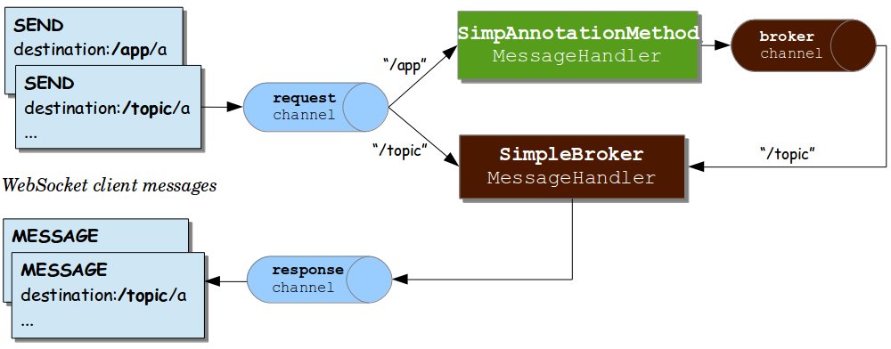

The preceding diagram shows three message channels:

- `clientInboundChannel`: For passing messages received from WebSocket clients.
- `clientOutboundChannel`: For sending server messages to WebSocket clients.
- `brokerChannel`: For sending messages to the message broker from within
  server-side application code.

The next diagram shows the components used when an external broker (such as RabbitMQ)
is configured for managing subscriptions and broadcasting messages:

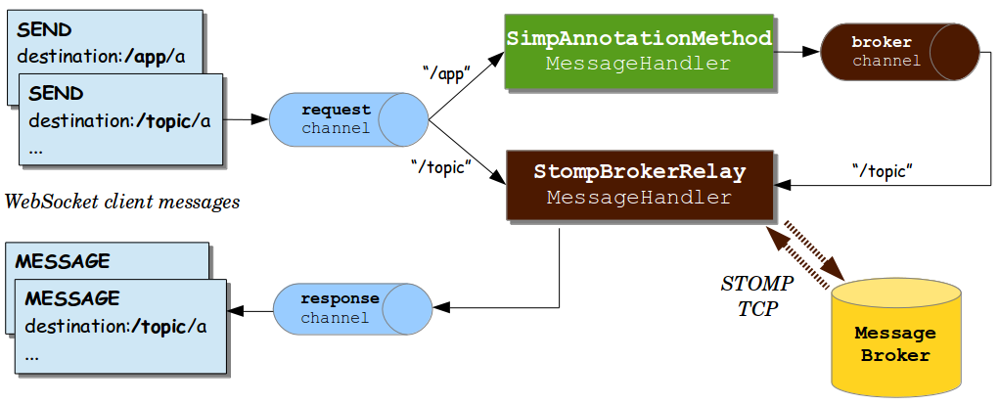

The main difference between the two preceding diagrams is the use of the “broker relay” for passing
messages up to the external STOMP broker over TCP and for passing messages down from the
broker to subscribed clients.

When messages are received from a WebSocket connection, they are decoded to STOMP frames, turned into a Spring `Message` representation, and sent to the
`clientInboundChannel` for further processing. For example, STOMP messages whose
destination headers start with `/app` may be routed to `@MessageMapping` methods in
annotated controllers, while `/topic` and `/queue` messages may be routed directly
to the message broker.

An annotated `@Controller` that handles a STOMP message from a client may send a message to
the message broker through the `brokerChannel`, and the broker broadcasts the
message to matching subscribers through the `clientOutboundChannel`. The same
controller can also do the same in response to HTTP requests, so a client can perform an
HTTP POST, and then a `@PostMapping` method can send a message to the message broker
to broadcast to subscribed clients.

We can trace the flow through a simple example. Consider the following example, which sets up a server:

- Java
- Kotlin

```java
@Configuration @EnableWebSocketMessageBroker public class WebSocketConfiguration implements WebSocketMessageBrokerConfigurer {
@Override public void registerStompEndpoints(StompEndpointRegistry registry) {registry.addEndpoint("/portfolio");}
@Override public void configureMessageBroker(MessageBrokerRegistry registry) {registry.setApplicationDestinationPrefixes("/app"); registry.enableSimpleBroker("/topic");}}
```

```kotlin
@Configuration @EnableWebSocketMessageBroker class WebSocketConfiguration : WebSocketMessageBrokerConfigurer {override fun registerStompEndpoints(registry: StompEndpointRegistry) {registry.addEndpoint("/portfolio")}
override fun configureMessageBroker(registry: MessageBrokerRegistry) {registry.setApplicationDestinationPrefixes("/app") registry.enableSimpleBroker("/topic")}}
```

- Java
- Kotlin

```java
@Controller public class GreetingController {
@MessageMapping("/greeting") public String handle(String greeting) {return "[" + getTimestamp() + ": " + greeting;}
private String getTimestamp() {return new SimpleDateFormat("MM/dd/yyyy h:mm:ss a").format(new Date());}
}
```

```kotlin
@Controller class GreetingController {
@MessageMapping("/greeting") fun handle(greeting: String): String {return "[${getTimestamp()}: $greeting"}
private fun getTimestamp(): String {return SimpleDateFormat("MM/dd/yyyy h:mm:ss a").format(Date())}}
```

The preceding example supports the following flow:

1. The client connects to `localhost:8080/portfolio` and, once a WebSocket connection
   is established, STOMP frames begin to flow on it.
2. The client sends a SUBSCRIBE frame with a destination header of `/topic/greeting`. Once received
   and decoded, the message is sent to the `clientInboundChannel` and is then routed to the
   message broker, which stores the client subscription.
3. The client sends a SEND frame to `/app/greeting`. The `/app` prefix helps to route it to
   annotated controllers. After the `/app` prefix is stripped, the remaining `/greeting`
   part of the destination is mapped to the `@MessageMapping` method in `GreetingController`.
4. The value returned from `GreetingController` is turned into a Spring `Message` with
   a payload based on the return value and a default destination header of
   `/topic/greeting` (derived from the input destination with `/app` replaced by
   `/topic`). The resulting message is sent to the `brokerChannel` and handled
   by the message broker.
5. The message broker finds all matching subscribers and sends a MESSAGE frame to each one
   through the `clientOutboundChannel`, from where messages are encoded as STOMP frames
   and sent on the WebSocket connection.

The next section provides more details on annotated methods, including the
kinds of arguments and return values that are supported.

[WebSocket Transport](#web-websocket-stomp-server-config)
[Annotated Controllers](#web-websocket-stomp-handle-annotations)

---

<a id="web-websocket-stomp-handle-annotations"></a>

<!-- source_url: https://docs.spring.io/spring-framework/reference/web/websocket/stomp/handle-annotations.html -->

<!-- page_index: 247 -->

# Annotated Controllers

<svg enable-background="new 0 0 32 32" id="Glyph" version="1.1" viewbox="0 0 32 32" xml:space="preserve" xmlns="http://www.w3.org/2000/svg" xmlns:xlink="http://www.w3.org/1999/xlink">
<path id="XMLID_223_"></path>
</svg>

Search

<a id="web-websocket-stomp-handle-annotations--page-title"></a>
<a id="web-websocket-stomp-handle-annotations--annotated-controllers"></a>

# Annotated Controllers

Applications can use annotated `@Controller` classes to handle messages from clients.
Such classes can declare `@MessageMapping`, `@SubscribeMapping`, and `@ExceptionHandler`
methods, as described in the following topics:

- [`@MessageMapping`](#web-websocket-stomp-handle-annotations--websocket-stomp-message-mapping)
- [`@SubscribeMapping`](#web-websocket-stomp-handle-annotations--websocket-stomp-subscribe-mapping)
- [`@MessageExceptionHandler`](#web-websocket-stomp-handle-annotations--websocket-stomp-exception-handler)

<a id="web-websocket-stomp-handle-annotations--websocket-stomp-message-mapping"></a>
<a id="web-websocket-stomp-handle-annotations--messagemapping"></a>

## `@MessageMapping`

You can use `@MessageMapping` to annotate methods that route messages based on their
destination. It is supported at the method level as well as at the type level. At the type
level, `@MessageMapping` is used to express shared mappings across all methods in a
controller.

By default, the mapping values are Ant-style path patterns (for example `/thing*`, `/thing/**`), including support for template variables (for example, `/thing/{id}`). The values can be
referenced through `@DestinationVariable` method arguments. Applications can also switch to
a dot-separated destination convention for mappings, as explained in
[Dots as Separators](#web-websocket-stomp-destination-separator).

<a id="web-websocket-stomp-handle-annotations--supported-method-arguments"></a>

### Supported Method Arguments

The following table describes the method arguments:

| Method argument | Description |
| --- | --- |
| `Message` | For access to the complete message. |
| `MessageHeaders` | For access to the headers within the `Message`. |
| `MessageHeaderAccessor`, `SimpMessageHeaderAccessor`, and `StompHeaderAccessor` | For access to the headers through typed accessor methods. |
| `@Payload` | For access to the payload of the message, converted (for example, from JSON) by a configured `MessageConverter`. The presence of this annotation is not required since it is, by default, assumed if no other argument is matched. You can annotate payload arguments with `@jakarta.validation.Valid` or Spring’s `@Validated`, to have the payload arguments be automatically validated. |
| `@Header` | For access to a specific header value — along with type conversion using an `org.springframework.core.convert.converter.Converter`, if necessary. |
| `@Headers` | For access to all headers in the message. This argument must be assignable to `java.util.Map`. |
| `@DestinationVariable` | For access to template variables extracted from the message destination. Values are converted to the declared method argument type as necessary. |
| `java.security.Principal` | Reflects the user logged in at the time of the WebSocket HTTP handshake. |

<a id="web-websocket-stomp-handle-annotations--return-values"></a>

### Return Values

By default, the return value from a `@MessageMapping` method is serialized to a payload
through a matching `MessageConverter` and sent as a `Message` to the `brokerChannel`, from where it is broadcast to subscribers. The destination of the outbound message is the
same as that of the inbound message but prefixed with `/topic`.

You can use the `@SendTo` and `@SendToUser` annotations to customize the destination of
the output message. `@SendTo` is used to customize the target destination or to
specify multiple destinations. `@SendToUser` is used to direct the output message
to only the user associated with the input message. See [User Destinations](#web-websocket-stomp-user-destination).

You can use both `@SendTo` and `@SendToUser` at the same time on the same method, and both
are supported at the class level, in which case they act as a default for methods in the
class. However, keep in mind that any method-level `@SendTo` or `@SendToUser` annotations
override any such annotations at the class level.

Messages can be handled asynchronously and a `@MessageMapping` method can return
`ListenableFuture`, `CompletableFuture`, or `CompletionStage`.

Note that `@SendTo` and `@SendToUser` are merely a convenience that amounts to using the
`SimpMessagingTemplate` to send messages. If necessary, for more advanced scenarios, `@MessageMapping` methods can fall back on using the `SimpMessagingTemplate` directly.
This can be done instead of, or possibly in addition to, returning a value.
See [Sending Messages](#web-websocket-stomp-handle-send).

<a id="web-websocket-stomp-handle-annotations--websocket-stomp-subscribe-mapping"></a>
<a id="web-websocket-stomp-handle-annotations--subscribemapping"></a>

## `@SubscribeMapping`

`@SubscribeMapping` is similar to `@MessageMapping` but narrows the mapping to
subscription messages only. It supports the same
[method arguments](#web-websocket-stomp-handle-annotations--websocket-stomp-message-mapping) as `@MessageMapping`. However
for the return value, by default, a message is sent directly to the client (through
`clientOutboundChannel`, in response to the subscription) and not to the broker (through
`brokerChannel`, as a broadcast to matching subscriptions). Adding `@SendTo` or
`@SendToUser` overrides this behavior and sends to the broker instead.

When is this useful? Assume that the broker is mapped to `/topic` and `/queue`, while
application controllers are mapped to `/app`. In this setup, the broker stores all
subscriptions to `/topic` and `/queue` that are intended for repeated broadcasts, and
there is no need for the application to get involved. A client could also subscribe to
some `/app` destination, and a controller could return a value in response to that
subscription without involving the broker without storing or using the subscription again
(effectively a one-time request-reply exchange). One use case for this is populating a UI
with initial data on startup.

When is this not useful? Do not try to map broker and controllers to the same destination
prefix unless you want both to independently process messages, including subscriptions, for some reason. Inbound messages are handled in parallel. There are no guarantees whether
a broker or a controller processes a given message first. If the goal is to be notified
when a subscription is stored and ready for broadcasts, a client should ask for a
receipt if the server supports it (simple broker does not). For example, with the Java
[STOMP client](#web-websocket-stomp-client), you could do the following to add a receipt:

```java
@Autowired
private TaskScheduler messageBrokerTaskScheduler;

// During initialization..
stompClient.setTaskScheduler(this.messageBrokerTaskScheduler);

// When subscribing..
StompHeaders headers = new StompHeaders();
headers.setDestination("/topic/...");
headers.setReceipt("r1");
FrameHandler handler = ...;
stompSession.subscribe(headers, handler).addReceiptTask(receiptHeaders -> {
	// Subscription ready...
});
```

A server side option is [to register](#web-websocket-stomp-interceptors) an
`ExecutorChannelInterceptor` on the `brokerChannel` and implement the `afterMessageHandled`
method that is invoked after messages, including subscriptions, have been handled.

<a id="web-websocket-stomp-handle-annotations--websocket-stomp-exception-handler"></a>
<a id="web-websocket-stomp-handle-annotations--messageexceptionhandler"></a>

## `@MessageExceptionHandler`

An application can use `@MessageExceptionHandler` methods to handle exceptions from
`@MessageMapping` methods. You can declare exceptions in the annotation
itself or through a method argument if you want to get access to the exception instance.
The following example declares an exception through a method argument:

```java
@Controller public class MyController {
// ...
@MessageExceptionHandler public ApplicationError handleException(MyException exception) {// ...return appError;}}
```

`@MessageExceptionHandler` methods support flexible method signatures and support
the same method argument types and return values as
[`@MessageMapping`](#web-websocket-stomp-handle-annotations--websocket-stomp-message-mapping) methods.

Typically, `@MessageExceptionHandler` methods apply within the `@Controller` class
(or class hierarchy) in which they are declared. If you want such methods to apply
more globally (across controllers), you can declare them in a class marked with
`@ControllerAdvice`. This is comparable to the
[similar support](#web-webmvc-mvc-controller-ann-advice) available in Spring MVC.

[Flow of Messages](#web-websocket-stomp-message-flow)
[Sending Messages](#web-websocket-stomp-handle-send)

---

<a id="web-websocket-stomp-handle-send"></a>

<!-- source_url: https://docs.spring.io/spring-framework/reference/web/websocket/stomp/handle-send.html -->

<!-- page_index: 248 -->

# Sending Messages

<svg enable-background="new 0 0 32 32" id="Glyph" version="1.1" viewbox="0 0 32 32" xml:space="preserve" xmlns="http://www.w3.org/2000/svg" xmlns:xlink="http://www.w3.org/1999/xlink">
<path id="XMLID_223_"></path>
</svg>

Search

<a id="web-websocket-stomp-handle-send--page-title"></a>
<a id="web-websocket-stomp-handle-send--sending-messages"></a>

# Sending Messages

What if you want to send messages to connected clients from any part of the
application? Any application component can send messages to the `brokerChannel`.
The easiest way to do so is to inject a `SimpMessagingTemplate` and
use it to send messages. Typically, you would inject it by
type, as the following example shows:

```java
@Controller public class GreetingController {
private SimpMessagingTemplate template;
@Autowired public GreetingController(SimpMessagingTemplate template) {this.template = template;}
@RequestMapping(path="/greetings", method=POST) public void greet(String greeting) {String text = "[" + getTimestamp() + "]:" + greeting; this.template.convertAndSend("/topic/greetings", text);}
}
```

However, you can also qualify it by its name (`brokerMessagingTemplate`), if another
bean of the same type exists.

[Annotated Controllers](#web-websocket-stomp-handle-annotations)
[Simple Broker](#web-websocket-stomp-handle-simple-broker)

---

<a id="web-websocket-stomp-handle-simple-broker"></a>

<!-- source_url: https://docs.spring.io/spring-framework/reference/web/websocket/stomp/handle-simple-broker.html -->

<!-- page_index: 249 -->

# Simple Broker

<svg enable-background="new 0 0 32 32" id="Glyph" version="1.1" viewbox="0 0 32 32" xml:space="preserve" xmlns="http://www.w3.org/2000/svg" xmlns:xlink="http://www.w3.org/1999/xlink">
<path id="XMLID_223_"></path>
</svg>

Search

<a id="web-websocket-stomp-handle-simple-broker--page-title"></a>
<a id="web-websocket-stomp-handle-simple-broker--simple-broker"></a>

# Simple Broker

The built-in simple message broker handles subscription requests from clients, stores them in memory, and broadcasts messages to connected clients that have matching
destinations. The broker supports path-like destinations, including subscriptions
to Ant-style destination patterns.

> [!NOTE]
> Applications can also use dot-separated (rather than slash-separated) destinations.
> See [Dots as Separators](#web-websocket-stomp-destination-separator).

If configured with a task scheduler, the simple broker supports
[STOMP heartbeats](https://stomp.github.io/stomp-specification-1.2.html#Heart-beating).
To configure a scheduler, you can declare your own `TaskScheduler` bean and set it through
the `MessageBrokerRegistry`. Alternatively, you can use the one that is automatically
declared in the built-in WebSocket configuration, however, you’ll need `@Lazy` to avoid
a cycle between the built-in WebSocket configuration and your
`WebSocketMessageBrokerConfigurer`. For example:

- Java
- Kotlin

```java
@Configuration
@EnableWebSocketMessageBroker
public class WebSocketConfiguration implements WebSocketMessageBrokerConfigurer {

	private TaskScheduler messageBrokerTaskScheduler;

	@Autowired
	public void setMessageBrokerTaskScheduler(@Lazy TaskScheduler taskScheduler) {
		this.messageBrokerTaskScheduler = taskScheduler;
	}

	@Override
	public void configureMessageBroker(MessageBrokerRegistry registry) {
		registry.enableSimpleBroker("/queue/", "/topic/")
				.setHeartbeatValue(new long[] {10000, 20000})
				.setTaskScheduler(this.messageBrokerTaskScheduler);

		// ...
	}
}
```

```kotlin
@Configuration
@EnableWebSocketMessageBroker
class WebSocketConfiguration : WebSocketMessageBrokerConfigurer {

	private lateinit var messageBrokerTaskScheduler: TaskScheduler

	@Autowired
	fun setMessageBrokerTaskScheduler(@Lazy taskScheduler: TaskScheduler) {
		this.messageBrokerTaskScheduler = taskScheduler
	}

	override fun configureMessageBroker(registry: MessageBrokerRegistry) {
		registry.enableSimpleBroker("/queue/", "/topic/")
			.setHeartbeatValue(longArrayOf(10000, 20000))
			.setTaskScheduler(messageBrokerTaskScheduler)

		// ...
	}
}
```

[Sending Messages](#web-websocket-stomp-handle-send)
[External Broker](#web-websocket-stomp-handle-broker-relay)

---

<a id="web-websocket-stomp-handle-broker-relay"></a>

<!-- source_url: https://docs.spring.io/spring-framework/reference/web/websocket/stomp/handle-broker-relay.html -->

<!-- page_index: 250 -->

# External Broker

<svg enable-background="new 0 0 32 32" id="Glyph" version="1.1" viewbox="0 0 32 32" xml:space="preserve" xmlns="http://www.w3.org/2000/svg" xmlns:xlink="http://www.w3.org/1999/xlink">
<path id="XMLID_223_"></path>
</svg>

Search

<a id="web-websocket-stomp-handle-broker-relay--page-title"></a>
<a id="web-websocket-stomp-handle-broker-relay--external-broker"></a>

# External Broker

The simple broker is great for getting started but supports only a subset of
STOMP commands (it does not support acks, receipts, and some other features), relies on a simple message-sending loop, and is not suitable for clustering.
As an alternative, you can upgrade your applications to use a full-featured
message broker.

See the STOMP documentation for your message broker of choice (such as
[RabbitMQ](https://www.rabbitmq.com/stomp.html), [ActiveMQ](https://activemq.apache.org/stomp.html), and others), install the broker, and run it with STOMP support enabled. Then you can enable the STOMP broker relay
(instead of the simple broker) in the Spring configuration.

The following example configuration enables a full-featured broker:

- Java
- Kotlin
- Xml

```java
@Configuration @EnableWebSocketMessageBroker public class WebSocketConfiguration implements WebSocketMessageBrokerConfigurer {
@Override public void registerStompEndpoints(StompEndpointRegistry registry) {registry.addEndpoint("/portfolio").withSockJS();}
@Override public void configureMessageBroker(MessageBrokerRegistry registry) {registry.enableStompBrokerRelay("/topic", "/queue"); registry.setApplicationDestinationPrefixes("/app");}
}
```

```kotlin
@Configuration @EnableWebSocketMessageBroker class WebSocketConfiguration : WebSocketMessageBrokerConfigurer {
override fun registerStompEndpoints(registry: StompEndpointRegistry) {registry.addEndpoint("/portfolio").withSockJS()}
override fun configureMessageBroker(registry: MessageBrokerRegistry) {registry.enableStompBrokerRelay("/topic", "/queue") registry.setApplicationDestinationPrefixes("/app")}}
```

```xml
<beans xmlns="http://www.springframework.org/schema/beans"
	   xmlns:xsi="http://www.w3.org/2001/XMLSchema-instance"
	   xmlns:websocket="http://www.springframework.org/schema/websocket"
	   xsi:schemaLocation="
		http://www.springframework.org/schema/beans
		https://www.springframework.org/schema/beans/spring-beans.xsd
		http://www.springframework.org/schema/websocket
		https://www.springframework.org/schema/websocket/spring-websocket.xsd">

	<websocket:message-broker application-destination-prefix="/app">
		<websocket:stomp-endpoint path="/portfolio">
			<websocket:sockjs />
		</websocket:stomp-endpoint>
		<websocket:stomp-broker-relay prefix="/topic,/queue" />
	</websocket:message-broker>
</beans>
```

The STOMP broker relay in the preceding configuration is a Spring
[`MessageHandler`](https://docs.spring.io/spring-framework/docs/7.0.8/javadoc-api/org/springframework/messaging/MessageHandler.html)
that handles messages by forwarding them to an external message broker.
To do so, it establishes TCP connections to the broker, forwards all messages to it, and then forwards all messages received from the broker to clients through their
WebSocket sessions. Essentially, it acts as a “relay” that forwards messages
in both directions.

> [!NOTE]
> Add `io.projectreactor.netty:reactor-netty` and `io.netty:netty-all`
> dependencies to your project for TCP connection management.

Furthermore, application components (such as HTTP request handling methods, business services, and others) can also send messages to the broker relay, as described
in [Sending Messages](#web-websocket-stomp-handle-send), to broadcast messages to subscribed WebSocket clients.

In effect, the broker relay enables robust and scalable message broadcasting.

[Simple Broker](#web-websocket-stomp-handle-simple-broker)
[Connecting to a Broker](#web-websocket-stomp-handle-broker-relay-configure)

---

<a id="web-websocket-stomp-handle-broker-relay-configure"></a>

<!-- source_url: https://docs.spring.io/spring-framework/reference/web/websocket/stomp/handle-broker-relay-configure.html -->

<!-- page_index: 251 -->

# Connecting to a Broker

<svg enable-background="new 0 0 32 32" id="Glyph" version="1.1" viewbox="0 0 32 32" xml:space="preserve" xmlns="http://www.w3.org/2000/svg" xmlns:xlink="http://www.w3.org/1999/xlink">
<path id="XMLID_223_"></path>
</svg>

Search

<a id="web-websocket-stomp-handle-broker-relay-configure--page-title"></a>
<a id="web-websocket-stomp-handle-broker-relay-configure--connecting-to-a-broker"></a>

# Connecting to a Broker

A STOMP broker relay maintains a single “system” TCP connection to the broker.
This connection is used for messages originating from the server-side application
only, not for receiving messages. You can configure the STOMP credentials (that is, the STOMP frame `login` and `passcode` headers) for this connection. This is exposed
in both the XML namespace and Java configuration as the `systemLogin` and
`systemPasscode` properties with default values of `guest` and `guest`.

The STOMP broker relay also creates a separate TCP connection for every connected
WebSocket client. You can configure the STOMP credentials that are used for all TCP
connections created on behalf of clients. This is exposed in both the XML namespace
and Java configuration as the `clientLogin` and `clientPasscode` properties with default
values of `guest` and `guest`.

> [!NOTE]
> The STOMP broker relay always sets the `login` and `passcode` headers on every `CONNECT`
> frame that it forwards to the broker on behalf of clients. Therefore, WebSocket clients
> need not set those headers. They are ignored. As the [Authentication](#web-websocket-stomp-authentication)
> section explains, WebSocket clients should instead rely on HTTP authentication to protect
> the WebSocket endpoint and establish the client identity.

The STOMP broker relay also sends and receives heartbeats to and from the message
broker over the “system” TCP connection. You can configure the intervals for sending
and receiving heartbeats (10 seconds each by default). If connectivity to the broker
is lost, the broker relay continues to try to reconnect, every 5 seconds, until it succeeds.

Any Spring bean can implement `ApplicationListener<BrokerAvailabilityEvent>`
to receive notifications when the “system” connection to the broker is lost and
re-established. For example, a Stock Quote service that broadcasts stock quotes can
stop trying to send messages when there is no active “system” connection.

By default, the STOMP broker relay always connects, and reconnects as needed if
connectivity is lost, to the same host and port. If you wish to supply multiple addresses, on each attempt to connect, you can configure a supplier of addresses, instead of a
fixed host and port. The following example shows how to do that:

- Java
- Kotlin

```java
@Configuration
@EnableWebSocketMessageBroker
public class WebSocketConfiguration implements WebSocketMessageBrokerConfigurer {

	// ...

	@Override
	public void configureMessageBroker(MessageBrokerRegistry registry) {
		registry.enableStompBrokerRelay("/queue/", "/topic/").setTcpClient(createTcpClient());
		registry.setApplicationDestinationPrefixes("/app");
	}

	private ReactorNettyTcpClient<byte[]> createTcpClient() {
		return new ReactorNettyTcpClient<>(
				client -> client.remoteAddress(() -> new InetSocketAddress(0)),
				new StompReactorNettyCodec());
	}
}
```

```kotlin
@Configuration @EnableWebSocketMessageBroker class WebSocketConfiguration : WebSocketMessageBrokerConfigurer {
// ...
override fun configureMessageBroker(registry: MessageBrokerRegistry) {registry.enableStompBrokerRelay("/queue/", "/topic/").setTcpClient(createTcpClient()) registry.setApplicationDestinationPrefixes("/app")}
private fun createTcpClient(): ReactorNettyTcpClient<ByteArray> {return ReactorNettyTcpClient({ it.addressSupplier { InetSocketAddress(0) } }, StompReactorNettyCodec())}}
```

You can also configure the STOMP broker relay with a `virtualHost` property.
The value of this property is set as the `host` header of every `CONNECT` frame
and can be useful (for example, in a cloud environment where the actual host to which
the TCP connection is established differs from the host that provides the
cloud-based STOMP service).

[External Broker](#web-websocket-stomp-handle-broker-relay)
[Dots as Separators](#web-websocket-stomp-destination-separator)

---

<a id="web-websocket-stomp-destination-separator"></a>

<!-- source_url: https://docs.spring.io/spring-framework/reference/web/websocket/stomp/destination-separator.html -->

<!-- page_index: 252 -->

# Dots as Separators

<svg enable-background="new 0 0 32 32" id="Glyph" version="1.1" viewbox="0 0 32 32" xml:space="preserve" xmlns="http://www.w3.org/2000/svg" xmlns:xlink="http://www.w3.org/1999/xlink">
<path id="XMLID_223_"></path>
</svg>

Search

<a id="web-websocket-stomp-destination-separator--page-title"></a>
<a id="web-websocket-stomp-destination-separator--dots-as-separators"></a>

# Dots as Separators

When messages are routed to `@MessageMapping` methods, they are matched with
`AntPathMatcher`. By default, patterns are expected to use slash (`/`) as the separator.
This is a good convention in web applications and similar to HTTP URLs. However, if
you are more used to messaging conventions, you can switch to using dot (`.`) as the separator.

The following example shows how to do so:

- Java
- Kotlin
- Xml

```java
@Configuration
@EnableWebSocketMessageBroker
public class WebSocketConfiguration implements WebSocketMessageBrokerConfigurer {

	// ...

	@Override
	public void configureMessageBroker(MessageBrokerRegistry registry) {
		registry.setPathMatcher(new AntPathMatcher("."));
		registry.enableStompBrokerRelay("/queue", "/topic");
		registry.setApplicationDestinationPrefixes("/app");
	}
}
```

```kotlin
@Configuration
@EnableWebSocketMessageBroker
class WebSocketConfiguration : WebSocketMessageBrokerConfigurer {

	// ...

	override fun configureMessageBroker(registry: MessageBrokerRegistry) {
		registry.setPathMatcher(AntPathMatcher("."))
		registry.enableStompBrokerRelay("/queue", "/topic")
		registry.setApplicationDestinationPrefixes("/app")
	}
}
```

```xml
<beans xmlns="http://www.springframework.org/schema/beans"
	   xmlns:xsi="http://www.w3.org/2001/XMLSchema-instance"
	   xmlns:websocket="http://www.springframework.org/schema/websocket"
	   xsi:schemaLocation="
					http://www.springframework.org/schema/beans
					https://www.springframework.org/schema/beans/spring-beans.xsd
					http://www.springframework.org/schema/websocket
					https://www.springframework.org/schema/websocket/spring-websocket.xsd">

	<websocket:message-broker application-destination-prefix="/app" path-matcher="pathMatcher">
		<websocket:stomp-endpoint path="/stomp"/>
		<websocket:stomp-broker-relay prefix="/topic,/queue" />
	</websocket:message-broker>

	<bean id="pathMatcher" class="org.springframework.util.AntPathMatcher">
		<constructor-arg index="0" value="."/>
	</bean>

</beans>
```

After that, a controller can use a dot (`.`) as the separator in `@MessageMapping` methods, as the following example shows:

- Java
- Kotlin

```java
@Controller @MessageMapping("red") public class RedController {
@MessageMapping("blue.{green}") public void handleGreen(@DestinationVariable String green) {// ...}}
```

```kotlin
@Controller @MessageMapping("red") class RedController {
@MessageMapping("blue.{green}") fun handleGreen(@DestinationVariable green: String) {// ...}}
```

The client can now send a message to `/app/red.blue.green123`.

In the preceding example, we did not change the prefixes on the “broker relay”, because those
depend entirely on the external message broker. See the STOMP documentation pages for
the broker you use to see what conventions it supports for the destination header.

The “simple broker”, on the other hand, does rely on the configured `PathMatcher`, so, if
you switch the separator, that change also applies to the broker and the way the broker matches
destinations from a message to patterns in subscriptions.

[Connecting to a Broker](#web-websocket-stomp-handle-broker-relay-configure)
[Authentication](#web-websocket-stomp-authentication)

---

<a id="web-websocket-stomp-authentication"></a>

<!-- source_url: https://docs.spring.io/spring-framework/reference/web/websocket/stomp/authentication.html -->

<!-- page_index: 253 -->

# Authentication

<svg enable-background="new 0 0 32 32" id="Glyph" version="1.1" viewbox="0 0 32 32" xml:space="preserve" xmlns="http://www.w3.org/2000/svg" xmlns:xlink="http://www.w3.org/1999/xlink">
<path id="XMLID_223_"></path>
</svg>

Search

<a id="web-websocket-stomp-authentication--page-title"></a>
<a id="web-websocket-stomp-authentication--authentication"></a>

# Authentication

Every STOMP over WebSocket messaging session begins with an HTTP request.
That can be a request to upgrade to WebSockets (that is, a WebSocket handshake)
or, in the case of SockJS fallbacks, a series of SockJS HTTP transport requests.

Many web applications already have authentication and authorization in place to
secure HTTP requests. Typically, a user is authenticated through Spring Security
by using some mechanism such as a login page, HTTP basic authentication, or another way.
The security context for the authenticated user is saved in the HTTP session
and is associated with subsequent requests in the same cookie-based session.

Therefore, for a WebSocket handshake or for SockJS HTTP transport requests, typically, there is already an authenticated user accessible through
`HttpServletRequest#getUserPrincipal()`. Spring automatically associates that user
with a WebSocket or SockJS session created for them and, subsequently, with all
STOMP messages transported over that session through a user header.

In short, a typical web application needs to do nothing
beyond what it already does for security. The user is authenticated at
the HTTP request level with a security context that is maintained through a cookie-based
HTTP session (which is then associated with WebSocket or SockJS sessions created
for that user) and results in a user header being stamped on every `Message` flowing
through the application.

The STOMP protocol does have `login` and `passcode` headers on the `CONNECT` frame.
Those were originally designed for and are needed for STOMP over TCP. However, for STOMP
over WebSocket, by default, Spring ignores authentication headers at the STOMP protocol
level, and assumes that the user is already authenticated at the HTTP transport level.
The expectation is that the WebSocket or SockJS session contain the authenticated user.

[Dots as Separators](#web-websocket-stomp-destination-separator)
[Token Authentication](#web-websocket-stomp-authentication-token-based)

---

<a id="web-websocket-stomp-authentication-token-based"></a>

<!-- source_url: https://docs.spring.io/spring-framework/reference/web/websocket/stomp/authentication-token-based.html -->

<!-- page_index: 254 -->

# Token Authentication

<svg enable-background="new 0 0 32 32" id="Glyph" version="1.1" viewbox="0 0 32 32" xml:space="preserve" xmlns="http://www.w3.org/2000/svg" xmlns:xlink="http://www.w3.org/1999/xlink">
<path id="XMLID_223_"></path>
</svg>

Search

<a id="web-websocket-stomp-authentication-token-based--page-title"></a>
<a id="web-websocket-stomp-authentication-token-based--token-authentication"></a>

# Token Authentication

[Spring Security OAuth](https://github.com/spring-projects/spring-security-oauth)
provides support for token based security, including JSON Web Token (JWT).
You can use this as the authentication mechanism in Web applications, including STOMP over WebSocket interactions, as described in the previous
section (that is, to maintain identity through a cookie-based session).

At the same time, cookie-based sessions are not always the best fit (for example, in applications that do not maintain a server-side session or in
mobile applications where it is common to use headers for authentication).

The [WebSocket protocol, RFC 6455](https://datatracker.ietf.org/doc/html/rfc6455#section-10.5)
"doesn’t prescribe any particular way that servers can authenticate clients during
the WebSocket handshake." In practice, however, browser clients can use only standard
authentication headers (that is, basic HTTP authentication) or cookies and cannot (for example)
provide custom headers. Likewise, the SockJS JavaScript client does not provide
a way to send HTTP headers with SockJS transport requests. See
[sockjs-client issue 196](https://github.com/sockjs/sockjs-client/issues/196).
Instead, it does allow sending query parameters that you can use to send a token, but that has its own drawbacks (for example, the token may be inadvertently
logged with the URL in server logs).

> [!NOTE]
> The preceding limitations are for browser-based clients and do not apply to the
> Spring Java-based STOMP client, which does support sending headers with both
> WebSocket and SockJS requests.

Therefore, applications that wish to avoid the use of cookies may not have any good
alternatives for authentication at the HTTP protocol level. Instead of using cookies, they may prefer to authenticate with headers at the STOMP messaging protocol level.
Doing so requires two simple steps:

1. Use the STOMP client to pass authentication headers at connect time.
2. Process the authentication headers with a `ChannelInterceptor`.

The next example uses server-side configuration to register a custom authentication
interceptor. Note that an interceptor needs only to authenticate and set
the user header on the CONNECT `Message`. Spring notes and saves the authenticated
user and associate it with subsequent STOMP messages on the same session. The following
example shows how to register a custom authentication interceptor:

- Java
- Kotlin

```java
@Configuration @EnableWebSocketMessageBroker public class WebSocketConfiguration implements WebSocketMessageBrokerConfigurer {
@Override public void configureClientInboundChannel(ChannelRegistration registration) {registration.interceptors(new ChannelInterceptor() {@Override public Message<?> preSend(Message<?> message, MessageChannel channel) {StompHeaderAccessor accessor = MessageHeaderAccessor.getAccessor(message, StompHeaderAccessor.class); if (StompCommand.CONNECT.equals(accessor.getCommand())) {// Access authentication header(s) and invoke accessor.setUser(user)} return message;} });}}
```

```kotlin
@Configuration @EnableWebSocketMessageBroker class WebSocketConfiguration : WebSocketMessageBrokerConfigurer {
override fun configureClientInboundChannel(registration: ChannelRegistration) {registration.interceptors(object : ChannelInterceptor {override fun preSend(message: Message<*>, channel: MessageChannel): Message<*> {val accessor = MessageHeaderAccessor.getAccessor(message,StompHeaderAccessor::class.java) if (StompCommand.CONNECT == accessor!!.command) {// Access authentication header(s) and invoke accessor.setUser(user)} return message} })}}
```

Also, note that, when you use Spring Security’s authorization for messages, at present, you need to ensure that the authentication `ChannelInterceptor` config is ordered
ahead of Spring Security’s. This is best done by declaring the custom interceptor in
its own implementation of `WebSocketMessageBrokerConfigurer` that is marked with
`@Order(Ordered.HIGHEST_PRECEDENCE + 99)`.

[Authentication](#web-websocket-stomp-authentication)
[Authorization](#web-websocket-stomp-authorization)

---

<a id="web-websocket-stomp-authorization"></a>

<!-- source_url: https://docs.spring.io/spring-framework/reference/web/websocket/stomp/authorization.html -->

<!-- page_index: 255 -->

# Authorization

<svg enable-background="new 0 0 32 32" id="Glyph" version="1.1" viewbox="0 0 32 32" xml:space="preserve" xmlns="http://www.w3.org/2000/svg" xmlns:xlink="http://www.w3.org/1999/xlink">
<path id="XMLID_223_"></path>
</svg>

Search

<a id="web-websocket-stomp-authorization--page-title"></a>
<a id="web-websocket-stomp-authorization--authorization"></a>

# Authorization

Spring Security provides
[WebSocket sub-protocol authorization](https://docs.spring.io/spring-security/reference/servlet/integrations/websocket.html#websocket-authorization)
that uses a `ChannelInterceptor` to authorize messages based on the user header in them.
Also, Spring Session provides
[WebSocket integration](https://docs.spring.io/spring-session/reference/web-socket.html)
that ensures the user’s HTTP session does not expire while the WebSocket session is still active.

[Token Authentication](#web-websocket-stomp-authentication-token-based)
[User Destinations](#web-websocket-stomp-user-destination)

---

<a id="web-websocket-stomp-user-destination"></a>

<!-- source_url: https://docs.spring.io/spring-framework/reference/web/websocket/stomp/user-destination.html -->

<!-- page_index: 256 -->

# User Destinations

<svg enable-background="new 0 0 32 32" id="Glyph" version="1.1" viewbox="0 0 32 32" xml:space="preserve" xmlns="http://www.w3.org/2000/svg" xmlns:xlink="http://www.w3.org/1999/xlink">
<path id="XMLID_223_"></path>
</svg>

Search

<a id="web-websocket-stomp-user-destination--page-title"></a>
<a id="web-websocket-stomp-user-destination--user-destinations"></a>

# User Destinations

An application can send messages that target a specific user, and Spring’s STOMP support
recognizes destinations prefixed with `/user/` for this purpose.
For example, a client might subscribe to the `/user/queue/position-updates` destination.
`UserDestinationMessageHandler` handles this destination and transforms it into a
destination unique to the user session (such as `/queue/position-updates-user123`).
This provides the convenience of subscribing to a generically named destination while, at the same time, ensuring no collisions with other users who subscribe to the same
destination so that each user can receive unique stock position updates.

> [!TIP]
> When working with user destinations, it is important to configure broker and
> application destination prefixes as shown in [Enable STOMP](#web-websocket-stomp-enable), or otherwise the
> broker would handle "/user" prefixed messages that should only be handled by
> `UserDestinationMessageHandler`.

On the sending side, messages can be sent to a destination such as
`/user/{username}/queue/position-updates`, which in turn is translated
by the `UserDestinationMessageHandler` into one or more destinations, one for each
session associated with the user. This lets any component within the application
send messages that target a specific user without necessarily knowing anything more
than their name and the generic destination. This is also supported through an
annotation and a messaging template.

A message-handling method can send messages to the user associated with
the message being handled through the `@SendToUser` annotation (also supported on
the class-level to share a common destination), as the following example shows:

```java
@Controller public class PortfolioController {
@MessageMapping("/trade") @SendToUser("/queue/position-updates") public TradeResult executeTrade(Trade trade, Principal principal) {// ...return tradeResult;}}
```

If the user has more than one session, by default, all of the sessions subscribed
to the given destination are targeted. However, sometimes, it may be necessary to
target only the session that sent the message being handled. You can do so by
setting the `broadcast` attribute to false, as the following example shows:

```java
@Controller public class MyController {
@MessageMapping("/action") public void handleAction() throws Exception{// raise MyBusinessException here}
@MessageExceptionHandler @SendToUser(destinations="/queue/errors", broadcast=false) public ApplicationError handleException(MyBusinessException exception) {// ...return appError;}}
```

> [!NOTE]
> While user destinations generally imply an authenticated user, it is not strictly required.
> A WebSocket session that is not associated with an authenticated user
> can subscribe to a user destination. In such cases, the `@SendToUser` annotation
> behaves exactly the same as with `broadcast=false` (that is, targeting only the
> session that sent the message being handled).

You can send a message to user destinations from any application
component by, for example, injecting the `SimpMessagingTemplate` created by the Java configuration or
the XML namespace. (The bean name is `brokerMessagingTemplate` if required
for qualification with `@Qualifier`.) The following example shows how to do so:

```java
@Service public class TradeServiceImpl implements TradeService {
private final SimpMessagingTemplate messagingTemplate;
@Autowired public TradeServiceImpl(SimpMessagingTemplate messagingTemplate) {this.messagingTemplate = messagingTemplate;}
// ...
public void afterTradeExecuted(Trade trade) {this.messagingTemplate.convertAndSendToUser(trade.getUserName(), "/queue/position-updates", trade.getResult());}}
```

> [!NOTE]
> When you use user destinations with an external message broker, you should check the broker
> documentation on how to manage inactive queues, so that, when the user session is
> over, all unique user queues are removed. For example, RabbitMQ creates auto-delete
> queues when you use destinations such as `/exchange/amq.direct/position-updates`.
> So, in that case, the client could subscribe to `/user/exchange/amq.direct/position-updates`.
> Similarly, ActiveMQ has
> [configuration options](https://activemq.apache.org/delete-inactive-destinations.html)
> for purging inactive destinations.

In a multi-application server scenario, a user destination may remain unresolved because
the user is connected to a different server. In such cases, you can configure a
destination to broadcast unresolved messages so that other servers have a chance to try.
This can be done through the `userDestinationBroadcast` property of the
`MessageBrokerRegistry` in Java configuration and the `user-destination-broadcast` attribute
of the `message-broker` element in XML.

[Authorization](#web-websocket-stomp-authorization)
[Order of Messages](#web-websocket-stomp-ordered-messages)

---

<a id="web-websocket-stomp-ordered-messages"></a>

<!-- source_url: https://docs.spring.io/spring-framework/reference/web/websocket/stomp/ordered-messages.html -->

<!-- page_index: 257 -->

# Order of Messages

<svg enable-background="new 0 0 32 32" id="Glyph" version="1.1" viewbox="0 0 32 32" xml:space="preserve" xmlns="http://www.w3.org/2000/svg" xmlns:xlink="http://www.w3.org/1999/xlink">
<path id="XMLID_223_"></path>
</svg>

Search

<a id="web-websocket-stomp-ordered-messages--page-title"></a>
<a id="web-websocket-stomp-ordered-messages--order-of-messages"></a>

# Order of Messages

Messages from the broker are published to the `clientOutboundChannel`, from where they are
written to WebSocket sessions. As the channel is backed by a `ThreadPoolExecutor`, messages
are processed in different threads, and the resulting sequence received by the client may
not match the exact order of publication.

To enable ordered publishing, set the `setPreservePublishOrder` flag as follows:

- Java
- Kotlin
- Xml

```java
@Configuration @EnableWebSocketMessageBroker public class PublishOrderWebSocketConfiguration implements WebSocketMessageBrokerConfigurer {
@Override public void configureMessageBroker(MessageBrokerRegistry registry) {// ...registry.setPreservePublishOrder(true);}
}
```

```kotlin
@Configuration @EnableWebSocketMessageBroker class PublishOrderWebSocketConfiguration : WebSocketMessageBrokerConfigurer {
override fun configureMessageBroker(registry: MessageBrokerRegistry) {// ...registry.setPreservePublishOrder(true)}}
```

```xml
<beans xmlns="http://www.springframework.org/schema/beans"
	   xmlns:xsi="http://www.w3.org/2001/XMLSchema-instance"
	   xmlns:websocket="http://www.springframework.org/schema/websocket"
	   xsi:schemaLocation="
		http://www.springframework.org/schema/beans
		https://www.springframework.org/schema/beans/spring-beans.xsd
		http://www.springframework.org/schema/websocket
		https://www.springframework.org/schema/websocket/spring-websocket.xsd">

	<websocket:message-broker preserve-publish-order="true">
		<!-- ... -->
	</websocket:message-broker>

</beans>
```

When the flag is set, messages within the same client session are published to the
`clientOutboundChannel` one at a time, so that the order of publication is guaranteed.
Note that this incurs a small performance overhead, so you should enable it only if it is required.

The same also applies to messages from the client, which are sent to the `clientInboundChannel`, from where they are handled according to their destination prefix. As the channel is backed by
a `ThreadPoolExecutor`, messages are processed in different threads, and the resulting sequence
of handling may not match the exact order in which they were received.

To enable ordered receiving, set the `setPreserveReceiveOrder` flag as follows:

- Java
- Kotlin

```java
@Configuration @EnableWebSocketMessageBroker public class ReceiveOrderWebSocketConfiguration implements WebSocketMessageBrokerConfigurer {
@Override public void registerStompEndpoints(StompEndpointRegistry registry) {registry.setPreserveReceiveOrder(true);}}
```

```kotlin
@Configuration @EnableWebSocketMessageBroker class ReceiveOrderWebSocketConfiguration : WebSocketMessageBrokerConfigurer {
override fun registerStompEndpoints(registry: StompEndpointRegistry) {registry.setPreserveReceiveOrder(true)}}
```

[User Destinations](#web-websocket-stomp-user-destination)
[Events](#web-websocket-stomp-application-context-events)

---

<a id="web-websocket-stomp-application-context-events"></a>

<!-- source_url: https://docs.spring.io/spring-framework/reference/web/websocket/stomp/application-context-events.html -->

<!-- page_index: 258 -->

# Events

<svg enable-background="new 0 0 32 32" id="Glyph" version="1.1" viewbox="0 0 32 32" xml:space="preserve" xmlns="http://www.w3.org/2000/svg" xmlns:xlink="http://www.w3.org/1999/xlink">
<path id="XMLID_223_"></path>
</svg>

Search

<a id="web-websocket-stomp-application-context-events--page-title"></a>
<a id="web-websocket-stomp-application-context-events--events"></a>

# Events

Several `ApplicationContext` events are published and can be
received by implementing Spring’s `ApplicationListener` interface:

- `BrokerAvailabilityEvent`: Indicates when the broker becomes available or unavailable.
  While the “simple” broker becomes available immediately on startup and remains so while
  the application is running, the STOMP “broker relay” can lose its connection
  to the full featured broker (for example, if the broker is restarted). The broker relay
  has reconnect logic and re-establishes the “system” connection to the broker
  when it comes back. As a result, this event is published whenever the state changes from connected
  to disconnected and vice-versa. Components that use the `SimpMessagingTemplate` should
  subscribe to this event and avoid sending messages at times when the broker is not
  available. In any case, they should be prepared to handle `MessageDeliveryException`
  when sending a message.
- `SessionConnectEvent`: Published when a new STOMP CONNECT is received to
  indicate the start of a new client session. The event contains the message that represents the
  connect, including the session ID, user information (if any), and any custom headers the client
  sent. This is useful for tracking client sessions. Components subscribed
  to this event can wrap the contained message with `SimpMessageHeaderAccessor` or
  `StompMessageHeaderAccessor`.
- `SessionConnectedEvent`: Published shortly after a `SessionConnectEvent` when the
  broker has sent a STOMP CONNECTED frame in response to the CONNECT. At this point, the
  STOMP session can be considered fully established.
- `SessionSubscribeEvent`: Published when a new STOMP SUBSCRIBE is received.
- `SessionUnsubscribeEvent`: Published when a new STOMP UNSUBSCRIBE is received.
- `SessionDisconnectEvent`: Published when a STOMP session ends. The DISCONNECT may
  have been sent from the client or it may be automatically generated when the
  WebSocket session is closed. In some cases, this event is published more than once
  per session. Components should be idempotent with regard to multiple disconnect events.

> [!NOTE]
> When you use a full-featured broker, the STOMP “broker relay” automatically reconnects the
> “system” connection if broker becomes temporarily unavailable. Client connections, however, are not automatically reconnected. Assuming heartbeats are enabled, the client
> typically notices the broker is not responding within 10 seconds. Clients need to
> implement their own reconnecting logic.

[Order of Messages](#web-websocket-stomp-ordered-messages)
[Interception](#web-websocket-stomp-interceptors)

---

<a id="web-websocket-stomp-interceptors"></a>

<!-- source_url: https://docs.spring.io/spring-framework/reference/web/websocket/stomp/interceptors.html -->

<!-- page_index: 259 -->

# Interception

<svg enable-background="new 0 0 32 32" id="Glyph" version="1.1" viewbox="0 0 32 32" xml:space="preserve" xmlns="http://www.w3.org/2000/svg" xmlns:xlink="http://www.w3.org/1999/xlink">
<path id="XMLID_223_"></path>
</svg>

Search

<a id="web-websocket-stomp-interceptors--page-title"></a>
<a id="web-websocket-stomp-interceptors--interception"></a>

# Interception

[Events](#web-websocket-stomp-application-context-events) provide notifications for the lifecycle
of a STOMP connection but not for every client message. Applications can also register a
`ChannelInterceptor` to intercept any message and in any part of the processing chain.
The following example shows how to intercept inbound messages from clients:

- Java
- Kotlin

```java
@Configuration @EnableWebSocketMessageBroker public class WebSocketConfiguration implements WebSocketMessageBrokerConfigurer {
@Override public void configureClientInboundChannel(ChannelRegistration registration) {registration.interceptors(new MyChannelInterceptor());}}
```

```kotlin
@Configuration @EnableWebSocketMessageBroker class WebSocketConfiguration : WebSocketMessageBrokerConfigurer {
override fun configureClientInboundChannel(registration: ChannelRegistration) {registration.interceptors(MyChannelInterceptor())}}
```

A custom `ChannelInterceptor` can use `StompHeaderAccessor` or `SimpMessageHeaderAccessor`
to access information about the message, as the following example shows:

- Java
- Kotlin

```java
public class MyChannelInterceptor implements ChannelInterceptor {
@Override public Message<?> preSend(Message<?> message, MessageChannel channel) {StompHeaderAccessor accessor = StompHeaderAccessor.wrap(message); StompCommand command = accessor.getCommand(); // ...return message;}}
```

```kotlin
class MyChannelInterceptor : ChannelInterceptor {
override fun preSend(message: Message<*>, channel: MessageChannel): Message<*> {val accessor = StompHeaderAccessor.wrap(message) val command = accessor.command // ...return message}}
```

Applications can also implement `ExecutorChannelInterceptor`, which is a sub-interface
of `ChannelInterceptor` with callbacks in the thread in which the messages are handled.
While a `ChannelInterceptor` is invoked once for each message sent to a channel, the
`ExecutorChannelInterceptor` provides hooks in the thread of each `MessageHandler`
subscribed to messages from the channel.

Note that, as with the `SessionDisconnectEvent` described earlier, a DISCONNECT message
can be from the client or it can also be automatically generated when
the WebSocket session is closed. In some cases, an interceptor may intercept this
message more than once for each session. Components should be idempotent with regard to
multiple disconnect events.

[Events](#web-websocket-stomp-application-context-events)
[STOMP Client](#web-websocket-stomp-client)

---

<a id="web-websocket-stomp-client"></a>

<!-- source_url: https://docs.spring.io/spring-framework/reference/web/websocket/stomp/client.html -->

<!-- page_index: 260 -->

# STOMP Client

<svg enable-background="new 0 0 32 32" id="Glyph" version="1.1" viewbox="0 0 32 32" xml:space="preserve" xmlns="http://www.w3.org/2000/svg" xmlns:xlink="http://www.w3.org/1999/xlink">
<path id="XMLID_223_"></path>
</svg>

Search

<a id="web-websocket-stomp-client--page-title"></a>
<a id="web-websocket-stomp-client--stomp-client"></a>

# STOMP Client

Spring provides a STOMP over WebSocket client and a STOMP over TCP client.

To begin, you can create and configure `WebSocketStompClient`, as the following example shows:

```java
WebSocketClient webSocketClient = new StandardWebSocketClient();
WebSocketStompClient stompClient = new WebSocketStompClient(webSocketClient);
stompClient.setMessageConverter(new StringMessageConverter());
stompClient.setTaskScheduler(taskScheduler); // for heartbeats
```

In the preceding example, you could replace `StandardWebSocketClient` with `SockJsClient`, since that is also an implementation of `WebSocketClient`. The `SockJsClient` can
use WebSocket or HTTP-based transport as a fallback. For more details, see
[`SockJsClient`](#web-websocket-fallback--websocket-fallback-sockjs-client).

Next, you can establish a connection and provide a handler for the STOMP session, as the following example shows:

```java
String url = "ws://127.0.0.1:8080/endpoint";
StompSessionHandler sessionHandler = new MyStompSessionHandler();
stompClient.connect(url, sessionHandler);
```

When the session is ready for use, the handler is notified, as the following example shows:

```java
public class MyStompSessionHandler extends StompSessionHandlerAdapter {

	@Override
	public void afterConnected(StompSession session, StompHeaders connectedHeaders) {
		// ...
	}
}
```

Once the session is established, any payload can be sent and is
serialized with the configured `MessageConverter`, as the following example shows:

```java
session.send("/topic/something", "payload");
```

You can also subscribe to destinations. The `subscribe` methods require a handler
for messages on the subscription and returns a `Subscription` handle that you can
use to unsubscribe. For each received message, the handler can specify the target
`Object` type to which the payload should be deserialized, as the following example shows:

```java
session.subscribe("/topic/something", new StompFrameHandler() {
@Override public Type getPayloadType(StompHeaders headers) {return String.class;}
@Override public void handleFrame(StompHeaders headers, Object payload) {// ...}
});
```

To enable STOMP heartbeat, you can configure `WebSocketStompClient` with a `TaskScheduler`
and optionally customize the heartbeat intervals (10 seconds for write inactivity, which causes a heartbeat to be sent, and 10 seconds for read inactivity, which
closes the connection).

`WebSocketStompClient` sends a heartbeat only in case of inactivity, i.e. when no
other messages are sent. This can present a challenge when using an external broker
since messages with a non-broker destination represent activity but aren’t actually
forwarded to the broker. In that case you can configure a `TaskScheduler`
when initializing the [External Broker](#web-websocket-stomp-handle-broker-relay) which ensures a
heartbeat is forwarded to the broker also when only messages with a non-broker
destination are sent.

> [!NOTE]
> When you use `WebSocketStompClient` for performance tests to simulate thousands
> of clients from the same machine, consider turning off heartbeats, since each
> connection schedules its own heartbeat tasks and that is not optimized for
> a large number of clients running on the same machine.

The STOMP protocol also supports receipts, where the client must add a `receipt`
header to which the server responds with a RECEIPT frame after the send or
subscribe are processed. To support this, the `StompSession` offers
`setAutoReceipt(boolean)` that causes a `receipt` header to be
added on every subsequent send or subscribe event.
Alternatively, you can also manually add a receipt header to the `StompHeaders`.
Both send and subscribe return an instance of `Receiptable`
that you can use to register for receipt success and failure callbacks.
For this feature, you must configure the client with a `TaskScheduler`
and the amount of time before a receipt expires (15 seconds by default).

Note that `StompSessionHandler` itself is a `StompFrameHandler`, which lets
it handle ERROR frames in addition to the `handleException` callback for
exceptions from the handling of messages and `handleTransportError` for
transport-level errors including `ConnectionLostException`.

You can use the `inboundMessageSizeLimit` and `outboundMessageSizeLimit` properties of
`WebSocketStompClient` to limit the maximum size of inbound and outbound WebSocket
messages. When an outbound STOMP message exceeds the limit, it is split into partial frames, which the receiver would have to reassemble. By default, there is no size limit for outbound
messages. When an inbound STOMP message size exceeds the configured limit, a
`StompConversionException` is thrown. The default size limit for inbound messages is `64KB`.

```java
WebSocketClient webSocketClient = new StandardWebSocketClient();
WebSocketStompClient stompClient = new WebSocketStompClient(webSocketClient);
stompClient.setInboundMessageSizeLimit(64 * 1024); // 64KB
stompClient.setOutboundMessageSizeLimit(64 * 1024); // 64KB
```

[Interception](#web-websocket-stomp-interceptors)
[WebSocket Scope](#web-websocket-stomp-scope)

---

<a id="web-websocket-stomp-scope"></a>

<!-- source_url: https://docs.spring.io/spring-framework/reference/web/websocket/stomp/scope.html -->

<!-- page_index: 261 -->

# WebSocket Scope

<svg enable-background="new 0 0 32 32" id="Glyph" version="1.1" viewbox="0 0 32 32" xml:space="preserve" xmlns="http://www.w3.org/2000/svg" xmlns:xlink="http://www.w3.org/1999/xlink">
<path id="XMLID_223_"></path>
</svg>

Search

<a id="web-websocket-stomp-scope--page-title"></a>
<a id="web-websocket-stomp-scope--websocket-scope"></a>

# WebSocket Scope

Each WebSocket session has a map of attributes. The map is attached as a header to inbound
client messages and may be accessed from a controller method, as the following example shows:

```java
@Controller public class MyController {
@MessageMapping("/action") public void handle(SimpMessageHeaderAccessor headerAccessor) {Map<String, Object> attrs = headerAccessor.getSessionAttributes(); // ...}}
```

You can declare a Spring-managed bean in the `websocket` scope.
You can inject WebSocket-scoped beans into controllers and any channel interceptors
registered on the `clientInboundChannel`. Those are typically singletons and live
longer than any individual WebSocket session. Therefore, you need to use
WebSocket-scoped beans in proxy mode, conveniently defined with `@WebSocketScope`:

```java
@Component @WebSocketScope public class MyBean {
@PostConstruct public void init() {// Invoked after dependencies injected}
// ...
@PreDestroy public void destroy() {// Invoked when the WebSocket session ends}}
@Controller public class MyController {
private final MyBean myBean;
@Autowired public MyController(MyBean myBean) {this.myBean = myBean;}
@MessageMapping("/action") public void handle() {// this.myBean from the current WebSocket session}}
```

As with any custom scope, Spring initializes a new `MyBean` instance the first
time it is accessed from the controller and stores the instance in the WebSocket
session attributes. The same instance is subsequently returned until the session
ends. WebSocket-scoped beans have all Spring lifecycle methods invoked, as
shown in the preceding examples.

[STOMP Client](#web-websocket-stomp-client)
[Performance](#web-websocket-stomp-configuration-performance)

---

<a id="web-websocket-stomp-configuration-performance"></a>

<!-- source_url: https://docs.spring.io/spring-framework/reference/web/websocket/stomp/configuration-performance.html -->

<!-- page_index: 262 -->

# Performance

<svg enable-background="new 0 0 32 32" id="Glyph" version="1.1" viewbox="0 0 32 32" xml:space="preserve" xmlns="http://www.w3.org/2000/svg" xmlns:xlink="http://www.w3.org/1999/xlink">
<path id="XMLID_223_"></path>
</svg>

Search

<a id="web-websocket-stomp-configuration-performance--page-title"></a>
<a id="web-websocket-stomp-configuration-performance--performance"></a>

# Performance

There is no silver bullet when it comes to performance. Many factors
affect it, including the size and volume of messages, whether application
methods perform work that requires blocking, and external factors
(such as network speed and other issues). The goal of this section is to provide
an overview of the available configuration options along with some thoughts
on how to reason about scaling.

In a messaging application, messages are passed through channels for asynchronous
executions that are backed by thread pools. Configuring such an application requires
good knowledge of the channels and the flow of messages. Therefore, it is
recommended to review [Flow of Messages](#web-websocket-stomp-message-flow).

The obvious place to start is to configure the thread pools that back the
`clientInboundChannel` and the `clientOutboundChannel`. By default, both
are configured at twice the number of available processors.

If the handling of messages in annotated methods is mainly CPU-bound, the
number of threads for the `clientInboundChannel` should remain close to the
number of processors. If the work they do is more IO-bound and requires blocking
or waiting on a database or other external system, the thread pool size
probably needs to be increased.

> [!NOTE]
> `ThreadPoolExecutor` has three important properties: the core thread pool size, the max thread pool size, and the capacity for the queue to store
> tasks for which there are no available threads.
>
> A common point of confusion is that configuring the core pool size (for example, 10)
> and max pool size (for example, 20) results in a thread pool with 10 to 20 threads.
> In fact, if the capacity is left at its default value of Integer.MAX\_VALUE, the thread pool never increases beyond the core pool size, since
> all additional tasks are queued.
>
> See the javadoc of `ThreadPoolExecutor` to learn how these properties work and
> understand the various queuing strategies.

On the `clientOutboundChannel` side, it is all about sending messages to WebSocket
clients. If clients are on a fast network, the number of threads should
remain close to the number of available processors. If they are slow or on
low bandwidth, they take longer to consume messages and put a burden on the
thread pool. Therefore, increasing the thread pool size becomes necessary.

While the workload for the `clientInboundChannel` is possible to predict — after all, it is based on what the application does — how to configure the
"clientOutboundChannel" is harder, as it is based on factors beyond
the control of the application. For this reason, two additional
properties relate to the sending of messages: `sendTimeLimit`
and `sendBufferSizeLimit`. You can use those methods to configure how long a
send is allowed to take and how much data can be buffered when sending
messages to a client.

The general idea is that, at any given time, only a single thread can be used
to send to a client. All additional messages, meanwhile, get buffered, and you
can use these properties to decide how long sending a message is allowed to
take and how much data can be buffered in the meantime. See the javadoc and
documentation of the XML schema for important additional details.

The following example shows a possible configuration:

- Java
- Kotlin
- Xml

```java
@Configuration @EnableWebSocketMessageBroker public class WebSocketConfiguration implements WebSocketMessageBrokerConfigurer {
@Override public void configureWebSocketTransport(WebSocketTransportRegistration registration) {registration.setSendTimeLimit(15 * 1000).setSendBufferSizeLimit(512 * 1024);}
// ...
}
```

```kotlin
@Configuration @EnableWebSocketMessageBroker class WebSocketConfiguration : WebSocketMessageBrokerConfigurer {
override fun configureWebSocketTransport(registration: WebSocketTransportRegistration) {registration.setSendTimeLimit(15 * 1000).setSendBufferSizeLimit(512 * 1024)}
// ...}
```

```xml
<beans xmlns="http://www.springframework.org/schema/beans"
	   xmlns:xsi="http://www.w3.org/2001/XMLSchema-instance"
	   xmlns:websocket="http://www.springframework.org/schema/websocket"
	   xsi:schemaLocation="
		http://www.springframework.org/schema/beans
		https://www.springframework.org/schema/beans/spring-beans.xsd
		http://www.springframework.org/schema/websocket
		https://www.springframework.org/schema/websocket/spring-websocket.xsd">

	<websocket:message-broker>
		<websocket:transport send-timeout="15000" send-buffer-size="524288" />
		<!-- ... -->
	</websocket:message-broker>

</beans>
```

You can also use the WebSocket transport configuration shown earlier to configure the
maximum allowed size for incoming STOMP messages. In theory, a WebSocket
message can be almost unlimited in size. In practice, WebSocket servers impose
limits — for example, 8K on Tomcat and 64K on Jetty. For this reason, STOMP clients
such as [`stomp-js/stompjs`](https://github.com/stomp-js/stompjs) and others split larger
STOMP messages at 16K boundaries and send them as multiple WebSocket messages, which requires the server to buffer and re-assemble.

Spring’s STOMP-over-WebSocket support does this, so applications can configure the
maximum size for STOMP messages irrespective of WebSocket server-specific message
sizes. Keep in mind that the WebSocket message size is automatically
adjusted, if necessary, to ensure they can carry 16K WebSocket messages at a
minimum.

The following example shows one possible configuration:

- Java
- Kotlin
- Xml

```java
@Configuration @EnableWebSocketMessageBroker public class MessageSizeLimitWebSocketConfiguration implements WebSocketMessageBrokerConfigurer {
@Override public void configureWebSocketTransport(WebSocketTransportRegistration registration) {registration.setMessageSizeLimit(128 * 1024);}
// ...
}
```

```kotlin
@Configuration @EnableWebSocketMessageBroker class MessageSizeLimitWebSocketConfiguration : WebSocketMessageBrokerConfigurer {
override fun configureWebSocketTransport(registration: WebSocketTransportRegistration) {registration.setMessageSizeLimit(128 * 1024)}
// ...}
```

```xml
<beans xmlns="http://www.springframework.org/schema/beans"
	   xmlns:xsi="http://www.w3.org/2001/XMLSchema-instance"
	   xmlns:websocket="http://www.springframework.org/schema/websocket"
	   xsi:schemaLocation="
		http://www.springframework.org/schema/beans
		https://www.springframework.org/schema/beans/spring-beans.xsd
		http://www.springframework.org/schema/websocket
		https://www.springframework.org/schema/websocket/spring-websocket.xsd">

	<websocket:message-broker>
		<websocket:transport message-size="131072" />
		<!-- ... -->
	</websocket:message-broker>

</beans>
```

An important point about scaling involves using multiple application instances.
Currently, you cannot do that with the simple broker.
However, when you use a full-featured broker (such as RabbitMQ), each application
instance connects to the broker, and messages broadcast from one application
instance can be broadcast through the broker to WebSocket clients connected
through any other application instances.

[WebSocket Scope](#web-websocket-stomp-scope)
[Monitoring](#web-websocket-stomp-stats)

---

<a id="web-websocket-stomp-stats"></a>

<!-- source_url: https://docs.spring.io/spring-framework/reference/web/websocket/stomp/stats.html -->

<!-- page_index: 263 -->

# Monitoring

<svg enable-background="new 0 0 32 32" id="Glyph" version="1.1" viewbox="0 0 32 32" xml:space="preserve" xmlns="http://www.w3.org/2000/svg" xmlns:xlink="http://www.w3.org/1999/xlink">
<path id="XMLID_223_"></path>
</svg>

Search

<a id="web-websocket-stomp-stats--page-title"></a>
<a id="web-websocket-stomp-stats--monitoring"></a>

# Monitoring

When you use `@EnableWebSocketMessageBroker` or `<websocket:message-broker>`, key
infrastructure components automatically gather statistics and counters that provide
important insight into the internal state of the application. The configuration
also declares a bean of type `WebSocketMessageBrokerStats` that gathers all
available information in one place and by default logs it at the `INFO` level once
every 30 minutes. This bean can be exported to JMX through Spring’s
`MBeanExporter` for viewing at runtime (for example, through JDK’s `jconsole`).
The following list summarizes the available information:

Client WebSocket Sessions
:   Current
    :   Indicates how many client sessions there are
        currently, with the count further broken down by WebSocket versus HTTP
        streaming and polling SockJS sessions.

    Total
    :   Indicates how many total sessions have been established.

    Abnormally Closed
    :   Connect Failures
        :   Sessions that got established but were
            closed after not having received any messages within 60 seconds. This is
            usually an indication of proxy or network issues.

        Send Limit Exceeded
        :   Sessions closed after exceeding the configured send
            timeout or the send buffer limits, which can occur with slow clients
            (see previous section).

        Transport Errors
        :   Sessions closed after a transport error, such as
            failure to read or write to a WebSocket connection or
            HTTP request or response.

    STOMP Frames
    :   The total number of CONNECT, CONNECTED, and DISCONNECT frames
        processed, indicating how many clients connected on the STOMP level. Note that
        the DISCONNECT count may be lower when sessions get closed abnormally or when
        clients close without sending a DISCONNECT frame.

STOMP Broker Relay
:   TCP Connections
    :   Indicates how many TCP connections on behalf of client
        WebSocket sessions are established to the broker. This should be equal to the
        number of client WebSocket sessions + 1 additional shared “system” connection
        for sending messages from within the application.

    STOMP Frames
    :   The total number of CONNECT, CONNECTED, and DISCONNECT frames
        forwarded to or received from the broker on behalf of clients. Note that a
        DISCONNECT frame is sent to the broker regardless of how the client WebSocket
        session was closed. Therefore, a lower DISCONNECT frame count is an indication
        that the broker is pro-actively closing connections (maybe because of a
        heartbeat that did not arrive in time, an invalid input frame, or other issue).

Client Inbound Channel
:   Statistics from the thread pool that backs the `clientInboundChannel`
    that provide insight into the health of incoming message processing. Tasks queueing
    up here is an indication that the application may be too slow to handle messages.
    If there I/O bound tasks (for example, slow database queries, HTTP requests to third party
    REST API, and so on), consider increasing the thread pool size.

Client Outbound Channel
:   Statistics from the thread pool that backs the `clientOutboundChannel`
    that provides insight into the health of broadcasting messages to clients. Tasks
    queueing up here is an indication clients are too slow to consume messages.
    One way to address this is to increase the thread pool size to accommodate the
    expected number of concurrent slow clients. Another option is to reduce the
    send timeout and send buffer size limits (see the previous section).

SockJS Task Scheduler
:   Statistics from the thread pool of the SockJS task scheduler that
    is used to send heartbeats. Note that, when heartbeats are negotiated on the
    STOMP level, the SockJS heartbeats are disabled.

[Performance](#web-websocket-stomp-configuration-performance)
[Testing](#web-websocket-stomp-testing)

---

<a id="web-websocket-stomp-testing"></a>

<!-- source_url: https://docs.spring.io/spring-framework/reference/web/websocket/stomp/testing.html -->

<!-- page_index: 264 -->

# Testing

<svg enable-background="new 0 0 32 32" id="Glyph" version="1.1" viewbox="0 0 32 32" xml:space="preserve" xmlns="http://www.w3.org/2000/svg" xmlns:xlink="http://www.w3.org/1999/xlink">
<path id="XMLID_223_"></path>
</svg>

Search

<a id="web-websocket-stomp-testing--page-title"></a>
<a id="web-websocket-stomp-testing--testing"></a>

# Testing

There are two main approaches to testing applications when you use Spring’s STOMP-over-WebSocket
support. The first is to write server-side tests to verify the functionality
of controllers and their annotated message-handling methods. The second is to write
full end-to-end tests that involve running a client and a server.

The two approaches are not mutually exclusive. On the contrary, each has a place
in an overall test strategy. Server-side tests are more focused and easier to write
and maintain. End-to-end integration tests, on the other hand, are more complete and
test much more, but they are also more involved to write and maintain.

The simplest form of server-side tests is to write controller unit tests. However, this is not useful enough, since much of what a controller does depends on its
annotations. Pure unit tests simply cannot test that.

Ideally, controllers under test should be invoked as they are at runtime, much like
the approach to testing controllers that handle HTTP requests by using the Spring MVC Test
framework — that is, without running a Servlet container but relying on the Spring Framework
to invoke the annotated controllers. As with Spring MVC Test, you have two
possible alternatives here, either use a “context-based” or use a “standalone” setup:

- Load the actual Spring configuration with the help of the
  Spring TestContext framework, inject `clientInboundChannel` as a test field, and
  use it to send messages to be handled by controller methods.
- Manually set up the minimum Spring framework infrastructure required to invoke
  controllers (namely the `SimpAnnotationMethodMessageHandler`) and pass messages for
  controllers directly to it.

Both of these setup scenarios are demonstrated in the
[tests for the stock portfolio](https://github.com/rstoyanchev/spring-websocket-portfolio/tree/master/src/test/java/org/springframework/samples/portfolio/web)
sample application.

The second approach is to create end-to-end integration tests. For that, you need
to run a WebSocket server in embedded mode and connect to it as a WebSocket client
that sends WebSocket messages containing STOMP frames.
The [tests for the stock portfolio](https://github.com/rstoyanchev/spring-websocket-portfolio/tree/master/src/test/java/org/springframework/samples/portfolio/web)
sample application also demonstrate this approach by using Tomcat as the embedded
WebSocket server and a simple STOMP client for test purposes.

[Monitoring](#web-websocket-stomp-stats)
[Web on Reactive Stack](#web-reactive)

---

<a id="web-reactive"></a>

<!-- source_url: https://docs.spring.io/spring-framework/reference/web-reactive.html -->

<!-- page_index: 265 -->

# Web on Reactive Stack

<svg enable-background="new 0 0 32 32" id="Glyph" version="1.1" viewbox="0 0 32 32" xml:space="preserve" xmlns="http://www.w3.org/2000/svg" xmlns:xlink="http://www.w3.org/1999/xlink">
<path id="XMLID_223_"></path>
</svg>

Search

<a id="web-reactive--page-title"></a>
<a id="web-reactive--web-on-reactive-stack"></a>

# Web on Reactive Stack

This part of the documentation covers support for reactive-stack web applications built
on a [Reactive Streams](https://www.reactive-streams.org/) API to run on non-blocking servers, such as Netty and Servlet containers. Individual chapters cover
the [Spring WebFlux](#web-webflux--webflux) framework, the reactive [`WebClient`](#web-webflux-webclient), support for [testing](#web-webflux-test), and [reactive libraries](#web-webflux-reactive-libraries).

For Servlet-stack web applications, see [Web on Servlet Stack](#web).

[Testing](#web-websocket-stomp-testing)
[Spring WebFlux](#web-webflux)

---

<a id="web-webflux"></a>

<!-- source_url: https://docs.spring.io/spring-framework/reference/web/webflux.html -->

<!-- page_index: 266 -->

# Spring WebFlux

<svg enable-background="new 0 0 32 32" id="Glyph" version="1.1" viewbox="0 0 32 32" xml:space="preserve" xmlns="http://www.w3.org/2000/svg" xmlns:xlink="http://www.w3.org/1999/xlink">
<path id="XMLID_223_"></path>
</svg>

Search

<a id="web-webflux--page-title"></a>
<a id="web-webflux--spring-webflux"></a>

# Spring WebFlux

The original web framework included in the Spring Framework, Spring Web MVC, was
purpose-built for the Servlet API and Servlet containers. The reactive-stack web framework, Spring WebFlux, was added later in version 5.0. It is fully non-blocking, supports
[Reactive Streams](https://www.reactive-streams.org/) back pressure, and runs on such servers as
Netty, and Servlet containers.

Both web frameworks mirror the names of their source modules
([spring-webmvc](https://github.com/spring-projects/spring-framework/tree/7.0.x/spring-webmvc) and
[spring-webflux](https://github.com/spring-projects/spring-framework/tree/7.0.x/spring-webflux)) and co-exist side by side in the
Spring Framework. Each module is optional. Applications can use one or the other module or, in some cases, both — for example, Spring MVC controllers with the reactive `WebClient`.

<a id="web-webflux--section-summary"></a>

## Section Summary

- [Overview](#web-webflux-new-framework)
- [Reactive Core](#web-webflux-reactive-spring)
- [`DispatcherHandler`](#web-webflux-dispatcher-handler)
- [Annotated Controllers](#web-webflux-controller)
- [Functional Endpoints](#web-webflux-functional)
- [URI Links](#web-webflux-uri-building)
- [Range Requests](#web-webflux-range)
- [Data Binding](#web-webflux-data-binding)
- [CORS](#web-webflux-cors)
- [API Versioning](#web-webflux-versioning)
- [Error Responses](#web-webflux-ann-rest-exceptions)
- [Web Security](#web-webflux-security)
- [HTTP Caching](#web-webflux-caching)
- [View Technologies](#web-webflux-view)
- [WebFlux Config](#web-webflux-config)
- [HTTP/2](#web-webflux-http2)

[Web on Reactive Stack](#web-reactive)
[Overview](#web-webflux-new-framework)

---

<a id="web-webflux-new-framework"></a>

<!-- source_url: https://docs.spring.io/spring-framework/reference/web/webflux/new-framework.html -->

<!-- page_index: 267 -->

# Overview

<svg enable-background="new 0 0 32 32" id="Glyph" version="1.1" viewbox="0 0 32 32" xml:space="preserve" xmlns="http://www.w3.org/2000/svg" xmlns:xlink="http://www.w3.org/1999/xlink">
<path id="XMLID_223_"></path>
</svg>

Search

<a id="web-webflux-new-framework--page-title"></a>
<a id="web-webflux-new-framework--overview"></a>

# Overview

Why was Spring WebFlux created?

Part of the answer is the need for a non-blocking web stack to handle concurrency with a
small number of threads and scale with fewer hardware resources. Servlet non-blocking I/O
leads away from the rest of the Servlet API, where contracts are synchronous
(`Filter`, `Servlet`) or blocking (`getParameter`, `getPart`). This was the motivation
for a new common API to serve as a foundation across any non-blocking runtime. That is
important because of servers (such as Netty) that are well-established in the async, non-blocking space.

The other part of the answer is functional programming. Much as the addition of annotations
in Java 5 created opportunities (such as annotated REST controllers or unit tests), the
addition of lambda expressions in Java 8 created opportunities for functional APIs in Java.
This is a boon for non-blocking applications and continuation-style APIs (as popularized
by `CompletableFuture` and [ReactiveX](https://reactivex.io/)) that allow declarative
composition of asynchronous logic. At the programming-model level, Java 8 enabled Spring
WebFlux to offer functional web endpoints alongside annotated controllers.

<a id="web-webflux-new-framework--webflux-why-reactive"></a>
<a id="web-webflux-new-framework--define-reactive"></a>

## Define “Reactive”

We touched on “non-blocking” and “functional” but what does reactive mean?

The term, “reactive,” refers to programming models that are built around reacting to change — network components reacting to I/O events, UI controllers reacting to mouse events, and others.
In that sense, non-blocking is reactive, because, instead of being blocked, we are now in the mode
of reacting to notifications as operations complete or data becomes available.

There is also another important mechanism that we on the Spring team associate with “reactive”
and that is non-blocking back pressure. In synchronous, imperative code, blocking calls
serve as a natural form of back pressure that forces the caller to wait. In non-blocking
code, it becomes important to control the rate of events so that a fast producer does not
overwhelm its destination.

Reactive Streams is a
[small spec](https://github.com/reactive-streams/reactive-streams-jvm/blob/master/README.md#specification)
(also [adopted](https://docs.oracle.com/en/java/javase/17/docs/api/java.base/java/util/concurrent/Flow.html) in Java 9)
that defines the interaction between asynchronous components with back pressure.
For example a data repository (acting as
[Publisher](https://www.reactive-streams.org/reactive-streams-1.0.1-javadoc/org/reactivestreams/Publisher.html))
can produce data that an HTTP server (acting as
[Subscriber](https://www.reactive-streams.org/reactive-streams-1.0.1-javadoc/org/reactivestreams/Subscriber.html))
can then write to the response. The main purpose of Reactive Streams is to let the
subscriber control how quickly or how slowly the publisher produces data.

> [!NOTE]
> **Common question: what if a publisher cannot slow down?**
> The purpose of Reactive Streams is only to establish the mechanism and a boundary.
> If a publisher cannot slow down, it has to decide whether to buffer, drop, or fail.

<a id="web-webflux-new-framework--webflux-reactive-api"></a>
<a id="web-webflux-new-framework--reactive-api"></a>

## Reactive API

Reactive Streams plays an important role for interoperability. It is of interest to libraries
and infrastructure components but less useful as an application API, because it is too
low-level. Applications need a higher-level and richer, functional API to
compose async logic — similar to the Java `Stream` API but not only for collections.
This is the role that reactive libraries play.

[Reactor](https://github.com/reactor/reactor) is the reactive library of choice for
Spring WebFlux. It provides the
[`Mono`](https://projectreactor.io/docs/core/release/api/reactor/core/publisher/Mono.html) and
[`Flux`](https://projectreactor.io/docs/core/release/api/reactor/core/publisher/Flux.html) API types
to work on data sequences of 0..1 (`Mono`) and 0..N (`Flux`) through a rich set of operators aligned with the
ReactiveX [vocabulary of operators](https://reactivex.io/documentation/operators.html).
Reactor is a Reactive Streams library and, therefore, all of its operators support non-blocking back pressure.
Reactor has a strong focus on server-side Java. It is developed in close collaboration
with Spring.

WebFlux requires Reactor as a core dependency but it is interoperable with other reactive
libraries via Reactive Streams. As a general rule, a WebFlux API accepts a plain `Publisher`
as input, adapts it to a Reactor type internally, uses that, and returns either a
`Flux` or a `Mono` as output. So, you can pass any `Publisher` as input and you can apply
operations on the output, but you need to adapt the output for use with another reactive library.
Whenever feasible (for example, annotated controllers), WebFlux adapts transparently to the use
of RxJava or another reactive library. See [Reactive Libraries](#web-webflux-reactive-libraries) for more details.

> [!NOTE]
> In addition to Reactive APIs, WebFlux can also be used with
> [Coroutines](#languages-kotlin-coroutines) APIs in Kotlin which provides a more imperative style of programming.
> The following Kotlin code samples will be provided with Coroutines APIs.

<a id="web-webflux-new-framework--webflux-programming-models"></a>
<a id="web-webflux-new-framework--programming-models"></a>

## Programming Models

The `spring-web` module contains the reactive foundation that underlies Spring WebFlux, including HTTP abstractions, Reactive Streams [adapters](#web-webflux-reactive-spring--webflux-httphandler)
for supported servers, [codecs](#web-webflux-reactive-spring--webflux-codecs), and a core
[`WebHandler` API](#web-webflux-reactive-spring--webflux-web-handler-api) comparable to
the Servlet API but with non-blocking contracts.

On that foundation, Spring WebFlux provides a choice of two programming models:

- [Annotated Controllers](#web-webflux-controller): Consistent with Spring MVC and based on the
  same annotations from the `spring-web` module. Both Spring MVC and WebFlux controllers support reactive
  (Reactor and RxJava) return types, and, as a result, it is not easy to tell them apart. One notable
  difference is that WebFlux also supports reactive `@RequestBody` arguments.
- [Functional Endpoints](#web-webflux-functional): Lambda-based, lightweight,
  and functional programming model. You can think of this as a small library or a set of
  utilities that an application can use to route and handle requests. The big difference
  with annotated controllers is that the application is in charge of request handling
  from start to finish versus declaring intent through annotations and being called back.

<a id="web-webflux-new-framework--webflux-framework-choice"></a>
<a id="web-webflux-new-framework--applicability"></a>

## Applicability

Spring MVC or WebFlux?

A natural question to ask but one that sets up an unsound dichotomy. Actually, both
work together to expand the range of available options. The two are designed for
continuity and consistency with each other, they are available side by side, and feedback
from each side benefits both sides. The following diagram shows how the two relate, what they
have in common, and what each supports uniquely:

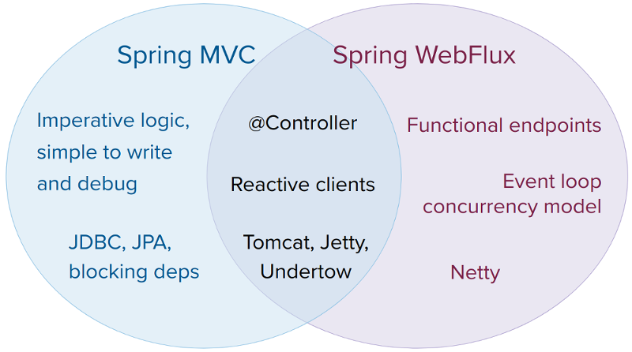

We suggest that you consider the following specific points:

- If you have a Spring MVC application that works fine, there is no need to change.
  Imperative programming is the easiest way to write, understand, and debug code.
  You have maximum choice of libraries, since, historically, most are blocking.
- If you are already shopping for a non-blocking web stack, Spring WebFlux offers the same
  execution model benefits as others in this space and also provides a choice of servers
  (Netty, Tomcat, Jetty, and Servlet containers), a choice of programming models
  (annotated controllers and functional web endpoints), and a choice of reactive libraries
  (Reactor, RxJava, or other).
- If you are interested in a lightweight, functional web framework for use with Java
  or Kotlin, you can use the Spring WebFlux functional web endpoints. That can also be a good choice
  for smaller applications or microservices with less complex requirements that can benefit
  from greater transparency and control.
- In a microservice architecture, you can have a mix of applications with either Spring MVC
  or Spring WebFlux controllers or with Spring WebFlux functional endpoints. Having support
  for the same annotation-based programming model in both frameworks makes it easier to
  re-use knowledge while also selecting the right tool for the right job.
- A simple way to evaluate an application is to check its dependencies. If you have blocking
  persistence APIs (JPA, JDBC) or networking APIs to use, Spring MVC is the best choice
  for common architectures at least. It is technically feasible with both Reactor and
  RxJava to perform blocking calls on a separate thread but you would not be making the
  most of a non-blocking web stack.
- If you have a Spring MVC application with calls to remote services, try the reactive `WebClient`.
  You can return reactive types (Reactor, RxJava, [or other](#web-webflux-reactive-libraries))
  directly from Spring MVC controller methods. The greater the latency per call or the
  interdependency among calls, the more dramatic the benefits. Spring MVC controllers
  can call other reactive components too.
- If you have a large team, keep in mind the steep learning curve in the shift to non-blocking,
  functional, and declarative programming. A practical way to start without a full switch
  is to use the reactive `WebClient`. Beyond that, start small and measure the benefits.
  We expect that, for a wide range of applications, the shift is unnecessary. If you are
  unsure what benefits to look for, start by learning about how non-blocking I/O works
  (for example, concurrency on single-threaded Node.js) and its effects.

<a id="web-webflux-new-framework--webflux-server-choice"></a>
<a id="web-webflux-new-framework--servers"></a>

## Servers

Spring WebFlux is supported on Tomcat, Jetty, Servlet containers, as well as on
non-Servlet runtimes such as Netty. All servers are adapted to a low-level, [common API](#web-webflux-reactive-spring--webflux-httphandler) so that higher-level
[programming models](#web-webflux-new-framework--webflux-programming-models) can be supported across servers.

Spring WebFlux does not have built-in support to start or stop a server. However, it is
easy to [assemble](#web-webflux-reactive-spring--webflux-web-handler-api) an application from Spring configuration and
[WebFlux infrastructure](#web-webflux-dispatcher-handler--webflux-framework-config) and [run it](#web-webflux-reactive-spring--webflux-httphandler) with a few
lines of code.

Spring Boot has a WebFlux starter that automates these steps. By default, the starter uses
Netty, but it is easy to switch to Tomcat, or Jetty by changing your
Maven or Gradle dependencies. Spring Boot defaults to Netty, because it is more widely
used in the asynchronous, non-blocking space and lets a client and a server share resources.

Tomcat and Jetty can be used with both Spring MVC and WebFlux. Keep in mind, however, that
the way they are used is very different. Spring MVC relies on Servlet blocking I/O and
lets applications use the Servlet API directly if they need to. Spring WebFlux
relies on Servlet non-blocking I/O and uses the Servlet API behind a low-level
adapter. It is not exposed for direct use.

> [!NOTE]
> It is strongly advised not to map Servlet filters or directly manipulate the Servlet API in the context of a WebFlux application.
> For the reasons listed above, mixing blocking I/O and non-blocking I/O in the same context will cause runtime issues.

<a id="web-webflux-new-framework--webflux-performance"></a>
<a id="web-webflux-new-framework--performance"></a>

## Performance

Performance has many characteristics and meanings. Reactive and non-blocking generally
do not make applications run faster. They can in some cases – for example, if using the
`WebClient` to run remote calls in parallel. However, it requires more work to do
things the non-blocking way, and that can slightly increase the required processing time.

The key expected benefit of reactive and non-blocking is the ability to scale with a small, fixed number of threads and less memory. That makes applications more resilient under load, because they scale in a more predictable way. In order to observe those benefits, however, you
need to have some latency (including a mix of slow and unpredictable network I/O).
That is where the reactive stack begins to show its strengths, and the differences can be
dramatic.

<a id="web-webflux-new-framework--webflux-concurrency-model"></a>
<a id="web-webflux-new-framework--concurrency-model"></a>

## Concurrency Model

Both Spring MVC and Spring WebFlux support annotated controllers, but there is a key
difference in the concurrency model and the default assumptions for blocking and threads.

In Spring MVC (and servlet applications in general), it is assumed that applications can
block the current thread, (for example, for remote calls). For this reason, servlet containers
use a large thread pool to absorb potential blocking during request handling.

In Spring WebFlux (and non-blocking servers in general), it is assumed that applications
do not block. Therefore, non-blocking servers use a small, fixed-size thread pool
(event loop workers) to handle requests.

> [!TIP]
> “To scale” and “small number of threads” may sound contradictory, but to never block the
> current thread (and rely on callbacks instead) means that you do not need extra threads, as
> there are no blocking calls to absorb.

<a id="web-webflux-new-framework--invoking-a-blocking-api"></a>

### Invoking a Blocking API

What if you do need to use a blocking library? Both Reactor and RxJava provide the
`publishOn` operator to continue processing on a different thread. That means there is an
easy escape hatch. Keep in mind, however, that blocking APIs are not a good fit for
this concurrency model.

<a id="web-webflux-new-framework--mutable-state"></a>

### Mutable State

In Reactor and RxJava, you declare logic through operators. At runtime, a reactive
pipeline is formed where data is processed sequentially, in distinct stages. A key benefit
of this is that it frees applications from having to protect mutable state because
application code within that pipeline is never invoked concurrently.

<a id="web-webflux-new-framework--threading-model"></a>

### Threading Model

What threads should you expect to see on a server running with Spring WebFlux?

- On a “vanilla” Spring WebFlux server (for example, no data access or other optional
  dependencies), you can expect one thread for the server and several others for request
  processing (typically as many as the number of CPU cores). Servlet containers, however,
  may start with more threads (for example, 10 on Tomcat), in support of both servlet (blocking) I/O
  and servlet 3.1 (non-blocking) I/O usage.
- The reactive `WebClient` operates in event loop style. So you can see a small, fixed
  number of processing threads related to that (for example, `reactor-http-nio-` with the Reactor
  Netty connector). However, if Reactor Netty is used for both client and server, the two
  share event loop resources by default.
- Reactor and RxJava provide thread pool abstractions, called schedulers, to use with the
  `publishOn` operator that is used to switch processing to a different thread pool.
  The schedulers have names that suggest a specific concurrency strategy — for example, “parallel”
  (for CPU-bound work with a limited number of threads) or “elastic” (for I/O-bound work with
  a large number of threads). If you see such threads, it means some code is using a
  specific thread pool `Scheduler` strategy.
- Data access libraries and other third party dependencies can also create and use threads
  of their own.

<a id="web-webflux-new-framework--configuring"></a>

### Configuring

The Spring Framework does not provide support for starting and stopping
[servers](#web-webflux-new-framework--webflux-server-choice). To configure the threading model for a server, you need to use server-specific configuration APIs, or, if you use Spring Boot, check the Spring Boot configuration options for each server. You can
[configure](#web-webflux-webclient-client-builder) the `WebClient` directly.
For all other libraries, see their respective documentation.

[Spring WebFlux](#web-webflux)
[Reactive Core](#web-webflux-reactive-spring)

---

<a id="web-webflux-reactive-spring"></a>

<!-- source_url: https://docs.spring.io/spring-framework/reference/web/webflux/reactive-spring.html -->

<!-- page_index: 268 -->

# Reactive Core

<svg enable-background="new 0 0 32 32" id="Glyph" version="1.1" viewbox="0 0 32 32" xml:space="preserve" xmlns="http://www.w3.org/2000/svg" xmlns:xlink="http://www.w3.org/1999/xlink">
<path id="XMLID_223_"></path>
</svg>

Search

<a id="web-webflux-reactive-spring--page-title"></a>
<a id="web-webflux-reactive-spring--reactive-core"></a>

# Reactive Core

The `spring-web` module contains the following foundational support for reactive web
applications:

- For server request processing there are two levels of support.

  
- [HttpHandler](#web-webflux-reactive-spring--webflux-httphandler): Basic contract for HTTP request handling with
    non-blocking I/O and Reactive Streams back pressure, along with adapters for Reactor Netty,
    Tomcat, Jetty, and any Servlet container.
  
- [`WebHandler` API](#web-webflux-reactive-spring--webflux-web-handler-api): Slightly higher level, general-purpose web API for
    request handling, on top of which concrete programming models such as annotated
    controllers and functional endpoints are built.
- For the client side, there is a basic `ClientHttpConnector` contract to perform HTTP
  requests with non-blocking I/O and Reactive Streams back pressure, along with adapters for
  [Reactor Netty](https://github.com/reactor/reactor-netty), reactive
  [Jetty HttpClient](https://github.com/jetty-project/jetty-reactive-httpclient)
  and [Apache HttpComponents](https://hc.apache.org/).
  The higher level [WebClient](#web-webflux-webclient) used in applications
  builds on this basic contract.
- For client and server, [codecs](#web-webflux-reactive-spring--webflux-codecs) for serialization and
  deserialization of HTTP request and response content.

<a id="web-webflux-reactive-spring--webflux-httphandler"></a>
<a id="web-webflux-reactive-spring--httphandler"></a>

## `HttpHandler`

[HttpHandler](https://docs.spring.io/spring-framework/docs/7.0.8/javadoc-api/org/springframework/http/server/reactive/HttpHandler.html)
is a simple contract with a single method to handle a request and a response. It is
intentionally minimal, and its main and only purpose is to be a minimal abstraction
over different HTTP server APIs.

The following table describes the supported server APIs:

| Server name | Server API used | Reactive Streams support |
| --- | --- | --- |
| Netty | Netty API | [Reactor Netty](https://github.com/reactor/reactor-netty) |
| Tomcat | Servlet non-blocking I/O; Tomcat API to read and write ByteBuffers vs byte[] | spring-web: Servlet non-blocking I/O to Reactive Streams bridge |
| Jetty | Servlet non-blocking I/O; Jetty API to write ByteBuffers vs byte[] | spring-web: Servlet non-blocking I/O to Reactive Streams bridge |
| Servlet container | Servlet non-blocking I/O | spring-web: Servlet non-blocking I/O to Reactive Streams bridge |

The following table describes server dependencies (also see
[supported versions](https://github.com/spring-projects/spring-framework/wiki/What%27s-New-in-the-Spring-Framework)):

| Server name | Group id | Artifact name |
| --- | --- | --- |
| Reactor Netty | io.projectreactor.netty | reactor-netty |
| Tomcat | org.apache.tomcat.embed | tomcat-embed-core |
| Jetty | org.eclipse.jetty | jetty-server, jetty-servlet |

The code snippets below show using the `HttpHandler` adapters with each server API.

**Reactor Netty**

- Java
- Kotlin

```java
HttpHandler handler = ...
ReactorHttpHandlerAdapter adapter = new ReactorHttpHandlerAdapter(handler);
HttpServer.create().host(host).port(port).handle(adapter).bindNow();
```

```kotlin
val handler: HttpHandler = ...
val adapter = ReactorHttpHandlerAdapter(handler)
HttpServer.create().host(host).port(port).handle(adapter).bindNow()
```

**Tomcat**

- Java
- Kotlin

```java
HttpHandler handler = ...
Servlet servlet = new TomcatHttpHandlerAdapter(handler);

Tomcat server = new Tomcat();
File base = new File(System.getProperty("java.io.tmpdir"));
Context rootContext = server.addContext("", base.getAbsolutePath());
Tomcat.addServlet(rootContext, "main", servlet);
rootContext.addServletMappingDecoded("/", "main");
server.setHost(host);
server.setPort(port);
server.start();
```

```kotlin
val handler: HttpHandler = ...
val servlet = TomcatHttpHandlerAdapter(handler)

val server = Tomcat()
val base = File(System.getProperty("java.io.tmpdir"))
val rootContext = server.addContext("", base.absolutePath)
Tomcat.addServlet(rootContext, "main", servlet)
rootContext.addServletMappingDecoded("/", "main")
server.host = host
server.setPort(port)
server.start()
```

**Jetty**

- Java
- Kotlin

```java
HttpHandler handler = ...
JettyCoreHttpHandlerAdapter adapter = new JettyCoreHttpHandlerAdapter(handler);

Server server = new Server();
server.setHandler(adapter);

ServerConnector connector = new ServerConnector(server);
connector.setHost(host);
connector.setPort(port);
server.addConnector(connector);

server.start();
```

```kotlin
val handler: HttpHandler = ...
val adapter = JettyCoreHttpHandlerAdapter(handler)

val server = Server()
server.setHandler(adapter)

val connector = ServerConnector(server)
connector.host = host
connector.port = port
server.addConnector(connector)

server.start()
```

> [!TIP]
> In Spring Framework 6.2, `JettyHttpHandlerAdapter` was deprecated in favor of
> `JettyCoreHttpHandlerAdapter`, which integrates directly with Jetty 12 APIs
> without a Servlet layer.

To deploy as a WAR to a Servlet container instead, use
[`AbstractReactiveWebInitializer`](https://docs.spring.io/spring-framework/docs/7.0.8/javadoc-api/org/springframework/web/server/adapter/AbstractReactiveWebInitializer.html), to adapt `HttpHandler` to a `Servlet` via `ServletHttpHandlerAdapter`.

<a id="web-webflux-reactive-spring--webflux-web-handler-api"></a>
<a id="web-webflux-reactive-spring--webhandler-api"></a>

## `WebHandler` API

The `org.springframework.web.server` package builds on the
[`HttpHandler`](#web-webflux-reactive-spring--webflux-httphandler) contract
to provide a general-purpose web API for processing requests through a chain of multiple
[`WebExceptionHandler`](https://docs.spring.io/spring-framework/docs/7.0.8/javadoc-api/org/springframework/web/server/WebExceptionHandler.html), multiple
[`WebFilter`](https://docs.spring.io/spring-framework/docs/7.0.8/javadoc-api/org/springframework/web/server/WebFilter.html), and a single
[`WebHandler`](https://docs.spring.io/spring-framework/docs/7.0.8/javadoc-api/org/springframework/web/server/WebHandler.html) component. The chain can
be put together with `WebHttpHandlerBuilder` by simply pointing to a Spring
`ApplicationContext` where components are
[auto-detected](#web-webflux-reactive-spring--webflux-web-handler-api-special-beans), and/or by registering components
with the builder.

While `HttpHandler` has a simple goal to abstract the use of different HTTP servers, the
`WebHandler` API aims to provide a broader set of features commonly used in web applications
such as:

- User session with attributes.
- Request attributes.
- Resolved `Locale` or `Principal` for the request.
- Access to parsed and cached form data.
- Abstractions for multipart data.
- and more..

<a id="web-webflux-reactive-spring--webflux-web-handler-api-special-beans"></a>
<a id="web-webflux-reactive-spring--special-bean-types"></a>

### Special bean types

The table below lists the components that `WebHttpHandlerBuilder` can auto-detect in a
Spring ApplicationContext, or that can be registered directly with it:

| Bean name | Bean type | Count | Description |
| --- | --- | --- | --- |
| <any> | `WebExceptionHandler` | 0..N | Provide handling for exceptions from the chain of `WebFilter` instances and the target `WebHandler`. For more details, see [Exceptions](#web-webflux-reactive-spring--webflux-exception-handler). |
| <any> | `WebFilter` | 0..N | Apply interception style logic to before and after the rest of the filter chain and the target `WebHandler`. For more details, see [Filters](#web-webflux-reactive-spring--webflux-filters). |
| `webHandler` | `WebHandler` | 1 | The handler for the request. |
| `webSessionManager` | `WebSessionManager` | 0..1 | The manager for `WebSession` instances exposed through a method on `ServerWebExchange`. `DefaultWebSessionManager` by default. |
| `serverCodecConfigurer` | `ServerCodecConfigurer` | 0..1 | For access to `HttpMessageReader` instances for parsing form data and multipart data that is then exposed through methods on `ServerWebExchange`. `ServerCodecConfigurer.create()` by default. |
| `localeContextResolver` | `LocaleContextResolver` | 0..1 | The resolver for `LocaleContext` exposed through a method on `ServerWebExchange`. `AcceptHeaderLocaleContextResolver` by default. |
| `forwardedHeaderTransformer` | `ForwardedHeaderTransformer` | 0..1 | For processing forwarded type headers, either by extracting and removing them or by removing them only. Not used by default. |

<a id="web-webflux-reactive-spring--webflux-form-data"></a>
<a id="web-webflux-reactive-spring--form-data"></a>

### Form Data

`ServerWebExchange` exposes the following method for accessing form data:

- Java
- Kotlin

```java
Mono<MultiValueMap<String, String>> getFormData();
```

```Kotlin
suspend fun getFormData(): MultiValueMap<String, String>
```

The `DefaultServerWebExchange` uses the configured `HttpMessageReader` to parse form data
(`application/x-www-form-urlencoded`) into a `MultiValueMap`. By default, `FormHttpMessageReader` is configured for use by the `ServerCodecConfigurer` bean
(see the [Web Handler API](#web-webflux-reactive-spring--webflux-web-handler-api)).

<a id="web-webflux-reactive-spring--webflux-multipart"></a>
<a id="web-webflux-reactive-spring--multipart-data"></a>

### Multipart Data

[See equivalent in the Servlet stack](#web-webmvc-mvc-servlet-multipart)

`ServerWebExchange` exposes the following method for accessing multipart data:

- Java
- Kotlin

```java
Mono<MultiValueMap<String, Part>> getMultipartData();
```

```Kotlin
suspend fun getMultipartData(): MultiValueMap<String, Part>
```

The `DefaultServerWebExchange` uses the configured
`HttpMessageReader<MultiValueMap<String, Part>>` to parse `multipart/form-data`, `multipart/mixed`, and `multipart/related` content into a `MultiValueMap`.
By default, this is the `DefaultPartHttpMessageReader`, which does not have any third-party
dependencies.
Alternatively, the `SynchronossPartHttpMessageReader` can be used, which is based on the
[Synchronoss NIO Multipart](https://github.com/synchronoss/nio-multipart) library.
Both are configured through the `ServerCodecConfigurer` bean
(see the [Web Handler API](#web-webflux-reactive-spring--webflux-web-handler-api)).

To parse multipart data in streaming fashion, you can use the `Flux<PartEvent>` returned from the
`PartEventHttpMessageReader` instead of using `@RequestPart`, as that implies `Map`-like access
to individual parts by name and, hence, requires parsing multipart data in full.
By contrast, you can use `@RequestBody` to decode the content to `Flux<PartEvent>` without
collecting to a `MultiValueMap`.

<a id="web-webflux-reactive-spring--webflux-forwarded-headers"></a>
<a id="web-webflux-reactive-spring--forwarded-headers"></a>

### Forwarded Headers

[See equivalent in the Servlet stack](#web-webmvc-filters--filters-forwarded-headers)

As a request goes through proxies such as load balancers the host, port, and
scheme may change, and that makes it a challenge to create links that point to the correct
host, port, and scheme from a client perspective.

[RFC 7239](https://datatracker.ietf.org/doc/html/rfc7239) defines the `Forwarded` HTTP header
that proxies can use to provide information about the original request.

<a id="web-webflux-reactive-spring--forwarded-headers-non-standard"></a>
<a id="web-webflux-reactive-spring--non-standard-headers"></a>

### Non-standard Headers

There are other non-standard headers, too, including `X-Forwarded-Host`, `X-Forwarded-Port`, `X-Forwarded-Proto`, `X-Forwarded-Ssl`, `X-Forwarded-Prefix`, and `X-Forwarded-For`.

<a id="web-webflux-reactive-spring--x-forwarded-host"></a>

#### X-Forwarded-Host

While not standard, [`X-Forwarded-Host: <host>`](https://developer.mozilla.org/en-US/docs/Web/HTTP/Headers/X-Forwarded-Host)
is a de-facto standard header that is used to communicate the original host to a
downstream server. For example, if a request of `example.com/resource` is sent to
a proxy which forwards the request to `localhost:8080/resource`, then a header of
`X-Forwarded-Host: example.com` can be sent to inform the server that the original host was `example.com`.

<a id="web-webflux-reactive-spring--x-forwarded-port"></a>

#### X-Forwarded-Port

While not standard, `X-Forwarded-Port: <port>` is a de-facto standard header that is used to
communicate the original port to a downstream server. For example, if a request of
`example.com/resource` is sent to a proxy which forwards the request to
`localhost:8080/resource`, then a header of `X-Forwarded-Port: 443` can be sent
to inform the server that the original port was `443`.

<a id="web-webflux-reactive-spring--x-forwarded-proto"></a>

#### X-Forwarded-Proto

While not standard, [`X-Forwarded-Proto: (https|http)`](https://developer.mozilla.org/en-US/docs/Web/HTTP/Headers/X-Forwarded-Proto)
is a de-facto standard header that is used to communicate the original protocol (for example, https / http)
to a downstream server. For example, if a request of `example.com/resource` is sent to
a proxy which forwards the request to `localhost:8080/resource`, then a header of
`X-Forwarded-Proto: https` can be sent to inform the server that the original protocol was `https`.

<a id="web-webflux-reactive-spring--x-forwarded-ssl"></a>

#### X-Forwarded-Ssl

While not standard, `X-Forwarded-Ssl: (on|off)` is a de-facto standard header that is used to communicate the
original protocol (for example, https / https) to a downstream server. For example, if a request of
`example.com/resource` is sent to a proxy which forwards the request to
`localhost:8080/resource`, then a header of `X-Forwarded-Ssl: on` to inform the server that the
original protocol was `https`.

<a id="web-webflux-reactive-spring--x-forwarded-prefix"></a>

#### X-Forwarded-Prefix

While not standard, [`X-Forwarded-Prefix: <prefix>`](https://microsoft.github.io/reverse-proxy/articles/transforms.html#defaults)
is a de-facto standard header that is used to communicate the original URL path prefix to a
downstream server.

Use of `X-Forwarded-Prefix` can vary by deployment scenario, and needs to be flexible to
allow replacing, removing, or prepending the path prefix of the target server.

*Scenario 1: Override path prefix*

```
https://example.com/api/{path} -> http://localhost:8080/app1/{path}
```

The prefix is the start of the path before the capture group `{path}`. For the proxy, the prefix is `/api` while for the server the prefix is `/app1`. In this case, the proxy
can send `X-Forwarded-Prefix: /api` to have the original prefix `/api` override the
server prefix `/app1`.

*Scenario 2: Remove path prefix*

At times, an application may want to have the prefix removed. For example, consider the
following proxy to server mapping:

```
https://app1.example.com/{path} -> http://localhost:8080/app1/{path}
https://app2.example.com/{path} -> http://localhost:8080/app2/{path}
```

The proxy has no prefix, while applications `app1` and `app2` have path prefixes
`/app1` and `/app2` respectively. The proxy can send `X-Forwarded-Prefix:`  to
have the empty prefix override server prefixes `/app1` and `/app2`.

> [!NOTE]
> A common case for this deployment scenario is where licenses are paid per
> production application server, and it is preferable to deploy multiple applications per
> server to reduce fees. Another reason is to run more applications on the same server in
> order to share the resources required by the server to run.
>
> In these scenarios, applications need a non-empty context root because there are multiple
> applications on the same server. However, this should not be visible in URL paths of
> the public API where applications may use different subdomains that provides benefits
> such as:
>
> - Added security, for example, same origin policy
> - Independent scaling of applications (different domain points to different IP address)

*Scenario 3: Insert path prefix*

In other cases, it may be necessary to prepend a prefix. For example, consider the
following proxy to server mapping:

```
https://example.com/api/app1/{path} -> http://localhost:8080/app1/{path}
```

In this case, the proxy has a prefix of `/api/app1` and the server has a prefix of
`/app1`. The proxy can send `X-Forwarded-Prefix: /api/app1` to have the original prefix
`/api/app1` override the server prefix `/app1`.

<a id="web-webflux-reactive-spring--x-forwarded-for"></a>

#### X-Forwarded-For

[`X-Forwarded-For: <address>`](https://developer.mozilla.org/en-US/docs/Web/HTTP/Reference/Headers/X-Forwarded-For)
is a de-facto standard header that is used to communicate the original `InetSocketAddress` of the client to a
downstream server. For example, if a request is sent by a client at `[fd00:fefe:1::4]` to a proxy at
`192.168.0.1`, the "remote address" information contained in the HTTP request will reflect the actual address of the
client, not the proxy.

<a id="web-webflux-reactive-spring--webflux-forwarded-headers-transformer"></a>
<a id="web-webflux-reactive-spring--forwardedheadertransformer"></a>

### ForwardedHeaderTransformer

`ForwardedHeaderTransformer` is a component that modifies the host, port, and scheme of
the request, based on forwarded headers, and then removes those headers. If you declare
it as a bean with the name `forwardedHeaderTransformer`, it will be
[detected](#web-webflux-reactive-spring--webflux-web-handler-api-special-beans) and used.

<a id="web-webflux-reactive-spring--webflux-forwarded-headers-security"></a>
<a id="web-webflux-reactive-spring--security-considerations"></a>

### Security Considerations

There are security considerations for forwarded headers since an application cannot know
if the headers were added by a proxy, as intended, or by a malicious client. This is why
a proxy at the boundary of trust should be configured to remove untrusted forwarded traffic coming
from the outside. You can also configure the `ForwardedHeaderTransformer` with
`removeOnly=true`, in which case it removes but does not use the headers.

<a id="web-webflux-reactive-spring--webflux-filters"></a>
<a id="web-webflux-reactive-spring--filters"></a>

## Filters

[See equivalent in the Servlet stack](#web-webmvc-filters)

In the [`WebHandler` API](#web-webflux-reactive-spring--webflux-web-handler-api), you can use a `WebFilter` to apply interception-style
logic before and after the rest of the processing chain of filters and the target
`WebHandler`. When using the [WebFlux Config](#web-webflux-dispatcher-handler--webflux-framework-config), registering a `WebFilter` is as simple
as declaring it as a Spring bean and (optionally) expressing precedence by using `@Order` on
the bean declaration or by implementing `Ordered`.

<a id="web-webflux-reactive-spring--webflux-filters-cors"></a>
<a id="web-webflux-reactive-spring--cors"></a>

### CORS

[See equivalent in the Servlet stack](#web-webmvc-filters--filters-cors)

Spring WebFlux provides fine-grained support for CORS configuration through annotations on
controllers. However, when you use it with Spring Security, we advise relying on the built-in
`CorsFilter`, which must be ordered ahead of Spring Security’s chain of filters.

See the section on [CORS](#web-webflux-cors) and the [CORS `WebFilter`](#web-webflux-cors--webflux-cors-webfilter) for more details.

<a id="web-webflux-reactive-spring--filters.url-handler"></a>
<a id="web-webflux-reactive-spring--url-handler"></a>

### URL Handler

[See equivalent in the Servlet stack](#web-webmvc-filters--filters.url-handler)

You may want your controller endpoints to match routes with or without a trailing slash in the URL path.
For example, both "GET /home" and "GET /home/" should be handled by a controller method annotated with `@GetMapping("/home")`.

Spring provides `UrlHandlerFilter` that removes the trailing slash from URL paths to ensure a consistent view of paths with or without a trailing slash.
This is important to avoid a mismatch between URL-based authorization decisions and web framework request mappings.
The filter can remove the trailing slash in one of a couple of ways:

- respond with an HTTP redirect status that sends clients to the same path without a trailing slash.
- mutate the request to remove the trailing slash.

Here is how you can instantiate and configure a `UrlHandlerFilter` for a blog application:

- Java
- Kotlin

```java
UrlHandlerFilter urlHandlerFilter = UrlHandlerFilter
		// will HTTP 308 redirect "/blog/my-blog-post/" -> "/blog/my-blog-post"
		.trailingSlashHandler("/blog/**").redirect(HttpStatus.PERMANENT_REDIRECT)
		// will mutate the request to "/admin/user/account/" and make it as "/admin/user/account"
		.trailingSlashHandler("/admin/**").mutateRequest()
		.build();
```

```kotlin
val urlHandlerFilter = UrlHandlerFilter
	// will HTTP 308 redirect "/blog/my-blog-post/" -> "/blog/my-blog-post"
	.trailingSlashHandler("/blog/**").redirect(HttpStatus.PERMANENT_REDIRECT)
	// will mutate the request to "/admin/user/account/" and make it as "/admin/user/account"
	.trailingSlashHandler("/admin/**").mutateRequest()
	.build()
```

Keep in mind the following:

- the root path `"/"` is excluded from trailing slash handling.
- `@RequestMapping("/")` adds a trailing slash to a type-level mapping, and therefore will
  not map when trailing slash handling applies; use `@RequestMapping` (no path attribute) instead.

<a id="web-webflux-reactive-spring--webflux-exception-handler"></a>
<a id="web-webflux-reactive-spring--exceptions"></a>

## Exceptions

[See equivalent in the Servlet stack](#web-webmvc-mvc-servlet-exceptionhandlers--mvc-ann-customer-servlet-container-error-page)

In the [`WebHandler` API](#web-webflux-reactive-spring--webflux-web-handler-api), you can use a `WebExceptionHandler` to handle
exceptions from the chain of `WebFilter` instances and the target `WebHandler`. When using the
[WebFlux Config](#web-webflux-dispatcher-handler--webflux-framework-config), registering a `WebExceptionHandler` is as simple as declaring it as a
Spring bean and (optionally) expressing precedence by using `@Order` on the bean declaration or
by implementing `Ordered`.

The following table describes the available `WebExceptionHandler` implementations:

| Exception Handler | Description |
| --- | --- |
| `ResponseStatusExceptionHandler` | Provides handling for exceptions of type [`ResponseStatusException`](https://docs.spring.io/spring-framework/docs/7.0.8/javadoc-api/org/springframework/web/server/ResponseStatusException.html) by setting the response to the HTTP status code of the exception. |
| `WebFluxResponseStatusExceptionHandler` | Extension of `ResponseStatusExceptionHandler` that can also determine the HTTP status code of a `@ResponseStatus` annotation on any exception. This handler is declared in the [WebFlux Config](#web-webflux-dispatcher-handler--webflux-framework-config). |

<a id="web-webflux-reactive-spring--webflux-codecs"></a>
<a id="web-webflux-reactive-spring--codecs"></a>

## Codecs

[See equivalent in the Servlet stack](#web-webmvc-message-converters--message-converters)

The `spring-web` and `spring-core` modules provide support for serializing and
deserializing byte content to and from higher level objects through non-blocking I/O with
Reactive Streams back pressure. The following describes this support:

- [`Encoder`](https://docs.spring.io/spring-framework/docs/7.0.8/javadoc-api/org/springframework/core/codec/Encoder.html) and
  [`Decoder`](https://docs.spring.io/spring-framework/docs/7.0.8/javadoc-api/org/springframework/core/codec/Decoder.html) are low level contracts to
  encode and decode content independent of HTTP.
- [`HttpMessageReader`](https://docs.spring.io/spring-framework/docs/7.0.8/javadoc-api/org/springframework/http/codec/HttpMessageReader.html) and
  [`HttpMessageWriter`](https://docs.spring.io/spring-framework/docs/7.0.8/javadoc-api/org/springframework/http/codec/HttpMessageWriter.html) are contracts
  to encode and decode HTTP message content.
- An `Encoder` can be wrapped with `EncoderHttpMessageWriter` to adapt it for use in a web
  application, while a `Decoder` can be wrapped with `DecoderHttpMessageReader`.
- [`DataBuffer`](https://docs.spring.io/spring-framework/docs/7.0.8/javadoc-api/org/springframework/core/io/buffer/DataBuffer.html) abstracts different
  byte buffer representations (for example, Netty `ByteBuf`, `java.nio.ByteBuffer`, etc.) and is
  what all codecs work on. See [Data Buffers and Codecs](#core-databuffer-codec) in the
  "Spring Core" section for more on this topic.

The `spring-core` module provides `byte[]`, `ByteBuffer`, `DataBuffer`, `Resource`, and
`String` encoder and decoder implementations. The `spring-web` module provides Jackson
JSON, Jackson Smile, JAXB2, Protocol Buffers and other encoders and decoders along with
web-only HTTP message reader and writer implementations for form data, multipart content, server-sent events, and others.

`ClientCodecConfigurer` and `ServerCodecConfigurer` are typically used to configure and
customize the codecs to use in an application. See the section on configuring
[HTTP message codecs](#web-webflux-config--webflux-config-message-codecs).

<a id="web-webflux-reactive-spring--webflux-codecs-jackson"></a>
<a id="web-webflux-reactive-spring--jackson-json"></a>

### Jackson JSON

JSON and binary JSON ([Smile](https://github.com/FasterXML/smile-format-specification)) are
both supported when the Jackson library is present.

The `JacksonJsonDecoder` works as follows:

- Jackson’s asynchronous, non-blocking parser is used to aggregate a stream of byte chunks
  into `TokenBuffer`'s each representing a JSON object.
- Each `TokenBuffer` is passed to Jackson’s `JsonMapper` to create a higher level object.
- When decoding to a single-value publisher (for example, `Mono`), there is one `TokenBuffer`.
- When decoding to a multi-value publisher (for example, `Flux`), each `TokenBuffer` is passed to
  the `JsonMapper` as soon as enough bytes are received for a fully formed object. The
  input content can be a JSON array, or any
  [line-delimited JSON](https://en.wikipedia.org/wiki/JSON_streaming) format such as NDJSON,
  JSON Lines, or JSON Text Sequences.

The `JacksonJsonEncoder` works as follows:

- For a single value publisher (for example, `Mono`), simply serialize it through the
  `JsonMapper`.
- For a multi-value publisher with `application/json`, by default collect the values with
  `Flux#collectToList()` and then serialize the resulting collection.
- For a multi-value publisher with a streaming media type such as
  `application/x-ndjson` or `application/stream+x-jackson-smile`, encode, write, and
  flush each value individually using a
  [line-delimited JSON](https://en.wikipedia.org/wiki/JSON_streaming) format. Other
  streaming media types may be registered with the encoder.
- For SSE the `JacksonJsonEncoder` is invoked per event and the output is flushed to ensure
  delivery without delay.

> [!NOTE]
> By default both `JacksonJsonEncoder` and `JacksonJsonDecoder` do not support elements of type
> `String`. Instead the default assumption is that a string or a sequence of strings
> represent serialized JSON content, to be rendered by the `CharSequenceEncoder`. If what
> you need is to render a JSON array from `Flux<String>`, use `Flux#collectToList()` and
> encode a `Mono<List<String>>`.

<a id="web-webflux-reactive-spring--webflux-codecs-forms"></a>
<a id="web-webflux-reactive-spring--form-data-2"></a>

### Form Data

`FormHttpMessageReader` and `FormHttpMessageWriter` support decoding and encoding
`application/x-www-form-urlencoded` content.

On the server side where form content often needs to be accessed from multiple places, `ServerWebExchange` provides a dedicated `getFormData()` method that parses the content
through `FormHttpMessageReader` and then caches the result for repeated access.
See [Form Data](#web-webflux-reactive-spring--webflux-form-data) in the
[`WebHandler` API](#web-webflux-reactive-spring--webflux-web-handler-api) section.

Once `getFormData()` is used, the original raw content can no longer be read from the
request body. For this reason, applications are expected to go through `ServerWebExchange`
consistently for access to the cached form data versus reading from the raw request body.

<a id="web-webflux-reactive-spring--webflux-codecs-multipart"></a>
<a id="web-webflux-reactive-spring--multipart"></a>

### Multipart

`MultipartHttpMessageReader` and `MultipartHttpMessageWriter` support decoding and
encoding "multipart/form-data", "multipart/mixed", and "multipart/related" content.
In turn `MultipartHttpMessageReader` delegates to another `HttpMessageReader`
for the actual parsing to a `Flux<Part>` and then simply collects the parts into a `MultiValueMap`.
By default, the `DefaultPartHttpMessageReader` is used, but this can be changed through the
`ServerCodecConfigurer`.
For more information about the `DefaultPartHttpMessageReader`, refer to the
[javadoc of `DefaultPartHttpMessageReader`](https://docs.spring.io/spring-framework/docs/7.0.8/javadoc-api/org/springframework/http/codec/multipart/DefaultPartHttpMessageReader.html).

On the server side where multipart form content may need to be accessed from multiple
places, `ServerWebExchange` provides a dedicated `getMultipartData()` method that parses
the content through `MultipartHttpMessageReader` and then caches the result for repeated access.
See [Multipart Data](#web-webflux-reactive-spring--webflux-multipart) in the
[`WebHandler` API](#web-webflux-reactive-spring--webflux-web-handler-api) section.

Once `getMultipartData()` is used, the original raw content can no longer be read from the
request body. For this reason applications have to consistently use `getMultipartData()`
for repeated, map-like access to parts, or otherwise rely on the
`SynchronossPartHttpMessageReader` for a one-time access to `Flux<Part>`.

<a id="web-webflux-reactive-spring--webflux-codecs-protobuf"></a>
<a id="web-webflux-reactive-spring--protocol-buffers"></a>

### Protocol Buffers

`ProtobufEncoder` and `ProtobufDecoder` supporting decoding and encoding "application/x-protobuf", "application/octet-stream"
and "application/vnd.google.protobuf" content for `com.google.protobuf.Message` types. They also support stream of values
if content is received/sent with the "delimited" parameter along the content type (like "application/x-protobuf;delimited=true").
This requires the "com.google.protobuf:protobuf-java" library, version 3.29 and higher.

The `ProtobufJsonDecoder` and `ProtobufJsonEncoder` variants support reading and writing JSON documents to and from Protobuf messages.
They require the "com.google.protobuf:protobuf-java-util" dependency. Note, the JSON variants do not support reading stream of messages, see the [javadoc of `ProtobufJsonDecoder`](https://docs.spring.io/spring-framework/docs/7.0.8/javadoc-api/org/springframework/http/codec/protobuf/ProtobufJsonDecoder.html) for more details.

<a id="web-webflux-reactive-spring--webflux-codecs-gson"></a>
<a id="web-webflux-reactive-spring--google-gson"></a>

### Google Gson

Applications can use the `GsonEncoder` and `GsonDecoder` to serialize and deserialize JSON documents thanks to the [Google Gson](https://google.github.io/gson/) library .
This codec supports both JSON media types and the NDJSON format for streaming.

> [!NOTE]
> `Gson` does not support non-blocking parsing, so the `GsonDecoder` does not support deserializing
> to `Flux<*>` types. For example, if this decoder is used for deserializing a JSON stream or even a list of elements
> as a `Flux<*>`, an `UnsupportedOperationException` will be thrown at runtime.
> Applications should instead focus on deserializing bounded collections and use `Mono<List<*>>` as target types.

<a id="web-webflux-reactive-spring--webflux-codecs-limits"></a>
<a id="web-webflux-reactive-spring--limits"></a>

### Limits

`Decoder` and `HttpMessageReader` implementations that buffer some or all of the input
stream can be configured with a limit on the maximum number of bytes to buffer in memory.
In some cases buffering occurs because input is aggregated and represented as a single
object — for example, a controller method with `@RequestBody byte[]`, `x-www-form-urlencoded` data, and so on. Buffering can also occur with streaming, when
splitting the input stream — for example, delimited text, a stream of JSON objects, and
so on. For those streaming cases, the limit applies to the number of bytes associated
with one object in the stream.

To configure buffer sizes, you can check if a given `Decoder` or `HttpMessageReader`
exposes a `maxInMemorySize` property and if so the Javadoc will have details about default
values. On the server side, `ServerCodecConfigurer` provides a single place from where to
set all codecs, see [HTTP message codecs](#web-webflux-config--webflux-config-message-codecs). On the client side, the limit for
all codecs can be changed in
[WebClient.Builder](#web-webflux-webclient-client-builder--webflux-client-builder-maxinmemorysize).

For [Multipart parsing](#web-webflux-reactive-spring--webflux-codecs-multipart) the `maxInMemorySize` property limits
the size of non-file parts. For file parts, it determines the threshold at which the part
is written to disk. For file parts written to disk, there is an additional
`maxDiskUsagePerPart` property to limit the amount of disk space per part. There is also
a `maxParts` property to limit the overall number of parts in a multipart request.
To configure all three in WebFlux, you’ll need to supply a pre-configured instance of
`MultipartHttpMessageReader` to `ServerCodecConfigurer`.

<a id="web-webflux-reactive-spring--webflux-codecs-streaming"></a>
<a id="web-webflux-reactive-spring--streaming"></a>

### Streaming

[See equivalent in the Servlet stack](#web-webmvc-mvc-ann-async--mvc-ann-async-http-streaming)

When streaming to the HTTP response (for example, `text/event-stream`, `application/x-ndjson`), it is important to send data periodically, in order to
reliably detect a disconnected client sooner rather than later. Such a send could be a
comment-only, empty SSE event or any other "no-op" data that would effectively serve as
a heartbeat.

<a id="web-webflux-reactive-spring--webflux-codecs-buffers"></a>
<a id="web-webflux-reactive-spring--databuffer"></a>

### `DataBuffer`

`DataBuffer` is the representation for a byte buffer in WebFlux. The Spring Core part of
this reference has more on that in the section on
[Data Buffers and Codecs](#core-databuffer-codec). The key point to understand is that on some
servers like Netty, byte buffers are pooled and reference counted, and must be released
when consumed to avoid memory leaks.

WebFlux applications generally do not need to be concerned with such issues, unless they
consume or produce data buffers directly, as opposed to relying on codecs to convert to
and from higher level objects, or unless they choose to create custom codecs. For such
cases please review the information in [Data Buffers and Codecs](#core-databuffer-codec), especially the section on [Using DataBuffer](#core-databuffer-codec--databuffers-using).

<a id="web-webflux-reactive-spring--webflux-logging"></a>
<a id="web-webflux-reactive-spring--logging"></a>

## Logging

[See equivalent in the Servlet stack](#web-webmvc-mvc-servlet-logging)

`DEBUG` level logging in Spring WebFlux is designed to be compact, minimal, and
human-friendly. It focuses on high value bits of information that are useful over and
over again vs others that are useful only when debugging a specific issue.

`TRACE` level logging generally follows the same principles as `DEBUG` (and for example also
should not be a firehose) but can be used for debugging any issue. In addition, some log
messages may show a different level of detail at `TRACE` vs `DEBUG`.

Good logging comes from the experience of using the logs. If you spot anything that does
not meet the stated goals, please let us know.

<a id="web-webflux-reactive-spring--webflux-logging-id"></a>
<a id="web-webflux-reactive-spring--log-id"></a>

### Log Id

In WebFlux, a single request can be run over multiple threads and the thread ID
is not useful for correlating log messages that belong to a specific request. This is why
WebFlux log messages are prefixed with a request-specific ID by default.

On the server side, the log ID is stored in the `ServerWebExchange` attribute
([`LOG_ID_ATTRIBUTE`](https://docs.spring.io/spring-framework/docs/7.0.8/javadoc-api/org/springframework/web/server/ServerWebExchange.html#LOG_ID_ATTRIBUTE)), while a fully formatted prefix based on that ID is available from
`ServerWebExchange#getLogPrefix()`. On the `WebClient` side, the log ID is stored in the
`ClientRequest` attribute
([`LOG_ID_ATTRIBUTE`](https://docs.spring.io/spring-framework/docs/7.0.8/javadoc-api/org/springframework/web/reactive/function/client/ClientRequest.html#LOG_ID_ATTRIBUTE))
,while a fully formatted prefix is available from `ClientRequest#logPrefix()`.

<a id="web-webflux-reactive-spring--webflux-logging-sensitive-data"></a>
<a id="web-webflux-reactive-spring--sensitive-data"></a>

### Sensitive Data

[See equivalent in the Servlet stack](#web-webmvc-mvc-servlet-logging--mvc-logging-sensitive-data)

`DEBUG` and `TRACE` logging can log sensitive information. This is why form parameters and
headers are masked by default and you must explicitly enable their logging in full.

The following example shows how to do so for server-side requests:

- Java
- Kotlin

```java
@Configuration class MyConfig implements WebFluxConfigurer {
@Override public void configureHttpMessageCodecs(ServerCodecConfigurer configurer) {configurer.defaultCodecs().enableLoggingRequestDetails(true);}}
```

```kotlin
@Configuration
class MyConfig : WebFluxConfigurer {

	override fun configureHttpMessageCodecs(configurer: ServerCodecConfigurer) {
		configurer.defaultCodecs().enableLoggingRequestDetails(true)
	}
}
```

The following example shows how to do so for client-side requests:

- Java
- Kotlin

```java
Consumer<ClientCodecConfigurer> consumer = configurer ->
		configurer.defaultCodecs().enableLoggingRequestDetails(true);

WebClient webClient = WebClient.builder()
		.exchangeStrategies(strategies -> strategies.codecs(consumer))
		.build();
```

```kotlin
val consumer: (ClientCodecConfigurer) -> Unit  = { configurer -> configurer.defaultCodecs().enableLoggingRequestDetails(true) }

val webClient = WebClient.builder()
		.exchangeStrategies({ strategies -> strategies.codecs(consumer) })
		.build()
```

<a id="web-webflux-reactive-spring--webflux-logging-appenders"></a>
<a id="web-webflux-reactive-spring--appenders"></a>

### Appenders

Logging libraries such as SLF4J and Log4J 2 provide asynchronous loggers that avoid
blocking. While those have their own drawbacks such as potentially dropping messages
that could not be queued for logging, they are the best available options currently
for use in a reactive, non-blocking application.

<a id="web-webflux-reactive-spring--webflux-codecs-custom"></a>
<a id="web-webflux-reactive-spring--custom-codecs"></a>

### Custom codecs

Applications can register custom codecs for supporting additional media types, or specific behaviors that are not supported by the default codecs.

Some configuration options expressed by developers are enforced on default codecs.
Custom codecs might want to get a chance to align with those preferences, like [enforcing buffering limits](#web-webflux-reactive-spring--webflux-codecs-limits)
or [logging sensitive data](#web-webflux-reactive-spring--webflux-logging-sensitive-data).

The following example shows how to do so for client-side requests:

- Java
- Kotlin

```java
WebClient webClient = WebClient.builder()
		.codecs(configurer -> {
			CustomDecoder decoder = new CustomDecoder();
			configurer.customCodecs().registerWithDefaultConfig(decoder);
		})
		.build();
```

```kotlin
val webClient = WebClient.builder()
		.codecs({ configurer ->
			val decoder = CustomDecoder()
			configurer.customCodecs().registerWithDefaultConfig(decoder)
		 })
		.build()
```

[Overview](#web-webflux-new-framework)
[`DispatcherHandler`](#web-webflux-dispatcher-handler)

---

<a id="web-webflux-dispatcher-handler"></a>

<!-- source_url: https://docs.spring.io/spring-framework/reference/web/webflux/dispatcher-handler.html -->

<!-- page_index: 269 -->

# DispatcherHandler

<svg enable-background="new 0 0 32 32" id="Glyph" version="1.1" viewbox="0 0 32 32" xml:space="preserve" xmlns="http://www.w3.org/2000/svg" xmlns:xlink="http://www.w3.org/1999/xlink">
<path id="XMLID_223_"></path>
</svg>

Search

<a id="web-webflux-dispatcher-handler--page-title"></a>
<a id="web-webflux-dispatcher-handler--dispatcherhandler"></a>

# `DispatcherHandler`

[See equivalent in the Servlet stack](#web-webmvc-mvc-servlet)

Spring WebFlux, similarly to Spring MVC, is designed around the front controller pattern, where a central `WebHandler`, the `DispatcherHandler`, provides a shared algorithm for
request processing, while actual work is performed by configurable, delegate components.
This model is flexible and supports diverse workflows.

`DispatcherHandler` discovers the delegate components it needs from Spring configuration.
It is also designed to be a Spring bean itself and implements `ApplicationContextAware`
for access to the context in which it runs. If `DispatcherHandler` is declared with a bean
name of `webHandler`, it is, in turn, discovered by
[`WebHttpHandlerBuilder`](https://docs.spring.io/spring-framework/docs/7.0.8/javadoc-api/org/springframework/web/server/adapter/WebHttpHandlerBuilder.html), which puts together a request-processing chain, as described in
[`WebHandler` API](#web-webflux-reactive-spring--webflux-web-handler-api).

Spring configuration in a WebFlux application typically contains:

- `DispatcherHandler` with the bean name `webHandler`
- `WebFilter` and `WebExceptionHandler` beans
- [`DispatcherHandler` special beans](#web-webflux-dispatcher-handler--webflux-special-bean-types)
- Others

The configuration is given to `WebHttpHandlerBuilder` to build the processing chain, as the following example shows:

- Java
- Kotlin

```java
ApplicationContext context = ...
HttpHandler handler = WebHttpHandlerBuilder.applicationContext(context).build();
```

```kotlin
val context: ApplicationContext = ...
val handler = WebHttpHandlerBuilder.applicationContext(context).build()
```

The resulting `HttpHandler` is ready for use with a
[server adapter](#web-webflux-reactive-spring--webflux-httphandler).

<a id="web-webflux-dispatcher-handler--webflux-special-bean-types"></a>
<a id="web-webflux-dispatcher-handler--special-bean-types"></a>

## Special Bean Types

[See equivalent in the Servlet stack](#web-webmvc-mvc-servlet-special-bean-types)

The `DispatcherHandler` delegates to special beans to process requests and render the
appropriate responses. By “special beans,” we mean Spring-managed `Object` instances that
implement WebFlux framework contracts. Those usually come with built-in contracts, but
you can customize their properties, extend them, or replace them.

The following table lists the special beans detected by the `DispatcherHandler`. Note that
there are also some other beans detected at a lower level (see
[Special bean types](#web-webflux-reactive-spring--webflux-web-handler-api-special-beans)
in the Web Handler API).

| Bean type | Explanation |
| --- | --- |
| `HandlerMapping` | Map a request to a handler. The mapping is based on some criteria, the details of which vary by `HandlerMapping` implementation — annotated controllers, simple URL pattern mappings, and others. The main `HandlerMapping` implementations are `RequestMappingHandlerMapping` for `@RequestMapping` annotated methods, `RouterFunctionMapping` for functional endpoint routes, and `SimpleUrlHandlerMapping` for explicit registrations of URI path patterns and `WebHandler` instances. |
| `HandlerAdapter` | Help the `DispatcherHandler` to invoke a handler mapped to a request regardless of how the handler is actually invoked. For example, invoking an annotated controller requires resolving annotations. The main purpose of a `HandlerAdapter` is to shield the `DispatcherHandler` from such details. |
| `HandlerResultHandler` | Process the result from the handler invocation and finalize the response. See [Result Handling](#web-webflux-dispatcher-handler--webflux-resulthandling). |

<a id="web-webflux-dispatcher-handler--webflux-framework-config"></a>
<a id="web-webflux-dispatcher-handler--webflux-config"></a>

## WebFlux Config

[See equivalent in the Servlet stack](#web-webmvc-mvc-servlet-config)

Applications can declare the infrastructure beans (listed under
[Web Handler API](#web-webflux-reactive-spring--webflux-web-handler-api-special-beans) and
[`DispatcherHandler`](#web-webflux-dispatcher-handler--webflux-special-bean-types))
that are required to process requests. However, in most cases, the
[WebFlux Config](#web-webflux-dispatcher-handler--webflux-framework-config)
is the best starting point. It declares the required beans and provides a higher-level
configuration callback API to customize it.

> [!NOTE]
> Spring Boot relies on the WebFlux config to configure Spring WebFlux and also provides
> many extra convenient options.

<a id="web-webflux-dispatcher-handler--webflux-dispatcher-handler-sequence"></a>
<a id="web-webflux-dispatcher-handler--processing"></a>

## Processing

[See equivalent in the Servlet stack](#web-webmvc-mvc-servlet-sequence)

`DispatcherHandler` processes requests as follows:

- Each `HandlerMapping` is asked to find a matching handler, and the first match is used.
- If a handler is found, it is run through an appropriate `HandlerAdapter`, which
  exposes the return value from the execution as `HandlerResult`.
- The `HandlerResult` is given to an appropriate `HandlerResultHandler` to complete
  processing by writing to the response directly or by using a view to render.

<a id="web-webflux-dispatcher-handler--webflux-resulthandling"></a>
<a id="web-webflux-dispatcher-handler--result-handling"></a>

## Result Handling

The return value from the invocation of a handler, through a `HandlerAdapter`, is wrapped
as a `HandlerResult`, along with some additional context, and passed to the first
`HandlerResultHandler` that claims support for it. The following table shows the available
`HandlerResultHandler` implementations, all of which are declared in the
[WebFlux Config](#web-webflux-dispatcher-handler--webflux-framework-config):

| Result Handler Type | Return Values | Default Order |
| --- | --- | --- |
| `ResponseEntityResultHandler` | `ResponseEntity`, typically from `@Controller` instances. | 0 |
| `ServerResponseResultHandler` | `ServerResponse`, typically from functional endpoints. | 0 |
| `ResponseBodyResultHandler` | Handle return values from `@ResponseBody` methods or `@RestController` classes. | 100 |
| `ViewResolutionResultHandler` | `CharSequence`, [`View`](https://docs.spring.io/spring-framework/docs/7.0.8/javadoc-api/org/springframework/web/reactive/result/view/View.html), [Model](https://docs.spring.io/spring-framework/docs/7.0.8/javadoc-api/org/springframework/ui/Model.html), `Map`, [Rendering](https://docs.spring.io/spring-framework/docs/7.0.8/javadoc-api/org/springframework/web/reactive/result/view/Rendering.html), or any other `Object` is treated as a model attribute. See also [View Resolution](#web-webflux-dispatcher-handler--webflux-viewresolution). | `Integer.MAX_VALUE` |

<a id="web-webflux-dispatcher-handler--webflux-dispatcher-exceptions"></a>
<a id="web-webflux-dispatcher-handler--exceptions"></a>

## Exceptions

[See equivalent in the Servlet stack](#web-webmvc-mvc-servlet-exceptionhandlers)

`HandlerAdapter` implementations can handle internally exceptions from invoking a request
handler, such as a controller method. However, an exception may be deferred if the request
handler returns an asynchronous value.

A `HandlerAdapter` may expose its exception handling mechanism as a
`DispatchExceptionHandler` set on the `HandlerResult` it returns. When that’s set, `DispatcherHandler` will also apply it to the handling of the result.

A `HandlerAdapter` may also choose to implement `DispatchExceptionHandler`. In that case
`DispatcherHandler` will apply it to exceptions that arise before a handler is mapped, for example, during handler mapping, or earlier, for example, in a `WebFilter`.

See also [Exceptions](#web-webflux-controller-ann-exceptions) in the “Annotated Controller” section or
[Exceptions](#web-webflux-reactive-spring--webflux-exception-handler) in the WebHandler API section.

<a id="web-webflux-dispatcher-handler--webflux-viewresolution"></a>
<a id="web-webflux-dispatcher-handler--view-resolution"></a>

## View Resolution

[See equivalent in the Servlet stack](#web-webmvc-mvc-servlet-viewresolver)

View resolution enables rendering to a browser with an HTML template and a model without
tying you to a specific view technology. In Spring WebFlux, view resolution is
supported through a dedicated [HandlerResultHandler](#web-webflux-dispatcher-handler--webflux-resulthandling)
that uses `ViewResolver` instances to map a String (representing a logical view name) to
a `View` instance. The `View` is then used to render the response.

Web applications need to use a [View rendering library](#web-webflux-view) to support this use case.

<a id="web-webflux-dispatcher-handler--webflux-viewresolution-handling"></a>
<a id="web-webflux-dispatcher-handler--handling"></a>

### Handling

[See equivalent in the Servlet stack](#web-webmvc-mvc-servlet-viewresolver--mvc-viewresolver-handling)

The `HandlerResult` passed into `ViewResolutionResultHandler` contains the return value
from the handler and the model that contains attributes added during request
handling. The return value is processed as one of the following:

- `String`, `CharSequence`: A logical view name to be resolved to a `View` through
  the list of configured `ViewResolver` implementations.
- `void`: Select a default view name based on the request path, minus the leading and
  trailing slash, and resolve it to a `View`. The same also happens when a view name
  was not provided (for example, model attribute was returned) or an async return value
  (for example, `Mono` completed empty).
- [Rendering](https://docs.spring.io/spring-framework/docs/7.0.8/javadoc-api/org/springframework/web/reactive/result/view/Rendering.html): API for
  view resolution scenarios. Explore the options in your IDE with code completion.
- `Model`, `Map`: Extra model attributes to be added to the model for the request.
- Any other: Any other return value (except for simple types, as determined by
  [BeanUtils#isSimpleProperty](https://docs.spring.io/spring-framework/docs/7.0.8/javadoc-api/org/springframework/beans/BeanUtils.html#isSimpleProperty(java.lang.Class)))
  is treated as a model attribute to be added to the model. The attribute name is derived
  from the class name by using [conventions](https://docs.spring.io/spring-framework/docs/7.0.8/javadoc-api/org/springframework/core/Conventions.html),
  unless a handler method `@ModelAttribute` annotation is present.

The model can contain asynchronous, reactive types (for example, from Reactor or RxJava). Prior
to rendering, `AbstractView` resolves such model attributes into concrete values
and updates the model. Single-value reactive types are resolved to a single
value or no value (if empty), while multi-value reactive types (for example, `Flux<T>`) are
collected and resolved to `List<T>`.

To configure view resolution is as simple as adding a `ViewResolutionResultHandler` bean
to your Spring configuration. [WebFlux Config](#web-webflux-config--webflux-config-view-resolvers) provides a
dedicated configuration API for view resolution.

See [View Technologies](#web-webflux-view) for more on the view technologies integrated with Spring WebFlux.

<a id="web-webflux-dispatcher-handler--webflux-redirecting-redirect-prefix"></a>
<a id="web-webflux-dispatcher-handler--redirecting"></a>

### Redirecting

[See equivalent in the Servlet stack](#web-webmvc-mvc-servlet-viewresolver--mvc-redirecting-redirect-prefix)

The special `redirect:` prefix in a view name lets you perform a redirect. The
`UrlBasedViewResolver` (and sub-classes) recognize this as an instruction that a
redirect is needed. The rest of the view name is the redirect URL.

The net effect is the same as if the controller had returned a `RedirectView` or
`Rendering.redirectTo("abc").build()`, but now the controller itself can
operate in terms of logical view names. A view name such as
`redirect:/some/resource` is relative to the current application, while a view name such as
`redirect:https://example.com/arbitrary/path` redirects to an absolute URL.

> [!NOTE]
> [Unlike the Servlet stack](#web-webmvc-mvc-servlet-viewresolver--mvc-redirecting-forward-prefix), Spring WebFlux does not support "FORWARD" dispatches, so `forward:` prefixes are not supported as a result.

<a id="web-webflux-dispatcher-handler--webflux-multiple-representations"></a>
<a id="web-webflux-dispatcher-handler--content-negotiation"></a>

#

## Content Negotiation

[See equivalent in the Servlet stack](#web-webmvc-mvc-servlet-viewresolver--mvc-multiple-representations)

`ViewResolutionResultHandler` supports content negotiation. It compares the request
media types with the media types supported by each selected `View`. The first `View`
that supports the requested media type(s) is used.

In order to support media types such as JSON and XML, Spring WebFlux provides
`HttpMessageWriterView`, which is a special `View` that renders through an
[HttpMessageWriter](#web-webflux-reactive-spring--webflux-codecs). Typically, you would configure these as default
views through the [WebFlux Configuration](#web-webflux-config--webflux-config-view-resolvers). Default views are
always selected and used if they match the requested media type.

[Reactive Core](#web-webflux-reactive-spring)
[Annotated Controllers](#web-webflux-controller)

---

<a id="web-webflux-controller"></a>

<!-- source_url: https://docs.spring.io/spring-framework/reference/web/webflux/controller.html -->

<!-- page_index: 270 -->

# Annotated Controllers

<svg enable-background="new 0 0 32 32" id="Glyph" version="1.1" viewbox="0 0 32 32" xml:space="preserve" xmlns="http://www.w3.org/2000/svg" xmlns:xlink="http://www.w3.org/1999/xlink">
<path id="XMLID_223_"></path>
</svg>

Search

<a id="web-webflux-controller--page-title"></a>
<a id="web-webflux-controller--annotated-controllers"></a>

# Annotated Controllers

[See equivalent in the Servlet stack](#web-webmvc-mvc-controller)

Spring WebFlux provides an annotation-based programming model, where `@Controller` and
`@RestController` components use annotations to express request mappings, request input, handle exceptions, and more. Annotated controllers have flexible method signatures and
do not have to extend base classes nor implement specific interfaces.

The following listing shows a basic example:

- Java
- Kotlin

```java
@RestController public class HelloController {
@GetMapping("/hello") public String handle() {return "Hello WebFlux";}}
```

```kotlin
@RestController
class HelloController {

	@GetMapping("/hello")
	fun handle() = "Hello WebFlux"
}
```

In the preceding example, the method returns a `String` to be written to the response body.

[`DispatcherHandler`](#web-webflux-dispatcher-handler)
[`@Controller`](#web-webflux-controller-ann)

---

<a id="web-webflux-controller-ann"></a>

<!-- source_url: https://docs.spring.io/spring-framework/reference/web/webflux/controller/ann.html -->

<!-- page_index: 271 -->

# @Controller

<svg enable-background="new 0 0 32 32" id="Glyph" version="1.1" viewbox="0 0 32 32" xml:space="preserve" xmlns="http://www.w3.org/2000/svg" xmlns:xlink="http://www.w3.org/1999/xlink">
<path id="XMLID_223_"></path>
</svg>

Search

<a id="web-webflux-controller-ann--page-title"></a>
<a id="web-webflux-controller-ann--controller"></a>

# `@Controller`

[See equivalent in the Servlet stack](#web-webmvc-mvc-controller-ann)

You can define controller beans by using a standard Spring bean definition.
The `@Controller` stereotype allows for auto-detection and is aligned with Spring general support
for detecting `@Component` classes in the classpath and auto-registering bean definitions
for them. It also acts as a stereotype for the annotated class, indicating its role as
a web component.

To enable auto-detection of such `@Controller` beans, you can add component scanning to
your Java configuration, as the following example shows:

- Java
- Kotlin

```java
@Configuration
@ComponentScan("org.example.web") (1)
public class WebConfiguration {

	// ...
}
```

**1**

Scan the `org.example.web` package.

```kotlin
@Configuration
@ComponentScan("org.example.web") (1)
class WebConfiguration {

	// ...
}
```

**1**

Scan the `org.example.web` package.

`@RestController` is a [composed annotation](#core-beans-classpath-scanning--beans-meta-annotations) that is
itself meta-annotated with `@Controller` and `@ResponseBody`, indicating a controller whose
every method inherits the type-level `@ResponseBody` annotation and, therefore, writes
directly to the response body versus view resolution and rendering with an HTML template.

<a id="web-webflux-controller-ann--webflux-ann-requestmapping-proxying"></a>
<a id="web-webflux-controller-ann--aop-proxies"></a>

## AOP Proxies

[See equivalent in the Servlet stack](#web-webmvc-mvc-controller-ann--mvc-ann-requestmapping-proxying)

In some cases, you may need to decorate a controller with an AOP proxy at runtime.
One example is if you choose to have `@Transactional` annotations directly on the
controller. When this is the case, for controllers specifically, we recommend
using class-based proxying. This is automatically the case with such annotations
directly on the controller.

If the controller implements an interface, and needs AOP proxying, you may need to
explicitly configure class-based proxying. For example, with `@EnableTransactionManagement`
you can change to `@EnableTransactionManagement(proxyTargetClass = true)`, and with
`<tx:annotation-driven/>` you can change to `<tx:annotation-driven proxy-target-class="true"/>`.

> [!NOTE]
> Keep in mind that as of 6.0, with interface proxying, Spring WebFlux no longer detects
> controllers based solely on a type-level `@RequestMapping` annotation on the interface.
> Please, enable class based proxying, or otherwise the interface must also have an
> `@Controller` annotation.

[Annotated Controllers](#web-webflux-controller)
[Mapping Requests](#web-webflux-controller-ann-requestmapping)

---

<a id="web-webflux-controller-ann-requestmapping"></a>

<!-- source_url: https://docs.spring.io/spring-framework/reference/web/webflux/controller/ann-requestmapping.html -->

<!-- page_index: 272 -->

# Mapping Requests

<svg enable-background="new 0 0 32 32" id="Glyph" version="1.1" viewbox="0 0 32 32" xml:space="preserve" xmlns="http://www.w3.org/2000/svg" xmlns:xlink="http://www.w3.org/1999/xlink">
<path id="XMLID_223_"></path>
</svg>

Search

<a id="web-webflux-controller-ann-requestmapping--page-title"></a>
<a id="web-webflux-controller-ann-requestmapping--mapping-requests"></a>

# Mapping Requests

[See equivalent in the Servlet stack](#web-webmvc-mvc-controller-ann-requestmapping)

This section discusses request mapping for annotated controllers.

<a id="web-webflux-controller-ann-requestmapping--webflux-ann-requestmapping-annotation"></a>
<a id="web-webflux-controller-ann-requestmapping--requestmapping"></a>

## `@RequestMapping`

[See equivalent in the Servlet stack](#web-webmvc-mvc-controller-ann-requestmapping--mvc-ann-requestmapping-annotation)

The `@RequestMapping` annotation is used to map requests to controllers methods. It has
various attributes to match by URL, HTTP method, request parameters, headers, and media
types. You can use it at the class level to express shared mappings or at the method level
to narrow down to a specific endpoint mapping.

There are also HTTP method specific shortcut variants of `@RequestMapping`:

- `@GetMapping`
- `@PostMapping`
- `@PutMapping`
- `@DeleteMapping`
- `@PatchMapping`

The preceding annotations are [Custom Annotations](#web-webflux-controller-ann-requestmapping--webflux-ann-requestmapping-composed) that are provided
because, arguably, most controller methods should be mapped to a specific HTTP method versus
using `@RequestMapping`, which, by default, matches to all HTTP methods. At the same time, a
`@RequestMapping` is still needed at the class level to express shared mappings.

> [!NOTE]
> `@RequestMapping` cannot be used in conjunction with other `@RequestMapping`
> annotations that are declared on the same element (class, interface, or method). If
> multiple `@RequestMapping` annotations are detected on the same element, a warning will
> be logged, and only the first mapping will be used. This also applies to composed
> `@RequestMapping` annotations such as `@GetMapping`, `@PostMapping`, etc.

The following example uses type and method level mappings:

- Java
- Kotlin

```java
@RestController @RequestMapping("/persons") class PersonController {
@GetMapping("/{id}") public Person getPerson(@PathVariable Long id) {// ...}
@PostMapping @ResponseStatus(HttpStatus.CREATED) public void add(@RequestBody Person person) {// ...}}
```

```kotlin
@RestController @RequestMapping("/persons") class PersonController {
@GetMapping("/{id}") fun getPerson(@PathVariable id: Long): Person {// ...}
@PostMapping @ResponseStatus(HttpStatus.CREATED) fun add(@RequestBody person: Person) {// ...}}
```

<a id="web-webflux-controller-ann-requestmapping--webflux-ann-requestmapping-uri-templates"></a>
<a id="web-webflux-controller-ann-requestmapping--uri-patterns"></a>

## URI Patterns

[See equivalent in the Servlet stack](#web-webmvc-mvc-controller-ann-requestmapping--mvc-ann-requestmapping-uri-templates)

You can map requests by using glob patterns and wildcards:

| Pattern | Description | Example |
| --- | --- | --- |
| `spring` | Literal pattern | `"/spring"` matches `"/spring"` |
| `?` | Matches one character | `"/pages/t?st.html"` matches `"/pages/test.html"` and `"/pages/t3st.html"` |
| `*` | Matches zero or more characters within a path segment | `"/resources/*.png"` matches `"/resources/file.png"` `"/projects/*/versions"` matches `"/projects/spring/versions"` but does not match `"/projects/spring/boot/versions"`. `"/projects/*"` matches `"/projects/spring"` but does not match `"/projects"` as the path segment is not present. |
| `**` | Matches zero or more path segments | `"/resources/**"` matches `"/resources"`, `"/resources/file.png"` and `"/resources/images/file.png"` `"/**/info"` matches `"/info"`, `"/spring/info"` and `"/spring/framework/info"` `"/resources/**/file.png"` is invalid as `**` is not allowed in the middle of the path. `"/**/spring/**"` is not allowed, as only a single `**`/`{*path}` instance is allowed per pattern. |
| `{name}` | Similar to `*`, but also captures the path segment as a variable named "name" | `"/projects/{project}/versions"` matches `"/projects/spring/versions"` and captures `project=spring` `"/projects/{project}/versions"` does not match `"/projects/spring/framework/versions"` as it captures a single path segment. |
| `{name:[a-z]+}` | Matches the regexp `"[a-z]+"` as a path variable named "name" | `"/projects/{project:[a-z]+}/versions"` matches `"/projects/spring/versions"` but not `"/projects/spring1/versions"` |
| `{*path}` | Similar to `**`, but also captures the path segments as a variable named "path" | `"/resources/{*file}"` matches `"/resources/images/file.png"` and captures `file=/images/file.png` `"{*path}/resources"` matches `"/spring/framework/resources"` and captures `path=/spring/framework` `"/resources/{*path}/file.png"` is invalid as `{*path}` is not allowed in the middle of the path. `"/{*path}/spring/**"` is not allowed, as only a single `**`/`{*path}` instance is allowed per pattern. |

Captured URI variables can be accessed with `@PathVariable`, as the following example shows:

- Java
- Kotlin

```java
@GetMapping("/owners/{ownerId}/pets/{petId}")
public Pet findPet(@PathVariable Long ownerId, @PathVariable Long petId) {
	// ...
}
```

```kotlin
@GetMapping("/owners/{ownerId}/pets/{petId}")
fun findPet(@PathVariable ownerId: Long, @PathVariable petId: Long): Pet {
	// ...
}
```

You can declare URI variables at the class and method levels, as the following example shows:

- Java
- Kotlin

```java
@Controller @RequestMapping("/owners/{ownerId}") (1) public class OwnerController {
@GetMapping("/pets/{petId}") (2) public Pet findPet(@PathVariable Long ownerId, @PathVariable Long petId) {// ...}}
```

**1**

Class-level URI mapping.

**2**

Method-level URI mapping.

```kotlin
@Controller @RequestMapping("/owners/{ownerId}") (1) class OwnerController {
@GetMapping("/pets/{petId}") (2) fun findPet(@PathVariable ownerId: Long, @PathVariable petId: Long): Pet {// ...}}
```

**1**

Class-level URI mapping.

**2**

Method-level URI mapping.

URI variables are automatically converted to the appropriate type or a `TypeMismatchException`
is raised. Simple types (`int`, `long`, `Date`, and so on) are supported by default and you can
register support for any other data type.
See [Type Conversion](#web-webflux-controller-ann-methods-typeconversion) and [`DataBinder`](#web-webflux-controller-ann-initbinder).

URI variables can be named explicitly (for example, `@PathVariable("customId")`), but you can
leave that detail out if the names are the same and you compile your code with the `-parameters`
compiler flag.

The syntax `{*varName}` declares a URI variable that matches zero or more remaining path
segments. For example `/resources/{*path}` matches all files under `/resources/`, and the
`"path"` variable captures the complete path under `/resources`.

The syntax `{varName:regex}` declares a URI variable with a regular expression that has the
syntax: `{varName:regex}`. For example, given a URL of `/spring-web-3.0.5.jar`, the following method
extracts the name, version, and file extension:

- Java
- Kotlin

```java
@GetMapping("/{name:[a-z-]+}-{version:\\d\\.\\d\\.\\d}{ext:\\.[a-z]+}")
public void handle(@PathVariable String version, @PathVariable String ext) {
	// ...
}
```

```kotlin
@GetMapping("/{name:[a-z-]+}-{version:\\d\\.\\d\\.\\d}{ext:\\.[a-z]+}")
fun handle(@PathVariable version: String, @PathVariable ext: String) {
	// ...
}
```

URI path patterns can also have:

- Embedded `${…}` placeholders that are resolved on startup via
  `PropertySourcesPlaceholderConfigurer` against local, system, environment, and
  other property sources. This is useful, for example, to parameterize a base URL based on
  external configuration.
- SpEL expressions `#{…}`.

> [!NOTE]
> Spring WebFlux uses `PathPattern` and the `PathPatternParser` for URI path matching support.
> Both classes are located in `spring-web` and are expressly designed for use with HTTP URL
> paths in web applications where a large number of URI path patterns are matched at runtime.

Spring WebFlux does not support suffix pattern matching — unlike Spring MVC, where a
mapping such as `/person` also matches to `/person.*`. For URL-based content
negotiation, if needed, we recommend using a query parameter, which is simpler, more
explicit, and less vulnerable to URL path based exploits.

<a id="web-webflux-controller-ann-requestmapping--webflux-ann-requestmapping-pattern-comparison"></a>
<a id="web-webflux-controller-ann-requestmapping--pattern-comparison"></a>

## Pattern Comparison

[See equivalent in the Servlet stack](#web-webmvc-mvc-controller-ann-requestmapping--mvc-ann-requestmapping-pattern-comparison)

When multiple patterns match a URL, they must be compared to find the best match. This is done
with `PathPattern.SPECIFICITY_COMPARATOR`, which looks for patterns that are more specific.

For every pattern, a score is computed, based on the number of URI variables and wildcards, where a URI variable scores lower than a wildcard. A pattern with a lower total score
wins. If two patterns have the same score, the longer is chosen.

Catch-all patterns (for example, `**`, `{*varName}`) are excluded from the scoring and are always
sorted last instead. If two patterns are both catch-all, the longer is chosen.

<a id="web-webflux-controller-ann-requestmapping--webflux-ann-requestmapping-consumes"></a>
<a id="web-webflux-controller-ann-requestmapping--consumable-media-types"></a>

## Consumable Media Types

[See equivalent in the Servlet stack](#web-webmvc-mvc-controller-ann-requestmapping--mvc-ann-requestmapping-consumes)

You can narrow the request mapping based on the `Content-Type` of the request, as the following example shows:

- Java
- Kotlin

```java
@PostMapping(path = "/pets", consumes = "application/json")
public void addPet(@RequestBody Pet pet) {
	// ...
}
```

```kotlin
@PostMapping("/pets", consumes = ["application/json"])
fun addPet(@RequestBody pet: Pet) {
	// ...
}
```

The consumes attribute also supports negation expressions — for example, `!text/plain` means any
content type other than `text/plain`.

You can declare a shared `consumes` attribute at the class level. Unlike most other request
mapping attributes, however, when used at the class level, a method-level `consumes` attribute
overrides rather than extends the class-level declaration.

> [!TIP]
> `MediaType` provides constants for commonly used media types — for example, `APPLICATION_JSON_VALUE` and `APPLICATION_XML_VALUE`.

<a id="web-webflux-controller-ann-requestmapping--webflux-ann-requestmapping-produces"></a>
<a id="web-webflux-controller-ann-requestmapping--producible-media-types"></a>

## Producible Media Types

[See equivalent in the Servlet stack](#web-webmvc-mvc-controller-ann-requestmapping--mvc-ann-requestmapping-produces)

You can narrow the request mapping based on the `Accept` request header and the list of
content types that a controller method produces, as the following example shows:

- Java
- Kotlin

```java
@GetMapping(path = "/pets/{petId}", produces = "application/json")
@ResponseBody
public Pet getPet(@PathVariable String petId) {
	// ...
}
```

```kotlin
@GetMapping("/pets/{petId}", produces = ["application/json"])
@ResponseBody
fun getPet(@PathVariable petId: String): Pet {
	// ...
}
```

The media type can specify a character set. Negated expressions are supported — for example, `!text/plain` means any content type other than `text/plain`.

You can declare a shared `produces` attribute at the class level. Unlike most other request
mapping attributes, however, when used at the class level, a method-level `produces` attribute
overrides rather than extend the class level declaration.

> [!TIP]
> `MediaType` provides constants for commonly used media types — for example, `APPLICATION_JSON_VALUE`, `APPLICATION_XML_VALUE`.

<a id="web-webflux-controller-ann-requestmapping--webflux-ann-requestmapping-params-and-headers"></a>
<a id="web-webflux-controller-ann-requestmapping--parameters-and-headers"></a>

## Parameters and Headers

[See equivalent in the Servlet stack](#web-webmvc-mvc-controller-ann-requestmapping--mvc-ann-requestmapping-params-and-headers)

You can narrow request mappings based on query parameter conditions. You can test for the
presence of a query parameter (`myParam`), for its absence (`!myParam`), or for a
specific value (`myParam=myValue`). The following examples tests for a parameter with a value:

- Java
- Kotlin

```java
@GetMapping(path = "/pets/{petId}", params = "myParam=myValue") (1)
public void findPet(@PathVariable String petId) {
	// ...
}
```

**1**

Check that `myParam` equals `myValue`.

```kotlin
@GetMapping("/pets/{petId}", params = ["myParam=myValue"]) (1)
fun findPet(@PathVariable petId: String) {
	// ...
}
```

**1**

Check that `myParam` equals `myValue`.

You can also use the same with request header conditions, as the following example shows:

- Java
- Kotlin

```java
@GetMapping(path = "/pets/{petId}", headers = "myHeader=myValue") (1)
public void findPet(@PathVariable String petId) {
	// ...
}
```

**1**

Check that `myHeader` equals `myValue`.

```kotlin
@GetMapping("/pets/{petId}", headers = ["myHeader=myValue"]) (1)
fun findPet(@PathVariable petId: String) {
	// ...
}
```

**1**

Check that `myHeader` equals `myValue`.

<a id="web-webflux-controller-ann-requestmapping--webflux-ann-requestmapping-version"></a>
<a id="web-webflux-controller-ann-requestmapping--api-version"></a>

## API Version

[See equivalent in the Servlet stack](#web-webmvc-mvc-controller-ann-requestmapping--mvc-ann-requestmapping-version)

There is no standard way to specify an API version, so when you enable API versioning
in the [WebFlux Config](#web-webflux-config--webflux-config-api-version) you need
to specify how to resolve the version. The WebFlux Config creates an
[ApiVersionStrategy](#web-webflux-versioning--webflux-versioning-strategy) that in turn
is used to map requests.

Once API versioning is enabled, you can begin to map requests with versions.
The `@RequestMapping` `version` attribute supports the following:

- Fixed version ("1.2") — matches the given version only
- Baseline version ("1.2+") — matches the given and
  [supported versions](#web-webflux-config--webflux-config-api-version) above
- No value — matches any version, but is superseded by a more specific version match

If multiple controller methods have a version less than or equal to the request version, the highest of those, and closest to the request version, is the one considered, in effect superseding the rest.

To illustrate this, consider the following mappings:

- Java

```java
@RestController @RequestMapping("/account/{id}") public class AccountController {
@GetMapping (1) public Account getAccount() {}
@GetMapping(version = "1.1") (2) public Account getAccount1_1() {}
@GetMapping(version = "1.2+") (3) public Account getAccount1_2() {}
@GetMapping(version = "1.5") (4) public Account getAccount1_5() {}}
```

| **1** | match any version |
| --- | --- |
| **2** | match version 1.1 |
| **3** | match version 1.2 and above |
| **4** | match version 1.5 |

For request with version `"1.3"`:

- (1) matches as it matches any version
- (2) does not match
- (3) matches as it matches 1.2 and above, and is **chosen** as the highest match
- (4) is higher and does not match

> [!NOTE]
> Version 1.3 must be present in the mappings, or be
> [configured as supported](#web-webflux-config--webflux-config-api-version).

For request with version `"1.5"`:

- (1) matches as it matches any version
- (2) does not match
- (3) matches as it matches 1.2 and above
- (4) matches and is **chosen** as the highest match

A request with version `"1.6"` does not have a match. (1) and (3) do match, but are
superseded by (4), which allows only a strict match, and therefore does not match.
In this scenario, a `NotAcceptableApiVersionException` results in a 400 response.

Controller methods without a version are intended to support clients created before a
versioned alternative was introduced. Therefore, even though an unversioned controller
method is considered a match for any version, it is in fact given the lowest priority, and is effectively superseded by any alternative controller method with a version.

See [API Versioning](#web-webflux-versioning) for more details on underlying
infrastructure and support for API Versioning.

<a id="web-webflux-controller-ann-requestmapping--webflux-ann-requestmapping-head-options"></a>
<a id="web-webflux-controller-ann-requestmapping--http-head-options"></a>

## HTTP HEAD, OPTIONS

[See equivalent in the Servlet stack](#web-webmvc-mvc-controller-ann-requestmapping--mvc-ann-requestmapping-head-options)

`@GetMapping` and `@RequestMapping(method=HttpMethod.GET)` support HTTP HEAD
transparently for request mapping purposes. Controller methods need not change.
A response wrapper, applied in the `HttpHandler` server adapter, ensures a `Content-Length`
header is set to the number of bytes written without actually writing to the response.

By default, HTTP OPTIONS is handled by setting the `Allow` response header to the list of HTTP
methods listed in all `@RequestMapping` methods with matching URL patterns.

For a `@RequestMapping` without HTTP method declarations, the `Allow` header is set to
`GET,HEAD,POST,PUT,PATCH,DELETE,OPTIONS`. Controller methods should always declare the
supported HTTP methods (for example, by using the HTTP method specific variants — `@GetMapping`, `@PostMapping`, and others).

You can explicitly map a `@RequestMapping` method to HTTP HEAD and HTTP OPTIONS, but that
is not necessary in the common case.

<a id="web-webflux-controller-ann-requestmapping--webflux-ann-requestmapping-composed"></a>
<a id="web-webflux-controller-ann-requestmapping--custom-annotations"></a>

## Custom Annotations

[See equivalent in the Servlet stack](#web-webmvc-mvc-controller-ann-requestmapping--mvc-ann-requestmapping-composed)

Spring WebFlux supports the use of [composed annotations](#core-beans-classpath-scanning--beans-meta-annotations)
for request mapping. Those are annotations that are themselves meta-annotated with
`@RequestMapping` and composed to redeclare a subset (or all) of the `@RequestMapping`
attributes with a narrower, more specific purpose.

`@GetMapping`, `@PostMapping`, `@PutMapping`, `@DeleteMapping`, and `@PatchMapping` are
examples of composed annotations. They are provided, because, arguably, most
controller methods should be mapped to a specific HTTP method versus using `@RequestMapping`, which, by default, matches to all HTTP methods. If you need an example of how to implement
a composed annotation, look at how those are declared.

> [!NOTE]
> `@RequestMapping` cannot be used in conjunction with other `@RequestMapping`
> annotations that are declared on the same element (class, interface, or method). If
> multiple `@RequestMapping` annotations are detected on the same element, a warning will
> be logged, and only the first mapping will be used. This also applies to composed
> `@RequestMapping` annotations such as `@GetMapping`, `@PostMapping`, etc.

Spring WebFlux also supports custom request mapping attributes with custom request matching
logic. This is a more advanced option that requires sub-classing
`RequestMappingHandlerMapping` and overriding the `getCustomMethodCondition` method, where
you can check the custom attribute and return your own `RequestCondition`.

<a id="web-webflux-controller-ann-requestmapping--webflux-ann-requestmapping-registration"></a>
<a id="web-webflux-controller-ann-requestmapping--explicit-registrations"></a>

## Explicit Registrations

[See equivalent in the Servlet stack](#web-webmvc-mvc-controller-ann-requestmapping--mvc-ann-requestmapping-registration)

You can programmatically register Handler methods, which can be used for dynamic
registrations or for advanced cases, such as different instances of the same handler
under different URLs. The following example shows how to do so:

- Java
- Kotlin

```java
@Configuration
public class MyConfig {

	@Autowired
	public void setHandlerMapping(RequestMappingHandlerMapping mapping, UserHandler handler) (1)
			throws NoSuchMethodException {

		RequestMappingInfo info = RequestMappingInfo
				.paths("/user/{id}").methods(RequestMethod.GET).build(); (2)

		Method method = UserHandler.class.getMethod("getUser", Long.class); (3)

		mapping.registerMapping(info, handler, method); (4)
	}

}
```

| **1** | Inject target handlers and the handler mapping for controllers. |
| --- | --- |
| **2** | Prepare the request mapping metadata. |
| **3** | Get the handler method. |
| **4** | Add the registration. |

```kotlin
@Configuration class MyConfig {
@Autowired fun setHandlerMapping(mapping: RequestMappingHandlerMapping, handler: UserHandler) { (1)
val info = RequestMappingInfo.paths("/user/{id}").methods(RequestMethod.GET).build() (2)
val method = UserHandler::class.java.getMethod("getUser", Long::class.java) (3)
mapping.registerMapping(info, handler, method) (4)}}
```

| **1** | Inject target handlers and the handler mapping for controllers. |
| --- | --- |
| **2** | Prepare the request mapping metadata. |
| **3** | Get the handler method. |
| **4** | Add the registration. |

<a id="web-webflux-controller-ann-requestmapping--webflux-ann-httpexchange-annotation"></a>
<a id="web-webflux-controller-ann-requestmapping--httpexchange"></a>

## `@HttpExchange`

[See equivalent in the Servlet stack](#web-webmvc-mvc-controller-ann-requestmapping--mvc-ann-httpexchange-annotation)

While the main purpose of `@HttpExchange` is for an HTTP Service
[client with a generated proxy](#integration-rest-clients--rest-http-service-client), the HTTP Service interface on which such annotations are placed is a contract neutral
to client vs server use. In addition to simplifying client code, there are also cases
where an HTTP Service interface may be a convenient way for servers to expose their
API for client access. This leads to increased coupling between client and server and
is often not a good choice, especially for public API’s, but may be exactly the goal
for an internal API. It is an approach commonly used in Spring Cloud, and it is why
`@HttpExchange` is supported as an alternative to `@RequestMapping` for server side
handling in controller classes.

For example:

- Java
- Kotlin

```java
@HttpExchange("/persons") interface PersonService {
@GetExchange("/{id}") Person getPerson(@PathVariable Long id);
@PostExchange void add(@RequestBody Person person);}
@RestController class PersonController implements PersonService {
public Person getPerson(@PathVariable Long id) {// ...}
@ResponseStatus(HttpStatus.CREATED) public void add(@RequestBody Person person) {// ...}}
```

```kotlin
@HttpExchange("/persons") interface PersonService {
@GetExchange("/{id}") fun getPerson(@PathVariable id: Long): Person
@PostExchange fun add(@RequestBody person: Person)}
@RestController class PersonController : PersonService {
override fun getPerson(@PathVariable id: Long): Person {// ...}
@ResponseStatus(HttpStatus.CREATED) override fun add(@RequestBody person: Person) {// ...}}
```

`@HttpExchange` and `@RequestMapping` have differences.
`@RequestMapping` can map to any number of requests by path patterns, HTTP methods, and more, while `@HttpExchange` declares a single endpoint with a concrete HTTP method, path, and content types.

For method parameters and returns values, generally, `@HttpExchange` supports a
subset of the method parameters that `@RequestMapping` does. Notably, it excludes any
server-side specific parameter types. For details, see the list for
[@HttpExchange](#integration-rest-clients--rest-http-service-client-method-parameters) and
[@RequestMapping](#web-webflux-controller-ann-methods-arguments).

[`@Controller`](#web-webflux-controller-ann)
[Handler Methods](#web-webflux-controller-ann-methods)

---

<a id="web-webflux-controller-ann-methods"></a>

<!-- source_url: https://docs.spring.io/spring-framework/reference/web/webflux/controller/ann-methods.html -->

<!-- page_index: 273 -->

# Handler Methods

<svg enable-background="new 0 0 32 32" id="Glyph" version="1.1" viewbox="0 0 32 32" xml:space="preserve" xmlns="http://www.w3.org/2000/svg" xmlns:xlink="http://www.w3.org/1999/xlink">
<path id="XMLID_223_"></path>
</svg>

Search

<a id="web-webflux-controller-ann-methods--page-title"></a>
<a id="web-webflux-controller-ann-methods--handler-methods"></a>

# Handler Methods

[See equivalent in the Servlet stack](#web-webmvc-mvc-controller-ann-methods)

`@RequestMapping` handler methods have a flexible signature and can choose from a range of
supported controller method arguments and return values.

<a id="web-webflux-controller-ann-methods--section-summary"></a>

## Section Summary

- [Method Arguments](#web-webflux-controller-ann-methods-arguments)
- [Return Values](#web-webflux-controller-ann-methods-return-types)
- [Type Conversion](#web-webflux-controller-ann-methods-typeconversion)
- [Matrix Variables](#web-webflux-controller-ann-methods-matrix-variables)
- [`@RequestParam`](#web-webflux-controller-ann-methods-requestparam)
- [`@RequestHeader`](#web-webflux-controller-ann-methods-requestheader)
- [`@CookieValue`](#web-webflux-controller-ann-methods-cookievalue)
- [`@ModelAttribute`](#web-webflux-controller-ann-methods-modelattrib-method-args)
- [`@SessionAttributes`](#web-webflux-controller-ann-methods-sessionattributes)
- [`@SessionAttribute`](#web-webflux-controller-ann-methods-sessionattribute)
- [`@RequestAttribute`](#web-webflux-controller-ann-methods-requestattrib)
- [Multipart Content](#web-webflux-controller-ann-methods-multipart-forms)
- [`@RequestBody`](#web-webflux-controller-ann-methods-requestbody)
- [`HttpEntity`](#web-webflux-controller-ann-methods-httpentity)
- [`@ResponseBody`](#web-webflux-controller-ann-methods-responsebody)
- [`ResponseEntity`](#web-webflux-controller-ann-methods-responseentity)
- [Jackson JSON](#web-webflux-controller-ann-methods-jackson)

[Mapping Requests](#web-webflux-controller-ann-requestmapping)
[Method Arguments](#web-webflux-controller-ann-methods-arguments)

---

<a id="web-webflux-controller-ann-methods-arguments"></a>

<!-- source_url: https://docs.spring.io/spring-framework/reference/web/webflux/controller/ann-methods/arguments.html -->

<!-- page_index: 274 -->

# Method Arguments

<svg enable-background="new 0 0 32 32" id="Glyph" version="1.1" viewbox="0 0 32 32" xml:space="preserve" xmlns="http://www.w3.org/2000/svg" xmlns:xlink="http://www.w3.org/1999/xlink">
<path id="XMLID_223_"></path>
</svg>

Search

<a id="web-webflux-controller-ann-methods-arguments--page-title"></a>
<a id="web-webflux-controller-ann-methods-arguments--method-arguments"></a>

# Method Arguments

[See equivalent in the Servlet stack](#web-webmvc-mvc-controller-ann-methods-arguments)

The following table shows the supported controller method arguments.

Reactive types (Reactor, RxJava, [or other](#web-webflux-reactive-libraries)) are
supported on arguments that require blocking I/O (for example, reading the request body) to
be resolved. This is marked in the Description column. Reactive types are not expected
on arguments that do not require blocking.

JDK 1.8’s `java.util.Optional` is supported as a method argument in combination with
annotations that have a `required` attribute (for example, `@RequestParam`, `@RequestHeader`, and others) and is equivalent to `required=false`.

| Controller method argument | Description |
| --- | --- |
| `ServerWebExchange` | Access to the full `ServerWebExchange` — container for the HTTP request and response, request and session attributes, `checkNotModified` methods, and others. |
| `ServerHttpRequest`, `ServerHttpResponse` | Access to the HTTP request or response. |
| `WebSession` | Access to the session. This does not force the start of a new session unless attributes are added. Supports reactive types. |
| `java.security.Principal` | The currently authenticated user — possibly a specific `Principal` implementation class if known. Supports reactive types. |
| `org.springframework.http.HttpMethod` | The HTTP method of the request. |
| `java.util.Locale` | The current request locale, determined by the most specific `LocaleResolver` available — in effect, the configured `LocaleResolver`/`LocaleContextResolver`. |
| `java.util.TimeZone` + `java.time.ZoneId` | The time zone associated with the current request, as determined by a `LocaleContextResolver`. |
| `@PathVariable` | For access to URI template variables. See [URI Patterns](#web-webflux-controller-ann-requestmapping--webflux-ann-requestmapping-uri-templates). |
| `@MatrixVariable` | For access to name-value pairs in URI path segments. See [Matrix Variables](#web-webflux-controller-ann-methods-matrix-variables). |
| `@RequestParam` | For access to query parameters. Parameter values are converted to the declared method argument type. See [`@RequestParam`](#web-webflux-controller-ann-methods-requestparam). Note that use of `@RequestParam` is optional — for example, to set its attributes. See “Any other argument” later in this table. |
| `@RequestHeader` | For access to request headers. Header values are converted to the declared method argument type. See [`@RequestHeader`](#web-webflux-controller-ann-methods-requestheader). |
| `@CookieValue` | For access to cookies. Cookie values are converted to the declared method argument type. See [`@CookieValue`](#web-webflux-controller-ann-methods-cookievalue). |
| `@RequestBody` | For access to the HTTP request body. Body content is converted to the declared method argument type by using `HttpMessageReader` instances. Supports reactive types. See [`@RequestBody`](#web-webflux-controller-ann-methods-requestbody). |
| `HttpEntity<B>` | For access to request headers and body. The body is converted with `HttpMessageReader` instances. Supports reactive types. See [`HttpEntity`](#web-webflux-controller-ann-methods-httpentity). |
| `@RequestPart` | For access to a part in a `multipart/form-data` request. Supports reactive types. See [Multipart Content](#web-webflux-controller-ann-methods-multipart-forms) and [Multipart Data](#web-webflux-reactive-spring--webflux-multipart). |
| `java.util.Map` or `org.springframework.ui.Model` | For access to the model that is used in HTML controllers and is exposed to templates as part of view rendering. |
| `@ModelAttribute` | For access to an existing attribute in the model (instantiated if not present) with data binding and validation applied. See [`@ModelAttribute`](#web-webflux-controller-ann-methods-modelattrib-method-args) as well as [`Model`](#web-webflux-controller-ann-modelattrib-methods) and [`DataBinder`](#web-webflux-controller-ann-initbinder). Note that use of `@ModelAttribute` is optional — for example, to set its attributes. See “Any other argument” later in this table. |
| `Errors` or `BindingResult` | For access to errors from validation and data binding for a command object, i.e. a `@ModelAttribute` argument. An `Errors` or `BindingResult` argument must be declared immediately after the validated method argument. |
| `SessionStatus` + class-level `@SessionAttributes` | For marking form processing complete, which triggers cleanup of session attributes declared through a class-level `@SessionAttributes` annotation. See [`@SessionAttributes`](#web-webflux-controller-ann-methods-sessionattributes) for more details. |
| `UriComponentsBuilder` | For preparing a URL relative to the current request’s host, port, scheme, and context path. See [URI Links](#web-webflux-uri-building). |
| `@SessionAttribute` | For access to any session attribute — in contrast to model attributes stored in the session as a result of a class-level `@SessionAttributes` declaration. See [`@SessionAttribute`](#web-webflux-controller-ann-methods-sessionattribute) for more details. |
| `@RequestAttribute` | For access to request attributes. See [`@RequestAttribute`](#web-webflux-controller-ann-methods-requestattrib) for more details. |
| Any other argument | If a method argument is not matched to any of the above, it is, by default, resolved as a `@RequestParam` if it is a simple type, as determined by [BeanUtils#isSimpleProperty](https://docs.spring.io/spring-framework/docs/7.0.8/javadoc-api/org/springframework/beans/BeanUtils.html#isSimpleProperty(java.lang.Class)), or as a `@ModelAttribute`, otherwise. |

[Handler Methods](#web-webflux-controller-ann-methods)
[Return Values](#web-webflux-controller-ann-methods-return-types)

---

<a id="web-webflux-controller-ann-methods-return-types"></a>

<!-- source_url: https://docs.spring.io/spring-framework/reference/web/webflux/controller/ann-methods/return-types.html -->

<!-- page_index: 275 -->

# Return Values

<svg enable-background="new 0 0 32 32" id="Glyph" version="1.1" viewbox="0 0 32 32" xml:space="preserve" xmlns="http://www.w3.org/2000/svg" xmlns:xlink="http://www.w3.org/1999/xlink">
<path id="XMLID_223_"></path>
</svg>

Search

<a id="web-webflux-controller-ann-methods-return-types--page-title"></a>
<a id="web-webflux-controller-ann-methods-return-types--return-values"></a>

# Return Values

[See equivalent in the Servlet stack](#web-webmvc-mvc-controller-ann-methods-return-types)

The following table shows the supported controller method return values. Note that reactive
types from libraries such as Reactor, RxJava, [or other](#web-webflux-reactive-libraries) are
generally supported for all return values.

For return types like `Flux`, when multiple values are expected, elements are streamed as they come
and are not buffered. This is the default behavior, as keeping a potentially large amount of elements in memory
is not efficient. If the media type implies an infinite stream (for example, `application/json+stream`), values are written and flushed individually. Otherwise, values are written individually and the flushing happens separately.

> [!NOTE]
> If an error happens while an element is encoded to JSON, the response might have been written to
> and committed already and it is impossible at that point to render a proper error response.
> In some cases, applications can choose to trade memory efficiency for better handling such errors by
> buffering elements and encoding them all at once. Controllers can then return a `Flux<List<B>>`;
> Reactor provides a dedicated operator for that, `Flux#collectList()`.

| Controller method return value | Description |
| --- | --- |
| `@ResponseBody` | The return value is encoded through `HttpMessageWriter` instances and written to the response. See [`@ResponseBody`](#web-webflux-controller-ann-methods-responsebody). |
| `HttpEntity<B>`, `ResponseEntity<B>` | The return value specifies the full response, including HTTP headers, and the body is encoded through `HttpMessageWriter` instances and written to the response. See [`ResponseEntity`](#web-webflux-controller-ann-methods-responseentity). |
| `HttpHeaders` | For returning a response with headers and no body. |
| `ErrorResponse`, `ProblemDetail` | To render an RFC 9457 error response with details in the body, see [Error Responses](#web-webflux-ann-rest-exceptions) |
| `String` | A view name to be resolved with `ViewResolver` instances and used together with the implicit model — determined through command objects and `@ModelAttribute` methods. The handler method can also programmatically enrich the model by declaring a `Model` argument (described [earlier](#web-webflux-dispatcher-handler--webflux-viewresolution-handling)). |
| `View` | A `View` instance to use for rendering together with the implicit model — determined through command objects and `@ModelAttribute` methods. The handler method can also programmatically enrich the model by declaring a `Model` argument (described [earlier](#web-webflux-dispatcher-handler--webflux-viewresolution-handling)). |
| `java.util.Map`, `org.springframework.ui.Model` | Attributes to be added to the implicit model, with the view name implicitly determined based on the request path. |
| `@ModelAttribute` | An attribute to be added to the model, with the view name implicitly determined based on the request path. Note that `@ModelAttribute` is optional. See “Any other return value” later in this table. |
| `Rendering` | An API for model and view rendering scenarios. |
| `FragmentsRendering`, `Flux<Fragment>`, `Collection<Fragment>` | For rendering one or more fragments each with its own view and model. See [HTML Fragments](#web-webflux-view--webflux-view-fragments) for more details. |
| `void` | A method with a `void`, possibly asynchronous (for example, `Mono<Void>`), return type (or a `null` return value) is considered to have fully handled the response if it also has a `ServerHttpResponse`, a `ServerWebExchange` argument, or an `@ResponseStatus` annotation. The same is also true if the controller has made a positive ETag or `lastModified` timestamp check. See [Controllers](#web-webflux-caching--webflux-caching-etag-lastmodified) for details. If none of the above is true, a `void` return type can also indicate “no response body” for REST controllers or default view name selection for HTML controllers. |
| `Flux<ServerSentEvent>`, `Observable<ServerSentEvent>`, or other reactive type | Emit server-sent events. The `ServerSentEvent` wrapper can be omitted when only data needs to be written (however, `text/event-stream` must be requested or declared in the mapping through the `produces` attribute). |
| Other return values | If a return value remains unresolved in any other way, it is treated as a model attribute, unless it is a simple type as determined by [BeanUtils#isSimpleProperty](https://docs.spring.io/spring-framework/docs/7.0.8/javadoc-api/org/springframework/beans/BeanUtils.html#isSimpleProperty(java.lang.Class)), in which case it remains unresolved. |

[Method Arguments](#web-webflux-controller-ann-methods-arguments)
[Type Conversion](#web-webflux-controller-ann-methods-typeconversion)

---

<a id="web-webflux-controller-ann-methods-typeconversion"></a>

<!-- source_url: https://docs.spring.io/spring-framework/reference/web/webflux/controller/ann-methods/typeconversion.html -->

<!-- page_index: 276 -->

# Type Conversion

<svg enable-background="new 0 0 32 32" id="Glyph" version="1.1" viewbox="0 0 32 32" xml:space="preserve" xmlns="http://www.w3.org/2000/svg" xmlns:xlink="http://www.w3.org/1999/xlink">
<path id="XMLID_223_"></path>
</svg>

Search

<a id="web-webflux-controller-ann-methods-typeconversion--page-title"></a>
<a id="web-webflux-controller-ann-methods-typeconversion--type-conversion"></a>

# Type Conversion

[See equivalent in the Servlet stack](#web-webmvc-mvc-controller-ann-methods-typeconversion)

Some annotated controller method arguments that represent String-based request input (for example, `@RequestParam`, `@RequestHeader`, `@PathVariable`, `@MatrixVariable`, and `@CookieValue`)
can require type conversion if the argument is declared as something other than `String`.

For such cases, type conversion is automatically applied based on the configured converters.
By default, simple types (such as `int`, `long`, `Date`, and others) are supported. Type conversion
can be customized through a `WebDataBinder` (see [`DataBinder`](#web-webflux-controller-ann-initbinder))
or by registering `Formatters` with the `FormattingConversionService` (see
[Spring Field Formatting](#core-validation-format)).

A practical issue in type conversion is the treatment of an empty String source value.
Such a value is treated as missing if it becomes `null` as a result of type conversion.
This can be the case for `Long`, `UUID`, and other target types. If you want to allow `null`
to be injected, either use the `required` flag on the argument annotation, or declare the
argument as `@Nullable`.

[Return Values](#web-webflux-controller-ann-methods-return-types)
[Matrix Variables](#web-webflux-controller-ann-methods-matrix-variables)

---

<a id="web-webflux-controller-ann-methods-matrix-variables"></a>

<!-- source_url: https://docs.spring.io/spring-framework/reference/web/webflux/controller/ann-methods/matrix-variables.html -->

<!-- page_index: 277 -->

# Matrix Variables

<svg enable-background="new 0 0 32 32" id="Glyph" version="1.1" viewbox="0 0 32 32" xml:space="preserve" xmlns="http://www.w3.org/2000/svg" xmlns:xlink="http://www.w3.org/1999/xlink">
<path id="XMLID_223_"></path>
</svg>

Search

<a id="web-webflux-controller-ann-methods-matrix-variables--page-title"></a>
<a id="web-webflux-controller-ann-methods-matrix-variables--matrix-variables"></a>

# Matrix Variables

[See equivalent in the Servlet stack](#web-webmvc-mvc-controller-ann-methods-matrix-variables)

[RFC 3986](https://datatracker.ietf.org/doc/html/rfc3986#section-3.3) discusses name-value pairs in
path segments. In Spring WebFlux, we refer to those as “matrix variables” based on an
[“old post”](https://www.w3.org/DesignIssues/MatrixURIs.html) by Tim Berners-Lee, but they
can be also be referred to as URI path parameters.

Matrix variables can appear in any path segment, with each variable separated by a semicolon and
multiple values separated by commas — for example, `"/cars;color=red,green;year=2012"`. Multiple
values can also be specified through repeated variable names — for example, `"color=red;color=green;color=blue"`.

Unlike Spring MVC, in WebFlux, the presence or absence of matrix variables in a URL does
not affect request mappings. In other words, you are not required to use a URI variable
to mask variable content. That said, if you want to access matrix variables from a
controller method, you need to add a URI variable to the path segment where matrix
variables are expected. The following example shows how to do so:

- Java
- Kotlin

```java
// GET /pets/42;q=11;r=22

@GetMapping("/pets/{petId}")
public void findPet(@PathVariable String petId, @MatrixVariable int q) {

	// petId == 42
	// q == 11
}
```

```kotlin
// GET /pets/42;q=11;r=22

@GetMapping("/pets/{petId}")
fun findPet(@PathVariable petId: String, @MatrixVariable q: Int) {

	// petId == 42
	// q == 11
}
```

Given that all path segments can contain matrix variables, you may sometimes need to
disambiguate which path variable the matrix variable is expected to be in, as the following example shows:

- Java
- Kotlin

```java
// GET /owners/42;q=11/pets/21;q=22

@GetMapping("/owners/{ownerId}/pets/{petId}")
public void findPet(
		@MatrixVariable(name="q", pathVar="ownerId") int q1,
		@MatrixVariable(name="q", pathVar="petId") int q2) {

	// q1 == 11
	// q2 == 22
}
```

```kotlin
@GetMapping("/owners/{ownerId}/pets/{petId}")
fun findPet(
		@MatrixVariable(name = "q", pathVar = "ownerId") q1: Int,
		@MatrixVariable(name = "q", pathVar = "petId") q2: Int) {

	// q1 == 11
	// q2 == 22
}
```

You can define a matrix variable may be defined as optional and specify a default value
as the following example shows:

- Java
- Kotlin

```java
// GET /pets/42

@GetMapping("/pets/{petId}")
public void findPet(@MatrixVariable(required=false, defaultValue="1") int q) {

	// q == 1
}
```

```kotlin
// GET /pets/42

@GetMapping("/pets/{petId}")
fun findPet(@MatrixVariable(required = false, defaultValue = "1") q: Int) {

	// q == 1
}
```

To get all matrix variables, use a `MultiValueMap`, as the following example shows:

- Java
- Kotlin

```java
// GET /owners/42;q=11;r=12/pets/21;q=22;s=23

@GetMapping("/owners/{ownerId}/pets/{petId}")
public void findPet(
		@MatrixVariable MultiValueMap<String, String> matrixVars,
		@MatrixVariable(pathVar="petId") MultiValueMap<String, String> petMatrixVars) {

	// matrixVars: ["q" : [11,22], "r" : 12, "s" : 23]
	// petMatrixVars: ["q" : 22, "s" : 23]
}
```

```kotlin
// GET /owners/42;q=11;r=12/pets/21;q=22;s=23

@GetMapping("/owners/{ownerId}/pets/{petId}")
fun findPet(
		@MatrixVariable matrixVars: MultiValueMap<String, String>,
		@MatrixVariable(pathVar="petId") petMatrixVars: MultiValueMap<String, String>) {

	// matrixVars: ["q" : [11,22], "r" : 12, "s" : 23]
	// petMatrixVars: ["q" : 22, "s" : 23]
}
```

[Type Conversion](#web-webflux-controller-ann-methods-typeconversion)
[`@RequestParam`](#web-webflux-controller-ann-methods-requestparam)

---

<a id="web-webflux-controller-ann-methods-requestparam"></a>

<!-- source_url: https://docs.spring.io/spring-framework/reference/web/webflux/controller/ann-methods/requestparam.html -->

<!-- page_index: 278 -->

# @RequestParam

<svg enable-background="new 0 0 32 32" id="Glyph" version="1.1" viewbox="0 0 32 32" xml:space="preserve" xmlns="http://www.w3.org/2000/svg" xmlns:xlink="http://www.w3.org/1999/xlink">
<path id="XMLID_223_"></path>
</svg>

Search

<a id="web-webflux-controller-ann-methods-requestparam--page-title"></a>
<a id="web-webflux-controller-ann-methods-requestparam--requestparam"></a>

# `@RequestParam`

[See equivalent in the Servlet stack](#web-webmvc-mvc-controller-ann-methods-requestparam)

You can use the `@RequestParam` annotation to bind query parameters to a method argument in a
controller. The following code snippet shows the usage:

- Java
- Kotlin

```java
@Controller
@RequestMapping("/pets")
public class EditPetForm {

	// ...

	@GetMapping
	public String setupForm(@RequestParam("petId") int petId, Model model) { (1)
		Pet pet = this.clinic.loadPet(petId);
		model.addAttribute("pet", pet);
		return "petForm";
	}

	// ...
}
```

**1**

Using `@RequestParam`.

```kotlin
import org.springframework.ui.set

@Controller
@RequestMapping("/pets")
class EditPetForm {

	// ...

	@GetMapping
	fun setupForm(@RequestParam("petId") petId: Int, model: Model): String { (1)
		val pet = clinic.loadPet(petId)
		model["pet"] = pet
		return "petForm"
	}

	// ...
}
```

**1**

Using `@RequestParam`.

> [!TIP]
> The Servlet API “request parameter” concept conflates query parameters, form
> data, and multiparts into one. However, in WebFlux, each is accessed individually through
> `ServerWebExchange`. While `@RequestParam` binds to query parameters only, you can use
> data binding to apply query parameters, form data, and multiparts to a
> [command object](#web-webflux-controller-ann-methods-modelattrib-method-args).

Method parameters that use the `@RequestParam` annotation are required by default, but
you can specify that a method parameter is optional by setting the required flag of a `@RequestParam`
to `false` or by declaring the argument with a `java.util.Optional`
wrapper.

Type conversion is applied automatically if the target method parameter type is not
`String`. See [Type Conversion](#web-webflux-controller-ann-methods-typeconversion).

When a `@RequestParam` annotation is declared on a `Map<String, String>` or
`MultiValueMap<String, String>` argument, the map is populated with all query parameters.

Note that use of `@RequestParam` is optional — for example, to set its attributes. By
default, any argument that is a simple value type (as determined by
[BeanUtils#isSimpleProperty](https://docs.spring.io/spring-framework/docs/7.0.8/javadoc-api/org/springframework/beans/BeanUtils.html#isSimpleProperty(java.lang.Class)))
and is not resolved by any other argument resolver is treated as if it were annotated
with `@RequestParam`.

[Matrix Variables](#web-webflux-controller-ann-methods-matrix-variables)
[`@RequestHeader`](#web-webflux-controller-ann-methods-requestheader)

---

<a id="web-webflux-controller-ann-methods-requestheader"></a>

<!-- source_url: https://docs.spring.io/spring-framework/reference/web/webflux/controller/ann-methods/requestheader.html -->

<!-- page_index: 279 -->

# @RequestHeader

<svg enable-background="new 0 0 32 32" id="Glyph" version="1.1" viewbox="0 0 32 32" xml:space="preserve" xmlns="http://www.w3.org/2000/svg" xmlns:xlink="http://www.w3.org/1999/xlink">
<path id="XMLID_223_"></path>
</svg>

Search

<a id="web-webflux-controller-ann-methods-requestheader--page-title"></a>
<a id="web-webflux-controller-ann-methods-requestheader--requestheader"></a>

# `@RequestHeader`

[See equivalent in the Servlet stack](#web-webmvc-mvc-controller-ann-methods-requestheader)

You can use the `@RequestHeader` annotation to bind a request header to a method argument in a
controller.

The following example shows a request with headers:

```
Host                    localhost:8080
Accept                  text/html,application/xhtml+xml,application/xml;q=0.9
Accept-Language         fr,en-gb;q=0.7,en;q=0.3
Accept-Encoding         gzip,deflate
Accept-Charset          ISO-8859-1,utf-8;q=0.7,*;q=0.7
Keep-Alive              300
```

The following example gets the value of the `Accept-Encoding` and `Keep-Alive` headers:

- Java
- Kotlin

```java
@GetMapping("/demo")
public void handle(
		@RequestHeader("Accept-Encoding") String encoding, (1)
		@RequestHeader("Keep-Alive") long keepAlive) { (2)
	//...
}
```

**1**

Get the value of the `Accept-Encoding` header.

**2**

Get the value of the `Keep-Alive` header.

```kotlin
@GetMapping("/demo")
fun handle(
		@RequestHeader("Accept-Encoding") encoding: String, (1)
		@RequestHeader("Keep-Alive") keepAlive: Long) { (2)
	//...
}
```

**1**

Get the value of the `Accept-Encoding` header.

**2**

Get the value of the `Keep-Alive` header.

Type conversion is applied automatically if the target method parameter type is not
`String`. See [Type Conversion](#web-webflux-controller-ann-methods-typeconversion).

When a `@RequestHeader` annotation is used on a `Map<String, String>`, `MultiValueMap<String, String>`, or `HttpHeaders` argument, the map is populated
with all header values.

> [!TIP]
> Built-in support is available for converting a comma-separated string into an
> array or collection of strings or other types known to the type conversion system. For
> example, a method parameter annotated with `@RequestHeader("Accept")` may be of type
> `String` but also of `String[]` or `List<String>`.

[`@RequestParam`](#web-webflux-controller-ann-methods-requestparam)
[`@CookieValue`](#web-webflux-controller-ann-methods-cookievalue)

---

<a id="web-webflux-controller-ann-methods-cookievalue"></a>

<!-- source_url: https://docs.spring.io/spring-framework/reference/web/webflux/controller/ann-methods/cookievalue.html -->

<!-- page_index: 280 -->

# @CookieValue

<svg enable-background="new 0 0 32 32" id="Glyph" version="1.1" viewbox="0 0 32 32" xml:space="preserve" xmlns="http://www.w3.org/2000/svg" xmlns:xlink="http://www.w3.org/1999/xlink">
<path id="XMLID_223_"></path>
</svg>

Search

<a id="web-webflux-controller-ann-methods-cookievalue--page-title"></a>
<a id="web-webflux-controller-ann-methods-cookievalue--cookievalue"></a>

# `@CookieValue`

[See equivalent in the Servlet stack](#web-webmvc-mvc-controller-ann-methods-cookievalue)

You can use the `@CookieValue` annotation to bind the value of an HTTP cookie to a method argument
in a controller.

The following example shows a request with a cookie:

```
JSESSIONID=415A4AC178C59DACE0B2C9CA727CDD84
```

The following code sample demonstrates how to get the cookie value:

- Java
- Kotlin

```java
@GetMapping("/demo")
public void handle(@CookieValue("JSESSIONID") String cookie) { (1)
	//...
}
```

**1**

Get the cookie value.

```kotlin
@GetMapping("/demo")
fun handle(@CookieValue("JSESSIONID") cookie: String) { (1)
	//...
}
```

**1**

Get the cookie value.

Type conversion is applied automatically if the target method parameter type is not
`String`. See [Type Conversion](#web-webflux-controller-ann-methods-typeconversion).

[`@RequestHeader`](#web-webflux-controller-ann-methods-requestheader)
[`@ModelAttribute`](#web-webflux-controller-ann-methods-modelattrib-method-args)

---

<a id="web-webflux-controller-ann-methods-modelattrib-method-args"></a>

<!-- source_url: https://docs.spring.io/spring-framework/reference/web/webflux/controller/ann-methods/modelattrib-method-args.html -->

<!-- page_index: 281 -->

# @ModelAttribute

<svg enable-background="new 0 0 32 32" id="Glyph" version="1.1" viewbox="0 0 32 32" xml:space="preserve" xmlns="http://www.w3.org/2000/svg" xmlns:xlink="http://www.w3.org/1999/xlink">
<path id="XMLID_223_"></path>
</svg>

Search

<a id="web-webflux-controller-ann-methods-modelattrib-method-args--page-title"></a>
<a id="web-webflux-controller-ann-methods-modelattrib-method-args--modelattribute"></a>

# `@ModelAttribute`

[See equivalent in the Servlet stack](#web-webmvc-mvc-controller-ann-methods-modelattrib-method-args)

The `@ModelAttribute` method parameter annotation binds form data, query parameters, URI path variables, and request headers onto a model object. For example:

- Java
- Kotlin

```java
@PostMapping("/owners/{ownerId}/pets/{petId}/edit")
public String processSubmit(@ModelAttribute Pet pet) { } (1)
```

**1**

Bind to an instance of `Pet`.

```kotlin
@PostMapping("/owners/{ownerId}/pets/{petId}/edit")
fun processSubmit(@ModelAttribute pet: Pet): String { } (1)
```

**1**

Bind to an instance of `Pet`.

Form data and query parameters take precedence over URI variables and headers, which are
included only if they don’t override request parameters with the same name. Dashes are
stripped from header names.

The `Pet` instance may be:

- Accessed from the model where it could have been added by a
  [`Model`](#web-webflux-controller-ann-modelattrib-methods).
- Accessed from the HTTP session if the model attribute was listed in
  the class-level [`@SessionAttributes`](#web-webflux-controller-ann-methods-sessionattributes).
- Instantiated through a default constructor.
- Instantiated through a “primary constructor” with arguments that match to Servlet
  request parameters. Argument names are determined through runtime-retained parameter
  names in the bytecode.

By default, both constructor and property
[data binding](#core-validation-data-binding) are applied. However, model object design requires careful consideration, and for security reasons it is
recommended either to use an object tailored specifically for web binding, or to apply
constructor binding only. If property binding must still be used, then *allowedFields*
patterns should be set to limit which properties can be set. For further details on this
and example configuration, see
[model design](#web-webflux-controller-ann-initbinder--webflux-ann-initbinder-model-design).

When using constructor binding, you can customize request parameter names through an
`@BindParam` annotation. For example:

- Java
- Kotlin

```java
class Account {
private final String firstName;
public Account(@BindParam("first-name") String firstName) {this.firstName = firstName;}}
```

```kotlin
class Account(@BindParam("first-name") val firstName: String)
```

> [!NOTE]
> The `@BindParam` may also be placed on the fields that correspond to constructor
> parameters. While `@BindParam` is supported out of the box, you can also use a
> different annotation by setting a `DataBinder.NameResolver` on `DataBinder`

Constructor binding supports `List`, `Map`, and array arguments either converted from
a single string, for example, comma-separated list, or based on indexed keys such as
`accounts[2].name` or `account[KEY].name`.

WebFlux, unlike Spring MVC, supports reactive types in the model, for example, `Mono<Account>`.
You can declare a `@ModelAttribute` argument with or without a reactive type wrapper, and
it will be resolved accordingly to the actual value.

If data binding results in errors, by default a `WebExchangeBindException` is raised, but you can also add a `BindingResult` argument immediately next to the `@ModelAttribute`
in order to handle such errors in the controller method. For example:

- Java
- Kotlin

```java
@PostMapping("/owners/{ownerId}/pets/{petId}/edit")
public String processSubmit(@ModelAttribute("pet") Pet pet, BindingResult result) { (1)
	if (result.hasErrors()) {
		return "petForm";
	}
	// ...
}
```

**1**

Adding a `BindingResult`.

```kotlin
@PostMapping("/owners/{ownerId}/pets/{petId}/edit")
fun processSubmit(@ModelAttribute("pet") pet: Pet, result: BindingResult): String { (1)
	if (result.hasErrors()) {
		return "petForm"
	}
	// ...
}
```

**1**

Adding a `BindingResult`.

To use a `BindingResult` argument, you must declare the `@ModelAttribute` argument before
it without a reactive type wrapper. If you want to use the reactive, you can handle errors
directly through it. For example:

- Java
- Kotlin

```java
@PostMapping("/owners/{ownerId}/pets/{petId}/edit") public Mono<String> processSubmit(@Valid @ModelAttribute("pet") Mono<Pet> petMono) {return petMono .flatMap(pet -> {// ...}) .onErrorResume(ex -> {// ...});}
```

```kotlin
@PostMapping("/owners/{ownerId}/pets/{petId}/edit") fun processSubmit(@Valid @ModelAttribute("pet") petMono: Mono<Pet>): Mono<String> {return petMono .flatMap { pet -> // ...} .onErrorResume{ ex -> // ...}}
```

You can automatically apply validation after data binding by adding the
`jakarta.validation.Valid` annotation or Spring’s `@Validated` annotation (see
[Bean Validation](#core-validation-beanvalidation) and
[Spring validation](#web-webmvc-mvc-config-validation)). For example:

- Java
- Kotlin

```java
@PostMapping("/owners/{ownerId}/pets/{petId}/edit")
public String processSubmit(@Valid @ModelAttribute("pet") Pet pet, BindingResult result) { (1)
	if (result.hasErrors()) {
		return "petForm";
	}
	// ...
}
```

**1**

Using `@Valid` on a model attribute argument.

```kotlin
@PostMapping("/owners/{ownerId}/pets/{petId}/edit")
fun processSubmit(@Valid @ModelAttribute("pet") pet: Pet, result: BindingResult): String { (1)
	if (result.hasErrors()) {
		return "petForm"
	}
	// ...
}
```

**1**

Using `@Valid` on a model attribute argument.

If method validation applies because other parameters have `@Constraint` annotations, then `HandlerMethodValidationException` would be raised instead. See the section on
controller method [Validation](#web-webmvc-mvc-controller-ann-validation).

> [!TIP]
> Using `@ModelAttribute` is optional. By default, any argument that is not a simple
> value type as determined by
> [BeanUtils#isSimpleProperty](https://docs.spring.io/spring-framework/docs/7.0.8/javadoc-api/org/springframework/beans/BeanUtils.html#isSimpleProperty(java.lang.Class))
> *AND* that is not resolved by any other argument resolver is treated as an implicit `@ModelAttribute`.

> [!WARNING]
> When compiling to a native image with GraalVM, the implicit `@ModelAttribute`
> support described above does not allow proper ahead-of-time inference of related data
> binding reflection hints. As a consequence, it is recommended to explicitly annotate
> method parameters with `@ModelAttribute` for use in a GraalVM native image.

[`@CookieValue`](#web-webflux-controller-ann-methods-cookievalue)
[`@SessionAttributes`](#web-webflux-controller-ann-methods-sessionattributes)

---

<a id="web-webflux-controller-ann-methods-sessionattributes"></a>

<!-- source_url: https://docs.spring.io/spring-framework/reference/web/webflux/controller/ann-methods/sessionattributes.html -->

<!-- page_index: 282 -->

# @SessionAttributes

<svg enable-background="new 0 0 32 32" id="Glyph" version="1.1" viewbox="0 0 32 32" xml:space="preserve" xmlns="http://www.w3.org/2000/svg" xmlns:xlink="http://www.w3.org/1999/xlink">
<path id="XMLID_223_"></path>
</svg>

Search

<a id="web-webflux-controller-ann-methods-sessionattributes--page-title"></a>
<a id="web-webflux-controller-ann-methods-sessionattributes--sessionattributes"></a>

# `@SessionAttributes`

[See equivalent in the Servlet stack](#web-webmvc-mvc-controller-ann-methods-sessionattributes)

`@SessionAttributes` is used to store model attributes in the `WebSession` between
requests. It is a type-level annotation that declares session attributes used by a
specific controller. This typically lists the names of model attributes or types of
model attributes that should be transparently stored in the session for subsequent
requests to access.

Consider the following example:

- Java
- Kotlin

```java
@Controller
@SessionAttributes("pet") (1)
public class EditPetForm {
	// ...
}
```

**1**

Using the `@SessionAttributes` annotation.

```kotlin
@Controller
@SessionAttributes("pet") (1)
class EditPetForm {
	// ...
}
```

**1**

Using the `@SessionAttributes` annotation.

On the first request, when a model attribute with the name, `pet`, is added to the model, it is automatically promoted to and saved in the `WebSession`. It remains there until
another controller method uses a `SessionStatus` method argument to clear the storage, as the following example shows:

- Java
- Kotlin

```java
@Controller @SessionAttributes("pet") (1) public class EditPetForm {
// ...
@PostMapping("/pets/{id}") public String handle(Pet pet, BindingResult errors, SessionStatus status) { (2) if (errors.hasErrors()) {// ...} status.setComplete(); // ...}}}
```

**1**

Using the `@SessionAttributes` annotation.

**2**

Using a `SessionStatus` variable.

```kotlin
@Controller @SessionAttributes("pet") (1) class EditPetForm {
// ...
@PostMapping("/pets/{id}") fun handle(pet: Pet, errors: BindingResult, status: SessionStatus): String { (2) if (errors.hasErrors()) {// ...} status.setComplete() // ...}}
```

**1**

Using the `@SessionAttributes` annotation.

**2**

Using a `SessionStatus` variable.

[`@ModelAttribute`](#web-webflux-controller-ann-methods-modelattrib-method-args)
[`@SessionAttribute`](#web-webflux-controller-ann-methods-sessionattribute)

---

<a id="web-webflux-controller-ann-methods-sessionattribute"></a>

<!-- source_url: https://docs.spring.io/spring-framework/reference/web/webflux/controller/ann-methods/sessionattribute.html -->

<!-- page_index: 283 -->

# @SessionAttribute

<svg enable-background="new 0 0 32 32" id="Glyph" version="1.1" viewbox="0 0 32 32" xml:space="preserve" xmlns="http://www.w3.org/2000/svg" xmlns:xlink="http://www.w3.org/1999/xlink">
<path id="XMLID_223_"></path>
</svg>

Search

<a id="web-webflux-controller-ann-methods-sessionattribute--page-title"></a>
<a id="web-webflux-controller-ann-methods-sessionattribute--sessionattribute"></a>

# `@SessionAttribute`

[See equivalent in the Servlet stack](#web-webmvc-mvc-controller-ann-methods-sessionattribute)

If you need access to pre-existing session attributes that are managed globally
(that is, outside the controller — for example, by a filter) and may or may not be present, you can use the `@SessionAttribute` annotation on a method parameter, as the following example shows:

- Java
- Kotlin

```java
@GetMapping("/")
public String handle(@SessionAttribute User user) { (1)
	// ...
}
```

**1**

Using `@SessionAttribute`.

```kotlin
@GetMapping("/")
fun handle(@SessionAttribute user: User): String { (1)
	// ...
}
```

**1**

Using `@SessionAttribute`.

For use cases that require adding or removing session attributes, consider injecting
`WebSession` into the controller method.

For temporary storage of model attributes in the session as part of a controller
workflow, consider using `SessionAttributes`, as described in
[`@SessionAttributes`](#web-webflux-controller-ann-methods-sessionattributes).

[`@SessionAttributes`](#web-webflux-controller-ann-methods-sessionattributes)
[`@RequestAttribute`](#web-webflux-controller-ann-methods-requestattrib)

---

<a id="web-webflux-controller-ann-methods-requestattrib"></a>

<!-- source_url: https://docs.spring.io/spring-framework/reference/web/webflux/controller/ann-methods/requestattrib.html -->

<!-- page_index: 284 -->

# @RequestAttribute

<svg enable-background="new 0 0 32 32" id="Glyph" version="1.1" viewbox="0 0 32 32" xml:space="preserve" xmlns="http://www.w3.org/2000/svg" xmlns:xlink="http://www.w3.org/1999/xlink">
<path id="XMLID_223_"></path>
</svg>

Search

<a id="web-webflux-controller-ann-methods-requestattrib--page-title"></a>
<a id="web-webflux-controller-ann-methods-requestattrib--requestattribute"></a>

# `@RequestAttribute`

[See equivalent in the Servlet stack](#web-webmvc-mvc-controller-ann-methods-requestattrib)

Similarly to `@SessionAttribute`, you can use the `@RequestAttribute` annotation to
access pre-existing request attributes created earlier (for example, by a `WebFilter`), as the following example shows:

- Java
- Kotlin

```java
@GetMapping("/")
public String handle(@RequestAttribute Client client) { (1)
	// ...
}
```

**1**

Using `@RequestAttribute`.

```kotlin
@GetMapping("/")
fun handle(@RequestAttribute client: Client): String { (1)
	// ...
}
```

**1**

Using `@RequestAttribute`.

[`@SessionAttribute`](#web-webflux-controller-ann-methods-sessionattribute)
[Multipart Content](#web-webflux-controller-ann-methods-multipart-forms)

---

<a id="web-webflux-controller-ann-methods-multipart-forms"></a>

<!-- source_url: https://docs.spring.io/spring-framework/reference/web/webflux/controller/ann-methods/multipart-forms.html -->

<!-- page_index: 285 -->

# Multipart Content

<svg enable-background="new 0 0 32 32" id="Glyph" version="1.1" viewbox="0 0 32 32" xml:space="preserve" xmlns="http://www.w3.org/2000/svg" xmlns:xlink="http://www.w3.org/1999/xlink">
<path id="XMLID_223_"></path>
</svg>

Search

<a id="web-webflux-controller-ann-methods-multipart-forms--page-title"></a>
<a id="web-webflux-controller-ann-methods-multipart-forms--multipart-content"></a>

# Multipart Content

[See equivalent in the Servlet stack](#web-webmvc-mvc-controller-ann-methods-multipart-forms)

As explained in [Multipart Data](#web-webflux-reactive-spring--webflux-multipart), `ServerWebExchange` provides access to multipart
content. The best way to handle a file upload form (for example, from a browser) in a controller
is through data binding to a [command object](#web-webflux-controller-ann-methods-modelattrib-method-args), as the following example shows:

- Java
- Kotlin

```java
class MyForm {
private String name;
private FilePart file;
// ...
}
@Controller public class FileUploadController {
@PostMapping("/form") public String handleFormUpload(MyForm form, BindingResult errors) {// ...}
}
```

```kotlin
class MyForm(
		private val name: String,
		private val file: FilePart)

@Controller
class FileUploadController {

	@PostMapping("/form")
	fun handleFormUpload(form: MyForm, errors: BindingResult): String {
		// ...
	}

}
```

You can also submit multipart requests from non-browser clients in a RESTful service
scenario. The following example uses a file along with JSON:

```
POST /someUrl
Content-Type: multipart/mixed

--edt7Tfrdusa7r3lNQc79vXuhIIMlatb7PQg7Vp
Content-Disposition: form-data; name="meta-data"
Content-Type: application/json; charset=UTF-8
Content-Transfer-Encoding: 8bit

{
	"name": "value"
}
--edt7Tfrdusa7r3lNQc79vXuhIIMlatb7PQg7Vp
Content-Disposition: form-data; name="file-data"; filename="file.properties"
Content-Type: text/xml
Content-Transfer-Encoding: 8bit
... File Data ...
```

You can access individual parts with `@RequestPart`, as the following example shows:

- Java
- Kotlin

```java
@PostMapping("/")
public String handle(@RequestPart("meta-data") Part metadata, (1)
		@RequestPart("file-data") FilePart file) { (2)
	// ...
}
```

**1**

Using `@RequestPart` to get the metadata.

**2**

Using `@RequestPart` to get the file.

```kotlin
@PostMapping("/")
fun handle(@RequestPart("meta-data") metadata: Part, (1)
		@RequestPart("file-data") file: FilePart): String { (2)
	// ...
}
```

**1**

Using `@RequestPart` to get the metadata.

**2**

Using `@RequestPart` to get the file.

To deserialize the raw part content (for example, to JSON — similar to `@RequestBody`), you can declare a concrete target `Object`, instead of `Part`, as the following example shows:

- Java
- Kotlin

```java
@PostMapping("/")
public String handle(@RequestPart("meta-data") MetaData metadata) { (1)
	// ...
}
```

**1**

Using `@RequestPart` to get the metadata.

```kotlin
@PostMapping("/")
fun handle(@RequestPart("meta-data") metadata: MetaData): String { (1)
	// ...
}
```

**1**

Using `@RequestPart` to get the metadata.

You can use `@RequestPart` in combination with `jakarta.validation.Valid` or Spring’s
`@Validated` annotation, which causes Standard Bean Validation to be applied. Validation
errors lead to a `WebExchangeBindException` that results in a 400 (BAD\_REQUEST) response.
The exception contains a `BindingResult` with the error details and can also be handled
in the controller method by declaring the argument with an async wrapper and then using
error related operators:

- Java
- Kotlin

```java
@PostMapping("/")
public String handle(@Valid @RequestPart("meta-data") Mono<MetaData> metadata) {
	// use one of the onError* operators...
}
```

```kotlin
@PostMapping("/")
fun handle(@Valid @RequestPart("meta-data") metadata: Mono<MetaData>): String {
	// use one of the onError* operators...
}
```

If method validation applies because other parameters have `@Constraint` annotations, then `HandlerMethodValidationException` is raised instead. See the section on
[Validation](#web-webflux-controller-ann-validation).

To access all multipart data as a `MultiValueMap`, you can use `@RequestBody`, as the following example shows:

- Java
- Kotlin

```java
@PostMapping("/")
public String handle(@RequestBody Mono<MultiValueMap<String, Part>> parts) { (1)
	// ...
}
```

**1**

Using `@RequestBody`.

```kotlin
@PostMapping("/")
fun handle(@RequestBody parts: Mono<MultiValueMap<String, Part>>): String { (1)
	// ...
}
```

**1**

Using `@RequestBody`.

<a id="web-webflux-controller-ann-methods-multipart-forms--partevent"></a>

## `PartEvent`

To access multipart data sequentially, in a streaming fashion, you can use `@RequestBody` with
`Flux<PartEvent>` (or `Flow<PartEvent>` in Kotlin).
Each part in a multipart HTTP message will produce at
least one `PartEvent` containing both headers and a buffer with the contents of the part.

- Form fields will produce a **single** `FormPartEvent`, containing the value of the field.
- File uploads will produce **one or more** `FilePartEvent` objects, containing the filename used
  when uploading. If the file is large enough to be split across multiple buffers, the first
  `FilePartEvent` will be followed by subsequent events.

For example:

- Java
- Kotlin

```java
@PostMapping("/") public void handle(@RequestBody Flux<PartEvent> allPartEvents) {
//	The final PartEvent for a particular part will have isLast() set to true, and can be //	followed by additional events belonging to subsequent parts.//	This makes the isLast property suitable as a predicate for the Flux::windowUntil operator, to //	split events from all parts into windows that each belong to a single part.allPartEvents.windowUntil(PartEvent::isLast) //	The Flux::switchOnFirst operator allows you to see whether you are handling //	a form field or file upload .concatMap(p -> p.switchOnFirst((signal, partEvents) -> {if (signal.hasValue()) {PartEvent event = signal.get(); if (event instanceof FormPartEvent formEvent) {String value = formEvent.value(); // Handling of the form field} else if (event instanceof FilePartEvent fileEvent) {String filename = fileEvent.filename();
// The body contents must be completely consumed, relayed, or released to avoid memory leaks Flux<DataBuffer> contents = partEvents.map(PartEvent::content); // Handling of the file upload} else {return Mono.error(new RuntimeException("Unexpected event: " + event));}} else {return partEvents; // either complete or error signal} return Mono.empty(); }));}
```

```kotlin
@PostMapping("/")
fun handle(@RequestBody allPartEvents: Flux<PartEvent>) {

	//	The final PartEvent for a particular part will have isLast() set to true, and can be
	//	followed by additional events belonging to subsequent parts.
	//	This makes the isLast property suitable as a predicate for the Flux::windowUntil operator, to
	//	split events from all parts into windows that each belong to a single part.
	allPartEvents.windowUntil(PartEvent::isLast)
			.concatMap {

				//	The Flux::switchOnFirst operator allows you to see whether you are handling
				//	a form field or file upload
				it.switchOnFirst { signal, partEvents ->
					if (signal.hasValue()) {
						val event = signal.get()
						if (event is FormPartEvent) {
							val value: String = event.value()
							// Handling of the form field
						} else if (event is FilePartEvent) {
							val filename: String = event.filename()

							// The body contents must be completely consumed, relayed, or released to avoid memory leaks
							val contents: Flux<DataBuffer> = partEvents.map(PartEvent::content)
							// Handling of the file upload
						} else {
							return@switchOnFirst Mono.error(RuntimeException("Unexpected event: $event"))
						}
					} else {
						return@switchOnFirst partEvents // either complete or error signal
					}
					Mono.empty()
				}
			}
}
```

Received part events can also be relayed to another service by using the `WebClient`.
See [Multipart Data](#web-webflux-webclient-client-body--webflux-client-body-multipart).

[`@RequestAttribute`](#web-webflux-controller-ann-methods-requestattrib)
[`@RequestBody`](#web-webflux-controller-ann-methods-requestbody)

---

<a id="web-webflux-controller-ann-methods-requestbody"></a>

<!-- source_url: https://docs.spring.io/spring-framework/reference/web/webflux/controller/ann-methods/requestbody.html -->

<!-- page_index: 286 -->

# @RequestBody

<svg enable-background="new 0 0 32 32" id="Glyph" version="1.1" viewbox="0 0 32 32" xml:space="preserve" xmlns="http://www.w3.org/2000/svg" xmlns:xlink="http://www.w3.org/1999/xlink">
<path id="XMLID_223_"></path>
</svg>

Search

<a id="web-webflux-controller-ann-methods-requestbody--page-title"></a>
<a id="web-webflux-controller-ann-methods-requestbody--requestbody"></a>

# `@RequestBody`

[See equivalent in the Servlet stack](#web-webmvc-mvc-controller-ann-methods-requestbody)

You can use the `@RequestBody` annotation to have the request body read and deserialized into an
`Object` through an [HttpMessageReader](#web-webflux-reactive-spring--webflux-codecs).
The following example uses a `@RequestBody` argument:

- Java
- Kotlin

```java
@PostMapping("/accounts")
public void handle(@RequestBody Account account) {
	// ...
}
```

```kotlin
@PostMapping("/accounts")
fun handle(@RequestBody account: Account) {
	// ...
}
```

Unlike Spring MVC, in WebFlux, the `@RequestBody` method argument supports reactive types
and fully non-blocking reading and (client-to-server) streaming.

- Java
- Kotlin

```java
@PostMapping("/accounts")
public void handle(@RequestBody Mono<Account> account) {
	// ...
}
```

```kotlin
@PostMapping("/accounts")
fun handle(@RequestBody accounts: Flow<Account>) {
	// ...
}
```

You can use the [HTTP message codecs](#web-webflux-config--webflux-config-message-codecs) option of the [WebFlux Config](#web-webflux-dispatcher-handler--webflux-framework-config) to
configure or customize message readers.

You can use `@RequestBody` in combination with `jakarta.validation.Valid` or Spring’s
`@Validated` annotation, which causes Standard Bean Validation to be applied. Validation
errors cause a `WebExchangeBindException`, which results in a 400 (BAD\_REQUEST) response.
The exception contains a `BindingResult` with error details and can be handled in the
controller method by declaring the argument with an async wrapper and then using error
related operators:

- Java
- Kotlin

```java
@PostMapping("/accounts")
public void handle(@Valid @RequestBody Mono<Account> account) {
	// use one of the onError* operators...
}
```

```kotlin
@PostMapping("/accounts")
fun handle(@Valid @RequestBody account: Mono<Account>) {
	// ...
}
```

You can also declare an `Errors` parameter for access to validation errors, but in
that case the request body must not be a `Mono`, and will be resolved first:

- Java
- Kotlin

```java
@PostMapping("/accounts")
public void handle(@Valid @RequestBody Account account, Errors errors) {
	// use one of the onError* operators...
}
```

```kotlin
@PostMapping("/accounts")
fun handle(@Valid @RequestBody account: Mono<Account>) {
	// ...
}
```

If method validation applies because other parameters have `@Constraint` annotations, then `HandlerMethodValidationException` is raised instead. For more details, see the
section on [Validation](#web-webflux-controller-ann-validation).

[Multipart Content](#web-webflux-controller-ann-methods-multipart-forms)
[`HttpEntity`](#web-webflux-controller-ann-methods-httpentity)

---

<a id="web-webflux-controller-ann-methods-httpentity"></a>

<!-- source_url: https://docs.spring.io/spring-framework/reference/web/webflux/controller/ann-methods/httpentity.html -->

<!-- page_index: 287 -->

# HttpEntity

<svg enable-background="new 0 0 32 32" id="Glyph" version="1.1" viewbox="0 0 32 32" xml:space="preserve" xmlns="http://www.w3.org/2000/svg" xmlns:xlink="http://www.w3.org/1999/xlink">
<path id="XMLID_223_"></path>
</svg>

Search

<a id="web-webflux-controller-ann-methods-httpentity--page-title"></a>
<a id="web-webflux-controller-ann-methods-httpentity--httpentity"></a>

# `HttpEntity`

[See equivalent in the Servlet stack](#web-webmvc-mvc-controller-ann-methods-httpentity)

`HttpEntity` is more or less identical to using [`@RequestBody`](#web-webflux-controller-ann-methods-requestbody) but is based on a
container object that exposes request headers and the body. The following example uses an
`HttpEntity`:

- Java
- Kotlin

```java
@PostMapping("/accounts")
public void handle(HttpEntity<Account> entity) {
	// ...
}
```

```kotlin
@PostMapping("/accounts")
fun handle(entity: HttpEntity<Account>) {
	// ...
}
```

[`@RequestBody`](#web-webflux-controller-ann-methods-requestbody)
[`@ResponseBody`](#web-webflux-controller-ann-methods-responsebody)

---

<a id="web-webflux-controller-ann-methods-responsebody"></a>

<!-- source_url: https://docs.spring.io/spring-framework/reference/web/webflux/controller/ann-methods/responsebody.html -->

<!-- page_index: 288 -->

# @ResponseBody

<svg enable-background="new 0 0 32 32" id="Glyph" version="1.1" viewbox="0 0 32 32" xml:space="preserve" xmlns="http://www.w3.org/2000/svg" xmlns:xlink="http://www.w3.org/1999/xlink">
<path id="XMLID_223_"></path>
</svg>

Search

<a id="web-webflux-controller-ann-methods-responsebody--page-title"></a>
<a id="web-webflux-controller-ann-methods-responsebody--responsebody"></a>

# `@ResponseBody`

[See equivalent in the Servlet stack](#web-webmvc-mvc-controller-ann-methods-responsebody)

You can use the `@ResponseBody` annotation on a method to have the return serialized
to the response body through an [HttpMessageWriter](#web-webflux-reactive-spring--webflux-codecs). The following
example shows how to do so:

- Java
- Kotlin

```java
@GetMapping("/accounts/{id}")
@ResponseBody
public Account handle() {
	// ...
}
```

```kotlin
@GetMapping("/accounts/{id}")
@ResponseBody
fun handle(): Account {
	// ...
}
```

`@ResponseBody` is also supported at the class level, in which case it is inherited by
all controller methods. This is the effect of `@RestController`, which is nothing more
than a meta-annotation marked with `@Controller` and `@ResponseBody`.

`@ResponseBody` supports reactive types, which means you can return Reactor or RxJava
types and have the asynchronous values they produce rendered to the response.
For additional details, see [Streaming](#web-webflux-reactive-spring--webflux-codecs-streaming)
and [JSON rendering](#web-webflux-reactive-spring--webflux-codecs-jackson).

You can combine `@ResponseBody` methods with JSON serialization views.
See [Jackson JSON](#web-webflux-controller-ann-methods-jackson) for details.

You can use the [HTTP message codecs](#web-webflux-config--webflux-config-message-codecs)
option of the [WebFlux Config](#web-webflux-dispatcher-handler--webflux-framework-config)
to configure or customize message writing.

[`HttpEntity`](#web-webflux-controller-ann-methods-httpentity)
[`ResponseEntity`](#web-webflux-controller-ann-methods-responseentity)

---

<a id="web-webflux-controller-ann-methods-responseentity"></a>

<!-- source_url: https://docs.spring.io/spring-framework/reference/web/webflux/controller/ann-methods/responseentity.html -->

<!-- page_index: 289 -->

# ResponseEntity

<svg enable-background="new 0 0 32 32" id="Glyph" version="1.1" viewbox="0 0 32 32" xml:space="preserve" xmlns="http://www.w3.org/2000/svg" xmlns:xlink="http://www.w3.org/1999/xlink">
<path id="XMLID_223_"></path>
</svg>

Search

<a id="web-webflux-controller-ann-methods-responseentity--page-title"></a>
<a id="web-webflux-controller-ann-methods-responseentity--responseentity"></a>

# `ResponseEntity`

[See equivalent in the Servlet stack](#web-webmvc-mvc-controller-ann-methods-responseentity)

`ResponseEntity` is like [`@ResponseBody`](#web-webflux-controller-ann-methods-responsebody)
but with status and headers. For example:

- Java
- Kotlin

```java
@GetMapping("/something")
public ResponseEntity<String> handle() {
	String body = ... ;
	String etag = ... ;
	return ResponseEntity.ok().eTag(etag).body(body);
}
```

```kotlin
@GetMapping("/something")
fun handle(): ResponseEntity<String> {
	val body: String = ...
	val etag: String = ...
	return ResponseEntity.ok().eTag(etag).build(body)
}
```

WebFlux supports using a single value [reactive type](#web-webflux-reactive-libraries) to
produce the `ResponseEntity` asynchronously, and/or single and multi-value reactive types
for the body. This allows a variety of async responses with `ResponseEntity` as follows:

- `ResponseEntity<Mono<T>>` or `ResponseEntity<Flux<T>>` make the response status and
  headers known immediately while the body is provided asynchronously at a later point.
  Use `Mono` if the body consists of 0..1 values or `Flux` if it can produce multiple values.
- `Mono<ResponseEntity<T>>` provides all three — response status, headers, and body,
  asynchronously at a later point. This allows the response status and headers to vary
  depending on the outcome of asynchronous request handling.
- `Mono<ResponseEntity<Mono<T>>>` or `Mono<ResponseEntity<Flux<T>>>` are yet another
  possible, albeit less common alternative. They provide the response status and headers
  asynchronously first and then the response body, also asynchronously, second.

[`@ResponseBody`](#web-webflux-controller-ann-methods-responsebody)
[Jackson JSON](#web-webflux-controller-ann-methods-jackson)

---

<a id="web-webflux-controller-ann-methods-jackson"></a>

<!-- source_url: https://docs.spring.io/spring-framework/reference/web/webflux/controller/ann-methods/jackson.html -->

<!-- page_index: 290 -->

# Jackson JSON

<svg enable-background="new 0 0 32 32" id="Glyph" version="1.1" viewbox="0 0 32 32" xml:space="preserve" xmlns="http://www.w3.org/2000/svg" xmlns:xlink="http://www.w3.org/1999/xlink">
<path id="XMLID_223_"></path>
</svg>

Search

<a id="web-webflux-controller-ann-methods-jackson--page-title"></a>
<a id="web-webflux-controller-ann-methods-jackson--jackson-json"></a>

# Jackson JSON

Spring offers support for the Jackson JSON library.

<a id="web-webflux-controller-ann-methods-jackson--webflux-ann-jsonview"></a>
<a id="web-webflux-controller-ann-methods-jackson--json-views"></a>

## JSON Views

[See equivalent in the Servlet stack](#web-webmvc-mvc-controller-ann-methods-jackson)

Spring WebFlux provides built-in support for
[Jackson’s Serialization Views](https://www.baeldung.com/jackson-json-view-annotation), which allows rendering only a subset of all fields in an `Object`. To use it with
`@ResponseBody` or `ResponseEntity` controller methods, you can use Jackson’s
`@JsonView` annotation to activate a serialization view class, as the following example shows:

- Java
- Kotlin

```java
@RestController public class UserController {
@GetMapping("/user") @JsonView(User.WithoutPasswordView.class) public User getUser() {return new User("eric", "7!jd#h23");}}
public class User {
public interface WithoutPasswordView {}; public interface WithPasswordView extends WithoutPasswordView {};
private String username; private String password;
public User() {}
public User(String username, String password) {this.username = username; this.password = password;}
@JsonView(WithoutPasswordView.class) public String getUsername() {return this.username;}
@JsonView(WithPasswordView.class) public String getPassword() {return this.password;}}
```

```kotlin
@RestController
class UserController {

	@GetMapping("/user")
	@JsonView(User.WithoutPasswordView::class)
	fun getUser(): User {
		return User("eric", "7!jd#h23")
	}
}

class User(
		@JsonView(WithoutPasswordView::class) val username: String,
		@JsonView(WithPasswordView::class) val password: String
) {
	interface WithoutPasswordView
	interface WithPasswordView : WithoutPasswordView
}
```

> [!NOTE]
> `@JsonView` allows an array of view classes but you can specify only one per
> controller method. Use a composite interface if you need to activate multiple views.

[`ResponseEntity`](#web-webflux-controller-ann-methods-responseentity)
[`Model`](#web-webflux-controller-ann-modelattrib-methods)

---

<a id="web-webflux-controller-ann-modelattrib-methods"></a>

<!-- source_url: https://docs.spring.io/spring-framework/reference/web/webflux/controller/ann-modelattrib-methods.html -->

<!-- page_index: 291 -->

# Model

<svg enable-background="new 0 0 32 32" id="Glyph" version="1.1" viewbox="0 0 32 32" xml:space="preserve" xmlns="http://www.w3.org/2000/svg" xmlns:xlink="http://www.w3.org/1999/xlink">
<path id="XMLID_223_"></path>
</svg>

Search

<a id="web-webflux-controller-ann-modelattrib-methods--page-title"></a>
<a id="web-webflux-controller-ann-modelattrib-methods--model"></a>

# `Model`

[See equivalent in the Servlet stack](#web-webmvc-mvc-controller-ann-modelattrib-methods)

You can use the `@ModelAttribute` annotation:

- On a [method argument](#web-webflux-controller-ann-methods-modelattrib-method-args)
  in `@RequestMapping` methods to create or access an Object from the model and to bind it
  to the request through a `WebDataBinder`.
- As a method-level annotation in `@Controller` or `@ControllerAdvice` classes, helping
  to initialize the model prior to any `@RequestMapping` method invocation.
- On a `@RequestMapping` method to mark its return value as a model attribute.

This section discusses `@ModelAttribute` methods, or the second item from the preceding list.
A controller can have any number of `@ModelAttribute` methods. All such methods are
invoked before `@RequestMapping` methods in the same controller. A `@ModelAttribute`
method can also be shared across controllers through `@ControllerAdvice`. See the section on
[Controller Advice](#web-webflux-controller-ann-advice) for more details.

`@ModelAttribute` methods have flexible method signatures. They support many of the same
arguments as `@RequestMapping` methods (except for `@ModelAttribute` itself and anything
related to the request body).

The following example uses a `@ModelAttribute` method:

- Java
- Kotlin

```java
@ModelAttribute
public void populateModel(@RequestParam String number, Model model) {
	model.addAttribute(accountRepository.findAccount(number));
	// add more ...
}
```

```kotlin
@ModelAttribute
fun populateModel(@RequestParam number: String, model: Model) {
	model.addAttribute(accountRepository.findAccount(number))
	// add more ...
}
```

The following example adds one attribute only:

- Java
- Kotlin

```java
@ModelAttribute
public Account addAccount(@RequestParam String number) {
	return accountRepository.findAccount(number);
}
```

```kotlin
@ModelAttribute
fun addAccount(@RequestParam number: String): Account {
	return accountRepository.findAccount(number);
}
```

> [!NOTE]
> When a name is not explicitly specified, a default name is chosen based on the type, as explained in the javadoc for [`Conventions`](https://docs.spring.io/spring-framework/docs/7.0.8/javadoc-api/org/springframework/core/Conventions.html).
> You can always assign an explicit name by using the overloaded `addAttribute` method or
> through the name attribute on `@ModelAttribute` (for a return value).

Spring WebFlux, unlike Spring MVC, explicitly supports reactive types in the model
(for example, `Mono<Account>` or `io.reactivex.Single<Account>`). Such asynchronous model
attributes can be transparently resolved (and the model updated) to their actual values
at the time of `@RequestMapping` invocation, provided a `@ModelAttribute` argument is
declared without a wrapper, as the following example shows:

- Java
- Kotlin

```java
@ModelAttribute public void addAccount(@RequestParam String number) {Mono<Account> accountMono = accountRepository.findAccount(number); model.addAttribute("account", accountMono);}
@PostMapping("/accounts") public String handle(@ModelAttribute Account account, BindingResult errors) {// ...}
```

```kotlin
import org.springframework.ui.set

@ModelAttribute
fun addAccount(@RequestParam number: String) {
	val accountMono: Mono<Account> = accountRepository.findAccount(number)
	model["account"] = accountMono
}

@PostMapping("/accounts")
fun handle(@ModelAttribute account: Account, errors: BindingResult): String {
	// ...
}
```

In addition, any model attributes that have a reactive type wrapper are resolved to their
actual values (and the model updated) just prior to view rendering.

You can also use `@ModelAttribute` as a method-level annotation on `@RequestMapping`
methods, in which case the return value of the `@RequestMapping` method is interpreted as a
model attribute. This is typically not required, as it is the default behavior in HTML
controllers, unless the return value is a `String` that would otherwise be interpreted
as a view name. `@ModelAttribute` can also help to customize the model attribute name, as the following example shows:

- Java
- Kotlin

```java
@GetMapping("/accounts/{id}")
@ModelAttribute("myAccount")
public Account handle() {
	// ...
	return account;
}
```

```kotlin
@GetMapping("/accounts/{id}")
@ModelAttribute("myAccount")
fun handle(): Account {
	// ...
	return account
}
```

[Jackson JSON](#web-webflux-controller-ann-methods-jackson)
[`DataBinder`](#web-webflux-controller-ann-initbinder)

---

<a id="web-webflux-controller-ann-initbinder"></a>

<!-- source_url: https://docs.spring.io/spring-framework/reference/web/webflux/controller/ann-initbinder.html -->

<!-- page_index: 292 -->

# DataBinder

<svg enable-background="new 0 0 32 32" id="Glyph" version="1.1" viewbox="0 0 32 32" xml:space="preserve" xmlns="http://www.w3.org/2000/svg" xmlns:xlink="http://www.w3.org/1999/xlink">
<path id="XMLID_223_"></path>
</svg>

Search

<a id="web-webflux-controller-ann-initbinder--page-title"></a>
<a id="web-webflux-controller-ann-initbinder--databinder"></a>

# `DataBinder`

[See equivalent in the Servlet stack](#web-webmvc-mvc-controller-ann-initbinder)

`@Controller` or `@ControllerAdvice` classes can have `@InitBinder` methods to
initialize `WebDataBinder` instances that in turn can:

- Bind request parameters to a model object.
- Convert request values from string to object property types.
- Format model object properties as strings when rendering HTML forms.

In an `@Controller`, `DataBinder` customizations apply locally within the controller, or even to a specific model attribute referenced by name through the annotation.
In an `@ControllerAdvice` customizations can apply to all or a subset of controllers.

You can register `PropertyEditor`, `Converter`, and `Formatter` components in the
`DataBinder` for type conversion. Alternatively, you can use the
[WebFlux config](#web-webflux-config--webflux-config-conversion) to register
`Converter` and `Formatter` components in a globally shared `FormattingConversionService`.

- Java
- Kotlin

```java
@Controller
public class FormController {

	@InitBinder (1)
	public void initBinder(WebDataBinder binder) {
		SimpleDateFormat dateFormat = new SimpleDateFormat("yyyy-MM-dd");
		dateFormat.setLenient(false);
		binder.registerCustomEditor(Date.class, new CustomDateEditor(dateFormat, false));
	}

	// ...
}
```

**1**

Using the `@InitBinder` annotation.

```kotlin
@Controller
class FormController {

	@InitBinder (1)
	fun initBinder(binder: WebDataBinder) {
		val dateFormat = SimpleDateFormat("yyyy-MM-dd")
		dateFormat.isLenient = false
		binder.registerCustomEditor(Date::class.java, CustomDateEditor(dateFormat, false))
	}

	// ...
}
```

**1**

Using the `@InitBinder` annotation.

Alternatively, when using a `Formatter`-based setup through a shared
`FormattingConversionService`, you could re-use the same approach and register
controller-specific `Formatter` instances, as the following example shows:

- Java
- Kotlin

```java
@Controller public class FormController {
@InitBinder protected void initBinder(WebDataBinder binder) {binder.addCustomFormatter(new DateFormatter("yyyy-MM-dd")); (1)}
// ...}
```

**1**

Adding a custom formatter (a `DateFormatter`, in this case).

```kotlin
@Controller class FormController {
@InitBinder fun initBinder(binder: WebDataBinder) {binder.addCustomFormatter(DateFormatter("yyyy-MM-dd")) (1)}
// ...}
```

**1**

Adding a custom formatter (a `DateFormatter`, in this case).

> [!NOTE]
> For more guidance on model design, please see [Data Binding](#web-webflux-data-binding).

[`Model`](#web-webflux-controller-ann-modelattrib-methods)
[Validation](#web-webflux-controller-ann-validation)

---

<a id="web-webflux-controller-ann-validation"></a>

<!-- source_url: https://docs.spring.io/spring-framework/reference/web/webflux/controller/ann-validation.html -->

<!-- page_index: 293 -->

# Validation

<svg enable-background="new 0 0 32 32" id="Glyph" version="1.1" viewbox="0 0 32 32" xml:space="preserve" xmlns="http://www.w3.org/2000/svg" xmlns:xlink="http://www.w3.org/1999/xlink">
<path id="XMLID_223_"></path>
</svg>

Search

<a id="web-webflux-controller-ann-validation--page-title"></a>
<a id="web-webflux-controller-ann-validation--validation"></a>

# Validation

[See equivalent in the Servlet stack](#web-webmvc-mvc-controller-ann-validation)

Spring WebFlux has built-in [Validation](#core-validation-validator) for
`@RequestMapping` methods, including [Java Bean Validation](#core-validation-beanvalidation).
Validation may be applied at one of two levels:

1. Java Bean Validation is applied individually to an
   [@ModelAttribute](#web-webflux-controller-ann-methods-modelattrib-method-args),
   [@RequestBody](#web-webflux-controller-ann-methods-requestbody), and
   [@RequestPart](#web-webflux-controller-ann-methods-multipart-forms) method parameter
   annotated with `@jakarta.validation.Valid` or Spring’s `@Validated` so long as
   it is a command object rather than a container such as `Map` or `Collection`, it does not
   have `Errors` or `BindingResult` immediately after in the method signature, and does not
   otherwise require method validation (see next). `WebExchangeBindException` is the
   exception raised when validating a method parameter individually.
2. Java Bean Validation is applied to the method when `@Constraint` annotations such as
   `@Min`, `@NotBlank` and others are declared directly on method parameters, or on the
   method for the return value, and it supersedes any validation that would be applied
   otherwise to a method parameter individually because method validation covers both
   method parameter constraints and nested constraints via `@Valid`.
   `HandlerMethodValidationException` is the exception raised validation is applied
   to the method.

Applications must handle both `WebExchangeBindException` and
`HandlerMethodValidationException` as either may be raised depending on the controller
method signature. The two exceptions, however are designed to be very similar, and can be
handled with almost identical code. The main difference is that the former is for a single
object while the latter is for a list of method parameters.

> [!NOTE]
> `@Valid` is not a constraint annotation, but rather for nested constraints within
> an Object. Therefore, by itself `@Valid` does not lead to method validation. `@NotNull`
> on the other hand is a constraint, and adding it to an `@Valid` parameter leads to method
> validation. For nullability specifically, you may also use the `required` flag of
> `@RequestBody` or `@ModelAttribute`.

Method validation may be used in combination with `Errors` or `BindingResult` method
parameters. However, the controller method is called only if all validation errors are on
method parameters with an `Errors` immediately after. If there are validation errors on
any other method parameter then `HandlerMethodValidationException` is raised.

You can configure a `Validator` globally through the
[WebFlux config](#web-webflux-config--webflux-config-validation), or locally
through an [@InitBinder](#web-webflux-controller-ann-initbinder) method in an
`@Controller` or `@ControllerAdvice`. You can also use multiple validators.

> [!NOTE]
> If a controller has a class level `@Validated`, then
> [method validation is applied](#core-validation-beanvalidation--validation-beanvalidation-spring-method)
> through an AOP proxy. In order to take advantage of the Spring MVC built-in support for
> method validation added in Spring Framework 6.1, you need to remove the class level
> `@Validated` annotation from the controller.

The [Error Responses](#web-webflux-ann-rest-exceptions) section provides further
details on how `WebExchangeBindException` and `HandlerMethodValidationException`
are handled, and also how their rendering can be customized through a `MessageSource` and
locale and language specific resource bundles.

For further custom handling of method validation errors, you can extend
`ResponseEntityExceptionHandler` or use an `@ExceptionHandler` method in a controller
or in a `@ControllerAdvice`, and handle `HandlerMethodValidationException` directly.
The exception contains a list of `ParameterValidationResult`s that group validation errors
by method parameter. You can either iterate over those, or provide a visitor with callback
methods by controller method parameter type:

- Java
- Kotlin

```java
HandlerMethodValidationException ex = ... ;
ex.visitResults(new HandlerMethodValidationException.Visitor() {
@Override public void requestHeader(RequestHeader requestHeader, ParameterValidationResult result) {// ...}
@Override public void requestParam(@Nullable RequestParam requestParam, ParameterValidationResult result) {// ...}
@Override public void modelAttribute(@Nullable ModelAttribute modelAttribute, ParameterErrors errors) {
// ...
@Override public void other(ParameterValidationResult result) {// ...} });
```

```kotlin
// HandlerMethodValidationException val ex
ex.visitResults(object : HandlerMethodValidationException.Visitor {
override fun requestHeader(requestHeader: RequestHeader, result: ParameterValidationResult) {// ...}
override fun requestParam(requestParam: RequestParam?, result: ParameterValidationResult) {// ...}
override fun modelAttribute(modelAttribute: ModelAttribute?, errors: ParameterErrors) {// ...}
// ...
override fun other(result: ParameterValidationResult) {// ...} })
```

[`DataBinder`](#web-webflux-controller-ann-initbinder)
[Exceptions](#web-webflux-controller-ann-exceptions)

---

<a id="web-webflux-controller-ann-exceptions"></a>

<!-- source_url: https://docs.spring.io/spring-framework/reference/web/webflux/controller/ann-exceptions.html -->

<!-- page_index: 294 -->

# Exceptions

<svg enable-background="new 0 0 32 32" id="Glyph" version="1.1" viewbox="0 0 32 32" xml:space="preserve" xmlns="http://www.w3.org/2000/svg" xmlns:xlink="http://www.w3.org/1999/xlink">
<path id="XMLID_223_"></path>
</svg>

Search

<a id="web-webflux-controller-ann-exceptions--page-title"></a>
<a id="web-webflux-controller-ann-exceptions--exceptions"></a>

# Exceptions

[See equivalent in the Servlet stack](#web-webmvc-mvc-controller-ann-exceptionhandler)

`@Controller` and [@ControllerAdvice](#web-webflux-controller-ann-advice) classes can have
`@ExceptionHandler` methods to handle exceptions from controller methods. The following
example includes such a handler method:

- Java
- Kotlin

```java
import java.io.IOException;

import org.springframework.http.ResponseEntity;
import org.springframework.stereotype.Controller;
import org.springframework.web.bind.annotation.ExceptionHandler;

@Controller
public class SimpleController {

	@ExceptionHandler(IOException.class)
	public ResponseEntity<String> handle() {
		return ResponseEntity.internalServerError().body("Could not read file storage");
	}

}
```

```kotlin
import org.springframework.http.ResponseEntity
import org.springframework.stereotype.Controller
import org.springframework.web.bind.annotation.ExceptionHandler
import java.io.IOException

@Controller
class SimpleController {

	@ExceptionHandler(IOException::class)
	fun handle() : ResponseEntity<String> {
		return ResponseEntity.internalServerError().body("Could not read file storage")
	}
	
}
```

The exception can match against a top-level exception being propagated (that is, a direct
`IOException` being thrown) or against the immediate cause within a top-level wrapper
exception (for example, an `IOException` wrapped inside an `IllegalStateException`).

For matching exception types, preferably declare the target exception as a method argument, as shown in the preceding example. Alternatively, the annotation declaration can narrow the
exception types to match. We generally recommend being as specific as possible in the
argument signature and to declare your primary root exception mappings on a
`@ControllerAdvice` prioritized with a corresponding order.
See [the MVC section](#web-webmvc-mvc-controller-ann-exceptionhandler) for details.

> [!NOTE]
> An `@ExceptionHandler` method in WebFlux supports the same method arguments and
> return values as a `@RequestMapping` method, with the exception of request body-
> and `@ModelAttribute`-related method arguments.

Support for `@ExceptionHandler` methods in Spring WebFlux is provided by the
`HandlerAdapter` for `@RequestMapping` methods. See [`DispatcherHandler`](#web-webflux-dispatcher-handler)
for more detail.

<a id="web-webflux-controller-ann-exceptions--webflux-ann-exceptionhandler-media"></a>
<a id="web-webflux-controller-ann-exceptions--media-type-mapping"></a>

## Media Type Mapping

[See equivalent in the Servlet stack](#web-webmvc-mvc-controller-ann-exceptionhandler--mvc-ann-exceptionhandler-media)

In addition to exception types, `@ExceptionHandler` methods can also declare producible media types.
This allows to refine error responses depending on the media types requested by HTTP clients, typically in the "Accept" HTTP request header.

Applications can declare producible media types directly on annotations, for the same exception type:

- Java
- Kotlin

```java
@ExceptionHandler(produces = "application/json") public ResponseEntity<ErrorMessage> handleJson(IllegalArgumentException exc) {return ResponseEntity.badRequest().body(new ErrorMessage(exc.getMessage(), 42));}
@ExceptionHandler(produces = "text/html") public String handle(IllegalArgumentException exc, Model model) {model.addAttribute("error", new ErrorMessage(exc.getMessage(), 42)); return "errorView";}
```

```kotlin
@ExceptionHandler(produces = ["application/json"]) fun handleJson(exc: IllegalArgumentException): ResponseEntity<ErrorMessage> {return ResponseEntity.badRequest().body(ErrorMessage(exc.message, 42))}
@ExceptionHandler(produces = ["text/html"]) fun handle(exc: IllegalArgumentException, model: Model): String {model.addAttribute("error", ErrorMessage(exc.message, 42)) return "errorView"}
```

Here, methods handle the same exception type but will not be rejected as duplicates.
Instead, API clients requesting "application/json" will receive a JSON error, and browsers will get an HTML error view.
Each `@ExceptionHandler` annotation can declare several producible media types, the content negotiation during the error handling phase will decide which content type will be used.

<a id="web-webflux-controller-ann-exceptions--webflux-ann-exceptionhandler-args"></a>
<a id="web-webflux-controller-ann-exceptions--method-arguments"></a>

## Method Arguments

[See equivalent in the Servlet stack](#web-webmvc-mvc-controller-ann-exceptionhandler--mvc-ann-exceptionhandler-args)

`@ExceptionHandler` methods support the same [method arguments](#web-webflux-controller-ann-methods-arguments)
as `@RequestMapping` methods, except the request body might have been consumed already.

<a id="web-webflux-controller-ann-exceptions--webflux-ann-exceptionhandler-return-values"></a>
<a id="web-webflux-controller-ann-exceptions--return-values"></a>

## Return Values

[See equivalent in the Servlet stack](#web-webmvc-mvc-controller-ann-exceptionhandler--mvc-ann-exceptionhandler-return-values)

`@ExceptionHandler` methods support the same [return values](#web-webflux-controller-ann-methods-return-types)
as `@RequestMapping` methods.

[Validation](#web-webflux-controller-ann-validation)
[Controller Advice](#web-webflux-controller-ann-advice)

---

<a id="web-webflux-controller-ann-advice"></a>

<!-- source_url: https://docs.spring.io/spring-framework/reference/web/webflux/controller/ann-advice.html -->

<!-- page_index: 295 -->

# Controller Advice

<svg enable-background="new 0 0 32 32" id="Glyph" version="1.1" viewbox="0 0 32 32" xml:space="preserve" xmlns="http://www.w3.org/2000/svg" xmlns:xlink="http://www.w3.org/1999/xlink">
<path id="XMLID_223_"></path>
</svg>

Search

<a id="web-webflux-controller-ann-advice--page-title"></a>
<a id="web-webflux-controller-ann-advice--controller-advice"></a>

# Controller Advice

[See equivalent in the Servlet stack](#web-webmvc-mvc-controller-ann-advice)

Typically, the `@ExceptionHandler`, `@InitBinder`, and `@ModelAttribute` methods apply
within the `@Controller` class (or class hierarchy) in which they are declared. If you
want such methods to apply more globally (across controllers), you can declare them in a
class annotated with `@ControllerAdvice` or `@RestControllerAdvice`.

`@ControllerAdvice` is annotated with `@Component`, which means that such classes can be
registered as Spring beans through [component scanning](#core-beans-java-instantiating-container--beans-java-instantiating-container-scan)
. `@RestControllerAdvice` is a composed annotation that is annotated
with both `@ControllerAdvice` and `@ResponseBody`, which essentially means
`@ExceptionHandler` methods are rendered to the response body through message conversion
(versus view resolution or template rendering).

On startup, the infrastructure classes for `@RequestMapping` and `@ExceptionHandler`
methods detect Spring beans annotated with `@ControllerAdvice` and then apply their
methods at runtime. Global `@ExceptionHandler` methods (from a `@ControllerAdvice`) are
applied *after* local ones (from the `@Controller`). By contrast, global `@ModelAttribute`
and `@InitBinder` methods are applied *before* local ones.

By default, `@ControllerAdvice` methods apply to every request (that is, all controllers), but you can narrow that down to a subset of controllers by using attributes on the
annotation, as the following example shows:

- Java
- Kotlin

```java
// Target all Controllers annotated with @RestController
@ControllerAdvice(annotations = RestController.class)
public class ExampleAdvice1 {}

// Target all Controllers within specific packages
@ControllerAdvice("org.example.controllers")
public class ExampleAdvice2 {}

// Target all Controllers assignable to specific classes
@ControllerAdvice(assignableTypes = {ControllerInterface.class, AbstractController.class})
public class ExampleAdvice3 {}
```

```kotlin
// Target all Controllers annotated with @RestController
@ControllerAdvice(annotations = [RestController::class])
public class ExampleAdvice1 {}

// Target all Controllers within specific packages
@ControllerAdvice("org.example.controllers")
public class ExampleAdvice2 {}

// Target all Controllers assignable to specific classes
@ControllerAdvice(assignableTypes = [ControllerInterface::class, AbstractController::class])
public class ExampleAdvice3 {}
```

The selectors in the preceding example are evaluated at runtime and may negatively impact
performance if used extensively. See the
[`@ControllerAdvice`](https://docs.spring.io/spring-framework/docs/7.0.8/javadoc-api/org/springframework/web/bind/annotation/ControllerAdvice.html)
javadoc for more details.

[Exceptions](#web-webflux-controller-ann-exceptions)
[Functional Endpoints](#web-webflux-functional)

---

<a id="web-webflux-functional"></a>

<!-- source_url: https://docs.spring.io/spring-framework/reference/web/webflux-functional.html -->

<!-- page_index: 296 -->

# Functional Endpoints

<svg enable-background="new 0 0 32 32" id="Glyph" version="1.1" viewbox="0 0 32 32" xml:space="preserve" xmlns="http://www.w3.org/2000/svg" xmlns:xlink="http://www.w3.org/1999/xlink">
<path id="XMLID_223_"></path>
</svg>

Search

<a id="web-webflux-functional--page-title"></a>
<a id="web-webflux-functional--functional-endpoints"></a>

# Functional Endpoints

[See equivalent in the Servlet stack](#web-webmvc-functional)

Spring WebFlux includes WebFlux.fn, a lightweight functional programming model in which functions
are used to route and handle requests and contracts are designed for immutability.
It is an alternative to the annotation-based programming model but otherwise runs on
the same [Reactive Core](#web-webflux-reactive-spring) foundation.

<a id="web-webflux-functional--webflux-fn-overview"></a>
<a id="web-webflux-functional--overview"></a>

## Overview

[See equivalent in the Servlet stack](#web-webmvc-functional--webmvc-fn-overview)

In WebFlux.fn, an HTTP request is handled with a `HandlerFunction`: a function that takes a
`ServerRequest` and returns a delayed `ServerResponse` (i.e. `Mono<ServerResponse>`).
Both the request and the response object have immutable contracts that offer convenient
access to the HTTP request and response.
`HandlerFunction` is the equivalent of the body of a `@RequestMapping` method in the
annotation-based programming model.

Incoming requests are routed to a handler function with a `RouterFunction`: a function that
takes `ServerRequest` and returns a delayed `HandlerFunction` (i.e. `Mono<HandlerFunction>`).
When the router function matches, a handler function is returned; otherwise an empty Mono.
`RouterFunction` is the equivalent of a `@RequestMapping` annotation, but with the major
difference that router functions provide not just data, but also behavior.

`RouterFunctions.route()` provides a router builder that facilitates the creation of routers, as the following example shows:

- Java
- Kotlin

```java
import static org.springframework.http.MediaType.APPLICATION_JSON;
import static org.springframework.web.reactive.function.server.RequestPredicates.*;
import static org.springframework.web.reactive.function.server.RouterFunctions.route;

PersonRepository repository = ...
PersonHandler handler = new PersonHandler(repository);

RouterFunction<ServerResponse> route = route() (1)
	.GET("/person/{id}", accept(APPLICATION_JSON), handler::getPerson)
	.GET("/person", accept(APPLICATION_JSON), handler::listPeople)
	.POST("/person", handler::createPerson)
	.build();


public class PersonHandler {

	// ...

	public Mono<ServerResponse> listPeople(ServerRequest request) {
		// ...
	}

	public Mono<ServerResponse> createPerson(ServerRequest request) {
		// ...
	}

	public Mono<ServerResponse> getPerson(ServerRequest request) {
		// ...
	}
}
```

**1**

Create router using `route()`.

```kotlin
val repository: PersonRepository = ...val handler = PersonHandler(repository)
val route = coRouter { (1) accept(APPLICATION_JSON).nest {GET("/person/{id}", handler::getPerson) GET("/person", handler::listPeople)} POST("/person", handler::createPerson)}
class PersonHandler(private val repository: PersonRepository) {
// ...
suspend fun listPeople(request: ServerRequest): ServerResponse {// ...}
suspend fun createPerson(request: ServerRequest): ServerResponse {// ...}
suspend fun getPerson(request: ServerRequest): ServerResponse {// ...}}
```

**1**

Create router using Coroutines router DSL; a Reactive alternative is also available via `router { }`.

One way to run a `RouterFunction` is to turn it into an `HttpHandler` and install it
through one of the built-in [server adapters](#web-webflux-reactive-spring--webflux-httphandler):

- `RouterFunctions.toHttpHandler(RouterFunction)`
- `RouterFunctions.toHttpHandler(RouterFunction, HandlerStrategies)`

Most applications can run through the WebFlux Java configuration, see [Running a Server](#web-webflux-functional--webflux-fn-running).

<a id="web-webflux-functional--webflux-fn-handler-functions"></a>
<a id="web-webflux-functional--handlerfunction"></a>

## HandlerFunction

[See equivalent in the Servlet stack](#web-webmvc-functional--webmvc-fn-handler-functions)

`ServerRequest` and `ServerResponse` are immutable interfaces that offer convenient
access to the HTTP request and response.
Both request and response provide [Reactive Streams](https://www.reactive-streams.org) back pressure
against the body streams.
The request body is represented with a Reactor `Flux` or `Mono`.
The response body is represented with any Reactive Streams `Publisher`, including `Flux` and `Mono`.
For more on that, see [Reactive Libraries](#web-webflux-reactive-libraries).

<a id="web-webflux-functional--webflux-fn-request"></a>
<a id="web-webflux-functional--serverrequest"></a>

### ServerRequest

`ServerRequest` provides access to the HTTP method, URI, headers, and query parameters, while access to the body is provided through the `body` methods.

The following example extracts the request body to a `Mono<String>`:

- Java
- Kotlin

```java
Mono<String> string = request.bodyToMono(String.class);
```

```kotlin
val string = request.awaitBody<String>()
```

The following example extracts the body to a `Flux<Person>` (or a `Flow<Person>` in Kotlin), where `Person` objects are decoded from some serialized form, such as JSON or XML:

- Java
- Kotlin

```java
Flux<Person> people = request.bodyToFlux(Person.class);
```

```kotlin
val people = request.bodyToFlow<Person>()
```

The preceding examples are shortcuts that use the more general `ServerRequest.body(BodyExtractor)`, which accepts the `BodyExtractor` functional strategy interface. The utility class
`BodyExtractors` provides access to a number of instances. For example, the preceding examples can
also be written as follows:

- Java
- Kotlin

```java
Mono<String> string = request.body(BodyExtractors.toMono(String.class));
Flux<Person> people = request.body(BodyExtractors.toFlux(Person.class));
```

```kotlin
	val string = request.body(BodyExtractors.toMono(String::class.java)).awaitSingle()
	val people = request.body(BodyExtractors.toFlux(Person::class.java)).asFlow()
```

The following example shows how to access form data:

- Java
- Kotlin

```java
Mono<MultiValueMap<String, String>> map = request.formData();
```

```kotlin
val map = request.awaitFormData()
```

The following example shows how to access multipart data as a map:

- Java
- Kotlin

```java
Mono<MultiValueMap<String, Part>> map = request.multipartData();
```

```kotlin
val map = request.awaitMultipartData()
```

The following example shows how to access multipart data, one at a time, in streaming fashion:

- Java
- Kotlin

```java
request.bodyToFlux(PartEvent.class).windowUntil(PartEvent::isLast) .concatMap(p -> p.switchOnFirst((signal, partEvents) -> {if (signal.hasValue()) {PartEvent event = signal.get(); if (event instanceof FormPartEvent formEvent) {String value = formEvent.value(); // handle form field} else if (event instanceof FilePartEvent fileEvent) {String filename = fileEvent.filename(); Flux<DataBuffer> contents = partEvents.map(PartEvent::content); // handle file upload} else {return Mono.error(new RuntimeException("Unexpected event: " + event));}} else {return partEvents; // either complete or error signal} return Mono.empty(); }));
```

```kotlin
request.bodyToFlux<PartEvent>().windowUntil(PartEvent::isLast)
	.concatMap {
		it.switchOnFirst { signal, partEvents ->
			if (signal.hasValue()) {
				val event = signal.get()
				if (event is FormPartEvent) {
					val value: String = event.value()
					// handle form field
				} else if (event is FilePartEvent) {
					val filename: String = event.filename()
					val contents: Flux<DataBuffer> = partEvents.map(PartEvent::content)
					// handle file upload
				} else {
					return@switchOnFirst Mono.error(RuntimeException("Unexpected event: $event"))
				}
			} else {
				return@switchOnFirst partEvents // either complete or error signal
			}
			Mono.empty()
		}
	}
```

> [!NOTE]
> The body contents of the `PartEvent` objects must be completely consumed, relayed, or released to avoid memory leaks.

The following shows how to bind request parameters, URI variables, or headers via `DataBinder`, and also shows how to customize the `DataBinder`:

- Java
- Kotlin

```java
Mono<Pet> pet = request.bind(Pet.class, dataBinder -> dataBinder.setAllowedFields("name"));
```

```kotlin
val pet: Pet? = request.bindAndAwait<Pet>{ dataBinder -> dataBinder.setAllowedFields("name") }
```

<a id="web-webflux-functional--webflux-fn-response"></a>
<a id="web-webflux-functional--serverresponse"></a>

### ServerResponse

`ServerResponse` provides access to the HTTP response and, since it is immutable, you can use
a `build` method to create it. You can use the builder to set the response status, to add response
headers, or to provide a body. The following example creates a 200 (OK) response with JSON
content:

- Java
- Kotlin

```java
Mono<Person> person = getPerson();
return ServerResponse.ok().contentType(MediaType.APPLICATION_JSON).body(person, Person.class);
```

```kotlin
val person: Person = getPerson()
return ServerResponse.ok().contentType(MediaType.APPLICATION_JSON).bodyValueWithTypeAndAwait<Person>(person)
```

The following example shows how to build a 201 (CREATED) response with a `Location` header and no body:

- Java
- Kotlin

```java
URI location = ...
return ServerResponse.created(location).build();
```

```kotlin
val location: URI = ...
return ServerResponse.created(location).build()
```

Depending on the codec used, it is possible to pass hint parameters to customize how the
body is serialized or deserialized. For example, to specify a [Jackson JSON view](https://www.baeldung.com/jackson-json-view-annotation):

- Java
- Kotlin

```java
return ServerResponse.ok().hint(JacksonCodecSupport.JSON_VIEW_HINT, MyJacksonView.class).body(...);
```

```kotlin
return ServerResponse.ok().hint(JacksonCodecSupport.JSON_VIEW_HINT, MyJacksonView::class.java).body(...)
```

<a id="web-webflux-functional--webflux-fn-handler-classes"></a>
<a id="web-webflux-functional--handler-classes"></a>

### Handler Classes

We can write a handler function as a lambda, as the following example shows:

- Java
- Kotlin

```java
HandlerFunction<ServerResponse> helloWorld =
  request -> ServerResponse.ok().bodyValue("Hello World");
```

```kotlin
val helloWorld = HandlerFunction<ServerResponse> { ServerResponse.ok().bodyValue("Hello World") }
```

That is convenient, but in an application we need multiple functions, and multiple inline
lambda’s can get messy.
Therefore, it is useful to group related handler functions together into a handler class, which
has a similar role as `@Controller` in an annotation-based application.
For example, the following class exposes a reactive `Person` repository:

- Java
- Kotlin

```java
public class PersonHandler {

	private final PersonRepository repository;

	public PersonHandler(PersonRepository repository) {
		this.repository = repository;
	}

	// listPeople is a handler function that returns all Person objects found
	// in the repository as JSON
	public Mono<ServerResponse> listPeople(ServerRequest request) {
		Flux<Person> people = repository.allPeople();
		return ok().contentType(APPLICATION_JSON).body(people, Person.class);
	}

	// createPerson is a handler function that stores a new Person contained
	// in the request body.
	// Note that PersonRepository.savePerson(Person) returns Mono<Void>: an empty
	// Mono that emits a completion signal when the person has been read from the
	// request and stored. So we use the build(Publisher<Void>) method to send a
	// response when that completion signal is received (that is, when the Person
	// has been saved)
	public Mono<ServerResponse> createPerson(ServerRequest request) {
		Mono<Person> person = request.bodyToMono(Person.class);
		return ok().build(repository.savePerson(person));
	}

	// getPerson is a handler function that returns a single person, identified by
	// the id path variable. We retrieve that Person from the repository and create
	// a JSON response, if it is found. If it is not found, we use switchIfEmpty(Mono<T>)
	// to return a 404 Not Found response.
	public Mono<ServerResponse> getPerson(ServerRequest request) {
		int personId = Integer.valueOf(request.pathVariable("id"));
		return repository.getPerson(personId)
			.flatMap(person -> ok().contentType(APPLICATION_JSON).bodyValue(person))
			.switchIfEmpty(ServerResponse.notFound().build());
	}
}
```

```kotlin
class PersonHandler(private val repository: PersonRepository) {

	// listPeople is a handler function that returns all Person objects found
	// in the repository as JSON
	suspend fun listPeople(request: ServerRequest): ServerResponse {
		val people: Flow<Person> = repository.allPeople()
		return ServerResponse.ok().contentType(APPLICATION_JSON).bodyAndAwait(people)
	}

	// createPerson is a handler function that stores a new Person contained
	// in the request body.
	// Note that PersonRepository.savePerson(Person) returns Mono<Void>: an empty
	// Mono that emits a completion signal when the person has been read from the
	// request and stored. So we use the build(Publisher<Void>) method to send a
	// response when that completion signal is received (that is, when the Person
	// has been saved)
	suspend fun createPerson(request: ServerRequest): ServerResponse {
		val person = request.awaitBody<Person>()
		repository.savePerson(person)
		return ServerResponse.ok().buildAndAwait()
	}

	// getPerson is a handler function that returns a single person, identified by
	// the id path variable. We retrieve that Person from the repository and create
	// a JSON response, if it is found. If it is not found, we use switchIfEmpty(Mono<T>)
	// to return a 404 Not Found response.
	suspend fun getPerson(request: ServerRequest): ServerResponse {
		val personId = request.pathVariable("id").toInt()
		return repository.getPerson(personId)?.let { ServerResponse.ok().contentType(APPLICATION_JSON).bodyValueAndAwait(it) }
				?: ServerResponse.notFound().buildAndAwait()

	}
}
```

<a id="web-webflux-functional--webflux-fn-handler-validation"></a>
<a id="web-webflux-functional--validation"></a>

### Validation

A functional endpoint can use Spring’s [validation facilities](#web-webmvc-mvc-config-validation) to
apply validation to the request body. For example, given a custom Spring
[Validator](#web-webmvc-mvc-config-validation) implementation for a `Person`:

- Java
- Kotlin

```java
public class PersonHandler {
// Create Validator instance private final Validator validator = new PersonValidator();
private final PersonRepository repository;
public PersonHandler(PersonRepository repository) {this.repository = repository;}
public Mono<ServerResponse> createPerson(ServerRequest request) {// Apply validation Mono<Person> person = request.bodyToMono(Person.class).doOnNext(this::validate); return ok().build(repository.savePerson(person));}
private void validate(Person person) {Errors errors = new BeanPropertyBindingResult(person, "person"); validator.validate(person, errors); if (errors.hasErrors()) {// Raise exception for a 400 response throw new ServerWebInputException(errors.toString());}}}
```

```kotlin
class PersonHandler(private val repository: PersonRepository) {
// Create Validator instance private val validator = PersonValidator()
suspend fun createPerson(request: ServerRequest): ServerResponse {val person = request.awaitBody<Person>() // Apply validation validate(person) repository.savePerson(person) return ServerResponse.ok().buildAndAwait()}
private fun validate(person: Person) {val errors: Errors = BeanPropertyBindingResult(person, "person") validator.validate(person, errors) if (errors.hasErrors()) {// Raise exception for a 400 response throw ServerWebInputException(errors.toString())}}}
```

Handlers can also use the standard bean validation API (JSR-303) by creating and injecting
a global `Validator` instance based on `LocalValidatorFactoryBean`.
See [Spring Validation](#core-validation-beanvalidation).

<a id="web-webflux-functional--webflux-fn-router-functions"></a>
<a id="web-webflux-functional--routerfunction"></a>

## `RouterFunction`

[See equivalent in the Servlet stack](#web-webmvc-functional--webmvc-fn-router-functions)

Router functions are used to route the requests to the corresponding `HandlerFunction`.
Typically, you do not write router functions yourself, but rather use a method on the
`RouterFunctions` utility class to create one.
`RouterFunctions.route()` (no parameters) provides you with a fluent builder for creating a router
function, whereas `RouterFunctions.route(RequestPredicate, HandlerFunction)` offers a direct way
to create a router.

Generally, it is recommended to use the `route()` builder, as it provides
convenient short-cuts for typical mapping scenarios without requiring hard-to-discover
static imports.
For instance, the router function builder offers the method `GET(String, HandlerFunction)`
to create a mapping for GET requests; and `POST(String, HandlerFunction)` for POSTs.

Besides HTTP method-based mapping, the route builder offers a way to introduce additional
predicates when mapping to requests.
For each HTTP method there is an overloaded variant that takes a `RequestPredicate` as a
parameter, though which additional constraints can be expressed.

<a id="web-webflux-functional--webflux-fn-predicates"></a>
<a id="web-webflux-functional--predicates"></a>

### Predicates

You can write your own `RequestPredicate`, but the `RequestPredicates` utility class
offers built-in options for common needs for matching based on the HTTP method, request
path, headers, [API version](#web-webflux-functional--api-version), and more.

The following example uses an `Accept` header, request predicate:

- Java
- Kotlin

```java
RouterFunction<ServerResponse> route = RouterFunctions.route()
	.GET("/hello-world", accept(MediaType.TEXT_PLAIN),
		request -> ServerResponse.ok().bodyValue("Hello World")).build();
```

```kotlin
val route = coRouter {
	GET("/hello-world", accept(MediaType.TEXT_PLAIN)) {
		ServerResponse.ok().bodyValueAndAwait("Hello World")
	}
}
```

You can compose multiple request predicates together by using:

- `RequestPredicate.and(RequestPredicate)` — both must match.
- `RequestPredicate.or(RequestPredicate)` — either can match.

Many of the predicates from `RequestPredicates` are composed.
For example, `RequestPredicates.GET(String)` is composed from `RequestPredicates.method(HttpMethod)`
and `RequestPredicates.path(String)`.
The example shown above also uses two request predicates, as the builder uses
`RequestPredicates.GET` internally, and composes that with the `accept` predicate.

<a id="web-webflux-functional--webflux-fn-routes"></a>
<a id="web-webflux-functional--routes"></a>

### Routes

Router functions are evaluated in order: if the first route does not match, the
second is evaluated, and so on.
Therefore, it makes sense to declare more specific routes before general ones.
This is also important when registering router functions as Spring beans, as will
be described later.
Note that this behavior is different from the annotation-based programming model, where the
"most specific" controller method is picked automatically.

When using the router function builder, all defined routes are composed into one
`RouterFunction` that is returned from `build()`.
There are also other ways to compose multiple router functions together:

- `add(RouterFunction)` on the `RouterFunctions.route()` builder
- `RouterFunction.and(RouterFunction)`
- `RouterFunction.andRoute(RequestPredicate, HandlerFunction)` — shortcut for
  `RouterFunction.and()` with nested `RouterFunctions.route()`.

The following example shows the composition of four routes:

- Java
- Kotlin

```java
PersonRepository repository = getPersonRepository();
PersonHandler handler = new PersonHandler(repository);

RouterFunction<ServerResponse> otherRoute = getOtherRoute();

RouterFunction<ServerResponse> route = route()
	// GET /person/{id} with an Accept header that matches JSON is routed to PersonHandler.getPerson
	.GET("/person/{id}", accept(APPLICATION_JSON), handler::getPerson)
	// GET /person with an Accept header that matches JSON is routed to PersonHandler.listPeople
	.GET("/person", accept(APPLICATION_JSON), handler::listPeople)
	// POST /person with no additional predicates is mapped to PersonHandler.createPerson
	.POST("/person", handler::createPerson)
	// otherRoute is a router function that is created elsewhere and added to the route built
	.add(otherRoute)
	.build();
```

```kotlin
val repository: PersonRepository = getPersonRepository()
val handler = PersonHandler(repository)

val otherRoute: RouterFunction<ServerResponse> = getOtherRoute()

val route = coRouter {
	// GET /person/{id} with an Accept header that matches JSON is routed to PersonHandler.getPerson
	GET("/person/{id}", accept(APPLICATION_JSON), handler::getPerson)
	// GET /person with an Accept header that matches JSON is routed to PersonHandler.listPeople
	GET("/person", accept(APPLICATION_JSON), handler::listPeople)
	// POST /person with no additional predicates is mapped to PersonHandler.createPerson
	POST("/person", handler::createPerson)
// otherRoute is a router function that is created elsewhere and added to the route built
}.and(otherRoute)
```

<a id="web-webflux-functional--nested-routes"></a>

### Nested Routes

It is common for a group of router functions to have a shared predicate, for instance a
shared path. In the example above, the shared predicate would be a path predicate that
matches `/person`, used by three of the routes. When using annotations, you would remove
this duplication by using a type-level `@RequestMapping` annotation that maps to
`/person`. In WebFlux.fn, path predicates can be shared through the `path` method on the
router function builder. For instance, the last few lines of the example above can be
improved in the following way by using nested routes:

- Java
- Kotlin

```java
RouterFunction<ServerResponse> route = route()
	.path("/person", builder -> builder (1)
		.GET("/{id}", accept(APPLICATION_JSON), handler::getPerson)
		.GET(accept(APPLICATION_JSON), handler::listPeople)
		.POST(handler::createPerson))
	.build();
```

**1**

Note that second parameter of `path` is a consumer that takes the router builder.

```kotlin
val route = coRouter { (1)
	"/person".nest {
		GET("/{id}", accept(APPLICATION_JSON), handler::getPerson)
		GET(accept(APPLICATION_JSON), handler::listPeople)
		POST(handler::createPerson)
	}
}
```

**1**

Create router using Coroutines router DSL; a Reactive alternative is also available via `router { }`.

Though path-based nesting is the most common, you can nest on any kind of predicate by using
the `nest` method on the builder.
The above still contains some duplication in the form of the shared `Accept`-header predicate.
We can further improve by using the `nest` method together with `accept`:

- Java
- Kotlin

```java
RouterFunction<ServerResponse> route = route()
	.path("/person", b1 -> b1
		.nest(accept(APPLICATION_JSON), b2 -> b2
			.GET("/{id}", handler::getPerson)
			.GET(handler::listPeople))
		.POST(handler::createPerson))
	.build();
```

```kotlin
val route = coRouter {"/person".nest {accept(APPLICATION_JSON).nest {GET("/{id}", handler::getPerson) GET(handler::listPeople) POST(handler::createPerson)}}}
```

<a id="web-webflux-functional--api-version"></a>

### API Version

Router functions support matching by API version.

First, enable API versioning in the
[WebFlux Config](#web-webflux-config--webflux-config-api-version), and then you can
use the `version` [predicate](#web-webflux-functional--webflux-fn-predicates) as follows:

- Java
- Kotlin

```java
RouterFunction<ServerResponse> route = RouterFunctions.route()
	.GET("/hello-world", version("1.2"),
		request -> ServerResponse.ok().bodyValue("Hello World")).build();
```

```kotlin
val route = coRouter {
	GET("/hello-world", version("1.2")) {
		ServerResponse.ok().bodyValueAndAwait("Hello World")
	}
}
```

The `version` predicate can be:

- Fixed version ("1.2") — matches the given version only
- Baseline version ("1.2+") — matches the given version and above, up to the highest
  [supported version](#web-webmvc-mvc-config-api-version).

See [API Versioning](#web-webflux-versioning) for more details on underlying
infrastructure and support for API Versioning.

<a id="web-webflux-functional--webflux-fn-serving-resources"></a>
<a id="web-webflux-functional--serving-resources"></a>

## Serving Resources

WebFlux.fn provides built-in support for serving resources.

> [!NOTE]
> In addition to the capabilities described below, it is possible to implement even more flexible resource handling thanks to
> [`RouterFunctions#resource(java.util.function.Function)`](https://docs.spring.io/spring-framework/docs/7.0.8/javadoc-api/org/springframework/web/reactive/function/server/RouterFunctions.html#resources(java.util.function.Function)).

<a id="web-webflux-functional--webflux-fn-resource"></a>
<a id="web-webflux-functional--redirecting-to-a-resource"></a>

### Redirecting to a resource

It is possible to redirect requests matching a specified predicate to a resource. This can be useful, for example, for handling redirects in Single Page Applications.

- Java
- Kotlin

```java
ClassPathResource index = new ClassPathResource("static/index.html");
RequestPredicate spaPredicate = path("/api/**").or(path("/error")).negate();
RouterFunction<ServerResponse> redirectToIndex = route()
	.resource(spaPredicate, index)
	.build();
```

```kotlin
val redirectToIndex = router {
	val index = ClassPathResource("static/index.html")
	val spaPredicate = !(path("/api/**") or path("/error"))
	resource(spaPredicate, index)
}
```

<a id="web-webflux-functional--webflux-fn-resources"></a>
<a id="web-webflux-functional--serving-resources-from-a-root-location"></a>

### Serving resources from a root location

It is also possible to route requests that match a given pattern to resources relative to a given root location.

- Java
- Kotlin

```java
Resource location = new FileUrlResource("public-resources/");
RouterFunction<ServerResponse> resources = RouterFunctions.resources("/resources/**", location);
```

```kotlin
val location = FileUrlResource("public-resources/")
val resources = router { resources("/resources/**", location) }
```

<a id="web-webflux-functional--webflux-fn-running"></a>
<a id="web-webflux-functional--running-a-server"></a>

## Running a Server

[See equivalent in the Servlet stack](#web-webmvc-functional--webmvc-fn-running)

How do you run a router function in an HTTP server? A simple option is to convert a router
function to an `HttpHandler` by using one of the following:

- `RouterFunctions.toHttpHandler(RouterFunction)`
- `RouterFunctions.toHttpHandler(RouterFunction, HandlerStrategies)`

You can then use the returned `HttpHandler` with a number of server adapters by following
[HttpHandler](#web-webflux-reactive-spring--webflux-httphandler) for server-specific instructions.

A more typical option, also used by Spring Boot, is to run with a
[`DispatcherHandler`](#web-webflux-dispatcher-handler)-based setup through the
[WebFlux Config](#web-webflux-dispatcher-handler--webflux-framework-config), which uses Spring configuration to declare the
components required to process requests. The WebFlux Java configuration declares the following
infrastructure components to support functional endpoints:

- `RouterFunctionMapping`: Detects one or more `RouterFunction<?>` beans in the Spring
  configuration, [orders them](#core-beans-annotation-config-autowired--beans-factory-ordered), combines them through
  `RouterFunction.andOther`, and routes requests to the resulting composed `RouterFunction`.
- `HandlerFunctionAdapter`: Simple adapter that lets `DispatcherHandler` invoke
  a `HandlerFunction` that was mapped to a request.
- `ServerResponseResultHandler`: Handles the result from the invocation of a
  `HandlerFunction` by invoking the `writeTo` method of the `ServerResponse`.

The preceding components let functional endpoints fit within the `DispatcherHandler` request
processing lifecycle and also (potentially) run side by side with annotated controllers, if
any are declared. It is also how functional endpoints are enabled by the Spring Boot WebFlux
starter.

The following example shows a WebFlux Java configuration (see
[DispatcherHandler](#web-webflux-dispatcher-handler) for how to run it):

- Java
- Kotlin

```java
@Configuration public class WebConfig implements WebFluxConfigurer {
@Bean public RouterFunction<?> routerFunctionA() {// ...}
@Bean public RouterFunction<?> routerFunctionB() {// ...}
// ...
@Override public void configureHttpMessageCodecs(ServerCodecConfigurer configurer) {// configure message conversion...}
@Override public void addCorsMappings(CorsRegistry registry) {// configure CORS...}
@Override public void configureViewResolvers(ViewResolverRegistry registry) {// configure view resolution for HTML rendering...}}
```

```kotlin
@Configuration class WebConfig : WebFluxConfigurer {
@Bean fun routerFunctionA(): RouterFunction<*> {// ...}
@Bean fun routerFunctionB(): RouterFunction<*> {// ...}
// ...
override fun configureHttpMessageCodecs(configurer: ServerCodecConfigurer) {// configure message conversion...}
override fun addCorsMappings(registry: CorsRegistry) {// configure CORS...}
override fun configureViewResolvers(registry: ViewResolverRegistry) {// configure view resolution for HTML rendering...}}
```

<a id="web-webflux-functional--webflux-fn-handler-filter-function"></a>
<a id="web-webflux-functional--filtering-handler-functions"></a>

## Filtering Handler Functions

[See equivalent in the Servlet stack](#web-webmvc-functional--webmvc-fn-handler-filter-function)

You can filter handler functions by using the `before`, `after`, or `filter` methods on the routing
function builder.
With annotations, you can achieve similar functionality by using `@ControllerAdvice`, a `ServletFilter`, or both.
The filter will apply to all routes that are built by the builder.
This means that filters defined in nested routes do not apply to "top-level" routes.
For instance, consider the following example:

- Java
- Kotlin

```java
RouterFunction<ServerResponse> route = route()
	.path("/person", b1 -> b1
		.nest(accept(APPLICATION_JSON), b2 -> b2
			.GET("/{id}", handler::getPerson)
			.GET(handler::listPeople)
			.before(request -> ServerRequest.from(request) (1)
				.header("X-RequestHeader", "Value")
				.build()))
		.POST(handler::createPerson))
	.after((request, response) -> logResponse(response)) (2)
	.build();
```

**1**

The `before` filter that adds a custom request header is only applied to the two GET routes.

**2**

The `after` filter that logs the response is applied to all routes, including the nested ones.

```kotlin
val route = router {("/person" and accept(APPLICATION_JSON)).nest {GET("/{id}", handler::getPerson) GET(handler::listPeople) before { (1) ServerRequest.from(it) .header("X-RequestHeader", "Value").build()} POST(handler::createPerson) after { _, response -> (2) logResponse(response)}}}
```

**1**

The `before` filter that adds a custom request header is only applied to the two GET routes.

**2**

The `after` filter that logs the response is applied to all routes, including the nested ones.

The `filter` method on the router builder takes a `HandlerFilterFunction`: a
function that takes a `ServerRequest` and `HandlerFunction` and returns a `ServerResponse`.
The handler function parameter represents the next element in the chain.
This is typically the handler that is routed to, but it can also be another
filter if multiple are applied.

Now we can add a simple security filter to our route, assuming that we have a `SecurityManager` that
can determine whether a particular path is allowed.
The following example shows how to do so:

- Java
- Kotlin

```java
SecurityManager securityManager = getSecurityManager();

RouterFunction<ServerResponse> route = RouterFunctions.route()
	.path("/person", b1 -> b1
		.nest(accept(APPLICATION_JSON), b2 -> b2
			.GET("/{id}", handler::getPerson)
			.GET(handler::listPeople))
		.POST(handler::createPerson))
	.filter((request, next) -> {
		if (securityManager.allowAccessTo(request.path())) {
			return next.handle(request);
		}
		else {
			return ServerResponse.status(UNAUTHORIZED).build();
		}
	}).build();
```

```kotlin
val securityManager: SecurityManager = getSecurityManager()
val route = coRouter {("/person" and accept(APPLICATION_JSON)).nest {GET("/{id}", handler::getPerson) GET("/", handler::listPeople) POST("/", handler::createPerson) filter { request, next -> if (securityManager.allowAccessTo(request.path())) {next(request)} else {ServerResponse.status(UNAUTHORIZED).buildAndAwait()}}}}
```

The preceding example demonstrates that invoking the `next.handle(ServerRequest)` is optional.
We only let the handler function be run when access is allowed.

Besides using the `filter` method on the router function builder, it is possible to apply a
filter to an existing router function via `RouterFunction.filter(HandlerFilterFunction)`.

> [!NOTE]
> CORS support for functional endpoints is provided through a dedicated
> [`CorsWebFilter`](#web-webflux-cors--webflux-cors-webfilter).

[Controller Advice](#web-webflux-controller-ann-advice)
[URI Links](#web-webflux-uri-building)

---

<a id="web-webflux-uri-building"></a>

<!-- source_url: https://docs.spring.io/spring-framework/reference/web/webflux/uri-building.html -->

<!-- page_index: 297 -->

# URI Links

<svg enable-background="new 0 0 32 32" id="Glyph" version="1.1" viewbox="0 0 32 32" xml:space="preserve" xmlns="http://www.w3.org/2000/svg" xmlns:xlink="http://www.w3.org/1999/xlink">
<path id="XMLID_223_"></path>
</svg>

Search

<a id="web-webflux-uri-building--page-title"></a>
<a id="web-webflux-uri-building--uri-links"></a>

# URI Links

[See equivalent in the Servlet stack](#web-webmvc-mvc-uri-building)

This section describes various options available in the Spring Framework to prepare URIs.

<a id="web-webflux-uri-building--uricomponents"></a>

## UriComponents

Spring MVC and Spring WebFlux

`UriComponentsBuilder` helps to build URIs from URI templates with variables, as the following example shows:

- Java
- Kotlin

```java
UriComponents uriComponents = UriComponentsBuilder
		.fromUriString("https://example.com/hotels/{hotel}") (1)
		.queryParam("q", "{q}") (2)
		.encode() (3)
		.build(); (4)

URI uri = uriComponents.expand("Westin", "123").toUri(); (5)
```

| **1** | Static factory method with a URI template. |
| --- | --- |
| **2** | Add or replace URI components. |
| **3** | Request to have the URI template and URI variables encoded. |
| **4** | Build a `UriComponents`. |
| **5** | Expand variables and obtain the `URI`. |

```kotlin
val uriComponents = UriComponentsBuilder
		.fromUriString("https://example.com/hotels/{hotel}") (1)
		.queryParam("q", "{q}") (2)
		.encode() (3)
		.build() (4)

val uri = uriComponents.expand("Westin", "123").toUri() (5)
```

| **1** | Static factory method with a URI template. |
| --- | --- |
| **2** | Add or replace URI components. |
| **3** | Request to have the URI template and URI variables encoded. |
| **4** | Build a `UriComponents`. |
| **5** | Expand variables and obtain the `URI`. |

The preceding example can be consolidated into one chain and shortened with `buildAndExpand`, as the following example shows:

- Java
- Kotlin

```java
URI uri = UriComponentsBuilder
		.fromUriString("https://example.com/hotels/{hotel}")
		.queryParam("q", "{q}")
		.encode()
		.buildAndExpand("Westin", "123")
		.toUri();
```

```kotlin
val uri = UriComponentsBuilder
		.fromUriString("https://example.com/hotels/{hotel}")
		.queryParam("q", "{q}")
		.encode()
		.buildAndExpand("Westin", "123")
		.toUri()
```

You can shorten it further by going directly to a URI (which implies encoding), as the following example shows:

- Java
- Kotlin

```java
URI uri = UriComponentsBuilder
		.fromUriString("https://example.com/hotels/{hotel}")
		.queryParam("q", "{q}")
		.build("Westin", "123");
```

```kotlin
val uri = UriComponentsBuilder
		.fromUriString("https://example.com/hotels/{hotel}")
		.queryParam("q", "{q}")
		.build("Westin", "123")
```

You can shorten it further still with a full URI template, as the following example shows:

- Java
- Kotlin

```java
URI uri = UriComponentsBuilder
		.fromUriString("https://example.com/hotels/{hotel}?q={q}")
		.build("Westin", "123");
```

```kotlin
val uri = UriComponentsBuilder
		.fromUriString("https://example.com/hotels/{hotel}?q={q}")
		.build("Westin", "123")
```

<a id="web-webflux-uri-building--uribuilder"></a>

## UriBuilder

Spring MVC and Spring WebFlux

[`UriComponentsBuilder`](#web-webflux-uri-building--uricomponents) implements `UriBuilder`. You can create a
`UriBuilder`, in turn, with a `UriBuilderFactory`. Together, `UriBuilderFactory` and
`UriBuilder` provide a pluggable mechanism to build URIs from URI templates, based on
shared configuration, such as a base URL, encoding preferences, and other details.

You can configure `RestTemplate` and `WebClient` with a `UriBuilderFactory`
to customize the preparation of URIs. `DefaultUriBuilderFactory` is a default
implementation of `UriBuilderFactory` that uses `UriComponentsBuilder` internally and
exposes shared configuration options.

The following example shows how to configure a `RestTemplate`:

- Java
- Kotlin

```java
// import org.springframework.web.util.DefaultUriBuilderFactory.EncodingMode;

String baseUrl = "https://example.org";
DefaultUriBuilderFactory factory = new DefaultUriBuilderFactory(baseUrl);
factory.setEncodingMode(EncodingMode.TEMPLATE_AND_VALUES);

RestTemplate restTemplate = new RestTemplate();
restTemplate.setUriTemplateHandler(factory);
```

```kotlin
// import org.springframework.web.util.DefaultUriBuilderFactory.EncodingMode

val baseUrl = "https://example.org"
val factory = DefaultUriBuilderFactory(baseUrl)
factory.encodingMode = EncodingMode.TEMPLATE_AND_VALUES

val restTemplate = RestTemplate()
restTemplate.uriTemplateHandler = factory
```

The following example configures a `WebClient`:

- Java
- Kotlin

```java
// import org.springframework.web.util.DefaultUriBuilderFactory.EncodingMode;

String baseUrl = "https://example.org";
DefaultUriBuilderFactory factory = new DefaultUriBuilderFactory(baseUrl);
factory.setEncodingMode(EncodingMode.TEMPLATE_AND_VALUES);

WebClient client = WebClient.builder().uriBuilderFactory(factory).build();
```

```kotlin
// import org.springframework.web.util.DefaultUriBuilderFactory.EncodingMode

val baseUrl = "https://example.org"
val factory = DefaultUriBuilderFactory(baseUrl)
factory.encodingMode = EncodingMode.TEMPLATE_AND_VALUES

val client = WebClient.builder().uriBuilderFactory(factory).build()
```

In addition, you can also use `DefaultUriBuilderFactory` directly. It is similar to using
`UriComponentsBuilder` but, instead of static factory methods, it is an actual instance
that holds configuration and preferences, as the following example shows:

- Java
- Kotlin

```java
String baseUrl = "https://example.com";
DefaultUriBuilderFactory uriBuilderFactory = new DefaultUriBuilderFactory(baseUrl);

URI uri = uriBuilderFactory.uriString("/hotels/{hotel}")
		.queryParam("q", "{q}")
		.build("Westin", "123");
```

```kotlin
val baseUrl = "https://example.com"
val uriBuilderFactory = DefaultUriBuilderFactory(baseUrl)

val uri = uriBuilderFactory.uriString("/hotels/{hotel}")
		.queryParam("q", "{q}")
		.build("Westin", "123")
```

<a id="web-webflux-uri-building--uri-parsing"></a>

## URI Parsing

Spring MVC and Spring WebFlux

`UriComponentsBuilder` supports two URI parser types:

1. RFC parser — this parser type expects URI strings to conform to RFC 3986 syntax,
   and treats deviations from the syntax as illegal.
2. WhatWG parser — this parser is based on the
   [URL parsing algorithm](https://github.com/web-platform-tests/wpt/tree/master/url) in the
   [WhatWG URL Living standard](https://url.spec.whatwg.org). It provides lenient handling of
   a wide range of cases of unexpected input. Browsers implement this in order to handle
   leniently user typed URLs. For more details, see the URL Living Standard and URL parsing
   [test cases](https://github.com/web-platform-tests/wpt/tree/master/url).

By default, `RestClient`, `WebClient`, and `RestTemplate` use the RFC parser type, and
expect applications to provide with URL templates that conform to RFC syntax. To change
that you can customize the `UriBuilderFactory` on any of the clients.

Applications and frameworks may further rely on `UriComponentsBuilder` for their own needs
to parse user provided URLs in order to inspect and possibly validated URI components
such as the scheme, host, port, path, and query. Such components can decide to use the
WhatWG parser type in order to handle URLs more leniently, and to align with the way
browsers parse URIs, in case of a redirect to the input URL or if it is included in a
response to a browser.

<a id="web-webflux-uri-building--uri-encoding"></a>

## URI Encoding

Spring MVC and Spring WebFlux

`UriComponentsBuilder` exposes encoding options at two levels:

- [UriComponentsBuilder#encode()](https://docs.spring.io/spring-framework/docs/7.0.8/javadoc-api/org/springframework/web/util/UriComponentsBuilder.html#encode()):
  Pre-encodes the URI template first and then strictly encodes URI variables when expanded.
- [UriComponents#encode()](https://docs.spring.io/spring-framework/docs/7.0.8/javadoc-api/org/springframework/web/util/UriComponents.html#encode()):
  Encodes URI components *after* URI variables are expanded.

Both options replace non-ASCII and illegal characters with escaped octets. However, the first option
also replaces characters with reserved meaning that appear in URI variables.

> [!TIP]
> Consider ";", which is legal in a path but has reserved meaning. The first option replaces
> ";" with "%3B" in URI variables but not in the URI template. By contrast, the second option never
> replaces ";", since it is a legal character in a path.

For most cases, the first option is likely to give the expected result, because it treats URI
variables as opaque data to be fully encoded, while the second option is useful if URI
variables do intentionally contain reserved characters. The second option is also useful
when not expanding URI variables at all since that will also encode anything that
incidentally looks like a URI variable.

The following example uses the first option:

- Java
- Kotlin

```java
URI uri = UriComponentsBuilder.fromPath("/hotel list/{city}")
		.queryParam("q", "{q}")
		.encode()
		.buildAndExpand("New York", "foo+bar")
		.toUri();

// Result is "/hotel%20list/New%20York?q=foo%2Bbar"
```

```kotlin
val uri = UriComponentsBuilder.fromPath("/hotel list/{city}")
		.queryParam("q", "{q}")
		.encode()
		.buildAndExpand("New York", "foo+bar")
		.toUri()

// Result is "/hotel%20list/New%20York?q=foo%2Bbar"
```

You can shorten the preceding example by going directly to the URI (which implies encoding), as the following example shows:

- Java
- Kotlin

```java
URI uri = UriComponentsBuilder.fromPath("/hotel list/{city}")
		.queryParam("q", "{q}")
		.build("New York", "foo+bar");
```

```kotlin
val uri = UriComponentsBuilder.fromPath("/hotel list/{city}")
		.queryParam("q", "{q}")
		.build("New York", "foo+bar")
```

You can shorten it further still with a full URI template, as the following example shows:

- Java
- Kotlin

```java
URI uri = UriComponentsBuilder.fromUriString("/hotel list/{city}?q={q}")
		.build("New York", "foo+bar");
```

```kotlin
val uri = UriComponentsBuilder.fromUriString("/hotel list/{city}?q={q}")
		.build("New York", "foo+bar")
```

The `WebClient` and the `RestTemplate` expand and encode URI templates internally through
the `UriBuilderFactory` strategy. Both can be configured with a custom strategy, as the following example shows:

- Java
- Kotlin

```java
String baseUrl = "https://example.com";
DefaultUriBuilderFactory factory = new DefaultUriBuilderFactory(baseUrl);
factory.setEncodingMode(EncodingMode.TEMPLATE_AND_VALUES);

// Customize the RestTemplate.
RestTemplate restTemplate = new RestTemplate();
restTemplate.setUriTemplateHandler(factory);

// Customize the WebClient.
WebClient client = WebClient.builder().uriBuilderFactory(factory).build();
```

```kotlin
val baseUrl = "https://example.com"
val factory = DefaultUriBuilderFactory(baseUrl).apply {
	encodingMode = EncodingMode.TEMPLATE_AND_VALUES
}

// Customize the RestTemplate.
val restTemplate = RestTemplate().apply {
	uriTemplateHandler = factory
}

// Customize the WebClient.
val client = WebClient.builder().uriBuilderFactory(factory).build()
```

The `DefaultUriBuilderFactory` implementation uses `UriComponentsBuilder` internally to
expand and encode URI templates. As a factory, it provides a single place to configure
the approach to encoding, based on one of the below encoding modes:

- `TEMPLATE_AND_VALUES`: Uses `UriComponentsBuilder#encode()`, corresponding to
  the first option in the earlier list, to pre-encode the URI template and strictly encode URI variables when
  expanded.
- `VALUES_ONLY`: Does not encode the URI template and, instead, applies strict encoding
  to URI variables through `UriUtils#encodeUriVariables` prior to expanding them into the
  template.
- `URI_COMPONENT`: Uses `UriComponents#encode()`, corresponding to the second option in the earlier list, to
  encode URI component value *after* URI variables are expanded.
- `NONE`: No encoding is applied.

The `RestTemplate` is set to `EncodingMode.URI_COMPONENT` for historical
reasons and for backwards compatibility. The `WebClient` relies on the default value
in `DefaultUriBuilderFactory`, which was changed from `EncodingMode.URI_COMPONENT` in
5.0.x to `EncodingMode.TEMPLATE_AND_VALUES` in 5.1.

[Functional Endpoints](#web-webflux-functional)
[Range Requests](#web-webflux-range)

---

<a id="web-webflux-range"></a>

<!-- source_url: https://docs.spring.io/spring-framework/reference/web/webflux/range.html -->

<!-- page_index: 298 -->

# Range Requests

<svg enable-background="new 0 0 32 32" id="Glyph" version="1.1" viewbox="0 0 32 32" xml:space="preserve" xmlns="http://www.w3.org/2000/svg" xmlns:xlink="http://www.w3.org/1999/xlink">
<path id="XMLID_223_"></path>
</svg>

Search

<a id="web-webflux-range--page-title"></a>
<a id="web-webflux-range--range-requests"></a>

# Range Requests

[See equivalent in the Servlet stack](#web-webmvc-mvc-range)

Spring WebFlux supports [RFC 9110](https://datatracker.ietf.org/doc/html/rfc9110#section-14)
range requests. For an overview, see the
[Ranger Requests](https://developer.mozilla.org/en-US/docs/Web/HTTP/Guides/Range_requests)
Mozilla guide.

The `Range` header is parsed and handled transparently in WebFlux when an annotated
controller returns a `Resource` or `ResponseEntity<Resource>`, or a functional endpoint
[serves a `Resource`](#web-webflux-functional--webflux-fn-resources). `Range` header
support is also transparently handled when serving
[static resources](#web-webflux-config--webflux-config-static-resources).

> [!TIP]
> The `Resource` must not be an `InputStreamResource` and with `ResponseEntity<Resource>`, the status of the response must be 200.

The underlying support is in the `HttpRange` class, which exposes methods to parse
`Range` headers and split a `Resource` into a `List<ResourceRegion>` that in turn can be
then written to the response via `ResourceRegionEncoder` and `ResourceHttpMessageWriter`.

[URI Links](#web-webflux-uri-building)
[Data Binding](#web-webflux-data-binding)

---

<a id="web-webflux-data-binding"></a>

<!-- source_url: https://docs.spring.io/spring-framework/reference/web/webflux/data-binding.html -->

<!-- page_index: 299 -->

# Data Binding

<svg enable-background="new 0 0 32 32" id="Glyph" version="1.1" viewbox="0 0 32 32" xml:space="preserve" xmlns="http://www.w3.org/2000/svg" xmlns:xlink="http://www.w3.org/1999/xlink">
<path id="XMLID_223_"></path>
</svg>

Search

<a id="web-webflux-data-binding--page-title"></a>
<a id="web-webflux-data-binding--data-binding"></a>

# Data Binding

[See equivalent in the Servlet stack](#web-webmvc-mvc-data-binding)

Data binding is a mechanism that binds string parameters onto an object graph with type conversion.
It is a core mechanism of the Spring Framework that helps with application configuration.
In web applications it makes it easy to access query parameters and form data through richly typed objects rather than through maps of string values.

To learn more about the data binding mechanism, including constructor and setter binding, property name syntax, type conversion, and more, see [Data binding](#core-validation-data-binding) in the Core Technologies section.

For annotated controllers, data binding applies to a
[@ModelAttribute](#web-webflux-controller-ann-methods-modelattrib-method-args) method argument.
For functional endpoints, use the `bind` method of [ServerRequest](#web-webflux-functional--webflux-fn-request).

> [!TIP]
> For browser applications with annotated controllers, you can use
> [@ModelAttribute methods](#web-webflux-controller-ann-modelattrib-methods)
> to initialize additional model attributes for use in rendered views.

Each request uses a separate `WebDataBinder` instance.
For annotated controllers, this instance can be customized through
[@InitBinder methods](#web-webflux-controller-ann-initbinder) within a controller, or
across controllers through [Controller Advice](#web-webmvc-mvc-controller-ann-advice).
For functional endpoints, use overloaded `ServerRequest.bind` methods.

<a id="web-webflux-data-binding--webflux-data-binding-design"></a>
<a id="web-webflux-data-binding--model-design"></a>

## Model Design

[See equivalent in the Servlet stack](#web-webmvc-mvc-data-binding--mvc-data-binding-design)

Data binding involves binding untrusted input onto application objects.
For security reasons, it’s crucial to ensure that input is properly constrained to expected fields only.
This section provides guidance for safe binding.

First, prefer **immutable object design** for web binding purposes.
It is safe because a constructor naturally constrains binding to expected inputs.
You can use a Java record or a class with a primary constructor, and either can have further nested objects.
See [Constructor Binding](#core-validation-data-binding--data-binding-constructor-binding) for details.

Another option for safe binding is to use **dedicated objects** designed for the expected input.
Such objects, even if mutable, are safe because they constrain binding to the expected inputs.

Domain objects such as JPA or Hibernate entities are generally not safe for web binding
as they likely contain more properties than the expected inputs.
For such cases, it’s crucial to declare the properties to expose for binding.
For example:

```java
@Controller public class PersonController {
@InitBinder void initBinder(WebDataBinder binder) {// See Javadoc for supported pattern syntax binder.setAllowedFields("firstName", "lastName", "*Address");}}
```

> [!NOTE]
> It is also possible to configure `disallowedFields`, but that’s fragile, and
> due to be [deprecated](https://github.com/spring-projects/spring-framework/issues/36802) in Spring Framework 7.1.
> It is easy to overlook fields or introduce additional fields over time that should also be excluded.

By default, `DataBinder` applies both constructor and setter binding.
This is fine with immutable objects and dedicated objects, but for domain objects, you must
remember to set `allowedFields`. To ensure data binding is only used in declarative style where
expected inputs are explicitly declared, you can set `declarativeBinding` on `DataBinder`.
That applies constructor binding always, and setter binding conditionally if `allowedFields` is set.
The following shows how to set this flag globally, or
you can also narrow it through attributes on `ControllerAdvice`:

```java
@ControllerAdvice public class ControllerConfig {
@InitBinder void initBinder(WebDataBinder binder) {binder.setDeclarativeBinding(true);}}
```

[Range Requests](#web-webflux-range)
[CORS](#web-webflux-cors)

---

<a id="web-webflux-cors"></a>

<!-- source_url: https://docs.spring.io/spring-framework/reference/web/webflux-cors.html -->

<!-- page_index: 300 -->

# CORS

<svg enable-background="new 0 0 32 32" id="Glyph" version="1.1" viewbox="0 0 32 32" xml:space="preserve" xmlns="http://www.w3.org/2000/svg" xmlns:xlink="http://www.w3.org/1999/xlink">
<path id="XMLID_223_"></path>
</svg>

Search

<a id="web-webflux-cors--page-title"></a>
<a id="web-webflux-cors--cors"></a>

# CORS

[See equivalent in the Servlet stack](#web-webmvc-cors)

Spring WebFlux lets you handle CORS (Cross-Origin Resource Sharing). This section
describes how to do so.

<a id="web-webflux-cors--webflux-cors-intro"></a>
<a id="web-webflux-cors--introduction"></a>

## Introduction

[See equivalent in the Servlet stack](#web-webmvc-cors--mvc-cors-intro)

For security reasons, browsers prohibit AJAX calls to resources outside the current origin.
For example, you could have your bank account in one tab and evil.com in another. Scripts
from evil.com should not be able to make AJAX requests to your bank API with your
credentials — for example, withdrawing money from your account!

Cross-Origin Resource Sharing (CORS) is a [W3C specification](https://www.w3.org/TR/cors/)
implemented by [most browsers](https://caniuse.com/#feat=cors) that lets you specify
what kind of cross-domain requests are authorized, rather than using less secure and less
powerful workarounds based on IFRAME or JSONP.

<a id="web-webflux-cors--webflux-cors-processing"></a>
<a id="web-webflux-cors--processing"></a>

## Processing

[See equivalent in the Servlet stack](#web-webmvc-cors--mvc-cors-processing)

The CORS specification distinguishes between preflight, simple, and actual requests.
To learn how CORS works, you can read
[this article](https://developer.mozilla.org/en-US/docs/Web/HTTP/CORS), among
many others, or see the specification for more details.

Spring WebFlux `HandlerMapping` implementations provide built-in support for CORS. After successfully
mapping a request to a handler, a `HandlerMapping` checks the CORS configuration for the
given request and handler and takes further actions. Preflight requests are handled
directly, while simple and actual CORS requests are intercepted, validated, and have the
required CORS response headers set.

In order to enable cross-origin requests (that is, the `Origin` header is present and
differs from the host of the request), you need to have some explicitly declared CORS
configuration. If no matching CORS configuration is found, no CORS headers are added to
the responses to preflight, simple and actual CORS requests and, consequently, browsers
reject them.

Each `HandlerMapping` can be
[configured](https://docs.spring.io/spring-framework/docs/7.0.8/javadoc-api/org/springframework/web/reactive/handler/AbstractHandlerMapping.html#setCorsConfigurations(java.util.Map))
individually with URL pattern-based `CorsConfiguration` mappings. In most cases, applications
use the WebFlux Java configuration to declare such mappings, which results in a single, global map passed to all `HandlerMapping` implementations.

You can combine global CORS configuration at the `HandlerMapping` level with more
fine-grained, handler-level CORS configuration. For example, annotated controllers can use
class- or method-level `@CrossOrigin` annotations (other handlers can implement
`CorsConfigurationSource`).

The rules for combining global and local configuration are generally additive — for example, all global and all local origins. For those attributes where only a single value can be
accepted, such as `allowCredentials` and `maxAge`, the local overrides the global value. See
[`CorsConfiguration#combine(CorsConfiguration)`](https://docs.spring.io/spring-framework/docs/7.0.8/javadoc-api/org/springframework/web/cors/CorsConfiguration.html#combine(org.springframework.web.cors.CorsConfiguration))
for more details.

> [!TIP]
> To learn more from the source or to make advanced customizations, see:
>
> - `CorsConfiguration`
> - `CorsProcessor` and `DefaultCorsProcessor`
> - `AbstractHandlerMapping`

<a id="web-webflux-cors--webflux-cors-credentialed-requests"></a>
<a id="web-webflux-cors--credentialed-requests"></a>

## Credentialed Requests

[See equivalent in the Servlet stack](#web-webmvc-cors--mvc-cors-credentialed-requests)

Using CORS with credentialed requests requires enabling `allowedCredentials`. Be aware that
this option establishes a high level of trust with the configured domains and also increases
the surface of attack of the web application by exposing sensitive user-specific information
such as cookies and CSRF tokens.

Enabling credentials also impacts how the configured `"*"` CORS wildcards are processed:

- Wildcards are not authorized in `allowOrigins`, but alternatively
  the `allowOriginPatterns` property may be used to match to a dynamic set of origins.
- When set on `allowedHeaders` or `allowedMethods`, the `Access-Control-Allow-Headers`
  and `Access-Control-Allow-Methods` response headers are handled by copying the related
  headers and method specified in the CORS preflight request.
- When set on `exposedHeaders`, `Access-Control-Expose-Headers` response header is set
  either to the configured list of headers or to the wildcard character. While the CORS spec
  does not allow the wildcard character when `Access-Control-Allow-Credentials` is set to
  `true`, most browsers support it and the response headers are not all available during the
  CORS processing, so as a consequence the wildcard character is the header value used when
  specified regardless of the value of the `allowCredentials` property.

> [!WARNING]
> While such wildcard configuration can be handy, it is recommended when possible to configure
> a finite set of values instead to provide a higher level of security.

<a id="web-webflux-cors--webflux-cors-controller"></a>
<a id="web-webflux-cors--crossorigin"></a>

## `@CrossOrigin`

[See equivalent in the Servlet stack](#web-webmvc-cors--mvc-cors-controller)

The [`@CrossOrigin`](https://docs.spring.io/spring-framework/docs/7.0.8/javadoc-api/org/springframework/web/bind/annotation/CrossOrigin.html)
annotation enables cross-origin requests on annotated controller methods, as the
following example shows:

- Java
- Kotlin

```java
@RestController @RequestMapping("/account") public class AccountController {
@CrossOrigin @GetMapping("/{id}") public Mono<Account> retrieve(@PathVariable Long id) {// ...}
@DeleteMapping("/{id}") public Mono<Void> remove(@PathVariable Long id) {// ...}}
```

```kotlin
@RestController @RequestMapping("/account") class AccountController {
@CrossOrigin @GetMapping("/{id}") suspend fun retrieve(@PathVariable id: Long): Account {// ...}
@DeleteMapping("/{id}") suspend fun remove(@PathVariable id: Long) {// ...}}
```

By default, `@CrossOrigin` allows:

- All origins.
- All headers.
- All HTTP methods to which the controller method is mapped.

`allowCredentials` is not enabled by default, since that establishes a trust level
that exposes sensitive user-specific information (such as cookies and CSRF tokens) and
should be used only where appropriate. When it is enabled either `allowOrigins` must be
set to one or more specific domain (but not the special value `"*"`) or alternatively
the `allowOriginPatterns` property may be used to match to a dynamic set of origins.

`maxAge` is set to 30 minutes.

`@CrossOrigin` is supported at the class level, too, and inherited by all methods.
The following example specifies a certain domain and sets `maxAge` to an hour:

- Java
- Kotlin

```java
@CrossOrigin(origins = "https://domain2.com", maxAge = 3600) @RestController @RequestMapping("/account") public class AccountController {
@GetMapping("/{id}") public Mono<Account> retrieve(@PathVariable Long id) {// ...}
@DeleteMapping("/{id}") public Mono<Void> remove(@PathVariable Long id) {// ...}}
```

```kotlin
@CrossOrigin("https://domain2.com", maxAge = 3600) @RestController @RequestMapping("/account") class AccountController {
@GetMapping("/{id}") suspend fun retrieve(@PathVariable id: Long): Account {// ...}
@DeleteMapping("/{id}") suspend fun remove(@PathVariable id: Long) {// ...}}
```

You can use `@CrossOrigin` at both the class and the method level, as the following example shows:

- Java
- Kotlin

```java
@CrossOrigin(maxAge = 3600) (1) @RestController @RequestMapping("/account") public class AccountController {
@CrossOrigin("https://domain2.com") (2) @GetMapping("/{id}") public Mono<Account> retrieve(@PathVariable Long id) {// ...}
@DeleteMapping("/{id}") public Mono<Void> remove(@PathVariable Long id) {// ...}}
```

**1**

Using `@CrossOrigin` at the class level.

**2**

Using `@CrossOrigin` at the method level.

```kotlin
@CrossOrigin(maxAge = 3600) (1) @RestController @RequestMapping("/account") class AccountController {
@CrossOrigin("https://domain2.com") (2) @GetMapping("/{id}") suspend fun retrieve(@PathVariable id: Long): Account {// ...}
@DeleteMapping("/{id}") suspend fun remove(@PathVariable id: Long) {// ...}}
```

**1**

Using `@CrossOrigin` at the class level.

**2**

Using `@CrossOrigin` at the method level.

<a id="web-webflux-cors--webflux-cors-global"></a>
<a id="web-webflux-cors--global-configuration"></a>

## Global Configuration

[See equivalent in the Servlet stack](#web-webmvc-cors--mvc-cors-global)

In addition to fine-grained, controller method-level configuration, you probably want to
define some global CORS configuration, too. You can set URL-based `CorsConfiguration`
mappings individually on any `HandlerMapping`. Most applications, however, use the
WebFlux Java configuration to do that.

By default global configuration enables the following:

- All origins.
- All headers.
- `GET`, `HEAD`, and `POST` methods.

`allowedCredentials` is not enabled by default, since that establishes a trust level
that exposes sensitive user-specific information (such as cookies and CSRF tokens) and
should be used only where appropriate. When it is enabled either `allowOrigins` must be
set to one or more specific domain (but not the special value `"*"`) or alternatively
the `allowOriginPatterns` property may be used to match to a dynamic set of origins.

`maxAge` is set to 30 minutes.

To enable CORS in the WebFlux Java configuration, you can use the `CorsRegistry` callback, as the following example shows:

- Java
- Kotlin

```java
@Configuration
public class WebConfig implements WebFluxConfigurer {

	@Override
	public void addCorsMappings(CorsRegistry registry) {

		registry.addMapping("/api/**")
			.allowedOrigins("https://domain2.com")
			.allowedMethods("PUT", "DELETE")
			.allowedHeaders("header1", "header2", "header3")
			.exposedHeaders("header1", "header2")
			.allowCredentials(true).maxAge(3600);

		// Add more mappings...
	}
}
```

```kotlin
@Configuration
class WebConfig : WebFluxConfigurer {

	override fun addCorsMappings(registry: CorsRegistry) {

		registry.addMapping("/api/**")
				.allowedOrigins("https://domain2.com")
				.allowedMethods("PUT", "DELETE")
				.allowedHeaders("header1", "header2", "header3")
				.exposedHeaders("header1", "header2")
				.allowCredentials(true).maxAge(3600)

		// Add more mappings...
	}
}
```

<a id="web-webflux-cors--webflux-cors-webfilter"></a>
<a id="web-webflux-cors--cors-webfilter"></a>

## CORS `WebFilter`

[See equivalent in the Servlet stack](#web-webmvc-cors--mvc-cors-filter)

You can apply CORS support through the built-in
[`CorsWebFilter`](https://docs.spring.io/spring-framework/docs/7.0.8/javadoc-api/org/springframework/web/cors/reactive/CorsWebFilter.html), which is a
good fit with [functional endpoints](#web-webflux-functional).

> [!NOTE]
> If you try to use the `CorsFilter` with Spring Security, keep in mind that Spring
> Security has [built-in support](https://docs.spring.io/spring-security/reference/servlet/integrations/cors.html) for
> CORS.

To configure the filter, you can declare a `CorsWebFilter` bean and pass a
`CorsConfigurationSource` to its constructor, as the following example shows:

- Java
- Kotlin

```java
@Bean
CorsWebFilter corsFilter() {

	CorsConfiguration config = new CorsConfiguration();

	// Possibly...
	// config.applyPermitDefaultValues()

	config.setAllowCredentials(true);
	config.addAllowedOrigin("https://domain1.com");
	config.addAllowedHeader("*");
	config.addAllowedMethod("*");

	UrlBasedCorsConfigurationSource source = new UrlBasedCorsConfigurationSource();
	source.registerCorsConfiguration("/**", config);

	return new CorsWebFilter(source);
}
```

```kotlin
@Bean
fun corsFilter(): CorsWebFilter {

	val config = CorsConfiguration()

	// Possibly...
	// config.applyPermitDefaultValues()

	config.allowCredentials = true
	config.addAllowedOrigin("https://domain1.com")
	config.addAllowedHeader("*")
	config.addAllowedMethod("*")

	val source = UrlBasedCorsConfigurationSource().apply {
		registerCorsConfiguration("/**", config)
	}
	return CorsWebFilter(source)
}
```

[Data Binding](#web-webflux-data-binding)
[API Versioning](#web-webflux-versioning)

---

<a id="web-webflux-versioning"></a>

<!-- source_url: https://docs.spring.io/spring-framework/reference/web/webflux-versioning.html -->

<!-- page_index: 301 -->

# API Versioning

<svg enable-background="new 0 0 32 32" id="Glyph" version="1.1" viewbox="0 0 32 32" xml:space="preserve" xmlns="http://www.w3.org/2000/svg" xmlns:xlink="http://www.w3.org/1999/xlink">
<path id="XMLID_223_"></path>
</svg>

Search

<a id="web-webflux-versioning--page-title"></a>
<a id="web-webflux-versioning--api-versioning"></a>

# API Versioning

[See equivalent in the Servlet stack](#web-webmvc-versioning)

Spring WebFlux supports API versioning. This section provides an overview of the support
and underlying strategies.

Please, see also related content in:

- Configure [API versioning](#web-webflux-config--webflux-config-api-version)
  in the WebFlux Config
- [Map requests](#web-webflux-controller-ann-requestmapping--webflux-ann-requestmapping-version)
  to annotated controller methods with an API version
- [Route requests](#web-webflux-functional--api-version)
  to functional endpoints with an API version

Client support for API versioning is available also in `RestClient`, `WebClient`, and
[HTTP Service](#integration-rest-clients--rest-http-service-client) clients, as well as
for testing in `WebTestClient`.

<a id="web-webflux-versioning--webflux-versioning-strategy"></a>
<a id="web-webflux-versioning--apiversionstrategy"></a>

## ApiVersionStrategy

[See equivalent in the Servlet stack](#web-webmvc-versioning--mvc-versioning-strategy)

This is the central strategy for API versioning that holds all configured preferences
related to versioning. It does the following:

- Resolves versions from the requests via [ApiVersionResolver](#web-webflux-versioning--webflux-versioning-resolver)
- Parses raw version values into `Comparable<?>` with [ApiVersionParser](#web-webflux-versioning--webflux-versioning-parser)
- [Validates](#web-webflux-versioning--webflux-versioning-validation) request versions

`ApiVersionStrategy` helps to map requests to `@RequestMapping` controller methods, and is initialized by the WebFlux config. Typically, applications do not interact
directly with it.

<a id="web-webflux-versioning--webflux-versioning-resolver"></a>
<a id="web-webflux-versioning--apiversionresolver"></a>

## ApiVersionResolver

[See equivalent in the Servlet stack](#web-webmvc-versioning--mvc-versioning-resolver)

This strategy resolves the API version from a request. The WebFlux config provides built-in
options to resolve from a header, query parameter, media type parameter, or from the URL path. You can also use a custom `ApiVersionResolver`.

The path resolver selects the version from a path segment specified by index, or
raises `InvalidApiVersionException`, and therefore never results in `null` (no version)
unless it is configured with a `Predicate<RequestPath>` to determine if a path is versioned.

<a id="web-webflux-versioning--webflux-versioning-parser"></a>
<a id="web-webflux-versioning--apiversionparser"></a>

## ApiVersionParser

[See equivalent in the Servlet stack](#web-webmvc-versioning--mvc-versioning-parser)

This strategy helps to parse raw version values into `Comparable<?>`, which helps to
compare, sort, and select versions. By default, the built-in `SemanticApiVersionParser`
parses a version into `major`, `minor`, and `patWebFluxch` integer values. Minor and patch
values are set to 0 if not present.

<a id="web-webflux-versioning--webflux-versioning-validation"></a>
<a id="web-webflux-versioning--validation"></a>

## Validation

[See equivalent in the Servlet stack](#web-webmvc-versioning--mvc-versioning-validation)

If a request version is not supported, `InvalidApiVersionException` is raised resulting
in a 400 response. By default, the list of supported versions is initialized from declared
versions in annotated controller mappings, but you can turn that off through a flag in the
WebFlux config, and use only the versions configured explicitly in the config.

By default, a version is required when API versioning is enabled, and
`MissingApiVersionException` is raised resulting in a 400 response if not present.
You can make it optional in which case the most recent version is used.
You can also specify a default version to use.

<a id="web-webflux-versioning--webflux-versioning-deprecation-handler"></a>
<a id="web-webflux-versioning--apiversiondeprecationhandler"></a>

## ApiVersionDeprecationHandler

[See equivalent in the Reactive stack](#web-webmvc-versioning--mvc-versioning-deprecation-handler)

This strategy can be configured to send hints and information about deprecated versions to
clients via response headers. The built-in `StandardApiVersionDeprecationHandler`
can set the "Deprecation" "Sunset" headers and "Link" headers as defined in
[RFC 9745](https://datatracker.ietf.org/doc/html/rfc9745) and
[RFC 8594](https://datatracker.ietf.org/doc/html/rfc8594). You can also configure a custom
handler for different headers.

<a id="web-webflux-versioning--webflux-versioning-mapping"></a>
<a id="web-webflux-versioning--request-mapping"></a>

## Request Mapping

[See equivalent in the Servlet stack](#web-webmvc-versioning--mvc-versioning-mapping)

`ApiVersionStrategy` supports the mapping of requests to annotated controller methods.
See [API Versions](#web-webflux-controller-ann-requestmapping--webflux-ann-requestmapping-version)
for more details.

[CORS](#web-webflux-cors)
[Error Responses](#web-webflux-ann-rest-exceptions)

---

<a id="web-webflux-ann-rest-exceptions"></a>

<!-- source_url: https://docs.spring.io/spring-framework/reference/web/webflux/ann-rest-exceptions.html -->

<!-- page_index: 302 -->

# Error Responses

<svg enable-background="new 0 0 32 32" id="Glyph" version="1.1" viewbox="0 0 32 32" xml:space="preserve" xmlns="http://www.w3.org/2000/svg" xmlns:xlink="http://www.w3.org/1999/xlink">
<path id="XMLID_223_"></path>
</svg>

Search

<a id="web-webflux-ann-rest-exceptions--page-title"></a>
<a id="web-webflux-ann-rest-exceptions--error-responses"></a>

# Error Responses

[See equivalent in the Servlet stack](#web-webmvc-mvc-ann-rest-exceptions)

A common requirement for REST services is to include details in the body of error
responses. The Spring Framework supports the "Problem Details for HTTP APIs"
specification, [RFC 9457](https://datatracker.ietf.org/doc/html/rfc9457.html).

The following are the main abstractions for this support:

- `ProblemDetail` — representation for an RFC 9457 problem detail; a simple container
  for both standard fields defined in the spec, and for non-standard ones.
- `ErrorResponse` — contract to expose HTTP error response details including HTTP
  status, response headers, and a body in the format of RFC 9457; this allows exceptions to
  encapsulate and expose the details of how they map to an HTTP response. All Spring WebFlux
  exceptions implement this.
- `ErrorResponseException` — basic `ErrorResponse` implementation that others
  can use as a convenient base class.
- `ResponseEntityExceptionHandler` — convenient base class for an
  [@ControllerAdvice](#web-webflux-controller-ann-advice) that handles all Spring WebFlux exceptions,
  and any `ErrorResponseException`, and renders an error response with a body.

<a id="web-webflux-ann-rest-exceptions--webflux-ann-rest-exceptions-render"></a>
<a id="web-webflux-ann-rest-exceptions--render"></a>

## Render

[See equivalent in the Servlet stack](#web-webmvc-mvc-ann-rest-exceptions--mvc-ann-rest-exceptions-render)

You can return `ProblemDetail` or `ErrorResponse` from any `@ExceptionHandler` or from
any `@RequestMapping` method to render an RFC 9457 response. This is processed as follows:

- The `status` property of `ProblemDetail` determines the HTTP status.
- The `instance` property of `ProblemDetail` is set from the current URL path, if not
  already set.
- The Jackson JSON and XML message converters use "application/problem+json" or
  "application/problem+xml" respectively as the producible media types for `ProblemDetail`
  to ensure they are favored for content negotiation.

To enable RFC 9457 responses for Spring WebFlux exceptions and for any
`ErrorResponseException`, extend `ResponseEntityExceptionHandler` and declare it as an
[@ControllerAdvice](#web-webflux-controller-ann-advice) in Spring configuration. The handler
has an `@ExceptionHandler` method that handles any `ErrorResponse` exception, which
includes all built-in web exceptions. You can add more exception handling methods, and
use a protected method to map any exception to a `ProblemDetail`.

You can register `ErrorResponse` interceptors through the
[WebFlux Config](#web-webflux-config) with a `WebFluxConfigurer`. Use that to intercept
any RFC 9457 response and take some action.

<a id="web-webflux-ann-rest-exceptions--webflux-ann-rest-exceptions-non-standard"></a>
<a id="web-webflux-ann-rest-exceptions--non-standard-fields"></a>

## Non-Standard Fields

[See equivalent in the Servlet stack](#web-webmvc-mvc-ann-rest-exceptions--mvc-ann-rest-exceptions-non-standard)

You can extend an RFC 9457 response with non-standard fields in one of two ways.

One, insert into the "properties" `Map` of `ProblemDetail`. When using the Jackson
library, the Spring Framework registers `ProblemDetailJacksonMixin` that ensures this
"properties" `Map` is unwrapped and rendered as top level JSON properties in the
response, and likewise any unknown property during deserialization is inserted into
this `Map`.

You can also extend `ProblemDetail` to add dedicated non-standard properties.
The copy constructor in `ProblemDetail` allows a subclass to make it easy to be created
from an existing `ProblemDetail`. This could be done centrally, for example, from an
`@ControllerAdvice` such as `ResponseEntityExceptionHandler` that re-creates the
`ProblemDetail` of an exception into a subclass with the additional non-standard fields.

> [!TIP]
> In Spring Boot, the `spring.webflux.problemdetails.enabled` property autoconfigures
> a `ResponseEntityExceptionHandler` that handles built-in exceptions with problem details.
> In that case, you may prefer to create another `@ControllerAdvice` instead of extending
> `ResponseEntityExceptionHandler` if you want to take over the handling of a specific
> built-in exception. You’ll need to ensure your handler is ordered ahead of the one
> configured by Spring Boot whose order is 0.

<a id="web-webflux-ann-rest-exceptions--webflux-ann-rest-exceptions-i18n"></a>
<a id="web-webflux-ann-rest-exceptions--customization-and-i18n"></a>

## Customization and i18n

[See equivalent in the Servlet stack](#web-webmvc-mvc-ann-rest-exceptions--mvc-ann-rest-exceptions-i18n)

It is a common requirement to customize and internationalize error response details.
It is also good practice to customize the problem details for Spring WebFlux exceptions
to avoid revealing implementation details. This section describes the support for that.

An `ErrorResponse` exposes message codes for "type", "title", and "detail", as well as
message code arguments for the "detail" field. `ResponseEntityExceptionHandler` resolves
these through a [MessageSource](#core-beans-context-introduction--context-functionality-messagesource)
and updates the corresponding `ProblemDetail` fields accordingly.

The default strategy for message codes follows the pattern:

`problemDetail.[type|title|detail].[fully qualified exception class name]`

An `ErrorResponse` may expose more than one message code, typically adding a suffix
to the default message code. The table below lists message codes, and arguments for
Spring WebFlux exceptions:

| Exception | Message Code | Message Code Arguments |
| --- | --- | --- |
| `HandlerMethodValidationException` | (default) | `{0}` list all validation errors. Message codes and arguments for each error are also resolved via `MessageSource`. |
| `MethodNotAllowedException` | (default) | `{0}` the current HTTP method, `{1}` the list of supported HTTP methods |
| `MissingRequestValueException` | (default) | `{0}` a label for the value (for example, "request header", "cookie value", …), `{1}` the value name |
| `NotAcceptableStatusException` | (default) | `{0}` list of supported media types |
| `NotAcceptableStatusException` | (default) + ".parseError" |  |
| `ServerErrorException` | (default) | `{0}` the failure reason provided to the class constructor |
| `UnsupportedMediaTypeStatusException` | (default) | `{0}` the media type that is not supported, `{1}` list of supported media types |
| `UnsupportedMediaTypeStatusException` | (default) + ".parseError" |  |
| `UnsatisfiedRequestParameterException` | (default) | `{0}` the list of parameter conditions |
| `WebExchangeBindException` | (default) | `{0}` the list of global errors, `{1}` the list of field errors. Message codes and arguments for each error are also resolved via `MessageSource`. |
| `NoResourceFoundException` | (default) | `{0}` the request path (or portion of) used to find a resource |

> [!NOTE]
> Unlike other exceptions, the message arguments for
> `WebExchangeBindException` and `HandlerMethodValidationException` are based on a list of
> `MessageSourceResolvable` errors that can also be customized through a
> [MessageSource](#core-beans-context-introduction--context-functionality-messagesource)
> resource bundle. See
> [Customizing Validation Errors](#core-validation-beanvalidation--validation-beanvalidation-spring-method-i18n)
> for more details.

<a id="web-webflux-ann-rest-exceptions--webflux-ann-rest-exceptions-client"></a>
<a id="web-webflux-ann-rest-exceptions--client-handling"></a>

## Client Handling

[See equivalent in the Servlet stack](#web-webmvc-mvc-ann-rest-exceptions--mvc-ann-rest-exceptions-client)

A client application can catch `WebClientResponseException`, when using the `WebClient`, or `RestClientResponseException` when using the `RestTemplate`, and use their
`getResponseBodyAs` methods to decode the error response body to any target type such as
`ProblemDetail`, or a subclass of `ProblemDetail`.

[API Versioning](#web-webflux-versioning)
[Web Security](#web-webflux-security)

---

<a id="web-webflux-security"></a>

<!-- source_url: https://docs.spring.io/spring-framework/reference/web/webflux/security.html -->

<!-- page_index: 303 -->

# Web Security

<svg enable-background="new 0 0 32 32" id="Glyph" version="1.1" viewbox="0 0 32 32" xml:space="preserve" xmlns="http://www.w3.org/2000/svg" xmlns:xlink="http://www.w3.org/1999/xlink">
<path id="XMLID_223_"></path>
</svg>

Search

<a id="web-webflux-security--page-title"></a>
<a id="web-webflux-security--web-security"></a>

# Web Security

[See equivalent in the Servlet stack](#web-webmvc-mvc-security)

The [Spring Security](https://spring.io/projects/spring-security) project provides support
for protecting web applications from malicious exploits. See the Spring Security
reference documentation, including:

- [WebFlux Security](https://docs.spring.io/spring-security/reference/reactive/configuration/webflux.html)
- [WebFlux Testing Support](https://docs.spring.io/spring-security/reference/reactive/test/index.html)
- [CSRF protection](https://docs.spring.io/spring-security/reference/features/exploits/csrf.html#csrf-protection)
- [Security Response Headers](https://docs.spring.io/spring-security/reference/features/exploits/headers.html)

[Error Responses](#web-webflux-ann-rest-exceptions)
[HTTP Caching](#web-webflux-caching)

---

<a id="web-webflux-caching"></a>

<!-- source_url: https://docs.spring.io/spring-framework/reference/web/webflux/caching.html -->

<!-- page_index: 304 -->

# HTTP Caching

<svg enable-background="new 0 0 32 32" id="Glyph" version="1.1" viewbox="0 0 32 32" xml:space="preserve" xmlns="http://www.w3.org/2000/svg" xmlns:xlink="http://www.w3.org/1999/xlink">
<path id="XMLID_223_"></path>
</svg>

Search

<a id="web-webflux-caching--page-title"></a>
<a id="web-webflux-caching--http-caching"></a>

# HTTP Caching

[See equivalent in the Servlet stack](#web-webmvc-mvc-caching)

HTTP caching can significantly improve the performance of a web application. HTTP caching
revolves around the `Cache-Control` response header and subsequent conditional request
headers, such as `Last-Modified` and `ETag`. `Cache-Control` advises private (for example, browser)
and public (for example, proxy) caches how to cache and re-use responses. An `ETag` header is used
to make a conditional request that may result in a 304 (NOT\_MODIFIED) without a body, if the content has not changed. `ETag` can be seen as a more sophisticated successor to
the `Last-Modified` header.

This section describes the HTTP caching related options available in Spring WebFlux.

<a id="web-webflux-caching--webflux-caching-cachecontrol"></a>
<a id="web-webflux-caching--cachecontrol"></a>

## `CacheControl`

[See equivalent in the Servlet stack](#web-webmvc-mvc-caching--mvc-caching-cachecontrol)

[`CacheControl`](https://docs.spring.io/spring-framework/docs/7.0.8/javadoc-api/org/springframework/http/CacheControl.html) provides support for
configuring settings related to the `Cache-Control` header and is accepted as an argument
in a number of places:

- [Controllers](#web-webflux-caching--webflux-caching-etag-lastmodified)
- [Static Resources](#web-webflux-caching--webflux-caching-static-resources)

While [RFC 7234](https://datatracker.ietf.org/doc/html/rfc7234#section-5.2.2) describes all possible
directives for the `Cache-Control` response header, the `CacheControl` type takes a
use case-oriented approach that focuses on the common scenarios, as the following example shows:

- Java
- Kotlin

```java
// Cache for an hour - "Cache-Control: max-age=3600"
CacheControl ccCacheOneHour = CacheControl.maxAge(1, TimeUnit.HOURS);

// Prevent caching - "Cache-Control: no-store"
CacheControl ccNoStore = CacheControl.noStore();

// Cache for ten days in public and private caches,
// public caches should not transform the response
// "Cache-Control: max-age=864000, public, no-transform"
CacheControl ccCustom = CacheControl.maxAge(10, TimeUnit.DAYS).noTransform().cachePublic();
```

```kotlin
// Cache for an hour - "Cache-Control: max-age=3600"
val ccCacheOneHour = CacheControl.maxAge(1, TimeUnit.HOURS)

// Prevent caching - "Cache-Control: no-store"
val ccNoStore = CacheControl.noStore()

// Cache for ten days in public and private caches,
// public caches should not transform the response
// "Cache-Control: max-age=864000, public, no-transform"
val ccCustom = CacheControl.maxAge(10, TimeUnit.DAYS).noTransform().cachePublic()
```

<a id="web-webflux-caching--webflux-caching-etag-lastmodified"></a>
<a id="web-webflux-caching--controllers"></a>

## Controllers

[See equivalent in the Servlet stack](#web-webmvc-mvc-caching--mvc-caching-etag-lastmodified)

Controllers can add explicit support for HTTP caching. We recommend doing so, since the
`lastModified` or `ETag` value for a resource needs to be calculated before it can be compared
against conditional request headers. A controller can add an `ETag` and `Cache-Control`
settings to a `ResponseEntity`, as the following example shows:

- Java
- Kotlin

```java
@GetMapping("/book/{id}")
public ResponseEntity<Book> showBook(@PathVariable Long id) {

	Book book = findBook(id);
	String version = book.getVersion();

	return ResponseEntity
			.ok()
			.cacheControl(CacheControl.maxAge(30, TimeUnit.DAYS))
			.eTag(version) // lastModified is also available
			.body(book);
}
```

```kotlin
@GetMapping("/book/{id}")
fun showBook(@PathVariable id: Long): ResponseEntity<Book> {

	val book = findBook(id)
	val version = book.getVersion()

	return ResponseEntity
			.ok()
			.cacheControl(CacheControl.maxAge(30, TimeUnit.DAYS))
			.eTag(version) // lastModified is also available
			.body(book)
}
```

The preceding example sends a 304 (NOT\_MODIFIED) response with an empty body if the comparison
to the conditional request headers indicates the content has not changed. Otherwise, the
`ETag` and `Cache-Control` headers are added to the response.

You can also make the check against conditional request headers in the controller, as the following example shows:

- Java
- Kotlin

```java
@RequestMapping public String myHandleMethod(ServerWebExchange exchange, Model model) {
long eTag = ... (1)
if (exchange.checkNotModified(eTag)) {return null; (2)}
model.addAttribute(...); (3) return "myViewName";}
```

| **1** | Application-specific calculation. |
| --- | --- |
| **2** | Response has been set to 304 (NOT\_MODIFIED). No further processing. |
| **3** | Continue with request processing. |

```kotlin
@RequestMapping fun myHandleMethod(exchange: ServerWebExchange, model: Model): String? {
val eTag: Long = ... (1)
if (exchange.checkNotModified(eTag)) {return null(2)}
model.addAttribute(...) (3) return "myViewName"}
```

| **1** | Application-specific calculation. |
| --- | --- |
| **2** | Response has been set to 304 (NOT\_MODIFIED). No further processing. |
| **3** | Continue with request processing. |

There are three variants for checking conditional requests against `eTag` values, `lastModified`
values, or both. For conditional `GET` and `HEAD` requests, you can set the response to
304 (NOT\_MODIFIED). For conditional `POST`, `PUT`, and `DELETE`, you can instead set the response
to 412 (PRECONDITION\_FAILED) to prevent concurrent modification.

<a id="web-webflux-caching--webflux-caching-static-resources"></a>
<a id="web-webflux-caching--static-resources"></a>

## Static Resources

[See equivalent in the Servlet stack](#web-webmvc-mvc-caching--mvc-caching-static-resources)

You should serve static resources with a `Cache-Control` and conditional response headers
for optimal performance. See the section on configuring
[Static Resources](#web-webflux-config--webflux-config-static-resources).

[Web Security](#web-webflux-security)
[View Technologies](#web-webflux-view)

---

<a id="web-webflux-view"></a>

<!-- source_url: https://docs.spring.io/spring-framework/reference/web/webflux-view.html -->

<!-- page_index: 305 -->

# View Technologies

<svg enable-background="new 0 0 32 32" id="Glyph" version="1.1" viewbox="0 0 32 32" xml:space="preserve" xmlns="http://www.w3.org/2000/svg" xmlns:xlink="http://www.w3.org/1999/xlink">
<path id="XMLID_223_"></path>
</svg>

Search

<a id="web-webflux-view--page-title"></a>
<a id="web-webflux-view--view-technologies"></a>

# View Technologies

[See equivalent in the Servlet stack](#web-webmvc-view)

The rendering of views in Spring WebFlux is pluggable. Whether you decide to
use Thymeleaf, FreeMarker, or some other view technology is primarily a matter of a
configuration change. This chapter covers the view technologies integrated with Spring
WebFlux.

For more context on view rendering, please see [View Resolution](#web-webflux-dispatcher-handler--webflux-viewresolution).

> [!WARNING]
> The views of a Spring WebFlux application live within internal trust boundaries
> of the application. Views have access to beans in the application context, and as
> such, we do not recommend use the Spring WebFlux template support in applications where
> the templates are editable by external sources, since this can have security implications.

<a id="web-webflux-view--webflux-view-thymeleaf"></a>
<a id="web-webflux-view--thymeleaf"></a>

## Thymeleaf

[See equivalent in the Servlet stack](#web-webmvc-view-mvc-thymeleaf)

Thymeleaf is a modern server-side Java template engine that emphasizes natural HTML
templates that can be previewed in a browser by double-clicking, which is very
helpful for independent work on UI templates (for example, by a designer) without the need for a
running server. Thymeleaf offers an extensive set of features, and it is actively developed
and maintained. For a more complete introduction, see the
[Thymeleaf](https://www.thymeleaf.org/) project home page.

The Thymeleaf integration with Spring WebFlux is managed by the Thymeleaf project. The
configuration involves a few bean declarations, such as
`SpringResourceTemplateResolver`, `SpringWebFluxTemplateEngine`, and
`ThymeleafReactiveViewResolver`. For more details, see
[Thymeleaf+Spring](https://www.thymeleaf.org/documentation.html) and the WebFlux integration
[announcement](https://web.archive.org/web/20210623051330/http%3A//forum.thymeleaf.org/Thymeleaf-3-0-8-JUST-PUBLISHED-td4030687.html).

<a id="web-webflux-view--webflux-view-freemarker"></a>
<a id="web-webflux-view--freemarker"></a>

## FreeMarker

[See equivalent in the Servlet stack](#web-webmvc-view-mvc-freemarker)

[Apache FreeMarker](https://freemarker.apache.org/) is a template engine for generating any
kind of text output from HTML to email and others. The Spring Framework has built-in
integration for using Spring WebFlux with FreeMarker templates.

<a id="web-webflux-view--webflux-view-freemarker-contextconfig"></a>
<a id="web-webflux-view--view-configuration"></a>

### View Configuration

[See equivalent in the Servlet stack](#web-webmvc-view-mvc-freemarker--mvc-view-freemarker-contextconfig)

The following example shows how to configure FreeMarker as a view technology:

- Java
- Kotlin

```java
@Configuration public class WebConfiguration implements WebFluxConfigurer {
@Override public void configureViewResolvers(ViewResolverRegistry registry) {registry.freeMarker();}
// Configure FreeMarker...
@Bean public FreeMarkerConfigurer freeMarkerConfigurer() {FreeMarkerConfigurer configurer = new FreeMarkerConfigurer(); configurer.setTemplateLoaderPath("classpath:/templates/freemarker"); return configurer;}}
```

```kotlin
@Configuration class WebConfiguration : WebFluxConfigurer {
override fun configureViewResolvers(registry: ViewResolverRegistry) {registry.freeMarker()}
// Configure FreeMarker...
@Bean fun freeMarkerConfigurer() = FreeMarkerConfigurer().apply {setTemplateLoaderPath("classpath:/templates/freemarker")}}
```

Your templates need to be stored in the directory specified by the `FreeMarkerConfigurer`, shown in the preceding example. Given the preceding configuration, if your controller
returns the view name, `welcome`, the resolver looks for the
`classpath:/templates/freemarker/welcome.ftl` template.

<a id="web-webflux-view--webflux-views-freemarker"></a>
<a id="web-webflux-view--freemarker-configuration"></a>

### FreeMarker Configuration

[See equivalent in the Servlet stack](#web-webmvc-view-mvc-freemarker--mvc-views-freemarker)

You can pass FreeMarker 'Settings' and 'SharedVariables' directly to the FreeMarker
`Configuration` object (which is managed by Spring) by setting the appropriate bean
properties on the `FreeMarkerConfigurer` bean. The `freemarkerSettings` property requires
a `java.util.Properties` object, and the `freemarkerVariables` property requires a
`java.util.Map`. The following example shows how to use a `FreeMarkerConfigurer`:

- Java
- Kotlin

```java
@Configuration
public class WebConfiguration implements WebFluxConfigurer {

	// ...

	@Bean
	public FreeMarkerConfigurer freeMarkerConfigurer() {
		Map<String, Object> variables = new HashMap<>();
		variables.put("xml_escape", new XmlEscape());

		FreeMarkerConfigurer configurer = new FreeMarkerConfigurer();
		configurer.setTemplateLoaderPath("classpath:/templates");
		configurer.setFreemarkerVariables(variables);
		return configurer;
	}
}
```

```kotlin
@Configuration class WebConfiguration : WebFluxConfigurer {
// ...
@Bean fun freeMarkerConfigurer() = FreeMarkerConfigurer().apply {setTemplateLoaderPath("classpath:/templates") setFreemarkerVariables(mapOf("xml_escape" to XmlEscape()))}}
```

See the FreeMarker documentation for details of settings and variables as they apply to
the `Configuration` object.

<a id="web-webflux-view--webflux-view-freemarker-forms"></a>
<a id="web-webflux-view--form-handling"></a>

### Form Handling

[See equivalent in the Servlet stack](#web-webmvc-view-mvc-freemarker--mvc-view-freemarker-forms)

Spring provides a tag library for use in JSPs that contains, among others, a
`<spring:bind/>` element. This element primarily lets forms display values from
form-backing objects and show the results of failed validations from a `Validator` in the
web or business tier. Spring also has support for the same functionality in FreeMarker, with additional convenience macros for generating form input elements themselves.

<a id="web-webflux-view--webflux-view-bind-macros"></a>
<a id="web-webflux-view--the-bind-macros"></a>

#### The Bind Macros

[See equivalent in the Servlet stack](#web-webmvc-view-mvc-freemarker--mvc-view-bind-macros)

A standard set of macros are maintained within the `spring-webflux.jar` file for
FreeMarker, so they are always available to a suitably configured application.

Some of the macros defined in the Spring templating libraries are considered internal
(private), but no such scoping exists in the macro definitions, making all macros visible
to calling code and user templates. The following sections concentrate only on the macros
you need to directly call from within your templates. If you wish to view the macro code
directly, the file is called `spring.ftl` and is in the
`org.springframework.web.reactive.result.view.freemarker` package.

For additional details on binding support, see [Simple Binding](#web-webmvc-view-mvc-freemarker--mvc-view-simple-binding)
for Spring MVC.

<a id="web-webflux-view--webflux-views-form-macros"></a>
<a id="web-webflux-view--form-macros"></a>

#### Form Macros

For details on Spring’s form macro support for FreeMarker templates, consult the following
sections of the Spring MVC documentation.

- [Input Macros](#web-webmvc-view-mvc-freemarker--mvc-views-form-macros)
- [Input Fields](#web-webmvc-view-mvc-freemarker--mvc-views-form-macros-input)
- [Selection Fields](#web-webmvc-view-mvc-freemarker--mvc-views-form-macros-select)
- [HTML Escaping](#web-webmvc-view-mvc-freemarker--mvc-views-form-macros-html-escaping)

<a id="web-webflux-view--webflux-view-script"></a>
<a id="web-webflux-view--script-views"></a>

## Script Views

[See equivalent in the Servlet stack](#web-webmvc-view-mvc-script)

The Spring Framework has a built-in integration for using Spring WebFlux with any
templating library that can run on top of the
[JSR-223](https://www.jcp.org/en/jsr/detail?id=223) Java scripting engine.
The following table shows the templating libraries that we have tested on different script engines:

| Scripting Library | Scripting Engine |
| --- | --- |
| [ERB](https://docs.ruby-lang.org/en/master/ERB.html) | [JRuby](https://www.jruby.org) |
| [String templates](https://docs.python.org/2/library/string.html#template-strings) | [Jython](https://www.jython.org/) |

> [!TIP]
> The basic rule for integrating any other script engine is that it must implement the
> `ScriptEngine` and `Invocable` interfaces.

<a id="web-webflux-view--webflux-view-script-dependencies"></a>
<a id="web-webflux-view--requirements"></a>

### Requirements

[See equivalent in the Servlet stack](#web-webmvc-view-mvc-script--mvc-view-script-dependencies)

You need to have the script engine on your classpath, the details of which vary by script engine:

- [JRuby](https://www.jruby.org) should be added as a dependency for Ruby support.
- [Jython](https://www.jython.org) should be added as a dependency for Python support.

<a id="web-webflux-view--webflux-view-script-integrate"></a>
<a id="web-webflux-view--script-templates"></a>

### Script Templates

[See equivalent in the Servlet stack](#web-webmvc-view-mvc-script--mvc-view-script-integrate)

You can declare a `ScriptTemplateConfigurer` bean to specify the script engine to use, the script files to load, what function to call to render templates, and so on.
The following example uses the Jython Python engine:

- Java
- Kotlin

```java
@Configuration
public class WebConfiguration implements WebFluxConfigurer {

	@Override
	public void configureViewResolvers(ViewResolverRegistry registry) {
		registry.scriptTemplate();
	}

	@Bean
	public ScriptTemplateConfigurer configurer() {
		ScriptTemplateConfigurer configurer = new ScriptTemplateConfigurer();
		configurer.setEngineName("jython");
		configurer.setScripts("render.py");
		configurer.setRenderFunction("render");
		return configurer;
	}
}
```

```kotlin
@Configuration class WebConfiguration : WebFluxConfigurer {
override fun configureViewResolvers(registry: ViewResolverRegistry) {registry.scriptTemplate()}
@Bean fun configurer() = ScriptTemplateConfigurer().apply {engineName = "jython" setScripts("render.py") renderFunction = "render"}}
```

The `render` function is called with the following parameters:

- `String template`: The template content
- `Map model`: The view model
- `RenderingContext renderingContext`: The
  [`RenderingContext`](https://docs.spring.io/spring-framework/docs/7.0.8/javadoc-api/org/springframework/web/servlet/view/script/RenderingContext.html)
  that gives access to the application context, the locale, the template loader, and the
  URL

Check out the Spring Framework unit tests, [Java](https://github.com/spring-projects/spring-framework/tree/7.0.x/spring-webflux/src/test/java/org/springframework/web/reactive/result/view/script), and
[resources](https://github.com/spring-projects/spring-framework/tree/7.0.x/spring-webflux/src/test/resources/org/springframework/web/reactive/result/view/script), for more configuration examples.

<a id="web-webflux-view--webflux-view-fragments"></a>
<a id="web-webflux-view--html-fragment"></a>

## HTML Fragment

[See equivalent in the Servlet stack](#web-webmvc-view-mvc-fragments)

[HTMX](https://htmx.org/) and [Hotwire Turbo](https://turbo.hotwired.dev/) emphasize an
HTML-over-the-wire approach where clients receive server updates in HTML rather than in JSON.
This allows the benefits of an SPA (single page app) without having to write much or even
any JavaScript. For a good overview and to learn more, please visit their respective
websites.

In Spring WebFlux, view rendering typically involves specifying one view and one model.
However, in HTML-over-the-wire a common capability is to send multiple HTML fragments that
the browser can use to update different parts of the page. For this, controller methods
can return `Collection<Fragment>`. For example:

- Java
- Kotlin

```java
@GetMapping
List<Fragment> handle() {
	return List.of(Fragment.create("posts"), Fragment.create("comments"));
}
```

```kotlin
@GetMapping
fun handle(): List<Fragment> {
	return listOf(Fragment.create("posts"), Fragment.create("comments"))
}
```

The same can be done also by returning the dedicated type `FragmentsRendering`:

- Java
- Kotlin

```java
@GetMapping
FragmentsRendering handle() {
	return FragmentsRendering.fragment("posts").fragment("comments").build();
}
```

```kotlin
@GetMapping
fun handle(): FragmentsRendering {
	return FragmentsRendering.fragment("posts").fragment("comments").build()
}
```

Each fragment can have an independent model, and that model inherits attributes from the
shared model for the request.

HTMX and Hotwire Turbo support streaming updates over SSE (server-sent events).
A controller can create `FragmentsRendering` with a `Flux<Fragment>`, or with any other
reactive producer adaptable to a Reactive Streams `Publisher` via `ReactiveAdapterRegistry`.
It is also possible to return `Flux<Fragment>` directly without the `FragmentsRendering`
wrapper.

<a id="web-webflux-view--webflux-view-httpmessagewriter"></a>
<a id="web-webflux-view--json-and-xml"></a>

## JSON and XML

[See equivalent in the Servlet stack](#web-webmvc-view-mvc-jackson)

For [Content Negotiation](#web-webflux-dispatcher-handler--webflux-multiple-representations)
purposes, it is useful to be able to alternate between rendering a model with an HTML template
or as other formats (such as JSON or XML), depending on the content type requested by the client.
To support doing so, Spring WebFlux provides the `HttpMessageWriterView`, which you can use to
plug in any of the available [Codecs](#web-webflux-reactive-spring--webflux-codecs) from
`spring-web`, such as `JacksonJsonEncoder`, `JacksonSmileEncoder`, or `Jaxb2XmlEncoder`.

Unlike other view technologies, `HttpMessageWriterView` does not require a `ViewResolver` but is
instead [configured](#web-webflux-config--webflux-config-view-resolvers) as a default view.
You can configure one or more such default views, wrapping different `HttpMessageWriter` instances
or `Encoder` instances. The one that matches the requested content type is used at runtime.

In most cases, a model contains multiple attributes. To determine which one to serialize, you can configure `HttpMessageWriterView` with the name of the model attribute to use for
rendering. If the model contains only one attribute, that one is used.

[HTTP Caching](#web-webflux-caching)
[WebFlux Config](#web-webflux-config)

---

<a id="web-webflux-config"></a>

<!-- source_url: https://docs.spring.io/spring-framework/reference/web/webflux/config.html -->

<!-- page_index: 306 -->

# WebFlux Config

<svg enable-background="new 0 0 32 32" id="Glyph" version="1.1" viewbox="0 0 32 32" xml:space="preserve" xmlns="http://www.w3.org/2000/svg" xmlns:xlink="http://www.w3.org/1999/xlink">
<path id="XMLID_223_"></path>
</svg>

Search

<a id="web-webflux-config--page-title"></a>
<a id="web-webflux-config--webflux-config"></a>

# WebFlux Config

[See equivalent in the Servlet stack](#web-webmvc-mvc-config)

The WebFlux Java configuration declares the components that are required to process
requests with annotated controllers or functional endpoints, and it offers an API to
customize the configuration. That means you do not need to understand the underlying
beans created by the Java configuration. However, if you want to understand them, you can see them in `WebFluxConfigurationSupport` or read more about what they are
in [Special Bean Types](#web-webflux-dispatcher-handler--webflux-special-bean-types).

For more advanced customizations, not available in the configuration API, you can
gain full control over the configuration through the
[Advanced Configuration Mode](#web-webflux-config--webflux-config-advanced-java).

<a id="web-webflux-config--webflux-config-enable"></a>
<a id="web-webflux-config--enabling-webflux-config"></a>

## Enabling WebFlux Config

[See equivalent in the Servlet stack](#web-webmvc-mvc-config-enable)

You can use the `@EnableWebFlux` annotation in your Java config, as the following example shows:

- Java
- Kotlin

```java
@Configuration
@EnableWebFlux
public class WebConfig {
}
```

```kotlin
@Configuration
@EnableWebFlux
class WebConfig
```

> [!NOTE]
> When using Spring Boot, you may want to use `@Configuration` classes of type `WebFluxConfigurer` but without
> `@EnableWebFlux` to keep Spring Boot WebFlux customizations. See more details in
> [the WebFlux config API section](#web-webflux-config--webflux-config-customize) and in
> [the dedicated Spring Boot documentation](https://docs.spring.io/spring-boot/reference/web/reactive.html#web.reactive.webflux.auto-configuration).

The preceding example registers a number of Spring WebFlux
[infrastructure beans](#web-webflux-dispatcher-handler--webflux-special-bean-types) and adapts to dependencies
available on the classpath — for JSON, XML, and others.

<a id="web-webflux-config--webflux-config-customize"></a>
<a id="web-webflux-config--webflux-config-api"></a>

## WebFlux config API

[See equivalent in the Servlet stack](#web-webmvc-mvc-config-customize)

In your Java configuration, you can implement the `WebFluxConfigurer` interface, as the following example shows:

- Java
- Kotlin

```java
@Configuration
public class WebConfig implements WebFluxConfigurer {

	// Implement configuration methods...
}
```

```kotlin
@Configuration
class WebConfig : WebFluxConfigurer {

	// Implement configuration methods...
}
```

<a id="web-webflux-config--webflux-config-conversion"></a>
<a id="web-webflux-config--conversion-formatting"></a>

## Conversion, formatting

[See equivalent in the Servlet stack](#web-webmvc-mvc-config-conversion)

By default, formatters for various number and date types are installed, along with support
for customization via `@NumberFormat`, `@DurationFormat`, and `@DateTimeFormat` on fields
and parameters.

To register custom formatters and converters in Java config, use the following:

- Java
- Kotlin

```java
@Configuration public class WebConfig implements WebFluxConfigurer {
@Override public void addFormatters(FormatterRegistry registry) {// ...}
}
```

```kotlin
@Configuration
class WebConfig : WebFluxConfigurer {

	override fun addFormatters(registry: FormatterRegistry) {
		// ...
	}
}
```

By default Spring WebFlux considers the request Locale when parsing and formatting date
values. This works for forms where dates are represented as Strings with "input" form
fields. For "date" and "time" form fields, however, browsers use a fixed format defined
in the HTML spec. For such cases date and time formatting can be customized as follows:

- Java
- Kotlin

```java
@Configuration public class WebConfig implements WebFluxConfigurer {
@Override public void addFormatters(FormatterRegistry registry) {DateTimeFormatterRegistrar registrar = new DateTimeFormatterRegistrar(); registrar.setUseIsoFormat(true); registrar.registerFormatters(registry);}}
```

```kotlin
@Configuration class WebConfig : WebFluxConfigurer {
override fun addFormatters(registry: FormatterRegistry) {val registrar = DateTimeFormatterRegistrar() registrar.setUseIsoFormat(true) registrar.registerFormatters(registry)}}
```

> [!NOTE]
> See [`FormatterRegistrar` SPI](#core-validation-format--format-formatterregistrar-spi)
> and the `FormattingConversionServiceFactoryBean` for more information on when to
> use `FormatterRegistrar` implementations.

<a id="web-webflux-config--webflux-config-validation"></a>
<a id="web-webflux-config--validation"></a>

## Validation

[See equivalent in the Servlet stack](#web-webmvc-mvc-config-validation)

By default, if [Bean Validation](#core-validation-beanvalidation--validation-beanvalidation-overview) is present
on the classpath (for example, the Hibernate Validator), the `LocalValidatorFactoryBean`
is registered as a global [validator](#core-validation-validator) for use with `@Valid` and
`@Validated` on `@Controller` method arguments.

In your Java configuration, you can customize the global `Validator` instance, as the following example shows:

- Java
- Kotlin

```java
@Configuration public class WebConfig implements WebFluxConfigurer {
@Override public Validator getValidator() {// ...}
}
```

```kotlin
@Configuration class WebConfig : WebFluxConfigurer {
override fun getValidator(): Validator {// ...}
}
```

Note that you can also register `Validator` implementations locally, as the following example shows:

- Java
- Kotlin

```java
@Controller public class MyController {
@InitBinder protected void initBinder(WebDataBinder binder) {binder.addValidators(new FooValidator());}
}
```

```kotlin
@Controller class MyController {
@InitBinder protected fun initBinder(binder: WebDataBinder) {binder.addValidators(FooValidator())}}
```

> [!TIP]
> If you need to have a `LocalValidatorFactoryBean` injected somewhere, create a bean and
> mark it with `@Primary`, or mark the one declared in the MVC config with `@Fallback`, in
> order to avoid conflict.

<a id="web-webflux-config--webflux-config-content-negotiation"></a>
<a id="web-webflux-config--content-type-resolvers"></a>

## Content Type Resolvers

[See equivalent in the Servlet stack](#web-webmvc-mvc-config-content-negotiation)

You can configure how Spring WebFlux determines the requested media types for
`@Controller` instances from the request. By default, only the `Accept` header is checked, but you can also enable a query parameter-based strategy.

The following example shows how to customize the requested content type resolution:

- Java
- Kotlin

```java
@Configuration public class WebConfig implements WebFluxConfigurer {
@Override public void configureContentTypeResolver(RequestedContentTypeResolverBuilder builder) {// ...}}
```

```kotlin
@Configuration
class WebConfig : WebFluxConfigurer {

	override fun configureContentTypeResolver(builder: RequestedContentTypeResolverBuilder) {
		// ...
	}
}
```

<a id="web-webflux-config--webflux-config-message-codecs"></a>
<a id="web-webflux-config--http-message-codecs"></a>

## HTTP message codecs

[See equivalent in the Servlet stack](#web-webmvc-mvc-config-message-converters)

The following example shows how to customize how the request and response body are read and written:

- Java
- Kotlin

```java
@Configuration public class WebConfig implements WebFluxConfigurer {
@Override public void configureHttpMessageCodecs(ServerCodecConfigurer configurer) {configurer.defaultCodecs().maxInMemorySize(512 * 1024);}}
```

```kotlin
@Configuration
class WebConfig : WebFluxConfigurer {

	override fun configureHttpMessageCodecs(configurer: ServerCodecConfigurer) {
		configurer.defaultCodecs().maxInMemorySize(512 * 1024)
	}
}
```

`ServerCodecConfigurer` provides a set of default readers and writers. You can use it to add
more readers and writers, customize the default ones, or replace the default ones completely.

For Jackson, consider using a Jackson format-specific builder like `JsonMapper.Builder` to configure Jackson’s default
properties.

<a id="web-webflux-config--webflux-config-view-resolvers"></a>
<a id="web-webflux-config--view-resolvers"></a>

## View Resolvers

[See equivalent in the Servlet stack](#web-webmvc-mvc-config-view-resolvers)

The following example shows how to configure view resolution:

- Java
- Kotlin

```java
@Configuration public class WebConfig implements WebFluxConfigurer {
@Override public void configureViewResolvers(ViewResolverRegistry registry) {// ...}}
```

```kotlin
@Configuration
class WebConfig : WebFluxConfigurer {

	override fun configureViewResolvers(registry: ViewResolverRegistry) {
		// ...
	}
}
```

The `ViewResolverRegistry` has shortcuts for view technologies with which the Spring Framework
integrates. The following example uses FreeMarker (which also requires configuring the
underlying FreeMarker view technology):

- Java
- Kotlin

```java
@Configuration public class WebConfig implements WebFluxConfigurer {
@Override public void configureViewResolvers(ViewResolverRegistry registry) {registry.freeMarker();}
// Configure Freemarker...
@Bean public FreeMarkerConfigurer freeMarkerConfigurer() {FreeMarkerConfigurer configurer = new FreeMarkerConfigurer(); configurer.setTemplateLoaderPath("classpath:/templates"); return configurer;}}
```

```kotlin
@Configuration class WebConfig : WebFluxConfigurer {
override fun configureViewResolvers(registry: ViewResolverRegistry) {registry.freeMarker()}
// Configure Freemarker...
@Bean fun freeMarkerConfigurer() = FreeMarkerConfigurer().apply {setTemplateLoaderPath("classpath:/templates")}}
```

You can also plug in any `ViewResolver` implementation, as the following example shows:

- Java
- Kotlin

```java
@Configuration public class WebConfig implements WebFluxConfigurer {
@Override public void configureViewResolvers(ViewResolverRegistry registry) {ViewResolver resolver = ... ; registry.viewResolver(resolver);}}
```

```kotlin
@Configuration class WebConfig : WebFluxConfigurer {
override fun configureViewResolvers(registry: ViewResolverRegistry) {val resolver: ViewResolver = ...registry.viewResolver(resolver}}
```

To support [Content Negotiation](#web-webflux-dispatcher-handler--webflux-multiple-representations) and rendering other formats
through view resolution (besides HTML), you can configure one or more default views based
on the `HttpMessageWriterView` implementation, which accepts any of the available
[Codecs](#web-webflux-reactive-spring--webflux-codecs) from `spring-web`. The following example shows how to do so:

- Java
- Kotlin

```java
@Configuration
public class WebConfig implements WebFluxConfigurer {


	@Override
	public void configureViewResolvers(ViewResolverRegistry registry) {
		registry.freeMarker();

		JacksonJsonEncoder encoder = new JacksonJsonEncoder();
		registry.defaultViews(new HttpMessageWriterView(encoder));
	}

	// ...
}
```

```kotlin
@Configuration class WebConfig : WebFluxConfigurer {
override fun configureViewResolvers(registry: ViewResolverRegistry) {registry.freeMarker()
val encoder = JacksonJsonEncoder() registry.defaultViews(HttpMessageWriterView(encoder))}
// ...}
```

See [View Technologies](#web-webflux-view) for more on the view technologies that are integrated with Spring WebFlux.

<a id="web-webflux-config--webflux-config-static-resources"></a>
<a id="web-webflux-config--static-resources"></a>

## Static Resources

[See equivalent in the Servlet stack](#web-webmvc-mvc-config-static-resources)

This option provides a convenient way to serve static resources from a list of
[`Resource`](https://docs.spring.io/spring-framework/docs/7.0.8/javadoc-api/org/springframework/core/io/Resource.html)-based locations.

In the next example, given a request that starts with `/resources`, the relative path is
used to find and serve static resources relative to `/static` on the classpath. Resources
are served with a one-year future expiration to ensure maximum use of the browser cache
and a reduction in HTTP requests made by the browser. The `Last-Modified` header is also
evaluated and, if present, a `304` status code is returned. The following listing shows
the example:

- Java
- Kotlin

```java
@Configuration public class WebConfig implements WebFluxConfigurer {
@Override public void addResourceHandlers(ResourceHandlerRegistry registry) {registry.addResourceHandler("/resources/**") .addResourceLocations("/public", "classpath:/static/") .setCacheControl(CacheControl.maxAge(365, TimeUnit.DAYS));}
}
```

```kotlin
@Configuration class WebConfig : WebFluxConfigurer {
override fun addResourceHandlers(registry: ResourceHandlerRegistry) {registry.addResourceHandler("/resources/**") .addResourceLocations("/public", "classpath:/static/") .setCacheControl(CacheControl.maxAge(365, TimeUnit.DAYS))}}
```

See also [HTTP caching support for static resources](#web-webflux-caching--webflux-caching-static-resources).

The resource handler also supports a chain of
[`ResourceResolver`](https://docs.spring.io/spring-framework/docs/7.0.8/javadoc-api/org/springframework/web/reactive/resource/ResourceResolver.html) implementations and
[`ResourceTransformer`](https://docs.spring.io/spring-framework/docs/7.0.8/javadoc-api/org/springframework/web/reactive/resource/ResourceTransformer.html) implementations, which can be used to create a toolchain for working with optimized resources.

You can use the `VersionResourceResolver` for versioned resource URLs based on an MD5 hash
computed from the content, a fixed application version, or other information. A
`ContentVersionStrategy` (MD5 hash) is a good choice with some notable exceptions (such as
JavaScript resources used with a module loader).

The following example shows how to use `VersionResourceResolver` in your Java configuration:

- Java
- Kotlin

```java
@Configuration
public class WebConfig implements WebFluxConfigurer {

	@Override
	public void addResourceHandlers(ResourceHandlerRegistry registry) {
		registry.addResourceHandler("/resources/**")
				.addResourceLocations("/public/")
				.resourceChain(true)
				.addResolver(new VersionResourceResolver().addContentVersionStrategy("/**"));
	}

}
```

```kotlin
@Configuration class WebConfig : WebFluxConfigurer {
override fun addResourceHandlers(registry: ResourceHandlerRegistry) {registry.addResourceHandler("/resources/**") .addResourceLocations("/public/") .resourceChain(true) .addResolver(VersionResourceResolver().addContentVersionStrategy("/**"))}
}
```

You can use `ResourceUrlProvider` to rewrite URLs and apply the full chain of resolvers and
transformers (for example, to insert versions). The WebFlux configuration provides a `ResourceUrlProvider`
so that it can be injected into others.

Unlike Spring MVC, at present, in WebFlux, there is no way to transparently rewrite static
resource URLs, since there are no view technologies that can make use of a non-blocking chain
of resolvers and transformers. When serving only local resources, the workaround is to use
`ResourceUrlProvider` directly (for example, through a custom element) and block.

Note that, when using both `EncodedResourceResolver` (for example, Gzip, Brotli encoded) and
`VersionedResourceResolver`, they must be registered in that order, to ensure content-based
versions are always computed reliably based on the unencoded file.

For [WebJars](https://www.webjars.org/documentation), versioned URLs like
`/webjars/jquery/1.2.0/jquery.min.js` are the recommended and most efficient way to use them.
The related resource location is configured out of the box with Spring Boot (or can be configured
manually via `ResourceHandlerRegistry`) and does not require to add the
`org.webjars:webjars-locator-lite` dependency.

Version-less URLs like `/webjars/jquery/jquery.min.js` are supported through the
`WebJarsResourceResolver` which is automatically registered when the
`org.webjars:webjars-locator-lite` library is present on the classpath. The resolver can re-write
URLs to include the version of the jar and can also match against incoming URLs without versions — for example, from `/webjars/jquery/jquery.min.js` to `/webjars/jquery/1.2.0/jquery.min.js`.

> [!TIP]
> The Java configuration based on `ResourceHandlerRegistry` provides further options
> for fine-grained control, for example, last-modified behavior and optimized resource resolution.

<a id="web-webflux-config--webflux-config-path-matching"></a>
<a id="web-webflux-config--path-matching"></a>

## Path Matching

[See equivalent in the Servlet stack](#web-webmvc-mvc-config-path-matching)

You can customize options related to path matching. For details on the individual options, see the
[`PathMatchConfigurer`](https://docs.spring.io/spring-framework/docs/7.0.8/javadoc-api/org/springframework/web/reactive/config/PathMatchConfigurer.html) javadoc.
The following example shows how to use `PathMatchConfigurer`:

- Java
- Kotlin

```java
import org.springframework.context.annotation.Configuration;
import org.springframework.web.bind.annotation.RestController;
import org.springframework.web.method.HandlerTypePredicate;
import org.springframework.web.reactive.config.PathMatchConfigurer;
import org.springframework.web.reactive.config.WebFluxConfigurer;

@Configuration
public class WebConfig implements WebFluxConfigurer {

	@Override
	public void configurePathMatching(PathMatchConfigurer configurer) {
		configurer.addPathPrefix(
				"/api", HandlerTypePredicate.forAnnotation(RestController.class));
	}
}
```

```kotlin
import org.springframework.context.annotation.Configuration
import org.springframework.web.bind.annotation.RestController
import org.springframework.web.method.HandlerTypePredicate
import org.springframework.web.reactive.config.PathMatchConfigurer
import org.springframework.web.reactive.config.WebFluxConfigurer

@Configuration
class WebConfig : WebFluxConfigurer {

	override fun configurePathMatching(configurer: PathMatchConfigurer) {
		configurer.addPathPrefix(
			"/api", HandlerTypePredicate.forAnnotation(RestController::class.java))
	}
}
```

> [!TIP]
> Spring WebFlux relies on a parsed representation of the request path called
> `RequestPath` for access to decoded path segment values, with semicolon content removed
> (that is, path or matrix variables). That means, unlike in Spring MVC, you need not indicate
> whether to decode the request path nor whether to remove semicolon content for
> path matching purposes.
>
> Spring WebFlux also does not support suffix pattern matching, unlike in Spring MVC, where we
> are also [recommend](#web-webmvc-mvc-controller-ann-requestmapping--mvc-ann-requestmapping-suffix-pattern-match) moving away from
> reliance on it.

<a id="web-webflux-config--webflux-config-api-version"></a>
<a id="web-webflux-config--api-version"></a>

## API Version

[See equivalent in the Servlet stack](#web-webmvc-mvc-config-api-version)

To enable API versioning, use the `ApiVersionConfigurer` callback of `WebFluxConfigurer`:

- Java
- Kotlin

```java
@Configuration public class WebConfiguration implements WebFluxConfigurer {
@Override public void configureApiVersioning(ApiVersionConfigurer configurer) {configurer.useRequestHeader("API-Version");}}
```

```kotlin
@Configuration
class WebConfiguration : WebFluxConfigurer {

	override fun configureApiVersioning(configurer: ApiVersionConfigurer) {
		configurer.useRequestHeader("API-Version")
	}
}
```

You can resolve the version through one of the built-in options listed below, or
alternatively use a custom `ApiVersionResolver`:

- Request header
- Request parameter
- Path segment
- Media type parameter

To resolve from a path segment, you need to specify the index of the path segment expected
to contain the version. The path segment must be declared as a URI variable, e.g.
"/{version}", "/api/{version}", etc. where the actual name is not important.
As the version is typically at the start of the path, consider configuring it externally
as a common path prefix for all handlers through the
[Path Matching](#web-webflux-config--webflux-config-path-matching) options.

By default, the version is parsed with `SemanticVersionParser`, but you can also configure
a custom [ApiVersionParser](#web-webflux-versioning--webflux-versioning-parser).

Supported versions are transparently detected from versions declared in request mappings
for convenience, but you can turn that off through a flag in the WebFlux config, and
consider only the versions configured explicitly in the config as supported.
Requests with a version that is not supported are rejected with
`InvalidApiVersionException` resulting in a 400 response.

You can set an `ApiVersionDeprecationHandler` to send information about deprecated
versions to clients. The built-in standard handler can set "Deprecation", "Sunset", and
"Link" headers based on [RFC 9745](https://datatracker.ietf.org/doc/html/rfc9745) and
[RFC 8594](https://datatracker.ietf.org/doc/html/rfc8594).

Once API versioning is configured, you can begin to map requests to
[controller methods](#web-webflux-controller-ann-requestmapping--webflux-ann-requestmapping-version)
according to the request version.

<a id="web-webflux-config--webflux-config-blocking-execution"></a>
<a id="web-webflux-config--blocking-execution"></a>

## Blocking Execution

The WebFlux Java config allows you to customize blocking execution in WebFlux.

You can have blocking controller methods called on a separate thread by providing
an `AsyncTaskExecutor` such as the
[`VirtualThreadTaskExecutor`](https://docs.spring.io/spring-framework/docs/7.0.8/javadoc-api/org/springframework/core/task/VirtualThreadTaskExecutor.html)
as follows:

- Java
- Kotlin

```java
@Configuration public class WebConfig implements WebFluxConfigurer {
@Override public void configureBlockingExecution(BlockingExecutionConfigurer configurer) {AsyncTaskExecutor executor = ...configurer.setExecutor(executor);}}
```

```kotlin
@Configuration class WebConfig : WebFluxConfigurer {
@Override fun configureBlockingExecution(configurer: BlockingExecutionConfigurer) {val executor = ...configurer.setExecutor(executor)}}
```

By default, controller methods whose return type is not recognized by the configured
`ReactiveAdapterRegistry` are considered blocking, but you can set a custom controller
method predicate via `BlockingExecutionConfigurer`.

<a id="web-webflux-config--webflux-config-websocket-service"></a>
<a id="web-webflux-config--websocketservice"></a>

## WebSocketService

The WebFlux Java config declares of a `WebSocketHandlerAdapter` bean which provides
support for the invocation of WebSocket handlers. That means all that remains to do in
order to handle a WebSocket handshake request is to map a `WebSocketHandler` to a URL
via `SimpleUrlHandlerMapping`.

In some cases it may be necessary to create the `WebSocketHandlerAdapter` bean with a
provided `WebSocketService` service which allows configuring WebSocket server properties.
For example:

- Java
- Kotlin

```java
@Configuration public class WebConfig implements WebFluxConfigurer {
@Override public WebSocketService getWebSocketService() {TomcatRequestUpgradeStrategy strategy = new TomcatRequestUpgradeStrategy(); strategy.setMaxSessionIdleTimeout(0L); return new HandshakeWebSocketService(strategy);}}
```

```kotlin
@Configuration class WebConfig : WebFluxConfigurer {
@Override fun webSocketService(): WebSocketService {val strategy = TomcatRequestUpgradeStrategy().apply {setMaxSessionIdleTimeout(0L)} return HandshakeWebSocketService(strategy)}}
```

<a id="web-webflux-config--webflux-config-advanced-java"></a>
<a id="web-webflux-config--advanced-configuration-mode"></a>

## Advanced Configuration Mode

[See equivalent in the Servlet stack](#web-webmvc-mvc-config-advanced-java)

`@EnableWebFlux` imports `DelegatingWebFluxConfiguration` that:

- Provides default Spring configuration for WebFlux applications
- detects and delegates to `WebFluxConfigurer` implementations to customize that configuration.

For advanced mode, you can remove `@EnableWebFlux` and extend directly from
`DelegatingWebFluxConfiguration` instead of implementing `WebFluxConfigurer`, as the following example shows:

- Java
- Kotlin

```java
@Configuration
public class WebConfig extends DelegatingWebFluxConfiguration {

	// ...
}
```

```kotlin
@Configuration
class WebConfig : DelegatingWebFluxConfiguration {

	// ...
}
```

You can keep existing methods in `WebConfig`, but you can now also override bean declarations
from the base class and still have any number of other `WebMvcConfigurer` implementations on
the classpath.

[View Technologies](#web-webflux-view)
[HTTP/2](#web-webflux-http2)

---

<a id="web-webflux-http2"></a>

<!-- source_url: https://docs.spring.io/spring-framework/reference/web/webflux/http2.html -->

<!-- page_index: 307 -->

# HTTP/2

<svg enable-background="new 0 0 32 32" id="Glyph" version="1.1" viewbox="0 0 32 32" xml:space="preserve" xmlns="http://www.w3.org/2000/svg" xmlns:xlink="http://www.w3.org/1999/xlink">
<path id="XMLID_223_"></path>
</svg>

Search

<a id="web-webflux-http2--page-title"></a>
<a id="web-webflux-http2--http-2"></a>

# HTTP/2

[See equivalent in the Servlet stack](#web-webmvc-mvc-http2)

HTTP/2 is supported with Reactor Netty, Tomcat, and Jetty. However, there are
considerations related to server configuration. For more details, see the
[HTTP/2 wiki page](https://github.com/spring-projects/spring-framework/wiki/HTTP-2-support).

[WebFlux Config](#web-webflux-config)
[WebClient](#web-webflux-webclient)

---

<a id="web-webflux-webclient"></a>

<!-- source_url: https://docs.spring.io/spring-framework/reference/web/webflux-webclient.html -->

<!-- page_index: 308 -->

# WebClient

<svg enable-background="new 0 0 32 32" id="Glyph" version="1.1" viewbox="0 0 32 32" xml:space="preserve" xmlns="http://www.w3.org/2000/svg" xmlns:xlink="http://www.w3.org/1999/xlink">
<path id="XMLID_223_"></path>
</svg>

Search

<a id="web-webflux-webclient--page-title"></a>
<a id="web-webflux-webclient--webclient"></a>

# WebClient

Spring WebFlux includes a client to perform HTTP requests. `WebClient` has a
functional, fluent API based on Reactor (see [Reactive Libraries](#web-webflux-reactive-libraries))
which enables declarative composition of asynchronous logic without the need to deal with
threads or concurrency. It is fully non-blocking, supports streaming, and relies on
the same [codecs](#web-webflux-reactive-spring--webflux-codecs) that are also used to encode and
decode request and response content on the server side.

`WebClient` needs an HTTP client library to perform requests. There is built-in
support for the following:

- [Reactor Netty](https://github.com/reactor/reactor-netty)
- [JDK HttpClient](https://docs.oracle.com/en/java/javase/17/docs/api/java.net.http/java/net/http/HttpClient.html)
- [Jetty Reactive HttpClient](https://github.com/jetty-project/jetty-reactive-httpclient)
- [Apache HttpComponents](https://hc.apache.org/index.html)
- Others can be plugged in via `ClientHttpConnector`.

<a id="web-webflux-webclient--section-summary"></a>

## Section Summary

- [Configuration](#web-webflux-webclient-client-builder)
- [`retrieve()`](#web-webflux-webclient-client-retrieve)
- [Exchange](#web-webflux-webclient-client-exchange)
- [Request Body](#web-webflux-webclient-client-body)
- [Filters](#web-webflux-webclient-client-filter)
- [Attributes](#web-webflux-webclient-client-attributes)
- [Context](#web-webflux-webclient-client-context)
- [Synchronous Use](#web-webflux-webclient-client-synchronous)
- [Testing](#web-webflux-webclient-client-testing)

[HTTP/2](#web-webflux-http2)
[Configuration](#web-webflux-webclient-client-builder)

---

<a id="web-webflux-webclient-client-builder"></a>

<!-- source_url: https://docs.spring.io/spring-framework/reference/web/webflux-webclient/client-builder.html -->

<!-- page_index: 309 -->

# Configuration

<svg enable-background="new 0 0 32 32" id="Glyph" version="1.1" viewbox="0 0 32 32" xml:space="preserve" xmlns="http://www.w3.org/2000/svg" xmlns:xlink="http://www.w3.org/1999/xlink">
<path id="XMLID_223_"></path>
</svg>

Search

<a id="web-webflux-webclient-client-builder--page-title"></a>
<a id="web-webflux-webclient-client-builder--configuration"></a>

# Configuration

The simplest way to create `WebClient` is through one of the static factory methods:

- `WebClient.create()`
- `WebClient.create(String baseUrl)`

You can also use `WebClient.builder()` with further options:

- `uriBuilderFactory`: Customized `UriBuilderFactory` to use as a base URL.
- `defaultUriVariables`: default values to use when expanding URI templates.
- `defaultHeader`: Headers for every request.
- `defaultCookie`: Cookies for every request.
- `defaultApiVersion`: API version for every request.
- `defaultRequest`: `Consumer` to customize every request.
- `filter`: Client filter for every request.
- `exchangeStrategies`: HTTP message reader/writer customizations.
- `clientConnector`: HTTP client library settings.
- `apiVersionInserter`: to insert API version values in the request
- `observationRegistry`: the registry to use for enabling [Observability support](#integration-observability--observability.http-client.webclient).
- `observationConvention`: [an optional, custom convention to extract metadata](#integration-observability--observability.config) for recorded observations.

For example:

- Java
- Kotlin

```java
WebClient client = WebClient.builder()
		.codecs(configurer -> ... )
		.build();
```

```kotlin
val webClient = WebClient.builder()
		.codecs { configurer -> ... }
		.build()
```

Once built, a `WebClient` is immutable. However, you can clone it and build a
modified copy as follows:

- Java
- Kotlin

```java
WebClient client1 = WebClient.builder()
		.filter(filterA).filter(filterB).build();

WebClient client2 = client1.mutate()
		.filter(filterC).filter(filterD).build();

// client1 has filterA, filterB

// client2 has filterA, filterB, filterC, filterD
```

```kotlin
val client1 = WebClient.builder()
		.filter(filterA).filter(filterB).build()

val client2 = client1.mutate()
		.filter(filterC).filter(filterD).build()

// client1 has filterA, filterB

// client2 has filterA, filterB, filterC, filterD
```

<a id="web-webflux-webclient-client-builder--webflux-client-builder-maxinmemorysize"></a>
<a id="web-webflux-webclient-client-builder--maxinmemorysize"></a>

## MaxInMemorySize

Codecs have [limits](#web-webflux-reactive-spring--webflux-codecs-limits) for buffering data in
memory to avoid application memory issues. By default those are set to 256KB.
If that’s not enough you’ll get the following error:

```
org.springframework.core.io.buffer.DataBufferLimitException: Exceeded limit on max bytes to buffer
```

To change the limit for default codecs, use the following:

- Java
- Kotlin

```java
WebClient webClient = WebClient.builder()
		.codecs(configurer -> configurer.defaultCodecs().maxInMemorySize(2 * 1024 * 1024))
		.build();
```

```kotlin
val webClient = WebClient.builder()
		.codecs { configurer -> configurer.defaultCodecs().maxInMemorySize(2 * 1024 * 1024) }
		.build()
```

<a id="web-webflux-webclient-client-builder--webflux-client-builder-reactor"></a>
<a id="web-webflux-webclient-client-builder--reactor-netty"></a>

## Reactor Netty

To customize Reactor Netty settings, provide a pre-configured `HttpClient`:

- Java
- Kotlin

```java
HttpClient httpClient = HttpClient.create().secure(sslSpec -> ...);

WebClient webClient = WebClient.builder()
		.clientConnector(new ReactorClientHttpConnector(httpClient))
		.build();
```

```kotlin
val httpClient = HttpClient.create().secure { ... }

val webClient = WebClient.builder()
	.clientConnector(ReactorClientHttpConnector(httpClient))
	.build()
```

<a id="web-webflux-webclient-client-builder--webflux-client-builder-reactor-resources"></a>
<a id="web-webflux-webclient-client-builder--resources"></a>

### Resources

By default, `HttpClient` participates in the global Reactor Netty resources held in
`reactor.netty.http.HttpResources`, including event loop threads and a connection pool.
This is the recommended mode, since fixed, shared resources are preferred for event loop
concurrency. In this mode global resources remain active until the process exits.

If the server is timed with the process, there is typically no need for an explicit
shutdown. However, if the server can start or stop in-process (for example, a Spring MVC
application deployed as a WAR), you can declare a Spring-managed bean of type
`ReactorResourceFactory` with `globalResources=true` (the default) to ensure that the Reactor
Netty global resources are shut down when the Spring `ApplicationContext` is closed, as the following example shows:

- Java
- Kotlin

```java
@Bean
public ReactorResourceFactory reactorResourceFactory() {
	return new ReactorResourceFactory();
}
```

```kotlin
@Bean
fun reactorResourceFactory() = ReactorResourceFactory()
```

You can also choose not to participate in the global Reactor Netty resources. However, in this mode, the burden is on you to ensure that all Reactor Netty client and server
instances use shared resources, as the following example shows:

- Java
- Kotlin

```java
@Bean
public ReactorResourceFactory resourceFactory() {
	ReactorResourceFactory factory = new ReactorResourceFactory();
	factory.setUseGlobalResources(false); (1)
	return factory;
}

@Bean
public WebClient webClient() {

	Function<HttpClient, HttpClient> mapper = client -> {
		// Further customizations...
	};

	ClientHttpConnector connector =
			new ReactorClientHttpConnector(resourceFactory(), mapper); (2)

	return WebClient.builder().clientConnector(connector).build(); (3)
}
```

| **1** | Create resources independent of global ones. |
| --- | --- |
| **2** | Use the `ReactorClientHttpConnector` constructor with resource factory. |
| **3** | Plug the connector into the `WebClient.Builder`. |

```kotlin
@Bean fun resourceFactory() = ReactorResourceFactory().apply {isUseGlobalResources = false (1)}
@Bean fun webClient(): WebClient {
val mapper: (HttpClient) -> HttpClient = {// Further customizations...}
val connector = ReactorClientHttpConnector(resourceFactory(), mapper) (2)
return WebClient.builder().clientConnector(connector).build() (3)}
```

| **1** | Create resources independent of global ones. |
| --- | --- |
| **2** | Use the `ReactorClientHttpConnector` constructor with resource factory. |
| **3** | Plug the connector into the `WebClient.Builder`. |

<a id="web-webflux-webclient-client-builder--webflux-client-builder-reactor-timeout"></a>
<a id="web-webflux-webclient-client-builder--timeouts"></a>

### Timeouts

To configure a connection timeout:

- Java
- Kotlin

```java
import io.netty.channel.ChannelOption;

HttpClient httpClient = HttpClient.create()
		.option(ChannelOption.CONNECT_TIMEOUT_MILLIS, 10000);

WebClient webClient = WebClient.builder()
		.clientConnector(new ReactorClientHttpConnector(httpClient))
		.build();
```

```kotlin
import io.netty.channel.ChannelOption

val httpClient = HttpClient.create()
		.option(ChannelOption.CONNECT_TIMEOUT_MILLIS, 10000);

val webClient = WebClient.builder()
		.clientConnector(ReactorClientHttpConnector(httpClient))
		.build();
```

To configure a read or write timeout:

- Java
- Kotlin

```java
import io.netty.handler.timeout.ReadTimeoutHandler;
import io.netty.handler.timeout.WriteTimeoutHandler;

HttpClient httpClient = HttpClient.create()
		.doOnConnected(conn -> conn
				.addHandlerLast(new ReadTimeoutHandler(10))
				.addHandlerLast(new WriteTimeoutHandler(10)));

// Create WebClient...
```

```kotlin
import io.netty.handler.timeout.ReadTimeoutHandler
import io.netty.handler.timeout.WriteTimeoutHandler

val httpClient = HttpClient.create()
		.doOnConnected { conn -> conn
				.addHandlerLast(ReadTimeoutHandler(10))
				.addHandlerLast(WriteTimeoutHandler(10))
		}

// Create WebClient...
```

To configure a response timeout for all requests:

- Java
- Kotlin

```java
HttpClient httpClient = HttpClient.create()
		.responseTimeout(Duration.ofSeconds(2));

// Create WebClient...
```

```kotlin
val httpClient = HttpClient.create()
		.responseTimeout(Duration.ofSeconds(2));

// Create WebClient...
```

To configure a response timeout for a specific request:

- Java
- Kotlin

```java
WebClient.create().get()
		.uri("https://example.org/path")
		.httpRequest(httpRequest -> {
			HttpClientRequest reactorRequest = httpRequest.getNativeRequest();
			reactorRequest.responseTimeout(Duration.ofSeconds(2));
		})
		.retrieve()
		.bodyToMono(String.class);
```

```kotlin
WebClient.create().get()
		.uri("https://example.org/path")
		.httpRequest { httpRequest: ClientHttpRequest ->
			val reactorRequest = httpRequest.getNativeRequest<HttpClientRequest>()
			reactorRequest.responseTimeout(Duration.ofSeconds(2))
		}
		.retrieve()
		.bodyToMono(String::class.java)
```

<a id="web-webflux-webclient-client-builder--webflux-client-builder-jdk-httpclient"></a>
<a id="web-webflux-webclient-client-builder--jdk-httpclient"></a>

## JDK HttpClient

The following example shows how to customize the JDK `HttpClient`:

- Java
- Kotlin

```java
HttpClient httpClient = HttpClient.newBuilder()
	.followRedirects(Redirect.NORMAL)
	.connectTimeout(Duration.ofSeconds(20))
	.build();

ClientHttpConnector connector =
		new JdkClientHttpConnector(httpClient, new DefaultDataBufferFactory());

WebClient webClient = WebClient.builder().clientConnector(connector).build();
```

```kotlin
val httpClient = HttpClient.newBuilder()
	.followRedirects(Redirect.NORMAL)
	.connectTimeout(Duration.ofSeconds(20))
	.build()

val connector = JdkClientHttpConnector(httpClient, DefaultDataBufferFactory())

val webClient = WebClient.builder().clientConnector(connector).build()
```

<a id="web-webflux-webclient-client-builder--webflux-client-builder-jetty"></a>
<a id="web-webflux-webclient-client-builder--jetty"></a>

## Jetty

The following example shows how to customize Jetty `HttpClient` settings:

- Java
- Kotlin

```java
HttpClient httpClient = new HttpClient();
httpClient.setCookieStore(...);

WebClient webClient = WebClient.builder()
		.clientConnector(new JettyClientHttpConnector(httpClient))
		.build();
```

```kotlin
val httpClient = HttpClient()
httpClient.cookieStore = ...

val webClient = WebClient.builder()
		.clientConnector(JettyClientHttpConnector(httpClient))
		.build();
```

By default, `HttpClient` creates its own resources (`Executor`, `ByteBufferPool`, `Scheduler`), which remain active until the process exits or `stop()` is called.

You can share resources between multiple instances of the Jetty client (and server) and
ensure that the resources are shut down when the Spring `ApplicationContext` is closed by
declaring a Spring-managed bean of type `JettyResourceFactory`, as the following example
shows:

- Java
- Kotlin

```java
@Bean
public JettyResourceFactory resourceFactory() {
	return new JettyResourceFactory();
}

@Bean
public WebClient webClient() {

	HttpClient httpClient = new HttpClient();
	// Further customizations...

	ClientHttpConnector connector =
			new JettyClientHttpConnector(httpClient, resourceFactory()); (1)

	return WebClient.builder().clientConnector(connector).build(); (2)
}
```

**1**

Use the `JettyClientHttpConnector` constructor with resource factory.

**2**

Plug the connector into the `WebClient.Builder`.

```kotlin
@Bean
fun resourceFactory() = JettyResourceFactory()

@Bean
fun webClient(): WebClient {

	val httpClient = HttpClient()
	// Further customizations...

	val connector = JettyClientHttpConnector(httpClient, resourceFactory()) (1)

	return WebClient.builder().clientConnector(connector).build() (2)
}
```

**1**

Use the `JettyClientHttpConnector` constructor with resource factory.

**2**

Plug the connector into the `WebClient.Builder`.

<a id="web-webflux-webclient-client-builder--webflux-client-builder-http-components"></a>
<a id="web-webflux-webclient-client-builder--httpcomponents"></a>

## HttpComponents

The following example shows how to customize Apache HttpComponents `HttpClient` settings:

- Java
- Kotlin

```java
HttpAsyncClientBuilder clientBuilder = HttpAsyncClients.custom();
clientBuilder.setDefaultRequestConfig(...);
CloseableHttpAsyncClient client = clientBuilder.build();

ClientHttpConnector connector = new HttpComponentsClientHttpConnector(client);

WebClient webClient = WebClient.builder().clientConnector(connector).build();
```

```kotlin
val client = HttpAsyncClients.custom().apply {
	setDefaultRequestConfig(...)
}.build()
val connector = HttpComponentsClientHttpConnector(client)
val webClient = WebClient.builder().clientConnector(connector).build()
```

[WebClient](#web-webflux-webclient)
[`retrieve()`](#web-webflux-webclient-client-retrieve)

---

<a id="web-webflux-webclient-client-retrieve"></a>

<!-- source_url: https://docs.spring.io/spring-framework/reference/web/webflux-webclient/client-retrieve.html -->

<!-- page_index: 310 -->

# retrieve()

<svg enable-background="new 0 0 32 32" id="Glyph" version="1.1" viewbox="0 0 32 32" xml:space="preserve" xmlns="http://www.w3.org/2000/svg" xmlns:xlink="http://www.w3.org/1999/xlink">
<path id="XMLID_223_"></path>
</svg>

Search

<a id="web-webflux-webclient-client-retrieve--page-title"></a>
<a id="web-webflux-webclient-client-retrieve--retrieve"></a>

# `retrieve()`

The `retrieve()` method can be used to declare how to extract the response. For example:

- Java
- Kotlin

```java
WebClient client = WebClient.create("https://example.org");

Mono<ResponseEntity<Person>> result = client.get()
		.uri("/persons/{id}", id).accept(MediaType.APPLICATION_JSON)
		.retrieve()
		.toEntity(Person.class);
```

```kotlin
val client = WebClient.create("https://example.org")

val result = client.get()
		.uri("/persons/{id}", id).accept(MediaType.APPLICATION_JSON)
		.retrieve()
		.toEntity<Person>().awaitSingle()
```

Or to get only the body:

- Java
- Kotlin

```java
WebClient client = WebClient.create("https://example.org");

Mono<Person> result = client.get()
		.uri("/persons/{id}", id).accept(MediaType.APPLICATION_JSON)
		.retrieve()
		.bodyToMono(Person.class);
```

```kotlin
val client = WebClient.create("https://example.org")

val result = client.get()
		.uri("/persons/{id}", id).accept(MediaType.APPLICATION_JSON)
		.retrieve()
		.awaitBody<Person>()
```

To get a stream of decoded objects:

- Java
- Kotlin

```java
Flux<Quote> result = client.get()
		.uri("/quotes").accept(MediaType.TEXT_EVENT_STREAM)
		.retrieve()
		.bodyToFlux(Quote.class);
```

```kotlin
val result = client.get()
		.uri("/quotes").accept(MediaType.TEXT_EVENT_STREAM)
		.retrieve()
		.bodyToFlow<Quote>()
```

By default, 4xx or 5xx responses result in an `WebClientResponseException`, including
sub-classes for specific HTTP status codes. To customize the handling of error
responses, use `onStatus` handlers as follows:

- Java
- Kotlin

```java
Mono<Person> result = client.get()
		.uri("/persons/{id}", id).accept(MediaType.APPLICATION_JSON)
		.retrieve()
		.onStatus(HttpStatusCode::is4xxClientError, response -> ...)
		.onStatus(HttpStatusCode::is5xxServerError, response -> ...)
		.bodyToMono(Person.class);
```

```kotlin
val result = client.get()
		.uri("/persons/{id}", id).accept(MediaType.APPLICATION_JSON)
		.retrieve()
		.onStatus(HttpStatusCode::is4xxClientError) { ... }
		.onStatus(HttpStatusCode::is5xxServerError) { ... }
		.awaitBody<Person>()
```

[Configuration](#web-webflux-webclient-client-builder)
[Exchange](#web-webflux-webclient-client-exchange)

---

<a id="web-webflux-webclient-client-exchange"></a>

<!-- source_url: https://docs.spring.io/spring-framework/reference/web/webflux-webclient/client-exchange.html -->

<!-- page_index: 311 -->

# Exchange

<svg enable-background="new 0 0 32 32" id="Glyph" version="1.1" viewbox="0 0 32 32" xml:space="preserve" xmlns="http://www.w3.org/2000/svg" xmlns:xlink="http://www.w3.org/1999/xlink">
<path id="XMLID_223_"></path>
</svg>

Search

<a id="web-webflux-webclient-client-exchange--page-title"></a>
<a id="web-webflux-webclient-client-exchange--exchange"></a>

# Exchange

The `exchangeToMono()` and `exchangeToFlux()` methods (or `awaitExchange { }` and `exchangeToFlow { }` in Kotlin)
are useful for more advanced cases that require more control, such as to decode the response differently
depending on the response status:

- Java
- Kotlin

```java
Mono<Person> entityMono = client.get() .uri("/persons/1") .accept(MediaType.APPLICATION_JSON) .exchangeToMono(response -> {if (response.statusCode().equals(HttpStatus.OK)) {return response.bodyToMono(Person.class);} else {// Turn to error return response.createError();} });
```

```kotlin
val entity = client.get() .uri("/persons/1") .accept(MediaType.APPLICATION_JSON) .awaitExchange {if (response.statusCode() == HttpStatus.OK) {return response.awaitBody<Person>()} else {throw response.createExceptionAndAwait()}}
```

When using the above, after the returned `Mono` or `Flux` completes, the response body
is checked and if not consumed it is released to prevent memory and connection leaks.
Therefore the response cannot be decoded further downstream. It is up to the provided
function to declare how to decode the response if needed.

[`retrieve()`](#web-webflux-webclient-client-retrieve)
[Request Body](#web-webflux-webclient-client-body)

---

<a id="web-webflux-webclient-client-body"></a>

<!-- source_url: https://docs.spring.io/spring-framework/reference/web/webflux-webclient/client-body.html -->

<!-- page_index: 312 -->

# Request Body

<svg enable-background="new 0 0 32 32" id="Glyph" version="1.1" viewbox="0 0 32 32" xml:space="preserve" xmlns="http://www.w3.org/2000/svg" xmlns:xlink="http://www.w3.org/1999/xlink">
<path id="XMLID_223_"></path>
</svg>

Search

<a id="web-webflux-webclient-client-body--page-title"></a>
<a id="web-webflux-webclient-client-body--request-body"></a>

# Request Body

The request body can be encoded from any asynchronous type handled by `ReactiveAdapterRegistry`, like `Mono` or Kotlin Coroutines `Deferred` as the following example shows:

- Java
- Kotlin

```java
Mono<Person> personMono = ... ;

Mono<Void> result = client.post()
		.uri("/persons/{id}", id)
		.contentType(MediaType.APPLICATION_JSON)
		.body(personMono, Person.class)
		.retrieve()
		.bodyToMono(Void.class);
```

```kotlin
val personDeferred: Deferred<Person> = ...

client.post()
		.uri("/persons/{id}", id)
		.contentType(MediaType.APPLICATION_JSON)
		.body<Person>(personDeferred)
		.retrieve()
		.awaitBody<Unit>()
```

You can also have a stream of objects be encoded, as the following example shows:

- Java
- Kotlin

```java
Flux<Person> personFlux = ... ;

Mono<Void> result = client.post()
		.uri("/persons/{id}", id)
		.contentType(MediaType.APPLICATION_STREAM_JSON)
		.body(personFlux, Person.class)
		.retrieve()
		.bodyToMono(Void.class);
```

```kotlin
val people: Flow<Person> = ...

client.post()
		.uri("/persons/{id}", id)
		.contentType(MediaType.APPLICATION_JSON)
		.body(people)
		.retrieve()
		.awaitBody<Unit>()
```

Alternatively, if you have the actual value, you can use the `bodyValue` shortcut method, as the following example shows:

- Java
- Kotlin

```java
Person person = ... ;

Mono<Void> result = client.post()
		.uri("/persons/{id}", id)
		.contentType(MediaType.APPLICATION_JSON)
		.bodyValue(person)
		.retrieve()
		.bodyToMono(Void.class);
```

```kotlin
val person: Person = ...

client.post()
		.uri("/persons/{id}", id)
		.contentType(MediaType.APPLICATION_JSON)
		.bodyValue(person)
		.retrieve()
		.awaitBody<Unit>()
```

<a id="web-webflux-webclient-client-body--webflux-client-body-form"></a>
<a id="web-webflux-webclient-client-body--form-data"></a>

## Form Data

To send form data, you can provide a `MultiValueMap<String, String>` as the body. Note that the
content is automatically set to `application/x-www-form-urlencoded` by the
`FormHttpMessageWriter`. The following example shows how to use `MultiValueMap<String, String>`:

- Java
- Kotlin

```java
MultiValueMap<String, String> formData = ... ;

Mono<Void> result = client.post()
		.uri("/path", id)
		.bodyValue(formData)
		.retrieve()
		.bodyToMono(Void.class);
```

```kotlin
val formData: MultiValueMap<String, String> = ...

client.post()
		.uri("/path", id)
		.bodyValue(formData)
		.retrieve()
		.awaitBody<Unit>()
```

You can also supply form data in-line by using `BodyInserters`, as the following example shows:

- Java
- Kotlin

```java
import static org.springframework.web.reactive.function.BodyInserters.*;

Mono<Void> result = client.post()
		.uri("/path", id)
		.body(fromFormData("k1", "v1").with("k2", "v2"))
		.retrieve()
		.bodyToMono(Void.class);
```

```kotlin
import org.springframework.web.reactive.function.BodyInserters.*

client.post()
		.uri("/path", id)
		.body(fromFormData("k1", "v1").with("k2", "v2"))
		.retrieve()
		.awaitBody<Unit>()
```

<a id="web-webflux-webclient-client-body--webflux-client-body-multipart"></a>
<a id="web-webflux-webclient-client-body--multipart-data"></a>

## Multipart Data

To send multipart data, you need to provide a `MultiValueMap<String, ?>` whose values are
either `Object` instances that represent part content or `HttpEntity` instances that represent the content and
headers for a part. `MultipartBodyBuilder` provides a convenient API to prepare a
multipart request. The following example shows how to create a `MultiValueMap<String, ?>`:

- Java
- Kotlin

```java
MultipartBodyBuilder builder = new MultipartBodyBuilder();
builder.part("fieldPart", "fieldValue");
builder.part("filePart1", new FileSystemResource("...logo.png"));
builder.part("jsonPart", new Person("Jason"));
builder.part("myPart", part); // Part from a server request

MultiValueMap<String, HttpEntity<?>> parts = builder.build();
```

```kotlin
val builder = MultipartBodyBuilder().apply {
	part("fieldPart", "fieldValue")
	part("filePart1", FileSystemResource("...logo.png"))
	part("jsonPart", Person("Jason"))
	part("myPart", part) // Part from a server request
}

val parts = builder.build()
```

In most cases, you do not have to specify the `Content-Type` for each part. The content
type is determined automatically based on the `HttpMessageWriter` chosen to serialize it
or, in the case of a `Resource`, based on the file extension. If necessary, you can
explicitly provide the `MediaType` to use for each part through one of the overloaded
builder `part` methods.

Once a `MultiValueMap` is prepared, the easiest way to pass it to the `WebClient` is
through the `body` method, as the following example shows:

- Java
- Kotlin

```java
MultipartBodyBuilder builder = ...;

Mono<Void> result = client.post()
		.uri("/path", id)
		.body(builder.build())
		.retrieve()
		.bodyToMono(Void.class);
```

```kotlin
val builder: MultipartBodyBuilder = ...

client.post()
		.uri("/path", id)
		.body(builder.build())
		.retrieve()
		.awaitBody<Unit>()
```

If the `MultiValueMap` contains at least one non-`String` value, which could also
represent regular form data (that is, `application/x-www-form-urlencoded`), you need not
set the `Content-Type` to `multipart/form-data`. This is always the case when using
`MultipartBodyBuilder`, which ensures an `HttpEntity` wrapper.

As an alternative to `MultipartBodyBuilder`, you can also provide multipart content, inline-style, through the built-in `BodyInserters`, as the following example shows:

- Java
- Kotlin

```java
import static org.springframework.web.reactive.function.BodyInserters.*;

Mono<Void> result = client.post()
		.uri("/path", id)
		.body(fromMultipartData("fieldPart", "value").with("filePart", resource))
		.retrieve()
		.bodyToMono(Void.class);
```

```kotlin
import org.springframework.web.reactive.function.BodyInserters.*

client.post()
		.uri("/path", id)
		.body(fromMultipartData("fieldPart", "value").with("filePart", resource))
		.retrieve()
		.awaitBody<Unit>()
```

<a id="web-webflux-webclient-client-body--partevent"></a>

### `PartEvent`

To stream multipart data sequentially, you can provide multipart content through `PartEvent`
objects.

- Form fields can be created via `FormPartEvent::create`.
- File uploads can be created via `FilePartEvent::create`.

You can concatenate the streams returned from methods via `Flux::concat`, and create a request for
the `WebClient`.

For instance, this sample will POST a multipart form containing a form field and a file.

- Java
- Kotlin

```java
Resource resource = ...
Mono<String> result = webClient
	.post()
	.uri("https://example.com")
	.body(Flux.concat(
			FormPartEvent.create("field", "field value"),
			FilePartEvent.create("file", resource)
	), PartEvent.class)
	.retrieve()
	.bodyToMono(String.class);
```

```kotlin
var resource: Resource = ...
var result: Mono<String> = webClient
	.post()
	.uri("https://example.com")
	.body(
		Flux.concat(
			FormPartEvent.create("field", "field value"),
			FilePartEvent.create("file", resource)
		)
	)
	.retrieve()
	.bodyToMono()
```

On the server side, `PartEvent` objects that are received via `@RequestBody` or
`ServerRequest::bodyToFlux(PartEvent.class)` can be relayed to another service
via the `WebClient`.

[Exchange](#web-webflux-webclient-client-exchange)
[Filters](#web-webflux-webclient-client-filter)

---

<a id="web-webflux-webclient-client-filter"></a>

<!-- source_url: https://docs.spring.io/spring-framework/reference/web/webflux-webclient/client-filter.html -->

<!-- page_index: 313 -->

# Filters

<svg enable-background="new 0 0 32 32" id="Glyph" version="1.1" viewbox="0 0 32 32" xml:space="preserve" xmlns="http://www.w3.org/2000/svg" xmlns:xlink="http://www.w3.org/1999/xlink">
<path id="XMLID_223_"></path>
</svg>

Search

<a id="web-webflux-webclient-client-filter--page-title"></a>
<a id="web-webflux-webclient-client-filter--filters"></a>

# Filters

You can register a client filter (`ExchangeFilterFunction`) through the `WebClient.Builder`
in order to intercept and modify requests, as the following example shows:

- Java
- Kotlin

```java
WebClient client = WebClient.builder()
		.filter((request, next) -> {

			ClientRequest filtered = ClientRequest.from(request)
					.header("foo", "bar")
					.build();

			return next.exchange(filtered);
		})
		.build();
```

```kotlin
val client = WebClient.builder()
		.filter { request, next ->

			val filtered = ClientRequest.from(request)
					.header("foo", "bar")
					.build()

			next.exchange(filtered)
		}
		.build()
```

This can be used for cross-cutting concerns, such as authentication. The following example uses
a filter for basic authentication through a static factory method:

- Java
- Kotlin

```java
import static org.springframework.web.reactive.function.client.ExchangeFilterFunctions.basicAuthentication;

WebClient client = WebClient.builder()
		.filter(basicAuthentication("user", "password"))
		.build();
```

```kotlin
import org.springframework.web.reactive.function.client.ExchangeFilterFunctions.basicAuthentication

val client = WebClient.builder()
		.filter(basicAuthentication("user", "password"))
		.build()
```

Filters can be added or removed by mutating an existing `WebClient` instance, resulting
in a new `WebClient` instance that does not affect the original one. For example:

- Java
- Kotlin

```java
import static org.springframework.web.reactive.function.client.ExchangeFilterFunctions.basicAuthentication;

WebClient client = webClient.mutate()
		.filters(filterList -> {
			filterList.add(0, basicAuthentication("user", "password"));
		})
		.build();
```

```kotlin
val client = webClient.mutate()
		.filters { it.add(0, basicAuthentication("user", "password")) }
		.build()
```

`WebClient` is a thin facade around the chain of filters followed by an
`ExchangeFunction`. It provides a workflow to make requests, to encode to and from higher
level objects, and it helps to ensure that response content is always consumed.
When filters handle the response in some way, extra care must be taken to always consume
its content or to otherwise propagate it downstream to the `WebClient` which will ensure
the same. Below is a filter that handles the `UNAUTHORIZED` status code but ensures that
any response content, whether expected or not, is released:

- Java
- Kotlin

```java
public ExchangeFilterFunction renewTokenFilter() {return (request, next) -> next.exchange(request).flatMap(response -> {if (response.statusCode().value() == HttpStatus.UNAUTHORIZED.value()) {return response.releaseBody() .then(renewToken()) .flatMap(token -> {ClientRequest newRequest = ClientRequest.from(request).build(); return next.exchange(newRequest); }); } else {return Mono.just(response);} });}
```

```kotlin
fun renewTokenFilter(): ExchangeFilterFunction? {return ExchangeFilterFunction { request: ClientRequest?, next: ExchangeFunction -> next.exchange(request!!).flatMap { response: ClientResponse -> if (response.statusCode().value() == HttpStatus.UNAUTHORIZED.value()) {return@flatMap response.releaseBody() .then(renewToken()) .flatMap { token: String? -> val newRequest = ClientRequest.from(request).build() next.exchange(newRequest)} } else {return@flatMap Mono.just(response)}}}}
```

The example below demonstrates how to use the `ExchangeFilterFunction` interface to create
a custom filter class that helps with computing a `Content-Length` header for `PUT` and `POST`
`multipart/form-data` requests using buffering.

- Java
- Kotlin

```java
public class MultipartExchangeFilterFunction implements ExchangeFilterFunction {
@Override public Mono<ClientResponse> filter(ClientRequest request, ExchangeFunction next) {if (MediaType.MULTIPART_FORM_DATA.includes(request.headers().getContentType()) && (request.method() == HttpMethod.PUT || request.method() == HttpMethod.POST)) {return next.exchange(ClientRequest.from(request).body((outputMessage, context) -> request.body().insert(new BufferingDecorator(outputMessage), context)).build() ); } else {return next.exchange(request);}}
private static final class BufferingDecorator extends ClientHttpRequestDecorator {
private BufferingDecorator(ClientHttpRequest delegate) {super(delegate);}
@Override public Mono<Void> writeWith(Publisher<? extends DataBuffer> body) {return DataBufferUtils.join(body).flatMap(buffer -> {getHeaders().setContentLength(buffer.readableByteCount()); return super.writeWith(Mono.just(buffer)); });}}}
```

```kotlin
class MultipartExchangeFilterFunction : ExchangeFilterFunction {
override fun filter(request: ClientRequest, next: ExchangeFunction): Mono<ClientResponse> {return if (MediaType.MULTIPART_FORM_DATA.includes(request.headers().getContentType()) && (request.method() == HttpMethod.PUT || request.method() == HttpMethod.POST)) {next.exchange(ClientRequest.from(request) .body { message, context -> request.body().insert(BufferingDecorator(message), context) } .build())} else {next.exchange(request)}
}
private class BufferingDecorator(delegate: ClientHttpRequest) : ClientHttpRequestDecorator(delegate) {override fun writeWith(body: Publisher<out DataBuffer>): Mono<Void> {return DataBufferUtils.join(body) .flatMap {headers.contentLength = it.readableByteCount().toLong() super.writeWith(Mono.just(it))}}}}
```

[Request Body](#web-webflux-webclient-client-body)
[Attributes](#web-webflux-webclient-client-attributes)

---

<a id="web-webflux-webclient-client-attributes"></a>

<!-- source_url: https://docs.spring.io/spring-framework/reference/web/webflux-webclient/client-attributes.html -->

<!-- page_index: 314 -->

# Attributes

<svg enable-background="new 0 0 32 32" id="Glyph" version="1.1" viewbox="0 0 32 32" xml:space="preserve" xmlns="http://www.w3.org/2000/svg" xmlns:xlink="http://www.w3.org/1999/xlink">
<path id="XMLID_223_"></path>
</svg>

Search

<a id="web-webflux-webclient-client-attributes--page-title"></a>
<a id="web-webflux-webclient-client-attributes--attributes"></a>

# Attributes

You can add attributes to a request. This is convenient if you want to pass information
through the filter chain and influence the behavior of filters for a given request.
For example:

- Java
- Kotlin

```java
WebClient client = WebClient.builder()
		.filter((request, next) -> {
			Optional<Object> usr = request.attribute("myAttribute");
			// ...
		})
		.build();

client.get().uri("https://example.org/")
		.attribute("myAttribute", "...")
		.retrieve()
		.bodyToMono(Void.class);

	}
```

```kotlin
val client = WebClient.builder()
		.filter { request, _ ->
			val usr = request.attributes()["myAttribute"];
			// ...
		}
		.build()

	client.get().uri("https://example.org/")
			.attribute("myAttribute", "...")
			.retrieve()
			.awaitBody<Unit>()
```

Note that you can configure a `defaultRequest` callback globally at the
`WebClient.Builder` level which lets you insert attributes into all requests, which could be used for example in a Spring MVC application to populate
request attributes based on `ThreadLocal` data.

[Filters](#web-webflux-webclient-client-filter)
[Context](#web-webflux-webclient-client-context)

---

<a id="web-webflux-webclient-client-context"></a>

<!-- source_url: https://docs.spring.io/spring-framework/reference/web/webflux-webclient/client-context.html -->

<!-- page_index: 315 -->

# Context

<svg enable-background="new 0 0 32 32" id="Glyph" version="1.1" viewbox="0 0 32 32" xml:space="preserve" xmlns="http://www.w3.org/2000/svg" xmlns:xlink="http://www.w3.org/1999/xlink">
<path id="XMLID_223_"></path>
</svg>

Search

<a id="web-webflux-webclient-client-context--page-title"></a>
<a id="web-webflux-webclient-client-context--context"></a>

# Context

[Attributes](#web-webflux-webclient-client-attributes) provide a convenient way to pass information to the filter
chain but they only influence the current request. If you want to pass information that
propagates to additional requests that are nested, for example, via `flatMap`, or executed after, for example, via `concatMap`, then you’ll need to use the Reactor `Context`.

The Reactor `Context` needs to be populated at the end of a reactive chain in order to
apply to all operations. For example:

- Java

```java
WebClient client = WebClient.builder()
		.filter((request, next) ->
				Mono.deferContextual(contextView -> {
					String value = contextView.get("foo");
					// ...
				}))
		.build();

client.get().uri("https://example.org/")
		.retrieve()
		.bodyToMono(String.class)
		.flatMap(body -> {
				// perform nested request (context propagates automatically)...
		})
		.contextWrite(context -> context.put("foo", ...));
```

[Attributes](#web-webflux-webclient-client-attributes)
[Synchronous Use](#web-webflux-webclient-client-synchronous)

---

<a id="web-webflux-webclient-client-synchronous"></a>

<!-- source_url: https://docs.spring.io/spring-framework/reference/web/webflux-webclient/client-synchronous.html -->

<!-- page_index: 316 -->

# Synchronous Use

<svg enable-background="new 0 0 32 32" id="Glyph" version="1.1" viewbox="0 0 32 32" xml:space="preserve" xmlns="http://www.w3.org/2000/svg" xmlns:xlink="http://www.w3.org/1999/xlink">
<path id="XMLID_223_"></path>
</svg>

Search

<a id="web-webflux-webclient-client-synchronous--page-title"></a>
<a id="web-webflux-webclient-client-synchronous--synchronous-use"></a>

# Synchronous Use

`WebClient` can be used in synchronous style by blocking at the end for the result:

- Java
- Kotlin

```java
Person person = client.get().uri("/person/{id}", i).retrieve()
	.bodyToMono(Person.class)
	.block();

List<Person> persons = client.get().uri("/persons").retrieve()
	.bodyToFlux(Person.class)
	.collectList()
	.block();
```

```kotlin
val person = runBlocking {client.get().uri("/person/{id}", i).retrieve() .awaitBody<Person>()}
val persons = runBlocking {client.get().uri("/persons").retrieve() .bodyToFlow<Person>() .toList()}
```

However if multiple calls need to be made, it’s more efficient to avoid blocking on each
response individually, and instead wait for the combined result:

- Java
- Kotlin

```java
Mono<Person> personMono = client.get().uri("/person/{id}", personId)
		.retrieve().bodyToMono(Person.class);

Mono<List<Hobby>> hobbiesMono = client.get().uri("/person/{id}/hobbies", personId)
		.retrieve().bodyToFlux(Hobby.class).collectList();

Map<String, Object> data = Mono.zip(personMono, hobbiesMono, (person, hobbies) -> {
			Map<String, String> map = new LinkedHashMap<>();
			map.put("person", person);
			map.put("hobbies", hobbies);
			return map;
		})
		.block();
```

```kotlin
val data = runBlocking {val personDeferred = async {client.get().uri("/person/{id}", personId) .retrieve().awaitBody<Person>()}
val hobbiesDeferred = async {client.get().uri("/person/{id}/hobbies", personId) .retrieve().bodyToFlow<Hobby>().toList()}
mapOf("person" to personDeferred.await(), "hobbies" to hobbiesDeferred.await())}
```

The above is merely one example. There are lots of other patterns and operators for putting
together a reactive pipeline that makes many remote calls, potentially some nested, interdependent, without ever blocking until the end.

> [!NOTE]
> With `Flux` or `Mono`, you should never have to block in a Spring MVC or Spring WebFlux controller.
> Simply return the resulting reactive type from the controller method. The same principle apply to
> Kotlin Coroutines and Spring WebFlux, just use suspending function or return `Flow` in your
> controller method .

[Context](#web-webflux-webclient-client-context)
[Testing](#web-webflux-webclient-client-testing)

---

<a id="web-webflux-webclient-client-testing"></a>

<!-- source_url: https://docs.spring.io/spring-framework/reference/web/webflux-webclient/client-testing.html -->

<!-- page_index: 317 -->

# Testing

<svg enable-background="new 0 0 32 32" id="Glyph" version="1.1" viewbox="0 0 32 32" xml:space="preserve" xmlns="http://www.w3.org/2000/svg" xmlns:xlink="http://www.w3.org/1999/xlink">
<path id="XMLID_223_"></path>
</svg>

Search

<a id="web-webflux-webclient-client-testing--page-title"></a>
<a id="web-webflux-webclient-client-testing--testing"></a>

# Testing

To test code that uses the `WebClient`, you can use a mock web server, such as
[OkHttp MockWebServer](https://github.com/square/okhttp#mockwebserver) or
[WireMock](https://wiremock.org/). Mock web servers accept requests over HTTP like a regular
server, and that means you can test with the same HTTP client that is also configured in
the same way as in production, which is important because there are often subtle
differences in the way different clients handle network I/O. Another advantage of mock
web servers is the ability to simulate specific network issues and conditions at the
transport level, in combination with the client used in production.

For example use of MockWebServer, see
[`WebClientIntegrationTests`](https://github.com/spring-projects/spring-framework/tree/7.0.x/spring-webflux/src/test/java/org/springframework/web/reactive/function/client/WebClientIntegrationTests.java)
in the Spring Framework test suite or the
[`static-server`](https://github.com/square/okhttp/tree/master/samples/static-server)
sample in the OkHttp repository.

[Synchronous Use](#web-webflux-webclient-client-synchronous)
[HTTP Service Client](#web-webflux-http-service-client)

---

<a id="web-webflux-http-service-client"></a>

<!-- source_url: https://docs.spring.io/spring-framework/reference/web/webflux-http-service-client.html -->

<!-- page_index: 318 -->

<a id="web-webflux-http-service-client--page-title"></a>
<a id="web-webflux-http-service-client--http-service-client"></a>

# HTTP Service Client

The Spring Frameworks lets you define an HTTP service as a Java interface with HTTP
exchange methods. You can then generate a proxy that implements this interface and
performs the exchanges. This helps to simplify HTTP remote access and provides additional
flexibility in choosing an API style such as synchronous or reactive.

See [HTTP Service Clients](#integration-rest-clients--rest-http-service-client) for details.

[Testing](#web-webflux-webclient-client-testing)
[WebSockets](#web-webflux-websocket)

---

<a id="web-webflux-websocket"></a>

<!-- source_url: https://docs.spring.io/spring-framework/reference/web/webflux-websocket.html -->

<!-- page_index: 319 -->

# WebSockets

<svg enable-background="new 0 0 32 32" id="Glyph" version="1.1" viewbox="0 0 32 32" xml:space="preserve" xmlns="http://www.w3.org/2000/svg" xmlns:xlink="http://www.w3.org/1999/xlink">
<path id="XMLID_223_"></path>
</svg>

Search

<a id="web-webflux-websocket--page-title"></a>
<a id="web-webflux-websocket--websockets"></a>

# WebSockets

[See equivalent in the Servlet stack](#web-websocket)

This part of the reference documentation covers support for reactive-stack WebSocket
messaging.

<a id="web-webflux-websocket--introduction-to-websocket"></a>

## Introduction to WebSocket

The WebSocket protocol, [RFC 6455](https://datatracker.ietf.org/doc/html/rfc6455), provides a standardized
way to establish a full-duplex, two-way communication channel between client and server
over a single TCP connection. It is a different TCP protocol from HTTP but is designed to
work over HTTP, using ports 80 and 443 and allowing re-use of existing firewall rules.

A WebSocket interaction begins with an HTTP request that uses the HTTP `Upgrade` header
to upgrade or, in this case, to switch to the WebSocket protocol. The following example
shows such an interaction:

```yaml
GET /spring-websocket-portfolio/portfolio HTTP/1.1
Host: localhost:8080
Upgrade: websocket (1)
Connection: Upgrade (2)
Sec-WebSocket-Key: Uc9l9TMkWGbHFD2qnFHltg==
Sec-WebSocket-Protocol: v10.stomp, v11.stomp
Sec-WebSocket-Version: 13
Origin: http://localhost:8080
```

**1**

The `Upgrade` header.

**2**

Using the `Upgrade` connection.

Instead of the usual 200 status code, a server with WebSocket support returns output
similar to the following:

```yaml
HTTP/1.1 101 Switching Protocols (1)
Upgrade: websocket
Connection: Upgrade
Sec-WebSocket-Accept: 1qVdfYHU9hPOl4JYYNXF623Gzn0=
Sec-WebSocket-Protocol: v10.stomp
```

**1**

Protocol switch

After a successful handshake, the TCP socket underlying the HTTP upgrade request remains
open for both the client and the server to continue to send and receive messages.

A complete introduction of how WebSockets work is beyond the scope of this document.
See RFC 6455, the WebSocket chapter of HTML5, or any of the many introductions and
tutorials on the Web.

Note that, if a WebSocket server is running behind a web server (for example, nginx), you
likely need to configure it to pass WebSocket upgrade requests on to the WebSocket
server. Likewise, if the application runs in a cloud environment, check the
instructions of the cloud provider related to WebSocket support.

<a id="web-webflux-websocket--http-versus-websocket"></a>

### HTTP Versus WebSocket

Even though WebSocket is designed to be HTTP-compatible and starts with an HTTP request, it is important to understand that the two protocols lead to very different
architectures and application programming models.

In HTTP and REST, an application is modeled as many URLs. To interact with the application, clients access those URLs, request-response style. Servers route requests to the
appropriate handler based on the HTTP URL, method, and headers.

By contrast, in WebSockets, there is usually only one URL for the initial connect.
Subsequently, all application messages flow on that same TCP connection. This points to
an entirely different asynchronous, event-driven, messaging architecture.

WebSocket is also a low-level transport protocol, which, unlike HTTP, does not prescribe
any semantics to the content of messages. That means that there is no way to route or process
a message unless the client and the server agree on message semantics.

WebSocket clients and servers can negotiate the use of a higher-level, messaging protocol
(for example, STOMP), through the `Sec-WebSocket-Protocol` header on the HTTP handshake request.
In the absence of that, they need to come up with their own conventions.

<a id="web-webflux-websocket--when-to-use-websockets"></a>

### When to Use WebSockets

WebSockets can make a web page be dynamic and interactive. However, in many cases, a combination of AJAX and HTTP streaming or long polling can provide a simple and
effective solution.

For example, news, mail, and social feeds need to update dynamically, but it may be
perfectly okay to do so every few minutes. Collaboration, games, and financial apps, on
the other hand, need to be much closer to real-time.

Latency alone is not a deciding factor. If the volume of messages is relatively low (for example, monitoring network failures) HTTP streaming or polling can provide an effective solution.
It is the combination of low latency, high frequency, and high volume that make the best
case for the use of WebSocket.

Keep in mind also that over the Internet, restrictive proxies that are outside of your control
may preclude WebSocket interactions, either because they are not configured to pass on the
`Upgrade` header or because they close long-lived connections that appear idle. This
means that the use of WebSocket for internal applications within the firewall is a more
straightforward decision than it is for public facing applications.

<a id="web-webflux-websocket--webflux-websocket-server"></a>
<a id="web-webflux-websocket--websocket-api"></a>

## WebSocket API

[See equivalent in the Servlet stack](#web-websocket-stomp-server-config)

The Spring Framework provides a WebSocket API that you can use to write client- and
server-side applications that handle WebSocket messages.

<a id="web-webflux-websocket--webflux-websocket-server-handler"></a>
<a id="web-webflux-websocket--server"></a>

### Server

[See equivalent in the Servlet stack](#web-websocket-server--websocket-server-handler)

To create a WebSocket server, you can first create a `WebSocketHandler`.
The following example shows how to do so:

- Java
- Kotlin

```java
import org.springframework.web.reactive.socket.WebSocketHandler; import org.springframework.web.reactive.socket.WebSocketSession;
public class MyWebSocketHandler implements WebSocketHandler {
@Override public Mono<Void> handle(WebSocketSession session) {// ...}}
```

```kotlin
import org.springframework.web.reactive.socket.WebSocketHandler import org.springframework.web.reactive.socket.WebSocketSession
class MyWebSocketHandler : WebSocketHandler {
override fun handle(session: WebSocketSession): Mono<Void> {// ...}}
```

Then you can map it to a URL:

- Java
- Kotlin

```java
@Configuration
class WebConfig {

	@Bean
	public HandlerMapping handlerMapping() {
		Map<String, WebSocketHandler> map = new HashMap<>();
		map.put("/path", new MyWebSocketHandler());
		int order = -1; // before annotated controllers

		return new SimpleUrlHandlerMapping(map, order);
	}
}
```

```kotlin
@Configuration class WebConfig {
@Bean fun handlerMapping(): HandlerMapping {val map = mapOf("/path" to MyWebSocketHandler()) val order = -1 // before annotated controllers
return SimpleUrlHandlerMapping(map, order)}}
```

If using the [WebFlux Config](#web-webflux-dispatcher-handler--webflux-framework-config) there is nothing
further to do, or otherwise if not using the WebFlux config you’ll need to declare a
`WebSocketHandlerAdapter` as shown below:

- Java
- Kotlin

```java
@Configuration class WebConfig {
// ...
@Bean public WebSocketHandlerAdapter handlerAdapter() {return new WebSocketHandlerAdapter();}}
```

```kotlin
@Configuration
class WebConfig {

	// ...

	@Bean
	fun handlerAdapter() =  WebSocketHandlerAdapter()
}
```

<a id="web-webflux-websocket--webflux-websockethandler"></a>
<a id="web-webflux-websocket--websockethandler"></a>

### `WebSocketHandler`

The `handle` method of `WebSocketHandler` takes `WebSocketSession` and returns `Mono<Void>`
to indicate when application handling of the session is complete. The session is handled
through two streams, one for inbound and one for outbound messages. The following table
describes the two methods that handle the streams:

| `WebSocketSession` method | Description |
| --- | --- |
| `Flux<WebSocketMessage> receive()` | Provides access to the inbound message stream and completes when the connection is closed. |
| `Mono<Void> send(Publisher<WebSocketMessage>)` | Takes a source for outgoing messages, writes the messages, and returns a `Mono<Void>` that completes when the source completes and writing is done. |

A `WebSocketHandler` must compose the inbound and outbound streams into a unified flow and
return a `Mono<Void>` that reflects the completion of that flow. Depending on application
requirements, the unified flow completes when:

- Either the inbound or the outbound message stream completes.
- The inbound stream completes (that is, the connection closed), while the outbound stream is infinite.
- At a chosen point, through the `close` method of `WebSocketSession`.

When inbound and outbound message streams are composed together, there is no need to
check if the connection is open, since Reactive Streams signals end activity.
The inbound stream receives a completion or error signal, and the outbound stream
receives a cancellation signal.

The most basic implementation of a handler is one that handles the inbound stream. The
following example shows such an implementation:

- Java
- Kotlin

```java
class ExampleHandler implements WebSocketHandler {
@Override public Mono<Void> handle(WebSocketSession session) {return session.receive()			(1) .doOnNext(message -> {// ...					(2) }) .concatMap(message -> {// ...					(3) }) .then();					(4)}}
```

| **1** | Access the stream of inbound messages. |
| --- | --- |
| **2** | Do something with each message. |
| **3** | Perform nested asynchronous operations that use the message content. |
| **4** | Return a `Mono<Void>` that completes when receiving completes. |

```kotlin
class ExampleHandler : WebSocketHandler {
override fun handle(session: WebSocketSession): Mono<Void> {return session.receive()			(1) .doOnNext {// ...					(2)} .concatMap {// ...					(3)} .then()						(4)}}
```

| **1** | Access the stream of inbound messages. |
| --- | --- |
| **2** | Do something with each message. |
| **3** | Perform nested asynchronous operations that use the message content. |
| **4** | Return a `Mono<Void>` that completes when receiving completes. |

> [!TIP]
> For nested, asynchronous operations, you may need to call `message.retain()` on underlying
> servers that use pooled data buffers (for example, Netty). Otherwise, the data buffer may be
> released before you have had a chance to read the data. For more background, see
> [Data Buffers and Codecs](#core-databuffer-codec).

The following implementation combines the inbound and outbound streams:

- Java
- Kotlin

```java
class ExampleHandler implements WebSocketHandler {
@Override public Mono<Void> handle(WebSocketSession session) {
Flux<WebSocketMessage> output = session.receive()				(1) .doOnNext(message -> {// ...}) .concatMap(message -> {// ...}) .map(value -> session.textMessage("Echo " + value));	(2)
return session.send(output);									(3)}}
```

| **1** | Handle the inbound message stream. |
| --- | --- |
| **2** | Create the outbound message, producing a combined flow. |
| **3** | Return a `Mono<Void>` that does not complete while we continue to receive. |

```kotlin
class ExampleHandler : WebSocketHandler {
override fun handle(session: WebSocketSession): Mono<Void> {
val output = session.receive()						(1) .doOnNext {// ...} .concatMap {// ...} .map { session.textMessage("Echo $it") }	(2)
return session.send(output)							(3)}}
```

| **1** | Handle the inbound message stream. |
| --- | --- |
| **2** | Create the outbound message, producing a combined flow. |
| **3** | Return a `Mono<Void>` that does not complete while we continue to receive. |

Inbound and outbound streams can be independent and be joined only for completion, as the following example shows:

- Java
- Kotlin

```java
class ExampleHandler implements WebSocketHandler {
@Override public Mono<Void> handle(WebSocketSession session) {
Mono<Void> input = session.receive()								(1) .doOnNext(message -> {// ...}) .concatMap(message -> {// ...}) .then();
Flux<String> source = ... ; Mono<Void> output = session.send(source.map(session::textMessage));	(2)
return input.and(output);											(3)}}
```

| **1** | Handle inbound message stream. |
| --- | --- |
| **2** | Send outgoing messages. |
| **3** | Join the streams and return a `Mono<Void>` that completes when either stream ends. |

```kotlin
class ExampleHandler : WebSocketHandler {
override fun handle(session: WebSocketSession): Mono<Void> {
val input = session.receive()									(1) .doOnNext {// ...} .concatMap {// ...} .then()
val source: Flux<String> = ...val output = session.send(source.map(session::textMessage))		(2)
return input.and(output)										(3)}}
```

| **1** | Handle inbound message stream. |
| --- | --- |
| **2** | Send outgoing messages. |
| **3** | Join the streams and return a `Mono<Void>` that completes when either stream ends. |

<a id="web-webflux-websocket--webflux-websocket-databuffer"></a>
<a id="web-webflux-websocket--databuffer"></a>

### `DataBuffer`

`DataBuffer` is the representation for a byte buffer in WebFlux. The Spring Core part of
the reference has more on that in the section on
[Data Buffers and Codecs](#core-databuffer-codec). The key point to understand is that on some
servers like Netty, byte buffers are pooled and reference counted, and must be released
when consumed to avoid memory leaks.

When running on Netty, applications must use `DataBufferUtils.retain(dataBuffer)` if they
wish to hold on input data buffers in order to ensure they are not released, and
subsequently use `DataBufferUtils.release(dataBuffer)` when the buffers are consumed.

<a id="web-webflux-websocket--webflux-websocket-server-handshake"></a>
<a id="web-webflux-websocket--handshake"></a>

### Handshake

[See equivalent in the Servlet stack](#web-websocket-server--websocket-server-handshake)

`WebSocketHandlerAdapter` delegates to a `WebSocketService`. By default, that is an instance
of `HandshakeWebSocketService`, which performs basic checks on the WebSocket request and
then uses `RequestUpgradeStrategy` for the server in use. Currently, there is built-in
support for Reactor Netty, Tomcat, and Jetty.

`HandshakeWebSocketService` exposes a `sessionAttributePredicate` property that allows
setting a `Predicate<String>` to extract attributes from the `WebSession` and insert them
into the attributes of the `WebSocketSession`.

<a id="web-webflux-websocket--webflux-websocket-server-config"></a>
<a id="web-webflux-websocket--server-configuration"></a>

### Server Configuration

[See equivalent in the Servlet stack](#web-websocket-server--websocket-server-runtime-configuration)

The `RequestUpgradeStrategy` for each server exposes configuration specific to the
underlying WebSocket server engine. When using the WebFlux Java config you can customize
such properties as shown in the corresponding section of the
[WebFlux Config](#web-webflux-config--webflux-config-websocket-service), or otherwise if
not using the WebFlux config, use the below:

- Java
- Kotlin

```java
@Configuration class WebConfig {
@Bean public WebSocketHandlerAdapter handlerAdapter() {return new WebSocketHandlerAdapter(webSocketService());}
@Bean public WebSocketService webSocketService() {TomcatRequestUpgradeStrategy strategy = new TomcatRequestUpgradeStrategy(); strategy.setMaxSessionIdleTimeout(0L); return new HandshakeWebSocketService(strategy);}}
```

```kotlin
@Configuration class WebConfig {
@Bean fun handlerAdapter() =WebSocketHandlerAdapter(webSocketService())
@Bean fun webSocketService(): WebSocketService {val strategy = TomcatRequestUpgradeStrategy().apply {setMaxSessionIdleTimeout(0L)} return HandshakeWebSocketService(strategy)}}
```

Check the upgrade strategy for your server to see what options are available. Currently, only Tomcat and Jetty expose such options.

<a id="web-webflux-websocket--webflux-websocket-server-cors"></a>
<a id="web-webflux-websocket--cors"></a>

### CORS

[See equivalent in the Servlet stack](#web-websocket-server--websocket-server-allowed-origins)

The easiest way to configure CORS and restrict access to a WebSocket endpoint is to
have your `WebSocketHandler` implement `CorsConfigurationSource` and return a
`CorsConfiguration` with allowed origins, headers, and other details. If you cannot do
that, you can also set the `corsConfigurations` property on the `SimpleUrlHandler` to
specify CORS settings by URL pattern. If both are specified, they are combined by using the
`combine` method on `CorsConfiguration`.

<a id="web-webflux-websocket--webflux-websocket-client"></a>
<a id="web-webflux-websocket--client"></a>

### Client

Spring WebFlux provides a `WebSocketClient` abstraction with implementations for
Reactor Netty, Tomcat, Jetty, and standard Java (that is, JSR-356).

> [!NOTE]
> The Tomcat client is effectively an extension of the standard Java one with some extra
> functionality in the `WebSocketSession` handling to take advantage of the Tomcat-specific
> API to suspend receiving messages for back pressure.

To start a WebSocket session, you can create an instance of the client and use its `execute`
methods:

- Java
- Kotlin

```java
WebSocketClient client = new ReactorNettyWebSocketClient();

URI url = new URI("ws://localhost:8080/path");
client.execute(url, session ->
		session.receive()
				.doOnNext(System.out::println)
				.then());
```

```kotlin
val client = ReactorNettyWebSocketClient()

		val url = URI("ws://localhost:8080/path")
		client.execute(url) { session ->
			session.receive()
					.doOnNext(::println)
			.then()
		}
```

Some clients, such as Jetty, implement `Lifecycle` and need to be stopped and started
before you can use them. All clients have constructor options related to configuration
of the underlying WebSocket client.

[HTTP Service Client](#web-webflux-http-service-client)
[Testing](#web-webflux-test)

---

<a id="web-webflux-test"></a>

<!-- source_url: https://docs.spring.io/spring-framework/reference/web/webflux-test.html -->

<!-- page_index: 320 -->

<a id="web-webflux-test--page-title"></a>
<a id="web-webflux-test--testing"></a>

# Testing

The `spring-test` module provides mock implementations of `ServerHttpRequest`, `ServerHttpResponse`, and `ServerWebExchange`.
See [Spring Web Reactive](#testing-unit--mock-objects-web-reactive) for a
discussion of mock objects.

[`WebTestClient`](#testing-webtestclient) builds on these mock request and
response objects to provide support for testing WebFlux applications without an HTTP
server. You can use the `WebTestClient` for end-to-end integration tests, too.

[WebSockets](#web-webflux-websocket)
[RSocket](#rsocket)

---

<a id="rsocket"></a>

<!-- source_url: https://docs.spring.io/spring-framework/reference/rsocket.html -->

<!-- page_index: 321 -->

# RSocket

<svg enable-background="new 0 0 32 32" id="Glyph" version="1.1" viewbox="0 0 32 32" xml:space="preserve" xmlns="http://www.w3.org/2000/svg" xmlns:xlink="http://www.w3.org/1999/xlink">
<path id="XMLID_223_"></path>
</svg>

Search

<a id="rsocket--page-title"></a>
<a id="rsocket--rsocket"></a>

# RSocket

This section describes Spring Framework’s support for the RSocket protocol.

<a id="rsocket--rsocket-overview"></a>
<a id="rsocket--overview"></a>

## Overview

RSocket is an application protocol for multiplexed, duplex communication over TCP, WebSocket, and other byte stream transports, using one of the following interaction
models:

- `Request-Response` — send one message and receive one back.
- `Request-Stream` — send one message and receive a stream of messages back.
- `Channel` — send streams of messages in both directions.
- `Fire-and-Forget` — send a one-way message.

Once the initial connection is made, the "client" vs "server" distinction is lost as
both sides become symmetrical and each side can initiate one of the above interactions.
This is why in the protocol calls the participating sides "requester" and "responder"
while the above interactions are called "request streams" or simply "requests".

These are the key features and benefits of the RSocket protocol:

- [Reactive Streams](https://www.reactive-streams.org/) semantics across network boundary — for streaming requests such as `Request-Stream` and `Channel`, back pressure signals
  travel between requester and responder, allowing a requester to slow down a responder at
  the source, hence reducing reliance on network layer congestion control, and the need
  for buffering at the network level or at any level.
- Request throttling — this feature is named "Leasing" after the `LEASE` frame that
  can be sent from each end to limit the total number of requests allowed by other end
  for a given time. Leases are renewed periodically.
- Session resumption — this is designed for loss of connectivity and requires some state
  to be maintained. The state management is transparent for applications, and works well
  in combination with back pressure which can stop a producer when possible and reduce
  the amount of state required.
- Fragmentation and re-assembly of large messages.
- Keepalive (heartbeats).

RSocket has [implementations](https://github.com/rsocket) in multiple languages. The
[Java library](https://github.com/rsocket/rsocket-java) is built on [Project Reactor](https://projectreactor.io/), and [Reactor Netty](https://github.com/reactor/reactor-netty) for the transport. That means
signals from Reactive Streams Publishers in your application propagate transparently
through RSocket across the network.

<a id="rsocket--rsocket-protocol"></a>
<a id="rsocket--the-protocol"></a>

### The Protocol

One of the benefits of RSocket is that it has well defined behavior on the wire and an
easy to read [specification](https://rsocket.io/about/protocol) along with some protocol
[extensions](https://github.com/rsocket/rsocket/tree/master/Extensions). Therefore it is
a good idea to read the spec, independent of language implementations and higher level
framework APIs. This section provides a succinct overview to establish some context.

**Connecting**

Initially a client connects to a server via some low level streaming transport such
as TCP or WebSocket and sends a `SETUP` frame to the server to set parameters for the
connection.

The server may reject the `SETUP` frame, but generally after it is sent (for the client)
and received (for the server), both sides can begin to make requests, unless `SETUP`
indicates use of leasing semantics to limit the number of requests, in which case
both sides must wait for a `LEASE` frame from the other end to permit making requests.

**Making Requests**

Once a connection is established, both sides may initiate a request through one of the
frames `REQUEST_RESPONSE`, `REQUEST_STREAM`, `REQUEST_CHANNEL`, or `REQUEST_FNF`. Each of
those frames carries one message from the requester to the responder.

The responder may then return `PAYLOAD` frames with response messages, and in the case
of `REQUEST_CHANNEL` the requester may also send `PAYLOAD` frames with more request
messages.

When a request involves a stream of messages such as `Request-Stream` and `Channel`, the responder must respect demand signals from the requester. Demand is expressed as a
number of messages. Initial demand is specified in `REQUEST_STREAM` and
`REQUEST_CHANNEL` frames. Subsequent demand is signaled via `REQUEST_N` frames.

Each side may also send metadata notifications, via the `METADATA_PUSH` frame, that do not
pertain to any individual request but rather to the connection as a whole.

**Message Format**

RSocket messages contain data and metadata. Metadata can be used to send a route, a
security token, etc. Data and metadata can be formatted differently. Mime types for each
are declared in the `SETUP` frame and apply to all requests on a given connection.

While all messages can have metadata, typically metadata such as a route are per-request
and therefore only included in the first message on a request, i.e. with one of the frames
`REQUEST_RESPONSE`, `REQUEST_STREAM`, `REQUEST_CHANNEL`, or `REQUEST_FNF`.

Protocol extensions define common metadata formats for use in applications:

- [Composite Metadata](https://github.com/rsocket/rsocket/tree/master/Extensions/CompositeMetadata.md)-- multiple,
  independently formatted metadata entries.
- [Routing](https://github.com/rsocket/rsocket/tree/master/Extensions/Routing.md) — the route for a request.

<a id="rsocket--rsocket-java"></a>
<a id="rsocket--java-implementation"></a>

### Java Implementation

The [Java implementation](https://github.com/rsocket/rsocket-java) for RSocket is built on
[Project Reactor](https://projectreactor.io/). The transports for TCP and WebSocket are
built on [Reactor Netty](https://github.com/reactor/reactor-netty). As a Reactive Streams
library, Reactor simplifies the job of implementing the protocol. For applications it is
a natural fit to use `Flux` and `Mono` with declarative operators and transparent back
pressure support.

The API in RSocket Java is intentionally minimal and basic. It focuses on protocol
features and leaves the application programming model (for example, RPC codegen vs other) as a
higher level, independent concern.

The main contract
[io.rsocket.RSocket](https://github.com/rsocket/rsocket-java/tree/master//rsocket-core/src/main/java/io/rsocket/RSocket.java)
models the four request interaction types with `Mono` representing a promise for a
single message, `Flux` a stream of messages, and `io.rsocket.Payload` the actual
message with access to data and metadata as byte buffers. The `RSocket` contract is used
symmetrically. For requesting, the application is given an `RSocket` to perform
requests with. For responding, the application implements `RSocket` to handle requests.

This is not meant to be a thorough introduction. For the most part, Spring applications
will not have to use its API directly. However it may be important to see or experiment
with RSocket independent of Spring. The RSocket Java repository contains a number of
[sample apps](https://github.com/rsocket/rsocket-java/tree/master//rsocket-examples) that
demonstrate its API and protocol features.

<a id="rsocket--rsocket-spring"></a>
<a id="rsocket--spring-support"></a>

### Spring Support

The `spring-messaging` module contains the following:

- [RSocketRequester](#rsocket--rsocket-requester) — fluent API to make requests
  through an `io.rsocket.RSocket` with data and metadata encoding/decoding.
- [Annotated Responders](#rsocket--rsocket-annot-responders) — `@MessageMapping`
  and `@RSocketExchange` annotated handler methods for responding.
- [RSocket Interface](#rsocket--rsocket-interface) — RSocket service declaration
  as Java interface with `@RSocketExchange` methods, for use as requester or responder.

The `spring-web` module contains `Encoder` and `Decoder` implementations such as Jackson
CBOR/JSON, and Protobuf that RSocket applications will likely need. It also contains the
`PathPatternParser` that can be plugged in for efficient route matching.

Spring Boot 2.2 supports standing up an RSocket server over TCP or WebSocket, including
the option to expose RSocket over WebSocket in a WebFlux server. There is also client
support and auto-configuration for an `RSocketRequester.Builder` and `RSocketStrategies`.
See the
[RSocket section](https://docs.spring.io/spring-boot/messaging.html#messaging.rsocket)
in the Spring Boot reference for more details.

Spring Security 5.2 provides RSocket support.

Spring Integration 5.2 provides inbound and outbound gateways to interact with RSocket
clients and servers. See the Spring Integration Reference Manual for more details.

Spring Cloud Gateway supports RSocket connections.

<a id="rsocket--rsocket-requester"></a>
<a id="rsocket--rsocketrequester"></a>

## RSocketRequester

`RSocketRequester` provides a fluent API to perform RSocket requests, accepting and
returning objects for data and metadata instead of low level data buffers. It can be used
symmetrically, to make requests from clients and to make requests from servers.

<a id="rsocket--rsocket-requester-client"></a>
<a id="rsocket--client-requester"></a>

### Client Requester

To obtain an `RSocketRequester` on the client side is to connect to a server which involves
sending an RSocket `SETUP` frame with connection settings. `RSocketRequester` provides a
builder that helps to prepare an `io.rsocket.core.RSocketConnector` including connection
settings for the `SETUP` frame.

This is the most basic way to connect with default settings:

- Java
- Kotlin

```java
RSocketRequester requester = RSocketRequester.builder().tcp("localhost", 7000);

URI url = URI.create("https://example.org:8080/rsocket");
RSocketRequester requester = RSocketRequester.builder().webSocket(url);
```

```kotlin
val requester = RSocketRequester.builder().tcp("localhost", 7000)

URI url = URI.create("https://example.org:8080/rsocket");
val requester = RSocketRequester.builder().webSocket(url)
```

The above does not connect immediately. When requests are made, a shared connection is
established transparently and used.

<a id="rsocket--rsocket-requester-client-setup"></a>
<a id="rsocket--connection-setup"></a>

#### Connection Setup

`RSocketRequester.Builder` provides the following to customize the initial `SETUP` frame:

- `dataMimeType(MimeType)` — set the mime type for data on the connection.
- `metadataMimeType(MimeType)` — set the mime type for metadata on the connection.
- `setupData(Object)` — data to include in the `SETUP`.
- `setupRoute(String, Object…)` — route in the metadata to include in the `SETUP`.
- `setupMetadata(Object, MimeType)` — other metadata to include in the `SETUP`.

For data, the default mime type is derived from the first configured `Decoder`. For
metadata, the default mime type is
[composite metadata](https://github.com/rsocket/rsocket/tree/master/Extensions/CompositeMetadata.md) which allows multiple
metadata value and mime type pairs per request. Typically both don’t need to be changed.

Data and metadata in the `SETUP` frame is optional. On the server side, [@ConnectMapping](#rsocket--rsocket-annot-connectmapping) methods can be used to
handle the start of a connection and the content of the `SETUP` frame. Metadata may be
used for connection level security.

<a id="rsocket--rsocket-requester-client-strategies"></a>
<a id="rsocket--strategies"></a>

#### Strategies

`RSocketRequester.Builder` accepts `RSocketStrategies` to configure the requester.
You’ll need to use this to provide encoders and decoders for (de)-serialization of data and
metadata values. By default only the basic codecs from `spring-core` for `String`, `byte[]`, and `ByteBuffer` are registered. Adding `spring-web` provides access to more that
can be registered as follows:

- Java
- Kotlin

```java
RSocketStrategies strategies = RSocketStrategies.builder()
	.encoders(encoders -> encoders.add(new JacksonCborEncoder()))
	.decoders(decoders -> decoders.add(new JacksonCborDecoder()))
	.build();

RSocketRequester requester = RSocketRequester.builder()
	.rsocketStrategies(strategies)
	.tcp("localhost", 7000);
```

```kotlin
val strategies = RSocketStrategies.builder()
		.encoders { it.add(JacksonCborEncoder()) }
		.decoders { it.add(JacksonCborDecoder()) }
		.build()

val requester = RSocketRequester.builder()
		.rsocketStrategies(strategies)
		.tcp("localhost", 7000)
```

`RSocketStrategies` is designed for re-use. In some scenarios, for example, client and server in
the same application, it may be preferable to declare it in Spring configuration.

<a id="rsocket--rsocket-requester-client-responder"></a>
<a id="rsocket--client-responders"></a>

#### Client Responders

`RSocketRequester.Builder` can be used to configure responders to requests from the
server.

You can use annotated handlers for client-side responding based on the same
infrastructure that’s used on a server, but registered programmatically as follows:

- Java
- Kotlin

```java
RSocketStrategies strategies = RSocketStrategies.builder()
	.routeMatcher(new PathPatternRouteMatcher())  (1)
	.build();

SocketAcceptor responder =
	RSocketMessageHandler.responder(strategies, new ClientHandler()); (2)

RSocketRequester requester = RSocketRequester.builder()
	.rsocketConnector(connector -> connector.acceptor(responder)) (3)
	.tcp("localhost", 7000);
```

**1**

Use `PathPatternRouteMatcher`, if `spring-web` is present, for efficient
route matching.

**2**

Create a responder from a class with `@MessageMapping` and/or `@ConnectMapping` methods.

**3**

Register the responder.

```kotlin
val strategies = RSocketStrategies.builder()
		.routeMatcher(PathPatternRouteMatcher())  (1)
		.build()

val responder =
	RSocketMessageHandler.responder(strategies, new ClientHandler()); (2)

val requester = RSocketRequester.builder()
		.rsocketConnector { it.acceptor(responder) } (3)
		.tcp("localhost", 7000)
```

**1**

Use `PathPatternRouteMatcher`, if `spring-web` is present, for efficient
route matching.

**2**

Create a responder from a class with `@MessageMapping` and/or `@ConnectMapping` methods.

**3**

Register the responder.

Note the above is only a shortcut designed for programmatic registration of client
responders. For alternative scenarios, where client responders are in Spring configuration, you can still declare `RSocketMessageHandler` as a Spring bean and then apply as follows:

- Java
- Kotlin

```java
ApplicationContext context = ... ;
RSocketMessageHandler handler = context.getBean(RSocketMessageHandler.class);

RSocketRequester requester = RSocketRequester.builder()
	.rsocketConnector(connector -> connector.acceptor(handler.responder()))
	.tcp("localhost", 7000);
```

```kotlin
import org.springframework.beans.factory.getBean

val context: ApplicationContext = ...
val handler = context.getBean<RSocketMessageHandler>()

val requester = RSocketRequester.builder()
		.rsocketConnector { it.acceptor(handler.responder()) }
		.tcp("localhost", 7000)
```

For the above you may also need to use `setHandlerPredicate` in `RSocketMessageHandler` to
switch to a different strategy for detecting client responders, for example, based on a custom
annotation such as `@RSocketClientResponder` vs the default `@Controller`. This
is necessary in scenarios with client and server, or multiple clients in the same
application.

See also [Annotated Responders](#rsocket--rsocket-annot-responders), for more on the programming model.

<a id="rsocket--rsocket-requester-client-advanced"></a>
<a id="rsocket--advanced"></a>

#### Advanced

`RSocketRequesterBuilder` provides a callback to expose the underlying
`io.rsocket.core.RSocketConnector` for further configuration options for keepalive
intervals, session resumption, interceptors, and more. You can configure options
at that level as follows:

- Java
- Kotlin

```java
RSocketRequester requester = RSocketRequester.builder()
	.rsocketConnector(connector -> {
		// ...
	})
	.tcp("localhost", 7000);
```

```kotlin
val requester = RSocketRequester.builder()
		.rsocketConnector {
			//...
		}
		.tcp("localhost", 7000)
```

<a id="rsocket--rsocket-requester-server"></a>
<a id="rsocket--server-requester"></a>

### Server Requester

To make requests from a server to connected clients is a matter of obtaining the
requester for the connected client from the server.

In [Annotated Responders](#rsocket--rsocket-annot-responders), `@ConnectMapping` and `@MessageMapping` methods support an
`RSocketRequester` argument. Use it to access the requester for the connection. Keep in
mind that `@ConnectMapping` methods are essentially handlers of the `SETUP` frame which
must be handled before requests can begin. Therefore, requests at the very start must be
decoupled from handling. For example:

- Java
- Kotlin

```java
@ConnectMapping Mono<Void> handle(RSocketRequester requester) {requester.route("status").data("5") .retrieveFlux(StatusReport.class) .subscribe(bar -> { (1) // ...}); return ... (2)}
```

**1**

Start the request asynchronously, independent from handling.

**2**

Perform handling and return completion `Mono<Void>`.

```kotlin
@ConnectMapping suspend fun handle(requester: RSocketRequester) {GlobalScope.launch {requester.route("status").data("5").retrieveFlow<StatusReport>().collect { (1) // ...}} /// ... (2)}
```

**1**

Start the request asynchronously, independent from handling.

**2**

Perform handling in the suspending function.

<a id="rsocket--rsocket-requester-requests"></a>
<a id="rsocket--requests"></a>

### Requests

Once you have a [client](#rsocket--rsocket-requester-client) or
[server](#rsocket--rsocket-requester-server) requester, you can make requests as follows:

- Java
- Kotlin

```java
ViewBox viewBox = ... ;

Flux<AirportLocation> locations = requester.route("locate.radars.within") (1)
		.data(viewBox) (2)
		.retrieveFlux(AirportLocation.class); (3)
```

| **1** | Specify a route to include in the metadata of the request message. |
| --- | --- |
| **2** | Provide data for the request message. |
| **3** | Declare the expected response. |

```kotlin
val viewBox: ViewBox = ...

val locations = requester.route("locate.radars.within") (1)
		.data(viewBox) (2)
		.retrieveFlow<AirportLocation>() (3)
```

| **1** | Specify a route to include in the metadata of the request message. |
| --- | --- |
| **2** | Provide data for the request message. |
| **3** | Declare the expected response. |

The interaction type is determined implicitly from the cardinality of the input and
output. The above example is a `Request-Stream` because one value is sent and a stream
of values is received. For the most part you don’t need to think about this as long as the
choice of input and output matches an RSocket interaction type and the types of input and
output expected by the responder. The only example of an invalid combination is many-to-one.

The `data(Object)` method also accepts any Reactive Streams `Publisher`, including
`Flux` and `Mono`, as well as any other producer of value(s) that is registered in the
`ReactiveAdapterRegistry`. For a multi-value `Publisher` such as `Flux` which produces the
same types of values, consider using one of the overloaded `data` methods to avoid having
type checks and `Encoder` lookup on every element:

```java
data(Object producer, Class<?> elementClass);
data(Object producer, ParameterizedTypeReference<?> elementTypeRef);
```

The `data(Object)` step is optional. Skip it for requests that don’t send data:

- Java
- Kotlin

```java
Mono<AirportLocation> location = requester.route("find.radar.EWR"))
	.retrieveMono(AirportLocation.class);
```

```kotlin
import org.springframework.messaging.rsocket.retrieveAndAwait

val location = requester.route("find.radar.EWR")
	.retrieveAndAwait<AirportLocation>()
```

Extra metadata values can be added if using
[composite metadata](https://github.com/rsocket/rsocket/tree/master/Extensions/CompositeMetadata.md) (the default) and if the
values are supported by a registered `Encoder`. For example:

- Java
- Kotlin

```java
String securityToken = ... ;
ViewBox viewBox = ... ;
MimeType mimeType = MimeType.valueOf("message/x.rsocket.authentication.bearer.v0");

Flux<AirportLocation> locations = requester.route("locate.radars.within")
		.metadata(securityToken, mimeType)
		.data(viewBox)
		.retrieveFlux(AirportLocation.class);
```

```kotlin
import org.springframework.messaging.rsocket.retrieveFlow

val requester: RSocketRequester = ...

val securityToken: String = ...
val viewBox: ViewBox = ...
val mimeType = MimeType.valueOf("message/x.rsocket.authentication.bearer.v0")

val locations = requester.route("locate.radars.within")
		.metadata(securityToken, mimeType)
		.data(viewBox)
		.retrieveFlow<AirportLocation>()
```

For `Fire-and-Forget` use the `send()` method that returns `Mono<Void>`. Note that the `Mono`
indicates only that the message was successfully sent, and not that it was handled.

For `Metadata-Push` use the `sendMetadata()` method with a `Mono<Void>` return value.

<a id="rsocket--rsocket-annot-responders"></a>
<a id="rsocket--annotated-responders"></a>

## Annotated Responders

RSocket responders can be implemented as `@MessageMapping` and `@ConnectMapping` methods.
`@MessageMapping` methods handle individual requests while `@ConnectMapping` methods handle
connection-level events (setup and metadata push). Annotated responders are supported
symmetrically, for responding from the server side and for responding from the client side.

<a id="rsocket--rsocket-annot-responders-server"></a>
<a id="rsocket--server-responders"></a>

### Server Responders

To use annotated responders on the server side, add `RSocketMessageHandler` to your Spring
configuration to detect `@Controller` beans with `@MessageMapping` and `@ConnectMapping`
methods:

- Java
- Kotlin

```java
@Configuration static class ServerConfig {
@Bean public RSocketMessageHandler rsocketMessageHandler() {RSocketMessageHandler handler = new RSocketMessageHandler(); handler.routeMatcher(new PathPatternRouteMatcher()); return handler;}}
```

```kotlin
@Configuration class ServerConfig {
@Bean fun rsocketMessageHandler() = RSocketMessageHandler().apply {routeMatcher = PathPatternRouteMatcher()}}
```

Then start an RSocket server through the Java RSocket API and plug the
`RSocketMessageHandler` for the responder as follows:

- Java
- Kotlin

```java
ApplicationContext context = ... ;
RSocketMessageHandler handler = context.getBean(RSocketMessageHandler.class);

CloseableChannel server =
	RSocketServer.create(handler.responder())
		.bind(TcpServerTransport.create("localhost", 7000))
		.block();
```

```kotlin
import org.springframework.beans.factory.getBean

val context: ApplicationContext = ...
val handler = context.getBean<RSocketMessageHandler>()

val server = RSocketServer.create(handler.responder())
		.bind(TcpServerTransport.create("localhost", 7000))
		.awaitSingle()
```

`RSocketMessageHandler` supports
[composite](https://github.com/rsocket/rsocket/tree/master/Extensions/CompositeMetadata.md) and
[routing](https://github.com/rsocket/rsocket/tree/master/Extensions/Routing.md) metadata by default. You can set its
[MetadataExtractor](#rsocket--rsocket-metadata-extractor) if you need to switch to a
different mime type or register additional metadata mime types.

You’ll need to set the `Encoder` and `Decoder` instances required for metadata and data
formats to support. You’ll likely need the `spring-web` module for codec implementations.

By default `SimpleRouteMatcher` is used for matching routes via `AntPathMatcher`.
We recommend plugging in the `PathPatternRouteMatcher` from `spring-web` for
efficient route matching. RSocket routes can be hierarchical but are not URL paths.
Both route matchers are configured to use "." as separator by default and there is no URL
decoding as with HTTP URLs.

`RSocketMessageHandler` can be configured via `RSocketStrategies` which may be useful if
you need to share configuration between a client and a server in the same process:

- Java
- Kotlin

```java
@Configuration
static class ServerConfig {

	@Bean
	public RSocketMessageHandler rsocketMessageHandler() {
		RSocketMessageHandler handler = new RSocketMessageHandler();
		handler.setRSocketStrategies(rsocketStrategies());
		return handler;
	}

	@Bean
	public RSocketStrategies rsocketStrategies() {
		return RSocketStrategies.builder()
			.encoders(encoders -> encoders.add(new JacksonCborEncoder()))
			.decoders(decoders -> decoders.add(new JacksonCborDecoder()))
			.routeMatcher(new PathPatternRouteMatcher())
			.build();
	}
}
```

```kotlin
@Configuration
class ServerConfig {

	@Bean
	fun rsocketMessageHandler() = RSocketMessageHandler().apply {
		rSocketStrategies = rsocketStrategies()
	}

	@Bean
	fun rsocketStrategies() = RSocketStrategies.builder()
			.encoders { it.add(JacksonCborEncoder()) }
			.decoders { it.add(JacksonCborDecoder()) }
			.routeMatcher(PathPatternRouteMatcher())
			.build()
}
```

<a id="rsocket--rsocket-annot-responders-client"></a>
<a id="rsocket--client-responders-2"></a>

### Client Responders

Annotated responders on the client side need to be configured in the
`RSocketRequester.Builder`. For details, see
[Client Responders](#rsocket--rsocket-requester-client-responder).

<a id="rsocket--rsocket-annot-messagemapping"></a>
<a id="rsocket--messagemapping"></a>

### @MessageMapping

Once [server](#rsocket--rsocket-annot-responders-server) or
[client](#rsocket--rsocket-annot-responders-client) responder configuration is in place, `@MessageMapping` methods can be used as follows:

- Java
- Kotlin

```java
@Controller public class RadarsController {
@MessageMapping("locate.radars.within") public Flux<AirportLocation> radars(MapRequest request) {// ...}}
```

```kotlin
@Controller class RadarsController {
@MessageMapping("locate.radars.within") fun radars(request: MapRequest): Flow<AirportLocation> {// ...}}
```

The above `@MessageMapping` method responds to a Request-Stream interaction having the
route "locate.radars.within". It supports a flexible method signature with the option to
use the following method arguments:

| Method Argument | Description |
| --- | --- |
| `@Payload` | The payload of the request. This can be a concrete value of asynchronous types like `Mono` or `Flux`. **Note:** Use of the annotation is optional. A method argument that is not a simple type and is not any of the other supported arguments, is assumed to be the expected payload. |
| `RSocketRequester` | Requester for making requests to the remote end. |
| `@DestinationVariable` | Value extracted from the route based on variables in the mapping pattern, for example, `@MessageMapping("find.radar.{id}")`. |
| `@Header` | Metadata value registered for extraction as described in [MetadataExtractor](#rsocket--rsocket-metadata-extractor). |
| `@Headers Map<String, Object>` | All metadata values registered for extraction as described in [MetadataExtractor](#rsocket--rsocket-metadata-extractor). |

The return value is expected to be one or more Objects to be serialized as response
payloads. That can be asynchronous types like `Mono` or `Flux`, a concrete value, or
either `void` or a no-value asynchronous type such as `Mono<Void>`.

The RSocket interaction type that an `@MessageMapping` method supports is determined from
the cardinality of the input (i.e. `@Payload` argument) and of the output, where
cardinality means the following:

| Cardinality | Description |
| --- | --- |
| 1 | Either an explicit value, or a single-value asynchronous type such as `Mono<T>`. |
| Many | A multi-value asynchronous type such as `Flux<T>`. |
| 0 | For input this means the method does not have an `@Payload` argument. For output this is `void` or a no-value asynchronous type such as `Mono<Void>`. |

The table below shows all input and output cardinality combinations and the corresponding
interaction type(s):

| Input Cardinality | Output Cardinality | Interaction Types |
| --- | --- | --- |
| 0, 1 | 0 | Fire-and-Forget, Request-Response |
| 0, 1 | 1 | Request-Response |
| 0, 1 | Many | Request-Stream |
| Many | 0, 1, Many | Request-Channel |

<a id="rsocket--rsocket-annot-rsocketexchange"></a>
<a id="rsocket--rsocketexchange"></a>

### @RSocketExchange

As an alternative to `@MessageMapping`, you can also handle requests with
`@RSocketExchange` methods. Such methods are declared on an
[RSocket Interface](#rsocket--rsocket-interface) and can be used as a requester via
`RSocketServiceProxyFactory` or implemented by a responder.

For example, to handle requests as a responder:

- Java
- Kotlin

```java
public interface RadarsService {
@RSocketExchange("locate.radars.within") Flux<AirportLocation> radars(MapRequest request);}
@Controller public class RadarsController implements RadarsService {
public Flux<AirportLocation> radars(MapRequest request) {// ...}}
```

```kotlin
interface RadarsService {
@RSocketExchange("locate.radars.within") fun radars(request: MapRequest): Flow<AirportLocation>}
@Controller class RadarsController : RadarsService {
override fun radars(request: MapRequest): Flow<AirportLocation> {// ...}}
```

There some differences between `@RSocketExhange` and `@MessageMapping` since the
former needs to remain suitable for requester and responder use. For example, while
`@MessageMapping` can be declared to handle any number of routes and each route can
be a pattern, `@RSocketExchange` must be declared with a single, concrete route. There are
also small differences in the supported method parameters related to metadata, see
[@MessageMapping](#rsocket--rsocket-annot-messagemapping) and
[RSocket Interface](#rsocket--rsocket-interface) for a list of supported parameters.

`@RSocketExchange` can be used at the type level to specify a common prefix for all routes
for a given RSocket service interface.

<a id="rsocket--rsocket-annot-connectmapping"></a>
<a id="rsocket--connectmapping"></a>

### @ConnectMapping

`@ConnectMapping` handles the `SETUP` frame at the start of an RSocket connection, and
any subsequent metadata push notifications through the `METADATA_PUSH` frame, i.e.
`metadataPush(Payload)` in `io.rsocket.RSocket`.

`@ConnectMapping` methods support the same arguments as
[@MessageMapping](#rsocket--rsocket-annot-messagemapping) but based on metadata and data from the `SETUP` and
`METADATA_PUSH` frames. `@ConnectMapping` can have a pattern to narrow handling to
specific connections that have a route in the metadata, or if no patterns are declared
then all connections match.

`@ConnectMapping` methods cannot return data and must be declared with `void` or
`Mono<Void>` as the return value. If handling returns an error for a new
connection then the connection is rejected. Handling must not be held up to make
requests to the `RSocketRequester` for the connection. See
[Server Requester](#rsocket--rsocket-requester-server) for details.

<a id="rsocket--rsocket-metadata-extractor"></a>
<a id="rsocket--metadataextractor"></a>

## MetadataExtractor

Responders must interpret metadata.
[Composite metadata](https://github.com/rsocket/rsocket/tree/master/Extensions/CompositeMetadata.md) allows independently
formatted metadata values (for example, for routing, security, tracing) each with its own mime
type. Applications need a way to configure metadata mime types to support, and a way
to access extracted values.

`MetadataExtractor` is a contract to take serialized metadata and return decoded
name-value pairs that can then be accessed like headers by name, for example via `@Header`
in annotated handler methods.

`DefaultMetadataExtractor` can be given `Decoder` instances to decode metadata. Out of
the box it has built-in support for
["message/x.rsocket.routing.v0"](https://github.com/rsocket/rsocket/tree/master/Extensions/Routing.md) which it decodes to
`String` and saves under the "route" key. For any other mime type you’ll need to provide
a `Decoder` and register the mime type as follows:

- Java
- Kotlin

```java
DefaultMetadataExtractor extractor = new DefaultMetadataExtractor(metadataDecoders);
extractor.metadataToExtract(fooMimeType, Foo.class, "foo");
```

```kotlin
import org.springframework.messaging.rsocket.metadataToExtract

val extractor = DefaultMetadataExtractor(metadataDecoders)
extractor.metadataToExtract<Foo>(fooMimeType, "foo")
```

Composite metadata works well to combine independent metadata values. However the
requester might not support composite metadata, or may choose not to use it. For this, `DefaultMetadataExtractor` may needs custom logic to map the decoded value to the output
map. Here is an example where JSON is used for metadata:

- Java
- Kotlin

```java
DefaultMetadataExtractor extractor = new DefaultMetadataExtractor(metadataDecoders);
extractor.metadataToExtract(
	MimeType.valueOf("application/vnd.myapp.metadata+json"),
	new ParameterizedTypeReference<Map<String,String>>() {},
	(jsonMap, outputMap) -> {
		outputMap.putAll(jsonMap);
	});
```

```kotlin
import org.springframework.messaging.rsocket.metadataToExtract

val extractor = DefaultMetadataExtractor(metadataDecoders)
extractor.metadataToExtract<Map<String, String>>(MimeType.valueOf("application/vnd.myapp.metadata+json")) { jsonMap, outputMap ->
	outputMap.putAll(jsonMap)
}
```

When configuring `MetadataExtractor` through `RSocketStrategies`, you can let
`RSocketStrategies.Builder` create the extractor with the configured decoders, and
simply use a callback to customize registrations as follows:

- Java
- Kotlin

```java
RSocketStrategies strategies = RSocketStrategies.builder()
	.metadataExtractorRegistry(registry -> {
		registry.metadataToExtract(fooMimeType, Foo.class, "foo");
		// ...
	})
	.build();
```

```kotlin
import org.springframework.messaging.rsocket.metadataToExtract

val strategies = RSocketStrategies.builder()
		.metadataExtractorRegistry { registry: MetadataExtractorRegistry ->
			registry.metadataToExtract<Foo>(fooMimeType, "foo")
			// ...
		}
		.build()
```

<a id="rsocket--rsocket-interface"></a>

## RSocket Interface

The Spring Framework lets you define an RSocket service as a Java interface with
`@RSocketExchange` methods. You can pass such an interface to `RSocketServiceProxyFactory`
to create a proxy which performs requests through an
[RSocketRequester](#rsocket--rsocket-requester). You can also implement the
interface as a responder that handles requests.

Start by creating the interface with `@RSocketExchange` methods:

```java
interface RadarService {

	@RSocketExchange("radars")
	Flux<AirportLocation> getRadars(@Payload MapRequest request);

	// more RSocket exchange methods...

}
```

Now you can create a proxy that performs requests when methods are called:

```java
RSocketRequester requester = ... ;
RSocketServiceProxyFactory factory = RSocketServiceProxyFactory.builder(requester).build();

RadarService service = factory.createClient(RadarService.class);
```

You can also implement the interface to handle requests as a responder.
See [Annotated Responders](#rsocket--rsocket-annot-rsocketexchange).

<a id="rsocket--rsocket-interface-method-parameters"></a>
<a id="rsocket--method-parameters"></a>

### Method Parameters

Annotated, RSocket exchange methods support flexible method signatures with the following
method parameters:

| Method argument | Description |
| --- | --- |
| `@DestinationVariable` | Add a route variable to pass to `RSocketRequester` along with the route from the `@RSocketExchange` annotation in order to expand template placeholders in the route. This variable can be a String or any Object, which is then formatted via `toString()`. |
| `@Payload` | Set the input payload(s) for the request. This can be a concrete value, or any producer of values that can be adapted to a Reactive Streams `Publisher` via `ReactiveAdapterRegistry`. A payload must be provided unless the `required` attribute is set to `false`, or the parameter is marked optional as determined by [`MethodParameter#isOptional`](https://docs.spring.io/spring-framework/docs/7.0.8/javadoc-api/org/springframework/core/MethodParameter.html#isOptional()). |
| `Object`, if followed by `MimeType` | The value for a metadata entry in the input payload. This can be any `Object` as long as the next argument is the metadata entry `MimeType`. The value can be a concrete value or any producer of a single value that can be adapted to a Reactive Streams `Publisher` via `ReactiveAdapterRegistry`. |
| `MimeType` | The `MimeType` for a metadata entry. The preceding method argument is expected to be the metadata value. |

<a id="rsocket--rsocket-interface-return-values"></a>
<a id="rsocket--return-values"></a>

### Return Values

Annotated, RSocket exchange methods support return values that are concrete value(s), or
any producer of value(s) that can be adapted to a Reactive Streams `Publisher` via
`ReactiveAdapterRegistry`.

By default, the behavior of RSocket service methods with synchronous (blocking) method
signature depends on response timeout settings of the underlying RSocket `ClientTransport`
as well as RSocket keep-alive settings. `RSocketServiceProxyFactory.Builder` does expose a
`blockTimeout` option that also lets you configure the maximum time to block for a response, but we recommend configuring timeout values at the RSocket level for more control.

[Testing](#web-webflux-test)
[Reactive Libraries](#web-webflux-reactive-libraries)

---

<a id="web-webflux-reactive-libraries"></a>

<!-- source_url: https://docs.spring.io/spring-framework/reference/web/webflux-reactive-libraries.html -->

<!-- page_index: 322 -->

# Reactive Libraries

<svg enable-background="new 0 0 32 32" id="Glyph" version="1.1" viewbox="0 0 32 32" xml:space="preserve" xmlns="http://www.w3.org/2000/svg" xmlns:xlink="http://www.w3.org/1999/xlink">
<path id="XMLID_223_"></path>
</svg>

Search

<a id="web-webflux-reactive-libraries--page-title"></a>
<a id="web-webflux-reactive-libraries--reactive-libraries"></a>

# Reactive Libraries

`spring-webflux` depends on `reactor-core` and uses it internally to compose asynchronous
logic and to provide Reactive Streams support. Generally, WebFlux APIs return `Flux` or
`Mono` (since those are used internally) and leniently accept any Reactive Streams
`Publisher` implementation as input.
When a `Publisher` is provided, it can be treated only as a stream with unknown semantics (0..N).
If, however, the semantics are known, you should wrap it with `Flux` or `Mono.from(Publisher)` instead
of passing the raw `Publisher`.
The use of `Flux` versus `Mono` is important, because it helps to express cardinality — for example, whether a single or multiple asynchronous values are expected, and that can be essential for making decisions (for example, when encoding or decoding HTTP messages).

For annotated controllers, WebFlux transparently adapts to the reactive library chosen by
the application. This is done with the help of the
[`ReactiveAdapterRegistry`](https://docs.spring.io/spring-framework/docs/7.0.8/javadoc-api/org/springframework/core/ReactiveAdapterRegistry.html), which
provides pluggable support for reactive library and other asynchronous types. The registry
has built-in support for RxJava 3, Kotlin coroutines and SmallRye Mutiny, but you can
register others, too.

[RSocket](#rsocket)
[Testing](#testing)

---

<a id="testing"></a>

<!-- source_url: https://docs.spring.io/spring-framework/reference/testing.html -->

<!-- page_index: 323 -->

# Testing

<svg enable-background="new 0 0 32 32" id="Glyph" version="1.1" viewbox="0 0 32 32" xml:space="preserve" xmlns="http://www.w3.org/2000/svg" xmlns:xlink="http://www.w3.org/1999/xlink">
<path id="XMLID_223_"></path>
</svg>

Search

<a id="testing--page-title"></a>
<a id="testing--testing"></a>

# Testing

This chapter covers Spring’s support for integration testing and best practices for unit
testing. The Spring team advocates test-driven development (TDD). The Spring team has
found that the correct use of inversion of control (IoC) certainly does make both unit
and integration testing easier (in that the presence of setter methods and appropriate
constructors on classes makes them easier to wire together in a test without having to
set up service locator registries and similar structures).

<a id="testing--section-summary"></a>

## Section Summary

- [Introduction to Spring Testing](#testing-introduction)
- [Unit Testing](#testing-unit)
- [Integration Testing](#testing-integration)
- [JDBC Testing Support](#testing-support-jdbc)
- [Spring TestContext Framework](#testing-testcontext-framework)
- [WebTestClient](#testing-webtestclient)
- [RestTestClient](#testing-resttestclient)
- [MockMvc](#testing-mockmvc)
- [Testing Client Applications](#testing-spring-mvc-test-client)
- [Appendix](#testing-appendix)

[Reactive Libraries](#web-webflux-reactive-libraries)
[Introduction to Spring Testing](#testing-introduction)

---

<a id="testing-introduction"></a>

<!-- source_url: https://docs.spring.io/spring-framework/reference/testing/introduction.html -->

<!-- page_index: 324 -->

<a id="testing-introduction--page-title"></a>
<a id="testing-introduction--introduction-to-spring-testing"></a>

# Introduction to Spring Testing

Testing is an integral part of enterprise software development. This chapter focuses on
the value added by the IoC principle to [unit testing](#testing-unit) and on the benefits
of the Spring Framework’s support for [integration testing](#testing-integration). (A
thorough treatment of testing in the enterprise is beyond the scope of this reference
manual.)

[Testing](#testing)
[Unit Testing](#testing-unit)

---

<a id="testing-unit"></a>

<!-- source_url: https://docs.spring.io/spring-framework/reference/testing/unit.html -->

<!-- page_index: 325 -->

# Unit Testing

<svg enable-background="new 0 0 32 32" id="Glyph" version="1.1" viewbox="0 0 32 32" xml:space="preserve" xmlns="http://www.w3.org/2000/svg" xmlns:xlink="http://www.w3.org/1999/xlink">
<path id="XMLID_223_"></path>
</svg>

Search

<a id="testing-unit--page-title"></a>
<a id="testing-unit--unit-testing"></a>

# Unit Testing

Dependency injection should make your code less dependent on the container than it would
be with traditional J2EE / Java EE development. The POJOs that make up your application
should be testable in JUnit or TestNG tests, with objects instantiated by using the `new`
operator, without Spring or any other container. You can use [mock objects](#testing-unit--mock-objects)
(in conjunction with other valuable testing techniques) to test your code in isolation.
If you follow the architecture recommendations for Spring, the resulting clean layering
and componentization of your codebase facilitate easier unit testing. For example, you can test service layer objects by stubbing or mocking DAO or repository interfaces, without needing to access persistent data while running unit tests.

True unit tests typically run extremely quickly, as there is no runtime infrastructure to
set up. Emphasizing true unit tests as part of your development methodology can boost
your productivity. You may not need this section of the testing chapter to help you write
effective unit tests for your IoC-based applications. For certain unit testing scenarios, however, the Spring Framework provides mock objects and testing support classes, which
are described in this chapter.

<a id="testing-unit--mock-objects"></a>

## Mock Objects

Spring includes a number of packages dedicated to mocking:

- [Environment](#testing-unit--mock-objects-env)
- [Servlet API](#testing-unit--mock-objects-servlet)
- [Spring Web Reactive](#testing-unit--mock-objects-web-reactive)

<a id="testing-unit--mock-objects-env"></a>
<a id="testing-unit--environment"></a>

### Environment

The `org.springframework.mock.env` package contains mock implementations of the
`Environment` and `PropertySource` abstractions (see
[Bean Definition Profiles](#core-beans-environment--beans-definition-profiles)
and [`PropertySource` Abstraction](#core-beans-environment--beans-property-source-abstraction)).
`MockEnvironment` and `MockPropertySource` are useful for developing
out-of-container tests for code that depends on environment-specific properties.

<a id="testing-unit--mock-objects-servlet"></a>
<a id="testing-unit--servlet-api"></a>

### Servlet API

The `org.springframework.mock.web` package contains a comprehensive set of Servlet API
mock objects that are useful for testing web contexts, controllers, and filters. These
mock objects are targeted at usage with Spring’s Web MVC framework and are generally more
convenient to use than dynamic mock objects (such as [EasyMock](https://easymock.org/)).

> [!TIP]
> Since Spring Framework 7.0, the mock objects in `org.springframework.mock.web` are
> based on the Servlet 6.1 API.

MockMvc builds on the mock Servlet API objects to provide an integration testing
framework for Spring MVC. See [MockMvc](#testing-mockmvc).

<a id="testing-unit--mock-objects-web-reactive"></a>
<a id="testing-unit--spring-web-reactive"></a>

### Spring Web Reactive

The `org.springframework.mock.http.server.reactive` package contains mock implementations
of `ServerHttpRequest` and `ServerHttpResponse` for use in WebFlux applications. The
`org.springframework.mock.web.server` package contains a mock `ServerWebExchange` that
depends on those mock request and response objects.

Both `MockServerHttpRequest` and `MockServerHttpResponse` extend from the same abstract
base classes as server-specific implementations and share behavior with them. For
example, a mock request is immutable once created, but you can use the `mutate()` method
from `ServerHttpRequest` to create a modified instance.

In order for the mock response to properly implement the write contract and return a
write completion handle (that is, `Mono<Void>`), it by default uses a `Flux` with
`cache().then()`, which buffers the data and makes it available for assertions in tests.
Applications can set a custom write function (for example, to test an infinite stream).

The [WebTestClient](#testing-webtestclient) builds on the mock request and response to provide support for
testing WebFlux applications without an HTTP server. The client can also be used for
end-to-end tests with a running server.

<a id="testing-unit--unit-testing-support-classes"></a>

## Unit Testing Support Classes

Spring includes a number of classes that can help with unit testing. They fall into two
categories:

- [General Testing Utilities](#testing-unit--unit-testing-utilities)
- [Spring MVC Testing Utilities](#testing-unit--unit-testing-spring-mvc)

<a id="testing-unit--unit-testing-utilities"></a>
<a id="testing-unit--general-testing-utilities"></a>

### General Testing Utilities

The `org.springframework.test.util` package contains several general purpose utilities
for use in unit and integration testing.

[`AopTestUtils`](https://docs.spring.io/spring-framework/docs/7.0.8/javadoc-api/org/springframework/test/util/AopTestUtils.html) is a collection of
AOP-related utility methods. You can use these methods to obtain a reference to the
underlying target object hidden behind one or more Spring proxies. For example, if you
have configured a bean as a dynamic mock by using a library such as EasyMock or Mockito, and the mock is wrapped in a Spring proxy, you may need direct access to the underlying
mock to configure expectations on it and perform verifications. For Spring’s core AOP
utilities, see [`AopUtils`](https://docs.spring.io/spring-framework/docs/7.0.8/javadoc-api/org/springframework/aop/support/AopUtils.html) and
[`AopProxyUtils`](https://docs.spring.io/spring-framework/docs/7.0.8/javadoc-api/org/springframework/aop/framework/AopProxyUtils.html).

[`ReflectionTestUtils`](https://docs.spring.io/spring-framework/docs/7.0.8/javadoc-api/org/springframework/test/util/ReflectionTestUtils.html) is a
collection of reflection-based utility methods. You can use these methods in testing
scenarios where you need to change the value of a constant, set a non-`public` field, invoke a non-`public` setter method, or invoke a non-`public` configuration or lifecycle
callback method when testing application code for use cases such as the following:

- ORM frameworks (such as JPA and Hibernate) that condone `private` or `protected` field
  access as opposed to `public` setter methods for properties in a domain entity.
- Spring’s support for annotations (such as `@Autowired`, `@Inject`, and `@Resource`),
  that provide dependency injection for `private` or `protected` fields, setter methods,
  and configuration methods.
- Use of annotations such as `@PostConstruct` and `@PreDestroy` for lifecycle callback
  methods.

[`TestSocketUtils`](https://docs.spring.io/spring-framework/docs/7.0.8/javadoc-api/org/springframework/test/util/TestSocketUtils.html) is a simple
utility for finding available TCP ports on `localhost` for use in integration testing
scenarios.

> [!NOTE]
> `TestSocketUtils` can be used in integration tests which start an external server on an
> available random port. However, these utilities make no guarantee about the subsequent
> availability of a given port and are therefore unreliable. Instead of using
> `TestSocketUtils` to find an available local port for a server, it is recommended that
> you rely on a server’s ability to start on a random ephemeral port that it selects or is
> assigned by the operating system. To interact with that server, you should query the
> server for the port it is currently using.

<a id="testing-unit--unit-testing-spring-mvc"></a>
<a id="testing-unit--spring-mvc-testing-utilities"></a>

### Spring MVC Testing Utilities

The `org.springframework.test.web` package contains
[`ModelAndViewAssert`](https://docs.spring.io/spring-framework/docs/7.0.8/javadoc-api/org/springframework/test/web/ModelAndViewAssert.html), which you
can use in combination with JUnit, TestNG, or any other testing framework for unit tests
that deal with Spring MVC `ModelAndView` objects.

> [!TIP]
> Unit testing Spring MVC Controllers
>
> To unit test your Spring MVC `Controller` classes as POJOs, use `ModelAndViewAssert`
> combined with `MockHttpServletRequest`, `MockHttpSession`, and so on from Spring’s
> [Servlet API mocks](#testing-unit--mock-objects-servlet). For thorough integration
> testing of your Spring MVC and REST `Controller` classes in conjunction with your
> `WebApplicationContext` configuration for Spring MVC, use
> [MockMvc](#testing-mockmvc) instead.

[Introduction to Spring Testing](#testing-introduction)
[Integration Testing](#testing-integration)

---

<a id="testing-integration"></a>

<!-- source_url: https://docs.spring.io/spring-framework/reference/testing/integration.html -->

<!-- page_index: 326 -->

# Integration Testing

<svg enable-background="new 0 0 32 32" id="Glyph" version="1.1" viewbox="0 0 32 32" xml:space="preserve" xmlns="http://www.w3.org/2000/svg" xmlns:xlink="http://www.w3.org/1999/xlink">
<path id="XMLID_223_"></path>
</svg>

Search

<a id="testing-integration--page-title"></a>
<a id="testing-integration--integration-testing"></a>

# Integration Testing

It is important to be able to perform some integration testing without requiring
deployment to your application server or connecting to other enterprise infrastructure.
Doing so lets you test things such as:

- The correct wiring of your Spring components.
- Data access using JDBC or an ORM tool.

  - This can include such things as the correctness of SQL statements, Hibernate queries,
    JPA entity mappings, and so forth.

The Spring Framework provides first-class support for integration testing in the
`spring-test` module. The name of the actual JAR file might include the release version, depending on where you get it from (see the
[Spring Framework Artifacts](https://github.com/spring-projects/spring-framework/wiki/Spring-Framework-Artifacts) wiki page
for details). This library includes the `org.springframework.test` package, which
contains valuable classes for integration testing with a Spring container. This testing
does not rely on an application server or other deployment environment. Such tests are
slower to run than unit tests but much faster than the equivalent Selenium tests or
remote tests that rely on deployment to an application server.

Unit and integration testing support is provided in the form of the annotation-driven
[Spring TestContext Framework](#testing-testcontext-framework). The TestContext
framework is agnostic of the actual testing framework in use, which allows
instrumentation of tests in various environments, including JUnit, TestNG, and others.

The following section provides an overview of the high-level goals of Spring’s
integration support, and the rest of this chapter then focuses on dedicated topics:

- [JDBC Testing Support](#testing-support-jdbc)
- [Spring TestContext Framework](#testing-testcontext-framework)
- [WebTestClient](#testing-webtestclient)
- [MockMvc](#testing-mockmvc)
- [Testing Client Applications](#testing-spring-mvc-test-client)
- [Annotations](#testing-annotations)

<a id="testing-integration--integration-testing-goals"></a>
<a id="testing-integration--goals-of-integration-testing"></a>

## Goals of Integration Testing

Spring’s integration testing support has the following primary goals:

- To manage [Spring IoC container caching](#testing-integration--testing-ctx-management) between tests.
- To provide [Dependency Injection of test fixture instances](#testing-integration--testing-fixture-di).
- To provide [transaction management](#testing-integration--testing-tx) appropriate to integration testing.
- To supply [Spring-specific base classes](#testing-integration--testing-support-classes) that assist
  developers in writing integration tests.

The next few sections describe each goal and provide links to implementation and
configuration details.

<a id="testing-integration--testing-ctx-management"></a>
<a id="testing-integration--context-management-and-caching"></a>

### Context Management and Caching

The Spring TestContext Framework provides consistent loading of Spring
`ApplicationContext` instances and `WebApplicationContext` instances as well as caching
of those contexts. Support for the caching of loaded contexts is important, because
startup time can become an issue — not because of the overhead of Spring itself, but
because the objects instantiated by the Spring container take time to instantiate. For
example, a project with 50 to 100 Hibernate mapping files might take 10 to 20 seconds to
load the mapping files, and incurring that cost before running every test in every test
fixture leads to slower overall test runs that reduce developer productivity.

Test classes typically declare either an array of resource locations for XML or Groovy
configuration metadata — often in the classpath — or an array of component classes that
is used to configure the application. These locations or classes are the same as or
similar to those specified in `web.xml` or other configuration files for production
deployments.

By default, once loaded, the configured `ApplicationContext` is reused for each test.
Thus, the setup cost is incurred only once per test suite, and subsequent test execution
is much faster. In this context, the term “test suite” means all tests run in the same
JVM — for example, all tests run from an Ant, Maven, or Gradle build for a given project
or module. In the unlikely case that a test corrupts the application context and requires
reloading (for example, by modifying a bean definition or the state of an application
object) the TestContext framework can be configured to reload the configuration and
rebuild the application context before executing the next test.

See [Context Management](#testing-testcontext-framework-ctx-management) and
[Context Caching](#testing-testcontext-framework-ctx-management-caching) with the
TestContext framework.

<a id="testing-integration--testing-fixture-di"></a>
<a id="testing-integration--dependency-injection-of-test-fixtures"></a>

### Dependency Injection of Test Fixtures

When the TestContext framework loads your application context, it can optionally
configure instances of your test classes by using Dependency Injection. This provides a
convenient mechanism for setting up test fixtures by using preconfigured beans from your
application context. A strong benefit here is that you can reuse application contexts
across various testing scenarios (for example, for configuring Spring-managed object
graphs, transactional proxies, `DataSource` instances, and others), thus avoiding the
need to duplicate complex test fixture setup for individual test cases.

As an example, consider a scenario where we have a class (`HibernateTitleRepository`)
that implements data access logic for a `Title` domain entity. We want to write
integration tests that test the following areas:

- The Spring configuration: Basically, is everything related to the configuration of the
  `HibernateTitleRepository` bean correct and present?
- The Hibernate mapping file configuration: Is everything mapped correctly and are the
  correct lazy-loading settings in place?
- The logic of the `HibernateTitleRepository`: Does the configured instance of this class
  perform as anticipated?

See dependency injection of test fixtures with the
[TestContext framework](#testing-testcontext-framework-fixture-di).

<a id="testing-integration--testing-tx"></a>
<a id="testing-integration--transaction-management"></a>

### Transaction Management

One common issue in tests that access a real database is their effect on the state of the
persistence store. Even when you use a development database, changes to the state may
affect future tests. Also, many operations — such as inserting or modifying persistent
data — cannot be performed (or verified) outside of a transaction.

The TestContext framework addresses this issue. By default, the framework creates and
rolls back a transaction for each test. You can write code that can assume the existence
of a transaction. If you call transactionally proxied objects in your tests, they behave
correctly, according to their configured transactional semantics. In addition, if a test
method deletes the contents of selected tables while running within the transaction
managed for the test, the transaction rolls back by default, and the database returns to
its state prior to execution of the test. Transactional support is provided to a test by
using a `PlatformTransactionManager` bean defined in the test’s application context.

If you want a transaction to commit (unusual, but occasionally useful when you want a
particular test to populate or modify the database), you can tell the TestContext
framework to cause the transaction to commit instead of roll back by using the
[`@Commit`](#testing-annotations) annotation.

See transaction management with the [TestContext framework](#testing-testcontext-framework-tx).

<a id="testing-integration--testing-support-classes"></a>
<a id="testing-integration--support-classes-for-integration-testing"></a>

### Support Classes for Integration Testing

The Spring TestContext Framework provides several `abstract` support classes that
simplify the writing of integration tests. These base test classes provide well-defined
hooks into the testing framework as well as convenient instance variables and methods, which let you access:

- The `ApplicationContext`, for performing explicit bean lookups or testing the state of
  the context as a whole.
- A `JdbcTemplate`, for executing SQL statements to query the database. You can use such
  queries to confirm database state both before and after execution of database-related
  application code, and Spring ensures that such queries run in the scope of the same
  transaction as the application code. When used in conjunction with an ORM tool, be sure
  to avoid [false positives](#testing-testcontext-framework-tx--testcontext-tx-false-positives).

In addition, you may want to create your own custom, application-wide superclass with
instance variables and methods specific to your project.

See support classes for the [TestContext framework](#testing-testcontext-framework-support-classes).

[Unit Testing](#testing-unit)
[JDBC Testing Support](#testing-support-jdbc)

---

<a id="testing-support-jdbc"></a>

<!-- source_url: https://docs.spring.io/spring-framework/reference/testing/support-jdbc.html -->

<!-- page_index: 327 -->

# JDBC Testing Support

<svg enable-background="new 0 0 32 32" id="Glyph" version="1.1" viewbox="0 0 32 32" xml:space="preserve" xmlns="http://www.w3.org/2000/svg" xmlns:xlink="http://www.w3.org/1999/xlink">
<path id="XMLID_223_"></path>
</svg>

Search

<a id="testing-support-jdbc--page-title"></a>
<a id="testing-support-jdbc--jdbc-testing-support"></a>

# JDBC Testing Support

<a id="testing-support-jdbc--integration-testing-support-jdbc-test-utils"></a>
<a id="testing-support-jdbc--jdbctestutils"></a>

## JdbcTestUtils

The `org.springframework.test.jdbc` package contains `JdbcTestUtils`, which is a
collection of JDBC-related utility functions intended to simplify standard database
testing scenarios. Specifically, `JdbcTestUtils` provides the following static utility
methods.

- `countRowsInTable(..)`: Counts the number of rows in the given table.
- `countRowsInTableWhere(..)`: Counts the number of rows in the given table by using the
  provided `WHERE` clause.
- `deleteFromTables(..)`: Deletes all rows from the specified tables.
- `deleteFromTableWhere(..)`: Deletes rows from the given table by using the provided
  `WHERE` clause.
- `dropTables(..)`: Drops the specified tables.

> [!TIP]
> [`AbstractTransactionalJUnit4SpringContextTests`](#testing-testcontext-framework-support-classes--testcontext-support-classes-junit4)
> and [`AbstractTransactionalTestNGSpringContextTests`](#testing-testcontext-framework-support-classes--testcontext-support-classes-testng)
> provide convenience methods that delegate to the aforementioned methods in
> `JdbcTestUtils`.

<a id="testing-support-jdbc--integration-testing-support-jdbc-embedded-database"></a>
<a id="testing-support-jdbc--embedded-databases"></a>

## Embedded Databases

The `spring-jdbc` module provides support for configuring and launching an embedded
database, which you can use in integration tests that interact with a database.
For details, see [Embedded Database Support](#data-access-jdbc-embedded-database-support)
and [Testing Data Access
Logic with an Embedded Database](#data-access-jdbc-embedded-database-support--jdbc-embedded-database-dao-testing).

[Integration Testing](#testing-integration)
[Spring TestContext Framework](#testing-testcontext-framework)

---

<a id="testing-testcontext-framework"></a>

<!-- source_url: https://docs.spring.io/spring-framework/reference/testing/testcontext-framework.html -->

<!-- page_index: 328 -->

# Spring TestContext Framework

<svg enable-background="new 0 0 32 32" id="Glyph" version="1.1" viewbox="0 0 32 32" xml:space="preserve" xmlns="http://www.w3.org/2000/svg" xmlns:xlink="http://www.w3.org/1999/xlink">
<path id="XMLID_223_"></path>
</svg>

Search

<a id="testing-testcontext-framework--page-title"></a>
<a id="testing-testcontext-framework--spring-testcontext-framework"></a>

# Spring TestContext Framework

The Spring TestContext Framework (located in the `org.springframework.test.context`
package) provides generic, annotation-driven unit and integration testing support that is
agnostic of the testing framework in use. The TestContext framework also places a great
deal of importance on convention over configuration, with reasonable defaults that you
can override through annotation-based configuration.

In addition to generic testing infrastructure, the TestContext framework provides
explicit support for JUnit Jupiter, JUnit 4, and TestNG. For JUnit 4 and TestNG, Spring
provides `abstract` support classes. Furthermore, Spring provides a custom JUnit `Runner`
and custom JUnit `Rules` for JUnit 4 and a custom `Extension` for JUnit Jupiter that let
you write so-called POJO test classes. POJO test classes are not required to extend a
particular class hierarchy, such as the `abstract` support classes.

The following section provides an overview of the internals of the TestContext framework.
If you are interested only in using the framework and are not interested in extending it
with your own custom listeners or custom loaders, feel free to go directly to the
configuration ([context management](#testing-testcontext-framework-ctx-management), [dependency injection](#testing-testcontext-framework-fixture-di), [transaction management](#testing-testcontext-framework-tx)), [support classes](#testing-testcontext-framework-support-classes), and
[annotation support](#testing-annotations) sections.

<a id="testing-testcontext-framework--section-summary"></a>

## Section Summary

- [Key Abstractions](#testing-testcontext-framework-key-abstractions)
- [Bootstrapping the TestContext Framework](#testing-testcontext-framework-bootstrapping)
- [`TestExecutionListener` Configuration](#testing-testcontext-framework-tel-config)
- [Application Events](#testing-testcontext-framework-application-events)
- [Test Execution Events](#testing-testcontext-framework-test-execution-events)
- [Context Management](#testing-testcontext-framework-ctx-management)
- [Dependency Injection of Test Fixtures](#testing-testcontext-framework-fixture-di)
- [Bean Overriding in Tests](#testing-testcontext-framework-bean-overriding)
- [Testing Request- and Session-scoped Beans](#testing-testcontext-framework-web-scoped-beans)
- [Transaction Management](#testing-testcontext-framework-tx)
- [Executing SQL Scripts](#testing-testcontext-framework-executing-sql)
- [Parallel Test Execution](#testing-testcontext-framework-parallel-test-execution)
- [TestContext Framework Support Classes](#testing-testcontext-framework-support-classes)
- [Ahead of Time Support for Tests](#testing-testcontext-framework-aot)

[JDBC Testing Support](#testing-support-jdbc)
[Key Abstractions](#testing-testcontext-framework-key-abstractions)

---

<a id="testing-testcontext-framework-key-abstractions"></a>

<!-- source_url: https://docs.spring.io/spring-framework/reference/testing/testcontext-framework/key-abstractions.html -->

<!-- page_index: 329 -->

# Key Abstractions

<svg enable-background="new 0 0 32 32" id="Glyph" version="1.1" viewbox="0 0 32 32" xml:space="preserve" xmlns="http://www.w3.org/2000/svg" xmlns:xlink="http://www.w3.org/1999/xlink">
<path id="XMLID_223_"></path>
</svg>

Search

<a id="testing-testcontext-framework-key-abstractions--page-title"></a>
<a id="testing-testcontext-framework-key-abstractions--key-abstractions"></a>

# Key Abstractions

The core of the framework consists of the `TestContextManager` class and the
`TestContext`, `TestExecutionListener`, and `SmartContextLoader` interfaces. A
`TestContextManager` is created for each test class (for example, for the execution of
all test methods within a single test class in JUnit Jupiter). The `TestContextManager`, in turn, manages a `TestContext` that holds the context of the current test. The
`TestContextManager` also updates the state of the `TestContext` as the test progresses
and delegates to `TestExecutionListener` implementations, which instrument the actual
test execution by providing dependency injection, managing transactions, and so on. A
`SmartContextLoader` is responsible for loading an `ApplicationContext` for a given test
class. See the [javadoc](https://docs.spring.io/spring-framework/docs/7.0.8/javadoc-api/org/springframework/test/context/package-summary.html) and the
Spring test suite for further information and examples of various implementations.

<a id="testing-testcontext-framework-key-abstractions--testcontext"></a>

## `TestContext`

`TestContext` encapsulates the context in which a test is run (agnostic of the
actual testing framework in use) and provides context management and caching support for
the test instance for which it is responsible. The `TestContext` also delegates to a
`SmartContextLoader` to load an `ApplicationContext` if requested.

<a id="testing-testcontext-framework-key-abstractions--testcontextmanager"></a>

## `TestContextManager`

`TestContextManager` is the main entry point into the Spring TestContext Framework and is
responsible for managing a single `TestContext` and signaling events to each registered
`TestExecutionListener` at well-defined test execution points:

- Prior to any “before class” or “before all” methods of a particular testing framework.
- Test instance post-processing.
- Prior to any “before” or “before each” methods of a particular testing framework.
- Immediately before execution of the test method but after test setup.
- Immediately after execution of the test method but before test tear down.
- After any “after” or “after each” methods of a particular testing framework.
- After any “after class” or “after all” methods of a particular testing framework.

<a id="testing-testcontext-framework-key-abstractions--testexecutionlistener"></a>

## `TestExecutionListener`

`TestExecutionListener` defines the API for reacting to test-execution events published by
the `TestContextManager` with which the listener is registered. See
[`TestExecutionListener` Configuration](#testing-testcontext-framework-tel-config).

<a id="testing-testcontext-framework-key-abstractions--context-loaders"></a>

## Context Loaders

`ContextLoader` is a strategy interface for loading an `ApplicationContext` for an
integration test managed by the Spring TestContext Framework. You should implement
`SmartContextLoader` instead of this interface to provide support for component classes, active bean definition profiles, test property sources, context hierarchies, and
`WebApplicationContext` support.

`SmartContextLoader` is an extension of the `ContextLoader` interface that supersedes the
original minimal `ContextLoader` SPI. Specifically, a `SmartContextLoader` can choose to
process resource locations, component classes, or context initializers. Furthermore, a
`SmartContextLoader` can set active bean definition profiles and test property sources in
the context that it loads.

Spring provides the following implementations:

- `DelegatingSmartContextLoader`: One of two default loaders, it delegates internally to
  an `AnnotationConfigContextLoader`, a `GenericXmlContextLoader`, or a
  `GenericGroovyXmlContextLoader`, depending either on the configuration declared for the
  test class or on the presence of default locations or default configuration classes.
  Groovy support is enabled only if Groovy is on the classpath.
- `WebDelegatingSmartContextLoader`: One of two default loaders, it delegates internally
  to an `AnnotationConfigWebContextLoader`, a `GenericXmlWebContextLoader`, or a
  `GenericGroovyXmlWebContextLoader`, depending either on the configuration declared for
  the test class or on the presence of default locations or default configuration
  classes. A web `ContextLoader` is used only if `@WebAppConfiguration` is present on the
  test class. Groovy support is enabled only if Groovy is on the classpath.
- `AnnotationConfigContextLoader`: Loads a standard `ApplicationContext` from component
  classes.
- `AnnotationConfigWebContextLoader`: Loads a `WebApplicationContext` from component
  classes.
- `GenericGroovyXmlContextLoader`: Loads a standard `ApplicationContext` from resource
  locations that are either Groovy scripts or XML configuration files.
- `GenericGroovyXmlWebContextLoader`: Loads a `WebApplicationContext` from resource
  locations that are either Groovy scripts or XML configuration files.
- `GenericXmlContextLoader`: Loads a standard `ApplicationContext` from XML resource
  locations.
- `GenericXmlWebContextLoader`: Loads a `WebApplicationContext` from XML resource
  locations.

[Spring TestContext Framework](#testing-testcontext-framework)
[Bootstrapping the TestContext Framework](#testing-testcontext-framework-bootstrapping)

---

<a id="testing-testcontext-framework-bootstrapping"></a>

<!-- source_url: https://docs.spring.io/spring-framework/reference/testing/testcontext-framework/bootstrapping.html -->

<!-- page_index: 330 -->

# Bootstrapping the TestContext Framework

<svg enable-background="new 0 0 32 32" id="Glyph" version="1.1" viewbox="0 0 32 32" xml:space="preserve" xmlns="http://www.w3.org/2000/svg" xmlns:xlink="http://www.w3.org/1999/xlink">
<path id="XMLID_223_"></path>
</svg>

Search

<a id="testing-testcontext-framework-bootstrapping--page-title"></a>
<a id="testing-testcontext-framework-bootstrapping--bootstrapping-the-testcontext-framework"></a>

# Bootstrapping the TestContext Framework

The default configuration for the internals of the Spring TestContext Framework is
sufficient for all common use cases. However, there are times when a development team or
third party framework would like to change the default `ContextLoader`, implement a
custom `TestContext` or `ContextCache`, augment the default sets of
`ContextCustomizerFactory` and `TestExecutionListener` implementations, and so on. For
such low-level control over how the TestContext framework operates, Spring provides a
bootstrapping strategy.

`TestContextBootstrapper` defines the SPI for bootstrapping the TestContext framework. A
`TestContextBootstrapper` is used by the `TestContextManager` to load the
`TestExecutionListener` implementations for the current test and to build the
`TestContext` that it manages. You can configure a custom bootstrapping strategy for a
test class (or test class hierarchy) by using `@BootstrapWith`, either directly or as a
meta-annotation. If a bootstrapper is not explicitly configured by using
`@BootstrapWith`, either the `DefaultTestContextBootstrapper` or the
`WebTestContextBootstrapper` is used, depending on the presence of `@WebAppConfiguration`.

Since the `TestContextBootstrapper` SPI is likely to change in the future (to accommodate
new requirements), we strongly encourage implementors not to implement this interface
directly but rather to extend `AbstractTestContextBootstrapper` or one of its concrete
subclasses instead.

[Key Abstractions](#testing-testcontext-framework-key-abstractions)
[`TestExecutionListener` Configuration](#testing-testcontext-framework-tel-config)

---

<a id="testing-testcontext-framework-tel-config"></a>

<!-- source_url: https://docs.spring.io/spring-framework/reference/testing/testcontext-framework/tel-config.html -->

<!-- page_index: 331 -->

# TestExecutionListener Configuration

<svg enable-background="new 0 0 32 32" id="Glyph" version="1.1" viewbox="0 0 32 32" xml:space="preserve" xmlns="http://www.w3.org/2000/svg" xmlns:xlink="http://www.w3.org/1999/xlink">
<path id="XMLID_223_"></path>
</svg>

Search

<a id="testing-testcontext-framework-tel-config--page-title"></a>
<a id="testing-testcontext-framework-tel-config--testexecutionlistener-configuration"></a>

# `TestExecutionListener` Configuration

Spring provides the following `TestExecutionListener` implementations that are registered
by default, exactly in the following order:

- `ServletTestExecutionListener`: Configures Servlet API mocks for a
  `WebApplicationContext`.
- `DirtiesContextBeforeModesTestExecutionListener`: Handles the `@DirtiesContext`
  annotation for "before" modes.
- `ApplicationEventsTestExecutionListener`: Provides support for
  [`ApplicationEvents`](#testing-testcontext-framework-application-events).
- `BeanOverrideTestExecutionListener`: Provides support for
  [Bean Overriding in Tests](#testing-testcontext-framework-bean-overriding).
- `DependencyInjectionTestExecutionListener`: Provides dependency injection for the test
  instance.
- `MicrometerObservationRegistryTestExecutionListener`: Provides support for
  Micrometer’s `ObservationRegistry`.
- `DirtiesContextTestExecutionListener`: Handles the `@DirtiesContext` annotation for
  "after" modes.
- `CommonCachesTestExecutionListener`: Clears resource caches in the test’s
  `ApplicationContext` if necessary.
- `TransactionalTestExecutionListener`: Provides transactional test execution with
  default rollback semantics.
- `SqlScriptsTestExecutionListener`: Runs SQL scripts configured by using the `@Sql`
  annotation.
- `EventPublishingTestExecutionListener`: Publishes test execution events to the test’s
  `ApplicationContext` (see [Test Execution Events](#testing-testcontext-framework-test-execution-events)).
- `MockitoResetTestExecutionListener`: Resets mocks as configured by `@MockitoBean` or `@MockitoSpyBean`.

<a id="testing-testcontext-framework-tel-config--testcontext-tel-config-registering-tels"></a>
<a id="testing-testcontext-framework-tel-config--registering-testexecutionlistener-implementations"></a>

## Registering `TestExecutionListener` Implementations

You can register `TestExecutionListener` implementations explicitly for a test class, its
subclasses, and its nested classes by using the `@TestExecutionListeners` annotation. See
[annotation support](#testing-annotations) and the javadoc for
[`@TestExecutionListeners`](https://docs.spring.io/spring-framework/docs/7.0.8/javadoc-api/org/springframework/test/context/TestExecutionListeners.html)
for details and examples.

> [!NOTE]
> Switching to default `TestExecutionListener` implementations
>
> If you extend a class that is annotated with `@TestExecutionListeners` and you need to
> switch to using the default set of listeners, you can annotate your class with the
> following.
>
> - Java
> - Kotlin
>
> ```java
> // Switch to default listeners
> @TestExecutionListeners(
> 	listeners = {},
> 	inheritListeners = false,
> 	mergeMode = MERGE_WITH_DEFAULTS)
> class MyTest extends BaseTest {
> 	// class body...
> }
> ```
>
> ```kotlin
> // Switch to default listeners
> @TestExecutionListeners(
> 	listeners = [],
> 	inheritListeners = false,
> 	mergeMode = MERGE_WITH_DEFAULTS)
> class MyTest : BaseTest {
> 	// class body...
> }
> ```

<a id="testing-testcontext-framework-tel-config--testcontext-tel-config-automatic-discovery"></a>
<a id="testing-testcontext-framework-tel-config--automatic-discovery-of-default-testexecutionlistener-implementations"></a>

## Automatic Discovery of Default `TestExecutionListener` Implementations

Registering `TestExecutionListener` implementations by using `@TestExecutionListeners` is
suitable for custom listeners that are used in limited testing scenarios. However, it can
become cumbersome if a custom listener needs to be used across an entire test suite. This
issue is addressed through support for automatic discovery of default
`TestExecutionListener` implementations through the `SpringFactoriesLoader` mechanism.

For example, the `spring-test` module declares all core default `TestExecutionListener`
implementations under the `org.springframework.test.context.TestExecutionListener` key in
its [`META-INF/spring.factories`
properties file](https://github.com/spring-projects/spring-framework/tree/7.0.x/spring-test/src/main/resources/META-INF/spring.factories). Third-party frameworks and developers can contribute their own
`TestExecutionListener` implementations to the list of default listeners in the same
manner through their own `spring.factories` files.

<a id="testing-testcontext-framework-tel-config--testcontext-tel-config-ordering"></a>
<a id="testing-testcontext-framework-tel-config--ordering-testexecutionlistener-implementations"></a>

## Ordering `TestExecutionListener` Implementations

When the TestContext framework discovers default `TestExecutionListener` implementations
through the [aforementioned](#testing-testcontext-framework-tel-config--testcontext-tel-config-automatic-discovery)
`SpringFactoriesLoader` mechanism, the instantiated listeners are sorted by using
Spring’s `AnnotationAwareOrderComparator`, which honors Spring’s `Ordered` interface and
`@Order` annotation for ordering. `AbstractTestExecutionListener` and all default
`TestExecutionListener` implementations provided by Spring implement `Ordered` with
appropriate values. Third-party frameworks and developers should therefore make sure that
their default `TestExecutionListener` implementations are registered in the proper order
by implementing `Ordered` or declaring `@Order`. See the javadoc for the `getOrder()`
methods of the core default `TestExecutionListener` implementations for details on what
values are assigned to each core listener.

<a id="testing-testcontext-framework-tel-config--testcontext-tel-config-merging"></a>
<a id="testing-testcontext-framework-tel-config--merging-testexecutionlistener-implementations"></a>

## Merging `TestExecutionListener` Implementations

If a custom `TestExecutionListener` is registered via `@TestExecutionListeners`, the
default listeners are not registered. In most common testing scenarios, this effectively
forces the developer to manually declare all default listeners in addition to any custom
listeners. The following listing demonstrates this style of configuration:

- Java
- Kotlin

```java
@ContextConfiguration
@TestExecutionListeners({
	MyCustomTestExecutionListener.class,
	ServletTestExecutionListener.class,
	DirtiesContextBeforeModesTestExecutionListener.class,
	DependencyInjectionTestExecutionListener.class,
	DirtiesContextTestExecutionListener.class,
	TransactionalTestExecutionListener.class,
	SqlScriptsTestExecutionListener.class
})
class MyTest {
	// class body...
}
```

```kotlin
@ContextConfiguration
@TestExecutionListeners(
	MyCustomTestExecutionListener::class,
	ServletTestExecutionListener::class,
	DirtiesContextBeforeModesTestExecutionListener::class,
	DependencyInjectionTestExecutionListener::class,
	DirtiesContextTestExecutionListener::class,
	TransactionalTestExecutionListener::class,
	SqlScriptsTestExecutionListener::class
)
class MyTest {
	// class body...
}
```

The challenge with this approach is that it requires that the developer know exactly
which listeners are registered by default. Moreover, the set of default listeners can
change from release to release — for example, `SqlScriptsTestExecutionListener` was
introduced in Spring Framework 4.1, and `DirtiesContextBeforeModesTestExecutionListener`
was introduced in Spring Framework 4.2. Furthermore, third-party frameworks like Spring
Boot and Spring Security register their own default `TestExecutionListener`
implementations by using the aforementioned
[automatic discovery mechanism](#testing-testcontext-framework-tel-config--testcontext-tel-config-automatic-discovery).

To avoid having to be aware of and re-declare all default listeners, you can set the
`mergeMode` attribute of `@TestExecutionListeners` to `MergeMode.MERGE_WITH_DEFAULTS`.
`MERGE_WITH_DEFAULTS` indicates that locally declared listeners should be merged with the
default listeners. The merging algorithm ensures that duplicates are removed from the
list and that the resulting set of merged listeners is sorted according to the semantics
of `AnnotationAwareOrderComparator`, as described in
[Ordering `TestExecutionListener` Implementations](#testing-testcontext-framework-tel-config--testcontext-tel-config-ordering).
If a listener implements `Ordered` or is annotated with `@Order`, it can influence the
position in which it is merged with the defaults. Otherwise, locally declared listeners
are appended to the list of default listeners when merged.

For example, if the `MyCustomTestExecutionListener` class in the previous example
configures its `order` value (for example, `500`) to be less than the order of the
`ServletTestExecutionListener` (which happens to be `1000`), the
`MyCustomTestExecutionListener` can then be automatically merged with the list of
defaults in front of the `ServletTestExecutionListener`, and the previous example could
be replaced with the following:

- Java
- Kotlin

```java
@ContextConfiguration @TestExecutionListeners(listeners = MyCustomTestExecutionListener.class,mergeMode = MERGE_WITH_DEFAULTS) class MyTest {// class body...}
```

```kotlin
@ContextConfiguration @TestExecutionListeners(listeners = [MyCustomTestExecutionListener::class],mergeMode = MERGE_WITH_DEFAULTS) class MyTest {// class body...}
```

[Bootstrapping the TestContext Framework](#testing-testcontext-framework-bootstrapping)
[Application Events](#testing-testcontext-framework-application-events)

---

<a id="testing-testcontext-framework-application-events"></a>

<!-- source_url: https://docs.spring.io/spring-framework/reference/testing/testcontext-framework/application-events.html -->

<!-- page_index: 332 -->

# Application Events

<svg enable-background="new 0 0 32 32" id="Glyph" version="1.1" viewbox="0 0 32 32" xml:space="preserve" xmlns="http://www.w3.org/2000/svg" xmlns:xlink="http://www.w3.org/1999/xlink">
<path id="XMLID_223_"></path>
</svg>

Search

<a id="testing-testcontext-framework-application-events--page-title"></a>
<a id="testing-testcontext-framework-application-events--application-events"></a>

# Application Events

The TestContext framework provides support for recording
[application events](#core-beans-context-introduction--context-functionality-events)
published in the `ApplicationContext` so that assertions can be performed against those
events within tests. All events published during the execution of a single test are made
available via the `ApplicationEvents` API which allows you to process the events as a
`java.util.Stream`.

To use `ApplicationEvents` in your tests, do the following.

- Ensure that your test class is annotated or meta-annotated with
  [`@RecordApplicationEvents`](#testing-annotations-integration-spring-annotation-recordapplicationevents).
- Ensure that the `ApplicationEventsTestExecutionListener` is registered. Note, however,
  that `ApplicationEventsTestExecutionListener` is registered by default and only needs
  to be manually registered if you have custom configuration via
  `@TestExecutionListeners` that does not include the default listeners.
- When using the
  [SpringExtension for JUnit Jupiter](#testing-testcontext-framework-support-classes--testcontext-junit-jupiter-extension),
  declare a method parameter of type `ApplicationEvents` in a `@Test`, `@BeforeEach`, or
  `@AfterEach` method.

  - Since `ApplicationEvents` is scoped to the lifecycle of the current test method, this
    is the recommended approach.
- Alternatively, you can annotate a field of type `ApplicationEvents` with `@Autowired`
  and use that instance of `ApplicationEvents` in your test and lifecycle methods.

> [!NOTE]
> `ApplicationEvents` is registered with the `ApplicationContext` as a *resolvable
> dependency* which is scoped to the lifecycle of the current test method. Consequently, `ApplicationEvents` cannot be accessed outside the lifecycle of a test method and cannot be
> `@Autowired` into the constructor of a test class.

The following test class uses the `SpringExtension` for JUnit Jupiter and
[AssertJ](https://assertj.github.io/doc) to assert the types of application events published while
invoking a method in a Spring-managed component:

- Java
- Kotlin

```java
@SpringJUnitConfig(/* ... */)
@RecordApplicationEvents (1)
class OrderServiceTests {

	@Test
	void submitOrder(@Autowired OrderService service, ApplicationEvents events) { (2)
		// Invoke method in OrderService that publishes an event
		service.submitOrder(new Order(/* ... */));
		// Verify that an OrderSubmitted event was published
		long numEvents = events.stream(OrderSubmitted.class).count(); (3)
		assertThat(numEvents).isEqualTo(1);
	}
}
```

| **1** | Annotate the test class with `@RecordApplicationEvents`. |
| --- | --- |
| **2** | Inject the `ApplicationEvents` instance for the current test. |
| **3** | Use the `ApplicationEvents` API to count how many `OrderSubmitted` events were published. |

```kotlin
@SpringJUnitConfig(/* ... */)
@RecordApplicationEvents (1)
class OrderServiceTests {

	@Test
	fun submitOrder(@Autowired service: OrderService, events: ApplicationEvents) { (2)
		// Invoke method in OrderService that publishes an event
		service.submitOrder(Order(/* ... */))
		// Verify that an OrderSubmitted event was published
		val numEvents = events.stream(OrderSubmitted::class).count() (3)
		assertThat(numEvents).isEqualTo(1)
	}
}
```

| **1** | Annotate the test class with `@RecordApplicationEvents`. |
| --- | --- |
| **2** | Inject the `ApplicationEvents` instance for the current test. |
| **3** | Use the `ApplicationEvents` API to count how many `OrderSubmitted` events were published. |

See the
[`ApplicationEvents`
javadoc](https://docs.spring.io/spring-framework/docs/7.0.8/javadoc-api/org/springframework/test/context/event/ApplicationEvents.html) for further details regarding the `ApplicationEvents` API.

[`TestExecutionListener` Configuration](#testing-testcontext-framework-tel-config)
[Test Execution Events](#testing-testcontext-framework-test-execution-events)

---

<a id="testing-testcontext-framework-test-execution-events"></a>

<!-- source_url: https://docs.spring.io/spring-framework/reference/testing/testcontext-framework/test-execution-events.html -->

<!-- page_index: 333 -->

# Test Execution Events

<svg enable-background="new 0 0 32 32" id="Glyph" version="1.1" viewbox="0 0 32 32" xml:space="preserve" xmlns="http://www.w3.org/2000/svg" xmlns:xlink="http://www.w3.org/1999/xlink">
<path id="XMLID_223_"></path>
</svg>

Search

<a id="testing-testcontext-framework-test-execution-events--page-title"></a>
<a id="testing-testcontext-framework-test-execution-events--test-execution-events"></a>

# Test Execution Events

The `EventPublishingTestExecutionListener` offers an alternative approach to implementing
a custom `TestExecutionListener`. Components in the test’s `ApplicationContext` can
listen to the following events published by the
`EventPublishingTestExecutionListener`, each of which corresponds to a method in the
`TestExecutionListener` API.

- `BeforeTestClassEvent`
- `PrepareTestInstanceEvent`
- `BeforeTestMethodEvent`
- `BeforeTestExecutionEvent`
- `AfterTestExecutionEvent`
- `AfterTestMethodEvent`
- `AfterTestClassEvent`

These events may be consumed for various reasons, such as resetting mock beans or tracing
test execution. One advantage of consuming test execution events rather than implementing
a custom `TestExecutionListener` is that test execution events may be consumed by any
Spring bean registered in the test `ApplicationContext`, and such beans may benefit
directly from dependency injection and other features of the `ApplicationContext`. In
contrast, a `TestExecutionListener` is not a bean in the `ApplicationContext`.

> [!NOTE]
> The `EventPublishingTestExecutionListener` is registered by default; however, it only
> publishes events if the `ApplicationContext` has *already been loaded*. This prevents the
> `ApplicationContext` from being loaded unnecessarily or too early.
>
> Consequently, a `BeforeTestClassEvent` will not be published until after the
> `ApplicationContext` has been loaded by another `TestExecutionListener`. For example, with
> the default set of `TestExecutionListener` implementations registered, a
> `BeforeTestClassEvent` will not be published for the first test class that uses a
> particular test `ApplicationContext`, but a `BeforeTestClassEvent` *will* be published for
> any subsequent test class in the same test suite that uses the same test
> `ApplicationContext` since the context will already have been loaded when subsequent test
> classes run (as long as the context has not been removed from the `ContextCache` via
> `@DirtiesContext` or the max-size eviction policy).
>
> If you wish to ensure that a `BeforeTestClassEvent` is always published for every test
> class, you need to register a `TestExecutionListener` that loads the `ApplicationContext`
> in the `beforeTestClass` callback, and that `TestExecutionListener` must be registered
> *before* the `EventPublishingTestExecutionListener`.
>
> Similarly, if `@DirtiesContext` is used to remove the `ApplicationContext` from the
> context cache after the last test method in a given test class, the `AfterTestClassEvent`
> will not be published for that test class.

In order to listen to test execution events, a Spring bean may choose to implement the
`org.springframework.context.ApplicationListener` interface. Alternatively, listener
methods can be annotated with `@EventListener` and configured to listen to one of the
particular event types listed above (see
[Annotation-based Event Listeners](#core-beans-context-introduction--context-functionality-events-annotation)).
Due to the popularity of this approach, Spring provides the following dedicated
`@EventListener` annotations to simplify registration of test execution event listeners.
These annotations reside in the `org.springframework.test.context.event.annotation`
package.

- `@BeforeTestClass`
- `@PrepareTestInstance`
- `@BeforeTestMethod`
- `@BeforeTestExecution`
- `@AfterTestExecution`
- `@AfterTestMethod`
- `@AfterTestClass`

<a id="testing-testcontext-framework-test-execution-events--testcontext-test-execution-events-exception-handling"></a>
<a id="testing-testcontext-framework-test-execution-events--exception-handling"></a>

## Exception Handling

By default, if a test execution event listener throws an exception while consuming an
event, that exception will propagate to the underlying testing framework in use (such as
JUnit or TestNG). For example, if the consumption of a `BeforeTestMethodEvent` results in
an exception, the corresponding test method will fail as a result of the exception. In
contrast, if an asynchronous test execution event listener throws an exception, the
exception will not propagate to the underlying testing framework. For further details on
asynchronous exception handling, consult the class-level javadoc for `@EventListener`.

<a id="testing-testcontext-framework-test-execution-events--testcontext-test-execution-events-async"></a>
<a id="testing-testcontext-framework-test-execution-events--asynchronous-listeners"></a>

## Asynchronous Listeners

If you want a particular test execution event listener to process events asynchronously, you can use Spring’s
[regular `@Async` support](#integration-scheduling--scheduling-annotation-support-async).
For further details, consult the class-level javadoc for `@EventListener`.

[Application Events](#testing-testcontext-framework-application-events)
[Context Management](#testing-testcontext-framework-ctx-management)

---

<a id="testing-testcontext-framework-ctx-management"></a>

<!-- source_url: https://docs.spring.io/spring-framework/reference/testing/testcontext-framework/ctx-management.html -->

<!-- page_index: 334 -->

# Context Management

<svg enable-background="new 0 0 32 32" id="Glyph" version="1.1" viewbox="0 0 32 32" xml:space="preserve" xmlns="http://www.w3.org/2000/svg" xmlns:xlink="http://www.w3.org/1999/xlink">
<path id="XMLID_223_"></path>
</svg>

Search

<a id="testing-testcontext-framework-ctx-management--page-title"></a>
<a id="testing-testcontext-framework-ctx-management--context-management"></a>

# Context Management

Each `TestContext` provides context management and caching support for the test instance
for which it is responsible. Test instances do not automatically receive access to the
configured `ApplicationContext`. However, if a test class implements the
`ApplicationContextAware` interface, a reference to the `ApplicationContext` is supplied
to the test instance. Note that `AbstractJUnit4SpringContextTests` and
`AbstractTestNGSpringContextTests` implement `ApplicationContextAware` and, therefore, provide access to the `ApplicationContext` automatically.

> [!TIP]
> @Autowired ApplicationContext
>
> As an alternative to implementing the `ApplicationContextAware` interface, you can inject
> the application context for your test class through the `@Autowired` annotation on either
> a field or setter method, as the following example shows:
>
> - Java
> - Kotlin
>
> ```java
> @SpringJUnitConfig
> class MyTest {
>
> 	@Autowired (1)
> 	ApplicationContext applicationContext;
>
> 	// class body...
> }
> ```
>
> **1**
>
> Injecting the `ApplicationContext`.
>
> ```kotlin
> @SpringJUnitConfig
> class MyTest {
>
> 	@Autowired (1)
> 	lateinit var applicationContext: ApplicationContext
>
> 	// class body...
> }
> ```
>
> **1**
>
> Injecting the `ApplicationContext`.
>
> Similarly, if your test is configured to load a `WebApplicationContext`, you can inject
> the web application context into your test, as follows:
>
> - Java
> - Kotlin
>
> ```java
> @SpringJUnitWebConfig (1)
> class MyWebAppTest {
>
> 	@Autowired (2)
> 	WebApplicationContext wac;
>
> 	// class body...
> }
> ```
>
> **1**
>
> Configuring the `WebApplicationContext`.
>
> **2**
>
> Injecting the `WebApplicationContext`.
>
> ```kotlin
> @SpringJUnitWebConfig (1)
> class MyWebAppTest {
>
> 	@Autowired (2)
> 	lateinit var wac: WebApplicationContext
> 	// class body...
> }
> ```
>
> **1**
>
> Configuring the `WebApplicationContext`.
>
> **2**
>
> Injecting the `WebApplicationContext`.
>
> Dependency injection by using `@Autowired` is provided by the
> `DependencyInjectionTestExecutionListener`, which is configured by default
> (see [Dependency Injection of Test Fixtures](#testing-testcontext-framework-fixture-di)).

Test classes that use the TestContext framework do not need to extend any particular
class or implement a specific interface to configure their application context. Instead, configuration is achieved by declaring the `@ContextConfiguration` annotation at the
class level. If your test class does not explicitly declare component classes or resource
locations, the configured `ContextLoader` determines how to load a context from *default*
configuration classes or a *default* location. In addition to component classes and
context resource locations, an application context can also be configured through
[context customizers](#testing-testcontext-framework-ctx-management-context-customizers)
or [context initializers](#testing-testcontext-framework-ctx-management-initializers).

The following sections explain how to use `@ContextConfiguration` and related annotations
to configure a test `ApplicationContext` by using component classes (typically
`@Configuration` classes), XML configuration files, Groovy scripts, context customizers, or context initializers. Alternatively, you can implement and configure your own custom
`SmartContextLoader` for advanced use cases.

- [Context Configuration with Component Classes](#testing-testcontext-framework-ctx-management-javaconfig)
- [Context Configuration with XML Resources](#testing-testcontext-framework-ctx-management-xml)
- [Context Configuration with Groovy Scripts](#testing-testcontext-framework-ctx-management-groovy)
- [Default Context Configuration](#testing-testcontext-framework-ctx-management-default-config)
- [Mixing Component Classes, XML, and Groovy Scripts](#testing-testcontext-framework-ctx-management-mixed-config)
- [Context Configuration with Context Customizers](#testing-testcontext-framework-ctx-management-context-customizers)
- [Context Configuration with Context Initializers](#testing-testcontext-framework-ctx-management-initializers)
- [Context Configuration Inheritance](#testing-testcontext-framework-ctx-management-inheritance)
- [Context Configuration with Environment Profiles](#testing-testcontext-framework-ctx-management-env-profiles)
- [Context Configuration with Test Property Sources](#testing-testcontext-framework-ctx-management-property-sources)
- [Context Configuration with Dynamic Property Sources](#testing-testcontext-framework-ctx-management-dynamic-property-sources)
- [Loading a `WebApplicationContext`](#testing-testcontext-framework-ctx-management-web)
- [Context Caching](#testing-testcontext-framework-ctx-management-caching)
- [Context Failure Threshold](#testing-testcontext-framework-ctx-management-failure-threshold)
- [Context Hierarchies](#testing-testcontext-framework-ctx-management-hierarchies)

[Test Execution Events](#testing-testcontext-framework-test-execution-events)
[Context Configuration with Component Classes](#testing-testcontext-framework-ctx-management-javaconfig)

---

<a id="testing-testcontext-framework-ctx-management-javaconfig"></a>

<!-- source_url: https://docs.spring.io/spring-framework/reference/testing/testcontext-framework/ctx-management/javaconfig.html -->

<!-- page_index: 335 -->

# Context Configuration with Component Classes

<svg enable-background="new 0 0 32 32" id="Glyph" version="1.1" viewbox="0 0 32 32" xml:space="preserve" xmlns="http://www.w3.org/2000/svg" xmlns:xlink="http://www.w3.org/1999/xlink">
<path id="XMLID_223_"></path>
</svg>

Search

<a id="testing-testcontext-framework-ctx-management-javaconfig--page-title"></a>
<a id="testing-testcontext-framework-ctx-management-javaconfig--context-configuration-with-component-classes"></a>

# Context Configuration with Component Classes

To load an `ApplicationContext` for your tests by using component classes (see
[Java-based container configuration](#core-beans-java)), you can annotate your test
class with `@ContextConfiguration` and configure the `classes` attribute with an array
that contains references to component classes. The following example shows how to do so:

- Java
- Kotlin

```java
@ExtendWith(SpringExtension.class)
// ApplicationContext will be loaded from AppConfig and TestConfig
@ContextConfiguration(classes = {AppConfig.class, TestConfig.class}) (1)
class MyTest {
	// class body...
}
```

**1**

Specifying component classes.

```kotlin
@ExtendWith(SpringExtension::class)
// ApplicationContext will be loaded from AppConfig and TestConfig
@ContextConfiguration(classes = [AppConfig::class, TestConfig::class]) (1)
class MyTest {
	// class body...
}
```

**1**

Specifying component classes.

> [!TIP]
> Component Classes
>
> The term “component class” can refer to any of the following:
>
> - A class annotated with `@Configuration`.
> - A component (that is, a class annotated with `@Component`, `@Service`, `@Repository`, or other stereotype annotations).
> - A JSR-330 compliant class that is annotated with `jakarta.inject` annotations.
> - Any class that contains `@Bean`-methods.
> - Any other class that is intended to be registered as a Spring component (i.e., a Spring
>   bean in the `ApplicationContext`), potentially taking advantage of automatic autowiring
>   of a single constructor without the use of Spring annotations.
>
> See the javadoc of
> [`@Configuration`](https://docs.spring.io/spring-framework/docs/7.0.8/javadoc-api/org/springframework/context/annotation/Configuration.html) and
> [`@Bean`](https://docs.spring.io/spring-framework/docs/7.0.8/javadoc-api/org/springframework/context/annotation/Bean.html) for further information
> regarding the configuration and semantics of component classes, paying special attention
> to the discussion of `@Bean` Lite Mode.

If you omit the `classes` attribute from the `@ContextConfiguration` annotation, the
TestContext framework tries to detect the presence of default configuration classes.
Specifically, `AnnotationConfigContextLoader` and `AnnotationConfigWebContextLoader`
detect all `static` nested classes of the test class that meet the requirements for
configuration class implementations, as specified in the
[`@Configuration`](https://docs.spring.io/spring-framework/docs/7.0.8/javadoc-api/org/springframework/context/annotation/Configuration.html) javadoc.
Note that the name of the configuration class is arbitrary. In addition, a test class can
contain more than one `static` nested configuration class if desired. In the following
example, the `OrderServiceTest` class declares a `static` nested configuration class
named `Config` that is automatically used to load the `ApplicationContext` for the test
class:

- Java
- Kotlin

```java
@SpringJUnitConfig (1)
// ApplicationContext will be loaded from the static nested Config class
class OrderServiceTest {

	@Configuration
	static class Config {

		// this bean will be injected into the OrderServiceTest class
		@Bean
		OrderService orderService() {
			OrderService orderService = new OrderServiceImpl();
			// set properties, etc.
			return orderService;
		}
	}

	@Autowired
	OrderService orderService;

	@Test
	void testOrderService() {
		// test the orderService
	}

}
```

**1**

Loading configuration information from the nested `Config` class.

```kotlin
@SpringJUnitConfig (1) // ApplicationContext will be loaded from the nested Config class class OrderServiceTest {
@Autowired lateinit var orderService: OrderService
@Configuration class Config {
// this bean will be injected into the OrderServiceTest class @Bean fun orderService(): OrderService {// set properties, etc.return OrderServiceImpl()}}
@Test fun testOrderService() {// test the orderService}}
```

**1**

Loading configuration information from the nested `Config` class.

[Context Management](#testing-testcontext-framework-ctx-management)
[Context Configuration with XML Resources](#testing-testcontext-framework-ctx-management-xml)

---

<a id="testing-testcontext-framework-ctx-management-xml"></a>

<!-- source_url: https://docs.spring.io/spring-framework/reference/testing/testcontext-framework/ctx-management/xml.html -->

<!-- page_index: 336 -->

# Context Configuration with XML Resources

<svg enable-background="new 0 0 32 32" id="Glyph" version="1.1" viewbox="0 0 32 32" xml:space="preserve" xmlns="http://www.w3.org/2000/svg" xmlns:xlink="http://www.w3.org/1999/xlink">
<path id="XMLID_223_"></path>
</svg>

Search

<a id="testing-testcontext-framework-ctx-management-xml--page-title"></a>
<a id="testing-testcontext-framework-ctx-management-xml--context-configuration-with-xml-resources"></a>

# Context Configuration with XML Resources

To load an `ApplicationContext` for your tests by using XML configuration files, annotate
your test class with `@ContextConfiguration` and configure the `locations` attribute with
an array that contains the resource locations of XML configuration metadata. A plain or
relative path (for example, `context.xml`) is treated as a classpath resource that is
relative to the package in which the test class is defined. A path starting with a slash
is treated as an absolute classpath location (for example, `/org/example/config.xml`). A
path that represents a resource URL (i.e., a path prefixed with `classpath:`, `file:`, `http:`, etc.) is used *as is*.

- Java
- Kotlin

```java
@ExtendWith(SpringExtension.class)
// ApplicationContext will be loaded from "/app-config.xml" and
// "/test-config.xml" in the root of the classpath
@ContextConfiguration(locations = {"/app-config.xml", "/test-config.xml"}) (1)
class MyTest {
	// class body...
}
```

**1**

Setting the locations attribute to a list of XML files.

```kotlin
@ExtendWith(SpringExtension::class)
// ApplicationContext will be loaded from "/app-config.xml" and
// "/test-config.xml" in the root of the classpath
@ContextConfiguration(locations = ["/app-config.xml", "/test-config.xml"]) (1)
class MyTest {
	// class body...
}
```

**1**

Setting the locations attribute to a list of XML files.

`@ContextConfiguration` supports an alias for the `locations` attribute through the
standard Java `value` attribute. Thus, if you do not need to declare additional
attributes in `@ContextConfiguration`, you can omit the declaration of the `locations`
attribute name and declare the resource locations by using the shorthand format
demonstrated in the following example:

- Java
- Kotlin

```java
@ExtendWith(SpringExtension.class)
@ContextConfiguration({"/app-config.xml", "/test-config.xml"}) (1)
class MyTest {
	// class body...
}
```

**1**

Specifying XML files without using the `locations` attribute.

```kotlin
@ExtendWith(SpringExtension::class)
@ContextConfiguration("/app-config.xml", "/test-config.xml") (1)
class MyTest {
	// class body...
}
```

**1**

Specifying XML files without using the `locations` attribute.

If you omit both the `locations` and the `value` attributes from the
`@ContextConfiguration` annotation, the TestContext framework tries to detect a default
XML resource location. Specifically, `GenericXmlContextLoader` and
`GenericXmlWebContextLoader` detect a default location based on the name of the test
class. If your class is named `com.example.MyTest`, `GenericXmlContextLoader` loads your
application context from `"classpath:com/example/MyTest-context.xml"`. The following
example shows how to do so:

- Java
- Kotlin

```java
@ExtendWith(SpringExtension.class)
// ApplicationContext will be loaded from
// "classpath:com/example/MyTest-context.xml"
@ContextConfiguration (1)
class MyTest {
	// class body...
}
```

**1**

Loading configuration from the default location.

```kotlin
@ExtendWith(SpringExtension::class)
// ApplicationContext will be loaded from
// "classpath:com/example/MyTest-context.xml"
@ContextConfiguration (1)
class MyTest {
	// class body...
}
```

**1**

Loading configuration from the default location.

[Context Configuration with Component Classes](#testing-testcontext-framework-ctx-management-javaconfig)
[Context Configuration with Groovy Scripts](#testing-testcontext-framework-ctx-management-groovy)

---

<a id="testing-testcontext-framework-ctx-management-groovy"></a>

<!-- source_url: https://docs.spring.io/spring-framework/reference/testing/testcontext-framework/ctx-management/groovy.html -->

<!-- page_index: 337 -->

# Context Configuration with Groovy Scripts

<svg enable-background="new 0 0 32 32" id="Glyph" version="1.1" viewbox="0 0 32 32" xml:space="preserve" xmlns="http://www.w3.org/2000/svg" xmlns:xlink="http://www.w3.org/1999/xlink">
<path id="XMLID_223_"></path>
</svg>

Search

<a id="testing-testcontext-framework-ctx-management-groovy--page-title"></a>
<a id="testing-testcontext-framework-ctx-management-groovy--context-configuration-with-groovy-scripts"></a>

# Context Configuration with Groovy Scripts

To load an `ApplicationContext` for your tests by using Groovy scripts that use the
[Groovy Bean Definition DSL](#core-beans-basics--beans-factory-groovy), you can annotate
your test class with `@ContextConfiguration` and configure the `locations` or `value`
attribute with an array that contains the resource locations of Groovy scripts. Resource
lookup semantics for Groovy scripts are the same as those described for
[XML configuration files](#testing-testcontext-framework-ctx-management-xml).

> [!TIP]
> Enabling Groovy script support
>
> Support for using Groovy scripts to load an `ApplicationContext` in the Spring
> TestContext Framework is enabled automatically if Groovy is on the classpath.

The following example shows how to specify Groovy configuration files:

- Java
- Kotlin

```java
@ExtendWith(SpringExtension.class)
// ApplicationContext will be loaded from "/AppConfig.groovy" and
// "/TestConfig.groovy" in the root of the classpath
@ContextConfiguration({"/AppConfig.groovy", "/TestConfig.Groovy"}) (1)
class MyTest {
	// class body...
}
```

**1**

Specifying the location of Groovy configuration files.

```kotlin
@ExtendWith(SpringExtension::class)
// ApplicationContext will be loaded from "/AppConfig.groovy" and
// "/TestConfig.groovy" in the root of the classpath
@ContextConfiguration("/AppConfig.groovy", "/TestConfig.Groovy") (1)
class MyTest {
	// class body...
}
```

**1**

Specifying the location of Groovy configuration files.

If you omit both the `locations` and `value` attributes from the `@ContextConfiguration`
annotation, the TestContext framework tries to detect a default Groovy script.
Specifically, `GenericGroovyXmlContextLoader` and `GenericGroovyXmlWebContextLoader`
detect a default location based on the name of the test class. If your class is named
`com.example.MyTest`, the Groovy context loader loads your application context from
`"classpath:com/example/MyTestContext.groovy"`. The following example shows how to use
the default:

- Java
- Kotlin

```java
@ExtendWith(SpringExtension.class)
// ApplicationContext will be loaded from
// "classpath:com/example/MyTestContext.groovy"
@ContextConfiguration (1)
class MyTest {
	// class body...
}
```

**1**

Loading configuration from the default location.

```kotlin
@ExtendWith(SpringExtension::class)
// ApplicationContext will be loaded from
// "classpath:com/example/MyTestContext.groovy"
@ContextConfiguration (1)
class MyTest {
	// class body...
}
```

**1**

Loading configuration from the default location.

> [!TIP]
> Declaring XML configuration and Groovy scripts simultaneously
>
> You can declare both XML configuration files and Groovy scripts simultaneously by using
> the `locations` or `value` attribute of `@ContextConfiguration`. If the path to a
> configured resource location ends with `.xml`, it is loaded by using an
> `XmlBeanDefinitionReader`. Otherwise, it is loaded by using a
> `GroovyBeanDefinitionReader`.
>
> The following listing shows how to combine both in an integration test:
>
> - Java
> - Kotlin
>
> ```java
> @ExtendWith(SpringExtension.class)
> // ApplicationContext will be loaded from
> // "/app-config.xml" and "/TestConfig.groovy"
> @ContextConfiguration({ "/app-config.xml", "/TestConfig.groovy" })
> class MyTest {
> 	// class body...
> }
> ```
>
> ```kotlin
> @ExtendWith(SpringExtension::class)
> // ApplicationContext will be loaded from
> // "/app-config.xml" and "/TestConfig.groovy"
> @ContextConfiguration("/app-config.xml", "/TestConfig.groovy")
> class MyTest {
> 	// class body...
> }
> ```

[Context Configuration with XML Resources](#testing-testcontext-framework-ctx-management-xml)
[Default Context Configuration](#testing-testcontext-framework-ctx-management-default-config)

---

<a id="testing-testcontext-framework-ctx-management-default-config"></a>

<!-- source_url: https://docs.spring.io/spring-framework/reference/testing/testcontext-framework/ctx-management/default-config.html -->

<!-- page_index: 338 -->

# Default Context Configuration

<svg enable-background="new 0 0 32 32" id="Glyph" version="1.1" viewbox="0 0 32 32" xml:space="preserve" xmlns="http://www.w3.org/2000/svg" xmlns:xlink="http://www.w3.org/1999/xlink">
<path id="XMLID_223_"></path>
</svg>

Search

<a id="testing-testcontext-framework-ctx-management-default-config--page-title"></a>
<a id="testing-testcontext-framework-ctx-management-default-config--default-context-configuration"></a>

# Default Context Configuration

As explained in the sections on
[component classes](#testing-testcontext-framework-ctx-management-javaconfig), [XML resources](#testing-testcontext-framework-ctx-management-xml), and
[Groovy scripts](#testing-testcontext-framework-ctx-management-groovy), the
TestContext framework will attempt to locate *default* context configuration if you do
not explicitly specify `@Configuration` classes, XML configuration files, or Groovy
scripts from which the test’s `ApplicationContext` should be loaded.

However, due to a bug in the detection algorithm, default context configuration for a
superclass or enclosing class is currently ignored if the type hierarchy or enclosing
class hierarchy (for `@Nested` test classes) does not declare `@ContextConfiguration`.

Beginning with Spring Framework 7.1, the TestContext framework will reliably detect
**all** *default* context configuration within a type hierarchy or enclosing class
hierarchy above a given test class in such scenarios. Consequently, test suites may
encounter issues after the upgrade to 7.1. For example, if a static nested
`@Configuration` class in a superclass or enclosing class is ignored due to the
aforementioned bug, after the bug has been fixed in 7.1 that `@Configuration` class will
no longer be ignored, which may lead to unexpected beans in the resulting
`ApplicationContext` our outright failures in tests.

In the interim, the TestContext framework logs a warning whenever it encounters *default*
context configuration that is currently ignored — for example, a `@Configuration` class
or XML configuration file. The remainder of this section provides guidance on how to
address such issues if you encounter warnings in your test suite.

> [!TIP]
> Annotating the affected subclass or `@Nested` class with `@ContextConfiguration` allows
> you to take matters into your own hands and specify which classes in the hierarchy are
> actually intended to contribute context configuration.

If you do not want static nested `@Configuration` classes to be processed, you can:

- Remove the `@Configuration` declaration.
- Apply `@ContextConfiguration` only where you actually want such classes to be processed.
- Move the static nested `@Configuration` classes to standalone top-level classes so that
  they cannot be accidentally interpreted as *default* configuration classes.

Similarly, if you encounter issues with *default* XML configuration files or Groovy
scripts being detected and you do not want them to be processed, you can:

- Apply `@ContextConfiguration` only where you actually want such resources to be
  processed.
- Rename the resource files to something that does not match the default naming
  convention (such as `*-context.xml` for XML configuration) so that they cannot be
  accidentally interpreted as *default* configuration files.
- Move the affected resource files to a different package or filesystem location within
  your project.

[Context Configuration with Groovy Scripts](#testing-testcontext-framework-ctx-management-groovy)
[Mixing Component Classes, XML, and Groovy Scripts](#testing-testcontext-framework-ctx-management-mixed-config)

---

<a id="testing-testcontext-framework-ctx-management-mixed-config"></a>

<!-- source_url: https://docs.spring.io/spring-framework/reference/testing/testcontext-framework/ctx-management/mixed-config.html -->

<!-- page_index: 339 -->

# Mixing Component Classes, XML, and Groovy Scripts

<svg enable-background="new 0 0 32 32" id="Glyph" version="1.1" viewbox="0 0 32 32" xml:space="preserve" xmlns="http://www.w3.org/2000/svg" xmlns:xlink="http://www.w3.org/1999/xlink">
<path id="XMLID_223_"></path>
</svg>

Search

<a id="testing-testcontext-framework-ctx-management-mixed-config--page-title"></a>
<a id="testing-testcontext-framework-ctx-management-mixed-config--mixing-component-classes-xml-and-groovy-scripts"></a>

# Mixing Component Classes, XML, and Groovy Scripts

It may sometimes be desirable to mix component classes (typically `@Configuration`
classes), XML configuration files, or Groovy scripts to configure an `ApplicationContext`
for your tests. For example, if you use XML configuration in production for legacy
reasons, you may decide that you want to use `@Configuration` classes to configure
specific Spring-managed components for your tests, or vice versa.

Furthermore, some third-party frameworks (such as Spring Boot) provide first-class
support for loading an `ApplicationContext` from different types of resources
simultaneously (for example, `@Configuration` classes, XML configuration files, and
Groovy scripts). The Spring Framework, historically, has not supported this for standard
deployments. Consequently, most of the `SmartContextLoader` implementations that the
Spring Framework delivers in the `spring-test` module support only one resource type for
each test context. However, this does not mean that you cannot use a mixture of resource
types. One exception to the general rule is that the `GenericGroovyXmlContextLoader` and
`GenericGroovyXmlWebContextLoader` support both XML configuration files and Groovy
scripts simultaneously. Furthermore, third-party frameworks may choose to support the
declaration of both `classes` and `locations` through `@ContextConfiguration`, and, with
the standard testing support in the TestContext framework, you have the following options.

If you want to use `@Configuration` classes and resource locations (for example, XML or
Groovy) to configure your tests, you must pick one as the entry point, and that one must
import or include the other. For example, in a `@Configuration` class, you can use
`@ImportResource` to import XML configuration files or Groovy scripts; whereas, in XML or
Groovy scripts, you can include `@Configuration` classes by using component scanning or
defining them as normal Spring beans. Note that this behavior is semantically equivalent
to how you configure your application in production: In production configuration, you
define either a set of `@Configuration` classes or a set of XML or Groovy resource
locations from which your production `ApplicationContext` is loaded, but you still have
the freedom to import or include the other type of configuration.

[Default Context Configuration](#testing-testcontext-framework-ctx-management-default-config)
[Context Configuration with Context Customizers](#testing-testcontext-framework-ctx-management-context-customizers)

---

<a id="testing-testcontext-framework-ctx-management-context-customizers"></a>

<!-- source_url: https://docs.spring.io/spring-framework/reference/testing/testcontext-framework/ctx-management/context-customizers.html -->

<!-- page_index: 340 -->

# Context Configuration with Context Customizers

<svg enable-background="new 0 0 32 32" id="Glyph" version="1.1" viewbox="0 0 32 32" xml:space="preserve" xmlns="http://www.w3.org/2000/svg" xmlns:xlink="http://www.w3.org/1999/xlink">
<path id="XMLID_223_"></path>
</svg>

Search

<a id="testing-testcontext-framework-ctx-management-context-customizers--page-title"></a>
<a id="testing-testcontext-framework-ctx-management-context-customizers--context-configuration-with-context-customizers"></a>

# Context Configuration with Context Customizers

A `ContextCustomizer` is responsible for customizing the supplied
`ConfigurableApplicationContext` after bean definitions have been loaded into the context
but before the context has been refreshed.

A `ContextCustomizerFactory` is responsible for creating a `ContextCustomizer`, based on
some custom logic which determines if the `ContextCustomizer` is necessary for a given
test class — for example, based on the presence of a certain annotation. Factories are
invoked after `ContextLoaders` have processed context configuration attributes for a test
class but before the `MergedContextConfiguration` is created.

For example, Spring Framework provides the following `ContextCustomizerFactory`
implementation which is registered by default:

`MockServerContainerContextCustomizerFactory`
:   Creates a
    `MockServerContainerContextCustomizer` if WebSocket support is present in the classpath
    and the test class or one of its enclosing classes is annotated or meta-annotated with
    `@WebAppConfiguration`. `MockServerContainerContextCustomizer` instantiates a new
    `MockServerContainer` and stores it in the `ServletContext` under the attribute named
    `jakarta.websocket.server.ServerContainer`.

<a id="testing-testcontext-framework-ctx-management-context-customizers--testcontext-context-customizers-registration"></a>
<a id="testing-testcontext-framework-ctx-management-context-customizers--registering-contextcustomizerfactory-implementations"></a>

## Registering `ContextCustomizerFactory` Implementations

You can register `ContextCustomizerFactory` implementations explicitly for a test class, its
subclasses, and its nested classes by using the `@ContextCustomizerFactories` annotation. See
[annotation support](#testing-annotations-integration-spring-annotation-contextcustomizerfactories)
and the javadoc for
[`@ContextCustomizerFactories`](https://docs.spring.io/spring-framework/docs/7.0.8/javadoc-api/org/springframework/test/context/ContextCustomizerFactories.html)
for details and examples.

<a id="testing-testcontext-framework-ctx-management-context-customizers--testcontext-context-customizers-automatic-discovery"></a>
<a id="testing-testcontext-framework-ctx-management-context-customizers--automatic-discovery-of-default-contextcustomizerfactory-implementations"></a>

## Automatic Discovery of Default `ContextCustomizerFactory` Implementations

Registering `ContextCustomizerFactory` implementations by using `@ContextCustomizerFactories` is
suitable for custom factories that are used in limited testing scenarios. However, it can
become cumbersome if a custom factory needs to be used across an entire test suite. This
issue is addressed through support for automatic discovery of default
`ContextCustomizerFactory` implementations through the `SpringFactoriesLoader` mechanism.

For example, the modules that make up the testing support in Spring Framework and Spring
Boot declare all core default `ContextCustomizerFactory` implementations under the
`org.springframework.test.context.ContextCustomizerFactory` key in their
`META-INF/spring.factories` properties files. The `spring.factories` file for the
`spring-test` module can be viewed
[here](https://github.com/spring-projects/spring-framework/tree/7.0.x/spring-test/src/main/resources/META-INF/spring.factories).
Third-party frameworks and developers can contribute their own `ContextCustomizerFactory`
implementations to the list of default factories in the same manner through their own
`spring.factories` files.

<a id="testing-testcontext-framework-ctx-management-context-customizers--testcontext-context-customizers-merging"></a>
<a id="testing-testcontext-framework-ctx-management-context-customizers--merging-contextcustomizerfactory-implementations"></a>

## Merging `ContextCustomizerFactory` Implementations

If a custom `ContextCustomizerFactory` is registered via `@ContextCustomizerFactories`, it
will be *merged* with the default factories that have been registered using the aforementioned
[automatic discovery mechanism](#testing-testcontext-framework-ctx-management-context-customizers--testcontext-context-customizers-automatic-discovery).

The merging algorithm ensures that duplicates are removed from the list and that locally
declared factories are appended to the list of default factories when merged.

> [!TIP]
> To replace the default factories for a test class, its subclasses, and its nested
> classes, you can set the `mergeMode` attribute of `@ContextCustomizerFactories` to
> `MergeMode.REPLACE_DEFAULTS`.

[Mixing Component Classes, XML, and Groovy Scripts](#testing-testcontext-framework-ctx-management-mixed-config)
[Context Configuration with Context Initializers](#testing-testcontext-framework-ctx-management-initializers)

---

<a id="testing-testcontext-framework-ctx-management-initializers"></a>

<!-- source_url: https://docs.spring.io/spring-framework/reference/testing/testcontext-framework/ctx-management/initializers.html -->

<!-- page_index: 341 -->

# Context Configuration with Context Initializers

<svg enable-background="new 0 0 32 32" id="Glyph" version="1.1" viewbox="0 0 32 32" xml:space="preserve" xmlns="http://www.w3.org/2000/svg" xmlns:xlink="http://www.w3.org/1999/xlink">
<path id="XMLID_223_"></path>
</svg>

Search

<a id="testing-testcontext-framework-ctx-management-initializers--page-title"></a>
<a id="testing-testcontext-framework-ctx-management-initializers--context-configuration-with-context-initializers"></a>

# Context Configuration with Context Initializers

To configure an `ApplicationContext` for your tests by using context initializers, annotate your test class with `@ContextConfiguration` and configure the `initializers`
attribute with an array that contains references to classes that implement
`ApplicationContextInitializer`. The declared context initializers are then used to
initialize the `ConfigurableApplicationContext` that is loaded for your tests. Note that
the concrete `ConfigurableApplicationContext` type supported by each declared initializer
must be compatible with the type of `ApplicationContext` created by the
`SmartContextLoader` in use (typically a `GenericApplicationContext`). Furthermore, the
order in which the initializers are invoked depends on whether they implement Spring’s
`Ordered` interface or are annotated with Spring’s `@Order` annotation or the standard
`@Priority` annotation. The following example shows how to use initializers:

- Java
- Kotlin

```java
@ExtendWith(SpringExtension.class)
// ApplicationContext will be loaded from TestConfig
// and initialized by TestAppCtxInitializer
@ContextConfiguration(
	classes = TestConfig.class,
	initializers = TestAppCtxInitializer.class) (1)
class MyTest {
	// class body...
}
```

**1**

Specifying configuration by using a configuration class and an initializer.

```kotlin
@ExtendWith(SpringExtension::class)
// ApplicationContext will be loaded from TestConfig
// and initialized by TestAppCtxInitializer
@ContextConfiguration(
		classes = [TestConfig::class],
		initializers = [TestAppCtxInitializer::class]) (1)
class MyTest {
	// class body...
}
```

**1**

Specifying configuration by using a configuration class and an initializer.

You can also omit the declaration of XML configuration files, Groovy scripts, or
component classes in `@ContextConfiguration` entirely and instead declare only
`ApplicationContextInitializer` classes, which are then responsible for registering beans
in the context — for example, by programmatically loading bean definitions from XML
files or configuration classes. The following example shows how to do so:

- Java
- Kotlin

```java
@ExtendWith(SpringExtension.class)
// ApplicationContext will be initialized by EntireAppInitializer
// which presumably registers beans in the context
@ContextConfiguration(initializers = EntireAppInitializer.class) (1)
class MyTest {
	// class body...
}
```

**1**

Specifying configuration by using only an initializer.

```kotlin
@ExtendWith(SpringExtension::class)
// ApplicationContext will be initialized by EntireAppInitializer
// which presumably registers beans in the context
@ContextConfiguration(initializers = [EntireAppInitializer::class]) (1)
class MyTest {
	// class body...
}
```

**1**

Specifying configuration by using only an initializer.

[Context Configuration with Context Customizers](#testing-testcontext-framework-ctx-management-context-customizers)
[Context Configuration Inheritance](#testing-testcontext-framework-ctx-management-inheritance)

---

<a id="testing-testcontext-framework-ctx-management-inheritance"></a>

<!-- source_url: https://docs.spring.io/spring-framework/reference/testing/testcontext-framework/ctx-management/inheritance.html -->

<!-- page_index: 342 -->

# Context Configuration Inheritance

<svg enable-background="new 0 0 32 32" id="Glyph" version="1.1" viewbox="0 0 32 32" xml:space="preserve" xmlns="http://www.w3.org/2000/svg" xmlns:xlink="http://www.w3.org/1999/xlink">
<path id="XMLID_223_"></path>
</svg>

Search

<a id="testing-testcontext-framework-ctx-management-inheritance--page-title"></a>
<a id="testing-testcontext-framework-ctx-management-inheritance--context-configuration-inheritance"></a>

# Context Configuration Inheritance

`@ContextConfiguration` supports boolean `inheritLocations` and `inheritInitializers`
attributes that denote whether resource locations or component classes and context
initializers declared by superclasses should be inherited. The default value for both
flags is `true`. This means that a test class inherits the resource locations or
component classes as well as the context initializers declared by any superclasses.
Specifically, the resource locations or component classes for a test class are appended
to the list of resource locations or annotated classes declared by superclasses.
Similarly, the initializers for a given test class are added to the set of initializers
defined by test superclasses. Thus, subclasses have the option of extending the resource
locations, component classes, or context initializers.

If the `inheritLocations` or `inheritInitializers` attribute in `@ContextConfiguration`
is set to `false`, the resource locations or component classes and the context
initializers, respectively, for the test class shadow and effectively replace the
configuration defined by superclasses.

> [!NOTE]
> Test configuration may also be inherited from enclosing classes. See
> [`@Nested` test class configuration](#testing-testcontext-framework-support-classes--testcontext-junit-jupiter-nested-test-configuration) for details.

In the next example, which uses XML resource locations, the `ApplicationContext` for
`ExtendedTest` is loaded from `base-config.xml` and `extended-config.xml`, in that order.
Beans defined in `extended-config.xml` can, therefore, override (that is, replace) those
defined in `base-config.xml`. The following example shows how one class can extend
another and use both its own configuration file and the superclass’s configuration file:

- Java
- Kotlin

```java
@ExtendWith(SpringExtension.class)
// ApplicationContext will be loaded from "/base-config.xml"
// in the root of the classpath
@ContextConfiguration("/base-config.xml") (1)
class BaseTest {
	// class body...
}

// ApplicationContext will be loaded from "/base-config.xml" and
// "/extended-config.xml" in the root of the classpath
@ContextConfiguration("/extended-config.xml") (2)
class ExtendedTest extends BaseTest {
	// class body...
}
```

**1**

Configuration file defined in the superclass.

**2**

Configuration file defined in the subclass.

```kotlin
@ExtendWith(SpringExtension::class)
// ApplicationContext will be loaded from "/base-config.xml"
// in the root of the classpath
@ContextConfiguration("/base-config.xml") (1)
open class BaseTest {
	// class body...
}

// ApplicationContext will be loaded from "/base-config.xml" and
// "/extended-config.xml" in the root of the classpath
@ContextConfiguration("/extended-config.xml") (2)
class ExtendedTest : BaseTest() {
	// class body...
}
```

**1**

Configuration file defined in the superclass.

**2**

Configuration file defined in the subclass.

Similarly, in the next example, which uses component classes, the `ApplicationContext`
for `ExtendedTest` is loaded from the `BaseConfig` and `ExtendedConfig` classes, in that
order. Beans defined in `ExtendedConfig` can, therefore, override (that is, replace)
those defined in `BaseConfig`. The following example shows how one class can extend
another and use both its own configuration class and the superclass’s configuration class:

- Java
- Kotlin

```java
// ApplicationContext will be loaded from BaseConfig
@SpringJUnitConfig(BaseConfig.class) (1)
class BaseTest {
	// class body...
}

// ApplicationContext will be loaded from BaseConfig and ExtendedConfig
@SpringJUnitConfig(ExtendedConfig.class) (2)
class ExtendedTest extends BaseTest {
	// class body...
}
```

**1**

Configuration class defined in the superclass.

**2**

Configuration class defined in the subclass.

```kotlin
// ApplicationContext will be loaded from BaseConfig
@SpringJUnitConfig(BaseConfig::class) (1)
open class BaseTest {
	// class body...
}

// ApplicationContext will be loaded from BaseConfig and ExtendedConfig
@SpringJUnitConfig(ExtendedConfig::class) (2)
class ExtendedTest : BaseTest() {
	// class body...
}
```

**1**

Configuration class defined in the superclass.

**2**

Configuration class defined in the subclass.

In the next example, which uses context initializers, the `ApplicationContext` for
`ExtendedTest` is initialized by using `BaseInitializer` and `ExtendedInitializer`. Note, however, that the order in which the initializers are invoked depends on whether they
implement Spring’s `Ordered` interface or are annotated with Spring’s `@Order` annotation
or the standard `@Priority` annotation. The following example shows how one class can
extend another and use both its own initializer and the superclass’s initializer:

- Java
- Kotlin

```java
// ApplicationContext will be initialized by BaseInitializer
@SpringJUnitConfig(initializers = BaseInitializer.class) (1)
class BaseTest {
	// class body...
}

// ApplicationContext will be initialized by BaseInitializer
// and ExtendedInitializer
@SpringJUnitConfig(initializers = ExtendedInitializer.class) (2)
class ExtendedTest extends BaseTest {
	// class body...
}
```

**1**

Initializer defined in the superclass.

**2**

Initializer defined in the subclass.

```kotlin
// ApplicationContext will be initialized by BaseInitializer
@SpringJUnitConfig(initializers = [BaseInitializer::class]) (1)
open class BaseTest {
	// class body...
}

// ApplicationContext will be initialized by BaseInitializer
// and ExtendedInitializer
@SpringJUnitConfig(initializers = [ExtendedInitializer::class]) (2)
class ExtendedTest : BaseTest() {
	// class body...
}
```

**1**

Initializer defined in the superclass.

**2**

Initializer defined in the subclass.

[Context Configuration with Context Initializers](#testing-testcontext-framework-ctx-management-initializers)
[Context Configuration with Environment Profiles](#testing-testcontext-framework-ctx-management-env-profiles)

---

<a id="testing-testcontext-framework-ctx-management-env-profiles"></a>

<!-- source_url: https://docs.spring.io/spring-framework/reference/testing/testcontext-framework/ctx-management/env-profiles.html -->

<!-- page_index: 343 -->

# Context Configuration with Environment Profiles

<svg enable-background="new 0 0 32 32" id="Glyph" version="1.1" viewbox="0 0 32 32" xml:space="preserve" xmlns="http://www.w3.org/2000/svg" xmlns:xlink="http://www.w3.org/1999/xlink">
<path id="XMLID_223_"></path>
</svg>

Search

<a id="testing-testcontext-framework-ctx-management-env-profiles--page-title"></a>
<a id="testing-testcontext-framework-ctx-management-env-profiles--context-configuration-with-environment-profiles"></a>

# Context Configuration with Environment Profiles

The Spring Framework has first-class support for the notion of environments and profiles
(AKA "bean definition profiles"), and integration tests can be configured to activate
particular bean definition profiles for various testing scenarios. This is achieved by
annotating a test class with the `@ActiveProfiles` annotation and supplying a list of
profiles that should be activated when loading the `ApplicationContext` for the test.

> [!NOTE]
> You can use `@ActiveProfiles` with any implementation of the `SmartContextLoader`
> SPI, but `@ActiveProfiles` is not supported with implementations of the older
> `ContextLoader` SPI.

Consider two examples with XML configuration and `@Configuration` classes:

```xml
<!-- app-config.xml -->
<beans xmlns="http://www.springframework.org/schema/beans"
	xmlns:xsi="http://www.w3.org/2001/XMLSchema-instance"
	xmlns:jdbc="http://www.springframework.org/schema/jdbc"
	xmlns:jee="http://www.springframework.org/schema/jee"
	xsi:schemaLocation="...">

	<bean id="transferService"
			class="com.bank.service.internal.DefaultTransferService">
		<constructor-arg ref="accountRepository"/>
		<constructor-arg ref="feePolicy"/>
	</bean>

	<bean id="accountRepository"
			class="com.bank.repository.internal.JdbcAccountRepository">
		<constructor-arg ref="dataSource"/>
	</bean>

	<bean id="feePolicy"
		class="com.bank.service.internal.ZeroFeePolicy"/>

	<beans profile="dev">
		<jdbc:embedded-database id="dataSource">
			<jdbc:script
				location="classpath:com/bank/config/sql/schema.sql"/>
			<jdbc:script
				location="classpath:com/bank/config/sql/test-data.sql"/>
		</jdbc:embedded-database>
	</beans>

	<beans profile="production">
		<jee:jndi-lookup id="dataSource" jndi-name="java:comp/env/jdbc/datasource"/>
	</beans>

	<beans profile="default">
		<jdbc:embedded-database id="dataSource">
			<jdbc:script
				location="classpath:com/bank/config/sql/schema.sql"/>
		</jdbc:embedded-database>
	</beans>

</beans>
```

- Java
- Kotlin

```java
@ExtendWith(SpringExtension.class)
// ApplicationContext will be loaded from "classpath:/app-config.xml"
@ContextConfiguration("/app-config.xml")
@ActiveProfiles("dev")
class TransferServiceTest {

	@Autowired
	TransferService transferService;

	@Test
	void testTransferService() {
		// test the transferService
	}
}
```

```kotlin
@ExtendWith(SpringExtension::class)
// ApplicationContext will be loaded from "classpath:/app-config.xml"
@ContextConfiguration("/app-config.xml")
@ActiveProfiles("dev")
class TransferServiceTest {

	@Autowired
	lateinit var transferService: TransferService

	@Test
	fun testTransferService() {
		// test the transferService
	}
}
```

When `TransferServiceTest` is run, its `ApplicationContext` is loaded from the
`app-config.xml` configuration file in the root of the classpath. If you inspect
`app-config.xml`, you can see that the `accountRepository` bean has a dependency on a
`dataSource` bean. However, `dataSource` is not defined as a top-level bean. Instead, `dataSource` is defined three times: in the `production` profile, in the `dev` profile, and in the `default` profile.

By annotating `TransferServiceTest` with `@ActiveProfiles("dev")`, we instruct the Spring
TestContext Framework to load the `ApplicationContext` with the active profiles set to
`{"dev"}`. As a result, an embedded database is created and populated with test data, and
the `accountRepository` bean is wired with a reference to the development `DataSource`.
That is likely what we want in an integration test.

It is sometimes useful to assign beans to a `default` profile. Beans within the default
profile are included only when no other profile is specifically activated. You can use
this to define “fallback” beans to be used in the application’s default state. For
example, you may explicitly provide a data source for `dev` and `production` profiles, but define an in-memory data source as a default when neither of these is active.

The following code listings demonstrate how to implement the same configuration and
integration test with `@Configuration` classes instead of XML:

- Java
- Kotlin

```java
@Configuration
@Profile("dev")
public class StandaloneDataConfig {

	@Bean
	public DataSource dataSource() {
		return new EmbeddedDatabaseBuilder()
			.setType(EmbeddedDatabaseType.HSQL)
			.addScript("classpath:com/bank/config/sql/schema.sql")
			.addScript("classpath:com/bank/config/sql/test-data.sql")
			.build();
	}
}
```

```kotlin
@Configuration
@Profile("dev")
class StandaloneDataConfig {

	@Bean
	fun dataSource(): DataSource {
		return EmbeddedDatabaseBuilder()
				.setType(EmbeddedDatabaseType.HSQL)
				.addScript("classpath:com/bank/config/sql/schema.sql")
				.addScript("classpath:com/bank/config/sql/test-data.sql")
				.build()
	}
}
```

- Java
- Kotlin

```java
@Configuration @Profile("production") public class JndiDataConfig {
@Bean(destroyMethod="") public DataSource dataSource() throws Exception {Context ctx = new InitialContext(); return (DataSource) ctx.lookup("java:comp/env/jdbc/datasource");}}
```

```kotlin
@Configuration @Profile("production") class JndiDataConfig {
@Bean(destroyMethod = "") fun dataSource(): DataSource {val ctx = InitialContext() return ctx.lookup("java:comp/env/jdbc/datasource") as DataSource}}
```

- Java
- Kotlin

```java
@Configuration
@Profile("default")
public class DefaultDataConfig {

	@Bean
	public DataSource dataSource() {
		return new EmbeddedDatabaseBuilder()
			.setType(EmbeddedDatabaseType.HSQL)
			.addScript("classpath:com/bank/config/sql/schema.sql")
			.build();
	}
}
```

```kotlin
@Configuration
@Profile("default")
class DefaultDataConfig {

	@Bean
	fun dataSource(): DataSource {
		return EmbeddedDatabaseBuilder()
				.setType(EmbeddedDatabaseType.HSQL)
				.addScript("classpath:com/bank/config/sql/schema.sql")
				.build()
	}
}
```

- Java
- Kotlin

```java
@Configuration public class TransferServiceConfig {
@Autowired DataSource dataSource;
@Bean public TransferService transferService() {return new DefaultTransferService(accountRepository(), feePolicy());}
@Bean public AccountRepository accountRepository() {return new JdbcAccountRepository(dataSource);}
@Bean public FeePolicy feePolicy() {return new ZeroFeePolicy();}}
```

```kotlin
@Configuration class TransferServiceConfig {
@Autowired lateinit var dataSource: DataSource
@Bean fun transferService(): TransferService {return DefaultTransferService(accountRepository(), feePolicy())}
@Bean fun accountRepository(): AccountRepository {return JdbcAccountRepository(dataSource)}
@Bean fun feePolicy(): FeePolicy {return ZeroFeePolicy()}}
```

- Java
- Kotlin

```java
@SpringJUnitConfig({
		TransferServiceConfig.class,
		StandaloneDataConfig.class,
		JndiDataConfig.class,
		DefaultDataConfig.class})
@ActiveProfiles("dev")
class TransferServiceTest {

	@Autowired
	TransferService transferService;

	@Test
	void testTransferService() {
		// test the transferService
	}
}
```

```kotlin
@SpringJUnitConfig(
		TransferServiceConfig::class,
		StandaloneDataConfig::class,
		JndiDataConfig::class,
		DefaultDataConfig::class)
@ActiveProfiles("dev")
class TransferServiceTest {

	@Autowired
	lateinit var transferService: TransferService

	@Test
	fun testTransferService() {
		// test the transferService
	}
}
```

In this variation, we have split the XML configuration into four independent
`@Configuration` classes:

- `TransferServiceConfig`: Acquires a `dataSource` through dependency injection by using
  `@Autowired`.
- `StandaloneDataConfig`: Defines a `dataSource` for an embedded database suitable for
  developer tests.
- `JndiDataConfig`: Defines a `dataSource` that is retrieved from JNDI in a production
  environment.
- `DefaultDataConfig`: Defines a `dataSource` for a default embedded database, in case no
  profile is active.

As with the XML-based configuration example, we still annotate `TransferServiceTest` with
`@ActiveProfiles("dev")`, but this time we specify all four configuration classes by
using the `@ContextConfiguration` annotation. The body of the test class itself remains
completely unchanged.

It is often the case that a single set of profiles is used across multiple test classes
within a given project. Thus, to avoid duplicate declarations of the `@ActiveProfiles`
annotation, you can declare `@ActiveProfiles` once on a base class, and subclasses
automatically inherit the `@ActiveProfiles` configuration from the base class. In the
following example, the declaration of `@ActiveProfiles` (as well as other annotations)
has been moved to an abstract superclass, `AbstractIntegrationTest`:

> [!NOTE]
> Test configuration may also be inherited from enclosing classes. See
> [`@Nested` test class configuration](#testing-testcontext-framework-support-classes--testcontext-junit-jupiter-nested-test-configuration) for details.

- Java
- Kotlin

```java
@SpringJUnitConfig({
		TransferServiceConfig.class,
		StandaloneDataConfig.class,
		JndiDataConfig.class,
		DefaultDataConfig.class})
@ActiveProfiles("dev")
abstract class AbstractIntegrationTest {
}
```

```kotlin
@SpringJUnitConfig(
		TransferServiceConfig::class,
		StandaloneDataConfig::class,
		JndiDataConfig::class,
		DefaultDataConfig::class)
@ActiveProfiles("dev")
abstract class AbstractIntegrationTest {
}
```

- Java
- Kotlin

```java
// "dev" profile inherited from superclass class TransferServiceTest extends AbstractIntegrationTest {
@Autowired TransferService transferService;
@Test void testTransferService() {// test the transferService}}
```

```kotlin
// "dev" profile inherited from superclass class TransferServiceTest : AbstractIntegrationTest() {
@Autowired lateinit var transferService: TransferService
@Test fun testTransferService() {// test the transferService}}
```

`@ActiveProfiles` also supports an `inheritProfiles` attribute that can be used to
disable the inheritance of active profiles, as the following example shows:

- Java
- Kotlin

```java
// "dev" profile overridden with "production"
@ActiveProfiles(profiles = "production", inheritProfiles = false)
class ProductionTransferServiceTest extends AbstractIntegrationTest {
	// test body
}
```

```kotlin
// "dev" profile overridden with "production"
@ActiveProfiles("production", inheritProfiles = false)
class ProductionTransferServiceTest : AbstractIntegrationTest() {
	// test body
}
```

Furthermore, it is sometimes necessary to resolve active profiles for tests
programmatically instead of declaratively — for example, based on:

- The current operating system.
- Whether tests are being run on a continuous integration build server.
- The presence of certain environment variables.
- The presence of custom class-level annotations.
- Other concerns.

To resolve active bean definition profiles programmatically, you can implement
a custom `ActiveProfilesResolver` and register it by using the `resolver`
attribute of `@ActiveProfiles`. For further information, see the corresponding
[javadoc](https://docs.spring.io/spring-framework/docs/7.0.8/javadoc-api/org/springframework/test/context/ActiveProfilesResolver.html).
The following example demonstrates how to implement and register a custom
`OperatingSystemActiveProfilesResolver`:

- Java
- Kotlin

```java
// "dev" profile overridden programmatically via a custom resolver
@ActiveProfiles(
		resolver = OperatingSystemActiveProfilesResolver.class,
		inheritProfiles = false)
class TransferServiceTest extends AbstractIntegrationTest {
	// test body
}
```

```kotlin
// "dev" profile overridden programmatically via a custom resolver
@ActiveProfiles(
		resolver = OperatingSystemActiveProfilesResolver::class,
		inheritProfiles = false)
class TransferServiceTest : AbstractIntegrationTest() {
	// test body
}
```

- Java
- Kotlin

```java
public class OperatingSystemActiveProfilesResolver implements ActiveProfilesResolver {
@Override public String[] resolve(Class<?> testClass) {String profile = ...; // determine the value of profile based on the operating system return new String[] {profile};}}
```

```kotlin
class OperatingSystemActiveProfilesResolver : ActiveProfilesResolver {
override fun resolve(testClass: Class<*>): Array<String> {val profile: String = ...// determine the value of profile based on the operating system return arrayOf(profile)}}
```

The following example demonstrates how to implement and register a custom
`SystemPropertyOverrideActiveProfilesResolver` that allows the `spring.profiles.active`
property (when configured as a JVM system property) to override profiles configured via
`@ActiveProfiles`:

- Java
- Kotlin

```java
// profiles resolved programmatically via a custom resolver that
// allows "spring.profiles.active" to override @ActiveProfiles
@ActiveProfiles(
		resolver = SystemPropertyOverrideActiveProfilesResolver.class,
		inheritProfiles = false)
class TransferServiceTest extends AbstractIntegrationTest {
	// test body
}
```

```kotlin
// profiles resolved programmatically via a custom resolver that
// allows "spring.profiles.active" to override @ActiveProfiles
@ActiveProfiles(
		resolver = SystemPropertyOverrideActiveProfilesResolver::class,
		inheritProfiles = false)
class TransferServiceTest : AbstractIntegrationTest() {
	// test body
}
```

- Java
- Kotlin

```java
import org.springframework.core.env.AbstractEnvironment; import org.springframework.test.context.support.DefaultActiveProfilesResolver; import org.springframework.util.StringUtils;
public class SystemPropertyOverrideActiveProfilesResolver extends DefaultActiveProfilesResolver {
@Override public String[] resolve(Class<?> testClass) {String profiles = System.getProperty(AbstractEnvironment.ACTIVE_PROFILES_PROPERTY_NAME); if (StringUtils.hasText(profiles)) {return StringUtils.commaDelimitedListToStringArray(StringUtils.trimAllWhitespace(profiles));} return super.resolve(testClass);}}
```

```kotlin
import org.springframework.core.env.AbstractEnvironment import org.springframework.test.context.support.DefaultActiveProfilesResolver import org.springframework.util.StringUtils
class SystemPropertyOverrideActiveProfilesResolver : DefaultActiveProfilesResolver() {
override fun resolve(testClass: Class<*>): Array<String> {val profiles = System.getProperty(AbstractEnvironment.ACTIVE_PROFILES_PROPERTY_NAME) if (StringUtils.hasText(profiles)) {return StringUtils.commaDelimitedListToStringArray(StringUtils.trimAllWhitespace(profiles))} return super.resolve(testClass)}}
```

[Context Configuration Inheritance](#testing-testcontext-framework-ctx-management-inheritance)
[Context Configuration with Test Property Sources](#testing-testcontext-framework-ctx-management-property-sources)

---

<a id="testing-testcontext-framework-ctx-management-property-sources"></a>

<!-- source_url: https://docs.spring.io/spring-framework/reference/testing/testcontext-framework/ctx-management/property-sources.html -->

<!-- page_index: 344 -->

# Context Configuration with Test Property Sources

<svg enable-background="new 0 0 32 32" id="Glyph" version="1.1" viewbox="0 0 32 32" xml:space="preserve" xmlns="http://www.w3.org/2000/svg" xmlns:xlink="http://www.w3.org/1999/xlink">
<path id="XMLID_223_"></path>
</svg>

Search

<a id="testing-testcontext-framework-ctx-management-property-sources--page-title"></a>
<a id="testing-testcontext-framework-ctx-management-property-sources--context-configuration-with-test-property-sources"></a>

# Context Configuration with Test Property Sources

The Spring Framework has first-class support for the notion of an environment with a
hierarchy of property sources, and you can configure integration tests with test-specific
property sources. In contrast to the `@PropertySource` annotation used on
`@Configuration` classes, you can declare the `@TestPropertySource` annotation on a test
class to declare resource locations for test properties files or inlined properties.
These test property sources are added to the set of `PropertySources` in the
`Environment` for the `ApplicationContext` loaded for the annotated integration test.

> [!NOTE]
> You can use `@TestPropertySource` with any implementation of the `SmartContextLoader`
> SPI, but `@TestPropertySource` is not supported with implementations of the older
> `ContextLoader` SPI.
>
> Implementations of `SmartContextLoader` gain access to merged test property source values
> through the `getPropertySourceDescriptors()` and `getPropertySourceProperties()` methods in
> `MergedContextConfiguration`.

<a id="testing-testcontext-framework-ctx-management-property-sources--declaring-test-property-sources"></a>

## Declaring Test Property Sources

You can configure test properties files by using the `locations` or `value` attribute of
`@TestPropertySource`.

By default, both traditional and XML-based `java.util.Properties` file formats are
supported — for example, `"classpath:/com/example/test.properties"` or
`"file:///path/to/file.xml"`. As of Spring Framework 6.1, you can configure a custom
`PropertySourceFactory` via the `factory` attribute in `@TestPropertySource` in order to
support a different file format such as JSON, YAML, etc.

Each path is interpreted as a Spring `Resource`. A plain path (for example, `"test.properties"`) is treated as a classpath resource that is relative to the package
in which the test class is defined. A path starting with a slash is treated as an
absolute classpath resource (for example: `"/org/example/test.xml"`). A path that
references a URL (for example, a path prefixed with `classpath:`, `file:`, or `http:`) is
loaded by using the specified resource protocol.

Property placeholders in paths (such as `${…}`) will be resolved against the `Environment`.

As of Spring Framework 6.1, resource location patterns are also supported — for
example, `"classpath*:/config/*.properties"`.

The following example uses a test properties file:

- Java
- Kotlin

```java
@ContextConfiguration
@TestPropertySource("/test.properties") (1)
class MyIntegrationTests {
	// class body...
}
```

**1**

Specifying a properties file with an absolute path.

```kotlin
@ContextConfiguration
@TestPropertySource("/test.properties") (1)
class MyIntegrationTests {
	// class body...
}
```

**1**

Specifying a properties file with an absolute path.

You can configure inlined properties in the form of key-value pairs by using the
`properties` attribute of `@TestPropertySource`, as shown in the next example. All
key-value pairs are added to the enclosing `Environment` as a single test
`PropertySource` with the highest precedence.

The supported syntax for key-value pairs is the same as the syntax defined for entries in
a Java properties file:

- `key=value`
- `key:value`
- `key value`

> [!TIP]
> Although properties can be defined using any of the above syntax variants and any number
> of spaces between the key and the value, it is recommended that you use one syntax
> variant and consistent spacing within your test suite — for example, consider always
> using `key = value` instead of `key= value`, `key=value`, etc. Similarly, if you define
> inlined properties using text blocks you should consistently use text blocks for inlined
> properties throughout your test suite.
>
> The reason is that the exact strings you provide will be used to determine the key for
> the context cache. Consequently, to benefit from the context cache you must ensure that
> you define inlined properties consistently.

The following example sets two inlined properties:

- Java
- Kotlin

```java
@ContextConfiguration
@TestPropertySource(properties = {"timezone = GMT", "port = 4242"}) (1)
class MyIntegrationTests {
	// class body...
}
```

**1**

Setting two properties via an array of strings.

```kotlin
@ContextConfiguration
@TestPropertySource(properties = ["timezone = GMT", "port = 4242"]) (1)
class MyIntegrationTests {
	// class body...
}
```

**1**

Setting two properties via an array of strings.

As of Spring Framework 6.1, you can use *text blocks* to define multiple inlined
properties in a single `String`. The following example sets two inlined properties using
a text block:

- Java
- Kotlin

```java
@ContextConfiguration
@TestPropertySource(properties = """
	timezone = GMT
	port = 4242
	""") (1)
class MyIntegrationTests {
	// class body...
}
```

**1**

Setting two properties via a text block.

```kotlin
@ContextConfiguration
@TestPropertySource(properties = ["""
	timezone = GMT
	port = 4242
	"""]) (1)
class MyIntegrationTests {
	// class body...
}
```

**1**

Setting two properties via a text block.

> [!NOTE]
> `@TestPropertySource` can be used as *repeatable annotation*.
>
> That means that you can have multiple declarations of `@TestPropertySource` on a single
> test class, with the `locations` and `properties` from later `@TestPropertySource`
> annotations overriding those from previous `@TestPropertySource` annotations.
>
> In addition, you may declare multiple composed annotations on a test class that are each
> meta-annotated with `@TestPropertySource`, and all of those `@TestPropertySource`
> declarations will contribute to your test property sources.
>
> Directly present `@TestPropertySource` annotations always take precedence over
> meta-present `@TestPropertySource` annotations. In other words, `locations` and
> `properties` from a directly present `@TestPropertySource` annotation will override the
> `locations` and `properties` from a `@TestPropertySource` annotation used as a
> meta-annotation.

<a id="testing-testcontext-framework-ctx-management-property-sources--default-properties-file-detection"></a>

## Default Properties File Detection

If `@TestPropertySource` is declared as an empty annotation (that is, without explicit
values for the `locations` or `properties` attributes), an attempt is made to detect a
default properties file relative to the class that declared the annotation. For example, if the annotated test class is `com.example.MyTest`, the corresponding default properties
file is `classpath:com/example/MyTest.properties`. If the default cannot be detected, an
`IllegalStateException` is thrown.

<a id="testing-testcontext-framework-ctx-management-property-sources--testcontext-ctx-management-property-sources-precedence"></a>
<a id="testing-testcontext-framework-ctx-management-property-sources--precedence"></a>

## Precedence

Test properties have higher precedence than those defined in the operating system’s
environment, Java system properties, or property sources added by the application
declaratively by using `@PropertySource` or programmatically. Thus, test properties can
be used to selectively override properties loaded from system and application property
sources. Furthermore, inlined properties have higher precedence than properties loaded
from resource locations. Note, however, that properties registered via
[`@DynamicPropertySource`](#testing-testcontext-framework-ctx-management-dynamic-property-sources) have
higher precedence than those loaded via `@TestPropertySource`.

In the next example, the `timezone` and `port` properties and any properties defined in
`"/test.properties"` override any properties of the same name that are defined in system
and application property sources. Furthermore, if the `"/test.properties"` file defines
entries for the `timezone` and `port` properties those are overridden by the inlined
properties declared by using the `properties` attribute. The following example shows how
to specify properties both in a file and inline:

- Java
- Kotlin

```java
@ContextConfiguration @TestPropertySource(locations = "/test.properties",properties = {"timezone = GMT", "port = 4242"}) class MyIntegrationTests {// class body...}
```

```kotlin
@ContextConfiguration
@TestPropertySource("/test.properties",
		properties = ["timezone = GMT", "port = 4242"]
)
class MyIntegrationTests {
	// class body...
}
```

<a id="testing-testcontext-framework-ctx-management-property-sources--inheriting-and-overriding-test-property-sources"></a>

## Inheriting and Overriding Test Property Sources

`@TestPropertySource` supports boolean `inheritLocations` and `inheritProperties`
attributes that denote whether resource locations for properties files and inlined
properties declared by superclasses should be inherited. The default value for both flags
is `true`. This means that a test class inherits the locations and inlined properties
declared by any superclasses. Specifically, the locations and inlined properties for a
test class are appended to the locations and inlined properties declared by superclasses.
Thus, subclasses have the option of extending the locations and inlined properties. Note
that properties that appear later shadow (that is, override) properties of the same name
that appear earlier. In addition, the aforementioned precedence rules apply for inherited
test property sources as well.

If the `inheritLocations` or `inheritProperties` attribute in `@TestPropertySource` is
set to `false`, the locations or inlined properties, respectively, for the test class
shadow and effectively replace the configuration defined by superclasses.

> [!NOTE]
> Test configuration may also be inherited from enclosing classes. See
> [`@Nested` test class configuration](#testing-testcontext-framework-support-classes--testcontext-junit-jupiter-nested-test-configuration) for details.

In the next example, the `ApplicationContext` for `BaseTest` is loaded by using only the
`base.properties` file as a test property source. In contrast, the `ApplicationContext`
for `ExtendedTest` is loaded by using the `base.properties` and `extended.properties`
files as test property source locations. The following example shows how to define
properties in both a subclass and its superclass by using `properties` files:

- Java
- Kotlin

```java
@TestPropertySource("base.properties")
@ContextConfiguration
class BaseTest {
	// ...
}

@TestPropertySource("extended.properties")
@ContextConfiguration
class ExtendedTest extends BaseTest {
	// ...
}
```

```kotlin
@TestPropertySource("base.properties")
@ContextConfiguration
open class BaseTest {
	// ...
}

@TestPropertySource("extended.properties")
@ContextConfiguration
class ExtendedTest : BaseTest() {
	// ...
}
```

In the next example, the `ApplicationContext` for `BaseTest` is loaded by using only the
inlined `key1` property. In contrast, the `ApplicationContext` for `ExtendedTest` is
loaded by using the inlined `key1` and `key2` properties. The following example shows how
to define properties in both a subclass and its superclass by using inline properties:

- Java
- Kotlin

```java
@TestPropertySource(properties = "key1 = value1")
@ContextConfiguration
class BaseTest {
	// ...
}

@TestPropertySource(properties = "key2 = value2")
@ContextConfiguration
class ExtendedTest extends BaseTest {
	// ...
}
```

```kotlin
@TestPropertySource(properties = ["key1 = value1"])
@ContextConfiguration
open class BaseTest {
	// ...
}

@TestPropertySource(properties = ["key2 = value2"])
@ContextConfiguration
class ExtendedTest : BaseTest() {
	// ...
}
```

[Context Configuration with Environment Profiles](#testing-testcontext-framework-ctx-management-env-profiles)
[Context Configuration with Dynamic Property Sources](#testing-testcontext-framework-ctx-management-dynamic-property-sources)

---

<a id="testing-testcontext-framework-ctx-management-dynamic-property-sources"></a>

<!-- source_url: https://docs.spring.io/spring-framework/reference/testing/testcontext-framework/ctx-management/dynamic-property-sources.html -->

<!-- page_index: 345 -->

# Context Configuration with Dynamic Property Sources

<svg enable-background="new 0 0 32 32" id="Glyph" version="1.1" viewbox="0 0 32 32" xml:space="preserve" xmlns="http://www.w3.org/2000/svg" xmlns:xlink="http://www.w3.org/1999/xlink">
<path id="XMLID_223_"></path>
</svg>

Search

<a id="testing-testcontext-framework-ctx-management-dynamic-property-sources--page-title"></a>
<a id="testing-testcontext-framework-ctx-management-dynamic-property-sources--context-configuration-with-dynamic-property-sources"></a>

# Context Configuration with Dynamic Property Sources

The Spring TestContext Framework provides support for *dynamic* properties via the
`DynamicPropertyRegistry`, the `@DynamicPropertySource` annotation, and the
`DynamicPropertyRegistrar` API.

> [!NOTE]
> The dynamic property source infrastructure was originally designed to allow properties
> from [Testcontainers](https://www.testcontainers.org) based tests to be exposed easily to Spring
> integration tests. However, these features may be used with any form of external resource
> whose lifecycle is managed outside the test’s `ApplicationContext` or with beans whose
> lifecycle is managed by the test’s `ApplicationContext`.

<a id="testing-testcontext-framework-ctx-management-dynamic-property-sources--testcontext-ctx-management-dynamic-property-sources-precedence"></a>
<a id="testing-testcontext-framework-ctx-management-dynamic-property-sources--precedence"></a>

## Precedence

Dynamic properties have higher precedence than those loaded from `@TestPropertySource`, the operating system’s environment, Java system properties, or property sources added by
the application declaratively by using `@PropertySource` or programmatically. Thus, dynamic properties can be used to selectively override properties loaded via
`@TestPropertySource`, system property sources, and application property sources.

<a id="testing-testcontext-framework-ctx-management-dynamic-property-sources--testcontext-ctx-management-dynamic-property-sources-dynamic-property-registry"></a>
<a id="testing-testcontext-framework-ctx-management-dynamic-property-sources--dynamicpropertyregistry"></a>

## `DynamicPropertyRegistry`

A `DynamicPropertyRegistry` is used to add *name-value* pairs to the `Environment`.
Values are dynamic and provided via a `Supplier` which is only invoked when the property
is resolved. Typically, method references are used to supply values. The following
sections provide examples of how to use the `DynamicPropertyRegistry`.

<a id="testing-testcontext-framework-ctx-management-dynamic-property-sources--testcontext-ctx-management-dynamic-property-sources-dynamic-property-source"></a>
<a id="testing-testcontext-framework-ctx-management-dynamic-property-sources--dynamicpropertysource"></a>

## `@DynamicPropertySource`

In contrast to the
[`@TestPropertySource`](#testing-testcontext-framework-ctx-management-property-sources)
annotation that is applied at the class level, `@DynamicPropertySource` can be applied to
`static` methods in integration test classes in order to add properties with dynamic
values to the set of `PropertySources` in the `Environment` for the `ApplicationContext`
loaded for the integration test.

Methods in integration test classes that are annotated with `@DynamicPropertySource` must
be `static` and must accept a single `DynamicPropertyRegistry` argument. See the
class-level javadoc for `DynamicPropertyRegistry` for further details.

> [!TIP]
> If you use `@DynamicPropertySource` in a base class and discover that tests in subclasses
> fail because the dynamic properties change between subclasses, you may need to annotate
> your base class with
> [`@DirtiesContext`](#testing-annotations-integration-spring-annotation-dirtiescontext)
> to ensure that each subclass gets its own `ApplicationContext` with the correct dynamic
> properties.

The following example uses the Testcontainers project to manage a Redis container outside
of the Spring `ApplicationContext`. The IP address and port of the managed Redis
container are made available to components within the test’s `ApplicationContext` via the
`redis.host` and `redis.port` properties. These properties can be accessed via Spring’s
`Environment` abstraction or injected directly into Spring-managed components – for
example, via `@Value("${redis.host}")` and `@Value("${redis.port}")`, respectively.

- Java
- Kotlin

```java
@SpringJUnitConfig(/* ... */)
@Testcontainers
class ExampleIntegrationTests {

	@Container
	static GenericContainer redis =
		new GenericContainer("redis:5.0.3-alpine").withExposedPorts(6379);

	@DynamicPropertySource
	static void redisProperties(DynamicPropertyRegistry registry) {
		registry.add("redis.host", redis::getHost);
		registry.add("redis.port", redis::getFirstMappedPort);
	}

	// tests ...

}
```

```kotlin
@SpringJUnitConfig(/* ... */)
@Testcontainers
class ExampleIntegrationTests {

	companion object {

		@Container
		@JvmStatic
		val redis: GenericContainer =
			GenericContainer("redis:5.0.3-alpine").withExposedPorts(6379)

		@DynamicPropertySource
		@JvmStatic
		fun redisProperties(registry: DynamicPropertyRegistry) {
			registry.add("redis.host", redis::getHost)
			registry.add("redis.port", redis::getFirstMappedPort)
		}
	}

	// tests ...

}
```

<a id="testing-testcontext-framework-ctx-management-dynamic-property-sources--testcontext-ctx-management-dynamic-property-sources-dynamic-property-registrar"></a>
<a id="testing-testcontext-framework-ctx-management-dynamic-property-sources--dynamicpropertyregistrar"></a>

## `DynamicPropertyRegistrar`

As an alternative to implementing `@DynamicPropertySource` methods in integration test
classes, you can register implementations of the `DynamicPropertyRegistrar` API as beans
within the test’s `ApplicationContext`. Doing so allows you to support additional use
cases that are not possible with a `@DynamicPropertySource` method. For example, since a
`DynamicPropertyRegistrar` is itself a bean in the `ApplicationContext`, it can interact
with other beans in the context and register dynamic properties that are sourced from
those beans.

Any bean in a test’s `ApplicationContext` that implements the `DynamicPropertyRegistrar`
interface will be automatically detected and eagerly initialized before the singleton
pre-instantiation phase, and the `accept()` methods of such beans will be invoked with a
`DynamicPropertyRegistry` that performs the actual dynamic property registration on
behalf of the registrar.

> [!WARNING]
> Any interaction with other beans results in eager initialization of those other
> beans and their dependencies.

The following example demonstrates how to implement a `DynamicPropertyRegistrar` as a
lambda expression that registers a dynamic property for the `ApiServer` bean. The
`api.url` property can be accessed via Spring’s `Environment` abstraction or injected
directly into other Spring-managed components – for example, via `@Value("${api.url}")`, and the value of the `api.url` property will be dynamically retrieved from the
`ApiServer` bean.

- Java
- Kotlin

```java
@Configuration class TestConfig {
@Bean ApiServer apiServer() {return new ApiServer();}
@Bean DynamicPropertyRegistrar apiPropertiesRegistrar(ApiServer apiServer) {return registry -> registry.add("api.url", apiServer::getUrl);}}
```

```kotlin
@Configuration class TestConfig {
@Bean fun apiServer(): ApiServer {return ApiServer()}
@Bean fun apiPropertiesRegistrar(apiServer: ApiServer): DynamicPropertyRegistrar {return registry -> registry.add("api.url", apiServer::getUrl)}}
```

[Context Configuration with Test Property Sources](#testing-testcontext-framework-ctx-management-property-sources)
[Loading a `WebApplicationContext`](#testing-testcontext-framework-ctx-management-web)

---

<a id="testing-testcontext-framework-ctx-management-web"></a>

<!-- source_url: https://docs.spring.io/spring-framework/reference/testing/testcontext-framework/ctx-management/web.html -->

<!-- page_index: 346 -->

# Loading a WebApplicationContext

<svg enable-background="new 0 0 32 32" id="Glyph" version="1.1" viewbox="0 0 32 32" xml:space="preserve" xmlns="http://www.w3.org/2000/svg" xmlns:xlink="http://www.w3.org/1999/xlink">
<path id="XMLID_223_"></path>
</svg>

Search

<a id="testing-testcontext-framework-ctx-management-web--page-title"></a>
<a id="testing-testcontext-framework-ctx-management-web--loading-a-webapplicationcontext"></a>

# Loading a `WebApplicationContext`

To instruct the TestContext framework to load a `WebApplicationContext` instead of a
standard `ApplicationContext`, you can annotate the respective test class with
`@WebAppConfiguration`.

The presence of `@WebAppConfiguration` on your test class instructs the TestContext
framework (TCF) that a `WebApplicationContext` (WAC) should be loaded for your
integration tests. In the background, the TCF makes sure that a `MockServletContext` is
created and supplied to your test’s WAC. By default, the base resource path for your
`MockServletContext` is set to `src/main/webapp`. This is interpreted as a path relative
to the root of your JVM (normally the path to your project). If you are familiar with the
directory structure of a web application in a Maven project, you know that
`src/main/webapp` is the default location for the root of your WAR. If you need to
override this default, you can provide an alternate path to the `@WebAppConfiguration`
annotation (for example, `@WebAppConfiguration("src/test/webapp")`). If you wish to
reference a base resource path from the classpath instead of the file system, you can use
Spring’s `classpath:` prefix.

Note that Spring’s testing support for `WebApplicationContext` implementations is on par
with its support for standard `ApplicationContext` implementations. When testing with a
`WebApplicationContext`, you are free to declare XML configuration files, Groovy scripts, or `@Configuration` classes by using `@ContextConfiguration`. You are also free to use
any other test annotations, such as `@ActiveProfiles`, `@TestExecutionListeners`, `@Sql`, `@Rollback`, and others.

The remaining examples in this section show some of the various configuration options for
loading a `WebApplicationContext`. The following example shows the TestContext
framework’s support for convention over configuration:

Conventions

- Java
- Kotlin

```java
@ExtendWith(SpringExtension.class)
// defaults to "file:src/main/webapp" @WebAppConfiguration
// detects "WacTests-context.xml" in the same package // or static nested @Configuration classes @ContextConfiguration class WacTests {//...}
```

```kotlin
@ExtendWith(SpringExtension::class)
// defaults to "file:src/main/webapp" @WebAppConfiguration
// detects "WacTests-context.xml" in the same package // or static nested @Configuration classes @ContextConfiguration class WacTests {//...}
```

If you annotate a test class with `@WebAppConfiguration` without specifying a resource
base path, the resource path effectively defaults to `file:src/main/webapp`. Similarly, if you declare `@ContextConfiguration` without specifying resource `locations`, component
`classes`, or context `initializers`, Spring tries to detect the presence of your
configuration by using conventions (that is, `WacTests-context.xml` in the same package
as the `WacTests` class or static nested `@Configuration` classes).

The following example shows how to explicitly declare a resource base path with
`@WebAppConfiguration` and an XML resource location with `@ContextConfiguration`:

Default resource semantics

- Java
- Kotlin

```java
@ExtendWith(SpringExtension.class)
// file system resource @WebAppConfiguration("webapp")
// classpath resource @ContextConfiguration("/spring/test-servlet-config.xml") class WacTests {//...}
```

```kotlin
@ExtendWith(SpringExtension::class)
// file system resource @WebAppConfiguration("webapp")
// classpath resource @ContextConfiguration("/spring/test-servlet-config.xml") class WacTests {//...}
```

The important thing to note here is the different semantics for paths with these two
annotations. By default, `@WebAppConfiguration` resource paths are file system based, whereas `@ContextConfiguration` resource locations are classpath based.

The following example shows that we can override the default resource semantics for both
annotations by specifying a Spring resource prefix:

Explicit resource semantics

- Java
- Kotlin

```java
@ExtendWith(SpringExtension.class)
// classpath resource @WebAppConfiguration("classpath:test-web-resources")
// file system resource @ContextConfiguration("file:src/main/webapp/WEB-INF/servlet-config.xml") class WacTests {//...}
```

```kotlin
@ExtendWith(SpringExtension::class)
// classpath resource @WebAppConfiguration("classpath:test-web-resources")
// file system resource @ContextConfiguration("file:src/main/webapp/WEB-INF/servlet-config.xml") class WacTests {//...}
```

Contrast the comments in this example with the previous example.

[Context Configuration with Dynamic Property Sources](#testing-testcontext-framework-ctx-management-dynamic-property-sources)
[Working with Web Mocks](#testing-testcontext-framework-ctx-management-web-mocks)

---

<a id="testing-testcontext-framework-ctx-management-web-mocks"></a>

<!-- source_url: https://docs.spring.io/spring-framework/reference/testing/testcontext-framework/ctx-management/web-mocks.html -->

<!-- page_index: 347 -->

# Working with Web Mocks

<svg enable-background="new 0 0 32 32" id="Glyph" version="1.1" viewbox="0 0 32 32" xml:space="preserve" xmlns="http://www.w3.org/2000/svg" xmlns:xlink="http://www.w3.org/1999/xlink">
<path id="XMLID_223_"></path>
</svg>

Search

<a id="testing-testcontext-framework-ctx-management-web-mocks--page-title"></a>
<a id="testing-testcontext-framework-ctx-management-web-mocks--working-with-web-mocks"></a>

# Working with Web Mocks

To provide comprehensive web testing support, the TestContext framework has a
`ServletTestExecutionListener` that is enabled by default. When testing against a
`WebApplicationContext`, this [`TestExecutionListener`](#testing-testcontext-framework-key-abstractions)
sets up default thread-local state by using Spring Web’s `RequestContextHolder` before
each test method and creates a `MockHttpServletRequest`, a `MockHttpServletResponse`, and
a `ServletWebRequest` based on the base resource path configured with
`@WebAppConfiguration`. `ServletTestExecutionListener` also ensures that the
`MockHttpServletResponse` and `ServletWebRequest` can be injected into the test instance, and, once the test is complete, it cleans up thread-local state.

Once you have a `WebApplicationContext` loaded for your test, you might find that you
need to interact with the web mocks — for example, to set up your test fixture or to
perform assertions after invoking your web component. The following example shows which
mocks can be autowired into your test instance. Note that the `WebApplicationContext` and
`MockServletContext` are both cached across the test suite, whereas the other mocks are
managed per test method by the `ServletTestExecutionListener`.

- Java
- Kotlin

```java
@SpringJUnitWebConfig
class WacTests {

	@Autowired
	WebApplicationContext wac; // cached

	@Autowired
	MockServletContext servletContext; // cached

	@Autowired
	MockHttpSession session;

	@Autowired
	MockHttpServletRequest request;

	@Autowired
	MockHttpServletResponse response;

	@Autowired
	ServletWebRequest webRequest;

	//...
}
```

```kotlin
@SpringJUnitWebConfig
class WacTests {

	@Autowired
	lateinit var wac: WebApplicationContext // cached

	@Autowired
	lateinit var servletContext: MockServletContext // cached

	@Autowired
	lateinit var session: MockHttpSession

	@Autowired
	lateinit var request: MockHttpServletRequest

	@Autowired
	lateinit var response: MockHttpServletResponse

	@Autowired
	lateinit var webRequest: ServletWebRequest

	//...
}
```

[Loading a `WebApplicationContext`](#testing-testcontext-framework-ctx-management-web)
[Context Caching](#testing-testcontext-framework-ctx-management-caching)

---

<a id="testing-testcontext-framework-ctx-management-caching"></a>

<!-- source_url: https://docs.spring.io/spring-framework/reference/testing/testcontext-framework/ctx-management/caching.html -->

<!-- page_index: 348 -->

# Context Caching

<svg enable-background="new 0 0 32 32" id="Glyph" version="1.1" viewbox="0 0 32 32" xml:space="preserve" xmlns="http://www.w3.org/2000/svg" xmlns:xlink="http://www.w3.org/1999/xlink">
<path id="XMLID_223_"></path>
</svg>

Search

<a id="testing-testcontext-framework-ctx-management-caching--page-title"></a>
<a id="testing-testcontext-framework-ctx-management-caching--context-caching"></a>

# Context Caching

Once the TestContext framework loads an `ApplicationContext` (or `WebApplicationContext`)
for a test, that context is cached and reused for all subsequent tests that declare the
same unique context configuration within the same test suite. To understand how caching
works, it is important to understand what is meant by "unique" and "test suite."

An `ApplicationContext` can be uniquely identified by the combination of configuration
parameters that is used to load it. Consequently, the unique combination of configuration
parameters is used to generate a key under which the context is cached. The TestContext
framework uses the following configuration parameters to build the context cache key:

- `locations` (from `@ContextConfiguration`)
- `classes` (from `@ContextConfiguration`)
- `contextInitializerClasses` (from `@ContextConfiguration`)
- `contextCustomizers` (from `ContextCustomizerFactory`) – this includes
  `@DynamicPropertySource` methods, bean overrides (such as `@TestBean`, `@MockitoBean`,
  `@MockitoSpyBean` etc.), as well as various features from Spring Boot’s testing support.
- `contextLoader` (from `@ContextConfiguration`)
- `parent` (from `@ContextHierarchy`)
- `activeProfiles` (from `@ActiveProfiles`)
- `propertySourceDescriptors` (from `@TestPropertySource`)
- `propertySourceProperties` (from `@TestPropertySource`)
- `resourceBasePath` (from `@WebAppConfiguration`)

For example, if `TestClassA` specifies `{"app-config.xml", "test-config.xml"}` for the
`locations` (or `value`) attribute of `@ContextConfiguration`, the TestContext framework
loads the corresponding `ApplicationContext` and stores it in a `static` context cache
under a key that is based solely on those locations. So, if `TestClassB` also defines
`{"app-config.xml", "test-config.xml"}` for its locations (either explicitly or
implicitly through inheritance) but does not define `@WebAppConfiguration`, a different
`ContextLoader`, different active profiles, different context initializers, different
context customizers, different test or dynamic property sources, or a different parent
context, then the same `ApplicationContext` is shared by both test classes. This means
that the setup cost for loading an application context is incurred only once (per test
suite), and subsequent test execution is much faster.

> [!NOTE]
> Test suites and forked processes
>
> The Spring TestContext framework stores application contexts in a static cache. This
> means that the context is literally stored in a `static` variable. In other words, if
> tests run in separate processes, the static cache is cleared between each test
> execution, which effectively disables the caching mechanism.
>
> To benefit from the caching mechanism, all tests must run within the same process or test
> suite. This can be achieved by executing all tests as a group within an IDE. Similarly, when executing tests with a build framework such as Ant, Maven, or Gradle, it is
> important to make sure that the build framework does not fork between tests. For example, if the
> [`forkMode`](https://maven.apache.org/plugins/maven-surefire-plugin/test-mojo.html#forkMode)
> for the Maven Surefire plug-in is set to `always` or `pertest`, the TestContext framework
> cannot cache application contexts between test classes, and the build process runs
> significantly more slowly as a result.

The size of the context cache is bounded with a default maximum size of 32. Whenever the
maximum size is reached, a least recently used (LRU) eviction policy is used to evict and
close stale contexts. You can configure the maximum size from the command line or a build
script by setting a JVM system property named `spring.test.context.cache.maxSize`. As an
alternative, you can set the same property via the
[`SpringProperties`](#appendix--appendix-spring-properties) mechanism.

Since having a large number of application contexts loaded within a given test suite can
cause the suite to take an unnecessarily long time to run, it is often beneficial to
know exactly how many contexts have been loaded and cached. To view the statistics for
the underlying context cache, you can set the log level for the
`org.springframework.test.context.cache` logging category to `DEBUG`.

In the unlikely case that a test corrupts the application context and requires reloading
(for example, by modifying a bean definition or the state of an application object), you
can annotate your test class or test method with `@DirtiesContext` (see the discussion of
`@DirtiesContext` in
[Spring Testing Annotations](#testing-annotations-integration-spring-annotation-dirtiescontext)).
This instructs Spring to remove the context from the cache and rebuild the application
context before running the next test that requires the same application context. Note
that support for the `@DirtiesContext` annotation is provided by the
`DirtiesContextBeforeModesTestExecutionListener` and the
`DirtiesContextTestExecutionListener`, which are enabled by default.

> [!NOTE]
> ApplicationContext lifecycle and console logging
>
> When you need to debug a test executed with the Spring TestContext Framework, it can be
> useful to analyze the console output (that is, output to the `SYSOUT` and `SYSERR`
> streams). Some build tools and IDEs are able to associate console output with a given
> test; however, some console output cannot be easily associated with a given test.
>
> With regard to console logging triggered by the Spring Framework itself or by components
> registered in the `ApplicationContext`, it is important to understand the lifecycle of an
> `ApplicationContext` that has been loaded by the Spring TestContext Framework within a
> test suite.
>
> The `ApplicationContext` for a test is typically loaded when an instance of the test
> class is being prepared — for example, to perform dependency injection into `@Autowired`
> fields of the test instance. This means that any console logging triggered during the
> initialization of the `ApplicationContext` typically cannot be associated with an
> individual test method. However, if the context is closed immediately before the
> execution of a test method according to [`@DirtiesContext`](#testing-annotations-integration-spring-annotation-dirtiescontext)
> semantics, a new instance of the context will be loaded just prior to execution of the
> test method. In the latter scenario, an IDE or build tool may potentially associate
> console logging with the individual test method.
>
> The `ApplicationContext` for a test can be closed via one of the following scenarios.
>
> - The context is closed according to `@DirtiesContext` semantics.
> - The context is closed because it has been automatically evicted from the cache
>   according to the LRU eviction policy.
> - The context is closed via a JVM shutdown hook when the JVM for the test suite
>   terminates.
>
> If the context is closed according to `@DirtiesContext` semantics after a particular test
> method, an IDE or build tool may potentially associate console logging with the
> individual test method. If the context is closed according to `@DirtiesContext` semantics
> after a test class, any console logging triggered during the shutdown of the
> `ApplicationContext` cannot be associated with an individual test method. Similarly, any
> console logging triggered during the shutdown phase via a JVM shutdown hook cannot be
> associated with an individual test method.
>
> When a Spring `ApplicationContext` is closed via a JVM shutdown hook, callbacks executed
> during the shutdown phase are executed on a thread named `SpringContextShutdownHook`. So, if you wish to disable console logging triggered when the `ApplicationContext` is closed
> via a JVM shutdown hook, you may be able to register a custom filter with your logging
> framework that allows you to ignore any logging initiated by that thread.

[Working with Web Mocks](#testing-testcontext-framework-ctx-management-web-mocks)
[Context Pausing](#testing-testcontext-framework-ctx-management-context-pausing)

---

<a id="testing-testcontext-framework-ctx-management-context-pausing"></a>

<!-- source_url: https://docs.spring.io/spring-framework/reference/testing/testcontext-framework/ctx-management/context-pausing.html -->

<!-- page_index: 349 -->

# Context Pausing

<svg enable-background="new 0 0 32 32" id="Glyph" version="1.1" viewbox="0 0 32 32" xml:space="preserve" xmlns="http://www.w3.org/2000/svg" xmlns:xlink="http://www.w3.org/1999/xlink">
<path id="XMLID_223_"></path>
</svg>

Search

<a id="testing-testcontext-framework-ctx-management-context-pausing--page-title"></a>
<a id="testing-testcontext-framework-ctx-management-context-pausing--context-pausing"></a>

# Context Pausing

As of Spring Framework 7.0, an `ApplicationContext` stored in the context cache (see
[Context Caching](#testing-testcontext-framework-ctx-management-caching)) may be
*paused* when it is no longer actively in use and automatically *restarted* the next time
the context is retrieved from the cache. Specifically, the latter will restart all
auto-startup beans in the application context, effectively restoring the lifecycle state.
This ensures that background processes within the context are not actively running while
the context is not used by tests. For example, JMS listener containers, scheduled tasks, and any other components in the context that implement `Lifecycle` or `SmartLifecycle`
will be in a "stopped" state until the context is used again by a test. Note, however, that `SmartLifecycle` components can opt out of pausing by returning `false` from
`SmartLifecycle#isPauseable()`.

You can control whether inactive application contexts should be paused by setting the
`PauseMode` to one of the following supported values.

`ALWAYS`
:   Always pause inactive application contexts.

`ON_CONTEXT_SWITCH`
:   Only pause inactive application contexts if the next context
    retrieved from the context cache is a different context.

`NEVER`
:   Never pause inactive application contexts, effectively disabling the pausing
    feature of the context cache.

The `PauseMode` defaults to `ON_CONTEXT_SWITCH`, but it can be changed from the command
line or a build script by setting a JVM system property named
`spring.test.context.cache.pause` to one of the supported values (case insensitive). As
an alternative, you can set the property via the
[`SpringProperties`](#appendix--appendix-spring-properties) mechanism.

For example, if you want inactive application contexts to always be paused, you can
switch from the default `ON_CONTEXT_SWITCH` mode to `ALWAYS` by setting the
`spring.test.context.cache.pause` system property to `always`.

```shell
-Dspring.test.context.cache.pause=always
```

Similarly, if you encounter issues with `Lifecycle` components that cannot or should not
opt out of pausing, or if you discover that your test suite runs more slowly due to the
pausing and restarting of application contexts, you can disable the pausing feature by
setting the `spring.test.context.cache.pause` system property to `never`.

```shell
-Dspring.test.context.cache.pause=never
```

[Context Caching](#testing-testcontext-framework-ctx-management-caching)
[Context Failure Threshold](#testing-testcontext-framework-ctx-management-failure-threshold)

---

<a id="testing-testcontext-framework-ctx-management-failure-threshold"></a>

<!-- source_url: https://docs.spring.io/spring-framework/reference/testing/testcontext-framework/ctx-management/failure-threshold.html -->

<!-- page_index: 350 -->

# Context Failure Threshold

<svg enable-background="new 0 0 32 32" id="Glyph" version="1.1" viewbox="0 0 32 32" xml:space="preserve" xmlns="http://www.w3.org/2000/svg" xmlns:xlink="http://www.w3.org/1999/xlink">
<path id="XMLID_223_"></path>
</svg>

Search

<a id="testing-testcontext-framework-ctx-management-failure-threshold--page-title"></a>
<a id="testing-testcontext-framework-ctx-management-failure-threshold--context-failure-threshold"></a>

# Context Failure Threshold

As of Spring Framework 6.1, a context *failure threshold* policy is in place which helps
avoid repeated attempts to load a failing `ApplicationContext`. By default, the failure
threshold is set to `1` which means that only one attempt will be made to load an
`ApplicationContext` for a given context cache key (see
[Context Caching](#testing-testcontext-framework-ctx-management-caching)). Any
subsequent attempt to load the `ApplicationContext` for the same context cache key will
result in an immediate `IllegalStateException` with an error message which explains that
the attempt was preemptively skipped. This behavior allows individual test classes and
test suites to fail faster by avoiding repeated attempts to load an `ApplicationContext`
that will never successfully load — for example, due to a configuration error or a missing
external resource that prevents the context from loading in the current environment.

You can configure the context failure threshold from the command line or a build script
by setting a JVM system property named `spring.test.context.failure.threshold` with a
positive integer value. As an alternative, you can set the same property via the
[`SpringProperties`](#appendix--appendix-spring-properties) mechanism.

> [!NOTE]
> If you wish to effectively disable the context failure threshold, you can set the
> property to a very large value. For example, from the command line you could set the
> system property via `-Dspring.test.context.failure.threshold=1000000`.

[Context Pausing](#testing-testcontext-framework-ctx-management-context-pausing)
[Context Hierarchies](#testing-testcontext-framework-ctx-management-hierarchies)

---

<a id="testing-testcontext-framework-ctx-management-hierarchies"></a>

<!-- source_url: https://docs.spring.io/spring-framework/reference/testing/testcontext-framework/ctx-management/hierarchies.html -->

<!-- page_index: 351 -->

# Context Hierarchies

<svg enable-background="new 0 0 32 32" id="Glyph" version="1.1" viewbox="0 0 32 32" xml:space="preserve" xmlns="http://www.w3.org/2000/svg" xmlns:xlink="http://www.w3.org/1999/xlink">
<path id="XMLID_223_"></path>
</svg>

Search

<a id="testing-testcontext-framework-ctx-management-hierarchies--page-title"></a>
<a id="testing-testcontext-framework-ctx-management-hierarchies--context-hierarchies"></a>

# Context Hierarchies

When writing integration tests that rely on a loaded Spring `ApplicationContext`, it is
often sufficient to test against a single context. However, there are times when it is
beneficial or even necessary to test against a hierarchy of `ApplicationContext`
instances. For example, if you are developing a Spring MVC web application, you typically
have a root `WebApplicationContext` loaded by Spring’s `ContextLoaderListener` and a
child `WebApplicationContext` loaded by Spring’s `DispatcherServlet`. This results in a
parent-child context hierarchy where shared components and infrastructure configuration
are declared in the root context and consumed in the child context by web-specific
components. Another use case can be found in Spring Batch applications, where you often
have a parent context that provides configuration for shared batch infrastructure and a
child context for the configuration of a specific batch job.

You can write integration tests that use context hierarchies by declaring context
configuration with the `@ContextHierarchy` annotation, either on an individual test class
or within a test class hierarchy. If a context hierarchy is declared on multiple classes
within a test class hierarchy, you can also merge or override the context configuration
for a specific, named level in the context hierarchy. When merging configuration for a
given level in the hierarchy, the configuration resource type (that is, XML configuration
files or component classes) must be consistent. Otherwise, it is perfectly acceptable to
have different levels in a context hierarchy configured using different resource types.

> [!NOTE]
> If you use `@DirtiesContext` in a test whose context is configured as part of a context
> hierarchy, you can use the `hierarchyMode` flag to control how the context cache is
> cleared.
>
> For further details, see the discussion of `@DirtiesContext` in
> [Spring Testing Annotations](#testing-annotations-integration-spring-annotation-dirtiescontext)
> and the [`@DirtiesContext`](https://docs.spring.io/spring-framework/docs/7.0.8/javadoc-api/org/springframework/test/annotation/DirtiesContext.html) javadoc.

The JUnit Jupiter based examples in this section show common configuration scenarios for
integration tests that require the use of context hierarchies.

**Single test class with context hierarchy**

`ControllerIntegrationTests` represents a typical integration testing scenario for a
Spring MVC web application by declaring a context hierarchy that consists of two levels, one for the root `WebApplicationContext` (loaded by using the `TestAppConfig`
`@Configuration` class) and one for the dispatcher servlet `WebApplicationContext`
(loaded by using the `WebConfig` `@Configuration` class). The `WebApplicationContext`
that is autowired into the test instance is the one for the child context (that is, the
lowest context in the hierarchy). The following listing shows this configuration scenario:

- Java
- Kotlin

```java
@ExtendWith(SpringExtension.class)
@WebAppConfiguration
@ContextHierarchy({
	@ContextConfiguration(classes = TestAppConfig.class),
	@ContextConfiguration(classes = WebConfig.class)
})
class ControllerIntegrationTests {

	@Autowired
	WebApplicationContext wac;

	// ...
}
```

```kotlin
@ExtendWith(SpringExtension::class)
@WebAppConfiguration
@ContextHierarchy(
	ContextConfiguration(classes = [TestAppConfig::class]),
	ContextConfiguration(classes = [WebConfig::class]))
class ControllerIntegrationTests {

	@Autowired
	lateinit var wac: WebApplicationContext

	// ...
}
```

**Class hierarchy with implicit parent context**

The test classes in this example define a context hierarchy within a test class
hierarchy. `AbstractWebTests` declares the configuration for a root
`WebApplicationContext` in a Spring-powered web application. Note, however, that
`AbstractWebTests` does not declare `@ContextHierarchy`. Consequently, subclasses of
`AbstractWebTests` can optionally participate in a context hierarchy or follow the
standard semantics for `@ContextConfiguration`. `SoapWebServiceTests` and
`RestWebServiceTests` both extend `AbstractWebTests` and define a context hierarchy by
using `@ContextHierarchy`. The result is that three application contexts are loaded (one
for each declaration of `@ContextConfiguration`), and the application context loaded
based on the configuration in `AbstractWebTests` is set as the parent context for each of
the contexts loaded for the concrete subclasses. The following listing shows this
configuration scenario:

- Java
- Kotlin

```java
@ExtendWith(SpringExtension.class)
@WebAppConfiguration
@ContextConfiguration("file:src/main/webapp/WEB-INF/applicationContext.xml")
public abstract class AbstractWebTests {}

@ContextHierarchy(@ContextConfiguration("/spring/soap-ws-config.xml"))
public class SoapWebServiceTests extends AbstractWebTests {}

@ContextHierarchy(@ContextConfiguration("/spring/rest-ws-config.xml"))
public class RestWebServiceTests extends AbstractWebTests {}
```

```kotlin
@ExtendWith(SpringExtension::class)
@WebAppConfiguration
@ContextConfiguration("file:src/main/webapp/WEB-INF/applicationContext.xml")
abstract class AbstractWebTests

@ContextHierarchy(ContextConfiguration("/spring/soap-ws-config.xml"))
class SoapWebServiceTests : AbstractWebTests()

@ContextHierarchy(ContextConfiguration("/spring/rest-ws-config.xml"))
class RestWebServiceTests : AbstractWebTests()
```

**Class hierarchy with merged context hierarchy configuration**

The classes in this example show the use of named hierarchy levels in order to merge the
configuration for specific levels in a context hierarchy. `BaseTests` defines two levels
in the hierarchy, `parent` and `child`. `ExtendedTests` extends `BaseTests` and instructs
the Spring TestContext Framework to merge the context configuration for the `child`
hierarchy level, by ensuring that the names declared in the `name` attribute in
`@ContextConfiguration` are both `child`. The result is that three application contexts
are loaded: one for `/app-config.xml`, one for `/user-config.xml`, and one for
`{"/user-config.xml", "/order-config.xml"}`. As with the previous example, the
application context loaded from `/app-config.xml` is set as the parent context for the
contexts loaded from `/user-config.xml` and `{"/user-config.xml", "/order-config.xml"}`.
The following listing shows this configuration scenario:

- Java
- Kotlin

```java
@ExtendWith(SpringExtension.class)
@ContextHierarchy({
	@ContextConfiguration(name = "parent", locations = "/app-config.xml"),
	@ContextConfiguration(name = "child", locations = "/user-config.xml")
})
class BaseTests {}

@ContextHierarchy(
	@ContextConfiguration(name = "child", locations = "/order-config.xml")
)
class ExtendedTests extends BaseTests {}
```

```kotlin
@ExtendWith(SpringExtension::class)
@ContextHierarchy(
	ContextConfiguration(name = "parent", locations = ["/app-config.xml"]),
	ContextConfiguration(name = "child", locations = ["/user-config.xml"]))
open class BaseTests {}

@ContextHierarchy(
	ContextConfiguration(name = "child", locations = ["/order-config.xml"])
)
class ExtendedTests : BaseTests() {}
```

**Class hierarchy with overridden context hierarchy configuration**

In contrast to the previous example, this example demonstrates how to override the
configuration for a given named level in a context hierarchy by setting the
`inheritLocations` flag in `@ContextConfiguration` to `false`. Consequently, the
application context for `ExtendedTests` is loaded only from `/test-user-config.xml` and
has its parent set to the context loaded from `/app-config.xml`. The following listing
shows this configuration scenario:

- Java
- Kotlin

```java
@ExtendWith(SpringExtension.class)
@ContextHierarchy({
	@ContextConfiguration(name = "parent", locations = "/app-config.xml"),
	@ContextConfiguration(name = "child", locations = "/user-config.xml")
})
class BaseTests {}

@ContextHierarchy(
	@ContextConfiguration(
		name = "child",
		locations = "/test-user-config.xml",
		inheritLocations = false
))
class ExtendedTests extends BaseTests {}
```

```kotlin
@ExtendWith(SpringExtension::class)
@ContextHierarchy(
	ContextConfiguration(name = "parent", locations = ["/app-config.xml"]),
	ContextConfiguration(name = "child", locations = ["/user-config.xml"]))
open class BaseTests {}

@ContextHierarchy(
		ContextConfiguration(
				name = "child",
				locations = ["/test-user-config.xml"],
				inheritLocations = false
		))
class ExtendedTests : BaseTests() {}
```

**Context hierarchies with bean overrides**

When `@ContextHierarchy` is used in conjunction with
[bean overrides](#testing-testcontext-framework-bean-overriding) such as
`@TestBean`, `@MockitoBean`, or `@MockitoSpyBean`, it may be desirable or necessary to
have the override applied to a single level in the context hierarchy. To achieve that, the bean override must specify a context name that matches a name configured via the
`name` attribute in `@ContextConfiguration`.

The following test class configures the name of the second hierarchy level to be
`"user-config"` and simultaneously specifies that the `UserService` should be wrapped in
a Mockito spy in the context named `"user-config"`. Consequently, Spring will only
attempt to create the spy in the `"user-config"` context and will not attempt to create
the spy in the parent context.

- Java
- Kotlin

```java
@ExtendWith(SpringExtension.class)
@ContextHierarchy({
	@ContextConfiguration(classes = AppConfig.class),
	@ContextConfiguration(classes = UserConfig.class, name = "user-config")
})
class IntegrationTests {

	@MockitoSpyBean(contextName = "user-config")
	UserService userService;

	// ...
}
```

```kotlin
@ExtendWith(SpringExtension::class)
@ContextHierarchy(
	ContextConfiguration(classes = [AppConfig::class]),
	ContextConfiguration(classes = [UserConfig::class], name = "user-config"))
class IntegrationTests {

	@MockitoSpyBean(contextName = "user-config")
	lateinit var userService: UserService

	// ...
}
```

When applying bean overrides in different levels of the context hierarchy, you may need
to have all of the bean override instances injected into the test class in order to
interact with them — for example, to configure stubbing for mocks. However, `@Autowired`
will always inject a matching bean found in the lowest level of the context hierarchy.
Thus, to inject bean override instances from specific levels in the context hierarchy, you need to annotate fields with appropriate bean override annotations and configure the
name of the context level.

The following test class configures the names of the hierarchy levels to be `"parent"`
and `"child"`. It also declares two `PropertyService` fields that are configured to
create or replace `PropertyService` beans with Mockito mocks in the respective contexts, named `"parent"` and `"child"`. Consequently, the mock from the `"parent"` context will
be injected into the `propertyServiceInParent` field, and the mock from the `"child"`
context will be injected into the `propertyServiceInChild` field.

- Java
- Kotlin

```java
@ExtendWith(SpringExtension.class)
@ContextHierarchy({
	@ContextConfiguration(classes = ParentConfig.class, name = "parent"),
	@ContextConfiguration(classes = ChildConfig.class, name = "child")
})
class IntegrationTests {

	@MockitoBean(contextName = "parent")
	PropertyService propertyServiceInParent;

	@MockitoBean(contextName = "child")
	PropertyService propertyServiceInChild;

	// ...
}
```

```kotlin
@ExtendWith(SpringExtension::class)
@ContextHierarchy(
	ContextConfiguration(classes = [ParentConfig::class], name = "parent"),
	ContextConfiguration(classes = [ChildConfig::class], name = "child"))
class IntegrationTests {

	@MockitoBean(contextName = "parent")
	lateinit var propertyServiceInParent: PropertyService

	@MockitoBean(contextName = "child")
	lateinit var propertyServiceInChild: PropertyService

	// ...
}
```

[Context Failure Threshold](#testing-testcontext-framework-ctx-management-failure-threshold)
[Dependency Injection of Test Fixtures](#testing-testcontext-framework-fixture-di)

---

<a id="testing-testcontext-framework-fixture-di"></a>

<!-- source_url: https://docs.spring.io/spring-framework/reference/testing/testcontext-framework/fixture-di.html -->

<!-- page_index: 352 -->

# Dependency Injection of Test Fixtures

<svg enable-background="new 0 0 32 32" id="Glyph" version="1.1" viewbox="0 0 32 32" xml:space="preserve" xmlns="http://www.w3.org/2000/svg" xmlns:xlink="http://www.w3.org/1999/xlink">
<path id="XMLID_223_"></path>
</svg>

Search

<a id="testing-testcontext-framework-fixture-di--page-title"></a>
<a id="testing-testcontext-framework-fixture-di--dependency-injection-of-test-fixtures"></a>

# Dependency Injection of Test Fixtures

When you use the `DependencyInjectionTestExecutionListener` (which is configured by
default), the dependencies of your test instances are injected from beans in the
application context that you configured with `@ContextConfiguration` or related
annotations. You may use setter injection, field injection, or both, depending on
which annotations you choose and whether you place them on setter methods or fields.
If you are using JUnit Jupiter you may also optionally use constructor injection
(see [Dependency Injection with `SpringExtension`](#testing-testcontext-framework-support-classes--testcontext-junit-jupiter-di)).
For consistency with Spring’s annotation-based injection support, you may also use
Spring’s `@Autowired` annotation or the `@Inject` annotation from JSR-330 for
field and setter injection.

> [!TIP]
> For testing frameworks other than JUnit Jupiter, the TestContext framework does not
> participate in instantiation of the test class. Thus, the use of `@Autowired` or
> `@Inject` for constructors has no effect for test classes.

> [!NOTE]
> Although field injection is discouraged in production code, field injection is
> actually quite natural in test code. The rationale for the difference is that you will
> never instantiate your test class directly. Consequently, there is no need to be able to
> invoke a `public` constructor or setter method on your test class.

Because `@Autowired` is used to perform [autowiring by type](#core-beans-dependencies-factory-autowire)
, if you have multiple bean definitions of the same type, you cannot rely on this
approach for those particular beans. In that case, you can use `@Autowired` in
conjunction with `@Qualifier`. You can also choose to use `@Inject` in conjunction with
`@Named`. Alternatively, if your test class has access to its `ApplicationContext`, you
can perform an explicit lookup by using (for example) a call to
`applicationContext.getBean("titleRepository", TitleRepository.class)`.

If you do not want dependency injection applied to your test instances, do not annotate
fields or setter methods with `@Autowired` or `@Inject`. Alternatively, you can disable
dependency injection altogether by explicitly configuring your class with
`@TestExecutionListeners` and omitting `DependencyInjectionTestExecutionListener.class`
from the list of listeners.

Consider the scenario of testing a `HibernateTitleRepository` class, as outlined in the
[Goals](#testing-integration--integration-testing-goals) section. The next two code
listings demonstrate the use of `@Autowired` on fields and setter methods. The application
context configuration is presented after all sample code listings.

> [!NOTE]
> The dependency injection behavior in the following code listings is not specific to JUnit
> Jupiter. The same DI techniques can be used in conjunction with any supported testing
> framework.
>
> The following examples make calls to static assertion methods, such as `assertNotNull()`, but without prepending the call with `Assertions`. In such cases, assume that the method
> was properly imported through an `import static` declaration that is not shown in the
> example.

The first code listing shows a JUnit Jupiter based implementation of the test class that
uses `@Autowired` for field injection:

- Java
- Kotlin

```java
@ExtendWith(SpringExtension.class)
// specifies the Spring configuration to load for this test fixture
@ContextConfiguration("repository-config.xml")
class HibernateTitleRepositoryTests {

	// this instance will be dependency injected by type
	@Autowired
	HibernateTitleRepository titleRepository;

	@Test
	void findById() {
		Title title = titleRepository.findById(new Long(10));
		assertNotNull(title);
	}
}
```

```kotlin
@ExtendWith(SpringExtension::class)
// specifies the Spring configuration to load for this test fixture
@ContextConfiguration("repository-config.xml")
class HibernateTitleRepositoryTests {

	// this instance will be dependency injected by type
	@Autowired
	lateinit var titleRepository: HibernateTitleRepository

	@Test
	fun findById() {
		val title = titleRepository.findById(10)
		assertNotNull(title)
	}
}
```

Alternatively, you can configure the class to use `@Autowired` for setter injection, as
follows:

- Java
- Kotlin

```java
@ExtendWith(SpringExtension.class)
// specifies the Spring configuration to load for this test fixture
@ContextConfiguration("repository-config.xml")
class HibernateTitleRepositoryTests {

	// this instance will be dependency injected by type
	HibernateTitleRepository titleRepository;

	@Autowired
	void setTitleRepository(HibernateTitleRepository titleRepository) {
		this.titleRepository = titleRepository;
	}

	@Test
	void findById() {
		Title title = titleRepository.findById(new Long(10));
		assertNotNull(title);
	}
}
```

```kotlin
@ExtendWith(SpringExtension::class)
// specifies the Spring configuration to load for this test fixture
@ContextConfiguration("repository-config.xml")
class HibernateTitleRepositoryTests {

	// this instance will be dependency injected by type
	lateinit var titleRepository: HibernateTitleRepository

	@Autowired
	fun setTitleRepository(titleRepository: HibernateTitleRepository) {
		this.titleRepository = titleRepository
	}

	@Test
	fun findById() {
		val title = titleRepository.findById(10)
		assertNotNull(title)
	}
}
```

The preceding code listings use the same XML context file referenced by the
`@ContextConfiguration` annotation (that is, `repository-config.xml`). The following
shows this configuration:

```xml
<?xml version="1.0" encoding="UTF-8"?>
<beans xmlns="http://www.springframework.org/schema/beans"
	xmlns:xsi="http://www.w3.org/2001/XMLSchema-instance"
	xsi:schemaLocation="http://www.springframework.org/schema/beans
		https://www.springframework.org/schema/beans/spring-beans.xsd">

	<!-- this bean will be injected into the HibernateTitleRepositoryTests class -->
	<bean id="titleRepository" class="com.foo.repository.hibernate.HibernateTitleRepository">
		<property name="sessionFactory" ref="sessionFactory"/>
	</bean>

	<bean id="sessionFactory" class="org.springframework.orm.jpa.hibernate.LocalSessionFactoryBean">
		<!-- configuration elided for brevity -->
	</bean>

</beans>
```

> [!NOTE]
> If you are extending from a Spring-provided test base class that happens to use
> `@Autowired` on one of its setter methods, you might have multiple beans of the affected
> type defined in your application context (for example, multiple `DataSource` beans). In
> such a case, you can override the setter method and use the `@Qualifier` annotation to
> indicate a specific target bean, as follows (but make sure to delegate to the overridden
> method in the superclass as well):
>
> - Java
> - Kotlin
>
> ```java
> // ...
>
> 	@Autowired
> 	@Override
> 	public void setDataSource(@Qualifier("myDataSource") DataSource dataSource) {
> 		super.setDataSource(dataSource);
> 	}
>
> // ...
> ```
>
> ```kotlin
> // ...
>
> 	@Autowired
> 	override fun setDataSource(@Qualifier("myDataSource") dataSource: DataSource) {
> 		super.setDataSource(dataSource)
> 	}
>
> // ...
> ```
>
> The specified qualifier value indicates the specific `DataSource` bean to inject, narrowing the set of type matches to a specific bean. Its value is matched against
> `<qualifier>` declarations within the corresponding `<bean>` definitions. The bean name
> is used as a fallback qualifier value, so you can effectively also point to a specific
> bean by name there (as shown earlier, assuming that `myDataSource` is the bean `id`).

[Context Hierarchies](#testing-testcontext-framework-ctx-management-hierarchies)
[Bean Overriding in Tests](#testing-testcontext-framework-bean-overriding)

---

<a id="testing-testcontext-framework-bean-overriding"></a>

<!-- source_url: https://docs.spring.io/spring-framework/reference/testing/testcontext-framework/bean-overriding.html -->

<!-- page_index: 353 -->

# Bean Overriding in Tests

<svg enable-background="new 0 0 32 32" id="Glyph" version="1.1" viewbox="0 0 32 32" xml:space="preserve" xmlns="http://www.w3.org/2000/svg" xmlns:xlink="http://www.w3.org/1999/xlink">
<path id="XMLID_223_"></path>
</svg>

Search

<a id="testing-testcontext-framework-bean-overriding--page-title"></a>
<a id="testing-testcontext-framework-bean-overriding--bean-overriding-in-tests"></a>

# Bean Overriding in Tests

Bean overriding in tests refers to the ability to override specific beans in the
`ApplicationContext` for a test class, by annotating the test class or one or more
non-static fields in the test class.

> [!NOTE]
> This feature is intended as a less risky alternative to the practice of registering
> a bean via `@Bean` with the `DefaultListableBeanFactory`
> `setAllowBeanDefinitionOverriding` flag set to `true`.

The Spring TestContext framework provides two sets of annotations for bean overriding.

- [`@TestBean`](#testing-annotations-integration-spring-annotation-testbean)
- [`@MockitoBean` and `@MockitoSpyBean`](#testing-annotations-integration-spring-annotation-mockitobean)

The former relies purely on Spring, while the latter set relies on the
[Mockito](https://site.mockito.org/) third-party library.

<a id="testing-testcontext-framework-bean-overriding--testcontext-bean-overriding-custom"></a>
<a id="testing-testcontext-framework-bean-overriding--custom-bean-override-support"></a>

## Custom Bean Override Support

The three annotations mentioned above build upon the `@BeanOverride` meta-annotation and
associated infrastructure, which allows one to define custom bean overriding variants.

To implement custom bean override support, the following is needed:

- An annotation meta-annotated with `@BeanOverride` that defines the
  `BeanOverrideProcessor` to use
- A custom `BeanOverrideProcessor` implementation
- One or more concrete `BeanOverrideHandler` implementations created by the processor

The Spring TestContext framework includes implementations of the following APIs that
support bean overriding and are responsible for setting up the rest of the infrastructure.

- a `BeanFactoryPostProcessor`
- a `ContextCustomizerFactory`
- a `TestExecutionListener`

The `spring-test` module registers implementations of the latter two
(`BeanOverrideContextCustomizerFactory` and `BeanOverrideTestExecutionListener`) in its
[`META-INF/spring.factories`
properties file](https://github.com/spring-projects/spring-framework/tree/7.0.x/spring-test/src/main/resources/META-INF/spring.factories).

The bean overriding infrastructure searches for annotations on test classes as well as
annotations on non-static fields in test classes that are meta-annotated with
`@BeanOverride` and instantiates the corresponding `BeanOverrideProcessor` which is
responsible for creating an appropriate `BeanOverrideHandler`.

The internal `BeanOverrideBeanFactoryPostProcessor` then uses bean override handlers to
alter the test’s `ApplicationContext` by creating, replacing, or wrapping beans as
defined by the corresponding `BeanOverrideStrategy`:

`REPLACE`
:   Replaces the bean. Throws an exception if a corresponding bean does not exist.

`REPLACE_OR_CREATE`
:   Replaces the bean if it exists. Creates a new bean if a corresponding bean does not
    exist.

`WRAP`
:   Retrieves the original bean and wraps it.

> [!TIP]
> When replacing a non-singleton bean, the non-singleton bean will be replaced with a
> singleton bean corresponding to bean override instance created by the applicable
> `BeanOverrideHandler`, and the corresponding bean definition will be converted to a
> `singleton`. Consequently, if a handler overrides a `prototype` or scoped bean, the
> overridden bean will be treated as a `singleton`.
>
> When replacing a bean created by a `FactoryBean`, the `FactoryBean` itself will be
> replaced with a singleton bean corresponding to bean override instance created by the
> applicable `BeanOverrideHandler`.
>
> When wrapping a bean created by a `FactoryBean`, the object created by the `FactoryBean`
> will be wrapped, not the `FactoryBean` itself.

> [!NOTE]
> In contrast to Spring’s autowiring mechanism (for example, resolution of an `@Autowired`
> field), the bean overriding infrastructure in the TestContext framework has limited
> heuristics it can perform to locate a bean. Either the `BeanOverrideProcessor` can compute
> the name of the bean to override, or it can be unambiguously selected given the type of
> the annotated field and its qualifying annotations.
>
> Typically, the bean is selected "by type" by the `BeanOverrideFactoryPostProcessor`.
> Alternatively, the user can directly provide the bean name in the custom annotation.
>
> `BeanOverrideProcessor` implementations may also internally compute a bean name based on
> a convention or some other method.

[Dependency Injection of Test Fixtures](#testing-testcontext-framework-fixture-di)
[Testing Request- and Session-scoped Beans](#testing-testcontext-framework-web-scoped-beans)

---

<a id="testing-testcontext-framework-web-scoped-beans"></a>

<!-- source_url: https://docs.spring.io/spring-framework/reference/testing/testcontext-framework/web-scoped-beans.html -->

<!-- page_index: 354 -->

# Testing Request- and Session-scoped Beans

<svg enable-background="new 0 0 32 32" id="Glyph" version="1.1" viewbox="0 0 32 32" xml:space="preserve" xmlns="http://www.w3.org/2000/svg" xmlns:xlink="http://www.w3.org/1999/xlink">
<path id="XMLID_223_"></path>
</svg>

Search

<a id="testing-testcontext-framework-web-scoped-beans--page-title"></a>
<a id="testing-testcontext-framework-web-scoped-beans--testing-request-and-session-scoped-beans"></a>

# Testing Request- and Session-scoped Beans

Spring has supported [Request- and session-scoped beans](#core-beans-factory-scopes--beans-factory-scopes-other)
since the early years, and you can test your request-scoped and session-scoped
beans by following these steps:

- Ensure that a `WebApplicationContext` is loaded for your test by annotating your test
  class with `@WebAppConfiguration`.
- Inject the mock request or session into your test instance and prepare your test
  fixture as appropriate.
- Invoke your web component that you retrieved from the configured
  `WebApplicationContext` (with dependency injection).
- Perform assertions against the mocks.

The next code snippet shows the XML configuration for a login use case. Note that the
`userService` bean has a dependency on a request-scoped `loginAction` bean. Also, the
`LoginAction` is instantiated by using [SpEL expressions](#core-expressions) that
retrieve the username and password from the current HTTP request. In our test, we want to
configure these request parameters through the mock managed by the TestContext framework.
The following listing shows the configuration for this use case:

Request-scoped bean configuration

```xml
<beans>

	<bean id="userService" class="com.example.SimpleUserService"
			c:loginAction-ref="loginAction"/>

	<bean id="loginAction" class="com.example.LoginAction"
			c:username="#{request.getParameter('user')}"
			c:password="#{request.getParameter('pswd')}"
			scope="request">
		<aop:scoped-proxy/>
	</bean>

</beans>
```

In `RequestScopedBeanTests`, we inject both the `UserService` (that is, the subject under
test) and the `MockHttpServletRequest` into our test instance. Within our
`requestScope()` test method, we set up our test fixture by setting request parameters in
the provided `MockHttpServletRequest`. When the `loginUser()` method is invoked on our
`userService`, we are assured that the user service has access to the request-scoped
`loginAction` for the current `MockHttpServletRequest` (that is, the one in which we just
set parameters). We can then perform assertions against the results based on the known
inputs for the username and password. The following listing shows how to do so:

Request-scoped bean test

- Java
- Kotlin

```java
@SpringJUnitWebConfig
class RequestScopedBeanTests {

	@Autowired UserService userService;
	@Autowired MockHttpServletRequest request;

	@Test
	void requestScope() {
		request.setParameter("user", "enigma");
		request.setParameter("pswd", "$pr!ng");

		LoginResults results = userService.loginUser();
		// assert results
	}
}
```

```kotlin
@SpringJUnitWebConfig
class RequestScopedBeanTests {

	@Autowired lateinit var userService: UserService
	@Autowired lateinit var request: MockHttpServletRequest

	@Test
	fun requestScope() {
		request.setParameter("user", "enigma")
		request.setParameter("pswd", "\$pr!ng")

		val results = userService.loginUser()
		// assert results
	}
}
```

The following code snippet is similar to the one we saw earlier for a request-scoped
bean. However, this time, the `userService` bean has a dependency on a session-scoped
`userPreferences` bean. Note that the `UserPreferences` bean is instantiated by using a
SpEL expression that retrieves an attribute from the current HTTP session.

Session-scoped bean configuration

```xml
<beans>

	<bean id="userService" class="com.example.SimpleUserService"
			c:userPreferences-ref="userPreferences" />

	<bean id="userPreferences" class="com.example.UserPreferences"
			c:theme="#{session.getAttribute('theme')}"
			scope="session">
		<aop:scoped-proxy/>
	</bean>

</beans>
```

In `SessionScopedBeanTests`, we inject the `UserService` and the `MockHttpSession` into
our test instance. Within our `sessionScope()` test method, we set up our test fixture by
setting the expected `theme` attribute in the provided `MockHttpSession`. When the
`processUserPreferences()` method is invoked on our `userService`, we are assured that
the user service has access to the session-scoped `userPreferences` for the current
`MockHttpSession`, and we can perform assertions against the results based on the
configured theme. The following example shows how to do so:

Session-scoped bean test

- Java
- Kotlin

```java
@SpringJUnitWebConfig
class SessionScopedBeanTests {

	@Autowired UserService userService;
	@Autowired MockHttpSession session;

	@Test
	void sessionScope() throws Exception {
		session.setAttribute("theme", "blue");

		Results results = userService.processUserPreferences();
		// assert results
	}
}
```

```kotlin
@SpringJUnitWebConfig
class SessionScopedBeanTests {

	@Autowired lateinit var userService: UserService
	@Autowired lateinit var session: MockHttpSession

	@Test
	fun sessionScope() {
		session.setAttribute("theme", "blue")

		val results = userService.processUserPreferences()
		// assert results
	}
}
```

[Bean Overriding in Tests](#testing-testcontext-framework-bean-overriding)
[Transaction Management](#testing-testcontext-framework-tx)

---

<a id="testing-testcontext-framework-tx"></a>

<!-- source_url: https://docs.spring.io/spring-framework/reference/testing/testcontext-framework/tx.html -->

<!-- page_index: 355 -->

# Transaction Management

<svg enable-background="new 0 0 32 32" id="Glyph" version="1.1" viewbox="0 0 32 32" xml:space="preserve" xmlns="http://www.w3.org/2000/svg" xmlns:xlink="http://www.w3.org/1999/xlink">
<path id="XMLID_223_"></path>
</svg>

Search

<a id="testing-testcontext-framework-tx--page-title"></a>
<a id="testing-testcontext-framework-tx--transaction-management"></a>

# Transaction Management

In the TestContext framework, transactions are managed by the
`TransactionalTestExecutionListener`, which is configured by default, even if you do not
explicitly declare `@TestExecutionListeners` on your test class. To enable support for
transactions, however, you must configure a `PlatformTransactionManager` bean in the
`ApplicationContext` that is loaded with `@ContextConfiguration` semantics (further
details are provided later). In addition, you must declare Spring’s `@Transactional`
annotation either at the class or the method level for your tests.

<a id="testing-testcontext-framework-tx--testcontext-tx-test-managed-transactions"></a>
<a id="testing-testcontext-framework-tx--test-managed-transactions"></a>

## Test-managed Transactions

Test-managed transactions are transactions that are managed declaratively by using the
`TransactionalTestExecutionListener` or programmatically by using `TestTransaction`
(described later). You should not confuse such transactions with Spring-managed
transactions (those managed directly by Spring within the `ApplicationContext` loaded for
tests) or application-managed transactions (those managed programmatically within
application code that is invoked by tests). Spring-managed and application-managed
transactions typically participate in test-managed transactions. However, you should use
caution if Spring-managed or application-managed transactions are configured with any
propagation type other than `REQUIRED` or `SUPPORTS` (see the discussion on
[transaction propagation](#data-access-transaction-declarative-tx-propagation) for details).

> [!WARNING]
> Preemptive timeouts and test-managed transactions
>
> Caution must be taken when using any form of preemptive timeouts from a testing framework
> in conjunction with Spring’s test-managed transactions.
>
> Specifically, Spring’s testing support binds transaction state to the current thread (via
> a `java.lang.ThreadLocal` variable) *before* the current test method is invoked. If a
> testing framework invokes the current test method in a new thread in order to support a
> preemptive timeout, any actions performed within the current test method will *not* be
> invoked within the test-managed transaction. Consequently, the result of any such actions
> will not be rolled back with the test-managed transaction. On the contrary, such actions
> will be committed to the persistent store — for example, a relational database — even
> though the test-managed transaction is properly rolled back by Spring.
>
> Situations in which this can occur include but are not limited to the following.
>
> - JUnit 4’s `@Test(timeout = …)` support and `TimeOut` rule
> - JUnit Jupiter’s `assertTimeoutPreemptively(…)` methods in the
>   `org.junit.jupiter.api.Assertions` class
> - TestNG’s `@Test(timeOut = …)` support

<a id="testing-testcontext-framework-tx--testcontext-tx-enabling-transactions"></a>
<a id="testing-testcontext-framework-tx--enabling-and-disabling-transactions"></a>

## Enabling and Disabling Transactions

Annotating a test method with `@Transactional` causes the test to be run within a
transaction that is, by default, automatically rolled back after completion of the test.
If a test class is annotated with `@Transactional`, each test method within that class
hierarchy runs within a transaction. Test methods that are not annotated with
`@Transactional` (at the class or method level) are not run within a transaction. Note
that `@Transactional` is not supported on test lifecycle methods — for example, methods
annotated with JUnit Jupiter’s `@BeforeAll`, `@BeforeEach`, etc. Furthermore, tests that
are annotated with `@Transactional` but have the `propagation` attribute set to
`NOT_SUPPORTED` or `NEVER` are not run within a transaction.

| Attribute | Supported for test-managed transactions |
| --- | --- |
| `value` and `transactionManager` | yes |
| `propagation` | only `Propagation.NOT_SUPPORTED` and `Propagation.NEVER` are supported |
| `isolation` | no |
| `timeout` | no |
| `readOnly` | no |
| `rollbackFor` and `rollbackForClassName` | no: use `TestTransaction.flagForRollback()` instead |
| `noRollbackFor` and `noRollbackForClassName` | no: use `TestTransaction.flagForCommit()` instead |

> [!TIP]
> Method-level lifecycle methods — for example, methods annotated with JUnit Jupiter’s
> `@BeforeEach` or `@AfterEach` — are run within a test-managed transaction. On the other
> hand, suite-level and class-level lifecycle methods — for example, methods annotated with
> JUnit Jupiter’s `@BeforeAll` or `@AfterAll` and methods annotated with TestNG’s
> `@BeforeSuite`, `@AfterSuite`, `@BeforeClass`, or `@AfterClass` — are *not* run within a
> test-managed transaction.
>
> If you need to run code in a suite-level or class-level lifecycle method within a
> transaction, you may wish to inject a corresponding `PlatformTransactionManager` into
> your test class and then use that with a `TransactionTemplate` for programmatic
> transaction management.

Note that [`AbstractTransactionalJUnit4SpringContextTests`](#testing-testcontext-framework-support-classes--testcontext-support-classes-junit4)
and
[`AbstractTransactionalTestNGSpringContextTests`](#testing-testcontext-framework-support-classes--testcontext-support-classes-testng)
are preconfigured for transactional support at the class level.

The following example demonstrates a common scenario for writing an integration test for
a Hibernate-based `UserRepository`:

- Java
- Kotlin

```java
@SpringJUnitConfig(TestConfig.class)
@Transactional
class HibernateUserRepositoryTests {

	@Autowired
	HibernateUserRepository repository;

	@Autowired
	SessionFactory sessionFactory;

	JdbcTemplate jdbcTemplate;

	@Autowired
	void setDataSource(DataSource dataSource) {
		this.jdbcTemplate = new JdbcTemplate(dataSource);
	}

	@Test
	void createUser() {
		// track initial state in test database:
		final int count = countRowsInTable("user");

		User user = new User(...);
		repository.save(user);

		// Manual flush is required to avoid false positive in test
		sessionFactory.getCurrentSession().flush();
		assertNumUsers(count + 1);
	}

	private int countRowsInTable(String tableName) {
		return JdbcTestUtils.countRowsInTable(this.jdbcTemplate, tableName);
	}

	private void assertNumUsers(int expected) {
		assertEquals("Number of rows in the [user] table.", expected, countRowsInTable("user"));
	}
}
```

```kotlin
@SpringJUnitConfig(TestConfig::class)
@Transactional
class HibernateUserRepositoryTests {

	@Autowired
	lateinit var repository: HibernateUserRepository

	@Autowired
	lateinit var sessionFactory: SessionFactory

	lateinit var jdbcTemplate: JdbcTemplate

	@Autowired
	fun setDataSource(dataSource: DataSource) {
		this.jdbcTemplate = JdbcTemplate(dataSource)
	}

	@Test
	fun createUser() {
		// track initial state in test database:
		val count = countRowsInTable("user")

		val user = User()
		repository.save(user)

		// Manual flush is required to avoid false positive in test
		sessionFactory.getCurrentSession().flush()
		assertNumUsers(count + 1)
	}

	private fun countRowsInTable(tableName: String): Int {
		return JdbcTestUtils.countRowsInTable(jdbcTemplate, tableName)
	}

	private fun assertNumUsers(expected: Int) {
		assertEquals("Number of rows in the [user] table.", expected, countRowsInTable("user"))
	}
}
```

As explained in [Transaction Rollback and Commit Behavior](#testing-testcontext-framework-tx--testcontext-tx-rollback-and-commit-behavior), there is no need to clean up the database after the `createUser()` method runs, since any changes made to the database are automatically rolled back by the
`TransactionalTestExecutionListener`.

<a id="testing-testcontext-framework-tx--testcontext-tx-rollback-and-commit-behavior"></a>
<a id="testing-testcontext-framework-tx--transaction-rollback-and-commit-behavior"></a>

## Transaction Rollback and Commit Behavior

By default, test transactions will be automatically rolled back after completion of the
test; however, transactional commit and rollback behavior can be configured declaratively
via the `@Commit` and `@Rollback` annotations. See the corresponding entries in the
[annotation support](#testing-annotations) section for further details.

<a id="testing-testcontext-framework-tx--testcontext-tx-programmatic-tx-mgt"></a>
<a id="testing-testcontext-framework-tx--programmatic-transaction-management"></a>

## Programmatic Transaction Management

You can interact with test-managed transactions programmatically by using the static
methods in `TestTransaction`. For example, you can use `TestTransaction` within test
methods, before methods, and after methods to start or end the current test-managed
transaction or to configure the current test-managed transaction for rollback or commit.
Support for `TestTransaction` is automatically available whenever the
`TransactionalTestExecutionListener` is enabled.

The following example demonstrates some of the features of `TestTransaction`. See the
javadoc for [`TestTransaction`](https://docs.spring.io/spring-framework/docs/7.0.8/javadoc-api/org/springframework/test/context/transaction/TestTransaction.html)
for further details.

- Java
- Kotlin

```java
@ContextConfiguration(classes = TestConfig.class)
public class ProgrammaticTransactionManagementTests extends
		AbstractTransactionalJUnit4SpringContextTests {

	@Test
	public void transactionalTest() {
		// assert initial state in test database:
		assertNumUsers(2);

		deleteFromTables("user");

		// changes to the database will be committed!
		TestTransaction.flagForCommit();
		TestTransaction.end();
		assertFalse(TestTransaction.isActive());
		assertNumUsers(0);

		TestTransaction.start();
		// perform other actions against the database that will
		// be automatically rolled back after the test completes...
	}

	protected void assertNumUsers(int expected) {
		assertEquals("Number of rows in the [user] table.", expected, countRowsInTable("user"));
	}
}
```

```kotlin
@ContextConfiguration(classes = [TestConfig::class])
class ProgrammaticTransactionManagementTests : AbstractTransactionalJUnit4SpringContextTests() {

	@Test
	fun transactionalTest() {
		// assert initial state in test database:
		assertNumUsers(2)

		deleteFromTables("user")

		// changes to the database will be committed!
		TestTransaction.flagForCommit()
		TestTransaction.end()
		assertFalse(TestTransaction.isActive())
		assertNumUsers(0)

		TestTransaction.start()
		// perform other actions against the database that will
		// be automatically rolled back after the test completes...
	}

	protected fun assertNumUsers(expected: Int) {
		assertEquals("Number of rows in the [user] table.", expected, countRowsInTable("user"))
	}
}
```

<a id="testing-testcontext-framework-tx--testcontext-tx-before-and-after-tx"></a>
<a id="testing-testcontext-framework-tx--running-code-outside-of-a-transaction"></a>

## Running Code Outside of a Transaction

Occasionally, you may need to run certain code before or after a transactional test
method but outside the transactional context — for example, to verify the initial
database state prior to running your test or to verify expected transactional commit
behavior after your test runs (if the test was configured to commit the transaction).
`TransactionalTestExecutionListener` supports the `@BeforeTransaction` and
`@AfterTransaction` annotations for exactly such scenarios. You can annotate any `void`
method in a test class or any `void` default method in a test interface with one of these
annotations, and the `TransactionalTestExecutionListener` ensures that your
before-transaction method or after-transaction method runs at the appropriate time.

> [!NOTE]
> Generally speaking, `@BeforeTransaction` and `@AfterTransaction` methods must not accept
> any arguments.
>
> However, for tests using the
> [`SpringExtension`](#testing-testcontext-framework-support-classes--testcontext-junit-jupiter-extension)
> with JUnit Jupiter, `@BeforeTransaction` and `@AfterTransaction` methods may optionally
> accept arguments which will be resolved by any registered JUnit `ParameterResolver`
> extension such as the `SpringExtension`. This means that JUnit-specific arguments like
> `TestInfo` or beans from the test’s `ApplicationContext` may be provided to
> `@BeforeTransaction` and `@AfterTransaction` methods, as demonstrated in the following
> example.
>
> - Java
> - Kotlin
>
> ```java
> @BeforeTransaction
> void verifyInitialDatabaseState(@Autowired DataSource dataSource) {
> 	// Use the DataSource to verify the initial state before a transaction is started
> }
> ```
>
> ```kotlin
> @BeforeTransaction
> fun verifyInitialDatabaseState(@Autowired dataSource: DataSource) {
> 	// Use the DataSource to verify the initial state before a transaction is started
> }
> ```

> [!TIP]
> Any before methods (such as methods annotated with JUnit Jupiter’s `@BeforeEach`) and any
> after methods (such as methods annotated with JUnit Jupiter’s `@AfterEach`) are run
> within the test-managed transaction for a transactional test method.
>
> Similarly, methods annotated with `@BeforeTransaction` or `@AfterTransaction` are only
> run for transactional test methods.

<a id="testing-testcontext-framework-tx--testcontext-tx-mgr-config"></a>
<a id="testing-testcontext-framework-tx--configuring-a-transaction-manager"></a>

## Configuring a Transaction Manager

`TransactionalTestExecutionListener` expects a `PlatformTransactionManager` bean to be
defined in the Spring `ApplicationContext` for the test. If there are multiple instances
of `PlatformTransactionManager` within the test’s `ApplicationContext`, you can declare a
qualifier by using `@Transactional("myTxMgr")` or `@Transactional(transactionManager =
"myTxMgr")`, or `TransactionManagementConfigurer` can be implemented by an
`@Configuration` class. Consult the
[javadoc
for `TestContextTransactionUtils.retrieveTransactionManager()`](https://docs.spring.io/spring-framework/docs/7.0.8/javadoc-api/org/springframework/test/context/transaction/TestContextTransactionUtils.html#retrieveTransactionManager(org.springframework.test.context.TestContext,java.lang.String)) for details on the
algorithm used to look up a transaction manager in the test’s `ApplicationContext`.

<a id="testing-testcontext-framework-tx--testcontext-tx-annotation-demo"></a>
<a id="testing-testcontext-framework-tx--demonstration-of-all-transaction-related-annotations"></a>

## Demonstration of All Transaction-related Annotations

The following JUnit Jupiter based example displays a fictitious integration testing
scenario that highlights all transaction-related annotations. The example is not intended
to demonstrate best practices but rather to demonstrate how these annotations can be
used. See the [annotation support](#testing-annotations) section for further
information and configuration examples. [Transaction management for `@Sql`](#testing-testcontext-framework-executing-sql--testcontext-executing-sql-declaratively-tx)
contains an additional example that uses `@Sql` for
declarative SQL script execution with default transaction rollback semantics. The
following example shows the relevant annotations:

- Java
- Kotlin

```java
@SpringJUnitConfig @Transactional(transactionManager = "txMgr") @Commit class FictitiousTransactionalTest {
@BeforeTransaction void verifyInitialDatabaseState() {// logic to verify the initial state before a transaction is started}
@BeforeEach void setUpTestDataWithinTransaction() {// set up test data within the transaction}
@Test // overrides the class-level @Commit setting @Rollback void modifyDatabaseWithinTransaction() {// logic which uses the test data and modifies database state}
@AfterEach void tearDownWithinTransaction() {// run "tear down" logic within the transaction}
@AfterTransaction void verifyFinalDatabaseState() {// logic to verify the final state after transaction has rolled back}
}
```

```kotlin
@SpringJUnitConfig @Transactional(transactionManager = "txMgr") @Commit class FictitiousTransactionalTest {
@BeforeTransaction fun verifyInitialDatabaseState() {// logic to verify the initial state before a transaction is started}
@BeforeEach fun setUpTestDataWithinTransaction() {// set up test data within the transaction}
@Test // overrides the class-level @Commit setting @Rollback fun modifyDatabaseWithinTransaction() {// logic which uses the test data and modifies database state}
@AfterEach fun tearDownWithinTransaction() {// run "tear down" logic within the transaction}
@AfterTransaction fun verifyFinalDatabaseState() {// logic to verify the final state after transaction has rolled back}
}
```

> [!NOTE]
> Avoid false positives when testing ORM code
>
> When you test application code that manipulates the state of a Hibernate session or JPA
> persistence context, make sure to flush the underlying unit of work within test methods
> that run that code. Failing to flush the underlying unit of work can produce false
> positives: Your test passes, but the same code throws an exception in a live, production
> environment. Note that this applies to any ORM framework that maintains an in-memory unit
> of work. In the following Hibernate-based example test case, one method demonstrates a
> false positive, and the other method correctly exposes the results of flushing the
> session:
>
> - Java
> - Kotlin
>
> ```java
> // ...
>
> @Autowired
> SessionFactory sessionFactory;
>
> @Transactional
> @Test // no expected exception!
> public void falsePositive() {
> 	updateEntityInHibernateSession();
> 	// False positive: an exception will be thrown once the Hibernate
> 	// Session is finally flushed (i.e., in production code)
> }
>
> @Transactional
> @Test(expected = ...)
> public void updateWithSessionFlush() {
> 	updateEntityInHibernateSession();
> 	// Manual flush is required to avoid false positive in test
> 	sessionFactory.getCurrentSession().flush();
> }
>
> // ...
> ```
>
> ```kotlin
> // ...
>
> @Autowired
> lateinit var sessionFactory: SessionFactory
>
> @Transactional
> @Test // no expected exception!
> fun falsePositive() {
> 	updateEntityInHibernateSession()
> 	// False positive: an exception will be thrown once the Hibernate
> 	// Session is finally flushed (i.e., in production code)
> }
>
> @Transactional
> @Test(expected = ...)
> fun updateWithSessionFlush() {
> 	updateEntityInHibernateSession()
> 	// Manual flush is required to avoid false positive in test
> 	sessionFactory.getCurrentSession().flush()
> }
>
> // ...
> ```
>
> The following example shows matching methods for JPA:
>
> - Java
> - Kotlin
>
> ```java
> // ...
>
> @PersistenceContext
> EntityManager entityManager;
>
> @Transactional
> @Test // no expected exception!
> public void falsePositive() {
> 	updateEntityInJpaPersistenceContext();
> 	// False positive: an exception will be thrown once the JPA
> 	// EntityManager is finally flushed (i.e., in production code)
> }
>
> @Transactional
> @Test(expected = ...)
> public void updateWithEntityManagerFlush() {
> 	updateEntityInJpaPersistenceContext();
> 	// Manual flush is required to avoid false positive in test
> 	entityManager.flush();
> }
>
> // ...
> ```
>
> ```kotlin
> // ...
>
> @PersistenceContext
> lateinit var entityManager:EntityManager
>
> @Transactional
> @Test // no expected exception!
> fun falsePositive() {
> 	updateEntityInJpaPersistenceContext()
> 	// False positive: an exception will be thrown once the JPA
> 	// EntityManager is finally flushed (i.e., in production code)
> }
>
> @Transactional
> @Test(expected = ...)
> void updateWithEntityManagerFlush() {
> 	updateEntityInJpaPersistenceContext()
> 	// Manual flush is required to avoid false positive in test
> 	entityManager.flush()
> }
>
> // ...
> ```

> [!NOTE]
> Testing ORM entity lifecycle callbacks
>
> Similar to the note about avoiding [false positives](#testing-testcontext-framework-tx--testcontext-tx-false-positives)
> when testing ORM code, if your application makes use of entity lifecycle callbacks (also
> known as entity listeners), make sure to flush the underlying unit of work within test
> methods that run that code. Failing to *flush* or *clear* the underlying unit of work can
> result in certain lifecycle callbacks not being invoked.
>
> For example, when using JPA, `@PostPersist`, `@PreUpdate`, and `@PostUpdate` callbacks
> will not be called unless `entityManager.flush()` is invoked after an entity has been
> saved or updated. Similarly, if an entity is already attached to the current unit of work
> (associated with the current persistence context), an attempt to reload the entity will
> not result in a `@PostLoad` callback unless `entityManager.clear()` is invoked before the
> attempt to reload the entity.
>
> The following example shows how to flush the `EntityManager` to ensure that
> `@PostPersist` callbacks are invoked when an entity is persisted. An entity listener with
> a `@PostPersist` callback method has been registered for the `Person` entity used in the
> example.
>
> - Java
> - Kotlin
>
> ```java
> // ...
>
> @Autowired
> JpaPersonRepository repo;
>
> @PersistenceContext
> EntityManager entityManager;
>
> @Transactional
> @Test
> void savePerson() {
> 	// EntityManager#persist(...) results in @PrePersist but not @PostPersist
> 	repo.save(new Person("Jane"));
>
> 	// Manual flush is required for @PostPersist callback to be invoked
> 	entityManager.flush();
>
> 	// Test code that relies on the @PostPersist callback
> 	// having been invoked...
> }
>
> // ...
> ```
>
> ```kotlin
> // ...
>
> @Autowired
> lateinit var repo: JpaPersonRepository
>
> @PersistenceContext
> lateinit var entityManager: EntityManager
>
> @Transactional
> @Test
> fun savePerson() {
> 	// EntityManager#persist(...) results in @PrePersist but not @PostPersist
> 	repo.save(Person("Jane"))
>
> 	// Manual flush is required for @PostPersist callback to be invoked
> 	entityManager.flush()
>
> 	// Test code that relies on the @PostPersist callback
> 	// having been invoked...
> }
>
> // ...
> ```
>
> See
> [JpaEntityListenerTests](https://github.com/spring-projects/spring-framework/tree/7.0.x/spring-test/src/test/java/org/springframework/test/context/junit/jupiter/orm/JpaEntityListenerTests.java)
> in the Spring Framework test suite for working examples using all JPA lifecycle callbacks.

[Testing Request- and Session-scoped Beans](#testing-testcontext-framework-web-scoped-beans)
[Executing SQL Scripts](#testing-testcontext-framework-executing-sql)

---

<a id="testing-testcontext-framework-executing-sql"></a>

<!-- source_url: https://docs.spring.io/spring-framework/reference/testing/testcontext-framework/executing-sql.html -->

<!-- page_index: 356 -->

# Executing SQL Scripts

<svg enable-background="new 0 0 32 32" id="Glyph" version="1.1" viewbox="0 0 32 32" xml:space="preserve" xmlns="http://www.w3.org/2000/svg" xmlns:xlink="http://www.w3.org/1999/xlink">
<path id="XMLID_223_"></path>
</svg>

Search

<a id="testing-testcontext-framework-executing-sql--page-title"></a>
<a id="testing-testcontext-framework-executing-sql--executing-sql-scripts"></a>

# Executing SQL Scripts

When writing integration tests against a relational database, it is often beneficial to
run SQL scripts to modify the database schema or insert test data into tables. The
`spring-jdbc` module provides support for *initializing* an embedded or existing database
by executing SQL scripts when the Spring `ApplicationContext` is loaded. See
[Embedded database support](#data-access-jdbc-embedded-database-support) and
[Testing data access logic with an embedded database](#data-access-jdbc-embedded-database-support--jdbc-embedded-database-dao-testing)
for details.

Although it is very useful to initialize a database for testing *once* when the
`ApplicationContext` is loaded, sometimes it is essential to be able to modify the
database *during* integration tests. The following sections explain how to run SQL
scripts programmatically and declaratively during integration tests.

<a id="testing-testcontext-framework-executing-sql--testcontext-executing-sql-programmatically"></a>
<a id="testing-testcontext-framework-executing-sql--executing-sql-scripts-programmatically"></a>

## Executing SQL scripts programmatically

Spring provides the following options for executing SQL scripts programmatically within
integration test methods.

- `org.springframework.jdbc.datasource.init.ScriptUtils`
- `org.springframework.jdbc.datasource.init.ResourceDatabasePopulator`
- `org.springframework.test.context.junit4.AbstractTransactionalJUnit4SpringContextTests`
- `org.springframework.test.context.testng.AbstractTransactionalTestNGSpringContextTests`

`ScriptUtils` provides a collection of static utility methods for working with SQL
scripts and is mainly intended for internal use within the framework. However, if you
require full control over how SQL scripts are parsed and run, `ScriptUtils` may suit
your needs better than some of the other alternatives described later. See the
[javadoc](https://docs.spring.io/spring-framework/docs/7.0.8/javadoc-api/org/springframework/jdbc/datasource/init/ScriptUtils.html) for individual
methods in `ScriptUtils` for further details.

`ResourceDatabasePopulator` provides an object-based API for programmatically populating, initializing, or cleaning up a database by using SQL scripts defined in external
resources. `ResourceDatabasePopulator` provides options for configuring the character
encoding, statement separator, comment delimiters, and error handling flags used when
parsing and running the scripts. Each of the configuration options has a reasonable
default value. See the
[javadoc](https://docs.spring.io/spring-framework/docs/7.0.8/javadoc-api/org/springframework/jdbc/datasource/init/ResourceDatabasePopulator.html) for
details on default values. To run the scripts configured in a
`ResourceDatabasePopulator`, you can invoke either the `populate(Connection)` method to
run the populator against a `java.sql.Connection` or the `execute(DataSource)` method
to run the populator against a `javax.sql.DataSource`. The following example
specifies SQL scripts for a test schema and test data, sets the statement separator to
`@@`, and run the scripts against a `DataSource`:

- Java
- Kotlin

```java
@Test
void databaseTest() {
	ResourceDatabasePopulator populator = new ResourceDatabasePopulator();
	populator.addScripts(
			new ClassPathResource("test-schema.sql"),
			new ClassPathResource("test-data.sql"));
	populator.setSeparator("@@");
	populator.execute(this.dataSource);
	// run code that uses the test schema and data
}
```

```kotlin
@Test
fun databaseTest() {
	val populator = ResourceDatabasePopulator()
	populator.addScripts(
			ClassPathResource("test-schema.sql"),
			ClassPathResource("test-data.sql"))
	populator.setSeparator("@@")
	populator.execute(dataSource)
	// run code that uses the test schema and data
}
```

Note that `ResourceDatabasePopulator` internally delegates to `ScriptUtils` for parsing
and running SQL scripts. Similarly, the `executeSqlScript(..)` methods in
[`AbstractTransactionalJUnit4SpringContextTests`](#testing-testcontext-framework-support-classes--testcontext-support-classes-junit4)
and [`AbstractTransactionalTestNGSpringContextTests`](#testing-testcontext-framework-support-classes--testcontext-support-classes-testng)
internally use a `ResourceDatabasePopulator` to run SQL scripts. See the Javadoc for the
various `executeSqlScript(..)` methods for further details.

<a id="testing-testcontext-framework-executing-sql--testcontext-executing-sql-declaratively"></a>
<a id="testing-testcontext-framework-executing-sql--executing-sql-scripts-declaratively-with-sql"></a>

## Executing SQL scripts declaratively with @Sql

In addition to the aforementioned mechanisms for running SQL scripts programmatically, you can declaratively configure SQL scripts in the Spring TestContext Framework.
Specifically, you can declare the `@Sql` annotation on a test class or test method to
configure individual SQL statements or the resource paths to SQL scripts that should be
run against a given database before or after an integration test class or test method.
Support for `@Sql` is provided by the `SqlScriptsTestExecutionListener`, which is enabled
by default.

> [!NOTE]
> Method-level `@Sql` declarations override class-level declarations by default, but this
> behavior may be configured per test class or per test method via `@SqlMergeMode`. See
> [Merging and Overriding Configuration with `@SqlMergeMode`](#testing-testcontext-framework-executing-sql--testcontext-executing-sql-declaratively-script-merging)
> for further details.
>
> However, this does not apply to class-level declarations configured for the
> `BEFORE_TEST_CLASS` or `AFTER_TEST_CLASS` execution phases. Such declarations cannot be
> overridden, and the corresponding scripts and statements will be executed once per class
> in addition to any method-level scripts and statements.

<a id="testing-testcontext-framework-executing-sql--testcontext-executing-sql-declaratively-script-resources"></a>
<a id="testing-testcontext-framework-executing-sql--path-resource-semantics"></a>

### Path Resource Semantics

Each path is interpreted as a Spring `Resource`. A plain path (for example, `"schema.sql"`) is treated as a classpath resource that is relative to the package in
which the test class is defined. A path starting with a slash is treated as an absolute
classpath resource (for example, `"/org/example/schema.sql"`). A path that references a
URL (for example, a path prefixed with `classpath:`, `file:`, `http:`) is loaded by using
the specified resource protocol.

As of Spring Framework 6.2, paths may contain property placeholders (`${…}`) that will
be replaced by properties stored in the `Environment` of the test’s `ApplicationContext`.

The following example shows how to use `@Sql` at the class level and at the method level
within a JUnit Jupiter based integration test class:

- Java
- Kotlin

```java
@SpringJUnitConfig @Sql("/test-schema.sql") class DatabaseTests {
@Test void emptySchemaTest() {// run code that uses the test schema without any test data}
@Test @Sql({"/test-schema.sql", "/test-user-data.sql"}) void userTest() {// run code that uses the test schema and test data}}
```

```kotlin
@SpringJUnitConfig @Sql("/test-schema.sql") class DatabaseTests {
@Test fun emptySchemaTest() {// run code that uses the test schema without any test data}
@Test @Sql("/test-schema.sql", "/test-user-data.sql") fun userTest() {// run code that uses the test schema and test data}}
```

<a id="testing-testcontext-framework-executing-sql--testcontext-executing-sql-declaratively-script-detection"></a>
<a id="testing-testcontext-framework-executing-sql--default-script-detection"></a>

### Default Script Detection

If no SQL scripts or statements are specified, an attempt is made to detect a `default`
script, depending on where `@Sql` is declared. If a default cannot be detected, an
`IllegalStateException` is thrown.

- Class-level declaration: If the annotated test class is `com.example.MyTest`, the
  corresponding default script is `classpath:com/example/MyTest.sql`.
- Method-level declaration: If the annotated test method is named `testMethod()` and is
  defined in the class `com.example.MyTest`, the corresponding default script is
  `classpath:com/example/MyTest.testMethod.sql`.

<a id="testing-testcontext-framework-executing-sql--testcontext-executing-sql-declaratively-logging"></a>
<a id="testing-testcontext-framework-executing-sql--logging-sql-scripts-and-statements"></a>

### Logging SQL Scripts and Statements

If you want to see which SQL scripts are being executed, set the
`org.springframework.test.context.jdbc` logging category to `DEBUG`.

If you want to see which SQL statements are being executed, set the
`org.springframework.jdbc.datasource.init` logging category to `DEBUG`.

<a id="testing-testcontext-framework-executing-sql--testcontext-executing-sql-declaratively-multiple-annotations"></a>
<a id="testing-testcontext-framework-executing-sql--declaring-multiple-sql-sets"></a>

### Declaring Multiple `@Sql` Sets

If you need to configure multiple sets of SQL scripts for a given test class or test
method but with different syntax configuration, different error handling rules, or
different execution phases per set, you can declare multiple instances of `@Sql`. You can
either use `@Sql` as a repeatable annotation, or you can use the `@SqlGroup` annotation
as an explicit container for declaring multiple instances of `@Sql`.

The following example shows how to use `@Sql` as a repeatable annotation:

- Java
- Kotlin

```java
@Test
@Sql(scripts = "/test-schema.sql", config = @SqlConfig(commentPrefix = "`"))
@Sql("/test-user-data.sql")
void userTest() {
	// run code that uses the test schema and test data
}
```

```kotlin
@Test
@Sql("/test-schema.sql", config = SqlConfig(commentPrefix = "`"))
@Sql("/test-user-data.sql")
fun userTest() {
	// run code that uses the test schema and test data
}
```

In the scenario presented in the preceding example, the `test-schema.sql` script uses a
different syntax for single-line comments.

The following example is identical to the preceding example, except that the `@Sql`
declarations are grouped together within `@SqlGroup`. The use of `@SqlGroup` is optional, but you may need to use `@SqlGroup` for compatibility with other JVM languages.

- Java
- Kotlin

```java
@Test @SqlGroup({@Sql(scripts = "/test-schema.sql", config = @SqlConfig(commentPrefix = "`")),@Sql("/test-user-data.sql") }) void userTest() {// run code that uses the test schema and test data}
```

```kotlin
@Test @SqlGroup(Sql("/test-schema.sql", config = SqlConfig(commentPrefix = "`")),Sql("/test-user-data.sql")) fun userTest() {// Run code that uses the test schema and test data}
```

<a id="testing-testcontext-framework-executing-sql--testcontext-executing-sql-declaratively-script-execution-phases"></a>
<a id="testing-testcontext-framework-executing-sql--script-execution-phases"></a>

### Script Execution Phases

By default, SQL scripts are run before the corresponding test method. However, if you
need to run a particular set of scripts after the test method (for example, to clean up
database state), you can set the `executionPhase` attribute in `@Sql` to
`AFTER_TEST_METHOD`, as the following example shows:

- Java
- Kotlin

```java
@Test @Sql(scripts = "create-test-data.sql",config = @SqlConfig(transactionMode = ISOLATED)) @Sql(scripts = "delete-test-data.sql",config = @SqlConfig(transactionMode = ISOLATED),executionPhase = AFTER_TEST_METHOD) void userTest() {// run code that needs the test data to be committed // to the database outside of the test's transaction}
```

```kotlin
@Test
@Sql("create-test-data.sql",
	config = SqlConfig(transactionMode = ISOLATED))
@Sql("delete-test-data.sql",
	config = SqlConfig(transactionMode = ISOLATED),
	executionPhase = AFTER_TEST_METHOD)
fun userTest() {
	// run code that needs the test data to be committed
	// to the database outside of the test's transaction
}
```

> [!NOTE]
> `ISOLATED` and `AFTER_TEST_METHOD` are statically imported from
> `Sql.TransactionMode` and `Sql.ExecutionPhase`, respectively.

As of Spring Framework 6.1, it is possible to run a particular set of scripts before or
after the test class by setting the `executionPhase` attribute in a class-level `@Sql`
declaration to `BEFORE_TEST_CLASS` or `AFTER_TEST_CLASS`, as the following example shows:

- Java
- Kotlin

```java
@SpringJUnitConfig @Sql(scripts = "/test-schema.sql", executionPhase = BEFORE_TEST_CLASS) class DatabaseTests {
@Test void emptySchemaTest() {// run code that uses the test schema without any test data}
@Test @Sql("/test-user-data.sql") void userTest() {// run code that uses the test schema and test data}}
```

```kotlin
@SpringJUnitConfig @Sql("/test-schema.sql", executionPhase = BEFORE_TEST_CLASS) class DatabaseTests {
@Test fun emptySchemaTest() {// run code that uses the test schema without any test data}
@Test @Sql("/test-user-data.sql") fun userTest() {// run code that uses the test schema and test data}}
```

> [!NOTE]
> `BEFORE_TEST_CLASS` is statically imported from `Sql.ExecutionPhase`.

<a id="testing-testcontext-framework-executing-sql--testcontext-executing-sql-declaratively-script-configuration"></a>
<a id="testing-testcontext-framework-executing-sql--script-configuration-with-sqlconfig"></a>

### Script Configuration with `@SqlConfig`

You can configure script parsing and error handling by using the `@SqlConfig` annotation.
When declared as a class-level annotation on an integration test class, `@SqlConfig`
serves as global configuration for all SQL scripts within the test class hierarchy. When
declared directly by using the `config` attribute of the `@Sql` annotation, `@SqlConfig`
serves as local configuration for the SQL scripts declared within the enclosing `@Sql`
annotation. Every attribute in `@SqlConfig` has an implicit default value, which is
documented in the javadoc of the corresponding attribute. Due to the rules defined for
annotation attributes in the Java Language Specification, it is, unfortunately, not
possible to assign a value of `null` to an annotation attribute. Thus, in order to
support overrides of inherited global configuration, `@SqlConfig` attributes have an
explicit default value of either `""` (for Strings), `{}` (for arrays), or `DEFAULT` (for
enumerations). This approach lets local declarations of `@SqlConfig` selectively override
individual attributes from global declarations of `@SqlConfig` by providing a value other
than `""`, `{}`, or `DEFAULT`. Global `@SqlConfig` attributes are inherited whenever
local `@SqlConfig` attributes do not supply an explicit value other than `""`, `{}`, or
`DEFAULT`. Explicit local configuration, therefore, overrides global configuration.

The configuration options provided by `@Sql` and `@SqlConfig` are equivalent to those
supported by `ScriptUtils` and `ResourceDatabasePopulator` but are a superset of those
provided by the `<jdbc:initialize-database/>` XML namespace element. See the javadoc of
individual attributes in [`@Sql`](https://docs.spring.io/spring-framework/docs/7.0.8/javadoc-api/org/springframework/test/context/jdbc/Sql.html) and
[`@SqlConfig`](https://docs.spring.io/spring-framework/docs/7.0.8/javadoc-api/org/springframework/test/context/jdbc/SqlConfig.html) for details.

<a id="testing-testcontext-framework-executing-sql--testcontext-executing-sql-declaratively-tx"></a>
<a id="testing-testcontext-framework-executing-sql--transaction-management-for-sql"></a>

#### Transaction management for `@Sql`

By default, the `SqlScriptsTestExecutionListener` infers the desired transaction
semantics for scripts configured by using `@Sql`. Specifically, SQL scripts are run
without a transaction, within an existing Spring-managed transaction (for example, a
transaction managed by the `TransactionalTestExecutionListener` for a test annotated with
`@Transactional`), or within an isolated transaction, depending on the configured value
of the `transactionMode` attribute in `@SqlConfig` and the presence of a
`PlatformTransactionManager` in the test’s `ApplicationContext`. As a bare minimum, however, a `javax.sql.DataSource` must be present in the test’s `ApplicationContext`.

If the algorithms used by `SqlScriptsTestExecutionListener` to detect a `DataSource` and
`PlatformTransactionManager` and infer the transaction semantics do not suit your needs, you can specify explicit names by setting the `dataSource` and `transactionManager`
attributes of `@SqlConfig`. Furthermore, you can control the transaction propagation
behavior by setting the `transactionMode` attribute of `@SqlConfig` (for example, whether
scripts should be run in an isolated transaction). Although a thorough discussion of all
supported options for transaction management with `@Sql` is beyond the scope of this
reference manual, the javadoc for
[`@SqlConfig`](https://docs.spring.io/spring-framework/docs/7.0.8/javadoc-api/org/springframework/test/context/jdbc/SqlConfig.html) and
[`SqlScriptsTestExecutionListener`](https://docs.spring.io/spring-framework/docs/7.0.8/javadoc-api/org/springframework/test/context/jdbc/SqlScriptsTestExecutionListener.html)
provide detailed information, and the following example shows a typical testing scenario
that uses JUnit Jupiter and transactional tests with `@Sql`:

- Java
- Kotlin

```java
@SpringJUnitConfig(TestDatabaseConfig.class) @Transactional class TransactionalSqlScriptsTests {
final JdbcTemplate jdbcTemplate;
@Autowired TransactionalSqlScriptsTests(DataSource dataSource) {this.jdbcTemplate = new JdbcTemplate(dataSource);}
@Test @Sql("/test-data.sql") void usersTest() {// verify state in test database:assertNumUsers(2); // run code that uses the test data...}
int countRowsInTable(String tableName) {return JdbcTestUtils.countRowsInTable(this.jdbcTemplate, tableName);}
void assertNumUsers(int expected) {assertEquals(expected, countRowsInTable("user"),"Number of rows in the [user] table.");}}
```

```kotlin
@SpringJUnitConfig(TestDatabaseConfig::class) @Transactional class TransactionalSqlScriptsTests @Autowired constructor(dataSource: DataSource) {
val jdbcTemplate: JdbcTemplate = JdbcTemplate(dataSource)
@Test @Sql("/test-data.sql") fun usersTest() {// verify state in test database:assertNumUsers(2) // run code that uses the test data...}
fun countRowsInTable(tableName: String): Int {return JdbcTestUtils.countRowsInTable(jdbcTemplate, tableName)}
fun assertNumUsers(expected: Int) {assertEquals(expected, countRowsInTable("user"),"Number of rows in the [user] table.")}}
```

Note that there is no need to clean up the database after the `usersTest()` method is
run, since any changes made to the database (either within the test method or within the
`/test-data.sql` script) are automatically rolled back by the
`TransactionalTestExecutionListener` (see [transaction management](#testing-testcontext-framework-tx) for
details).

<a id="testing-testcontext-framework-executing-sql--testcontext-executing-sql-declaratively-script-merging"></a>
<a id="testing-testcontext-framework-executing-sql--merging-and-overriding-configuration-with-sqlmergemode"></a>

### Merging and Overriding Configuration with `@SqlMergeMode`

It is possible to merge method-level `@Sql` declarations with
class-level declarations. For example, this allows you to provide the configuration for a
database schema or some common test data once per test class and then provide additional, use case specific test data per test method. To enable `@Sql` merging, annotate either
your test class or test method with `@SqlMergeMode(MERGE)`. To disable merging for a
specific test method (or specific test subclass), you can switch back to the default mode
via `@SqlMergeMode(OVERRIDE)`. Consult the
[`@SqlMergeMode` annotation documentation section](#testing-annotations-integration-spring-annotation-sqlmergemode)
for examples and further details.

[Transaction Management](#testing-testcontext-framework-tx)
[Parallel Test Execution](#testing-testcontext-framework-parallel-test-execution)

---

<a id="testing-testcontext-framework-parallel-test-execution"></a>

<!-- source_url: https://docs.spring.io/spring-framework/reference/testing/testcontext-framework/parallel-test-execution.html -->

<!-- page_index: 357 -->

# Parallel Test Execution

<svg enable-background="new 0 0 32 32" id="Glyph" version="1.1" viewbox="0 0 32 32" xml:space="preserve" xmlns="http://www.w3.org/2000/svg" xmlns:xlink="http://www.w3.org/1999/xlink">
<path id="XMLID_223_"></path>
</svg>

Search

<a id="testing-testcontext-framework-parallel-test-execution--page-title"></a>
<a id="testing-testcontext-framework-parallel-test-execution--parallel-test-execution"></a>

# Parallel Test Execution

The Spring TestContext Framework provides basic support for executing tests in parallel
within a single JVM. In general, this means that most test classes or test methods can be
run in parallel without any changes to test code or configuration.

> [!TIP]
> For details on how to set up parallel test execution, see the documentation for your
> testing framework, build tool, or IDE.

Keep in mind that the introduction of concurrency into your test suite can result in
unexpected side effects, strange runtime behavior, and tests that fail intermittently or
seemingly randomly. The Spring Team therefore provides the following general guidelines
for when not to run tests in parallel.

Do not run tests in parallel if the tests:

- Use Spring Framework’s `@DirtiesContext` support.
- Use Spring Framework’s `@MockitoBean` or `@MockitoSpyBean` support.
- Use Spring Boot’s `@MockBean` or `@SpyBean` support.
- Use JUnit Jupiter’s `@TestMethodOrder` support or any testing framework feature that is
  designed to ensure that test methods run in a particular order. Note, however, that
  this does not apply if entire test classes are run in parallel.
- Change the state of shared services or systems such as a database, message broker,
  filesystem, and others. This applies to both embedded and external systems.

> [!TIP]
> If parallel test execution fails with an exception stating that the `ApplicationContext`
> for the current test is no longer active, this typically means that the
> `ApplicationContext` was removed from the `ContextCache` in a different thread.
>
> This may be due to the use of `@DirtiesContext` or due to automatic eviction from the
> `ContextCache`. If `@DirtiesContext` is the culprit, you either need to find a way to
> avoid using `@DirtiesContext` or exclude such tests from parallel execution. If the
> maximum size of the `ContextCache` has been exceeded, you can increase the maximum size
> of the cache. See the discussion on [context caching](#testing-testcontext-framework-ctx-management-caching)
> for details.

> [!WARNING]
> Parallel test execution in the Spring TestContext Framework is only possible if
> the underlying `TestContext` implementation provides a copy constructor, as explained in
> the javadoc for [`TestContext`](https://docs.spring.io/spring-framework/docs/7.0.8/javadoc-api/org/springframework/test/context/TestContext.html). The
> `DefaultTestContext` used in Spring provides such a constructor. However, if you use a
> third-party library that provides a custom `TestContext` implementation, you need to
> verify that it is suitable for parallel test execution.

[Executing SQL Scripts](#testing-testcontext-framework-executing-sql)
[TestContext Framework Support Classes](#testing-testcontext-framework-support-classes)

---

<a id="testing-testcontext-framework-support-classes"></a>

<!-- source_url: https://docs.spring.io/spring-framework/reference/testing/testcontext-framework/support-classes.html -->

<!-- page_index: 358 -->

# TestContext Framework Support Classes

<svg enable-background="new 0 0 32 32" id="Glyph" version="1.1" viewbox="0 0 32 32" xml:space="preserve" xmlns="http://www.w3.org/2000/svg" xmlns:xlink="http://www.w3.org/1999/xlink">
<path id="XMLID_223_"></path>
</svg>

Search

<a id="testing-testcontext-framework-support-classes--page-title"></a>
<a id="testing-testcontext-framework-support-classes--testcontext-framework-support-classes"></a>

# TestContext Framework Support Classes

This section describes the various classes that support the Spring TestContext Framework
in JUnit and TestNG.

<a id="testing-testcontext-framework-support-classes--testcontext-junit-jupiter-extension"></a>
<a id="testing-testcontext-framework-support-classes--springextension-for-junit-jupiter"></a>

## SpringExtension for JUnit Jupiter

The `SpringExtension` integrates the Spring TestContext Framework into the JUnit Jupiter
testing framework.

> [!NOTE]
> As of Spring Framework 7.0, the `SpringExtension` requires JUnit Jupiter 6.0 or higher.

By annotating test classes with `@ExtendWith(SpringExtension.class)`, you can implement
standard JUnit Jupiter-based unit and integration tests and simultaneously reap the
benefits of the TestContext framework, such as support for loading application contexts, dependency injection of test instances, transactional test method execution, and so on.

Furthermore, thanks to the rich extension API in JUnit Jupiter, Spring provides the
following features above and beyond the feature set that Spring supports for JUnit 4 and
TestNG:

- Dependency injection for test constructors, test methods, and test lifecycle callback
  methods. See [Dependency
  Injection with the `SpringExtension`](#testing-testcontext-framework-support-classes--testcontext-junit-jupiter-di) for further details.
- Powerful support for [conditional
  test execution](https://docs.junit.org/current/extensions/conditional-test-execution.html) based on SpEL expressions, environment variables, system properties,
  and so on. See the documentation for `@EnabledIf` and `@DisabledIf` in
  [Spring JUnit Jupiter Testing Annotations](#testing-annotations-integration-junit-jupiter)
  for further details and examples.
- Custom composed annotations that combine annotations from Spring and JUnit Jupiter. See
  the `@TransactionalDevTestConfig` and `@TransactionalIntegrationTest` examples in
  [Meta-Annotation Support for Testing](#testing-annotations-integration-meta) for
  further details.

The following code listing shows how to configure a test class to use the
`SpringExtension` in conjunction with `@ContextConfiguration`:

- Java
- Kotlin

```java
// Instructs JUnit Jupiter to extend the test with Spring support.
@ExtendWith(SpringExtension.class)
// Instructs Spring to load an ApplicationContext from TestConfig.class
@ContextConfiguration(classes = TestConfig.class)
class SimpleTests {

	@Test
	void testMethod() {
		// test logic...
	}
}
```

```kotlin
// Instructs JUnit Jupiter to extend the test with Spring support.
@ExtendWith(SpringExtension::class)
// Instructs Spring to load an ApplicationContext from TestConfig::class
@ContextConfiguration(classes = [TestConfig::class])
class SimpleTests {

	@Test
	fun testMethod() {
		// test logic...
	}
}
```

Since you can also use annotations in JUnit Jupiter as meta-annotations, Spring provides
the `@SpringJUnitConfig` and `@SpringJUnitWebConfig` composed annotations to simplify the
configuration of the test `ApplicationContext` and JUnit Jupiter.

The following example uses `@SpringJUnitConfig` to reduce the amount of configuration
used in the previous example:

- Java
- Kotlin

```java
// Instructs Spring to register the SpringExtension with JUnit // Jupiter and load an ApplicationContext from TestConfig.class @SpringJUnitConfig(TestConfig.class) class SimpleTests {
@Test void testMethod() {// test logic...}}
```

```kotlin
// Instructs Spring to register the SpringExtension with JUnit // Jupiter and load an ApplicationContext from TestConfig.class @SpringJUnitConfig(TestConfig::class) class SimpleTests {
@Test fun testMethod() {// test logic...}}
```

Similarly, the following example uses `@SpringJUnitWebConfig` to create a
`WebApplicationContext` for use with JUnit Jupiter:

- Java
- Kotlin

```java
// Instructs Spring to register the SpringExtension with JUnit // Jupiter and load a WebApplicationContext from TestWebConfig.class @SpringJUnitWebConfig(TestWebConfig.class) class SimpleWebTests {
@Test void testMethod() {// test logic...}}
```

```kotlin
// Instructs Spring to register the SpringExtension with JUnit // Jupiter and load a WebApplicationContext from TestWebConfig::class @SpringJUnitWebConfig(TestWebConfig::class) class SimpleWebTests {
@Test fun testMethod() {// test logic...}}
```

See the documentation for `@SpringJUnitConfig` and `@SpringJUnitWebConfig` in
[Spring JUnit Jupiter Testing Annotations](#testing-annotations-integration-junit-jupiter)
for further details.

<a id="testing-testcontext-framework-support-classes--testcontext-junit-jupiter-di"></a>
<a id="testing-testcontext-framework-support-classes--dependency-injection-with-the-springextension"></a>

### Dependency Injection with the `SpringExtension`

The `SpringExtension` implements the
[`ParameterResolver`](https://docs.junit.org/current/extensions/parameter-resolution.html)
extension API from JUnit Jupiter, which lets Spring provide dependency injection for test
constructors, test methods, and test lifecycle callback methods.

Specifically, the `SpringExtension` can inject dependencies from the test’s
`ApplicationContext` into test constructors and methods that are annotated with Spring’s
`@BeforeTransaction` and `@AfterTransaction` or JUnit’s `@BeforeAll`, `@AfterAll`, `@BeforeEach`, `@AfterEach`, `@Test`, `@RepeatedTest`, `@ParameterizedTest`, and others.

<a id="testing-testcontext-framework-support-classes--testcontext-junit-jupiter-di-constructor"></a>
<a id="testing-testcontext-framework-support-classes--constructor-injection"></a>

#### Constructor Injection

If a specific parameter in a constructor for a JUnit Jupiter test class is of type
`ApplicationContext` (or a sub-type thereof) or is annotated or meta-annotated with
`@Autowired`, `@Qualifier`, or `@Value`, Spring injects the value for that specific
parameter with the corresponding bean or value from the test’s `ApplicationContext`.

Spring can also be configured to autowire all arguments for a test class constructor if
the constructor is considered to be *autowirable*. A constructor is considered to be
autowirable if one of the following conditions is met (in order of precedence).

- The constructor is annotated with `@Autowired`.
- `@TestConstructor` is present or meta-present on the test class with the `autowireMode`
  attribute set to `ALL`.
- The default *test constructor autowire mode* has been changed to `ALL`.

See [`@TestConstructor`](#testing-annotations-integration-junit-jupiter--integration-testing-annotations-testconstructor)
for details on the use of `@TestConstructor` and how to change the global *test
constructor autowire mode*.

> [!WARNING]
> If the constructor for a test class is considered to be *autowirable*, Spring
> assumes the responsibility for resolving arguments for all parameters in the constructor.
> Consequently, no other `ParameterResolver` registered with JUnit Jupiter can resolve
> parameters for such a constructor.

> [!WARNING]
> Constructor injection for test classes must not be used in conjunction with JUnit
> Jupiter’s `@TestInstance(PER_CLASS)` support if `@DirtiesContext` is used to close the
> test’s `ApplicationContext` before or after test methods.
>
> The reason is that `@TestInstance(PER_CLASS)` instructs JUnit Jupiter to cache the test
> instance between test method invocations. Consequently, the test instance will retain
> references to beans that were originally injected from an `ApplicationContext` that has
> been subsequently closed. Since the constructor for the test class will only be invoked
> once in such scenarios, dependency injection will not occur again, and subsequent tests
> will interact with beans from the closed `ApplicationContext` which may result in errors.
>
> To use `@DirtiesContext` with "before test method" or "after test method" modes in
> conjunction with `@TestInstance(PER_CLASS)`, one must configure dependencies from Spring
> to be supplied via field or setter injection so that they can be re-injected between test
> method invocations.

In the following example, Spring injects the `OrderService` bean from the
`ApplicationContext` loaded from `TestConfig.class` into the
`OrderServiceIntegrationTests` constructor.

- Java
- Kotlin

```java
@SpringJUnitConfig(TestConfig.class) class OrderServiceIntegrationTests {
private final OrderService orderService;
@Autowired OrderServiceIntegrationTests(OrderService orderService) {this.orderService = orderService;}
// tests that use the injected OrderService}
```

```kotlin
@SpringJUnitConfig(TestConfig::class)
class OrderServiceIntegrationTests @Autowired constructor(private val orderService: OrderService){
	// tests that use the injected OrderService
}
```

Note that this feature lets test dependencies be `final` and therefore immutable.

If the `spring.test.constructor.autowire.mode` property is to `all` (see
[`@TestConstructor`](#testing-annotations-integration-junit-jupiter--integration-testing-annotations-testconstructor)), we can omit the declaration of `@Autowired` on the constructor in the previous example, resulting in the following.

- Java
- Kotlin

```java
@SpringJUnitConfig(TestConfig.class) class OrderServiceIntegrationTests {
private final OrderService orderService;
OrderServiceIntegrationTests(OrderService orderService) {this.orderService = orderService;}
// tests that use the injected OrderService}
```

```kotlin
@SpringJUnitConfig(TestConfig::class)
class OrderServiceIntegrationTests(val orderService:OrderService) {
	// tests that use the injected OrderService
}
```

<a id="testing-testcontext-framework-support-classes--testcontext-junit-jupiter-di-method"></a>
<a id="testing-testcontext-framework-support-classes--method-injection"></a>

#### Method Injection

If a parameter in a JUnit Jupiter test method or test lifecycle callback method is of
type `ApplicationContext` (or a sub-type thereof) or is annotated or meta-annotated with
`@Autowired`, `@Qualifier`, or `@Value`, Spring injects the value for that specific
parameter with the corresponding bean from the test’s `ApplicationContext`.

In the following example, Spring injects the `OrderService` from the `ApplicationContext`
loaded from `TestConfig.class` into the `deleteOrder()` test method:

- Java
- Kotlin

```java
@SpringJUnitConfig(TestConfig.class) class OrderServiceIntegrationTests {
@Test void deleteOrder(@Autowired OrderService orderService) {// use orderService from the test's ApplicationContext}}
```

```kotlin
@SpringJUnitConfig(TestConfig::class) class OrderServiceIntegrationTests {
@Test fun deleteOrder(@Autowired orderService: OrderService) {// use orderService from the test's ApplicationContext}}
```

Due to the robustness of the `ParameterResolver` support in JUnit Jupiter, you can also
have multiple dependencies injected into a single method, not only from Spring but also
from JUnit Jupiter itself or other third-party extensions.

The following example shows how to have both Spring and JUnit Jupiter inject dependencies
into the `placeOrderRepeatedly()` test method simultaneously.

- Java
- Kotlin

```java
@SpringJUnitConfig(TestConfig.class) class OrderServiceIntegrationTests {
@RepeatedTest(10) void placeOrderRepeatedly(RepetitionInfo repetitionInfo,@Autowired OrderService orderService) {
// use orderService from the test's ApplicationContext // and repetitionInfo from JUnit Jupiter}}
```

```kotlin
@SpringJUnitConfig(TestConfig::class) class OrderServiceIntegrationTests {
@RepeatedTest(10) fun placeOrderRepeatedly(repetitionInfo:RepetitionInfo, @Autowired orderService:OrderService) {
// use orderService from the test's ApplicationContext // and repetitionInfo from JUnit Jupiter}}
```

Note that the use of `@RepeatedTest` from JUnit Jupiter lets the test method gain access
to the `RepetitionInfo`.

<a id="testing-testcontext-framework-support-classes--testcontext-junit-jupiter-nested-test-configuration"></a>
<a id="testing-testcontext-framework-support-classes--nested-test-class-configuration"></a>

### `@Nested` test class configuration

The *Spring TestContext Framework* supports the use of test-related annotations on `@Nested`
test classes in JUnit Jupiter, including first-class support for inheriting test class
configuration from enclosing classes, and such configuration will be inherited by
default. To change from the default `INHERIT` mode to `OVERRIDE` mode, you may annotate
an individual `@Nested` test class with
`@NestedTestConfiguration(EnclosingConfiguration.OVERRIDE)`. An explicit
`@NestedTestConfiguration` declaration will apply to the annotated test class as well as
any of its subclasses and nested classes. Thus, you may annotate a top-level test class
with `@NestedTestConfiguration`, and that will apply to all of its nested test classes
recursively.

> [!NOTE]
> As of Spring Framework 7.0, the `SpringExtension` uses a test-method scoped
> `ExtensionContext` within `@Nested` test class hierarchies by default. However, the
> `SpringExtension` can be configured to use a test-class scoped `ExtensionContext` — for
> example via `@SpringExtensionConfig` or the `spring.test.extension.context.scope` Spring
> property (see
> [`@SpringExtensionConfig`](#testing-annotations-integration-junit-jupiter--integration-testing-annotations-springextensionconfig)).

> [!TIP]
> If you are developing a component that integrates with the Spring TestContext Framework
> and needs to support annotation inheritance within enclosing class hierarchies, you must
> use the annotation search utilities provided in `TestContextAnnotationUtils` in order to
> honor `@NestedTestConfiguration` semantics.

In order to allow development teams to change the default to `OVERRIDE` – for example, for compatibility with Spring Framework 5.0 through 5.2 – the default mode can be changed
globally via a JVM system property or a `spring.properties` file in the root of the
classpath. See the
["Changing the default enclosing configuration inheritance mode"](#testing-annotations-integration-junit-jupiter--integration-testing-annotations-nestedtestconfiguration)
note for details.

Although the following "Hello World" example is very simplistic, it shows how to declare
common configuration on a top-level class that is inherited by its `@Nested` test
classes. In this particular example, only the `TestConfig` configuration class is
inherited. Each nested test class provides its own set of active profiles, resulting in a
distinct `ApplicationContext` for each nested test class (see
[Context Caching](#testing-testcontext-framework-ctx-management-caching) for details).
Consult the list of
[supported annotations](#testing-annotations-integration-junit-jupiter--integration-testing-annotations-nestedtestconfiguration)
to see which annotations can be inherited in `@Nested` test classes.

- Java
- Kotlin

```java
@SpringJUnitConfig(TestConfig.class) class GreetingServiceTests {
@Nested @ActiveProfiles("lang_en") class EnglishGreetings {
@Test void hello(@Autowired GreetingService service) {assertThat(service.greetWorld()).isEqualTo("Hello World");}}
@Nested @ActiveProfiles("lang_de") class GermanGreetings {
@Test void hello(@Autowired GreetingService service) {assertThat(service.greetWorld()).isEqualTo("Hallo Welt");}}}
```

```kotlin
@SpringJUnitConfig(TestConfig::class) class GreetingServiceTests {
@Nested @ActiveProfiles("lang_en") inner class EnglishGreetings {
@Test fun hello(@Autowired service:GreetingService) {assertThat(service.greetWorld()).isEqualTo("Hello World")}}
@Nested @ActiveProfiles("lang_de") inner class GermanGreetings {
@Test fun hello(@Autowired service:GreetingService) {assertThat(service.greetWorld()).isEqualTo("Hallo Welt")}}}
```

<a id="testing-testcontext-framework-support-classes--testcontext-junit4-support"></a>
<a id="testing-testcontext-framework-support-classes--junit-4-support"></a>

## JUnit 4 Support

<a id="testing-testcontext-framework-support-classes--testcontext-junit4-runner"></a>
<a id="testing-testcontext-framework-support-classes--spring-junit-4-runner"></a>

### Spring JUnit 4 Runner

> [!WARNING]
> JUnit 4 is officially in maintenance mode, and JUnit 4 support in Spring is deprecated
> since Spring Framework 7.0 in favor of the
> [`SpringExtension`](#testing-testcontext-framework-support-classes--testcontext-junit-jupiter-extension)
> and JUnit Jupiter.

The Spring TestContext Framework offers full integration with JUnit 4 through a custom
runner (supported on JUnit 4.12 or higher). By annotating test classes with
`@RunWith(SpringJUnit4ClassRunner.class)` or the shorter `@RunWith(SpringRunner.class)`
variant, developers can implement standard JUnit 4-based unit and integration tests and
simultaneously reap the benefits of the TestContext framework, such as support for
loading application contexts, dependency injection of test instances, transactional test
method execution, and so on. If you want to use the Spring TestContext Framework with an
alternative runner (such as JUnit 4’s `Parameterized` runner) or third-party runners
(such as the `MockitoJUnitRunner`), you can, optionally, use
[Spring’s support for JUnit rules](#testing-testcontext-framework-support-classes--testcontext-junit4-rules)
instead.

The following code listing shows the minimal requirements for configuring a test class to
run with the custom Spring `Runner`:

- Java
- Kotlin

```java
@RunWith(SpringRunner.class) @TestExecutionListeners({}) public class SimpleTest {
@Test public void testMethod() {// test logic...}}
```

```kotlin
@RunWith(SpringRunner::class) @TestExecutionListeners class SimpleTest {
@Test fun testMethod() {// test logic...}}
```

In the preceding example, `@TestExecutionListeners` is configured with an empty list, to
disable the default listeners, which otherwise would require an `ApplicationContext` to
be configured through `@ContextConfiguration`.

<a id="testing-testcontext-framework-support-classes--testcontext-junit4-rules"></a>
<a id="testing-testcontext-framework-support-classes--spring-junit-4-rules"></a>

### Spring JUnit 4 Rules

> [!WARNING]
> JUnit 4 is officially in maintenance mode, and JUnit 4 support in Spring is deprecated
> since Spring Framework 7.0 in favor of the
> [`SpringExtension`](#testing-testcontext-framework-support-classes--testcontext-junit-jupiter-extension)
> and JUnit Jupiter.

The `org.springframework.test.context.junit4.rules` package provides the following JUnit
4 rules (supported on JUnit 4.12 or higher):

- `SpringClassRule`
- `SpringMethodRule`

`SpringClassRule` is a JUnit `TestRule` that supports class-level features of the Spring
TestContext Framework, whereas `SpringMethodRule` is a JUnit `MethodRule` that supports
instance-level and method-level features of the Spring TestContext Framework.

In contrast to the `SpringRunner`, Spring’s rule-based JUnit support has the advantage of
being independent of any `org.junit.runner.Runner` implementation and can, therefore, be
combined with existing alternative runners (such as JUnit 4’s `Parameterized`) or
third-party runners (such as the `MockitoJUnitRunner`).

To support the full functionality of the TestContext framework, you must combine a
`SpringClassRule` with a `SpringMethodRule`. The following example shows the proper way
to declare these rules in an integration test:

- Java
- Kotlin

```java
// Optionally specify a non-Spring Runner via @RunWith(...)
@ContextConfiguration
public class IntegrationTest {

	@ClassRule
	public static final SpringClassRule springClassRule = new SpringClassRule();

	@Rule
	public final SpringMethodRule springMethodRule = new SpringMethodRule();

	@Test
	public void testMethod() {
		// test logic...
	}
}
```

```kotlin
// Optionally specify a non-Spring Runner via @RunWith(...) @ContextConfiguration class IntegrationTest {
@Rule val springMethodRule = SpringMethodRule()
@Test fun testMethod() {// test logic...}
companion object {@ClassRule val springClassRule = SpringClassRule()}}
```

<a id="testing-testcontext-framework-support-classes--testcontext-support-classes-junit4"></a>
<a id="testing-testcontext-framework-support-classes--junit-4-base-classes"></a>

### JUnit 4 Base Classes

> [!WARNING]
> JUnit 4 is officially in maintenance mode, and JUnit 4 support in Spring is deprecated
> since Spring Framework 7.0 in favor of the
> [`SpringExtension`](#testing-testcontext-framework-support-classes--testcontext-junit-jupiter-extension)
> and JUnit Jupiter.

The `org.springframework.test.context.junit4` package provides the following support
classes for JUnit 4-based test cases (supported on JUnit 4.12 or higher):

- `AbstractJUnit4SpringContextTests`
- `AbstractTransactionalJUnit4SpringContextTests`

`AbstractJUnit4SpringContextTests` is an abstract base test class that integrates the
Spring TestContext Framework with explicit `ApplicationContext` testing support in a
JUnit 4 environment. When you extend `AbstractJUnit4SpringContextTests`, you can access a
`protected` `applicationContext` instance variable that you can use to perform explicit
bean lookups or to test the state of the context as a whole.

`AbstractTransactionalJUnit4SpringContextTests` is an abstract transactional extension of
`AbstractJUnit4SpringContextTests` that adds some convenience functionality for JDBC
access. This class expects a `javax.sql.DataSource` bean and a
`PlatformTransactionManager` bean to be defined in the `ApplicationContext`. When you
extend `AbstractTransactionalJUnit4SpringContextTests`, you can access a `protected`
`jdbcTemplate` instance variable that you can use to run SQL statements to query the
database. You can use such queries to confirm database state both before and after
running database-related application code, and Spring ensures that such queries run in
the scope of the same transaction as the application code. When used in conjunction with
an ORM tool, be sure to avoid
[false positives](#testing-testcontext-framework-tx--testcontext-tx-false-positives).
As mentioned in [JDBC Testing Support](#testing-support-jdbc), `AbstractTransactionalJUnit4SpringContextTests` also provides convenience methods that
delegate to methods in `JdbcTestUtils` by using the aforementioned `jdbcTemplate`.
Furthermore, `AbstractTransactionalJUnit4SpringContextTests` provides an
`executeSqlScript(..)` method for running SQL scripts against the configured `DataSource`.

> [!TIP]
> These classes are a convenience for extension. If you do not want your test classes
> to be tied to a Spring-specific class hierarchy, you can configure your own custom test
> classes by using `@RunWith(SpringRunner.class)` or
> [Spring’s JUnit rules](#testing-testcontext-framework-support-classes--testcontext-junit4-rules).

<a id="testing-testcontext-framework-support-classes--testcontext-support-classes-testng"></a>
<a id="testing-testcontext-framework-support-classes--testng-support"></a>

## TestNG Support

The `org.springframework.test.context.testng` package provides the following support
classes for TestNG based test cases:

- `AbstractTestNGSpringContextTests`
- `AbstractTransactionalTestNGSpringContextTests`

`AbstractTestNGSpringContextTests` is an abstract base test class that integrates the
Spring TestContext Framework with explicit `ApplicationContext` testing support in a
TestNG environment. When you extend `AbstractTestNGSpringContextTests`, you can access a
`protected` `applicationContext` instance variable that you can use to perform explicit
bean lookups or to test the state of the context as a whole.

`AbstractTransactionalTestNGSpringContextTests` is an abstract transactional extension of
`AbstractTestNGSpringContextTests` that adds some convenience functionality for JDBC
access. This class expects a `javax.sql.DataSource` bean and a
`PlatformTransactionManager` bean to be defined in the `ApplicationContext`. When you
extend `AbstractTransactionalTestNGSpringContextTests`, you can access a `protected`
`jdbcTemplate` instance variable that you can use to run SQL statements to query the
database. You can use such queries to confirm database state both before and after
running database-related application code, and Spring ensures that such queries run in
the scope of the same transaction as the application code. When used in conjunction with
an ORM tool, be sure to avoid
[false positives](#testing-testcontext-framework-tx--testcontext-tx-false-positives).
As mentioned in [JDBC Testing Support](#testing-support-jdbc), `AbstractTransactionalTestNGSpringContextTests` also provides convenience methods that
delegate to methods in `JdbcTestUtils` by using the aforementioned `jdbcTemplate`.
Furthermore, `AbstractTransactionalTestNGSpringContextTests` provides an
`executeSqlScript(..)` method for running SQL scripts against the configured `DataSource`.

> [!TIP]
> These classes are a convenience for extension. If you do not want your test classes
> to be tied to a Spring-specific class hierarchy, you can configure your own custom test
> classes by using `@ContextConfiguration`, `@TestExecutionListeners`, and so on and by
> manually instrumenting your test class with a `TestContextManager`. See the source code
> of `AbstractTestNGSpringContextTests` for an example of how to instrument your test class.

[Parallel Test Execution](#testing-testcontext-framework-parallel-test-execution)
[Ahead of Time Support for Tests](#testing-testcontext-framework-aot)

---

<a id="testing-testcontext-framework-aot"></a>

<!-- source_url: https://docs.spring.io/spring-framework/reference/testing/testcontext-framework/aot.html -->

<!-- page_index: 359 -->

# Ahead of Time Support for Tests

<svg enable-background="new 0 0 32 32" id="Glyph" version="1.1" viewbox="0 0 32 32" xml:space="preserve" xmlns="http://www.w3.org/2000/svg" xmlns:xlink="http://www.w3.org/1999/xlink">
<path id="XMLID_223_"></path>
</svg>

Search

<a id="testing-testcontext-framework-aot--page-title"></a>
<a id="testing-testcontext-framework-aot--ahead-of-time-support-for-tests"></a>

# Ahead of Time Support for Tests

This chapter covers Spring’s Ahead of Time (AOT) support for integration tests using the
Spring TestContext Framework.

The testing support extends Spring’s [core AOT support](#core-aot) with the
following features.

- Build-time detection of all integration tests in the current project that use the
  TestContext framework to load an `ApplicationContext`.

  - Provides explicit support for test classes based on JUnit Jupiter and JUnit 4 as well
    as implicit support for TestNG and other testing frameworks that use Spring’s core
    testing annotations — as long as the tests are run using a JUnit Platform
    `TestEngine` that is registered for the current project.
- Build-time AOT processing: each unique test `ApplicationContext` in the current project
  will be [refreshed for AOT processing](#core-aot--aot.refresh).
- Runtime AOT support: when executing in AOT runtime mode, a Spring integration test will
  use an AOT-optimized `ApplicationContext` that participates transparently with the
  [context cache](#testing-testcontext-framework-ctx-management-caching).

All tests are enabled in AOT mode by default. However, you can selectively disable an
entire test class or individual test method in AOT mode by annotating it with
[`@DisabledInAotMode`](#testing-annotations-integration-spring-annotation-disabledinaotmode).
When using JUnit Jupiter, you may selectively enable or disable tests in a GraalVM native
image via Jupiter’s `@EnabledInNativeImage` and `@DisabledInNativeImage` annotations.
Note that `@DisabledInAotMode` also disables the annotated test class or test method when
running within a GraalVM native image, analogous to JUnit Jupiter’s
`@DisabledInNativeImage` annotation.

> [!TIP]
> By default, if an error is encountered during build-time AOT processing, an exception
> will be thrown, and the overall process will fail immediately.
>
> If you would prefer that build-time AOT processing continue after errors are encountered, you can disable the `failOnError` mode which results in errors being logged at `WARN`
> level or with greater detail at `DEBUG` level.
>
> The `failOnError` mode can be disabled from the command line or a build script by setting
> a JVM system property named `spring.test.aot.processing.failOnError` to `false`. As an
> alternative, you can set the same property via the
> [`SpringProperties`](#appendix--appendix-spring-properties) mechanism.

> [!TIP]
> JPA’s `@PersistenceContext` and `@PersistenceUnit` annotations cannot be used to perform
> dependency injection within test classes in AOT mode.
>
> However, as of Spring Framework 7.0, you can inject an `EntityManager` or
> `EntityManagerFactory` into tests using `@Autowired` instead of `@PersistenceContext` and
> `@PersistenceUnit`, respectively.

> [!NOTE]
> The `@ContextHierarchy` annotation is not supported in AOT mode.

To provide test-specific runtime hints for use within a GraalVM native image, you have
the following options.

- Implement a custom
  [`TestRuntimeHintsRegistrar`](https://docs.spring.io/spring-framework/docs/7.0.8/javadoc-api/org/springframework/test/context/aot/TestRuntimeHintsRegistrar.html)
  and register it globally via `META-INF/spring/aot.factories`.
- Implement a custom [`RuntimeHintsRegistrar`](https://docs.spring.io/spring-framework/docs/7.0.8/javadoc-api/org/springframework/aot/hint/RuntimeHintsRegistrar.html)
  and register it globally via `META-INF/spring/aot.factories` or locally on a test class
  via [`@ImportRuntimeHints`](https://docs.spring.io/spring-framework/docs/7.0.8/javadoc-api/org/springframework/context/annotation/ImportRuntimeHints.html).
- Annotate a test class with [`@Reflective`](https://docs.spring.io/spring-framework/docs/7.0.8/javadoc-api/org/springframework/aot/hint/annotation/Reflective.html) or
  [`@RegisterReflectionForBinding`](https://docs.spring.io/spring-framework/docs/7.0.8/javadoc-api/org/springframework/aot/hint/annotation/RegisterReflectionForBinding.html).
- See [Runtime Hints](#core-aot--aot.hints) for details on Spring’s core runtime hints
  and annotation support.

> [!TIP]
> The `TestRuntimeHintsRegistrar` API serves as a companion to the core
> `RuntimeHintsRegistrar` API. If you need to register global hints for testing support
> that are not specific to particular test classes, favor implementing
> `RuntimeHintsRegistrar` over the test-specific API.

If you implement a custom `ContextLoader`, it must implement
[`AotContextLoader`](https://docs.spring.io/spring-framework/docs/7.0.8/javadoc-api/org/springframework/test/context/aot/AotContextLoader.html) in
order to provide AOT build-time processing and AOT runtime execution support. Note, however, that all context loader implementations provided by the Spring Framework and
Spring Boot already implement `AotContextLoader`.

If you implement a custom `TestExecutionListener`, it must implement
[`AotTestExecutionListener`](https://docs.spring.io/spring-framework/docs/7.0.8/javadoc-api/org/springframework/test/context/aot/AotTestExecutionListener.html)
in order to participate in AOT processing. See the `SqlScriptsTestExecutionListener` in
the `spring-test` module for an example.

[TestContext Framework Support Classes](#testing-testcontext-framework-support-classes)
[WebTestClient](#testing-webtestclient)

---

<a id="testing-webtestclient"></a>

<!-- source_url: https://docs.spring.io/spring-framework/reference/testing/webtestclient.html -->

<!-- page_index: 360 -->

# WebTestClient

<svg enable-background="new 0 0 32 32" id="Glyph" version="1.1" viewbox="0 0 32 32" xml:space="preserve" xmlns="http://www.w3.org/2000/svg" xmlns:xlink="http://www.w3.org/1999/xlink">
<path id="XMLID_223_"></path>
</svg>

Search

<a id="testing-webtestclient--page-title"></a>
<a id="testing-webtestclient--webtestclient"></a>

# WebTestClient

`WebTestClient` is an HTTP client designed for testing server applications. It wraps
Spring’s [WebClient](#web-webflux-webclient) and uses it to perform requests
but exposes a testing facade for verifying responses. `WebTestClient` can be used to
perform end-to-end HTTP tests. It can also be used to test Spring MVC and Spring WebFlux
applications without a running server via mock server request and response objects.

<a id="testing-webtestclient--webtestclient-setup"></a>
<a id="testing-webtestclient--setup"></a>

## Setup

To set up a `WebTestClient` you need to choose a server setup to bind to. This can be one
of several mock server setup choices or a connection to a live server.

<a id="testing-webtestclient--webtestclient-controller-config"></a>
<a id="testing-webtestclient--bind-to-controller"></a>

### Bind to Controller

This setup allows you to test specific controller(s) via mock request and response objects, without a running server.

For WebFlux applications, use the following which loads infrastructure equivalent to the
[WebFlux Java config](#web-webflux-dispatcher-handler--webflux-framework-config), registers the given
controller(s), and creates a [WebHandler chain](#web-webflux-reactive-spring--webflux-web-handler-api)
to handle requests:

- Java
- Kotlin

```java
WebTestClient client =
		WebTestClient.bindToController(new TestController()).build();
```

```kotlin
val client = WebTestClient.bindToController(TestController()).build()
```

For Spring MVC, use the following which delegates to the
[StandaloneMockMvcBuilder](https://docs.spring.io/spring-framework/docs/7.0.8/javadoc-api/org/springframework/test/web/servlet/setup/StandaloneMockMvcBuilder.html)
to load infrastructure equivalent to the [WebMvc Java config](#web-webmvc-mvc-config), registers the given controller(s), and creates an instance of
[MockMvc](#testing-mockmvc) to handle requests:

- Java
- Kotlin

```java
WebTestClient client =
		MockMvcWebTestClient.bindToController(new TestController()).build();
```

```kotlin
val client = MockMvcWebTestClient.bindToController(TestController()).build()
```

<a id="testing-webtestclient--webtestclient-context-config"></a>
<a id="testing-webtestclient--bind-to-applicationcontext"></a>

### Bind to `ApplicationContext`

This setup allows you to load Spring configuration with Spring MVC or Spring WebFlux
infrastructure and controller declarations and use it to handle requests via mock request
and response objects, without a running server.

For WebFlux, use the following where the Spring `ApplicationContext` is passed to
[WebHttpHandlerBuilder](https://docs.spring.io/spring-framework/docs/7.0.8/javadoc-api/org/springframework/web/server/adapter/WebHttpHandlerBuilder.html#applicationContext(org.springframework.context.ApplicationContext))
to create the [WebHandler chain](#web-webflux-reactive-spring--webflux-web-handler-api) to handle
requests:

- Java
- Kotlin

```java
@SpringJUnitConfig(WebConfig.class) (1) class MyTests {
WebTestClient client;
@BeforeEach void setUp(ApplicationContext context) {  (2) client = WebTestClient.bindToApplicationContext(context).build(); (3)}}
```

| **1** | Specify the configuration to load |
| --- | --- |
| **2** | Inject the configuration |
| **3** | Create the `WebTestClient` |

```kotlin
@SpringJUnitConfig(WebConfig::class) (1) class MyTests {
lateinit var client: WebTestClient
@BeforeEach fun setUp(context: ApplicationContext) { (2) client = WebTestClient.bindToApplicationContext(context).build() (3)}}
```

| **1** | Specify the configuration to load |
| --- | --- |
| **2** | Inject the configuration |
| **3** | Create the `WebTestClient` |

For Spring MVC, use the following where the Spring `ApplicationContext` is passed to
[MockMvcBuilders.webAppContextSetup](https://docs.spring.io/spring-framework/docs/7.0.8/javadoc-api/org/springframework/test/web/servlet/setup/MockMvcBuilders.html#webAppContextSetup(org.springframework.web.context.WebApplicationContext))
to create a [MockMvc](#testing-mockmvc) instance to handle
requests:

- Java
- Kotlin

```java
@ExtendWith(SpringExtension.class)
@WebAppConfiguration("classpath:META-INF/web-resources") (1)
@ContextHierarchy({
	@ContextConfiguration(classes = RootConfig.class),
	@ContextConfiguration(classes = WebConfig.class)
})
class MyTests {

	@Autowired
	WebApplicationContext wac; (2)

	WebTestClient client;

	@BeforeEach
	void setUp() {
		client = MockMvcWebTestClient.bindToApplicationContext(this.wac).build(); (3)
	}
}
```

| **1** | Specify the configuration to load |
| --- | --- |
| **2** | Inject the configuration |
| **3** | Create the `WebTestClient` |

```kotlin
@ExtendWith(SpringExtension.class)
@WebAppConfiguration("classpath:META-INF/web-resources") (1)
@ContextHierarchy({
	@ContextConfiguration(classes = RootConfig.class),
	@ContextConfiguration(classes = WebConfig.class)
})
class MyTests {

	@Autowired
	lateinit var wac: WebApplicationContext; (2)

	lateinit var client: WebTestClient

	@BeforeEach
	fun setUp() { (2)
		client = MockMvcWebTestClient.bindToApplicationContext(wac).build() (3)
	}
}
```

| **1** | Specify the configuration to load |
| --- | --- |
| **2** | Inject the configuration |
| **3** | Create the `WebTestClient` |

<a id="testing-webtestclient--webtestclient-fn-config"></a>
<a id="testing-webtestclient--bind-to-router-function"></a>

### Bind to Router Function

This setup allows you to test [functional endpoints](#web-webflux-functional) via
mock request and response objects, without a running server.

For WebFlux, use the following which delegates to `RouterFunctions.toWebHandler` to
create a server setup to handle requests:

- Java
- Kotlin

```java
RouterFunction<?> route = ...
client = WebTestClient.bindToRouterFunction(route).build();
```

```kotlin
val route: RouterFunction<*> = ...
val client = WebTestClient.bindToRouterFunction(route).build()
```

For Spring MVC there are currently no options to test
[WebMvc functional endpoints](#web-webmvc-functional).

<a id="testing-webtestclient--webtestclient-server-config"></a>
<a id="testing-webtestclient--bind-to-server"></a>

### Bind to Server

This setup connects to a running server to perform full, end-to-end HTTP tests:

- Java
- Kotlin

```java
client = WebTestClient.bindToServer().baseUrl("http://localhost:8080").build();
```

```kotlin
client = WebTestClient.bindToServer().baseUrl("http://localhost:8080").build()
```

<a id="testing-webtestclient--webtestclient-client-config"></a>
<a id="testing-webtestclient--client-config"></a>

### Client Config

In addition to the server setup options described earlier, you can also configure client
options, including base URL, default headers, client filters, and others. These options
are readily available following `bindToServer()`. For all other configuration options, you need to use `configureClient()` to transition from server to client configuration, as
follows:

- Java
- Kotlin

```java
client = WebTestClient.bindToController(new TestController())
		.configureClient()
		.baseUrl("/test")
		.apiVersionInserter(ApiVersionInserter.fromHeader("API-Version").build())
		.build();
```

```kotlin
client = WebTestClient.bindToController(TestController())
		.configureClient()
		.baseUrl("/test")
		.apiVersionInserter(ApiVersionInserter.fromHeader("API-Version").build())
		.build()
```

<a id="testing-webtestclient--webtestclient-tests"></a>
<a id="testing-webtestclient--writing-tests"></a>

## Writing Tests

[WebClient](#web-webflux-webclient) and `WebTestClient` have
the same API up to the point of the call to `exchange()`. After that, `WebTestClient`
provides two alternative ways to verify the response:

1. [Built-in Assertions](#testing-webtestclient--webtestclient-workflow) extend the request workflow with a chain of expectations
2. [AssertJ Integration](#testing-webtestclient--webtestclient-assertj) to verify the response via `assertThat()` statements

> [!TIP]
> See the [WebClient](#web-webflux-webclient-client-body) documentation for
> examples on how to prepare a request with any content including form data, multipart data, and more.

<a id="testing-webtestclient--webtestclient-workflow"></a>
<a id="testing-webtestclient--built-in-assertions"></a>

### Built-in Assertions

To assert the response status and headers, use the following:

- Java
- Kotlin

```java
client.get().uri("/persons/1")
	.accept(MediaType.APPLICATION_JSON)
	.exchange()
	.expectStatus().isOk()
	.expectHeader().contentType(MediaType.APPLICATION_JSON);
```

```kotlin
client.get().uri("/persons/1")
	.accept(MediaType.APPLICATION_JSON)
	.exchange()
	.expectStatus().isOk()
	.expectHeader().contentType(MediaType.APPLICATION_JSON)
```

If you would like for all expectations to be asserted even if one of them fails, you can
use `expectAll(..)` instead of multiple chained `expect*(..)` calls. This feature is
similar to the *soft assertions* support in AssertJ and the `assertAll()` support in
JUnit Jupiter.

- Java
- Kotlin

```java
client.get().uri("/persons/1")
	.accept(MediaType.APPLICATION_JSON)
	.exchange()
	.expectAll(
		spec -> spec.expectStatus().isOk(),
		spec -> spec.expectHeader().contentType(MediaType.APPLICATION_JSON)
	);
```

```kotlin
client.get().uri("/persons/1")
	.accept(MediaType.APPLICATION_JSON)
	.exchange()
	.expectAll(
		{ spec -> spec.expectStatus().isOk() },
		{ spec -> spec.expectHeader().contentType(MediaType.APPLICATION_JSON) }
	)
```

You can then choose to decode the response body through one of the following:

- `expectBody(Class<T>)`: Decode to single object.
- `expectBodyList(Class<T>)`: Decode and collect objects to `List<T>`.
- `expectBody()`: Decode to `byte[]` for [JSON Content](#testing-webtestclient--webtestclient-json) or an empty body.

And perform assertions on the resulting higher level Object(s):

- Java
- Kotlin

```java
client.get().uri("/persons")
		.exchange()
		.expectStatus().isOk()
		.expectBodyList(Person.class).hasSize(3).contains(person);
```

```kotlin
import org.springframework.test.web.reactive.server.expectBodyList

client.get().uri("/persons")
		.exchange()
		.expectStatus().isOk()
		.expectBodyList<Person>().hasSize(3).contains(person)
```

If the built-in assertions are insufficient, you can consume the object instead and
perform any other assertions:

- Java
- Kotlin

```java
import org.springframework.test.web.reactive.server.expectBody

client.get().uri("/persons/1")
		.exchange()
		.expectStatus().isOk()
		.expectBody(Person.class)
		.consumeWith(result -> {
			// custom assertions (for example, AssertJ)...
		});
```

```kotlin
client.get().uri("/persons/1")
		.exchange()
		.expectStatus().isOk()
		.expectBody<Person>()
		.consumeWith {
			// custom assertions (for example, AssertJ)...
		}
```

Or you can exit the workflow and obtain an `EntityExchangeResult`:

- Java
- Kotlin

```java
EntityExchangeResult<Person> result = client.get().uri("/persons/1")
		.exchange()
		.expectStatus().isOk()
		.expectBody(Person.class)
		.returnResult();
```

```kotlin
import org.springframework.test.web.reactive.server.expectBody

val result = client.get().uri("/persons/1")
		.exchange()
		.expectStatus().isOk
		.expectBody<Person>()
		.returnResult()
```

> [!TIP]
> When you need to decode to a target type with generics, look for the overloaded methods
> that accept
> [`ParameterizedTypeReference`](https://docs.spring.io/spring-framework/docs/7.0.8/javadoc-api/org/springframework/core/ParameterizedTypeReference.html)
> instead of `Class<T>`.

<a id="testing-webtestclient--webtestclient-no-content"></a>
<a id="testing-webtestclient--no-content"></a>

#### No Content

If the response is not expected to have content, you can assert that as follows:

- Java
- Kotlin

```java
client.post().uri("/persons")
		.body(personMono, Person.class)
		.exchange()
		.expectStatus().isCreated()
		.expectBody().isEmpty();
```

```kotlin
client.post().uri("/persons")
		.bodyValue(person)
		.exchange()
		.expectStatus().isCreated()
		.expectBody().isEmpty()
```

If you want to ignore the response content, the following releases the content without
any assertions:

- Java
- Kotlin

```java
client.get().uri("/persons/123")
		.exchange()
		.expectStatus().isNotFound()
		.expectBody(Void.class);
```

```kotlin
client.get().uri("/persons/123")
		.exchange()
		.expectStatus().isNotFound
		.expectBody<Unit>()
```

<a id="testing-webtestclient--webtestclient-json"></a>
<a id="testing-webtestclient--json-content"></a>

#### JSON Content

You can use `expectBody()` without a target type to perform assertions on the raw
content rather than through higher level Object(s).

To verify the full JSON content with [JSONAssert](https://jsonassert.skyscreamer.org):

- Java
- Kotlin

```java
client.get().uri("/persons/1")
		.exchange()
		.expectStatus().isOk()
		.expectBody()
		.json("{\"name\":\"Jane\"}")
```

```kotlin
client.get().uri("/persons/1")
		.exchange()
		.expectStatus().isOk()
		.expectBody()
		.json("{\"name\":\"Jane\"}")
```

To verify JSON content with [JSONPath](https://github.com/jayway/JsonPath):

- Java
- Kotlin

```java
client.get().uri("/persons")
		.exchange()
		.expectStatus().isOk()
		.expectBody()
		.jsonPath("$[0].name").isEqualTo("Jane")
		.jsonPath("$[1].name").isEqualTo("Jason");
```

```kotlin
client.get().uri("/persons")
		.exchange()
		.expectStatus().isOk()
		.expectBody()
		.jsonPath("$[0].name").isEqualTo("Jane")
		.jsonPath("$[1].name").isEqualTo("Jason")
```

<a id="testing-webtestclient--webtestclient-stream"></a>
<a id="testing-webtestclient--streaming-responses"></a>

#### Streaming Responses

To test potentially infinite streams such as `"text/event-stream"` or
`"application/x-ndjson"`, start by verifying the response status and headers, and then
obtain a `FluxExchangeResult`:

- Java
- Kotlin

```java
FluxExchangeResult<MyEvent> result = client.get().uri("/events")
		.accept(TEXT_EVENT_STREAM)
		.exchange()
		.expectStatus().isOk()
		.returnResult(MyEvent.class);
```

```kotlin
import org.springframework.test.web.reactive.server.returnResult

val result = client.get().uri("/events")
		.accept(TEXT_EVENT_STREAM)
		.exchange()
		.expectStatus().isOk()
		.returnResult<MyEvent>()
```

Now you’re ready to consume the response stream with `StepVerifier` from `reactor-test`:

- Java
- Kotlin

```java
Flux<Event> eventFlux = result.getResponseBody();

StepVerifier.create(eventFlux)
		.expectNext(person)
		.expectNextCount(4)
		.consumeNextWith(p -> ...)
		.thenCancel()
		.verify();
```

```kotlin
val eventFlux = result.getResponseBody()

StepVerifier.create(eventFlux)
		.expectNext(person)
		.expectNextCount(4)
		.consumeNextWith { p -> ... }
		.thenCancel()
		.verify()
```

<a id="testing-webtestclient--webtestclient-assertj"></a>
<a id="testing-webtestclient--assertj-integration"></a>

### AssertJ Integration

`WebTestClientResponse` is the main entry point for the AssertJ integration.
It is an `AssertProvider` that wraps the `ResponseSpec` of an exchange in order to enable
use of `assertThat()` statements. For example:

- Java
- Kotlin

```java
ResponseSpec spec = client.get().uri("/persons").exchange();

WebTestClientResponse response = WebTestClientResponse.from(spec);
assertThat(response).hasStatusOk();
assertThat(response).hasContentTypeCompatibleWith(MediaType.TEXT_PLAIN);
// ...
```

```kotlin
val spec = client.get().uri("/persons").exchange()

val response = WebTestClientResponse.from(spec)
assertThat(response).hasStatusOk()
assertThat(response).hasContentTypeCompatibleWith(MediaType.TEXT_PLAIN)
// ...
```

You can also use the built-in workflow first, and then obtain an `ExchangeResult` to wrap
and continue with AssertJ. For example:

- Java
- Kotlin

```java
ExchangeResult result = client.get().uri("/persons").exchange()
		. // ...
		.returnResult();

WebTestClientResponse response = WebTestClientResponse.from(result);
assertThat(response).hasStatusOk();
assertThat(response).hasContentTypeCompatibleWith(MediaType.TEXT_PLAIN);
// ...
```

```kotlin
val result = client.get().uri("/persons").exchange()
		. // ...
		.returnResult()

val response = WebTestClientResponse.from(spec)
assertThat(response).hasStatusOk()
assertThat(response).hasContentTypeCompatibleWith(MediaType.TEXT_PLAIN)
// ...
```

<a id="testing-webtestclient--webtestclient-mockmvc"></a>
<a id="testing-webtestclient--mockmvc-assertions"></a>

### MockMvc Assertions

`WebTestClient` is an HTTP client and as such it can only verify what is in the client
response including status, headers, and body.

When testing a Spring MVC application with a MockMvc server setup, you have the extra
choice to perform further assertions on the server response. To do that start by
obtaining an `ExchangeResult` after asserting the body:

- Java
- Kotlin

```java
// For a response with a body
EntityExchangeResult<Person> result = client.get().uri("/persons/1")
		.exchange()
		.expectStatus().isOk()
		.expectBody(Person.class)
		.returnResult();

// For a response without a body
EntityExchangeResult<Void> result = client.get().uri("/path")
		.exchange()
		.expectBody().isEmpty();
```

```kotlin
// For a response with a body
val result = client.get().uri("/persons/1")
		.exchange()
		.expectStatus().isOk()
		.expectBody<Person>()
		.returnResult()

// For a response without a body
val result = client.get().uri("/path")
		.exchange()
		.expectBody().isEmpty()
```

Then switch to MockMvc server response assertions:

- Java
- Kotlin

```java
MockMvcWebTestClient.resultActionsFor(result)
		.andExpect(model().attribute("integer", 3))
		.andExpect(model().attribute("string", "a string value"));
```

```kotlin
MockMvcWebTestClient.resultActionsFor(result)
		.andExpect(model().attribute("integer", 3))
		.andExpect(model().attribute("string", "a string value"));
```

[Ahead of Time Support for Tests](#testing-testcontext-framework-aot)
[RestTestClient](#testing-resttestclient)

---

<a id="testing-resttestclient"></a>

<!-- source_url: https://docs.spring.io/spring-framework/reference/testing/resttestclient.html -->

<!-- page_index: 361 -->

# RestTestClient

<svg enable-background="new 0 0 32 32" id="Glyph" version="1.1" viewbox="0 0 32 32" xml:space="preserve" xmlns="http://www.w3.org/2000/svg" xmlns:xlink="http://www.w3.org/1999/xlink">
<path id="XMLID_223_"></path>
</svg>

Search

<a id="testing-resttestclient--page-title"></a>
<a id="testing-resttestclient--resttestclient"></a>

# RestTestClient

`RestTestClient` is an HTTP client designed for testing server applications. It wraps
Spring’s [`RestClient`](#integration-rest-clients--rest-restclient) and uses it to perform requests, but exposes a testing facade for verifying responses. `RestTestClient` can be used to
perform end-to-end HTTP tests. It can also be used to test Spring MVC
applications without a running server via MockMvc.

<a id="testing-resttestclient--resttestclient.setup"></a>
<a id="testing-resttestclient--setup"></a>

## Setup

To set up a `RestTestClient` you need to choose a server setup to bind to. This can be one
of several MockMvc setup choices, or a connection to a live server.

<a id="testing-resttestclient--resttestclient.controller-config"></a>
<a id="testing-resttestclient--bind-to-controller"></a>

### Bind to Controller

This setup allows you to test specific controller(s) via mock request and response objects, without a running server.

- Java
- Kotlin

```java
RestTestClient client =
		RestTestClient.bindToController(new TestController()).build();
```

```kotlin
val client = RestTestClient.bindToController(TestController()).build()
```

<a id="testing-resttestclient--resttestclient.context-config"></a>
<a id="testing-resttestclient--bind-to-applicationcontext"></a>

### Bind to `ApplicationContext`

This setup allows you to load Spring configuration with Spring MVC
infrastructure and controller declarations and use it to handle requests via mock request
and response objects, without a running server.

- Java
- Kotlin

```java
import org.junit.jupiter.api.BeforeEach;

import org.springframework.test.context.junit.jupiter.SpringJUnitConfig;
import org.springframework.test.web.servlet.client.RestTestClient;
import org.springframework.web.context.WebApplicationContext;


@SpringJUnitConfig(WebConfig.class) // Specify the configuration to load
public class RestClientContextTests {

	RestTestClient client;

	@BeforeEach
	void setUp(WebApplicationContext context) {  // Inject the configuration
		// Create the `RestTestClient`
		client = RestTestClient.bindToApplicationContext(context).build();
	}

}
```

```kotlin
import org.junit.jupiter.api.BeforeEach
import org.springframework.test.context.junit.jupiter.SpringJUnitConfig
import org.springframework.test.web.servlet.client.RestTestClient
import org.springframework.web.context.WebApplicationContext

@SpringJUnitConfig(WebConfig::class) // Specify the configuration to load
class RestClientContextTests {

	lateinit var client: RestTestClient

	@BeforeEach
	fun setUp(context: WebApplicationContext) {  // Inject the configuration
		// Create the `RestTestClient`
		client = RestTestClient.bindToApplicationContext(context).build()
	}
}
```

<a id="testing-resttestclient--resttestclient.fn-config"></a>
<a id="testing-resttestclient--bind-to-router-function"></a>

### Bind to Router Function

This setup allows you to test [functional endpoints](#web-webmvc-functional) via
mock request and response objects, without a running server.

- Java
- Kotlin

```java
RouterFunction<?> route = ...
client = RestTestClient.bindToRouterFunction(route).build();
```

```kotlin
val route: RouterFunction<*> = ...
val client = RestTestClient.bindToRouterFunction(route).build()
```

<a id="testing-resttestclient--resttestclient.server-config"></a>
<a id="testing-resttestclient--bind-to-server"></a>

### Bind to Server

This setup connects to a running server to perform full, end-to-end HTTP tests:

- Java
- Kotlin

```java
client = RestTestClient.bindToServer().baseUrl("http://localhost:8080").build();
```

```kotlin
client = RestTestClient.bindToServer().baseUrl("http://localhost:8080").build()
```

<a id="testing-resttestclient--resttestclient.client-config"></a>
<a id="testing-resttestclient--client-config"></a>

### Client Config

In addition to the server setup options described earlier, you can also configure client
options, including base URL, default headers, client filters, and others. These options
are readily available following the initial `bindTo` call, as follows:

- Java
- Kotlin

```java
client = RestTestClient.bindToController(new TestController())
		.baseUrl("/test")
		.build();
```

```kotlin
client = RestTestClient.bindToController(TestController())
		.baseUrl("/test")
		.build()
```

<a id="testing-resttestclient--resttestclient.tests"></a>
<a id="testing-resttestclient--writing-tests"></a>

## Writing Tests

[`RestClient`](#integration-rest-clients--rest-restclient) and `RestTestClient` have
the same API up to the point of the call to `exchange()`. After that, `RestTestClient`
provides two alternative ways to verify the response:

1. [Built-in Assertions](#testing-resttestclient--resttestclient-workflow) extend the request workflow with a chain of expectations
2. [AssertJ Integration](#testing-resttestclient--resttestclient-assertj) to verify the response via `assertThat()` statements

<a id="testing-resttestclient--resttestclient.workflow"></a>
<a id="testing-resttestclient--built-in-assertions"></a>

### Built-in Assertions

To use the built-in assertions, remain in the workflow after the call to `exchange()`, and
use one of the expectation methods. For example:

- Java
- Kotlin

```java
client.get().uri("/persons/1")
		.accept(MediaType.APPLICATION_JSON)
		.exchange()
		.expectStatus().isOk()
		.expectHeader().contentType(MediaType.APPLICATION_JSON)
		.expectBody();
```

```kotlin
client.get().uri("/persons/1")
	.accept(MediaType.APPLICATION_JSON)
	.exchange()
	.expectStatus().isOk()
	.expectHeader().contentType(MediaType.APPLICATION_JSON)
	.expectBody()
```

If you would like for all expectations to be asserted even if one of them fails, you can
use `expectAll(..)` instead of multiple chained `expect*(..)` calls. This feature is
similar to the *soft assertions* support in AssertJ and the `assertAll()` support in
JUnit Jupiter.

- Java
- Kotlin

```java
client.get().uri("/persons/1")
		.accept(MediaType.APPLICATION_JSON)
		.exchange()
		.expectAll(
				spec -> spec.expectStatus().isOk(),
				spec -> spec.expectHeader().contentType(MediaType.APPLICATION_JSON)
		);
```

```kotlin
client.get().uri("/persons/1")
	.accept(MediaType.APPLICATION_JSON)
	.exchange()
	.expectAll(
		{ spec -> spec.expectStatus().isOk() },
		{ spec -> spec.expectHeader().contentType(MediaType.APPLICATION_JSON) }
	)
```

You can then choose to decode the response body through one of the following:

- `expectBody(Class<T>)`: Decode to single object.
- `expectBody()`: Decode to `byte[]` for [JSON Content](#testing-resttestclient--resttestclient-json) or an empty body.

If the built-in assertions are insufficient, you can consume the object instead and
perform any other assertions:

- Java
- Kotlin

```java
client.get().uri("/persons/1")
		.exchange()
		.expectStatus().isOk()
		.expectBody(Person.class)
		.consumeWith(result -> {
			// custom assertions (for example, AssertJ)...
		});
```

```kotlin
client.get().uri("/persons/1")
	.exchange()
	.expectStatus().isOk()
	.expectBody<Person>()
	.consumeWith {
		// custom assertions (for example, AssertJ)...
	}
```

Or you can exit the workflow and obtain a `EntityExchangeResult`:

- Java
- Kotlin

```java
EntityExchangeResult<Person> result = client.get().uri("/persons/1")
		.exchange()
		.expectStatus().isOk()
		.expectBody(Person.class)
		.returnResult();

Person person = result.getResponseBody();
HttpHeaders requestHeaders = result.getRequestHeaders();
```

```kotlin
val result = client.get().uri("/persons/1")
	.exchange()
	.expectStatus().isOk
	.expectBody<Person>()
	.returnResult()

val person: Person? = result.responseBody
val requestHeaders = result.responseHeaders
```

> [!TIP]
> When you need to decode to a target type with generics, look for the overloaded methods
> that accept [`ParameterizedTypeReference`](https://docs.spring.io/spring-framework/docs/7.0.8/javadoc-api/org/springframework/core/ParameterizedTypeReference.html)
> instead of `Class<T>`.

<a id="testing-resttestclient--resttestclient.no-content"></a>
<a id="testing-resttestclient--no-content"></a>

#### No Content

If the response is not expected to have content, you can assert that as follows:

- Java
- Kotlin

```java
client.post().uri("/persons")
		.body(person)
		.exchange()
		.expectStatus().isCreated()
		.expectBody().isEmpty();
```

```kotlin
client.post().uri("/persons")
	.body(person)
	.exchange()
	.expectStatus().isCreated()
	.expectBody().isEmpty()
```

If you want to ignore the response content, the following releases the content without any assertions:

- Java
- Kotlin

```java
client.post().uri("/persons")
		.body(person)
		.exchange()
		.expectStatus().isCreated()
		.expectBody(Void.class);
```

```kotlin
client.get().uri("/persons/123")
	.exchange()
	.expectStatus().isNotFound
	.expectBody<Unit>()
```

> [!NOTE]
> Consuming the response body (for example, with `expectBody`) is required if your tests are running with
> leak detection for pooled buffers. Without that, the tool will report buffers being leaked.

<a id="testing-resttestclient--resttestclient.json"></a>
<a id="testing-resttestclient--json-content"></a>

#### JSON Content

You can use `expectBody()` without a target type to perform assertions on the raw
content rather than through higher level Object(s).

To verify the full JSON content with [JSONAssert](https://jsonassert.skyscreamer.org):

- Java
- Kotlin

```java
client.get().uri("/persons/1")
		.exchange()
		.expectStatus().isOk()
		.expectBody()
		.json("{\"name\":\"Jane\"}");
```

```kotlin
client.get().uri("/persons/1")
	.exchange()
	.expectStatus().isOk()
	.expectBody()
	.json("{\"name\":\"Jane\"}")
```

To verify JSON content with [JSONPath](https://github.com/jayway/JsonPath):

- Java
- Kotlin

```java
client.get().uri("/persons")
		.exchange()
		.expectStatus().isOk()
		.expectBody()
		.jsonPath("$[0].name").isEqualTo("Jane")
		.jsonPath("$[1].name").isEqualTo("Jason");
```

```kotlin
client.get().uri("/persons")
	.exchange()
	.expectStatus().isOk()
	.expectBody()
	.jsonPath("$[0].name").isEqualTo("Jane")
	.jsonPath("$[1].name").isEqualTo("Jason")
```

<a id="testing-resttestclient--resttestclient.assertj"></a>
<a id="testing-resttestclient--assertj-integration"></a>

### AssertJ Integration

`RestTestClientResponse` is the main entry point for the AssertJ integration.
It is an `AssertProvider` that wraps the `ResponseSpec` of an exchange in order to enable
use of `assertThat()` statements. For example:

- Java
- Kotlin

```java
RestTestClient.ResponseSpec spec = client.get().uri("/persons").exchange();

RestTestClientResponse response = RestTestClientResponse.from(spec);
assertThat(response).hasStatusOk();
assertThat(response).hasContentTypeCompatibleWith(MediaType.TEXT_PLAIN);
```

```kotlin
val spec = client.get().uri("/persons").exchange()

val response = RestTestClientResponse.from(spec)
Assertions.assertThat(response).hasStatusOk()
Assertions.assertThat(response).hasContentTypeCompatibleWith(MediaType.TEXT_PLAIN)
```

You can also use the built-in workflow first, and then obtain an `ExchangeResult` to wrap
and continue with AssertJ. For example:

- Java
- Kotlin

```java
ExchangeResult result = client.get().uri("/persons").exchange().returnResult();

RestTestClientResponse response = RestTestClientResponse.from(result);
assertThat(response).hasStatusOk();
assertThat(response).hasContentTypeCompatibleWith(MediaType.TEXT_PLAIN);
```

```kotlin
val result = client.get().uri("/persons").exchange().returnResult()

val response = RestTestClientResponse.from(result)
Assertions.assertThat(response).hasStatusOk()
Assertions.assertThat(response).hasContentTypeCompatibleWith(MediaType.TEXT_PLAIN)
```

[WebTestClient](#testing-webtestclient)
[MockMvc](#testing-mockmvc)

---

<a id="testing-mockmvc"></a>

<!-- source_url: https://docs.spring.io/spring-framework/reference/testing/mockmvc.html -->

<!-- page_index: 362 -->

# MockMvc

<svg enable-background="new 0 0 32 32" id="Glyph" version="1.1" viewbox="0 0 32 32" xml:space="preserve" xmlns="http://www.w3.org/2000/svg" xmlns:xlink="http://www.w3.org/1999/xlink">
<path id="XMLID_223_"></path>
</svg>

Search

<a id="testing-mockmvc--page-title"></a>
<a id="testing-mockmvc--mockmvc"></a>

# MockMvc

MockMvc provides support for testing Spring MVC applications. It performs full Spring MVC
request handling but via mock request and response objects instead of a running server.

MockMvc can be used on its own to perform requests and verify responses using Hamcrest or
through `MockMvcTester` which provides a fluent API using AssertJ. It can also be used
through the [WebTestClient](#testing-webtestclient) where MockMvc is plugged in as
the server to handle requests. The advantage of using `WebTestClient` is that it provides
you the option of working with higher level objects instead of raw data as well as the
ability to switch to full, end-to-end HTTP tests against a live server and use the same
test API.

<a id="testing-mockmvc--section-summary"></a>

## Section Summary

- [Overview](#testing-mockmvc-overview)
- [Setup Options](#testing-mockmvc-setup-options)
- [Hamcrest Integration](#testing-mockmvc-hamcrest)
- [AssertJ Integration](#testing-mockmvc-assertj)
- [HtmlUnit Integration](#testing-mockmvc-htmlunit)
- [MockMvc vs End-to-End Tests](#testing-mockmvc-vs-end-to-end-integration-tests)
- [Further Examples](#testing-mockmvc-resources)

[RestTestClient](#testing-resttestclient)
[Overview](#testing-mockmvc-overview)

---

<a id="testing-mockmvc-overview"></a>

<!-- source_url: https://docs.spring.io/spring-framework/reference/testing/mockmvc/overview.html -->

<!-- page_index: 363 -->

# Overview

<svg enable-background="new 0 0 32 32" id="Glyph" version="1.1" viewbox="0 0 32 32" xml:space="preserve" xmlns="http://www.w3.org/2000/svg" xmlns:xlink="http://www.w3.org/1999/xlink">
<path id="XMLID_223_"></path>
</svg>

Search

<a id="testing-mockmvc-overview--page-title"></a>
<a id="testing-mockmvc-overview--overview"></a>

# Overview

You can write plain unit tests for Spring MVC by instantiating a controller, injecting it
with dependencies, and calling its methods. However such tests do not verify request
mappings, data binding, message conversion, type conversion, or validation and also do
not involve any of the supporting `@InitBinder`, `@ModelAttribute`, or
`@ExceptionHandler` methods.

`MockMvc` aims to provide more complete testing support for Spring MVC controllers
without a running server. It does that by invoking the `DispatcherServlet` and passing
["mock" implementations of the Servlet API](#testing-unit--mock-objects-servlet)
from the `spring-test` module which replicates the full Spring MVC request handling
without a running server.

MockMvc is a server-side test framework that lets you verify most of the functionality of
a Spring MVC application using lightweight and targeted tests. You can use it on its own
to perform requests and to verify responses using Hamcrest or through `MockMvcTester`
which provides a fluent API using AssertJ. You can also use it through the
[WebTestClient](#testing-webtestclient) API with MockMvc plugged in as the server
to handle requests.

[MockMvc](#testing-mockmvc)
[Setup Options](#testing-mockmvc-setup-options)

---

<a id="testing-mockmvc-setup-options"></a>

<!-- source_url: https://docs.spring.io/spring-framework/reference/testing/mockmvc/setup-options.html -->

<!-- page_index: 364 -->

# Setup Options

<svg enable-background="new 0 0 32 32" id="Glyph" version="1.1" viewbox="0 0 32 32" xml:space="preserve" xmlns="http://www.w3.org/2000/svg" xmlns:xlink="http://www.w3.org/1999/xlink">
<path id="XMLID_223_"></path>
</svg>

Search

<a id="testing-mockmvc-setup-options--page-title"></a>
<a id="testing-mockmvc-setup-options--setup-options"></a>

# Setup Options

MockMvc can be set up in one of two ways.

`WebApplicationContext`
:   Point to Spring configuration with Spring MVC and controller infrastructure in it.

Standalone
:   Point directly to the controllers you want to test and programmatically configure Spring
    MVC infrastructure.

Which setup option should you use?

A `WebApplicationContext`-based test loads your actual Spring MVC configuration, resulting in a more complete integration test. Since the TestContext framework caches the
loaded Spring configuration, it helps keep tests running fast, even as you introduce more
tests in your test suite using the same configuration. Furthermore, you can override
services used by your controller using `@MockitoBean` or `@TestBean` to remain focused on
testing the web layer.

A standalone test, on the other hand, is a little closer to a unit test. It tests one
controller at a time. You can manually inject the controller with mock dependencies, and
it does not involve loading Spring configuration. Such tests are more focused on style
and make it easier to see which controller is being tested, whether any specific Spring
MVC configuration is required to work, and so on. The standalone setup is also a very
convenient way to write ad-hoc tests to verify specific behavior or to debug an issue.

As with most "integration versus unit testing" debates, there is no right or wrong
answer. However, using standalone tests does imply the need for additional integration
tests to verify your Spring MVC configuration. Alternatively, you can write all your
tests with a `WebApplicationContext`, so that they always test against your actual Spring
MVC configuration.

[Overview](#testing-mockmvc-overview)
[Hamcrest Integration](#testing-mockmvc-hamcrest)

---

<a id="testing-mockmvc-hamcrest"></a>

<!-- source_url: https://docs.spring.io/spring-framework/reference/testing/mockmvc/hamcrest.html -->

<!-- page_index: 365 -->

# Hamcrest Integration

<svg enable-background="new 0 0 32 32" id="Glyph" version="1.1" viewbox="0 0 32 32" xml:space="preserve" xmlns="http://www.w3.org/2000/svg" xmlns:xlink="http://www.w3.org/1999/xlink">
<path id="XMLID_223_"></path>
</svg>

Search

<a id="testing-mockmvc-hamcrest--page-title"></a>
<a id="testing-mockmvc-hamcrest--hamcrest-integration"></a>

# Hamcrest Integration

Plain `MockMvc` provides an API to build the request using a builder-style approach
that can be initiated with static imports. Hamcrest is used to define expectations and
it provides many out-of-the-box options for common needs.

<a id="testing-mockmvc-hamcrest--section-summary"></a>

## Section Summary

- [Static Imports](#testing-mockmvc-hamcrest-static-imports)
- [Configuring MockMvc](#testing-mockmvc-hamcrest-setup)
- [Setup Features](#testing-mockmvc-hamcrest-setup-steps)
- [Performing Requests](#testing-mockmvc-hamcrest-requests)
- [Defining Expectations](#testing-mockmvc-hamcrest-expectations)
- [Async Requests](#testing-mockmvc-hamcrest-async-requests)
- [Streaming Responses](#testing-mockmvc-hamcrest-vs-streaming-response)
- [Filter Registrations](#testing-mockmvc-hamcrest-filters)

[Setup Options](#testing-mockmvc-setup-options)
[Static Imports](#testing-mockmvc-hamcrest-static-imports)

---

<a id="testing-mockmvc-hamcrest-static-imports"></a>

<!-- source_url: https://docs.spring.io/spring-framework/reference/testing/mockmvc/hamcrest/static-imports.html -->

<!-- page_index: 366 -->

# Static Imports

<svg enable-background="new 0 0 32 32" id="Glyph" version="1.1" viewbox="0 0 32 32" xml:space="preserve" xmlns="http://www.w3.org/2000/svg" xmlns:xlink="http://www.w3.org/1999/xlink">
<path id="XMLID_223_"></path>
</svg>

Search

<a id="testing-mockmvc-hamcrest-static-imports--page-title"></a>
<a id="testing-mockmvc-hamcrest-static-imports--static-imports"></a>

# Static Imports

When using MockMvc directly to perform requests, you’ll need static imports for:

- `MockMvcBuilders.*`
- `MockMvcRequestBuilders.*`
- `MockMvcResultMatchers.*`
- `MockMvcResultHandlers.*`

An easy way to remember that is search for `MockMvc*`. If using Eclipse be sure to also
add the above as “favorite static members” in the Eclipse preferences.

When using MockMvc through the [WebTestClient](#testing-webtestclient) you do not need static imports.
The `WebTestClient` provides a fluent API without static imports.

[Hamcrest Integration](#testing-mockmvc-hamcrest)
[Configuring MockMvc](#testing-mockmvc-hamcrest-setup)

---

<a id="testing-mockmvc-hamcrest-setup"></a>

<!-- source_url: https://docs.spring.io/spring-framework/reference/testing/mockmvc/hamcrest/setup.html -->

<!-- page_index: 367 -->

# Configuring MockMvc

<svg enable-background="new 0 0 32 32" id="Glyph" version="1.1" viewbox="0 0 32 32" xml:space="preserve" xmlns="http://www.w3.org/2000/svg" xmlns:xlink="http://www.w3.org/1999/xlink">
<path id="XMLID_223_"></path>
</svg>

Search

<a id="testing-mockmvc-hamcrest-setup--page-title"></a>
<a id="testing-mockmvc-hamcrest-setup--configuring-mockmvc"></a>

# Configuring MockMvc

MockMvc can be setup in one of two ways. One is to point directly to the controllers you
want to test and programmatically configure Spring MVC infrastructure. The second is to
point to Spring configuration with Spring MVC and controller infrastructure in it.

> [!TIP]
> For a comparison of those two modes, check [Setup Options](#testing-mockmvc-setup-options).

To set up MockMvc for testing a specific controller, use the following:

- Java
- Kotlin

```java
class MyWebTests {
MockMvc mockMvc;
@BeforeEach void setup() {this.mockMvc = MockMvcBuilders.standaloneSetup(new AccountController()).build();}
// ...
}
```

```kotlin
class MyWebTests {
lateinit var mockMvc : MockMvc
@BeforeEach fun setup() {mockMvc = MockMvcBuilders.standaloneSetup(AccountController()).build()}
// ...
}
```

Or you can also use this setup when testing through the
[WebTestClient](#testing-webtestclient--webtestclient-controller-config) which delegates to the same builder
as shown above.

To set up MockMvc through Spring configuration, use the following:

- Java
- Kotlin

```java
@SpringJUnitWebConfig(locations = "my-servlet-context.xml") class MyWebTests {
MockMvc mockMvc;
@BeforeEach void setup(WebApplicationContext wac) {this.mockMvc = MockMvcBuilders.webAppContextSetup(wac).build();}
// ...
}
```

```kotlin
@SpringJUnitWebConfig(locations = ["my-servlet-context.xml"]) class MyWebTests {
lateinit var mockMvc: MockMvc
@BeforeEach fun setup(wac: WebApplicationContext) {mockMvc = MockMvcBuilders.webAppContextSetup(wac).build()}
// ...
}
```

Or you can also use this setup when testing through the
[WebTestClient](#testing-webtestclient--webtestclient-context-config)
which delegates to the same builder as shown above.

[Static Imports](#testing-mockmvc-hamcrest-static-imports)
[Setup Features](#testing-mockmvc-hamcrest-setup-steps)

---

<a id="testing-mockmvc-hamcrest-setup-steps"></a>

<!-- source_url: https://docs.spring.io/spring-framework/reference/testing/mockmvc/hamcrest/setup-steps.html -->

<!-- page_index: 368 -->

# Setup Features

<svg enable-background="new 0 0 32 32" id="Glyph" version="1.1" viewbox="0 0 32 32" xml:space="preserve" xmlns="http://www.w3.org/2000/svg" xmlns:xlink="http://www.w3.org/1999/xlink">
<path id="XMLID_223_"></path>
</svg>

Search

<a id="testing-mockmvc-hamcrest-setup-steps--page-title"></a>
<a id="testing-mockmvc-hamcrest-setup-steps--setup-features"></a>

# Setup Features

No matter which MockMvc builder you use, all `MockMvcBuilder` implementations provide
some common and very useful features. For example, you can declare an `Accept` header for
all requests and expect a status of 200 as well as a `Content-Type` header in all
responses, as follows:

- Java
- Kotlin

```java
// static import of MockMvcBuilders.standaloneSetup

MockMvc mockMvc = standaloneSetup(new MusicController())
	.defaultRequest(get("/").accept(MediaType.APPLICATION_JSON))
	.alwaysExpect(status().isOk())
	.alwaysExpect(content().contentType("application/json;charset=UTF-8"))
	.build();
```

```kotlin
// static import of MockMvcBuilders.standaloneSetup

val mockMvc = standaloneSetup(MusicController())
	.defaultRequest<StandaloneMockMvcBuilder>(get("/").accept(MediaType.APPLICATION_JSON))
	.alwaysExpect<StandaloneMockMvcBuilder>(status().isOk())
	.alwaysExpect<StandaloneMockMvcBuilder>(content().contentType("application/json;charset=UTF-8"))
	.build()
```

In addition, third-party frameworks (and applications) can pre-package setup
instructions, such as those in a `MockMvcConfigurer`. The Spring Framework has one such
built-in implementation that helps to save and re-use the HTTP session across requests.
You can use it as follows:

- Java
- Kotlin

```java
// static import of SharedHttpSessionConfigurer.sharedHttpSession

MockMvc mockMvc = MockMvcBuilders.standaloneSetup(new TestController())
		.apply(sharedHttpSession())
		.build();

// Use mockMvc to perform requests...
```

```kotlin
// static import of SharedHttpSessionConfigurer.sharedHttpSession

val mockMvc = MockMvcBuilders.standaloneSetup(TestController())
		.apply<StandaloneMockMvcBuilder>(sharedHttpSession())
		.build()

// Use mockMvc to perform requests...
```

See the javadoc for
[`ConfigurableMockMvcBuilder`](https://docs.spring.io/spring-framework/docs/7.0.8/javadoc-api/org/springframework/test/web/servlet/setup/ConfigurableMockMvcBuilder.html)
for a list of all MockMvc builder features or use the IDE to explore the available options.

[Configuring MockMvc](#testing-mockmvc-hamcrest-setup)
[Performing Requests](#testing-mockmvc-hamcrest-requests)

---

<a id="testing-mockmvc-hamcrest-requests"></a>

<!-- source_url: https://docs.spring.io/spring-framework/reference/testing/mockmvc/hamcrest/requests.html -->

<!-- page_index: 369 -->

# Performing Requests

<svg enable-background="new 0 0 32 32" id="Glyph" version="1.1" viewbox="0 0 32 32" xml:space="preserve" xmlns="http://www.w3.org/2000/svg" xmlns:xlink="http://www.w3.org/1999/xlink">
<path id="XMLID_223_"></path>
</svg>

Search

<a id="testing-mockmvc-hamcrest-requests--page-title"></a>
<a id="testing-mockmvc-hamcrest-requests--performing-requests"></a>

# Performing Requests

This section shows how to use MockMvc on its own to perform requests and verify responses.
If using MockMvc through the `WebTestClient` please see the corresponding section on
[Writing Tests](#testing-webtestclient--webtestclient-tests) instead.

To perform requests that use any HTTP method, as the following example shows:

- Java
- Kotlin

```java
// static import of MockMvcRequestBuilders.*

mockMvc.perform(post("/hotels/{id}", 42).accept(MediaType.APPLICATION_JSON));
```

```kotlin
import org.springframework.test.web.servlet.post

mockMvc.post("/hotels/{id}", 42) {
	accept = MediaType.APPLICATION_JSON
}
```

You can also perform file upload requests that internally use
`MockMultipartHttpServletRequest` so that there is no actual parsing of a multipart
request. Rather, you have to set it up to be similar to the following example:

- Java
- Kotlin

```java
mockMvc.perform(multipart("/doc").file("a1", "ABC".getBytes("UTF-8")));
```

```kotlin
import org.springframework.test.web.servlet.multipart

mockMvc.multipart("/doc") {
	file("a1", "ABC".toByteArray(charset("UTF8")))
}
```

You can specify query parameters in URI template style, as the following example shows:

- Java
- Kotlin

```java
mockMvc.perform(get("/hotels?thing={thing}", "somewhere"));
```

```kotlin
mockMvc.get("/hotels?thing={thing}", "somewhere")
```

You can also add Servlet request parameters that represent either query or form
parameters, as the following example shows:

- Java
- Kotlin

```java
mockMvc.perform(get("/hotels").param("thing", "somewhere"));
```

```kotlin
import org.springframework.test.web.servlet.get

mockMvc.get("/hotels") {
	param("thing", "somewhere")
}
```

If application code relies on Servlet request parameters and does not check the query
string explicitly (as is most often the case), it does not matter which option you use.
Keep in mind, however, that query parameters provided with the URI template are decoded
while request parameters provided through the `param(…)` method are expected to already
be decoded.

In most cases, it is preferable to leave the context path and the Servlet path out of the
request URI. If you must test with the full request URI, be sure to set the `contextPath`
and `servletPath` accordingly so that request mappings work, as the following example
shows:

- Java
- Kotlin

```java
mockMvc.perform(get("/app/main/hotels/{id}").contextPath("/app").servletPath("/main"))
```

```kotlin
import org.springframework.test.web.servlet.get

mockMvc.get("/app/main/hotels/{id}") {
	contextPath = "/app"
	servletPath = "/main"
}
```

In the preceding example, it would be cumbersome to set the `contextPath` and
`servletPath` with every performed request. Instead, you can set up default request
properties, as the following example shows:

- Java
- Kotlin

```java
class MyWebTests {

	MockMvc mockMvc;

	@BeforeEach
	void setup() {
		mockMvc = standaloneSetup(new AccountController())
			.defaultRequest(get("/")
			.contextPath("/app").servletPath("/main")
			.accept(MediaType.APPLICATION_JSON)).build();
	}
}
```

```kotlin
class MyWebTests {

	lateinit var mockMvc: MockMvc

	@BeforeEach
	fun setup() {
		mockMvc = standaloneSetup(AccountController())
			.defaultRequest<StandaloneMockMvcBuilder>(get("/")
			.contextPath("/app").servletPath("/main")
			.accept(MediaType.APPLICATION_JSON)).build()
	}
}
```

The preceding properties affect every request performed through the `MockMvc` instance.
If the same property is also specified on a given request, it overrides the default
value. That is why the HTTP method and URI in the default request do not matter, since
they must be specified on every request.

[Setup Features](#testing-mockmvc-hamcrest-setup-steps)
[Defining Expectations](#testing-mockmvc-hamcrest-expectations)

---

<a id="testing-mockmvc-hamcrest-expectations"></a>

<!-- source_url: https://docs.spring.io/spring-framework/reference/testing/mockmvc/hamcrest/expectations.html -->

<!-- page_index: 370 -->

# Defining Expectations

<svg enable-background="new 0 0 32 32" id="Glyph" version="1.1" viewbox="0 0 32 32" xml:space="preserve" xmlns="http://www.w3.org/2000/svg" xmlns:xlink="http://www.w3.org/1999/xlink">
<path id="XMLID_223_"></path>
</svg>

Search

<a id="testing-mockmvc-hamcrest-expectations--page-title"></a>
<a id="testing-mockmvc-hamcrest-expectations--defining-expectations"></a>

# Defining Expectations

You can define expectations by appending one or more `andExpect(..)` calls after
performing a request, as the following example shows. As soon as one expectation fails, no other expectations will be asserted.

- Java
- Kotlin

```java
// static import of MockMvcRequestBuilders.* and MockMvcResultMatchers.*

mockMvc.perform(get("/accounts/1")).andExpect(status().isOk());
```

```kotlin
import org.springframework.test.web.servlet.get

mockMvc.get("/accounts/1").andExpect {
	status { isOk() }
}
```

You can define multiple expectations by appending `andExpectAll(..)` after performing a
request, as the following example shows. In contrast to `andExpect(..)`, `andExpectAll(..)` guarantees that all supplied expectations will be asserted and that
all failures will be tracked and reported.

- Java
- Kotlin

```java
// static import of MockMvcRequestBuilders.* and MockMvcResultMatchers.*

mockMvc.perform(get("/accounts/1")).andExpectAll(
	status().isOk(),
	content().contentType("application/json;charset=UTF-8"));
```

```kotlin
import org.springframework.test.web.servlet.get

mockMvc.get("/accounts/1").andExpectAll {
	status { isOk() }
	content { contentType(APPLICATION_JSON) }
}
```

`MockMvcResultMatchers.*` provides a number of expectations, some of which are further
nested with more detailed expectations.

Expectations fall in two general categories. The first category of assertions verifies
properties of the response (for example, the response status, headers, and content).
These are the most important results to assert.

The second category of assertions goes beyond the response. These assertions let you
inspect Spring MVC specific aspects, such as which controller method processed the
request, whether an exception was raised and handled, what the content of the model is, what view was selected, what flash attributes were added, and so on. They also let you
inspect Servlet specific aspects, such as request and session attributes.

The following test asserts that binding or validation failed:

- Java
- Kotlin

```java
mockMvc.perform(post("/persons"))
	.andExpect(status().isOk())
	.andExpect(model().attributeHasErrors("person"));
```

```kotlin
import org.springframework.test.web.servlet.post
mockMvc.post("/persons").andExpect {status { isOk() } model {attributeHasErrors("person")}}
```

Many times, when writing tests, it is useful to dump the results of the performed
request. You can do so as follows, where `print()` is a static import from
`MockMvcResultHandlers`:

- Java
- Kotlin

```java
mockMvc.perform(post("/persons"))
	.andDo(print())
	.andExpect(status().isOk())
	.andExpect(model().attributeHasErrors("person"));
```

```kotlin
import org.springframework.test.web.servlet.post
mockMvc.post("/persons").andDo {print() }.andExpect {status { isOk() } model {attributeHasErrors("person")}}
```

As long as request processing does not cause an unhandled exception, the `print()` method
prints all the available result data to `System.out`. There is also a `log()` method and
two additional variants of the `print()` method, one that accepts an `OutputStream` and
one that accepts a `Writer`. For example, invoking `print(System.err)` prints the result
data to `System.err`, while invoking `print(myWriter)` prints the result data to a custom
writer. If you want to have the result data logged instead of printed, you can invoke the
`log()` method, which logs the result data as a single `DEBUG` message under the
`org.springframework.test.web.servlet.result` logging category.

In some cases, you may want to get direct access to the result and verify something that
cannot be verified otherwise. This can be achieved by appending `.andReturn()` after all
other expectations, as the following example shows:

- Java
- Kotlin

```java
MvcResult mvcResult = mockMvc.perform(post("/persons")).andExpect(status().isOk()).andReturn();
// ...
```

```kotlin
var mvcResult = mockMvc.post("/persons").andExpect { status { isOk() } }.andReturn()
// ...
```

If all tests repeat the same expectations, you can set up common expectations once when
building the `MockMvc` instance, as the following example shows:

- Java
- Kotlin

```java
standaloneSetup(new SimpleController())
	.alwaysExpect(status().isOk())
	.alwaysExpect(content().contentType("application/json;charset=UTF-8"))
	.build()
```

```kotlin
standaloneSetup(SimpleController())
	.alwaysExpect<StandaloneMockMvcBuilder>(status().isOk())
	.alwaysExpect<StandaloneMockMvcBuilder>(content().contentType("application/json;charset=UTF-8"))
	.build()
```

Note that common expectations are always applied and cannot be overridden without
creating a separate `MockMvc` instance.

When a JSON response content contains hypermedia links created with
[Spring HATEOAS](https://github.com/spring-projects/spring-hateoas), you can verify the
resulting links by using JsonPath expressions, as the following example shows:

- Java
- Kotlin

```java
mockMvc.perform(get("/people").accept(MediaType.APPLICATION_JSON))
	.andExpect(jsonPath("$.links[?(@.rel == 'self')].href").value("http://localhost:8080/people"));
```

```kotlin
mockMvc.get("/people") {
	accept(MediaType.APPLICATION_JSON)
}.andExpect {
	jsonPath("$.links[?(@.rel == 'self')].href") {
		value("http://localhost:8080/people")
	}
}
```

When XML response content contains hypermedia links created with
[Spring HATEOAS](https://github.com/spring-projects/spring-hateoas), you can verify the
resulting links by using XPath expressions:

- Java
- Kotlin

```java
Map<String, String> ns = Collections.singletonMap("ns", "http://www.w3.org/2005/Atom");
mockMvc.perform(get("/handle").accept(MediaType.APPLICATION_XML))
	.andExpect(xpath("/person/ns:link[@rel='self']/@href", ns).string("http://localhost:8080/people"));
```

```kotlin
val ns = mapOf("ns" to "http://www.w3.org/2005/Atom") mockMvc.get("/handle") {accept(MediaType.APPLICATION_XML) }.andExpect {xpath("/person/ns:link[@rel='self']/@href", ns) {string("http://localhost:8080/people")}}
```

[Performing Requests](#testing-mockmvc-hamcrest-requests)
[Async Requests](#testing-mockmvc-hamcrest-async-requests)

---

<a id="testing-mockmvc-hamcrest-async-requests"></a>

<!-- source_url: https://docs.spring.io/spring-framework/reference/testing/mockmvc/hamcrest/async-requests.html -->

<!-- page_index: 371 -->

# Async Requests

<svg enable-background="new 0 0 32 32" id="Glyph" version="1.1" viewbox="0 0 32 32" xml:space="preserve" xmlns="http://www.w3.org/2000/svg" xmlns:xlink="http://www.w3.org/1999/xlink">
<path id="XMLID_223_"></path>
</svg>

Search

<a id="testing-mockmvc-hamcrest-async-requests--page-title"></a>
<a id="testing-mockmvc-hamcrest-async-requests--async-requests"></a>

# Async Requests

This section shows how to use MockMvc on its own to test asynchronous request handling.
If using MockMvc through the [WebTestClient](#testing-webtestclient), there is nothing special to do to make
asynchronous requests work as the `WebTestClient` automatically does what is described
in this section.

Servlet asynchronous requests, [supported in Spring MVC](#web-webmvc-mvc-ann-async), work by exiting the Servlet container thread and allowing the application to compute
the response asynchronously, after which an async dispatch is made to complete
processing on a Servlet container thread.

In Spring MVC Test, async requests can be tested by asserting the produced async value
first, then manually performing the async dispatch, and finally verifying the response.
Below is an example test for controller methods that return `DeferredResult`, `Callable`, or reactive type such as Reactor `Mono`:

- Java
- Kotlin

```java
// static import of MockMvcRequestBuilders.* and MockMvcResultMatchers.*

@Test
void test() throws Exception {
	MvcResult mvcResult = this.mockMvc.perform(get("/path"))
			.andExpect(status().isOk()) (1)
			.andExpect(request().asyncStarted()) (2)
			.andExpect(request().asyncResult("body")) (3)
			.andReturn();

	this.mockMvc.perform(asyncDispatch(mvcResult)) (4)
			.andExpect(status().isOk()) (5)
			.andExpect(content().string("body"));
}
```

| **1** | Check response status is still unchanged |
| --- | --- |
| **2** | Async processing must have started |
| **3** | Wait and assert the async result |
| **4** | Manually perform an ASYNC dispatch (as there is no running container) |
| **5** | Verify the final response |

```kotlin
@Test
fun test() {
	var mvcResult = mockMvc.get("/path").andExpect {
		status { isOk() } (1)
		request { asyncStarted() } (2)
		// TODO Remove unused generic parameter
		request { asyncResult<Nothing>("body") } (3)
	}.andReturn()


	mockMvc.perform(asyncDispatch(mvcResult)) (4)
			.andExpect {
				status { isOk() } (5)
				content().string("body")
			}
}
```

| **1** | Check response status is still unchanged |
| --- | --- |
| **2** | Async processing must have started |
| **3** | Wait and assert the async result |
| **4** | Manually perform an ASYNC dispatch (as there is no running container) |
| **5** | Verify the final response |

[Defining Expectations](#testing-mockmvc-hamcrest-expectations)
[Streaming Responses](#testing-mockmvc-hamcrest-vs-streaming-response)

---

<a id="testing-mockmvc-hamcrest-vs-streaming-response"></a>

<!-- source_url: https://docs.spring.io/spring-framework/reference/testing/mockmvc/hamcrest/vs-streaming-response.html -->

<!-- page_index: 372 -->

# Streaming Responses

<svg enable-background="new 0 0 32 32" id="Glyph" version="1.1" viewbox="0 0 32 32" xml:space="preserve" xmlns="http://www.w3.org/2000/svg" xmlns:xlink="http://www.w3.org/1999/xlink">
<path id="XMLID_223_"></path>
</svg>

Search

<a id="testing-mockmvc-hamcrest-vs-streaming-response--page-title"></a>
<a id="testing-mockmvc-hamcrest-vs-streaming-response--streaming-responses"></a>

# Streaming Responses

You can use `WebTestClient` to test [streaming responses](#testing-webtestclient--webtestclient-stream)
such as Server-Sent Events. However, `MockMvcWebTestClient` doesn’t support infinite
streams because there is no way to cancel the server stream from the client side.
To test infinite streams, you’ll need to
[bind to](#testing-webtestclient--webtestclient-server-config) a running server, or when using Spring Boot, [test with a running server](https://docs.spring.io/spring-boot/reference/testing/spring-boot-applications.html#testing.spring-boot-applications.with-running-server).

`MockMvcWebTestClient` does support asynchronous responses, and even streaming responses.
The limitation is that it can’t influence the server to stop, and therefore the server
must finish writing the response on its own.

[Async Requests](#testing-mockmvc-hamcrest-async-requests)
[Filter Registrations](#testing-mockmvc-hamcrest-filters)

---

<a id="testing-mockmvc-hamcrest-filters"></a>

<!-- source_url: https://docs.spring.io/spring-framework/reference/testing/mockmvc/hamcrest/filters.html -->

<!-- page_index: 373 -->

# Filter Registrations

<svg enable-background="new 0 0 32 32" id="Glyph" version="1.1" viewbox="0 0 32 32" xml:space="preserve" xmlns="http://www.w3.org/2000/svg" xmlns:xlink="http://www.w3.org/1999/xlink">
<path id="XMLID_223_"></path>
</svg>

Search

<a id="testing-mockmvc-hamcrest-filters--page-title"></a>
<a id="testing-mockmvc-hamcrest-filters--filter-registrations"></a>

# Filter Registrations

When setting up a `MockMvc` instance, you can register one or more Servlet `Filter`
instances, as the following example shows:

- Java
- Kotlin

```java
mockMvc = standaloneSetup(new PersonController()).addFilters(new CharacterEncodingFilter()).build();
```

```kotlin
mockMvc = standaloneSetup(PersonController()).addFilters<StandaloneMockMvcBuilder>(CharacterEncodingFilter()).build()
```

Registered filters are invoked through the `MockFilterChain` from `spring-test`, and the
last filter delegates to the `DispatcherServlet`.

[Streaming Responses](#testing-mockmvc-hamcrest-vs-streaming-response)
[AssertJ Integration](#testing-mockmvc-assertj)

---

<a id="testing-mockmvc-assertj"></a>

<!-- source_url: https://docs.spring.io/spring-framework/reference/testing/mockmvc/assertj.html -->

<!-- page_index: 374 -->

# AssertJ Integration

<svg enable-background="new 0 0 32 32" id="Glyph" version="1.1" viewbox="0 0 32 32" xml:space="preserve" xmlns="http://www.w3.org/2000/svg" xmlns:xlink="http://www.w3.org/1999/xlink">
<path id="XMLID_223_"></path>
</svg>

Search

<a id="testing-mockmvc-assertj--page-title"></a>
<a id="testing-mockmvc-assertj--assertj-integration"></a>

# AssertJ Integration

The AssertJ integration builds on top of plain `MockMvc` with several differences:

- There is no need to use static imports as both the requests and assertions can be
  crafted using a fluent API.
- Unresolved exceptions are handled consistently so that your tests do not need to
  throw (or catch) `Exception`.
- By default, the result to assert is complete whether the processing is asynchronous
  or not. In other words, there is no need for special handling for Async requests.

`MockMvcTester` is the entry point for the AssertJ support. It allows to craft the
request and return a result that is AssertJ compatible so that it can be wrapped in
a standard `assertThat()` method.

<a id="testing-mockmvc-assertj--section-summary"></a>

## Section Summary

- [Configuring MockMvcTester](#testing-mockmvc-assertj-setup)
- [Performing Requests](#testing-mockmvc-assertj-requests)
- [Defining Expectations](#testing-mockmvc-assertj-assertions)
- [MockMvc integration](#testing-mockmvc-assertj-integration)

[Filter Registrations](#testing-mockmvc-hamcrest-filters)
[Configuring MockMvcTester](#testing-mockmvc-assertj-setup)

---

<a id="testing-mockmvc-assertj-setup"></a>

<!-- source_url: https://docs.spring.io/spring-framework/reference/testing/mockmvc/assertj/setup.html -->

<!-- page_index: 375 -->

# Configuring MockMvcTester

<svg enable-background="new 0 0 32 32" id="Glyph" version="1.1" viewbox="0 0 32 32" xml:space="preserve" xmlns="http://www.w3.org/2000/svg" xmlns:xlink="http://www.w3.org/1999/xlink">
<path id="XMLID_223_"></path>
</svg>

Search

<a id="testing-mockmvc-assertj-setup--page-title"></a>
<a id="testing-mockmvc-assertj-setup--configuring-mockmvctester"></a>

# Configuring MockMvcTester

`MockMvcTester` can be setup in one of two ways. One is to point directly to the
controllers you want to test and programmatically configure Spring MVC infrastructure.
The second is to point to Spring configuration with Spring MVC and controller
infrastructure in it.

> [!TIP]
> For a comparison of those two modes, check [Setup Options](#testing-mockmvc-setup-options).

To set up `MockMvcTester` for testing a specific controller, use the following:

- Java
- Kotlin

```java
public class AccountControllerStandaloneTests {

	private final MockMvcTester mockMvc = MockMvcTester.of(new AccountController());

	// ...

}
```

```kotlin
class AccountControllerStandaloneTests {

	val mockMvc = MockMvcTester.of(AccountController())

	// ...

}
```

To set up `MockMvcTester` through Spring configuration, use the following:

- Java
- Kotlin

```java
@SpringJUnitWebConfig(ApplicationWebConfiguration.class) class AccountControllerIntegrationTests {
private final MockMvcTester mockMvc;
AccountControllerIntegrationTests(@Autowired WebApplicationContext wac) {this.mockMvc = MockMvcTester.from(wac);}
// ...
}
```

```kotlin
@SpringJUnitWebConfig(ApplicationWebConfiguration::class)
class AccountControllerIntegrationTests(@Autowired wac: WebApplicationContext) {

	private val mockMvc = MockMvcTester.from(wac)

	// ...

}
```

`MockMvcTester` can convert the JSON response body, or the result of a JSONPath expression, to one of your domain object as long as the relevant `HttpMessageConverter` is registered.

If you use Jackson to serialize content to JSON, the following example registers the
converter:

- Java
- Kotlin

```java
@SpringJUnitWebConfig(ApplicationWebConfiguration.class) class AccountControllerIntegrationTests {
private final MockMvcTester mockMvc;
AccountControllerIntegrationTests(@Autowired WebApplicationContext wac) {this.mockMvc = MockMvcTester.from(wac).withHttpMessageConverters(List.of(wac.getBean(AbstractJacksonHttpMessageConverter.class)));}
// ...
}
```

```kotlin
@SpringJUnitWebConfig(ApplicationWebConfiguration::class)
class AccountControllerIntegrationTests(@Autowired wac: WebApplicationContext) {

	private val mockMvc = MockMvcTester.from(wac).withHttpMessageConverters(
		listOf(wac.getBean(AbstractJacksonHttpMessageConverter::class.java)))

	// ...

}
```

> [!NOTE]
> The above assumes the converter has been registered as a Bean.

Finally, if you have a `MockMvc` instance handy, you can create a `MockMvcTester` by
providing the `MockMvc` instance to use using the `create` factory method.

[AssertJ Integration](#testing-mockmvc-assertj)
[Performing Requests](#testing-mockmvc-assertj-requests)

---

<a id="testing-mockmvc-assertj-requests"></a>

<!-- source_url: https://docs.spring.io/spring-framework/reference/testing/mockmvc/assertj/requests.html -->

<!-- page_index: 376 -->

# Performing Requests

<svg enable-background="new 0 0 32 32" id="Glyph" version="1.1" viewbox="0 0 32 32" xml:space="preserve" xmlns="http://www.w3.org/2000/svg" xmlns:xlink="http://www.w3.org/1999/xlink">
<path id="XMLID_223_"></path>
</svg>

Search

<a id="testing-mockmvc-assertj-requests--page-title"></a>
<a id="testing-mockmvc-assertj-requests--performing-requests"></a>

# Performing Requests

This section shows how to use `MockMvcTester` to perform requests and its integration
with AssertJ to verify responses.

`MockMvcTester` provides a fluent API to compose the request that reuses the same
`MockHttpServletRequestBuilder` as the Hamcrest support, except that there is no need
to import a static method. The builder that is returned is AssertJ-aware so that
wrapping it in the regular `assertThat()` factory method triggers the exchange and
provides access to a dedicated Assert object for `MvcTestResult`.

Here is a simple example that performs a `POST` on `/hotels/42` and configures the
request to specify an `Accept` header:

- Java
- Kotlin

```java
assertThat(mockMvc.post().uri("/hotels/{id}", 42).accept(MediaType.APPLICATION_JSON))
		. // ...
```

```kotlin
assertThat(mockMvc.post().uri("/hotels/{id}", 42).accept(MediaType.APPLICATION_JSON))
	. // ...
```

AssertJ often consists of multiple `assertThat()` statements to validate the different
parts of the exchange. Rather than having a single statement as in the case above, you
can use `.exchange()` to return a `MvcTestResult` that can be used in multiple
`assertThat` statements:

- Java
- Kotlin

```java
MvcTestResult result = mockMvc.post().uri("/hotels/{id}", 42)
		.accept(MediaType.APPLICATION_JSON).exchange();
assertThat(result). // ...
```

```kotlin
val result = mockMvc.post().uri("/hotels/{id}", 42)
	.accept(MediaType.APPLICATION_JSON).exchange()
assertThat(result)
	. // ...
```

You can specify query parameters in URI template style, as the following example shows:

- Java
- Kotlin

```java
assertThat(mockMvc.get().uri("/hotels?thing={thing}", "somewhere"))
		. // ...
```

```kotlin
assertThat(mockMvc.get().uri("/hotels?thing={thing}", "somewhere"))
	. // ...
```

You can also add Servlet request parameters that represent either query or form
parameters, as the following example shows:

- Java
- Kotlin

```java
assertThat(mockMvc.get().uri("/hotels").param("thing", "somewhere"))
		. // ...
```

```kotlin
assertThat(mockMvc.get().uri("/hotels").param("thing", "somewhere"))
	. // ...
```

If application code relies on Servlet request parameters and does not check the query
string explicitly (as is most often the case), it does not matter which option you use.
Keep in mind, however, that query parameters provided with the URI template are decoded
while request parameters provided through the `param(…)` method are expected to already
be decoded.

<a id="testing-mockmvc-assertj-requests--mockmvc-tester-requests-async"></a>
<a id="testing-mockmvc-assertj-requests--async"></a>

## Async

If the processing of the request is done asynchronously, `exchange()` waits for
the completion of the request so that the result to assert is effectively immutable.
The default timeout is 10 seconds but it can be controlled on a request-by-request
basis as shown in the following example:

- Java
- Kotlin

```java
assertThat(mockMvc.get().uri("/compute").exchange(Duration.ofSeconds(5)))
		. // ...
```

```kotlin
assertThat(mockMvc.get().uri("/compute").exchange(Duration.ofSeconds(5)))
	. // ...
```

If you prefer to get the raw result and manage the lifecycle of the asynchronous
request yourself, use `asyncExchange` rather than `exchange`.

<a id="testing-mockmvc-assertj-requests--mockmvc-tester-requests-multipart"></a>
<a id="testing-mockmvc-assertj-requests--multipart"></a>

## Multipart

You can perform file upload requests that internally use
`MockMultipartHttpServletRequest` so that there is no actual parsing of a multipart
request. Rather, you have to set it up to be similar to the following example:

- Java
- Kotlin

```java
assertThat(mockMvc.post().uri("/upload").multipart()
		.file("file1.txt", "Hello".getBytes(StandardCharsets.UTF_8))
		.file("file2.txt", "World".getBytes(StandardCharsets.UTF_8)))
	. // ...
```

```kotlin
assertThat(mockMvc.post().uri("/upload").multipart()
		.file("file1.txt", "Hello".toByteArray(StandardCharsets.UTF_8))
		.file("file2.txt", "World".toByteArray(StandardCharsets.UTF_8)))
	. // ...
```

<a id="testing-mockmvc-assertj-requests--mockmvc-tester-requests-paths"></a>
<a id="testing-mockmvc-assertj-requests--using-servlet-and-context-paths"></a>

## Using Servlet and Context Paths

In most cases, it is preferable to leave the context path and the Servlet path out of the
request URI. If you must test with the full request URI, be sure to set the `contextPath`
and `servletPath` accordingly so that request mappings work, as the following example
shows:

- Java
- Kotlin

```java
assertThat(mockMvc.get().uri("/app/main/hotels/{id}", 42)
		.contextPath("/app").servletPath("/main"))
		. // ...
```

```kotlin
assertThat(mockMvc.get().uri("/app/main/hotels/{id}", 42)
		.contextPath("/app").servletPath("/main"))
	. // ...
```

In the preceding example, it would be cumbersome to set the `contextPath` and
`servletPath` with every performed request. Instead, you can set up default request
properties, as the following example shows:

- Java
- Kotlin

```java
MockMvcTester mockMvc = MockMvcTester.of(List.of(new HotelController()),
		builder -> builder.defaultRequest(get("/")
				.contextPath("/app").servletPath("/main")
				.accept(MediaType.APPLICATION_JSON)).build());
```

```kotlin
val mockMvc =
	MockMvcTester.of(listOf(HotelController())) { builder: StandaloneMockMvcBuilder ->
		builder.defaultRequest<StandaloneMockMvcBuilder>(
			MockMvcRequestBuilders.get("/")
				.contextPath("/app").servletPath("/main")
				.accept(MediaType.APPLICATION_JSON)
		).build()
	}
```

The preceding properties affect every request performed through the `mockMvc` instance.
If the same property is also specified on a given request, it overrides the default
value. That is why the HTTP method and URI in the default request do not matter, since
they must be specified on every request.

[Configuring MockMvcTester](#testing-mockmvc-assertj-setup)
[Defining Expectations](#testing-mockmvc-assertj-assertions)

---

<a id="testing-mockmvc-assertj-assertions"></a>

<!-- source_url: https://docs.spring.io/spring-framework/reference/testing/mockmvc/assertj/assertions.html -->

<!-- page_index: 377 -->

# Defining Expectations

<svg enable-background="new 0 0 32 32" id="Glyph" version="1.1" viewbox="0 0 32 32" xml:space="preserve" xmlns="http://www.w3.org/2000/svg" xmlns:xlink="http://www.w3.org/1999/xlink">
<path id="XMLID_223_"></path>
</svg>

Search

<a id="testing-mockmvc-assertj-assertions--page-title"></a>
<a id="testing-mockmvc-assertj-assertions--defining-expectations"></a>

# Defining Expectations

Assertions work the same way as any AssertJ assertions. The support provides dedicated
assert objects for the various pieces of the `MvcTestResult`, as shown in the following
example:

- Java
- Kotlin

```java
assertThat(mockMvc.get().uri("/hotels/{id}", 42))
		.hasStatusOk()
		.hasContentTypeCompatibleWith(MediaType.APPLICATION_JSON)
		.bodyJson().isLenientlyEqualTo("sample/hotel-42.json");
```

```kotlin
assertThat(mockMvc.get().uri("/hotels/{id}", 42))
	.hasStatusOk()
	.hasContentTypeCompatibleWith(MediaType.APPLICATION_JSON)
	.bodyJson().isLenientlyEqualTo("sample/hotel-42.json")
```

If a request fails, the exchange does not throw the exception. Rather, you can assert
that the result of the exchange has failed:

- Java
- Kotlin

```java
assertThat(mockMvc.get().uri("/hotels/{id}", -1))
		.hasFailed()
		.hasStatus(HttpStatus.BAD_REQUEST)
		.failure().hasMessageContaining("Identifier should be positive");
```

```kotlin
assertThat(mockMvc.get().uri("/hotels/{id}", -1))
	.hasFailed()
	.hasStatus(HttpStatus.BAD_REQUEST)
	.failure().hasMessageContaining("Identifier should be positive")
```

The request could also fail unexpectedly, that is the exception thrown by the handler
has not been handled and is thrown as is. You can still use `.hasFailed()` and
`.failure()` but any attempt to access part of the result will throw an exception as
the exchange hasn’t completed.

<a id="testing-mockmvc-assertj-assertions--mockmvc-tester-assertions-json"></a>
<a id="testing-mockmvc-assertj-assertions--json-support"></a>

## JSON Support

The AssertJ support for `MvcTestResult` provides JSON support via `bodyJson()`.

If [JSONPath](https://github.com/jayway/JsonPath) is available, you can apply an expression
on the JSON document. The returned value provides convenient methods to return a dedicated
assert object for the various supported JSON data types:

- Java
- Kotlin

```java
assertThat(mockMvc.get().uri("/family")).bodyJson()
		.extractingPath("$.members[0]")
		.asMap()
		.contains(entry("name", "Homer"));
```

```kotlin
assertThat(mockMvc.get().uri("/family")).bodyJson()
	.extractingPath("$.members[0]")
	.asMap()
	.contains(entry("name", "Homer"))
```

You can also convert the raw content to any of your data types as long as the message
converter is configured properly:

- Java
- Kotlin

```java
assertThat(mockMvc.get().uri("/family")).bodyJson()
		.extractingPath("$.members[0]")
		.convertTo(Member.class)
		.satisfies(member -> assertThat(member.name).isEqualTo("Homer"));
```

```kotlin
assertThat(mockMvc.get().uri("/family")).bodyJson()
	.extractingPath("$.members[0]")
	.convertTo(Member::class.java)
	.satisfies(ThrowingConsumer { member: Member ->
		assertThat(member.name).isEqualTo("Homer")
	})
```

Converting to a target `Class` provides a generic assert object. For more complex types, you may want to use `AssertFactory` instead that returns a dedicated assert type, if
possible:

- Java
- Kotlin

```java
assertThat(mockMvc.get().uri("/family")).bodyJson()
		.extractingPath("$.members")
		.convertTo(InstanceOfAssertFactories.list(Member.class))
		.hasSize(5)
		.element(0).satisfies(member -> assertThat(member.name).isEqualTo("Homer"));
```

```kotlin
assertThat(mockMvc.get().uri("/family")).bodyJson()
	.extractingPath("$.members")
	.convertTo(InstanceOfAssertFactories.list(Member::class.java))
	.hasSize(5)
	.element(0).satisfies(ThrowingConsumer { member: Member ->
		assertThat(member.name).isEqualTo("Homer")
	})
```

[JSONAssert](https://jsonassert.skyscreamer.org) is also supported. The body of the
response can be matched against a `Resource` or a content. If the content ends with
`.json ` we look for a file matching that name on the classpath:

- Java
- Kotlin

```java
assertThat(mockMvc.get().uri("/family")).bodyJson()
		.isStrictlyEqualTo("sample/simpsons.json");
```

```kotlin
assertThat(mockMvc.get().uri("/family")).bodyJson()
	.isStrictlyEqualTo("sample/simpsons.json")
```

If you prefer to use another library, you can provide an implementation of
[`JsonComparator`](https://docs.spring.io/spring-framework/docs/7.0.8/javadoc-api/org/springframework/test/json/JsonComparator.html).

[Performing Requests](#testing-mockmvc-assertj-requests)
[MockMvc integration](#testing-mockmvc-assertj-integration)

---

<a id="testing-mockmvc-assertj-integration"></a>

<!-- source_url: https://docs.spring.io/spring-framework/reference/testing/mockmvc/assertj/integration.html -->

<!-- page_index: 378 -->

# MockMvc integration

<svg enable-background="new 0 0 32 32" id="Glyph" version="1.1" viewbox="0 0 32 32" xml:space="preserve" xmlns="http://www.w3.org/2000/svg" xmlns:xlink="http://www.w3.org/1999/xlink">
<path id="XMLID_223_"></path>
</svg>

Search

<a id="testing-mockmvc-assertj-integration--page-title"></a>
<a id="testing-mockmvc-assertj-integration--mockmvc-integration"></a>

# MockMvc integration

If you want to use the AssertJ support but have invested in the original `MockMvc`
API, `MockMvcTester` offers several ways to integrate with it.

If you have your own `RequestBuilder` implementation, you can trigger the processing
of the request using `perform`. The example below showcases how the query can be
crafted with the original API:

```java
// Static import on MockMvcRequestBuilders.get
assertThat(mockMvc.perform(get("/hotels/{id}", 42)))
		.hasStatusOk();
```

Similarly, if you have crafted custom matchers that you use with the `.andExpect` feature
of `MockMvc` you can use them via `.matches`. In the example below, we rewrite the
preceding example to assert the status with the `ResultMatcher` implementation that
`MockMvc` provides:

```java
// Static import on MockMvcResultMatchers.status
assertThat(mockMvc.get().uri("/hotels/{id}", 42))
		.matches(status().isOk());
```

`MockMvc` also defines a `ResultHandler` contract that lets you execute arbitrary actions
on `MvcResult`. If you have implemented this contract you can invoke it using `.apply`.

[Defining Expectations](#testing-mockmvc-assertj-assertions)
[HtmlUnit Integration](#testing-mockmvc-htmlunit)

---

<a id="testing-mockmvc-htmlunit"></a>

<!-- source_url: https://docs.spring.io/spring-framework/reference/testing/mockmvc/htmlunit.html -->

<!-- page_index: 379 -->

# HtmlUnit Integration

<svg enable-background="new 0 0 32 32" id="Glyph" version="1.1" viewbox="0 0 32 32" xml:space="preserve" xmlns="http://www.w3.org/2000/svg" xmlns:xlink="http://www.w3.org/1999/xlink">
<path id="XMLID_223_"></path>
</svg>

Search

<a id="testing-mockmvc-htmlunit--page-title"></a>
<a id="testing-mockmvc-htmlunit--htmlunit-integration"></a>

# HtmlUnit Integration

Spring provides integration between [MockMvc](#testing-mockmvc-overview) and
[HtmlUnit](https://htmlunit.sourceforge.io/). This simplifies performing end-to-end testing
when using HTML-based views. This integration lets you:

- Easily test HTML pages by using tools such as
  [HtmlUnit](https://htmlunit.sourceforge.io/),
  [WebDriver](https://www.seleniumhq.org), and
  [Geb](https://www.gebish.org/manual/current/#spock-junit-testng) without the need to
  deploy to a Servlet container.
- Test JavaScript within pages.
- Optionally, test using mock services to speed up testing.
- Share logic between in-container end-to-end tests and out-of-container integration tests.

> [!NOTE]
> MockMvc works with templating technologies that do not rely on a Servlet Container
> (for example, Thymeleaf, FreeMarker, and others), but it does not work with JSPs, since
> they rely on the Servlet container.

<a id="testing-mockmvc-htmlunit--section-summary"></a>

## Section Summary

- [Why HtmlUnit Integration?](#testing-mockmvc-htmlunit-why)
- [MockMvc and HtmlUnit](#testing-mockmvc-htmlunit-mah)
- [MockMvc and WebDriver](#testing-mockmvc-htmlunit-webdriver)
- [MockMvc and Geb](#testing-mockmvc-htmlunit-geb)

[MockMvc integration](#testing-mockmvc-assertj-integration)
[Why HtmlUnit Integration?](#testing-mockmvc-htmlunit-why)

---

<a id="testing-mockmvc-htmlunit-why"></a>

<!-- source_url: https://docs.spring.io/spring-framework/reference/testing/mockmvc/htmlunit/why.html -->

<!-- page_index: 380 -->

# Why HtmlUnit Integration?

<svg enable-background="new 0 0 32 32" id="Glyph" version="1.1" viewbox="0 0 32 32" xml:space="preserve" xmlns="http://www.w3.org/2000/svg" xmlns:xlink="http://www.w3.org/1999/xlink">
<path id="XMLID_223_"></path>
</svg>

Search

<a id="testing-mockmvc-htmlunit-why--page-title"></a>
<a id="testing-mockmvc-htmlunit-why--why-htmlunit-integration"></a>

# Why HtmlUnit Integration?

The most obvious question that comes to mind is “Why do I need this?” The answer is
best found by exploring a very basic sample application. Assume you have a Spring MVC web
application that supports CRUD operations on a `Message` object. The application also
supports paging through all messages. How would you go about testing it?

With Spring MVC Test, we can easily test if we are able to create a `Message`, as follows:

- Java
- Kotlin

```java
MockHttpServletRequestBuilder createMessage = post("/messages/")
		.param("summary", "Spring Rocks")
		.param("text", "In case you didn't know, Spring Rocks!");

mockMvc.perform(createMessage)
		.andExpect(status().is3xxRedirection())
		.andExpect(redirectedUrl("/messages/123"));
```

```kotlin
@Test
fun test() {
	mockMvc.post("/messages/") {
		param("summary", "Spring Rocks")
		param("text", "In case you didn't know, Spring Rocks!")
	}.andExpect {
		status().is3xxRedirection()
		redirectedUrl("/messages/123")
	}
}
```

What if we want to test the form view that lets us create the message? For example, assume our form looks like the following snippet:

```xml
<form id="messageForm" action="/messages/" method="post">
	<div class="pull-right"><a href="/messages/">Messages</a></div>

	<label for="summary">Summary</label>
	<input type="text" class="required" id="summary" name="summary" value="" />

	<label for="text">Message</label>
	<textarea id="text" name="text"></textarea>

	<div class="form-actions">
		<input type="submit" value="Create" />
	</div>
</form>
```

How do we ensure that our form produces the correct request to create a new message? A
naive attempt might resemble the following:

- Java
- Kotlin

```java
mockMvc.perform(get("/messages/form"))
		.andExpect(xpath("//input[@name='summary']").exists())
		.andExpect(xpath("//textarea[@name='text']").exists());
```

```kotlin
mockMvc.get("/messages/form").andExpect {
	xpath("//input[@name='summary']") { exists() }
	xpath("//textarea[@name='text']") { exists() }
}
```

This test has some obvious drawbacks. If we update our controller to use the parameter
`message` instead of `text`, our form test continues to pass, even though the HTML form
is out of sync with the controller. To resolve this we can combine our two tests, as
follows:

- Java
- Kotlin

```java
String summaryParamName = "summary";
String textParamName = "text";
mockMvc.perform(get("/messages/form"))
		.andExpect(xpath("//input[@name='" + summaryParamName + "']").exists())
		.andExpect(xpath("//textarea[@name='" + textParamName + "']").exists());

MockHttpServletRequestBuilder createMessage = post("/messages/")
		.param(summaryParamName, "Spring Rocks")
		.param(textParamName, "In case you didn't know, Spring Rocks!");

mockMvc.perform(createMessage)
		.andExpect(status().is3xxRedirection())
		.andExpect(redirectedUrl("/messages/123"));
```

```kotlin
val summaryParamName = "summary";
val textParamName = "text";
mockMvc.get("/messages/form").andExpect {
	xpath("//input[@name='$summaryParamName']") { exists() }
	xpath("//textarea[@name='$textParamName']") { exists() }
}
mockMvc.post("/messages/") {
	param(summaryParamName, "Spring Rocks")
	param(textParamName, "In case you didn't know, Spring Rocks!")
}.andExpect {
	status().is3xxRedirection()
	redirectedUrl("/messages/123")
}
```

This would reduce the risk of our test incorrectly passing, but there are still some
problems:

- What if we have multiple forms on our page? Admittedly, we could update our XPath
  expressions, but they get more complicated as we take more factors into account: Are
  the fields the correct type? Are the fields enabled? And so on.
- Another issue is that we are doing double the work we would expect. We must first
  verify the view, and then we submit the view with the same parameters we just verified.
  Ideally, this could be done all at once.
- Finally, we still cannot account for some things. For example, what if the form has
  JavaScript validation that we wish to test as well?

The overall problem is that testing a web page does not involve a single interaction.
Instead, it is a combination of how the user interacts with a web page and how that web
page interacts with other resources. For example, the result of a form view is used as
the input to a user for creating a message. In addition, our form view can potentially
use additional resources that impact the behavior of the page, such as JavaScript
validation.

<a id="testing-mockmvc-htmlunit-why--mockmvc-server-htmlunit-why-integration"></a>
<a id="testing-mockmvc-htmlunit-why--integration-testing-to-the-rescue"></a>

## Integration Testing to the Rescue?

To resolve the issues mentioned above, we could perform end-to-end integration testing, but this has some drawbacks. Consider testing the view that lets us page through the
messages. We might need the following tests:

- Does our page display a notification to the user to indicate that no results are
  available when the messages are empty?
- Does our page properly display a single message?
- Does our page properly support paging?

To set up these tests, we need to ensure our database contains the proper messages. This
leads to a number of additional challenges:

- Ensuring the proper messages are in the database can be tedious. (Consider foreign key
  constraints.)
- Testing can become slow, since each test would need to ensure that the database is in
  the correct state.
- Since our database needs to be in a specific state, we cannot run tests in parallel.
- Performing assertions on items such as auto-generated IDs, timestamps, and others can
  be difficult.

These challenges do not mean that we should abandon end-to-end integration testing
altogether. Instead, we can reduce the number of end-to-end integration tests by
refactoring our detailed tests to use mock services that run much faster, more reliably, and without side effects. We can then implement a small number of true end-to-end
integration tests that validate simple workflows to ensure that everything works together
properly.

<a id="testing-mockmvc-htmlunit-why--mockmvc-server-htmlunit-why-mockmvc"></a>
<a id="testing-mockmvc-htmlunit-why--enter-htmlunit-integration"></a>

## Enter HtmlUnit Integration

So how can we achieve a balance between testing the interactions of our pages and still
retain good performance within our test suite? The answer is: “By integrating MockMvc
with HtmlUnit.”

<a id="testing-mockmvc-htmlunit-why--mockmvc-server-htmlunit-options"></a>
<a id="testing-mockmvc-htmlunit-why--htmlunit-integration-options"></a>

## HtmlUnit Integration Options

You have a number of options when you want to integrate MockMvc with HtmlUnit:

- [MockMvc and HtmlUnit](#testing-mockmvc-htmlunit-mah): Use this option if you
  want to use the raw HtmlUnit libraries.
- [MockMvc and WebDriver](#testing-mockmvc-htmlunit-webdriver): Use this option to
  ease development and reuse code between integration and end-to-end testing.
- [MockMvc and Geb](#testing-mockmvc-htmlunit-geb): Use this option if you want to
  use Groovy for testing, ease development, and reuse code between integration and
  end-to-end testing.

[HtmlUnit Integration](#testing-mockmvc-htmlunit)
[MockMvc and HtmlUnit](#testing-mockmvc-htmlunit-mah)

---

<a id="testing-mockmvc-htmlunit-mah"></a>

<!-- source_url: https://docs.spring.io/spring-framework/reference/testing/mockmvc/htmlunit/mah.html -->

<!-- page_index: 381 -->

# MockMvc and HtmlUnit

<svg enable-background="new 0 0 32 32" id="Glyph" version="1.1" viewbox="0 0 32 32" xml:space="preserve" xmlns="http://www.w3.org/2000/svg" xmlns:xlink="http://www.w3.org/1999/xlink">
<path id="XMLID_223_"></path>
</svg>

Search

<a id="testing-mockmvc-htmlunit-mah--page-title"></a>
<a id="testing-mockmvc-htmlunit-mah--mockmvc-and-htmlunit"></a>

# MockMvc and HtmlUnit

This section describes how to integrate MockMvc and HtmlUnit. Use this option if you want
to use the raw HtmlUnit libraries.

<a id="testing-mockmvc-htmlunit-mah--mockmvc-server-htmlunit-mah-setup"></a>
<a id="testing-mockmvc-htmlunit-mah--mockmvc-and-htmlunit-setup"></a>

## MockMvc and HtmlUnit Setup

First, make sure that you have included a test dependency on `org.htmlunit:htmlunit`.

We can easily create an HtmlUnit `WebClient` that integrates with MockMvc by using the
`MockMvcWebClientBuilder`, as follows:

- Java
- Kotlin

```java
WebClient webClient;

@BeforeEach
void setup(WebApplicationContext context) {
	webClient = MockMvcWebClientBuilder
			.webAppContextSetup(context)
			.build();
}
```

```kotlin
lateinit var webClient: WebClient

@BeforeEach
fun setup(context: WebApplicationContext) {
	webClient = MockMvcWebClientBuilder
			.webAppContextSetup(context)
			.build()
}
```

> [!NOTE]
> This is a simple example of using `MockMvcWebClientBuilder`. For advanced usage, see [Advanced `MockMvcWebClientBuilder`](#testing-mockmvc-htmlunit-mah--mockmvc-server-htmlunit-mah-advanced-builder).

This ensures that any URL that references `localhost` as the server is directed to our
`MockMvc` instance without the need for a real HTTP connection. Any other URL is
requested by using a network connection, as normal. This lets us easily test the use of
CDNs.

<a id="testing-mockmvc-htmlunit-mah--mockmvc-server-htmlunit-mah-usage"></a>
<a id="testing-mockmvc-htmlunit-mah--mockmvc-and-htmlunit-usage"></a>

## MockMvc and HtmlUnit Usage

Now we can use HtmlUnit as we normally would but without the need to deploy our
application to a Servlet container. For example, we can request the view to create a
message with the following:

- Java
- Kotlin

```java
HtmlPage createMsgFormPage = webClient.getPage("http://localhost/messages/form");
```

```kotlin
val createMsgFormPage = webClient.getPage("http://localhost/messages/form")
```

> [!NOTE]
> The default context path is `""`. Alternatively, we can specify the context path, as described in [Advanced `MockMvcWebClientBuilder`](#testing-mockmvc-htmlunit-mah--mockmvc-server-htmlunit-mah-advanced-builder).

Once we have a reference to the `HtmlPage`, we can then fill out the form and submit it
to create a message, as the following example shows:

- Java
- Kotlin

```java
HtmlForm form = createMsgFormPage.getHtmlElementById("messageForm");
HtmlTextInput summaryInput = createMsgFormPage.getHtmlElementById("summary");
summaryInput.setValueAttribute("Spring Rocks");
HtmlTextArea textInput = createMsgFormPage.getHtmlElementById("text");
textInput.setText("In case you didn't know, Spring Rocks!");
HtmlSubmitInput submit = form.getOneHtmlElementByAttribute("input", "type", "submit");
HtmlPage newMessagePage = submit.click();
```

```kotlin
val form = createMsgFormPage.getHtmlElementById("messageForm")
val summaryInput = createMsgFormPage.getHtmlElementById("summary")
summaryInput.setValueAttribute("Spring Rocks")
val textInput = createMsgFormPage.getHtmlElementById("text")
textInput.setText("In case you didn't know, Spring Rocks!")
val submit = form.getOneHtmlElementByAttribute("input", "type", "submit")
val newMessagePage = submit.click()
```

Finally, we can verify that a new message was created successfully. The following
assertions use the [AssertJ](https://assertj.github.io/doc) library:

- Java
- Kotlin

```java
assertThat(newMessagePage.getUrl().toString()).endsWith("/messages/123");
String id = newMessagePage.getHtmlElementById("id").getTextContent();
assertThat(id).isEqualTo("123");
String summary = newMessagePage.getHtmlElementById("summary").getTextContent();
assertThat(summary).isEqualTo("Spring Rocks");
String text = newMessagePage.getHtmlElementById("text").getTextContent();
assertThat(text).isEqualTo("In case you didn't know, Spring Rocks!");
```

```kotlin
assertThat(newMessagePage.getUrl().toString()).endsWith("/messages/123")
val id = newMessagePage.getHtmlElementById("id").getTextContent()
assertThat(id).isEqualTo("123")
val summary = newMessagePage.getHtmlElementById("summary").getTextContent()
assertThat(summary).isEqualTo("Spring Rocks")
val text = newMessagePage.getHtmlElementById("text").getTextContent()
assertThat(text).isEqualTo("In case you didn't know, Spring Rocks!")
```

The preceding code improves on our
[MockMvc test](#testing-mockmvc-htmlunit-why--mockmvc-server-htmlunit-why) in a
number of ways. First, we no longer have to explicitly verify our form and then create a
request that looks like the form. Instead, we request the form, fill it out, and submit
it, thereby significantly reducing the overhead.

Another important factor is that [HtmlUnit
uses the Mozilla Rhino engine](https://htmlunit.sourceforge.io/javascript.html) to evaluate JavaScript. This means that we can also test
the behavior of JavaScript within our pages.

See the [HtmlUnit documentation](https://htmlunit.sourceforge.io/gettingStarted.html) for
additional information about using HtmlUnit.

<a id="testing-mockmvc-htmlunit-mah--mockmvc-server-htmlunit-mah-advanced-builder"></a>
<a id="testing-mockmvc-htmlunit-mah--advanced-mockmvcwebclientbuilder"></a>

## Advanced `MockMvcWebClientBuilder`

In the examples so far, we have used `MockMvcWebClientBuilder` in the simplest way
possible, by building a `WebClient` based on the `WebApplicationContext` loaded for us by
the Spring TestContext Framework. This approach is repeated in the following example:

- Java
- Kotlin

```java
WebClient webClient;

@BeforeEach
void setup(WebApplicationContext context) {
	webClient = MockMvcWebClientBuilder
			.webAppContextSetup(context)
			.build();
}
```

```kotlin
lateinit var webClient: WebClient

@BeforeEach
fun setup(context: WebApplicationContext) {
	webClient = MockMvcWebClientBuilder
			.webAppContextSetup(context)
			.build()
}
```

We can also specify additional configuration options, as the following example shows:

- Java
- Kotlin

```java
WebClient webClient;

@BeforeEach
void setup() {
	webClient = MockMvcWebClientBuilder
		// demonstrates applying a MockMvcConfigurer (Spring Security)
		.webAppContextSetup(context, springSecurity())
		// for illustration only - defaults to ""
		.contextPath("")
		// By default MockMvc is used for localhost only;
		// the following will use MockMvc for example.com and example.org as well
		.useMockMvcForHosts("example.com","example.org")
		.build();
}
```

```kotlin
lateinit var webClient: WebClient

@BeforeEach
fun setup() {
	webClient = MockMvcWebClientBuilder
		// demonstrates applying a MockMvcConfigurer (Spring Security)
		.webAppContextSetup(context, springSecurity())
		// for illustration only - defaults to ""
		.contextPath("")
		// By default MockMvc is used for localhost only;
		// the following will use MockMvc for example.com and example.org as well
		.useMockMvcForHosts("example.com","example.org")
		.build()
}
```

As an alternative, we can perform the exact same setup by configuring the `MockMvc`
instance separately and supplying it to the `MockMvcWebClientBuilder`, as follows:

- Java
- Kotlin

```java
MockMvc mockMvc = MockMvcBuilders
		.webAppContextSetup(context)
		.apply(springSecurity())
		.build();

webClient = MockMvcWebClientBuilder
		.mockMvcSetup(mockMvc)
		// for illustration only - defaults to ""
		.contextPath("")
		// By default MockMvc is used for localhost only;
		// the following will use MockMvc for example.com and example.org as well
		.useMockMvcForHosts("example.com","example.org")
		.build();
```

```kotlin
val mockMvc = MockMvcBuilders
		.webAppContextSetup(context)
		.apply<DefaultMockMvcBuilder>(springSecurity())
		.build()

webClient = MockMvcWebClientBuilder
		.mockMvcSetup(mockMvc)
		// for illustration only - defaults to ""
		.contextPath("")
		// By default MockMvc is used for localhost only;
		// the following will use MockMvc for example.com and example.org as well
		.useMockMvcForHosts("example.com", "example.org")
		.build()
```

This is more verbose, but, by building the `WebClient` with a `MockMvc` instance, we have
the full power of MockMvc at our fingertips.

> [!TIP]
> For additional information on creating a `MockMvc` instance, see
> [Configuring MockMvc](#testing-mockmvc-hamcrest-setup).

[Why HtmlUnit Integration?](#testing-mockmvc-htmlunit-why)
[MockMvc and WebDriver](#testing-mockmvc-htmlunit-webdriver)

---

<a id="testing-mockmvc-htmlunit-webdriver"></a>

<!-- source_url: https://docs.spring.io/spring-framework/reference/testing/mockmvc/htmlunit/webdriver.html -->

<!-- page_index: 382 -->

# MockMvc and WebDriver

<svg enable-background="new 0 0 32 32" id="Glyph" version="1.1" viewbox="0 0 32 32" xml:space="preserve" xmlns="http://www.w3.org/2000/svg" xmlns:xlink="http://www.w3.org/1999/xlink">
<path id="XMLID_223_"></path>
</svg>

Search

<a id="testing-mockmvc-htmlunit-webdriver--page-title"></a>
<a id="testing-mockmvc-htmlunit-webdriver--mockmvc-and-webdriver"></a>

# MockMvc and WebDriver

In the previous sections, we have seen how to use MockMvc in conjunction with the raw
HtmlUnit APIs. In this section, we use additional abstractions within the Selenium
[WebDriver](https://www.selenium.dev/documentation/webdriver/) to make things even easier.

<a id="testing-mockmvc-htmlunit-webdriver--mockmvc-server-htmlunit-webdriver-why"></a>
<a id="testing-mockmvc-htmlunit-webdriver--why-webdriver-and-mockmvc"></a>

## Why WebDriver and MockMvc?

We can already use HtmlUnit and MockMvc, so why would we want to use WebDriver? The
Selenium WebDriver provides a very elegant API that lets us easily organize our code. To
better show how it works, we explore an example in this section.

> [!NOTE]
> Despite being a part of [Selenium](https://www.selenium.dev/documentation/), WebDriver does not require a Selenium Server to run your tests.

Suppose we need to ensure that a message is created properly. The tests involve finding
the HTML form input elements, filling them out, and making various assertions.

This approach results in numerous separate tests because we want to test error conditions
as well. For example, we want to ensure that we get an error if we fill out only part of
the form. If we fill out the entire form, the newly created message should be displayed
afterwards.

If one of the fields were named “summary”, we might have something that resembles the
following repeated in multiple places within our tests:

- Java
- Kotlin

```java
HtmlTextInput summaryInput = currentPage.getHtmlElementById("summary");
summaryInput.setValueAttribute(summary);
```

```kotlin
val summaryInput = currentPage.getHtmlElementById("summary")
summaryInput.setValueAttribute(summary)
```

So what happens if we change the `id` to `smmry`? Doing so would force us to update all
of our tests to incorporate this change. This violates the DRY principle, so we should
ideally extract this code into its own method, as follows:

- Java
- Kotlin

```java
public HtmlPage createMessage(HtmlPage currentPage, String summary, String text) {setSummary(currentPage, summary); // ...}
public void setSummary(HtmlPage currentPage, String summary) {HtmlTextInput summaryInput = currentPage.getHtmlElementById("summary"); summaryInput.setValueAttribute(summary);}
```

```kotlin
fun createMessage(currentPage: HtmlPage, summary:String, text:String) :HtmlPage{setSummary(currentPage, summary); // ...}
fun setSummary(currentPage:HtmlPage , summary: String) {val summaryInput = currentPage.getHtmlElementById("summary") summaryInput.setValueAttribute(summary)}
```

Doing so ensures that we do not have to update all of our tests if we change the UI.

We might even take this a step further and place this logic within an `Object` that
represents the `HtmlPage` we are currently on, as the following example shows:

- Java
- Kotlin

```java
public class CreateMessagePage {
final HtmlPage currentPage;
final HtmlTextInput summaryInput;
final HtmlSubmitInput submit;
public CreateMessagePage(HtmlPage currentPage) {this.currentPage = currentPage; this.summaryInput = currentPage.getHtmlElementById("summary"); this.submit = currentPage.getHtmlElementById("submit");}
public <T> T createMessage(String summary, String text) throws Exception {setSummary(summary);
HtmlPage result = submit.click(); boolean error = CreateMessagePage.at(result);
return (T) (error ? new CreateMessagePage(result) : new ViewMessagePage(result));}
public void setSummary(String summary) throws Exception {summaryInput.setValueAttribute(summary);}
public static boolean at(HtmlPage page) {return "Create Message".equals(page.getTitleText());}}
```

```kotlin
class CreateMessagePage(private val currentPage: HtmlPage) {
val summaryInput: HtmlTextInput = currentPage.getHtmlElementById("summary")
val submit: HtmlSubmitInput = currentPage.getHtmlElementById("submit")
fun <T> createMessage(summary: String, text: String): T {setSummary(summary)
val result = submit.click() val error = at(result)
return (if (error) CreateMessagePage(result) else ViewMessagePage(result)) as T}
fun setSummary(summary: String) {summaryInput.setValueAttribute(summary)}
fun at(page: HtmlPage): Boolean {return "Create Message" == page.getTitleText()}}}
```

Formerly, this pattern was known as the
[Page Object Pattern](https://github.com/SeleniumHQ/selenium/wiki/PageObjects). While we
can certainly do this with HtmlUnit, WebDriver provides some tools that we explore in the
following sections to make this pattern much easier to implement.

<a id="testing-mockmvc-htmlunit-webdriver--mockmvc-server-htmlunit-webdriver-setup"></a>
<a id="testing-mockmvc-htmlunit-webdriver--mockmvc-and-webdriver-setup"></a>

## MockMvc and WebDriver Setup

To use Selenium WebDriver with `MockMvc`, make sure that your project includes a test
dependency on `org.seleniumhq.selenium:htmlunit3-driver`.

We can easily create a Selenium WebDriver that integrates with MockMvc by using the
`MockMvcHtmlUnitDriverBuilder` as the following example shows:

- Java
- Kotlin

```java
WebDriver driver;

@BeforeEach
void setup(WebApplicationContext context) {
	driver = MockMvcHtmlUnitDriverBuilder
			.webAppContextSetup(context)
			.build();
}
```

```kotlin
lateinit var driver: WebDriver

@BeforeEach
fun setup(context: WebApplicationContext) {
	driver = MockMvcHtmlUnitDriverBuilder
			.webAppContextSetup(context)
			.build()
}
```

> [!NOTE]
> This is a simple example of using `MockMvcHtmlUnitDriverBuilder`. For more advanced
> usage, see [Advanced `MockMvcHtmlUnitDriverBuilder`](#testing-mockmvc-htmlunit-webdriver--mockmvc-server-htmlunit-webdriver-advanced-builder).

The preceding example ensures that any URL that references `localhost` as the server is
directed to our `MockMvc` instance without the need for a real HTTP connection. Any other
URL is requested by using a network connection, as normal. This lets us easily test the
use of CDNs.

<a id="testing-mockmvc-htmlunit-webdriver--mockmvc-server-htmlunit-webdriver-usage"></a>
<a id="testing-mockmvc-htmlunit-webdriver--mockmvc-and-webdriver-usage"></a>

## MockMvc and WebDriver Usage

Now we can use WebDriver as we normally would but without the need to deploy our
application to a Servlet container. For example, we can request the view to create a
message with the following:

- Java
- Kotlin

```java
CreateMessagePage page = CreateMessagePage.to(driver);
```

```kotlin
val page = CreateMessagePage.to(driver)
```

We can then fill out the form and submit it to create a message, as follows:

- Java
- Kotlin

```java
ViewMessagePage viewMessagePage =
		page.createMessage(ViewMessagePage.class, expectedSummary, expectedText);
```

```kotlin
val viewMessagePage =
	page.createMessage(ViewMessagePage::class, expectedSummary, expectedText)
```

This improves on the design of our
[HtmlUnit test](#testing-mockmvc-htmlunit-mah--mockmvc-server-htmlunit-mah-usage)
by leveraging the Page Object Pattern. As we mentioned in
[Why WebDriver and MockMvc?](#testing-mockmvc-htmlunit-webdriver--mockmvc-server-htmlunit-webdriver-why), we can use the Page Object Pattern with
HtmlUnit, but it is much easier with WebDriver. Consider the following
`CreateMessagePage` implementation:

- Java
- Kotlin

```java
public class CreateMessagePage extends AbstractPage { (1)

	(2)
	private WebElement summary;
	private WebElement text;

	@FindBy(css = "input[type=submit]") (3)
	private WebElement submit;

	public CreateMessagePage(WebDriver driver) {
		super(driver);
	}

	public <T> T createMessage(Class<T> resultPage, String summary, String details) {
		this.summary.sendKeys(summary);
		this.text.sendKeys(details);
		this.submit.click();
		return PageFactory.initElements(driver, resultPage);
	}

	public static CreateMessagePage to(WebDriver driver) {
		driver.get("http://localhost:9990/mail/messages/form");
		return PageFactory.initElements(driver, CreateMessagePage.class);
	}
}
```

**1**

`CreateMessagePage` extends the `AbstractPage`. We do not go over the details of
`AbstractPage`, but, in summary, it contains common functionality for all of our pages.
For example, if our application has a navigational bar, global error messages, and other
features, we can place this logic in a shared location.

**2**

We have a member variable for each of the parts of the HTML page in which we are
interested. These are of type `WebElement`. WebDriver’s
[`PageFactory`](https://github.com/SeleniumHQ/selenium/wiki/PageFactory) lets us remove a
lot of code from the HtmlUnit version of `CreateMessagePage` by automatically resolving
each `WebElement`. The
[`PageFactory#initElements(WebDriver,Class<T>)`](https://www.selenium.dev/selenium/docs/api/java/org/openqa/selenium/support/PageFactory.html#initElements-org.openqa.selenium.WebDriver-java.lang.Class-)
method automatically resolves each `WebElement` by using the field name and looking it up
by the `id` or `name` of the element within the HTML page.

**3**

We can use the
[`@FindBy` annotation](https://github.com/SeleniumHQ/selenium/wiki/PageFactory#making-the-example-work-using-annotations)
to override the default lookup behavior. Our example shows how to use the `@FindBy`
annotation to look up our submit button with a `css` selector (`input[type=submit]`).

```kotlin
class CreateMessagePage(private val driver: WebDriver) : AbstractPage(driver) { (1)
(2) private lateinit var summary: WebElement private lateinit var text: WebElement
@FindBy(css = "input[type=submit]") (3) private lateinit var submit: WebElement
fun <T> createMessage(resultPage: Class<T>, summary: String, details: String): T {this.summary.sendKeys(summary) text.sendKeys(details) submit.click() return PageFactory.initElements(driver, resultPage)} companion object {fun to(driver: WebDriver): CreateMessagePage {driver.get("http://localhost:9990/mail/messages/form") return PageFactory.initElements(driver, CreateMessagePage::class.java)}}}
```

**1**

`CreateMessagePage` extends the `AbstractPage`. We do not go over the details of
`AbstractPage`, but, in summary, it contains common functionality for all of our pages.
For example, if our application has a navigational bar, global error messages, and other
features, we can place this logic in a shared location.

**2**

We have a member variable for each of the parts of the HTML page in which we are
interested. These are of type `WebElement`. WebDriver’s
[`PageFactory`](https://github.com/SeleniumHQ/selenium/wiki/PageFactory) lets us remove a
lot of code from the HtmlUnit version of `CreateMessagePage` by automatically resolving
each `WebElement`. The
[`PageFactory#initElements(WebDriver,Class<T>)`](https://www.selenium.dev/selenium/docs/api/java/org/openqa/selenium/support/PageFactory.html#initElements-org.openqa.selenium.WebDriver-java.lang.Class-)
method automatically resolves each `WebElement` by using the field name and looking it up
by the `id` or `name` of the element within the HTML page.

**3**

We can use the
[`@FindBy` annotation](https://github.com/SeleniumHQ/selenium/wiki/PageFactory#making-the-example-work-using-annotations)
to override the default lookup behavior. Our example shows how to use the `@FindBy`
annotation to look up our submit button with a `css` selector (**input[type=submit]**).

Finally, we can verify that a new message was created successfully. The following
assertions use the [AssertJ](https://assertj.github.io/doc) assertion library:

- Java
- Kotlin

```java
assertThat(viewMessagePage.getMessage()).isEqualTo(expectedMessage);
assertThat(viewMessagePage.getSuccess()).isEqualTo("Successfully created a new message");
```

```kotlin
assertThat(viewMessagePage.message).isEqualTo(expectedMessage)
assertThat(viewMessagePage.success).isEqualTo("Successfully created a new message")
```

We can see that our `ViewMessagePage` lets us interact with our custom domain model. For
example, it exposes a method that returns a `Message` object:

- Java
- Kotlin

```java
public Message getMessage() throws ParseException {
	Message message = new Message();
	message.setId(getId());
	message.setCreated(getCreated());
	message.setSummary(getSummary());
	message.setText(getText());
	return message;
}
```

```kotlin
fun getMessage() = Message(getId(), getCreated(), getSummary(), getText())
```

We can then use the rich domain objects in our assertions.

Lastly, we must not forget to close the `WebDriver` instance when the test is complete, as follows:

- Java
- Kotlin

```java
@AfterEach
void destroy() {
	if (driver != null) {
		driver.close();
	}
}
```

```kotlin
@AfterEach
fun destroy() {
	if (driver != null) {
		driver.close()
	}
}
```

For additional information on using WebDriver, see the Selenium
[WebDriver documentation](https://github.com/SeleniumHQ/selenium/wiki/Getting-Started).

<a id="testing-mockmvc-htmlunit-webdriver--mockmvc-server-htmlunit-webdriver-advanced-builder"></a>
<a id="testing-mockmvc-htmlunit-webdriver--advanced-mockmvchtmlunitdriverbuilder"></a>

## Advanced `MockMvcHtmlUnitDriverBuilder`

In the examples so far, we have used `MockMvcHtmlUnitDriverBuilder` in the simplest way
possible, by building a `WebDriver` based on the `WebApplicationContext` loaded for us by
the Spring TestContext Framework. This approach is repeated here, as follows:

- Java
- Kotlin

```java
WebDriver driver;

@BeforeEach
void setup(WebApplicationContext context) {
	driver = MockMvcHtmlUnitDriverBuilder
			.webAppContextSetup(context)
			.build();
}
```

```kotlin
lateinit var driver: WebDriver

@BeforeEach
fun setup(context: WebApplicationContext) {
	driver = MockMvcHtmlUnitDriverBuilder
			.webAppContextSetup(context)
			.build()
}
```

We can also specify additional configuration options, as follows:

- Java
- Kotlin

```java
WebDriver driver;

@BeforeEach
void setup() {
	driver = MockMvcHtmlUnitDriverBuilder
			// demonstrates applying a MockMvcConfigurer (Spring Security)
			.webAppContextSetup(context, springSecurity())
			// for illustration only - defaults to ""
			.contextPath("")
			// By default MockMvc is used for localhost only;
			// the following will use MockMvc for example.com and example.org as well
			.useMockMvcForHosts("example.com","example.org")
			.build();
}
```

```kotlin
lateinit var driver: WebDriver

@BeforeEach
fun setup() {
	driver = MockMvcHtmlUnitDriverBuilder
			// demonstrates applying a MockMvcConfigurer (Spring Security)
			.webAppContextSetup(context, springSecurity())
			// for illustration only - defaults to ""
			.contextPath("")
			// By default MockMvc is used for localhost only;
			// the following will use MockMvc for example.com and example.org as well
			.useMockMvcForHosts("example.com","example.org")
			.build()
}
```

As an alternative, we can perform the exact same setup by configuring the `MockMvc`
instance separately and supplying it to the `MockMvcHtmlUnitDriverBuilder`, as follows:

- Java
- Kotlin

```java
MockMvc mockMvc = MockMvcBuilders
		.webAppContextSetup(context)
		.apply(springSecurity())
		.build();

driver = MockMvcHtmlUnitDriverBuilder
		.mockMvcSetup(mockMvc)
		// for illustration only - defaults to ""
		.contextPath("")
		// By default MockMvc is used for localhost only;
		// the following will use MockMvc for example.com and example.org as well
		.useMockMvcForHosts("example.com","example.org")
		.build();
```

```kotlin
val mockMvc: MockMvc = MockMvcBuilders
		.webAppContextSetup(context)
		.apply<DefaultMockMvcBuilder>(springSecurity())
		.build()

driver = MockMvcHtmlUnitDriverBuilder
		.mockMvcSetup(mockMvc)
		// for illustration only - defaults to ""
		.contextPath("")
		// By default MockMvc is used for localhost only;
		// the following will use MockMvc for example.com and example.org as well
		.useMockMvcForHosts("example.com", "example.org")
		.build()
```

This is more verbose, but, by building the `WebDriver` with a `MockMvc` instance, we have
the full power of MockMvc at our fingertips.

> [!TIP]
> For additional information on creating a `MockMvc` instance, see
> [Configuring MockMvc](#testing-mockmvc-hamcrest-setup).

[MockMvc and HtmlUnit](#testing-mockmvc-htmlunit-mah)
[MockMvc and Geb](#testing-mockmvc-htmlunit-geb)

---

<a id="testing-mockmvc-htmlunit-geb"></a>

<!-- source_url: https://docs.spring.io/spring-framework/reference/testing/mockmvc/htmlunit/geb.html -->

<!-- page_index: 383 -->

# MockMvc and Geb

<svg enable-background="new 0 0 32 32" id="Glyph" version="1.1" viewbox="0 0 32 32" xml:space="preserve" xmlns="http://www.w3.org/2000/svg" xmlns:xlink="http://www.w3.org/1999/xlink">
<path id="XMLID_223_"></path>
</svg>

Search

<a id="testing-mockmvc-htmlunit-geb--page-title"></a>
<a id="testing-mockmvc-htmlunit-geb--mockmvc-and-geb"></a>

# MockMvc and Geb

In the previous section, we saw how to use MockMvc with WebDriver. In this section, we
use [Geb](https://www.gebish.org/) to make our tests even Groovy-er.

<a id="testing-mockmvc-htmlunit-geb--mockmvc-server-htmlunit-geb-why"></a>
<a id="testing-mockmvc-htmlunit-geb--why-geb-and-mockmvc"></a>

## Why Geb and MockMvc?

Geb is backed by WebDriver, so it offers many of the
[same benefits](#testing-mockmvc-htmlunit-webdriver--mockmvc-server-htmlunit-webdriver-why)
that we get from WebDriver. However, Geb makes things even easier by taking care of some
of the boilerplate code for us.

<a id="testing-mockmvc-htmlunit-geb--mockmvc-server-htmlunit-geb-setup"></a>
<a id="testing-mockmvc-htmlunit-geb--mockmvc-and-geb-setup"></a>

## MockMvc and Geb Setup

We can easily initialize a Geb `Browser` with a Selenium WebDriver that uses MockMvc, as
follows:

```groovy
def setup() {
	browser.driver = MockMvcHtmlUnitDriverBuilder
		.webAppContextSetup(context)
		.build()
}
```

> [!NOTE]
> This is a simple example of using `MockMvcHtmlUnitDriverBuilder`. For more advanced
> usage, see
> [Advanced `MockMvcHtmlUnitDriverBuilder`](#testing-mockmvc-htmlunit-webdriver--mockmvc-server-htmlunit-webdriver-advanced-builder).

This ensures that any URL referencing `localhost` as the server is directed to our
`MockMvc` instance without the need for a real HTTP connection. Any other URL is
requested by using a network connection as normal. This lets us easily test the use of
CDNs.

<a id="testing-mockmvc-htmlunit-geb--mockmvc-server-htmlunit-geb-usage"></a>
<a id="testing-mockmvc-htmlunit-geb--mockmvc-and-geb-usage"></a>

## MockMvc and Geb Usage

Now we can use Geb as we normally would but without the need to deploy our application to
a Servlet container. For example, we can request the view to create a message with the
following:

```groovy
to CreateMessagePage
```

We can then fill out the form and submit it to create a message, as follows:

```groovy
when:
form.summary = expectedSummary
form.text = expectedMessage
submit.click(ViewMessagePage)
```

Any unrecognized method calls or property accesses or references that are not found are
forwarded to the current page object. This removes a lot of the boilerplate code we
needed when using WebDriver directly.

As with direct WebDriver usage, this improves on the design of our
[HtmlUnit test](#testing-mockmvc-htmlunit-mah--mockmvc-server-htmlunit-mah-usage)
by using the Page Object Pattern. As mentioned previously, we can use the Page Object
Pattern with HtmlUnit and WebDriver, but it is even easier with Geb. Consider our new
Groovy-based `CreateMessagePage` implementation:

```groovy
class CreateMessagePage extends Page {static url = 'messages/form' static at = { assert title == 'Messages : Create'; true } static content =  {submit { $('input[type=submit]') } form { $('form') } errors(required:false) { $('label.error, .alert-error')?.text() }}}
```

Our `CreateMessagePage` extends `Page`. We do not go over the details of `Page`, but, in
summary, it contains common functionality for all of our pages. We define a URL in which
this page can be found. This lets us navigate to the page, as follows:

```groovy
to CreateMessagePage
```

We also have an `at` closure that determines if we are at the specified page. It should
return `true` if we are on the correct page. This is why we can assert that we are on the
correct page, as follows:

```groovy
then:
at CreateMessagePage
errors.contains('This field is required.')
```

> [!NOTE]
> We use an assertion in the closure so that we can determine where things went wrong
> if we were at the wrong page.

Next, we create a `content` closure that specifies all the areas of interest within the
page. We can use a
[jQuery-ish Navigator
API](https://www.gebish.org/manual/current/#the-jquery-ish-navigator-api) to select the content in which we are interested.

Finally, we can verify that a new message was created successfully, as follows:

```groovy
then:
at ViewMessagePage
success == 'Successfully created a new message'
id
date
summary == expectedSummary
message == expectedMessage
```

For further details on how to get the most out of Geb, see
[The Book of Geb](https://www.gebish.org/manual/current/) user’s manual.

[MockMvc and WebDriver](#testing-mockmvc-htmlunit-webdriver)
[MockMvc vs End-to-End Tests](#testing-mockmvc-vs-end-to-end-integration-tests)

---

<a id="testing-mockmvc-vs-end-to-end-integration-tests"></a>

<!-- source_url: https://docs.spring.io/spring-framework/reference/testing/mockmvc/vs-end-to-end-integration-tests.html -->

<!-- page_index: 384 -->

# MockMvc vs End-to-End Tests

<svg enable-background="new 0 0 32 32" id="Glyph" version="1.1" viewbox="0 0 32 32" xml:space="preserve" xmlns="http://www.w3.org/2000/svg" xmlns:xlink="http://www.w3.org/1999/xlink">
<path id="XMLID_223_"></path>
</svg>

Search

<a id="testing-mockmvc-vs-end-to-end-integration-tests--page-title"></a>
<a id="testing-mockmvc-vs-end-to-end-integration-tests--mockmvc-vs-end-to-end-tests"></a>

# MockMvc vs End-to-End Tests

MockMvc is built on Servlet API mock implementations from the
`spring-test` module and does not rely on a running container. Therefore, there are
some differences when compared to full end-to-end integration tests with an actual
client and a live server running.

The easiest way to think about this is by starting with a blank `MockHttpServletRequest`.
Whatever you add to it is what the request becomes. Things that may catch you by surprise
are that there is no context path by default; no `jsessionid` cookie; no forwarding, error, or async dispatches; and, therefore, no actual JSP rendering. Instead,
"forwarded" and "redirected" URLs are saved in the `MockHttpServletResponse` and can
be asserted with expectations.

This means that, if you use JSPs, you can verify the JSP page to which the request was
forwarded, but no HTML is rendered. In other words, the JSP is not invoked. Note, however, that all other rendering technologies which do not rely on forwarding, such as
Thymeleaf and Freemarker, render HTML to the response body as expected. The same is true
for rendering JSON, XML, and other formats through `@ResponseBody` methods.

Alternatively, you may consider the full end-to-end integration testing support from
Spring Boot with `@SpringBootTest`. See the
[Spring Boot Reference Guide](https://docs.spring.io/spring-boot/reference/testing/spring-boot-applications.html).

There are pros and cons for each approach. The options provided in Spring MVC Test are
different stops on the scale from classic unit testing to full integration testing. To be
certain, none of the options in Spring MVC Test fall under the category of classic unit
testing, but they are a little closer to it. For example, you can isolate the web layer
by injecting mocked services into controllers, in which case you are testing the web
layer only through the `DispatcherServlet` but with actual Spring configuration, as you
might test the data access layer in isolation from the layers above it. Also, you can use
the standalone setup, focusing on one controller at a time and manually providing the
configuration required to make it work.

Another important distinction when using Spring MVC Test is that, conceptually, such
tests are server-side tests, so you can check what handler was used, if an exception was
handled with a `HandlerExceptionResolver`, what the content of the model is, what binding
errors there were, and other details. That means that it is easier to write expectations, since the server is not an opaque box, as it is when testing it through an actual HTTP
client. This is generally an advantage of classic unit testing: it is easier to write, reason about, and debug but does not replace the need for full integration tests. At the
same time, it is important not to lose sight of the fact that the response is the most
important thing to check. In short, there is room for multiple styles and strategies
of testing even within the same project.

[MockMvc and Geb](#testing-mockmvc-htmlunit-geb)
[Further Examples](#testing-mockmvc-resources)

---

<a id="testing-mockmvc-resources"></a>

<!-- source_url: https://docs.spring.io/spring-framework/reference/testing/mockmvc/resources.html -->

<!-- page_index: 385 -->

# Further Examples

<svg enable-background="new 0 0 32 32" id="Glyph" version="1.1" viewbox="0 0 32 32" xml:space="preserve" xmlns="http://www.w3.org/2000/svg" xmlns:xlink="http://www.w3.org/1999/xlink">
<path id="XMLID_223_"></path>
</svg>

Search

<a id="testing-mockmvc-resources--page-title"></a>
<a id="testing-mockmvc-resources--further-examples"></a>

# Further Examples

The framework’s own test suite includes
[many sample tests](https://github.com/spring-projects/spring-framework/tree/7.0.x/spring-test/src/test/java/org/springframework/test/web/servlet/samples) intended to show how to use MockMvc on its own or through the
[WebTestClient](https://github.com/spring-projects/spring-framework/tree/7.0.x/spring-test/src/test/java/org/springframework/test/web/servlet/samples/client). Browse these examples for further ideas.

[MockMvc vs End-to-End Tests](#testing-mockmvc-vs-end-to-end-integration-tests)
[Testing Client Applications](#testing-spring-mvc-test-client)

---

<a id="testing-spring-mvc-test-client"></a>

<!-- source_url: https://docs.spring.io/spring-framework/reference/testing/spring-mvc-test-client.html -->

<!-- page_index: 386 -->

# Testing Client Applications

<svg enable-background="new 0 0 32 32" id="Glyph" version="1.1" viewbox="0 0 32 32" xml:space="preserve" xmlns="http://www.w3.org/2000/svg" xmlns:xlink="http://www.w3.org/1999/xlink">
<path id="XMLID_223_"></path>
</svg>

Search

<a id="testing-spring-mvc-test-client--page-title"></a>
<a id="testing-spring-mvc-test-client--testing-client-applications"></a>

# Testing Client Applications

To test code that uses the `RestClient` or `RestTemplate`, you can use a mock web server, such as
[OkHttp MockWebServer](https://github.com/square/okhttp#mockwebserver) or
[WireMock](https://wiremock.org/). Mock web servers accept requests over HTTP like a regular
server, and that means you can test with the same HTTP client that is also configured in
the same way as in production, which is important because there are often subtle
differences in the way different clients handle network I/O. Another advantage of mock
web servers is the ability to simulate specific network issues and conditions at the
transport level, in combination with the client used in production.

In addition to dedicated mock web servers, historically the Spring Framework has provided
a built-in option to test `RestClient` or `RestTemplate` through `MockRestServiceServer`.
This relies on configuring the client under test with a custom `ClientHttpRequestFactory`
backed by the mock server that is in turn set up to expect requests and send “stub”
responses so that you can focus on testing the code in isolation, without running a server.

> [!TIP]
> `MockRestServiceServer` predates the existence of mock web servers. At present, we
> recommend using mock web servers for more complete testing of the transport layer and
> network conditions.

The following example shows an example of using `MockRestServiceServer`:

- Java
- Kotlin

```java
RestTemplate restTemplate = new RestTemplate();

MockRestServiceServer mockServer = MockRestServiceServer.bindTo(restTemplate).build();
mockServer.expect(requestTo("/greeting")).andRespond(withSuccess());

// Test code that uses the above RestTemplate ...

mockServer.verify();
```

```kotlin
val restTemplate = RestTemplate()

val mockServer = MockRestServiceServer.bindTo(restTemplate).build()
mockServer.expect(requestTo("/greeting")).andRespond(withSuccess())

// Test code that uses the above RestTemplate ...

mockServer.verify()
```

In the preceding example, `MockRestServiceServer` (the central class for client-side REST
tests) configures the `RestTemplate` with a custom `ClientHttpRequestFactory` that
asserts actual requests against expectations and returns “stub” responses. In this
case, we expect a request to `/greeting` and want to return a 200 response with
`text/plain` content. We can define additional expected requests and stub responses as
needed. When we define expected requests and stub responses, the `RestTemplate` can be
used in client-side code as usual. At the end of testing, `mockServer.verify()` can be
used to verify that all expectations have been satisfied.

By default, requests are expected in the order in which expectations were declared. You
can set the `ignoreExpectOrder` option when building the server, in which case all
expectations are checked (in order) to find a match for a given request. That means
requests are allowed to come in any order. The following example uses `ignoreExpectOrder`:

- Java
- Kotlin

```java
server = MockRestServiceServer.bindTo(restTemplate).ignoreExpectOrder(true).build();
```

```kotlin
server = MockRestServiceServer.bindTo(restTemplate).ignoreExpectOrder(true).build()
```

Even with unordered requests by default, each request is allowed to run once only.
The `expect` method provides an overloaded variant that accepts an `ExpectedCount`
argument that specifies a count range (for example, `once`, `manyTimes`, `max`, `min`, `between`, and so on). The following example uses `times`:

- Java
- Kotlin

```java
RestTemplate restTemplate = new RestTemplate();

MockRestServiceServer mockServer = MockRestServiceServer.bindTo(restTemplate).build();
mockServer.expect(times(2), requestTo("/something")).andRespond(withSuccess());
mockServer.expect(times(3), requestTo("/somewhere")).andRespond(withSuccess());

// ...

mockServer.verify();
```

```kotlin
val restTemplate = RestTemplate()

val mockServer = MockRestServiceServer.bindTo(restTemplate).build()
mockServer.expect(times(2), requestTo("/something")).andRespond(withSuccess())
mockServer.expect(times(3), requestTo("/somewhere")).andRespond(withSuccess())

// ...

mockServer.verify()
```

Note that, when `ignoreExpectOrder` is not set (the default), and, therefore, requests
are expected in order of declaration, then that order applies only to the first of any
expected request. For example if "/something" is expected two times followed by
"/somewhere" three times, then there should be a request to "/something" before there is
a request to "/somewhere", but, aside from that subsequent "/something" and "/somewhere", requests can come at any time.

As an alternative to all of the above, the client-side test support also provides a
`ClientHttpRequestFactory` implementation that you can configure into a `RestTemplate` to
bind it to a `MockMvc` instance. That allows processing requests using actual server-side
logic but without running a server. The following example shows how to do so:

- Java
- Kotlin

```java
MockMvc mockMvc = MockMvcBuilders.webAppContextSetup(this.wac).build();
this.restTemplate = new RestTemplate(new MockMvcClientHttpRequestFactory(mockMvc));

// Test code that uses the above RestTemplate ...
```

```kotlin
val mockMvc = MockMvcBuilders.webAppContextSetup(this.wac).build()
restTemplate = RestTemplate(MockMvcClientHttpRequestFactory(mockMvc))

// Test code that uses the above RestTemplate ...
```

In some cases it may be necessary to perform an actual call to a remote service instead
of mocking the response. The following example shows how to do that through
`ExecutingResponseCreator`:

- Java
- Kotlin

```java
RestTemplate restTemplate = new RestTemplate();

// Create ExecutingResponseCreator with the original request factory
ExecutingResponseCreator withActualResponse = new ExecutingResponseCreator(restTemplate.getRequestFactory());

MockRestServiceServer mockServer = MockRestServiceServer.bindTo(restTemplate).build();
mockServer.expect(requestTo("/profile")).andRespond(withSuccess());
mockServer.expect(requestTo("/quoteOfTheDay")).andRespond(withActualResponse);

// Test code that uses the above RestTemplate ...

mockServer.verify();
```

```kotlin
val restTemplate = RestTemplate()

// Create ExecutingResponseCreator with the original request factory
val withActualResponse = new ExecutingResponseCreator(restTemplate.getRequestFactory())

val mockServer = MockRestServiceServer.bindTo(restTemplate).build()
mockServer.expect(requestTo("/profile")).andRespond(withSuccess())
mockServer.expect(requestTo("/quoteOfTheDay")).andRespond(withActualResponse)

// Test code that uses the above RestTemplate ...

mockServer.verify()
```

In the preceding example, we create the `ExecutingResponseCreator` using the
`ClientHttpRequestFactory` from the `RestTemplate` *before* `MockRestServiceServer` replaces
it with a different one that mocks responses.
Then we define expectations with two kinds of responses:

- a stub `200` response for the `/profile` endpoint (no actual request will be executed)
- a response obtained through a call to the `/quoteOfTheDay` endpoint

In the second case, the request is executed through the `ClientHttpRequestFactory` that was
captured earlier. This generates a response that could, for example, come from an actual remote server, depending on how the `RestTemplate` was originally configured.

<a id="testing-spring-mvc-test-client--spring-mvc-test-client-static-imports"></a>
<a id="testing-spring-mvc-test-client--static-imports"></a>

## Static Imports

As with server-side tests, the fluent API for client-side tests requires a few static
imports. Those are easy to find by searching for `MockRest*`. Eclipse users should add
`MockRestRequestMatchers.*` and `MockRestResponseCreators.*` as
“favorite static members” in the Eclipse preferences under Java → Editor → Content
Assist → Favorites. That allows using content assist after typing the first character of
the static method name. Other IDEs (such IntelliJ) may not require any additional
configuration. Check for the support for code completion on static members.

<a id="testing-spring-mvc-test-client--spring-mvc-test-client-resources"></a>
<a id="testing-spring-mvc-test-client--further-examples-of-client-side-rest-tests"></a>

## Further Examples of Client-side REST Tests

Spring MVC Test’s own tests include
[example
tests](https://github.com/spring-projects/spring-framework/tree/7.0.x/spring-test/src/test/java/org/springframework/test/web/client/samples) of client-side REST tests.

[Further Examples](#testing-mockmvc-resources)
[Appendix](#testing-appendix)

---

<a id="testing-appendix"></a>

<!-- source_url: https://docs.spring.io/spring-framework/reference/testing/appendix.html -->

<!-- page_index: 387 -->

# Appendix

<svg enable-background="new 0 0 32 32" id="Glyph" version="1.1" viewbox="0 0 32 32" xml:space="preserve" xmlns="http://www.w3.org/2000/svg" xmlns:xlink="http://www.w3.org/1999/xlink">
<path id="XMLID_223_"></path>
</svg>

Search

<a id="testing-appendix--page-title"></a>
<a id="testing-appendix--appendix"></a>

# Appendix

<a id="testing-appendix--section-summary"></a>

## Section Summary

- [Annotations](#testing-annotations)
- [Further Resources](#testing-resources)

[Testing Client Applications](#testing-spring-mvc-test-client)
[Annotations](#testing-annotations)

---

<a id="testing-annotations"></a>

<!-- source_url: https://docs.spring.io/spring-framework/reference/testing/annotations.html -->

<!-- page_index: 388 -->

# Annotations

<svg enable-background="new 0 0 32 32" id="Glyph" version="1.1" viewbox="0 0 32 32" xml:space="preserve" xmlns="http://www.w3.org/2000/svg" xmlns:xlink="http://www.w3.org/1999/xlink">
<path id="XMLID_223_"></path>
</svg>

Search

<a id="testing-annotations--page-title"></a>
<a id="testing-annotations--annotations"></a>

# Annotations

This section covers annotations that you can use when you test Spring applications.

<a id="testing-annotations--section-summary"></a>

## Section Summary

- [Standard Annotation Support](#testing-annotations-integration-standard)
- [Spring Testing Annotations](#testing-annotations-integration-spring)
- [Spring JUnit 4 Testing Annotations](#testing-annotations-integration-junit4)
- [Spring JUnit Jupiter Testing Annotations](#testing-annotations-integration-junit-jupiter)
- [Meta-Annotation Support for Testing](#testing-annotations-integration-meta)

[Appendix](#testing-appendix)
[Standard Annotation Support](#testing-annotations-integration-standard)

---

<a id="testing-annotations-integration-standard"></a>

<!-- source_url: https://docs.spring.io/spring-framework/reference/testing/annotations/integration-standard.html -->

<!-- page_index: 389 -->

# Standard Annotation Support

<svg enable-background="new 0 0 32 32" id="Glyph" version="1.1" viewbox="0 0 32 32" xml:space="preserve" xmlns="http://www.w3.org/2000/svg" xmlns:xlink="http://www.w3.org/1999/xlink">
<path id="XMLID_223_"></path>
</svg>

Search

<a id="testing-annotations-integration-standard--page-title"></a>
<a id="testing-annotations-integration-standard--standard-annotation-support"></a>

# Standard Annotation Support

The following annotations are supported with standard semantics for all configurations of
the Spring TestContext Framework. Note that these annotations are not specific to tests
and can be used anywhere in the Spring Framework.

- `@Autowired`
- `@Qualifier`
- `@Value`
- `@Resource` (jakarta.annotation) if JSR-250 is present
- `@Inject` (jakarta.inject) if JSR-330 is present
- `@Named` (jakarta.inject) if JSR-330 is present
- `@PersistenceContext` (jakarta.persistence) if JPA is present
- `@PersistenceUnit` (jakarta.persistence) if JPA is present
- `@Transactional` (org.springframework.transaction.annotation)
  *with [limited attribute support](#testing-testcontext-framework-tx--testcontext-tx-attribute-support)*

> [!NOTE]
> JSR-250 Lifecycle Annotations
>
> In the Spring TestContext Framework, you can use `@PostConstruct` and `@PreDestroy` with
> standard semantics on any application components configured in the `ApplicationContext`.
> However, these lifecycle annotations have limited usage within an actual test class.
>
> If a method within a test class is annotated with `@PostConstruct`, that method runs
> before any before methods of the underlying test framework (for example, methods
> annotated with JUnit Jupiter’s `@BeforeEach`), and that applies for every test method in
> the test class. On the other hand, if a method within a test class is annotated with
> `@PreDestroy`, that method never runs. Therefore, within a test class, we recommend that
> you use test lifecycle callbacks from the underlying test framework instead of
> `@PostConstruct` and `@PreDestroy`.

[Annotations](#testing-annotations)
[Spring Testing Annotations](#testing-annotations-integration-spring)

---

<a id="testing-annotations-integration-spring"></a>

<!-- source_url: https://docs.spring.io/spring-framework/reference/testing/annotations/integration-spring.html -->

<!-- page_index: 390 -->

# Spring Testing Annotations

<svg enable-background="new 0 0 32 32" id="Glyph" version="1.1" viewbox="0 0 32 32" xml:space="preserve" xmlns="http://www.w3.org/2000/svg" xmlns:xlink="http://www.w3.org/1999/xlink">
<path id="XMLID_223_"></path>
</svg>

Search

<a id="testing-annotations-integration-spring--page-title"></a>
<a id="testing-annotations-integration-spring--spring-testing-annotations"></a>

# Spring Testing Annotations

The Spring Framework provides the following set of Spring-specific annotations that you
can use in your unit and integration tests in conjunction with the TestContext framework.
See the corresponding javadoc for further information, including default attribute
values, attribute aliases, and other details.

Spring’s testing annotations include the following:

- [`@BootstrapWith`](#testing-annotations-integration-spring-annotation-bootstrapwith)
- [`@ContextConfiguration`](#testing-annotations-integration-spring-annotation-contextconfiguration)
- [`@WebAppConfiguration`](#testing-annotations-integration-spring-annotation-webappconfiguration)
- [`@ContextHierarchy`](#testing-annotations-integration-spring-annotation-contexthierarchy)
- [`@ContextCustomizerFactories`](#testing-annotations-integration-spring-annotation-contextcustomizerfactories)
- [`@ActiveProfiles`](#testing-annotations-integration-spring-annotation-activeprofiles)
- [`@TestPropertySource`](#testing-annotations-integration-spring-annotation-testpropertysource)
- [`@DynamicPropertySource`](#testing-annotations-integration-spring-annotation-dynamicpropertysource)
- [`@TestBean`](#testing-annotations-integration-spring-annotation-testbean)
- [`@MockitoBean` and `@MockitoSpyBean`](#testing-annotations-integration-spring-annotation-mockitobean)
- [`@DirtiesContext`](#testing-annotations-integration-spring-annotation-dirtiescontext)
- [`@TestExecutionListeners`](#testing-annotations-integration-spring-annotation-testexecutionlisteners)
- [`@RecordApplicationEvents`](#testing-annotations-integration-spring-annotation-recordapplicationevents)
- [`@Commit`](#testing-annotations-integration-spring-annotation-commit)
- [`@Rollback`](#testing-annotations-integration-spring-annotation-rollback)
- [`@BeforeTransaction`](#testing-annotations-integration-spring-annotation-beforetransaction)
- [`@AfterTransaction`](#testing-annotations-integration-spring-annotation-aftertransaction)
- [`@Sql`](#testing-annotations-integration-spring-annotation-sql)
- [`@SqlConfig`](#testing-annotations-integration-spring-annotation-sqlconfig)
- [`@SqlMergeMode`](#testing-annotations-integration-spring-annotation-sqlmergemode)
- [`@SqlGroup`](#testing-annotations-integration-spring-annotation-sqlgroup)
- [`@DisabledInAotMode`](#testing-annotations-integration-spring-annotation-disabledinaotmode)

[Standard Annotation Support](#testing-annotations-integration-standard)
[`@BootstrapWith`](#testing-annotations-integration-spring-annotation-bootstrapwith)

---

<a id="testing-annotations-integration-spring-annotation-bootstrapwith"></a>

<!-- source_url: https://docs.spring.io/spring-framework/reference/testing/annotations/integration-spring/annotation-bootstrapwith.html -->

<!-- page_index: 391 -->

# @BootstrapWith

<svg enable-background="new 0 0 32 32" id="Glyph" version="1.1" viewbox="0 0 32 32" xml:space="preserve" xmlns="http://www.w3.org/2000/svg" xmlns:xlink="http://www.w3.org/1999/xlink">
<path id="XMLID_223_"></path>
</svg>

Search

<a id="testing-annotations-integration-spring-annotation-bootstrapwith--page-title"></a>
<a id="testing-annotations-integration-spring-annotation-bootstrapwith--bootstrapwith"></a>

# `@BootstrapWith`

`@BootstrapWith` is an annotation that can be applied to a test class to configure how
the Spring TestContext Framework is bootstrapped. Specifically, you can use
`@BootstrapWith` to specify a custom `TestContextBootstrapper`. See the section on
[bootstrapping the TestContext framework](#testing-testcontext-framework-bootstrapping) for further details.

[Spring Testing Annotations](#testing-annotations-integration-spring)
[`@ContextConfiguration`](#testing-annotations-integration-spring-annotation-contextconfiguration)

---

<a id="testing-annotations-integration-spring-annotation-contextconfiguration"></a>

<!-- source_url: https://docs.spring.io/spring-framework/reference/testing/annotations/integration-spring/annotation-contextconfiguration.html -->

<!-- page_index: 392 -->

# @ContextConfiguration

<svg enable-background="new 0 0 32 32" id="Glyph" version="1.1" viewbox="0 0 32 32" xml:space="preserve" xmlns="http://www.w3.org/2000/svg" xmlns:xlink="http://www.w3.org/1999/xlink">
<path id="XMLID_223_"></path>
</svg>

Search

<a id="testing-annotations-integration-spring-annotation-contextconfiguration--page-title"></a>
<a id="testing-annotations-integration-spring-annotation-contextconfiguration--contextconfiguration"></a>

# `@ContextConfiguration`

`@ContextConfiguration` is an annotation that can be applied to a test class to configure
metadata that is used to determine how to load and configure an `ApplicationContext` for
integration tests. Specifically, `@ContextConfiguration` declares the application context
resource `locations` or the component `classes` used to load the context.

Resource locations are typically XML configuration files or Groovy scripts located in the
classpath, while component classes are typically `@Configuration` classes. However, resource locations can also refer to files and scripts in the file system, and component
classes can be `@Component` classes, `@Service` classes, and so on. See
[Component Classes](#testing-testcontext-framework-ctx-management-javaconfig--testcontext-ctx-management-javaconfig-component-classes)
for further details.

The following example shows a `@ContextConfiguration` annotation that refers to an XML
file:

- Java
- Kotlin

```java
@ContextConfiguration("/test-config.xml") (1)
class XmlApplicationContextTests {
	// class body...
}
```

**1**

Referring to an XML file.

```kotlin
@ContextConfiguration("/test-config.xml") (1)
class XmlApplicationContextTests {
	// class body...
}
```

**1**

Referring to an XML file.

The following example shows a `@ContextConfiguration` annotation that refers to a class:

- Java
- Kotlin

```java
@ContextConfiguration(classes = TestConfig.class) (1)
class ConfigClassApplicationContextTests {
	// class body...
}
```

**1**

Referring to a class.

```kotlin
@ContextConfiguration(classes = [TestConfig::class]) (1)
class ConfigClassApplicationContextTests {
	// class body...
}
```

**1**

Referring to a class.

As an alternative or in addition to declaring resource locations or component classes, you can use `@ContextConfiguration` to declare `ApplicationContextInitializer` classes.
The following example shows such a case:

- Java
- Kotlin

```java
@ContextConfiguration(initializers = CustomContextInitializer.class) (1)
class ContextInitializerTests {
	// class body...
}
```

**1**

Declaring an initializer class.

```kotlin
@ContextConfiguration(initializers = [CustomContextInitializer::class]) (1)
class ContextInitializerTests {
	// class body...
}
```

**1**

Declaring an initializer class.

You can optionally use `@ContextConfiguration` to declare the `ContextLoader` strategy as
well. Note, however, that you typically do not need to explicitly configure the loader, since the default loader supports `initializers` and either resource `locations` or
component `classes`.

The following example uses both a location and a loader:

- Java
- Kotlin

```java
@ContextConfiguration(locations = "/test-context.xml", loader = CustomContextLoader.class) (1)
class CustomLoaderXmlApplicationContextTests {
	// class body...
}
```

**1**

Configuring both a location and a custom loader.

```kotlin
@ContextConfiguration("/test-context.xml", loader = CustomContextLoader::class) (1)
class CustomLoaderXmlApplicationContextTests {
	// class body...
}
```

**1**

Configuring both a location and a custom loader.

> [!NOTE]
> `@ContextConfiguration` provides support for inheriting resource locations or
> configuration classes as well as context initializers that are declared by superclasses
> or enclosing classes.

See [Context Management](#testing-testcontext-framework-ctx-management), [`@Nested` test class configuration](#testing-testcontext-framework-support-classes--testcontext-junit-jupiter-nested-test-configuration), and the [`@ContextConfiguration`](https://docs.spring.io/spring-framework/docs/7.0.8/javadoc-api/org/springframework/test/context/ContextConfiguration.html)
javadocs for further details.

[`@BootstrapWith`](#testing-annotations-integration-spring-annotation-bootstrapwith)
[`@WebAppConfiguration`](#testing-annotations-integration-spring-annotation-webappconfiguration)

---

<a id="testing-annotations-integration-spring-annotation-webappconfiguration"></a>

<!-- source_url: https://docs.spring.io/spring-framework/reference/testing/annotations/integration-spring/annotation-webappconfiguration.html -->

<!-- page_index: 393 -->

# @WebAppConfiguration

<svg enable-background="new 0 0 32 32" id="Glyph" version="1.1" viewbox="0 0 32 32" xml:space="preserve" xmlns="http://www.w3.org/2000/svg" xmlns:xlink="http://www.w3.org/1999/xlink">
<path id="XMLID_223_"></path>
</svg>

Search

<a id="testing-annotations-integration-spring-annotation-webappconfiguration--page-title"></a>
<a id="testing-annotations-integration-spring-annotation-webappconfiguration--webappconfiguration"></a>

# `@WebAppConfiguration`

`@WebAppConfiguration` is an annotation that can be applied to a test class to declare
that the `ApplicationContext` loaded for an integration test should be a
`WebApplicationContext`. The mere presence of `@WebAppConfiguration` on a test class
ensures that a `WebApplicationContext` is loaded for the test, using the default value of
`"file:src/main/webapp"` for the path to the root of the web application (that is, the
resource base path). The resource base path is used behind the scenes to create a
`MockServletContext`, which serves as the `ServletContext` for the test’s
`WebApplicationContext`.

The following example shows how to use the `@WebAppConfiguration` annotation:

- Java
- Kotlin

```java
@ContextConfiguration
@WebAppConfiguration (1)
class WebAppTests {
	// class body...
}
```

**1**

The `@WebAppConfiguration` annotation.

```kotlin
@ContextConfiguration
@WebAppConfiguration (1)
class WebAppTests {
	// class body...
}
```

**1**

The `@WebAppConfiguration` annotation.

To override the default, you can specify a different base resource path by using the
implicit `value` attribute. Both `classpath:` and `file:` resource prefixes are
supported. If no resource prefix is supplied, the path is assumed to be a file system
resource. The following example shows how to specify a classpath resource:

- Java
- Kotlin

```java
@ContextConfiguration
@WebAppConfiguration("classpath:test-web-resources") (1)
class WebAppTests {
	// class body...
}
```

**1**

Specifying a classpath resource.

```kotlin
@ContextConfiguration
@WebAppConfiguration("classpath:test-web-resources") (1)
class WebAppTests {
	// class body...
}
```

**1**

Specifying a classpath resource.

Note that `@WebAppConfiguration` must be used in conjunction with
`@ContextConfiguration`, either within a single test class or within a test class
hierarchy. See the
[`@WebAppConfiguration`](https://docs.spring.io/spring-framework/docs/7.0.8/javadoc-api/org/springframework/test/context/web/WebAppConfiguration.html)
javadoc for further details.

[`@ContextConfiguration`](#testing-annotations-integration-spring-annotation-contextconfiguration)
[`@ContextHierarchy`](#testing-annotations-integration-spring-annotation-contexthierarchy)

---

<a id="testing-annotations-integration-spring-annotation-contexthierarchy"></a>

<!-- source_url: https://docs.spring.io/spring-framework/reference/testing/annotations/integration-spring/annotation-contexthierarchy.html -->

<!-- page_index: 394 -->

# @ContextHierarchy

<svg enable-background="new 0 0 32 32" id="Glyph" version="1.1" viewbox="0 0 32 32" xml:space="preserve" xmlns="http://www.w3.org/2000/svg" xmlns:xlink="http://www.w3.org/1999/xlink">
<path id="XMLID_223_"></path>
</svg>

Search

<a id="testing-annotations-integration-spring-annotation-contexthierarchy--page-title"></a>
<a id="testing-annotations-integration-spring-annotation-contexthierarchy--contexthierarchy"></a>

# `@ContextHierarchy`

`@ContextHierarchy` is an annotation that can be applied to a test class to define a
hierarchy of `ApplicationContext` instances for integration tests. `@ContextHierarchy`
should be declared with a list of one or more `@ContextConfiguration` instances, each of
which defines a level in the context hierarchy. The following examples demonstrate the
use of `@ContextHierarchy` within a single test class (`@ContextHierarchy` can also be
used within a test class hierarchy):

- Java
- Kotlin

```java
@ContextHierarchy({
	@ContextConfiguration("/parent-config.xml"),
	@ContextConfiguration("/child-config.xml")
})
class ContextHierarchyTests {
	// class body...
}
```

```kotlin
@ContextHierarchy(
	ContextConfiguration("/parent-config.xml"),
	ContextConfiguration("/child-config.xml"))
class ContextHierarchyTests {
	// class body...
}
```

- Java
- Kotlin

```java
@WebAppConfiguration @ContextHierarchy({@ContextConfiguration(classes = AppConfig.class),@ContextConfiguration(classes = WebConfig.class) }) class WebIntegrationTests {// class body...}
```

```kotlin
@WebAppConfiguration
@ContextHierarchy(
		ContextConfiguration(classes = [AppConfig::class]),
		ContextConfiguration(classes = [WebConfig::class]))
class WebIntegrationTests {
	// class body...
}
```

If you need to merge or override the configuration for a given level of the context
hierarchy within a test class hierarchy, you must explicitly name that level by supplying
the same value to the `name` attribute in `@ContextConfiguration` at each corresponding
level in the class hierarchy. See [Context Hierarchies](#testing-testcontext-framework-ctx-management-hierarchies)
and the [`@ContextHierarchy`](https://docs.spring.io/spring-framework/docs/7.0.8/javadoc-api/org/springframework/test/context/ContextHierarchy.html) javadoc
for further examples.

[`@WebAppConfiguration`](#testing-annotations-integration-spring-annotation-webappconfiguration)
[`@ContextCustomizerFactories`](#testing-annotations-integration-spring-annotation-contextcustomizerfactories)

---

<a id="testing-annotations-integration-spring-annotation-contextcustomizerfactories"></a>

<!-- source_url: https://docs.spring.io/spring-framework/reference/testing/annotations/integration-spring/annotation-contextcustomizerfactories.html -->

<!-- page_index: 395 -->

# @ContextCustomizerFactories

<svg enable-background="new 0 0 32 32" id="Glyph" version="1.1" viewbox="0 0 32 32" xml:space="preserve" xmlns="http://www.w3.org/2000/svg" xmlns:xlink="http://www.w3.org/1999/xlink">
<path id="XMLID_223_"></path>
</svg>

Search

<a id="testing-annotations-integration-spring-annotation-contextcustomizerfactories--page-title"></a>
<a id="testing-annotations-integration-spring-annotation-contextcustomizerfactories--contextcustomizerfactories"></a>

# `@ContextCustomizerFactories`

`@ContextCustomizerFactories` is an annotation that can be applied to a test class to
register `ContextCustomizerFactory` implementations for the particular test class, its
subclasses, and its nested classes. If you wish to register a factory globally, you
should register it via the automatic discovery mechanism described in
[`ContextCustomizerFactory` Configuration](#testing-testcontext-framework-ctx-management-context-customizers).

The following example shows how to register two `ContextCustomizerFactory` implementations:

- Java
- Kotlin

```java
@ContextConfiguration
@ContextCustomizerFactories({CustomContextCustomizerFactory.class, AnotherContextCustomizerFactory.class}) (1)
class CustomContextCustomizerFactoryTests {
	// class body...
}
```

**1**

Register two `ContextCustomizerFactory` implementations.

```kotlin
@ContextConfiguration
@ContextCustomizerFactories([CustomContextCustomizerFactory::class, AnotherContextCustomizerFactory::class]) (1)
class CustomContextCustomizerFactoryTests {
	// class body...
}
```

**1**

Register two `ContextCustomizerFactory` implementations.

By default, `@ContextCustomizerFactories` provides support for inheriting factories from
superclasses or enclosing classes. See
[`@Nested` test class configuration](#testing-testcontext-framework-support-classes--testcontext-junit-jupiter-nested-test-configuration)
and the [`@ContextCustomizerFactories` javadoc](https://docs.spring.io/spring-framework/docs/7.0.8/javadoc-api/org/springframework/test/context/ContextCustomizerFactories.html)
for an example and further details.

[`@ContextHierarchy`](#testing-annotations-integration-spring-annotation-contexthierarchy)
[`@ActiveProfiles`](#testing-annotations-integration-spring-annotation-activeprofiles)

---

<a id="testing-annotations-integration-spring-annotation-activeprofiles"></a>

<!-- source_url: https://docs.spring.io/spring-framework/reference/testing/annotations/integration-spring/annotation-activeprofiles.html -->

<!-- page_index: 396 -->

# @ActiveProfiles

<svg enable-background="new 0 0 32 32" id="Glyph" version="1.1" viewbox="0 0 32 32" xml:space="preserve" xmlns="http://www.w3.org/2000/svg" xmlns:xlink="http://www.w3.org/1999/xlink">
<path id="XMLID_223_"></path>
</svg>

Search

<a id="testing-annotations-integration-spring-annotation-activeprofiles--page-title"></a>
<a id="testing-annotations-integration-spring-annotation-activeprofiles--activeprofiles"></a>

# `@ActiveProfiles`

`@ActiveProfiles` is an annotation that can be applied to a test class to declare which
bean definition profiles should be active when loading an `ApplicationContext` for an
integration test.

The following example indicates that the `dev` profile should be active:

- Java
- Kotlin

```java
@ContextConfiguration
@ActiveProfiles("dev") (1)
class DeveloperTests {
	// class body...
}
```

**1**

Indicate that the `dev` profile should be active.

```kotlin
@ContextConfiguration
@ActiveProfiles("dev") (1)
class DeveloperTests {
	// class body...
}
```

**1**

Indicate that the `dev` profile should be active.

The following example indicates that both the `dev` and the `integration` profiles should
be active:

- Java
- Kotlin

```java
@ContextConfiguration
@ActiveProfiles({"dev", "integration"}) (1)
class DeveloperIntegrationTests {
	// class body...
}
```

**1**

Indicate that the `dev` and `integration` profiles should be active.

```kotlin
@ContextConfiguration
@ActiveProfiles(["dev", "integration"]) (1)
class DeveloperIntegrationTests {
	// class body...
}
```

**1**

Indicate that the `dev` and `integration` profiles should be active.

> [!NOTE]
> `@ActiveProfiles` provides support for inheriting active bean definition profiles
> declared by superclasses and enclosing classes by default. You can also resolve active
> bean definition profiles programmatically by implementing a custom
> [`ActiveProfilesResolver`](#testing-testcontext-framework-ctx-management-env-profiles--testcontext-ctx-management-env-profiles-activeprofilesresolver)
> and registering it by using the `resolver` attribute of `@ActiveProfiles`.

> [!NOTE]
> When `@ActiveProfiles` is declared on a test class, the `spring.profiles.active`
> property (whether configured as a JVM system property or environment variable) is not
> taken into account by the TestContext Framework when determining active profiles. If
> you need to allow `spring.profiles.active` to override the profiles configured via
> `@ActiveProfiles`, you can implement a custom `ActiveProfilesResolver` as described in
> [Context Configuration with Environment Profiles](#testing-testcontext-framework-ctx-management-env-profiles).

See [Context Configuration with Environment Profiles](#testing-testcontext-framework-ctx-management-env-profiles), [`@Nested` test class configuration](#testing-testcontext-framework-support-classes--testcontext-junit-jupiter-nested-test-configuration), and the
[`@ActiveProfiles`](https://docs.spring.io/spring-framework/docs/7.0.8/javadoc-api/org/springframework/test/context/ActiveProfiles.html) javadoc for
examples and further details.

[`@ContextCustomizerFactories`](#testing-annotations-integration-spring-annotation-contextcustomizerfactories)
[`@TestPropertySource`](#testing-annotations-integration-spring-annotation-testpropertysource)

---

<a id="testing-annotations-integration-spring-annotation-testpropertysource"></a>

<!-- source_url: https://docs.spring.io/spring-framework/reference/testing/annotations/integration-spring/annotation-testpropertysource.html -->

<!-- page_index: 397 -->

# @TestPropertySource

<svg enable-background="new 0 0 32 32" id="Glyph" version="1.1" viewbox="0 0 32 32" xml:space="preserve" xmlns="http://www.w3.org/2000/svg" xmlns:xlink="http://www.w3.org/1999/xlink">
<path id="XMLID_223_"></path>
</svg>

Search

<a id="testing-annotations-integration-spring-annotation-testpropertysource--page-title"></a>
<a id="testing-annotations-integration-spring-annotation-testpropertysource--testpropertysource"></a>

# `@TestPropertySource`

`@TestPropertySource` is an annotation that can be applied to a test class to configure
the locations of properties files and inlined properties to be added to the set of
`PropertySources` in the `Environment` for an `ApplicationContext` loaded for an
integration test.

The following example demonstrates how to declare a properties file from the classpath:

- Java
- Kotlin

```java
@ContextConfiguration
@TestPropertySource("/test.properties") (1)
class MyIntegrationTests {
	// class body...
}
```

**1**

Get properties from `test.properties` in the root of the classpath.

```kotlin
@ContextConfiguration
@TestPropertySource("/test.properties") (1)
class MyIntegrationTests {
	// class body...
}
```

**1**

Get properties from `test.properties` in the root of the classpath.

The following example demonstrates how to declare inlined properties:

- Java
- Kotlin

```java
@ContextConfiguration
@TestPropertySource(properties = { "timezone = GMT", "port: 4242" }) (1)
class MyIntegrationTests {
	// class body...
}
```

**1**

Declare `timezone` and `port` properties.

```kotlin
@ContextConfiguration
@TestPropertySource(properties = ["timezone = GMT", "port: 4242"]) (1)
class MyIntegrationTests {
	// class body...
}
```

**1**

Declare `timezone` and `port` properties.

See [Context Configuration with Test Property Sources](#testing-testcontext-framework-ctx-management-property-sources)
for examples and further details.

[`@ActiveProfiles`](#testing-annotations-integration-spring-annotation-activeprofiles)
[`@DynamicPropertySource`](#testing-annotations-integration-spring-annotation-dynamicpropertysource)

---

<a id="testing-annotations-integration-spring-annotation-dynamicpropertysource"></a>

<!-- source_url: https://docs.spring.io/spring-framework/reference/testing/annotations/integration-spring/annotation-dynamicpropertysource.html -->

<!-- page_index: 398 -->

# @DynamicPropertySource

<svg enable-background="new 0 0 32 32" id="Glyph" version="1.1" viewbox="0 0 32 32" xml:space="preserve" xmlns="http://www.w3.org/2000/svg" xmlns:xlink="http://www.w3.org/1999/xlink">
<path id="XMLID_223_"></path>
</svg>

Search

<a id="testing-annotations-integration-spring-annotation-dynamicpropertysource--page-title"></a>
<a id="testing-annotations-integration-spring-annotation-dynamicpropertysource--dynamicpropertysource"></a>

# `@DynamicPropertySource`

`@DynamicPropertySource` is an annotation that can be applied to methods in integration
test classes that need to register *dynamic* properties to be added to the set of
`PropertySources` in the `Environment` for an `ApplicationContext` loaded for an
integration test. Dynamic properties are useful when you do not know the value of the
properties upfront – for example, if the properties are managed by an external resource
such as for a container managed by the [Testcontainers](https://www.testcontainers.org) project.

The following example demonstrates how to register a dynamic property:

- Java
- Kotlin

```java
@ContextConfiguration class MyIntegrationTests {
static MyExternalServer server = // ...
@DynamicPropertySource (1) static void dynamicProperties(DynamicPropertyRegistry registry) { (2) registry.add("server.port", server::getPort); (3)}
// tests ...}
```

| **1** | Annotate a `static` method with `@DynamicPropertySource`. |
| --- | --- |
| **2** | Accept a `DynamicPropertyRegistry` as an argument. |
| **3** | Register a dynamic `server.port` property to be retrieved lazily from the server. |

```kotlin
@ContextConfiguration class MyIntegrationTests {
companion object {
@JvmStatic val server: MyExternalServer = // ...
@DynamicPropertySource (1) @JvmStatic fun dynamicProperties(registry: DynamicPropertyRegistry) { (2) registry.add("server.port", server::getPort) (3)}}
// tests ...}
```

| **1** | Annotate a `static` method with `@DynamicPropertySource`. |
| --- | --- |
| **2** | Accept a `DynamicPropertyRegistry` as an argument. |
| **3** | Register a dynamic `server.port` property to be retrieved lazily from the server. |

See [Context Configuration with Dynamic Property Sources](#testing-testcontext-framework-ctx-management-dynamic-property-sources)
for further details.

[`@TestPropertySource`](#testing-annotations-integration-spring-annotation-testpropertysource)
[`@TestBean`](#testing-annotations-integration-spring-annotation-testbean)

---

<a id="testing-annotations-integration-spring-annotation-testbean"></a>

<!-- source_url: https://docs.spring.io/spring-framework/reference/testing/annotations/integration-spring/annotation-testbean.html -->

<!-- page_index: 399 -->

# @TestBean

<svg enable-background="new 0 0 32 32" id="Glyph" version="1.1" viewbox="0 0 32 32" xml:space="preserve" xmlns="http://www.w3.org/2000/svg" xmlns:xlink="http://www.w3.org/1999/xlink">
<path id="XMLID_223_"></path>
</svg>

Search

<a id="testing-annotations-integration-spring-annotation-testbean--page-title"></a>
<a id="testing-annotations-integration-spring-annotation-testbean--testbean"></a>

# `@TestBean`

[`@TestBean`](https://docs.spring.io/spring-framework/docs/7.0.8/javadoc-api/org/springframework/test/context/bean/override/convention/TestBean.html)
is used on a non-static field in a test class to override a specific bean in the test’s
`ApplicationContext` with an instance provided by a factory method.

The associated factory method name is derived from the annotated field’s name, or the
bean name if specified. The factory method must be `static`, accept no arguments, and
have a return type compatible with the type of the bean to override. To make things more
explicit, or if you’d rather use a different name, the annotation allows for a specific
method name to be provided.

By default, the annotated field’s type is used to search for candidate beans to override.
If multiple candidates match, `@Qualifier` can be provided to narrow the candidate to
override. Alternatively, a candidate whose bean name matches the name of the field will
match.

A bean will be created if a corresponding bean does not exist. However, if you would like
for the test to fail when a corresponding bean does not exist, you can set the
`enforceOverride` attribute to `true` – for example, `@TestBean(enforceOverride = true)`.

To use a by-name override rather than a by-type override, specify the `name` attribute
of the annotation.

> [!WARNING]
> Qualifiers, including the name of the field, are used to determine if a separate
> `ApplicationContext` needs to be created. If you are using this feature to override the
> same bean in several tests, make sure to name the field consistently to avoid creating
> unnecessary contexts.

> [!WARNING]
> Using `@TestBean` in conjunction with `@ContextHierarchy` can lead to undesirable results
> since each `@TestBean` will be applied to all context hierarchy levels by default. To
> ensure that a particular `@TestBean` is applied to a single context hierarchy level, set
> the `contextName` attribute to match a configured `@ContextConfiguration` name – for
> example, `@TestBean(contextName = "app-config")`.
>
> See
> [context
> hierarchies with bean overrides](#testing-testcontext-framework-ctx-management-hierarchies--testcontext-ctx-management-ctx-hierarchies-with-bean-overrides) for further details and examples.

> [!NOTE]
> There are no restrictions on the visibility of `@TestBean` fields or factory methods.
>
> Such fields and methods can therefore be `public`, `protected`, package-private (default
> visibility), or `private` depending on the needs or coding practices of the project.

The following example shows how to use the default behavior of the `@TestBean` annotation:

- Java
- Kotlin

```java
class OverrideBeanTests {@TestBean (1) CustomService customService;
// test case body...
static CustomService customService() { (2) return new MyFakeCustomService();}}
```

**1**

Mark a field for overriding the bean with type `CustomService`.

**2**

The result of this static method will be used as the instance and injected into the field.

```kotlin
class OverrideBeanTests {@TestBean (1) lateinit var customService: CustomService
// test case body...
companion object {@JvmStatic fun customService(): CustomService { (2) return MyFakeCustomService()}}}
```

**1**

Mark a field for overriding the bean with type `CustomService`.

**2**

The result of this static method will be used as the instance and injected into the field.

In the example above, we are overriding the bean with type `CustomService`. If more than
one bean of that type exists, the bean named `customService` is considered. Otherwise, the test will fail, and you will need to provide a qualifier of some sort to identify
which of the `CustomService` beans you want to override.

The following example uses a by-name lookup, rather than a by-type lookup:

- Java
- Kotlin

```java
class OverrideBeanTests {@TestBean(name = "service", methodName = "createCustomService") (1) CustomService customService;
// test case body...
static CustomService createCustomService() { (2) return new MyFakeCustomService();}}
```

**1**

Mark a field for overriding the bean with name `service`, and specify that the
factory method is named `createCustomService`.

**2**

The result of this static method will be used as the instance and injected into the field.

```kotlin
class OverrideBeanTests {@TestBean(name = "service", methodName = "createCustomService") (1) lateinit var customService: CustomService
// test case body...
companion object {@JvmStatic fun createCustomService(): CustomService { (2) return MyFakeCustomService()}}}
```

**1**

Mark a field for overriding the bean with name `service`, and specify that the
factory method is named `createCustomService`.

**2**

The result of this static method will be used as the instance and injected into the field.

> [!TIP]
> To locate the factory method to invoke, Spring searches in the class in which the
> `@TestBean` field is declared, in one of its superclasses, or in any implemented
> interfaces. If the `@TestBean` field is declared in a `@Nested` test class, the enclosing
> class hierarchy will also be searched.
>
> Alternatively, a factory method in an external class can be referenced via its
> fully-qualified method name following the syntax `<fully-qualified class name>#<method name>`
> – for example, `methodName = "org.example.TestUtils#createCustomService"`.

> [!NOTE]
> When overriding a non-singleton bean, the non-singleton bean will be replaced with a
> singleton bean corresponding to the value returned from the `@TestBean` factory method, and the corresponding bean definition will be converted to a `singleton`. Consequently, if `@TestBean` is used to override a `prototype` or scoped bean, the overridden bean will
> be treated as a `singleton`.
>
> Similarly, when overriding a bean created by a `FactoryBean`, the `FactoryBean` will be
> replaced with a singleton bean corresponding to the value returned from the `@TestBean`
> factory method.

[`@DynamicPropertySource`](#testing-annotations-integration-spring-annotation-dynamicpropertysource)
[`@MockitoBean` and `@MockitoSpyBean`](#testing-annotations-integration-spring-annotation-mockitobean)

---

<a id="testing-annotations-integration-spring-annotation-mockitobean"></a>

<!-- source_url: https://docs.spring.io/spring-framework/reference/testing/annotations/integration-spring/annotation-mockitobean.html -->

<!-- page_index: 400 -->

# @MockitoBean and @MockitoSpyBean

<svg enable-background="new 0 0 32 32" id="Glyph" version="1.1" viewbox="0 0 32 32" xml:space="preserve" xmlns="http://www.w3.org/2000/svg" xmlns:xlink="http://www.w3.org/1999/xlink">
<path id="XMLID_223_"></path>
</svg>

Search

<a id="testing-annotations-integration-spring-annotation-mockitobean--page-title"></a>
<a id="testing-annotations-integration-spring-annotation-mockitobean--mockitobean-and-mockitospybean"></a>

# `@MockitoBean` and `@MockitoSpyBean`

[`@MockitoBean`](https://docs.spring.io/spring-framework/docs/7.0.8/javadoc-api/org/springframework/test/context/bean/override/mockito/MockitoBean.html) and
[`@MockitoSpyBean`](https://docs.spring.io/spring-framework/docs/7.0.8/javadoc-api/org/springframework/test/context/bean/override/mockito/MockitoSpyBean.html)
can be used in test classes to override a bean in the test’s `ApplicationContext` with a
Mockito *mock* or *spy*, respectively. In the latter case, an early instance of the
original bean is captured and wrapped by the spy.

The annotations can be applied in the following ways.

- On a non-static field in a test class or any of its superclasses.
- On a non-static field in an enclosing class for a `@Nested` test class or in any class
  in the type hierarchy or enclosing class hierarchy above the `@Nested` test class.
- At the type level on a test class or any superclass or implemented interface in the
  type hierarchy above the test class.
- At the type level on an enclosing class for a `@Nested` test class or on any class or
  interface in the type hierarchy or enclosing class hierarchy above the `@Nested` test
  class.

When `@MockitoBean` or `@MockitoSpyBean` is declared on a field, the bean to mock or spy
is inferred from the type of the annotated field. If multiple candidates exist in the
`ApplicationContext`, a `@Qualifier` annotation can be declared on the field to help
disambiguate. In the absence of a `@Qualifier` annotation, the name of the annotated
field will be used as a *fallback qualifier*. Alternatively, you can explicitly specify a
bean name to mock or spy by setting the `value` or `name` attribute in the annotation.

When `@MockitoBean` or `@MockitoSpyBean` is declared at the type level, the type of bean
(or beans) to mock or spy must be supplied via the `types` attribute in the annotation –
for example, `@MockitoBean(types = {OrderService.class, UserService.class})`. If multiple
candidates exist in the `ApplicationContext`, you can explicitly specify a bean name to
mock or spy by setting the `name` attribute. Note, however, that the `types` attribute
must contain a single type if an explicit bean `name` is configured – for example, `@MockitoBean(name = "ps1", types = PrintingService.class)`.

To support reuse of mock configuration, `@MockitoBean` and `@MockitoSpyBean` may be used
as meta-annotations to create custom *composed annotations* – for example, to define
common mock or spy configuration in a single annotation that can be reused across a test
suite. `@MockitoBean` and `@MockitoSpyBean` can also be used as repeatable annotations at
the type level — for example, to mock or spy several beans by name.

> [!WARNING]
> Qualifiers, including the name of a field, are used to determine if a separate
> `ApplicationContext` needs to be created. If you are using this feature to mock or spy
> the same bean in several test classes, make sure to name the fields consistently to avoid
> creating unnecessary contexts.

> [!WARNING]
> Using `@MockitoBean` or `@MockitoSpyBean` in conjunction with `@ContextHierarchy` can
> lead to undesirable results since each `@MockitoBean` or `@MockitoSpyBean` will be
> applied to all context hierarchy levels by default. To ensure that a particular
> `@MockitoBean` or `@MockitoSpyBean` is applied to a single context hierarchy level, set
> the `contextName` attribute to match a configured `@ContextConfiguration` name – for
> example, `@MockitoBean(contextName = "app-config")` or
> `@MockitoSpyBean(contextName = "app-config")`.
>
> See
> [context
> hierarchies with bean overrides](#testing-testcontext-framework-ctx-management-hierarchies--testcontext-ctx-management-ctx-hierarchies-with-bean-overrides) for further details and examples.

Each annotation also defines Mockito-specific attributes to fine-tune the mocking behavior.

The `@MockitoBean` annotation uses the `REPLACE_OR_CREATE`
[strategy for bean overrides](#testing-testcontext-framework-bean-overriding--testcontext-bean-overriding-strategy).
If a corresponding bean does not exist, a new bean will be created. However, you can
switch to the `REPLACE` strategy by setting the `enforceOverride` attribute to `true` –
for example, `@MockitoBean(enforceOverride = true)`.

The `@MockitoSpyBean` annotation uses the `WRAP`
[strategy](#testing-testcontext-framework-bean-overriding--testcontext-bean-overriding-strategy), and the original instance is wrapped in a Mockito spy. This strategy requires that
exactly one candidate bean exists.

> [!TIP]
> As stated in the documentation for Mockito, there are times when using `Mockito.when()` is
> inappropriate for stubbing a spy – for example, if calling a real method on a spy results
> in undesired side effects.
>
> To avoid such undesired side effects, consider using
> `Mockito.doReturn(…).when(spy)…`, `Mockito.doThrow(…).when(spy)…`, `Mockito.doNothing().when(spy)…`, and similar methods.

> [!NOTE]
> When using `@MockitoBean` to mock a non-singleton bean, the non-singleton bean will be
> replaced with a singleton mock, and the corresponding bean definition will be converted
> to a `singleton`. Consequently, if you mock a `prototype` or scoped bean, the mock will
> be treated as a `singleton`.
>
> Similarly, when using `@MockitoSpyBean` to create a spy for a non-singleton bean, the
> corresponding bean definition will be converted to a `singleton`. Consequently, if you
> create a spy for a `prototype` or scoped bean, the spy will be treated as a `singleton`.
>
> When using `@MockitoBean` to mock a bean created by a `FactoryBean`, the `FactoryBean`
> will be replaced with a singleton mock of the type of object created by the `FactoryBean`.
>
> Similarly, when using `@MockitoSpyBean` to create a spy for a `FactoryBean`, a spy will
> be created for the object created by the `FactoryBean`, not for the `FactoryBean` itself.
>
> Furthermore, `@MockitoSpyBean` cannot be used to spy on a scoped proxy — for example, a
> bean annotated with `@Scope(proxyMode = ScopedProxyMode.TARGET_CLASS)`. Any attempt to do
> so will fail with an exception.

> [!NOTE]
> There are no restrictions on the visibility of `@MockitoBean` and `@MockitoSpyBean`
> fields.
>
> Such fields can therefore be `public`, `protected`, package-private (default visibility), or `private` depending on the needs or coding practices of the project.

<a id="testing-annotations-integration-spring-annotation-mockitobean--spring-testing-annotation-beanoverriding-mockitobean-examples"></a>
<a id="testing-annotations-integration-spring-annotation-mockitobean--mockitobean-examples"></a>

## `@MockitoBean` Examples

The following example shows how to use the default behavior of the `@MockitoBean`
annotation.

- Java
- Kotlin

```java
@SpringJUnitConfig(TestConfig.class)
class BeanOverrideTests {

	@MockitoBean (1)
	CustomService customService;

	// tests...
}
```

**1**

Replace the bean with type `CustomService` with a Mockito mock.

```kotlin
@SpringJUnitConfig(TestConfig::class)
class BeanOverrideTests {

	@MockitoBean (1)
	lateinit var customService: CustomService

	// tests...
}
```

**1**

Replace the bean with type `CustomService` with a Mockito mock.

In the example above, we are creating a mock for `CustomService`. If more than one bean
of that type exists, the bean named `customService` is considered. Otherwise, the test
will fail, and you will need to provide a qualifier of some sort to identify which of the
`CustomService` beans you want to override. If no such bean exists, a bean will be
created with an auto-generated bean name.

The following example uses a by-name lookup, rather than a by-type lookup. If no bean
named `service` exists, one is created.

- Java
- Kotlin

```java
@SpringJUnitConfig(TestConfig.class)
class BeanOverrideTests {

	@MockitoBean("service") (1)
	CustomService customService;

	// tests...

}
```

**1**

Replace the bean named `service` with a Mockito mock.

```kotlin
@SpringJUnitConfig(TestConfig::class)
class BeanOverrideTests {

	@MockitoBean("service") (1)
	lateinit var customService: CustomService

	// tests...

}
```

**1**

Replace the bean named `service` with a Mockito mock.

The following `@SharedMocks` annotation registers two mocks by-type and one mock by-name.

- Java
- Kotlin

```java
@Target(ElementType.TYPE)
@Retention(RetentionPolicy.RUNTIME)
@MockitoBean(types = {OrderService.class, UserService.class}) (1)
@MockitoBean(name = "ps1", types = PrintingService.class) (2)
public @interface SharedMocks {
}
```

**1**

Register `OrderService` and `UserService` mocks by-type.

**2**

Register `PrintingService` mock by-name.

```kotlin
@Target(AnnotationTarget.CLASS)
@Retention(AnnotationRetention.RUNTIME)
@MockitoBean(types = [OrderService::class, UserService::class]) (1)
@MockitoBean(name = "ps1", types = [PrintingService::class]) (2)
annotation class SharedMocks
```

**1**

Register `OrderService` and `UserService` mocks by-type.

**2**

Register `PrintingService` mock by-name.

The following demonstrates how `@SharedMocks` can be used on a test class.

- Java
- Kotlin

```java
@SpringJUnitConfig(TestConfig.class)
@SharedMocks (1)
class BeanOverrideTests {

	@Autowired OrderService orderService; (2)

	@Autowired UserService userService; (2)

	@Autowired PrintingService ps1; (2)

	// Inject other components that rely on the mocks.

	@Test
	void testThatDependsOnMocks() {
		// ...
	}
}
```

**1**

Register common mocks via the custom `@SharedMocks` annotation.

**2**

Optionally inject mocks to *stub* or *verify* them.

```kotlin
@SpringJUnitConfig(TestConfig::class)
@SharedMocks (1)
class BeanOverrideTests {

	@Autowired
	lateinit var orderService: OrderService (2)

	@Autowired
	lateinit var userService: UserService (2)

	@Autowired
	lateinit var ps1: PrintingService (2)

	// Inject other components that rely on the mocks.

	@Test
	fun testThatDependsOnMocks() {
		// ...
	}
}
```

**1**

Register common mocks via the custom `@SharedMocks` annotation.

**2**

Optionally inject mocks to *stub* or *verify* them.

> [!TIP]
> The mocks can also be injected into `@Configuration` classes or other test-related
> components in the `ApplicationContext` in order to configure them with Mockito’s stubbing
> APIs.

<a id="testing-annotations-integration-spring-annotation-mockitobean--spring-testing-annotation-beanoverriding-mockitospybean-examples"></a>
<a id="testing-annotations-integration-spring-annotation-mockitobean--mockitospybean-examples"></a>

## `@MockitoSpyBean` Examples

The following example shows how to use the default behavior of the `@MockitoSpyBean`
annotation.

- Java
- Kotlin

```java
@SpringJUnitConfig(TestConfig.class)
class BeanOverrideTests {

	@MockitoSpyBean (1)
	CustomService customService;

	// tests...
}
```

**1**

Wrap the bean with type `CustomService` with a Mockito spy.

```kotlin
@SpringJUnitConfig(TestConfig::class)
class BeanOverrideTests {

	@MockitoSpyBean (1)
	lateinit var customService: CustomService

	// tests...
}
```

**1**

Wrap the bean with type `CustomService` with a Mockito spy.

In the example above, we are wrapping the bean with type `CustomService`. If more than
one bean of that type exists, the bean named `customService` is considered. Otherwise, the test will fail, and you will need to provide a qualifier of some sort to identify
which of the `CustomService` beans you want to spy.

The following example uses a by-name lookup, rather than a by-type lookup.

- Java
- Kotlin

```java
@SpringJUnitConfig(TestConfig.class)
class BeanOverrideTests {

	@MockitoSpyBean("service") (1)
	CustomService customService;

	// tests...
}
```

**1**

Wrap the bean named `service` with a Mockito spy.

```kotlin
@SpringJUnitConfig(TestConfig::class)
class BeanOverrideTests {

	@MockitoSpyBean("service") (1)
	lateinit var customService: CustomService

	// tests...
}
```

**1**

Wrap the bean named `service` with a Mockito spy.

The following `@SharedSpies` annotation registers two spies by-type and one spy by-name.

- Java
- Kotlin

```java
@Target(ElementType.TYPE)
@Retention(RetentionPolicy.RUNTIME)
@MockitoSpyBean(types = {OrderService.class, UserService.class}) (1)
@MockitoSpyBean(name = "ps1", types = PrintingService.class) (2)
public @interface SharedSpies {
}
```

**1**

Register `OrderService` and `UserService` spies by-type.

**2**

Register `PrintingService` spy by-name.

```kotlin
@Target(AnnotationTarget.CLASS)
@Retention(AnnotationRetention.RUNTIME)
@MockitoSpyBean(types = [OrderService::class, UserService::class]) (1)
@MockitoSpyBean(name = "ps1", types = [PrintingService::class]) (2)
annotation class SharedSpies
```

**1**

Register `OrderService` and `UserService` spies by-type.

**2**

Register `PrintingService` spy by-name.

The following demonstrates how `@SharedSpies` can be used on a test class.

- Java
- Kotlin

```java
@SpringJUnitConfig(TestConfig.class)
@SharedSpies (1)
class BeanOverrideTests {

	@Autowired OrderService orderService; (2)

	@Autowired UserService userService; (2)

	@Autowired PrintingService ps1; (2)

	// Inject other components that rely on the spies.

	@Test
	void testThatDependsOnMocks() {
		// ...
	}
}
```

**1**

Register common spies via the custom `@SharedSpies` annotation.

**2**

Optionally inject spies to *stub* or *verify* them.

```kotlin
@SpringJUnitConfig(TestConfig::class)
@SharedSpies (1)
class BeanOverrideTests {

	@Autowired
	lateinit var orderService: OrderService (2)

	@Autowired
	lateinit var userService: UserService (2)

	@Autowired
	lateinit var ps1: PrintingService (2)

	// Inject other components that rely on the spies.

	@Test
	fun testThatDependsOnMocks() {
		// ...
	}
}
```

**1**

Register common spies via the custom `@SharedSpies` annotation.

**2**

Optionally inject spies to *stub* or *verify* them.

> [!TIP]
> The spies can also be injected into `@Configuration` classes or other test-related
> components in the `ApplicationContext` in order to configure them with Mockito’s stubbing
> APIs.

[`@TestBean`](#testing-annotations-integration-spring-annotation-testbean)
[`@DirtiesContext`](#testing-annotations-integration-spring-annotation-dirtiescontext)

---

<a id="testing-annotations-integration-spring-annotation-dirtiescontext"></a>

<!-- source_url: https://docs.spring.io/spring-framework/reference/testing/annotations/integration-spring/annotation-dirtiescontext.html -->

<!-- page_index: 401 -->

# @DirtiesContext

<svg enable-background="new 0 0 32 32" id="Glyph" version="1.1" viewbox="0 0 32 32" xml:space="preserve" xmlns="http://www.w3.org/2000/svg" xmlns:xlink="http://www.w3.org/1999/xlink">
<path id="XMLID_223_"></path>
</svg>

Search

<a id="testing-annotations-integration-spring-annotation-dirtiescontext--page-title"></a>
<a id="testing-annotations-integration-spring-annotation-dirtiescontext--dirtiescontext"></a>

# `@DirtiesContext`

`@DirtiesContext` indicates that the underlying Spring `ApplicationContext` has been
dirtied during the execution of a test (that is, the test modified or corrupted it in
some manner — for example, by changing the state of a singleton bean) and should be
closed. When an application context is marked as dirty, it is removed from the testing
framework’s cache and closed. As a consequence, the underlying Spring container is
rebuilt for any subsequent test that requires a context with the same configuration
metadata.

You can use `@DirtiesContext` as both a class-level and a method-level annotation within
the same test class or test class hierarchy. In such scenarios, the `ApplicationContext`
is marked as dirty before or after any such annotated method as well as before or after
the current test class, depending on the configured `methodMode` and `classMode`. When
`@DirtiesContext` is declared at both the class level and the method level, the
configured modes from both annotations will be honored. For example, if the class mode is
set to `BEFORE_EACH_TEST_METHOD` and the method mode is set to `AFTER_METHOD`, the
context will be marked as dirty both before and after the given test method.

The following examples explain when the context would be dirtied for various
configuration scenarios:

- Before the current test class, when declared on a class with class mode set to
  `BEFORE_CLASS`.

  - Java
  - Kotlin


```java
@DirtiesContext(classMode = BEFORE_CLASS) (1)
class FreshContextTests {
	// some tests that require a new Spring container
}
```


**1**

Dirty the context before the current test class.


```kotlin
@DirtiesContext(classMode = BEFORE_CLASS) (1)
class FreshContextTests {
	// some tests that require a new Spring container
}
```


**1**

Dirty the context before the current test class.

- After the current test class, when declared on a class with class mode set to
  `AFTER_CLASS` (i.e., the default class mode).

  - Java
  - Kotlin


```java
@DirtiesContext (1)
class ContextDirtyingTests {
	// some tests that result in the Spring container being dirtied
}
```


**1**

Dirty the context after the current test class.


```kotlin
@DirtiesContext (1)
class ContextDirtyingTests {
	// some tests that result in the Spring container being dirtied
}
```


**1**

Dirty the context after the current test class.

- Before each test method in the current test class, when declared on a class with class
  mode set to `BEFORE_EACH_TEST_METHOD.`

  - Java
  - Kotlin


```java
@DirtiesContext(classMode = BEFORE_EACH_TEST_METHOD) (1)
class FreshContextTests {
	// some tests that require a new Spring container
}
```


**1**

Dirty the context before each test method.


```kotlin
@DirtiesContext(classMode = BEFORE_EACH_TEST_METHOD) (1)
class FreshContextTests {
	// some tests that require a new Spring container
}
```


**1**

Dirty the context before each test method.

- After each test method in the current test class, when declared on a class with class
  mode set to `AFTER_EACH_TEST_METHOD.`

  - Java
  - Kotlin


```java
@DirtiesContext(classMode = AFTER_EACH_TEST_METHOD) (1)
class ContextDirtyingTests {
	// some tests that result in the Spring container being dirtied
}
```


**1**

Dirty the context after each test method.


```kotlin
@DirtiesContext(classMode = AFTER_EACH_TEST_METHOD) (1)
class ContextDirtyingTests {
	// some tests that result in the Spring container being dirtied
}
```


**1**

Dirty the context after each test method.

- Before the current test, when declared on a method with the method mode set to
  `BEFORE_METHOD`.

  - Java
  - Kotlin


```java
@DirtiesContext(methodMode = BEFORE_METHOD) (1)
@Test
void testProcessWhichRequiresFreshAppCtx() {
	// some logic that requires a new Spring container
}
```


**1**

Dirty the context before the current test method.


```kotlin
@DirtiesContext(methodMode = BEFORE_METHOD) (1)
@Test
fun testProcessWhichRequiresFreshAppCtx() {
	// some logic that requires a new Spring container
}
```


**1**

Dirty the context before the current test method.

- After the current test, when declared on a method with the method mode set to
  `AFTER_METHOD` (i.e., the default method mode).

  - Java
  - Kotlin


```java
@DirtiesContext (1)
@Test
void testProcessWhichDirtiesAppCtx() {
	// some logic that results in the Spring container being dirtied
}
```


**1**

Dirty the context after the current test method.


```kotlin
@DirtiesContext (1)
@Test
fun testProcessWhichDirtiesAppCtx() {
	// some logic that results in the Spring container being dirtied
}
```


**1**

Dirty the context after the current test method.

If you use `@DirtiesContext` in a test whose context is configured as part of a context
hierarchy with `@ContextHierarchy`, you can use the `hierarchyMode` flag to control how
the context cache is cleared. By default, an exhaustive algorithm is used to clear the
context cache, including not only the current level but also all other context
hierarchies that share an ancestor context common to the current test. All
`ApplicationContext` instances that reside in a sub-hierarchy of the common ancestor
context are removed from the context cache and closed. If the exhaustive algorithm is
overkill for a particular use case, you can specify the simpler current level algorithm, as the following example shows.

- Java
- Kotlin

```java
@ContextHierarchy({@ContextConfiguration("/parent-config.xml"),@ContextConfiguration("/child-config.xml") }) class BaseTests {// class body...}
class ExtendedTests extends BaseTests {
@Test @DirtiesContext(hierarchyMode = CURRENT_LEVEL) (1) void test() {// some logic that results in the child context being dirtied}}
```

**1**

Use the current-level algorithm.

```kotlin
@ContextHierarchy(ContextConfiguration("/parent-config.xml"),ContextConfiguration("/child-config.xml")) open class BaseTests {// class body...}
class ExtendedTests : BaseTests() {
@Test @DirtiesContext(hierarchyMode = CURRENT_LEVEL) (1) fun test() {// some logic that results in the child context being dirtied}}
```

**1**

Use the current-level algorithm.

For further details regarding the `EXHAUSTIVE` and `CURRENT_LEVEL` algorithms, see the
[`DirtiesContext.HierarchyMode`](https://docs.spring.io/spring-framework/docs/7.0.8/javadoc-api/org/springframework/test/annotation/DirtiesContext.HierarchyMode.html)
javadoc.

[`@MockitoBean` and `@MockitoSpyBean`](#testing-annotations-integration-spring-annotation-mockitobean)
[`@TestExecutionListeners`](#testing-annotations-integration-spring-annotation-testexecutionlisteners)

---

<a id="testing-annotations-integration-spring-annotation-testexecutionlisteners"></a>

<!-- source_url: https://docs.spring.io/spring-framework/reference/testing/annotations/integration-spring/annotation-testexecutionlisteners.html -->

<!-- page_index: 402 -->

# @TestExecutionListeners

<svg enable-background="new 0 0 32 32" id="Glyph" version="1.1" viewbox="0 0 32 32" xml:space="preserve" xmlns="http://www.w3.org/2000/svg" xmlns:xlink="http://www.w3.org/1999/xlink">
<path id="XMLID_223_"></path>
</svg>

Search

<a id="testing-annotations-integration-spring-annotation-testexecutionlisteners--page-title"></a>
<a id="testing-annotations-integration-spring-annotation-testexecutionlisteners--testexecutionlisteners"></a>

# `@TestExecutionListeners`

`@TestExecutionListeners` is used to register listeners for the annotated test class, its
subclasses, and its nested classes. If you wish to register a listener globally, you
should register it via the automatic discovery mechanism described in
[`TestExecutionListener` Configuration](#testing-testcontext-framework-tel-config).

The following example shows how to register two `TestExecutionListener` implementations:

- Java
- Kotlin

```java
@ContextConfiguration
@TestExecutionListeners({CustomTestExecutionListener.class, AnotherTestExecutionListener.class}) (1)
class CustomTestExecutionListenerTests {
	// class body...
}
```

**1**

Register two `TestExecutionListener` implementations.

```kotlin
@ContextConfiguration
@TestExecutionListeners(CustomTestExecutionListener::class, AnotherTestExecutionListener::class) (1)
class CustomTestExecutionListenerTests {
	// class body...
}
```

**1**

Register two `TestExecutionListener` implementations.

By default, `@TestExecutionListeners` provides support for inheriting listeners from
superclasses or enclosing classes. See
[`@Nested` test class configuration](#testing-testcontext-framework-support-classes--testcontext-junit-jupiter-nested-test-configuration)
and the [`@TestExecutionListeners` javadoc](https://docs.spring.io/spring-framework/docs/7.0.8/javadoc-api/org/springframework/test/context/TestExecutionListeners.html)
for an example and further details. If you discover that you need to switch
back to using the default `TestExecutionListener` implementations, see the note in
[Registering `TestExecutionListener` Implementations](#testing-testcontext-framework-tel-config--testcontext-tel-config-registering-tels).

[`@DirtiesContext`](#testing-annotations-integration-spring-annotation-dirtiescontext)
[`@RecordApplicationEvents`](#testing-annotations-integration-spring-annotation-recordapplicationevents)

---

<a id="testing-annotations-integration-spring-annotation-recordapplicationevents"></a>

<!-- source_url: https://docs.spring.io/spring-framework/reference/testing/annotations/integration-spring/annotation-recordapplicationevents.html -->

<!-- page_index: 403 -->

# @RecordApplicationEvents

<svg enable-background="new 0 0 32 32" id="Glyph" version="1.1" viewbox="0 0 32 32" xml:space="preserve" xmlns="http://www.w3.org/2000/svg" xmlns:xlink="http://www.w3.org/1999/xlink">
<path id="XMLID_223_"></path>
</svg>

Search

<a id="testing-annotations-integration-spring-annotation-recordapplicationevents--page-title"></a>
<a id="testing-annotations-integration-spring-annotation-recordapplicationevents--recordapplicationevents"></a>

# `@RecordApplicationEvents`

`@RecordApplicationEvents` is an annotation that can be applied to a test class to
instruct the *Spring TestContext Framework* to record all application events that are
published in the `ApplicationContext` during the execution of a single test.

The recorded events can be accessed via the `ApplicationEvents` API within tests.

See [Application Events](#testing-testcontext-framework-application-events) and the
[`@RecordApplicationEvents`
javadoc](https://docs.spring.io/spring-framework/docs/7.0.8/javadoc-api/org/springframework/test/context/event/RecordApplicationEvents.html) for an example and further details.

[`@TestExecutionListeners`](#testing-annotations-integration-spring-annotation-testexecutionlisteners)
[`@Commit`](#testing-annotations-integration-spring-annotation-commit)

---

<a id="testing-annotations-integration-spring-annotation-commit"></a>

<!-- source_url: https://docs.spring.io/spring-framework/reference/testing/annotations/integration-spring/annotation-commit.html -->

<!-- page_index: 404 -->

# @Commit

<svg enable-background="new 0 0 32 32" id="Glyph" version="1.1" viewbox="0 0 32 32" xml:space="preserve" xmlns="http://www.w3.org/2000/svg" xmlns:xlink="http://www.w3.org/1999/xlink">
<path id="XMLID_223_"></path>
</svg>

Search

<a id="testing-annotations-integration-spring-annotation-commit--page-title"></a>
<a id="testing-annotations-integration-spring-annotation-commit--commit"></a>

# `@Commit`

`@Commit` indicates that the transaction for a transactional test method should be
committed after the test method has completed. You can use `@Commit` as a direct
replacement for `@Rollback(false)` to more explicitly convey the intent of the code.
Analogous to `@Rollback`, `@Commit` can also be declared as a class-level or method-level
annotation.

The following example shows how to use the `@Commit` annotation:

- Java
- Kotlin

```java
@Commit (1)
@Test
void testProcessWithoutRollback() {
	// ...
}
```

**1**

Commit the result of the test to the database.

```kotlin
@Commit (1)
@Test
fun testProcessWithoutRollback() {
	// ...
}
```

**1**

Commit the result of the test to the database.

[`@RecordApplicationEvents`](#testing-annotations-integration-spring-annotation-recordapplicationevents)
[`@Rollback`](#testing-annotations-integration-spring-annotation-rollback)

---

<a id="testing-annotations-integration-spring-annotation-rollback"></a>

<!-- source_url: https://docs.spring.io/spring-framework/reference/testing/annotations/integration-spring/annotation-rollback.html -->

<!-- page_index: 405 -->

# @Rollback

<svg enable-background="new 0 0 32 32" id="Glyph" version="1.1" viewbox="0 0 32 32" xml:space="preserve" xmlns="http://www.w3.org/2000/svg" xmlns:xlink="http://www.w3.org/1999/xlink">
<path id="XMLID_223_"></path>
</svg>

Search

<a id="testing-annotations-integration-spring-annotation-rollback--page-title"></a>
<a id="testing-annotations-integration-spring-annotation-rollback--rollback"></a>

# `@Rollback`

`@Rollback` indicates whether the transaction for a transactional test method should be
rolled back after the test method has completed. If `true`, the transaction is rolled
back. Otherwise, the transaction is committed (see also
[`@Commit`](#testing-annotations-integration-spring-annotation-commit)). Rollback for integration tests in the Spring
TestContext Framework defaults to `true` even if `@Rollback` is not explicitly declared.

When declared as a class-level annotation, `@Rollback` defines the default rollback
semantics for all test methods within the test class hierarchy. When declared as a
method-level annotation, `@Rollback` defines rollback semantics for the specific test
method, potentially overriding class-level `@Rollback` or `@Commit` semantics.

The following example causes a test method’s result to not be rolled back (that is, the
result is committed to the database):

- Java
- Kotlin

```java
@Rollback(false) (1)
@Test
void testProcessWithoutRollback() {
	// ...
}
```

**1**

Do not roll back the result.

```kotlin
@Rollback(false) (1)
@Test
fun testProcessWithoutRollback() {
	// ...
}
```

**1**

Do not roll back the result.

[`@Commit`](#testing-annotations-integration-spring-annotation-commit)
[`@BeforeTransaction`](#testing-annotations-integration-spring-annotation-beforetransaction)

---

<a id="testing-annotations-integration-spring-annotation-beforetransaction"></a>

<!-- source_url: https://docs.spring.io/spring-framework/reference/testing/annotations/integration-spring/annotation-beforetransaction.html -->

<!-- page_index: 406 -->

# @BeforeTransaction

<svg enable-background="new 0 0 32 32" id="Glyph" version="1.1" viewbox="0 0 32 32" xml:space="preserve" xmlns="http://www.w3.org/2000/svg" xmlns:xlink="http://www.w3.org/1999/xlink">
<path id="XMLID_223_"></path>
</svg>

Search

<a id="testing-annotations-integration-spring-annotation-beforetransaction--page-title"></a>
<a id="testing-annotations-integration-spring-annotation-beforetransaction--beforetransaction"></a>

# `@BeforeTransaction`

`@BeforeTransaction` indicates that the annotated `void` method should be run before a
transaction is started, for test methods that have been configured to run within a
transaction by using Spring’s `@Transactional` annotation. `@BeforeTransaction` methods
are not required to be `public` and may be declared on interface default methods.

The following example shows how to use the `@BeforeTransaction` annotation:

- Java
- Kotlin

```java
@BeforeTransaction (1)
void beforeTransaction() {
	// logic to be run before a transaction is started
}
```

**1**

Run this method before a transaction.

```kotlin
@BeforeTransaction (1)
fun beforeTransaction() {
	// logic to be run before a transaction is started
}
```

**1**

Run this method before a transaction.

[`@Rollback`](#testing-annotations-integration-spring-annotation-rollback)
[`@AfterTransaction`](#testing-annotations-integration-spring-annotation-aftertransaction)

---

<a id="testing-annotations-integration-spring-annotation-aftertransaction"></a>

<!-- source_url: https://docs.spring.io/spring-framework/reference/testing/annotations/integration-spring/annotation-aftertransaction.html -->

<!-- page_index: 407 -->

# @AfterTransaction

<svg enable-background="new 0 0 32 32" id="Glyph" version="1.1" viewbox="0 0 32 32" xml:space="preserve" xmlns="http://www.w3.org/2000/svg" xmlns:xlink="http://www.w3.org/1999/xlink">
<path id="XMLID_223_"></path>
</svg>

Search

<a id="testing-annotations-integration-spring-annotation-aftertransaction--page-title"></a>
<a id="testing-annotations-integration-spring-annotation-aftertransaction--aftertransaction"></a>

# `@AfterTransaction`

`@AfterTransaction` indicates that the annotated `void` method should be run after a
transaction is ended, for test methods that have been configured to run within a
transaction by using Spring’s `@Transactional` annotation. `@AfterTransaction` methods
are not required to be `public` and may be declared on interface default methods.

- Java
- Kotlin

```java
@AfterTransaction (1)
void afterTransaction() {
	// logic to be run after a transaction has ended
}
```

**1**

Run this method after a transaction.

```kotlin
@AfterTransaction (1)
fun afterTransaction() {
	// logic to be run after a transaction has ended
}
```

**1**

Run this method after a transaction.

[`@BeforeTransaction`](#testing-annotations-integration-spring-annotation-beforetransaction)
[`@Sql`](#testing-annotations-integration-spring-annotation-sql)

---

<a id="testing-annotations-integration-spring-annotation-sql"></a>

<!-- source_url: https://docs.spring.io/spring-framework/reference/testing/annotations/integration-spring/annotation-sql.html -->

<!-- page_index: 408 -->

# @Sql

<svg enable-background="new 0 0 32 32" id="Glyph" version="1.1" viewbox="0 0 32 32" xml:space="preserve" xmlns="http://www.w3.org/2000/svg" xmlns:xlink="http://www.w3.org/1999/xlink">
<path id="XMLID_223_"></path>
</svg>

Search

<a id="testing-annotations-integration-spring-annotation-sql--page-title"></a>
<a id="testing-annotations-integration-spring-annotation-sql--sql"></a>

# `@Sql`

`@Sql` is used to annotate a test class or test method to configure SQL scripts to be run
against a given database during integration tests. The following example shows how to use
it:

- Java
- Kotlin

```java
@Test
@Sql({"/test-schema.sql", "/test-user-data.sql"}) (1)
void userTest() {
	// run code that relies on the test schema and test data
}
```

**1**

Run two scripts for this test.

```kotlin
@Test
@Sql("/test-schema.sql", "/test-user-data.sql") (1)
fun userTest() {
	// run code that relies on the test schema and test data
}
```

**1**

Run two scripts for this test.

See [Executing SQL scripts declaratively with @Sql](#testing-testcontext-framework-executing-sql--testcontext-executing-sql-declaratively)
for further details.

[`@AfterTransaction`](#testing-annotations-integration-spring-annotation-aftertransaction)
[`@SqlConfig`](#testing-annotations-integration-spring-annotation-sqlconfig)

---

<a id="testing-annotations-integration-spring-annotation-sqlconfig"></a>

<!-- source_url: https://docs.spring.io/spring-framework/reference/testing/annotations/integration-spring/annotation-sqlconfig.html -->

<!-- page_index: 409 -->

# @SqlConfig

<svg enable-background="new 0 0 32 32" id="Glyph" version="1.1" viewbox="0 0 32 32" xml:space="preserve" xmlns="http://www.w3.org/2000/svg" xmlns:xlink="http://www.w3.org/1999/xlink">
<path id="XMLID_223_"></path>
</svg>

Search

<a id="testing-annotations-integration-spring-annotation-sqlconfig--page-title"></a>
<a id="testing-annotations-integration-spring-annotation-sqlconfig--sqlconfig"></a>

# `@SqlConfig`

`@SqlConfig` defines metadata that is used to determine how to parse and run SQL scripts
configured with the `@Sql` annotation. The following example shows how to use it:

- Java
- Kotlin

```java
@Test @Sql(scripts = "/test-user-data.sql",config = @SqlConfig(commentPrefix = "`", separator = "@@") (1)) void userTest() {// run code that relies on the test data}
```

**1**

Set the comment prefix and the separator in SQL scripts.

```kotlin
@Test
@Sql("/test-user-data.sql", config = SqlConfig(commentPrefix = "`", separator = "@@")) (1)
fun userTest() {
	// run code that relies on the test data
}
```

**1**

Set the comment prefix and the separator in SQL scripts.

[`@Sql`](#testing-annotations-integration-spring-annotation-sql)
[`@SqlMergeMode`](#testing-annotations-integration-spring-annotation-sqlmergemode)

---

<a id="testing-annotations-integration-spring-annotation-sqlmergemode"></a>

<!-- source_url: https://docs.spring.io/spring-framework/reference/testing/annotations/integration-spring/annotation-sqlmergemode.html -->

<!-- page_index: 410 -->

# @SqlMergeMode

<svg enable-background="new 0 0 32 32" id="Glyph" version="1.1" viewbox="0 0 32 32" xml:space="preserve" xmlns="http://www.w3.org/2000/svg" xmlns:xlink="http://www.w3.org/1999/xlink">
<path id="XMLID_223_"></path>
</svg>

Search

<a id="testing-annotations-integration-spring-annotation-sqlmergemode--page-title"></a>
<a id="testing-annotations-integration-spring-annotation-sqlmergemode--sqlmergemode"></a>

# `@SqlMergeMode`

`@SqlMergeMode` is used to annotate a test class or test method to configure whether
method-level `@Sql` declarations are merged with class-level `@Sql` declarations. If
`@SqlMergeMode` is not declared on a test class or test method, the `OVERRIDE` merge mode
will be used by default. With the `OVERRIDE` mode, method-level `@Sql` declarations will
effectively override class-level `@Sql` declarations.

Note that a method-level `@SqlMergeMode` declaration overrides a class-level declaration.

The following example shows how to use `@SqlMergeMode` at the class level.

- Java
- Kotlin

```java
@SpringJUnitConfig(TestConfig.class)
@Sql("/test-schema.sql")
@SqlMergeMode(MERGE) (1)
class UserTests {

	@Test
	@Sql("/user-test-data-001.sql")
	void standardUserProfile() {
		// run code that relies on test data set 001
	}
}
```

**1**

Set the `@Sql` merge mode to `MERGE` for all test methods in the class.

```kotlin
@SpringJUnitConfig(TestConfig::class)
@Sql("/test-schema.sql")
@SqlMergeMode(MERGE) (1)
class UserTests {

	@Test
	@Sql("/user-test-data-001.sql")
	fun standardUserProfile() {
		// run code that relies on test data set 001
	}
}
```

**1**

Set the `@Sql` merge mode to `MERGE` for all test methods in the class.

The following example shows how to use `@SqlMergeMode` at the method level.

- Java
- Kotlin

```java
@SpringJUnitConfig(TestConfig.class)
@Sql("/test-schema.sql")
class UserTests {

	@Test
	@Sql("/user-test-data-001.sql")
	@SqlMergeMode(MERGE) (1)
	void standardUserProfile() {
		// run code that relies on test data set 001
	}
}
```

**1**

Set the `@Sql` merge mode to `MERGE` for a specific test method.

```kotlin
@SpringJUnitConfig(TestConfig::class)
@Sql("/test-schema.sql")
class UserTests {

	@Test
	@Sql("/user-test-data-001.sql")
	@SqlMergeMode(MERGE) (1)
	fun standardUserProfile() {
		// run code that relies on test data set 001
	}
}
```

**1**

Set the `@Sql` merge mode to `MERGE` for a specific test method.

[`@SqlConfig`](#testing-annotations-integration-spring-annotation-sqlconfig)
[`@SqlGroup`](#testing-annotations-integration-spring-annotation-sqlgroup)

---

<a id="testing-annotations-integration-spring-annotation-sqlgroup"></a>

<!-- source_url: https://docs.spring.io/spring-framework/reference/testing/annotations/integration-spring/annotation-sqlgroup.html -->

<!-- page_index: 411 -->

# @SqlGroup

<svg enable-background="new 0 0 32 32" id="Glyph" version="1.1" viewbox="0 0 32 32" xml:space="preserve" xmlns="http://www.w3.org/2000/svg" xmlns:xlink="http://www.w3.org/1999/xlink">
<path id="XMLID_223_"></path>
</svg>

Search

<a id="testing-annotations-integration-spring-annotation-sqlgroup--page-title"></a>
<a id="testing-annotations-integration-spring-annotation-sqlgroup--sqlgroup"></a>

# `@SqlGroup`

`@SqlGroup` is a container annotation that aggregates several `@Sql` annotations. You can
use `@SqlGroup` natively to declare several nested `@Sql` annotations, or you can use it
in conjunction with Java’s support for repeatable annotations, where `@Sql` can be
declared several times on the same class or method, implicitly generating this container
annotation. The following example shows how to declare an SQL group:

- Java
- Kotlin

```java
@Test @SqlGroup({ (1) @Sql(scripts = "/test-schema.sql", config = @SqlConfig(commentPrefix = "`")),@Sql("/test-user-data.sql") }) void userTest() {// run code that uses the test schema and test data}
```

**1**

Declare a group of SQL scripts.

```kotlin
@Test
@SqlGroup( (1)
	Sql("/test-schema.sql", config = SqlConfig(commentPrefix = "`")),
	Sql("/test-user-data.sql"))
fun userTest() {
	// run code that uses the test schema and test data
}
```

**1**

Declare a group of SQL scripts.

[`@SqlMergeMode`](#testing-annotations-integration-spring-annotation-sqlmergemode)
[`@DisabledInAotMode`](#testing-annotations-integration-spring-annotation-disabledinaotmode)

---

<a id="testing-annotations-integration-spring-annotation-disabledinaotmode"></a>

<!-- source_url: https://docs.spring.io/spring-framework/reference/testing/annotations/integration-spring/annotation-disabledinaotmode.html -->

<!-- page_index: 412 -->

# @DisabledInAotMode

<svg enable-background="new 0 0 32 32" id="Glyph" version="1.1" viewbox="0 0 32 32" xml:space="preserve" xmlns="http://www.w3.org/2000/svg" xmlns:xlink="http://www.w3.org/1999/xlink">
<path id="XMLID_223_"></path>
</svg>

Search

<a id="testing-annotations-integration-spring-annotation-disabledinaotmode--page-title"></a>
<a id="testing-annotations-integration-spring-annotation-disabledinaotmode--disabledinaotmode"></a>

# `@DisabledInAotMode`

`@DisabledInAotMode` signals that the annotated test class is disabled in Spring AOT
(ahead-of-time) mode, which means that the `ApplicationContext` for the test class will
not be processed for AOT optimizations at build time.

If a test class is annotated with `@DisabledInAotMode`, all other test classes which
specify configuration to load the same `ApplicationContext` must also be annotated with
`@DisabledInAotMode`. Failure to annotate all such test classes will result in an
exception, either at build time or run time.

When used with JUnit Jupiter based tests, `@DisabledInAotMode` also signals that the
annotated test class or test method is disabled when running the test suite in Spring AOT
mode. When applied at the class level, all test methods within that class will be
disabled. In this sense, `@DisabledInAotMode` has semantics similar to those of JUnit
Jupiter’s `@DisabledInNativeImage` annotation.

For details on AOT support specific to integration tests, see
[Ahead of Time Support for Tests](#testing-testcontext-framework-aot).

[`@SqlGroup`](#testing-annotations-integration-spring-annotation-sqlgroup)
[Spring JUnit 4 Testing Annotations](#testing-annotations-integration-junit4)

---

<a id="testing-annotations-integration-junit4"></a>

<!-- source_url: https://docs.spring.io/spring-framework/reference/testing/annotations/integration-junit4.html -->

<!-- page_index: 413 -->

# Spring JUnit 4 Testing Annotations

<svg enable-background="new 0 0 32 32" id="Glyph" version="1.1" viewbox="0 0 32 32" xml:space="preserve" xmlns="http://www.w3.org/2000/svg" xmlns:xlink="http://www.w3.org/1999/xlink">
<path id="XMLID_223_"></path>
</svg>

Search

<a id="testing-annotations-integration-junit4--page-title"></a>
<a id="testing-annotations-integration-junit4--spring-junit-4-testing-annotations"></a>

# Spring JUnit 4 Testing Annotations

> [!WARNING]
> JUnit 4 support is deprecated since Spring Framework 7.0 in favor of the
> [`SpringExtension`](#testing-testcontext-framework-support-classes--testcontext-junit-jupiter-extension)
> and JUnit Jupiter.

The following annotations are supported only when used in conjunction with the
[SpringRunner](#testing-testcontext-framework-support-classes--testcontext-junit4-runner), [Spring’s JUnit 4 rules](#testing-testcontext-framework-support-classes--testcontext-junit4-rules), or
[Spring’s JUnit 4 support classes](#testing-testcontext-framework-support-classes--testcontext-support-classes-junit4):

- [`@IfProfileValue`](#testing-annotations-integration-junit4--integration-testing-annotations-junit4-ifprofilevalue)
- [`@ProfileValueSourceConfiguration`](#testing-annotations-integration-junit4--integration-testing-annotations-junit4-profilevaluesourceconfiguration)
- [`@Timed`](#testing-annotations-integration-junit4--integration-testing-annotations-junit4-timed)
- [`@Repeat`](#testing-annotations-integration-junit4--integration-testing-annotations-junit4-repeat)

<a id="testing-annotations-integration-junit4--integration-testing-annotations-junit4-ifprofilevalue"></a>
<a id="testing-annotations-integration-junit4--ifprofilevalue"></a>

## `@IfProfileValue`

`@IfProfileValue` indicates that the annotated test class or test method is enabled for a
specific testing environment. If the configured `ProfileValueSource` returns a matching
`value` for the provided `name`, the test is enabled. Otherwise, the test is disabled
and, effectively, ignored.

You can apply `@IfProfileValue` at the class level, the method level, or both.
Class-level usage of `@IfProfileValue` takes precedence over method-level usage for any
methods within that class or its subclasses. Specifically, a test is enabled if it is
enabled both at the class level and at the method level. The absence of `@IfProfileValue`
means the test is implicitly enabled. This is analogous to the semantics of JUnit 4’s
`@Ignore` annotation, except that the presence of `@Ignore` always disables a test.

The following example shows a test that has an `@IfProfileValue` annotation:

- Java
- Kotlin

```java
@IfProfileValue(name="java.vendor", value="Oracle Corporation") (1)
@Test
public void testProcessWhichRunsOnlyOnOracleJvm() {
	// some logic that should run only on Java VMs from Oracle Corporation
}
```

**1**

Run this test only when the Java vendor is "Oracle Corporation".

```kotlin
@IfProfileValue(name="java.vendor", value="Oracle Corporation") (1)
@Test
fun testProcessWhichRunsOnlyOnOracleJvm() {
	// some logic that should run only on Java VMs from Oracle Corporation
}
```

**1**

Run this test only when the Java vendor is "Oracle Corporation".

Alternatively, you can configure `@IfProfileValue` with a list of `values` (with `OR`
semantics) to achieve TestNG-like support for test groups in a JUnit 4 environment.
Consider the following example:

- Java
- Kotlin

```java
@IfProfileValue(name="test-groups", values={"unit-tests", "integration-tests"}) (1)
@Test
public void testProcessWhichRunsForUnitOrIntegrationTestGroups() {
	// some logic that should run only for unit and integration test groups
}
```

**1**

Run this test for unit tests and integration tests.

```kotlin
@IfProfileValue(name="test-groups", values=["unit-tests", "integration-tests"]) (1)
@Test
fun testProcessWhichRunsForUnitOrIntegrationTestGroups() {
	// some logic that should run only for unit and integration test groups
}
```

**1**

Run this test for unit tests and integration tests.

<a id="testing-annotations-integration-junit4--integration-testing-annotations-junit4-profilevaluesourceconfiguration"></a>
<a id="testing-annotations-integration-junit4--profilevaluesourceconfiguration"></a>

## `@ProfileValueSourceConfiguration`

`@ProfileValueSourceConfiguration` is an annotation that can be applied to a test class
to specify what type of `ProfileValueSource` to use when retrieving profile values
configured through the `@IfProfileValue` annotation. If
`@ProfileValueSourceConfiguration` is not declared for a test, `SystemProfileValueSource`
is used by default. The following example shows how to use
`@ProfileValueSourceConfiguration`:

- Java
- Kotlin

```java
@ProfileValueSourceConfiguration(CustomProfileValueSource.class) (1)
public class CustomProfileValueSourceTests {
	// class body...
}
```

**1**

Use a custom profile value source.

```kotlin
@ProfileValueSourceConfiguration(CustomProfileValueSource::class) (1)
class CustomProfileValueSourceTests {
	// class body...
}
```

**1**

Use a custom profile value source.

<a id="testing-annotations-integration-junit4--integration-testing-annotations-junit4-timed"></a>
<a id="testing-annotations-integration-junit4--timed"></a>

## `@Timed`

`@Timed` indicates that the annotated test method must finish execution in a specified
time period (in milliseconds). If the text execution time exceeds the specified time
period, the test fails.

The time period includes running the test method itself, any repetitions of the test (see
`@Repeat`), as well as any setting up or tearing down of the test fixture. The following
example shows how to use it:

- Java
- Kotlin

```java
@Timed(millis = 1000) (1)
public void testProcessWithOneSecondTimeout() {
	// some logic that should not take longer than 1 second to run
}
```

**1**

Set the time period for the test to one second.

```kotlin
@Timed(millis = 1000) (1)
fun testProcessWithOneSecondTimeout() {
	// some logic that should not take longer than 1 second to run
}
```

**1**

Set the time period for the test to one second.

Spring’s `@Timed` annotation has different semantics than JUnit 4’s `@Test(timeout=…)`
support. Specifically, due to the manner in which JUnit 4 handles test execution timeouts
(that is, by executing the test method in a separate `Thread`), `@Test(timeout=…)`
preemptively fails the test if the test takes too long. Spring’s `@Timed`, on the other
hand, does not preemptively fail the test but rather waits for the test to complete
before failing.

<a id="testing-annotations-integration-junit4--integration-testing-annotations-junit4-repeat"></a>
<a id="testing-annotations-integration-junit4--repeat"></a>

## `@Repeat`

`@Repeat` indicates that the annotated test method must be run repeatedly. The number of
times that the test method is to be run is specified in the annotation.

The scope of execution to be repeated includes execution of the test method itself as
well as any setting up or tearing down of the test fixture. When used with the
[`SpringMethodRule`](#testing-testcontext-framework-support-classes--testcontext-junit4-rules), the scope additionally includes preparation of the test instance by `TestExecutionListener`
implementations. The following example shows how to use the `@Repeat` annotation:

- Java
- Kotlin

```java
@Repeat(10) (1)
@Test
public void testProcessRepeatedly() {
	// ...
}
```

**1**

Repeat this test ten times.

```kotlin
@Repeat(10) (1)
@Test
fun testProcessRepeatedly() {
	// ...
}
```

**1**

Repeat this test ten times.

[`@DisabledInAotMode`](#testing-annotations-integration-spring-annotation-disabledinaotmode)
[Spring JUnit Jupiter Testing Annotations](#testing-annotations-integration-junit-jupiter)

---

<a id="testing-annotations-integration-junit-jupiter"></a>

<!-- source_url: https://docs.spring.io/spring-framework/reference/testing/annotations/integration-junit-jupiter.html -->

<!-- page_index: 414 -->

# Spring JUnit Jupiter Testing Annotations

<svg enable-background="new 0 0 32 32" id="Glyph" version="1.1" viewbox="0 0 32 32" xml:space="preserve" xmlns="http://www.w3.org/2000/svg" xmlns:xlink="http://www.w3.org/1999/xlink">
<path id="XMLID_223_"></path>
</svg>

Search

<a id="testing-annotations-integration-junit-jupiter--page-title"></a>
<a id="testing-annotations-integration-junit-jupiter--spring-junit-jupiter-testing-annotations"></a>

# Spring JUnit Jupiter Testing Annotations

The following annotations are supported when used in conjunction with the
[`SpringExtension`](#testing-testcontext-framework-support-classes--testcontext-junit-jupiter-extension)
and the JUnit Jupiter testing framework:

- [`@SpringExtensionConfig`](#testing-annotations-integration-junit-jupiter--integration-testing-annotations-springextensionconfig)
- [`@SpringJUnitConfig`](#testing-annotations-integration-junit-jupiter--integration-testing-annotations-junit-jupiter-springjunitconfig)
- [`@SpringJUnitWebConfig`](#testing-annotations-integration-junit-jupiter--integration-testing-annotations-junit-jupiter-springjunitwebconfig)
- [`@TestConstructor`](#testing-annotations-integration-junit-jupiter--integration-testing-annotations-testconstructor)
- [`@NestedTestConfiguration`](#testing-annotations-integration-junit-jupiter--integration-testing-annotations-nestedtestconfiguration)
- [`@EnabledIf`](#testing-annotations-integration-junit-jupiter--integration-testing-annotations-junit-jupiter-enabledif)
- [`@DisabledIf`](#testing-annotations-integration-junit-jupiter--integration-testing-annotations-junit-jupiter-disabledif)
- [`@DisabledInAotMode`](#testing-annotations-integration-spring-annotation-disabledinaotmode)

<a id="testing-annotations-integration-junit-jupiter--integration-testing-annotations-springextensionconfig"></a>
<a id="testing-annotations-integration-junit-jupiter--springextensionconfig"></a>

## `@SpringExtensionConfig`

`@SpringExtensionConfig` is a type-level annotation that can be used to configure the
behavior of the `SpringExtension`.

As of Spring Framework 7.0, the `SpringExtension` is configured to use a test-method
scoped `ExtensionContext`, which enables consistent dependency injection into fields and
constructors from the `ApplicationContext` for the current test method in a `@Nested`
test class hierarchy. However, if a third-party `TestExecutionListener` is not compatible
with the semantics associated with a test-method scoped extension context — or if a
developer wishes to switch to test-class scoped semantics — the `SpringExtension` can be
configured to use a test-class scoped `ExtensionContext` by annotating a top-level test
class with `@SpringExtensionConfig(useTestClassScopedExtensionContext = true)`.

Alternatively, you can change the global default by setting the
`spring.test.extension.context.scope` property to `test_class`. The property is resolved
first via the [`SpringProperties`](#appendix--appendix-spring-properties) mechanism
which also supports JVM system properties — for example, `-Dspring.test.extension.context.scope=test_class`. If the Spring property has not been
set, the `SpringExtension` will attempt to resolve the property as a
[JUnit Platform configuration parameter](https://docs.junit.org/current/running-tests/configuration-parameters.html)
as a fallback mechanism. If the property has not been set via either of those mechanisms, the `SpringExtension` will use a test-method scoped extension context by default. Note, however, that a `@SpringExtensionConfig` declaration always takes precedence over this
property.

> [!TIP]
> If a test class uses JUnit Jupiter’s `@TestInstance(Lifecycle.PER_CLASS)` semantics, the
> `SpringExtension` will always use a test-class scoped `ExtensionContext`, and
> configuration via `@SpringExtensionConfig(useTestClassScopedExtensionContext = true)` or
> the `spring.test.extension.context.scope` property will have no effect for that test
> class.

> [!NOTE]
> This annotation is currently only applicable to `@Nested` test class hierarchies and
> should be applied to the top-level enclosing class of a `@Nested` test class hierarchy.
> Consequently, there is no need to declare this annotation on a test class that does not
> contain `@Nested` test classes.
>
> In addition, [`@NestedTestConfiguration`](#testing-annotations-integration-junit-jupiter--integration-testing-annotations-nestedtestconfiguration)
> does not apply to this annotation. `@SpringExtensionConfig` will always be detected
> within a `@Nested` test class hierarchy, effectively disregarding any
> `@NestedTestConfiguration(OVERRIDE)` declarations.

<a id="testing-annotations-integration-junit-jupiter--integration-testing-annotations-junit-jupiter-springjunitconfig"></a>
<a id="testing-annotations-integration-junit-jupiter--springjunitconfig"></a>

## `@SpringJUnitConfig`

`@SpringJUnitConfig` is a composed annotation that combines
`@ExtendWith(SpringExtension.class)` from JUnit Jupiter with `@ContextConfiguration` from
the Spring TestContext Framework. It can be used at the class level as a drop-in
replacement for `@ContextConfiguration`. With regard to configuration options, the only
difference between `@ContextConfiguration` and `@SpringJUnitConfig` is that component
classes may be declared with the `value` attribute in `@SpringJUnitConfig`.

The following example shows how to use the `@SpringJUnitConfig` annotation to specify a
configuration class:

- Java
- Kotlin

```java
@SpringJUnitConfig(TestConfig.class) (1)
class ConfigurationClassJUnitJupiterSpringTests {
	// class body...
}
```

**1**

Specify the configuration class.

```kotlin
@SpringJUnitConfig(TestConfig::class) (1)
class ConfigurationClassJUnitJupiterSpringTests {
	// class body...
}
```

**1**

Specify the configuration class.

The following example shows how to use the `@SpringJUnitConfig` annotation to specify the
location of a configuration file:

- Java
- Kotlin

```java
@SpringJUnitConfig(locations = "/test-config.xml") (1)
class XmlJUnitJupiterSpringTests {
	// class body...
}
```

**1**

Specify the location of a configuration file.

```kotlin
@SpringJUnitConfig(locations = ["/test-config.xml"]) (1)
class XmlJUnitJupiterSpringTests {
	// class body...
}
```

**1**

Specify the location of a configuration file.

See [Context Management](#testing-testcontext-framework-ctx-management) as well as the javadoc for
[`@SpringJUnitConfig`](https://docs.spring.io/spring-framework/docs/7.0.8/javadoc-api/org/springframework/test/context/junit/jupiter/SpringJUnitConfig.html)
and `@ContextConfiguration` for further details.

<a id="testing-annotations-integration-junit-jupiter--integration-testing-annotations-junit-jupiter-springjunitwebconfig"></a>
<a id="testing-annotations-integration-junit-jupiter--springjunitwebconfig"></a>

## `@SpringJUnitWebConfig`

`@SpringJUnitWebConfig` is a composed annotation that combines
`@ExtendWith(SpringExtension.class)` from JUnit Jupiter with `@ContextConfiguration` and
`@WebAppConfiguration` from the Spring TestContext Framework. You can use it at the class
level as a drop-in replacement for `@ContextConfiguration` and `@WebAppConfiguration`.
With regard to configuration options, the only difference between `@ContextConfiguration`
and `@SpringJUnitWebConfig` is that you can declare component classes by using the
`value` attribute in `@SpringJUnitWebConfig`. In addition, you can override the `value`
attribute from `@WebAppConfiguration` only by using the `resourcePath` attribute in
`@SpringJUnitWebConfig`.

The following example shows how to use the `@SpringJUnitWebConfig` annotation to specify
a configuration class:

- Java
- Kotlin

```java
@SpringJUnitWebConfig(TestConfig.class) (1)
class ConfigurationClassJUnitJupiterSpringWebTests {
	// class body...
}
```

**1**

Specify the configuration class.

```kotlin
@SpringJUnitWebConfig(TestConfig::class) (1)
class ConfigurationClassJUnitJupiterSpringWebTests {
	// class body...
}
```

**1**

Specify the configuration class.

The following example shows how to use the `@SpringJUnitWebConfig` annotation to specify the
location of a configuration file:

- Java
- Kotlin

```java
@SpringJUnitWebConfig(locations = "/test-config.xml") (1)
class XmlJUnitJupiterSpringWebTests {
	// class body...
}
```

**1**

Specify the location of a configuration file.

```kotlin
@SpringJUnitWebConfig(locations = ["/test-config.xml"]) (1)
class XmlJUnitJupiterSpringWebTests {
	// class body...
}
```

**1**

Specify the location of a configuration file.

See [Context Management](#testing-testcontext-framework-ctx-management) as well as the javadoc for
[`@SpringJUnitWebConfig`](https://docs.spring.io/spring-framework/docs/7.0.8/javadoc-api/org/springframework/test/context/junit/jupiter/web/SpringJUnitWebConfig.html), [`@ContextConfiguration`](https://docs.spring.io/spring-framework/docs/7.0.8/javadoc-api/org/springframework/test/context/ContextConfiguration.html), and
[`@WebAppConfiguration`](https://docs.spring.io/spring-framework/docs/7.0.8/javadoc-api/org/springframework/test/context/web/WebAppConfiguration.html)
for further details.

<a id="testing-annotations-integration-junit-jupiter--integration-testing-annotations-testconstructor"></a>
<a id="testing-annotations-integration-junit-jupiter--testconstructor"></a>

## `@TestConstructor`

`@TestConstructor` is an annotation that can be applied to a test class to configure how
the parameters of a test class constructor are autowired from components in the test’s
`ApplicationContext`.

If `@TestConstructor` is not present or meta-present on a test class, the default *test
constructor autowire mode* will be used. See the tip below for details on how to change
the default mode. Note, however, that a local declaration of `@Autowired` or
`@jakarta.inject.Inject` on a constructor takes precedence over both `@TestConstructor`
and the default mode.

> [!TIP]
> Changing the default test constructor autowire mode
>
> The default *test constructor autowire mode* can be changed by setting the
> `spring.test.constructor.autowire.mode` JVM system property to `all`. Alternatively, the
> default mode may be set via the
> [`SpringProperties`](#appendix--appendix-spring-properties) mechanism.
>
> The default mode may also be configured as a
> [JUnit Platform configuration parameter](https://docs.junit.org/current/running-tests/configuration-parameters.html).
>
> If the `spring.test.constructor.autowire.mode` property is not set, test class
> constructors will not be automatically autowired.

> [!NOTE]
> `@TestConstructor` is only supported in conjunction with the `SpringExtension` for
> use with JUnit Jupiter. Note that the `SpringExtension` is often automatically registered
> for you – for example, when using annotations such as `@SpringJUnitConfig` and
> `@SpringJUnitWebConfig` or various test-related annotations from Spring Boot Test.

<a id="testing-annotations-integration-junit-jupiter--integration-testing-annotations-nestedtestconfiguration"></a>
<a id="testing-annotations-integration-junit-jupiter--nestedtestconfiguration"></a>

## `@NestedTestConfiguration`

`@NestedTestConfiguration` is an annotation that can be applied to a test class to
configure how Spring test configuration annotations are processed within enclosing class
hierarchies for inner test classes.

If `@NestedTestConfiguration` is not present or meta-present on a test class, in its
supertype hierarchy, or in its enclosing class hierarchy, the default *enclosing
configuration inheritance mode* will be used. See the tip below for details on how to
change the default mode.

> [!TIP]
> Changing the default enclosing configuration inheritance mode
>
> The default *enclosing configuration inheritance mode* is `INHERIT`, but it can be
> changed by setting the `spring.test.enclosing.configuration` JVM system property to
> `OVERRIDE`. Alternatively, the default mode may be set via the
> [`SpringProperties`](#appendix--appendix-spring-properties) mechanism.

The [Spring TestContext Framework](#testing-testcontext-framework) honors `@NestedTestConfiguration` semantics for the
following annotations.

- [`@BootstrapWith`](#testing-annotations-integration-spring-annotation-bootstrapwith)
- [`@ContextConfiguration`](#testing-annotations-integration-spring-annotation-contextconfiguration)
- [`@WebAppConfiguration`](#testing-annotations-integration-spring-annotation-webappconfiguration)
- [`@ContextHierarchy`](#testing-annotations-integration-spring-annotation-contexthierarchy)
- [`@ContextCustomizerFactories`](#testing-annotations-integration-spring-annotation-contextcustomizerfactories)
- [`@ActiveProfiles`](#testing-annotations-integration-spring-annotation-activeprofiles)
- [`@TestPropertySource`](#testing-annotations-integration-spring-annotation-testpropertysource)
- [`@DynamicPropertySource`](#testing-annotations-integration-spring-annotation-dynamicpropertysource)
- [`@DirtiesContext`](#testing-annotations-integration-spring-annotation-dirtiescontext)
- [`@TestExecutionListeners`](#testing-annotations-integration-spring-annotation-testexecutionlisteners)
- [`@RecordApplicationEvents`](#testing-annotations-integration-spring-annotation-recordapplicationevents)
- [`@Transactional`](#testing-testcontext-framework-tx)
- [`@Commit`](#testing-annotations-integration-spring-annotation-commit)
- [`@Rollback`](#testing-annotations-integration-spring-annotation-rollback)
- [`@Sql`](#testing-annotations-integration-spring-annotation-sql)
- [`@SqlConfig`](#testing-annotations-integration-spring-annotation-sqlconfig)
- [`@SqlMergeMode`](#testing-annotations-integration-spring-annotation-sqlmergemode)
- [`@TestConstructor`](#testing-annotations-integration-junit-jupiter--integration-testing-annotations-testconstructor)

> [!NOTE]
> The use of `@NestedTestConfiguration` typically only makes sense in conjunction
> with `@Nested` test classes in JUnit Jupiter; however, there may be other testing
> frameworks with support for Spring and nested test classes that make use of this
> annotation.

See [`@Nested` test class configuration](#testing-testcontext-framework-support-classes--testcontext-junit-jupiter-nested-test-configuration)
for an example and further details.

<a id="testing-annotations-integration-junit-jupiter--integration-testing-annotations-junit-jupiter-enabledif"></a>
<a id="testing-annotations-integration-junit-jupiter--enabledif"></a>

## `@EnabledIf`

`@EnabledIf` is used to signal that the annotated JUnit Jupiter test class or test method
is enabled and should be run if the supplied `expression` evaluates to `true`.
Specifically, if the expression evaluates to `Boolean.TRUE` or a `String` equal to `true`
(ignoring case), the test is enabled. When applied at the class level, all test methods
within that class are automatically enabled by default as well.

Expressions can be any of the following:

- [Spring Expression Language](#core-expressions) (SpEL) expression. For example:
  `@EnabledIf("#{systemProperties['os.name'].toLowerCase().contains('mac')}")`
- Placeholder for a property available in the Spring [`Environment`](#core-beans-environment).
  For example: `@EnabledIf("${smoke.tests.enabled}")`
- Text literal. For example: `@EnabledIf("true")`

Note, however, that a text literal that is not the result of dynamic resolution of a
property placeholder is of zero practical value, since `@EnabledIf("false")` is
equivalent to `@Disabled` and `@EnabledIf("true")` is logically meaningless.

You can use `@EnabledIf` as a meta-annotation to create custom composed annotations. For
example, you can create a custom `@EnabledOnMac` annotation as follows:

- Java
- Kotlin

```java
@Target({ElementType.TYPE, ElementType.METHOD})
@Retention(RetentionPolicy.RUNTIME)
@EnabledIf(
	expression = "#{systemProperties['os.name'].toLowerCase().contains('mac')}",
	reason = "Enabled on Mac OS"
)
public @interface EnabledOnMac {}
```

```kotlin
@Target(AnnotationTarget.TYPE, AnnotationTarget.FUNCTION)
@Retention(AnnotationRetention.RUNTIME)
@EnabledIf(
		expression = "#{systemProperties['os.name'].toLowerCase().contains('mac')}",
		reason = "Enabled on Mac OS"
)
annotation class EnabledOnMac {}
```

> [!NOTE]
> `@EnabledOnMac` is meant only as an example of what is possible. If you have that exact
> use case, please use the built-in `@EnabledOnOs(MAC)` support in JUnit Jupiter.

> [!WARNING]
> Since JUnit 5.7, JUnit Jupiter also has a condition annotation named `@EnabledIf`. Thus, if you wish to use Spring’s `@EnabledIf` support make sure you import the annotation type
> from the correct package.

<a id="testing-annotations-integration-junit-jupiter--integration-testing-annotations-junit-jupiter-disabledif"></a>
<a id="testing-annotations-integration-junit-jupiter--disabledif"></a>

## `@DisabledIf`

`@DisabledIf` is used to signal that the annotated JUnit Jupiter test class or test
method is disabled and should not be run if the supplied `expression` evaluates to
`true`. Specifically, if the expression evaluates to `Boolean.TRUE` or a `String` equal
to `true` (ignoring case), the test is disabled. When applied at the class level, all
test methods within that class are automatically disabled as well.

Expressions can be any of the following:

- [Spring Expression Language](#core-expressions) (SpEL) expression. For example:
  `@DisabledIf("#{systemProperties['os.name'].toLowerCase().contains('mac')}")`
- Placeholder for a property available in the Spring [`Environment`](#core-beans-environment).
  For example: `@DisabledIf("${smoke.tests.disabled}")`
- Text literal. For example: `@DisabledIf("true")`

Note, however, that a text literal that is not the result of dynamic resolution of a
property placeholder is of zero practical value, since `@DisabledIf("true")` is
equivalent to `@Disabled` and `@DisabledIf("false")` is logically meaningless.

You can use `@DisabledIf` as a meta-annotation to create custom composed annotations. For
example, you can create a custom `@DisabledOnMac` annotation as follows:

- Java
- Kotlin

```java
@Target({ElementType.TYPE, ElementType.METHOD})
@Retention(RetentionPolicy.RUNTIME)
@DisabledIf(
	expression = "#{systemProperties['os.name'].toLowerCase().contains('mac')}",
	reason = "Disabled on Mac OS"
)
public @interface DisabledOnMac {}
```

```kotlin
@Target(AnnotationTarget.TYPE, AnnotationTarget.FUNCTION)
@Retention(AnnotationRetention.RUNTIME)
@DisabledIf(
		expression = "#{systemProperties['os.name'].toLowerCase().contains('mac')}",
		reason = "Disabled on Mac OS"
)
annotation class DisabledOnMac {}
```

> [!NOTE]
> `@DisabledOnMac` is meant only as an example of what is possible. If you have that exact
> use case, please use the built-in `@DisabledOnOs(MAC)` support in JUnit Jupiter.

> [!WARNING]
> Since JUnit 5.7, JUnit Jupiter also has a condition annotation named `@DisabledIf`. Thus, if you wish to use Spring’s `@DisabledIf` support make sure you import the annotation type
> from the correct package.

[Spring JUnit 4 Testing Annotations](#testing-annotations-integration-junit4)
[Meta-Annotation Support for Testing](#testing-annotations-integration-meta)

---

<a id="testing-annotations-integration-meta"></a>

<!-- source_url: https://docs.spring.io/spring-framework/reference/testing/annotations/integration-meta.html -->

<!-- page_index: 415 -->

# Meta-Annotation Support for Testing

<svg enable-background="new 0 0 32 32" id="Glyph" version="1.1" viewbox="0 0 32 32" xml:space="preserve" xmlns="http://www.w3.org/2000/svg" xmlns:xlink="http://www.w3.org/1999/xlink">
<path id="XMLID_223_"></path>
</svg>

Search

<a id="testing-annotations-integration-meta--page-title"></a>
<a id="testing-annotations-integration-meta--meta-annotation-support-for-testing"></a>

# Meta-Annotation Support for Testing

You can use most test-related annotations as
[meta-annotations](#core-beans-classpath-scanning--beans-meta-annotations) to
create custom composed annotations and reduce configuration duplication across a test
suite.

For example, you can use each of the following as a meta-annotation in conjunction with
the [TestContext framework](#testing-testcontext-framework).

- `@BootstrapWith`
- `@ContextConfiguration`
- `@ContextHierarchy`
- `@ContextCustomizerFactories`
- `@ActiveProfiles`
- `@TestPropertySource`
- `@DirtiesContext`
- `@WebAppConfiguration`
- `@TestExecutionListeners`
- `@Transactional`
- `@BeforeTransaction`
- `@AfterTransaction`
- `@Commit`
- `@Rollback`
- `@Sql`
- `@SqlConfig`
- `@SqlMergeMode`
- `@SqlGroup`
- `@Repeat` *(only supported on JUnit 4)*
- `@Timed` *(only supported on JUnit 4)*
- `@IfProfileValue` *(only supported on JUnit 4)*
- `@ProfileValueSourceConfiguration` *(only supported on JUnit 4)*
- `@SpringJUnitConfig` *(only supported on JUnit Jupiter)*
- `@SpringJUnitWebConfig` *(only supported on JUnit Jupiter)*
- `@TestConstructor` *(only supported on JUnit Jupiter)*
- `@NestedTestConfiguration` *(only supported on JUnit Jupiter)*
- `@EnabledIf` *(only supported on JUnit Jupiter)*
- `@DisabledIf` *(only supported on JUnit Jupiter)*

Consider the following test classes that use the `SpringExtension` with JUnit Jupiter:

- Java
- Kotlin

```java
@ExtendWith(SpringExtension.class)
@ContextConfiguration(classes = {AppConfig.class, TestDataAccessConfig.class})
@ActiveProfiles("dev")
@Transactional
class OrderRepositoryTests { }

@ExtendWith(SpringExtension.class)
@ContextConfiguration(classes = {AppConfig.class, TestDataAccessConfig.class})
@ActiveProfiles("dev")
@Transactional
class UserRepositoryTests { }
```

```kotlin
@ExtendWith(SpringExtension::class)
@ContextConfiguration(classes = [AppConfig::class, TestDataAccessConfig::class])
@ActiveProfiles("dev")
@Transactional
class OrderRepositoryTests { }

@ExtendWith(SpringExtension::class)
@ContextConfiguration(classes = [AppConfig::class, TestDataAccessConfig::class])
@ActiveProfiles("dev")
@Transactional
class UserRepositoryTests { }
```

If we discover that we are repeating the preceding configuration across our test suite, we can reduce the duplication by introducing a custom composed annotation that
centralizes the common test configuration for Spring and JUnit Jupiter, as follows:

- Java
- Kotlin

```java
@Target(ElementType.TYPE)
@Retention(RetentionPolicy.RUNTIME)
@ExtendWith(SpringExtension.class)
@ContextConfiguration(classes = {AppConfig.class, TestDataAccessConfig.class})
@ActiveProfiles("dev")
@Transactional
public @interface TransactionalDevTestConfig { }
```

```kotlin
@Target(AnnotationTarget.TYPE)
@Retention(AnnotationRetention.RUNTIME)
@ExtendWith(SpringExtension::class)
@ContextConfiguration(classes = [AppConfig::class, TestDataAccessConfig::class])
@ActiveProfiles("dev")
@Transactional
annotation class TransactionalDevTestConfig { }
```

Then we can use our custom `@TransactionalDevTestConfig` annotation to simplify the
configuration of individual JUnit Jupiter based test classes, as follows:

- Java
- Kotlin

```java
@TransactionalDevTestConfig
class OrderRepositoryTests { }

@TransactionalDevTestConfig
class UserRepositoryTests { }
```

```kotlin
@TransactionalDevTestConfig
class OrderRepositoryTests { }

@TransactionalDevTestConfig
class UserRepositoryTests { }
```

Since JUnit Jupiter supports the use of `@Test`, `@RepeatedTest`, `ParameterizedTest`, and others as meta-annotations, you can also create custom composed annotations at the
test method level. For example, if we wish to create a composed annotation that combines
the `@Test` and `@Tag` annotations from JUnit Jupiter with the `@Transactional`
annotation from Spring, we could create an `@TransactionalIntegrationTest` annotation, as
follows:

- Java
- Kotlin

```java
@Target(ElementType.METHOD)
@Retention(RetentionPolicy.RUNTIME)
@Transactional
@Tag("integration-test") // org.junit.jupiter.api.Tag
@Test // org.junit.jupiter.api.Test
public @interface TransactionalIntegrationTest { }
```

```kotlin
@Target(AnnotationTarget.TYPE)
@Retention(AnnotationRetention.RUNTIME)
@Transactional
@Tag("integration-test") // org.junit.jupiter.api.Tag
@Test // org.junit.jupiter.api.Test
annotation class TransactionalIntegrationTest { }
```

Then we can use our custom `@TransactionalIntegrationTest` annotation to simplify the
configuration of individual JUnit Jupiter based test methods, as follows:

- Java
- Kotlin

```java
@TransactionalIntegrationTest
void saveOrder() { }

@TransactionalIntegrationTest
void deleteOrder() { }
```

```kotlin
@TransactionalIntegrationTest
fun saveOrder() { }

@TransactionalIntegrationTest
fun deleteOrder() { }
```

For further details, see the
[Spring Annotation Programming Model](https://github.com/spring-projects/spring-framework/wiki/Spring-Annotation-Programming-Model)
wiki page.

[Spring JUnit Jupiter Testing Annotations](#testing-annotations-integration-junit-jupiter)
[Further Resources](#testing-resources)

---

<a id="testing-resources"></a>

<!-- source_url: https://docs.spring.io/spring-framework/reference/testing/resources.html -->

<!-- page_index: 416 -->

# Further Resources

<svg enable-background="new 0 0 32 32" id="Glyph" version="1.1" viewbox="0 0 32 32" xml:space="preserve" xmlns="http://www.w3.org/2000/svg" xmlns:xlink="http://www.w3.org/1999/xlink">
<path id="XMLID_223_"></path>
</svg>

Search

<a id="testing-resources--page-title"></a>
<a id="testing-resources--further-resources"></a>

# Further Resources

[JUnit](https://www.junit.org/)
:   "A programmer-friendly testing framework for Java and the JVM". Used by the Spring
    Framework in its test suite and supported in the
    [Spring TestContext Framework](#testing-testcontext-framework).

[TestNG](https://testng.org/)
:   A testing framework inspired by JUnit with added support for test groups, data-driven
    testing, distributed testing, and other features. Supported in the
    [Spring TestContext Framework](#testing-testcontext-framework).

[AssertJ](https://assertj.github.io/doc)
:   "Fluent assertions for Java", including support for lambda expressions, streams, and
    numerous other features. Supported in Spring’s
    [MockMvc testing support](#testing-mockmvc-assertj).

[Mock Objects](https://en.wikipedia.org/wiki/Mock_Object)
:   Article in Wikipedia.

[Mockito](https://site.mockito.org)
:   Java mock library based on the [Test Spy](http://xunitpatterns.com/Test%20Spy.html)
    pattern. Used by the Spring Framework in its test suite.

[EasyMock](https://easymock.org/)
:   Java library "that provides Mock Objects for interfaces (and objects through the class
    extension) by generating them on the fly using Java’s proxy mechanism."

[JMock](https://jmock.org/)
:   Library that supports test-driven development of Java code with mock objects.

[DbUnit](https://www.dbunit.org/)
:   JUnit extension (also usable with Ant and Maven) that is targeted at database-driven
    projects and, among other things, puts your database into a known state between test
    runs.

[Testcontainers](https://www.testcontainers.org)
:   Java library that supports JUnit tests, providing lightweight, throwaway instances of
    common databases, Selenium web browsers, or anything else that can run in a Docker
    container.

[The Grinder](https://sourceforge.net/projects/grinder/)
:   Java load testing framework.

[SpringMockK](https://github.com/Ninja-Squad/springmockk)
:   Support for Spring Boot integration tests written in Kotlin using
    [MockK](https://mockk.io/) instead of Mockito.

[Meta-Annotation Support for Testing](#testing-annotations-integration-meta)
[Integration](#integration)

---

<a id="integration"></a>

<!-- source_url: https://docs.spring.io/spring-framework/reference/integration.html -->

<!-- page_index: 417 -->

# Integration

<svg enable-background="new 0 0 32 32" id="Glyph" version="1.1" viewbox="0 0 32 32" xml:space="preserve" xmlns="http://www.w3.org/2000/svg" xmlns:xlink="http://www.w3.org/1999/xlink">
<path id="XMLID_223_"></path>
</svg>

Search

<a id="integration--page-title"></a>
<a id="integration--integration"></a>

# Integration

This part of the reference documentation covers Spring Framework’s integration with
a number of technologies.

<a id="integration--section-summary"></a>

## Section Summary

- [REST Clients](#integration-rest-clients)
- [JMS (Java Message Service)](#integration-jms)
- [JMX](#integration-jmx)
- [Email](#integration-email)
- [Task Execution and Scheduling](#integration-scheduling)
- [Cache Abstraction](#integration-cache)
- [Observability Support](#integration-observability)
- [JVM AOT Cache](#integration-aot-cache)
- [JVM Checkpoint Restore](#integration-checkpoint-restore)
- [Appendix](#integration-appendix)

[Further Resources](#testing-resources)
[REST Clients](#integration-rest-clients)

---

<a id="integration-rest-clients"></a>

<!-- source_url: https://docs.spring.io/spring-framework/reference/integration/rest-clients.html -->

<!-- page_index: 418 -->

# REST Clients

<svg enable-background="new 0 0 32 32" id="Glyph" version="1.1" viewbox="0 0 32 32" xml:space="preserve" xmlns="http://www.w3.org/2000/svg" xmlns:xlink="http://www.w3.org/1999/xlink">
<path id="XMLID_223_"></path>
</svg>

Search

<a id="integration-rest-clients--page-title"></a>
<a id="integration-rest-clients--rest-clients"></a>

# REST Clients

The Spring Framework provides the following choices for making calls to REST endpoints:

- [`RestClient`](#integration-rest-clients--rest-restclient) — synchronous client with a fluent API
- [`WebClient`](#integration-rest-clients--rest-webclient) — non-blocking, reactive client with fluent API
- [`RestTemplate`](#integration-rest-clients--rest-resttemplate) — synchronous client with template method API, now deprecated in favor of `RestClient`
- [HTTP Service Clients](#integration-rest-clients--rest-http-service-client) — annotated interface backed by generated proxy

<a id="integration-rest-clients--rest-restclient"></a>
<a id="integration-rest-clients--restclient"></a>

## `RestClient`

`RestClient` is a synchronous HTTP client that provides a fluent API to perform requests.
It serves as an abstraction over HTTP libraries, and handles conversion of HTTP request and response content to and from higher level Java objects.

<a id="integration-rest-clients--_create_a_restclient"></a>
<a id="integration-rest-clients--create-a-restclient"></a>

### Create a `RestClient`

`RestClient` has static `create` shortcut methods.
It also exposes a `builder()` with further options:

- select the HTTP library to use, see [Client Request Factories](#integration-rest-clients--rest-request-factories)
- configure message converters, see [HTTP Message Conversion](#integration-rest-clients--rest-message-conversion)
- set a baseUrl
- set default request headers, cookies, path variables, API version
- configure an `ApiVersionInserter`
- register interceptors
- register request initializers

Once created, a `RestClient` is safe to use in multiple threads.

The below shows how to create or build a `RestClient`:

- Java
- Kotlin

```java
RestClient defaultClient = RestClient.create();

RestClient customClient = RestClient.builder()
	.requestFactory(new HttpComponentsClientHttpRequestFactory())
	.messageConverters(converters -> converters.add(new MyCustomMessageConverter()))
	.baseUrl("https://example.com")
	.defaultUriVariables(Map.of("variable", "foo"))
	.defaultHeader("My-Header", "Foo")
	.defaultCookie("My-Cookie", "Bar")
	.defaultVersion("1.2")
	.apiVersionInserter(ApiVersionInserter.fromHeader("API-Version").build())
	.requestInterceptor(myCustomInterceptor)
	.requestInitializer(myCustomInitializer)
	.build();
```

```kotlin
val defaultClient = RestClient.create()

val customClient = RestClient.builder()
	.requestFactory(HttpComponentsClientHttpRequestFactory())
	.messageConverters { converters -> converters.add(MyCustomMessageConverter()) }
	.baseUrl("https://example.com")
	.defaultUriVariables(mapOf("variable" to "foo"))
	.defaultHeader("My-Header", "Foo")
	.defaultCookie("My-Cookie", "Bar")
       .defaultVersion("1.2")
       .apiVersionInserter(ApiVersionInserter.fromHeader("API-Version").build())
	.requestInterceptor(myCustomInterceptor)
	.requestInitializer(myCustomInitializer)
	.build()
```

<a id="integration-rest-clients--_use_the_restclient"></a>
<a id="integration-rest-clients--use-the-restclient"></a>

### Use the `RestClient`

To perform an HTTP request, first specify the HTTP method to use.
Use the convenience methods like `get()`, `head()`, `post()`, and others, or `method(HttpMethod)`.

<a id="integration-rest-clients--_request_url"></a>
<a id="integration-rest-clients--request-url"></a>

#### Request URL

Next, specify the request URI with the `uri` methods.
This is optional, and you can skip this step if you configured a baseUrl through the builder.
The URL is typically specified as a `String`, with optional URI template variables.
The following shows how to perform a request:

- Java
- Kotlin

```java
int id = 42;
restClient.get()
	.uri("https://example.com/orders/{id}", id)
	// ...
```

```kotlin
val id = 42
restClient.get()
	.uri("https://example.com/orders/{id}", id)
	// ...
```

A function can also be used for more controls, such as specifying [request parameters](#web-webmvc-mvc-uri-building).

String URLs are encoded by default, but this can be changed by building a client with a custom `uriBuilderFactory`.
The URL can also be provided with a function or as a `java.net.URI`, both of which are not encoded.
For more details on working with and encoding URIs, see [URI Links](#web-webmvc-mvc-uri-building).

<a id="integration-rest-clients--_request_headers_and_body"></a>
<a id="integration-rest-clients--request-headers-and-body"></a>

#### Request headers and body

If necessary, the HTTP request can be manipulated by adding request headers with `header(String, String)`, `headers(Consumer<HttpHeaders>`, or with the convenience methods `accept(MediaType…)`, `acceptCharset(Charset…)` and so on.
For HTTP requests that can contain a body (`POST`, `PUT`, and `PATCH`), additional methods are available: `contentType(MediaType)`, and `contentLength(long)`.
You can set an API version for the request if the client is configured with `ApiVersionInserter`.

The request body itself can be set by `body(Object)`, which internally uses [HTTP Message Conversion](#integration-rest-clients--rest-message-conversion).
Alternatively, the request body can be set using a `ParameterizedTypeReference`, allowing you to use generics.
Finally, the body can be set to a callback function that writes to an `OutputStream`.

<a id="integration-rest-clients--_retrieving_the_response"></a>
<a id="integration-rest-clients--retrieving-the-response"></a>

#### Retrieving the response

Once the request has been set up, it can be sent by chaining method calls after `retrieve()`.
For example, the response body can be accessed by using `retrieve().body(Class)` or `retrieve().body(ParameterizedTypeReference)` for parameterized types like lists.
The `body` method converts the response contents into various types – for instance, bytes can be converted into a `String`, JSON can be converted into objects using Jackson, and so on (see [HTTP Message Conversion](#integration-rest-clients--rest-message-conversion)).

The response can also be converted into a `ResponseEntity`, giving access to the response headers as well as the body, with `retrieve().toEntity(Class)`

> [!NOTE]
> Calling `retrieve()` by itself is a no-op and returns a `ResponseSpec`.
> Applications must invoke a terminal operation on the `ResponseSpec` to have any side effect.
> If consuming the response has no interest for your use case, you can use `retrieve().toBodilessEntity()`.

This sample shows how `RestClient` can be used to perform a simple `GET` request.

- Java
- Kotlin

```java
String result = restClient.get() (1)
	.uri("https://example.com") (2)
	.retrieve() (3)
	.body(String.class); (4)

System.out.println(result); (5)
```

| **1** | Set up a GET request |
| --- | --- |
| **2** | Specify the URL to connect to |
| **3** | Retrieve the response |
| **4** | Convert the response into a string |
| **5** | Print the result |

```kotlin
val result= restClient.get() (1)
	.uri("https://example.com") (2)
	.retrieve() (3)
	.body<String>() (4)

println(result) (5)
```

| **1** | Set up a GET request |
| --- | --- |
| **2** | Specify the URL to connect to |
| **3** | Retrieve the response |
| **4** | Convert the response into a string |
| **5** | Print the result |

Access to the response status code and headers is provided through `ResponseEntity`:

- Java
- Kotlin

```java
ResponseEntity<String> result = restClient.get() (1)
	.uri("https://example.com") (1)
	.retrieve()
	.toEntity(String.class); (2)

System.out.println("Response status: " + result.getStatusCode()); (3)
System.out.println("Response headers: " + result.getHeaders()); (3)
System.out.println("Contents: " + result.getBody()); (3)
```

| **1** | Set up a GET request for the specified URL |
| --- | --- |
| **2** | Convert the response into a `ResponseEntity` |
| **3** | Print the result |

```kotlin
val result = restClient.get() (1)
	.uri("https://example.com") (1)
	.retrieve()
	.toEntity<String>() (2)

println("Response status: " + result.statusCode) (3)
println("Response headers: " + result.headers) (3)
println("Contents: " + result.body) (3)
```

| **1** | Set up a GET request for the specified URL |
| --- | --- |
| **2** | Convert the response into a `ResponseEntity` |
| **3** | Print the result |

`RestClient` can convert JSON to objects, using the Jackson library.
Note the usage of URI variables in this sample and that the `Accept` header is set to JSON.

- Java
- Kotlin

```java
int id = ...;
Pet pet = restClient.get()
	.uri("https://petclinic.example.com/pets/{id}", id) (1)
	.accept(APPLICATION_JSON) (2)
	.retrieve()
	.body(Pet.class); (3)
```

| **1** | Using URI variables |
| --- | --- |
| **2** | Set the `Accept` header to `application/json` |
| **3** | Convert the JSON response into a `Pet` domain object |

```kotlin
val id = ...
val pet = restClient.get()
	.uri("https://petclinic.example.com/pets/{id}", id) (1)
	.accept(APPLICATION_JSON) (2)
	.retrieve()
	.body<Pet>() (3)
```

| **1** | Using URI variables |
| --- | --- |
| **2** | Set the `Accept` header to `application/json` |
| **3** | Convert the JSON response into a `Pet` domain object |

In the next sample, `RestClient` is used to perform a POST request that contains JSON, which again is converted using Jackson.

- Java
- Kotlin

```java
Pet pet = ... (1)
ResponseEntity<Void> response = restClient.post() (2)
	.uri("https://petclinic.example.com/pets/new") (2)
	.contentType(APPLICATION_JSON) (3)
	.body(pet) (4)
	.retrieve()
	.toBodilessEntity(); (5)
```

| **1** | Create a `Pet` domain object |
| --- | --- |
| **2** | Set up a POST request, and the URL to connect to |
| **3** | Set the `Content-Type` header to `application/json` |
| **4** | Use `pet` as the request body |
| **5** | Convert the response into a response entity with no body. |

```kotlin
val pet: Pet = ... (1)
val response = restClient.post() (2)
	.uri("https://petclinic.example.com/pets/new") (2)
	.contentType(APPLICATION_JSON) (3)
	.body(pet) (4)
	.retrieve()
	.toBodilessEntity() (5)
```

| **1** | Create a `Pet` domain object |
| --- | --- |
| **2** | Set up a POST request, and the URL to connect to |
| **3** | Set the `Content-Type` header to `application/json` |
| **4** | Use `pet` as the request body |
| **5** | Convert the response into a response entity with no body. |

<a id="integration-rest-clients--_error_handling"></a>
<a id="integration-rest-clients--error-handling"></a>

#### Error handling

By default, `RestClient` throws a subclass of `RestClientException` when retrieving a response with a 4xx or 5xx status code.
This behavior can be overridden using `onStatus`.

- Java
- Kotlin

```java
String result = restClient.get() (1)
	.uri("https://example.com/this-url-does-not-exist") (1)
	.retrieve()
	.onStatus(HttpStatusCode::is4xxClientError, (request, response) -> { (2)
		throw new MyCustomRuntimeException(response.getStatusCode(), response.getHeaders()); (3)
	})
	.body(String.class);
```

| **1** | Create a GET request for a URL that returns a 404 status code |
| --- | --- |
| **2** | Set up a status handler for all 4xx status codes |
| **3** | Throw a custom exception |

```kotlin
val result = restClient.get() (1)
	.uri("https://example.com/this-url-does-not-exist") (1)
	.retrieve()
	.onStatus(HttpStatusCode::is4xxClientError) { _, response -> (2)
		throw MyCustomRuntimeException(response.getStatusCode(), response.getHeaders()) } (3)
	.body<String>()
```

| **1** | Create a GET request for a URL that returns a 404 status code |
| --- | --- |
| **2** | Set up a status handler for all 4xx status codes |
| **3** | Throw a custom exception |

<a id="integration-rest-clients--_exchange"></a>
<a id="integration-rest-clients--exchange"></a>

#### Exchange

For more advanced scenarios, the `RestClient` gives access to the underlying HTTP request and response through the `exchange()` method, which can be used instead of `retrieve()`.
Status handlers are not applied when use `exchange()`, because the exchange function already provides access to the full response, allowing you to perform any error handling necessary.

- Java
- Kotlin

```java
Pet result = restClient.get() .uri("https://petclinic.example.com/pets/{id}", id) .accept(APPLICATION_JSON) .exchange((request, response) -> { (1) if (response.getStatusCode().is4xxClientError()) { (2) throw new MyCustomRuntimeException(response.getStatusCode(), response.getHeaders()); (2)} else {Pet pet = convertResponse(response); (3) return pet;} });
```

| **1** | `exchange` provides the request and response |
| --- | --- |
| **2** | Throw an exception when the response has a 4xx status code |
| **3** | Convert the response into a Pet domain object |

```kotlin
val result = restClient.get()
	.uri("https://petclinic.example.com/pets/{id}", id)
	.accept(MediaType.APPLICATION_JSON)
	.exchange { request, response -> (1)
		if (response.getStatusCode().is4xxClientError()) { (2)
			throw MyCustomRuntimeException(response.getStatusCode(), response.getHeaders()) (2)
		} else {
			val pet: Pet = convertResponse(response) (3)
			pet
		}
	}
```

| **1** | `exchange` provides the request and response |
| --- | --- |
| **2** | Throw an exception when the response has a 4xx status code |
| **3** | Convert the response into a Pet domain object |

<a id="integration-rest-clients--rest-message-conversion"></a>
<a id="integration-rest-clients--http-message-conversion"></a>

### HTTP Message Conversion

[See the supported HTTP message converters in the dedicated section](#web-webmvc-message-converters--message-converters).

<a id="integration-rest-clients--_jackson_json_views"></a>
<a id="integration-rest-clients--jackson-json-views"></a>

#### Jackson JSON Views

To serialize only a subset of the object properties, you can specify a [Jackson JSON View](https://www.baeldung.com/jackson-json-view-annotation), as the following example shows:

```java
MappingJacksonValue value = new MappingJacksonValue(new User("eric", "7!jd#h23"));
value.setSerializationView(User.WithoutPasswordView.class);

ResponseEntity<Void> response = restClient.post() // or RestTemplate.postForEntity
	.contentType(APPLICATION_JSON)
	.body(value)
	.retrieve()
	.toBodilessEntity();
```

<a id="integration-rest-clients--_multipart"></a>
<a id="integration-rest-clients--multipart"></a>

#### Multipart

To send multipart data, you need to provide a `MultiValueMap<String, Object>` whose values may be an `Object` for part content, a `Resource` for a file part, or an `HttpEntity` for part content with headers.
For example:

```java
MultiValueMap<String, Object> parts = new LinkedMultiValueMap<>();

parts.add("fieldPart", "fieldValue");
parts.add("filePart", new FileSystemResource("...logo.png"));
parts.add("jsonPart", new Person("Jason"));

HttpHeaders headers = new HttpHeaders();
headers.setContentType(MediaType.APPLICATION_XML);
parts.add("xmlPart", new HttpEntity<>(myBean, headers));

// send using RestClient.post or RestTemplate.postForEntity
```

In most cases, you do not have to specify the `Content-Type` for each part.
The content type is determined automatically based on the `HttpMessageConverter` chosen to serialize it or, in the case of a `Resource`, based on the file extension.
If necessary, you can explicitly provide the `MediaType` with an `HttpEntity` wrapper.

Once the `MultiValueMap` is ready, you can use it as the body of a `POST` request, using `RestClient.post().body(parts)` (or `RestTemplate.postForObject`).

If the `MultiValueMap` contains at least one non-`String` value, the `Content-Type` is set to `multipart/form-data` by the `FormHttpMessageConverter`.
If the `MultiValueMap` has `String` values, the `Content-Type` defaults to `application/x-www-form-urlencoded`.
If necessary the `Content-Type` may also be set explicitly.

<a id="integration-rest-clients--rest-request-factories"></a>
<a id="integration-rest-clients--client-request-factories"></a>

### Client Request Factories

To execute the HTTP request, `RestClient` uses a client HTTP library.
These libraries are adapted via the `ClientRequestFactory` interface.
Various implementations are available:

- `JdkClientHttpRequestFactory` for Java’s `HttpClient`
- `HttpComponentsClientHttpRequestFactory` for use with Apache HTTP Components `HttpClient`
- `JettyClientHttpRequestFactory` for Jetty’s `HttpClient`
- `ReactorNettyClientRequestFactory` for Reactor Netty’s `HttpClient`
- `SimpleClientHttpRequestFactory` as a simple default

If no request factory is specified when the `RestClient` was built, it will use the Apache or Jetty `HttpClient` if they are available on the classpath.
Otherwise, if the `java.net.http` module is loaded, it will use Java’s `HttpClient`.
Finally, it will resort to the simple default.

> [!TIP]
> Note that the `SimpleClientHttpRequestFactory` may raise an exception when accessing the status of a response that represents an error (for example, 401).
> If this is an issue, use any of the alternative request factories.

<a id="integration-rest-clients--rest-webclient"></a>
<a id="integration-rest-clients--webclient"></a>

## `WebClient`

`WebClient` is a non-blocking, reactive client to perform HTTP requests. It was
introduced in 5.0 and offers an alternative to the `RestTemplate`, with support for
synchronous, asynchronous, and streaming scenarios.

`WebClient` supports the following:

- Non-blocking I/O
- Reactive Streams back pressure
- High concurrency with fewer hardware resources
- Functional-style, fluent API that takes advantage of lambda expressions
- Synchronous and asynchronous interactions
- Streaming up to or streaming down from a server

See [WebClient](#web-webflux-webclient) for more details.

<a id="integration-rest-clients--rest-resttemplate"></a>
<a id="integration-rest-clients--resttemplate"></a>

## `RestTemplate`

The `RestTemplate` provides a high-level API over HTTP client libraries in the form of a classic Spring Template class.
It exposes the following groups of overloaded methods:

> [!WARNING]
> As of Spring Framework 7.0, `RestTemplate` is deprecated in favor of `RestClient` and will be removed in a future version, please use the ["Migrating to RestClient"](#integration-rest-clients--migrating-to-restclient) guide.
> For asynchronous and streaming scenarios, consider the reactive [WebClient](#web-webflux-webclient).

| Method group | Description |
| --- | --- |
| `getForObject` | Retrieves a representation via GET. |
| `getForEntity` | Retrieves a `ResponseEntity` (that is, status, headers, and body) by using GET. |
| `headForHeaders` | Retrieves all headers for a resource by using HEAD. |
| `postForLocation` | Creates a new resource by using POST and returns the `Location` header from the response. |
| `postForObject` | Creates a new resource by using POST and returns the representation from the response. |
| `postForEntity` | Creates a new resource by using POST and returns the representation from the response. |
| `put` | Creates or updates a resource by using PUT. |
| `patchForObject` | Updates a resource by using PATCH and returns the representation from the response. Note that the JDK `HttpURLConnection` does not support `PATCH`, but Apache HttpComponents and others do. |
| `delete` | Deletes the resources at the specified URI by using DELETE. |
| `optionsForAllow` | Retrieves allowed HTTP methods for a resource by using ALLOW. |
| `exchange` | More generalized (and less opinionated) version of the preceding methods that provides extra flexibility when needed. It accepts a `RequestEntity` (including HTTP method, URL, headers, and body as input) and returns a `ResponseEntity`. These methods allow the use of `ParameterizedTypeReference` instead of `Class` to specify a response type with generics. |
| `execute` | The most generalized way to perform a request, with full control over request preparation and response extraction through callback interfaces. |

<a id="integration-rest-clients--_initialization"></a>
<a id="integration-rest-clients--initialization"></a>

### Initialization

`RestTemplate` uses the same HTTP library abstraction as `RestClient`.
By default, it uses the `SimpleClientHttpRequestFactory`, but this can be changed via the constructor.
See [Client Request Factories](#integration-rest-clients--rest-request-factories).

> [!NOTE]
> `RestTemplate` can be instrumented for observability, in order to produce metrics and traces.
> See the [RestTemplate Observability support](#integration-observability--http-client.resttemplate) section.

<a id="integration-rest-clients--rest-template-body"></a>
<a id="integration-rest-clients--body"></a>

### Body

Objects passed into and returned from `RestTemplate` methods are converted to and from HTTP messages
with the help of an `HttpMessageConverter`, see [HTTP Message Conversion](#integration-rest-clients--rest-message-conversion).

<a id="integration-rest-clients--migrating-to-restclient"></a>

### Migrating to `RestClient`

Applications can adopt `RestClient` in a gradual fashion, first focusing on API usage and then on infrastructure setup.
You can consider the following steps:

1. Create one or more `RestClient` from existing `RestTemplate` instances, like: `RestClient restClient = RestClient.create(restTemplate)`.
   Gradually replace `RestTemplate` usage in your application, component by component, by focusing first on issuing requests.
   See the table below for API equivalents.
2. Once all client requests go through `RestClient` instances, you can now work on replicating your existing
   `RestTemplate` instance creations by using `RestClient.Builder`. Because `RestTemplate` and `RestClient`
   share the same infrastructure, you can reuse custom `ClientHttpRequestFactory` or `ClientHttpRequestInterceptor`
   in your setup. See [the `RestClient` builder API](#integration-rest-clients--rest-restclient).

If no other library is available on the classpath, `RestClient` will choose the `JdkClientHttpRequestFactory`
powered by the modern JDK `HttpClient`, whereas `RestTemplate` would pick the `SimpleClientHttpRequestFactory` that
uses `HttpURLConnection`. This can explain subtle behavior difference at runtime at the HTTP level.

The following table shows `RestClient` equivalents for `RestTemplate` methods.

| `RestTemplate` method | `RestClient` equivalent |
| --- | --- |
| `getForObject(String, Class, Object…)` | `get() .uri(String, Object…) .retrieve() .body(Class)` |
| `getForObject(String, Class, Map)` | `get() .uri(String, Map) .retrieve() .body(Class)` |
| `getForObject(URI, Class)` | `get() .uri(URI) .retrieve() .body(Class)` |
| `getForEntity(String, Class, Object…)` | `get() .uri(String, Object…) .retrieve() .toEntity(Class)` |
| `getForEntity(String, Class, Map)` | `get() .uri(String, Map) .retrieve() .toEntity(Class)` |
| `getForEntity(URI, Class)` | `get() .uri(URI) .retrieve() .toEntity(Class)` |
| `headForHeaders(String, Object…)` | `head() .uri(String, Object…) .retrieve() .toBodilessEntity() .getHeaders()` |
| `headForHeaders(String, Map)` | `head() .uri(String, Map) .retrieve() .toBodilessEntity() .getHeaders()` |
| `headForHeaders(URI)` | `head() .uri(URI) .retrieve() .toBodilessEntity() .getHeaders()` |
| `postForLocation(String, Object, Object…)` | `post() .uri(String, Object…) .body(Object).retrieve() .toBodilessEntity() .getLocation()` |
| `postForLocation(String, Object, Map)` | `post() .uri(String, Map) .body(Object) .retrieve() .toBodilessEntity() .getLocation()` |
| `postForLocation(URI, Object)` | `post() .uri(URI) .body(Object) .retrieve() .toBodilessEntity() .getLocation()` |
| `postForObject(String, Object, Class, Object…)` | `post() .uri(String, Object…) .body(Object) .retrieve() .body(Class)` |
| `postForObject(String, Object, Class, Map)` | `post() .uri(String, Map) .body(Object) .retrieve() .body(Class)` |
| `postForObject(URI, Object, Class)` | `post() .uri(URI) .body(Object) .retrieve() .body(Class)` |
| `postForEntity(String, Object, Class, Object…)` | `post() .uri(String, Object…) .body(Object) .retrieve() .toEntity(Class)` |
| `postForEntity(String, Object, Class, Map)` | `post() .uri(String, Map) .body(Object) .retrieve() .toEntity(Class)` |
| `postForEntity(URI, Object, Class)` | `post() .uri(URI) .body(Object) .retrieve() .toEntity(Class)` |
| `put(String, Object, Object…)` | `put() .uri(String, Object…) .body(Object) .retrieve() .toBodilessEntity()` |
| `put(String, Object, Map)` | `put() .uri(String, Map) .body(Object) .retrieve() .toBodilessEntity()` |
| `put(URI, Object)` | `put() .uri(URI) .body(Object) .retrieve() .toBodilessEntity()` |
| `patchForObject(String, Object, Class, Object…)` | `patch() .uri(String, Object…) .body(Object) .retrieve() .body(Class)` |
| `patchForObject(String, Object, Class, Map)` | `patch() .uri(String, Map) .body(Object) .retrieve() .body(Class)` |
| `patchForObject(URI, Object, Class)` | `patch() .uri(URI) .body(Object) .retrieve() .body(Class)` |
| `delete(String, Object…)` | `delete() .uri(String, Object…) .retrieve() .toBodilessEntity()` |
| `delete(String, Map)` | `delete() .uri(String, Map) .retrieve() .toBodilessEntity()` |
| `delete(URI)` | `delete() .uri(URI) .retrieve() .toBodilessEntity()` |
| `optionsForAllow(String, Object…)` | `options() .uri(String, Object…) .retrieve() .toBodilessEntity() .getAllow()` |
| `optionsForAllow(String, Map)` | `options() .uri(String, Map) .retrieve() .toBodilessEntity() .getAllow()` |
| `optionsForAllow(URI)` | `options() .uri(URI) .retrieve() .toBodilessEntity() .getAllow()` |
| `exchange(String, HttpMethod, HttpEntity, Class, Object…)` | `method(HttpMethod) .uri(String, Object…) .headers(Consumer<HttpHeaders>) .body(Object) .retrieve() .toEntity(Class)` [[1](#integration-rest-clients--_footnotedef_1 "View footnote.")] |
| `exchange(String, HttpMethod, HttpEntity, Class, Map)` | `method(HttpMethod) .uri(String, Map) .headers(Consumer<HttpHeaders>) .body(Object) .retrieve() .toEntity(Class)` [[1](#integration-rest-clients--_footnotedef_1 "View footnote.")] |
| `exchange(URI, HttpMethod, HttpEntity, Class)` | `method(HttpMethod) .uri(URI) .headers(Consumer<HttpHeaders>) .body(Object) .retrieve() .toEntity(Class)` [[1](#integration-rest-clients--_footnotedef_1 "View footnote.")] |
| `exchange(String, HttpMethod, HttpEntity, ParameterizedTypeReference, Object…)` | `method(HttpMethod) .uri(String, Object…) .headers(Consumer<HttpHeaders>) .body(Object) .retrieve() .toEntity(ParameterizedTypeReference)` [[1](#integration-rest-clients--_footnotedef_1 "View footnote.")] |
| `exchange(String, HttpMethod, HttpEntity, ParameterizedTypeReference, Map)` | `method(HttpMethod) .uri(String, Map) .headers(Consumer<HttpHeaders>) .body(Object) .retrieve() .toEntity(ParameterizedTypeReference)` [[1](#integration-rest-clients--_footnotedef_1 "View footnote.")] |
| `exchange(URI, HttpMethod, HttpEntity, ParameterizedTypeReference)` | `method(HttpMethod) .uri(URI) .headers(Consumer<HttpHeaders>) .body(Object) .retrieve() .toEntity(ParameterizedTypeReference)` [[1](#integration-rest-clients--_footnotedef_1 "View footnote.")] |
| `exchange(RequestEntity, Class)` | `method(HttpMethod) .uri(URI) .headers(Consumer<HttpHeaders>) .body(Object) .retrieve() .toEntity(Class)` [[2](#integration-rest-clients--_footnotedef_2 "View footnote.")] |
| `exchange(RequestEntity, ParameterizedTypeReference)` | `method(HttpMethod) .uri(URI) .headers(Consumer<HttpHeaders>) .body(Object) .retrieve() .toEntity(ParameterizedTypeReference)` [[2](#integration-rest-clients--_footnotedef_2 "View footnote.")] |
| `execute(String, HttpMethod, RequestCallback, ResponseExtractor, Object…)` | `method(HttpMethod) .uri(String, Object…) .exchange(ExchangeFunction)` |
| `execute(String, HttpMethod, RequestCallback, ResponseExtractor, Map)` | `method(HttpMethod) .uri(String, Map) .exchange(ExchangeFunction)` |
| `execute(URI, HttpMethod, RequestCallback, ResponseExtractor)` | `method(HttpMethod) .uri(URI) .exchange(ExchangeFunction)` |

`RestClient` and `RestTemplate` instances share the same behavior when it comes to throwing exceptions
(with the `RestClientException` type being at the top of the hierarchy).
When `RestTemplate` consistently throws `HttpClientErrorException` for "4xx" response statues, `RestClient` allows for more flexibility with custom ["status handlers"](#integration-rest-clients--rest-http-service-client-exceptions).

<a id="integration-rest-clients--rest-http-service-client"></a>
<a id="integration-rest-clients--http-service-clients"></a>

## HTTP Service Clients

You can define an HTTP Service as a Java interface with `@HttpExchange` methods, and use
`HttpServiceProxyFactory` to create a client proxy from it for remote access over HTTP via
`RestClient`, `WebClient`, or `RestTemplate`. On the server side, an `@Controller` class
can implement the same interface to handle requests with
[@HttpExchange](#web-webmvc-mvc-controller-ann-requestmapping--mvc-ann-httpexchange-annotation)
controller methods.

First, create the Java interface:

```java
public interface RepositoryService {

	@GetExchange("/repos/{owner}/{repo}")
	Repository getRepository(@PathVariable String owner, @PathVariable String repo);

	// more HTTP exchange methods...

}
```

Optionally, use `@HttpExchange` at the type level to declare common attributes for all methods:

```java
@HttpExchange(url = "/repos/{owner}/{repo}", accept = "application/vnd.github.v3+json")
public interface RepositoryService {

	@GetExchange
	Repository getRepository(@PathVariable String owner, @PathVariable String repo);

	@PatchExchange(contentType = MediaType.APPLICATION_FORM_URLENCODED_VALUE)
	void updateRepository(@PathVariable String owner, @PathVariable String repo,
			@RequestParam String name, @RequestParam String description, @RequestParam String homepage);

}
```

Next, configure the client and create the `HttpServiceProxyFactory`:

```java
// Using RestClient...

RestClient restClient = RestClient.create("...");
RestClientAdapter adapter = RestClientAdapter.create(restClient);

// or WebClient...

WebClient webClient = WebClient.create("...");
WebClientAdapter adapter = WebClientAdapter.create(webClient);

// or RestTemplate...

RestTemplate restTemplate = new RestTemplate();
RestTemplateAdapter adapter = RestTemplateAdapter.create(restTemplate);

HttpServiceProxyFactory factory = HttpServiceProxyFactory.builderFor(adapter).build();
```

Now, you’re ready to create client proxies:

```java
RepositoryService service = factory.createClient(RepositoryService.class);
// Use service methods for remote calls...
```

HTTP service clients is a powerful and expressive choice for remote access over HTTP.
It allows one team to own the knowledge of how a REST API works, what parts are relevant
to a client application, what input and output types to create, what endpoint method
signatures are needed, what Javadoc to have, and so on. The resulting Java API guides and
is ready to use.

<a id="integration-rest-clients--rest-http-service-client-method-parameters"></a>
<a id="integration-rest-clients--method-parameters"></a>

### Method Parameters

`@HttpExchange` methods support flexible method signatures with the following inputs:

| Method parameter | Description |
| --- | --- |
| `URI` | Dynamically set the URL for the request, overriding the annotation’s `url` attribute. |
| `UriBuilderFactory` | Provide a `UriBuilderFactory` to expand the URI template and URI variables with. In effect, replaces the `UriBuilderFactory` (and its base URL) of the underlying client. |
| `HttpMethod` | Dynamically set the HTTP method for the request, overriding the annotation’s `method` attribute |
| `@RequestHeader` | Add a request header or multiple headers. The argument may be a single value, a `Collection<?>` of values, `Map<String, ?>`,`MultiValueMap<String, ?>`. Type conversion is supported for non-String values. Header values are added and do not override already added header values. |
| `@PathVariable` | Add a variable for expand a placeholder in the request URL. The argument may be a `Map<String, ?>` with multiple variables, or an individual value. Type conversion is supported for non-String values. |
| `@RequestAttribute` | Provide an `Object` to add as a request attribute. Only supported by `RestClient` and `WebClient`. |
| `@RequestBody` | Provide the body of the request either as an Object to be serialized, or a Reactive Streams `Publisher` such as `Mono`, `Flux`, or any other async type supported through the configured `ReactiveAdapterRegistry`. |
| `@RequestParam` | Add a request parameter or multiple parameters. The argument may be a `Map<String, ?>` or `MultiValueMap<String, ?>` with multiple parameters, a `Collection<?>` of values, or an individual value. Type conversion is supported for non-String values. When `"content-type"` is set to `"application/x-www-form-urlencoded"`, request parameters are encoded in the request body. Otherwise, they are added as URL query parameters. |
| `@RequestPart` | Add a request part, which may be a String (form field), `Resource` (file part), Object (entity to be encoded, for example, as JSON), `HttpEntity` (part content and headers), a Spring `Part`, or Reactive Streams `Publisher` of any of the above. |
| `MultipartFile` | Add a request part from a `MultipartFile`, typically used in a Spring MVC controller where it represents an uploaded file. |
| `@CookieValue` | Add a cookie or multiple cookies. The argument may be a `Map<String, ?>` or `MultiValueMap<String, ?>` with multiple cookies, a `Collection<?>` of values, or an individual value. Type conversion is supported for non-String values. |

Method parameters cannot be `null` unless the `required` attribute (where available on a
parameter annotation) is set to `false`, or the parameter is marked optional as determined by
[`MethodParameter#isOptional`](https://docs.spring.io/spring-framework/docs/7.0.8/javadoc-api/org/springframework/core/MethodParameter.html#isOptional()).

`RestClientAdapter` provides additional support for a method parameter of type
`StreamingHttpOutputMessage.Body` that allows sending the request body by writing to an
`OutputStream`.

<a id="integration-rest-clients--rest-http-service-client.custom-resolver"></a>
<a id="integration-rest-clients--custom-arguments"></a>

### Custom Arguments

You can configure a custom `HttpServiceArgumentResolver`. The example interface below
uses a custom `Search` method parameter type:

- Java
- Kotlin

```java
public interface RepositoryService {

	@GetExchange("/repos/search")
	List<Repository> searchRepository(Search search);

}
```

```kotlin
interface RepositoryService {

	@GetExchange("/repos/search")
	fun searchRepository(search: Search): List<Repository>

}
```

A custom argument resolver could be implemented like this:

- Java
- Kotlin

```java
static class SearchQueryArgumentResolver implements HttpServiceArgumentResolver {@Override public boolean resolve(Object argument, MethodParameter parameter, HttpRequestValues.Builder requestValues) {if (parameter.getParameterType().equals(Search.class)) {Search search = (Search) argument; requestValues.addRequestParameter("owner", search.owner()); requestValues.addRequestParameter("language", search.language()); requestValues.addRequestParameter("query", search.query()); return true;} return false;}}
```

```kotlin
class SearchQueryArgumentResolver : HttpServiceArgumentResolver {
	override fun resolve(
		argument: Any?,
		parameter: MethodParameter,
		requestValues: HttpRequestValues.Builder
	): Boolean {
		if (parameter.getParameterType() == Search::class.java) {
			val search = argument as Search
			requestValues.addRequestParameter("owner", search.owner)
				.addRequestParameter("language", search.language)
				.addRequestParameter("query", search.query)
			return true
		}
		return false
	}
}
```

To configure the custom argument resolver:

- Java
- Kotlin

```java
RestClient restClient = RestClient.builder().baseUrl("https://api.github.com/").build();
RestClientAdapter adapter = RestClientAdapter.create(restClient);
HttpServiceProxyFactory factory = HttpServiceProxyFactory
		.builderFor(adapter)
		.customArgumentResolver(new SearchQueryArgumentResolver())
		.build();
RepositoryService repositoryService = factory.createClient(RepositoryService.class);

Search search = Search.create()
		.owner("spring-projects")
		.language("java")
		.query("rest")
		.build();
List<Repository> repositories = repositoryService.searchRepository(search);
```

```kotlin
val restClient = RestClient.builder().baseUrl("https://api.github.com/").build()
val adapter = RestClientAdapter.create(restClient)
val factory = HttpServiceProxyFactory
	.builderFor(adapter)
	.customArgumentResolver(SearchQueryArgumentResolver())
	.build()
val repositoryService = factory.createClient<RepositoryService>(RepositoryService::class.java)

val search = Search(owner = "spring-projects", language = "java", query = "rest")
val repositories = repositoryService.searchRepository(search)
```

> [!TIP]
> By default, `RequestEntity` is not supported as a method parameter, instead encouraging
> the use of more fine-grained method parameters for individual parts of the request.

<a id="integration-rest-clients--rest-http-service-client-return-values"></a>
<a id="integration-rest-clients--return-values"></a>

### Return Values

The supported return values depend on the underlying client.

Clients adapted to `HttpExchangeAdapter` such as `RestClient` and `RestTemplate`
support synchronous return values:

| Method return value | Description |
| --- | --- |
| `void` | Perform the given request. |
| `HttpHeaders` | Perform the given request and return the response headers. |
| `<T>` | Perform the given request and decode the response content to the declared return type. |
| `ResponseEntity<Void>` | Perform the given request and return a `ResponseEntity` with the status and headers. |
| `ResponseEntity<T>` | Perform the given request, decode the response content to the declared return type, and return a `ResponseEntity` with the status, headers, and the decoded body. |

Clients adapted to `ReactorHttpExchangeAdapter` such as `WebClient`, support all of above
as well as reactive variants. The table below shows Reactor types, but you can also use
other reactive types that are supported through the `ReactiveAdapterRegistry`:

| Method return value | Description |
| --- | --- |
| `Mono<Void>` | Perform the given request, and release the response content, if any. |
| `Mono<HttpHeaders>` | Perform the given request, release the response content, if any, and return the response headers. |
| `Mono<T>` | Perform the given request and decode the response content to the declared return type. |
| `Flux<T>` | Perform the given request and decode the response content to a stream of the declared element type. |
| `Mono<ResponseEntity<Void>>` | Perform the given request, and release the response content, if any, and return a `ResponseEntity` with the status and headers. |
| `Mono<ResponseEntity<T>>` | Perform the given request, decode the response content to the declared return type, and return a `ResponseEntity` with the status, headers, and the decoded body. |
| `Mono<ResponseEntity<Flux<T>>` | Perform the given request, decode the response content to a stream of the declared element type, and return a `ResponseEntity` with the status, headers, and the decoded response body stream. |

By default, the timeout for synchronous return values with `ReactorHttpExchangeAdapter`
depends on how the underlying HTTP client is configured. You can set a `blockTimeout`
value on the adapter level as well, but we recommend relying on timeout settings of the
underlying HTTP client, which operates at a lower level and provides more control.

`RestClientAdapter` provides supports additional support for a return value of type
`InputStream` or `ResponseEntity<InputStream>` that provides access to the raw response
body content.

<a id="integration-rest-clients--rest-http-service-client-exceptions"></a>
<a id="integration-rest-clients--error-handling-2"></a>

### Error Handling

To customize error handling for HTTP Service client proxies, you can configure the
underlying client as needed. By default, clients raise an exception for 4xx and 5xx HTTP
status codes. To customize this, register a response status handler that applies to all
responses performed through the client as follows:

```java
// For RestClient
RestClient restClient = RestClient.builder()
		.defaultStatusHandler(HttpStatusCode::isError, (request, response) -> ...)
		.build();
RestClientAdapter adapter = RestClientAdapter.create(restClient);

// or for WebClient...
WebClient webClient = WebClient.builder()
		.defaultStatusHandler(HttpStatusCode::isError, resp -> ...)
		.build();
WebClientAdapter adapter = WebClientAdapter.create(webClient);

// or for RestTemplate...
RestTemplate restTemplate = new RestTemplate();
restTemplate.setErrorHandler(myErrorHandler);

RestTemplateAdapter adapter = RestTemplateAdapter.create(restTemplate);

HttpServiceProxyFactory factory = HttpServiceProxyFactory.builderFor(adapter).build();
```

For more details and options such as suppressing error status codes, see the reference
documentation for each client, as well as the Javadoc of `defaultStatusHandler` in
`RestClient.Builder` or `WebClient.Builder`, and the `setErrorHandler` of `RestTemplate`.

<a id="integration-rest-clients--rest-http-service-client-adapter-decorator"></a>
<a id="integration-rest-clients--decorating-the-adapter"></a>

### Decorating the Adapter

`HttpExchangeAdapter` and `ReactorHttpExchangeAdapter` are contracts that decouple HTTP
Interface client infrastructure from the details of invoking the underlying
client. There are adapter implementations for `RestClient`, `WebClient`, and
`RestTemplate`.

Occasionally, it may be useful to intercept client invocations through a decorator
configurable in the `HttpServiceProxyFactory.Builder`. For example, you can apply
built-in decorators to suppress 404 exceptions and return a `ResponseEntity` with
`NOT_FOUND` and a `null` body:

```java
// For RestClient
HttpServiceProxyFactory factory = HttpServiceProxyFactory.builderFor(restClientAdapter)
		.exchangeAdapterDecorator(NotFoundRestClientAdapterDecorator::new)
		.build();

// or for WebClient...
HttpServiceProxyFactory proxyFactory = HttpServiceProxyFactory.builderFor(webClientAdapter)
		.exchangeAdapterDecorator(NotFoundWebClientAdapterDecorator::new)
		.build();
```

<a id="integration-rest-clients--rest-http-service-client-group-config"></a>
<a id="integration-rest-clients--http-service-groups"></a>

### HTTP Service Groups

It’s trivial to create client proxies with `HttpServiceProxyFactory`, but to have them
declared as beans leads to repetitive configuration. You may also have multiple
target hosts, and therefore multiple clients to configure, and even more client proxy
beans to create.

To make it easier to work with interface clients at scale the Spring Framework provides
dedicated configuration support. It lets applications focus on identifying HTTP Services
by group, and customizing the client for each group, while the framework transparently
creates a registry of client proxies, and declares each proxy as a bean.

An HTTP Service group is simply a set of interfaces that share the same client setup and
`HttpServiceProxyFactory` instance to create proxies. Typically, that means one group per
host, but you can have more than one group for the same target host in case the
underlying client needs to be configured differently.

One way to declare HTTP Service groups is via `@ImportHttpServices` annotations in
`@Configuration` classes as shown below:

```java
@Configuration
@ImportHttpServices(group = "echo", types = {EchoServiceA.class, EchoServiceB.class}) (1)
@ImportHttpServices(group = "greeting", basePackageClasses = GreetServiceA.class) (2)
public class ClientConfig {
}
```

**1**

Manually list interfaces for group "echo"

**2**

Detect interfaces for group "greeting" under a base package

It is also possible to declare groups programmatically by creating an HTTP Service
registrar and then importing it:

```java
public class MyHttpServiceRegistrar extends AbstractHttpServiceRegistrar { (1)
@Override protected void registerHttpServices(GroupRegistry registry, AnnotationMetadata metadata) {registry.forGroup("echo").register(EchoServiceA.class, EchoServiceB.class); (2) registry.forGroup("greeting").detectInBasePackages(GreetServiceA.class); (3)}}
@Configuration @Import(MyHttpServiceRegistrar.class) (4) public class ClientConfig {}
```

| **1** | Create extension class of `AbstractHttpServiceRegistrar` |
| --- | --- |
| **2** | Manually list interfaces for group "echo" |
| **3** | Detect interfaces for group "greeting" under a base package |
| **4** | Import the registrar |

> [!TIP]
> You can mix and match `@ImportHttpService` annotations with programmatic registrars, and you can spread the imports across multiple configuration classes. All imports
> contribute collaboratively the same, shared `HttpServiceProxyRegistry` instance.

Once HTTP Service groups are declared, add an `HttpServiceGroupConfigurer` bean to
customize the client for each group. For example:

```java
@Configuration
@ImportHttpServices(group = "echo", types = {EchoServiceA.class, EchoServiceB.class})
@ImportHttpServices(group = "greeting", basePackageClasses = GreetServiceA.class)
public class ClientConfig {

	@Bean
	public RestClientHttpServiceGroupConfigurer groupConfigurer() {
		return groups -> {
			// configure client for group "echo"
			groups.filterByName("echo").forEachClient((group, clientBuilder) -> ...);

			// configure the clients for all groups
			groups.forEachClient((group, clientBuilder) -> ...);

			// configure client and proxy factory for each group
			groups.forEachGroup((group, clientBuilder, factoryBuilder) -> ...);
		};
	}
}
```

> [!TIP]
> Spring Boot uses an `HttpServiceGroupConfigurer` to add support for client properties
> by HTTP Service group, Spring Security to add OAuth support, and Spring Cloud to add load
> balancing.

As a result of the above, each client proxy is available as a bean that you can
conveniently autowire by type:

```java
@RestController public class EchoController {
private final EchoService echoService;
public EchoController(EchoService echoService) {this.echoService = echoService;}
// ...}
```

However, if there are multiple client proxies of the same type, e.g. the same interface
in multiple groups, then there is no unique bean of that type, and you cannot autowire by
type only. For such cases, you can work directly with the `HttpServiceProxyRegistry` that
holds all proxies, and obtain the ones you need by group:

```java
@RestController
public class EchoController {

	private final EchoService echoService1;

	private final EchoService echoService2;

	public EchoController(HttpServiceProxyRegistry registry) {
		this.echoService1 = registry.getClient("echo1", EchoService.class); (1)
		this.echoService2 = registry.getClient("echo2", EchoService.class); (2)
	}

	// ...
}
```

**1**

Access the `EchoService` client proxy for group "echo1"

**2**

Access the `EchoService` client proxy for group "echo2"

--
-

[1](#integration-rest-clients--_footnoteref_1). `HttpEntity` headers and body have to be supplied to the `RestClient` via `headers(Consumer<HttpHeaders>)` and `body(Object)`.

[2](#integration-rest-clients--_footnoteref_2). `RequestEntity` method, URI, headers and body have to be supplied to the `RestClient` via `method(HttpMethod)`, `uri(URI)`, `headers(Consumer<HttpHeaders>)` and `body(Object)`.

[Integration](#integration)
[JMS (Java Message Service)](#integration-jms)

---

<a id="integration-jms"></a>

<!-- source_url: https://docs.spring.io/spring-framework/reference/integration/jms.html -->

<!-- page_index: 419 -->

# JMS (Java Message Service)

<svg enable-background="new 0 0 32 32" id="Glyph" version="1.1" viewbox="0 0 32 32" xml:space="preserve" xmlns="http://www.w3.org/2000/svg" xmlns:xlink="http://www.w3.org/1999/xlink">
<path id="XMLID_223_"></path>
</svg>

Search

<a id="integration-jms--page-title"></a>
<a id="integration-jms--jms-java-message-service"></a>

# JMS (Java Message Service)

Spring provides a JMS integration framework that simplifies the use of the JMS API in much
the same way as Spring’s integration does for the JDBC API.

JMS can be roughly divided into two areas of functionality, namely the production and
consumption of messages. The `JmsTemplate` class is used for message production and
synchronous message receipt. For asynchronous receipt similar to Jakarta EE’s
message-driven bean style, Spring provides a number of message-listener containers that
you can use to create Message-Driven POJOs (MDPs). Spring also provides a declarative way
to create message listeners.

The `org.springframework.jms.core` package provides the core functionality for using
JMS. It contains JMS template classes that simplify the use of the JMS by handling the
creation and release of resources, much like the `JdbcTemplate` does for JDBC. The
design principle common to Spring template classes is to provide helper methods to
perform common operations and, for more sophisticated usage, delegate the essence of the
processing task to user-implemented callback interfaces. The JMS template follows the
same design. The classes offer various convenience methods for sending messages, consuming messages synchronously, and exposing the JMS session and message producer to
the user.

The `org.springframework.jms.support` package provides `JMSException` translation
functionality. The translation converts the checked `JMSException` hierarchy to a
mirrored hierarchy of unchecked exceptions. If any provider-specific subclasses
of the checked `jakarta.jms.JMSException` exist, this exception is wrapped in the
unchecked `UncategorizedJmsException`.

The `org.springframework.jms.support.converter` package provides a `MessageConverter`
abstraction to convert between Java objects and JMS messages.

The `org.springframework.jms.support.destination` package provides various strategies
for managing JMS destinations, such as providing a service locator for destinations
stored in JNDI.

The `org.springframework.jms.annotation` package provides the necessary infrastructure
to support annotation-driven listener endpoints by using `@JmsListener`.

The `org.springframework.jms.config` package provides the parser implementation for the
`jms` namespace as well as the java config support to configure listener containers and
create listener endpoints.

Finally, the `org.springframework.jms.connection` package provides an implementation of
the `ConnectionFactory` suitable for use in standalone applications. It also contains an
implementation of Spring’s `PlatformTransactionManager` for JMS (the cunningly named
`JmsTransactionManager`). This allows for seamless integration of JMS as a transactional
resource into Spring’s transaction management mechanisms.

[REST Clients](#integration-rest-clients)
[Using Spring JMS](#integration-jms-using)

---

<a id="integration-jms-using"></a>

<!-- source_url: https://docs.spring.io/spring-framework/reference/integration/jms/using.html -->

<!-- page_index: 420 -->

# Using Spring JMS

<svg enable-background="new 0 0 32 32" id="Glyph" version="1.1" viewbox="0 0 32 32" xml:space="preserve" xmlns="http://www.w3.org/2000/svg" xmlns:xlink="http://www.w3.org/1999/xlink">
<path id="XMLID_223_"></path>
</svg>

Search

<a id="integration-jms-using--page-title"></a>
<a id="integration-jms-using--using-spring-jms"></a>

# Using Spring JMS

This section describes how to use Spring’s JMS components.

<a id="integration-jms-using--jms-jmstemplate-jmsclient"></a>
<a id="integration-jms-using--jmstemplate-and-jmsclient"></a>

## `JmsTemplate` and `JmsClient`

The `JmsTemplate` class is the central class in the JMS core package. It simplifies the
use of JMS, since it handles the creation and release of resources when sending or
synchronously receiving messages.

`JmsClient` is a new API variant in Spring Framework 7.0, following the design of
`JdbcClient` and co. `JmsClient` builds on `JmsTemplate` for straightforward send
and receive operations with customization options per operation.

<a id="integration-jms-using--jms-jmstemplate"></a>
<a id="integration-jms-using--using-jmstemplate"></a>

### Using `JmsTemplate`

Code that uses the `JmsTemplate` needs only to implement callback interfaces that give them
a clearly defined high-level contract. The `MessageCreator` callback interface creates a
message when given a `Session` provided by the calling code in `JmsTemplate`. To
allow for more complex usage of the JMS API, `SessionCallback` provides the
JMS session, and `ProducerCallback` exposes a `Session` and
`MessageProducer` pair.

The JMS API exposes two types of send methods, one that takes delivery mode, priority, and time-to-live as Quality of Service (QOS) parameters and one that takes no QOS
parameters and uses default values. Since `JmsTemplate` has many send methods, setting the QOS parameters have been exposed as bean properties to
avoid duplication in the number of send methods. Similarly, the timeout value for
synchronous receive calls is set by using the `setReceiveTimeout` property.

Some JMS providers allow the setting of default QOS values administratively through the
configuration of the `ConnectionFactory`. This has the effect that a call to a
`MessageProducer` instance’s `send` method (`send(Destination destination, Message message)`)
uses different QOS default values than those specified in the JMS specification. In order
to provide consistent management of QOS values, the `JmsTemplate` must, therefore, be
specifically enabled to use its own QOS values by setting the boolean property
`isExplicitQosEnabled` to `true`.

For convenience, `JmsTemplate` also exposes a basic request-reply operation that allows
for sending a message and waiting for a reply on a temporary queue that is created as part of
the operation.

> [!IMPORTANT]
> Instances of the `JmsTemplate` class are thread-safe, once configured. This is
> important, because it means that you can configure a single instance of a `JmsTemplate`
> and then safely inject this shared reference into multiple collaborators. To be
> clear, the `JmsTemplate` is stateful, in that it maintains a reference to a
> `ConnectionFactory`, but this state is not conversational state.

<a id="integration-jms-using--jms-jmsclient"></a>
<a id="integration-jms-using--using-jmsclient"></a>

### Using `JmsClient`

As of Spring Framework 4.1, `JmsMessagingTemplate` is built on top of `JmsTemplate`
and provides an integration with the Spring’s common messaging abstraction — that is, handling `org.springframework.messaging.Message` for sending and receiving, throwing `org.springframework.messaging.MessagingException` and with payload conversion
going through `org.springframework.messaging.converter.MessageConverter` (with many
common converter implementations available).

As of Spring Framework 7.0, a fluent API called `JmsClient` is available. This provides
customizable operations around `org.springframework.messaging.Message` and throwing
`org.springframework.messaging.MessagingException`, similar to `JmsMessagingTemplate`, as well as integration with `org.springframework.messaging.converter.MessageConverter`.
A `` JmsClient can either be created for a given `ConnectionFactory `` or for a given
`JmsTemplate`, in the latter case reusing its settings by default. See
[`JmsClient`](https://docs.spring.io/spring-framework/docs/7.0.8/javadoc-api/org/springframework/jms/core/JmsClient.html) for usage examples.

<a id="integration-jms-using--jms-connections"></a>
<a id="integration-jms-using--connections"></a>

## Connections

The `JmsTemplate` requires a reference to a `ConnectionFactory`. The `ConnectionFactory`
is part of the JMS specification and serves as the entry point for working with JMS. It
is used by the client application as a factory to create connections with the JMS
provider and encapsulates various configuration parameters, many of which are
vendor-specific, such as SSL configuration options.

When using JMS inside an EJB, the vendor provides implementations of the JMS interfaces
so that they can participate in declarative transaction management and perform pooling
of connections and sessions. In order to use this implementation, Jakarta EE containers
typically require that you declare a JMS connection factory as a `resource-ref` inside
the EJB or servlet deployment descriptors. To ensure the use of these features with the
`JmsTemplate` inside an EJB, the client application should ensure that it references the
managed implementation of the `ConnectionFactory`.

<a id="integration-jms-using--jms-caching-resources"></a>
<a id="integration-jms-using--caching-messaging-resources"></a>

### Caching Messaging Resources

The standard API involves creating many intermediate objects. To send a message, the
following 'API' walk is performed:

```
ConnectionFactory->Connection->Session->MessageProducer->send
```

Between the `ConnectionFactory` and the `Send` operation, three intermediate
objects are created and destroyed. To optimize the resource usage and increase
performance, Spring provides two implementations of `ConnectionFactory`.

<a id="integration-jms-using--jms-connection-factory"></a>
<a id="integration-jms-using--using-singleconnectionfactory"></a>

### Using `SingleConnectionFactory`

Spring provides an implementation of the `ConnectionFactory` interface, `SingleConnectionFactory`, that returns the same `Connection` on all
`createConnection()` calls and ignores calls to `close()`. This is useful for testing and
standalone environments so that the same connection can be used for multiple
`JmsTemplate` calls that may span any number of transactions. `SingleConnectionFactory`
takes a reference to a standard `ConnectionFactory` that would typically come from JNDI.

<a id="integration-jms-using--jdbc-connection-factory-caching"></a>
<a id="integration-jms-using--using-cachingconnectionfactory"></a>

### Using `CachingConnectionFactory`

The `CachingConnectionFactory` extends the functionality of `SingleConnectionFactory`
and adds the caching of `Session`, `MessageProducer`, and `MessageConsumer` instances.
The initial cache size is set to `1`. You can use the `sessionCacheSize` property to
increase the number of cached sessions. Note that the number of actual cached sessions
is more than that number, as sessions are cached based on their acknowledgment mode, so there can be up to four cached session instances (one for each acknowledgment mode)
when `sessionCacheSize` is set to one. `MessageProducer` and `MessageConsumer` instances
are cached within their owning session and also take into account the unique properties
of the producers and consumers when caching. MessageProducers are cached based on their
destination. MessageConsumers are cached based on a key composed of the destination, selector, noLocal delivery flag, and the durable subscription name (if creating durable consumers).

> [!NOTE]
> MessageProducers and MessageConsumers for temporary queues and topics
> (TemporaryQueue/TemporaryTopic) will never be cached. Unfortunately, WebLogic JMS happens
> to implement the temporary queue/topic interfaces on its regular destination implementation, mis-indicating that none of its destinations can be cached. Please use a different connection
> pool/cache on WebLogic, or customize `CachingConnectionFactory` for WebLogic purposes.

<a id="integration-jms-using--jms-destinations"></a>
<a id="integration-jms-using--destination-management"></a>

## Destination Management

Destinations, as `ConnectionFactory` instances, are JMS administered objects that you can store
and retrieve in JNDI. When configuring a Spring application context, you can use the
JNDI `JndiObjectFactoryBean` factory class or `<jee:jndi-lookup>` to perform dependency
injection on your object’s references to JMS destinations. However, this strategy
is often cumbersome if there are a large number of destinations in the application or if there
are advanced destination management features unique to the JMS provider. Examples of
such advanced destination management include the creation of dynamic destinations or
support for a hierarchical namespace of destinations. The `JmsTemplate` delegates the
resolution of a destination name to a JMS destination object that implements the
`DestinationResolver` interface. `DynamicDestinationResolver` is the default
implementation used by `JmsTemplate` and accommodates resolving dynamic destinations. A
`JndiDestinationResolver` is also provided to act as a service locator for
destinations contained in JNDI and optionally falls back to the behavior contained in
`DynamicDestinationResolver`.

Quite often, the destinations used in a JMS application are only known at runtime and, therefore, cannot be administratively created when the application is deployed. This is
often because there is shared application logic between interacting system components
that create destinations at runtime according to a well-known naming convention. Even
though the creation of dynamic destinations is not part of the JMS specification, most
vendors have provided this functionality. Dynamic destinations are created with a user-defined name, which differentiates them from temporary destinations, and are often
not registered in JNDI. The API used to create dynamic destinations varies from provider
to provider since the properties associated with the destination are vendor-specific.
However, a simple implementation choice that is sometimes made by vendors is to
disregard the warnings in the JMS specification and to use the method `TopicSession`
`createTopic(String topicName)` or the `QueueSession` `createQueue(String
queueName)` method to create a new destination with default destination properties. Depending
on the vendor implementation, `DynamicDestinationResolver` can then also create a
physical destination instead of only resolving one.

The boolean property `pubSubDomain` is used to configure the `JmsTemplate` with
knowledge of what JMS domain is being used. By default, the value of this property is
false, indicating that the point-to-point domain, `Queues`, is to be used. This property
(used by `JmsTemplate`) determines the behavior of dynamic destination resolution through
implementations of the `DestinationResolver` interface.

You can also configure the `JmsTemplate` with a default destination through the
property `defaultDestination`. The default destination is with send and receive
operations that do not refer to a specific destination.

<a id="integration-jms-using--jms-mdp"></a>
<a id="integration-jms-using--message-listener-containers"></a>

## Message Listener Containers

One of the most common uses of JMS messages in the EJB world is to drive message-driven
beans (MDBs). Spring offers a solution to create message-driven POJOs (MDPs) in a way
that does not tie a user to an EJB container. (See
[Asynchronous Receipt: Message-Driven POJOs](#integration-jms-receiving--jms-receiving-async)
for detailed coverage of Spring’s MDP support.) Endpoint methods can be annotated with
`@JmsListener` — see [Annotation-driven Listener Endpoints](#integration-jms-annotated)
for more details.

A message listener container is used to receive messages from a JMS message queue and
drive the `MessageListener` that is injected into it. The listener container is
responsible for all threading of message receipt and dispatches into the listener for
processing. A message listener container is the intermediary between an MDP and a
messaging provider and takes care of registering to receive messages, participating in
transactions, resource acquisition and release, exception conversion, and so on. This
lets you write the (possibly complex) business logic
associated with receiving a message (and possibly respond to it), and delegates
boilerplate JMS infrastructure concerns to the framework.

There are two standard JMS message listener containers packaged with Spring, each with
its specialized feature set.

- [`SimpleMessageListenerContainer`](#integration-jms-using--jms-mdp-simple)
- [`DefaultMessageListenerContainer`](#integration-jms-using--jms-mdp-default)

<a id="integration-jms-using--jms-mdp-simple"></a>
<a id="integration-jms-using--using-simplemessagelistenercontainer"></a>

### Using `SimpleMessageListenerContainer`

This message listener container is the simpler of the two standard flavors. It creates
a fixed number of JMS sessions and consumers at startup, registers the listener by using
the standard JMS `MessageConsumer.setMessageListener()` method, and leaves it up the JMS
provider to perform listener callbacks. This variant does not allow for dynamic adaption
to runtime demands or for participation in externally managed transactions.
Compatibility-wise, it stays very close to the spirit of the standalone JMS
specification, but is generally not compatible with Jakarta EE’s JMS restrictions.

> [!NOTE]
> While `SimpleMessageListenerContainer` does not allow for participation in externally
> managed transactions, it does support native JMS transactions. To enable this feature, you can switch the `sessionTransacted` flag to `true` or, in the XML namespace, set the
> `acknowledge` attribute to `transacted`. Exceptions thrown from your listener then lead
> to a rollback, with the message getting redelivered. Alternatively, consider using
> `CLIENT_ACKNOWLEDGE` mode, which provides redelivery in case of an exception as well but
> does not use transacted `Session` instances and, therefore, does not include any other
> `Session` operations (such as sending response messages) in the transaction protocol.

> [!IMPORTANT]
> The default `AUTO_ACKNOWLEDGE` mode does not provide proper reliability guarantees.
> Messages can get lost when listener execution fails (since the provider automatically
> acknowledges each message after listener invocation, with no exceptions to be propagated to
> the provider) or when the listener container shuts down (you can configure this by setting
> the `acceptMessagesWhileStopping` flag). Make sure to use transacted sessions in case of
> reliability needs (for example, for reliable queue handling and durable topic subscriptions).

<a id="integration-jms-using--jms-mdp-default"></a>
<a id="integration-jms-using--using-defaultmessagelistenercontainer"></a>

### Using `DefaultMessageListenerContainer`

This message listener container is used in most cases. In contrast to
`SimpleMessageListenerContainer`, this container variant allows for dynamic adaptation
to runtime demands and is able to participate in externally managed transactions.
Each received message is registered with an XA transaction when configured with a
`JtaTransactionManager`. As a result, processing may take advantage of XA transaction
semantics. This listener container strikes a good balance between low requirements on
the JMS provider, advanced functionality (such as participation in externally managed
transactions), and compatibility with Jakarta EE environments.

You can customize the cache level of the container. Note that, when no caching is enabled, a new connection and a new session is created for each message receipt. Combining this
with a non-durable subscription with high loads may lead to message loss. Make sure to
use a proper cache level in such a case.

This container also has recoverable capabilities when the broker goes down. By default, a simple `BackOff` implementation retries every five seconds. You can specify
a custom `BackOff` implementation for more fine-grained recovery options. See
[`ExponentialBackOff`](https://docs.spring.io/spring-framework/docs/7.0.8/javadoc-api/org/springframework/util/backoff/ExponentialBackOff.html) for an example.

> [!NOTE]
> Like its sibling ([`SimpleMessageListenerContainer`](#integration-jms-using--jms-mdp-simple)), `DefaultMessageListenerContainer` supports native JMS transactions and allows for
> customizing the acknowledgment mode. If feasible for your scenario, This is strongly
> recommended over externally managed transactions — that is, if you can live with
> occasional duplicate messages in case of the JVM dying. Custom duplicate message
> detection steps in your business logic can cover such situations — for example, in the form of a business entity existence check or a protocol table check.
> Any such arrangements are significantly more efficient than the alternative:
> wrapping your entire processing with an XA transaction (through configuring your
> `DefaultMessageListenerContainer` with an `JtaTransactionManager`) to cover the
> receipt of the JMS message as well as the execution of the business logic in your
> message listener (including database operations, etc.).

> [!IMPORTANT]
> The default `AUTO_ACKNOWLEDGE` mode does not provide proper reliability guarantees.
> Messages can get lost when listener execution fails (since the provider automatically
> acknowledges each message after listener invocation, with no exceptions to be propagated to
> the provider) or when the listener container shuts down (you can configure this by setting
> the `acceptMessagesWhileStopping` flag). Make sure to use transacted sessions in case of
> reliability needs (for example, for reliable queue handling and durable topic subscriptions).

<a id="integration-jms-using--jms-tx"></a>
<a id="integration-jms-using--transaction-management"></a>

## Transaction Management

Spring provides a `JmsTransactionManager` that manages transactions for a single JMS
`ConnectionFactory`. This lets JMS applications leverage the managed-transaction
features of Spring, as described in
[Transaction Management section of the Data Access chapter](#data-access-transaction).
The `JmsTransactionManager` performs local resource transactions, binding a JMS
Connection/Session pair from the specified `ConnectionFactory` to the thread.
`JmsTemplate` automatically detects such transactional resources and operates
on them accordingly.

In a Jakarta EE environment, the `ConnectionFactory` pools Connection and Session instances, so those resources are efficiently reused across transactions. In a standalone environment, using Spring’s `SingleConnectionFactory` result in a shared JMS `Connection`, with
each transaction having its own independent `Session`. Alternatively, consider the use
of a provider-specific pooling adapter, such as ActiveMQ’s `PooledConnectionFactory`
class.

You can also use `JmsTemplate` with the `JtaTransactionManager` and an XA-capable JMS
`ConnectionFactory` to perform distributed transactions. Note that this requires the
use of a JTA transaction manager as well as a properly XA-configured ConnectionFactory.
(Check your Jakarta EE server’s or JMS provider’s documentation.)

Reusing code across a managed and unmanaged transactional environment can be confusing
when using the JMS API to create a `Session` from a `Connection`. This is because the
JMS API has only one factory method to create a `Session`, and it requires values for the
transaction and acknowledgment modes. In a managed environment, setting these values is
the responsibility of the environment’s transactional infrastructure, so these values
are ignored by the vendor’s wrapper to the JMS Connection. When you use the `JmsTemplate`
in an unmanaged environment, you can specify these values through the use of the
properties `sessionTransacted` and `sessionAcknowledgeMode`. When you use a
`PlatformTransactionManager` with `JmsTemplate`, the template is always given a
transactional JMS `Session`.

[JMS (Java Message Service)](#integration-jms)
[Sending a Message](#integration-jms-sending)

---

<a id="integration-jms-sending"></a>

<!-- source_url: https://docs.spring.io/spring-framework/reference/integration/jms/sending.html -->

<!-- page_index: 421 -->

# Sending a Message

<svg enable-background="new 0 0 32 32" id="Glyph" version="1.1" viewbox="0 0 32 32" xml:space="preserve" xmlns="http://www.w3.org/2000/svg" xmlns:xlink="http://www.w3.org/1999/xlink">
<path id="XMLID_223_"></path>
</svg>

Search

<a id="integration-jms-sending--page-title"></a>
<a id="integration-jms-sending--sending-a-message"></a>

# Sending a Message

The `JmsTemplate` contains many convenience methods to send a message. Send
methods specify the destination by using a `jakarta.jms.Destination` object, and others
specify the destination by using a `String` in a JNDI lookup. The `send` method
that takes no destination argument uses the default destination.

The following example uses the `MessageCreator` callback to create a text message from the
supplied `Session` object:

```java
import jakarta.jms.ConnectionFactory; import jakarta.jms.JMSException; import jakarta.jms.Message; import jakarta.jms.Queue; import jakarta.jms.Session;
import org.springframework.jms.core.MessageCreator; import org.springframework.jms.core.JmsTemplate;
public class JmsQueueSender {
private JmsTemplate jmsTemplate; private Queue queue;
public void setConnectionFactory(ConnectionFactory cf) {this.jmsTemplate = new JmsTemplate(cf);}
public void setQueue(Queue queue) {this.queue = queue;}
public void simpleSend() {this.jmsTemplate.send(this.queue, new MessageCreator() {public Message createMessage(Session session) throws JMSException {return session.createTextMessage("hello queue world");} });}}
```

In the preceding example, the `JmsTemplate` is constructed by passing a reference to a
`ConnectionFactory`. As an alternative, a zero-argument constructor and
`connectionFactory` is provided and can be used for constructing the instance in
JavaBean style (using a `BeanFactory` or plain Java code). Alternatively, consider
deriving from Spring’s `JmsGatewaySupport` convenience base class, which provides
pre-built bean properties for JMS configuration.

The `send(String destinationName, MessageCreator creator)` method lets you send a
message by using the string name of the destination. If these names are registered in JNDI, you should set the `destinationResolver` property of the template to an instance of
`JndiDestinationResolver`.

If you created the `JmsTemplate` and specified a default destination, the
`send(MessageCreator c)` sends a message to that destination.

<a id="integration-jms-sending--jms-sending-conversion"></a>
<a id="integration-jms-sending--using-jms-message-converters"></a>

## Using JMS Message Converters

To facilitate the sending of domain model objects, the `JmsTemplate` has
various send methods that take a Java object as an argument for a message’s data
content. The overloaded methods `convertAndSend()` and `receiveAndConvert()` methods in
`JmsTemplate` delegate the conversion process to an instance of the `MessageConverter`
interface. This interface defines a simple contract to convert between Java objects and
JMS messages. The default implementation (`SimpleMessageConverter`) supports conversion
between `String` and `TextMessage`, `byte[]` and `BytesMessage`, and `java.util.Map`
and `MapMessage`. By using the converter, you and your application code can focus on the
business object that is being sent or received through JMS and not be concerned with the
details of how it is represented as a JMS message.

The sandbox currently includes a `MapMessageConverter`, which uses reflection to convert
between a JavaBean and a `MapMessage`. Other popular implementation choices you might
implement yourself are converters that use an existing XML marshalling package (such as
JAXB or XStream) to create a `TextMessage` that represents the object.

To accommodate the setting of a message’s properties, headers, and body that can not be
generically encapsulated inside a converter class, the `MessagePostProcessor` interface
gives you access to the message after it has been converted but before it is sent. The
following example shows how to modify a message header and a property after a
`java.util.Map` is converted to a message:

```java
import java.util.HashMap;
import java.util.Map;

import jakarta.jms.JMSException;
import jakarta.jms.Message;

import org.springframework.jms.core.JmsTemplate;
import org.springframework.jms.core.MessagePostProcessor;

public class JmsSenderWithConversion {

	private JmsTemplate jmsTemplate;

	public void sendWithConversion() {
		Map<String, Object> map = new HashMap<>();
		map.put("Name", "Mark");
		map.put("Age", 47);
		jmsTemplate.convertAndSend("testQueue", map, new MessagePostProcessor() {
			public Message postProcessMessage(Message message) throws JMSException {
				message.setIntProperty("AccountID", 1234);
				message.setJMSCorrelationID("123-00001");
				return message;
			}
		});
	}

}
```

This results in a message of the following form:

```
MapMessage={Header={... standard headers ...CorrelationID={123-00001}} Properties={AccountID={Integer:1234}} Fields={Name={String:Mark} Age={Integer:47}}}
```

> [!NOTE]
> This JMS-specific `org.springframework.jms.support.converter.MessageConverter`
> arrangement operates on JMS message types and is responsible for immediate conversion
> to `jakarta.jms.TextMessage`, `jakarta.jms.BytesMessage`, etc. For a contract supporting
> generic message payloads, use `org.springframework.messaging.converter.MessageConverter`
> with `JmsMessagingTemplate` or preferably `JmsClient` as your central delegate instead.

<a id="integration-jms-sending--jms-sending-callbacks"></a>
<a id="integration-jms-sending--using-sessioncallback-and-producercallback-on-jmstemplate"></a>

## Using `SessionCallback` and `ProducerCallback` on `JmsTemplate`

While the send operations cover many common usage scenarios, you might sometimes
want to perform multiple operations on a JMS `Session` or `MessageProducer`. The
`SessionCallback` and `ProducerCallback` expose the JMS `Session` and `Session` /
`MessageProducer` pair, respectively. The `execute()` methods on `JmsTemplate` run
these callback methods.

<a id="integration-jms-sending--jms-sending-jmsclient"></a>
<a id="integration-jms-sending--sending-a-message-with-jmsclient"></a>

## Sending a Message with `JmsClient`

```java
import jakarta.jms.ConnectionFactory;

import org.springframework.jms.core.JmsClient;
import org.springframework.messaging.Message;
import org.springframework.messaging.support.MessageBuilder;

public class JmsClientSample {

	private final JmsClient jmsClient;

	public JmsClientSample(ConnectionFactory connectionFactory) {
		// For custom options, use JmsClient.builder(ConnectionFactory)
		this.jmsClient = JmsClient.create(connectionFactory);
	}

	public void sendWithConversion() {
		this.jmsClient.destination("myQueue")
				.withTimeToLive(1000)
				.send("myPayload");  // optionally with a headers Map next to the payload
	}

	public void sendCustomMessage() {
		Message<?> message = MessageBuilder.withPayload("myPayload").build();  // optionally with headers
		this.jmsClient.destination("myQueue")
				.withTimeToLive(1000)
				.send(message);
	}
}
```

<a id="integration-jms-sending--jms-sending-postprocessor"></a>
<a id="integration-jms-sending--post-processing-outgoing-messages"></a>

## Post-processing outgoing messages

Applications often need to intercept messages before they are sent out, for example to add message properties to all outgoing messages.
The `org.springframework.messaging.core.MessagePostProcessor` based on the spring-messaging `Message` can do that, when configured on the `JmsClient`. It will be used for all outgoing messages sent with the `send` and `sendAndReceive` methods.

Here is an example of an interceptor adding a "tenantId" property to all outgoing messages.

```java
import jakarta.jms.ConnectionFactory;

import org.springframework.jms.core.JmsClient;
import org.springframework.messaging.Message;
import org.springframework.messaging.core.MessagePostProcessor;
import org.springframework.messaging.support.MessageBuilder;

public class JmsClientWithPostProcessor {

	private final JmsClient jmsClient;

	public JmsClientWithPostProcessor(ConnectionFactory connectionFactory) {
		this.jmsClient = JmsClient.builder(connectionFactory)
				.messagePostProcessor(new TenantIdMessageInterceptor("42"))
				.build();
	}

	public void sendWithPostProcessor() {
		this.jmsClient.destination("myQueue")
				.withTimeToLive(1000)
				.send("myPayload");
	}

	static class TenantIdMessageInterceptor implements MessagePostProcessor {

		private final String tenantId;

		public TenantIdMessageInterceptor(String tenantId) {
			this.tenantId = tenantId;
		}

		@Override
		public Message<?> postProcessMessage(Message<?> message) {
			return MessageBuilder.fromMessage(message)
					.setHeader("tenantId", this.tenantId)
					.build();
		}
	}
}
```

[Using Spring JMS](#integration-jms-using)
[Receiving a Message](#integration-jms-receiving)

---

<a id="integration-jms-receiving"></a>

<!-- source_url: https://docs.spring.io/spring-framework/reference/integration/jms/receiving.html -->

<!-- page_index: 422 -->

# Receiving a Message

<svg enable-background="new 0 0 32 32" id="Glyph" version="1.1" viewbox="0 0 32 32" xml:space="preserve" xmlns="http://www.w3.org/2000/svg" xmlns:xlink="http://www.w3.org/1999/xlink">
<path id="XMLID_223_"></path>
</svg>

Search

<a id="integration-jms-receiving--page-title"></a>
<a id="integration-jms-receiving--receiving-a-message"></a>

# Receiving a Message

This describes how to receive messages with JMS in Spring.

<a id="integration-jms-receiving--jms-receiving-sync"></a>
<a id="integration-jms-receiving--synchronous-receipt"></a>

## Synchronous Receipt

While JMS is typically associated with asynchronous processing, you can consume messages
synchronously. The `receive(..)` methods on `JmsTemplate` and `JmsClient` provide this
functionality. During a synchronous receive, the calling thread blocks until a message
becomes available. This can be a dangerous operation, since the calling thread can
potentially be blocked indefinitely. The `receiveTimeout` property specifies how long
the receiver should wait before giving up waiting for a message.

<a id="integration-jms-receiving--jms-receiving-async"></a>
<a id="integration-jms-receiving--asynchronous-receipt:-message-driven-pojos"></a>

## Asynchronous Receipt: Message-Driven POJOs

> [!NOTE]
> Spring also supports annotated-listener endpoints through the use of the `@JmsListener`
> annotation and provides open infrastructure to register endpoints programmatically.
> This is, by far, the most convenient way to set up an asynchronous receiver.
> See [Enable Listener Endpoint Annotations](#integration-jms-annotated--jms-annotated-support) for more details.

In a fashion similar to a Message-Driven Bean (MDB) in the EJB world, the Message-Driven
POJO (MDP) acts as a receiver for JMS messages. The one restriction (but see
[Using `MessageListenerAdapter`](#integration-jms-receiving--jms-receiving-async-message-listener-adapter))
on an MDP is that it must implement the `jakarta.jms.MessageListener` interface.
Note that, if your POJO receives messages on multiple threads, it is important to
ensure that your implementation is thread-safe.

The following example shows a simple implementation of an MDP:

- Java
- Kotlin

```java
public class ExampleListener implements MessageListener {
public void onMessage(Message message) {if (message instanceof TextMessage textMessage) {try {System.out.println(textMessage.getText());} catch (JMSException ex) {throw new RuntimeException(ex);}} else {throw new IllegalArgumentException("Message must be of type TextMessage");}}}
```

```kotlin
class ExampleListener : MessageListener {
override fun onMessage(message: Message) {if (message is TextMessage) {try {println(message.text) } catch (ex: JMSException) {throw RuntimeException(ex)} } else {throw IllegalArgumentException("Message must be of type TextMessage")}}}
```

Once you have implemented your `MessageListener`, it is time to create a message listener
container.

The following example shows how to define and configure one of the message listener
containers that ships with Spring (in this case, `DefaultMessageListenerContainer`):

- Java
- Kotlin
- Xml

```java
@Bean
ExampleListener messageListener() {
	return new ExampleListener();
}

@Bean
DefaultMessageListenerContainer jmsContainer(ConnectionFactory connectionFactory, Destination destination,
		ExampleListener messageListener) {

	DefaultMessageListenerContainer jmsContainer = new DefaultMessageListenerContainer();
	jmsContainer.setConnectionFactory(connectionFactory);
	jmsContainer.setDestination(destination);
	jmsContainer.setMessageListener(messageListener);
	return jmsContainer;
}
```

```kotlin
@Bean
fun messageListener() = ExampleListener()

@Bean
fun jmsContainer(connectionFactory: ConnectionFactory, destination: Destination, messageListener: ExampleListener) =
	DefaultMessageListenerContainer().apply {
		setConnectionFactory(connectionFactory)
		setDestination(destination)
		setMessageListener(messageListener)
	}
```

```xml
<!-- this is the Message Driven POJO (MDP) -->
<bean id="messageListener" class="jmsexample.ExampleListener"/>

<!-- and this is the message listener container -->
<bean id="jmsContainer" class="org.springframework.jms.listener.DefaultMessageListenerContainer">
	<property name="connectionFactory" ref="connectionFactory"/>
	<property name="destination" ref="destination"/>
	<property name="messageListener" ref="messageListener"/>
</bean>
```

See the Spring javadoc of the various message listener containers (all of which implement
[MessageListenerContainer](https://docs.spring.io/spring-framework/docs/7.0.8/javadoc-api/org/springframework/jms/listener/MessageListenerContainer.html))
for a full description of the features supported by each implementation.

<a id="integration-jms-receiving--jms-receiving-async-session-aware-message-listener"></a>
<a id="integration-jms-receiving--using-the-sessionawaremessagelistener-interface"></a>

## Using the `SessionAwareMessageListener` Interface

The `SessionAwareMessageListener` interface is a Spring-specific interface that provides
a similar contract to the JMS `MessageListener` interface but also gives the message-handling
method access to the JMS `Session` from which the `Message` was received.
The following listing shows the definition of the `SessionAwareMessageListener` interface:

```java
package org.springframework.jms.listener;

public interface SessionAwareMessageListener {

	void onMessage(Message message, Session session) throws JMSException;
}
```

You can choose to have your MDPs implement this interface (in preference to the standard
JMS `MessageListener` interface) if you want your MDPs to be able to respond to any
received messages (by using the `Session` supplied in the `onMessage(Message, Session)`
method). All of the message listener container implementations that ship with Spring
have support for MDPs that implement either the `MessageListener` or
`SessionAwareMessageListener` interface. Classes that implement the
`SessionAwareMessageListener` come with the caveat that they are then tied to Spring
through the interface. The choice of whether or not to use it is left entirely up to you
as an application developer or architect.

Note that the `onMessage(..)` method of the `SessionAwareMessageListener`
interface throws `JMSException`. In contrast to the standard JMS `MessageListener`
interface, when using the `SessionAwareMessageListener` interface, it is the
responsibility of the client code to handle any thrown exceptions.

<a id="integration-jms-receiving--jms-receiving-async-message-listener-adapter"></a>
<a id="integration-jms-receiving--using-messagelisteneradapter"></a>

## Using `MessageListenerAdapter`

The `MessageListenerAdapter` class is the final component in Spring’s asynchronous
messaging support. In a nutshell, it lets you expose almost any class as an MDP
(though there are some constraints).

Consider the following interface definition:

- Java
- Kotlin

```java
public interface MessageDelegate {

	void handleMessage(String message);

	void handleMessage(Map message);

	void handleMessage(byte[] message);

	void handleMessage(Serializable message);
}
```

```kotlin
interface MessageDelegate {
	fun handleMessage(message: String)
	fun handleMessage(message: Map<*, *>)
	fun handleMessage(message: ByteArray)
	fun handleMessage(message: Serializable)
}
```

Notice that, although the interface extends neither the `MessageListener` nor the
`SessionAwareMessageListener` interface, you can still use it as an MDP by using the
`MessageListenerAdapter` class. Notice also how the various message handling methods are
strongly typed according to the contents of the various `Message` types that they can
receive and handle.

Now consider the following implementation of the `MessageDelegate` interface:

- Java
- Kotlin

```java
public class DefaultMessageDelegate implements MessageDelegate {
@Override public void handleMessage(String message) {// ...}
@Override public void handleMessage(Map message) {// ...}
@Override public void handleMessage(byte[] message) {// ...}
@Override public void handleMessage(Serializable message) {// ...}}
```

```kotlin
class DefaultMessageDelegate : MessageDelegate {
override fun handleMessage(message: String) {// ...}
override fun handleMessage(message: Map<*, *>) {// ...}
override fun handleMessage(message: ByteArray) {// ...}
override fun handleMessage(message: Serializable) {// ...}}
```

In particular, note how the preceding implementation of the `MessageDelegate` interface (the
`DefaultMessageDelegate` class) has no JMS dependencies at all. It truly is a
POJO that we can make into an MDP through the following configuration:

- Java
- Kotlin
- Xml

```java
@Bean
MessageListenerAdapter messageListener(DefaultMessageDelegate messageDelegate) {
	return new MessageListenerAdapter(messageDelegate);
}

@Bean
DefaultMessageListenerContainer jmsContainer(ConnectionFactory connectionFactory, Destination destination,
		ExampleListener messageListener) {

	DefaultMessageListenerContainer jmsContainer = new DefaultMessageListenerContainer();
	jmsContainer.setConnectionFactory(connectionFactory);
	jmsContainer.setDestination(destination);
	jmsContainer.setMessageListener(messageListener);
	return jmsContainer;
}
```

```kotlin
@Bean
fun messageListener(messageDelegate: DefaultMessageDelegate): MessageListenerAdapter {
	return MessageListenerAdapter(messageDelegate)
}

@Bean
fun jmsContainer(connectionFactory: ConnectionFactory, destination: Destination, messageListener: ExampleListener) =
	DefaultMessageListenerContainer().apply {
		setConnectionFactory(connectionFactory)
		setDestination(destination)
		setMessageListener(messageListener)
	}
```

```xml
<!-- this is the Message Driven POJO (MDP) -->
<bean id="messageListener" class="org.springframework.jms.listener.adapter.MessageListenerAdapter">
	<constructor-arg>
		<bean class="jmsexample.DefaultMessageDelegate"/>
	</constructor-arg>
</bean>

<!-- and this is the message listener container... -->
<bean id="jmsContainer" class="org.springframework.jms.listener.DefaultMessageListenerContainer">
	<property name="connectionFactory" ref="connectionFactory"/>
	<property name="destination" ref="destination"/>
	<property name="messageListener" ref="messageListener"/>
</bean>
```

The next example shows another MDP that can handle only receiving JMS
`TextMessage` messages. Notice how the message handling method is actually called
`receive` (the name of the message handling method in a `MessageListenerAdapter`
defaults to `handleMessage`), but it is configurable (as you can see later in this section). Notice
also how the `receive(..)` method is strongly typed to receive and respond only to JMS
`TextMessage` messages.
The following listing shows the definition of the `TextMessageDelegate` interface:

- Java
- Kotlin

```java
public interface TextMessageDelegate {

	void receive(TextMessage message);
}
```

```kotlin
interface TextMessageDelegate {
	fun receive(message: TextMessage)
}
```

The following listing shows a class that implements the `TextMessageDelegate` interface:

- Java
- Kotlin

```java
public class DefaultTextMessageDelegate implements TextMessageDelegate {

	@Override
	public void receive(TextMessage message) {
		// ...
	}
}
```

```kotlin
class DefaultTextMessageDelegate : TextMessageDelegate {

	override fun receive(message: TextMessage) {
		// ...
	}
}
```

The configuration of the attendant `MessageListenerAdapter` would then be as follows:

- Java
- Kotlin
- Xml

```java
@Bean
MessageListenerAdapter messageListener(DefaultTextMessageDelegate messageDelegate) {
	MessageListenerAdapter messageListener = new MessageListenerAdapter(messageDelegate);
	messageListener.setDefaultListenerMethod("receive");
	// We don't want automatic message context extraction
	messageListener.setMessageConverter(null);
	return messageListener;
}
```

```kotlin
@Bean
fun messageListener(messageDelegate: DefaultTextMessageDelegate) = MessageListenerAdapter(messageDelegate).apply {
	setDefaultListenerMethod("receive")
	// We don't want automatic message context extraction
	setMessageConverter(null)
}
```

```xml
<bean id="messageListener" class="org.springframework.jms.listener.adapter.MessageListenerAdapter">
	<constructor-arg>
		<bean class="jmsexample.DefaultTextMessageDelegate"/>
	</constructor-arg>
	<property name="defaultListenerMethod" value="receive"/>
	<!-- we don't want automatic message context extraction -->
	<property name="messageConverter">
		<null/>
	</property>
</bean>
```

Note that, if the `messageListener` receives a JMS `Message` of a type
other than `TextMessage`, an `IllegalStateException` is thrown (and subsequently
swallowed). Another of the capabilities of the `MessageListenerAdapter` class is the
ability to automatically send back a response `Message` if a handler method returns a
non-void value. Consider the following interface and class:

- Java
- Kotlin

```java
public interface ResponsiveTextMessageDelegate {

	// Notice the return type...
	String receive(TextMessage message);
}
```

```kotlin
interface ResponsiveTextMessageDelegate {

	// Notice the return type...
	fun receive(message: TextMessage): String
}
```

- Java
- Kotlin

```java
public class DefaultResponsiveTextMessageDelegate implements ResponsiveTextMessageDelegate {

	@Override
	public String receive(TextMessage message) {
		return "message";
	}
}
```

```kotlin
class DefaultResponsiveTextMessageDelegate : ResponsiveTextMessageDelegate {

	override fun receive(message: TextMessage): String {
		return "message"
	}
}
```

If you use the `DefaultResponsiveTextMessageDelegate` in conjunction with a
`MessageListenerAdapter`, any non-null value that is returned from the execution of
the `'receive(..)'` method is (in the default configuration) converted into a
`TextMessage`. The resulting `TextMessage` is then sent to the `Destination` (if
one exists) defined in the JMS `Reply-To` property of the original `Message` or the
default `Destination` set on the `MessageListenerAdapter` (if one has been configured).
If no `Destination` is found, an `InvalidDestinationException` is thrown
(note that this exception is not swallowed and propagates up the
call stack).

<a id="integration-jms-receiving--jms-tx-participation"></a>
<a id="integration-jms-receiving--processing-messages-within-transactions"></a>

## Processing Messages Within Transactions

Invoking a message listener within a transaction requires only reconfiguration of the
listener container.

You can activate local resource transactions through the `sessionTransacted` flag
on the listener container definition. Each message listener invocation then operates
within an active JMS transaction, with message receipt rolled back in case of listener
execution failure. Sending a response message (through `SessionAwareMessageListener`) is
part of the same local transaction, but any other resource operations (such as
database access) operate independently. This usually requires duplicate message
detection in the listener implementation, to cover the case where database processing
has committed but message processing failed to commit.

Consider the following bean definition:

- Java
- Kotlin
- Xml

```java
@Bean
DefaultMessageListenerContainer jmsContainer(ConnectionFactory connectionFactory, Destination destination,
		ExampleListener messageListener) {

	DefaultMessageListenerContainer jmsContainer = new DefaultMessageListenerContainer();
	jmsContainer.setConnectionFactory(connectionFactory);
	jmsContainer.setDestination(destination);
	jmsContainer.setMessageListener(messageListener);
	jmsContainer.setSessionTransacted(true);
	return jmsContainer;
}
```

```kotlin
@Bean
fun jmsContainer(connectionFactory: ConnectionFactory, destination: Destination, messageListener: ExampleListener) =
	DefaultMessageListenerContainer().apply {
		setConnectionFactory(connectionFactory)
		setDestination(destination)
		setMessageListener(messageListener)
		isSessionTransacted = true
	}
```

```xml
<bean id="jmsContainer" class="org.springframework.jms.listener.DefaultMessageListenerContainer">
	<property name="connectionFactory" ref="connectionFactory"/>
	<property name="destination" ref="destination"/>
	<property name="messageListener" ref="messageListener"/>
	<property name="sessionTransacted" value="true"/>
</bean>
```

To participate in an externally managed transaction, you need to configure a
transaction manager and use a listener container that supports externally managed
transactions (typically, `DefaultMessageListenerContainer`).

To configure a message listener container for XA transaction participation, you want
to configure a `JtaTransactionManager` (which, by default, delegates to the Jakarta EE
server’s transaction subsystem). Note that the underlying JMS `ConnectionFactory` needs to
be XA-capable and properly registered with your JTA transaction coordinator. (Check your
Jakarta EE server’s configuration of JNDI resources.) This lets message receipt as well
as (for example) database access be part of the same transaction (with unified commit
semantics, at the expense of XA transaction log overhead).

The following bean definition creates a transaction manager:

- Java
- Kotlin
- Xml

```java
@Bean
JtaTransactionManager transactionManager()  {
	return new JtaTransactionManager();
}
```

```kotlin
@Bean
fun transactionManager() = JtaTransactionManager()
```

```xml
<bean id="transactionManager" class="org.springframework.transaction.jta.JtaTransactionManager"/>
```

Then we need to add it to our earlier container configuration. The container
takes care of the rest. The following example shows how to do so:

- Java
- Kotlin
- Xml

```java
@Bean
DefaultMessageListenerContainer jmsContainer(ConnectionFactory connectionFactory, Destination destination,
		ExampleListener messageListener) {

	DefaultMessageListenerContainer jmsContainer = new DefaultMessageListenerContainer();
	jmsContainer.setConnectionFactory(connectionFactory);
	jmsContainer.setDestination(destination);
	jmsContainer.setMessageListener(messageListener);
	jmsContainer.setSessionTransacted(true);
	return jmsContainer;
}
```

```kotlin
@Bean
fun jmsContainer(connectionFactory: ConnectionFactory, destination: Destination, messageListener: ExampleListener,
				 transactionManager: JtaTransactionManager) =
	DefaultMessageListenerContainer().apply {
		setConnectionFactory(connectionFactory)
		setDestination(destination)
		setMessageListener(messageListener)
		setTransactionManager(transactionManager)
	}
```

```xml
<bean id="jmsContainer" class="org.springframework.jms.listener.DefaultMessageListenerContainer">
	<property name="connectionFactory" ref="connectionFactory"/>
	<property name="destination" ref="destination"/>
	<property name="messageListener" ref="messageListener"/>
	<property name="transactionManager" ref="transactionManager"/>
</bean>
```

[Sending a Message](#integration-jms-sending)
[Support for JCA Message Endpoints](#integration-jms-jca-message-endpoint-manager)

---

<a id="integration-jms-jca-message-endpoint-manager"></a>

<!-- source_url: https://docs.spring.io/spring-framework/reference/integration/jms/jca-message-endpoint-manager.html -->

<!-- page_index: 423 -->

# Support for JCA Message Endpoints

<svg enable-background="new 0 0 32 32" id="Glyph" version="1.1" viewbox="0 0 32 32" xml:space="preserve" xmlns="http://www.w3.org/2000/svg" xmlns:xlink="http://www.w3.org/1999/xlink">
<path id="XMLID_223_"></path>
</svg>

Search

<a id="integration-jms-jca-message-endpoint-manager--page-title"></a>
<a id="integration-jms-jca-message-endpoint-manager--support-for-jca-message-endpoints"></a>

# Support for JCA Message Endpoints

Beginning with version 2.5, Spring also provides support for a JCA-based
`MessageListener` container. The `JmsMessageEndpointManager` tries to
automatically determine the `ActivationSpec` class name from the provider’s
`ResourceAdapter` class name. Therefore, it is typically possible to provide
Spring’s generic `JmsActivationSpecConfig`, as the following example shows:

- Java
- Kotlin
- Xml

```java
@Bean
public JmsMessageEndpointManager jmsMessageEndpointManager(ResourceAdapter resourceAdapter,
		MessageListener myMessageListener) {

	JmsActivationSpecConfig specConfig = new JmsActivationSpecConfig();
	specConfig.setDestinationName("myQueue");

	JmsMessageEndpointManager endpointManager = new JmsMessageEndpointManager();
	endpointManager.setResourceAdapter(resourceAdapter);
	endpointManager.setActivationSpecConfig(specConfig);
	endpointManager.setMessageListener(myMessageListener);
	return endpointManager;
}
```

```kotlin
@Bean fun jmsMessageEndpointManager(resourceAdapter: ResourceAdapter, myMessageListener: MessageListener) = JmsMessageEndpointManager().apply {setResourceAdapter(resourceAdapter) activationSpecConfig = JmsActivationSpecConfig().apply {destinationName = "myQueue"} messageListener = myMessageListener}
```

```xml
<bean class="org.springframework.jms.listener.endpoint.JmsMessageEndpointManager">
	<property name="resourceAdapter" ref="resourceAdapter"/>
	<property name="activationSpecConfig">
		<bean class="org.springframework.jms.listener.endpoint.JmsActivationSpecConfig">
			<property name="destinationName" value="myQueue"/>
		</bean>
	</property>
	<property name="messageListener" ref="myMessageListener"/>
</bean>
```

Alternatively, you can set up a `JmsMessageEndpointManager` with a given
`ActivationSpec` object. The `ActivationSpec` object may also come from a JNDI lookup
(using `<jee:jndi-lookup>`). The following example shows how to do so:

- Java
- Kotlin
- Xml

```java
@Bean
JmsMessageEndpointManager jmsMessageEndpointManager(ResourceAdapter resourceAdapter,
		MessageListener myMessageListener) {

	ActiveMQActivationSpec spec = new ActiveMQActivationSpec();
	spec.setDestination("myQueue");
	spec.setDestinationType("jakarta.jms.Queue");

	JmsMessageEndpointManager endpointManager = new JmsMessageEndpointManager();
	endpointManager.setResourceAdapter(resourceAdapter);
	endpointManager.setActivationSpec(spec);
	endpointManager.setMessageListener(myMessageListener);
	return endpointManager;
}
```

```kotlin
@Bean
fun jmsMessageEndpointManager(
	resourceAdapter: ResourceAdapter, myMessageListener: MessageListener) = JmsMessageEndpointManager().apply {
		setResourceAdapter(resourceAdapter)
		activationSpec = ActiveMQActivationSpec().apply {
			destination = "myQueue"
			destinationType = "jakarta.jms.Queue"
		}
		messageListener = myMessageListener
	}
```

```xml
<bean class="org.springframework.jms.listener.endpoint.JmsMessageEndpointManager">
	<property name="resourceAdapter" ref="resourceAdapter"/>
	<property name="activationSpec">
		<bean class="org.apache.activemq.ra.ActiveMQActivationSpec">
			<property name="destination" value="myQueue"/>
			<property name="destinationType" value="jakarta.jms.Queue"/>
		</bean>
	</property>
	<property name="messageListener" ref="myMessageListener"/>
</bean>
```

See the javadoc for [`JmsMessageEndpointManager`](https://docs.spring.io/spring-framework/docs/7.0.8/javadoc-api/org/springframework/jms/listener/endpoint/JmsMessageEndpointManager.html), [`JmsActivationSpecConfig`](https://docs.spring.io/spring-framework/docs/7.0.8/javadoc-api/org/springframework/jms/listener/endpoint/JmsActivationSpecConfig.html), and [`ResourceAdapterFactoryBean`](https://docs.spring.io/spring-framework/docs/7.0.8/javadoc-api/org/springframework/jca/support/ResourceAdapterFactoryBean.html)
for more details.

Spring also provides a generic JCA message endpoint manager that is not tied to JMS:
`org.springframework.jca.endpoint.GenericMessageEndpointManager`. This component allows
for using any message listener type (such as a JMS `MessageListener`) and any
provider-specific `ActivationSpec` object. See your JCA provider’s documentation to
find out about the actual capabilities of your connector, and see the
[`GenericMessageEndpointManager`](https://docs.spring.io/spring-framework/docs/7.0.8/javadoc-api/org/springframework/jca/endpoint/GenericMessageEndpointManager.html)
javadoc for the Spring-specific configuration details.

> [!NOTE]
> JCA-based message endpoint management is very analogous to EJB 2.1 Message-Driven Beans.
> It uses the same underlying resource provider contract. As with EJB 2.1 MDBs, you can use any
> message listener interface supported by your JCA provider in the Spring context as well.
> Spring nevertheless provides explicit “convenience” support for JMS, because JMS is the
> most common endpoint API used with the JCA endpoint management contract.

[Receiving a Message](#integration-jms-receiving)
[Annotation-driven Listener Endpoints](#integration-jms-annotated)

---

<a id="integration-jms-annotated"></a>

<!-- source_url: https://docs.spring.io/spring-framework/reference/integration/jms/annotated.html -->

<!-- page_index: 424 -->

# Annotation-driven Listener Endpoints

<svg enable-background="new 0 0 32 32" id="Glyph" version="1.1" viewbox="0 0 32 32" xml:space="preserve" xmlns="http://www.w3.org/2000/svg" xmlns:xlink="http://www.w3.org/1999/xlink">
<path id="XMLID_223_"></path>
</svg>

Search

<a id="integration-jms-annotated--page-title"></a>
<a id="integration-jms-annotated--annotation-driven-listener-endpoints"></a>

# Annotation-driven Listener Endpoints

The easiest way to receive a message asynchronously is to use the annotated listener
endpoint infrastructure. In a nutshell, it lets you expose a method of a managed
bean as a JMS listener endpoint. The following example shows how to use it:

```java
@Component
public class MyService {

	@JmsListener(destination = "myDestination")
	public void processOrder(String data) { ... }
}
```

The idea of the preceding example is that, whenever a message is available on the
`jakarta.jms.Destination` `myDestination`, the `processOrder` method is invoked
accordingly (in this case, with the content of the JMS message, similar to
what the [`MessageListenerAdapter`](#integration-jms-receiving--jms-receiving-async-message-listener-adapter)
provides).

The annotated endpoint infrastructure creates a message listener container
behind the scenes for each annotated method, by using a `JmsListenerContainerFactory`.
Such a container is not registered against the application context but can be easily
located for management purposes by using the `JmsListenerEndpointRegistry` bean.

> [!TIP]
> `@JmsListener` is a repeatable annotation, so you can associate
> several JMS destinations with the same method by adding additional `@JmsListener`
> declarations to it.

<a id="integration-jms-annotated--jms-annotated-support"></a>
<a id="integration-jms-annotated--enable-listener-endpoint-annotations"></a>

## Enable Listener Endpoint Annotations

To enable support for `@JmsListener` annotations, you can add `@EnableJms` to one of
your `@Configuration` classes, as the following example shows:

- Java
- Kotlin
- Xml

```java
@Configuration
@EnableJms
public class JmsConfiguration {

	@Bean
	public DefaultJmsListenerContainerFactory jmsListenerContainerFactory(ConnectionFactory connectionFactory,
			DestinationResolver destinationResolver) {

		DefaultJmsListenerContainerFactory factory = new DefaultJmsListenerContainerFactory();
		factory.setConnectionFactory(connectionFactory);
		factory.setDestinationResolver(destinationResolver);
		factory.setSessionTransacted(true);
		factory.setConcurrency("3-10");
		return factory;
	}
}
```

```kotlin
@Configuration
@EnableJms
class JmsConfiguration {

	@Bean
	fun jmsListenerContainerFactory(connectionFactory: ConnectionFactory, destinationResolver: DestinationResolver) =
		DefaultJmsListenerContainerFactory().apply {
			setConnectionFactory(connectionFactory)
			setDestinationResolver(destinationResolver)
			setSessionTransacted(true)
			setConcurrency("3-10")
		}
}
```

```xml
<jms:annotation-driven/>

<bean id="jmsListenerContainerFactory" class="org.springframework.jms.config.DefaultJmsListenerContainerFactory">
	<property name="connectionFactory" ref="connectionFactory"/>
	<property name="destinationResolver" ref="destinationResolver"/>
	<property name="sessionTransacted" value="true"/>
	<property name="concurrency" value="3-10"/>
</bean>
```

By default, the infrastructure looks for a bean named `jmsListenerContainerFactory`
as the source for the factory to use to create message listener containers. In this
case (and ignoring the JMS infrastructure setup), you can invoke the `processOrder`
method with a core pool size of three threads and a maximum pool size of ten threads.

You can customize the listener container factory to use for each annotation or you can
configure an explicit default by implementing the `JmsListenerConfigurer` interface.
The default is required only if at least one endpoint is registered without a specific
container factory. See the javadoc of classes that implement
[`JmsListenerConfigurer`](https://docs.spring.io/spring-framework/docs/7.0.8/javadoc-api/org/springframework/jms/annotation/JmsListenerConfigurer.html)
for details and examples.

<a id="integration-jms-annotated--jms-annotated-programmatic-registration"></a>
<a id="integration-jms-annotated--programmatic-endpoint-registration"></a>

## Programmatic Endpoint Registration

`JmsListenerEndpoint` provides a model of a JMS endpoint and is responsible for configuring
the container for that model. The infrastructure lets you programmatically configure endpoints
in addition to the ones that are detected by the `JmsListener` annotation.
The following example shows how to do so:

```java
@Configuration @EnableJms public class AppConfig implements JmsListenerConfigurer {
@Override public void configureJmsListeners(JmsListenerEndpointRegistrar registrar) {SimpleJmsListenerEndpoint endpoint = new SimpleJmsListenerEndpoint(); endpoint.setId("myJmsEndpoint"); endpoint.setDestination("anotherQueue"); endpoint.setMessageListener(message -> {// processing }); registrar.registerEndpoint(endpoint);}}
```

In the preceding example, we used `SimpleJmsListenerEndpoint`, which provides the actual
`MessageListener` to invoke. However, you could also build your own endpoint variant
to describe a custom invocation mechanism.

Note that you could skip the use of `@JmsListener` altogether
and programmatically register only your endpoints through `JmsListenerConfigurer`.

<a id="integration-jms-annotated--jms-annotated-method-signature"></a>
<a id="integration-jms-annotated--annotated-endpoint-method-signature"></a>

## Annotated Endpoint Method Signature

So far, we have been injecting a simple `String` in our endpoint, but it can actually
have a very flexible method signature. In the following example, we rewrite it to inject the `Order` with
a custom header:

```java
@Component public class MyService {
@JmsListener(destination = "myDestination") public void processOrder(Order order, @Header("order_type") String orderType) {...}}
```

The main elements you can inject in JMS listener endpoints are as follows:

- The raw `jakarta.jms.Message` or any of its subclasses (provided that it
  matches the incoming message type).
- The `jakarta.jms.Session` for optional access to the native JMS API (for example, for sending
  a custom reply).
- The `org.springframework.messaging.Message` that represents the incoming JMS message.
  Note that this message holds both the custom and the standard headers (as defined
  by `JmsHeaders`).
- `@Header`-annotated method arguments to extract a specific header value, including
  standard JMS headers.
- A `@Headers`-annotated argument that must also be assignable to `java.util.Map` for
  getting access to all headers.
- A non-annotated element that is not one of the supported types (`Message` or
  `Session`) is considered to be the payload. You can make that explicit by annotating
  the parameter with `@Payload`. You can also turn on validation by adding an extra
  `@Valid`.

The ability to inject Spring’s `Message` abstraction is particularly useful to benefit
from all the information stored in the transport-specific message without relying on
transport-specific API. The following example shows how to do so:

```java
@JmsListener(destination = "myDestination")
public void processOrder(Message<Order> order) { ... }
```

Handling of method arguments is provided by `DefaultMessageHandlerMethodFactory`, which you can
further customize to support additional method arguments. You can customize the conversion and validation
support there as well.

For instance, if we want to make sure our `Order` is valid before processing it, we can
annotate the payload with `@Valid` and configure the necessary validator, as the following example shows:

```java
@Configuration @EnableJms public class AppConfig implements JmsListenerConfigurer {
@Override public void configureJmsListeners(JmsListenerEndpointRegistrar registrar) {registrar.setMessageHandlerMethodFactory(myJmsHandlerMethodFactory());}
@Bean public DefaultMessageHandlerMethodFactory myHandlerMethodFactory() {DefaultMessageHandlerMethodFactory factory = new DefaultMessageHandlerMethodFactory(); factory.setValidator(myValidator()); return factory;}}
```

<a id="integration-jms-annotated--jms-annotated-response"></a>
<a id="integration-jms-annotated--response-management"></a>

## Response Management

The existing support in [`MessageListenerAdapter`](#integration-jms-receiving--jms-receiving-async-message-listener-adapter)
already lets your method have a non-`void` return type. When that is the case, the result of
the invocation is encapsulated in a `jakarta.jms.Message`, sent either in the destination specified
in the `JMSReplyTo` header of the original message or in the default destination configured on
the listener. You can now set that default destination by using the `@SendTo` annotation of the
messaging abstraction.

Assuming that our `processOrder` method should now return an `OrderStatus`, we can write it
to automatically send a response, as the following example shows:

```java
@JmsListener(destination = "myDestination")
@SendTo("status")
public OrderStatus processOrder(Order order) {
	// order processing
	return status;
}
```

> [!TIP]
> If you have several `@JmsListener`-annotated methods, you can also place the `@SendTo`
> annotation at the class level to share a default reply destination.

If you need to set additional headers in a transport-independent manner, you can return a
`Message` instead, with a method similar to the following:

```java
@JmsListener(destination = "myDestination")
@SendTo("status")
public Message<OrderStatus> processOrder(Order order) {
	// order processing
	return MessageBuilder
			.withPayload(status)
			.setHeader("code", 1234)
			.build();
}
```

If you need to compute the response destination at runtime, you can encapsulate your response
in a `JmsResponse` instance that also provides the destination to use at runtime. We can rewrite the previous
example as follows:

```java
@JmsListener(destination = "myDestination")
public JmsResponse<Message<OrderStatus>> processOrder(Order order) {
	// order processing
	Message<OrderStatus> response = MessageBuilder
			.withPayload(status)
			.setHeader("code", 1234)
			.build();
	return JmsResponse.forQueue(response, "status");
}
```

Finally, if you need to specify some QoS values for the response such as the priority or
the time to live, you can configure the `JmsListenerContainerFactory` accordingly, as the following example shows:

```java
@Configuration
@EnableJms
public class AppConfig {

	@Bean
	public DefaultJmsListenerContainerFactory jmsListenerContainerFactory() {
		DefaultJmsListenerContainerFactory factory = new DefaultJmsListenerContainerFactory();
		factory.setConnectionFactory(connectionFactory());
		QosSettings replyQosSettings = new QosSettings();
		replyQosSettings.setPriority(2);
		replyQosSettings.setTimeToLive(10000);
		factory.setReplyQosSettings(replyQosSettings);
		return factory;
	}
}
```

[Support for JCA Message Endpoints](#integration-jms-jca-message-endpoint-manager)
[JMS Namespace Support](#integration-jms-namespace)

---

<a id="integration-jms-namespace"></a>

<!-- source_url: https://docs.spring.io/spring-framework/reference/integration/jms/namespace.html -->

<!-- page_index: 425 -->

# JMS Namespace Support

<svg enable-background="new 0 0 32 32" id="Glyph" version="1.1" viewbox="0 0 32 32" xml:space="preserve" xmlns="http://www.w3.org/2000/svg" xmlns:xlink="http://www.w3.org/1999/xlink">
<path id="XMLID_223_"></path>
</svg>

Search

<a id="integration-jms-namespace--page-title"></a>
<a id="integration-jms-namespace--jms-namespace-support"></a>

# JMS Namespace Support

Spring provides an XML namespace for simplifying JMS configuration. To use the JMS
namespace elements, you need to reference the JMS schema, as the following example shows:

```xml
<?xml version="1.0" encoding="UTF-8"?>
<beans xmlns="http://www.springframework.org/schema/beans"
	xmlns:xsi="http://www.w3.org/2001/XMLSchema-instance"
	xmlns:jms="http://www.springframework.org/schema/jms" (1)
	xsi:schemaLocation="
		http://www.springframework.org/schema/beans
		https://www.springframework.org/schema/beans/spring-beans.xsd
		http://www.springframework.org/schema/jms
		https://www.springframework.org/schema/jms/spring-jms.xsd">

	<!-- bean definitions here -->

</beans>
```

**1**

Referencing the JMS schema.

The namespace consists of three top-level elements: `<annotation-driven/>`, `<listener-container/>`
and `<jca-listener-container/>`. `<annotation-driven/>` enables the use of [annotation-driven listener endpoints](#integration-jms-annotated)
. `<listener-container/>` and `<jca-listener-container/>`
define shared listener container configuration and can contain `<listener/>` child elements.
The following example shows a basic configuration for two listeners:

```xml
<jms:listener-container>

	<jms:listener destination="queue.orders" ref="orderService" method="placeOrder"/>

	<jms:listener destination="queue.confirmations" ref="confirmationLogger" method="log"/>

</jms:listener-container>
```

The preceding example is equivalent to creating two distinct listener container bean
definitions and two distinct `MessageListenerAdapter` bean definitions, as shown
in [Using `MessageListenerAdapter`](#integration-jms-receiving--jms-receiving-async-message-listener-adapter). In addition to the attributes shown
in the preceding example, the `listener` element can contain several optional ones.
The following table describes all of the available attributes:

| Attribute | Description |
| --- | --- |
| `id` | A bean name for the hosting listener container. If not specified, a bean name is automatically generated. |
| `destination` (required) | The destination name for this listener, resolved through the `DestinationResolver` strategy. |
| `ref` (required) | The bean name of the handler object. |
| `method` | The name of the handler method to invoke. If the `ref` attribute points to a `MessageListener` or Spring `SessionAwareMessageListener`, you can omit this attribute. |
| `response-destination` | The name of the default response destination to which to send response messages. This is applied in case of a request message that does not carry a `JMSReplyTo` field. The type of this destination is determined by the listener-container’s `response-destination-type` attribute. Note that this applies only to a listener method with a return value, for which each result object is converted into a response message. |
| `subscription` | The name of the durable subscription, if any. |
| `selector` | An optional message selector for this listener. |
| `concurrency` | The number of concurrent sessions or consumers to start for this listener. This value can either be a simple number indicating the maximum number (for example, `5`) or a range indicating the lower as well as the upper limit (for example, `3-5`). Note that a specified minimum is only a hint and might be ignored at runtime. The default is the value provided by the container. |

The `<listener-container/>` element also accepts several optional attributes. This
allows for customization of the various strategies (for example, `taskExecutor` and
`destinationResolver`) as well as basic JMS settings and resource references. By using
these attributes, you can define highly-customized listener containers while
still benefiting from the convenience of the namespace.

You can automatically expose such settings as a `JmsListenerContainerFactory` by
specifying the `id` of the bean to expose through the `factory-id` attribute, as the following example shows:

```xml
<jms:listener-container connection-factory="myConnectionFactory"
		task-executor="myTaskExecutor"
		destination-resolver="myDestinationResolver"
		transaction-manager="myTransactionManager"
		concurrency="10">

	<jms:listener destination="queue.orders" ref="orderService" method="placeOrder"/>

	<jms:listener destination="queue.confirmations" ref="confirmationLogger" method="log"/>

</jms:listener-container>
```

The following table describes all available attributes. See the class-level javadoc
of the [`AbstractMessageListenerContainer`](https://docs.spring.io/spring-framework/docs/7.0.8/javadoc-api/org/springframework/jms/listener/AbstractMessageListenerContainer.html)
and its concrete subclasses for more details on the individual properties. The javadoc
also provides a discussion of transaction choices and message redelivery scenarios.

| Attribute | Description |
| --- | --- |
| `container-type` | The type of this listener container. The available options are `default`, `simple`, `default102`, or `simple102` (the default option is `default`). |
| `container-class` | A custom listener container implementation class as a fully qualified class name. The default is Spring’s standard `DefaultMessageListenerContainer` or `SimpleMessageListenerContainer`, according to the `container-type` attribute. |
| `factory-id` | Exposes the settings defined by this element as a `JmsListenerContainerFactory` with the specified `id` so that they can be reused with other endpoints. |
| `connection-factory` | A reference to the JMS `ConnectionFactory` bean (the default bean name is `connectionFactory`). |
| `task-executor` | A reference to the Spring `TaskExecutor` for the JMS listener invokers. |
| `destination-resolver` | A reference to the `DestinationResolver` strategy for resolving JMS `Destination` instances. |
| `message-converter` | A reference to the `MessageConverter` strategy for converting JMS Messages to listener method arguments. The default is a `SimpleMessageConverter`. |
| `error-handler` | A reference to an `ErrorHandler` strategy for handling any uncaught exceptions that may occur during the execution of the `MessageListener`. |
| `destination-type` | The JMS destination type for this listener: `queue`, `topic`, `durableTopic`, `sharedTopic`, or `sharedDurableTopic`. This potentially enables the `pubSubDomain`, `subscriptionDurable` and `subscriptionShared` properties of the container. The default is `queue` (which disables those three properties). |
| `response-destination-type` | The JMS destination type for responses: `queue` or `topic`. The default is the value of the `destination-type` attribute. |
| `client-id` | The JMS client ID for this listener container. You must specify it when you use durable subscriptions. |
| `cache` | The cache level for JMS resources: `none`, `connection`, `session`, `consumer`, or `auto`. By default (`auto`), the cache level is effectively `consumer`, unless an external transaction manager has been specified — in which case, the effective default will be `none` (assuming Jakarta EE-style transaction management, where the given ConnectionFactory is an XA-aware pool). |
| `acknowledge` | The native JMS acknowledge mode: `auto`, `client`, `dups-ok`, or `transacted`. A value of `transacted` activates a locally transacted `Session`. As an alternative, you can specify the `transaction-manager` attribute, described later in table. The default is `auto`. |
| `transaction-manager` | A reference to an external `PlatformTransactionManager` (typically an XA-based transaction coordinator, such as Spring’s `JtaTransactionManager`). If not specified, native acknowledging is used (see the `acknowledge` attribute). |
| `concurrency` | The number of concurrent sessions or consumers to start for each listener. It can either be a simple number indicating the maximum number (for example, `5`) or a range indicating the lower as well as the upper limit (for example, `3-5`). Note that a specified minimum is just a hint and might be ignored at runtime. The default is `1`. You should keep concurrency limited to `1` in case of a topic listener or if queue ordering is important. Consider raising it for general queues. |
| `prefetch` | The maximum number of messages to load into a single session. Note that raising this number might lead to starvation of concurrent consumers. |
| `receive-timeout` | The timeout (in milliseconds) to use for receive calls. The default is `1000` (one second). `-1` indicates no timeout. |
| `back-off` | Specifies the `BackOff` instance to use to compute the interval between recovery attempts. If the `BackOffExecution` implementation returns `BackOffExecution#STOP`, the listener container does not further try to recover. The `recovery-interval` value is ignored when this property is set. The default is a `FixedBackOff` with an interval of 5000 milliseconds (that is, five seconds). |
| `recovery-interval` | Specifies the interval between recovery attempts, in milliseconds. It offers a convenient way to create a `FixedBackOff` with the specified interval. For more recovery options, consider specifying a `BackOff` instance instead. The default is 5000 milliseconds (that is, five seconds). |
| `phase` | The lifecycle phase within which this container should start and stop. The lower the value, the earlier this container starts and the later it stops. The default is `Integer.MAX_VALUE`, meaning that the container starts as late as possible and stops as soon as possible. |

Configuring a JCA-based listener container with the `jms` schema support is very similar, as the following example shows:

```xml
<jms:jca-listener-container resource-adapter="myResourceAdapter"
		destination-resolver="myDestinationResolver"
		transaction-manager="myTransactionManager"
		concurrency="10">

	<jms:listener destination="queue.orders" ref="myMessageListener"/>

</jms:jca-listener-container>
```

The following table describes the available configuration options for the JCA variant:

| Attribute | Description |
| --- | --- |
| `factory-id` | Exposes the settings defined by this element as a `JmsListenerContainerFactory` with the specified `id` so that they can be reused with other endpoints. |
| `resource-adapter` | A reference to the JCA `ResourceAdapter` bean (the default bean name is `resourceAdapter`). |
| `activation-spec-factory` | A reference to the `JmsActivationSpecFactory`. The default is to autodetect the JMS provider and its `ActivationSpec` class (see [`DefaultJmsActivationSpecFactory`](https://docs.spring.io/spring-framework/docs/7.0.8/javadoc-api/org/springframework/jms/listener/endpoint/DefaultJmsActivationSpecFactory.html)). |
| `destination-resolver` | A reference to the `DestinationResolver` strategy for resolving JMS `Destinations`. |
| `message-converter` | A reference to the `MessageConverter` strategy for converting JMS Messages to listener method arguments. The default is `SimpleMessageConverter`. |
| `destination-type` | The JMS destination type for this listener: `queue`, `topic`, `durableTopic`, `sharedTopic`. or `sharedDurableTopic`. This potentially enables the `pubSubDomain`, `subscriptionDurable`, and `subscriptionShared` properties of the container. The default is `queue` (which disables those three properties). |
| `response-destination-type` | The JMS destination type for responses: `queue` or `topic`. The default is the value of the `destination-type` attribute. |
| `client-id` | The JMS client ID for this listener container. It needs to be specified when using durable subscriptions. |
| `acknowledge` | The native JMS acknowledge mode: `auto`, `client`, `dups-ok`, or `transacted`. A value of `transacted` activates a locally transacted `Session`. As an alternative, you can specify the `transaction-manager` attribute described later. The default is `auto`. |
| `transaction-manager` | A reference to a Spring `JtaTransactionManager` or a `jakarta.transaction.TransactionManager` for kicking off an XA transaction for each incoming message. If not specified, native acknowledging is used (see the `acknowledge` attribute). |
| `concurrency` | The number of concurrent sessions or consumers to start for each listener. It can either be a simple number indicating the maximum number (for example `5`) or a range indicating the lower as well as the upper limit (for example, `3-5`). Note that a specified minimum is only a hint and is typically ignored at runtime when you use a JCA listener container. The default is 1. |
| `prefetch` | The maximum number of messages to load into a single session. Note that raising this number might lead to starvation of concurrent consumers. |

[Annotation-driven Listener Endpoints](#integration-jms-annotated)
[JMX](#integration-jmx)

---

<a id="integration-jmx"></a>

<!-- source_url: https://docs.spring.io/spring-framework/reference/integration/jmx.html -->

<!-- page_index: 426 -->

# JMX

<svg enable-background="new 0 0 32 32" id="Glyph" version="1.1" viewbox="0 0 32 32" xml:space="preserve" xmlns="http://www.w3.org/2000/svg" xmlns:xlink="http://www.w3.org/1999/xlink">
<path id="XMLID_223_"></path>
</svg>

Search

<a id="integration-jmx--page-title"></a>
<a id="integration-jmx--jmx"></a>

# JMX

The JMX (Java Management Extensions) support in Spring provides features that let you
easily and transparently integrate your Spring application into a JMX infrastructure.

Specifically, Spring’s JMX support provides four core features:

- The automatic registration of any Spring bean as a JMX MBean.
- A flexible mechanism for controlling the management interface of your beans.
- The declarative exposure of MBeans over remote, JSR-160 connectors.
- The simple proxying of both local and remote MBean resources.

These features are designed to work without coupling your application components to
either Spring or JMX interfaces and classes. Indeed, for the most part, your application
classes need not be aware of either Spring or JMX in order to take advantage of the
Spring JMX features.

[JMS Namespace Support](#integration-jms-namespace)
[Exporting Your Beans to JMX](#integration-jmx-exporting)

---

<a id="integration-jmx-exporting"></a>

<!-- source_url: https://docs.spring.io/spring-framework/reference/integration/jmx/exporting.html -->

<!-- page_index: 427 -->

# Exporting Your Beans to JMX

<svg enable-background="new 0 0 32 32" id="Glyph" version="1.1" viewbox="0 0 32 32" xml:space="preserve" xmlns="http://www.w3.org/2000/svg" xmlns:xlink="http://www.w3.org/1999/xlink">
<path id="XMLID_223_"></path>
</svg>

Search

<a id="integration-jmx-exporting--page-title"></a>
<a id="integration-jmx-exporting--exporting-your-beans-to-jmx"></a>

# Exporting Your Beans to JMX

The core class in Spring’s JMX framework is the `MBeanExporter`. This class is
responsible for taking your Spring beans and registering them with a JMX `MBeanServer`.
For example, consider the following class:

- Java
- Kotlin

```java
public class JmxTestBean implements IJmxTestBean {
private String name; private int age;
@Override public int getAge() {return age;}
@Override public void setAge(int age) {this.age = age;}
@Override public void setName(String name) {this.name = name;}
@Override public String getName() {return name;}
@Override public int add(int x, int y) {return x + y;}
@Override public void dontExposeMe() {throw new RuntimeException();}}
```

```kotlin
class JmxTestBean : IJmxTestBean {
override lateinit var name: String override var age = 0
override fun add(x: Int, y: Int): Int {return x + y}
override fun dontExposeMe() {throw RuntimeException()}}
```

To expose the properties and methods of this bean as attributes and operations of an
MBean, you can configure an instance of the `MBeanExporter` class in your
configuration file and pass in the bean, as the following example shows:

- Java
- Kotlin
- Xml

```java
@Configuration
public class JmxConfiguration {

	@Bean
	MBeanExporter exporter(JmxTestBean testBean) {
		MBeanExporter exporter = new MBeanExporter();
		exporter.setBeans(Map.of("bean:name=testBean1", testBean));
		return exporter;
	}

	@Bean
	JmxTestBean testBean() {
		JmxTestBean testBean = new JmxTestBean();
		testBean.setName("TEST");
		testBean.setAge(100);
		return testBean;
	}
}
```

```kotlin
@Configuration class JmxConfiguration {
@Bean fun exporter(testBean: JmxTestBean) = MBeanExporter().apply {setBeans(mapOf("bean:name=testBean1" to testBean))}
@Bean fun testBean() = JmxTestBean().apply {name = "TEST" age = 100}}
```

```xml
<beans xmlns="http://www.springframework.org/schema/beans"
	   xmlns:xsi="http://www.w3.org/2001/XMLSchema-instance"
	   xsi:schemaLocation="http://www.springframework.org/schema/beans
	   https://www.springframework.org/schema/beans/spring-beans.xsd">

	<!-- this bean must not be lazily initialized if the exporting is to happen -->
	<bean id="exporter" class="org.springframework.jmx.export.MBeanExporter">
		<property name="beans">
			<map>
				<entry key="bean:name=testBean1" value-ref="testBean"/>
			</map>
		</property>
	</bean>

	<bean id="testBean" class="org.example.JmxTestBean">
		<property name="name" value="TEST"/>
		<property name="age" value="100"/>
	</bean>
</beans>
```

The pertinent bean definition from the preceding configuration snippet is the `exporter`
bean. The `beans` property tells the `MBeanExporter` exactly which of your beans must be
exported to the JMX `MBeanServer`. In the default configuration, the key of each entry
in the `beans` `Map` is used as the `ObjectName` for the bean referenced by the
corresponding entry value. You can change this behavior, as described in [Controlling `ObjectName` Instances for Your Beans](#integration-jmx-naming).

With this configuration, the `testBean` bean is exposed as an MBean under the
`ObjectName` `bean:name=testBean1`. By default, all `public` properties of the bean
are exposed as attributes and all `public` methods (except those inherited from the
`Object` class) are exposed as operations.

> [!NOTE]
> `MBeanExporter` is a `Lifecycle` bean (see [Startup and Shutdown Callbacks](#core-beans-factory-nature--beans-factory-lifecycle-processor)
> ). By default, MBeans are exported as late as possible during
> the application lifecycle. You can configure the `phase` at which
> the export happens or disable automatic registration by setting the `autoStartup` flag.

<a id="integration-jmx-exporting--jmx-exporting-mbeanserver"></a>
<a id="integration-jmx-exporting--creating-an-mbeanserver"></a>

## Creating an MBeanServer

The configuration shown in the [preceding section](#integration-jmx-exporting) assumes that the
application is running in an environment that has one (and only one) `MBeanServer`
already running. In this case, Spring tries to locate the running `MBeanServer` and
register your beans with that server (if any). This behavior is useful when your
application runs inside a container (such as Tomcat or IBM WebSphere) that has its
own `MBeanServer`.

However, this approach is of no use in a standalone environment or when running inside
a container that does not provide an `MBeanServer`. To address this, you can create an
`MBeanServer` instance declaratively by adding an instance of the
`org.springframework.jmx.support.MBeanServerFactoryBean` class to your configuration.
You can also ensure that a specific `MBeanServer` is used by setting the value of the
`MBeanExporter` instance’s `server` property to the `MBeanServer` value returned by an
`MBeanServerFactoryBean`, as the following example shows:

```xml
<beans>

	<bean id="mbeanServer" class="org.springframework.jmx.support.MBeanServerFactoryBean"/>

	<!--
	this bean needs to be eagerly pre-instantiated in order for the exporting to occur;
	this means that it must not be marked as lazily initialized
	-->
	<bean id="exporter" class="org.springframework.jmx.export.MBeanExporter">
		<property name="beans">
			<map>
				<entry key="bean:name=testBean1" value-ref="testBean"/>
			</map>
		</property>
		<property name="server" ref="mbeanServer"/>
	</bean>

	<bean id="testBean" class="org.springframework.jmx.JmxTestBean">
		<property name="name" value="TEST"/>
		<property name="age" value="100"/>
	</bean>

</beans>
```

In the preceding example, an instance of `MBeanServer` is created by the `MBeanServerFactoryBean` and is
supplied to the `MBeanExporter` through the `server` property. When you supply your own
`MBeanServer` instance, the `MBeanExporter` does not try to locate a running
`MBeanServer` and uses the supplied `MBeanServer` instance. For this to work
correctly, you must have a JMX implementation on your classpath.

<a id="integration-jmx-exporting--jmx-mbean-server"></a>
<a id="integration-jmx-exporting--reusing-an-existing-mbeanserver"></a>

## Reusing an Existing `MBeanServer`

If no server is specified, the `MBeanExporter` tries to automatically detect a running
`MBeanServer`. This works in most environments, where only one `MBeanServer` instance is
used. However, when multiple instances exist, the exporter might pick the wrong server.
In such cases, you should use the `MBeanServer` `agentId` to indicate which instance to
be used, as the following example shows:

```xml
<beans>
	<bean id="mbeanServer" class="org.springframework.jmx.support.MBeanServerFactoryBean">
		<!-- indicate to first look for a server -->
		<property name="locateExistingServerIfPossible" value="true"/>
		<!-- search for the MBeanServer instance with the given agentId -->
		<property name="agentId" value="MBeanServer_instance_agentId>"/>
	</bean>
	<bean id="exporter" class="org.springframework.jmx.export.MBeanExporter">
		<property name="server" ref="mbeanServer"/>
		...
	</bean>
</beans>
```

For platforms or cases where the existing `MBeanServer` has a dynamic (or unknown)
`agentId` that is retrieved through lookup methods, you should use
[factory-method](#core-beans-definition--beans-factory-class-static-factory-method), as the following example shows:

```xml
<beans>
	<bean id="exporter" class="org.springframework.jmx.export.MBeanExporter">
		<property name="server">
			<!-- Custom MBeanServerLocator -->
			<bean class="platform.package.MBeanServerLocator" factory-method="locateMBeanServer"/>
		</property>
	</bean>

	<!-- other beans here -->

</beans>
```

<a id="integration-jmx-exporting--jmx-exporting-lazy"></a>
<a id="integration-jmx-exporting--lazily-initialized-mbeans"></a>

## Lazily Initialized MBeans

If you configure a bean with an `MBeanExporter` that is also configured for lazy
initialization, the `MBeanExporter` does not break this contract and avoids
instantiating the bean. Instead, it registers a proxy with the `MBeanServer` and defers
obtaining the bean from the container until the first invocation on the proxy occurs.

This also affects `FactoryBean` resolution where `MBeanExporter` will regularly
introspect the produced object, effectively triggering `FactoryBean.getObject()`.
In order to avoid this, mark the corresponding bean definition as lazy-init.

<a id="integration-jmx-exporting--jmx-exporting-auto"></a>
<a id="integration-jmx-exporting--automatic-registration-of-mbeans"></a>

## Automatic Registration of MBeans

Any beans that are exported through the `MBeanExporter` and are already valid MBeans
are registered as-is with the `MBeanServer` without further intervention from Spring.
You can cause MBeans to be automatically detected by the `MBeanExporter` by setting
the `autodetect` property to `true`, as the following example shows:

```xml
<bean id="exporter" class="org.springframework.jmx.export.MBeanExporter">
	<property name="autodetect" value="true"/>
</bean>

<bean name="spring:mbean=true" class="org.springframework.jmx.export.TestDynamicMBean"/>
```

In the preceding example, the bean called `spring:mbean=true` is already a valid JMX MBean
and is automatically registered by Spring. By default, a bean that is autodetected for JMX
registration has its bean name used as the `ObjectName`. You can override this behavior, as detailed in [Controlling `ObjectName` Instances for Your Beans](#integration-jmx-naming).

<a id="integration-jmx-exporting--jmx-exporting-registration-behavior"></a>
<a id="integration-jmx-exporting--controlling-the-registration-behavior"></a>

## Controlling the Registration Behavior

Consider the scenario where a Spring `MBeanExporter` attempts to register an `MBean`
with an `MBeanServer` by using the `ObjectName` `bean:name=testBean1`. If an `MBean`
instance has already been registered under that same `ObjectName`, the default behavior
is to fail (and throw an `InstanceAlreadyExistsException`).

You can control exactly what happens when an `MBean` is
registered with an `MBeanServer`. Spring’s JMX support allows for three different
registration behaviors to control the registration behavior when the registration
process finds that an `MBean` has already been registered under the same `ObjectName`.
The following table summarizes these registration behaviors:

| Registration behavior | Explanation |
| --- | --- |
| `FAIL_ON_EXISTING` | This is the default registration behavior. If an `MBean` instance has already been registered under the same `ObjectName`, the `MBean` that is being registered is not registered, and an `InstanceAlreadyExistsException` is thrown. The existing `MBean` is unaffected. |
| `IGNORE_EXISTING` | If an `MBean` instance has already been registered under the same `ObjectName`, the `MBean` that is being registered is not registered. The existing `MBean` is unaffected, and no `Exception` is thrown. This is useful in settings where multiple applications want to share a common `MBean` in a shared `MBeanServer`. |
| `REPLACE_EXISTING` | If an `MBean` instance has already been registered under the same `ObjectName`, the existing `MBean` that was previously registered is unregistered, and the new `MBean` is registered in its place (the new `MBean` effectively replaces the previous instance). |

The values in the preceding table are defined as enums on the `RegistrationPolicy` class.
If you want to change the default registration behavior, you need to set the value of the
`registrationPolicy` property on your `MBeanExporter` definition to one of those
values.

The following example shows how to change from the default registration
behavior to the `REPLACE_EXISTING` behavior:

```xml
<beans>

	<bean id="exporter" class="org.springframework.jmx.export.MBeanExporter">
		<property name="beans">
			<map>
				<entry key="bean:name=testBean1" value-ref="testBean"/>
			</map>
		</property>
		<property name="registrationPolicy" value="REPLACE_EXISTING"/>
	</bean>

	<bean id="testBean" class="org.springframework.jmx.JmxTestBean">
		<property name="name" value="TEST"/>
		<property name="age" value="100"/>
	</bean>

</beans>
```

[JMX](#integration-jmx)
[Controlling the Management Interface of Your Beans](#integration-jmx-interface)

---

<a id="integration-jmx-interface"></a>

<!-- source_url: https://docs.spring.io/spring-framework/reference/integration/jmx/interface.html -->

<!-- page_index: 428 -->

# Controlling the Management Interface of Your Beans

<svg enable-background="new 0 0 32 32" id="Glyph" version="1.1" viewbox="0 0 32 32" xml:space="preserve" xmlns="http://www.w3.org/2000/svg" xmlns:xlink="http://www.w3.org/1999/xlink">
<path id="XMLID_223_"></path>
</svg>

Search

<a id="integration-jmx-interface--page-title"></a>
<a id="integration-jmx-interface--controlling-the-management-interface-of-your-beans"></a>

# Controlling the Management Interface of Your Beans

In the example in the [preceding section](#integration-jmx-exporting--jmx-exporting-registration-behavior), you had little control over the management interface of your bean. All of the `public`
properties and methods of each exported bean were exposed as JMX attributes and
operations, respectively. To exercise finer-grained control over exactly which
properties and methods of your exported beans are actually exposed as JMX attributes
and operations, Spring JMX provides a comprehensive and extensible mechanism for
controlling the management interfaces of your beans.

<a id="integration-jmx-interface--jmx-interface-assembler"></a>
<a id="integration-jmx-interface--using-the-mbeaninfoassembler-api"></a>

## Using the `MBeanInfoAssembler` API

Behind the scenes, the `MBeanExporter` delegates to an implementation of the
`org.springframework.jmx.export.assembler.MBeanInfoAssembler` API, which is
responsible for defining the management interface of each bean that is exposed.
The default implementation, `org.springframework.jmx.export.assembler.SimpleReflectiveMBeanInfoAssembler`, defines a management interface that exposes all public properties and methods
(as you saw in the examples in the preceding sections). Spring provides two
additional implementations of the `MBeanInfoAssembler` interface that let you
control the generated management interface by using either source-level metadata
or any arbitrary interface.

<a id="integration-jmx-interface--jmx-interface-metadata"></a>
<a id="integration-jmx-interface--using-source-level-metadata:-java-annotations"></a>

## Using Source-level Metadata: Java Annotations

By using the `MetadataMBeanInfoAssembler`, you can define the management interfaces for
your beans by using source-level metadata. The reading of metadata is encapsulated by the
`org.springframework.jmx.export.metadata.JmxAttributeSource` interface. Spring JMX
provides a default implementation that uses Java annotations, namely
`org.springframework.jmx.export.annotation.AnnotationJmxAttributeSource`. You must
configure the `MetadataMBeanInfoAssembler` with an implementation instance of the
`JmxAttributeSource` interface for it to function correctly, since there is no default.

To mark a bean for export to JMX, you should annotate the bean class with the
`@ManagedResource` annotation. You must annotate each method you wish to expose as an
operation with the `@ManagedOperation` annotation and annotate each property you wish to
expose with the `@ManagedAttribute` annotation. When annotating properties, you can omit
either the annotation of the getter or the setter to create a write-only or read-only
attribute, respectively.

> [!NOTE]
> A `@ManagedResource`-annotated bean must be public, as must the methods exposing
> operations or attributes.

The following example shows an annotated version of the `JmxTestBean` class that we
used in [Creating an MBeanServer](#integration-jmx-exporting--jmx-exporting-mbeanserver).

```java
package org.springframework.jmx;

@ManagedResource(
		objectName="bean:name=testBean4",
		description="My Managed Bean",
		log=true,
		logFile="jmx.log",
		currencyTimeLimit=15,
		persistPolicy="OnUpdate",
		persistPeriod=200,
		persistLocation="foo",
		persistName="bar")
public class AnnotationTestBean {

	private int age;
	private String name;

	public void setAge(int age) {
		this.age = age;
	}

	@ManagedAttribute(description="The Age Attribute", currencyTimeLimit=15)
	public int getAge() {
		return this.age;
	}

	@ManagedAttribute(description="The Name Attribute",
			currencyTimeLimit=20,
			defaultValue="bar",
			persistPolicy="OnUpdate")
	public void setName(String name) {
		this.name = name;
	}

	@ManagedAttribute(defaultValue="foo", persistPeriod=300)
	public String getName() {
		return this.name;
	}

	@ManagedOperation(description="Add two numbers")
	@ManagedOperationParameter(name = "x", description = "The first number")
	@ManagedOperationParameter(name = "y", description = "The second number")
	public int add(int x, int y) {
		return x + y;
	}

	public void dontExposeMe() {
		throw new RuntimeException();
	}

}
```

In the preceding example, you can see that the `AnnotationTestBean` class is annotated
with `@ManagedResource` and that this `@ManagedResource` annotation is configured
with a set of attributes. These attributes can be used to configure various aspects
of the MBean that is generated by the `MBeanExporter` and are explained in greater
detail later in [Spring JMX Annotations](#integration-jmx-interface--jmx-interface-metadata-types).

Both the `age` and `name` properties are annotated with `@ManagedAttribute`, but, in the case of the `age` property, only the getter method is annotated.
This causes both of these properties to be included in the management interface
as managed attributes, but the `age` attribute is read-only.

Finally, the `add(int, int)` method is annotated with `@ManagedOperation`, whereas the `dontExposeMe()` method is not. This causes the management interface to
contain only one operation (`add(int, int)`) when you use the `MetadataMBeanInfoAssembler`.

> [!NOTE]
> The `AnnotationTestBean` class is not required to implement any Java interfaces, since the JMX management interface is derived solely from annotations.

The following configuration shows how you can configure the `MBeanExporter` to use the
`MetadataMBeanInfoAssembler`:

```xml
<beans>

	<bean id="exporter" class="org.springframework.jmx.export.MBeanExporter">
		<property name="assembler" ref="assembler"/>
		<property name="namingStrategy" ref="namingStrategy"/>
		<property name="autodetect" value="true"/>
	</bean>

	<!-- will create management interface using annotation metadata -->
	<bean id="assembler"
			class="org.springframework.jmx.export.assembler.MetadataMBeanInfoAssembler">
		<property name="attributeSource" ref="jmxAttributeSource"/>
	</bean>

	<!-- will pick up the ObjectName from the annotation -->
	<bean id="namingStrategy"
			class="org.springframework.jmx.export.naming.MetadataNamingStrategy">
		<property name="attributeSource" ref="jmxAttributeSource"/>
	</bean>

	<bean id="jmxAttributeSource"
			class="org.springframework.jmx.export.annotation.AnnotationJmxAttributeSource"/>

	<bean id="testBean" class="org.springframework.jmx.AnnotationTestBean">
		<property name="name" value="TEST"/>
		<property name="age" value="100"/>
	</bean>

</beans>
```

In the preceding example, a `MetadataMBeanInfoAssembler` bean has been configured with an
instance of the `AnnotationJmxAttributeSource` class and passed to the `MBeanExporter`
through the assembler property. This is all that is required to take advantage of
annotation-driven management interfaces for your Spring-exposed MBeans.

<a id="integration-jmx-interface--jmx-interface-metadata-types"></a>
<a id="integration-jmx-interface--spring-jmx-annotations"></a>

## Spring JMX Annotations

The following table describes the annotations that are available for use in Spring JMX:

| Annotation | Applies to | Description |
| --- | --- | --- |
| `@ManagedResource` | Classes | Marks all instances of a `Class` as JMX managed resources. |
| `@ManagedNotification` | Classes | Indicates a JMX notification emitted by a managed resource. |
| `@ManagedAttribute` | Methods (only getters and setters) | Marks a getter or setter as one half of a JMX attribute. |
| `@ManagedMetric` | Methods (only getters) | Marks a getter as a JMX attribute, with added descriptor properties to indicate that it is a metric. |
| `@ManagedOperation` | Methods | Marks a method as a JMX operation. |
| `@ManagedOperationParameter` | Methods | Defines a description for an operation parameter. |

The following table describes some of the common attributes that are available for use in
these annotations. Consult the Javadoc for each annotation for further details.

| Attribute | Applies to | Description |
| --- | --- | --- |
| `objectName` | `@ManagedResource` | Used by `MetadataNamingStrategy` to determine the `ObjectName` of a managed resource. |
| `description` | `@ManagedResource`, `@ManagedNotification`, `@ManagedAttribute`, `@ManagedMetric`, `@ManagedOperation`, `@ManagedOperationParameter` | Sets the description of the resource, notification, attribute, metric, or operation. |
| `currencyTimeLimit` | `@ManagedResource`, `@ManagedAttribute`, `@ManagedMetric` | Sets the value of the `currencyTimeLimit` descriptor field. |
| `defaultValue` | `@ManagedAttribute` | Sets the value of the `defaultValue` descriptor field. |
| `log` | `@ManagedResource` | Sets the value of the `log` descriptor field. |
| `logFile` | `@ManagedResource` | Sets the value of the `logFile` descriptor field. |
| `persistPolicy` | `@ManagedResource`, `@ManagedMetric` | Sets the value of the `persistPolicy` descriptor field. |
| `persistPeriod` | `@ManagedResource`, `@ManagedMetric` | Sets the value of the `persistPeriod` descriptor field. |
| `persistLocation` | `@ManagedResource` | Sets the value of the `persistLocation` descriptor field. |
| `persistName` | `@ManagedResource` | Sets the value of the `persistName` descriptor field. |
| `name` | `@ManagedOperationParameter` | Sets the display name of an operation parameter. |
| `index` | `@ManagedOperationParameter` | Sets the index of an operation parameter. |

<a id="integration-jmx-interface--jmx-interface-autodetect"></a>
<a id="integration-jmx-interface--using-the-autodetectcapablembeaninfoassembler-interface"></a>

## Using the `AutodetectCapableMBeanInfoAssembler` Interface

To simplify configuration even further, Spring includes the
`AutodetectCapableMBeanInfoAssembler` interface, which extends the `MBeanInfoAssembler`
interface to add support for auto-detection of MBean resources. If you configure the
`MBeanExporter` with an instance of `AutodetectCapableMBeanInfoAssembler`, it is
allowed to "vote" on the inclusion of beans for exposure to JMX.

The only implementation of the `AutodetectCapableMBeanInfo` interface is
the `MetadataMBeanInfoAssembler`, which votes to include any bean that is marked
with the `ManagedResource` attribute. The default approach in this case is to use the
bean name as the `ObjectName`, which results in configuration similar to the following:

```xml
<beans>

	<bean id="exporter" class="org.springframework.jmx.export.MBeanExporter">
		<!-- notice how no 'beans' are explicitly configured here -->
		<property name="autodetect" value="true"/>
		<property name="assembler" ref="assembler"/>
	</bean>

	<bean id="assembler" class="org.springframework.jmx.export.assembler.MetadataMBeanInfoAssembler">
		<property name="attributeSource">
			<bean class="org.springframework.jmx.export.annotation.AnnotationJmxAttributeSource"/>
		</property>
	</bean>

	<bean id="testBean" class="org.springframework.jmx.AnnotationTestBean">
		<property name="name" value="TEST"/>
		<property name="age" value="100"/>
	</bean>

</beans>
```

Notice that, in the preceding configuration, no beans are passed to the `MBeanExporter`.
However, the `AnnotationTestBean` is still registered, since it is annotated with
`@ManagedResource` and the `MetadataMBeanInfoAssembler` detects this and votes to include
it. The only downside with this approach is that the name of the `AnnotationTestBean` now
has business meaning. You can address this issue by configuring an `ObjectNamingStrategy`
as explained in [Controlling `ObjectName` Instances for
Your Beans](#integration-jmx-naming). You can also see an example which uses the `MetadataNamingStrategy` in
[Using Source-level Metadata: Java Annotations](#integration-jmx-interface--jmx-interface-metadata).

<a id="integration-jmx-interface--jmx-interface-java"></a>
<a id="integration-jmx-interface--defining-management-interfaces-by-using-java-interfaces"></a>

## Defining Management Interfaces by Using Java Interfaces

In addition to the `MetadataMBeanInfoAssembler`, Spring also includes the
`InterfaceBasedMBeanInfoAssembler`, which lets you constrain the methods and
properties that are exposed based on the set of methods defined in a collection of
interfaces.

Although the standard mechanism for exposing MBeans is to use interfaces and a simple
naming scheme, `InterfaceBasedMBeanInfoAssembler` extends this functionality by
removing the need for naming conventions, letting you use more than one interface
and removing the need for your beans to implement the MBean interfaces.

Consider the following interface, which is used to define a management interface for the
`JmxTestBean` class that we showed earlier:

```java
public interface IJmxTestBean {

	public int add(int x, int y);

	public long myOperation();

	public int getAge();

	public void setAge(int age);

	public void setName(String name);

	public String getName();

}
```

This interface defines the methods and properties that are exposed as operations and
attributes on the JMX MBean. The following code shows how to configure Spring JMX to use
this interface as the definition for the management interface:

```xml
<beans>

	<bean id="exporter" class="org.springframework.jmx.export.MBeanExporter">
		<property name="beans">
			<map>
				<entry key="bean:name=testBean5" value-ref="testBean"/>
			</map>
		</property>
		<property name="assembler">
			<bean class="org.springframework.jmx.export.assembler.InterfaceBasedMBeanInfoAssembler">
				<property name="managedInterfaces">
					<value>org.springframework.jmx.IJmxTestBean</value>
				</property>
			</bean>
		</property>
	</bean>

	<bean id="testBean" class="org.springframework.jmx.JmxTestBean">
		<property name="name" value="TEST"/>
		<property name="age" value="100"/>
	</bean>

</beans>
```

In the preceding example, the `InterfaceBasedMBeanInfoAssembler` is configured to use the
`IJmxTestBean` interface when constructing the management interface for any bean. It is
important to understand that beans processed by the `InterfaceBasedMBeanInfoAssembler`
are not required to implement the interface used to generate the JMX management
interface.

In the preceding case, the `IJmxTestBean` interface is used to construct all management
interfaces for all beans. In many cases, this is not the desired behavior, and you may
want to use different interfaces for different beans. In this case, you can pass
`InterfaceBasedMBeanInfoAssembler` a `Properties` instance through the `interfaceMappings`
property, where the key of each entry is the bean name and the value of each entry is a
comma-separated list of interface names to use for that bean.

If no management interface is specified through either the `managedInterfaces` or
`interfaceMappings` properties, the `InterfaceBasedMBeanInfoAssembler` reflects
on the bean and uses all of the interfaces implemented by that bean to create the
management interface.

<a id="integration-jmx-interface--jmx-interface-methodnames"></a>
<a id="integration-jmx-interface--using-methodnamebasedmbeaninfoassembler"></a>

## Using `MethodNameBasedMBeanInfoAssembler`

`MethodNameBasedMBeanInfoAssembler` lets you specify a list of method names
that are exposed to JMX as attributes and operations. The following code shows a sample
configuration:

```xml
<bean id="exporter" class="org.springframework.jmx.export.MBeanExporter">
	<property name="beans">
		<map>
			<entry key="bean:name=testBean5" value-ref="testBean"/>
		</map>
	</property>
	<property name="assembler">
		<bean class="org.springframework.jmx.export.assembler.MethodNameBasedMBeanInfoAssembler">
			<property name="managedMethods">
				<value>add,myOperation,getName,setName,getAge</value>
			</property>
		</bean>
	</property>
</bean>
```

In the preceding example, you can see that the `add` and `myOperation` methods are exposed as JMX
operations, and `getName()`, `setName(String)`, and `getAge()` are exposed as the
appropriate half of a JMX attribute. In the preceding code, the method mappings apply to
beans that are exposed to JMX. To control method exposure on a bean-by-bean basis, you can use
the `methodMappings` property of `MethodNameMBeanInfoAssembler` to map bean names to
lists of method names.

[Exporting Your Beans to JMX](#integration-jmx-exporting)
[Controlling `ObjectName` Instances for Your Beans](#integration-jmx-naming)

---

<a id="integration-jmx-naming"></a>

<!-- source_url: https://docs.spring.io/spring-framework/reference/integration/jmx/naming.html -->

<!-- page_index: 429 -->

# Controlling ObjectName Instances for Your Beans

<svg enable-background="new 0 0 32 32" id="Glyph" version="1.1" viewbox="0 0 32 32" xml:space="preserve" xmlns="http://www.w3.org/2000/svg" xmlns:xlink="http://www.w3.org/1999/xlink">
<path id="XMLID_223_"></path>
</svg>

Search

<a id="integration-jmx-naming--page-title"></a>
<a id="integration-jmx-naming--controlling-objectname-instances-for-your-beans"></a>

# Controlling `ObjectName` Instances for Your Beans

Behind the scenes, the `MBeanExporter` delegates to an implementation of the
`ObjectNamingStrategy` to obtain an `ObjectName` instance for each of the beans it registers.
By default, the default implementation, `KeyNamingStrategy` uses the key of the
`beans` `Map` as the `ObjectName`. In addition, the `KeyNamingStrategy` can map the key
of the `beans` `Map` to an entry in a `Properties` file (or files) to resolve the
`ObjectName`. In addition to the `KeyNamingStrategy`, Spring provides two additional
`ObjectNamingStrategy` implementations: the `IdentityNamingStrategy` (which builds an
`ObjectName` based on the JVM identity of the bean) and the `MetadataNamingStrategy` (which
uses source-level metadata to obtain the `ObjectName`).

<a id="integration-jmx-naming--jmx-naming-properties"></a>
<a id="integration-jmx-naming--reading-objectname-instances-from-properties"></a>

## Reading `ObjectName` Instances from Properties

You can configure your own `KeyNamingStrategy` instance and configure it to read
`ObjectName` instances from a `Properties` instance rather than use a bean key. The
`KeyNamingStrategy` tries to locate an entry in the `Properties` with a key
that corresponds to the bean key. If no entry is found or if the `Properties` instance is
`null`, the bean key itself is used.

The following code shows a sample configuration for the `KeyNamingStrategy`:

```xml
<beans>

	<bean id="exporter" class="org.springframework.jmx.export.MBeanExporter">
		<property name="beans">
			<map>
				<entry key="testBean" value-ref="testBean"/>
			</map>
		</property>
		<property name="namingStrategy" ref="namingStrategy"/>
	</bean>

	<bean id="testBean" class="org.springframework.jmx.JmxTestBean">
		<property name="name" value="TEST"/>
		<property name="age" value="100"/>
	</bean>

	<bean id="namingStrategy" class="org.springframework.jmx.export.naming.KeyNamingStrategy">
		<property name="mappings">
			<props>
				<prop key="testBean">bean:name=testBean1</prop>
			</props>
		</property>
		<property name="mappingLocations">
			<value>names1.properties,names2.properties</value>
		</property>
	</bean>

</beans>
```

The preceding example configures an instance of `KeyNamingStrategy` with a `Properties` instance that
is merged from the `Properties` instance defined by the mapping property and the
properties files located in the paths defined by the mappings property. In this
configuration, the `testBean` bean is given an `ObjectName` of `bean:name=testBean1`, since this is the entry in the `Properties` instance that has a key corresponding to the
bean key.

If no entry in the `Properties` instance can be found, the bean key name is used as
the `ObjectName`.

<a id="integration-jmx-naming--jmx-naming-metadata"></a>
<a id="integration-jmx-naming--using-metadatanamingstrategy"></a>

## Using `MetadataNamingStrategy`

`MetadataNamingStrategy` uses the `objectName` property of the `ManagedResource`
attribute on each bean to create the `ObjectName`. The following code shows the
configuration for the `MetadataNamingStrategy`:

```xml
<beans>

	<bean id="exporter" class="org.springframework.jmx.export.MBeanExporter">
		<property name="beans">
			<map>
				<entry key="testBean" value-ref="testBean"/>
			</map>
		</property>
		<property name="namingStrategy" ref="namingStrategy"/>
	</bean>

	<bean id="testBean" class="org.springframework.jmx.JmxTestBean">
		<property name="name" value="TEST"/>
		<property name="age" value="100"/>
	</bean>

	<bean id="namingStrategy" class="org.springframework.jmx.export.naming.MetadataNamingStrategy">
		<property name="attributeSource" ref="attributeSource"/>
	</bean>

	<bean id="attributeSource"
			class="org.springframework.jmx.export.annotation.AnnotationJmxAttributeSource"/>

</beans>
```

If no `objectName` has been provided for the `ManagedResource` attribute, an
`ObjectName` is created with the following
format: *[fully-qualified-package-name]:type=[short-classname],name=[bean-name]*. For
example, the generated `ObjectName` for the following bean would be
`com.example:type=MyClass,name=myBean`:

```xml
<bean id="myBean" class="com.example.MyClass"/>
```

<a id="integration-jmx-naming--jmx-context-mbeanexport"></a>
<a id="integration-jmx-naming--configuring-annotation-based-mbean-export"></a>

## Configuring Annotation-based MBean Export

If you prefer to use [the annotation-based approach](#integration-jmx-interface--jmx-interface-metadata) to define
your management interfaces, a convenience subclass of `MBeanExporter` is available:
`AnnotationMBeanExporter`. When defining an instance of this subclass, you no longer need the
`namingStrategy`, `assembler`, and `attributeSource` configuration, since it always uses standard Java annotation-based metadata (autodetection is
always enabled as well). In fact, rather than defining an `MBeanExporter` bean, an even
simpler syntax is supported by the `@EnableMBeanExport` `@Configuration` annotation or the `<context:mbean-export/>`
element as the following example shows:

- Java
- Kotlin
- Xml

```java
@Configuration
@EnableMBeanExport
public class JmxConfiguration {
}
```

```kotlin
@Configuration
@EnableMBeanExport
class JmxConfiguration
```

```xml
<beans xmlns="http://www.springframework.org/schema/beans"
	   xmlns:xsi="http://www.w3.org/2001/XMLSchema-instance"
	   xmlns:context="http://www.springframework.org/schema/context"
	   xsi:schemaLocation="http://www.springframework.org/schema/beans
	   https://www.springframework.org/schema/beans/spring-beans.xsd
	   http://www.springframework.org/schema/context
	   https://www.springframework.org/schema/context/spring-context.xsd">

	<context:mbean-export/>
</beans>
```

If necessary, you can provide a reference to a particular MBean `server`, and the
`defaultDomain` attribute (a property of `AnnotationMBeanExporter`) accepts an alternate
value for the generated MBean `ObjectName` domains. This is used in place of the
fully qualified package name as described in the previous section on
[MetadataNamingStrategy](#integration-jmx-naming--jmx-naming-metadata), as the following example shows:

- Java
- Kotlin
- Xml

```java
@Configuration
@EnableMBeanExport(server="myMBeanServer", defaultDomain="myDomain")
public class CustomJmxConfiguration {
}
```

```kotlin
@Configuration
@EnableMBeanExport(server="myMBeanServer", defaultDomain="myDomain")
class CustomJmxConfiguration
```

```xml
<beans xmlns="http://www.springframework.org/schema/beans"
	   xmlns:xsi="http://www.w3.org/2001/XMLSchema-instance"
	   xmlns:context="http://www.springframework.org/schema/context"
	   xsi:schemaLocation="http://www.springframework.org/schema/beans
	   https://www.springframework.org/schema/beans/spring-beans.xsd
	   http://www.springframework.org/schema/context
	   https://www.springframework.org/schema/context/spring-context.xsd">

	<context:mbean-export server="myMBeanServer" default-domain="myDomain"/>
</beans>
```

> [!WARNING]
> Do not use interface-based AOP proxies in combination with autodetection of JMX
> annotations in your bean classes. Interface-based proxies “hide” the target class, which
> also hides the JMX-managed resource annotations. Hence, you should use target-class proxies in that
> case (through setting the 'proxy-target-class' flag on `<aop:config/>`, `<tx:annotation-driven/>` and so on). Otherwise, your JMX beans might be silently ignored at
> startup.

[Controlling the Management Interface of Your Beans](#integration-jmx-interface)
[Using JSR-160 Connectors](#integration-jmx-jsr160)

---

<a id="integration-jmx-jsr160"></a>

<!-- source_url: https://docs.spring.io/spring-framework/reference/integration/jmx/jsr160.html -->

<!-- page_index: 430 -->

# Using JSR-160 Connectors

<svg enable-background="new 0 0 32 32" id="Glyph" version="1.1" viewbox="0 0 32 32" xml:space="preserve" xmlns="http://www.w3.org/2000/svg" xmlns:xlink="http://www.w3.org/1999/xlink">
<path id="XMLID_223_"></path>
</svg>

Search

<a id="integration-jmx-jsr160--page-title"></a>
<a id="integration-jmx-jsr160--using-jsr-160-connectors"></a>

# Using JSR-160 Connectors

For remote access, Spring JMX module offers two `FactoryBean` implementations inside the
`org.springframework.jmx.support` package for creating both server- and client-side
connectors.

<a id="integration-jmx-jsr160--jmx-jsr160-server"></a>
<a id="integration-jmx-jsr160--server-side-connectors"></a>

## Server-side Connectors

To have Spring JMX create, start, and expose a JSR-160 `JMXConnectorServer`, you can use the
following configuration:

```xml
<bean id="serverConnector" class="org.springframework.jmx.support.ConnectorServerFactoryBean"/>
```

By default, `ConnectorServerFactoryBean` creates a `JMXConnectorServer` bound to
`service:jmx:jmxmp://localhost:9875`. The `serverConnector` bean thus exposes the
local `MBeanServer` to clients through the JMXMP protocol on localhost, port 9875. Note
that the JMXMP protocol is marked as optional by the JSR 160 specification. Currently, the main open-source JMX implementation, MX4J, and the one provided with the JDK
do not support JMXMP.

To specify another URL and register the `JMXConnectorServer` itself with the
`MBeanServer`, you can use the `serviceUrl` and `ObjectName` properties, respectively, as the following example shows:

```xml
<bean id="serverConnector"
		class="org.springframework.jmx.support.ConnectorServerFactoryBean">
	<property name="objectName" value="connector:name=rmi"/>
	<property name="serviceUrl"
			value="service:jmx:rmi://localhost/jndi/rmi://localhost:1099/myconnector"/>
</bean>
```

If the `ObjectName` property is set, Spring automatically registers your connector
with the `MBeanServer` under that `ObjectName`. The following example shows the full set of
parameters that you can pass to the `ConnectorServerFactoryBean` when creating a
`JMXConnector`:

```xml
<bean id="serverConnector"
		class="org.springframework.jmx.support.ConnectorServerFactoryBean">
	<property name="objectName" value="connector:name=iiop"/>
	<property name="serviceUrl"
		value="service:jmx:iiop://localhost/jndi/iiop://localhost:900/myconnector"/>
	<property name="threaded" value="true"/>
	<property name="daemon" value="true"/>
	<property name="environment">
		<map>
			<entry key="someKey" value="someValue"/>
		</map>
	</property>
</bean>
```

Note that, when you use a RMI-based connector, you need the lookup service (`tnameserv` or
`rmiregistry`) to be started in order for the name registration to complete.

<a id="integration-jmx-jsr160--jmx-jsr160-client"></a>
<a id="integration-jmx-jsr160--client-side-connectors"></a>

## Client-side Connectors

To create an `MBeanServerConnection` to a remote JSR-160-enabled `MBeanServer`, you can use the
`MBeanServerConnectionFactoryBean`, as the following example shows:

```xml
<bean id="clientConnector" class="org.springframework.jmx.support.MBeanServerConnectionFactoryBean">
	<property name="serviceUrl" value="service:jmx:rmi://localhost/jndi/rmi://localhost:1099/jmxrmi"/>
</bean>
```

<a id="integration-jmx-jsr160--jmx-jsr160-protocols"></a>
<a id="integration-jmx-jsr160--jmx-over-hessian-or-soap"></a>

## JMX over Hessian or SOAP

JSR-160 permits extensions to the way in which communication is done between the client
and the server. The examples shown in the preceding sections use the mandatory RMI-based implementation
required by the JSR-160 specification (IIOP and JRMP) and the (optional) JMXMP. By using
other providers or JMX implementations (such as [MX4J](http://mx4j.sourceforge.net)) you
can take advantage of protocols such as SOAP or Hessian over simple HTTP or SSL and others, as the following example shows:

```xml
<bean id="serverConnector" class="org.springframework.jmx.support.ConnectorServerFactoryBean">
	<property name="objectName" value="connector:name=burlap"/>
	<property name="serviceUrl" value="service:jmx:burlap://localhost:9874"/>
</bean>
```

In the preceding example, we used MX4J 3.0.0. See the official MX4J
documentation for more information.

[Controlling `ObjectName` Instances for Your Beans](#integration-jmx-naming)
[Accessing MBeans through Proxies](#integration-jmx-proxy)

---

<a id="integration-jmx-proxy"></a>

<!-- source_url: https://docs.spring.io/spring-framework/reference/integration/jmx/proxy.html -->

<!-- page_index: 431 -->

# Accessing MBeans through Proxies

<svg enable-background="new 0 0 32 32" id="Glyph" version="1.1" viewbox="0 0 32 32" xml:space="preserve" xmlns="http://www.w3.org/2000/svg" xmlns:xlink="http://www.w3.org/1999/xlink">
<path id="XMLID_223_"></path>
</svg>

Search

<a id="integration-jmx-proxy--page-title"></a>
<a id="integration-jmx-proxy--accessing-mbeans-through-proxies"></a>

# Accessing MBeans through Proxies

Spring JMX lets you create proxies that re-route calls to MBeans that are registered in a
local or remote `MBeanServer`. These proxies provide you with a standard Java interface, through which you can interact with your MBeans. The following code shows how to configure a
proxy for an MBean running in a local `MBeanServer`:

```xml
<bean id="proxy" class="org.springframework.jmx.access.MBeanProxyFactoryBean">
	<property name="objectName" value="bean:name=testBean"/>
	<property name="proxyInterface" value="org.springframework.jmx.IJmxTestBean"/>
</bean>
```

In the preceding example, you can see that a proxy is created for the MBean registered under the
`ObjectName` of `bean:name=testBean`. The set of interfaces that the proxy implements
is controlled by the `proxyInterfaces` property, and the rules for mapping methods and
properties on these interfaces to operations and attributes on the MBean are the same
rules used by the `InterfaceBasedMBeanInfoAssembler`.

The `MBeanProxyFactoryBean` can create a proxy to any MBean that is accessible through an
`MBeanServerConnection`. By default, the local `MBeanServer` is located and used, but
you can override this and provide an `MBeanServerConnection` that points to a remote
`MBeanServer` to cater for proxies that point to remote MBeans:

```xml
<bean id="clientConnector"
		class="org.springframework.jmx.support.MBeanServerConnectionFactoryBean">
	<property name="serviceUrl" value="service:jmx:rmi://remotehost:9875"/>
</bean>

<bean id="proxy" class="org.springframework.jmx.access.MBeanProxyFactoryBean">
	<property name="objectName" value="bean:name=testBean"/>
	<property name="proxyInterface" value="org.springframework.jmx.IJmxTestBean"/>
	<property name="server" ref="clientConnector"/>
</bean>
```

In the preceding example, we create an `MBeanServerConnection` that points to a remote machine
that uses the `MBeanServerConnectionFactoryBean`. This `MBeanServerConnection` is then
passed to the `MBeanProxyFactoryBean` through the `server` property. The proxy that is
created forwards all invocations to the `MBeanServer` through this
`MBeanServerConnection`.

[Using JSR-160 Connectors](#integration-jmx-jsr160)
[Notifications](#integration-jmx-notifications)

---

<a id="integration-jmx-notifications"></a>

<!-- source_url: https://docs.spring.io/spring-framework/reference/integration/jmx/notifications.html -->

<!-- page_index: 432 -->

# Notifications

<svg enable-background="new 0 0 32 32" id="Glyph" version="1.1" viewbox="0 0 32 32" xml:space="preserve" xmlns="http://www.w3.org/2000/svg" xmlns:xlink="http://www.w3.org/1999/xlink">
<path id="XMLID_223_"></path>
</svg>

Search

<a id="integration-jmx-notifications--page-title"></a>
<a id="integration-jmx-notifications--notifications"></a>

# Notifications

Spring’s JMX offering includes comprehensive support for JMX notifications.

<a id="integration-jmx-notifications--jmx-notifications-listeners"></a>
<a id="integration-jmx-notifications--registering-listeners-for-notifications"></a>

## Registering Listeners for Notifications

Spring’s JMX support makes it easy to register any number of
`NotificationListeners` with any number of MBeans (this includes MBeans exported by
Spring’s `MBeanExporter` and MBeans registered through some other mechanism). For
example, consider the scenario where one would like to be informed (through a
`Notification`) each and every time an attribute of a target MBean changes. The following
example writes notifications to the console:

```java
package com.example;

import javax.management.AttributeChangeNotification;
import javax.management.Notification;
import javax.management.NotificationFilter;
import javax.management.NotificationListener;

public class ConsoleLoggingNotificationListener
		implements NotificationListener, NotificationFilter {

	public void handleNotification(Notification notification, Object handback) {
		System.out.println(notification);
		System.out.println(handback);
	}

	public boolean isNotificationEnabled(Notification notification) {
		return AttributeChangeNotification.class.isAssignableFrom(notification.getClass());
	}

}
```

The following example adds `ConsoleLoggingNotificationListener` (defined in the preceding
example) to `notificationListenerMappings`:

```xml
<beans>

	<bean id="exporter" class="org.springframework.jmx.export.MBeanExporter">
		<property name="beans">
			<map>
				<entry key="bean:name=testBean1" value-ref="testBean"/>
			</map>
		</property>
		<property name="notificationListenerMappings">
			<map>
				<entry key="bean:name=testBean1">
					<bean class="com.example.ConsoleLoggingNotificationListener"/>
				</entry>
			</map>
		</property>
	</bean>

	<bean id="testBean" class="org.springframework.jmx.JmxTestBean">
		<property name="name" value="TEST"/>
		<property name="age" value="100"/>
	</bean>

</beans>
```

With the preceding configuration in place, every time a JMX `Notification` is broadcast from
the target MBean (`bean:name=testBean1`), the `ConsoleLoggingNotificationListener` bean
that was registered as a listener through the `notificationListenerMappings` property is
notified. The `ConsoleLoggingNotificationListener` bean can then take whatever action
it deems appropriate in response to the `Notification`.

You can also use straight bean names as the link between exported beans and listeners, as the following example shows:

```xml
<beans>

	<bean id="exporter" class="org.springframework.jmx.export.MBeanExporter">
		<property name="beans">
			<map>
				<entry key="bean:name=testBean1" value-ref="testBean"/>
			</map>
		</property>
		<property name="notificationListenerMappings">
			<map>
				<entry key="testBean">
					<bean class="com.example.ConsoleLoggingNotificationListener"/>
				</entry>
			</map>
		</property>
	</bean>

	<bean id="testBean" class="org.springframework.jmx.JmxTestBean">
		<property name="name" value="TEST"/>
		<property name="age" value="100"/>
	</bean>

</beans>
```

If you want to register a single `NotificationListener` instance for all of the beans
that the enclosing `MBeanExporter` exports, you can use the special wildcard (`*`)
as the key for an entry in the `notificationListenerMappings` property
map, as the following example shows:

```xml
<property name="notificationListenerMappings">
	<map>
		<entry key="*">
			<bean class="com.example.ConsoleLoggingNotificationListener"/>
		</entry>
	</map>
</property>
```

If you need to do the inverse (that is, register a number of distinct listeners against
an MBean), you must instead use the `notificationListeners` list property (in
preference to the `notificationListenerMappings` property). This time, instead of
configuring a `NotificationListener` for a single MBean, we configure
`NotificationListenerBean` instances. A `NotificationListenerBean` encapsulates a
`NotificationListener` and the `ObjectName` (or `ObjectNames`) that it is to be
registered against in an `MBeanServer`. The `NotificationListenerBean` also encapsulates
a number of other properties, such as a `NotificationFilter` and an arbitrary handback
object that can be used in advanced JMX notification scenarios.

The configuration when using `NotificationListenerBean` instances is not wildly
different to what was presented previously, as the following example shows:

```xml
<beans>

	<bean id="exporter" class="org.springframework.jmx.export.MBeanExporter">
		<property name="beans">
			<map>
				<entry key="bean:name=testBean1" value-ref="testBean"/>
			</map>
		</property>
		<property name="notificationListeners">
			<list>
				<bean class="org.springframework.jmx.export.NotificationListenerBean">
					<constructor-arg>
						<bean class="com.example.ConsoleLoggingNotificationListener"/>
					</constructor-arg>
					<property name="mappedObjectNames">
						<list>
							<value>bean:name=testBean1</value>
						</list>
					</property>
				</bean>
			</list>
		</property>
	</bean>

	<bean id="testBean" class="org.springframework.jmx.JmxTestBean">
		<property name="name" value="TEST"/>
		<property name="age" value="100"/>
	</bean>

</beans>
```

The preceding example is equivalent to the first notification example. Assume, then, that
we want to be given a handback object every time a `Notification` is raised and that
we also want to filter out extraneous `Notifications` by supplying a
`NotificationFilter`. The following example accomplishes these goals:

```xml
<beans>

	<bean id="exporter" class="org.springframework.jmx.export.MBeanExporter">
		<property name="beans">
			<map>
				<entry key="bean:name=testBean1" value-ref="testBean1"/>
				<entry key="bean:name=testBean2" value-ref="testBean2"/>
			</map>
		</property>
		<property name="notificationListeners">
			<list>
				<bean class="org.springframework.jmx.export.NotificationListenerBean">
					<constructor-arg ref="customerNotificationListener"/>
					<property name="mappedObjectNames">
						<list>
							<!-- handles notifications from two distinct MBeans -->
							<value>bean:name=testBean1</value>
							<value>bean:name=testBean2</value>
						</list>
					</property>
					<property name="handback">
						<bean class="java.lang.String">
							<constructor-arg value="This could be anything..."/>
						</bean>
					</property>
					<property name="notificationFilter" ref="customerNotificationListener"/>
				</bean>
			</list>
		</property>
	</bean>

	<!-- implements both the NotificationListener and NotificationFilter interfaces -->
	<bean id="customerNotificationListener" class="com.example.ConsoleLoggingNotificationListener"/>

	<bean id="testBean1" class="org.springframework.jmx.JmxTestBean">
		<property name="name" value="TEST"/>
		<property name="age" value="100"/>
	</bean>

	<bean id="testBean2" class="org.springframework.jmx.JmxTestBean">
		<property name="name" value="ANOTHER TEST"/>
		<property name="age" value="200"/>
	</bean>

</beans>
```

(For a full discussion of what a handback object is and, indeed, what a `NotificationFilter` is, see the section of the JMX
specification (1.2) entitled 'The JMX Notification Model'.)

<a id="integration-jmx-notifications--jmx-notifications-publishing"></a>
<a id="integration-jmx-notifications--publishing-notifications"></a>

## Publishing Notifications

Spring provides support not only for registering to receive `Notifications` but also
for publishing `Notifications`.

> [!NOTE]
> This section is really only relevant to Spring-managed beans that have
> been exposed as MBeans through an `MBeanExporter`. Any existing user-defined MBeans should
> use the standard JMX APIs for notification publication.

The key interface in Spring’s JMX notification publication support is the
`NotificationPublisher` interface (defined in the
`org.springframework.jmx.export.notification` package). Any bean that is going to be
exported as an MBean through an `MBeanExporter` instance can implement the related
`NotificationPublisherAware` interface to gain access to a `NotificationPublisher`
instance. The `NotificationPublisherAware` interface supplies an instance of a
`NotificationPublisher` to the implementing bean through a simple setter method, which the bean can then use to publish `Notifications`.

As stated in the javadoc of the
[`NotificationPublisher`](https://docs.spring.io/spring-framework/docs/7.0.8/javadoc-api/org/springframework/jmx/export/notification/NotificationPublisher.html)
interface, managed beans that publish events through the `NotificationPublisher`
mechanism are not responsible for the state management of notification listeners.
Spring’s JMX support takes care of handling all the JMX infrastructure issues.
All you need to do, as an application developer, is implement the
`NotificationPublisherAware` interface and start publishing events by using the
supplied `NotificationPublisher` instance. Note that the `NotificationPublisher`
is set after the managed bean has been registered with an `MBeanServer`.

Using a `NotificationPublisher` instance is quite straightforward. You create a JMX
`Notification` instance (or an instance of an appropriate `Notification` subclass), populate the notification with the data pertinent to the event that is to be
published, and invoke the `sendNotification(Notification)` on the
`NotificationPublisher` instance, passing in the `Notification`.

In the following example, exported instances of the `JmxTestBean` publish a
`NotificationEvent` every time the `add(int, int)` operation is invoked:

```java
package org.springframework.jmx;

import org.springframework.jmx.export.notification.NotificationPublisherAware;
import org.springframework.jmx.export.notification.NotificationPublisher;
import javax.management.Notification;

public class JmxTestBean implements IJmxTestBean, NotificationPublisherAware {

	private String name;
	private int age;
	private boolean isSuperman;
	private NotificationPublisher publisher;

	// other getters and setters omitted for clarity

	public int add(int x, int y) {
		int answer = x + y;
		this.publisher.sendNotification(new Notification("add", this, 0));
		return answer;
	}

	public void dontExposeMe() {
		throw new RuntimeException();
	}

	public void setNotificationPublisher(NotificationPublisher notificationPublisher) {
		this.publisher = notificationPublisher;
	}

}
```

The `NotificationPublisher` interface and the machinery to get it all working is one of
the nicer features of Spring’s JMX support. It does, however, come with the price tag of
coupling your classes to both Spring and JMX. As always, the advice here is to be
pragmatic. If you need the functionality offered by the `NotificationPublisher` and
you can accept the coupling to both Spring and JMX, then do so.

[Accessing MBeans through Proxies](#integration-jmx-proxy)
[Further Resources](#integration-jmx-resources)

---

<a id="integration-jmx-resources"></a>

<!-- source_url: https://docs.spring.io/spring-framework/reference/integration/jmx/resources.html -->

<!-- page_index: 433 -->

# Further Resources

<svg enable-background="new 0 0 32 32" id="Glyph" version="1.1" viewbox="0 0 32 32" xml:space="preserve" xmlns="http://www.w3.org/2000/svg" xmlns:xlink="http://www.w3.org/1999/xlink">
<path id="XMLID_223_"></path>
</svg>

Search

<a id="integration-jmx-resources--page-title"></a>
<a id="integration-jmx-resources--further-resources"></a>

# Further Resources

This section contains links to further resources about JMX:

- The [JMX
  homepage](https://www.oracle.com/technetwork/java/javase/tech/javamanagement-140525.html) at Oracle.
- The [JMX specification](https://www.jcp.org/en/jsr/detail?id=003) (JSR-000003).
- The [JMX Remote API specification](https://www.jcp.org/en/jsr/detail?id=160) (JSR-000160).
- The [MX4J homepage](http://mx4j.sourceforge.net/). (MX4J is an open-source implementation of
  various JMX specs.)

[Notifications](#integration-jmx-notifications)
[Email](#integration-email)

---

<a id="integration-email"></a>

<!-- source_url: https://docs.spring.io/spring-framework/reference/integration/email.html -->

<!-- page_index: 434 -->

# Email

<svg enable-background="new 0 0 32 32" id="Glyph" version="1.1" viewbox="0 0 32 32" xml:space="preserve" xmlns="http://www.w3.org/2000/svg" xmlns:xlink="http://www.w3.org/1999/xlink">
<path id="XMLID_223_"></path>
</svg>

Search

<a id="integration-email--page-title"></a>
<a id="integration-email--email"></a>

# Email

This section describes how to send email with the Spring Framework.

The Spring Framework provides a helpful utility library for sending email that shields
you from the specifics of the underlying mailing system and is responsible for
low-level resource handling on behalf of the client.

The `org.springframework.mail` package is the root level package for the Spring
Framework’s email support. The central interface for sending emails is the `MailSender`
interface. A simple value object that encapsulates the properties of a simple mail such
as `from` and `to` (plus many others) is the `SimpleMailMessage` class. This package
also contains a hierarchy of checked exceptions that provide a higher level of
abstraction over the lower level mail system exceptions, with the root exception being
`MailException`. See the [javadoc](https://docs.spring.io/spring-framework/docs/7.0.8/javadoc-api/org/springframework/mail/MailException.html)
for more information on the rich mail exception hierarchy.

The `org.springframework.mail.javamail.JavaMailSender` interface adds specialized
JavaMail features, such as MIME message support to the `MailSender` interface
(from which it inherits). `JavaMailSender` also provides a callback interface called
`org.springframework.mail.javamail.MimeMessagePreparator` for preparing a `MimeMessage`.

<a id="integration-email--mail-usage"></a>
<a id="integration-email--usage"></a>

## Usage

Assume that we have a business interface called `OrderManager`, as the following example shows:

- Java
- Kotlin

```java
public interface OrderManager {

	void placeOrder(Order order);
}
```

```kotlin
interface OrderManager {

	fun placeOrder(order: Order)
}
```

Further assume that we have a requirement stating that an email message with an
order number needs to be generated and sent to a customer who placed the relevant order.

<a id="integration-email--mail-usage-simple"></a>
<a id="integration-email--basic-mailsender-and-simplemailmessage-usage"></a>

### Basic `MailSender` and `SimpleMailMessage` Usage

The following example shows how to use `MailSender` and `SimpleMailMessage` to send an
email when someone places an order:

- Java
- Kotlin

```java
public class SimpleOrderManager implements OrderManager {

	private MailSender mailSender;
	private SimpleMailMessage templateMessage;

	public void setMailSender(MailSender mailSender) {
		this.mailSender = mailSender;
	}

	public void setTemplateMessage(SimpleMailMessage templateMessage) {
		this.templateMessage = templateMessage;
	}

	@Override
	public void placeOrder(Order order) {

		// Do the business calculations...

		// Call the collaborators to persist the order...

		// Create a thread-safe "copy" of the template message and customize it
		SimpleMailMessage msg = new SimpleMailMessage(this.templateMessage);
		msg.setTo(order.getCustomer().getEmailAddress());
		msg.setText(
				"Dear " + order.getCustomer().getFirstName()
						+ order.getCustomer().getLastName()
						+ ", thank you for placing order. Your order number is "
						+ order.getOrderNumber());
		try {
			this.mailSender.send(msg);
		}
		catch (MailException ex) {
			// simply log it and go on...
			System.err.println(ex.getMessage());
		}
	}

}
```

```kotlin
class SimpleOrderManager : OrderManager {

	lateinit var mailSender: MailSender
	lateinit var templateMessage: SimpleMailMessage

	override fun placeOrder(order: Order) {
		// Do the business calculations...

		// Call the collaborators to persist the order...

		// Create a thread-safe "copy" of the template message and customize it

		val msg = SimpleMailMessage(this.templateMessage)
		msg.setTo(order.customer.emailAddress)
		msg.text = ("Dear " + order.customer.firstName
				+ order.customer.lastName
				+ ", thank you for placing order. Your order number is "
				+ order.orderNumber)
		try {
			mailSender.send(msg)
		} catch (ex: MailException) {
			// simply log it and go on...
			System.err.println(ex.message)
		}
	}
}
```

The following example shows the bean definitions for the preceding code:

- Java
- Kotlin
- Xml

```java
@Bean
JavaMailSender mailSender() {
	JavaMailSenderImpl mailSender = new JavaMailSenderImpl();
	mailSender.setHost("mail.mycompany.example");
	return mailSender;
}

@Bean // this is a template message that we can pre-load with default state
SimpleMailMessage templateMessage() {
	SimpleMailMessage message = new SimpleMailMessage();
	message.setFrom("[email protected]");
	message.setSubject("Your order");
	return message;
}

@Bean
SimpleOrderManager orderManager(JavaMailSender mailSender, SimpleMailMessage templateMessage) {
	SimpleOrderManager orderManager = new SimpleOrderManager();
	orderManager.setMailSender(mailSender);
	orderManager.setTemplateMessage(templateMessage);
	return orderManager;
}
```

```kotlin
@Bean fun mailSender(): JavaMailSender {return JavaMailSenderImpl().apply {host = "mail.mycompany.example"}}
@Bean // this is a template message that we can pre-load with default state fun templateMessage() = SimpleMailMessage().apply {from = "[email protected]" subject = "Your order"}
@Bean fun orderManager(javaMailSender: JavaMailSender, simpleTemplateMessage: SimpleMailMessage) = SimpleOrderManager().apply {mailSender = javaMailSender templateMessage = simpleTemplateMessage}
```

```xml
<bean id="mailSender" class="org.springframework.mail.javamail.JavaMailSenderImpl">
	<property name="host" value="mail.mycompany.example"/>
</bean>

<!-- this is a template message that we can pre-load with default state -->
<bean id="templateMessage" class="org.springframework.mail.SimpleMailMessage">
	<property name="from" value="[email protected]"/>
	<property name="subject" value="Your order"/>
</bean>

<bean id="orderManager" class="com.mycompany.businessapp.support.SimpleOrderManager">
	<property name="mailSender" ref="mailSender"/>
	<property name="templateMessage" ref="templateMessage"/>
</bean>
```

<a id="integration-email--mail-usage-mime"></a>
<a id="integration-email--using-javamailsender-and-mimemessagepreparator"></a>

### Using `JavaMailSender` and `MimeMessagePreparator`

This section describes another implementation of `OrderManager` that uses the `MimeMessagePreparator`
callback interface. In the following example, the `mailSender` property is of type
`JavaMailSender` so that we are able to use the JavaMail `MimeMessage` class:

```java
import jakarta.mail.Message;
import jakarta.mail.MessagingException;
import jakarta.mail.internet.InternetAddress;
import jakarta.mail.internet.MimeMessage;

import jakarta.mail.internet.MimeMessage;
import org.springframework.mail.MailException;
import org.springframework.mail.javamail.JavaMailSender;
import org.springframework.mail.javamail.MimeMessagePreparator;

public class SimpleOrderManager implements OrderManager {

	private JavaMailSender mailSender;

	public void setMailSender(JavaMailSender mailSender) {
		this.mailSender = mailSender;
	}

	public void placeOrder(final Order order) {
		// Do the business calculations...
		// Call the collaborators to persist the order...

		MimeMessagePreparator preparator = new MimeMessagePreparator() {
			public void prepare(MimeMessage mimeMessage) throws Exception {
				mimeMessage.setRecipient(Message.RecipientType.TO,
						new InternetAddress(order.getCustomer().getEmailAddress()));
				mimeMessage.setFrom(new InternetAddress("[email protected]"));
				mimeMessage.setText("Dear " + order.getCustomer().getFirstName() + " " +
						order.getCustomer().getLastName() + ", thanks for your order. " +
						"Your order number is " + order.getOrderNumber() + ".");
			}
		};

		try {
			this.mailSender.send(preparator);
		}
		catch (MailException ex) {
			// simply log it and go on...
			System.err.println(ex.getMessage());
		}
	}

}
```

> [!NOTE]
> The mail code is a crosscutting concern and could well be a candidate for
> refactoring into a [custom Spring AOP aspect](#core-aop), which could then
> be run at appropriate joinpoints on the `OrderManager` target.

The Spring Framework’s mail support ships with the standard JavaMail implementation.
See the relevant javadoc for more information.

<a id="integration-email--mail-javamail-mime"></a>
<a id="integration-email--using-the-javamail-mimemessagehelper"></a>

## Using the JavaMail `MimeMessageHelper`

A class that comes in pretty handy when dealing with JavaMail messages is
`org.springframework.mail.javamail.MimeMessageHelper`, which shields you from
having to use the verbose JavaMail API. Using the `MimeMessageHelper`, it is
pretty easy to create a `MimeMessage`, as the following example shows:

```java
// of course you would use DI in any real-world cases
JavaMailSenderImpl sender = new JavaMailSenderImpl();
sender.setHost("mail.host.com");

MimeMessage message = sender.createMimeMessage();
MimeMessageHelper helper = new MimeMessageHelper(message);
helper.setTo("[email protected]");
helper.setText("Thank you for ordering!");

sender.send(message);
```

<a id="integration-email--mail-javamail-mime-attachments"></a>
<a id="integration-email--sending-attachments-and-inline-resources"></a>

### Sending Attachments and Inline Resources

Multipart email messages allow for both attachments and inline resources. Examples of
inline resources include an image or a stylesheet that you want to use in your message but
that you do not want displayed as an attachment.

<a id="integration-email--mail-javamail-mime-attachments-attachment"></a>
<a id="integration-email--attachments"></a>

#### Attachments

The following example shows you how to use the `MimeMessageHelper` to send an email
with a single JPEG image attachment:

```java
JavaMailSenderImpl sender = new JavaMailSenderImpl();
sender.setHost("mail.host.com");

MimeMessage message = sender.createMimeMessage();

// use the true flag to indicate you need a multipart message
MimeMessageHelper helper = new MimeMessageHelper(message, true);
helper.setTo("[email protected]");

helper.setText("Check out this image!");

// let's attach the infamous windows Sample file (this time copied to c:/)
FileSystemResource file = new FileSystemResource(new File("c:/Sample.jpg"));
helper.addAttachment("CoolImage.jpg", file);

sender.send(message);
```

<a id="integration-email--mail-javamail-mime-attachments-inline"></a>
<a id="integration-email--inline-resources"></a>

#### Inline Resources

The following example shows you how to use the `MimeMessageHelper` to send an email
with an inline image:

```java
JavaMailSenderImpl sender = new JavaMailSenderImpl();
sender.setHost("mail.host.com");

MimeMessage message = sender.createMimeMessage();

// use the true flag to indicate you need a multipart message
MimeMessageHelper helper = new MimeMessageHelper(message, true);
helper.setTo("[email protected]");

// use the true flag to indicate the text included is HTML
helper.setText("<html><body></body></html>", true);

// let's include the infamous windows Sample file (this time copied to c:/)
FileSystemResource res = new FileSystemResource(new File("c:/Sample.jpg"));
helper.addInline("identifier1234", res);

sender.send(message);
```

> [!WARNING]
> Inline resources are added to the `MimeMessage` by using the specified `Content-ID`
> (`identifier1234` in the above example). The order in which you add the text
> and the resource are very important. Be sure to first add the text and then
> the resources. If you are doing it the other way around, it does not work.

<a id="integration-email--mail-templates"></a>
<a id="integration-email--creating-email-content-by-using-a-templating-library"></a>

### Creating Email Content by Using a Templating Library

The code in the examples shown in the previous sections explicitly created the content of the email message, by using methods calls such as `message.setText(..)`. This is fine for simple cases, and it
is okay in the context of the aforementioned examples, where the intent was to show you
the very basics of the API.

In your typical enterprise application, though, developers often do not create the content
of email messages by using the previously shown approach for a number of reasons:

- Creating HTML-based email content in Java code is tedious and error prone.
- There is no clear separation between display logic and business logic.
- Changing the display structure of the email content requires writing Java code,
  recompiling, redeploying, and so on.

Typically, the approach taken to address these issues is to use a template library (such
as FreeMarker) to define the display structure of email content. This leaves your code
tasked only with creating the data that is to be rendered in the email template and
sending the email. It is definitely a best practice when the content of your email messages
becomes even moderately complex, and, with the Spring Framework’s support classes for
FreeMarker, it becomes quite easy to do.

[Further Resources](#integration-jmx-resources)
[Task Execution and Scheduling](#integration-scheduling)

---

<a id="integration-scheduling"></a>

<!-- source_url: https://docs.spring.io/spring-framework/reference/integration/scheduling.html -->

<!-- page_index: 435 -->

# Task Execution and Scheduling

<svg enable-background="new 0 0 32 32" id="Glyph" version="1.1" viewbox="0 0 32 32" xml:space="preserve" xmlns="http://www.w3.org/2000/svg" xmlns:xlink="http://www.w3.org/1999/xlink">
<path id="XMLID_223_"></path>
</svg>

Search

<a id="integration-scheduling--page-title"></a>
<a id="integration-scheduling--task-execution-and-scheduling"></a>

# Task Execution and Scheduling

The Spring Framework provides abstractions for the asynchronous execution and scheduling of
tasks with the `TaskExecutor` and `TaskScheduler` interfaces, respectively. Spring also
features implementations of those interfaces that support thread pools or delegation to
CommonJ within an application server environment. Ultimately, the use of these
implementations behind the common interfaces abstracts away the differences between
Java SE and Jakarta EE environments.

Spring also features integration classes to support scheduling with the
[Quartz Scheduler](https://www.quartz-scheduler.org/).

<a id="integration-scheduling--scheduling-task-executor"></a>
<a id="integration-scheduling--the-spring-taskexecutor-abstraction"></a>

## The Spring `TaskExecutor` Abstraction

Executors are the JDK name for the concept of thread pools. The “executor” naming is
due to the fact that there is no guarantee that the underlying implementation is
actually a pool. An executor may be single-threaded or even synchronous. Spring’s
abstraction hides implementation details between the Java SE and Jakarta EE environments.

Spring’s `TaskExecutor` interface is identical to the `java.util.concurrent.Executor`
interface. In fact, originally, its primary reason for existence was to abstract away
the need for Java 5 when using thread pools. The interface has a single method
(`execute(Runnable task)`) that accepts a task for execution based on the semantics
and configuration of the thread pool.

The `TaskExecutor` was originally created to give other Spring components an abstraction
for thread pooling where needed. Components such as the `ApplicationEventMulticaster`, JMS’s `AbstractMessageListenerContainer`, and Quartz integration all use the
`TaskExecutor` abstraction to pool threads. However, if your beans need thread pooling
behavior, you can also use this abstraction for your own needs.

<a id="integration-scheduling--scheduling-task-executor-types"></a>
<a id="integration-scheduling--taskexecutor-types"></a>

### `TaskExecutor` Types

Spring includes a number of pre-built implementations of `TaskExecutor`.
In all likelihood, you should never need to implement your own.
The variants that Spring provides are as follows:

- `SyncTaskExecutor`:
  This implementation does not run invocations asynchronously. Instead, each
  invocation takes place in the calling thread. It is primarily used in situations
  where multi-threading is not necessary, such as in simple test cases.
- `SimpleAsyncTaskExecutor`:
  This implementation does not reuse any threads. Rather, it starts up a new thread
  for each invocation. However, it does support a concurrency limit that blocks
  any invocations that are over the limit until a slot has been freed up. If you
  are looking for true pooling, see `ThreadPoolTaskExecutor`, later in this list.
  This will use JDK 21’s Virtual Threads, when the "virtualThreads"
  option is enabled. This implementation also supports graceful shutdown through
  Spring’s lifecycle management.
- `ConcurrentTaskExecutor`:
  This implementation is an adapter for a `java.util.concurrent.Executor` instance.
  There is an alternative (`ThreadPoolTaskExecutor`) that exposes the `Executor`
  configuration parameters as bean properties. There is rarely a need to use
  `ConcurrentTaskExecutor` directly. However, if the `ThreadPoolTaskExecutor` is not
  flexible enough for your needs, `ConcurrentTaskExecutor` is an alternative.
- `ThreadPoolTaskExecutor`:
  This implementation is most commonly used. It exposes bean properties for configuring
  a `java.util.concurrent.ThreadPoolExecutor` and wraps it in a `TaskExecutor`.
  If you need to adapt to a different kind of `java.util.concurrent.Executor`,
  we recommend that you use a `ConcurrentTaskExecutor` instead.
  It also provides a pause/resume capability and graceful shutdown through
  Spring’s lifecycle management.
- `DefaultManagedTaskExecutor`:
  This implementation uses a JNDI-obtained `ManagedExecutorService` in a JSR-236
  compatible runtime environment (such as a Jakarta EE application server),
  replacing a CommonJ WorkManager for that purpose.

<a id="integration-scheduling--scheduling-task-executor-usage"></a>
<a id="integration-scheduling--using-a-taskexecutor"></a>

### Using a `TaskExecutor`

Spring’s `TaskExecutor` implementations are commonly used with dependency injection.
In the following example, we define a bean that uses the `ThreadPoolTaskExecutor`
to asynchronously print out a set of messages:

- Java
- Kotlin

```java
public class TaskExecutorExample {
private class MessagePrinterTask implements Runnable {
private String message;
public MessagePrinterTask(String message) {this.message = message;}
public void run() {System.out.println(message);}}
private TaskExecutor taskExecutor;
public TaskExecutorExample(TaskExecutor taskExecutor) {this.taskExecutor = taskExecutor;}
public void printMessages() {for(int i = 0; i < 25; i++) {taskExecutor.execute(new MessagePrinterTask("Message" + i));}}}
```

```kotlin
class TaskExecutorExample(private val taskExecutor: TaskExecutor) {
private inner class MessagePrinterTask(private val message: String) : Runnable {override fun run() {println(message)}}
fun printMessages() {for (i in 0..24) {taskExecutor.execute(MessagePrinterTask("Message$i"))}}}
```

As you can see, rather than retrieving a thread from the pool and executing it yourself, you add your `Runnable` to the queue. Then the `TaskExecutor` uses its internal rules to
decide when the task gets run.

To configure the rules that the `TaskExecutor` uses, we expose simple bean properties:

- Java
- Kotlin
- Xml

```java
@Bean
ThreadPoolTaskExecutor taskExecutor() {
	ThreadPoolTaskExecutor taskExecutor = new ThreadPoolTaskExecutor();
	taskExecutor.setCorePoolSize(5);
	taskExecutor.setMaxPoolSize(10);
	taskExecutor.setQueueCapacity(25);
	return taskExecutor;
}

@Bean
TaskExecutorExample taskExecutorExample(ThreadPoolTaskExecutor taskExecutor) {
	return new TaskExecutorExample(taskExecutor);
}
```

```kotlin
@Bean
fun taskExecutor() = ThreadPoolTaskExecutor().apply {
	corePoolSize = 5
	maxPoolSize = 10
	queueCapacity = 25
}

@Bean
fun taskExecutorExample(taskExecutor: ThreadPoolTaskExecutor) = TaskExecutorExample(taskExecutor)
```

```xml
<bean id="taskExecutor" class="org.springframework.scheduling.concurrent.ThreadPoolTaskExecutor">
	<property name="corePoolSize" value="5"/>
	<property name="maxPoolSize" value="10"/>
	<property name="queueCapacity" value="25"/>
</bean>

<bean id="taskExecutorExample" class="TaskExecutorExample">
	<constructor-arg ref="taskExecutor"/>
</bean>
```

Most `TaskExecutor` implementations provide a way to automatically wrap tasks submitted
with a `TaskDecorator`. Decorators should delegate to the task it is wrapping, possibly
implementing custom behavior before/after the execution of the task.

Let’s consider a simple implementation that will log messages before and after the execution
or our tasks:

- Java
- Kotlin

```java
import org.apache.commons.logging.Log; import org.apache.commons.logging.LogFactory;
import org.springframework.core.task.TaskDecorator;
public class LoggingTaskDecorator implements TaskDecorator {
private static final Log logger = LogFactory.getLog(LoggingTaskDecorator.class);
@Override public Runnable decorate(Runnable runnable) {return () -> {logger.debug("Before execution of " + runnable); runnable.run(); logger.debug("After execution of " + runnable); };}}
```

```kotlin
import org.apache.commons.logging.Log import org.apache.commons.logging.LogFactory import org.springframework.core.task.TaskDecorator
class LoggingTaskDecorator : TaskDecorator {
override fun decorate(runnable: Runnable): Runnable {return Runnable {logger.debug("Before execution of $runnable") runnable.run() logger.debug("After execution of $runnable")}}
companion object {private val logger: Log = LogFactory.getLog(LoggingTaskDecorator::class.java)}}
```

We can then configure our decorator on a `TaskExecutor` instance:

- Java
- Kotlin
- Xml

```java
@Bean
ThreadPoolTaskExecutor decoratedTaskExecutor() {
	ThreadPoolTaskExecutor taskExecutor = new ThreadPoolTaskExecutor();
	taskExecutor.setTaskDecorator(new LoggingTaskDecorator());
	return taskExecutor;
}
```

```kotlin
@Bean
fun decoratedTaskExecutor() = ThreadPoolTaskExecutor().apply {
	setTaskDecorator(LoggingTaskDecorator())
}
```

```xml
<bean id="decoratedTaskExecutor" class="org.springframework.scheduling.concurrent.ThreadPoolTaskExecutor">
	<property name="taskDecorator" ref="loggingTaskDecorator"/>
</bean>
```

In case multiple decorators are needed, the `org.springframework.core.task.support.CompositeTaskDecorator`
can be used to execute sequentially multiple decorators.

<a id="integration-scheduling--scheduling-task-scheduler"></a>
<a id="integration-scheduling--the-spring-taskscheduler-abstraction"></a>

## The Spring `TaskScheduler` Abstraction

In addition to the `TaskExecutor` abstraction, Spring has a `TaskScheduler` SPI with a
variety of methods for scheduling tasks to run at some point in the future. The following
listing shows the `TaskScheduler` interface definition:

```java
public interface TaskScheduler {

	Clock getClock();

	ScheduledFuture schedule(Runnable task, Trigger trigger);

	ScheduledFuture schedule(Runnable task, Instant startTime);

	ScheduledFuture scheduleAtFixedRate(Runnable task, Instant startTime, Duration period);

	ScheduledFuture scheduleAtFixedRate(Runnable task, Duration period);

	ScheduledFuture scheduleWithFixedDelay(Runnable task, Instant startTime, Duration delay);

	ScheduledFuture scheduleWithFixedDelay(Runnable task, Duration delay);
```

The simplest method is the one named `schedule` that takes only a `Runnable` and an `Instant`.
That causes the task to run once after the specified time. All of the other methods
are capable of scheduling tasks to run repeatedly. The fixed-rate and fixed-delay
methods are for simple, periodic execution, but the method that accepts a `Trigger` is
much more flexible.

<a id="integration-scheduling--scheduling-trigger-interface"></a>
<a id="integration-scheduling--trigger-interface"></a>

### `Trigger` Interface

The `Trigger` interface is essentially inspired by JSR-236. The basic idea of the
`Trigger` is that execution times may be determined based on past execution outcomes or
even arbitrary conditions. If these determinations take into account the outcome of the
preceding execution, that information is available within a `TriggerContext`. The
`Trigger` interface itself is quite simple, as the following listing shows:

```java
public interface Trigger {

	Instant nextExecution(TriggerContext triggerContext);
}
```

The `TriggerContext` is the most important part. It encapsulates all of
the relevant data and is open for extension in the future, if necessary. The
`TriggerContext` is an interface (a `SimpleTriggerContext` implementation is used by
default). The following listing shows the available methods for `Trigger` implementations.

```java
public interface TriggerContext {

	Clock getClock();

	Instant lastScheduledExecution();

	Instant lastActualExecution();

	Instant lastCompletion();
}
```

<a id="integration-scheduling--scheduling-trigger-implementations"></a>
<a id="integration-scheduling--trigger-implementations"></a>

### `Trigger` Implementations

Spring provides two implementations of the `Trigger` interface. The most interesting one
is the `CronTrigger`. It enables the scheduling of tasks based on
[cron expressions](#integration-scheduling--scheduling-cron-expression).
For example, the following task is scheduled to run 15 minutes past each hour but only
during the 9-to-5 "business hours" on weekdays:

```java
scheduler.schedule(task, new CronTrigger("0 15 9-17 * * MON-FRI"));
```

The other implementation is a `PeriodicTrigger` that accepts a fixed
period, an optional initial delay value, and a boolean to indicate whether the period
should be interpreted as a fixed-rate or a fixed-delay. Since the `TaskScheduler`
interface already defines methods for scheduling tasks at a fixed rate or with a
fixed delay, those methods should be used directly whenever possible. The value of the
`PeriodicTrigger` implementation is that you can use it within components that rely on
the `Trigger` abstraction. For example, it may be convenient to allow periodic triggers, cron-based triggers, and even custom trigger implementations to be used interchangeably.
Such a component could take advantage of dependency injection so that you can configure
such `Triggers` externally and, therefore, easily modify or extend them.

<a id="integration-scheduling--scheduling-task-scheduler-implementations"></a>
<a id="integration-scheduling--taskscheduler-implementations"></a>

### `TaskScheduler` implementations

As with Spring’s `TaskExecutor` abstraction, the primary benefit of the `TaskScheduler`
arrangement is that an application’s scheduling needs are decoupled from the deployment
environment. This abstraction level is particularly relevant when deploying to an
application server environment where threads should not be created directly by the
application itself. For such scenarios, Spring provides a `DefaultManagedTaskScheduler`
that delegates to a JSR-236 `ManagedScheduledExecutorService` in a Jakarta EE environment.

Whenever external thread management is not a requirement, a simpler alternative is
a local `ScheduledExecutorService` setup within the application, which can be adapted
through Spring’s `ConcurrentTaskScheduler`. As a convenience, Spring also provides a
`ThreadPoolTaskScheduler`, which internally delegates to a `ScheduledExecutorService`
to provide common bean-style configuration along the lines of `ThreadPoolTaskExecutor`.
These variants work perfectly fine for locally embedded thread pool setups in lenient
application server environments, as well — in particular on Tomcat and Jetty.

As of 6.1, `ThreadPoolTaskScheduler` provides a pause/resume capability and graceful
shutdown through Spring’s lifecycle management. There is also a new option called
`SimpleAsyncTaskScheduler` which is aligned with JDK 21’s Virtual Threads, using a
single scheduler thread but firing up a new thread for every scheduled task execution
(except for fixed-delay tasks which all operate on a single scheduler thread, so for
this virtual-thread-aligned option, fixed rates and cron triggers are recommended).

<a id="integration-scheduling--scheduling-annotation-support"></a>
<a id="integration-scheduling--annotation-support-for-scheduling-and-asynchronous-execution"></a>

## Annotation Support for Scheduling and Asynchronous Execution

Spring provides annotation support for both task scheduling and asynchronous method
execution.

<a id="integration-scheduling--scheduling-enable-annotation-support"></a>
<a id="integration-scheduling--enable-scheduling-annotations"></a>

### Enable Scheduling Annotations

To enable support for `@Scheduled` and `@Async` annotations, you can add `@EnableScheduling`
and `@EnableAsync` to one of your `@Configuration` classes, or `<task:annotation-driven>` element, as the following example shows:

- Java
- Kotlin
- Xml

```java
@Configuration
@EnableAsync
@EnableScheduling
public class SchedulingConfiguration {
}
```

```kotlin
@Configuration
@EnableAsync
@EnableScheduling
class SchedulingConfiguration
```

```xml
<beans xmlns="http://www.springframework.org/schema/beans"
	   xmlns:xsi="http://www.w3.org/2001/XMLSchema-instance" xmlns:task="http://www.springframework.org/schema/task"
	   xsi:schemaLocation="http://www.springframework.org/schema/beans
	   https://www.springframework.org/schema/beans/spring-beans.xsd
	   http://www.springframework.org/schema/task
	   https://www.springframework.org/schema/task/spring-task.xsd">

	<task:annotation-driven executor="myExecutor" scheduler="myScheduler"/>
	<task:executor id="myExecutor" pool-size="5"/>
	<task:scheduler id="myScheduler" pool-size="10"/>
</beans>
```

You can pick and choose the relevant annotations for your application. For example, if you need only support for `@Scheduled`, you can omit `@EnableAsync`. For more
fine-grained control, you can additionally implement the `SchedulingConfigurer`
interface, the `AsyncConfigurer` interface, or both. See the
[`SchedulingConfigurer`](https://docs.spring.io/spring-framework/docs/7.0.8/javadoc-api/org/springframework/scheduling/annotation/SchedulingConfigurer.html)
and [`AsyncConfigurer`](https://docs.spring.io/spring-framework/docs/7.0.8/javadoc-api/org/springframework/scheduling/annotation/AsyncConfigurer.html)
javadoc for full details.

Note that, with the preceding XML, an executor reference is provided for handling those
tasks that correspond to methods with the `@Async` annotation, and the scheduler
reference is provided for managing those methods annotated with `@Scheduled`.

> [!NOTE]
> The default advice mode for processing `@Async` annotations is `proxy` which allows
> for interception of calls through the proxy only. Local calls within the same class
> cannot get intercepted that way. For a more advanced mode of interception, consider
> switching to `aspectj` mode in combination with compile-time or load-time weaving.

<a id="integration-scheduling--scheduling-annotation-support-scheduled"></a>
<a id="integration-scheduling--the-scheduled-annotation"></a>

### The `@Scheduled` annotation

You can add the `@Scheduled` annotation to a method, along with trigger metadata. For
example, the following method is invoked every five seconds (5000 milliseconds) with a
fixed delay, meaning that the period is measured from the completion time of each
preceding invocation.

```java
@Scheduled(fixedDelay = 5000)
public void doSomething() {
	// something that should run periodically
}
```

> [!NOTE]
> By default, milliseconds will be used as the time unit for fixed delay, fixed rate, and
> initial delay values. If you would like to use a different time unit such as seconds or
> minutes, you can configure this via the `timeUnit` attribute in `@Scheduled`.
>
> For example, the previous example can also be written as follows.
>
> ```java
> @Scheduled(fixedDelay = 5, timeUnit = TimeUnit.SECONDS)
> public void doSomething() {
> 	// something that should run periodically
> }
> ```

If you need a fixed-rate execution, you can use the `fixedRate` attribute within the
annotation. The following method is invoked every five seconds (measured between the
successive start times of each invocation):

```java
@Scheduled(fixedRate = 5, timeUnit = TimeUnit.SECONDS)
public void doSomething() {
	// something that should run periodically
}
```

For fixed-delay and fixed-rate tasks, you can specify an initial delay by indicating
the amount of time to wait before the first execution of the method, as the following
`fixedRate` example shows:

```java
@Scheduled(initialDelay = 1000, fixedRate = 5000)
public void doSomething() {
	// something that should run periodically
}
```

For one-time tasks, you can just specify an initial delay by indicating the amount
of time to wait before the intended execution of the method:

```java
@Scheduled(initialDelay = 1000)
public void doSomething() {
	// something that should run only once
}
```

If simple periodic scheduling is not expressive enough, you can provide a
[cron expression](#integration-scheduling--scheduling-cron-expression).
The following example runs only on weekdays:

```java
@Scheduled(cron="*/5 * * * * MON-FRI")
public void doSomething() {
	// something that should run on weekdays only
}
```

> [!TIP]
> You can also use the `zone` attribute to specify the time zone in which the cron
> expression is resolved.

Notice that the methods to be scheduled must have void returns and must not accept any
arguments. If the method needs to interact with other objects from the application
context, those would typically have been provided through dependency injection.

`@Scheduled` can be used as a repeatable annotation. If several scheduled declarations
are found on the same method, each of them will be processed independently, with a
separate trigger firing for each of them. As a consequence, such co-located schedules
may overlap and execute multiple times in parallel or in immediate succession.
Please make sure that your specified cron expressions etc do not accidentally overlap.

> [!NOTE]
> As of Spring Framework 4.3, `@Scheduled` methods are supported on beans of any scope.
>
> Make sure that you are not initializing multiple instances of the same `@Scheduled`
> annotation class at runtime, unless you do want to schedule callbacks to each such
> instance. Related to this, make sure that you do not use `@Configurable` on bean
> classes that are annotated with `@Scheduled` and registered as regular Spring beans
> with the container. Otherwise, you would get double initialization (once through the
> container and once through the `@Configurable` aspect), with the consequence of each
> `@Scheduled` method being invoked twice.

<a id="integration-scheduling--scheduling-annotation-support-scheduled-reactive"></a>
<a id="integration-scheduling--the-scheduled-annotation-on-reactive-methods-or-kotlin-suspending-functions"></a>

### The `@Scheduled` annotation on Reactive methods or Kotlin suspending functions

As of Spring Framework 6.1, `@Scheduled` methods are also supported on several types
of reactive methods:

- methods with a `Publisher` return type (or any concrete implementation of `Publisher`)
  like in the following example:

```java
@Scheduled(fixedDelay = 500)
public Publisher<Void> reactiveSomething() {
	// return an instance of Publisher
}
```

- methods with a return type that can be adapted to `Publisher` via the shared instance
  of the `ReactiveAdapterRegistry`, provided the type supports *deferred subscription* like
  in the following example:

```java
@Scheduled(fixedDelay = 500)
public Single<String> rxjavaNonPublisher() {
	return Single.just("example");
}
```

> [!NOTE]
> The `CompletableFuture` class is an example of a type that can typically be adapted
> to `Publisher` but doesn’t support deferred subscription. Its `ReactiveAdapter` in the
> registry denotes that by having the `getDescriptor().isDeferred()` method return `false`.

- Kotlin suspending functions, like in the following example:

```kotlin
@Scheduled(fixedDelay = 500)
suspend fun something() {
	// do something asynchronous
}
```

- methods that return a Kotlin `Flow` or `Deferred` instance, like in the following example:

```kotlin
@Scheduled(fixedDelay = 500)
fun something(): Flow<Void> {
	flow {
		// do something asynchronous
	}
}
```

All these types of methods must be declared without any arguments. In the case of Kotlin
suspending functions, the `kotlinx.coroutines.reactor` bridge must also be present to allow
the framework to invoke a suspending function as a `Publisher`.

The Spring Framework will obtain a `Publisher` for the annotated method once and will
schedule a `Runnable` in which it subscribes to said `Publisher`. These inner regular
subscriptions occur according to the corresponding `cron`/`fixedDelay`/`fixedRate` configuration.

If the `Publisher` emits `onNext` signal(s), these are ignored and discarded (the same way
return values from synchronous `@Scheduled` methods are ignored).

In the following example, the `Flux` emits `onNext("Hello")`, `onNext("World")` every 5
seconds, but these values are unused:

```java
@Scheduled(initialDelay = 5000, fixedRate = 5000)
public Flux<String> reactiveSomething() {
	return Flux.just("Hello", "World");
}
```

If the `Publisher` emits an `onError` signal, it is logged at `WARN` level and recovered.
Because of the asynchronous and lazy nature of `Publisher` instances, exceptions are
not thrown from the `Runnable` task: this means that the `ErrorHandler` contract is not
involved for reactive methods.

As a result, further scheduled subscription occurs despite the error.

In the following example, the `Mono` subscription fails twice in the first five seconds.
Then subscriptions start succeeding, printing a message to the standard output every five
seconds:

```java
@Scheduled(initialDelay = 0, fixedRate = 5000) public Mono<Void> reactiveSomething() {AtomicInteger countdown = new AtomicInteger(2);
return Mono.defer(() -> {if (countDown.get() == 0 || countDown.decrementAndGet() == 0) {return Mono.fromRunnable(() -> System.out.println("Message"));} return Mono.error(new IllegalStateException("Cannot deliver message")); })}
```

> [!NOTE]
> When destroying the annotated bean or closing the application context, Spring Framework cancels
> scheduled tasks, which includes the next scheduled subscription to the `Publisher` as well
> as any past subscription that is still currently active (for example, for long-running publishers
> or even infinite publishers).

<a id="integration-scheduling--scheduling-annotation-support-async"></a>
<a id="integration-scheduling--the-async-annotation"></a>

### The `@Async` annotation

You can provide the `@Async` annotation on a method so that invocation of that method
occurs asynchronously. In other words, the caller returns immediately upon
invocation, while the actual execution of the method occurs in a task that has been
submitted to a Spring `TaskExecutor`. In the simplest case, you can apply the annotation
to a method that returns `void`, as the following example shows:

```java
@Async
void doSomething() {
	// this will be run asynchronously
}
```

Unlike the methods annotated with the `@Scheduled` annotation, these methods can expect
arguments, because they are invoked in the “normal” way by callers at runtime rather
than from a scheduled task being managed by the container. For example, the following
code is a legitimate application of the `@Async` annotation:

```java
@Async
void doSomething(String s) {
	// this will be run asynchronously
}
```

Even methods that return a value can be invoked asynchronously. However, such methods
are required to have a `Future`-typed return value. This still provides the benefit of
asynchronous execution so that the caller can perform other tasks prior to calling
`get()` on that `Future`. The following example shows how to use `@Async` on a method
that returns a value:

```java
@Async
Future<String> returnSomething(int i) {
	// this will be run asynchronously
}
```

> [!TIP]
> `@Async` methods may not only declare a regular `java.util.concurrent.Future` return
> type but also `java.util.concurrent.CompletableFuture`, for richer interaction with
> the asynchronous task and for immediate composition with further processing steps.

You can not use `@Async` in conjunction with lifecycle callbacks such as `@PostConstruct`.
To asynchronously initialize Spring beans, you currently have to use a separate
initializing Spring bean that then invokes the `@Async` annotated method on the target, as the following example shows:

```java
public class SampleBeanImpl implements SampleBean {
@Async void doSomething() {// ...}
}
public class SampleBeanInitializer {
private final SampleBean bean;
public SampleBeanInitializer(SampleBean bean) {this.bean = bean;}
@PostConstruct public void initialize() {bean.doSomething();}
}
```

> [!NOTE]
> There is no direct XML equivalent for `@Async`, since such methods should be designed
> for asynchronous execution in the first place, not externally re-declared to be asynchronous.
> However, you can manually set up Spring’s `AsyncExecutionInterceptor` with Spring AOP, in combination with a custom pointcut.

<a id="integration-scheduling--scheduling-annotation-support-qualification"></a>
<a id="integration-scheduling--executor-qualification-with-async"></a>

### Executor Qualification with `@Async`

By default, when specifying `@Async` on a method, the executor that is used is the
one [configured when enabling async support](#integration-scheduling--scheduling-enable-annotation-support), i.e. the “annotation-driven” element if you are using XML or your `AsyncConfigurer`
implementation, if any. However, you can use the `value` attribute of the `@Async`
annotation when you need to indicate that an executor other than the default should be
used when executing a given method. The following example shows how to do so:

```java
@Async("otherExecutor")
void doSomething(String s) {
	// this will be run asynchronously by "otherExecutor"
}
```

In this case, `"otherExecutor"` can be the name of any `Executor` bean in the Spring
container, or it may be the name of a qualifier associated with any `Executor` (for example, as specified with the `<qualifier>` element or Spring’s `@Qualifier` annotation).

<a id="integration-scheduling--scheduling-annotation-support-exception"></a>
<a id="integration-scheduling--exception-management-with-async"></a>

### Exception Management with `@Async`

When an `@Async` method has a `Future`-typed return value, it is easy to manage
an exception that was thrown during the method execution, as this exception is
thrown when calling `get` on the `Future` result. With a `void` return type, however, the exception is uncaught and cannot be transmitted. You can provide an
`AsyncUncaughtExceptionHandler` to handle such exceptions. The following example shows
how to do so:

```java
public class MyAsyncUncaughtExceptionHandler implements AsyncUncaughtExceptionHandler {

	@Override
	public void handleUncaughtException(Throwable ex, Method method, Object... params) {
		// handle exception
	}
}
```

By default, the exception is merely logged. You can define a custom `AsyncUncaughtExceptionHandler`
by using `AsyncConfigurer` or the `<task:annotation-driven/>` XML element.

<a id="integration-scheduling--scheduling-task-namespace"></a>
<a id="integration-scheduling--the-task-namespace"></a>

## The `task` Namespace

As of version 3.0, Spring includes an XML namespace for configuring `TaskExecutor` and
`TaskScheduler` instances. It also provides a convenient way to configure tasks to be
scheduled with a trigger.

<a id="integration-scheduling--scheduling-task-namespace-scheduler"></a>
<a id="integration-scheduling--the-scheduler-element"></a>

### The `scheduler` Element

The following element creates a `ThreadPoolTaskScheduler` instance with the
specified thread pool size:

```xml
<task:scheduler id="scheduler" pool-size="10"/>
```

The value provided for the `id` attribute is used as the prefix for thread names
within the pool. The `scheduler` element is relatively straightforward. If you do not
provide a `pool-size` attribute, the default thread pool has only a single thread.
There are no other configuration options for the scheduler.

<a id="integration-scheduling--scheduling-task-namespace-executor"></a>
<a id="integration-scheduling--the-executor-element"></a>

### The `executor` Element

The following creates a `ThreadPoolTaskExecutor` instance:

```xml
<task:executor id="executor" pool-size="10"/>
```

As with the scheduler shown in the [previous section](#integration-scheduling--scheduling-task-namespace-scheduler), the value provided for the `id` attribute is used as the prefix for thread names within
the pool. As far as the pool size is concerned, the `executor` element supports more
configuration options than the `scheduler` element. For one thing, the thread pool for
a `ThreadPoolTaskExecutor` is itself more configurable. Rather than only a single size, an executor’s thread pool can have different values for the core and the max size.
If you provide a single value, the executor has a fixed-size thread pool (the core and
max sizes are the same). However, the `executor` element’s `pool-size` attribute also
accepts a range in the form of `min-max`. The following example sets a minimum value of
`5` and a maximum value of `25`:

```xml
<task:executor
		id="executorWithPoolSizeRange"
		pool-size="5-25"
		queue-capacity="100"/>
```

In the preceding configuration, a `queue-capacity` value has also been provided.
The configuration of the thread pool should also be considered in light of the
executor’s queue capacity. For the full description of the relationship between pool
size and queue capacity, see the documentation for
[`ThreadPoolExecutor`](https://docs.oracle.com/en/java/javase/17/docs/api/java.base/java/util/concurrent/ThreadPoolExecutor.html).
The main idea is that, when a task is submitted, the executor first tries to use a
free thread if the number of active threads is currently less than the core size.
If the core size has been reached, the task is added to the queue, as long as its
capacity has not yet been reached. Only then, if the queue’s capacity has been
reached, does the executor create a new thread beyond the core size. If the max size
has also been reached, then the executor rejects the task.

By default, the queue is unbounded, but this is rarely the desired configuration, because it can lead to `OutOfMemoryError` if enough tasks are added to that queue while
all pool threads are busy. Furthermore, if the queue is unbounded, the max size has
no effect at all. Since the executor always tries the queue before creating a new
thread beyond the core size, a queue must have a finite capacity for the thread pool to
grow beyond the core size (this is why a fixed-size pool is the only sensible case
when using an unbounded queue).

Consider the case, as mentioned above, when a task is rejected. By default, when a
task is rejected, a thread pool executor throws a `TaskRejectedException`. However, the rejection policy is actually configurable. The exception is thrown when using
the default rejection policy, which is the `AbortPolicy` implementation.
For applications where some tasks can be skipped under heavy load, you can instead
configure either `DiscardPolicy` or `DiscardOldestPolicy`. Another option that works
well for applications that need to throttle the submitted tasks under heavy load is
the `CallerRunsPolicy`. Instead of throwing an exception or discarding tasks, that policy forces the thread that is calling the submit method to run the task itself.
The idea is that such a caller is busy while running that task and not able to submit
other tasks immediately. Therefore, it provides a simple way to throttle the incoming
load while maintaining the limits of the thread pool and queue. Typically, this allows
the executor to “catch up” on the tasks it is handling and thereby frees up some
capacity on the queue, in the pool, or both. You can choose any of these options from an
enumeration of values available for the `rejection-policy` attribute on the `executor`
element.

The following example shows an `executor` element with a number of attributes to specify
various behaviors:

```xml
<task:executor
		id="executorWithCallerRunsPolicy"
		pool-size="5-25"
		queue-capacity="100"
		rejection-policy="CALLER_RUNS"/>
```

Finally, the `keep-alive` setting determines the time limit (in seconds) for which threads
may remain idle before being stopped. If there are more than the core number of threads
currently in the pool, after waiting this amount of time without processing a task, excess
threads get stopped. A time value of zero causes excess threads to stop
immediately after executing a task without remaining follow-up work in the task queue.
The following example sets the `keep-alive` value to two minutes:

```xml
<task:executor
		id="executorWithKeepAlive"
		pool-size="5-25"
		keep-alive="120"/>
```

<a id="integration-scheduling--scheduling-task-namespace-scheduled-tasks"></a>
<a id="integration-scheduling--the-scheduled-tasks-element"></a>

### The `scheduled-tasks` Element

The most powerful feature of Spring’s task namespace is the support for configuring
tasks to be scheduled within a Spring Application Context. This follows an approach
similar to other “method-invokers” in Spring, such as that provided by the JMS namespace
for configuring message-driven POJOs. Basically, a `ref` attribute can point to any
Spring-managed object, and the `method` attribute provides the name of a method to be
invoked on that object. The following listing shows a simple example:

```xml
<task:scheduled-tasks scheduler="myScheduler">
	<task:scheduled ref="beanA" method="methodA" fixed-delay="5000"/>
</task:scheduled-tasks>

<task:scheduler id="myScheduler" pool-size="10"/>
```

The scheduler is referenced by the outer element, and each individual
task includes the configuration of its trigger metadata. In the preceding example, that metadata defines a periodic trigger with a fixed delay indicating the number of
milliseconds to wait after each task execution has completed. Another option is
`fixed-rate`, indicating how often the method should be run regardless of how long
any previous execution takes. Additionally, for both `fixed-delay` and `fixed-rate`
tasks, you can specify an 'initial-delay' parameter, indicating the number of
milliseconds to wait before the first execution of the method. For more control, you can instead provide a `cron` attribute to provide a
[cron expression](#integration-scheduling--scheduling-cron-expression).
The following example shows these other options:

```xml
<task:scheduled-tasks scheduler="myScheduler">
	<task:scheduled ref="beanA" method="methodA" fixed-delay="5000" initial-delay="1000"/>
	<task:scheduled ref="beanB" method="methodB" fixed-rate="5000"/>
	<task:scheduled ref="beanC" method="methodC" cron="*/5 * * * * MON-FRI"/>
</task:scheduled-tasks>

<task:scheduler id="myScheduler" pool-size="10"/>
```

<a id="integration-scheduling--scheduling-cron-expression"></a>
<a id="integration-scheduling--cron-expressions"></a>

## Cron Expressions

All Spring cron expressions have to conform to the same format, whether you are using them in
[`@Scheduled` annotations](#integration-scheduling--scheduling-annotation-support-scheduled), [`task:scheduled-tasks` elements](#integration-scheduling--scheduling-task-namespace-scheduled-tasks), or someplace else. A well-formed cron expression, such as `* * * * * *`, consists of six
space-separated time and date fields, each with its own range of valid values:

```
 ┌───────────── second (0-59)
 │ ┌───────────── minute (0 - 59)
 │ │ ┌───────────── hour (0 - 23)
 │ │ │ ┌───────────── day of the month (1 - 31)
 │ │ │ │ ┌───────────── month (1 - 12) (or JAN-DEC)
 │ │ │ │ │ ┌───────────── day of the week (0 - 7)
 │ │ │ │ │ │          (0 or 7 is Sunday, or MON-SUN)
 │ │ │ │ │ │
 * * * * * *
```

There are some rules that apply:

- A field may be an asterisk (`*`), which always stands for “first-last”.
  For the day-of-the-month or day-of-the-week fields, a question mark (`?`) may be used instead of an
  asterisk.
- Commas (`,`) are used to separate items of a list.
- Two numbers separated with a hyphen (`-`) express a range of numbers.
  The specified range is inclusive.
- Following a range (or `*`) with `/` specifies the interval of the number’s value through the range.
- English names can also be used for the month and day-of-week fields.
  Use the first three letters of the particular day or month (case does not matter).
- The day-of-month and day-of-week fields can contain an `L` character, which has a different meaning.

  - In the day-of-month field, `L` stands for *the last day of the month*.
    If followed by a negative offset (that is, `L-n`), it means *`n`th-to-last day of the month*.
  - In the day-of-week field, `L` stands for *the last day of the week*.
    If prefixed by a number or three-letter name (`dL` or `DDDL`), it means *the last day of week (`d`
    or `DDD`) in the month*.
- The day-of-month field can be `nW`, which stands for *the nearest weekday to day of the month `n`*.
  If `n` falls on Saturday, this yields the Friday before it.
  If `n` falls on Sunday, this yields the Monday after, which also happens if `n` is `1` and falls on
  a Saturday (that is: `1W` stands for *the first weekday of the month*).
- If the day-of-month field is `LW`, it means *the last weekday of the month*.
- The day-of-week field can be `d#n` (or `DDD#n`), which stands for *the `n`th day of week `d`
  (or `DDD`) in the month*.

Here are some examples:

| Cron Expression | Meaning |
| --- | --- |
| `0 0 * * * *` | top of every hour of every day |
| `*/10 * * * * *` | every ten seconds |
| `0 0 8-10 * * *` | 8, 9 and 10 o’clock of every day |
| `0 0 6,19 * * *` | 6:00 AM and 7:00 PM every day |
| `0 0/30 8-10 * * *` | 8:00, 8:30, 9:00, 9:30, 10:00 and 10:30 every day |
| `0 0 9-17 * * MON-FRI` | on the hour nine-to-five weekdays |
| `0 0 0 25 DEC ?` | every Christmas Day at midnight |
| `0 0 0 L * *` | last day of the month at midnight |
| `0 0 0 L-3 * *` | third-to-last day of the month at midnight |
| `0 0 0 * * 5L` | last Friday of the month at midnight |
| `0 0 0 * * THUL` | last Thursday of the month at midnight |
| `0 0 0 1W * *` | first weekday of the month at midnight |
| `0 0 0 LW * *` | last weekday of the month at midnight |
| `0 0 0 ? * 5#2` | the second Friday in the month at midnight |
| `0 0 0 ? * MON#1` | the first Monday in the month at midnight |

<a id="integration-scheduling--macros"></a>

### Macros

Expressions such as `0 0 * * * *` are hard for humans to parse and are, therefore, hard to fix in case of bugs. To improve readability, Spring supports the following
macros, which represent commonly used sequences. You can use these macros instead
of the six-digit value, thus: `@Scheduled(cron = "@hourly")`.

| Macro | Meaning |
| --- | --- |
| `@yearly` (or `@annually`) | once a year (`0 0 0 1 1 *`) |
| `@monthly` | once a month (`0 0 0 1 * *`) |
| `@weekly` | once a week (`0 0 0 * * 0`) |
| `@daily` (or `@midnight`) | once a day (`0 0 0 * * *`), or |
| `@hourly` | once an hour, (`0 0 * * * *`) |

<a id="integration-scheduling--scheduling-quartz"></a>
<a id="integration-scheduling--using-the-quartz-scheduler"></a>

## Using the Quartz Scheduler

Quartz uses `Trigger`, `Job`, and `JobDetail` objects to realize scheduling of all
kinds of jobs. For the basic concepts behind Quartz, see the
[Quartz Web site](https://www.quartz-scheduler.org/). For convenience purposes, Spring
offers a couple of classes that simplify using Quartz within Spring-based applications.

<a id="integration-scheduling--scheduling-quartz-jobdetail"></a>
<a id="integration-scheduling--using-the-jobdetailfactorybean"></a>

### Using the `JobDetailFactoryBean`

Quartz `JobDetail` objects contain all the information needed to run a job. Spring
provides a `JobDetailFactoryBean`, which provides bean-style properties for XML
configuration purposes. Consider the following example:

```xml
<bean name="exampleJob" class="org.springframework.scheduling.quartz.JobDetailFactoryBean">
	<property name="jobClass" value="example.ExampleJob"/>
	<property name="jobDataAsMap">
		<map>
			<entry key="timeout" value="5"/>
		</map>
	</property>
</bean>
```

The job detail configuration has all the information it needs to run the job (`ExampleJob`).
The timeout is specified in the job data map. The job data map is available through the
`JobExecutionContext` (passed to you at execution time), but the `JobDetail` also gets
its properties from the job data mapped to properties of the job instance. So, in the
following example, the `ExampleJob` contains a bean property named `timeout`, and the
`JobDetail` has it applied automatically:

```java
package example;
public class ExampleJob extends QuartzJobBean {
private int timeout;
/** * Setter called after the ExampleJob is instantiated * with the value from the JobDetailFactoryBean.*/ public void setTimeout(int timeout) {this.timeout = timeout;}
protected void executeInternal(JobExecutionContext ctx) throws JobExecutionException {// do the actual work}}
```

All additional properties from the job data map are available to you as well.

> [!NOTE]
> By using the `name` and `group` properties, you can modify the name and the group
> of the job, respectively. By default, the name of the job matches the bean name
> of the `JobDetailFactoryBean` (`exampleJob` in the preceding example above).

<a id="integration-scheduling--scheduling-quartz-method-invoking-job"></a>
<a id="integration-scheduling--using-the-methodinvokingjobdetailfactorybean"></a>

### Using the `MethodInvokingJobDetailFactoryBean`

Often you merely need to invoke a method on a specific object. By using the
`MethodInvokingJobDetailFactoryBean`, you can do exactly this, as the following example shows:

```xml
<bean id="jobDetail" class="org.springframework.scheduling.quartz.MethodInvokingJobDetailFactoryBean">
	<property name="targetObject" ref="exampleBusinessObject"/>
	<property name="targetMethod" value="doIt"/>
</bean>
```

The preceding example results in the `doIt` method being called on the
`exampleBusinessObject` method, as the following example shows:

```java
public class ExampleBusinessObject {
// properties and collaborators
public void doIt() {// do the actual work}}
```

```xml
<bean id="exampleBusinessObject" class="examples.ExampleBusinessObject"/>
```

By using the `MethodInvokingJobDetailFactoryBean`, you need not create one-line jobs
that merely invoke a method. You need only create the actual business object and
wire up the detail object.

By default, Quartz Jobs are stateless, resulting in the possibility of jobs interfering
with each other. If you specify two triggers for the same `JobDetail`, it is possible
that the second one starts before the first job has finished. If `JobDetail` classes
implement the `Stateful` interface, this does not happen: the second job does not start
before the first one has finished.

To make jobs resulting from the `MethodInvokingJobDetailFactoryBean` be non-concurrent, set the `concurrent` flag to `false`, as the following example shows:

```xml
<bean id="jobDetail" class="org.springframework.scheduling.quartz.MethodInvokingJobDetailFactoryBean">
	<property name="targetObject" ref="exampleBusinessObject"/>
	<property name="targetMethod" value="doIt"/>
	<property name="concurrent" value="false"/>
</bean>
```

> [!NOTE]
> By default, jobs will run in a concurrent fashion.

<a id="integration-scheduling--scheduling-quartz-cron"></a>
<a id="integration-scheduling--wiring-up-jobs-by-using-triggers-and-schedulerfactorybean"></a>

### Wiring up Jobs by Using Triggers and `SchedulerFactoryBean`

We have created job details and jobs. We have also reviewed the convenience bean that
lets you invoke a method on a specific object. Of course, we still need to schedule the
jobs themselves. This is done by using triggers and a `SchedulerFactoryBean`. Several
triggers are available within Quartz, and Spring offers two Quartz `FactoryBean`
implementations with convenient defaults: `CronTriggerFactoryBean` and
`SimpleTriggerFactoryBean`.

Triggers need to be scheduled. Spring offers a `SchedulerFactoryBean` that exposes
triggers to be set as properties. `SchedulerFactoryBean` schedules the actual jobs with
those triggers.

The following listing uses both a `SimpleTriggerFactoryBean` and a `CronTriggerFactoryBean`:

```xml
<bean id="simpleTrigger" class="org.springframework.scheduling.quartz.SimpleTriggerFactoryBean">
	<!-- see the example of method invoking job above -->
	<property name="jobDetail" ref="jobDetail"/>
	<!-- 10 seconds -->
	<property name="startDelay" value="10000"/>
	<!-- repeat every 50 seconds -->
	<property name="repeatInterval" value="50000"/>
</bean>

<bean id="cronTrigger" class="org.springframework.scheduling.quartz.CronTriggerFactoryBean">
	<property name="jobDetail" ref="exampleJob"/>
	<!-- run every morning at 6 AM -->
	<property name="cronExpression" value="0 0 6 * * ?"/>
</bean>
```

The preceding example sets up two triggers, one running every 50 seconds with a starting
delay of 10 seconds and one running every morning at 6 AM. To finalize everything, we need to set up the `SchedulerFactoryBean`, as the following example shows:

```xml
<bean class="org.springframework.scheduling.quartz.SchedulerFactoryBean">
	<property name="triggers">
		<list>
			<ref bean="cronTrigger"/>
			<ref bean="simpleTrigger"/>
		</list>
	</property>
</bean>
```

More properties are available for the `SchedulerFactoryBean`, such as the calendars used by the
job details, properties to customize Quartz with, and a Spring-provided JDBC DataSource. See
the [`SchedulerFactoryBean`](https://docs.spring.io/spring-framework/docs/7.0.8/javadoc-api/org/springframework/scheduling/quartz/SchedulerFactoryBean.html)
javadoc for more information.

> [!NOTE]
> `SchedulerFactoryBean` also recognizes a `quartz.properties` file in the classpath, based on Quartz property keys, as with regular Quartz configuration. Please note that many
> `SchedulerFactoryBean` settings interact with common Quartz settings in the properties file;
> it is therefore not recommended to specify values at both levels. For example, do not set
> an "org.quartz.jobStore.class" property if you mean to rely on a Spring-provided DataSource, or specify an `org.springframework.scheduling.quartz.LocalDataSourceJobStore` variant which
> is a full-fledged replacement for the standard `org.quartz.impl.jdbcjobstore.JobStoreTX`.

[Email](#integration-email)
[Cache Abstraction](#integration-cache)

---

<a id="integration-cache"></a>

<!-- source_url: https://docs.spring.io/spring-framework/reference/integration/cache.html -->

<!-- page_index: 436 -->

# Cache Abstraction

<svg enable-background="new 0 0 32 32" id="Glyph" version="1.1" viewbox="0 0 32 32" xml:space="preserve" xmlns="http://www.w3.org/2000/svg" xmlns:xlink="http://www.w3.org/1999/xlink">
<path id="XMLID_223_"></path>
</svg>

Search

<a id="integration-cache--page-title"></a>
<a id="integration-cache--cache-abstraction"></a>

# Cache Abstraction

Since version 3.1, the Spring Framework provides support for transparently adding caching to
an existing Spring application. Similar to the [transaction](#data-access-transaction)
support, the caching abstraction allows consistent use of various caching solutions with
minimal impact on the code.

In Spring Framework 4.1, the cache abstraction was significantly extended with support
for [JSR-107 annotations](#integration-cache-jsr-107) and more customization options.

<a id="integration-cache--section-summary"></a>

## Section Summary

- [Understanding the Cache Abstraction](#integration-cache-strategies)
- [Declarative Annotation-based Caching](#integration-cache-annotations)
- [JCache (JSR-107) Annotations](#integration-cache-jsr-107)
- [Declarative XML-based Caching](#integration-cache-declarative-xml)
- [Configuring the Cache Storage](#integration-cache-store-configuration)
- [Plugging-in Different Back-end Caches](#integration-cache-plug)
- [How can I Set the TTL/TTI/Eviction policy/XXX feature?](#integration-cache-specific-config)

[Task Execution and Scheduling](#integration-scheduling)
[Understanding the Cache Abstraction](#integration-cache-strategies)

---

<a id="integration-cache-strategies"></a>

<!-- source_url: https://docs.spring.io/spring-framework/reference/integration/cache/strategies.html -->

<!-- page_index: 437 -->

# Understanding the Cache Abstraction

<svg enable-background="new 0 0 32 32" id="Glyph" version="1.1" viewbox="0 0 32 32" xml:space="preserve" xmlns="http://www.w3.org/2000/svg" xmlns:xlink="http://www.w3.org/1999/xlink">
<path id="XMLID_223_"></path>
</svg>

Search

<a id="integration-cache-strategies--page-title"></a>
<a id="integration-cache-strategies--understanding-the-cache-abstraction"></a>

# Understanding the Cache Abstraction

At its core, the cache abstraction applies caching to Java methods, thus reducing the
number of executions based on the information available in the cache. That is, each time
a targeted method is invoked, the abstraction applies a caching behavior that checks
whether the method has been already invoked for the given arguments. If it has been
invoked, the cached result is returned without having to invoke the actual method.
If the method has not been invoked, then it is invoked, and the result is cached and
returned to the user so that, the next time the method is invoked, the cached result is
returned. This way, expensive methods (whether CPU- or IO-bound) can be invoked only
once for a given set of parameters and the result reused without having to actually
invoke the method again. The caching logic is applied transparently without any
interference to the invoker.

> [!IMPORTANT]
> This approach works only for methods that are guaranteed to return the same
> output (result) for a given input (or arguments) no matter how many times they are invoked.

The caching abstraction provides other cache-related operations, such as the ability
to update the content of the cache or to remove one or all entries. These are useful if
the cache deals with data that can change during the course of the application.

As with other services in the Spring Framework, the caching service is an abstraction
(not a cache implementation) and requires the use of actual storage to store the cache data — that is, the abstraction frees you from having to write the caching logic but does not
provide the actual data store. This abstraction is materialized by the
`org.springframework.cache.Cache` and `org.springframework.cache.CacheManager` interfaces.

Spring provides [a few implementations](#integration-cache-store-configuration)
of that abstraction: JDK `java.util.concurrent.ConcurrentMap` based caches, Gemfire cache, [Caffeine](https://github.com/ben-manes/caffeine/wiki), and JSR-107 compliant caches (such
as Ehcache 3.x). See [Plugging-in Different Back-end Caches](#integration-cache-plug)
for more information on plugging in other cache stores and providers.

> [!IMPORTANT]
> The caching abstraction has no special handling for multi-threaded and
> multi-process environments, as such features are handled by the cache implementation.

If you have a multi-process environment (that is, an application deployed on several nodes), you need to configure your cache provider accordingly. Depending on your use cases, a copy
of the same data on several nodes can be enough. However, if you change the data during
the course of the application, you may need to enable other propagation mechanisms.

Caching a particular item is a direct equivalent of the typical
get-if-not-found-then-proceed-and-put-eventually code blocks
found with programmatic cache interaction.
No locks are applied, and several threads may try to load the same item concurrently.
The same applies to eviction. If several threads are trying to update or evict data
concurrently, you may use stale data. Certain cache providers offer advanced features
in that area. See the documentation of your cache provider for more details.

To use the cache abstraction, you need to take care of two aspects:

- Caching declaration: Identify the methods that need to be cached and their policies.
- Cache configuration: The backing cache where the data is stored and from which it is read.

[Cache Abstraction](#integration-cache)
[Declarative Annotation-based Caching](#integration-cache-annotations)

---

<a id="integration-cache-annotations"></a>

<!-- source_url: https://docs.spring.io/spring-framework/reference/integration/cache/annotations.html -->

<!-- page_index: 438 -->

# Declarative Annotation-based Caching

<svg enable-background="new 0 0 32 32" id="Glyph" version="1.1" viewbox="0 0 32 32" xml:space="preserve" xmlns="http://www.w3.org/2000/svg" xmlns:xlink="http://www.w3.org/1999/xlink">
<path id="XMLID_223_"></path>
</svg>

Search

<a id="integration-cache-annotations--page-title"></a>
<a id="integration-cache-annotations--declarative-annotation-based-caching"></a>

# Declarative Annotation-based Caching

For caching declaration, Spring’s caching abstraction provides a set of Java annotations:

- `@Cacheable`: Triggers cache population.
- `@CacheEvict`: Triggers cache eviction.
- `@CachePut`: Updates the cache without interfering with the method execution.
- `@Caching`: Regroups multiple cache operations to be applied on a method.
- `@CacheConfig`: Shares some common cache-related settings at class-level.

<a id="integration-cache-annotations--cache-annotations-cacheable"></a>
<a id="integration-cache-annotations--the-cacheable-annotation"></a>

## The `@Cacheable` Annotation

As the name implies, you can use `@Cacheable` to demarcate methods that are cacheable — that is, methods for which the result is stored in the cache so that, on subsequent
invocations (with the same arguments), the value in the cache is returned without
having to actually invoke the method. In its simplest form, the annotation declaration
requires the name of the cache associated with the annotated method, as the following
example shows:

```java
@Cacheable("books")
public Book findBook(ISBN isbn) {...}
```

In the preceding snippet, the `findBook` method is associated with the cache named `books`.
Each time the method is called, the cache is checked to see whether the invocation has
already been run and does not have to be repeated. While in most cases, only one
cache is declared, the annotation lets multiple names be specified so that more than one
cache is being used. In this case, each of the caches is checked before invoking the
method — if at least one cache is hit, the associated value is returned.

> [!NOTE]
> All the other caches that do not contain the value are also updated, even though
> the cached method was not actually invoked.

The following example uses `@Cacheable` on the `findBook` method with multiple caches:

```java
@Cacheable({"books", "isbns"})
public Book findBook(ISBN isbn) {...}
```

<a id="integration-cache-annotations--cache-annotations-cacheable-default-key"></a>
<a id="integration-cache-annotations--default-key-generation"></a>

### Default Key Generation

Since caches are essentially key-value stores, each invocation of a cached method
needs to be translated into a suitable key for cache access. The caching abstraction
uses a simple `KeyGenerator` based on the following algorithm:

- If no parameters are given, return `SimpleKey.EMPTY`.
- If only one parameter is given, return that instance.
- If more than one parameter is given, return a `SimpleKey` that contains all parameters.

This approach works well for most use-cases, as long as parameters have natural keys
and implement valid `hashCode()` and `equals()` methods. If that is not the case, you need to change the strategy.

To provide a different default key generator, you need to implement the
`org.springframework.cache.interceptor.KeyGenerator` interface.

> [!NOTE]
> The default key generation strategy changed with the release of Spring 4.0. Earlier
> versions of Spring used a key generation strategy that, for multiple key parameters, considered only the `hashCode()` of parameters and not `equals()`. This could cause
> unexpected key collisions (see [spring-framework#14870](https://github.com/spring-projects/spring-framework/issues/14870)
> for background). The new `SimpleKeyGenerator` uses a compound key for such scenarios.
>
> If you want to keep using the previous key strategy, you can configure the deprecated
> `org.springframework.cache.interceptor.DefaultKeyGenerator` class or create a custom
> hash-based `KeyGenerator` implementation.

<a id="integration-cache-annotations--cache-annotations-cacheable-key"></a>
<a id="integration-cache-annotations--custom-key-generation-declaration"></a>

### Custom Key Generation Declaration

Since caching is generic, the target methods are quite likely to have various signatures
that cannot be readily mapped on top of the cache structure. This tends to become obvious
when the target method has multiple arguments out of which only some are suitable for
caching (while the rest are used only by the method logic). Consider the following example:

```java
@Cacheable("books")
public Book findBook(ISBN isbn, boolean checkWarehouse, boolean includeUsed)
```

At first glance, while the two `boolean` arguments influence the way the book is found, they are no use for the cache. Furthermore, what if only one of the two is important
while the other is not?

For such cases, the `@Cacheable` annotation lets you specify how the key is generated
through its `key` attribute. You can use [SpEL](#core-expressions) to pick the
arguments of interest (or their nested properties), perform operations, or even
invoke arbitrary methods without having to write any code or implement any interface.
This is the recommended approach over the
[default generator](#integration-cache-annotations--cache-annotations-cacheable-default-key), since methods tend to be quite different in signatures as the code base grows. While the
default strategy might work for some methods, it rarely works for all methods.

The following examples use various SpEL declarations (if you are not familiar with SpEL, do yourself a favor and read [Spring Expression Language](#core-expressions)):

```java
@Cacheable(cacheNames="books", key="#isbn")
public Book findBook(ISBN isbn, boolean checkWarehouse, boolean includeUsed)

@Cacheable(cacheNames="books", key="#isbn.rawNumber")
public Book findBook(ISBN isbn, boolean checkWarehouse, boolean includeUsed)

@Cacheable(cacheNames="books", key="T(someType).hash(#isbn)")
public Book findBook(ISBN isbn, boolean checkWarehouse, boolean includeUsed)
```

The preceding snippets show how easy it is to select a certain argument, one of its
properties, or even an arbitrary (static) method.

If the algorithm responsible for generating the key is too specific or if it needs
to be shared, you can define a custom `keyGenerator` on the operation. To do so, specify the name of the `KeyGenerator` bean implementation to use, as the following
example shows:

```java
@Cacheable(cacheNames="books", keyGenerator="myKeyGenerator")
public Book findBook(ISBN isbn, boolean checkWarehouse, boolean includeUsed)
```

> [!NOTE]
> The `key` and `keyGenerator` parameters are mutually exclusive and an operation
> that specifies both results in an exception.

<a id="integration-cache-annotations--cache-annotations-cacheable-default-cache-resolver"></a>
<a id="integration-cache-annotations--default-cache-resolution"></a>

### Default Cache Resolution

The caching abstraction uses a simple `CacheResolver` that retrieves the caches
defined at the operation level by using the configured `CacheManager`.

To provide a different default cache resolver, you need to implement the
`org.springframework.cache.interceptor.CacheResolver` interface.

<a id="integration-cache-annotations--cache-annotations-cacheable-cache-resolver"></a>
<a id="integration-cache-annotations--custom-cache-resolution"></a>

### Custom Cache Resolution

The default cache resolution fits well for applications that work with a
single `CacheManager` and have no complex cache resolution requirements.

For applications that work with several cache managers, you can set the
`cacheManager` to use for each operation, as the following example shows:

```java
@Cacheable(cacheNames="books", cacheManager="anotherCacheManager") (1)
public Book findBook(ISBN isbn) {...}
```

**1**

Specifying `anotherCacheManager`.

You can also replace the `CacheResolver` entirely in a fashion similar to that of
replacing [key generation](#integration-cache-annotations--cache-annotations-cacheable-key).
The resolution is requested for every cache operation, letting the implementation
actually resolve the caches to use based on runtime arguments. The following example
shows how to specify a `CacheResolver`:

```java
@Cacheable(cacheResolver="runtimeCacheResolver") (1)
public Book findBook(ISBN isbn) {...}
```

**1**

Specifying the `CacheResolver`.

> [!NOTE]
> Since Spring 4.1, the `value` attribute of the cache annotations are no longer
> mandatory, since this particular information can be provided by the `CacheResolver`
> regardless of the content of the annotation.
>
> Similarly to `key` and `keyGenerator`, the `cacheManager` and `cacheResolver`
> parameters are mutually exclusive, and an operation specifying both
> results in an exception, as a custom `CacheManager` is ignored by the
> `CacheResolver` implementation. This is probably not what you expect.

<a id="integration-cache-annotations--cache-annotations-cacheable-synchronized"></a>
<a id="integration-cache-annotations--synchronized-caching"></a>

### Synchronized Caching

In a multi-threaded environment, certain operations might be concurrently invoked for
the same argument (typically on startup). By default, the cache abstraction does not
lock anything, and the same value may be computed several times, defeating the purpose
of caching.

For those particular cases, you can use the `sync` attribute to instruct the underlying
cache provider to lock the cache entry while the value is being computed. As a result, only one thread is busy computing the value, while the others are blocked until the entry
is updated in the cache. The following example shows how to use the `sync` attribute:

```java
@Cacheable(cacheNames="foos", sync=true) (1)
public Foo executeExpensiveOperation(String id) {...}
```

**1**

Using the `sync` attribute.

> [!NOTE]
> This is an optional feature, and your favorite cache library may not support it.
> All `CacheManager` implementations provided by the core framework support it. See the
> documentation of your cache provider for more details.

<a id="integration-cache-annotations--cache-annotations-cacheable-reactive"></a>
<a id="integration-cache-annotations--caching-with-completablefuture-and-reactive-return-types"></a>

### Caching with CompletableFuture and Reactive Return Types

As of 6.1, cache annotations take `CompletableFuture` and reactive return types
into account, automatically adapting the cache interaction accordingly.

For a method returning a `CompletableFuture`, the object produced by that future
will be cached whenever it is complete, and the cache lookup for a cache hit will
be retrieved via a `CompletableFuture`:

```java
@Cacheable("books")
public CompletableFuture<Book> findBook(ISBN isbn) {...}
```

For a method returning a Reactor `Mono`, the object emitted by that Reactive Streams
publisher will be cached whenever it is available, and the cache lookup for a cache
hit will be retrieved as a `Mono` (backed by a `CompletableFuture`):

```java
@Cacheable("books")
public Mono<Book> findBook(ISBN isbn) {...}
```

For a method returning a Reactor `Flux`, the objects emitted by that Reactive Streams
publisher will be collected into a `List` and cached whenever that list is complete, and the cache lookup for a cache hit will be retrieved as a `Flux` (backed by a
`CompletableFuture` for the cached `List` value):

```java
@Cacheable("books")
public Flux<Book> findBooks(String author) {...}
```

Such `CompletableFuture` and reactive adaptation also works for synchronized caching, computing the value only once in case of a concurrent cache miss:

```java
@Cacheable(cacheNames="foos", sync=true) (1)
public CompletableFuture<Foo> executeExpensiveOperation(String id) {...}
```

**1**

Using the `sync` attribute.

> [!NOTE]
> In order for such an arrangement to work at runtime, the configured cache
> needs to be capable of `CompletableFuture`-based retrieval. The Spring-provided
> `ConcurrentMapCacheManager` automatically adapts to that retrieval style, and
> `CaffeineCacheManager` natively supports it when its asynchronous cache mode is
> enabled: set `setAsyncCacheMode(true)` on your `CaffeineCacheManager` instance.

```java
@Bean
CacheManager cacheManager() {
	CaffeineCacheManager cacheManager = new CaffeineCacheManager();
	cacheManager.setCacheSpecification(...);
	cacheManager.setAsyncCacheMode(true);
	return cacheManager;
}
```

Last but not least, be aware that annotation-driven caching is not appropriate
for sophisticated reactive interactions involving composition and back pressure.
If you choose to declare `@Cacheable` on specific reactive methods, consider the
impact of the rather coarse-granular cache interaction which simply stores the
emitted object for a `Mono` or even a pre-collected list of objects for a `Flux`.

<a id="integration-cache-annotations--cache-annotations-cacheable-condition"></a>
<a id="integration-cache-annotations--conditional-caching"></a>

### Conditional Caching

Sometimes, a method might not be suitable for caching all the time (for example, it might
depend on the given arguments). The cache annotations support such use cases through the
`condition` parameter, which takes a `SpEL` expression that is evaluated to either `true`
or `false`. If `true`, the method is cached. If not, it behaves as if the method is not
cached (that is, the method is invoked every time no matter what values are in the cache
or what arguments are used). For example, the following method is cached only if the
argument `name` has a length shorter than 32:

```java
@Cacheable(cacheNames="book", condition="#name.length() < 32") (1)
public Book findBook(String name)
```

**1**

Setting a condition on `@Cacheable`.

In addition to the `condition` parameter, you can use the `unless` parameter to veto the
adding of a value to the cache. Unlike `condition`, `unless` expressions are evaluated
after the method has been invoked. To expand on the previous example, perhaps we only
want to cache paperback books, as the following example does:

```java
@Cacheable(cacheNames="book", condition="#name.length() < 32", unless="#result.hardback") (1)
public Book findBook(String name)
```

**1**

Using the `unless` attribute to block hardbacks.

The cache abstraction supports `java.util.Optional` return types. If an `Optional` value
is *present*, it will be stored in the associated cache. If an `Optional` value is not
present, `null` will be stored in the associated cache. `#result` always refers to the
business entity and never a supported wrapper, so the previous example can be rewritten
as follows:

```java
@Cacheable(cacheNames="book", condition="#name.length() < 32", unless="#result?.hardback")
public Optional<Book> findBook(String name)
```

Note that `#result` still refers to `Book` and not `Optional<Book>`. Since it might be
`null`, we use SpEL’s [safe navigation operator](#core-expressions-language-ref-operator-safe-navigation).

<a id="integration-cache-annotations--cache-spel-context"></a>
<a id="integration-cache-annotations--available-caching-spel-evaluation-context"></a>

### Available Caching SpEL Evaluation Context

Each `SpEL` expression evaluates against a dedicated [`context`](#core-expressions-language-ref).
In addition to the built-in parameters, the framework provides dedicated caching-related
metadata, such as the argument names. The following table describes the items made
available to the context so that you can use them for key and conditional computations:

| Name | Location | Description | Example |
| --- | --- | --- | --- |
| `methodName` | Root object | The name of the method being invoked | `#root.methodName` |
| `method` | Root object | The method being invoked | `#root.method.name` |
| `target` | Root object | The target object being invoked | `#root.target` |
| `targetClass` | Root object | The class of the target being invoked | `#root.targetClass` |
| `args` | Root object | The arguments (as an object array) used for invoking the target | `#root.args[0]` |
| `caches` | Root object | Collection of caches against which the current method is run | `#root.caches[0].name` |
| Argument name | Evaluation context | The name of a particular method argument. If the names are not available (for example, because the code was compiled without the `-parameters` flag), individual arguments are also available using the `#a<#arg>` syntax where `<#arg>` stands for the argument index (starting from 0). | `#iban` or `#a0` (you can also use `#p0` or `#p<#arg>` notation as an alias). |
| `result` | Evaluation context | The result of the method call (the value to be cached). Only available in `unless` expressions, `cache put` expressions (to compute the `key`), or `cache evict` expressions (when `beforeInvocation` is `false`). For supported wrappers (such as `Optional`), `#result` refers to the actual object, not the wrapper. | `#result` |

<a id="integration-cache-annotations--cache-annotations-put"></a>
<a id="integration-cache-annotations--the-cacheput-annotation"></a>

## The `@CachePut` Annotation

When the cache needs to be updated without interfering with the method execution, you can use the `@CachePut` annotation. That is, the method is always invoked and its
result is placed into the cache (according to the `@CachePut` options). It supports
the same options as `@Cacheable` and should be used for cache population rather than
method flow optimization. The following example uses the `@CachePut` annotation:

```java
@CachePut(cacheNames="book", key="#isbn")
public Book updateBook(ISBN isbn, BookDescriptor descriptor)
```

> [!IMPORTANT]
> Using `@CachePut` and `@Cacheable` annotations on the same method is generally
> strongly discouraged because they have different behaviors. While the latter causes the
> method invocation to be skipped by using the cache, the former forces the invocation in
> order to run a cache update. This leads to unexpected behavior and, with the exception
> of specific corner-cases (such as annotations having conditions that exclude them from each
> other), such declarations should be avoided. Note also that such conditions should not rely
> on the result object (that is, the `#result` variable), as these are validated up-front to
> confirm the exclusion.

As of 6.1, `@CachePut` takes `CompletableFuture` and reactive return types into account, performing the put operation whenever the produced object is available.

<a id="integration-cache-annotations--cache-annotations-evict"></a>
<a id="integration-cache-annotations--the-cacheevict-annotation"></a>

## The `@CacheEvict` Annotation

The cache abstraction allows not just population of a cache store but also eviction.
This process is useful for removing stale or unused data from the cache. As opposed to
`@Cacheable`, `@CacheEvict` demarcates methods that perform cache
eviction (that is, methods that act as triggers for removing data from the cache).
Similarly to its sibling, `@CacheEvict` requires specifying one or more caches
that are affected by the action, allows a custom cache and key resolution or a
condition to be specified, and features an extra parameter
(`allEntries`) that indicates whether a cache-wide eviction needs to be performed
rather than just an entry eviction (based on the key). The following example evicts
all entries from the `books` cache:

```java
@CacheEvict(cacheNames="books", allEntries=true) (1)
public void loadBooks(InputStream batch)
```

**1**

Using the `allEntries` attribute to evict all entries from the cache.

This option comes in handy when an entire cache region needs to be cleared out.
Rather than evicting each entry (which would take a long time, since it is inefficient), all the entries are removed in one operation, as the preceding example shows.
Note that the framework ignores any key specified in this scenario as it does not apply
(the entire cache is evicted, not only one entry).

You can also indicate whether the eviction should occur after (the default) or before
the method is invoked by using the `beforeInvocation` attribute. The former provides the
same semantics as the rest of the annotations: Once the method completes successfully, an action (in this case, eviction) on the cache is run. If the method does not
run (as it might be cached) or an exception is thrown, the eviction does not occur.
The latter (`beforeInvocation=true`) causes the eviction to always occur before the
method is invoked. This is useful in cases where the eviction does not need to be tied
to the method outcome.

Note that `void` methods can be used with `@CacheEvict` - as the methods act as a
trigger, the return values are ignored (as they do not interact with the cache). This is
not the case with `@Cacheable` which adds data to the cache or updates data in the cache
and, thus, requires a result.

As of 6.1, `@CacheEvict` takes `CompletableFuture` and reactive return types into account, performing an after-invocation evict operation whenever processing has completed.

<a id="integration-cache-annotations--cache-annotations-caching"></a>
<a id="integration-cache-annotations--the-caching-annotation"></a>

## The `@Caching` Annotation

Sometimes, multiple annotations of the same type (such as `@CacheEvict` or
`@CachePut`) need to be specified — for example, because the condition or the key
expression is different between different caches. `@Caching` lets multiple nested
`@Cacheable`, `@CachePut`, and `@CacheEvict` annotations be used on the same method.
The following example uses two `@CacheEvict` annotations:

```java
@Caching(evict = { @CacheEvict("primary"), @CacheEvict(cacheNames="secondary", key="#p0") })
public Book importBooks(String deposit, Date date)
```

<a id="integration-cache-annotations--cache-annotations-config"></a>
<a id="integration-cache-annotations--the-cacheconfig-annotation"></a>

## The `@CacheConfig` Annotation

So far, we have seen that caching operations offer many customization options and that
you can set these options for each operation. However, some of the customization options
can be tedious to configure if they apply to all operations of the class. For
instance, specifying the name of the cache to use for every cache operation of the
class can be replaced by a single class-level definition. This is where `@CacheConfig`
comes into play. The following examples uses `@CacheConfig` to set the name of the cache:

```java
@CacheConfig("books") (1)
public class BookRepositoryImpl implements BookRepository {

	@Cacheable
	public Book findBook(ISBN isbn) {...}
}
```

**1**

Using `@CacheConfig` to set the name of the cache.

`@CacheConfig` is a class-level annotation that allows sharing the cache names, the custom `KeyGenerator`, the custom `CacheManager`, and the custom `CacheResolver`.
Placing this annotation on the class does not turn on any caching operation.

An operation-level customization always overrides a customization set on `@CacheConfig`.
Therefore, this gives three levels of customizations for each cache operation:

- Globally configured, for example, through `CachingConfigurer`: see next section.
- At the class level, using `@CacheConfig`.
- At the operation level.

> [!NOTE]
> Provider-specific settings are typically available on the `CacheManager` bean, for example, on `CaffeineCacheManager`. These are effectively also global.

<a id="integration-cache-annotations--cache-annotation-enable"></a>
<a id="integration-cache-annotations--enabling-caching-annotations"></a>

## Enabling Caching Annotations

It is important to note that even though declaring the cache annotations does not
automatically trigger their actions - like many things in Spring, the feature has to be
declaratively enabled (which means if you ever suspect caching is to blame, you can
disable it by removing only one configuration line rather than all the annotations in
your code).

To enable caching annotations add the annotation `@EnableCaching` to one of your
`@Configuration` classes or use the `cache:annotation-driven` element with XML:

- Java
- Kotlin
- Xml

```java
@Configuration
@EnableCaching
class CacheConfiguration {

	@Bean
	CacheManager cacheManager() {
		CaffeineCacheManager cacheManager = new CaffeineCacheManager();
		cacheManager.setCacheSpecification("...");
		return cacheManager;
	}
}
```

```kotlin
@Configuration @EnableCaching class CacheConfiguration {
@Bean fun cacheManager(): CacheManager {return CaffeineCacheManager().apply {setCacheSpecification("...")}}}
```

```xml
<beans xmlns="http://www.springframework.org/schema/beans"
	   xmlns:xsi="http://www.w3.org/2001/XMLSchema-instance"
	   xmlns:cache="http://www.springframework.org/schema/cache"
	   xsi:schemaLocation="
			http://www.springframework.org/schema/beans https://www.springframework.org/schema/beans/spring-beans.xsd
			http://www.springframework.org/schema/cache https://www.springframework.org/schema/cache/spring-cache.xsd">

	<cache:annotation-driven/>

	<bean id="cacheManager" class="org.springframework.cache.caffeine.CaffeineCacheManager">
		<property name="cacheSpecification" value="..."/>
	</bean>
</beans>
```

Both the `cache:annotation-driven` element and the `@EnableCaching` annotation let you
specify various options that influence the way the caching behavior is added to the
application through AOP. The configuration is intentionally similar with that of
[`@Transactional`](#data-access-transaction-declarative-annotations--tx-annotation-driven-settings).

> [!NOTE]
> The default advice mode for processing caching annotations is `proxy`, which allows
> for interception of calls through the proxy only. Local calls within the same class
> cannot get intercepted that way. For a more advanced mode of interception, consider
> switching to `aspectj` mode in combination with compile-time or load-time weaving.

> [!NOTE]
> For more detail about advanced customizations (using Java configuration) that are
> required to implement `CachingConfigurer`, see the
> [javadoc](https://docs.spring.io/spring-framework/docs/7.0.8/javadoc-api/org/springframework/cache/annotation/CachingConfigurer.html).

| XML Attribute | Annotation Attribute | Default | Description |
| --- | --- | --- | --- |
| `cache-manager` | N/A (see the [`CachingConfigurer`](https://docs.spring.io/spring-framework/docs/7.0.8/javadoc-api/org/springframework/cache/annotation/CachingConfigurer.html) javadoc) | `cacheManager` | The name of the cache manager to use. A default `CacheResolver` is initialized behind the scenes with this cache manager (or `cacheManager` if not set). For more fine-grained management of the cache resolution, consider setting the 'cache-resolver' attribute. |
| `cache-resolver` | N/A (see the [`CachingConfigurer`](https://docs.spring.io/spring-framework/docs/7.0.8/javadoc-api/org/springframework/cache/annotation/CachingConfigurer.html) javadoc) | A `SimpleCacheResolver` using the configured `cacheManager`. | The bean name of the CacheResolver that is to be used to resolve the backing caches. This attribute is not required and needs to be specified only as an alternative to the 'cache-manager' attribute. |
| `key-generator` | N/A (see the [`CachingConfigurer`](https://docs.spring.io/spring-framework/docs/7.0.8/javadoc-api/org/springframework/cache/annotation/CachingConfigurer.html) javadoc) | `SimpleKeyGenerator` | Name of the custom key generator to use. |
| `error-handler` | N/A (see the [`CachingConfigurer`](https://docs.spring.io/spring-framework/docs/7.0.8/javadoc-api/org/springframework/cache/annotation/CachingConfigurer.html) javadoc) | `SimpleCacheErrorHandler` | The name of the custom cache error handler to use. By default, any exception thrown during a cache related operation is thrown back at the client. |
| `mode` | `mode` | `proxy` | The default mode (`proxy`) processes annotated beans to be proxied by using Spring’s AOP framework (following proxy semantics, as discussed earlier, applying to method calls coming in through the proxy only). The alternative mode (`aspectj`) instead weaves the affected classes with Spring’s AspectJ caching aspect, modifying the target class byte code to apply to any kind of method call. AspectJ weaving requires `spring-aspects.jar` in the classpath as well as load-time weaving (or compile-time weaving) enabled. (See [Spring configuration](#core-aop-using-aspectj--aop-aj-ltw-spring) for details on how to set up load-time weaving.) |
| `proxy-target-class` | `proxyTargetClass` | `false` | Applies to proxy mode only. Controls what type of caching proxies are created for classes annotated with the `@Cacheable` or `@CacheEvict` annotations. If the `proxy-target-class` attribute is set to `true`, class-based proxies are created. If `proxy-target-class` is `false` or if the attribute is omitted, standard JDK interface-based proxies are created. (See [Proxying Mechanisms](#core-aop-proxying) for a detailed examination of the different proxy types.) |
| `order` | `order` | Ordered.LOWEST\_PRECEDENCE | Defines the order of the cache advice that is applied to beans annotated with `@Cacheable` or `@CacheEvict`. (For more information about the rules related to ordering AOP advice, see [Advice Ordering](#core-aop-ataspectj-advice--aop-ataspectj-advice-ordering).) No specified ordering means that the AOP subsystem determines the order of the advice. |

> [!NOTE]
> `<cache:annotation-driven/>` looks for `@Cacheable/@CachePut/@CacheEvict/@Caching`
> only on beans in the same application context in which it is defined. This means that, if you put `<cache:annotation-driven/>` in a `WebApplicationContext` for a
> `DispatcherServlet`, it checks for beans only in your controllers, not your services.
> See [the MVC section](#web-webmvc-mvc-servlet) for more information.

> [!TIP]
> Spring recommends that you only annotate concrete classes (and methods of concrete
> classes) with the `@Cache*` annotations, as opposed to annotating interfaces.
> You certainly can place an `@Cache*` annotation on an interface (or an interface
> method), but this works only if you use the proxy mode (`mode="proxy"`). If you use the
> weaving-based aspect (`mode="aspectj"`), the caching settings are not recognized on
> interface-level declarations by the weaving infrastructure.

> [!NOTE]
> In proxy mode (the default), only external method calls coming in through the
> proxy are intercepted. This means that self-invocation (in effect, a method within the
> target object that calls another method of the target object) does not lead to actual
> caching at runtime even if the invoked method is marked with `@Cacheable`. Consider
> using the `aspectj` mode in this case. Also, the proxy must be fully initialized to
> provide the expected behavior, so you should not rely on this feature in your
> initialization code (that is, `@PostConstruct`).

<a id="integration-cache-annotations--cache-annotation-stereotype"></a>
<a id="integration-cache-annotations--using-custom-annotations"></a>

## Using Custom Annotations

The caching abstraction lets you use your own annotations to identify what method
triggers cache population or eviction. This is quite handy as a template mechanism, as it eliminates the need to duplicate cache annotation declarations, which is
especially useful if the key or condition are specified or if the foreign imports
(`org.springframework`) are not allowed in your code base. Similarly to the rest
of the [stereotype](#core-beans-classpath-scanning--beans-stereotype-annotations)
annotations, you can use `@Cacheable`, `@CachePut`, `@CacheEvict`, and `@CacheConfig`
as [meta-annotations](#core-beans-classpath-scanning--beans-meta-annotations)
(that is, annotations that can annotate other annotations). In the following example, we replace a common `@Cacheable` declaration with our own custom annotation:

```java
@Retention(RetentionPolicy.RUNTIME)
@Target({ElementType.METHOD})
@Cacheable(cacheNames="books", key="#isbn")
public @interface SlowService {
}
```

In the preceding example, we have defined our own `SlowService` annotation, which itself is annotated with `@Cacheable`. Now we can replace the following code:

```java
@Cacheable(cacheNames="books", key="#isbn")
public Book findBook(ISBN isbn, boolean checkWarehouse, boolean includeUsed)
```

The following example shows the custom annotation with which we can replace the
preceding code:

```java
@SlowService
public Book findBook(ISBN isbn, boolean checkWarehouse, boolean includeUsed)
```

Even though `@SlowService` is not a Spring annotation, the container automatically picks
up its declaration at runtime and understands its meaning. Note that, as mentioned
[earlier](#integration-cache-annotations--cache-annotation-enable), annotation-driven behavior needs to be enabled.

[Understanding the Cache Abstraction](#integration-cache-strategies)
[JCache (JSR-107) Annotations](#integration-cache-jsr-107)

---

<a id="integration-cache-jsr-107"></a>

<!-- source_url: https://docs.spring.io/spring-framework/reference/integration/cache/jsr-107.html -->

<!-- page_index: 439 -->

# JCache (JSR-107) Annotations

<svg enable-background="new 0 0 32 32" id="Glyph" version="1.1" viewbox="0 0 32 32" xml:space="preserve" xmlns="http://www.w3.org/2000/svg" xmlns:xlink="http://www.w3.org/1999/xlink">
<path id="XMLID_223_"></path>
</svg>

Search

<a id="integration-cache-jsr-107--page-title"></a>
<a id="integration-cache-jsr-107--jcache-jsr-107-annotations"></a>

# JCache (JSR-107) Annotations

Since version 4.1, Spring’s caching abstraction fully supports the JCache standard
(JSR-107) annotations: `@CacheResult`, `@CachePut`, `@CacheRemove`, and `@CacheRemoveAll`
as well as the `@CacheDefaults`, `@CacheKey`, and `@CacheValue` companions.
You can use these annotations even without migrating your cache store to JSR-107.
The internal implementation uses Spring’s caching abstraction and provides default
`CacheResolver` and `KeyGenerator` implementations that are compliant with the
specification. In other words, if you are already using Spring’s caching abstraction, you can switch to these standard annotations without changing your cache storage
(or configuration, for that matter).

<a id="integration-cache-jsr-107--cache-jsr-107-summary"></a>
<a id="integration-cache-jsr-107--feature-summary"></a>

## Feature Summary

For those who are familiar with Spring’s caching annotations, the following table
describes the main differences between the Spring annotations and their JSR-107
counterparts:

| Spring | JSR-107 | Remark |
| --- | --- | --- |
| `@Cacheable` | `@CacheResult` | Fairly similar. `@CacheResult` can cache specific exceptions and force the execution of the method regardless of the content of the cache. |
| `@CachePut` | `@CachePut` | While Spring updates the cache with the result of the method invocation, JCache requires that it be passed it as an argument that is annotated with `@CacheValue`. Due to this difference, JCache allows updating the cache before or after the actual method invocation. |
| `@CacheEvict` | `@CacheRemove` | Fairly similar. `@CacheRemove` supports conditional eviction when the method invocation results in an exception. |
| `@CacheEvict(allEntries=true)` | `@CacheRemoveAll` | See `@CacheRemove`. |
| `@CacheConfig` | `@CacheDefaults` | Lets you configure the same concepts, in a similar fashion. |

JCache has the notion of `javax.cache.annotation.CacheResolver`, which is identical
to the Spring’s `CacheResolver` interface, except that JCache supports only a single
cache. By default, a simple implementation retrieves the cache to use based on the
name declared on the annotation. It should be noted that, if no cache name is
specified on the annotation, a default is automatically generated. See the javadoc
of `@CacheResult#cacheName()` for more information.

`CacheResolver` instances are retrieved by a `CacheResolverFactory`. It is possible
to customize the factory for each cache operation, as the following example shows:

```java
@CacheResult(cacheNames="books", cacheResolverFactory=MyCacheResolverFactory.class) (1)
public Book findBook(ISBN isbn)
```

**1**

Customizing the factory for this operation.

> [!NOTE]
> For all referenced classes, Spring tries to locate a bean with the given type.
> If more than one match exists, a new instance is created and can use the regular
> bean lifecycle callbacks, such as dependency injection.

Keys are generated by a `javax.cache.annotation.CacheKeyGenerator` that serves the
same purpose as Spring’s `KeyGenerator`. By default, all method arguments are taken
into account, unless at least one parameter is annotated with `@CacheKey`. This is
similar to Spring’s [custom key generation declaration](#integration-cache-annotations--cache-annotations-cacheable-key)
. For instance, the following are identical operations, one using
Spring’s abstraction and the other using JCache:

```java
@Cacheable(cacheNames="books", key="#isbn")
public Book findBook(ISBN isbn, boolean checkWarehouse, boolean includeUsed)

@CacheResult(cacheName="books")
public Book findBook(@CacheKey ISBN isbn, boolean checkWarehouse, boolean includeUsed)
```

You can also specify the `CacheKeyResolver` on the operation, similar to how you can
specify the `CacheResolverFactory`.

JCache can manage exceptions thrown by annotated methods. This can prevent an update of
the cache, but it can also cache the exception as an indicator of the failure instead of
calling the method again. Assume that `InvalidIsbnNotFoundException` is thrown if the
structure of the ISBN is invalid. This is a permanent failure (no book could ever be
retrieved with such a parameter). The following caches the exception so that further
calls with the same, invalid, ISBN throw the cached exception directly instead of
invoking the method again:

```java
@CacheResult(cacheName="books", exceptionCacheName="failures"
			cachedExceptions = InvalidIsbnNotFoundException.class)
public Book findBook(ISBN isbn)
```

<a id="integration-cache-jsr-107--enabling-jsr-107-support"></a>

## Enabling JSR-107 Support

You do not need to do anything specific to enable the JSR-107 support alongside Spring’s
declarative annotation support. Both `@EnableCaching` and the `cache:annotation-driven`
XML element automatically enable the JCache support if both the JSR-107 API and the
`spring-context-support` module are present in the classpath.

> [!NOTE]
> Depending on your use case, the choice is basically yours. You can even mix and
> match services by using the JSR-107 API on some and using Spring’s own annotations on
> others. However, if these services impact the same caches, you should use a consistent
> and identical key generation implementation.

[Declarative Annotation-based Caching](#integration-cache-annotations)
[Declarative XML-based Caching](#integration-cache-declarative-xml)

---

<a id="integration-cache-declarative-xml"></a>

<!-- source_url: https://docs.spring.io/spring-framework/reference/integration/cache/declarative-xml.html -->

<!-- page_index: 440 -->

# Declarative XML-based Caching

<svg enable-background="new 0 0 32 32" id="Glyph" version="1.1" viewbox="0 0 32 32" xml:space="preserve" xmlns="http://www.w3.org/2000/svg" xmlns:xlink="http://www.w3.org/1999/xlink">
<path id="XMLID_223_"></path>
</svg>

Search

<a id="integration-cache-declarative-xml--page-title"></a>
<a id="integration-cache-declarative-xml--declarative-xml-based-caching"></a>

# Declarative XML-based Caching

If annotations are not an option (perhaps due to having no access to the sources
or no external code), you can use XML for declarative caching. So, instead of
annotating the methods for caching, you can specify the target method and the
caching directives externally (similar to the declarative transaction management
[advice](#data-access-transaction-declarative-first-example)). The example
from the previous section can be translated into the following example:

```xml
<!-- the service we want to make cacheable -->
<bean id="bookService" class="x.y.service.DefaultBookService"/>

<!-- cache definitions -->
<cache:advice id="cacheAdvice" cache-manager="cacheManager">
	<cache:caching cache="books">
		<cache:cacheable method="findBook" key="#isbn"/>
		<cache:cache-evict method="loadBooks" all-entries="true"/>
	</cache:caching>
</cache:advice>

<!-- apply the cacheable behavior to all BookService interfaces -->
<aop:config>
	<aop:advisor advice-ref="cacheAdvice" pointcut="execution(* x.y.BookService.*(..))"/>
</aop:config>

<!-- cache manager definition omitted -->
```

In the preceding configuration, the `bookService` is made cacheable. The caching semantics
to apply are encapsulated in the `cache:advice` definition, which causes the `findBooks`
method to be used for putting data into the cache and the `loadBooks` method for evicting
data. Both definitions work against the `books` cache.

The `aop:config` definition applies the cache advice to the appropriate points in the
program by using the AspectJ pointcut expression (more information is available in
[Aspect Oriented Programming with Spring](#core-aop)). In the preceding example, all methods from the `BookService` are considered and the cache advice is applied to them.

The declarative XML caching supports all of the annotation-based model, so moving between
the two should be fairly easy. Furthermore, both can be used inside the same application.
The XML-based approach does not touch the target code. However, it is inherently more
verbose. When dealing with classes that have overloaded methods that are targeted for
caching, identifying the proper methods does take an extra effort, since the `method`
argument is not a good discriminator. In these cases, you can use the AspectJ pointcut
to cherry pick the target methods and apply the appropriate caching functionality.
However, through XML, it is easier to apply package or group or interface-wide caching
(again, due to the AspectJ pointcut) and to create template-like definitions (as we did
in the preceding example by defining the target cache through the `cache:definitions`
`cache` attribute).

[JCache (JSR-107) Annotations](#integration-cache-jsr-107)
[Configuring the Cache Storage](#integration-cache-store-configuration)

---

<a id="integration-cache-store-configuration"></a>

<!-- source_url: https://docs.spring.io/spring-framework/reference/integration/cache/store-configuration.html -->

<!-- page_index: 441 -->

# Configuring the Cache Storage

<svg enable-background="new 0 0 32 32" id="Glyph" version="1.1" viewbox="0 0 32 32" xml:space="preserve" xmlns="http://www.w3.org/2000/svg" xmlns:xlink="http://www.w3.org/1999/xlink">
<path id="XMLID_223_"></path>
</svg>

Search

<a id="integration-cache-store-configuration--page-title"></a>
<a id="integration-cache-store-configuration--configuring-the-cache-storage"></a>

# Configuring the Cache Storage

The cache abstraction provides several storage integration options. To use them, you need
to declare an appropriate `CacheManager` (an entity that controls and manages `Cache`
instances and that can be used to retrieve these for storage).

<a id="integration-cache-store-configuration--cache-store-configuration-jdk"></a>
<a id="integration-cache-store-configuration--jdk-concurrentmap-based-cache"></a>

## JDK `ConcurrentMap`-based Cache

The JDK-based `Cache` implementation resides under
`org.springframework.cache.concurrent` package. It lets you use `ConcurrentHashMap`
as a backing `Cache` store. The following example shows how to configure two caches:

- Java
- Kotlin
- Xml

```java
@Bean
ConcurrentMapCacheFactoryBean defaultCache() {
	ConcurrentMapCacheFactoryBean cache = new ConcurrentMapCacheFactoryBean();
	cache.setName("default");
	return cache;
}

@Bean
ConcurrentMapCacheFactoryBean booksCache() {
	ConcurrentMapCacheFactoryBean cache = new ConcurrentMapCacheFactoryBean();
	cache.setName("books");
	return cache;
}

@Bean
CacheManager cacheManager(ConcurrentMapCache defaultCache, ConcurrentMapCache booksCache) {

	SimpleCacheManager cacheManager = new SimpleCacheManager();
	cacheManager.setCaches(Set.of(defaultCache, booksCache));
	return cacheManager;
}
```

```kotlin
@Bean fun defaultCache(): ConcurrentMapCacheFactoryBean {return ConcurrentMapCacheFactoryBean().apply {setName("default")}}
@Bean fun booksCache(): ConcurrentMapCacheFactoryBean {return ConcurrentMapCacheFactoryBean().apply {setName("books")}}
@Bean fun cacheManager(defaultCache: ConcurrentMapCache, booksCache: ConcurrentMapCache): CacheManager {return SimpleCacheManager().apply {setCaches(setOf(defaultCache, booksCache))}}
```

```xml
<!-- simple cache manager -->
<bean id="cacheManager" class="org.springframework.cache.support.SimpleCacheManager">
	<property name="caches">
		<set>
			<bean class="org.springframework.cache.concurrent.ConcurrentMapCacheFactoryBean" name="default"/>
			<bean class="org.springframework.cache.concurrent.ConcurrentMapCacheFactoryBean" name="books"/>
		</set>
	</property>
</bean>
```

The preceding snippet uses the `SimpleCacheManager` to create a `CacheManager` for the
two nested `ConcurrentMapCache` instances named `default` and `books`. Note that the
names are configured directly for each cache.

As the cache is created by the application, it is bound to its lifecycle, making it
suitable for basic use cases, tests, or simple applications. The cache scales well
and is very fast, but it does not provide any management, persistence capabilities, or eviction contracts.

<a id="integration-cache-store-configuration--cache-store-configuration-eviction"></a>
<a id="integration-cache-store-configuration--ehcache-based-cache"></a>

## Ehcache-based Cache

Ehcache 3.x is fully JSR-107 compliant and no dedicated support is required for it. See
[JSR-107 Cache](#integration-cache-store-configuration--cache-store-configuration-jsr107) for details.

<a id="integration-cache-store-configuration--cache-store-configuration-caffeine"></a>
<a id="integration-cache-store-configuration--caffeine-cache"></a>

## Caffeine Cache

Caffeine is a rewrite of Guava’s cache, and its implementation is located in the
`org.springframework.cache.caffeine` package and provides access to several features
of Caffeine.

The following example configures a `CacheManager` that creates the cache on demand:

- Java
- Kotlin
- Xml

```java
@Bean
CacheManager cacheManager() {
	return new CaffeineCacheManager();
}
```

```kotlin
@Bean
fun cacheManager(): CacheManager {
	return CaffeineCacheManager()
}
```

```xml
<bean id="cacheManager" class="org.springframework.cache.caffeine.CaffeineCacheManager"/>
```

You can also provide the caches to use explicitly. In that case, only those
are made available by the manager. The following example shows how to do so:

- Java
- Kotlin
- Xml

```java
@Bean
CacheManager cacheManager() {
	CaffeineCacheManager cacheManager = new CaffeineCacheManager();
	cacheManager.setCacheNames(List.of("default", "books"));
	return cacheManager;
}
```

```kotlin
@Bean
fun cacheManager(): CacheManager {
	return CaffeineCacheManager("default", "books")
}
```

```xml
<bean id="cacheManager" class="org.springframework.cache.caffeine.CaffeineCacheManager">
	<property name="cacheNames">
		<set>
			<value>default</value>
			<value>books</value>
		</set>
	</property>
</bean>
```

The Caffeine `CacheManager` also supports custom `Caffeine` and `CacheLoader`.
See the [Caffeine documentation](https://github.com/ben-manes/caffeine/wiki)
for more information about those.

<a id="integration-cache-store-configuration--cache-store-configuration-gemfire"></a>
<a id="integration-cache-store-configuration--gemfire-based-cache"></a>

## GemFire-based Cache

GemFire is a memory-oriented, disk-backed, elastically scalable, continuously available, active (with built-in pattern-based subscription notifications), globally replicated
database and provides fully-featured edge caching. For further information on how to
use GemFire as a `CacheManager` (and more), see the
[Spring Data GemFire reference documentation](https://docs.spring.io/spring-gemfire/docs/current/reference/html/).

<a id="integration-cache-store-configuration--cache-store-configuration-jsr107"></a>
<a id="integration-cache-store-configuration--jsr-107-cache"></a>

## JSR-107 Cache

Spring’s caching abstraction can also use JSR-107-compliant caches. The JCache
implementation is located in the `org.springframework.cache.jcache` package.

Again, to use it, you need to declare the appropriate `CacheManager`.
The following example shows how to do so:

- Java
- Kotlin
- Xml

```java
@Bean javax.cache.CacheManager jCacheManager() {CachingProvider cachingProvider = Caching.getCachingProvider(); return cachingProvider.getCacheManager();}
@Bean org.springframework.cache.CacheManager cacheManager(javax.cache.CacheManager jCacheManager) {return new JCacheCacheManager(jCacheManager);}
```

```kotlin
@Bean fun jCacheManager(): javax.cache.CacheManager {val cachingProvider = Caching.getCachingProvider() return cachingProvider.getCacheManager()}
@Bean fun cacheManager(jCacheManager: javax.cache.CacheManager): org.springframework.cache.CacheManager {return JCacheCacheManager(jCacheManager)}
```

```xml
<bean id="cacheManager"
	  class="org.springframework.cache.jcache.JCacheCacheManager"
	  p:cache-manager-ref="jCacheManager"/>

<!-- JSR-107 cache manager setup  -->
<bean id="jCacheManager" .../>
```

<a id="integration-cache-store-configuration--cache-store-configuration-noop"></a>
<a id="integration-cache-store-configuration--dealing-with-caches-without-a-backing-store"></a>

## Dealing with Caches without a Backing Store

Sometimes, when switching environments or doing testing, you might have cache
declarations without having an actual backing cache configured. As this is an invalid
configuration, an exception is thrown at runtime, since the caching infrastructure
is unable to find a suitable store. In situations like this, rather than removing the
cache declarations (which can prove tedious), you can wire in a simple dummy cache that
performs no caching — that is, it forces the cached methods to be invoked every time.
The following example shows how to do so:

- Java
- Kotlin
- Xml

```java
@Bean
CacheManager cacheManager(CacheManager jdkCache, CacheManager gemfireCache) {
	CompositeCacheManager cacheManager = new CompositeCacheManager();
	cacheManager.setCacheManagers(List.of(jdkCache, gemfireCache));
	cacheManager.setFallbackToNoOpCache(true);
	return cacheManager;
}
```

```kotlin
@Bean
fun cacheManager(jdkCache: CacheManager, gemfireCache: CacheManager): CacheManager {
	return CompositeCacheManager().apply {
		setCacheManagers(listOf(jdkCache, gemfireCache))
		setFallbackToNoOpCache(true)
	}
}
```

```xml
<bean id="cacheManager" class="org.springframework.cache.support.CompositeCacheManager">
	<property name="cacheManagers">
		<list>
			<ref bean="jdkCache"/>
			<ref bean="gemfireCache"/>
		</list>
	</property>
	<property name="fallbackToNoOpCache" value="true"/>
</bean>
```

The `CompositeCacheManager` in the preceding chains multiple `CacheManager` instances and, through the `fallbackToNoOpCache` flag, adds a no-op cache for all the definitions not
handled by the configured cache managers. That is, every cache definition not found in
either `jdkCache` or `gemfireCache` (configured earlier in the example) is handled by
the no-op cache, which does not store any information, causing the target method to be
invoked every time.

[Declarative XML-based Caching](#integration-cache-declarative-xml)
[Plugging-in Different Back-end Caches](#integration-cache-plug)

---

<a id="integration-cache-plug"></a>

<!-- source_url: https://docs.spring.io/spring-framework/reference/integration/cache/plug.html -->

<!-- page_index: 442 -->

# Plugging-in Different Back-end Caches

<svg enable-background="new 0 0 32 32" id="Glyph" version="1.1" viewbox="0 0 32 32" xml:space="preserve" xmlns="http://www.w3.org/2000/svg" xmlns:xlink="http://www.w3.org/1999/xlink">
<path id="XMLID_223_"></path>
</svg>

Search

<a id="integration-cache-plug--page-title"></a>
<a id="integration-cache-plug--plugging-in-different-back-end-caches"></a>

# Plugging-in Different Back-end Caches

Clearly, there are plenty of caching products out there that you can use as a backing
store. For those that do not support JSR-107 you need to provide a `CacheManager` and a
`Cache` implementation. This may sound harder than it is, since, in practice, the classes
tend to be simple [adapters](https://en.wikipedia.org/wiki/Adapter_pattern) that map the
caching abstraction framework on top of the storage API, as the *Caffeine* classes do.
Most `CacheManager` classes can use the classes in the
`org.springframework.cache.support` package (such as `AbstractCacheManager` which takes
care of the boiler-plate code, leaving only the actual mapping to be completed).

[Configuring the Cache Storage](#integration-cache-store-configuration)
[How can I Set the TTL/TTI/Eviction policy/XXX feature?](#integration-cache-specific-config)

---

<a id="integration-cache-specific-config"></a>

<!-- source_url: https://docs.spring.io/spring-framework/reference/integration/cache/specific-config.html -->

<!-- page_index: 443 -->

# How can I Set the TTL/TTI/Eviction policy/XXX feature?

<svg enable-background="new 0 0 32 32" id="Glyph" version="1.1" viewbox="0 0 32 32" xml:space="preserve" xmlns="http://www.w3.org/2000/svg" xmlns:xlink="http://www.w3.org/1999/xlink">
<path id="XMLID_223_"></path>
</svg>

Search

<a id="integration-cache-specific-config--page-title"></a>
<a id="integration-cache-specific-config--how-can-i-set-the-ttl-tti-eviction-policy-xxx-feature"></a>

# How can I Set the TTL/TTI/Eviction policy/XXX feature?

Directly through your cache provider. The cache abstraction is an abstraction, not a cache implementation. The solution you use might support various data
policies and different topologies that other solutions do not support (for example, the JDK `ConcurrentHashMap` — exposing that in the cache abstraction would be useless
because there would no backing support). Such functionality should be controlled
directly through the backing cache (when configuring it) or through its native API.

[Plugging-in Different Back-end Caches](#integration-cache-plug)
[Observability Support](#integration-observability)

---

<a id="integration-observability"></a>

<!-- source_url: https://docs.spring.io/spring-framework/reference/integration/observability.html -->

<!-- page_index: 444 -->

# Observability Support

<svg enable-background="new 0 0 32 32" id="Glyph" version="1.1" viewbox="0 0 32 32" xml:space="preserve" xmlns="http://www.w3.org/2000/svg" xmlns:xlink="http://www.w3.org/1999/xlink">
<path id="XMLID_223_"></path>
</svg>

Search

<a id="integration-observability--page-title"></a>
<a id="integration-observability--observability-support"></a>

# Observability Support

With [Micrometer](https://docs.micrometer.io/micrometer/reference/concepts.html), developers can instrument libraries and applications for metrics (timers, gauges, counters)
that collect statistics about their runtime behavior. Metrics can help you to track error rates, usage patterns, performance, and more.
[Micrometer can also produce traces](https://docs.micrometer.io/tracing/reference/), giving you a holistic view of an entire system, crossing application boundaries; you can zoom in on particular user requests and follow their entire completion across applications.

Micrometer defines an [Observation concept that enables both Metrics and Traces](https://docs.micrometer.io/micrometer/reference/observation.html) in applications.
Each observation will produce:

- [several metrics - a timer, a long task timer and many counters](https://docs.micrometer.io/micrometer/reference/observation/components.html#micrometer-observation-default-meter-handler)
- a [span for the current trace](https://docs.micrometer.io/tracing/reference/glossary.html)

Spring Framework instruments various parts of its own codebase to publish observations if an `ObservationRegistry` is configured.
You can learn more about [configuring the observability infrastructure in Spring Boot](https://docs.spring.io/spring-boot/reference/actuator/observability.html).

<a id="integration-observability--observability.list"></a>
<a id="integration-observability--list-of-produced-observations"></a>

## List of produced Observations

Spring Framework instruments various features for observability.
As outlined [at the beginning of this section](#integration-observability), observations can generate timer Metrics and/or Traces depending on the configuration.

| Observation name | Description |
| --- | --- |
| [`"http.client.requests"`](#integration-observability--observability.http-client) | Time spent for HTTP client exchanges |
| [`"http.server.requests"`](#integration-observability--observability.http-server) | Processing time for HTTP server exchanges at the Framework level |
| [`"jms.message.publish"`](#integration-observability--observability.jms.publish) | Time spent sending a JMS message to a destination by a message producer. |
| [`"jms.message.process"`](#integration-observability--observability.jms.process) | Processing time for a JMS message that was previously received by a message consumer. |
| [`"tasks.scheduled.execution"`](#integration-observability--observability.tasks-scheduled) | Processing time for an execution of a `@Scheduled` task |

> [!NOTE]
> Observations use Micrometer’s official naming convention, but Metrics names will be automatically converted
> [to the format preferred by the monitoring system backend](https://docs.micrometer.io/micrometer/reference/concepts/naming.html)
> (Prometheus, Atlas, Graphite, InfluxDB…).

<a id="integration-observability--observability.concepts"></a>
<a id="integration-observability--micrometer-observation-concepts"></a>

## Micrometer Observation concepts

If you are not familiar with Micrometer Observation, here’s a quick summary of the concepts you should know about.

- `Observation` is the actual recording of something happening in your application. This is processed by `ObservationHandler` implementations to produce metrics or traces.
- Each observation has a corresponding `ObservationContext` implementation; this type holds all the relevant information for extracting metadata for it.
  In the case of an HTTP server observation, the context implementation could hold the HTTP request, the HTTP response, any exception thrown during processing, and so forth.
- Each `Observation` holds `KeyValues` metadata. In the case of an HTTP server observation, this could be the HTTP request method, the HTTP response status, and so forth.
  This metadata is contributed by `ObservationConvention` implementations which should declare the type of `ObservationContext` they support.
- `KeyValues` are said to be "low cardinality" if there is a low, bounded number of possible values for the `KeyValue` tuple (HTTP method is a good example).
  Low cardinality values are contributed to metrics only.
  Conversely, "high cardinality" values are unbounded (for example, HTTP request URIs) and are only contributed to traces.
- An `ObservationDocumentation` documents all observations in a particular domain, listing the expected key names and their meaning.

<a id="integration-observability--observability.config"></a>
<a id="integration-observability--configuring-observations"></a>

## Configuring Observations

Global configuration options are available at the `ObservationRegistry#observationConfig()` level.
Each instrumented component will provide two extension points:

- setting the `ObservationRegistry`; if not set, observations will not be recorded and will be no-ops
- providing a custom `ObservationConvention` to change the default observation name and extracted `KeyValues`

<a id="integration-observability--observability.config.conventions"></a>
<a id="integration-observability--using-custom-observation-conventions"></a>

### Using custom Observation conventions

Let’s take the example of the Spring MVC "http.server.requests" metrics instrumentation with the `ServerHttpObservationFilter`.
This observation uses a `ServerRequestObservationConvention` with a `ServerRequestObservationContext`; custom conventions can be configured on the Servlet filter.
If you would like to customize the metadata produced with the observation, you can extend the `DefaultServerRequestObservationConvention` for your requirements:

```java
import io.micrometer.common.KeyValue; import io.micrometer.common.KeyValues;
import org.springframework.http.server.observation.DefaultServerRequestObservationConvention; import org.springframework.http.server.observation.ServerRequestObservationContext;
public class ExtendedServerRequestObservationConvention extends DefaultServerRequestObservationConvention {
@Override public KeyValues getLowCardinalityKeyValues(ServerRequestObservationContext context) {// here, we just want to have an additional KeyValue to the observation, keeping the default values return super.getLowCardinalityKeyValues(context).and(custom(context));}
private KeyValue custom(ServerRequestObservationContext context) {return KeyValue.of("custom.method", context.getCarrier().getMethod());}
}
```

If you want full control, you can implement the entire convention contract for the observation you’re interested in:

```java
import java.util.Locale;
import io.micrometer.common.KeyValue; import io.micrometer.common.KeyValues;
import org.springframework.http.server.observation.ServerHttpObservationDocumentation; import org.springframework.http.server.observation.ServerRequestObservationContext; import org.springframework.http.server.observation.ServerRequestObservationConvention;
public class CustomServerRequestObservationConvention implements ServerRequestObservationConvention {
@Override public String getName() {// will be used as the metric name return "http.server.requests";}
@Override public String getContextualName(ServerRequestObservationContext context) {// will be used for the trace name return "http " + context.getCarrier().getMethod().toLowerCase(Locale.ROOT);}
@Override public KeyValues getLowCardinalityKeyValues(ServerRequestObservationContext context) {return KeyValues.of(method(context), status(context), exception(context));}
@Override public KeyValues getHighCardinalityKeyValues(ServerRequestObservationContext context) {return KeyValues.of(httpUrl(context));}
private KeyValue method(ServerRequestObservationContext context) {// You should reuse as much as possible the corresponding ObservationDocumentation for key names return KeyValue.of(ServerHttpObservationDocumentation.LowCardinalityKeyNames.METHOD, context.getCarrier().getMethod());}
// status(), exception(), httpUrl()...
private KeyValue status(ServerRequestObservationContext context) {return KeyValue.of(ServerHttpObservationDocumentation.LowCardinalityKeyNames.STATUS, String.valueOf(context.getResponse().getStatus()));}
private KeyValue exception(ServerRequestObservationContext context) {String exception = (context.getError() != null ? context.getError().getClass().getSimpleName() : KeyValue.NONE_VALUE); return KeyValue.of(ServerHttpObservationDocumentation.LowCardinalityKeyNames.EXCEPTION, exception);}
private KeyValue httpUrl(ServerRequestObservationContext context) {return KeyValue.of(ServerHttpObservationDocumentation.HighCardinalityKeyNames.HTTP_URL, context.getCarrier().getRequestURI());}
}
```

You can also achieve similar goals using a custom `ObservationFilter` – adding or removing key values for an observation.
Filters do not replace the default convention and are used as a post-processing component.

```java
import io.micrometer.common.KeyValue;
import io.micrometer.observation.Observation;
import io.micrometer.observation.ObservationFilter;

import org.springframework.http.server.observation.ServerRequestObservationContext;

public class ServerRequestObservationFilter implements ObservationFilter {

	@Override
	public Observation.Context map(Observation.Context context) {
		if (context instanceof ServerRequestObservationContext serverContext) {
			context.setName("custom.observation.name");
			context.addLowCardinalityKeyValue(KeyValue.of("project", "spring"));
			String customAttribute = (String) serverContext.getCarrier().getAttribute("customAttribute");
			context.addLowCardinalityKeyValue(KeyValue.of("custom.attribute", customAttribute));
		}
		return context;
	}
}
```

You can configure `ObservationFilter` instances on the `ObservationRegistry`.

<a id="integration-observability--observability.tasks-scheduled"></a>
<a id="integration-observability--scheduled-tasks-instrumentation"></a>

## @Scheduled tasks instrumentation

An Observation is created for [each execution of an `@Scheduled` task](#integration-scheduling--scheduling-enable-annotation-support).
Applications need to configure the `ObservationRegistry` on the `ScheduledTaskRegistrar` to enable the recording of observations.
This can be done by declaring a `SchedulingConfigurer` bean that sets the observation registry:

```java
import io.micrometer.observation.ObservationRegistry;
import org.springframework.scheduling.annotation.SchedulingConfigurer; import org.springframework.scheduling.config.ScheduledTaskRegistrar;
public class ObservationSchedulingConfigurer implements SchedulingConfigurer {
private final ObservationRegistry observationRegistry;
public ObservationSchedulingConfigurer(ObservationRegistry observationRegistry) {this.observationRegistry = observationRegistry;}
@Override public void configureTasks(ScheduledTaskRegistrar taskRegistrar) {taskRegistrar.setObservationRegistry(this.observationRegistry);}
}
```

It uses the `org.springframework.scheduling.support.DefaultScheduledTaskObservationConvention` by default, backed by the `ScheduledTaskObservationContext`.
You can configure a custom implementation on the `ObservationRegistry` directly.
During the execution of the scheduled method, the current observation is restored in the `ThreadLocal` context or the Reactor context (if the scheduled method returns a `Mono` or `Flux` type).

By default, the following `KeyValues` are created:

| Name | Description |
| --- | --- |
| `code.function` *(required)* | Name of the Java `Method` that is scheduled for execution. |
| `code.namespace` *(required)* | Canonical name of the class of the bean instance that holds the scheduled method, or `"ANONYMOUS"` for anonymous classes. |
| `error` *(required)* | Class name of the exception thrown during the execution, or `"none"` if no exception happened. |
| `exception` *(deprecated)* | Duplicates the `error` key and might be removed in the future. |
| `outcome` *(required)* | Outcome of the method execution. Can be `"SUCCESS"`, `"ERROR"` or `"UNKNOWN"` (if for example the operation was cancelled during execution). |

<a id="integration-observability--observability.jms"></a>
<a id="integration-observability--jms-messaging-instrumentation"></a>

## JMS messaging instrumentation

Spring Framework uses the Jakarta JMS instrumentation provided by Micrometer if the `io.micrometer:micrometer-jakarta9` dependency is on the classpath.
The `io.micrometer.jakarta9.instrument.jms.JmsInstrumentation` instruments `jakarta.jms.Session` and records the relevant observations.

This instrumentation will create 2 types of observations:

- `"jms.message.publish"` when a JMS message is sent to the broker, typically with `JmsTemplate`.
- `"jms.message.process"` when a JMS message is processed by the application, typically with a `MessageListener` or a `@JmsListener` annotated method.

> [!NOTE]
> Currently there is no instrumentation for `"jms.message.receive"` observations as there is little value in measuring the time spent waiting for the receipt of a message.
> Such an integration would typically instrument `MessageConsumer#receive` method calls. But once those return, the processing time is not measured and the trace scope cannot be propagated to the application.

By default, both observations share the same set of possible `KeyValues`:

| Name | Description |
| --- | --- |
| > [!CAUTION] > **error** > | Class name of the exception thrown during the messaging operation (or "none"). |
| `exception` *(deprecated)* | Duplicates the `error` key and might be removed in the future. |
| `messaging.destination.temporary` *(required)* | Whether the destination is a `TemporaryQueue` or `TemporaryTopic` (values: `"true"` or `"false"`). |
| `messaging.operation` *(required)* | Name of the JMS operation being performed (values: `"publish"` or `"process"`). |

| Name | Description |
| --- | --- |
| `messaging.message.conversation_id` | The correlation ID of the JMS message. |
| `messaging.destination.name` | The name of the destination the current message was sent to. |
| `messaging.message.id` | Value used by the messaging system as an identifier for the message. |

<a id="integration-observability--observability.jms.publish"></a>
<a id="integration-observability--jms-message-publication-instrumentation"></a>

### JMS message Publication instrumentation

`"jms.message.publish"` observations are recorded when a JMS message is sent to the broker.
They measure the time spent sending the message and propagate the tracing information with outgoing JMS message headers.

You will need to configure the `ObservationRegistry` on the `JmsTemplate` to enable observations:

```java
import io.micrometer.observation.ObservationRegistry;
import jakarta.jms.ConnectionFactory;

import org.springframework.jms.core.JmsMessagingTemplate;
import org.springframework.jms.core.JmsTemplate;

public class JmsTemplatePublish {

	private final JmsTemplate jmsTemplate;

	private final JmsMessagingTemplate jmsMessagingTemplate;

	public JmsTemplatePublish(ObservationRegistry observationRegistry, ConnectionFactory connectionFactory) {
		this.jmsTemplate = new JmsTemplate(connectionFactory);
		// configure the observation registry
		this.jmsTemplate.setObservationRegistry(observationRegistry);

		// For JmsMessagingTemplate, instantiate it with a JMS template that has a configured registry
		this.jmsMessagingTemplate = new JmsMessagingTemplate(this.jmsTemplate);
	}

	public void sendMessages() {
		this.jmsTemplate.convertAndSend("spring.observation.test", "test message");
	}

}
```

It uses the `io.micrometer.jakarta9.instrument.jms.DefaultJmsPublishObservationConvention` by default, backed by the `io.micrometer.jakarta9.instrument.jms.JmsPublishObservationContext`.

Similar observations are recorded with `@JmsListener` annotated methods when response messages are returned from the listener method.

<a id="integration-observability--observability.jms.process"></a>
<a id="integration-observability--jms-message-processing-instrumentation"></a>

### JMS message Processing instrumentation

`"jms.message.process"` observations are recorded when a JMS message is processed by the application.
They measure the time spent processing the message and propagate the tracing context with incoming JMS message headers.

Most applications will use the [`@JmsListener` annotated methods](#integration-jms-annotated--jms-annotated) mechanism to process incoming messages.
You will need to ensure that the `ObservationRegistry` is configured on the dedicated `JmsListenerContainerFactory`:

```java
import io.micrometer.observation.ObservationRegistry;
import jakarta.jms.ConnectionFactory;

import org.springframework.context.annotation.Bean;
import org.springframework.context.annotation.Configuration;
import org.springframework.jms.annotation.EnableJms;
import org.springframework.jms.config.DefaultJmsListenerContainerFactory;

@Configuration
@EnableJms
public class JmsConfiguration {

	@Bean
	public DefaultJmsListenerContainerFactory jmsListenerContainerFactory(ConnectionFactory connectionFactory, ObservationRegistry observationRegistry) {
		DefaultJmsListenerContainerFactory factory = new DefaultJmsListenerContainerFactory();
		factory.setConnectionFactory(connectionFactory);
		factory.setObservationRegistry(observationRegistry);
		return factory;
	}

}
```

A [default container factory is required to enable the annotation support](#integration-jms-annotated--jms-annotated-support), but note that `@JmsListener` annotations can refer to specific container factory beans for specific purposes.
In all cases, Observations are only recorded if the observation registry is configured on the container factory.

Similar observations are recorded with `JmsTemplate` when messages are processed by a `MessageListener`.
Such listeners are set on a `MessageConsumer` within a session callback (see `JmsTemplate.execute(SessionCallback<T>)`).

This observation uses the `io.micrometer.jakarta9.instrument.jms.DefaultJmsProcessObservationConvention` by default, backed by the `io.micrometer.jakarta9.instrument.jms.JmsProcessObservationContext`.

<a id="integration-observability--observability.http-server"></a>
<a id="integration-observability--http-server-instrumentation"></a>

## HTTP Server instrumentation

HTTP server exchange observations are created with the name `"http.server.requests"` for Servlet and Reactive applications, or `"http.server.request.duration"` if using the OpenTelemetry convention.

<a id="integration-observability--observability.http-server.servlet"></a>
<a id="integration-observability--servlet-applications"></a>

### Servlet applications

Applications need to configure the `org.springframework.web.filter.ServerHttpObservationFilter` Servlet filter in their application.

This will only record an observation as an error if the `Exception` has not been handled by the web framework and has bubbled up to the Servlet filter.
Typically, all exceptions handled by Spring MVC’s `@ExceptionHandler` and [`ProblemDetail` support](#web-webmvc-mvc-ann-rest-exceptions) will not be recorded with the observation.
You can, at any point during request processing, set the error field on the `ObservationContext` yourself:

```java
import jakarta.servlet.http.HttpServletRequest;

import org.springframework.http.ResponseEntity;
import org.springframework.stereotype.Controller;
import org.springframework.web.bind.annotation.ExceptionHandler;
import org.springframework.web.filter.ServerHttpObservationFilter;

@Controller
public class UserController {

	@ExceptionHandler(MissingUserException.class)
	ResponseEntity<Void> handleMissingUser(HttpServletRequest request, MissingUserException exception) {
		// We want to record this exception with the observation
		ServerHttpObservationFilter.findObservationContext(request)
				.ifPresent(context -> context.setError(exception));
		return ResponseEntity.notFound().build();
	}

	static class MissingUserException extends RuntimeException {
	}

}
```

> [!NOTE]
> Because the instrumentation is done at the Servlet Filter level, the observation scope only covers the filters ordered after this one as well as the handling of the request.
> Typically, Servlet container error handling is performed at a lower level and won’t have any active observation or span.
> For this use case, a container-specific implementation is required, such as a `org.apache.catalina.Valve` for Tomcat; this is outside the scope of this project.

<a id="integration-observability--observability.http-server.servlet.default"></a>
<a id="integration-observability--default-semantic-convention"></a>

#### Default Semantic Convention

It uses the `org.springframework.http.server.observation.DefaultServerRequestObservationConvention` by default, backed by the `ServerRequestObservationContext`.

By default, the following `KeyValues` are created:

| Name | Description |
| --- | --- |
| `error` *(required)* | Class name of the exception thrown during the exchange, or `"none"` if no exception happened. |
| `exception` *(deprecated)* | Duplicates the `error` key and might be removed in the future. |
| `method` *(required)* | Name of the HTTP request method or `"none"` if not a well-known method. |
| `outcome` *(required)* | Outcome of the HTTP server exchange. |
| `status` *(required)* | HTTP response raw status code, or `"UNKNOWN"` if no response was created. |
| `uri` *(required)* | URI pattern for the matching handler if available, falling back to `REDIRECTION` for 3xx responses, `NOT_FOUND` for 404 responses, `root` for requests with no path info, and `UNKNOWN` for all other requests. |

Name

Description

`http.url` *(required)*

HTTP request URI.

<a id="integration-observability--observability.http-server.servlet.otel"></a>
<a id="integration-observability--opentelemetry-semantic-convention"></a>

#### OpenTelemetry Semantic Convention

An OpenTelemetry variant is available with `org.springframework.http.server.observation.OpenTelemetryServerRequestObservationConvention`, backed by the `ServerRequestObservationContext`.

This variant complies with the [OpenTelemetry Semantic Conventions for HTTP Metrics (v1.36.0)](https://github.com/open-telemetry/semantic-conventions/blob/v1.36.0/docs/http/http-metrics.md)
and the [OpenTelemetry Semantic Conventions for HTTP Spans (v1.36.0)](https://github.com/open-telemetry/semantic-conventions/blob/v1.36.0/docs/http/http-spans.md).

<a id="integration-observability--observability.http-server.reactive"></a>
<a id="integration-observability--reactive-applications"></a>

### Reactive applications

Applications need to configure the `WebHttpHandlerBuilder` with a `MeterRegistry` to enable server instrumentation.
This can be done on the `WebHttpHandlerBuilder`, as follows:

```java
import io.micrometer.observation.ObservationRegistry;

import org.springframework.context.ApplicationContext;
import org.springframework.context.annotation.Bean;
import org.springframework.context.annotation.Configuration;
import org.springframework.http.server.reactive.HttpHandler;
import org.springframework.web.server.adapter.WebHttpHandlerBuilder;

@Configuration(proxyBeanMethods = false)
public class HttpHandlerConfiguration {

	private final ApplicationContext applicationContext;

	public HttpHandlerConfiguration(ApplicationContext applicationContext) {
		this.applicationContext = applicationContext;
	}

	@Bean
	public HttpHandler httpHandler(ObservationRegistry registry) {
		return WebHttpHandlerBuilder.applicationContext(this.applicationContext)
				.observationRegistry(registry)
				.build();
	}
}
```

It uses the `org.springframework.http.server.reactive.observation.DefaultServerRequestObservationConvention` by default, backed by the `ServerRequestObservationContext`.

This will only record an observation as an error if the `Exception` has not been handled by an application Controller.
Typically, all exceptions handled by Spring WebFlux’s `@ExceptionHandler` and [`ProblemDetail` support](#web-webflux-ann-rest-exceptions) will not be recorded with the observation.
You can, at any point during request processing, set the error field on the `ObservationContext` yourself:

```java
import org.springframework.http.ResponseEntity;
import org.springframework.http.server.reactive.observation.ServerRequestObservationContext;
import org.springframework.stereotype.Controller;
import org.springframework.web.bind.annotation.ExceptionHandler;
import org.springframework.web.server.ServerWebExchange;

@Controller
public class UserController {

	@ExceptionHandler(MissingUserException.class)
	ResponseEntity<Void> handleMissingUser(ServerWebExchange exchange, MissingUserException exception) {
		// We want to record this exception with the observation
		ServerRequestObservationContext.findCurrent(exchange.getAttributes())
				.ifPresent(context -> context.setError(exception));
		return ResponseEntity.notFound().build();
	}

	static class MissingUserException extends RuntimeException {
	}

}
```

By default, the following `KeyValues` are created:

| Name | Description |
| --- | --- |
| `error` *(required)* | Class name of the exception thrown during the exchange, or `"none"` if no exception happened. |
| `exception` *(deprecated)* | Duplicates the `error` key and might be removed in the future. |
| `method` *(required)* | Name of the HTTP request method or `"none"` if not a well-known method. |
| `outcome` *(required)* | Outcome of the HTTP server exchange. |
| `status` *(required)* | HTTP response raw status code, or `"UNKNOWN"` if no response was created. |
| `uri` *(required)* | URI pattern for the matching handler if available, falling back to `REDIRECTION` for 3xx responses, `NOT_FOUND` for 404 responses, `root` for requests with no path info, and `UNKNOWN` for all other requests. |

Name

Description

`http.url` *(required)*

HTTP request URI.

<a id="integration-observability--observability.http-client"></a>
<a id="integration-observability--http-client-instrumentation"></a>

## HTTP Client Instrumentation

HTTP client exchange observations are created with the name `"http.client.requests"` for blocking and reactive clients.
This observation measures the entire HTTP request/response exchange, from connection establishment up to body deserialization.
Unlike their server counterparts, the instrumentation is implemented directly in the client so the only required step is to configure an `ObservationRegistry` on the client.

<a id="integration-observability--observability.http-client.resttemplate"></a>
<a id="integration-observability--resttemplate"></a>

### RestTemplate

Applications must configure an `ObservationRegistry` on `RestTemplate` instances to enable the instrumentation; without that, observations are "no-ops".
Spring Boot will auto-configure `RestTemplateBuilder` beans with the observation registry already set.

Instrumentation uses the `org.springframework.http.client.observation.ClientRequestObservationConvention` by default, backed by the `ClientRequestObservationContext`.

| Name | Description |
| --- | --- |
| `method` *(required)* | Name of the HTTP request method or `"none"` if not a well-known method. |
| `uri` *(required)* | URI template used for HTTP request, or `"none"` if none was provided. The protocol, host and port part of the URI are not considered. |
| `client.name` *(required)* | Client name derived from the request URI host. |
| `status` *(required)* | HTTP response raw status code, or `"IO_ERROR"` in case of `IOException`, or `"CLIENT_ERROR"` if no response was received. |
| `outcome` *(required)* | Outcome of the HTTP client exchange. |
| `error` *(required)* | Class name of the exception thrown during the exchange, or `"none"` if no exception happened. |
| `exception` *(deprecated)* | Duplicates the `error` key and might be removed in the future. |

Name

Description

`http.url` *(required)*

HTTP request URI.

<a id="integration-observability--observability.http-client.restclient"></a>
<a id="integration-observability--restclient"></a>

### RestClient

Applications must configure an `ObservationRegistry` on the `RestClient.Builder` to enable the instrumentation; without that, observations are "no-ops".

Instrumentation uses the `org.springframework.http.client.observation.ClientRequestObservationConvention` by default, backed by the `ClientRequestObservationContext`.

| Name | Description |
| --- | --- |
| `method` *(required)* | Name of the HTTP request method or `"none"` if the request could not be created. |
| `uri` *(required)* | URI template used for HTTP request, or `"none"` if none was provided. The protocol, host and port part of the URI are not considered. |
| `client.name` *(required)* | Client name derived from the request URI host. |
| `status` *(required)* | HTTP response raw status code, or `"IO_ERROR"` in case of `IOException`, or `"CLIENT_ERROR"` if no response was received. |
| `outcome` *(required)* | Outcome of the HTTP client exchange. |
| `error` *(required)* | Class name of the exception thrown during the exchange, or `"none"` if no exception happened. |
| `exception` *(deprecated)* | Duplicates the `error` key and might be removed in the future. |

Name

Description

`http.url` *(required)*

HTTP request URI.

<a id="integration-observability--observability.http-client.webclient"></a>
<a id="integration-observability--webclient"></a>

### WebClient

Applications must configure an `ObservationRegistry` on the `WebClient.Builder` to enable the instrumentation; without that, observations are "no-ops".
Spring Boot will auto-configure `WebClient.Builder` beans with the observation registry already set.

Instrumentation uses the `org.springframework.web.reactive.function.client.ClientRequestObservationConvention` by default, backed by the `ClientRequestObservationContext`.

| Name | Description |
| --- | --- |
| `method` *(required)* | Name of the HTTP request method or `"none"` if not a well-known method. |
| `uri` *(required)* | URI template used for HTTP request, or `"none"` if none was provided. The protocol, host and port part of the URI are not considered. |
| `client.name` *(required)* | Client name derived from the request URI host. |
| `status` *(required)* | HTTP response raw status code, or `"IO_ERROR"` in case of `IOException`, or `"CLIENT_ERROR"` if no response was received. |
| `outcome` *(required)* | Outcome of the HTTP client exchange. |
| `error` *(required)* | Class name of the exception thrown during the exchange, or `"none"` if no exception happened. |
| `exception` *(deprecated)* | Duplicates the `error` key and might be removed in the future. |

Name

Description

`http.url` *(required)*

HTTP request URI.

<a id="integration-observability--observability.application-events"></a>
<a id="integration-observability--application-events-and-eventlistener"></a>

## Application Events and `@EventListener`

Spring Framework does not contribute Observations for [`@EventListener` calls](#core-beans-context-introduction--context-functionality-events-annotation), as they don’t have the right semantics for such instrumentation.
By default, event publication and processing are done synchronously and on the same thread.
This means that during the execution of that task, the ThreadLocals and logging context will be the same as the event publisher.

If the application globally configures a custom `ApplicationEventMulticaster` with a strategy that schedules event processing on different threads, this is no longer true.
All `@EventListener` methods will be processed on a different thread, outside the main event publication thread.
In these cases, the [Micrometer Context Propagation library](https://docs.micrometer.io/context-propagation/reference/) can help propagate such values and better correlate the processing of the events.
The application can configure the chosen `TaskExecutor` to use a `ContextPropagatingTaskDecorator` that decorates tasks and propagates context.
For this to work, the `io.micrometer:context-propagation` library must be present on the classpath:

```java
import org.springframework.context.annotation.Bean;
import org.springframework.context.annotation.Configuration;
import org.springframework.context.event.SimpleApplicationEventMulticaster;
import org.springframework.core.task.SimpleAsyncTaskExecutor;
import org.springframework.core.task.support.ContextPropagatingTaskDecorator;

@Configuration
public class ApplicationEventsConfiguration {

	@Bean(name = "applicationEventMulticaster")
	public SimpleApplicationEventMulticaster simpleApplicationEventMulticaster() {
		SimpleApplicationEventMulticaster eventMulticaster = new SimpleApplicationEventMulticaster();
		SimpleAsyncTaskExecutor taskExecutor = new SimpleAsyncTaskExecutor();
		// decorate task execution with a decorator that supports context propagation
		taskExecutor.setTaskDecorator(new ContextPropagatingTaskDecorator());
		eventMulticaster.setTaskExecutor(taskExecutor);
		return eventMulticaster;
	}

}
```

Similarly, if that asynchronous choice is made locally for each `@EventListener` annotated method, by adding `@Async` to it, you can choose a `TaskExecutor` that propagates context by referring to it by its qualifier.
Given the following `TaskExecutor` bean definition, configured with the dedicated task decorator:

```java
import org.springframework.context.annotation.Bean;
import org.springframework.context.annotation.Configuration;
import org.springframework.core.task.SimpleAsyncTaskExecutor;
import org.springframework.core.task.TaskExecutor;
import org.springframework.core.task.support.ContextPropagatingTaskDecorator;

@Configuration
public class EventAsyncExecutionConfiguration {

	@Bean(name = "propagatingContextExecutor")
	public TaskExecutor propagatingContextExecutor() {
		SimpleAsyncTaskExecutor taskExecutor = new SimpleAsyncTaskExecutor();
		// decorate task execution with a decorator that supports context propagation
		taskExecutor.setTaskDecorator(new ContextPropagatingTaskDecorator());
		return taskExecutor;
	}

}
```

Annotating event listeners with `@Async` and the relevant qualifier will achieve similar context propagation results:

```java
import org.apache.commons.logging.Log;
import org.apache.commons.logging.LogFactory;

import org.springframework.context.event.EventListener;
import org.springframework.scheduling.annotation.Async;
import org.springframework.stereotype.Component;

@Component
public class EmailNotificationListener {

	private final Log logger = LogFactory.getLog(EmailNotificationListener.class);

	@EventListener(EmailReceivedEvent.class)
	@Async("propagatingContextExecutor")
	public void emailReceived(EmailReceivedEvent event) {
		// asynchronously process the received event
		// this logging statement will contain the expected MDC entries from the propagated context
		logger.info("email has been received");
	}

}
```

[How can I Set the TTL/TTI/Eviction policy/XXX feature?](#integration-cache-specific-config)
[JVM AOT Cache](#integration-aot-cache)

---

<a id="integration-aot-cache"></a>

<!-- source_url: https://docs.spring.io/spring-framework/reference/integration/aot-cache.html -->

<!-- page_index: 445 -->

# JVM AOT Cache

<svg enable-background="new 0 0 32 32" id="Glyph" version="1.1" viewbox="0 0 32 32" xml:space="preserve" xmlns="http://www.w3.org/2000/svg" xmlns:xlink="http://www.w3.org/1999/xlink">
<path id="XMLID_223_"></path>
</svg>

Search

<a id="integration-aot-cache--page-title"></a>
<a id="integration-aot-cache--jvm-aot-cache"></a>

# JVM AOT Cache

The ahead-of-time cache is a JVM feature introduced in Java 24 via
[JEP 483](https://openjdk.org/jeps/483) that can help reduce the startup time and memory
footprint of Java applications. AOT cache is a natural evolution of
[Class Data Sharing (CDS)](https://docs.oracle.com/en/java/javase/17/vm/class-data-sharing.html).
Spring Framework supports both CDS and AOT cache, and it is recommended that you use the
latter if available in the JVM version you are using (Java 24+).

To use this feature, an AOT cache should be created for the particular classpath of the
application. It is possible to create this cache on the deployed instance, or during a
training run performed for example when packaging the application thanks to a hook-point
provided by the Spring Framework to ease such use case. Once the cache is available, users
should opt in to use it via a JVM flag.

> [!NOTE]
> If you are using Spring Boot, it is highly recommended to leverage its
> [executable JAR unpacking support](https://docs.spring.io/spring-boot/reference/packaging/efficient.html#packaging.efficient.unpacking)
> which is designed to fulfill the class loading requirements of both the AOT cache and CDS.

<a id="integration-aot-cache--_creating_the_cache"></a>
<a id="integration-aot-cache--creating-the-cache"></a>

## Creating the cache

An AOT cache can typically be created when the application exits. The Spring Framework
provides a mode of operation where the process can exit automatically once the
`ApplicationContext` has refreshed. In this mode, all non-lazy initialized singletons
have been instantiated, and `InitializingBean#afterPropertiesSet` callbacks have been
invoked; but the lifecycle has not started, and the `ContextRefreshedEvent` has not yet
been published.

To create the cache during the training run, it is possible to specify the `-Dspring.context.exit=onRefresh`
JVM flag to start and then exit your Spring application once the
`ApplicationContext` has refreshed:

- AOT cache (Java 25+)
- AOT cache (Java 24)
- CDS

```bash
java -XX:AOTCacheOutput=app.aot -Dspring.context.exit=onRefresh -jar application.jar ...
```

```bash
# Both commands need to be run with the same classpath java -XX:AOTMode=record -XX:AOTConfiguration=app.aotconf -Dspring.context.exit=onRefresh ... java -XX:AOTMode=create -XX:AOTConfiguration=app.aotconf -XX:AOTCache=app.aot ...
```

```bash
# To create a CDS archive, your JDK/JRE must have a base image java -XX:ArchiveClassesAtExit=app.jsa -Dspring.context.exit=onRefresh ...
```

> [!NOTE]
> With Java 25+, AOT cache stores, among other things, the
> [method profiling information](https://openjdk.org/jeps/515). Therefore, to benefit of this capability, it is recommended to create an AOT cache for an application that experienced a portion of a
> production-like workflow instead of using the `-Dspring.context.exit=onRefresh` flag which designed to
> optimize only the startup of your application.

<a id="integration-aot-cache--_using_the_cache"></a>
<a id="integration-aot-cache--using-the-cache"></a>

## Using the cache

Once the cache file has been created, you can use it to start your application faster:

- AOT cache
- CDS

```bash
# With the same classpath (or a superset) tan the training run java -XX:AOTCache=app.aot ...
```

```bash
# With the same classpath (or a superset) tan the training run java -XX:SharedArchiveFile=app.jsa ...
```

Pay attention to the logs and the startup time to check if the AOT cache is used successfully.
To figure out how effective the cache is, you can enable class loading logs by adding
an extra attribute: `-Xlog:class+load:file=aot-cache.log`. This creates an `aot-cache.log` with
every attempt to load a class and its source. Classes that are loaded from the cache should have
a "shared objects file" source, as shown in the following example:

```shell
[0.151s][info][class,load] org.springframework.core.env.EnvironmentCapable source: shared objects file
[0.151s][info][class,load] org.springframework.beans.factory.BeanFactory source: shared objects file
[0.151s][info][class,load] org.springframework.beans.factory.ListableBeanFactory source: shared objects file
[0.151s][info][class,load] org.springframework.beans.factory.HierarchicalBeanFactory source: shared objects file
[0.151s][info][class,load] org.springframework.context.MessageSource source: shared objects file
```

If the AOT cache cannot be enabled or if you have a large number of classes that are not loaded from
the cache, make sure that the following conditions are fulfilled when creating and using the cache:

- The very same JVM must be used.
- The classpath must be specified as a JAR or a list of JARs, and avoid the usage of directories and `*` wildcard characters.
- The timestamps of the JARs must be preserved.
- When using the cache, the classpath must be the same as the one used to create it, in the same order.
  Additional JARs or directories can be specified **at the end** (but will not be cached).

[Observability Support](#integration-observability)
[JVM Checkpoint Restore](#integration-checkpoint-restore)

---

<a id="integration-checkpoint-restore"></a>

<!-- source_url: https://docs.spring.io/spring-framework/reference/integration/checkpoint-restore.html -->

<!-- page_index: 446 -->

# JVM Checkpoint Restore

<svg enable-background="new 0 0 32 32" id="Glyph" version="1.1" viewbox="0 0 32 32" xml:space="preserve" xmlns="http://www.w3.org/2000/svg" xmlns:xlink="http://www.w3.org/1999/xlink">
<path id="XMLID_223_"></path>
</svg>

Search

<a id="integration-checkpoint-restore--page-title"></a>
<a id="integration-checkpoint-restore--jvm-checkpoint-restore"></a>

# JVM Checkpoint Restore

The Spring Framework integrates with checkpoint/restore as implemented by [Project CRaC](https://github.com/CRaC/docs) in order to allow implementing systems capable of reducing the startup and warmup times of Spring-based Java applications with the JVM.

Using this feature requires:

- A checkpoint/restore enabled JVM (Linux only for now).
- The presence of the [`org.crac:crac`](https://github.com/CRaC/org.crac) library (version `1.4.0` and above are supported) in the classpath.
- Specifying the required `java` command-line parameters like `-XX:CRaCCheckpointTo=PATH` or `-XX:CRaCRestoreFrom=PATH`.

> [!WARNING]
> The files generated in the path specified by `-XX:CRaCCheckpointTo=PATH` when a checkpoint is requested contain a representation of the memory of the running JVM, which may contain secrets and other sensitive data. Using this feature should be done with the assumption that any value "seen" by the JVM, such as configuration properties coming from the environment, will be stored in those CRaC files. As a consequence, the security implications of where and how those files are generated, stored, and accessed should be carefully assessed.

Conceptually, checkpoint and restore align with the [Spring `Lifecycle` contract](#core-beans-factory-nature--beans-factory-lifecycle-processor) for individual beans.

<a id="integration-checkpoint-restore--_on_demand_checkpointrestore_of_a_running_application"></a>
<a id="integration-checkpoint-restore--on-demand-checkpoint-restore-of-a-running-application"></a>

## On-demand checkpoint/restore of a running application

A checkpoint can be created on demand, for example using a command like `jcmd application.jar JDK.checkpoint`. Before the creation of the checkpoint, Spring stops all the running beans, giving them a chance to close resources if needed by implementing `Lifecycle.stop`. After restore, the same beans are restarted, with `Lifecycle.start` allowing beans to reopen resources when relevant. For libraries that do not depend on Spring, custom checkpoint/restore integration can be provided by implementing `org.crac.Resource` and registering the related instance.

> [!WARNING]
> Leveraging checkpoint/restore of a running application typically requires additional lifecycle management to gracefully stop and start using resources like files or sockets and stop active threads.

> [!WARNING]
> Be aware that when defining scheduling tasks at a fixed rate, for example with an annotation like `@Scheduled(fixedRate = 5000)`, all missed executions between checkpoint and restore will be performed when the JVM is restored with on-demand checkpoint/restore. If this is not the behavior you want, it is recommended to schedule tasks at a fixed delay (for example with `@Scheduled(fixedDelay = 5000)`) or with a cron expression as those are calculated after every task execution.

> [!NOTE]
> If the checkpoint is created on a warmed-up JVM, the restored JVM will be equally warmed-up, allowing potentially peak performance immediately. This method typically requires access to remote services, and thus requires some level of platform integration.

<a id="integration-checkpoint-restore--_automatic_checkpointrestore_at_startup"></a>
<a id="integration-checkpoint-restore--automatic-checkpoint-restore-at-startup"></a>

## Automatic checkpoint/restore at startup

When the `-Dspring.context.checkpoint=onRefresh` JVM system property is set, a checkpoint is created automatically at
startup during the `LifecycleProcessor.onRefresh` phase. After this phase has completed, all non-lazy initialized singletons have been instantiated, and
`InitializingBean#afterPropertiesSet` callbacks have been invoked; but the lifecycle has not started, and the
`ContextRefreshedEvent` has not yet been published.

For testing purposes, it is also possible to leverage the `-Dspring.context.exit=onRefresh` JVM system property which
triggers similar behavior, but instead of creating a checkpoint, it exits your Spring application at the same lifecycle
phase without requiring the Project CraC dependency/JVM or Linux. This can be useful to check if connections to remote
services are required when the beans are not started, and potentially refine the configuration to avoid that.

> [!WARNING]
> As mentioned above, and especially in use cases where the CRaC files are shipped as part of a deployable artifact (a container image for example), operate with the assumption that any sensitive data "seen" by the JVM ends up in the CRaC files, and assess carefully the related security implications.

> [!NOTE]
> Automatic checkpoint/restore is a way to "fast-forward" the startup of the application to a phase where the application context is about to start, but it does not allow to have a fully warmed-up JVM.

[JVM AOT Cache](#integration-aot-cache)
[Appendix](#integration-appendix)

---

<a id="integration-appendix"></a>

<!-- source_url: https://docs.spring.io/spring-framework/reference/integration/appendix.html -->

<!-- page_index: 447 -->

# Appendix

<svg enable-background="new 0 0 32 32" id="Glyph" version="1.1" viewbox="0 0 32 32" xml:space="preserve" xmlns="http://www.w3.org/2000/svg" xmlns:xlink="http://www.w3.org/1999/xlink">
<path id="XMLID_223_"></path>
</svg>

Search

<a id="integration-appendix--page-title"></a>
<a id="integration-appendix--appendix"></a>

# Appendix

<a id="integration-appendix--appendix.xsd-schemas"></a>
<a id="integration-appendix--xml-schemas"></a>

## XML Schemas

This part of the appendix lists XML schemas related to integration technologies.

<a id="integration-appendix--appendix.xsd-schemas-jee"></a>
<a id="integration-appendix--the-jee-schema"></a>

### The `jee` Schema

The `jee` elements deal with issues related to Jakarta EE (Enterprise Edition) configuration, such as looking up a JNDI object and defining EJB references.

To use the elements in the `jee` schema, you need to have the following preamble at the top
of your Spring XML configuration file. The text in the following snippet references the
correct schema so that the elements in the `jee` namespace are available to you:

```xml
<?xml version="1.0" encoding="UTF-8"?>
<beans xmlns="http://www.springframework.org/schema/beans"
	xmlns:xsi="http://www.w3.org/2001/XMLSchema-instance"
	xmlns:jee="http://www.springframework.org/schema/jee"
	xsi:schemaLocation="
		http://www.springframework.org/schema/beans
		https://www.springframework.org/schema/beans/spring-beans.xsd
		http://www.springframework.org/schema/jee
		https://www.springframework.org/schema/jee/spring-jee.xsd">

	<!-- bean definitions here -->

</beans>
```

<a id="integration-appendix--appendix.xsd-schemas-jee-jndi-lookup"></a>
<a id="integration-appendix--jee:jndi-lookup-simple"></a>

#### <jee:jndi-lookup/> (simple)

The following example shows how to use JNDI to look up a data source without the `jee` schema:

```xml
<bean id="dataSource" class="org.springframework.jndi.JndiObjectFactoryBean">
	<property name="jndiName" value="jdbc/MyDataSource"/>
</bean>
<bean id="userDao" class="com.foo.JdbcUserDao">
	<!-- Spring will do the cast automatically (as usual) -->
	<property name="dataSource" ref="dataSource"/>
</bean>
```

The following example shows how to use JNDI to look up a data source with the `jee`
schema:

```xml
<jee:jndi-lookup id="dataSource" jndi-name="jdbc/MyDataSource"/>

<bean id="userDao" class="com.foo.JdbcUserDao">
	<!-- Spring will do the cast automatically (as usual) -->
	<property name="dataSource" ref="dataSource"/>
</bean>
```

<a id="integration-appendix--appendix.xsd-schemas-jee-jndi-lookup-environment-single"></a>
<a id="integration-appendix--jee:jndi-lookup-with-single-jndi-environment-setting"></a>

#### `<jee:jndi-lookup/>` (with Single JNDI Environment Setting)

The following example shows how to use JNDI to look up an environment variable without
`jee`:

```xml
<bean id="simple" class="org.springframework.jndi.JndiObjectFactoryBean">
	<property name="jndiName" value="jdbc/MyDataSource"/>
	<property name="jndiEnvironment">
		<props>
			<prop key="ping">pong</prop>
		</props>
	</property>
</bean>
```

The following example shows how to use JNDI to look up an environment variable with `jee`:

```xml
<jee:jndi-lookup id="simple" jndi-name="jdbc/MyDataSource">
	<jee:environment>ping=pong</jee:environment>
</jee:jndi-lookup>
```

<a id="integration-appendix--appendix.xsd-schemas-jee-jndi-lookup-environment-multiple"></a>
<a id="integration-appendix--jee:jndi-lookup-with-multiple-jndi-environment-settings"></a>

#### `<jee:jndi-lookup/>` (with Multiple JNDI Environment Settings)

The following example shows how to use JNDI to look up multiple environment variables
without `jee`:

```xml
<bean id="simple" class="org.springframework.jndi.JndiObjectFactoryBean">
	<property name="jndiName" value="jdbc/MyDataSource"/>
	<property name="jndiEnvironment">
		<props>
			<prop key="sing">song</prop>
			<prop key="ping">pong</prop>
		</props>
	</property>
</bean>
```

The following example shows how to use JNDI to look up multiple environment variables with
`jee`:

```xml
<jee:jndi-lookup id="simple" jndi-name="jdbc/MyDataSource">
	<!-- newline-separated, key-value pairs for the environment (standard Properties format) -->
	<jee:environment>
		sing=song
		ping=pong
	</jee:environment>
</jee:jndi-lookup>
```

<a id="integration-appendix--appendix.xsd-schemas-jee-jndi-lookup-complex"></a>
<a id="integration-appendix--jee:jndi-lookup-complex"></a>

#### `<jee:jndi-lookup/>` (Complex)

The following example shows how to use JNDI to look up a data source and a number of
different properties without `jee`:

```xml
<bean id="simple" class="org.springframework.jndi.JndiObjectFactoryBean">
	<property name="jndiName" value="jdbc/MyDataSource"/>
	<property name="cache" value="true"/>
	<property name="resourceRef" value="true"/>
	<property name="lookupOnStartup" value="false"/>
	<property name="expectedType" value="com.myapp.DefaultThing"/>
	<property name="proxyInterface" value="com.myapp.Thing"/>
</bean>
```

The following example shows how to use JNDI to look up a data source and a number of
different properties with `jee`:

```xml
<jee:jndi-lookup id="simple"
		jndi-name="jdbc/MyDataSource"
		cache="true"
		resource-ref="true"
		lookup-on-startup="false"
		expected-type="com.myapp.DefaultThing"
		proxy-interface="com.myapp.Thing"/>
```

<a id="integration-appendix--appendix.xsd-schemas-jee-local-slsb"></a>
<a id="integration-appendix--jee:local-slsb-simple"></a>

#### `<jee:local-slsb/>` (Simple)

The `<jee:local-slsb/>` element configures a reference to a local EJB Stateless Session Bean.

The following example shows how to configure a reference to a local EJB Stateless Session Bean
without `jee`:

```xml
<bean id="simple"
		class="org.springframework.ejb.access.LocalStatelessSessionProxyFactoryBean">
	<property name="jndiName" value="ejb/RentalServiceBean"/>
	<property name="businessInterface" value="com.foo.service.RentalService"/>
</bean>
```

The following example shows how to configure a reference to a local EJB Stateless Session Bean
with `jee`:

```xml
<jee:local-slsb id="simpleSlsb" jndi-name="ejb/RentalServiceBean"
		business-interface="com.foo.service.RentalService"/>
```

<a id="integration-appendix--appendix.xsd-schemas-jee-local-slsb-complex"></a>
<a id="integration-appendix--jee:local-slsb-complex"></a>

#### `<jee:local-slsb/>` (Complex)

The `<jee:local-slsb/>` element configures a reference to a local EJB Stateless Session Bean.

The following example shows how to configure a reference to a local EJB Stateless Session Bean
and a number of properties without `jee`:

```xml
<bean id="complexLocalEjb"
		class="org.springframework.ejb.access.LocalStatelessSessionProxyFactoryBean">
	<property name="jndiName" value="ejb/RentalServiceBean"/>
	<property name="businessInterface" value="com.example.service.RentalService"/>
	<property name="cacheHome" value="true"/>
	<property name="lookupHomeOnStartup" value="true"/>
	<property name="resourceRef" value="true"/>
</bean>
```

The following example shows how to configure a reference to a local EJB Stateless Session Bean
and a number of properties with `jee`:

```xml
<jee:local-slsb id="complexLocalEjb"
		jndi-name="ejb/RentalServiceBean"
		business-interface="com.foo.service.RentalService"
		cache-home="true"
		lookup-home-on-startup="true"
		resource-ref="true">
```

<a id="integration-appendix--appendix.xsd-schemas-jee-remote-slsb"></a>
<a id="integration-appendix--jee:remote-slsb"></a>

#### <jee:remote-slsb/>

The `<jee:remote-slsb/>` element configures a reference to a `remote` EJB Stateless Session Bean.

The following example shows how to configure a reference to a remote EJB Stateless Session Bean
without `jee`:

```xml
<bean id="complexRemoteEjb"
		class="org.springframework.ejb.access.SimpleRemoteStatelessSessionProxyFactoryBean">
	<property name="jndiName" value="ejb/MyRemoteBean"/>
	<property name="businessInterface" value="com.foo.service.RentalService"/>
	<property name="cacheHome" value="true"/>
	<property name="lookupHomeOnStartup" value="true"/>
	<property name="resourceRef" value="true"/>
	<property name="homeInterface" value="com.foo.service.RentalService"/>
	<property name="refreshHomeOnConnectFailure" value="true"/>
</bean>
```

The following example shows how to configure a reference to a remote EJB Stateless Session Bean
with `jee`:

```xml
<jee:remote-slsb id="complexRemoteEjb"
		jndi-name="ejb/MyRemoteBean"
		business-interface="com.foo.service.RentalService"
		cache-home="true"
		lookup-home-on-startup="true"
		resource-ref="true"
		home-interface="com.foo.service.RentalService"
		refresh-home-on-connect-failure="true">
```

<a id="integration-appendix--appendix.xsd-schemas-jms"></a>
<a id="integration-appendix--the-jms-schema"></a>

### The `jms` Schema

The `jms` elements deal with configuring JMS-related beans, such as Spring’s
[Message Listener Containers](#integration-jms-using--jms-mdp). These elements are detailed in the
section of the [JMS chapter](#integration-jms) entitled [JMS Namespace Support](#integration-jms-namespace)
. See that chapter for full details on this support
and the `jms` elements themselves.

In the interest of completeness, to use the elements in the `jms` schema, you need to have
the following preamble at the top of your Spring XML configuration file. The text in the
following snippet references the correct schema so that the elements in the `jms` namespace
are available to you:

```xml
<?xml version="1.0" encoding="UTF-8"?>
<beans xmlns="http://www.springframework.org/schema/beans"
	xmlns:xsi="http://www.w3.org/2001/XMLSchema-instance"
	xmlns:jms="http://www.springframework.org/schema/jms"
	xsi:schemaLocation="
		http://www.springframework.org/schema/beans
		https://www.springframework.org/schema/beans/spring-beans.xsd
		http://www.springframework.org/schema/jms
		https://www.springframework.org/schema/jms/spring-jms.xsd">

	<!-- bean definitions here -->

</beans>
```

<a id="integration-appendix--appendix.xsd-schemas-context-mbe"></a>
<a id="integration-appendix--using-context:mbean-export"></a>

### Using `<context:mbean-export/>`

This element is detailed in
[Configuring Annotation-based MBean Export](#integration-jmx-naming--jmx-context-mbeanexport).

<a id="integration-appendix--appendix.xsd-schemas-cache"></a>
<a id="integration-appendix--the-cache-schema"></a>

### The `cache` Schema

You can use the `cache` elements to enable support for Spring’s `@CacheEvict`, `@CachePut`, and `@Caching` annotations. The `cache` schema also supports declarative XML-based caching. See
[Enabling Caching Annotations](#integration-cache-annotations--cache-annotation-enable) and
[Declarative XML-based Caching](#integration-cache-declarative-xml) for details.

To use the elements in the `cache` schema, you need to have the following preamble at the
top of your Spring XML configuration file. The text in the following snippet references
the correct schema so that the elements in the `cache` namespace are available to you:

```xml
<?xml version="1.0" encoding="UTF-8"?>
<beans xmlns="http://www.springframework.org/schema/beans"
	xmlns:xsi="http://www.w3.org/2001/XMLSchema-instance"
	xmlns:cache="http://www.springframework.org/schema/cache"
	xsi:schemaLocation="
		http://www.springframework.org/schema/beans
		https://www.springframework.org/schema/beans/spring-beans.xsd
		http://www.springframework.org/schema/cache
		https://www.springframework.org/schema/cache/spring-cache.xsd">

	<!-- bean definitions here -->

</beans>
```

[JVM Checkpoint Restore](#integration-checkpoint-restore)
[Language Support](#languages)

---

<a id="languages"></a>

<!-- source_url: https://docs.spring.io/spring-framework/reference/languages.html -->

<!-- page_index: 448 -->

# Language Support

<svg enable-background="new 0 0 32 32" id="Glyph" version="1.1" viewbox="0 0 32 32" xml:space="preserve" xmlns="http://www.w3.org/2000/svg" xmlns:xlink="http://www.w3.org/1999/xlink">
<path id="XMLID_223_"></path>
</svg>

Search

<a id="languages--page-title"></a>
<a id="languages--language-support"></a>

# Language Support

<a id="languages--section-summary"></a>

## Section Summary

- [Kotlin](#languages-kotlin)
- [Apache Groovy](#languages-groovy)

[Appendix](#integration-appendix)
[Kotlin](#languages-kotlin)

---

<a id="languages-kotlin"></a>

<!-- source_url: https://docs.spring.io/spring-framework/reference/languages/kotlin.html -->

<!-- page_index: 449 -->

# Kotlin

<svg enable-background="new 0 0 32 32" id="Glyph" version="1.1" viewbox="0 0 32 32" xml:space="preserve" xmlns="http://www.w3.org/2000/svg" xmlns:xlink="http://www.w3.org/1999/xlink">
<path id="XMLID_223_"></path>
</svg>

Search

<a id="languages-kotlin--page-title"></a>
<a id="languages-kotlin--kotlin"></a>

# Kotlin

[Kotlin](https://kotlinlang.org) is a statically typed language that targets the JVM
(and other platforms) which allows writing concise and elegant code while providing
very good [interoperability](https://kotlinlang.org/docs/java-interop.html)
with existing libraries written in Java.

The Spring Framework provides first-class support for Kotlin and lets developers write
Kotlin applications almost as if the Spring Framework was a native Kotlin framework.
Most of the code samples of the reference documentation are
provided in Kotlin in addition to Java.

The easiest way to build a Spring application with Kotlin is to leverage Spring Boot and
its [dedicated Kotlin support](https://docs.spring.io/spring-boot/reference/features/kotlin.html).
[This comprehensive tutorial](https://spring.io/guides/tutorials/spring-boot-kotlin/)
will teach you how to build Spring Boot applications with Kotlin using
[start.spring.io](https://start.spring.io/#!language=kotlin&type=gradle-project).

Feel free to join the #spring channel of [Kotlin Slack](https://slack.kotlinlang.org/)
or ask a question with `spring` and `kotlin` as tags on
[Stackoverflow](https://stackoverflow.com/questions/tagged/spring+kotlin) if you need support.

<a id="languages-kotlin--section-summary"></a>

## Section Summary

- [Requirements](#languages-kotlin-requirements)
- [Extensions](#languages-kotlin-extensions)
- [Null-safety](#languages-kotlin-null-safety)
- [Classes and Interfaces](#languages-kotlin-classes-interfaces)
- [Annotations](#languages-kotlin-annotations)
- [Bean Registration DSL](#languages-kotlin-bean-registration-dsl)
- [Web](#languages-kotlin-web)
- [Coroutines](#languages-kotlin-coroutines)
- [Spring Projects in Kotlin](#languages-kotlin-spring-projects-in)
- [Getting Started](#languages-kotlin-getting-started)
- [Resources](#languages-kotlin-resources)

[Language Support](#languages)
[Requirements](#languages-kotlin-requirements)

---

<a id="languages-kotlin-requirements"></a>

<!-- source_url: https://docs.spring.io/spring-framework/reference/languages/kotlin/requirements.html -->

<!-- page_index: 450 -->

# Requirements

<svg enable-background="new 0 0 32 32" id="Glyph" version="1.1" viewbox="0 0 32 32" xml:space="preserve" xmlns="http://www.w3.org/2000/svg" xmlns:xlink="http://www.w3.org/1999/xlink">
<path id="XMLID_223_"></path>
</svg>

Search

<a id="languages-kotlin-requirements--page-title"></a>
<a id="languages-kotlin-requirements--requirements"></a>

# Requirements

Spring Framework supports Kotlin 2.2+ and requires
[`kotlin-stdlib`](https://search.maven.org/artifact/org.jetbrains.kotlin/kotlin-stdlib)
and [`kotlin-reflect`](https://search.maven.org/artifact/org.jetbrains.kotlin/kotlin-reflect)
to be present on the classpath. They are provided by default if you bootstrap a Kotlin project on
[start.spring.io](https://start.spring.io/#!language=kotlin&type=gradle-project).

> [!NOTE]
> The [Jackson Kotlin module](https://github.com/FasterXML/jackson-module-kotlin) is required
> for serializing or deserializing JSON data for Kotlin classes with Jackson, so make sure to add the
> `com.fasterxml.jackson.module:jackson-module-kotlin` dependency to your project if you have such need.
> It is automatically registered when found in the classpath.

[Kotlin](#languages-kotlin)
[Extensions](#languages-kotlin-extensions)

---

<a id="languages-kotlin-extensions"></a>

<!-- source_url: https://docs.spring.io/spring-framework/reference/languages/kotlin/extensions.html -->

<!-- page_index: 451 -->

# Extensions

<svg enable-background="new 0 0 32 32" id="Glyph" version="1.1" viewbox="0 0 32 32" xml:space="preserve" xmlns="http://www.w3.org/2000/svg" xmlns:xlink="http://www.w3.org/1999/xlink">
<path id="XMLID_223_"></path>
</svg>

Search

<a id="languages-kotlin-extensions--page-title"></a>
<a id="languages-kotlin-extensions--extensions"></a>

# Extensions

Kotlin [extensions](https://kotlinlang.org/docs/extensions.html) provide the ability
to extend existing classes with additional functionality. The Spring Framework Kotlin APIs
use these extensions to add new Kotlin-specific conveniences to existing Spring APIs.

The [Spring Framework KDoc API](https://docs.spring.io/spring-framework/docs/7.0.8/kdoc-api/) lists
and documents all available Kotlin extensions and DSLs.

> [!NOTE]
> Keep in mind that Kotlin extensions need to be imported to be used. This means, for example, that the `GenericApplicationContext.registerBean` Kotlin extension
> is available only if `org.springframework.context.support.registerBean` is imported.
> That said, similar to static imports, an IDE should automatically suggest the import in most cases.

For example, [Kotlin reified type parameters](https://kotlinlang.org/docs/inline-functions.html#reified-type-parameters)
provide a workaround for JVM [generics type erasure](https://docs.oracle.com/javase/tutorial/java/generics/erasure.html), and the Spring Framework provides some extensions to take advantage of this feature.
This allows for a better Kotlin API `RestTemplate`, for the new `WebClient` from Spring
WebFlux, and for various other APIs.

> [!NOTE]
> Other libraries, such as Reactor and Spring Data, also provide Kotlin extensions
> for their APIs, thus giving a better Kotlin development experience overall.

To retrieve a list of `User` objects in Java, you would normally write the following:

```java
Flux<User> users  = client.get().retrieve().bodyToFlux(User.class)
```

With Kotlin and the Spring Framework extensions, you can instead write the following:

```kotlin
val users = client.get().retrieve().bodyToFlux<User>()
// or (both are equivalent)
val users : Flux<User> = client.get().retrieve().bodyToFlux()
```

As in Java, `users` in Kotlin is strongly typed, but Kotlin’s clever type inference allows
for shorter syntax.

[Requirements](#languages-kotlin-requirements)
[Null-safety](#languages-kotlin-null-safety)

---

<a id="languages-kotlin-null-safety"></a>

<!-- source_url: https://docs.spring.io/spring-framework/reference/languages/kotlin/null-safety.html -->

<!-- page_index: 452 -->

# Null-safety

<svg enable-background="new 0 0 32 32" id="Glyph" version="1.1" viewbox="0 0 32 32" xml:space="preserve" xmlns="http://www.w3.org/2000/svg" xmlns:xlink="http://www.w3.org/1999/xlink">
<path id="XMLID_223_"></path>
</svg>

Search

<a id="languages-kotlin-null-safety--page-title"></a>
<a id="languages-kotlin-null-safety--null-safety"></a>

# Null-safety

One of Kotlin’s key features is [null-safety](https://kotlinlang.org/docs/null-safety.html), which cleanly deals with `null` values at compile time rather than bumping into the famous
`NullPointerException` at runtime. This makes applications safer through nullability
declarations and expressing “value or no value” semantics without paying the cost of wrappers, such as `Optional`.
Kotlin allows using functional constructs with nullable values. See this
[comprehensive guide to Kotlin null-safety](https://www.baeldung.com/kotlin-null-safety).

Although Java does not let you express null-safety in its type-system, the Spring Framework
provides [null-safety of the whole Spring Framework API](#core-null-safety)
via tooling-friendly [JSpecify](https://jspecify.dev/) annotations.

As of Kotlin 2.1, Kotlin enforces strict handling of nullability annotations from `org.jspecify.annotations` package.

[Extensions](#languages-kotlin-extensions)
[Classes and Interfaces](#languages-kotlin-classes-interfaces)

---

<a id="languages-kotlin-classes-interfaces"></a>

<!-- source_url: https://docs.spring.io/spring-framework/reference/languages/kotlin/classes-interfaces.html -->

<!-- page_index: 453 -->

# Classes and Interfaces

<svg enable-background="new 0 0 32 32" id="Glyph" version="1.1" viewbox="0 0 32 32" xml:space="preserve" xmlns="http://www.w3.org/2000/svg" xmlns:xlink="http://www.w3.org/1999/xlink">
<path id="XMLID_223_"></path>
</svg>

Search

<a id="languages-kotlin-classes-interfaces--page-title"></a>
<a id="languages-kotlin-classes-interfaces--classes-and-interfaces"></a>

# Classes and Interfaces

The Spring Framework supports various Kotlin constructs, such as instantiating Kotlin classes
through primary constructors, data binding for immutable classes, and optional parameters
with default values for functions.

Kotlin parameter names are recognized through a dedicated `KotlinReflectionParameterNameDiscoverer`, which allows finding interface method parameter names without requiring the Java `-parameters`
compiler flag to be enabled during compilation.

> [!TIP]
> For completeness, we nevertheless recommend running the Kotlin compiler with its
> `-java-parameters` flag for standard Java parameter exposure.

You can declare configuration classes as
[top level or nested but not inner](https://kotlinlang.org/docs/nested-classes.html), since the latter requires a reference to the outer class.

[Null-safety](#languages-kotlin-null-safety)
[Annotations](#languages-kotlin-annotations)

---

<a id="languages-kotlin-annotations"></a>

<!-- source_url: https://docs.spring.io/spring-framework/reference/languages/kotlin/annotations.html -->

<!-- page_index: 454 -->

# Annotations

<svg enable-background="new 0 0 32 32" id="Glyph" version="1.1" viewbox="0 0 32 32" xml:space="preserve" xmlns="http://www.w3.org/2000/svg" xmlns:xlink="http://www.w3.org/1999/xlink">
<path id="XMLID_223_"></path>
</svg>

Search

<a id="languages-kotlin-annotations--page-title"></a>
<a id="languages-kotlin-annotations--annotations"></a>

# Annotations

The Spring Framework also takes advantage of [Kotlin null-safety](https://kotlinlang.org/docs/null-safety.html)
to determine if an HTTP parameter is required without having to explicitly
define the `required` attribute. That means `@RequestParam name: String?` is treated
as not required and, conversely, `@RequestParam name: String` is treated as being required.
This feature is also supported on the Spring Messaging `@Header` annotation.

In a similar fashion, Spring bean injection with `@Autowired`, `@Bean`, or `@Inject` uses
this information to determine if a bean is required or not.

For example, `@Autowired lateinit var thing: Thing` implies that a bean
of type `Thing` must be registered in the application context, while `@Autowired lateinit var thing: Thing?`
does not raise an error if such a bean does not exist.

Following the same principle, `@Bean fun play(toy: Toy, car: Car?) = Baz(toy, car)` implies
that a bean of type `Toy` must be registered in the application context, while a bean of
type `Car` may or may not exist. The same behavior applies to autowired constructor parameters.

> [!NOTE]
> If you use bean validation on classes with properties or a primary constructor
> with parameters, you may need to use
> [annotation use-site targets](https://kotlinlang.org/docs/annotations.html#annotation-use-site-targets), such as `@field:NotNull` or `@get:Size(min=5, max=15)`, as described in
> [this Stack Overflow response](https://stackoverflow.com/a/35853200/1092077).

[Classes and Interfaces](#languages-kotlin-classes-interfaces)
[Bean Registration DSL](#languages-kotlin-bean-registration-dsl)

---

<a id="languages-kotlin-bean-registration-dsl"></a>

<!-- source_url: https://docs.spring.io/spring-framework/reference/languages/kotlin/bean-registration-dsl.html -->

<!-- page_index: 455 -->

# Bean Registration DSL

<svg enable-background="new 0 0 32 32" id="Glyph" version="1.1" viewbox="0 0 32 32" xml:space="preserve" xmlns="http://www.w3.org/2000/svg" xmlns:xlink="http://www.w3.org/1999/xlink">
<path id="XMLID_223_"></path>
</svg>

Search

<a id="languages-kotlin-bean-registration-dsl--page-title"></a>
<a id="languages-kotlin-bean-registration-dsl--bean-registration-dsl"></a>

# Bean Registration DSL

See [Programmatic Bean Registration](#core-beans-java-programmatic-bean-registration).

[Annotations](#languages-kotlin-annotations)
[Web](#languages-kotlin-web)

---

<a id="languages-kotlin-web"></a>

<!-- source_url: https://docs.spring.io/spring-framework/reference/languages/kotlin/web.html -->

<!-- page_index: 456 -->

# Web

<svg enable-background="new 0 0 32 32" id="Glyph" version="1.1" viewbox="0 0 32 32" xml:space="preserve" xmlns="http://www.w3.org/2000/svg" xmlns:xlink="http://www.w3.org/1999/xlink">
<path id="XMLID_223_"></path>
</svg>

Search

<a id="languages-kotlin-web--page-title"></a>
<a id="languages-kotlin-web--web"></a>

# Web

<a id="languages-kotlin-web--router-dsl"></a>

## Router DSL

Spring Framework comes with a Kotlin router DSL available in 3 flavors:

- [WebMvc.fn DSL](#web-webmvc-functional) with [router { }](https://docs.spring.io/spring-framework/docs/7.0.8/kdoc-api/spring-webmvc/org.springframework.web.servlet.function/router.html)
- [WebFlux.fn Reactive DSL](#web-webflux-functional) with [router { }](https://docs.spring.io/spring-framework/docs/7.0.8/kdoc-api/spring-webflux/org.springframework.web.reactive.function.server/router.html)
- [WebFlux.fn Coroutines DSL](#languages-kotlin-coroutines) with [coRouter { }](https://docs.spring.io/spring-framework/docs/7.0.8/kdoc-api/spring-webflux/org.springframework.web.reactive.function.server/co-router.html)

These DSL let you write clean and idiomatic Kotlin code to build a `RouterFunction` instance as the following example shows:

```kotlin
@Configuration class RouterRouterConfiguration {
@Bean fun mainRouter(userHandler: UserHandler) = router {accept(TEXT_HTML).nest {GET("/") { ok().render("index") } GET("/sse") { ok().render("sse") } GET("/users", userHandler::findAllView)} "/api".nest {accept(APPLICATION_JSON).nest {GET("/users", userHandler::findAll)} accept(TEXT_EVENT_STREAM).nest {GET("/users", userHandler::stream)}} resources("/**", ClassPathResource("static/"))}}
```

> [!NOTE]
> This DSL is programmatic, meaning that it allows custom registration logic of beans
> through an `if` expression, a `for` loop, or any other Kotlin constructs. That can be useful
> when you need to register routes depending on dynamic data (for example, from a database).

See [MiXiT project](https://github.com/mixitconf/mixit/) for a concrete example.

<a id="languages-kotlin-web--mockmvc-dsl"></a>

## MockMvc DSL

A Kotlin DSL is provided via `MockMvc` Kotlin extensions in order to provide a more
idiomatic Kotlin API and to allow better discoverability (no usage of static methods).

```kotlin
val mockMvc: MockMvc = ...
mockMvc.get("/person/{name}", "Lee") {
	secure = true
	accept = APPLICATION_JSON
	headers {
		contentLanguage = Locale.FRANCE
	}
	principal = Principal { "foo" }
}.andExpect {
	status { isOk }
	content { contentType(APPLICATION_JSON) }
	jsonPath("$.name") { value("Lee") }
	content { json("""{"someBoolean": false}""", false) }
}.andDo {
	print()
}
```

<a id="languages-kotlin-web--kotlin-multiplatform-serialization"></a>

## Kotlin multiplatform serialization

[Kotlin multiplatform serialization](https://github.com/Kotlin/kotlinx.serialization) is
supported in Spring MVC, Spring WebFlux and Spring Messaging (RSocket). The builtin support currently targets CBOR, JSON, and ProtoBuf formats.

To enable it, follow [those instructions](https://github.com/Kotlin/kotlinx.serialization#setup) to add the related dependencies
and plugin. With Spring MVC and WebFlux, Kotlin serialization is configured by default if it is in the classpath and
other variants like Jackson are not. If needed, configure the converters or codecs manually.

[Bean Registration DSL](#languages-kotlin-bean-registration-dsl)
[Coroutines](#languages-kotlin-coroutines)

---

<a id="languages-kotlin-coroutines"></a>

<!-- source_url: https://docs.spring.io/spring-framework/reference/languages/kotlin/coroutines.html -->

<!-- page_index: 457 -->

# Coroutines

<svg enable-background="new 0 0 32 32" id="Glyph" version="1.1" viewbox="0 0 32 32" xml:space="preserve" xmlns="http://www.w3.org/2000/svg" xmlns:xlink="http://www.w3.org/1999/xlink">
<path id="XMLID_223_"></path>
</svg>

Search

<a id="languages-kotlin-coroutines--page-title"></a>
<a id="languages-kotlin-coroutines--coroutines"></a>

# Coroutines

Kotlin [Coroutines](https://kotlinlang.org/docs/coroutines-overview.html) are instances of
suspendable computations allowing to write non-blocking code in an imperative way. On language side, suspending functions provides an abstraction for asynchronous operations while on library side
[kotlinx.coroutines](https://github.com/Kotlin/kotlinx.coroutines) provides functions like
[`async { }`](https://kotlinlang.org/api/kotlinx.coroutines/kotlinx-coroutines-core/kotlinx.coroutines/async.html)
and types like [`Flow`](https://kotlinlang.org/api/kotlinx.coroutines/kotlinx-coroutines-core/kotlinx.coroutines.flow/-flow/index.html).

Spring Framework provides support for Coroutines on the following scope:

- [Deferred](https://kotlinlang.org/api/kotlinx.coroutines/kotlinx-coroutines-core/kotlinx.coroutines/-deferred/index.html) and [Flow](https://kotlinlang.org/api/kotlinx.coroutines/kotlinx-coroutines-core/kotlinx.coroutines.flow/-flow/index.html) return values support in Spring MVC and WebFlux annotated `@Controller`
- Suspending function support in Spring MVC and WebFlux annotated `@Controller`
- Extensions for WebFlux [client](https://docs.spring.io/spring-framework/docs/7.0.8/kdoc-api/spring-webflux/org.springframework.web.reactive.function.client/index.html) and [server](https://docs.spring.io/spring-framework/docs/7.0.8/kdoc-api/spring-webflux/org.springframework.web.reactive.function.server/index.html) functional API.
- WebFlux.fn [coRouter { }](https://docs.spring.io/spring-framework/docs/7.0.8/kdoc-api/spring-webflux/org.springframework.web.reactive.function.server/co-router.html) DSL
- WebFlux [`CoWebFilter`](https://docs.spring.io/spring-framework/docs/7.0.8/kdoc-api/spring-web/org.springframework.web.server/-co-web-filter/index.html)
- Suspending function and `Flow` support in RSocket `@MessageMapping` annotated methods
- Extensions for [`RSocketRequester`](https://docs.spring.io/spring-framework/docs/7.0.8/kdoc-api/spring-messaging/org.springframework.messaging.rsocket/index.html)
- Spring AOP

<a id="languages-kotlin-coroutines--dependencies"></a>

## Dependencies

Coroutines support is enabled when `kotlinx-coroutines-core` and `kotlinx-coroutines-reactor`
dependencies are in the classpath:

`build.gradle.kts`

```kotlin
dependencies {

	implementation("org.jetbrains.kotlinx:kotlinx-coroutines-core:${coroutinesVersion}")
	implementation("org.jetbrains.kotlinx:kotlinx-coroutines-reactor:${coroutinesVersion}")
}
```

Version `1.4.0` and above are supported.

<a id="languages-kotlin-coroutines--how-reactive-translates-to-coroutines"></a>

## How Reactive translates to Coroutines?

For return values, the translation from Reactive to Coroutines APIs is the following:

- `fun handler(): Mono<Void>` becomes `suspend fun handler()`
- `fun handler(): Mono<T>` becomes `suspend fun handler(): T` or `suspend fun handler(): T?` depending on if the `Mono` can be empty or not (with the advantage of being more statically typed)
- `fun handler(): Flux<T>` becomes `fun handler(): Flow<T>`

For input parameters:

- If laziness is not needed, `fun handler(mono: Mono<T>)` becomes `fun handler(value: T)` since a suspending functions can be invoked to get the value parameter.
- If laziness is needed, `fun handler(mono: Mono<T>)` becomes `fun handler(supplier: suspend () → T)` or `fun handler(supplier: suspend () → T?)`

[`Flow`](https://kotlinlang.org/api/kotlinx.coroutines/kotlinx-coroutines-core/kotlinx.coroutines.flow/-flow/index.html) is `Flux` equivalent in Coroutines world, suitable for hot or cold stream, finite or infinite streams, with the following main differences:

- `Flow` is push-based while `Flux` is push-pull hybrid
- Backpressure is implemented via suspending functions
- `Flow` has only a [single suspending `collect` method](https://kotlinlang.org/api/kotlinx.coroutines/kotlinx-coroutines-core/kotlinx.coroutines.flow/-flow/collect.html) and operators are implemented as [extensions](https://kotlinlang.org/docs/extensions.html)
- [Operators are easy to implement](https://github.com/Kotlin/kotlinx.coroutines/tree/master/kotlinx-coroutines-core/common/src/flow/operators) thanks to Coroutines
- Extensions allow to add custom operators to `Flow`
- Collect operations are suspending functions
- [`map` operator](https://kotlinlang.org/api/kotlinx.coroutines/kotlinx-coroutines-core/kotlinx.coroutines.flow/map.html) supports asynchronous operation (no need for `flatMap`) since it takes a suspending function parameter

Read this blog post about [Going Reactive with Spring, Coroutines and Kotlin Flow](https://spring.io/blog/2019/04/12/going-reactive-with-spring-coroutines-and-kotlin-flow)
for more details, including how to run code concurrently with Coroutines.

<a id="languages-kotlin-coroutines--controllers"></a>

## Controllers

Here is an example of a Coroutines `@RestController`.

```kotlin
@RestController
class CoroutinesRestController(client: WebClient, banner: Banner) {

	@GetMapping("/suspend")
	suspend fun suspendingEndpoint(): Banner {
		delay(10)
		return banner
	}

	@GetMapping("/flow")
	fun flowEndpoint() = flow {
		delay(10)
		emit(banner)
		delay(10)
		emit(banner)
	}

	@GetMapping("/deferred")
	fun deferredEndpoint() = GlobalScope.async {
		delay(10)
		banner
	}

	@GetMapping("/sequential")
	suspend fun sequential(): List<Banner> {
		val banner1 = client
				.get()
				.uri("/suspend")
				.accept(MediaType.APPLICATION_JSON)
				.awaitExchange()
				.awaitBody<Banner>()
		val banner2 = client
				.get()
				.uri("/suspend")
				.accept(MediaType.APPLICATION_JSON)
				.awaitExchange()
				.awaitBody<Banner>()
		return listOf(banner1, banner2)
	}

	@GetMapping("/parallel")
	suspend fun parallel(): List<Banner> = coroutineScope {
		val deferredBanner1: Deferred<Banner> = async {
			client
					.get()
					.uri("/suspend")
					.accept(MediaType.APPLICATION_JSON)
					.awaitExchange()
					.awaitBody<Banner>()
		}
		val deferredBanner2: Deferred<Banner> = async {
			client
					.get()
					.uri("/suspend")
					.accept(MediaType.APPLICATION_JSON)
					.awaitExchange()
					.awaitBody<Banner>()
		}
		listOf(deferredBanner1.await(), deferredBanner2.await())
	}

	@GetMapping("/error")
	suspend fun error() {
		throw IllegalStateException()
	}

	@GetMapping("/cancel")
	suspend fun cancel() {
		throw CancellationException()
	}

}
```

View rendering with a `@Controller` is also supported.

```kotlin
@Controller class CoroutinesViewController(banner: Banner) {
@GetMapping("/") suspend fun render(model: Model): String {delay(10) model["banner"] = banner return "index"}}
```

<a id="languages-kotlin-coroutines--webflux-fn"></a>
<a id="languages-kotlin-coroutines--webflux.fn"></a>

## WebFlux.fn

Here is an example of Coroutines router defined via the
[coRouter { }](https://docs.spring.io/spring-framework/docs/7.0.8/kdoc-api/spring-webflux/org.springframework.web.reactive.function.server/co-router.html)
DSL and related handlers.

```kotlin
@Configuration class RouterConfiguration {
@Bean fun mainRouter(userHandler: UserHandler) = coRouter {GET("/", userHandler::listView) GET("/api/user", userHandler::listApi)}}
```

```kotlin
class UserHandler(builder: WebClient.Builder) {

	private val client = builder.baseUrl("...").build()

	suspend fun listView(request: ServerRequest): ServerResponse =
			ServerResponse.ok().renderAndAwait("users", mapOf("users" to
			client.get().uri("...").awaitExchange().awaitBody<User>()))

	suspend fun listApi(request: ServerRequest): ServerResponse =
				ServerResponse.ok().contentType(MediaType.APPLICATION_JSON).bodyAndAwait(
				client.get().uri("...").awaitExchange().awaitBody<User>())
}
```

<a id="languages-kotlin-coroutines--transactions"></a>

## Transactions

Transactions on Coroutines are supported via the programmatic variant of the Reactive
transaction management.

For suspending functions, a `TransactionalOperator.executeAndAwait` extension is provided.

```kotlin
import org.springframework.transaction.reactive.executeAndAwait
class PersonRepository(private val operator: TransactionalOperator) {
suspend fun initDatabase() = operator.executeAndAwait {insertPerson1() insertPerson2()}
private suspend fun insertPerson1() {// INSERT SQL statement}
private suspend fun insertPerson2() {// INSERT SQL statement}}
```

For Kotlin `Flow`, a `Flow<T>.transactional` extension is provided.

```kotlin
import org.springframework.transaction.reactive.transactional
class PersonRepository(private val operator: TransactionalOperator) {
fun updatePeople() = findPeople().map(::updatePerson).transactional(operator)
private fun findPeople(): Flow<Person> {// SELECT SQL statement}
private suspend fun updatePerson(person: Person): Person {// UPDATE SQL statement}}
```

<a id="languages-kotlin-coroutines--coroutines.propagation"></a>
<a id="languages-kotlin-coroutines--context-propagation"></a>

## Context Propagation

Spring applications are [instrumented with Micrometer for Observability support](#integration-observability).
For tracing support, the current observation is propagated through a `ThreadLocal` for blocking code, or the Reactor `Context` for reactive pipelines. But the current observation also needs to be made available
in the execution context of a suspended function. Without that, the current "traceId" will not be automatically
prepended to logged statements from coroutines.

The [`PropagationContextElement`](https://docs.spring.io/spring-framework/docs/7.0.8/kdoc-api/spring-core/org.springframework.core/-propagation-context-element/index.html) operator generally ensures that the
[Micrometer Context Propagation library](https://docs.micrometer.io/context-propagation/reference/) works with Kotlin Coroutines.

It requires the `io.micrometer:context-propagation` dependency and optionally the
`org.jetbrains.kotlinx:kotlinx-coroutines-reactor` one. Automatic context propagation via
`CoroutinesUtils#invokeSuspendingFunction` (used by Spring to adapt Coroutines to Reactor `Flux` or `Mono`) can be
enabled by invoking `Hooks.enableAutomaticContextPropagation()`.

Applications can also use `PropagationContextElement` explicitly to augment the `CoroutineContext`
with the context propagation mechanism:

```kotlin
fun main() {runBlocking(Dispatchers.IO + PropagationContextElement()) {waitAndLog()}}
suspend fun waitAndLog() {delay(10) logger.info("Suspending function with traceId")}
```

Here, assuming that Micrometer Tracing is configured, the resulting logging statement will show the current "traceId"
and unlock better observability for your application.

[Web](#languages-kotlin-web)
[Spring Projects in Kotlin](#languages-kotlin-spring-projects-in)

---

<a id="languages-kotlin-spring-projects-in"></a>

<!-- source_url: https://docs.spring.io/spring-framework/reference/languages/kotlin/spring-projects-in.html -->

<!-- page_index: 458 -->

# Spring Projects in Kotlin

<svg enable-background="new 0 0 32 32" id="Glyph" version="1.1" viewbox="0 0 32 32" xml:space="preserve" xmlns="http://www.w3.org/2000/svg" xmlns:xlink="http://www.w3.org/1999/xlink">
<path id="XMLID_223_"></path>
</svg>

Search

<a id="languages-kotlin-spring-projects-in--page-title"></a>
<a id="languages-kotlin-spring-projects-in--spring-projects-in-kotlin"></a>

# Spring Projects in Kotlin

This section provides some specific hints and recommendations worth for developing Spring projects
in Kotlin.

<a id="languages-kotlin-spring-projects-in--final-by-default"></a>

## Final by Default

By default, [all classes and member functions in Kotlin are `final`](https://discuss.kotlinlang.org/t/classes-final-by-default/166).
The `open` modifier on a class is the opposite of Java’s `final`: It allows others to inherit from this
class. This also applies to member functions, in that they need to be marked as `open` to be overridden.

While Kotlin’s JVM-friendly design is generally frictionless with Spring, this specific Kotlin feature
can prevent the application from starting, if this fact is not taken into consideration. This is because
Spring beans (such as `@Configuration` annotated classes which by default need to be extended at runtime for technical
reasons) are normally proxied by CGLIB. The workaround is to add an `open` keyword on each class and
member function of Spring beans that are proxied by CGLIB, which can
quickly become painful and is against the Kotlin principle of keeping code concise and predictable.

> [!NOTE]
> It is also possible to avoid CGLIB proxies for configuration classes by using `@Configuration(proxyBeanMethods = false)`.
> See [`proxyBeanMethods` Javadoc](https://docs.spring.io/spring-framework/docs/7.0.8/javadoc-api/org/springframework/context/annotation/Configuration.html#proxyBeanMethods--) for more details.

Fortunately, Kotlin provides a
[`kotlin-spring`](https://kotlinlang.org/docs/compiler-plugins.html#kotlin-spring-compiler-plugin)
plugin (a preconfigured version of the `kotlin-allopen` plugin) that automatically opens classes
and their member functions for types that are annotated or meta-annotated with one of the following
annotations:

- `@Component`
- `@Async`
- `@Transactional`
- `@Cacheable`

Meta-annotation support means that types annotated with `@Configuration`, `@Controller`, `@RestController`, `@Service`, or `@Repository` are automatically opened since these
annotations are meta-annotated with `@Component`.

> [!WARNING]
> Some use cases involving proxies and automatic generation of final methods by the Kotlin compiler require extra
> care. For example, a Kotlin class with properties will generate related `final` getters and setters. In order
> to be able to proxy related methods, a type level `@Component` annotation should be preferred to method level `@Bean` in
> order to have those methods opened by the `kotlin-spring` plugin. A typical use case is `@Scope` and its popular
> `@RequestScope` specialization.

[start.spring.io](https://start.spring.io/#!language=kotlin&type=gradle-project) enables
the `kotlin-spring` plugin by default. So, in practice, you can write your Kotlin beans
without any additional `open` keyword, as in Java.

> [!NOTE]
> The Kotlin code samples in Spring Framework documentation do not explicitly specify
> `open` on the classes and their member functions. The samples are written for projects
> using the `kotlin-allopen` plugin, since this is the most commonly used setup.

<a id="languages-kotlin-spring-projects-in--using-immutable-class-instances-for-persistence"></a>

## Using Immutable Class Instances for Persistence

In Kotlin, it is convenient and considered to be a best practice to declare read-only properties
within the primary constructor, as in the following example:

```kotlin
class Person(val name: String, val age: Int)
```

You can optionally add [the `data` keyword](https://kotlinlang.org/docs/data-classes.html)
to make the compiler automatically derive the following members from all properties declared
in the primary constructor:

- `equals()` and `hashCode()`
- `toString()` of the form `"User(name=John, age=42)"`
- `componentN()` functions that correspond to the properties in their order of declaration
- `copy()` function

As the following example shows, this allows for easy changes to individual properties, even if `Person` properties are read-only:

```kotlin
data class Person(val name: String, val age: Int)

val jack = Person(name = "Jack", age = 1)
val olderJack = jack.copy(age = 2)
```

Common persistence technologies (such as JPA) require a default constructor, preventing this
kind of design. Fortunately, there is a workaround for this
[“default constructor hell”](https://stackoverflow.com/questions/32038177/kotlin-with-jpa-default-constructor-hell), since Kotlin provides a [`kotlin-jpa`](https://kotlinlang.org/docs/compiler-plugins.html#kotlin-jpa-compiler-plugin)
plugin that generates synthetic no-arg constructor for classes annotated with JPA annotations.

If you need to leverage this kind of mechanism for other persistence technologies, you can configure
the [`kotlin-noarg`](https://kotlinlang.org/docs/compiler-plugins.html#how-to-use-no-arg-plugin)
plugin.

> [!NOTE]
> As of the Kay release train, Spring Data supports Kotlin immutable class instances and
> does not require the `kotlin-noarg` plugin if the module uses Spring Data object mappings
> (such as MongoDB, Redis, Cassandra, and others).

<a id="languages-kotlin-spring-projects-in--injecting-dependencies"></a>

## Injecting Dependencies

<a id="languages-kotlin-spring-projects-in--favor-constructor-injection"></a>

### Favor constructor injection

Our recommendation is to try to favor constructor injection with `val` read-only (and
non-nullable when possible) [properties](https://kotlinlang.org/docs/properties.html), as the following example shows:

```kotlin
@Component
class YourBean(
	private val mongoTemplate: MongoTemplate,
	private val solrClient: SolrClient
)
```

> [!NOTE]
> Classes with a single constructor have their parameters automatically autowired.
> That’s why there is no need for an explicit `@Autowired constructor` in the example shown
> above.

If you really need to use field injection, you can use the `lateinit var` construct, as the following example shows:

```kotlin
@Component
class YourBean {

	@Autowired
	lateinit var mongoTemplate: MongoTemplate

	@Autowired
	lateinit var solrClient: SolrClient
}
```

<a id="languages-kotlin-spring-projects-in--internal-functions-name-mangling"></a>

### Internal functions name mangling

Kotlin functions with the `internal` [visibility modifier](https://kotlinlang.org/docs/visibility-modifiers.html#class-members) have
their names mangled when compiled to JVM bytecode, which has a side effect when injecting dependencies by name.

For example, this Kotlin class:

```kotlin
@Configuration
class SampleConfiguration {

	@Bean
	internal fun sampleBean() = SampleBean()
}
```

Translates to this Java representation of the compiled JVM bytecode:

```java
@Configuration @Metadata(/* ... */) public class SampleConfiguration {
@Bean @NotNull public SampleBean sampleBean$demo_kotlin_internal_test() {return new SampleBean();}}
```

As a consequence, the related bean name represented as a Kotlin string is `"sampleBean\$demo_kotlin_internal_test"`, instead of `"sampleBean"` for the regular `public` function use-case. Make sure to use the mangled name when injecting
such bean by name, or add `@JvmName("sampleBean")` to disable name mangling.

<a id="languages-kotlin-spring-projects-in--injecting-configuration-properties"></a>

## Injecting Configuration Properties

In Java, you can inject configuration properties by using annotations (such as `@Value("${property}")`).
However, in Kotlin, `$` is a reserved character that is used for
[string interpolation](https://kotlinlang.org/docs/idioms.html#string-interpolation).

Therefore, if you wish to use the `@Value` annotation in Kotlin, you need to escape the `$`
character by writing `@Value("\${property}")`.

> [!NOTE]
> If you use Spring Boot, you should probably use
> [`@ConfigurationProperties`](https://docs.spring.io/spring-boot/reference/features/external-config.html#features.external-config.typesafe-configuration-properties)
> instead of `@Value` annotations.

As an alternative, you can customize the property placeholder prefix by declaring the
following `PropertySourcesPlaceholderConfigurer` bean:

```kotlin
@Bean
fun propertyConfigurer() = PropertySourcesPlaceholderConfigurer().apply {
	setPlaceholderPrefix("%{")
}
```

You can support components (such as Spring Boot actuators or `@LocalServerPort`) that use
the standard `${…}` syntax alongside components that use the custom `%{…}` syntax by
declaring multiple `PropertySourcesPlaceholderConfigurer` beans, as the following example
shows:

```kotlin
@Bean
fun kotlinPropertyConfigurer() = PropertySourcesPlaceholderConfigurer().apply {
	setPlaceholderPrefix("%{")
	setIgnoreUnresolvablePlaceholders(true)
}

@Bean
fun defaultPropertyConfigurer() = PropertySourcesPlaceholderConfigurer()
```

In addition, the default escape character can be changed or disabled globally by setting
the `spring.placeholder.escapeCharacter.default` property via a JVM system property (or
via the [`SpringProperties`](#appendix--appendix-spring-properties) mechanism).

<a id="languages-kotlin-spring-projects-in--checked-exceptions"></a>

## Checked Exceptions

Java and [Kotlin exception handling](https://kotlinlang.org/docs/exceptions.html)
are pretty close, with the main difference being that Kotlin treats all exceptions as
unchecked exceptions. However, when using proxied objects (for example classes or methods
annotated with `@Transactional`), checked exceptions thrown will be wrapped by default in
an `UndeclaredThrowableException`.

To get the original exception thrown like in Java, methods should be annotated with
[`@Throws`](https://kotlinlang.org/api/latest/jvm/stdlib/kotlin.jvm/-throws/index.html)
to specify explicitly the checked exceptions thrown (for example `@Throws(IOException::class)`).

<a id="languages-kotlin-spring-projects-in--annotation-array-attributes"></a>

## Annotation Array Attributes

Kotlin annotations are mostly similar to Java annotations, but array attributes (which are
extensively used in Spring) behave differently. As explained in the
[Kotlin documentation](https://kotlinlang.org/docs/annotations.html) you can omit
the `value` attribute name, unlike other attributes, and specify it as a `vararg` parameter.

To understand what that means, consider `@RequestMapping` (which is one of the most widely
used Spring annotations) as an example. This Java annotation is declared as follows:

```java
public @interface RequestMapping {

	@AliasFor("path")
	String[] value() default {};

	@AliasFor("value")
	String[] path() default {};

	RequestMethod[] method() default {};

	// ...
}
```

The typical use case for `@RequestMapping` is to map a handler method to a specific path
and method. In Java, you can specify a single value for the annotation array attribute, and it is automatically converted to an array.

That is why one can write
`@RequestMapping(value = "/toys", method = RequestMethod.GET)` or
`@RequestMapping(path = "/toys", method = RequestMethod.GET)`.

However, in Kotlin, you must write `@RequestMapping("/toys", method = [RequestMethod.GET])`
or `@RequestMapping(path = ["/toys"], method = [RequestMethod.GET])` (square brackets need
to be specified with named array attributes).

An alternative for this specific `method` attribute (the most common one) is to
use a shortcut annotation, such as `@GetMapping`, `@PostMapping`, and others.

> [!NOTE]
> If the `@RequestMapping` `method` attribute is not specified, all HTTP methods will
> be matched, not only the `GET` method.

<a id="languages-kotlin-spring-projects-in--declaration-site-variance"></a>

## Declaration-site variance

Dealing with generic types in Spring applications written in Kotlin may require, for some use cases, to understand
Kotlin [declaration-site variance](https://kotlinlang.org/docs/generics.html#declaration-site-variance)
which allows to define the variance when declaring a type, which is not possible in Java which supports only use-site
variance.

For example, declaring `List<Foo>` in Kotlin is conceptually equivalent to `java.util.List<? extends Foo>` because
`kotlin.collections.List` is declared as
[`interface List<out E> : kotlin.collections.Collection<E>`](https://kotlinlang.org/api/latest/jvm/stdlib/kotlin.collections/-list/).

This needs to be taken into account by using the `out` Kotlin keyword on generic types when using Java classes, for example when writing a `org.springframework.core.convert.converter.Converter` from a Kotlin type to a Java type.

```kotlin
class ListOfFooConverter : Converter<List<Foo>, CustomJavaList<out Foo>> {
	// ...
}
```

When converting any kind of objects, star projection with `*` can be used instead of `out Any`.

```kotlin
class ListOfAnyConverter : Converter<List<*>, CustomJavaList<*>> {
	// ...
}
```

> [!NOTE]
> Spring Framework does not leverage yet declaration-site variance type information for injecting beans, subscribe to [spring-framework#22313](https://github.com/spring-projects/spring-framework/issues/22313) to track related
> progresses.

<a id="languages-kotlin-spring-projects-in--testing"></a>

## Testing

This section addresses testing with the combination of Kotlin and Spring Framework.
The recommended testing framework is [JUnit](https://junit.org/) along with
[Mockk](https://mockk.io/) for mocking.

> [!TIP]
> Kotlin lets you specify meaningful test function names between backticks (`` ` ``).
>
> For a concrete example, see the `` `Find all users on HTML page`() `` test function later
> in this section.

> [!NOTE]
> If you are using Spring Boot, see
> [this related documentation](https://docs.spring.io/spring-boot/reference/features/kotlin.html#features.kotlin.testing).

<a id="languages-kotlin-spring-projects-in--constructor-injection"></a>

### Constructor injection

As described in the [dedicated section](#testing-testcontext-framework-support-classes--testcontext-junit-jupiter-di), JUnit Jupiter allows constructor injection of beans which is pretty useful with Kotlin
in order to use `val` instead of `lateinit var`. You can use
[`@TestConstructor(autowireMode = AutowireMode.ALL)`](https://docs.spring.io/spring-framework/docs/7.0.8/javadoc-api/org/springframework/test/context/TestConstructor.html)
to enable autowiring for all parameters.

> [!NOTE]
> You can also change the default behavior to `ALL` in a `junit-platform.properties`
> file with a `spring.test.constructor.autowire.mode = all` property.

```kotlin
@SpringJUnitConfig(TestConfig::class)
@TestConstructor(autowireMode = AutowireMode.ALL)
class OrderServiceIntegrationTests(
				val orderService: OrderService,
				val customerService: CustomerService) {

	// tests that use the injected OrderService and CustomerService
}
```

<a id="languages-kotlin-spring-projects-in--per_class-lifecycle"></a>

### `PER_CLASS` Lifecycle

With JUnit Jupiter, Kotlin test classes can use the `@TestInstance(TestInstance.Lifecycle.PER_CLASS)`
annotation to enable single instantiation of test classes, which allows the use of `@BeforeAll`
and `@AfterAll` annotations on non-static methods, which is a good fit for Kotlin.

> [!NOTE]
> You can also change the default behavior to `PER_CLASS` in a `junit-platform.properties`
> file with a `junit.jupiter.testinstance.lifecycle.default = per_class` property.

The following example demonstrates `@BeforeAll` and `@AfterAll` annotations on non-static methods:

```kotlin
@TestInstance(TestInstance.Lifecycle.PER_CLASS)
class IntegrationTests {

	val application = Application(8181)
	val client = WebClient.create("http://localhost:8181")

	@BeforeAll
	fun beforeAll() {
		application.start()
	}

	@Test
	fun `Find all users on HTML page`() {
		client.get().uri("/users")
				.accept(TEXT_HTML)
				.retrieve()
				.bodyToMono<String>()
				.test()
				.expectNextMatches { it.contains("Foo") }
				.verifyComplete()
	}

	@AfterAll
	fun afterAll() {
		application.stop()
	}
}
```

<a id="languages-kotlin-spring-projects-in--specification-like-tests"></a>

### Specification-like Tests

You can create specification-like tests with Kotlin and JUnit Jupiter’s `@Nested` test
class support. The following example shows how to do so:

```kotlin
class SpecificationLikeTests {
@Nested @DisplayName("a calculator") inner class Calculator {
val calculator = SampleCalculator()
@Test fun `should return the result of adding the first number to the second number`() {val sum = calculator.sum(2, 4) assertEquals(6, sum)}
@Test fun `should return the result of subtracting the second number from the first number`() {val subtract = calculator.subtract(4, 2) assertEquals(2, subtract)}}}
```

[Coroutines](#languages-kotlin-coroutines)
[Getting Started](#languages-kotlin-getting-started)

---

<a id="languages-kotlin-getting-started"></a>

<!-- source_url: https://docs.spring.io/spring-framework/reference/languages/kotlin/getting-started.html -->

<!-- page_index: 459 -->

# Getting Started

<svg enable-background="new 0 0 32 32" id="Glyph" version="1.1" viewbox="0 0 32 32" xml:space="preserve" xmlns="http://www.w3.org/2000/svg" xmlns:xlink="http://www.w3.org/1999/xlink">
<path id="XMLID_223_"></path>
</svg>

Search

<a id="languages-kotlin-getting-started--page-title"></a>
<a id="languages-kotlin-getting-started--getting-started"></a>

# Getting Started

The easiest way to learn how to build a Spring application with Kotlin is to follow
[the dedicated tutorial](https://spring.io/guides/tutorials/spring-boot-kotlin/).

<a id="languages-kotlin-getting-started--start-spring-io"></a>
<a id="languages-kotlin-getting-started--start.spring.io"></a>

## `start.spring.io`

The easiest way to start a new Spring Framework project in Kotlin is to create a new Spring
Boot project on [start.spring.io](https://start.spring.io/#!language=kotlin&type=gradle-project-kotlin).

<a id="languages-kotlin-getting-started--choosing-the-web-flavor"></a>

## Choosing the Web Flavor

Spring Framework comes with two different web stacks: [Spring MVC](#web-webmvc--mvc) and
[Spring WebFlux](#testing-unit--mock-objects-web-reactive).

Spring WebFlux is recommended if you want to create applications that will deal with latency, long-lived connections or streaming scenarios.

For other use cases, especially if you are using blocking technologies such as JPA, Spring
MVC is the recommended choice.

[Spring Projects in Kotlin](#languages-kotlin-spring-projects-in)
[Resources](#languages-kotlin-resources)

---

<a id="languages-kotlin-resources"></a>

<!-- source_url: https://docs.spring.io/spring-framework/reference/languages/kotlin/resources.html -->

<!-- page_index: 460 -->

# Resources

<svg enable-background="new 0 0 32 32" id="Glyph" version="1.1" viewbox="0 0 32 32" xml:space="preserve" xmlns="http://www.w3.org/2000/svg" xmlns:xlink="http://www.w3.org/1999/xlink">
<path id="XMLID_223_"></path>
</svg>

Search

<a id="languages-kotlin-resources--page-title"></a>
<a id="languages-kotlin-resources--resources"></a>

# Resources

We recommend the following resources for people learning how to build applications with
Kotlin and the Spring Framework:

- [Kotlin language reference](https://kotlinlang.org/docs)
- [Kotlin Slack](https://slack.kotlinlang.org/) (with a dedicated #spring channel)
- [Stackoverflow, with `spring` and `kotlin` tags](https://stackoverflow.com/questions/tagged/spring+kotlin)
- [Try Kotlin in your browser](https://play.kotlinlang.org/)
- [Kotlin blog](https://blog.jetbrains.com/kotlin/)
- [Awesome Kotlin](https://kotlin.link/)

<a id="languages-kotlin-resources--examples"></a>

## Examples

The following Github projects offer examples that you can learn from and possibly even extend:

- [tut-spring-boot-kotlin](https://github.com/spring-guides/tut-spring-boot-kotlin): Sources of [the official Spring + Kotlin tutorial](https://spring.io/guides/tutorials/spring-boot-kotlin/)
- [spring-boot-kotlin-demo](https://github.com/sdeleuze/spring-boot-kotlin-demo): Regular Spring Boot and Spring Data JPA project
- [mixit](https://github.com/mixitconf/mixit): Spring Boot, WebFlux, and Reactive Spring Data MongoDB
- [spring-kotlin-functional](https://github.com/sdeleuze/spring-kotlin-functional): Standalone WebFlux and functional bean definition DSL
- [spring-kotlin-fullstack](https://github.com/sdeleuze/spring-kotlin-fullstack): WebFlux Kotlin fullstack example with Kotlin2js for frontend instead of JavaScript or TypeScript
- [spring-petclinic-kotlin](https://github.com/spring-petclinic/spring-petclinic-kotlin): Kotlin version of the Spring PetClinic Sample Application

[Getting Started](#languages-kotlin-getting-started)
[Apache Groovy](#languages-groovy)

---

<a id="languages-groovy"></a>

<!-- source_url: https://docs.spring.io/spring-framework/reference/languages/groovy.html -->

<!-- page_index: 461 -->

# Apache Groovy

<svg enable-background="new 0 0 32 32" id="Glyph" version="1.1" viewbox="0 0 32 32" xml:space="preserve" xmlns="http://www.w3.org/2000/svg" xmlns:xlink="http://www.w3.org/1999/xlink">
<path id="XMLID_223_"></path>
</svg>

Search

<a id="languages-groovy--page-title"></a>
<a id="languages-groovy--apache-groovy"></a>

# Apache Groovy

Groovy is a powerful, optionally typed, and dynamic language, with static-typing and static
compilation capabilities. It offers a concise syntax and integrates smoothly with any
existing Java application.

<a id="languages-groovy--beans-factory-groovy"></a>
<a id="languages-groovy--the-groovy-bean-definition-dsl"></a>

## The Groovy Bean Definition DSL

The Spring Framework provides a dedicated `ApplicationContext` that supports a Groovy-based
Bean Definition DSL, as known from the Grails framework.

Typically, such configuration live in a ".groovy" file with the structure shown in the
following example:

```groovy
beans {dataSource(BasicDataSource) {driverClassName = "org.hsqldb.jdbcDriver" url = "jdbc:hsqldb:mem:grailsDB" username = "sa" password = "" settings = [mynew:"setting"]} sessionFactory(SessionFactory) {dataSource = dataSource} myService(MyService) {nestedBean = { AnotherBean bean -> dataSource = dataSource}}}
```

This configuration style is largely equivalent to XML bean definitions and even
supports Spring’s XML configuration namespaces. It also allows for importing XML
bean definition files through an `importBeans` directive.

[Resources](#languages-kotlin-resources)
[Appendix](#appendix)

---

<a id="appendix"></a>

<!-- source_url: https://docs.spring.io/spring-framework/reference/appendix.html -->

<!-- page_index: 462 -->

# Appendix

<svg enable-background="new 0 0 32 32" id="Glyph" version="1.1" viewbox="0 0 32 32" xml:space="preserve" xmlns="http://www.w3.org/2000/svg" xmlns:xlink="http://www.w3.org/1999/xlink">
<path id="XMLID_223_"></path>
</svg>

Search

<a id="appendix--page-title"></a>
<a id="appendix--appendix"></a>

# Appendix

This part of the reference documentation covers topics that apply to multiple modules
within the core Spring Framework.

<a id="appendix--appendix-spring-properties"></a>
<a id="appendix--spring-properties"></a>

## Spring Properties

[`SpringProperties`](https://docs.spring.io/spring-framework/docs/7.0.8/javadoc-api/org/springframework/core/SpringProperties.html) is a static holder
for properties that control certain low-level aspects of the Spring Framework. Users can
configure these properties via JVM system properties or programmatically via the
`SpringProperties.setProperty(String key, String value)` method. The latter may be
necessary if the deployment environment disallows custom JVM system properties. As an
alternative, these properties may be configured in a `spring.properties` file in the root
of the classpath — for example, deployed within the application’s JAR file.

The following table lists all currently supported Spring properties.

| Name | Description |
| --- | --- |
| `spring.aop.ajc.ignore` | Instructs Spring to ignore ajc-compiled aspects for Spring AOP proxying, restoring traditional Spring behavior for scenarios where both weaving and AspectJ auto-proxying are enabled. See [`AbstractAspectJAdvisorFactory`](https://docs.spring.io/spring-framework/docs/7.0.8/javadoc-api/org/springframework/aop/aspectj/annotation/AbstractAspectJAdvisorFactory.html#IGNORE_AJC_PROPERTY_NAME) for details. |
| `spring.aot.enabled` | Indicates the application should run with AOT generated artifacts. See [Ahead of Time Optimizations](#core-aot) and [`AotDetector`](https://docs.spring.io/spring-framework/docs/7.0.8/javadoc-api/org/springframework/aot/AotDetector.html#AOT_ENABLED) for details. |
| `spring.beaninfo.ignore` | Instructs Spring to use the `Introspector.IGNORE_ALL_BEANINFO` mode when calling the JavaBeans `Introspector`. See [`StandardBeanInfoFactory`](https://docs.spring.io/spring-framework/docs/7.0.8/javadoc-api/org/springframework/beans/StandardBeanInfoFactory.html#IGNORE_BEANINFO_PROPERTY_NAME) for details. |
| `spring.cache.reactivestreams.ignore` | Instructs Spring’s caching infrastructure to ignore the presence of Reactive Streams, in particular Reactor’s `Mono`/`Flux` in `@Cacheable` method return type declarations. See [`CacheAspectSupport`](https://docs.spring.io/spring-framework/docs/7.0.8/javadoc-api/org/springframework/cache/interceptor/CacheAspectSupport.html#IGNORE_REACTIVESTREAMS_PROPERTY_NAME) for details. |
| `spring.classformat.ignore` | Instructs Spring to ignore class format exceptions during classpath scanning, in particular for unsupported class file versions. See [`ClassPathScanningCandidateComponentProvider`](https://docs.spring.io/spring-framework/docs/7.0.8/javadoc-api/org/springframework/context/annotation/ClassPathScanningCandidateComponentProvider.html#IGNORE_CLASSFORMAT_PROPERTY_NAME) for details. |
| `spring.context.checkpoint` | Property that specifies a common context checkpoint. See [Automatic checkpoint/restore at startup](#integration-checkpoint-restore--_automatic_checkpointrestore_at_startup) and [`DefaultLifecycleProcessor`](https://docs.spring.io/spring-framework/docs/7.0.8/javadoc-api/org/springframework/context/support/DefaultLifecycleProcessor.html#CHECKPOINT_PROPERTY_NAME) for details. |
| `spring.context.exit` | Property for terminating the JVM when the context reaches a specific phase. See [Automatic checkpoint/restore at startup](#integration-checkpoint-restore--_automatic_checkpointrestore_at_startup) and [`DefaultLifecycleProcessor`](https://docs.spring.io/spring-framework/docs/7.0.8/javadoc-api/org/springframework/context/support/DefaultLifecycleProcessor.html#EXIT_PROPERTY_NAME) for details. |
| `spring.context.expression.maxLength` | The maximum length for [Spring Expression Language](#core-expressions-evaluation--expressions-parser-configuration) expressions used in XML bean definitions, `@Value`, etc. |
| `spring.expression.compiler.mode` | The mode to use when compiling expressions for the [Spring Expression Language](#core-expressions-evaluation--expressions-compiler-configuration). |
| `spring.expression.maxOperations` | The default maximum number of operations permitted during [Spring Expression Language](#core-expressions-evaluation--expressions-parser-configuration) expression evaluation. |
| `spring.getenv.ignore` | Instructs Spring to ignore operating system environment variables if a Spring `Environment` property — for example, a placeholder in a configuration String — isn’t resolvable otherwise. See [`AbstractEnvironment`](https://docs.spring.io/spring-framework/docs/7.0.8/javadoc-api/org/springframework/core/env/AbstractEnvironment.html#IGNORE_GETENV_PROPERTY_NAME) for details. |
| `spring.http.response.flush.enabled` | Configures the Spring MVC `ServletServerHttpResponse` to allow flushing on the `OutputStream` returned by `ServletServerHttpResponse#getBody()`. By default, such flush calls are ignored and only `ServletServerHttpResponse#flush()` will actually flush the response to the network. |
| `spring.jdbc.getParameterType.ignore` | Instructs Spring to ignore `java.sql.ParameterMetaData.getParameterType` completely. See the note in [Batch Operations with a List of Objects](#data-access-jdbc-advanced--jdbc-batch-list). |
| `spring.jndi.ignore` | Instructs Spring to ignore a default JNDI environment, as an optimization for scenarios where nothing is ever to be found for such JNDI fallback searches to begin with, avoiding the repeated JNDI lookup overhead. See [`JndiLocatorDelegate`](https://docs.spring.io/spring-framework/docs/7.0.8/javadoc-api/org/springframework/jndi/JndiLocatorDelegate.html#IGNORE_JNDI_PROPERTY_NAME) for details. |
| `spring.locking.strict` | Instructs Spring to enforce strict locking during bean creation, rather than the mix of strict and lenient locking that 6.2 applies by default. See [`DefaultListableBeanFactory`](https://docs.spring.io/spring-framework/docs/7.0.8/javadoc-api/org/springframework/beans/factory/support/DefaultListableBeanFactory.html#STRICT_LOCKING_PROPERTY_NAME) for details. |
| `spring.objenesis.ignore` | Instructs Spring to ignore Objenesis, not even attempting to use it. See [`SpringObjenesis`](https://docs.spring.io/spring-framework/docs/7.0.8/javadoc-api/org/springframework/objenesis/SpringObjenesis.html#IGNORE_OBJENESIS_PROPERTY_NAME) for details. |
| `spring.placeholder.escapeCharacter.default` | The default escape character for property placeholder support. If not set, `'\'` will be used. Can be set to a custom escape character or an empty string to disable support for an escape character. The default escape character be explicitly overridden in `PropertySourcesPlaceholderConfigurer` and subclasses of `AbstractPropertyResolver`. See [`AbstractPropertyResolver`](https://docs.spring.io/spring-framework/docs/7.0.8/javadoc-api/org/springframework/core/env/AbstractPropertyResolver.html#DEFAULT_PLACEHOLDER_ESCAPE_CHARACTER_PROPERTY_NAME) for details. |
| `spring.test.aot.processing.failOnError` | A boolean flag that controls whether errors encountered during AOT processing in the *Spring TestContext Framework* should result in an exception that fails the overall process. See [Ahead of Time Support for Tests](#testing-testcontext-framework-aot). |
| `spring.test.constructor.autowire.mode` | The default *test constructor autowire mode* to use if `@TestConstructor` is not present on a test class. See [Changing the default test constructor autowire mode](#testing-annotations-integration-junit-jupiter--integration-testing-annotations-testconstructor). |
| `spring.test.context.cache.maxSize` | The maximum size of the context cache in the *Spring TestContext Framework*. See [Context Caching](#testing-testcontext-framework-ctx-management-caching). |
| `spring.test.context.cache.pause` | The pause mode for the context cache in the *Spring TestContext Framework*. See [Context Pausing](#testing-testcontext-framework-ctx-management-context-pausing). |
| `spring.test.context.failure.threshold` | The failure threshold for errors encountered while attempting to load an `ApplicationContext` in the *Spring TestContext Framework*. See [Context Failure Threshold](#testing-testcontext-framework-ctx-management-failure-threshold). |
| `spring.test.extension.context.scope` | The default *extension context scope* used by the `SpringExtension` in `@Nested` test class hierarchies. See [`@SpringExtensionConfig`](#testing-annotations-integration-junit-jupiter--integration-testing-annotations-springextensionconfig). |
| `spring.test.enclosing.configuration` | The default *enclosing configuration inheritance mode* to use if `@NestedTestConfiguration` is not present on a test class. See [Changing the default enclosing configuration inheritance mode](#testing-annotations-integration-junit-jupiter--integration-testing-annotations-nestedtestconfiguration). |

[Apache Groovy](#languages-groovy)

---

<a id="index"></a>

<!-- source_url: https://docs.spring.io/spring-framework/reference/index.html -->

<!-- page_index: 463 -->

# Spring Framework Documentation

<svg enable-background="new 0 0 32 32" id="Glyph" version="1.1" viewbox="0 0 32 32" xml:space="preserve" xmlns="http://www.w3.org/2000/svg" xmlns:xlink="http://www.w3.org/1999/xlink">
<path id="XMLID_223_"></path>
</svg>

Search

<a id="index--page-title"></a>
<a id="index--spring-framework-documentation"></a>

# Spring Framework Documentation

| [Overview](#overview) | History, Design Philosophy, Feedback, Getting Started. |
| --- | --- |
| [Core](#core) | IoC Container, Events, Resources, i18n, Validation, Data Binding, Type Conversion, SpEL, AOP, AOT. |
| [Testing](#testing) | Mock Objects, TestContext Framework, Spring MVC Test, WebTestClient. |
| [Data Access](#data-access) | Transactions, DAO Support, JDBC, R2DBC, O/R Mapping, XML Marshalling. |
| [Web Servlet](#web) | Spring MVC, WebSocket, SockJS, STOMP Messaging. |
| [Web Reactive](#web-reactive) | Spring WebFlux, WebClient, WebSocket, RSocket. |
| [Integration](#integration) | REST Clients, JMS, JCA, JMX, Email, Tasks, Scheduling, Caching, Observability, JVM Checkpoint Restore. |
| [Languages](#languages) | Kotlin, Groovy, Dynamic Languages. |
| [Appendix](#appendix) | Spring properties. |
| [Wiki](https://github.com/spring-projects/spring-framework/wiki) | What’s New, Upgrade Notes, Supported Versions, additional cross-version information. |

Rod Johnson, Juergen Hoeller, Keith Donald, Colin Sampaleanu, Rob Harrop, Thomas Risberg, Alef Arendsen, Darren Davison, Dmitriy Kopylenko, Mark Pollack, Thierry Templier, Erwin
Vervaet, Portia Tung, Ben Hale, Adrian Colyer, John Lewis, Costin Leau, Mark Fisher, Sam
Brannen, Ramnivas Laddad, Arjen Poutsma, Chris Beams, Tareq Abedrabbo, Andy Clement, Dave
Syer, Oliver Gierke, Rossen Stoyanchev, Phillip Webb, Rob Winch, Brian Clozel, Stephane
Nicoll, Sebastien Deleuze, Jay Bryant, Mark Paluch

Copies of this document may be made for your own use and for distribution to others, provided that you do not charge any fee for such copies and further provided that each
copy contains the Copyright Notice, whether distributed in print or electronically.

[Overview](#overview)

---
