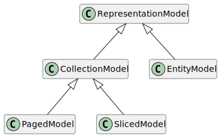

# Spring HATEOAS - Reference Documentation

## Navigation

- Docs
  
- [Spring HATEOAS - Reference Documentation](#index)

## Content

<a id="index"></a>

<!-- source_url: https://docs.spring.io/spring-hateoas/docs/current/reference/html/ -->

<!-- page_index: 1 -->

<a id="index--spring-hateoas-reference-documentation"></a>

# Spring HATEOAS - Reference Documentation

Oliver Drotbohm
Greg Turnquist
Jay Bryant
version 3.1.1, 2026-06-09

This project provides some APIs to ease creating REST representations that follow the [HATEOAS](https://en.wikipedia.org/wiki/HATEOAS) principle when working with Spring and especially Spring MVC. The core problem it tries to address is link creation and representation assembly.

© 2012-2021 The original authors.

> [!NOTE]
> Copies of this document may be made for your own use and for distribution to others, provided that you do not charge any fee for such copies and further provided that each copy contains this Copyright Notice, whether distributed in print or electronically.

<a id="index--preface"></a>
<a id="index--1.-preface"></a>

## 1. Preface

<a id="index--migrate-to-1.0"></a>
<a id="index--1.1.-migrating-to-spring-hateoas-1.0"></a>

### 1.1. Migrating to Spring HATEOAS 1.0

For 1.0 we took the chance to re-evaluate some of the design and package structure choices we had made for the 0.x branch.
There had been an incredible amount of feedback on it and the major version bump seemed to be the most natural place to refactor those.

<a id="index--migrate-to-1.0.changes"></a>
<a id="index--1.1.1.-the-changes"></a>

#### 1.1.1. The changes

The biggest changes in package structure were driven by the introduction of a hypermedia type registration API to support additional media types in Spring HATEOAS.
This lead to the clear separation of client and server APIs (packages named respectively) as well as media type implementations in the package `mediatype`.

The easiest way to get your code base upgraded to the new API is by using the [migration script](#index--migrate-to-1.0.script).
Before we jump to that, here are the changes at a quick glance.

<a id="index--migrate-to-1.0.changes.representation-models"></a>
<a id="index--representation-models"></a>

##### Representation models

The `ResourceSupport`/`Resource`/`Resources`/`PagedResources` group of classes never really felt appropriately named.
After all, these types do not actually manifest resources but rather representation models that can be enriched with hypermedia information and affordances.
Here’s how new names map to the old ones:

- `ResourceSupport` is now `RepresentationModel`
- `Resource` is now `EntityModel`
- `Resources` is now `CollectionModel`
- `PagedResources` is now `PagedModel`

Consequently, `ResourceAssembler` has been renamed to `RepresentationModelAssembler` and its methods `toResource(…)` and `toResources(…)` have been renamed to `toModel(…)` and `toCollectionModel(…)` respectively.
Also the name changes have been reflected in the classes contained in `TypeReferences`.

- `RepresentationModel.getLinks()` now exposes a `Links` instance (over a `List<Link>`) as that exposes additional API to concatenate and merge different `Links` instances using various strategies.
  Also it has been turned into a self-bound generic type to allow the methods that add links to the instance return the instance itself.
- The `LinkDiscoverer` API has been moved to the `client` package.
- The `LinkBuilder` and `EntityLinks` APIs have been moved to the `server` package.
- `ControllerLinkBuilder` has been moved into `server.mvc` and deprecated to be replaced by `WebMvcLinkBuilder`.
- `RelProvider` has been renamed to `LinkRelationProvider` and returns `LinkRelation` instances instead of `String`s.
- `VndError` has been moved to the `mediatype.vnderror` package.

<a id="index--migrate-to-1.0.script"></a>
<a id="index--1.1.2.-the-migration-script"></a>

#### 1.1.2. The migration script

You can find [a script](https://github.com/spring-projects/spring-hateoas/tree/main/etc) to run from your application root that will update all import statements and static method references to Spring HATEOAS types that moved in our source code repository.
Simply download that, run it from your project root.
By default it will inspect all Java source files and replace the legacy Spring HATEOAS type references with the new ones.

Example 1. Sample application of the migration script

```
$ ./migrate-to-1.0.sh

Migrating Spring HATEOAS references to 1.0 for files : *.java

Adapting ./src/main/java/…
…

Done!
```

Note that the script will not necessarily be able to entirely fix all changes, but it should cover the most important refactorings.

Now verify the changes made to the files in your favorite Git client and commit as appropriate.
In case you find method or type references unmigrated, please open a ticket in out issue tracker.

<a id="index--migration.1-0-m3-to-1-0-rc1"></a>
<a id="index--1.1.3.-migrating-from-1.0-m3-to-1.0-rc1"></a>

#### 1.1.3. Migrating from 1.0 M3 to 1.0 RC1

- `Link.andAffordance(…)` taking Affordance details have been moved to `Affordances`. To manually build up `Affordance` instances now use `Affordances.of(link).afford(…)`. Also note the new `AffordanceBuilder` type exposed from `Affordances` for fluent usage. See [Affordances](#index--server.affordances) for details.
- `AffordanceModelFactory.getAffordanceModel(…)` now receives `InputPayloadMetadata` and `PayloadMetadata` instances instead of `ResolvableType`s to allow non-type-based implementations. Custom media type implementations have to be adapted to that accordingly.
- HAL Forms now does not render property attributes if their value adheres to what’s defined as default in the spec. I.e. if previously `required` was explicitly set to `false`, we now just omit the entry for `required`.
  We also now only force them to be non-required for templates that use `PATCH` as the HTTP method.

<a id="index--fundamentals"></a>
<a id="index--2.-fundamentals"></a>

## 2. Fundamentals

This section covers the basics of Spring HATEOAS and its fundamental domain abstractions.

<a id="index--fundamentals.links"></a>
<a id="index--2.1.-links"></a>

### 2.1. Links

The fundamental idea of hypermedia is to enrich the representation of a resource with hypermedia elements.
The simplest form of that are links.
They indicate a client that it can navigate to a certain resource.
The semantics of a related resource are defined in a so-called link relation.
You might have seen this in the header of an HTML file already:

Example 2. A link in an HTML document

```html
<link href="theme.css" rel="stylesheet" type="text/css" />
```

As you can see the link points to a resource `theme.css` and indicates that it is a style sheet.
Links often carry additional information, like the media type that the resource pointed to will return.
However, the fundamental building blocks of a link are its reference and relation.

Spring HATEOAS lets you work with links through its immutable `Link` value type.
Its constructor takes both a hypertext reference and a link relation, the latter being defaulted to the IANA link relation `self`.
Read more on the latter in [Link relations](#index--fundamentals.link-relations).

Example 3. Using links

```java
Link link = Link.of("/something");
assertThat(link.getHref()).isEqualTo("/something");
assertThat(link.getRel()).isEqualTo(IanaLinkRelations.SELF);

link = Link.of("/something", "my-rel");
assertThat(link.getHref()).isEqualTo("/something");
assertThat(link.getRel()).isEqualTo(LinkRelation.of("my-rel"));
```

`Link` exposes other attributes as defined in [RFC-8288](https://tools.ietf.org/html/rfc8288).
You can set them by calling the corresponding wither method on a `Link` instance.

Find more information on how to create links pointing to Spring MVC and Spring WebFlux controllers in  [Building links in Spring MVC](#index--server.link-builder.webmvc) and [Building links in Spring WebFlux](#index--server.link-builder.webflux).

<a id="index--fundamentals.uri-templates"></a>
<a id="index--2.2.-uri-templates"></a>

### 2.2. URI templates

For a Spring HATEOAS `Link`, the hypertext reference can not only be a URI, but also a URI template according to [RFC-6570](https://tools.ietf.org/html/rfc6570).
A URI template contains so-called template variables and allows expansion of these parameters.
This allows clients to turn parameterized templates into URIs without having to know about the structure of the final URI, it only needs to know about the names of the variables.

Example 4. Using links with templated URIs

```java
Link link = Link.of("/{segment}/something{?parameter}");
assertThat(link.isTemplated()).isTrue(); (1)
assertThat(link.getVariableNames()).contains("segment", "parameter"); (2)

Map<String, Object> values = new HashMap<>();
values.put("segment", "path");
values.put("parameter", 42);

assertThat(link.expand(values).getHref()) (3)
    .isEqualTo("/path/something?parameter=42");
```

<table>
<tr>
<td>1</td>
<td>The <code>Link</code> instance indicates that is templated, i.e. it contains a URI template.</td>
</tr>
<tr>
<td>2</td>
<td>It exposes the parameters contained in the template.</td>
</tr>
<tr>
<td>3</td>
<td>It allows expansion of the parameters.</td>
</tr>
</table>

URI templates can be constructed manually and template variables added later on.

Example 5. Working with URI templates

```java
UriTemplate template = UriTemplate.of("/{segment}/something")
  .with(new TemplateVariable("parameter", VariableType.REQUEST_PARAM);

assertThat(template.toString()).isEqualTo("/{segment}/something{?parameter}");
```

<a id="index--fundamentals.link-relations"></a>
<a id="index--2.3.-link-relations"></a>

### 2.3. Link relations

To indicate the relationship of the target resource to the current one so-called link relations are used.
Spring HATEOAS provides a `LinkRelation` type to easily create `String`-based instances of it.

<a id="index--fundamentals.link-relations.iana"></a>
<a id="index--2.3.1.-iana-link-relations"></a>

#### 2.3.1. IANA link relations

The Internet Assigned Numbers Authority contains a set of [predefined link relations](https://www.iana.org/assignments/link-relations/link-relations.xhtml).
They can be referred to via `IanaLinkRelations`.

Example 6. Using IANA link relations

```java
Link link = Link.of("/some-resource"), IanaLinkRelations.NEXT);

assertThat(link.getRel()).isEqualTo(LinkRelation.of("next"));
assertThat(IanaLinkRelation.isIanaRel(link.getRel())).isTrue();
```

<a id="index--fundamentals.representation-models"></a>
<a id="index--2.4.-representation-models"></a>

### 2.4. Representation models

To easily create hypermedia enriched representations, Spring HATEOAS provides a set of classes with `RepresentationModel` at their root.
It’s basically a container for a collection of `Link`s and has convenient methods to add those to the model.
The models can later be rendered into various media type formats that will define how the hypermedia elements look in the representation.
For more information on this, have a look at [Media types](#index--mediatypes).

Example 7. The `RepresentationModel` class hierarchy



The default way to work with a `RepresentationModel` is to create a subclass of it to contain all the properties the representation is supposed to contain, create instances of that class, populate the properties and enrich it with links.

Example 8. A sample representation model type

```java
class PersonModel extends RepresentationModel<PersonModel> {

  String firstname, lastname;
}
```

The generic self-typing is necessary to let `RepresentationModel.add(…)` return instances of itself.
The model type can now be used like this:

Example 9. Using the person representation model

```java
PersonModel model = new PersonModel();
model.firstname = "Dave";
model.lastname = "Matthews";
model.add(Link.of("https://myhost/people/42"));
```

If you returned such an instance from a Spring MVC or WebFlux controller and the client sent an `Accept` header set to `application/hal+json`, the response would look as follows:

Example 10. The HAL representation generated for the person representation model

```javascript
{"_links" : {"self" : {"href" : "https://myhost/people/42"} },"firstname" : "Dave","lastname" : "Matthews"}
```

<a id="index--fundamentals.entity-model"></a>
<a id="index--2.4.1.-item-resource-representation-model"></a>

#### 2.4.1. Item resource representation model

For a resource that’s backed by a singular object or concept, a convenience `EntityModel` type exists.
Instead of creating a custom model type for each concept, you can just reuse an already existing type and wrap instances of it into the `EntityModel`.

Example 11. Using `EntityModel` to wrap existing objects

```java
Person person = new Person("Dave", "Matthews");
EntityModel<Person> model = EntityModel.of(person);
```

<a id="index--fundamentals.collection-model"></a>
<a id="index--2.4.2.-collection-resource-representation-model"></a>

#### 2.4.2. Collection resource representation model

For resources that are conceptually collections, a `CollectionModel` is available.
Its elements can either be simple objects or `RepresentationModel` instances in turn.

Example 12. Using `CollectionModel` to wrap a collection of existing objects

```java
Collection<Person> people = Collections.singleton(new Person("Dave", "Matthews"));
CollectionModel<Person> model = CollectionModel.of(people);
```

While an `EntityModel` is constrained to always contain a payload and thus allows to reason about the type arrangement on the sole instance, a `CollectionModel`'s underlying collection can be empty.
Due to Java’s type erasure, we cannot actually detect that a `CollectionModel<Person> model = CollectionModel.empty()` is actually a `CollectionModel<Person>` because all we see is the runtime instance and an empty collection.
That missing type information can be added to the model by either adding it to the empty instance on construction via `CollectionModel.empty(Person.class)` or as fallback in case the underlying collection might be empty:

```java
Iterable<Person> people = repository.findAll();
var model = CollectionModel.of(people).withFallbackType(Person.class);
```

<a id="index--server"></a>
<a id="index--3.-server-side-support"></a>

## 3. Server-side support

<a id="index--server.link-builder.webmvc"></a>
<a id="index--3.1.-building-links-in-spring-mvc"></a>

### 3.1. Building links in Spring MVC

Now we have the domain vocabulary in place, but the main challenge remains: how to create the actual URIs to be wrapped into `Link` instances in a less fragile way. Right now, we would have to duplicate URI strings all over the place. Doing so is brittle and unmaintainable.

Assume you have your Spring MVC controllers implemented as follows:

```java
@Controller
class PersonController {

  @GetMapping("/people")
  HttpEntity<PersonModel> showAll() { … }

  @GetMapping("/{person}")
  HttpEntity<PersonModel> show(@PathVariable Long person) { … }
}
```

We see two conventions here. The first is a collection resource that is exposed through `@GetMapping` annotation of the controller method, with individual elements of that collection exposed as direct sub resources. The collection resource might be exposed at a simple URI (as just shown) or more complex ones (such as `/people/{id}/addresses`). Suppose you would like to link to the collection resource of all people. Following the approach from above would cause two problems:

- To create an absolute URI, you would need to look up the protocol, hostname, port, servlet base, and other values. This is cumbersome and requires ugly manual string concatenation code.
- You probably do not want to concatenate the `/people` on top of your base URI, because you would then have to maintain the information in multiple places. If you change the mapping, you then have to change all the clients pointing to it.

Spring HATEOAS now provides a `WebMvcLinkBuilder` that lets you create links by pointing to controller classes.
The following example shows how to do so:

```java
import static org.sfw.hateoas.server.mvc.WebMvcLinkBuilder.*;

Link link = linkTo(PersonController.class).withRel("people");

assertThat(link.getRel()).isEqualTo(LinkRelation.of("people"));
assertThat(link.getHref()).endsWith("/people");
```

The `WebMvcLinkBuilder` uses Spring’s `ServletUriComponentsBuilder` under the hood to obtain the basic URI information from the current request. Assuming your application runs at `localhost:8080/your-app`, this is exactly the URI on top of which you are constructing additional parts. The builder now inspects the given controller class for its root mapping and thus ends up with `localhost:8080/your-app/people`. You can also build more nested links as well.
The following example shows how to do so:

```java
Person person = new Person(1L, "Dave", "Matthews");
//                 /person                 /     1
Link link = linkTo(PersonController.class).slash(person.getId()).withSelfRel();
assertThat(link.getRel(), is(IanaLinkRelation.SELF.value()));
assertThat(link.getHref(), endsWith("/people/1"));
```

The builder also allows creating URI instances to build up (for example, response header values):

```java
HttpHeaders headers = new HttpHeaders();
headers.setLocation(linkTo(PersonController.class).slash(person).toUri());

return new ResponseEntity<PersonModel>(headers, HttpStatus.CREATED);
```

<a id="index--server.link-builder.webmvc.methods"></a>
<a id="index--3.1.1.-building-links-that-point-to-methods"></a>

#### 3.1.1. Building links that point to methods

You can even build links that point to methods or create dummy controller method invocations.
The first approach is to hand a `Method` instance to the `WebMvcLinkBuilder`.
The following example shows how to do so:

```java
Method method = PersonController.class.getMethod("show", Long.class);
Link link = linkTo(method, 2L).withSelfRel();

assertThat(link.getHref()).endsWith("/people/2"));
```

This is still a bit dissatisfying, as we have to first get a `Method` instance, which throws an exception and is generally quite cumbersome. At least we do not repeat the mapping. An even better approach is to have a dummy method invocation of the target method on a controller proxy, which we can create by using the `methodOn(…)` helper.
The following example shows how to do so:

```java
Link link = linkTo(methodOn(PersonController.class).show(2L)).withSelfRel();

assertThat(link.getHref()).endsWith("/people/2");
```

`methodOn(…)` creates a proxy of the controller class that records the method invocation and exposes it in a proxy created for the return type of the method. This allows the fluent expression of the method for which we want to obtain the mapping. However, there are a few constraints on the methods that can be obtained by using this technique:

- The return type has to be capable of proxying, as we need to expose the method invocation on it.
- The parameters handed into the methods are generally neglected (except the ones referred to through `@PathVariable`, because they make up the URI).

<a id="index--server.link-builder.webmvc.methods.request-params"></a>
<a id="index--controlling-the-rendering-of-request-parameters"></a>

##### Controlling the rendering of request parameters

Collection-valued request parameters can actually be materialized in two different ways.
The URI template specification lists the composite way of rendering them that repeats the parameter name for each value (`param=value1&param=value2`), and the non-composite one that separates values by a comma (`param=value1,value2`).
Spring MVC properly parses the collection out of both formats.
Rendering the values defaults to the composite style by default.
If you want the values to be rendered in the non-composite style, you can use the `@NonComposite` annotation with the request parameter handler method parameter:

```java
@Controller
class PersonController {

  @GetMapping("/people")
  HttpEntity<PersonModel> showAll(
    @NonComposite @RequestParam Collection<String> names) { … } (1)
}

var values = List.of("Matthews", "Beauford");
var link = linkTo(methodOn(PersonController.class).showAll(values)).withSelfRel(); (2)

assertThat(link.getHref()).endsWith("/people?names=Matthews,Beauford"); (3)
```

**1**

We use the `@NonComposite` annotation to declare we want values to be rendered comma-separated.

**2**

We invoke the method using a list of values.

**3**

See how the request parameter is rendered in the expected format.

> [!NOTE]
> The reason we’re exposing `@NonComposite` is that the composite way of rendering request parameters is baked into the internals of Spring’s `UriComponents` builder and we only introduced that non-composite style in Spring HATEOAS 1.4.
> If we started from scratch today, we’d probably default to that style and rather let users opt into the composite style explicitly rather than the other way around.

<a id="index--server.link-builder.webflux"></a>
<a id="index--3.2.-building-links-in-spring-webflux"></a>

### 3.2. Building links in Spring WebFlux

TODO

<a id="index--server.affordances"></a>
<a id="index--3.3.-affordances"></a>

### 3.3. Affordances

> The affordances of the environment are what it offers … what it provides or furnishes, either for good or ill. The verb 'to afford' is found in the dictionary, but the noun 'affordance' is not. I have made it up.

— James J. Gibson
The Ecological Approach to Visual Perception (page 126)

REST-based resources provide not just data but controls.
The last ingredient to form a flexible service are detailed **affordances** on how to use the various controls.
Because affordances are associated with links, Spring HATEOAS provides an API to attach as many related methods as needed to a link.
Just as you can create links by pointing to Spring MVC controller methods (see  [Building links in Spring MVC](#index--server.link-builder.webmvc) for details) you …

The following code shows how to take a **self** link and associate two more affordances:

Example 13. Connecting affordances to `GET /employees/{id}`

```java
@GetMapping("/employees/{id}")
public EntityModel<Employee> findOne(@PathVariable Integer id) {

  Class<EmployeeController> controllerClass = EmployeeController.class;

  // Start the affordance with the "self" link, i.e. this method.
  Link findOneLink = linkTo(methodOn(controllerClass).findOne(id)).withSelfRel(); (1)

  // Return the affordance + a link back to the entire collection resource.
  return EntityModel.of(EMPLOYEES.get(id), //
      findOneLink //
          .andAffordance(afford(methodOn(controllerClass).updateEmployee(null, id))) (2)
          .andAffordance(afford(methodOn(controllerClass).partiallyUpdateEmployee(null, id)))); (3)
}
```

| **1** | Create the **self** link. |
| --- | --- |
| **2** | Associate the `updateEmployee` method with the `self` link. |
| **3** | Associate the `partiallyUpdateEmployee` method with the `self` link. |

Using `.andAffordance(afford(…))`, you can use the controller’s methods to connect a `PUT` and a `PATCH` operation to a `GET` operation.
Imagine that the related methods **afforded** above look like this:

Example 14. `updateEmpoyee` method that responds to `PUT /employees/{id}`

```java
@PutMapping("/employees/{id}")
public ResponseEntity<?> updateEmployee( //
    @RequestBody EntityModel<Employee> employee, @PathVariable Integer id)
```

Example 15. `partiallyUpdateEmployee` method that responds to `PATCH /employees/{id}`

```java
@PatchMapping("/employees/{id}")
public ResponseEntity<?> partiallyUpdateEmployee( //
    @RequestBody EntityModel<Employee> employee, @PathVariable Integer id)
```

Pointing to those methods using the `afford(…)` methods will cause Spring HATEOAS to analyze the request body and response types and capture metadata to allow different media type implementations to use that information to translate that into descriptions of the input and outputs.

<a id="index--server.affordances.api"></a>
<a id="index--3.3.1.-building-affordances-manually"></a>

#### 3.3.1. Building affordances manually

While the primary way to register affordances for a link, it might be necessary to build some of them manually.
This can be achieved by using the `Affordances` API:

Example 16. Using the `Affordances` API to manually register affordances

```java
var methodInvocation = methodOn(EmployeeController.class).all();

var link = Affordances.of(linkTo(methodInvocation).withSelfRel()) (1)

    .afford(HttpMethod.POST) (2)
    .withInputAndOutput(Employee.class) //
    .withName("createEmployee") //

    .andAfford(HttpMethod.GET) (3)
    .withOutput(Employee.class) //
    .addParameters(//
        QueryParameter.optional("name"), //
        QueryParameter.optional("role")) //
    .withName("search") //

    .toLink();
```

**1**

You start by creating an instance of `Affordances` from a `Link` instance creating the context for describing the affordances.

**2**

Each affordance starts with the HTTP method it’s supposed to support. We then register a type as payload description and name the affordance explicitly. The latter can be omitted and a default name will be derived from the HTTP method and input type name. This effectively creates the same affordance as the pointer to `EmployeeController.newEmployee(…)` created.

**3**

The next affordance is built to reflect what’s happening for the pointer to `EmployeeController.search(…)`. Here we define `Employee` to be the model for the response created and explicitly register `QueryParameter`s.

Affordances are backed by media type specific affordance models that translate the general affordance metadata into specific representations.
Please make sure to check the section on affordances in the [Media types](#index--mediatypes) section to find more details about how to control the exposure of that metadata.

<a id="index--server.link-builder.forwarded-headers"></a>
<a id="index--3.4.-forwarded-header-handling"></a>

### 3.4. Forwarded header handling

[RFC-7239 forwarding headers](https://tools.ietf.org/html/rfc7239) are most commonly used when your application is behind a proxy, behind a load balancer, or in the cloud.
The node that actually receives the web request is part of the infrastructure, and *forwards* the request to your application.

Your application may be running on `localhost:8080`, but to the outside world you’re expected to be at `reallycoolsite.com` (and on the web’s standard port 80).
By having the proxy include extra headers (which many already do), Spring HATEOAS can generate links properly as it uses Spring Framework functionality to obtain the base URI of the original request.

> [!IMPORTANT]
> Anything that can change the root URI based on external inputs must be properly guarded.
> That’s why, by default, forwarded header handling is **disabled**.
> You MUST enable it to be operational.
> If you are deploying to the cloud or into a configuration where you control the proxies and load balancers, then you’ll certainly want to use this feature.

To enable forwarded header handling you need to register Spring’s `ForwardedHeaderFilter` for Spring MVC (details [here](https://docs.spring.io/spring/docs/current/spring-framework-reference/web.html#filters-forwarded-headers)) or `ForwardedHeaderTransformer` for Spring WebFlux (details [here](https://docs.spring.io/spring/docs/current/spring-framework-reference/web-reactive.html#webflux-forwarded-headers)) in your application.
In a Spring Boot application those components can be simply declared as Spring beans as described [here](https://docs.spring.io/spring-boot/docs/current/reference/html/boot-features-developing-web-applications.html#boot-features-embedded-container-servlets-filters-listeners-beans).

Example 17. Registering a `ForwardedHeaderFilter`

```java
@Bean
ForwardedHeaderFilter forwardedHeaderFilter() {
    return new ForwardedHeaderFilter();
}
```

This will create a servlet filter that processes all the `X-Forwarded-…` headers.
And it will register it properly with the servlet handlers.

For a Spring WebFlux application, the reactive counterpart is `ForwardedHeaderTransformer`:

Example 18. Registering a `ForwardedHeaderTransformer`

```java
@Bean
ForwardedHeaderTransformer forwardedHeaderTransformer() {
    return new ForwardedHeaderTransformer();
}
```

This will create a function that transforms reactive web requests, processing `X-Forwarded-…` headers.
And it will register it properly with WebFlux.

With configuration as shown above in place, a request passing `X-Forwarded-…` headers will see those reflected in the links generated:

Example 19. A request using `X-Forwarded-…` headers

```bash
curl -v localhost:8080/employees \
    -H 'X-Forwarded-Proto: https' \
    -H 'X-Forwarded-Host: example.com' \
    -H 'X-Forwarded-Port: 9001'
```

Example 20. The corresponding response with the links generated to consider those headers

```javascript
{"_embedded": {"employees": [{"id": 1,"name": "Bilbo Baggins","role": "burglar","_links": {"self": {"href": "https://example.com:9001/employees/1" },"employees": {"href": "https://example.com:9001/employees"}}}] },"_links": {"self": {"href": "https://example.com:9001/employees" },"root": {"href": "https://example.com:9001"}}}
```

<a id="index--server.entity-links"></a>
<a id="index--3.5.-using-the-entitylinks-interface"></a>

### 3.5. Using the EntityLinks interface

> [!IMPORTANT]
> `EntityLinks` and its various implementations are NOT currently provided out-of-the-box for Spring WebFlux applications.
> The contract defined in the `EntityLinks` SPI was originally aimed at Spring Web MVC and doesn’t consider Reactor types.
> Developing a comparable contract that supports reactive programming is still in progress.

So far, we have created links by pointing to the web framework implementations (that is, the Spring MVC controllers) and inspected the mapping.
In many cases, these classes essentially read and write representations backed by a model class.

The `EntityLinks` interface now exposes an API to look up a `Link` or `LinkBuilder` based on the model types.
The methods essentially return links that point either to the collection resource (such as `/people`) or to an item resource (such as `/people/1`).
The following example shows how to use `EntityLinks`:

```java
EntityLinks links = …;
LinkBuilder builder = links.linkFor(Customer.class);
Link link = links.linkToItemResource(Customer.class, 1L);
```

`EntityLinks` is available via dependency injection by activating `@EnableHypermediaSupport` in your Spring MVC configuration.
This will cause a variety of default implementations of `EntityLinks` being registered.
The most fundamental one is `ControllerEntityLinks` that inspects SpringMVC controller classes.
If you want to register your own implementation of `EntityLinks`, check out [this section](#index--server.entity-links.spi).

<a id="index--server.entity-links.controller"></a>
<a id="index--3.5.1.-entitylinks-based-on-spring-mvc-controllers"></a>

#### 3.5.1. EntityLinks based on Spring MVC controllers

Activating entity links functionality causes all the Spring MVC controllers available in the current `ApplicationContext` to be inspected for the `@ExposesResourceFor(…)` annotation.
The annotation exposes which model type the controller manages.
Beyond that, we assume that you adhere to the following URI mapping setup and conventions:

- A type level `@ExposesResourceFor(…)` declaring which entity type the controller exposes collection and item resources for.
- A class level base mapping that represents the collection resource.
- An additional method level mapping that extends the mapping to append an identifier as additional path segment.

The following example shows an implementation of an `EntityLinks`-capable controller:

```java
@Controller
@ExposesResourceFor(Order.class) (1)
@RequestMapping("/orders") (2)
class OrderController {

  @GetMapping (3)
  ResponseEntity orders(…) { … }

  @GetMapping("{id}") (4)
  ResponseEntity order(@PathVariable("id") … ) { … }
}
```

**1**

The controller indicates it’s exposing collection and item resources for the entity `Order`.

**2**

Its collection resource is exposed under `/orders`

**3**

That collection resource can handle `GET` requests. Add more methods for other HTTP methods at your convenience.

**4**

An additional controller method to handle a subordinate resource taking a path variable to expose an item resource, i.e. a single `Order`.

With this in place, when you enable `EntityLinks` `@EnableHypermediaSupport` in your Spring MVC configuration, you can create links to the controller as follows:

```java
@Controller class PaymentController {
private final EntityLinks entityLinks;
PaymentController(EntityLinks entityLinks) { (1) this.entityLinks = entityLinks;}
@PutMapping(…) ResponseEntity payment(@PathVariable Long orderId) {
Link link = entityLinks.linkToItemResource(Order.class, orderId); (2) …}}
```

**1**

Inject `EntityLinks` made available by `@EnableHypermediaSupport` in your configuration.

**2**

Use the APIs to build links by using the entity types instead of controller classes.

As you can see, you can refer to resources managing `Order` instances without referring to `OrderController` explicitly.

<a id="index--server.entity-links.api"></a>
<a id="index--3.5.2.-entitylinks-api-in-detail"></a>

#### 3.5.2. EntityLinks API in detail

Fundamentally, `EntityLinks` allows to build `LinkBuilder`s and `Link` instances to collection and item resources of an entity type.
Methods starting with `linkFor…` will produce `LinkBuilder` instances for you to extend and augment with additional path segments, parameters, etc.
Methods starting with `linkTo` produce fully prepared `Link` instances.

While for collection resources providing an entity type is sufficient, links to item resources will need an identifier provided.
This usually looks like this:

Example 21. Obtaining a link to an item resource

```java
entityLinks.linkToItemResource(order, order.getId());
```

If you find yourself repeating those method calls the identifier extraction step can be pulled out into a reusable `Function` to be reused throughout different invocations:

```java
Function<Order, Object> idExtractor = Order::getId; (1)

entityLinks.linkToItemResource(order, idExtractor); (2)
```

**1**

The identifier extraction is externalized so that it can be held in a field or constant.

**2**

The link lookup using the extractor.

<a id="index--server.entity-links.api.typed"></a>
<a id="index--typedentitylinks"></a>

##### TypedEntityLinks

As controller implementations are often grouped around entity types, you’ll very often find yourself using the same extractor function (see [EntityLinks API in detail](#index--server.entity-links.api) for details) all over the controller class.
We can centralize the identifier extraction logic even more by obtaining a `TypedEntityLinks` instance providing the extractor once, so that the actual lookups don’t have to deal with the extraction anymore at all.

Example 22. Using TypedEntityLinks

```java
class OrderController {
private final TypedEntityLinks<Order> links;
OrderController(EntityLinks entityLinks) { (1) this.links = entityLinks.forType(Order::getId); (2)}
@GetMapping ResponseEntity<Order> someMethod(…) {
Order order = … // lookup order
Link link = links.linkToItemResource(order); (3)}}
```

| **1** | Inject an `EntityLinks` instance. |
| --- | --- |
| **2** | Indicate you’re going to look up `Order` instances with a certain identifier extractor function. |
| **3** | Look up item resource links based on a sole `Order` instance. |

<a id="index--server.entity-links.spi"></a>
<a id="index--3.5.3.-entitylinks-as-spi"></a>

#### 3.5.3. EntityLinks as SPI

The `EntityLinks` instance created by `@EnableHypermediaSupport` is of type `DelegatingEntityLinks` which will in turn pick up all other `EntityLinks` implementations available as beans in the `ApplicationContext`.
It’s registered as primary bean so that it’s always the sole injection candidate when you inject `EntityLinks` in general.
`ControllerEntityLinks` is the default implementation that will be included in the setup, but users are free to implement and register their own implementations.
Making those available to the `EntityLinks` instance available for injection is a matter of registering your implementation as Spring bean.

Example 23. Declaring a custom EntityLinks implementation

```java
@Configuration class CustomEntityLinksConfiguration {
@Bean MyEntityLinks myEntityLinks(…) {return new MyEntityLinks(…);}}
```

An example for the extensibility of this mechanism is Spring Data REST’s [`RepositoryEntityLinks`](https://github.com/spring-projects/spring-data-rest/blob/3a0cba94a2cc8739375ecf24086da2f7c3bbf038/spring-data-rest-webmvc/src/main/java/org/springframework/data/rest/webmvc/support/RepositoryEntityLinks.java), which uses the repository mapping information to create links pointing to resources backed by Spring Data repositories.
At the same time, it even exposes additional lookup methods for other types of resources.
If you want to make use of these, simply inject `RepositoryEntityLinks` explicitly.

<a id="index--server.representation-model-assembler"></a>
<a id="index--3.6.-representation-model-assembler"></a>

### 3.6. Representation model assembler

As the mapping from an entity to a representation model must be used in multiple places, it makes sense to create a dedicated class responsible for doing so. The conversion contains very custom steps but also a few boilerplate steps:

1. Instantiation of the model class
2. Adding a link with a `rel` of `self` pointing to the resource that gets rendered.

Spring HATEOAS now provides a `RepresentationModelAssemblerSupport` base class that helps reduce the amount of code you need to write.
The following example shows how to use it:

```java
class PersonModelAssembler extends RepresentationModelAssemblerSupport<Person, PersonModel> {
public PersonModelAssembler() {super(PersonController.class, PersonModel.class);}
@Override public PersonModel toModel(Person person) {
PersonModel resource = createResource(person); // … do further mapping return resource;}}
```

> [!NOTE]
> `createResource(…)` is code you write to instantiate a `PersonModel` object given a `Person` object. It should only focus on setting attributes, not populating `Links`.

Setting the class up as we did in the preceding example gives you the following benefits:

- There are a handful of `createModelWithId(…)` methods that let you create an instance of the resource and have a `Link` with a rel of `self` added to it. The href of that link is determined by the configured controller’s request mapping plus the ID of the entity (for example, `/people/1`).
- The resource type gets instantiated by reflection and expects a no-arg constructor. If you want to use a dedicated constructor or avoid the reflection performance overhead, you can override `instantiateModel(…)`.

You can then use the assembler to either assemble a `RepresentationModel` or a `CollectionModel`.
The following example creates a `CollectionModel` of `PersonModel` instances:

```java
Person person = new Person(…);
Iterable<Person> people = Collections.singletonList(person);

PersonModelAssembler assembler = new PersonModelAssembler();
PersonModel model = assembler.toModel(person);
CollectionModel<PersonModel> model = assembler.toCollectionModel(people);
```

<a id="index--server.processors"></a>
<a id="index--3.7.-representation-model-processors"></a>

### 3.7. Representation Model Processors

Sometimes you need to tweak and adjust hypermedia representations after they have been [assembled](#index--server.representation-model-assembler).

A perfect example is when you have a controller that deals with order fulfillment, but you need to add links related to making payments.

Imagine having your ordering system producing this type of hypermedia:

```json
{"orderId" : "42","state" : "AWAITING_PAYMENT","_links" : {"self" : {"href" : "http://localhost/orders/999"}}}
```

You wish to add a link so the client can make payment, but don’t want to mix details about your `PaymentController` into
the `OrderController`.
Instead of polluting the details of your ordering system, you can write a `RepresentationModelProcessor` like this:

```java
public class PaymentProcessor implements RepresentationModelProcessor<EntityModel<Order>> { (1)
@Override public EntityModel<Order> process(EntityModel<Order> model) {
model.add( (2) Link.of("/payments/{orderId}").withRel(LinkRelation.of("payments")) // .expand(model.getContent().getOrderId()));
return model; (3)}}
```

| **1** | This processor will only be applied to `EntityModel<Order>` objects. |
| --- | --- |
| **2** | Manipulate the existing `EntityModel` object by adding an unconditional link. |
| **3** | Return the `EntityModel` so it can be serialized into the requested media type. |

Register the processor with your application:

```java
@Configuration public class PaymentProcessingApp {
@Bean PaymentProcessor paymentProcessor() {return new PaymentProcessor();}}
```

Now when you issue a hypermedia respresentation of an `Order`, the client receives this:

```java
{"orderId" : "42","state" : "AWAITING_PAYMENT","_links" : {"self" : {"href" : "http://localhost/orders/999" },"payments" : { (1) "href" : "/payments/42" (2)}}}
```

**1**

You see the `LinkRelation.of("payments")` plugged in as this link’s relation.

**2**

The URI was provided by the processor.

This example is quite simple, but you can easily:

- Use `WebMvcLinkBuilder` or `WebFluxLinkBuilder` to construct a dynamic link to your `PaymentController`.
- Inject any services needed to conditionally add other links (e.g. `cancel`, `amend`) that are driven by state.
- Leverage cross cutting services like Spring Security to add, remove, or revise links based upon the current user’s context.

Also, in this example, the `PaymentProcessor` alters the provided `EntityModel<Order>`. You also have the power to
*replace* it with another object. Just be advised the API requires the return type to equal the input type.

<a id="index--server.processors.empty-collections"></a>
<a id="index--3.7.1.-processing-empty-collection-models"></a>

#### 3.7.1. Processing empty collection models

To find the right set of `RepresentationModelProcessor` instance to invoke for a `RepresentationModel` instance, the invoking infrastructure performs a detailed analysis of the generics declaration of the `RepresentationModelProcessor`s registered.
For `CollectionModel` instances, this includes inspecting the elements of the underlying collection, as at runtime, the sole model instance does not expose generics information (due to Java’s type erasure).
That means, by default, `RepresentationModelProcessor` instances are not invoked for empty collection models.
To still allow the infrastructure to deduce the payload types correctly, you can initialize empty `CollectionModel` instances with an explicit fallback payload type right from the start, or register it by calling `CollectionModel.withFallbackType(…)`.
See [Collection resource representation model](#index--fundamentals.collection-model) for details.

<a id="index--mediatypes"></a>
<a id="index--4.-media-types"></a>

## 4. Media types

<a id="index--mediatypes.hal"></a>
<a id="index--4.1.-hal-hypertext-application-language"></a>

### 4.1. HAL – Hypertext Application Language

[JSON Hypertext Application Language](https://tools.ietf.org/html/draft-kelly-json-hal-08) or HAL is one of the simplest
and most widely adopted hypermedia media types adopted when not discussing specific web stacks.

It was the first spec-based media type adopted by Spring HATEOAS.

<a id="index--mediatypes.hal.models"></a>
<a id="index--4.1.1.-building-hal-representation-models"></a>

#### 4.1.1. Building HAL representation models

As of Spring HATEOAS 1.1, we ship a dedicated `HalModelBuilder` that allows to create `RepresentationModel` instances through a HAL-idiomatic API.
These are its fundamental assumptions:

1. A HAL representation can be backed by an arbitrary object (an entity) that builds up the domain fields contained in the representation.
2. The representation can be enriched by a variety of embedded documents, which can be either arbitrary objects or HAL representations themselves (i.e. containing nested embeddeds and links).
3. Certain HAL specific patterns (e.g. previews) can be directly used in the API so that the code setting up the representation reads like you’d describe a HAL representation following those idioms.

Here’s an example of the API used:

```java
// An order
var order = new Order(…); (1)

// The customer who placed the order
var customer = customer.findById(order.getCustomerId());

var customerLink = Link.of("/orders/{id}/customer") (2)
  .expand(order.getId())
  .withRel("customer");

var additional = …

var model = HalModelBuilder.halModelOf(order)
  .preview(new CustomerSummary(customer)) (3)
  .forLink(customerLink) (4)
  .embed(additional) (5)
  .link(Link.of(…, IanaLinkRelations.SELF));
  .build();
```

**1**

We set up some domain type. In this case, an order that has a relationship to the customer that placed it.

**2**

We prepare a link pointing to a resource that will expose customer details

**3**

We start building a preview by providing the payload that’s supposed to be rendered inside the `_embeddable` clause.

**4**

We conclude that preview by providing the target link. It transparently gets added to the `_links` object and its link relation is used as the key for the object provided in the previous step.

**5**

Other objects can be added to show up under `_embedded`.
The key under which they’re listed is derived from the objects relation settings. They’re customizable via `@Relation` or a dedicated `LinkRelationProvider` (see  [Using the `LinkRelationProvider` API](#index--server.rel-provider) for details).

```javascript
{"_links" : {"self" : { "href" : "…" }, (1) "customer" : { "href" : "/orders/4711/customer" } (2) },"_embedded" : {"customer" : { … }, (3) "additional" : { … } (4)}}
```

| **1** | The `self` link as explicitly provided. |
| --- | --- |
| **2** | The `customer` link transparently added through `….preview(…).forLink(…)`. |
| **3** | The preview object provided. |
| **4** | Additional elements added via explicit `….embed(…)`. |

In HAL `_embedded` is also used to represent top collections.
They’re usually grouped under the link relation derived from the object’s type.
I.e. a list of orders would look like this in HAL:

```javascript
{
  "_embedded" : {
    "order : [
      … (1)
    ]
  }
}
```

**1**

Individual order documents go here.

Creating such a representation is as easy as this:

```java
Collection<Order> orders = …;

HalModelBuilder.emptyHalDocument()
  .embed(orders);
```

That said, if the order is empty, there’s no way to derive the link relation to appear inside `_embedded`, so that the document will stay empty if the collection is empty.

If you prefer to explicitly communicate an empty collection, a type can be handed into the overload of the `….embed(…)` method taking a `Collection`.
If the collection handed into the method is empty, this will cause a field rendered with its link relation derived from the given type.

```java
HalModelBuilder.emptyHalModel()
  .embed(Collections.emptyList(), Order.class);
  // or
  .embed(Collections.emptyList(), LinkRelation.of("orders"));
```

will create the following, more explicit representation.

```javascript
{
  "_embedded" : {
    "orders" : []
  }
}
```

<a id="index--mediatypes.hal.configuration"></a>
<a id="index--4.1.2.-configuring-link-rendering"></a>

#### 4.1.2. Configuring link rendering

In HAL, the `_links` entry is a JSON object. The property names are [link relations](#index--fundamentals.link-relations) and
each value is either [a link object or an array of link objects](https://tools.ietf.org/html/draft-kelly-json-hal-07#section-4.1.1).

For a given link relation that has two or more links, the spec is clear on representation:

Example 24. HAL document with two links associated with one relation

```javascript
{"_links": {"item": [{ "href": "https://myhost/cart/42" },{ "href": "https://myhost/inventory/12" }] },"customer": "Dave Matthews"}
```

But if there is only one link for a given relation, the spec is ambiguous. You could render that as either a single object
or as a single-item array.

By default, Spring HATEOAS uses the most terse approach and renders a single-link relation like this:

Example 25. HAL document with single link rendered as an object

```javascript
{
  "_links": {
    "item": { "href": "https://myhost/inventory/12" }
  },
  "customer": "Dave Matthews"
}
```

Some users prefer to not switch between arrays and objects when consuming HAL. They would prefer this type of rendering:

Example 26. HAL with single link rendered as an array

```javascript
{
  "_links": {
    "item": [{ "href": "https://myhost/inventory/12" }]
  },
  "customer": "Dave Matthews"
}
```

If you wish to customize this policy, all you have to do is inject a `HalConfiguration` bean into your application configuration.
There are multiple choices.

Example 27. Global HAL single-link rendering policy

```java
@Bean
public HalConfiguration globalPolicy() {
  return new HalConfiguration() //
      .withRenderSingleLinks(RenderSingleLinks.AS_ARRAY); (1)
}
```

**1**

Override Spring HATEOAS’s default by rendering ALL single-link relations as arrays.

If you prefer to only override some particular link relations, you can create a `HalConfiguration`
bean like this:

Example 28. Link relation-based HAL single-link rendering policy

```java
@Bean
public HalConfiguration linkRelationBasedPolicy() {
  return new HalConfiguration() //
      .withRenderSingleLinksFor( //
          IanaLinkRelations.ITEM, RenderSingleLinks.AS_ARRAY) (1)
      .withRenderSingleLinksFor( //
          LinkRelation.of("prev"), RenderSingleLinks.AS_SINGLE); (2)
}
```

**1**

Always render `item` link relations as an array.

**2**

Render `prev` link relations as an object when there is only one link.

If neither of these match your needs, you can use an Ant-style path pattern:

Example 29. Pattern-based HAL single-link rendering policy

```java
@Bean
public HalConfiguration patternBasedPolicy() {
  return new HalConfiguration() //
      .withRenderSingleLinksFor( //
          "http*", RenderSingleLinks.AS_ARRAY); (1)
}
```

**1**

Render all link relations that start with `http` as an array.

> [!NOTE]
> The pattern-based approach uses Spring’s `AntPathMatcher`.

All of these `HalConfiguration` withers can be combined to form one comprehensive policy. Be sure to test your API
extensively to avoid surprises.

<a id="index--mediatypes.hal.i18n"></a>
<a id="index--4.1.3.-link-title-internationalization"></a>

#### 4.1.3. Link title internationalization

HAL defines a `title` attribute for its link objects.
These titles can be populated by using Spring’s resource bundle abstraction and a resource bundle named `rest-messages` so that clients can use them in their UIs directly.
This bundle will be set up automatically and is used during HAL link serialization.

To define a title for a link, use the key template `_links.$relationName.title` as follows:

Example 30. A sample `rest-messages.properties`

```
_links.cancel.title=Cancel order
_links.payment.title=Proceed to checkout
```

This will result in the following HAL representation:

Example 31. A sample HAL document with link titles defined

```javascript
{"_links" : {"cancel" : {"href" : "…" "title" : "Cancel order" },"payment" : {"href" : "…" "title" : "Proceed to checkout"}}}
```

<a id="index--mediatypes.hal.curie-provider"></a>
<a id="index--4.1.4.-using-the-curieprovider-api"></a>

#### 4.1.4. Using the `CurieProvider` API

The [Web Linking RFC](https://tools.ietf.org/html/rfc8288#section-2.1) describes registered and extension link relation types. Registered rels are well-known strings registered with the [IANA registry of link relation types](https://www.iana.org/assignments/link-relations/link-relations.xhtml). Extension `rel` URIs can be used by applications that do not wish to register a relation type. Each one is a URI that uniquely identifies the relation type. The `rel` URI can be serialized as a compact URI or [Curie](https://www.w3.org/TR/curie). For example, a curie of `ex:persons` stands for the link relation type `example.com/rels/persons` if `ex` is defined as `example.com/rels/{rel}`. If curies are used, the base URI must be present in the response scope.

The `rel` values created by the default `RelProvider` are extension relation types and, as a result, must be URIs, which can cause a lot of overhead. The `CurieProvider` API takes care of that: It lets you define a base URI as a URI template and a prefix that stands for that base URI. If a `CurieProvider` is present, the `RelProvider` prepends all `rel` values with the curie prefix. Furthermore a `curies` link is automatically added to the HAL resource.

The following configuration defines a default curie provider:

```java
@Configuration @EnableWebMvc @EnableHypermediaSupport(type= {HypermediaType.HAL}) public class Config {
@Bean public CurieProvider curieProvider() {return new DefaultCurieProvider("ex", new UriTemplate("https://www.example.com/rels/{rel}"));}}
```

Note that now the `ex:` prefix automatically appears before all rel values that are not registered with IANA, as in `ex:orders`. Clients can use the `curies` link to resolve a curie to its full form.
The following example shows how to do so:

```javascript
{"_links": {"self": {"href": "https://myhost/person/1" },"curies": {"name": "ex","href": "https://example.com/rels/{rel}","templated": true },"ex:orders": {"href": "https://myhost/person/1/orders"} },"firstname": "Dave","lastname": "Matthews"}
```

Since the purpose of the `CurieProvider` API is to allow for automatic curie creation, you can define only one `CurieProvider` bean per application scope.

<a id="index--mediatypes.hal-forms"></a>
<a id="index--4.2.-hal-forms"></a>

### 4.2. HAL-FORMS

[HAL-FORMS](https://rwcbook.github.io/hal-forms/) is designed to add runtime FORM support to the [HAL media type](#index--mediatypes.hal).

> HAL-FORMS "looks like HAL." However, it is important to keep in mind that HAL-FORMS is not the same as HAL — the two
> should not be thought of as interchangeable in any way.

— Mike Amundsen
HAL-FORMS spec

To enable this media type, put the following configuration in your code:

Example 32. HAL-FORMS enabled application

```java
@Configuration
@EnableHypermediaSupport(type = HypermediaType.HAL_FORMS)
public class HalFormsApplication {

}
```

Anytime a client supplies an `Accept` header with `application/prs.hal-forms+json`, you can expect something like this:

Example 33. HAL-FORMS sample document

```javascript
{
  "firstName" : "Frodo",
  "lastName" : "Baggins",
  "role" : "ring bearer",
  "_links" : {
    "self" : {
      "href" : "http://localhost:8080/employees/1"
    }
  },
  "_templates" : {
    "default" : {
      "method" : "put",
      "properties" : [ {
        "name" : "firstName",
        "required" : true
      }, {
        "name" : "lastName",
        "required" : true
      }, {
        "name" : "role",
        "required" : true
      } ]
    },
    "partiallyUpdateEmployee" : {
      "method" : "patch",
      "properties" : [ {
        "name" : "firstName",
        "required" : false
      }, {
        "name" : "lastName",
        "required" : false
      }, {
        "name" : "role",
        "required" : false
      } ]
    }
  }
}
```

Check out the [HAL-FORMS spec](https://rwcbook.github.io/hal-forms/) to understand the details of the **\_templates** attribute.
Read about the [Affordances API](#index--server.affordances) to augment your controllers with this extra metadata.

As for single-item (`EntityModel`) and aggregate root collections (`CollectionModel`), Spring HATEOAS renders them
identically to [HAL documents](#index--mediatypes.hal).

<a id="index--mediatypes.hal-forms.metadata"></a>
<a id="index--4.2.1.-defining-hal-forms-metadata"></a>

#### 4.2.1. Defining HAL-FORMS metadata

HAL-FORMS allows to describe criterias for each form field.
Spring HATEOAS allows to customize those by shaping the model type for the input and output types and using annotations on them.

Each template will get the following attributes defined:

| Attribute | Description |
| --- | --- |
| `contentType` | The media type expected to be received by the server. Only included if the controller method pointed to exposes a `@RequestMapping(consumes = "…")` attribute, or the media type was defined explicitly when setting up the affordance. |
| `method` | The HTTP method to use when submitting the template. |
| `target` | The target URI to submit the form to. Will only be rendered if the affordance target is different than the link it was declared on. |
| `title` | The human readable title when displaying the template. |
| `properties` | All properties to be submitted with the form (see below). |

Each property will get the following attributes defined:

| Attribute | Description |
| --- | --- |
| `readOnly` | Set to `true` if there’s no setter method for the property. If that is present, use Jackson’s `@JsonProperty(Access.READ_ONLY)` on the accessors or field explicitly. Not rendered by default, thus defaulting to `false`. |
| `regex` | Can be customized by using JSR-303’s `@Pattern` annotation either on the field or a type. In case of the latter the pattern will be used for every property declared as that particular type. Not rendered by default. |
| `required` | Can be customized by using JSR-303’s `@NotNull`. Not rendered by default and thus defaulting to `false`. Templates using `PATCH` as method will automatically have all properties set to not required. |
| `max` | The maximum value allowed for the property. Derived from Derived from JSR-303’s `@Size`, Hibernate Validator’s `@Range` or JSR-303’s `@Max` and `@DecimalMax` annotations. |
| `maxLength` | The maximum length value allowed for the property. Derived from Hibernate Validator’s `@Length` annotation. |
| `min` | The minimum value allowed for the property. Derived from JSR-303’s `@Size`, Hibernate Validator’s `@Range` or JSR-303’s `@Min` and `@DecimalMin` annotations. |
| `minLength` | The minimum length value allowed for the property. Derived from Hibernate Validator’s `@Length` annotation. |
| `options` | The options to select a value from when submitting the form. For details, see [Defining HAL-FORMS options for a property](#index--mediatypes.hal-forms.options). |
| `prompt` | The user readable prompt to use when rendering the form input. For details, see [Property prompts](#index--mediatypes.hal-forms.i18n.prompts). |
| `placeholder` | A user readable placeholder, to give an example for a format expected. The way of defining those follows [Property prompts](#index--mediatypes.hal-forms.i18n.prompts) but uses the suffix `_placeholder`. |
| `type` | The HTML input type derived from the explicit `@InputType` annotation, JSR-303 validation annotations or the property’s type. |

For types that you cannot annotate manually, you can register a custom pattern via a `HalFormsConfiguration` bean present in the application context.

```java
@Configuration class CustomConfiguration {
@Bean HalFormsConfiguration halFormsConfiguration() {
HalFormsConfiguration configuration = new HalFormsConfiguration(); configuration.registerPatternFor(CreditCardNumber.class, "[0-9]{16}");}}
```

This setup will cause the HAL-FORMS template properties for representation model properties of type `CreditCardNumber` to declare a `regex` field with value `[0-9]{16}`.

<a id="index--mediatypes.hal-forms.options"></a>
<a id="index--defining-hal-forms-options-for-a-property"></a>

##### Defining HAL-FORMS options for a property

For properties whose value is supposed to match a certain superset of values, HAL-FORMS defines the `options` sub-document within a property definition.
Options available for a certain property can be described via `HalFormsConfiguration`'s `withOptions(…)` taking a pointer to a type’s property and a creator function to turn a `PropertyMetadata` into a `HalFormsOptions` instance.

```java
@Configuration class CustomConfiguration {
@Bean HalFormsConfiguration halFormsConfiguration() {
HalFormsConfiguration configuration = new HalFormsConfiguration(); configuration.withOptions(Order.class, "shippingMethod" metadata -> HalFormsOptions.inline("FedEx", "DHL"));}}
```

See how we set up the option values `FedEx` and `DHL` as the options to select from for the `Order.shippingMethod` property.
Alternatively, `HalFormsOptions.remote(…)` can point to a remote resource providing values dynamically.
Fore more constraints on options settings, refer to [the spec](https://rwcbook.github.io/hal-forms/#options-element) or the Javadoc of `HalFormsOptions`.

<a id="index--mediatypes.hal-forms.i18n"></a>
<a id="index--4.2.2.-internationalization-of-form-attributes"></a>

#### 4.2.2. Internationalization of form attributes

HAL-FORMS contains attributes that are intended for human interpretation, like a template’s title or property prompts.
These can be defined and internationalized using Spring’s resource bundle support and the `rest-messages` resource bundle configured by Spring HATEOAS by default.

<a id="index--mediatypes.hal-forms.i18n.template-titles"></a>
<a id="index--template-titles"></a>

##### Template titles

To define a template title use the following pattern: `_templates.$affordanceName.title`. Note that in HAL-FORMS, the name of a template is `default` if it is the only one.
This means that you’ll usually have to qualify the key with the local or fully qualified input type name that affordance describes.

Example 34. Defining HAL-FORMS template titles

```
_templates.default.title=Some title (1)
_templates.putEmployee.title=Create employee (2)
Employee._templates.default.title=Create employee (3)
com.acme.Employee._templates.default.title=Create employee (4)
```

| **1** | A global definition for the title using `default` as key. |
| --- | --- |
| **2** | A global definition for the title using the actual affordance name as key. Unless defined explicitly when creating the affordance, this defaults to the name of the method that has been pointed to when creating the affordance. |
| **3** | A locally defined title to be applied to all types named `Employee`. |
| **4** | A title definition using the fully-qualified type name. |

> [!NOTE]
> Keys using the actual affordance name enjoy preference over the defaulted ones.

<a id="index--mediatypes.hal-forms.i18n.prompts"></a>
<a id="index--property-prompts"></a>

##### Property prompts

Property prompts can also be resolved via the `rest-messages` resource bundle automatically configured by Spring HATEOAS.
The keys can be defined globally, locally or fully-qualified and need an `._prompt` concatenated to the actual property key:

Example 35. Defining prompts for an `email` property

```
firstName._prompt=Firstname (1)
Employee.firstName._prompt=Firstname (2)
com.acme.Employee.firstName._prompt=Firstname (3)
```

**1**

All properties named `firstName` will get "Firstname" rendered, independent of the type they’re declared in.

**2**

The `firstName` property in types named `Employee` will be prompted "Firstname".

**3**

The `firstName` property of `com.acme.Employee` will get a prompt of "Firstname" assigned.

<a id="index--mediatypes.hal-forms.example"></a>
<a id="index--4.2.3.-a-complete-example"></a>

#### 4.2.3. A complete example

Let’s have a look at some example code that combines all the definition and customization attributes described above.
A `RepresentationModel` for a customer might look something like this:

```java
class CustomerRepresentation
  extends RepresentationModel<CustomerRepresentation> {

  String name;
  LocalDate birthdate; (1)
  @Pattern(regex = "[0-9]{16}") String ccn; (2)
  @Email String email; (3)
}
```

| **1** | We define a `birthdate` property of type `LocalDate`. |
| --- | --- |
| **2** | We expect `ccn` to adhere to a regular expression. |
| **3** | We define `email` to be an email using the JSR-303 `@Email` annotation. |

Note that this type is not a domain type.
It’s intentionally designed to capture a wide range of potentially invalid input so that potentially erroneous valies for the fields can be rejected at once.

Let’s continue by having a look at how a controller makes use of that model:

```java
@Controller
class CustomerController {

  @PostMapping("/customers")
  EntityModel<?> createCustomer(@RequestBody CustomerRepresentation payload) { (1)
    // …
  }

  @GetMapping("/customers")
  CollectionModel<?> getCustomers() {

    CollectionModel<?> model = …;

    CustomerController controller = methodOn(CustomerController.class);

    model.add(linkTo(controller.getCustomers()).withSelfRel() (2)
      .andAfford(controller.createCustomer(null)));

    return ResponseEntity.ok(model);
  }
}
```

**1**

A controller method is declared to use the representation model defined above to bind the request body to if a `POST` is issued to `/customers`.

**2**

A `GET` request to `/customers` prepares a model, adds a `self` link to it and additionally declares an affordance on that very link pointing to the controller method mapped to `POST`.
This will cause an [affordance model](#index--server.affordances) to be built up, which — depending on the media type to be rendered eventually — will be translated into the media type specific format.

Next, let’s add some additional metadata to make the form more accessible to humans:

Additional properties declared in `rest-messages.properties`.

```
CustomerRepresentation._template.createCustomer.title=Create customer (1)
CustomerRepresentation.ccn._prompt=Credit card number (2)
CustomerRepresentation.ccn._placeholder=1234123412341234 (2)
```

**1**

We define an explicit title for the template created by pointing to the `createCustomer(…)` method.

**2**

We explicitly a prompt and placeholder for the `ccn` property of the `CustomerRepresentation` model.

If a client now issues a `GET` request to `/customers` using an `Accept` header of `application/prs.hal-forms+json`, the response HAL document is extended to a HAL-FORMS one to include the following `_templates` definition:

```json
{
  …,
  "_templates" : {
    "default" : { (1)
      "title" : "Create customer", (2)
      "method" : "post", (3)
      "properties" : [ {
        "name" : "name",
        "required" : true,
        "type" : "text" (4)
      } , {
        "name" : "birthdate",
        "required" : true,
        "type" : "date" (4)
      } , {
        "name" : "ccn",
        "prompt" : "Credit card number", (5)
        "placeholder" : "1234123412341234" (5)
        "required" : true,
        "regex" : "[0-9]{16}", (6)
        "type" : "text"
      } , {
        "name" : "email",
        "prompt" : "Email",
        "required" : true,
        "type" : "email" (7)
      } ]
    }
  }
}
```

**1**

A template named `default` is exposed. Its name is `default` as it’s the sole template defined and the spec requires that name to be used.
If multiple templates are attached (by declaring additional affordances) they will be each named after the method they’re pointing to.

**2**

The template title is derived from the value defined in the resource bundle. Note, that depending on the `Accept-Language` header sent with the request and the availability different values might returned.

**3**

The `method` attribute’s value is derived from the mapping of the method the affordance was derived from.

**4**

The `type` attribute’s value `text` is derived from the property’s type `String`.
The same applies to `birthdate` property, but resulting in `date`.

**5**

The prompt and placeholder for the `ccn` property are derived from the resource bundle as well.

**6**

The `@Pattern` declaration for the `ccn` property is exposed as `regex` attribute of the template property.

**7**

The `@Email` annotation on the `email` property has been translated into the corresponding `type` value.

HAL-FORMS templates are considered by e.g. the [HAL Explorer](https://github.com/toedter/hal-explorer), which automatically renders HTML forms from those descriptions.

<a id="index--mediatypes.http-problem"></a>
<a id="index--4.3.-http-problem-details"></a>

### 4.3. HTTP Problem Details

[Problem Details for HTTP APIs](https://tools.ietf.org/html/rfc7807) is a media type to carry machine-readable details of errors in a HTTP response to avoid the need to define new error response formats for HTTP APIs.

HTTP Problem Details defines a set of JSON properties that carry additional information to describe error details to HTTP clients.
Find more details about those properties in particular in the relevant section of the [RFC document](https://tools.ietf.org/html/rfc7807#section-3.1).

You can create such a JSON response by using the `Problem` media type domain type in your Spring MVC Controller:

Reporting problem details using Spring HATEOAS' `Problem` type

```java
@RestController
class PaymentController {

  @PutMapping
  ResponseEntity<?> issuePayment(@RequestBody PaymentRequest request) {

    PaymentResult result = payments.issuePayment(request.orderId, request.amount);

    if (result.isSuccess()) {
      return ResponseEntity.ok(result);
    }

    String title = messages.getMessage("payment.out-of-credit");
    String detail = messages.getMessage("payment.out-of-credit.details", //
        new Object[] { result.getBalance(), result.getCost() });

    Problem problem = Problem.create() (1)
        .withType(OUT_OF_CREDIT_URI) //
        .withTitle(title) (2)
        .withDetail(detail) //
        .withInstance(PAYMENT_ERROR_INSTANCE.expand(result.getPaymentId())) //
        .withProperties(map -> { (3)
          map.put("balance", result.getBalance());
          map.put("accounts", Arrays.asList( //
              ACCOUNTS.expand(result.getSourceAccountId()), //
              ACCOUNTS.expand(result.getTargetAccountId()) //
          ));
        });

    return ResponseEntity.status(HttpStatus.FORBIDDEN) //
        .body(problem);
  }
}
```

<table>
<tr>
<td>1</td>
<td>You start by creating an instance of <code>Problem</code> using the factory methods exposed.</td>
</tr>
<tr>
<td>2</td>
<td>You can define the values for the default properties defined by the media type, e.g. the type URI, the title and details using internationalization features of Spring (see above).</td>
</tr>
<tr>
<td>3</td>
<td>Custom properties can be added via a <code>Map</code> or an explicit object (see below).</td>
</tr>
</table>

To use a dedicated object for custom properties, declare a type, create and populate an instance of it and hand this into the `Problem` instance either via `….withProperties(…)` or on instance creation via `Problem.create(…)`.

Using a dedicated type to capture extended problem properties

```java
class AccountDetails {
  int balance;
  List<URI> accounts;
}

problem.withProperties(result.getDetails());

// or

Problem.create(result.getDetails());
```

This will result in a response looking like this:

A sample HTTP Problem Details response

```java
{"type": "https://example.com/probs/out-of-credit","title": "You do not have enough credit.","detail": "Your current balance is 30, but that costs 50.","instance": "/account/12345/msgs/abc","balance": 30,"accounts": ["/account/12345","/account/67890"]}
```

<a id="index--mediatypes.collection-json"></a>
<a id="index--4.4.-collection-json"></a>

### 4.4. Collection+JSON

[Collection+JSON](http://amundsen.com/media-types/collection/format/) is a JSON spec registered with IANA-approved media type `application/vnd.collection+json`.

> [Collection+JSON](http://amundsen.com/media-types/collection/) is a JSON-based read/write hypermedia-type designed to support
> management and querying of simple collections.

— Mike Amundsen
Collection+JSON spec

Collection+JSON provides a uniform way to represent both single item resources as well as collections.
To enable this media type, put the following configuration in your code:

Example 36. Collection+JSON enabled application

```java
@Configuration
@EnableHypermediaSupport(type = HypermediaType.COLLECTION_JSON)
public class CollectionJsonApplication {

}
```

This configuration will make your application respond to requests that have an `Accept` header of `application/vnd.collection+json`
as shown below.

The following example from the spec shows a single item:

Example 37. Collection+JSON single item example

```javascript
{"collection": {"version": "1.0","href": "https://example.org/friends/", (1) "links": [   (2) {"rel": "feed","href": "https://example.org/friends/rss" },{"rel": "queries","href": "https://example.org/friends/?queries" },{"rel": "template","href": "https://example.org/friends/?template"} ],"items": [  (3) {"href": "https://example.org/friends/jdoe","data": [  (4) {"name": "fullname","value": "J. Doe","prompt": "Full Name" },{"name": "email","value": "[email protected]","prompt": "Email"} ],"links": [ (5) {"rel": "blog","href": "https://examples.org/blogs/jdoe","prompt": "Blog" },{"rel": "avatar","href": "https://examples.org/images/jdoe","prompt": "Avatar","render": "image"}]}]}}
```

| **1** | The `self` link is stored in the document’s `href` attribute. |
| --- | --- |
| **2** | The document’s top `links` section contains collection-level links (minus the `self` link). |
| **3** | The `items` section contains a collection of data. Since this is a single-item document, it only has one entry. |
| **4** | The `data` section contains actual content. It’s made up of properties. |
| **5** | The item’s individual `links`. |

> [!IMPORTANT]
> The previous fragment was lifted from the spec. When Spring HATEOAS renders an `EntityModel`, it will:
>
> - Put the `self` link into both the document’s `href` attribute and the item-level `href` attribute.
> - Put the rest of the model’s links into both the top-level `links` as well as the item-level `links`.
> - Extract the properties from the `EntityModel` and turn them into …

When rendering a collection of resources, the document is almost the same, except there will be multiple entries inside
the `items` JSON array, one for each entry.

Spring HATEOAS more specifically will:

- Put the entire collection’s `self` link into the top-level `href` attribute.
- The `CollectionModel` links (minus `self`) will be put into the top-level `links`.
- Each item-level `href` will contain the corresponding `self` link for each entry from the `CollectionModel.content` collection.
- Each item-level `links` will contain all other links for each entry from `CollectionModel.content`.

<a id="index--mediatypes.uber"></a>
<a id="index--4.5.-uber-uniform-basis-for-exchanging-representations"></a>

### 4.5. UBER - Uniform Basis for Exchanging Representations

[UBER](https://rawgit.com/uber-hypermedia/specification/master/uber-hypermedia.html) is an experimental JSON spec

> The UBER document format is a minimal read/write hypermedia type designed to support simple state transfers and ad-hoc
> hypermedia-based transitions.

— Mike Amundsen
UBER spec

UBER provides a uniform way to represent both single item resources as well as collections. To enable this media type, put the following configuration in your code:

Example 38. UBER+JSON enabled application

```java
@Configuration
@EnableHypermediaSupport(type = HypermediaType.UBER)
public class UberApplication {

}
```

This configuration will make your application respond to requests using the `Accept` header `application/vnd.amundsen-uber+json`
as show below:

Example 39. UBER sample document

```javascript
{
  "uber" : {
    "version" : "1.0",
    "data" : [ {
      "rel" : [ "self" ],
      "url" : "/employees/1"
    }, {
      "name" : "employee",
      "data" : [ {
        "name" : "role",
        "value" : "ring bearer"
      }, {
        "name" : "name",
        "value" : "Frodo"
      } ]
    } ]
  }
}
```

This media type is still under development as is the spec itself. Feel free to
[open a ticket](https://github.com/spring-projects/spring-hateoas/issues) if you run into issues using it.

> [!NOTE]
> **UBER media type** is not associated in any way with **Uber Technologies Inc.**, the ride sharing company.

<a id="index--mediatypes.alps"></a>
<a id="index--4.6.-alps-application-level-profile-semantics"></a>

### 4.6. ALPS - Application-Level Profile Semantics

[ALPS](https://tools.ietf.org/html/draft-amundsen-richardson-foster-alps-01) is a media type for providing
profile-based metadata about another resource.

> An ALPS document can be used as a profile to
> explain the application semantics of a document with an application-
> agnostic media type (such as HTML, HAL, Collection+JSON, Siren,
> etc.). This increases the reusability of profile documents across
> media types.

— Mike Amundsen
ALPS spec

ALPS requires no special activation. Instead you "build" an `Alps` record and return it from either a Spring MVC or a Spring WebFlux web method as shown below:

Example 40. Building an `Alps` record

```java
@GetMapping(value = "/profile", produces = ALPS_JSON_VALUE)
Alps profile() {

  return Alps.alps() //
      .doc(doc() //
          .href("https://example.org/samples/full/doc.html") //
          .value("value goes here") //
          .format(Format.TEXT) //
          .build()) //
      .descriptor(getExposedProperties(Employee.class).stream() //
          .map(property -> Descriptor.builder() //
              .id("class field [" + property.getName() + "]") //
              .name(property.getName()) //
              .type(Type.SEMANTIC) //
              .ext(Ext.builder() //
                  .id("ext [" + property.getName() + "]") //
                  .href("https://example.org/samples/ext/" + property.getName()) //
                  .value("value goes here") //
                  .build()) //
              .rt("rt for [" + property.getName() + "]") //
              .descriptor(Collections.singletonList(Descriptor.builder().id("embedded").build())) //
              .build()) //
          .collect(Collectors.toList()))
      .build();
}
```

- This example leverages `PropertyUtils.getExposedProperties()` to extract metadata about the domain object’s attributes.

This fragment has test data plugged in. It yields JSON like this:

Example 41. ALPS JSON

```
{"version": "1.0","doc": {"format": "TEXT","href": "https://example.org/samples/full/doc.html","value": "value goes here" },"descriptor": [{"id": "class field [name]","name": "name","type": "SEMANTIC","descriptor": [{"id": "embedded"} ],"ext": {"id": "ext [name]","href": "https://example.org/samples/ext/name","value": "value goes here" },"rt": "rt for [name]" },{"id": "class field [role]","name": "role","type": "SEMANTIC","descriptor": [{"id": "embedded"} ],"ext": {"id": "ext [role]","href": "https://example.org/samples/ext/role","value": "value goes here" },"rt": "rt for [role]"}]}
```

Instead of linking each field "automatically" to a domain object’s fields, you can write them by hand if you like. It’s also possible
to use Spring Framework’s message bundles and the `MessageSource` interface. This gives you the ability to delegate these values to
locale-specific message bundles and even internationalize the metadata.

<a id="index--mediatypes.community"></a>
<a id="index--4.7.-community-based-media-types"></a>

### 4.7. Community-based media types

Thanks to the [ability to create your own media type](#index--mediatypes.custom), there are several community-led efforts to build additional media types.

<a id="index--mediatypes.community.json:api"></a>
<a id="index--4.7.1.-json:api"></a>

#### 4.7.1. JSON:API

- [Specification](https://jsonapi.org)
- Media type designation: `application/vnd.api+json`
- Latest Release

  - [Reference documentation](https://toedter.github.io/spring-hateoas-jsonapi/release/reference/index.html)
  - [API documentation](https://toedter.github.io/spring-hateoas-jsonapi/release/api/index.html)
- Current Snapshot

  - [Reference documentation](https://toedter.github.io/spring-hateoas-jsonapi/snapshot/reference/index.html)
  - [API documentation](https://toedter.github.io/spring-hateoas-jsonapi/snapshot/api/index.html)
- [Source](https://github.com/toedter/spring-hateoas-jsonapi)
- Project Lead: [Kai Toedter](https://github.com/toedter)

Maven coordinates

```xml
<dependency>
    <groupId>com.toedter</groupId>
    <artifactId>spring-hateoas-jsonapi</artifactId>
    <version>{see project page for current version}</version>
</dependency>
```

Gradle coordinates

```
implementation 'com.toedter:spring-hateoas-jsonapi:{see project page for current version}'
```

Visit the project page for more details if you want snapshot releases.

<a id="index--mediatypes.community.siren"></a>
<a id="index--4.7.2.-siren"></a>

#### 4.7.2. Siren

- [Specification](https://github.com/kevinswiber/siren)
- Media type designation: `application/vnd.siren+json`
- [Reference documentation](https://spring-hateoas-siren.ingogriebsch.de)
- [javadocs](https://spring-hateoas-siren.ingogriebsch.de/apidocs)
- [Source](https://github.com/ingogriebsch/spring-hateoas-siren)
- Project Lead: [Ingo Griebsch](https://github.com/ingogriebsch)

Maven coordinates

```xml
<dependency>
    <groupId>de.ingogriebsch.hateoas</groupId>
    <artifactId>spring-hateoas-siren</artifactId>
    <version>{see project page for current version}</version>
    <scope>compile</scope>
</dependency>
```

Gradle coordinates

```
implementation 'de.ingogriebsch.hateoas:spring-hateoas-siren:{see project page for current version}'
```

<a id="index--mediatypes.custom"></a>
<a id="index--4.8.-registering-a-custom-media-type"></a>

### 4.8. Registering a custom media type

Spring HATEOAS allows you to integrate custom media types through an SPI.
The building blocks of such an implementation are:

1. Some form of Jackson `ObjectMapper` customization. In its most simple case that’s a Jackson `Module` implementation.
2. A `LinkDiscoverer` implementation so that the client-side support is able to detect links in representations.
3. A small bit of infrastructure configuration that will allow Spring HATEOAS to find the custom implementation and pick it up.

<a id="index--mediatypes.custom.configuration"></a>
<a id="index--4.8.1.-custom-media-type-configuration"></a>

#### 4.8.1. Custom media type configuration

Custom media type implementations are picked up by Spring HATEOAS by scanning the application context for any implementations of the `HypermediaMappingInformation` interface.
Each media type must implement this interface in order to:

- Be applied to [`WebClient`](#index--client.web-client), [`WebTestClient`](#index--client.web-test-client), or [`RestTemplate`](#index--client.rest-template) instances.
- Support serving that media type from Spring Web MVC and Spring WebFlux controllers.

To define your own media type could look as simple as this:

```java
@Configuration public class MyMediaTypeConfiguration implements HypermediaMappingInformation {
@Override public List<MediaType> getMediaTypes() {return Collections.singletonList(MediaType.parseMediaType("application/vnd-acme-media-type")); (1)}
@Override public Module getJacksonModule() {return new Jackson2MyMediaTypeModule(); (2)}
@Bean MyLinkDiscoverer myLinkDiscoverer() {return new MyLinkDiscoverer(); (3)}}
```

**1**

The configuration class returns the media type it supports. This applies to both server-side and client-side scenarios.

**2**

It overrides `getJacksonModule()` to provide custom serializers to create the media type specific representations.

**3**

It also declares a custom `LinkDiscoverer` implementation for further client-side support.

The Jackson module usually declares `Serializer` and `Deserializer` implementations for the representation model types `RepresentationModel`, `EntityModel`, `CollectionModel` and `PagedModel`.
In case you need further customization of the Jackson `ObjectMapper` (like a custom `HandlerInstantiator`), you can alternatively override `configureObjectMapper(…)`.

> [!IMPORTANT]
> Prior versions of reference documentation has mentioned implementing the `MediaTypeConfigurationProvider` interface and registering it with `spring.factories`.
> This is NOT necessary.
> This SPI is ONLY used for out-of-the-box media types provided by Spring HATEOAS.
> Merely implementing the `HypermediaMappingInformation` interface and registering it as a Spring bean is all that’s needed.

<a id="index--mediatypes.custom.recommendation"></a>
<a id="index--4.8.2.-recommendations"></a>

#### 4.8.2. Recommendations

The preferred way to implement media type representations is by providing a type hierarchy that matches the expected format and can be serialized by Jackson as is.
In the `Serializer` and `Deserializer` implementations registered for `RepresentationModel`, convert the instances into the media type-specific model types and then lookup the Jackson serializer for those.

The media types supported by default use the same configuration mechanism as third-party implementations would do.
So it’s worth studying the implementations in [the `mediatype` package](https://github.com/spring-projects/spring-hateoas/tree/main/src/main/java/org/springframework/hateoas/mediatype).
Note, that the built in media type implementations keep their configuration classes package private, as they’re activated via `@EnableHypermediaSupport`.
Custom implementations should probably make those public instead to make sure, users can import those configuration classes from their application packages.

<a id="index--configuration"></a>
<a id="index--5.-configuration"></a>

## 5. Configuration

This section describes how to configure Spring HATEOAS.

<a id="index--configuration.at-enable"></a>
<a id="index--5.1.-using-enablehypermediasupport"></a>

### 5.1. Using `@EnableHypermediaSupport`

To let the `RepresentationModel` subtypes be rendered according to the specification of various hypermedia representation types, you can activate support for a particular hypermedia representation format through `@EnableHypermediaSupport`. The annotation takes a `HypermediaType` enumeration as its argument. Currently, we support [HAL](https://tools.ietf.org/html/draft-kelly-json-hal) as well as a default rendering. Using the annotation triggers the following:

- It registers necessary Jackson modules to render `EntityModel` and `CollectionModel` in the hypermedia specific format.
- If JSONPath is on the classpath, it automatically registers a `LinkDiscoverer` instance to look up links by their `rel` in plain JSON representations (see [Using `LinkDiscoverer` Instances](#index--client.link-discoverer)).
- By default, it enables [entity links](#index--fundamentals.obtaining-links.entity-links) and automatically picks up `EntityLinks` implementations and bundles them into a `DelegatingEntityLinks` instance that you can autowire.
- It automatically picks up all `RelProvider` implementations in the `ApplicationContext` and bundles them into a `DelegatingRelProvider` that you can autowire. It registers providers to consider `@Relation` on domain types as well as Spring MVC controllers. If the [EVO inflector](https://github.com/atteo/evo-inflector) is on the classpath, collection `rel` values are derived by using the pluralizing algorithm implemented in the library (see [[spis.rel-provider]](#index--spis.rel-provider)).

<a id="index--configuration.at-enable.stacks"></a>
<a id="index--5.1.1.-explicitly-enabling-support-for-dedicated-web-stacks"></a>

#### 5.1.1. Explicitly enabling support for dedicated web stacks

By default, `@EnableHypermediaSupport` will reflectively detect the web application stack you’re using and hook into the Spring components registered for those to enable support for hypermedia representations.
However, there are situations in which you’d only explicitly want to activate support for a particular stack.
E.g. if your Spring WebMVC based application uses WebFlux' `WebClient` to make outgoing requests and that one is not supposed to work with hypermedia elements, you can restrict the functionality to be enabled by explicitly declaring WebMVC in the configuration:

Example 42. Explicitly activating hypermedia support for a particular web stack

```java
@EnableHypermediaSupport(…, stacks = WebStack.WEBMVC)
class MyHypermediaConfiguration { … }
```

<a id="index--client"></a>
<a id="index--6.-client-side-support"></a>

## 6. Client-side Support

This section describes Spring HATEOAS’s support for clients.

<a id="index--client.traverson"></a>
<a id="index--6.1.-traverson"></a>

### 6.1. Traverson

Spring HATEOAS provides an API for client-side service traversal. It is inspired by the [Traverson JavaScript library](https://blog.codecentric.de/en/2013/11/traverson/).
The following example shows how to use it:

```java
Map<String, Object> parameters = new HashMap<>();
parameters.put("user", 27);

Traverson traverson = new Traverson(URI.create("http://localhost:8080/api/"), MediaTypes.HAL_JSON);
String name = traverson
    .follow("movies", "movie", "actor").withTemplateParameters(parameters)
    .toObject("$.name");
```

You can set up a `Traverson` instance by pointing it to a REST server and configuring the media types you want to set as `Accept` headers. You can then define the relation names you want to discover and follow. Relation names can either be simple names or JSONPath expressions (starting with an `$`).

The sample then hands a parameter map into the `Traverson` instance. The parameters are used to expand URIs (which are templated) found during the traversal. The traversal is concluded by accessing the representation of the final traversal. In the preceding example, we evaluate a JSONPath expression to access the actor’s name.

The preceding example is the simplest version of traversal, where the `rel` values are strings and, at each hop, the same template parameters are applied.

There are more options to customize template parameters at each level.
The following example shows these options.

```java
ParameterizedTypeReference<EntityModel<Item>> resourceParameterizedTypeReference = new ParameterizedTypeReference<EntityModel<Item>>() {};

EntityModel<Item> itemResource = traverson.//
    follow(rel("items").withParameter("projection", "noImages")).//
    follow("$._embedded.items[0]._links.self.href").//
    toObject(resourceParameterizedTypeReference);
```

The static `rel(…)` function is a convenient way to define a single `Hop`. Using `.withParameter(key, value)` makes it simple to specify URI template variables.

> [!NOTE]
> `.withParameter()` returns a new `Hop` object that is chainable. You can string together as many `.withParameter` as you like. The result is a single `Hop` definition.
> The following example shows one way to do so:

```java
ParameterizedTypeReference<EntityModel<Item>> resourceParameterizedTypeReference = new ParameterizedTypeReference<EntityModel<Item>>() {};

Map<String, Object> params = Collections.singletonMap("projection", "noImages");

EntityModel<Item> itemResource = traverson.//
    follow(rel("items").withParameters(params)).//
    follow("$._embedded.items[0]._links.self.href").//
    toObject(resourceParameterizedTypeReference);
```

You can also load an entire `Map` of parameters by using `.withParameters(Map)`.

> [!NOTE]
> `follow()` is chainable, meaning you can string together multiple hops, as shown in the preceding examples. You can either put multiple string-based `rel` values (`follow("items", "item")`) or a single hop with specific parameters.

<a id="index--6.1.1.-entitymodel-t-vs.-collectionmodel-t"></a>

#### 6.1.1. `EntityModel<T>` vs. `CollectionModel<T>`

The examples shown so far demonstrate how to sidestep Java’s type erasure and convert a single JSON-formatted resource into a `EntityModel<Item>` object. However, what if you get a collection like an `\_embedded` HAL collection?
You can do so with only one slight tweak, as the following example shows:

```java
CollectionModelType<Item> collectionModelType =
    new TypeReferences.CollectionModelType<Item>() {};

CollectionModel<Item> itemResource = traverson.//
    follow(rel("items")).//
    toObject(collectionModelType);
```

Instead of fetching a single resource, this one deserializes a collection into `CollectionModel`.

<a id="index--client.link-discoverer"></a>
<a id="index--6.2.-using-linkdiscoverer-instances"></a>

### 6.2. Using `LinkDiscoverer` Instances

When working with hypermedia enabled representations, a common task is to find a link with a particular relation type in it. Spring HATEOAS provides [JSONPath](https://code.google.com/p/json-path)-based implementations of the `LinkDiscoverer` interface for either the default representation rendering or HAL out of the box. When using `@EnableHypermediaSupport`, we automatically expose an instance supporting the configured hypermedia type as a Spring bean.

Alternatively, you can set up and use an instance as follows:

```java
String content = "{'_links' :  { 'foo' : { 'href' : '/foo/bar' }}}";
LinkDiscoverer discoverer = new HalLinkDiscoverer();
Link link = discoverer.findLinkWithRel("foo", content);

assertThat(link.getRel(), is("foo"));
assertThat(link.getHref(), is("/foo/bar"));
```

<a id="index--client.web-client"></a>
<a id="index--6.3.-configuring-webclient-instances"></a>

### 6.3. Configuring WebClient instances

If you need configure a `WebClient` to speak hypermedia, it’s easy. Get a hold of the `HypermediaWebClientConfigurer` as shown below:

Example 43. Configuring a `WebClient` yourself

```java
@Bean
WebClient.Builder hypermediaWebClient(HypermediaWebClientConfigurer configurer) { (1)
 return configurer.registerHypermediaTypes(WebClient.builder()); (2)
}
```

**1**

Inside your `@Configuration` class, get a copy of the `HypermediaWebClientConfigurer` bean Spring HATEOAS registers.

**2**

After creating a `WebClient.Builder`, use the configurer to register hypermedia types.

> [!NOTE]
> What `HypermediaWebClientConfigurer` does it register all the right encoders and decoders with a `WebClient.Builder`. To make use of it, you need to inject the builder somewhere into your application, and run the `build()` method to produce a `WebClient`.

If you’re using Spring Boot, there is another way: the `WebClientCustomizer`.

Example 44. Letting Spring Boot configure things

```java
@Bean (4)
WebClientCustomizer hypermediaWebClientCustomizer(HypermediaWebClientConfigurer configurer) { (1)
    return webClientBuilder -> { (2)
        configurer.registerHypermediaTypes(webClientBuilder); (3)
    };
}
```

**1**

When creating a Spring bean, request a copy of Spring HATEOAS’s `HypermediaWebClientConfigurer` bean.

**2**

Use a Java 8 lambda expression to define a `WebClientCustomizer`.

**3**

Inside the function call, apply the `registerHypermediaTypes` method.

**4**

Return the whole thing as a Spring bean so Spring Boot can pick it up and apply it to its autoconfigured `WebClient.Builder` bean.

At this stage, whenever you need a concrete `WebClient`, simply inject `WebClient.Builder` into your code, and use `build()`. The `WebClient` instance
will be able to interact using hypermedia.

<a id="index--client.web-test-client"></a>
<a id="index--6.4.-configuring-webtestclient-instances"></a>

### 6.4. Configuring `WebTestClient` Instances

When working with hypermedia-enabled representations, a common task is to run various tests by using `WebTestClient`.

To configure an instance of `WebTestClient` in a test case, check out this example:

Example 45. Configuring `WebTestClient` when using Spring HATEOAS

```java
@Test // #1225
void webTestClientShouldSupportHypermediaDeserialization() {

  // Configure an application context programmatically.
  AnnotationConfigApplicationContext context = new AnnotationConfigApplicationContext();
  context.register(HalConfig.class); (1)
  context.refresh();

  // Create an instance of a controller for testing
  WebFluxEmployeeController controller = context.getBean(WebFluxEmployeeController.class);
  controller.reset();

  // Extract the WebTestClientConfigurer from the app context.
  HypermediaWebTestClientConfigurer configurer = context.getBean(HypermediaWebTestClientConfigurer.class);

  // Create a WebTestClient by binding to the controller and applying the hypermedia configurer.
  WebTestClient client = WebTestClient.bindToApplicationContext(context).build().mutateWith(configurer); (2)

  // Exercise the controller.
  client.get().uri("http://localhost/employees").accept(HAL_JSON) //
      .exchange() //
      .expectStatus().isOk() //
      .expectBody(new TypeReferences.CollectionModelType<EntityModel<Employee>>() {}) (3)
      .consumeWith(result -> {
        CollectionModel<EntityModel<Employee>> model = result.getResponseBody(); (4)

        // Assert against the hypermedia model.
        assertThat(model.getRequiredLink(IanaLinkRelations.SELF)).isEqualTo(Link.of("http://localhost/employees"));
        assertThat(model.getContent()).hasSize(2);
      });
}
```

**1**

Register your configuration class that uses `@EnableHypermediaSupport` to enable HAL support.

**2**

Use `HypermediaWebTestClientConfigurer` to apply hypermedia support.

**3**

Ask for a response of `CollectionModel<EntityModel<Employee>>` using Spring HATEOAS’s `TypeReferences.CollectionModelType` helper.

**4**

After getting the "body" in Spring HATEOAS format, assert against it!

> [!IMPORTANT]
> `WebTestClient` is an immutable value type, so you can’t alter it in place. `HypermediaWebClientConfigurer` returns a mutated
> variant that you must then capture to use it.

If you are using Spring Boot, there are additional options, like this:

Example 46. Configuring `WebTestClient` when using Spring Boot

```java
@SpringBootTest @AutoConfigureWebTestClient (1) class WebClientBasedTests {
@Test void exampleTest(@Autowired WebTestClient.Builder builder, @Autowired HypermediaWebTestClientConfigurer configurer) { (2) client = builder.apply(configurer).build(); (3)
client.get().uri("/") // .exchange() // .expectBody(new TypeReferences.EntityModelType<Employee>() {}) (4) .consumeWith(result -> {// assert against this EntityModel<Employee>! });}}
```

**1**

This is Spring Boot’s test annotation that will configure a `WebTestClient.Builder` for this test class.

**2**

Autowire Spring Boot’s `WebTestClient.Builder` into `builder` and Spring HATEOAS’s configurer as method parameters.

**3**

Use `HypermediaWebTestClientConfigurer` to register support for hypermedia.

**4**

Signal you want an `EntityModel<Employee>` returned using `TypeReferences`.

Again, you can use similar assertions as the earlier example.

There are many other ways to fashion test cases. `WebTestClient` can be bound to controllers, functions, and URLs. This section isn’t meant to show all that. Instead, this gives you some examples to get started. The important thing is that by applying `HypermediaWebTestClientConfigurer`, any instance of `WebTestClient` can be altered to handle hypermedia.

<a id="index--client.rest-template"></a>
<a id="index--6.5.-configuring-resttemplate-instances"></a>

### 6.5. Configuring RestTemplate instances

If you want to create your own copy of `RestTemplate`, configured to speak hypermedia, you can use the `HypermediaRestTemplateConfigurer`:

Example 47. Configuring `RestTemplate` yourself

```java
/**
 * Use the {@link HypermediaRestTemplateConfigurer} to configure a {@link RestTemplate}.
 */
@Bean
RestTemplate hypermediaRestTemplate(HypermediaRestTemplateConfigurer configurer) { (1)
	return configurer.registerHypermediaTypes(new RestTemplate()); (2)
}
```

**1**

Inside your `@Configuration` class, get a copy of the `HypermediaRestTemplateConfigurer` bean Spring HATEOAS registers.

**2**

After creating a `RestTemplate`, use the configurer to apply hypermedia types.

You are free to apply this pattern to any instance of `RestTemplate` that you need, whether is to create a registered bean, or inside a service you define.

If you’re using Spring Boot, there is another approach.

In general, Spring Boot has moved away from the concept of registering a `RestTemplate` bean in the application context.

- When talking to different services, you often need different credentials.
- When `RestTemplate` uses an underlying connection pool, you run into additional issues.
- Users often need different instances rather than a single bean.

To compensate for this, Spring Boot provides a `RestTemplateBuilder`. This autoconfigured bean lets you define various beans used to fashion
a `RestTemplate` instance. You ask for a `RestTemplateBuilder` bean, call its `build()` method, and then apply final settings (such as credentials and other details).

To register hypermedia-based message converters, add the following to your code:

Example 48. Letting Spring Boot configure things

```java
@Bean (4)
RestTemplateCustomizer hypermediaRestTemplateCustomizer(HypermediaRestTemplateConfigurer configurer) { (1)
    return restTemplate -> { (2)
        configurer.registerHypermediaTypes(restTemplate); (3)
    };
}
```

**1**

When creating a Spring bean, request a copy of Spring HATEOAS’s `HypermediaRestTemplateConfigurer` bean.

**2**

Use a Java 8 lambda expression to define a `RestTemplateCustomizer`.

**3**

Inside the function call, apply the `registerHypermediaTypes` method.

**4**

Return the whole thing as a Spring bean so Spring Boot can pick it up and apply it to its autoconfigured `RestTemplateBuilder`.

At this stage, whenever you need a concrete `RestTemplate`, simply inject `RestTemplateBuilder` into your code, and use `build()`. The `RestTemplate` instance
will be able to interact using hypermedia.

Version 3.1.1
Last updated 2026-06-09 08:37:06 UTC

---
