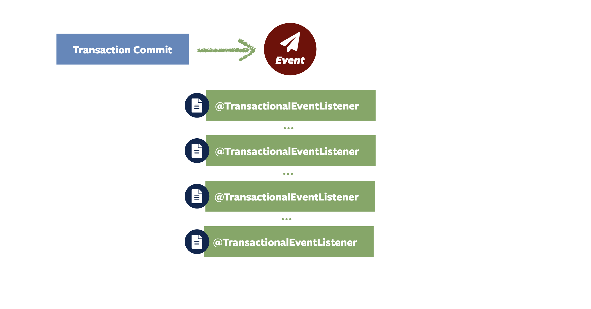
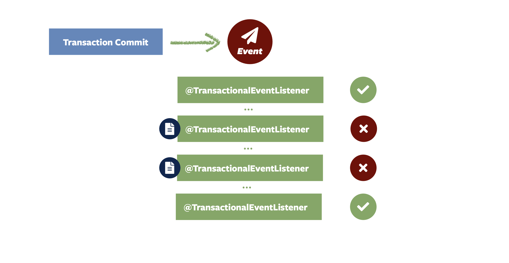
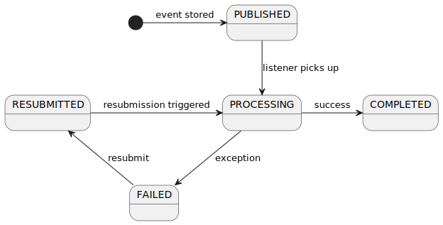
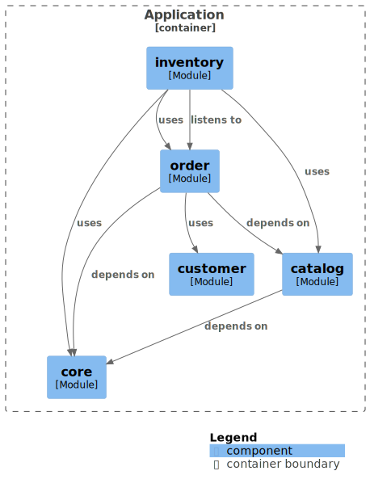
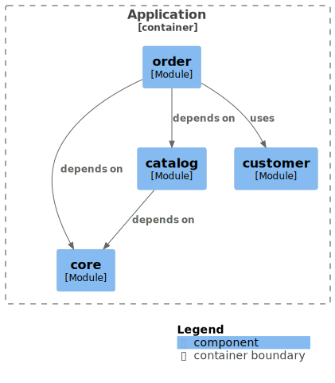
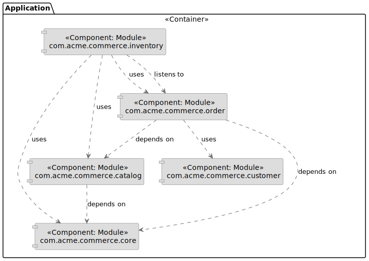
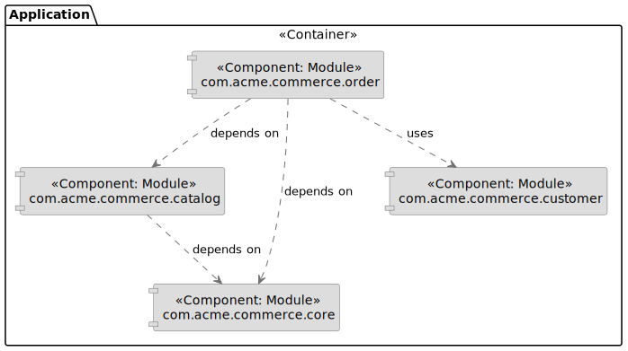
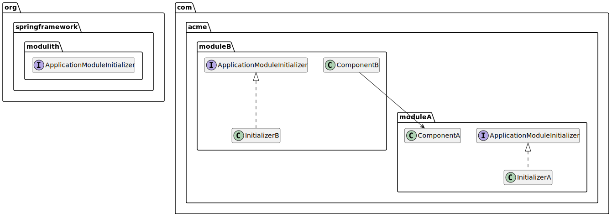
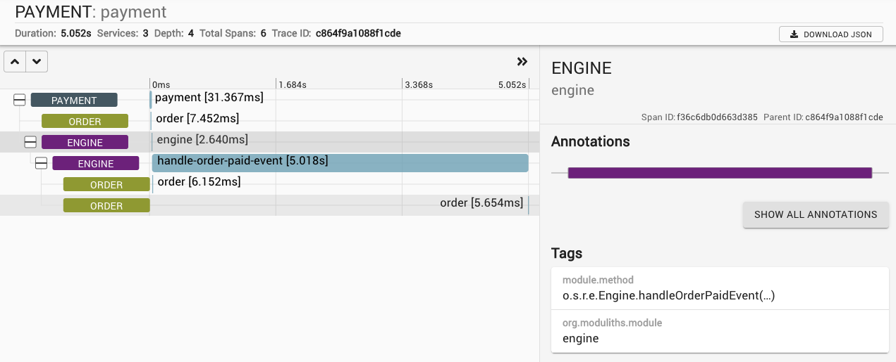

# Spring Modulith

## Navigation

- Overview
  
- [Overview](#index)
  
- [Fundamentals](#fundamentals)
  
- [Verifying Application Module Structure](#verification)
  
- [Working with Application Events](#events)
  
- [Integration Testing Application Modules](#testing)
  
- [Moments — a Passage of Time Events API](#moments)
  
- [Documenting Application Modules](#documentation)
  
- [Spring Modulith Runtime Support](#runtime)
  
- [Production-ready Features](#production-ready)
  
- [Appendix](#appendix)

## Content

<a id="index"></a>

<!-- source_url: https://docs.spring.io/spring-modulith/reference/index.html -->

<!-- page_index: 1 -->

# Spring Modulith

<svg enable-background="new 0 0 32 32" id="Glyph" version="1.1" viewbox="0 0 32 32" xml:space="preserve" xmlns="http://www.w3.org/2000/svg" xmlns:xlink="http://www.w3.org/1999/xlink">
<path id="XMLID_223_"></path>
</svg>

Search

<a id="index--page-title"></a>
<a id="index--spring-modulith"></a>

# Spring Modulith

© 2022-2025 The original authors.

> [!NOTE]
> Copies of this document may be made for your own use and for distribution to others, provided that you do not charge any fee for such copies and further provided that each copy contains this Copyright Notice, whether distributed in print or electronically.

<a id="index--overview"></a>

## Overview

Spring Modulith is an opinionated toolkit to build domain-driven, modular applications with Spring Boot.
In the same way that Spring Boot has an opinion on the technical arrangement of an application, Spring Modulith implements an opinion on how to structure an app functionally and allows its individual, logical parts to interact with each other.
As a result, Spring Modulith enables developers to build applications that are easier to update so they can accommodate changing business requirements over time.

<a id="index--preface.project-metadata"></a>
<a id="index--project-metadata"></a>

## Project Metadata

- Version control [github.com/spring-projects/spring-modulith](https://github.com/spring-projects/spring-modulith)
- Bug tracker: [github.com/spring-projects/spring-modulith](https://github.com/spring-projects/spring-modulith)
- Release repository: Maven central
- Milestone repository: [repo.spring.io/milestone](https://repo.spring.io/milestone)
- Snapshot repository: [repo.spring.io/snapshot](https://repo.spring.io/snapshot)
- Javadoc: [docs.spring.io/spring-modulith/docs/2.1.0/api](https://docs.spring.io/spring-modulith/docs/2.1.0/api)

<a id="index--compatibility"></a>
<a id="index--spring-boot-compatibility"></a>

## Spring Boot compatibility

Find a full Spring Boot compatibility matrix [here](#appendix--compatibility-matrix).

<a id="index--using-spring-modulith"></a>

## Using Spring Modulith

Spring Modulith consists of a set of libraries that can be used individually and depending on which features of it you would like to use.
To ease the declaration of the individual modules, we recommend to declare the following BOM in your Maven POM:

Using the Spring Modulith BOM

- Maven
- Gradle

```xml
<dependencyManagement>
  <dependencies>
    <dependency>
      <groupId>org.springframework.modulith</groupId>
      <artifactId>spring-modulith-bom</artifactId>
      <version>2.1.0</version>
      <scope>import</scope>
      <type>pom</type>
    </dependency>
  </dependencies>
</dependencyManagement>
```

```none
dependencyManagement {
	imports {
		mavenBom 'org.springframework.modulith:spring-modulith-bom:2.1.0'
	}
}
```

The individual sections describing Spring Modulith features will refer to the individual artifacts that are needed to make use of the feature.
For an overview about all modules available, have a look at [Spring Modulith modules](#appendix--artifacts).

<a id="index--examples"></a>

## Examples

If you would like to play with the features of the project and see them live in action, check out the examples [here](https://github.com/spring-projects/spring-modulith/tree/2.1.0/spring-modulith-examples)

[Fundamentals](#fundamentals)

---

<a id="fundamentals"></a>

<!-- source_url: https://docs.spring.io/spring-modulith/reference/fundamentals.html -->

<!-- page_index: 2 -->

# Fundamentals

<svg enable-background="new 0 0 32 32" id="Glyph" version="1.1" viewbox="0 0 32 32" xml:space="preserve" xmlns="http://www.w3.org/2000/svg" xmlns:xlink="http://www.w3.org/1999/xlink">
<path id="XMLID_223_"></path>
</svg>

Search

<a id="fundamentals--page-title"></a>
<a id="fundamentals--fundamentals"></a>

# Fundamentals

Spring Modulith supports developers implementing logical modules in Spring Boot applications.
It allows them to apply structural validation, document the module arrangement, run integration tests for individual modules, observe the modules' interaction at runtime, and generally implement module interaction in a loosely coupled way.
This section will discuss the fundamental concepts that developers need to understand before diving into the technical support.

<a id="fundamentals--modules"></a>
<a id="fundamentals--application-modules"></a>

## Application Modules

In a Spring Boot application, an application module is a unit of functionality that consists of the following parts:

- An API exposed to other modules implemented by Spring bean instances and application events published by the module, usually referred to as *provided interface*.
- Internal implementation components that are not supposed to be accessed by other modules.
- References to API exposed by other modules in the form of Spring bean dependencies, application events listened to and configuration properties exposed, usually referred to as *required interface*.

Spring Modulith provides different ways of expressing modules within Spring Boot applications, primarily differing in the level of complexity involved in the overall arrangement.
This allows developers to start simple and naturally move to more sophisticated means as and if needed.

<a id="fundamentals--modules.application-modules"></a>
<a id="fundamentals--the-applicationmodules-type"></a>

### The `ApplicationModules` Type

Spring Modulith allows to inspect a codebase to derive an application module model based on the given arrangement and optional configuration.
The `spring-modulith-core` artifact contains `ApplicationModules` that can be pointed to a Spring Boot application class:

Creating an application module model

- Java
- Kotlin

```java
var modules = ApplicationModules.of(Application.class);
```

```kotlin
val modules = ApplicationModules.of(Application::class.java)
```

The `modules` will contain an in-memory representation of the application module arrangement derived from the codebase.
Which parts of that will be detected as a module depends on the Java package structure underneath the package the class pointed to resides in.
Find out more about the arrangement expected by default in [Simple Application Modules](#fundamentals--modules.simple).
Advanced arrangements and customization options are described in [Advanced Application Modules](#fundamentals--modules.advanced) and

To get an impression of what the analyzed arrangement looks like, we can just write the individual modules contained in the overall model to the console:

Writing the application module arrangement to the console

- Java
- Kotlin

```java
modules.forEach(System.out::println);
```

```kotlin
modules.forEach { println(it) }
```

The console output of our application module arrangement

```none
## example.inventory ##
> Logical name: inventory
> Base package: example.inventory
> Spring beans:
  + ….InventoryManagement
  o ….SomeInternalComponent

## example.order ##
> Logical name: order
> Base package: example.order
> Spring beans:
  + ….OrderManagement
  + ….internal.SomeInternalComponent
```

Note how each module is listed, the contained Spring components are identified, and the respective visibility is rendered, too.

<a id="fundamentals--modules.excluding-packages"></a>
<a id="fundamentals--excluding-packages"></a>

#### Excluding Packages

In case you would like to exclude certain Java classes or full packages from the application module inspection, you can do so with:

- Java
- Kotlin

```java
ApplicationModules.of(Application.class, JavaClass.Predicates.resideInAPackage("com.example.db")).verify();
```

```kotlin
ApplicationModules.of(Application::class.java, JavaClass.Predicates.resideInAPackage("com.example.db")).verify()
```

Additional examples of exclusions:

- `com.example.db` — Matches all files in the given package `com.example.db`.
- `com.example.db..` — Matches all files in the given package (`com.example.db`) and all sub-packages (`com.example.db.a` or `com.example.db.b.c`).
- `..example..` — Matches `a.example`, `a.example.b` or `a.b.example.c.d`, but not `a.exam.b`

Full details about possible matchers can be found in the JavaDoc of ArchUnit [`PackageMatcher`](https://github.com/TNG/ArchUnit/blob/main/archunit/src/main/java/com/tngtech/archunit/core/domain/PackageMatcher.java).

<a id="fundamentals--modules.simple"></a>
<a id="fundamentals--simple-application-modules"></a>

### Simple Application Modules

The application’s *main package* is the one that the main application class resides in.
That is the class, that is annotated with `@SpringBootApplication` and usually contains the `main(…)` method used to run it.
By default, each direct sub-package of the main package is considered an *application module package*.

If this package does not contain any sub-packages, it is considered a simple one.
It allows to hide code inside it by using Java’s package scope to hide types from being referred to by code residing in other packages and thus not subject to dependency injection into those.
Thus, naturally, the module’s API consists of all public types in the package.

Let us have a look at an example arrangement ( denotes a public type,  a package-private one).

A single inventory application module

```none
 Example
╰─  src/main/java
   ├─  example                        (1)
   │  ╰─  Application.java
   ╰─  example.inventory              (2)
      ├─  InventoryManagement.java
      ╰─  SomethingInventoryInternal.java
```

**1**

The application’s main package `example`.

**2**

An application module package `inventory`.

<a id="fundamentals--modules.advanced"></a>
<a id="fundamentals--advanced-application-modules"></a>

### Advanced Application Modules

If an application module package contains sub-packages, types in those might need to be made public so that it can be referred to from code of the very same module.

An inventory and order application module

```none
 Example
╰─  src/main/java
   ├─  example
   │  ╰─  Application.java
   ├─  example.inventory
   │  ├─  InventoryManagement.java
   │  ╰─  SomethingInventoryInternal.java
   ├─  example.order
   │  ╰─  OrderManagement.java
   ╰─  example.order.internal
      ╰─  SomethingOrderInternal.java
```

In such an arrangement, the `order` package is considered an API package.
Code from other application modules is allowed to refer to types within that.
`order.internal`, just as any other sub-package of the application module base package, is considered an *internal* one.
Code within those must not be referred to from other modules.
Note how `SomethingOrderInternal` is a public type, likely because `OrderManagement` depends on it.
This unfortunately means that it can also be referred to from other packages such as the `inventory` one.
In this case, the Java compiler is not of much use to prevent these illegal references.

<a id="fundamentals--modules.nested"></a>
<a id="fundamentals--nested-application-modules"></a>

### Nested Application Modules

As of version 1.3, Spring Modulith application modules can contain nested modules.
This allows governing the internal structure in case a module contains parts to be logically separated in turn.
To define nested application modules, explicitly annotate packages that are supposed to constitute with `@ApplicationModule`.

```none
 Example
╰─  src/main/java
   │
   ├─  example
   │  ╰─  Application.java
   │
   │  -> Inventory
   │
   ├─  example.inventory
   │  ├─  InventoryManagement.java
   │  ╰─  SomethingInventoryInternal.java
   ├─  example.inventory.internal
   │  ╰─  SomethingInventoryInternal.java
   │
   │  -> Inventory > Nested
   │
   ├─  example.inventory.nested
   │  ├─  package-info.java // @ApplicationModule
   │  ╰─  NestedApi.java
   ├─  example.inventory.nested.internal
   │  ╰─  NestedInternal.java
   │
   │  -> Order
   │
   ╰─  example.order
      ├─  OrderManagement.java
      ╰─  SomethingOrderInternal.java
```

In this example `inventory` is an application module as described [above](#fundamentals--modules.simple).
The `@ApplicationModule` annotation on the `nested` package caused that to become a nested application module in turn.
In that arrangement, the following access rules apply:

- The code in *Nested* is only available from *Inventory* or any types exposed by sibling application modules nested inside *Inventory*.
- Any code in the *Nested* module can access code in parent modules, even internal.
  I.e., both `NestedApi` and `NestedInternal` can access `inventory.internal.SomethingInventoryInternal`.
- Code from nested modules can also access exposed types by top-level application modules.
  Any code in `nested` (or any sub-packages) can access `OrderManagement`.

<a id="fundamentals--modules.open"></a>
<a id="fundamentals--open-application-modules"></a>

### Open Application Modules

The arrangement described [above](#fundamentals--modules.advanced) are considered closed as they only expose types to other modules that are actively selected for exposure.
When applying Spring Modulith to legacy applications, hiding all types located in nested packages from other modules might be inadequate or require marking all those packages for exposure, too.

To turn an application module into an open one, use the `@ApplicationModule` annotation on the `package-info.java` type.

Declaring an Application Modules as Open

- Java
- Kotlin

```java
@org.springframework.modulith.ApplicationModule(
  type = Type.OPEN
)
package example.inventory;
```

```kotlin
package example.inventory

import org.springframework.modulith.ApplicationModule
import org.springframework.modulith.PackageInfo

@ApplicationModule(
  type = Type.OPEN
)
@PackageInfo
class ModuleMetadata {}
```

Declaring an application module as open will cause the following changes to the verification:

- Access to application module internal types from other modules is generally allowed.
- All types, also ones residing in sub-packages of the application module base package are added to the [unnamed named interface](#fundamentals--modules.named-interfaces), unless explicitly assigned to a named interface.

> [!NOTE]
> This feature is intended to be primarily used with code bases of existing projects gradually moving to the Spring Modulith recommended packaging structure.
> In a fully-modularized application, using open application modules usually hints at sub-optimal modularization and packaging structures.

<a id="fundamentals--modules.explicit-dependencies"></a>
<a id="fundamentals--explicit-application-module-dependencies"></a>

### Explicit Application Module Dependencies

A module can opt into declaring its allowed dependencies by using the `@ApplicationModule` annotation on the package, represented through the `package-info.java` file.
As, for example, Kotlin lacks support for that file, you can also use the annotation on a single type located in the application module’s root package.

Inventory explicitly configuring module dependencies

- Java
- Kotlin

```java
@org.springframework.modulith.ApplicationModule(
  allowedDependencies = "order"
)
package example.inventory;
```

```kotlin
package example.inventory

import org.springframework.modulith.ApplicationModule

@ApplicationModule(allowedDependencies = "order")
class ModuleMetadata {}
```

In this case code within the *inventory* module was only allowed to refer to code in the *order* module (and code not assigned to any module in the first place).
Find out about how to monitor that in [Verifying Application Module Structure](#verification).

<a id="fundamentals--modules.named-interfaces"></a>
<a id="fundamentals--named-interfaces"></a>

### Named Interfaces

By default and as described in [Advanced Application Modules](#fundamentals--modules.advanced), an application module’s base package is considered the API package and thus is the only package to allow incoming dependencies from other modules.
In case you would like to expose additional packages to other modules, you need to use *named interfaces*.
You achieve that by annotating the `package-info.java` file of those packages with `@NamedInterface` or a type explicitly annotated with `@org.springframework.modulith.PackageInfo`.

A package arrangement to encapsulate an SPI named interface

```text
 Example
╰─  src/main/java
   ├─  example
   │  ╰─  Application.java
   ├─ …
   ├─  example.order
   │  ╰─  OrderManagement.java
   ├─  example.order.spi
   │  ├—  package-info.java
   │  ╰─  SomeSpiInterface.java
   ╰─  example.order.internal
      ╰─  SomethingOrderInternal.java
```

`package-info.java` in `example.order.spi`

- Java
- Kotlin

```java
@org.springframework.modulith.NamedInterface("spi")
package example.order.spi;
```

```kotlin
package example.order.spi

import org.springframework.modulith.PackageInfo
import org.springframework.modulith.NamedInterface

@PackageInfo
@NamedInterface("spi")
class ModuleMetadata {}
```

The effect of that declaration is twofold: first, code in other application modules is allowed to refer to `SomeSpiInterface`.
Application modules are able to refer to the named interface in explicit dependency declarations.
Assume the *inventory* module was making use of that, it could refer to the above declared named interface like this:

Defining allowed dependencies to dedicated named interfaces

- Java
- Kotlin

```java
@org.springframework.modulith.ApplicationModule(
  allowedDependencies = "order :: spi"
)
package example.inventory;
```

```kotlin
package example.inventory

import org.springframework.modulith.ApplicationModule
import org.springframework.modulith.PackageInfo

@ApplicationModule(
  allowedDependencies = "order :: spi"
)
@PackageInfo
class ModuleMetadata {}
```

Note how we concatenate the named interface’s name `spi` via the double colon `::`.
In this setup, code in *inventory* would be allowed to depend on `SomeSpiInterface` and other code residing in the `order.spi` interface, but not on `OrderManagement` for example.
For modules without explicitly described dependencies, both the application module root package **and** the SPI one are accessible.

If you wanted to express that an application module is allowed to refer to all explicitly declared named interfaces, you can use the asterisk (`*`) as follows:

Using the asterisk to declare allowed dependencies to all declared named interfaces

- Java
- Kotlin

```java
@org.springframework.modulith.ApplicationModule(
  allowedDependencies = "order :: *"
)
package example.inventory;
```

```kotlin
package example.inventory

import org.springframework.modulith.ApplicationModule
import org.springframework.modulith.PackageInfo

@ApplicationModule(
  allowedDependencies = "order :: *"
)
@PackageInfo
class ModuleMetadata {}
```

If you require more generic control about the named interfaces of an application module, check out [the customization section](#fundamentals--customizing-named-interfaces).

<a id="fundamentals--customizing-modules-arrangement"></a>
<a id="fundamentals--customizing-the-application-modules-arrangement"></a>

## Customizing the Application Modules Arrangement

Spring Modulith allows to configure some core aspects around the application module arrangement you create via the `@Modulithic` annotation to be used on the main Spring Boot application class.

- Java
- Kotlin

```java
package example;

import org.springframework.boot.SpringApplication;
import org.springframework.boot.autoconfigure.SpringBootApplication;
import org.springframework.modulith.Modulithic;

@Modulithic
@SpringBootApplication
class MyApplication {

  public static void main(String... args) {
    SpringApplication.run(MyApplication.class, args);
  }
}
```

```kotlin
package example

import org.springframework.boot.autoconfigure.SpringBootApplication
import org.springframework.boot.runApplication
import org.springframework.modulith.Modulithic

@Modulithic
@SpringBootApplication
class MyApplication

fun main(args: Array<String>) {
  runApplication<MyApplication>(*args)
}
```

The annotation exposes the following attributes to customize:

| Annotation attribute | Description |
| --- | --- |
| `systemName` | The human readable name of the application to be used in generated [documentation](#documentation--documentation). |
| `sharedModules` | Declares the application modules with the given names as shared modules, which means that they will always be included in [application module integration tests](#testing--testing). |
| `additionalPackages` | Instructs Spring Modulith to treat the configured packages as additional root application packages. In other words, application module detection will be triggered for those as well. |

<a id="fundamentals--customizing-modules"></a>
<a id="fundamentals--customizing-module-detection"></a>

### Customizing Module Detection

By default, application modules will be expected to be located in direct sub-packages of the package the Spring Boot application class resides in.
An alternative detection strategy can be activated to only consider packages explicitly annotated, either via Spring Modulith’s `@ApplicationModule` or jMolecules `@Module` annotation.
That strategy can be activated by configuring the `spring.modulith.detection-strategy` to `explicitly-annotated`.

Switching the application module detection strategy to only consider annotated packages

```text
spring.modulith.detection-strategy=explicitly-annotated
```

If neither the default application module detection strategy nor the manually annotated one works for your application, the detection of the modules can be customized by providing an implementation of `ApplicationModuleDetectionStrategy`.
That interface exposes a single method `Stream<JavaPackage> getModuleBasePackages(JavaPackage)` and will be called with the package the Spring Boot application class resides in.
You can then inspect the packages residing within that and select the ones to be considered application module base packages based on a naming convention or the like.

Assume you declare a custom `ApplicationModuleDetectionStrategy` implementation like this:

Implementing a custom `ApplicationModuleDetectionStrategy`

- Java
- Kotlin

```java
package example;
class CustomApplicationModuleDetectionStrategy implements ApplicationModuleDetectionStrategy {
@Override public Stream<JavaPackage> getModuleBasePackages(JavaPackage basePackage) {// Your module detection goes here}}
```

```kotlin
package example
class CustomApplicationModuleDetectionStrategy : ApplicationModuleDetectionStrategy {
override fun getModuleBasePackages(basePackage: JavaPackage): Stream<JavaPackage> {// Your module detection goes here}}
```

This class can now be registered as `spring.modulith.detection-strategy` as follows:

```text
spring.modulith.detection-strategy=example.CustomApplicationModuleDetectionStrategy
```

If you are implementing the `ApplicationModuleDetectionStrategy` interface to customize the verification and documentation of modules, include the customization and its registration in your application’s test sources.
However, if you are using Spring Modulith [runtime components](#runtime--spring-modulith-runtime-support) (such as the `ApplicationModuleInitializer`s, or the [production-ready features](#production-ready--production-ready-features) like the actuator and observability support), you need to explicitly declare the following as a compile-time dependency:

- Maven
- Gradle

```xml
<dependency>
  <groupId>org.springframework.modulith</groupId>
  <artifactId>spring-modulith-core</artifactId>
</dependency>
```

```groovy
dependencies {
  implementation 'org.springframework.modulith:spring-modulith-core'
}
```

<a id="fundamentals--contributing-application-modules"></a>
<a id="fundamentals--contributing-application-modules-from-other-packages"></a>

### Contributing Application Modules From Other Packages

While `@Modulithic` allows defining `additionalPackages` to trigger application module detection for packages other than the one of the annotated class, its usage requires knowing about those in advance.
As of version 1.3, Spring Modulith supports external contributions of application modules via the `ApplicationModuleSource` and `ApplicationModuleSourceFactory` abstractions.
An implementation of the latter can be registered in a `spring.factories` file located in `META-INF`.

```text
org.springframework.modulith.core.ApplicationModuleSourceFactory=example.CustomApplicationModuleSourceFactory
```

Such a factory can either return arbitrary package names to get an `ApplicationModuleDetectionStrategy` applied, or explicitly return packages to create modules for.

```java
package example;
public class CustomApplicationModuleSourceFactory implements ApplicationModuleSourceFactory {
@Override public List<String> getRootPackages() {return List.of("com.acme.toscan");}
@Override public ApplicationModuleDetectionStrategy getApplicationModuleDetectionStrategy() {return ApplicationModuleDetectionStrategy.explicitlyAnnotated();}
@Override public List<String> getModuleBasePackages() {return List.of("com.acme.module");}}
```

The above example would use `com.acme.toscan` to detect [explicitly declared modules](#fundamentals--customizing-modules) within that and also create an application module from `com.acme.module`.
The package names returned from these will subsequently be translated into `ApplicationModuleSource`s via the corresponding `getApplicationModuleSource(…)` flavors exposed in `ApplicationModuleDetectionStrategy`.

<a id="fundamentals--customizing-named-interfaces"></a>
<a id="fundamentals--customizing-named-interface-detection"></a>

### Customizing Named Interface detection

If you would like to programatically describe the named interfaces of an application module, register an `ApplicationModuleDetectionStrategy` as described [here](#fundamentals--customizing-modules) and use the `detectNamedInterfaces(JavaPackage, ApplicationModuleInformation)` to implement a custom discovery algorithm.

Customizing the named interface detection using a custom `ApplicationModuleDetectionStrategy`

- Java
- Kotlin

```java
package example;
class CustomApplicationModuleDetectionStrategy implements ApplicationModuleDetectionStrategy {
@Override public Stream<JavaPackage> getModuleBasePackages(JavaPackage basePackage) {// Your module detection goes here}
@Override NamedInterfaces detectNamedInterfaces(JavaPackage basePackage, ApplicationModuleInformation information) {return NamedInterfaces.builder() .recursive() .matching("api") .build();}}
```

```kotlin
package example
class CustomApplicationModuleDetectionStrategy : ApplicationModuleDetectionStrategy {
override fun getModuleBasePackages(basePackage: JavaPackage): Stream<JavaPackage> {// Your module detection goes here}
override fun detectNamedInterfaces(basePackage: JavaPackage, information: ApplicationModuleInformation): NamedInterfaces {return NamedInterfaces.builder() .recursive() .matching("api") .build()}}
```

In the `detectNamedInterfaces(…)` implementation shown above, we build up a `NamedInterfaces` instance for all packages named `api` underneath the given application module’s base package.
The `Builder` API exposes additional methods to select packages as named interfaces or explicitly exclude them from that.
Note, that the builder will always include the unnamed named interface containing all public methods located in the application module’s base package as that interface is required for application modules.

For a more manual setup of a `NamedInterfaces`, be sure to check out its factory methods and the ones exposed by `NamedInterface`.

[Overview](#index)
[Verifying Application Module Structure](#verification)

---

<a id="verification"></a>

<!-- source_url: https://docs.spring.io/spring-modulith/reference/verification.html -->

<!-- page_index: 3 -->

# Verifying Application Module Structure

<svg enable-background="new 0 0 32 32" id="Glyph" version="1.1" viewbox="0 0 32 32" xml:space="preserve" xmlns="http://www.w3.org/2000/svg" xmlns:xlink="http://www.w3.org/1999/xlink">
<path id="XMLID_223_"></path>
</svg>

Search

<a id="verification--page-title"></a>
<a id="verification--verifying-application-module-structure"></a>

# Verifying Application Module Structure

We can verify whether our code arrangement adheres to the intended constraints by calling the `….verify()` method on our `ApplicationModules` instance:

- Java
- Kotlin

```java
ApplicationModules.of(Application.class).verify();
```

```kotlin
ApplicationModules.of(Application::class.java).verify()
```

The verification includes the following rules:

- *No cycles on the application module level* — the dependencies between modules have to form a directed acyclic graph.
- *Efferent module access via API packages only* — all references to types that reside in application module internal packages are rejected.
  See [Advanced Application Modules](#fundamentals--modules.advanced) for details.
  Dependencies into internals of [Open Application Modules](#fundamentals--modules.advanced.open) are allowed.
- *Explicitly allowed application module dependencies only* (optional) — an application module can optionally define allowed dependencies via `@ApplicationModule(allowedDependencies = …)`.
  If those are configured, dependencies to other application modules are rejected.
  See [Explicit Application Module Dependencies](#fundamentals--modules.explicit-dependencies) and [Named Interfaces](#fundamentals--modules.named-interfaces) for details.

Spring Modulith optionally integrates with the jMolecules ArchUnit library and, if present, automatically triggers its Domain-Driven Design and architectural verification rules described [here](https://github.com/xmolecules/jmolecules-integrations/tree/main/jmolecules-archunit).

<a id="verification--_handling_detected_violations"></a>
<a id="verification--handling-detected-violations"></a>

## Handling Detected Violations

`ApplicationModules.verify()` throws an exception in case of any architectural violation being detected.
You can access the violations for further processing, such as ignoring certain violations, by instead calling `ApplicationModules.detectViolations()`.

```java
ApplicationModules.of(…)
  .detectViolations()
  .filter(violation -> …)
  .throwIfPresent();
```

<a id="verification--_customizing_the_verification"></a>
<a id="verification--customizing-the-verification"></a>

## Customizing the Verification

As described [above](#verification--verification), by default, both the `ApplicationModules.verify(…)` and `….detectViolations(…)` automatically perform additional verifications depending on the classpath configuration.

To customize these, disable them or register additional verifications, both `verify(…)` and `detectVolations(…)` take a `VerificationOptions` instance.

```java
var hexagonal = JMoleculesArchitectureRules.ensureHexagonal(VerificationDepth.STRICT); (1)
var options = VerificationOptions.defaults().withAdditionalVerifications(hexagonal); (2)

ApplicationModules.of(…).verify(options); (3)
```

**1**

Set up the jMolecules Architecture verification for Hexagonal Architecture in strict mode.

**2**

Create a `VerificationOptions` instance replacing the default verification with the one just set up.

**3**

Execute the verification using the just configured options.

[Fundamentals](#fundamentals)
[Working with Application Events](#events)

---

<a id="events"></a>

<!-- source_url: https://docs.spring.io/spring-modulith/reference/events.html -->

<!-- page_index: 4 -->

# Working with Application Events

<svg enable-background="new 0 0 32 32" id="Glyph" version="1.1" viewbox="0 0 32 32" xml:space="preserve" xmlns="http://www.w3.org/2000/svg" xmlns:xlink="http://www.w3.org/1999/xlink">
<path id="XMLID_223_"></path>
</svg>

Search

<a id="events--page-title"></a>
<a id="events--working-with-application-events"></a>

# Working with Application Events

To keep application modules as decoupled as possible from each other, their primary means of interaction should be event publication and consumption.
This avoids the originating module to know about all potentially interested parties, which is a key aspect to enable application module integration testing (see [Integration Testing Application Modules](#testing)).

Often we will find application components defined like this:

- Java
- Kotlin

```java
@Service
@RequiredArgsConstructor
public class OrderManagement {

  private final InventoryManagement inventory;

  @Transactional
  public void complete(Order order) {

    // State transition on the order aggregate go here

    // Invoke related functionality
    inventory.updateStockFor(order);
  }
}
```

```kotlin
@Service class OrderManagement(val inventory: InventoryManagement) {
@Transactional fun complete(order: Order) {inventory.updateStockFor(order)}}
```

The `complete(…)` method creates functional gravity in the sense that it attracts related functionality and thus interaction with Spring beans defined in other application modules.
This especially makes the component harder to test as we need to have instances available of those depended on beans just to create an instance of `OrderManagement` (see [Dealing with Efferent Dependencies](#testing--efferent-dependencies)).
It also means that we will have to touch the class whenever we would like to integrate further functionality with the business event order completion.

We can change the application module interaction as follows:

Publishing an application event via Spring’s `ApplicationEventPublisher`

- Java
- Kotlin

```java
@Service
@RequiredArgsConstructor
public class OrderManagement {

  private final ApplicationEventPublisher events;
  private final OrderInternal dependency;

  @Transactional
  public void complete(Order order) {

    // State transition on the order aggregate go here

    events.publishEvent(new OrderCompleted(order.getId()));
  }
}
```

```kotlin
@Service class OrderManagement(val events: ApplicationEventPublisher, val dependency: OrderInternal) {
@Transactional fun complete(order: Order) {events.publishEvent(OrderCompleted(order.id))}}
```

Note how, instead of depending on the other application module’s Spring bean, we use Spring’s `ApplicationEventPublisher` to publish a domain event once we have completed the state transitions on the primary aggregate.
For a more aggregate-driven approach to event publication, see [Spring Data’s application event publication mechanism](https://docs.spring.io/spring-data/commons/reference/repositories/core-domain-events.html) for details.
As event publication happens synchronously by default, the transactional semantics of the overall arrangement stay the same as in the example above.
Both for the good, as we get to a very simple consistency model (either both the status change of the order *and* the inventory update succeed or none of them does), but also for the bad as more triggered related functionality will widen the transaction boundary and potentially cause the entire transaction to fail, even if the functionality that is causing the error is not crucial.

A different way of approaching this is by moving the event consumption to asynchronous handling at transaction commit and treat secondary functionality exactly as that:

An async, transactional event listener

- Java
- Kotlin

```java
@Component
class InventoryManagement {

  @Async
  @TransactionalEventListener
  void on(OrderCompleted event) { /* … */ }
}
```

```kotlin
@Component
class InventoryManagement {

  @Async
  @TransactionalEventListener
  fun on(event: OrderCompleted) { /* … */ }
}
```

This now effectively decouples the original transaction from the execution of the listener.
While this avoids the expansion of the original business transaction, it also creates a risk: if the listener fails for whatever reason, the event publication is lost, unless each listener actually implements its own safety net.
Even worse, that doesn’t even fully work, as the system might fail before the method is even invoked.

<a id="events--aml"></a>
<a id="events--application-module-listener"></a>

## Application Module Listener

To run a transactional event listener in a transaction itself, it would need to be annotated with `@Transactional` in turn.

An async, transactional event listener running in a transaction itself

- Java
- Kotlin

```java
@Component
class InventoryManagement {

  @Async
  @Transactional(propagation = Propagation.REQUIRES_NEW)
  @TransactionalEventListener
  void on(OrderCompleted event) { /* … */ }
}
```

```kotlin
@Component
class InventoryManagement {

  @Async
  @Transactional(propagation = Propagation.REQUIRES_NEW)
  @TransactionalEventListener
  fun on(event: OrderCompleted) { /* … */ }
}
```

To ease the declaration of what is supposed to describe the default way of integrating modules via events, Spring Modulith provides `@ApplicationModuleListener` as a shortcut.

An application module listener

- Java
- Kotlin

```java
@Component
class InventoryManagement {

  @ApplicationModuleListener
  void on(OrderCompleted event) { /* … */ }
}
```

```kotlin
@Component
class InventoryManagement {

  @ApplicationModuleListener
  fun on(event: OrderCompleted) { /* … */ }
}
```

<a id="events--publication-registry"></a>
<a id="events--the-event-publication-registry"></a>

## The Event Publication Registry

Spring Modulith ships with an event publication registry that hooks into the core event publication mechanism of Spring Framework.
On event publication, it finds out about the transactional event listeners that will get the event delivered and writes entries for each of them (dark blue) into an event publication log as part of the original business transaction.
By default, all event listeners (meta-)annotated with `@TransactionalEventListener` are considered.
If you want to customize this, check out the  [`spring.modulith.events.registry-trigger-annotation` property](#appendix--configuration-properties).



Figure 1. The transactional event listener arrangement before execution

Each transactional event listener is wrapped into an aspect that marks that log entry as completed if the execution of the listener succeeds.
In case the listener fails, the log entry stays untouched so that retry mechanisms can be deployed depending on the application’s needs.
Automatic re-publication of the events can be enabled via the [`spring.modulith.events.republish-outstanding-events-on-restart`](#appendix--configuration-properties) property.



Figure 2. The transactional event listener arrangement after execution

<a id="events--publication-registry.lifecycle"></a>
<a id="events--event-publication-lifecycle-since-2.0"></a>

### Event Publication Lifecycle (since 2.0)

Spring Modulith 2.0 introduces a dedicated lifecycle for event publications so that you can distinguish publications that are about to be processed, currently in progress, completed, or failed.
That makes it easier to resubmit only failed publications and to recover from crashes without incorrectly treating in-progress ones as failed.

<a id="events--publication-registry.lifecycle.states"></a>
<a id="events--publication-states"></a>

#### Publication states

Each event publication has a `EventPublication.Status`:

- `PUBLISHED` – The publication was stored and is waiting to be processed (or is about to be picked up).
- `PROCESSING` – A listener has claimed the publication and is executing. The interceptor around the listener sets this before invoking the listener and sets it to `COMPLETED` or `FAILED` when the listener returns.
- `COMPLETED` – The listener finished successfully. A completion date is set (unless the completion [mode is `DELETE`](#events--publication-registry.completion)).
- `FAILED` – The listener threw an exception, or the publication was marked failed by the staleness mechanism (see [Event Publication Staleness and Automatic Marking as Failed](#events--publication-registry.lifecycle.staleness)).
- `RESUBMITTED` – A previously failed publication was resubmitted and is again pending processing.



<a id="events--publication-registry.lifecycle.details"></a>
<a id="events--publication-details"></a>

#### Publication details

In addition to the status, each publication tracks:

- *Last resubmission date* – When the publication was last resubmitted (if ever). Exposed via `EventPublication.getLastResubmissionDate()`.
- *Completion attempts* – How often the listener was invoked (including the current run). Incremented when moving to `PROCESSING`, so a crash during the listener still leaves the attempt count updated. Exposed via `EventPublication.getCompletionAttempts()`.

These allow you to implement policies such as "resubmit only if failed longer than X" or "stop after N attempts" using the resubmission APIs and options.

<a id="events--publication-registry.lifecycle.staleness"></a>
<a id="events--event-publication-staleness-and-automatic-marking-as-failed"></a>

#### Event Publication Staleness and Automatic Marking as Failed

Publications can remain in `PUBLISHED`, `PROCESSING`, or `RESUBMITTED` if the application crashes or a listener hangs.
So that they can be treated as failed and resubmitted (or ignored), you can configure after which duration each of these states is considered *stale*. Stale publications are periodically marked as `FAILED` by a background task.

Spring Modulith provides a *Staleness Monitor* (since 2.0) that runs as a scheduled task at a configurable interval.
When any of the staleness durations is set to a non-zero value, the monitor is active: on each run it finds event publications in `PUBLISHED`, `PROCESSING`, or `RESUBMITTED` that are older than the corresponding duration and marks them as `FAILED`. That allows recovery (e.g. via `FailedEventPublications.resubmit(…)`) or other handling of publications that would otherwise remain stuck.
You customize it via the [`spring.modulith.events.staleness` configuration properties](#appendix--configuration-properties).
If all of `published`, `processing`, and `resubmitted` are zero (default), the Staleness Monitor does not register the scheduled task and no automatic marking as failed occurs.

<a id="events--publication-registry.lifecycle.failed-and-resubmission"></a>
<a id="events--failed-publications-and-resubmission"></a>

#### Failed publications and resubmission

The registry lets you work explicitly with failed publications:

- *FailedEventPublications* (since 2.0) – Use the bean of this type to resubmit only failed publications: `resubmit(ResubmissionOptions)`.
- *ResubmissionOptions* – Control how resubmission works: batch size, maximum in-flight, minimum age of the publication, and an optional filter (e.g. by event type or `completionAttempts`). Create with `ResubmissionOptions.defaults()` and customize with `withBatchSize(…)`, `withMinAge(…)`, `withFilter(…)`, etc.

Resubmission changes the status from `FAILED` to `RESUBMITTED` and updates the last resubmission date; when a listener is about to run, the publication moves to `PROCESSING` and the completion attempt count is incremented.

For "incomplete" publications in general (including failed and, depending on configuration, stale ones), the existing `IncompleteEventPublications` API still applies; as of 2.0 it supports `resubmitIncompletePublications(ResubmissionOptions)` in addition to the predicate- and duration-based overloads.

<a id="events--publication-registry.starters"></a>
<a id="events--spring-boot-event-registry-starters"></a>

### Spring Boot Event Registry Starters

Using the transactional event publication log requires a combination of artifacts added to your application.
To ease that task, Spring Modulith provides starter POMs that are centered around the [persistence technology](#events--publication-registry.publication-repositories) to be used and default to the Jackson-based [EventSerializer](#events--publication-registry.serialization) implementation.
The following starters are available:

| Persistence Technology | Artifact | Description |
| --- | --- | --- |
| JPA | `spring-modulith-starter-jpa` | Using JPA as persistence technology. |
| JDBC | `spring-modulith-starter-jdbc` | Using JDBC as persistence technology. Also works in JPA-based applications but bypasses your JPA provider for actual event persistence. |
| MongoDB | `spring-modulith-starter-mongodb` | Using MongoDB as persistence technology. Also enables MongoDB transactions and requires a replica set setup of the server to interact with. The transaction auto-configuration can be disabled by setting the `spring.modulith.events.mongodb.transaction-management.enabled` property to `false`. |
| Neo4j | `spring-modulith-starter-neo4j` | Using Neo4j behind Spring Data Neo4j. |

<a id="events--publication-registry.managing-publications"></a>
<a id="events--managing-event-publications"></a>

### Managing Event Publications

Event publications may need to be managed in a variety of ways during the runtime of an application.
Incomplete publications might have to be re-submitted to the corresponding listeners after a given amount of time.
Completed publications on the other hand, will likely have to be purged from the database or moved into an archive store.
As the needs for that kind of housekeeping strongly vary from application to application, Spring Modulith offers an API to deal with both kinds of publications.
That API is available through the `spring-modulith-events-api` artifact that you can add to your application:

Using Spring Modulith Events API artifact

- Maven
- Gradle

```xml
<dependency>
  <groupId>org.springframework.modulith</groupId>
  <artifactId>spring-modulith-events-api</artifactId>
  <version>2.1.0</version>
</dependency>
```

```none
dependencies {
  implementation 'org.springframework.modulith:spring-modulith-events-api:2.1.0'
}
```

This artifact contains primary abstractions that are available to application code as Spring Beans:

- `CompletedEventPublications` — This interface allows accessing all completed event publications, and provides an API to immediately purge all of them from the database or the completed publications older than a given duration (for example, 1 minute).
- `IncompleteEventPublications` — This interface allows accessing all incomplete event publications to resubmit either the ones matching a given predicate, older than a given `Duration` relative to the original publishing date, or matching custom criteria via `resubmitIncompletePublications(ResubmissionOptions)` (since 2.0).
- `FailedEventPublications` (since 2.0) — This interface allows resubmitting only failed event publications via `resubmit(ResubmissionOptions)`, as described in [Failed publications and resubmission](#events--publication-registry.lifecycle.failed-and-resubmission).

<a id="events--publication-registry.completion"></a>
<a id="events--event-publication-completion"></a>

### Event Publication Completion

Event publications are marked as completed when a transactional or `@ApplicationModuleListener` execution completes successfully.
By default, the completion is registered by setting the completion date on an `EventPublication`.
This means that completed publications will remain in the Event Publication Registry so that they can be inspected through the `CompletedEventPublications` interface as described [above](#events--publication-registry.managing-publications).
A consequence of this is that you’ll need to put some code in place that will periodically purge old, completed `EventPublication`s.
Otherwise, the persistent abstraction of them, for example a relational database table, will grow unbounded and the interaction with the store creating and completing new `EventPublication` might slow down.

Spring Modulith 1.3 introduces a configuration property `spring.modulith.events.completion-mode` to support two additional modes of completion.
It defaults to `UPDATE` which is backed by the strategy described above.
Alternatively, the completion mode can be set to `DELETE`, which alters the registry’s persistence mechanisms to rather delete `EventPublication`s on completion.
This means that `CompletedEventPublications` will not return any publications anymore, but at the same time, you don’t have to worry about purging the completed events from the persistence store manually anymore.

The third option is the `ARCHIVE` mode, which copies the entry into an archive table, collection or node.
For that archive entry, the completion date is set and the original entry is removed.
Contrary to the `DELETE` mode, completed event publications are then still accessible via the `CompletedEventPublications` abstraction.

<a id="events--publication-registry.publication-repositories"></a>
<a id="events--event-publication-repositories"></a>

### Event Publication Repositories

To actually write the event publication log, Spring Modulith exposes an `EventPublicationRepository` SPI and implementations for popular persistence technologies that support transactions, like JPA, JDBC and MongoDB.
You select the persistence technology to be used by adding the corresponding JAR to your Spring Modulith application.
We have prepared dedicated [starters](#events--starters) to ease that task.

The JDBC-based implementation will create a dedicated table for the event publication log unless the respective configuration property (`spring.modulith.events.jdbc.schema-initialization.enabled`) is set to `false`.
The schema creation will of course also back off if the required tables already exist, for example if created via database migration tools such as Flyway or Liquibase.
For details, please consult the [schema overview](#appendix--schemas) in the appendix.

<a id="events--publication-registry.serialization"></a>
<a id="events--event-serializer"></a>

### Event Serializer

Each log entry contains the original event in serialized form.
The `EventSerializer` abstraction contained in `spring-modulith-events-core` allows plugging different strategies for how to turn the event instances into a format suitable for the datastore.
Spring Modulith provides a Jackson-based JSON implementation through the `spring-modulith-events-jackson` artifact, which registers a `JacksonEventSerializer` consuming an `ObjectMapper` through standard Spring Boot auto-configuration by default.

<a id="events--publication-registry.customize-publication-date"></a>
<a id="events--customizing-the-event-publication-date"></a>

### Customizing the Event Publication Date

By default, the Event Publication Registry will use the date returned by the `Clock.systemUTC()` as event publication date.
If you want to customize this, register a bean of type clock with the application context:

```java
@Configuration class MyConfiguration {
@Bean Clock myCustomClock() {return … // Your custom Clock instance created here.}}
```

<a id="events--externalization"></a>
<a id="events--externalizing-events"></a>

## Externalizing Events

> [!IMPORTANT]
> The following section describes the Spring Modulith-native event externalization that is based on a asynchronous event listener.
> While this is a pragmatic, simple solution, it lacks critical features developers might expect from actual outbox pattern implementations.
> Spring Modulith 2.1 introduced support event externalization through the [Namastack Outbox](https://outbox.namastack.io/) and [JobRunr](http://jobrunr.io/).
> See the corresponding section ([Namastack](#events--externalization.namastack), [JobRunr](#events--externalization.jobrunr)) of the docs for details.

Some of the events exchanged between application modules might be interesting to external systems.
Spring Modulith allows publishing selected events to a variety of message brokers.
To use that support you need to take the following steps:

1. Add the [broker-specific Spring Modulith artifact](#events--externalization.infrastructure) to your project.
2. Select event types to be externalized by annotating them with either Spring Modulith’s or jMolecules' `@Externalized` annotation.
3. Specify the broker-specific routing target in the annotation’s value.

To find out how to use other ways of selecting events for externalization, or customize their routing within the broker, check out [Fundamentals of Event Externalization](#events--externalization.fundamentals).

<a id="events--externalization.infrastructure"></a>
<a id="events--supported-infrastructure"></a>

### Supported Infrastructure

| Broker | Artifact | Description |
| --- | --- | --- |
| Kafka | `spring-modulith-events-kafka` | Uses Spring Kafka for the interaction with the broker. The logical routing key will be used as Kafka’s topic and message key. |
| AMQP | `spring-modulith-events-amqp` | Uses Spring AMQP for the interaction with any compatible broker. Requires an explicit dependency declaration for Spring Rabbit for example. The logical routing key will be used as AMQP routing key. |
| JMS | `spring-modulith-events-jms` | Uses Spring’s core JMS support. Does not support routing keys. |
| Spring Messaging | `spring-modulith-events-messaging` | Uses Spring’s core `Message` and `MessageChannel` support. Resolves the target `MessageChannel` by its bean name given the `target` in the `Externalized` annotation. Forwards routing information as a header - called `springModulith_routingTarget` - to be processed in whatever way by downstream components, typically in a Spring Integration `IntegrationFlow`. |

<a id="events--externalization.fundamentals"></a>
<a id="events--fundamentals-of-event-externalization"></a>

### Fundamentals of Event Externalization

Spring Modulith’s event externalization is implemented as [transactional event listener](#events--aml) delegating to broker specific publication implementations.
That means that Spring Modulith’s [Event Publication Registry](#events--publication-registry) guards the externalization against failures during the interaction with the broker so that the publications can be resubmitted through the APIs provided.

The event externalization performs three steps on each application event published.

1. *Determining whether the event is supposed to be externalized* — We refer to this as “event selection”.
   By default, only event types located within a Spring Boot auto-configuration package and annotated with one of the supported `@Externalized` annotations are selected for externalization.
2. *Preparing the message (optional)* — By default, the event is serialized as is by the corresponding broker infrastructure.
   An optional mapping step allows developers to customize or even completely replace the original event with a payload suitable for external parties.
   For Kafka and AMQP, developers can also add headers to the message to be published.
3. *Determining a routing target* — Message broker clients need a logical target to publish the message to.
   The target usually identifies physical infrastructure (a topic, exchange, or queue depending on the broker) and is often statically derived from the event type.
   Unless defined in the `@Externalized` annotation specifically, Spring Modulith uses the application-local type name as target.
   In other words, in a Spring Boot application with a base package of `com.acme.app`, an event type `com.acme.app.sample.SampleEvent` would get published to `sample.SampleEvent`.

   Some brokers also allow to define a rather dynamic routing key, that is used for different purposes within the actual target.
   By default, no routing key is used.

<a id="events--externalization.annotations"></a>
<a id="events--annotation-based-event-externalization-configuration"></a>

### Annotation-based Event Externalization Configuration

To define a custom routing key via the `@Externalized` annotations, a pattern of `$target::$key` can be used for the target/value attribute available in each of the particular annotations.
Both the target and key can be a SpEL expression which will get the event instance configured as root object.

Defining a dynamic routing key via SpEL expression

- Java
- Kotlin

```java
@Externalized("customer-created::#{#this.getLastname()}") (2)
class CustomerCreated {

  String getLastname() { (1)
    // …
  }
}
```

```kotlin
@Externalized("customer-created::#{#this.getLastname()}") (2)
class CustomerCreated {
  fun getLastname(): String { (1)
    // …
  }
}
```

The `CustomerCreated` event exposes the last name of the customer via an accessor method.
That method is then used via the `#this.getLastname()` expression in key expression following the `::` delimiter of the target declaration.

If the key calculation becomes more involved, it is advisable to rather delegate that into a Spring bean that takes the event as argument:

Invoking a Spring bean to calculate a routing key

- Java
- Kotlin

```java
@Externalized("…::#{@beanName.someMethod(#this)}")
```

```kotlin
@Externalized("…::#{@beanName.someMethod(#this)}")
```

<a id="events--externalization.api"></a>
<a id="events--programmatic-event-externalization-configuration"></a>

### Programmatic Event Externalization Configuration

The `spring-modulith-events-api` artifact contains `EventExternalizationConfiguration` that allows developers to customize all of the above mentioned steps.

Programmatically configuring event externalization

- Java
- Kotlin

```java
@Configuration
class ExternalizationConfiguration {

  @Bean
  EventExternalizationConfiguration eventExternalizationConfiguration() {

    return EventExternalizationConfiguration.externalizing()                 (1)
      .select(EventExternalizationConfiguration.annotatedAsExternalized())   (2)
      .mapping(SomeEvent.class, event -> …)                                  (3)
      .headers(event -> …)                                                   (4)
      .routeKey(WithKeyProperty.class, WithKeyProperty::getKey)              (5)
      .build();
  }
}
```

```kotlin
@Configuration
class ExternalizationConfiguration {

  @Bean
  fun eventExternalizationConfiguration(): EventExternalizationConfiguration {

    EventExternalizationConfiguration.externalizing()                         (1)
      .select(EventExternalizationConfiguration.annotatedAsExternalized())    (2)
      .mapping(SomeEvent::class.java) { event -> … }                          (3)
      .headers() { event -> … }                                               (4)
      .routeKey(WithKeyProperty::class.java, WithKeyProperty::getKey)         (5)
      .build()
  }
}
```

| **1** | We start by creating a default instance of `EventExternalizationConfiguration`. |
| --- | --- |
| **2** | We customize the event selection by calling one of the `select(…)` methods on the `Selector` instance returned by the previous call. This step fundamentally disables the application base package filter as we only look for the annotation now. Convenience methods to easily select events by type, by packages, packages and annotation exist. Also, a shortcut to define selection and routing in one step. |
| **3** | We define a mapping step for `SomeEvent` instances. Note that the routing will still be determined by the original event instance, unless you additionally call `….routeMapped()` on the router. |
| **4** | We add custom headers to the message to be sent out either generally as shown or specific to a certain payload type. |
| **5** | We finally determine a routing key by defining a method handle to extract a value of the event instance. Alternatively, a full `RoutingKey` can be produced for individual events by using the general `route(…)` method on the `Router` instance returned from the previous call. |

<a id="events--externalization.serialization"></a>
<a id="events--serializing-event-externalization"></a>

## Serializing Event Externalization

Spring Modulith’s event externalization is implemented as transactional event listener.
This means that multiple threads might trigger the interaction with the broker at the same time.
This can become particularly relevant when event publications are resubmitted.
As the broker might see a sudden spike in interactions, some interactions might take a bit longer so that the externalization of later events might overtake former ones.

To prevent that, the interaction with the broker can be serialized so that only one event is sent out at a time by setting the `spring.modulith.events.externalization.serialize-externalization` property to `true`.

<a id="events--externalization.namastack"></a>
<a id="events--namastack-outbox-support"></a>

## Namastack Outbox Support

If advanced outbox features are required, the event externalization can be delegated to the [Namastack Outbox](https://outbox.namastack.io/).
This feature is currently only availble for relational databases.
To activate the feature, start by adding the Spring Modulith Namastack starter to your project:

Declaring the Spring Modulith Namastack starter

- Maven
- Gradle

```xml
<dependency>
  <groupId>org.springframework.modulith</groupId>
  <artifactId>spring-modulith-starter-namastack</artifactId>
</dependency>
```

```none
dependencies {
  implementation 'org.springframework.modulith:spring-modulith-starter-namastack'
}
```

To automatically delegate event externalization to Namastack, switch the `spring.modulith.events.externalization.mode` property to `outbox`.
For more information on how to customize the way that the Namastack Outbox works in general, consult the Namastack [reference documentation](https://outbox.namastack.io/).
Find an [example](https://github.com/spring-projects/spring-modulith/tree/main/spring-modulith-examples/spring-modulith-example-outbox) in our Github repository.

<a id="events--externalization.jobrunr"></a>
<a id="events--jobrunr-outbox-support"></a>

## JobRunr Outbox Support

Similar to the [Namastack support](#events--externalization.namastack) to externalize events we provide support for [JobRunr](http://jobrunr.io/).
To activate the feature, start by adding the Spring Modulith JobRunr starter to your project:

Declaring the Spring Modulith JobRunr starter

- Maven
- Gradle

```xml
<dependency>
  <groupId>org.springframework.modulith</groupId>
  <artifactId>spring-modulith-starter-jobrunr</artifactId>
</dependency>
```

```none
dependencies {
  implementation 'org.springframework.modulith:spring-modulith-starter-jobrunr'
}
```

To automatically delegate event externalization to JobRunr, switch the `spring.modulith.events.externalization.mode` property to `outbox`.
For more information on how to JobRunr please consult its [reference documentation](https://www.jobrunr.io/en/documentation/).
Find an [example](https://github.com/spring-projects/spring-modulith/tree/main/spring-modulith-examples/spring-modulith-example-outbox) in our Github repository.

<a id="events--testing"></a>
<a id="events--testing-published-events"></a>

## Testing published events

> [!NOTE]
> The following section describes a testing approach solely focused on tracking Spring application events.
> For a more holistic approach on testing modules that use [`@ApplicationModuleListener`](#testing), please check out the [`Scenario` API](#testing--scenarios).

Spring Modulith’s `@ApplicationModuleTest` enables the ability to get a `PublishedEvents` instance injected into the test method to verify a particular set of events has been published during the course of the business operation under test.

Event-based integration testing of the application module arrangement

- Java
- Kotlin

```java
@ApplicationModuleTest
class OrderIntegrationTests {

  @Test
  void someTestMethod(PublishedEvents events) {

    // …
    var matchingMapped = events.ofType(OrderCompleted.class)
      .matching(OrderCompleted::getOrderId, reference.getId());

    assertThat(matchingMapped).hasSize(1);
  }
}
```

```kotlin
@ApplicationModuleTest
class OrderIntegrationTests {

  @Test
  fun someTestMethod(events: PublishedEvents events) {

    // …
    val matchingMapped = events.ofType(OrderCompleted::class.java)
      .matching(OrderCompleted::getOrderId, reference.getId())

    assertThat(matchingMapped).hasSize(1)
  }
}
```

Note how `PublishedEvents` exposes an API to select events matching a certain criteria.
The verification is concluded by an AssertJ assertion that verifies the number of elements expected.
If you are using AssertJ for those assertions anyway, you can also use `AssertablePublishedEvents` as test method parameter type and use the fluent assertion APIs provided through that.

Using `AssertablePublishedEvents` to verify event publications

- Java
- Kotlin

```java
@ApplicationModuleTest
class OrderIntegrationTests {

  @Test
  void someTestMethod(AssertablePublishedEvents events) {

    // …
    assertThat(events)
      .contains(OrderCompleted.class)
      .matching(OrderCompleted::getOrderId, reference.getId());
  }
}
```

```kotlin
@ApplicationModuleTest
class OrderIntegrationTests {

  @Test
  fun someTestMethod(events: AssertablePublishedEvents) {

    // …
    assertThat(events)
      .contains(OrderCompleted::class.java)
      .matching(OrderCompleted::getOrderId, reference.getId())
  }
}
```

Note how the type returned by the `assertThat(…)` expression allows to define constraints on the published events directly.

[Verifying Application Module Structure](#verification)
[Integration Testing Application Modules](#testing)

---

<a id="testing"></a>

<!-- source_url: https://docs.spring.io/spring-modulith/reference/testing.html -->

<!-- page_index: 5 -->

# Integration Testing Application Modules

<svg enable-background="new 0 0 32 32" id="Glyph" version="1.1" viewbox="0 0 32 32" xml:space="preserve" xmlns="http://www.w3.org/2000/svg" xmlns:xlink="http://www.w3.org/1999/xlink">
<path id="XMLID_223_"></path>
</svg>

Search

<a id="testing--page-title"></a>
<a id="testing--integration-testing-application-modules"></a>

# Integration Testing Application Modules

Spring Modulith allows to run integration tests bootstrapping individual application modules in isolation or combination with others.
To achieve this, add the Spring Modulith test starter to your project like this

```xml
<dependency>
  <groupId>org.springframework.modulith</groupId>
  <artifactId>spring-modulith-starter-test</artifactId>
  <scope>test</scope>
</dependency>
```

and place a JUnit test class in an application module package or any sub-package of that and annotate it with `@ApplicationModuleTest`:

An application module integration test class

- Java
- Kotlin

```java
package example.order;

@ApplicationModuleTest
class OrderIntegrationTests {

  // Individual test cases go here
}
```

```kortlin
package example.order

@ApplicationModuleTest
class OrderIntegrationTests {

  // Individual test cases go here
}
```

This will run your integration test similar to what `@SpringBootTest` would have achieved but with the bootstrap actually limited to the application module the test resides in.
If you configure the log level for `org.springframework.modulith` to `DEBUG`, you will see detailed information about how the test execution customizes the Spring Boot bootstrap:

The log output of an application module integration test bootstrap

```text
  .   ____          _            __ _ _
 /\\ / ___'_ __ _ _(_)_ __  __ _ \ \ \ \
( ( )\___ | '_ | '_| | '_ \/ _` | \ \ \ \
 \\/  ___)| |_)| | | | | || (_| |  ) ) ) )
  '  |____| .__|_| |_|_| |_\__, | / / / /
 =========|_|==============|___/=/_/_/_/
 :: Spring Boot ::       (v3.0.0-SNAPSHOT)

… - Bootstrapping @ApplicationModuleTest for example.order in mode STANDALONE (class example.Application)…
… - ======================================================================================================
… - ## example.order ##
… - > Logical name: order
… - > Base package: example.order
… - > Direct module dependencies: none
… - > Spring beans:
… -       + ….OrderManagement
… -       + ….internal.OrderInternal
… - Starting OrderIntegrationTests using Java 17.0.3 …
… - No active profile set, falling back to 1 default profile: "default"
… - Re-configuring auto-configuration and entity scan packages to: example.order.
```

Note, how the output contains the detailed information about the module included in the test run.
It creates the application module, finds the module to be run and limits the application of auto-configuration, component and entity scanning to the corresponding packages.

<a id="testing--bootstrap-modes"></a>

## Bootstrap Modes

The application module test can be bootstrapped in a variety of modes:

- `STANDALONE` (default) — Runs the current module only.
- `DIRECT_DEPENDENCIES` — Runs the current module as well as all modules the current one directly depends on.
- `ALL_DEPENDENCIES` — Runs the current module and the entire tree of modules depended on.

<a id="testing--efferent-dependencies"></a>
<a id="testing--dealing-with-efferent-dependencies"></a>

## Dealing with Efferent Dependencies

When an application module is bootstrapped, the Spring beans it contains will be instantiated.
If those contain bean references that cross module boundaries, the bootstrap will fail if those other modules are not included in the test run (see [Bootstrap Modes](#testing--bootstrap-modes) for details).
While a natural reaction might be to expand the scope of the application modules included, it is usually a better option to mock the target beans.

Mocking Spring bean dependencies in other application modules

- Java
- Kotlin

```java
@ApplicationModuleTest
class InventoryIntegrationTests {

  @MockitoBean SomeOtherComponent someOtherComponent;
}
```

```kotlin
@ApplicationModuleTest
class InventoryIntegrationTests {

  @MockitoBean SomeOtherComponent someOtherComponent
}
```

Spring Boot will create bean definitions and instances for the types defined as `@MockitoBean` and add them to the `ApplicationContext` bootstrapped for the test run.

If you find your application module depending on too many beans of other ones, that is usually a sign of high coupling between them.
The dependencies should be reviewed for whether they are candidates for replacement by publishing [domain events](#events--events).

<a id="testing--slice-tests"></a>
<a id="testing--integration-with-boot-s-slice-test-annotations"></a>

## Integration with Boot’s Slice Test annotations

`@ApplicationModuleTest` is a replacement for `@SpringBootTest` to run all layers of an application at once but sliced by application module.
If you would like to combine Spring Modulith’s vertical slicing of your application with Boot’s horizontal slicing use the `@ModuleSlicing` annotation that’s actually the foundation of `@ApplicationModuleTest`.

```java
package example.order;

import org.junit.jupiter.api.Test;
import org.springframework.beans.factory.annotation.Autowired;
import org.springframework.boot.data.jpa.test.autoconfigure.DataJpaTest;
import org.springframework.modulith.test.ModuleSlicing;

@ModuleSlicing
@DataJpaTest
class SomeModuleRepositoryIntegrationTests {

  @Autowired SomeRepository repository;

  @Test
  void someTest() { … }
}
```

<a id="testing--scenarios"></a>
<a id="testing--defining-integration-test-scenarios"></a>

## Defining Integration Test Scenarios

Integration testing application modules can become a quite elaborate effort.
Especially if the integration of those is based on [asynchronous, transactional event handling](#events--aml), dealing with the concurrent execution can be subject to subtle errors.
Also, it requires dealing with quite a few infrastructure components: `TransactionOperations` and `ApplicationEventProcessor` to make sure events are published and delivered to transactional listeners, Awaitility to handle concurrency and AssertJ assertions to formulate expectations on the test execution’s outcome.

To ease the definition of application module integration tests, Spring Modulith provides the `Scenario` abstraction that can be used by declaring it as test method parameter in tests declared as `@ApplicationModuleTest`.

Using the `Scenario` API in a JUnit 5 test

- Java
- Kotlin

```java
@ApplicationModuleTest class SomeApplicationModuleTest {
@Test public void someModuleIntegrationTest(Scenario scenario) {// Use the Scenario API to define your integration test}}
```

```kotlin
@ApplicationModuleTest class SomeApplicationModuleTest {
@Test fun someModuleIntegrationTest(scenario: Scenario) {// Use the Scenario API to define your integration test}}
```

The test definition itself usually follows the following skeleton:

1. A stimulus to the system is defined. This is usually either an event publication or an invocation of a Spring component exposed by the module.
2. Optional customization of technical details of the execution (timeouts, etc.)
3. The definition of some expected outcome, such as another application event being fired that matches some criteria or some state change of the module that can be detected by invoking exposed components.
4. Optional, additional verifications made on the received event or observed, changed state.

`Scenario` exposes an API to define these steps and guide you through the definition.

Defining a stimulus as starting point of the `Scenario`

- Java
- Kotlin

```java
// Start with an event publication
scenario.publish(new MyApplicationEvent(…)).…

// Start with a bean invocation
scenario.stimulate(() -> someBean.someMethod(…)).…
```

```kotlin
// Start with an event publication
scenario.publish(MyApplicationEvent(…)).…

// Start with a bean invocation
scenario.stimulate(Runnable { someBean.someMethod(…) }).…
```

Both the event publication and bean invocation will happen within a transaction callback to make sure the given event or any ones published during the bean invocation will be delivered to transactional event listeners.
Note, that this will require a **new** transaction to be started, no matter whether the test case is already running inside a transaction or not.
In other words, state changes of the database triggered by the stimulus will **never** be rolled back and have to be cleaned up manually.
See the `….andCleanup(…)` methods for that purpose.

The resulting object can now get the execution customized though the generic `….customize(…)` method or specialized ones for common use cases like setting a timeout (`….waitAtMost(…)`).

The setup phase will be concluded by defining the actual expectation of the outcome of the stimulus.
This can be an event of a particular type in turn, optionally further constraint by matchers:

Expecting an event being published as operation result

- Java
- Kotlin

```java
….andWaitForEventOfType(SomeOtherEvent.class)
 .matching(event -> …) // Use some predicate here
 .…
```

```kotlin
….andWaitForEventOfType(SomeOtherEvent.class)
 .matching(event -> …) // Use some predicate here
 .…
```

These lines set up a completion criteria that the eventual execution will wait for to proceed.
In other words, the example above will cause the execution to eventually block until either the default timeout is reached or a `SomeOtherEvent` is published that matches the predicate defined.

The terminal operations to execute the event-based `Scenario` are named `….toArrive…()` and allow to optionally access the expected event published, or the result object of the bean invocation defined in the original stimulus.

Triggering the verification

- Java
- Kotlin

```java
// Executes the scenario
….toArrive(…)

// Execute and define assertions on the event received
….toArriveAndVerify(event -> …)
```

```kotlin
// Executes the scenario
….toArrive(…)

// Execute and define assertions on the event received
….toArriveAndVerify(event -> …)
```

The choice of method names might look a bit weird when looking at the steps individually but they actually read quite fluent when combined.

A complete `Scenario` definition

- Java
- Kotlin

```java
scenario.publish(new MyApplicationEvent(…))
  .andWaitForEventOfType(SomeOtherEvent.class)
  .matching(event -> …)
  .toArriveAndVerify(event -> …);
```

```kotlin
scenario.publish(new MyApplicationEvent(…))
  .andWaitForEventOfType(SomeOtherEvent::class.java)
  .matching { event -> … }
  .toArriveAndVerify { event -> … }
```

Alternatively to an event publication acting as expected completion signal, we can also inspect the state of the application module by invoking a method on one of the components exposed.
The scenario would then rather look like this:

Expecting a state change

- Java
- Kotlin

```java
scenario.publish(new MyApplicationEvent(…))
  .andWaitForStateChange(() -> someBean.someMethod(…)))
  .andVerify(result -> …);
```

```kotlin
scenario.publish(MyApplicationEvent(…))
  .andWaitForStateChange { someBean.someMethod(…) }
  .andVerify { result -> … }
```

The `result` handed into the `….andVerify(…)` method will be the value returned by the method invocation to detect the state change.
By default, non-`null` values and non-empty `Optional`s will be considered a conclusive state change.
This can be tweaked by using the `….andWaitForStateChange(…, Predicate)` overload.

<a id="testing--scenarios.customize"></a>
<a id="testing--customizing-scenario-execution"></a>

### Customizing Scenario Execution

To customize the execution of an individual scenario, call the `….customize(…)` method in the setup chain of the `Scenario`:

Customizing a `Scenario` execution

- Java
- Kotlin

```java
scenario.publish(new MyApplicationEvent(…))
  .customize(conditionFactory -> conditionFactory.atMost(Duration.ofSeconds(2)))
  .andWaitForEventOfType(SomeOtherEvent.class)
  .matching(event -> …)
  .toArriveAndVerify(event -> …);
```

```kotlin
scenario.publish(MyApplicationEvent(…))
  .customize { it.atMost(Duration.ofSeconds(2)) }
  .andWaitForEventOfType(SomeOtherEvent::class.java)
  .matching { event -> … }
  .toArriveAndVerify { event -> … }
```

To globally customize all `Scenario` instances of a test class, implement a `ScenarioCustomizer` and register it as JUnit extension.

Registering a `ScenarioCustomizer`

- Java
- Kotlin

```java
@ExtendWith(MyCustomizer.class) class MyTests {
@Test void myTestCase(Scenario scenario) {// scenario will be pre-customized with logic defined in MyCustomizer}
static class MyCustomizer implements ScenarioCustomizer {
@Override Function<ConditionFactory, ConditionFactory> getDefaultCustomizer(Method method, ApplicationContext context) {return conditionFactory -> …;}}}
```

```kotlin
@ExtendWith(MyCustomizer::class) class MyTests {
@Test fun myTestCase(scenario: Scenario) {// scenario will be pre-customized with logic defined in MyCustomizer}
class MyCustomizer : ScenarioCustomizer {
override fun getDefaultCustomizer(method: Method, context: ApplicationContext): UnaryOperator<ConditionFactory> {return UnaryOperator { conditionFactory -> … }}}}
```

<a id="testing--change-aware-test-execution"></a>

## Change-Aware Test Execution

As of version 1.3, Spring Modulith ships with a JUnit Jupiter extension that will optimize the execution of tests, so that tests not affected by changes to the project will be skipped.
To enable that optimization, declare the `spring-modulith-junit` artifact as a dependency in test scope:

```xml
<dependency>
  <groupId>org.springframework.modulith</groupId>
  <artifactId>spring-modulith-junit</artifactId>
  <scope>test</scope>
</dependency>
```

Tests will be selected for execution if they reside in either a root module, a module that has seen a change or one that transitively depends on one that has seen a change.
The optimization will back off optimizing the execution under the following circumstances:

- The test execution originates from an IDE as we assume the execution is triggered explicitly.
- The set of changes contains a change to a build system resource at the module root, i.e. `pom.xml`, `build.gradle(.kts)`, `settings.gradle(.kts)`, `gradle.properties`, `gradle/libs.versions.toml`, or `gradle/wrapper/gradle-wrapper.properties`.
- The set of changes contains a change to any classpath resource.
- The project does not contain a change at all.

> [!NOTE]
> Change-aware execution is rooted at the current working directory. Build-file changes in sibling sub-modules or in dedicated build-logic directories (such as `buildSrc/` or `build-logic/`) therefore do not trigger a full test run of the surrounding module — they are picked up when those modules' own tests run.

If no classpath or build resource changes are detected we will execute all tests by default.
This can be customized by setting the [`spring.modulith.test.on-no-changes` property](#appendix--configuration-properties) to `skip-all`.

To optimize the execution in a CI environment, you need to populate the [`spring.modulith.test.reference-commit` property](#appendix--configuration-properties) pointing to the commit of the last successful build and make sure that the build checks out all commits up to the reference one.
The algorithm detecting changes to application modules will then consider all files changed in that delta.
To override the project modification detection, declare an implementation of `FileModificationDetector` via the [`spring.modulith.test.file-modification-detector` property](#appendix--configuration-properties).

[Working with Application Events](#events)
[Moments — a Passage of Time Events API](#moments)

---

<a id="moments"></a>

<!-- source_url: https://docs.spring.io/spring-modulith/reference/moments.html -->

<!-- page_index: 6 -->

# Moments — a Passage of Time Events API

<svg enable-background="new 0 0 32 32" id="Glyph" version="1.1" viewbox="0 0 32 32" xml:space="preserve" xmlns="http://www.w3.org/2000/svg" xmlns:xlink="http://www.w3.org/1999/xlink">
<path id="XMLID_223_"></path>
</svg>

Search

<a id="moments--page-title"></a>
<a id="moments--moments-a-passage-of-time-events-api"></a>

# Moments — a Passage of Time Events API

`spring-modulith-moments` is a Passage of Time Events implementation heavily inspired by Matthias Verraes [blog post](https://verraes.net/2019/05/patterns-for-decoupling-distsys-passage-of-time-event/).
It’s an event-based approach to time to trigger actions that are tied to a particular period of time having passed.

To use the abstraction, include the following dependency in your project:

- Maven
- Gradle

```xml
<dependency>
  <groupId>org.springframework.modulith</groupId>
  <artifactId>spring-modulith-moments</artifactId>
</dependency>
```

```none
dependencies {
  implementation 'org.springframework.modulith:spring-modulith-moments'
}
```

The dependency added to the project’s classpath causes the following things in your application:

- Application code can refer to `HourHasPassed`, `DayHasPassed`, `WeekHasPassed`, `MonthHasPassed`, `QuarterHasPassed`, `YearHasPassed` types in Spring event listeners to get notified if a certain amount of time has passed.
- A bean of type `org.springframework.modulith.Moments` is available in the `ApplicationContext` that contains the logic to trigger these events.
- If `spring.modulith.moments.enable-time-machine` is set to `true`, that instance will be a `org.springframework.modulith.TimeMachine` which allows to "shift" time and by that triggers all intermediate events, which is useful to integration test functionality that is triggered by the events.

By default, Moments uses a `Clock.systemUTC()` instance. To customize this, declare a bean of type `Clock`.

- Java
- Kotlin

```java
@Configuration class MyConfiguration {
@Bean Clock myCustomClock() {// Create a custom Clock here}}
```

```kotlin
@Configuration class MyConfiguration {
@Bean fun myCustomClock(): Clock {// Create a custom Clock here}}
```

Moments exposes the following application properties for advanced customization:

| Property | Default value | Description |
| --- | --- | --- |
| `spring.modulith.moments.enable-time-machine` | false | If set to `true`, the `Moments` instance will be a `TimeMachine`, that exposes API to shift time forward. Useful for integration tests that expect functionality triggered by the Passage of Time Events. |
| `spring.modulith.moments.granularity` | hours | The minimum granularity of events to be fired. Alternative value `days` to avoid hourly events. |
| `spring.modulith.moments.locale` | `Locale.getDefault()` | The `Locale` to use when determining week boundaries. |
| `spring.modulith.moments.quarter-start-month` | `Months.JANUARY` | The month at which quarters start. |
| `spring.modulith.moments.zone-id` | `ZoneOffset#UTC` | The `ZoneId` to determine times which are attached to the events published. |

[Integration Testing Application Modules](#testing)
[Documenting Application Modules](#documentation)

---

<a id="documentation"></a>

<!-- source_url: https://docs.spring.io/spring-modulith/reference/documentation.html -->

<!-- page_index: 7 -->

# Documenting Application Modules

<svg enable-background="new 0 0 32 32" id="Glyph" version="1.1" viewbox="0 0 32 32" xml:space="preserve" xmlns="http://www.w3.org/2000/svg" xmlns:xlink="http://www.w3.org/1999/xlink">
<path id="XMLID_223_"></path>
</svg>

Search

<a id="documentation--page-title"></a>
<a id="documentation--documenting-application-modules"></a>

# Documenting Application Modules

The application module model created via `ApplicationModules` can be used to create documentation snippets for inclusion into developer documentation written in Asciidoc.
Spring Modulith’s `Documenter` abstraction can produce two different kinds of snippets:

- C4 and UML component diagrams describing the relationships between the individual application modules
- A so-called *Application Module Canvas*, a tabular overview about the module and the most relevant elements in those (Spring beans, aggregate roots, events published and listened to as well as configuration properties).

Additionally, `Documenter` can produce an aggregating Asciidoc file that includes all existing component diagrams and canvases.

<a id="documentation--component-diagrams"></a>
<a id="documentation--generating-application-module-component-diagrams"></a>

## Generating Application Module Component diagrams

The documentation snippets can be generated by handing the `ApplicationModules` instance into a `Documenter`.

Generating application module component diagrams using `Documenter`

- Java
- Kotlin

```java
class DocumentationTests {
ApplicationModules modules = ApplicationModules.of(Application.class);
@Test void writeDocumentationSnippets() {
new Documenter(modules) .writeModulesAsPlantUml() .writeIndividualModulesAsPlantUml();}}
```

```kotlin
class DocumentationTests {private val modules = ApplicationModules.of(Application::class.java)
@Test fun writeDocumentationSnippets() {Documenter(modules) .writeModulesAsPlantUml() .writeIndividualModulesAsPlantUml()}}
```

The first call on `Documenter` will generate a C4 component diagram containing all modules within the system.



Figure 1. All modules and their relationships rendered as C4 component diagram

The second call will create additional diagrams that only include the individual module and the ones they directly depend on the canvas.



Figure 2. A subset of application modules and their relationships starting from the order module rendered as C4 component diagram

<a id="documentation--component-diagrams.uml"></a>
<a id="documentation--using-traditional-uml-component-diagrams"></a>

### Using Traditional UML Component Diagrams

If you prefer the traditional UML style component diagrams, tweak the `DiagramOptions` to rather use that style as follows:

- Java
- Kotlin

```java
DiagramOptions.defaults()
  .withStyle(DiagramStyle.UML);
```

```kotlin
DiagramOptions.defaults()
  .withStyle(DiagramStyle.UML)
```

This will cause the diagrams to look like this:



Figure 3. All modules and their relationships rendered as UML component diagram



Figure 4. A subset of application modules and their relationships starting from the order module rendered as UML component diagram

<a id="documentation--application-module-canvas"></a>
<a id="documentation--generating-application-module-canvases"></a>

## Generating Application Module Canvases

The Application Module Canvases can be generated by calling `Documenter.writeModuleCanvases()`:

Generating application module canvases using `Documenter`

- Java
- Kotlin

```java
class DocumentationTests {
ApplicationModules modules = ApplicationModules.of(Application.class);
@Test void writeDocumentationSnippets() {
new Documenter(modules) .writeModuleCanvases();}}
```

```kotlin
class DocumentationTests {
private val modules = ApplicationModules.of(Application::class.java)
@Test fun writeDocumentationSnippets() {Documenter(modules) .writeModuleCanvases()}}
```

By default, the documentation will be generated to `spring-modulith-docs` folder in your build system’s build folder.
A generated canvas looks like this:

<table class="tableblock frame-all grid-all stretch">
<caption>Table 1. A sample Application Module Canvas</caption>
<colgroup>
<col/>
<col/>
</colgroup>
<tbody>
<tr>
<th><p>Base package</p></th>
<td><div><div>
<p><code>com.acme.commerce.inventory</code></p>
</div></div></td>
</tr>
<tr>
<th><p>Spring components</p></th>
<td><div><div>
<p><em>Services</em></p>
</div>
<div>
<ul>
<li>
<p><code>c.a.c.i.InventoryManagement</code></p>
</li>
</ul>
</div>
<div>
<p><em>Repositories</em></p>
</div>
<div>
<ul>
<li>
<p><code>c.a.c.i.Inventory</code></p>
</li>
</ul>
</div>
<div>
<p><em>Event listeners</em></p>
</div>
<div>
<ul>
<li>
<p><code>c.a.c.i.InternalInventoryListeners</code> listening to <code>o.s.m.m.DayHasPassed</code>, <code>c.a.c.i.QuantityReduced</code></p>
</li>
<li>
<p><code>c.a.c.i.InventoryOrderEventListener</code> listening to <code>c.a.c.o.OrderCanceled</code>, <code>c.a.c.o.OrderCompleted</code></p>
</li>
</ul>
</div>
<div>
<p><em>Configuration properties</em></p>
</div>
<div>
<ul>
<li>
<p><code>c.a.c.i.InventoryProperties</code></p>
</li>
</ul>
</div>
<div>
<p><em>Others</em></p>
</div>
<div>
<ul>
<li>
<p><code>c.a.c.i.InventoryItemCreationListener</code></p>
</li>
</ul>
</div></div></td>
</tr>
<tr>
<th><p>Aggregate roots</p></th>
<td><div><div>
<ul>
<li>
<p><code>c.a.c.i.InventoryItem</code></p>
</li>
</ul>
</div></div></td>
</tr>
<tr>
<th><p>Published events</p></th>
<td><div><div>
<ul>
<li>
<p><code>c.a.c.i.QuantityReduced</code> created by:</p>
<div>
<ul>
<li>
<p><code>c.a.c.i.InventoryItem.decreaseQuantity(…)</code></p>
</li>
</ul>
</div>
</li>
<li>
<p><code>c.a.c.i.StockShort</code> created by:</p>
<div>
<ul>
<li>
<p><code>c.a.c.i.InternalInventoryListeners.on(…)</code></p>
</li>
</ul>
</div>
</li>
</ul>
</div></div></td>
</tr>
<tr>
<th><p>Events listened to</p></th>
<td><div><div>
<ul>
<li>
<p><code>c.a.c.o.OrderCompleted</code></p>
</li>
<li>
<p><code>c.a.c.o.OrderCanceled</code></p>
</li>
</ul>
</div></div></td>
</tr>
<tr>
<th><p>Properties</p></th>
<td><div><div>
<ul>
<li>
<p><code>acme.commerce.inventory.restock-threshold</code> — <code>c.a.c.c.Quantity</code>. The threshold at which a <code>InventoryEvents.StockShort</code> is supposed to be triggered during inventory updates.</p>
</li>
</ul>
</div></div></td>
</tr>
</tbody>
</table>

It consists of the following sections:

- *The application module’s base package.*
- *The Spring beans exposed by the application module, grouped by stereotype.* — In other words, beans that are located in either the API package or any [named interface package](#fundamentals--modules.named-interfaces).
  This will detect component stereotypes defined by [jMolecules architecture abstractions](https://github.com/xmolecules/jmolecules/tree/main/jmolecules-architecture), but also standard Spring stereotype annotations.
- *Exposed aggregate roots* — Any entities that we find repositories for or explicitly declared as aggregate via jMolecules.
- *Application events published by the module* — Those event types need to be demarcated using jMolecules `@DomainEvent` or implement its `DomainEvent` interface.
- *Application events listened to by the module* — Derived from methods annotated with Spring’s `@EventListener`, `@TransactionalEventListener`, jMolecules' `@DomainEventHandler` or beans implementing `ApplicationListener`.
- *Configuration properties* — Spring Boot Configuration properties exposed by the application module.
  Requires the usage of the `spring-boot-configuration-processor` artifact to extract the metadata attached to the properties.

<a id="documentation--aggregating-document"></a>
<a id="documentation--generating-an-aggregating-document"></a>

## Generating an Aggregating Document

When using `Documenter.writeDocumentation(…)` an `all-docs.adoc` file will be generated, linking all generated diagrams and Application Module Canvases.
We can manually generate the aggregating document by calling `Documenter.writeAggregatingDocument()`:

Generating an aggregating document using `Documenter`

- Java
- Kotlin

```java
class DocumentationTests {
ApplicationModules modules = ApplicationModules.of(Application.class);
@Test void writeDocumentationSnippets() {
new Documenter(modules) .writeAggregatingDocument();}}
```

```kotlin
class DocumentationTests {
private val modules = ApplicationModules.of(Application::class.java)
@Test fun writeDocumentationSnippets() {Documenter(modules) .writeAggregatingDocument()}}
```

The aggregating document will include any existing application module component diagrams and application module canvases.
If there are none, then this method will not produce an output file.

[Moments — a Passage of Time Events API](#moments)
[Spring Modulith Runtime Support](#runtime)

---

<a id="runtime"></a>

<!-- source_url: https://docs.spring.io/spring-modulith/reference/runtime.html -->

<!-- page_index: 8 -->

# Spring Modulith Runtime Support

<svg enable-background="new 0 0 32 32" id="Glyph" version="1.1" viewbox="0 0 32 32" xml:space="preserve" xmlns="http://www.w3.org/2000/svg" xmlns:xlink="http://www.w3.org/1999/xlink">
<path id="XMLID_223_"></path>
</svg>

Search

<a id="runtime--page-title"></a>
<a id="runtime--spring-modulith-runtime-support"></a>

# Spring Modulith Runtime Support

The functionality described in previous chapters have all used the application module arrangement in either testing scenarios for verification and documentation purposes or were general support functionality that help to loosely couple modules but did not work with the application module structure directly.
In this section we are going to describe Spring Modulith’s support for module initialization at application runtime.

> [!NOTE]
> If you are applying customizations to the application module detection described [here](#fundamentals--customizing-modules), you need to move those into your production sources, unless already present there, to make sure that those are considered by the features described here.

<a id="runtime--setup"></a>
<a id="runtime--setting-up-runtime-support-for-application-modules"></a>

## Setting up Runtime Support for Application Modules

To enable the runtime support for Spring Modulith, make sure you include the `spring-modulith-runtime` JAR in your project.

- Maven
- Gradle

```xml
<dependency>
  <groupId>org.springframework.modulith</groupId>
  <artifactId>spring-modulith-runtime</artifactId>
  <scope>runtime</scope>
</dependency>
```

```xml
dependencies {
  runtimeOnly 'org.springframework.modulith:spring-modulith-runtime'
}
```

Adding this JAR will cause Spring Boot auto-configuration to run that registers the following components in your application:

- An `ApplicationModulesRuntime` that allows to access the `ApplicationModules`.
- A `SpringBootApplicationRuntime` to back the former bean to detect the main application class.
- A `RuntimeApplicationModuleVerifier` to verify the application module arrangement on startup and abort it if violations are detected, only if `spring.modulith.runtime.verification-enabled` is configured to `true`.
- An event listener for [`ApplicationStartedEvent`](https://docs.spring.io/spring-boot/docs/current/reference/htmlsingle/#features.spring-application.application-events-and-listeners)s that will invoke [`ApplicationModuleInitializer`](#runtime--application-module-initializer) beans defined in the application context.

<a id="runtime--application-module-initializer"></a>
<a id="runtime--application-module-initializers"></a>

## Application Module Initializers

When working with application modules, it is pretty common to need to execute some code specific to an individual module on application startup.
This means that the execution order of that code needs to follow the dependency structure of the application modules.
If a module B depends on module A, the initialization code of A has to run before the one for B, even if the initializers do not directly depend on another.



While developers could of course define the execution order via Spring’s standard `@Order` annotation or `Ordered` interface, Spring Modulith provides an `ApplicationModuleInitializer` interface for beans to be run on application startup.
The execution order of those beans will automatically follow the application module dependency structure.

- Java
- Kotlin

```java
@Component class MyInitializer implements ApplicationModuleInitializer {
@Override public void initialize() {// Initialization code goes here}}
```

```kotlin
@Component class MyInitializer : ApplicationModuleInitializer {
override fun initialize() {// Initialization code goes here}}
```

Note that the `ApplicationModuleInitializer` beans will only be invoked if the `spring-modulith-runtime` JAR is on the classpath (see [Setting up Runtime Support for Application Modules](#runtime--setup)) as that pulls in the dependencies that are needed to topologically sort the initializers according to the application module structure.

<a id="runtime--module-aware-flyway-migrations"></a>
<a id="runtime--application-module-aware-flyway-migrations"></a>

## Application-Module Aware Flyway Migrations

As of Spring Modulith 2.0, we support the execution of module-specific [Flyway migrations](https://docs.spring.io/spring-boot/how-to/data-initialization.html#howto.data-initialization.migration-tool.flyway).
Application modules are encouraged to define migrations for their own persistent data only, which means that these migrations have to be executed in the order of the module dependency tree.

Assume a default Flyway setup with migrations located in `classpath:db/migration`, two application modules `first` and `second` (with `second` depending on `first`), and an activated `spring.modulith.runtime.flyway-enabled` [configuration property](#appendix--configuration-properties).

With that in place we will customize the Flyway setup as follows:

- The root migration folder will be changed to `db/migration/__root`. For that, the default version tracking table will be used.
- Additional migrations for `db/migration/$moduleIdentifier` will be registered with a tracking table of `flyway_schema_history_$moduleIdentifier`.
  These migrations are also set up to a baseline version of 0 and set up to baseline on migrate.
- Migration locations ending in a wildcard will not be customized.

Note, that the version numbers used in migration scripts are now effectively scoped to the application module and should not use global ordering.

By selecting which folder to place the migration files in, you can differentiate migrations always to be run from ones that will only get executed for the corresponding module. The application module test integration will only execute the default migration and the ones for modules included in the test run.

<a id="runtime--module-aware-flyway-migrations.custom-filter"></a>
<a id="runtime--filtering-migrations"></a>

### Filtering migrations

By default, Spring Modulith will execute migrations of all modules, that contain migration files.
During test execution, only migrations of modules involved in the test run are executed.
To further customize the migration execution register a bean of type `org.springframework.modulith.runtime.flyway.MigrationFilter`.

[Documenting Application Modules](#documentation)
[Production-ready Features](#production-ready)

---

<a id="production-ready"></a>

<!-- source_url: https://docs.spring.io/spring-modulith/reference/production-ready.html -->

<!-- page_index: 9 -->

# Production-ready Features

<svg enable-background="new 0 0 32 32" id="Glyph" version="1.1" viewbox="0 0 32 32" xml:space="preserve" xmlns="http://www.w3.org/2000/svg" xmlns:xlink="http://www.w3.org/1999/xlink">
<path id="XMLID_223_"></path>
</svg>

Search

<a id="production-ready--page-title"></a>
<a id="production-ready--production-ready-features"></a>

# Production-ready Features

> [!NOTE]
> If you are applying customizations to the application module detection described [here](#fundamentals--customizing-modules), you need to move those into your production sources, unless already present there, to make sure that those are considered by the features described here.

Spring Modulith provides support to expose architectural information about your system as a Spring Boot actuator endpoint as well as observing the interaction between application modules by capturing metrics and traces.
As a production-ready application is likely to require both, the most convenient way to activate those features is to use the Spring Modulith Insight starter as follows:

Using the Spring Modulith Insight starter

- Maven
- Gradle

```xml
<dependency>
  <groupId>org.springframework.modulith</groupId>
  <artifactId>spring-modulith-starter-insight</artifactId>
  <version>2.1.0</version>
  <scope>runtime</scope>
</dependency>
```

```none
dependencies {
  runtimeOnly 'org.springframework.modulith:spring-modulith-starter-insight:2.1.0'
}
```

This will include the actuator and observability support as well as Spring Boot’s actuator startup for general support for actuators.
Note, that you will still have to add further dependencies to connect your application to your monitoring tools such as [Zipkin](https://zipkin.io/), [Wavefront](https://docs.wavefront.com/) etc. usually via [OpenTelemetry](https://opentelemetry.io/) or [Brave](https://github.com/openzipkin/brave).
Find more information on that in [the corresponding section](https://docs.spring.io/spring-boot/docs/current/reference/htmlsingle/#actuator.micrometer-tracing) of Spring Boot’s reference documentation.

<a id="production-ready--actuator"></a>
<a id="production-ready--application-module-actuator"></a>

## Application Module Actuator

The application module structure can be exposed as Spring Boot actuator.
To enable the actuator, add the `spring-modulith-actuator` dependency to the project, unless you already declared the `spring-modulith-starter-insight` as described [above](#production-ready--production-ready):

Using the Spring Modulith actuator support

- Maven
- Gradle

```xml
<dependency>
  <groupId>org.springframework.modulith</groupId>
  <artifactId>spring-modulith-actuator</artifactId>
  <version>2.1.0</version>
  <scope>runtime</scope>
</dependency>

<!-- Spring Boot actuator starter required to enable actuators in general -->
<dependency>
  <groupId>org.springframework.boot</groupId>
  <artifactId>spring-boot-starter-actuator</artifactId>
  <version>…</version>
  <scope>runtime</scope>
</dependency>
```

```none
dependencies {runtimeOnly 'org.springframework.modulith:spring-modulith-actuator:2.1.0'}
<!-- Spring Boot actuator starter required to enable actuators in general --> dependencies {runtimeOnly 'org.springframework.boot:spring-boot-starter-actuator'}
```

Running the application will now expose an `modulith` actuator resource:

Accessing the actuator HTTP resource

```json
GET http://localhost:8080/actuator
{"_links": {"self": {"href": "http://localhost:8080/actuator","templated": false },"health-path": {"href": "http://localhost:8080/actuator/health/{*path}","templated": true },"health": {"href": "http://localhost:8080/actuator/health","templated": false },"modulith": { (1) "href": "http://localhost:8080/actuator/modulith","templated": false}}}
```

**1**

The `modulith` actuator resource advertised.

The `modulith` resource adheres to the following structure:

| JSONPath | Description |
| --- | --- |
| `$.{moduleName}` | The technical name of an application module. Target for module references in `dependencies.target`. |
| `$.{moduleName}.displayName` | The human-readable name of the application module. |
| `$.{moduleName}.basePackage` | The application module’s base package. |
| `$.{moduleName}.parent` | (optional) The name of the parent module. See xref:fundamentals.adoc#modules.nested for details. |
| `$.{moduleName}.nested` | The names of nested modules, if any. See xref:fundamentals.adoc#modules.nested for details. |
| `$.{moduleName}.dependencies[]` | All outgoing dependencies of the application module |
| `$.{moduleName}.dependencies[].target` | The name of the application module depended on. A reference to a `{moduleName}`. |
| `$.{moduleName}.dependencies[].types[]` | The types of dependencies towards the target module. Can either be `DEFAULT` (simple type dependency), `USES_COMPONENT` (Spring bean dependency) or `EVENT_LISTENER`. |

An example module arrangement would look like this:

An example response for the application modules actuator

```json
{"a": {"basePackage": "example.a","displayName": "A","dependencies": [] },"b": {"basePackage": "example.b","displayName": "B","dependencies": [ {"target": "a","types": [ "EVENT_LISTENER", "USES_COMPONENT" ] } ]}}
```

<a id="production-ready--observability"></a>
<a id="production-ready--observing-application-modules"></a>

## Observing Application Modules

The interaction between application modules can be intercepted to create Micrometer spans to ultimately end up in traces you can visualize in tools like [Zipkin](https://zipkin.io/) or [Grafana](https://grafana.com/).
To activate the instrumentation add the following runtime dependency to your project, unless you already declared the `spring-modulith-starter-insight` as described [above](#production-ready--production-ready):

Using the Spring Modulith observability support

- Maven
- Gradle

```xml
<dependency>
  <groupId>org.springframework.modulith</groupId>
  <artifactId>spring-modulith-observability-core</artifactId>
  <version>2.1.0</version>
  <scope>runtime</scope>
</dependency>
```

```none
dependencies {
  runtimeOnly 'org.springframework.modulith:spring-modulith-observability-core:2.1.0'
}
```

In case you would like to customize metrics created for application event publications, you will also need to declare the `spring-modulith-observability-api` artifact in compile scope.

> [!NOTE]
> You will have to configure additional infrastructure dependencies depending on the tooling you want to pipe the observability metadata in.
> For details, please check the corresponding [Spring Boot documentation](https://docs.spring.io/spring-boot/docs/current/reference/htmlsingle/#actuator.micrometer-tracing) on which dependencies to include for your setup.

This will cause all Spring components that are part of the application module’s API being decorated with an aspect that will intercept invocations and create Micrometer spans for them.
A sample invocation trace can be seen below:



Figure 1. A sample module invocation trace

In this particular case, triggering the payment changes the state of the order which then causes an order completion event being triggered.
This gets picked up asynchronously by the engine that triggers another state change on the order, works for a couple of seconds and triggers the final state change on the order in turn.

<a id="production-ready--observability-spans"></a>

### Observability Spans

<a id="production-ready--observability-spans-module-entry"></a>
<a id="production-ready--module-entry-span"></a>

#### Module Entry Span

| Name | Description |
| --- | --- |
| `module.identifier` | The identifier of the module. |
| `module.invocation-type` | Type of invocation ("event listener" or "bean"). |
| `module.method` | Method executed on a module. |
| `module.name` | Name of the module. |

<a id="production-ready--observability-metrics"></a>

### Observability Metrics

Spring Modulith registers data for all domain events published in the application in the form of two metrics.

- `module.events.published` – a counter summarizing all event publications.
- `module.events.published.$moduleIdentifier.$simpleEventTypeName` - a counter for the individual event that can be further enriched with domain-specific values.

<a id="production-ready--observability-metrics-all-events"></a>
<a id="production-ready--the-all-events-metric"></a>

#### The All Events Metric

| Name | Description |
| --- | --- |
| `module.event.type` | Type of the emitted event. |
| `module.identifier` | The identifier of the module. |
| `module.name` | Name of the module. |

<a id="production-ready--observability-metrics-individual-events"></a>
<a id="production-ready--the-individual-events-metric"></a>

#### The Individual Events Metric

| Name | Description |
| --- | --- |
| `module.identifier` | The identifier of the module. |
| `module.name` | Name of the module. |

Additional tags can be added to the invidual events metrics by implementing a `ModulithEventMetricsCustomizer`.

```java
@Configuration class ObservabilityConfiguration {
@Bean ModulithEventMetricsCustomizer modulithEventMetricsCustomizer() {
return metrics -> {
metrics.customize(MyCustomDomainEvent.class, (event, it) -> {it.tags("someTag", event.getValue()); }); };}}
```

Note how we are able to refer to the individual domain events by type and can translate values of the particular event into a value on the metric.

<a id="production-ready--observability-conventions"></a>
<a id="production-ready--conventions"></a>

#### Conventions

The metrics created by Spring Modulith can be customized by providing a `ModulithObservationConvention` as bean in your application.

```java
@Configuration class ObservabilityConfiguration {
@Bean ModulithObservationConvention observationConvention() {return new CustomModulithObservationConvention();}}
```

Our default implementation delegates all calls to methods on `ModulithContext`.

[Spring Modulith Runtime Support](#runtime)
[Appendix](#appendix)

---

<a id="appendix"></a>

<!-- source_url: https://docs.spring.io/spring-modulith/reference/appendix.html -->

<!-- page_index: 10 -->

# Appendix

<svg enable-background="new 0 0 32 32" id="Glyph" version="1.1" viewbox="0 0 32 32" xml:space="preserve" xmlns="http://www.w3.org/2000/svg" xmlns:xlink="http://www.w3.org/1999/xlink">
<path id="XMLID_223_"></path>
</svg>

Search

<a id="appendix--page-title"></a>
<a id="appendix--appendix"></a>

# Appendix

<a id="appendix--compatibility-matrix"></a>
<a id="appendix--appendix-a:-spring-boot-compatibility"></a>

## Appendix A: Spring Boot Compatibility

| Spring Modulith Version | Spring Boot Version (compiled against) | Spring Boot Version (examples tested against) | jMolecules (compiled) | jMolecules (tested) |
| --- | --- | --- | --- | --- |
| 2.0 (snapshot) | 4.0 SNAPSHOT | 4.0 SNAPSHOT and milestones | 2023.2 | 2023.2, 2025.0 RC2 |
| 1.4 | 3.5 | 3.1, 3.2, 3.3, 3.4, 3.5 | 2023.2 | 2023.2, 2025.0 RC2 |
| 1.3 | 3.4 | 3.1, 3.2, 3.3, 3.4, 3.5 | 2023.1 | 2023.1, 2023.2, 2025.0 RC2 |
| 1.2 | 3.3 | 3.1, 3.2, 3.3, 3.4 | 2023.1 | 2023.1, 2023.2, 2025.0 RC2 |
| 1.1 | 3.2 | 3.1, 3.2, 3.3, 3.4 | 2023.1 | 2023.1, 2023.2, 2025.0 RC2 |

<a id="appendix--configuration-properties"></a>
<a id="appendix--appendix-b:-spring-modulith-configuration-properties"></a>

## Appendix B: Spring Modulith Configuration Properties

<table class="tableblock frame-all grid-all stretch">
<colgroup>
<col/>
<col/>
<col/>
</colgroup>
<thead>
<tr>
<th>Property</th>
<th>Default value</th>
<th>Description</th>
</tr>
</thead>
<tbody>
<tr>
<td><p><code>spring.modulith.default-async-termination</code></p></td>
<td><p><code>true</code></p></td>
<td><p>Whether to configure defaults for the async processing termination, namely to wait for task completion for 2 seconds. See <code>TaskExecutionProperties</code> for details.</p></td>
</tr>
<tr>
<td><p><code>spring.modulith.detection-strategy</code></p></td>
<td><p>none</p></td>
<td><p>The strategy to be applied to detect application modules.
Can either be the class name of a custom implementation of <code>ApplicationModuleDetectionStrategy</code> or <code>direct-subpackages</code> (which is also the final fallback if nothing is configured) or <code>explicitly-annotated</code> to only select packages explicitly annotated with <code>@ApplicationModule</code> or jMolecules' <code>@Module</code>. See <a href="#fundamentals--customizing-modules">Customize Application Module Detection</a> for details.</p></td>
</tr>
<tr>
<td><p><code>spring.modulith.events.completion-mode</code></p></td>
<td><p><code>update</code></p></td>
<td><div><div>
<p>How to mark an event publication as completed.
The following values are supported:</p>
</div>
<div>
<ul>
<li>
<p><code>update</code> (default) — Sets the completion date on the event publication entry.</p>
</li>
<li>
<p><code>delete</code> — Removes the event publication entry.
Completed event publications are not available via <code>CompletedEventPublications</code>.</p>
</li>
<li>
<p><code>archive</code> — Removes the event publication entry from the primary database abstraction (table, collection or node) and creates one in a archive (a table, collection or node of same schema).
For details, see <a href="#events--publication-registry.completion">Event Publication Completion</a>.</p>
</li>
</ul>
</div></div></td>
</tr>
<tr>
<td><p><code>spring.modulith.events.externalization.enabled</code></p></td>
<td><p><code>true</code></p></td>
<td><p>Whether to enable event externalization.</p></td>
</tr>
<tr>
<td><p><code>spring.modulith.events.externalization.mode</code></p></td>
<td><p><code>module-listener</code></p></td>
<td><p>The mode of event externalization. See <a href="#events--externalization">Event externalizazion</a> for details.
The following values are supported:</p>
<p>* <code>module-listener</code> (default) — Events are externalized through an <code>@ApplicationModuleListener</code>.
* <code>outbox</code> — Events are externalized through an actual outbox implementation.</p></td>
</tr>
<tr>
<td><p><code>spring.modulith.events.externalization.serialize-externalization</code></p></td>
<td><p><code>false</code></p></td>
<td><p>Whether to serialize event externalization to brokers.</p></td>
</tr>
<tr>
<td><p><code>spring.modulith.events.jdbc.schema-initialization.enabled</code></p></td>
<td><p><code>true</code></p></td>
<td><p>Whether to initialize the JDBC event publication schema.</p></td>
</tr>
<tr>
<td><p><code>spring.modulith.events.jdbc.schema</code></p></td>
<td></td>
<td><p>The schema name for the event publication table. If not specified, the table will not be schema-qualified.</p></td>
</tr>
<tr>
<td><p><code>spring.modulith.events.jdbc.use-legacy-structure</code></p></td>
<td><p><code>false</code></p></td>
<td><p>Whether to use the legacy event publication database structure.</p></td>
</tr>
<tr>
<td><p><code>spring.modulith.events.kafka.enable-json</code></p></td>
<td><p><code>true</code></p></td>
<td><p>Whether to enable JSON support for <code>KafkaTemplate</code>.</p></td>
</tr>
<tr>
<td><p><code>spring.modulith.events.mongodb.transaction-management.enabled</code></p></td>
<td><p><code>true</code></p></td>
<td><p>Whether to automatically enable transactions for MongoDB. Requires the database to be run with a replica set.</p></td>
</tr>
<tr>
<td><p><code>spring.modulith.events.neo4j.event-index.enabled</code></p></td>
<td><p><code>false</code></p></td>
<td><p>Whether to create indexes on the Neo4j event publication event hash property.</p></td>
</tr>
<tr>
<td><p><code>spring.modulith.events.rabbitmq.enable-json</code></p></td>
<td><p><code>true</code></p></td>
<td><p>Whether to enable JSON support for <code>RabbitTemplate</code>.</p></td>
</tr>
<tr>
<td><p><code>spring.modulith.events.registry-trigger-annotation</code></p></td>
<td></td>
<td><p>The fully-qualified class name of an annotation that is supposed to trigger an entry in the Event Publication Registry.
By default, all methods (meta-)annotated with <code>@TransactionalEventListener</code> are considered. Set this to <code>@ApplicationModuleListener</code> if you only want to create entries in the Event Publication registry for methods annotated with that.</p></td>
</tr>
<tr>
<td><p><code>spring.modulith.events.republish-outstanding-events-on-restart</code></p></td>
<td><p><code>false</code></p></td>
<td><p>Whether to republish outstanding event publications on restarts of the application.
Usually not recommended in multi-instance deployments as other instances might still be processing events.</p></td>
</tr>
<tr>
<td><p><code>spring.modulith.events.staleness.check-interval</code></p></td>
<td><p><code>Duration.ofMinutes(1)</code></p></td>
<td><p>The interval at which the <a href="#events--publication-registry.lifecycle.staleness">Staleness Monitor</a> runs to mark stale event publications as failed.</p></td>
</tr>
<tr>
<td><p><code>spring.modulith.events.staleness.processing</code></p></td>
<td><p><code>Duration.ZERO</code></p></td>
<td><p>After which duration an event publication in the processing state is considered stale.</p></td>
</tr>
<tr>
<td><p><code>spring.modulith.events.staleness.published</code></p></td>
<td><p><code>Duration.ZERO</code></p></td>
<td><p>After which duration an event publication in the published state is considered stale.</p></td>
</tr>
<tr>
<td><p><code>spring.modulith.events.staleness.resubmitted</code></p></td>
<td><p><code>Duration.ZERO</code></p></td>
<td><p>After which duration an event publication in the resubmitted state is considered stale.</p></td>
</tr>
<tr>
<td><p><code>spring.modulith.moments.enableTimeMachine</code></p></td>
<td><p><code>false</code></p></td>
<td><p>Whether to enable the <a href="#moments"><code>TimeMachine</code></a>.</p></td>
</tr>
<tr>
<td><p><code>spring.modulith.moments.granularity</code></p></td>
<td><p><code>HOURS</code></p></td>
<td><p>The granularity of events to publish. (<code>HOURS</code>, <code>DAYS</code>)</p></td>
</tr>
<tr>
<td><p><code>spring.modulith.moments.locale</code></p></td>
<td><p><code>Locale.getDefault()</code></p></td>
<td><p>The <code>Locale</code> to use when determining week boundaries.</p></td>
</tr>
<tr>
<td><p><code>spring.modulith.moments.zoneId</code></p></td>
<td><p><code>ZoneOffset.UTC</code></p></td>
<td><p>The timezone of the dates for the events being published.</p></td>
</tr>
<tr>
<td><p><code>spring.modulith.republish-outstanding-events-on-restart</code></p></td>
<td><p><code>false</code></p></td>
<td><p>Deprecated as of 1.3. Prefer <code>spring.modulith.events.republish-outstanding-events-on-restart</code>.</p></td>
</tr>
<tr>
<td><p><code>spring.modulith.runtime.flyway-enabled</code></p></td>
<td><p><code>false</code></p></td>
<td><p>Configures whether to enable the module-specific Flyway customization.
If enabled, the Flyway instance configured with the application will be augmented to additionally executed migrations located in module-specific sub-folders of the configured locations, executed in the order of module dependencies.
This allows test executions to only apply the migrations needed for the actual test run.
See <a href="#runtime--module-aware-flyway-migrations">this section</a> for details.</p></td>
</tr>
<tr>
<td><p><code>spring.modulith.runtime.verification-enabled</code></p></td>
<td><p><code>false</code></p></td>
<td><p>Whether to verify the application module arrangement during application startup. Requires the <code>spring-modulith-runtime</code> artifact on the classpath. For more information, see <a href="#runtime--setup">the section on Spring Modulith’s runtime support</a> for details.</p></td>
</tr>
<tr>
<td><p><code>spring.modulith.test.file-modification-detector</code></p></td>
<td><p>none</p></td>
<td><p>This can either be one of the predefined values <code>uncommitted-changes</code>, <code>reference-commit</code>, <code>default</code> or the fully-qualified class name of a <code>FileModificationDetector</code> that will be used to inspect which files of the projects have been changed.
As the name suggests, <code>uncommitted-changes</code> will only consider changed files not already committed.
<code>reference-commit</code> will consider all files changed since a given Git commit provided via <code>spring.modulith.test.reference-commit</code>, particularly useful CI environments in which that property could point to the commit hash of the last successful build.
<code>default</code> detects all uncomitted changes and ones that have not been pushed to the current branch’s tracking branch which is primarily useful for local development.</p></td>
</tr>
<tr>
<td><p><code>spring.modulith.test.on-no-changes</code></p></td>
<td><p><code>execute-all</code></p></td>
<td><p>Whether to execute (<code>execute-all</code>) or skip (<code>skip-all</code>) all tests in case no classpath or build resource changes have been detected.</p></td>
</tr>
<tr>
<td><p><code>spring.modulith.test.reference-commit</code></p></td>
<td><p>none</p></td>
<td><p>The commit hash of to which to calculate the set of changed files.
Usually propagated in CI environments to consider all changes since the last successful build.</p></td>
</tr>
<tr>
<td><p><code>spring.modulith.test.thread-bound-published-events</code></p></td>
<td><p>false</p></td>
<td><p>Whether a <code>Scenario</code> or <code>PublishedEvents</code> instance is supposed to be thread-bound, i.e. whether it’s supposed to only see events for the thread executing the test and all child threads spawned from that.</p></td>
</tr>
</tbody>
</table>

<a id="appendix--artifacts"></a>
<a id="appendix--appendix-c:-spring-modulith-modules"></a>

## Appendix C: Spring Modulith modules

<table class="tableblock frame-all grid-all stretch">
<caption>Table 1. Spring Modulith starter POMs</caption>
<colgroup>
<col/>
<col/>
<col/>
</colgroup>
<thead>
<tr>
<th>Starter</th>
<th>Typical scope</th>
<th>Includes</th>
</tr>
</thead>
<tbody>
<tr>
<td><p><code>spring-modulith-starter-core</code></p></td>
<td><p><code>compile</code></p></td>
<td><div><div>
<ul>
<li>
<p><code>spring-modulith-api</code></p>
</li>
<li>
<p><code>spring-modulith-apt</code></p>
</li>
<li>
<p><code>spring-modulith-moments</code></p>
</li>
<li>
<p><code>spring-modulith-core</code> (runtime)</p>
</li>
<li>
<p><code>spring-modulith-runtime</code> (runtime)</p>
</li>
</ul>
</div></div></td>
</tr>
<tr>
<td><p><code>spring-modulith-starter-insight</code></p></td>
<td><p><code>runtime</code></p></td>
<td><div><div>
<ul>
<li>
<p><code>spring-modulith-actuator</code> (runtime)</p>
</li>
<li>
<p><code>spring-modulith-observability</code> (runtime)</p>
</li>
<li>
<p><code>spring-boot-starter-actuator</code> (runtime)</p>
</li>
</ul>
</div></div></td>
</tr>
<tr>
<td><p><code>spring-modulith-starter-jdbc</code></p></td>
<td><p><code>compile</code></p></td>
<td><div><div>
<ul>
<li>
<p><code>spring-modulith-starter-core</code></p>
</li>
<li>
<p><code>spring-modulith-events-api</code></p>
</li>
<li>
<p><code>spring-modulith-events-core</code> (runtime)</p>
</li>
<li>
<p><code>spring-modulith-events-jdbc</code> (runtime)</p>
</li>
<li>
<p><code>spring-modulith-events-jackson</code> (runtime)</p>
</li>
</ul>
</div></div></td>
</tr>
<tr>
<td><p><code>spring-modulith-starter-jpa</code></p></td>
<td><p><code>compile</code></p></td>
<td><div><div>
<ul>
<li>
<p><code>spring-modulith-starter-core</code></p>
</li>
<li>
<p><code>spring-modulith-events-api</code></p>
</li>
<li>
<p><code>spring-modulith-events-core</code> (runtime)</p>
</li>
<li>
<p><code>spring-modulith-events-jpa</code> (runtime)</p>
</li>
<li>
<p><code>spring-modulith-events-jackson</code> (runtime)</p>
</li>
</ul>
</div></div></td>
</tr>
<tr>
<td><p><code>spring-modulith-starter-mongodb</code></p></td>
<td><p><code>compile</code></p></td>
<td><div><div>
<ul>
<li>
<p><code>spring-modulith-starter-core</code></p>
</li>
<li>
<p><code>spring-modulith-events-api</code></p>
</li>
<li>
<p><code>spring-modulith-events-core</code> (runtime)</p>
</li>
<li>
<p><code>spring-modulith-events-mongodb</code> (runtime)</p>
</li>
<li>
<p><code>spring-modulith-events-jackson</code> (runtime)</p>
</li>
</ul>
</div></div></td>
</tr>
<tr>
<td><p><code>spring-modulith-starter-neo4j</code></p></td>
<td><p><code>compile</code></p></td>
<td><div><div>
<ul>
<li>
<p><code>spring-modulith-starter-core</code></p>
</li>
<li>
<p><code>spring-modulith-events-api</code></p>
</li>
<li>
<p><code>spring-modulith-events-core</code> (runtime)</p>
</li>
<li>
<p><code>spring-modulith-events-neo4j</code> (runtime)</p>
</li>
<li>
<p><code>spring-modulith-events-jackson</code> (runtime)</p>
</li>
</ul>
</div></div></td>
</tr>
<tr>
<td><p><code>spring-modulith-starter-test</code></p></td>
<td><p><code>test</code></p></td>
<td><div><div>
<ul>
<li>
<p><code>spring-modulith-docs</code></p>
</li>
<li>
<p><code>spring-modulith-test</code></p>
</li>
</ul>
</div></div></td>
</tr>
</tbody>
</table>

| Module | Typical scope | Description |
| --- | --- | --- |
| `spring-modulith-actuator` | `runtime` | A Spring Boot actuator to expose the application module structure via an actuator. |
| `spring-modulith-api` | `compile` | The abstractions to be used in your production code to customize Spring Modulith’s default behavior. |
| `spring-modulith-apt` | `compile` | An annotation processor to extract Javadoc for inclusion in [Application Module Canvases](#documentation--application-module-canvas). |
| `spring-modulith-core` | `runtime` | The core application module model and API. |
| `spring-modulith-docs` | `test` | The `Documenter` API to create Asciidoctor and PlantUML documentation from the module model. |
| `spring-modulith-events-amqp` | `runtime` | Event externalization support for AMQP. |
| `spring-modulith-events-api` | `runtime` | API to customize the event features of Spring Modulith. |
| `spring-modulith-events-core` | `runtime` | The core implementation of the event publication registry as well as the integration abstractions `EventPublicationRegistry` and `EventPublicationSerializer`. |
| `spring-modulith-events-jackson` | `runtime` | A Jackson-based implementation of the `EventPublicationSerializer`. |
| `spring-modulith-events-jdbc` | `runtime` | A JDBC-based implementation of the `EventPublicationRegistry`. |
| `spring-modulith-events-jms` | `runtime` | Event externalization support for JMS. |
| `spring-modulith-events-jpa` | `runtime` | A JPA-based implementation of the `EventPublicationRegistry`. |
| `spring-modulith-events-kafka` | `runtime` | Event externalization support for Kafka. |
| `spring-modulith-events-messaging` | `runtime` | Event externalization support into Spring Messaging `MessageChannel`s. |
| `spring-modulith-events-mongodb` | `runtime` | A MongoDB-based implementation of the `EventPublicationRegistry`. |
| `spring-modulith-events-neo4j` | `runtime` | A Neo4j-based implementation of the `EventPublicationRegistry`. |
| `spring-modulith-junit` | `test` | Test execution optimizations based on the application module structure. Find more details [here](#testing--change-aware-test-execution). |
| `spring-modulith-moments` | `compile` | The Passage of Time events implementation described [here](#moments). |
| `spring-modulith-observability` | `runtime` | Observability infrastructure described [here](#appendix--observability). |
| `spring-modulith-runtime` | `runtime` | Support to bootstrap an `ApplicationModules` instance at runtime. Usually not directly depended on but transitively used by `spring-modulith-actuator` and `spring-modulith-observability`. |
| `spring-modulith-test` | `test` | Integration testing support. Find more details [here](#testing). |

<a id="appendix--schemas"></a>
<a id="appendix--appendix-d:-event-publication-registry-schemas"></a>

## Appendix D: Event publication registry schemas

The JDBC-based event publication registry support expects the following database schemas to be present in the database.
If you would like Spring Modulith to create the schema for you, set the application property `spring.modulith.events.jdbc-schema-initialization.enabled` to `true`.

<a id="appendix--schemas.h2"></a>
<a id="appendix--h2"></a>

### H2

<a id="appendix--_current_schemas"></a>
<a id="appendix--current-schemas"></a>

#### Current schemas

Standard schema

```sql
CREATE TABLE IF NOT EXISTS EVENT_PUBLICATION
(
  ID                     UUID NOT NULL,
  COMPLETION_DATE        TIMESTAMP(9) WITH TIME ZONE,
  EVENT_TYPE             VARCHAR(512) NOT NULL,
  LISTENER_ID            VARCHAR(512) NOT NULL,
  PUBLICATION_DATE       TIMESTAMP(9) WITH TIME ZONE NOT NULL,
  SERIALIZED_EVENT       VARCHAR(4000) NOT NULL,
  STATUS                 VARCHAR(20),
  COMPLETION_ATTEMPTS    INT,
  LAST_RESUBMISSION_DATE TIMESTAMP(9) WITH TIME ZONE,
  PRIMARY KEY (ID)
);
CREATE INDEX IF NOT EXISTS EVENT_PUBLICATION_BY_LISTENER_ID_AND_SERIALIZED_EVENT_IDX ON EVENT_PUBLICATION (LISTENER_ID, SERIALIZED_EVENT);
CREATE INDEX IF NOT EXISTS EVENT_PUBLICATION_BY_COMPLETION_DATE_IDX ON EVENT_PUBLICATION (COMPLETION_DATE);
```

Archive-enabled schema

```sql
CREATE TABLE IF NOT EXISTS EVENT_PUBLICATION_ARCHIVE
(
    ID                     UUID NOT NULL,
    COMPLETION_DATE        TIMESTAMP(9) WITH TIME ZONE,
    EVENT_TYPE             VARCHAR(512) NOT NULL,
    LISTENER_ID            VARCHAR(512) NOT NULL,
    PUBLICATION_DATE       TIMESTAMP(9) WITH TIME ZONE NOT NULL,
    SERIALIZED_EVENT       VARCHAR(4000) NOT NULL,
    `STATUS`               VARCHAR(20),
    COMPLETION_ATTEMPTS    INT,
    LAST_RESUBMISSION_DATE TIMESTAMP(9) WITH TIME ZONE,
    PRIMARY KEY (ID)
    );
CREATE INDEX IF NOT EXISTS EVENT_PUBLICATION_ARCHIVE_BY_LISTENER_ID_AND_SERIALIZED_EVENT_IDX ON EVENT_PUBLICATION_ARCHIVE (LISTENER_ID, SERIALIZED_EVENT);
CREATE INDEX IF NOT EXISTS EVENT_PUBLICATION_ARCHIVE_BY_COMPLETION_DATE_IDX ON EVENT_PUBLICATION_ARCHIVE (COMPLETION_DATE);
```

<a id="appendix--_legacy_schemas"></a>
<a id="appendix--legacy-schemas"></a>

#### Legacy schemas

Standard schema

```sql
CREATE TABLE IF NOT EXISTS EVENT_PUBLICATION
(
  ID               UUID NOT NULL,
  COMPLETION_DATE  TIMESTAMP(9) WITH TIME ZONE,
  EVENT_TYPE       VARCHAR(512) NOT NULL,
  LISTENER_ID      VARCHAR(512) NOT NULL,
  PUBLICATION_DATE TIMESTAMP(9) WITH TIME ZONE NOT NULL,
  SERIALIZED_EVENT VARCHAR(4000) NOT NULL,
  PRIMARY KEY (ID)
);
CREATE INDEX IF NOT EXISTS EVENT_PUBLICATION_BY_LISTENER_ID_AND_SERIALIZED_EVENT_IDX ON EVENT_PUBLICATION (LISTENER_ID, SERIALIZED_EVENT);
CREATE INDEX IF NOT EXISTS EVENT_PUBLICATION_BY_COMPLETION_DATE_IDX ON EVENT_PUBLICATION (COMPLETION_DATE);
```

Archive-enabled schema

```sql
CREATE TABLE IF NOT EXISTS EVENT_PUBLICATION_ARCHIVE
(
    ID               UUID NOT NULL,
    COMPLETION_DATE  TIMESTAMP(9) WITH TIME ZONE,
                                      EVENT_TYPE       VARCHAR(512) NOT NULL,
    LISTENER_ID      VARCHAR(512) NOT NULL,
    PUBLICATION_DATE TIMESTAMP(9) WITH TIME ZONE NOT NULL,
                                      SERIALIZED_EVENT VARCHAR(4000) NOT NULL,
    PRIMARY KEY (ID)
    );
CREATE INDEX IF NOT EXISTS EVENT_PUBLICATION_ARCHIVE_BY_LISTENER_ID_AND_SERIALIZED_EVENT_IDX ON EVENT_PUBLICATION_ARCHIVE (LISTENER_ID, SERIALIZED_EVENT);
CREATE INDEX IF NOT EXISTS EVENT_PUBLICATION_ARCHIVE_BY_COMPLETION_DATE_IDX ON EVENT_PUBLICATION_ARCHIVE (COMPLETION_DATE);
```

<a id="appendix--schemas.hsqldb"></a>
<a id="appendix--hsqldb"></a>

### HSQLDB

<a id="appendix--_current_schemas_2"></a>
<a id="appendix--current-schemas-2"></a>

#### Current schemas

Standard schema

```sql
CREATE TABLE IF NOT EXISTS EVENT_PUBLICATION
(
  ID                     UUID NOT NULL,
  COMPLETION_DATE        TIMESTAMP(9),
  EVENT_TYPE             VARCHAR(512) NOT NULL,
  LISTENER_ID            VARCHAR(512) NOT NULL,
  PUBLICATION_DATE       TIMESTAMP(9) NOT NULL,
  SERIALIZED_EVENT       VARCHAR(4000) NOT NULL,
  STATUS                 VARCHAR(20),
  COMPLETION_ATTEMPTS    INT,
  LAST_RESUBMISSION_DATE TIMESTAMP(9),
  PRIMARY KEY (ID)
);
CREATE INDEX IF NOT EXISTS EVENT_PUBLICATION_BY_LISTENER_ID_AND_SERIALIZED_EVENT_IDX ON EVENT_PUBLICATION (LISTENER_ID, SERIALIZED_EVENT);
CREATE INDEX IF NOT EXISTS EVENT_PUBLICATION_BY_COMPLETION_DATE_IDX ON EVENT_PUBLICATION (COMPLETION_DATE);
```

Archive-enabled schema

```sql
CREATE TABLE IF NOT EXISTS EVENT_PUBLICATION_ARCHIVE
(
  ID                     UUID NOT NULL,
  COMPLETION_DATE        TIMESTAMP(9),
  EVENT_TYPE             VARCHAR(512) NOT NULL,
  LISTENER_ID            VARCHAR(512) NOT NULL,
  PUBLICATION_DATE       TIMESTAMP(9) NOT NULL,
  SERIALIZED_EVENT       VARCHAR(4000) NOT NULL,
  STATUS                 VARCHAR(20),
  COMPLETION_ATTEMPTS    INT,
  LAST_RESUBMISSION_DATE TIMESTAMP(9),
  PRIMARY KEY (ID)
);
CREATE INDEX IF NOT EXISTS EVENT_PUBLICATION_ARCHIVE_BY_LISTENER_ID_AND_SERIALIZED_EVENT_IDX ON EVENT_PUBLICATION_ARCHIVE (LISTENER_ID, SERIALIZED_EVENT);
CREATE INDEX IF NOT EXISTS EVENT_PUBLICATION_ARCHIVE_BY_COMPLETION_DATE_IDX ON EVENT_PUBLICATION_ARCHIVE (COMPLETION_DATE);
```

<a id="appendix--_legacy_schemas_2"></a>
<a id="appendix--legacy-schemas-2"></a>

#### Legacy schemas

Standard schema

```sql
CREATE TABLE IF NOT EXISTS EVENT_PUBLICATION
(
  ID               UUID NOT NULL,
  COMPLETION_DATE  TIMESTAMP(9),
  EVENT_TYPE       VARCHAR(512) NOT NULL,
  LISTENER_ID      VARCHAR(512) NOT NULL,
  PUBLICATION_DATE TIMESTAMP(9) NOT NULL,
  SERIALIZED_EVENT VARCHAR(4000) NOT NULL,
  PRIMARY KEY (ID)
);
CREATE INDEX IF NOT EXISTS EVENT_PUBLICATION_BY_LISTENER_ID_AND_SERIALIZED_EVENT_IDX ON EVENT_PUBLICATION (LISTENER_ID, SERIALIZED_EVENT);
CREATE INDEX IF NOT EXISTS EVENT_PUBLICATION_BY_COMPLETION_DATE_IDX ON EVENT_PUBLICATION (COMPLETION_DATE);
```

Archive-enabled schema

```sql
CREATE TABLE IF NOT EXISTS EVENT_PUBLICATION_ARCHIVE
(
    ID               UUID NOT NULL,
    COMPLETION_DATE  TIMESTAMP(9),
    EVENT_TYPE       VARCHAR(512) NOT NULL,
    LISTENER_ID      VARCHAR(512) NOT NULL,
    PUBLICATION_DATE TIMESTAMP(9) NOT NULL,
    SERIALIZED_EVENT VARCHAR(4000) NOT NULL,
    PRIMARY KEY (ID)
    );
CREATE INDEX IF NOT EXISTS EVENT_PUBLICATION_ARCHIVE_BY_LISTENER_ID_AND_SERIALIZED_EVENT_IDX ON EVENT_PUBLICATION_ARCHIVE (LISTENER_ID, SERIALIZED_EVENT);
CREATE INDEX IF NOT EXISTS EVENT_PUBLICATION_ARCHIVE_BY_COMPLETION_DATE_IDX ON EVENT_PUBLICATION_ARCHIVE (COMPLETION_DATE);
```

<a id="appendix--schemas.mariadb"></a>
<a id="appendix--mariadb"></a>

### MariaDB

<a id="appendix--_current_schemas_3"></a>
<a id="appendix--current-schemas-3"></a>

#### Current schemas

Standard schema

```sql
CREATE TABLE IF NOT EXISTS EVENT_PUBLICATION
(
  ID                     VARCHAR(36) NOT NULL,
  LISTENER_ID            VARCHAR(512) NOT NULL,
  EVENT_TYPE             VARCHAR(512) NOT NULL,
  SERIALIZED_EVENT       VARCHAR(4000) NOT NULL,
  PUBLICATION_DATE       TIMESTAMP(6) NOT NULL,
  COMPLETION_DATE        TIMESTAMP(6) DEFAULT NULL NULL,
  STATUS                 VARCHAR(20),
  COMPLETION_ATTEMPTS    INT,
  LAST_RESUBMISSION_DATE TIMESTAMP(6),
  PRIMARY KEY (ID),
  INDEX EVENT_PUBLICATION_BY_COMPLETION_DATE_IDX (COMPLETION_DATE)
);
```

Archive-enabled schema

```sql
CREATE TABLE IF NOT EXISTS EVENT_PUBLICATION_ARCHIVE
(
  ID                     VARCHAR(36) NOT NULL,
  LISTENER_ID            VARCHAR(512) NOT NULL,
  EVENT_TYPE             VARCHAR(512) NOT NULL,
  SERIALIZED_EVENT       VARCHAR(4000) NOT NULL,
  PUBLICATION_DATE       TIMESTAMP(6) NOT NULL,
  COMPLETION_DATE        TIMESTAMP(6) DEFAULT NULL NULL,
  STATUS                 VARCHAR(20),
  COMPLETION_ATTEMPTS    INT,
  LAST_RESUBMISSION_DATE TIMESTAMP(6),
  PRIMARY KEY (ID),
  INDEX EVENT_PUBLICATION_ARCHIVE_BY_COMPLETION_DATE_IDX (COMPLETION_DATE)
);
```

<a id="appendix--_legacy_schemas_3"></a>
<a id="appendix--legacy-schemas-3"></a>

#### Legacy schemas

Standard schema

```sql
CREATE TABLE IF NOT EXISTS EVENT_PUBLICATION
(
  ID               VARCHAR(36) NOT NULL,
  LISTENER_ID      VARCHAR(512) NOT NULL,
  EVENT_TYPE       VARCHAR(512) NOT NULL,
  SERIALIZED_EVENT VARCHAR(4000) NOT NULL,
  PUBLICATION_DATE TIMESTAMP(6) NOT NULL,
  COMPLETION_DATE  TIMESTAMP(6) DEFAULT NULL NULL,
  PRIMARY KEY (ID),
  INDEX EVENT_PUBLICATION_BY_COMPLETION_DATE_IDX (COMPLETION_DATE)
);
```

Archive-enabled schema

```sql
CREATE TABLE IF NOT EXISTS EVENT_PUBLICATION_ARCHIVE
(
    ID               VARCHAR(36) NOT NULL,
    LISTENER_ID      VARCHAR(512) NOT NULL,
    EVENT_TYPE       VARCHAR(512) NOT NULL,
    SERIALIZED_EVENT VARCHAR(4000) NOT NULL,
    PUBLICATION_DATE TIMESTAMP(6) NOT NULL,
    COMPLETION_DATE  TIMESTAMP(6) DEFAULT NULL NULL,
    PRIMARY KEY (ID),
    INDEX EVENT_PUBLICATION_ARCHIVE_BY_COMPLETION_DATE_IDX (COMPLETION_DATE)
    );
```

<a id="appendix--schemas.sqlserver"></a>
<a id="appendix--microsoft-sql-server"></a>

### Microsoft SQL Server

<a id="appendix--_current_schemas_4"></a>
<a id="appendix--current-schemas-4"></a>

#### Current schemas

Standard schema

```sql
IF NOT EXISTS(SELECT * FROM INFORMATION_SCHEMA.TABLES WHERE TABLE_NAME = 'EVENT_PUBLICATION')
CREATE TABLE EVENT_PUBLICATION
(
  ID                     VARCHAR(36) NOT NULL,
  LISTENER_ID            VARCHAR(512) NOT NULL,
  EVENT_TYPE             VARCHAR(512) NOT NULL,
  SERIALIZED_EVENT       VARCHAR(MAX) NOT NULL,
  PUBLICATION_DATE       DATETIME2(6) NOT NULL,
  COMPLETION_DATE        DATETIME2(6) NULL,
  STATUS                 VARCHAR(20) NULL,
  COMPLETION_ATTEMPTS    INT NULL,
  LAST_RESUBMISSION_DATE DATETIME2(6) NULL,
  PRIMARY KEY (ID),
  INDEX EVENT_PUBLICATION_BY_COMPLETION_DATE_IDX (COMPLETION_DATE)
);
```

Archive-enabled schema

```sql
IF NOT EXISTS(SELECT * FROM INFORMATION_SCHEMA.TABLES WHERE TABLE_NAME = 'EVENT_PUBLICATION_ARCHIVE')
CREATE TABLE EVENT_PUBLICATION_ARCHIVE
(
  ID                     VARCHAR(36) NOT NULL,
  LISTENER_ID            VARCHAR(512) NOT NULL,
  EVENT_TYPE             VARCHAR(512) NOT NULL,
  SERIALIZED_EVENT       VARCHAR(MAX) NOT NULL,
  PUBLICATION_DATE       DATETIME2(6) NOT NULL,
  COMPLETION_DATE        DATETIME2(6) NULL,
  STATUS                 VARCHAR(20) NULL,
  COMPLETION_ATTEMPTS    INT NULL,
  LAST_RESUBMISSION_DATE DATETIME2(6) NULL,
  PRIMARY KEY (ID),
  INDEX EVENT_PUBLICATION_ARCHIVE_BY_COMPLETION_DATE_IDX (COMPLETION_DATE)
);
```

<a id="appendix--_legacy_schemas_4"></a>
<a id="appendix--legacy-schemas-4"></a>

#### Legacy schemas

Standard schema

```sql
IF NOT EXISTS(SELECT * FROM INFORMATION_SCHEMA.TABLES WHERE TABLE_NAME = 'EVENT_PUBLICATION')
CREATE TABLE EVENT_PUBLICATION
(
  ID               VARCHAR(36) NOT NULL,
  LISTENER_ID      VARCHAR(512) NOT NULL,
  EVENT_TYPE       VARCHAR(512) NOT NULL,
  SERIALIZED_EVENT VARCHAR(MAX) NOT NULL,
  PUBLICATION_DATE DATETIME2(6) NOT NULL,
  COMPLETION_DATE  DATETIME2(6) NULL,
  PRIMARY KEY (ID),
  INDEX EVENT_PUBLICATION_BY_COMPLETION_DATE_IDX (COMPLETION_DATE)
);
```

Archive-enabled schema

```sql
IF NOT EXISTS(SELECT * FROM INFORMATION_SCHEMA.TABLES WHERE TABLE_NAME = 'EVENT_PUBLICATION_ARCHIVE')
CREATE TABLE EVENT_PUBLICATION_ARCHIVE
(
    ID               VARCHAR(36) NOT NULL,
    LISTENER_ID      VARCHAR(512) NOT NULL,
    EVENT_TYPE       VARCHAR(512) NOT NULL,
    SERIALIZED_EVENT VARCHAR(MAX) NOT NULL,
  PUBLICATION_DATE DATETIME2(6) NOT NULL,
  COMPLETION_DATE  DATETIME2(6) NULL,
  PRIMARY KEY (ID),
  INDEX EVENT_PUBLICATION_ARCHIVE_BY_COMPLETION_DATE_IDX (COMPLETION_DATE)
);
```

<a id="appendix--schemas.mysql"></a>
<a id="appendix--mysql"></a>

### MySQL

<a id="appendix--_current_schemas_5"></a>
<a id="appendix--current-schemas-5"></a>

#### Current schemas

Standard schema

```sql
CREATE TABLE IF NOT EXISTS EVENT_PUBLICATION
(
  ID                     VARCHAR(36) NOT NULL,
  LISTENER_ID            VARCHAR(512) NOT NULL,
  EVENT_TYPE             VARCHAR(512) NOT NULL,
  SERIALIZED_EVENT       VARCHAR(4000) NOT NULL,
  PUBLICATION_DATE       TIMESTAMP(6) NOT NULL,
  COMPLETION_DATE        TIMESTAMP(6) DEFAULT NULL NULL,
  STATUS                 VARCHAR(20),
  COMPLETION_ATTEMPTS    INT,
  LAST_RESUBMISSION_DATE TIMESTAMP(6) DEFAULT NULL NULL,
  PRIMARY KEY (ID),
  INDEX EVENT_PUBLICATION_BY_COMPLETION_DATE_IDX (COMPLETION_DATE)
);
```

Archive-enabled schema

```sql
CREATE TABLE IF NOT EXISTS EVENT_PUBLICATION_ARCHIVE
(
  ID                     VARCHAR(36) NOT NULL,
  LISTENER_ID            VARCHAR(512) NOT NULL,
  EVENT_TYPE             VARCHAR(512) NOT NULL,
  SERIALIZED_EVENT       VARCHAR(4000) NOT NULL,
  PUBLICATION_DATE       TIMESTAMP(6) NOT NULL,
  COMPLETION_DATE        TIMESTAMP(6) DEFAULT NULL NULL,
  STATUS                 VARCHAR(20),
  COMPLETION_ATTEMPTS    INT,
  LAST_RESUBMISSION_DATE TIMESTAMP(6) DEFAULT NULL NULL,
  PRIMARY KEY (ID),
  INDEX EVENT_PUBLICATION_ARCHIVE_BY_COMPLETION_DATE_IDX (COMPLETION_DATE)
);
```

<a id="appendix--_legacy_schemas_5"></a>
<a id="appendix--legacy-schemas-5"></a>

#### Legacy schemas

Standard schema

```sql
CREATE TABLE IF NOT EXISTS EVENT_PUBLICATION
(
  ID               VARCHAR(36) NOT NULL,
  LISTENER_ID      VARCHAR(512) NOT NULL,
  EVENT_TYPE       VARCHAR(512) NOT NULL,
  SERIALIZED_EVENT VARCHAR(4000) NOT NULL,
  PUBLICATION_DATE TIMESTAMP(6) NOT NULL,
  COMPLETION_DATE  TIMESTAMP(6) DEFAULT NULL NULL,
  PRIMARY KEY (ID),
  INDEX EVENT_PUBLICATION_BY_COMPLETION_DATE_IDX (COMPLETION_DATE)
);
```

Archive-enabled schema

```sql
CREATE TABLE IF NOT EXISTS EVENT_PUBLICATION_ARCHIVE
(
    ID               VARCHAR(36) NOT NULL,
    LISTENER_ID      VARCHAR(512) NOT NULL,
    EVENT_TYPE       VARCHAR(512) NOT NULL,
    SERIALIZED_EVENT VARCHAR(4000) NOT NULL,
    PUBLICATION_DATE TIMESTAMP(6) NOT NULL,
    COMPLETION_DATE  TIMESTAMP(6) DEFAULT NULL NULL,
    PRIMARY KEY (ID),
    INDEX EVENT_PUBLICATION_ARCHIVE_BY_COMPLETION_DATE_IDX (COMPLETION_DATE)
    );
```

<a id="appendix--schemas.postgresql"></a>
<a id="appendix--postgresql"></a>

### PostgreSQL

<a id="appendix--_current_schemas_6"></a>
<a id="appendix--current-schemas-6"></a>

#### Current schemas

Standard schema

```sql
CREATE TABLE IF NOT EXISTS event_publication
(
  id                     UUID NOT NULL,
  listener_id            TEXT NOT NULL,
  event_type             TEXT NOT NULL,
  serialized_event       TEXT NOT NULL,
  publication_date       TIMESTAMP WITH TIME ZONE NOT NULL,
  completion_date        TIMESTAMP WITH TIME ZONE,
  status                 TEXT,
  completion_attempts    INT,
  last_resubmission_date TIMESTAMP WITH TIME ZONE,
  PRIMARY KEY (id)
);
CREATE INDEX IF NOT EXISTS event_publication_serialized_event_hash_idx ON event_publication USING hash(serialized_event);
CREATE INDEX IF NOT EXISTS event_publication_by_completion_date_idx ON event_publication (completion_date);
```

Archive-enabled schema

```sql
CREATE TABLE IF NOT EXISTS event_publication_archive
(
  id                     UUID NOT NULL,
  listener_id            TEXT NOT NULL,
  event_type             TEXT NOT NULL,
  serialized_event       TEXT NOT NULL,
  publication_date       TIMESTAMP WITH TIME ZONE NOT NULL,
  completion_date        TIMESTAMP WITH TIME ZONE,
  status                 TEXT,
  completion_attempts    INT,
  last_resubmission_date TIMESTAMP WITH TIME ZONE,
  PRIMARY KEY (id)
);
CREATE INDEX IF NOT EXISTS event_publication_archive_serialized_event_hash_idx ON event_publication_archive USING hash(serialized_event);
CREATE INDEX IF NOT EXISTS event_publication_archive_by_completion_date_idx ON event_publication_archive (completion_date);
```

<a id="appendix--_legacy_schemas_6"></a>
<a id="appendix--legacy-schemas-6"></a>

#### Legacy schemas

Standard schema

```sql
CREATE TABLE IF NOT EXISTS event_publication
(
  id               UUID NOT NULL,
  listener_id      TEXT NOT NULL,
  event_type       TEXT NOT NULL,
  serialized_event TEXT NOT NULL,
  publication_date TIMESTAMP WITH TIME ZONE NOT NULL,
  completion_date  TIMESTAMP WITH TIME ZONE,
  PRIMARY KEY (id)
);
CREATE INDEX IF NOT EXISTS event_publication_serialized_event_hash_idx ON event_publication USING hash(serialized_event);
CREATE INDEX IF NOT EXISTS event_publication_by_completion_date_idx ON event_publication (completion_date);
```

Archive-enabled schema

```sql
CREATE TABLE IF NOT EXISTS event_publication_archive
(
    id               UUID NOT NULL,
    listener_id      TEXT NOT NULL,
    event_type       TEXT NOT NULL,
    serialized_event TEXT NOT NULL,
    publication_date TIMESTAMP WITH TIME ZONE NOT NULL,
    completion_date  TIMESTAMP WITH TIME ZONE,
    PRIMARY KEY (id)
    );
CREATE INDEX IF NOT EXISTS event_publication_archive_serialized_event_hash_idx ON event_publication_archive USING hash(serialized_event);
CREATE INDEX IF NOT EXISTS event_publication_archive_by_completion_date_idx ON event_publication_archive (completion_date);
```

<a id="appendix--migrating-from-moduliths"></a>
<a id="appendix--appendix-e:-migrating-from-moduliths"></a>

## Appendix E: Migrating from Moduliths

- `o.m.model.Modules` has been renamed to `o.s.m.model.ApplicationModules`
- `o.m.model.ModuleDetectionStrategy` has been renamed to `o.s.m.model.ApplicationModuleDetectionStrategy`
- `@o.m.test.ModuleTest` has been renamed to `@o.s.m.test.ApplicationModuleTest`
- `o.m.docs.Documenter.Options` has been renamed to `o.s.m.docs.Documenter.DiagramOptions`
- The diagram style of component diagrams now defaults to `DiagramStyle.C4` (override by calling `DiagramOptions.withStyle(DiagramStyle.UML)`)
- The module canvas hides non exposed types by default.
  To include application-module-internal types in the canvas, configure `CanvasOptions` to `….revealInternals()`.
- The output folder for component diagrams and application module canvases has moved from `moduliths-docs` to `spring-modulith-docs` located in your build’s target folder (such as `target` for Maven).

[Production-ready Features](#production-ready)

---
