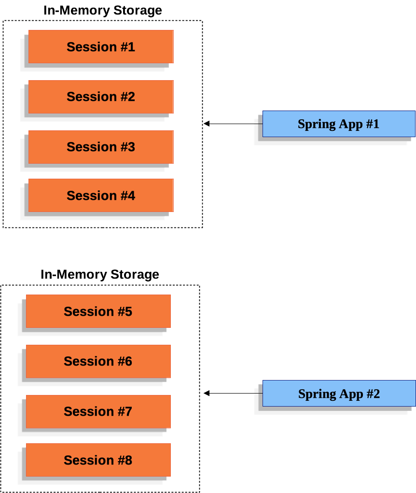
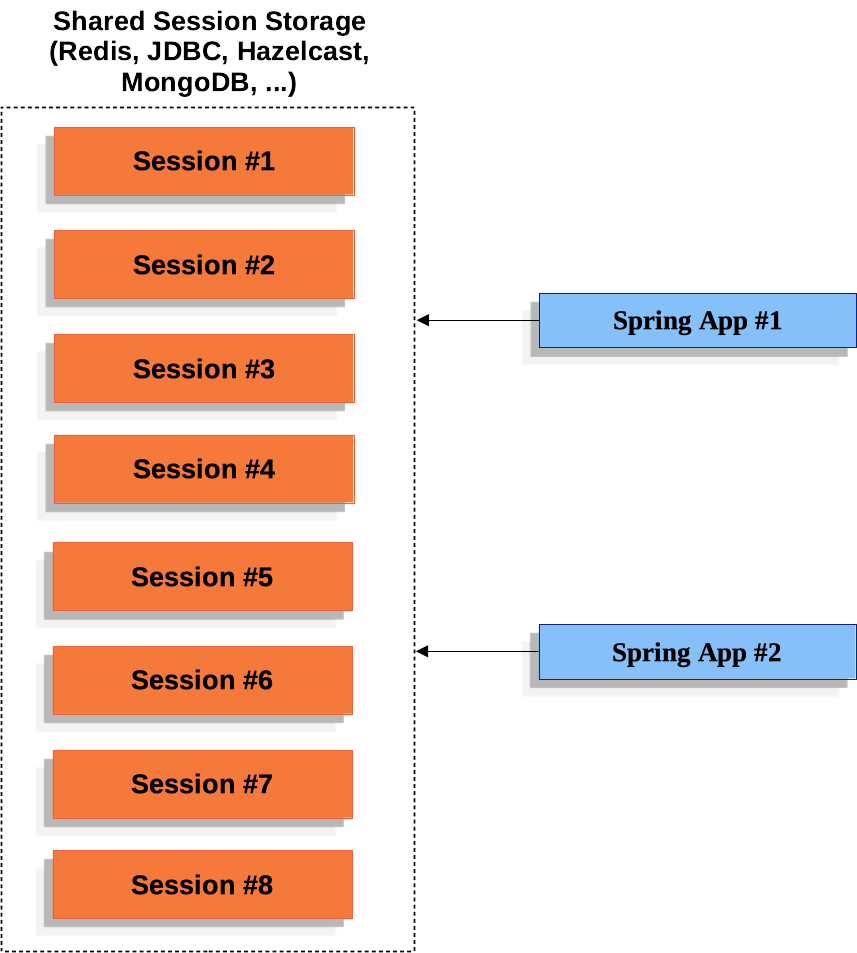

# Spring Session

## Navigation

- What’s New
  
- [What’s New](#whats-new)
  
- [Samples & Guides (Start Here)](#samples)
    - Boot Samples
      - HttpSession
        - Redis
          
- [Redis with Events](#guides-boot-redis)
        
- [JDBC](#guides-boot-jdbc)
      
- [Find by Username](#guides-boot-findbyusername)
      
- [WebSockets](#guides-boot-websocket)
    - WebFlux
      
- [Custom Cookie](#guides-boot-webflux-custom-cookie)
    - Java Configuration
      
- [Custom Cookie](#guides-java-custom-cookie)
      
- [Redis](#guides-java-redis)
      
- [JDBC](#guides-java-jdbc)
      
- [REST](#guides-java-rest)
      
- [Spring Security](#guides-java-security)
    - XML Configuration
      
- [Redis](#guides-xml-redis)
      
- [JDBC](#guides-xml-jdbc)
  
- [Configurations](#configurations)
    - Redis
      
- [Redis HTTP Session](#configuration-redis)
      
- [Redis Indexed Web Session](#configuration-reactive-redis-indexed)
    
- [JDBC](#configuration-jdbc)
    
- [Common Configurations](#configuration-common)
  
- [HttpSession Integration](#http-session)
  
- [WebSocket Integration](#web-socket)
  
- [WebSession Integration](#web-session)
  
- [Spring Security Integration](#spring-security)
  
- [API Documentation](#api)
  
- [Upgrading](#upgrading)
- Other pages
  
- [Spring Session](#index)

## Content

<a id="whats-new"></a>

<!-- source_url: https://docs.spring.io/spring-session/reference/whats-new.html -->

<!-- page_index: 1 -->

<a id="whats-new--page-title"></a>
<a id="whats-new--what-s-new-in-4.0"></a>

# What’s New in 4.0

- [gh-3481](https://github.com/spring-projects/spring-session/issues/3481) - Spring Session Hazelcast: Now Led by Hazelcast Team
- [gh-3480](https://github.com/spring-projects/spring-session/issues/3480) - Spring Session MongoDB: Now Led by MongoDB Team

[Spring Session](#index)
[Javadoc](https://docs.spring.io/spring-session/reference/api/java/index.html)

---

<a id="samples"></a>

<!-- source_url: https://docs.spring.io/spring-session/reference/samples.html -->

<!-- page_index: 2 -->

# Samples and Guides (Start Here)

<svg enable-background="new 0 0 32 32" id="Glyph" version="1.1" viewbox="0 0 32 32" xml:space="preserve" xmlns="http://www.w3.org/2000/svg" xmlns:xlink="http://www.w3.org/1999/xlink">
<path id="XMLID_223_"></path>
</svg>

Search

<a id="samples--page-title"></a>
<a id="samples--samples-and-guides-start-here"></a>

# Samples and Guides (Start Here)

To get started with Spring Session, the best place to start is our Sample Applications.

| Source | Description | Guide |
| --- | --- | --- |
| [HttpSession with Redis](https://github.com/spring-projects/spring-session/tree/4.1.0/spring-session-samples/spring-session-sample-boot-redis) | Demonstrates how to use Spring Session to replace the `HttpSession` with Redis. | [HttpSession with Redis Guide](#guides-boot-redis) |
| [HttpSession with JDBC](https://github.com/spring-projects/spring-session/tree/4.1.0/spring-session-samples/spring-session-sample-boot-jdbc) | Demonstrates how to use Spring Session to replace the `HttpSession` with a relational database store. | [HttpSession with JDBC Guide](#guides-boot-jdbc) |
| [Find by Username](https://github.com/spring-projects/spring-session/tree/4.1.0/spring-session-samples/spring-session-sample-boot-findbyusername) | Demonstrates how to use Spring Session to find sessions by username. | [Find by Username Guide](#guides-boot-findbyusername) |
| [WebSockets](https://github.com/spring-projects/spring-session/tree/4.1.0/spring-session-samples/spring-session-sample-boot-websocket) | Demonstrates how to use Spring Session with WebSockets. | [WebSockets Guide](#guides-boot-websocket) |
| [WebFlux](https://github.com/spring-projects/spring-session/tree/4.1.0/spring-session-samples/spring-session-sample-boot-webflux) | Demonstrates how to use Spring Session to replace the Spring WebFlux’s `WebSession` with Redis. |  |
| [WebFlux with Custom Cookie](https://github.com/spring-projects/spring-session/tree/4.1.0/spring-session-samples/spring-session-sample-boot-webflux-custom-cookie) | Demonstrates how to use Spring Session to customize the Session cookie in a WebFlux based application. | [WebFlux with Custom Cookie Guide](#guides-boot-webflux-custom-cookie) |
| [HttpSession with Redis JSON serialization](https://github.com/spring-projects/spring-session/tree/4.1.0/spring-session-samples/spring-session-sample-boot-redis-json) | Demonstrates how to use Spring Session to replace the `HttpSession` with Redis using JSON serialization. |  |

| Source | Description | Guide |
| --- | --- | --- |
| [HttpSession with Redis](https://github.com/spring-projects/spring-session/tree/4.1.0/spring-session-samples/spring-session-sample-javaconfig-redis) | Demonstrates how to use Spring Session to replace the `HttpSession` with Redis. | [HttpSession with Redis Guide](#guides-java-redis) |
| [HttpSession with JDBC](https://github.com/spring-projects/spring-session/tree/4.1.0/spring-session-samples/spring-session-sample-javaconfig-jdbc) | Demonstrates how to use Spring Session to replace the `HttpSession` with a relational database store. | [HttpSession with JDBC Guide](#guides-java-jdbc) |
| [Custom Cookie](https://github.com/spring-projects/spring-session/tree/4.1.0/spring-session-samples/spring-session-sample-javaconfig-custom-cookie) | Demonstrates how to use Spring Session and customize the cookie. | [Custom Cookie Guide](#guides-java-custom-cookie) |
| [Spring Security](https://github.com/spring-projects/spring-session/tree/4.1.0/spring-session-samples/spring-session-sample-javaconfig-security) | Demonstrates how to use Spring Session with an existing Spring Security application. | [Spring Security Guide](#guides-java-security) |
| [REST](https://github.com/spring-projects/spring-session/tree/4.1.0/spring-session-samples/spring-session-sample-javaconfig-rest) | Demonstrates how to use Spring Session in a REST application to support authenticating with a header. | [REST Guide](#guides-java-rest) |

| Source | Description | Guide |
| --- | --- | --- |
| [HttpSession with Redis](https://github.com/spring-projects/spring-session/tree/4.1.0/spring-session-samples/spring-session-sample-xml-redis) | Demonstrates how to use Spring Session to replace the `HttpSession` with a Redis store. | [HttpSession with Redis Guide](#guides-xml-redis) |
| [HttpSession with JDBC](https://github.com/spring-projects/spring-session/tree/4.1.0/spring-session-samples/spring-session-sample-xml-jdbc) | Demonstrates how to use Spring Session to replace the `HttpSession` with a relational database store. | [HttpSession with JDBC Guide](#guides-xml-jdbc) |

Source

Description

Guide

[Javadoc](https://docs.spring.io/spring-session/reference/api/java/index.html)
[Redis with Events](#guides-boot-redis)

---

<a id="guides-boot-redis"></a>

<!-- source_url: https://docs.spring.io/spring-session/reference/guides/boot-redis.html -->

<!-- page_index: 3 -->

# Spring Session - Spring Boot

<svg enable-background="new 0 0 32 32" id="Glyph" version="1.1" viewbox="0 0 32 32" xml:space="preserve" xmlns="http://www.w3.org/2000/svg" xmlns:xlink="http://www.w3.org/1999/xlink">
<path id="XMLID_223_"></path>
</svg>

Search

<a id="guides-boot-redis--page-title"></a>
<a id="guides-boot-redis--spring-session-spring-boot"></a>

# Spring Session - Spring Boot

This guide describes how to use Spring Session to transparently leverage Redis to back a web application’s `HttpSession` when you use Spring Boot.

> [!NOTE]
> You can find the completed guide in the [boot sample application](#guides-boot-redis--boot-sample).

[Index](#index)

<a id="guides-boot-redis--_updating_dependencies"></a>
<a id="guides-boot-redis--updating-dependencies"></a>

## Updating Dependencies

Before you use Spring Session with Redis, you must ensure that you have the right dependencies.
We assume you are working with a working Spring Boot web application.

pom.xml

```xml
<dependencies>
	<!-- ... -->

	<dependency>
		<groupId>org.springframework.boot</groupId>
		<artifactId>spring-boot-starter-session-data-redis</artifactId>
	</dependency>
</dependencies>
```

build.gradle

```groovy
implementation("org.springframework.boot:spring-boot-starter-session-data-redis")
```

Spring Boot provides dependency management for Spring Session modules, so you need not explicitly declare dependency version.

<a id="guides-boot-redis--boot-spring-configuration"></a>
<a id="guides-boot-redis--spring-boot-configuration"></a>

## Spring Boot Configuration

After adding the required dependencies, we can create our Spring Boot configuration.
Thanks to first-class auto-configuration support, just by adding the dependency Spring Boot will set up Spring Session backed by Redis for us.

Under the hood, Spring Boot applies configuration that is equivalent to manually adding `@EnableRedisHttpSession` annotation.
This creates a Spring bean with the name of `springSessionRepositoryFilter` that implements `Filter`.
The filter is in charge of replacing the `HttpSession` implementation to be backed by Spring Session.

Further customization is possible by using `application.properties`, as the following listing shows:

src/main/resources/application.properties

```
server.servlet.session.timeout= # Session timeout. If a duration suffix is not specified, seconds is used.
spring.session.redis.flush-mode=on_save # Sessions flush mode.
spring.session.redis.namespace=spring:session # Namespace for keys used to store sessions.
```

For more information, see the [Spring Session](https://docs.spring.io/spring-boot/docs/4.1.0/reference/htmlsingle/#boot-features-session) portion of the Spring Boot documentation.

<a id="guides-boot-redis--boot-redis-configuration"></a>
<a id="guides-boot-redis--configuring-the-redis-connection"></a>

## Configuring the Redis Connection

Spring Boot automatically creates a `RedisConnectionFactory` that connects Spring Session to a Redis Server on localhost on port 6379 (default port).
In a production environment, you need to update your configuration to point to your Redis server.
For example, you can include the following in your application.properties:

src/main/resources/application.properties

```
spring.data.redis.host=localhost # Redis server host.
spring.data.redis.password= # Login password of the redis server.
spring.data.redis.port=6379 # Redis server port.
```

For more information, see the [Connecting to Redis](https://docs.spring.io/spring-boot/docs/4.1.0/reference/htmlsingle/#boot-features-connecting-to-redis) portion of the Spring Boot documentation.

<a id="guides-boot-redis--boot-servlet-configuration"></a>
<a id="guides-boot-redis--servlet-container-initialization"></a>

## Servlet Container Initialization

Our [Spring Boot Configuration](#guides-boot-redis--boot-spring-configuration) created a Spring bean named `springSessionRepositoryFilter` that implements `Filter`.
The `springSessionRepositoryFilter` bean is responsible for replacing the `HttpSession` with a custom implementation that is backed by Spring Session.

In order for our `Filter` to do its magic, Spring needs to load our `Config` class.
Last, we need to ensure that our servlet container (that is, Tomcat) uses our `springSessionRepositoryFilter` for every request.
Fortunately, Spring Boot takes care of both of these steps for us.

<a id="guides-boot-redis--boot-sample"></a>
<a id="guides-boot-redis--boot-sample-application"></a>

## Boot Sample Application

The Boot Sample Application demonstrates how to use Spring Session to transparently leverage Redis to back a web application’s `HttpSession` when you use Spring Boot.

<a id="guides-boot-redis--boot-running"></a>
<a id="guides-boot-redis--running-the-boot-sample-application"></a>

### Running the Boot Sample Application

You can run the sample by obtaining the [source code](https://github.com/spring-projects/spring-session/archive/4.1.0.zip) and invoking the following command:

```
$ ./gradlew :spring-session-sample-boot-redis:bootRun
```

> [!NOTE]
> For the sample to work, you must [install Redis 2.8+](https://redis.io/download) on localhost and run it with the default port (6379).
> Alternatively, you can update the `RedisConnectionFactory` to point to a Redis server.
> Another option is to use [Docker](https://www.docker.com/) to run Redis on localhost. See [Docker Redis repository](https://hub.docker.com/_/redis/) for detailed instructions.

You should now be able to access the application at [localhost:8080/](http://localhost:8080/)

<a id="guides-boot-redis--boot-explore"></a>
<a id="guides-boot-redis--exploring-the-security-sample-application"></a>

### Exploring the `security` Sample Application

Now you can try using the application. Enter the following to log in:

- **Username** *user*
- **Password** *password*

Now click the **Login** button.
You should now see a message indicating you are logged in with the user entered previously.
The user’s information is stored in Redis rather than Tomcat’s `HttpSession` implementation.

<a id="guides-boot-redis--boot-how"></a>
<a id="guides-boot-redis--how-does-it-work"></a>

### How Does It Work?

Instead of using Tomcat’s `HttpSession`, we persist the values in Redis.
Spring Session replaces the `HttpSession` with an implementation that is backed by Redis.
When Spring Security’s `SecurityContextPersistenceFilter` saves the `SecurityContext` to the `HttpSession`, it is then persisted into Redis.

When a new `HttpSession` is created, Spring Session creates a cookie named `SESSION` in your browser.
That cookie contains the ID of your session.
You can view the cookies (with [Chrome](https://developers.google.com/web/tools/chrome-devtools/manage-data/cookies) or [Firefox](https://developer.mozilla.org/en-US/docs/Tools/Storage_Inspector)).

You can remove the session by using redis-cli.
For example, on a Linux based system you can type the following:

```
	$ redis-cli keys '*' | xargs redis-cli del
```

> [!TIP]
> The Redis documentation has instructions for [installing redis-cli](https://redis.io/topics/quickstart).

Alternatively, you can also delete the explicit key.
To do so, enter the following into your terminal, being sure to replace `7e8383a4-082c-4ffe-a4bc-c40fd3363c5e` with the value of your `SESSION` cookie:

```
	$ redis-cli del spring:session:sessions:7e8383a4-082c-4ffe-a4bc-c40fd3363c5e
```

Now you can visit the application at [localhost:8080/](http://localhost:8080/) and observe that we are no longer authenticated.

[Samples & Guides (Start Here)](#samples)
[JDBC](#guides-boot-jdbc)

---

<a id="guides-boot-jdbc"></a>

<!-- source_url: https://docs.spring.io/spring-session/reference/guides/boot-jdbc.html -->

<!-- page_index: 4 -->

# Spring Session - Spring Boot

<svg enable-background="new 0 0 32 32" id="Glyph" version="1.1" viewbox="0 0 32 32" xml:space="preserve" xmlns="http://www.w3.org/2000/svg" xmlns:xlink="http://www.w3.org/1999/xlink">
<path id="XMLID_223_"></path>
</svg>

Search

<a id="guides-boot-jdbc--page-title"></a>
<a id="guides-boot-jdbc--spring-session-spring-boot"></a>

# Spring Session - Spring Boot

This guide describes how to use Spring Session to transparently leverage a relational database to back a web application’s `HttpSession` when you use Spring Boot.

> [!NOTE]
> You can find the completed guide in the [httpsession-jdbc-boot sample application](#guides-boot-jdbc--httpsession-jdbc-boot-sample).

[Index](#index)

<a id="guides-boot-jdbc--_updating_dependencies"></a>
<a id="guides-boot-jdbc--updating-dependencies"></a>

## Updating Dependencies

Before you use Spring Session, you must update your dependencies.
We assume you are working with a working Spring Boot web application.
If you use Maven, you must add the following dependencies:

pom.xml

```xml
<dependencies>
	<!-- ... -->

	<dependency>
		<groupId>org.springframework.boot</groupId>
		<artifactId>spring-boot-starter-session-jdbc</artifactId>
	</dependency>
</dependencies>
```

Spring Boot provides dependency management for Spring Session modules, so you need not explicitly declare the dependency version.

<a id="guides-boot-jdbc--httpsession-jdbc-boot-spring-configuration"></a>
<a id="guides-boot-jdbc--spring-boot-configuration"></a>

## Spring Boot Configuration

After adding the required dependencies, we can create our Spring Boot configuration.
Thanks to first-class auto-configuration support, just by adding the dependency Spring Boot will set up Spring Session backed by a relational database for us.

If a single Spring Session module is present on the classpath, Spring Boot uses that store implementation automatically.
If you have more than one implementation, you must choose the StoreType that you wish to use to store the sessions, as shows above.

Under the hood, Spring Boot applies configuration that is equivalent to manually adding the `@EnableJdbcHttpSession` annotation.
This creates a Spring bean with the name of `springSessionRepositoryFilter`. That bean implements `Filter`.
The filter is in charge of replacing the `HttpSession` implementation to be backed by Spring Session.

You can further customize by using `application.properties`.
The following listing shows how to do so:

src/main/resources/application.properties

```
server.servlet.session.timeout= # Session timeout. If a duration suffix is not specified, seconds are used.
spring.session.jdbc.initialize-schema=embedded # Database schema initialization mode.
spring.session.jdbc.schema=classpath:org/springframework/session/jdbc/schema-@@platform@@.sql # Path to the SQL file to use to initialize the database schema.
spring.session.jdbc.table-name=SPRING_SESSION # Name of the database table used to store sessions.
```

For more information, see the [Spring Session](https://docs.spring.io/spring-boot/4.1.0/reference/web/spring-session.html) portion of the Spring Boot documentation.

<a id="guides-boot-jdbc--httpsession-jdbc-boot-configuration"></a>
<a id="guides-boot-jdbc--configuring-the-datasource"></a>

## Configuring the `DataSource`

Spring Boot automatically creates a `DataSource` that connects Spring Session to an embedded instance of an H2 database.
In a production environment, you need to update your configuration to point to your relational database.
For example, you can include the following in your application.properties:

src/main/resources/application.properties

```
spring.datasource.url= # JDBC URL of the database.
spring.datasource.username= # Login username of the database.
spring.datasource.password= # Login password of the database.
```

For more information, see the [Configure a DataSource](https://docs.spring.io/spring-boot/docs/4.1.0/reference/htmlsingle/#boot-features-configure-datasource) portion of the Spring Boot documentation.

<a id="guides-boot-jdbc--httpsession-jdbc-boot-servlet-configuration"></a>
<a id="guides-boot-jdbc--servlet-container-initialization"></a>

## Servlet Container Initialization

Our [Spring Boot Configuration](#guides-boot-jdbc--httpsession-jdbc-boot-spring-configuration) created a Spring bean named `springSessionRepositoryFilter` that implements `Filter`.
The `springSessionRepositoryFilter` bean is responsible for replacing the `HttpSession` with a custom implementation that is backed by Spring Session.

In order for our `Filter` to do its magic, Spring needs to load our `Config` class.
Last, we need to ensure that our Servlet Container (that is, Tomcat) uses our `springSessionRepositoryFilter` for every request.
Fortunately, Spring Boot takes care of both of these steps for us.

<a id="guides-boot-jdbc--httpsession-jdbc-boot-sample"></a>
<a id="guides-boot-jdbc--httpsession-jdbc-boot-sample-application"></a>

## `httpsession-jdbc-boot` Sample Application

The httpsession-jdbc-boot Sample Application demonstrates how to use Spring Session to transparently leverage an H2 database to back a web application’s `HttpSession` when you use Spring Boot.

<a id="guides-boot-jdbc--httpsession-jdbc-boot-running"></a>
<a id="guides-boot-jdbc--running-the-httpsession-jdbc-boot-sample-application"></a>

### Running the `httpsession-jdbc-boot` Sample Application

You can run the sample by obtaining the [source code](https://github.com/spring-projects/spring-session/archive/4.1.0.zip) and invoking the following command:

```
$ ./gradlew :spring-session-sample-boot-jdbc:bootRun
```

You should now be able to access the application at [localhost:8080/](http://localhost:8080/)

<a id="guides-boot-jdbc--httpsession-jdbc-boot-explore"></a>
<a id="guides-boot-jdbc--exploring-the-security-sample-application"></a>

### Exploring the Security Sample Application

You can now try using the application.
To do so, enter the following to log in:

- **Username** *user*
- **Password** *password*

Now click the **Login** button.
You should now see a message indicating that your are logged in with the user entered previously.
The user’s information is stored in the H2 database rather than Tomcat’s `HttpSession` implementation.

<a id="guides-boot-jdbc--httpsession-jdbc-boot-how"></a>
<a id="guides-boot-jdbc--how-does-it-work"></a>

### How Does It Work?

Instead of using Tomcat’s `HttpSession`, we persist the values in the H2 database.
Spring Session replaces the `HttpSession` with an implementation that is backed by a relational database.
When Spring Security’s `SecurityContextPersistenceFilter` saves the `SecurityContext` to the `HttpSession`, it is then persisted into the H2 database.

When a new `HttpSession` is created, Spring Session creates a cookie named `SESSION` in your browser. That cookie contains the ID of your session.
You can view the cookies (with [Chrome](https://developers.google.com/web/tools/chrome-devtools/manage-data/cookies) or [Firefox](https://developer.mozilla.org/en-US/docs/Tools/Storage_Inspector)).

You can remove the session by using the H2 web console available at: [localhost:8080/h2-console/](http://localhost:8080/h2-console/) (use `jdbc:h2:mem:testdb` for JDBC URL).

Now you can visit the application at [localhost:8080/](http://localhost:8080/) and see that we are no longer authenticated.

[Redis with Events](#guides-boot-redis)
[Find by Username](#guides-boot-findbyusername)

---

<a id="guides-boot-findbyusername"></a>

<!-- source_url: https://docs.spring.io/spring-session/reference/guides/boot-findbyusername.html -->

<!-- page_index: 5 -->

# Spring Session - find by username

<svg enable-background="new 0 0 32 32" id="Glyph" version="1.1" viewbox="0 0 32 32" xml:space="preserve" xmlns="http://www.w3.org/2000/svg" xmlns:xlink="http://www.w3.org/1999/xlink">
<path id="XMLID_223_"></path>
</svg>

Search

<a id="guides-boot-findbyusername--page-title"></a>
<a id="guides-boot-findbyusername--spring-session-find-by-username"></a>

# Spring Session - find by username

This guide describes how to use Spring Session to find sessions by username.

> [!NOTE]
> You can find the completed guide in the [findbyusername application](#guides-boot-findbyusername--findbyusername-sample).

[Index](#index)

<a id="guides-boot-findbyusername--findbyusername-assumptions"></a>
<a id="guides-boot-findbyusername--assumptions"></a>

## Assumptions

The guide assumes you have already added Spring Session to your application by using the built-in Redis configuration support.
The guide also assumes you have already applied Spring Security to your application.
However, the guide is somewhat general purpose and can be applied to any technology with minimal changes, which we discuss later in the guide.

> [!NOTE]
> If you need to learn how to add Spring Session to your project, see the listing of [samples and guides](#index--samples)

<a id="guides-boot-findbyusername--_about_the_sample"></a>
<a id="guides-boot-findbyusername--about-the-sample"></a>

## About the Sample

Our sample uses this feature to invalidate the users session that might have been compromised.
Consider the following scenario:

- User goes to library and authenticates to the application.
- User goes home and realizes they forgot to log out.
- User can log in and end the session from the library using clues like the location, created time, last accessed time, and so on.

Would it not be nice if we could let the user invalidate the session at the library from any device with which they authenticate?
This sample demonstrates how this is possible.

<a id="guides-boot-findbyusername--findbyindexnamesessionrepository"></a>
<a id="guides-boot-findbyusername--using-findbyindexnamesessionrepository"></a>

## Using `FindByIndexNameSessionRepository`

To look up a user by their username, you must first choose a `SessionRepository` that implements [`FindByIndexNameSessionRepository`](#index--api-findbyindexnamesessionrepository).
Our sample application assumes that the Redis support is already set up, so we are ready to go.

<a id="guides-boot-findbyusername--_mapping_the_user_name"></a>
<a id="guides-boot-findbyusername--mapping-the-user-name"></a>

## Mapping the User Name

`FindByIndexNameSessionRepository` can find a session only by the user name if the developer instructs Spring Session what user is associated with the `Session`.
You can do so by ensuring that the session attribute with the name `FindByUsernameSessionRepository.PRINCIPAL_NAME_INDEX_NAME` is populated with the username.

Generally speaking, you can do so with the following code immediately after the user authenticates:

```java
String username = "username";
this.session.setAttribute(FindByIndexNameSessionRepository.PRINCIPAL_NAME_INDEX_NAME, username);
```

<a id="guides-boot-findbyusername--_mapping_the_user_name_with_spring_security"></a>
<a id="guides-boot-findbyusername--mapping-the-user-name-with-spring-security"></a>

## Mapping the User Name with Spring Security

Since we use Spring Security, the user name is automatically indexed for us.
This means we need not perform any steps to ensure the user name is indexed.

<a id="guides-boot-findbyusername--_adding_additional_data_to_the_session"></a>
<a id="guides-boot-findbyusername--adding-additional-data-to-the-session"></a>

## Adding Additional Data to the Session

It may be nice to associate additional information (such as the IP Address, the browser, location, and other details) to the session.
Doing so makes it easier for the user to know which session they are looking at.

To do so, determine which session attribute you want to use and what information you wish to provide.
Then create a Java bean that is added as a session attribute.
For example, our sample application includes the location and access type of the session, as the following listing shows:

```java
public class SessionDetails implements Serializable {
private String location;
private String accessType;
public String getLocation() {return this.location;}
public void setLocation(String location) {this.location = location;}
public String getAccessType() {return this.accessType;}
public void setAccessType(String accessType) {this.accessType = accessType;}
private static final long serialVersionUID = 8850489178248613501L;
}
```

We then inject that information into the session on each HTTP request using a `SessionDetailsFilter`, as the following example shows:

```java
@Override
public void doFilterInternal(HttpServletRequest request, HttpServletResponse response, FilterChain chain)
		throws IOException, ServletException {
	chain.doFilter(request, response);

	HttpSession session = request.getSession(false);
	if (session != null) {
		String remoteAddr = getRemoteAddress(request);
		String geoLocation = getGeoLocation(remoteAddr);

		SessionDetails details = new SessionDetails();
		details.setAccessType(request.getHeader("User-Agent"));
		details.setLocation(remoteAddr + " " + geoLocation);

		session.setAttribute("SESSION_DETAILS", details);
	}
}
```

We obtain the information we want and then set the `SessionDetails` as an attribute in the `Session`.
When we retrieve the `Session` by user name, we can then use the session to access our `SessionDetails` as we would any other session attribute.

> [!NOTE]
> You might wonder why Spring Session does not provide `SessionDetails` functionality out of the box.
> We have two reasons.
> The first reason is that it is very trivial for applications to implement this themselves.
> The second reason is that the information that is populated in the session (and how frequently that information is updated) is highly application-dependent.

<a id="guides-boot-findbyusername--_finding_sessions_for_a_specific_user"></a>
<a id="guides-boot-findbyusername--finding-sessions-for-a-specific-user"></a>

## Finding sessions for a specific user

We can now find all the sessions for a specific user.
The following example shows how to do so:

```java
@Autowired
FindByIndexNameSessionRepository<? extends Session> sessions;

@RequestMapping("/")
public String index(Principal principal, Model model) {
	Collection<? extends Session> usersSessions = this.sessions.findByPrincipalName(principal.getName()).values();
	model.addAttribute("sessions", usersSessions);
	return "index";
}
```

In our instance, we find all sessions for the currently logged in user.
However, you can modify this for an administrator to use a form to specify which user to look up.

<a id="guides-boot-findbyusername--findbyusername-sample"></a>
<a id="guides-boot-findbyusername--findbyusername-sample-application"></a>

## `findbyusername` Sample Application

This section describes how to use the `findbyusername` sample application.

<a id="guides-boot-findbyusername--_running_the_findbyusername_sample_application"></a>
<a id="guides-boot-findbyusername--running-the-findbyusername-sample-application"></a>

### Running the `findbyusername` Sample Application

You can run the sample by obtaining the [source code](https://github.com/spring-projects/spring-session/archive/4.1.0.zip) and invoking the following command:

```
$ ./gradlew :spring-session-sample-boot-findbyusername:bootRun
```

> [!NOTE]
> For the sample to work, you must [install Redis 2.8+](https://redis.io/download) on localhost and run it with the default port (6379).
> Alternatively, you can update the `RedisConnectionFactory` to point to a Redis server.
> Another option is to use [Docker](https://www.docker.com/) to run Redis on localhost.
> See [Docker Redis repository](https://hub.docker.com/_/redis/) for detailed instructions.

You should now be able to access the application at [localhost:8080/](http://localhost:8080/)

<a id="guides-boot-findbyusername--_exploring_the_security_sample_application"></a>
<a id="guides-boot-findbyusername--exploring-the-security-sample-application"></a>

### Exploring the security Sample Application

You can now try using the application. Enter the following to log in:

- **Username** *user*
- **Password** *password*

Now click the **Login** button.
You should now see a message indicating your are logged in with the user entered previously.
You should also see a listing of active sessions for the currently logged in user.

You can emulate the flow we discussed in the [About the Sample](#guides-boot-findbyusername--_about_the_sample) section by doing the following:

- Open a new incognito window and navigate to [localhost:8080/](http://localhost:8080/)
- Enter the following to log in:

  - **Username** *user*
  - **Password** *password*
- End your original session.
- Refresh the original window and see that you are logged out.

[JDBC](#guides-boot-jdbc)
[WebSockets](#guides-boot-websocket)

---

<a id="guides-boot-websocket"></a>

<!-- source_url: https://docs.spring.io/spring-session/reference/guides/boot-websocket.html -->

<!-- page_index: 6 -->

# Spring Session - WebSocket

<svg enable-background="new 0 0 32 32" id="Glyph" version="1.1" viewbox="0 0 32 32" xml:space="preserve" xmlns="http://www.w3.org/2000/svg" xmlns:xlink="http://www.w3.org/1999/xlink">
<path id="XMLID_223_"></path>
</svg>

Search

<a id="guides-boot-websocket--page-title"></a>
<a id="guides-boot-websocket--spring-session-websocket"></a>

# Spring Session - WebSocket

This guide describes how to use Spring Session to ensure that WebSocket messages keep your HttpSession alive.

> [!NOTE]
> Spring Session’s WebSocket support works only with Spring’s WebSocket support.
> Specifically,it does not work with using [JSR-356](https://www.jcp.org/en/jsr/detail?id=356) directly, because JSR-356 does not have a mechanism for intercepting incoming WebSocket messages.

[Index](#index)

<a id="guides-boot-websocket--_httpsession_setup"></a>
<a id="guides-boot-websocket--httpsession-setup"></a>

## HttpSession Setup

The first step is to integrate Spring Session with the HttpSession. These steps are already outlined in the [HttpSession with Redis Guide](#guides-boot-redis).

Please make sure you have already integrated Spring Session with HttpSession before proceeding.

<a id="guides-boot-websocket--websocket-spring-configuration"></a>
<a id="guides-boot-websocket--spring-configuration"></a>

## Spring Configuration

In a typical Spring WebSocket application, you would implement `WebSocketMessageBrokerConfigurer`.
For example, the configuration might look something like the following:

```java
@Configuration @EnableScheduling @EnableWebSocketMessageBroker public class WebSocketConfig implements WebSocketMessageBrokerConfigurer {
@Override public void registerStompEndpoints(StompEndpointRegistry registry) {registry.addEndpoint("/messages").withSockJS();}
@Override public void configureMessageBroker(MessageBrokerRegistry registry) {registry.enableSimpleBroker("/queue/", "/topic/"); registry.setApplicationDestinationPrefixes("/app");}
}
```

We can update our configuration to use Spring Session’s WebSocket support.
The following example shows how to do so:

src/main/java/samples/config/WebSocketConfig.java

```java
@Configuration @EnableScheduling @EnableWebSocketMessageBroker public class WebSocketConfig extends AbstractSessionWebSocketMessageBrokerConfigurer<Session> { (1)
@Override protected void configureStompEndpoints(StompEndpointRegistry registry) { (2) registry.addEndpoint("/messages").withSockJS();}
@Override public void configureMessageBroker(MessageBrokerRegistry registry) {registry.enableSimpleBroker("/queue/", "/topic/"); registry.setApplicationDestinationPrefixes("/app");}
}
```

To hook in the Spring Session support we only need to change two things:

**1**

Instead of implementing `WebSocketMessageBrokerConfigurer`, we extend `AbstractSessionWebSocketMessageBrokerConfigurer`

**2**

We rename the `registerStompEndpoints` method to `configureStompEndpoints`

What does `AbstractSessionWebSocketMessageBrokerConfigurer` do behind the scenes?

- `WebSocketConnectHandlerDecoratorFactory` is added as a `WebSocketHandlerDecoratorFactory` to `WebSocketTransportRegistration`.
  This ensures a custom `SessionConnectEvent` is fired that contains the `WebSocketSession`.
  The `WebSocketSession` is necessary to end any WebSocket connections that are still open when a Spring Session is ended.
- `SessionRepositoryMessageInterceptor` is added as a `HandshakeInterceptor` to every `StompWebSocketEndpointRegistration`.
  This ensures that the `Session` is added to the WebSocket properties to enable updating the last accessed time.
- `SessionRepositoryMessageInterceptor` is added as a `ChannelInterceptor` to our inbound `ChannelRegistration`.
  This ensures that every time an inbound message is received, that the last accessed time of our Spring Session is updated.
- `WebSocketRegistryListener` is created as a Spring bean.
  This ensures that we have a mapping of all of the `Session` IDs to the corresponding WebSocket connections.
  By maintaining this mapping, we can close all the WebSocket connections when a Spring Session (HttpSession) is ended.

<a id="guides-boot-websocket--websocket-sample"></a>
<a id="guides-boot-websocket--websocket-sample-application"></a>

## `websocket` Sample Application

The `websocket` sample application demonstrates how to use Spring Session with WebSockets.

<a id="guides-boot-websocket--_running_the_websocket_sample_application"></a>
<a id="guides-boot-websocket--running-the-websocket-sample-application"></a>

### Running the `websocket` Sample Application

You can run the sample by obtaining the [source code](https://github.com/spring-projects/spring-session/archive/4.1.0.zip) and invoking the following command:

```
$ ./gradlew :spring-session-sample-boot-websocket:bootRun
```

> [!TIP]
> For the purposes of testing session expiration, you may want to change the session expiration to be 1 minute (the default is 30 minutes) by adding the following configuration property before starting the application:
>
> src/main/resources/application.properties
>
> ```
> server.servlet.session.timeout=1m # Session timeout. If a duration suffix is not specified, seconds will be used.
> ```

> [!NOTE]
> For the sample to work, you must [install Redis 2.8+](https://redis.io/download) on localhost and run it with the default port (6379).
> Alternatively, you can update the `RedisConnectionFactory` to point to a Redis server.
> Another option is to use [Docker](https://www.docker.com/) to run Redis on localhost.
> See [Docker Redis repository](https://hub.docker.com/_/redis/) for detailed instructions.

You should now be able to access the application at [localhost:8080/](http://localhost:8080/)

<a id="guides-boot-websocket--_exploring_the_websocket_sample_application"></a>
<a id="guides-boot-websocket--exploring-the-websocket-sample-application"></a>

### Exploring the `websocket` Sample Application

Now you can try using the application. Authenticate with the following information:

- **Username** *rob*
- **Password** *password*

Now click the **Login** button. You should now be authenticated as the user **rob**.

Open an incognito window and access [localhost:8080/](http://localhost:8080/)

You are prompted with a login form. Authenticate with the following information:

- **Username** *luke*
- **Password** *password*

Now send a message from rob to luke. The message should appear.

Wait for two minutes and try sending a message from rob to luke again.
You can see that the message is no longer sent.

> [!NOTE]
> Why two minutes?
>
> Spring Session expires in 60 seconds, but the notification from Redis is not guaranteed to happen within 60 seconds.
> To ensure the socket is closed in a reasonable amount of time, Spring Session runs a background task every minute at 00 seconds that forcibly cleans up any expired sessions.
> This means you need to wait at most two minutes before the WebSocket connection is closed.

You can now try accessing [localhost:8080/](http://localhost:8080/)
You are prompted to authenticate again.
This demonstrates that the session properly expires.

Now repeat the same exercise, but instead of waiting two minutes, send a message from each of the users every 30 seconds.
You can see that the messages continue to be sent.
Try accessing [localhost:8080/](http://localhost:8080/)
You are not prompted to authenticate again.
This demonstrates the session is kept alive.

> [!NOTE]
> Only messages sent from a user keep the session alive.
> This is because only messages coming from a user imply user activity.
> Received messages do not imply activity and, thus, do not renew the session expiration.

[Find by Username](#guides-boot-findbyusername)
[Custom Cookie](#guides-boot-webflux-custom-cookie)

---

<a id="guides-boot-webflux-custom-cookie"></a>

<!-- source_url: https://docs.spring.io/spring-session/reference/guides/boot-webflux-custom-cookie.html -->

<!-- page_index: 7 -->

# Spring Session - WebFlux with Custom Cookie

<svg enable-background="new 0 0 32 32" id="Glyph" version="1.1" viewbox="0 0 32 32" xml:space="preserve" xmlns="http://www.w3.org/2000/svg" xmlns:xlink="http://www.w3.org/1999/xlink">
<path id="XMLID_223_"></path>
</svg>

Search

<a id="guides-boot-webflux-custom-cookie--page-title"></a>
<a id="guides-boot-webflux-custom-cookie--spring-session-webflux-with-custom-cookie"></a>

# Spring Session - WebFlux with Custom Cookie

This guide describes how to configure Spring Session to use custom cookies in a WebFlux based application.
The guide assumes you have already set up Spring Session in your project using your chosen data store. For example, [HttpSession with Redis](#guides-boot-redis).

> [!NOTE]
> You can find the completed guide in the [WebFlux Custom Cookie sample application](#guides-boot-webflux-custom-cookie--webflux-custom-cookie-sample).

[Index](#index)

<a id="guides-boot-webflux-custom-cookie--webflux-custom-cookie-spring-configuration"></a>
<a id="guides-boot-webflux-custom-cookie--spring-boot-configuration"></a>

## Spring Boot Configuration

Once you have set up Spring Session, you can customize how the session cookie is written by exposing a `WebSessionIdResolver` as a Spring bean.
Spring Session uses a `CookieWebSessionIdResolver` by default.
Exposing the `WebSessionIdResolver` as a Spring bean augments the existing configuration when you use configurations like `@EnableRedisHttpSession`.
The following example shows how to customize Spring Session’s cookie:

```java
	@Bean
	public WebSessionIdResolver webSessionIdResolver() {
		CookieWebSessionIdResolver resolver = new CookieWebSessionIdResolver();
		resolver.setCookieName("JSESSIONID"); (1)
		resolver.addCookieInitializer((builder) -> builder.path("/")); (2)
		resolver.addCookieInitializer((builder) -> builder.sameSite("Strict")); (3)
		return resolver;
	}
```

| **1** | We customize the name of the cookie to be `JSESSIONID`. |
| --- | --- |
| **2** | We customize the path of the cookie to be `/` (rather than the default of the context root). |
| **3** | We customize the `SameSite` cookie directive to be `Strict`. |

<a id="guides-boot-webflux-custom-cookie--webflux-custom-cookie-sample"></a>
<a id="guides-boot-webflux-custom-cookie--webflux-custom-cookie-sample-application"></a>

## `webflux-custom-cookie` Sample Application

This section describes how to work with the `webflux-custom-cookie` sample application.

<a id="guides-boot-webflux-custom-cookie--_running_the_webflux_custom_cookie_sample_application"></a>
<a id="guides-boot-webflux-custom-cookie--running-the-webflux-custom-cookie-sample-application"></a>

### Running the `webflux-custom-cookie` Sample Application

You can run the sample by obtaining the [source code](https://github.com/spring-projects/spring-session/archive/4.1.0.zip) and invoking the following command:

```
$ ./gradlew :spring-session-sample-boot-webflux-custom-cookie:bootRun
```

> [!NOTE]
> For the sample to work, you must [install Redis 2.8+](https://redis.io/download) on localhost and run it with the default port (6379).
> Alternatively, you can update the `RedisConnectionFactory` to point to a Redis server.
> Another option is to use [Docker](https://www.docker.com/) to run Redis on localhost. See [Docker Redis repository](https://hub.docker.com/_/redis/) for detailed instructions.

You should now be able to access the application at [localhost:8080/](http://localhost:8080/)

<a id="guides-boot-webflux-custom-cookie--_exploring_the_webflux_custom_cookie_sample_application"></a>
<a id="guides-boot-webflux-custom-cookie--exploring-the-webflux-custom-cookie-sample-application"></a>

### Exploring the `webflux-custom-cookie` Sample Application

Now you can use the application. Fill out the form with the following information:

- **Attribute Name:** *username*
- **Attribute Value:** *rob*

Now click the **Set Attribute** button.
You should now see the values displayed in the table.

If you look at the cookies for the application, you can see the cookie is saved to the custom name of `JSESSIONID`.

[WebSockets](#guides-boot-websocket)
[Custom Cookie](#guides-java-custom-cookie)

---

<a id="guides-java-custom-cookie"></a>

<!-- source_url: https://docs.spring.io/spring-session/reference/guides/java-custom-cookie.html -->

<!-- page_index: 8 -->

# Spring Session - Custom Cookie

<svg enable-background="new 0 0 32 32" id="Glyph" version="1.1" viewbox="0 0 32 32" xml:space="preserve" xmlns="http://www.w3.org/2000/svg" xmlns:xlink="http://www.w3.org/1999/xlink">
<path id="XMLID_223_"></path>
</svg>

Search

<a id="guides-java-custom-cookie--page-title"></a>
<a id="guides-java-custom-cookie--spring-session-custom-cookie"></a>

# Spring Session - Custom Cookie

This guide describes how to configure Spring Session to use custom cookies with Java Configuration.
The guide assumes you have already set up Spring Session in your project using your chosen data store. For example, [HttpSession with Redis](#guides-boot-redis).

> [!NOTE]
> You can find the completed guide in the [Custom Cookie sample application](#guides-java-custom-cookie--custom-cookie-sample).

[Index](#index)

<a id="guides-java-custom-cookie--custom-cookie-spring-configuration"></a>
<a id="guides-java-custom-cookie--spring-java-configuration"></a>

## Spring Java Configuration

Once you have set up Spring Session, you can customize how the session cookie is written by exposing a `CookieSerializer` as a Spring bean.
Spring Session comes with `DefaultCookieSerializer`.
Exposing the `DefaultCookieSerializer` as a Spring bean augments the existing configuration when you use configurations like `@EnableRedisHttpSession`.
The following example shows how to customize Spring Session’s cookie:

```java
	@Bean
	public CookieSerializer cookieSerializer() {
		DefaultCookieSerializer serializer = new DefaultCookieSerializer();
		serializer.setCookieName("JSESSIONID"); (1)
		serializer.setCookiePath("/"); (2)
		serializer.setDomainNamePattern("^.+?\\.(\\w+\\.[a-z]+)$"); (3)
		return serializer;
	}
```

**1**

We customize the name of the cookie to be `JSESSIONID`.

**2**

We customize the path of the cookie to be `/` (rather than the default of the context root).

**3**

We customize the domain name pattern (a regular expression) to be `^.?\\.(\\w\\.[a-z]+)$`.
This allows sharing a session across domains and applications.
If the regular expression does not match, no domain is set and the existing domain is used.
If the regular expression matches, the first [grouping](https://docs.oracle.com/javase/tutorial/essential/regex/groups.html) is used as the domain.
This means that a request to [child.example.com](https://child.example.com) sets the domain to `example.com`.
However, a request to [localhost:8080/](http://localhost:8080/) or [192.168.1.100:8080/](https://192.168.1.100:8080/) leaves the cookie unset and, thus, still works in development without any changes being necessary for production.

> [!WARNING]
> You should only match on valid domain characters, since the domain name is reflected in the response.
> Doing so prevents a malicious user from performing such attacks as [HTTP Response Splitting](https://en.wikipedia.org/wiki/HTTP_response_splitting).

<a id="guides-java-custom-cookie--custom-cookie-options"></a>
<a id="guides-java-custom-cookie--configuration-options"></a>

## Configuration Options

The following configuration options are available:

- `cookieName`: The name of the cookie to use.
  Default: `SESSION`.
- `useSecureCookie`: Specifies whether a secure cookie should be used.
  Default: Use the value of `HttpServletRequest.isSecure()` at the time of creation.
- `cookiePath`: The path of the cookie.
  Default: The context root.
- `cookieMaxAge`: Specifies the max age of the cookie to be set at the time the session is created.
  Default: `-1`, which indicates the cookie should be removed when the browser is closed.
- `jvmRoute`: Specifies a suffix to be appended to the session ID and included in the cookie.
  Used to identify which JVM to route to for session affinity.
  With some implementations (that is, Redis) this option provides no performance benefit.
  However, it can help with tracing logs of a particular user.
- `domainName`: Allows specifying a specific domain name to be used for the cookie.
  This option is simple to understand but often requires a different configuration between development and production environments.
  See `domainNamePattern` as an alternative.
- `domainNamePattern`: A case-insensitive pattern used to extract the domain name from the `HttpServletRequest#getServerName()`.
  The pattern should provide a single grouping that is used to extract the value of the cookie domain.
  If the regular expression does not match, no domain is set and the existing domain is used.
  If the regular expression matches, the first [grouping](https://docs.oracle.com/javase/tutorial/essential/regex/groups.html) is used as the domain.
- `sameSite`: The value for the `SameSite` cookie directive.
  To disable the serialization of the `SameSite` cookie directive, you may set this value to `null`.
  Default: `Lax`

> [!WARNING]
> You should only match on valid domain characters, since the domain name is reflected in the response.
> Doing so prevents a malicious user from performing such attacks as [HTTP Response Splitting](https://en.wikipedia.org/wiki/HTTP_response_splitting).

<a id="guides-java-custom-cookie--custom-cookie-sample"></a>
<a id="guides-java-custom-cookie--custom-cookie-sample-application"></a>

## `custom-cookie` Sample Application

This section describes how to work with the `custom-cookie` sample application.

<a id="guides-java-custom-cookie--_running_the_custom_cookie_sample_application"></a>
<a id="guides-java-custom-cookie--running-the-custom-cookie-sample-application"></a>

### Running the `custom-cookie` Sample Application

You can run the sample by obtaining the [source code](https://github.com/spring-projects/spring-session/archive/4.1.0.zip) and invoking the following command:

```
$ ./gradlew :spring-session-sample-javaconfig-custom-cookie:tomcatRun
```

> [!NOTE]
> For the sample to work, you must [install Redis 2.8+](https://redis.io/download) on localhost and run it with the default port (6379).
> Alternatively, you can update the `RedisConnectionFactory` to point to a Redis server.
> Another option is to use [Docker](https://www.docker.com/) to run Redis on localhost. See [Docker Redis repository](https://hub.docker.com/_/redis/) for detailed instructions.

You should now be able to access the application at [localhost:8080/](http://localhost:8080/)

<a id="guides-java-custom-cookie--_exploring_the_custom_cookie_sample_application"></a>
<a id="guides-java-custom-cookie--exploring-the-custom-cookie-sample-application"></a>

### Exploring the `custom-cookie` Sample Application

Now you can use the application. Fill out the form with the following information:

- **Attribute Name:** *username*
- **Attribute Value:** *rob*

Now click the **Set Attribute** button.
You should now see the values displayed in the table.

If you look at the cookies for the application, you can see the cookie is saved to the custom name of `JSESSIONID`.

[Custom Cookie](#guides-boot-webflux-custom-cookie)
[Redis](#guides-java-redis)

---

<a id="guides-java-redis"></a>

<!-- source_url: https://docs.spring.io/spring-session/reference/guides/java-redis.html -->

<!-- page_index: 9 -->

# Spring Session - HttpSession (Quick Start)

<svg enable-background="new 0 0 32 32" id="Glyph" version="1.1" viewbox="0 0 32 32" xml:space="preserve" xmlns="http://www.w3.org/2000/svg" xmlns:xlink="http://www.w3.org/1999/xlink">
<path id="XMLID_223_"></path>
</svg>

Search

<a id="guides-java-redis--page-title"></a>
<a id="guides-java-redis--spring-session-httpsession-quick-start"></a>

# Spring Session - HttpSession (Quick Start)

This guide describes how to use Spring Session to transparently leverage Redis to back a web application’s `HttpSession` with Java Configuration.

> [!NOTE]
> You can find the completed guide in the [httpsession sample application](#guides-java-redis--httpsession-sample).

[Index](#index)

<a id="guides-java-redis--_updating_dependencies"></a>
<a id="guides-java-redis--updating-dependencies"></a>

## Updating Dependencies

Before you use Spring Session, you must update your dependencies.
If you are using Maven, you must add the following dependencies:

pom.xml

```xml
<dependencies>
	<!-- ... -->

	<dependency>
		<groupId>org.springframework.session</groupId>
		<artifactId>spring-session-data-redis</artifactId>
		<version>4.1.0</version>
		<type>pom</type>
	</dependency>
	<dependency>
		<groupId>io.lettuce</groupId>
		<artifactId>lettuce-core</artifactId>
		<version>6.8.2.RELEASE</version>
	</dependency>
	<dependency>
		<groupId>org.springframework</groupId>
		<artifactId>spring-web</artifactId>
		<version>7.0.8</version>
	</dependency>
</dependencies>
```

Since we are using a SNAPSHOT version, we need to ensure to add the Spring Snapshot Maven Repository.
You must have the following in your pom.xml:

pom.xml

```xml
<repositories>

	<!-- ... -->

	<repository>
		<id>spring-snapshot</id>
		<url>https://repo.spring.io/libs-snapshot</url>
	</repository>
</repositories>
```

<a id="guides-java-redis--httpsession-spring-configuration"></a>
<a id="guides-java-redis--spring-java-configuration"></a>

## Spring Java Configuration

After adding the required dependencies, we can create our Spring configuration.
The Spring configuration is responsible for creating a servlet filter that replaces the `HttpSession` implementation with an implementation backed by Spring Session.
To do so, add the following Spring Configuration:

```java
@Configuration(proxyBeanMethods = false) @EnableRedisHttpSession (1) public class Config {
@Bean public LettuceConnectionFactory connectionFactory() {return new LettuceConnectionFactory(); (2)}
}
```

**1**

The `@EnableRedisHttpSession` annotation creates a Spring Bean with the name of `springSessionRepositoryFilter` that implements `Filter`.
The filter is in charge of replacing the `HttpSession` implementation to be backed by Spring Session.
In this instance, Spring Session is backed by Redis.

**2**

We create a `RedisConnectionFactory` that connects Spring Session to the Redis Server.
We configure the connection to connect to localhost on the default port (6379).
For more information on configuring Spring Data Redis, see the [reference documentation](https://docs.spring.io/spring-data/data-redis/docs/4.0.6/reference/html/).

<a id="guides-java-redis--_java_servlet_container_initialization"></a>
<a id="guides-java-redis--java-servlet-container-initialization"></a>

## Java Servlet Container Initialization

Our [Spring Configuration](#guides-java-redis--httpsession-spring-configuration) created a Spring Bean named `springSessionRepositoryFilter` that implements `Filter`.
The `springSessionRepositoryFilter` bean is responsible for replacing the `HttpSession` with a custom implementation that is backed by Spring Session.

In order for our `Filter` to do its magic, Spring needs to load our `Config` class.
Last, we need to ensure that our Servlet Container (that is, Tomcat) uses our `springSessionRepositoryFilter` for every request.
Fortunately, Spring Session provides a utility class named `AbstractHttpSessionApplicationInitializer` to make both of these steps easy.
The following shows an example:

src/main/java/sample/Initializer.java

```java
public class Initializer extends AbstractHttpSessionApplicationInitializer { (1)

	public Initializer() {
		super(Config.class); (2)
	}

}
```

> [!NOTE]
> The name of our class (`Initializer`) does not matter. What is important is that we extend `AbstractHttpSessionApplicationInitializer`.

**1**

The first step is to extend `AbstractHttpSessionApplicationInitializer`.
Doing so ensures that the Spring Bean by the name of `springSessionRepositoryFilter` is registered with our Servlet Container for every request.

**2**

`AbstractHttpSessionApplicationInitializer` also provides a mechanism to ensure Spring loads our `Config`.

<a id="guides-java-redis--httpsession-sample"></a>
<a id="guides-java-redis--httpsession-sample-application"></a>

## httpsession Sample Application

<a id="guides-java-redis--_running_the_httpsession_sample_application"></a>
<a id="guides-java-redis--running-the-httpsession-sample-application"></a>

### Running the `httpsession` Sample Application

You can run the sample by obtaining the [source code](https://github.com/spring-projects/spring-session/archive/4.1.0.zip) and invoking the following command:

```
$ ./gradlew :spring-session-sample-javaconfig-redis:tomcatRun
```

> [!NOTE]
> For the sample to work, you must [install Redis 2.8+](https://redis.io/download) on localhost and run it with the default port (6379).
> Alternatively, you can update the `RedisConnectionFactory` to point to a Redis server.
> Another option is to use [Docker](https://www.docker.com/) to run Redis on localhost.
> See [Docker Redis repository](https://hub.docker.com/_/redis/) for detailed instructions.

You should now be able to access the application at [localhost:8080/](http://localhost:8080/)

<a id="guides-java-redis--_exploring_the_httpsession_sample_application"></a>
<a id="guides-java-redis--exploring-the-httpsession-sample-application"></a>

### Exploring the `httpsession` Sample Application

Now you can try to use the application. To do so, fill out the form with the following information:

- **Attribute Name:** *username*
- **Attribute Value:** *rob*

Now click the **Set Attribute** button. You should now see the values displayed in the table.

<a id="guides-java-redis--_how_does_it_work"></a>
<a id="guides-java-redis--how-does-it-work"></a>

### How Does It Work?

We interact with the standard `HttpSession` in the `SessionServlet` shown in the following listing:

src/main/java/sample/SessionServlet.java

```java
@WebServlet("/session")
public class SessionServlet extends HttpServlet {

	@Override
	protected void doPost(HttpServletRequest req, HttpServletResponse resp) throws IOException {
		String attributeName = req.getParameter("attributeName");
		String attributeValue = req.getParameter("attributeValue");
		req.getSession().setAttribute(attributeName, attributeValue);
		resp.sendRedirect(req.getContextPath() + "/");
	}

	private static final long serialVersionUID = 2878267318695777395L;

}
```

Instead of using Tomcat’s `HttpSession`, we persist the values in Redis.
Spring Session creates a cookie named `SESSION` in your browser.
That cookie contains the ID of your session.
You can view the cookies (with [Chrome](https://developers.google.com/web/tools/chrome-devtools/manage-data/cookies) or [Firefox](https://developer.mozilla.org/en-US/docs/Tools/Storage_Inspector)).

You can remove the session by using redis-cli.
For example, on a Linux based system you can type the following:

```
	$ redis-cli keys '*' | xargs redis-cli del
```

> [!TIP]
> The Redis documentation has instructions for [installing redis-cli](https://redis.io/topics/quickstart).

Alternatively, you can also delete the explicit key. Enter the following into your terminal, being sure to replace `7e8383a4-082c-4ffe-a4bc-c40fd3363c5e` with the value of your SESSION cookie:

```
	$ redis-cli del spring:session:sessions:7e8383a4-082c-4ffe-a4bc-c40fd3363c5e
```

Now you can visit the application at [localhost:8080/](http://localhost:8080/) and see that the attribute we added is no longer displayed.

[Custom Cookie](#guides-java-custom-cookie)
[JDBC](#guides-java-jdbc)

---

<a id="guides-java-jdbc"></a>

<!-- source_url: https://docs.spring.io/spring-session/reference/guides/java-jdbc.html -->

<!-- page_index: 10 -->

# Spring Session - HttpSession (Quick Start)

<svg enable-background="new 0 0 32 32" id="Glyph" version="1.1" viewbox="0 0 32 32" xml:space="preserve" xmlns="http://www.w3.org/2000/svg" xmlns:xlink="http://www.w3.org/1999/xlink">
<path id="XMLID_223_"></path>
</svg>

Search

<a id="guides-java-jdbc--page-title"></a>
<a id="guides-java-jdbc--spring-session-httpsession-quick-start"></a>

# Spring Session - HttpSession (Quick Start)

This guide describes how to use Spring Session to transparently leverage a relational database to back a web application’s `HttpSession` with Java Configuration.

> [!NOTE]
> You can find the completed guide in the [httpsession-jdbc sample application](#guides-java-jdbc--httpsession-jdbc-sample).

[Index](#index)

<a id="guides-java-jdbc--_updating_dependencies"></a>
<a id="guides-java-jdbc--updating-dependencies"></a>

## Updating Dependencies

Before you use Spring Session, you must update your dependencies.
If you use Maven, you must add the following dependencies:

pom.xml

```xml
<dependencies>
	<!-- ... -->

	<dependency>
		<groupId>org.springframework.session</groupId>
		<artifactId>spring-session-jdbc</artifactId>
		<version>4.1.0</version>
		<type>pom</type>
	</dependency>
	<dependency>
		<groupId>org.springframework</groupId>
		<artifactId>spring-web</artifactId>
		<version>7.0.8</version>
	</dependency>
</dependencies>
```

<a id="guides-java-jdbc--httpsession-jdbc-spring-configuration"></a>
<a id="guides-java-jdbc--spring-java-configuration"></a>

## Spring Java Configuration

After adding the required dependencies, we can create our Spring configuration.
The Spring configuration is responsible for creating a Servlet Filter that replaces the `HttpSession` implementation with an implementation backed by Spring Session.
To do so, add the following Spring Configuration:

```java
@Configuration(proxyBeanMethods = false)
@EnableJdbcHttpSession (1)
public class Config {

	@Bean
	public EmbeddedDatabase dataSource() {
		return new EmbeddedDatabaseBuilder() (2)
			.setType(EmbeddedDatabaseType.H2)
			.addScript("org/springframework/session/jdbc/schema-h2.sql")
			.build();
	}

	@Bean
	public PlatformTransactionManager transactionManager(DataSource dataSource) {
		return new DataSourceTransactionManager(dataSource); (3)
	}

}
```

**1**

The `@EnableJdbcHttpSession` annotation creates a Spring Bean with the name of `springSessionRepositoryFilter`.
That bean implements `Filter`.
The filter is in charge of replacing the `HttpSession` implementation to be backed by Spring Session.
In this instance, Spring Session is backed by a relational database.

**2**

We create a `dataSource` that connects Spring Session to an embedded instance of an H2 database.
We configure the H2 database to create database tables by using the SQL script that is included in Spring Session.

**3**

We create a `transactionManager` that manages transactions for previously configured `dataSource`.

For additional information on how to configure data access related concerns, see the [Spring Framework Reference Documentation](https://docs.spring.io/spring/docs/7.0.8/reference/html/data-access.html).

<a id="guides-java-jdbc--_java_servlet_container_initialization"></a>
<a id="guides-java-jdbc--java-servlet-container-initialization"></a>

## Java Servlet Container Initialization

Our [Spring Configuration](#guides-java-jdbc--httpsession-jdbc-spring-configuration) created a Spring bean named `springSessionRepositoryFilter` that implements `Filter`.
The `springSessionRepositoryFilter` bean is responsible for replacing the `HttpSession` with a custom implementation that is backed by Spring Session.

In order for our `Filter` to do its magic, Spring needs to load our `Config` class.
Last, we need to ensure that our Servlet Container (that is, Tomcat) uses our `springSessionRepositoryFilter` for every request.
Fortunately, Spring Session provides a utility class named `AbstractHttpSessionApplicationInitializer` to make both of these steps easy.
The following example shows how to do so:

src/main/java/sample/Initializer.java

```java
public class Initializer extends AbstractHttpSessionApplicationInitializer { (1)

	public Initializer() {
		super(Config.class); (2)
	}

}
```

> [!NOTE]
> The name of our class (Initializer) does not matter.
> What is important is that we extend `AbstractHttpSessionApplicationInitializer`.

**1**

The first step is to extend `AbstractHttpSessionApplicationInitializer`.
Doing so ensures that the Spring bean named `springSessionRepositoryFilter` is registered with our Servlet Container for every request.

**2**

`AbstractHttpSessionApplicationInitializer` also provides a mechanism to ensure Spring loads our `Config`.

<a id="guides-java-jdbc--_multiple_datasources"></a>
<a id="guides-java-jdbc--multiple-datasources"></a>

## Multiple DataSources

Spring Session provides the `@SpringSessionDataSource` qualifier, allowing you to explicitly declare which `DataSource` bean should be injected in `JdbcIndexedSessionRepository`.
This is particularly useful in scenarios with multiple `DataSource` beans present in the application context.

The following example shows how to do so:

Config.java

```java
@EnableJdbcHttpSession public class Config {
@Bean @SpringSessionDataSource (1) public EmbeddedDatabase firstDataSource() {return new EmbeddedDatabaseBuilder() .setType(EmbeddedDatabaseType.H2).addScript("org/springframework/session/jdbc/schema-h2.sql").build();}
@Bean public HikariDataSource secondDataSource() {// ...}}
```

**1**

This qualifier declares that firstDataSource is to be used by Spring Session.

<a id="guides-java-jdbc--httpsession-jdbc-sample"></a>
<a id="guides-java-jdbc--httpsession-jdbc-sample-application"></a>

## `httpsession-jdbc` Sample Application

This section describes how to work with the `httpsession-jdbc` Sample Application.

<a id="guides-java-jdbc--_running_the_httpsession_jdbc_sample_application"></a>
<a id="guides-java-jdbc--running-the-httpsession-jdbc-sample-application"></a>

### Running the `httpsession-jdbc` Sample Application

You can run the sample by obtaining the [source code](https://github.com/spring-projects/spring-session/archive/4.1.0.zip) and invoking the following command:

```
$ ./gradlew :spring-session-sample-javaconfig-jdbc:tomcatRun
```

You should now be able to access the application at [localhost:8080/](http://localhost:8080/)

<a id="guides-java-jdbc--_exploring_the_httpsession_jdbc_sample_application"></a>
<a id="guides-java-jdbc--exploring-the-httpsession-jdbc-sample-application"></a>

### Exploring the `httpsession-jdbc` Sample Application

Now you can try using the application. To do so, fill out the form with the following information:

- **Attribute Name:** *username*
- **Attribute Value:** *rob*

Now click the **Set Attribute** button. You should now see the values displayed in the table.

<a id="guides-java-jdbc--_how_does_it_work"></a>
<a id="guides-java-jdbc--how-does-it-work"></a>

### How Does It Work?

We interact with the standard `HttpSession` in the `SessionServlet` shown in the following listing:

src/main/java/sample/SessionServlet.java

```java
@WebServlet("/session")
public class SessionServlet extends HttpServlet {

	@Override
	protected void doPost(HttpServletRequest req, HttpServletResponse resp) throws IOException {
		String attributeName = req.getParameter("attributeName");
		String attributeValue = req.getParameter("attributeValue");
		req.getSession().setAttribute(attributeName, attributeValue);
		resp.sendRedirect(req.getContextPath() + "/");
	}

	private static final long serialVersionUID = 2878267318695777395L;

}
```

Instead of using Tomcat’s `HttpSession`, we persist the values in H2 database.
Spring Session creates a cookie named `SESSION` in your browser.
That cookie contains the ID of your session.
You can view the cookies (with [Chrome](https://developers.google.com/web/tools/chrome-devtools/manage-data/cookies) or [Firefox](https://developer.mozilla.org/en-US/docs/Tools/Storage_Inspector)).

If you like, you can remove the session by using the H2 web console available at: [localhost:8080/h2-console/](http://localhost:8080/h2-console/) (use `jdbc:h2:mem:testdb` for JDBC URL).

Now you can visit the application at [localhost:8080/](http://localhost:8080/) and see that the attribute we added is no longer displayed.

[Redis](#guides-java-redis)
[REST](#guides-java-rest)

---

<a id="guides-java-rest"></a>

<!-- source_url: https://docs.spring.io/spring-session/reference/guides/java-rest.html -->

<!-- page_index: 11 -->

# Spring Session - REST

<svg enable-background="new 0 0 32 32" id="Glyph" version="1.1" viewbox="0 0 32 32" xml:space="preserve" xmlns="http://www.w3.org/2000/svg" xmlns:xlink="http://www.w3.org/1999/xlink">
<path id="XMLID_223_"></path>
</svg>

Search

<a id="guides-java-rest--page-title"></a>
<a id="guides-java-rest--spring-session-rest"></a>

# Spring Session - REST

This guide describes how to use Spring Session to transparently leverage Redis to back a web application’s `HttpSession` when you use REST endpoints.

> [!NOTE]
> You can find the completed guide in the [rest sample application](#guides-java-rest--rest-sample).

[Index](#index)

<a id="guides-java-rest--_updating_dependencies"></a>
<a id="guides-java-rest--updating-dependencies"></a>

## Updating Dependencies

Before you use Spring Session, you must update your dependencies.
If you use Maven, you must add the following dependencies:

pom.xml

```xml
<dependencies>
	<!-- ... -->

	<dependency>
		<groupId>org.springframework.session</groupId>
		<artifactId>spring-session-data-redis</artifactId>
		<version>4.1.0</version>
		<type>pom</type>
	</dependency>
	<dependency>
		<groupId>io.lettuce</groupId>
		<artifactId>lettuce-core</artifactId>
		<version>6.8.2.RELEASE</version>
	</dependency>
	<dependency>
		<groupId>org.springframework</groupId>
		<artifactId>spring-web</artifactId>
		<version>7.0.8</version>
	</dependency>
</dependencies>
```

<a id="guides-java-rest--rest-spring-configuration"></a>
<a id="guides-java-rest--spring-configuration"></a>

## Spring Configuration

After adding the required dependencies, we can create our Spring configuration.
The Spring configuration is responsible for creating a servlet filter that replaces the `HttpSession` implementation with an implementation backed by Spring Session.
To do so, add the following Spring Configuration:

```java
@Configuration @EnableRedisHttpSession (1) public class HttpSessionConfig {
@Bean public LettuceConnectionFactory connectionFactory() {return new LettuceConnectionFactory(); (2)}
@Bean public HttpSessionIdResolver httpSessionIdResolver() {return HeaderHttpSessionIdResolver.xAuthToken(); (3)}
}
```

**1**

The `@EnableRedisHttpSession` annotation creates a Spring bean named `springSessionRepositoryFilter` that implements `Filter`.
The filter is in charge of replacing the `HttpSession` implementation to be backed by Spring Session.
In this instance, Spring Session is backed by Redis.

**2**

We create a `RedisConnectionFactory` that connects Spring Session to the Redis Server.
We configure the connection to connect to localhost on the default port (6379).
For more information on configuring Spring Data Redis, see the [reference documentation](https://docs.spring.io/spring-data/data-redis/docs/4.0.6/reference/html/).

**3**

We customize Spring Session’s HttpSession integration to use HTTP headers to convey the current session information instead of cookies.

<a id="guides-java-rest--_servlet_container_initialization"></a>
<a id="guides-java-rest--servlet-container-initialization"></a>

## Servlet Container Initialization

Our [Spring Configuration](#guides-java-rest--rest-spring-configuration) created a Spring Bean named `springSessionRepositoryFilter` that implements `Filter`.
The `springSessionRepositoryFilter` bean is responsible for replacing the `HttpSession` with a custom implementation that is backed by Spring Session.

In order for our `Filter` to do its magic, Spring needs to load our `Config` class.
We provide the configuration in our Spring `MvcInitializer`, as the following example shows:

src/main/java/sample/mvc/MvcInitializer.java

```java
@Override
protected Class<?>[] getRootConfigClasses() {
	return new Class[] { SecurityConfig.class, HttpSessionConfig.class };
}
```

Last, we need to ensure that our Servlet Container (that is, Tomcat) uses our `springSessionRepositoryFilter` for every request.
Fortunately, Spring Session provides a utility class named `AbstractHttpSessionApplicationInitializer` that makes doing so easy. To do so, extend the class with the default constructor, as the following example shows:

src/main/java/sample/Initializer.java

```java
public class Initializer extends AbstractHttpSessionApplicationInitializer {

}
```

> [!NOTE]
> The name of our class (`Initializer`) does not matter. What is important is that we extend `AbstractHttpSessionApplicationInitializer`.

<a id="guides-java-rest--rest-sample"></a>
<a id="guides-java-rest--rest-sample-application"></a>

## `rest` Sample Application

This section describes how to use the `rest` sample application.

<a id="guides-java-rest--_running_the_rest_sample_application"></a>
<a id="guides-java-rest--running-the-rest-sample-application"></a>

### Running the `rest` Sample Application

You can run the sample by obtaining the [source code](https://github.com/spring-projects/spring-session/archive/4.1.0.zip) and invoking the following command:

> [!NOTE]
> For the sample to work, you must [install Redis 2.8+](https://redis.io/download) on localhost and run it with the default port (6379).
> Alternatively, you can update the `RedisConnectionFactory` to point to a Redis server.
> Another option is to use [Docker](https://www.docker.com/) to run Redis on localhost.
> See [Docker Redis repository](https://hub.docker.com/_/redis/) for detailed instructions.

```
$ ./gradlew :spring-session-sample-javaconfig-rest:tomcatRun
```

You should now be able to access the application at [localhost:8080/](http://localhost:8080/)

<a id="guides-java-rest--_exploring_the_rest_sample_application"></a>
<a id="guides-java-rest--exploring-the-rest-sample-application"></a>

### Exploring the `rest` Sample Application

You can now try to use the application. To do so, use your favorite REST client to request [localhost:8080/](http://localhost:8080/)

```
	$ curl -v http://localhost:8080/
```

Note that you are prompted for basic authentication. Provide the following information for the username and password:

- **Username** *user*
- **Password** *password*

Then run the following command:

```
$ curl -v http://localhost:8080/ -u user:password
```

In the output, you should notice the following:

```
HTTP/1.1 200 OK
...
X-Auth-Token: 0dc1f6e1-c7f1-41ac-8ce2-32b6b3e57aa3

{"username":"user"}
```

Specifically, you should notice the following things about our response:

- The HTTP Status is now a 200.
- We have a header a the name of `X-Auth-Token` and that contains a new session ID.
- The current username is displayed.

We can now use the `X-Auth-Token` to make another request without providing the username and password again. For example, the following command outputs the username, as before:

```
	$ curl -v http://localhost:8080/ -H "X-Auth-Token: 0dc1f6e1-c7f1-41ac-8ce2-32b6b3e57aa3"
```

The only difference is that the session ID is not provided in the response headers because we are reusing an existing session.

If we invalidate the session, the `X-Auth-Token` is displayed in the response with an empty value. For example, the following command invalidates our session:

```
	$ curl -v http://localhost:8080/logout -H "X-Auth-Token: 0dc1f6e1-c7f1-41ac-8ce2-32b6b3e57aa3"
```

You can see in the output that the `X-Auth-Token` provides an empty `String` indicating that the previous session was invalidated:

```
HTTP/1.1 204 No Content
...
X-Auth-Token:
```

<a id="guides-java-rest--_how_does_it_work"></a>
<a id="guides-java-rest--how-does-it-work"></a>

### How Does It Work?

Spring Security interacts with the standard `HttpSession` in `SecurityContextPersistenceFilter`.

Instead of using Tomcat’s `HttpSession`, Spring Security is now persisting the values in Redis.
Spring Session creates a header named `X-Auth-Token` in your browser.
That header contains the ID of your session.

If you like, you can easily see that the session is created in Redis.
To do so, create a session by using the following command:

```
$ curl -v http://localhost:8080/ -u user:password
```

In the output, you should notice the following:

```
HTTP/1.1 200 OK
...
X-Auth-Token: 7e8383a4-082c-4ffe-a4bc-c40fd3363c5e

{"username":"user"}
```

Now you can remove the session by using redis-cli.
For example, on a Linux based system, you can type:

```
	$ redis-cli keys '*' | xargs redis-cli del
```

> [!TIP]
> The Redis documentation has instructions for [installing redis-cli](https://redis.io/topics/quickstart).

Alternatively, you can also delete the explicit key.
To do so, enter the following into your terminal, being sure to replace `7e8383a4-082c-4ffe-a4bc-c40fd3363c5e` with the value of your `SESSION` cookie:

```
	$ redis-cli del spring:session:sessions:7e8383a4-082c-4ffe-a4bc-c40fd3363c5e
```

We can now use the `X-Auth-Token` to make another request with the session we deleted and observe we that are prompted for authentication. For example, the following returns an HTTP 401:

```
	$ curl -v http://localhost:8080/ -H "X-Auth-Token: 0dc1f6e1-c7f1-41ac-8ce2-32b6b3e57aa3"
```

[JDBC](#guides-java-jdbc)
[Spring Security](#guides-java-security)

---

<a id="guides-java-security"></a>

<!-- source_url: https://docs.spring.io/spring-session/reference/guides/java-security.html -->

<!-- page_index: 12 -->

# Spring Session and Spring Security

<svg enable-background="new 0 0 32 32" id="Glyph" version="1.1" viewbox="0 0 32 32" xml:space="preserve" xmlns="http://www.w3.org/2000/svg" xmlns:xlink="http://www.w3.org/1999/xlink">
<path id="XMLID_223_"></path>
</svg>

Search

<a id="guides-java-security--page-title"></a>
<a id="guides-java-security--spring-session-and-spring-security"></a>

# Spring Session and Spring Security

This guide describes how to use Spring Session along with Spring Security.
It assumes you have already applied Spring Security to your application.

> [!NOTE]
> You can find the completed guide in the [security sample application](#guides-java-security--security-sample).

[Index](#index)

<a id="guides-java-security--_updating_dependencies"></a>
<a id="guides-java-security--updating-dependencies"></a>

## Updating Dependencies

Before you use Spring Session, you must update your dependencies.
If you use Maven, you must add the following dependencies:

pom.xml

```xml
<dependencies>
	<!-- ... -->

	<dependency>
		<groupId>org.springframework.session</groupId>
		<artifactId>spring-session-data-redis</artifactId>
		<version>4.1.0</version>
		<type>pom</type>
	</dependency>
	<dependency>
		<groupId>io.lettuce</groupId>
		<artifactId>lettuce-core</artifactId>
		<version>6.8.2.RELEASE</version>
	</dependency>
	<dependency>
		<groupId>org.springframework</groupId>
		<artifactId>spring-web</artifactId>
		<version>7.0.8</version>
	</dependency>
</dependencies>
```

<a id="guides-java-security--security-spring-configuration"></a>
<a id="guides-java-security--spring-configuration"></a>

## Spring Configuration

After adding the required dependencies, we can create our Spring configuration.
The Spring configuration is responsible for creating a servlet filter that replaces the `HttpSession` implementation with an implementation backed by Spring Session.
To do so, add the following Spring Configuration:

```java
@Configuration @EnableRedisHttpSession (1) public class Config {
@Bean public LettuceConnectionFactory connectionFactory() {return new LettuceConnectionFactory(); (2)}
}
```

**1**

The `@EnableRedisHttpSession` annotation creates a Spring bean with the name of `springSessionRepositoryFilter` that implements `Filter`.
The filter is in charge of replacing the `HttpSession` implementation to be backed by Spring Session.
In this instance Spring Session is backed by Redis.

**2**

We create a `RedisConnectionFactory` that connects Spring Session to the Redis Server.
We configure the connection to connect to localhost on the default port (6379)
For more information on configuring Spring Data Redis, see the [reference documentation](https://docs.spring.io/spring-data/data-redis/docs/4.0.6/reference/html/).

<a id="guides-java-security--_servlet_container_initialization"></a>
<a id="guides-java-security--servlet-container-initialization"></a>

## Servlet Container Initialization

Our [Spring Configuration](#guides-java-security--security-spring-configuration) created a Spring bean named `springSessionRepositoryFilter` that implements `Filter`.
The `springSessionRepositoryFilter` bean is responsible for replacing the `HttpSession` with a custom implementation that is backed by Spring Session.

In order for our `Filter` to do its magic, Spring needs to load our `Config` class.
Since our application is already loading Spring configuration by using our `SecurityInitializer` class, we can add our configuration class to it.
The following example shows how to do so:

src/main/java/sample/SecurityInitializer.java

```java
public class SecurityInitializer extends AbstractSecurityWebApplicationInitializer {

	public SecurityInitializer() {
		super(SecurityConfig.class, Config.class);
	}

}
```

Last, we need to ensure that our Servlet Container (that is, Tomcat) uses our `springSessionRepositoryFilter` for every request.
It is extremely important that Spring Session’s `springSessionRepositoryFilter` is invoked before Spring Security’s `springSecurityFilterChain`.
This ensures that the `HttpSession` that Spring Security uses is backed by Spring Session.
Fortunately, Spring Session provides a utility class named `AbstractHttpSessionApplicationInitializer` that makes doing so easy.
The following example shows how to do so:

src/main/java/sample/Initializer.java

```java
public class Initializer extends AbstractHttpSessionApplicationInitializer {

}
```

> [!NOTE]
> The name of our class (Initializer) does not matter. What is important is that we extend `AbstractHttpSessionApplicationInitializer`.

By extending `AbstractHttpSessionApplicationInitializer`, we ensure that the Spring bean named `springSessionRepositoryFilter` is registered with our Servlet Container for every request before Spring Security’s `springSecurityFilterChain` .

<a id="guides-java-security--security-sample"></a>
<a id="guides-java-security--security-sample-application"></a>

## `security` Sample Application

This section describes how to work with the `security` sample application.

<a id="guides-java-security--_running_the_security_sample_application"></a>
<a id="guides-java-security--running-the-security-sample-application"></a>

### Running the `security` Sample Application

You can run the sample by obtaining the [source code](https://github.com/spring-projects/spring-session/archive/4.1.0.zip) and invoking the following command:

```
$ ./gradlew :spring-session-sample-javaconfig-security:tomcatRun
```

> [!NOTE]
> For the sample to work, you must [install Redis 2.8+](https://redis.io/download) on localhost and run it with the default port (6379).
> Alternatively, you can update the `RedisConnectionFactory` to point to a Redis server.
> Another option is to use [Docker](https://www.docker.com/) to run Redis on localhost.
> See [Docker Redis repository](https://hub.docker.com/_/redis/) for detailed instructions.

You should now be able to access the application at [localhost:8080/](http://localhost:8080/)

<a id="guides-java-security--_exploring_the_security_sample_application"></a>
<a id="guides-java-security--exploring-the-security-sample-application"></a>

### Exploring the `security` Sample Application

Now you can use the application. Enter the following to log in:

- **Username** *user*
- **Password** *password*

Now click the **Login** button.
You should now see a message indicating your are logged in with the user entered previously.
The user’s information is stored in Redis rather than Tomcat’s `HttpSession` implementation.

<a id="guides-java-security--_how_does_it_work"></a>
<a id="guides-java-security--how-does-it-work"></a>

### How Does It Work?

Instead of using Tomcat’s `HttpSession`, we persist the values in Redis.
Spring Session replaces the `HttpSession` with an implementation that is backed by Redis.
When Spring Security’s `SecurityContextPersistenceFilter` saves the `SecurityContext` to the `HttpSession`, it is then persisted into Redis.

When a new `HttpSession` is created, Spring Session creates a cookie named `SESSION` in your browser.
That cookie contains the ID of your session.
You can view the cookies (with [Chrome](https://developers.google.com/web/tools/chrome-devtools/manage-data/cookies) or [Firefox](https://developer.mozilla.org/en-US/docs/Tools/Storage_Inspector)).

You can remove the session using redis-cli. For example, on a Linux-based system you can type the following command:

```
	$ redis-cli keys '*' | xargs redis-cli del
```

> [!TIP]
> The Redis documentation has instructions for [installing redis-cli](https://redis.io/topics/quickstart).

Alternatively, you can also delete the explicit key.
Enter the following command into your terminal, being sure to replace `7e8383a4-082c-4ffe-a4bc-c40fd3363c5e` with the value of your `SESSION` cookie:

```
$ redis-cli del spring:session:sessions:7e8383a4-082c-4ffe-a4bc-c40fd3363c5e
```

Now you can visit the application at [localhost:8080/](http://localhost:8080/) and see that we are no longer authenticated.

[REST](#guides-java-rest)
[Redis](#guides-xml-redis)

---

<a id="guides-xml-redis"></a>

<!-- source_url: https://docs.spring.io/spring-session/reference/guides/xml-redis.html -->

<!-- page_index: 13 -->

# Spring Session - HttpSession (Quick Start)

<svg enable-background="new 0 0 32 32" id="Glyph" version="1.1" viewbox="0 0 32 32" xml:space="preserve" xmlns="http://www.w3.org/2000/svg" xmlns:xlink="http://www.w3.org/1999/xlink">
<path id="XMLID_223_"></path>
</svg>

Search

<a id="guides-xml-redis--page-title"></a>
<a id="guides-xml-redis--spring-session-httpsession-quick-start"></a>

# Spring Session - HttpSession (Quick Start)

This guide describes how to use Spring Session to transparently leverage Redis to back a web application’s `HttpSession` with XML-based configuration.

> [!NOTE]
> You can find the completed guide in the [httpsession-xml sample application](#guides-xml-redis--httpsession-xml-sample).

[Index](#index)

<a id="guides-xml-redis--_updating_dependencies"></a>
<a id="guides-xml-redis--updating-dependencies"></a>

## Updating Dependencies

Before you use Spring Session, you must update your dependencies.
If you use Maven, you must add the following dependencies:

pom.xml

```xml
<dependencies>
	<!-- ... -->

	<dependency>
		<groupId>org.springframework.session</groupId>
		<artifactId>spring-session-data-redis</artifactId>
		<version>4.1.0</version>
		<type>pom</type>
	</dependency>
	<dependency>
		<groupId>io.lettuce</groupId>
		<artifactId>lettuce-core</artifactId>
		<version>6.8.2.RELEASE</version>
	</dependency>
	<dependency>
		<groupId>org.springframework</groupId>
		<artifactId>spring-web</artifactId>
		<version>7.0.8</version>
	</dependency>
</dependencies>
```

<a id="guides-xml-redis--httpsession-xml-spring-configuration"></a>
<a id="guides-xml-redis--spring-xml-configuration"></a>

## Spring XML Configuration

After adding the required dependencies, we can create our Spring configuration.
The Spring configuration is responsible for creating a servlet filter that replaces the `HttpSession` implementation with an implementation backed by Spring Session.
To do so, add the following Spring Configuration:

src/main/webapp/WEB-INF/spring/session.xml

```xml
(1)
<context:annotation-config/>
<bean class="org.springframework.session.data.redis.config.annotation.web.http.RedisHttpSessionConfiguration"/>

(2)
<bean class="org.springframework.data.redis.connection.lettuce.LettuceConnectionFactory"/>
```

**1**

We use the combination of `<context:annotation-config/>` and `RedisHttpSessionConfiguration` because Spring Session does not yet provide XML Namespace support (see [gh-104](https://github.com/spring-projects/spring-session/issues/104)).
This creates a Spring Bean with the name of `springSessionRepositoryFilter` that implements `Filter`.
The filter is in charge of replacing the `HttpSession` implementation to be backed by Spring Session.
In this instance, Spring Session is backed by Redis.

**2**

We create a `RedisConnectionFactory` that connects Spring Session to the Redis Server.
We configure the connection to connect to localhost on the default port (6379)
For more information on configuring Spring Data Redis, see the [reference documentation](https://docs.spring.io/spring-data/data-redis/docs/4.0.6/reference/html/).

<a id="guides-xml-redis--_xml_servlet_container_initialization"></a>
<a id="guides-xml-redis--xml-servlet-container-initialization"></a>

## XML Servlet Container Initialization

Our [Spring Configuration](#guides-xml-redis--httpsession-xml-spring-configuration) created a Spring Bean named `springSessionRepositoryFilter` that implements `Filter`.
The `springSessionRepositoryFilter` bean is responsible for replacing the `HttpSession` with a custom implementation that is backed by Spring Session.

In order for our `Filter` to do its magic, we need to instruct Spring to load our `session.xml` configuration.
We can do so with the following configuration:

src/main/webapp/WEB-INF/web.xml

```xml
<context-param>
	<param-name>contextConfigLocation</param-name>
	<param-value>
		/WEB-INF/spring/session.xml
	</param-value>
</context-param>
<listener>
	<listener-class>
		org.springframework.web.context.ContextLoaderListener
	</listener-class>
</listener>
```

The [`ContextLoaderListener`](https://docs.spring.io/spring/docs/7.0.8/spring-framework-reference/core.html#context-create) reads the contextConfigLocation and picks up our session.xml configuration.

Last, we need to ensure that our Servlet Container (that is, Tomcat) uses our `springSessionRepositoryFilter` for every request.
The following snippet performs this last step for us:

src/main/webapp/WEB-INF/web.xml

```xml
<filter>
	<filter-name>springSessionRepositoryFilter</filter-name>
	<filter-class>org.springframework.web.filter.DelegatingFilterProxy</filter-class>
</filter>
<filter-mapping>
	<filter-name>springSessionRepositoryFilter</filter-name>
	<url-pattern>/*</url-pattern>
	<dispatcher>REQUEST</dispatcher>
	<dispatcher>ERROR</dispatcher>
</filter-mapping>
```

The [`DelegatingFilterProxy`](https://docs.spring.io/spring-framework/docs/7.0.8/javadoc-api/org/springframework/web/filter/DelegatingFilterProxy.html) looks up a Bean by the name of `springSessionRepositoryFilter` and cast it to a `Filter`.
For every request that `DelegatingFilterProxy` is invoked, the `springSessionRepositoryFilter` is invoked.

<a id="guides-xml-redis--httpsession-xml-sample"></a>
<a id="guides-xml-redis--httpsession-xml-sample-application"></a>

## `httpsession-xml` Sample Application

This section describes how to work with the `httpsession-xml` sample application.

<a id="guides-xml-redis--_running_the_httpsession_xml_sample_application"></a>
<a id="guides-xml-redis--running-the-httpsession-xml-sample-application"></a>

### Running the `httpsession-xml` Sample Application

You can run the sample by obtaining the [source code](https://github.com/spring-projects/spring-session/archive/4.1.0.zip) and invoking the following command:

> [!NOTE]
> For the sample to work, you must [install Redis 2.8+](https://redis.io/download) on localhost and run it with the default port (6379).
> Alternatively, you can update the `RedisConnectionFactory` to point to a Redis server.
> Another option is to use [Docker](https://www.docker.com/) to run Redis on localhost. See [Docker Redis repository](https://hub.docker.com/_/redis/) for detailed instructions.

```
$ ./gradlew :spring-session-sample-xml-redis:tomcatRun
```

You should now be able to access the application at [localhost:8080/](http://localhost:8080/)

<a id="guides-xml-redis--_exploring_the_httpsession_xml_sample_application"></a>
<a id="guides-xml-redis--exploring-the-httpsession-xml-sample-application"></a>

### Exploring the `httpsession-xml` Sample Application

Now you can try using the application. Fill out the form with the following information:

- **Attribute Name:** *username*
- **Attribute Value:** *rob*

Now click the **Set Attribute** button. You should now see the values displayed in the table.

<a id="guides-xml-redis--_how_does_it_work"></a>
<a id="guides-xml-redis--how-does-it-work"></a>

### How Does It Work?

We interact with the standard `HttpSession` in the `SessionServlet` shown in the following listing:

src/main/java/sample/SessionServlet.java

```java
public class SessionServlet extends HttpServlet {

	@Override
	protected void doPost(HttpServletRequest req, HttpServletResponse resp) throws IOException {
		String attributeName = req.getParameter("attributeName");
		String attributeValue = req.getParameter("attributeValue");
		req.getSession().setAttribute(attributeName, attributeValue);
		resp.sendRedirect(req.getContextPath() + "/");
	}

	private static final long serialVersionUID = 2878267318695777395L;

}
```

Instead of using Tomcat’s `HttpSession`, we persist the values in Redis.
Spring Session creates a cookie named SESSION in your browser.
That cookie contains the ID of your session.
You can view the cookies (with [Chrome](https://developers.google.com/web/tools/chrome-devtools/manage-data/cookies) or [Firefox](https://developer.mozilla.org/en-US/docs/Tools/Storage_Inspector)).

You can remove the session using redis-cli.
For example, on a Linux based system you can type the following:

```
	$ redis-cli keys '*' | xargs redis-cli del
```

> [!TIP]
> The Redis documentation has instructions for [installing redis-cli](https://redis.io/topics/quickstart).

Alternatively, you can also delete the explicit key. To do so, enter the following into your terminal, being sure to replace `7e8383a4-082c-4ffe-a4bc-c40fd3363c5e` with the value of your SESSION cookie:

```
	$ redis-cli del spring:session:sessions:7e8383a4-082c-4ffe-a4bc-c40fd3363c5e
```

Now you can visit the application at [localhost:8080/](http://localhost:8080/) and see that the attribute we added is no longer displayed.

[Spring Security](#guides-java-security)
[JDBC](#guides-xml-jdbc)

---

<a id="guides-xml-jdbc"></a>

<!-- source_url: https://docs.spring.io/spring-session/reference/guides/xml-jdbc.html -->

<!-- page_index: 14 -->

# Spring Session - HttpSession (Quick Start)

<svg enable-background="new 0 0 32 32" id="Glyph" version="1.1" viewbox="0 0 32 32" xml:space="preserve" xmlns="http://www.w3.org/2000/svg" xmlns:xlink="http://www.w3.org/1999/xlink">
<path id="XMLID_223_"></path>
</svg>

Search

<a id="guides-xml-jdbc--page-title"></a>
<a id="guides-xml-jdbc--spring-session-httpsession-quick-start"></a>

# Spring Session - HttpSession (Quick Start)

This guide describes how to use Spring Session to transparently leverage a relational to back a web application’s `HttpSession` with XML based configuration.

> [!NOTE]
> You can find the completed guide in the [httpsession-jdbc-xml sample application](#guides-xml-jdbc--httpsession-jdbc-xml-sample).

[Index](#index)

<a id="guides-xml-jdbc--_updating_dependencies"></a>
<a id="guides-xml-jdbc--updating-dependencies"></a>

## Updating Dependencies

Before you use Spring Session, you must update your dependencies.
If you are using Maven, you must add the following dependencies:

pom.xml

```xml
<dependencies>
	<!-- ... -->

	<dependency>
		<groupId>org.springframework.session</groupId>
		<artifactId>spring-session-jdbc</artifactId>
		<version>4.1.0</version>
		<type>pom</type>
	</dependency>
	<dependency>
		<groupId>org.springframework</groupId>
		<artifactId>spring-web</artifactId>
		<version>7.0.8</version>
	</dependency>
</dependencies>
```

<a id="guides-xml-jdbc--httpsession-jdbc-xml-spring-configuration"></a>
<a id="guides-xml-jdbc--spring-xml-configuration"></a>

## Spring XML Configuration

After adding the required dependencies, we can create our Spring configuration.
The Spring configuration is responsible for creating a servlet filter that replaces the `HttpSession` implementation with an implementation backed by Spring Session.
The following listing shows how to add the following Spring Configuration:

src/main/webapp/WEB-INF/spring/session.xml

```xml
(1)
<context:annotation-config/>
<bean class="org.springframework.session.jdbc.config.annotation.web.http.JdbcHttpSessionConfiguration"/>

(2)
<jdbc:embedded-database id="dataSource" database-name="testdb" type="H2">
	<jdbc:script location="classpath:org/springframework/session/jdbc/schema-h2.sql"/>
</jdbc:embedded-database>

(3)
<bean class="org.springframework.jdbc.datasource.DataSourceTransactionManager">
	<constructor-arg ref="dataSource"/>
</bean>
```

**1**

We use the combination of `<context:annotation-config/>` and `JdbcHttpSessionConfiguration` because Spring Session does not yet provide XML Namespace support (see [gh-104](https://github.com/spring-projects/spring-session/issues/104)).
This creates a Spring bean with the name of `springSessionRepositoryFilter`.
That bean implements `Filter`.
The filter is in charge of replacing the `HttpSession` implementation to be backed by Spring Session.
In this instance, Spring Session is backed by a relational database.

**2**

We create a `dataSource` that connects Spring Session to an embedded instance of an H2 database.
We configure the H2 database to create database tables by using the SQL script that is included in Spring Session.

**3**

We create a `transactionManager` that manages transactions for previously configured `dataSource`.

For additional information on how to configure data access-related concerns, see the [Spring Framework Reference Documentation](https://docs.spring.io/spring/docs/7.0.8/spring-framework-reference/data-access.html).

<a id="guides-xml-jdbc--_xml_servlet_container_initialization"></a>
<a id="guides-xml-jdbc--xml-servlet-container-initialization"></a>

## XML Servlet Container Initialization

Our [Spring Configuration](#guides-xml-jdbc--httpsession-jdbc-xml-spring-configuration) created a Spring bean named `springSessionRepositoryFilter` that implements `Filter`.
The `springSessionRepositoryFilter` bean is responsible for replacing the `HttpSession` with a custom implementation that is backed by Spring Session.

In order for our `Filter` to do its magic, we need to instruct Spring to load our `session.xml` configuration.
We do so with the following configuration:

src/main/webapp/WEB-INF/web.xml

```xml
<context-param>
	<param-name>contextConfigLocation</param-name>
	<param-value>
		/WEB-INF/spring/session.xml
	</param-value>
</context-param>
<listener>
	<listener-class>
		org.springframework.web.context.ContextLoaderListener
	</listener-class>
</listener>
```

The [`ContextLoaderListener`](https://docs.spring.io/spring/docs/7.0.8/spring-framework-reference/core.html#context-create) reads the `contextConfigLocation` and picks up our session.xml configuration.

Last, we need to ensure that our Servlet Container (that is, Tomcat) uses our `springSessionRepositoryFilter` for every request.
The following snippet performs this last step for us:

src/main/webapp/WEB-INF/web.xml

```xml
<filter>
	<filter-name>springSessionRepositoryFilter</filter-name>
	<filter-class>org.springframework.web.filter.DelegatingFilterProxy</filter-class>
</filter>
<filter-mapping>
	<filter-name>springSessionRepositoryFilter</filter-name>
	<url-pattern>/*</url-pattern>
	<dispatcher>REQUEST</dispatcher>
	<dispatcher>ERROR</dispatcher>
</filter-mapping>
```

The [`DelegatingFilterProxy`](https://docs.spring.io/spring-framework/docs/7.0.8/javadoc-api/org/springframework/web/filter/DelegatingFilterProxy.html) looks up a bean named `springSessionRepositoryFilter` and casts it to a `Filter`.
For every request on which `DelegatingFilterProxy` is invoked, the `springSessionRepositoryFilter` is invoked.

<a id="guides-xml-jdbc--httpsession-jdbc-xml-sample"></a>
<a id="guides-xml-jdbc--httpsession-jdbc-xml-sample-application"></a>

## `httpsession-jdbc-xml` Sample Application

This section describes how to work with the `httpsession-jdbc-xml` Sample Application.

<a id="guides-xml-jdbc--_running_the_httpsession_jdbc_xml_sample_application"></a>
<a id="guides-xml-jdbc--running-the-httpsession-jdbc-xml-sample-application"></a>

### Running the `httpsession-jdbc-xml` Sample Application

You can run the sample by obtaining the [source code](https://github.com/spring-projects/spring-session/archive/4.1.0.zip) and invoking the following command:

```
$ ./gradlew :spring-session-sample-xml-jdbc:tomcatRun
```

You should now be able to access the application at [localhost:8080/](http://localhost:8080/)

<a id="guides-xml-jdbc--_exploring_the_httpsession_jdbc_xml_sample_application"></a>
<a id="guides-xml-jdbc--exploring-the-httpsession-jdbc-xml-sample-application"></a>

### Exploring the `httpsession-jdbc-xml` Sample Application

Now you can try using the application. To do so, fill out the form with the following information:

- **Attribute Name:** *username*
- **Attribute Value:** *rob*

Now click the **Set Attribute** button. You should now see the values displayed in the table.

<a id="guides-xml-jdbc--_how_does_it_work"></a>
<a id="guides-xml-jdbc--how-does-it-work"></a>

### How Does It Work?

We interact with the standard `HttpSession` in the following `SessionServlet`:

src/main/java/sample/SessionServlet.java

```java
public class SessionServlet extends HttpServlet {

	@Override
	protected void doPost(HttpServletRequest req, HttpServletResponse resp) throws IOException {
		String attributeName = req.getParameter("attributeName");
		String attributeValue = req.getParameter("attributeValue");
		req.getSession().setAttribute(attributeName, attributeValue);
		resp.sendRedirect(req.getContextPath() + "/");
	}

	private static final long serialVersionUID = 2878267318695777395L;

}
```

Instead of using Tomcat’s `HttpSession`, we persist the values in the H2 database.
Spring Session creates a cookie named `SESSION` in your browser. That cookie contains the ID of your session.
You can view the cookies (with [Chrome](https://developers.google.com/web/tools/chrome-devtools/manage-data/cookies) or [Firefox](https://developer.mozilla.org/en-US/docs/Tools/Storage_Inspector)).

You can remove the session by using H2 web console available at: [localhost:8080/h2-console/](http://localhost:8080/h2-console/) (use `jdbc:h2:mem:testdb` for JDBC URL)

Now you can visit the application at [localhost:8080/](http://localhost:8080/) and observe that the attribute we added is no longer displayed.

[Redis](#guides-xml-redis)
[Configurations](#configurations)

---

<a id="configurations"></a>

<!-- source_url: https://docs.spring.io/spring-session/reference/configurations.html -->

<!-- page_index: 15 -->

<a id="configurations--page-title"></a>
<a id="configurations--configuration"></a>

# Configuration

This section provides guidance on how to further configure Spring Session for each of its supported datastores.

[JDBC](#guides-xml-jdbc)
[Redis HTTP Session](#configuration-redis)

---

<a id="configuration-redis"></a>

<!-- source_url: https://docs.spring.io/spring-session/reference/configuration/redis.html -->

<!-- page_index: 16 -->

# Redis Configurations

<svg enable-background="new 0 0 32 32" id="Glyph" version="1.1" viewbox="0 0 32 32" xml:space="preserve" xmlns="http://www.w3.org/2000/svg" xmlns:xlink="http://www.w3.org/1999/xlink">
<path id="XMLID_223_"></path>
</svg>

Search

<a id="configuration-redis--page-title"></a>
<a id="configuration-redis--redis-configurations"></a>

# Redis Configurations

Now that you have your application configured, you might want to start customizing things:

- I want to {spring-boot-ref-docs}/application-properties.html#application-properties.data.spring.data.redis.host[customize the Redis configuration] using Spring Boot properties
- I want [help in choosing](#configuration-redis--choosing-between-regular-and-indexed) `RedisSessionRepository` or `RedisIndexedSessionRepository`.
- I want to [serialize the session using JSON](#configuration-redis--serializing-session-using-json).
- I want to [specify a different namespace](#configuration-redis--using-a-different-namespace).
- I want to [know when a session is created, deleted, destroyed or expires](#configuration-redis--listening-session-events).
- I want to [find all sessions of a specific user](#configuration-redis--finding-all-user-sessions)
- I want to [safe deserialize Redis sessions](#configuration-redis--configuring-redis-session-mapper)
- Customizing the [session expiration store](#configuration-redis--customizing-session-expiration-store)

<a id="configuration-redis--serializing-session-using-json"></a>
<a id="configuration-redis--serializing-the-session-using-json"></a>

## Serializing the Session using JSON

By default, Spring Session uses Java Serialization to serialize the session attributes.
Sometimes it might be problematic, especially when you have multiple applications that use the same Redis instance but have different versions of the same class.
You can provide a `RedisSerializer` bean to customize how the session is serialized into Redis.
Spring Data Redis provides the `GenericJackson2JsonRedisSerializer` that serializes and deserializes objects using Jackson’s `ObjectMapper`.

Configuring the RedisSerializer

```java
@Configuration public class SessionConfig implements BeanClassLoaderAware {
private ClassLoader loader;
/** * Note that the bean name for this bean is intentionally * {@code springSessionDefaultRedisSerializer}. It must be named this way to override * the default {@link RedisSerializer} used by Spring Session.*/ @Bean public RedisSerializer<Object> springSessionDefaultRedisSerializer() {return new JacksonJsonRedisSerializer<>(objectMapper(), Object.class);}
/** * Customized {@link JsonMapper} to add mix-in for class that doesn't have default * constructors * @return the {@link JsonMapper} to use */ private JsonMapper objectMapper() {return JsonMapper.builder().addModules(SecurityJacksonModules.getModules(this.loader)).build();}
/* * @see * org.springframework.beans.factory.BeanClassLoaderAware#setBeanClassLoader(java.lang * .ClassLoader) */ @Override public void setBeanClassLoader(ClassLoader classLoader) {this.loader = classLoader;}
}
```

The above code snippet is using Spring Security, therefore we are creating a custom `ObjectMapper` that uses Spring Security’s Jackson modules.
If you do not need Spring Security Jackson modules, you can inject your application’s `ObjectMapper` bean and use it like so:

```java
@Bean
public RedisSerializer<Object> springSessionDefaultRedisSerializer(ObjectMapper objectMapper) {
    return new GenericJackson2JsonRedisSerializer(objectMapper);
}
```

<a id="configuration-redis--using-a-different-namespace"></a>
<a id="configuration-redis--specifying-a-different-namespace"></a>

## Specifying a Different Namespace

It is not uncommon to have multiple applications that use the same Redis instance.
For that reason, Spring Session uses a `namespace` (defaults to `spring:session`) to keep the session data separated if needed.

<a id="configuration-redis--_using_spring_boot_properties"></a>
<a id="configuration-redis--using-spring-boot-properties"></a>

### Using Spring Boot Properties

You can specify it by setting the `spring.session.redis.namespace` property.

application.properties

```properties
spring.session.redis.namespace=spring:session:myapplication
```

application.yml

```yml
spring:
  session:
    redis:
      namespace: "spring:session:myapplication"
```

<a id="configuration-redis--_using_the_annotations_attributes"></a>
<a id="configuration-redis--using-the-annotation-s-attributes"></a>

### Using the Annotation’s Attributes

You can specify the `namespace` by setting the `redisNamespace` property in the `@EnableRedisHttpSession`, `@EnableRedisIndexedHttpSession`, or `@EnableRedisWebSession` annotations:

@EnableRedisHttpSession

```java
@Configuration
@EnableRedisHttpSession(redisNamespace = "spring:session:myapplication")
public class SessionConfig {
    // ...
}
```

@EnableRedisIndexedHttpSession

```java
@Configuration
@EnableRedisIndexedHttpSession(redisNamespace = "spring:session:myapplication")
public class SessionConfig {
    // ...
}
```

@EnableRedisWebSession

```java
@Configuration
@EnableRedisWebSession(redisNamespace = "spring:session:myapplication")
public class SessionConfig {
    // ...
}
```

<a id="configuration-redis--choosing-between-regular-and-indexed"></a>
<a id="configuration-redis--choosing-between-redissessionrepository-and-redisindexedsessionrepository"></a>

## Choosing Between `RedisSessionRepository` and `RedisIndexedSessionRepository`

When working with Spring Session Redis, you will likely have to choose between the `RedisSessionRepository` and the `RedisIndexedSessionRepository`.
Both are implementations of the `SessionRepository` interface that store session data in Redis.
However, they differ in how they handle session indexing and querying.

- `RedisSessionRepository`: `RedisSessionRepository` is a basic implementation that stores session data in Redis without any additional indexing.
  It uses a simple key-value structure to store session attributes.
  Each session is assigned a unique session ID, and the session data is stored under a Redis key associated with that ID.
  When a session needs to be retrieved, the repository queries Redis using the session ID to fetch the associated session data.
  Since there is no indexing, querying sessions based on attributes or criteria other than the session ID can be inefficient.
- `RedisIndexedSessionRepository`: `RedisIndexedSessionRepository` is an extended implementation that provides indexing capabilities for sessions stored in Redis.
  It introduces additional data structures in Redis to efficiently query sessions based on attributes or criteria.
  In addition to the key-value structure used by `RedisSessionRepository`, it maintains additional indexes to enable fast lookups.
  For example, it may create indexes based on session attributes like user ID or last access time.
  These indexes allow for efficient querying of sessions based on specific criteria, enhancing performance and enabling advanced session management features.
  In addition to that, `RedisIndexedSessionRepository` also supports session expiration and deletion.

> [!WARNING]
> When using `RedisIndexedSessionRepository` with Redis Cluster you must be aware that [it only subscribe to events from one random redis node in the cluster](https://github.com/spring-projects/spring-data-redis/issues/1111), which can cause some session indexes not being cleaned up if the event happened in a different node.

<a id="configuration-redis--_configuring_the_redissessionrepository"></a>
<a id="configuration-redis--configuring-the-redissessionrepository"></a>

### Configuring the `RedisSessionRepository`

<a id="configuration-redis--_using_spring_boot_properties_2"></a>
<a id="configuration-redis--using-spring-boot-properties-2"></a>

#### Using Spring Boot Properties

If you are using Spring Boot, the `RedisSessionRepository` is the default implementation.
However, if you want to be explicit about it, you can set the following property in your application:

application.properties

```properties
spring.session.redis.repository-type=default
```

application.yml

```yml
spring:
  session:
    redis:
      repository-type: default
```

<a id="configuration-redis--_using_annotations"></a>
<a id="configuration-redis--using-annotations"></a>

#### Using Annotations

You can configure the `RedisSessionRepository` by using the `@EnableRedisHttpSession` annotation:

```java
@Configuration
@EnableRedisHttpSession
public class SessionConfig {
    // ...
}
```

<a id="configuration-redis--configuring-redisindexedsessionrepository"></a>
<a id="configuration-redis--configuring-the-redisindexedsessionrepository"></a>

### Configuring the `RedisIndexedSessionRepository`

<a id="configuration-redis--_using_spring_boot_properties_3"></a>
<a id="configuration-redis--using-spring-boot-properties-3"></a>

#### Using Spring Boot Properties

You can configure the `RedisIndexedSessionRepository` by setting the following properties in your application:

application.properties

```properties
spring.session.redis.repository-type=indexed
```

application.yml

```yml
spring:
  session:
    redis:
      repository-type: indexed
```

<a id="configuration-redis--_using_annotations_2"></a>
<a id="configuration-redis--using-annotations-2"></a>

#### Using Annotations

You can configure the `RedisIndexedSessionRepository` by using the `@EnableRedisIndexedHttpSession` annotation:

```java
@Configuration
@EnableRedisIndexedHttpSession
public class SessionConfig {
    // ...
}
```

<a id="configuration-redis--listening-session-events"></a>
<a id="configuration-redis--listening-to-session-events"></a>

## Listening to Session Events

Often times it is valuable to react to session events, for example, you might want to do some kind of processing depending on the session lifecycle.
In order to be able to do that, you must be using the [indexed repository](#configuration-redis--configuring-redisindexedsessionrepository).
If you do not know the difference between the indexed and the default repository, you can go to [this section](#configuration-redis--choosing-between-regular-and-indexed).

With the indexed repository configured, you can now start to listen to `SessionCreatedEvent`, `SessionDeletedEvent`, `SessionDestroyedEvent` and `SessionExpiredEvent` events.
There are a [few ways to listen to application events](https://docs.spring.io/spring-framework/reference/core/beans/context-introduction.html#context-functionality-events) in Spring, we are going to use the `@EventListener` annotation.

```java
@Component public class SessionEventListener {
@EventListener public void processSessionCreatedEvent(SessionCreatedEvent event) {// do the necessary work}
@EventListener public void processSessionDeletedEvent(SessionDeletedEvent event) {// do the necessary work}
@EventListener public void processSessionDestroyedEvent(SessionDestroyedEvent event) {// do the necessary work}
@EventListener public void processSessionExpiredEvent(SessionExpiredEvent event) {// do the necessary work}
}
```

<a id="configuration-redis--finding-all-user-sessions"></a>
<a id="configuration-redis--finding-all-sessions-of-a-specific-user"></a>

## Finding All Sessions of a Specific User

By retrieving all sessions of a specific user, you can track the user’s active sessions across devices or browsers.
For example, you can use this information session management purposes, such as allowing the user to invalidate or logout from specific sessions or performing actions based on the user’s session activity.

To do that, first you must be using the [indexed repository](#configuration-redis--configuring-redisindexedsessionrepository), and then you can inject the `FindByIndexNameSessionRepository` interface, like so:

```java
@Autowired public FindByIndexNameSessionRepository<? extends Session> sessions;
public Collection<? extends Session> getSessions(Principal principal) {Collection<? extends Session> usersSessions = this.sessions.findByPrincipalName(principal.getName()).values(); return usersSessions;}
public void removeSession(Principal principal, String sessionIdToDelete) {Set<String> usersSessionIds = this.sessions.findByPrincipalName(principal.getName()).keySet(); if (usersSessionIds.contains(sessionIdToDelete)) {this.sessions.deleteById(sessionIdToDelete);}}
```

In the example above, you can use the `getSessions` method to find all sessions of a specific user, and the `removeSession` method to remove a specific session of a user.

<a id="configuration-redis--configuring-redis-session-mapper"></a>

## Configuring Redis Session Mapper

Spring Session Redis retrieves session information from Redis and stores it in a `Map<String, Object>`.
This map needs to undergo a mapping process to be transformed into a `MapSession` object, which is then utilized within `RedisSession`.

The default mapper used for this purpose is called `RedisSessionMapper`.
If the session map doesn’t contain the minimum necessary keys to construct the session, like `creationTime`, this mapper will throw an exception.
One possible scenario for the absence of required keys is when the session key is deleted concurrently, usually due to expiration, while the save process is in progress.
This occurs because the [HSET command](https://redis.io/commands/hset/) is employed to set fields within the key, and if the key doesn’t exist, this command will create it.

If you want to customize the mapping process, you can create your implementation of `BiFunction<String, Map<String, Object>, MapSession>` and set it into the session repository.
The following example shows how to delegate the mapping process to the default mapper, but if an exception is thrown, the session is deleted from Redis:

- RedisSessionRepository
- RedisIndexedSessionRepository
- ReactiveRedisSessionRepository

```java
@Configuration @EnableRedisHttpSession public class SessionConfig {
@Bean SessionRepositoryCustomizer<RedisSessionRepository> redisSessionRepositoryCustomizer() {return (redisSessionRepository) -> redisSessionRepository .setRedisSessionMapper(new SafeRedisSessionMapper(redisSessionRepository));}
static class SafeRedisSessionMapper implements BiFunction<String, Map<String, Object>, MapSession> {
private final RedisSessionMapper delegate = new RedisSessionMapper();
private final RedisSessionRepository sessionRepository;
SafeRedisSessionMapper(RedisSessionRepository sessionRepository) {this.sessionRepository = sessionRepository;}
@Override public MapSession apply(String sessionId, Map<String, Object> map) {try {return this.delegate.apply(sessionId, map);} catch (IllegalStateException ex) {this.sessionRepository.deleteById(sessionId); return null;}}
}
}
```

```java
@Configuration @EnableRedisIndexedHttpSession public class SessionConfig {
@Bean SessionRepositoryCustomizer<RedisIndexedSessionRepository> redisSessionRepositoryCustomizer() {return (redisSessionRepository) -> redisSessionRepository.setRedisSessionMapper(new SafeRedisSessionMapper(redisSessionRepository.getSessionRedisOperations()));}
static class SafeRedisSessionMapper implements BiFunction<String, Map<String, Object>, MapSession> {
private final RedisSessionMapper delegate = new RedisSessionMapper();
private final RedisOperations<String, Object> redisOperations;
SafeRedisSessionMapper(RedisOperations<String, Object> redisOperations) {this.redisOperations = redisOperations;}
@Override public MapSession apply(String sessionId, Map<String, Object> map) {try {return this.delegate.apply(sessionId, map);} catch (IllegalStateException ex) {// if you use a different redis namespace, change the key accordingly this.redisOperations.delete("spring:session:sessions:" + sessionId); // we do not invoke RedisIndexedSessionRepository#deleteById to avoid an infinite loop because the method also invokes this mapper return null;}}
}
}
```

```java
@Configuration @EnableRedisWebSession public class SessionConfig {
@Bean ReactiveSessionRepositoryCustomizer<ReactiveRedisSessionRepository> redisSessionRepositoryCustomizer() {return (redisSessionRepository) -> redisSessionRepository .setRedisSessionMapper(new SafeRedisSessionMapper(redisSessionRepository));}
static class SafeRedisSessionMapper implements BiFunction<String, Map<String, Object>, Mono<MapSession>> {
private final RedisSessionMapper delegate = new RedisSessionMapper();
private final ReactiveRedisSessionRepository sessionRepository;
SafeRedisSessionMapper(ReactiveRedisSessionRepository sessionRepository) {this.sessionRepository = sessionRepository;}
@Override public Mono<MapSession> apply(String sessionId, Map<String, Object> map) {return Mono.fromSupplier(() -> this.delegate.apply(sessionId, map)) .onErrorResume(IllegalStateException.class,(ex) -> this.sessionRepository.deleteById(sessionId).then(Mono.empty()));}
}
}
```

<a id="configuration-redis--customizing-session-expiration-store"></a>
<a id="configuration-redis--customizing-the-session-expiration-store"></a>

## Customizing the Session Expiration Store

Due to the nature of Redis, there is no guarantee on when an expired event will be fired if the key has not been accessed.
For more details, refer to the Redis documentation [on key expiration](https://redis.io/docs/latest/commands/expire/#:~:text=How%20Redis%20expires%20keys).

To mitigate the uncertainty of expired events, sessions are also stored with their expected expiration times.
This ensures that each key can be accessed when it is expected to expire.
The `RedisSessionExpirationStore` interface defines the common operations for tracking sessions and their expiration times, and it provides a strategy for cleaning up expired sessions.

By default, each session expiration is tracked to the nearest minute.
This allows a background task to access the potentially expired sessions to ensure that Redis expired events are fired in a more deterministic fashion.

For example:

```none
SADD spring:session:expirations:1439245080000 expires:33fdd1b6-b496-4b33-9f7d-df96679d32fe
EXPIRE spring:session:expirations:1439245080000 2100
```

The background task will then use these mappings to explicitly request each session expires key.
By accessing the key, rather than deleting it, we ensure that Redis deletes the key for us only if the TTL is expired.

By customizing the session expiration store, you can manage session expiration more effectively based on your needs.
To do that, you should provide a bean of type `RedisSessionExpirationStore` that will be picked up by Spring Session Data Redis configuration:

- SessionConfig

```java
import org.springframework.session.data.redis.SortedSetRedisSessionExpirationStore;

@Configuration
@EnableRedisIndexedHttpSession
public class SessionConfig {

    @Bean
    public RedisSessionExpirationStore redisSessionExpirationStore(RedisConnectionFactory redisConnectionFactory) {
        RedisTemplate<String, Object> redisTemplate = new RedisTemplate<>();
        redisTemplate.setKeySerializer(RedisSerializer.string());
        redisTemplate.setHashKeySerializer(RedisSerializer.string());
        redisTemplate.setConnectionFactory(redisConnectionFactory);
        redisTemplate.afterPropertiesSet();
        return new SortedSetRedisSessionExpirationStore(redisTemplate, RedisIndexedSessionRepository.DEFAULT_NAMESPACE);
    }

}
```

In the code above, the `SortedSetRedisSessionExpirationStore` implementation is being used, which uses a [Sorted Set](https://redis.io/docs/latest/develop/data-types/sorted-sets/) to store the session ids with their expiration time as the score.

> [!NOTE]
> We do not explicitly delete the keys since in some instances there may be a race condition that incorrectly identifies a key as expired when it is not.
> Short of using distributed locks (which would kill performance) there is no way to ensure the consistency of the expiration mapping.
> By simply accessing the key, we ensure that the key is only removed if the TTL on that key is expired.
> However, for your implementations you can choose the strategy that best fits.

[Configurations](#configurations)
[Redis Indexed Web Session](#configuration-reactive-redis-indexed)

---

<a id="configuration-reactive-redis-indexed"></a>

<!-- source_url: https://docs.spring.io/spring-session/reference/configuration/reactive-redis-indexed.html -->

<!-- page_index: 17 -->

# Reactive Redis Indexed Configurations

<svg enable-background="new 0 0 32 32" id="Glyph" version="1.1" viewbox="0 0 32 32" xml:space="preserve" xmlns="http://www.w3.org/2000/svg" xmlns:xlink="http://www.w3.org/1999/xlink">
<path id="XMLID_223_"></path>
</svg>

Search

<a id="configuration-reactive-redis-indexed--page-title"></a>
<a id="configuration-reactive-redis-indexed--reactive-redis-indexed-configurations"></a>

# Reactive Redis Indexed Configurations

To start using the Redis Indexed Web Session support, you need to add the following dependency to your project:

- Maven
- Gradle

```xml
<dependency>
    <groupId>org.springframework.session</groupId>
    <artifactId>spring-session-data-redis</artifactId>
</dependency>
```

```groovy
implementation 'org.springframework.session:spring-session-data-redis'
```

And add the `@EnableRedisIndexedWebSession` annotation to a configuration class:

```java
@Configuration
@EnableRedisIndexedWebSession
public class SessionConfig {
    // ...
}
```

That is it. Your application now has a reactive Redis backed Indexed Web Session support.
Now that you have your application configured, you might want to start customizing things:

- I want to [serialize the session using JSON](#configuration-reactive-redis-indexed--serializing-session-using-json).
- I want to [specify a different namespace](#configuration-reactive-redis-indexed--using-a-different-namespace) for keys used by Spring Session.
- I want to know [how Spring Session cleans up expired sessions](#configuration-reactive-redis-indexed--how-spring-session-cleans-up-expired-sessions).
- I want to [change the frequency of the session cleanup](#configuration-reactive-redis-indexed--changing-the-frequency-of-the-session-cleanup).
- I want to [take control over the cleanup task](#configuration-reactive-redis-indexed--taking-control-over-the-cleanup-task).
- I want to [listen to session events](#configuration-reactive-redis-indexed--listening-session-events).

<a id="configuration-reactive-redis-indexed--serializing-session-using-json"></a>
<a id="configuration-reactive-redis-indexed--serializing-the-session-using-json"></a>

## Serializing the Session using JSON

By default, Spring Session Data Redis uses Java Serialization to serialize the session attributes.
Sometimes it might be problematic, especially when you have multiple applications that use the same Redis instance but have different versions of the same class.
You can provide a `RedisSerializer` bean to customize how the session is serialized into Redis.
Spring Data Redis provides the `GenericJackson2JsonRedisSerializer` that serializes and deserializes objects using Jackson’s `ObjectMapper`.

Configuring the RedisSerializer

```java
@Configuration public class SessionConfig implements BeanClassLoaderAware {
private ClassLoader loader;
/** * Note that the bean name for this bean is intentionally * {@code springSessionDefaultRedisSerializer}. It must be named this way to override * the default {@link RedisSerializer} used by Spring Session.*/ @Bean public RedisSerializer<Object> springSessionDefaultRedisSerializer() {return new JacksonJsonRedisSerializer<>(objectMapper(), Object.class);}
/** * Customized {@link JsonMapper} to add mix-in for class that doesn't have default * constructors * @return the {@link JsonMapper} to use */ private JsonMapper objectMapper() {return JsonMapper.builder().addModules(SecurityJacksonModules.getModules(this.loader)).build();}
/* * @see * org.springframework.beans.factory.BeanClassLoaderAware#setBeanClassLoader(java.lang * .ClassLoader) */ @Override public void setBeanClassLoader(ClassLoader classLoader) {this.loader = classLoader;}
}
```

The above code snippet is using Spring Security, therefore we are creating a custom `ObjectMapper` that uses Spring Security’s Jackson modules.
If you do not need Spring Security Jackson modules, you can inject your application’s `ObjectMapper` bean and use it like so:

```java
@Bean
public RedisSerializer<Object> springSessionDefaultRedisSerializer(ObjectMapper objectMapper) {
    return new GenericJackson2JsonRedisSerializer(objectMapper);
}
```

> [!NOTE]
> The `RedisSerializer` bean name must be `springSessionDefaultRedisSerializer` so it does not conflict with other `RedisSerializer` beans used by Spring Data Redis.
> If a different name is provided it won’t be picked up by Spring Session.

<a id="configuration-reactive-redis-indexed--using-a-different-namespace"></a>
<a id="configuration-reactive-redis-indexed--specifying-a-different-namespace"></a>

## Specifying a Different Namespace

It is not uncommon to have multiple applications that use the same Redis instance or to want to keep the session data separated from other data stored in Redis.
For that reason, Spring Session uses a `namespace` (defaults to `spring:session`) to keep the session data separated if needed.

You can specify the `namespace` by setting the `redisNamespace` property in the `@EnableRedisIndexedWebSession` annotation:

Specifying a different namespace

```java
@Configuration
@EnableRedisIndexedWebSession(redisNamespace = "spring:session:myapplication")
public class SessionConfig {
    // ...
}
```

<a id="configuration-reactive-redis-indexed--how-spring-session-cleans-up-expired-sessions"></a>
<a id="configuration-reactive-redis-indexed--understanding-how-spring-session-cleans-up-expired-sessions"></a>

## Understanding How Spring Session Cleans Up Expired Sessions

Spring Session relies on [Redis Keyspace Events](https://redis.io/docs/manual/keyspace-notifications/) to clean up expired sessions.
More specifically, it listens to events emitted to the `__keyevent@*__:expired` and `__keyevent@*__:del` channels and resolve the session id based on the key that was destroyed.

As an example, let’s imagine that we have a session with id `1234` and that the session is set to expire in 30 minutes.
When the expiration time is reached, Redis will emit an event to the `__keyevent@*__:expired` channel with the message `spring:session:sessions:expires:1234` which is the key that expired.
Spring Session will then resolve the session id (`1234`) from the key and delete all the related session keys from Redis.

One problem with relying on Redis expiration exclusively is that Redis makes no guarantee of when the expired event will be fired if the key has not been accessed.
For additional details see [How Redis expires keys](https://redis.io/commands/expire/#:~:text=How%20Redis%20expires%20keys) in the Redis documentation.
To circumvent the fact that expired events are not guaranteed to happen we can ensure that each key is accessed when it is expected to expire.
This means that if the TTL is expired on the key, Redis will remove the key and fire the expired event when we try to access the key.
For this reason, each session expiration is also tracked by storing the session id in a sorted set ranked by its expiration time.
This allows a background task to access the potentially expired sessions to ensure that Redis expired events are fired in a more deterministic fashion.
For example:

```
ZADD spring:session:sessions:expirations "1.702402961162E12" "648377f7-c76f-4f45-b847-c0268bb48381"
```

We do not explicitly delete the keys since in some instances there may be a race condition that incorrectly identifies a key as expired when it is not.
Short of using distributed locks (which would kill our performance) there is no way to ensure the consistency of the expiration mapping.
By simply accessing the key, we ensure that the key is only removed if the TTL on that key is expired.

By default, Spring Session will retrieve up to 100 expired sessions every 60 seconds.
If you want to configure how often the cleanup task runs, please refer to the [Changing the Frequency of the Session Cleanup](#configuration-reactive-redis-indexed--changing-the-frequency-of-the-session-cleanup) section.

<a id="configuration-reactive-redis-indexed--_configuring_redis_to_send_keyspace_events"></a>
<a id="configuration-reactive-redis-indexed--configuring-redis-to-send-keyspace-events"></a>

## Configuring Redis to Send Keyspace Events

By default, Spring Session tries to configure Redis to send keyspace events using the `ConfigureNotifyKeyspaceEventsReactiveAction` which, in turn, might set the `notify-keyspace-events` configuration property to `Egx`.
However, this strategy will not work if the Redis instance has been properly secured.
In that case, the Redis instance should be configured externally and a Bean of type `ConfigureReactiveRedisAction.NO_OP` should be exposed to disable the autoconfiguration.

```java
@Bean
public ConfigureReactiveRedisAction configureReactiveRedisAction() {
    return ConfigureReactiveRedisAction.NO_OP;
}
```

<a id="configuration-reactive-redis-indexed--changing-the-frequency-of-the-session-cleanup"></a>

## Changing the Frequency of the Session Cleanup

Depending on your application’s needs, you might want to change the frequency of the session cleanup.
To do that, you can expose a `ReactiveSessionRepositoryCustomizer<ReactiveRedisIndexedSessionRepository>` bean and set the `cleanupInterval` property:

```java
@Bean
public ReactiveSessionRepositoryCustomizer<ReactiveRedisIndexedSessionRepository> reactiveSessionRepositoryCustomizer() {
    return (sessionRepository) -> sessionRepository.setCleanupInterval(Duration.ofSeconds(30));
}
```

You can also set invoke `disableCleanupTask()` to disable the cleanup task.

```java
@Bean
public ReactiveSessionRepositoryCustomizer<ReactiveRedisIndexedSessionRepository> reactiveSessionRepositoryCustomizer() {
    return (sessionRepository) -> sessionRepository.disableCleanupTask();
}
```

<a id="configuration-reactive-redis-indexed--taking-control-over-the-cleanup-task"></a>

### Taking Control Over the Cleanup Task

Sometimes, the default cleanup task might not be enough for your application’s needs.
You might want to adopt a different strategy to clean up expired sessions.
Since you know that the [session ids are stored in a sorted set under the key `spring:session:sessions:expirations` and ranked by their expiration time](#configuration-reactive-redis-indexed--how-spring-session-cleans-up-expired-sessions), you can [disable the default cleanup](#configuration-reactive-redis-indexed--changing-the-frequency-of-the-session-cleanup) task and provide your own strategy.
For example:

```java
@Component
public class SessionEvicter {

    private ReactiveRedisOperations<String, String> redisOperations;

    @Scheduled
    public Mono<Void> cleanup() {
        Instant now = Instant.now();
        Instant oneMinuteAgo = now.minus(Duration.ofMinutes(1));
        Range<Double> range = Range.closed((double) oneMinuteAgo.toEpochMilli(), (double) now.toEpochMilli());
        Limit limit = Limit.limit().count(1000);
        return this.redisOperations.opsForZSet().reverseRangeByScore("spring:session:sessions:expirations", range, limit)
                // do something with the session ids
                .then();
    }

}
```

<a id="configuration-reactive-redis-indexed--listening-session-events"></a>
<a id="configuration-reactive-redis-indexed--listening-to-session-events"></a>

## Listening to Session Events

Often times it is valuable to react to session events, for example, you might want to do some kind of processing depending on the session lifecycle.

You configure your application to listen to `SessionCreatedEvent`, `SessionDeletedEvent` and `SessionExpiredEvent` events.
There are a [few ways to listen to application events](https://docs.spring.io/spring-framework/reference/core/beans/context-introduction.html#context-functionality-events) in Spring, for this example we are going to use the `@EventListener` annotation.

```java
@Component public class SessionEventListener {
@EventListener public Mono<Void> processSessionCreatedEvent(SessionCreatedEvent event) {// do the necessary work}
@EventListener public Mono<Void> processSessionDeletedEvent(SessionDeletedEvent event) {// do the necessary work}
@EventListener public Mono<Void> processSessionExpiredEvent(SessionExpiredEvent event) {// do the necessary work}
}
```

[Redis HTTP Session](#configuration-redis)
[JDBC](#configuration-jdbc)

---

<a id="configuration-jdbc"></a>

<!-- source_url: https://docs.spring.io/spring-session/reference/configuration/jdbc.html -->

<!-- page_index: 18 -->

# JDBC

<svg enable-background="new 0 0 32 32" id="Glyph" version="1.1" viewbox="0 0 32 32" xml:space="preserve" xmlns="http://www.w3.org/2000/svg" xmlns:xlink="http://www.w3.org/1999/xlink">
<path id="XMLID_223_"></path>
</svg>

Search

<a id="configuration-jdbc--page-title"></a>
<a id="configuration-jdbc--jdbc"></a>

# JDBC

Spring Session JDBC is a module that enables session management using [JDBC](https://en.wikipedia.org/wiki/Java_Database_Connectivity) as the data store.

- I want to [use Spring Session JDBC](#configuration-jdbc--adding-spring-session-jdbc)
- I want to [know how is the JDBC schema defined](#configuration-jdbc--session-storage-details)
- I want to [customize the table name](#configuration-jdbc--customizing-table-name)
- I want to [customize the SQL queries](#configuration-jdbc--customize-sql-queries)
- I want to save the [session attributes as JSON](#configuration-jdbc--session-attributes-as-json) instead of an array of bytes
- I want to [use a different `DataSource`](#configuration-jdbc--specifying-datasource) for Spring Session JDBC
- I want to [customize the JDBC transactions](#configuration-jdbc--customizing-transaction-operations)
- I want to customize the [expired sessions clean-up job](#configuration-jdbc--customizing-cleanup-job)

<a id="configuration-jdbc--adding-spring-session-jdbc"></a>
<a id="configuration-jdbc--adding-spring-session-jdbc-to-your-application"></a>

## Adding Spring Session JDBC To Your Application

To use Spring Session JDBC, you must add the `org.springframework.session:spring-session-jdbc` dependency to your application

- Gradle
- Maven

```groovy
implementation 'org.springframework.session:spring-session-jdbc'
```

```xml
<dependency>
    <groupId>org.springframework.session</groupId>
    <artifactId>spring-session-jdbc</artifactId>
</dependency>
```

If you are using Spring Boot, it will take care of enabling Spring Session JDBC, see {spring-boot-ref-docs}/web.html#web.spring-session[its documentation] for more details.
Otherwise, you will need to add `@EnableJdbcHttpSession` to a configuration class:

- Java

```java
@Configuration
@EnableJdbcHttpSession
public class SessionConfig {
    //...
}
```

And that is it, your application now should be configured to use Spring Session JDBC.

<a id="configuration-jdbc--session-storage-details"></a>
<a id="configuration-jdbc--understanding-the-session-storage-details"></a>

## Understanding the Session Storage Details

By default, the implementation uses `SPRING_SESSION` and `SPRING_SESSION_ATTRIBUTES` tables to store sessions.
Note that when you [customize the table name](#configuration-jdbc--customizing-table-name), the table used to store attributes is named by using the provided table name suffixed with `_ATTRIBUTES`.
If further customizations are needed, you can [customize the SQL queries used by the repository](#configuration-jdbc--customize-sql-queries).

Due to the differences between the various database vendors, especially when it comes to storing binary data, make sure to use SQL scripts specific to your database.
Scripts for most major database vendors are packaged as `org/springframework/session/jdbc/schema-*.sql`, where `*` is the target database type.

For example, with PostgreSQL, you can use the following schema script:

```sql
CREATE TABLE SPRING_SESSION (
	PRIMARY_ID CHAR(36) NOT NULL,
	SESSION_ID CHAR(36) NOT NULL,
	CREATION_TIME BIGINT NOT NULL,
	LAST_ACCESS_TIME BIGINT NOT NULL,
	MAX_INACTIVE_INTERVAL INT NOT NULL,
	EXPIRY_TIME BIGINT NOT NULL,
	PRINCIPAL_NAME VARCHAR(100),
	CONSTRAINT SPRING_SESSION_PK PRIMARY KEY (PRIMARY_ID)
);

CREATE UNIQUE INDEX SPRING_SESSION_IX1 ON SPRING_SESSION (SESSION_ID);
CREATE INDEX SPRING_SESSION_IX2 ON SPRING_SESSION (EXPIRY_TIME);
CREATE INDEX SPRING_SESSION_IX3 ON SPRING_SESSION (PRINCIPAL_NAME);

CREATE TABLE SPRING_SESSION_ATTRIBUTES (
	SESSION_PRIMARY_ID CHAR(36) NOT NULL,
	ATTRIBUTE_NAME VARCHAR(200) NOT NULL,
	ATTRIBUTE_BYTES BYTEA NOT NULL,
	CONSTRAINT SPRING_SESSION_ATTRIBUTES_PK PRIMARY KEY (SESSION_PRIMARY_ID, ATTRIBUTE_NAME),
	CONSTRAINT SPRING_SESSION_ATTRIBUTES_FK FOREIGN KEY (SESSION_PRIMARY_ID) REFERENCES SPRING_SESSION(PRIMARY_ID) ON DELETE CASCADE
);
```

<a id="configuration-jdbc--customizing-table-name"></a>
<a id="configuration-jdbc--customizing-the-table-name"></a>

## Customizing the Table Name

To customize the database table name, you can use the `tableName` attribute from the `@EnableJdbcHttpSession` annotation:

- Java

```java
@Configuration
@EnableJdbcHttpSession(tableName = "MY_TABLE_NAME")
public class SessionConfig {
    //...
}
```

Another alternative is to expose an implementation of `SessionRepositoryCustomizer<JdbcIndexedSessionRepository>` as a bean to change the table directly in the implementation:

- Java

```java
@Configuration @EnableJdbcHttpSession public class SessionConfig {
@Bean public TableNameCustomizer tableNameCustomizer() {return new TableNameCustomizer();}
}
public class TableNameCustomizer implements SessionRepositoryCustomizer<JdbcIndexedSessionRepository> {
@Override public void customize(JdbcIndexedSessionRepository sessionRepository) {sessionRepository.setTableName("MY_TABLE_NAME");}
}
```

<a id="configuration-jdbc--customize-sql-queries"></a>
<a id="configuration-jdbc--customizing-the-sql-queries"></a>

## Customizing the SQL Queries

At times, it is useful to be able to customize the SQL queries executed by Spring Session JDBC.
There are scenarios where there may be concurrent modifications to the session or its attributes in the database, for example, a request might want to insert an attribute that already exists, resulting in a duplicate key exception.
Because of that, you can apply RDBMS specific queries that handles such scenarios.
To customize the SQL queries that Spring Session JDBC executes against your database, you can use the `set*Query` methods from `JdbcIndexedSessionRepository`.

- Java

```java
@Configuration
@EnableJdbcHttpSession
public class SessionConfig {

    @Bean
    public QueryCustomizer tableNameCustomizer() {
        return new QueryCustomizer();
    }

}

public class QueryCustomizer
        implements SessionRepositoryCustomizer<JdbcIndexedSessionRepository> {

    private static final String CREATE_SESSION_ATTRIBUTE_QUERY = """
            INSERT INTO %TABLE_NAME%_ATTRIBUTES (SESSION_PRIMARY_ID, ATTRIBUTE_NAME, ATTRIBUTE_BYTES) (1)
            VALUES (?, ?, ?)
            ON CONFLICT (SESSION_PRIMARY_ID, ATTRIBUTE_NAME)
            DO NOTHING
            """;

    private static final String UPDATE_SESSION_ATTRIBUTE_QUERY = """
		UPDATE %TABLE_NAME%_ATTRIBUTES
		SET ATTRIBUTE_BYTES = convert_from(?, 'UTF8')::jsonb
		WHERE SESSION_PRIMARY_ID = ?
		AND ATTRIBUTE_NAME = ?
		""";

    @Override
    public void customize(JdbcIndexedSessionRepository sessionRepository) {
        sessionRepository.setCreateSessionAttributeQuery(CREATE_SESSION_ATTRIBUTE_QUERY);
        sessionRepository.setUpdateSessionAttributeQuery(UPDATE_SESSION_ATTRIBUTE_QUERY);
    }

}
```

**1**

The `%TABLE_NAME%` placeholder in the query will be replaced by the configured table name being used by `JdbcIndexedSessionRepository`.

> [!TIP]
> Spring Session JDBC ships with a few implementations of `SessionRepositoryCustomizer<JdbcIndexedSessionRepository>` that configure optimized SQL queries for the most common RDBMS.

<a id="configuration-jdbc--session-attributes-as-json"></a>
<a id="configuration-jdbc--saving-session-attributes-as-json"></a>

## Saving Session Attributes as JSON

By default, Spring Session JDBC saves the session attributes values as an array of bytes, such array is result from the JDK Serialization of the attribute value.

Sometimes it is useful to save the session attributes in different formats, like JSON, which might have native support in the RDBMS allowing better function and operators compatibility in SQL queries.

For this example, we are going to use [PostgreSQL](https://www.postgresql.org/) as our RDBMS as well as serializing the session attribute values using JSON instead of JDK serialization.
Let’s start by creating the `SPRING_SESSION_ATTRIBUTES` table with a `jsonb` type for the `attribute_values` column.

- SQL

```sql
CREATE TABLE SPRING_SESSION (-- ...);
-- indexes...
CREATE TABLE SPRING_SESSION_ATTRIBUTES (-- ...ATTRIBUTE_BYTES    JSONB        NOT NULL,-- ...);
```

To customize how the attribute values are serialized, first we need to provide to Spring Session JDBC a [custom `ConversionService`](https://docs.spring.io/spring-framework/reference/7.0.8/core/validation/convert.html#core-convert-ConversionService-API) responsible for converting from `Object` to `byte[]` and vice-versa.
To do that, we can create a bean of type `ConversionService` named `springSessionConversionService`.

- Java

```java
import org.springframework.beans.factory.BeanClassLoaderAware; import org.springframework.core.serializer.support.DeserializingConverter; import org.springframework.core.serializer.support.SerializingConverter;
@Configuration @EnableJdbcHttpSession public class SessionConfig implements BeanClassLoaderAware {
private ClassLoader classLoader;
@Bean("springSessionConversionService") public GenericConversionService springSessionConversionService(ObjectMapper objectMapper) { (1) ObjectMapper copy = objectMapper.copy(); (2) // Register Spring Security Jackson Modules copy.registerModules(SecurityJackson2Modules.getModules(this.classLoader)); (3) // Activate default typing explicitly if not using Spring Security // copy.activateDefaultTyping(copy.getPolymorphicTypeValidator(), ObjectMapper.DefaultTyping.NON_FINAL, JsonTypeInfo.As.PROPERTY); GenericConversionService converter = new GenericConversionService(); converter.addConverter(Object.class, byte[].class, new SerializingConverter(new JsonSerializer(copy))); (4) converter.addConverter(byte[].class, Object.class, new DeserializingConverter(new JsonDeserializer(copy))); (4) return converter;}
@Override public void setBeanClassLoader(ClassLoader classLoader) {this.classLoader = classLoader;}
static class JsonSerializer implements Serializer<Object> {
private final ObjectMapper objectMapper;
JsonSerializer(ObjectMapper objectMapper) {this.objectMapper = objectMapper;}
@Override public void serialize(Object object, OutputStream outputStream) throws IOException {this.objectMapper.writeValue(outputStream, object);}
}
static class JsonDeserializer implements Deserializer<Object> {
private final ObjectMapper objectMapper;
JsonDeserializer(ObjectMapper objectMapper) {this.objectMapper = objectMapper;}
@Override public Object deserialize(InputStream inputStream) throws IOException {return this.objectMapper.readValue(inputStream, Object.class);}
}
}
```

**1**

Inject the `ObjectMapper` that is used by default in the application.
You can create a new one if you prefer.

**2**

Create a copy of that `ObjectMapper` so we only apply the changes to the copy.

**3**

Since we are using Spring Security, we must register its Jackson Modules that tells Jackson how to properly serialize/deserialize Spring Security’s objects.
You might need to do the same for other objects that are persisted in the session.

**4**

Add the `JsonSerializer`/`JsonDeserializer` that we created into the `ConversionService`.

Now that we configured how Spring Session JDBC converts our attributes values into `byte[]`, we must customize the query that inserts and updates the session attributes.
The customization is necessary because Spring Session JDBC sets content as bytes in the SQL statement, however, `bytea` is not compatible with `jsonb`, therefore we need to encode the `bytea` value to text and then convert it to `jsonb`.

- Java

```java
@Configuration
@EnableJdbcHttpSession
public class SessionConfig {

    private static final String CREATE_SESSION_ATTRIBUTE_QUERY = """
            INSERT INTO %TABLE_NAME%_ATTRIBUTES (SESSION_PRIMARY_ID, ATTRIBUTE_NAME, ATTRIBUTE_BYTES)
            VALUES (?, ?, convert_from(?, 'UTF8')::jsonb) (1)
            """;

    private static final String UPDATE_SESSION_ATTRIBUTE_QUERY = """
            UPDATE %TABLE_NAME%_ATTRIBUTES
            SET ATTRIBUTE_BYTES = convert_from(?, 'UTF8')::jsonb
            WHERE SESSION_PRIMARY_ID = ?
            AND ATTRIBUTE_NAME = ?
            """;

    @Bean
    SessionRepositoryCustomizer<JdbcIndexedSessionRepository> customizer() {
        return (sessionRepository) -> {
            sessionRepository.setCreateSessionAttributeQuery(CREATE_SESSION_ATTRIBUTE_QUERY);
            sessionRepository.setUpdateSessionAttributeQuery(UPDATE_SESSION_ATTRIBUTE_QUERY);
        };
    }

}
```

**1**

Uses the [PostgreSQL encode](https://www.postgresql.org/docs/current/functions-binarystring.html) function to convert from `bytea` to `text`

And that’s it, you should now be able to see the session attributes saved as JSON in the database.
There is a [sample available](https://github.com/spring-projects/spring-session/tree/main/spring-session-samples/spring-session-sample-boot-jdbc-json-attribute) where you can see the whole implementation and run the tests.

> [!NOTE]
> If your [`UserDetails` implementation](https://docs.spring.io/spring-security/reference/servlet/authentication/passwords/user-details.html#page-title) extends Spring Security’s `org.springframework.security.core.userdetails.User` class, it is important that you register a custom deserializer for it.
> Otherwise, Jackson will use the existing `org.springframework.security.jackson2.UserDeserializer` which won’t result in the expected `UserDetails` implementation. See [gh-3009](https://github.com/spring-projects/spring-session/issues/3009) for more details.

<a id="configuration-jdbc--specifying-datasource"></a>
<a id="configuration-jdbc--specifying-an-alternative-datasource"></a>

## Specifying an alternative `DataSource`

By default, Spring Session JDBC uses the primary `DataSource` bean that is available in the application.
However, there are some scenarios where an application might have multiple `DataSource`s beans, in such scenarios you can tell Spring Session JDBC which `DataSource` to use by qualifying the bean with `@SpringSessionDataSource`:

- Java

```java
import org.springframework.session.jdbc.config.annotation.SpringSessionDataSource;

@Configuration
@EnableJdbcHttpSession
public class SessionConfig {

    @Bean
    public DataSource dataSourceOne() {
        // create and configure datasource
        return dataSourceOne;
    }

    @Bean
    @SpringSessionDataSource (1)
    public DataSource dataSourceTwo() {
        // create and configure datasource
        return dataSourceTwo;
    }

}
```

**1**

We annotate the `dataSourceTwo` bean with `@SpringSessionDataSource` to tell Spring Session JDBC that it should use that bean as the `DataSource`.

<a id="configuration-jdbc--customizing-transaction-operations"></a>
<a id="configuration-jdbc--customizing-how-spring-session-jdbc-uses-transactions"></a>

## Customizing How Spring Session JDBC Uses Transactions

All JDBC operations are performed in a transactional manner.
Transactions are performed with propagation set to `REQUIRES_NEW` in order to avoid unexpected behavior due to interference with existing transactions (for example, running a save operation in a thread that already participates in a read-only transaction).
To customize how Spring Session JDBC uses transactions, you can provide a `TransactionOperations` bean named `springSessionTransactionOperations`.
For example, if you want to disable transactions as a whole, you can do:

- Java

```java
import org.springframework.transaction.support.TransactionOperations;
@Configuration @EnableJdbcHttpSession public class SessionConfig {
@Bean("springSessionTransactionOperations") public TransactionOperations springSessionTransactionOperations() {return TransactionOperations.withoutTransaction();}
}
```

If you want more control, you can also provide the `TransactionManager` that is used by the configured `TransactionTemplate`.
By default, Spring Session will try to resolve the primary `TransactionManager` bean from the application context.
In some scenarios, for example when there are multiple `DataSource`s, it is very likely that there will be multiple `TransactionManager`s, you can tell which `TransactionManager` bean that you want to use with Spring Session JDBC by qualifying it with `@SpringSessionTransactionManager`:

- Java

```java
@Configuration @EnableJdbcHttpSession public class SessionConfig {
@Bean @SpringSessionTransactionManager public TransactionManager transactionManager1() {return new MyTransactionManager();}
@Bean public TransactionManager transactionManager2() {return otherTransactionManager;}
}
```

<a id="configuration-jdbc--customizing-cleanup-job"></a>
<a id="configuration-jdbc--customizing-the-expired-sessions-clean-up-job"></a>

## Customizing the Expired Sessions Clean-Up Job

In order to avoid overloading your database with expired sessions, Spring Session JDBC executes a clean-up job every minute that deletes the expired sessions (and its attributes).
There are several reasons that you might want to customize the clean-up job, let’s see the most common in the following sections.
However, the customizations on the default job are limited, and that is intentional, Spring Session is not meant to provide a robust batch processing since there are a lot of frameworks or libraries that do a better job at that.
Therefore, if you want more customization power, consider [disabling the default job](#configuration-jdbc--disabling-the-job) and providing your own.
A good alternative is to use [Spring Batch](https://docs.spring.io/spring-batch/reference/spring-batch-intro.html) which provides a robust solution for batch processing applications.

<a id="configuration-jdbc--customizing-cleaned-up-frequency"></a>
<a id="configuration-jdbc--customizing-how-often-expired-sessions-are-cleaned-up"></a>

### Customizing How Often Expired Sessions Are Cleaned Up

You can customize the [cron expression](https://docs.spring.io/spring-framework/reference/7.0.8/integration/scheduling.html#scheduling-cron-expression) that defines how often the clean-up job runs by using the `cleanupCron` attribute in `@EnableJdbcHttpSession`:

- Java

```java
@Configuration
@EnableJdbcHttpSession(cleanupCron = "0 0 * * * *") // top of every hour of every day
public class SessionConfig {

}
```

Or, if you are using Spring Boot, set the `spring.session.jdbc.cleanup-cron` property:

- application.properties

```properties
spring.session.jdbc.cleanup-cron="0 0 * * * *"
```

<a id="configuration-jdbc--disabling-the-job"></a>

### Disabling the Job

To disable the job you must pass `Scheduled.CRON_DISABLED` to the `cleanupCron` attribute in `@EnableJdbcHttpSession`:

- Java

```java
@Configuration
@EnableJdbcHttpSession(cleanupCron = Scheduled.CRON_DISABLED)
public class SessionConfig {

}
```

<a id="configuration-jdbc--_customizing_the_delete_by_expiry_time_query"></a>
<a id="configuration-jdbc--customizing-the-delete-by-expiry-time-query"></a>

### Customizing the Delete By Expiry Time Query

You can customize the query that deletes expired sessions by using `JdbcIndexedSessionRepository.setDeleteSessionsByExpiryTimeQuery` through a `SessionRepositoryCustomizer<JdbcIndexedSessionRepository>` bean:

- Java

```java
@Configuration
@EnableJdbcHttpSession
public class SessionConfig {

    @Bean
    public SessionRepositoryCustomizer<JdbcIndexedSessionRepository> customizer() {
        return (sessionRepository) -> sessionRepository.setDeleteSessionsByExpiryTimeQuery("""
            DELETE FROM %TABLE_NAME%
            WHERE EXPIRY_TIME < ?
            AND OTHER_COLUMN = 'value'
            """);
    }

}
```

[Redis Indexed Web Session](#configuration-reactive-redis-indexed)
[Common Configurations](#configuration-common)

---

<a id="configuration-common"></a>

<!-- source_url: https://docs.spring.io/spring-session/reference/configuration/common.html -->

<!-- page_index: 19 -->

# Common Configurations

<svg enable-background="new 0 0 32 32" id="Glyph" version="1.1" viewbox="0 0 32 32" xml:space="preserve" xmlns="http://www.w3.org/2000/svg" xmlns:xlink="http://www.w3.org/1999/xlink">
<path id="XMLID_223_"></path>
</svg>

Search

<a id="configuration-common--page-title"></a>
<a id="configuration-common--common-configurations"></a>

# Common Configurations

This section contains common configurations that applies to all or most Spring Session modules.
It contains configuration examples for the following use cases:

- I need to [change the way that Session IDs are generated](#configuration-common--changing-how-session-ids-are-generated)
- I need to [customize the session cookie properties](#configuration-common--customizing-session-cookie)
- I want to [provide a Spring Session implementation of the `ReactiveSessionRepository`](#configuration-common--spring-session-backed-reactive-session-registry) for [Concurrent Sessions Control](https://docs.spring.io/spring-security/reference/7.1.0/reactive/authentication/concurrent-sessions-control.html)

<a id="configuration-common--changing-how-session-ids-are-generated"></a>

## Changing How Session IDs Are Generated

By default, Spring Session uses `UuidSessionIdGenerator` which, in turn, uses a `java.util.UUID` to generate a session id.
There might be scenarios where it may be better to include other characters to increase entropy, or you may want to use a different algorithm to generate the session id.
To change this, you can provide a custom `SessionIdGenerator` bean:

Changing How Session IDs Are Generated

- Java

```java
@Bean public SessionIdGenerator sessionIdGenerator() {return new MySessionIdGenerator();}
class MySessionIdGenerator implements SessionIdGenerator {
@Override public String generate() {// ...}
}
```

After exposing your `SessionIdGenerator` bean, Spring Session will use it to generate session ids.

If you are manually configuring your `SessionRepository` bean (instead of using `@EnableRedisHttpSession`, for example), you can set the `SessionIdGenerator` directly on the `SessionRepository` implementation:

Setting `SessionIdGenerator` directly into `SessionRepository` implementation

- Java

```java
@Bean
public RedisSessionRepository redisSessionRepository(RedisOperations redisOperations) {
    RedisSessionRepository repository = new RedisSessionRepository(redisOperations)
    repository.setSessionIdGenerator(new MySessionIdGenerator());
    return repository;
}
```

<a id="configuration-common--customizing-session-cookie"></a>

## Customizing Session Cookie

Once you have set up Spring Session, you can customize how the session cookie is written by exposing a `CookieSerializer` as a Spring bean.
Spring Session comes with `DefaultCookieSerializer`.
Exposing the `DefaultCookieSerializer` as a Spring bean augments the existing configuration when you use configurations like `@EnableRedisHttpSession`.
The following example shows how to customize Spring Session’s cookie:

```java
	@Bean
	public CookieSerializer cookieSerializer() {
		DefaultCookieSerializer serializer = new DefaultCookieSerializer();
		serializer.setCookieName("JSESSIONID"); (1)
		serializer.setCookiePath("/"); (2)
		serializer.setDomainNamePattern("^.+?\\.(\\w+\\.[a-z]+)$"); (3)
		return serializer;
	}
```

**1**

We customize the name of the cookie to be `JSESSIONID`.

**2**

We customize the path of the cookie to be `/` (rather than the default of the context root).

**3**

We customize the domain name pattern (a regular expression) to be `^.?\\.(\\w\\.[a-z]+)$`.
This allows sharing a session across domains and applications.
If the regular expression does not match, no domain is set and the existing domain is used.
If the regular expression matches, the first [grouping](https://docs.oracle.com/javase/tutorial/essential/regex/groups.html) is used as the domain.
This means that a request to [child.example.com](https://child.example.com) sets the domain to `example.com`.
However, a request to [localhost:8080/](http://localhost:8080/) or [192.168.1.100:8080/](https://192.168.1.100:8080/) leaves the cookie unset and, thus, still works in development without any changes being necessary for production.

> [!WARNING]
> You should only match on valid domain characters, since the domain name is reflected in the response.
> Doing so prevents a malicious user from performing such attacks as [HTTP Response Splitting](https://en.wikipedia.org/wiki/HTTP_response_splitting).

<a id="configuration-common--custom-cookie-options"></a>
<a id="configuration-common--configuration-options"></a>

### Configuration Options

The following configuration options are available:

- `cookieName`: The name of the cookie to use.
  Default: `SESSION`.
- `useSecureCookie`: Specifies whether a secure cookie should be used.
  Default: Use the value of `HttpServletRequest.isSecure()` at the time of creation.
- `cookiePath`: The path of the cookie.
  Default: The context root.
- `cookieMaxAge`: Specifies the max age of the cookie to be set at the time the session is created.
  Default: `-1`, which indicates the cookie should be removed when the browser is closed.
- `jvmRoute`: Specifies a suffix to be appended to the session ID and included in the cookie.
  Used to identify which JVM to route to for session affinity.
  With some implementations (that is, Redis) this option provides no performance benefit.
  However, it can help with tracing logs of a particular user.
- `domainName`: Allows specifying a specific domain name to be used for the cookie.
  This option is simple to understand but often requires a different configuration between development and production environments.
  See `domainNamePattern` as an alternative.
- `domainNamePattern`: A case-insensitive pattern used to extract the domain name from the `HttpServletRequest#getServerName()`.
  The pattern should provide a single grouping that is used to extract the value of the cookie domain.
  If the regular expression does not match, no domain is set and the existing domain is used.
  If the regular expression matches, the first [grouping](https://docs.oracle.com/javase/tutorial/essential/regex/groups.html) is used as the domain.
- `sameSite`: The value for the `SameSite` cookie directive.
  To disable the serialization of the `SameSite` cookie directive, you may set this value to `null`.
  Default: `Lax`
- `rememberMeRequestAttribute`: The request attribute name that indicates remember-me login.
  If specified, the cookie will be written as `Integer.MAX_VALUE`.

> [!NOTE]
> If you are using `SpringSessionRememberMeServices` and you are declaring a custom `DefaultCookieSerializer` bean, you should set the `rememberMeRequestAttribute` field to ensure that Spring Session relies on session expiration rather than cookie expiration.
> To do so, you can use the following code snippet: `defaultCookieSerializer.setRememberMeRequestAttribute(SpringSessionRememberMeServices.REMEMBER_ME_LOGIN_ATTR);`

<a id="configuration-common--custom-cookie-in-webflux"></a>

### Custom Cookie in WebFlux

You can customize how the session cookie is written in a WebFlux application by exposing a `WebSessionIdResolver` as a Spring bean.
Spring Session uses a `CookieWebSessionIdResolver` by default.
The following example shows how to customize Spring Session’s cookie:

```java
	@Bean
	public WebSessionIdResolver webSessionIdResolver() {
		CookieWebSessionIdResolver resolver = new CookieWebSessionIdResolver();
		resolver.setCookieName("JSESSIONID"); (1)
		resolver.addCookieInitializer((builder) -> builder.path("/")); (2)
		resolver.addCookieInitializer((builder) -> builder.sameSite("Strict")); (3)
		return resolver;
	}
```

| **1** | We customize the name of the cookie to be `JSESSIONID`. |
| --- | --- |
| **2** | We customize the path of the cookie to be `/` (rather than the default of the context root). |
| **3** | We customize the `SameSite` cookie directive to be `Strict`. |

<a id="configuration-common--spring-session-backed-reactive-session-registry"></a>
<a id="configuration-common--providing-a-spring-session-implementation-of-reactivesessionregistry"></a>

## Providing a Spring Session implementation of `ReactiveSessionRegistry`

Spring Session provides integration with Spring Security to support its reactive concurrent session control.
This allows limiting the number of active sessions that a single user can have concurrently, but, unlike the default Spring Security support, this also works in a clustered environment.
This is done by providing the `SpringSessionBackedReactiveSessionRegistry` implementation of Spring Security’s `ReactiveSessionRegistry` interface.

Defining SpringSessionBackedReactiveSessionRegistry as a bean

- Java

```java
@Bean
public <S extends Session> SpringSessionBackedReactiveSessionRegistry<S> sessionRegistry(
        ReactiveSessionRepository<S> sessionRepository,
        ReactiveFindByIndexNameSessionRepository<S> indexedSessionRepository) {
    return new SpringSessionBackedReactiveSessionRegistry<>(sessionRepository, indexedSessionRepository);
}
```

Please, refer to [Spring Security Concurrent Sessions Control documentation](https://docs.spring.io/spring-security/reference/7.1.0/reactive/authentication/concurrent-sessions-control.html) for more ways of using the `ReactiveSessionRegistry`.
You can also check a sample application [here](https://github.com/spring-projects/spring-session/tree/main/spring-session-samples/spring-session-sample-boot-reactive-max-sessions).

[JDBC](#configuration-jdbc)
[HttpSession Integration](#http-session)

---

<a id="http-session"></a>

<!-- source_url: https://docs.spring.io/spring-session/reference/http-session.html -->

<!-- page_index: 20 -->

# HttpSession Integration

<svg enable-background="new 0 0 32 32" id="Glyph" version="1.1" viewbox="0 0 32 32" xml:space="preserve" xmlns="http://www.w3.org/2000/svg" xmlns:xlink="http://www.w3.org/1999/xlink">
<path id="XMLID_223_"></path>
</svg>

Search

<a id="http-session--page-title"></a>
<a id="http-session--httpsession-integration"></a>

# `HttpSession` Integration

Spring Session provides transparent integration with `HttpSession`.
This means that developers can switch the `HttpSession` implementation out with an implementation that is backed by Spring Session.

<a id="http-session--httpsession-why"></a>
<a id="http-session--why-spring-session-and-httpsession"></a>

## Why Spring Session and `HttpSession`?

We have already mentioned that Spring Session provides transparent integration with `HttpSession`, but what benefits do we get out of this?

- **Clustered Sessions**: Spring Session makes it trivial to support [clustered sessions](#http-session--httpsession-redis) without being tied to an application container specific solution.
- **RESTful APIs**: Spring Session lets providing session IDs in headers work with [RESTful APIs](#http-session--httpsession-rest)

<a id="http-session--httpsession-redis"></a>
<a id="http-session--httpsession-with-redis"></a>

## `HttpSession` with Redis

Using Spring Session with `HttpSession` is enabled by adding a Servlet Filter before anything that uses the `HttpSession`.
You can choose from enabling this by using either:

- [Java-based Configuration](#http-session--httpsession-redis-jc)
- [XML-based Configuration](#http-session--httpsession-redis-xml)

<a id="http-session--httpsession-redis-jc"></a>
<a id="http-session--redis-java-based-configuration"></a>

### Redis Java-based Configuration

This section describes how to use Redis to back `HttpSession` by using Java based configuration.

> [!NOTE]
> The  [HttpSession Sample](#samples--samples) provides a working sample of how to integrate Spring Session and `HttpSession` by using Java configuration.
> You can read the basic steps for integration in the next few sections, but we encourage you to follow along with the detailed HttpSession Guide when integrating with your own application.

<a id="http-session--httpsession-spring-configuration"></a>
<a id="http-session--spring-java-configuration"></a>

#### Spring Java Configuration

After adding the required dependencies, we can create our Spring configuration.
The Spring configuration is responsible for creating a servlet filter that replaces the `HttpSession` implementation with an implementation backed by Spring Session.
To do so, add the following Spring Configuration:

```java
@Configuration(proxyBeanMethods = false) @EnableRedisHttpSession (1) public class Config {
@Bean public LettuceConnectionFactory connectionFactory() {return new LettuceConnectionFactory(); (2)}
}
```

**1**

The `@EnableRedisHttpSession` annotation creates a Spring Bean with the name of `springSessionRepositoryFilter` that implements `Filter`.
The filter is in charge of replacing the `HttpSession` implementation to be backed by Spring Session.
In this instance, Spring Session is backed by Redis.

**2**

We create a `RedisConnectionFactory` that connects Spring Session to the Redis Server.
We configure the connection to connect to localhost on the default port (6379).
For more information on configuring Spring Data Redis, see the [reference documentation](https://docs.spring.io/spring-data/data-redis/docs/4.0.6/reference/html/).

<a id="http-session--_java_servlet_container_initialization"></a>
<a id="http-session--java-servlet-container-initialization"></a>

#### Java Servlet Container Initialization

Our [Spring Configuration](#http-session--httpsession-spring-configuration) created a Spring Bean named `springSessionRepositoryFilter` that implements `Filter`.
The `springSessionRepositoryFilter` bean is responsible for replacing the `HttpSession` with a custom implementation that is backed by Spring Session.

In order for our `Filter` to do its magic, Spring needs to load our `Config` class.
Last, we need to ensure that our Servlet Container (that is, Tomcat) uses our `springSessionRepositoryFilter` for every request.
Fortunately, Spring Session provides a utility class named `AbstractHttpSessionApplicationInitializer` to make both of these steps easy.
The following shows an example:

src/main/java/sample/Initializer.java

```java
public class Initializer extends AbstractHttpSessionApplicationInitializer { (1)

	public Initializer() {
		super(Config.class); (2)
	}

}
```

> [!NOTE]
> The name of our class (`Initializer`) does not matter. What is important is that we extend `AbstractHttpSessionApplicationInitializer`.

**1**

The first step is to extend `AbstractHttpSessionApplicationInitializer`.
Doing so ensures that the Spring Bean by the name of `springSessionRepositoryFilter` is registered with our Servlet Container for every request.

**2**

`AbstractHttpSessionApplicationInitializer` also provides a mechanism to ensure Spring loads our `Config`.

<a id="http-session--httpsession-redis-xml"></a>
<a id="http-session--redis-xml-based-configuration"></a>

### Redis XML-based Configuration

This section describes how to use Redis to back `HttpSession` by using XML based configuration.

> [!NOTE]
> The  [HttpSession XML Sample](#samples--samples) provides a working sample of how to integrate Spring Session and `HttpSession` using XML configuration.
> You can read the basic steps for integration in the next few sections, but we encourage you to follow along with the detailed HttpSession XML Guide when integrating with your own application.

<a id="http-session--httpsession-xml-spring-configuration"></a>
<a id="http-session--spring-xml-configuration"></a>

#### Spring XML Configuration

After adding the required dependencies, we can create our Spring configuration.
The Spring configuration is responsible for creating a servlet filter that replaces the `HttpSession` implementation with an implementation backed by Spring Session.
To do so, add the following Spring Configuration:

src/main/webapp/WEB-INF/spring/session.xml

```xml
(1)
<context:annotation-config/>
<bean class="org.springframework.session.data.redis.config.annotation.web.http.RedisHttpSessionConfiguration"/>

(2)
<bean class="org.springframework.data.redis.connection.lettuce.LettuceConnectionFactory"/>
```

**1**

We use the combination of `<context:annotation-config/>` and `RedisHttpSessionConfiguration` because Spring Session does not yet provide XML Namespace support (see [gh-104](https://github.com/spring-projects/spring-session/issues/104)).
This creates a Spring Bean with the name of `springSessionRepositoryFilter` that implements `Filter`.
The filter is in charge of replacing the `HttpSession` implementation to be backed by Spring Session.
In this instance, Spring Session is backed by Redis.

**2**

We create a `RedisConnectionFactory` that connects Spring Session to the Redis Server.
We configure the connection to connect to localhost on the default port (6379)
For more information on configuring Spring Data Redis, see the [reference documentation](https://docs.spring.io/spring-data/data-redis/docs/4.0.6/reference/html/).

<a id="http-session--_xml_servlet_container_initialization"></a>
<a id="http-session--xml-servlet-container-initialization"></a>

#### XML Servlet Container Initialization

Our [Spring Configuration](#http-session--httpsession-xml-spring-configuration) created a Spring Bean named `springSessionRepositoryFilter` that implements `Filter`.
The `springSessionRepositoryFilter` bean is responsible for replacing the `HttpSession` with a custom implementation that is backed by Spring Session.

In order for our `Filter` to do its magic, we need to instruct Spring to load our `session.xml` configuration.
We can do so with the following configuration:

src/main/webapp/WEB-INF/web.xml

```xml
<context-param>
	<param-name>contextConfigLocation</param-name>
	<param-value>
		/WEB-INF/spring/session.xml
	</param-value>
</context-param>
<listener>
	<listener-class>
		org.springframework.web.context.ContextLoaderListener
	</listener-class>
</listener>
```

The [`ContextLoaderListener`](https://docs.spring.io/spring/docs/7.0.8/spring-framework-reference/core.html#context-create) reads the contextConfigLocation and picks up our session.xml configuration.

Last, we need to ensure that our Servlet Container (that is, Tomcat) uses our `springSessionRepositoryFilter` for every request.
The following snippet performs this last step for us:

src/main/webapp/WEB-INF/web.xml

```xml
<filter>
	<filter-name>springSessionRepositoryFilter</filter-name>
	<filter-class>org.springframework.web.filter.DelegatingFilterProxy</filter-class>
</filter>
<filter-mapping>
	<filter-name>springSessionRepositoryFilter</filter-name>
	<url-pattern>/*</url-pattern>
	<dispatcher>REQUEST</dispatcher>
	<dispatcher>ERROR</dispatcher>
</filter-mapping>
```

The [`DelegatingFilterProxy`](https://docs.spring.io/spring-framework/docs/7.0.8/javadoc-api/org/springframework/web/filter/DelegatingFilterProxy.html) looks up a Bean by the name of `springSessionRepositoryFilter` and cast it to a `Filter`.
For every request that `DelegatingFilterProxy` is invoked, the `springSessionRepositoryFilter` is invoked.

<a id="http-session--httpsession-jdbc"></a>
<a id="http-session--httpsession-with-jdbc"></a>

## `HttpSession` with JDBC

You can use Spring Session with `HttpSession` by adding a servlet filter before anything that uses the `HttpSession`.
You can choose to do in any of the following ways:

- [Java-based Configuration](#http-session--httpsession-jdbc-jc)
- [XML-based Configuration](#http-session--httpsession-jdbc-xml)
- [Spring Boot-based Configuration](#http-session--httpsession-jdbc-boot)

<a id="http-session--httpsession-jdbc-jc"></a>
<a id="http-session--jdbc-java-based-configuration"></a>

### JDBC Java-based Configuration

This section describes how to use a relational database to back `HttpSession` when you use Java-based configuration.

> [!NOTE]
> The  [HttpSession JDBC Sample](#samples--samples) provides a working sample of how to integrate Spring Session and `HttpSession` by using Java configuration.
> You can read the basic steps for integration in the next few sections, but we encouraged you to follow along with the detailed HttpSession JDBC Guide when integrating with your own application.

<a id="http-session--httpsession-jdbc-spring-configuration"></a>
<a id="http-session--spring-java-configuration-2"></a>

#### Spring Java Configuration

After adding the required dependencies, we can create our Spring configuration.
The Spring configuration is responsible for creating a Servlet Filter that replaces the `HttpSession` implementation with an implementation backed by Spring Session.
To do so, add the following Spring Configuration:

```java
@Configuration(proxyBeanMethods = false)
@EnableJdbcHttpSession (1)
public class Config {

	@Bean
	public EmbeddedDatabase dataSource() {
		return new EmbeddedDatabaseBuilder() (2)
			.setType(EmbeddedDatabaseType.H2)
			.addScript("org/springframework/session/jdbc/schema-h2.sql")
			.build();
	}

	@Bean
	public PlatformTransactionManager transactionManager(DataSource dataSource) {
		return new DataSourceTransactionManager(dataSource); (3)
	}

}
```

**1**

The `@EnableJdbcHttpSession` annotation creates a Spring Bean with the name of `springSessionRepositoryFilter`.
That bean implements `Filter`.
The filter is in charge of replacing the `HttpSession` implementation to be backed by Spring Session.
In this instance, Spring Session is backed by a relational database.

**2**

We create a `dataSource` that connects Spring Session to an embedded instance of an H2 database.
We configure the H2 database to create database tables by using the SQL script that is included in Spring Session.

**3**

We create a `transactionManager` that manages transactions for previously configured `dataSource`.

For additional information on how to configure data access related concerns, see the [Spring Framework Reference Documentation](https://docs.spring.io/spring/docs/7.0.8/reference/html/data-access.html).

<a id="http-session--_java_servlet_container_initialization_2"></a>
<a id="http-session--java-servlet-container-initialization-2"></a>

#### Java Servlet Container Initialization

Our [Spring Configuration](#http-session--httpsession-jdbc-spring-configuration) created a Spring bean named `springSessionRepositoryFilter` that implements `Filter`.
The `springSessionRepositoryFilter` bean is responsible for replacing the `HttpSession` with a custom implementation that is backed by Spring Session.

In order for our `Filter` to do its magic, Spring needs to load our `Config` class.
Last, we need to ensure that our Servlet Container (that is, Tomcat) uses our `springSessionRepositoryFilter` for every request.
Fortunately, Spring Session provides a utility class named `AbstractHttpSessionApplicationInitializer` to make both of these steps easy.
The following example shows how to do so:

src/main/java/sample/Initializer.java

```java
public class Initializer extends AbstractHttpSessionApplicationInitializer { (1)

	public Initializer() {
		super(Config.class); (2)
	}

}
```

> [!NOTE]
> The name of our class (Initializer) does not matter.
> What is important is that we extend `AbstractHttpSessionApplicationInitializer`.

**1**

The first step is to extend `AbstractHttpSessionApplicationInitializer`.
Doing so ensures that the Spring bean named `springSessionRepositoryFilter` is registered with our Servlet Container for every request.

**2**

`AbstractHttpSessionApplicationInitializer` also provides a mechanism to ensure Spring loads our `Config`.

<a id="http-session--_multiple_datasources"></a>
<a id="http-session--multiple-datasources"></a>

#### Multiple DataSources

Spring Session provides the `@SpringSessionDataSource` qualifier, allowing you to explicitly declare which `DataSource` bean should be injected in `JdbcIndexedSessionRepository`.
This is particularly useful in scenarios with multiple `DataSource` beans present in the application context.

The following example shows how to do so:

Config.java

```java
@EnableJdbcHttpSession public class Config {
@Bean @SpringSessionDataSource (1) public EmbeddedDatabase firstDataSource() {return new EmbeddedDatabaseBuilder() .setType(EmbeddedDatabaseType.H2).addScript("org/springframework/session/jdbc/schema-h2.sql").build();}
@Bean public HikariDataSource secondDataSource() {// ...}}
```

**1**

This qualifier declares that firstDataSource is to be used by Spring Session.

<a id="http-session--httpsession-jdbc-xml"></a>
<a id="http-session--jdbc-xml-based-configuration"></a>

### JDBC XML-based Configuration

This section describes how to use a relational database to back `HttpSession` when you use XML based configuration.

> [!NOTE]
> The  [HttpSession JDBC XML Sample](#samples--samples) provides a working sample of how to integrate Spring Session and `HttpSession` by using XML configuration.
> You can read the basic steps for integration in the next few sections, but we encourage you to follow along with the detailed HttpSession JDBC XML Guide when integrating with your own application.

<a id="http-session--httpsession-jdbc-xml-spring-configuration"></a>
<a id="http-session--spring-xml-configuration-2"></a>

#### Spring XML Configuration

After adding the required dependencies, we can create our Spring configuration.
The Spring configuration is responsible for creating a servlet filter that replaces the `HttpSession` implementation with an implementation backed by Spring Session.
The following listing shows how to add the following Spring Configuration:

src/main/webapp/WEB-INF/spring/session.xml

```xml
(1)
<context:annotation-config/>
<bean class="org.springframework.session.jdbc.config.annotation.web.http.JdbcHttpSessionConfiguration"/>

(2)
<jdbc:embedded-database id="dataSource" database-name="testdb" type="H2">
	<jdbc:script location="classpath:org/springframework/session/jdbc/schema-h2.sql"/>
</jdbc:embedded-database>

(3)
<bean class="org.springframework.jdbc.datasource.DataSourceTransactionManager">
	<constructor-arg ref="dataSource"/>
</bean>
```

**1**

We use the combination of `<context:annotation-config/>` and `JdbcHttpSessionConfiguration` because Spring Session does not yet provide XML Namespace support (see [gh-104](https://github.com/spring-projects/spring-session/issues/104)).
This creates a Spring bean with the name of `springSessionRepositoryFilter`.
That bean implements `Filter`.
The filter is in charge of replacing the `HttpSession` implementation to be backed by Spring Session.
In this instance, Spring Session is backed by a relational database.

**2**

We create a `dataSource` that connects Spring Session to an embedded instance of an H2 database.
We configure the H2 database to create database tables by using the SQL script that is included in Spring Session.

**3**

We create a `transactionManager` that manages transactions for previously configured `dataSource`.

For additional information on how to configure data access-related concerns, see the [Spring Framework Reference Documentation](https://docs.spring.io/spring/docs/7.0.8/spring-framework-reference/data-access.html).

<a id="http-session--_xml_servlet_container_initialization_2"></a>
<a id="http-session--xml-servlet-container-initialization-2"></a>

#### XML Servlet Container Initialization

Our [Spring Configuration](#http-session--httpsession-jdbc-xml-spring-configuration) created a Spring bean named `springSessionRepositoryFilter` that implements `Filter`.
The `springSessionRepositoryFilter` bean is responsible for replacing the `HttpSession` with a custom implementation that is backed by Spring Session.

In order for our `Filter` to do its magic, we need to instruct Spring to load our `session.xml` configuration.
We do so with the following configuration:

src/main/webapp/WEB-INF/web.xml

```xml
<context-param>
	<param-name>contextConfigLocation</param-name>
	<param-value>
		/WEB-INF/spring/session.xml
	</param-value>
</context-param>
<listener>
	<listener-class>
		org.springframework.web.context.ContextLoaderListener
	</listener-class>
</listener>
```

The [`ContextLoaderListener`](https://docs.spring.io/spring/docs/7.0.8/spring-framework-reference/core.html#context-create) reads the `contextConfigLocation` and picks up our session.xml configuration.

Last, we need to ensure that our Servlet Container (that is, Tomcat) uses our `springSessionRepositoryFilter` for every request.
The following snippet performs this last step for us:

src/main/webapp/WEB-INF/web.xml

```xml
<filter>
	<filter-name>springSessionRepositoryFilter</filter-name>
	<filter-class>org.springframework.web.filter.DelegatingFilterProxy</filter-class>
</filter>
<filter-mapping>
	<filter-name>springSessionRepositoryFilter</filter-name>
	<url-pattern>/*</url-pattern>
	<dispatcher>REQUEST</dispatcher>
	<dispatcher>ERROR</dispatcher>
</filter-mapping>
```

The [`DelegatingFilterProxy`](https://docs.spring.io/spring-framework/docs/7.0.8/javadoc-api/org/springframework/web/filter/DelegatingFilterProxy.html) looks up a bean named `springSessionRepositoryFilter` and casts it to a `Filter`.
For every request on which `DelegatingFilterProxy` is invoked, the `springSessionRepositoryFilter` is invoked.

<a id="http-session--httpsession-jdbc-boot"></a>
<a id="http-session--jdbc-spring-boot-based-configuration"></a>

### JDBC Spring Boot-based Configuration

This section describes how to use a relational database to back `HttpSession` when you use Spring Boot.

> [!NOTE]
> The  [HttpSession JDBC Spring Boot Sample](#samples--samples) provides a working sample of how to integrate Spring Session and `HttpSession` by using Spring Boot.
> You can read the basic steps for integration in the next few sections, but we encourage you to follow along with the detailed HttpSession JDBC Spring Boot Guide when integrating with your own application.

<a id="http-session--httpsession-jdbc-boot-spring-configuration"></a>
<a id="http-session--spring-boot-configuration"></a>

#### Spring Boot Configuration

After adding the required dependencies, we can create our Spring Boot configuration.
Thanks to first-class auto-configuration support, just by adding the dependency Spring Boot will set up Spring Session backed by a relational database for us.

If a single Spring Session module is present on the classpath, Spring Boot uses that store implementation automatically.
If you have more than one implementation, you must choose the StoreType that you wish to use to store the sessions, as shows above.

Under the hood, Spring Boot applies configuration that is equivalent to manually adding the `@EnableJdbcHttpSession` annotation.
This creates a Spring bean with the name of `springSessionRepositoryFilter`. That bean implements `Filter`.
The filter is in charge of replacing the `HttpSession` implementation to be backed by Spring Session.

You can further customize by using `application.properties`.
The following listing shows how to do so:

src/main/resources/application.properties

```
server.servlet.session.timeout= # Session timeout. If a duration suffix is not specified, seconds are used.
spring.session.jdbc.initialize-schema=embedded # Database schema initialization mode.
spring.session.jdbc.schema=classpath:org/springframework/session/jdbc/schema-@@platform@@.sql # Path to the SQL file to use to initialize the database schema.
spring.session.jdbc.table-name=SPRING_SESSION # Name of the database table used to store sessions.
```

For more information, see the [Spring Session](https://docs.spring.io/spring-boot/4.1.0/reference/web/spring-session.html) portion of the Spring Boot documentation.

<a id="http-session--httpsession-jdbc-boot-configuration"></a>
<a id="http-session--configuring-the-datasource"></a>

#### Configuring the `DataSource`

Spring Boot automatically creates a `DataSource` that connects Spring Session to an embedded instance of an H2 database.
In a production environment, you need to update your configuration to point to your relational database.
For example, you can include the following in your application.properties:

src/main/resources/application.properties

```
spring.datasource.url= # JDBC URL of the database.
spring.datasource.username= # Login username of the database.
spring.datasource.password= # Login password of the database.
```

For more information, see the [Configure a DataSource](https://docs.spring.io/spring-boot/docs/4.1.0/reference/htmlsingle/#boot-features-configure-datasource) portion of the Spring Boot documentation.

<a id="http-session--httpsession-jdbc-boot-servlet-configuration"></a>
<a id="http-session--servlet-container-initialization"></a>

#### Servlet Container Initialization

Our [Spring Boot Configuration](#http-session--httpsession-jdbc-boot-spring-configuration) created a Spring bean named `springSessionRepositoryFilter` that implements `Filter`.
The `springSessionRepositoryFilter` bean is responsible for replacing the `HttpSession` with a custom implementation that is backed by Spring Session.

In order for our `Filter` to do its magic, Spring needs to load our `Config` class.
Last, we need to ensure that our Servlet Container (that is, Tomcat) uses our `springSessionRepositoryFilter` for every request.
Fortunately, Spring Boot takes care of both of these steps for us.

<a id="http-session--httpsession-how"></a>
<a id="http-session--how-httpsession-integration-works"></a>

## How `HttpSession` Integration Works

Fortunately, both `HttpSession` and `HttpServletRequest` (the API for obtaining an `HttpSession`) are both interfaces.
This means that we can provide our own implementations for each of these APIs.

> [!NOTE]
> This section describes how Spring Session provides transparent integration with `HttpSession`. We offer this content so that you can understand what is happening under the covers. This functionality is already integrated and you do NOT need to implement this logic yourself.

First, we create a custom `HttpServletRequest` that returns a custom implementation of `HttpSession`.
It looks something like the following:

```java
public class SessionRepositoryRequestWrapper extends HttpServletRequestWrapper {
public SessionRepositoryRequestWrapper(HttpServletRequest original) {super(original);}
public HttpSession getSession() {return getSession(true);}
public HttpSession getSession(boolean createNew) {// create an HttpSession implementation from Spring Session}
// ... other methods delegate to the original HttpServletRequest ...}
```

Any method that returns an `HttpSession` is overridden.
All other methods are implemented by `HttpServletRequestWrapper` and delegate to the original `HttpServletRequest` implementation.

We replace the `HttpServletRequest` implementation by using a servlet `Filter` called `SessionRepositoryFilter`.
The following pseudocode shows how it works:

```java
public class SessionRepositoryFilter implements Filter {
public doFilter(ServletRequest request, ServletResponse response, FilterChain chain) {HttpServletRequest httpRequest = (HttpServletRequest) request; SessionRepositoryRequestWrapper customRequest =new SessionRepositoryRequestWrapper(httpRequest);
chain.doFilter(customRequest, response, chain);}
// ...}
```

By passing a custom `HttpServletRequest` implementation into the `FilterChain`, we ensure that anything invoked after our `Filter` uses the custom `HttpSession` implementation.
This highlights why it is important that Spring Session’s `SessionRepositoryFilter` be placed before anything that interacts with the `HttpSession`.

<a id="http-session--httpsession-rest"></a>
<a id="http-session--httpsession-and-restful-apis"></a>

## `HttpSession` and RESTful APIs

Spring Session can work with RESTful APIs by letting the session be provided in a header.

> [!NOTE]
> The  [REST Sample](#samples--samples) provides a working sample of how to use Spring Session in a REST application to support authenticating with a header.
> You can follow the basic steps for integration described in the next few sections, but we encourage you to follow along with the detailed REST Guide when integrating with your own application.

<a id="http-session--rest-spring-configuration"></a>
<a id="http-session--spring-configuration"></a>

### Spring Configuration

After adding the required dependencies, we can create our Spring configuration.
The Spring configuration is responsible for creating a servlet filter that replaces the `HttpSession` implementation with an implementation backed by Spring Session.
To do so, add the following Spring Configuration:

```java
@Configuration @EnableRedisHttpSession (1) public class HttpSessionConfig {
@Bean public LettuceConnectionFactory connectionFactory() {return new LettuceConnectionFactory(); (2)}
@Bean public HttpSessionIdResolver httpSessionIdResolver() {return HeaderHttpSessionIdResolver.xAuthToken(); (3)}
}
```

**1**

The `@EnableRedisHttpSession` annotation creates a Spring bean named `springSessionRepositoryFilter` that implements `Filter`.
The filter is in charge of replacing the `HttpSession` implementation to be backed by Spring Session.
In this instance, Spring Session is backed by Redis.

**2**

We create a `RedisConnectionFactory` that connects Spring Session to the Redis Server.
We configure the connection to connect to localhost on the default port (6379).
For more information on configuring Spring Data Redis, see the [reference documentation](https://docs.spring.io/spring-data/data-redis/docs/4.0.6/reference/html/).

**3**

We customize Spring Session’s HttpSession integration to use HTTP headers to convey the current session information instead of cookies.

<a id="http-session--_servlet_container_initialization"></a>
<a id="http-session--servlet-container-initialization-2"></a>

### Servlet Container Initialization

Our [Spring Configuration](#http-session--rest-spring-configuration) created a Spring Bean named `springSessionRepositoryFilter` that implements `Filter`.
The `springSessionRepositoryFilter` bean is responsible for replacing the `HttpSession` with a custom implementation that is backed by Spring Session.

In order for our `Filter` to do its magic, Spring needs to load our `Config` class.
We provide the configuration in our Spring `MvcInitializer`, as the following example shows:

src/main/java/sample/mvc/MvcInitializer.java

```java
@Override
protected Class<?>[] getRootConfigClasses() {
	return new Class[] { SecurityConfig.class, HttpSessionConfig.class };
}
```

Last, we need to ensure that our Servlet Container (that is, Tomcat) uses our `springSessionRepositoryFilter` for every request.
Fortunately, Spring Session provides a utility class named `AbstractHttpSessionApplicationInitializer` that makes doing so easy. To do so, extend the class with the default constructor, as the following example shows:

src/main/java/sample/Initializer.java

```java
public class Initializer extends AbstractHttpSessionApplicationInitializer {

}
```

> [!NOTE]
> The name of our class (`Initializer`) does not matter. What is important is that we extend `AbstractHttpSessionApplicationInitializer`.

<a id="http-session--httpsession-httpsessionlistener"></a>
<a id="http-session--using-httpsessionlistener"></a>

## Using `HttpSessionListener`

Spring Session supports `HttpSessionListener` by translating `SessionDestroyedEvent` and `SessionCreatedEvent` into `HttpSessionEvent` by declaring `SessionEventHttpSessionListenerAdapter`.
To use this support, you need to:

- Ensure your `SessionRepository` implementation supports and is configured to fire `SessionDestroyedEvent` and `SessionCreatedEvent`.
- Configure `SessionEventHttpSessionListenerAdapter` as a Spring bean.
- Inject every `HttpSessionListener` into the `SessionEventHttpSessionListenerAdapter`

If you use the Redis support with `enableIndexingAndEvents` set to `true`, `@EnableRedisHttpSession(enableIndexingAndEvents = true)`, all you need to do is register every `HttpSessionListener` as a bean.
For example, assume you want to support Spring Security’s concurrency control and need to use `HttpSessionEventPublisher`. In that case, you can add `HttpSessionEventPublisher` as a bean.
In Java configuration, this might look like the following:

```java
@Configuration @EnableRedisHttpSession public class RedisHttpSessionConfig {
@Bean public HttpSessionEventPublisher httpSessionEventPublisher() {return new HttpSessionEventPublisher();}
// ...
}
```

In XML configuration, this might look like the following:

```xml
<bean class="org.springframework.security.web.session.HttpSessionEventPublisher"/>
```

[Common Configurations](#configuration-common)
[WebSocket Integration](#web-socket)

---

<a id="web-socket"></a>

<!-- source_url: https://docs.spring.io/spring-session/reference/web-socket.html -->

<!-- page_index: 21 -->

# WebSocket Integration

<svg enable-background="new 0 0 32 32" id="Glyph" version="1.1" viewbox="0 0 32 32" xml:space="preserve" xmlns="http://www.w3.org/2000/svg" xmlns:xlink="http://www.w3.org/1999/xlink">
<path id="XMLID_223_"></path>
</svg>

Search

<a id="web-socket--page-title"></a>
<a id="web-socket--websocket-integration"></a>

# WebSocket Integration

Spring Session provides transparent integration with Spring’s WebSocket support.

> [!NOTE]
> Spring Session’s WebSocket support works only with Spring’s WebSocket support.
> Specifically,it does not work with using [JSR-356](https://www.jcp.org/en/jsr/detail?id=356) directly, because JSR-356 does not have a mechanism for intercepting incoming WebSocket messages.

<a id="web-socket--websocket-why"></a>
<a id="web-socket--why-spring-session-and-websockets"></a>

## Why Spring Session and WebSockets?

So why do we need Spring Session when we use WebSockets?

Consider an email application that does much of its work through HTTP requests.
However, there is also a chat application embedded within it that works over WebSocket APIs.
If a user is actively chatting with someone, we should not timeout the `HttpSession`, since this would be a pretty poor user experience.
However, this is exactly what [JSR-356](https://java.net/jira/browse/WEBSOCKET_SPEC-175) does.

Another issue is that, according to JSR-356, if the `HttpSession` times out, any WebSocket that was created with that `HttpSession` and an authenticated user should be forcibly closed.
This means that, if we are actively chatting in our application and are not using the HttpSession, we also do disconnect from our conversation.

<a id="web-socket--websocket-usage"></a>

## WebSocket Usage

The  [WebSocket Sample](#samples--samples) provides a working sample of how to integrate Spring Session with WebSockets.
You can follow the basic steps for integration described in the next few headings, but we encourage you to follow along with the detailed WebSocket Guide when integrating with your own application.

<a id="web-socket--websocket-httpsession"></a>
<a id="web-socket--httpsession-integration"></a>

### `HttpSession` Integration

Before using WebSocket integration, you should be sure that you have [`HttpSession` Integration](#http-session--httpsession) working first.

<a id="web-socket--websocket-spring-configuration"></a>
<a id="web-socket--spring-configuration"></a>

#### Spring Configuration

In a typical Spring WebSocket application, you would implement `WebSocketMessageBrokerConfigurer`.
For example, the configuration might look something like the following:

```java
@Configuration @EnableScheduling @EnableWebSocketMessageBroker public class WebSocketConfig implements WebSocketMessageBrokerConfigurer {
@Override public void registerStompEndpoints(StompEndpointRegistry registry) {registry.addEndpoint("/messages").withSockJS();}
@Override public void configureMessageBroker(MessageBrokerRegistry registry) {registry.enableSimpleBroker("/queue/", "/topic/"); registry.setApplicationDestinationPrefixes("/app");}
}
```

We can update our configuration to use Spring Session’s WebSocket support.
The following example shows how to do so:

src/main/java/samples/config/WebSocketConfig.java

```java
@Configuration @EnableScheduling @EnableWebSocketMessageBroker public class WebSocketConfig extends AbstractSessionWebSocketMessageBrokerConfigurer<Session> { (1)
@Override protected void configureStompEndpoints(StompEndpointRegistry registry) { (2) registry.addEndpoint("/messages").withSockJS();}
@Override public void configureMessageBroker(MessageBrokerRegistry registry) {registry.enableSimpleBroker("/queue/", "/topic/"); registry.setApplicationDestinationPrefixes("/app");}
}
```

To hook in the Spring Session support we only need to change two things:

**1**

Instead of implementing `WebSocketMessageBrokerConfigurer`, we extend `AbstractSessionWebSocketMessageBrokerConfigurer`

**2**

We rename the `registerStompEndpoints` method to `configureStompEndpoints`

What does `AbstractSessionWebSocketMessageBrokerConfigurer` do behind the scenes?

- `WebSocketConnectHandlerDecoratorFactory` is added as a `WebSocketHandlerDecoratorFactory` to `WebSocketTransportRegistration`.
  This ensures a custom `SessionConnectEvent` is fired that contains the `WebSocketSession`.
  The `WebSocketSession` is necessary to end any WebSocket connections that are still open when a Spring Session is ended.
- `SessionRepositoryMessageInterceptor` is added as a `HandshakeInterceptor` to every `StompWebSocketEndpointRegistration`.
  This ensures that the `Session` is added to the WebSocket properties to enable updating the last accessed time.
- `SessionRepositoryMessageInterceptor` is added as a `ChannelInterceptor` to our inbound `ChannelRegistration`.
  This ensures that every time an inbound message is received, that the last accessed time of our Spring Session is updated.
- `WebSocketRegistryListener` is created as a Spring bean.
  This ensures that we have a mapping of all of the `Session` IDs to the corresponding WebSocket connections.
  By maintaining this mapping, we can close all the WebSocket connections when a Spring Session (HttpSession) is ended.

[HttpSession Integration](#http-session)
[WebSession Integration](#web-session)

---

<a id="web-session"></a>

<!-- source_url: https://docs.spring.io/spring-session/reference/web-session.html -->

<!-- page_index: 22 -->

# WebSession Integration

<svg enable-background="new 0 0 32 32" id="Glyph" version="1.1" viewbox="0 0 32 32" xml:space="preserve" xmlns="http://www.w3.org/2000/svg" xmlns:xlink="http://www.w3.org/1999/xlink">
<path id="XMLID_223_"></path>
</svg>

Search

<a id="web-session--page-title"></a>
<a id="web-session--websession-integration"></a>

# WebSession Integration

Spring Session provides transparent integration with Spring WebFlux’s `WebSession`.
This means that you can switch the `WebSession` implementation out with an implementation that is backed by Spring Session.

<a id="web-session--websession-why"></a>
<a id="web-session--why-spring-session-and-websession"></a>

## Why Spring Session and WebSession?

We have already mentioned that Spring Session provides transparent integration with Spring WebFlux’s `WebSession`, but what benefits do we get out of this?
As with `HttpSession`, Spring Session makes it trivial to support [clustered sessions](#web-session--websession-redis) without being tied to an application container specific solution.

<a id="web-session--websession-redis"></a>
<a id="web-session--websession-with-redis"></a>

## WebSession with Redis

Using Spring Session with `WebSession` is enabled by registering a `WebSessionManager` implementation backed by Spring Session’s `ReactiveSessionRepository`.
The Spring configuration is responsible for creating a `WebSessionManager` that replaces the `WebSession` implementation with an implementation backed by Spring Session.
To do so, add the following Spring Configuration:

```java
@EnableRedisWebSession (1) public class SessionConfiguration {
@Bean public LettuceConnectionFactory redisConnectionFactory() {return new LettuceConnectionFactory(); (2)}
}
```

**1**

The `@EnableRedisWebSession` annotation creates a Spring bean with the name of `webSessionManager`. That bean implements the `WebSessionManager`.
This is what is in charge of replacing the `WebSession` implementation to be backed by Spring Session.
In this instance, Spring Session is backed by Redis.

**2**

We create a `RedisConnectionFactory` that connects Spring Session to the Redis Server.
We configure the connection to connect to localhost on the default port (6379)
For more information on configuring Spring Data Redis, see the [reference documentation](https://docs.spring.io/spring-data/data-redis/docs/4.0.6/reference/html/).

<a id="web-session--websession-how"></a>
<a id="web-session--how-websession-integration-works"></a>

## How WebSession Integration Works

It is considerably easier for Spring Session to integrate with Spring WebFlux and its `WebSession`, compared to Servlet API and its `HttpSession`.
Spring WebFlux provides the `WebSessionStore` API, which presents a strategy for persisting `WebSession`.

> [!NOTE]
> This section describes how Spring Session provides transparent integration with `WebSession`. We offer this content so that you can understand what is happening under the covers. This functionality is already integrated and you do NOT need to implement this logic yourself.

First, we create a custom `SpringSessionWebSession` that delegates to Spring Session’s `Session`.
It looks something like the following:

```java
public class SpringSessionWebSession implements WebSession {
enum State {NEW, STARTED}
private final S session;
private AtomicReference<State> state = new AtomicReference<>();
SpringSessionWebSession(S session, State state) {this.session = session; this.state.set(state);}
@Override public void start() {this.state.compareAndSet(State.NEW, State.STARTED);}
@Override public boolean isStarted() {State value = this.state.get(); return (State.STARTED.equals(value) || (State.NEW.equals(value) && !this.session.getAttributes().isEmpty()));}
@Override public Mono<Void> changeSessionId() {return Mono.defer(() -> {this.session.changeSessionId(); return save(); });}
// ... other methods delegate to the original Session}
```

Next, we create a custom `WebSessionStore` that delegates to the `ReactiveSessionRepository` and wraps `Session` into custom `WebSession` implementation, as the following listing shows:

```java
public class SpringSessionWebSessionStore<S extends Session> implements WebSessionStore {
private final ReactiveSessionRepository<S> sessions;
public SpringSessionWebSessionStore(ReactiveSessionRepository<S> reactiveSessionRepository) {this.sessions = reactiveSessionRepository;}
// ...}
```

To be detected by Spring WebFlux, this custom `WebSessionStore` needs to be registered with `ApplicationContext` as a bean named `webSessionManager`.
For additional information on Spring WebFlux, see the [Spring Framework Reference Documentation](https://docs.spring.io/spring-framework/docs/7.0.8/reference/html/web-reactive.html).

[WebSocket Integration](#web-socket)
[Spring Security Integration](#spring-security)

---

<a id="spring-security"></a>

<!-- source_url: https://docs.spring.io/spring-session/reference/spring-security.html -->

<!-- page_index: 23 -->

# Spring Security Integration

<svg enable-background="new 0 0 32 32" id="Glyph" version="1.1" viewbox="0 0 32 32" xml:space="preserve" xmlns="http://www.w3.org/2000/svg" xmlns:xlink="http://www.w3.org/1999/xlink">
<path id="XMLID_223_"></path>
</svg>

Search

<a id="spring-security--page-title"></a>
<a id="spring-security--spring-security-integration"></a>

# Spring Security Integration

Spring Session provides integration with Spring Security.

<a id="spring-security--spring-security-rememberme"></a>
<a id="spring-security--spring-security-remember-me-support"></a>

## Spring Security Remember-me Support

Spring Session provides integration with [Spring Security’s Remember-me Authentication](https://docs.spring.io/spring-security/site/docs/7.1.0/reference/html5/#servlet-rememberme).
The support:

- Changes the session expiration length
- Ensures that the session cookie expires at `Integer.MAX_VALUE`.
  The cookie expiration is set to the largest possible value, because the cookie is set only when the session is created.
  If it were set to the same value as the session expiration, the session would get renewed when the user used it but the cookie expiration would not be updated (causing the expiration to be fixed).

To configure Spring Session with Spring Security in Java Configuration, you can use the following listing as a guide:

```java
@Bean
SecurityFilterChain securityFilterChain(HttpSecurity http) throws Exception {
	http
		// ... additional configuration ...
		.rememberMe((rememberMe) -> rememberMe
			.rememberMeServices(rememberMeServices())
		);
}

@Bean
public SpringSessionRememberMeServices rememberMeServices() {
	SpringSessionRememberMeServices rememberMeServices =
			new SpringSessionRememberMeServices();
	// optionally customize
	rememberMeServices.setAlwaysRemember(true);
	return rememberMeServices;
}
```

An XML-based configuration would look something like the following:

```xml
<security:http>
	<!-- ... -->
	<security:form-login />
	<security:remember-me services-ref="rememberMeServices"/>
	<security:intercept-url pattern="/**" access="permitAll()"/>
</security:http>

<bean id="rememberMeServices"
	class="org.springframework.session.security.web.authentication.SpringSessionRememberMeServices"
	p:alwaysRemember="true"/>
```

<a id="spring-security--spring-security-concurrent-sessions"></a>
<a id="spring-security--spring-security-concurrent-session-control"></a>

## Spring Security Concurrent Session Control

Spring Session provides integration with Spring Security to support its concurrent session control.
This allows limiting the number of active sessions that a single user can have concurrently, but, unlike the default
Spring Security support, this also works in a clustered environment. This is done by providing a custom
implementation of Spring Security’s `SessionRegistry` interface.

When using Spring Security’s Java config DSL, you can configure the custom `SessionRegistry` through the
`SessionManagementConfigurer`, as the following listing shows:

```java
@Configuration public class SecurityConfiguration<S extends Session> {
@Autowired private FindByIndexNameSessionRepository<S> sessionRepository;
@Bean SecurityFilterChain securityFilterChain(HttpSecurity http) throws Exception {return http // other config goes here....sessionManagement((sessionManagement) -> sessionManagement .maximumSessions(2) .sessionRegistry(sessionRegistry())) .build();}
@Bean public SpringSessionBackedSessionRegistry<S> sessionRegistry() {return new SpringSessionBackedSessionRegistry<>(this.sessionRepository);}
}
```

This assumes that you have also configured Spring Session to provide a `FindByIndexNameSessionRepository` that
returns `Session` instances.

When using XML configuration, it would look something like the following listing:

```xml
<security:http>
	<!-- other config goes here... -->
	<security:session-management>
		<security:concurrency-control max-sessions="2" session-registry-ref="sessionRegistry"/>
	</security:session-management>
</security:http>

<bean id="sessionRegistry"
	  class="org.springframework.session.security.SpringSessionBackedSessionRegistry">
	<constructor-arg ref="sessionRepository"/>
</bean>
```

This assumes that your Spring Session `SessionRegistry` bean is called `sessionRegistry`, which is the name used by all
`SpringHttpSessionConfiguration` subclasses.

<a id="spring-security--spring-security-concurrent-sessions-limitations"></a>
<a id="spring-security--limitations"></a>

## Limitations

Spring Session’s implementation of Spring Security’s `SessionRegistry` interface does not support the `getAllPrincipals`
method, as this information cannot be retrieved by using Spring Session. This method is never called by Spring Security, so this affects only applications that access the `SessionRegistry` themselves.

[WebSession Integration](#web-session)
[API Documentation](#api)

---

<a id="api"></a>

<!-- source_url: https://docs.spring.io/spring-session/reference/api.html -->

<!-- page_index: 24 -->

# API Documentation

<svg enable-background="new 0 0 32 32" id="Glyph" version="1.1" viewbox="0 0 32 32" xml:space="preserve" xmlns="http://www.w3.org/2000/svg" xmlns:xlink="http://www.w3.org/1999/xlink">
<path id="XMLID_223_"></path>
</svg>

Search

<a id="api--page-title"></a>
<a id="api--api-documentation"></a>

# API Documentation

You can browse the complete [Javadoc](https://docs.spring.io/spring-session/docs/4.1.0/api/) online. The key APIs are described in the following sections:

- [Using `Session`](#api--api-session)
- [Using `SessionRepository`](#api--api-sessionrepository)
- [Using `FindByIndexNameSessionRepository`](#api--api-findbyindexnamesessionrepository)
- [Using `ReactiveSessionRepository`](#api--api-reactivesessionrepository)
- [Using `@EnableSpringHttpSession`](#api--api-enablespringhttpsession)
- [Using `@EnableSpringWebSession`](#api--api-enablespringwebsession)
- [Using `RedisIndexedSessionRepository`](#api--api-redisindexedsessionrepository)
- [Using `ReactiveRedisSessionRepository`](#api--api-reactiveredissessionrepository)
- [Using `MapSessionRepository`](#api--api-mapsessionrepository)
- [Using `ReactiveMapSessionRepository`](#api--api-reactivemapsessionrepository)
- [Using `JdbcIndexedSessionRepository`](#api--api-jdbcindexedsessionrepository)
- [Using `CookieSerializer`](#api--api-cookieserializer)

<a id="api--api-session"></a>
<a id="api--using-session"></a>

## Using `Session`

A `Session` is a simplified `Map` of name value pairs.

Typical usage might look like the following listing:

```java
class RepositoryDemo<S extends Session> {

	private SessionRepository<S> repository; (1)

	void demo() {
		S toSave = this.repository.createSession(); (2)

		(3)
		User rwinch = new User("rwinch");
		toSave.setAttribute(ATTR_USER, rwinch);

		this.repository.save(toSave); (4)

		S session = this.repository.findById(toSave.getId()); (5)

		(6)
		User user = session.getAttribute(ATTR_USER);
		assertThat(user).isEqualTo(rwinch);
	}

	// ... setter methods ...

}
```

**1**

We create a `SessionRepository` instance with a generic type, `S`, that extends `Session`. The generic type is defined in our class.

**2**

We create a new `Session` by using our `SessionRepository` and assign it to a variable of type `S`.

**3**

We interact with the `Session`. In our example, we demonstrate saving a `User` to the `Session`.

**4**

We now save the `Session`. This is why we needed the generic type `S`. The `SessionRepository` only allows saving `Session` instances that were created or retrieved by using the same `SessionRepository`. This allows for the `SessionRepository` to make implementation specific optimizations (that is, writing only attributes that have changed).

**5**

We retrieve the `Session` from the `SessionRepository`.

**6**

We obtain the persisted `User` from our `Session` without the need for explicitly casting our attribute.

The `Session` API also provides attributes related to the `Session` instance’s expiration.

Typical usage might look like the following listing:

```java
class ExpiringRepositoryDemo<S extends Session> {

	private SessionRepository<S> repository; (1)

	void demo() {
		S toSave = this.repository.createSession(); (2)
		// ...
		toSave.setMaxInactiveInterval(Duration.ofSeconds(30)); (3)

		this.repository.save(toSave); (4)

		S session = this.repository.findById(toSave.getId()); (5)
		// ...
	}

	// ... setter methods ...

}
```

**1**

We create a `SessionRepository` instance with a generic type, `S`, that extends `Session`. The generic type is defined in our class.

**2**

We create a new `Session` by using our `SessionRepository` and assign it to a variable of type `S`.

**3**

We interact with the `Session`.
In our example, we demonstrate updating the amount of time the `Session` can be inactive before it expires.

**4**

We now save the `Session`.
This is why we needed the generic type, `S`.
The `SessionRepository` allows saving only `Session` instances that were created or retrieved using the same `SessionRepository`.
This allows for the `SessionRepository` to make implementation specific optimizations (that is, writing only attributes that have changed).
The last accessed time is automatically updated when the `Session` is saved.

**5**

We retrieve the `Session` from the `SessionRepository`.
If the `Session` were expired, the result would be null.

<a id="api--api-sessionrepository"></a>
<a id="api--using-sessionrepository"></a>

## Using `SessionRepository`

A `SessionRepository` is in charge of creating, retrieving, and persisting `Session` instances.

If possible, you should not interact directly with a `SessionRepository` or a `Session`.
Instead, developers should prefer interacting with `SessionRepository` and `Session` indirectly through the [`HttpSession`](#http-session--httpsession) and [WebSocket](#web-socket--websocket) integration.

<a id="api--api-findbyindexnamesessionrepository"></a>
<a id="api--using-findbyindexnamesessionrepository"></a>

## Using `FindByIndexNameSessionRepository`

Spring Session’s most basic API for using a `Session` is the `SessionRepository`.
This API is intentionally very simple, so that you can easily provide additional implementations with basic functionality.

Some `SessionRepository` implementations may also choose to implement `FindByIndexNameSessionRepository`.
For example, Spring’s Redis, and JDBC support libraries both implement `FindByIndexNameSessionRepository`.

The `FindByIndexNameSessionRepository` provides a method to look up all the sessions with a given index name and index value.
As a common use case that is supported by all provided `FindByIndexNameSessionRepository` implementations, you can use a convenient method to look up all the sessions for a particular user.
This is done by ensuring that the session attribute with the name of `FindByIndexNameSessionRepository.PRINCIPAL_NAME_INDEX_NAME` is populated with the username.
It is your responsibility to ensure that the attribute is populated, since Spring Session is not aware of the authentication mechanism being used.
An example of how to use this can be seen in the following listing:

```java
String username = "username";
this.session.setAttribute(FindByIndexNameSessionRepository.PRINCIPAL_NAME_INDEX_NAME, username);
```

> [!NOTE]
> Some implementations of `FindByIndexNameSessionRepository` provide hooks to automatically index other session attributes.
> For example, many implementations automatically ensure that the current Spring Security user name is indexed with the index name of `FindByIndexNameSessionRepository.PRINCIPAL_NAME_INDEX_NAME`.

Once the session is indexed, you can find by using code similar to the following:

```java
String username = "username";
Map<String, Session> sessionIdToSession = this.sessionRepository.findByPrincipalName(username);
```

<a id="api--api-reactivesessionrepository"></a>
<a id="api--using-reactivesessionrepository"></a>

## Using `ReactiveSessionRepository`

A `ReactiveSessionRepository` is in charge of creating, retrieving, and persisting `Session` instances in a non-blocking and reactive manner.

If possible, you should not interact directly with a `ReactiveSessionRepository` or a `Session`.
Instead, you should prefer interacting with `ReactiveSessionRepository` and `Session` indirectly through the [WebSession](#web-session--websession) integration.

<a id="api--api-enablespringhttpsession"></a>
<a id="api--using-enablespringhttpsession"></a>

## Using `@EnableSpringHttpSession`

You can add the `@EnableSpringHttpSession` annotation to a `@Configuration` class to expose the `SessionRepositoryFilter` as a bean named `springSessionRepositoryFilter`.
In order to use the annotation, you must provide a single `SessionRepository` bean.
The following example shows how to do so:

```java
@EnableSpringHttpSession @Configuration public class SpringHttpSessionConfig {
@Bean public MapSessionRepository sessionRepository() {return new MapSessionRepository(new ConcurrentHashMap<>());}
}
```

Note that no infrastructure for session expirations is configured for you.
This is because things such as session expiration are highly implementation-dependent.
This means that, if you need to clean up expired sessions, you are responsible for cleaning up the expired sessions.

<a id="api--api-enablespringwebsession"></a>
<a id="api--using-enablespringwebsession"></a>

## Using `@EnableSpringWebSession`

You can add the `@EnableSpringWebSession` annotation to a `@Configuration` class to expose the `WebSessionManager` as a bean named `webSessionManager`.
To use the annotation, you must provide a single `ReactiveSessionRepository` bean.
The following example shows how to do so:

```java
@Configuration(proxyBeanMethods = false) @EnableSpringWebSession public class SpringWebSessionConfig {
@Bean public ReactiveSessionRepository reactiveSessionRepository() {return new ReactiveMapSessionRepository(new ConcurrentHashMap<>());}
}
```

Note that no infrastructure for session expirations is configured for you.
This is because things such as session expiration are highly implementation-dependent.
This means that, if you require cleaning up expired sessions, you are responsible for cleaning up the expired sessions.

<a id="api--api-redissessionrepository"></a>
<a id="api--using-redissessionrepository"></a>

## Using `RedisSessionRepository`

`RedisSessionRepository` is a `SessionRepository` that is implemented by using Spring Data’s `RedisOperations`.
In a web environment, this is typically used in combination with `SessionRepositoryFilter`.
Note that this implementation does not support publishing of session events.

<a id="api--api-redissessionrepository-new"></a>
<a id="api--instantiating-a-redissessionrepository"></a>

### Instantiating a `RedisSessionRepository`

You can see a typical example of how to create a new instance in the following listing:

```java
RedisTemplate<String, Object> redisTemplate = new RedisTemplate<>();

// ... configure redisTemplate ...

SessionRepository<? extends Session> repository = new RedisSessionRepository(redisTemplate);
```

For additional information on how to create a `RedisConnectionFactory`, see the Spring Data Redis Reference.

<a id="api--api-redissessionrepository-config"></a>
<a id="api--using-enableredishttpsession"></a>

### Using `@EnableRedisHttpSession`

In a web environment, the simplest way to create a new `RedisSessionRepository` is to use `@EnableRedisHttpSession`.
You can find complete example usage in the [Samples and Guides (Start Here)](#samples--samples).
You can use the following attributes to customize the configuration:

enableIndexingAndEvents
\* **enableIndexingAndEvents**: Whether to use a `RedisIndexedSessionRepository` instead of a `RedisSessionRepository`. The default is `false`.
\* **maxInactiveIntervalInSeconds**: The amount of time before the session expires, in seconds.
\* **redisNamespace**: Allows configuring an application specific namespace for the sessions. Redis keys and channel IDs start with the prefix of `<redisNamespace>:`.
\* **flushMode**: Allows specifying when data is written to Redis. The default is only when `save` is invoked on `SessionRepository`.
A value of `FlushMode.IMMEDIATE` writes to Redis as soon as possible.

<a id="api--_custom_redisserializer"></a>
<a id="api--custom-redisserializer"></a>

#### Custom `RedisSerializer`

You can customize the serialization by creating a bean named `springSessionDefaultRedisSerializer` that implements `RedisSerializer<Object>`.

<a id="api--api-redissessionrepository-cli"></a>
<a id="api--viewing-the-session-in-redis"></a>

### Viewing the Session in Redis

After [installing redis-cli](https://redis.io/topics/quickstart), you can inspect the values in Redis [using the redis-cli](https://redis.io/commands#hash).
For example, you can enter the following command into a terminal window:

```bash
$ redis-cli redis 127.0.0.1:6379> keys * 1) "spring:session:sessions:4fc39ce3-63b3-4e17-b1c4-5e1ed96fb021" (1)
```

**1**

The suffix of this key is the session identifier of the Spring Session.

You can also view the attributes of each session by using the `hkeys` command.
The following example shows how to do so:

```bash
redis 127.0.0.1:6379> hkeys spring:session:sessions:4fc39ce3-63b3-4e17-b1c4-5e1ed96fb021
1) "lastAccessedTime"
2) "creationTime"
3) "maxInactiveInterval"
4) "sessionAttr:username"
redis 127.0.0.1:6379> hget spring:session:sessions:4fc39ce3-63b3-4e17-b1c4-5e1ed96fb021 sessionAttr:username
"\xac\xed\x00\x05t\x00\x03rob"
```

<a id="api--api-redisindexedsessionrepository"></a>
<a id="api--using-redisindexedsessionrepository"></a>

## Using `RedisIndexedSessionRepository`

`RedisIndexedSessionRepository` is a `SessionRepository` that is implemented by using Spring Data’s `RedisOperations`.
In a web environment, this is typically used in combination with `SessionRepositoryFilter`.
The implementation supports `SessionDestroyedEvent` and `SessionCreatedEvent` through `SessionMessageListener`.

<a id="api--api-redisindexedsessionrepository-new"></a>
<a id="api--instantiating-a-redisindexedsessionrepository"></a>

### Instantiating a `RedisIndexedSessionRepository`

You can see a typical example of how to create a new instance in the following listing:

```java
RedisTemplate<String, Object> redisTemplate = new RedisTemplate<>();

// ... configure redisTemplate ...

SessionRepository<? extends Session> repository = new RedisIndexedSessionRepository(redisTemplate);
```

For additional information on how to create a `RedisConnectionFactory`, see the Spring Data Redis Reference.

<a id="api--api-redisindexedsessionrepository-config"></a>
<a id="api--using-enableredishttpsession-enableindexingandevents-true"></a>

### Using `@EnableRedisHttpSession(enableIndexingAndEvents = true)`

In a web environment, the simplest way to create a new `RedisIndexedSessionRepository` is to use `@EnableRedisHttpSession(enableIndexingAndEvents = true)`.
You can find complete example usage in the [Samples and Guides (Start Here)](#samples--samples).
You can use the following attributes to customize the configuration:

- **enableIndexingAndEvents**: Whether to use a `RedisIndexedSessionRepository` instead of a `RedisSessionRepository`. The default is `false`.
- **maxInactiveIntervalInSeconds**: The amount of time before the session expires, in seconds.
- **redisNamespace**: Allows configuring an application specific namespace for the sessions. Redis keys and channel IDs start with the prefix of `<redisNamespace>:`.
- **flushMode**: Allows specifying when data is written to Redis. The default is only when `save` is invoked on `SessionRepository`.
  A value of `FlushMode.IMMEDIATE` writes to Redis as soon as possible.

<a id="api--_custom_redisserializer_2"></a>
<a id="api--custom-redisserializer-2"></a>

#### Custom `RedisSerializer`

You can customize the serialization by creating a bean named `springSessionDefaultRedisSerializer` that implements `RedisSerializer<Object>`.

<a id="api--_redis_taskexecutor"></a>
<a id="api--redis-taskexecutor"></a>

### Redis `TaskExecutor`

`RedisIndexedSessionRepository` is subscribed to receive events from Redis by using a `RedisMessageListenerContainer`.
You can customize the way those events are dispatched by creating a bean named `springSessionRedisTaskExecutor`, a bean `springSessionRedisSubscriptionExecutor`, or both.
You can find more details on configuring Redis task executors [here](https://docs.spring.io/spring-data-redis/docs/4.0.6/reference/html/#redis:pubsub:subscribe:containers).

<a id="api--api-redisindexedsessionrepository-storage"></a>
<a id="api--storage-details"></a>

### Storage Details

The following sections outline how Redis is updated for each operation.
The following example shows an example of creating a new session:

```
HMSET spring:session:sessions:33fdd1b6-b496-4b33-9f7d-df96679d32fe creationTime 1404360000000 \
	maxInactiveInterval 1800 \
	lastAccessedTime 1404360000000 \
	sessionAttr:attrName someAttrValue \
	sessionAttr:attrName2 someAttrValue2
EXPIRE spring:session:sessions:33fdd1b6-b496-4b33-9f7d-df96679d32fe 2100
APPEND spring:session:sessions:expires:33fdd1b6-b496-4b33-9f7d-df96679d32fe ""
EXPIRE spring:session:sessions:expires:33fdd1b6-b496-4b33-9f7d-df96679d32fe 1800
SADD spring:session:expirations:1439245080000 expires:33fdd1b6-b496-4b33-9f7d-df96679d32fe
EXPIRE spring:session:expirations1439245080000 2100
```

The subsequent sections describe the details.

<a id="api--_saving_a_session"></a>
<a id="api--saving-a-session"></a>

#### Saving a Session

Each session is stored in Redis as a `Hash`.
Each session is set and updated by using the `HMSET` command.
The following example shows how each session is stored:

```
HMSET spring:session:sessions:33fdd1b6-b496-4b33-9f7d-df96679d32fe creationTime 1404360000000 \
	maxInactiveInterval 1800 \
	lastAccessedTime 1404360000000 \
	sessionAttr:attrName someAttrValue \
	sessionAttr:attrName2 someAttrValue2
```

In the preceding example, the following statements are true about the session:

- The session ID is 33fdd1b6-b496-4b33-9f7d-df96679d32fe.
- The session was created at 1404360000000 (in milliseconds since midnight of 1/1/1970 GMT).
- The session expires in 1800 seconds (30 minutes).
- The session was last accessed at 1404360000000 (in milliseconds since midnight of 1/1/1970 GMT).
- The session has two attributes.
  The first is `attrName`, with a value of `someAttrValue`.
  The second session attribute is named `attrName2`, with a value of `someAttrValue2`.

<a id="api--api-redisindexedsessionrepository-writes"></a>
<a id="api--optimized-writes"></a>

#### Optimized Writes

The `Session` instances managed by `RedisIndexedSessionRepository` keeps track of the properties that have changed and updates only those.
This means that, if an attribute is written once and read many times, we need to write that attribute only once.
For example, assume the `attrName2` session attribute from the listing in the preceding section was updated.
The following command would be run upon saving:

```
HMSET spring:session:sessions:33fdd1b6-b496-4b33-9f7d-df96679d32fe sessionAttr:attrName2 newValue
```

<a id="api--api-redisindexedsessionrepository-expiration"></a>
<a id="api--session-expiration"></a>

#### Session Expiration

An expiration is associated with each session by using the `EXPIRE` command, based upon the `Session.getMaxInactiveInterval()`.
The following example shows a typical `EXPIRE` command:

```
EXPIRE spring:session:sessions:33fdd1b6-b496-4b33-9f7d-df96679d32fe 2100
```

Note that the expiration that is set to five minutes after the session actually expires.
This is necessary so that the value of the session can be accessed when the session expires.
An expiration is set on the session itself five minutes after it actually expires to ensure that it is cleaned up, but only after we perform any necessary processing.

> [!NOTE]
> The `SessionRepository.findById(String)` method ensures that no expired sessions are returned.
> This means that you need not check the expiration before using a session.

Spring Session relies on the delete and expired [keyspace notifications](https://redis.io/topics/notifications) from Redis to fire a [`SessionDeletedEvent`](#api--api-redisindexedsessionrepository-sessiondestroyedevent) and a [`SessionExpiredEvent`](#api--api-redisindexedsessionrepository-sessiondestroyedevent), respectively.
`SessionDeletedEvent` or `SessionExpiredEvent` ensure that resources associated with the `Session` are cleaned up.
For example, when you use Spring Session’s WebSocket support, the Redis expired or delete event triggers any WebSocket connections associated with the session to be closed.

Expiration is not tracked directly on the session key itself, since this would mean the session data would no longer be available. Instead, a special session expires key is used. In the preceding example, the expires key is as follows:

```
APPEND spring:session:sessions:expires:33fdd1b6-b496-4b33-9f7d-df96679d32fe ""
EXPIRE spring:session:sessions:expires:33fdd1b6-b496-4b33-9f7d-df96679d32fe 1800
```

When a session expires key is deleted or expires, the keyspace notification triggers a lookup of the actual session, and a `SessionDestroyedEvent` is fired.

One problem with relying on Redis expiration exclusively is that, if the key has not been accessed, Redis makes no guarantee of when the expired event is fired.
Specifically, the background task that Redis uses to clean up expired keys is a low-priority task and may not trigger the key expiration.
For additional details, see the [Timing of Expired Events](https://redis.io/topics/notifications) section in the Redis documentation.

To circumvent the fact that expired events are not guaranteed to happen, we can ensure that each key is accessed when it is expected to expire.
This means that, if the TTL is expired on the key, Redis removes the key and fires the expired event when we try to access the key.

For this reason, each session expiration is also tracked to the nearest minute.
This lets a background task access the potentially expired sessions to ensure that Redis expired events are fired in a more deterministic fashion.
The following example shows these events:

```
SADD spring:session:expirations:1439245080000 expires:33fdd1b6-b496-4b33-9f7d-df96679d32fe
EXPIRE spring:session:expirations1439245080000 2100
```

The background task then uses these mappings to explicitly request each key.
By accessing the key, rather than deleting it, we ensure that Redis deletes the key for us only if the TTL is expired.

> [!NOTE]
> We do not explicitly delete the keys, since, in some instances, there may be a race condition that incorrectly identifies a key as expired when it is not.
> Short of using distributed locks (which would kill our performance), there is no way to ensure the consistency of the expiration mapping.
> By simply accessing the key, we ensure that the key is only removed if the TTL on that key is expired.

<a id="api--api-redisindexedsessionrepository-sessiondestroyedevent"></a>
<a id="api--sessiondeletedevent-and-sessionexpiredevent"></a>

### `SessionDeletedEvent` and `SessionExpiredEvent`

`SessionDeletedEvent` and `SessionExpiredEvent` are both types of `SessionDestroyedEvent`.

`RedisIndexedSessionRepository` supports firing a `SessionDeletedEvent` when a `Session` is deleted or a `SessionExpiredEvent` when a `Session` expires.
This is necessary to ensure resources associated with the `Session` are properly cleaned up.

For example, when integrating with WebSockets, the `SessionDestroyedEvent` is in charge of closing any active WebSocket connections.

Firing `SessionDeletedEvent` or `SessionExpiredEvent` is made available through the `SessionMessageListener`, which listens to [Redis Keyspace events](https://redis.io/topics/notifications).
In order for this to work, Redis Keyspace events for Generic commands and Expired events needs to be enabled.
The following example shows how to do so:

```bash
redis-cli config set notify-keyspace-events Egx
```

If you use `@EnableRedisHttpSession(enableIndexingAndEvents = true)`, managing the `SessionMessageListener` and enabling the necessary Redis Keyspace events is done automatically.
However, in a secured Redis environment, the config command is disabled.
This means that Spring Session cannot configure Redis Keyspace events for you.
To disable the automatic configuration, add `ConfigureRedisAction.NO_OP` as a bean.

For example, with Java configuration, you can use the following:

```java
@Bean
ConfigureRedisAction configureRedisAction() {
	return ConfigureRedisAction.NO_OP;
}
```

In XML configuration, you can use the following:

```xml
<util:constant
	static-field="org.springframework.session.data.redis.config.ConfigureRedisAction.NO_OP"/>
```

<a id="api--api-redisindexedsessionrepository-sessioncreatedevent"></a>
<a id="api--using-sessioncreatedevent"></a>

### Using `SessionCreatedEvent`

When a session is created, an event is sent to Redis with a channel ID of `spring:session:channel:created:33fdd1b6-b496-4b33-9f7d-df96679d32fe`, where `33fdd1b6-b496-4b33-9f7d-df96679d32fe` is the session ID. The body of the event is the session that was created.

If registered as a `MessageListener` (the default), `RedisIndexedSessionRepository` then translates the Redis message into a `SessionCreatedEvent`.

<a id="api--api-redisindexedsessionrepository-cli"></a>
<a id="api--viewing-the-session-in-redis-2"></a>

### Viewing the Session in Redis

After [installing redis-cli](https://redis.io/topics/quickstart), you can inspect the values in Redis [using the redis-cli](https://redis.io/commands#hash).
For example, you can enter the following into a terminal:

```bash
$ redis-cli redis 127.0.0.1:6379> keys * 1) "spring:session:sessions:4fc39ce3-63b3-4e17-b1c4-5e1ed96fb021" (1) 2) "spring:session:expirations:1418772300000" (2)
```

**1**

The suffix of this key is the session identifier of the Spring Session.

**2**

This key contains all the session IDs that should be deleted at the time `1418772300000`.

You can also view the attributes of each session.
The following example shows how to do so:

```bash
redis 127.0.0.1:6379> hkeys spring:session:sessions:4fc39ce3-63b3-4e17-b1c4-5e1ed96fb021
1) "lastAccessedTime"
2) "creationTime"
3) "maxInactiveInterval"
4) "sessionAttr:username"
redis 127.0.0.1:6379> hget spring:session:sessions:4fc39ce3-63b3-4e17-b1c4-5e1ed96fb021 sessionAttr:username
"\xac\xed\x00\x05t\x00\x03rob"
```

<a id="api--api-reactiveredissessionrepository"></a>
<a id="api--using-reactiveredissessionrepository"></a>

## Using `ReactiveRedisSessionRepository`

`ReactiveRedisSessionRepository` is a `ReactiveSessionRepository` that is implemented by using Spring Data’s `ReactiveRedisOperations`.
In a web environment, this is typically used in combination with `WebSessionStore`.

<a id="api--api-reactiveredissessionrepository-new"></a>
<a id="api--instantiating-a-reactiveredissessionrepository"></a>

### Instantiating a `ReactiveRedisSessionRepository`

The following example shows how to create a new instance:

```java
// ... create and configure connectionFactory and serializationContext ...

ReactiveRedisTemplate<String, Object> redisTemplate = new ReactiveRedisTemplate<>(connectionFactory,
		serializationContext);

ReactiveSessionRepository<? extends Session> repository = new ReactiveRedisSessionRepository(redisTemplate);
```

For additional information on how to create a `ReactiveRedisConnectionFactory`, see the Spring Data Redis Reference.

<a id="api--api-reactiveredissessionrepository-config"></a>
<a id="api--using-enablerediswebsession"></a>

### Using `@EnableRedisWebSession`

In a web environment, the simplest way to create a new `ReactiveRedisSessionRepository` is to use `@EnableRedisWebSession`.
You can use the following attributes to customize the configuration:

- **maxInactiveIntervalInSeconds**: The amount of time before the session expires, in seconds
- **redisNamespace**: Allows configuring an application specific namespace for the sessions. Redis keys and channel IDs start with q prefix of `<redisNamespace>:`.
- **flushMode**: Allows specifying when data is written to Redis. The default is only when `save` is invoked on `ReactiveSessionRepository`.
  A value of `FlushMode.IMMEDIATE` writes to Redis as soon as possible.

<a id="api--api-reactiveredissessionrepository-writes"></a>
<a id="api--optimized-writes-2"></a>

#### Optimized Writes

The `Session` instances managed by `ReactiveRedisSessionRepository` keep track of the properties that have changed and updates only those.
This means that, if an attribute is written once and read many times, we need to write that attribute only once.

<a id="api--api-reactiveredissessionrepository-cli"></a>
<a id="api--viewing-the-session-in-redis-3"></a>

### Viewing the Session in Redis

After [installing redis-cli](https://redis.io/topics/quickstart), you can inspect the values in Redis [using the redis-cli](https://redis.io/commands#hash).
For example, you can enter the following command into a terminal window:

```bash
$ redis-cli redis 127.0.0.1:6379> keys * 1) "spring:session:sessions:4fc39ce3-63b3-4e17-b1c4-5e1ed96fb021" (1)
```

**1**

The suffix of this key is the session identifier of the Spring Session.

You can also view the attributes of each session by using the `hkeys` command.
The following example shows how to do so:

```bash
redis 127.0.0.1:6379> hkeys spring:session:sessions:4fc39ce3-63b3-4e17-b1c4-5e1ed96fb021
1) "lastAccessedTime"
2) "creationTime"
3) "maxInactiveInterval"
4) "sessionAttr:username"
redis 127.0.0.1:6379> hget spring:session:sessions:4fc39ce3-63b3-4e17-b1c4-5e1ed96fb021 sessionAttr:username
"\xac\xed\x00\x05t\x00\x03rob"
```

<a id="api--api-mapsessionrepository"></a>
<a id="api--using-mapsessionrepository"></a>

## Using `MapSessionRepository`

The `MapSessionRepository` allows for persisting `Session` in a `Map`, with the key being the `Session` ID and the value being the `Session`.
You can use the implementation with a `ConcurrentHashMap` as a testing or convenience mechanism.
Alternatively, you can use it with distributed `Map` implementations. For example, it can be used with Hazelcast.

<a id="api--api-mapsessionrepository-new"></a>
<a id="api--instantiating-mapsessionrepository"></a>

### Instantiating `MapSessionRepository`

The following example shows how to create a new instance:

```java
SessionRepository<? extends Session> repository = new MapSessionRepository(new ConcurrentHashMap<>());
```

<a id="api--api-reactivemapsessionrepository"></a>
<a id="api--using-reactivemapsessionrepository"></a>

## Using `ReactiveMapSessionRepository`

The `ReactiveMapSessionRepository` allows for persisting `Session` in a `Map`, with the key being the `Session` ID and the value being the `Session`.
You can use the implementation with a `ConcurrentHashMap` as a testing or convenience mechanism.
Alternatively, you can use it with distributed `Map` implementations, with the requirement that the supplied `Map` must be non-blocking.

<a id="api--api-jdbcindexedsessionrepository"></a>
<a id="api--using-jdbcindexedsessionrepository"></a>

## Using `JdbcIndexedSessionRepository`

`JdbcIndexedSessionRepository` is a `SessionRepository` implementation that uses Spring’s `JdbcOperations` to store sessions in a relational database.
In a web environment, this is typically used in combination with `SessionRepositoryFilter`.
Note that this implementation does not support publishing of session events.

<a id="api--api-jdbcindexedsessionrepository-new"></a>
<a id="api--instantiating-a-jdbcindexedsessionrepository"></a>

### Instantiating a `JdbcIndexedSessionRepository`

The following example shows how to create a new instance:

```java
JdbcTemplate jdbcTemplate = new JdbcTemplate();

// ... configure jdbcTemplate ...

TransactionTemplate transactionTemplate = new TransactionTemplate();

// ... configure transactionTemplate ...

SessionRepository<? extends Session> repository = new JdbcIndexedSessionRepository(jdbcTemplate,
		transactionTemplate);
```

For additional information on how to create and configure `JdbcTemplate` and `PlatformTransactionManager`, see the [Spring Framework Reference Documentation](https://docs.spring.io/spring/docs/7.0.8/spring-framework-reference/data-access.html).

<a id="api--api-jdbcindexedsessionrepository-config"></a>
<a id="api--using-enablejdbchttpsession"></a>

### Using `@EnableJdbcHttpSession`

In a web environment, the simplest way to create a new `JdbcIndexedSessionRepository` is to use `@EnableJdbcHttpSession`.
You can find complete example usage in the [Samples and Guides (Start Here)](#samples--samples)
You can use the following attributes to customize the configuration:

- **tableName**: The name of database table used by Spring Session to store sessions
- **maxInactiveIntervalInSeconds**: The amount of time before the session will expire in seconds

<a id="api--_customizing_lobhandler"></a>
<a id="api--customizing-lobhandler"></a>

#### Customizing `LobHandler`

You can customize BLOB handling by creating a bean named `springSessionLobHandler` that implements `LobHandler`.

<a id="api--_customizing_conversionservice"></a>
<a id="api--customizing-conversionservice"></a>

#### Customizing `ConversionService`

You can customize the default serialization and deserialization of the session by providing a `ConversionService` instance.
When working in a typical Spring environment, the default `ConversionService` bean (named `conversionService`) is automatically picked up and used for serialization and deserialization.
However, you can override the default `ConversionService` by providing a bean named `springSessionConversionService`.

<a id="api--api-jdbcindexedsessionrepository-storage"></a>
<a id="api--storage-details-2"></a>

### Storage Details

By default, this implementation uses `SPRING_SESSION` and `SPRING_SESSION_ATTRIBUTES` tables to store sessions.
Note that you can customize the table name, as already described. In that case, the table used to store attributes is named by using the provided table name suffixed with `_ATTRIBUTES`.
If further customizations are needed, you can customize the SQL queries used by the repository by using `set*Query` setter methods. In this case, you need to manually configure the `sessionRepository` bean.

Due to the differences between the various database vendors, especially when it comes to storing binary data, make sure to use SQL scripts specific to your database.
Scripts for most major database vendors are packaged as `org/springframework/session/jdbc/schema-*.sql`, where `*` is the target database type.

For example, with PostgreSQL, you can use the following schema script:

```sql
CREATE TABLE SPRING_SESSION (
	PRIMARY_ID CHAR(36) NOT NULL,
	SESSION_ID CHAR(36) NOT NULL,
	CREATION_TIME BIGINT NOT NULL,
	LAST_ACCESS_TIME BIGINT NOT NULL,
	MAX_INACTIVE_INTERVAL INT NOT NULL,
	EXPIRY_TIME BIGINT NOT NULL,
	PRINCIPAL_NAME VARCHAR(100),
	CONSTRAINT SPRING_SESSION_PK PRIMARY KEY (PRIMARY_ID)
);

CREATE UNIQUE INDEX SPRING_SESSION_IX1 ON SPRING_SESSION (SESSION_ID);
CREATE INDEX SPRING_SESSION_IX2 ON SPRING_SESSION (EXPIRY_TIME);
CREATE INDEX SPRING_SESSION_IX3 ON SPRING_SESSION (PRINCIPAL_NAME);

CREATE TABLE SPRING_SESSION_ATTRIBUTES (
	SESSION_PRIMARY_ID CHAR(36) NOT NULL,
	ATTRIBUTE_NAME VARCHAR(200) NOT NULL,
	ATTRIBUTE_BYTES BYTEA NOT NULL,
	CONSTRAINT SPRING_SESSION_ATTRIBUTES_PK PRIMARY KEY (SESSION_PRIMARY_ID, ATTRIBUTE_NAME),
	CONSTRAINT SPRING_SESSION_ATTRIBUTES_FK FOREIGN KEY (SESSION_PRIMARY_ID) REFERENCES SPRING_SESSION(PRIMARY_ID) ON DELETE CASCADE
);
```

With MySQL database, you can use the following script:

```sql
CREATE TABLE SPRING_SESSION (
	PRIMARY_ID CHAR(36) NOT NULL,
	SESSION_ID CHAR(36) NOT NULL,
	CREATION_TIME BIGINT NOT NULL,
	LAST_ACCESS_TIME BIGINT NOT NULL,
	MAX_INACTIVE_INTERVAL INT NOT NULL,
	EXPIRY_TIME BIGINT NOT NULL,
	PRINCIPAL_NAME VARCHAR(100),
	CONSTRAINT SPRING_SESSION_PK PRIMARY KEY (PRIMARY_ID)
) ENGINE=InnoDB ROW_FORMAT=DYNAMIC;

CREATE UNIQUE INDEX SPRING_SESSION_IX1 ON SPRING_SESSION (SESSION_ID);
CREATE INDEX SPRING_SESSION_IX2 ON SPRING_SESSION (EXPIRY_TIME);
CREATE INDEX SPRING_SESSION_IX3 ON SPRING_SESSION (PRINCIPAL_NAME);

CREATE TABLE SPRING_SESSION_ATTRIBUTES (
	SESSION_PRIMARY_ID CHAR(36) NOT NULL,
	ATTRIBUTE_NAME VARCHAR(200) NOT NULL,
	ATTRIBUTE_BYTES BLOB NOT NULL,
	CONSTRAINT SPRING_SESSION_ATTRIBUTES_PK PRIMARY KEY (SESSION_PRIMARY_ID, ATTRIBUTE_NAME),
	CONSTRAINT SPRING_SESSION_ATTRIBUTES_FK FOREIGN KEY (SESSION_PRIMARY_ID) REFERENCES SPRING_SESSION(PRIMARY_ID) ON DELETE CASCADE
) ENGINE=InnoDB ROW_FORMAT=DYNAMIC;
```

<a id="api--_transaction_management"></a>
<a id="api--transaction-management"></a>

### Transaction Management

All JDBC operations in `JdbcIndexedSessionRepository` are performed in a transactional manner.
Transactions are performed with propagation set to `REQUIRES_NEW` in order to avoid unexpected behavior due to interference with existing transactions (for example, running a `save` operation in a thread that already participates in a read-only transaction).

<a id="api--_session_events"></a>
<a id="api--session-events"></a>

### Session Events

Using a `MapListener` to respond to entries being added, evicted, and removed from the distributed `Map` causes these events to trigger publishing of `SessionCreatedEvent`, `SessionExpiredEvent`, and `SessionDeletedEvent` events (respectively) through the `ApplicationEventPublisher`.

<a id="api--api-cookieserializer"></a>
<a id="api--using-cookieserializer"></a>

## Using `CookieSerializer`

A `CookieSerializer` is responsible for defining how the session cookie is written.
Spring Session comes with a default implementation using `DefaultCookieSerializer`.

<a id="api--api-cookieserializer-bean"></a>
<a id="api--exposing-cookieserializer-as-a-bean"></a>

### Exposing `CookieSerializer` as a bean

Exposing the `CookieSerializer` as a Spring bean augments the existing configuration when you use configurations like `@EnableRedisHttpSession`.

The following example shows how to do so:

```java
	@Bean
	public CookieSerializer cookieSerializer() {
		DefaultCookieSerializer serializer = new DefaultCookieSerializer();
		serializer.setCookieName("JSESSIONID"); (1)
		serializer.setCookiePath("/"); (2)
		serializer.setDomainNamePattern("^.+?\\.(\\w+\\.[a-z]+)$"); (3)
		return serializer;
	}
```

**1**

We customize the name of the cookie to be `JSESSIONID`.

**2**

We customize the path of the cookie to be `/` (rather than the default of the context root).

**3**

We customize the domain name pattern (a regular expression) to be `^.?\\.(\\w\\.[a-z]+)$`.
This allows sharing a session across domains and applications.
If the regular expression does not match, no domain is set and the existing domain is used.
If the regular expression matches, the first [grouping](https://docs.oracle.com/javase/tutorial/essential/regex/groups.html) is used as the domain.
This means that a request to [child.example.com](https://child.example.com) sets the domain to `example.com`.
However, a request to [localhost:8080/](http://localhost:8080/) or [192.168.1.100:8080/](https://192.168.1.100:8080/) leaves the cookie unset and, thus, still works in development without any changes being necessary for production.

> [!WARNING]
> You should only match on valid domain characters, since the domain name is reflected in the response.
> Doing so prevents a malicious user from performing such attacks as [HTTP Response Splitting](https://en.wikipedia.org/wiki/HTTP_response_splitting).

<a id="api--api-cookieserializer-customization"></a>
<a id="api--customizing-cookieserializer"></a>

### Customizing `CookieSerializer`

You can customize how the session cookie is written by using any of the following configuration options on the `DefaultCookieSerializer`.

- `cookieName`: The name of the cookie to use.
  Default: `SESSION`.
- `useSecureCookie`: Specifies whether a secure cookie should be used.
  Default: Use the value of `HttpServletRequest.isSecure()` at the time of creation.
- `cookiePath`: The path of the cookie.
  Default: The context root.
- `cookieMaxAge`: Specifies the max age of the cookie to be set at the time the session is created.
  Default: `-1`, which indicates the cookie should be removed when the browser is closed.
- `jvmRoute`: Specifies a suffix to be appended to the session ID and included in the cookie.
  Used to identify which JVM to route to for session affinity.
  With some implementations (that is, Redis) this option provides no performance benefit.
  However, it can help with tracing logs of a particular user.
- `domainName`: Allows specifying a specific domain name to be used for the cookie.
  This option is simple to understand but often requires a different configuration between development and production environments.
  See `domainNamePattern` as an alternative.
- `domainNamePattern`: A case-insensitive pattern used to extract the domain name from the `HttpServletRequest#getServerName()`.
  The pattern should provide a single grouping that is used to extract the value of the cookie domain.
  If the regular expression does not match, no domain is set and the existing domain is used.
  If the regular expression matches, the first [grouping](https://docs.oracle.com/javase/tutorial/essential/regex/groups.html) is used as the domain.
- `sameSite`: The value for the `SameSite` cookie directive.
  To disable the serialization of the `SameSite` cookie directive, you may set this value to `null`.
  Default: `Lax`

> [!WARNING]
> You should only match on valid domain characters, since the domain name is reflected in the response.
> Doing so prevents a malicious user from performing such attacks as [HTTP Response Splitting](https://en.wikipedia.org/wiki/HTTP_response_splitting).

<a id="api--custom-sessionrepository"></a>
<a id="api--customizing-sessionrepository"></a>

## Customizing `SessionRepository`

Implementing a custom [`SessionRepository`](#api--api-sessionrepository) API should be a fairly straightforward task.
Coupling the custom implementation with [`@EnableSpringHttpSession`](#api--api-enablespringhttpsession) support lets you reuse existing Spring Session configuration facilities and infrastructure.
There are, however, a couple of aspects that deserve closer consideration.

During the lifecycle of an HTTP request, the `HttpSession` is typically persisted to `SessionRepository` twice.
The first persist operation is to ensure that the session is available to the client as soon as the client has access to the session ID, and it is also necessary to write after the session is committed because further modifications to the session might be made.
Having this in mind, we generally recommend that a `SessionRepository` implementation keep track of changes to ensure that only deltas are saved.
This is particularly important in highly concurrent environments, where multiple requests operate on the same `HttpSession` and, therefore, cause race conditions, with requests overriding each other’s changes to session attributes.
All of the `SessionRepository` implementations provided by Spring Session use the described approach to persist session changes and can be used for guidance when you implement custom `SessionRepository`.

Note that the same recommendations apply for implementing a custom [`ReactiveSessionRepository`](#api--api-reactivesessionrepository) as well.
In this case, you should use the [`@EnableSpringWebSession`](#api--api-enablespringwebsession).

[Spring Security Integration](#spring-security)
[Upgrading](#upgrading)

---

<a id="upgrading"></a>

<!-- source_url: https://docs.spring.io/spring-session/reference/upgrading.html -->

<!-- page_index: 25 -->

# Upgrading to 3.x

<svg enable-background="new 0 0 32 32" id="Glyph" version="1.1" viewbox="0 0 32 32" xml:space="preserve" xmlns="http://www.w3.org/2000/svg" xmlns:xlink="http://www.w3.org/1999/xlink">
<path id="XMLID_223_"></path>
</svg>

Search

<a id="upgrading--page-title"></a>
<a id="upgrading--upgrading-to-3.x"></a>

# Upgrading to 3.x

With the new major release version, the Spring Session team took the opportunity to make some non-passive changes.
The focus of these changes is to improve and harmonize Spring Session’s APIs as well as remove the deprecated components.

<a id="upgrading--_baseline_update"></a>
<a id="upgrading--baseline-update"></a>

## Baseline Update

Spring Session 3.0 requires Java 17 and Spring Framework 6.0 as a baseline, since its entire codebase is now based on Java 17 source code.
See [Upgrading to Spring Framework 5.x](https://github.com/spring-projects/spring-framework/wiki/Upgrading-to-Spring-Framework-5.x) for more on upgrading Spring Framework.

<a id="upgrading--_replaced_and_removed_packages_classes_and_methods"></a>
<a id="upgrading--replaced-and-removed-packages-classes-and-methods"></a>

## Replaced and Removed Packages, Classes, and Methods

The following changes were made to packages, classes, and methods:

<a id="upgrading--_dropped_support"></a>
<a id="upgrading--dropped-support"></a>

## Dropped Support

[API Documentation](#api)

---

<a id="index"></a>

<!-- source_url: https://docs.spring.io/spring-session/reference/index.html -->

<!-- page_index: 26 -->

# Spring Session

<svg enable-background="new 0 0 32 32" id="Glyph" version="1.1" viewbox="0 0 32 32" xml:space="preserve" xmlns="http://www.w3.org/2000/svg" xmlns:xlink="http://www.w3.org/1999/xlink">
<path id="XMLID_223_"></path>
</svg>

Search

<a id="index--page-title"></a>
<a id="index--spring-session"></a>

# Spring Session

Rob Winch; Vedran Pavić; Jay Bryant; Eleftheria Stein-Kousathana

Spring Session provides an API and implementations for managing a user’s session information.

Spring Session provides an API and implementations for managing a user’s session information while also making it trivial to support clustered sessions without being tied to an application container-specific solution.
It also provides transparent integration with:

- [HttpSession](#http-session--httpsession): Allows replacing the `HttpSession` in an application container-neutral way, with support for providing session IDs in headers to work with RESTful APIs.
- [WebSocket](#web-socket--websocket): Provides the ability to keep the `HttpSession` alive when receiving WebSocket messages
- [WebSession](#web-session--websession): Allows replacing the Spring WebFlux’s `WebSession` in an application container-neutral way.

<a id="index--_understanding_the_problem_that_spring_session_solves"></a>
<a id="index--understanding-the-problem-that-spring-session-solves"></a>

## Understanding the Problem That Spring Session Solves

When a user interacts with a web application, the server creates a session to keep track of their activity.
This session may store information such as user preferences, login status, and shopping cart contents.
However, sessions can be problematic in a distributed environment, as they are typically stored on the server’s memory.

To better understand the problem that Spring Session solves, let’s first visualize the following diagram:



Figure 1. In-Memory Sessions

In the diagram above, each Spring application is storing its sessions in a place where only themselves can access them, usually in the server’s memory, but this can be a problem in a distributed environment.
Imagine a situation where Spring App #2 receives a request with Session #3, the application will not be able to read the session data because it is stored in Spring App #1’s memory.
To solve this problem we need to implement some kind of Shared Session Storage as we can see in the diagram below:



Figure 2. Shared Session Storage

With the above setup, the sessions become available for every application that has access to the session storage.

Spring Session provides a layer of abstraction between the application and the session management.
It allows the session data to be stored in various persistent stores, such as relational databases, NoSQL databases, and others.

With Spring Session, you can use the same API to manage sessions, regardless of the persistent store used.
This makes it easier to switch between stores without changing the application code.
Spring Session also provides features such as session expiry and cross-context communication between different web applications.

Overall, Spring Session simplifies the management of user sessions in web applications, making it easier for you to focus on building the core features of their applications.

Here are some common use cases for Spring Session:

- Distributed web applications: If you have a web application distributed across multiple servers, managing user sessions can be challenging.
  Spring Session can help by storing the session data in a shared database or Redis, allowing all servers to access and update session data.
- Session scalability: In a large web application with many concurrent users, storing sessions in memory on the server can lead to scalability issues.
  Spring Session allows you to store session data in a persistent store, improving scalability and reducing the risk of out-of-memory errors.
- Session backup and recovery: Storing session data in a persistent store can also provide a mechanism for backing up and recovering session data in case of server failure or downtime.

<a id="index--community"></a>
<a id="index--spring-session-community"></a>

## Spring Session Community

We are glad to consider you a part of our community.
The following sections provide additional about how to interact with the Spring Session community.

<a id="index--community-support"></a>
<a id="index--support"></a>

### Support

You can get help by asking questions on [Stack Overflow with the `spring-session` tag](https://stackoverflow.com/questions/tagged/spring-session).
Similarly, we encourage helping others by answering questions on Stack Overflow.

<a id="index--community-source"></a>
<a id="index--source-code"></a>

### Source Code

You can find the source code on GitHub at [github.com/spring-projects/spring-session/](https://github.com/spring-projects/spring-session/)

<a id="index--community-issues"></a>
<a id="index--issue-tracking"></a>

### Issue Tracking

We track issues in GitHub issues at [github.com/spring-projects/spring-session/issues](https://github.com/spring-projects/spring-session/issues)

<a id="index--community-contributing"></a>
<a id="index--contributing"></a>

### Contributing

We appreciate [pull requests](https://help.github.com/articles/using-pull-requests/).

<a id="index--community-license"></a>
<a id="index--license"></a>

### License

Spring Session is Open Source software released under the [Apache 2.0 license](https://www.apache.org/licenses/LICENSE-2.0).

<a id="index--community-extensions"></a>

### Community Extensions

| Name | Location |
| --- | --- |
| Spring Session Infinispan | [infinispan.org/docs/stable/titles/spring/spring.html](https://infinispan.org/docs/stable/titles/spring/spring.html) |
| Spring Session Caffeine | [github.com/gotson/spring-session-caffeine](https://github.com/gotson/spring-session-caffeine) |

<a id="index--minimum-requirements"></a>

## Minimum Requirements

The minimum requirements for Spring Session are:

- Java 17+.
- If you run in a Servlet Container (not required), Servlet 3.1+.
- If you use other Spring libraries (not required), the minimum required version is Spring 6.0.x.
- `@EnableRedisHttpSession` requires Redis 2.8+. This is necessary to support [Session Expiration](#api--api-redisindexedsessionrepository-expiration)

> [!NOTE]
> At its core, Spring Session has a required dependency only on `spring-jcl`.

[What’s New](#whats-new)

---
