# Spring Statemachine - Reference Documentation

## Navigation

- Docs
  
- [Spring Statemachine - Reference Documentation](#index)

## Content

<a id="index"></a>

<!-- source_url: https://docs.spring.io/spring-statemachine/docs/current/reference/ -->

<!-- page_index: 1 -->

<a id="index--spring-statemachine-reference-documentation"></a>

# Spring Statemachine - Reference Documentation

version 4.0.2

<a id="index--preface"></a>

## Preface

The concept of a state machine is most likely older than any reader
of this reference documentation and definitely older than the Java
language itself. Description of finite automata dates back to 1943
when gentlemen Warren McCulloch and Walter Pitts wrote a paper about
it. Later George H. Mealy presented a state machine concept (known as
a “Mealy Machine”) in 1955. A year later, in 1956, Edward F.
Moore presented another paper, in which he described what is known as
a “Moore Machine”. If
you have ever read anything about state machines, the names, Mealy and Moore, should have popped up at some point.

This reference documentation contains the following parts:

[Introduction](#index--introduction) contains introduction to this reference documentation.

[Using Spring Statemachine](#index--statemachine) describes the usage of Spring Statemachine(SSM).

[State Machine Examples](#index--statemachine-examples) contains more detailed state machine examples.

[FAQ](#index--statemachine-faq) contains frequently asked questions.

[Appendices](#index--appendices) contains generic information about used material and state machines.

<a id="index--introduction"></a>

# Introduction

Spring Statemachine (SSM) is a framework that lets application developers
use traditional state machine concepts with Spring applications. SSM
provides the following features:

- Easy-to-use flat (one-level) state machine for simple use cases.
- Hierarchical state machine structure to ease complex state
  configuration.
- State machine regions to provide even more complex state
  configurations.
- Usage of triggers, transitions, guards, and actions.
- Type-safe configuration adapter.
- State machine event listeners.
- Spring IoC integration to associate beans with a state machine.

Before you continue, we recommend going through the appendices [Glossary](#index--glossary)
and [A State Machine Crash Course](#index--crashcourse) to get a generic idea of what state machines are.
The rest of the documentation expects you to be
familiar with state machine concepts.

<a id="index--background"></a>
<a id="index--1.-background"></a>

## 1. Background

State machines are powerful because their behavior is always guaranteed to be
consistent and relatively easily debugged due to how operational
rules are written in stone when a machine is started. The idea is that your
application is now in and may exist in a finite number of states. Then something
happens that takes your application from one state to the next.
A state machine is driven by triggers, which are based on either
events or timers.

It is much easier to design high-level logic outside of your
application and then interact with a state machine in various
different ways. You can interact with a state machine by
sending events, listening to what a state machine does, or requesting
the current state.

Traditionally, state machines are added to an existing project when
developers realize that the code base is starting to look like a plate
full of spaghetti. Spaghetti code looks like a never ending, hierarchical
structure of IF, ELSE, and BREAK clauses, and compilers should probably
ask developers to go home when things are starting to look too complex.

<a id="index--usage-scenarios"></a>
<a id="index--2.-usage-scenarios"></a>

## 2. Usage Scenarios

A project is a good candidate to use a state machine when:

- You can represent the application or part of its structure as states.
- You want to split complex logic into smaller manageable tasks.
- The application is already suffering concurrency issues with (for example)
  something happening asynchronously.

You are already trying to implement a state machine when you:

- Use boolean flags or enums to model situations.
- Have variables that have meaning only for some part of your
  application lifecycle.
- Loop through an if-else structure (or, worse, multiple such structures),
  check whether a particular flag or
  enum is set, and then make further exceptions about what to do when certain
  combinations of your flags and enums exist or do not exist.

<a id="index--statemachine-getting-started"></a>
<a id="index--getting-started"></a>

# Getting started

If you are just getting started with Spring Statemachine, this is the section for you! Here, we answer the basic
“`what?`”, “`how?`” and “`why?`” questions. We start with a gentle
introduction to Spring Statemachine. We then build our
first Spring Statemachine application and discuss some
core principles as we go.

<a id="index--system-requirement"></a>
<a id="index--3.-system-requirement"></a>

## 3. System Requirement

Spring Statemachine 4.0.2 is built and tested with
JDK 8 (all artifacts have JDK 7 compatibility) and Spring
Framework 6.2.19. It does not require any other
dependencies outside of Spring Framework within its core system.

Other optional parts (such as [Using Distributed States](#index--sm-distributed)) have dependencies on
Zookeeper, while [State Machine Examples](#index--statemachine-examples) has dependencies
on `spring-boot`, which pull other dependencies
beyond the framework itself. Also, the optional security and data access features have
dependencies to on Spring Security and Spring Data modules.

<a id="index--modules"></a>
<a id="index--4.-modules"></a>

## 4. Modules

The following table describes the modules that are available for Spring Statemachine.

| Module | Description |
| --- | --- |
| `spring-statemachine-core` | The core system of Spring Statemachine. |
| `spring-statemachine-recipes-common` | Common recipes that do not require dependencies outside of the core framework. |
| `spring-statemachine-kryo` | `Kryo` serializers for Spring Statemachine. |
| `spring-statemachine-data-common` | Common support module for `Spring Data`. |
| `spring-statemachine-data-jpa` | Support module for `Spring Data JPA`. |
| `spring-statemachine-data-redis` | Support module for `Spring Data Redis`. |
| `spring-statemachine-data-mongodb` | Support module for `Spring Data MongoDB`. |
| `spring-statemachine-zookeeper` | Zookeeper integration for a distributed state machine. |
| `spring-statemachine-test` | Support module for state machine testing. |
| `spring-statemachine-cluster` | Support module for Spring Cloud Cluster. Note that Spring Cloud Cluster has been superseded by Spring Integration. |
| `spring-statemachine-uml` | Support module for UI UML modeling with Eclipse Papyrus. |
| `spring-statemachine-autoconfigure` | Support module for Spring Boot. |
| `spring-statemachine-bom` | Bill of Materials pom. |
| `spring-statemachine-starter` | Spring Boot starter. |

<a id="index--using-gradle"></a>
<a id="index--5.-using-gradle"></a>

## 5. Using Gradle

The following listing shows a typical `build.gradle` file created by choosing various settings at <https://start.spring.io>:

```groovy
buildscript {ext {springBootVersion = '3.5.15'} repositories {mavenCentral() maven { url "https://repo.spring.io/snapshot" } maven { url "https://repo.spring.io/milestone" }} dependencies {classpath("org.springframework.boot:spring-boot-gradle-plugin:${springBootVersion}")}}
apply plugin: 'java' apply plugin: 'eclipse' apply plugin: 'org.springframework.boot' apply plugin: 'io.spring.dependency-management'
group = 'com.example' version = '0.0.1-SNAPSHOT'
java {sourceCompatibility = JavaVersion.VERSION_1_8}
repositories {mavenCentral() maven { url "https://repo.spring.io/snapshot" } maven { url "https://repo.spring.io/milestone" }}
ext {springStatemachineVersion = '4.0.2'}
dependencies {compile('org.springframework.statemachine:spring-statemachine-starter') testCompile('org.springframework.boot:spring-boot-starter-test')}
dependencyManagement {imports {mavenBom "org.springframework.statemachine:spring-statemachine-bom:${springStatemachineVersion}"}}
```

> [!IMPORTANT]
> Replace `0.0.1-SNAPSHOT` with a version you want to use.

With a normal project structure, you can build this project with the following command:

```text
# ./gradlew clean build
```

The expected Spring Boot-packaged fat jar would be `build/libs/demo-0.0.1-SNAPSHOT.jar`.

> [!NOTE]
> You do not need the`libs-milestone` and `libs-snapshot` repositories for
> production development.

<a id="index--using-maven"></a>
<a id="index--6.-using-maven"></a>

## 6. Using Maven

The following example shows a typical `pom.xml` file, which was created by choosing various options at <https://start.spring.io>:

```xml
<?xml version="1.0" encoding="UTF-8"?>
<project xmlns="http://maven.apache.org/POM/4.0.0" xmlns:xsi="http://www.w3.org/2001/XMLSchema-instance"
	xsi:schemaLocation="http://maven.apache.org/POM/4.0.0 https://maven.apache.org/xsd/maven-4.0.0.xsd">
	<modelVersion>4.0.0</modelVersion>

	<groupId>com.example</groupId>
	<artifactId>demo</artifactId>
	<version>0.0.1-SNAPSHOT</version>
	<packaging>jar</packaging>

	<name>gs-statemachine</name>
	<description>Demo project for Spring Statemachine</description>

	<parent>
		<groupId>org.springframework.boot</groupId>
		<artifactId>spring-boot-starter-parent</artifactId>
		<version>3.5.15</version>
		<relativePath/> <!-- lookup parent from repository -->
	</parent>

	<properties>
		<project.build.sourceEncoding>UTF-8</project.build.sourceEncoding>
		<project.reporting.outputEncoding>UTF-8</project.reporting.outputEncoding>
		<java.version>1.8</java.version>
		<spring-statemachine.version>4.0.2</spring-statemachine.version>
	</properties>

	<dependencies>
		<dependency>
			<groupId>org.springframework.statemachine</groupId>
			<artifactId>spring-statemachine-starter</artifactId>
		</dependency>

		<dependency>
			<groupId>org.springframework.boot</groupId>
			<artifactId>spring-boot-starter-test</artifactId>
			<scope>test</scope>
		</dependency>
	</dependencies>

	<dependencyManagement>
		<dependencies>
			<dependency>
				<groupId>org.springframework.statemachine</groupId>
				<artifactId>spring-statemachine-bom</artifactId>
				<version>${spring-statemachine.version}</version>
				<type>pom</type>
				<scope>import</scope>
			</dependency>
		</dependencies>
	</dependencyManagement>

	<build>
		<plugins>
			<plugin>
				<groupId>org.springframework.boot</groupId>
				<artifactId>spring-boot-maven-plugin</artifactId>
			</plugin>
		</plugins>
	</build>

	<repositories>
		<repository>
			<id>spring-snapshots</id>
			<name>Spring Snapshots</name>
			<url>https://repo.spring.io/snapshot</url>
			<snapshots>
				<enabled>true</enabled>
			</snapshots>
		</repository>
		<repository>
			<id>spring-milestones</id>
			<name>Spring Milestones</name>
			<url>https://repo.spring.io/milestone</url>
			<snapshots>
				<enabled>false</enabled>
			</snapshots>
		</repository>
	</repositories>

	<pluginRepositories>
		<pluginRepository>
			<id>spring-snapshots</id>
			<name>Spring Snapshots</name>
			<url>https://repo.spring.io/snapshot</url>
			<snapshots>
				<enabled>true</enabled>
			</snapshots>
		</pluginRepository>
		<pluginRepository>
			<id>spring-milestones</id>
			<name>Spring Milestones</name>
			<url>https://repo.spring.io/milestone</url>
			<snapshots>
				<enabled>false</enabled>
			</snapshots>
		</pluginRepository>
	</pluginRepositories>


</project>
```

> [!IMPORTANT]
> Replace `0.0.1-SNAPSHOT` with a version you want to use.

With a normal project structure, you can build this project with the following command:

```text
# mvn clean package
```

The expected Spring Boot-packaged fat-jar would be `target/demo-0.0.1-SNAPSHOT.jar`.

> [!NOTE]
> You do not need the `libs-milestone` and `libs-snapshot` repositories for
> production development.

<a id="index--developing-your-first-spring-statemachine-application"></a>
<a id="index--7.-developing-your-first-spring-statemachine-application"></a>

## 7. Developing Your First Spring Statemachine Application

You can start by creating a simple Spring Boot `Application` class
that implements `CommandLineRunner`. The following example shows how to do so:

```java
@SpringBootApplication public class Application implements CommandLineRunner {
public static void main(String[] args) {SpringApplication.run(Application.class, args);}
}
```

Then you need to add states and events, as the following example shows:

```java
public enum States {
    SI, S1, S2
}

public enum Events {
    E1, E2
}
```

Then you need to add state machine configuration, as the following example shows:

```java
@Configuration
@EnableStateMachine
public class StateMachineConfig
        extends EnumStateMachineConfigurerAdapter<States, Events> {

    @Override
    public void configure(StateMachineConfigurationConfigurer<States, Events> config)
            throws Exception {
        config
            .withConfiguration()
                .autoStartup(true)
                .listener(listener());
    }

    @Override
    public void configure(StateMachineStateConfigurer<States, Events> states)
            throws Exception {
        states
            .withStates()
                .initial(States.SI)
                    .states(EnumSet.allOf(States.class));
    }

    @Override
    public void configure(StateMachineTransitionConfigurer<States, Events> transitions)
            throws Exception {
        transitions
            .withExternal()
                .source(States.SI).target(States.S1).event(Events.E1)
                .and()
            .withExternal()
                .source(States.S1).target(States.S2).event(Events.E2);
    }

    @Bean
    public StateMachineListener<States, Events> listener() {
        return new StateMachineListenerAdapter<States, Events>() {
            @Override
            public void stateChanged(State<States, Events> from, State<States, Events> to) {
                System.out.println("State change to " + to.getId());
            }
        };
    }
}
```

Then you need to implement `CommandLineRunner` and autowire `StateMachine`.
The following example shows how to do so:

```java
@Autowired
private StateMachine<States, Events> stateMachine;

@Override
public void run(String... args) throws Exception {
    stateMachine.sendEvent(Events.E1);
    stateMachine.sendEvent(Events.E2);
}
```

Depending on whether you build your application with `Gradle` or `Maven`, you can run it by using `java -jar build/libs/gs-statemachine-0.1.0.jar` or
`java -jar target/gs-statemachine-0.1.0.jar`, respectively.

The result of this command should be normal Spring Boot output.
However, you should also find the following lines:

```text
State change to SI
State change to S1
State change to S2
```

These lines indicate that the machine you constructed
is moving from one state to another, as it should.

<a id="index--whatsnew"></a>
<a id="index--what-s-new"></a>

# What’s New

<a id="index--in-1-1"></a>
<a id="index--8.-in-1.1"></a>

## 8. In 1.1

Spring Statemachine 1.1 focuses on security and better
interoperability with web applications. It includes the following:

- Comprehensive support for Spring Security has been added. See [State Machine Security](#index--sm-security).
- Context integration with `@WithStateMachine' has been greatly
  enhanced. See [Context Integration](#index--sm-context).
- `StateContext` is now a first class citizen, letting you
  interact with a State Machine. See [Using `StateContext`](#index--sm-statecontext).
- Features around persistence have been enhanced with built-in
  support for redis. See [Using Redis](#index--sm-persist-redis).
- A new feature helps with persist operations. See
  [Using `StateMachinePersister`](#index--sm-persist-statemachinepersister).
- Configuration model classes are now in a public API.
- New features in timer-based events.
- New `Junction` pseudostate. See [Junction State](#index--statemachine-config-states-junction).
- New Exit Point and Entry Point pseudostates. See [Exit and Entry Point States](#index--statemachine-config-states-exitentry).
- Configuration model verifier.
- New samples. See [Security](#index--statemachine-examples-security) and [Event Service](#index--statemachine-examples-eventservice).
- UI modeling support using Eclipse Papyrus. See [Eclipse Modeling Support](#index--sm-papyrus).

<a id="index--in-1-2"></a>
<a id="index--9.-in-1.2"></a>

## 9. In 1.2

Spring Statemachine 1.2 focuses on generic enhancements, better
UML support, and integrations with external config repositories.
It includes the following:

- Support for UML sub-machines. See [Using a Sub-Machine Reference](#index--sm-papyrus-submachineref).
- A new repository abstraction that keeps machine configuration in an
  external repository. See [Repository Support](#index--sm-repository).
- New support for state actions. See [State Actions](#index--state-actions).
- New transition error action concepts. See [Transition Action Error Handling](#index--statemachine-config-transition-actions-errorhandling).
- New action error concepts. See [State Action Error Handling](#index--statemachine-config-state-actions-errorhandling).
- Initial work for Spring Boot support. See [Spring Boot Support](#index--sm-boot).
- Support for tracing and monitoring. See [Monitoring a State Machine](#index--sm-monitoring).

<a id="index--in-1-2-8"></a>
<a id="index--9.1.-in-1.2.8"></a>

### 9.1. In 1.2.8

Spring Statemachine 1.2.8 contains a bit more functionality than normally
not seen in a point release, but these changes did not merit a fork of
Spring Statemachine 1.3. It includes the following:

- JPA entity classes have changed table names. See [JPA](#index--sm-repository-config-jpa).
- A new sample. See [Data Persist](#index--statemachine-examples-datapersist).
- New entity classes for persistence. See [Repository Persistence](#index--sm-repository-persistence).
- Transition conflict policy. See
  [Configuring Common Settings](#index--statemachine-config-commonsettings)

<a id="index--in-2-0"></a>
<a id="index--10.-in-2.0"></a>

## 10. In 2.0

Spring Statemachine 2.0 focuses on Spring Boot 2.x support.

<a id="index--in-2-0-0"></a>
<a id="index--10.1.-in-2.0.0"></a>

### 10.1. In 2.0.0

Spring Statemachine 2.0.0 includes the following:

- The format of monitoring and tracing has been changed. See [Monitoring and Tracing](#index--sm-boot-monitoring).
- The `spring-statemachine-boot` module has been renamed to `spring-statemachine-autoconfigure`.

<a id="index--in-3-0"></a>
<a id="index--11.-in-3.0"></a>

## 11. In 3.0

Spring Statemachine 3.0.0 focuses on adding a Reactive support. Moving from `2.x` to `3.x` is
introducing some breaking changes which are detailed in [Reactor Migration Guide](#index--appendix-reactormigrationguide).

With `3.0.x` we have deprecated all blocking methods which will get removed at some point
in a future releases.

> [!IMPORTANT]
> Please read an appendix [Reactor Migration Guide](#index--appendix-reactormigrationguide) carefully as it will steer you
> through a process of migrating into `3.x` for cases we’re not handling internally.

At this point most of a documentation has been changed to showcase reactive interfaces
while we still keep some notes around to users still using old blocking methods.

<a id="index--in-4-0"></a>
<a id="index--12.-in-4.0"></a>

## 12. In 4.0

Spring Statemachine 4.0.x requires Java 17+ and focuses on the support of Spring Boot 3.5.x.

This release includes several dependencies and documentation updates, as well as some bug fixes.

The samples have been updated, and the dependency to Spring Shell has been removed from the project.

<a id="index--statemachine"></a>
<a id="index--using-spring-statemachine"></a>

# Using Spring Statemachine

This part of the reference documentation explains the core functionality
that Spring Statemachine provides to any Spring based application.

It includes the following topics:

- [Statemachine Configuration](#index--sm-config) describes the generic configuration support.
- [State Machine ID](#index--sm-machineid) describes the use of machine id.
- [State Machine Factories](#index--sm-factories) describes the generic state machine factory support.
- [Using Deferred Events](#index--sm-deferevents) describes the deferred event support.
- [Using Scopes](#index--sm-scopes) describes the scope support.
- [Using Actions](#index--sm-actions) describes the actions support.
- [Using Guards](#index--sm-guards) describes the guard support.
- [Using Extended State](#index--sm-extendedstate) describes the extended state support.
- [Using `StateContext`](#index--sm-statecontext) describes the state context support.
- [Triggering Transitions](#index--sm-triggers) describes the use of triggers.
- [Listening to State Machine Events](#index--sm-listeners) describes the use of state machine listeners.
- [Context Integration](#index--sm-context) describes the generic Spring application context support.
- [Using `StateMachineAccessor`](#index--sm-accessor) describes the state machine internal accessor support.
- [Using `StateMachineInterceptor`](#index--sm-interceptor) describes the state machine error handling support.
- [State Machine Security](#index--sm-security) describes the state machine security support.
- [State Machine Error Handling](#index--sm-error-handling) describes the state machine interceptor support.
- [State Machine Services](#index--sm-service) describes the state machine service support.
- [Persisting a State Machine](#index--sm-persist) describes the state machine persisting support.
- [Spring Boot Support](#index--sm-boot) describes the Spring Boot support.
- [Monitoring a State Machine](#index--sm-monitoring) describes the monitoring and tracing support.
- [Using Distributed States](#index--sm-distributed) describes the distributed state machine support.
- [Testing Support](#index--sm-test) describes the state machine testing support.
- [Eclipse Modeling Support](#index--sm-papyrus) describes the state machine UML modeling support.
- [Repository Support](#index--sm-repository) describes the state machine repository config support.

<a id="index--sm-config"></a>
<a id="index--13.-statemachine-configuration"></a>

## 13. Statemachine Configuration

One of the common tasks when using a state machine is to design its
runtime configuration. This chapter focuses on how Spring
Statemachine is configured and how it leverages Spring’s lightweight
IoC containers to simplify the application internals to make it more
manageable.

> [!NOTE]
> Configuration examples in this section are not feature complete. That is, you always need to have definitions of both states and transitions.
> Otherwise, state machine configuration would be ill-formed. We have
> simply made code snippets less verbose by leaving other needed parts
> out.

<a id="index--statemachine-config-annotations"></a>
<a id="index--13.1.-using-enable-annotations"></a>

### 13.1. Using `enable` Annotations

We use two familiar Spring *enabler* annotations to ease configuration:
`@EnableStateMachine` and `@EnableStateMachineFactory`.
These annotations, when placed in a `@Configuration` class, enable
some basic functionality needed by a state machine.

You can use `@EnableStateMachine` when you need a configuration to create an
instance of `StateMachine`. Usually, a `@Configuration` class extends adapters
(`EnumStateMachineConfigurerAdapter` or `StateMachineConfigurerAdapter`), which
lets you override configuration callback methods. We automatically
detect whether you use these adapter classes and modify the runtime configuration
logic accordingly.

You can use `@EnableStateMachineFactory` when you need a configuration to create an
instance of a `StateMachineFactory`.

> [!NOTE]
> Usage examples of these are shown in below sections.

<a id="index--statemachine-config-states"></a>
<a id="index--13.2.-configuring-states"></a>

### 13.2. Configuring States

We get into more complex configuration examples a bit later in this guide, but
we first start with something simple. For most simple state
machine, you can use `EnumStateMachineConfigurerAdapter` and define
possible states and choose the initial and optional end states.

```java
@Configuration
@EnableStateMachine
public class Config1Enums
		extends EnumStateMachineConfigurerAdapter<States, Events> {

	@Override
	public void configure(StateMachineStateConfigurer<States, Events> states)
			throws Exception {
		states
			.withStates()
				.initial(States.S1)
				.end(States.SF)
				.states(EnumSet.allOf(States.class));
	}

}
```

You can also use strings instead of enumerations as states and
events by using `StateMachineConfigurerAdapter`, as shown in the next example. Most
of the configuration examples use enumerations, but, generally speaking, you can interchange strings and enumerations.

```java
@Configuration
@EnableStateMachine
public class Config1Strings
		extends StateMachineConfigurerAdapter<String, String> {

	@Override
	public void configure(StateMachineStateConfigurer<String, String> states)
			throws Exception {
		states
			.withStates()
				.initial("S1")
				.end("SF")
				.states(new HashSet<String>(Arrays.asList("S1","S2","S3","S4")));
	}

}
```

> [!NOTE]
> Using enumerations brings a safer set of states and event types but
> limits possible combinations to compile time. Strings do not have this
> limitation and let you use more dynamic ways to build state
> machine configurations but do not allow same level of safety.

<a id="index--configuring-hierarchical-states"></a>
<a id="index--13.3.-configuring-hierarchical-states"></a>

### 13.3. Configuring Hierarchical States

You can define hierarchical states can by using multiple `withStates()`
calls, where you can use `parent()` to indicate that these
particular states are sub-states of some other state.
The following example shows how to do so:

```java
@Configuration
@EnableStateMachine
public class Config2
		extends EnumStateMachineConfigurerAdapter<States, Events> {

	@Override
	public void configure(StateMachineStateConfigurer<States, Events> states)
			throws Exception {
		states
			.withStates()
				.initial(States.S1)
				.state(States.S1)
				.and()
				.withStates()
					.parent(States.S1)
					.initial(States.S2)
					.state(States.S2);
	}

}
```

<a id="index--configuring-regions"></a>
<a id="index--13.4.-configuring-regions"></a>

### 13.4. Configuring Regions

There are no special configuration methods to mark a collection of
states to be part of an orthogonal state. To put it simply, orthogonal
state is created when the same hierarchical state machine has multiple sets
of states, each of which has an initial state. Because an individual state
machine can only have one initial state, multiple initial states must
mean that a specific state must have multiple independent regions.
The following example shows how to define regions:

```java
@Configuration
@EnableStateMachine
public class Config10
		extends EnumStateMachineConfigurerAdapter<States2, Events> {

	@Override
	public void configure(StateMachineStateConfigurer<States2, Events> states)
			throws Exception {
		states
			.withStates()
				.initial(States2.S1)
				.state(States2.S2)
				.and()
				.withStates()
					.parent(States2.S2)
					.initial(States2.S2I)
					.state(States2.S21)
					.end(States2.S2F)
					.and()
				.withStates()
					.parent(States2.S2)
					.initial(States2.S3I)
					.state(States2.S31)
					.end(States2.S3F);
	}

}
```

When persisting machines with regions or generally
relying on any functionalities to reset a machine, you may need
to have a dedicated ID for a region. By default, this ID
is a generated UUID. As the following example shows, `StateConfigurer` has
a method called `region(String id)` that lets you set the ID for a region:

```java
@Configuration
@EnableStateMachine
public class Config10RegionId
		extends EnumStateMachineConfigurerAdapter<States2, Events> {

	@Override
	public void configure(StateMachineStateConfigurer<States2, Events> states)
			throws Exception {
		states
			.withStates()
				.initial(States2.S1)
				.state(States2.S2)
				.and()
				.withStates()
					.parent(States2.S2)
					.region("R1")
					.initial(States2.S2I)
					.state(States2.S21)
					.end(States2.S2F)
					.and()
				.withStates()
					.parent(States2.S2)
					.region("R2")
					.initial(States2.S3I)
					.state(States2.S31)
					.end(States2.S3F);
	}

}
```

<a id="index--configuring-transitions"></a>
<a id="index--13.5.-configuring-transitions"></a>

### 13.5. Configuring Transitions

We support three different types of transitions: `external`, `internal`, and `local`. Transitions are triggered either by a signal
(which is an event sent into a state machine) or by a timer.
The following example shows how to define all three kinds of transitions:

```java
@Configuration
@EnableStateMachine
public class Config3
		extends EnumStateMachineConfigurerAdapter<States, Events> {

	@Override
	public void configure(StateMachineStateConfigurer<States, Events> states)
			throws Exception {
		states
			.withStates()
				.initial(States.S1)
				.states(EnumSet.allOf(States.class));
	}

	@Override
	public void configure(StateMachineTransitionConfigurer<States, Events> transitions)
			throws Exception {
		transitions
			.withExternal()
				.source(States.S1).target(States.S2)
				.event(Events.E1)
				.and()
			.withInternal()
				.source(States.S2)
				.event(Events.E2)
				.and()
			.withLocal()
				.source(States.S2).target(States.S3)
				.event(Events.E3);
	}

}
```

<a id="index--configuring-guards"></a>
<a id="index--13.6.-configuring-guards"></a>

### 13.6. Configuring Guards

You can use guards to protect state transitions. You can use the `Guard` interface
to do an evaluation where a method has access to a `StateContext`.
The following example shows how to do so:

```java
@Configuration
@EnableStateMachine
public class Config4
		extends EnumStateMachineConfigurerAdapter<States, Events> {

	@Override
	public void configure(StateMachineTransitionConfigurer<States, Events> transitions)
			throws Exception {
		transitions
			.withExternal()
				.source(States.S1).target(States.S2)
				.event(Events.E1)
				.guard(guard())
				.and()
			.withExternal()
				.source(States.S2).target(States.S3)
				.event(Events.E2)
				.guardExpression("true");

	}

	@Bean
	public Guard<States, Events> guard() {
		return new Guard<States, Events>() {

			@Override
			public boolean evaluate(StateContext<States, Events> context) {
				return true;
			}
		};
	}

}
```

In the preceding example, we used two different types of guard configurations. First, we
created a simple `Guard` as a bean and attached it to the transition between
states `S1` and `S2`.

Second, we used a SPeL expression as a guard to dicate that the
expression must return a `BOOLEAN` value. Behind the scenes, this
expression-based guard is a `SpelExpressionGuard`. We attached it to
the transition between states `S2` and `S3`. Both guards
always evaluate to `true`.

<a id="index--statemachine-config-actions"></a>
<a id="index--13.7.-configuring-actions"></a>

### 13.7. Configuring Actions

You can define actions to be executed with transitions and states.
An action is always run as a result of a transition that
originates from a trigger. The following example shows how to define an action:

```java
@Configuration @EnableStateMachine public class Config51 extends EnumStateMachineConfigurerAdapter<States, Events> {
@Override public void configure(StateMachineTransitionConfigurer<States, Events> transitions) throws Exception {transitions .withExternal() .source(States.S1) .target(States.S2) .event(Events.E1) .action(action());}
@Bean public Action<States, Events> action() {return new Action<States, Events>() {
@Override public void execute(StateContext<States, Events> context) {// do something} };}
}
```

In the preceding example, a single `Action` is defined as a bean named `action` and associated
with a transition from `S1` to `S2`.
The following example shows how to use an action multiple times:

```java
@Configuration
@EnableStateMachine
public class Config52
		extends EnumStateMachineConfigurerAdapter<States, Events> {

	@Override
	public void configure(StateMachineStateConfigurer<States, Events> states)
			throws Exception {
		states
			.withStates()
				.initial(States.S1, action())
				.state(States.S1, action(), null)
				.state(States.S2, null, action())
				.state(States.S2, action())
				.state(States.S3, action(), action());
	}

	@Bean
	public Action<States, Events> action() {
		return new Action<States, Events>() {

			@Override
			public void execute(StateContext<States, Events> context) {
				// do something
			}
		};
	}

}
```

> [!NOTE]
> Usually, you would not define the same `Action` instance for different
> stages, but we did it here to not make too much noise in a code
> snippet.

In the preceding example, a single `Action` is defined by the bean named `action` and associated
with states `S1`, `S2`, and `S3`. We need to clarify what is going on here:

- We defined an action for the initial state, `S1`.
- We defined an entry action for state `S1` and left the exit action empty.
- We defined an exit action for state `S2` and left the entry action empty.
- We defined a single state action for state `S2`.
- We defined both entry and exit actions for state `S3`.
- Note that state `S1` is used twice with `initial()` and `state()`
  functions. You need to do this only if you want to define entry or exit
  actions with initial state.

> [!IMPORTANT]
> Defining action with `initial()` function only runs a particular
> action when a state machine or sub state is started. This action
> is an initializing action that is run only once. An action defined
> with `state()` is then run if the state machine transitions back
> and forward between initial and non-initial states.

<a id="index--state-actions"></a>
<a id="index--13.7.1.-state-actions"></a>

#### 13.7.1. State Actions

State actions are run differently compared to entry and exit
actions, because execution happens after state has been entered
and can be cancelled if state exit happens before a particular action
has been completed.

State actions are executed using normal reactive flow by subscribing with
a Reactor’s default parallel scheduler. This means that, whatever you do in your
action, you need to be able to catch `InterruptedException` or, more generally, periodically check whether `Thread` is interrupted.

The following example shows typical configuration that uses default the `IMMEDIATE_CANCEL`, which
would immediately cancel a running task when its state is complete:

```java
@Configuration
@EnableStateMachine
static class Config1 extends StateMachineConfigurerAdapter<String, String> {

	@Override
	public void configure(StateMachineConfigurationConfigurer<String, String> config) throws Exception {
		config
			.withConfiguration()
				.stateDoActionPolicy(StateDoActionPolicy.IMMEDIATE_CANCEL);
	}

	@Override
	public void configure(StateMachineStateConfigurer<String, String> states) throws Exception {
		states
			.withStates()
				.initial("S1")
				.state("S2", context -> {})
				.state("S3");
	}

	@Override
	public void configure(StateMachineTransitionConfigurer<String, String> transitions) throws Exception {
		transitions
			.withExternal()
				.source("S1")
				.target("S2")
				.event("E1")
				.and()
			.withExternal()
				.source("S2")
				.target("S3")
				.event("E2");
	}
}
```

You can set a policy to `TIMEOUT_CANCEL` together with a global timeout
for each machine. This changes state behavior to await action completion
before cancelation is requested. The following example shows how to do so:

```java
@Override
public void configure(StateMachineConfigurationConfigurer<String, String> config) throws Exception {
	config
		.withConfiguration()
			.stateDoActionPolicy(StateDoActionPolicy.TIMEOUT_CANCEL)
			.stateDoActionPolicyTimeout(10, TimeUnit.SECONDS);
}
```

If `Event` directly takes a machine into a state so that event headers
are available to a particular action, you can also use a dedicated
event header to set a specific timeout (defined in `millis`).
You can use the reserved header value `StateMachineMessageHeaders.HEADER_DO_ACTION_TIMEOUT`
for this purpose. The following example shows how to do so:

```java
@Autowired
StateMachine<String, String> stateMachine;

void sendEventUsingTimeout() {
	stateMachine
		.sendEvent(Mono.just(MessageBuilder
			.withPayload("E1")
			.setHeader(StateMachineMessageHeaders.HEADER_DO_ACTION_TIMEOUT, 5000)
			.build()))
		.subscribe();

}
```

<a id="index--statemachine-config-transition-actions-errorhandling"></a>
<a id="index--13.7.2.-transition-action-error-handling"></a>

#### 13.7.2. Transition Action Error Handling

You can always catch exceptions manually. However, with actions defined for
transitions, you can define an error action that is called if an
exception is raised. The exception is then available from a `StateContext`
passed to that action. The following example shows how to create a state
that handles an exception:

```java
@Configuration @EnableStateMachine public class Config53 extends EnumStateMachineConfigurerAdapter<States, Events> {
@Override public void configure(StateMachineTransitionConfigurer<States, Events> transitions) throws Exception {transitions .withExternal() .source(States.S1) .target(States.S2) .event(Events.E1) .action(action(), errorAction());}
@Bean public Action<States, Events> action() {return new Action<States, Events>() {
@Override public void execute(StateContext<States, Events> context) {throw new RuntimeException("MyError");} };}
@Bean public Action<States, Events> errorAction() {return new Action<States, Events>() {
@Override public void execute(StateContext<States, Events> context) {// RuntimeException("MyError") added to context Exception exception = context.getException(); exception.getMessage();} };}
}
```

If need be, you can manually create similar logic for every action.
The following example shows how to do so:

```java
@Override
public void configure(StateMachineTransitionConfigurer<States, Events> transitions)
		throws Exception {
	transitions
		.withExternal()
			.source(States.S1)
			.target(States.S2)
			.event(Events.E1)
			.action(Actions.errorCallingAction(action(), errorAction()));
}
```

<a id="index--statemachine-config-state-actions-errorhandling"></a>
<a id="index--13.7.3.-state-action-error-handling"></a>

#### 13.7.3. State Action Error Handling

Logic similar to the logic that handles errors in state transitions is also available
for entry to a state and exit from a state.

For these situations, `StateConfigurer` has methods called `stateEntry`, `stateDo`, and
`stateExit`. These methods define an `error` action together with a normal (non-error) `action`.
The following example shows how to use all three methods:

```java
@Configuration @EnableStateMachine public class Config55 extends EnumStateMachineConfigurerAdapter<States, Events> {
@Override public void configure(StateMachineStateConfigurer<States, Events> states) throws Exception {states .withStates() .initial(States.S1) .stateEntry(States.S2, action(), errorAction()) .stateDo(States.S2, action(), errorAction()) .stateExit(States.S2, action(), errorAction()) .state(States.S3);}
@Bean public Action<States, Events> action() {return new Action<States, Events>() {
@Override public void execute(StateContext<States, Events> context) {throw new RuntimeException("MyError");} };}
@Bean public Action<States, Events> errorAction() {return new Action<States, Events>() {
@Override public void execute(StateContext<States, Events> context) {// RuntimeException("MyError") added to context Exception exception = context.getException(); exception.getMessage();} };}}
```

<a id="index--configuring-pseudo-states"></a>
<a id="index--13.8.-configuring-pseudo-states"></a>

### 13.8. Configuring Pseudo States

*Pseudo state* configuration is usually done by configuring states and
transitions. Pseudo states are automatically added to state machine as
states.

<a id="index--initial-state"></a>
<a id="index--13.8.1.-initial-state"></a>

#### 13.8.1. Initial State

You can mark a particular state as initial state by using the `initial()`
method. This initial action is good, for example, to initialize
extended state variables. The following example shows how to use the `initial()` method:

```java
@Configuration @EnableStateMachine public class Config11 extends EnumStateMachineConfigurerAdapter<States, Events> {
@Override public void configure(StateMachineStateConfigurer<States, Events> states) throws Exception {states .withStates() .initial(States.S1, initialAction()) .end(States.SF) .states(EnumSet.allOf(States.class));}
@Bean public Action<States, Events> initialAction() {return new Action<States, Events>() {
@Override public void execute(StateContext<States, Events> context) {// do something initially} };}
}
```

<a id="index--terminate-state"></a>
<a id="index--13.8.2.-terminate-state"></a>

#### 13.8.2. Terminate State

You can mark a particular state as being an end state by using the `end()` method.
You can do so at most once for each individual sub-machine or region.
The following example shows how to use the `end()` method:

```java
@Configuration
@EnableStateMachine
public class Config1Enums
		extends EnumStateMachineConfigurerAdapter<States, Events> {

	@Override
	public void configure(StateMachineStateConfigurer<States, Events> states)
			throws Exception {
		states
			.withStates()
				.initial(States.S1)
				.end(States.SF)
				.states(EnumSet.allOf(States.class));
	}

}
```

<a id="index--state-history"></a>
<a id="index--13.8.3.-state-history"></a>

#### 13.8.3. State History

You can define state history once for each individual state machine.
You need to choose its state identifier and set either `History.SHALLOW` or
`History.DEEP`. The following example uses `History.SHALLOW`:

```java
@Configuration
@EnableStateMachine
public class Config12
		extends EnumStateMachineConfigurerAdapter<States3, Events> {

	@Override
	public void configure(StateMachineStateConfigurer<States3, Events> states)
			throws Exception {
		states
			.withStates()
				.initial(States3.S1)
				.state(States3.S2)
				.and()
				.withStates()
					.parent(States3.S2)
					.initial(States3.S2I)
					.state(States3.S21)
					.state(States3.S22)
					.history(States3.SH, History.SHALLOW);
	}

	@Override
	public void configure(StateMachineTransitionConfigurer<States3, Events> transitions)
			throws Exception {
		transitions
			.withHistory()
				.source(States3.SH)
				.target(States3.S22);
	}

}
```

Also, as the preceding example shows, you can optionally define a default
transition from a history state into a state vertex in a same machine.
This transition takes place as a default if, for example, the machine has
never been entered — thus, no history would be available. If a default
state transition is not defined, then normal entry into a region is
done. This default transition is also used if a machine’s history is
a final state.

<a id="index--choice-state"></a>
<a id="index--13.8.4.-choice-state"></a>

#### 13.8.4. Choice State

Choice needs to be defined in both states and transitions to work
properly. You can mark a particular state as being a choice state by using the `choice()`
method. This state needs to match source state when a transition is
configured for this choice.

You can configure a transition by using `withChoice()`, where you define source
state and a `first/then/last` structure, which is equivalent to a normal
`if/elseif/else`. With `first` and `then`, you can specify a guard just
as you would use a condition with `if/elseif` clauses.

A transition needs to be able to exist, so you must make sure to use `last`.
Otherwise, the configuration is ill-formed. The following example shows how to define
a choice state:

```java
@Configuration @EnableStateMachine public class Config13 extends EnumStateMachineConfigurerAdapter<States, Events> {
@Override public void configure(StateMachineStateConfigurer<States, Events> states) throws Exception {states .withStates() .initial(States.SI) .choice(States.S1) .end(States.SF) .states(EnumSet.allOf(States.class));}
@Override public void configure(StateMachineTransitionConfigurer<States, Events> transitions) throws Exception {transitions .withChoice() .source(States.S1) .first(States.S2, s2Guard()) .then(States.S3, s3Guard()) .last(States.S4);}
@Bean public Guard<States, Events> s2Guard() {return new Guard<States, Events>() {
@Override public boolean evaluate(StateContext<States, Events> context) {return false;} };}
@Bean public Guard<States, Events> s3Guard() {return new Guard<States, Events>() {
@Override public boolean evaluate(StateContext<States, Events> context) {return true;} };}
}
```

Actions can be run with both incoming and outgoing transitions of
a choice pseudostate. As the following example shows, one dummy lambda
action is defined that leads into a choice state and one similar dummy
lambda action is defined for one outgoing transition (where it also
defines an error action):

```java
@Configuration
@EnableStateMachine
public class Config23
		extends EnumStateMachineConfigurerAdapter<States, Events> {

	@Override
	public void configure(StateMachineStateConfigurer<States, Events> states)
			throws Exception {
		states
			.withStates()
				.initial(States.SI)
				.choice(States.S1)
				.end(States.SF)
				.states(EnumSet.allOf(States.class));
	}

	@Override
	public void configure(StateMachineTransitionConfigurer<States, Events> transitions)
			throws Exception {
		transitions
			.withExternal()
				.source(States.SI)
				.action(c -> {
						// action with SI-S1
					})
				.target(States.S1)
				.and()
			.withChoice()
				.source(States.S1)
				.first(States.S2, c -> {
						return true;
					})
				.last(States.S3, c -> {
						// action with S1-S3
					}, c -> {
						// error callback for action S1-S3
					});
	}
}
```

> [!NOTE]
> Junction have same api format meaning actions can be defined
> similarly.

<a id="index--statemachine-config-states-junction"></a>
<a id="index--13.8.5.-junction-state"></a>

#### 13.8.5. Junction State

You need to define a junction in both states and transitions for it to work
properly. You can mark a particular state as being a choice state by using the `junction()`
method. This state needs to match the source state when a transition is
configured for this choice.

You can configure the transition by using `withJunction()` where you define source
state and a `first/then/last` structure (which is equivalent to a normal
`if/elseif/else`). With `first` and `then`, you can specify a guard as
you would use a condition with `if/elseif` clauses.

A transition needs to be able to exist, so you must make sure to use `last`.
Otherwise, the configuration is ill-formed.
The following example uses a junction:

```java
@Configuration @EnableStateMachine public class Config20 extends EnumStateMachineConfigurerAdapter<States, Events> {
@Override public void configure(StateMachineStateConfigurer<States, Events> states) throws Exception {states .withStates() .initial(States.SI) .junction(States.S1) .end(States.SF) .states(EnumSet.allOf(States.class));}
@Override public void configure(StateMachineTransitionConfigurer<States, Events> transitions) throws Exception {transitions .withJunction() .source(States.S1) .first(States.S2, s2Guard()) .then(States.S3, s3Guard()) .last(States.S4);}
@Bean public Guard<States, Events> s2Guard() {return new Guard<States, Events>() {
@Override public boolean evaluate(StateContext<States, Events> context) {return false;} };}
@Bean public Guard<States, Events> s3Guard() {return new Guard<States, Events>() {
@Override public boolean evaluate(StateContext<States, Events> context) {return true;} };}
}
```

> [!NOTE]
> The difference between choice and junction is purely academic, as both are
> implemented with `first/then/last` structures . However, in theory, based
> on UML modeling, `choice` allows only one incoming transition while
> `junction` allows multiple incoming transitions. At a code level, the
> functionality is pretty much identical.

<a id="index--fork-state"></a>
<a id="index--13.8.6.-fork-state"></a>

#### 13.8.6. Fork State

You must define a fork in both states and transitions for it to work
properly. You can mark a particular state as being a choice state by using the `fork()`
method. This state needs to match source state when a transition is
configured for this fork.

The target state needs to be a super state or an immediate state in a
regions. Using a super state as a target takes all regions into
initial states. Targeting individual state gives more controlled entry
into regions. The following example uses a fork:

```java
@Configuration
@EnableStateMachine
public class Config14
		extends EnumStateMachineConfigurerAdapter<States2, Events> {

	@Override
	public void configure(StateMachineStateConfigurer<States2, Events> states)
			throws Exception {
		states
			.withStates()
				.initial(States2.S1)
				.fork(States2.S2)
				.state(States2.S3)
				.and()
				.withStates()
					.parent(States2.S3)
					.initial(States2.S2I)
					.state(States2.S21)
					.state(States2.S22)
					.end(States2.S2F)
					.and()
				.withStates()
					.parent(States2.S3)
					.initial(States2.S3I)
					.state(States2.S31)
					.state(States2.S32)
					.end(States2.S3F);
	}

	@Override
	public void configure(StateMachineTransitionConfigurer<States2, Events> transitions)
			throws Exception {
		transitions
			.withFork()
				.source(States2.S2)
				.target(States2.S22)
				.target(States2.S32);
	}

}
```

<a id="index--join-state"></a>
<a id="index--13.8.7.-join-state"></a>

#### 13.8.7. Join State

You must define a join in both states and transitions for it to work
properly. You can mark aparticular state as being a choice state by using the `join()`
method. This state does not need to match either source states or a
target state in a transition configuration.

You can select a target state where a transition goes when all source states
have been joined. If you use state hosting regions as the source, the end
states of a region are used as joins. Otherwise, you can pick any
states from a region. The following exmaple uses a join:

```java
@Configuration
@EnableStateMachine
public class Config15
		extends EnumStateMachineConfigurerAdapter<States2, Events> {

	@Override
	public void configure(StateMachineStateConfigurer<States2, Events> states)
			throws Exception {
		states
			.withStates()
				.initial(States2.S1)
				.state(States2.S3)
				.join(States2.S4)
				.state(States2.S5)
				.and()
				.withStates()
					.parent(States2.S3)
					.initial(States2.S2I)
					.state(States2.S21)
					.state(States2.S22)
					.end(States2.S2F)
					.and()
				.withStates()
					.parent(States2.S3)
					.initial(States2.S3I)
					.state(States2.S31)
					.state(States2.S32)
					.end(States2.S3F);
	}

	@Override
	public void configure(StateMachineTransitionConfigurer<States2, Events> transitions)
			throws Exception {
		transitions
			.withJoin()
				.source(States2.S2F)
				.source(States2.S3F)
				.target(States2.S4)
				.and()
			.withExternal()
				.source(States2.S4)
				.target(States2.S5);
	}
}
```

You can also have multiple transitions originate from a
join state. It this case, we advise you to use guards and define your guards
such that only one guard evaluates to `TRUE` at any given time. Otherwise, transition behavior is not predictable. This is shown in the following example, where the guard
checks whether the extended state has variables:

```java
@Configuration
@EnableStateMachine
public class Config22
		extends EnumStateMachineConfigurerAdapter<States2, Events> {

	@Override
	public void configure(StateMachineStateConfigurer<States2, Events> states)
			throws Exception {
		states
			.withStates()
				.initial(States2.S1)
				.state(States2.S3)
				.join(States2.S4)
				.state(States2.S5)
				.end(States2.SF)
				.and()
				.withStates()
					.parent(States2.S3)
					.initial(States2.S2I)
					.state(States2.S21)
					.state(States2.S22)
					.end(States2.S2F)
					.and()
				.withStates()
					.parent(States2.S3)
					.initial(States2.S3I)
					.state(States2.S31)
					.state(States2.S32)
					.end(States2.S3F);
	}

	@Override
	public void configure(StateMachineTransitionConfigurer<States2, Events> transitions)
			throws Exception {
		transitions
			.withJoin()
				.source(States2.S2F)
				.source(States2.S3F)
				.target(States2.S4)
				.and()
			.withExternal()
				.source(States2.S4)
				.target(States2.S5)
				.guardExpression("!extendedState.variables.isEmpty()")
				.and()
			.withExternal()
				.source(States2.S4)
				.target(States2.SF)
				.guardExpression("extendedState.variables.isEmpty()");
	}
}
```

<a id="index--statemachine-config-states-exitentry"></a>
<a id="index--13.8.8.-exit-and-entry-point-states"></a>

#### 13.8.8. Exit and Entry Point States

You can use exit and entry points to do more controlled exit and entry
from and into a submachine.
The following example uses the `withEntry` and `withExit` methods to define entry points:

```java
@Configuration
@EnableStateMachine
static class Config21 extends StateMachineConfigurerAdapter<String, String> {

	@Override
	public void configure(StateMachineStateConfigurer<String, String> states)
			throws Exception {
		states
		.withStates()
			.initial("S1")
			.state("S2")
			.state("S3")
			.and()
			.withStates()
				.parent("S2")
				.initial("S21")
				.entry("S2ENTRY")
				.exit("S2EXIT")
				.state("S22");
	}

	@Override
	public void configure(StateMachineTransitionConfigurer<String, String> transitions)
			throws Exception {
		transitions
		.withExternal()
			.source("S1").target("S2")
			.event("E1")
			.and()
		.withExternal()
			.source("S1").target("S2ENTRY")
			.event("ENTRY")
			.and()
		.withExternal()
			.source("S22").target("S2EXIT")
			.event("EXIT")
			.and()
		.withEntry()
			.source("S2ENTRY").target("S22")
			.and()
		.withExit()
			.source("S2EXIT").target("S3");
	}
}
```

As shown in the preceding, you need to mark particular states as being `exit` and
`entry` states. Then you create a normal transitions into those states
and also specify `withExit()` and `withEntry()`, where those states
exit and entry respectively.

<a id="index--statemachine-config-commonsettings"></a>
<a id="index--13.9.-configuring-common-settings"></a>

### 13.9. Configuring Common Settings

You can set part of a common state machine configuration by using
`ConfigurationConfigurer`. With it you can set `BeanFactory` and an autostart flag
for a state machine. It also lets you register `StateMachineListener` instances, configure transition conflict policy and region execution policy.
The following example shows how to use `ConfigurationConfigurer`:

```java
@Configuration
@EnableStateMachine
public class Config17
		extends EnumStateMachineConfigurerAdapter<States, Events> {

	@Override
	public void configure(StateMachineConfigurationConfigurer<States, Events> config)
			throws Exception {
		config
			.withConfiguration()
				.autoStartup(true)
				.machineId("myMachineId")
				.beanFactory(new StaticListableBeanFactory())
				.listener(new StateMachineListenerAdapter<States, Events>())
				.transitionConflictPolicy(TransitionConflictPolicy.CHILD)
				.regionExecutionPolicy(RegionExecutionPolicy.PARALLEL);
	}
}
```

By default, the state machine `autoStartup` flag is disabled, because all
instances that handle sub-states are controlled by the state machine itself
and cannot be automatically started. Also, it is much safer to leave
whether a machine should be started
automatically or not to the user. This flag controls only the autostart of a
top-level state machine.

Setting `machineId` within a configuration class is simply a convenience for those times when
you want or need to do it there.

Registering `StateMachineListener` instances is also partly for
convenience but is required if you want to catch a callback during a
state machine lifecycle, such as getting notified of a state machine’s
start and stop events. Note that you cannot listen a state
machine’s start events if `autoStartup` is enabled, unless you register a listener
during a configuration phase.

You can use `transitionConflictPolicy` when multiple
transition paths could be selected. One usual use case for this is when a
machine contains anonymous transitions that lead out from a sub-state
and a parent state and you want to define a policy in which one is
selected. This is a global setting within a machine instance and
defaults to `CHILD`.

You can use `withDistributed()` to configure `DistributedStateMachine`. It
lets you set a `StateMachineEnsemble`, which (if it exists) automatically
wraps any created `StateMachine` with `DistributedStateMachine` and
enables distributed mode. The following example shows how to use it:

```java
@Configuration
@EnableStateMachine
public class Config18
		extends EnumStateMachineConfigurerAdapter<States, Events> {

	@Override
	public void configure(StateMachineConfigurationConfigurer<States, Events> config)
			throws Exception {
		config
			.withDistributed()
				.ensemble(stateMachineEnsemble());
	}

	@Bean
	public StateMachineEnsemble<States, Events> stateMachineEnsemble()
			throws Exception {
		// naturally not null but should return ensemble instance
		return null;
	}
}
```

For more about distributed states, see [Using Distributed States](#index--sm-distributed).

The `StateMachineModelVerifier` interface is used internally to
do some sanity checks for a state machine’s structure. Its purpose is to
fail fast early instead of letting common configuration errors into a
state machine. By default, a verifier is automatically enabled and the
`DefaultStateMachineModelVerifier` implementation is used.

With `withVerifier()`, you can disable verifier or set a custom one if
needed. The following example shows how to do so:

```java
@Configuration @EnableStateMachine public class Config19 extends EnumStateMachineConfigurerAdapter<States, Events> {
@Override public void configure(StateMachineConfigurationConfigurer<States, Events> config) throws Exception {config .withVerifier() .enabled(true) .verifier(verifier());}
@Bean public StateMachineModelVerifier<States, Events> verifier() {return new StateMachineModelVerifier<States, Events>() {
@Override public void verify(StateMachineModel<States, Events> model) {// throw exception indicating malformed model} };}}
```

For more about config model, see [StateMachine Config Model](#index--devdocs-configmodel).

> [!NOTE]
> The `withSecurity`, `withMonitoring` and `withPersistence` configuration methods
> are documented in [State Machine Security](#index--sm-security), [Monitoring a State Machine](#index--sm-monitoring), and
> [Using `StateMachineRuntimePersister`](#index--sm-persist-statemachineruntimepersister), respectively.

<a id="index--configuring-model"></a>
<a id="index--13.10.-configuring-model"></a>

### 13.10. Configuring Model

`StateMachineModelFactory` is a hook that lets you configure a statemachine model
without using a manual configuration. Essentially, it is a third-party
integration to integrate into a configuration model.
You can hook `StateMachineModelFactory` into a configuration model by
using a `StateMachineModelConfigurer`. The following example shows how to do so:

```java
@Configuration @EnableStateMachine public static class Config1 extends StateMachineConfigurerAdapter<String, String> {
@Override public void configure(StateMachineModelConfigurer<String, String> model) throws Exception {model .withModel() .factory(modelFactory());}
@Bean public StateMachineModelFactory<String, String> modelFactory() {return new CustomStateMachineModelFactory();}}
```

The follwoing example uses `CustomStateMachineModelFactory` to
define two states (`S1` and `S2`) and an event (`E1`) between those
states:

```java
public static class CustomStateMachineModelFactory implements StateMachineModelFactory<String, String> {

	@Override
	public StateMachineModel<String, String> build() {
		ConfigurationData<String, String> configurationData = new ConfigurationData<>();
		Collection<StateData<String, String>> stateData = new ArrayList<>();
		stateData.add(new StateData<String, String>("S1", true));
		stateData.add(new StateData<String, String>("S2"));
		StatesData<String, String> statesData = new StatesData<>(stateData);
		Collection<TransitionData<String, String>> transitionData = new ArrayList<>();
		transitionData.add(new TransitionData<String, String>("S1", "S2", "E1"));
		TransitionsData<String, String> transitionsData = new TransitionsData<>(transitionData);
		StateMachineModel<String, String> stateMachineModel = new DefaultStateMachineModel<String, String>(configurationData,
				statesData, transitionsData);
		return stateMachineModel;
	}

	@Override
	public StateMachineModel<String, String> build(String machineId) {
		return build();
	}
}
```

> [!NOTE]
> Defining a custom model is usually not what people are looking for, although it is possible. However, it is a central concept of allowing
> external access to this configuration model.

You can find an example of using this model factory integration in
[Eclipse Modeling Support](#index--sm-papyrus). You can find more generic info about custom model integration
in [Developer Documentation](#index--devdocs).

<a id="index--statemachine-config-thingstoremember"></a>
<a id="index--13.11.-things-to-remember"></a>

### 13.11. Things to Remember

When defining actions, guards, or any other references from a
configuration, it pays to remember how Spring Framework works
with beans. In the next example, we have defined a normal configuration with
states `S1` and `S2` and four transitions between those. All transitions
are guarded by either `guard1` or `guard2`. You must ensure that
`guard1` is created as a real bean because it is annotated with
`@Bean`, while `guard2` is not.

This means that event `E3` would get the `guard2` condition as
`TRUE`, and `E4` would get the `guard2` condition as `FALSE`, because those are
coming from plain method calls to those functions.

However, because `guard1` is defined as a `@Bean`, it is proxied by the
Spring Framework. Thus, additional calls to its method result in
only one instantiation of that instance. Event `E1` would first get the
proxied instance with condition `TRUE`, while event `E2` would get the same
instance with `TRUE` condition when the method call was defined with
`FALSE`. This is not a Spring State Machine-specific behavior. Rather, it is
how Spring Framework works with beans.
The following example shows how this arrangement works:

```java
@Configuration
@EnableStateMachine
public class Config1
		extends StateMachineConfigurerAdapter<String, String> {

	@Override
	public void configure(StateMachineStateConfigurer<String, String> states)
			throws Exception {
		states
			.withStates()
				.initial("S1")
				.state("S2");
	}

	@Override
	public void configure(StateMachineTransitionConfigurer<String, String> transitions)
			throws Exception {
		transitions
			.withExternal()
				.source("S1").target("S2").event("E1").guard(guard1(true))
				.and()
			.withExternal()
				.source("S1").target("S2").event("E2").guard(guard1(false))
				.and()
			.withExternal()
				.source("S1").target("S2").event("E3").guard(guard2(true))
				.and()
			.withExternal()
				.source("S1").target("S2").event("E4").guard(guard2(false));
	}

	@Bean
	public Guard<String, String> guard1(final boolean value) {
		return new Guard<String, String>() {
			@Override
			public boolean evaluate(StateContext<String, String> context) {
				return value;
			}
		};
	}

	public Guard<String, String> guard2(final boolean value) {
		return new Guard<String, String>() {
			@Override
			public boolean evaluate(StateContext<String, String> context) {
				return value;
			}
		};
	}
}
```

<a id="index--sm-machineid"></a>
<a id="index--14.-state-machine-id"></a>

## 14. State Machine ID

Various classes and interfaces use `machineId` either as a variable or as a
parameter in methods. This section takes a closer look at how
`machineId` relates to normal machine operation and instantiation.

During runtime, a `machineId` really does not have any big operational
role except to distinguish machines from each other — for example, when
following logs or doing deeper debugging. Having a lot of different
machine instances quickly gets developers lost in translation if there is
no easy way to identify these instances. As a result, we added the option to set the
`machineId`.

<a id="index--using-enablestatemachine"></a>
<a id="index--14.1.-using-enablestatemachine"></a>

### 14.1. Using `@EnableStateMachine`

Setting `machineId` in Java configuration as `mymachine` then exposes that value
for logs. This same `machineId` is also available from the
`StateMachine.getId()` method. The following example uses the `machineId` method:

```java
@Override
public void configure(StateMachineConfigurationConfigurer<String, String> config)
		throws Exception {
	config
		.withConfiguration()
			.machineId("mymachine");
}
```

The following example of log output shows the `mymachine` ID:

```text
11:23:54,509  INFO main support.LifecycleObjectSupport [main] -
started S2 S1  / S1 / uuid=8fe53d34-8c85-49fd-a6ba-773da15fcaf1 / id=mymachine
```

> [!NOTE]
> The manual builder (see [State Machine through a Builder](#index--state-machine-via-builder)) uses the same configuration
> interface, meaning that the behavior is equivalent.

<a id="index--using-enablestatemachinefactory"></a>
<a id="index--14.2.-using-enablestatemachinefactory"></a>

### 14.2. Using `@EnableStateMachineFactory`

You can see the same `machineId` getting configured if you use a
`StateMachineFactory` and request a new machine by using that ID, as the following example shows:

```java
StateMachineFactory<String, String> factory = context.getBean(StateMachineFactory.class);
StateMachine<String, String> machine = factory.getStateMachine("mymachine");
```

<a id="index--using-statemachinemodelfactory"></a>
<a id="index--14.3.-using-statemachinemodelfactory"></a>

### 14.3. Using `StateMachineModelFactory`

Behind the scenes, all machine configurations are first translated into a
`StateMachineModel` so that `StateMachineFactory` need not know
from where the configuration originated, as a machine can be built from
Java configuration, UML, or a repository. If you want to go crazy, you can also use a custom
`StateMachineModel`, which is the lowest possible
level at which to define configuration.

What do all of these have to do with a `machineId`?
`StateMachineModelFactory` also has a method with the following signature:
`StateMachineModel<S, E> build(String machineId)` which a `StateMachineModelFactory`
implementation may choose to use.

`RepositoryStateMachineModelFactory` (see [Repository Support](#index--sm-repository)) uses
`machineId` to support different configurations in a persistent
store through Spring Data Repository interfaces. For example, both
`StateRepository` and `TransitionRepository` have a method (`List<T>
findByMachineId(String machineId)`), to build different states and
transitions by a `machineId`. With
`RepositoryStateMachineModelFactory`, if `machineId` is used as empty
or NULL, it defaults to repository configuration (in a backing-persistent model)
without a known machine id.

> [!NOTE]
> Currently, `UmlStateMachineModelFactory` does not distinguish between
> different machine IDs, as UML source is always coming from the same
> file. This may change in future releases.

<a id="index--sm-factories"></a>
<a id="index--15.-state-machine-factories"></a>

## 15. State Machine Factories

There are use cases when a state machine needs to be created dynamically
instead of by defining static configuration at compile time. For example, if there are custom components that use their own state machines
and these components are created dynamically, it is impossible to have
a static state machine that is built during the application start. Internally, state machines are always built through factory interfaces. This then
gives you an option to use this feature programmatically.
Configuration for a state machine factory is exactly the same as shown
in various examples in this document where state machine configuration
is hard coded.

<a id="index--factory-through-an-adapter"></a>
<a id="index--15.1.-factory-through-an-adapter"></a>

### 15.1. Factory through an Adapter

Actually creating a state machine by using `@EnableStateMachine`
works through a factory, so `@EnableStateMachineFactory` merely exposes
that factory through its interface. The following example uses
`@EnableStateMachineFactory`:

```java
@Configuration
@EnableStateMachineFactory
public class Config6
		extends EnumStateMachineConfigurerAdapter<States, Events> {

	@Override
	public void configure(StateMachineStateConfigurer<States, Events> states)
			throws Exception {
		states
			.withStates()
				.initial(States.S1)
				.end(States.SF)
				.states(EnumSet.allOf(States.class));
	}

}
```

Now that you have used `@EnableStateMachineFactory` to create a factory
instead of a state machine bean, you can inject it and use it (as is) to
request new state machines. The following example shows how to do so:

```java
public class Bean3 {
@Autowired StateMachineFactory<States, Events> factory;
void method() {StateMachine<States,Events> stateMachine = factory.getStateMachine(); stateMachine.startReactively().subscribe();}}
```

<a id="index--adapter-factory-limitations"></a>
<a id="index--15.1.1.-adapter-factory-limitations"></a>

#### 15.1.1. Adapter Factory Limitations

The current limitation of factory is that all the actions and guard with which it
associates a state machine share the same instance.
This means that, from your actions and guard, you need to
specifically handle the case in which the same bean is called by different
state machines. This limitation is something that will be resolved in
future releases.

<a id="index--state-machine-via-builder"></a>
<a id="index--15.2.-state-machine-through-a-builder"></a>

### 15.2. State Machine through a Builder

Using adapters (as shown above) has a limitation imposed by its
requirement to work through Spring `@Configuration` classes and the
application context. While this is a very clear model to configure a
state machine, it limits configuration at compile time, which is not always what a user wants to do. If there is a requirement
to build more dynamic state machines, you can use a simple builder pattern
to construct similar instances. By using strings as states and
events, you can use this builder pattern to build fully dynamic state
machines outside of a Spring application context. The following example
shows how to do so:

```java
StateMachine<String, String> buildMachine1() throws Exception {
	Builder<String, String> builder = StateMachineBuilder.builder();
	builder.configureStates()
		.withStates()
			.initial("S1")
			.end("SF")
			.states(new HashSet<String>(Arrays.asList("S1","S2","S3","S4")));
	return builder.build();
}
```

The builder uses the same configuration interfaces behind the scenes that
the `@Configuration` model uses for adapter classes. The same model goes to
configuring transitions, states, and common configuration through a builder’s
methods. This means that whatever you can use with a normal
`EnumStateMachineConfigurerAdapter` or `StateMachineConfigurerAdapter`
you can use dynamically through a builder.

> [!NOTE]
> Currently, the `builder.configureStates()`, `builder.configureTransitions()`, and `builder.configureConfiguration()` interface methods cannot be
> chained together, meaning that builder methods need to be called individually.

The following example sets a number of options with a builder:

```java
StateMachine<String, String> buildMachine2() throws Exception {
	Builder<String, String> builder = StateMachineBuilder.builder();
	builder.configureConfiguration()
		.withConfiguration()
			.autoStartup(false)
			.beanFactory(null)
			.listener(null);
	return builder.build();
}
```

You need to understand when common configuration needs
to be used with machines instantiated from a builder. You can use a configurer
returned from a `withConfiguration()` to setup `autoStart` and `BeanFactory`.
You can also use one to register a `StateMachineListener`. If a `StateMachine`
instance returned from a builder is registered as a bean by using `@Bean`, `BeanFactory`
is attached automatically. If you use instances outside of a spring application context, you must use these methods to set up the needed facilities.

<a id="index--sm-deferevents"></a>
<a id="index--16.-using-deferred-events"></a>

## 16. Using Deferred Events

When an event is sent, it may fire an `EventTrigger`, which may then cause
a transition to happen, if a state machine is in a state where a trigger is
evaluated successfully. Normally, this may lead to a situation where
an event is not accepted and is dropped. However, you may wish
postpone this event until a state machine enters another state. In that case, you can accept that event. In other words, an event
arrives at an inconvenient time.

Spring Statemachine provides a mechanism for deferring events for later
processing. Every state can have a list of deferred events. If an event
in the current state’s deferred event list occurs, the event is saved
(deferred) for future processing until a state is entered that does not list
the event in its deferred event list. When such a state is entered, the
state machine automatically recalls any saved events that are no longer
deferred and then either consumes or discards these events. It is possible
for a superstate to have a transition defined on an event that is deferred
by a substate. Following same hierarchical state machines concepts, the substate
takes precedence over the superstate, the event is deferred, and the
transition for the superstate is not run. With orthogonal regions, where one orthogonal region defers an event and another accepts the event, the
accept takes precedence and the event is consumed and not deferred.

The most obvious use case for event deferring is when an event causes
a transition into a particular state and the state machine is then returned back
to its original state where a second event should cause the same
transition. The following example shows this situation:

```java
@Configuration
@EnableStateMachine
static class Config5 extends StateMachineConfigurerAdapter<String, String> {

	@Override
	public void configure(StateMachineStateConfigurer<String, String> states)
			throws Exception {
		states
			.withStates()
				.initial("READY")
				.state("DEPLOYPREPARE", "DEPLOY")
				.state("DEPLOYEXECUTE", "DEPLOY");
	}

	@Override
	public void configure(StateMachineTransitionConfigurer<String, String> transitions)
			throws Exception {
		transitions
			.withExternal()
				.source("READY").target("DEPLOYPREPARE")
				.event("DEPLOY")
				.and()
			.withExternal()
				.source("DEPLOYPREPARE").target("DEPLOYEXECUTE")
				.and()
			.withExternal()
				.source("DEPLOYEXECUTE").target("READY");
	}
}
```

In the preceding example, the state machine has a state of `READY`, which indicates that the machine is
ready to process events that would take it into a `DEPLOY` state, where the
actual deployment would happen. After a deploy action has been run, the machine
is returned back to the `READY` state. Sending multiple events in a
`READY` state does not cause any trouble if the machine is using synchronous executors, because event sending would block between event calls. However, if the executor uses
threads, other events may get lost, because the machine is no longer in a state where
events can be processed. Thus, deferring some of these events lets the machine
preserve them. The following example shows how to configure such an arrangement:

```java
@Configuration
@EnableStateMachine
static class Config6 extends StateMachineConfigurerAdapter<String, String> {

	@Override
	public void configure(StateMachineStateConfigurer<String, String> states)
			throws Exception {
		states
			.withStates()
				.initial("READY")
				.state("DEPLOY", "DEPLOY")
				.state("DONE")
				.and()
				.withStates()
					.parent("DEPLOY")
					.initial("DEPLOYPREPARE")
					.state("DEPLOYPREPARE", "DONE")
					.state("DEPLOYEXECUTE");
	}

	@Override
	public void configure(StateMachineTransitionConfigurer<String, String> transitions)
			throws Exception {
		transitions
			.withExternal()
				.source("READY").target("DEPLOY")
				.event("DEPLOY")
				.and()
			.withExternal()
				.source("DEPLOYPREPARE").target("DEPLOYEXECUTE")
				.and()
			.withExternal()
				.source("DEPLOYEXECUTE").target("READY")
				.and()
			.withExternal()
				.source("READY").target("DONE")
				.event("DONE")
				.and()
			.withExternal()
				.source("DEPLOY").target("DONE")
				.event("DONE");
	}
}
```

In the preceding example, the state machine uses nested states instead of a flat
state model, so the `DEPLOY` event can be deferred directly in a substate.
It also shows the concept of deferring the `DONE` event in a
sub-state that would then override the anonymous transition between
the `DEPLOY` and `DONE` states if the state machine happens to be in a
`DEPLOYPREPARE` state when the `DONE` event is dispatched. In the
`DEPLOYEXECUTE` state when the `DONE` event is not deferred, this event would
be handled in a super state.

<a id="index--sm-scopes"></a>
<a id="index--17.-using-scopes"></a>

## 17. Using Scopes

Support for scopes in a state machine is very limited, but you can
enable `session` scope by using a normal Spring `@Scope` annotation in one of two ways:

- If the state machine is built manually by using a builder and returned into the
  context as a `@Bean`.
- Through a configuration adapter.

Both of
these need `@Scope` to be present, with `scopeName` set to
`session` and `proxyMode` set to `ScopedProxyMode.TARGET_CLASS`. The following examples
show both use cases:

```java
@Configuration
public class Config3 {

	@Bean
	@Scope(scopeName="session", proxyMode=ScopedProxyMode.TARGET_CLASS)
	StateMachine<String, String> stateMachine() throws Exception {
		Builder<String, String> builder = StateMachineBuilder.builder();
		builder.configureConfiguration()
			.withConfiguration()
				.autoStartup(true);
		builder.configureStates()
			.withStates()
				.initial("S1")
				.state("S2");
		builder.configureTransitions()
			.withExternal()
				.source("S1")
				.target("S2")
				.event("E1");
		StateMachine<String, String> stateMachine = builder.build();
		return stateMachine;
	}

}
```

```java
@Configuration
@EnableStateMachine
@Scope(scopeName="session", proxyMode=ScopedProxyMode.TARGET_CLASS)
public static class Config4 extends StateMachineConfigurerAdapter<String, String> {

	@Override
	public void configure(StateMachineConfigurationConfigurer<String, String> config) throws Exception {
		config
			.withConfiguration()
				.autoStartup(true);
	}

	@Override
	public void configure(StateMachineStateConfigurer<String, String> states) throws Exception {
		states
			.withStates()
				.initial("S1")
				.state("S2");
	}

	@Override
	public void configure(StateMachineTransitionConfigurer<String, String> transitions) throws Exception {
		transitions
			.withExternal()
				.source("S1")
				.target("S2")
				.event("E1");
	}

}
```

TIP:See [Scope](#index--statemachine-examples-scope) for how to use session scoping.

Once you have scoped a state machine into `session`, autowiring it into
a `@Controller` gives a new state machine instance per session.
Each state machine is then destroyed when `HttpSession` is invalidated.
The following example shows how to use a state machine in a controller:

```java
@Controller
public class StateMachineController {

	@Autowired
	StateMachine<String, String> stateMachine;

	@RequestMapping(path="/state", method=RequestMethod.POST)
	public HttpEntity<Void> setState(@RequestParam("event") String event) {
		stateMachine
			.sendEvent(Mono.just(MessageBuilder
				.withPayload(event).build()))
			.subscribe();
		return new ResponseEntity<Void>(HttpStatus.ACCEPTED);
	}

	@RequestMapping(path="/state", method=RequestMethod.GET)
	@ResponseBody
	public String getState() {
		return stateMachine.getState().getId();
	}
}
```

> [!NOTE]
> Using state machines in a `session` scopes needs careful planning, mostly because it is a relatively heavy component.

> [!NOTE]
> Spring Statemachine poms have no dependencies to Spring MVC
> classes, which you will need to work with session scope. However, if you are
> working with a web application, you have already pulled those dependencies
> directly from Spring MVC or Spring Boot.

<a id="index--sm-actions"></a>
<a id="index--18.-using-actions"></a>

## 18. Using Actions

Actions are one of the most useful components that you can use to
interact and collaborate with a state machine. You can run actions
in various places in a state machine and its states lifecycle — for example, entering or exiting states or during transitions.
The following example shows how to use actions in a state machine:

```java
@Override
public void configure(StateMachineStateConfigurer<States, Events> states)
		throws Exception {
	states
		.withStates()
			.initial(States.SI)
			.state(States.S1, action1(), action2())
			.state(States.S2, action1(), action2())
			.state(States.S3, action1(), action3());
}
```

In the preceding example, the `action1` and `action2` beans are attached to the `entry` and
`exit` states, respectively. The following example defines those actions (and `action3`):

```java
@Bean public Action<States, Events> action1() {return new Action<States, Events>() {
@Override public void execute(StateContext<States, Events> context) {} };}
@Bean public BaseAction action2() {return new BaseAction();}
@Bean public SpelAction action3() {ExpressionParser parser = new SpelExpressionParser(); return new SpelAction(parser.parseExpression("stateMachine.sendEvent(T(org.springframework.statemachine.docs.Events).E1)"));}
public class BaseAction implements Action<States, Events> {
@Override public void execute(StateContext<States, Events> context) {}}
public class SpelAction extends SpelExpressionAction<States, Events> {
public SpelAction(Expression expression) {super(expression);}}
```

You can directly implement `Action` as an anonymous function or create
your own implementation and define the appropriate implementation as a
bean.

In the preceding example, `action3` uses a SpEL expression to send the `Events.E1` event into
a state machine.

> [!NOTE]
> `StateContext` is described in [Using `StateContext`](#index--sm-statecontext).

<a id="index--spel-expressions-with-actions"></a>
<a id="index--18.1.-spel-expressions-with-actions"></a>

### 18.1. SpEL Expressions with Actions

You can also use a SpEL expression as a replacement for a
full `Action` implementation.

<a id="index--sm-actions-reactive"></a>
<a id="index--18.2.-reactive-actions"></a>

### 18.2. Reactive Actions

Normal `Action` interface is a simple functional method taking `StateContext`
and returning *void*. There’s nothing blocking here until you block
in a method itself and this is a bit of a problem as framework cannot
know what’s exactly happening inside of it.

```java
public interface Action<S, E> {
	void execute(StateContext<S, E> context);
}
```

To overcome this issue we’ve internally changed `Action` handling to
process a plain java’s `Function` taking `StateContext` and returning
`Mono`. This way we can call action and fully in a reactive way to
execute action only when it’s subscribed and in a non-blocking way
to wait completion.

```java
public interface ReactiveAction<S, E> extends Function<StateContext<S, E>, Mono<Void>> {
}
```

> [!NOTE]
> Internally old `Action` interface is wrapped with a Reactor Mono Runnable as it
> shares same return type. We have no control what you do in that method!

<a id="index--sm-guards"></a>
<a id="index--19.-using-guards"></a>

## 19. Using Guards

As shown in [Things to Remember](#index--statemachine-config-thingstoremember), the `guard1` and `guard2` beans are attached to the entry and
exit states, respectively.
The following example also uses guards on events:

```java
@Override
public void configure(StateMachineTransitionConfigurer<States, Events> transitions)
		throws Exception {
	transitions
		.withExternal()
			.source(States.SI).target(States.S1)
			.event(Events.E1)
			.guard(guard1())
			.and()
		.withExternal()
			.source(States.S1).target(States.S2)
			.event(Events.E1)
			.guard(guard2())
			.and()
		.withExternal()
			.source(States.S2).target(States.S3)
			.event(Events.E2)
			.guardExpression("extendedState.variables.get('myvar')");
}
```

You can directly implement `Guard` as an anonymous function or create
your own implementation and define the appropriate implementation as a
bean. In the preceding example, `guardExpression` checkS whether the extended
state variable named `myvar` evaluates to `TRUE`.
The following example implements some sample guards:

```java
@Bean public Guard<States, Events> guard1() {return new Guard<States, Events>() {
@Override public boolean evaluate(StateContext<States, Events> context) {return true;} };}
@Bean public BaseGuard guard2() {return new BaseGuard();}
public class BaseGuard implements Guard<States, Events> {
@Override public boolean evaluate(StateContext<States, Events> context) {return false;}}
```

> [!NOTE]
> `StateContext` is described in section [Using `StateContext`](#index--sm-statecontext).

<a id="index--spel-expressions-with-guards"></a>
<a id="index--19.1.-spel-expressions-with-guards"></a>

### 19.1. SpEL Expressions with Guards

You can also use a SpEL expression as a replacement for a
full Guard implementation. The only requirement is that the expression needs
to return a `Boolean` value to satisfy the `Guard` implementation. This can be
demonstrated with a `guardExpression()` function that takes an
expression as an argument.

<a id="index--sm-guards-reactive"></a>
<a id="index--19.2.-reactive-guards"></a>

### 19.2. Reactive Guards

Normal `Guard` interface is a simple functional method taking `StateContext`
and returning *boolean*. There’s nothing blocking here until you block
in a method itself and this is a bit of a problem as framework cannot
know what’s exactly happening inside of it.

```java
public interface Guard<S, E> {
	boolean evaluate(StateContext<S, E> context);
}
```

To overcome this issue we’ve internally changed `Guard` handling to
process a plain java’s `Function` taking `StateContext` and returning
`Mono<Boolean>`. This way we can call guard and fully in a reactive way
to evaluate it only when it’s subscribed and in a non-blocking way
to wait completion with a return value.

```java
public interface ReactiveGuard<S, E> extends Function<StateContext<S, E>, Mono<Boolean>> {
}
```

> [!NOTE]
> Internally old `Guard` interface is wrapped with a Reactor Mono Function. We have no
> control what you do in that method!

<a id="index--sm-extendedstate"></a>
<a id="index--20.-using-extended-state"></a>

## 20. Using Extended State

Assume that you need to create a state machine that tracks how
many times a user is pressing a key on a keyboard and then terminates
when keys are pressed 1000 times. A possible but really naive solution
would be to create a new state for each 1000 key presses.
You might suddenly have an astronomical number of
states, which, naturally, is not very practical.

This is where extended state variables come to the rescue by not needing
to add more states to drive state machine changes. Instead, you can do a simple variable change during a transition.

`StateMachine` has a method called `getExtendedState()`. It returns an
interface called `ExtendedState`, which gives access to extended state
variables. You can access these variables directly through a state machine or through
`StateContext` during a callback from actions or transitions.
The following example shows how to do so:

```java
public Action<String, String> myVariableAction() {return new Action<String, String>() {
@Override public void execute(StateContext<String, String> context) {context.getExtendedState() .getVariables().put("mykey", "myvalue");} };}
```

If you need to get notified for extended state variable
changes, you have two options: either use `StateMachineListener` or
listen for `extendedStateChanged(key, value)` callbacks. The following example
uses the `extendedStateChanged` method:

```java
public class ExtendedStateVariableListener extends StateMachineListenerAdapter<String, String> {
@Override public void extendedStateChanged(Object key, Object value) {// do something with changed variable}}
```

Alternatively, you can implement a Spring Application context listener for
`OnExtendedStateChanged`. As mentioned in [Listening to State Machine Events](#index--sm-listeners), you can also listen all `StateMachineEvent` events.
The following example uses `onApplicationEvent` to listen for state changes:

```java
public class ExtendedStateVariableEventListener implements ApplicationListener<OnExtendedStateChanged> {
@Override public void onApplicationEvent(OnExtendedStateChanged event) {// do something with changed variable}}
```

<a id="index--sm-statecontext"></a>
<a id="index--21.-using-statecontext"></a>

## 21. Using `StateContext`

[`StateContext`](https://docs.spring.io/spring-statemachine/docs/{spring-statemachine-version}/api/org/springframework/statemachine/StateContext.html) is one of the most important objects
when working with a state machine, as it is passed into various methods
and callbacks to give the current state of a state machine and
where it is possibly going. You can think of it as a
snapshot of the current state machine stage when
is when `StateContext` is retreived.

> [!NOTE]
> In Spring Statemachine 1.0.x, `StateContext` usage was relatively naive
> in terms of how it was used to pass stuff around as a simple “POJO”.
> Starting from Spring Statemachine 1.1.x, its role has been greatly
> improved by making it a first class citizen in a state machine.

You can use `StateContext` to get access to the following:

- The current `Message` or `Event` (or their `MessageHeaders`, if known).
- The state machine’s `Extended State`.
- The `StateMachine` itself.
- To possible state machine errors.
- To the current `Transition`, if applicable.
- The source state of the state machine.
- The target state of the state machine.
- The current `Stage`, as described in [Stages](#index--sm-statecontext-stage).

`StateContext` is passed into various components, such as
`Action` and `Guard`.

<a id="index--sm-statecontext-stage"></a>
<a id="index--21.1.-stages"></a>

### 21.1. Stages

[`Stage`](https://docs.spring.io/spring-statemachine/docs/{spring-statemachine-version}/api/org/springframework/statemachine/StateContext.Stage.html) is arepresentation of a `stage` on
which a state machine is currently interacting with a user. The currently available
stages are `EVENT_NOT_ACCEPTED`, `EXTENDED_STATE_CHANGED`, `STATE_CHANGED`, `STATE_ENTRY`, `STATE_EXIT`, `STATEMACHINE_ERROR`, `STATEMACHINE_START`, `STATEMACHINE_STOP`, `TRANSITION`, `TRANSITION_START`, and `TRANSITION_END`. These states may look familiar, as
they match how you can interact with listeners (as described in
[Listening to State Machine Events](#index--sm-listeners)).

<a id="index--sm-triggers"></a>
<a id="index--22.-triggering-transitions"></a>

## 22. Triggering Transitions

Driving a state machine is done by using transitions, which are triggered
by triggers. The currently supported triggers are `EventTrigger` and
`TimerTrigger`.

<a id="index--using-eventtrigger"></a>
<a id="index--22.1.-using-eventtrigger"></a>

### 22.1. Using `EventTrigger`

`EventTrigger` is the most useful trigger, because it lets you
directly interact with a state machine by sending events to it. These
events are also called signals. You can add a trigger to a transition
by associating a state with it during configuration.
The following example shows how to do so:

```java
@Autowired
StateMachine<String, String> stateMachine;

void signalMachine() {
	stateMachine
		.sendEvent(Mono.just(MessageBuilder
			.withPayload("E1").build()))
		.subscribe();

	Message<String> message = MessageBuilder
			.withPayload("E2")
			.setHeader("foo", "bar")
			.build();
	stateMachine.sendEvent(Mono.just(message)).subscribe();
}
```

Whether you send one event or multiple events, result is always a sequence
of results. This is so because in a presence multiple reqions, results will
come back from multiple machines in those regions. This is shown
with method `sendEventCollect` which gives a list of results. Method
itself is a just a syntactic sugar collecting `Flux` as list. If there is
just one region, this list contains one result.

```java
Message<String> message1 = MessageBuilder
	.withPayload("E1")
	.build();

Mono<List<StateMachineEventResult<String, String>>> results =
	stateMachine.sendEventCollect(Mono.just(message1));

results.subscribe();
```

> [!IMPORTANT]
> Nothing happens until returned flux is subscribed. See more about it from
> [StateMachineEventResult](#index--sm-triggers-statemachineeventresult).

The preceding example sends an events by constructing a `Mono` wrapping
a `Message` and subscribing into returned `Flux` of results. `Message` lets
us add arbitrary extra information to an event, which is then visible
to `StateContext` when (for example) you implement actions.

> [!NOTE]
> Message headers are generally passed on until machine runs to
> completion for a specific event. For example if an event is causing
> transition into a state `A` which have an anonymous transition into a
> state `B`, original event is available for actions or guards in state
> `B`.

It is also possible to send a `Flux` of messages instead of sending just
one with a `Mono`.

```java
Message<String> message1 = MessageBuilder
	.withPayload("E1")
	.build();
Message<String> message2 = MessageBuilder
	.withPayload("E2")
	.build();

Flux<StateMachineEventResult<String, String>> results =
	stateMachine.sendEvents(Flux.just(message1, message2));

results.subscribe();
```

<a id="index--sm-triggers-statemachineeventresult"></a>
<a id="index--22.1.1.-statemachineeventresult"></a>

#### 22.1.1. StateMachineEventResult

`StateMachineEventResult` contains more detailed information about a result
of a event sending. From this you can get a `Region` which handled an event, `Message` itself and what was an actual `ResultType`. From `ResultType` you
can see if message was accepted, denied or deferred. Generally speaking when
subscribtion completes, events are passed into a machine.

<a id="index--using-timertrigger"></a>
<a id="index--22.2.-using-timertrigger"></a>

### 22.2. Using `TimerTrigger`

`TimerTrigger` is useful when something needs to be triggered
automatically without any user interaction. `Trigger` is added to a
transition by associating a timer with it during a configuration.

Currently, there are two types of supported timers, one that fires
continuously and one that fires once a source state is entered.
The following example shows how to use the triggers:

```java
@Configuration
@EnableStateMachine
public class Config2 extends StateMachineConfigurerAdapter<String, String> {

	@Override
	public void configure(StateMachineStateConfigurer<String, String> states)
			throws Exception {
		states
			.withStates()
				.initial("S1")
				.state("S2")
				.state("S3");
	}

	@Override
	public void configure(StateMachineTransitionConfigurer<String, String> transitions)
			throws Exception {
		transitions
			.withExternal()
				.source("S1").target("S2").event("E1")
				.and()
			.withExternal()
				.source("S1").target("S3").event("E2")
				.and()
			.withInternal()
				.source("S2")
				.action(timerAction())
				.timer(1000)
				.and()
			.withInternal()
				.source("S3")
				.action(timerAction())
				.timerOnce(1000);
	}

	@Bean
	public TimerAction timerAction() {
		return new TimerAction();
	}
}

public class TimerAction implements Action<String, String> {

	@Override
	public void execute(StateContext<String, String> context) {
		// do something in every 1 sec
	}
}
```

The preceding example has three states: `S1`, `S2`, and `S3`. We have a normal
external transition from `S1` to `S2` and from `S1` to `S3` with
events `E1` and `E2`, respectively. The interesting parts
for working with `TimerTrigger` are when we define
internal transitions for source states `S2` and `S3`.

For both transitions, we invoke the `Action` bean (`timerAction`), where
source state `S2` uses `timer` and `S3` uses `timerOnce`.
Values given are in milliseconds (`1000` milliseconds, or one second, in both cases).

Once a state machine receives event `E1`, it does a transition
from `S1` to `S2` and the timer kicks in. When the state is `S2`, `TimerTrigger` runs and causes a transition associated with that
state — in this case, the internal transition that has the
`timerAction` defined.

Once a state machine receives the `E2`, event it does a transition
from `S1` to `S3` and the timer kicks in. This timer is executed only once
after the state is entered (after a delay defined in a timer).

> [!NOTE]
> Behind the scenes, timers are simple triggers that may cause a
> transition to happen. Defining a transition with a `timer()` keeps
> firing triggers and causes transition only if the source state is active.
> Transition with `timerOnce()` is a little different, as it
> triggers only after a delay when a source state is actually entered.

> [!TIP]
> Use `timerOnce()` if you want something to happen after a delay
> exactly once when state is entered.

<a id="index--sm-listeners"></a>
<a id="index--23.-listening-to-state-machine-events"></a>

## 23. Listening to State Machine Events

There are use cases where you want to know what is happening with
a state machine, react to something, or get logging details for
debugging purposes. Spring Statemachine provides interfaces for adding listeners. These listeners
then give an option to get callbacks when various state changes, actions, and so on happen.

You basically have two options: listen to Spring application
context events or directly attach a listener to a state machine. Both of
these basically provide the same information. One produces
events as event classes, and the other produces callbacks via a listener
interface. Both of these have pros and cons, which we discuss later.

<a id="index--application-context-events"></a>
<a id="index--23.1.-application-context-events"></a>

### 23.1. Application Context Events

Application context events classes are `OnTransitionStartEvent`, `OnTransitionEvent`, `OnTransitionEndEvent`, `OnStateExitEvent`, `OnStateEntryEvent`, `OnStateChangedEvent`, `OnStateMachineStart`, `OnStateMachineStop`, and others that extend the base event class, `StateMachineEvent`. These can be used as is with a Spring
`ApplicationListener`.

`StateMachine` sends context events through `StateMachineEventPublisher`.
The default implementation is automatically created if a `@Configuration`
class is annotated with `@EnableStateMachine`.
The following example gets a `StateMachineApplicationEventListener`
from a bean defined in a `@Configuration` class:

```java
public class StateMachineApplicationEventListener implements ApplicationListener<StateMachineEvent> {
@Override public void onApplicationEvent(StateMachineEvent event) {}}
@Configuration public class ListenerConfig {
@Bean public StateMachineApplicationEventListener contextListener() {return new StateMachineApplicationEventListener();}}
```

Context events are also automatically enabled by using `@EnableStateMachine`, with `StateMachine` used to build a machine and registered as a bean, as the following example shows:

```java
@Configuration
@EnableStateMachine
public class ManualBuilderConfig {

	@Bean
	public StateMachine<String, String> stateMachine() throws Exception {

		Builder<String, String> builder = StateMachineBuilder.builder();
		builder.configureStates()
			.withStates()
				.initial("S1")
				.state("S2");
		builder.configureTransitions()
			.withExternal()
				.source("S1")
				.target("S2")
				.event("E1");
		return builder.build();
	}
}
```

<a id="index--using-statemachinelistener"></a>
<a id="index--23.2.-using-statemachinelistener"></a>

### 23.2. Using `StateMachineListener`

By using `StateMachineListener`, you can either extend it and
implement all callback methods or use the `StateMachineListenerAdapter`
class, which contains stub method implementations and choose which ones
to override.
The following example uses the latter approach:

```java
public class StateMachineEventListener extends StateMachineListenerAdapter<States, Events> {
@Override public void stateChanged(State<States, Events> from, State<States, Events> to) {}
@Override public void stateEntered(State<States, Events> state) {}
@Override public void stateExited(State<States, Events> state) {}
@Override public void transition(Transition<States, Events> transition) {}
@Override public void transitionStarted(Transition<States, Events> transition) {}
@Override public void transitionEnded(Transition<States, Events> transition) {}
@Override public void stateMachineStarted(StateMachine<States, Events> stateMachine) {}
@Override public void stateMachineStopped(StateMachine<States, Events> stateMachine) {}
@Override public void eventNotAccepted(Message<Events> event) {}
@Override public void extendedStateChanged(Object key, Object value) {}
@Override public void stateMachineError(StateMachine<States, Events> stateMachine, Exception exception) {}
@Override public void stateContext(StateContext<States, Events> stateContext) {}}
```

In the preceding example, we created our own listener class
(`StateMachineEventListener`) that extends
`StateMachineListenerAdapter`.

The `stateContext` listener method gives access to various
`StateContext` changes on a different stages. You can find more about about it in
[Using `StateContext`](#index--sm-statecontext).

Once you have defined your own listener, you can registered it in a
state machine by using the `addStateListener` method. It is a matter of
flavor whether to hook it up within a spring configuration or do it
manually at any time during the application life-cycle.
The following example shows how to attach a listener:

```java
public class Config7 {

	@Autowired
	StateMachine<States, Events> stateMachine;

	@Bean
	public StateMachineEventListener stateMachineEventListener() {
		StateMachineEventListener listener = new StateMachineEventListener();
		stateMachine.addStateListener(listener);
		return listener;
	}

}
```

<a id="index--limitations-and-problems"></a>
<a id="index--23.3.-limitations-and-problems"></a>

### 23.3. Limitations and Problems

Spring application context is not the fastest event bus out there, so we
advise giving some thought to the rate of events the state machine
sends. For better performance, it may be better to use the
`StateMachineListener` interface. For this specific reason, you can use the `contextEvents` flag with `@EnableStateMachine` and
`@EnableStateMachineFactory` to disable Spring application context
events, as shown in the preceding section.
The following example shows how to disable Spring application context events:

```java
@Configuration
@EnableStateMachine(contextEvents = false)
public class Config8
		extends EnumStateMachineConfigurerAdapter<States, Events> {
}

@Configuration
@EnableStateMachineFactory(contextEvents = false)
public class Config9
		extends EnumStateMachineConfigurerAdapter<States, Events> {
}
```

<a id="index--sm-context"></a>
<a id="index--24.-context-integration"></a>

## 24. Context Integration

It is a little limited to do interaction with a state machine by
either listening to its events or using actions with states and
transitions. From time to time, this approach is going be too limited and
verbose to create interaction with the application with which a state machine
works. For this specific use case, we have made a Spring-style
context integration that easily inserts state machine functionality
into your beans.

The available annotations has been harmonized to enable access to the same
state machine execution points that are available from
[Listening to State Machine Events](#index--sm-listeners).

You can use the `@WithStateMachine` annotation to associate a state
machine with an existing bean. Then you can start adding
supported annotations to the methods of that bean.
The following example shows how to do so:

```java
@WithStateMachine
public class Bean1 {

	@OnTransition
	public void anyTransition() {
	}
}
```

You can also attach any other state machine from an
application context by using the annotation `name` field.
The following example shows how to do so:

```java
@WithStateMachine(name = "myMachineBeanName")
public class Bean2 {

	@OnTransition
	public void anyTransition() {
	}
}
```

Sometimes, it is more convenient to use `machine id`, which is something
you can set to better identify multiple instances. This ID maps to
the `getId()` method in the `StateMachine` interface.
The following example shows how to use it:

```java
@WithStateMachine(id = "myMachineId")
public class Bean16 {

	@OnTransition
	public void anyTransition() {
	}
}
```

When using StateMachineFactory to generate state machines the state machine using dynamic provided `id`, bean name will default to `stateMachine` it’s not possible to use `@WithStateMachine (id = "some-id")` since `id` is only known at runtime.

In such a cases, use either `@WithStateMachine` or `@WithStateMachine(name = "stateMachine")` and all state machines generated by the factory will be atached to your bean or beans.

You can also use `@WithStateMachine` as a meta-annotation, as shown
in the preceding example. In this case, you could annotate your bean with `WithMyBean`.
The following example shows how to do so:

```java
@Target(ElementType.TYPE)
@Retention(RetentionPolicy.RUNTIME)
@WithStateMachine(name = "myMachineBeanName")
public @interface WithMyBean {
}
```

> [!NOTE]
> The return type of these methods does not matter and is effectively
> discarded.

<a id="index--enabling-integration"></a>
<a id="index--24.1.-enabling-integration"></a>

### 24.1. Enabling Integration

You can enable all the features of `@WithStateMachine` by using
the `@EnableWithStateMachine` annotation, which imports the needed
configuration into the Spring Application Context. Both
`@EnableStateMachine` and `@EnableStateMachineFactory` are already
annotated with this annotation, so there is no need to add it again.
However, if a machine is built and configured without
configuration adapters, you must use `@EnableWithStateMachine`
to use these features with `@WithStateMachine`.
The following example shows how to do so:

```java
public static StateMachine<String, String> buildMachine(BeanFactory beanFactory) throws Exception {
	Builder<String, String> builder = StateMachineBuilder.builder();

	builder.configureConfiguration()
		.withConfiguration()
			.machineId("myMachineId")
			.beanFactory(beanFactory);

	builder.configureStates()
		.withStates()
			.initial("S1")
			.state("S2");

	builder.configureTransitions()
		.withExternal()
			.source("S1")
			.target("S2")
			.event("E1");

	return builder.build();
}

@WithStateMachine(id = "myMachineId")
static class Bean17 {

	@OnStateChanged
	public void onStateChanged() {
	}
}
```

> [!IMPORTANT]
> If a machine is not created as a bean, you need to set
> `BeanFactory` for a machine, as shown in the prededing example. Otherwise, tge machine is
> unaware of handlers that call your `@WithStateMachine` methods.

<a id="index--method-parameters"></a>
<a id="index--24.2.-method-parameters"></a>

### 24.2. Method Parameters

Every annotation support exactly the same set of possible method
parameters, but runtime behavior differs, depending on the
annotation itself and the stage in which the annotated method is called. To
better understand how context works, see
[Using `StateContext`](#index--sm-statecontext).

> [!NOTE]
> For differences between method parameters, see the sections that desdribe the
> individual annotation, later in this document.

Effectively, all annotated methods are called by using Spring SPel
expressions, which are built dynamically during the process. To make
this work, these expressions needs to have a root object (against which they evaluate).
This root object is a `StateContext`. We have also made some
tweaks internally so that it is possible to access `StateContext` methods
directly without going through the context handle.

The simplest method parameter is a `StateContext` itself.
The following example shows how to use it:

```java
@WithStateMachine
public class Bean3 {

	@OnTransition
	public void anyTransition(StateContext<String, String> stateContext) {
	}
}
```

You can access the rest of the `StateContext` content.
The number and order of the parameters does not matter.
The following example shows how to access the various parts of the `StateContext` content:

```java
@WithStateMachine
public class Bean4 {

	@OnTransition
	public void anyTransition(
			@EventHeaders Map<String, Object> headers,
			@EventHeader("myheader1") Object myheader1,
			@EventHeader(name = "myheader2", required = false) String myheader2,
			ExtendedState extendedState,
			StateMachine<String, String> stateMachine,
			Message<String> message,
			Exception e) {
	}
}
```

> [!NOTE]
> Instead of getting all event headers with `@EventHeaders`, you can use
> `@EventHeader`, which can bound to a single header.

<a id="index--state-machine-transition-annotations"></a>
<a id="index--24.3.-transition-annotations"></a>

### 24.3. Transition Annotations

The annotations for transitions are `@OnTransition`, `@OnTransitionStart`, and `@OnTransitionEnd`.

These annotations behave exactly the same. To show how they work, we show
how `@OnTransition` is used. Within this annotation, a property’s
you can use `source` and `target` to qualify a transition. If
`source` and `target` are left empty, any transition is matched.
The following example shows how to use the `@OnTransition` annotation
(remember that `@OnTransitionStart` and `@OnTransitionEnd` work the same way):

```java
@WithStateMachine public class Bean5 {
@OnTransition(source = "S1", target = "S2") public void fromS1ToS2() {}
@OnTransition public void anyTransition() {}}
```

By default, you cannot use the `@OnTransition` annotation with a state and
event enumerations that you have created, due to Java language limitations.
For this reason, you need to use string representations.

Additionally, you can access `Event Headers` and
`ExtendedState` by adding the needed arguments to a method. The method
is then called automatically with these arguments.
The following example shows how to do so:

```java
@WithStateMachine
public class Bean6 {

	@StatesOnTransition(source = States.S1, target = States.S2)
	public void fromS1ToS2(@EventHeaders Map<String, Object> headers, ExtendedState extendedState) {
	}
}
```

However, if you want to have a type-safe annotation, you can
create a new annotation and use `@OnTransition` as a meta-annotation.
This user-level annotation can make references to actual states and
events enumerations, and the framework tries to match these in the same way.
The following example shows how to do so:

```java
@Target(ElementType.METHOD)
@Retention(RetentionPolicy.RUNTIME)
@OnTransition
public @interface StatesOnTransition {

	States[] source() default {};

	States[] target() default {};
}
```

In the preceding example, we created a `@StatesOnTransition` annotation that defines
`source` and `target` in a type-safe manner.
The following example uses that annotation in a bean:

```java
@WithStateMachine
public class Bean7 {

	@StatesOnTransition(source = States.S1, target = States.S2)
	public void fromS1ToS2() {
	}
}
```

<a id="index--state-annotations"></a>
<a id="index--24.4.-state-annotations"></a>

### 24.4. State Annotations

The following annotations for states are available: `@OnStateChanged`, `@OnStateEntry`, and
`@OnStateExit`. The following example shows how to use `OnStateChanged` annotation (the
other two work the same way):

```java
@WithStateMachine
public class Bean8 {

	@OnStateChanged
	public void anyStateChange() {
	}
}
```

As you can with [Transition Annotations](#index--state-machine-transition-annotations), you can define
target and source states. The following example shows how to do so:

```java
@WithStateMachine
public class Bean9 {

	@OnStateChanged(source = "S1", target = "S2")
	public void stateChangeFromS1toS2() {
	}
}
```

For type safety, new annotations need to be created for enumerations by using
`@OnStateChanged` as a meta-annotation. The following examples show how to do so:

```java
@Target(ElementType.METHOD)
@Retention(RetentionPolicy.RUNTIME)
@OnStateChanged
public @interface StatesOnStates {

	States[] source() default {};

	States[] target() default {};
}
```

```java
@WithStateMachine
public class Bean10 {

	@StatesOnStates(source = States.S1, target = States.S2)
	public void fromS1ToS2() {
	}
}
```

The methods for state entry and exit behave in the same way, as the following example shows:

```java
@WithStateMachine public class Bean11 {
@OnStateEntry public void anyStateEntry() {}
@OnStateExit public void anyStateExit() {}}
```

<a id="index--event-annotation"></a>
<a id="index--24.5.-event-annotation"></a>

### 24.5. Event Annotation

There is one event-related annotation. It is named `@OnEventNotAccepted`.
If you specify the `event` property, you can listen for a specific event not being
accepted. If you do not specify an event, you can list for any event not being
accepted. The following example shows both ways to use the `@OnEventNotAccepted`
annotation:

```java
@WithStateMachine public class Bean12 {
@OnEventNotAccepted public void anyEventNotAccepted() {}
@OnEventNotAccepted(event = "E1") public void e1EventNotAccepted() {}}
```

<a id="index--state-machine-annotations"></a>
<a id="index--24.6.-state-machine-annotations"></a>

### 24.6. State Machine Annotations

The following annotations are available for a state machine: `@OnStateMachineStart`, `@OnStateMachineStop`, and `@OnStateMachineError`.

During a state machine’s start and stop, lifecycle methods are called.
The following example shows how to use `@OnStateMachineStart` and
`@OnStateMachineStop` to listen to these events:

```java
@WithStateMachine public class Bean13 {
@OnStateMachineStart public void onStateMachineStart() {}
@OnStateMachineStop public void onStateMachineStop() {}}
```

If a state machine goes into an error with exception, `@OnStateMachineStop`
annotation is called. The following example shows how to use it:

```java
@WithStateMachine
public class Bean14 {

	@OnStateMachineError
	public void onStateMachineError() {
	}
}
```

<a id="index--extended-state-annotation"></a>
<a id="index--24.7.-extended-state-annotation"></a>

### 24.7. Extended State Annotation

There is one extended state-related annotation. It is named
`@OnExtendedStateChanged`. You can also listen to changes only
for specific `key` changes. The following example shows how to use the
`@OnExtendedStateChanged`, both with and without a `key` property:

```java
@WithStateMachine public class Bean15 {
@OnExtendedStateChanged public void anyStateChange() {}
@OnExtendedStateChanged(key = "key1") public void key1Changed() {}}
```

<a id="index--sm-accessor"></a>
<a id="index--25.-using-statemachineaccessor"></a>

## 25. Using `StateMachineAccessor`

`StateMachine` is the main interface for communicating with a state machine.
From time to time, you may need to get more dynamic and
programmatic access to internal structures of a state machine and its
nested machines and regions. For these use cases, `StateMachine`
exposes a functional interface called `StateMachineAccessor`, which provides
an interface to get access to individual `StateMachine` and
`Region` instances.

`StateMachineFunction` is a simple functional interface that lets
you apply the `StateMachineAccess` interface to a state machine. With
JDK 7, these create code that is a little verbose code. However, with JDK 8 lambdas, the doce is relatively non-verbose.

The `doWithAllRegions` method gives access to all `Region` instances in
a state machine. The following example shows how to use it:

```java
stateMachine.getStateMachineAccessor().doWithAllRegions(function -> function.setRelay(stateMachine));

stateMachine.getStateMachineAccessor()
	.doWithAllRegions(access -> access.setRelay(stateMachine));
```

The `doWithRegion` method gives access to single `Region` instance in a
state machine. The following example shows how to use it:

```java
stateMachine.getStateMachineAccessor().doWithRegion(function -> function.setRelay(stateMachine));

stateMachine.getStateMachineAccessor()
	.doWithRegion(access -> access.setRelay(stateMachine));
```

The `withAllRegions` method gives access to all of the `Region` instances in
a state machine. The following example shows how to use it:

```java
for (StateMachineAccess<String, String> access : stateMachine.getStateMachineAccessor().withAllRegions()) {
	access.setRelay(stateMachine);
}

stateMachine.getStateMachineAccessor().withAllRegions()
	.stream().forEach(access -> access.setRelay(stateMachine));
```

The `withRegion` method gives access to single `Region` instance in a
state machine. The following example shows how to use it:

```java
stateMachine.getStateMachineAccessor()
	.withRegion().setRelay(stateMachine);
```

<a id="index--sm-interceptor"></a>
<a id="index--26.-using-statemachineinterceptor"></a>

## 26. Using `StateMachineInterceptor`

Instead of using a `StateMachineListener` interface, you can
use a `StateMachineInterceptor`. One conceptual difference is that you can use an
interceptor to intercept and stop a current state
change or change its transition logic. Instead of implementing a full interface, you can use an adapter class called `StateMachineInterceptorAdapter` to override
the default no-op methods.

> [!NOTE]
> One recipe ([Persist](#index--statemachine-recipes-persist)) and one sample
> ([Persist](#index--statemachine-examples-persist)) are related to using an
> interceptor.

You can register an interceptor through `StateMachineAccessor`. The concept of
an interceptor is a relatively deep internal feature and, thus, is not
exposed directly through the `StateMachine` interface.

The following example shows how to add a `StateMachineInterceptor` and override selected
methods:

```java
stateMachine.getStateMachineAccessor() .withRegion().addStateMachineInterceptor(new StateMachineInterceptor<String, String>() {
@Override public Message<String> preEvent(Message<String> message, StateMachine<String, String> stateMachine) {return message;}
@Override public StateContext<String, String> preTransition(StateContext<String, String> stateContext) {return stateContext;}
@Override public void preStateChange(State<String, String> state, Message<String> message,Transition<String, String> transition, StateMachine<String, String> stateMachine,StateMachine<String, String> rootStateMachine) {}
@Override public StateContext<String, String> postTransition(StateContext<String, String> stateContext) {return stateContext;}
@Override public void postStateChange(State<String, String> state, Message<String> message,Transition<String, String> transition, StateMachine<String, String> stateMachine,StateMachine<String, String> rootStateMachine) {}
@Override public Exception stateMachineError(StateMachine<String, String> stateMachine,Exception exception) {return exception;} });
```

> [!NOTE]
> For more about the error handling shown in preceding example, see
> [State Machine Error Handling](#index--sm-error-handling).

<a id="index--sm-security"></a>
<a id="index--27.-state-machine-security"></a>

## 27. State Machine Security

Security features are built atop of functionality from
[Spring Security](https://projects.spring.io/spring-security). Security features are
handy when it is required to protect part of a state machine
execution and interaction with it.

> [!IMPORTANT]
> We expect you to be fairly familiar with Spring Security, meaning
> that we do not go into details of how the overall security framework works. For
> this information, you should read the Spring Security reference documentation
> (available [here](https://spring.io/projects/spring-security#learn)).

The first level of defense with security is naturally protecting events, which really drive what is going to
happen in a state machine. You can then define more fine-grained security settings
for transitions and actions. This parallel to giving an employee access to a building
and then giving access to specific rooms within the building and even the ability
to turn on and off the lights in specific rooms. If you trust
your users, event security may be all you need. If not, you need to apply more detailed security.

You can find more detailed information in [Understanding Security](#index--sm-security-details).

> [!TIP]
> For a complete example, see the [Security](#index--statemachine-examples-security) sample.

<a id="index--configuring-security"></a>
<a id="index--27.1.-configuring-security"></a>

### 27.1. Configuring Security

All generic configurations for security are done in
`SecurityConfigurer`, which is obtained from
`StateMachineConfigurationConfigurer`. By default, security is disabled, even if Spring Security classes are
present. The following example shows how to enable security:

```java
@Configuration
@EnableStateMachine
static class Config4 extends StateMachineConfigurerAdapter<String, String> {

	@Override
	public void configure(StateMachineConfigurationConfigurer<String, String> config)
			throws Exception {
		config
			.withSecurity()
				.enabled(true)
				.transitionAccessDecisionManager(null)
				.eventAccessDecisionManager(null);
	}
}
```

If you absolutely need to, you can customize `AccessDecisionManager` for both events and
transitions. If you do not define decision managers or
set them to `null`, default managers are created internally.

<a id="index--securing-events"></a>
<a id="index--27.2.-securing-events"></a>

### 27.2. Securing Events

Event security is defined on a global level by a `SecurityConfigurer`.
The following example shows how to enable event security:

```java
@Configuration
@EnableStateMachine
static class Config1 extends StateMachineConfigurerAdapter<String, String> {

	@Override
	public void configure(StateMachineConfigurationConfigurer<String, String> config)
			throws Exception {
		config
			.withSecurity()
				.enabled(true)
				.event("true")
				.event("ROLE_ANONYMOUS", ComparisonType.ANY);
	}
}
```

In the preceding configuration example, we use an expression of `true`, which always evaluates
to `TRUE`. Using an expression that always evaluates to `TRUE`
would not make sense in a real application but shows the point that
expression needs to return either `TRUE` or `FALSE`. We also defined an
attribute of `ROLE_ANONYMOUS` and a `ComparisonType` of `ANY`. For more about using attributes
and expressions, see [Using Security Attributes and Expressions](#index--sm-security-attributes-expressions).

<a id="index--securing-transitions"></a>
<a id="index--27.3.-securing-transitions"></a>

### 27.3. Securing Transitions

You can define transition security globally, as the following example shows.

```java
@Configuration
@EnableStateMachine
static class Config6 extends StateMachineConfigurerAdapter<String, String> {

	@Override
	public void configure(StateMachineConfigurationConfigurer<String, String> config)
			throws Exception {
		config
			.withSecurity()
				.enabled(true)
				.transition("true")
				.transition("ROLE_ANONYMOUS", ComparisonType.ANY);
	}
}
```

If security is defined in a transition itself, it override any
globally set security. The following example shows how to do so:

```java
@Configuration
@EnableStateMachine
static class Config2 extends StateMachineConfigurerAdapter<String, String> {

	@Override
	public void configure(StateMachineTransitionConfigurer<String, String> transitions)
			throws Exception {
		transitions
			.withExternal()
				.source("S0")
				.target("S1")
				.event("A")
				.secured("ROLE_ANONYMOUS", ComparisonType.ANY)
				.secured("hasTarget('S1')");
	}
}
```

For more about using attributes and expressions, see [Using Security Attributes and Expressions](#index--sm-security-attributes-expressions).

<a id="index--securing-actions"></a>
<a id="index--27.4.-securing-actions"></a>

### 27.4. Securing Actions

There are no dedicated security definitions for actions in a state
machine, but you can secure actions by using a global method security
from Spring Security. This requires that an `Action` be
defined as a proxied `@Bean` and its `execute` method be annotated with
`@Secured`. The following example shows how to do so:

```java
@Configuration
@EnableStateMachine
static class Config3 extends StateMachineConfigurerAdapter<String, String> {

	@Override
	public void configure(StateMachineConfigurationConfigurer<String, String> config)
			throws Exception {
		config
			.withSecurity()
				.enabled(true);
	}

	@Override
	public void configure(StateMachineStateConfigurer<String, String> states)
			throws Exception {
		states
			.withStates()
				.initial("S0")
				.state("S1");
	}

	@Override
	public void configure(StateMachineTransitionConfigurer<String, String> transitions)
			throws Exception {
		transitions
			.withExternal()
				.source("S0")
				.target("S1")
				.action(securedAction())
				.event("A");
	}

	@Scope(proxyMode = ScopedProxyMode.TARGET_CLASS)
	@Bean
	public Action<String, String> securedAction() {
		return new Action<String, String>() {

			@Secured("ROLE_ANONYMOUS")
			@Override
			public void execute(StateContext<String, String> context) {
			}
		};
	}

}
```

Global method security needs to be enabled with Spring Security.
The following example shows how to do so:

```java
@Configuration
public static class Config5 {

	@Bean
	public InMemoryUserDetailsManager userDetailsService() {
		UserDetails user = User.withDefaultPasswordEncoder()
				.username("user")
				.password("password")
				.roles("USER")
				.build();
		return new InMemoryUserDetailsManager(user);
	}
}
```

See the Spring Security reference guide (available
[here](https://spring.io/projects/spring-security#learn)) for more detail.

<a id="index--sm-security-attributes-expressions"></a>
<a id="index--27.5.-using-security-attributes-and-expressions"></a>

### 27.5. Using Security Attributes and Expressions

Generally, you can define security properties in either of two ways: by
using security attributes and by using security expressions.
Attributes are easier to use but are relatively limited in terms of
functionality. Expressions provide more features but are a little bit
harder to use.

<a id="index--generic-attribute-usage"></a>
<a id="index--27.5.1.-generic-attribute-usage"></a>

#### 27.5.1. Generic Attribute Usage

By default, `AccessDecisionManager` instances for events and
transitions both use a `RoleVoter`, meaning you can use role attributes
from Spring Security.

For attributes, we have three different comparison types: `ANY`, `ALL`, and
`MAJORITY`. These comparison types map onto default access decision managers
(`AffirmativeBased`, `UnanimousBased`, and `ConsensusBased`, respectively).
If you have defined a custom `AccessDecisionManager`, the comparison type is
effectively discarded, as it is used only to create a default manager.

<a id="index--generic-expression-usage"></a>
<a id="index--27.5.2.-generic-expression-usage"></a>

#### 27.5.2. Generic Expression Usage

Security expressions must return either `TRUE` or `FALSE`.

The base class for the expression root objects is
`SecurityExpressionRoot`. It provides some common expressions, which
are available in both transition and event security. The following table
describes the most often used built-in expressions:

| Expression | Description |
| --- | --- |
| `hasRole([role])` | Returns `true` if the current principal has the specified role. By default, if the supplied role does not start with `ROLE_`, it is added. You can customize this by modifying the `defaultRolePrefix` on `DefaultWebSecurityExpressionHandler`. |
| `hasAnyRole([role1,role2])` | Returns `true` if the current principal has any of the supplied roles (given as a comma-separated list of strings). By default, if each supplied role does not start with `ROLE_`, it is added. You can customize this by modifying the `defaultRolePrefix` on `DefaultWebSecurityExpressionHandler`. |
| `hasAuthority([authority])` | Returns `true` if the current principal has the specified authority. |
| `hasAnyAuthority([authority1,authority2])` | Returns `true` if the current principal has any of the supplied roles (given as a comma-separated list of strings). |
| `principal` | Allows direct access to the principal object that represents the current user. |
| `authentication` | Allows direct access to the current `Authentication` object obtained from the `SecurityContext`. |
| `permitAll` | Always evaluates to `true`. |
| `denyAll` | Always evaluates to `false`. |
| `isAnonymous()` | Returns `true` if the current principal is an anonymous user. |
| `isRememberMe()` | Returns `true` if the current principal is a remember-me user. |
| `isAuthenticated()` | Returns `true` if the user is not anonymous. |
| `isFullyAuthenticated()` | Returns `true` if the user is not an anonymous or a remember-me user. |
| `hasPermission(Object target, Object permission)` | Returns `true` if the user has access to the provided target for the given permission — for example, `hasPermission(domainObject, 'read')`. |
| `hasPermission(Object targetId, String targetType, Object permission)` | Returns `true` if the user has access to the provided target for the given permission — for example, `hasPermission(1, 'com.example.domain.Message', 'read')`. |

<a id="index--event-attributes"></a>
<a id="index--27.5.3.-event-attributes"></a>

#### 27.5.3. Event Attributes

You can match an event ID by using a prefix of `EVENT_`. For example, matching
event `A` would match an attribute of `EVENT_A`.

<a id="index--event-expressions"></a>
<a id="index--27.5.4.-event-expressions"></a>

#### 27.5.4. Event Expressions

The base class for the expression root object for events is
`EventSecurityExpressionRoot`. It provides access to a `Message`
object, which is passed around with eventing. `EventSecurityExpressionRoot`
has only one method, which the following table describes:

| Expression | Description |
| --- | --- |
| `hasEvent(Object event)` | Returns `true` if the event matches given event. |

<a id="index--transition-attributes"></a>
<a id="index--27.5.5.-transition-attributes"></a>

#### 27.5.5. Transition Attributes

When matching transition sources and targets, you can use the
`TRANSITION_SOURCE_` and `TRANSITION_TARGET_` prefixes respectively.

<a id="index--transition-expressions"></a>
<a id="index--27.5.6.-transition-expressions"></a>

#### 27.5.6. Transition Expressions

The base class for the expression root object for transitions is
`TransitionSecurityExpressionRoot`. It provides access to a
`Transition`
object, which is passed around for transition changes.
`TransitionSecurityExpressionRoot` has two methods, which the following
table describes:

| Expression | Description |
| --- | --- |
| `hasSource(Object source)` | Returns `true` if the transition source matches given source. |
| `hasTarget(Object target)` | Returns `true` if the transition target matches given target. |

<a id="index--sm-security-details"></a>
<a id="index--27.6.-understanding-security"></a>

### 27.6. Understanding Security

This section provides more detailed information about how security works within a
state machine. You may not really need to know, but it is
always better to be transparent instead of hiding all the magic what
happens behind the scenes.

> [!IMPORTANT]
> Security makes sense only if Spring Statemachine runs in a walled
> garden where user have no direct access to the application and could consequently
> modify Spring Security’s `SecurityContext` hold in a local thread.
> If the user controls the JVM, then effectively there is no security
> at all.

The integration point for security is created with a
[`StateMachineInterceptor`](#index--sm-interceptor), which is then automatically added into a
state machine if security is enabled. The specific class is
`StateMachineSecurityInterceptor`, which intercepts events and
transitions. This interceptor then consults Spring Security’s
`AccessDecisionManager` to determine whether an event can be sent or whether a transition can be
executed. Effectively, if a decision or a vote with a `AccessDecisionManager`
results in an exception, the event or transition is denied.

Due to how `AccessDecisionManager` from Spring Security works, we
need one instance of it per secured object. This is one reason why there
are different managers for events and transitions. In this case, events
and transitions are different class objects that we secure.

By default, for events, voters (`EventExpressionVoter`, `EventVoter`, and
`RoleVoter`) are added into an `AccessDecisionManager`.

By default, for transitions, voters (`TransitionExpressionVoter`, `TransitionVoter`, and `RoleVoter`) are added into an `AccessDecisionManager`.

<a id="index--sm-error-handling"></a>
<a id="index--28.-state-machine-error-handling"></a>

## 28. State Machine Error Handling

If a state machine detects an internal error during a state transition
logic, it may throw an exception. Before this exception is processed
internally, you are given a chance to intercept.

Normally, you can use `StateMachineInterceptor` to intercept errors and the
following listing shows an example of it:

```java
StateMachine<String, String> stateMachine;
void addInterceptor() {stateMachine.getStateMachineAccessor() .doWithRegion(function -> function.addStateMachineInterceptor(new StateMachineInterceptorAdapter<String, String>() {@Override public Exception stateMachineError(StateMachine<String, String> stateMachine,Exception exception) {return exception;} }) );
}
```

When errors are detected, the normal event notify mechanism is executed.
This lets you use either a `StateMachineListener` or a Spring Application
context event listener. For more about these, see
[Listening to State Machine Events](#index--sm-listeners).

Having said that, the following example shows a simple listener:

```java
public class ErrorStateMachineListener extends StateMachineListenerAdapter<String, String> {
@Override public void stateMachineError(StateMachine<String, String> stateMachine, Exception exception) {// do something with error}}
```

The following example shows a generic `ApplicationListener` checking `StateMachineEvent`:

```java
public class GenericApplicationEventListener implements ApplicationListener<StateMachineEvent> {
@Override public void onApplicationEvent(StateMachineEvent event) {if (event instanceof OnStateMachineError) {// do something with error}}}
```

You can also directly define `ApplicationListener` to
recognize only `StateMachineEvent` instances, as the following example shows:

```java
public class ErrorApplicationEventListener implements ApplicationListener<OnStateMachineError> {
@Override public void onApplicationEvent(OnStateMachineError event) {// do something with error}}
```

> [!TIP]
> Actions defined for transitions also have their own error handling
> logic. See [Transition Action Error Handling](#index--statemachine-config-transition-actions-errorhandling).

With a reactive api’s it is possible to get *Action* execution error
back from a *StateMachineEventResult*. Having simple machine which
errors within action transitioning into state `S1`.

```java
@Configuration
@EnableStateMachine
static class Config1 extends StateMachineConfigurerAdapter<String, String> {

	@Override
	public void configure(StateMachineStateConfigurer<String, String> states) throws Exception {
		states
			.withStates()
				.initial("SI")
				.stateEntry("S1", (context) -> {
					throw new RuntimeException("example error");
				});
	}

	@Override
	public void configure(StateMachineTransitionConfigurer<String, String> transitions) throws Exception {
		transitions
			.withExternal()
				.source("SI")
				.target("S1")
				.event("E1");
	}
}
```

Below test concept shows how possible error can be consumed
from a *StateMachineEventResult*.

```java
@Autowired
private StateMachine<String, String> machine;

@Test
public void testActionEntryErrorWithEvent() throws Exception {
	StepVerifier.create(machine.startReactively()).verifyComplete();
	assertThat(machine.getState().getIds()).containsExactlyInAnyOrder("SI");

	StepVerifier.create(machine.sendEvent(Mono.just(MessageBuilder.withPayload("E1").build())))
		.consumeNextWith(result -> {
			StepVerifier.create(result.complete()).consumeErrorWith(e -> {
				assertThat(e).isInstanceOf(StateMachineException.class).cause().hasMessageContaining("example error");
			}).verify();
		})
		.verifyComplete();

	assertThat(machine.getState().getIds()).containsExactlyInAnyOrder("S1");
}
```

> [!NOTE]
> Error in entry/exit actions will not prevent transition to happen.

<a id="index--sm-service"></a>
<a id="index--29.-state-machine-services"></a>

## 29. State Machine Services

StateMachine services are higher-level implementations meant to
provide more user-level functionalities to ease normal runtime
operations. Currently, only one service interface
(`StateMachineService`) exists.

<a id="index--sm-service-statemachineservice"></a>
<a id="index--29.1.-using-statemachineservice"></a>

### 29.1. Using `StateMachineService`

`StateMachineService` is an interface that is meant to handle running machines
and have simple methods to “acquire” and “release” machines. It has
one default implementation, named `DefaultStateMachineService`.

<a id="index--sm-persist"></a>
<a id="index--30.-persisting-a-state-machine"></a>

## 30. Persisting a State Machine

Traditionally, an instance of a state machine is used as is within a
running program. You can achieve more dynamic behavior by using
dynamic builders and factories, which allows state machine
instantiation on-demand. Building an instance of a state machine is a
relatively heavy operation. Consequently, if you need to (for example) handle
an arbitrary state change in a database by using a state machine, you need to
find a better and faster way to do it.

The persist feature lets you save a state of a state machine
into an external repository and later reset a state machine based off the
serialized state. For example, if you have a database table keeping
orders, it would be way too expensive to update an order state with a state
machine if a new instance would need to be built for every change.
The persist feature lets you reset a state machine state without
instantiating a new state machine instance.

> [!NOTE]
> There is one recipe (see [Persist](#index--statemachine-recipes-persist)) and one sample
> (see [Persist](#index--statemachine-examples-persist)) that provide more info about
> persisting states.

While you can build a custom persistence feature by using a
`StateMachineListener`, it has one conceptual problem. When a listener
notifies about a change of state, the state change has already happened. If a
custom persistent method within a listener fails to update the serialized
state in an external repository, the state in a state machine and the state in
an external repository are then in an inconsistent state.

You can instead use a state machine interceptor to try to save the
serialized state into external storage during the state
change within a state machine. If this interceptor callback fails, you can halt the state change attempt and, instead of ending in an
inconsistent state, you can then handle this error manually. See
[Using `StateMachineInterceptor`](#index--sm-interceptor) for how to use interceptors.

<a id="index--sm-persist-statemachinecontext"></a>
<a id="index--30.1.-using-statemachinecontext"></a>

### 30.1. Using `StateMachineContext`

You cannot persist a `StateMachine` by using normal java
serialization, as the object graph is too rich and contains too many
dependencies on other Spring context classes. `StateMachineContext`
is a runtime representation of a state machine that you can use to
restore an existing machine into a state represented by a particular
`StateMachineContext` object.

`StateMachineContext` contains two different ways to include information
for a child context. These are generally used when a machine contains
orthogonal regions. First, a context can have a list of child contexts
that can be used as is if they exist. Second, you can
include a list of references that are used if raw context children
are not in place. These child references are really the only way to
persist a machine where multiple parallel regions are running
independently.

> [!TIP]
> The [Data Multi Persist](#index--statemachine-examples-datajpamultipersist) sample shows
> how you can persist parallel regions.

<a id="index--sm-persist-statemachinepersister"></a>
<a id="index--30.2.-using-statemachinepersister"></a>

### 30.2. Using `StateMachinePersister`

Building a `StateMachineContext` and then restoring a state machine
from it has always been a little bit of “black magic” if done
manually. The `StateMachinePersister` interface aims to ease these
operations by providing `persist` and `restore` methods. The default
implementation of this interface is `DefaultStateMachinePersister`.

We can show how to use a `StateMachinePersister` by following
a snippets from tests. We start by creating two similar configurations
(`machine1` and `machine2`) for a state machine. Note that we could build different
machines for this demonstration in other ways but this way
works for this case. The following example configures the two state machines:

```java
@Configuration
@EnableStateMachine(name = "machine1")
static class Config1 extends Config {
}

@Configuration
@EnableStateMachine(name = "machine2")
static class Config2 extends Config {
}

static class Config extends StateMachineConfigurerAdapter<String, String> {

	@Override
	public void configure(StateMachineStateConfigurer<String, String> states) throws Exception {
		states
			.withStates()
				.initial("S1")
				.state("S1")
				.state("S2");
	}

	@Override
	public void configure(StateMachineTransitionConfigurer<String, String> transitions) throws Exception {
		transitions
			.withExternal()
				.source("S1")
				.target("S2")
				.event("E1");
	}
}
```

As we are using a `StateMachinePersist` object, we can create an in-memory
implementation.

> [!NOTE]
> This in-memory sample is only for demonstration purposes. For real
> applications, you should use a real persistent storage implementation.

The following listing shows how to use the in-memory sample:

```java
static class InMemoryStateMachinePersist implements StateMachinePersist<String, String, String> {
private final HashMap<String, StateMachineContext<String, String>> contexts = new HashMap<>();
@Override public void write(StateMachineContext<String, String> context, String contextObj) throws Exception {contexts.put(contextObj, context);}
@Override public StateMachineContext<String, String> read(String contextObj) throws Exception {return contexts.get(contextObj);}}
```

After we have instantiated the two different machines, we can transfer
`machine1` into state `S2` through event `E1`. Then we can persist it and restore
`machine2`. The following example shows how to do so:

```java
InMemoryStateMachinePersist stateMachinePersist = new InMemoryStateMachinePersist();
StateMachinePersister<String, String, String> persister = new DefaultStateMachinePersister<>(stateMachinePersist);

StateMachine<String, String> stateMachine1 = context.getBean("machine1", StateMachine.class);
StateMachine<String, String> stateMachine2 = context.getBean("machine2", StateMachine.class);
stateMachine1.startReactively().block();

stateMachine1
	.sendEvent(Mono.just(MessageBuilder
		.withPayload("E1").build()))
	.blockLast();
assertThat(stateMachine1.getState().getIds()).containsExactly("S2");

persister.persist(stateMachine1, "myid");
persister.restore(stateMachine2, "myid");
assertThat(stateMachine2.getState().getIds()).containsExactly("S2");
```

<a id="index--sm-persist-redis"></a>
<a id="index--30.3.-using-redis"></a>

### 30.3. Using Redis

`RepositoryStateMachinePersist` (which implements
`StateMachinePersist`) offers support for persisting a state machine into Redis.
The specific implementation is a
`RedisStateMachineContextRepository`, which uses `kryo` serialization to
persist a `StateMachineContext` into `Redis`.

For `StateMachinePersister`, we have a Redis-related
`RedisStateMachinePersister` implementation, which takes an instance of
a `StateMachinePersist` and uses `String` as its context object.

> [!TIP]
> See the [Event Service](#index--statemachine-examples-eventservice) sample for detailed usage.

`RedisStateMachineContextRepository` needs a
`RedisConnectionFactory` for it to work. We recommend using a
`JedisConnectionFactory` for it, as the preceding example shows.

<a id="index--sm-persist-statemachineruntimepersister"></a>
<a id="index--30.4.-using-statemachineruntimepersister"></a>

### 30.4. Using `StateMachineRuntimePersister`

`StateMachineRuntimePersister` is a simple extension to
`StateMachinePersist` that adds an interface-level method to get
`StateMachineInterceptor` associated with it. This interceptor is then
required to persist a machine during state changes without needing to
stop and start a machine.

Currently, there are implementations for this interface for the
supported Spring Data Repositories. These implementations are
`JpaPersistingStateMachineInterceptor`, `MongoDbPersistingStateMachineInterceptor`, and `RedisPersistingStateMachineInterceptor`.

> [!TIP]
> See the [Data Persist](#index--statemachine-examples-datapersist) sample for detailed usage.

<a id="index--sm-boot"></a>
<a id="index--31.-spring-boot-support"></a>

## 31. Spring Boot Support

The auto-configuration module (`spring-statemachine-autoconfigure`) contains all
the logic for integrating with Spring Boot, which provides functionality for
auto-configuration and actuators. All you need is to have this Spring Statemachine
library as part of a boot application.

<a id="index--sm-boot-monitoring"></a>
<a id="index--31.1.-monitoring-and-tracing"></a>

### 31.1. Monitoring and Tracing

`BootStateMachineMonitor` is created automatically and associated with
a state machine. `BootStateMachineMonitor` is a custom `StateMachineMonitor`
implementation that integrates with Spring Boot’s `MeterRegistry` and endpoints
through a custom `StateMachineTraceRepository`. Optionally, you can disable this auto-configuration
by setting the `spring.statemachine.monitor.enabled` key to
`false`. The
[Monitoring](#index--statemachine-examples-monitoring) sample shows how to use this auto-configuration.

<a id="index--repository-config"></a>
<a id="index--31.2.-repository-config"></a>

### 31.2. Repository Config

If the required classes are found from the classpath, Spring Data Repositories
and entity class scanning is automatically auto-configured
for [Repository Support](#index--sm-repository).

The currently supported configurations are `JPA`, `Redis`, and
`MongoDB`. You can disable repository auto-configuration by using the
`spring.statemachine.data.jpa.repositories.enabled`, `spring.statemachine.data.redis.repositories.enabled` and
`spring.statemachine.data.mongo.repositories.enabled` properties, respectively.

<a id="index--sm-monitoring"></a>
<a id="index--32.-monitoring-a-state-machine"></a>

## 32. Monitoring a State Machine

You can use `StateMachineMonitor` to get more information about the
durations of how long transitions and actions take to execute. The following listing
shows how this interface is implemented.

```java
public class TestStateMachineMonitor extends AbstractStateMachineMonitor<String, String> {
@Override public void transition(StateMachine<String, String> stateMachine, Transition<String, String> transition,long duration) {}
@Override public void action(StateMachine<String, String> stateMachine,Function<StateContext<String, String>, Mono<Void>> action, long duration) {}}
```

Once you have a `StateMachineMonitor` implementation, you can add it to
a state machine through configuration, as the following example shows:

```java
@Configuration
@EnableStateMachine
public class Config1 extends StateMachineConfigurerAdapter<String, String> {

	@Override
	public void configure(StateMachineConfigurationConfigurer<String, String> config)
			throws Exception {
		config
			.withMonitoring()
				.monitor(stateMachineMonitor());
	}

	@Override
	public void configure(StateMachineStateConfigurer<String, String> states) throws Exception {
		states
			.withStates()
				.initial("S1")
				.state("S2");
	}

	@Override
	public void configure(StateMachineTransitionConfigurer<String, String> transitions) throws Exception {
		transitions
			.withExternal()
				.source("S1")
				.target("S2")
				.event("E1");
	}

	@Bean
	public StateMachineMonitor<String, String> stateMachineMonitor() {
		return new TestStateMachineMonitor();
	}
}
```

> [!TIP]
> See the [Monitoring](#index--statemachine-examples-monitoring) sample for detailed usage.

<a id="index--sm-distributed"></a>
<a id="index--33.-using-distributed-states"></a>

## 33. Using Distributed States

Distributed state is probably one of a most complicated concepts of a
Spring state machine. What exactly is a distributed state? A state
within a single state machine is naturally really simple to understand, but, when there is a need to introduce a shared distributed state
through a state machine, things get a little complicated.

> [!NOTE]
> Distributed state functionality is still a preview feature and is not
> yet considered to be stable in this particular release. We expect this
> feature to mature towards its first official release.

For information about generic configuration support, see
[Configuring Common Settings](#index--statemachine-config-commonsettings). For an actual usage example, see
the [Zookeeper](#index--statemachine-examples-zookeeper) sample.

A distributed state machine is implemented through a
`DistributedStateMachine` class that wraps an actual instance
of a `StateMachine`. `DistributedStateMachine` intercepts
communication with a `StateMachine` instance and works with
distributed state abstractions handled through the
`StateMachineEnsemble` interface. Depending on the actual implementation, you can also use the `StateMachinePersist` interface to serialize a
`StateMachineContext`, which contains enough information to reset a
`StateMachine`.

While a distributed state machine is implemented through an abstraction, only one implementation currently exists. It is based on Zookeeper.

The following example shows how to configure a Zookeeper-based distributed state
machine`:

```java
@Configuration
@EnableStateMachine
public class Config
		extends StateMachineConfigurerAdapter<String, String> {

	@Override
	public void configure(StateMachineConfigurationConfigurer<String, String> config)
			throws Exception {
		config
			.withDistributed()
				.ensemble(stateMachineEnsemble())
				.and()
			.withConfiguration()
				.autoStartup(true);
	}

	@Override
	public void configure(StateMachineStateConfigurer<String, String> states)
			throws Exception {
		// config states
	}

	@Override
	public void configure(StateMachineTransitionConfigurer<String, String> transitions)
			throws Exception {
		// config transitions
	}

	@Bean
	public StateMachineEnsemble<String, String> stateMachineEnsemble()
			throws Exception {
		return new ZookeeperStateMachineEnsemble<String, String>(curatorClient(), "/zkpath");
	}

	@Bean
	public CuratorFramework curatorClient()
			throws Exception {
		CuratorFramework client = CuratorFrameworkFactory
				.builder()
				.defaultData(new byte[0])
				.connectString("localhost:2181").build();
		client.start();
		return client;
	}

}
```

You can find the current technical documentation for a Zookeeker-based distributed
state machine [in the appendix](#index--appendices-zookeeper).

<a id="index--using-zookeeperstatemachineensemble"></a>
<a id="index--33.1.-using-zookeeperstatemachineensemble"></a>

### 33.1. Using `ZookeeperStateMachineEnsemble`

`ZookeeperStateMachineEnsemble` itself needs two mandatory settings, an instance of `curatorClient` and a `basePath`. The client is a
`CuratorFramework`, and the path is the root of a tree in a `Zookeeper` instance.

Optionally, you can set `cleanState`, which defaults to `TRUE`
and clears existing data if no members exists in an ensemble. You can set
it to `FALSE` if you want to preserve distributed state within
application restarts.

Optionally, you can set the size of a `logSize` (defaults
to `32`) to a keep history of state changes. The value of this
setting must be a power of two. `32` is generally a good default
value. If a particular state machine is left behind by more than the
size of the log, it is put into an error state and disconnected from the
ensemble, indicating it has lost its history and its ability to fully reconstruct the
synchronized status.

<a id="index--sm-test"></a>
<a id="index--34.-testing-support"></a>

## 34. Testing Support

We have also added a set of utility classes to ease testing of state
machine instances. These are used in the framework itself but are also
very useful for end users.

`StateMachineTestPlanBuilder` builds a `StateMachineTestPlan`, which has one method (called `test()`). That method runs a plan.
`StateMachineTestPlanBuilder` contains a fluent builder API to let you add
steps to a plan. During these steps, you can send events and check
various conditions, such as state changes, transitions, and extended state
variables.

The following example uses `StateMachineBuilder` to build a state machine:

```java
private StateMachine<String, String> buildMachine() throws Exception {
	StateMachineBuilder.Builder<String, String> builder = StateMachineBuilder.builder();

	builder.configureConfiguration()
		.withConfiguration()
			.autoStartup(true);

	builder.configureStates()
			.withStates()
				.initial("SI")
				.state("S1");

	builder.configureTransitions()
			.withExternal()
				.source("SI").target("S1")
				.event("E1")
				.action(c -> {
					c.getExtendedState().getVariables().put("key1", "value1");
				});

	return builder.build();
}
```

In the following test plan, we have two steps. First, we check that the initial
state (`SI`) is indeed set. Second, we send an event (`E1`) and expect
one state change to happen and expect the machine to end up in a state of `S1`.
The following listing shows the test plan:

```java
StateMachine<String, String> machine = buildMachine();
StateMachineTestPlan<String, String> plan =
		StateMachineTestPlanBuilder.<String, String>builder()
			.defaultAwaitTime(2)
			.stateMachine(machine)
			.step()
				.expectStates("SI")
				.and()
			.step()
				.sendEvent("E1")
				.expectStateChanged(1)
				.expectStates("S1")
				.expectVariable("key1")
				.expectVariable("key1", "value1")
				.expectVariableWith(hasKey("key1"))
				.expectVariableWith(hasValue("value1"))
				.expectVariableWith(hasEntry("key1", "value1"))
				.expectVariableWith(not(hasKey("key2")))
				.and()
			.build();
plan.test();
```

These utilities are also used within a framework to test distributed
state machine features. Note that you can add multiple machines to a plan.
If you add multiple machines, you can also choose to
send an event a particular machine, a random machine, or all machines.

The preceding testing example uses the following Hamcrest imports:

```java
import static org.hamcrest.CoreMatchers.not;
import static org.hamcrest.collection.IsMapContaining.hasKey;
import static org.hamcrest.collection.IsMapContaining.hasValue;

import org.junit.jupiter.api.Test;

import static org.hamcrest.collection.IsMapContaining.hasEntry;
```

> [!TIP]
> All possible options for expected results are documented in the Javadoc for
> [`StateMachineTestPlanStepBuilder`](https://docs.spring.io/spring-statemachine/docs/{spring-statemachine-version}/api/org/springframework/statemachine/test/StateMachineTestPlanBuilder.StateMachineTestPlanStepBuilder.html).

<a id="index--sm-papyrus"></a>
<a id="index--35.-eclipse-modeling-support"></a>

## 35. Eclipse Modeling Support

Defining a state machine configuration with UI modeling is supported
through the Eclipse Papyrus framework.

From the Eclipse wizard, you can create a new Papyrus Model with the UML Diagram
Language. In this example, it is named `simple-machine`. Then you
have an option to choose from various diagram kinds, and you must choose a `StateMachine
Diagram`.

We want to create a machine that has two states (`S1` and `S2`), where
`S1` is the initial state. Then, we need to create event `E1` to do a transition
from `S1` to `S2`. In Papyrus, a machine would then look like something
the following example:

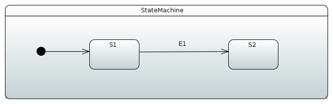

Behind the scenes, a raw UML file would look like the following example:

```xml
<?xml version="1.0" encoding="UTF-8"?>
<uml:Model xmi:version="20131001" xmlns:xmi="http://www.omg.org/spec/XMI/20131001" xmlns:uml="http://www.eclipse.org/uml2/5.0.0/UML" xmi:id="_AMP3IP8fEeW45bORGB4c_A" name="RootElement">
  <packagedElement xmi:type="uml:StateMachine" xmi:id="_AMRFQP8fEeW45bORGB4c_A" name="StateMachine">
    <region xmi:type="uml:Region" xmi:id="_AMRsUP8fEeW45bORGB4c_A" name="Region1">
      <transition xmi:type="uml:Transition" xmi:id="_chgcgP8fEeW45bORGB4c_A" source="_EZrg4P8fEeW45bORGB4c_A" target="_FAvg4P8fEeW45bORGB4c_A">
        <trigger xmi:type="uml:Trigger" xmi:id="_hs5jUP8fEeW45bORGB4c_A" event="_NeH84P8fEeW45bORGB4c_A"/>
      </transition>
      <transition xmi:type="uml:Transition" xmi:id="_egLIoP8fEeW45bORGB4c_A" source="_Fg0IEP8fEeW45bORGB4c_A" target="_EZrg4P8fEeW45bORGB4c_A"/>
      <subvertex xmi:type="uml:State" xmi:id="_EZrg4P8fEeW45bORGB4c_A" name="S1"/>
      <subvertex xmi:type="uml:State" xmi:id="_FAvg4P8fEeW45bORGB4c_A" name="S2"/>
      <subvertex xmi:type="uml:Pseudostate" xmi:id="_Fg0IEP8fEeW45bORGB4c_A"/>
    </region>
  </packagedElement>
  <packagedElement xmi:type="uml:Signal" xmi:id="_L01D0P8fEeW45bORGB4c_A" name="E1"/>
  <packagedElement xmi:type="uml:SignalEvent" xmi:id="_NeH84P8fEeW45bORGB4c_A" name="SignalEventE1" signal="_L01D0P8fEeW45bORGB4c_A"/>
</uml:Model>
```

> [!TIP]
> When opening an existing model that has been defined as UML, you have three
> files: `.di`, `.notation`, and `.uml`. If a model was not created in your
> eclipse’s session, it does not understand how to open an actual state
> chart. This is a known issue in the Papyrus plugin, and there is an easy
> workaround. In a Papyrus perspective, you can see a model explorer for
> your model. Double click Diagram StateMachine Diagram, which
> instructs Eclipse to open this specific model in its proper Papyrus
> modeling plugin.

<a id="index--using-umlstatemachinemodelfactory"></a>
<a id="index--35.1.-using-umlstatemachinemodelfactory"></a>

### 35.1. Using `UmlStateMachineModelFactory`

After a UML file is in place in your project, you can import it into your
configuration by using `StateMachineModelConfigurer`, where
`StateMachineModelFactory` is associated with a model.
`UmlStateMachineModelFactory` is a special factory that knows how to
process a Eclipse Papyrus\_generated UML structure. The source UML file can
either be given as a Spring `Resource` or as a normal location string.
The following example shows how to create an instance of
`UmlStateMachineModelFactory`:

```java
@Configuration @EnableStateMachine public static class Config1 extends StateMachineConfigurerAdapter<String, String> {
@Override public void configure(StateMachineModelConfigurer<String, String> model) throws Exception {model .withModel() .factory(modelFactory());}
@Bean public StateMachineModelFactory<String, String> modelFactory() {return new UmlStateMachineModelFactory("classpath:org/springframework/statemachine/uml/docs/simple-machine.uml");}}
```

As usual, Spring Statemachine works with guards and
actions, which are defined as beans. Those need to be hooked into UML
by its internal modeling structure. The following sections show
how customized bean references are defined within UML definitions.
Note that it is also possible to register particular methods manually
without defining those as beans.

If `UmlStateMachineModelFactory` is created as a bean, its
`ResourceLoader` is automatically wired to find registered actions and
guards. You can also manually define a
`StateMachineComponentResolver`, which is then used to find these
components. The factory also has *registerAction* and
*registerGuard* methods, which you can use to register these components. For more
about this, see [Using `StateMachineComponentResolver`](#index--sm-papyrus-statemachinecomponentresolver).

A UML model is relatively loose when it comes to an implementation such as
Spring Statemachine itself. Spring Statemachine leaves how to implement a lot of features and
functionalities up to the actual implementation. The following sections go
through how Spring Statemachine implements UML models based on
the Eclipse Papyrus plugin.

<a id="index--sm-papyrus-statemachinecomponentresolver"></a>
<a id="index--35.1.1.-using-statemachinecomponentresolver"></a>

#### 35.1.1. Using `StateMachineComponentResolver`

The next example shows how `UmlStateMachineModelFactory` is defined with
a `StateMachineComponentResolver`, which registers the
`myAction` and `myGuard` functions, respectively. Note that these components
are not created as beans. The following listing shows the example:

```java
@Configuration @EnableStateMachine public static class Config2 extends StateMachineConfigurerAdapter<String, String> {
@Override public void configure(StateMachineModelConfigurer<String, String> model) throws Exception {model .withModel() .factory(modelFactory());}
@Bean public StateMachineModelFactory<String, String> modelFactory() {UmlStateMachineModelFactory factory = new UmlStateMachineModelFactory("classpath:org/springframework/statemachine/uml/docs/simple-machine.uml"); factory.setStateMachineComponentResolver(stateMachineComponentResolver()); return factory;}
@Bean public StateMachineComponentResolver<String, String> stateMachineComponentResolver() {DefaultStateMachineComponentResolver<String, String> resolver = new DefaultStateMachineComponentResolver<>(); resolver.registerAction("myAction", myAction()); resolver.registerGuard("myGuard", myGuard()); return resolver;}
public Action<String, String> myAction() {return new Action<String, String>() {
@Override public void execute(StateContext<String, String> context) {} };}
public Guard<String, String> myGuard() {return new Guard<String, String>() {
@Override public boolean evaluate(StateContext<String, String> context) {return false;} };}}
```

<a id="index--creating-a-model"></a>
<a id="index--35.2.-creating-a-model"></a>

### 35.2. Creating a Model

We start by creating an empty state machine model, shown in the following image:

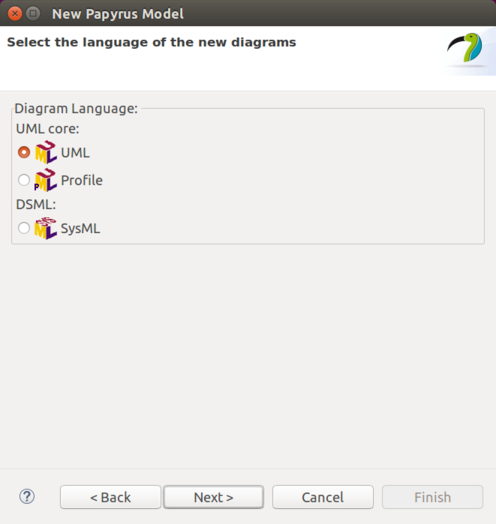

You can start by creating a new model and giving it a name, as the following image shows:

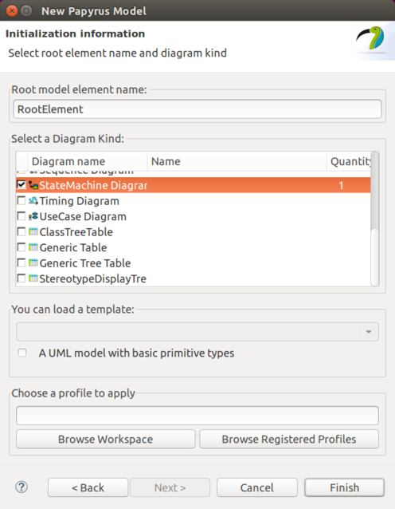

Then you need to choose StateMachine Diagram, as follows:

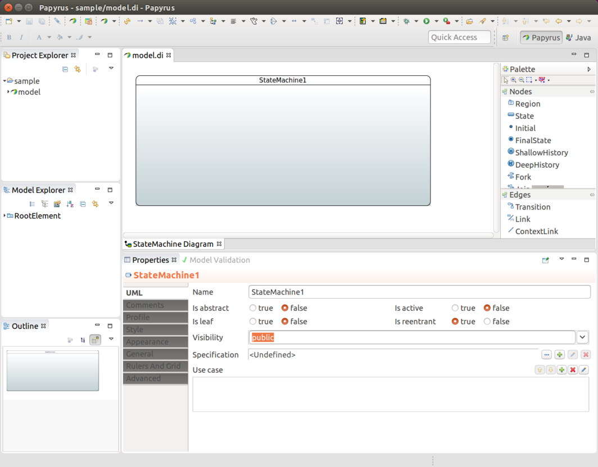

You end up with an empty state machine.

In the preceding images, you should have created a sample named `model`.
You should have wound up with three files: `model.di`, `model.notation`, and `model.uml`. You can then used these files in any other
Eclipse instance. Further, you can import `model.uml` into a
Spring Statemachine.

<a id="index--defining-states"></a>
<a id="index--35.3.-defining-states"></a>

### 35.3. Defining States

The state identifier comes from a component name in a diagram.
You must have an initial state in your machine, which you can do by adding
a root element and then drawing a transition to your own initial state, as the following image shows:

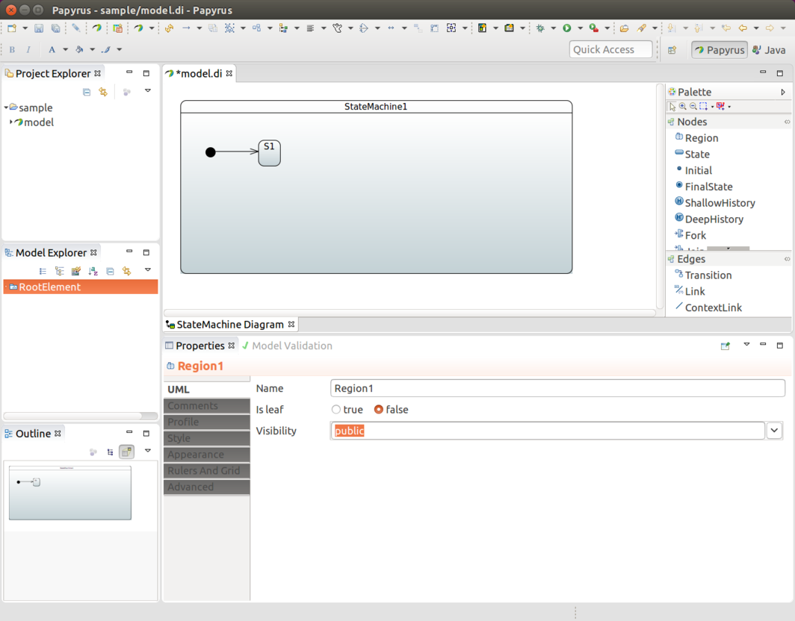

In the preceding image, we added a root element and an initial state (`S1`). Then we drew a transition
between those two to indicate that `S1` is an initial state.

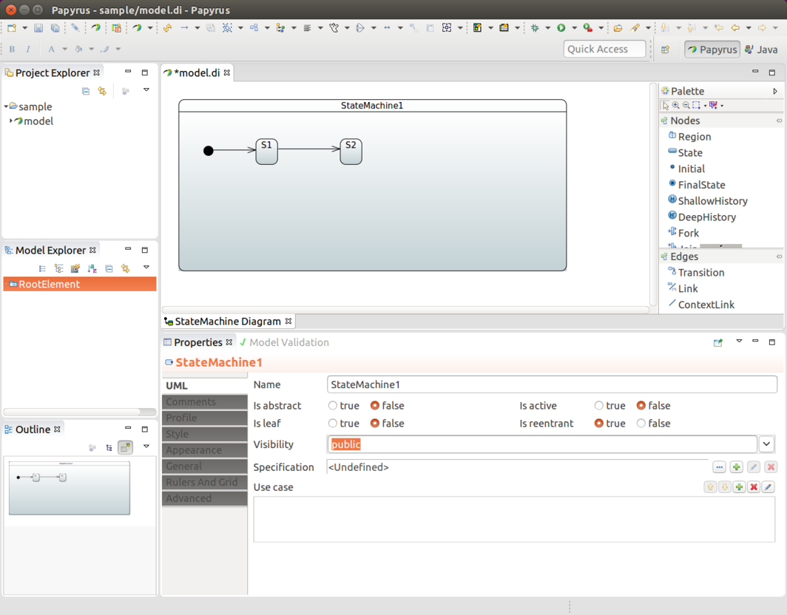

In the preceding image, we added a second state (`S2`) and added a transition between
S1 and S2 (indicating that we have two states).

<a id="index--defining-events"></a>
<a id="index--35.4.-defining-events"></a>

### 35.4. Defining Events

To associate an event with a transition, you need to create a Signal
(`E1`, in this case). To do so, choose RootElement → New Child → Signal.
The following image shows the result:

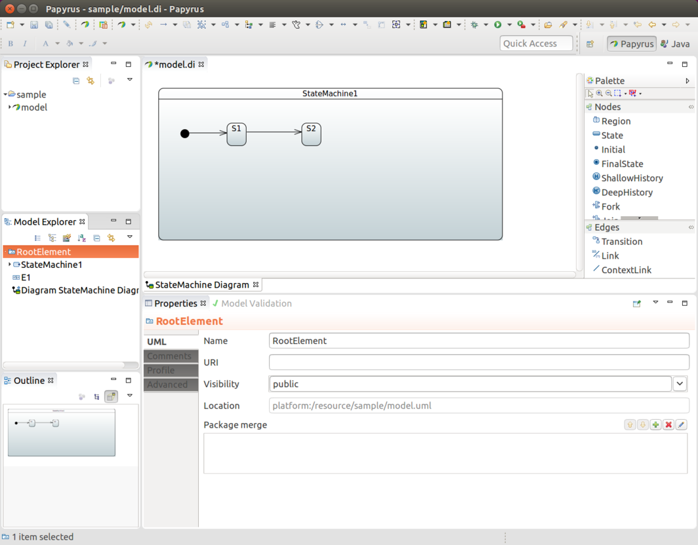

Then you need to crate a SignalEvent with the new Signal, `E1`.
To do so, choose RootElement → New Child → SignalEvent.
The following image shows the result:

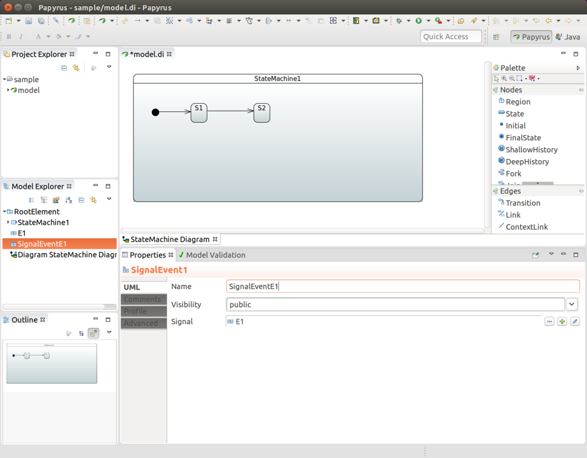

Now that you have defined a `SignalEvent`, you can use it to associate
a trigger with a transition. For more about that, see
[Defining Transitions](#index--sm-papyrus-transitions).

<a id="index--deferring-an-event"></a>
<a id="index--35.4.1.-deferring-an-event"></a>

#### 35.4.1. Deferring an Event

You can defer events to process them at a more appropriate time. In
UML, this is done from a state itself. Choose any state, create a
new trigger under **Deferrable trigger** and choose the SignalEvent which
matches the Signal you want to defer.

<a id="index--sm-papyrus-transitions"></a>
<a id="index--35.5.-defining-transitions"></a>

### 35.5. Defining Transitions

You can create a transition by drawing a transition line between the
source and target states. In the preceding images, we have states `S1` and `S2` and an
anonymous transition between the two. We want to associate event
`E1` with that transition. We choose a transition, create a new
trigger, and define SignalEventE1 for that, as the following image shows:

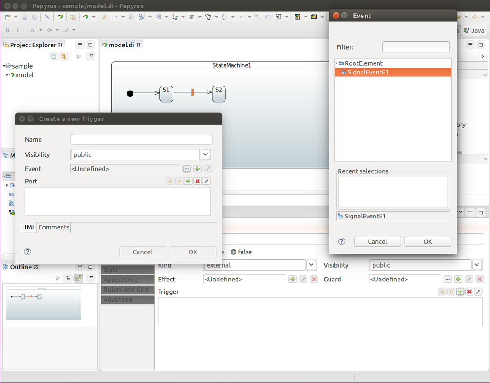

This gives you something like the arrangement shown in the following image:

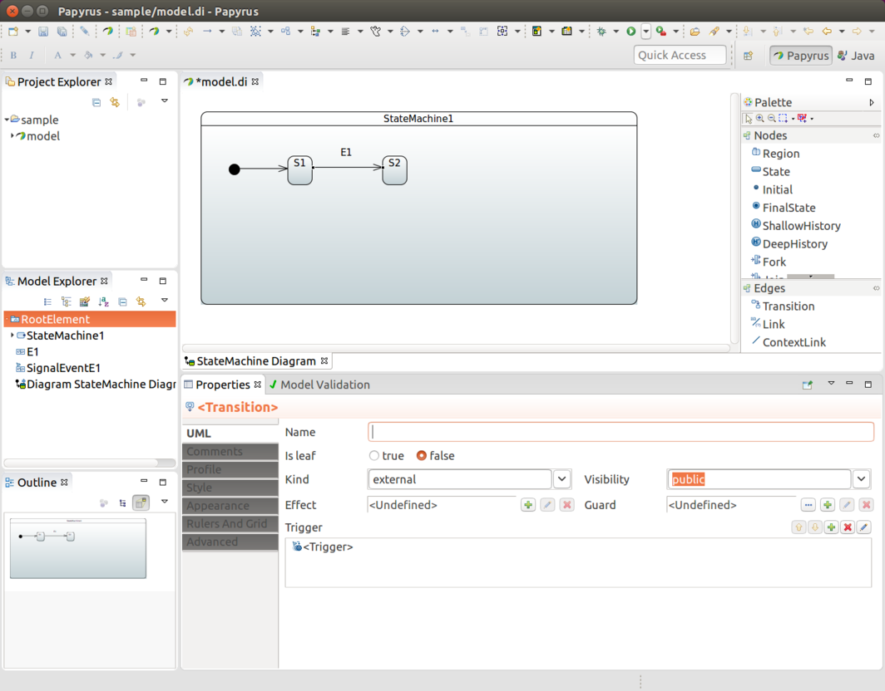

> [!TIP]
> If you omit SignalEvent for a transition, it becomes an
> anonymous transition.

<a id="index--defining-timers"></a>
<a id="index--35.6.-defining-timers"></a>

### 35.6. Defining Timers

Transitions can also happen based on timed events. Spring Statemachine
support two types of timers, ones which fires continuously on a
background and ones which fires once with a delay when state is
entered.

To add a new TimeEvent child to Model Explorer, modify When as an
expression defined as LiteralInteger. The value of it (in milliseconds) becomes the timer.
Leave Is Relative false to make the timer fire continuously.


To define one timed based event that triggers when a state is entered, the process is exactly
same as described earlier, but leave Is Relative set to true. The following image
shows the result:

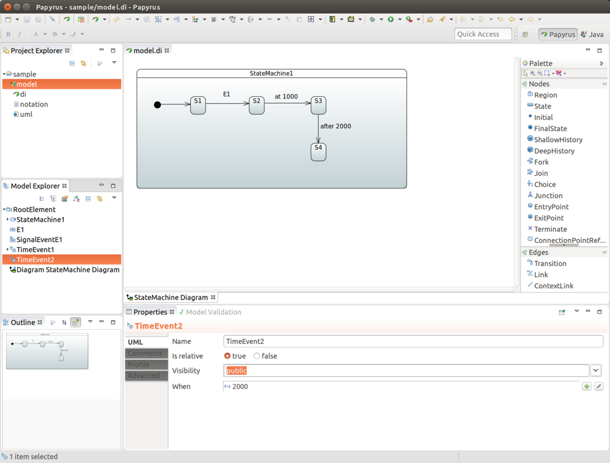

Then the user can pick one of these timed events instead of a
signal event for a particular transition.

<a id="index--sm-papyrus-choice"></a>
<a id="index--35.7.-defining-a-choice"></a>

### 35.7. Defining a Choice

A choice is defined by drawing one incoming transition into a
CHOICE state and drawing multiple outgoing transitions from it to target
states. The configuration model in our `StateConfigurer` lets you define
an if/elseif/else structure. However, with UML, we need to work with
individual Guards for outgoing transitions.

You must ensure that the guards defined for transitions do not overlap so that, whatever happens, only one guard evaluates to TRUE at any given
time. This gives precise and predictable results for choice branch
evaluation. Also we recommend leaving one transition without a guard
so that at least one transition path is guaranteed.
The following image shows the result of making a choice with three branches:

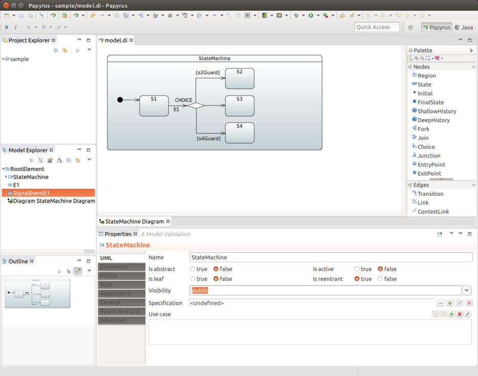

> [!NOTE]
> Junction works similarly same, except that it allows multiple incoming
> transitions. Thus, its behavior compared to Choice is purely
> academic. The actual logic to select the outgoing transition is exactly the same.

<a id="index--defining-a-junction"></a>
<a id="index--35.8.-defining-a-junction"></a>

### 35.8. Defining a Junction

See [Defining a Choice](#index--sm-papyrus-choice).

<a id="index--defining-entry-and-exit-points"></a>
<a id="index--35.9.-defining-entry-and-exit-points"></a>

### 35.9. Defining Entry and Exit Points

You can use EntryPoint and ExitPoint to create controlled entry and exit
with states that have sub-states. In the following state chart, events `E1` and
`E2` have normal state behavior by entering and exiting state
`S2`, where normal state behavior happens by entering initial state
`S21`.

Using event `E3` takes the machine into the `ENTRY` EntryPoint, which then
leads to `S22` without activating initial state `S21` at any time.
Similarly the `EXIT` ExitPoint with event `E4` controls the specific exit
into state `S4`, while normal exit behavior from `S2` would take the
machine into state `S3`. While on state `S22`, you can choose from
events `E4` and `E2` to take the machine into states `S3` or `S4`, respectively. The following image shows the result:

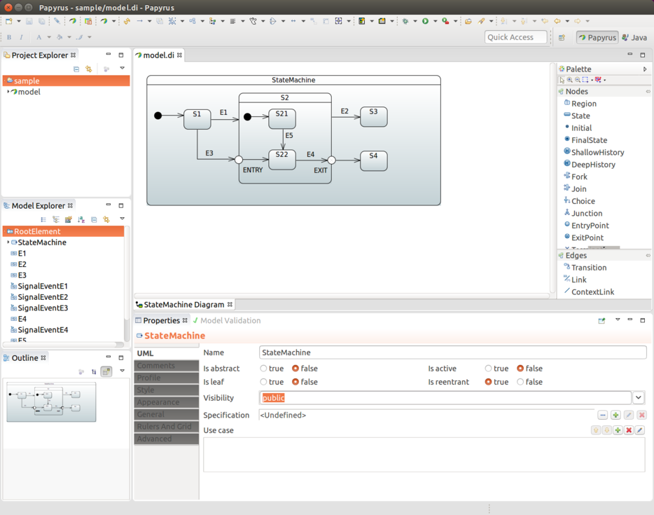

> [!NOTE]
> If state is defined as a sub-machine reference and you need to use entry and exit points, you must externally define a ConnectionPointReference, with
> its entry and exit reference set to point to a correct entry or exit point
> within a submachine reference. Only after that, is it possible to
> target a transition that correctly links from the outside to the inside of
> a sub-machine reference. With ConnectionPointReference, you may need
> to find these settings from Properties → Advanced → UML →
> Entry/Exit. The UML specification lets you define multiple entries and exits. However, with a state machine, only one is allowed.

<a id="index--defining-history-states"></a>
<a id="index--35.10.-defining-history-states"></a>

### 35.10. Defining History States

When working with history states, three different concepts are in play.
UML defines a Deep History and a Shallow History. The Default History
State comes into play when history state is not yet known. These are
represented in following sections.

<a id="index--shallow-history"></a>
<a id="index--35.10.1.-shallow-history"></a>

#### 35.10.1. Shallow History

In the following image, Shallow History is selected and a transition is defined into it:

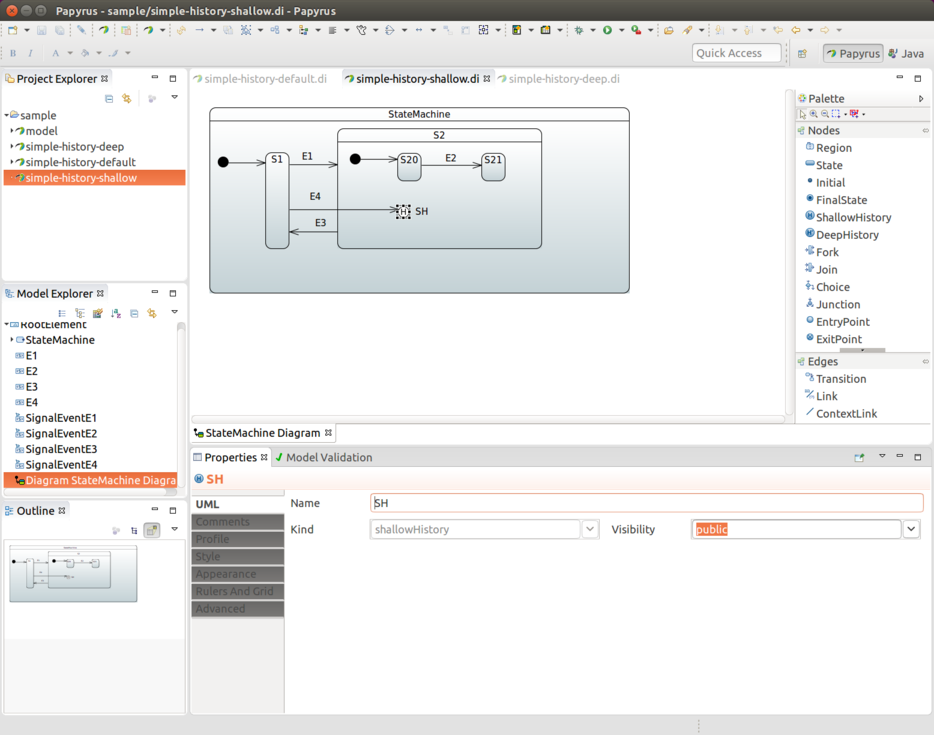

<a id="index--deep-history"></a>
<a id="index--35.10.2.-deep-history"></a>

#### 35.10.2. Deep History

Deep History is used for state that has other deep nested states, thus giving a chance to save whole nested state structure.
The following image shows a definition that uses Deep History:

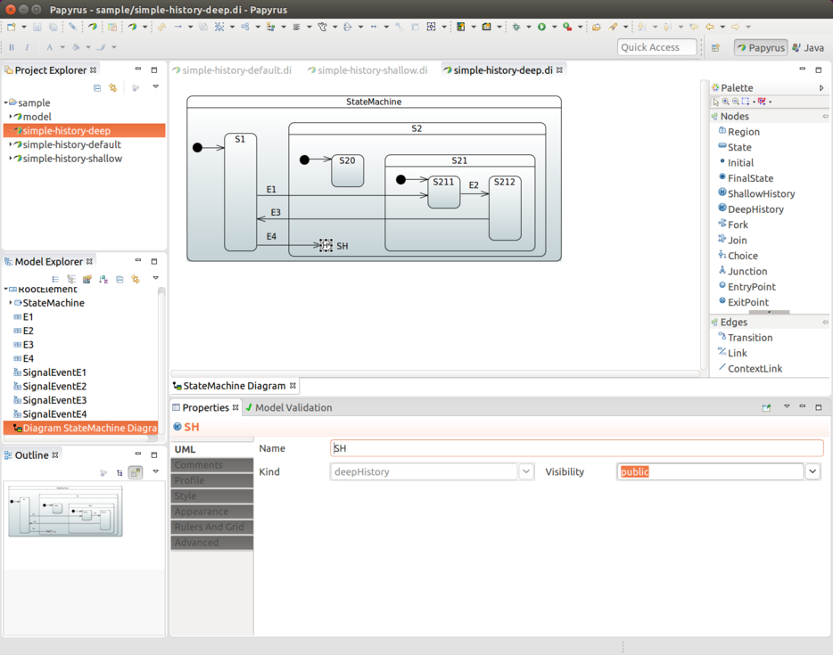

<a id="index--default-history"></a>
<a id="index--35.10.3.-default-history"></a>

#### 35.10.3. Default History

In cases where a Transition terminates on a history when
the state has not been entered before it had reached its
final state, there is an option to force
a transition to a specific substate, using the default
history mechanism. For this to happen, you must define a transition
into this default state. This is the transition from `SH` to
`S22`.

In the following image, state `S22` is entered if state `S2` has
never been active, as its history has never been recorded. If state
`S2` has been active, then either `S20` or `S21` gets chosen.

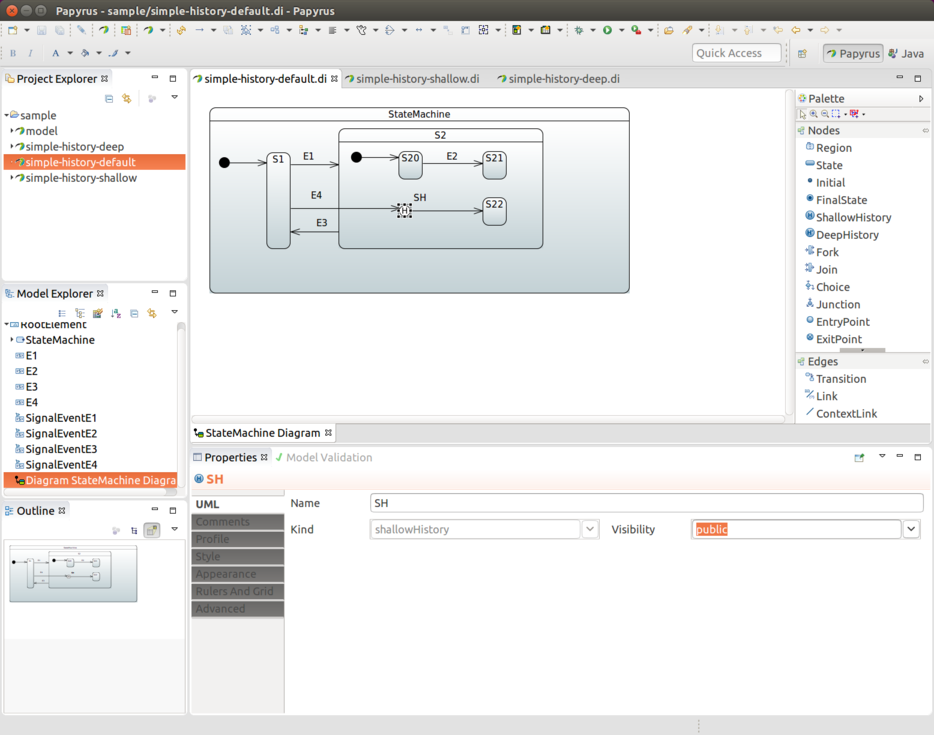

<a id="index--defining-forks-and-joins"></a>
<a id="index--35.11.-defining-forks-and-joins"></a>

### 35.11. Defining Forks and Joins

Both Fork and Join are represented as bars in Papyrus. As shown
in the next image, you need to draw one outgoing transition from `FORK` into state
`S2` to have orthogonal regions. `JOIN` is then the reverse, where
joined states are collected together from incoming transitions.

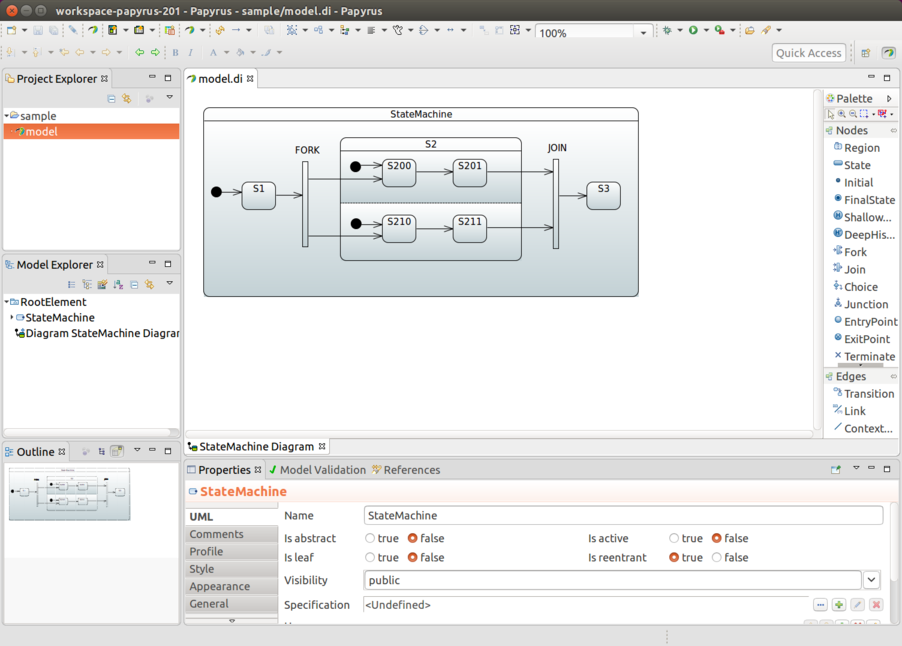

<a id="index--defining-actions"></a>
<a id="index--35.12.-defining-actions"></a>

### 35.12. Defining Actions

You can assoiate swtate entry and exit actions by using a behavior.
For more about this, see [Defining a Bean Reference](#index--sm-papyrus-beanref).

<a id="index--using-an-initial-action"></a>
<a id="index--35.12.1.-using-an-initial-action"></a>

#### 35.12.1. Using an Initial Action

An initial action (as shown in [Configuring Actions](#index--statemachine-config-actions)) is defined
in UML by adding an action in the transition that leads from the Initial State
marker into the actual state. This Action is then run when the state
machine is started.

<a id="index--defining-guards"></a>
<a id="index--35.13.-defining-guards"></a>

### 35.13. Defining Guards

You can define a guard by first adding a Constraint and then defining
its Specification as OpaqueExpression, which works in the same way
as [Defining a Bean Reference](#index--sm-papyrus-beanref).

<a id="index--sm-papyrus-beanref"></a>
<a id="index--35.14.-defining-a-bean-reference"></a>

### 35.14. Defining a Bean Reference

When you need to make a bean reference in any UML effect, action, or guard, you can do so with
`FunctionBehavior` or `OpaqueBehavior`, where the defined language needs to
be `bean` and the language body msut have a bean reference id.

<a id="index--sm-papyrus-spelref"></a>
<a id="index--35.15.-defining-a-spel-reference"></a>

### 35.15. Defining a SpEL Reference

When you need to use a SpEL expression instead of a bean reference in
any UML effect, action, or guard, you can do so by using
`FunctionBehavior` or `OpaqueBehavior`, where the defined language needs to
be `spel` and the language body must be a SpEL expression.

<a id="index--sm-papyrus-submachineref"></a>
<a id="index--35.16.-using-a-sub-machine-reference"></a>

### 35.16. Using a Sub-Machine Reference

Normally, when you use sub-states, you draw those into the state
chart itself. The chart may become too complex and big to
follow, so we also support defining a sub-state as a state machine
reference.

To create a sub-machine reference, you must first create a new diagram and give it a name
(for example, SubStateMachine Diagram). The following image shows the menu choices to use:

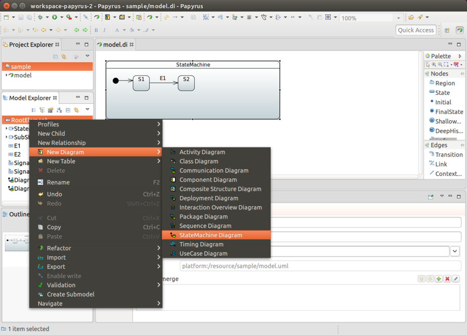

Give the new diagram the design you need.
The following image shows a simple design as an example:

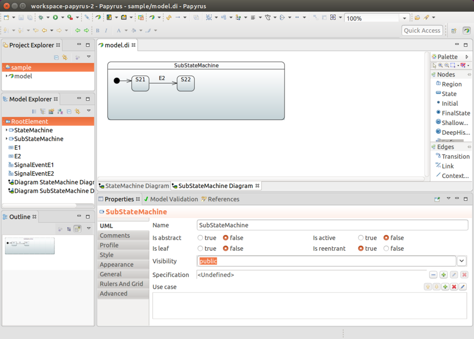

From the state you want to link (in this case,m state `S2`), click the
`Submachine` field and choose your linked machine (in our example, `SubStateMachine`).

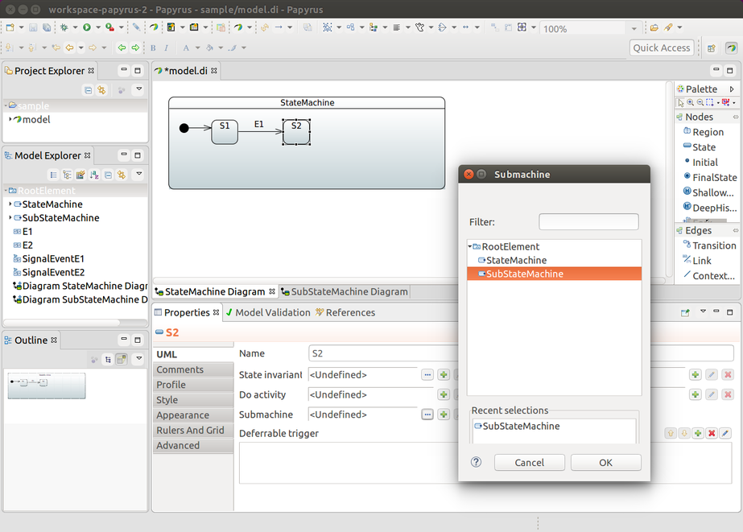

Finally, in the following image, you can see that state `S2` is linked to `SubStateMachine` as a
sub-state.

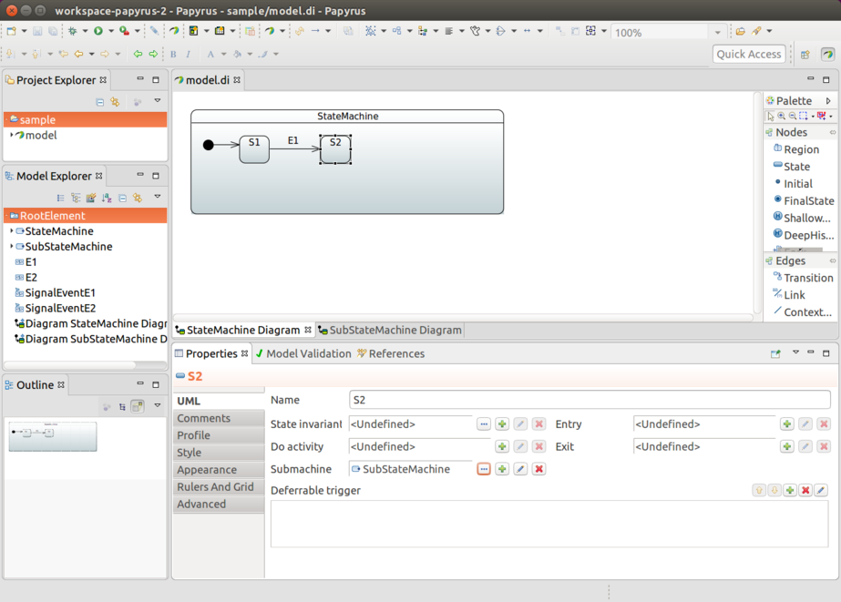

<a id="index--sm-papyrus-import"></a>
<a id="index--35.17.-using-a-machine-import"></a>

### 35.17. Using a Machine Import

It’s also possible to use import functionality where uml files can reference to other models.

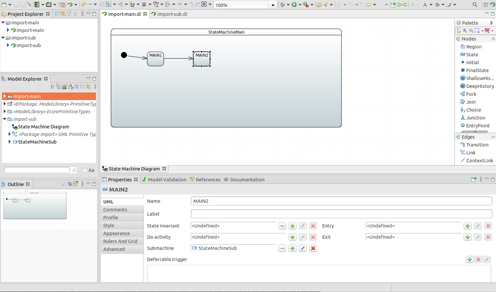

Within `UmlStateMachineModelFactory` it’s possible to use additional resources or locations
to define referenced model files.

```java
@Configuration
@EnableStateMachine
public static class Config3 extends StateMachineConfigurerAdapter<String, String> {

	@Override
	public void configure(StateMachineModelConfigurer<String, String> model) throws Exception {
		model
			.withModel()
				.factory(modelFactory());
	}

	@Bean
	public StateMachineModelFactory<String, String> modelFactory() {
		return new UmlStateMachineModelFactory(
			"classpath:org/springframework/statemachine/uml/import-main/import-main.uml",
			new String[] { "classpath:org/springframework/statemachine/uml/import-sub/import-sub.uml" });
	}
}
```

> [!IMPORTANT]
> Links between files in uml models needs to be relative as
> otherwise things break when model files are copied out from a
> classpath to a temporary directory so that eclipse parsing classes can
> read those.

<a id="index--sm-repository"></a>
<a id="index--36.-repository-support"></a>

## 36. Repository Support

This section contains documentation related to using 'Spring Data
Repositories' in Spring Statemachine.

<a id="index--sm-repository-config"></a>
<a id="index--36.1.-repository-configuration"></a>

### 36.1. Repository Configuration

You can keep machine configuration in external
storage, from which it can be loaded on demand, instead of creating a static
configuration by using either Java configuration or UML-based configuration. This
integration works through a Spring Data Repository abstraction.

We have created a special `StateMachineModelFactory` implementation
called `RepositoryStateMachineModelFactory`. It can use the base
repository interfaces (`StateRepository`, `TransitionRepository`, `ActionRepository` and `GuardRepository`) and base entity
interfaces (`RepositoryState`, `RepositoryTransition`, `RepositoryAction`, and `RepositoryGuard`).

Due to way how entities and repositories work in Spring Data, from a user perspective, read access can be fully abstracted as it is
done in `RepositoryStateMachineModelFactory`. There is no need to
know the actual mapped entity class with which a repository works.
Writing into a repository is always dependent on using a real
repository-specific entity class. From a machine-configuration point
of view, we do not need to know these, meaning that we do not need to know
whether the actual implementation is JPA, Redis, or anything else
that Spring Data supports. Using an actual repository-related
entity class comes into play when you manually try to write new
states or transitions into a backed repository.

> [!TIP]
> Entity classes for `RepositoryState` and `RepositoryTransition` have a
> `machineId` field, which is at your disposal and can be used to
> differentiate between configurations — for example, if machines are built
> via `StateMachineFactory`.

Actual implementations are documented in later sections.
The following images are UML-equivalent state charts of repository
configurations.

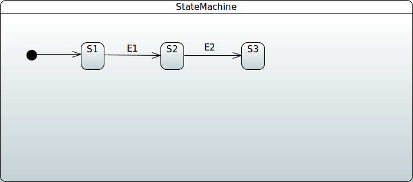

Figure 1. SimpleMachine

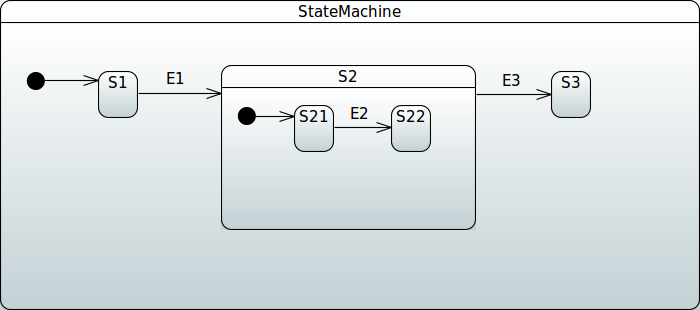

Figure 2. SimpleSubMachine

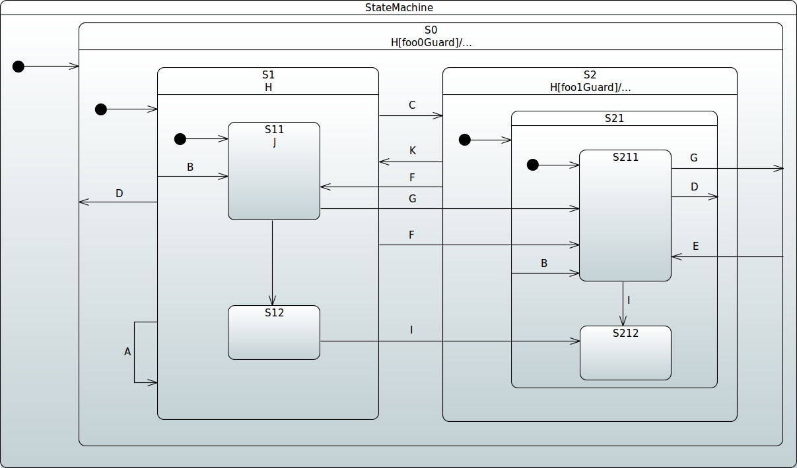

Figure 3. ShowcaseMachine

<a id="index--sm-repository-config-jpa"></a>
<a id="index--36.1.1.-jpa"></a>

#### 36.1.1. JPA

The actual repository implementations for JPA are
`JpaStateRepository`, `JpaTransitionRepository`, `JpaActionRepository`, and `JpaGuardRepository`, which are backed by the
entity classes `JpaRepositoryState`, `JpaRepositoryTransition`, `JpaRepositoryAction`, and `JpaRepositoryGuard`, respectively.

> [!IMPORTANT]
> Unfortunately, version '1.2.8' had to make a change in JPA’s entity
> model regarding used table names. Previously, generated table names
> always had a prefix of `JPA_REPOSITORY_`, derived from entity class
> names. As this caused breaking issues with databases imposing
> restrictions on database object lengths, all entity classes have
> specific definitions to force table names. For example, `JPA_REPOSITORY_STATE` is now 'STATE' — and so on with other
> ntity classes.

The generic way to update states and transitions manually for JPA is shown
in the following example (equivalent to the machine shown in
[SimpleMachine](#index--image-sm-repository-simplemachine)):

```java
@Autowired
StateRepository<JpaRepositoryState> stateRepository;

@Autowired
TransitionRepository<JpaRepositoryTransition> transitionRepository;

void addConfig() {
	JpaRepositoryState stateS1 = new JpaRepositoryState("S1", true);
	JpaRepositoryState stateS2 = new JpaRepositoryState("S2");
	JpaRepositoryState stateS3 = new JpaRepositoryState("S3");

	stateRepository.save(stateS1);
	stateRepository.save(stateS2);
	stateRepository.save(stateS3);

	JpaRepositoryTransition transitionS1ToS2 = new JpaRepositoryTransition(stateS1, stateS2, "E1");
	JpaRepositoryTransition transitionS2ToS3 = new JpaRepositoryTransition(stateS2, stateS3, "E2");

	transitionRepository.save(transitionS1ToS2);
	transitionRepository.save(transitionS2ToS3);
}
```

The following example is also equivalent to the machine shown in
[SimpleSubMachine](#index--image-sm-repository-simplesubmachine).

```java
@Autowired
StateRepository<JpaRepositoryState> stateRepository;

@Autowired
TransitionRepository<JpaRepositoryTransition> transitionRepository;

void addConfig() {
	JpaRepositoryState stateS1 = new JpaRepositoryState("S1", true);
	JpaRepositoryState stateS2 = new JpaRepositoryState("S2");
	JpaRepositoryState stateS3 = new JpaRepositoryState("S3");

	JpaRepositoryState stateS21 = new JpaRepositoryState("S21", true);
	stateS21.setParentState(stateS2);
	JpaRepositoryState stateS22 = new JpaRepositoryState("S22");
	stateS22.setParentState(stateS2);

	stateRepository.save(stateS1);
	stateRepository.save(stateS2);
	stateRepository.save(stateS3);
	stateRepository.save(stateS21);
	stateRepository.save(stateS22);

	JpaRepositoryTransition transitionS1ToS2 = new JpaRepositoryTransition(stateS1, stateS2, "E1");
	JpaRepositoryTransition transitionS2ToS3 = new JpaRepositoryTransition(stateS21, stateS22, "E2");
	JpaRepositoryTransition transitionS21ToS22 = new JpaRepositoryTransition(stateS2, stateS3, "E3");

	transitionRepository.save(transitionS1ToS2);
	transitionRepository.save(transitionS2ToS3);
	transitionRepository.save(transitionS21ToS22);
}
```

First, you must access all repositories.
The following example shows how to do so:

```java
@Autowired
StateRepository<JpaRepositoryState> stateRepository;

@Autowired
TransitionRepository<JpaRepositoryTransition> transitionRepository;

@Autowired
ActionRepository<JpaRepositoryAction> actionRepository;

@Autowired
GuardRepository<JpaRepositoryGuard> guardRepository;
```

Second, you mus create actions and guards.
The following example shows how to do so:

```java
JpaRepositoryGuard foo0Guard = new JpaRepositoryGuard();
foo0Guard.setName("foo0Guard");

JpaRepositoryGuard foo1Guard = new JpaRepositoryGuard();
foo1Guard.setName("foo1Guard");

JpaRepositoryAction fooAction = new JpaRepositoryAction();
fooAction.setName("fooAction");

guardRepository.save(foo0Guard);
guardRepository.save(foo1Guard);
actionRepository.save(fooAction);
```

Third, you must create states.
The following example shows how to do so:

```java
JpaRepositoryState stateS0 = new JpaRepositoryState("S0", true);
stateS0.setInitialAction(fooAction);
JpaRepositoryState stateS1 = new JpaRepositoryState("S1", true);
stateS1.setParentState(stateS0);
JpaRepositoryState stateS11 = new JpaRepositoryState("S11", true);
stateS11.setParentState(stateS1);
JpaRepositoryState stateS12 = new JpaRepositoryState("S12");
stateS12.setParentState(stateS1);
JpaRepositoryState stateS2 = new JpaRepositoryState("S2");
stateS2.setParentState(stateS0);
JpaRepositoryState stateS21 = new JpaRepositoryState("S21", true);
stateS21.setParentState(stateS2);
JpaRepositoryState stateS211 = new JpaRepositoryState("S211", true);
stateS211.setParentState(stateS21);
JpaRepositoryState stateS212 = new JpaRepositoryState("S212");
stateS212.setParentState(stateS21);

stateRepository.save(stateS0);
stateRepository.save(stateS1);
stateRepository.save(stateS11);
stateRepository.save(stateS12);
stateRepository.save(stateS2);
stateRepository.save(stateS21);
stateRepository.save(stateS211);
stateRepository.save(stateS212);
```

Fourth and finally, you must create transitions.
The following example shows how to do so:

```java
JpaRepositoryTransition transitionS1ToS1 = new JpaRepositoryTransition(stateS1, stateS1, "A");
transitionS1ToS1.setGuard(foo1Guard);

JpaRepositoryTransition transitionS1ToS11 = new JpaRepositoryTransition(stateS1, stateS11, "B");
JpaRepositoryTransition transitionS21ToS211 = new JpaRepositoryTransition(stateS21, stateS211, "B");
JpaRepositoryTransition transitionS1ToS2 = new JpaRepositoryTransition(stateS1, stateS2, "C");
JpaRepositoryTransition transitionS1ToS0 = new JpaRepositoryTransition(stateS1, stateS0, "D");
JpaRepositoryTransition transitionS211ToS21 = new JpaRepositoryTransition(stateS211, stateS21, "D");
JpaRepositoryTransition transitionS0ToS211 = new JpaRepositoryTransition(stateS0, stateS211, "E");
JpaRepositoryTransition transitionS1ToS211 = new JpaRepositoryTransition(stateS1, stateS211, "F");
JpaRepositoryTransition transitionS2ToS21 = new JpaRepositoryTransition(stateS2, stateS21, "F");
JpaRepositoryTransition transitionS11ToS211 = new JpaRepositoryTransition(stateS11, stateS211, "G");

JpaRepositoryTransition transitionS0 = new JpaRepositoryTransition(stateS0, stateS0, "H");
transitionS0.setKind(TransitionKind.INTERNAL);
transitionS0.setGuard(foo0Guard);
transitionS0.setActions(new HashSet<>(Arrays.asList(fooAction)));

JpaRepositoryTransition transitionS1 = new JpaRepositoryTransition(stateS1, stateS1, "H");
transitionS1.setKind(TransitionKind.INTERNAL);

JpaRepositoryTransition transitionS2 = new JpaRepositoryTransition(stateS2, stateS2, "H");
transitionS2.setKind(TransitionKind.INTERNAL);
transitionS2.setGuard(foo1Guard);
transitionS2.setActions(new HashSet<>(Arrays.asList(fooAction)));

JpaRepositoryTransition transitionS11ToS12 = new JpaRepositoryTransition(stateS11, stateS12, "I");
JpaRepositoryTransition transitionS12ToS212 = new JpaRepositoryTransition(stateS12, stateS212, "I");
JpaRepositoryTransition transitionS211ToS12 = new JpaRepositoryTransition(stateS211, stateS12, "I");

JpaRepositoryTransition transitionS11 = new JpaRepositoryTransition(stateS11, stateS11, "J");
JpaRepositoryTransition transitionS2ToS1 = new JpaRepositoryTransition(stateS2, stateS1, "K");

transitionRepository.save(transitionS1ToS1);
transitionRepository.save(transitionS1ToS11);
transitionRepository.save(transitionS21ToS211);
transitionRepository.save(transitionS1ToS2);
transitionRepository.save(transitionS1ToS0);
transitionRepository.save(transitionS211ToS21);
transitionRepository.save(transitionS0ToS211);
transitionRepository.save(transitionS1ToS211);
transitionRepository.save(transitionS2ToS21);
transitionRepository.save(transitionS11ToS211);
transitionRepository.save(transitionS0);
transitionRepository.save(transitionS1);
transitionRepository.save(transitionS2);
transitionRepository.save(transitionS11ToS12);
transitionRepository.save(transitionS12ToS212);
transitionRepository.save(transitionS211ToS12);
transitionRepository.save(transitionS11);
transitionRepository.save(transitionS2ToS1);
```

You can find a complete example
[here](#index--statemachine-examples-datajpa). This example also shows how you can
pre-populate a repository from an existing JSON file that has
definitions for entity classes.

<a id="index--sm-repository-config-redis"></a>
<a id="index--36.1.2.-redis"></a>

#### 36.1.2. Redis

The actual repository implementations for a Redis instance are
`RedisStateRepository`, `RedisTransitionRepository`, `RedisActionRepository`, and `RedisGuardRepository`, which are backed by the
entity classes `RedisRepositoryState`, `RedisRepositoryTransition`, `RedisRepositoryAction`, and `RedisRepositoryGuard`, respectively.

The next example shows the generic way to manually update states and transitions for Redis.
This is equivalent to machine shown in
[SimpleMachine](#index--image-sm-repository-simplemachine).

```java
@Autowired
StateRepository<RedisRepositoryState> stateRepository;

@Autowired
TransitionRepository<RedisRepositoryTransition> transitionRepository;

void addConfig() {
	RedisRepositoryState stateS1 = new RedisRepositoryState("S1", true);
	RedisRepositoryState stateS2 = new RedisRepositoryState("S2");
	RedisRepositoryState stateS3 = new RedisRepositoryState("S3");

	stateRepository.save(stateS1);
	stateRepository.save(stateS2);
	stateRepository.save(stateS3);


	RedisRepositoryTransition transitionS1ToS2 = new RedisRepositoryTransition(stateS1, stateS2, "E1");
	RedisRepositoryTransition transitionS2ToS3 = new RedisRepositoryTransition(stateS2, stateS3, "E2");

	transitionRepository.save(transitionS1ToS2);
	transitionRepository.save(transitionS2ToS3);
}
```

The following example is equivalent to machine shown in
[SimpleSubMachine](#index--image-sm-repository-simplesubmachine):

```java
@Autowired
StateRepository<RedisRepositoryState> stateRepository;

@Autowired
TransitionRepository<RedisRepositoryTransition> transitionRepository;

void addConfig() {
	RedisRepositoryState stateS1 = new RedisRepositoryState("S1", true);
	RedisRepositoryState stateS2 = new RedisRepositoryState("S2");
	RedisRepositoryState stateS3 = new RedisRepositoryState("S3");

	stateRepository.save(stateS1);
	stateRepository.save(stateS2);
	stateRepository.save(stateS3);


	RedisRepositoryTransition transitionS1ToS2 = new RedisRepositoryTransition(stateS1, stateS2, "E1");
	RedisRepositoryTransition transitionS2ToS3 = new RedisRepositoryTransition(stateS2, stateS3, "E2");

	transitionRepository.save(transitionS1ToS2);
	transitionRepository.save(transitionS2ToS3);
}
```

<a id="index--sm-repository-config-mongodb"></a>
<a id="index--36.1.3.-mongodb"></a>

#### 36.1.3. MongoDB

The actual repository implementations for a MongoDB instance are
`MongoDbStateRepository`, `MongoDbTransitionRepository`, `MongoDbActionRepository`, and `MongoDbGuardRepository`, which are backed by the
entity classes `MongoDbRepositoryState`, `MongoDbRepositoryTransition`, `MongoDbRepositoryAction`, and `MongoDbRepositoryGuard`, respectively.

The next example shows the generic way to manually update states and transitions for MongoDB.
This is equivalent to the machine shown in
[SimpleMachine](#index--image-sm-repository-simplemachine).

```java
@Autowired
StateRepository<MongoDbRepositoryState> stateRepository;

@Autowired
TransitionRepository<MongoDbRepositoryTransition> transitionRepository;

void addConfig() {
	MongoDbRepositoryState stateS1 = new MongoDbRepositoryState("S1", true);
	MongoDbRepositoryState stateS2 = new MongoDbRepositoryState("S2");
	MongoDbRepositoryState stateS3 = new MongoDbRepositoryState("S3");

	stateRepository.save(stateS1);
	stateRepository.save(stateS2);
	stateRepository.save(stateS3);

	MongoDbRepositoryTransition transitionS1ToS2 = new MongoDbRepositoryTransition(stateS1, stateS2, "E1");
	MongoDbRepositoryTransition transitionS2ToS3 = new MongoDbRepositoryTransition(stateS2, stateS3, "E2");

	transitionRepository.save(transitionS1ToS2);
	transitionRepository.save(transitionS2ToS3);
}
```

The following example is equivalent to the machine shown in
[SimpleSubMachine](#index--image-sm-repository-simplesubmachine).

```java
@Autowired
StateRepository<MongoDbRepositoryState> stateRepository;

@Autowired
TransitionRepository<MongoDbRepositoryTransition> transitionRepository;

void addConfig() {
	MongoDbRepositoryState stateS1 = new MongoDbRepositoryState("S1", true);
	MongoDbRepositoryState stateS2 = new MongoDbRepositoryState("S2");
	MongoDbRepositoryState stateS3 = new MongoDbRepositoryState("S3");

	MongoDbRepositoryState stateS21 = new MongoDbRepositoryState("S21", true);
	stateS21.setParentState(stateS2);
	MongoDbRepositoryState stateS22 = new MongoDbRepositoryState("S22");
	stateS22.setParentState(stateS2);

	stateRepository.save(stateS1);
	stateRepository.save(stateS2);
	stateRepository.save(stateS3);
	stateRepository.save(stateS21);
	stateRepository.save(stateS22);

	MongoDbRepositoryTransition transitionS1ToS2 = new MongoDbRepositoryTransition(stateS1, stateS2, "E1");
	MongoDbRepositoryTransition transitionS2ToS3 = new MongoDbRepositoryTransition(stateS21, stateS22, "E2");
	MongoDbRepositoryTransition transitionS21ToS22 = new MongoDbRepositoryTransition(stateS2, stateS3, "E3");

	transitionRepository.save(transitionS1ToS2);
	transitionRepository.save(transitionS2ToS3);
	transitionRepository.save(transitionS21ToS22);
}
```

<a id="index--sm-repository-persistence"></a>
<a id="index--36.2.-repository-persistence"></a>

### 36.2. Repository Persistence

Apart from storing machine configuration (as shown in
[Repository Configuration](#index--sm-repository-config)), in an external repository, you canx also
persist machines into repositories.

The `StateMachineRepository` interface is a central access point that
interacts with machine persistence and is backed by the entity class
`RepositoryStateMachine`.

<a id="index--sm-repository-persistence-jpa"></a>
<a id="index--36.2.1.-jpa"></a>

#### 36.2.1. JPA

The actual repository implementation for JPA is
`JpaStateMachineRepository`, which is backed by the entity class
`JpaRepositoryStateMachine`.

The following example shows the generic way to persist a machine for JPA:

```java
@Autowired
StateMachineRepository<JpaRepositoryStateMachine> stateMachineRepository;

void persist() {

	JpaRepositoryStateMachine machine = new JpaRepositoryStateMachine();
	machine.setMachineId("machine");
	machine.setState("S1");
	// raw byte[] representation of a context
	machine.setStateMachineContext(new byte[] { 0 });

	stateMachineRepository.save(machine);
}
```

<a id="index--sm-repository-persistence-redis"></a>
<a id="index--36.2.2.-redis"></a>

#### 36.2.2. Redis

The actual repository implementation for a Redis is
`RedisStateMachineRepository`, which is backed by the entity class
`RedisRepositoryStateMachine`.

The following example shows the generic way to persist a machine for Redis:

```java
@Autowired
StateMachineRepository<RedisRepositoryStateMachine> stateMachineRepository;

void persist() {

	RedisRepositoryStateMachine machine = new RedisRepositoryStateMachine();
	machine.setMachineId("machine");
	machine.setState("S1");
	// raw byte[] representation of a context
	machine.setStateMachineContext(new byte[] { 0 });

	stateMachineRepository.save(machine);
}
```

<a id="index--sm-repository-persistence-mongodb"></a>
<a id="index--36.2.3.-mongodb"></a>

#### 36.2.3. MongoDB

The actual repository implementation for MongoDB is
`MongoDbStateMachineRepository`, which is backed by the entity class
`MongoDbRepositoryStateMachine`.

The following example shows the generic way to persist a machine for MongoDB:

```java
@Autowired
StateMachineRepository<MongoDbRepositoryStateMachine> stateMachineRepository;

void persist() {

	MongoDbRepositoryStateMachine machine = new MongoDbRepositoryStateMachine();
	machine.setMachineId("machine");
	machine.setState("S1");
	// raw byte[] representation of a context
	machine.setStateMachineContext(new byte[] { 0 });

	stateMachineRepository.save(machine);
}
```

<a id="index--statemachine-recipes"></a>
<a id="index--recipes"></a>

# Recipes

This chapter contains documentation for existing built-in state
machine recipes.

Spring Statemachine is a foundational framework. That is, it does not have much
higher-level functionality or many dependencies beyond Spring Framework.
Consequently, correctly using a state machine may be difficult. To help, we have created a set of recipe modules that address common use cases.

What exactly is a recipe? A state machine recipe is a module that addresses a common
use case. In essence, a state machine recipe is both an example that we have tried to
make it easy for you to reuse and extend.

> [!NOTE]
> Recipes are a great way to make external contributions to the Spring
> Statemachine project. If you are not ready to contribute to the
> framework core itself, a custom and common recipe is a great way to
> share functionality with other users.

<a id="index--statemachine-recipes-persist"></a>
<a id="index--37.-persist"></a>

## 37. Persist

The persist recipe is a simple utility that lets you use a single state
machine instance to persist and update the state of an arbitrary item in
a repository.

The recipe’s main class is `PersistStateMachineHandler`, which makes three assumptions:

- An instance of a `StateMachine<String, String>` needs to be used
  with a `PersistStateMachineHandler`. Note that states and Events are required
  to be type of `String`.
- `PersistStateChangeListener` needs to be registered with handler
  to react to persist request.
- The `handleEventWithState` method is used to orchestrate state changes.

You can find a sample that shows how to use this recipe at
[Persist](#index--statemachine-examples-persist).

<a id="index--statemachine-recipes-tasks"></a>
<a id="index--38.-tasks"></a>

## 38. Tasks

The tasks recipe is a concept to run a DAG (Directed Acyclic Graph) of `Runnable` instances that use
a state machine. This recipe has been developed from ideas introduced
in [Tasks](#index--statemachine-examples-tasks) sample.

The next image shows the generic concept of a state machine. In this state chart, everything under `TASKS` shows a generic concept of how a single
task is executed. Because this recipe lets you register a deep
hierarchical DAG of tasks (meaning a real state chart would be a deeply
nested collection of sub-states and regions), we have no need to be
more precise.

For example, if you have only two registered tasks, the following state chart
would be correct when `TASK_id` is replaced with `TASK_1` and `TASK_2` (assuming
the registered tasks IDs are `1` and `2`).

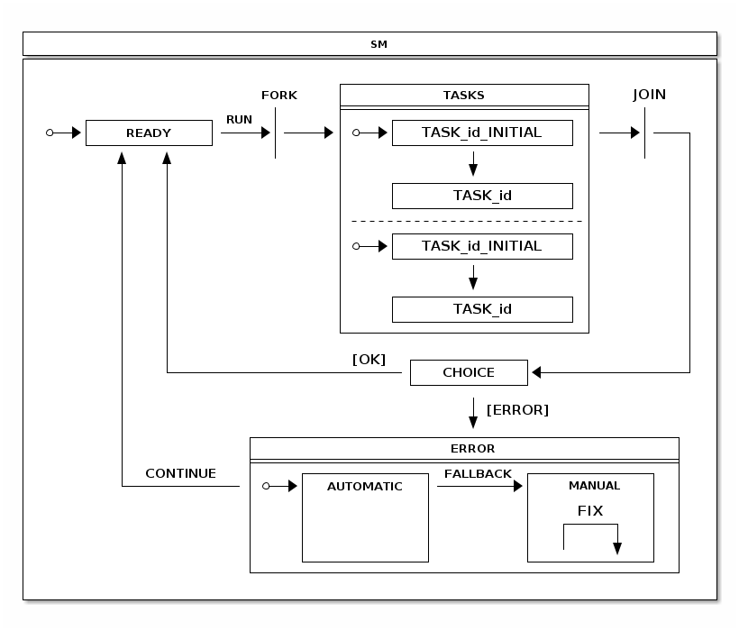

Executing a `Runnable` may result an error. Especially if a complex
DAG of tasks is involved, you want to have a way to handle
task execution errors and then have a way to continue execution
without executing already successfully executed tasks. Also, it would be nice if some execution errors can be handled
automatically. As a last fallback, if an error cannot be handled
automatically, the state machine is put into a state where the user can handle
errors manually.

`TasksHandler` contains a builder method to configure a handler instance
and follows a simple builder pattern. You can use this builder to
register `Runnable` tasks and `TasksListener` instances and define
`StateMachinePersist` hook.

Now we can take a simple `Runnable` that runs a simple sleep as the following
example shows:

```java
private Runnable sleepRunnable() {return new Runnable() {
@Override public void run() {try {Thread.sleep(2000); } catch (InterruptedException e) {}} };}
```

> [!NOTE]
> The preceding example is the base for all of the examples in this chapter.

To execute multiple `sleepRunnable` tasks, you can register tasks and
execute `runTasks()` method from `TasksHandler`, as the following example shows:

```java
TasksHandler handler = TasksHandler.builder()
		.task("1", sleepRunnable())
		.task("2", sleepRunnable())
		.task("3", sleepRunnable())
		.build();

handler.runTasks();
```

To listen to what is happening with a task execution, you can register an instance of
a `TasksListener` with a `TasksHandler`. This recipe
provides an adapter `TasksListenerAdapter` if you do not want to
implement a full interface. The listener provides a various hooks to
listen tasks execution events. The following example shows the definition of the
`MyTasksListener` class:

```java
private class MyTasksListener extends TasksListenerAdapter {
@Override public void onTasksStarted() {}
@Override public void onTasksContinue() {}
@Override public void onTaskPreExecute(Object id) {}
@Override public void onTaskPostExecute(Object id) {}
@Override public void onTaskFailed(Object id, Exception exception) {}
@Override public void onTaskSuccess(Object id) {}
@Override public void onTasksSuccess() {}
@Override public void onTasksError() {}
@Override public void onTasksAutomaticFix(TasksHandler handler, StateContext<String, String> context) {}}
```

You can either register listeners by using a builder or register them directly with a
`TasksHandler` as the following example shows:

```java
MyTasksListener listener1 = new MyTasksListener();
MyTasksListener listener2 = new MyTasksListener();

TasksHandler handler = TasksHandler.builder()
		.task("1", sleepRunnable())
		.task("2", sleepRunnable())
		.task("3", sleepRunnable())
		.listener(listener1)
		.build();

handler.addTasksListener(listener2);
handler.removeTasksListener(listener2);

handler.runTasks();
```

Every task
needs to have a unique identifier, and (optionally) a task can be
defined to be a sub-task. Effectively, this creates a DAG of tasks.
The following example shows how to create a deep nested DAG of tasks:

```java
TasksHandler handler = TasksHandler.builder()
		.task("1", sleepRunnable())
		.task("1", "12", sleepRunnable())
		.task("1", "13", sleepRunnable())
		.task("2", sleepRunnable())
		.task("2", "22", sleepRunnable())
		.task("2", "23", sleepRunnable())
		.task("3", sleepRunnable())
		.task("3", "32", sleepRunnable())
		.task("3", "33", sleepRunnable())
		.build();

handler.runTasks();
```

When an error happens and the state machine running these tasks goes into an
`ERROR` state, you can call `fixCurrentProblems` handler method to
reset the current state of the tasks kept in the state machine’s extended state
variables. You can then use the `continueFromError` handler method to
instruct the state machine to transition from the `ERROR` state back to the
`READY` state, where you can again run tasks.
The following example shows how to do so:

```java
TasksHandler handler = TasksHandler.builder()
		.task("1", sleepRunnable())
		.task("2", sleepRunnable())
		.task("3", sleepRunnable())
		.build();

		handler.runTasks();
		handler.fixCurrentProblems();
		handler.continueFromError();
```

<a id="index--statemachine-examples"></a>
<a id="index--state-machine-examples"></a>

# State Machine Examples

This part of the reference documentation explains the use of state
machines together with sample code and UML state charts. We use a few
shortcuts when representing the relationship between a state chart, Spring Statemachine
configuration, and what an application does with a state machine. For
complete examples, you should study the samples repository.

Samples are built directly from a main source distribution during a
normal build cycle. This chapter includes the following samples:

[Turnstile](#index--statemachine-examples-turnstile)

[Turnstile Reactive](#index--statemachine-examples-turnstilereactive)

[Showcase](#index--statemachine-examples-showcase)

[CD Player](#index--statemachine-examples-cdplayer)

[Tasks](#index--statemachine-examples-tasks)

[Washer](#index--statemachine-examples-washer)

[Persist](#index--statemachine-examples-persist)

[Zookeeper](#index--statemachine-examples-zookeeper)

[Web](#index--statemachine-examples-web)

[Scope](#index--statemachine-examples-scope)

[Security](#index--statemachine-examples-security)

[Event Service](#index--statemachine-examples-eventservice)

[Deploy](#index--statemachine-examples-deploy)

[Order Shipping](#index--statemachine-examples-ordershipping)

[JPA Configuration](#index--statemachine-examples-datajpa)

[Data Persist](#index--statemachine-examples-datapersist)

[Data JPA Persist](#index--statemachine-examples-datajpapersist)

[Data Multi Persist](#index--statemachine-examples-datajpamultipersist)

[Monitoring](#index--statemachine-examples-monitoring)

The following listing shows how to build the samples:

```bash
./gradlew clean build -x test
```

Every sample is located in its own directory under
`spring-statemachine-samples`. The samples are based on Spring Boot and you can find the usual Boot fat jars under every sample
project’s `build/libs` directory.

> [!NOTE]
> The filenames for the jars to which we refer in this section are populated during a
> build of this document, meaning that, if you build samples from
> main, you have files with a `BUILD-SNAPSHOT` postfix.

<a id="index--statemachine-examples-turnstile"></a>
<a id="index--39.-turnstile"></a>

## 39. Turnstile

Turnstile is a simple device that gives you access if payment is
made. It is a concept that is simple to model using a state machine. In its
simplest form, there are only two states: `LOCKED` and `UNLOCKED`. Two
events, `COIN` and `PUSH` can happen, depending on whether someone
makes a payment or tries to go through the turnstile.
The following image shows the state machine:

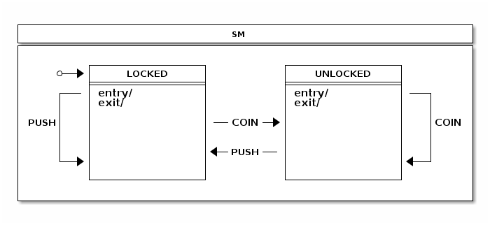

The following listing shows the enumeration that defines the possible states:

States

```java
public enum States {
	LOCKED, UNLOCKED
}
```

The following listing shows the enumeration that defines the events:

Events

```java
public enum Events {
	COIN, PUSH
}
```

The following listing shows the code that configures the state machine:

Configuration

```java
@Configuration
@EnableStateMachine
public class StateMachineConfiguration
        extends EnumStateMachineConfigurerAdapter<States, Events> {

    @Override
    public void configure(StateMachineStateConfigurer<States, Events> states)
            throws Exception {
        states
                .withStates()
                .initial(States.LOCKED)
                .states(EnumSet.allOf(States.class));
    }

    @Override
    public void configure(StateMachineTransitionConfigurer<States, Events> transitions)
            throws Exception {
        transitions
                .withExternal()
                .source(States.LOCKED)
                .target(States.UNLOCKED)
                .event(Events.COIN)
                .and()
                .withExternal()
                .source(States.UNLOCKED)
                .target(States.LOCKED)
                .event(Events.PUSH);
    }

}
```

You can see how this sample state machine interacts with events by
running the `turnstile` sample. The following listing shows how to do so
and shows the command’s output:

```text
$ java -jar spring-statemachine-samples-turnstile-4.0.2.jar

sm>print
+----------------------------------------------------------------+
|                              SM                                |
+----------------------------------------------------------------+
|                                                                |
|         +----------------+          +----------------+         |
|     *-->|     LOCKED     |          |    UNLOCKED    |         |
|         +----------------+          +----------------+         |
|     +---| entry/         |          | entry/         |---+     |
|     |   | exit/          |          | exit/          |   |     |
|     |   |                |          |                |   |     |
| PUSH|   |                |---COIN-->|                |   |COIN |
|     |   |                |          |                |   |     |
|     |   |                |          |                |   |     |
|     |   |                |<--PUSH---|                |   |     |
|     +-->|                |          |                |<--+     |
|         |                |          |                |         |
|         +----------------+          +----------------+         |
|                                                                |
+----------------------------------------------------------------+

sm>start
State changed to LOCKED
State machine started

sm>event COIN
State changed to UNLOCKED
Event COIN send

sm>event PUSH
State changed to LOCKED
Event PUSH send
```

<a id="index--statemachine-examples-turnstilereactive"></a>
<a id="index--40.-turnstile-reactive"></a>

## 40. Turnstile Reactive

Turnstile reactive is an enhancement to [Turnstile](#index--statemachine-examples-turnstile) sample using
same *StateMachine* concept and adding a reactive web layer communicating reactively with
a *StateMachine* reactive interfaces.

`StateMachineController` is a simple `@RestController` where we autowire our `StateMachine`.

```java
@Autowired
private StateMachine<States, Events> stateMachine;
```

We create first mapping to return a machine state. As state doesn’t come out from
a machine reactively, we can *defer* it so that when a returned `Mono` is subscribed, actual state is requested.

```java
@GetMapping("/state")
public Mono<States> state() {
	return Mono.defer(() -> Mono.justOrEmpty(stateMachine.getState().getId()));
}
```

To send a single event or multiple events to a machine we can use a `Flux` in both
incoming and outgoing layers. `EventResult` here is just for this sample and simply
wraps `ResultType` and event.

```java
@PostMapping("/events")
public Flux<EventResult> events(@RequestBody Flux<EventData> eventData) {
	return eventData
		.filter(ed -> ed.getEvent() != null)
		.map(ed -> MessageBuilder.withPayload(ed.getEvent()).build())
		.flatMap(m -> stateMachine.sendEvent(Mono.just(m)))
		.map(EventResult::new);
}
```

You can use the following command to run the sample:

```text
$ java -jar spring-statemachine-samples-turnstilereactive-4.0.2.jar
```

Example of getting a state:

```bash
GET http://localhost:8080/state
```

Would then response:

```text
"LOCKED"
```

Example of sending an event:

```bash
POST http://localhost:8080/events
content-type: application/json

{
    "event": "COIN"
}
```

Would then response:

```json
[
  {
    "event": "COIN",
    "resultType": "ACCEPTED"
  }
]
```

You can post multiple events:

```bash
POST http://localhost:8080/events content-type: application/json
[{"event": "COIN" },{"event": "PUSH"}]
```

Response then contains results for both events:

```json
[{"event": "COIN","resultType": "ACCEPTED" },{"event": "PUSH","resultType": "ACCEPTED"}]
```

<a id="index--statemachine-examples-showcase"></a>
<a id="index--41.-showcase"></a>

## 41. Showcase

Showcase is a complex state machine that shows all possible transition
topologies up to four levels of state nesting.
The following image shows the state machine:

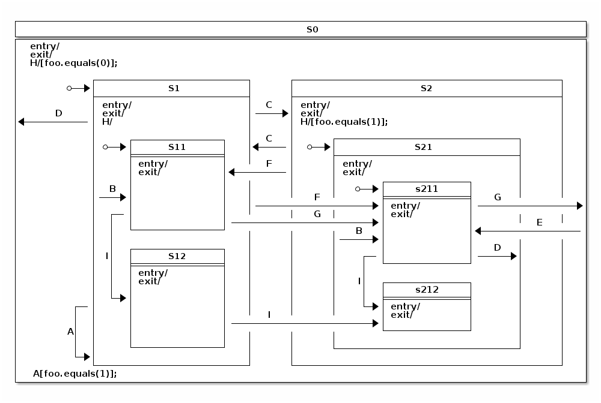

The following listing shows the enumeration that defines the possible states:

States

```java
public enum States {
    S0, S1, S11, S12, S2, S21, S211, S212
}
```

The following listing shows the enumeration that defines the events:

Events

```java
public enum Events {
    A, B, C, D, E, F, G, H, I
}
```

The following listing shows the code that configures the state machine:

Configuration - states

```java
@Override
public void configure(StateMachineStateConfigurer<States, Events> states)
		throws Exception {
	states
		.withStates()
			.initial(States.S0, fooAction())
			.state(States.S0)
			.and()
			.withStates()
				.parent(States.S0)
				.initial(States.S1)
				.state(States.S1)
				.and()
				.withStates()
					.parent(States.S1)
					.initial(States.S11)
					.state(States.S11)
					.state(States.S12)
					.and()
			.withStates()
				.parent(States.S0)
				.state(States.S2)
				.and()
				.withStates()
					.parent(States.S2)
					.initial(States.S21)
					.state(States.S21)
					.and()
					.withStates()
						.parent(States.S21)
						.initial(States.S211)
						.state(States.S211)
						.state(States.S212);
}
```

The following listing shows the code that configures the state machine’s transitions:

Configuration - transitions

```java
@Override
public void configure(StateMachineTransitionConfigurer<States, Events> transitions)
		throws Exception {
	transitions
		.withExternal()
			.source(States.S1).target(States.S1).event(Events.A)
			.guard(foo1Guard())
			.and()
		.withExternal()
			.source(States.S1).target(States.S11).event(Events.B)
			.and()
		.withExternal()
			.source(States.S21).target(States.S211).event(Events.B)
			.and()
		.withExternal()
			.source(States.S1).target(States.S2).event(Events.C)
			.and()
		.withExternal()
			.source(States.S2).target(States.S1).event(Events.C)
			.and()
		.withExternal()
			.source(States.S1).target(States.S0).event(Events.D)
			.and()
		.withExternal()
			.source(States.S211).target(States.S21).event(Events.D)
			.and()
		.withExternal()
			.source(States.S0).target(States.S211).event(Events.E)
			.and()
		.withExternal()
			.source(States.S1).target(States.S211).event(Events.F)
			.and()
		.withExternal()
			.source(States.S2).target(States.S11).event(Events.F)
			.and()
		.withExternal()
			.source(States.S11).target(States.S211).event(Events.G)
			.and()
		.withExternal()
			.source(States.S211).target(States.S0).event(Events.G)
			.and()
		.withInternal()
			.source(States.S0).event(Events.H)
			.guard(foo0Guard())
			.action(fooAction())
			.and()
		.withInternal()
			.source(States.S2).event(Events.H)
			.guard(foo1Guard())
			.action(fooAction())
			.and()
		.withInternal()
			.source(States.S1).event(Events.H)
			.and()
		.withExternal()
			.source(States.S11).target(States.S12).event(Events.I)
			.and()
		.withExternal()
			.source(States.S211).target(States.S212).event(Events.I)
			.and()
		.withExternal()
			.source(States.S12).target(States.S212).event(Events.I);

}
```

The following listing shows the code that configures the state machine’s actions and guards:

Configuration - actions and guards

```java
@Bean public FooGuard foo0Guard() {return new FooGuard(0);}
@Bean public FooGuard foo1Guard() {return new FooGuard(1);}
@Bean public FooAction fooAction() {return new FooAction();}
```

The following listing shows how the single action is defined:

Action

```java
private static class FooAction implements Action<States, Events> {

	@Override
	public void execute(StateContext<States, Events> context) {
		Map<Object, Object> variables = context.getExtendedState().getVariables();
		Integer foo = context.getExtendedState().get("foo", Integer.class);
		if (foo == null) {
			log.info("Init foo to 0");
			variables.put("foo", 0);
		} else if (foo == 0) {
			log.info("Switch foo to 1");
			variables.put("foo", 1);
		} else if (foo == 1) {
			log.info("Switch foo to 0");
			variables.put("foo", 0);
		}
	}
}
```

The following listing shows how the single guard is defined:

Guard

```java
private static class FooGuard implements Guard<States, Events> {
private final int match;
public FooGuard(int match) {this.match = match;}
@Override public boolean evaluate(StateContext<States, Events> context) {Object foo = context.getExtendedState().getVariables().get("foo"); return !(foo == null || !foo.equals(match));}}
```

The following listing shows the output that this state machine produces when it runs and
various events are sent to it:

```text
sm>start
Init foo to 0
Entry state S0
Entry state S1
Entry state S11
State machine started

sm>event A
Event A send

sm>sm event C
Exit state S11
Exit state S1
Entry state S2
Entry state S21
Entry state S211
Event C send

sm>event H
Switch foo to 1
Internal transition source=S0
Event H send

sm>event C
Exit state S211
Exit state S21
Exit state S2
Entry state S1
Entry state S11
Event C send

sm>event A
Exit state S11
Exit state S1
Entry state S1
Entry state S11
Event A send
```

In the preceding output, we can see that:

- The state machine is started, which takes it to its initial state (`S11`)
  through superstates (`S1`) and (`S0`). Also, the extended state variable, `foo`, is
  initialized to `0`.
- We try to execute a self transition in state `S1` with event `A`, but
  nothing happens because the transition is guarded by variable `foo` to
  be `1`.
- We send event `C`, which takes us to the other state machine, where
  the initial state (`S211`) and its superstates are entered. In there, we
  can use event `H`, which does a simple internal transition to flip the
  `foo` variable. Then we go back by using event `C`.
- Event `A` is sent again, and now `S1` does a self transition because the
  guard evaluates to `true`.

The following example offers a closer look at how hierarchical states and their event
handling works:

```text
sm>variables
No variables

sm>start
Init foo to 0
Entry state S0
Entry state S1
Entry state S11
State machine started

sm>variables
foo=0

sm>event H
Internal transition source=S1
Event H send

sm>variables
foo=0

sm>event C
Exit state S11
Exit state S1
Entry state S2
Entry state S21
Entry state S211
Event C send

sm>variables
foo=0

sm>event H
Switch foo to 1
Internal transition source=S0
Event H send

sm>variables
foo=1

sm>event H
Switch foo to 0
Internal transition source=S2
Event H send

sm>variables
foo=0
```

In the preceding sample:

- We print extended state variables in various stages.
- With event `H`, we end up running an internal transition,
  which is logged with its source state.
- Note how event `H` is handled in
  different states (`S0`, `S1`, and `S2`). This is a good example of how
  hierarchical states and their event handling works. If state `S2` is
  unable to handle event `H` due to a guard condition, its parent is
  checked next. This guarantees that, while the machine is on state `S2`, the `foo` flag
  is always flipped around. However, in state `S1`, event `H` always
  matches to its dummy transition without guard or action, so it never
  happens.

<a id="index--statemachine-examples-cdplayer"></a>
<a id="index--42.-cd-player"></a>

## 42. CD Player

CD Player is a sample which resembles a use case that many people have
used in the real world. CD Player itself is a really simple entity that allows a
user to open a deck, insert or change a disk, and then drive the player’s
functionality by pressing various buttons (`eject`, `play`, `stop`, `pause`, `rewind`, and `backward`).

How many of us have really given thought to what it will take to
make code that interacts with hardware to drive a CD Player. Yes, the
concept of a player is simple, but, if you look behind the scenes, things actually get a bit convoluted.

You have probably noticed that, if your deck is open and you press play, the
deck closes and a song starts to play (if a CD was inserted).
In a sense, when the deck is open, you first need to close
it and then try to start playing (again, if a CD is actually inserted). Hopefully, you have now realized that a simple CD Player is so simple.
Sure, you can wrap all this with a simple class that has a few boolean variables
and probably a few nested if-else clauses. That will do the job, but what
about if you need to make all this behavior much more complex? Do you
really want to keep adding more flags and if-else clauses?

The following image shows the state machine for our simple CD player:

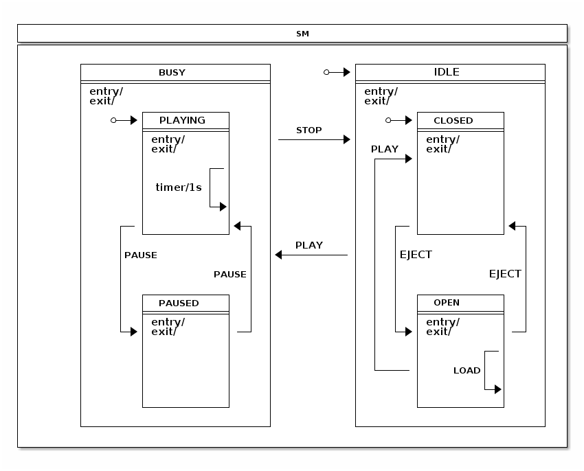

The rest of this section goes through how this sample and its state machine is designed and
how those two interacts with each other. The following three configuration sections
are used within an `EnumStateMachineConfigurerAdapter`.

```java
@Override
public void configure(StateMachineStateConfigurer<States, Events> states)
		throws Exception {
	states
		.withStates()
			.initial(States.IDLE)
			.state(States.IDLE)
			.and()
			.withStates()
				.parent(States.IDLE)
				.initial(States.CLOSED)
				.state(States.CLOSED, closedEntryAction(), null)
				.state(States.OPEN)
				.and()
		.withStates()
			.state(States.BUSY)
			.and()
			.withStates()
				.parent(States.BUSY)
				.initial(States.PLAYING)
				.state(States.PLAYING)
				.state(States.PAUSED);

}
```

```java
@Override
public void configure(StateMachineTransitionConfigurer<States, Events> transitions)
		throws Exception {
	transitions
		.withExternal()
			.source(States.CLOSED).target(States.OPEN).event(Events.EJECT)
			.and()
		.withExternal()
			.source(States.OPEN).target(States.CLOSED).event(Events.EJECT)
			.and()
		.withExternal()
			.source(States.OPEN).target(States.CLOSED).event(Events.PLAY)
			.and()
		.withExternal()
			.source(States.PLAYING).target(States.PAUSED).event(Events.PAUSE)
			.and()
		.withInternal()
			.source(States.PLAYING)
			.action(playingAction())
			.timer(1000)
			.and()
		.withInternal()
			.source(States.PLAYING).event(Events.BACK)
			.action(trackAction())
			.and()
		.withInternal()
			.source(States.PLAYING).event(Events.FORWARD)
			.action(trackAction())
			.and()
		.withExternal()
			.source(States.PAUSED).target(States.PLAYING).event(Events.PAUSE)
			.and()
		.withExternal()
			.source(States.BUSY).target(States.IDLE).event(Events.STOP)
			.and()
		.withExternal()
			.source(States.IDLE).target(States.BUSY).event(Events.PLAY)
			.action(playAction())
			.guard(playGuard())
			.and()
		.withInternal()
			.source(States.OPEN).event(Events.LOAD).action(loadAction());
}
```

```java
@Bean public ClosedEntryAction closedEntryAction() {return new ClosedEntryAction();}
@Bean public LoadAction loadAction() {return new LoadAction();}
@Bean public TrackAction trackAction() {return new TrackAction();}
@Bean public PlayAction playAction() {return new PlayAction();}
@Bean public PlayingAction playingAction() {return new PlayingAction();}
@Bean public PlayGuard playGuard() {return new PlayGuard();}
```

In the preceding configuration:

- We used `EnumStateMachineConfigurerAdapter` to configure states and
  transitions.
- The `CLOSED` and `OPEN` states are defined as substates of `IDLE`, and
  the `PLAYING` and `PAUSED` states are defined as substates of `BUSY`.
- With the `CLOSED` state, we added an entry action as a bean called
  `closedEntryAction`.
- In the transitions we mostly map events to expected state
  transitions, such as `EJECT` closing and opening a deck and `PLAY`, `STOP`,
  and `PAUSE` doing their natural transitions. For other transitions, we did the following:

  - For source state `PLAYING`, we added a timer trigger, which is
    needed to automatically track elapsed time within a playing track and
    to have a facility for making the decision about when to switch the to next track.
  - For the `PLAY` event, if the source state is `IDLE` and the target state is
    `BUSY`, we defined an action called `playAction` and a guard called `playGuard`.
  - For the `LOAD` event and the `OPEN` state, we defined an internal
    transition with an action called `loadAction`, which tracks inserting a disc with
    extended-state variables.
  - The `PLAYING` state defines three internal transitions. One is
    triggered by a timer that runs an action called `playingAction`, which updates
    the extended state variables. The other two transitions use `trackAction`
    with different events (`BACK` and `FORWARD`, respectively) to handle
    when the user wants to go back or forward in tracks.

This machine has only have six states, which are defined by the following enumeration:

```java
public enum States {
	// super state of PLAYING and PAUSED
    BUSY,
    PLAYING,
    PAUSED,
	// super state of CLOSED and OPEN
    IDLE,
    CLOSED,
    OPEN
}
```

Events represent the buttons the user can
press and whether the user loads a disc into the player.
The following enumeration defines the events:

```java
public enum Events {
    PLAY, STOP, PAUSE, EJECT, LOAD, FORWARD, BACK
}
```

The `cdPlayer` and `library` beans are used to drive the application.
The following listing shows the definition of these two beans:

```java
@Bean public CdPlayer cdPlayer() {return new CdPlayer();}
@Bean public Library library() {return Library.buildSampleLibrary();}
```

We define extended state variable keys as simple enumerations, as the following listing shows:

```java
public enum Variables {
	CD, TRACK, ELAPSEDTIME
}

public enum Headers {
	TRACKSHIFT
}
```

We wanted to make this sample type safe, so we define our own
annotation (`@StatesOnTransition`), which has a mandatory meta
annotation (`@OnTransition`).
The following listing defines the `@StatesOnTransition` annotation:

```java
@Target(ElementType.METHOD)
@Retention(RetentionPolicy.RUNTIME)
@OnTransition
public @interface StatesOnTransition {

	States[] source() default {};

	States[] target() default {};

}
```

`ClosedEntryAction` is an entry action for the `CLOSED` state, to
send a `PLAY` event to the state machine if a disc is present.
The following listing defines `ClosedEntryAction`:

```java
public static class ClosedEntryAction implements Action<States, Events> {
@Override public void execute(StateContext<States, Events> context) {if (context.getTransition() != null && context.getEvent() == Events.PLAY && context.getTransition().getTarget().getId() == States.CLOSED && context.getExtendedState().getVariables().get(Variables.CD) != null) {context.getStateMachine() .sendEvent(Mono.just(MessageBuilder .withPayload(Events.PLAY).build())) .subscribe();}}}
```

`LoadAction` update an extended state variable if event
headers contain information about a disc to load.
The following listing defines `LoadAction`:

```java
public static class LoadAction implements Action<States, Events> {
@Override public void execute(StateContext<States, Events> context) {Object cd = context.getMessageHeader(Variables.CD); context.getExtendedState().getVariables().put(Variables.CD, cd);}}
```

`PlayAction` resets the player’s elapsed time, which is kept as
an extended state variable.
The following listing defines `PlayAction`:

```java
public static class PlayAction implements Action<States, Events> {
@Override public void execute(StateContext<States, Events> context) {context.getExtendedState().getVariables().put(Variables.ELAPSEDTIME, 0l); context.getExtendedState().getVariables().put(Variables.TRACK, 0);}}
```

`PlayGuard` guards the transition from `IDLE` to `BUSY` with the
`PLAY` event if the `CD` extended state variable does not indicate that a
disc has been loaded.
The following listing defines `PlayGuard`:

```java
public static class PlayGuard implements Guard<States, Events> {
@Override public boolean evaluate(StateContext<States, Events> context) {ExtendedState extendedState = context.getExtendedState(); return extendedState.getVariables().get(Variables.CD) != null;}}
```

`PlayingAction` updates an extended state variable called `ELAPSEDTIME`, which
the player can use to read and update its LCD status display. `PlayingAction` also handles
track shifting when the user goe back or forward in tracks.
The following example defines `PlayingAction`:

```java
public static class PlayingAction implements Action<States, Events> {

	@Override
	public void execute(StateContext<States, Events> context) {
		Map<Object, Object> variables = context.getExtendedState().getVariables();
		Object elapsed = variables.get(Variables.ELAPSEDTIME);
		Object cd = variables.get(Variables.CD);
		Object track = variables.get(Variables.TRACK);
		if (elapsed instanceof Long) {
			long e = ((Long)elapsed) + 1000l;
			if (e > ((Cd) cd).getTracks()[((Integer) track)].getLength()*1000) {
				context.getStateMachine()
					.sendEvent(Mono.just(MessageBuilder
						.withPayload(Events.FORWARD)
						.setHeader(Headers.TRACKSHIFT.toString(), 1).build()))
					.subscribe();
			} else {
				variables.put(Variables.ELAPSEDTIME, e);
			}
		}
	}
}
```

`TrackAction` handles track shift actions when the user goes back or forward
in tracks. If a track is the last on a disc, playing is stopped and the `STOP`
event is sent to a state machine.
The following example defines `TrackAction`:

```java
public static class TrackAction implements Action<States, Events> {

	@Override
	public void execute(StateContext<States, Events> context) {
		Map<Object, Object> variables = context.getExtendedState().getVariables();
		Object trackshift = context.getMessageHeader(Headers.TRACKSHIFT.toString());
		Object track = variables.get(Variables.TRACK);
		Object cd = variables.get(Variables.CD);
		if (trackshift instanceof Integer && track instanceof Integer && cd instanceof Cd) {
			int next = ((Integer)track) + ((Integer)trackshift);
			if (next >= 0 &&  ((Cd)cd).getTracks().length > next) {
				variables.put(Variables.ELAPSEDTIME, 0l);
				variables.put(Variables.TRACK, next);
			} else if (((Cd)cd).getTracks().length <= next) {
				context.getStateMachine()
					.sendEvent(Mono.just(MessageBuilder
						.withPayload(Events.STOP).build()))
					.subscribe();
			}
		}
	}
}
```

One other important aspect of state machines is that they have their
own responsibilities (mostly around handling states) and that all application
level logic should be kept outside. This means that applications need
to have a ways to interact with a state machine. Also, note
that we annotated `CdPlayer` with `@WithStateMachine`, which instructs a
state machine to find methods from your POJO, which are then called
with various transitions.
The following example shows how it updates its LCD status display:

```java
@OnTransition(target = "BUSY")
public void busy(ExtendedState extendedState) {
	Object cd = extendedState.getVariables().get(Variables.CD);
	if (cd != null) {
		cdStatus = ((Cd)cd).getName();
	}
}
```

In the preceding example, we use the `@OnTransition` annotation to hook a callback
when a transition happens with a target state of `BUSY`.

The following listing shows how our state machine handles whether the player is closed:

```java
@StatesOnTransition(target = {States.CLOSED, States.IDLE})
public void closed(ExtendedState extendedState) {
	Object cd = extendedState.getVariables().get(Variables.CD);
	if (cd != null) {
		cdStatus = ((Cd)cd).getName();
	} else {
		cdStatus = "No CD";
	}
	trackStatus = "";
}
```

`@OnTransition` (which we used in the preceding examples) can only be
used with strings that are matched from enumerations. `@StatesOnTransition`
lets you create your own type-safe annotations that use real enumerations.

The following example shows how this state machine actually works.

```text
sm>start
Entry state IDLE
Entry state CLOSED
State machine started

sm>lcd
No CD

sm>list
0: Greatest Hits
  0: Bohemian Rhapsody  05:56
  1: Another One Bites the Dust  03:36
1: Greatest Hits II
  0: A Kind of Magic  04:22
  1: Under Pressure  04:08

sm>eject
Exit state CLOSED
Entry state OPEN

sm>load 0
Loading cd Greatest Hits

sm>play
Exit state OPEN
Entry state CLOSED
Exit state CLOSED
Exit state IDLE
Entry state BUSY
Entry state PLAYING

sm>lcd
Greatest Hits Bohemian Rhapsody 00:03

sm>forward

sm>lcd
Greatest Hits Another One Bites the Dust 00:04

sm>stop
Exit state PLAYING
Exit state BUSY
Entry state IDLE
Entry state CLOSED

sm>lcd
Greatest Hits
```

In the preceding run:

- The state machine is started, which causes the machine to be initialized.
- The CD player’s LCD screen status is printed.
- The CD library is printed.
- The CD player’s deck is opened.
- The CD with index 0 is loaded into a deck.
- Play causes the deck to get closed and immediate play, because a disc
  was inserted.
- We print the LCD status and request the next track.
- We stop playing.

<a id="index--statemachine-examples-tasks"></a>
<a id="index--43.-tasks"></a>

## 43. Tasks

The Tasks sample demonstrates parallel task handling within
regions and adds error handling to either
automatically or manually fix task problems before continuing back
to a state where the tasks can be run again.
The following image shows the Tasks state machine:

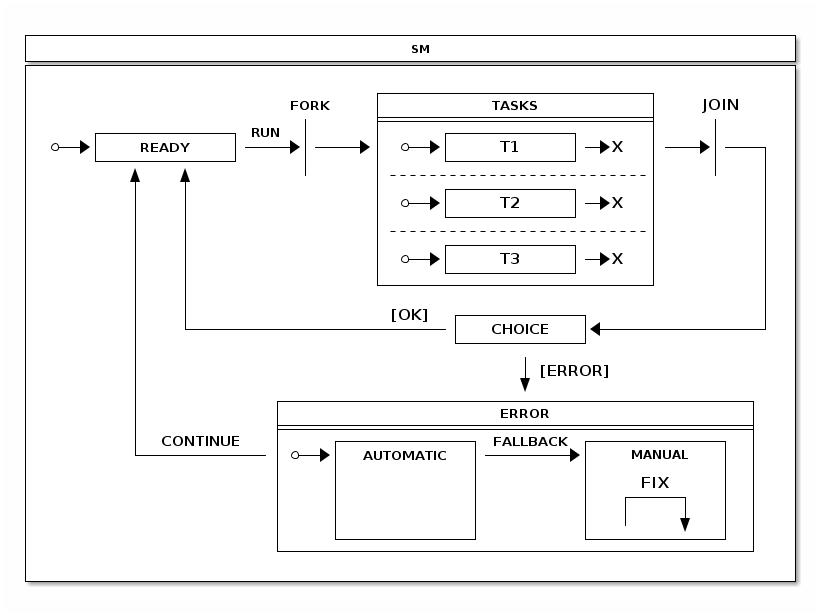

On a high level, in this state machine:

- We always try to get into the `READY` state so that we can use the
  RUN event to execute tasks.
- The `TASKS` state, which is composed of three independent regions, has been
  put in the middle of `FORK` and `JOIN` states, which will cause the regions to
  go into their initial states and to be joined by their end states.
- From the `JOIN` state, we automatically go into a `CHOICE` state, which checks
  for the existence of error flags in extended state variables. Tasks can set
  these flags, and doing so gives the `CHOICE` state the ability to go into the `ERROR`
  state, where errors can be handled either automatically or manually.
- The `AUTOMATIC` state in `ERROR` can try to automatically fix an error and goes
  back to `READY` if it succeeds. If the error is something what
  cannot be handled automatically, user intervention is needed and the
  machine is put into the `MANUAL` state by the `FALLBACK` event.

The following listing shows the enumeration that defines the possible states:

States

```java
public enum States {
    READY,
    FORK, JOIN, CHOICE,
    TASKS, T1, T1E, T2, T2E, T3, T3E,
    ERROR, AUTOMATIC, MANUAL
}
```

The following listing shows the enumeration that defines the events:

Events

```java
public enum Events {
    RUN, FALLBACK, CONTINUE, FIX;
}
```

The following listing configures the possible states:

Configuration - states

```java
@Override
public void configure(StateMachineStateConfigurer<States, Events> states)
		throws Exception {
	states
		.withStates()
			.initial(States.READY)
			.fork(States.FORK)
			.state(States.TASKS)
			.join(States.JOIN)
			.choice(States.CHOICE)
			.state(States.ERROR)
			.and()
			.withStates()
				.parent(States.TASKS)
				.initial(States.T1)
				.end(States.T1E)
				.and()
			.withStates()
				.parent(States.TASKS)
				.initial(States.T2)
				.end(States.T2E)
				.and()
			.withStates()
				.parent(States.TASKS)
				.initial(States.T3)
				.end(States.T3E)
				.and()
			.withStates()
				.parent(States.ERROR)
				.initial(States.AUTOMATIC)
				.state(States.AUTOMATIC, automaticAction(), null)
				.state(States.MANUAL);
}
```

The following listing configures the possible transitions:

Configuration - transitions

```java
@Override
public void configure(StateMachineTransitionConfigurer<States, Events> transitions)
		throws Exception {
	transitions
		.withExternal()
			.source(States.READY).target(States.FORK)
			.event(Events.RUN)
			.and()
		.withFork()
			.source(States.FORK).target(States.TASKS)
			.and()
		.withExternal()
			.source(States.T1).target(States.T1E)
			.and()
		.withExternal()
			.source(States.T2).target(States.T2E)
			.and()
		.withExternal()
			.source(States.T3).target(States.T3E)
			.and()
		.withJoin()
			.source(States.TASKS).target(States.JOIN)
			.and()
		.withExternal()
			.source(States.JOIN).target(States.CHOICE)
			.and()
		.withChoice()
			.source(States.CHOICE)
			.first(States.ERROR, tasksChoiceGuard())
			.last(States.READY)
			.and()
		.withExternal()
			.source(States.ERROR).target(States.READY)
			.event(Events.CONTINUE)
			.and()
		.withExternal()
			.source(States.AUTOMATIC).target(States.MANUAL)
			.event(Events.FALLBACK)
			.and()
		.withInternal()
			.source(States.MANUAL)
			.action(fixAction())
			.event(Events.FIX);
}
```

The following guard sends a choice entry into the `ERROR` state and needs to
return `TRUE` if an error has happened. This guard checks that
all extended state variables(`T1`, `T2`, and `T3`) are `TRUE`.

```java
@Bean public Guard<States, Events> tasksChoiceGuard() {return new Guard<States, Events>() {
@Override public boolean evaluate(StateContext<States, Events> context) {Map<Object, Object> variables = context.getExtendedState().getVariables(); return !(ObjectUtils.nullSafeEquals(variables.get("T1"), true) && ObjectUtils.nullSafeEquals(variables.get("T2"), true) && ObjectUtils.nullSafeEquals(variables.get("T3"), true));} };}
```

The following actions below send events to the state machine to request
the next step, which is either to fall back or to continue back to ready.

```java
@Bean
public Action<States, Events> automaticAction() {
	return new Action<States, Events>() {

		@Override
		public void execute(StateContext<States, Events> context) {
			Map<Object, Object> variables = context.getExtendedState().getVariables();
			if (ObjectUtils.nullSafeEquals(variables.get("T1"), true)
					&& ObjectUtils.nullSafeEquals(variables.get("T2"), true)
					&& ObjectUtils.nullSafeEquals(variables.get("T3"), true)) {
				context.getStateMachine()
					.sendEvent(Mono.just(MessageBuilder
						.withPayload(Events.CONTINUE).build()))
					.subscribe();
			} else {
				context.getStateMachine()
					.sendEvent(Mono.just(MessageBuilder
						.withPayload(Events.FALLBACK).build()))
					.subscribe();
			}
		}
	};
}

@Bean
public Action<States, Events> fixAction() {
	return new Action<States, Events>() {

		@Override
		public void execute(StateContext<States, Events> context) {
			Map<Object, Object> variables = context.getExtendedState().getVariables();
			variables.put("T1", true);
			variables.put("T2", true);
			variables.put("T3", true);
			context.getStateMachine()
				.sendEvent(Mono.just(MessageBuilder
					.withPayload(Events.CONTINUE).build()))
				.subscribe();
		}
	};
}
```

Default region execution is synchronous meaning a regions would be processed
sequentially. In this sample we simply want all task regions to get processed
parallel. This can be accomplished by defining `RegionExecutionPolicy`:

```java
@Override
public void configure(StateMachineConfigurationConfigurer<States, Events> config)
		throws Exception {
	config
		.withConfiguration()
			.regionExecutionPolicy(RegionExecutionPolicy.PARALLEL);
}
```

The following example shows how this state machine actually works:

```text
sm>start
State machine started
Entry state READY

sm>run
Exit state READY
Entry state TASKS
run task on T2
run task on T1
run task on T3
run task on T2 done
run task on T1 done
run task on T3 done
Entry state T2
Entry state T1
Entry state T3
Exit state T2
Exit state T1
Exit state T3
Entry state T3E
Entry state T1E
Entry state T2E
Exit state TASKS
Entry state READY
```

In the preceding listing, we can see that tasks run multiple times.
In the next listing, we introduce errors:

```text
sm>tasks list
Tasks {T1=true, T3=true, T2=true}

sm>tasks fail T1

sm>tasks list
Tasks {T1=false, T3=true, T2=true}

sm>tasks run
Entry state TASKS
run task on T1
run task on T3
run task on T2
run task on T1 done
run task on T3 done
run task on T2 done
Entry state T1
Entry state T3
Entry state T2
Entry state T1E
Entry state T2E
Entry state T3E
Exit state TASKS
Entry state JOIN
Exit state JOIN
Entry state ERROR
Entry state AUTOMATIC
Exit state AUTOMATIC
Exit state ERROR
Entry state READY
```

In the preceding listing, if we simulate a failure for task T1, it is fixed
automatically.
In the next listing, we introduce more errors:

```text
sm>tasks list
Tasks {T1=true, T3=true, T2=true}

sm>tasks fail T2

sm>tasks run
Entry state TASKS
run task on T2
run task on T1
run task on T3
run task on T2 done
run task on T1 done
run task on T3 done
Entry state T2
Entry state T1
Entry state T3
Entry state T1E
Entry state T2E
Entry state T3E
Exit state TASKS
Entry state JOIN
Exit state JOIN
Entry state ERROR
Entry state AUTOMATIC
Exit state AUTOMATIC
Entry state MANUAL

sm>tasks fix
Exit state MANUAL
Exit state ERROR
Entry state READY
```

In the precding example, if we simulate failure for either task `T2` or `T3`, the state
machine goes to the `MANUAL` state, where problem needs to be fixed manually
before it can go back to the `READY` state.

<a id="index--statemachine-examples-washer"></a>
<a id="index--44.-washer"></a>

## 44. Washer

The washer sample demonstrates how to use a history state to recover a
running state configuration with a simulated power-off situation.

Anyone who has ever used a washing machine knows that if you somehow pause
the program, it continue from the same state when unpaused.
You can implement this kind of behavior in a state machine by using
a history pseudo state.
The following image shows our state machine for a washer:

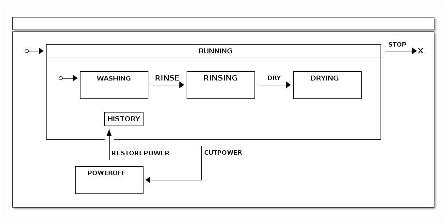

The following listing shows the enumeration that defines the possible states:

States

```java
public enum States {
    RUNNING, HISTORY, END,
    WASHING, RINSING, DRYING,
    POWEROFF
}
```

The following listing shows the enumeration that defines the events:

Events

```java
public enum Events {
    RINSE, DRY, STOP,
    RESTOREPOWER, CUTPOWER
}
```

The following listing configures the possible states:

Configuration - states

```java
@Override
public void configure(StateMachineStateConfigurer<States, Events> states)
		throws Exception {
	states
		.withStates()
			.initial(States.RUNNING)
			.state(States.POWEROFF)
			.end(States.END)
			.and()
			.withStates()
				.parent(States.RUNNING)
				.initial(States.WASHING)
				.state(States.RINSING)
				.state(States.DRYING)
				.history(States.HISTORY, History.SHALLOW);
}
```

The following listing configures the possible transitions:

Configuration - transitions

```java
@Override
public void configure(StateMachineTransitionConfigurer<States, Events> transitions)
		throws Exception {
	transitions
		.withExternal()
			.source(States.WASHING).target(States.RINSING)
			.event(Events.RINSE)
			.and()
		.withExternal()
			.source(States.RINSING).target(States.DRYING)
			.event(Events.DRY)
			.and()
		.withExternal()
			.source(States.RUNNING).target(States.POWEROFF)
			.event(Events.CUTPOWER)
			.and()
		.withExternal()
			.source(States.POWEROFF).target(States.HISTORY)
			.event(Events.RESTOREPOWER)
			.and()
		.withExternal()
			.source(States.RUNNING).target(States.END)
			.event(Events.STOP);
}
```

The following example shows how this state machine actually works:

```text
sm>start
Entry state RUNNING
Entry state WASHING
State machine started

sm>event RINSE
Exit state WASHING
Entry state RINSING
Event RINSE send

sm>event DRY
Exit state RINSING
Entry state DRYING
Event DRY send

sm>event CUTPOWER
Exit state DRYING
Exit state RUNNING
Entry state POWEROFF
Event CUTPOWER send

sm>event RESTOREPOWER
Exit state POWEROFF
Entry state RUNNING
Entry state WASHING
Entry state DRYING
Event RESTOREPOWER send
```

In the preceding run:

- The state machine is started, which causes machine to get initialized.
- The state machine goes to RINSING state.
- The state machine goes to DRYING state.
- The state machine cuts power and goes to POWEROFF state.
- The state is restored from the HISTORY state, which takes state machine back
  to its previous known state.

<a id="index--statemachine-examples-persist"></a>
<a id="index--45.-persist"></a>

## 45. Persist

Persist is a sample that uses the [Persist](#index--statemachine-recipes-persist) recipe to
demonstrate how database entry update logic can be controlled by a
state machine.

The following image shows the state machine logic and configuration:

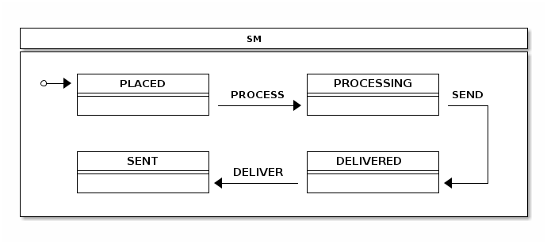

The following listing shows the state machine configuration:

StateMachine Config

```java
@Configuration
@EnableStateMachine
static class StateMachineConfig
		extends StateMachineConfigurerAdapter<String, String> {

	@Override
	public void configure(StateMachineStateConfigurer<String, String> states)
			throws Exception {
		states
			.withStates()
				.initial("PLACED")
				.state("PROCESSING")
				.state("SENT")
				.state("DELIVERED");
	}

	@Override
	public void configure(StateMachineTransitionConfigurer<String, String> transitions)
			throws Exception {
		transitions
			.withExternal()
				.source("PLACED").target("PROCESSING")
				.event("PROCESS")
				.and()
			.withExternal()
				.source("PROCESSING").target("SENT")
				.event("SEND")
				.and()
			.withExternal()
				.source("SENT").target("DELIVERED")
				.event("DELIVER");
	}

}
```

The following configuration creates `PersistStateMachineHandler`:

Handler Config

```java
@Configuration static class PersistHandlerConfig {
@Autowired private StateMachine<String, String> stateMachine;
@Bean public Persist persist() {return new Persist(persistStateMachineHandler());}
@Bean public PersistStateMachineHandler persistStateMachineHandler() {return new PersistStateMachineHandler(stateMachine);}
}
```

The following listing shows the `Order` class used with this sample:

Order Class

```java
public static class Order {int id; String state;
public Order(int id, String state) {this.id = id; this.state = state;}
@Override public String toString() {return "Order [id=" + id + ", state=" + state + "]";}
}
```

The following example shows the state machine’s output:

```text
sm>list
Order [id=1, state=PLACED]
Order [id=2, state=PROCESSING]
Order [id=3, state=SENT]
Order [id=4, state=DELIVERED]

sm>process 1
Exit state PLACED
Entry state PROCESSING

sm>list
Order [id=2, state=PROCESSING]
Order [id=3, state=SENT]
Order [id=4, state=DELIVERED]
Order [id=1, state=PROCESSING]

sm>deliver 3
Exit state SENT
Entry state DELIVERED

sm>list
Order [id=2, state=PROCESSING]
Order [id=4, state=DELIVERED]
Order [id=1, state=PROCESSING]
Order [id=3, state=DELIVERED]
```

In the preceding run, the state machine:

- Listed rows from an existing embedded database, which is already
  populated with sample data.
- Requested to update order `1` into the `PROCESSING` state.
- List database entries again and see that the state has been changed from
  `PLACED` to `PROCESSING`.
- Update order `3` to update its state from `SENT` to
  `DELIVERED`.

> [!NOTE]
> You may wonder where the database is, because there are literally no
> signs of it in the sample code. The sample is based on Spring Boot and, because the necessary classes are in a classpath, an embedded `HSQL` instance
> is created automatically.
>
> Spring Boot even creates an instance of `JdbcTemplate`, which you
> can autowire, as we did in `Persist.java`, shown in the following listing:
>
> ```java
> @Autowired
> private JdbcTemplate jdbcTemplate;
> ```

Next, we need to handle state changes. The following listing shows how we do so:

```java
public void change(int order, String event) {
	Order o = jdbcTemplate.queryForObject("select id, state from orders where id = ?",
			new RowMapper<Order>() {
				public Order mapRow(ResultSet rs, int rowNum) throws SQLException {
					return new Order(rs.getInt("id"), rs.getString("state"));
				}
			}, new Object[] { order });
	handler.handleEventWithStateReactively(MessageBuilder
			.withPayload(event).setHeader("order", order).build(), o.state)
		.subscribe();
}
```

Finally, we use a `PersistStateChangeListener` to update the database, as the
following listing shows:

```java
private class LocalPersistStateChangeListener implements PersistStateChangeListener {
@Override public void onPersist(State<String, String> state, Message<String> message,Transition<String, String> transition, StateMachine<String, String> stateMachine) {if (message != null && message.getHeaders().containsKey("order")) {Integer order = message.getHeaders().get("order", Integer.class); jdbcTemplate.update("update orders set state = ? where id = ?", state.getId(), order);}}}
```

<a id="index--statemachine-examples-zookeeper"></a>
<a id="index--46.-zookeeper"></a>

## 46. Zookeeper

Zookeeper is a distributed version from the
[Turnstile](#index--statemachine-examples-turnstile) sample.

> [!NOTE]
> This sample needs an external `Zookeeper` instance that is accessible from
> `localhost` and has the default port and settings.

Configuration of this sample is almost the same as the `turnstile` sample. We
add only the configuration for the distributed state machine where we
configure `StateMachineEnsemble`, as the following listing shows:

```java
@Override
public void configure(StateMachineConfigurationConfigurer<String, String> config) throws Exception {
	config
		.withDistributed()
			.ensemble(stateMachineEnsemble());
}
```

The actual `StateMachineEnsemble` needs to be created as a bean, together
with the `CuratorFramework` client, as the following example shows:

```java
@Bean
public StateMachineEnsemble<String, String> stateMachineEnsemble() throws Exception {
	return new ZookeeperStateMachineEnsemble<String, String>(curatorClient(), "/foo");
}

@Bean
public CuratorFramework curatorClient() throws Exception {
	CuratorFramework client = CuratorFrameworkFactory.builder().defaultData(new byte[0])
			.retryPolicy(new ExponentialBackoffRetry(1000, 3))
			.connectString("localhost:2181").build();
	client.start();
	return client;
}
```

For the next example, we need to create two different shell instances.
We need to create one instance, see what happens, and then create the second instance.
The following command starts the shell instances (remember to start only one instance for now):

```text
@n1:~# java -jar spring-statemachine-samples-zookeeper-4.0.2.jar
```

When state machine is started, its initial state is
`LOCKED`. Then it sends a `COIN` event to transition into `UNLOCKED` state.
The following example shows what happens:

Shell1

```text
sm>start
Entry state LOCKED
State machine started

sm>event COIN
Exit state LOCKED
Entry state UNLOCKED
Event COIN send

sm>state
UNLOCKED
```

Now you can open a second shell instance and start a state machine, by using the same command that you used to start the first state machine. You should see
that the distributed state (`UNLOCKED`) is entered instead of the default
initial state (`LOCKED`).

The following example shows the state machine and its output:

Shell2

```text
sm>start
State machine started

sm>state
UNLOCKED
```

Then from either shell (we use second instance in the next example), send a
`PUSH` event to transit from the `UNLOCKED` into the `LOCKED` state.
The following example shows the state machine command and its output:

Shell2

```text
sm>event PUSH
Exit state UNLOCKED
Entry state LOCKED
Event PUSH send
```

In the other shell (the first shell if you ran the preceding command in the second shell), you should see the state be changed automatically, based on distributed state kept in Zookeeper.
The following example shows the state machine command and its output:

Shell1

```text
sm>Exit state UNLOCKED
Entry state LOCKED
```

<a id="index--statemachine-examples-web"></a>
<a id="index--47.-web"></a>

## 47. Web

Web is a distributed state machine example that uses a zookeeper state machine to handle
distributed state. See [Zookeeper](#index--statemachine-examples-zookeeper).

> [!NOTE]
> This example is meant to be run on multiple
> browser sessions against multiple different hosts.

This sample uses a modified state machine structure from
[Showcase](#index--statemachine-examples-showcase) to work with a distributed state
machine. The following image shows the state machine logic:

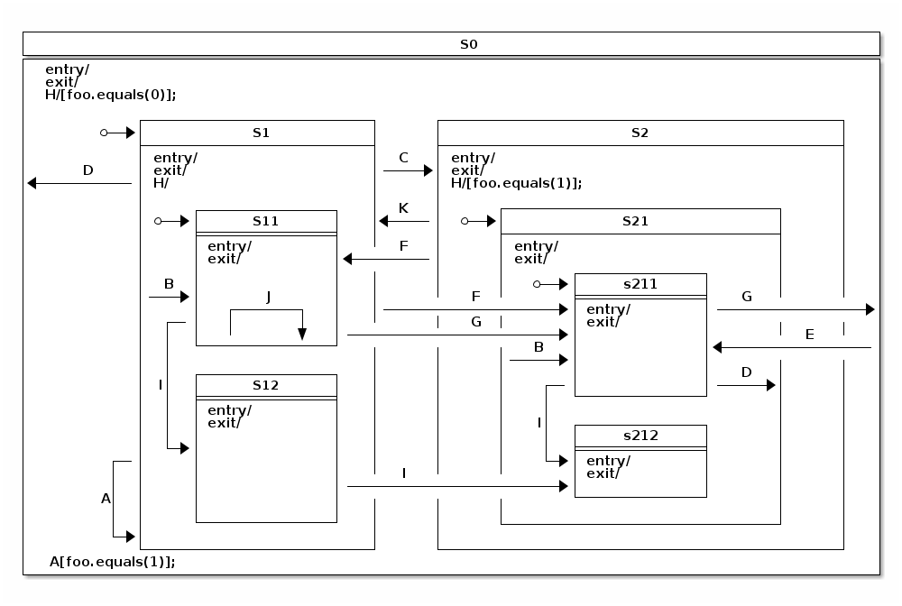

> [!NOTE]
> Due to the nature of this sample, an instance of a `Zookeeper` state machine is expected to
> be available from a localhost for every individual sample instance.

This demonstration uses an example that starts three different sample instances.
If you run different instances on the same host, you need to
distinguish the port each one uses by adding `--server.port=<myport>` to the command.
Otherwise the default port for each host is `8080`.

In this sample run, we have three hosts: `n1`, `n2`, and `n3`. Each one
has a local zookeeper instance running and a state machine sample running
on a port `8080`.

In there different terminals, start the three different state machines by running
the following command:

```text
# java -jar spring-statemachine-samples-web-4.0.2.jar
```

When all instances are running, you should see that all show similar
information when you access them with a browser. The states should be `S0`, `S1`, and `S11`.
The extended state variable named `foo` should have a value of `0`. The main state is `S11`.

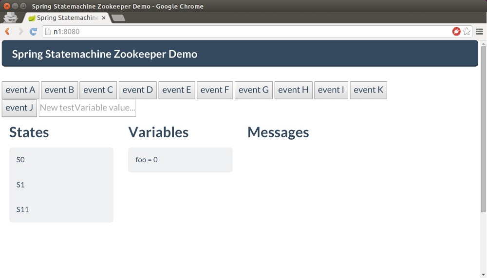

When you press the `Event C` button in any of the browser windows, the
distributed state is changed to `S211,` which is the target state
denoted by the transition associated with an event of type `C`.
The following image shows the change:

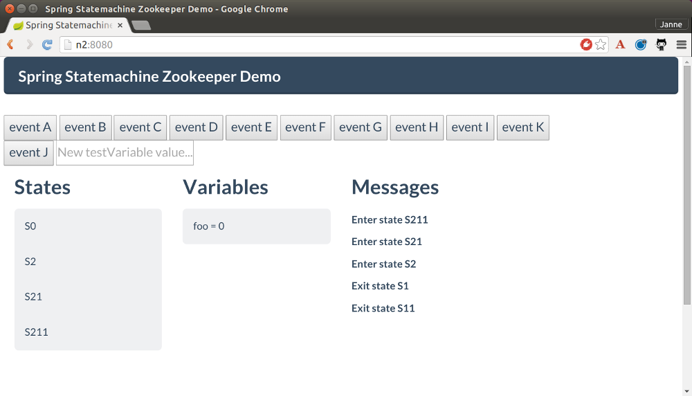

Now we can press the `Event H` button and see that the
internal transition runs on all state machines to change the
the value of the extended state variable named `foo` from `0` to `1`. This change is
first done on the state machine that receives the event and is then propagated
to the other state machines. You should see only the variable named `foo` change
from `0` to `1`.

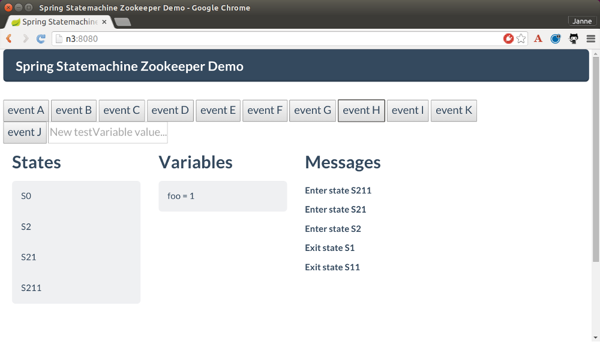

Finally, we can send `Event K`, which takes the state
machine state back to state `S11`. You should see this happen in
all of the browsers. The following image shows the result in one browser:

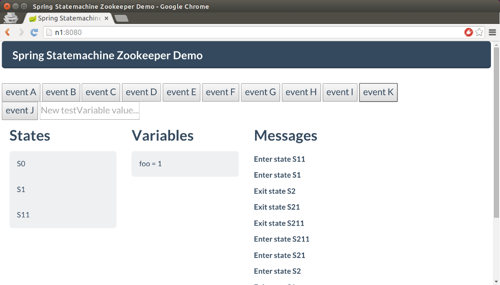

<a id="index--statemachine-examples-scope"></a>
<a id="index--48.-scope"></a>

## 48. Scope

Scope is a state machine example that uses session scope to provide an
individual instance for every user.
The following image shows the states and events within the Scope state machine:

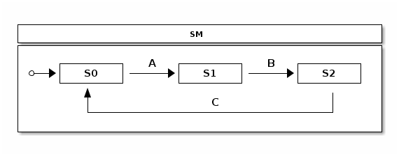

This simple state machine has three states: `S0`, `S1`, and `S2`.
Transitions between those are controlled by three events: `A`, `B`, and `C`.

To start the state machine, run the following command in a terminal:

```text
# java -jar spring-statemachine-samples-scope-4.0.2.jar
```

When the instance is running, you can open a browser and play with the state
machine. If you open the same page in a different browser, (for example, one in
Chrome and one in Firefox), you should get a new state machine
instance for each user session.
The following image shows the state machine in a browser:

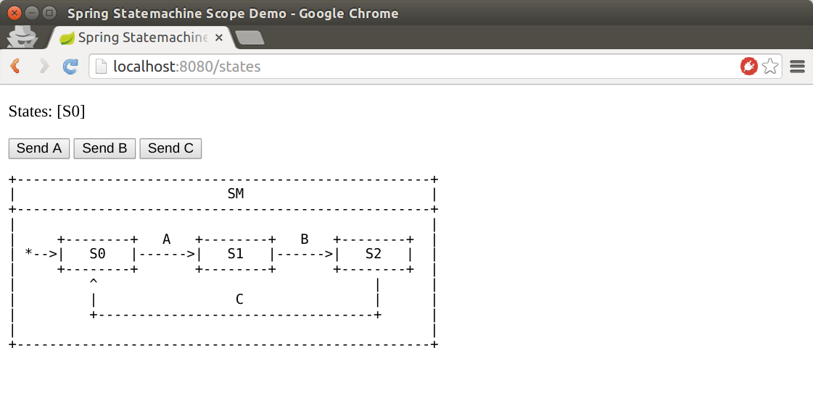

<a id="index--statemachine-examples-security"></a>
<a id="index--49.-security"></a>

## 49. Security

Security is a state machine example that uses most of the possible combinations of
securing a state machine. It secures sending events, transitions, and actions.
The following image shows the state machine’s states and events:

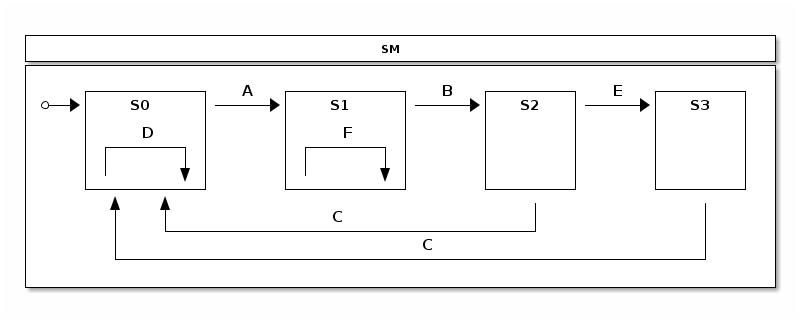

To start the state machine, run the following command:

```text
# java -jar spring-statemachine-samples-secure-4.0.2.jar
```

We secure event sending by requiring that users have a role of `USER`.
Spring Security ensures that no other users can send events to this
state machine.
The following listing secures event sending:

```java
@Override
public void configure(StateMachineConfigurationConfigurer<States, Events> config)
		throws Exception {
	config
		.withConfiguration()
			.autoStartup(true)
			.and()
		.withSecurity()
			.enabled(true)
			.event("hasRole('USER')");
}
```

In this sample we define two users:

- A user named `user` who has a role of `USER`
- A user named `admin` who has two roles: `USER` and `ADMIN`

The password for both users is `password`.
The following listing configures the two users:

```java
static class SecurityConfig {

	@Bean
	public InMemoryUserDetailsManager userDetailsService() {
		UserDetails user = User.withDefaultPasswordEncoder()
				.username("user")
				.password("password")
				.roles("USER")
				.build();
		UserDetails admin = User.withDefaultPasswordEncoder()
				.username("admin")
				.password("password")
				.roles("USER", "ADMIN")
				.build();
		return new InMemoryUserDetailsManager(user, admin);
	}
}
```

We define various transitions between states according to the state chart
shown at the beginning of the example. Only a user with an active `ADMIN` role can run
the external transitions between `S2` and `S3`. Similarly only an `ADMIN` can
run the internal transition the `S1` state.
The following listing defines the transitions, including their security:

```java
@Override
public void configure(StateMachineTransitionConfigurer<States, Events> transitions)
		throws Exception {
	transitions
		.withExternal()
			.source(States.S0).target(States.S1).event(Events.A)
			.and()
		.withExternal()
			.source(States.S1).target(States.S2).event(Events.B)
			.and()
		.withExternal()
			.source(States.S2).target(States.S0).event(Events.C)
			.and()
		.withExternal()
			.source(States.S2).target(States.S3).event(Events.E)
			.secured("ROLE_ADMIN", ComparisonType.ANY)
			.and()
		.withExternal()
			.source(States.S3).target(States.S0).event(Events.C)
			.and()
		.withInternal()
			.source(States.S0).event(Events.D)
			.action(adminAction())
			.and()
		.withInternal()
			.source(States.S1).event(Events.F)
			.action(transitionAction())
			.secured("ROLE_ADMIN", ComparisonType.ANY);
}
```

The following listing uses a method called `adminAction` whose return type is `Action` to
specify that the action is secured with a role of `ADMIN`:

```java
@Scope(proxyMode = ScopedProxyMode.TARGET_CLASS) @Bean public Action<States, Events> adminAction() {return new Action<States, Events>() {
@Secured("ROLE_ADMIN") @Override public void execute(StateContext<States, Events> context) {log.info("Executed only for admin role");} };}
```

The following `Action` runs an internal transition in state `S` when event `F` is sent.

```java
@Bean public Action<States, Events> transitionAction() {return new Action<States, Events>() {
@Override public void execute(StateContext<States, Events> context) {log.info("Executed only for admin role");} };}
```

The transition itself is secured with a
role of `ADMIN`, so this transition does not run if the current user
does not hate that role.

<a id="index--statemachine-examples-eventservice"></a>
<a id="index--50.-event-service"></a>

## 50. Event Service

The event service example shows how you can use state machine concepts as
a processing engine for events. This sample evolved from a question:

Can I use Spring Statemachine as a microservice to feed events to
different state machine instances? In fact, Spring Statemachine can feed
events to potentially millions of different state machine instances.

This example uses a `Redis` instance to persist state machine
instances.

Obviously, a million state machine instances in a JVM would be
a bad idea, due to memory constraints. This leads to
other features of Spring Statemachine that let you persist a
`StateMachineContext` and re-use existing instances.

For this example, we assume that a shopping application
sends different types of `PageView` events to a separate
microservice which then tracks user behavior by using a state
machine. The following image shows the state model, which has a few states
that represent a user navigating a product items list, adding and removing
items from a cart, going to a payment page, and initiating a payment
operation:

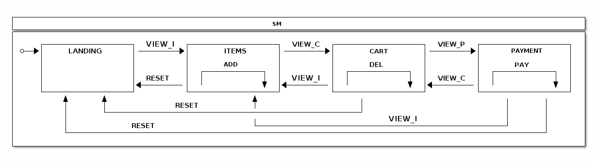

An actual shopping application would send these events into
this service by (for example) using a rest call. More about this
later.

> [!NOTE]
> Remember that the focus here is to have an application that exposes a
> `REST` API that the user can use to send events that can be processed by a
> state machine for each request.

The following state machine configuration models what we have in a
state chart. Various actions update the state machine’s `Extended
State` to track the number of entries into various states and also how
many times the internal transitions for `ADD` and `DEL` are called and whether
`PAY` has been executed:

```java
@Bean(name = "stateMachineTarget")
@Scope(scopeName="prototype")
public StateMachine<States, Events> stateMachineTarget() throws Exception {
	Builder<States, Events> builder = StateMachineBuilder.<States, Events>builder();

	builder.configureConfiguration()
		.withConfiguration()
			.autoStartup(true);

	builder.configureStates()
		.withStates()
			.initial(States.HOME)
			.states(EnumSet.allOf(States.class));

	builder.configureTransitions()
		.withInternal()
			.source(States.ITEMS).event(Events.ADD)
			.action(addAction())
			.and()
		.withInternal()
			.source(States.CART).event(Events.DEL)
			.action(delAction())
			.and()
		.withInternal()
			.source(States.PAYMENT).event(Events.PAY)
			.action(payAction())
			.and()
		.withExternal()
			.source(States.HOME).target(States.ITEMS)
			.action(pageviewAction())
			.event(Events.VIEW_I)
			.and()
		.withExternal()
			.source(States.CART).target(States.ITEMS)
			.action(pageviewAction())
			.event(Events.VIEW_I)
			.and()
		.withExternal()
			.source(States.ITEMS).target(States.CART)
			.action(pageviewAction())
			.event(Events.VIEW_C)
			.and()
		.withExternal()
			.source(States.PAYMENT).target(States.CART)
			.action(pageviewAction())
			.event(Events.VIEW_C)
			.and()
		.withExternal()
			.source(States.CART).target(States.PAYMENT)
			.action(pageviewAction())
			.event(Events.VIEW_P)
			.and()
		.withExternal()
			.source(States.ITEMS).target(States.HOME)
			.action(resetAction())
			.event(Events.RESET)
			.and()
		.withExternal()
			.source(States.CART).target(States.HOME)
			.action(resetAction())
			.event(Events.RESET)
			.and()
		.withExternal()
			.source(States.PAYMENT).target(States.HOME)
			.action(resetAction())
			.event(Events.RESET);

	return builder.build();
}
```

Do not focus on `stateMachineTarget` or
`@Scope` for now, as we explain those later in this section.

We set up a `RedisConnectionFactory` that defaults to
localhost and default port. We use `StateMachinePersist` with a
`RepositoryStateMachinePersist` implementation. Finally, we create a
`RedisStateMachinePersister` that uses a previously
created `StateMachinePersist` bean.

These are then used in a `Controller` that handles `REST` calls, as the following listing shows:

```java
@Bean
public RedisConnectionFactory redisConnectionFactory() {
	return new JedisConnectionFactory();
}

@Bean
public StateMachinePersist<States, Events, String> stateMachinePersist(RedisConnectionFactory connectionFactory) {
	RedisStateMachineContextRepository<States, Events> repository =
			new RedisStateMachineContextRepository<States, Events>(connectionFactory);
	return new RepositoryStateMachinePersist<States, Events>(repository);
}

@Bean
public RedisStateMachinePersister<States, Events> redisStateMachinePersister(
		StateMachinePersist<States, Events, String> stateMachinePersist) {
	return new RedisStateMachinePersister<States, Events>(stateMachinePersist);
}
```

We create a bean named `stateMachineTarget`.
State machine instantiation is a relatively
expensive operation, so it is better to try to pool instances instead
of instantiating a new instance for every request. To do so, we first
create a `poolTargetSource` that wraps `stateMachineTarget` and pools
it with a max size of three. When then proxy this `poolTargetSource` with
`ProxyFactoryBean` by using a `request` scope. Effectively, this means
that every `REST` request gets a pooled state machine instance from
a bean factory. Later, we show how these instances are used.
The following listing shows how we create the `ProxyFactoryBean`
and set the target source:

```java
@Bean
@Scope(value = "request", proxyMode = ScopedProxyMode.TARGET_CLASS)
public ProxyFactoryBean stateMachine() {
	ProxyFactoryBean pfb = new ProxyFactoryBean();
	pfb.setTargetSource(poolTargetSource());
	return pfb;
}
```

The following listing shows we set the maximum size and set the target bean name:

```java
@Bean
public CommonsPool2TargetSource poolTargetSource() {
	CommonsPool2TargetSource pool = new CommonsPool2TargetSource();
	pool.setMaxSize(3);
	pool.setTargetBeanName("stateMachineTarget");
	return pool;
}
```

Now we can get into actual demo. You need to have a Redis server running on
localhost with default settings. Then you need to run the Boot-based sample
application by running the following command:

```text
# java -jar spring-statemachine-samples-eventservice-4.0.2.jar
```

In a browser, you see something like the following:

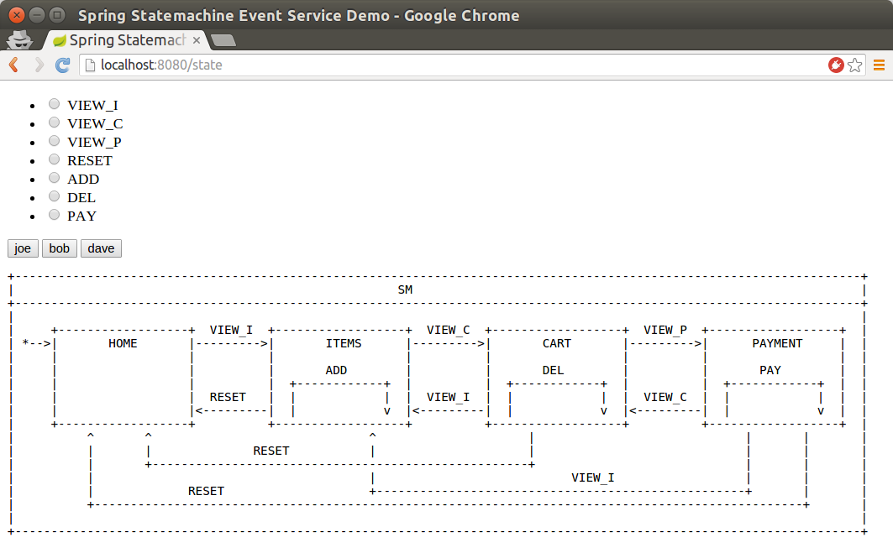

In this UI, you can use three users: `joe`, `bob`, and `dave`.
Clicking a button shows the current state and the extended state. Enabling a
radio button before clicking a button sends a particular event for that
user. This arrangement lets you play with the UI.

In our `StateMachineController`, we autowire `StateMachine` and
`StateMachinePersister`. `StateMachine` is `request` scoped, so you
get a new instance for each request, while `StateMachinePersist` is a normal
singleton bean.
The following listing autowires `StateMachine` and
`StateMachinePersist`:

```java
@Autowired
private StateMachine<States, Events> stateMachine;

@Autowired
private StateMachinePersister<States, Events, String> stateMachinePersister;
```

In the following listing, `feedAndGetState` is used with a UI to do same things that an
actual `REST` api might do:

```java
@RequestMapping("/state")
public String feedAndGetState(@RequestParam(value = "user", required = false) String user,
		@RequestParam(value = "id", required = false) Events id, Model model) throws Exception {
	model.addAttribute("user", user);
	model.addAttribute("allTypes", Events.values());
	model.addAttribute("stateChartModel", stateChartModel);
	// we may get into this page without a user so
	// do nothing with a state machine
	if (StringUtils.hasText(user)) {
		resetStateMachineFromStore(user);
		if (id != null) {
			feedMachine(user, id);
		}
		model.addAttribute("states", stateMachine.getState().getIds());
		model.addAttribute("extendedState", stateMachine.getExtendedState().getVariables());
	}
	return "states";
}
```

In the following listing, `feedPageview` is a `REST` method that accepts a post with
JSON content.

```java
@RequestMapping(value = "/feed",method= RequestMethod.POST)
@ResponseStatus(HttpStatus.OK)
public void feedPageview(@RequestBody(required = true) Pageview event) throws Exception {
	Assert.notNull(event.getUser(), "User must be set");
	Assert.notNull(event.getId(), "Id must be set");
	resetStateMachineFromStore(event.getUser());
	feedMachine(event.getUser(), event.getId());
}
```

In the following listing, `feedMachine` sends an event into a `StateMachine` and persists
its state by using a `StateMachinePersister`:

```java
private void feedMachine(String user, Events id) throws Exception {
	stateMachine
		.sendEvent(Mono.just(MessageBuilder
			.withPayload(id).build()))
		.blockLast();
	stateMachinePersister.persist(stateMachine, "testprefix:" + user);
}
```

The following listing shows a `resetStateMachineFromStore` that is used to restore a state machine
for a particular user:

```java
private StateMachine<States, Events> resetStateMachineFromStore(String user) throws Exception {
	return stateMachinePersister.restore(stateMachine, "testprefix:" + user);
}
```

As you would usually send an event by using a UI, you can do the same by using `REST` calls, as the following curl command shows:

```text
# curl http://localhost:8080/feed -H "Content-Type: application/json" --data '{"user":"joe","id":"VIEW_I"}'
```

At this point, you should have content in Redis with a key of
`testprefix:joe`, as the following example shows:

```text
$ ./redis-cli
127.0.0.1:6379> KEYS *
1) "testprefix:joe"
```

The next three images show when state for `joe` has been changed from
`HOME` to `ITEMS` and when the `ADD` action has been executed.

The following image the `ADD` event being sent:

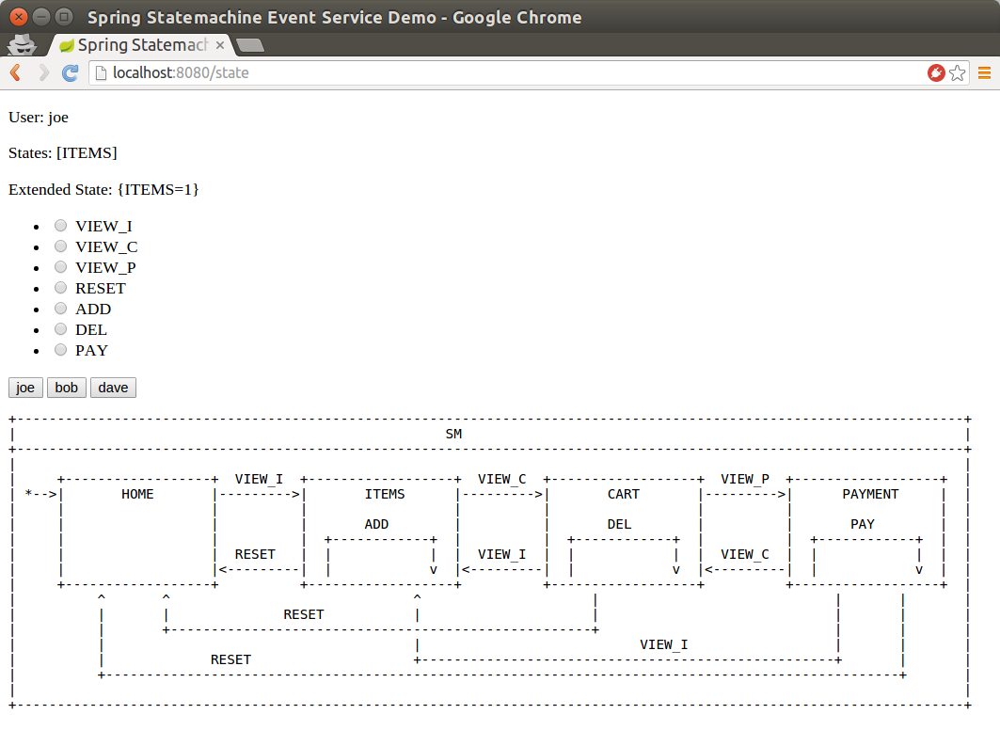

Now your are still on the `ITEMS` state, and the internal transition caused
the `COUNT` extended state variable to increase to `1`, as the following image shows:


Now you can run the following `curl` rest call a few times (or do it through the UI) and
see the `COUNT` variable increase with every call:

```text
# curl http://localhost:8080/feed -H "Content-Type: application/json" # --data '{"user":"joe","id":"ADD"}'
```

The following image shows the result of these operations:

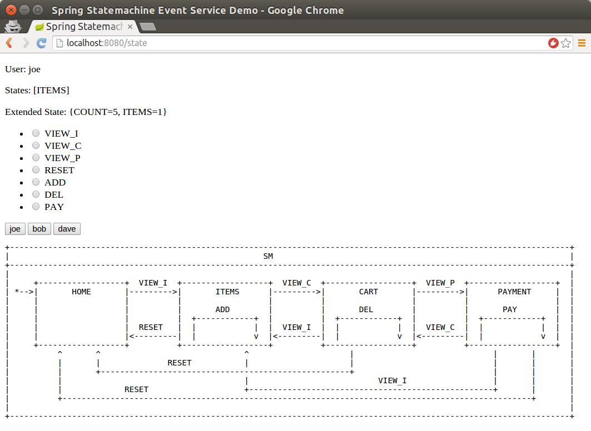

<a id="index--statemachine-examples-deploy"></a>
<a id="index--51.-deploy"></a>

## 51. Deploy

The deploy example shows how you can use state machine concepts with
UML modeling to provide a generic error handling state. This state
machine is a relatively complex example of how you can use various features
to provide a centralized error handling concept.
The following image shows the deploy state machine:

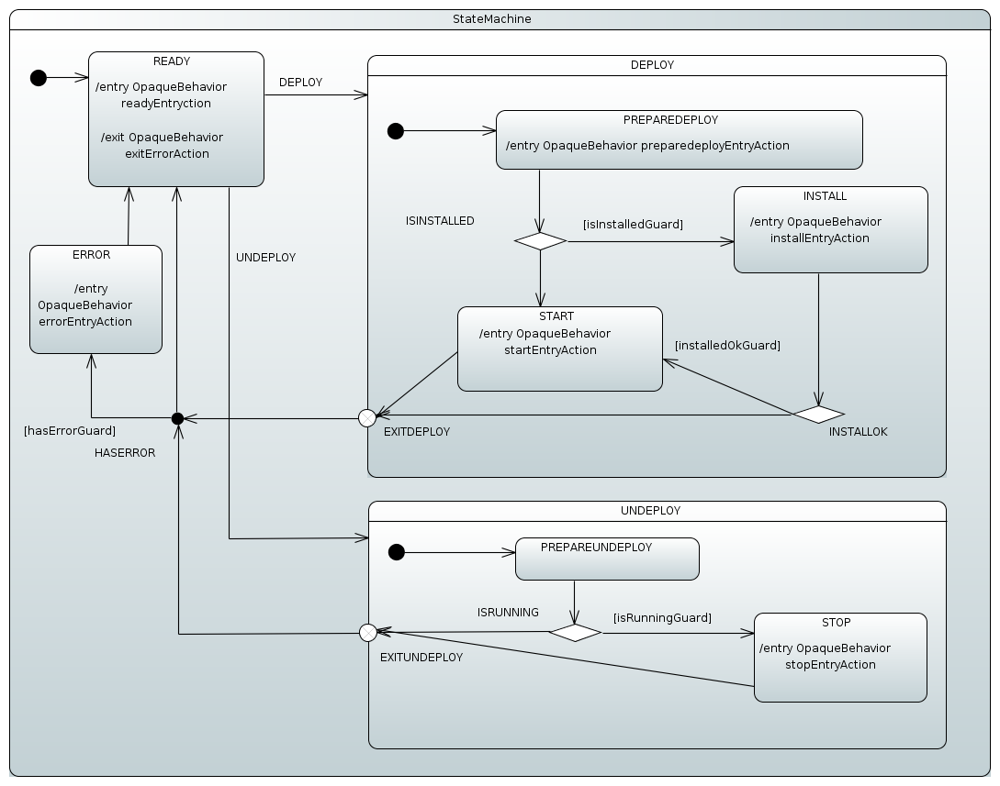

> [!NOTE]
> The preceding state chart was designed by using the Eclipse Papyrus Plugin
> (see[Eclipse Modeling Support](#index--sm-papyrus)) and imported into Spring StateMachine through the resulting UML
> model file. Actions and guards defined in a model are resolved
> from a Spring Application Context.

In this state machine scenario, we have two different behaviors
(`DEPLOY` and `UNDEPLOY`) that user tries to execute.

In the preceding state chart:

- In the `DEPLOY` state, the `INSTALL` and `START` states are entered
  conditionally. We enter `START` directly if a product is already
  installed and have no need to try to `START` if install fails.
- In the `UNDEPLOY` state, we enter `STOP` conditionally if the application is
  already running.
- Conditional choices for `DEPLOY` and `UNDEPLOY` are done through a
  choice pseudostate within those states, and the choices are selected
  by guards.
- We use exit point pseudostates to have a more controlled exit from the
  `DEPLOY` and `UNDEPLOY` states.
- After exiting from `DEPLOY` and `UNDEPLOY`, we go through a junction
  pseudostate to choose whether to go through an `ERROR` state
  (if an error was added into an extended state).
- Finally, we go back to the `READY` state to process new requests.

Now we can get to the actual demo. Run the boot based sample application
by running the following command:

```text
# java -jar spring-statemachine-samples-deploy-4.0.2.jar
```

In a browser, you can see something like the following image:

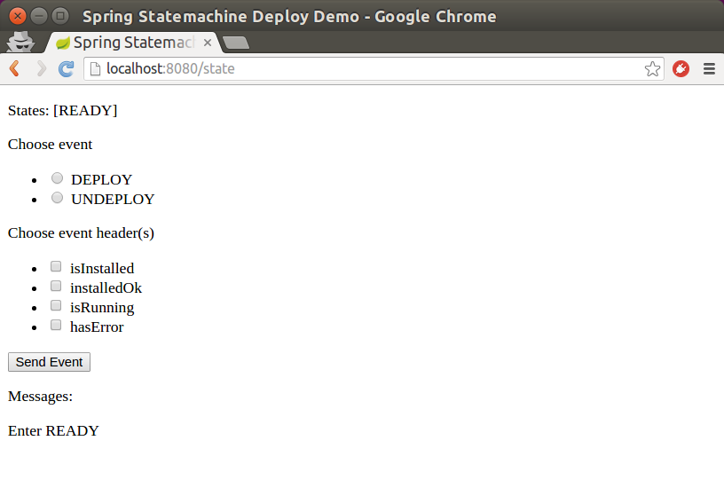

> [!IMPORTANT]
> As we do not have real install, start, or stop functionality, we
> simulate failures by checking the existence of particular message headers.

Now you can start to send events to a machine and choose various
message headers to drive functionality.

<a id="index--statemachine-examples-ordershipping"></a>
<a id="index--52.-order-shipping"></a>

## 52. Order Shipping

The order shipping example shows how you can use state machine concepts
to build a simple order processing system.

The following image shows a state chart that drives this order shipping sample.

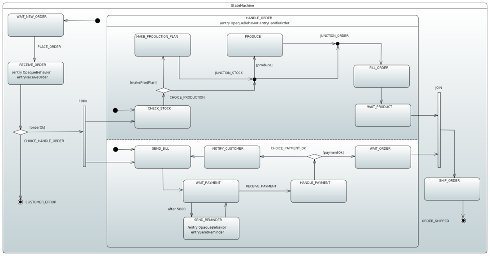

In the preceding state chart:

- The state machine enters the `WAIT_NEW_ORDER` (default) state.
- The event `PLACE_ORDER` transitions into the `RECEIVE_ORDER` state and the entry
  action (`entryReceiveOrder`) is executed.
- If the order is `OK`, the state machine goes into two regions, one handling order
  production and one handling user-level payment. Otherwise, the state machine goes
  into `CUSTOMER_ERROR`, which is a final state.
- The state machine loops in a lower region to remind the user to pay
  until `RECEIVE_PAYMENT` is sent successfully to indicate correct
  payment.
- Both regions go into waiting states (`WAIT_PRODUCT` and
  `WAIT_ORDER`), where they are joined before the parent orthogonal state
  (`HANDLE_ORDER`) is exited.
- Finally, the state machine goes through `SHIP_ORDER` to its final state
  (`ORDER_SHIPPED`).

The following command runs the sample:

```text
# java -jar spring-statemachine-samples-ordershipping-4.0.2.jar
```

In a browser, you can see something similar to the following image. You can start by choosing
a customer and an order to create a state machine.

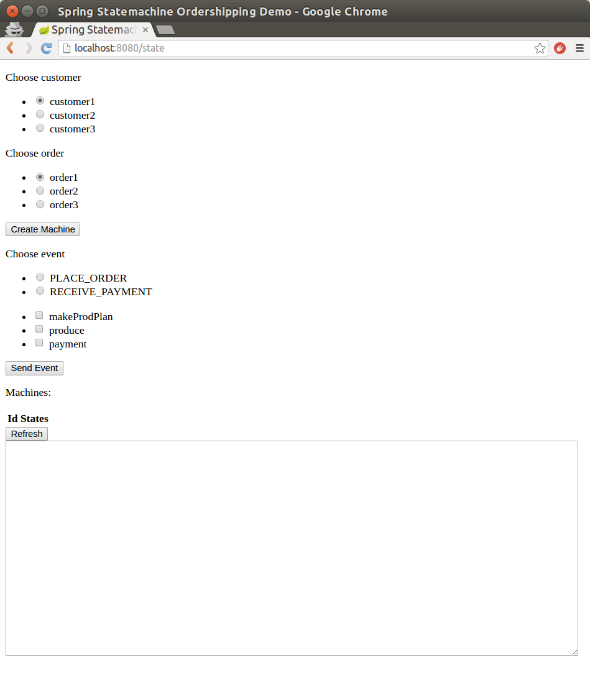

The state machine for a particular order is now created and you can start to play
with placing an order and sending a payment. Other settings (such as
`makeProdPlan`, `produce`, and `payment`) let you control how the state
machine works.
The following image shows the state machine waiting for an order:

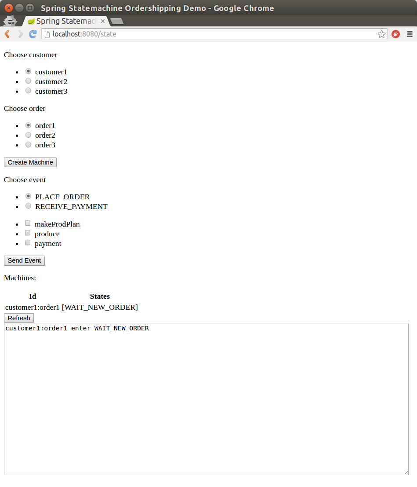

Finally, you can see what machine does by refreshing a page, as the following image shows:

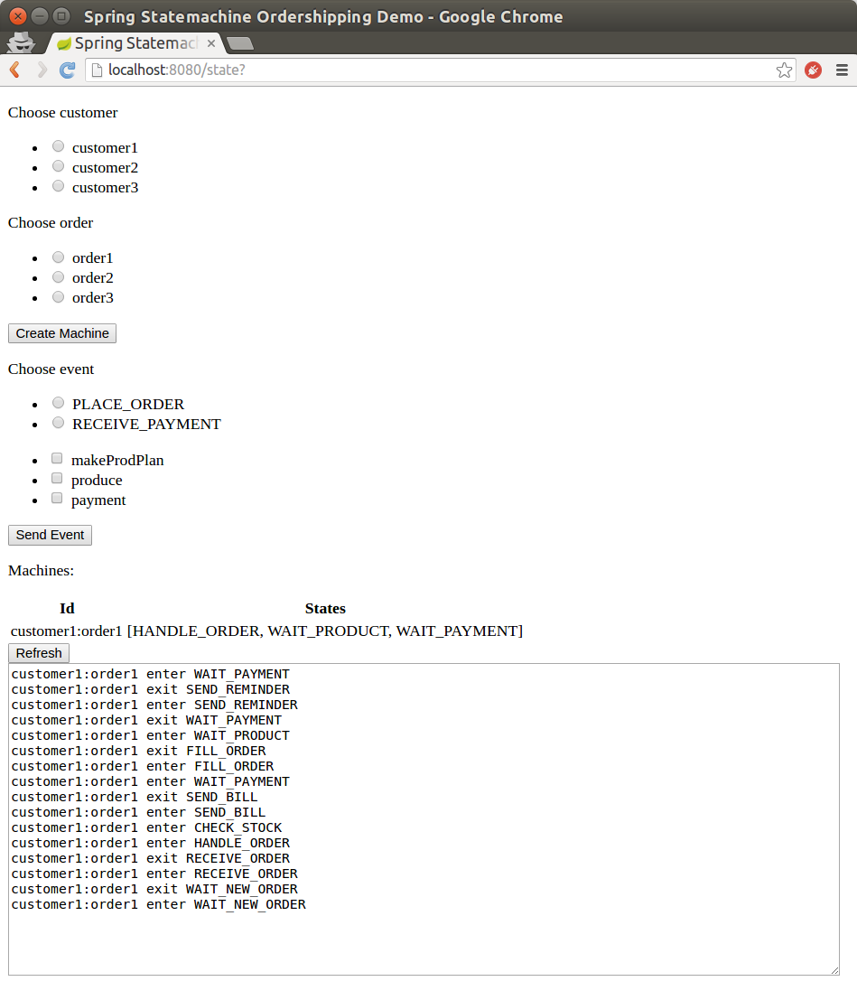

<a id="index--statemachine-examples-datajpa"></a>
<a id="index--53.-jpa-configuration"></a>

## 53. JPA Configuration

The JPA configuration example shows how you can use state machine concepts
with a machine configuration kept in a database. This sample uses
an embedded H2 database with an H2 Console (to ease playing with the
database).

This sample uses `spring-statemachine-autoconfigure` (which, by default, auto-configures the repositories and entity classes needed for JPA).
Thus, you need only `@SpringBootApplication`.
The following example shows the `Application` class with the `@SpringBootApplication` annotation:

```java
@SpringBootApplication
public class Application {

	public static void main(String[] args) {
		SpringApplication.run(Application.class, args);
	}
}
```

The following example shows how to create a `RepositoryStateMachineModelFactory`:

```java
@Configuration
@EnableStateMachineFactory
public static class Config extends StateMachineConfigurerAdapter<String, String> {

	@Autowired
	private StateRepository<? extends RepositoryState> stateRepository;

	@Autowired
	private TransitionRepository<? extends RepositoryTransition> transitionRepository;

	@Override
	public void configure(StateMachineModelConfigurer<String, String> model) throws Exception {
		model
			.withModel()
				.factory(modelFactory());
	}

	@Bean
	public StateMachineModelFactory<String, String> modelFactory() {
		return new RepositoryStateMachineModelFactory(stateRepository, transitionRepository);
	}
}
```

You can use the following command to run the sample:

```text
# java -jar spring-statemachine-samples-datajpa-4.0.2.jar
```

Accessing the application at `http://localhost:8080` brings up a newly
constructed machine for each request. You can then choose to send
events to a machine. The possible events and machine configuration are
updated from a database with every request.
The following image shows the UI and the initial events that are created when
this state machine starts:

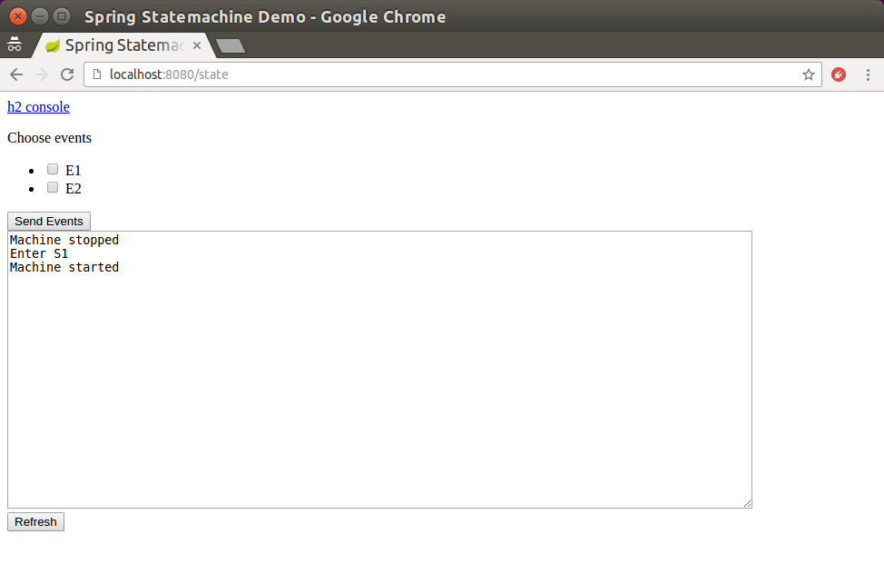

To access the embedded console, you can use the JDBC URL (which is `jdbc:h2:mem:testdb`, if it is
not already set).
The following image shows the H2 console:

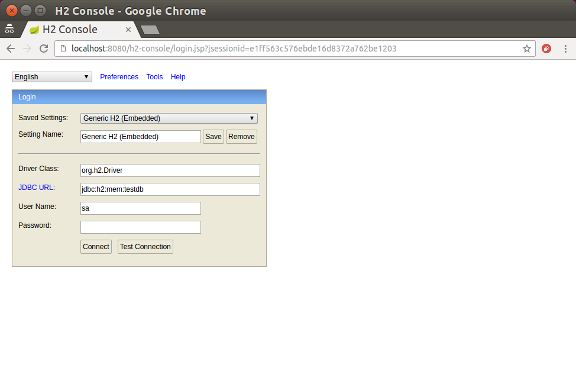

From the console, you can see the database tables and modify
them as you wish.
The following image shows the result of a simple query in the UI:

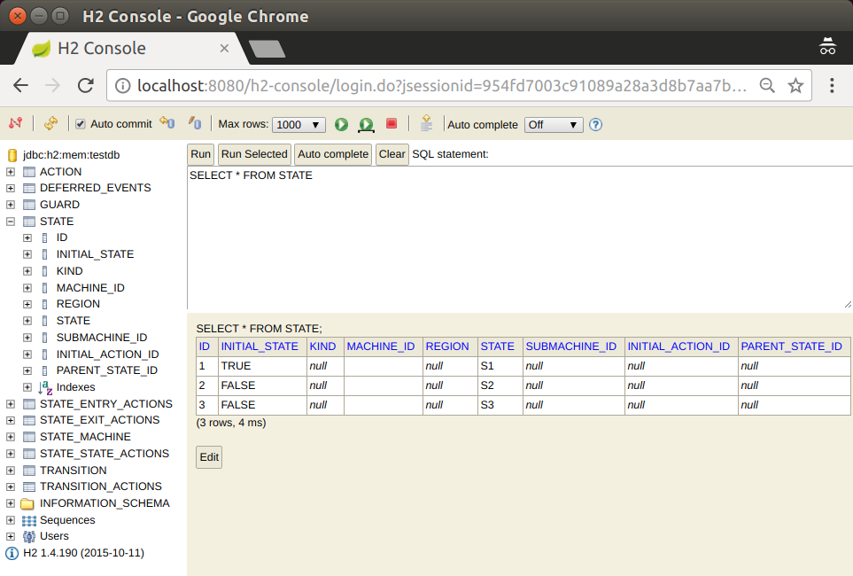

Now that you have gotten this far, you have probably wondered how those default
states and transitions got populated into the database. Spring Data
has a nice trick to auto-populate repositories, and we
used this feature through `Jackson2RepositoryPopulatorFactoryBean`.
The following example shows how we create such a bean:

```java
@Bean
public StateMachineJackson2RepositoryPopulatorFactoryBean jackson2RepositoryPopulatorFactoryBean() {
	StateMachineJackson2RepositoryPopulatorFactoryBean factoryBean = new StateMachineJackson2RepositoryPopulatorFactoryBean();
	factoryBean.setResources(new Resource[]{new ClassPathResource("data.json")});
	return factoryBean;
}
```

The following listing shows the source of the data with which we populate the database:

```json
[{"@id": "10","_class": "org.springframework.statemachine.data.jpa.JpaRepositoryAction","spel": "T(System).out.println('hello exit S1')" },{"@id": "11","_class": "org.springframework.statemachine.data.jpa.JpaRepositoryAction","spel": "T(System).out.println('hello entry S2')" },{"@id": "12","_class": "org.springframework.statemachine.data.jpa.JpaRepositoryAction","spel": "T(System).out.println('hello state S3')" },{"@id": "13","_class": "org.springframework.statemachine.data.jpa.JpaRepositoryAction","spel": "T(System).out.println('hello')" },{"@id": "1","_class": "org.springframework.statemachine.data.jpa.JpaRepositoryState","initial": true,"state": "S1","exitActions": ["10"] },{"@id": "2","_class": "org.springframework.statemachine.data.jpa.JpaRepositoryState","initial": false,"state": "S2","entryActions": ["11"] },{"@id": "3","_class": "org.springframework.statemachine.data.jpa.JpaRepositoryState","initial": false,"state": "S3","stateActions": ["12"] },{"_class": "org.springframework.statemachine.data.jpa.JpaRepositoryTransition","source": "1","target": "2","event": "E1","kind": "EXTERNAL" },{"_class": "org.springframework.statemachine.data.jpa.JpaRepositoryTransition","source": "2","target": "3","event": "E2","actions": ["13"]}]
```

<a id="index--statemachine-examples-datapersist"></a>
<a id="index--54.-data-persist"></a>

## 54. Data Persist

The data persist sample shows how you can state machine concepts
with a persisting machine in an external repository. This sample uses
an embedded H2 database with an H2 Console (to ease playing with the
database). Optionally, you can also enable Redis or MongoDB.

This sample uses `spring-statemachine-autoconfigure` (which, by default, auto-configures the repositories and entity classes needed for JPA).
Thus, you need only `@SpringBootApplication`.
The following example shows the `Application` class with the `@SpringBootApplication` annotation:

```java
@SpringBootApplication
public class Application {

	public static void main(String[] args) {
		SpringApplication.run(Application.class, args);
	}
}
```

The `StateMachineRuntimePersister` interface works on the runtime
level of a `StateMachine`. Its implementation, `JpaPersistingStateMachineInterceptor`, is meant to be used with a
JPA.
The following listing creates a `StateMachineRuntimePersister` bean:

```java
@Configuration @Profile("jpa") public static class JpaPersisterConfig {
@Bean public StateMachineRuntimePersister<States, Events, String> stateMachineRuntimePersister(JpaStateMachineRepository jpaStateMachineRepository) {return new JpaPersistingStateMachineInterceptor<>(jpaStateMachineRepository, kryo -> {kryo.register(States.class); kryo.register(Events.class); });}}
```

The following example shows how you can use a very similar configuration
to create a bean for MongoDB:

```java
@Configuration @Profile("mongo") public static class MongoPersisterConfig {
@Bean public StateMachineRuntimePersister<States, Events, String> stateMachineRuntimePersister(MongoDbStateMachineRepository mongoDbStateMachineRepository) {return new MongoDbPersistingStateMachineInterceptor<>(mongoDbStateMachineRepository, kryo -> {kryo.register(States.class); kryo.register(Events.class); });}}
```

The following example shows how you can use a very similar configuration
to create a bean for Redis:

```java
@Configuration @Profile("redis") public static class RedisPersisterConfig {
@Bean public StateMachineRuntimePersister<States, Events, String> stateMachineRuntimePersister(RedisStateMachineRepository redisStateMachineRepository) {return new RedisPersistingStateMachineInterceptor<>(redisStateMachineRepository, kryo -> {kryo.register(States.class); kryo.register(Events.class); });}}
```

You can configure `StateMachine` to use runtime persistence by using the
`withPersistence` configuration method.
The following listing shows how to do so:

```java
@Autowired
private StateMachineRuntimePersister<States, Events, String> stateMachineRuntimePersister;

@Override
public void configure(StateMachineConfigurationConfigurer<States, Events> config)
		throws Exception {
	config
		.withPersistence()
			.runtimePersister(stateMachineRuntimePersister);
}
```

This sample also uses `DefaultStateMachineService`, which makes it
easier to work with multiple machines.
The following listing shows how to create an instance of `DefaultStateMachineService`:

```java
@Bean
public StateMachineService<States, Events> stateMachineService(
		StateMachineFactory<States, Events> stateMachineFactory,
		StateMachineRuntimePersister<States, Events, String> stateMachineRuntimePersister) {
	return new DefaultStateMachineService<States, Events>(stateMachineFactory, stateMachineRuntimePersister);
}
```

The following listing shows the logic that drives the `StateMachineService` in this sample:

```java
private synchronized StateMachine<States, Events> getStateMachine(String machineId) throws Exception {
	listener.resetMessages();
	if (currentStateMachine == null) {
		currentStateMachine = stateMachineService.acquireStateMachine(machineId);
		currentStateMachine.addStateListener(listener);
		currentStateMachine.startReactively().block();
	} else if (!ObjectUtils.nullSafeEquals(currentStateMachine.getId(), machineId)) {
		stateMachineService.releaseStateMachine(currentStateMachine.getId());
		currentStateMachine.stopReactively().block();
		currentStateMachine = stateMachineService.acquireStateMachine(machineId);
		currentStateMachine.addStateListener(listener);
		currentStateMachine.startReactively().block();
	}
	return currentStateMachine;
}
```

You can use the following command to run the sample:

```text
# java -jar spring-statemachine-samples-datapersist-4.0.2.jar
```

> [!NOTE]
> By default, the `jpa` profile is enabled in `application.yml`. If you want to try
> other backends, enable either the `mongo` profile or the `redis` profile.
> The following commands specify which profile to use (`jpa` is the default, but we included it for the sake of completeness):
>
> ```text
> # java -jar spring-statemachine-samples-datapersist-4.0.2.jar --spring.profiles.active=jpa
> # java -jar spring-statemachine-samples-datapersist-4.0.2.jar --spring.profiles.active=mongo
> # java -jar spring-statemachine-samples-datapersist-4.0.2.jar --spring.profiles.active=redis
> ```

Accessing the application at <http://localhost:8080> brings up a newly
constructed state machine for each request, and you can choose to send
events to a machine. The possible events and machine configuration are
updated from a database with every request.

The state machines in this sample have a simple configuration with states 'S1'
to 'S6' and events 'E1' to 'E6' to transition the state machine between those
states. You can use two state machine identifiers (`datajpapersist1` and
`datajpapersist2`) to request a particular state machine.
The following image shows the UI that lets you pick a machine and an event and that shows
what happens when you do:

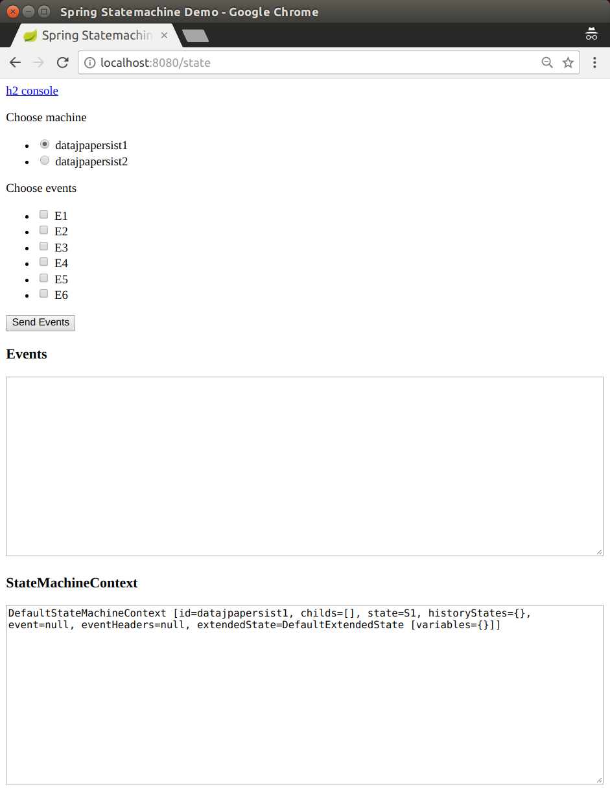

The sample defaults to using machine 'datajpapersist1' and goes to its
initial state 'S1'.
The following image shows the result of using those defaults:

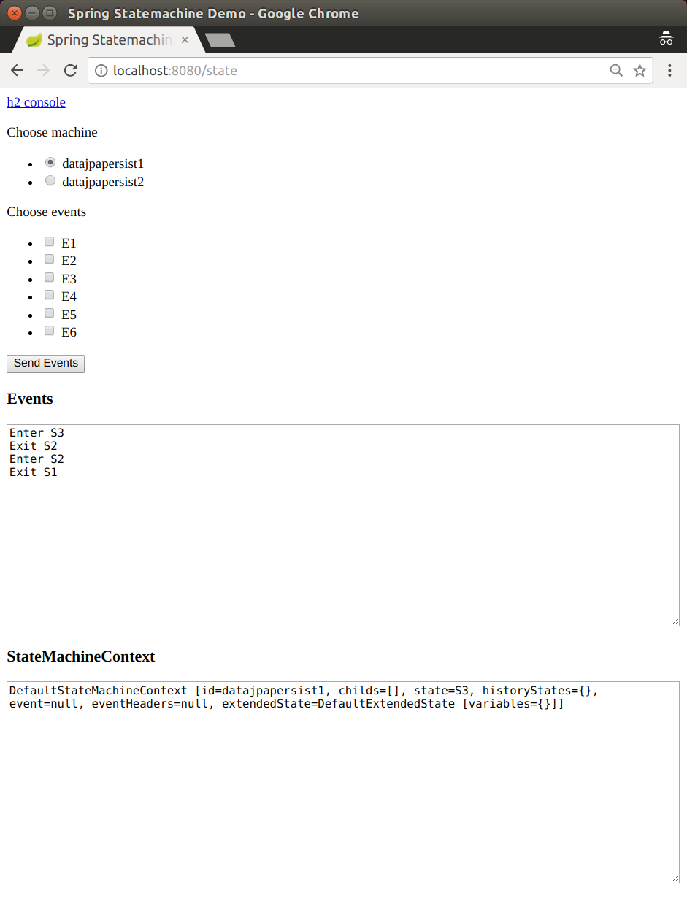

If you send events `E1` and `E2` to the `datajpapersist1` state machine, its
state is persisted as 'S3'.
The following image shows the result of doing so:


If you then request state machine `datajpapersist1` but send no events, the state machine is restored back to its persisted state, `S3`.

<a id="index--statemachine-examples-datajpamultipersist"></a>
<a id="index--55.-data-multi-persist"></a>

## 55. Data Multi Persist

The data multi ersist sample is an extension of two other samples:
[JPA Configuration](#index--statemachine-examples-datajpa) and [Data Persist](#index--statemachine-examples-datapersist).
We still keep machine configuration in a database and persist into a
database. However, this time, we also have a machine that contains two orthogonal
regions, to show how those are persisted independently. This sample
also uses an embedded H2 database with an H2 Console (to ease playing
with the database).

This sample uses `spring-statemachine-autoconfigure` (which, by default, auto-configures the repositories and entity classes needed for JPA).
Thus, you need only `@SpringBootApplication`.
The following example shows the `Application` class with the `@SpringBootApplication` annotation:

```java
@SpringBootApplication
public class Application {

	public static void main(String[] args) {
		SpringApplication.run(Application.class, args);
	}
}
```

As in the other data-driven samples, we again create a `StateMachineRuntimePersister`, as the following listing shows:

```java
@Bean
public StateMachineRuntimePersister<String, String, String> stateMachineRuntimePersister(
		JpaStateMachineRepository jpaStateMachineRepository) {
	return new JpaPersistingStateMachineInterceptor<>(jpaStateMachineRepository);
}
```

A `StateMachineService` bean makes it easier to work with a machines.
The following listing shows how to create such a bean:

```java
@Bean
public StateMachineService<String, String> stateMachineService(
		StateMachineFactory<String, String> stateMachineFactory,
		StateMachineRuntimePersister<String, String, String> stateMachineRuntimePersister) {
	return new DefaultStateMachineService<String, String>(stateMachineFactory, stateMachineRuntimePersister);
}
```

We use JSON data to import the configuration.
The following example creates a bean to do so:

```java
@Bean
public StateMachineJackson2RepositoryPopulatorFactoryBean jackson2RepositoryPopulatorFactoryBean() {
	StateMachineJackson2RepositoryPopulatorFactoryBean factoryBean = new StateMachineJackson2RepositoryPopulatorFactoryBean();
	factoryBean.setResources(new Resource[] { new ClassPathResource("datajpamultipersist.json") });
	return factoryBean;
}
```

The following listing shows how we get a `RepositoryStateMachineModelFactory`:

```java
@Configuration
@EnableStateMachineFactory
public static class Config extends StateMachineConfigurerAdapter<String, String> {

	@Autowired
	private StateRepository<? extends RepositoryState> stateRepository;

	@Autowired
	private TransitionRepository<? extends RepositoryTransition> transitionRepository;

	@Autowired
	private StateMachineRuntimePersister<String, String, String> stateMachineRuntimePersister;

	@Override
	public void configure(StateMachineConfigurationConfigurer<String, String> config)
			throws Exception {
		config
			.withPersistence()
				.runtimePersister(stateMachineRuntimePersister);
	}

	@Override
	public void configure(StateMachineModelConfigurer<String, String> model)
			throws Exception {
		model
			.withModel()
				.factory(modelFactory());
	}

	@Bean
	public StateMachineModelFactory<String, String> modelFactory() {
		return new RepositoryStateMachineModelFactory(stateRepository, transitionRepository);
	}
}
```

You can run the sample by using the following command:

```text
# java -jar spring-statemachine-samples-datajpamultipersist-4.0.2.jar
```

Accessing the application at `http://localhost:8080` brings up a newly
constructed machine for each request and lets you send
events to a machine. The possible events and the state machine configuration are
updated from a database for each request. We also print out
all state machine contexts and the current root machine, as the following image shows:

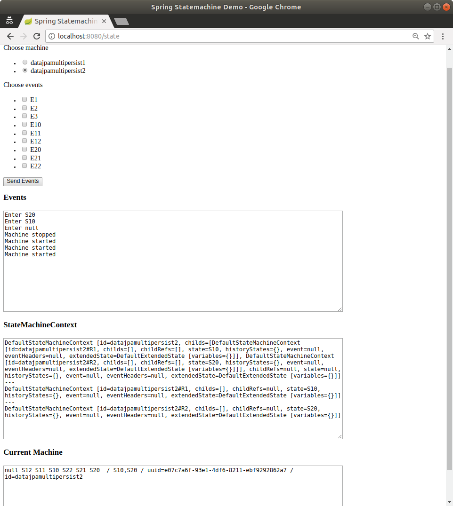

The state machine named `datajpamultipersist1` is a simple “flat” machine where states `S1`, `S2` and `S3` are transitioned by events `E1`, `E2`, and `E3` (respectively).
However, the state machine named `datajpamultipersist2` contains two
regions (`R1` and `R2`) directly under the root level. That is why this
root level machine really does not have a state. We need
that root level machine to host those regions.

Regions `R1` and `R2` in the `datajpamultipersist2` state machine contains states
`S10`, `S11`, and `S12` and `S20`, `S21`, and `S22` (respectively). Events
`E10`, `E11`, and `E12` are used for region `R1` and events `E20`, `E21`, and event `E22` is used for region `R2`. The following images shows what happens when we
send events `E10` and `E20` to the
`datajpamultipersist2` state machine:

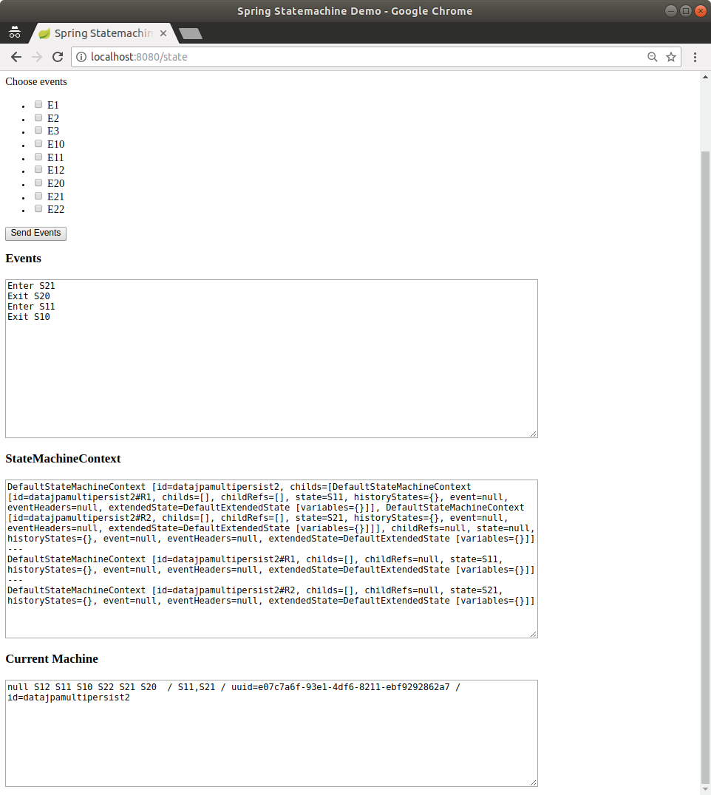

Regions have their own contexts with their own IDs, and the actual
ID is postfixed with `#` and the region ID. As the following image shows, different regions in a database have different contexts:

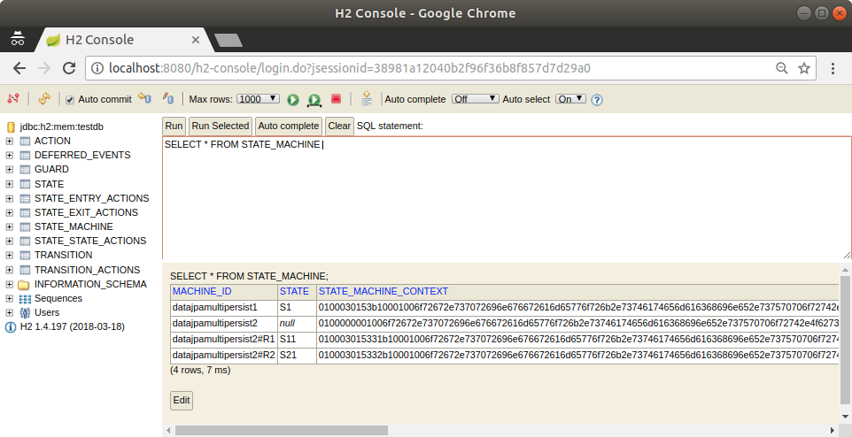

<a id="index--statemachine-examples-datajpapersist"></a>
<a id="index--56.-data-jpa-persist"></a>

## 56. Data JPA Persist

The data persist sample shows how you can state machine concepts
with a persisting machine in an external repository. This sample uses
an embedded H2 database with an H2 Console (to ease playing with the
database). Optionally, you can also enable Redis or MongoDB.

This sample uses `spring-statemachine-autoconfigure` (which, by default, auto-configures the repositories and entity classes needed for JPA).
Thus, you need only `@SpringBootApplication`.
The following example shows the `Application` class with the `@SpringBootApplication` annotation:

```java
@SpringBootApplication
public class Application {

	public static void main(String[] args) {
		SpringApplication.run(Application.class, args);
	}
}
```

The `StateMachineRuntimePersister` interface works on the runtime
level of a `StateMachine`. Its implementation, `JpaPersistingStateMachineInterceptor`, is meant to be used with a
JPA.
The following listing creates a `StateMachineRuntimePersister` bean:

```java
@Configuration @Profile("jpa") public static class JpaPersisterConfig {
@Bean public StateMachineRuntimePersister<States, Events, String> stateMachineRuntimePersister(JpaStateMachineRepository jpaStateMachineRepository) {return new JpaPersistingStateMachineInterceptor<>(jpaStateMachineRepository, kryo -> {kryo.register(States.class); kryo.register(Events.class); });}}
```

The following example shows how you can use a very similar configuration
to create a bean for MongoDB:

```java
@Configuration @Profile("mongo") public static class MongoPersisterConfig {
@Bean public StateMachineRuntimePersister<States, Events, String> stateMachineRuntimePersister(MongoDbStateMachineRepository mongoDbStateMachineRepository) {return new MongoDbPersistingStateMachineInterceptor<>(mongoDbStateMachineRepository, kryo -> {kryo.register(States.class); kryo.register(Events.class); });}}
```

The following example shows how you can use a very similar configuration
to create a bean for Redis:

```java
@Configuration @Profile("redis") public static class RedisPersisterConfig {
@Bean public StateMachineRuntimePersister<States, Events, String> stateMachineRuntimePersister(RedisStateMachineRepository redisStateMachineRepository) {return new RedisPersistingStateMachineInterceptor<>(redisStateMachineRepository, kryo -> {kryo.register(States.class); kryo.register(Events.class); });}}
```

You can configure `StateMachine` to use runtime persistence by using the
`withPersistence` configuration method.
The following listing shows how to do so:

```java
@Autowired
private StateMachineRuntimePersister<States, Events, String> stateMachineRuntimePersister;

@Override
public void configure(StateMachineConfigurationConfigurer<States, Events> config)
		throws Exception {
	config
		.withPersistence()
			.runtimePersister(stateMachineRuntimePersister);
}
```

This sample also uses `DefaultStateMachineService`, which makes it
easier to work with multiple machines.
The following listing shows how to create an instance of `DefaultStateMachineService`:

```java
@Bean
public StateMachineService<States, Events> stateMachineService(
		StateMachineFactory<States, Events> stateMachineFactory,
		StateMachineRuntimePersister<States, Events, String> stateMachineRuntimePersister) {
	return new DefaultStateMachineService<States, Events>(stateMachineFactory, stateMachineRuntimePersister);
}
```

The following listing shows the logic that drives the `StateMachineService` in this sample:

```java
private synchronized StateMachine<States, Events> getStateMachine(String machineId) throws Exception {
	listener.resetMessages();
	if (currentStateMachine == null) {
		currentStateMachine = stateMachineService.acquireStateMachine(machineId);
		currentStateMachine.addStateListener(listener);
		currentStateMachine.startReactively().block();
	} else if (!ObjectUtils.nullSafeEquals(currentStateMachine.getId(), machineId)) {
		stateMachineService.releaseStateMachine(currentStateMachine.getId());
		currentStateMachine.stopReactively().block();
		currentStateMachine = stateMachineService.acquireStateMachine(machineId);
		currentStateMachine.addStateListener(listener);
		currentStateMachine.startReactively().block();
	}
	return currentStateMachine;
}
```

You can use the following command to run the sample:

```text
# java -jar spring-statemachine-samples-datapersist-4.0.2.jar
```

> [!NOTE]
> By default, the `jpa` profile is enabled in `application.yml`. If you want to try
> other backends, enable either the `mongo` profile or the `redis` profile.
> The following commands specify which profile to use (`jpa` is the default, but we included it for the sake of completeness):
>
> ```text
> # java -jar spring-statemachine-samples-datapersist-4.0.2.jar --spring.profiles.active=jpa
> # java -jar spring-statemachine-samples-datapersist-4.0.2.jar --spring.profiles.active=mongo
> # java -jar spring-statemachine-samples-datapersist-4.0.2.jar --spring.profiles.active=redis
> ```

Accessing the application at <http://localhost:8080> brings up a newly
constructed state machine for each request, and you can choose to send
events to a machine. The possible events and machine configuration are
updated from a database with every request.

The state machines in this sample have a simple configuration with states 'S1'
to 'S6' and events 'E1' to 'E6' to transition the state machine between those
states. You can use two state machine identifiers (`datajpapersist1` and
`datajpapersist2`) to request a particular state machine.
The following image shows the UI that lets you pick a machine and an event and that shows
what happens when you do:


The sample defaults to using machine 'datajpapersist1' and goes to its
initial state 'S1'.
The following image shows the result of using those defaults:


If you send events `E1` and `E2` to the `datajpapersist1` state machine, its
state is persisted as 'S3'.
The following image shows the result of doing so:


If you then request state machine `datajpapersist1` but send no events, the state machine is restored back to its persisted state, `S3`.

<a id="index--statemachine-examples-monitoring"></a>
<a id="index--57.-monitoring"></a>

## 57. Monitoring

The monitoring sample shows how you can use state machine concepts to
monitor state machine transitions and actions.
The following listing configures the state machine that we use for this sample:

```java
@Configuration
@EnableStateMachine
public static class Config extends StateMachineConfigurerAdapter<String, String> {

	@Override
	public void configure(StateMachineStateConfigurer<String, String> states)
			throws Exception {
		states
			.withStates()
				.initial("S1")
				.state("S2", null, (c) -> {System.out.println("hello");})
				.state("S3", (c) -> {System.out.println("hello");}, null);
	}

	@Override
	public void configure(StateMachineTransitionConfigurer<String, String> transitions)
			throws Exception {
		transitions
			.withExternal()
				.source("S1").target("S2").event("E1")
				.action((c) -> {System.out.println("hello");})
				.and()
			.withExternal()
				.source("S2").target("S3").event("E2");
	}
}
```

You can use the following command to run the sample:

```text
# java -jar spring-statemachine-samples-monitoring-4.0.2.jar
```

The following image shows the state machine’s initial state:

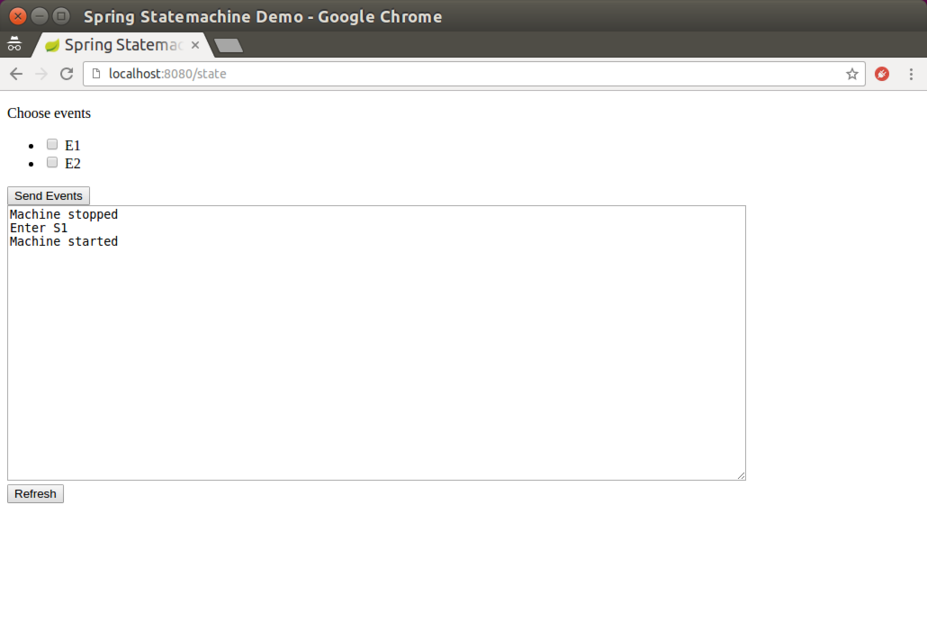

The following image shows the state of the state machine after we have
performed some actions:

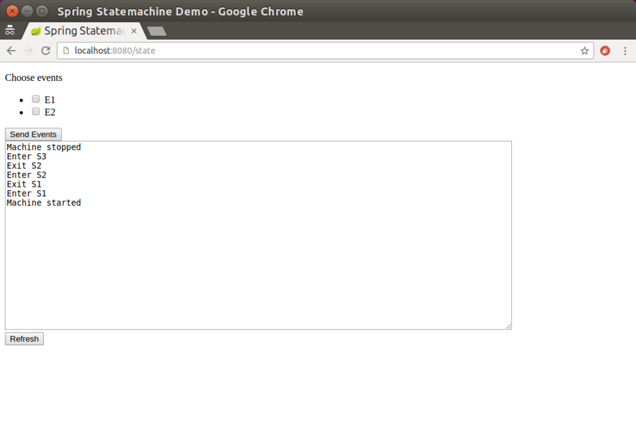

You can view metrics from Spring Boot by running the following two `curl`
commands (shown with their output):

```json
# curl http://localhost:8080/actuator/metrics/ssm.transition.duration
{"name":"ssm.transition.duration","measurements":[{"statistic":"COUNT","value":3.0 },{"statistic":"TOTAL_TIME","value":0.007 },{"statistic":"MAX","value":0.004} ],"availableTags":[{"tag":"transitionName","values":["INITIAL_S1","EXTERNAL_S1_S2"]}]}
```

```json
# curl http://localhost:8080/actuator/metrics/ssm.transition.transit
{"name":"ssm.transition.transit","measurements":[{"statistic":"COUNT","value":3.0} ],"availableTags":[{"tag":"transitionName","values":["EXTERNAL_S1_S2","INITIAL_S1"]}]}
```

You can also view tracing from Spring Boot by running the following `curl`
command (shown with its output):

```json
# curl http://localhost:8080/actuator/statemachinetrace
[{"timestamp":"2018-02-11T06:44:12.723+0000","info":{"duration":2,"machine":null,"transition":"EXTERNAL_S1_S2"} },{"timestamp":"2018-02-11T06:44:12.720+0000","info":{"duration":0,"machine":null,"action":"demo.monitoring.StateMachineConfig$Config$$Lambda$576/1499688007@22b47b2f"} },{"timestamp":"2018-02-11T06:44:12.714+0000","info":{"duration":1,"machine":null,"transition":"INITIAL_S1"} },{"timestamp":"2018-02-11T06:44:09.689+0000","info":{"duration":4,"machine":null,"transition":"INITIAL_S1"}}]
```

<a id="index--statemachine-faq"></a>
<a id="index--faq"></a>

# FAQ

This chapter answers the questions that Spring Statemachine users most often ask.

<a id="index--state-changes"></a>
<a id="index--58.-state-changes"></a>

## 58. State Changes

How can I automatically transit to the next state?

You can choose from three approaches:

- Implement an action and send an appropriate event to a state machine
  to trigger a transition into the proper target state.
- Define a deferred event within a state and, before sending an event,
  send another event that is deferred. Doing so causes the next
  appropriate state transition when it is more convenient to handle
  that event.
- Implement a triggerless transition, which automatically causes a
  state transition into the next state when state is entered and its
  actions has been completed.

<a id="index--extended-state"></a>
<a id="index--59.-extended-state"></a>

## 59. Extended State

How I can initialize variables on state machine start?

An important concept in a state machine is that nothing really happens
unless a trigger causes a state transition that
then can fire actions. However, having said that, Spring Statemachine
always has an initial transition when a state machine is started. With
this initial transition, you can run a simple action that, within
a `StateContext`, can do whatever it likes with extended state
variables.

<a id="index--appendices"></a>

# Appendices

<a id="index--support-content"></a>
<a id="index--appendix-a:-support-content"></a>

## Appendix A: Support Content

This appendix provides generic information about the classes and
material that are used in this reference documentation.

<a id="index--classes-used-in-this-document"></a>

### Classes Used in This Document

The following listings show the classes used throughout this reference guide:

```java
public enum States {
    SI,S1,S2,S3,S4,SF
}
```

```java
public enum States2 {
	S1,S2,S3,S4,S5,SF,
	S2I,S21,S22,S2F,
	S3I,S31,S32,S3F
}
```

```java
public enum States3 {
    S1,S2,SH,
    S2I,S21,S22,S2F
}
```

```java
public enum Events {
    E1,E2,E3,E4,EF
}
```

<a id="index--state-machine-concepts"></a>
<a id="index--appendix-b:-state-machine-concepts"></a>

## Appendix B: State Machine Concepts

This appendix provides generial information about state machines.

<a id="index--quick-example"></a>

### Quick Example

Assuming we have states named `STATE1` and `STATE2` and events named `EVENT1` and
`EVENT2`, you can define the logic of the state machine as the following image shows:

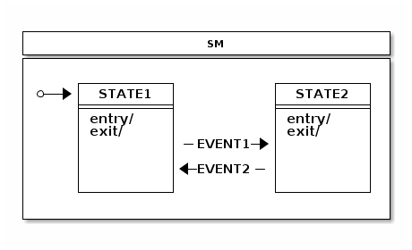

The following listings define the state machine in the preceding image:

```java
public enum States {
	STATE1, STATE2
}

public enum Events {
	EVENT1, EVENT2
}
```

```java
@Configuration
@EnableStateMachine
public class Config1 extends EnumStateMachineConfigurerAdapter<States, Events> {

	@Override
	public void configure(StateMachineStateConfigurer<States, Events> states)
			throws Exception {
		states
			.withStates()
				.initial(States.STATE1)
				.states(EnumSet.allOf(States.class));
	}

	@Override
	public void configure(StateMachineTransitionConfigurer<States, Events> transitions)
			throws Exception {
		transitions
			.withExternal()
				.source(States.STATE1).target(States.STATE2)
				.event(Events.EVENT1)
				.and()
			.withExternal()
				.source(States.STATE2).target(States.STATE1)
				.event(Events.EVENT2);
	}
}
```

```java
@WithStateMachine public class MyBean {
@OnTransition(target = "STATE1") void toState1() {}
@OnTransition(target = "STATE2") void toState2() {}}
```

```java
public class MyApp {

	@Autowired
	StateMachine<States, Events> stateMachine;

	void doSignals() {
		stateMachine
			.sendEvent(Mono.just(MessageBuilder
				.withPayload(Events.EVENT1).build()))
			.subscribe();
		stateMachine
			.sendEvent(Mono.just(MessageBuilder
				.withPayload(Events.EVENT2).build()))
			.subscribe();
	}
}
```

<a id="index--glossary"></a>

### Glossary

**State Machine**
:   The main entity that drives a collection of states, together with regions,
    transitions, and events.

**State**
:   A state models a situation during which some invariant condition
    holds. The state is the main entity of a state machine where state changes
    are driven by events.

**Extended State**
:   An extended state is a special set of variables kept in a state
    machine to reduce the number of needed states.

**Transition**
:   A transition is a relationship between a source state and a target
    state. It may be part of a compound transition, which takes the state
    machine from one state configuration to another, representing the complete
    response of the state machine to an occurrence of an event of a
    particular type.

**Event**
:   An entity that is sent to a state machine and then drives a various
    state changes.

**Initial State**
:   A special state in which the state machine starts. The initial state is
    always bound to a particular state machine or a region. A state
    machine with multiple regions may have a multiple initial states.

**End State**
:   (Also called as a final state.) A special kind of state signifying
    that the enclosing region is completed. If the enclosing region is
    directly contained in a state machine and all other regions in the
    state machine are also completed, the entire state
    machine is completed.

**History State**
:   A pseudo state that lets a state machine remember its last
    active state. Two types of history state exists: *shallow* (which
    remembers only top level state) and *deep* (which remembers active states in
    sub-machines).

**Choice State**
:   A pseudo state that allows for making a transition choice based on (for example)
    event headers or extended state variables.

**Junction State**
:   A pseudo state that is relatively similar to choice state but allows
    multiple incoming transitions, while choice allows only one incoming
    transition.

**Fork State**
:   A pseudo state that gives controlled entry into a region.

**Join State**
:   A pseudo state that gives controlled exit from a region.

**Entry Point**
:   A pseudo state that allows controlled entry into a submachine.

**Exit Point**
:   A pseudo state that allows controlled exit from a submachine.

**Region**
:   A region is an orthogonal part of either a composite state or a state
    machine. It contains states and transitions.

**Guard**
:   A boolean expression evaluated dynamically based on the value of
    extended state variables and event parameters. Guard conditions affect
    the behavior of a state machine by enabling actions or transitions
    only when they evaluate to `TRUE` and disabling them when they evaluate
    to `FALSE`.

**Action**
:   A action is a behavior run during the triggering of the
    transition.

<a id="index--crashcourse"></a>
<a id="index--a-state-machine-crash-course"></a>

### A State Machine Crash Course

This appendix provides a generic crash course to state machine
concepts.

<a id="index--states"></a>

#### States

A state is a model in which a state machine can be. It is always
easier to describe state as a real world example rather than trying to use
abstract concepts ingeneric documentation. To that end, consider
a simple example of a keyboard — most of us use one every single day.
If you have a full keyboard that has normal keys on the left side and
the numeric keypad on the right side, you may have noticed that the
numeric keypad may be in a two different states, depending on whether
numlock is activated. If it is not active, pressing the number pad keys
result in navigation by using arrows and so on. If the number pad is active, pressing
those keys results in numbers being typed. Essentially, the number pad part of a keyboard
can be in two different states.

To relate state concept to programming, it means that instead of using
flags, nested if/else/break clauses, or other impractical (and sometimes tortuous) logic, you can
rely on state, state variables, or another interaction with a
state machine.

<a id="index--pseudo-states"></a>

#### Pseudo States

Pseudostate is a special type of state that usually introduces more
higher-level logic into a state machine by either giving a state a
special meaning (such as initial state). A state machine can then internally
react to these states by doing various actions that are available in UML state
machine concepts.

<a id="index--initial"></a>

##### Initial

The **Initial pseudostate** state is always needed for every single state
machine, whether you have a simple one-level state machine or a more
complex state machine composed of submachines or regions. The initial
state defines where a state machine should go when it starts.
Without it, a state machine is ill-formed.

<a id="index--end"></a>

##### End

The **Terminate pseudostate** (which is also called “end state”) indicates
that a particular state machine has reached its final state. Effectively, this mean that a state machine no longer processes any events and does
not transit to any other state. However, in the case where submachines are
regions, a state machine can restart from its terminal state.

<a id="index--choice"></a>

##### Choice

You can use the **Choice pseudostate** choose a dynamic conditional branch of
a transition from this state. The dynamic condition is evaluated by guards
so that one branch is selected. Usually a
simple if/elseif/else structure is used to make sure that one
branch is selected. Otherwise, the state machine might end up in a deadlock, and the configuration is ill-formed.

<a id="index--junction"></a>

##### Junction

The **Junction pseudostate** is functionally similar to choice, as both are
implemented with if/elseif/else structures. The only real difference is
that junction allows multiple incoming transitions, while choice
allows only one. Thus difference is largely academic but does have some
differences, such as when a state machine is designed is used with a real UI modeling
framework.

<a id="index--history"></a>

##### History

You can use the **History pseudostate** to remember the last active state
configuration. After a state machine has exited, you can use a history state
to restore a previously known configuration. There are two types
of history states available: `SHALLOW` (which remembers only the active state of a
state machine itself) and `DEEP` (which also remembers nested states).

A history state could be implemented externally by listening state
machine events, but this would soon make for very difficult logic, especially if a state machine contains complex nested structures.
Letting the state machine itself handle the recording of history states
makes things much simpler. The user need only create a
transition into a history state, and the state machine handles the needed
logic to go back to its last known recorded state.

In cases where a Transition terminates on a history state when the state
has not been previously entered (in other words, no prior history exists) or it had reached its
end state, a transition can force the state machine to a specific substate, by
using the default history mechanism. This transition originates
in the history state and terminates on a specific vertex (the default history
state) of the region that contains the history state. This transition is
taken only if its execution leads to the history state and the state had never before been
active. Otherwise, the normal history entry into the region is executed.
If no default history transition is defined, the standard default entry of
the region is performed.

<a id="index--fork"></a>

##### Fork

You can use the **Fork pseudostate** to do an explicit entry into one or more regions.
The following image shows how a fork works:

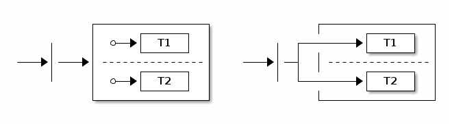

The target state can be a parent state that hosts regions, which simply
means that regions are activated by entering their initial states. You
can also add targets directly to any state in a region, which
allows more controlled entry into a state.

<a id="index--join"></a>

##### Join

The **Join pseudostate** merges together several transitions that
originate from different regions. It is generally used to wait
and block for participating regions to get into its join target states.
The following image shows how a join works:

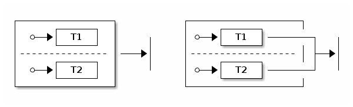

The source state can be a parent state that hosts regions, which means that
join states are the terminal states of the participating regions.
You can also define source states to be any state in a
region, which allows controlled exit from regions.

<a id="index--entry-point"></a>

##### Entry Point

An **Entry Point pseudostate** represents an entry point for a state
machine or a composite state that provides encapsulation of the insides
of the state or state machine. In each region of the state machine or
composite state that owns the entry point, there is at most a single
transition from the entry point to a vertex within that region.

<a id="index--exit-point"></a>

##### Exit Point

An **Exit Point pseudostate** is an exit point of a state machine or
composite state that provides encapsulation of the insides of the state
or state machine. Transitions that terminate on an exit point within any
region of the composite state (or a state machine referenced by a
submachine state) imply exiting of this composite state or submachine
state (with execution of its associated exit behavior).

<a id="index--guard-conditions"></a>

#### Guard Conditions

Guard conditions are expressions which evaluates to either `TRUE` or
`FALSE`, based on extended state variables and event parameters. Guards
are used with actions and transitions to dynamically choose whether a
particular action or transition should be run. The various spects of guards, event parameters, and extended state variables exist to make state
machine design much more simple.

<a id="index--events"></a>

#### Events

Event is the most-used trigger behavior to drive a state machine.
There are other ways to trigger behavior in a state machine
(such as a timer), but events are the ones that really let users
interact with a state machine. Events are also called “signals”.
They basically indicate something that can possibly alter a state machine state.

<a id="index--transitions"></a>

#### Transitions

A transition is a relationship between a source state and a target
state. A switch from one state to another is a state transition caused
by a trigger.

<a id="index--internal-transition"></a>

##### Internal Transition

Internal transition is used when an action needs to be run without
causing a state transition. In an internal transition, the source state and the target
state is always the same, and it is identical with a self-transition in the
absence of state entry and exit actions.

<a id="index--external-versus-local-transitions"></a>

##### External versus Local Transitions

In most cases, external and local transitions are functionally
equivalent, except in cases where the transition happens between super
and sub states. Local transitions do not cause exit and entry to a
source state if the target state is a substate of a source state.
Conversely, local transitions do not cause exit and entry to a target
state if the target is a superstate of a source state.
The following image shows the difference between local and external transitions
with very simplistic super and sub states:

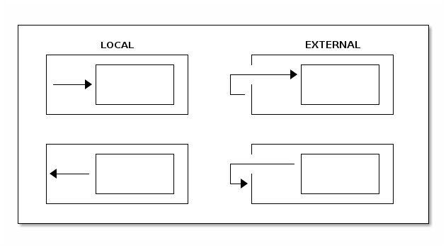

<a id="index--triggers"></a>

#### Triggers

A trigger begins a transition. Triggers can be driven by either events or timers.

<a id="index--actions"></a>

#### Actions

Actions really glue state machine state changes
to a user’s own code. A state machine can run an action on various
changes and on the steps in a state machine (such as entering or exiting a state)
or doing a state transition.

Actions usually have access to a state context, which gives running
code a choice to interact with a state machine in various ways.
State context exposes a whole state machine so that a user can
access extended state variables, event headers (if a transition is based
on an event), or an actual transition (where it is possible to see more
detailed about where this state change is coming from and where it is going).

<a id="index--hierarchical-state-machines"></a>

#### Hierarchical State Machines

The concept of a hierarchical state machine is used to simplify state
design when particular states must exist together.

Hierarchical states are really an innovation in UML state machines over
traditional state machines, such as Mealy or Moore machines.
Hierarchical states lets you define some level of abstraction (parallel
to how a Java developer might define a class structure with abstract
classes). For example, with a nested state machine, you can
define transition on a multiple level of states (possibly with
different conditions). A state machine always tries to see if the current
state is able to handle an event, together with transition guard
conditions. If these conditions do not evaluate to `TRUE`, the state
machine merely see what the super state can handle.

<a id="index--regions"></a>

#### Regions

Regions (which are also called as orthogonal regions) are usually viewed
as exclusive OR (XOR) operations applied to states. The concept of a region in
terms of a state machine is usually a little difficult to understand, but things gets a little simpler with a simple example.

Some of us have a full size keyboard with the main keys on the left side and numeric
keys on the right side. You have probably noticed that both sides really
have their own state, which you see if you press a “numlock” key (which
alters only the behaviour of the number pad itself). If you do not have a full-size
keyboard, you can buy an external USB number pad.
Given that the left and right side of a keyboard can each exist without the
other, they must have totally different states, which means they are
operating on different state machines. In state machine terms, the main part of a
keyboard is one region and the number pad is another region.

It would be a little inconvenient to handle two different
state machines as totally separate entities, because they
still work together in some fashion. This independence lets orthogonal regions
combine together in multiple simultaneous states within a single state
in a state machine.

<a id="index--appendices-zookeeper"></a>
<a id="index--appendix-c:-distributed-state-machine-technical-paper"></a>

## Appendix C: Distributed State Machine Technical Paper

This appendix provides more detailed technical documentation about
using a Zookeeper instance with Spring Statemachine.

<a id="index--abstract"></a>

### Abstract

Introducing a “distributed state” on top of a single state machine
instance running on a single JVM is a difficult and a complex topic.
The concept of a “Distributed State Machine” introduces a few relatively complex
problems on top of a simple state machine, due to its run-to-completion
model and, more generally, because of its single-thread execution model, though orthogonal regions can be run in parallel. One other natural
problem is that state machine transition execution is driven by triggers, which are either `event` or `timer` based.

Spring State Machine tries to solve the problem of spanning
a generic “State Machine” through a JVM boundary by supporting distributed
state machines. Here we show that you can use generic
“State Machine” concepts across multiple JVMs and Spring
Application Contexts.

We found that, if `Distributed State Machine` abstraction is carefully chosen
and backing distributed state repository guarantees `CP` readiness, it is
possible to create a consistent state machine that can share
distributed state among other state machines in an ensemble.

Our results demonstrate that distributed state changes are consistent if the backing
repository is “CP” (discussed [later](#index--state-machine-technical-paper-introduction)).
We anticipate our distributed state machine can provide
a foundation to applications that need to work with shared distributed
states. This model aims to provide good methods for cloud applications
to have much easier ways to communicate with each other without having
to explicitly build these distributed state concepts.

<a id="index--state-machine-technical-paper-introduction"></a>
<a id="index--introduction-2"></a>

### Introduction

Spring State Machine is not forced to use a single threaded execution
model, because, once multiple regions are used, regions can be executed in
parallel if the necessary configuration is applied. This is an important
topic, because, once a user wants to have parallel state machine
execution, it makes state changes faster for independent regions.

When state changes are no longer driven by a trigger in a local JVM or a
local state machine instance, transition logic needs to be controlled
externally in an arbitrary persistent storage. This storage needs to
have a way to notify participating state machines when distributed
state is changed.

[CAP Theorem](https://en.wikipedia.org/wiki/CAP_theorem) states that
it is impossible for a distributed computer system to simultaneously
provide all three of the following guarantees: consistency, availability, and partition tolerance.

This means that, whatever is chosen for a backing persistence storage, it is advisable
to be “CP”. In this context, “CP” means “consistency” and “partition
tolerance”. Naturally, a distributed Spring Statemachine does not care
about its “CAP” level but, in reality, “consistency” and
“partition tolerance” are more important than “availability”. This is
an exact reason why (for example) Zookeeper uses “CP” storage.

All tests presented in this article are accomplished by running custom
Jepsen tests in the following environment:

- A cluster having nodes n1, n2, n3, n4 and n5.
- Each node has a `Zookeeper` instance that constructs an ensemble with
  all other nodes.
- Each node has a [Web](#index--statemachine-examples-web) sample installed,
  to connect to a local `Zookeeper` node.
- Every state machine instance communicates only with a local
  `Zookeeper` instance. While connecting a machine to multiple instances
  is possible, it is not used here.
- All state machine instances, when started, create a
  `StateMachineEnsemble` by using a Zookeeper ensemble.
- Each sample contains a custom rest API, which Jepsen uses to send
  events and check particular state machine statuses.

All Jepsen tests for `Spring Distributed Statemachine` are available from
[Jepsen
Tests.](https://github.com/spring-projects/spring-statemachine/tree/main/jepsen/spring-statemachine-jepsen)

<a id="index--generic-concepts"></a>

### Generic Concepts

One design decision of a `Distributed State Machine` was not to make each
individual state machine instance be aware that it is part of a
“distributed ensemble”. Because the main functions and features of a
`StateMachine` can be accessed through its interface, it makes sense to
wrap this instance in a `DistributedStateMachine`, which
intercepts all state machine communication and collaborates with an
ensemble to orchestrate distributed state changes.

One other important concept is to be able to persist enough
information from a state machine to reset a state machine state
from an arbitrary state into a new deserialized state. This is naturally
needed when a new state machine instance joins with an ensemble
and needs to synchronize its own internal state with a distributed
state. Together with using concepts of distributed states and state
persisting, it is possible to create a distributed state machine.
Currently, the only backing repository of a `Distributed State Machine` is
implemented by using Zookeeper.

As mentioned in [Using Distributed States](#index--sm-distributed), distributed states are enabled by
wrapping an instance of a `StateMachine` in a
`DistributedStateMachine`. The specific `StateMachineEnsemble`
implementation is `ZookeeperStateMachineEnsemble` provides
integration with Zookeeper.

<a id="index--the-role-of-zookeeperstatemachinepersist"></a>

### The Role of `ZookeeperStateMachinePersist`

We wanted to have a generic interface (`StateMachinePersist`) that
Can persist `StateMachineContext` into arbitrary storage and
`ZookeeperStateMachinePersist` implements this interface for
`Zookeeper`.

<a id="index--the-role-of-zookeeperstatemachineensemble"></a>

### The Role of `ZookeeperStateMachineEnsemble`

While a distributed state machine uses one set of serialized
contexts to update its own state, with zookeeper, we have a
conceptual problem around how to listen to these context changes. We
can serialize context into a zookeeper `znode` and eventually
listen when the `znode` data is modified. However, `Zookeeper` does not
guarantee that you get a notification for every data change, because a registered `watcher` for a `znode` is disabled once it fires
and the user need to re-register that `watcher`. During this short time, a `znode` data can be changed, thus resulting in missing events. It is
actually very easy to miss these events by changing data from
multiple threads in a concurrent manner.

To overcome this issue, we keep individual context changes
in multiple `znodes` and we use a simple integer counter to mark
which `znode` is the current active one. Doing so lets us replay missed
events. We do not want to create more and more znodes and then later
delete old ones. Instead, we use the simple concept of a circular
set of znodes. This lets us use a predefined set of znodes where
the current node can be determined with a simple integer counter. We already have
this counter by tracking the main `znode` data version (which, in
`Zookeeper`, is an integer).

The size of a circular buffer is mandated to be a power of two, to avoid
trouble when the integer goes to overflow. For this reason, we need not
handle any specific cases.

<a id="index--distributed-tolerance"></a>

### Distributed Tolerance

To show how a various distributed actions against a state
machine work in real life, we use a set of Jepsen tests to
simulate various conditions that might happen in a real distributed
cluster. These include a “brain split” on a network level, parallel
events with multiple “distributed state machines”, and changes in
“extended state variables”. Jepsen tests are based on a sample
[Web](#index--statemachine-examples-web), where this sample instance runs on
multiple hosts together with a Zookeeper instance on every node
where the state machine is run. Essentially, every state machine sample
connects to a local Zookeeper instance, which lets us, by using
Jepsen, to simulate network conditions.

The plotted graphs shown later in this chapter contain states and events that
directly map to a state chart, which you can be find in
[Web](#index--statemachine-examples-web).

<a id="index--sm-tech-isolated-events"></a>
<a id="index--isolated-events"></a>

#### Isolated Events

Sending an isolated single event into exactly one state machine in an
ensemble is the simplest testing scenario and demonstrates that a
state change in one state machine is properly propagated into other
state machines in an ensemble.

In this test, we demonstrate that a state change in one machine
eventually causes a consistent state change in other machines.
The following image shows the events and state changes for a test state machine:

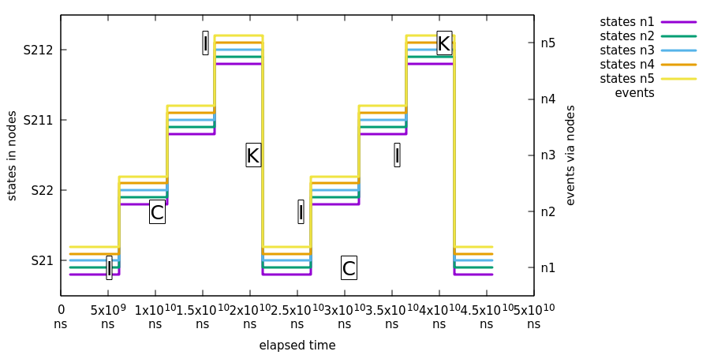

In the preceding image:

- All machines report state `S21`.
- Event `I` is sent to node `n1` and all nodes report state change
  from `S21` to `S22`.
- Event `C` is sent to node `n2` and all nodes report state change
  from `S22` to `S211`.
- Event `I` is sent to node `n5` and all nodes report state change
  from `S211` to `S212`.
- Event `K` is sent to node `n3` and all nodes report state change
  from `S212` to `S21`.
- We cycle events `I`, `C`, `I`, and `K` one more time, through random nodes.

<a id="index--parallel-events"></a>

#### Parallel Events

One logical problem with multiple distributed state machines is that, if the
same event is sent into multiple state machines at exactly the same
time, only one of those events causes a distributed state
transitions. This is a somewhat expected scenario, because the first state
machine (for this event) that is able to change a distributed state
controls the distributed transition logic. Effectively, all other
machines that receive this same event silently discard the event, because the distributed state is no longer in a state where a particular
event can be processed.

In the test shown in the following image, we demonstrate that a state change caused by a
parallel event throughout an ensemble eventually causes a
consistent state change in all machines:

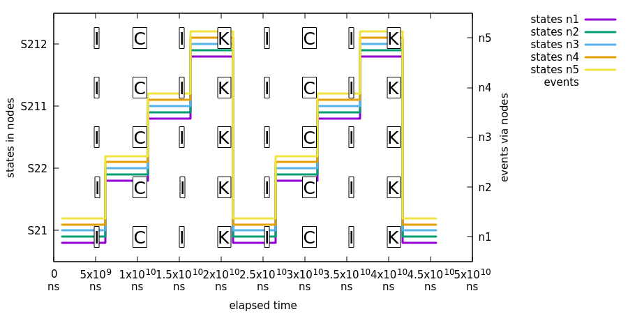

In the preceding image, we use the same event flow that we used in the previous sample
([Isolated Events](#index--sm-tech-isolated-events)), with the difference that events are always
sent to all nodes.

<a id="index--concurrent-extended-state-variable-changes"></a>

#### Concurrent Extended State Variable Changes

Extended state machine variables are not guaranteed to be atomic at
any given time, but, after a distributed state change, all state machines
in an ensemble should have a synchronized extended state.

In this test, we demonstrate that a change in extended state
variables in one distributed state machine eventually becomes
consistent in all the distributed state machines.
The following image shows this test:

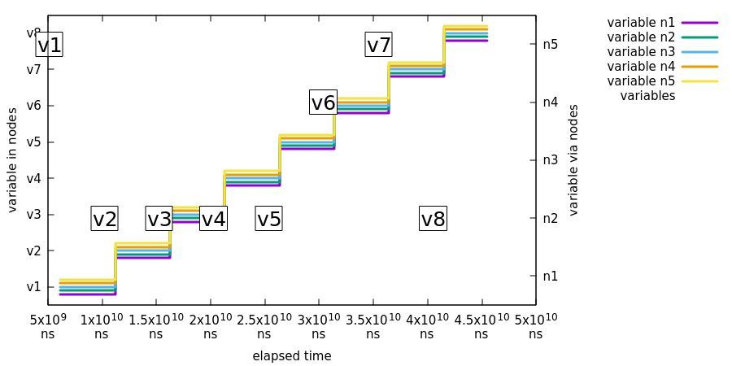

In the preceding image:

- Event `J` is send to node `n5` with event variable `testVariable`
  having value `v1`. All nodes then report having a variable named
  `testVariable` with a value of `v1`.
- Event `J` is repeated from variable `v2` to `v8`, doing the same checks.

<a id="index--partition-tolerance"></a>

#### Partition Tolerance

We need to always assume that, sooner or later, things in a cluster
go bad, whether it is a crash of a Zookeeper instance, a state
machine crash, or a network problem such as a “brain split”. (A brain split is a
situation where existing cluster members are isolated so that only
parts of hosts are able to see each other). The usual scenario is that a
brain split creates minority and majority partitions of an
ensemble such that hosts in the minority cannot participate in an ensemble
until the network status has been healed.

In the following tests, we demonstrate that various types of brain split in
an ensemble eventually cause a fully synchronized state of all the
distributed state machines.

There are two scenarios that have a straight brain split in a
network where where `Zookeeper` and `Statemachine` instances are
split in half (assuming each `Statemachine` connects to a
local `Zookeeper` instance):

- If the current zookeeper leader is kept in a majority, all clients
  connected to the majority keep functioning properly.
- If the current zookeeper leader is left in the minority, all clients
  disconnect from it and try to connect back till previous
  minority members have successfully joined back to existing majority
  ensemble.

> [!NOTE]
> In our current Jepsen tests, we cannot separate Zookeeper split-brain
> scenarios between the leader being left in the majority or in the minority, so we need to
> run the tests multiple times to accomplish this situation.

> [!NOTE]
> In the following plots, we have mapped a state machine error state into an
> `error` to indicate that the state machine is in an error state instead of
> a normal state. Please remember this when interpreting chart states.

In this first test, we show that, when an existing Zookeeper leader was
kept in the majority, three out of five machines continue as is.
The following image shows this test:

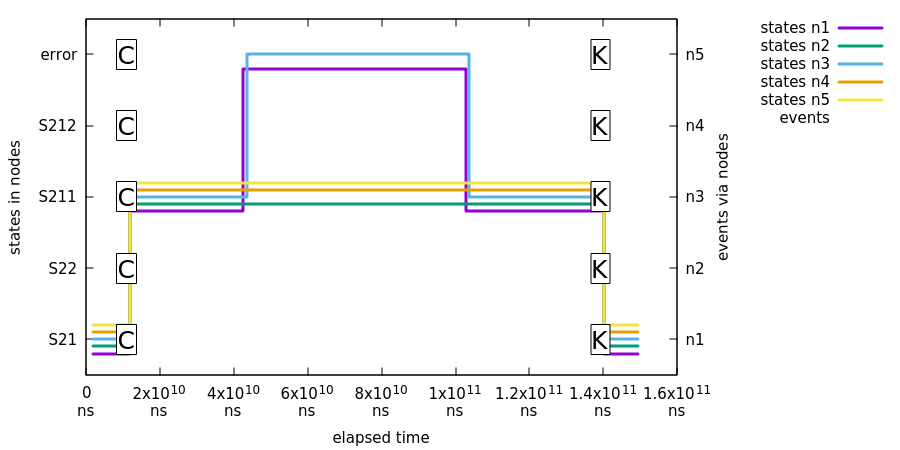

In the preceding image:

- The first event, `C`, is sent to all machines, leading a state change to
  `S211`.
- Jepsen nemesis causes a brain split, which causes partitions
  of `n1/n2/n5` and `n3/n4`. Nodes `n3/n4` are left in the minority, and
  nodes `n1/n2/n5` construct a new healthy majority. Nodes in the
  majority keep functioning without problems, but nodes in the minority
  go into error states.
- Jepsen heals the network and, after some time, nodes `n3/n4` join
  back into the ensemble and synchronize its distributed status.
- Finally, event `K1` is sent to all state machines to ensure that the ensemble
  is working properly. This state change leads back to state
  `S21`.

In the second test, we show that, when the existing zookeeper leader was
kept in the minority, all machines error out.
The following image shows the second test:

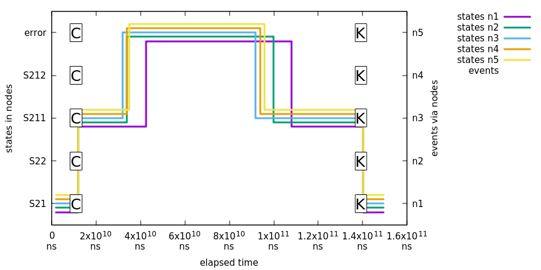

In the preceding image:

- The first event, `C`, is sent to all machines leading to a state change to
  `S211`.
- Jepsen nemesis causes a brain split, which causes partitions
  such that the existing `Zookeeper` leader is kept in the minority and all
  instances are disconnected from the ensemble.
- Jepsen heals the network and, after some time, all nodes join
  back into the ensemble and synchronize its distributed status.
- Finally, event `K1` is sent to all state machines to ensure that ensemble
  workS properly. This state change leads back to state
  `S21`.

<a id="index--crash-and-join-tolerance"></a>

#### Crash and Join Tolerance

In this test, we demonstrate that killing an existing state machine
and then joining a new instance back into an ensemble keeps the
distributed state healthy and the newly joined state machines synchronize
their states properly.
The following image shows the crash and join tolerance test:

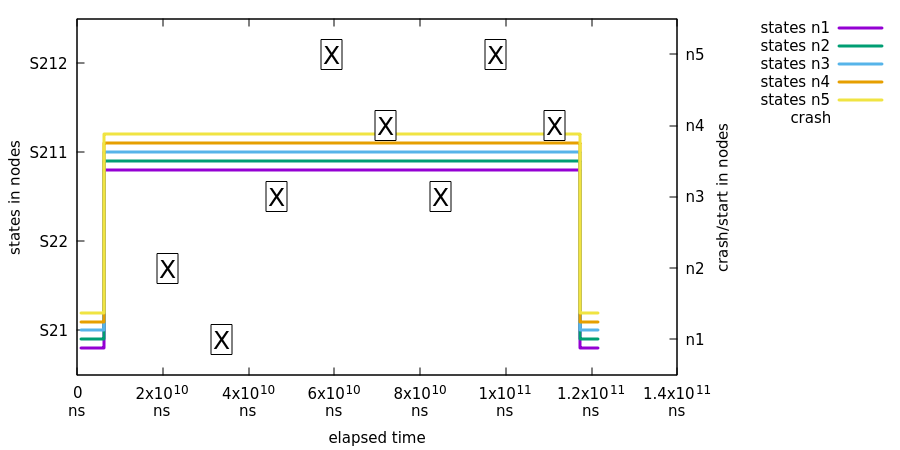

> [!NOTE]
> In this test, states are not checked between first the `X` and last the `X`.
> Thus, the graph shows a flat line in between. The states are checked
> exactly where the state change happens between `S21` and `S211`.

In the preceding image:

- All state machines are transitioned from the initial state (`S21`) into
  state `S211` so that we can test proper state synchronize during the join.
- `X` marks when a specific node has been crashed and started.
- At the same time, we request states from all machines and plot the result.
- Finally, we do a simple transition back to `S21` from `S211` to make
  sure that all state machines still function properly.

<a id="index--devdocs"></a>
<a id="index--developer-documentation"></a>

## Developer Documentation

This appendix provides generic information for adevelopers who may
want to contribute or other people who want to understand how state
machine works or understand its internal concepts.

<a id="index--devdocs-configmodel"></a>
<a id="index--statemachine-config-model"></a>

### StateMachine Config Model

`StateMachineModel` and other related SPI classes are an abstraction
between various configuration and factory classes. This also allows
easier integration for others to build state machines.

As the following listing shows, you can instantiate a state machine by building a model
with configuration data classes and then asking a factory to build a
state machine:

```java
// setup configuration data
ConfigurationData<String, String> configurationData = new ConfigurationData<>();

// setup states data
Collection<StateData<String, String>> stateData = new ArrayList<>();
stateData.add(new StateData<String, String>("S1", true));
stateData.add(new StateData<String, String>("S2"));
StatesData<String, String> statesData = new StatesData<>(stateData);

// setup transitions data
Collection<TransitionData<String, String>> transitionData = new ArrayList<>();
transitionData.add(new TransitionData<String, String>("S1", "S2", "E1"));
TransitionsData<String, String> transitionsData = new TransitionsData<>(transitionData);

// setup model
StateMachineModel<String, String> stateMachineModel = new DefaultStateMachineModel<>(configurationData, statesData,
		transitionsData);

// instantiate machine via factory
ObjectStateMachineFactory<String, String> factory = new ObjectStateMachineFactory<>(stateMachineModel);
StateMachine<String, String> stateMachine = factory.getStateMachine();
```

<a id="index--appendix-reactormigrationguide"></a>
<a id="index--appendix-d:-reactor-migration-guide"></a>

## Appendix D: Reactor Migration Guide

Main task for a work for `3.x` has been to both internally and externally move and change
as much as we can from imperative code into a reactive world. This means that some
of the main interfaces have added new reactive methods and most of a internal execution logic
(where applicable) has been moved over to be handled by a reactor. Essentially what this means is that thread handling model is considerably different compared to `2.x`. Following chapters
go throught all these changes.

<a id="index--communicating-with-a-machine"></a>

### Communicating with a Machine

We’ve added new reactive methods to `StateMachine` while still keeping old blocking event
methods in place.

```java
Flux<StateMachineEventResult<S, E>> sendEvent(Mono<Message<E>> event);

Flux<StateMachineEventResult<S, E>> sendEvents(Flux<Message<E>> events);

Mono<List<StateMachineEventResult<S, E>>> sendEventCollect(Mono<Message<E>> event);
```

We’re now solely working on a spring `Message` and reactor `Mono` and `Flux` classes.
You can send a `Mono` of a `Message` and receive back a `Flux` of `StateMachineEventResult`.
Remember that nothing happens until you subscribe to this `Flux`. More about
this returned value, see [StateMachineEventResult](#index--sm-triggers-statemachineeventresult). Method `sendEventCollect`
is just a syntactic sugar to pass in a `Mono` and get a `Mono` which wraps
results as a list.

```java
Message<String> message = MessageBuilder.withPayload("EVENT").build();
machine.sendEvent(Mono.just(message)).subscribe();
```

You can also send a `Flux` of messages instead of a single `Mono` message.

```java
machine.sendEvents(Flux.just(message)).subscribe();
```

All of the reactor methods are on your disposal and for example not to block and
do something when event handling is completed, you could do something like.

```java
Mono<Message<String>> mono = Mono.just(MessageBuilder.withPayload("EVENT").build());
machine.sendEvent(mono)
	.doOnComplete(() -> {
		System.out.println("Event handling complete");
	})
	.subscribe();
```

Old API methods returning a `boolean` for accepted status are still in place
but are deprecated to get removed in future releases.

```java
boolean accepted = machine.sendEvent("EVENT");
```

<a id="index--taskexecutor-and-taskscheduler"></a>

### TaskExecutor and TaskScheduler

StateMachine execution with `TaskExecutor` and state action scheduling with `TaskScheduler`
has been fully replaced in favour or Reactor execution and scheduling.

Essentially execution outside of a main thread is needed in two places, firstly with
*State Actions* which needs to be cancellable and secondly with *Regions* which should
be always be executed independently. Currently we’ve chosen to just use *Reactor*
`Schedulers.parallel()` for these which should give relatively good results as it
tries to automatically use available number of cpu cores from a system.

Version 4.0.2
Last updated 2026-06-11 10:00:24 UTC

---
