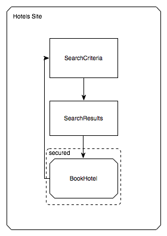
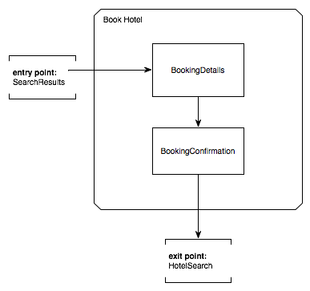
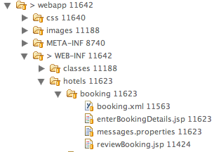

# Spring Web Flow Reference Guide

## Navigation

- Docs
  
- [Spring Web Flow Reference Guide](#index)

## Content

<a id="index"></a>

<!-- source_url: https://docs.spring.io/spring-webflow/docs/current/reference/ -->

<!-- page_index: 1 -->

<a id="index--spring-web-flow-reference-guide"></a>

# Spring Web Flow Reference Guide

Keith Donald, Erwin Vervaet, Jeremy Grelle, Scott Andrews, Rossen Stoyanchev, Phillip Webb, Jay Bryant
version 4.0.1

<a id="index--preface"></a>

## Preface

Many web applications require the same sequence of steps to execute in different contexts.
Often, these sequences are merely components of a larger task the user is trying to accomplish.
Such a reusable sequence is called a flow.

Consider a typical shopping cart application.
User registration, login, and cart checkout are all examples of flows that can be invoked from several places in this type of application.

Spring Web Flow is the module of Spring for implementing flows.
The Web Flow engine plugs into the Spring Web MVC platform and enables declarative flow definition.
This reference guide shows you how to use and extend Spring Web Flow.

<a id="index--_manual_overview"></a>
<a id="index--1.-overview"></a>

## 1. Overview

This guide covers all aspects of Spring Web Flow.
It covers implementing flows in end-user applications and working with the feature set.
It also covers extending the framework and the overall architectural model.

<a id="index--_system_requirements"></a>
<a id="index--1.1.-web-flow-4.0-baseline"></a>

### 1.1. Web Flow 4.0 Baseline

- Java 17 or higher.
- Spring Framework 7.0 baseline
- Servlet 6.1

<a id="index--resources"></a>
<a id="index--1.2.-resources"></a>

### 1.2. Resources

You can ask questions and interact on StackOverflow by using the designated tags.
See [Spring Web Flow at StackOverflow](https://stackoverflow.com/questions/tagged/spring-webflow).

You can report bugs and make requests by using the project [issue tracker](https://jira.spring.io/projects/SWF).

You can submit pull requests and work with the source code.
See [spring-webflow on GitHub](https://github.com/spring-projects/spring-webflow).

<a id="index--_jars_mvn_central"></a>
<a id="index--1.3.-accessing-web-flow-artifacts-from-maven-central"></a>

### 1.3. Accessing Web Flow Artifacts from Maven Central

Each jar in the Web Flow distribution is available in the [Maven Central Repository](https://search.maven.org).
This lets you easily integrate Web Flow into your application if you already use Maven as the build system for your web development project.

To access Web Flow jars from Maven Central, declare the following dependency in your pom:

```xml
<dependency>
    <groupId>org.springframework.webflow</groupId>
    <artifactId>spring-webflow</artifactId>
    <version>x.y.z</version>
</dependency>
```

<a id="index--accessing-nightly-builds-and-milestone-releases"></a>
<a id="index--1.4.-accessing-nightly-builds-and-milestone-releases"></a>

### 1.4. Accessing Nightly Builds and Milestone Releases

Nightly snapshots of Web Flow development branches are available by using Maven.
These snapshot builds are useful for testing fixes you depend on in advance of the next release and provide a convenient way for you to provide feedback about whether a fix meets your needs.

<a id="index--accessing-snapshots-and-milestones-with-maven"></a>
<a id="index--1.4.1.-accessing-snapshots-and-milestones-with-maven"></a>

#### 1.4.1. Accessing Snapshots and Milestones with Maven

For milestones and snapshots, you need to use the Spring Snapshot repository.
Add the following repository to your Maven pom.xml:

```xml
<repository>
    <id>spring</id>
    <name>Spring Repository</name>
    <url>https://repo.spring.io/snapshot</url>
</repository>
```

Then you need to declare the following dependency:

```xml
<dependency>
    <groupId>org.springframework.webflow</groupId>
    <artifactId>spring-webflow</artifactId>
    <version>x.y.z-SNAPSHOT</version>
</dependency>
```

<a id="index--defining-flows"></a>
<a id="index--2.-defining-flows"></a>

## 2. Defining Flows

This chapter begins the Users Section.
It shows how to implement flows by using the flow definition language.
By the end of this chapter, you should have a good understanding of language constructs and be capable of authoring a flow definition.

<a id="index--_flow_overview"></a>
<a id="index--3.-what-is-a-flow"></a>

## 3. What Is a Flow?

A flow encapsulates a reusable sequence of steps that you can use in different contexts.
The following [Garrett Information Architecture](http://www.jjg.net/ia/visvocab/) diagram shows a reference to a flow that encapsulates the steps of a hotel booking process:



<a id="index--_flow_makeup"></a>
<a id="index--4.-what-is-the-makeup-of-a-typical-flow"></a>

## 4. What Is the Makeup of a Typical Flow?

In Spring Web Flow, a flow consists of a series of steps called “states”.
Entering a state typically results in a view being displayed to the user.
On that view, user events occur and are handled by the state.
These events can trigger transitions to other states that result in view navigations.

The following image shows the structure of the book hotel flow referenced in the previous diagram:



<a id="index--_flow_authoring"></a>
<a id="index--5.-how-are-flows-authored"></a>

## 5. How Are Flows Authored?

Flows are authored by using a simple XML-based flow definition language.
The next steps of this guide walk you through the elements of this language.

<a id="index--_essential_flow_elements"></a>
<a id="index--6.-essential-language-elements"></a>

## 6. Essential Language Elements

There are four essential flow elements:

- [The `flow` Element](#index--_flow_element)
- [The `view-state` Element](#index--_view_state_element)
- [The `transition` Element](#index--_transition_element)
- [The `end-state` Element](#index--_end_state_element)

<a id="index--_flow_element"></a>
<a id="index--6.1.-the-flow-element"></a>

### 6.1. The `flow` Element

Every flow begins with the following root element:

```xml
<?xml version="1.0" encoding="UTF-8"?>
<flow xmlns="http://www.springframework.org/schema/webflow"
      xmlns:xsi="http://www.w3.org/2001/XMLSchema-instance"
      xsi:schemaLocation="http://www.springframework.org/schema/webflow
                          https://www.springframework.org/schema/webflow/spring-webflow.xsd">

</flow>
```

All states of the flow are defined within this element.
The first state defined becomes the flow’s starting point.

<a id="index--_view_state_element"></a>
<a id="index--6.2.-the-view-state-element"></a>

### 6.2. The `view-state` Element

The `view-state` element defines a step of the flow that renders a view:

```xml
<view-state id="enterBookingDetails" />
```

By convention, a view-state maps its id to a view template in the directory where the flow is located.
For example, the preceding state might render `/WEB-INF/hotels/booking/enterBookingDetails.xhtml` if the flow itself was located in the `/WEB-INF/hotels/booking` directory.

<a id="index--_transition_element"></a>
<a id="index--6.3.-the-transition-element"></a>

### 6.3. The `transition` Element

The `transition` element handles events that occur within a state:

```xml
<view-state id="enterBookingDetails">
    <transition on="submit" to="reviewBooking" />
</view-state>
```

These transitions drive view navigations.

<a id="index--_end_state_element"></a>
<a id="index--6.4.-the-end-state-element"></a>

### 6.4. The `end-state` Element

The `end-state` element defines a flow outcome:

```xml
<end-state id="bookingCancelled" />
```

When a flow transitions to a end-state, it ends and the outcome is returned.

<a id="index--checkpoint-essential-language-elements"></a>
<a id="index--6.5.-checkpoint:-essential-language-elements"></a>

### 6.5. Checkpoint: Essential language elements

With the three elements, `view-state`, `transition`, and `end-state`, you can quickly express your view navigation logic.
Teams often do this before adding flow behaviors so that they can focus on developing the user interface of the application with end users first.
The following sample flow implements its view navigation logic by using these elements:

```xml
<flow xmlns="http://www.springframework.org/schema/webflow"
      xmlns:xsi="http://www.w3.org/2001/XMLSchema-instance"
      xsi:schemaLocation="http://www.springframework.org/schema/webflow
                          https://www.springframework.org/schema/webflow/spring-webflow.xsd">

    <view-state id="enterBookingDetails">
        <transition on="submit" to="reviewBooking" />
    </view-state>

    <view-state id="reviewBooking">
        <transition on="confirm" to="bookingConfirmed" />
        <transition on="revise" to="enterBookingDetails" />
        <transition on="cancel" to="bookingCancelled" />
    </view-state>

    <end-state id="bookingConfirmed" />

    <end-state id="bookingCancelled" />

</flow>
```

<a id="index--_flow_actions"></a>
<a id="index--7.-actions"></a>

## 7. Actions

Most flows need to express more than view navigation logic.
Typically, they also need to invoke business services of the application or other actions.

Within a flow, there are several points where you can execute actions:

- On flow start
- On state entry
- On view render
- On transition execution
- On state exit
- On flow end

Actions are defined by using a concise expression language.
By default, Spring Web Flow uses the Unified EL.
The next few sections cover the essential language elements for defining actions.

<a id="index--_evaluate_element"></a>
<a id="index--7.1.-the-evaluate-element"></a>

### 7.1. The `evaluate` Element

The most often used action element is the `evaluate` element.
The `evaluate` element evaluates an expression at a point within your flow.
With this single element, you can invoke methods on Spring beans or any other flow variable.
The following listing shows an example:

```xml
<evaluate expression="entityManager.persist(booking)" />
```

<a id="index--_evaluate_element_result"></a>
<a id="index--7.1.1.-assigning-an-evaluate-result"></a>

#### 7.1.1. Assigning an `evaluate` Result

If the expression returns a value, that value can be saved in the flow’s data model, called `flowScope`, as follows:

```xml
<evaluate expression="bookingService.findHotels(searchCriteria)" result="flowScope.hotels" />
```

<a id="index--_evaluate_element_result_type"></a>
<a id="index--7.1.2.-converting-an-evaluate-result"></a>

#### 7.1.2. Converting an `evaluate` Result

If the expression returns a value that may need to be converted, you can specify the desired type by using the `result-type` attribute, as follows:

```xml
<evaluate expression="bookingService.findHotels(searchCriteria)" result="flowScope.hotels"
          result-type="dataModel"/>
```

<a id="index--_checkpoint_actions"></a>
<a id="index--7.2.-checkpoint:-flow-actions"></a>

### 7.2. Checkpoint: Flow Actions

You should review the sample booking flow with actions added:

```xml
<flow xmlns="http://www.springframework.org/schema/webflow"
      xmlns:xsi="http://www.w3.org/2001/XMLSchema-instance"
      xsi:schemaLocation="http://www.springframework.org/schema/webflow
                          https://www.springframework.org/schema/webflow/spring-webflow.xsd">

    <input name="hotelId" />

    <on-start>
        <evaluate expression="bookingService.createBooking(hotelId, currentUser.name)"
                  result="flowScope.booking" />
    </on-start>

    <view-state id="enterBookingDetails">
        <transition on="submit" to="reviewBooking" />
    </view-state>

    <view-state id="reviewBooking">
        <transition on="confirm" to="bookingConfirmed" />
        <transition on="revise" to="enterBookingDetails" />
        <transition on="cancel" to="bookingCancelled" />
    </view-state>

    <end-state id="bookingConfirmed" />

    <end-state id="bookingCancelled" />

</flow>
```

This flow now creates a `Booking` object in flow scope when it starts.
The ID of the hotel to book is obtained from a flow input attribute.

<a id="index--_flow_inputoutput"></a>
<a id="index--8.-input-output-mapping"></a>

## 8. Input/Output Mapping

Each flow has a well-defined input/output contract.
Flows can be passed input attributes when they start and can return output attributes when they end.
In this respect, calling a flow is conceptually similar to calling a method with the following signature:

```java
FlowOutcome flowId(Map<String, Object> inputAttributes);
```

Where a `FlowOutcome` has the following signature:

```java
public interface FlowOutcome {
   public String getName();
   public Map<String, Object> getOutputAttributes();
}
```

<a id="index--_input_element"></a>
<a id="index--8.1.-input"></a>

### 8.1. input

The `input` element declares a flow input attribute, as follows:

```xml
<input name="hotelId" />
```

Input values are saved in flow scope under the name of the attribute.
For example, the input in the preceding example is saved under a name of `hotelId`.

<a id="index--_input_element_type"></a>
<a id="index--8.1.1.-declaring-an-input-type"></a>

#### 8.1.1. Declaring an Input Type

The `type` attribute declares the input attribute’s type:

```xml
<input name="hotelId" type="long" />
```

If an input value does not match the declared type, a type conversion is attempted.

<a id="index--_input_element_value"></a>
<a id="index--8.1.2.-assigning-an-input-value"></a>

#### 8.1.2. Assigning an Input Value

The `value` attribute specifies an expression to which to assign the input value, as follows:

```xml
<input name="hotelId" value="flowScope.myParameterObject.hotelId" />
```

If the expression’s value type can be determined, that metadata is used for type coercion if no `type` attribute is specified.

<a id="index--_input_element_required"></a>
<a id="index--8.1.3.-marking-an-input-as-required"></a>

#### 8.1.3. Marking an input as required

The `required` attribute enforces that the input is not null or empty, as follows:

```xml
<input name="hotelId" type="long" value="flowScope.hotelId" required="true" />
```

<a id="index--_output_element"></a>
<a id="index--8.2.-the-output-element"></a>

### 8.2. The `output` Element

The `output` element declares a flow output attribute.
Output attributes are declared within end-states that represent specific flow outcomes.
The following listing defines an `output` element:

```xml
<end-state id="bookingConfirmed">
    <output name="bookingId" />
</end-state>
```

Output values are obtained from flow scope under the name of the attribute.
For example, the output in the preceding example would be assigned the value of the `bookingId` variable.

<a id="index--_output_element_value"></a>
<a id="index--8.2.1.-specifying-the-source-of-an-output-value"></a>

#### 8.2.1. Specifying the Source of an `output` Value

The `value` attribute denotes a specific output value expression, as follows:

```xml
<output name="confirmationNumber" value="booking.confirmationNumber" />
```

<a id="index--_checkpoint_input_output"></a>
<a id="index--8.3.-checkpoint:-input-output-mapping"></a>

### 8.3. Checkpoint: Input/Output Mapping

You should review the sample booking flow with input/output mapping:

```xml
<flow xmlns="http://www.springframework.org/schema/webflow"
      xmlns:xsi="http://www.w3.org/2001/XMLSchema-instance"
      xsi:schemaLocation="http://www.springframework.org/schema/webflow
                          https://www.springframework.org/schema/webflow/spring-webflow.xsd">

    <input name="hotelId" />

    <on-start>
        <evaluate expression="bookingService.createBooking(hotelId, currentUser.name)"
                  result="flowScope.booking" />
    </on-start>

    <view-state id="enterBookingDetails">
        <transition on="submit" to="reviewBooking" />
    </view-state>

    <view-state id="reviewBooking">
        <transition on="confirm" to="bookingConfirmed" />
        <transition on="revise" to="enterBookingDetails" />
        <transition on="cancel" to="bookingCancelled" />
    </view-state>

    <end-state id="bookingConfirmed" >
        <output name="bookingId" value="booking.id"/>
    </end-state>

    <end-state id="bookingCancelled" />

</flow>
```

The flow now accepts a `hotelId` input attribute and returns a `bookingId` output attribute when a new booking is confirmed.

<a id="index--_flow_variables"></a>
<a id="index--9.-variables"></a>

## 9. Variables

A flow may declare one or more instance variables.
These variables are allocated when the flow starts.
Any `@Autowired` transient references the variable holds are also rewired when the flow resumes.

<a id="index--_var_element"></a>
<a id="index--9.1.-the-var-element"></a>

### 9.1. The `var` Element

The `var` element declares a flow variable, as follows:

```xml
<var name="searchCriteria" class="com.mycompany.myapp.hotels.search.SearchCriteria"/>
```

Make sure your variable’s class implements `java.io.Serializable`, as the instance state is saved between flow requests.

<a id="index--_scopes"></a>
<a id="index--10.-variable-scopes"></a>

## 10. Variable Scopes

Web Flow can store variables in one of several scopes:

- [Flow Scope](#index--_scopes_flow_scope)
- [View Scope](#index--_scopes_view_scope)
- [Request Scope](#index--_scopes_request_scope)
- [Flash Scope](#index--_scopes_flash_scope)
- [Conversation Scope](#index--_scopes_conversation_scope)

<a id="index--_scopes_flow_scope"></a>
<a id="index--10.1.-flow-scope"></a>

### 10.1. Flow Scope

Flow scope gets allocated when a flow starts and destroyed when the flow ends.
With the default implementation, any objects stored in flow scope need to be serializable.

<a id="index--_scopes_view_scope"></a>
<a id="index--10.2.-view-scope"></a>

### 10.2. View Scope

View scope gets allocated when a `view-state` enters and destroyed when the state exits.
View scope is referenceable *only* from within a `view-state`.
With the default implementation, any objects stored in view scope need to be serializable.

<a id="index--_scopes_request_scope"></a>
<a id="index--10.3.-request-scope"></a>

### 10.3. Request Scope

Request scope gets allocated when a flow is called and destroyed when the flow returns.

<a id="index--_scopes_flash_scope"></a>
<a id="index--10.4.-flash-scope"></a>

### 10.4. Flash Scope

Flash scope gets allocated when a flow starts, cleared after every view render, and destroyed when the flow ends.
With the default implementation, any objects stored in flash scope need to be serializable.

<a id="index--_scopes_conversation_scope"></a>
<a id="index--10.5.-conversation-scope"></a>

### 10.5. Conversation Scope

Conversation scope gets allocated when a top-level flow starts and gets destroyed when the top-level flow ends.
Conversation scope is shared by a top-level flow and all of its sub-flows.
With the default implementation, conversation-scoped objects are stored in the HTTP session and should generally be serializable to account for typical session replication.

<a id="index--choosing-a-scope"></a>
<a id="index--10.6.-choosing-a-scope"></a>

### 10.6. Choosing a Scope

The scope to use is often determined contextually — for example, depending on where a variable is defined: at the start of the flow definition (flow scope), inside a a view state (view scope), and so on.
In other cases (for example, in EL expressions and Java code), you must specify it explicitly.
Subsequent sections explain how this is done.

<a id="index--calling-sub-flows"></a>
<a id="index--11.-calling-sub-flows"></a>

## 11. Calling Sub-flows

A flow may call another flow as a sub-flow.
The flow waits until the sub-flow returns and responds to the sub-flow outcome.

<a id="index--_subflow_state_element"></a>
<a id="index--11.1.-the-subflow-state-element"></a>

### 11.1. The `subflow-state` Element

The `subflow-state` element calls another flow as a subflow, as follows:

```xml
<subflow-state id="addGuest" subflow="createGuest">
    <transition on="guestCreated" to="reviewBooking">
        <evaluate expression="booking.guests.add(currentEvent.attributes.guest)" />
    </transition>
    <transition on="creationCancelled" to="reviewBooking" />
</subflow-state>
```

The preceding example calls the `createGuest` flow and waits for it to return.
When the flow returns with a `guestCreated` outcome, the new guest is added to the booking’s guest list.

<a id="index--_subflow_state_element_input"></a>
<a id="index--11.1.1.-passing-a-sub-flow-input"></a>

#### 11.1.1. Passing a Sub-flow Input

The `input` element passes input to the subflow, as follows:

```xml
<subflow-state id="addGuest" subflow="createGuest">
    <input name="booking" />
    <transition to="reviewBooking" />
</subflow-state>
```

<a id="index--_subflow_state_element_output"></a>
<a id="index--11.1.2.-mapping-sub-flow-output"></a>

#### 11.1.2. Mapping Sub-flow Output

When a subflow completes, its end-state ID is returned to the calling flow as the event to use to continue navigation.

The sub-flow can also create output attributes to which the calling flow can refer within an outcome transition, as follows:

```xml
<transition on="guestCreated" to="reviewBooking">
    <evaluate expression="booking.guests.add(currentEvent.attributes.guest)" />
</transition>
```

In the preceding example, `guest` is the name of an output attribute returned by the `guestCreated` outcome.

<a id="index--_checkpoint_subflow"></a>
<a id="index--11.2.-checkpoint:-calling-sub-flows"></a>

### 11.2. Checkpoint: Calling Sub-flows

You should review the sample booking flow that calls a subflow:

```xml
<flow xmlns="http://www.springframework.org/schema/webflow"
      xmlns:xsi="http://www.w3.org/2001/XMLSchema-instance"
      xsi:schemaLocation="http://www.springframework.org/schema/webflow
                          https://www.springframework.org/schema/webflow/spring-webflow.xsd">

    <input name="hotelId" />

    <on-start>
        <evaluate expression="bookingService.createBooking(hotelId, currentUser.name)"
                  result="flowScope.booking" />
    </on-start>

    <view-state id="enterBookingDetails">
        <transition on="submit" to="reviewBooking" />
    </view-state>

    <view-state id="reviewBooking">
        <transition on="addGuest" to="addGuest" />
        <transition on="confirm" to="bookingConfirmed" />
        <transition on="revise" to="enterBookingDetails" />
        <transition on="cancel" to="bookingCancelled" />
    </view-state>

    <subflow-state id="addGuest" subflow="createGuest">
        <transition on="guestCreated" to="reviewBooking">
            <evaluate expression="booking.guests.add(currentEvent.attributes.guest)" />
        </transition>
        <transition on="creationCancelled" to="reviewBooking" />
    </subflow-state>

    <end-state id="bookingConfirmed" >
        <output name="bookingId" value="booking.id" />
    </end-state>

    <end-state id="bookingCancelled" />

</flow>
```

The flow now calls a `createGuest` sub-flow to add a new guest to the guest list.

<a id="index--_el"></a>
<a id="index--12.-expression-language-el"></a>

## 12. Expression Language (EL)

Web Flow uses EL to access its data model and to invoke actions.
This chapter should familiarize you with EL syntax, configuration, and special EL variables you can reference from your flow definition.

EL is used for many things within a flow, including:

- Accessing client data, such as declaring flow inputs or referencing request parameters.
- Accessing data in Web Flow’s `RequestContext`, such as `flowScope` or `currentEvent`.
- Invoking methods on Spring-managed objects through actions.
- Resolving expressions, such as state transition criteria, sub-flow IDs, and view names.

EL is also used to bind form parameters to model objects and, conversely, to render formatted form fields from the properties of a model object.
That, however, does not apply when using Web Flow with JSF.
In that case, the standard JSF component lifecyle applies.

<a id="index--_el_types"></a>
<a id="index--12.1.-expression-types"></a>

### 12.1. Expression Types

An important concept to understand is there are two types of expressions in Web Flow:

- [Standard Expressions](#index--_el_types_eval)
- [Template Expressions](#index--_el_types_template)

<a id="index--_el_types_eval"></a>
<a id="index--12.1.1.-standard-expressions"></a>

#### 12.1.1. Standard Expressions

The first and most common type of expression is the *standard expression*.
Such expressions are evaluated directly by the EL and need not be enclosed in delimiters, such as `\#{}`.
The following example shows such a standard expression:

```xml
<evaluate expression="searchCriteria.nextPage()" />
```

The preceding expression is a standard expression that invokes the `nextPage` method on the `searchCriteria` variable when evaluated.
If you try to enclose this expression in a special delimiter (such as `\#{}`), you get an `IllegalArgumentException`.
In this context, the delimiter is seen as redundant.
The only acceptable value for the `expression` attribute is a single expression string.

<a id="index--_el_types_template"></a>
<a id="index--12.1.2.-template-expressions"></a>

#### 12.1.2. Template Expressions

The second type of expression is a *template expression*.
A template expression allows mixing of literal text with one or more standard expressions.
Each standard expression block is explicitly surrounded with the `\#{}` delimiters.
The following example shows a template expression:

```xml
<view-state id="error" view="error-#{externalContext.locale}.xhtml" />
```

The preceding expression is a template expression.
The result of evaluation is a string that concatenates literal text such as `error-` and `.xhtml` with the result of evaluating `externalContext.locale`.
You need explicit delimiters here to demarcate standard expression blocks within the template.

> [!NOTE]
> See the Web Flow XML schema for a complete listing of those XML attributes that accept standard expressions and those that accept template expressions.
> You can also use F2 in Eclipse (or equivalent shortcuts in other IDEs) to access available documentation when typing out specific flow definition attributes.

<a id="index--_el_language_choices"></a>
<a id="index--12.2.-el-implementations"></a>

### 12.2. EL Implementations

Spring Web Flow supports the following EL (Expression Language) implementations:

<a id="index--_el_spring_el"></a>
<a id="index--12.2.1.-spring-el"></a>

#### 12.2.1. Spring EL

Web Flow uses the [Spring Expression Language](https://docs.spring.io/spring/docs/current/spring-framework-reference/html/expressions.html) (Spring EL). Spring EL was created to provide a single, well-supported expression language for use across all the products in the Spring portfolio.
It is distributed as a separate jar (`org.springframework.expression`) in the Spring Framework.

<a id="index--_el_unified_el"></a>
<a id="index--12.2.2.-unified-el"></a>

#### 12.2.2. Unified EL

Use of the [Unified EL](https://en.wikipedia.org/wiki/Unified_Expression_Language) also implies a dependency on `el-api`, although that is typically provided by your web container.
Although Spring EL is the default and recommended expression language to use, you can replace it with Unified EL.
To do so, you need the following Spring configuration to plug in the `WebFlowELExpressionParser` to the `flow-builder-services`:

```xml
<webflow:flow-builder-services expression-parser="expressionParser"/>

<bean id="expressionParser" class="org.springframework.webflow.expression.el.WebFlowELExpressionParser">
    <constructor-arg>
        <bean class="org.jboss.el.ExpressionFactoryImpl" />
    </constructor-arg>
</bean>
```

Note that, if your application registers custom converters, it is important to ensure `WebFlowELExpressionParser` is configured with the conversion service that has those custom converters, as follows:

```xml
<webflow:flow-builder-services expression-parser="expressionParser" conversion-service="conversionService"/>

<bean id="expressionParser" class="org.springframework.webflow.expression.el.WebFlowELExpressionParser">
    <constructor-arg>
        <bean class="org.jboss.el.ExpressionFactoryImpl" />
    </constructor-arg>
    <property name="conversionService" ref="conversionService"/>
</bean>

<bean id="conversionService" class="somepackage.ApplicationConversionService"/>
```

<a id="index--el-portability"></a>
<a id="index--12.3.-el-portability"></a>

### 12.3. EL Portability

In general, you will find Spring EL and Unified EL to have a very similar syntax.

However, Spring El has some advantages.
For example, Spring EL is closely integrated with the type conversion of Spring 3, and that lets you take full advantage of its features.
Specifically, the automatic detection of generic types as well as the use of formatting annotations is currently supported only with Spring EL.

Keep in mind the following minor changes when upgrading to Spring EL from Unified EL:

- Expressions delineated with `${}` in flow definitions must be changed to `\#{}` (note the leading backspace character).
- Expressions that test the current event (such as `#{currentEvent == 'submit'}`) must be changed to `\#{currentEvent.id == 'submit'}` (note the addition of the `id`).
- Resolving properties (such as `#{currentUser.name}`) may cause a `NullPointerException` without any checks such as `\#{currentUser != null ? currentUser.name : null}`. A much better alternative is the safe navigation operator: `\#{currentUser?.name}`.

For more information on Spring EL syntax, see the [Language Reference](https://docs.spring.io/spring/docs/current/spring-framework-reference/core.html#expressions) section in the Spring Documentation.

<a id="index--_el_variables"></a>
<a id="index--12.4.-special-el-variables"></a>

### 12.4. Special EL Variables

You can reference several implicit variables from within a flow.

Keep in mind this general rule:
You should use variables that refer to data scopes (`flowScope`, `viewScope`, `requestScope`, and so on) only when you assign a new variable to one of the scopes.

For example, when assigning the result of the call to `bookingService.findHotels(searchCriteria)` to a new variable called `hotels`, you must prefix it with a scope variable to let Web Flow know where you want it stored.
The following example shows how to do so:

```xml
<?xml version="1.0" encoding="UTF-8"?>
<flow xmlns="http://www.springframework.org/schema/webflow" ... >

	<var name="searchCriteria" class="org.springframework.webflow.samples.booking.SearchCriteria" />

	<view-state id="reviewHotels">
		<on-render>
			<evaluate expression="bookingService.findHotels(searchCriteria)" result="viewScope.hotels" />
		</on-render>
	</view-state>

</flow>
```

However, when setting an existing variable (such as `searchCriteria` in the following example), you should reference the variable directly without prefixing it with any scope variables, as follows:

```xml
<?xml version="1.0" encoding="UTF-8"?>
<flow xmlns="http://www.springframework.org/schema/webflow" ... >

	<var name="searchCriteria" class="org.springframework.webflow.samples.booking.SearchCriteria" />

	<view-state id="reviewHotels">
		<transition on="sort">
			<set name="searchCriteria.sortBy" value="requestParameters.sortBy" />
		</transition>
	</view-state>

</flow>
```

The following is the list of implicit variables you can reference within a flow definition:

- [The `flowScope` Variable](#index--_el_variable_flowscope)
- [The `viewScope` Variable](#index--_el_variable_viewscope)
- [The `requestScope` Variable](#index--_el_variable_requestscope)
- [The `flashScope` Variable](#index--_el_variable_flashscope)
- [The `conversationScope` Variable](#index--_el_variable_conversationscope)
- [The `requestParameters` Variable](#index--_el_variable_requestparameters)
- [The `currentEvent` Variable](#index--_el_variable_currentevent)
- [The `currentUser` Variable](#index--_el_variable_currentuser)
- [The `messageContext` Variable](#index--_el_variable_messagecontext)
- [The `resourceBundle` Variable](#index--_el_variable_resourcebundle)
- [The `flowRequestContext` Variable](#index--_el_variable_requestcontext)
- [The `flowExecutionContext` Variable](#index--_el_variable_flowexecutioncontext)
- [The `flowExecutionUrl` Variable](#index--_el_variable_flowexecutionurl)
- [The `externalContext` Variable](#index--_el_variable_externalcontext)

<a id="index--_el_variable_flowscope"></a>
<a id="index--12.4.1.-the-flowscope-variable"></a>

#### 12.4.1. The `flowScope` Variable

You can use the `flowScope` to assign a flow variable.
Flow scope gets allocated when a flow starts and destroyed when the flow ends.
With the default implementation, any objects stored in flow scope need to be serializable.
The following listing defines a `flowScope` variable:

```xml
<evaluate expression="searchService.findHotel(hotelId)" result="flowScope.hotel" />
```

<a id="index--_el_variable_viewscope"></a>
<a id="index--12.4.2.-the-viewscope-variable"></a>

#### 12.4.2. The `viewScope` Variable

You can use the `viewScope` to assign a view variable.
View scope gets allocated when a `view-state` is entered and destroyed when the state exits.
View scope is referenceable *only* from within a `view-state`.
With the default implementation, any objects stored in view scope need to be serializable.
The following listing defines a `viewScope` variable:

```xml
<on-render>
    <evaluate expression="searchService.findHotels(searchCriteria)" result="viewScope.hotels"
              result-type="dataModel" />
</on-render>
```

<a id="index--_el_variable_requestscope"></a>
<a id="index--12.4.3.-the-requestscope-variable"></a>

#### 12.4.3. The `requestScope` Variable

You can use `requestScope` to assign a request variable.
Request scope gets allocated when a flow is called and destroyed when the flow returns.
The following listing defines a `requestScope` variable:

```xml
<set name="requestScope.hotelId" value="requestParameters.id" type="long" />
```

<a id="index--_el_variable_flashscope"></a>
<a id="index--12.4.4.-the-flashscope-variable"></a>

#### 12.4.4. The `flashScope` Variable

You can use `flashScope` to assign a flash variable.
Flash scope gets allocated when a flow starts, cleared after every view render, and destroyed when the flow ends.
With the default implementation, any objects stored in flash scope need to be serializable.
The following listing defines a `flashScope` variable:

```xml
<set name="flashScope.statusMessage" value="'Booking confirmed'" />
```

<a id="index--_el_variable_conversationscope"></a>
<a id="index--12.4.5.-the-conversationscope-variable"></a>

#### 12.4.5. The `conversationScope` Variable

You can use `conversationScope` to assign a conversation variable.
Conversation scope gets allocated when a top-level flow starts and destroyed when the top-level flow ends.
Conversation scope is shared by a top-level flow and all of its sub-flows.
With the default implementation, conversation-scoped objects are stored in the HTTP session and should generally be serializable to account for typical session replication.
The following listing defines a `conversationScope` variable:

```xml
<evaluate expression="searchService.findHotel(hotelId)" result="conversationScope.hotel" />
```

<a id="index--_el_variable_requestparameters"></a>
<a id="index--12.4.6.-the-requestparameters-variable"></a>

#### 12.4.6. The `requestParameters` Variable

The `requestParameters` variable accesses a client request parameter, as follows:

```xml
<set name="requestScope.hotelId" value="requestParameters.id" type="long" />
```

<a id="index--_el_variable_currentevent"></a>
<a id="index--12.4.7.-the-currentevent-variable"></a>

#### 12.4.7. The `currentEvent` Variable

The `currentEvent` variable accesses attributes of the current `Event`, as follows:

```xml
<evaluate expression="booking.guests.add(currentEvent.attributes.guest)" />
```

<a id="index--_el_variable_currentuser"></a>
<a id="index--12.4.8.-the-currentuser-variable"></a>

#### 12.4.8. The `currentUser` Variable

The `currentUser` variable accesses the authenticated `Principal`, as follows:

```xml
<evaluate expression="bookingService.createBooking(hotelId, currentUser.name)"
          result="flowScope.booking" />
```

<a id="index--_el_variable_messagecontext"></a>
<a id="index--12.4.9.-the-messagecontext-variable"></a>

#### 12.4.9. The `messageContext` Variable

The `messageContext` variable accesses a context to retrieve and create flow execution messages, including error and success messages.
See the `MessageContext` Javadocs for more information.
The following example uses the `messageContext` variable:

```xml
<evaluate expression="bookingValidator.validate(booking, messageContext)" />
```

<a id="index--_el_variable_resourcebundle"></a>
<a id="index--12.4.10.-the-resourcebundle-variable"></a>

#### 12.4.10. The `resourceBundle` Variable

The `resourceBundle` variable accesses a message resource, as follows:

```xml
<set name="flashScope.successMessage" value="resourceBundle.successMessage" />
```

<a id="index--_el_variable_requestcontext"></a>
<a id="index--12.4.11.-the-flowrequestcontext-variable"></a>

#### 12.4.11. The `flowRequestContext` Variable

The `flowRequestContext` variable accesses the `RequestContext` API, which is a representation of the current flow request.
See the [API Javadocs](https://docs.spring.io/spring-webflow/docs/current/api/org/springframework/webflow/execution/RequestContext.html) for more information.

<a id="index--_el_variable_flowexecutioncontext"></a>
<a id="index--12.4.12.-the-flowexecutioncontext-variable"></a>

#### 12.4.12. The `flowExecutionContext` Variable

The `flowExecutionContext` variable accesses the `FlowExecutionContext` API, which is a representation of the current flow state.
See the [API Javadocs](https://docs.spring.io/spring-webflow/docs/current/api/org/springframework/webflow/execution/FlowExecutionContext.html) for more information.

<a id="index--_el_variable_flowexecutionurl"></a>
<a id="index--12.4.13.-the-flowexecutionurl-variable"></a>

#### 12.4.13. The `flowExecutionUrl` Variable

The `flowExecutionUrl` variable accesses the context-relative URI for the current flow execution view-state.

<a id="index--_el_variable_externalcontext"></a>
<a id="index--12.4.14.-the-externalcontext-variable"></a>

#### 12.4.14. The `externalContext` Variable

The `externalContext` variable accesses the client environment, including user session attributes.
See the `ExternalContext` [API JavaDocs](https://docs.spring.io/spring-webflow/docs/current/api/org/springframework/webflow/context/ExternalContext.html) for more information.
The following example uses the `externalContext` variable:

```xml
<evaluate expression="searchService.suggestHotels(externalContext.sessionMap.userProfile)"
          result="viewScope.hotels" />
```

<a id="index--_el_scope_searching"></a>
<a id="index--12.5.-scope-searching-algorithm"></a>

### 12.5. Scope Searching Algorithm

As mentioned [earlier](#index--_el_variables) in this section, when assigning a variable in one of the flow scopes, referencing that scope is required.
The following example shows how to do so:

```xml
<set name="requestScope.hotelId" value="requestParameters.id" type="long" />
```

When you are merely accessing a variable in one of the scopes, referencing the scope is optional, as follows:

```xml
<evaluate expression="entityManager.persist(booking)" />
```

When no scope is specified, as in the use of `booking` shown earlier, a scope searching algorithm is used.
The algorithm looks in the request, flash, view, flow, and conversation scopes for the variable.
If no such variable is found, an `EvaluationException` is thrown.

<a id="index--_views"></a>
<a id="index--13.-rendering-views"></a>

## 13. Rendering Views

This chapter shows you how to use the `view-state` element to render views within a flow.

<a id="index--_view_convention"></a>
<a id="index--13.1.-defining-view-states"></a>

### 13.1. Defining View States

The `view-state` element defines a step of the flow that renders a view and waits for a user event to resume, as follows:

```xml
<view-state id="enterBookingDetails">
    <transition on="submit" to="reviewBooking" />
</view-state>
```

By convention, a `view-state` maps its ID to a view template in the directory where the flow is located.
For example, the state in the preceding example might render `/WEB-INF/hotels/booking/enterBookingDetails.xhtml` if the flow itself was located in the `/WEB-INF/hotels/booking` directory.

The following image shows a sample directory structure with views and other resources, such as message bundles co-located with their flow definition:



<a id="index--_view_explicit"></a>
<a id="index--13.2.-specifying-view-identifiers"></a>

### 13.2. Specifying View Identifiers

You can use the `view` attribute to explicitly specify the ID of the view to render.

<a id="index--_view_explicit_flowrelative"></a>
<a id="index--13.2.1.-flow-relative-view-ids"></a>

#### 13.2.1. Flow Relative View IDs

The view ID may be a relative path to view resource in the flow’s working directory, as follows:

```xml
<view-state id="enterBookingDetails" view="bookingDetails.xhtml">
```

<a id="index--_view_explicit_absolute"></a>
<a id="index--13.2.2.-absolute-view-ids"></a>

#### 13.2.2. Absolute View IDs

The view ID may be a absolute path to a view resource in the webapp root directory, as follows:

```xml
<view-state id="enterBookingDetails" view="/WEB-INF/hotels/booking/bookingDetails.xhtml">
```

<a id="index--_view_explicit_logical"></a>
<a id="index--13.2.3.-logical-view-ids"></a>

#### 13.2.3. Logical View IDs

With some view frameworks, such as Spring MVC’s view framework, the view ID may also be a logical identifier resolved by the framework, as follows:

```xml
<view-state id="enterBookingDetails" view="bookingDetails">
```

See the Spring MVC integration section for more information on how to integrate with the MVC `ViewResolver` infrastructure.

<a id="index--view-scope"></a>
<a id="index--13.3.-view-scope"></a>

### 13.3. View scope

A `view-state` allocates a new `viewScope` when it enters.
You can reference this scope within the `view-state` to assign variables that should live for the duration of the state.
This scope is useful for manipulating objects over a series of requests from the same view — often Ajax requests.
A `view-state` destroys its `viewScope` when it exits.

<a id="index--_view_scope_var"></a>
<a id="index--13.3.1.-allocating-view-variables"></a>

#### 13.3.1. Allocating View Variables

You can use the `var` tag to declare a view variable.
As with a flow variable, any `@Autowired` references are automatically restored when the view state resumes.
The following listing declares a view variable:

```xml
<var name="searchCriteria" class="com.mycompany.myapp.hotels.SearchCriteria" />
```

<a id="index--_view_scope_actions"></a>
<a id="index--13.3.2.-assigning-a-viewscope-variable"></a>

#### 13.3.2. Assigning a `viewScope` Variable

You can use the `on-render` tag to assign a variable from an action result before the view renders, as follows:

```xml
<on-render>
    <evaluate expression="bookingService.findHotels(searchCriteria)" result="viewScope.hotels" />
</on-render>
```

<a id="index--_view_scope_ajax"></a>
<a id="index--13.3.3.-manipulating-objects-in-view-scope"></a>

#### 13.3.3. Manipulating Objects in View Scope

Objects in view scope are often manipulated over a series of requests from the same view.
The list is updated in view scope before each rendering.
Asynchronous event handlers modify the current data page and then request re-rendering of the search results fragment.
The following example pages through a search results list:

```xml
<view-state id="searchResults">
    <on-render>
        <evaluate expression="bookingService.findHotels(searchCriteria)"
                  result="viewScope.hotels" />
    </on-render>
    <transition on="next">
        <evaluate expression="searchCriteria.nextPage()" />
        <render fragments="searchResultsFragment" />
    </transition>
    <transition on="previous">
        <evaluate expression="searchCriteria.previousPage()" />
        <render fragments="searchResultsFragment" />
    </transition>
</view-state>
```

<a id="index--_view_on_render"></a>
<a id="index--13.4.-running-render-actions"></a>

### 13.4. Running Render Actions

The `on-render` element runs one or more actions before view rendering.
Render actions are run on the initial render as well as on any subsequent refreshes, including any partial re-renderings of the view.
The following listing defines an `on-render` element:

```xml
<on-render>
    <evaluate expression="bookingService.findHotels(searchCriteria)" result="viewScope.hotels" />
</on-render>
```

<a id="index--_view_model"></a>
<a id="index--13.5.-binding-to-a-model"></a>

### 13.5. Binding to a Model

You can use the `model` attribute to declare a model to which object the view binds.
This attribute is typically used in conjunction with views that render data controls, such as forms.
It lets form data binding and validation behaviors to be driven from metadata on your model object.

The following example declares an `enterBookingDetails` state that manipulates the `booking` model:

```xml
<view-state id="enterBookingDetails" model="booking">
```

The model may be an object in any accessible scope, such as `flowScope` or `viewScope`.
Specifying a `model` triggers the following behavior when a view event occurs:

1. View-to-model binding. On view postback, user input values are bound to model object properties for you.
2. Model validation. After binding, if the model object requires validation, that validation logic is invoked.

For a flow event that can drive a view state transition to be generated, model binding must successfully complete.
If model binding fails, the view is re-rendered to let the user revise their edits.

<a id="index--_view_type_conversion"></a>
<a id="index--13.6.-performing-type-conversion"></a>

### 13.6. Performing Type Conversion

When request parameters are used to populate the model (commonly referred to as data binding), type conversion is required to parse string-based request parameter values before setting target model properties.
Default type conversion is available for many common Java types such as numbers, primitives, enums, and Dates.
Users can also register their own type conversion logic for user-defined types and to override the default converters.

<a id="index--_converter_options"></a>
<a id="index--13.6.1.-type-conversion-options"></a>

#### 13.6.1. Type Conversion Options

Starting with version 2.1, Spring Web Flow uses the [type conversion](https://docs.spring.io/spring/docs/current/spring-framework-reference/core.html#validation) and [formatting](https://docs.spring.io/spring/docs/current/spring-framework-reference/core.html#format) system for nearly all type conversion needs.
Previously, Web Flow applications used a type conversion mechanism that was different from the one in Spring MVC, which relied on the `java.beans.PropertyEditor` abstraction.
Spring’s type conversion was actually influenced by Web Flow’s own type conversion system.
Hence, Web Flow users should find it natural to work with Spring type conversion.
Another obvious and important benefit of this change is that you can now use a single type conversion mechanism across Spring MVC And Spring Web Flow.

<a id="index--_converter_upgrade_to_spring_3"></a>
<a id="index--13.6.2.-upgrading-to-spring-3-type-conversion-and-formatting"></a>

#### 13.6.2. Upgrading to Spring 3 Type Conversion And Formatting

What does this mean, in practical terms, for existing applications? Existing applications are likely registering their own converters of type `org.springframework.binding.convert.converters.Converter` through a sub-class of `DefaultConversionService` available in Spring Binding.
Those converters can continue to be registered as before.
They have been adapted as the Spring `GenericConverter` types and registered with a Spring `org.springframework.core.convert.ConversionService` instance.
In other words, existing converters are invoked through Spring’s type conversion service.

The only exception to this rule are named converters, which you can reference from a `binding` element in a `view-state`, as follows:

```java
public class ApplicationConversionService extends DefaultConversionService {
    public ApplicationConversionService() {
        addDefaultConverters();
        addDefaultAliases();
        addConverter("customConverter", new CustomConverter());
    }
}
```

```xml
<view-state id="enterBookingDetails" model="booking">
    <binder>
        <binding property="checkinDate" required="true" converter="customConverter" />
    </binder>
</view-state>
```

Named converters are not supported and cannot be used with the type conversion service available in Spring.
Therefore, such converters are not adapted and continue to work as before.
That is, they do not involve the Spring type conversion.
However, this mechanism is deprecated, and applications are encouraged to favor Spring type conversion and formatting features.

Also note that the existing Spring Binding `DefaultConversionService` no longer registers any default converters.
Instead, Web Flow now relies on the default type converters and formatters in Spring.

In summary, Spring type conversion and formatting is now used almost exclusively in Web Flow.
Although existing applications should work without any changes, we encourage moving towards unifying the type conversion needs of Spring MVC and Spring Web Flow parts of applications.

<a id="index--_converter_configuration"></a>
<a id="index--13.6.3.-configuring-type-conversion-and-formatting"></a>

#### 13.6.3. Configuring Type Conversion and Formatting

In Spring MVC, an instance of a `FormattingConversionService` is created automatically through the custom MVC namespace, as follows:

```xml
<?xml version="1.0" encoding="UTF-8"?>
<beans xmlns="http://www.springframework.org/schema/beans"
    xmlns:xsi="http://www.w3.org/2001/XMLSchema-instance"
    xmlns:mvc="http://www.springframework.org/schema/mvc"
    xsi:schemaLocation="
        http://www.springframework.org/schema/mvc
        https://www.springframework.org/schema/mvc/spring-mvc.xsd
        http://www.springframework.org/schema/beans
        https://www.springframework.org/schema/beans/spring-beans.xsd">

	<mvc:annotation-driven/>
```

Internally, that is done with the help of `FormattingConversionServiceFactoryBean`, which registers a default set of converters and formatters.
You can customize the conversion service instance used in Spring MVC through the `conversion-service` attribute, as follows:

```xml
<mvc:annotation-driven conversion-service="applicationConversionService" />
```

In Web Flow, an instance of a Spring Binding `DefaultConversionService`, which does not register any converters, is automatically created.
Instead, it delegates to a `FormattingConversionService` instance for all type conversion needs.
By default, this is not the same `FormattingConversionService` instance as the one used in Spring.
However, that does not make a practical difference until you start registering your own formatters.

You can customize the `DefaultConversionService` used in Web Flow through the flow-builder-services element, as follows:

```xml
<webflow:flow-builder-services id="flowBuilderServices" conversion-service="defaultConversionService" />
```

You can do the following to register your own formatters for use in both Spring MVC and in Spring Web Flow :

1. Create a class to register your custom formatters:


```java
public class ApplicationConversionServiceFactoryBean extends FormattingConversionServiceFactoryBean {
@Override protected void installFormatters(FormatterRegistry registry) {// ...}
}
```

2. Configure the class for use in Spring MVC:


```xml
<?xml version="1.0" encoding="UTF-8"?>
<beans xmlns="http://www.springframework.org/schema/beans"
    xmlns:xsi="http://www.w3.org/2001/XMLSchema-instance"
    xmlns:mvc="http://www.springframework.org/schema/mvc"
    xsi:schemaLocation="
        http://www.springframework.org/schema/mvc
        https://www.springframework.org/schema/mvc/spring-mvc.xsd
        http://www.springframework.org/schema/beans
        https://www.springframework.org/schema/beans/spring-beans.xsd">

    <mvc:annotation-driven conversion-service="applicationConversionService" />

    <!--
    	Alternatively if you prefer annotations for DI:
    	  1. Add @Component to the factory bean.
    	  2. Add a component-scan element (from the context custom namespace) here.
    	  3. Remove XML bean declaration below.
      -->

    <bean id="applicationConversionService" class="somepackage.ApplicationConversionServiceFactoryBean">
```

3. Connect the Web Flow `DefaultConversionService` to the same `applicationConversionService` bean used in Spring MVC:


```xml
    <webflow:flow-registry id="flowRegistry" flow-builder-services="flowBuilderServices" ... />

    <webflow:flow-builder-services id="flowBuilderServices" conversion-service="defaultConversionService" ... />

    <bean id="defaultConversionService" class="org.springframework.binding.convert.service.DefaultConversionService">
    	<constructor-arg ref="applicationConversionSevice"/>
    </bean>
```

You can also mix and match.
You can register new Spring `Formatter` types through the `applicationConversionService`.
You can register existing Spring Binding `Converter` types through the `defaultConversionService`.

<a id="index--_converter_working_with"></a>
<a id="index--13.6.4.-working-with-spring-type-conversion-and-formatting"></a>

#### 13.6.4. Working With Spring Type Conversion And Formatting

``
An important concept to understand is the difference between type converters and formatters.

Type converters in Spring, provided in `org.springframework.core`, are for general-purpose type conversion between any two object types.
In addition to the most simple `Converter` type, two other interfaces are `ConverterFactory` and `GenericConverter`.

Formatters in Spring, provided in `org.springframework.context`, have the more specialized purpose of representing `Object` instances as `String` instances.
The `Formatter` interface extends the `Printer` and `Parser` interfaces for converting an `Object` to a `String` and turning a `String` into an `Object`.

Web developers may find the `Formatter` interface to be most relevant, because it fits the needs of web applications for type conversion.

> [!NOTE]
> Object-to-Object conversion is a generalization of the more specific Object-to-String conversion.
> In fact, `Formatters` are registered as `GenericConverter` types with Spring’s `GenericConversionService`, making them equal to any other converter.

<a id="index--_converter_formatting_annotations"></a>
<a id="index--13.6.5.-formatting-annotations"></a>

#### 13.6.5. Formatting Annotations

One of the best features of the type conversion is the ability to use annotations for better control over formatting in a concise manner.
You can place annotations on model attributes and on the arguments of `@Controller` methods that are mapped to requests.
Spring provides two annotations (`@NumberFormat` and `@DateTimeFormat`), but you can create your own and have them be registered, along with the associated formatting logic.

<a id="index--_converter_dates"></a>
<a id="index--13.6.6.-working-with-dates"></a>

#### 13.6.6. Working With Dates

The `@DateTimeFormat` annotation implies use of [Joda Time](http://joda-time.sourceforge.net/).
If that is present on the classpath, the use of this annotation is enabled automatically.
By default, neither Spring MVC nor Web Flow register any other date formatters or converters.
Therefore, it is important for applications to register a custom formatter to specify the default way for printing and parsing dates.
The `@DateTimeFormat` annotation, on the other hand, provides more fine-grained control where it is necessary to deviate from the default.

For more information on working with Spring type conversion and formatting, see the relevant sections of the [Spring documentation](https://docs.spring.io/spring/docs/current/spring-framework-reference/).

<a id="index--_view_bind"></a>
<a id="index--13.7.-suppressing-binding"></a>

### 13.7. Suppressing Binding

You can use the `bind` attribute to suppress model binding and validation for particular view events.
The following example suppresses binding when the `cancel` event occurs:

```xml
<view-state id="enterBookingDetails" model="booking">
    <transition on="proceed" to="reviewBooking">
    <transition on="cancel" to="bookingCancelled" bind="false" />
</view-state>
```

<a id="index--_view_binder"></a>
<a id="index--13.8.-specifying-bindings-explicitly"></a>

### 13.8. Specifying Bindings Explicitly

You can use the `binder` element to configure the exact set of model properties to which to apply data binding.
This lets you restrict the set of “allowed fields” per view.
Not using this could lead to a security issue, depending on the application domain and actual users, since, by default, if the binder element is not specified, all public properties of the model are eligible for data binding by the view.
By contrast, when the `binder` element is specified, only the explicitly configured bindings are allowed.
The following example uses a `binder` element:

```xml
<view-state id="enterBookingDetails" model="booking">
    <binder>
        <binding property="creditCard" />
        <binding property="creditCardName" />
        <binding property="creditCardExpiryMonth" />
        <binding property="creditCardExpiryYear" />
    </binder>
    <transition on="proceed" to="reviewBooking" />
    <transition on="cancel" to="cancel" bind="false" />
</view-state>
```

Each binding may also apply a converter to format the model property value for display in a custom manner.
If no converter is specified, the default converter for the model property’s type is used.
The following example shows two `binding` elements with `converter` attributes:

```xml
<view-state id="enterBookingDetails" model="booking">
    <binder>
        <binding property="checkinDate" converter="shortDate" />
        <binding property="checkoutDate" converter="shortDate" />
        <binding property="creditCard" />
        <binding property="creditCardName" />
        <binding property="creditCardExpiryMonth" />
        <binding property="creditCardExpiryYear" />
    </binder>
    <transition on="proceed" to="reviewBooking" />
    <transition on="cancel" to="cancel" bind="false" />
</view-state>
```

In the preceding example, the `shortDate` converter is bound to the `checkinDate` and `checkoutDate` properties.
You can register custom converters with the application’s `ConversionService`.

Each binding may also apply a required check to generate a validation error if the user-provided value is null on form postback, as follows:

```xml
<view-state id="enterBookingDetails" model="booking">
    <binder>
        <binding property="checkinDate" converter="shortDate" required="true" />
        <binding property="checkoutDate" converter="shortDate" required="true" />
        <binding property="creditCard" required="true" />
        <binding property="creditCardName" required="true" />
        <binding property="creditCardExpiryMonth" required="true" />
        <binding property="creditCardExpiryYear" required="true" />
    </binder>
    <transition on="proceed" to="reviewBooking">
    <transition on="cancel" to="bookingCancelled" bind="false" />
</view-state>
```

In the preceding example, all of the bindings are required.
If one or more blank input values are bound, validation errors are generated and the view re-renders with those errors.

<a id="index--_view_validate"></a>
<a id="index--13.9.-validating-a-model"></a>

### 13.9. Validating a Model

Model validation is driven by constraints specified against a model object.
Web Flow supports enforcing such constraints programmatically as well as declaratively with JSR-303 Bean Validation annotations.

<a id="index--_view_validation_jsr303"></a>
<a id="index--13.9.1.-jsr-303-bean-validation"></a>

#### 13.9.1. JSR-303 Bean Validation

Web Flow provides built-in support for the JSR-303 Bean Validation API, building on the equivalent support available in Spring MVC.
To enable JSR-303 validation, configure the flow-builder-services with Spring MVC’s `LocalValidatorFactoryBean`, as follows:

```xml
<webflow:flow-registry flow-builder-services="flowBuilderServices" />

<webflow:flow-builder-services id="flowBuilderServices" validator="validator" />

<bean id="validator" class="org.springframework.validation.beanvalidation.LocalValidatorFactoryBean" />
```

With the preceding example in place, the configured validator is applied to all model attributes after data binding.

Note that JSR-303 bean validation and validation by convention (explained in the next section) are not mutually exclusive.
In other words, Web Flow applies all available validation mechanisms.

<a id="index--_view_validation_jsr303_partial"></a>
<a id="index--partial-validation"></a>

##### Partial Validation

JSR-303 Bean Validation supports partial validation through validation groups.
The following example defines partial validation:

```java
@NotNull
@Size(min = 2, max = 30, groups = State1.class)
private String name;
```

In a flow definition, you can specify validation hints on a view state or on a transition, and those are resolved to validation groups.
The following example defines validation hints:

```xml
<view-state id="state1" model="myModel" validation-hints="'group1,group2'">
```

The `validation-hints` attribute is an expression that, in the preceding example, resolves to a comma-delimited `String` consisting of two hints: `group1` and `group2`. A `ValidationHintResolver` is used to resolve these hints.
The `BeanValidationHintResolver` used by default tries to resolve these strings to class-based bean validation groups.
To do that, it looks for matching inner types in the model or its parent.

For example, given `org.example.MyModel` with inner types `Group1` and `Group2`, it is sufficient to supply the simple type names — that is, `group1` and `group2`.
You can also provide fully qualified type names.

A hint with a value of `default` has a special meaning and is translated to the default validation group in Bean Validation: `jakarta.validation.groups.Default`.

You can configure a custom `ValidationHintResolver`, if necessary, through the `validationHintResolver` property of the `flow-builder-services` element, as follows:

```xml
<webflow:flow-registry flow-builder-services="flowBuilderServices" />

<webflow:flow-builder-services id="flowBuilderServices" validator=".." validation-hint-resolver=".." />
```

<a id="index--_view_validation_programmatic"></a>
<a id="index--13.9.2.-programmatic-validation"></a>

#### 13.9.2. Programmatic Validation

There are two ways to perform model validation programatically.
The first is to implement validation logic in your model object.
The second is to implement an external `Validator`.
Both ways provide you with a `ValidationContext` to record error messages and access information about the current user.

<a id="index--_view_validation_programmatic_validate_method"></a>
<a id="index--implementing-a-model-validate-method"></a>

##### Implementing a Model Validate Method

Defining validation logic in your model object is the simplest way to validate its state.
Once such logic is structured according to Web Flow conventions, Web Flow automatically invokes that logic during the `view-state` postback lifecycle.
Web Flow conventions have you structure model validation logic by `view-state`, letting you validate the subset of model properties that are editable on that view.
To do this, create a public method with a name of `validate${state}`, where `${state}` is the ID of your `view-state` for which you want validation to run.
The following example performs model validation:

```java
public class Booking {private Date checkinDate; private Date checkoutDate; ...
public void validateEnterBookingDetails(ValidationContext context) {MessageContext messages = context.getMessageContext(); if (checkinDate.before(today())) {messages.addMessage(new MessageBuilder().error().source("checkinDate").defaultText("Check in date must be a future date").build()); } else if (!checkinDate.before(checkoutDate)) {messages.addMessage(new MessageBuilder().error().source("checkoutDate").defaultText("Check out date must be later than check in date").build());}}}
```

In the preceding example, when a transition is triggered in a `enterBookingDetails` `view-state` that is editing a `Booking` model, Web Flow automatically invokes the `validateEnterBookingDetails(ValidationContext)` method, unless validation has been suppressed for that transition.
The following example shows such a `view-state`:

```xml
<view-state id="enterBookingDetails" model="booking">
    <transition on="proceed" to="reviewBooking">
</view-state>
```

You can define any number of validation methods.
Generally, a flow edits a model over a series of views.
In that case, you would define a validate method for each `view-state` for which validation needs to run.

<a id="index--_view_validation_programmatic_validator"></a>
<a id="index--implementing-a-validator"></a>

##### Implementing a Validator

The second way to perform programmatic validation is to define a separate object, called a *validator*, which validates your model object.
To do this, first create a class whose name has the pattern `${model}Validator`, where `${model}` is the capitalized form of the model expression, such as `Booking`.
Then define a public method with a name of `validate${state}`, where `${state}` is the ID of your `view-state`, such as `enterBookingDetails`.
The class should then be deployed as a Spring bean.
Any number of validation methods can be defined.
The following example defines such a validator:

```java
@Component public class BookingValidator {public void validateEnterBookingDetails(Booking booking, ValidationContext context) {MessageContext messages = context.getMessageContext(); if (booking.getCheckinDate().before(today())) {messages.addMessage(new MessageBuilder().error().source("checkinDate").defaultText("Check in date must be a future date").build()); } else if (!booking.getCheckinDate().before(booking.getCheckoutDate())) {messages.addMessage(new MessageBuilder().error().source("checkoutDate").defaultText("Check out date must be later than check in date").build());}}}
```

In the preceding example, when a transition is triggered in a `enterBookingDetails` `view-state` that is editing a `Booking` model, Web Flow automatically invokes the `validateEnterBookingDetails(Booking, ValidationContext)` method, unless validation has been suppressed for that transition.

A validator can also accept a Spring MVC `Errors` object, which is required for invoking existing Spring validators.

Validators must be registered as Spring beans, employing the `${model}Validator` naming convention, to be automatically detected and invoked.
In the preceding example, Spring classpath scanning would detect the `@Component` and automatically register it as a bean with a name of `bookingValidator`.
Then, any time the `booking` model needs to be validated, this `bookingValidator` instance would be invoked for you.

<a id="index--default-validate-method"></a>

##### Default Validate Method

A *validator* class can also define a method called `validate` that is not associated (by convention) with any specific `view-state`.
The following example defines such a method:

```java
@Component
public class BookingValidator {
    public void validate(Booking booking, ValidationContext context) {
        //...
    }
}
```

In the preceding code sample, the `validate` method is called every time a model of type `Booking` is validated (unless validation has been suppressed for that transition). If needed, the default method can also be called in addition to an existing state-specific method.
Consider the following example:

```java
@Component public class BookingValidator {public void validate(Booking booking, ValidationContext context) {//...} public void validateEnterBookingDetails(Booking booking, ValidationContext context) {//...}}
```

In the preceding code sample, the `validateEnterBookingDetails` method is called first.
The default `validate` method is called next.

<a id="index--_view_validation_context"></a>
<a id="index--13.9.3.-the-validationcontext-interface"></a>

#### 13.9.3. The `ValidationContext` Interface

A `ValidationContext` lets you obtain a `MessageContext` to record messages during validation.
It also exposes information about the current user, such as the signaled `userEvent` and the current user’s `Principal` identity.
You can use this information to customize validation logic based on what button or link was activated in the UI or who is authenticated.
See the API Javadoc for [`ValidationContext`](https://docs.spring.io/spring-webflow/docs/current/api/org/springframework/binding/validation/ValidationContext.html) for more information.

<a id="index--_view_validation_suppression"></a>
<a id="index--13.10.-suppressing-validation"></a>

### 13.10. Suppressing Validation

You can use the `validate` attribute to suppress model validation for particular view events, as follows:

```xml
<view-state id="chooseAmenities" model="booking">
    <transition on="proceed" to="reviewBooking">
    <transition on="back" to="enterBookingDetails" validate="false" />
</view-state>
```

In the preceding example, data binding still occurs on `back`, but validation is suppressed.

<a id="index--_view_transitions"></a>
<a id="index--13.11.-defining-view-transitions"></a>

### 13.11. Defining View Transitions

You can define one or more `transition` elements to handle user events that may occur on the view.
A transition may take the user to another view, or it may run an action and re-render the current view.
A transition may also request the rendering of parts of a view (called “fragments”) when handling an Ajax event.
Finally, you can also define “global” transitions that are shared across all views.

The following sections discuss how to implement view transitions.

<a id="index--transition-actions"></a>
<a id="index--13.11.1.-transition-actions"></a>

#### 13.11.1. Transition Actions

A `view-state` transition can invoke one or more actions before running.
These actions may return an error result to prevent the transition from exiting the current `view-state`.
If an error result occurs, the view re-renders and should display an appropriate message to the user.

If the transition action invokes a plain Java method, the invoked method may return a boolean, whose value (`true` or `false`) indicates whether the transition should take place or be prevented from running.
A method can also return a `String` where literal values of `success`, `yes`, or `true` indicate the transition should occur, and any other value means the opposite.
You can use this technique to handle exceptions thrown by service-layer methods.
The following example invokes an action that calls a service and handles an exceptional situation:

```xml
<transition on="submit" to="bookingConfirmed">
    <evaluate expression="bookingAction.makeBooking(booking, messageContext)" />
</transition>
```

```java
public class BookingAction {public boolean makeBooking(Booking booking, MessageContext context) {try {bookingService.make(booking); return true; } catch (RoomNotAvailableException e) {context.addMessage(new MessageBuilder().error()..defaultText("No room is available at this hotel").build()); return false;}}}
```

When there is more than one action defined on a transition, if one returns an error result, the remaining actions in the set are *not* executed.
If you need to ensure one transition action’s result cannot impact the execution of another, define a single transition action that invokes a method that encapsulates all the action logic.

<a id="index--_event_handlers_global"></a>
<a id="index--13.11.2.-global-transitions"></a>

#### 13.11.2. Global Transitions

You can use the flow’s `global-transitions` element to create transitions that apply across all views.
Global transitions are often used to handle global menu links that are part of the layout.
The following example defines a `global-transition` element:

```xml
<global-transitions>
    <transition on="login" to="login" />
    <transition on="logout" to="logout" />
</global-transitions>
```

<a id="index--_simple_event_handlers"></a>
<a id="index--13.11.3.-event-handlers"></a>

#### 13.11.3. Event Handlers

From a `view-state`, you can also define transitions without targets.
Such transitions are called “event handlers”.
The following example defines such a transition:

```xml
<transition on="event">
    <!-- Handle event -->
</transition>
```

These event handlers do not change the state of the flow.
They execute their actions and re-render the current view or one or more fragments of the current view.

<a id="index--_event_handlers_render"></a>
<a id="index--13.11.4.-rendering-fragments"></a>

#### 13.11.4. Rendering Fragments

You can use the `render` element within a transition to request partial re-rendering of the current view after handling the event, as follows:

```xml
<transition on="next">
    <evaluate expression="searchCriteria.nextPage()" />
    <render fragments="searchResultsFragment" />
</transition>
```

The `fragments` attribute should reference the IDs of the view elements you wish to re-render.
You can specify multiple elements to re-render by separating them with a comma delimiter.

Such partial rendering is often used with events signaled by Ajax to update a specific zone of the view.

<a id="index--_view_messages"></a>
<a id="index--13.12.-working-with-messages"></a>

### 13.12. Working with Messages

Spring Web Flow’s `MessageContext` is an API for recording messages during the course of flow executions.
You can add plain text messages to the context, as well as internationalized messages resolved by a Spring `MessageSource`.
Messages are renderable by views and automatically survive flow execution redirects.
Three distinct message severities are provided: `info`, `warning`, and `error`.
In addition, a convenient `MessageBuilder` exists for fluently constructing messages.

<a id="index--_plain_text_message"></a>
<a id="index--13.12.1.-adding-plain-text-messages"></a>

#### 13.12.1. Adding Plain Text Messages

You can add plain text messages to the context.
The following example shows how to do so:

```java
MessageContext context = ...
MessageBuilder builder = new MessageBuilder();
context.addMessage(builder.error().source("checkinDate")
    .defaultText("Check in date must be a future date").build());
context.addMessage(builder.warn().source("smoking")
    .defaultText("Smoking is bad for your health").build());
context.addMessage(builder.info()
    .defaultText("We have processed your reservation - thank you and enjoy your stay").build());
```

<a id="index--_plain_text_message_intl"></a>
<a id="index--13.12.2.-adding-internationalized-messages"></a>

#### 13.12.2. Adding Internationalized Messages

You can add internationalized (that is, localized) messages to the context.
The following example shows how to do so:

```java
MessageContext context = ...
MessageBuilder builder = new MessageBuilder();
context.addMessage(builder.error().source("checkinDate").code("checkinDate.notFuture").build());
context.addMessage(builder.warn().source("smoking").code("notHealthy")
    .resolvableArg("smoking").build());
context.addMessage(builder.info().code("reservationConfirmation").build());
```

<a id="index--_message_bundles"></a>
<a id="index--13.12.3.-using-message-bundles"></a>

#### 13.12.3. Using Message Bundles

Internationalized messages are defined in message bundles accessed by a Spring `MessageSource`.
To create a flow-specific message bundle, define `messages.properties` files in your flow’s directory.
Create a default `messages.properties` file and a `.properties` file for each additional `Locale` you need to support.
The following example defines a few messages:

```
#messages.properties
checkinDate=Check in date must be a future date
notHealthy={0} is bad for your health
reservationConfirmation=We have processed your reservation - thank you and enjoy your stay
```

From within a view or a flow, you may also access message resources by using the `resourceBundle` EL variable, as follows:

```
<h:outputText value="#{resourceBundle.reservationConfirmation}" />
```

<a id="index--_message_generation"></a>
<a id="index--13.12.4.-understanding-system-generated-messages"></a>

#### 13.12.4. Understanding System-generated Messages

There are several places where Web Flow itself generates messages to display to the user.
One important place this occurs is during view-to-model data binding.
When a binding error (such as a type conversion error) occurs, Web Flow maps that error to a message that is automatically retrieved from your resource bundle.
To look up the message to display, Web Flow tries resource keys that contain the binding error code and the target property name.

As an example, consider a binding to the `checkinDate` property of a `Booking` object.
Suppose the user typed in an alphabetic string.
In this case, a type conversion error is raised.
Web Flow maps the `typeMismatch` error code to a message by first querying your resource bundle for a message with the following key:

```
booking.checkinDate.typeMismatch
```

The first part of the key is the model class’s short name.
The second part of the key is the property name.
The third part is the error code.
This allows for the lookup of a unique message to display to the user when a binding fails on a model property.
Such a message might say:

```
booking.checkinDate.typeMismatch=The check in date must be in the format yyyy-mm-dd.
```

If no such resource key of that form can be found, a more generic key is tried.
This key is the error code.
The field name of the property is provided as a message argument, as follows:

```
typeMismatch=The {0} field is of the wrong type.
```

<a id="index--_view_popup"></a>
<a id="index--13.13.-displaying-popups"></a>

### 13.13. Displaying Popups

You can use the `popup` attribute to render a view in a modal popup dialog, as follows:

```xml
<view-state id="changeSearchCriteria" view="enterSearchCriteria.xhtml" popup="true">
```

When using Web Flow with the Spring Javascript library, no client-side code is necessary for the popup to display.
Web Flow sends a response to the client to request a redirect to the view from a popup, and the client honors the request.

<a id="index--view-backtracking"></a>
<a id="index--13.14.-view-backtracking"></a>

### 13.14. View Backtracking

By default, when you exit a view state and transition to a new view state, you can go back to the previous state by using the browser back button.
These view state history policies are configurable on a per-transition basis by using the `history` attribute.

<a id="index--_history_discard"></a>
<a id="index--13.14.1.-discarding-history"></a>

#### 13.14.1. Discarding History

You can set the `history` attribute to `discard` to prevent backtracking to a view, as follows:

```xml
<transition on="cancel" to="bookingCancelled" history="discard">
```

<a id="index--_history_invalidate"></a>
<a id="index--13.14.2.-invalidating-history"></a>

#### 13.14.2. Invalidating History

You can set the `history` attribute to `invalidate` to prevent backtracking to a view as well as all previously displayed views, as follows:

```xml
<transition on="confirm" to="bookingConfirmed" history="invalidate">
```

<a id="index--_actions"></a>
<a id="index--14.-executing-actions"></a>

## 14. Executing Actions

This chapter shows you how to use the `action-state` element to control the invocation of an action at a point within a flow.
It also shows how to use the `decision-state` element to make a flow routing decision.
Finally, several examples of invoking actions from the various points possible within a flow are discussed.

<a id="index--_action_state"></a>
<a id="index--14.1.-defining-action-states"></a>

### 14.1. Defining Action States

You can use the `action-state` element when you wish to invoke an action and then transition to another state based on the action’s outcome, as follows:

```xml
<action-state id="moreAnswersNeeded">
	<evaluate expression="interview.moreAnswersNeeded()" />
	<transition on="yes" to="answerQuestions" />
	<transition on="no" to="finish" />
</action-state>
```

The following example shows an interview flow that uses the preceding `action-state` to determine if more answers are needed to complete the interview:

```xml
<flow xmlns="http://www.springframework.org/schema/webflow"
	  xmlns:xsi="http://www.w3.org/2001/XMLSchema-instance"
	  xsi:schemaLocation="http://www.springframework.org/schema/webflow
						  https://www.springframework.org/schema/webflow/spring-webflow.xsd">

	<on-start>
		<evaluate expression="interviewFactory.createInterview()" result="flowScope.interview" />
	</on-start>

	<view-state id="answerQuestions" model="questionSet">
		<on-entry>
			<evaluate expression="interview.getNextQuestionSet()" result="viewScope.questionSet" />
		</on-entry>
		<transition on="submitAnswers" to="moreAnswersNeeded">
			<evaluate expression="interview.recordAnswers(questionSet)" />
		</transition>
	</view-state>

	<action-state id="moreAnswersNeeded">
		<evaluate expression="interview.moreAnswersNeeded()" />
		<transition on="yes" to="answerQuestions" />
		<transition on="no" to="finish" />
	</action-state>

	<end-state id="finish" />

</flow>
```

After the invocation of each action, the `action-state` checks the result to see if it matches a declared transition to another state.
That means that, if more than one action is configured, they are invoked in an ordered chain until one returns a single result event that matches a state transition out of the action-state while the rest are ignored.
This is a form of the “Chain of Responsibility” (CoR) pattern.

The result of an action’s invocation is typically the criteria for a transition out of this state.
You can also test additional information in the current `RequestContext` as part of custom transitional criteria that allow for sophisticated transition expressions that reason on contextual state.

Note also that an `action-state` (as any other state) can have more on-entry actions that are invoked as a list from start to end.

<a id="index--_decision_state"></a>
<a id="index--14.2.-defining-decision-states"></a>

### 14.2. Defining Decision States

You can use the `decision-state` element as an alternative to the `action-state` element to make a routing decision by using a convenient if-else syntax.
The following example shows the `moreAnswersNeeded` state (from the example in the preceding section), now implemented as a decision state instead of an action-state:

```xml
<decision-state id="moreAnswersNeeded">
	<if test="interview.moreAnswersNeeded()" then="answerQuestions" else="finish" />
</decision-state>
```

<a id="index--_action_outcome_events"></a>
<a id="index--14.3.-action-outcome-event-mappings"></a>

### 14.3. Action Outcome Event Mappings

Actions often invoke methods on plain Java objects.
When called from `action-state` and `decision-state` elements, these method return values that can be used to drive state transitions.
Since transitions are triggered by events, a method return value must first be mapped to an `Event` object.
The following table describes how common return value types are mapped to `Event` objects:

| Method return type | Mapped Event identifier expression |
| --- | --- |
| `java.lang.String` | The `String` value |
| `java.lang.Boolean` | yes (for `true`), no (for `false`) |
| `java.lang.Enum` | the `Enum` name |
| Any other type | success |

The following example invokes a method that returns a boolean value:

```xml
<action-state id="moreAnswersNeeded">
	<evaluate expression="interview.moreAnswersNeeded()" />
	<transition on="yes" to="answerQuestions" />
	<transition on="no" to="finish" />
</action-state>
```

<a id="index--action-implementations"></a>
<a id="index--14.4.-action-implementations"></a>

### 14.4. Action Implementations

While writing action code as POJO logic is the most common, there are several other action implementation options.
Sometimes, you need to write action code that needs access to the flow context.
You can always invoke a POJO and pass it the `flowRequestContext` as an EL variable.
Alternatively, you can implement the `Action` interface or extend from the `MultiAction` base class.
These options provide stronger type safety when you have a natural coupling between your action code and Spring Web Flow APIs.
The following sections show examples of each of these approaches.

<a id="index--invoking-a-pojo-action"></a>
<a id="index--14.4.1.-invoking-a-pojo-action"></a>

#### 14.4.1. Invoking a POJO action

The following example shows how to invoke a POJO action:

```xml
<evaluate expression="pojoAction.method(flowRequestContext)" />
```

```java
public class PojoAction {
	public String method(RequestContext context) {
		...
	}
}
```

<a id="index--invoking-a-custom-action-implementation"></a>
<a id="index--14.4.2.-invoking-a-custom-action-implementation"></a>

#### 14.4.2. Invoking a Custom Action Implementation

The following example shows how to invoke a custom action implementation:

```xml
<evaluate expression="customAction" />
```

```java
public class CustomAction implements Action {
	public Event execute(RequestContext context) {
		...
	}
}
```

<a id="index--invoking-a-multiaction-implementation"></a>
<a id="index--14.4.3.-invoking-a-multiaction-implementation"></a>

#### 14.4.3. Invoking a `MultiAction` Implementation

The following example shows how to invoke a `MultiAction` implementation:

```xml
<evaluate expression="multiAction.actionMethod1" />
```

```java
public class CustomMultiAction extends MultiAction {public Event actionMethod1(RequestContext context) {...}
public Event actionMethod2(RequestContext context) {...}
...}
```

<a id="index--action-exceptions"></a>
<a id="index--14.5.-action-exceptions"></a>

### 14.5. Action Exceptions

Actions often invoke services that encapsulate complex business logic.
These services can throw business exceptions that the action code should handle.

<a id="index--handling-a-business-exception-with-a-pojo-action"></a>
<a id="index--14.5.1.-handling-a-business-exception-with-a-pojo-action"></a>

#### 14.5.1. Handling a Business Exception with a POJO Action

The following example invokes an action that catches a business exception, adds an error message to the context, and returns a result event identifier.
The result is treated as a flow event to which the calling flow can then respond.

```xml
<evaluate expression="bookingAction.makeBooking(booking, flowRequestContext)" />
```

```java
public class BookingAction {public String makeBooking(Booking booking, RequestContext context) {try {BookingConfirmation confirmation = bookingService.make(booking); context.getFlowScope().put("confirmation", confirmation); return "success"; } catch (RoomNotAvailableException e) {context.addMessage(new MessageBuilder().error()..defaultText("No room is available at this hotel").build()); return "error";}}}
```

<a id="index--handling-a-business-exception-with-a-multiaction"></a>
<a id="index--14.5.2.-handling-a-business-exception-with-a-multiaction"></a>

#### 14.5.2. Handling a Business Exception with a `MultiAction`

The following example is functionally equivalent to the example in the previous section but is implemented as a `MultiAction` instead of a POJO action.
The `MultiAction` requires its action methods to be of the signature `Event ${methodName}(RequestContext)`, providing stronger type safety, while a POJO action allows for more freedom.

```xml
<evaluate expression="bookingAction.makeBooking" />
```

```java
public class BookingAction extends MultiAction {public Event makeBooking(RequestContext context) {try {Booking booking = (Booking) context.getFlowScope().get("booking"); BookingConfirmation confirmation = bookingService.make(booking); context.getFlowScope().put("confirmation", confirmation); return success(); } catch (RoomNotAvailableException e) {context.getMessageContext().addMessage(new MessageBuilder().error()..defaultText("No room is available at this hotel").build()); return error();}}}
```

<a id="index--using-an-exception-handler-element"></a>
<a id="index--14.5.3.-using-an-exception-handler-element"></a>

#### 14.5.3. Using an `exception-handler` Element

In general, you should catch exceptions in actions and return result events that drive standard transitions.
You can also add an `exception-handler` sub-element to any state type with a `bean` attribute that references a bean of type `FlowExecutionExceptionHandler`.
This is an advanced option that, if used incorrectly, can leave the flow execution in an invalid state.
Consider the built-in `TransitionExecutingFlowExecutionExceptionHandler` as an example of a correct implementation.

<a id="index--_action_examples"></a>
<a id="index--14.6.-other-action-examples"></a>

### 14.6. Other Action Examples

The remainder of this chapter shows other ways to use actions.

<a id="index--_action_on_start"></a>
<a id="index--14.6.1.-the-on-start-element"></a>

#### 14.6.1. The `on-start` Element

The following example shows an action that creates a new `Booking` object by invoking a method on a service:

```xml
<flow xmlns="http://www.springframework.org/schema/webflow"
	  xmlns:xsi="http://www.w3.org/2001/XMLSchema-instance"
	  xsi:schemaLocation="http://www.springframework.org/schema/webflow
						  https://www.springframework.org/schema/webflow/spring-webflow.xsd">

	<input name="hotelId" />

	<on-start>
		<evaluate expression="bookingService.createBooking(hotelId, currentUser.name)"
				  result="flowScope.booking" />
	</on-start>

</flow>
```

<a id="index--_action_on_state_entry"></a>
<a id="index--14.6.2.-the-on-entry-element"></a>

#### 14.6.2. The `on-entry` Element

The following example shows a state entry action that sets the special `fragments` variable that causes the `view-state` to render a partial fragment of its view:

```xml
<view-state id="changeSearchCriteria" view="enterSearchCriteria.xhtml" popup="true">
	<on-entry>
		<render fragments="hotelSearchForm" />
	</on-entry>
</view-state>
```

<a id="index--_action_on_state_exit"></a>
<a id="index--14.6.3.-the-on-exit-element"></a>

#### 14.6.3. The `on-exit` Element

The following example shows a state exit action that releases a lock on a record being edited:

```xml
<view-state id="editOrder">
	<on-entry>
		<evaluate expression="orderService.selectForUpdate(orderId, currentUser)"
				  result="viewScope.order" />
	</on-entry>
	<transition on="save" to="finish">
		<evaluate expression="orderService.update(order, currentUser)" />
	</transition>
	<on-exit>
		<evaluate expression="orderService.releaseLock(order, currentUser)" />
	</on-exit>
</view-state>
```

<a id="index--the-on-end-element"></a>
<a id="index--14.6.4.-the-on-end-element"></a>

#### 14.6.4. The `on-end` Element

The following example shows object locking behavior that is equivalent to the example in the preceding section but uses flow start and end actions:

```xml
<flow xmlns="http://www.springframework.org/schema/webflow"
	  xmlns:xsi="http://www.w3.org/2001/XMLSchema-instance"
	  xsi:schemaLocation="http://www.springframework.org/schema/webflow
						  https://www.springframework.org/schema/webflow/spring-webflow.xsd">

	<input name="orderId" />

	<on-start>
		<evaluate expression="orderService.selectForUpdate(orderId, currentUser)"
				  result="flowScope.order" />
	</on-start>

	<view-state id="editOrder">
		<transition on="save" to="finish">
			<evaluate expression="orderService.update(order, currentUser)" />
		</transition>
	</view-state>

	<on-end>
		<evaluate expression="orderService.releaseLock(order, currentUser)" />
	</on-end>

</flow>
```

<a id="index--_action_on_render"></a>
<a id="index--14.6.5.-the-on-render-element"></a>

#### 14.6.5. The `on-render` Element

The following example shows a render action that loads a list of hotels to display before the view is rendered:

```xml
<view-state id="reviewHotels">
	<on-render>
		<evaluate expression="bookingService.findHotels(searchCriteria)"
				  result="viewScope.hotels" result-type="dataModel" />
	</on-render>
	<transition on="select" to="reviewHotel">
		<set name="flowScope.hotel" value="hotels.selectedRow" />
	</transition>
</view-state>
```

<a id="index--_action_on_transition"></a>
<a id="index--14.6.6.-the-on-transition-element"></a>

#### 14.6.6. The `on-transition` Element

The following example shows a transition action that adds a sub-flow outcome event attribute to a collection:

```xml
<subflow-state id="addGuest" subflow="createGuest">
	<transition on="guestCreated" to="reviewBooking">
		<evaluate expression="booking.guestList.add(currentEvent.attributes.newGuest)" />
	</transition>
</subfow-state>
```

<a id="index--named-actions"></a>
<a id="index--14.6.7.-named-actions"></a>

#### 14.6.7. Named Actions

The following example shows how to execute a chain of actions in an `action-state`.
The name of each action becomes a qualifier for the action’s result event.

```xml
<action-state id="doTwoThings">
	<evaluate expression="service.thingOne()">
		<attribute name="name" value="thingOne" />
	</evaluate>
	<evaluate expression="service.thingTwo()">
		<attribute name="name" value="thingTwo" />
	</evaluate>
	<transition on="thingTwo.success" to="showResults" />
</action-state>
```

In this example, the flow transitions to `showResults` when `thingTwo` completes successfully.

<a id="index--streaming-actions"></a>
<a id="index--14.6.8.-streaming-actions"></a>

#### 14.6.8. Streaming Actions

Sometimes, an action needs to stream a custom response back to the client.
An example might be a flow that renders a PDF document when handling a print event.
This can be achieved by having the action stream the content and then record a status of `Response Complete` status on the `ExternalContext`.
The `responseComplete` flag tells the pausing `view-state` not to render the response because another object has taken care of it.
The following action shows such an action:

```xml
<view-state id="reviewItinerary">
	<transition on="print">
		<evaluate expression="printBoardingPassAction" />
	</transition>
</view-state>
```

```java
public class PrintBoardingPassAction extends AbstractAction {public Event doExecute(RequestContext context) {// stream PDF content here...// - Access HttpServletResponse by calling context.getExternalContext().getNativeResponse(); // - Mark response complete by calling context.getExternalContext().recordResponseComplete(); return success();}}
```

In this example, when the print event is raised, the flow calls the `printBoardingPassAction` method.
The action renders the PDF and then marks the response as complete.

<a id="index--_file_upload"></a>
<a id="index--14.6.9.-handling-file-uploads"></a>

#### 14.6.9. Handling File Uploads

Another common task is to use Web Flow to handle multipart file uploads in combination with Spring MVC’s `MultipartResolver`.
Once the resolver is set up correctly, [as described here](https://docs.spring.io/spring/docs/current/spring-framework-reference/web.html#mvc-multipart), and the submitting HTML form is configured with `enctype="multipart/form-data"`, you can handle the file upload in a transition action.

> [!NOTE]
> The file upload example shown in the next listing is not relevant when you use Web Flow with JSF.
> See [Handling File Uploads with JSF](#index--_spring_faces_file_upload) for details of how to upload files using JSF.

Consider the form in the following listing:

```xml
<form:form modelAttribute="fileUploadHandler" enctype="multipart/form-data">
	Select file: <input type="file" name="file"/>
	<input type="submit" name="_eventId_upload" value="Upload" />
</form:form>
```

Then consider the backing object for handling the upload:

```java
package org.springframework.webflow.samples.booking;
import org.springframework.web.multipart.MultipartFile;
public class FileUploadHandler {
private transient MultipartFile file;
public void processFile() {//Do something with the MultipartFile here}
public void setFile(MultipartFile file) {this.file = file;}}
```

You can process the upload by using a transition action, as follows:

```xml
<view-state id="uploadFile" model="uploadFileHandler">
	<var name="fileUploadHandler" class="org.springframework.webflow.samples.booking.FileUploadHandler" />
	<transition on="upload" to="finish" >
		<evaluate expression="fileUploadHandler.processFile()"/>
	</transition>
	<transition on="cancel" to="finish" bind="false"/>
</view-state>
```

The `MultipartFile` is bound to the `FileUploadHandler` bean as part of the normal form-binding process so that it is available to process during the execution of the transition action.

<a id="index--flow-managed-persistence"></a>
<a id="index--15.-flow-managed-persistence"></a>

## 15. Flow Managed Persistence

Most applications access data in some way.
Many modify data shared by multiple users and, therefore, require transactional data access properties.
They often transform relational data sets into domain objects to support application processing.
Web Flow offers “flow managed persistence”, where a flow can create, commit, and close an object persistence context for you.
Web Flow integrates both Hibernate and JPA object-persistence technologies.

Apart from flow-managed persistence, there is the pattern of fully encapsulating `PersistenceContext` management within the service layer of your application.
In that case, the web layer does not get involved with persistence.
Instead, it works entirely with detached objects that are passed to and returned by your service layer.
This chapter focuses on flow-managed persistence, exploring how and when to use this feature.

<a id="index--_flowscopedpersistencecontext"></a>
<a id="index--15.1.-flow-scoped-persistencecontext"></a>

### 15.1. Flow-scoped `PersistenceContext`

This pattern creates a `PersistenceContext` in `flowScope` on flow startup, uses that context for data access during the course of flow execution, and commits changes made to persistent entities at the end.
This pattern provides isolation of intermediate edits by committing changes to the database only at the end of flow execution.
This pattern is often used in conjunction with an optimistic locking strategy to protect the integrity of data modified in parallel by multiple users.
To support saving and restarting the progress of a flow over an extended period of time, a durable store for flow state must be used.
If a save and restart capability is not required, standard HTTP session-based storage of the flow state is sufficient.
In that case, a session expiring or ending before commit could potentially result in changes being lost.

To use the flow-scoped `PersistenceContext` pattern, first mark your flow as a `persistence-context`, as follows:

```xml
<?xml version="1.0" encoding="UTF-8"?>
<flow xmlns="http://www.springframework.org/schema/webflow"
      xmlns:xsi="http://www.w3.org/2001/XMLSchema-instance"
      xsi:schemaLocation="http://www.springframework.org/schema/webflow
                          https://www.springframework.org/schema/webflow/spring-webflow.xsd">

    <persistence-context />

</flow>
```

Then configure the correct `FlowExecutionListener` to apply this pattern to your flow.
If you use Hibernate, register the `HibernateFlowExecutionListener`.
If you use JPA, register the `JpaFlowExecutionListener`.
The following example uses JPA:

```xml
<webflow:flow-executor id="flowExecutor" flow-registry="flowRegistry">
    <webflow:flow-execution-listeners>
        <webflow:listener ref="jpaFlowExecutionListener" />
    </webflow:flow-execution-listeners>
</webflow:flow-executor>

<bean id="jpaFlowExecutionListener"
      class="org.springframework.webflow.persistence.JpaFlowExecutionListener">
    <constructor-arg ref="entityManagerFactory" />
    <constructor-arg ref="transactionManager" />
</bean>
```

To trigger a commit at the end, annotate your `end-state` element with the commit attribute, as follows:

```xml
<end-state id="bookingConfirmed" commit="true" />
```

That is it.
When your flow starts, the listener handles allocating a new `EntityManager` in `flowScope`.
You can reference this `EntityManager` at anytime from within your flow by using the special `persistenceContext` variable.
In addition, any data access that occurs when you use a Spring-managed data access object automatically uses this `EntityManager`.
Such data access operations should always run non-transactionally or in read-only transactions to maintain isolation of intermediate edits.

<a id="index--_flow_managed_persistence_propagation"></a>
<a id="index--15.2.-flow-managed-persistence-and-sub-flows"></a>

### 15.2. Flow Managed Persistence And Sub-Flows

A flow managed `PersistenceContext` is automatically extended (propagated) to sub-flows, assuming each sub-flow also has the `<perstistence-context/>` variable.
When a sub-flow re-uses the `PersistenceContext` started by its parent, it ignores commit flags when an end state is reached, thereby deferring the final decision (to commit or not) to its parent.

<a id="index--_flow_security"></a>
<a id="index--16.-securing-flows"></a>

## 16. Securing Flows

Security is an important concept for any application.
End users should not be able to access any portion of a site by simply guessing the URL.
Areas of a site that are sensitive must ensure that only authorized requests are processed.
Spring Security is a proven security platform that can integrate with your application at multiple levels.
This section focuses on securing flow execution.

<a id="index--_flow_security_how_to"></a>
<a id="index--16.1.-how-do-i-secure-a-flow"></a>

### 16.1. How Do I Secure a Flow?

Securing a flow is a three-step process:

1. Configure Spring Security with authentication and authorization rules.
2. Annotate the flow definition with the secured element to define the security rules.
3. Add the `SecurityFlowExecutionListener` to process the security rules.

Each of these steps must be completed, or flow security rules are not applied.

<a id="index--_flow_security_secured_element"></a>
<a id="index--16.2.-the-secured-element"></a>

### 16.2. The `secured` Element

The `secured` element designates that its containing element should apply the authorization check before fully entering.
This may not occur more than once per stage of the flow execution that is secured.

Three phases of a flow can be secured: flows, states, and transitions.
In each case, the syntax for the `secured` element is identical.
The `secured` element is located inside the element it secures.
For example, to secure a state, the `secured` element occurs directly inside that state, as follows:

```xml
<view-state id="secured-view">
    <secured attributes="ROLE_USER" />
    ...
</view-state>
```

<a id="index--_flow_security_secured_element_attributes"></a>
<a id="index--16.2.1.-security-attributes"></a>

#### 16.2.1. Security Attributes

The value of `attributes` is a comma separated list of Spring Security authorization attributes.
Often, these are specific security roles.
The attributes are compared against the user’s granted attributes by a Spring Security access decision manager.

```xml
<secured attributes="ROLE_USER" />
```

By default, an authority-based `AuthorizationManager` is used to determine if the user is allowed access.
This needs to be overridden if your application is not using authorization roles.

<a id="index--_flow_security_secured_element_match"></a>
<a id="index--16.2.2.-matching-type"></a>

#### 16.2.2. Matching Type

There are two types of matching available: `any` and `all`.
`any` allows access if at least one of the required security attributes is granted to the user.
`all` allows access only if each of the required security attributes is granted to the user.

```xml
<secured attributes="ROLE_USER, ROLE_ANONYMOUS" match="any" />
```

This attribute is optional.
If not defined, the default value is `any`.

The `match` attribute is respected only if the default access decision manager is used.

<a id="index--_flow_security_listener"></a>
<a id="index--16.3.-the-securityflowexecutionlistener"></a>

### 16.3. The `SecurityFlowExecutionListener`

Defining security rules in the flow by themselves does not protect the flow.
You must also define a `SecurityFlowExecutionListener` in the webflow configuration and apply it to the flow executor, as follows:

```xml
<webflow:flow-executor id="flowExecutor" flow-registry="flowRegistry">
    <webflow:flow-execution-listeners>
        <webflow:listener ref="securityFlowExecutionListener" />
    </webflow:flow-execution-listeners>
</webflow:flow-executor>

<bean id="securityFlowExecutionListener"
      class="org.springframework.webflow.security.SecurityFlowExecutionListener" />
```

If access is denied to a portion of the application, an `AccessDeniedException` is thrown.
This exception is later caught by Spring Security and used to prompt the user to authenticate.
It is important that this exception be allowed to travel up the execution stack uninhibited.
Otherwise, the end user may not be prompted to authenticate.

<a id="index--_flow_security_listener_am"></a>
<a id="index--16.3.1.-custom-authorization-managers"></a>

#### 16.3.1. Custom Authorization Managers

If your application uses authorities that are not role-based, you need to configure a custom `AuthorizaitonManager`.
You can override the `AuthorityAuthorizationManager` used by default through
the `authorizationManagerInitializer` property on the security listener. For example:

```java
@Bean SecurityFlowExecutionListener securityFlowExecutionListener() {SecurityFlowExecutionListener listener = new SecurityFlowExecutionListener(); listener.setAuthorizationManagerInitializer(securityRule -> {// ...}); return listener;}
```

<a id="index--_flow_security_configuration"></a>
<a id="index--16.4.-configuring-spring-security"></a>

### 16.4. Configuring Spring Security

Spring Security has robust configuration options available.
As every application and environment has its own security requirements, the [Spring Security reference documentation](https://docs.spring.io/spring-security/site/docs/current/reference/html5/) is the best place to learn the available options.

Both the `booking-faces` and `booking-mvc` sample applications are configured to use Spring Security.
Configuration is needed at both the Spring and the `web.xml` levels.

<a id="index--_flow_security_configuration_spring"></a>
<a id="index--16.4.1.-spring-configuration"></a>

#### 16.4.1. Spring Configuration

The Spring configuration defines `http` specifics (such as protected URLs and login/logout mechanics) and the `authentication-provider`.
For the sample applications, a local authentication provider is configured.
The following example configures Spring Security for a web flow:

```xml
<security:http auto-config="true">
    <security:form-login login-page="/spring/login"
                         login-processing-url="/spring/loginProcess"
                         default-target-url="/spring/main"
                         authentication-failure-url="/spring/login?login_error=1" />
    <security:logout logout-url="/spring/logout" logout-success-url="/spring/logout-success" />
</security:http>

<security:authentication-provider>
    <security:password-encoder hash="md5" />
    <security:user-service>
        <security:user name="keith" password="417c7382b16c395bc25b5da1398cf076"
                       authorities="ROLE_USER,ROLE_SUPERVISOR" />
        <security:user name="erwin" password="12430911a8af075c6f41c6976af22b09"
                       authorities="ROLE_USER,ROLE_SUPERVISOR" />
        <security:user name="jeremy" password="57c6cbff0d421449be820763f03139eb"
                       authorities="ROLE_USER" />
        <security:user name="scott" password="942f2339bf50796de535a384f0d1af3e"
                       authorities="ROLE_USER" />
    </security:user-service>
</security:authentication-provider>
```

<a id="index--_flow_security_configuration_web"></a>
<a id="index--16.4.2.-web.xml-configuration"></a>

#### 16.4.2. `web.xml` Configuration

In the `web.xml` file, a `filter` is defined to intercept all requests.
This filter listens for login and logout requests and processes them accordingly.
It also catches `AccesDeniedException` instances and redirects the user to the login page.
The following example defines such filters:

```xml
<filter>
    <filter-name>springSecurityFilterChain</filter-name>
    <filter-class>org.springframework.web.filter.DelegatingFilterProxy</filter-class>
</filter>

<filter-mapping>
    <filter-name>springSecurityFilterChain</filter-name>
    <url-pattern>/*</url-pattern>
</filter-mapping>
```

<a id="index--flow-inheritance"></a>
<a id="index--17.-flow-inheritance"></a>

## 17. Flow Inheritance

Flow inheritance lets one flow inherit the configuration of another flow.
Inheritance can occur at both the flow and state levels.
A common use case is for a parent flow to define global transitions and exception handlers, and then each child flow can inherit those settings.

In order for a parent flow to be found, it must be added to the `flow-registry`, as any other flow.

<a id="index--_flow_inheritance_java_comparison"></a>
<a id="index--17.1.-is-flow-inheritance-similar-to-java-inheritance"></a>

### 17.1. Is Flow Inheritance Similar to Java Inheritance?

Flow inheritance is similar to Java inheritance in that elements defined in a parent are exposed through the child.
However, there are key differences.

A child flow cannot override an element from a parent flow.
Similar elements between the parent and child flows are merged.
Unique elements in the parent flow are added to the child.

A child flow can inherit from multiple parent flows.
Java inheritance is limited to a single class.

<a id="index--_flow_inheritance_levels"></a>
<a id="index--17.2.-types-of-flow-inheritance"></a>

### 17.2. Types of Flow Inheritance

Spring Web Flow has two types of inheritance:

- [Flow-level Inheritance](#index--_flow_inheritance_level_flow)
- [State-level Inheritance](#index--_flow_inheritance_level_state)

<a id="index--_flow_inheritance_level_flow"></a>
<a id="index--17.2.1.-flow-level-inheritance"></a>

#### 17.2.1. Flow-level Inheritance

Flow level inheritance is defined by the `parent` attribute on the `flow` element.
The attribute contains a comma-separated list of flow identifiers from which to inherit.
The child flow inherits from each parent in the order it is listed, adding elements and content to the resulting flow.
The resulting flow from the first merge is considered the child in the second merge, and so on.

```xml
<flow parent="common-transitions, common-states">
```

<a id="index--_flow_inheritance_level_state"></a>
<a id="index--17.3.-state-level-inheritance"></a>

### 17.3. State-level Inheritance

State-level inheritance is similar to flow-level inheritance, except only one state inherits from the parent, instead of the entire flow.

Unlike flow inheritance, only a single parent is allowed.
Additionally, the identifier of the flow state to inherit from must also be defined.
The identifiers for the flow and the state within that flow are separated by a `#` character.

The parent and child states must be of the same type.
For instance, a view-state cannot inherit from an end-state, only another view-state.

```xml
<view-state id="child-state" parent="parent-flow#parent-view-state">
```

> [!NOTE]
> The intent for flow-level inheritance is to define common states to be added to and shared among multiple flow definitions, while the intent for state-level inheritance is to extend from and merge with a single parent state.
> Flow-level inheritance is a good fit for composition and multiple inheritance, but, at the state level you can still only inherit from a single parent state.

<a id="index--_flow_inheritance_abstract"></a>
<a id="index--17.4.-abstract-flows"></a>

### 17.4. Abstract Flows

Often, parent flows are not designed to be run directly.
In order to protect these flows from running, they can be marked as `abstract`.
If an abstract flow attempts to run, a `FlowBuilderException` is thrown.

```xml
<flow abstract="true">
```

<a id="index--_flow_inheritance_algorithm"></a>
<a id="index--17.5.-inheritance-algorithm"></a>

### 17.5. Inheritance Algorithm

When a child flow inherits from its parent, the parent and child are merged together to create a new flow.
There are rules for every element in the Web Flow definition language that govern how that particular element is merged.

There are two types of elements:

- Mergeable: Mergeable elements always attempt to merge together if the elements are similar.
- Non-mergeable:Non-mergeable elements in a parent or child flow are always contained in the resulting flow intact.
  They are not modified as part of the merge process.

> [!NOTE]
> Paths to external resources in the parent flow should be absolute.
> Relative paths break when the two flows are merged unless the parent and child flow are in the same directory.
> Once merged, all relative paths in the parent flow become relative to the child flow.

<a id="index--_flow_inheritance_algorithm_mergeable"></a>
<a id="index--17.5.1.-mergeable-elements"></a>

#### 17.5.1. Mergeable Elements

If the elements are of the same type and their keyed attribute is identical, the content of the parent element is merged with the child element.
The merge algorithm continues to merge each sub-element of the merging parent and child.
Otherwise, the parent element is added as a new element to the child.

In most cases, the added elements from a parent flow are added after elements in the child flow.
Exceptions to this rule include action elements (`evaluate`, `render`, and `set`) that are added at the beginning.
This allows for the results of parent actions to be used by child actions.

The mergeable elements are:

- `action-state`: Merges on the ID
- `attribute`: Merges on the name
- `decision-state`: Merges on the ID
- `end-state`: Merges on the ID
- `flow`: Always merges
- `if`: Test
- `on-end`: Always merges
- `on-entry`: Always merges
- `on-exit`: Always merges
- `on-render`: Always merges
- `on-start`: Always merges
- `input`: Merges on the name
- `output`: Merges on the name
- `secured`: Merges on the attributes
- `subflow-state`: Merges on the ID
- `transition`: Merges on and on-exception
- `view-state`: Merges on the id

<a id="index--_flow_inheritance_nonmergeable"></a>
<a id="index--17.5.2.-non-mergeable-elements"></a>

#### 17.5.2. Non-mergeable Elements

The non-mergeable elements are:

- `bean-import`
- `evaluate`
- `exception-handler`
- `persistence-context`
- `render`
- `set`
- `var`

<a id="index--_system_setup"></a>
<a id="index--18.-system-setup"></a>

## 18. System Setup

This chapter shows you how to set up the Web Flow system for use in any web environment.

<a id="index--_system_config_options"></a>
<a id="index--18.1.-java-configuration-and-the-xml-namespace"></a>

### 18.1. Java Configuration and the XML Namespace

Web Flow provides dedicated configuration support for both Java- and XML-based configuration.

To get started with XML based configuration, declare the `webflow` config XML namespace, as follows:

```xml
<beans xmlns="http://www.springframework.org/schema/beans"
       xmlns:xsi="http://www.w3.org/2001/XMLSchema-instance"
       xmlns:webflow="http://www.springframework.org/schema/webflow-config"
       xsi:schemaLocation="
           http://www.springframework.org/schema/beans
           https://www.springframework.org/schema/beans/spring-beans.xsd
           http://www.springframework.org/schema/webflow-config
           https://www.springframework.org/schema/webflow-config/spring-webflow-config.xsd">

    <!-- Setup Web Flow here -->

</beans>
```

To get started with Java configuration extend `AbstractFlowConfiguration` in an `@Configuration` class, as follows:

```java
import org.springframework.context.annotation.Configuration;
import org.springframework.webflow.config.AbstractFlowConfiguration;

@Configuration
public class WebFlowConfig extends AbstractFlowConfiguration {

}
```

<a id="index--_system_config_basic"></a>
<a id="index--18.2.-basic-system-configuration"></a>

### 18.2. Basic System Configuration

The next two sections show the minimal configuration required to set up the Web Flow system in your application:

- [Registering a `FlowRegistry`](#index--_basic_setup_flow_registry)
- [Deploying a `FlowExecutor`](#index--_basic_setup_flow_executor)

<a id="index--_basic_setup_flow_registry"></a>
<a id="index--18.2.1.-registering-a-flowregistry"></a>

#### 18.2.1. Registering a `FlowRegistry`

You can register your flows in a `FlowRegistry` in XML, as follows:

```xml
<webflow:flow-registry id="flowRegistry">
    <webflow:flow-location path="/WEB-INF/flows/booking/booking.xml" />
</webflow:flow-registry>
```

You can register your flows in a `FlowRegistry` in Java, as follows:

```java
@Bean
public FlowDefinitionRegistry flowRegistry() {
    return getFlowDefinitionRegistryBuilder()
        .addFlowLocation("/WEB-INF/flows/booking/booking.xml")
        .build();
}
```

<a id="index--_basic_setup_flow_executor"></a>
<a id="index--18.2.2.-deploying-a-flowexecutor"></a>

#### 18.2.2. Deploying a `FlowExecutor`

You can deploy a `FlowExecutor`, the central service for executing flows in XML, as follows:

```xml
<webflow:flow-executor id="flowExecutor" />
```

You can deploy a `FlowExecutor`, the central service for executing flows in Java:

```java
@Bean
public FlowExecutor flowExecutor() {
    return getFlowExecutorBuilder(flowRegistry()).build();
}
```

See the [Spring MVC Integration](#index--_spring_mvc) and [JSF Integration](#index--_spring_faces) sections of this guide on how to integrate the Web Flow system with the MVC and JSF environment, respectively.

<a id="index--_flow_registry"></a>
<a id="index--18.3.-flow-registry-options"></a>

### 18.3. `flow-registry` options

This section explores flow-registry configuration options.

<a id="index--_flow_registry_location"></a>
<a id="index--18.3.1.-specifying-flow-locations"></a>

#### 18.3.1. Specifying Flow Locations

You can use the `location` element to specify paths to flow definitions that you want to register.
By default, flows are assigned registry identifiers equal to their filenames minus the file extension, unless a registry base path is defined (see [Flow Location Base Path](#index--_flow_registry_base_path)).

The following example specifies a flow location in XML:

```xml
<webflow:flow-location path="/WEB-INF/flows/booking/booking.xml" />
```

The following example specifies a flow location in Java:

```java
return getFlowDefinitionRegistryBuilder()
        .addFlowLocation("/WEB-INF/flows/booking/booking.xml")
        .build();
```

<a id="index--_flow_registry_location_id"></a>
<a id="index--18.3.2.-assigning-custom-flow-identifiers"></a>

#### 18.3.2. Assigning Custom Flow Identifiers

You can specify an ID to assign a custom registry identifier to a flow.

The following example shows how to assign custom flow identifiers in XML:

```xml
<webflow:flow-location path="/WEB-INF/flows/booking/booking.xml" id="bookHotel" />
```

The following example shows how to assign custom flow identifiers in Java:

```java
return getFlowDefinitionRegistryBuilder()
        .addFlowLocation("/WEB-INF/flows/booking/booking.xml", "bookHotel")
        .build();
```

<a id="index--_flow_registry_location_attributes"></a>
<a id="index--18.3.3.-assigning-flow-meta-attributes"></a>

#### 18.3.3. Assigning Flow Meta-attributes

You can use the `flow-definition-attributes` element to assign custom meta-attributes to a registered flow.

The following example shows how to assign flow meta-attributes in XML:

```xml
<webflow:flow-location path="/WEB-INF/flows/booking/booking.xml">
    <webflow:flow-definition-attributes>
        <webflow:attribute name="caption" value="Books a hotel" />
    </webflow:flow-definition-attributes>
</webflow:flow-location>
```

The following example shows how to assign flow meta-attributes in Java:

```java
Map<String, Object> attrs = ... ;

return getFlowDefinitionRegistryBuilder()
        .addFlowLocation("/WEB-INF/flows/booking/booking.xml", null, attrs)
        .build();
```

<a id="index--_flow_registry_patterns"></a>
<a id="index--18.3.4.-registering-flows-by-using-a-location-pattern"></a>

#### 18.3.4. Registering Flows by Using a Location Pattern

You can use the `flow-location-patterns` element to register flows that match a specific resource location pattern.

The following example shows how to register a flow in XML:

```xml
<webflow:flow-location-pattern value="/WEB-INF/flows/**/*-flow.xml" />
```

The following example shows how to register a flow in Java:

```java
return getFlowDefinitionRegistryBuilder()
        .addFlowLocationPattern("/WEB-INF/flows...
        .build();
```

<a id="index--_flow_registry_base_path"></a>
<a id="index--18.3.5.-flow-location-base-path"></a>

#### 18.3.5. Flow Location Base Path

You can use the `base-path` attribute to define a base location for all flows in the application.
All flow locations are then relative to the base path.
The base path can be a resource path (such as `/WEB-INF`) or a location on the classpath (such as `classpath:org/springframework/webflow/samples`).

The following example shows how to set the base path in XML:

```xml
<webflow:flow-registry id="flowRegistry" base-path="/WEB-INF">
    <webflow:flow-location path="/hotels/booking/booking.xml" />
</webflow:flow-registry>
```

The following example shows how to set the base path in Java:

```java
return getFlowDefinitionRegistryBuilder()
        .setBasePath("/WEB-INF")
        .addFlowLocationPattern("/hotels/booking/booking.xml")
        .build();
```

With a base path defined, the algorithm that assigns flow identifiers changes slightly.
Flows are now assigned registry identifiers equal to the the path segment between their base path and their file name.
For example, if a flow definition is located at `/WEB-INF/hotels/booking/booking-flow.xml` and the base path is `/WEB-INF`, the remaining path to this flow is `hotels/booking`, which becomes the flow ID.

> [!TIP]
> A directory for each flow definition
>
> It is a best practice to package each flow definition in a unique directory.
> This improves modularity, letting dependent resources be packaged with the flow definition.
> It also prevents two flows from having the same identifiers when using the convention.

If no base path is not specified or if the flow definition is directly on the base path, flow ID assignment from the filename (minus the extension) is used.
For example, if a flow definition file is `booking.xml`, the flow identifier is simply `booking`.

Location patterns are particularly powerful when combined with a registry base path.
Instead of the flow identifiers becoming `*-flow`, they are based on the directory path.
The following example combines a base path with a flow location pattern in XML:

```xml
<webflow:flow-registry id="flowRegistry" base-path="/WEB-INF">
    <webflow:flow-location-pattern value="/**/*-flow.xml" />
</webflow:flow-registry>
```

The following example combines a base path with a flow location pattern in Java:

```java
return getFlowDefinitionRegistryBuilder()
        .setBasePath("/WEB-INF")
        .addFlowLocationPattern("...
        .build();
```

In the preceding example, suppose you had flows located in the `/user/login`, `/user/registration`, `/hotels/booking`, and `/flights/booking` directories within `WEB-INF`.
You would end up with flow IDs of `user/login`, `user/registration`, `hotels/booking`, and `flights/booking`, respectively.

<a id="index--_flow_registry_parent"></a>
<a id="index--18.3.6.-configuring-flowregistry-hierarchies"></a>

#### 18.3.6. Configuring `FlowRegistry` Hierarchies

You can use the `parent` attribute to link two flow registries together in a hierarchy.
When the child registry is queried, if it cannot find the requested flow, it delegates to its parent.

The following example establishes a parent relationship for two flow registries in XML:

```xml
<!-- my-system-config.xml -->
<webflow:flow-registry id="flowRegistry" parent="sharedFlowRegistry">
    <webflow:flow-location path="/WEB-INF/flows/booking/booking.xml" />
</webflow:flow-registry>

<!-- shared-config.xml -->
<webflow:flow-registry id="sharedFlowRegistry">
    <!-- Global flows shared by several applications -->
</webflow:flow-registry>
```

The following example establishes a parent relationship for two flow registries in Java:

```java
@Configuration
public class WebFlowConfig extends AbstractFlowConfiguration {

    @Autowired
    private SharedConfig sharedConfig;

    @Bean
    public FlowDefinitionRegistry flowRegistry() {
        return getFlowDefinitionRegistryBuilder()
                .setParent(this.sharedConfig.sharedFlowRegistry())
                .addFlowLocation("/WEB-INF/flows/booking/booking.xml")
                .build();
    }
}

@Configuration
public class SharedConfig extends AbstractFlowConfiguration {

    @Bean
    public FlowDefinitionRegistry sharedFlowRegistry() {
        return getFlowDefinitionRegistryBuilder()
                .addFlowLocation("/WEB-INF/flows/shared.xml")
                .build();
    }
}
```

<a id="index--_flow_registry_builder_services"></a>
<a id="index--18.3.7.-configuring-custom-flowbuilder-services"></a>

#### 18.3.7. Configuring Custom `FlowBuilder` Services

You can use the `flow-builder-services` attribute (in XML) or the `FlowBuilderServices` object (in Java) to customize the services and settings used to build flows in a flow-registry.
If no `flow-builder-services` element is specified, the default service implementations are used.
When the element is specified, you need only reference the services you want to customize.

The following example shows how to create a custom flow builder service in XML:

```xml
<webflow:flow-registry id="flowRegistry" flow-builder-services="flowBuilderServices">
    <webflow:flow-location path="/WEB-INF/flows/booking/booking.xml" />
</webflow:flow-registry>

<webflow:flow-builder-services id="flowBuilderServices" />
```

The following example shows how to create a custom flow builder service in Java:

```java
@Bean
public FlowDefinitionRegistry flowRegistry() {
	return getFlowDefinitionRegistryBuilder(flowBuilderServices())
            .addFlowLocation("/WEB-INF/flows/booking/booking.xml")
            .build();
}

@Bean
public FlowBuilderServices flowBuilderServices() {
    return getFlowBuilderServicesBuilder().build();
}
```

The configurable services are the `conversion-service`, `expression-parser`, and `view-factory-creator` elements (in XML) and the `ConversionService`, `ExpressionParser`, and `ViewFactoryCreator` interfaces (in Java).
These services are configured by referencing custom beans that you must define.

The following example shows how to define the configurable services in XML:

```xml
<webflow:flow-builder-services id="flowBuilderServices"
    conversion-service="conversionService"
    expression-parser="expressionParser"
    view-factory-creator="viewFactoryCreator" />

<bean id="conversionService" class="..." />
<bean id="expressionParser" class="..." />
<bean id="viewFactoryCreator" class="..." />
```

The following example shows how to define the configurable services in Java:

```java
@Bean
public FlowBuilderServices flowBuilderServices() {
    return getFlowBuilderServicesBuilder()
            .setConversionService(conversionService())
            .setExpressionParser(expressionParser)
            .setViewFactoryCreator(mvcViewFactoryCreator())
            .build();
}

@Bean
public ConversionService conversionService() {
    // ...
}

@Bean
public ExpressionParser expressionParser() {
    // ...
}

@Bean
public ViewFactoryCreator viewFactoryCreator() {
    // ...
}
```

<a id="index--_builder_service_conversion"></a>
<a id="index--using-the-conversion-service"></a>

##### Using the Conversion Service

You can use the `conversion-service` attribute (in XML) or the `ConversionService` interface (in Java) to customize the `ConversionService` used by the Web Flow system.
Type conversion is used to convert from one type to another when required during flow execution, such as when processing request parameters, invoking actions, and so on.
Many common object types (such as numbers, classes, and enums) are supported.
However, you probably need to provide your own type conversion and formatting logic for custom data types.
See [Performing Type Conversion](#index--_view_type_conversion) for important information on how to provide custom type conversion logic.

<a id="index--_builder_service_expression_parser"></a>
<a id="index--using-the-expression-parser"></a>

##### Using the Expression Parser

You can use the `expression-parser` attribute (in XML) or the `ExpressionParser` interface (in Java) to customize the `ExpressionParser` used by the Web Flow system.
The default `ExpressionParser` uses the Unified Expression Language if available on the classpath.
Otherwise, it uses the Spring Expression Language.

<a id="index--_builder_service_view_factory_creator"></a>
<a id="index--using-the-view-factory-creator"></a>

##### Using the View Factory Creator

You can use the `view-factory-creator` attribute (in XML) or the `ViewFactoryCreator` interface (in Java) to customize the `ViewFactoryCreator` used by the Web Flow system.
The default `ViewFactoryCreator` produces Spring MVC view factories capable of rendering JSP, Velocity, and Freemarker views.

The configurable settings are `development`.
These settings are global configuration attributes that you can apply during the flow construction process.

<a id="index--_builder_development"></a>
<a id="index--enabling-development-mode"></a>

##### Enabling Development Mode

When you create a flow builder services object, you can turn on development mode.
Development mode switches on hot-reloading of flow definition changes, including changes to dependent flow resources such as message bundles.

To turn on development mode in XML, set the `development` attribute on the `flow-builder-services` element to `true`.
To turn on development mode in Java, use `setDevelopment(true)` on the `FlowBuilderServices` object.

<a id="index--_flow_executor"></a>
<a id="index--18.4.-setting-flow-executor-options"></a>

### 18.4. Setting Flow Executor options

This section explores Flow Executor configuration options.

<a id="index--_flow_executor_execution_listeners"></a>
<a id="index--18.4.1.-attaching-flow-execution-listeners"></a>

#### 18.4.1. Attaching Flow Execution Listeners

You can use the `flow-execution-listeners` element (in XML) or the `addFlowExecutionListener` method (in Java) to register listeners that observe the lifecycle of flow executions.

The following example shows how to create flow execution listeners in XML:

```xml
<webflow:flow-execution-listeners>
    <webflow:listener ref="securityListener"/>
    <webflow:listener ref="persistenceListener"/>
</webflow:flow-execution-listeners>
```

The folloiwng example shows how to create flow execution listeners in Java:

```java
@Bean
public FlowExecutor flowExecutor() {
    return getFlowExecutorBuilder(flowRegistry())
            .addFlowExecutionListener(securityListener())
            .addFlowExecutionListener(persistenceListener())
            .build();
}
```

You can also configure a listener to observe only certain flows.

The following example shows how to configure a listener to monitor only two flows in XML:

```xml
<webflow:listener ref="securityListener" criteria="securedFlow1,securedFlow2"/>
```

The following example shows how to configure a listener to monitor only two flows in Java:

```java
@Bean
public FlowExecutor flowExecutor() {
    return getFlowExecutorBuilder(flowRegistry())
            .addFlowExecutionListener(securityListener(), "securedFlow1,securedFlow2")
            .build();
}
```

<a id="index--_tuning_flow_execution_repository"></a>
<a id="index--18.4.2.-tuning-flow-execution-persistence"></a>

#### 18.4.2. Tuning Flow Execution Persistence

You can use the `flow-execution-repository` element (in XML) or the `FlowExecutor` interface (in Java) to tune flow execution persistence settings.

The following example tunes flow execution in XML:

```xml
<webflow:flow-executor id="flowExecutor" flow-registry="flowRegistry">
    <webflow:flow-execution-repository max-executions="5" max-execution-snapshots="30" />
</webflow:flow-executor>
```

The following example tunes flow execution in Java:

```java
@Bean
public FlowExecutor flowExecutor() {
    return getFlowExecutorBuilder(flowRegistry())
            .setMaxFlowExecutions(5)
            .setMaxFlowExecutionSnapshots(30)
            .build();
}
```

<a id="index--_repository_max_executions"></a>
<a id="index--tuning-max-executions"></a>

##### Tuning `max-executions`

You can tune the `max-executions` attribute (in XML) to place a cap on the number of flow executions that can be created per user session.
When the maximum number of executions is exceeded, the oldest execution is removed.

> [!NOTE]
> The `max-executions` attribute is per user session.
> That is, it works across instances of any flow definition.

<a id="index--_repository_max_snapshots"></a>
<a id="index--tuning-max-execution-snapshots"></a>

##### Tuning `max-execution-snapshots`

You can tune the `max-execution-snapshots` attribute to place a cap on the number of history snapshots that can be taken per flow execution.
To disable snapshotting, set this value to 0.
To enable an unlimited number of snapshots, set this value to -1.

> [!NOTE]
> History snapshots enable browser back button support.
> When snapshotting is disabled, pressing the browser back button does not work.
> Doing so results in using an execution key that points to a snapshot that has not been recorded.

<a id="index--_spring_mvc"></a>
<a id="index--19.-spring-mvc-integration"></a>

## 19. Spring MVC Integration

This chapter shows how to integrate Web Flow into a Spring MVC web application.
The `booking-mvc` sample application is a good reference for Spring MVC with Web Flow.
This application is a simplified travel site that lets users search for and book hotel rooms.

<a id="index--_spring_mvc_config_web.xml"></a>
<a id="index--19.1.-configuring-web.xml"></a>

### 19.1. Configuring `web.xml`

The first step to using Spring MVC is to configure the `DispatcherServlet` in `web.xml`.
You typically do this once per web application.

The following example maps all requests that begin with `/spring/` to `DispatcherServlet`.
An `init-param` is used to provide the `contextConfigLocation`.
This is the configuration file for the web application.

```xml
<servlet>
	<servlet-name>Spring MVC Dispatcher Servlet</servlet-name>
	<servlet-class>org.springframework.web.servlet.DispatcherServlet</servlet-class>
	<init-param>
		<param-name>contextConfigLocation</param-name>
		<param-value>/WEB-INF/web-application-config.xml</param-value>
	</init-param>
</servlet>

<servlet-mapping>
	<servlet-name>Spring MVC Dispatcher Servlet</servlet-name>
	<url-pattern>/spring/*</url-pattern>
</servlet-mapping>
```

<a id="index--_spring_mvc_config_spring_url_mapping"></a>
<a id="index--19.2.-dispatching-to-flows"></a>

### 19.2. Dispatching to Flows

`DispatcherServlet` maps requests for application resources to handlers.
A flow is one type of handler.

<a id="index--registering-flowhandleradapter"></a>
<a id="index--19.2.1.-registering-flowhandleradapter"></a>

#### 19.2.1. Registering `FlowHandlerAdapter`

The first step to dispatching requests to flows is to enable flow handling within Spring MVC.
To do so, install the `FlowHandlerAdapter`, as follows:

```xml
<!-- Enables FlowHandler URL mapping -->
<bean class="org.springframework.webflow.mvc.servlet.FlowHandlerAdapter">
	<property name="flowExecutor" ref="flowExecutor" />
</bean>
```

<a id="index--defining-flow-mappings"></a>
<a id="index--19.2.2.-defining-flow-mappings"></a>

#### 19.2.2. Defining Flow Mappings

Once flow handling is enabled, the next step is to map specific application resources to your flows.
The simplest way to do this is to define a `FlowHandlerMapping`, as follows:

```xml
<!-- Maps request paths to flows in the flowRegistry;
	e.g. a path of /hotels/booking looks for a flow with id "hotels/booking" -->
<bean class="org.springframework.webflow.mvc.servlet.FlowHandlerMapping">
	<property name="flowRegistry" ref="flowRegistry"/>
	<property name="order" value="0"/>
</bean>
```

Configuring this mapping lets the `Dispatcher` map application resource paths to flows in a flow registry.
For example, accessing the `/hotels/booking` resource path would result in a registry query for the flow with an ID of `hotels/booking`.
If a flow with that ID is found, that flow handles the request.
If no flow is found, the next handler mapping in the dispatcher’s ordered chain is queried or a `noHandlerFound` response is returned.

<a id="index--flow-handling-workflow"></a>
<a id="index--19.2.3.-flow-handling-workflow"></a>

#### 19.2.3. Flow-handling Workflow

When a valid flow mapping is found, the `FlowHandlerAdapter` figures out whether to start a new execution of that flow or resume an existing execution based on information present the HTTP request.
The adapter employs a number of defaults related to starting and resuming flow executions:

- HTTP request parameters are made available in the input map of all starting flow executions.
- When a flow execution ends without sending a final response, the default handler tries to start a new execution in the same request.
- Unhandled exceptions are propagated to the `Dispatcher`, unless the exception is a `NoSuchFlowExecutionException`. The default handler tries to recover from a `NoSuchFlowExecutionException` by starting over with a new execution.

See the [API documentation for `FlowHandlerAdapter`](https://docs.spring.io/spring-webflow/docs/current/api/org/springframework/webflow/mvc/servlet/FlowHandlerAdapter.html) for more information.
You may override these defaults by subclassing or by implementing your own `FlowHandler`, as discussed in the next section.

<a id="index--_spring_mvc_config_flow_handlers"></a>
<a id="index--19.3.-implementing-custom-flow-handlers"></a>

### 19.3. Implementing Custom Flow Handlers

`FlowHandler` is the extension point that can be used to customize how flows are used in a HTTP servlet environment.
A `FlowHandler` is used by the `FlowHandlerAdapter` and is responsible for:

- Returning the `id` of a flow definition to invoke
- Creating the input to pass new invocations of that flow as they are started
- Handling outcomes returned by invocations of that flow as they end
- Handling any exceptions thrown by invocations of that flow as they occur

These responsibilities are illustrated in the definition of the `org.springframework.mvc.servlet.FlowHandler` interface:

```java
public interface FlowHandler {

	public String getFlowId();

	public MutableAttributeMap createExecutionInputMap(HttpServletRequest request);

	public String handleExecutionOutcome(FlowExecutionOutcome outcome,
		HttpServletRequest request, HttpServletResponse response);

	public String handleException(FlowException e,
		HttpServletRequest request, HttpServletResponse response);
}
```

To implement a `FlowHandler`, subclass `AbstractFlowHandler`.
All these operations are optional. If you do not implement them, the defaults apply.
You need only override the methods that you need.
Specifically, you should:

- Override `getFlowId(HttpServletRequest)` when the ID of your flow cannot be directly derived from the HTTP request. By default, the ID of the flow to invoke is derived from the `pathInfo` portion of the request URI. For example, `http://localhost/app/hotels/booking?hotelId=1` results in a flow ID of `hotels/booking` by default.
- Override `createExecutionInputMap(HttpServletRequest)` when you need fine-grained control over extracting flow input parameters from the `HttpServletRequest`. By default, all request parameters are treated as flow input parameters.
- Override `handleExecutionOutcome` when you need to handle specific flow execution outcomes in a custom manner. The default behavior sends a redirect to the ended flow’s URL to restart a new execution of the flow.
- Override `handleException` when you need fine-grained control over unhandled flow exceptions. The default behavior attempts to restart the flow when a client attempts to access an ended or expired flow execution. Any other exception is re-thrown to the Spring MVC `ExceptionResolver` infrastructure by default.

<a id="index--_spring_mvc_flow_handler_example"></a>
<a id="index--19.3.1.-example-flowhandler"></a>

#### 19.3.1. Example `FlowHandler`

A common interaction pattern between Spring MVC and Web Flow is for a flow to redirect to a `@Controller` when it ends.
`FlowHandler` instances let this be done without coupling the flow definition itself with a specific controller URL.
The following example `FlowHandler` redirects to a Spring MVC Controller:

```java
public class BookingFlowHandler extends AbstractFlowHandler {public String handleExecutionOutcome(FlowExecutionOutcome outcome,HttpServletRequest request, HttpServletResponse response) {if (outcome.getId().equals("bookingConfirmed")) {return "/booking/show?bookingId=" + outcome.getOutput().get("bookingId"); } else {return "/hotels/index";}}}
```

Since this handler needs only to handle flow invocation outcomes in a custom manner, nothing else is overridden.
The `bookingConfirmed` outcome results in a redirect to show the new booking.
Any other outcome redirects back to the hotel’s index page.

<a id="index--deploying-a-custom-flowhandler"></a>
<a id="index--19.3.2.-deploying-a-custom-flowhandler"></a>

#### 19.3.2. Deploying a Custom `FlowHandler`

To install a custom `FlowHandler`, you need to deploy it as a bean.
The bean name must match the ID of the flow to which the handler should apply.
The following example creates a bean that matches the `hotels/booking` flow:

```xml
<bean name="hotels/booking" class="org.springframework.webflow.samples.booking.BookingFlowHandler" />
```

With this configuration, accessing the resource `/hotels/booking` launches the `hotels/booking` flow by using the custom `BookingFlowHandler`.
When the booking flow ends, the `FlowHandler` processes the flow execution outcome and redirects to the appropriate controller.

<a id="index--_spring_mvc_flow_handler_redirects"></a>
<a id="index--19.3.3.-flowhandler-redirects"></a>

#### 19.3.3. `FlowHandler` Redirects

A `FlowHandler` that handles a `FlowExecutionOutcome` or `FlowException` returns a `String` to indicate the resource to which to redirect after handling.
In the example shown in the previous section, the `BookingFlowHandler` redirects to the `booking/show` resource URI for `bookingConfirmed` outcomes and to the `hotels/index` resource URI for all other outcomes.

By default, returned resource locations are relative to the current servlet mapping.
This allows for a flow handler to redirect to other controllers in the application by using relative paths.
In addition, explicit redirect prefixes are supported for cases where more control is needed.

The explicit redirect prefixes supported are:

- `servletRelative:`: Redirect to a resource relative to the current servlet
- `contextRelative:`: Redirect to a resource relative to the current web application context path
- `serverRelative:`: Redirect to a resource relative to the server root
- `http://` or `https://`: Redirect to a fully qualified resource URI

These same redirect prefixes are also supported within a flow definition when you use the `externalRedirect:` directive in conjunction with a `view-state` or an `end-state` — for example, `view="externalRedirect:https://springframework.org"`.

<a id="index--_spring_mvc_config_spring_view_resolution"></a>
<a id="index--19.4.-view-resolution"></a>

### 19.4. View Resolution

Unless otherwise specified, Web Flow maps selected view identifiers to files located within the flow’s working directory.
For existing Spring MVC and Web Flow applications, an external `ViewResolver` is likely already handling this mapping for you.
Therefore, to continue using that resolver and to avoid having to change how your existing flow views are packaged, you can configure Web Flow as follows:

```xml
<webflow:flow-registry id="flowRegistry" flow-builder-services="flowBuilderServices">
	<webflow:location path="/WEB-INF/hotels/booking/booking.xml" />
</webflow:flow-registry>

<webflow:flow-builder-services id="flowBuilderServices" view-factory-creator="mvcViewFactoryCreator"/>

<bean id="mvcViewFactoryCreator" class="org.springframework.webflow.mvc.builder.MvcViewFactoryCreator">
	<property name="viewResolvers" ref="myExistingViewResolverToUseForFlows"/>
</bean>
```

`MvcViewFactoryCreator` is the factory that lets you configure how the Spring MVC view system is used inside Spring Web Flow.
You can use it to configure existing `ViewResolver` instances as well as other services, such as a custom `MessageCodesResolver`.
You may also let data binding use Spring MVC’s native `BeanWrapper` by setting the `useSpringBinding` flag to `true`.
This is an alternative to using the Unified EL for view-to-model data binding.
See the [JavaDoc API of this class](https://docs.spring.io/spring-webflow/docs/current/api/org/springframework/webflow/mvc/builder/MvcViewFactoryCreator.html) for more information.

<a id="index--_spring_mvc_resuming_on_event"></a>
<a id="index--19.5.-signaling-an-event-from-a-view"></a>

### 19.5. Signaling an Event from a View

When a flow enters a `view-state`, it pauses, redirects the user to its execution URL, and waits for a user event to resume.
Events are generally signaled by activating buttons, links, or other user interface commands.
How events are decoded server-side is specific to the view technology in use.
This section shows how to trigger events from HTML-based views generated by templating engines such as JSP, Velocity, or Freemarker.

<a id="index--_webflow_event_named_html_button"></a>
<a id="index--19.5.1.-using-a-named-html-button-to-signal-an-event"></a>

#### 19.5.1. Using a Named HTML Button to Signal an Event

The following example shows two buttons on the same form that signal `proceed` and `cancel` events when clicked, respectively:

```xml
<input type="submit" name="_eventId_proceed" value="Proceed" />
<input type="submit" name="_eventId_cancel" value="Cancel" />
```

When a button is pressed, Web Flow finds a request parameter name beginning with `_eventId_` and treats the remaining substring as the event ID.
So in this example, submitting `\_eventId_proceed` becomes `proceed`.
This style should be considered when there are several different events that can be signaled from the same form.

<a id="index--_webflow_event_hidden_parameter"></a>
<a id="index--19.5.2.-using-a-hidden-html-form-parameter-to-signal-an-event"></a>

#### 19.5.2. Using a Hidden HTML Form Parameter to Signal an Event

The following example shows a form that signals the `proceed` event when submitted:

```xml
<input type="submit" value="Proceed" />
<input type="hidden" name="_eventId" value="proceed" />
```

Here, Web Flow detects the special `\_eventId` parameter and uses its value as the event ID.
This style should be considered only when there is one event that can be signaled on the form.

<a id="index--_webflow_event_link"></a>
<a id="index--19.5.3.-using-a-html-link-to-signal-an-event"></a>

#### 19.5.3. Using a HTML Link to Signal an Event

The following example shows a link that signals the `cancel` event when activated:

```xml
<a href="${flowExecutionUrl}&_eventId=cancel">Cancel</a>
```

Firing an event results in an HTTP request being sent back to the server.
On the server-side, the flow handles decoding the event from within its current `view-state`.
How this decoding process works is specific to the view implementation.
Recall that a Spring MVC view implementation looks for a request parameter named `_eventId`.
If no `\_eventId` parameter is found, the view looks for a parameter that starts with `\_eventId_` and uses the remaining substring as the event ID.
If neither case exists, no flow event is triggered.

<a id="index--_spring_mvc_embedded_flow"></a>
<a id="index--19.6.-embedding-a-flow-on-a-page"></a>

### 19.6. Embedding a Flow on a Page

By default, when a flow enters a view state, it performs a client-side redirect before rendering the view.
This approach is known as `POST-REDIRECT-GET`.
It has the advantage of separating the form processing for one view from the rendering of the next view.
As a result, the browser Back and Refresh buttons work seamlessly without causing any browser warnings.

Normally, the client-side redirect is transparent from a user’s perspective.
However, there are situations where `POST-REDIRECT-GET` may not bring the same benefits.
For example, a flow may be embedded on a page and driven by Ajax requests refreshing only the area of the page that belongs to the flow.
Not only is it unnecessary to use client-side redirects in this case, it is also not the desired behavior with regards to keeping the surrounding content of the page intact.

The [Handling Ajax Requests](#index--_spring_js_ajax) section explains how to do partial rendering during Ajax requests.
The focus of this section is to explain how to control flow execution redirect behavior during Ajax requests.
To indicate that a flow should run in “page embedded” mode, append an extra parameter when launching the flow, as follows:

```xml
/hotels/booking?mode=embedded
```

When launched in “page embedded” mode, a flow does not issue flow execution redirects during Ajax requests.
The `mode=embedded` parameter needs to be passed only when launching the flow.
Your only other concern is to use Ajax requests and to render only the content required to update the portion of the page displaying the flow.

<a id="index--_spring_mvc_embedded_flow_alternatives"></a>
<a id="index--19.6.1.-embedded-mode-versus-default-redirect-behavior"></a>

#### 19.6.1. Embedded Mode Versus Default Redirect Behavior

By default, Web Flow does a client-side redirect upon entering every view state.
However, if you remain in the same view state (for example, a transition without a `to` attribute) during an Ajax request, there is no client-side redirect.
It is appropriate for a top-level flow that supports the browser back button while still taking advantage of Ajax and partial rendering for use cases where you remain in the same view such as form validation, paging trough search results, and others.
However, transitions to a new view state are always followed with a client-side redirect.
That makes it impossible to embed a flow on a page or within a modal dialog and execute more than one view state without causing a full-page refresh.
Hence, if your use case requires embedding a flow, you can launch it in “embedded” mode.

<a id="index--_spring_mvc_embedded_flow_examples"></a>
<a id="index--19.6.2.-embedded-flow-examples"></a>

#### 19.6.2. Embedded Flow Examples

For examples of a flow embedded on a page and within a modal dialog, see the `webflow-showcase` project.
You can check out the source code locally, build it as you would a Maven project, and import it into Eclipse, as follows:

```xml
cd some-directory
git clone https://github.com/spring-projects/spring-webflow-samples.git
cd spring-webflow-samples/webflow-showcase
mvn package
# import into Eclipse
```

<a id="index--_spring_mvc_flash_output"></a>
<a id="index--19.7.-saving-flow-output-to-mvc-flash-scope"></a>

### 19.7. Saving Flow Output to MVC Flash Scope

You can automatically save flow output to MVC flash scope when an `end-state` performs an internal redirect.
This is particularly useful when displaying a summary screen at the end of a flow.
For backwards compatibility, this feature is disabled by default.
To enable it, set `saveOutputToFlashScopeOnRedirect` on your `FlowHandlerAdapter` to `true`, as follows:

```xml
<!-- Enables FlowHandler URL mapping -->
<bean class="org.springframework.webflow.mvc.servlet.FlowHandlerAdapter">
	<property name="flowExecutor" ref="flowExecutor" />
	<property name="saveOutputToFlashScopeOnRedirect" value="true" />
</bean>
```

The following example adds `confirmationNumber` to the MVC flash scope before redirecting to the `summary` screen.

```xml
<end-state id="finish" view="externalRedirect:summary">
	<output name="confirmationNumber" value="booking.confirmationNumber" />
</end-state>
```

<a id="index--_spring_js"></a>
<a id="index--20.-spring-javascript-quick-reference"></a>

## 20. Spring JavaScript Quick Reference

The `spring-js-resources` module is a legacy module that is no longer recommended for use but is provided still as an optional module for backwards compatibility.
Its original aim was to provide a client-side programming model for progressively enhancing a web page with behavior and Ajax remoting.

Use of the Spring JS API is demonstrated in the [samples repository](https://github.com/spring-projects/spring-webflow-samples).

<a id="index--_spring_js_resource_servlet"></a>
<a id="index--20.1.-serving-javascript-resources"></a>

### 20.1. Serving Javascript Resources

The Spring Framework provides a mechanism for serving static resources.
See the [Spring Framework documentation](https://docs.spring.io/spring/docs/current/spring-framework-reference/web.html#mvc-config-static-resources)).
With the new `<mvc:resources>` element, resource requests (`.js`, `.css`, and others) are handled by the `DispatcherSevlet`.
The following example shows how to configure the module in XML (Java configuration is also available):

```xml
<?xml version="1.0" encoding="UTF-8"?>
<beans xmlns="http://www.springframework.org/schema/beans"
	xmlns:xsi="http://www.w3.org/2001/XMLSchema-instance"
	xmlns:mvc="http://www.springframework.org/schema/mvc"
	xsi:schemaLocation="http://www.springframework.org/schema/mvc https://www.springframework.org/schema/mvc/spring-mvc.xsd
		http://www.springframework.org/schema/beans https://www.springframework.org/schema/beans/spring-beans.xsd">

	<mvc:annotation-driven/>

	<mvc:resources mapping="/resources/**" location="/, classpath:/META-INF/web-resources/" />

	...

</beans>
```

This maps incoming requests for `/resources` to resources found under `/META-INF/web-resources` on the classpath.
That is where Spring JavaScript resources are bundled.
However, you can modify the location attribute in the preceding configuration to serve resources from any location relative to the classpath or web application.

Note that the full resource URL depends on how your `DispatcherServlet` is mapped.
In the `mvc-booking` sample, we have chosen to map it with the default servlet mapping (`/`), as follows:

```xml
<servlet>
	<servlet-name>DispatcherServlet</servlet-name>
	<servlet-class>org.springframework.web.servlet.DispatcherServlet</servlet-class>
</servlet>

<servlet-mapping>
	<servlet-name>DispatcherServlet</servlet-name>
	<url-pattern>/</url-pattern>
</servlet-mapping>
```

That means the full URL to load `Spring.js` is `/myapp/resources/spring/Spring.js`.
If your `DispatcherServlet` is instead mapped to `/main/*`, the full URL is `/myapp/main/resources/spring/Spring.js`.

When you use the default servlet mapping, you should also add the following configuration to your Spring MVC configuration, which ensures that any resource requests not handled by your Spring MVC mappings are delegated back to the servlet container:

```xml
<?xml version="1.0" encoding="UTF-8"?>
<beans xmlns="http://www.springframework.org/schema/beans"
	xmlns:xsi="http://www.w3.org/2001/XMLSchema-instance"
	xmlns:mvc="http://www.springframework.org/schema/mvc"
	xsi:schemaLocation="http://www.springframework.org/schema/mvc https://www.springframework.org/schema/mvc/spring-mvc.xsd
		http://www.springframework.org/schema/beans https://www.springframework.org/schema/beans/spring-beans.xsd">

	...

	<mvc:default-servlet-handler />

</beans>
```

<a id="index--_spring_js_includes"></a>
<a id="index--20.2.-including-spring-javascript-in-a-page"></a>

### 20.2. Including Spring Javascript in a Page

Spring JS is designed such that an implementation of its API can be built for any of the popular Javascript toolkits.
The initial implementation of Spring.js builds on the Dojo toolkit.

Using Spring Javascript in a page requires including the underlying toolkit as normal, the `Spring.js` base interface file, and the `Spring-(library implementation).js` file for the underlying toolkit.
As an example, the following includes obtain the Dojo implementation of Spring.js by using the `ResourceServlet`:

```xml
<script type="text/javascript" src="<c:url value="/resources/dojo/dojo.js" />"> </script>
<script type="text/javascript" src="<c:url value="/resources/spring/Spring.js" />"> </script>
<script type="text/javascript" src="<c:url value="/resources/spring/Spring-Dojo.js" />"> </script>
```

When using the widget system of an underlying library, you must also (typically) include some CSS resources to obtain the desired look and feel.
For the `booking-mvc` reference application, Dojo’s `tundra.css` is included:

```xml
<link type="text/css" rel="stylesheet" href="<c:url value="/resources/dijit/themes/tundra/tundra.css" />" />
```

<a id="index--_spring_js_decorations"></a>
<a id="index--20.3.-spring-javascript-decorations"></a>

### 20.3. Spring Javascript Decorations

A central concept in Spring Javascript is the notion of applying decorations to existing DOM nodes.
This technique is used to progressively enhance a web page such that the page is still functional in a less-capable browser.
The `addDecoration` method is used to apply decorations.

The following example enhances a Spring MVC `<form:input>` tag with rich suggestion behavior:

```xml
<form:input id="searchString" path="searchString"/>
<script type="text/javascript">
	Spring.addDecoration(new Spring.ElementDecoration({
		elementId: "searchString",
		widgetType: "dijit.form.ValidationTextBox",
		widgetAttrs: { promptMessage : "Search hotels by name, address, city, or zip." }}));
</script>
```

The `ElementDecoration` call is used to apply rich widget behavior to an existing DOM node.
This decoration type does not aim to completely hide the underlying toolkit, so the toolkit’s native widget type and attributes are used directly.
This approach lets you use a common decoration model to integrate any widget from the underlying toolkit in a consistent manner.
See the `booking-mvc` reference application for more examples of applying decorations to do things from suggestions to client-side validation.

When using the `ElementDecoration` to apply widgets that have rich validation behavior, a common need is to prevent the form from being submitted to the server until validation passes.
This can be done with `ValidateAllDecoration`, as follows:

```xml
<input type="submit" id="proceed" name="_eventId_proceed" value="Proceed" />
<script type="text/javascript">
	Spring.addDecoration(new Spring.ValidateAllDecoration({ elementId:'proceed', event:'onclick' }));
</script>
```

This decorates the “Proceed” button with a special `onclick` event handler that fires the client side validators and does not let the form be submitted until they pass successfully.

`AjaxEventDecoration` applies a client-side event listener that fires a remote Ajax request to the server.
It also auto-registers a callback function to link in the response.
The following example uses `AjaxEventDecoration`:

```xml
<a id="prevLink" href="search?searchString=${criteria.searchString}&page=${criteria.page - 1}">Previous</a>
<script type="text/javascript">
	Spring.addDecoration(new Spring.AjaxEventDecoration({
		elementId: "prevLink",
		event: "onclick",
		params: { fragments: "body" }
	}));
</script>
```

The preceding listing decorates the `onclick` event of the “Previous Results” link with an Ajax call, passing along a special parameter that specifies the fragment to be re-rendered in the response.
Note that this link is fully functional if Javascript is unavailable in the client.
(See [Handling Ajax Requests](#index--_spring_js_ajax) for details on how this request is handled on the server.)

You can also apply more than one decoration to an element.
The following example shows a button being decorated with Ajax and validate-all submit suppression:

```xml
<input type="submit" id="proceed" name="_eventId_proceed" value="Proceed" />
<script type="text/javascript">
	Spring.addDecoration(new Spring.ValidateAllDecoration({elementId:'proceed', event:'onclick'}));
	Spring.addDecoration(new Spring.AjaxEventDecoration({elementId:'proceed', event:'onclick',formId:'booking', params:{fragments:'messages'}}));
</script>
```

It is also possible to apply a decoration to multiple elements in a single statement by using Dojo’s query API.
The following example decorates a set of checkbox elements as Dojo Checkbox widgets:

```xml
<div id="amenities">
<form:checkbox path="amenities" value="OCEAN_VIEW" label="Ocean View" /></li>
<form:checkbox path="amenities" value="LATE_CHECKOUT" label="Late Checkout" /></li>
<form:checkbox path="amenities" value="MINIBAR" label="Minibar" /></li>
<script type="text/javascript">
	dojo.query("#amenities input[type='checkbox']").forEach(function(element) {
		Spring.addDecoration(new Spring.ElementDecoration({
			elementId: element.id,
			widgetType : "dijit.form.CheckBox",
			widgetAttrs : { checked : element.checked }
		}));
	});
</script>
</div>
```

<a id="index--_spring_js_ajax"></a>
<a id="index--20.4.-handling-ajax-requests"></a>

### 20.4. Handling Ajax Requests

Spring Javascript’s client-side Ajax response handling is built upon the notion of receiving “fragments” back from the server.
These fragments are standard HTML that is meant to replace portions of the existing page.
The key piece needed on the server is a way to determine which pieces of a full response need to be pulled out for partial rendering.

To be able to render partial fragments of a full response, the full response must be built by using a templating technology that allows the use of composition for constructing the response and for the member parts of the composition to be referenced and rendered individually.
Spring Javascript provides some simple Spring MVC extensions that make use of tiles to achieve this.
The same technique could theoretically be used with any templating system that supports composition.

Spring Javascript’s Ajax remoting functionality is built on the notion that the core handling code for an Ajax request should not differ from a standard browser request.
Thus, no special knowledge of an Ajax request is needed directly in the code, and you can use the same handler for both styles of request.

<a id="index--_custom_ajax_handler"></a>
<a id="index--20.4.1.-providing-a-library-specific-ajaxhandler"></a>

#### 20.4.1. Providing a Library-Specific `AjaxHandler`

The key interface for integrating various Ajax libraries with the Ajax-aware behavior of Web Flow (such as not redirecting for a partial page update) is `org.springframework.js.AjaxHandler`.
By default, a `SpringJavascriptAjaxHandler` is configured. It can detect an Ajax request submitted through the Spring JS client-side API and can respond appropriately when a redirect is required.
To integrate a different Ajax library (be it a pure JavaScript library or a higher-level abstraction, such as an Ajax-capable JSF component library), you can inject a custom `AjaxHandler` into the `FlowHandlerAdapter` or `FlowController`.

<a id="index--_spring_js_ajax_mvc"></a>
<a id="index--20.4.2.-handling-ajax-requests-with-spring-mvc-controllers"></a>

#### 20.4.2. Handling Ajax Requests with Spring MVC Controllers

To handle Ajax requests with Spring MVC controllers, you need to configure the provided Spring MVC extensions in your Spring application context for rendering the partial response (note that these extensions require the use of tiles for templating), as follows:

```xml
<bean id="tilesViewResolver" class="org.springframework.webflow.mvc.view.AjaxUrlBasedViewResolver">
	<property name="viewClass" value="org.springframework.webflow.mvc.view.FlowAjaxTiles3View"/>
</bean>
```

This configures the `AjaxUrlBasedViewResolver`, which, in turn, interprets Ajax requests and creates `FlowAjaxTilesView` objects to handle rendering of the appropriate fragments.
Note that `FlowAjaxTilesView` is capable of handling the rendering for both Web Flow and pure Spring MVC requests.
The fragments correspond to individual attributes of a tiles view definition.
For example, consider the following tiles view definition:

```xml
<definition name="hotels/index" extends="standardLayout">
	<put-attribute name="body" value="index.body" />
</definition>

<definition name="index.body" template="/WEB-INF/hotels/index.jsp">
	<put-attribute name="hotelSearchForm" value="/WEB-INF/hotels/hotelSearchForm.jsp" />
	<put-attribute name="bookingsTable" value="/WEB-INF/hotels/bookingsTable.jsp" />
</definition>
```

An Ajax request could specify the `body`, `hotelSearchForm` or `bookingsTable` to be rendered as fragments in the request.

<a id="index--_spring_js_ajax_mvc_webflow"></a>
<a id="index--20.4.3.-handling-ajax-requests-with-spring-mvc-and-spring-web-flow"></a>

#### 20.4.3. Handling Ajax Requests with Spring MVC and Spring Web Flow

Spring Web Flow handles the optional rendering of fragments directly in the flow definition language through the use of the `render` element.
The benefit of this approach is that the selection of fragments is completely decoupled from client-side code, such that no special parameters need to be passed with the request the way they currently must be with the pure Spring MVC controller approach.
For example, if you wanted to render the `hotelSearchForm` fragment from the previous example tiles view into a rich Javascript popup, you could define the following `view-state`:

```xml
<view-state id="changeSearchCriteria" view="enterSearchCriteria.xhtml" popup="true">
	<on-entry>
		<render fragments="hotelSearchForm" />
	</on-entry>
	<transition on="search" to="reviewHotels">
		<evaluate expression="searchCriteria.resetPage()"/>
	</transition>
</view-state>
```

<a id="index--_spring_faces"></a>
<a id="index--21.-jsf-integration"></a>

## 21. JSF Integration

Spring Web Flow provides a JavaServer Faces (JSF) integration that lets you use the JSF UI component model with Spring Web Flow controllers.
Web Flow also provides a Spring Security tag library for use in JSF environments.
See [Using the Spring Security Facelets Tag Library](#index--_spring_faces_security_taglib) for more details.

Spring Web Flow 4.0 requires JSF 4.1 or higher.

<a id="index--_spring_faces_config_web.xml"></a>
<a id="index--21.1.-configuring-web.xml"></a>

### 21.1. Configuring `web.xml`

The first step is to route requests to the `DispatcherServlet` in the `web.xml` file.
In the following example, we map all URLs that begin with `/spring/` to the servlet.
The servlet needs to be configured.
An `init-param` is used in the servlet to pass the `contextConfigLocation`.
This is the location of the Spring configuration for your web application.
The following listing shows the configuration details:

```xml
<servlet>
	<servlet-name>Spring MVC Dispatcher Servlet</servlet-name>
	<servlet-class>org.springframework.web.servlet.DispatcherServlet</servlet-class>
	<init-param>
		<param-name>contextConfigLocation</param-name>
		<param-value>/WEB-INF/web-application-config.xml</param-value>
	</init-param>
	<load-on-startup>1</load-on-startup>
</servlet>

<servlet-mapping>
	<servlet-name>Spring MVC Dispatcher Servlet</servlet-name>
	<url-pattern>/spring/*</url-pattern>
</servlet-mapping>
```

For JSF to bootstrap correctly, the `FacesServlet` must be configured in `web.xml` as it normally would be, even though you generally do not need to route requests through it at all when you use JSF with Spring Web Flow.
The following listing shows the configuration details:

```xml
<!-- Just here so the JSF implementation can initialize. *Not* used at runtime. -->
<servlet>
	<servlet-name>Faces Servlet</servlet-name>
	<servlet-class>jakarta.faces.webapp.FacesServlet</servlet-class>
	<load-on-startup>1</load-on-startup>
</servlet>

<!-- Just here so the JSF implementation can initialize -->
<servlet-mapping>
	<servlet-name>Faces Servlet</servlet-name>
	<url-pattern>*.faces</url-pattern>
</servlet-mapping>
```

The use of Facelets instead of JSP typically requires the following element in `web.xml`:

```xml
!-- Use JSF view templates saved as *.xhtml, for use with Facelets -->
<context-param>
	<param-name>jakarta.faces.DEFAULT_SUFFIX</param-name>
	<param-value>.xhtml</param-value>
</context-param>
```

<a id="index--_spring_faces_webflow_config"></a>
<a id="index--21.2.-configuring-web-flow-for-use-with-jsf"></a>

### 21.2. Configuring Web Flow for Use with JSF

This section explains how to configure Web Flow with JSF.
Both Java and XML configuration are supported.
The following sample configuration is for Web Flow and JSF in XML:

```xml
<?xml version="1.0" encoding="UTF-8"?>
<beans xmlns="http://www.springframework.org/schema/beans"
	xmlns:xsi="http://www.w3.org/2001/XMLSchema-instance"
	xmlns:webflow="http://www.springframework.org/schema/webflow-config"
	xmlns:faces="http://www.springframework.org/schema/faces"
	si:schemaLocation="
		http://www.springframework.org/schema/beans
		https://www.springframework.org/schema/beans/spring-beans.xsd
		http://www.springframework.org/schema/webflow-config
		https://www.springframework.org/schema/webflow-config/spring-webflow-config.xsd
		http://www.springframework.org/schema/faces
		https://www.springframework.org/schema/faces/spring-faces.xsd">

	<!-- Executes flows: the central entry point into the Spring Web Flow system -->
	<webflow:flow-executor id="flowExecutor">
		<webflow:flow-execution-listeners>
			<webflow:listener ref="facesContextListener"/>
		</webflow:flow-execution-listeners>
	</webflow:flow-executor>

	<!-- The registry of executable flow definitions -->
	<webflow:flow-registry id="flowRegistry" flow-builder-services="flowBuilderServices" base-path="/WEB-INF">
		<webflow:flow-location-pattern value="**/*-flow.xml" />
	</webflow:flow-registry>

	<!-- Configures the Spring Web Flow JSF integration -->
	<faces:flow-builder-services id="flowBuilderServices" />

	<!-- A listener maintain one FacesContext instance per Web Flow request. -->
	<bean id="facesContextListener"
		class="org.springframework.faces.webflow.FlowFacesContextLifecycleListener" />

</beans>
```

The following example does the same in Java configuration:

```java
import org.springframework.context.annotation.Bean;
import org.springframework.context.annotation.Configuration;
import org.springframework.faces.config.*;

@Configuration
public class WebFlowConfig extends AbstractFacesFlowConfiguration {

    @Bean
    public FlowExecutor flowExecutor() {
        return getFlowExecutorBuilder(flowRegistry())
                .addFlowExecutionListener(new FlowFacesContextLifecycleListener())
                .build();
    }

    @Bean
    public FlowDefinitionRegistry flowRegistry() {
        return getFlowDefinitionRegistryBuilder()
                .setBasePath("/WEB-INF")
                .addFlowLocationPattern("**/*-flow.xml").build();
		}
}
```

The main points are the installation of a `FlowFacesContextLifecycleListener` that manages a single `FacesContext` for the duration of a Web Flow request and the use of the `flow-builder-services` element from the `faces` custom namespace to configure rendering for a JSF environment.

In a JSF environment, you also need the following Spring MVC-related configuration:

```xml
<?xml version="1.0" encoding="UTF-8"?>
<beans xmlns="http://www.springframework.org/schema/beans"
		 xmlns:xsi="http://www.w3.org/2001/XMLSchema-instance"
		 xmlns:faces="http://www.springframework.org/schema/faces"
		 xsi:schemaLocation="
			 http://www.springframework.org/schema/beans
			 https://www.springframework.org/schema/beans/spring-beans.xsd
			 http://www.springframework.org/schema/faces
			 https://www.springframework.org/schema/faces/spring-faces.xsd">

	<faces:resources />

	<bean class="org.springframework.faces.webflow.JsfFlowHandlerAdapter">
		<property name="flowExecutor" ref="flowExecutor" />
	</bean>

</beans>
```

The `resources` custom namespace element delegates JSF resource requests to the JSF resource API.
The `JsfFlowHandlerAdapter` is a replacement for the `FlowHandlerAdapter` normally used with Web Flow.
This adapter initializes itself with a `JsfAjaxHandler` instead of the `SpringJavaScriptAjaxHandler`.

When you use Java configuration, the `AbstractFacesFlowConfiguration` base class automatically registers `JsfResourceRequestHandler`, so there is nothing further to do.

<a id="index--_spring_faces_managed_beans"></a>
<a id="index--21.3.-replacing-the-jsf-managed-bean-facility"></a>

### 21.3. Replacing the JSF Managed Bean Facility

When you use JSF with Spring Web Flow, you can completely replace the JSF managed bean facility with a combination of Web Flow managed variables and Spring managed beans.
It gives you a good deal more control over the lifecycle of your managed objects with well-defined hooks for initialization and execution of your domain model.
Additionally, since you presumably already use Spring for your business layer, it reduces the conceptual overhead of having to maintain two different managed bean models.

If you do pure JSF development, you may quickly find that request scope is not long-lived enough for storing conversational model objects that drive complex event-driven views.
In JSF, the usual option is to begin putting things into session scope, with the extra burden of needing to clean up the objects before progressing to another view or functional area of the application.
What is really needed is a managed scope that is somewhere between request and session scope.
JSF provides flash and view scopes that can be accessed programmatically through `UIViewRoot.getViewMap()`.
Spring Web Flow provides access to flash, view, flow, and conversation scopes.
These scopes are seamlessly integrated through JSF variable resolvers and work the same in all JSF applications.

<a id="index--_spring_faces_flow_variables"></a>
<a id="index--21.3.1.-using-flow-variables"></a>

#### 21.3.1. Using Flow Variables

The easiest and most natural way to declare and manage the model is through the use of [flow variables](#index--_flow_variables).
You can declare these variables at the beginning of the flow, as follows:

```xml
<var name="searchCriteria" class="com.mycompany.myapp.hotels.search.SearchCriteria"/>
```

You can then reference this variable in one of the flow’s JSF view templates through EL, as follows:

```xml
<h:inputText id="searchString" value="#{searchCriteria.searchString}"/>
```

Note that you do not need to prefix the variable with its scope when referencing it from the template (though you can do so if you need to be more specific).
As with standard JSF beans, all available scopes are searched for a matching variable, so you could change the scope of the variable in your flow definition without having to modify the EL expressions that reference it.

You can also define view instance variables that are scoped to the current view and that automatically get cleaned up upon transitioning to another view.
This is quite useful with JSF, as views are often constructed to handle multiple in-page events across many requests before transitioning to another view.

To define a view instance variable, you can use the `var` element inside a `view-state` definition, as follows:

```xml
<view-state id="enterSearchCriteria">
	<var name="searchCriteria" class="com.mycompany.myapp.hotels.search.SearchCriteria"/>
</view-state>
```

<a id="index--_spring_faces_spring_beans"></a>
<a id="index--21.3.2.-using-scoped-spring-beans"></a>

#### 21.3.2. Using Scoped Spring Beans

Though defining autowired flow instance variables provides nice modularization and readability, occasions may arise where you want to use the other capabilities of the Spring container, such as Aspect-oriented Programming (AOP).
In these cases, you can define a bean in your Spring `ApplicationContext` and give it a specific web flow scope, as follows:

```xml
<bean id="searchCriteria" class="com.mycompany.myapp.hotels.search.SearchCriteria" scope="flow"/>
```

The major difference with this approach is that the bean is not fully initialized until it is first accessed through an EL expression.
This sort of lazy instantiation through EL is quite similar to how JSF-managed beans are typically allocated.

<a id="index--_faces_manipulating_model"></a>
<a id="index--21.3.3.-manipulating-the-model"></a>

#### 21.3.3. Manipulating the Model

The need to initialize the model before view rendering (such as by loading persistent entities from a database) is quite common, but JSF itself does not provide any convenient hooks for such initialization.
The flow definition language provides a natural facility for this through its [actions](#index--_flow_actions) .
Spring Web Flow provides some extra conveniences for converting the outcome of an action into a JSF-specific data structure.
The following example shows how to do so:

```xml
<on-render>
	<evaluate expression="bookingService.findBookings(currentUser.name)"
				result="viewScope.bookings" result-type="dataModel" />
</on-render>
```

The preceding example takes the result of the `bookingService.findBookings` method and wraps it in a custom JSF DataModel so that the list can be used in a standard JSF DataTable component, as follows:

```xml
<h:dataTable id="bookings" styleClass="summary" value="#{bookings}" var="booking"
			rendered="#{bookings.rowCount > 0}">
	<h:column>
		<f:facet name="header">Name</f:facet>
		#{booking.hotel.name}
	</h:column>
	<h:column>
	<f:facet name="header">Confirmation number</f:facet>
		#{booking.id}
		</h:column>
	<h:column>
		<f:facet name="header">Action</f:facet>
		<h:commandLink id="cancel" value="Cancel" action="cancelBooking" />
	</h:column>
</h:dataTable>
```

<a id="index--_faces_data_model_implementations"></a>
<a id="index--21.3.4.-data-model-implementations"></a>

#### 21.3.4. Data Model Implementations

In the example shown in the preceding section, `result-type="dataModel"` results in the wrapping of `List<Booking>` with a custom `DataModel` type.
The custom `DataModel` provides extra conveniences, such as being serializable for storage beyond request scope as well as access to the currently selected row in EL expressions.
For example, on postback from a view where the action event was fired by a component within a `DataTable`, you can take action on the selected row’s model instance, as follows:

```xml
<transition on="cancelBooking">
	<evaluate expression="bookingService.cancelBooking(bookings.selectedRow)" />
</transition>
```

Spring Web Flow provides two custom DataModel types: `OneSelectionTrackingListDataModel` and `ManySelectionTrackingListDataModel`.
As the names indicate, they keep track of one or multiple selected rows.
This is done with the help of a `SelectionTrackingActionListener` listener, which responds to JSF action events and invokes the appropriate methods on the `SelectionAware` data models to record the currently clicked row.

To understand how this is configured, keep in mind that the `FacesConversionService` registers a `DataModelConverter` against the alias `dataModel` on startup.
When `result-type="dataModel"` is used in a flow definition, it causes the `DataModelConverter` to be used.
The converter then wraps the given `List` with an instance of `OneSelectionTrackingListDataModel`.
To use the `ManySelectionTrackingListDataModel`, you need to register your own custom converter.

<a id="index--_spring_faces_event_handling"></a>
<a id="index--21.4.-handling-jsf-events-with-spring-web-flow"></a>

### 21.4. Handling JSF Events With Spring Web Flow

Spring Web Flow lets you handle JSF action events in a decoupled way, requiring no direct dependencies in your Java code on JSF APIs.
In fact, these events can often be handled completely in the flow definition language without requiring any custom Java action code at all.
This allows for a more agile development process, since the artifacts being manipulated in wiring up events (JSF view templates and SWF flow definitions) are instantly refreshable without requiring a build and re-deploy of the whole application.

<a id="index--_spring_faces_in_page_events"></a>
<a id="index--21.4.1.-handling-jsf-in-page-action-events"></a>

#### 21.4.1. Handling JSF In-page Action Events

A simple but common case in JSF is the need to signal an event that causes manipulation of the model in some way and then redisplays the same view to reflect the changed state of the model.
The flow definition language has special support for this in the `transition` element.

A good example of this is a table of paged list results.
Suppose you want to be able to load and display only a portion of a large result list and let the user page through the results.
The initial `view-state` definition to load and display the list would be as follows:

```xml
<view-state id="reviewHotels">
	<on-render>
		<evaluate expression="bookingService.findHotels(searchCriteria)"
					result="viewScope.hotels" result-type="dataModel" />
	</on-render>
</view-state>
```

You can construct a JSF DataTable that displays the current `hotels` list and then place a `More Results` link below the table, as follows:

```xml
<h:commandLink id="nextPageLink" value="More Results" action="next"/>
```

This `commandLink` signals a `next` event from its `action` attribute.
You can then handle the event by adding to the `view-state` definition, as follows:

```xml
<view-state id="reviewHotels">
	<on-render>
		<evaluate expression="bookingService.findHotels(searchCriteria)"
			result="viewScope.hotels" result-type="dataModel" />
	</on-render>
	<transition on="next">
		<evaluate expression="searchCriteria.nextPage()" />
	</transition>
</view-state>
```

Here, you handle the `next` event by incrementing the page count on the `searchCriteria` instance.
The `on-render` action is then called again with the updated criteria, which causes the next page of results to be loaded into the `DataModel`.
The same view is re-rendered, since there was no `to` attribute on the `transition` element, and the changes in the model are reflected in the view.

<a id="index--_spring_faces_action_events"></a>
<a id="index--21.4.2.-handling-jsf-action-events"></a>

#### 21.4.2. Handling JSF Action Events

The next logical level beyond in-page events are events that require navigation to another view, with some manipulation of the model along the way.
Achieving this with pure JSF would require adding a navigation rule to `faces-config.xml` and likely some intermediary Java code in a JSF managed bean (both tasks requiring a re-deploy). With the flow definition language, you can handle such a case concisely in one place in a way similar to how in-page events are handled.

Continuing with our use case of manipulating a paged list of results, suppose we want each row in the displayed `DataTable` to contain a link to a detail page for that row instance.
You can add a column to the table containing the following `commandLink` component, as follows:

```xml
<h:commandLink id="viewHotelLink" value="View Hotel" action="select"/>
```

This raises the `select` event, which you can then handle by adding another `transition` element to the existing `view-state`, as follows:

```xml
<view-state id="reviewHotels">
	<on-render>
		<evaluate expression="bookingService.findHotels(searchCriteria)"
			result="viewScope.hotels" result-type="dataModel" />
	</on-render>
	<transition on="next">
		<evaluate expression="searchCriteria.nextPage()" />
	</transition>
	<transition on="select" to="reviewHotel">
			<set name="flowScope.hotel" value="hotels.selectedRow" />
	</transition>
</view-state>
```

Here, the `select` event is handled by pushing the currently selected hotel instance from the `DataTable` into flow scope so that it may be referenced by the `reviewHotel` `view-state` .

<a id="index--_spring_faces_model_validation"></a>
<a id="index--21.4.3.-performing-model-validation"></a>

#### 21.4.3. Performing Model Validation

JSF provides useful facilities for validating input at field-level before changes are applied to the model.
However, when you need to then perform more complex validation at the model-level after the updates have been applied, you are generally left with having to add more custom code to your JSF action methods in the managed bean.
Validation of this sort is something that is generally a responsibility of the domain model itself, but it is difficult to get any error messages propagated back to the view without introducing an undesirable dependency on the JSF API in your domain layer.

With Web Flow, you can use the generic and low-level `MessageContext` in your business code, and any messages added there are then available to the `FacesContext` at render time.

For example, suppose you have a view where the user enters the necessary details to complete a hotel booking, and you need to ensure the `Check In` and `Check Out` dates adhere to a given set of business rules.
You can invoke such model-level validation from a `transition` element, as follows:

```xml
<view-state id="enterBookingDetails">
	<transition on="proceed" to="reviewBooking">
		<evaluate expression="booking.validateEnterBookingDetails(messageContext)" />
	</transition>
</view-state>
```

Here, the `proceed` event is handled by invoking a model-level validation method on the booking instance, passing the generic `MessageContext` instance so that messages may be recorded.
The messages can then be displayed along with any other JSF messages in the `h:messages` component.

<a id="index--_spring_faces_ajax_events_jsf2"></a>
<a id="index--21.4.4.-handling-ajax-events-in-jsf"></a>

#### 21.4.4. Handling Ajax Events In JSF

JSF provides built-in support for sending Ajax requests and performing partial processing and rendering on the server-side.
You can specify a list of IDs for partial rendering through the `<f:ajax>` facelets tag.

In Spring Web Flow, you also have the option to specify the IDs to use for partial rendering on the server side with the render action, as follows:

```xml
<view-state id="reviewHotels">
	<on-render>
		<evaluate expression="bookingService.findHotels(searchCriteria)"
					result="viewScope.hotels" result-type="dataModel" />
	</on-render>
	<transition on="next">
		<evaluate expression="searchCriteria.nextPage()" />
		<render fragments="hotels:searchResultsFragment" />
	</transition>
</view-state>
```

<a id="index--_spring_faces_embedded_mode"></a>
<a id="index--21.5.-embedding-a-flow-on-a-page"></a>

### 21.5. Embedding a Flow On a Page

By default, when a flow enters a view state, it runs a client-side redirect before rendering the view.
This approach is known as “POST-REDIRECT-GET”.
It has the advantage of separating the form processing for one view from the rendering of the next view.
As a result, the browser Back and Refresh buttons work seamlessly without causing any browser warnings.

Normally, the client-side redirect is transparent from a user’s perspective.
However, there are situations where “POST-REDIRECT-GET” may not bring the same benefits.
For example, it may sometimes be useful to embed a flow on a page and drive it with Ajax requests, to refresh only the area of the page where the flow is rendered.
Not only is it unnecessary to use client-side redirects in this case, it is also not the desired behavior with regards to keeping the surrounding content of the page intact.

To indicate a flow should execute in “page embedded” mode, you can pass an extra flow input attribute called `mode` with a value of `embedded`. The following example shows a top-level container flow invoking a sub-flow in an embedded mode:

```xml
<subflow-state id="bookHotel" subflow="booking">
	<input name="mode" value="'embedded'"/>
</subflow-state>
```

When launched in “page embedded” mode, the sub-flow does not issue flow execution redirects during Ajax requests.

For examples of an embedded flow, see the `webflow-primefaces-showcase` project.
You can check out the source code locally, build it as you would a Maven project, and import it into Eclipse or another IDE, as follows:

```xml
cd some-directory
git clone https://github.com/spring-projects/spring-webflow-samples.git
cd primefaces-showcase
mvn package
# import into Eclipse
```

The specific example you need to look at is under the “Advanced Ajax” tab and is called “Top Flow with Embedded Sub-Flow”.

<a id="index--_spring_faces_redirect_in_same_state"></a>
<a id="index--21.6.-redirect-in-the-same-state"></a>

### 21.6. Redirect In the Same State

By default, Web Flow does a client-side redirect even it it remains in the same view state, as long as the current request is not an Ajax request.
This is quite useful after form validation failures (for example).
If the user hits Refresh or Back, they do not see any browser warnings.
They would if the Web Flow did not do a redirect.

This can lead to a problem specific to JSF environments where a specific Sun Mojarra listener component caches the `FacesContext`, assuming the same instance is available throughout the JSF lifecycle.
In Web Flow, however, the render phase is temporarily put on hold and a client-side redirect is executed.

The default behavior of Web Flow is desirable and JSF applications are unlikely to experience the issue.
This is because Ajax is often enabled as the default in JSF component libraries and Web Flow does not redirect during Ajax requests.
However, if you experience this issue, you can disable client-side redirects within the same view, as follows:

```xml
<webflow:flow-executor id="flowExecutor">
	<webflow:flow-execution-attributes>
		<webflow:redirect-in-same-state value="false"/>
	</webflow:flow-execution-attributes>
</webflow:flow-executor>
```

<a id="index--_spring_faces_file_upload"></a>
<a id="index--21.7.-handling-file-uploads-with-jsf"></a>

### 21.7. Handling File Uploads with JSF

Most JSF component providers include some form of file upload component.
Generally, when working with these components, JSF must take complete control of parsing multi-part requests and Spring MVC’s `MultipartResolver` cannot be used.

Spring Web Flow has been tested with file upload components from PrimeFaces.
Check the documentation of your JSF component library for other providers to see how to configure file upload.

Generally, you’ll need to enable multipart support in the Servlet container, either by adding a "multipart-config" element to the the `DispatcherServlet` declaration in web.xml, or by using a `jakarta.servlet.MultipartConfigElement` in programmatic servlet registration

<a id="index--_spring_faces_security_taglib"></a>
<a id="index--21.8.-using-the-spring-security-facelets-tag-library"></a>

### 21.8. Using the Spring Security Facelets Tag Library

To use the library, you need to create a `taglib.xml` file and register it in `web.xml`.

You need to create a file called `/WEB-INF/springsecurity.taglib.xml` with the following content:

```xml
<?xml version="1.0"?>
<!DOCTYPE facelet-taglib PUBLIC
"-//Sun Microsystems, Inc.//DTD Facelet Taglib 1.0//EN"
"https://java.sun.com/dtd/facelet-taglib_1_0.dtd">
<facelet-taglib>
	<namespace>http://www.springframework.org/security/tags</namespace>
	<tag>
		<tag-name>authorize</tag-name>
		<handler-class>org.springframework.faces.security.FaceletsAuthorizeTagHandler</handler-class>
	</tag>
	<function>
		<function-name>areAllGranted</function-name>
		<function-class>org.springframework.faces.security.FaceletsAuthorizeTagUtils</function-class>
		<function-signature>boolean areAllGranted(java.lang.String)</function-signature>
	</function>
	<function>
		<function-name>areAnyGranted</function-name>
		<function-class>org.springframework.faces.security.FaceletsAuthorizeTagUtils</function-class>
		<function-signature>boolean areAnyGranted(java.lang.String)</function-signature>
	</function>
	<function>
		<function-name>areNotGranted</function-name>
		<function-class>org.springframework.faces.security.FaceletsAuthorizeTagUtils</function-class>
		<function-signature>boolean areNotGranted(java.lang.String)</function-signature>
	</function>
	<function>
		<function-name>isAllowed</function-name>
		<function-class>org.springframework.faces.security.FaceletsAuthorizeTagUtils</function-class>
		<function-signature>boolean isAllowed(java.lang.String, java.lang.String)</function-signature>
	</function>
</facelet-taglib>
```

Next, you need to register the taglib file (in the preceding listing) in `web.xml`, as follows:

```xml
<context-param>
	<param-name>jakarta.faces.FACELETS_LIBRARIES</param-name>
	<param-value>/WEB-INF/springsecurity.taglib.xml</param-value>
</context-param>
```

Now you are ready to use the tag library in your views.
You can use the authorize tag to conditionally include nested content, as follows:

```xml
<!DOCTYPE composition PUBLIC "-//W3C//DTD XHTML 1.0 Transitional//EN" "https://www.w3.org/TR/xhtml1/DTD/xhtml1-transitional.dtd">
<ui:composition xmlns="http://www.w3.org/1999/xhtml"
	xmlns:ui="http://java.sun.com/jsf/facelets"
	xmlns:h="http://java.sun.com/jsf/html"
	xmlns:sec="http://www.springframework.org/security/tags">

	<sec:authorize ifAllGranted="ROLE_FOO, ROLE_BAR">
		Lorem ipsum dolor sit amet
	</sec:authorize>

	<sec:authorize ifNotGranted="ROLE_FOO, ROLE_BAR">
		Lorem ipsum dolor sit amet
	</sec:authorize>

	<sec:authorize ifAnyGranted="ROLE_FOO, ROLE_BAR">
		Lorem ipsum dolor sit amet
	</sec:authorize>

</ui:composition>
```

You can also use one of several EL functions in the rendered or other attribute of any JSF component, as follows:

```xml
<!DOCTYPE composition PUBLIC "-//W3C//DTD XHTML 1.0 Transitional//EN" "https://www.w3.org/TR/xhtml1/DTD/xhtml1-transitional.dtd">
<ui:composition xmlns="http://www.w3.org/1999/xhtml"
	xmlns:ui="http://java.sun.com/jsf/facelets"
	xmlns:h="http://java.sun.com/jsf/html"
	xmlns:sec="http://www.springframework.org/security/tags">

	<!-- Rendered only if user has all of the listed roles -->
	<h:outputText value="Lorem ipsum dolor sit amet" rendered="#{sec:areAllGranted('ROLE_FOO, ROLE_BAR')}"/>

	<!-- Rendered only if user does not have any of the listed roles -->
	<h:outputText value="Lorem ipsum dolor sit amet" rendered="#{sec:areNotGranted('ROLE_FOO, ROLE_BAR')}"/>

	<!-- Rendered only if user has any of the listed roles -->
	<h:outputText value="Lorem ipsum dolor sit amet" rendered="#{sec:areAnyGranted('ROLE_FOO, ROLE_BAR')}"/>

	<!-- Rendered only if user has access to given HTTP method/URL as defined in Spring Security configuration -->
	<h:outputText value="Lorem ipsum dolor sit amet" rendered="#{sec:isAllowed('/secured/foo', 'POST')}"/>

</ui:composition>
```

<a id="index--_spring_faces_component_libraries"></a>
<a id="index--21.9.-third-party-component-library-integration"></a>

### 21.9. Third-Party Component Library Integration

The Spring Web Flow JSF integration strives to be compatible with any third-party JSF component library.
By honoring all of the standard semantics of the JSF specification within the SWF-driven JSF lifecycle, third-party libraries in general should “just work”. The main thing to remember is that configuration in `web.xml` changes slightly, since Web Flow requests are not routed through the standard `FacesServlet`.
Typically, anything that is traditionally mapped to the `FacesServlet` should be mapped to the Spring `DispatcherServlet` instead.
(You can also map to both if, for example, you need to migrate a legacy JSF application page-by-page.)

<a id="index--_testing"></a>
<a id="index--22.-testing-flows"></a>

## 22. Testing Flows

This chapter shows you how to test flows.

<a id="index--_extending_abstractflowexecutiontest"></a>
<a id="index--22.1.-extending-abstractxmlflowexecutiontests"></a>

### 22.1. Extending `AbstractXmlFlowExecutionTests`

To test the execution of a XML-based flow definition, you must extend `AbstractXmlFlowExecutionTests`, as follows:

```java
public class BookingFlowExecutionTests extends AbstractXmlFlowExecutionTests {

}
```

<a id="index--_override_getresource"></a>
<a id="index--22.2.-specifying-the-path-to-the-flow-to-test"></a>

### 22.2. Specifying the Path to the Flow to Test

At a minimum, you must override `getResource(FlowDefinitionResourceFactory)` to return the path to the flow you wish to test, as follows:

```java
@Override
protected FlowDefinitionResource getResource(FlowDefinitionResourceFactory resourceFactory) {
	return resourceFactory.createFileResource("src/main/webapp/WEB-INF/hotels/booking/booking.xml");
}
```

<a id="index--_override_configureflowbuildercontext"></a>
<a id="index--22.3.-registering-flow-dependencies"></a>

### 22.3. Registering Flow Dependencies

If your flow has dependencies on externally managed services, you must also override `configureFlowBuilderContext(MockFlowBuilderContext)` to register stubs or mocks of those services, as follows:

```java
@Override
protected void configureFlowBuilderContext(MockFlowBuilderContext builderContext) {
	builderContext.registerBean("bookingService", new StubBookingService());
}
```

If your flow extends from another flow or has states that extend other states, you must also override `getModelResources(FlowDefinitionResourceFactory)` to return the path to the parent flows, as follows:

```java
@Override
protected FlowDefinitionResource[] getModelResources(FlowDefinitionResourceFactory resourceFactory) {
	return new FlowDefinitionResource[] {
		resourceFactory.createFileResource("src/main/webapp/WEB-INF/common/common.xml")
	};
}
```

<a id="index--_testing_flowstartup"></a>
<a id="index--22.4.-testing-flow-startup"></a>

### 22.4. Testing Flow Startup

The following example shows how to have your first test exercise the startup of your flow:

```java
public void testStartBookingFlow() {

	Booking booking = createTestBooking();

	MutableAttributeMap input = new LocalAttributeMap();
	input.put("hotelId", "1");
	MockExternalContext context = new MockExternalContext();
	context.setCurrentUser("keith");
	startFlow(input, context);

	assertCurrentStateEquals("enterBookingDetails");
	assertTrue(getRequiredFlowAttribute("booking") instanceof Booking);
}
```

Assertions generally verify that the flow is in the state you expect.

<a id="index--_testing_flowevents"></a>
<a id="index--22.5.-testing-flow-event-handling"></a>

### 22.5. Testing Flow Event Handling

You can define additional tests to exercise flow event-handling behavior.
Your goal should be to exercise all paths through the flow.
You can use the convenient `setCurrentState(String)` method to jump to the flow state where you wish to begin your test, as follows:

```java
public void testEnterBookingDetails_Proceed() {

	setCurrentState("enterBookingDetails");

	getFlowScope().put("booking", createTestBooking());

	MockExternalContext context = new MockExternalContext();
	context.setEventId("proceed");
	resumeFlow(context);

	assertCurrentStateEquals("reviewBooking");
}
```

<a id="index--_testing_mockingsubflows"></a>
<a id="index--22.6.-mocking-a-sub-flow"></a>

### 22.6. Mocking a Sub-flow

To test calling a sub-flow, you can register a mock implementation of the sub-flow that asserts input was passed in correctly and returns the correct outcome for your test scenario, as follows:

```java
public void testBookHotel() {

	setCurrentState("reviewHotel");

	Hotel hotel = new Hotel();
	hotel.setId(1L);
	hotel.setName("Jameson Inn");
	getFlowScope().put("hotel", hotel);

	getFlowDefinitionRegistry().registerFlowDefinition(createMockBookingSubflow());

	MockExternalContext context = new MockExternalContext();
	context.setEventId("book");
	resumeFlow(context);

	// verify flow ends on 'bookingConfirmed'
	assertFlowExecutionEnded();
	assertFlowExecutionOutcomeEquals("finish");
}

public Flow createMockBookingSubflow() {
	Flow mockBookingFlow = new Flow("booking");
	mockBookingFlow.setInputMapper(new Mapper() {
		public MappingResults map(Object source, Object target) {
			// assert that 1L was passed in as input
			assertEquals(1L, ((AttributeMap) source).get("hotelId"));
			return null;
		}
	});
	// immediately return the bookingConfirmed outcome so the caller can respond
	new EndState(mockBookingFlow, "bookingConfirmed");
	return mockBookingFlow;
}
```

Version 4.0.1
Last updated 2026-06-10 05:43:07 UTC

---
