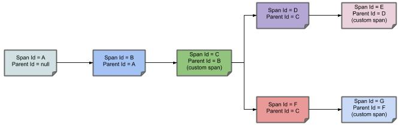
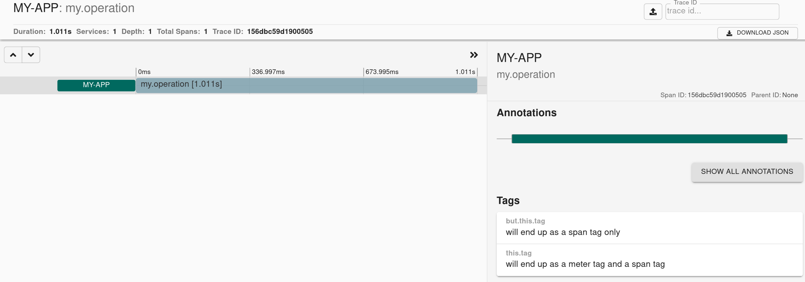

# Tracing support

## Navigation

- Micrometer Tracing
  
- [Micrometer Tracing](#index)
  
- [Glossary](#glossary)
  
- [Supported Tracers](#tracers)
  
- [Supported Reporters](#reporters)
  
- [Micrometer Tracing API](#api)
  
- [Micrometer Observation Configuration](#configuring)
  
- [Testing](#testing)

## Content

<a id="index"></a>

<!-- source_url: https://docs.micrometer.io/tracing/reference/ -->

<!-- page_index: 1 -->

# Tracing support

<svg enable-background="new 0 0 32 32" id="Glyph" version="1.1" viewbox="0 0 32 32" xml:space="preserve" xmlns="http://www.w3.org/2000/svg" xmlns:xlink="http://www.w3.org/1999/xlink">
<path id="XMLID_223_"></path>
</svg>

Search

<a id="index--page-title"></a>
<a id="index--tracing-support"></a>

# Tracing support

<a id="index--tracing-purpose"></a>
<a id="index--purpose"></a>

## Purpose

The problem of tracing is not new.
Application developers have been creating ways to track the state of their applications for a long time.
For much of that time, developers had to create the necessary tracing framework themselves.

In 2016, the Spring Cloud team created a tracing library that could help a lot of developers.
It was called [Spring Cloud Sleuth](https://github.com/spring-cloud/spring-cloud-sleuth).
The Spring team realized that tracing could be separated from Spring Cloud and created the Micrometer Tracing project, which is, essentially, a Spring-agnostic copy of Spring Cloud Sleuth.
Micrometer Tracing had its 1.0.0 GA release in November 2022 and has been getting steadily better ever since.

[Micrometer Tracing](https://github.com/micrometer-metrics/tracing) provides a simple facade for the most popular tracer libraries, letting you instrument your JVM-based application code without vendor lock-in.
It is designed to add little to no overhead to your tracing collection activity while maximizing the portability of your tracing effort.

It also provides a tracing extension to Micrometer’s `ObservationHandler` (from Micrometer 1.10.0).
Whenever an `Observation` is used, a corresponding span is created, started, stopped and reported.

<a id="index--tracing-installing"></a>
<a id="index--installing"></a>

## Installing

Micrometer Tracing comes with a Bill of Materials (BOM), which is a project that contains all the project versions for you.

The following example shows the required dependency in Gradle:

```groovy
implementation platform('io.micrometer:micrometer-tracing-bom:latest.release')
implementation 'io.micrometer:micrometer-tracing'
```

The following example shows the required dependency in Maven:

```xml
<dependencyManagement>
    <dependencies>
        <dependency>
            <groupId>io.micrometer</groupId>
            <artifactId>micrometer-tracing-bom</artifactId>
            <version>${micrometer-tracing.version}</version>
            <type>pom</type>
            <scope>import</scope>
        </dependency>
    </dependencies>
</dependencyManagement>

<dependencies>
    <dependency>
      <groupId>io.micrometer</groupId>
      <artifactId>micrometer-tracing</artifactId>
    </dependency>
</dependencies>
```

You should add a tracing bridge, such as `micrometer-tracing-bridge-brave` or `micrometer-tracing-bridge-otel` and span exporters / reporters.
When you add a bridge, the `micrometer-tracing` library is added transitively.

[Glossary](#glossary)

---

<a id="glossary"></a>

<!-- source_url: https://docs.micrometer.io/tracing/reference/glossary.html -->

<!-- page_index: 2 -->

# Glossary

<svg enable-background="new 0 0 32 32" id="Glyph" version="1.1" viewbox="0 0 32 32" xml:space="preserve" xmlns="http://www.w3.org/2000/svg" xmlns:xlink="http://www.w3.org/1999/xlink">
<path id="XMLID_223_"></path>
</svg>

Search

<a id="glossary--page-title"></a>
<a id="glossary--glossary"></a>

# Glossary

Micrometer Tracing contains a core module with an instrumentation [SPI](https://en.wikipedia.org/wiki/Service_provider_interface), a set of modules containing bridges to various tracers, a set of modules containing dedicated span reporting mechanisms, and a test kit.
You need to understand the following definitions for distributed tracing:

Micrometer Tracing borrows [Dapper’s](https://research.google.com/pubs/pub36356.html) terminology.

**Span**: The basic unit of work.
For example, sending an RPC is a new span, as is sending a response to an RPC.
Spans also have other data, such as descriptions, timestamped events, key-value annotations (tags), the ID of the span that caused them, and process IDs (normally IP addresses).

Spans can be started and stopped, and they keep track of their timing information.
Once you create a span, you must stop it at some point in the future.

**Trace**: A set of spans forming a tree-like structure.
For example, if you run a distributed big-data store, a trace might be formed by a `PUT` request.

**Annotation/Event**: Used to record the existence of an event in time.

**Tracer**: A library that handles the lifecycle of a span.
It can create, start, stop, and report spans to an external system via reporters / exporters.

**Tracing context**: For distributed tracing to work, the tracing context (trace identifier, span identifier, and so on) must be propagated through the process (for example, over threads) and over the network.

**Log correlation**: Parts of the tracing context (such as the trace identifier and the span identifier) can be populated to the logs of a given application.
One can then collect all logs in a single storage and group them with a trace ID.
That way, you can get all logs, for a single business operation (trace) from all services put in a chronological order.

**Latency analysis tools**: A tool that collects exported spans and visualizes the whole trace.
Such a tool allows easy latency analysis.

The following image shows how **Span** and **Trace** look in a system.


Each color of a note signifies a span (there are seven spans - from **A** to **G**).
Consider the following note:

```none
Trace Id = X
Span Id = D
Client Sent
```

This note indicates that the current span has **Trace Id** set to **X** and **Span Id** set to **D**.
Also, from the RPC perspective, the `Client Sent` event took place.

Let’s consider more notes:

```none
Trace Id = X
Span Id = A
(no custom span)

Trace Id = X
Span Id = C
(custom span)
```

You can continue with a created span (example with `no custom span` indication), or you can create child spans manually (example with `custom span` indication).

The following image shows how the parent-child relationships of spans look:



[Micrometer Tracing](#index)
[Supported Tracers](#tracers)

---

<a id="tracers"></a>

<!-- source_url: https://docs.micrometer.io/tracing/reference/tracers.html -->

<!-- page_index: 3 -->

# Supported Tracers

<svg enable-background="new 0 0 32 32" id="Glyph" version="1.1" viewbox="0 0 32 32" xml:space="preserve" xmlns="http://www.w3.org/2000/svg" xmlns:xlink="http://www.w3.org/1999/xlink">
<path id="XMLID_223_"></path>
</svg>

Search

<a id="tracers--page-title"></a>
<a id="tracers--supported-tracers"></a>

# Supported Tracers

Micrometer Tracing supports the following Tracers.

- [**OpenZipkin Brave**](https://github.com/openzipkin/brave)
- [**OpenTelemetry**](https://opentelemetry.io/)

<a id="tracers--_installing"></a>
<a id="tracers--installing"></a>

## Installing

The following example shows the required dependency in Gradle (assuming that the Micrometer Tracing BOM has been added):

Brave Tracer

```groovy
implementation 'io.micrometer:micrometer-tracing-bridge-brave'
```

OpenTelemetry Tracer

```groovy
implementation 'io.micrometer:micrometer-tracing-bridge-otel'
```

The following example shows the required dependency in Maven (assuming that the Micrometer Tracing BOM has been added):

Brave Tracer

```xml
<dependency>
    <groupId>io.micrometer</groupId>
    <artifactId>micrometer-tracing-bridge-brave</artifactId>
</dependency>
```

OpenTelemetry Tracer

```xml
<dependency>
    <groupId>io.micrometer</groupId>
    <artifactId>micrometer-tracing-bridge-otel</artifactId>
</dependency>
```

> [!IMPORTANT]
> Remember to pick **only one** bridge.
> You **should not have** two bridges on the classpath.

[Glossary](#glossary)
[Supported Reporters](#reporters)

---

<a id="reporters"></a>

<!-- source_url: https://docs.micrometer.io/tracing/reference/reporters.html -->

<!-- page_index: 4 -->

# Supported Reporters

<svg enable-background="new 0 0 32 32" id="Glyph" version="1.1" viewbox="0 0 32 32" xml:space="preserve" xmlns="http://www.w3.org/2000/svg" xmlns:xlink="http://www.w3.org/1999/xlink">
<path id="XMLID_223_"></path>
</svg>

Search

<a id="reporters--page-title"></a>
<a id="reporters--supported-reporters"></a>

# Supported Reporters

Micrometer Tracing supports directly the following Reporters.

- [**Tanzu Observability by Wavefront**](https://tanzu.vmware.com/observability)
- [**OpenZipkin Zipkin**](https://zipkin.io)

> [!WARNING]
> The Wavefront Reporter has been deprecated because [Wavefront’s End of Life Announcement](https://support.broadcom.com/web/ecx/support-content-notification/-/external/content/release-announcements/0/25153).

<a id="reporters--_installing"></a>
<a id="reporters--installing"></a>

## Installing

The following example shows the required dependency in Gradle (assuming that Micrometer Tracing BOM has been added):

Tanzu Observability by Wavefront

```groovy
implementation 'io.micrometer:micrometer-tracing-reporter-wavefront'
```

OpenZipkin Zipkin with Brave

```groovy
implementation 'io.zipkin.reporter2:zipkin-reporter-brave'
```

OpenZipkin Zipkin with OpenTelemetry

```groovy
implementation 'io.opentelemetry:opentelemetry-exporter-zipkin'
```

An OpenZipkin URL sender dependency to send out spans to Zipkin via a `URLConnectionSender`

```groovy
implementation 'io.zipkin.reporter2:zipkin-sender-urlconnection'
```

The following example shows the required dependency in Maven (assuming that Micrometer Tracing BOM has been added):

Tanzu Observability by Wavefront

```xml
<dependency>
    <groupId>io.micrometer</groupId>
    <artifactId>micrometer-tracing-reporter-wavefront</artifactId>
</dependency>
```

OpenZipkin Zipkin with Brave

```xml
<dependency>
    <groupId>io.zipkin.reporter2</groupId>
    <artifactId>zipkin-reporter-brave</artifactId>
</dependency>
```

OpenZipkin Zipkin with OpenTelemetry

```xml
<dependency>
    <groupId>io.opentelemetry</groupId>
    <artifactId>opentelemetry-exporter-zipkin</artifactId>
</dependency>
```

An OpenZipkin URL sender dependency to send out spans to Zipkin via a `URLConnectionSender`

```xml
<dependency>
    <groupId>io.zipkin.reporter2</groupId>
    <artifactId>zipkin-sender-urlconnection</artifactId>
</dependency>
```

> [!IMPORTANT]
> Remember that, by default, Brave adds Zipkin as a dependency. If you want to use only Wavefront and you use classpath dependent solutions, such as Spring Boot, you might be required to exclude the transitive dependency on Zipkin when using Brave (for example, by excluding the `io.zipkin.reporter2` group).

[Supported Tracers](#tracers)
[Micrometer Tracing API](#api)

---

<a id="api"></a>

<!-- source_url: https://docs.micrometer.io/tracing/reference/api.html -->

<!-- page_index: 5 -->

# Using Micrometer Tracing Directly

<svg enable-background="new 0 0 32 32" id="Glyph" version="1.1" viewbox="0 0 32 32" xml:space="preserve" xmlns="http://www.w3.org/2000/svg" xmlns:xlink="http://www.w3.org/1999/xlink">
<path id="XMLID_223_"></path>
</svg>

Search

<a id="api--page-title"></a>
<a id="api--using-micrometer-tracing-directly"></a>

# Using Micrometer Tracing Directly

In this section, we describe how to use the Micrometer Tracing API to directly create and report spans.

<a id="api--_micrometer_tracing_examples"></a>
<a id="api--micrometer-tracing-examples"></a>

## Micrometer Tracing Examples

The following example shows the basic operations on a span. Read the comments in the snippet for details:

```java
// Create a span. If there was a span present in this thread it will become
// the `newSpan`'s parent.
Span newSpan = this.tracer.nextSpan().name("calculateTax");
// Start a span and put it in scope. Putting in scope means putting the span
// in thread local
// and, if configured, adjust the MDC to contain tracing information
try (Tracer.SpanInScope ws = this.tracer.withSpan(newSpan.start())) {
    // ...
    // You can tag a span - put a key value pair on it for better debugging
    newSpan.tag("taxValue", taxValue);
    // ...
    // You can log an event on a span - an event is an annotated timestamp
    newSpan.event("taxCalculated");
}
finally {
    // Once done remember to end the span. This will allow collecting
    // the span to send it to a distributed tracing system e.g. Zipkin
    newSpan.end();
}
```

The following example shows how to continue a span in a new thread that was started in another thread:

```java
Span spanFromThreadX = this.tracer.nextSpan().name("calculateTax");
try (Tracer.SpanInScope ws = this.tracer.withSpan(spanFromThreadX.start())) {
    executorService.submit(() -> {
        // Pass the span from thread X
        Span continuedSpan = spanFromThreadX;
        // ...
        // You can tag a span
        continuedSpan.tag("taxValue", taxValue);
        // ...
        // You can log an event on a span
        continuedSpan.event("taxCalculated");
    }).get();
}
finally {
    spanFromThreadX.end();
}
```

The following example shows how to create a child span when explicitly knowing who the parent span is:

```java
// let's assume that we're in a thread Y and we've received
// the `initialSpan` from thread X. `initialSpan` will be the parent
// of the `newSpan`
Span newSpan = this.tracer.nextSpan(initialSpan).name("calculateCommission");
// ...
// You can tag a span
newSpan.tag("commissionValue", commissionValue);
// ...
// You can log an event on a span
newSpan.event("commissionCalculated");
// Once done remember to end the span. This will allow collecting
// the span to send it to e.g. Zipkin. The tags and events set on the
// newSpan will not be present on the parent
newSpan.end();
```

<a id="api--_micrometer_tracing_brave_setup"></a>
<a id="api--micrometer-tracing-brave-setup"></a>

## Micrometer Tracing Brave Setup

In this subsection, we set up Micrometer Tracing with Brave.

The following example shows how to create a Micrometer Tracing `Tracer` by using Brave components that would send completed spans to Zipkin:

```java
// [Brave component] Example of using a SpanHandler. SpanHandler is a component
// that gets called when a span is finished. Here we have an example of setting it
// up with sending spans
// in a Zipkin format to the provided location via the UrlConnectionSender
// (through the <io.zipkin.reporter2:zipkin-sender-urlconnection> dependency)
// Another option could be to use a TestSpanHandler for testing purposes.
AsyncZipkinSpanHandler spanHandler = AsyncZipkinSpanHandler
    .create(URLConnectionSender.create("http://localhost:9411/api/v2/spans"));

// [Brave component] CurrentTraceContext is a Brave component that allows you to
// retrieve the current TraceContext.
ThreadLocalCurrentTraceContext braveCurrentTraceContext = ThreadLocalCurrentTraceContext.newBuilder()
    .addScopeDecorator(MDCScopeDecorator.get()) // Example of Brave's
                                                // automatic MDC setup
    .build();

// [Micrometer Tracing component] A Micrometer Tracing wrapper for Brave's
// CurrentTraceContext
CurrentTraceContext bridgeContext = new BraveCurrentTraceContext(this.braveCurrentTraceContext);

// [Brave component] Tracing is the root component that allows to configure the
// tracer, handlers, context propagation etc.
Tracing tracing = Tracing.newBuilder()
    .currentTraceContext(this.braveCurrentTraceContext)
    .supportsJoin(false)
    .traceId128Bit(true)
    // For Baggage to work you need to provide a list of fields to propagate
    .propagationFactory(BaggagePropagation.newFactoryBuilder(B3Propagation.FACTORY)
        .add(BaggagePropagationConfig.SingleBaggageField.remote(BaggageField.create("from_span_in_scope 1")))
        .add(BaggagePropagationConfig.SingleBaggageField.remote(BaggageField.create("from_span_in_scope 2")))
        .add(BaggagePropagationConfig.SingleBaggageField.remote(BaggageField.create("from_span")))
        .build())
    .sampler(Sampler.ALWAYS_SAMPLE)
    .addSpanHandler(this.spanHandler)
    .build();


// [Brave component] Tracer is a component that handles the life-cycle of a span
brave.Tracer braveTracer = this.tracing.tracer();

// [Micrometer Tracing component] A Micrometer Tracing wrapper for Brave's Tracer
Tracer tracer = new BraveTracer(this.braveTracer, this.bridgeContext, new BraveBaggageManager());
```

<a id="api--_micrometer_tracing_opentelemetry_setup"></a>
<a id="api--micrometer-tracing-opentelemetry-setup"></a>

## Micrometer Tracing OpenTelemetry Setup

In this subsection, we set up Micrometer Tracing with OpenTelemetry (OTel).

The following example shows how to create a Micrometer Tracing `Tracer` by using OTel components that would send completed spans to Zipkin:

```java
// [OTel component] Example of using a SpanExporter. SpanExporter is a component
// that gets called when a span is finished. Here we have an example of setting it
// up with sending spans
// in a Zipkin format to the provided location via the UrlConnectionSender
// (through the <io.opentelemetry:opentelemetry-exporter-zipkin> and
// <io.zipkin.reporter2:zipkin-sender-urlconnection> dependencies)
// Another option could be to use an ArrayListSpanProcessor for testing purposes
SpanExporter spanExporter = new ZipkinSpanExporterBuilder()
    .setSender(URLConnectionSender.create("http://localhost:9411/api/v2/spans"))
    .build();

// [OTel component] SdkTracerProvider is an SDK implementation for TracerProvider
SdkTracerProvider sdkTracerProvider = SdkTracerProvider.builder()
    .setSampler(alwaysOn())
    .addSpanProcessor(BatchSpanProcessor.builder(spanExporter).build())
    .build();

// [OTel component] The SDK implementation of OpenTelemetry
OpenTelemetrySdk openTelemetrySdk = OpenTelemetrySdk.builder()
    .setTracerProvider(sdkTracerProvider)
    .setPropagators(ContextPropagators.create(B3Propagator.injectingSingleHeader()))
    .build();

// [OTel component] Tracer is a component that handles the life-cycle of a span
io.opentelemetry.api.trace.Tracer otelTracer = openTelemetrySdk.getTracerProvider()
    .get("io.micrometer.micrometer-tracing");

// [Micrometer Tracing component] A Micrometer Tracing wrapper for OTel
OtelCurrentTraceContext otelCurrentTraceContext = new OtelCurrentTraceContext();

// [Micrometer Tracing component] A Micrometer Tracing listener for setting up MDC
Slf4JEventListener slf4JEventListener = new Slf4JEventListener();

// [Micrometer Tracing component] A Micrometer Tracing listener for setting
// Baggage in MDC. Customizable
// with correlation fields (currently we're setting empty list)
Slf4JBaggageEventListener slf4JBaggageEventListener = new Slf4JBaggageEventListener(Collections.emptyList());

// [Micrometer Tracing component] A Micrometer Tracing wrapper for OTel's Tracer.
// You can consider
// customizing the baggage manager with correlation and remote fields (currently
// we're setting empty lists)
OtelTracer tracer = new OtelTracer(otelTracer, otelCurrentTraceContext, event -> {
    slf4JEventListener.onEvent(event);
    slf4JBaggageEventListener.onEvent(event);
}, new OtelBaggageManager(otelCurrentTraceContext, Collections.emptyList(), Collections.emptyList()));
```

<a id="api--_micrometer_tracing_baggage_api"></a>
<a id="api--micrometer-tracing-baggage-api"></a>

## Micrometer Tracing Baggage API

Traces connect from application to application by using header propagation. Besides trace identifiers, other properties (called `Baggage`) can also be passed along with the request.

The following example shows how to use the Tracer API to create and extract baggage:

```java
Span span = tracer.nextSpan().name("parent").start();

// Assuming that there's a span in scope...
try (Tracer.SpanInScope ws = tracer.withSpan(span)) {

    try (BaggageInScope baggageForSpanInScopeOne = tracer.createBaggageInScope("from_span_in_scope 1",
            "value 1")) {
        then(baggageForSpanInScopeOne.get()).as("[In scope] Baggage 1").isEqualTo("value 1");
        then(tracer.getBaggage("from_span_in_scope 1").get()).as("[In scope] Baggage 1").isEqualTo("value 1");
    }

    try (BaggageInScope baggageForSpanInScopeTwo = tracer.createBaggageInScope("from_span_in_scope 2",
            "value 2");) {
        then(baggageForSpanInScopeTwo.get()).as("[In scope] Baggage 2").isEqualTo("value 2");
        then(tracer.getBaggage("from_span_in_scope 2").get()).as("[In scope] Baggage 2").isEqualTo("value 2");
    }
}

// Assuming that you have a handle to the span
try (BaggageInScope baggageForExplicitSpan = tracer.createBaggageInScope(span.context(), "from_span",
        "value 3")) {
    then(baggageForExplicitSpan.get(span.context())).as("[Span passed explicitly] Baggage 3")
        .isEqualTo("value 3");
    then(tracer.getBaggage("from_span").get(span.context())).as("[Span passed explicitly] Baggage 3")
        .isEqualTo("value 3");
}

// Assuming that there's no span in scope
// When there's no span in scope, there will never be any baggage - even if you
// make it current
try (BaggageInScope baggageFour = tracer.createBaggageInScope("from_span_in_scope 1", "value 1");) {
    then(baggageFour.get()).as("[Out of span scope] Baggage 1").isNull();
    then(tracer.getBaggage("from_span_in_scope 1").get()).as("[Out of span scope] Baggage 1").isNull();
}
then(tracer.getBaggage("from_span_in_scope 1").get()).as("[Out of scope] Baggage 1").isNull();
then(tracer.getBaggage("from_span_in_scope 2").get()).as("[Out of scope] Baggage 2").isNull();
then(tracer.getBaggage("from_span").get()).as("[Out of scope] Baggage 3").isNull();

// Baggage is present only within the scope
then(tracer.getBaggage("from_span").get(span.context())).as("[Out of scope - with context] Baggage 3").isNull();
```

> [!IMPORTANT]
> For Brave, remember to set up the `PropagationFactory` so that it contains the baggage fields that you will be using in your code. Check the following example for details:

```java
Tracing tracing = Tracing.newBuilder()
    .currentTraceContext(this.braveCurrentTraceContext)
    .supportsJoin(false)
    .traceId128Bit(true)
    // For Baggage to work you need to provide a list of fields to propagate
    .propagationFactory(BaggagePropagation.newFactoryBuilder(B3Propagation.FACTORY)
        .add(BaggagePropagationConfig.SingleBaggageField.remote(BaggageField.create("from_span_in_scope 1")))
        .add(BaggagePropagationConfig.SingleBaggageField.remote(BaggageField.create("from_span_in_scope 2")))
        .add(BaggagePropagationConfig.SingleBaggageField.remote(BaggageField.create("from_span")))
        .build())
    .sampler(Sampler.ALWAYS_SAMPLE)
    .addSpanHandler(this.spanHandler)
    .build();
```

<a id="api--_baggage_with_micrometer_observation_api"></a>
<a id="api--baggage-with-micrometer-observation-api"></a>

### Baggage with Micrometer Observation API

If you’re using Micrometer Observation API, there’s no notion of baggage. If you set up a `BaggageManager` to have the baggage fields configured, we will assume that when the Observation gets put in scope, whatever low and high cardinality keys are set on the Observation will be put in scope as baggage (assuming that their names match with the configuration on the `BaggageManager`). Below you can find example of such setup with OpenTelemetry `BaggageManager`.

```java
// There will be 3 baggage keys in total, 2 for remote fields and 1 as tag field
OtelBaggageManager otelBaggageManager = new OtelBaggageManager(otelCurrentTraceContext,
        Arrays.asList(KEY_1, OBSERVATION_BAGGAGE_KEY), Collections.singletonList(TAG_KEY));


// For automated baggage scope creation the tracing handler is required
observationRegistry.observationConfig().observationHandler(new DefaultTracingObservationHandler(tracer));

// An observation with low and high cardinality keys
// with key names equal to baggage key entries set on the baggage manager
Observation observation = Observation.start("foo", observationRegistry)
    .lowCardinalityKeyValue(KEY_1, TAG_VALUE)
    .highCardinalityKeyValue(OBSERVATION_BAGGAGE_KEY, OBSERVATION_BAGGAGE_VALUE);

// There is no baggage here
try (Scope scope = observation.openScope()) {
    // Baggage here will be automatically put in scope
    then(tracer.getBaggage(KEY_1).get()).isEqualTo(TAG_VALUE);
    then(tracer.getBaggage(OBSERVATION_BAGGAGE_KEY).get()).isEqualTo(OBSERVATION_BAGGAGE_VALUE);
}
// There is no baggage here
```

<a id="api--_aspect_oriented_programming"></a>
<a id="api--aspect-oriented-programming"></a>

## Aspect Oriented Programming

Micrometer Tracing contains `@NewSpan`, `@ContinueSpan`, and `@SpanTag` annotations that frameworks can use to create or customize spans for either specific types of methods such as those serving web request endpoints or, more generally, to all methods.

> [!WARNING]
> Micrometer’s Spring Boot configuration does *not* recognize these aspects on arbitrary methods.

An AspectJ aspect is included. You can use it in your application, either through compile/load time AspectJ weaving or through framework facilities that interpret AspectJ aspects and proxy targeted methods in some other way, such as Spring AOP. Here is a sample Spring AOP configuration:

```java
@Configuration public class SpanAspectConfiguration {
@Bean NewSpanParser newSpanParser() {return new DefaultNewSpanParser();}
// You can provide your own resolvers - here we go with a noop example.@Bean ValueResolver valueResolver() {return new NoOpValueResolver();}
// Example of a SpEL resolver @Bean ValueExpressionResolver valueExpressionResolver() {return new SpelTagValueExpressionResolver();}
@Bean MethodInvocationProcessor methodInvocationProcessor(NewSpanParser newSpanParser, Tracer tracer,BeanFactory beanFactory) {return new ImperativeMethodInvocationProcessor(newSpanParser, tracer, beanFactory::getBean,beanFactory::getBean);}
@Bean SpanAspect spanAspect(MethodInvocationProcessor methodInvocationProcessor) {return new SpanAspect(methodInvocationProcessor);}
}
// Example of using SpEL to resolve expressions in @SpanTag static class SpelTagValueExpressionResolver implements ValueExpressionResolver {
private static final Log log = LogFactory.getLog(SpelTagValueExpressionResolver.class);
@Override public String resolve(String expression, Object parameter) {try {SimpleEvaluationContext context = SimpleEvaluationContext.forReadOnlyDataBinding().build(); ExpressionParser expressionParser = new SpelExpressionParser(); Expression expressionToEvaluate = expressionParser.parseExpression(expression); return expressionToEvaluate.getValue(context, parameter, String.class);} catch (Exception ex) {log.error("Exception occurred while tying to evaluate the SpEL expression [" + expression + "]", ex);} return parameter.toString();}
}
```

Applying `SpanAspect` makes `@NewSpan` and `@ContinueSpan` usable on any arbitrary method in an AspectJ proxied instance, as the following example shows:

```java
// In Sleuth @NewSpan and @ContinueSpan annotations would be taken into
// consideration. In Micrometer Tracing due to limitations of @Aspect
// we can't do that. The @SpanTag annotation will work well though.
protected interface TestBeanInterface {

    void testMethod2();

    void testMethod3();

    void testMethod10(@SpanTag("testTag10") String param);

    void testMethod10_v2(@SpanTag("testTag10") String param);

}

// Example of an implementation class
protected static class TestBean implements TestBeanInterface {

    @NewSpan
    @Override
    public void testMethod2() {
    }

    @NewSpan(name = "customNameOnTestMethod3")
    @Override
    public void testMethod3() {
    }

    @ContinueSpan(log = "customTest")
    @Override
    public void testMethod10(@SpanTag("customTestTag10") String param) {

    }

    @ContinueSpan(log = "customTest")
    @Override
    public void testMethod10_v2(String param) {

    }

}

// --------------------------
// ----- USAGE EXAMPLE ------
// --------------------------


// Creates a new span with
testBean().testMethod2();
then(createdSpanViaAspect()).isEqualTo("test-method2");

// Uses the name from the annotation
testBean().testMethod3();
then(createdSpanViaAspect()).isEqualTo("custom-name-on-test-method3");

// Continues the previous span
Span span = this.tracer.nextSpan().name("foo");
try (Tracer.SpanInScope ws = this.tracer.withSpan(span.start())) {

    // Adds tags and events to an existing span
    testBean().testMethod10("tagValue");
    SimpleSpan continuedSpan = modifiedSpanViaAspect();
    then(continuedSpan.getName()).isEqualTo("foo");
    then(continuedSpan.getTags()).containsEntry("customTestTag10", "tagValue");
    then(continuedSpan.getEvents()).extracting("value").contains("customTest.before", "customTest.after");
}
span.end();

// Continues the previous span
span = this.tracer.nextSpan().name("foo");
try (Tracer.SpanInScope ws = this.tracer.withSpan(span.start())) {

    // Adds tags and events to an existing span (reusing setup from the parent
    // interface)
    testBean().testMethod10_v2("tagValue");
    SimpleSpan continuedSpan = modifiedSpanViaAspect();
    then(continuedSpan.getName()).isEqualTo("foo");
    then(continuedSpan.getTags()).containsEntry("testTag10", "tagValue");
    then(continuedSpan.getEvents()).extracting("value").contains("customTest.before", "customTest.after");
}
span.end();
```

[Supported Reporters](#reporters)
[Micrometer Observation Configuration](#configuring)

---

<a id="configuring"></a>

<!-- source_url: https://docs.micrometer.io/tracing/reference/configuring.html -->

<!-- page_index: 6 -->

# Configuring with Micrometer Observation

<svg enable-background="new 0 0 32 32" id="Glyph" version="1.1" viewbox="0 0 32 32" xml:space="preserve" xmlns="http://www.w3.org/2000/svg" xmlns:xlink="http://www.w3.org/1999/xlink">
<path id="XMLID_223_"></path>
</svg>

Search

<a id="configuring--page-title"></a>
<a id="configuring--configuring-with-micrometer-observation"></a>

# Configuring with Micrometer Observation

<a id="configuring--_handler_configuration"></a>
<a id="configuring--handler-configuration"></a>

## Handler Configuration

For Micrometer Tracing to work with Micrometer Observation, you need to add a tracing-related `ObservationHandler`.
The following example shows how to add and use a single `DefaultTracingObservationHandler`:

```java
Tracer tracer = Tracer.NOOP; // The real tracer will come from your tracer
                             // implementation (Brave /
// OTel)
Propagator propagator = Propagator.NOOP; // The real propagator will come from
                                         // your tracer implementation (Brave /
                                         // OTel)
MeterRegistry meterRegistry = new SimpleMeterRegistry();

ObservationRegistry registry = ObservationRegistry.create();
registry.observationConfig()
    // assuming that micrometer-core is on the classpath
    .observationHandler(new DefaultMeterObservationHandler(meterRegistry))
    // we set up a first matching handler that creates spans - it comes from
    // Micrometer
    // Tracing. We set up spans for sending and receiving data over the wire
    // and a default one
    .observationHandler(new ObservationHandler.FirstMatchingCompositeObservationHandler(
            new PropagatingSenderTracingObservationHandler<>(tracer, propagator),
            new PropagatingReceiverTracingObservationHandler<>(tracer, propagator),
            new DefaultTracingObservationHandler(tracer)));

// Creating and starting a new observation
// via the `DefaultTracingObservationHandler` that will create a new Span and
// start it
Observation observation = Observation.start("my.operation", registry)
    .contextualName("This name is more readable - we can reuse it for e.g. spans")
    .lowCardinalityKeyValue("this.tag", "will end up as a meter tag and a span tag")
    .highCardinalityKeyValue("but.this.tag", "will end up as a span tag only");

// Put the observation in scope
// This will result in making the previously created Span, the current Span - it's
// in ThreadLocal
try (Observation.Scope scope = observation.openScope()) {
    // Run your code that you want to measure - still the attached Span is the
    // current one
    // This means that e.g. logging frameworks could inject to e.g. MDC tracing
    // information
    yourCodeToMeasure();
}
finally {
    // The corresponding Span will no longer be in ThreadLocal due to
    // try-with-resources block (Observation.Scope is an AutoCloseable)
    // Stop the Observation
    // The corresponding Span will be stopped and reported to an external system
    observation.stop();
}
```

You can also use a shorter version to perform measurements by using the `observe` method:

```java
ObservationRegistry registry = ObservationRegistry.create();

Observation.createNotStarted("my.operation", registry)
    .contextualName("This name is more readable - we can reuse it for e.g. spans")
    .lowCardinalityKeyValue("this.tag", "will end up as a meter tag and a span tag")
    .highCardinalityKeyValue("but.this.tag", "will end up as a span tag only")
    .observe(this::yourCodeToMeasure);
```

This will result in the following Micrometer Metrics:

```none
Gathered the following metrics Meter with name <my.operation> and type <TIMER> has the following measurements <[Measurement{statistic='COUNT', value=1.0},Measurement{statistic='TOTAL_TIME', value=1.011949454},Measurement{statistic='MAX', value=1.011949454} ]> and has the following tags <[tag(this.tag=will end up as a meter tag and a span tag)]>
```

It also results in the following trace view in (for example) Zipkin:



<a id="configuring--_ordered_handler_configuration"></a>
<a id="configuring--ordered-handler-configuration"></a>

### Ordered Handler Configuration

Micrometer Tracing comes with multiple `ObservationHandler` implementations.
To introduce ordering, you can use the `ObservationHandler.AllMatchingCompositeObservationHandler` to run logic for all `ObservationHandler` instances that match the given predicate and `ObservationHandler`. Use `FirstMatchingCompositeObservationHandler` to run logic only for the first `ObservationHandler` that matches the predicate.
The former can group handlers and the latter can be chosen to (for example) run only one matching `TracingObservationHandler`.

<a id="configuring--_context_propagation_with_micrometer_tracing"></a>
<a id="configuring--context-propagation-with-micrometer-tracing"></a>

## Context Propagation with Micrometer Tracing

To make [Context Propagation](https://docs.micrometer.io/context-propagation/reference/) work with Micrometer Tracing, you need to manually register the proper `ThreadLocalAccessor`, as follows:

```java
ContextRegistry.getInstance().registerThreadLocalAccessor(new ObservationAwareSpanThreadLocalAccessor(tracer));
ContextRegistry.getInstance()
    .registerThreadLocalAccessor(new ObservationAwareBaggageThreadLocalAccessor(registry, tracer));
```

The `ObservationAwareSpanThreadLocalAccessor` is required to propagate manually created spans (not the ones that are governed by Observations). The `ObservationAwareBaggageThreadLocalAccessor` is required to propagate baggage created by the user.

With Project Reactor one should set the values of `Observation`, `Span` or `BaggageToPropagate` in the Reactor Context as follows:

```java
// Setup example
ContextRegistry contextRegistry = ContextRegistry.getInstance();

ObservationAwareSpanThreadLocalAccessor accessor;

ObservationAwareBaggageThreadLocalAccessor observationAwareBaggageThreadLocalAccessor;


accessor = new ObservationAwareSpanThreadLocalAccessor(observationRegistry, getTracer());
observationAwareBaggageThreadLocalAccessor = new ObservationAwareBaggageThreadLocalAccessor(observationRegistry,
        getTracer());
contextRegistry.loadThreadLocalAccessors()
    .registerThreadLocalAccessor(accessor)
    .registerThreadLocalAccessor(observationAwareBaggageThreadLocalAccessor);
Hooks.enableAutomaticContextPropagation();

// Usage example
Hooks.enableAutomaticContextPropagation();
Observation observation = Observation.start("parent", observationRegistry);

List<String> hello = Mono.just("hello")
    .subscribeOn(Schedulers.single())
    .flatMap(s -> {
        Mono<List<String>> mono = Mono.defer(() -> Mono.just(Arrays.asList(
            getTracer().getBaggage("tenant").get(),
            getTracer().getBaggage("tenant2").get())
        ));
    return mono.subscribeOn(Schedulers.parallel())
        .contextWrite(ReactorBaggage.append("tenant", s + ":baggage")); // Appends baggage to existing one (tenant2:baggage2)
})
    .contextWrite(Context.of(ObservationThreadLocalAccessor.KEY, observation, // Puts observation to Reactor Context
            ObservationAwareBaggageThreadLocalAccessor.KEY, new BaggageToPropagate("tenant2", "baggage2") // Puts baggage to Reactor Context
        ))
    .block();
```

<a id="configuring--_exemplars"></a>
<a id="configuring--exemplars"></a>

## Exemplars

To add support for [exemplars](https://grafana.com/docs/grafana/latest/fundamentals/exemplars/) instead of using the `DefaultMeterObservationHandler` you should use the `TracingAwareMeterObservationHandler`, as follows:

```java
ObservationRegistry registry = ObservationRegistry.create();
registry.observationConfig()
    // Don't register the DefaultMeterObservationHandler...
    // .observationHandler(new DefaultMeterObservationHandler(meterRegistry))
    // ...instead register the tracing aware version
    .observationHandler(new TracingAwareMeterObservationHandler<>(
            new DefaultMeterObservationHandler(meterRegistry), tracer));
```

[Micrometer Tracing API](#api)
[Testing](#testing)

---

<a id="testing"></a>

<!-- source_url: https://docs.micrometer.io/tracing/reference/testing.html -->

<!-- page_index: 7 -->

# Testing

<svg enable-background="new 0 0 32 32" id="Glyph" version="1.1" viewbox="0 0 32 32" xml:space="preserve" xmlns="http://www.w3.org/2000/svg" xmlns:xlink="http://www.w3.org/1999/xlink">
<path id="XMLID_223_"></path>
</svg>

Search

<a id="testing--page-title"></a>
<a id="testing--testing"></a>

# Testing

Micrometer Tracing includes the `micrometer-tracing-test` and `micrometer-tracing-integration-test` modules.

For unit tests, it provides a `SimpleTracer` that is a test implementation of a `Tracer`.

For integration tests, it provides a `SampleTestRunner` mechanism that you can hook into your samples.
It:

- Configures an OpenZipkin Brave Tracer

  - Sets it up with Tanzu Observability by Wavefront Reporter
  - Sets it up with OpenZipkin Zipkin Reporter
- Configures an OpenTelemetry Tracer

  - Sets it up with Tanzu Observability by Wavefront Exporter
  - Sets it up with OpenZipkin Zipkin Exporter
- Runs all the combinations above against the user code and running infrastructure

> [!WARNING]
> The Wavefront Reporter and its test support have been deprecated because [Wavefront’s End of Life Announcement](https://support.broadcom.com/web/ecx/support-content-notification/-/external/content/release-announcements/0/25153).

<a id="testing--_installing"></a>
<a id="testing--installing"></a>

## Installing

The following example shows the required dependency in Gradle (assuming that Micrometer Tracing BOM has been added):

```groovy
testImplementation 'io.micrometer:micrometer-tracing-test' // for unit tests
testImplementation 'io.micrometer:micrometer-tracing-integration-test' // for integration tests
```

The following example shows the required dependency in Maven (assuming that Micrometer Tracing BOM has been added):

```xml
<dependency>
    <groupId>io.micrometer</groupId>
    <artifactId>micrometer-tracing-test</artifactId> <!-- For unit tests -->
    <scope>test</scope>
</dependency>
<dependency>
    <groupId>io.micrometer</groupId>
    <artifactId>micrometer-tracing-integration-test</artifactId> <!-- For integration tests -->
    <scope>test</scope>
</dependency>
```

<a id="testing--_running_tracing_unit_tests"></a>
<a id="testing--running-tracing-unit-tests"></a>

## Running Tracing Unit Tests

To run unit tests of your custom handler, you may want to use the `SimpleTracer` test `Tracer` implementation. Let’s assume the following custom `TracingObservationHandler`:

```java
static class MyTracingObservationHandler implements TracingObservationHandler<CustomContext> {
private final Tracer tracer;
MyTracingObservationHandler(Tracer tracer) {this.tracer = tracer;}
@Override public void onStart(CustomContext context) {String databaseName = context.getDatabaseName(); Span.Builder builder = this.tracer.spanBuilder().kind(Span.Kind.CLIENT).remoteServiceName(databaseName); getTracingContext(context).setSpan(builder.start());}
@Override public void onError(CustomContext context) {getTracingContext(context).getSpan().error(context.getError());}
@Override public void onStop(CustomContext context) {Span span = getRequiredSpan(context); span.name(context.getContextualName() != null ? context.getContextualName() : context.getName()); tagSpan(context, span); span.end();}
@Override public boolean supportsContext(Observation.Context context) {return context instanceof CustomContext;}
@Override public Tracer getTracer() {return this.tracer;}
}
```

To verify whether the spans got properly created we can use the `SimpleTracer`, as follows:

```java
class SomeComponentThatIsUsingMyTracingObservationHandlerTests {

    ObservationRegistry registry = ObservationRegistry.create();

    SomeComponent someComponent = new SomeComponent(registry);

    SimpleTracer simpleTracer = new SimpleTracer();

    MyTracingObservationHandler handler = new MyTracingObservationHandler(simpleTracer);

    @BeforeEach
    void setup() {
        registry.observationConfig().observationHandler(handler);
    }

    @Test
    void should_store_a_span() {
        // this code will call actual Observation API
        someComponent.doSthThatShouldCreateSpans();

        TracerAssert.assertThat(simpleTracer)
                .onlySpan()
                .hasNameEqualTo("insert user")
                .hasKindEqualTo(Span.Kind.CLIENT)
                .hasRemoteServiceNameEqualTo("mongodb-database")
                .hasTag("mongodb.command", "insert")
                .hasTag("mongodb.collection", "user")
                .hasTagWithKey("mongodb.cluster_id")
                .assertThatThrowable()
                .isInstanceOf(IllegalStateException.class)
                .backToSpan()
                .hasIpThatIsBlank()
                .hasPortThatIsNotSet();
    }

}
```

<a id="testing--_running_integration_tests"></a>
<a id="testing--running-integration-tests"></a>

## Running integration tests

The following example shows how you can run your code to test your integrations:

- By asserting spans that were stored without emitting them to a reporting system
- Against running Tanzu Observability by Wavefront instance (this option turns on when you have passed the Wavefront related configuration in the constructor - otherwise the test will be disabled)
- Against running Zipkin instance (this option turns on when Zipkin is running - otherwise the test will be disabled)

```java
class ObservabilitySmokeTest extends SampleTestRunner {

    ObservabilitySmokeTest() {
        super(SampleRunnerConfig.builder().wavefrontApplicationName("my-app").wavefrontServiceName("my-service")
                .wavefrontToken("...")
                .wavefrontUrl("...")
                .zipkinUrl("...") // defaults to localhost:9411
                .build());
    }

    @Override
    public BiConsumer<BuildingBlocks, Deque<ObservationHandler<? extends Observation.Context>>> customizeObservationHandlers() {
        return (bb, handlers) -> {
            ObservationHandler defaultHandler = handlers.removeLast();
            handlers.addLast(new MyTracingObservationHandler(bb.getTracer()));
            handlers.addLast(defaultHandler);
        };
    }

    @Override
    public SampleTestRunnerConsumer yourCode() {
        return (bb, meterRegistry) -> {
            // here you would be running your code
            yourCode();

            SpansAssert.assertThat(bb.getFinishedSpans())
                    .haveSameTraceId()
                    .hasNumberOfSpansEqualTo(8)
                    .hasNumberOfSpansWithNameEqualTo("handle", 4)
                    .forAllSpansWithNameEqualTo("handle", span -> span.hasTagWithKey("rsocket.request-type"))
                    .hasASpanWithNameIgnoreCase("request_stream")
                    .thenASpanWithNameEqualToIgnoreCase("request_stream")
                    .hasTag("rsocket.request-type", "REQUEST_STREAM")
                    .backToSpans()
                    .hasASpanWithNameIgnoreCase("request_channel")
                    .thenASpanWithNameEqualToIgnoreCase("request_channel")
                    .hasTag("rsocket.request-type", "REQUEST_CHANNEL")
                    .backToSpans()
                    .hasASpanWithNameIgnoreCase("request_fnf")
                    .thenASpanWithNameEqualToIgnoreCase("request_fnf")
                    .hasTag("rsocket.request-type", "REQUEST_FNF")
                    .backToSpans()
                    .hasASpanWithNameIgnoreCase("request_response")
                    .thenASpanWithNameEqualToIgnoreCase("request_response")
                    .hasTag("rsocket.request-type", "REQUEST_RESPONSE");

            MeterRegistryAssert.assertThat(meterRegistry)
                    .hasTimerWithNameAndTags("rsocket.response", Tags.of(Tag.of("error", "none"), Tag.of("rsocket.request-type", "REQUEST_RESPONSE")))
                    .hasTimerWithNameAndTags("rsocket.fnf", Tags.of(Tag.of("error", "none"), Tag.of("rsocket.request-type", "REQUEST_FNF")))
                    .hasTimerWithNameAndTags("rsocket.request", Tags.of(Tag.of("error", "none"), Tag.of("rsocket.request-type", "REQUEST_RESPONSE")))
                    .hasTimerWithNameAndTags("rsocket.channel", Tags.of(Tag.of("error", "none"), Tag.of("rsocket.request-type", "REQUEST_CHANNEL")))
                    .hasTimerWithNameAndTags("rsocket.stream", Tags.of(Tag.of("error", "none"), Tag.of("rsocket.request-type", "REQUEST_STREAM")));
        };
    }

}
```

[Micrometer Observation Configuration](#configuring)

---
